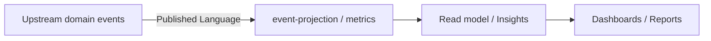

# Files

## File: docs/structure/contexts/analytics/bounded-contexts.md
````markdown
# Analytics

## Domain Role

analytics 是下游 bounded context。它以 projection、metric 與 report 為主，不持有上游主域的寫入正典模型。

## Ownership Rules

- 擁有 reporting、metrics、dashboards、telemetry projections。
- 消費事件，不直接改寫上游 aggregate。
- 只在需要查詢與分析時建立 local read model。
````

## File: docs/structure/contexts/analytics/context-map.md
````markdown
# Analytics

## Relationships

| Upstream | Downstream | Published Language |
|---|---|---|
| iam | analytics | access event、identity signal |
| billing | analytics | billing event、entitlement usage signal |
| platform | analytics | operational event、notification event |
| workspace | analytics | activity feed、audit signal |
| notion | analytics | knowledge usage signal |
| notebooklm | analytics | retrieval and synthesis usage signal |

## Notes

- analytics consumes events and projections only.
````

## File: docs/structure/contexts/analytics/subdomains.md
````markdown
# Analytics

## Baseline Subdomains

| Subdomain | Responsibility |
|---|---|
| reporting | 報表輸出與查詢整理 |
| metrics | 指標定義與聚合 |
| dashboards | 儀表板呈現語義 |
| telemetry-projection | 事件投影與 read model 匯總 |

> **實作層命名備注：** `src/modules/analytics/` 以 `event-contracts`、`event-ingestion`、`event-projection`、`insights`、`metrics`、`realtime-insights` 作為子域目錄名稱。
> `event-projection` 對應戰略層 `telemetry-projection`；`insights` 對應 `reporting`；`realtime-insights` 對應儀表板能力的即時維度。

## Recommended Gap Subdomains

| Subdomain | Responsibility |
|---|---|
| experimentation | 實驗分析與對照觀測 |
| decision-support | 決策輔助與洞察輸出 |
````

## File: docs/structure/contexts/analytics/ubiquitous-language.md
````markdown
# Analytics

## Canonical Terms

| Term | Meaning |
|---|---|
| Metric | 可重複計算與追蹤的指標 |
| Report | 對分析結果的輸出整理 |
| Dashboard | 視覺化分析面板 |
| Projection | 由上游事件形成的下游 read model |

## Avoid

- 不把 analytics 當成上游寫入語言。
- 不把 projection 當成原始 aggregate。
````

## File: src/modules/analytics/index.ts
````typescript
/**
 * Analytics Module — public API surface.
 * All cross-module consumers must import from here only.
 */
⋮----
// event-contracts
⋮----
// metrics
⋮----
// event-ingestion domain types
⋮----
// event-projection domain types
⋮----
// insights domain types
⋮----
// realtime-insights domain types
⋮----
// experimentation domain types
````

## File: src/modules/analytics/orchestration/index.ts
````typescript
// analytics — orchestration layer
// Cross-subdomain composition and facade lives here.
// TODO: implement AnalyticsFacade if needed.
````

## File: src/modules/analytics/shared/errors/index.ts
````typescript
// analytics shared/errors placeholder
````

## File: src/modules/analytics/shared/events/index.ts
````typescript
// analytics shared events
````

## File: src/modules/analytics/shared/index.ts
````typescript

````

## File: src/modules/analytics/shared/types/index.ts
````typescript
// analytics shared types
````

## File: src/modules/analytics/subdomains/event-contracts/adapters/inbound/index.ts
````typescript
// event-contracts — inbound adapters placeholder
// TODO: export server actions / route handlers
````

## File: src/modules/analytics/subdomains/event-contracts/adapters/index.ts
````typescript
// event-contracts — adapters aggregate
````

## File: src/modules/analytics/subdomains/event-contracts/adapters/outbound/index.ts
````typescript
// event-contracts — outbound adapters placeholder
// TODO: export Firestore repositories, external clients
````

## File: src/modules/analytics/subdomains/event-contracts/adapters/outbound/memory/InMemoryAnalyticsEventRepository.ts
````typescript
import type { AnalyticsEventSnapshot } from "../../../domain/entities/AnalyticsEvent";
import type {
  AnalyticsEventRepository,
  AnalyticsEventQuery,
} from "../../../domain/repositories/AnalyticsEventRepository";
⋮----
export class InMemoryAnalyticsEventRepository implements AnalyticsEventRepository {
⋮----
async save(snapshot: AnalyticsEventSnapshot): Promise<void>
⋮----
async findById(id: string): Promise<AnalyticsEventSnapshot | null>
⋮----
async query(params: AnalyticsEventQuery): Promise<AnalyticsEventSnapshot[]>
⋮----
async countByName(name: string, fromDate?: string, toDate?: string): Promise<number>
````

## File: src/modules/analytics/subdomains/event-contracts/application/index.ts
````typescript

````

## File: src/modules/analytics/subdomains/event-contracts/application/use-cases/AnalyticsEventUseCases.ts
````typescript
import { commandSuccess, commandFailureFrom, type CommandResult } from "../../../../../shared";
import { AnalyticsEvent, type TrackEventInput } from "../../domain/entities/AnalyticsEvent";
import type { AnalyticsEventRepository } from "../../domain/repositories/AnalyticsEventRepository";
⋮----
export class TrackAnalyticsEventUseCase {
⋮----
constructor(private readonly repo: AnalyticsEventRepository)
⋮----
async execute(input: TrackEventInput): Promise<CommandResult>
⋮----
export class QueryAnalyticsEventsUseCase {
⋮----
async execute(params: {
    name?: string;
    source?: string;
    workspaceId?: string;
    actorId?: string;
    fromDate?: string;
    toDate?: string;
    limit?: number;
    offset?: number;
})
````

## File: src/modules/analytics/subdomains/event-contracts/domain/entities/AnalyticsEvent.ts
````typescript
import { z } from "zod";
import { v4 as uuid } from "uuid";
⋮----
export type AnalyticsEventId = z.infer<typeof AnalyticsEventIdSchema>;
⋮----
export type AnalyticsEventSnapshot = z.infer<typeof AnalyticsEventSchema>;
⋮----
export interface TrackEventInput {
  readonly name: string;
  readonly source: string;
  readonly actorId?: string;
  readonly workspaceId?: string;
  readonly organizationId?: string;
  readonly properties?: Record<string, unknown>;
  readonly occurredAt?: string;
}
⋮----
export class AnalyticsEvent {
⋮----
private constructor(private readonly _props: AnalyticsEventSnapshot)
⋮----
static create(input: TrackEventInput): AnalyticsEvent
⋮----
static reconstitute(snapshot: AnalyticsEventSnapshot): AnalyticsEvent
⋮----
get id(): string
get name(): string
get source(): string
get actorId(): string | undefined
get workspaceId(): string | undefined
get occurredAt(): string
⋮----
getSnapshot(): Readonly<AnalyticsEventSnapshot>
````

## File: src/modules/analytics/subdomains/event-contracts/domain/events/AnalyticsDomainEvent.ts
````typescript
export type AnalyticsDomainEventType =
  | {
      type: "analytics.event.tracked";
      eventId: string;
      occurredAt: string;
      payload: { analyticsEventId: string; name: string; source: string };
    }
  | {
      type: "analytics.event.ingestion_failed";
      eventId: string;
      occurredAt: string;
      payload: { name: string; reason: string };
    };
````

## File: src/modules/analytics/subdomains/event-contracts/domain/index.ts
````typescript

````

## File: src/modules/analytics/subdomains/event-contracts/domain/repositories/AnalyticsEventRepository.ts
````typescript
import type { AnalyticsEventSnapshot } from "../entities/AnalyticsEvent";
⋮----
export interface AnalyticsEventQuery {
  readonly name?: string;
  readonly source?: string;
  readonly actorId?: string;
  readonly workspaceId?: string;
  readonly organizationId?: string;
  readonly fromDate?: string;
  readonly toDate?: string;
  readonly limit?: number;
  readonly offset?: number;
}
⋮----
export interface AnalyticsEventRepository {
  save(snapshot: AnalyticsEventSnapshot): Promise<void>;
  findById(id: string): Promise<AnalyticsEventSnapshot | null>;
  query(params: AnalyticsEventQuery): Promise<AnalyticsEventSnapshot[]>;
  countByName(name: string, fromDate?: string, toDate?: string): Promise<number>;
}
⋮----
save(snapshot: AnalyticsEventSnapshot): Promise<void>;
findById(id: string): Promise<AnalyticsEventSnapshot | null>;
query(params: AnalyticsEventQuery): Promise<AnalyticsEventSnapshot[]>;
countByName(name: string, fromDate?: string, toDate?: string): Promise<number>;
````

## File: src/modules/analytics/subdomains/event-contracts/domain/value-objects/EventName.ts
````typescript
import { z } from "zod";
⋮----
export type EventName = z.infer<typeof EventNameSchema>;
⋮----
export function createEventName(value: string): EventName
````

## File: src/modules/analytics/subdomains/event-ingestion/adapters/inbound/index.ts
````typescript
// event-ingestion — inbound adapters placeholder
// TODO: export server actions / route handlers
````

## File: src/modules/analytics/subdomains/event-ingestion/adapters/index.ts
````typescript
// event-ingestion — adapters aggregate
````

## File: src/modules/analytics/subdomains/event-ingestion/adapters/outbound/index.ts
````typescript
// event-ingestion — outbound adapters placeholder
// TODO: export Firestore repositories, external clients
````

## File: src/modules/analytics/subdomains/event-ingestion/application/index.ts
````typescript
// event-ingestion — application layer placeholder
// TODO: export use-cases, DTOs, ports
````

## File: src/modules/analytics/subdomains/event-ingestion/application/use-cases/IngestionUseCases.ts
````typescript
import { v4 as uuid } from "uuid";
import { commandSuccess, commandFailureFrom, type CommandResult } from "../../../../../shared";
import type { AnalyticsEventSnapshot } from "../../../event-contracts/domain/entities/AnalyticsEvent";
import type { IngestionBatch, IngestionBatchRepository } from "../../domain/entities/IngestionBatch";
⋮----
export class IngestEventBatchUseCase {
⋮----
constructor(private readonly repo: IngestionBatchRepository)
⋮----
async execute(events: AnalyticsEventSnapshot[]): Promise<CommandResult>
````

## File: src/modules/analytics/subdomains/event-ingestion/domain/entities/IngestionBatch.ts
````typescript
import type { AnalyticsEventSnapshot } from "../../../event-contracts/domain/entities/AnalyticsEvent";
⋮----
export type IngestionStatus = "pending" | "processed" | "failed";
⋮----
export interface IngestionBatch {
  readonly id: string;
  readonly events: AnalyticsEventSnapshot[];
  readonly status: IngestionStatus;
  readonly processedAt?: string;
  readonly failedReason?: string;
  readonly createdAtISO: string;
}
⋮----
export interface IngestionBatchRepository {
  save(batch: IngestionBatch): Promise<void>;
  findById(id: string): Promise<IngestionBatch | null>;
  findPending(limit?: number): Promise<IngestionBatch[]>;
}
⋮----
save(batch: IngestionBatch): Promise<void>;
findById(id: string): Promise<IngestionBatch | null>;
findPending(limit?: number): Promise<IngestionBatch[]>;
````

## File: src/modules/analytics/subdomains/event-ingestion/domain/events/IngestionDomainEvent.ts
````typescript
export type IngestionDomainEventType =
  | {
      type: "analytics.ingestion.batch_created";
      eventId: string;
      occurredAt: string;
      payload: { batchId: string; eventCount: number };
    }
  | {
      type: "analytics.ingestion.batch_processed";
      eventId: string;
      occurredAt: string;
      payload: { batchId: string };
    }
  | {
      type: "analytics.ingestion.batch_failed";
      eventId: string;
      occurredAt: string;
      payload: { batchId: string; reason: string };
    };
````

## File: src/modules/analytics/subdomains/event-ingestion/domain/index.ts
````typescript
// event-ingestion — domain layer placeholder
// TODO: export entities, value-objects, repositories, events, services
````

## File: src/modules/analytics/subdomains/event-projection/adapters/inbound/index.ts
````typescript
// event-projection — inbound adapters placeholder
// TODO: export server actions / route handlers
````

## File: src/modules/analytics/subdomains/event-projection/adapters/index.ts
````typescript
// event-projection — adapters aggregate
````

## File: src/modules/analytics/subdomains/event-projection/adapters/outbound/index.ts
````typescript
// event-projection — outbound adapters placeholder
// TODO: export Firestore repositories, external clients
````

## File: src/modules/analytics/subdomains/event-projection/application/index.ts
````typescript
// event-projection — application layer placeholder
// TODO: export use-cases, DTOs, ports
````

## File: src/modules/analytics/subdomains/event-projection/application/use-cases/ProjectionUseCases.ts
````typescript
// TODO: implement use-cases for computing and querying event projections
// Depends on EventProjectionRepository
````

## File: src/modules/analytics/subdomains/event-projection/domain/entities/EventProjection.ts
````typescript
export interface EventProjection {
  readonly id: string;
  readonly name: string;
  readonly filter: Record<string, unknown>;
  readonly aggregation: "count" | "sum" | "avg" | "distinct";
  readonly metricName?: string;
  readonly windowSeconds?: number;
  readonly result?: number;
  readonly computedAtISO?: string;
  readonly createdAtISO: string;
}
⋮----
export interface EventProjectionRepository {
  save(projection: EventProjection): Promise<void>;
  findById(id: string): Promise<EventProjection | null>;
  findByName(name: string): Promise<EventProjection | null>;
  listAll(): Promise<EventProjection[]>;
}
⋮----
save(projection: EventProjection): Promise<void>;
findById(id: string): Promise<EventProjection | null>;
findByName(name: string): Promise<EventProjection | null>;
listAll(): Promise<EventProjection[]>;
````

## File: src/modules/analytics/subdomains/event-projection/domain/index.ts
````typescript
// event-projection — domain layer placeholder
// TODO: export entities, value-objects, repositories, events, services
````

## File: src/modules/analytics/subdomains/experimentation/adapters/inbound/index.ts
````typescript
// experimentation — adapters/inbound placeholder
// TODO: export inbound adapters (HTTP handlers, action wrappers)
````

## File: src/modules/analytics/subdomains/experimentation/adapters/index.ts
````typescript
// experimentation — adapters aggregate
````

## File: src/modules/analytics/subdomains/experimentation/adapters/outbound/index.ts
````typescript
// experimentation — adapters/outbound placeholder
// TODO: export outbound adapters (repository implementations, external services)
````

## File: src/modules/analytics/subdomains/experimentation/application/index.ts
````typescript
// experimentation — application layer placeholder
// TODO: export use-cases, DTOs, application services
````

## File: src/modules/analytics/subdomains/experimentation/application/use-cases/ExperimentUseCases.ts
````typescript
// TODO: implement experiment lifecycle and variant assignment use-cases
````

## File: src/modules/analytics/subdomains/experimentation/domain/entities/Experiment.ts
````typescript
export type ExperimentStatus = "draft" | "running" | "paused" | "completed";
⋮----
export interface Experiment {
  readonly id: string;
  readonly name: string;
  readonly description?: string;
  readonly variants: string[];
  readonly trafficAllocation: Record<string, number>;
  readonly status: ExperimentStatus;
  readonly workspaceId?: string;
  readonly startedAtISO?: string;
  readonly endedAtISO?: string;
  readonly createdAtISO: string;
}
⋮----
export interface ExperimentRepository {
  save(experiment: Experiment): Promise<void>;
  findById(id: string): Promise<Experiment | null>;
  findRunning(workspaceId?: string): Promise<Experiment[]>;
  assignVariant(experimentId: string, actorId: string): Promise<string>;
}
⋮----
save(experiment: Experiment): Promise<void>;
findById(id: string): Promise<Experiment | null>;
findRunning(workspaceId?: string): Promise<Experiment[]>;
assignVariant(experimentId: string, actorId: string): Promise<string>;
````

## File: src/modules/analytics/subdomains/experimentation/domain/index.ts
````typescript
// experimentation — domain layer placeholder
// TODO: export entities, value-objects, repositories, events, services
````

## File: src/modules/analytics/subdomains/insights/adapters/inbound/index.ts
````typescript
// insights — inbound adapters placeholder
// TODO: export server actions / route handlers
````

## File: src/modules/analytics/subdomains/insights/adapters/index.ts
````typescript
// insights — adapters aggregate
````

## File: src/modules/analytics/subdomains/insights/adapters/outbound/index.ts
````typescript
// insights — outbound adapters placeholder
// TODO: export Firestore repositories, external clients
````

## File: src/modules/analytics/subdomains/insights/application/index.ts
````typescript
// insights — application layer placeholder
// TODO: export use-cases, DTOs, ports
````

## File: src/modules/analytics/subdomains/insights/application/use-cases/InsightUseCases.ts
````typescript
// TODO: implement insight generation use-cases
// Depends on MetricRepository and InsightRepository
````

## File: src/modules/analytics/subdomains/insights/domain/entities/Insight.ts
````typescript
export interface Insight {
  readonly id: string;
  readonly title: string;
  readonly description: string;
  readonly category: "usage" | "performance" | "engagement" | "anomaly";
  readonly severity: "info" | "warning" | "critical";
  readonly workspaceId?: string;
  readonly organizationId?: string;
  readonly data: Record<string, unknown>;
  readonly generatedAtISO: string;
}
⋮----
export interface InsightRepository {
  save(insight: Insight): Promise<void>;
  findById(id: string): Promise<Insight | null>;
  listForWorkspace(workspaceId: string, limit?: number): Promise<Insight[]>;
  listForOrganization(organizationId: string, limit?: number): Promise<Insight[]>;
}
⋮----
save(insight: Insight): Promise<void>;
findById(id: string): Promise<Insight | null>;
listForWorkspace(workspaceId: string, limit?: number): Promise<Insight[]>;
listForOrganization(organizationId: string, limit?: number): Promise<Insight[]>;
````

## File: src/modules/analytics/subdomains/insights/domain/index.ts
````typescript
// insights — domain layer placeholder
// TODO: export entities, value-objects, repositories, events, services
````

## File: src/modules/analytics/subdomains/metrics/adapters/inbound/index.ts
````typescript
// metrics — inbound adapters placeholder
// TODO: export server actions / route handlers
````

## File: src/modules/analytics/subdomains/metrics/adapters/index.ts
````typescript
// metrics — adapters aggregate
````

## File: src/modules/analytics/subdomains/metrics/adapters/outbound/index.ts
````typescript
// metrics — outbound adapters placeholder
// TODO: export Firestore repositories, external clients
````

## File: src/modules/analytics/subdomains/metrics/adapters/outbound/memory/InMemoryMetricRepository.ts
````typescript
import type { MetricSnapshot, MetricType } from "../../../domain/entities/Metric";
import type { MetricRepository, MetricQuery } from "../../../domain/repositories/MetricRepository";
⋮----
export class InMemoryMetricRepository implements MetricRepository {
⋮----
async save(snapshot: MetricSnapshot): Promise<void>
⋮----
async findById(id: string): Promise<MetricSnapshot | null>
⋮----
async query(params: MetricQuery): Promise<MetricSnapshot[]>
⋮----
async sumByName(name: string, params?: MetricQuery): Promise<number>
⋮----
async avgByName(name: string, params?: MetricQuery): Promise<number>
````

## File: src/modules/analytics/subdomains/metrics/application/index.ts
````typescript

````

## File: src/modules/analytics/subdomains/metrics/application/use-cases/MetricUseCases.ts
````typescript
import { commandSuccess, commandFailureFrom, type CommandResult } from "../../../../../shared";
import { Metric, type RecordMetricInput } from "../../domain/entities/Metric";
import type { MetricRepository, MetricQuery } from "../../domain/repositories/MetricRepository";
⋮----
export class RecordMetricUseCase {
⋮----
constructor(private readonly repo: MetricRepository)
⋮----
async execute(input: RecordMetricInput): Promise<CommandResult>
⋮----
export class QueryMetricsUseCase {
⋮----
async execute(params: MetricQuery)
⋮----
export class SumMetricUseCase {
⋮----
async execute(name: string, params?: MetricQuery): Promise<number>
````

## File: src/modules/analytics/subdomains/metrics/domain/entities/Metric.ts
````typescript
import { z } from "zod";
import { v4 as uuid } from "uuid";
⋮----
export type MetricId = z.infer<typeof MetricIdSchema>;
⋮----
export type MetricType = z.infer<typeof MetricTypeSchema>;
⋮----
export interface MetricSnapshot {
  readonly id: string;
  readonly name: string;
  readonly type: MetricType;
  readonly value: number;
  readonly labels: Record<string, string>;
  readonly workspaceId?: string;
  readonly organizationId?: string;
  readonly timestampISO: string;
}
⋮----
export interface RecordMetricInput {
  readonly name: string;
  readonly type: MetricType;
  readonly value: number;
  readonly labels?: Record<string, string>;
  readonly workspaceId?: string;
  readonly organizationId?: string;
  readonly timestampISO?: string;
}
⋮----
export class Metric {
⋮----
private constructor(private readonly _props: MetricSnapshot)
⋮----
static record(input: RecordMetricInput): Metric
⋮----
static reconstitute(snapshot: MetricSnapshot): Metric
⋮----
get id(): string
get name(): string
get type(): MetricType
get value(): number
get timestampISO(): string
⋮----
getSnapshot(): Readonly<MetricSnapshot>
````

## File: src/modules/analytics/subdomains/metrics/domain/index.ts
````typescript

````

## File: src/modules/analytics/subdomains/metrics/domain/repositories/MetricRepository.ts
````typescript
import type { MetricSnapshot, MetricType } from "../entities/Metric";
⋮----
export interface MetricQuery {
  readonly name?: string;
  readonly type?: MetricType;
  readonly workspaceId?: string;
  readonly organizationId?: string;
  readonly fromDate?: string;
  readonly toDate?: string;
  readonly limit?: number;
}
⋮----
export interface MetricRepository {
  save(snapshot: MetricSnapshot): Promise<void>;
  findById(id: string): Promise<MetricSnapshot | null>;
  query(params: MetricQuery): Promise<MetricSnapshot[]>;
  sumByName(name: string, params?: MetricQuery): Promise<number>;
  avgByName(name: string, params?: MetricQuery): Promise<number>;
}
⋮----
save(snapshot: MetricSnapshot): Promise<void>;
findById(id: string): Promise<MetricSnapshot | null>;
query(params: MetricQuery): Promise<MetricSnapshot[]>;
sumByName(name: string, params?: MetricQuery): Promise<number>;
avgByName(name: string, params?: MetricQuery): Promise<number>;
````

## File: src/modules/analytics/subdomains/metrics/domain/value-objects/MetricName.ts
````typescript
import { z } from "zod";
⋮----
export type MetricName = z.infer<typeof MetricNameSchema>;
⋮----
export type MetricValue = z.infer<typeof MetricValueSchema>;
````

## File: src/modules/analytics/subdomains/realtime-insights/adapters/inbound/index.ts
````typescript
// realtime-insights — inbound adapters placeholder
// TODO: export server actions / route handlers
````

## File: src/modules/analytics/subdomains/realtime-insights/adapters/index.ts
````typescript
// realtime-insights — adapters aggregate
````

## File: src/modules/analytics/subdomains/realtime-insights/adapters/outbound/index.ts
````typescript
// realtime-insights — outbound adapters placeholder
// TODO: export Firestore repositories, external clients
````

## File: src/modules/analytics/subdomains/realtime-insights/application/index.ts
````typescript
// realtime-insights — application layer placeholder
// TODO: export use-cases, DTOs, ports
````

## File: src/modules/analytics/subdomains/realtime-insights/application/use-cases/RealtimeInsightUseCases.ts
````typescript
// TODO: implement use-cases for real-time metric ingestion and query
// Depends on RealtimeInsightPort
````

## File: src/modules/analytics/subdomains/realtime-insights/domain/entities/RealtimeMetric.ts
````typescript
export interface RealtimeMetricSample {
  readonly id: string;
  readonly name: string;
  readonly value: number;
  readonly labels: Record<string, string>;
  readonly sampledAtISO: string;
}
⋮----
export interface RealtimeMetricWindow {
  readonly metric: string;
  readonly windowSeconds: number;
  readonly samples: RealtimeMetricSample[];
  readonly aggregated: number;
}
⋮----
export interface RealtimeInsightPort {
  /** Pushes a sample to the real-time buffer. */
  push(sample: RealtimeMetricSample): Promise<void>;
  /** Returns aggregated window data. */
  queryWindow(metric: string, windowSeconds: number): Promise<RealtimeMetricWindow>;
}
⋮----
/** Pushes a sample to the real-time buffer. */
push(sample: RealtimeMetricSample): Promise<void>;
/** Returns aggregated window data. */
queryWindow(metric: string, windowSeconds: number): Promise<RealtimeMetricWindow>;
````

## File: src/modules/analytics/subdomains/realtime-insights/domain/index.ts
````typescript
// realtime-insights — domain layer placeholder
// TODO: export entities, value-objects, repositories, events, services
````

## File: src/modules/analytics/AGENTS.md
````markdown
# Analytics Module — Agent Guide

## Purpose

`src/modules/analytics/` 是 分析能力模組；承接事件、指標、洞察與實驗相關實作。

## Immediate Index

- Parent AGENTS: [../AGENTS.md](../AGENTS.md)
- Parent README: [../README.md](../README.md)
- Pair: [README.md](README.md)
- Public boundary: [index.ts](index.ts)

## Subdomain Index（actual directories）

- `subdomains/event-contracts/`
- `subdomains/event-ingestion/`
- `subdomains/event-projection/`
- `subdomains/experimentation/`
- `subdomains/insights/`
- `subdomains/metrics/`
- `subdomains/realtime-insights/`

## Route Here When

- 需要在 `src/modules/analytics/` 內新增或調整 domain / application / adapters / orchestration 實作。
- 需要確認此 bounded context 的目前目錄形狀與公開邊界。

## Route Elsewhere When

- UI 路由與頁面組合 → `src/app/`
- 跨模組消費 → `src/modules/analytics/index.ts`

## Drift Guard

- `AGENTS.md` 擁有 `src/modules/analytics/` 的 routing、nested index、放置判斷。
- `README.md` 擁有同一節點的人類可讀概覽。
- 子域名稱與數量以實際 `subdomains/` 目錄為準。

## Related Docs

- [../../../docs/README.md](../../../docs/README.md)
- [../../../docs/structure/domain/bounded-contexts.md](../../../docs/structure/domain/bounded-contexts.md)
````

## File: src/modules/analytics/README.md
````markdown
# Analytics Module

`src/modules/analytics/` 是 分析能力模組；承接事件、指標、洞察與實驗相關實作。

## Navigation Index

- Pair: [AGENTS.md](AGENTS.md)
- Parent: [../README.md](../README.md)
- Public boundary: [index.ts](index.ts)

## Directory Index（actual directories）

- `subdomains/event-contracts/`
- `subdomains/event-ingestion/`
- `subdomains/event-projection/`
- `subdomains/experimentation/`
- `subdomains/insights/`
- `subdomains/metrics/`
- `subdomains/realtime-insights/`

## Pair Contract

- `README.md` 維護 `src/modules/analytics/` 的最短概覽與實際目錄索引。
- `AGENTS.md` 維護 agent routing、nested index 與放置決策。
- 若未來新增 / 移除子域，先更新這兩份索引，再補充更細的 module-local 說明。

## Read Next

- [../AGENTS.md](../AGENTS.md)
- [../../../docs/README.md](../../../docs/README.md)
````

## File: docs/structure/contexts/analytics/AGENTS.md
````markdown
# Analytics Context — Agent Guide

本文件在本次任務限制下，僅依 Context7 驗證的 DDD、Context Map、Hexagonal Architecture 參考整理，不主張反映現況實作。

## Mission

保護 analytics 主域作為下游投影與指標主域。任何變更都應維持 analytics 消費上游事件後形成 read model，而不是反向成為正典 aggregate 的持有者。

## Canonical Ownership

- reporting（報表輸出）
- metrics（指標定義與聚合）
- dashboards（儀表板語義）
- telemetry-projection（事件投影 / read model 匯總）
- experimentation（A/B 測試分析，gap subdomain）
- decision-support（決策輔助輸出，gap subdomain）

> **實作層命名備注：** `src/modules/analytics/` 以 `event-contracts`、`event-ingestion`、`event-projection`、`insights`、`metrics`、`realtime-insights` 作為子域目錄名稱。
> 這些是技術操作名稱；`event-projection` 對應戰略層 `telemetry-projection`，`insights` 對應 `reporting`，`realtime-insights` 對應儀表板能力。

## Route Here When

- 問題核心是事件投影、指標計算、洞察報表或分析儀表板。
- 問題需要把上游業務事件轉成下游 read model 或分析視圖。

## Route Elsewhere When

- 業務事件的發出方屬於各自的上游主域（iam、billing、workspace、notion、notebooklm）。
- AI 生成能力屬於 ai context；不要讓 analytics 擁有 AI capability。
- 平台觀測（健康量測、告警、追蹤）屬於 platform.observability。

## Guardrails

- analytics 是下游投影，不直接持有上游 aggregate 的寫入正典。
- event projection 的 read model 不得反向改寫上游狀態。
- analytics 消費 published language tokens（domain event），不暴露上游 aggregate 完整模型。
- 跨主域互動只經過 published language、API 邊界或事件。

## Hard Prohibitions

- ❌ 讓 analytics 成為上游 iam / billing / workspace / notion 的正典模型持有者。
- ❌ 在 domain/ 匯入 Firebase SDK、React 或任何框架。
- ❌ 讓 analytics 反向呼叫上游主域的寫入 API（analytics 是 sink，不是 source）。

## Copilot Generation Rules

- 生成程式碼時，先確認需求是投影、指標還是報表，再決定子域。
- 奧卡姆剃刀：能用事件投影解決的分析需求，不要另建寫入 aggregate。

## Dependency Direction Flow



## Document Network

- [README.md](./README.md)
- [bounded-contexts.md](./bounded-contexts.md)
- [context-map.md](./context-map.md)
- [subdomains.md](./subdomains.md)
- [ubiquitous-language.md](./ubiquitous-language.md)
````

## File: docs/structure/contexts/analytics/README.md
````markdown
# Analytics Context

本 README 在本次重切作業下，定義 analytics 作為下游 read-model 主域的邊界。

## Purpose

analytics 是報表、指標與儀表板主域。它主要消費其他主域的事件、usage signal 與 projection input，形成可查詢的分析視圖。

## Context Summary

| Aspect | Summary |
|---|---|
| Primary Role | reporting、metrics、dashboard、projection |
| Upstream Dependency | iam、billing、platform、workspace、notion、notebooklm 的事件與訊號 |
| Downstream Consumers | 產品與營運分析使用者 |
| Core Principle | analytics 是下游投影，不反向成為 canonical owner |

## Document Network

- [AGENTS.md](./AGENTS.md)
- [bounded-contexts.md](./bounded-contexts.md)
- [context-map.md](./context-map.md)
- [subdomains.md](./subdomains.md)
- [ubiquitous-language.md](./ubiquitous-language.md)
- [README.md](../../../README.md)
- [architecture-overview.md](../../system/architecture-overview.md)
- [integration-guidelines.md](../../system/integration-guidelines.md)
````