# Files

## File: .github/agents/app-router.agent.md
````markdown
---
name: App Router Agent
description: Diagnose and implement Next.js App Router behavior using runtime evidence and boundary-safe edits.
argument-hint: Provide route segment, expected behavior, and failing symptoms.
tools: ['serena/*', 'context7/*', 'read', 'edit', 'search', 'todo', 'io.github.vercel/next-devtools-mcp/*']
model: 'GPT-5.3-Codex'
handoffs:
  - label: Refine Parallel Routes
    agent: Parallel Routes Agent
    prompt: Refine the parallel-route composition, slot isolation, and one-way data flow for this route scope.
  - label: Write Server Action
    agent: Server Action Writer
    prompt: Implement or review the server action orchestration and validation boundary used by this route.
  - label: Verify End-to-End
    agent: E2E QA Agent
    prompt: Verify the affected route in a browser and collect runtime evidence for this change.

---

# App Router Agent

## Target Scope

- `app/**`
- `modules/**/interfaces/**`
- `providers/**`

## Workflow

1. Identify the target segment and rendering/data path.
2. Use Next runtime evidence when symptoms are ambiguous.
3. Apply least-change fixes in route composition or local route UI.
4. Validate only the affected route behavior and related module API usage.

## Guardrails

- Keep business logic in modules.
- Use runtime evidence when route behavior is unclear.
- Keep route slices composition-focused.

## Output

- Route scope and failure mode
- Changes applied
- Evidence checked
- Residual route risk

Tags: #use skill context7 #use skill serena-mcp #use skill xuanwu-app-skill
````

## File: .github/agents/commands.md
````markdown
# Build, Lint & Development Commands

## Development

- `npm run dev` — Start Next.js development server (App Router, port 3000)
- `npm run build` — Production build (Next.js + TypeScript type-check)
- `npm run start` — Start production server from build output

## Lint & Type Check

- `npm run lint` — Run ESLint (flat config, `eslint.config.mjs`)
- `npm run test` — Run Vitest unit tests
- TypeScript type-checking is included in `npm run build`

## Firebase Deployment

- `npm run deploy:firebase` — Deploy all Firebase resources
- `npm run deploy:firestore:indexes` — Deploy Firestore indexes only
- `npm run deploy:firestore:rules` — Deploy Firestore security rules only
- `npm run deploy:storage:rules` — Deploy Storage security rules only
- `npm run deploy:rules` — Deploy Firestore rules + Storage rules
- `npm run deploy:apphosting` — Deploy App Hosting configuration
- `npm run deploy:functions` — Deploy Cloud Functions (Python)
- `npm run deploy:functions:py-fn` — Deploy Python Cloud Functions only
- `npm run deploy:functions:all` — Deploy all Cloud Functions

## Repomix (AI Skill Generation)

- `npm run repomix:skill` — Generate a repomix skill from the full codebase
- `npm run repomix:remote` — Generate a skill from a remote GitHub repository
- `npm run repomix:local` — Generate a skill from a local directory

## Key Configuration Files

| File | Purpose |
|------|---------|
| `next.config.ts` | Next.js 16 App Router configuration |
| `tsconfig.json` | TypeScript config with `@alias` path mappings |
| `eslint.config.mjs` | ESLint flat config with package boundary enforcement |
| `tailwind.config.ts` | Tailwind CSS 4 configuration |
| `firebase.json` | Firebase project configuration |
| `firestore.rules` | Firestore security rules |
| `firestore.indexes.json` | Firestore composite indexes |
| `storage.rules` | Cloud Storage security rules |
| `components.json` | shadcn CLI configuration (aliases → `@ui-shadcn/*`) |
| `apphosting.yaml` | Firebase App Hosting configuration |

## Environment Setup

- **Node.js**: Version 24 required (see `engines` in `package.json`)
- **Package manager**: npm
- Install dependencies: `npm install`
- Python test dependencies: `python -m pip install -r py_fn/requirements-dev.txt`
- Firebase CLI: `npx firebase` (no global install required)
````

## File: .github/agents/e2e-qa.agent.md
````markdown
---
name: E2E QA Agent
description: Execute browser-level verification with Playwright MCP and report reproducible release-readiness evidence.
tools: ['serena/*', 'context7/*', 'read', 'search', 'todo', 'microsoft/playwright-mcp/*']
model: 'GPT-5.3-Codex'
handoffs:
  - label: Summarize Quality Risk
    agent: Quality Lead
    prompt: Summarize the confirmed failures, residual risks, and release recommendation from this browser verification.
  - label: Expand Test Coverage
    agent: Test Scenario Writer
    prompt: Turn the executed browser paths and gaps into explicit scenario coverage recommendations.
  - label: Capture Support Follow-up
    agent: Support Architect
    prompt: Convert the confirmed failures and evidence into bounded support and follow-up actions.

---

# E2E QA Agent

## Target Scope

- `app/**`
- `modules/**/interfaces/**`
- `debug/**`

## Workflow

1. Build scenarios from acceptance criteria and user paths.
2. Execute browser interactions and capture runtime evidence.
3. Separate confirmed failures from improvement suggestions.

## Rules

- Capture clear reproduction steps.
- Separate confirmed failures from improvement ideas.
- Report console and network evidence when relevant.

## Output

- Scenarios executed
- Evidence collected
- Confirmed failures
- Release recommendation: ready | ready-with-risk | blocked

Tags: #use skill context7 #use skill serena-mcp #use skill xuanwu-app-skill
````

## File: .github/agents/firestore-schema.agent.md
````markdown
---
name: Firestore Schema Agent
description: Design Firestore document models, indexes, and access patterns aligned with module ownership and query workloads.
tools: ['serena/*', 'context7/*', 'read', 'edit', 'search', 'execute']
model: 'GPT-5.3-Codex'
handoffs:
  - label: Plan Migration
    agent: Schema Migration Agent
    prompt: Plan the compatibility window, rollout path, and rollback strategy for this schema change.
  - label: Review Security Rules
    agent: Security Rules Agent
    prompt: Review the security-rule implications of this Firestore schema and access-pattern change.
  - label: Run Quality Review
    agent: Quality Lead
    prompt: Review this schema change for compatibility risk, query correctness, and missing validation.

---

# Firestore Schema Agent

## Target Scope

- `modules/**/infrastructure/**`
- `firestore.indexes.json`
- `firestore.rules`

## Responsibilities

- Model collections and documents for bounded contexts.
- Keep schema and index plans aligned with read and write paths.
- Track migration impact and backward compatibility.

Tags: #use skill context7 #use skill serena-mcp #use skill xuanwu-app-skill
````

## File: .github/agents/frontend-lead.agent.md
````markdown
---
name: Frontend Lead
description: Lead app route composition and component architecture while keeping business logic in modules and APIs.
tools: ['serena/*', 'context7/*', 'read', 'edit', 'search', 'execute', 'shadcn/*']
model: 'GPT-5.3-Codex'
handoffs:
  - label: Diagnose Route Behavior
    agent: App Router Agent
    prompt: Diagnose the App Router composition, rendering behavior, and runtime boundary impact for this frontend scope.
  - label: Compose UI Primitives
    agent: Shadcn Composer
    prompt: Compose or refactor the UI primitives and interaction states needed for this route-level frontend change.
  - label: Run Quality Review
    agent: Quality Lead
    prompt: Review this frontend change for UX regressions, ownership boundaries, and missing validation.

---

# Frontend Lead

## Target Scope

- `app/**`
- `modules/**/interfaces/**`
- `packages/ui-*/**`

## Mission

Deliver route-level UI slices with clear ownership and predictable data flow.

## Guardrails

- Keep app routes thin and composition-focused.
- Consume module behavior via module api only.
- Prefer server components unless client interactivity is required.

Tags: #use skill context7 #use skill serena-mcp #use skill xuanwu-app-skill
````

## File: .github/agents/kb-architect.agent.md
````markdown
---
name: KB Architect
description: Plan and optimize knowledge-base documentation structure, deduplication, and retrieval-friendly formatting.
tools: ['serena/*', 'context7/*', 'read', 'edit', 'search', 'todo']
model: 'GPT-5.3-Codex'
handoffs:
  - label: Refine Prompt Contracts
    agent: Prompt Engineer
    prompt: Refine the prompt contract, reusable workflow wording, and instruction clarity for this knowledge-base change.
  - label: Align Support Playbooks
    agent: Support Architect
    prompt: Align the support workflow, escalation notes, and operational follow-up with this knowledge-base update.
  - label: Run Quality Review
    agent: Quality Lead
    prompt: Review this knowledge-base change for clarity, consistency, and residual ambiguity.

---

# KB Architect

## Target Scope

- `docs/**`
- `.github/prompts/**`
- `.github/instructions/**`

## Focus

- Information hierarchy for docs and references
- Cross-document deduplication
- Stable glossary and index links

## Execution Pattern

- Process docs in leaf-to-root order when restructuring large doc trees.
- Prefer lint/compress/dedup/structure updates before index regeneration.
- Keep token usage efficient without changing technical meaning.

## Guardrails

- Do not change technical meaning while restructuring docs.
- Keep docs aligned with current module boundaries and contracts.

Tags: #use skill context7 #use skill serena-mcp #use skill xuanwu-app-skill
````

## File: .github/agents/lint-rule-enforcer.agent.md
````markdown
---
name: Lint Rule Enforcer
description: Enforce lint and boundary rules, identify violation causes, and propose minimal fixes without broad refactors.
tools: ['serena/*', 'context7/*', 'read', 'edit', 'search', 'execute']
model: 'GPT-5.3-Codex'
handoffs:
  - label: Check Domain Boundary
    agent: Domain Lead
    prompt: Confirm whether this lint or boundary issue indicates a domain ownership or layer-placement problem.
  - label: Review Frontend Impact
    agent: Frontend Lead
    prompt: Review the frontend or route-composition impact of the lint and boundary issues identified above.
  - label: Summarize Quality Risk
    agent: Quality Lead
    prompt: Summarize the confirmed issues, fix status, and residual release risk after lint enforcement.

---

# Lint Rule Enforcer

## Target Scope

- `app/**`
- `modules/**`
- `packages/**`
- `providers/**`
- `py_fn/**`

## Mission

Keep rule compliance high while minimizing churn.

## Guardrails

- Fix root causes, not symptoms.
- Preserve existing architecture boundaries.

Tags: #use skill context7 #use skill serena-mcp #use skill xuanwu-app-skill
````

## File: .github/agents/prompt-engineer.agent.md
````markdown
---
name: Prompt Engineer
description: Create and refine high-signal prompts, templates, and prompt contracts for repeatable delivery workflows.
tools: ['serena/*', 'context7/*', 'read', 'edit', 'search', 'todo']
model: 'GPT-5.3-Codex'
handoffs:
  - label: Organize Knowledge Base
    agent: KB Architect
    prompt: Organize the surrounding knowledge-base structure, deduplication, and glossary alignment for this prompt work.
  - label: Refine Tool Strategy
    agent: Tool Caller
    prompt: Refine the tool sequencing, least-privilege access, and evidence flow expected by this prompt.
  - label: Run Quality Review
    agent: Quality Lead
    prompt: Review this prompt or workflow contract for ambiguity, missing constraints, and validation gaps.

---

# Prompt Engineer

## Target Scope

- `.github/prompts/**`
- `.github/instructions/**`
- `.github/agents/**`

## Focus

- Reusable prompt skeletons
- Clear input and output contracts
- Low-noise, high-precision instruction design

## Guardrails

- Keep prompts task-focused and testable.
- Avoid broad ambiguous directives.

Tags: #use skill context7 #use skill serena-mcp #use skill xuanwu-app-skill
````

## File: .github/agents/quality-lead.agent.md
````markdown
---
name: Quality Lead
description: Drive risk-first review and QA evidence, including regression detection, coverage gaps, and release recommendation.
tools: ['serena/*', 'context7/*', 'read', 'search', 'execute', 'todo']
model: 'GPT-5.3-Codex'
handoffs:
  - label: Enforce Lint Rules
    agent: Lint Rule Enforcer
    prompt: Enforce the relevant lint and boundary rules and report the root causes for any remaining violations.
  - label: Verify Browser Flows
    agent: E2E QA Agent
    prompt: Execute the highest-risk browser scenarios and collect runtime evidence for this change.
  - label: Expand Test Scenarios
    agent: Test Scenario Writer
    prompt: Turn the residual risks and gaps into explicit unit, integration, or E2E scenario coverage.

---

# Quality Lead

## Target Scope

- `app/**`
- `modules/**`
- `packages/**`
- `providers/**`
- `py_fn/**`

## Mission

Verify correctness, boundary safety, and release readiness.

## Review Lenses

1. Correctness and behavioral regression risk
2. Ownership and boundary integrity
3. Validation completeness
4. Documentation completeness for changed behavior

## Workflow

1. Build scenario list from requirements and change scope.
2. Execute happy path, boundary, negative, and error scenarios.
3. Report findings by severity before summaries.

## Output

- Findings ordered by severity
- Evidence and reproduction details
- Residual risks and recommendation: ready, ready-with-risk, blocked

Tags: #use skill context7 #use skill serena-mcp #use skill xuanwu-app-skill
````

## File: .github/agents/schema-migration.agent.md
````markdown
---
name: Schema Migration Agent
description: Plan and implement schema evolution with compatibility windows, data backfill steps, and rollback considerations.
tools: ['serena/*', 'context7/*', 'read', 'edit', 'search', 'execute']
model: 'GPT-5.3-Codex'
handoffs:
  - label: Review Firestore Model
    agent: Firestore Schema Agent
    prompt: Review the source and target schema shape, query impact, and index needs for this migration plan.
  - label: Review Security Rules
    agent: Security Rules Agent
    prompt: Review the security-rule impact and access-policy compatibility for this migration plan.
  - label: Run Quality Review
    agent: Quality Lead
    prompt: Review this migration plan for rollout risk, rollback gaps, and validation completeness.

---

# Schema Migration Agent

## Target Scope

- `modules/**/infrastructure/**`
- `firestore.indexes.json`
- `firestore.rules`

## Workflow

1. Define source and target schema.
2. Plan compatibility and cutover phases.
3. Validate reads and writes before and after migration.

Tags: #use skill context7 #use skill serena-mcp #use skill xuanwu-app-skill
````

## File: .github/agents/security-rules.agent.md
````markdown
---
name: Security Rules Agent
description: Author and review Firestore and Storage security rules with least-privilege, tenancy isolation, and testable access policies.
tools: ['serena/*', 'context7/*', 'read', 'edit', 'search', 'execute']
model: 'GPT-5.3-Codex'
handoffs:
  - label: Review Firestore Schema
    agent: Firestore Schema Agent
    prompt: Review the data model and access paths that this security-rules change must protect.
  - label: Verify Browser Impact
    agent: E2E QA Agent
    prompt: Verify the product flows affected by this rules change and capture evidence for any access regressions.
  - label: Run Quality Review
    agent: Quality Lead
    prompt: Review this security-rules change for least-privilege coverage, regression risk, and validation gaps.

---

# Security Rules Agent

## Target Scope

- `firestore.rules`
- `storage.rules`
- `modules/**/infrastructure/**`

## Mission

Prevent unauthorized access while preserving required product flows.

## Guardrails

- Enforce organization and workspace isolation.
- Prefer explicit allow conditions with clear actor checks.
- Pair rule changes with validation scenarios.

Tags: #use skill context7 #use skill serena-mcp #use skill xuanwu-app-skill
````

## File: .github/agents/server-action-writer.agent.md
````markdown
---
name: Server Action Writer
description: Write Next.js server actions that validate input, delegate to use cases, and return stable command results.
tools: ['serena/*', 'context7/*', 'read', 'edit', 'search']
model: 'GPT-5.3-Codex'
handoffs:
  - label: Update Contracts
    agent: TS Interface Writer
    prompt: Update or review the DTO and command-result contracts used by this server action.
  - label: Review Domain Boundary
    agent: Domain Lead
    prompt: Confirm the use-case boundary, layer placement, and API ownership for this server action.
  - label: Run Quality Review
    agent: Quality Lead
    prompt: Review this server action change for validation gaps, orchestration drift, and regression risk.

---

# Server Action Writer

## Target Scope

- `app/**`
- `modules/**/interfaces/**`
- `modules/**/application/**`

## Guardrails

- Keep actions thin and orchestration-only.
- Place business rules in module use cases.
- Preserve consistent command-result response shape.

Tags: #use skill context7 #use skill serena-mcp #use skill xuanwu-app-skill
````

## File: .github/agents/shadcn-composer.agent.md
````markdown
---
name: Shadcn Composer
description: Compose and refactor UI components using shadcn patterns while preserving route and module ownership boundaries.
argument-hint: Describe component goal, target route, and required interaction states.
tools: ['serena/*', 'context7/*', 'read', 'edit', 'search', 'shadcn/*']
model: 'GPT-5.3-Codex'
handoffs:
  - label: Review Frontend Ownership
    agent: Frontend Lead
    prompt: Review the route ownership, composition boundary, and data-flow assumptions behind this UI work.
  - label: Refine Parallel Routes
    agent: Parallel Routes Agent
    prompt: Refine the slot composition, state isolation, and route-level integration for this UI work.
  - label: Verify End-to-End
    agent: E2E QA Agent
    prompt: Verify the interaction states and browser behavior for this UI change.

---

# Shadcn Composer

## Target Scope

- `app/**`
- `modules/**/interfaces/components/**`
- `packages/ui-shadcn/**`

## Workflow

1. Confirm route ownership and API data shape before composing UI.
2. Reuse existing primitives and tokens first.
3. Validate interaction states and accessibility basics.

## Rules

- Reuse existing component primitives before adding new ones.
- Keep styling and behavior consistent with app composition boundaries.
- Validate interactive states and accessibility basics.

Tags: #use skill context7 #use skill serena-mcp #use skill xuanwu-app-skill
````

## File: .github/agents/test-scenario-writer.agent.md
````markdown
---
name: Test Scenario Writer
description: Write risk-based scenario suites for unit, integration, and E2E coverage with clear acceptance criteria.
tools: ['serena/*', 'context7/*', 'read', 'edit', 'search', 'todo']
model: 'GPT-5.3-Codex'
handoffs:
  - label: Review Quality Risk
    agent: Quality Lead
    prompt: Review these scenarios against the highest-risk behaviors, missing coverage, and release concerns.
  - label: Verify Browser Flows
    agent: E2E QA Agent
    prompt: Execute the E2E scenarios from this suite in the browser and collect runtime evidence.
  - label: Check Lint And Rules
    agent: Lint Rule Enforcer
    prompt: Check whether any structural or lint rule changes are needed to support the scenarios described above.

---

# Test Scenario Writer

## Target Scope

- `app/**`
- `modules/**`
- `py_fn/tests/**`

## Scope

- Happy path
- Boundary and negative paths
- Error handling and regression-sensitive paths

Tags: #use skill context7 #use skill serena-mcp #use skill xuanwu-app-skill
````

## File: .github/agents/ts-interface-writer.agent.md
````markdown
---
name: TS Interface Writer
description: Write and refactor TypeScript interfaces, DTOs, and contracts with stable naming and compatibility-aware changes.
tools: ['serena/*', 'context7/*', 'read', 'edit', 'search']
model: 'GPT-5.3-Codex'
handoffs:
  - label: Review Domain Ownership
    agent: Domain Lead
    prompt: Confirm the owning bounded context and public API boundary for these contract changes.
  - label: Write Server Action
    agent: Server Action Writer
    prompt: Update the server action orchestration that consumes or returns these contract changes.
  - label: Review Firestore Shape
    agent: Firestore Schema Agent
    prompt: Review the persistence and index implications of these contract changes.

---

# TS Interface Writer

## Target Scope

- `modules/**/api/**`
- `modules/**/application/dto/**`
- `packages/shared-types/**`

## Focus

- Domain and application DTO contracts
- Backward-safe type evolution
- Explicit optional and required field transitions

## Guardrails

- Keep module interface and API contracts explicit and minimal.
- Do not leak private infrastructure/entity internals into public API contracts.
- Coordinate contract changes with consumer updates in the same change.

Tags: #use skill context7 #use skill serena-mcp #use skill xuanwu-app-skill
````

## File: .github/instructions/branching-strategy.instructions.md
````markdown
---
description: 'Branching and change-scope strategy for focused, reviewable delivery.'
applyTo: '**/*'
---

# Branching Strategy

## Rules

- Keep one concern per branch and PR.
- Name branches by intent and scope.
- Avoid mixing architecture refactor with unrelated feature work.

## Validation Before Merge

- Run relevant lint/build/test commands for touched runtime.
- Document what changed and why.

Tags: #use skill context7 #use skill serena-mcp #use skill xuanwu-app-skill
````

## File: .github/instructions/ci-cd.instructions.md
````markdown
---
description: 'CI/CD execution rules for lint, build, tests, and release evidence.'
applyTo: '{.github/workflows/**/*.{yml,yaml},package.json,py_fn/requirements.txt,firebase.json,apphosting.yaml}'
---

# CI CD

## Required Checks

- `npm run lint`
- `npm run build`
- `cd py_fn && python -m compileall -q .`
- `cd py_fn && python -m pytest tests/ -v`

## Rules

- Do not skip failing mandatory checks.
- Report unrelated baseline failures separately.

Tags: #use skill context7 #use skill serena-mcp #use skill xuanwu-app-skill
````

## File: .github/instructions/cloud-functions.instructions.md
````markdown
---
description: 'Rules for Python Cloud Functions worker responsibilities and boundaries.'
applyTo: 'py_fn/**/*.py'
---

# Cloud Functions

## Ownership

- `py_fn/` handles parsing, cleaning, taxonomy, chunking, embedding, and background jobs.
- Do not add browser-facing chat/auth/session logic in `py_fn/`.

## Runtime Decision Rule

- If called directly from page or browser flow, keep it in Next.js.
- If heavy, retryable, admin/internal, or long-running, keep it in `py_fn/`.

## Guardrails

- Preserve worker layer boundaries.
- Keep ingest job flow deterministic and retry-safe.

## Boundary Change Validation

- Before changing worker ownership, review `py_fn/docs/decision-architecture/adr/README.md` and accepted ADRs.
- Update `py_fn/README.md` when responsibilities or runtime contracts change.

Tags: #use skill context7 #use skill serena-mcp #use skill xuanwu-app-skill
#use skill xuanwu-rag-runtime-boundary
````

## File: .github/instructions/commit-convention.instructions.md
````markdown
---
description: 'Commit message and change-summary conventions for maintainable history.'
applyTo: '**/*'
---

# Commit Convention

## Rules

- Keep subject concise and action-oriented.
- Reference scope (module/runtime) in commit body when relevant.
- Include validation evidence for non-trivial changes.

## Avoid

- Mixed unrelated changes in one commit.
- Vague subjects with no functional signal.

Tags: #use skill context7 #use skill serena-mcp #use skill xuanwu-app-skill
````

## File: .github/instructions/embedding-pipeline.instructions.md
````markdown
---
description: 'Ingestion and embedding pipeline contract for worker-side RAG preparation.'
applyTo: '{py_fn/**/*.py,docs/**/*.md}'
---

# Embedding Pipeline

## Contract Order

Parse -> Clean -> Taxonomy -> Chunk -> Chunk metadata -> Embedding -> Firestore writes -> Mark ready

## Rules

- Do not reorder stages without contract/doc update.
- Normalize source documents to markdown (for example via MarkItDown) before chunking when required by source format.
- Keep metadata traceable for retrieval citations.
- Validate converted markdown quality before chunking.
- Record notable format-loss risk when conversion fidelity may affect downstream retrieval.

Tags: #use skill context7 #use skill serena-mcp #use skill xuanwu-app-skill
#use skill xuanwu-rag-runtime-boundary
#use skill llamaparse
#use skill liteparse
````

## File: .github/instructions/firebase-architecture.instructions.md
````markdown
---
description: 'Firebase architecture boundaries for Next.js orchestration, Firestore, and Python worker runtime.'
applyTo: '{app,modules,packages,py_fn}/**/*.{ts,tsx,js,jsx,py}'
---

# Firebase Architecture

## Runtime Split

- Next.js: user-facing orchestration, auth/session, server actions.
- `py_fn/`: heavy ingestion, embedding, and background operations.

## Responsibility Split

- Next.js owns upload UX, browser-facing APIs, and AI response orchestration.
- `py_fn/` owns parse/clean/taxonomy/chunk/embed/persist pipelines.

## Data Boundary

- Keep Firestore document contracts explicit.
- Avoid implicit schema drift across modules.
- Preserve source and chunk metadata traceability for audit and citation needs.

Tags: #use skill context7 #use skill serena-mcp #use skill xuanwu-app-skill
#use skill xuanwu-rag-runtime-boundary
#use skill xuanwu-development-contracts
````

## File: .github/instructions/firestore-schema.instructions.md
````markdown
---
description: 'Firestore schema and index design rules aligned to bounded context ownership.'
applyTo: '{modules/**/infrastructure/**/*.{ts,tsx,js,jsx},firestore.indexes.json,firestore.rules}'
---

# Firestore Schema

## Rules

- Keep collection ownership explicit per module.
- Version breaking schema transitions with migration steps.
- Update indexes with query-shape changes.

## Validation

- Verify read/write paths remain compatible.
- Confirm index coverage for new query patterns.

Tags: #use skill context7 #use skill serena-mcp #use skill xuanwu-app-skill
#use skill xuanwu-development-contracts
````

## File: .github/instructions/hosting-deploy.instructions.md
````markdown
---
description: 'Hosting deploy guardrails for Firebase App Hosting and release safety.'
applyTo: '{apphosting.yaml,firebase.json,.github/workflows/**/*.{yml,yaml}}'
---

# Hosting Deploy

## Rules

- Validate build and config before deployment.
- Keep deploy scope explicit (hosting, rules, indexes, functions).
- Record rollback path for production-impacting changes.

Tags: #use skill context7 #use skill serena-mcp #use skill xuanwu-app-skill
````

## File: .github/instructions/lint-format.instructions.md
````markdown
---
description: 'Lint and formatting expectations for TypeScript and Python changes.'
applyTo: '{app,modules,packages,providers,debug,py_fn}/**/*.{ts,tsx,js,jsx,py}'
---

# Lint Format

## Required Commands

- `npm run lint`
- `npm run build` when types or exports changed
- `cd py_fn && python -m compileall -q .`

## Rules

- Fix new lint errors introduced by your change.
- Do not hide violations by broad rule disables.

Tags: #use skill context7 #use skill serena-mcp #use skill xuanwu-app-skill
#use skill vscode-typescript-workbench
````

## File: .github/instructions/nextjs-app-router.instructions.md
````markdown
---
description: 'Next.js App Router composition rules for route slices and ownership boundaries.'
applyTo: 'app/**/*.{ts,tsx}'
---

# Nextjs App Router

## Rules

- Keep route files focused on composition and rendering.
- Prefer Server Components unless client interactivity is required.
- Keep business logic in modules and consume via module APIs.
- Use package aliases and avoid legacy import families.
- Keep `app/` as composition ownership, not domain-rule ownership.

Tags: #use skill context7 #use skill serena-mcp #use skill xuanwu-app-skill
#use skill next-devtools-mcp
#use skill vercel-react-best-practices
#use skill vercel-composition-patterns
````

## File: .github/instructions/nextjs-parallel-routes.instructions.md
````markdown
---
description: 'Parallel-route UI block composition rules with isolated local state and API-only module access.'
applyTo: 'app/**/*.{ts,tsx}'
---

# Nextjs Parallel Routes

## Rules

- Keep slot-level state isolated.
- Avoid hidden coupling between unrelated slots.
- Consume cross-domain behavior through module APIs only.

Tags: #use skill context7 #use skill serena-mcp #use skill xuanwu-app-skill
#use skill app-router-parallel-routes
#use skill next-devtools-mcp
#use skill vercel-react-best-practices
````

## File: .github/instructions/nextjs-server-actions.instructions.md
````markdown
---
description: 'Server Action rules for thin orchestration, validation at boundaries, and stable result contracts.'
applyTo: '{app,modules}/**/*.{ts,tsx}'
---

# Nextjs Server Actions

## Rules

- Use `use server` explicitly.
- Keep actions thin and delegate business logic to use cases.
- Return consistent command result shapes.
- Validate inputs at action boundaries using shared validators where applicable.
- Keep infrastructure access out of route files and action wrappers.

Tags: #use skill context7 #use skill serena-mcp #use skill xuanwu-app-skill
#use skill next-devtools-mcp
#use skill vercel-react-best-practices
````

## File: .github/instructions/playwright-mcp-testing.instructions.md
````markdown
---
description: >
  Playwright MCP 瀏覽器測試執行規則。凡涉及用戶流程驗證、UI 功能測試、
  截圖存證、表單操作自動化、Console 錯誤偵測時適用。
applyTo: '{app,modules,debug}/**/*.{ts,tsx}'
---

# Playwright MCP Testing Rules

## 工具優先順序

1. **主要**：`mcp_playwright-mc_*` 工具鏈（snapshot → ref → action）
2. **備援**：`mcp_io_github_ver_browser_eval`（playwright-mcp 失效時）
3. **永遠不用**：在備援模式下呼叫 playwright-mcp（會得到 closed 錯誤）

## Snapshot-First 原則

**禁止** 在未取得 snapshot ref 的情況下直接 click 或 fill。

```
✅ 正確：snapshot → 找 ref → click(ref: "...")
❌ 錯誤：直接 click(selector: "button.create")
```

## evaluate 限制（備援模式）

以下表達式在 `mcp_io_github_ver_browser_eval evaluate` 中會失敗：

- 包含 `new Event()`、`new PointerEvent()` 的鏈式表達式
- 包含 `Array.from()` + 方法鏈的複合表達式
- 包含 for loop 的表達式

解法：拆分為多個單一表達式呼叫。

## SPA 導航規則

**全頁重載導致 React 狀態重置**（activeAccount 被清空）。

```
✅ 允許：點擊 Link 的 ref（SPA 路由）
✅ 允許：點擊麵包屑 a[href="/target"] 的 ref
❌ 禁止：瀏覽器導航到新 URL（重置 activeAccount）
❌ 禁止：evaluate window.location.href = '...'
```

## Radix UI Dropdown 開啟規則

Radix DropdownMenu 需要 `PointerEvent` 才能觸發。使用 snapshot 找到 trigger 的 ref，然後 click 它（playwright-mcp 的 click 自動發送正確事件）。

## 帳號情境一致性

- 每次全頁重載後，必須重新確認 `localStorage['xuanwu_last_active_account']`
- 組織功能測試：在 SPA 已載入狀態下切換，勿重載

## workspaceId 前提

以下頁面的 CTA 需要 `activeWorkspaceId` 非空：
- `/knowledge-base/articles`（新增文章）
- `/knowledge-base/articles/[id]`（編輯文章）

測試前先在 `/workspace` 選擇工作區。

## Console 錯誤義務

每次測試結束前，必須呼叫：
```
mcp_playwright-mc_browser_console_messages
```
並在報告中記錄錯誤（即使為零也要寫「無錯誤」）。

## 截圖義務

每個主要測試步驟（初始狀態、操作後、最終狀態）必須截圖：
```
mcp_playwright-mc_browser_take_screenshot → 儲存至 scratchpad/
```

## 測試報告格式

輸出遵循 SKILL.md「測試報告格式」區塊的模板，包含：
- URL + 帳號情境 + 日期 + 狀態
- 截圖證據清單
- 操作步驟記錄
- 發現問題（含優先級）
- Console 錯誤
- 建議修復

## 工具搭配規則

| 情境 | 必用工具 |
|------|---------|
| 確認元件 API | `mcp_shadcn_view_items_in_registries` |
| 不確定 Playwright API | `mcp_context7_resolve-library-id "playwright"` |
| 找 Server Action | `mcp_io_github_ver_nextjs_call get_server_action_by_id` |
| 找元件 props | `mcp_oraios_serena_find_symbol` |
| 輸出測試報告 | `mcp_markitdown_convert_to_markdown` |

Tags: #use skill playwright-mcp-testing
````

## File: .github/instructions/prompt-engineering.instructions.md
````markdown
---
description: 'Prompt authoring rules for deterministic, low-noise, reusable workflow prompts.'
applyTo: '.github/prompts/**/*.prompt.md'
---

# Prompt Engineering

## Frontmatter

- Use clear `description` and `agent` fields.
- Declare `tools` with least privilege when tool usage is required.
- Keep `argument-hint` explicit when the prompt expects user inputs.

## Structure

1. Mission
2. Inputs
3. Workflow
4. Output contract
5. Validation

## Rules

- Keep prompts specific and executable.
- Declare required inputs and fallbacks.
- Keep tools least-privilege when defined.
- Avoid copying repository-global policy into each prompt.
- Prefer short executable steps over long background text.

Tags: #use skill context7 #use skill serena-mcp #use skill xuanwu-app-skill
````

## File: .github/instructions/security-rules.instructions.md
````markdown
---
description: 'Security rules guardrails for Firestore and Storage with least-privilege access.'
applyTo: '{firestore.rules,storage.rules,modules/**/infrastructure/**/*.{ts,tsx,js,jsx},py_fn/**/*.py}'
---

# Security Rules

## Rules

- Enforce organization and workspace isolation.
- Keep allow conditions explicit and auditable.
- Pair rule changes with scenario-based validation.

## Avoid

- Broad wildcard allows without actor checks.
- Hidden coupling to UI-side assumptions.

Tags: #use skill context7 #use skill serena-mcp #use skill xuanwu-app-skill
#use skill xuanwu-development-contracts
````

## File: .github/instructions/shadcn-ui.instructions.md
````markdown
---
description: 'shadcn/ui usage rules for consistent component composition and accessibility.'
applyTo: '{app,modules,packages}/**/*.{ts,tsx}'
---

# Shadcn UI

## Rules

- Prefer existing primitives before creating new components.
- Keep semantic markup and keyboard accessibility intact.
- Keep component concerns separate from business rules.

Tags: #use skill context7 #use skill serena-mcp #use skill xuanwu-app-skill
#use skill shadcn
#use skill web-design-guidelines
````

## File: .github/instructions/tailwind-design-system.instructions.md
````markdown
---
description: 'Tailwind design-system consistency rules for tokens, spacing, and responsive behavior.'
applyTo: '{app,modules,packages}/**/*.{ts,tsx,css}'
---

# Tailwind Design System

## Rules

- Reuse established tokens and utility conventions.
- Keep spacing and typography scales consistent.
- Avoid ad-hoc one-off style patterns without rationale.

Tags: #use skill context7 #use skill serena-mcp #use skill xuanwu-app-skill
#use skill web-design-guidelines
#use skill shadcn
````

## File: .github/instructions/testing-e2e.instructions.md
````markdown
---
description: 'End-to-end testing rules for browser flows, evidence capture, and release confidence.'
applyTo: '{app,modules,debug}/**/*.{ts,tsx}'
---

# Testing E2E

## Rules

- Validate user-critical flows and failure paths.
- Capture reproducible evidence for failures.
- Separate confirmed defects from enhancement suggestions.

Tags: #use skill context7 #use skill serena-mcp #use skill xuanwu-app-skill
#use skill vscode-testing-debugging-browser
#use skill next-devtools-mcp
````

## File: .github/instructions/testing-unit.instructions.md
````markdown
---
description: 'Unit testing rules for deterministic, isolated, and behavior-focused coverage.'
applyTo: '{modules,packages,py_fn}/**/*.{ts,tsx,js,jsx,py}'
---

# Testing Unit

## Rules

- Keep tests deterministic and isolated.
- Test behavior and invariants, not implementation trivia.
- Cover happy, boundary, and negative paths for core domain logic.

Tags: #use skill context7 #use skill serena-mcp #use skill xuanwu-app-skill
#use skill vscode-testing-debugging-browser
#use skill vscode-typescript-workbench
````

## File: .github/prompts/chunk-docs.prompt.md
````markdown
---
name: chunk-docs
description: Define and execute document chunking strategy for retrieval quality and context efficiency.
agent: rag-lead
argument-hint: Provide source docs, target chunk policy, and constraints.
---

# Chunk Docs

## Inputs

- docs: ${input:docs:docs/**/*.md}
- policy: ${input:policy:size,overlap,metadata}
- constraints: ${input:constraints:token budget and citation needs}

## Workflow

1. Validate document normalization status.
2. Apply chunking policy with explicit metadata fields.
3. Check chunk quality for retrieval relevance.
4. Report chunk statistics and edge cases.

Tags: #use skill context7 #use skill serena-mcp #use skill xuanwu-app-skill
#use skill xuanwu-rag-runtime-boundary
#use skill liteparse
#use skill llamaparse
````

## File: .github/prompts/debug-error.prompt.md
````markdown
---
name: debug-error
description: Reproduce, diagnose, and propose fixes for runtime or logic errors with evidence.
agent: App Router Agent
argument-hint: Provide error message, route/module, and reproduction steps.
---

# Debug Error

## Inputs

- error: ${input:error:paste error message}
- scope: ${input:scope:route/module/runtime}
- repro: ${input:repro:steps to reproduce}

## Workflow

1. Reproduce issue and capture evidence.
2. Isolate likely root cause and affected boundaries.
3. Propose minimal fix plus regression checks.
4. State validation commands to confirm resolution.

Tags: #use skill context7 #use skill serena-mcp #use skill xuanwu-app-skill
#use skill next-devtools-mcp
#use skill vscode-testing-debugging-browser
````

## File: .github/prompts/embedding-docs.prompt.md
````markdown
---
name: embedding-docs
description: Generate embeddings from normalized docs with traceable metadata and retrieval compatibility checks.
agent: embedding-writer
argument-hint: Provide doc sources, embedding model/runtime, and storage target.
---

# Embedding Docs

## Workflow

1. Confirm docs are normalized and chunked.
2. Generate embeddings with stable metadata.
3. Write vectors and verify retrieval compatibility.
4. Report failures, retries, and quality risks.

Tags: #use skill context7 #use skill serena-mcp #use skill xuanwu-app-skill
#use skill xuanwu-rag-runtime-boundary
#use skill llamaparse
````

## File: .github/prompts/implement-firestore-schema.prompt.md
````markdown
---
name: implement-firestore-schema
description: Implement Firestore schema/index updates with backward-safe migration and validation evidence.
agent: firestore-schema
argument-hint: Provide collections, fields, query patterns, and migration constraints.
---

# Implement Firestore Schema

## Workflow

1. Define schema and ownership by bounded context.
2. Update indexes for new query shapes.
3. Plan migration or compatibility path.
4. Validate read/write behavior and regressions.

Tags: #use skill context7 #use skill serena-mcp #use skill xuanwu-app-skill
#use skill xuanwu-development-contracts
````

## File: .github/prompts/implement-genkit-flow.prompt.md
````markdown
---
name: implement-genkit-flow
description: Implement or refactor Genkit flow with explicit contracts, runtime boundaries, and validation.
agent: genkit-flow
argument-hint: Provide flow intent, inputs/outputs, and target runtime.
---

# Implement Genkit Flow

## Workflow

1. Define flow contract (input, output, failure modes).
2. Keep orchestration in Next.js and heavy processing in worker runtime.
3. Integrate with retrieval or action boundaries safely.
4. Validate flow behavior and fallback paths.

Tags: #use skill context7 #use skill serena-mcp #use skill xuanwu-app-skill
#use skill xuanwu-rag-runtime-boundary
#use skill next-devtools-mcp
````

## File: .github/prompts/implement-security-rules.prompt.md
````markdown
---
name: implement-security-rules
description: Implement Firestore/Storage security rules with least privilege and tenancy isolation.
agent: security-rules
argument-hint: Provide access scenarios, actor roles, and constrained resources.
---

# Implement Security Rules

## Workflow

1. Enumerate allowed actor-resource actions.
2. Encode explicit allow conditions and deny-by-default behavior.
3. Validate with scenario-based checks.
4. Report residual access risks.

Tags: #use skill context7 #use skill serena-mcp #use skill xuanwu-app-skill
#use skill xuanwu-development-contracts
````

## File: .github/prompts/implement-ui-component.prompt.md
````markdown
---
name: implement-ui-component
description: Build or refactor UI components with shadcn patterns and boundary-safe composition.
agent: Component Agent
argument-hint: Provide component goal, route scope, and interaction states.
---

# Implement UI Component

## Workflow

1. Confirm component ownership and target route slice.
2. Reuse existing shadcn primitives where possible.
3. Implement states: loading, empty, error, success.
4. Validate accessibility and interaction behavior.

Tags: #use skill context7 #use skill serena-mcp #use skill xuanwu-app-skill
#use skill shadcn
#use skill web-design-guidelines
#use skill vercel-react-best-practices
#use skill next-devtools-mcp
````

## File: .github/prompts/ingest-docs.prompt.md
````markdown
---
name: ingest-docs
description: Ingest and normalize documents for downstream chunking and embedding workflows.
agent: doc-ingest
argument-hint: Provide source format, target pipeline, and quality constraints.
---

# Ingest Docs

## Workflow

1. Convert/normalize sources to markdown when needed.
2. Preserve source metadata and traceability.
3. Validate structure quality for chunking.
4. Output ingestion summary and loss-risk notes.

Tags: #use skill context7 #use skill serena-mcp #use skill xuanwu-app-skill
#use skill xuanwu-rag-runtime-boundary
#use skill liteparse
#use skill llamaparse
````

## File: .github/prompts/playwright-mcp-inspect.prompt.md
````markdown
---
name: playwright-mcp-inspect
description: 以用戶視角巡覽目標路由，自動偵測 UI 功能缺口、反直覺設計、空狀態引導缺失與 Console 錯誤。
agent: E2E QA Agent
argument-hint: "<route-or-section> [--account org|personal] [--deep]"
---

# Playwright MCP UI 缺口偵測

## 輸入參數

- target: ${input:target:要巡覽的路由或功能模組，例如 /organization 或 knowledge-base}
- account: ${input:account:帳號情境 personal 或 org（組織功能用 org）}
- depth: ${input:depth:巡覽深度 shallow（主頁面）或 deep（進入子頁面）}

## 目標

扮演一位「第一次使用」的真實用戶，系統性地走過目標區域，找出：

1. **功能缺口**：預期存在但找不到的操作入口（CRUD 缺少 Create？）
2. **反直覺設計**：動作不符合用戶預期、按鈕位置奇怪、命名混淆
3. **空狀態問題**：列表為空時無任何引導性說明或 CTA
4. **Disabled 陷阱**：按鈕存在但 disabled 且無說明原因
5. **導航死胡同**：進入後找不到返回路徑
6. **Console 錯誤**：任何 JavaScript 錯誤或 API 失敗

## 帳號情境設置

**Personal 帳號**（預設）：
- 直接導航到目標頁面
- 確認 localStorage `xuanwu_last_active_account` = `dev-demo-user`

**Organization 帳號**（需要 org 功能時）：
1. 導航到 `/workspace`（確保 SPA 已載入）
2. 點開帳號切換 dropdown（需 PointerDown 事件）
3. 選擇 org 選項
4. 確認 localStorage 更新為 org ID
5. 點擊麵包屑或 Link（勿用全頁重載）導航到目標

## 巡覽執行流程

### Phase 1: 頁面初始化分析

```
1. mcp_playwright-mc_browser_navigate → 目標 URL
2. mcp_playwright-mc_browser_snapshot → 取得完整 a11y 樹
3. mcp_playwright-mc_browser_take_screenshot → 初始截圖
4. mcp_playwright-mc_browser_console_messages → 確認無初始錯誤
```

記錄頁面結構：
- 頁面標題、小標、說明文字
- 可見的操作按鈕（CTA）
- 是否有資料列表或空狀態
- 是否有 Nav/Breadcrumb 讓用戶知道自己在哪

### Phase 2: CTA 完整性檢查

針對每個功能模組，預期應有的 CRUD 操作入口：

| 功能類型 | 預期 CTA | 缺口判斷 |
|---------|---------|---------|
| 列表頁 | 新增/建立按鈕 | 無「＋」或「新增」按鈕 |
| 詳情頁 | 編輯/刪除按鈕 | 只能查看無法修改 |
| 表單 | 送出/取消 | 送出後無任何反饋 |
| 搜尋/篩選 | 清除/重設 | 無法清除已輸入的篩選 |

### Phase 3: 互動測試（Shallow 模式）

```
1. 找到主要 CTA → snapshot ref → click
2. 記錄 Dialog/Form 是否正確開啟
3. 填入測試資料（snapshot find inputs → fill）
4. 送出表單
5. 驗證成功反饋（toast、列表更新）
6. 截圖紀錄

負面測試：
1. 不填任何資料直接送出
2. 確認 validation 錯誤提示出現
3. 截圖記錄
```

### Phase 4: 子頁面巡覽（Deep 模式）

```
針對頁面上每個導航連結：
1. 記錄 href
2. click 進入
3. 重複 Phase 1-3
4. click 返回（找 Back Link 或 Breadcrumb）
```

### Phase 5: 錯誤狀態收集

```
mcp_playwright-mc_browser_console_messages → 收集所有 console 訊息
mcp_io_github_ver_nextjs_call port:3000 toolName:"get_errors" → Next.js 錯誤
```

## 缺口評分標準

| 嚴重度 | 說明 | 示例 |
|-------|------|------|
| 🔴 高 | 核心功能完全缺失 | 列表頁沒有建立入口 |
| 🟡 中 | 功能存在但使用困難 | 按鈕 disabled 無說明 |
| 🟢 低 | 體驗可改善 | 空狀態缺少引導文字 |

## 輸出 UI 缺口報告

```markdown
## UI 缺口偵測報告：{target}

**巡覽路徑**: {routes visited}
**帳號情境**: personal / organization  
**巡覽日期**: YYYY-MM-DD  
**巡覽深度**: shallow / deep

### 截圖索引
1. [ss_initial.png] 初始狀態
2. [ss_create_dialog.png] 建立流程
...

### 發現的缺口

#### 🔴 高優先級
- [ ] **路徑**: /route  
  **問題**: 功能說明  
  **影響**: 用戶無法完成 X  
  **建議**: 在 Y 位置加入 Z 元件

#### 🟡 中優先級
...

#### 🟢 低優先級
...

### Console 錯誤
- 無 / 錯誤清單

### 修復建議優先順序
1. 最高影響 + 最低代價
2. ...
```

## 與其他 MCP 的協作

**找修復方案時**：
- `mcp_shadcn_list_items_in_registries` → 查詢適合的 UI 元件
- `mcp_shadcn_get_item_examples_from_registries` → 取得元件示例

**確認 API 可用性**：
- `mcp_oraios_serena_find_symbol` → 找對應的 use case / server action
- `mcp_io_github_ver_nextjs_call get_routes` → 確認路由存在

**查詢 UX 最佳實踐**：
- `mcp_context7_resolve-library-id "shadcn/ui"` → 查元件文件

Tags: #use skill playwright-mcp-testing
#use skill shadcn
#use skill context7
#use skill serena-mcp
#use skill next-devtools-mcp
````

## File: .github/prompts/playwright-mcp-test.prompt.md
````markdown
---
name: playwright-mcp-test
description: 執行 Playwright MCP 瀏覽器測試，驗證指定路由的用戶流程並輸出帶截圖的測試報告。
agent: E2E QA Agent
argument-hint: "<route-or-url> <user-flow-description> [--account org|personal]"
---

# Playwright MCP 瀏覽器測試

## 輸入參數

- route: ${input:route:目標路由或完整 URL，例如 /organization/members}
- flow: ${input:flow:要測試的用戶流程，例如「邀請成員」}
- account: ${input:account:帳號情境 personal 或 org（預設 personal）}

## 前置條件確認

在開始前，執行以下確認步驟：

1. **Dev server 狀態**  
   確認 `http://localhost:3000` 可存取。若未啟動，提示用戶執行 `npm run dev`。

2. **playwright-mcp 可用性**  
   執行 `mcp_playwright-mc_browser_snapshot`（無參數）。
   - 成功 → 使用 playwright-mcp 工具鏈
   - 失敗（"closed"）→ 切換到 `mcp_io_github_ver_browser_eval` 備援模式

3. **帳號情境切換（若需要 org 情境）**  
   參照 SKILL.md 的「帳號切換」章節執行組織帳號切換。

4. **工作區確認（若頁面需要 workspaceId）**  
   先導航到 /workspace 選擇工作區，再前往目標頁面。

## 測試執行流程

### Step 1: 導航到目標路由

```
playwright-mcp 模式：
  mcp_playwright-mc_browser_navigate → url: "http://localhost:3000{route}"
  
備援模式：
  mcp_io_github_ver_browser_eval action:"navigate" → url: "http://localhost:3000{route}"
```

### Step 2: 取得初始快照

```
mcp_playwright-mc_browser_snapshot → 取得完整 a11y 樹
識別所有可交互元素（buttons、inputs、links、selects）
確認主要 CTA 是否 enabled
```

### Step 3: 截圖（初始狀態）

```
mcp_playwright-mc_browser_take_screenshot → 初始狀態截圖
儲存至 scratchpad/ 目錄並 view_image 檢視
```

### Step 4: 執行用戶流程

依照 `{flow}` 執行具體操作，記錄每步驟的：
- 找到的元素 ref
- 執行的動作（click/fill/select）
- 操作後的快照變化

### Step 5: 驗證結果

```
成功路徑驗證：
  - snapshot → 確認 UI 反映成功狀態（新項目出現、Dialog 關閉）
  - console_messages → 確認無錯誤

失敗路徑驗證（負面測試）：
  - 故意送空表單 → 確認 validation 訊息出現
  - 故意填錯格式 → 確認錯誤提示
```

### Step 6: 最終截圖

```
mcp_playwright-mc_browser_take_screenshot → 最終狀態截圖
```

### Step 7: Next.js 診斷（可選）

```
mcp_io_github_ver_nextjs_call port:3000 toolName:"get_errors"
→ 確認無 Next.js build/runtime 錯誤
```

## 輸出測試報告

使用以下模板輸出報告：

```markdown
## 測試結果：{flow} @ {route}

**URL**: {route}  
**帳號情境**: personal / organization  
**測試日期**: YYYY-MM-DD  
**狀態**: ✅ 通過 / ❌ 失敗 / ⚠️ 部分通過

### 截圖證據
- [初始狀態截圖]
- [操作後截圖]
- [最終狀態截圖]

### 操作步驟記錄
1. 步驟描述 + ref + 結果
2. ...

### 發現問題
- ❌ 問題描述（優先級：高/中/低）

### Console 錯誤
- 無 / 錯誤列表

### 建議
- [ ] 修復建議或增強建議
```

Tags: #use skill playwright-mcp-testing
#use skill context7
#use skill next-devtools-mcp
#use skill serena-mcp
````

## File: .github/prompts/review-performance.prompt.md
````markdown
---
name: review-performance
description: Review runtime and render performance risks with evidence-backed recommendations.
agent: App Router Agent
argument-hint: Provide route/feature scope, observed slowness, and baseline expectations.
---

# Review Performance

## Workflow

1. Collect route/runtime evidence.
2. Identify bottlenecks and likely causes.
3. Propose ranked fixes by impact and complexity.
4. Define validation for improvement claims.

Tags: #use skill context7 #use skill serena-mcp #use skill xuanwu-app-skill
#use skill vercel-react-best-practices
#use skill next-devtools-mcp
````

## File: .github/prompts/review-security.prompt.md
````markdown
---
name: review-security
description: Review security posture for access control, data exposure, and rule/authorization regressions.
agent: quality-lead
argument-hint: Provide changed auth/rules/critical data paths and threat concerns.
---

# Review Security

Report vulnerabilities first with severity, reproduction notes, and concrete remediation steps.

Tags: #use skill context7 #use skill serena-mcp #use skill xuanwu-app-skill
#use skill xuanwu-development-contracts
````

## File: .github/prompts/write-docs.prompt.md
````markdown
---
name: write-docs
description: Write or optimize documentation using structured, deduplicated, and index-driven markdown patterns.
agent: KB Architect
argument-hint: Provide target docs scope and expected documentation outcome.
---

# Write Docs

## Workflow

1. Lint markdown syntax first.
2. Compress and deduplicate repeated concepts.
3. Convert prose to rules/tables where possible.
4. Update folder index/README after leaf updates.

Tags: #use skill context7 #use skill serena-mcp #use skill xuanwu-app-skill
#use skill documentation-writer
````

## File: .github/prompts/write-e2e-tests.prompt.md
````markdown
---
name: write-e2e-tests
description: Design and execute end-to-end tests for user-critical flows with reproducible evidence.
agent: E2E QA Agent
argument-hint: Provide URL/route, target user flow, and acceptance criteria.
---

# Write E2E Tests

## Scope

- Happy path
- Boundary/negative path
- Error-state handling

Collect evidence for failures and include clear reproduction steps.

Tags: #use skill context7 #use skill serena-mcp #use skill xuanwu-app-skill
#use skill vscode-testing-debugging-browser
#use skill next-devtools-mcp
````

## File: .github/prompts/write-tests.prompt.md
````markdown
---
name: write-tests
description: Write deterministic unit/integration tests based on risk and behavior contracts.
agent: quality-lead
argument-hint: Provide module scope, behaviors to verify, and known regression risks.
---

# Write Tests

## Requirements

- Cover happy, boundary, and negative cases.
- Keep tests deterministic and isolated.
- Prioritize behavior contracts over implementation details.

Tags: #use skill context7 #use skill serena-mcp #use skill xuanwu-app-skill
#use skill vscode-testing-debugging-browser
#use skill vscode-typescript-workbench
````

## File: features/README.md
````markdown
---
name: features-layer
description: Feature（Use Case）層設計規範，負責跨 Bounded Context 的協調與流程編排
---

# 📦 Features Layer（Use Case Orchestration）

## 🎯 目的

`features/` 是系統的 **Use Case 層（應用層）**，負責：

- 將多個 `modules/（Bounded Context）` 串接成「一個完整功能」
- 作為 **唯一的功能入口（Single Entry Point）**
- 控制流程（Flow orchestration）
- 隔離 UI 與 Domain 的耦合

---

## 🧠 核心概念

| 概念 | 說明 |
|------|------|
| Feature | 使用者可感知的功能（Use Case） |
| Orchestration | 跨多個 modules 的流程編排 |
| Application Layer | 不包含業務規則，只負責調度 |
| Stateless | 不持有狀態，僅控制流程 |

---

## 📁 結構設計

```bash
/features
  /<feature-name>
    usecase.ts        # 核心流程（唯一入口）
    route.ts          # API / Server Action（Next.js）
    schema.ts         # input/output validation（zod）
    dto.ts            # 資料轉換（可選）
    ui/               # UI（shadcn）
      *.tsx
    hooks/            # React hooks（可選）
    state/            # client state（可選）
````

## File: py_fn/README.md
````markdown
# py_fn 架構規範（路徑級依賴版）

這份規範重點是「看完整路徑判斷依賴」，不是看資料夾名稱。
例如 services 這個名字在 application 和 domain 都存在，但它們是不同層，規則不同。

## 1. 全域依賴方向

```text
interface -> application -> domain
infrastructure -> application -> domain
app -> interface / application / infrastructure / core
core -> all layers
domain -> only core
```

## 2. 目錄基準（含子資料夾）

```text
py_fn/src
├─ app
│  ├─ config
│  ├─ bootstrap
│  ├─ container
│  └─ settings
├─ application
│  ├─ use_cases
│  ├─ dto
│  ├─ services
│  ├─ ports
│  │  ├─ input
│  │  └─ output
│  └─ mappers
├─ domain
│  ├─ entities
│  ├─ value_objects
│  ├─ repositories
│  ├─ services
│  ├─ events
│  └─ exceptions
├─ infrastructure
│  ├─ cache
│  ├─ audit
│  ├─ persistence
│  │  ├─ firestore
│  │  ├─ storage
│  │  └─ vector
│  ├─ external
│  │  ├─ openai
│  │  ├─ genkit
│  │  └─ http
│  ├─ repositories
│  ├─ config
│  └─ logging
├─ interface
│  ├─ controllers
│  ├─ middleware
│  ├─ handlers
│  ├─ schemas
│  └─ routes
└─ core
   ├─ utils
   ├─ types
   ├─ constants
   ├─ exceptions
   └─ security
```

## 3. 各層職責摘要

### app
- 啟動、組裝、注入。
- 這一層可以依賴所有層，但不承載核心業務規則。

### application
- 放 use case、application service、ports、DTO、mappers。
- 負責流程編排，不直接依賴 infrastructure 實作。

### domain
- 放 entities、value objects、repositories 介面、domain services、events、exceptions。
- 是最核心的層，必須保持純淨。

### infrastructure
- 放 Firestore、Storage、Vector、外部 API、repository implementation。
- 只負責技術實作，不主導業務流程。

### interface
- 放 controllers、handlers、routes、schemas、middleware。
- 接外部請求、驗證輸入、呼叫 use case。

### core
- 放所有層可共用的 utils、types、constants、exceptions、security。
- core 本身不依賴任何外層。

## 4.1 值物件與 DTO 規劃

### 應放在 domain/value_objects
- 純資料語意、無基礎設施細節、可被多個 use case 重用。
- 例如：`RagQueryInput`、`RagCitation`、`RagQueryResult`。

### 應放在 application/dto
- 某個 use case 的輸入/輸出模型。
- 例如：`RagIngestionResult` 這種 use case 輸出摘要。

### 不應放進 domain/value_objects
- 外部服務供應商回傳模型。
- 例如：`ParsedDocument` 屬於 Document AI adapter 的回傳型別，保留在 infrastructure/external。

### 目前 py_fn 的落點範例
- `domain/value_objects/rag.py`: `RagQueryInput`, `RagCitation`, `RagQueryResult`
- `domain/repositories/rag.py`: `RagQueryGateway`, `RagIngestionGateway`, `DocumentPipelineGateway`
- `application/dto/rag.py`: `RagIngestionResult`
- `infrastructure/external/documentai/client.py`: `ParsedDocument`

## 4.2 同名資料夾的判讀規則

- services 只看名稱會誤判，必須看完整路徑
       - domain/services 是核心業務規則
       - application/services 是應用層編排
       - infrastructure/services 若存在，只能是技術 adapter；若可拆回更明確目錄，優先拆回 cache / audit / external / persistence
- repositories 也一樣
       - domain/repositories 是介面（contracts）
       - infrastructure/repositories 是實作（implementations）
- config 也一樣
       - app/config 是啟動與組裝配置
       - infrastructure/config 是技術配置
       - core/constants 才是跨層可共用常量

## 5. 路徑級依賴矩陣（最重要）

| From 路徑 | Allowed To Import |
| --- | --- |
| interface/routes | interface/controllers, interface/handlers, core |
| interface/controllers | application/use_cases, application/dto, domain, core |
| interface/handlers | application/use_cases, application/ports/input, core |
| interface/middleware | core |
| interface/schemas | core, 同層 schema 模組 |
| application/use_cases | domain, application/ports/output, application/dto, core |
| application/services | domain, application/ports/output, core |
| application/mappers | application/dto, domain, core |
| application/ports/input | domain, core |
| application/ports/output | domain, core |
| domain/entities | domain/value_objects, core |
| domain/value_objects | core |
| domain/services | domain/entities, domain/value_objects, domain/repositories, core |
| domain/repositories | domain/entities, domain/value_objects, core |
| domain/events | domain/entities, core |
| domain/exceptions | core |
| infrastructure/repositories | domain/repositories, domain/entities, infrastructure/persistence, core |
| infrastructure/cache | infrastructure/external, core |
| infrastructure/audit | infrastructure/external, core |
| infrastructure/persistence | domain/entities, domain/value_objects, core |
| infrastructure/external | application/ports/output, domain, core |
| infrastructure/config | core |
| infrastructure/logging | core |
| app/bootstrap | app/config, app/container, infrastructure, application, interface, core |
| app/container | infrastructure, application, domain, core |
| app/settings | core |
| core/* | 不可依賴任何外層 |

## 6. 明確禁止規則

- domain 不可 import application/interface/infrastructure/app
- application 不可 import infrastructure 實作
- interface 不可直接 import infrastructure（除非經 app 組裝注入後由 application port 提供）
- infrastructure 不可主導業務流程（流程應在 application/use_cases）

## 7. 標準依賴流

```text
route -> controller/handler -> use case -> domain -> repository interface
                                                     ^
                                                     |
                           repository implementation (infrastructure)
```

## 8. import 範例

### interface controller

```python
from application.use_cases.create_user import CreateUserUseCase
from interface.schemas.user_schema import CreateUserRequest
```

### application use case

```python
from domain.repositories.user_repository import UserRepository
from domain.entities.user import User
```

### infrastructure repository implementation

```python
from domain.repositories.user_repository import UserRepository
from infrastructure.persistence.firestore.client import FirestoreClient
```

### app container

```python
from infrastructure.repositories.firestore_user_repository import FirestoreUserRepository
from application.use_cases.create_user import CreateUserUseCase
```

## 9. PR 檢查清單

- 是否用完整路徑判讀層級，而不是只看資料夾名稱
- domain 是否只依賴 core
- use case 是否只依賴抽象（ports/repository interface）
- infrastructure 是否只做技術實作
- app 是否是唯一組裝與注入入口

## 10. 附錄 A：快速記憶版

如果只想快速判斷，先記這張：

```text
Controller/Handler -> UseCase -> Domain -> Repository Interface
                                                                         ^
                                                                         |
                                                   Repository Implementation
                                                                         |
                                                                Database / API
```

對應路徑：

```text
interface/controllers or interface/handlers
application/use_cases
domain/entities or domain/services
domain/repositories
infrastructure/repositories
infrastructure/persistence or infrastructure/external
```

## 11. 附錄 B：高階流程圖

```text
HTTP Request
       -> interface (controller / handler)
       -> application (use case)
       -> domain (entity / service / repository interface)
       -> infrastructure (Firestore / Vector / API implementation)
```

## 12. 附錄 C：典型誤判案例

### services 同名但不同層
- `application/services/*` 可以編排流程，但不應放純領域規則。
- `domain/services/*` 才是純領域規則。

### repositories 同名但不同性質
- `domain/repositories/*` 是介面。
- `infrastructure/repositories/*` 是實作。

### config 同名但職責不同
- `app/config/*` 面向啟動與組裝。
- `infrastructure/config/*` 面向技術設定。
- 可跨層重用的常量優先放 `core/constants/*`。

## 13. 一句話總結

看完整路徑判斷層級，不看資料夾名稱猜責任。
````

## File: .github/agents/ai-genkit-lead.agent.md
````markdown
---
name: AI Genkit Lead
description: Lead Genkit-oriented AI orchestration with boundary-safe runtime split across Next.js and py_fn pipelines.
tools: ['serena/*', 'context7/*', 'read', 'edit', 'search', 'todo']
model: 'GPT-5.3-Codex'
handoffs:
  - label: Refine Genkit Flow
    agent: Genkit Flow Agent
    prompt: Refine the Genkit flow contract, tool orchestration boundaries, and fallback behavior for this scope.
  - label: Review RAG Boundary
    agent: RAG Lead
    prompt: Review the retrieval and worker-runtime contract impact for this AI scope.
  - label: Run Quality Review
    agent: Quality Lead
    prompt: Review this AI and Genkit change for regression risk, boundary safety, and validation gaps.

---

# AI Genkit Lead

## Target Scope

- `app/**`
- `modules/platform/**`
- `modules/notebooklm/**`
- `modules/notion/**` when content use cases consume shared AI capability
- `py_fn/**` when coordinating runtime boundaries and worker handoff contracts

## Focus

- Shared `platform.ai` capability ownership and app-side orchestration
- Contract-safe integration with `notebooklm` reasoning flows and worker-side ingestion / retrieval layers

## Guardrails

- Keep shared provider, quota, and safety policy in `platform.ai`.
- Keep auth and chat orchestration in Next.js.
- Keep parsing, chunking, embedding in py_fn workers.
- Do not model `notion` or `notebooklm` as owning a generic `ai` bounded-context surface.

Tags: #use skill context7 #use skill serena-mcp #use skill xuanwu-app-skill
````

## File: .github/agents/chunk-strategist.agent.md
````markdown
---
name: Chunk Strategist
description: Design chunking strategies for retrieval quality, context efficiency, and stable document traceability.
tools: ['serena/*', 'context7/*', 'read', 'edit', 'search', 'todo']
model: 'GPT-5.3-Codex'
handoffs:
  - label: Align Ingestion Inputs
    agent: Doc Ingest Agent
    prompt: Align document normalization and source attribution with the chunking strategy described above.
  - label: Configure Embeddings
    agent: Embedding Writer
    prompt: Implement or review embedding payloads and metadata that match this chunking strategy.
  - label: Review RAG Contract
    agent: RAG Lead
    prompt: Review this chunking strategy against retrieval quality, runtime boundaries, and indexing contracts.

---

# Chunk Strategist

## Target Scope

- `py_fn/**`
- `modules/notebooklm/**`
- `modules/notion/**` when source segmentation depends on canonical content structure
- `modules/platform/**` when chunk metadata or model constraints depend on shared `platform.ai` capability

## Focus

- Chunk size and overlap policy
- Metadata fields for retrieval and attribution
- Domain-specific segmentation rules
- Ownership alignment across `notion` source contracts, `notebooklm` retrieval semantics, and shared `platform.ai` constraints

Tags: #use skill context7 #use skill serena-mcp #use skill xuanwu-app-skill
````

## File: .github/agents/doc-ingest.agent.md
````markdown
---
name: Doc Ingest Agent
description: Implement document ingestion flows from source conversion to normalized artifacts for downstream chunking and indexing.
tools: ['serena/*', 'context7/*', 'read', 'edit', 'search', 'todo', 'microsoft/markitdown/*']
model: 'GPT-5.3-Codex'
handoffs:
  - label: Design Chunk Strategy
    agent: Chunk Strategist
    prompt: Design the chunking policy and metadata boundaries for the normalized artifacts described above.
  - label: Write Embeddings
    agent: Embedding Writer
    prompt: Implement or review embedding generation and metadata writes for this ingestion output.
  - label: Review RAG Flow
    agent: RAG Lead
    prompt: Review this ingestion change for retrieval quality, runtime boundaries, and contract alignment.

---

# Doc Ingest Agent

## Target Scope

- `py_fn/**`
- `modules/notebooklm/**`
- `modules/notion/**` when normalized artifacts depend on canonical source/reference shape
- `modules/platform/**` when ingestion constraints depend on shared `platform.ai` capability or entitlement policy

## Rules

- Keep conversion and normalization deterministic.
- Preserve source attribution fields.
- Align outputs with chunk and embedding contracts.
- Flag notable format-loss risk when source conversion may affect downstream retrieval.
- Treat `notion` as the canonical content source and `notebooklm` as the owner of ingestion / retrieval pipeline semantics.

Tags: #use skill context7 #use skill serena-mcp #use skill xuanwu-app-skill
````

## File: .github/agents/domain-lead.agent.md
````markdown
---
name: Domain Lead
description: Lead domain ownership decisions and enforce module boundaries, dependency direction, and API-only collaboration.
tools: ['serena/*', 'context7/*', 'read', 'edit', 'search', 'execute']
model: 'GPT-5.3-Codex'
handoffs:
  - label: Refactor Module Boundary
    agent: Hexagonal DDD Architect
    prompt: Refactor or review module boundaries, layer direction, and public API shape for this domain decision.
  - label: Update Contracts
    agent: TS Interface Writer
    prompt: Update the DTO, interface, or API contract surface that follows from this domain decision.
  - label: Run Quality Review
    agent: Quality Lead
    prompt: Review this domain change for behavioral risk, boundary regressions, and missing validation.

---

# Domain Lead

## Target Scope

- `modules/**`
- `packages/shared-types/**`
- `packages/api-contracts/**`

## Responsibilities

- Confirm owning bounded context before edits.
- Place logic in the correct layer.
- Prevent internal cross-module imports.

## Layer Placement Guide

- `domain`: business rules, entities, value objects, repository interfaces
- `application`: use cases and DTO orchestration
- `infrastructure`: external adapters and implementations
- `interfaces`: UI, hooks, queries, contracts, server actions
- `api`: only public cross-module boundary

## Validation

- Run lint for boundary and import changes.
- Run build when public types or exports are touched.

Tags: #use skill context7 #use skill serena-mcp #use skill xuanwu-app-skill
````

## File: .github/agents/embedding-writer.agent.md
````markdown
---
name: Embedding Writer
description: Implement embedding generation and vector-write workflows with deterministic metadata and quality checks.
tools: ['serena/*', 'context7/*', 'read', 'edit', 'search', 'execute']
model: 'GPT-5.3-Codex'
handoffs:
  - label: Review Chunk Inputs
    agent: Chunk Strategist
    prompt: Review the upstream chunking policy and metadata assumptions for this embedding workflow.
  - label: Refine Flow Integration
    agent: Genkit Flow Agent
    prompt: Refine the orchestration contract that consumes or coordinates this embedding workflow.
  - label: Run Quality Review
    agent: Quality Lead
    prompt: Review this embedding change for deterministic metadata, compatibility, and regression risk.

---

# Embedding Writer

## Target Scope

- `py_fn/**`
- `modules/notebooklm/**`
- `modules/notion/**` when vector metadata depends on canonical source/reference contracts
- `modules/platform/**` when embedding provider, quota, or policy constraints come from shared `platform.ai`

## Responsibilities

- Define embedding payload shape.
- Ensure consistent vector metadata.
- Validate write path and retrieval compatibility.
- Keep ownership aligned: `notebooklm` owns retrieval-facing semantics, while shared provider capability is consumed from `platform.ai`.

Tags: #use skill context7 #use skill serena-mcp #use skill xuanwu-app-skill
````

## File: .github/agents/genkit-flow.agent.md
````markdown
---
name: Genkit Flow Agent
description: Design and refine Genkit flow definitions, boundaries, and contract-safe integration with retrieval and worker pipelines.
tools: ['serena/*', 'context7/*', 'read', 'edit', 'search', 'todo']
model: 'GPT-5.3-Codex'
handoffs:
  - label: Review AI Ownership
    agent: AI Genkit Lead
    prompt: Review the Genkit orchestration ownership, runtime split, and app-side integration for this flow.
  - label: Review RAG Contract
    agent: RAG Lead
    prompt: Review this Genkit flow against retrieval contracts, worker boundaries, and indexing expectations.
  - label: Run Quality Review
    agent: Quality Lead
    prompt: Review this Genkit flow change for fallback behavior, contract safety, and validation gaps.

---

# Genkit Flow Agent

## Target Scope

- `app/**`
- `modules/platform/**`
- `modules/notebooklm/**`
- `modules/notion/**` when content-side orchestration consumes shared AI capability

## Focus

- Flow inputs and outputs
- Prompt and tool orchestration boundaries
- Error handling and fallback behavior
- Separation between shared `platform.ai` governance and `notebooklm` reasoning / retrieval semantics

## Guardrails

- Keep flow contracts explicit.
- Avoid leaking worker-only logic into app orchestration.
- Keep generic AI ownership in `platform.ai`; downstream contexts consume capability rather than redefining ownership.

Tags: #use skill context7 #use skill serena-mcp #use skill xuanwu-app-skill
````

## File: .github/agents/hexagonal-ddd-architect.agent.md
````markdown
---
name: Hexagonal DDD Architect
description: Design and refactor modules with Hexagonal Architecture with Domain-Driven Design ownership, layer direction, and API-only cross-module boundaries.
tools: ['serena/*', 'context7/*', 'read', 'edit', 'search', 'execute']
model: 'GPT-5.3-Codex'
handoffs:
  - label: Confirm Domain Ownership
    agent: Domain Lead
    prompt: Confirm the owning bounded context and the required public API boundary for this module refactor.
  - label: Update Contracts
    agent: TS Interface Writer
    prompt: Update or review the public DTO and contract surface affected by this module refactor.
  - label: Run Quality Review
    agent: Quality Lead
    prompt: Review this module refactor for boundary regressions, compatibility risk, and missing validation.

---

# Hexagonal DDD Architect

## Target Scope

- `modules/**`
- `packages/shared-types/**`
- `packages/api-contracts/**`

## Mission

Shape module structures without breaking bounded contexts.

## Rules

- Keep dependency direction: interfaces -> application -> domain <- infrastructure.
- Cross-module access must go through modules target api only.
- Keep domain framework-free.
- Run lint and build when boundaries or exports move.

## Module Lifecycle Operations

- Support create/refactor/split/merge/delete with explicit ownership mapping.
- Preserve public API compatibility or document migration steps in the same change.
- Replace internal cross-module imports with API contracts or event-driven collaboration.

## Output

- Ownership decision
- Boundary impact
- Files changed
- Validation evidence

Tags: #use skill context7 #use skill serena-mcp #use skill xuanwu-app-skill
````

## File: .github/agents/rag-lead.agent.md
````markdown
---
name: RAG Lead
description: Lead RAG ingest and retrieval contracts, runtime boundaries, and quality gates for chunk and vector pipelines.
tools: ['serena/*', 'context7/*', 'read', 'edit', 'search', 'todo', 'microsoft/markitdown/*']
model: 'GPT-5.3-Codex'
handoffs:
  - label: Normalize Ingestion
    agent: Doc Ingest Agent
    prompt: Normalize the ingestion inputs, attribution fields, and source-conversion flow for this RAG scope.
  - label: Design Chunk Strategy
    agent: Chunk Strategist
    prompt: Design the chunking policy, overlap, and metadata boundaries for this RAG scope.
  - label: Write Embeddings
    agent: Embedding Writer
    prompt: Implement or review the embedding payload, metadata writes, and compatibility guarantees for this RAG scope.

---

# RAG Lead

## Target Scope

- `py_fn/**`
- `modules/notebooklm/**`
- `modules/notion/**` when canonical source contracts or source references change
- `modules/platform/**` when shared `platform.ai` capability, entitlement, or policy constraints affect retrieval flows

## Focus

- Ingestion contract alignment
- Retrieval quality and index consistency
- Runtime split between app orchestration and worker processing
- Ownership alignment: `notebooklm` owns ingestion / retrieval / grounding / evaluation semantics, `notion` provides canonical sources, and shared model/provider capability is consumed from `platform.ai`

## Guardrails

- Validate contract alignment before changing ingestion shape.
- Keep Next.js orchestration and `py_fn` ingestion responsibilities separated.
- Do not reintroduce generic `ai` or `retrieval` ownership into `notion`; keep retrieval semantics in `notebooklm` and consume shared AI capability from `platform.ai`.

Tags: #use skill context7 #use skill serena-mcp #use skill xuanwu-app-skill
````

## File: .github/instructions/architecture-api-boundary.instructions.md
````markdown
---
description: 'Cross-boundary rules for API-only collaboration between modules and runtimes.'
applyTo: '{app,modules,packages,providers,py_fn}/**/*.{ts,tsx,js,jsx,py}'
---

# Architecture API Boundary

## Core Rule

- Cross-module access must go through `modules/<target>/api` only.
- Do not import another module's `domain/`, `application/`, `infrastructure/`, or `interfaces/` internals.

## Allowed Patterns

- Import public facades or contracts from `modules/<target>/api`.
- Coordinate across contexts through explicit event contracts.

## Forbidden Patterns

- Reach-through imports into another module's private entities, repositories, or adapters.
- Hiding boundary bypasses behind barrels or re-export chains.

## Refactor Rule

- When boundary violations are found, replace them with API contracts or events in the same change.
- Do not leave temporary reach-through imports after refactors.

## Validation

- Use `eslint.config.mjs` restricted-import and boundary rules as the enforcement source.
- Re-check changed imports for `@/modules/` to confirm API-only access.

Tags: #use skill context7 #use skill serena-mcp #use skill xuanwu-app-skill
#use skill hexagonal-ddd
````

## File: .github/instructions/architecture-hexagonal-ddd.instructions.md
````markdown
---
description: 'Hexagonal Architecture with Domain-Driven Design rules for layer ownership and dependency direction.'
applyTo: 'modules/**/*.{ts,tsx,js,jsx,md}'
---

# Architecture Hexagonal DDD

## Layer Direction

- `interfaces -> application -> domain <- infrastructure`
- Keep `domain/` framework-free.

## Layer Constraints

- `domain/` must not import Firebase SDK, React, HTTP clients, or runtime-specific adapters.
- `application/` orchestrates use cases and coordinates domain abstractions.
- `infrastructure/` implements domain ports and repository interfaces.
- `interfaces/` handles UI, route handlers, API transport, and server action wiring.

## Layer Ownership

- `domain/`: entities, value objects, domain services, repository interfaces.
- `application/`: use cases and DTO orchestration.
- `infrastructure/`: adapters and external implementations.
- `interfaces/`: UI, transport, and action wiring.
- Module `api/` public entry is the only cross-module boundary.

## Dependency Guardrails

- Keep module dependency flow acyclic unless an explicit event contract documents the exception.
- Do not reverse dependency direction for convenience during refactors.

Tags: #use skill context7 #use skill serena-mcp #use skill xuanwu-app-skill
#use skill hexagonal-ddd
````

## File: .github/instructions/architecture-modules.instructions.md
````markdown
---
description: 'Module structure, naming, and refactor workflow rules for bounded contexts.'
applyTo: 'modules/**/*.{ts,tsx,js,jsx,md}'
---

# Architecture Modules

## Required Shape

- `api/`, `domain/`, `application/`, `infrastructure/`, `interfaces/`, `README.md`, `index.ts`.
- Public boundary should be exposed by `api/`; `index.ts` remains aggregate export only.

## Naming

- Module folder: kebab-case bounded context.
- Use case file: `verb-noun.use-case.ts`.
- Repository interface: `PascalCaseRepository`.
- Repository implementation: `TechnologyPascalCaseRepository`.
- Public facade type: `PascalCaseFacade`; instance: `camelCaseFacade`.
- Domain event discriminant: `module-name.action`.

## Refactor Checklist

1. Confirm ownership.
2. Map API consumers.
3. Preserve boundaries during split/merge/delete.
4. Update docs and imports in the same change.
5. Migrate public API and event contracts before removing old paths.

## Module Lifecycle Notes

- New module: establish a public contract immediately (via `api/`) and document inventory updates.
- Split/merge: map source-to-target ownership and classify internal vs public surfaces.
- Delete: remove consumers first, then delete module, then update docs and dependency references.

Tags: #use skill context7 #use skill serena-mcp #use skill xuanwu-app-skill
#use skill hexagonal-ddd
````

## File: .github/instructions/architecture-monorepo.instructions.md
````markdown
---
description: 'Monorepo boundary rules across app, modules, packages, and worker runtime.'
applyTo: '{app,modules,packages,providers,debug,py_fn}/**/*.{ts,tsx,js,jsx,py,md}'
---

# Architecture Monorepo

## Boundary Rules

- `app/` composes module APIs and package aliases.
- `modules/` own business capabilities by bounded context.
- `packages/` provide stable shared implementations via aliases.
- `py_fn/` owns ingestion and heavy worker jobs.

## Runtime Ownership Rule

- Browser-facing interactions, auth/session, and route orchestration stay in Next.js.
- Background, retryable, and heavy ingestion jobs stay in `py_fn/`.

## External Docs Rule

- Use external documentation lookup only when repository sources are insufficient or version-sensitive behavior is uncertain.
- Prefer local authoritative sources first: `AGENTS.md`, `.github/copilot-instructions.md`, module docs, and local code.

## Import Rules

- Use configured aliases; avoid legacy import families.
- Avoid cross-layer relative imports across contexts.

Tags: #use skill context7 #use skill serena-mcp #use skill xuanwu-app-skill
#use skill hexagonal-ddd
#use skill next-devtools-mcp
````

## File: .github/instructions/genkit-flow.instructions.md
````markdown
---
description: 'Genkit flow design and runtime-boundary rules for AI orchestration.'
applyTo: '{modules/platform/**/*.{ts,tsx,js,jsx},modules/notebooklm/**/*.{ts,tsx,js,jsx},app/**/*.{ts,tsx}}'
---

# Genkit Flow

## Rules

- Keep flow inputs/outputs explicit and typed.
- Keep shared provider, quota, and safety policy orchestration in `platform.ai`.
- Keep `notebooklm`-specific reasoning, retrieval, grounding, synthesis, and evaluation semantics outside generic platform governance.
- Keep user-facing orchestration in Next.js.
- Delegate heavy ingestion/embedding to worker-side pipelines.

Tags: #use skill context7 #use skill serena-mcp #use skill xuanwu-app-skill
#use skill xuanwu-rag-runtime-boundary
#use skill next-devtools-mcp
````

## File: .github/instructions/rag-architecture.instructions.md
````markdown
---
description: 'RAG architecture boundaries for conversion, chunking, embedding, and retrieval workflows.'
applyTo: '{modules/notebooklm/**/*.{ts,tsx,js,jsx},modules/notion/**/*.{ts,tsx,js,jsx},py_fn/**/*.py,docs/**/*.md}'
---

# RAG Architecture

## Rules

- Normalize source docs before chunking when needed, including MarkItDown-based conversion for non-markdown sources.
- Keep retrieval metadata auditable and source-traceable.
- Keep runtime split: Next.js orchestration, `py_fn` ingestion pipeline.
- Treat `notion` as the canonical content source and `notebooklm` as the owner of ingestion / retrieval / grounding / evaluation semantics.
- Consume shared model and provider capability from `platform.ai`; do not reintroduce a generic `ai` owner inside downstream RAG flows.

Tags: #use skill context7 #use skill serena-mcp #use skill xuanwu-app-skill
#use skill xuanwu-rag-runtime-boundary
#use skill llamaparse
#use skill liteparse
````

## File: .github/prompts/analyze-repo.prompt.md
````markdown
---
name: analyze-repo
description: Analyze repository structure, ownership boundaries, and change impact before implementation.
agent: Serena Strategist
argument-hint: Provide target area, goal, and constraints.
---

# Analyze Repo

## Mission

Map ownership, boundaries, and risks before coding.

## Inputs

- target: ${input:target:modules/workspace}
- goal: ${input:goal:what needs to change}
- constraints: ${input:constraints:boundary, runtime, timeline}

## Workflow

1. Identify owning module and runtime.
2. Locate existing APIs, use cases, and adapters.
3. Flag boundary violations and regression risks.
4. Recommend minimal-change implementation path.

## Output Contract

- Ownership map
- Affected files
- Risk list
- Suggested next prompt

Tags: #use skill context7 #use skill serena-mcp #use skill xuanwu-app-skill
#use skill hexagonal-ddd
````

## File: .github/prompts/generate-aggregate.prompt.md
````markdown
---
name: generate-aggregate
description: 根據業務需求生成符合 Hexagonal Architecture with Domain-Driven Design 規範的 TypeScript 聚合根骨架，包含值對象、領域事件與 Zod Schema。
agent: Domain Architect
argument-hint: 提供聚合名稱、所屬限界上下文（模組）、核心業務規則與狀態欄位。
---

# 生成聚合根 (Generate Aggregate Root)

## 輸入

- **聚合名稱**：例如 `Workspace`、`KnowledgeBase`
- **所屬模組**：例如 `workspace`、`knowledge`
- **核心業務規則（不變數）**：列出需要保護的業務規則
- **狀態欄位**：列出聚合的主要屬性與型別
- **主要業務操作**：列出需要封裝的命令方法

## 工作流程

1. 查閱 `docs/ubiquitous-language.md` 與對應 context 文件，確認命名符合通用語言規範。
2. 查閱 `.github/instructions/domain-modeling.instructions.md` 確認設計模式。
3. 在 `modules/<context>/domain/` 建立以下檔案：
   - `value-objects/<AggregateName>Id.ts` — 識別碼品牌型別
   - `aggregates/<AggregateName>.ts` — 聚合根類別
   - `events/<AggregateName>Created.ts` — 建立領域事件
4. 聚合根必須包含：
   - 私有建構函式 + 靜態工廠方法 `create()` 與 `reconstitute()`
   - Zod Schema 嚴格定義狀態型別
   - `_domainEvents: DomainEvent[]` 私有陣列
   - `pullDomainEvents()` 提取並清空事件的方法
   - `getSnapshot(): Readonly<State>` 唯讀快照方法
5. 每個業務方法必須：
   - 驗證不變數，違規時拋出帶有描述性訊息的 `Error`
   - 更新內部狀態
   - 將對應的領域事件推入 `_domainEvents`

## 輸出合約

- 識別碼值對象檔案（品牌 Zod Schema）
- 聚合根 TypeScript 類別（完整實作，含所有業務方法）
- 至少一個領域事件定義（Zod Schema + 推導型別）
- 更新 `modules/<context>/domain/aggregates/index.ts`（若存在）

## 驗證

- `npm run lint` — 確認無邊界違規與型別錯誤
- `npm run build` — 確認型別一致性

Tags: #use skill context7 #use skill serena-mcp #use skill xuanwu-app-skill
#use skill hexagonal-ddd
````

## File: .github/prompts/generate-domain-event.prompt.md
````markdown
---
name: generate-domain-event
description: 根據業務操作生成符合 Hexagonal Architecture with Domain-Driven Design 規範的 TypeScript 領域事件定義，包含 Zod Schema、型別推導與聚合整合。
agent: Domain Architect
argument-hint: 提供觸發事件的業務操作名稱、所屬聚合、Payload 欄位與所屬模組。
---

# 生成領域事件 (Generate Domain Event)

## 輸入

- **觸發業務操作**：例如「使用者建立工作空間」
- **事件名稱（過去式）**：例如 `WorkspaceCreated`
- **所屬聚合**：例如 `Workspace`
- **所屬模組**：例如 `workspace`
- **Payload 欄位**：列出事件需攜帶的資料與其型別

## 工作流程

1. 確認事件名稱符合**過去式**命名規範（查閱 `ubiquitous-language.instructions.md`）。
2. 確認 `discriminant` 格式為 `<module-name>.<action>`，例如 `workspace.created`。
3. 確認 `occurredAt` 使用 ISO string，遵循 `modules/shared/domain/events.ts` 的 `DomainEvent` 介面。
4. 在 `modules/<context>/domain/events/<EventName>.ts` 建立事件定義。
5. 在對應聚合根的業務方法中加入事件推入邏輯：`this._domainEvents.push({ ... })`。
6. 若需要，更新 `modules/<context>/domain/events/index.ts` 匯出。

## 事件定義模板

```typescript
import { z } from 'zod';

export const {EventName}Schema = z.object({
  type: z.literal('{module}.{action}'),
  eventId: z.string().uuid(),
  occurredAt: z.string().datetime(),   // ISO 8601，非 Date 物件
  payload: z.object({
    // 在此定義業務相關的 Payload 欄位
  }),
});

export type {EventName} = z.infer<typeof {EventName}Schema>;
```

## 輸出合約

- 領域事件 Zod Schema（完整定義）
- 推導出的 TypeScript 型別
- 更新對應聚合根，在業務方法中推入事件
- 更新 `modules/<context>/domain/events/index.ts` 匯出（若適用）

## 驗證

- 確認事件的 `occurredAt` 使用 ISO string 而非 `Date` 物件（與 `shared/domain/events.ts` 一致）。
- 確認事件 `type` discriminant 格式為 `<module>.<action>`，與模組命名一致。
- `npm run lint` — 確認無邊界違規。

Tags: #use skill context7 #use skill serena-mcp #use skill xuanwu-app-skill
#use skill hexagonal-ddd
````

## File: .github/prompts/implement-feature.prompt.md
````markdown
---
name: implement-feature
description: Execute an approved feature plan with bounded scope, required validation, and doc updates.
agent: Domain Lead
argument-hint: Provide approved plan reference and tasks to execute.
---

# Implement Feature

## Requirements

- Treat the approved plan as execution contract.
- Keep within scope and non-goals.
- Run required validation commands.
- Update listed docs in the same change.

## Output

- Tasks completed
- Validation run
- Documentation updated
- Deviations or blockers

Tags: #use skill context7 #use skill serena-mcp #use skill xuanwu-app-skill
#use skill hexagonal-ddd
#use skill next-devtools-mcp
#use skill vercel-react-best-practices
````

## File: .github/prompts/implement-server-action.prompt.md
````markdown
---
name: implement-server-action
description: Implement Next.js server actions as thin orchestrators that delegate to use cases.
agent: server-action-writer
argument-hint: Provide action intent, input schema, and target use case.
---

# Implement Server Action

## Rules

- Use `use server`.
- Validate input at boundary.
- Delegate business logic to module use cases.
- Return stable command-result shape.

Tags: #use skill context7 #use skill serena-mcp #use skill xuanwu-app-skill
#use skill next-devtools-mcp
#use skill vercel-react-best-practices
#use skill hexagonal-ddd
````

## File: .github/prompts/plan-api.prompt.md
````markdown
---
name: plan-api
description: Create an API-focused implementation plan covering contracts, facades, consumers, and validation.
agent: Planner
argument-hint: Provide API intent, owner module, consumers, and compatibility constraints.
---

# Plan API

## Requirements

- Define contract shape and owner boundary.
- Identify consuming routes/modules.
- Include compatibility and migration strategy.
- Specify validation and documentation updates.

Tags: #use skill context7 #use skill serena-mcp #use skill xuanwu-app-skill
#use skill hexagonal-ddd
#use skill xuanwu-development-contracts
````

## File: .github/prompts/plan-feature.prompt.md
````markdown
---
name: plan-feature
description: Create a formal implementation plan for a feature or scoped enhancement.
agent: Planner
argument-hint: Describe desired outcome, constraints, and affected modules.
---

# Plan Feature

Use the implementation plan template and include scope, ownership, risks, validation, and non-goals.

Tags: #use skill context7 #use skill serena-mcp #use skill xuanwu-app-skill
#use skill hexagonal-ddd
#use skill xuanwu-development-contracts
````

## File: .github/prompts/plan-module.prompt.md
````markdown
---
name: plan-module
description: Plan module lifecycle changes (create, refactor, split, merge, delete) under Hexagonal Architecture with Domain-Driven Design boundaries.
agent: Hexagonal DDD Architect
argument-hint: Provide module scope, operation type, and migration constraints.
---

# Plan Module

## Workflow

1. Confirm bounded-context ownership.
2. Choose operation: create, refactor, split, merge, delete.
3. Check ubiquitous language and module `context-map.md` before boundary decisions.
4. Map API/event consumers and migration path.
5. Define validation and docs updates.

Tags: #use skill context7 #use skill serena-mcp #use skill xuanwu-app-skill
#use skill hexagonal-ddd
````

## File: .github/prompts/refactor-api.prompt.md
````markdown
---
name: refactor-api
description: Refactor module API surface with contract safety, consumer migration, and minimal boundary impact.
agent: Modules API Surface Steward
argument-hint: Provide current API, target API, and migration constraints.
---

# Refactor API

## Rules

- Preserve API-only cross-module access.
- Avoid leaking internals through barrels.
- Make compatibility path explicit when breaking changes are required.

Tags: #use skill context7 #use skill serena-mcp #use skill xuanwu-app-skill
#use skill hexagonal-ddd
````

## File: .github/prompts/refactor-module.prompt.md
````markdown
---
name: refactor-module
description: Refactor existing module internals while preserving Hexagonal Architecture with Domain-Driven Design layers and public boundaries.
agent: Hexagonal DDD Architect
argument-hint: Provide module name, refactor goal, and boundary risks.
---

# Refactor Module

## Workflow

1. Analyze entity/use-case/repository ownership.
2. Move logic into correct layer boundaries.
3. Remove forbidden internal cross-module imports.
4. Update tests/docs alongside code changes.

Tags: #use skill context7 #use skill serena-mcp #use skill xuanwu-app-skill
#use skill hexagonal-ddd
````

## File: .github/prompts/review-architecture.prompt.md
````markdown
---
name: review-architecture
description: Review ownership boundaries, dependency direction, and contract alignment of implemented changes.
agent: Quality Lead
argument-hint: Provide plan reference, changed files, and architecture concerns.
---

# Review Architecture

Return findings first by severity: boundary breaks, dependency inversions, contract drift, and missing docs.

Require checks against:
- `instructions/ubiquitous-language.instructions.md`
- `instructions/bounded-context-rules.instructions.md`
- target module `context-map.md`

Tags: #use skill context7 #use skill serena-mcp #use skill xuanwu-app-skill
#use skill hexagonal-ddd
````

## File: .github/prompts/review-code.prompt.md
````markdown
---
name: review-code
description: Perform risk-first code review for correctness, regressions, and missing validation.
agent: Quality Lead
argument-hint: Provide change summary, touched files, and known risk areas.
---

# Review Code

## Requirements

- Findings first, ordered by severity.
- Include why it matters and blocking status.
- State residual risks and testing gaps explicitly.

Tags: #use skill context7 #use skill serena-mcp #use skill xuanwu-app-skill
#use skill hexagonal-ddd
#use skill vscode-typescript-workbench
````

## File: .github/prompts/serena-hexagonal-ddd-refactor.prompt.md
````markdown
---

name: serena-hexagonal-ddd-refactor
description: Scan large files, refactor to follow Hexagonal Architecture with Domain-Driven Design without breaking functionality, then update Serena MCP memory and index.
agent: copilot
argument-hint: <project-root>
-----------------------------

# Serena Hexagonal DDD Refactor Prompt

## Objective

Identify oversized files in the project, verify whether they violate Hexagonal Architecture with Domain-Driven Design layering principles, refactor them without breaking functionality, then update Serena MCP memory and symbol index.

---

# Step 1 — Start Serena MCP

If Serena MCP is not running:

```
serena start-mcp-server
```

Activate project and load memory:

```
serena
#use skill serena-mcp > activate_project
list_memories
read_memory
#use skill xuanwu-app-markdown-skill
#use skill xuanwu-app-skill
#use skill context7
```

---

# Step 2 — Find Largest Files

Run PowerShell to locate largest files:

```
$folders = @("app","modules","packages","py_fn\src")

Get-ChildItem $folders -Recurse -File |
Where-Object { $_.FullName -notmatch "node_modules|\.next|\.git|dist|build|__pycache__" } |
Sort-Object Length -Descending |
Select-Object -First 33 FullName, Length
```

Focus refactoring on these large files first.

---

# Step 3 — Hexagonal DDD Refactor Rules

Refactor files that violate these rules:

## Application Service must NOT contain

* Business logic
* Repository query logic
* DTO mapping logic
* Entity creation logic
* Infrastructure calls

Application Service should only:

```
Receive request → Load Aggregate → Call Domain → Save Aggregate → Publish Event
```

## Aggregate must NOT contain

* Repository
* Firebase / Database
* HTTP / API calls
* UI / DTO
* Infrastructure logic

Aggregate should contain only:

```
Entities
Value Objects
Domain Logic
Domain Events
```

## Repository must NOT contain

* Business logic
* Domain rules
* Complex query logic
* Application logic

Repository should only:

```
Save
Get
Delete
```

## Domain Service usage

Create Domain Service only when:

* Logic does not belong to a single Entity
* Requires multiple Aggregates
* Pure business logic
* No infrastructure dependency

---

# Step 4 — File Splitting Structure

When splitting large files, use this structure:

```
domain/
  aggregates/
  entities/
  value-objects/
  domain-events/
  domain-services/

application/
  services/
  commands/
  queries/

infrastructure/
  repositories/
  firebase/
  external-services/

interface/
  controllers/
  dto/
  routes/
```

---

# Step 5 — File Size Guidelines

Recommended file sizes:

```
Entity < 150 lines
Aggregate < 300 lines
Application Service < 150 lines
Repository < 120 lines
Controller < 120 lines
Domain Service < 150 lines
```

Files exceeding ~300 lines likely indicate boundary or responsibility problems.

---

# Step 6 — After Refactor Update Serena

After modifications:

```
#sym:update_memory
#sym:prune_index
```

Purpose:

```
update_memory → sync new architecture and symbols
prune_index → remove outdated symbols
```

---

# Full Workflow Checklist

```
1. serena start-mcp-server
2. activate_project
3. list_memories
4. read_memory
5. Find largest files
6. Check Hexagonal DDD violations
7. Refactor and split files
8. Ensure functionality still works
9. #sym:update_memory
10. #sym:prune_index
```

---

# Core Principle

Hexagonal DDD refactoring goal is not smaller files, but correct boundaries:

```
Controller → Application Service → Domain → Repository
```

Domain layer must not depend on:

```
Database
Firebase
HTTP
UI
Framework
```
````

## File: docs/project-delivery-milestones.md
````markdown
# Project Delivery Milestones

本文件在本次任務限制下，僅依 Context7 驗證的 Hexagonal Architecture、DDD、Context Map 與 ADR 參考建立，作為專案從零到交付的里程碑文件，不主張反映現況實作。

## Purpose

這份文件把 architecture-first 的專案交付拆成可檢查的里程碑，讓 Copilot 在規劃與生成程式碼前，先知道應先完成哪些決策、文件與邊界，而不是直接跳進實作。

## Milestone Map

| Milestone | Goal | Outputs | Exit Criteria |
|---|---|---|---|
| M0 Problem Framing | 對齊目標、角色與成功條件 | 問題敘事、交付範圍、名詞初稿 | 團隊知道要解哪一類問題，而不是只知道要寫哪些檔案 |
| M1 Ubiquitous Language | 建立共同語言 | 術語表、命名規則、避免詞彙 | 主要名詞不再互相衝突 |
| M2 Strategic Design | 切出主域、bounded context、subdomain | subdomains、bounded-contexts、context-map 文件 | 所有權、上下游與 published language 有明確方向 |
| M3 Decision Baseline | 記錄架構與整合決策 | ADR / decisions 條目 | 關鍵決策已寫下 context、decision、consequences |
| M4 Module Skeleton | 建立 bounded context 與 subdomain 樹 | 模組骨架、API boundary、docs 入口 | 模組樹能表達邊界，且未洩漏實作依賴 |
| M5 Domain Modeling | 建立聚合、值對象、領域事件與不變條件 | aggregates、domain-events、repositories、domain model | 核心規則可在 domain 層表達，不依賴外部技術 |
| M6 Use Cases And Ports | 定義應用流程與必要 port | use-cases、DTO、必要 ports | application 能協調流程但不重寫 domain 規則 |
| M7 Adapters And Integration | 實作 persistence、external API、UI adapters | infrastructure adapters、interfaces adapters、published language | adapter 只透過 ports 或 public API boundary 協作 |
| M8 Verification And Hardening | 驗證邊界、流程與交付品質 | 測試、lint/build 證據、文件回補 | 核心路徑可驗證，且文件與決策同步 |
| M9 Release Delivery | 完成交付與後續演進入口 | release note、handoff note、下一輪 backlog | 本輪可交付，同時為下一輪演進保留清楚入口 |

## Milestone Rules

- 沒有完成 M1 到 M3 前，不應直接大規模生成 `application/`、`domain/`、`infrastructure/` 實作。
- M4 應先建立邊界與文件，再建立大量程式碼。
- M5 與 M6 是核心，若這兩步不清楚，後續 adapter 與 UI 很容易反向污染 domain。
- M7 的 published language 與 ACL / Conformist 選擇必須由 context map 決定。
- 只要出現關鍵架構選擇、整合分歧或交付取捨，就應補 ADR，而不是把理由埋進 commit 或程式碼裡。

## Delivery Sequence Guidance

1. 先定義語言與邊界，再定義模組樹。
2. 先定義 domain 核心與 use case，再實作 adapter。
3. 先確認 upstream / downstream 關係，再決定 Published Language、ACL 或 Conformist。
4. 先把本輪交付切成最小可交付增量，再決定是否需要新增抽象。

## Anti-Pattern Rules

- 不得把里程碑順序反過來，先寫大量 adapter 或 UI，再回頭猜 domain。
- 不得把每個規劃點都升級成 ADR；只有架構上有持續影響的決策才寫 ADR。
- 不得在 M4 就預建所有可能的 port、repository、service 與子域，只為了追求骨架完整。
- 不得跳過 context map 與 published language，直接用另一個 context 的內部模型來省事。
- 不得把 lint 或 build 通過誤當成架構完成的證據。

## Copilot Generation Rules

- 生成程式碼前，先判斷目前需求位於哪個 milestone；不要把 M2 問題當成 M7 問題處理。
- 奧卡姆剃刀：若現有 milestone 產物已足夠支撐下一步，就不要平行開第二套流程或第二份模板。
- 規劃新功能時，先補足缺失的術語、context map 或 ADR，再進入模組骨架與程式碼生成。
- 若任務只需要修正單一 use case，不要回頭擴張整個 bounded context 結構。

## Dependency Direction Flow

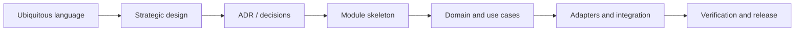

## Correct Interaction Flow

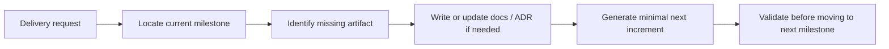

## Document Network

- [README.md](./README.md)
- [architecture-overview.md](./architecture-overview.md)
- [bounded-contexts.md](./bounded-contexts.md)
- [subdomains.md](./subdomains.md)
- [context-map.md](./context-map.md)
- [integration-guidelines.md](./integration-guidelines.md)
- [bounded-context-subdomain-template.md](./bounded-context-subdomain-template.md)
- [decisions/README.md](./decisions/README.md)
- [decisions/0001-hexagonal-architecture.md](./decisions/0001-hexagonal-architecture.md)
- [decisions/0002-bounded-contexts.md](./decisions/0002-bounded-contexts.md)
- [decisions/0003-context-map.md](./decisions/0003-context-map.md)

## Constraints

- 本里程碑文件是 architecture-first 的交付路線，不代表任何既有 repo 已依此順序演進。
- 里程碑是交付順序指引，不是 waterfall 式一次性階段牆；必要時可以小步迭代，但不可跳過核心決策產物。
- 若需求很小，可以在同一次交付內完成多個相鄰里程碑，但仍需保留對應產物。
````

## File: .github/agents/knowledge-base.md
````markdown
# Knowledge Base — Implementation Navigation

This file is an implementation-oriented supplement for repository navigation. Strategic bounded-context ownership, canonical vocabulary, and duplicate-name resolution are owned by `docs/**/*` and must not be redefined here.

## Use This File For

- locating implementation surfaces quickly
- recalling boundary-safe import patterns
- checking the high-level code layout before reading concrete files

## Docs Authority

- Strategic ownership, terminology, and duplicate-name resolution: `docs/subdomains.md`, `docs/bounded-contexts.md`, `docs/ubiquitous-language.md`, `docs/contexts/<context>/*`
- Bounded-context scaffolding and root-layer rules: `docs/bounded-context-subdomain-template.md`
- Delivery sequencing and validation entrypoint: `docs/README.md` and `.github/agents/commands.md`

## Boundary Summary

- Cross-module imports go through `modules/<target>/api` only.
- Dependency direction is `interfaces/` → `application/` → `domain/` ← `infrastructure/`.
- `<bounded-context>` root may own context-wide `application/`, `domain/`, `infrastructure/`, and `interfaces/`; subdomains own local concerns.
- If a team adds `core/`, treat it as an optional inner wrapper only; do not put `infrastructure/` or `interfaces/` inside it.

## Repository Surfaces

- `app/`: Next.js route composition, shell UX, providers, and orchestration
- `modules/`: bounded-context and subdomain implementations
- `packages/`: stable shared boundaries exposed through `@shared-*`, `@lib-*`, `@integration-*`, `@ui-*`
- `py_fn/`: worker-side ingestion, parsing, chunking, embedding, and job execution

## Typical Module Shape

```text
modules/<context>/
├── api/
├── application/
├── domain/
├── infrastructure/
├── interfaces/
└── subdomains/<name>/
```

Not every module needs every folder, and local details may live inside a subdomain rather than the bounded-context root.

## Import Rules

- Prefer package aliases such as `@shared-types`, `@shared-utils`, `@integration-firebase`, `@ui-shadcn`, and `@lib-*`.
- Do not use legacy aliases such as `@/shared/*`, `@/libs/*`, or similar paths blocked by lint rules.
- Inside one module, prefer relative imports over self-importing the module barrel.
- Across modules, import only from the target module `api/` boundary.

## Validation

- Use `.github/agents/commands.md` for lint, build, test, and deployment commands.
- When strategic naming or ownership seems unclear, stop using this file and return to `docs/**/*`.
````

## File: .github/instructions/bounded-context-rules.instructions.md
````markdown
---
description: '限界上下文邊界與模組依賴方向規範，遵循 Hexagonal Architecture with Domain-Driven Design 原則。'
applyTo: 'modules/**/*.{ts,tsx,js,jsx,md}'
---

# 限界上下文規則 (Bounded Context Rules)

> 權威邊界入口：[`docs/bounded-contexts.md`](../../docs/bounded-contexts.md) 與 `docs/contexts/<context>/*`

## 強制規則

1. 先依 `docs/**/*` 判斷 owning bounded context 與 subdomain，再決定檔案位置。
2. 跨模組存取只能透過目標模組的 `api/` 公開邊界或對應領域事件；不得直接匯入他模組的 `domain/`、`application/`、`infrastructure/`、`interfaces/`。
3. 依賴方向固定為 `interfaces/` → `application/` → `domain/` ← `infrastructure/`；`domain/` 必須保持框架無關。
4. `<bounded-context>` 根層可承接 context-wide 的 `application/`、`domain/`、`infrastructure/`、`interfaces/`；不要把整個 bounded context 簡化成只有 `docs/` 與 `subdomains/`。
5. 若團隊使用 `core/`，只可容納內核 `application/`、`domain/` 與必要 `ports/`；不得把 `infrastructure/` 或 `interfaces/` 放進 generic `core/`。
6. 外部系統整合與模型轉譯放在 `infrastructure/` 或 ACL adapter，避免外部命名污染領域模型。
7. `modules/<context>/docs/*` 只能補 implementation detail，不得覆蓋 `docs/**/*` 的 bounded-context 命名、所有權與邊界決策。

## 禁止模式

- ❌ `import { X } from '@/modules/other-context/domain/...'`
- ❌ `import { X } from '@/modules/other-context/application/...'`
- ❌ `import { X } from '@/modules/other-context/infrastructure/...'`
- ✅ `import { X } from '@/modules/other-context/api'`

Tags: #use skill context7 #use skill serena-mcp #use skill xuanwu-app-skill
#use skill hexagonal-ddd
````

## File: .github/instructions/domain-modeling.instructions.md
````markdown
---
description: '聚合根、實體與值對象的 Immutable 設計與 Zod 驗證規範，遵循 Hexagonal Architecture with Domain-Driven Design 戰術設計原則。'
applyTo: 'modules/**/domain/**/*.{ts,tsx}'
---

# 領域模型設計規範 (Domain Modeling)

> 完整邊界參考：**先查 `docs/contexts/<context>/README.md`、`bounded-contexts.md`、`subdomains.md`、`ubiquitous-language.md`**
> 此文件只包含**行為約束與程式碼範例**，不複製領域知識。

## 聚合根 (Aggregate Root)

- 每個聚合必須有**唯一識別碼**（使用 Zod 品牌型別 `z.string().uuid().brand('...')`）。
- 使用**私有建構函式**加靜態工廠方法 `create()` 與 `reconstitute()`。
- 所有狀態修改必須透過**封裝的命令方法**，不允許直接修改屬性。
- **業務規則（不變數）**只在聚合內部執行，違規時拋出帶有描述的 `Error`。
- 每次狀態修改必須產生對應的**領域事件**並存入 `_domainEvents` 私有陣列。
- 使用 `pullDomainEvents()` 方法提取並清空待發布事件。
- `getSnapshot()` 回傳 `Readonly<State>`，防止外部直接修改狀態。

```typescript
// 聚合根標準結構
export class MyAggregate {
  private readonly _id: MyId;
  private _state: MyState;
  private _domainEvents: DomainEvent[] = [];

  private constructor(id: MyId, state: MyState) {
    this._id = id;
    this._state = state;
  }

  // 工廠方法：新建
  public static create(id: MyId, /* ...inputs */): MyAggregate {
    const aggregate = new MyAggregate(id, { /* 初始狀態 */ });
    aggregate._domainEvents.push({ /* MyAggregateCreated 事件 */ });
    return aggregate;
  }

  // 工廠方法：從持久化資料重建
  public static reconstitute(snapshot: MySnapshot): MyAggregate {
    return new MyAggregate(snapshot.id as MyId, snapshot);
  }

  // 業務方法
  public doSomething(input: string): void {
    // 1. 驗證不變數
    if (this._state.status === 'archived') {
      throw new Error('Cannot modify an archived aggregate.');
    }
    // 2. 更新狀態
    this._state = { ...this._state, field: input };
    // 3. 記錄領域事件
    this._domainEvents.push({ type: 'my-context.something-done', /* ... */ });
  }

  public get id(): MyId { return this._id; }

  public getSnapshot(): Readonly<MyState> {
    return Object.freeze({ ...this._state });
  }

  public pullDomainEvents(): DomainEvent[] {
    const events = [...this._domainEvents];
    this._domainEvents = [];
    return events;
  }
}
```

## 值對象 (Value Object)

- 使用 **Zod Schema** 定義並驗證，並使用 `z.brand()` 確保型別安全。
- 值對象必須是**不可變的**（Immutable）。
- 相等性以**值內容**判斷，不以物件參考判斷。
- 不應包含識別碼欄位。

```typescript
// 值對象：品牌型別模式
import { z } from 'zod';

export const WorkspaceIdSchema = z.string().uuid().brand('WorkspaceId');
export type WorkspaceId = z.infer<typeof WorkspaceIdSchema>;

export const WorkspaceNameSchema = z.string().min(1).max(100).trim().brand('WorkspaceName');
export type WorkspaceName = z.infer<typeof WorkspaceNameSchema>;
```

## 實體 (Entity)

- 具有唯一識別碼，以識別碼判斷相等性。
- 狀態可變，但修改應透過方法封裝。
- 不要設計成只有 Getter/Setter 的**貧血模型**（Anemic Domain Model）。
- 識別碼使用品牌型別值對象保護型別安全。

## Zod 驗證規範

- 所有 Domain 物件的 Schema 定義必須放在 `domain/` 層（不依賴外部框架）。
- 使用 `z.infer<typeof Schema>` 產生 TypeScript 型別，避免型別重複定義。
- 在聚合的工廠方法或命令方法中執行輸入驗證。
- `CommandResult` 使用 `@shared-types` 的共用型別。

## 禁止模式 (Anti-Patterns)

- ❌ **貧血領域模型**：只有資料屬性（`id`, `name`, `status`），無業務邏輯。
- ❌ **直接暴露可變狀態**：`public state: MyState`。
- ❌ **在 `domain/` 層匯入外部框架**：Firebase、HTTP 客戶端、React。
- ❌ **跨聚合直接操作**：在聚合 A 中直接修改聚合 B 的狀態。
- ❌ **過大聚合**：聚合包含過多子實體，應重新評估邊界。

## 目錄結構

```
modules/<context>/domain/
├── aggregates/        # 聚合根類別
├── entities/          # 子實體類別與型別定義
├── value-objects/     # 值對象（品牌型別）
├── events/            # 領域事件定義（Zod Schema）
├── repositories/      # 儲存庫介面（只有介面，無實作）
└── services/          # 領域服務（無狀態業務邏輯）
```

Tags: #use skill context7 #use skill serena-mcp #use skill xuanwu-app-skill
#use skill hexagonal-ddd
````

## File: .github/instructions/event-driven-state.instructions.md
````markdown
---
description: 'XState 狀態機與領域事件互動規範，包含 SuperJSON 序列化處理，遵循 Hexagonal Architecture with Domain-Driven Design 的事件驅動原則。'
applyTo: 'modules/**/*.{ts,tsx}'
---

# 事件驅動狀態規範 (Event-Driven State)

> 完整邊界參考：**先查 `docs/contexts/<context>/context-map.md`、`bounded-contexts.md`、`subdomains.md`、`ubiquitous-language.md`**
> 此文件只包含**行為約束與程式碼範例**，不複製領域知識。

## 領域事件 (Domain Events)

- 所有**狀態變更**都必須產生一個對應的領域事件，捕捉業務因果關係。
- 領域事件命名必須是**過去式**，格式為 `<Entity><Action>`，例如 `WorkspaceCreated`、`KnowledgeIngested`。
- 事件 `type` 的 discriminant 格式為 `<module-name>.<action>`，例如 `workspace.created`。
- 使用 **Zod Schema** 嚴格定義事件 Payload。
- 事件必須包含 `eventId`（UUID）與 `occurredAt`（**ISO string**）欄位，遵循 `modules/shared/domain/events.ts` 的 `DomainEvent` 基礎介面。

```typescript
// 領域事件定義範例
import { z } from 'zod';

export const WorkspaceCreatedEventSchema = z.object({
  type: z.literal('workspace.created'),
  eventId: z.string().uuid(),
  occurredAt: z.string().datetime(),   // ISO 8601 字串，非 Date 物件
  payload: z.object({
    workspaceId: z.string().uuid(),
    organizationId: z.string().uuid(),
    name: z.string(),
    ownerId: z.string(),
  }),
});
export type WorkspaceCreatedEvent = z.infer<typeof WorkspaceCreatedEventSchema>;
```

## SuperJSON 序列化

- 跨越 Server/Client 邊界傳遞事件或包含 `Date`、`Map`、`Set` 等型別時，使用 **SuperJSON** 進行序列化。
- 確保 Server Action 或 API 回應中的複雜型別能正確序列化與還原。
- 在 Next.js Server Action 的輸出端序列化，在 Client 端使用 SuperJSON 還原。

## XState 狀態機整合

- 前端複雜的多步驟狀態流轉（如表單精靈、多階段審批）使用 **XState** 管理。
- Machine 定義放在 `modules/<context>/application/machines/` 目錄。
- XState Machine 的 `actions` 應觸發對應的 Server Action，並將結果映射回 Machine 的事件。
- Machine 的事件型別應與對應的領域事件保持語意一致。

```typescript
// XState Machine 與 Server Action 整合範例
import { createMachine, assign } from 'xstate';

export const workspaceMachine = createMachine({
  id: 'workspace',
  initial: 'idle',
  context: { workspaceId: null as string | null, error: null as string | null },
  states: {
    idle: {
      on: { CREATE: 'creating' },
    },
    creating: {
      invoke: {
        src: 'createWorkspaceAction',  // 對應 Server Action
        onDone: {
          target: 'ready',
          actions: assign({ workspaceId: ({ event }) => event.output.aggregateId }),
        },
        onError: {
          target: 'failed',
          actions: assign({ error: ({ event }) => String(event.error) }),
        },
      },
    },
    ready: {},
    failed: { on: { RETRY: 'idle' } },
  },
});
```

## 事件發布流程

1. 聚合根透過業務方法產生領域事件，存入 `_domainEvents` 陣列。
2. Use Case（Application Service）在聚合**持久化成功後**，呼叫 `pullDomainEvents()` 提取事件。
3. Use Case 負責將事件發布到 QStash 或事件匯流排（At-Least-Once 語意）。
4. 不可在聚合持久化**之前**發布事件（確保一致性）。

```typescript
// Use Case 中的事件發布流程
export class CreateWorkspaceUseCase {
  async execute(input: CreateWorkspaceInput): Promise<CommandResult> {
    const workspace = Workspace.create(generateId(), input);
    await this.workspaceRepository.save(workspace);  // 1. 先持久化
    const events = workspace.pullDomainEvents();      // 2. 提取事件
    await this.eventPublisher.publishAll(events);     // 3. 再發布
    return { success: true, aggregateId: workspace.id };
  }
}
```

## 驗證

- `occurredAt` 必須使用 ISO string，不得使用 `Date` 物件（與 `shared/domain/events.ts` 一致）。
- 事件 Schema 使用 Zod 驗證，確保 Payload 型別安全。

Tags: #use skill context7 #use skill serena-mcp #use skill xuanwu-app-skill
#use skill hexagonal-ddd
````

## File: .github/instructions/ubiquitous-language.instructions.md
````markdown
---
description: '強制查閱 docs/ubiquitous-language.md 並使用通用語言進行命名，遵循 Hexagonal Architecture with Domain-Driven Design 命名規範。'
applyTo: 'modules/**/*.{ts,tsx,js,jsx}'
---

# 通用語言規範 (Ubiquitous Language)

## 核心規則

1. 在命名任何 Class、Interface、Type、Variable 或 Domain Event 之前，**必須**先查閱 `docs/ubiquitous-language.md` 與對應 context 文件。
2. 嚴禁使用同義詞替換：若術語表定義使用者為 `Tenant`，不得命名為 `User`、`Client` 或 `Customer`。
3. 領域事件命名必須使用**過去式**，例如：`KnowledgeIngested`、`WorkspaceCreated`、`MemberInvited`。
4. 限界上下文的名稱必須與 `modules/<context>/` 資料夾名稱保持一致。
5. 若發現缺少必要術語，應先更新 `docs/ubiquitous-language.md` 或對應 context 的術語文件，再繼續實作。

## 術語定義（權威來源）

完整術語入口請查閱：**[`docs/ubiquitous-language.md`](../../docs/ubiquitous-language.md)**，並依實際 bounded context 查閱對應的 `docs/contexts/<context>/ubiquitous-language.md`。

> 此處不複製術語表。遇到不確定的術語，必須查閱上述文件。

## 命名規範

- **聚合根**：`PascalCase` 名詞，例如 `Workspace`、`KnowledgeBase`。
- **值對象**：`PascalCase` 名詞，通常以用途或含義命名，例如 `WorkspaceName`、`TenantId`。
- **領域事件**：`PascalCase` 過去式，例如 `WorkspaceCreated`、`MemberRemoved`。
- **事件 discriminant**：`kebab-case` 格式 `<module>.<action>`，例如 `workspace.created`。
- **使用案例檔案**：`verb-noun.use-case.ts`，例如 `create-workspace.use-case.ts`。
- **儲存庫介面**：`PascalCaseRepository`，例如 `WorkspaceRepository`。
- **儲存庫實作**：`TechnologyPascalCaseRepository`，例如 `FirebaseWorkspaceRepository`。

## 驗證

- 提交前確認新增命名符合術語表定義。
- 若使用新術語，同步更新 `docs/ubiquitous-language.md` 與對應 context 文件。

Tags: #use skill context7 #use skill serena-mcp #use skill xuanwu-app-skill
#use skill hexagonal-ddd
````

## File: docs/bounded-context-subdomain-template.md
````markdown
# Bounded Context Subdomain Template

本文件在本次任務限制下，僅依 Context7 驗證的 Hexagonal Architecture、DDD、Context Map 與 ADR 參考建立，作為 `modules/<bounded-context>/subdomains/*` 的交付標準模板，不主張反映現況實作。

## Purpose

這份模板定義新的 bounded context 與其 subdomains 應以什麼結構交付，讓 Copilot 在建立模組樹、層次與邊界時，先遵守 Hexagonal Architecture with Domain-Driven Design，再決定實作細節。

## Standard Structure Tree

```text
modules/
└── <bounded-context>/
    ├── README.md
    ├── AGENT.md
    ├── api/
    │   └── index.ts
    ├── application/
    ├── domain/
    ├── docs/
    │   ├── README.md
    │   ├── bounded-context.md
    │   ├── context-map.md
    │   ├── subdomains.md
    │   ├── ubiquitous-language.md
    │   ├── aggregates.md
    │   ├── domain-events.md
    │   ├── repositories.md
    │   ├── application-services.md
    │   └── domain-services.md
    ├── infrastructure/
    ├── interfaces/
    └── subdomains/
        ├── <subdomain-a>/
        │   ├── README.md
        │   ├── api/
        │   │   └── index.ts
        │   ├── application/
        │   │   ├── dto/
        │   │   └── use-cases/
        │   ├── domain/
        │   │   ├── entities/
        │   │   ├── value-objects/
        │   │   ├── services/
        │   │   ├── repositories/
        │   │   ├── events/
        │   │   └── ports/
        │   ├── infrastructure/
        │   │   ├── adapters/
        │   │   ├── persistence/
        │   │   └── repositories/
        │   └── interfaces/
        │       ├── api/
        │       ├── components/
        │       ├── hooks/
        │       ├── queries/
        │       └── _actions/
        └── <subdomain-b>/
```

## Layer Responsibilities

| Layer | Responsibility |
|---|---|
| `api/` | bounded context 或 subdomain 對外唯一公開邊界 |
| `application/` | 協調 use cases、轉換 DTO、執行流程但不承載核心業務規則；若在 bounded context 根層，代表跨 subdomain 的 context-wide orchestration |
| `domain/` | 聚合根、實體、值對象、領域服務、領域事件與核心規則；若在 bounded context 根層，代表跨 subdomain 的 shared policy、published language 或 context-wide domain concept |
| `infrastructure/` | repository / adapter 實作、持久化、外部系統整合；若在 bounded context 根層，代表 context-wide driven adapters |
| `interfaces/` | UI、route handler、server action、query hooks 等 driving adapters；若在 bounded context 根層，代表 context-wide composition / driving adapters |

## Core Clarification

- `<bounded-context>` 本身也應該維持 Hexagonal Architecture with DDD 的依賴方向，而不只是 `subdomains/<name>/` 內部才有六邊形分層。
- 但 Hexagonal Architecture 的關鍵是**依賴方向與內外邊界**，不是資料夾一定要叫 `core/`。
- 依 Context7 驗證的參考，Application Core 是概念上的核心，外層依賴向內；ports 可放在 application 或 domain，取決於規則真正屬於哪一層。
- 因此本模板的預設寫法是用顯式的 `application/`、`domain/`、`infrastructure/`、`interfaces/` 來表達六邊形邊界，而不是再包一層泛用 `core/`。
- 如果團隊真的要使用 `core/`，較合理的變體應是 `<bounded-context>/core/application`、`<bounded-context>/core/domain`，必要時加 `core/ports`；**不應**把 `infrastructure/` 或 `interfaces/` 也放進 `core/`，因為它們本來就是外層。
- 只有當某段邏輯明確屬於整個 bounded context，而不是單一 subdomain 時，才應放在 `<bounded-context>/application|domain|infrastructure|interfaces`；否則優先放回擁有它的 subdomain。

## Template Rules

- `<bounded-context>` 根層允許有自己的 `application/`、`domain/`、`infrastructure/`、`interfaces/`，用來承接 context-wide concern；不要把整個 bounded context 簡化成只剩 `docs/` 與 `subdomains/` 的外殼。
- 每個 subdomain 都必須能獨立表達自己的 use case、domain model 與 adapter 邊界。
- `api/` 是 cross-module collaboration 的唯一入口，`index.ts` 不是跨模組公開邊界。
- adapter 只實作 port，不直接被其他層呼叫。
- port 只在真的需要隔離 I/O、外部系統、侵入式 library 或 legacy model 時建立。
- 若 domain 核心不需要某個抽象，就不要為了形式完整而先建空的 `service`、`port` 或 `repository`。
- 不預設建立泛用 `core/` 包裝資料夾來混合內外層；若沒有非常明確的遷移理由，優先使用顯式層次名稱。

## Delivery Checklist

1. 建立 bounded context 的 `README.md`、`AGENT.md`、`api/`、`docs/`，以及必要時的根層 `application/`、`domain/`、`infrastructure/`、`interfaces/` 入口。
2. 先判斷需求是屬於 bounded context 根層還是特定 subdomain；只有 context-wide concern 才進根層，其餘一律先落到 `subdomains/<name>/`。
3. 對擁有該責任的 subdomain 建立 `application/`、`domain/`、`infrastructure/`、`interfaces/`。
4. 先放入 use case、aggregate、published language 與 context map，再補 adapter 與 persistence 實作。
5. 只有在交付需要時才建立 `ports/`、`hooks/`、`queries/`、`_actions/` 等細分資料夾。

## Anti-Pattern Rules

- 不得把 `infrastructure/` 直接匯入 `domain/` 或 `application/`。
- 不得把別的 bounded context 的 `domain/`、`application/`、`infrastructure/` 或 `interfaces/` 當成可直接 import 的依賴。
- 不得把所有子域都預設長成同一個巨型骨架，卻沒有對應的 use case 與業務責任。
- 不得把 `infrastructure/`、`interfaces/` 放進一個泛用 `core/` 目錄，讓六邊形的內外層語義失真。
- 不得因為「看起來完整」而過度建立 repository port、ACL、DTO、facade 或 service。
- 不得讓 `interfaces/` 承載業務決策，也不得讓 `application/` 重寫 domain 規則。

## Copilot Generation Rules

- 生成新模組前，先決定 bounded context、subdomain、public API boundary 與依賴方向，再建立資料夾。
- 若需求屬於 bounded context shared policy、published language、跨 subdomain orchestration，再使用 `<bounded-context>` 根層的 hexagonal layers；否則優先放進擁有責任的 subdomain。
- 奧卡姆剃刀：若較少的層級、port 或 adapter 已能保護邊界與可測試性，就不要額外新增抽象。
- 每個子域只建立當前交付需要的最小骨架，不要先把所有可選資料夾填滿。
- 若需求只是新增一個 use case，優先放進現有 subdomain，而不是新開第二個平行 subdomain。

## Dependency Direction Flow

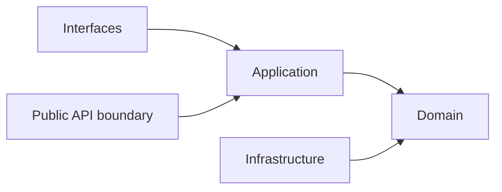

## Correct Interaction Flow

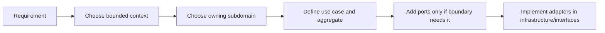

## Document Network

- [README.md](./README.md)
- [architecture-overview.md](./architecture-overview.md)
- [bounded-contexts.md](./bounded-contexts.md)
- [subdomains.md](./subdomains.md)
- [context-map.md](./context-map.md)
- [integration-guidelines.md](./integration-guidelines.md)
- [strategic-patterns.md](./strategic-patterns.md)
- [contexts/_template.md](./contexts/_template.md)
- [decisions/0001-hexagonal-architecture.md](./decisions/0001-hexagonal-architecture.md)
- [decisions/0002-bounded-contexts.md](./decisions/0002-bounded-contexts.md)
- [decisions/0003-context-map.md](./decisions/0003-context-map.md)

## Constraints

- 本模板是 architecture-first 的交付模板，不代表任何既有模組已完全符合此形狀。
- `ports/`、`queries/`、`_actions/`、`hooks/` 是按需要建立的可選骨架，不是強制清單。
- 若某 subdomain 很小，允許比本模板更精簡；若更精簡仍能守住邊界，應優先採用更精簡版本。
````

## File: .github/agents/domain-architect.agent.md
````markdown
---
name: Domain Architect
description: Hexagonal Architecture with Domain-Driven Design 領域架構審查 Agent，專注確保聚合根、限界上下文、通用語言與事件驅動設計符合邊界與依賴方向規範。
tools: ['serena/*', 'context7/*', 'read', 'edit', 'search', 'execute']
model: 'GPT-5.3-Codex'
handoffs:
  - label: Boundary Review 審查模組邊界
    agent: Hexagonal DDD Architect
    prompt: 審查或重構此領域決策涉及的模組邊界、層依賴方向與公開 API 形狀。
  - label: Glossary Update 更新通用語言術語
    agent: KB Architect
    prompt: 將本次領域建模新增或變更的術語同步更新至 docs/ubiquitous-language.md 與對應 context 文件。
  - label: Quality Review 品質審查
    agent: Quality Lead
    prompt: 審查此領域變更的行為風險、邊界回歸與遺漏驗證，確認符合 Hexagonal DDD 規範。

---

# Domain Architect

## 目標範圍 (Target Scope)

- `modules/**/domain/**`
- `modules/**/application/use-cases/**`
- `modules/**/application/machines/**`
- `docs/ubiquitous-language.md`
- `docs/contexts/*/**`
- `.github/instructions/ubiquitous-language.instructions.md`
- `.github/instructions/bounded-context-rules.instructions.md`
- `.github/instructions/domain-modeling.instructions.md`
- `.github/instructions/event-driven-state.instructions.md`

## 使命 (Mission)

以 docs-first authority 審查與修正領域模型設計，確保聚合、限界上下文、通用語言與領域事件符合 Hexagonal Architecture with Domain-Driven Design 規則。

## 必讀來源

- `docs/README.md`
- `docs/ubiquitous-language.md`
- `docs/subdomains.md`
- `docs/bounded-contexts.md`
- `docs/contexts/<context>/*`
- `.github/instructions/ubiquitous-language.instructions.md`
- `.github/instructions/bounded-context-rules.instructions.md`
- `.github/instructions/domain-modeling.instructions.md`
- `.github/instructions/event-driven-state.instructions.md`

## 審查清單

- [ ] 命名是否已先對齊 `docs/ubiquitous-language.md` 與對應 context 文件？
- [ ] 程式碼是否位於正確的 bounded context / subdomain？
- [ ] 跨模組互動是否只透過 `api/` 邊界或領域事件？
- [ ] 上下游關係、ACL 與依賴方向是否與 `docs/contexts/<context>/context-map.md` 一致？
- [ ] 聚合根是否保護不變數、避免貧血模型，且狀態修改透過封裝方法進行？
- [ ] 值對象是否保持不可變，必要時使用 Zod / brand 型別保護？
- [ ] 領域事件是否使用過去式命名、穩定 discriminant、ISO 時間欄位，並在持久化成功後發布？
- [ ] 外部系統模型是否透過 `infrastructure/` 或 ACL adapter 轉譯，而未污染 `domain/`？

## 輸出格式

1. **Hexagonal DDD 合規性評估**：通過 / 需修正
2. **問題項目清單**：每項附檔案路徑與具體說明
3. **修正建議**：附程式碼範例
4. **驗證指令執行結果**：`npm run lint` 與 `npm run build` 結果

Tags: #use skill context7 #use skill serena-mcp #use skill xuanwu-app-skill
#use skill hexagonal-ddd
````

## File: .github/instructions/doc-governance.instructions.md
````markdown
---
description: 'Hexagonal Architecture with Domain-Driven Design documentation governance rules: single source of truth, docs-first authority, and anti-bloat constraints.'
applyTo: 'docs/**/*.md'
---

# 文件治理規範 (Documentation Governance)

本規範只描述 Copilot 在 `docs/**/*` 上的行為約束。DDD 戰略知識與文件結構權威一律回到 `docs/**/*`。

> 文件入口：[`docs/README.md`](../../docs/README.md)

## 強制規則

1. 新增或修改 `docs/**/*` 前，先從 [`../../docs/README.md`](../../docs/README.md) 判斷應更新哪個權威文件，而不是先新增平行說明文件。
2. `docs/subdomains.md`、`docs/bounded-contexts.md`、`docs/ubiquitous-language.md` 與 `docs/contexts/<context>/*` 擁有 DDD 戰略與 bounded-context 權威；其他地方只可連結，不可複製。
3. `.github/instructions/*` 只寫行為規則，不重述架構知識、術語表、context map 或 bounded-context inventory。
4. `modules/<context>/docs/*` 若存在，只能描述 implementation-aligned detail，不得覆蓋 `docs/**/*` 的命名、所有權、邊界或 duplicate resolution。
5. 若變更會影響 `.github/skills/` 的 repomix 參考輸出，必須使用既有 scripts 重新生成。

## 快速檢查

- 這段內容是否已由 `docs/**/*` 其中一個 owner 文件承接？
- 這裡是否在重貼 docs，而不是只補本檔所需的行為約束？
- 這次文件變更是否需要同步 regeneration repomix skills？

Tags: #use skill context7 #use skill xuanwu-app-skill
````

## File: docs/context-map.md
````markdown
# Context Map

本文件在本次任務限制下，僅依 Context7 驗證的 context map 與 strategic design 原則重建，不主張反映現況實作。

## System Landscape

主域級關係只採用 directed upstream-downstream 模型。

## Directed Relationships

| Upstream | Downstream | Published Language |
|---|---|---|
| platform | workspace | actor reference、organization scope、access decision、entitlement signal |
| platform | notion | actor reference、organization scope、access decision、entitlement signal |
| platform | notebooklm | actor reference、organization scope、access decision、entitlement signal |
| workspace | notion | workspaceId、membership scope、share scope |
| workspace | notebooklm | workspaceId、membership scope、share scope |
| notion | notebooklm | knowledge artifact reference、attachment reference、taxonomy hint |

## Pattern Rules

- ACL 與 Conformist 只允許出現在 downstream 端。
- ACL 與 Conformist 互斥，不能同時套用在同一整合。
- Shared Kernel 與 Partnership 不用於主域級關係。
- 若未來真的需要共享模型，必須先抽出新的 bounded context，而不是把對稱關係塞回主域之間。

## Dependency Direction Guardrail

- 主域級方向只允許 upstream -> downstream，不允許同時宣稱對稱依賴。
- downstream 整合上游時，先決定 published language，再決定 ACL 或 Conformist。
- 上游提供語言與能力，下游決定如何保護自己的語言。

## Strategic Consequences

- 關係方向清楚後，published language、local DTO 與 ACL 才能一致。
- 主域級文檔可以避免同時出現互相矛盾的 supplier / consumer 敘事。

## Contradictions Removed

- 不再同時把主域級關係描述成 directed relationship 與 symmetric relationship。
- 不再把 ACL 寫成 upstream 的責任。
- 不再把 shared technical libraries 誤寫為主域級 Shared Kernel。

## Forbidden Relationship Patterns

- 不得把 Shared Kernel / Partnership 與 ACL / Conformist 混寫在同一關係。
- 不得把 direct model sharing 寫成 published language。
- 不得把下游的轉譯責任倒灌回上游。

## Copilot Generation Rules

- 生成程式碼時，先畫清 upstream / downstream，再安排 API boundary、published language、ACL 或 Conformist。
- 奧卡姆剃刀：若單一 published language 與單一 translation step 足夠，就不要再加第二層整合流程。
- 不確定關係方向時，先修正文檔，不直接生成跨主域耦合程式碼。

## Dependency Direction Flow

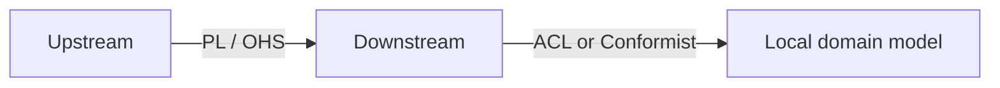

## Correct Interaction Flow

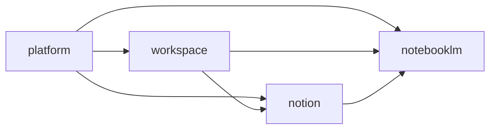

## Document Network

- [architecture-overview.md](./architecture-overview.md)
- [integration-guidelines.md](./integration-guidelines.md)
- [strategic-patterns.md](./strategic-patterns.md)
- [bounded-context-subdomain-template.md](./bounded-context-subdomain-template.md)
- [project-delivery-milestones.md](./project-delivery-milestones.md)
- [decisions/0003-context-map.md](./decisions/0003-context-map.md)
- [decisions/0005-anti-corruption-layer.md](./decisions/0005-anti-corruption-layer.md)
````

## File: docs/contexts/notebooklm/README.md
````markdown
# NotebookLM Context

本 README 在本次任務限制下，僅依 Context7 驗證的 DDD、Context Map、Hexagonal Architecture 參考重建，不主張反映現況實作。

## Purpose

notebooklm 是對話、來源處理與推理主域。它的責任是提供 notebook、conversation、source ingestion、retrieval、grounding、synthesis、evaluation 與 conversation-versioning 等語言，把來源材料轉成可對話、可追溯、可評估的衍生輸出。

## Why This Context Exists

- 把推理流程與正典知識內容分離。
- 把來源匯入、檢索、grounding 與 synthesis 統整成同一主域。
- 提供可回流到其他主域、但本質上仍屬衍生輸出的能力邊界。

## Context Summary

| Aspect | Summary |
|---|---|
| Primary Role | 對話、來源處理、檢索與推理輸出 |
| Upstream Dependency | platform 治理、workspace scope、notion 內容來源 |
| Downstream Consumer | 無固定主域級 consumer；輸出可被其他主域吸收 |
| Core Principle | notebooklm 擁有衍生推理流程，不擁有正典知識內容 |

## Baseline Subdomains

- conversation
- note
- notebook
- source
- synthesis
- conversation-versioning

## Recommended Gap Subdomains

- ingestion
- retrieval
- grounding
- evaluation

## Key Relationships

- 與 platform：notebooklm 消費 actor、organization、access、entitlement、ai capability。
- 與 workspace：notebooklm 消費 workspaceId、membership scope、share scope。
- 與 notion：notebooklm 消費 knowledge artifact reference、attachment reference、taxonomy hint。

## Reading Order

1. [subdomains.md](./subdomains.md)
2. [bounded-contexts.md](./bounded-contexts.md)
3. [context-map.md](./context-map.md)
4. [ubiquitous-language.md](./ubiquitous-language.md)
5. [AGENT.md](./AGENT.md)

## Dependency Direction

- 本主域內部固定採用 interfaces -> application -> domain <- infrastructure。
- 跨主域只消費 published language、API boundary、events，不直接依賴他域內部模型。

## Anti-Pattern Rules

- 不把 notebooklm 的衍生輸出直接宣稱為 notion 的正典知識內容。
- 不把 retrieval/grounding 降格成單純 UI 功能或模型提示細節。
- 不把 ingestion 與 source reference 混成同一個不可拆分責任。
- 不把 platform.ai 的共享能力誤寫成 notebooklm 自己擁有的 `ai` 子域。

## Copilot Generation Rules

- 生成程式碼時，先保留 notebooklm 的衍生推理定位，再安排 retrieval、grounding、synthesis 的交互。
- 模型接入、配額、供應商策略若屬共享能力，先消費 platform.ai；notebooklm 保留 retrieval、grounding、synthesis、evaluation 的語義所有權。
- 奧卡姆剃刀：只在必要時引入 port、ACL、DTO；不要因為未來也許會有需求就預先堆疊抽象。
- 優先產生一條清楚的 upstream input -> translation -> application -> domain -> output 流程，而不是多條重疊流程。

## Dependency Direction Flow

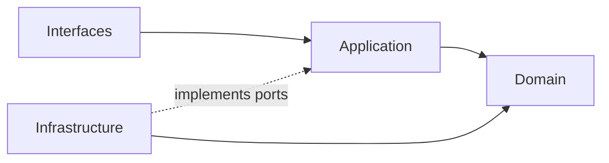

## Correct Interaction Flow

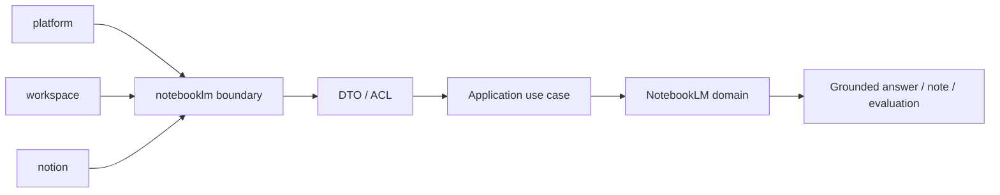

## Document Network

- [AGENT.md](./AGENT.md)
- [bounded-contexts.md](./bounded-contexts.md)
- [context-map.md](./context-map.md)
- [subdomains.md](./subdomains.md)
- [ubiquitous-language.md](./ubiquitous-language.md)
- [../../README.md](../../README.md)
- [../../architecture-overview.md](../../architecture-overview.md)
- [../../integration-guidelines.md](../../integration-guidelines.md)

## Constraints

- 本文件是 architecture-first 版本。
- 本文件依 Context7 的 bounded context 與 context map 原則編寫。
- 本文件不代表對既有 repo 內容做過語意校準。
````

## File: docs/contexts/notion/README.md
````markdown
# Notion Context

本 README 在本次任務限制下，僅依 Context7 驗證的 DDD、Context Map、Hexagonal Architecture 參考重建，不主張反映現況實作。

## Purpose

notion 是知識內容生命週期主域。它的責任是提供 knowledge artifact、authoring、database、taxonomy、relations、templates、publishing、knowledge-versioning 與 collaboration 等內容語言，承接正式知識內容的正典狀態。

## Why This Context Exists

- 把知識內容正典與平台治理、工作區範疇、對話推理分離。
- 讓內容建立、分類、關聯、交付與版本規則維持在同一個主域。
- 提供 notebooklm 可引用、但不可直接改寫的知識來源。

## Context Summary

| Aspect | Summary |
|---|---|
| Primary Role | 正典知識內容生命週期 |
| Upstream Dependency | platform 治理、workspace scope |
| Downstream Consumer | notebooklm |
| Core Principle | notion 擁有正式內容，不擁有治理或推理過程 |

## Baseline Subdomains

- knowledge
- authoring
- collaboration
- database
- knowledge-analytics
- attachments
- automation
- knowledge-integration
- notes
- templates
- knowledge-versioning

## Recommended Gap Subdomains

- taxonomy
- relations
- publishing

## Key Relationships

- 與 platform：notion 消費 actor、organization、access、entitlement、ai capability。
- 與 workspace：notion 消費 workspaceId、membership scope、share scope。
- 與 notebooklm：notion 向 notebooklm 提供 knowledge artifact reference 與 attachment reference。

## Reading Order

1. [subdomains.md](./subdomains.md)
2. [bounded-contexts.md](./bounded-contexts.md)
3. [context-map.md](./context-map.md)
4. [ubiquitous-language.md](./ubiquitous-language.md)
5. [AGENT.md](./AGENT.md)

## Dependency Direction

- 本主域內部固定採用 interfaces -> application -> domain <- infrastructure。
- notion 對外只暴露 published language、API boundary、events，不暴露內部內容模型。

## Anti-Pattern Rules

- 不把 notebooklm 的衍生輸出直接當成 notion 正典內容。
- 不把 taxonomy、relations、publishing 壓回單一 knowledge 編輯流程。
- 不把 platform 的治理語言混成內容生命週期本身。
- 不把 platform.ai 的共享能力誤寫成 notion 自己擁有的 `ai` 子域。

## Copilot Generation Rules

- 生成程式碼時，先保留 notion 的正典內容定位，再安排 authoring、knowledge、taxonomy、publishing 的交互。
- 內容輔助、摘要與生成若只是內容 use case 的支援能力，優先由 knowledge / authoring use case 消費 `platform.ai`，而不是在 notion 再建一個 generic `ai` 子域。
- 奧卡姆剃刀：不要預先新增第二套內容流程，只在既有內容邊界真的不夠時才補新抽象。
- 優先讓同一條 input -> translation -> application -> domain -> publication 流程保持單純可追溯。

## Dependency Direction Flow


## Correct Interaction Flow

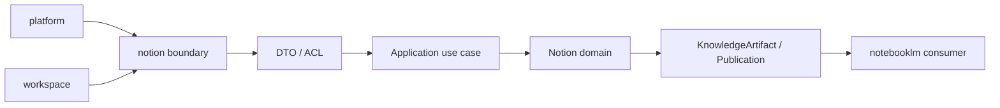

## Document Network

- [AGENT.md](./AGENT.md)
- [bounded-contexts.md](./bounded-contexts.md)
- [context-map.md](./context-map.md)
- [subdomains.md](./subdomains.md)
- [ubiquitous-language.md](./ubiquitous-language.md)
- [../../README.md](../../README.md)
- [../../architecture-overview.md](../../architecture-overview.md)
- [../../integration-guidelines.md](../../integration-guidelines.md)

## Constraints

- 本文件是 architecture-first 版本。
- 本文件依 Context7 的 bounded context 與 context map 原則編寫。
- 本文件不代表對既有 repo 內容做過語意校準。
````

## File: docs/contexts/platform/README.md
````markdown
# Platform Context

本 README 在本次任務限制下，僅依 Context7 驗證的 DDD、Context Map、Hexagonal Architecture 參考重建，不主張反映現況實作。

## Purpose

platform 是治理與營運支撐主域。它的責任是提供 actor、identity、organization、tenant、access、policy、entitlement、shared ai capability、billing、notification、search、audit 與 observability 等跨切面語言，供其他主域穩定消費。

## Why This Context Exists

- 把治理與營運支撐責任集中，避免滲入其他主域。
- 讓其他主域只消費治理結果，而不是重建治理模型。
- 以清楚的 published language 承接身份、權益、政策與營運能力。

## Context Summary

| Aspect | Summary |
|---|---|
| Primary Role | 治理、身份、權益與營運支撐 |
| Upstream Dependency | 無主域級上游；作為其他主域治理上游 |
| Downstream Consumers | workspace、notion、notebooklm |
| Core Principle | platform 輸出治理結果，不接管其他主域正典內容 |

## Baseline Subdomains

- identity
- account
- account-profile
- organization
- access-control
- security-policy
- platform-config
- feature-flag
- onboarding
- compliance
- billing
- subscription
- referral
- ai
- integration
- workflow
- notification
- background-job
- content
- search
- audit-log
- observability
- analytics
- support

## Recommended Gap Subdomains

- tenant
- entitlement
- secret-management
- consent

## Key Relationships

- 對 workspace：提供 actor、organization、access、entitlement。
- 對 notion：提供 actor、organization、access、entitlement、ai capability。
- 對 notebooklm：提供 actor、organization、access、entitlement、ai capability。

## Reading Order

1. [subdomains.md](./subdomains.md)
2. [bounded-contexts.md](./bounded-contexts.md)
3. [context-map.md](./context-map.md)
4. [ubiquitous-language.md](./ubiquitous-language.md)
5. [AGENT.md](./AGENT.md)

## Dependency Direction

- 本主域內部固定採用 interfaces -> application -> domain <- infrastructure。
- platform 對外只輸出治理結果與 published language，不輸出內部治理模型細節。

## Anti-Pattern Rules

- 不把 platform 寫成內容主域或對話主域。
- 不把 entitlement、consent、secret-management 混成同一個泛用設定區。
- 不把其他主域對平台的依賴寫成可以直接存取其內部模型。

## Copilot Generation Rules

- 生成程式碼時，先保留 platform 的治理定位，再安排 identity、access、entitlement、ai、secret-management 的交互。
- 奧卡姆剃刀：不要預先建立多餘 facade；能直接由既有治理邊界承接就維持單一路徑。
- 優先讓 request -> orchestration -> domain decision -> published language 保持單純可追溯。

## Dependency Direction Flow


## Correct Interaction Flow

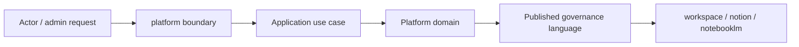

## Document Network

- [AGENT.md](./AGENT.md)
- [bounded-contexts.md](./bounded-contexts.md)
- [context-map.md](./context-map.md)
- [subdomains.md](./subdomains.md)
- [ubiquitous-language.md](./ubiquitous-language.md)
- [../../README.md](../../README.md)
- [../../architecture-overview.md](../../architecture-overview.md)
- [../../integration-guidelines.md](../../integration-guidelines.md)

## Constraints

- 本文件是 architecture-first 版本。
- 本文件依 Context7 的 bounded context 與 context map 原則編寫。
- 本文件不代表對既有 repo 內容做過語意校準。
````

## File: docs/contexts/workspace/README.md
````markdown
# Workspace Context

本 README 在本次任務限制下，僅依 Context7 驗證的 DDD、Context Map、Hexagonal Architecture 參考重建，不主張反映現況實作。

## Purpose

workspace 是協作容器與工作區範疇主域。它的責任是提供 workspaceId、工作區生命週期、參與關係、共享、存在感、活動投影、稽核、排程與工作流，讓其他主域可以在同一個協作範疇中運作。

## Why This Context Exists

- 把工作區容器語意與平台治理語意分離。
- 把工作區 scope 作為其他主域可依賴的 published language。
- 把活動流、稽核、排程與流程協調收斂為同一主域內的高凝聚能力。

## Context Summary

| Aspect | Summary |
|---|---|
| Primary Role | 協作容器與 workspace scope |
| Upstream Dependency | platform 的 actor、organization、access、entitlement |
| Downstream Consumers | notion、notebooklm |
| Core Principle | workspace 暴露 scope，不接管治理或內容正典 |

## Baseline Subdomains

- audit
- feed
- scheduling
- workspace-workflow

## Recommended Gap Subdomains

- lifecycle
- membership
- sharing
- presence

## Key Relationships

- 與 platform：workspace 是治理結果的 downstream consumer。
- 與 notion：workspace 向 notion 提供 workspaceId、membership scope、share scope。
- 與 notebooklm：workspace 向 notebooklm 提供 workspaceId、membership scope、share scope。

## Reading Order

1. [subdomains.md](./subdomains.md)
2. [bounded-contexts.md](./bounded-contexts.md)
3. [context-map.md](./context-map.md)
4. [ubiquitous-language.md](./ubiquitous-language.md)
5. [AGENT.md](./AGENT.md)

## Dependency Direction

- 本主域內部固定採用 interfaces -> application -> domain <- infrastructure。
- workspace 對外只暴露 scope、published language、API boundary、events，不暴露內部實作。

## Anti-Pattern Rules

- 不把 workspace scope 寫成平台治理結果本身。
- 不把 feed、audit、workspace-workflow 互相取代為單一泛用流程層。
- 不把 notion 或 notebooklm 的內容與推理責任吸回 workspace。

## Copilot Generation Rules

- 生成程式碼時，先保留 workspace 的協作 scope 定位，再安排 lifecycle、membership、sharing、workspace-workflow 的交互。
- 奧卡姆剃刀：不要預先建立第二條平行協作流程；只有既有 scope 邊界不夠時才補新抽象。
- 優先讓 input -> translation -> application -> domain -> published scope 保持單純可追溯。

## Dependency Direction Flow


## Correct Interaction Flow

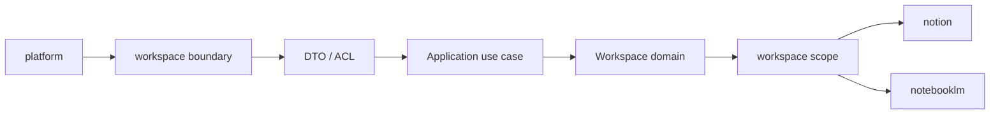

## Document Network

- [AGENT.md](./AGENT.md)
- [bounded-contexts.md](./bounded-contexts.md)
- [context-map.md](./context-map.md)
- [subdomains.md](./subdomains.md)
- [ubiquitous-language.md](./ubiquitous-language.md)
- [../../README.md](../../README.md)
- [../../architecture-overview.md](../../architecture-overview.md)
- [../../integration-guidelines.md](../../integration-guidelines.md)

## Constraints

- 本文件是 architecture-first 版本。
- 本文件依 Context7 的 bounded context 與 context map 原則編寫。
- 本文件不代表對既有 repo 內容做過語意校準。
````

## File: docs/decisions/0001-hexagonal-architecture.md
````markdown
# 0001 Hexagonal Architecture

- Status: Accepted
- Date: 2026-04-11

## Context

Context7 驗證的 DDD / Hexagonal 參考指出，模組應保持高凝聚、低耦合，外部世界只依賴公開介面，領域核心必須與框架與基礎設施分離。若沒有清楚的邊界與端口，模組內部規則會被外層技術細節污染，跨主域整合也會快速失控。

## Decision

採用主域導向的 Hexagonal Architecture 作為全域架構基線。

- 每個主域內部遵守：driving adapters -> application orchestration -> domain core <- driven adapters。
- 領域核心負責 invariants、值物件、聚合與領域規則。
- 外部框架、IO、第三方服務、傳輸格式只能存在於邊界與 adapter。
- 跨主域互動只能透過 published language、API 邊界或事件。
- 公開 API 是跨主域依賴點，不是內部模組結構的鏡像暴露。

## Consequences

正面影響：

- 主域邊界更清楚，重構內部結構時不必連帶破壞外部整合。
- 領域語言可維持穩定，不會被 UI、HTTP 或基礎設施術語污染。
- 後續若需要分拆部署或演進為更獨立的服務，代價較低。

代價與限制：

- 需要更多 API 契約、Local DTO、ACL 與轉換層。
- 需要更嚴格的命名與文件治理，不可直接偷渡內部模型。

## Conflict Resolution

- 若任何文件暗示 domain 直接依賴 framework / infrastructure，以本 ADR 為準並判定為衝突。
- 若任何文件把 index 或共享檔案當成跨主域真實邊界，以本 ADR 為準並改回公開 API / published language。

## Rejected Anti-Patterns

- Domain 直接依賴 framework、SDK、transport、database implementation。
- Application service 直接呼叫 driven adapter，而不透過 port。
- Interface adapter 直接承載核心業務規則。

## Copilot Generation Rules

- 生成程式碼時，先保留 interfaces -> application -> domain <- infrastructure 的向內依賴方向。
- 奧卡姆剃刀：若較少的 abstraction 已能保護邊界，就不要額外新增 port、service、facade 或 adapter。
- 只有外部依賴或語義污染明確存在時，才建立 port 與 adapter。

## Dependency Direction Flow

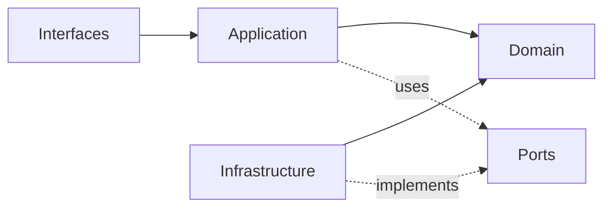

## Correct Interaction Flow

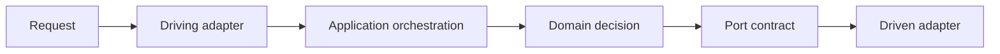

## Document Network

- [README.md](./README.md)
- [0002-bounded-contexts.md](./0002-bounded-contexts.md)
- [0003-context-map.md](./0003-context-map.md)
- [../architecture-overview.md](../architecture-overview.md)
- [../integration-guidelines.md](../integration-guidelines.md)
- [../bounded-context-subdomain-template.md](../bounded-context-subdomain-template.md)
- [../project-delivery-milestones.md](../project-delivery-milestones.md)
````

## File: docs/decisions/0002-bounded-contexts.md
````markdown
# 0002 Bounded Contexts

- Status: Accepted
- Date: 2026-04-11

## Context

Context7 驗證的 bounded context 原則要求每個 context 只承載一組高凝聚、可自洽的語言與規則。如果沒有清楚主域與子域所有權，術語、責任與整合規則就會互相覆蓋，造成治理語言、內容語言與推理語言混雜。

## Decision

將系統的主域固定為四個主域：

- workspace：協作容器與工作區範疇
- platform：治理、身份、權益與營運支撐
- notion：正典知識內容生命週期
- notebooklm：對話、來源處理與推理輸出

每個主域底下都有自己的子域集合。文件中必須明確區分：

- baseline subdomains：此架構基線中已確立的核心子域
- recommended gap subdomains：依 Context7 推導出的合理缺口子域

## Consequences

正面影響：

- 所有權清楚，可避免 platform、workspace、notion、notebooklm 互相吞邊界。
- 上層戰略文件與主域文件可共享同一個 decomposition 模型。

代價與限制：

- 需要承認 gap subdomains 是 architecture-first 建議，而不是 repo-inspected 現況事實。
- 未來若要改主域切分，必須連動更新 strategic docs、ADR 與 context docs。

## Conflict Resolution

- 若任何文件出現超過四個主域的平級切分，以本 ADR 為準並視為衝突。
- 若任何文件把 recommended gap subdomains 寫成已驗證現況，以本 ADR 為準並改回 architecture-first 表述。

## Rejected Anti-Patterns

- 讓多個主域同時聲稱同一正典所有權。
- 用 UI、部署或資料表分組來取代 bounded context 切分。
- 把 gap subdomain 寫成已落地事實，而不標示為架構缺口。

## Copilot Generation Rules

- 生成程式碼時，先判定需求屬於哪個主域與子域，再決定檔案位置與依賴方向。
- 奧卡姆剃刀：若既有 bounded context 已可吸收需求，就不要新增平級主域或語意重疊子域。
- 所有權不清楚時，先修正語言與 context map，再寫程式碼。

## Dependency Direction Flow

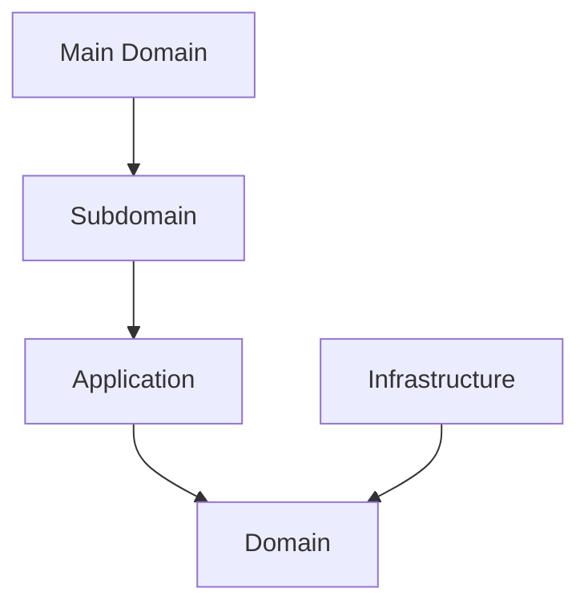

## Correct Interaction Flow

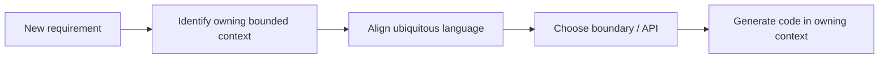

## Document Network

- [README.md](./README.md)
- [0001-hexagonal-architecture.md](./0001-hexagonal-architecture.md)
- [0003-context-map.md](./0003-context-map.md)
- [../bounded-contexts.md](../bounded-contexts.md)
- [../subdomains.md](../subdomains.md)
- [../bounded-context-subdomain-template.md](../bounded-context-subdomain-template.md)
- [../project-delivery-milestones.md](../project-delivery-milestones.md)
````

## File: docs/decisions/0003-context-map.md
````markdown
# 0003 Context Map

- Status: Accepted
- Date: 2026-04-11

## Context

Context Mapper 文件指出，context map 是 bounded contexts 與其關係的中心表示。若關係方向不清楚，則 published language、ACL、supplier/customer 責任無法正確定義，文件之間也容易同時出現互相衝突的整合模型。

## Decision

在四個主域之間，只採用 directed upstream-downstream 關係作為主域級整合基線。

主域關係如下：

- platform -> workspace
- platform -> notion
- platform -> notebooklm
- workspace -> notion
- workspace -> notebooklm
- notion -> notebooklm

主域級不採用 Shared Kernel 或 Partnership。

## Consequences

正面影響：

- 每個主域可以清楚知道誰是上游、誰是下游。
- ACL、Published Language、Conformist 等模式才有明確適用位置。

代價與限制：

- 需要更多轉譯與 API 契約層，不能直接共享內部模型。
- 若某些能力確實需要共用模型，必須先抽象成新的獨立 bounded context，而不是偷渡共享核心。

## Conflict Resolution

- 若任何文件同時宣稱兩個主域是 Partnership / Shared Kernel，又同時使用 ACL 或 Conformist，判定為衝突，以本 ADR 為準。
- 若任何文件出現與上述方向相反的主域級關係，以本 ADR 為準。

## Rejected Anti-Patterns

- 把 directed upstream-downstream 與 symmetric relationship 混寫在同一主域關係。
- 把 supplier / consumer 敘事寫反，造成上下游不明。
- 直接共享內部模型來取代 published language。

## Copilot Generation Rules

- 生成程式碼時，先判定 upstream 與 downstream，再安排 API boundary、published language、ACL 或 Conformist。
- 奧卡姆剃刀：若單一 published language 與單一 translation step 已足夠，就不要加第二條整合鏈。
- 關係方向不清楚時，先停下修正文檔，不直接生成跨主域耦合程式碼。

## Dependency Direction Flow

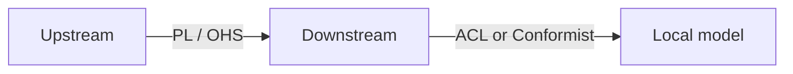

## Correct Interaction Flow

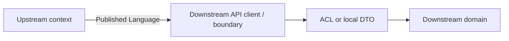

## Document Network

- [README.md](./README.md)
- [0002-bounded-contexts.md](./0002-bounded-contexts.md)
- [0005-anti-corruption-layer.md](./0005-anti-corruption-layer.md)
- [../context-map.md](../context-map.md)
- [../integration-guidelines.md](../integration-guidelines.md)
- [../bounded-context-subdomain-template.md](../bounded-context-subdomain-template.md)
- [../project-delivery-milestones.md](../project-delivery-milestones.md)
````

## File: docs/decisions/0004-ubiquitous-language.md
````markdown
# 0004 Ubiquitous Language

- Status: Accepted
- Date: 2026-04-11

## Context

Context7 驗證的 DDD 參考指出，領域核心必須運作在自己清楚的 ubiquitous language 之上。若沒有共同語言，跨主域整合、ADR、戰略文件與子域文件會用不同詞指同一件事，或用同一詞指不同責任，進而造成長期衝突。

## Decision

建立兩層語言治理：

- strategic ubiquitous language：定義四主域共用的戰略術語與整合術語
- context-specific ubiquitous language：由各主域 context 文件定義更細的本地主域語言

主域層的關鍵術語固定為：

- platform：Actor、Tenant、Entitlement、Secret、Consent
- workspace：Workspace、Membership、ShareScope、ActivityFeed、AuditTrail
- notion：KnowledgeArtifact、Taxonomy、Relation、Publication
- notebooklm：Notebook、Ingestion、Retrieval、Grounding、Synthesis、Evaluation

## Consequences

正面影響：

- 戰略文件、主域文件與 ADR 可以共享同一套術語。
- 語言衝突可以在文件層面先被攔住，而不是等到實作才暴露。

代價與限制：

- 命名自由度下降，需要持續維護 glossary。
- 新概念若無法歸屬到既有語言，必須先做文件決策。

## Conflict Resolution

- 若戰略語言與主域語言衝突，先以更具邊界意義的主域語言為準，再回寫 strategic glossary。
- 若兩個主域同時主張同一術語所有權，以 bounded contexts 與 context map 的所有權關係為準。

## Rejected Anti-Patterns

- 用同一個詞同時指涉治理、內容、推理三種不同責任。
- 用舊產品術語覆蓋新的 bounded context 語言。
- 讓實作便利性凌駕於 ubiquitous language 一致性。

## Copilot Generation Rules

- 生成程式碼時，先對齊 strategic term 與 context-specific term，再決定檔名、型別與 API 名稱。
- 奧卡姆剃刀：若一個名詞已足夠表達邊界，就不要再堆疊第二個近義抽象詞。
- 名稱若與現有語言衝突，先修正文檔與用語，再寫程式碼。

## Dependency Direction Flow

```mermaid
flowchart LR
	Strategic["Strategic language"] --> Context["Context language"]
	Context --> Boundary["API / Published Language"]
	Boundary --> Code["Generated code names"]
```

## Correct Interaction Flow

```mermaid
flowchart LR
	Requirement["Requirement"] --> Term["Choose canonical term"]
	Term --> Context["Map to owning context"]
	Context --> Boundary["Expose through correct boundary"]
	Boundary --> Code["Generate code"]
```

## Document Network

- [README.md](./README.md)
- [0002-bounded-contexts.md](./0002-bounded-contexts.md)
- [../ubiquitous-language.md](../ubiquitous-language.md)
- [../contexts/_template.md](../contexts/_template.md)
- [../bounded-context-subdomain-template.md](../bounded-context-subdomain-template.md)
- [../project-delivery-milestones.md](../project-delivery-milestones.md)
````

## File: docs/decisions/0005-anti-corruption-layer.md
````markdown
# 0005 Anti-Corruption Layer

- Status: Accepted
- Date: 2026-04-11

## Context

Context Mapper 明確指出 ACL 只能出現在 upstream-downstream 關係中，且只能由 downstream 採用；ACL 與 Conformist 互斥，且都不適用於 Shared Kernel 或 Partnership。若沒有這條規則，整合文件會同時宣稱保護語言與直接順從上游，造成自相矛盾。

## Decision

採用以下整合保護規則：

- 主域級整合預設先使用 published language + local DTO。
- 若上游語言會扭曲下游語言，下游必須使用 ACL。
- 若上游語言與下游需求高度一致，下游才可選擇 Conformist。
- ACL 與 Conformist 不能同時套用在同一關係。
- 因本架構基線不採用主域級 Shared Kernel / Partnership，所以主域級不允許以對稱關係為由略過 ACL 判斷。

## Consequences

正面影響：

- 下游主域可以保護自己的 ubiquitous language。
- Integration guidelines 可以有單一、可判斷的模式選擇規則。

代價與限制：

- 需要維護更多轉譯器、Local DTO 與邊界測試。
- 若每個整合都無條件使用 ACL，也會增加樣板成本，因此仍須做必要性判斷。

## Conflict Resolution

- 若任何文件把 ACL 寫成 upstream 的責任，判定為衝突，以本 ADR 為準。
- 若任何文件同時要求 ACL 與 Conformist 套在同一整合，判定為衝突，以本 ADR 為準。
- 若任何文件在對稱關係上使用 ACL / Conformist，判定為衝突，以本 ADR 為準。

## Rejected Anti-Patterns

- 把 ACL 當成 upstream 的工作。
- 在同一關係同時宣稱 ACL 與 Conformist。
- 用 Shared Kernel / Partnership 當理由跳過整合語義判斷。

## Copilot Generation Rules

- 生成程式碼時，先確認自己是 upstream 還是 downstream，再決定是否需要 ACL 或 Conformist。
- 奧卡姆剃刀：若 published language 加 local DTO 已足夠，就不要額外新增第二層 ACL。
- 只有在上游語言真的會污染本地語言時，才建立 ACL。

## Dependency Direction Flow

```mermaid
flowchart LR
	Upstream["Upstream"] -->|Published Language| DownstreamBoundary["Downstream boundary"]
	DownstreamBoundary --> ACL["ACL if needed"]
	DownstreamBoundary --> CF["Conformist if language matches"]
	ACL --> LocalDomain["Local domain"]
	CF --> LocalDomain
```

## Correct Interaction Flow

```mermaid
flowchart LR
	Upstream["Upstream context"] -->|PL / OHS| Boundary["Downstream API client"]
	Boundary --> Decision["Need protection?"]
	Decision -->|Yes| ACL["ACL"]
	Decision -->|No| CF["Conformist"]
	ACL --> Domain["Downstream domain"]
	CF --> Domain
```

## Document Network

- [README.md](./README.md)
- [0003-context-map.md](./0003-context-map.md)
- [../context-map.md](../context-map.md)
- [../integration-guidelines.md](../integration-guidelines.md)
- [../bounded-context-subdomain-template.md](../bounded-context-subdomain-template.md)
- [../project-delivery-milestones.md](../project-delivery-milestones.md)
````

## File: docs/decisions/README.md
````markdown
# Decisions

本目錄是 architecture-first 的決策日誌。依 ADR 參考模式，每份 ADR 至少說明 context、decision、consequences 與 conflict resolution，讓後續戰略文件可以引用相同決策來源。

## Decision Log

| ADR | Title | Status | Scope |
|---|---|---|---|
| [0001-hexagonal-architecture.md](./0001-hexagonal-architecture.md) | Hexagonal Architecture | Accepted | 全域架構與邊界分層 |
| [0002-bounded-contexts.md](./0002-bounded-contexts.md) | Bounded Contexts | Accepted | 四主域與子域切分 |
| [0003-context-map.md](./0003-context-map.md) | Context Map | Accepted | 主域間依賴方向 |
| [0004-ubiquitous-language.md](./0004-ubiquitous-language.md) | Ubiquitous Language | Accepted | 戰略術語治理 |
| [0005-anti-corruption-layer.md](./0005-anti-corruption-layer.md) | Anti-Corruption Layer | Accepted | 邊界整合保護規則 |

## How To Use This Directory

- 先讀標題以取得整體脈絡。
- 若某份戰略文件與 ADR 衝突，以 ADR 的 decision 與 conflict resolution 為準。
- 若未來新增新的架構決策，應沿用同一結構補充，而不是覆寫舊決策歷史。

## Anti-Pattern Coverage

- 0001 禁止把 framework / infrastructure 滲入核心。
- 0002 禁止主域與子域所有權漂移。
- 0003 禁止上下游方向與對稱關係混寫。
- 0004 禁止語言污染與同詞多義。
- 0005 禁止錯置 ACL / Conformist 的責任位置。

## Copilot Generation Rules

- 生成程式碼前，先由 ADR 決定邊界、語言與整合責任，再下手實作。
- 奧卡姆剃刀：若既有 ADR 已能解決當前判斷，就不要再堆疊新的臨時規則文件。
- 新規則若會改變邊界，先補 ADR，再補戰略文件與 context docs。

## Dependency Direction Flow

```mermaid
flowchart LR
	ADR["ADR"] --> Strategy["Strategic docs"]
	Strategy --> Context["Context docs"]
	Context --> Code["Generated code"]
```

## Correct Interaction Flow

```mermaid
flowchart LR
	Question["Architecture question"] --> ADR["Check ADR"]
	ADR --> Strategy["Align strategic docs"]
	Strategy --> Context["Align context docs"]
	Context --> Code["Generate boundary-safe code"]
```

## Document Network

- [0001-hexagonal-architecture.md](./0001-hexagonal-architecture.md)
- [0002-bounded-contexts.md](./0002-bounded-contexts.md)
- [0003-context-map.md](./0003-context-map.md)
- [0004-ubiquitous-language.md](./0004-ubiquitous-language.md)
- [0005-anti-corruption-layer.md](./0005-anti-corruption-layer.md)
- [../bounded-context-subdomain-template.md](../bounded-context-subdomain-template.md)
- [../project-delivery-milestones.md](../project-delivery-milestones.md)
- [../README.md](../README.md)

## Constraints

- 本目錄在本次任務限制下，只依 Context7 架構參考重建。
- 本目錄不是對既有 repo 內容做過語意比對後的歷史還原。
````

## File: docs/integration-guidelines.md
````markdown
# Integration Guidelines

本文件在本次任務限制下，僅依 Context7 驗證的 published language、ACL、Conformist 與 hexagonal boundary 原則重建，不主張反映現況實作。

## Boundary Contract

跨主域整合只能使用：

- published language
- public API boundary
- domain / integration events
- local DTO
- downstream ACL 或 downstream Conformist

## Pattern Selection Rules

| Situation | Pattern |
|---|---|
| 下游與上游語義高度一致，且不會扭曲本地語言 | Conformist |
| 上游語義會污染下游本地語言 | Anti-Corruption Layer |
| 只是跨主域資料交換 | Published Language + Local DTO |

## Hard Rules

- ACL 與 Conformist 只能由 downstream 選擇。
- ACL 與 Conformist 互斥。
- 不可直接傳遞上游 entity / aggregate 作為下游正典模型。
- 不可把 shared technical package 誤當成 strategic shared kernel。
- 若需要共同語義，先定 published language，再定 DTO，再評估是否需要 ACL。

## Domain-Specific Guidance

- workspace 消費 platform 時，優先保護自己的 membership、sharing、presence 語言。
- notion 消費 platform 或 workspace 時，優先保護自己的 knowledge artifact 與 taxonomy 語言。
- notebooklm 消費 notion 時，優先保護自己的 retrieval、grounding、synthesis 語言。

## Integration Checklist

1. 先確認 upstream / downstream 方向。
2. 先列出 published language。
3. 判斷是否語義一致。
4. 一致則考慮 conformist，不一致則建立 ACL。
5. 避免把 DTO、entity、policy、UI 狀態混成同一層。

## Integration Anti-Patterns

- 直接傳遞上游 aggregate、entity、repository 給下游使用。
- 讓 downstream 省略 published language 與 local DTO，直接貼靠上游內部模型。
- 把 ACL 當成預設樣板卻不判斷是否真的有語義污染。

## Copilot Generation Rules

- 生成程式碼時，先決定 upstream、downstream、published language，再決定 DTO、ACL 或 Conformist。
- 奧卡姆剃刀：若 published language 加 local DTO 已足夠，就不要額外建立雙重 mapper、雙重 ACL 或鏡像 aggregate。
- 只有在上游語義真的會污染本地語言時，才建立 ACL。

## Dependency Direction Flow

```mermaid
flowchart LR
	Upstream["Upstream"] -->|Published Language| Boundary["Downstream boundary"]
	Boundary --> Translation["Local DTO / ACL / Conformist"]
	Translation --> Application["Application"]
	Application --> Domain["Domain"]
```

## Correct Interaction Flow

```mermaid
flowchart LR
	Need["Cross-context need"] --> Direction["Identify upstream/downstream"]
	Direction --> PL["Define published language"]
	PL --> Decision["Need protection?"]
	Decision -->|Yes| ACL["ACL"]
	Decision -->|No| DTO["Local DTO / Conformist"]
	ACL --> Domain["Downstream domain"]
	DTO --> Domain
```

## Document Network

- [context-map.md](./context-map.md)
- [strategic-patterns.md](./strategic-patterns.md)
- [architecture-overview.md](./architecture-overview.md)
- [bounded-context-subdomain-template.md](./bounded-context-subdomain-template.md)
- [project-delivery-milestones.md](./project-delivery-milestones.md)
- [decisions/0001-hexagonal-architecture.md](./decisions/0001-hexagonal-architecture.md)
- [decisions/0003-context-map.md](./decisions/0003-context-map.md)
- [decisions/0005-anti-corruption-layer.md](./decisions/0005-anti-corruption-layer.md)

## Conflict Resolution

- 若某整合指南與 [context-map.md](./context-map.md) 的方向衝突，以 context map 為準。
- 若某整合指南與 [decisions/0005-anti-corruption-layer.md](./decisions/0005-anti-corruption-layer.md) 衝突，以 ADR 為準。
````

## File: docs/strategic-patterns.md
````markdown
# Strategic Patterns

本文件在本次任務限制下，僅依 Context7 驗證的 DDD strategic design 與 context map 原則重建，不主張反映現況實作。

## Selected Patterns

| Pattern | Usage In This Architecture |
|---|---|
| Bounded Context | 四個主域與其子域切分的核心模式 |
| Upstream-Downstream | 主域級關係的唯一基線模式 |
| Published Language | 所有跨主域交換的共同語言 |
| Anti-Corruption Layer | downstream 語言需要保護時使用 |
| Conformist | downstream 語言與 upstream 高度一致時的例外策略 |

## Patterns Not Used At Main-Domain Level

| Pattern | Why Not Used |
|---|---|
| Shared Kernel | 主域級共用模型會快速放大耦合與責任混淆 |
| Partnership | 主域級互相綁定會破壞 supplier / consumer 的清楚方向 |

## Recommended Strategic Posture

- platform 作為治理 supplier。
- workspace 作為協作 scope supplier。
- notion 作為知識內容 supplier。
- notebooklm 作為推理輸出與引用整合者。

## Pattern Conflicts Avoided

- 不把 ACL 與 Conformist 混用。
- 不把 Shared Kernel 與 directed relationship 混用。
- 不把 technical shared libraries 混寫成 strategic shared kernel。

## Strategic Anti-Patterns

- 以 shared technical package 取代真正的 bounded context 關係設計。
- 以對稱關係語言掩蓋其實存在的上下游依賴。
- 以實作方便為由，直接共享內部模型而不定 published language。

## Copilot Generation Rules

- 生成程式碼時，先選對戰略模式，再選對技術形狀。
- 奧卡姆剃刀：優先使用最少但足夠的戰略模式，不要同時堆疊多個彼此衝突的模式。
- 若一段整合沒有真正的語義污染，就不要硬加 ACL。

## Dependency Direction Flow

```mermaid
flowchart LR
	BoundedContext["Bounded Context"] --> UpstreamDownstream["Upstream / Downstream"]
	UpstreamDownstream --> PublishedLanguage["Published Language"]
	PublishedLanguage --> ACLCF["ACL or Conformist"]
```

## Correct Interaction Flow

```mermaid
flowchart LR
	PatternChoice["Choose pattern"] --> Relationship["Set relationship direction"]
	Relationship --> Language["Define published language"]
	Language --> Protection["Apply ACL or Conformist if needed"]
	Protection --> Code["Generate code"]
```

## Document Network

- [architecture-overview.md](./architecture-overview.md)
- [context-map.md](./context-map.md)
- [integration-guidelines.md](./integration-guidelines.md)
- [bounded-context-subdomain-template.md](./bounded-context-subdomain-template.md)
- [project-delivery-milestones.md](./project-delivery-milestones.md)
- [decisions/0003-context-map.md](./decisions/0003-context-map.md)
- [decisions/0005-anti-corruption-layer.md](./decisions/0005-anti-corruption-layer.md)

## Decision References

- [decisions/0001-hexagonal-architecture.md](./decisions/0001-hexagonal-architecture.md)
- [decisions/0002-bounded-contexts.md](./decisions/0002-bounded-contexts.md)
- [decisions/0003-context-map.md](./decisions/0003-context-map.md)
- [decisions/0005-anti-corruption-layer.md](./decisions/0005-anti-corruption-layer.md)
````

## File: docs/architecture-overview.md
````markdown
# Architecture Overview

本文件在本次任務限制下，僅依 Context7 驗證的 DDD、Context Map、Hexagonal Architecture 與 ADR 參考重建，不主張反映現況實作。

## System Shape

系統以四個主域組成，每個主域都視為一個有自己語言與規則的 bounded context 族群：

- workspace：協作容器與工作區範疇
- platform：治理、身份、權益與營運支撐
- notion：正典知識內容生命週期
- notebooklm：對話、來源處理與推理輸出

## Architectural Baseline

- 主域內部採用 Hexagonal Architecture。
- 主域之間只透過 published language、API 邊界或事件互動。
- 領域核心不直接依賴 framework 與 infrastructure。
- 主域級關係採用 directed upstream-downstream，不採用 Shared Kernel / Partnership。

## Main Domains

| Main Domain | Strategic Role | What It Owns |
|---|---|---|
| workspace | 協作範疇 | workspaceId、membership、sharing、presence、feed、audit、scheduling、workspace-workflow |
| platform | 治理上游 | actor、tenant、access、policy、entitlement、billing、ai capability、notification、audit-log |
| notion | 正典內容 | knowledge artifact、taxonomy、relations、publication、knowledge-versioning |
| notebooklm | 推理輸出 | ingestion、retrieval、grounding、conversation、synthesis、evaluation、conversation-versioning |

## Relationship Baseline

| Upstream | Downstream | Reason |
|---|---|---|
| platform | workspace | 提供治理結果與權益判定 |
| platform | notion | 提供治理結果與權益判定 |
| platform | notebooklm | 提供治理結果與權益判定 |
| workspace | notion | 提供 workspace scope 與 sharing scope |
| workspace | notebooklm | 提供 workspace scope 與 sharing scope |
| notion | notebooklm | 提供可引用的知識內容來源 |

## Contradiction-Free Rules

- 只有四個主域，不再引入其他平級主域。
- 戰略文件若需要描述缺口，一律使用 recommended gap subdomains，而不是假裝它們已被實作驗證。
- platform 是治理上游，不是內容或對話的正典擁有者。
- platform 擁有 shared AI capability，但不擁有 notion 的正典內容語言或 notebooklm 的推理輸出語言。
- notion 是正典內容擁有者，不是治理上游。
- notebooklm 是衍生推理輸出擁有者，不是正典內容擁有者。

## System-Wide Dependency Direction

- 每個主域內部固定遵守 interfaces -> application -> domain <- infrastructure。
- 跨主域依賴只能透過 published language、public API boundary、events。
- 外部框架、SDK、傳輸與儲存細節只能停留在 adapter 邊界。

## System-Wide Anti-Patterns

- 把 domain 核心直接接上 framework、database、HTTP、queue 或 AI SDK。
- 把主域內部模型直接共享給其他主域，取代 published language。
- 把治理、內容、推理三種責任重新揉成單一平級主域。

## Copilot Generation Rules

- 生成程式碼時，先定位需求落在哪個主域，再定位到子域與層。
- 奧卡姆剃刀：若既有主域、子域與 API boundary 已能承接需求，就不要再新增新的平級結構。
- 優先維持單一清楚的 input -> boundary -> application -> domain -> output 路徑。

## Dependency Direction Flow

```mermaid
flowchart LR
	Interfaces["Interfaces"] --> Application["Application"]
	Application --> Domain["Domain"]
	Infrastructure["Infrastructure"] --> Domain
```

## Correct Interaction Flow

```mermaid
flowchart LR
	Platform["platform"] --> Workspace["workspace"]
	Platform --> Notion["notion"]
	Platform --> NotebookLM["notebooklm"]
	Workspace --> Notion
	Workspace --> NotebookLM
	Notion --> NotebookLM
```

## Document Network

- [README.md](./README.md)
- [bounded-contexts.md](./bounded-contexts.md)
- [context-map.md](./context-map.md)
- [subdomains.md](./subdomains.md)
- [integration-guidelines.md](./integration-guidelines.md)
- [strategic-patterns.md](./strategic-patterns.md)
- [bounded-context-subdomain-template.md](./bounded-context-subdomain-template.md)
- [project-delivery-milestones.md](./project-delivery-milestones.md)
- [decisions/0001-hexagonal-architecture.md](./decisions/0001-hexagonal-architecture.md)

## Reading Path

1. [bounded-contexts.md](./bounded-contexts.md)
2. [context-map.md](./context-map.md)
3. [subdomains.md](./subdomains.md)
4. [ubiquitous-language.md](./ubiquitous-language.md)
5. [integration-guidelines.md](./integration-guidelines.md)
6. [strategic-patterns.md](./strategic-patterns.md)
7. [decisions/README.md](./decisions/README.md)
````

## File: docs/bounded-contexts.md
````markdown
# Bounded Contexts

本文件在本次任務限制下，僅依 Context7 驗證的 bounded context 與 hexagonal architecture 原則重建，不主張反映現況實作。

## Strategic Bounded Context Model

系統固定由四個主域構成。每個主域下可再分成 baseline subdomains 與 recommended gap subdomains。

## Main Domain Map

| Main Domain | Strategic Role | Baseline Focus | Recommended Gap Focus |
|---|---|---|---|
| workspace | 協作容器與 scope | audit、feed、scheduling、workspace-workflow | lifecycle、membership、sharing、presence |
| platform | 治理與營運支撐 | identity、organization、access、policy、billing、ai、notification、observability | tenant、entitlement、secret-management、consent |
| notion | 正典知識內容 | knowledge、authoring、collaboration、database、templates、knowledge-versioning | taxonomy、relations、publishing |
| notebooklm | 對話與推理 | conversation、note、notebook、source、synthesis、conversation-versioning | ingestion、retrieval、grounding、evaluation |

## Ownership Rules

- workspace 擁有工作區範疇，不擁有平台治理或正典內容。
- platform 擁有治理與權益，不擁有正典內容或推理輸出。
- notion 擁有正典知識內容，不擁有治理或推理流程。
- notebooklm 擁有推理流程與衍生輸出，不擁有正典知識內容。

## Dependency Direction Guardrail

- bounded context 所有權定義的是語言與規則邊界，不等於可直接穿透的實作邊界。
- 每個主域內部仍必須遵守 interfaces -> application -> domain <- infrastructure。
- 跨主域整合一律先經 API boundary、published language、events 或 local DTO。

## Conflict Resolution

- 若某子域同時被多個主域宣稱，依最能維持語言自洽與 context map 方向的主域保留所有權。
- 若某能力同時像治理又像內容，先問它是否定義 actor / tenant / entitlement；若是，歸 platform。
- 若某能力同時像內容又像推理輸出，先問它是否是正典內容狀態；若是，歸 notion，否則歸 notebooklm。
- generic `ai` 由 platform 擁有；notion 與 notebooklm 只能消費 platform 的 AI capability，不能再各自宣稱 `ai` 子域。
- `workflow` 作為 generic 名稱只保留在 platform；workspace 使用 `workspace-workflow` 避免跨主域混名。

## Forbidden Ownership Moves

- 不得讓兩個主域同時宣稱同一正典模型所有權。
- 不得用部署、資料表或 UI 分區來覆蓋 bounded context 所有權。
- 不得把 gap subdomain 缺口視為可以任意分散到其他主域的理由。
- 不得讓同一個 generic 子域名稱同時作為多個主域的 canonical ownership。

## Copilot Generation Rules

- 生成程式碼時，先決定 owning bounded context，再決定檔案位置、命名與 boundary。
- 奧卡姆剃刀：若既有 bounded context 可吸收需求，就不要為了命名好看而新增新的上下文。
- 所有權模糊時，先修正文檔邊界，再寫程式碼。

## Dependency Direction Flow

```mermaid
flowchart TD
	MainDomain["Main domain"] --> Subdomain["Subdomain"]
	Subdomain --> Application["Application"]
	Application --> Domain["Domain"]
	Infrastructure["Infrastructure"] --> Domain
```

## Correct Interaction Flow

```mermaid
flowchart LR
	Requirement["Requirement"] --> Ownership["Choose bounded context"]
	Ownership --> Boundary["Choose API boundary"]
	Boundary --> Language["Align local language"]
	Language --> Code["Generate code"]
```

## Document Network

- [architecture-overview.md](./architecture-overview.md)
- [subdomains.md](./subdomains.md)
- [context-map.md](./context-map.md)
- [bounded-context-subdomain-template.md](./bounded-context-subdomain-template.md)
- [project-delivery-milestones.md](./project-delivery-milestones.md)
- [decisions/0001-hexagonal-architecture.md](./decisions/0001-hexagonal-architecture.md)
- [decisions/0002-bounded-contexts.md](./decisions/0002-bounded-contexts.md)
````

## File: docs/contexts/_template.md
````markdown
# Context Template

本樣板在本次任務限制下，依 Context7 驗證的 DDD、Context Map、Hexagonal Architecture 與 ADR 原則設計，用於建立新的 context 文件集合。

## Files To Create

- README.md
- subdomains.md
- bounded-contexts.md
- context-map.md
- ubiquitous-language.md
- AGENT.md

## README.md Template

- Purpose
- Why This Context Exists
- Context Summary
- Baseline Subdomains
- Recommended Gap Subdomains
- Key Relationships
- Reading Order
- Copilot Generation Rules
- Dependency Direction
- Dependency Direction Flow
- Anti-Pattern Rules
- Correct Interaction Flow
- Document Network
- Constraints

## subdomains.md Template

- Baseline Subdomains
- Recommended Gap Subdomains
- Recommended Order
- Copilot Generation Rules
- Dependency Direction Flow
- Correct Interaction Flow
- Document Network

## bounded-contexts.md Template

- Domain Role
- Baseline Bounded Contexts
- Recommended Gap Bounded Contexts
- Domain Invariants
- Copilot Generation Rules
- Dependency Direction
- Dependency Direction Flow
- Anti-Patterns
- Correct Interaction Flow
- Document Network

## context-map.md Template

- Context Role
- Relationships
- Mapping Rules
- Copilot Generation Rules
- Dependency Direction
- Dependency Direction Flow
- Anti-Patterns
- Correct Interaction Flow
- Document Network

## ubiquitous-language.md Template

- Canonical Terms
- Language Rules
- Avoid
- Naming Anti-Patterns
- Copilot Generation Rules
- Dependency Direction Flow
- Correct Interaction Flow
- Document Network

## AGENT.md Template

- Mission
- Canonical Ownership
- Route Here When
- Route Elsewhere When
- Guardrails
- Copilot Generation Rules
- Dependency Direction
- Dependency Direction Flow
- Hard Prohibitions
- Correct Interaction Flow
- Document Network

## Consistency Rules

- context-map 只能使用與戰略文件一致的關係方向。
- subdomains 與 bounded-contexts 必須使用同一套 baseline / gap 子域集合。
- README 只做入口摘要，不重寫 ADR 級決策。
- 若新 context 需要 symmetric relationship，必須先明確說明為什麼不採用 upstream-downstream。
- 若 context 文件涉及模組骨架或分層，必須與 `docs/bounded-context-subdomain-template.md` 一致：`<bounded-context>` 根層可承接 context-wide 的 `application/`、`domain/`、`infrastructure/`、`interfaces/`，不應被簡化成只有 `docs/` 與 `subdomains/`。
- 若文件提到 `core/`，必須明確說明它只是可選包裝；`infrastructure/` 與 `interfaces/` 仍屬外層，不得被包進泛用 `core/`。

## Mandatory Anti-Pattern Rules

- 不得把 domain 寫成依賴 framework、transport、storage 或第三方 SDK 的層。
- 不得把 Shared Kernel / Partnership 與 ACL / Conformist 混用在同一關係敘事。
- 不得把其他主域的正典模型直接拿來當成本地主域模型。

## Copilot Generation Rules

- 先決定 owning context、語言、邊界與依賴方向，再生成程式碼。
- 若需求屬於 shared policy、published language 或跨 subdomain orchestration，允許在 `<bounded-context>` 根層使用 hexagonal layers；否則優先落回擁有責任的 subdomain。
- 奧卡姆剃刀：若較少的抽象已能保護邊界與可測試性，就不要額外新增 port、ACL、DTO、subdomain、service 或流程節點。
- 任何新文件都應沿用同一套規則、流程圖與文件網絡章節。

## Occam Guardrail

- 若較少的抽象已能保護邊界與可測試性，就不要額外新增 port、ACL、DTO、subdomain、service 或流程節點。

## Diagram Templates

```mermaid
flowchart LR
	Interfaces["Interfaces"] --> Application["Application"]
	Application --> Domain["Domain"]
	Infrastructure["Infrastructure"] --> Domain
```

```mermaid
flowchart LR
	Upstream["Upstream"] -->|Published Language| Boundary["API boundary"]
	Boundary --> Translation["Local DTO / ACL"]
	Translation --> Application["Application"]
	Application --> Domain["Domain"]
```

## Document Network

- [../README.md](../README.md)
- [../architecture-overview.md](../architecture-overview.md)
- [../bounded-context-subdomain-template.md](../bounded-context-subdomain-template.md)
- [../bounded-contexts.md](../bounded-contexts.md)
- [../context-map.md](../context-map.md)
- [../integration-guidelines.md](../integration-guidelines.md)
- [../subdomains.md](../subdomains.md)
- [../ubiquitous-language.md](../ubiquitous-language.md)
- [../decisions/README.md](../decisions/README.md)
````

## File: docs/subdomains.md
````markdown
# Subdomains

本文件在本次任務限制下，僅依 Context7 驗證的 bounded context 與 strategic design 原則重建，不主張反映現況實作。

## Main Domain Inventory

| Main Domain | Baseline Subdomains | Recommended Gap Subdomains |
|---|---|---|
| workspace | audit, feed, scheduling, workspace-workflow | lifecycle, membership, sharing, presence |
| platform | identity, account, account-profile, organization, access-control, security-policy, platform-config, feature-flag, onboarding, compliance, billing, subscription, referral, ai, integration, workflow, notification, background-job, content, search, audit-log, observability, analytics, support | tenant, entitlement, secret-management, consent |
| notion | knowledge, authoring, collaboration, database, knowledge-analytics, attachments, automation, knowledge-integration, notes, templates, knowledge-versioning | taxonomy, relations, publishing |
| notebooklm | conversation, note, notebook, source, synthesis, conversation-versioning | ingestion, retrieval, grounding, evaluation |

## Strategic Notes

- baseline subdomains 代表本架構基線中已確立的核心切分。
- recommended gap subdomains 代表依 Context7 推導出的合理補洞方向。
- recommended gap subdomains 不等於已驗證現況實作。

## Ownership Summary

- workspace 關心協作範疇。
- platform 關心治理與權益。
- notion 關心正典知識內容。
- notebooklm 關心推理與衍生輸出。

## Cross-Domain Duplicate Resolution

| Original Term | Resolution |
|---|---|
| ai | `platform` 擁有唯一 generic `ai` 子域；`notion` 與 `notebooklm` 改為 consumer，不再各自擁有 `ai` 子域 |
| analytics | `platform` 保留 generic `analytics`；`notion` 改為 `knowledge-analytics` |
| integration | `platform` 保留 generic `integration`；`notion` 改為 `knowledge-integration` |
| versioning | `notion` 改為 `knowledge-versioning`；`notebooklm` 改為 `conversation-versioning` |
| workflow | `platform` 保留 generic `workflow`；`workspace` 改為 `workspace-workflow` |

## Subdomain Anti-Patterns

- 不把 baseline subdomains 與 recommended gap subdomains 混成同一種事實狀態。
- 不把主域缺口直接分攤到別的主域，造成所有權漂移。
- 不把子域名稱當成 UI 功能清單，而忽略其邊界責任。
- 不讓同一個 generic 子域名稱同時被多個主域擁有，造成 Copilot 與團隊語言歧義。

## Copilot Generation Rules

- 生成程式碼時，先確認需求屬於哪個主域與子域，再決定實作位置。
- 奧卡姆剃刀：能放進既有子域就不要創造新子域；能放進既有 use case 就不要新增第二條平行流程。
- gap subdomain 只表示架構缺口，不表示一定要立刻實作。
- 遇到 generic 名稱時，先套用本文件的 duplicate resolution，再決定是否新增或改名。

## Dependency Direction Flow

```mermaid
flowchart TD
	MainDomain["Main domain"] --> Baseline["Baseline subdomains"]
	MainDomain --> Gap["Recommended gap subdomains"]
	Baseline --> UseCase["Use case / boundary"]
```

## Correct Interaction Flow

```mermaid
flowchart LR
	Requirement["Requirement"] --> Domain["Choose main domain"]
	Domain --> Subdomain["Choose owning subdomain"]
	Subdomain --> Boundary["Choose boundary"]
	Boundary --> Code["Generate code"]
```

## Document Network

- [architecture-overview.md](./architecture-overview.md)
- [bounded-contexts.md](./bounded-contexts.md)
- [bounded-context-subdomain-template.md](./bounded-context-subdomain-template.md)
- [project-delivery-milestones.md](./project-delivery-milestones.md)
- [contexts/workspace/subdomains.md](./contexts/workspace/subdomains.md)
- [contexts/platform/subdomains.md](./contexts/platform/subdomains.md)
- [contexts/notion/subdomains.md](./contexts/notion/subdomains.md)
- [contexts/notebooklm/subdomains.md](./contexts/notebooklm/subdomains.md)
````

## File: docs/ubiquitous-language.md
````markdown
# Ubiquitous Language

本文件在本次任務限制下，僅依 Context7 驗證的 DDD ubiquitous language 原則重建，不主張反映現況實作。

## Strategic Terms

| Term | Meaning |
|---|---|
| Main Domain | 戰略層級的主要 bounded context 群組 |
| Bounded Context | 一組高凝聚、可自洽的語言與規則邊界 |
| Published Language | 跨邊界交換時使用的共同語言 |
| Upstream | 關係中提供語言或能力的一方 |
| Downstream | 關係中消費語言或能力的一方 |
| Anti-Corruption Layer | downstream 用來保護本地語言的轉譯層 |
| Conformist | downstream 直接接受 upstream 語言的整合選擇 |
| Shared Kernel | 對稱共用模型關係 |
| Partnership | 對稱共同成功 / 共同失敗關係 |

## Domain Terms

| Domain | Key Terms |
|---|---|
| platform | Actor, Tenant, Entitlement, Consent, Secret |
| workspace | Workspace, Membership, ShareScope, ActivityFeed, AuditTrail |
| notion | KnowledgeArtifact, Taxonomy, Relation, Publication |
| notebooklm | Notebook, Ingestion, Retrieval, Grounding, Synthesis, Evaluation |

## Naming Rules

- 不用 User 混指 Actor 與 Membership。
- 不用 Plan 混指 Subscription 與 Entitlement。
- 不用 Wiki 混指 KnowledgeArtifact。
- 不用 Chat 混指 Conversation。
- 不用 Search 混指 Retrieval。
- 不用 AI 混指 platform 的 shared AI capability 與 notion / notebooklm 的本地 use case。
- 不用 Analytics 混指 platform analytics 與 notion 的 knowledge-analytics。
- 不用 Integration 混指 platform integration 與 notion 的 knowledge-integration。
- 不用 Versioning 混指 notion 的 knowledge-versioning 與 notebooklm 的 conversation-versioning。
- 不用 Workflow 混指 platform workflow 與 workspace-workflow。

## Naming Anti-Patterns

- 用同一個詞同時代表平台治理語言與工作區參與語言。
- 用內容產品舊名覆蓋 notion 的正典語言。
- 用 Search 混指 notebooklm 的 Retrieval 與一般搜尋能力。
- 用同一個 generic 子域名跨主域重複宣稱所有權，再期望 Copilot 自行猜對上下文。

## Copilot Generation Rules

- 生成程式碼時，先對齊 strategic term，再對齊 context-specific term，最後才命名型別與 API。
- 奧卡姆剃刀：若一個詞已足夠準確，就不要再加第二個近義詞製造歧義。
- 名稱衝突時先回到 glossary，而不是直接在程式碼裡各自命名。

## Dependency Direction Flow

```mermaid
flowchart LR
	Strategic["Strategic terms"] --> Context["Context terms"]
	Context --> Boundary["Published language / API"]
	Boundary --> Code["Generated code names"]
```

## Correct Interaction Flow

```mermaid
flowchart LR
	Requirement["Requirement"] --> Term["Select canonical term"]
	Term --> Context["Map to owning context"]
	Context --> Boundary["Expose via boundary"]
	Boundary --> Code["Generate code"]
```

## Document Network

- [contexts/workspace/ubiquitous-language.md](./contexts/workspace/ubiquitous-language.md)
- [contexts/platform/ubiquitous-language.md](./contexts/platform/ubiquitous-language.md)
- [contexts/notion/ubiquitous-language.md](./contexts/notion/ubiquitous-language.md)
- [contexts/notebooklm/ubiquitous-language.md](./contexts/notebooklm/ubiquitous-language.md)
- [bounded-context-subdomain-template.md](./bounded-context-subdomain-template.md)
- [project-delivery-milestones.md](./project-delivery-milestones.md)
- [decisions/0004-ubiquitous-language.md](./decisions/0004-ubiquitous-language.md)

## Conflict Resolution

- 若 strategic term 與主域 term 衝突，優先維持主域語言不被污染，再回寫 strategic glossary。
- 若同一個詞在多主域都想擁有，優先看它服務的是治理、協作範疇、正典內容還是推理輸出。
````

## File: .github/copilot-instructions.md
````markdown
---
applyTo: **
description: Xuanwu Copilot Workspace Instructions
name: Xuanwu Copilot Workspace Instructions
---

#use skill serena-mcp
#use skill hexagonal-ddd
#use skill alistair-cockburn
#use skill occams-razor

# Xuanwu Copilot Workspace Instructions

Always-on workspace guidance for Copilot. Keep this file short, stable, and repository-wide. Put detailed architecture truth in [docs/README.md](../docs/README.md), scoped behavior in [.github/instructions](./instructions), reusable workflows in prompts, and tool-specific procedure in skills.

## Session Contract

- Start every conversation with Serena MCP. If Serena is unavailable, bootstrap it first, activate `xuanwu-app`, and use Serena for project memory/index work.
- If confidence in any library API, framework behavior, or config schema detail is below 99.99%, verify it through Context7 before writing or suggesting code.
- Treat `docs/**/*` as the authority for DDD routing, bounded-context ownership, terminology, and strategic duplicate-name resolution. `.github/*` defines Copilot behavior and must not compete with docs.
- Run the matching validation from [agents/commands.md](./agents/commands.md) before closing non-trivial changes.

## Read Order

1. Start with [docs/README.md](../docs/README.md).
2. Use [docs/ubiquitous-language.md](../docs/ubiquitous-language.md) for terminology and duplicate-name guardrails.
3. Use [docs/subdomains.md](../docs/subdomains.md) and [docs/bounded-contexts.md](../docs/bounded-contexts.md) for ownership, module routing, and strategic boundaries.
4. Use `docs/contexts/<context>/*` for context-local language, bounded-context detail, and context-map relationships.
5. Use [docs/bounded-context-subdomain-template.md](../docs/bounded-context-subdomain-template.md) and [docs/project-delivery-milestones.md](../docs/project-delivery-milestones.md) when scaffolding or sequencing architecture-first delivery.
6. Use [agents/commands.md](./agents/commands.md) for build, lint, test, and deployment validation.

## Operating Rules

- Plan first for cross-module, cross-runtime, schema, or contract-governed changes.
- Cross-module collaboration goes through the target module `api/` boundary only.
- Keep dependency direction explicit: `interfaces/` -> `application/` -> `domain/` <- `infrastructure/`.
- `<bounded-context>` root may own context-wide `application/`, `domain/`, `infrastructure/`, and `interfaces/`; do not reduce it to only `docs/` plus `subdomains/`.
- If a team adds `core/`, limit it to inner concerns like `application/`, `domain/`, and optional `ports/`; do not place `infrastructure/` or `interfaces/` inside a generic `core/`.
- Keep business logic in `domain/` and `application`; keep UI, transport, and composition in `interfaces/` and `app/`.
- Preserve the runtime split: Next.js owns browser-facing UX and orchestration; `py_fn/` owns ingestion, parsing, chunking, embedding, and worker jobs.
- Use package aliases such as `@shared-*`, `@ui-*`, `@lib-*`, and `@integration-*`; do not introduce legacy alias patterns.

## Governance Rules

- Keep this file thin. Put detailed, file-scoped behavior in `.github/instructions/` and reuse docs instead of copying architecture content into customization files.
- Use [skills/serena-mcp/SKILL.md](skills/serena-mcp/SKILL.md) for Serena workflow details, [skills/context7/SKILL.md](skills/context7/SKILL.md) for documentation verification, and [skills/hexagonal-ddd/SKILL.md](skills/hexagonal-ddd/SKILL.md) for boundary-safe module design.
- Use [skills/xuanwu-app-skill/SKILL.md](skills/xuanwu-app-skill/SKILL.md) and [skills/xuanwu-app-markdown-skill/SKILL.md](skills/xuanwu-app-markdown-skill/SKILL.md) for implementation lookup only; they are not strategic authority.
- `.claude/` may exist as a compatibility surface, but `.github/*` remains the primary Copilot governance surface.

## Terminology

- Follow [instructions/ubiquitous-language.instructions.md](./instructions/ubiquitous-language.instructions.md) and the docs it routes to.
- Normalize to canonical glossary terms before naming code, prompts, instructions, agents, skills, or documentation.
````

## File: docs/contexts/notebooklm/ubiquitous-language.md
````markdown
# NotebookLM

本文件在本次任務限制下，僅依 Context7 驗證的 DDD、Context Map、Hexagonal Architecture 參考整理，不主張反映現況實作。

## Canonical Terms

| Term | Meaning |
|---|---|
| Notebook | 聚合對話、來源與衍生筆記的工作單位 |
| Conversation | Notebook 內的對話執行邊界 |
| Message | 一則輸入或輸出對話項 |
| Source | 被引用與推理的來源材料 |
| Ingestion | 來源匯入、正規化與前處理流程 |
| Retrieval | 從來源中召回候選片段的查詢能力 |
| Grounding | 把輸出對齊到來源證據的能力 |
| Citation | 輸出指回來源證據的引用關係 |
| Synthesis | 綜合多來源後生成的衍生輸出 |
| Note | 與 Notebook 關聯的輕量摘記 |
| Evaluation | 對輸出品質、回歸結果與效果的評估 |
| VersionSnapshot | 對話或 Notebook 某一時點的不可變快照 |

## Language Rules

- 使用 Conversation，不使用 Chat 作為正典語彙。
- 使用 Ingestion 與 Source 區分來源處理與來源語義。
- 使用 Retrieval 與 Grounding 區分召回能力與證據對齊能力。
- 使用 Synthesis 表示衍生綜合輸出，不把它直接稱為正典知識內容。
- 使用 Evaluation 表示品質語言，不用 Analytics 混稱模型效果。

## Avoid

| Avoid | Use Instead |
|---|---|
| Chat | Conversation |
| File Import | Ingestion |
| Search Step | Retrieval |
| Verified Answer | Grounded Synthesis |

## Naming Anti-Patterns

- 不用 Chat 混稱 Conversation 與 Notebook。
- 不用 Search 混稱 Retrieval 與 Grounding。
- 不用 Knowledge 或 Wiki 混稱 Synthesis 輸出，避免污染 notion 的正典語言。

## Copilot Generation Rules

- 生成程式碼時，名稱先對齊 Notebook、Conversation、Retrieval、Grounding、Synthesis、Evaluation，再決定型別與模組位置。
- 奧卡姆剃刀：若一個名詞已能準確表達語義，就不要再疊加第二個近義抽象名稱。
- 命名要先保護邊界，再追求實作便利。

## Dependency Direction Flow

```mermaid
flowchart LR
	Strategic["Strategic language"] --> Context["NotebookLM language"]
	Context --> API["Published language / API boundary"]
	API --> Code["Generated code"]
```

## Correct Interaction Flow

```mermaid
flowchart LR
	Source["Source"] --> Ingestion["Ingestion"]
	Ingestion --> Retrieval["Retrieval"]
	Retrieval --> Grounding["Grounding"]
	Grounding --> Synthesis["Synthesis"]
	Synthesis --> Evaluation["Evaluation"]
```

## Document Network

- [README.md](./README.md)
- [AGENT.md](./AGENT.md)
- [subdomains.md](./subdomains.md)
- [bounded-contexts.md](./bounded-contexts.md)
- [../../ubiquitous-language.md](../../ubiquitous-language.md)
- [../../decisions/0004-ubiquitous-language.md](../../decisions/0004-ubiquitous-language.md)
````

## File: docs/contexts/notion/ubiquitous-language.md
````markdown
# Notion

本文件在本次任務限制下，僅依 Context7 驗證的 DDD、Context Map、Hexagonal Architecture 參考整理，不主張反映現況實作。

## Canonical Terms

| Term | Meaning |
|---|---|
| KnowledgeArtifact | notion 主域擁有的知識內容總稱 |
| KnowledgePage | 正典頁面型知識單位 |
| Article | 經過撰寫與驗證流程的知識內容 |
| Database | 結構化知識集合 |
| DatabaseView | 對 Database 的投影與檢視配置 |
| Taxonomy | 標籤、分類法、主題樹等語義組織結構 |
| Relation | 內容對內容之間的正式關聯 |
| CollaborationThread | 內容附著的協作討論邊界 |
| Attachment | 綁定於知識內容的檔案或媒體 |
| Template | 可重複套用的內容結構起點 |
| Publication | 對外可見且可交付的內容狀態 |
| VersionSnapshot | 某一時點的不可變內容快照 |

## Language Rules

- 使用 KnowledgeArtifact、KnowledgePage、Article、Database 區分內容型別。
- 使用 Taxonomy 表示分類法，不用 Tagging 功能泛稱整個語義結構。
- 使用 Relation 表示正式內容關聯，不用 Link 混稱語義關係。
- 使用 Publication 表示正式對外內容狀態，不用 Publish Action 取代整個交付語言。
- 來自 notebooklm 的內容若未被 notion 吸收，不應直接稱為 KnowledgeArtifact。

## Avoid

| Avoid | Use Instead |
|---|---|
| Wiki | KnowledgePage 或 Article |
| Table | Database 或 DatabaseView |
| Tag System | Taxonomy |
| Content Link | Relation |

## Naming Anti-Patterns

- 不用 Wiki 混指 KnowledgeArtifact、KnowledgePage、Article。
- 不用 Tagging 混指 Taxonomy。
- 不用 Link 混指 Relation。
- 不用 Publish Action 混指 Publication 狀態與整個交付邊界。

## Copilot Generation Rules

- 生成程式碼時，名稱先對齊 KnowledgeArtifact、Taxonomy、Relation、Publication，再決定類別與檔名。
- 奧卡姆剃刀：若一個正確名詞已能表達邊界，就不要再堆疊第二個近義抽象名稱。
- 命名先保護內容語義，再考慮實作便利。

## Dependency Direction Flow

```mermaid
flowchart LR
	Strategic["Strategic language"] --> Context["Notion language"]
	Context --> API["Published language / API boundary"]
	API --> Code["Generated code"]
```

## Correct Interaction Flow

```mermaid
flowchart LR
	Knowledge["KnowledgeArtifact"] --> Taxonomy["Taxonomy"]
	Knowledge --> Relation["Relation"]
	Relation --> Publication["Publication"]
	Taxonomy --> Publication
```

## Document Network

- [README.md](./README.md)
- [AGENT.md](./AGENT.md)
- [subdomains.md](./subdomains.md)
- [bounded-contexts.md](./bounded-contexts.md)
- [../../ubiquitous-language.md](../../ubiquitous-language.md)
- [../../decisions/0004-ubiquitous-language.md](../../decisions/0004-ubiquitous-language.md)
````

## File: docs/contexts/platform/ubiquitous-language.md
````markdown
# Platform

本文件在本次任務限制下，僅依 Context7 驗證的 DDD、Context Map、Hexagonal Architecture 參考整理，不主張反映現況實作。

## Canonical Terms

| Term | Meaning |
|---|---|
| Actor | 被平台識別與治理的主體 |
| Identity | 證明 Actor 是誰的訊號集合 |
| Account | Actor 的帳號生命週期聚合根 |
| AccountProfile | 帳號附屬屬性與偏好 |
| Organization | 多主體治理邊界 |
| Tenant | 租戶隔離與 tenant-scoped 規則邊界 |
| AccessDecision | 對 actor 當下能否執行某行為的判定 |
| SecurityPolicy | 可版本化的安全規則集合 |
| FeatureFlag | 功能暴露與 rollout 的治理開關 |
| Entitlement | 綜合 subscription、policy、flag 之後的有效權益 |
| BillingEvent | 財務計價或收費事實 |
| Subscription | 方案、配額與續期狀態 |
| Consent | 同意、偏好與資料使用授權紀錄 |
| Secret | 受控憑證、token 或 integration credential |
| NotificationRoute | 訊息投遞路由與偏好結果 |
| AuditLog | 平台級永久稽核證據 |

## Language Rules

- 使用 Actor，不使用 User 作為平台通用詞。
- 使用 Tenant 區分租戶隔離，不以 Organization 代替。
- 使用 Entitlement 表示解算後權益，不用 Plan 或 Feature 混稱。
- 使用 Consent 表示授權與同意，不用 Preference 混稱法律或治理語意。
- 使用 Secret 表示受控憑證，不放入一般 Integration payload 語言。

## Avoid

| Avoid | Use Instead |
|---|---|
| User | Actor |
| Team | Organization 或 Tenant |
| Plan Access | Entitlement |
| API Key Store | SecretManagement |

## Naming Anti-Patterns

- 不用 User 混稱 Actor。
- 不用 Team 混稱 Organization 或 Tenant。
- 不用 Plan 混稱 Entitlement。
- 不用 Preference 混稱 Consent。

## Copilot Generation Rules

- 生成程式碼時，名稱先對齊 Actor、Tenant、Entitlement、Consent、Secret，再決定類型與檔名。
- 奧卡姆剃刀：若一個治理名詞已足夠表達責任，就不要再堆疊第二個近義抽象名稱。
- 命名先保護治理語言，再考慮 UI 或 API 顯示便利。

## Dependency Direction Flow

```mermaid
flowchart LR
	Strategic["Strategic language"] --> Context["Platform language"]
	Context --> API["Published language / API boundary"]
	API --> Code["Generated code"]
```

## Correct Interaction Flow

```mermaid
flowchart LR
	Actor["Actor"] --> Organization["Organization / Tenant"]
	Organization --> Access["AccessDecision"]
	Access --> Entitlement["Entitlement"]
	Entitlement --> Notification["NotificationRoute / delivery"]
```

## Document Network

- [README.md](./README.md)
- [AGENT.md](./AGENT.md)
- [subdomains.md](./subdomains.md)
- [bounded-contexts.md](./bounded-contexts.md)
- [../../ubiquitous-language.md](../../ubiquitous-language.md)
- [../../decisions/0004-ubiquitous-language.md](../../decisions/0004-ubiquitous-language.md)
````

## File: docs/contexts/workspace/context-map.md
````markdown
# Workspace

本文件在本次任務限制下，僅依 Context7 驗證的 DDD、Context Map、Hexagonal Architecture 參考整理，不主張反映現況實作。

## Context Role

workspace 對其他主域提供工作區範疇。依 Context Mapper 的 context map 思維，workspace 應只暴露 scope、membership scope 與協作容器語言，而不暴露內部實作。

## Relationships

| Related Domain | Relationship Type | Workspace Position | Published Language |
|---|---|---|---|
| platform | Upstream/Downstream | downstream | actor reference、organization scope、access decision、entitlement signal |
| notion | Upstream/Downstream | upstream | workspaceId、membership scope、share scope |
| notebooklm | Upstream/Downstream | upstream | workspaceId、membership scope、share scope |

## Mapping Rules

- workspace 消費 platform 的治理結果，但不重建 identity、policy 或 entitlement 模型。
- notion 與 notebooklm 可以在 workspace scope 內運作，但不反向定義 workspace 生命週期。
- sharing 與 membership 是 workspace 對內容與對話主域輸出的核心 published language。
- 與其他主域的整合優先使用 API 邊界或事件，而不是直接模型滲透。

## Dependency Direction

- workspace 對 platform 屬 downstream；對 notion 與 notebooklm 屬 upstream 的 scope supplier。
- workspace 對外輸出 workspaceId、membership scope、share scope，而不是內部 aggregate 或投影實作。
- downstream 若需保護自己的語言，ACL 由 downstream 自行實作，不由 workspace 代做。

## Anti-Patterns

- 把 workspace 與 notion/notebooklm 寫成對稱共用核心，同時又要求 ACL。
- 把 sharing scope 直接當成平台 access decision 本身。
- 讓其他主域直接操作 workspace 內部 membership 或 lifecycle 模型。

## Copilot Generation Rules

- 生成程式碼時，先維持 workspace 對 platform 的 downstream 位置，以及對 notion / notebooklm 的 upstream scope supplier 位置。
- 奧卡姆剃刀：若 published language 加一層 local DTO 已足夠，就不要再建立第二個翻譯鏈。
- workspace 對外提供的是 scope，不是內部 aggregate、投影或 storage 模型。

## Dependency Direction Flow

```mermaid
flowchart LR
	Upstream["platform upstream"] -->|Published Language| Boundary["workspace boundary"]
	Boundary --> Translation["Local DTO / ACL if needed"]
	Translation --> App["Application"]
	App --> Domain["Domain"]
	Domain --> PL["Published workspace scope"]
```

## Correct Interaction Flow

```mermaid
flowchart LR
	Platform["platform"] -->|actor / access / entitlement| Boundary["workspace API boundary"]
	Boundary --> ACL["ACL or local DTO"]
	ACL --> Domain["Workspace domain"]
	Domain --> Scope["workspaceId / membership scope / share scope"]
	Scope --> Notion["notion"]
	Scope --> NotebookLM["notebooklm"]
```

## Document Network

- [README.md](./README.md)
- [AGENT.md](./AGENT.md)
- [bounded-contexts.md](./bounded-contexts.md)
- [subdomains.md](./subdomains.md)
- [../../context-map.md](../../context-map.md)
- [../../integration-guidelines.md](../../integration-guidelines.md)
- [../../strategic-patterns.md](../../strategic-patterns.md)
- [../../decisions/0003-context-map.md](../../decisions/0003-context-map.md)
- [../../decisions/0005-anti-corruption-layer.md](../../decisions/0005-anti-corruption-layer.md)
````

## File: docs/contexts/workspace/ubiquitous-language.md
````markdown
# Workspace

本文件在本次任務限制下，僅依 Context7 驗證的 DDD、Context Map、Hexagonal Architecture 參考整理，不主張反映現況實作。

## Canonical Terms

| Term | Meaning |
|---|---|
| Workspace | 協作容器與主要範疇邊界 |
| WorkspaceId | 工作區唯一識別子與範疇錨點 |
| WorkspaceLifecycle | 工作區建立、封存、還原、移轉等生命週期狀態 |
| Membership | 工作區內的參與關係 |
| WorkspaceRole | 工作區範疇下的角色語意 |
| ShareScope | 共享暴露範圍 |
| ShareLink | 對外共享的可解析入口 |
| PresenceSession | 即時在線與共同編輯存在感訊號 |
| ActivityFeed | 面向使用者的活動流投影 |
| AuditTrail | 不可否認的工作區操作追蹤 |
| Schedule | 工作區內的時間安排與提醒意圖 |
| WorkflowExecution | 某個工作區流程的一次執行實例 |

## Language Rules

- 使用 Workspace，不使用 Project 或 Space 作為同義詞。
- 使用 Membership，不用 User 表示工作區參與關係。
- 使用 ActivityFeed 與 AuditTrail 區分投影與證據。
- 使用 ShareScope 表示共享邊界，不用 Permission 泛指共享。
- 使用 PresenceSession 表示即時存在感，不把它隱藏在 UI 概念裡。

## Avoid

| Avoid | Use Instead |
|---|---|
| User | Membership 或 Actor reference |
| Timeline | ActivityFeed 或 Schedule |
| Share Permission | ShareScope |
| Workspace Log | ActivityFeed 或 AuditTrail |

## Naming Anti-Patterns

- 不用 User 混指 Membership 與 Actor reference。
- 不用 Timeline 混指 ActivityFeed 與 Schedule。
- 不用 Permission 混指 ShareScope。
- 不用 Log 混指 ActivityFeed 與 AuditTrail。

## Copilot Generation Rules

- 生成程式碼時，名稱先對齊 Workspace、Membership、ShareScope、ActivityFeed、AuditTrail，再決定類型與檔名。
- 奧卡姆剃刀：若一個工作區名詞已足夠表達責任，就不要再堆疊第二個近義抽象名稱。
- 命名先保護 scope 語言，再考慮 UI 或 API 顯示便利。

## Dependency Direction Flow

```mermaid
flowchart LR
	Strategic["Strategic language"] --> Context["Workspace language"]
	Context --> API["Published language / API boundary"]
	API --> Code["Generated code"]
```

## Correct Interaction Flow

```mermaid
flowchart LR
	Workspace["Workspace"] --> Membership["Membership"]
	Membership --> ShareScope["ShareScope"]
	ShareScope --> ActivityFeed["ActivityFeed"]
	ActivityFeed --> AuditTrail["AuditTrail"]
```

## Document Network

- [README.md](./README.md)
- [AGENT.md](./AGENT.md)
- [subdomains.md](./subdomains.md)
- [bounded-contexts.md](./bounded-contexts.md)
- [../../ubiquitous-language.md](../../ubiquitous-language.md)
- [../../decisions/0004-ubiquitous-language.md](../../decisions/0004-ubiquitous-language.md)
````

## File: docs/README.md
````markdown
# Docs

本文件集在本次任務限制下，僅依 Context7 驗證的 DDD、Context Map、Hexagonal Architecture 與 ADR 參考重建，不主張反映現況實作。

## Purpose

這份文件集提供四個主域的 architecture-first 戰略藍圖，並用單一決策日誌與主域文件消除術語、邊界與關係上的衝突。

## Single Source Of Truth Map

| Document | Role |
|---|---|
| [architecture-overview.md](./architecture-overview.md) | 全域架構敘事總覽 |
| [subdomains.md](./subdomains.md) | 四主域與子域總清單 |
| [bounded-contexts.md](./bounded-contexts.md) | 主域與子域所有權地圖 |
| [context-map.md](./context-map.md) | 主域間關係圖與方向 |
| [ubiquitous-language.md](./ubiquitous-language.md) | 戰略詞彙表 |
| [integration-guidelines.md](./integration-guidelines.md) | 主域整合規則 |
| [strategic-patterns.md](./strategic-patterns.md) | 採用與禁用的戰略模式 |
| [bounded-context-subdomain-template.md](./bounded-context-subdomain-template.md) | bounded context 與 subdomain 交付模板 |
| [project-delivery-milestones.md](./project-delivery-milestones.md) | 從零到交付的專案里程碑 |
| [decisions/README.md](./decisions/README.md) | ADR 索引與決策日誌 |
| [contexts/_template.md](./contexts/_template.md) | 新主域或新 context 文件樣板 |

## Context Folders

- [contexts/workspace/README.md](./contexts/workspace/README.md)
- [contexts/platform/README.md](./contexts/platform/README.md)
- [contexts/notion/README.md](./contexts/notion/README.md)
- [contexts/notebooklm/README.md](./contexts/notebooklm/README.md)

## Document Network

- [architecture-overview.md](./architecture-overview.md)
- [bounded-contexts.md](./bounded-contexts.md)
- [context-map.md](./context-map.md)
- [integration-guidelines.md](./integration-guidelines.md)
- [strategic-patterns.md](./strategic-patterns.md)
- [bounded-context-subdomain-template.md](./bounded-context-subdomain-template.md)
- [project-delivery-milestones.md](./project-delivery-milestones.md)
- [subdomains.md](./subdomains.md)
- [ubiquitous-language.md](./ubiquitous-language.md)
- [decisions/README.md](./decisions/README.md)
- [contexts/_template.md](./contexts/_template.md)

## Conflict Resolution Rules

- ADR 與戰略敘事衝突時，以 ADR 為準。
- 戰略文件與主域文件衝突時，先以更具邊界意義的主域文件為準，再回寫戰略文件。
- 子域所有權衝突時，以 [bounded-contexts.md](./bounded-contexts.md) 與 [subdomains.md](./subdomains.md) 為準。
- 關係方向衝突時，以 [context-map.md](./context-map.md) 為準。
- 若 root `docs/` 與 `modules/*/docs/*` 的 generic 子域命名衝突，以 root `docs/` 的戰略命名與 duplicate resolution 為準。

## Global Anti-Pattern Rules

- 不把 framework、transport、storage、SDK 細節寫進 domain 核心。
- 不把其他主域的內部模型當成自己的正典語言。
- 不把對稱關係與 directed relationship 混寫在同一套戰略文件。
- 不把 gap subdomains 描述成已驗證現況。

## Copilot Generation Rules

- 生成程式碼前，先從本文件決定應讀哪些戰略文件與 context 文件。
- 若任務涉及新 bounded context、subdomain 骨架或交付分期，先讀 [bounded-context-subdomain-template.md](./bounded-context-subdomain-template.md) 與 [project-delivery-milestones.md](./project-delivery-milestones.md)。
- 奧卡姆剃刀：若現有文件網已能回答邊界問題，就不要再新增臨時規則文件。
- 生成流程應先看 ADR，再看戰略文件，再看主域文件，最後才落到程式碼。

## Dependency Direction Flow

```mermaid
flowchart LR
	ADR["ADR"] --> Strategy["Strategic docs"]
	Strategy --> Context["Context docs"]
	Context --> Code["Generated code"]
```

## Correct Interaction Flow

```mermaid
flowchart LR
	Question["Coding question"] --> ADR["Check ADR"]
	ADR --> Strategy["Read strategic docs"]
	Strategy --> Context["Read owning context docs"]
	Context --> Code["Generate boundary-safe code"]
```

## Constraints

- 本文件集是 Context7-only 的 architecture-first 版本。
- 本文件集沒有檢視任何既有專案內容，因此不應被解讀為 repo-inspected 現況描述。
````

## File: docs/contexts/notebooklm/AGENT.md
````markdown
# NotebookLM Agent

本文件在本次任務限制下，僅依 Context7 驗證的 DDD、Context Map、Hexagonal Architecture 參考整理，不主張反映現況實作。

## Mission

保護 notebooklm 主域作為對話、來源處理、檢索、grounding 與 synthesis 邊界。任何變更都應維持 notebooklm 擁有衍生推理流程與可追溯輸出，而不是直接擁有正典知識內容。

## Canonical Ownership

- ingestion
- source
- retrieval
- grounding
- notebook
- conversation
- note
- synthesis
- evaluation
- conversation-versioning

## Route Here When

- 問題核心是 notebook、conversation、source ingestion、retrieval、grounding、synthesis。
- 問題需要處理引用對齊、來源可追溯、模型輸出品質或衍生筆記。
- 問題要把知識來源轉成可對話與可綜合的推理材料。

## Route Elsewhere When

- 正典知識頁面、內容分類、正式發布屬於 notion。
- 身份、授權、權益、憑證治理屬於 platform。
- 共享 AI provider、模型政策、配額與安全護欄屬於 platform.ai。
- 工作區生命週期、共享與存在感屬於 workspace。

## Guardrails

- notebooklm 的輸出是衍生產物，不直接等於正典知識內容。
- retrieval 與 grounding 應作為獨立邊界，而不是隱含在 platform.ai 接入或 source 裡。
- ingestion 應與 source reference 分離，避免來源處理與來源語義耦合。
- evaluation 應作為品質與回歸語言，而不只是分析儀表板指標。
- 跨主域互動只經過 published language、API 邊界或事件。

## Dependency Direction

- notebooklm 內部依賴方向固定為 interfaces -> application -> domain <- infrastructure。
- application 只能透過 ports 協調 retrieval、grounding、ingestion、synthesis 所需的外部能力。
- infrastructure 只實作 ports 與邊界轉譯，不反向定義 domain 語言。

## Hard Prohibitions

- 不得把 notion 的 KnowledgeArtifact 直接當成 notebooklm 的本地主域模型。
- 不得讓 domain 或 application 直接依賴模型 SDK、向量儲存或外部檔案處理框架。
- 不得讓 notebooklm 直接改寫 workspace 或 notion 的內部狀態，而繞過其 API 邊界。

## Copilot Generation Rules

- 生成程式碼時，先維持 notebooklm 作為 downstream 推理主域，不回推治理或正典內容所有權。
- 共享模型能力若已由 platform.ai 提供，就不要在 notebooklm 再建立第二個 generic `ai` 子域。
- 奧卡姆剃刀：若較少的抽象已能保護邊界，就不要額外新增 port、ACL、DTO、subdomain 或 process manager。
- 只有碰到外部依賴、語義污染或跨主域轉譯時，才建立 port、ACL 或 local DTO。
- 任何跨主域互動都先走 API boundary / published language，再轉成本地主域語言。

## Dependency Direction Flow

```mermaid
flowchart LR
	I["Interfaces / Driving Adapters"] --> A["Application / Orchestration"]
	A --> D["NotebookLM Domain / Invariants"]
	P["Ports / Domain-fit Contracts"] -. used by .-> A
	X["Infrastructure / Driven Adapters"] -. implements .-> P
	X --> D
```

## Correct Interaction Flow

```mermaid
flowchart LR
	Platform["platform upstream"] -->|Published Language| Boundary["notebooklm API boundary"]
	Workspace["workspace upstream"] -->|Published Language| Boundary
	Notion["notion upstream"] -->|Published Language| Boundary
	Boundary --> Translation["Local DTO / ACL when needed"]
	Translation --> App["Application orchestration"]
	App --> Domain["Conversation / Retrieval / Grounding / Synthesis"]
	Domain --> Output["Grounded output / notes / evaluation"]
```

## Document Network

- [README.md](./README.md)
- [bounded-contexts.md](./bounded-contexts.md)
- [context-map.md](./context-map.md)
- [subdomains.md](./subdomains.md)
- [ubiquitous-language.md](./ubiquitous-language.md)
- [../../architecture-overview.md](../../architecture-overview.md)
- [../../integration-guidelines.md](../../integration-guidelines.md)
- [../../decisions/0001-hexagonal-architecture.md](../../decisions/0001-hexagonal-architecture.md)
- [../../decisions/0003-context-map.md](../../decisions/0003-context-map.md)
- [../../decisions/0005-anti-corruption-layer.md](../../decisions/0005-anti-corruption-layer.md)
````

## File: docs/contexts/notebooklm/bounded-contexts.md
````markdown
# NotebookLM

本文件在本次任務限制下，僅依 Context7 驗證的 DDD、Context Map、Hexagonal Architecture 參考整理，不主張反映現況實作。

## Domain Role

notebooklm 是對話與推理主域。依 bounded context 原則，它應封裝來源匯入、檢索、grounding、對話、摘要、評估與版本化，使推理流程保持高凝聚且與正典知識內容邊界分離。

## Baseline Bounded Contexts

| Cluster | Subdomains |
|---|---|
| Interaction Core | notebook, conversation, note |
| Reasoning Output | source, synthesis, conversation-versioning |

## Recommended Gap Bounded Contexts

| Subdomain | Why It Should Exist | Gap If Missing |
|---|---|---|
| ingestion | 承接來源匯入、正規化與前處理 | source 會同時承載來源處理與來源語義 |
| retrieval | 承接查詢、召回、排序與檢索策略 | synthesis 缺少清楚上游邊界 |
| grounding | 承接 citation、evidence 對齊與答案可追溯性 | 引用語言無法形成正典邊界 |
| evaluation | 承接品質評估、回歸比較與效果量測 | 品質語言只能散落在 analytics 或測試層 |

## Domain Invariants

- notebooklm 只擁有衍生推理流程，不擁有正典知識內容。
- shared AI capability 由 platform.ai 提供；notebooklm 擁有 retrieval、grounding、synthesis 的本地語義。
- grounding 應能把輸出對齊到來源證據。
- retrieval 是 synthesis 的上游能力，不應與 source reference 混成同一層。
- evaluation 應描述品質，而不是單純使用量。
- 任何要成為正式知識內容的輸出，都必須交由 notion 吸收。

## Dependency Direction

- notebooklm 子域內部一律遵守 interfaces -> application -> domain <- infrastructure。
- ingestion、retrieval、grounding 的外部整合必須由 adapter 實作，透過 port 注入到核心。
- domain 不得向外依賴來源處理框架、模型供應商或傳輸協定。

## Anti-Patterns

- 把 retrieval、grounding、ingestion 重新塞回 platform.ai 接入層或 source，造成責任折疊。
- 讓 synthesis 直接持有正典內容所有權，混淆 notion 與 notebooklm 邊界。
- 讓 application service 直接呼叫外部 SDK，而不經過 port/adapter。

## Copilot Generation Rules

- 生成程式碼時，先保留 retrieval、grounding、ingestion、evaluation 的獨立語義，再決定是否需要額外抽象。
- 奧卡姆剃刀：不要為了形式上的對稱而新增子域；只有在責任、語義或演化速率不同時才拆分。
- 若外部能力只服務單一明確邊界，優先用最小必要 port，而不是複製整套工具 API。

## Dependency Direction Flow

```mermaid
flowchart LR
	I["Interfaces"] --> A["Application"]
	A --> D["NotebookLM bounded contexts"]
	X["Infrastructure"] --> D
	X -. adapter / provider .-> A
```

## Correct Interaction Flow

```mermaid
flowchart LR
	SourceInput["Source / governance / scope input"] --> Boundary["NotebookLM boundary"]
	Boundary --> App["Use case orchestration"]
	App --> Retrieval["Retrieval"]
	Retrieval --> Grounding["Grounding"]
	Grounding --> Synthesis["Synthesis"]
	Synthesis --> Evaluation["Evaluation"]
```

## Document Network

- [README.md](./README.md)
- [AGENT.md](./AGENT.md)
- [context-map.md](./context-map.md)
- [subdomains.md](./subdomains.md)
- [../../bounded-contexts.md](../../bounded-contexts.md)
- [../../subdomains.md](../../subdomains.md)
- [../../decisions/0001-hexagonal-architecture.md](../../decisions/0001-hexagonal-architecture.md)
- [../../decisions/0002-bounded-contexts.md](../../decisions/0002-bounded-contexts.md)
````

## File: docs/contexts/notebooklm/context-map.md
````markdown
# NotebookLM

本文件在本次任務限制下，僅依 Context7 驗證的 DDD、Context Map、Hexagonal Architecture 參考整理，不主張反映現況實作。

## Context Role

notebooklm 消費 workspace scope、platform 治理與 notion 內容來源，並輸出可追溯的對話、洞察與 synthesis。依 Context Mapper 思維，它是多個上游語言的下游整合者，但仍需維持自己的對話與推理邊界。

## Relationships

| Related Domain | Relationship Type | NotebookLM Position | Published Language |
|---|---|---|---|
| platform | Upstream/Downstream | downstream | actor reference、organization scope、access decision、entitlement signal、ai capability signal |
| workspace | Upstream/Downstream | downstream | workspaceId、membership scope、share scope |
| notion | Upstream/Downstream | downstream | knowledge artifact reference、attachment reference、taxonomy hint |

## Mapping Rules

- notebooklm 依賴 platform 的治理結果，但不重建 actor、policy 或 secret 模型。
- notebooklm 可消費 platform.ai 作為共享模型能力，但不擁有 provider / policy 所有權。
- notebooklm 在 workspace scope 內運作，但不定義 workspace 生命周期或 sharing 規則。
- notion 是 notebooklm 的重要 source supplier，notebooklm 不能反向直接改寫 notion 正典內容。
- synthesis、grounding、evaluation 是 notebooklm 對外輸出的核心能力語言。

## Dependency Direction

- notebooklm 只作為 platform、workspace、notion 的 downstream consumer，不反向宣稱治理或正典內容所有權。
- ACL 或 Conformist 只能由 notebooklm 這個 downstream 端選擇，不能回推到上游。
- 跨主域資料進入 notebooklm 時，先落在 published language 或 local DTO，再進入本地主域語言。

## Anti-Patterns

- 把 notebooklm 寫成 notion 或 workspace 的上游治理來源。
- 在同一主域關係上同時聲稱 ACL 與 Conformist。
- 直接共享 notebook、source 或 conversation 的內部模型給其他主域使用。

## Copilot Generation Rules

- 生成程式碼時，先維持 notebooklm 對 platform、workspace、notion 的 downstream 位置，再安排轉譯層。
- 奧卡姆剃刀：若 published language 加一層 local DTO 已足夠，就不要額外發明第二層 mapper 或雙重 ACL。
- 上游只提供 published language；本地主域保護由 downstream 完成。

## Dependency Direction Flow

```mermaid
flowchart LR
	Upstream["Upstream contexts"] -->|Published Language| Boundary["notebooklm boundary"]
	Boundary --> Translation["Local DTO / ACL if needed"]
	Translation --> App["Application"]
	App --> Domain["Domain"]
```

## Correct Interaction Flow

```mermaid
flowchart LR
	Platform["platform"] -->|actor / access / entitlement / ai| Boundary["notebooklm API boundary"]
	Workspace["workspace"] -->|workspace scope| Boundary
	Notion["notion"] -->|knowledge references| Boundary
	Boundary --> ACL["ACL or local DTO"]
	ACL --> Domain["NotebookLM domain"]
	Domain --> Result["Grounded synthesis / conversation output"]
```

## Document Network

- [README.md](./README.md)
- [AGENT.md](./AGENT.md)
- [bounded-contexts.md](./bounded-contexts.md)
- [subdomains.md](./subdomains.md)
- [../../context-map.md](../../context-map.md)
- [../../integration-guidelines.md](../../integration-guidelines.md)
- [../../strategic-patterns.md](../../strategic-patterns.md)
- [../../decisions/0003-context-map.md](../../decisions/0003-context-map.md)
- [../../decisions/0005-anti-corruption-layer.md](../../decisions/0005-anti-corruption-layer.md)
````

## File: docs/contexts/notebooklm/subdomains.md
````markdown
# NotebookLM

本文件在本次任務限制下，僅依 Context7 驗證的 DDD、Context Map、Hexagonal Architecture 參考整理，不主張反映現況實作。

## Baseline Subdomains

| Subdomain | Responsibility |
|---|---|
| conversation | 對話 Thread 與 Message 生命週期 |
| note | 輕量筆記與知識連結 |
| notebook | Notebook 組合與管理 |
| source | 來源文件追蹤與引用 |
| synthesis | RAG 合成、摘要與洞察生成 |
| conversation-versioning | 對話版本與快照策略 |

## Recommended Gap Subdomains

| Subdomain | Why Needed |
|---|---|
| ingestion | 建立來源匯入、正規化與前處理的正典邊界 |
| retrieval | 建立查詢召回與排序策略的正典邊界 |
| grounding | 建立引用對齊與可追溯證據的正典邊界 |
| evaluation | 建立品質評估與回歸比較的正典邊界 |

## Recommended Order

1. retrieval
2. grounding
3. ingestion
4. evaluation

## Anti-Patterns

- 不把 retrieval 與 grounding 併回 source 或 platform.ai 接入層，否則推理鏈條失去清楚邊界。
- 不把 evaluation 只當成 dashboard 指標，否則品質語言無法成為正典子域。
- 不把 notebook、conversation、note 混成單一 UI 容器語意，否則無法維持聚合邊界。
- 不把 platform.ai 的共享能力誤寫成 notebooklm 自己擁有的 `ai` 子域。

## Copilot Generation Rules

- 生成程式碼時，先問新需求落在哪個既有子域；只有既有子域無法容納時才建立新子域。
- 模型 provider、配額與安全護欄優先歸 platform.ai；notebooklm 保留 retrieval、grounding、synthesis、evaluation 的語義切分。
- 奧卡姆剃刀：能在既有子域用一個明確 use case 解決，就不要新增第二個平行子域。
- 子域命名應反映責任與語義，不應只是頁面名稱或工具名稱。

## Dependency Direction Flow

```mermaid
flowchart LR
	UI["Interfaces"] --> UseCase["Use case"]
	UseCase --> Subdomain["Owning subdomain domain"]
	Infra["Infra adapter"] --> Subdomain
```

## Correct Interaction Flow

```mermaid
flowchart LR
	Ingestion["Ingestion"] --> Retrieval["Retrieval"]
	Retrieval --> Grounding["Grounding"]
	Grounding --> Synthesis["Synthesis"]
	Synthesis --> Evaluation["Evaluation"]
```

## Document Network

- [README.md](./README.md)
- [bounded-contexts.md](./bounded-contexts.md)
- [context-map.md](./context-map.md)
- [ubiquitous-language.md](./ubiquitous-language.md)
- [../../subdomains.md](../../subdomains.md)
- [../../bounded-contexts.md](../../bounded-contexts.md)
````

## File: docs/contexts/notion/AGENT.md
````markdown
# Notion Agent

本文件在本次任務限制下，僅依 Context7 驗證的 DDD、Context Map、Hexagonal Architecture 參考整理，不主張反映現況實作。

## Mission

保護 notion 主域作為知識內容生命週期邊界。任何變更都應維持 notion 擁有內容建立、分類、關聯、協作、模板、發布與版本化語言，而不是吸收平台治理或對話推理語言。

## Canonical Ownership

- knowledge
- authoring
- collaboration
- database
- taxonomy
- relations
- knowledge-analytics
- attachments
- automation
- knowledge-integration
- notes
- templates
- publishing
- knowledge-versioning

## Route Here When

- 問題核心是知識頁面、文章、內容結構、分類、關聯、模板與發布。
- 問題需要把輸入吸收成正式知識內容的正典狀態。
- 問題需要定義內容版本、內容協作與內容交付。

## Route Elsewhere When

- 身份、租戶、授權、權益、憑證治理屬於 platform。
- 共享 AI provider、模型政策、配額與安全護欄屬於 platform.ai。
- 工作區生命週期、共享、存在感與工作區流程屬於 workspace。
- notebook、conversation、retrieval、grounding、synthesis 屬於 notebooklm。

## Guardrails

- notion 的正典內容不等於 notebooklm 的衍生輸出。
- taxonomy 與 relations 應作為內容語義邊界，而不是 UI 功能附屬物。
- publishing 應與 authoring 分離，避免編輯語意與交付語意混用。
- notion 可以消費 platform.ai，但不擁有 AI provider / policy 的正典邊界。
- attachments 是內容資產語言，不是平台 secret 或一般檔案暫存語言。
- 跨主域互動只經過 published language、API 邊界或事件。

## Dependency Direction

- notion 內部依賴方向固定為 interfaces -> application -> domain <- infrastructure。
- authoring、knowledge、database、publishing 對外部能力的依賴只能透過 ports 進入核心。
- infrastructure 只負責儲存、傳輸、ACL 轉譯，不定義 KnowledgeArtifact 的正典語義。

## Hard Prohibitions

- 不得讓 notebooklm 的 Conversation、Synthesis 直接滲入 notion 作為正典內容模型。
- 不得讓 domain 或 application 直接依賴 UI、HTTP、資料庫 SDK 或框架語言。
- 不得讓 notion 直接接管 platform 的 actor、tenant、entitlement 治理責任。

## Copilot Generation Rules

- 生成程式碼時，先保留 notion 作為正典內容主域，不讓治理或推理語言滲入核心。
- 內容輔助若只是支援 knowledge / authoring / publishing use case，先消費 platform.ai，而不是在 notion 內重建 generic `ai` 子域。
- 奧卡姆剃刀：若一個既有內容子域與一條清楚 use case 就能承接需求，不要再新增額外 service、mapper 或子域。
- 只有在外部依賴或跨主域語義污染出現時，才建立 port、ACL 或 local DTO。
- 對 notebooklm 或 workspace 的互動一律先經 published language / API boundary，再進入 notion 語言。

## Dependency Direction Flow

```mermaid
flowchart LR
	I["Interfaces / Driving Adapters"] --> A["Application / Orchestration"]
	A --> D["Notion Domain / Invariants"]
	P["Ports / Domain-fit Contracts"] -. used by .-> A
	X["Infrastructure / Driven Adapters"] -. implements .-> P
	X --> D
```

## Correct Interaction Flow

```mermaid
flowchart LR
	Platform["platform upstream"] -->|Published Language| Boundary["notion API boundary"]
	Workspace["workspace upstream"] -->|Published Language| Boundary
	Boundary --> Translation["Local DTO / ACL when needed"]
	Translation --> App["Application orchestration"]
	App --> Domain["Knowledge / Authoring / Relations / Publishing"]
	Domain --> Output["KnowledgeArtifact / Publication / Reference"]
	Output --> NotebookLM["notebooklm downstream"]
```

## Document Network

- [README.md](./README.md)
- [bounded-contexts.md](./bounded-contexts.md)
- [context-map.md](./context-map.md)
- [subdomains.md](./subdomains.md)
- [ubiquitous-language.md](./ubiquitous-language.md)
- [../../architecture-overview.md](../../architecture-overview.md)
- [../../integration-guidelines.md](../../integration-guidelines.md)
- [../../decisions/0001-hexagonal-architecture.md](../../decisions/0001-hexagonal-architecture.md)
- [../../decisions/0003-context-map.md](../../decisions/0003-context-map.md)
- [../../decisions/0005-anti-corruption-layer.md](../../decisions/0005-anti-corruption-layer.md)
````

## File: docs/contexts/notion/bounded-contexts.md
````markdown
# Notion

本文件在本次任務限制下，僅依 Context7 驗證的 DDD、Context Map、Hexagonal Architecture 參考整理，不主張反映現況實作。

## Domain Role

notion 是知識內容主域。依 bounded context 原則，它應封裝內容建立、編輯、結構化、分類、關聯、版本化與對外發布的高凝聚規則。

## Baseline Bounded Contexts

| Cluster | Subdomains |
|---|---|
| Content Core | knowledge, authoring, database |
| Collaboration and Change | collaboration, knowledge-versioning, templates |
| Intelligence and Extension | knowledge-analytics, attachments, automation, knowledge-integration, notes |

## Recommended Gap Bounded Contexts

| Subdomain | Why It Should Exist | Gap If Missing |
|---|---|---|
| taxonomy | 承接標籤、分類、語義樹與主題治理 | authoring 與 database 會混入分類責任 |
| relations | 承接內容之間的引用、backlink 與語義關聯 | 內容關係只能隱藏在欄位或 UI 裡 |
| publishing | 承接發布流程、受眾可見性與正式交付 | 編輯語意與交付語意無法分離 |

## Domain Invariants

- 知識內容的正典狀態屬於 notion。
- taxonomy 應獨立於具體 UI 視圖存在。
- relations 應描述內容對內容的語義關係，而不是臨時連結。
- platform.ai 可被 notion use case 消費，但 AI provider / policy ownership 不屬於 notion。
- publishing 只交付已被 notion 吸收的內容狀態。
- 任何來自 notebooklm 的輸出，若要成為正典內容，必須先被 notion 吸收。

## Dependency Direction

- notion 子域內部一律遵守 interfaces -> application -> domain <- infrastructure。
- content lifecycle 由 knowledge、authoring、database、publishing 等上下文在核心內協作，不由外層技術層直接驅動。
- 外部內容輸入只能先經 API boundary 或 adapter 轉譯，再進入 notion 語言。

## Anti-Patterns

- 把 taxonomy 或 relations 當成純 UI 功能，而不是內容語義邊界。
- 讓 publishing 直接等同 authoring，混淆編輯與交付責任。
- 讓 notebooklm 或 platform 的語言直接取代 notion 的 KnowledgeArtifact 模型。
- 把 platform.ai 共享能力提升成 notion 自己的 generic `ai` 子域所有權。

## Copilot Generation Rules

- 生成程式碼時，先決定需求屬於 content core、collaboration、還是 extension，再安排具體型別與流程。
- 奧卡姆剃刀：不要為了看起來完整而新增抽象層；只在現有內容邊界真的失效時才拆更多上下文。
- 外部能力若不影響正典內容語言，就不要把它抬升成新的內容核心抽象。

## Dependency Direction Flow

```mermaid
flowchart LR
	I["Interfaces"] --> A["Application"]
	A --> D["Notion bounded contexts"]
	X["Infrastructure"] --> D
	X -. adapter / provider .-> A
```

## Correct Interaction Flow

```mermaid
flowchart LR
	Input["Governance / scope / author input"] --> Boundary["Notion boundary"]
	Boundary --> App["Use case orchestration"]
	App --> Knowledge["Knowledge / Authoring / Database"]
	Knowledge --> Taxonomy["Taxonomy / Relations"]
	Taxonomy --> Publishing["Publishing / Knowledge Versioning"]
```

## Document Network

- [README.md](./README.md)
- [AGENT.md](./AGENT.md)
- [context-map.md](./context-map.md)
- [subdomains.md](./subdomains.md)
- [../../bounded-contexts.md](../../bounded-contexts.md)
- [../../subdomains.md](../../subdomains.md)
- [../../decisions/0001-hexagonal-architecture.md](../../decisions/0001-hexagonal-architecture.md)
- [../../decisions/0002-bounded-contexts.md](../../decisions/0002-bounded-contexts.md)
````

## File: docs/contexts/notion/context-map.md
````markdown
# Notion

本文件在本次任務限制下，僅依 Context7 驗證的 DDD、Context Map、Hexagonal Architecture 參考整理，不主張反映現況實作。

## Context Role

notion 對其他主域提供知識內容語言。依 Context Mapper 的 context map 思維，它消費 workspace scope 與 platform 治理，並向 notebooklm 提供可被引用的知識內容來源。

## Relationships

| Related Domain | Relationship Type | Notion Position | Published Language |
|---|---|---|---|
| platform | Upstream/Downstream | downstream | actor reference、organization scope、access decision、entitlement signal、ai capability signal |
| workspace | Upstream/Downstream | downstream | workspaceId、membership scope、share scope |
| notebooklm | Upstream/Downstream | upstream | knowledge artifact reference、attachment reference、taxonomy hint |

## Mapping Rules

- notion 消費 platform 的治理結果，但不重建 actor、tenant、policy 模型。
- notion 可消費 platform.ai 來支援內容 use case，但不擁有 AI provider / policy 所有權。
- notion 在 workspace scope 中運作，但不反向定義 workspace 生命週期。
- notebooklm 可以消費 notion 的知識來源，但不得直接重寫 notion 正典內容。
- publishing 是 notion 對外輸出正式內容狀態的邊界。

## Dependency Direction

- notion 對 platform、workspace 屬 downstream；對 notebooklm 屬 upstream 的內容 supplier。
- ACL 或 Conformist 只能由 notion 作為 downstream 時選擇，不能要求上游替 notion 保護語言。
- notion 對 notebooklm 輸出的是 published language，不是內部 aggregate 或 workflow 細節。

## Anti-Patterns

- 把 notion 與 notebooklm 寫成對稱 Shared Kernel，同時又要求 ACL。
- 讓 notebooklm 直接回寫 notion 正典內容而不經 notion 邊界。
- 把 workspace scope 語言錯寫成 notion 自己擁有的容器生命週期語言。

## Copilot Generation Rules

- 生成程式碼時，先保留 notion 對 platform、workspace 的 downstream 位置與對 notebooklm 的 upstream 位置。
- 奧卡姆剃刀：若 published language 加一層 local DTO 已足夠，就不要再建立第二個平行翻譯管線。
- notion 向外提供的是內容語言，不是內部 aggregate、repository 或 UI projection。

## Dependency Direction Flow

```mermaid
flowchart LR
	Upstream["platform / workspace upstream"] -->|Published Language| Boundary["notion boundary"]
	Boundary --> Translation["Local DTO / ACL if needed"]
	Translation --> App["Application"]
	App --> Domain["Domain"]
	Domain --> PL["Published content language"]
```

## Correct Interaction Flow

```mermaid
flowchart LR
	Platform["platform"] -->|actor / access / entitlement / ai| Boundary["notion API boundary"]
	Workspace["workspace"] -->|workspace scope| Boundary
	Boundary --> ACL["ACL or local DTO"]
	ACL --> Domain["Notion domain"]
	Domain --> Publication["Publication / KnowledgeArtifact reference"]
	Publication --> NotebookLM["notebooklm"]
```

## Document Network

- [README.md](./README.md)
- [AGENT.md](./AGENT.md)
- [bounded-contexts.md](./bounded-contexts.md)
- [subdomains.md](./subdomains.md)
- [../../context-map.md](../../context-map.md)
- [../../integration-guidelines.md](../../integration-guidelines.md)
- [../../strategic-patterns.md](../../strategic-patterns.md)
- [../../decisions/0003-context-map.md](../../decisions/0003-context-map.md)
- [../../decisions/0005-anti-corruption-layer.md](../../decisions/0005-anti-corruption-layer.md)
````

## File: docs/contexts/notion/subdomains.md
````markdown
# Notion

本文件在本次任務限制下，僅依 Context7 驗證的 DDD、Context Map、Hexagonal Architecture 參考整理，不主張反映現況實作。

## Baseline Subdomains

| Subdomain | Responsibility |
|---|---|
| knowledge | 頁面建立、組織、版本化與交付 |
| authoring | 知識庫文章建立、驗證與分類 |
| collaboration | 協作留言、細粒度權限與版本快照 |
| database | 結構化資料多視圖管理 |
| knowledge-analytics | 知識使用行為量測 |
| attachments | 附件與媒體關聯儲存 |
| automation | 知識事件觸發自動化動作 |
| knowledge-integration | 知識與外部系統雙向整合 |
| notes | 個人輕量筆記與正式知識協作 |
| templates | 頁面範本管理與套用 |
| knowledge-versioning | 全域版本快照策略管理 |

## Recommended Gap Subdomains

| Subdomain | Why Needed |
|---|---|
| taxonomy | 建立分類法與語義組織的正典邊界 |
| relations | 建立內容之間關聯與 backlink 的正典邊界 |
| publishing | 建立正式發布與對外交付的正典邊界 |

## Recommended Order

1. taxonomy
2. relations
3. publishing

## Anti-Patterns

- 不把 taxonomy 混成 authoring 裡的附屬設定。
- 不把 relations 混成單純 hyperlink 功能，失去語義關係邊界。
- 不把 publishing 混成 UI 上的一個按鈕事件，而忽略正式交付語言。
- 不把 platform.ai 的共享能力誤寫成 notion 自己擁有的 `ai` 子域。

## Copilot Generation Rules

- 生成程式碼時，先判斷需求屬於 knowledge、authoring、relations、publishing、knowledge-analytics、knowledge-integration、knowledge-versioning 哪一個內容責任。
- 奧卡姆剃刀：能在既有子域用一個明確 use case 解決，就不要新建第二個概念接近的子域。
- 子域命名要反映內容語義，不要退化成頁面或元件名稱。

## Dependency Direction Flow

```mermaid
flowchart LR
	UI["Interfaces"] --> UseCase["Use case"]
	UseCase --> Subdomain["Owning subdomain domain"]
	Infra["Infra adapter"] --> Subdomain
```

## Correct Interaction Flow

```mermaid
flowchart LR
	Authoring["Authoring"] --> Knowledge["Knowledge"]
	Knowledge --> Taxonomy["Taxonomy"]
	Knowledge --> Relations["Relations"]
	Taxonomy --> Publishing["Publishing"]
	Relations --> Publishing
```

## Document Network

- [README.md](./README.md)
- [bounded-contexts.md](./bounded-contexts.md)
- [context-map.md](./context-map.md)
- [ubiquitous-language.md](./ubiquitous-language.md)
- [../../subdomains.md](../../subdomains.md)
- [../../bounded-contexts.md](../../bounded-contexts.md)
````

## File: docs/contexts/platform/AGENT.md
````markdown
# Platform Agent

本文件在本次任務限制下，僅依 Context7 驗證的 DDD、Context Map、Hexagonal Architecture 參考整理，不主張反映現況實作。

## Mission

保護 platform 主域作為治理、身份、組織、權益、策略與營運支撐邊界。任何變更都應維持 platform 對治理語言的所有權，不吸收 workspace、notion、notebooklm 的正典業務模型。

## Canonical Ownership

- identity
- account
- account-profile
- organization
- tenant
- access-control
- security-policy
- platform-config
- feature-flag
- entitlement
- onboarding
- compliance
- consent
- billing
- subscription
- referral
- ai
- integration
- secret-management
- workflow
- notification
- background-job
- content
- search
- audit-log
- observability
- analytics
- support

## Route Here When

- 問題核心是 actor、organization、tenant、access、policy、entitlement 或商業權益。
- 問題核心是通知治理、背景任務、平台級搜尋、觀測與支援。
- 問題核心是共享 AI provider、模型政策、配額、安全護欄或下游主域共同消費的 AI capability。
- 問題需要提供其他主域共同消費的治理結果。

## Route Elsewhere When

- 工作區生命週期、成員關係、共享與存在感屬於 workspace。
- 知識內容建立、分類、關聯與發布屬於 notion。
- 對話、來源、retrieval、grounding、synthesis 屬於 notebooklm。

## Guardrails

- Actor 與 Identity 屬於 platform，不能在其他主域重定義。
- entitlement 是 subscription、feature-flag、policy 的解算結果，不等於 plan 本身。
- ai 屬於 platform 的共享能力治理，不等於 notebooklm 的推理輸出所有權。
- secret-management 應與 integration 分離，避免憑證語義擴散。
- consent 與 compliance 有關，但不是同一個 bounded context。
- 平台輸出治理信號，不接管其他主域的正典內容生命週期。

## Dependency Direction

- platform 內部依賴方向固定為 interfaces -> application -> domain <- infrastructure。
- access-control、entitlement、secret-management 等外部依賴只能透過 ports 進入核心。
- infrastructure 只實作治理能力與外部整合，不反向定義 Actor、Tenant、Entitlement 語言。

## Hard Prohibitions

- 不得讓 platform 直接接管 workspace、notion、notebooklm 的正典業務流程。
- 不得讓 domain 或 application 直接依賴第三方身份、通知、計費或 secret SDK。
- 不得在其他主域重建 Actor、Tenant、Entitlement、Secret 的正典模型。

## Copilot Generation Rules

- 生成程式碼時，先保留 platform 作為治理 upstream，而不是內容或推理 owner。
- notion 與 notebooklm 若需要 AI 能力，先走 platform.ai 的 published language / API boundary。
- 奧卡姆剃刀：若既有治理子域與單一 use case 能承接需求，就不要新增第二層 policy service、flag service 或 entitlement facade。
- 只有在外部依賴、敏感治理或跨主域轉譯明確存在時，才建立 port、ACL 或 local DTO。
- 對 workspace、notion、notebooklm 的輸出應停在 published language / API boundary。

## Dependency Direction Flow

```mermaid
flowchart LR
	I["Interfaces / Driving Adapters"] --> A["Application / Orchestration"]
	A --> D["Platform Domain / Invariants"]
	P["Ports / Domain-fit Contracts"] -. used by .-> A
	X["Infrastructure / Driven Adapters"] -. implements .-> P
	X --> D
```

## Correct Interaction Flow

```mermaid
flowchart LR
	Request["Actor / admin / system request"] --> Boundary["platform API boundary"]
	Boundary --> App["Application orchestration"]
	App --> Domain["Identity / Access / Entitlement / AI / Secret"]
	Domain --> PL["Published governance language"]
	PL --> Workspace["workspace"]
	PL --> Notion["notion"]
	PL --> NotebookLM["notebooklm"]
```

## Document Network

- [README.md](./README.md)
- [bounded-contexts.md](./bounded-contexts.md)
- [context-map.md](./context-map.md)
- [subdomains.md](./subdomains.md)
- [ubiquitous-language.md](./ubiquitous-language.md)
- [../../architecture-overview.md](../../architecture-overview.md)
- [../../integration-guidelines.md](../../integration-guidelines.md)
- [../../decisions/0001-hexagonal-architecture.md](../../decisions/0001-hexagonal-architecture.md)
- [../../decisions/0003-context-map.md](../../decisions/0003-context-map.md)
- [../../decisions/0005-anti-corruption-layer.md](../../decisions/0005-anti-corruption-layer.md)
````

## File: docs/contexts/platform/bounded-contexts.md
````markdown
# Platform

本文件在本次任務限制下，僅依 Context7 驗證的 DDD、Context Map、Hexagonal Architecture 參考整理，不主張反映現況實作。

## Domain Role

platform 是治理與營運支撐主域。依 bounded context 原則，它應把 actor、organization、access、policy、entitlement、billing 與 operational intelligence 封裝成清楚的上下文，而非讓這些責任滲入其他主域。

## Baseline Bounded Contexts

| Cluster | Subdomains |
|---|---|
| Identity and Organization | identity, account, account-profile, organization |
| Governance | access-control, security-policy, platform-config, feature-flag, onboarding, compliance |
| Commercial | billing, subscription, referral |
| Delivery and Operations | ai, integration, workflow, notification, background-job |
| Intelligence and Audit | content, search, audit-log, observability, analytics, support |

## Recommended Gap Bounded Contexts

| Subdomain | Why It Should Exist | Gap If Missing |
|---|---|---|
| tenant | 承接多租戶隔離與 tenant-scoped 規則 | organization 無法完整覆蓋租戶隔離模型 |
| entitlement | 承接有效權益與功能可用性解算 | subscription、feature-flag、policy 之間缺少統一決策點 |
| secret-management | 承接憑證、token、rotation 與 secret audit | integration 容易承載過多敏感治理責任 |
| consent | 承接同意、偏好、資料使用授權 | compliance 會被迫承接過細的使用者授權語意 |

## Domain Invariants

- actor identity 由 platform 正典擁有。
- access decision 必須基於 platform 語言輸出，而不是由下游主域自創。
- entitlement 必須是解算結果，不是任意 UI 標記。
- shared AI capability 由 platform 正典擁有；下游主域只能消費其 published language。
- billing event 與 subscription state 必須分離。
- secret 不應作為一般 integration payload 傳播。

## Dependency Direction

- platform 子域內部一律遵守 interfaces -> application -> domain <- infrastructure。
- identity、organization、billing、notification 等外部整合能力必須透過 port/adapter 進入核心。
- domain 不得向外依賴 HTTP、Firebase、secret provider 或 message transport 細節。

## Anti-Patterns

- 把 entitlement 當成 subscription plan 名稱或 UI 開關。
- 把 secret-management 混回 integration，使敏感治理責任失焦。
- 讓 platform 直接持有其他主域的正典內容或推理模型。
- 把 platform.ai 與 notebooklm 的 retrieval / grounding / synthesis 混成同一個子域所有權。

## Copilot Generation Rules

- 生成程式碼時，先判斷需求落在 identity、organization、entitlement、ai、secret-management 或其他既有治理責任。
- 奧卡姆剃刀：不要為了形式上的完整而新增抽象；只有當既有治理邊界無法承接時才拆新上下文。
- 對外部 provider 的抽象必須貼合 domain 需要，而不是複製供應商 API。

## Dependency Direction Flow

```mermaid
flowchart LR
	I["Interfaces"] --> A["Application"]
	A --> D["Platform bounded contexts"]
	X["Infrastructure"] --> D
	X -. adapter / provider .-> A
```

## Correct Interaction Flow

```mermaid
flowchart LR
	Identity["Identity / Organization"] --> Access["Access / Policy"]
	Access --> Entitlement["Entitlement"]
	Entitlement --> Delivery["AI / Notification / Job / Integration"]
	Delivery --> Audit["Audit / Observability / Analytics"]
```

## Document Network

- [README.md](./README.md)
- [AGENT.md](./AGENT.md)
- [context-map.md](./context-map.md)
- [subdomains.md](./subdomains.md)
- [../../bounded-contexts.md](../../bounded-contexts.md)
- [../../subdomains.md](../../subdomains.md)
- [../../decisions/0001-hexagonal-architecture.md](../../decisions/0001-hexagonal-architecture.md)
- [../../decisions/0002-bounded-contexts.md](../../decisions/0002-bounded-contexts.md)
````

## File: docs/contexts/platform/context-map.md
````markdown
# Platform

本文件在本次任務限制下，僅依 Context7 驗證的 DDD、Context Map、Hexagonal Architecture 參考整理，不主張反映現況實作。

## Context Role

platform 是其他三個主域的治理上游。依 Context Mapper 的 upstream/downstream 關係，它向下游提供身份、組織、存取、權益與營運支撐語言。

## Relationships

| Related Domain | Relationship Type | Platform Position | Published Language |
|---|---|---|---|
| workspace | Upstream/Downstream | upstream | actor reference、organization scope、access decision、entitlement signal |
| notion | Upstream/Downstream | upstream | actor reference、organization scope、access decision、entitlement signal、ai capability signal |
| notebooklm | Upstream/Downstream | upstream | actor reference、organization scope、access decision、entitlement signal、ai capability signal |

## Mapping Rules

- platform 提供治理結果，但不直接擁有工作區、知識內容或對話內容。
- workspace、notion、notebooklm 可以把平台輸出當作 supplier language，但不能穿透其內部模型。
- platform 擁有 shared AI capability，但 notion 與 notebooklm 仍各自擁有內容與推理語義。
- audit-log 與 analytics 可消費其他主域的事件，但那不等於接管對方的主域責任。
- tenant、entitlement、secret-management、consent 是平台應補齊的核心缺口邊界。

## Dependency Direction

- platform 是 workspace、notion、notebooklm 的治理 upstream，而不是它們的內容或流程 owner。
- platform 對下游輸出 published language，不輸出內部 aggregate、repository 或 secret 結構。
- 下游若需保護本地語言，ACL 由下游自行實作，不由 platform 代替選擇。

## Anti-Patterns

- 把 platform 與下游主域寫成 Shared Kernel，再同時保留 supplier/downstream 敘事。
- 讓 platform 直接穿透下游主域內部模型，以治理名義接管業務邏輯。
- 把審計或分析事件消費錯寫成平台擁有下游正典責任。

## Copilot Generation Rules

- 生成程式碼時，先維持 platform 作為 workspace、notion、notebooklm 的治理 upstream。
- 奧卡姆剃刀：若 published language 已足夠，就不要對每個下游再額外建立一套專屬治理模型。
- platform 的輸出應穩定、可被消費，但不應暴露其內部 aggregate 或 repository。

## Dependency Direction Flow

```mermaid
flowchart LR
	Domain["Platform domain"] --> PL["Published Language / OHS"]
	PL --> Boundary["Downstream API clients"]
	Boundary --> Local["Downstream local DTO / ACL"]
```

## Correct Interaction Flow

```mermaid
flowchart LR
	Platform["platform"] -->|actor / org / access / entitlement| Workspace["workspace"]
	Platform -->|actor / org / access / entitlement / ai| Notion["notion"]
	Platform -->|actor / org / access / entitlement / ai| NotebookLM["notebooklm"]
```

## Document Network

- [README.md](./README.md)
- [AGENT.md](./AGENT.md)
- [bounded-contexts.md](./bounded-contexts.md)
- [subdomains.md](./subdomains.md)
- [../../context-map.md](../../context-map.md)
- [../../integration-guidelines.md](../../integration-guidelines.md)
- [../../strategic-patterns.md](../../strategic-patterns.md)
- [../../decisions/0003-context-map.md](../../decisions/0003-context-map.md)
- [../../decisions/0005-anti-corruption-layer.md](../../decisions/0005-anti-corruption-layer.md)
````

## File: docs/contexts/platform/subdomains.md
````markdown
# Platform

本文件在本次任務限制下，僅依 Context7 驗證的 DDD、Context Map、Hexagonal Architecture 參考整理，不主張反映現況實作。

## Baseline Subdomains

| Subdomain | Responsibility |
|---|---|
| identity | 已驗證主體與身份信號治理 |
| account | 帳號聚合根與帳號生命週期 |
| account-profile | 主體屬性、偏好與治理設定 |
| organization | 組織、成員與角色邊界 |
| access-control | 主體現在能做什麼的授權判定 |
| security-policy | 安全規則定義、版本化與發佈 |
| platform-config | 平台設定輪廓與配置管理 |
| feature-flag | 功能開關策略與發佈節點 |
| onboarding | 新主體初始設定與引導流程 |
| compliance | 資料保留、稽核與法規執行 |
| billing | 計費狀態、費率與財務證據 |
| subscription | 方案、權益、配額與續期治理 |
| referral | 推薦關係與獎勵追蹤 |
| ai | 共享 AI provider 路由、模型政策、配額與安全護欄 |
| integration | 外部系統整合邊界與契約 |
| workflow | 平台級流程編排與狀態驅動執行 |
| notification | 通知路由、偏好與投遞 |
| background-job | 背景任務提交、排程與監控 |
| content | 平台級內容資產管理與發布 |
| search | 跨域搜尋路由與查詢協調 |
| audit-log | 永久稽核軌跡與不可否認證據 |
| observability | 健康量測、追蹤與告警 |
| analytics | 平台使用行為量測與分析 |
| support | 客服工單、支援知識與處理流程 |

## Recommended Gap Subdomains

| Subdomain | Why Needed |
|---|---|
| tenant | 建立多租戶隔離與 tenant-scoped 規則的正典邊界 |
| entitlement | 建立有效權益與功能可用性的統一解算上下文 |
| secret-management | 把憑證、token、rotation 從 integration 中切開 |
| consent | 把同意與資料使用授權從 compliance 中切開 |

## Recommended Order

1. tenant
2. entitlement
3. secret-management
4. consent

## Anti-Patterns

- 不把 tenant 與 organization 視為同義詞。
- 不把 entitlement 混成 feature-flag 的別名。
- 不把 secret-management 混成 integration 的一個欄位集合。
- 不把 consent 混成一般 UI preference。
- 不把 platform 的 ai 混成 notebooklm synthesis 或 notion 內容輔助的本地所有權。

## Copilot Generation Rules

- 生成程式碼時，先確認需求屬於哪個治理責任，再決定 use case 與 boundary。
- shared AI provider、模型政策、成本與安全護欄一律先歸 platform.ai 評估。
- 奧卡姆剃刀：能在既有子域用一個清楚 use case 解決，就不要新建語意重疊的治理子域。
- 子域命名必須反映治理責任，不應退化成頁面或介面名稱。

## Dependency Direction Flow

```mermaid
flowchart LR
	UI["Interfaces"] --> UseCase["Use case"]
	UseCase --> Subdomain["Owning subdomain domain"]
	Infra["Infra adapter"] --> Subdomain
```

## Correct Interaction Flow

```mermaid
flowchart LR
	Identity["Identity"] --> Organization["Organization / Tenant"]
	Organization --> Access["Access / Policy"]
	Access --> Entitlement["Entitlement"]
	Entitlement --> Secret["AI / Secret / Integration / Delivery"]
```

## Document Network

- [README.md](./README.md)
- [bounded-contexts.md](./bounded-contexts.md)
- [context-map.md](./context-map.md)
- [ubiquitous-language.md](./ubiquitous-language.md)
- [../../subdomains.md](../../subdomains.md)
- [../../bounded-contexts.md](../../bounded-contexts.md)
````

## File: docs/contexts/workspace/AGENT.md
````markdown
# Workspace Agent

本文件在本次任務限制下，僅依 Context7 驗證的 DDD、Context Map、Hexagonal Architecture 參考整理，不主張反映現況實作。

## Mission

保護 workspace 主域作為協作容器、工作區範疇與 workspaceId 錨點。任何變更都應維持 workspace 擁有工作區生命週期、成員關係、共享、存在感、活動投影、稽核、排程與工作流，而不是吸收平台治理或知識內容正典。

## Canonical Ownership

- lifecycle
- membership
- sharing
- presence
- audit
- feed
- scheduling
- workspace-workflow

## Route Here When

- 問題的中心是 workspaceId、工作區建立封存、工作區內角色與參與關係。
- 問題的中心是工作區共享、存在感、活動流、排程與工作流執行。
- 問題需要提供其他主域運作所需的 workspace scope。

## Route Elsewhere When

- 身份、組織、授權、權益、憑證、通知治理屬於 platform。
- 知識頁面、文章、資料庫、分類、內容發布屬於 notion。
- notebook、conversation、source、retrieval、synthesis 屬於 notebooklm。

## Guardrails

- workspace 的 Member 或 Membership 不等於 platform 的 Actor 或 Identity。
- feed 是投影，不是工作區正典狀態來源。
- audit 是不可否認追蹤，不等於使用者導向動態流。
- sharing 定義暴露範圍，但不取代 platform entitlement 與 access-control。
- 跨主域互動只經過 published language、API 邊界或事件。

## Dependency Direction

- workspace 內部依賴方向固定為 interfaces -> application -> domain <- infrastructure。
- membership、sharing、presence、workspace-workflow 所需外部能力只能透過 ports 進入核心。
- infrastructure 只處理事件、儲存、同步與投影，不反向定義 Workspace 或 Membership 語言。

## Hard Prohibitions

- 不得把 platform 的 Actor 或 Identity 直接當成 workspace 的 Membership 模型。
- 不得讓 feed 取代正典狀態來源，或讓 audit 退化成一般 UI 活動流。
- 不得讓 workspace 直接接管 notion 內容生命週期或 notebooklm 推理流程。

## Copilot Generation Rules

- 生成程式碼時，先保留 workspace 作為協作 scope 主域，而不是治理或內容 owner。
- 奧卡姆剃刀：若既有 lifecycle、membership、sharing、presence 或 workspace-workflow 邊界已足夠，就不要額外新增平行協作抽象。
- 只有在外部依賴、跨主域語義污染或 scope 轉譯明確存在時，才建立 port、ACL 或 local DTO。
- 對 notion 與 notebooklm 的輸出應停在 workspace scope / membership scope / share scope。

## Dependency Direction Flow

```mermaid
flowchart LR
	I["Interfaces / Driving Adapters"] --> A["Application / Orchestration"]
	A --> D["Workspace Domain / Invariants"]
	P["Ports / Domain-fit Contracts"] -. used by .-> A
	X["Infrastructure / Driven Adapters"] -. implements .-> P
	X --> D
```

## Correct Interaction Flow

```mermaid
flowchart LR
	Platform["platform upstream"] -->|Published Language| Boundary["workspace API boundary"]
	Boundary --> Translation["Local DTO / ACL when needed"]
	Translation --> App["Application orchestration"]
	App --> Domain["Lifecycle / Membership / Sharing / Workspace Workflow"]
	Domain --> Scope["workspace scope / membership scope / share scope"]
	Scope --> Notion["notion downstream"]
	Scope --> NotebookLM["notebooklm downstream"]
```

## Document Network

- [README.md](./README.md)
- [bounded-contexts.md](./bounded-contexts.md)
- [context-map.md](./context-map.md)
- [subdomains.md](./subdomains.md)
- [ubiquitous-language.md](./ubiquitous-language.md)
- [../../architecture-overview.md](../../architecture-overview.md)
- [../../integration-guidelines.md](../../integration-guidelines.md)
- [../../decisions/0001-hexagonal-architecture.md](../../decisions/0001-hexagonal-architecture.md)
- [../../decisions/0003-context-map.md](../../decisions/0003-context-map.md)
- [../../decisions/0005-anti-corruption-layer.md](../../decisions/0005-anti-corruption-layer.md)
````

## File: docs/contexts/workspace/bounded-contexts.md
````markdown
# Workspace

本文件在本次任務限制下，僅依 Context7 驗證的 DDD、Context Map、Hexagonal Architecture 參考整理，不主張反映現況實作。

## Domain Role

workspace 是協作與範疇主域。依 bounded context 原則，它應封裝高度凝聚的工作區規則，並以最小公開介面提供其他主域使用的 workspace scope。

## Baseline Bounded Contexts

| Subdomain | Owns | Excludes |
|---|---|---|
| audit | 工作區操作證據、可追溯紀錄 | 平台永久合規審計 |
| feed | 面向使用者的工作區活動投影 | 正典狀態與不可變證據 |
| scheduling | 工作區時間安排、提醒、期限 | 平台背景工作引擎 |
| workspace-workflow | 工作區流程定義、執行、狀態推進 | 知識內容正典生命週期 |

## Recommended Gap Bounded Contexts

| Subdomain | Why It Should Exist | Gap If Missing |
|---|---|---|
| lifecycle | 承接 workspace 建立、封存、還原、移轉與狀態變化 | 主容器生命週期容易散落到 workflow 或 app 組裝層 |
| membership | 承接 workspace 內邀請、席位、角色與參與關係 | 會把 organization 與 workspace participation 混為一談 |
| sharing | 承接分享連結、外部可見性與公開暴露範圍 | 對外共享無獨立邊界，安全與責任不清 |
| presence | 承接即時在線狀態、協作存在感與共同編輯訊號 | 即時協作能力無法形成可演化的本地模型 |

## Domain Invariants

- workspaceId 是工作區範疇錨點。
- 工作區成員關係屬於 membership，而不是平台身份本身。
- activity feed 只投影事實，不創造事實。
- audit trail 一旦寫入即不可隨意覆蓋。
- workspace-workflow 可跨工作區能力協調，但不能取代 lifecycle 與 membership 的正典責任。

## Dependency Direction

- workspace 子域內部一律遵守 interfaces -> application -> domain <- infrastructure。
- lifecycle、membership、sharing、presence 等能力若需要外部服務，必須經過 port/adapter。
- domain 不得依賴 UI 狀態、HTTP 傳輸、排程框架或儲存實作細節。

## Anti-Patterns

- 把 Membership 混成 Actor 身份本身。
- 讓 ActivityFeed 直接創造工作區事實，而不是投影工作區事實。
- 讓 Workspace Workflow 取代 Lifecycle、Membership、Sharing 的正典責任。

## Copilot Generation Rules

- 生成程式碼時，先判斷需求落在 lifecycle、membership、sharing、presence、audit、feed、scheduling、workspace-workflow 哪個責任。
- 奧卡姆剃刀：若既有 workspace 邊界可以吸收需求，就不要額外新建平行容器或 scope 抽象。
- 對外部能力的抽象必須貼合 workspace scope 的需求，而不是複製供應商 API。

## Dependency Direction Flow

```mermaid
flowchart LR
	I["Interfaces"] --> A["Application"]
	A --> D["Workspace bounded contexts"]
	X["Infrastructure"] --> D
	X -. adapter / provider .-> A
```

## Correct Interaction Flow

```mermaid
flowchart LR
	Lifecycle["Lifecycle"] --> Membership["Membership"]
	Membership --> Sharing["Sharing"]
	Sharing --> Presence["Presence"]
	Presence --> Workflow["Workspace Workflow / Scheduling"]
	Workflow --> AuditFeed["Audit / Feed projections"]
```

## Document Network

- [README.md](./README.md)
- [AGENT.md](./AGENT.md)
- [context-map.md](./context-map.md)
- [subdomains.md](./subdomains.md)
- [../../bounded-contexts.md](../../bounded-contexts.md)
- [../../subdomains.md](../../subdomains.md)
- [../../decisions/0001-hexagonal-architecture.md](../../decisions/0001-hexagonal-architecture.md)
- [../../decisions/0002-bounded-contexts.md](../../decisions/0002-bounded-contexts.md)
````

## File: docs/contexts/workspace/subdomains.md
````markdown
# Workspace

本文件在本次任務限制下，僅依 Context7 驗證的 DDD、Context Map、Hexagonal Architecture 參考整理，不主張反映現況實作。

## Baseline Subdomains

| Subdomain | Responsibility |
|---|---|
| audit | 工作區操作稽核與證據追蹤 |
| feed | 工作區活動摘要與事件流呈現 |
| scheduling | 工作區排程、時序與提醒協調 |
| workspace-workflow | 工作區流程編排與執行治理 |

## Recommended Gap Subdomains

| Subdomain | Why Needed |
|---|---|
| lifecycle | 把工作區容器生命週期獨立成正典邊界 |
| membership | 把工作區參與關係從平台身份治理中切開 |
| sharing | 把對外共享與可見性規則收斂到單一上下文 |
| presence | 把即時協作存在感與共同編輯訊號形成本地語言 |

## Recommended Order

1. lifecycle
2. membership
3. sharing
4. presence

## Anti-Patterns

- 不把 lifecycle 混進 workspace-workflow，使容器生命週期被流程編排吞沒。
- 不把 membership 混成 organization 或 identity。
- 不把 sharing 混成一般 permission 欄位集合。
- 不把 presence 藏進 UI 狀態而失去獨立語言。

## Copilot Generation Rules

- 生成程式碼時，先確認需求屬於哪個 workspace 責任，再決定 use case 與 boundary。
- 涉及工作區流程時一律使用 `workspace-workflow`，避免與 `platform.workflow` 混名。
- 奧卡姆剃刀：能在既有子域用一個清楚 use case 解決，就不要新建語意重疊的 scope 子域。
- 子域命名必須反映工作區語義，不應退化成頁面或元件名稱。

## Dependency Direction Flow

```mermaid
flowchart LR
	UI["Interfaces"] --> UseCase["Use case"]
	UseCase --> Subdomain["Owning subdomain domain"]
	Infra["Infra adapter"] --> Subdomain
```

## Correct Interaction Flow

```mermaid
flowchart LR
	Lifecycle["Lifecycle"] --> Membership["Membership"]
	Membership --> Sharing["Sharing"]
	Sharing --> Presence["Presence"]
	Presence --> Workflow["Workspace Workflow"]
	Workflow --> Scheduling["Scheduling"]
```

## Document Network

- [README.md](./README.md)
- [bounded-contexts.md](./bounded-contexts.md)
- [context-map.md](./context-map.md)
- [ubiquitous-language.md](./ubiquitous-language.md)
- [../../subdomains.md](../../subdomains.md)
- [../../bounded-contexts.md](../../bounded-contexts.md)
````