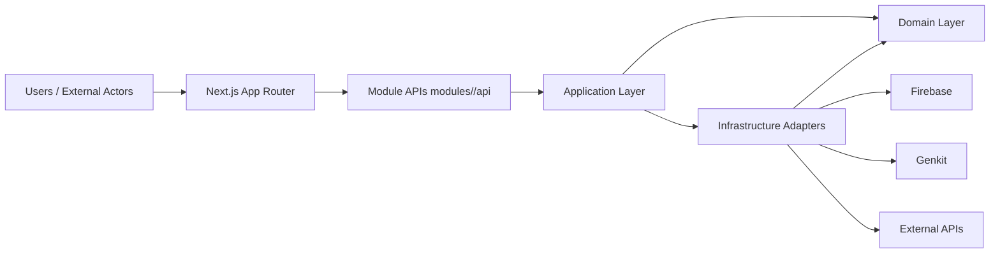
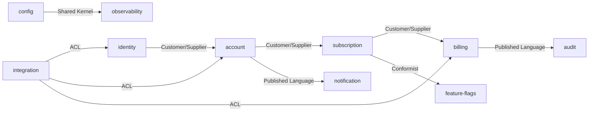
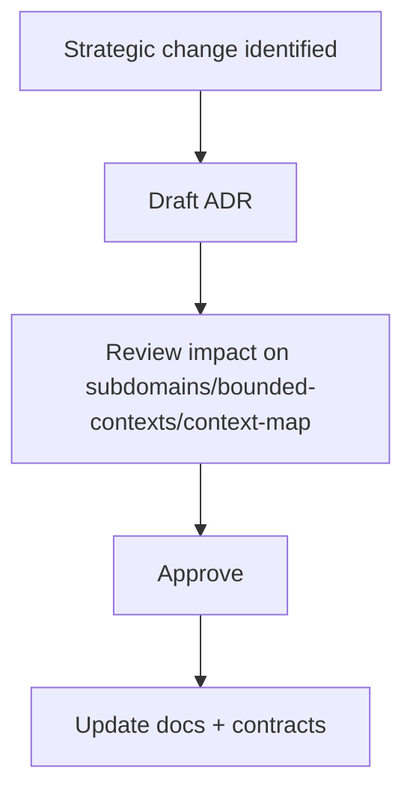
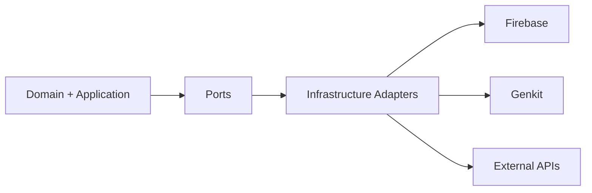
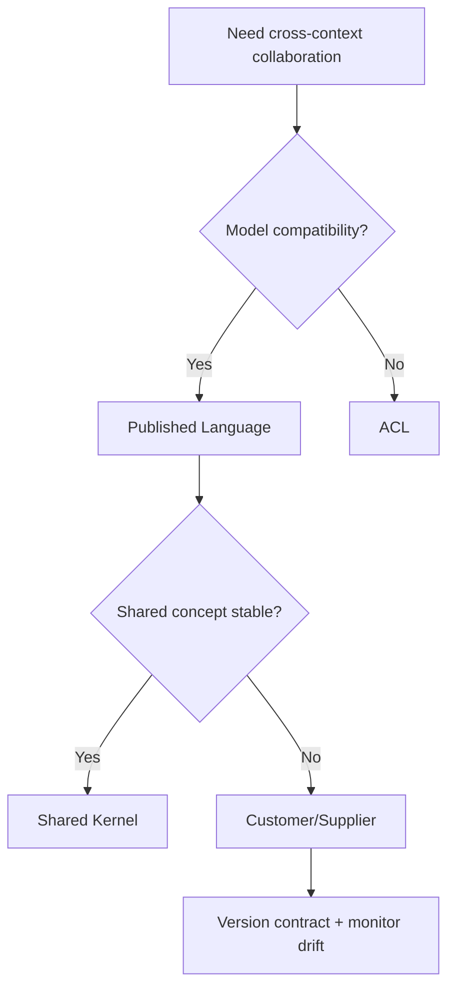
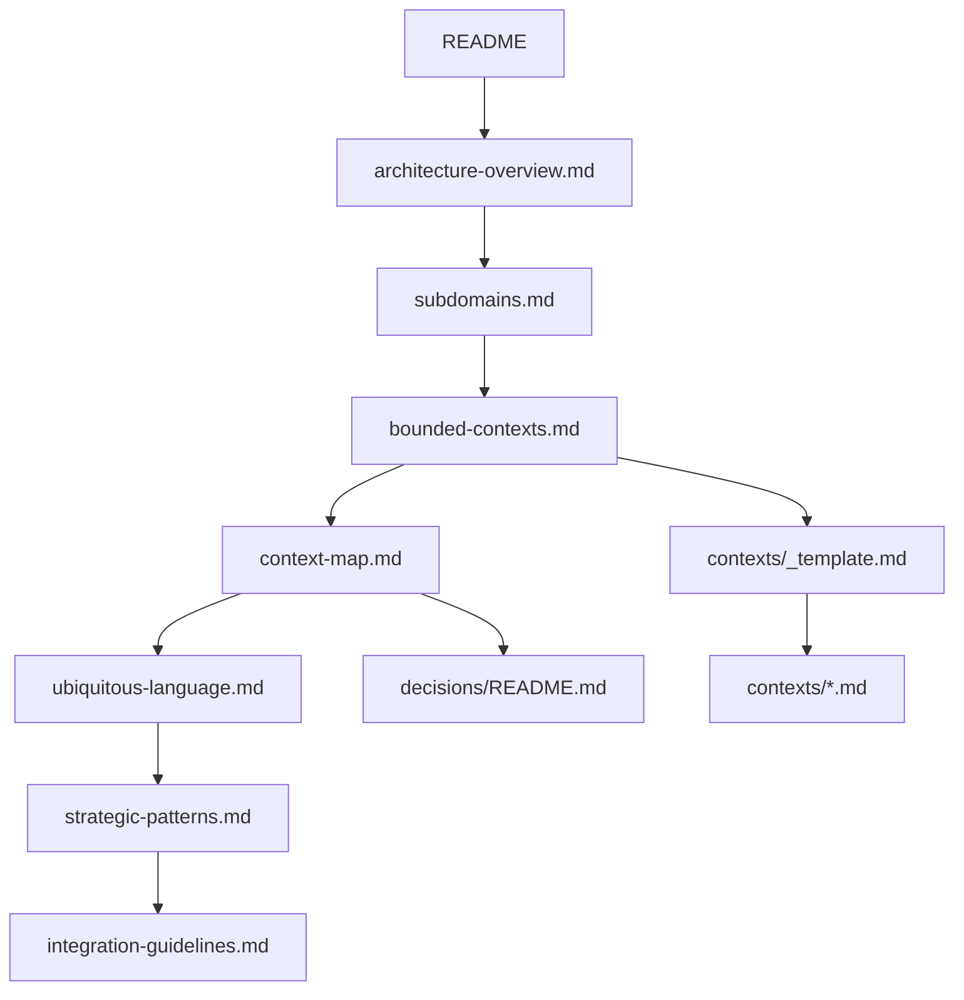

# Files

## File: .github/agents/ai-genkit-lead.agent.md
````markdown
---
name: AI Genkit Lead
description: Lead Genkit-oriented AI orchestration with boundary-safe runtime split across Next.js and py_fn pipelines.
tools: ['serena/*', 'context7/*', 'read', 'edit', 'search', 'todo']
model: 'GPT-5.3-Codex'
handoffs:
  - label: Refine Genkit Flow
    agent: Genkit Flow Agent
    prompt: Refine the Genkit flow contract, tool orchestration boundaries, and fallback behavior for this scope.
  - label: Review RAG Boundary
    agent: RAG Lead
    prompt: Review the retrieval and worker-runtime contract impact for this AI scope.
  - label: Run Quality Review
    agent: Quality Lead
    prompt: Review this AI and Genkit change for regression risk, boundary safety, and validation gaps.

---

# AI Genkit Lead

## Target Scope

- `modules/agent/**`
- `app/**`
- `py_fn/**` when coordinating runtime boundaries and worker handoff contracts

## Focus

- Genkit flow ownership and app-side orchestration
- Contract-safe integration with ingestion and retrieval layers

## Guardrails

- Keep auth and chat orchestration in Next.js.
- Keep parsing, chunking, embedding in py_fn workers.

Tags: #use skill context7 #use skill serena-mcp #use skill xuanwu-app-skill
````

## File: .github/agents/app-router.agent.md
````markdown
---
name: App Router Agent
description: Diagnose and implement Next.js App Router behavior using runtime evidence and boundary-safe edits.
argument-hint: Provide route segment, expected behavior, and failing symptoms.
tools: ['serena/*', 'context7/*', 'read', 'edit', 'search', 'todo', 'io.github.vercel/next-devtools-mcp/*']
model: 'GPT-5.3-Codex'
handoffs:
  - label: Refine Parallel Routes
    agent: Parallel Routes Agent
    prompt: Refine the parallel-route composition, slot isolation, and one-way data flow for this route scope.
  - label: Write Server Action
    agent: Server Action Writer
    prompt: Implement or review the server action orchestration and validation boundary used by this route.
  - label: Verify End-to-End
    agent: E2E QA Agent
    prompt: Verify the affected route in a browser and collect runtime evidence for this change.

---

# App Router Agent

## Target Scope

- `app/**`
- `modules/**/interfaces/**`
- `providers/**`

## Workflow

1. Identify the target segment and rendering/data path.
2. Use Next runtime evidence when symptoms are ambiguous.
3. Apply least-change fixes in route composition or local route UI.
4. Validate only the affected route behavior and related module API usage.

## Guardrails

- Keep business logic in modules.
- Use runtime evidence when route behavior is unclear.
- Keep route slices composition-focused.

## Output

- Route scope and failure mode
- Changes applied
- Evidence checked
- Residual route risk

Tags: #use skill context7 #use skill serena-mcp #use skill xuanwu-app-skill
````

## File: .github/agents/chunk-strategist.agent.md
````markdown
---
name: Chunk Strategist
description: Design chunking strategies for retrieval quality, context efficiency, and stable document traceability.
tools: ['serena/*', 'context7/*', 'read', 'edit', 'search', 'todo']
model: 'GPT-5.3-Codex'
handoffs:
  - label: Align Ingestion Inputs
    agent: Doc Ingest Agent
    prompt: Align document normalization and source attribution with the chunking strategy described above.
  - label: Configure Embeddings
    agent: Embedding Writer
    prompt: Implement or review embedding payloads and metadata that match this chunking strategy.
  - label: Review RAG Contract
    agent: RAG Lead
    prompt: Review this chunking strategy against retrieval quality, runtime boundaries, and indexing contracts.

---

# Chunk Strategist

## Target Scope

- `py_fn/**`
- `modules/retrieval/**`
- `modules/knowledge/**`

## Focus

- Chunk size and overlap policy
- Metadata fields for retrieval and attribution
- Domain-specific segmentation rules

Tags: #use skill context7 #use skill serena-mcp #use skill xuanwu-app-skill
````

## File: .github/agents/commands.md
````markdown
# Build, Lint & Development Commands

## Development

- `npm run dev` — Start Next.js development server (App Router, port 3000)
- `npm run build` — Production build (Next.js + TypeScript type-check)
- `npm run start` — Start production server from build output

## Lint & Type Check

- `npm run lint` — Run ESLint (flat config, `eslint.config.mjs`)
- `npm run test` — Run Vitest unit tests
- TypeScript type-checking is included in `npm run build`

## Firebase Deployment

- `npm run deploy:firebase` — Deploy all Firebase resources
- `npm run deploy:firestore:indexes` — Deploy Firestore indexes only
- `npm run deploy:firestore:rules` — Deploy Firestore security rules only
- `npm run deploy:storage:rules` — Deploy Storage security rules only
- `npm run deploy:rules` — Deploy Firestore rules + Storage rules
- `npm run deploy:apphosting` — Deploy App Hosting configuration
- `npm run deploy:functions` — Deploy Cloud Functions (Python)
- `npm run deploy:functions:py-fn` — Deploy Python Cloud Functions only
- `npm run deploy:functions:all` — Deploy all Cloud Functions

## Repomix (AI Skill Generation)

- `npm run repomix:skill` — Generate a repomix skill from the full codebase
- `npm run repomix:remote` — Generate a skill from a remote GitHub repository
- `npm run repomix:local` — Generate a skill from a local directory

## Key Configuration Files

| File | Purpose |
|------|---------|
| `next.config.ts` | Next.js 16 App Router configuration |
| `tsconfig.json` | TypeScript config with `@alias` path mappings |
| `eslint.config.mjs` | ESLint flat config with package boundary enforcement |
| `tailwind.config.ts` | Tailwind CSS 4 configuration |
| `firebase.json` | Firebase project configuration |
| `firestore.rules` | Firestore security rules |
| `firestore.indexes.json` | Firestore composite indexes |
| `storage.rules` | Cloud Storage security rules |
| `components.json` | shadcn CLI configuration (aliases → `@ui-shadcn/*`) |
| `apphosting.yaml` | Firebase App Hosting configuration |

## Environment Setup

- **Node.js**: Version 24 required (see `engines` in `package.json`)
- **Package manager**: npm
- Install dependencies: `npm install`
- Python test dependencies: `python -m pip install -r py_fn/requirements-dev.txt`
- Firebase CLI: `npx firebase` (no global install required)
````

## File: .github/agents/doc-ingest.agent.md
````markdown
---
name: Doc Ingest Agent
description: Implement document ingestion flows from source conversion to normalized artifacts for downstream chunking and indexing.
tools: ['serena/*', 'context7/*', 'read', 'edit', 'search', 'todo', 'microsoft/markitdown/*']
model: 'GPT-5.3-Codex'
handoffs:
  - label: Design Chunk Strategy
    agent: Chunk Strategist
    prompt: Design the chunking policy and metadata boundaries for the normalized artifacts described above.
  - label: Write Embeddings
    agent: Embedding Writer
    prompt: Implement or review embedding generation and metadata writes for this ingestion output.
  - label: Review RAG Flow
    agent: RAG Lead
    prompt: Review this ingestion change for retrieval quality, runtime boundaries, and contract alignment.

---

# Doc Ingest Agent

## Target Scope

- `py_fn/**`
- `modules/retrieval/**`
- `modules/knowledge/**`

## Rules

- Keep conversion and normalization deterministic.
- Preserve source attribution fields.
- Align outputs with chunk and embedding contracts.
- Flag notable format-loss risk when source conversion may affect downstream retrieval.

Tags: #use skill context7 #use skill serena-mcp #use skill xuanwu-app-skill
````

## File: .github/agents/domain-lead.agent.md
````markdown
---
name: Domain Lead
description: Lead domain ownership decisions and enforce module boundaries, dependency direction, and API-only collaboration.
tools: ['serena/*', 'context7/*', 'read', 'edit', 'search', 'execute']
model: 'GPT-5.3-Codex'
handoffs:
  - label: Refactor Module Boundary
    agent: MDDD Architect
    prompt: Refactor or review module boundaries, layer direction, and public API shape for this domain decision.
  - label: Update Contracts
    agent: TS Interface Writer
    prompt: Update the DTO, interface, or API contract surface that follows from this domain decision.
  - label: Run Quality Review
    agent: Quality Lead
    prompt: Review this domain change for behavioral risk, boundary regressions, and missing validation.

---

# Domain Lead

## Target Scope

- `modules/**`
- `packages/shared-types/**`
- `packages/api-contracts/**`

## Responsibilities

- Confirm owning bounded context before edits.
- Place logic in the correct layer.
- Prevent internal cross-module imports.

## Layer Placement Guide

- `domain`: business rules, entities, value objects, repository interfaces
- `application`: use cases and DTO orchestration
- `infrastructure`: external adapters and implementations
- `interfaces`: UI, hooks, queries, contracts, server actions
- `api`: only public cross-module boundary

## Validation

- Run lint for boundary and import changes.
- Run build when public types or exports are touched.

Tags: #use skill context7 #use skill serena-mcp #use skill xuanwu-app-skill
````

## File: .github/agents/e2e-qa.agent.md
````markdown
---
name: E2E QA Agent
description: Execute browser-level verification with Playwright MCP and report reproducible release-readiness evidence.
tools: ['serena/*', 'context7/*', 'read', 'search', 'todo', 'microsoft/playwright-mcp/*']
model: 'GPT-5.3-Codex'
handoffs:
  - label: Summarize Quality Risk
    agent: Quality Lead
    prompt: Summarize the confirmed failures, residual risks, and release recommendation from this browser verification.
  - label: Expand Test Coverage
    agent: Test Scenario Writer
    prompt: Turn the executed browser paths and gaps into explicit scenario coverage recommendations.
  - label: Capture Support Follow-up
    agent: Support Architect
    prompt: Convert the confirmed failures and evidence into bounded support and follow-up actions.

---

# E2E QA Agent

## Target Scope

- `app/**`
- `modules/**/interfaces/**`
- `debug/**`

## Workflow

1. Build scenarios from acceptance criteria and user paths.
2. Execute browser interactions and capture runtime evidence.
3. Separate confirmed failures from improvement suggestions.

## Rules

- Capture clear reproduction steps.
- Separate confirmed failures from improvement ideas.
- Report console and network evidence when relevant.

## Output

- Scenarios executed
- Evidence collected
- Confirmed failures
- Release recommendation: ready | ready-with-risk | blocked

Tags: #use skill context7 #use skill serena-mcp #use skill xuanwu-app-skill
````

## File: .github/agents/embedding-writer.agent.md
````markdown
---
name: Embedding Writer
description: Implement embedding generation and vector-write workflows with deterministic metadata and quality checks.
tools: ['serena/*', 'context7/*', 'read', 'edit', 'search', 'execute']
model: 'GPT-5.3-Codex'
handoffs:
  - label: Review Chunk Inputs
    agent: Chunk Strategist
    prompt: Review the upstream chunking policy and metadata assumptions for this embedding workflow.
  - label: Refine Flow Integration
    agent: Genkit Flow Agent
    prompt: Refine the orchestration contract that consumes or coordinates this embedding workflow.
  - label: Run Quality Review
    agent: Quality Lead
    prompt: Review this embedding change for deterministic metadata, compatibility, and regression risk.

---

# Embedding Writer

## Target Scope

- `py_fn/**`
- `modules/retrieval/**`
- `modules/knowledge/**`

## Responsibilities

- Define embedding payload shape.
- Ensure consistent vector metadata.
- Validate write path and retrieval compatibility.

Tags: #use skill context7 #use skill serena-mcp #use skill xuanwu-app-skill
````

## File: .github/agents/firestore-schema.agent.md
````markdown
---
name: Firestore Schema Agent
description: Design Firestore document models, indexes, and access patterns aligned with module ownership and query workloads.
tools: ['serena/*', 'context7/*', 'read', 'edit', 'search', 'execute']
model: 'GPT-5.3-Codex'
handoffs:
  - label: Plan Migration
    agent: Schema Migration Agent
    prompt: Plan the compatibility window, rollout path, and rollback strategy for this schema change.
  - label: Review Security Rules
    agent: Security Rules Agent
    prompt: Review the security-rule implications of this Firestore schema and access-pattern change.
  - label: Run Quality Review
    agent: Quality Lead
    prompt: Review this schema change for compatibility risk, query correctness, and missing validation.

---

# Firestore Schema Agent

## Target Scope

- `modules/**/infrastructure/**`
- `firestore.indexes.json`
- `firestore.rules`

## Responsibilities

- Model collections and documents for bounded contexts.
- Keep schema and index plans aligned with read and write paths.
- Track migration impact and backward compatibility.

Tags: #use skill context7 #use skill serena-mcp #use skill xuanwu-app-skill
````

## File: .github/agents/frontend-lead.agent.md
````markdown
---
name: Frontend Lead
description: Lead app route composition and component architecture while keeping business logic in modules and APIs.
tools: ['serena/*', 'context7/*', 'read', 'edit', 'search', 'execute', 'shadcn/*']
model: 'GPT-5.3-Codex'
handoffs:
  - label: Diagnose Route Behavior
    agent: App Router Agent
    prompt: Diagnose the App Router composition, rendering behavior, and runtime boundary impact for this frontend scope.
  - label: Compose UI Primitives
    agent: Shadcn Composer
    prompt: Compose or refactor the UI primitives and interaction states needed for this route-level frontend change.
  - label: Run Quality Review
    agent: Quality Lead
    prompt: Review this frontend change for UX regressions, ownership boundaries, and missing validation.

---

# Frontend Lead

## Target Scope

- `app/**`
- `modules/**/interfaces/**`
- `packages/ui-*/**`

## Mission

Deliver route-level UI slices with clear ownership and predictable data flow.

## Guardrails

- Keep app routes thin and composition-focused.
- Consume module behavior via module api only.
- Prefer server components unless client interactivity is required.

Tags: #use skill context7 #use skill serena-mcp #use skill xuanwu-app-skill
````

## File: .github/agents/genkit-flow.agent.md
````markdown
---
name: Genkit Flow Agent
description: Design and refine Genkit flow definitions, boundaries, and contract-safe integration with retrieval and worker pipelines.
tools: ['serena/*', 'context7/*', 'read', 'edit', 'search', 'todo']
model: 'GPT-5.3-Codex'
handoffs:
  - label: Review AI Ownership
    agent: AI Genkit Lead
    prompt: Review the Genkit orchestration ownership, runtime split, and app-side integration for this flow.
  - label: Review RAG Contract
    agent: RAG Lead
    prompt: Review this Genkit flow against retrieval contracts, worker boundaries, and indexing expectations.
  - label: Run Quality Review
    agent: Quality Lead
    prompt: Review this Genkit flow change for fallback behavior, contract safety, and validation gaps.

---

# Genkit Flow Agent

## Target Scope

- `modules/agent/**`
- `app/**`
- `modules/retrieval/**`

## Focus

- Flow inputs and outputs
- Prompt and tool orchestration boundaries
- Error handling and fallback behavior

## Guardrails

- Keep flow contracts explicit.
- Avoid leaking worker-only logic into app orchestration.

Tags: #use skill context7 #use skill serena-mcp #use skill xuanwu-app-skill
````

## File: .github/agents/kb-architect.agent.md
````markdown
---
name: KB Architect
description: Plan and optimize knowledge-base documentation structure, deduplication, and retrieval-friendly formatting.
tools: ['serena/*', 'context7/*', 'read', 'edit', 'search', 'todo']
model: 'GPT-5.3-Codex'
handoffs:
  - label: Refine Prompt Contracts
    agent: Prompt Engineer
    prompt: Refine the prompt contract, reusable workflow wording, and instruction clarity for this knowledge-base change.
  - label: Align Support Playbooks
    agent: Support Architect
    prompt: Align the support workflow, escalation notes, and operational follow-up with this knowledge-base update.
  - label: Run Quality Review
    agent: Quality Lead
    prompt: Review this knowledge-base change for clarity, consistency, and residual ambiguity.

---

# KB Architect

## Target Scope

- `docs/**`
- `.github/prompts/**`
- `.github/instructions/**`

## Focus

- Information hierarchy for docs and references
- Cross-document deduplication
- Stable glossary and index links

## Execution Pattern

- Process docs in leaf-to-root order when restructuring large doc trees.
- Prefer lint/compress/dedup/structure updates before index regeneration.
- Keep token usage efficient without changing technical meaning.

## Guardrails

- Do not change technical meaning while restructuring docs.
- Keep docs aligned with current module boundaries and contracts.

Tags: #use skill context7 #use skill serena-mcp #use skill xuanwu-app-skill
````

## File: .github/agents/lint-rule-enforcer.agent.md
````markdown
---
name: Lint Rule Enforcer
description: Enforce lint and boundary rules, identify violation causes, and propose minimal fixes without broad refactors.
tools: ['serena/*', 'context7/*', 'read', 'edit', 'search', 'execute']
model: 'GPT-5.3-Codex'
handoffs:
  - label: Check Domain Boundary
    agent: Domain Lead
    prompt: Confirm whether this lint or boundary issue indicates a domain ownership or layer-placement problem.
  - label: Review Frontend Impact
    agent: Frontend Lead
    prompt: Review the frontend or route-composition impact of the lint and boundary issues identified above.
  - label: Summarize Quality Risk
    agent: Quality Lead
    prompt: Summarize the confirmed issues, fix status, and residual release risk after lint enforcement.

---

# Lint Rule Enforcer

## Target Scope

- `app/**`
- `modules/**`
- `packages/**`
- `providers/**`
- `py_fn/**`

## Mission

Keep rule compliance high while minimizing churn.

## Guardrails

- Fix root causes, not symptoms.
- Preserve existing architecture boundaries.

Tags: #use skill context7 #use skill serena-mcp #use skill xuanwu-app-skill
````

## File: .github/agents/mddd-architect.agent.md
````markdown
---
name: MDDD Architect
description: Design and refactor modules with strict MDDD ownership, layer direction, and API-only cross-module boundaries.
tools: ['serena/*', 'context7/*', 'read', 'edit', 'search', 'execute']
model: 'GPT-5.3-Codex'
handoffs:
  - label: Confirm Domain Ownership
    agent: Domain Lead
    prompt: Confirm the owning bounded context and the required public API boundary for this module refactor.
  - label: Update Contracts
    agent: TS Interface Writer
    prompt: Update or review the public DTO and contract surface affected by this module refactor.
  - label: Run Quality Review
    agent: Quality Lead
    prompt: Review this module refactor for boundary regressions, compatibility risk, and missing validation.

---

# MDDD Architect

## Target Scope

- `modules/**`
- `packages/shared-types/**`
- `packages/api-contracts/**`

## Mission

Shape module structures without breaking bounded contexts.

## Rules

- Keep dependency direction: interfaces -> application -> domain <- infrastructure.
- Cross-module access must go through modules target api only.
- Keep domain framework-free.
- Run lint and build when boundaries or exports move.

## Module Lifecycle Operations

- Support create/refactor/split/merge/delete with explicit ownership mapping.
- Preserve public API compatibility or document migration steps in the same change.
- Replace internal cross-module imports with API contracts or event-driven collaboration.

## Output

- Ownership decision
- Boundary impact
- Files changed
- Validation evidence

Tags: #use skill context7 #use skill serena-mcp #use skill xuanwu-app-skill
````

## File: .github/agents/prompt-engineer.agent.md
````markdown
---
name: Prompt Engineer
description: Create and refine high-signal prompts, templates, and prompt contracts for repeatable delivery workflows.
tools: ['serena/*', 'context7/*', 'read', 'edit', 'search', 'todo']
model: 'GPT-5.3-Codex'
handoffs:
  - label: Organize Knowledge Base
    agent: KB Architect
    prompt: Organize the surrounding knowledge-base structure, deduplication, and glossary alignment for this prompt work.
  - label: Refine Tool Strategy
    agent: Tool Caller
    prompt: Refine the tool sequencing, least-privilege access, and evidence flow expected by this prompt.
  - label: Run Quality Review
    agent: Quality Lead
    prompt: Review this prompt or workflow contract for ambiguity, missing constraints, and validation gaps.

---

# Prompt Engineer

## Target Scope

- `.github/prompts/**`
- `.github/instructions/**`
- `.github/agents/**`

## Focus

- Reusable prompt skeletons
- Clear input and output contracts
- Low-noise, high-precision instruction design

## Guardrails

- Keep prompts task-focused and testable.
- Avoid broad ambiguous directives.

Tags: #use skill context7 #use skill serena-mcp #use skill xuanwu-app-skill
````

## File: .github/agents/quality-lead.agent.md
````markdown
---
name: Quality Lead
description: Drive risk-first review and QA evidence, including regression detection, coverage gaps, and release recommendation.
tools: ['serena/*', 'context7/*', 'read', 'search', 'execute', 'todo']
model: 'GPT-5.3-Codex'
handoffs:
  - label: Enforce Lint Rules
    agent: Lint Rule Enforcer
    prompt: Enforce the relevant lint and boundary rules and report the root causes for any remaining violations.
  - label: Verify Browser Flows
    agent: E2E QA Agent
    prompt: Execute the highest-risk browser scenarios and collect runtime evidence for this change.
  - label: Expand Test Scenarios
    agent: Test Scenario Writer
    prompt: Turn the residual risks and gaps into explicit unit, integration, or E2E scenario coverage.

---

# Quality Lead

## Target Scope

- `app/**`
- `modules/**`
- `packages/**`
- `providers/**`
- `py_fn/**`

## Mission

Verify correctness, boundary safety, and release readiness.

## Review Lenses

1. Correctness and behavioral regression risk
2. Ownership and boundary integrity
3. Validation completeness
4. Documentation completeness for changed behavior

## Workflow

1. Build scenario list from requirements and change scope.
2. Execute happy path, boundary, negative, and error scenarios.
3. Report findings by severity before summaries.

## Output

- Findings ordered by severity
- Evidence and reproduction details
- Residual risks and recommendation: ready, ready-with-risk, blocked

Tags: #use skill context7 #use skill serena-mcp #use skill xuanwu-app-skill
````

## File: .github/agents/rag-lead.agent.md
````markdown
---
name: RAG Lead
description: Lead RAG ingest and retrieval contracts, runtime boundaries, and quality gates for chunk and vector pipelines.
tools: ['serena/*', 'context7/*', 'read', 'edit', 'search', 'todo', 'microsoft/markitdown/*']
model: 'GPT-5.3-Codex'
handoffs:
  - label: Normalize Ingestion
    agent: Doc Ingest Agent
    prompt: Normalize the ingestion inputs, attribution fields, and source-conversion flow for this RAG scope.
  - label: Design Chunk Strategy
    agent: Chunk Strategist
    prompt: Design the chunking policy, overlap, and metadata boundaries for this RAG scope.
  - label: Write Embeddings
    agent: Embedding Writer
    prompt: Implement or review the embedding payload, metadata writes, and compatibility guarantees for this RAG scope.

---

# RAG Lead

## Target Scope

- `py_fn/**`
- `modules/retrieval/**`
- `modules/knowledge/**`

## Focus

- Ingestion contract alignment
- Retrieval quality and index consistency
- Runtime split between app orchestration and worker processing

## Guardrails

- Validate contract alignment before changing ingestion shape.
- Keep Next.js orchestration and `py_fn` ingestion responsibilities separated.

Tags: #use skill context7 #use skill serena-mcp #use skill xuanwu-app-skill
````

## File: .github/agents/schema-migration.agent.md
````markdown
---
name: Schema Migration Agent
description: Plan and implement schema evolution with compatibility windows, data backfill steps, and rollback considerations.
tools: ['serena/*', 'context7/*', 'read', 'edit', 'search', 'execute']
model: 'GPT-5.3-Codex'
handoffs:
  - label: Review Firestore Model
    agent: Firestore Schema Agent
    prompt: Review the source and target schema shape, query impact, and index needs for this migration plan.
  - label: Review Security Rules
    agent: Security Rules Agent
    prompt: Review the security-rule impact and access-policy compatibility for this migration plan.
  - label: Run Quality Review
    agent: Quality Lead
    prompt: Review this migration plan for rollout risk, rollback gaps, and validation completeness.

---

# Schema Migration Agent

## Target Scope

- `modules/**/infrastructure/**`
- `firestore.indexes.json`
- `firestore.rules`

## Workflow

1. Define source and target schema.
2. Plan compatibility and cutover phases.
3. Validate reads and writes before and after migration.

Tags: #use skill context7 #use skill serena-mcp #use skill xuanwu-app-skill
````

## File: .github/agents/security-rules.agent.md
````markdown
---
name: Security Rules Agent
description: Author and review Firestore and Storage security rules with least-privilege, tenancy isolation, and testable access policies.
tools: ['serena/*', 'context7/*', 'read', 'edit', 'search', 'execute']
model: 'GPT-5.3-Codex'
handoffs:
  - label: Review Firestore Schema
    agent: Firestore Schema Agent
    prompt: Review the data model and access paths that this security-rules change must protect.
  - label: Verify Browser Impact
    agent: E2E QA Agent
    prompt: Verify the product flows affected by this rules change and capture evidence for any access regressions.
  - label: Run Quality Review
    agent: Quality Lead
    prompt: Review this security-rules change for least-privilege coverage, regression risk, and validation gaps.

---

# Security Rules Agent

## Target Scope

- `firestore.rules`
- `storage.rules`
- `modules/**/infrastructure/**`

## Mission

Prevent unauthorized access while preserving required product flows.

## Guardrails

- Enforce organization and workspace isolation.
- Prefer explicit allow conditions with clear actor checks.
- Pair rule changes with validation scenarios.

Tags: #use skill context7 #use skill serena-mcp #use skill xuanwu-app-skill
````

## File: .github/agents/server-action-writer.agent.md
````markdown
---
name: Server Action Writer
description: Write Next.js server actions that validate input, delegate to use cases, and return stable command results.
tools: ['serena/*', 'context7/*', 'read', 'edit', 'search']
model: 'GPT-5.3-Codex'
handoffs:
  - label: Update Contracts
    agent: TS Interface Writer
    prompt: Update or review the DTO and command-result contracts used by this server action.
  - label: Review Domain Boundary
    agent: Domain Lead
    prompt: Confirm the use-case boundary, layer placement, and API ownership for this server action.
  - label: Run Quality Review
    agent: Quality Lead
    prompt: Review this server action change for validation gaps, orchestration drift, and regression risk.

---

# Server Action Writer

## Target Scope

- `app/**`
- `modules/**/interfaces/**`
- `modules/**/application/**`

## Guardrails

- Keep actions thin and orchestration-only.
- Place business rules in module use cases.
- Preserve consistent command-result response shape.

Tags: #use skill context7 #use skill serena-mcp #use skill xuanwu-app-skill
````

## File: .github/agents/shadcn-composer.agent.md
````markdown
---
name: Shadcn Composer
description: Compose and refactor UI components using shadcn patterns while preserving route and module ownership boundaries.
argument-hint: Describe component goal, target route, and required interaction states.
tools: ['serena/*', 'context7/*', 'read', 'edit', 'search', 'shadcn/*']
model: 'GPT-5.3-Codex'
handoffs:
  - label: Review Frontend Ownership
    agent: Frontend Lead
    prompt: Review the route ownership, composition boundary, and data-flow assumptions behind this UI work.
  - label: Refine Parallel Routes
    agent: Parallel Routes Agent
    prompt: Refine the slot composition, state isolation, and route-level integration for this UI work.
  - label: Verify End-to-End
    agent: E2E QA Agent
    prompt: Verify the interaction states and browser behavior for this UI change.

---

# Shadcn Composer

## Target Scope

- `app/**`
- `modules/**/interfaces/components/**`
- `packages/ui-shadcn/**`

## Workflow

1. Confirm route ownership and API data shape before composing UI.
2. Reuse existing primitives and tokens first.
3. Validate interaction states and accessibility basics.

## Rules

- Reuse existing component primitives before adding new ones.
- Keep styling and behavior consistent with app composition boundaries.
- Validate interactive states and accessibility basics.

Tags: #use skill context7 #use skill serena-mcp #use skill xuanwu-app-skill
````

## File: .github/agents/test-scenario-writer.agent.md
````markdown
---
name: Test Scenario Writer
description: Write risk-based scenario suites for unit, integration, and E2E coverage with clear acceptance criteria.
tools: ['serena/*', 'context7/*', 'read', 'edit', 'search', 'todo']
model: 'GPT-5.3-Codex'
handoffs:
  - label: Review Quality Risk
    agent: Quality Lead
    prompt: Review these scenarios against the highest-risk behaviors, missing coverage, and release concerns.
  - label: Verify Browser Flows
    agent: E2E QA Agent
    prompt: Execute the E2E scenarios from this suite in the browser and collect runtime evidence.
  - label: Check Lint And Rules
    agent: Lint Rule Enforcer
    prompt: Check whether any structural or lint rule changes are needed to support the scenarios described above.

---

# Test Scenario Writer

## Target Scope

- `app/**`
- `modules/**`
- `py_fn/tests/**`

## Scope

- Happy path
- Boundary and negative paths
- Error handling and regression-sensitive paths

Tags: #use skill context7 #use skill serena-mcp #use skill xuanwu-app-skill
````

## File: .github/agents/ts-interface-writer.agent.md
````markdown
---
name: TS Interface Writer
description: Write and refactor TypeScript interfaces, DTOs, and contracts with stable naming and compatibility-aware changes.
tools: ['serena/*', 'context7/*', 'read', 'edit', 'search']
model: 'GPT-5.3-Codex'
handoffs:
  - label: Review Domain Ownership
    agent: Domain Lead
    prompt: Confirm the owning bounded context and public API boundary for these contract changes.
  - label: Write Server Action
    agent: Server Action Writer
    prompt: Update the server action orchestration that consumes or returns these contract changes.
  - label: Review Firestore Shape
    agent: Firestore Schema Agent
    prompt: Review the persistence and index implications of these contract changes.

---

# TS Interface Writer

## Target Scope

- `modules/**/api/**`
- `modules/**/application/dto/**`
- `packages/shared-types/**`

## Focus

- Domain and application DTO contracts
- Backward-safe type evolution
- Explicit optional and required field transitions

## Guardrails

- Keep module interface and API contracts explicit and minimal.
- Do not leak private infrastructure/entity internals into public API contracts.
- Coordinate contract changes with consumer updates in the same change.

Tags: #use skill context7 #use skill serena-mcp #use skill xuanwu-app-skill
````

## File: .github/agents/workspace-audit.agent.md
````markdown

````

## File: .github/instructions/branching-strategy.instructions.md
````markdown
---
description: 'Branching and change-scope strategy for focused, reviewable delivery.'
applyTo: '**/*'
---

# Branching Strategy

## Rules

- Keep one concern per branch and PR.
- Name branches by intent and scope.
- Avoid mixing architecture refactor with unrelated feature work.

## Validation Before Merge

- Run relevant lint/build/test commands for touched runtime.
- Document what changed and why.

Tags: #use skill context7 #use skill serena-mcp #use skill xuanwu-app-skill
````

## File: .github/instructions/ci-cd.instructions.md
````markdown
---
description: 'CI/CD execution rules for lint, build, tests, and release evidence.'
applyTo: '{.github/workflows/**/*.{yml,yaml},package.json,py_fn/requirements.txt,firebase.json,apphosting.yaml}'
---

# CI CD

## Required Checks

- `npm run lint`
- `npm run build`
- `cd py_fn && python -m compileall -q .`
- `cd py_fn && python -m pytest tests/ -v`

## Rules

- Do not skip failing mandatory checks.
- Report unrelated baseline failures separately.

Tags: #use skill context7 #use skill serena-mcp #use skill xuanwu-app-skill
````

## File: .github/instructions/cloud-functions.instructions.md
````markdown
---
description: 'Rules for Python Cloud Functions worker responsibilities and boundaries.'
applyTo: 'py_fn/**/*.py'
---

# Cloud Functions

## Ownership

- `py_fn/` handles parsing, cleaning, taxonomy, chunking, embedding, and background jobs.
- Do not add browser-facing chat/auth/session logic in `py_fn/`.

## Runtime Decision Rule

- If called directly from page or browser flow, keep it in Next.js.
- If heavy, retryable, admin/internal, or long-running, keep it in `py_fn/`.

## Guardrails

- Preserve worker layer boundaries.
- Keep ingest job flow deterministic and retry-safe.

## Boundary Change Validation

- Before changing worker ownership, review `py_fn/docs/decision-architecture/adr/README.md` and accepted ADRs.
- Update `py_fn/README.md` when responsibilities or runtime contracts change.

Tags: #use skill context7 #use skill serena-mcp #use skill xuanwu-app-skill
#use skill xuanwu-rag-runtime-boundary
````

## File: .github/instructions/commit-convention.instructions.md
````markdown
---
description: 'Commit message and change-summary conventions for maintainable history.'
applyTo: '**/*'
---

# Commit Convention

## Rules

- Keep subject concise and action-oriented.
- Reference scope (module/runtime) in commit body when relevant.
- Include validation evidence for non-trivial changes.

## Avoid

- Mixed unrelated changes in one commit.
- Vague subjects with no functional signal.

Tags: #use skill context7 #use skill serena-mcp #use skill xuanwu-app-skill
````

## File: .github/instructions/embedding-pipeline.instructions.md
````markdown
---
description: 'Ingestion and embedding pipeline contract for worker-side RAG preparation.'
applyTo: '{py_fn/**/*.py,docs/**/*.md}'
---

# Embedding Pipeline

## Contract Order

Parse -> Clean -> Taxonomy -> Chunk -> Chunk metadata -> Embedding -> Firestore writes -> Mark ready

## Rules

- Do not reorder stages without contract/doc update.
- Normalize source documents to markdown (for example via MarkItDown) before chunking when required by source format.
- Keep metadata traceable for retrieval citations.
- Validate converted markdown quality before chunking.
- Record notable format-loss risk when conversion fidelity may affect downstream retrieval.

Tags: #use skill context7 #use skill serena-mcp #use skill xuanwu-app-skill
#use skill xuanwu-rag-runtime-boundary
#use skill llamaparse
#use skill liteparse
````

## File: .github/instructions/firebase-architecture.instructions.md
````markdown
---
description: 'Firebase architecture boundaries for Next.js orchestration, Firestore, and Python worker runtime.'
applyTo: '{app,modules,packages,py_fn}/**/*.{ts,tsx,js,jsx,py}'
---

# Firebase Architecture

## Runtime Split

- Next.js: user-facing orchestration, auth/session, server actions.
- `py_fn/`: heavy ingestion, embedding, and background operations.

## Responsibility Split

- Next.js owns upload UX, browser-facing APIs, and AI response orchestration.
- `py_fn/` owns parse/clean/taxonomy/chunk/embed/persist pipelines.

## Data Boundary

- Keep Firestore document contracts explicit.
- Avoid implicit schema drift across modules.
- Preserve source and chunk metadata traceability for audit and citation needs.

Tags: #use skill context7 #use skill serena-mcp #use skill xuanwu-app-skill
#use skill xuanwu-rag-runtime-boundary
#use skill xuanwu-development-contracts
````

## File: .github/instructions/firestore-schema.instructions.md
````markdown
---
description: 'Firestore schema and index design rules aligned to bounded context ownership.'
applyTo: '{modules/**/infrastructure/**/*.{ts,tsx,js,jsx},firestore.indexes.json,firestore.rules}'
---

# Firestore Schema

## Rules

- Keep collection ownership explicit per module.
- Version breaking schema transitions with migration steps.
- Update indexes with query-shape changes.

## Validation

- Verify read/write paths remain compatible.
- Confirm index coverage for new query patterns.

Tags: #use skill context7 #use skill serena-mcp #use skill xuanwu-app-skill
#use skill xuanwu-development-contracts
````

## File: .github/instructions/genkit-flow.instructions.md
````markdown
---
description: 'Genkit flow design and runtime-boundary rules for AI orchestration.'
applyTo: '{modules/agent/**/*.{ts,tsx,js,jsx},app/**/*.{ts,tsx}}'
---

# Genkit Flow

## Rules

- Keep flow inputs/outputs explicit and typed.
- Keep user-facing orchestration in Next.js.
- Delegate heavy ingestion/embedding to worker-side pipelines.

Tags: #use skill context7 #use skill serena-mcp #use skill xuanwu-app-skill
#use skill xuanwu-rag-runtime-boundary
#use skill next-devtools-mcp
````

## File: .github/instructions/hosting-deploy.instructions.md
````markdown
---
description: 'Hosting deploy guardrails for Firebase App Hosting and release safety.'
applyTo: '{apphosting.yaml,firebase.json,.github/workflows/**/*.{yml,yaml}}'
---

# Hosting Deploy

## Rules

- Validate build and config before deployment.
- Keep deploy scope explicit (hosting, rules, indexes, functions).
- Record rollback path for production-impacting changes.

Tags: #use skill context7 #use skill serena-mcp #use skill xuanwu-app-skill
````

## File: .github/instructions/lint-format.instructions.md
````markdown
---
description: 'Lint and formatting expectations for TypeScript and Python changes.'
applyTo: '{app,modules,packages,providers,debug,py_fn}/**/*.{ts,tsx,js,jsx,py}'
---

# Lint Format

## Required Commands

- `npm run lint`
- `npm run build` when types or exports changed
- `cd py_fn && python -m compileall -q .`

## Rules

- Fix new lint errors introduced by your change.
- Do not hide violations by broad rule disables.

Tags: #use skill context7 #use skill serena-mcp #use skill xuanwu-app-skill
#use skill vscode-typescript-workbench
````

## File: .github/instructions/nextjs-app-router.instructions.md
````markdown
---
description: 'Next.js App Router composition rules for route slices and ownership boundaries.'
applyTo: 'app/**/*.{ts,tsx}'
---

# Nextjs App Router

## Rules

- Keep route files focused on composition and rendering.
- Prefer Server Components unless client interactivity is required.
- Keep business logic in modules and consume via module APIs.
- Use package aliases and avoid legacy import families.
- Keep `app/` as composition ownership, not domain-rule ownership.

Tags: #use skill context7 #use skill serena-mcp #use skill xuanwu-app-skill
#use skill next-devtools-mcp
#use skill vercel-react-best-practices
#use skill vercel-composition-patterns
````

## File: .github/instructions/nextjs-parallel-routes.instructions.md
````markdown
---
description: 'Parallel-route UI block composition rules with isolated local state and API-only module access.'
applyTo: 'app/**/*.{ts,tsx}'
---

# Nextjs Parallel Routes

## Rules

- Keep slot-level state isolated.
- Avoid hidden coupling between unrelated slots.
- Consume cross-domain behavior through module APIs only.

Tags: #use skill context7 #use skill serena-mcp #use skill xuanwu-app-skill
#use skill app-router-parallel-routes
#use skill next-devtools-mcp
#use skill vercel-react-best-practices
````

## File: .github/instructions/nextjs-server-actions.instructions.md
````markdown
---
description: 'Server Action rules for thin orchestration, validation at boundaries, and stable result contracts.'
applyTo: '{app,modules}/**/*.{ts,tsx}'
---

# Nextjs Server Actions

## Rules

- Use `use server` explicitly.
- Keep actions thin and delegate business logic to use cases.
- Return consistent command result shapes.
- Validate inputs at action boundaries using shared validators where applicable.
- Keep infrastructure access out of route files and action wrappers.

Tags: #use skill context7 #use skill serena-mcp #use skill xuanwu-app-skill
#use skill next-devtools-mcp
#use skill vercel-react-best-practices
````

## File: .github/instructions/playwright-mcp-testing.instructions.md
````markdown
---
description: >
  Playwright MCP 瀏覽器測試執行規則。凡涉及用戶流程驗證、UI 功能測試、
  截圖存證、表單操作自動化、Console 錯誤偵測時適用。
applyTo: '{app,modules,debug}/**/*.{ts,tsx}'
---

# Playwright MCP Testing Rules

## 工具優先順序

1. **主要**：`mcp_playwright-mc_*` 工具鏈（snapshot → ref → action）
2. **備援**：`mcp_io_github_ver_browser_eval`（playwright-mcp 失效時）
3. **永遠不用**：在備援模式下呼叫 playwright-mcp（會得到 closed 錯誤）

## Snapshot-First 原則

**禁止** 在未取得 snapshot ref 的情況下直接 click 或 fill。

```
✅ 正確：snapshot → 找 ref → click(ref: "...")
❌ 錯誤：直接 click(selector: "button.create")
```

## evaluate 限制（備援模式）

以下表達式在 `mcp_io_github_ver_browser_eval evaluate` 中會失敗：

- 包含 `new Event()`、`new PointerEvent()` 的鏈式表達式
- 包含 `Array.from()` + 方法鏈的複合表達式
- 包含 for loop 的表達式

解法：拆分為多個單一表達式呼叫。

## SPA 導航規則

**全頁重載導致 React 狀態重置**（activeAccount 被清空）。

```
✅ 允許：點擊 Link 的 ref（SPA 路由）
✅ 允許：點擊麵包屑 a[href="/target"] 的 ref
❌ 禁止：瀏覽器導航到新 URL（重置 activeAccount）
❌ 禁止：evaluate window.location.href = '...'
```

## Radix UI Dropdown 開啟規則

Radix DropdownMenu 需要 `PointerEvent` 才能觸發。使用 snapshot 找到 trigger 的 ref，然後 click 它（playwright-mcp 的 click 自動發送正確事件）。

## 帳號情境一致性

- 每次全頁重載後，必須重新確認 `localStorage['xuanwu_last_active_account']`
- 組織功能測試：在 SPA 已載入狀態下切換，勿重載

## workspaceId 前提

以下頁面的 CTA 需要 `activeWorkspaceId` 非空：
- `/knowledge-base/articles`（新增文章）
- `/knowledge-base/articles/[id]`（編輯文章）

測試前先在 `/workspace` 選擇工作區。

## Console 錯誤義務

每次測試結束前，必須呼叫：
```
mcp_playwright-mc_browser_console_messages
```
並在報告中記錄錯誤（即使為零也要寫「無錯誤」）。

## 截圖義務

每個主要測試步驟（初始狀態、操作後、最終狀態）必須截圖：
```
mcp_playwright-mc_browser_take_screenshot → 儲存至 scratchpad/
```

## 測試報告格式

輸出遵循 SKILL.md「測試報告格式」區塊的模板，包含：
- URL + 帳號情境 + 日期 + 狀態
- 截圖證據清單
- 操作步驟記錄
- 發現問題（含優先級）
- Console 錯誤
- 建議修復

## 工具搭配規則

| 情境 | 必用工具 |
|------|---------|
| 確認元件 API | `mcp_shadcn_view_items_in_registries` |
| 不確定 Playwright API | `mcp_context7_resolve-library-id "playwright"` |
| 找 Server Action | `mcp_io_github_ver_nextjs_call get_server_action_by_id` |
| 找元件 props | `mcp_oraios_serena_find_symbol` |
| 輸出測試報告 | `mcp_markitdown_convert_to_markdown` |

Tags: #use skill playwright-mcp-testing
````

## File: .github/instructions/prompt-engineering.instructions.md
````markdown
---
description: 'Prompt authoring rules for deterministic, low-noise, reusable workflow prompts.'
applyTo: '.github/prompts/**/*.prompt.md'
---

# Prompt Engineering

## Frontmatter

- Use clear `description` and `agent` fields.
- Declare `tools` with least privilege when tool usage is required.
- Keep `argument-hint` explicit when the prompt expects user inputs.

## Structure

1. Mission
2. Inputs
3. Workflow
4. Output contract
5. Validation

## Rules

- Keep prompts specific and executable.
- Declare required inputs and fallbacks.
- Keep tools least-privilege when defined.
- Avoid copying repository-global policy into each prompt.
- Prefer short executable steps over long background text.

Tags: #use skill context7 #use skill serena-mcp #use skill xuanwu-app-skill
````

## File: .github/instructions/rag-architecture.instructions.md
````markdown
---
description: 'RAG architecture boundaries for conversion, chunking, embedding, and retrieval workflows.'
applyTo: '{modules/retrieval/**/*.{ts,tsx,js,jsx},modules/knowledge/**/*.{ts,tsx,js,jsx},py_fn/**/*.py,docs/**/*.md}'
---

# RAG Architecture

## Rules

- Normalize source docs before chunking when needed, including MarkItDown-based conversion for non-markdown sources.
- Keep retrieval metadata auditable and source-traceable.
- Keep runtime split: Next.js orchestration, `py_fn` ingestion pipeline.

Tags: #use skill context7 #use skill serena-mcp #use skill xuanwu-app-skill
#use skill xuanwu-rag-runtime-boundary
#use skill llamaparse
#use skill liteparse
````

## File: .github/instructions/security-rules.instructions.md
````markdown
---
description: 'Security rules guardrails for Firestore and Storage with least-privilege access.'
applyTo: '{firestore.rules,storage.rules,modules/**/infrastructure/**/*.{ts,tsx,js,jsx},py_fn/**/*.py}'
---

# Security Rules

## Rules

- Enforce organization and workspace isolation.
- Keep allow conditions explicit and auditable.
- Pair rule changes with scenario-based validation.

## Avoid

- Broad wildcard allows without actor checks.
- Hidden coupling to UI-side assumptions.

Tags: #use skill context7 #use skill serena-mcp #use skill xuanwu-app-skill
#use skill xuanwu-development-contracts
````

## File: .github/instructions/shadcn-ui.instructions.md
````markdown
---
description: 'shadcn/ui usage rules for consistent component composition and accessibility.'
applyTo: '{app,modules,packages}/**/*.{ts,tsx}'
---

# Shadcn UI

## Rules

- Prefer existing primitives before creating new components.
- Keep semantic markup and keyboard accessibility intact.
- Keep component concerns separate from business rules.

Tags: #use skill context7 #use skill serena-mcp #use skill xuanwu-app-skill
#use skill shadcn
#use skill web-design-guidelines
````

## File: .github/instructions/tailwind-design-system.instructions.md
````markdown
---
description: 'Tailwind design-system consistency rules for tokens, spacing, and responsive behavior.'
applyTo: '{app,modules,packages}/**/*.{ts,tsx,css}'
---

# Tailwind Design System

## Rules

- Reuse established tokens and utility conventions.
- Keep spacing and typography scales consistent.
- Avoid ad-hoc one-off style patterns without rationale.

Tags: #use skill context7 #use skill serena-mcp #use skill xuanwu-app-skill
#use skill web-design-guidelines
#use skill shadcn
````

## File: .github/instructions/testing-e2e.instructions.md
````markdown
---
description: 'End-to-end testing rules for browser flows, evidence capture, and release confidence.'
applyTo: '{app,modules,debug}/**/*.{ts,tsx}'
---

# Testing E2E

## Rules

- Validate user-critical flows and failure paths.
- Capture reproducible evidence for failures.
- Separate confirmed defects from enhancement suggestions.

Tags: #use skill context7 #use skill serena-mcp #use skill xuanwu-app-skill
#use skill vscode-testing-debugging-browser
#use skill next-devtools-mcp
````

## File: .github/instructions/testing-unit.instructions.md
````markdown
---
description: 'Unit testing rules for deterministic, isolated, and behavior-focused coverage.'
applyTo: '{modules,packages,py_fn}/**/*.{ts,tsx,js,jsx,py}'
---

# Testing Unit

## Rules

- Keep tests deterministic and isolated.
- Test behavior and invariants, not implementation trivia.
- Cover happy, boundary, and negative paths for core domain logic.

Tags: #use skill context7 #use skill serena-mcp #use skill xuanwu-app-skill
#use skill vscode-testing-debugging-browser
#use skill vscode-typescript-workbench
````

## File: .github/prompts/chunk-docs.prompt.md
````markdown
---
name: chunk-docs
description: Define and execute document chunking strategy for retrieval quality and context efficiency.
agent: rag-lead
argument-hint: Provide source docs, target chunk policy, and constraints.
---

# Chunk Docs

## Inputs

- docs: ${input:docs:docs/**/*.md}
- policy: ${input:policy:size,overlap,metadata}
- constraints: ${input:constraints:token budget and citation needs}

## Workflow

1. Validate document normalization status.
2. Apply chunking policy with explicit metadata fields.
3. Check chunk quality for retrieval relevance.
4. Report chunk statistics and edge cases.

Tags: #use skill context7 #use skill serena-mcp #use skill xuanwu-app-skill
#use skill xuanwu-rag-runtime-boundary
#use skill liteparse
#use skill llamaparse
````

## File: .github/prompts/debug-error.prompt.md
````markdown
---
name: debug-error
description: Reproduce, diagnose, and propose fixes for runtime or logic errors with evidence.
agent: App Router Agent
argument-hint: Provide error message, route/module, and reproduction steps.
---

# Debug Error

## Inputs

- error: ${input:error:paste error message}
- scope: ${input:scope:route/module/runtime}
- repro: ${input:repro:steps to reproduce}

## Workflow

1. Reproduce issue and capture evidence.
2. Isolate likely root cause and affected boundaries.
3. Propose minimal fix plus regression checks.
4. State validation commands to confirm resolution.

Tags: #use skill context7 #use skill serena-mcp #use skill xuanwu-app-skill
#use skill next-devtools-mcp
#use skill vscode-testing-debugging-browser
````

## File: .github/prompts/embedding-docs.prompt.md
````markdown
---
name: embedding-docs
description: Generate embeddings from normalized docs with traceable metadata and retrieval compatibility checks.
agent: embedding-writer
argument-hint: Provide doc sources, embedding model/runtime, and storage target.
---

# Embedding Docs

## Workflow

1. Confirm docs are normalized and chunked.
2. Generate embeddings with stable metadata.
3. Write vectors and verify retrieval compatibility.
4. Report failures, retries, and quality risks.

Tags: #use skill context7 #use skill serena-mcp #use skill xuanwu-app-skill
#use skill xuanwu-rag-runtime-boundary
#use skill llamaparse
````

## File: .github/prompts/implement-firestore-schema.prompt.md
````markdown
---
name: implement-firestore-schema
description: Implement Firestore schema/index updates with backward-safe migration and validation evidence.
agent: firestore-schema
argument-hint: Provide collections, fields, query patterns, and migration constraints.
---

# Implement Firestore Schema

## Workflow

1. Define schema and ownership by bounded context.
2. Update indexes for new query shapes.
3. Plan migration or compatibility path.
4. Validate read/write behavior and regressions.

Tags: #use skill context7 #use skill serena-mcp #use skill xuanwu-app-skill
#use skill xuanwu-development-contracts
````

## File: .github/prompts/implement-genkit-flow.prompt.md
````markdown
---
name: implement-genkit-flow
description: Implement or refactor Genkit flow with explicit contracts, runtime boundaries, and validation.
agent: genkit-flow
argument-hint: Provide flow intent, inputs/outputs, and target runtime.
---

# Implement Genkit Flow

## Workflow

1. Define flow contract (input, output, failure modes).
2. Keep orchestration in Next.js and heavy processing in worker runtime.
3. Integrate with retrieval or action boundaries safely.
4. Validate flow behavior and fallback paths.

Tags: #use skill context7 #use skill serena-mcp #use skill xuanwu-app-skill
#use skill xuanwu-rag-runtime-boundary
#use skill next-devtools-mcp
````

## File: .github/prompts/implement-security-rules.prompt.md
````markdown
---
name: implement-security-rules
description: Implement Firestore/Storage security rules with least privilege and tenancy isolation.
agent: security-rules
argument-hint: Provide access scenarios, actor roles, and constrained resources.
---

# Implement Security Rules

## Workflow

1. Enumerate allowed actor-resource actions.
2. Encode explicit allow conditions and deny-by-default behavior.
3. Validate with scenario-based checks.
4. Report residual access risks.

Tags: #use skill context7 #use skill serena-mcp #use skill xuanwu-app-skill
#use skill xuanwu-development-contracts
````

## File: .github/prompts/implement-server-action.prompt.md
````markdown
---
name: implement-server-action
description: Implement Next.js server actions as thin orchestrators that delegate to use cases.
agent: server-action-writer
argument-hint: Provide action intent, input schema, and target use case.
---

# Implement Server Action

## Rules

- Use `use server`.
- Validate input at boundary.
- Delegate business logic to module use cases.
- Return stable command-result shape.

Tags: #use skill context7 #use skill serena-mcp #use skill xuanwu-app-skill
#use skill next-devtools-mcp
#use skill vercel-react-best-practices
#use skill modules-mddd-api-surface
````

## File: .github/prompts/implement-ui-component.prompt.md
````markdown
---
name: implement-ui-component
description: Build or refactor UI components with shadcn patterns and boundary-safe composition.
agent: Component Agent
argument-hint: Provide component goal, route scope, and interaction states.
---

# Implement UI Component

## Workflow

1. Confirm component ownership and target route slice.
2. Reuse existing shadcn primitives where possible.
3. Implement states: loading, empty, error, success.
4. Validate accessibility and interaction behavior.

Tags: #use skill context7 #use skill serena-mcp #use skill xuanwu-app-skill
#use skill shadcn
#use skill web-design-guidelines
#use skill vercel-react-best-practices
#use skill next-devtools-mcp
````

## File: .github/prompts/ingest-docs.prompt.md
````markdown
---
name: ingest-docs
description: Ingest and normalize documents for downstream chunking and embedding workflows.
agent: doc-ingest
argument-hint: Provide source format, target pipeline, and quality constraints.
---

# Ingest Docs

## Workflow

1. Convert/normalize sources to markdown when needed.
2. Preserve source metadata and traceability.
3. Validate structure quality for chunking.
4. Output ingestion summary and loss-risk notes.

Tags: #use skill context7 #use skill serena-mcp #use skill xuanwu-app-skill
#use skill xuanwu-rag-runtime-boundary
#use skill liteparse
#use skill llamaparse
````

## File: .github/prompts/plan-api.prompt.md
````markdown
---
name: plan-api
description: Create an API-focused implementation plan covering contracts, facades, consumers, and validation.
agent: Planner
argument-hint: Provide API intent, owner module, consumers, and compatibility constraints.
---

# Plan API

## Requirements

- Define contract shape and owner boundary.
- Identify consuming routes/modules.
- Include compatibility and migration strategy.
- Specify validation and documentation updates.

Tags: #use skill context7 #use skill serena-mcp #use skill xuanwu-app-skill
#use skill modules-mddd-api-surface
#use skill xuanwu-development-contracts
````

## File: .github/prompts/playwright-mcp-inspect.prompt.md
````markdown
---
name: playwright-mcp-inspect
description: 以用戶視角巡覽目標路由，自動偵測 UI 功能缺口、反直覺設計、空狀態引導缺失與 Console 錯誤。
agent: E2E QA Agent
argument-hint: "<route-or-section> [--account org|personal] [--deep]"
---

# Playwright MCP UI 缺口偵測

## 輸入參數

- target: ${input:target:要巡覽的路由或功能模組，例如 /organization 或 knowledge-base}
- account: ${input:account:帳號情境 personal 或 org（組織功能用 org）}
- depth: ${input:depth:巡覽深度 shallow（主頁面）或 deep（進入子頁面）}

## 目標

扮演一位「第一次使用」的真實用戶，系統性地走過目標區域，找出：

1. **功能缺口**：預期存在但找不到的操作入口（CRUD 缺少 Create？）
2. **反直覺設計**：動作不符合用戶預期、按鈕位置奇怪、命名混淆
3. **空狀態問題**：列表為空時無任何引導性說明或 CTA
4. **Disabled 陷阱**：按鈕存在但 disabled 且無說明原因
5. **導航死胡同**：進入後找不到返回路徑
6. **Console 錯誤**：任何 JavaScript 錯誤或 API 失敗

## 帳號情境設置

**Personal 帳號**（預設）：
- 直接導航到目標頁面
- 確認 localStorage `xuanwu_last_active_account` = `dev-demo-user`

**Organization 帳號**（需要 org 功能時）：
1. 導航到 `/workspace`（確保 SPA 已載入）
2. 點開帳號切換 dropdown（需 PointerDown 事件）
3. 選擇 org 選項
4. 確認 localStorage 更新為 org ID
5. 點擊麵包屑或 Link（勿用全頁重載）導航到目標

## 巡覽執行流程

### Phase 1: 頁面初始化分析

```
1. mcp_playwright-mc_browser_navigate → 目標 URL
2. mcp_playwright-mc_browser_snapshot → 取得完整 a11y 樹
3. mcp_playwright-mc_browser_take_screenshot → 初始截圖
4. mcp_playwright-mc_browser_console_messages → 確認無初始錯誤
```

記錄頁面結構：
- 頁面標題、小標、說明文字
- 可見的操作按鈕（CTA）
- 是否有資料列表或空狀態
- 是否有 Nav/Breadcrumb 讓用戶知道自己在哪

### Phase 2: CTA 完整性檢查

針對每個功能模組，預期應有的 CRUD 操作入口：

| 功能類型 | 預期 CTA | 缺口判斷 |
|---------|---------|---------|
| 列表頁 | 新增/建立按鈕 | 無「＋」或「新增」按鈕 |
| 詳情頁 | 編輯/刪除按鈕 | 只能查看無法修改 |
| 表單 | 送出/取消 | 送出後無任何反饋 |
| 搜尋/篩選 | 清除/重設 | 無法清除已輸入的篩選 |

### Phase 3: 互動測試（Shallow 模式）

```
1. 找到主要 CTA → snapshot ref → click
2. 記錄 Dialog/Form 是否正確開啟
3. 填入測試資料（snapshot find inputs → fill）
4. 送出表單
5. 驗證成功反饋（toast、列表更新）
6. 截圖紀錄

負面測試：
1. 不填任何資料直接送出
2. 確認 validation 錯誤提示出現
3. 截圖記錄
```

### Phase 4: 子頁面巡覽（Deep 模式）

```
針對頁面上每個導航連結：
1. 記錄 href
2. click 進入
3. 重複 Phase 1-3
4. click 返回（找 Back Link 或 Breadcrumb）
```

### Phase 5: 錯誤狀態收集

```
mcp_playwright-mc_browser_console_messages → 收集所有 console 訊息
mcp_io_github_ver_nextjs_call port:3000 toolName:"get_errors" → Next.js 錯誤
```

## 缺口評分標準

| 嚴重度 | 說明 | 示例 |
|-------|------|------|
| 🔴 高 | 核心功能完全缺失 | 列表頁沒有建立入口 |
| 🟡 中 | 功能存在但使用困難 | 按鈕 disabled 無說明 |
| 🟢 低 | 體驗可改善 | 空狀態缺少引導文字 |

## 輸出 UI 缺口報告

```markdown
## UI 缺口偵測報告：{target}

**巡覽路徑**: {routes visited}
**帳號情境**: personal / organization  
**巡覽日期**: YYYY-MM-DD  
**巡覽深度**: shallow / deep

### 截圖索引
1. [ss_initial.png] 初始狀態
2. [ss_create_dialog.png] 建立流程
...

### 發現的缺口

#### 🔴 高優先級
- [ ] **路徑**: /route  
  **問題**: 功能說明  
  **影響**: 用戶無法完成 X  
  **建議**: 在 Y 位置加入 Z 元件

#### 🟡 中優先級
...

#### 🟢 低優先級
...

### Console 錯誤
- 無 / 錯誤清單

### 修復建議優先順序
1. 最高影響 + 最低代價
2. ...
```

## 與其他 MCP 的協作

**找修復方案時**：
- `mcp_shadcn_list_items_in_registries` → 查詢適合的 UI 元件
- `mcp_shadcn_get_item_examples_from_registries` → 取得元件示例

**確認 API 可用性**：
- `mcp_oraios_serena_find_symbol` → 找對應的 use case / server action
- `mcp_io_github_ver_nextjs_call get_routes` → 確認路由存在

**查詢 UX 最佳實踐**：
- `mcp_context7_resolve-library-id "shadcn/ui"` → 查元件文件

Tags: #use skill playwright-mcp-testing
#use skill shadcn
#use skill context7
#use skill serena-mcp
#use skill next-devtools-mcp
````

## File: .github/prompts/playwright-mcp-test.prompt.md
````markdown
---
name: playwright-mcp-test
description: 執行 Playwright MCP 瀏覽器測試，驗證指定路由的用戶流程並輸出帶截圖的測試報告。
agent: E2E QA Agent
argument-hint: "<route-or-url> <user-flow-description> [--account org|personal]"
---

# Playwright MCP 瀏覽器測試

## 輸入參數

- route: ${input:route:目標路由或完整 URL，例如 /organization/members}
- flow: ${input:flow:要測試的用戶流程，例如「邀請成員」}
- account: ${input:account:帳號情境 personal 或 org（預設 personal）}

## 前置條件確認

在開始前，執行以下確認步驟：

1. **Dev server 狀態**  
   確認 `http://localhost:3000` 可存取。若未啟動，提示用戶執行 `npm run dev`。

2. **playwright-mcp 可用性**  
   執行 `mcp_playwright-mc_browser_snapshot`（無參數）。
   - 成功 → 使用 playwright-mcp 工具鏈
   - 失敗（"closed"）→ 切換到 `mcp_io_github_ver_browser_eval` 備援模式

3. **帳號情境切換（若需要 org 情境）**  
   參照 SKILL.md 的「帳號切換」章節執行組織帳號切換。

4. **工作區確認（若頁面需要 workspaceId）**  
   先導航到 /workspace 選擇工作區，再前往目標頁面。

## 測試執行流程

### Step 1: 導航到目標路由

```
playwright-mcp 模式：
  mcp_playwright-mc_browser_navigate → url: "http://localhost:3000{route}"
  
備援模式：
  mcp_io_github_ver_browser_eval action:"navigate" → url: "http://localhost:3000{route}"
```

### Step 2: 取得初始快照

```
mcp_playwright-mc_browser_snapshot → 取得完整 a11y 樹
識別所有可交互元素（buttons、inputs、links、selects）
確認主要 CTA 是否 enabled
```

### Step 3: 截圖（初始狀態）

```
mcp_playwright-mc_browser_take_screenshot → 初始狀態截圖
儲存至 scratchpad/ 目錄並 view_image 檢視
```

### Step 4: 執行用戶流程

依照 `{flow}` 執行具體操作，記錄每步驟的：
- 找到的元素 ref
- 執行的動作（click/fill/select）
- 操作後的快照變化

### Step 5: 驗證結果

```
成功路徑驗證：
  - snapshot → 確認 UI 反映成功狀態（新項目出現、Dialog 關閉）
  - console_messages → 確認無錯誤

失敗路徑驗證（負面測試）：
  - 故意送空表單 → 確認 validation 訊息出現
  - 故意填錯格式 → 確認錯誤提示
```

### Step 6: 最終截圖

```
mcp_playwright-mc_browser_take_screenshot → 最終狀態截圖
```

### Step 7: Next.js 診斷（可選）

```
mcp_io_github_ver_nextjs_call port:3000 toolName:"get_errors"
→ 確認無 Next.js build/runtime 錯誤
```

## 輸出測試報告

使用以下模板輸出報告：

```markdown
## 測試結果：{flow} @ {route}

**URL**: {route}  
**帳號情境**: personal / organization  
**測試日期**: YYYY-MM-DD  
**狀態**: ✅ 通過 / ❌ 失敗 / ⚠️ 部分通過

### 截圖證據
- [初始狀態截圖]
- [操作後截圖]
- [最終狀態截圖]

### 操作步驟記錄
1. 步驟描述 + ref + 結果
2. ...

### 發現問題
- ❌ 問題描述（優先級：高/中/低）

### Console 錯誤
- 無 / 錯誤列表

### 建議
- [ ] 修復建議或增強建議
```

Tags: #use skill playwright-mcp-testing
#use skill context7
#use skill next-devtools-mcp
#use skill serena-mcp
````

## File: .github/prompts/review-code.prompt.md
````markdown
---
name: review-code
description: Perform risk-first code review for correctness, regressions, and missing validation.
agent: Quality Lead
argument-hint: Provide change summary, touched files, and known risk areas.
---

# Review Code

## Requirements

- Findings first, ordered by severity.
- Include why it matters and blocking status.
- State residual risks and testing gaps explicitly.

Tags: #use skill context7 #use skill serena-mcp #use skill xuanwu-app-skill
#use skill modules-mddd-api-surface
#use skill vscode-typescript-workbench
````

## File: .github/prompts/review-performance.prompt.md
````markdown
---
name: review-performance
description: Review runtime and render performance risks with evidence-backed recommendations.
agent: App Router Agent
argument-hint: Provide route/feature scope, observed slowness, and baseline expectations.
---

# Review Performance

## Workflow

1. Collect route/runtime evidence.
2. Identify bottlenecks and likely causes.
3. Propose ranked fixes by impact and complexity.
4. Define validation for improvement claims.

Tags: #use skill context7 #use skill serena-mcp #use skill xuanwu-app-skill
#use skill vercel-react-best-practices
#use skill next-devtools-mcp
````

## File: .github/prompts/review-security.prompt.md
````markdown
---
name: review-security
description: Review security posture for access control, data exposure, and rule/authorization regressions.
agent: quality-lead
argument-hint: Provide changed auth/rules/critical data paths and threat concerns.
---

# Review Security

Report vulnerabilities first with severity, reproduction notes, and concrete remediation steps.

Tags: #use skill context7 #use skill serena-mcp #use skill xuanwu-app-skill
#use skill xuanwu-development-contracts
````

## File: .github/prompts/serena-ddd-refactor.prompt.md
````markdown
---

name: serena-ddd-refactor
description: Scan large files, refactor to follow Vaughn Vernon Implementing Domain-Driven Design without breaking functionality, then update Serena MCP memory and index.
agent: copilot
argument-hint: <project-root>
-----------------------------

# Serena DDD Refactor Prompt

## Objective

Identify oversized files in the project, verify whether they violate Domain-Driven Design layering principles from Vaughn Vernon, refactor them without breaking functionality, then update Serena MCP memory and symbol index.

---

# Step 1 — Start Serena MCP

If Serena MCP is not running:

```
serena start-mcp-server
```

Activate project and load memory:

```
serena
#use skill serena-mcp > activate_project
list_memories
read_memory
#use skill xuanwu-app-markdown-skill
#use skill xuanwu-app-skill
#use skill context7
```

---

# Step 2 — Find Largest Files

Run PowerShell to locate largest files:

```
$folders = @("app","modules","packages","py_fn\src")

Get-ChildItem $folders -Recurse -File |
Where-Object { $_.FullName -notmatch "node_modules|\.next|\.git|dist|build|__pycache__" } |
Sort-Object Length -Descending |
Select-Object -First 33 FullName, Length
```

Focus refactoring on these large files first.

---

# Step 3 — DDD Refactor Rules (Vaughn Vernon)

Refactor files that violate these rules:

## Application Service must NOT contain

* Business logic
* Repository query logic
* DTO mapping logic
* Entity creation logic
* Infrastructure calls

Application Service should only:

```
Receive request → Load Aggregate → Call Domain → Save Aggregate → Publish Event
```

## Aggregate must NOT contain

* Repository
* Firebase / Database
* HTTP / API calls
* UI / DTO
* Infrastructure logic

Aggregate should contain only:

```
Entities
Value Objects
Domain Logic
Domain Events
```

## Repository must NOT contain

* Business logic
* Domain rules
* Complex query logic
* Application logic

Repository should only:

```
Save
Get
Delete
```

## Domain Service usage

Create Domain Service only when:

* Logic does not belong to a single Entity
* Requires multiple Aggregates
* Pure business logic
* No infrastructure dependency

---

# Step 4 — File Splitting Structure

When splitting large files, use this structure:

```
domain/
  aggregates/
  entities/
  value-objects/
  domain-events/
  domain-services/

application/
  services/
  commands/
  queries/

infrastructure/
  repositories/
  firebase/
  external-services/

interface/
  controllers/
  dto/
  routes/
```

---

# Step 5 — File Size Guidelines

Recommended file sizes:

```
Entity < 150 lines
Aggregate < 300 lines
Application Service < 150 lines
Repository < 120 lines
Controller < 120 lines
Domain Service < 150 lines
```

Files exceeding ~300 lines likely indicate boundary or responsibility problems.

---

# Step 6 — After Refactor Update Serena

After modifications:

```
#sym:update_memory
#sym:prune_index
```

Purpose:

```
update_memory → sync new architecture and symbols
prune_index → remove outdated symbols
```

---

# Full Workflow Checklist

```
1. serena start-mcp-server
2. activate_project
3. list_memories
4. read_memory
5. Find largest files
6. Check DDD violations
7. Refactor and split files
8. Ensure functionality still works
9. #sym:update_memory
10. #sym:prune_index
```

---

# Core Principle

DDD refactoring goal is not smaller files, but correct boundaries:

```
Controller → Application Service → Domain → Repository
```

Domain layer must not depend on:

```
Database
Firebase
HTTP
UI
Framework
```
````

## File: .github/prompts/write-docs.prompt.md
````markdown
---
name: write-docs
description: Write or optimize documentation using structured, deduplicated, and index-driven markdown patterns.
agent: KB Architect
argument-hint: Provide target docs scope and expected documentation outcome.
---

# Write Docs

## Workflow

1. Lint markdown syntax first.
2. Compress and deduplicate repeated concepts.
3. Convert prose to rules/tables where possible.
4. Update folder index/README after leaf updates.

Tags: #use skill context7 #use skill serena-mcp #use skill xuanwu-app-skill
#use skill documentation-writer
````

## File: .github/prompts/write-e2e-tests.prompt.md
````markdown
---
name: write-e2e-tests
description: Design and execute end-to-end tests for user-critical flows with reproducible evidence.
agent: E2E QA Agent
argument-hint: Provide URL/route, target user flow, and acceptance criteria.
---

# Write E2E Tests

## Scope

- Happy path
- Boundary/negative path
- Error-state handling

Collect evidence for failures and include clear reproduction steps.

Tags: #use skill context7 #use skill serena-mcp #use skill xuanwu-app-skill
#use skill vscode-testing-debugging-browser
#use skill next-devtools-mcp
````

## File: .github/prompts/write-tests.prompt.md
````markdown
---
name: write-tests
description: Write deterministic unit/integration tests based on risk and behavior contracts.
agent: quality-lead
argument-hint: Provide module scope, behaviors to verify, and known regression risks.
---

# Write Tests

## Requirements

- Cover happy, boundary, and negative cases.
- Keep tests deterministic and isolated.
- Prioritize behavior contracts over implementation details.

Tags: #use skill context7 #use skill serena-mcp #use skill xuanwu-app-skill
#use skill vscode-testing-debugging-browser
#use skill vscode-typescript-workbench
````

## File: features/README.md
````markdown
---
name: features-layer
description: Feature（Use Case）層設計規範，負責跨 Bounded Context 的協調與流程編排
---

# 📦 Features Layer（Use Case Orchestration）

## 🎯 目的

`features/` 是系統的 **Use Case 層（應用層）**，負責：

- 將多個 `modules/（Bounded Context）` 串接成「一個完整功能」
- 作為 **唯一的功能入口（Single Entry Point）**
- 控制流程（Flow orchestration）
- 隔離 UI 與 Domain 的耦合

---

## 🧠 核心概念

| 概念 | 說明 |
|------|------|
| Feature | 使用者可感知的功能（Use Case） |
| Orchestration | 跨多個 modules 的流程編排 |
| Application Layer | 不包含業務規則，只負責調度 |
| Stateless | 不持有狀態，僅控制流程 |

---

## 📁 結構設計

```bash
/features
  /<feature-name>
    usecase.ts        # 核心流程（唯一入口）
    route.ts          # API / Server Action（Next.js）
    schema.ts         # input/output validation（zod）
    dto.ts            # 資料轉換（可選）
    ui/               # UI（shadcn）
      *.tsx
    hooks/            # React hooks（可選）
    state/            # client state（可選）
````

## File: modules/account/AGENT.md
````markdown
# AGENT.md — account BC

## 模組定位

`account` 是 Xuanwu 平台的**帳戶管理**有界上下文，負責用戶 profile 與存取控制政策。在伺服器端消費 `identity/api`。

## 通用語言（Ubiquitous Language）

| 正確術語 | 禁止使用 |
|----------|----------|
| `Account` | User、Profile、Member（在此 BC 內） |
| `AccountPolicy` | Permission、AccessRule、Role（作為存取控制） |
| `customClaims` | Claims、FirebaseClaims |
| `accountId` | userId、uid（在此 BC 之外的引用應使用 accountId） |

## 邊界規則

### ✅ 允許
```typescript
import { accountApi } from "@/modules/account/api";
import type { AccountDTO, AccountPolicyDTO } from "@/modules/account/api";
```

### ❌ 禁止
```typescript
import { Account } from "@/modules/account/domain/entities/Account";
// account use-cases 在 server 端 — 不要在 use-cases 中 import React/client hooks
```

## 關鍵依賴規則

- `modules/account/application/use-cases/account.use-cases.ts` 與 `modules/account/application/use-cases/account-policy.use-cases.ts` 在 server 端執行，可 import `identity/api`
- 不要在 application 層 import 任何含 `"use client"` 的模組

## 驗證命令

```bash
npm run lint
npm run build
```
````

## File: modules/account/aggregates.md
````markdown
# Aggregates — account

## 聚合根：Account

### 職責
代表使用者在 Xuanwu 平台的業務身份記錄。管理 profile 資訊與帳戶狀態。

### 關鍵屬性

| 屬性 | 型別 | 說明 |
|------|------|------|
| `id` | `string` | 帳戶主鍵（對應 Firebase uid） |
| `displayName` | `string` | 顯示名稱 |
| `email` | `string` | Email |
| `avatarUrl` | `string \| null` | 頭像 URL |
| `createdAt` | `Timestamp` | 建立時間 |

### 不變數

- 每個 Account 對應唯一一個 Firebase uid
- Account 建立後 id 不可變更

---

## 聚合根：AccountPolicy

### 職責
代表附加到帳戶的存取控制政策，定義哪些資源可存取、哪些動作被允許，並映射到 Firebase custom claims。

### 關鍵屬性

| 屬性 | 型別 | 說明 |
|------|------|------|
| `id` | `string` | Policy 主鍵 |
| `accountId` | `string` | 關聯的 Account ID |
| `rules` | `PolicyRule[]` | 存取控制規則列表 |
| `effect` | `"allow" \| "deny"` | 規則效果 |

---

## Repository Interfaces

| 介面 | 主要方法 |
|------|---------|
| `AccountRepository` | `save()`, `findById()`, `delete()` |
| `AccountQueryRepository` | `findById()`, `findByEmail()` |
| `AccountPolicyRepository` | `save()`, `findByAccountId()` |
````

## File: modules/account/application-services.md
````markdown
# account — Application Services

> **Canonical bounded context:** `account`
> **模組路徑:** `modules/account/`
> **Domain Type:** Generic Subdomain

本文件記錄 `account` 的 application layer 服務與 use cases。內容與 `modules/account/application/` 實作保持一致。

## Application Layer 職責

管理帳戶資料、偏好設定與帳戶政策，並在 server 端透過 identity/api 取得已驗證身份。

Application layer 只負責：
- 協調 use cases / DTO / process manager
- 呼叫 domain repository ports 與 domain services
- 不承載 UI / framework-specific concerns

## 實際檔案

- `application/use-cases/account-policy.use-cases.ts`
- `application/use-cases/account.use-cases.ts`

## 設計對齊

- 模組 README：`../../../modules/account/README.md`
- 模組 AGENT：`../../../modules/account/AGENT.md`
- 與 application layer 有關的模組內就地文件：`../../../modules/account/application-services.md`
````

## File: modules/account/context-map.md
````markdown
# Context Map — account

## 上游（依賴）

### identity → account（Customer/Supplier）

- `account` 依賴 `identity/api` 取得 uid 與 TokenRefreshSignal
- `modules/account/application/use-cases/account.use-cases.ts` 在 server 端 import `identity/api`

```
identity/api ──► account/application (server-side use-cases)
```

---

## 下游（被依賴）

### account → organization（Customer/Supplier）

- `organization` 的 `MemberReference` 使用 `accountId` 參照 Account
- Organization 成員列表以 `accountId` 為主鍵

### account → workspace（Customer/Supplier）

- `Workspace.accountId` 關聯帳戶或組織

---

## IDDD 整合模式總結

| 關係 | 上游 | 下游 | 模式 |
|------|------|------|------|
| identity → account | identity | account | Customer/Supplier |
| account → organization | account | organization | Customer/Supplier |
| account → workspace | account | workspace | Customer/Supplier |
````

## File: modules/account/domain-events.md
````markdown
# Domain Events — account

## 發出事件

| 事件 | 觸發條件 | 關鍵欄位 |
|------|---------|---------|
| `account.created` | 新帳戶建立時 | `accountId`, `email`, `occurredAt` |
| `account.policy_updated` | AccountPolicy 更新時，觸發 custom claims 刷新 | `accountId`, `policyId`, `occurredAt` |

## 訂閱事件

| 來源 BC | 事件 | 行動 |
|---------|------|------|
| `identity` | `TokenRefreshSignal` | 觸發 custom claims 重新計算與 Firebase token 更新 |

## 事件格式

```typescript
interface AccountCreatedEvent {
  readonly type: "account.created";
  readonly accountId: string;
  readonly email: string;
  readonly occurredAt: string;  // ISO 8601
}

interface AccountPolicyUpdatedEvent {
  readonly type: "account.policy_updated";
  readonly accountId: string;
  readonly policyId: string;
  readonly occurredAt: string;
}
```
````

## File: modules/account/domain-services.md
````markdown
# account — Domain Services

> **Canonical bounded context:** `account`
> **模組路徑:** `modules/account/`
> **Domain Type:** Generic Subdomain

本文件整理 `account` 的 domain services。若某模組目前沒有獨立的 domain service，表示其規則主要封裝在 aggregate methods、value objects 或 application layer orchestration 中。

## Domain Services 檔案

- 目前沒有獨立的 `domain/services/*` 檔案。

## 設計規則

- domain services 只承載無狀態、跨聚合或跨值物件的純業務規則
- 不得引入 React、Firebase SDK、HTTP client 等 framework-specific 依賴
- 若規則只屬於單一 aggregate，不應抽成 domain service

## 模組內對應文件

- `../../../modules/account/domain-services.md`
- `../../../modules/account/aggregates.md`
````

## File: modules/account/README.md
````markdown
# account — 帳戶上下文

> **Domain Type:** Generic Subdomain  
> **模組路徑:** `modules/account/`  
> **開發狀態:** ✅ Done — 穩定

## 在 Knowledge Platform / Second Brain 中的角色

`account` 承接 `identity` 的已驗證身份，管理個人檔案、偏好設定與帳戶政策，讓平台具備使用者層級的個人化與權限落點。它位於平台基礎層，負責把「登入身份」轉成「可持久化的帳戶語意」。

## 主要職責

| 能力 | 說明 |
|---|---|
| 帳戶設定檔 | 維護顯示名稱、頭像、偏好與其他個人資料 |
| 帳戶政策 | 管理 AccountPolicy、custom claims 與存取控制輔助資訊 |
| 個人化入口 | 為組織、工作區與通知提供使用者側設定基礎 |

## 與其他 Bounded Context 協作

- `identity` 提供身份與 token 上下文。
- `organization`、`workspace` 與 `notification` 以帳戶資料作為使用者語意來源。

## 核心聚合 / 核心概念

- **`Account`**
- **`AccountPolicy`**
- **`AccountProfile`**

## 詳細文件

| 文件 | 說明 |
|---|---|
| [ubiquitous-language.md](./ubiquitous-language.md) | 此 BC 通用語言 |
| [aggregates.md](./aggregates.md) | 聚合根與核心概念 |
| [domain-events.md](./domain-events.md) | 領域事件與整合語言 |
| [context-map.md](./context-map.md) | 與其他 BC 的關係與整合方式 |
````

## File: modules/account/repositories.md
````markdown
# account — Repositories

> **Canonical bounded context:** `account`
> **模組路徑:** `modules/account/`
> **Domain Type:** Generic Subdomain

本文件整理 `account` 的 repository ports 與 infrastructure 實作，作為 `domain/` 與 `infrastructure/` 邊界對照表。

## Domain Repository Ports

- `domain/repositories/AccountPolicyRepository.ts`
- `domain/repositories/AccountQueryRepository.ts`
- `domain/repositories/AccountRepository.ts`

## Infrastructure Implementations

- `infrastructure/firebase/FirebaseAccountPolicyRepository.ts`
- `infrastructure/firebase/FirebaseAccountQueryRepository.ts`
- `infrastructure/firebase/FirebaseAccountRepository.ts`

## 設計規則

- Repository 介面定義在 `domain/repositories/`
- Repository 實作放在 `infrastructure/`
- `application/` 只能依賴 repository ports，不直接依賴 infrastructure 實作

## 模組內對應文件

- `../../../modules/account/repositories.md`
- `../../../modules/account/aggregates.md`
````

## File: modules/account/ubiquitous-language.md
````markdown
# Ubiquitous Language — account

> **範圍：** 僅限 `modules/account/` 有界上下文內

## 術語定義

| 術語 | 英文 | 定義 | 代碼位置 |
|------|------|------|---------|
| 帳戶 | Account | 使用者在平台的業務記錄，含 profile 資訊與狀態 | `modules/account/domain/entities/Account.ts` |
| 帳戶政策 | AccountPolicy | 附加到帳戶的存取控制政策，決定 Firebase custom claims 內容 | `modules/account/domain/entities/AccountPolicy.ts` |
| 帳戶 ID | accountId | Account 的業務主鍵（對應 Firebase uid，但在業務層使用 accountId 術語） | `Account.id` |
| 自訂宣告 | customClaims | Firebase ID token 中的自訂 claims，由 AccountPolicy 決定 | `Account.customClaims` |
| 帳戶查詢庫 | AccountQueryRepository | CQRS 讀取側 Repository port | `domain/repositories/AccountQueryRepository.ts` |

## 禁止替換術語

| 正確 | 禁止 |
|------|------|
| `Account` | `User`, `Profile` |
| `AccountPolicy` | `Permission`, `Role`, `AccessRule` |
| `accountId` | `userId`（帳戶層應使用 accountId） |
````

## File: modules/ai/AGENT.md
````markdown
# AGENT.md — ai BC

## 模組定位

`ai` 是 RAG 攝入管線的 Job 協調支援域。管理 IngestionJob 生命週期，協調 py_fn/ Python worker。

## 通用語言（Ubiquitous Language）

| 正確術語 | 禁止使用 |
|----------|----------|
| `IngestionJob` | Job、Task（在此 BC 內）、ParseJob |
| `IngestionDocument` | Document、File（在此 BC 內）|
| `IngestionChunk` | Chunk、VectorChunk |
| `IngestionStatus` | Status, JobStatus |

## 棄用檔案守衛

以下檔案都是 `@deprecated` stubs，已在重構期間移除，**絕對不要** import：
- `modules/ai/domain/entities/graph-node.ts` → 已刪除（圖譜功能已移除）
- `modules/ai/domain/entities/link.ts` → 已刪除（圖譜功能已移除）
- `modules/ai/domain/repositories/GraphRepository.ts` → 已刪除（圖譜功能已移除）

## 邊界規則

### ✅ 允許
```typescript
import { aiApi } from "@/modules/ai/api";
import type { IngestionJobDTO } from "@/modules/ai/api";
```

### ❌ 禁止
```typescript
import { IngestionJob } from "@/modules/ai/domain/entities/IngestionJob";
import { graph-node } from "@/modules/ai/domain/entities/graph-node"; // deprecated stub
```

## Runtime 邊界規則

- `ai` 模組只在 Next.js 端做 Job 協調
- Embedding 生成在 `py_fn/` 執行，不要在 `ai` module 加入 heavy ML 邏輯

## 驗證命令

```bash
npm run lint
npm run build
```
````

## File: modules/ai/aggregates.md
````markdown
# Aggregates — ai

## 聚合根：IngestionJob

### 職責
管理 RAG 攝入管線的單一工作記錄。追蹤從上傳到 indexed 的完整狀態機。

### 生命週期狀態機
```
uploaded ──► parsing ──► embedding ──► indexed
                │                         │
                └──────► failed ◄─────────┘
```

### 關鍵屬性

| 屬性 | 型別 | 說明 |
|------|------|------|
| `id` | `string` | Job 主鍵 |
| `documentId` | `string` | 關聯 SourceDocument ID |
| `organizationId` | `string` | 所屬組織 |
| `workspaceId` | `string` | 所屬工作區 |
| `status` | `IngestionStatus` | 當前狀態 |
| `startedAt` | `string \| null` | ISO 8601 開始時間 |
| `completedAt` | `string \| null` | ISO 8601 完成時間 |
| `errorMessage` | `string \| null` | 失敗原因 |

### 不變數

- `indexed` 狀態後不可再轉換回其他狀態
- `failed` 狀態的 errorMessage 不可為空

---

## 實體：IngestionDocument

### 職責
交付給攝入管線的文件元資料，提供 `py_fn/` worker 所需的來源資訊。

| 屬性 | 型別 | 說明 |
|------|------|------|
| `id` | `string` | 文件主鍵 |
| `sourceFileId` | `string` | 關聯 SourceDocument ID |
| `mimeType` | `string` | 檔案 MIME type |
| `storageUrl` | `string` | Firebase Storage URL |

---

## 值物件：IngestionChunk

### 職責
文件切分後的向量化 chunk，由 `py_fn/` 生成後寫入 Firestore。

| 屬性 | 型別 | 說明 |
|------|------|------|
| `id` | `string` | Chunk 主鍵 |
| `documentId` | `string` | 所屬文件 ID |
| `chunkIndex` | `number` | Chunk 在文件中的序號 |
| `content` | `string` | Chunk 文字內容 |
| `embedding` | `number[]` | 向量嵌入（由 py_fn/ 寫入） |

---

## Repository Interfaces

| 介面 | 主要方法 |
|------|---------|
| `IngestionJobRepository` | `save()`, `findByDocumentId()`, `listByWorkspace()`, `updateStatus()` |
````

## File: modules/ai/application-services.md
````markdown
# ai — Application Services

> **Canonical bounded context:** `ai`
> **模組路徑:** `modules/ai/`
> **Domain Type:** Supporting Subdomain

本文件記錄 `ai` 的 application layer 服務與 use cases。內容與 `modules/ai/application/` 實作保持一致。

## Application Layer 職責

協調 RAG ingestion job 的生命週期，將重型 parse/chunk/embed 工作交給 py_fn/ 執行。

Application layer 只負責：
- 協調 use cases / DTO / process manager
- 呼叫 domain repository ports 與 domain services
- 不承載 UI / framework-specific concerns

## 實際檔案

- `application/link-extractor.service.ts`
- `application/use-cases/advance-ingestion-stage.use-case.ts`
- `application/use-cases/register-ingestion-document.use-case.ts`

## 設計對齊

- 模組 README：`../../../modules/ai/README.md`
- 模組 AGENT：`../../../modules/ai/AGENT.md`
- 與 application layer 有關的模組內就地文件：`../../../modules/ai/application-services.md`
````

## File: modules/ai/context-map.md
````markdown
# Context Map — ai

## 上游（依賴）

### source → ai（Customer/Supplier）

- `source.upload_completed` 觸發 `ai` 建立 IngestionJob
- `ai` 依賴 `source/api` 取得 SourceDocument 元資料（storageUrl、mimeType）

---

## 下游（被依賴）

### ai → search（Customer/Supplier）

- `ai.ingestion_completed` 通知 `search` 更新向量索引
- `search` 的 RAG 查詢依賴 `ai` 生成的 IngestionChunk

### ai → py_fn（Runtime Boundary）

**這不是 BC 間的 DDD 整合，而是 runtime 邊界分割：**

```
Next.js ai module ──[Firestore Job Record]──► py_fn/ worker
                   ──[Firebase Storage URL]──► py_fn/ worker
py_fn/ worker ──[Chunk + Embedding 寫回 Firestore]──► Next.js reads
```

- Next.js 端：Job 建立、狀態查詢、API
- `py_fn/`：parse / chunk / embed 實際執行

---

## IDDD 整合模式總結

| 關係 | 上游 | 下游 | 模式 |
|------|------|------|------|
| source → ai | source | ai | Published Language (Events) |
| ai → search | ai | search | Published Language (Events) |
| ai → py_fn | Next.js | py_fn | Runtime Boundary（非 DDD 邊界） |
````

## File: modules/ai/domain-events.md
````markdown
# Domain Events — ai

## 發出事件

| 事件 | 觸發條件 | 關鍵欄位 |
|------|---------|---------|
| `ai.ingestion_job_created` | 新 IngestionJob 建立 | `jobId`, `documentId`, `workspaceId`, `occurredAt` |
| `ai.ingestion_completed` | Job 狀態達到 `indexed` | `jobId`, `documentId`, `chunkCount`, `occurredAt` |
| `ai.ingestion_failed` | Job 狀態轉為 `failed` | `jobId`, `documentId`, `errorMessage`, `occurredAt` |

## 訂閱事件

| 來源 BC | 訂閱事件 | 行動 |
|---------|---------|------|
| `source` | `source.upload_completed` | 建立 IngestionJob，啟動攝入管線 |

## 消費 ai 事件的其他 BC

| 消費 BC | 事件 | 行動 |
|---------|------|------|
| `search` | `ai.ingestion_completed` | 更新向量索引，RagDocument 標記為可查詢 |
| `source` | `ai.ingestion_completed` | 更新 SourceDocument 狀態為 ready |
| `workspace-audit` | `ai.ingestion_completed / failed` | 記錄攝入稽核軌跡 |
````

## File: modules/ai/domain-services.md
````markdown
# ai — Domain Services

> **Canonical bounded context:** `ai`
> **模組路徑:** `modules/ai/`
> **Domain Type:** Supporting Subdomain

本文件整理 `ai` 的 domain services。若某模組目前沒有獨立的 domain service，表示其規則主要封裝在 aggregate methods、value objects 或 application layer orchestration 中。

## Domain Services 檔案

- 目前沒有獨立的 `domain/services/*` 檔案。

## 設計規則

- domain services 只承載無狀態、跨聚合或跨值物件的純業務規則
- 不得引入 React、Firebase SDK、HTTP client 等 framework-specific 依賴
- 若規則只屬於單一 aggregate，不應抽成 domain service

## 模組內對應文件

- `../../../modules/ai/domain-services.md`
- `../../../modules/ai/aggregates.md`
````

## File: modules/ai/README.md
````markdown
# ai — AI 攝入上下文

> **Domain Type:** Supporting Subdomain（支援域）  
> **模組路徑:** `modules/ai/`  
> **開發狀態:** 🏗️ Midway

## 在 Knowledge Platform / Second Brain 中的角色

`ai` 是 NotebookLM-like 推理能力的攝入協調層，負責把 `source` 交付的來源文件轉成可供 `search` 與 `notebook` 消費的結構化索引材料。它不直接承載使用者問答體驗，而是保證後續推理層有可靠、可追溯的資料基礎。

## 主要職責

| 能力 | 說明 |
|---|---|
| Ingestion Job 管理 | 追蹤 uploaded → parsing → embedding → indexed / failed 狀態生命週期 |
| Worker Handoff | 協調 Next.js 與 `py_fn/` 之間的重型 ingestion 工作交接 |
| Chunk / Index 前處理 | 接收文件切塊與索引前資料，為檢索層準備輸入 |

## 與其他 Bounded Context 協作

- `source` 是上游，提供來源文件與交接事件。
- `search` 消費 `ai` 產生的索引就緒資料；`notebook` 間接建立在這個攝入基礎上。

## 核心聚合 / 核心概念

- **`IngestionJob`**
- **`IngestionDocument`**
- **`IngestionChunk`**

## 詳細文件

| 文件 | 說明 |
|---|---|
| [ubiquitous-language.md](./ubiquitous-language.md) | 此 BC 通用語言 |
| [aggregates.md](./aggregates.md) | 聚合根與核心概念 |
| [domain-events.md](./domain-events.md) | 領域事件與整合語言 |
| [context-map.md](./context-map.md) | 與其他 BC 的關係與整合方式 |
````

## File: modules/ai/repositories.md
````markdown
# ai — Repositories

> **Canonical bounded context:** `ai`
> **模組路徑:** `modules/ai/`
> **Domain Type:** Supporting Subdomain

本文件整理 `ai` 的 repository ports 與 infrastructure 實作，作為 `domain/` 與 `infrastructure/` 邊界對照表。

## Domain Repository Ports

- `domain/repositories/GraphRepository.ts`
- `domain/repositories/IngestionJobRepository.ts`

## Infrastructure Implementations

- `infrastructure/InMemoryGraphRepository.ts`
- `infrastructure/InMemoryIngestionJobRepository.ts`

## 設計規則

- Repository 介面定義在 `domain/repositories/`
- Repository 實作放在 `infrastructure/`
- `application/` 只能依賴 repository ports，不直接依賴 infrastructure 實作

## 模組內對應文件

- `../../../modules/ai/repositories.md`
- `../../../modules/ai/aggregates.md`
````

## File: modules/ai/ubiquitous-language.md
````markdown
# Ubiquitous Language — ai

> **範圍：** 僅限 `modules/ai/` 有界上下文內

## 術語定義

| 術語 | 英文 | 定義 |
|------|------|------|
| 攝入工作 | IngestionJob | RAG 攝入管線的單一工作記錄，追蹤 parse/chunk/embed 的執行狀態 |
| 攝入文件 | IngestionDocument | 交付給攝入管線的文件元資料記錄 |
| 攝入 Chunk | IngestionChunk | 文件切分後的向量化單元（由 py_fn/ 生成） |
| 攝入狀態 | IngestionStatus | Job 的生命週期狀態：`uploaded \| parsing \| embedding \| indexed \| failed` |
| 文件 ID | documentId | 關聯的 source 模組 SourceDocument ID |
| 工作區 ID | workspaceId | Job 所屬的工作區 |

## 禁止替換術語

| 正確 | 禁止 |
|------|------|
| `IngestionJob` | `Job`, `ParseJob`, `EmbedTask` |
| `IngestionDocument` | `Document`, `File`（在 ai BC 內） |
| `IngestionChunk` | `Chunk`, `VectorEntry` |
| `IngestionStatus` | `JobStatus`, `State` |
````

## File: modules/knowledge-base/AGENT.md
````markdown
# knowledge-base — DDD Agent

## 戰略分類

| 屬性 | 值 |
|---|---|
| **Domain Type** | **Core Domain** — 產品差異化核心 |
| **Module** | `modules/knowledge-base/` |
| **Aggregates** | Article, Category |
| **Key Events** | article_created / published / verified, category_created |

## 為何是 Core Domain

組織知識庫（SOP / Wiki）直接承載知識平台的可信度與協作深度，與 `knowledge`（個人筆記）共同構成 Xuanwu 的差異化競爭壁壘。

## 關鍵設計決策

1. **Article ≠ Page** — 明確分離個人（knowledge）與組織（knowledge-base）知識邊界
2. **VerificationState** — 組織知識的準確性治理，設計為 BC 內建能力而非協作插件
3. **Backlink** — 由 `BacklinkExtractorService` 從 markdown 自動解析，保持 Article 圖譜一致性
4. **Category 深度限制 5 層** — 防止過深的知識組織結構降低導航效率
5. **D3 Promote 協議** — `knowledge-base` 擁有 Page → Article 提升的業務規則；透過訂閱 `knowledge.page_promoted` 事件建立 Article（`status=draft`）

## 詳細實作文件

→ [`modules/knowledge-base/`](../../modules/knowledge-base/)
````

## File: modules/knowledge-base/aggregates.md
````markdown
# knowledge-base — 聚合根摘要

> 詳細設計見 [`modules/knowledge-base/aggregates.md`](../../modules/knowledge-base/aggregates.md)

## Article（聚合根）

| 欄位 | 說明 |
|---|---|
| `id` | 唯一識別碼 |
| `title`, `content` | 文章標題與主體 |
| `status` | `draft` / `published` / `archived` |
| `verificationState` | `verified` / `needs_review` / `unverified` |
| `ownerId` | 文章負責人（ArticleOwner） |
| `linkedArticleIds` | Backlink 引用列表 |
| `categoryId` | 所屬分類 |
| `tags` | 標籤列表 |

## Category（聚合根）

| 欄位 | 說明 |
|---|---|
| `id` | 唯一識別碼 |
| `name`, `slug` | 分類名稱與 URL 識別碼 |  
| `parentCategoryId` | 父分類（null = 根節點） |
| `depth` | 層級深度（最大 5）|
| `articleIds` | 直屬文章 ID 列表 |
````

## File: modules/knowledge-base/application-services.md
````markdown
# knowledge-base — Application Services

> 詳細 Use Case 清單見 [`modules/knowledge-base/application-services.md`](../../modules/knowledge-base/application-services.md)

**Article:** CreateArticle, UpdateArticle, PublishArticle, ArchiveArticle, VerifyArticle, RequestArticleReview, AssignArticleOwner, TransferArticleCategory, ExtractArticleBacklinks, **PromotePageToArticle**（D3：處理 `knowledge.page_promoted` 事件，建立 Article）

**Category:** CreateCategory, RenameCategory, MoveCategory, DeleteCategory
````

## File: modules/knowledge-base/context-map.md
````markdown
# knowledge-base — Context Map

> 詳細關係見 [`modules/knowledge-base/context-map.md`](../../modules/knowledge-base/context-map.md)

## 上游

- `workspace` / `identity` / `organization` — Conformist
- `knowledge-collaboration` — Customer/Supplier（Permission 資訊）
- `knowledge` — Customer/Supplier（**D3 Promote 協議**：訂閱 `knowledge.page_promoted`，由 `knowledge-base` 建立 Article）
- `knowledge-database` — Open Host Service（Article 可與 Record 連結；knowledge-base 呼叫 knowledge-database OHS API）

## 下游

- `notification` / `workspace-feed` — Published Language（事件消費）
- `workspace-audit` — Published Language（審計紀錄）

## Promote 協議（D3）

`knowledge-base` 是 Promote 協議的業務規則擁有者：

1. 使用者觸發「提升為文章」操作（via `knowledge-base` Server Action）
2. `knowledge` BC 執行頁面驗證並發出 `knowledge.page_promoted` 事件
3. `knowledge-base` 訂閱後依 `pageId` 建立對應 Article（`status=draft`）
4. 提升後原 KnowledgePage 保留（不歸檔）；Article 成為知識庫主版本
````

## File: modules/knowledge-base/domain-events.md
````markdown
# knowledge-base — 領域事件

> 詳細事件定義見 [`modules/knowledge-base/domain-events.md`](../../modules/knowledge-base/domain-events.md)

## 事件清單

| 事件 | 觸發條件 |
|---|---|
| `knowledge-base.article_created` | 文章建立（狀態 draft）— 含透過 Promote 協議從 KnowledgePage 建立的 Article |
| `knowledge-base.article_updated` | 文章內容更新 |
| `knowledge-base.article_published` | draft → published |
| `knowledge-base.article_archived` | 文章封存 |
| `knowledge-base.article_verified` | 知識管理員驗證文章 |
| `knowledge-base.article_review_requested` | 標記為 needs_review |
| `knowledge-base.article_owner_assigned` | 指派文章負責人 |
| `knowledge-base.category_created` | 建立分類目錄 |
| `knowledge-base.category_moved` | 分類移動到新父節點 |

## 訂閱事件（D3 Promote 協議）

| 來源 BC | 訂閱事件 | 行動 |
|---------|---------|------|
| `knowledge` | `knowledge.page_promoted` | 依 `pageId` 建立 Article（`status=draft`），完成 Promote 協議 |
````

## File: modules/knowledge-base/domain-services.md
````markdown
# knowledge-base — Domain Services

> 詳細實作見 [`modules/knowledge-base/domain-services.md`](../../modules/knowledge-base/domain-services.md)

- `BacklinkExtractorService` — 從 article content 解析 `[[wikilink]]` 標題
- `ArticleSlugService` — title → URL-safe slug 轉換
- `CategoryDepthValidator` — 驗證分類層級不超過 5 層
````

## File: modules/knowledge-base/README.md
````markdown
# knowledge-base — DDD Reference

> **Domain Type:** Core Domain
> **Module:** `modules/knowledge-base/`
> **詳細模組文件:** [`modules/knowledge-base/`](../../modules/knowledge-base/)

## 戰略定位

`knowledge-base` 是 Xuanwu 的第二核心域（與 `knowledge` 並列），提供組織級公開知識庫能力。它使知識平台從個人筆記進化為組織可共享、可驗證、可結構化的知識網路。

## Bounded Context 邊界

- **擁有：** Article（文章）、Category（分類）
- **不擁有：** 個人 Page（→ `knowledge`）、版本歷史（→ `knowledge-collaboration`）、結構化資料（→ `knowledge-database`）

## 核心聚合

詳見 [aggregates.md](../../modules/knowledge-base/aggregates.md)

- **Article** — 組織知識文章（SOP / Wiki），具備 VerificationState 與 ArticleOwner
- **Category** — 層級分類目錄（最多 5 層）

## 主要領域事件

詳見 [domain-events.md](../../modules/knowledge-base/domain-events.md)

- `knowledge-base.article_created`
- `knowledge-base.article_published`
- `knowledge-base.article_verified`
- `knowledge-base.article_review_requested`
- `knowledge-base.category_created`

## 通用語言

詳見 [ubiquitous-language.md](../../modules/knowledge-base/ubiquitous-language.md)

- **Article** ≠ Page（個人筆記）≠ Document（泛型）
- **VerificationState** ≠ ApprovalState（knowledge 的審核）
- **Backlink** = `[[Article Title]]` wikilink 解析結果

## 上下文關係

詳見 [context-map.md](../../modules/knowledge-base/context-map.md)

| 關係 | BC | 類型 |
|---|---|---|
| 上游 | `workspace`, `identity`, `organization` | Conformist |
| 上游 | `knowledge-collaboration` | Customer/Supplier |
| 上游 | `knowledge` | Customer/Supplier（D3 Promote：訂閱 `knowledge.page_promoted` 建立 Article） |
| 上游 | `knowledge-database` | Open Host Service（Article-Record 連結） |
| 下游 | `notification`, `workspace-feed` | Published Language |
````

## File: modules/knowledge-base/repositories.md
````markdown
# knowledge-base — Repositories

> 詳細介面見 [`modules/knowledge-base/repositories.md`](../../modules/knowledge-base/repositories.md)

- `IArticleRepository` — CRUD + search + backlink 反查
- `ICategoryRepository` — 層級樹操作 + articleIds 管理

**Firestore:** `knowledge_base_articles` / `knowledge_base_categories`
````

## File: modules/knowledge-base/ubiquitous-language.md
````markdown
# knowledge-base — 通用語言

> 詳細定義見 [`modules/knowledge-base/ubiquitous-language.md`](../../modules/knowledge-base/ubiquitous-language.md)

## 核心術語速查

| 術語 | 定義 |
|---|---|
| **Article** | 組織級知識文章（SOP / Wiki） |
| **Category** | 層級分類目錄（max 5 層） |
| **VerificationState** | `verified` / `needs_review` / `unverified` |
| **ArticleOwner** | 負責維護文章準確性的使用者 |
| **Backlink** | `[[Article Title]]` 解析的反向引用 |
| **Promote** | Page（知識）升級為 Article（知識庫）的跨 BC 協議 |
````

## File: modules/knowledge-collaboration/AGENT.md
````markdown
# knowledge-collaboration — DDD Agent

**Domain Type:** Supporting + Generic Subdomain | **Module:** `modules/knowledge-collaboration/`

為 `knowledge` 和 `knowledge-base` 提供協作能力（Comment / Permission / Version）。不擁有知識內容，透過 `contentId` opaque reference 與內容 BC 協作。

→ 詳細文件: [`modules/knowledge-collaboration/`](../../modules/knowledge-collaboration/)
````

## File: modules/knowledge-collaboration/aggregates.md
````markdown
**Comment** — contentId + authorId + body，支援 parentCommentId（一層 thread）
**Permission** — subjectId + principalId + level（view/comment/edit/full），upsert 語意
**Version** — contentId + snapshotBlocks，immutable，最多 100 筆（具名版本除外）

→ 詳細設計: [`modules/knowledge-collaboration/aggregates.md`](../../modules/knowledge-collaboration/aggregates.md)
````

## File: modules/knowledge-collaboration/application-services.md
````markdown
Comment: CreateComment, UpdateComment, DeleteComment, ResolveComment, ListComments
Permission: GrantPermission, RevokePermission, CheckPermission, ListPermissions
Version: CreateVersion, RestoreVersion, ListVersions, LabelVersion

→ 詳細設計: [`modules/knowledge-collaboration/application-services.md`](../../modules/knowledge-collaboration/application-services.md)
````

## File: modules/knowledge-collaboration/context-map.md
````markdown
上游: `workspace`, `identity`, `knowledge`, `knowledge-base`, `knowledge-database`
下游消費者: `notification`, `workspace-feed`, `workspace-audit`

→ 詳細設計: [`modules/knowledge-collaboration/context-map.md`](../../modules/knowledge-collaboration/context-map.md)
````

## File: modules/knowledge-collaboration/domain-events.md
````markdown
- `knowledge-collaboration.comment_created` / `comment_resolved`
- `knowledge-collaboration.permission_granted` / `permission_revoked`
- `knowledge-collaboration.version_created` / `version_restored`
- `knowledge-collaboration.page_locked`

→ 詳細設計: [`modules/knowledge-collaboration/domain-events.md`](../../modules/knowledge-collaboration/domain-events.md)
````

## File: modules/knowledge-collaboration/domain-services.md
````markdown
- `PermissionLevelComparator` — view < comment < edit < full 比較, 防止超授
- `VersionRetentionPolicy` — 保留最多 100 個版本，具名版本不刪

→ [`modules/knowledge-collaboration/domain-services.md`](../../modules/knowledge-collaboration/domain-services.md)
````

## File: modules/knowledge-collaboration/README.md
````markdown
# knowledge-collaboration — DDD Reference

> **Domain Type:** Supporting Subdomain + Generic Subdomain
> **Module:** `modules/knowledge-collaboration/`
> **詳細模組文件:** [`modules/knowledge-collaboration/`](../../modules/knowledge-collaboration/)

## 戰略定位

`knowledge-collaboration` 為 `knowledge` 和 `knowledge-base` 提供協作基礎設施：留言討論、細粒度存取權限、版本快照。它不擁有知識內容，只提供協作能力。

## 核心聚合

- **Comment** — 線程式留言，透過 `contentId` 引用內容
- **Permission** — `(subjectId, principalId)` 的存取授權，級別：view < comment < edit < full
- **Version** — Block 快照，immutable，最多保留 100 個（具名版本除外）

## 主要領域事件

- `knowledge-collaboration.comment_created` / `comment_resolved`
- `knowledge-collaboration.permission_granted` / `permission_revoked`
- `knowledge-collaboration.version_created` / `version_restored`
- `knowledge-collaboration.page_locked`

## 通用語言

| 術語 | 定義 |
|---|---|
| **Comment** | 針對 contentId 的留言（root 或 reply） |
| **Permission** | 單一 (subject, principal) 的存取授權記錄 |
| **PermissionLevel** | `view` < `comment` < `edit` < `full` |
| **Version** | immutable Block 快照 |
| **NamedVersion** | 具有人工標籤的具名版本（不自動刪除） |
| **contentId** | opaque reference 到任意知識內容 |

## 上下文關係

| 關係 | BC | 類型 |
|---|---|---|
| 上游 | `workspace`, `identity` | Conformist |
| 上游 | `knowledge`, `knowledge-base`, `knowledge-database` | Customer/Supplier |
| 下游 | `notification`, `workspace-feed`, `workspace-audit` | Published Language |
````

## File: modules/knowledge-collaboration/repositories.md
````markdown
ICommentRepository, IPermissionRepository, IVersionRepository

Firestore: `knowledge_comments` / `knowledge_permissions` / `knowledge_versions`

→ [`modules/knowledge-collaboration/repositories.md`](../../modules/knowledge-collaboration/repositories.md)
````

## File: modules/knowledge-collaboration/ubiquitous-language.md
````markdown
| Comment | 留言（≠ Note, Message） |
| Permission | 存取授權（≠ Role） |
| PermissionLevel | view < comment < edit < full |
| Version | Block 快照（≠ Revision, History） |
| NamedVersion | 附標籤的具名版本（不自動刪除） |
| contentId | opaque ID 跨 BC 引用 |
| PageLock | 防並發的暫時鎖定 |

→ [`modules/knowledge-collaboration/ubiquitous-language.md`](../../modules/knowledge-collaboration/ubiquitous-language.md)
````

## File: modules/knowledge-database/AGENT.md
````markdown
# knowledge-database — DDD Agent

**Domain Type:** Supporting Subdomain | **Module:** `modules/knowledge-database/`

提供結構化資料庫能力（Database / Record / View）。對應 Notion Database。不擁有知識文字內容，專注於結構化資料的 Schema 管理與多視圖展示。

→ 詳細文件: [`modules/knowledge-database/`](../../modules/knowledge-database/)
````

## File: modules/knowledge-database/aggregates.md
````markdown
**Database** — name + fields(Schema) + viewIds; Schema 是 invariant 邊界
**Record** — databaseId + properties(Map<fieldId, value>) + order
**View** — databaseId + type(table/board/list/calendar/timeline/gallery) + filters + sorts + groupBy

→ [`modules/knowledge-database/aggregates.md`](../../modules/knowledge-database/aggregates.md)
````

## File: modules/knowledge-database/application-services.md
````markdown
Database: CreateDatabase, RenameDatabase, AddField, UpdateField, DeleteField, ReorderFields
View: CreateView, UpdateViewFilters, UpdateViewSorts, UpdateViewGroupBy, HideFieldsInView, DeleteView
Record: AddRecord, UpdateRecord, DeleteRecord, LinkRecords, UnlinkRecords, QueryRecords

→ [`modules/knowledge-database/application-services.md`](../../modules/knowledge-database/application-services.md)
````

## File: modules/knowledge-database/context-map.md
````markdown
上游: `workspace`, `identity`, `knowledge-collaboration`(Permission), `knowledge`(KnowledgeCollection opaque ref / D1)
下游: `knowledge-base`(article-record link), `workspace-feed`, `notification`

> **D1 決策**：`knowledge-database` 完整擁有 `spaceType="database"` 的 Database/Record/View 聚合。`knowledge` 提供 `KnowledgeCollection.id` 作為 opaque reference，不參與結構化資料管理。

→ [`modules/knowledge-database/context-map.md`](../../modules/knowledge-database/context-map.md)
````

## File: modules/knowledge-database/domain-events.md
````markdown
- `knowledge-database.database_created` / `database_renamed`
- `knowledge-database.field_added` / `field_deleted`
- `knowledge-database.record_added` / `record_updated` / `record_deleted`
- `knowledge-database.record_linked`
- `knowledge-database.view_created` / `view_updated`

→ [`modules/knowledge-database/domain-events.md`](../../modules/knowledge-database/domain-events.md)
````

## File: modules/knowledge-database/domain-services.md
````markdown
- `FieldValueValidator` — 驗證 Record property 值符合 Field 類型規範
- `ViewQueryBuilder` — 將 View filter/sort/groupBy 轉為查詢參數

→ [`modules/knowledge-database/domain-services.md`](../../modules/knowledge-database/domain-services.md)
````

## File: modules/knowledge-database/README.md
````markdown
# knowledge-database — DDD Reference

> **Domain Type:** Supporting Subdomain
> **Module:** `modules/knowledge-database/`
> **詳細模組文件:** [`modules/knowledge-database/`](../../modules/knowledge-database/)

## 戰略定位

`knowledge-database` 對應 Notion Database 能力，提供結構化資料儲存與多視圖展示。使用者可定義欄位 Schema，以不同視圖（Table/Board/Calendar/Timeline/Gallery）探索相同資料。

## 核心聚合

- **Database** — 欄位 Schema 容器 + 視圖清單；invariant 邊界
- **Record** — 單行資料，properties Map（fieldId → value）
- **View** — 視圖配置：type + filters + sorts + groupBy

## 視圖類型

`table` | `board` | `list` | `calendar` | `timeline` | `gallery`

## 欄位類型

`text` | `number` | `select` | `multi_select` | `date` | `checkbox` | `url` | `email` | `relation` | `formula` | `rollup`

## 主要領域事件

- `knowledge-database.database_created`
- `knowledge-database.field_added` / `field_deleted`
- `knowledge-database.record_added` / `record_updated` / `record_deleted`
- `knowledge-database.record_linked`
- `knowledge-database.view_created` / `view_updated`

## 通用語言

| 術語 | 定義 |
|---|---|
| **Database** | 結構化資料容器（≠ KnowledgeCollection） |
| **Field** | Schema 欄位定義（≠ Column） |
| **Record** | 資料行（≠ Row, Item） |
| **Property** | Record 中某 Field 的具體值 |
| **View** | 視圖配置（不持有資料） |
| **Relation** | 跨 Database 的 Record 連結欄位類型 |

## 上下文關係

| 關係 | BC | 類型 |
|---|---|---|
| 上游 | `workspace`, `identity`, `organization` | Conformist |
| 上游 | `knowledge-collaboration` | Customer/Supplier（Permission） |
| 上游 | `knowledge` | Customer/Supplier（KnowledgeCollection opaque ref / D1） |
| 下游 | `knowledge-base` | Open Host Service（Article-Record link） |
| 下游 | `workspace-feed`, `notification` | Published Language |
````

## File: modules/knowledge-database/repositories.md
````markdown
IDatabaseRepository, IRecordRepository, IViewRepository

Firestore: `knowledge_databases` / `knowledge_db_records` / `knowledge_db_views`

→ [`modules/knowledge-database/repositories.md`](../../modules/knowledge-database/repositories.md)
````

## File: modules/knowledge-database/ubiquitous-language.md
````markdown
| Database | 結構化資料容器（≠ KnowledgeCollection） |
| Field | 欄位定義（≠ Column）|
| Record | 資料行（≠ Row, Item, Entry）|
| Property | 某 Field 的具體值（Map） |
| View | 視圖配置 — 不持有資料 |
| ViewType | table/board/list/calendar/timeline/gallery |
| Relation | 跨 Database 的 Record 連結欄位 |

→ [`modules/knowledge-database/ubiquitous-language.md`](../../modules/knowledge-database/ubiquitous-language.md)
````

## File: modules/knowledge/AGENT.md
````markdown
# AGENT.md — knowledge BC

## 模組定位

`knowledge` 是 Core Domain，管理 KnowledgePage 的完整生命週期。`knowledge.page_approved` 是平台的核心整合事件，觸發 workspace-flow 物化流程。

`knowledge` 對應 Notion 的核心功能集：Pages（KnowledgePage）、Blocks（ContentBlock）、Wiki/Knowledge Base（KnowledgeCollection with spaceType="wiki"，帶頁面驗證與所有權）。**Databases（spaceType="database"）的完整 Schema/Record/View 生命週期由 `knowledge-database` BC 擁有（D1 決策）；`knowledge` 僅持有 KnowledgeCollection.id 作為 opaque reference。**

## 通用語言（Ubiquitous Language）

| 正確術語 | 禁止使用 |
|----------|----------|
| `KnowledgePage` | Page、Document |
| `ContentBlock` | Block、Node、Element |
| `ContentVersion` | Version、Snapshot、History |
| `BlockType` | Type、ContentType |
| `KnowledgeCollection` | Database、Collection、Table |
| `WikiSpace` | KB、KnowledgeBase（直接稱呼） |
| `PageVerificationState` | verified、needs_review（需透過型別） |
| `PageOwner` (`ownerId`) | Owner、Responsible |

> `WikiPage` 是歷史 wiki-module 術語；`knowledge` BC 不使用 `WikiPage` 作為通用語言。
> `WikiSpace` 在 `knowledge` BC 代表 `spaceType="wiki"` 的 `KnowledgeCollection`，與已移除的歷史 wiki 模組無關。

## 邊界規則

### ✅ 允許
```typescript
import { knowledgeApi } from "@/modules/knowledge/api";
import type { KnowledgePageDTO, ContentBlockDTO } from "@/modules/knowledge/api";
```

### ❌ 禁止
```typescript
import { KnowledgePage } from "@/modules/knowledge/domain/entities/knowledge-page.entity";
import { KnowledgePageCreatedEvent } from "@/modules/knowledge/domain/events/knowledge.events";
import type { Article } from "@/modules/knowledge-base/domain/entities/Article";
```

## page_approved 事件規則

`knowledge.page_approved` 必須包含：
- `extractedTasks[]` — 供 workspace-flow 建立 Task
- `extractedInvoices[]` — 供 workspace-flow 建立 Invoice
- `actorId`, `causationId`, `correlationId` — 追蹤鏈

## 驗證命令

```bash
npm run lint
npm run build
```
````

## File: modules/knowledge/aggregates.md
````markdown
# Aggregates — knowledge

## 聚合根：KnowledgePage

### 職責
核心知識單元的聚合根。管理頁面標題、父子層級關係（parentPageId）、區塊引用列表（blockIds）及審批狀態。

### 關鍵屬性

| 屬性 | 型別 | 說明 |
|------|------|------|
| `id` | `string` | 頁面主鍵 |
| `title` | `string` | 頁面標題 |
| `slug` | `string` | URL-safe 識別符 |
| `parentPageId` | `string \| null` | 父頁面 ID（樹狀層級） |
| `blockIds` | `string[]` | 關聯的 ContentBlock ID 列表 |
| `accountId` | `string` | 所屬帳戶 |
| `workspaceId` | `string?` | 所屬工作區；workspace-first 頁面必須帶值，僅顯式 summary / legacy migration 情境可為空 |
| `status` | `KnowledgePageStatus` | `active \| archived` |
| `approvalState` | `KnowledgePageApprovalState?` | `pending \| approved`（AI 生成草稿使用） |
| `approvedByUserId` | `string?` | 審批者 ID |
| `approvedAtISO` | `string?` | 審批時間 |
| `createdByUserId` | `string` | 建立者 ID |
| `createdAtISO` | `string` | ISO 8601 建立時間 |
| `updatedAtISO` | `string` | ISO 8601 更新時間 |

### Wiki/Knowledge Base 驗證屬性（spaceType="wiki" 可用）

| 屬性 | 型別 | 說明 |
|------|------|------|
| `verificationState` | `PageVerificationState?` | `verified \| needs_review`（undefined = 非 wiki 模式） |
| `ownerId` | `string?` | 頁面負責人（保持內容準確的使用者） |
| `verifiedByUserId` | `string?` | 最後驗證者 ID |
| `verifiedAtISO` | `string?` | 最後驗證時間 |
| `verificationExpiresAtISO` | `string?` | 驗證到期時間（到期後自動轉為 `needs_review`） |

### KnowledgePageStatus 與 UI 標籤對照

| `status` 屬性專 | 字狀詞 | UI 顯示標籤 | 說明 |
|--------------|------|----------------|------|
| `"active"` | 活蹍 | （正常顯示） | 預設狀態 |
| `"archived"` | 已歸檔 | 移至垃圾桶（已歸檔） | 由 `archiveKnowledgePage` 觸發，UI 標籤為「移至垃圾桶」 |
| `"active"` → 提升 | 提升為文章 | — | 由 `promoteKnowledgePage` 觸發（D3 Promote 協議）；頁面保持 `active`，`knowledge-base` 建立對應 Article |

> **警告：** 不得新增 `"trash"` 狀態。`archived` 即為對應 Notion "Move to Trash" 的 domain 實作。若需確認軟刪除，由 ADR 決裁再修改此文件。

### 不變數

- `slug` 在同一 accountId 下必須唯一
- 頁面樹與日常建立流程預設以 workspaceId 為邊界；account 層級只能做顯式 summary，不可作為隱含預設
- `createKnowledgePage` 的 write-side contract 必須帶 `workspaceId`；若需 account-level summary，應以獨立 summary flow 實作，而不是沿用一般建立流程
- archived 頁面不可新增 ContentBlock
- archived 頁面於 `PageTreeView` 不顯示（展示層過濾 `status === "active"`）
- **歸檔級聯（D2）**：歸檔父頁面時，所有子頁面同步歸檔（`childPageIds` 一併記入 `knowledge.page_archived`）；歸檔操作可恢復（`status` 回設為 `"active"`），子頁面同步恢復。

---

## 實體：ContentBlock（KnowledgeBlock）

### 職責
頁面內的原子內容單元，有序排列形成頁面內容。

| 屬性 | 型別 | 說明 |
|------|------|------|
| `id` | `string` | 區塊主鍵 |
| `pageId` | `string` | 所屬頁面 ID |
| `accountId` | `string` | 所屬帳戶 |
| `content` | `BlockContent` | 型別化內容（含 `type: BlockType` 欄位） |
| `order` | `number` | 排列順序 |
| `createdAtISO` | `string` | ISO 8601 |
| `updatedAtISO` | `string` | ISO 8601 |

> `BlockContent.type` 為 `BlockType`（`text \| heading-1 \| heading-2 \| heading-3 \| image \| code \| bullet-list \| numbered-list \| divider \| quote`）。
> 代碼位置：`domain/value-objects/block-content.ts`

---

## 實體：ContentVersion（KnowledgeVersion）

### 職責
頁面的歷史版本快照，append-only。

| 屬性 | 型別 | 說明 |
|------|------|------|
| `id` | `string` | 版本主鍵 |
| `pageId` | `string` | 所屬頁面 |
| `accountId` | `string` | 所屬帳戶 |
| `label` | `string` | 版本標籤（人類可讀描述） |
| `titleSnapshot` | `string` | 版本建立時的頁面標題快照 |
| `blocks` | `KnowledgeVersionBlock[]` | 版本時間點的區塊快照列表 |
| `createdByUserId` | `string` | 建立者帳戶 ID |
| `createdAtISO` | `string` | ISO 8601 |

---

## 聚合根：KnowledgeCollection（Database / Wiki Space）

### 職責
Notion-like 的集合空間，依 `spaceType` 分為兩種模式：
- **`spaceType="database"`**：Notion Database — 結構化資料容器（欄位 Schema + Records + Views）。**此模式由 `knowledge-database` BC 獨立擁有**（D1 決策）；`knowledge` 僅保留集合識別與 Wiki Space 能力。
- **`spaceType="wiki"`**：Notion Wiki / Knowledge Base — 帶頁面驗證與所有權的知識庫空間，由 `knowledge` BC 管理。

| 屬性 | 型別 | 說明 |
|------|------|------|
| `id` | `string` | 集合主鍵 |
| `accountId` | `string` | 所屬帳戶 |
| `workspaceId` | `string?` | 所屬工作區；wiki 與日常集合操作預設為 workspace-first |
| `name` | `string` | 集合名稱 |
| `description` | `string?` | 說明文字 |
| `spaceType` | `CollectionSpaceType` | `"database" \| "wiki"` |
| `columns` | `CollectionColumn[]` | 欄位定義（database 模式使用） |
| `pageIds` | `string[]` | 關聯的 KnowledgePage ID 列表 |
| `status` | `CollectionStatus` | `active \| archived` |
| `createdByUserId` | `string` | 建立者 |
| `createdAtISO` | `string` | ISO 8601 |
| `updatedAtISO` | `string` | ISO 8601 |

---

## Repository Interfaces

| 介面 | 主要方法 |
|------|---------|
| `KnowledgePageRepository` | `create()`, `rename()`, `move()`, `archive()`, `approve()`, `verify()`, `requestReview()`, `assignOwner()`, `findById()`, `listByAccountId()`, `listByWorkspaceId()` |
| `KnowledgeBlockRepository` | `add()`, `update()`, `delete()`, `findById()`, `listByPageId()` |
| `KnowledgeVersionRepository` | `create()`, `findById()`, `listByPageId()` |
| `KnowledgeCollectionRepository` | `create()`, `rename()`, `addPage()`, `removePage()`, `addColumn()`, `archive()`, `findById()`, `listByAccountId()`, `listByWorkspaceId()` |
````

## File: modules/knowledge/application-services.md
````markdown
# knowledge — Application Services

> **Canonical bounded context:** `knowledge`
> **模組路徑:** `modules/knowledge/`
> **Domain Type:** Core Domain

本文件記錄 `knowledge` 的 application layer 服務與 use cases。內容與 `modules/knowledge/application/` 實作保持一致。

## Application Layer 職責

管理知識頁面、內容區塊與版本歷史，是平台的核心知識內容領域。

Application layer 只負責：
- 協調 use cases / DTO / process manager
- 呼叫 domain repository ports 與 domain services
- 不承載 UI / framework-specific concerns

## 實際檔案

- `application/block-service.ts`
- `application/dto/knowledge.dto.ts`
- `application/use-cases/knowledge-block.use-cases.ts`
- `application/use-cases/knowledge-collection.use-cases.ts`
- `application/use-cases/knowledge-page.use-cases.ts`
- `application/use-cases/knowledge-version.use-cases.ts`

## Use Cases 清單

| Use Case 類別 | 操作 | UI 入口 |
|---|---|---|
| `CreateKnowledgePageUseCase` | 建立知識頁面 | PageTreeView `+` 按鈕 / "新增頁面" |
| `RenameKnowledgePageUseCase` | 重新命名頁面 | PageTreeView `…` 選單 → 行內 inline 輸入框 |
| `MoveKnowledgePageUseCase` | 移動頁面層級 | PageTreeView `…` 選單 → 「移動到」（待實作） |
| `ArchiveKnowledgePageUseCase` | 歸檔頁面（UI：移至垃圾桶） | PageTreeView `…` 選單 → 「移至垃圾桶」 |
| `PromoteKnowledgePageUseCase` | 提升頁面為 Article（D3 Promote 協議）：執行頁面驗證並發出 `knowledge.page_promoted` 事件 | 由 `knowledge-base` Server Action 觸發 |
| `ReorderKnowledgePageBlocksUseCase` | 重排頁面區塊 |
| `ApproveKnowledgePageUseCase` | 審批頁面（觸發整合事件） |
| `VerifyKnowledgePageUseCase` | 驗證頁面（Wiki Space 模式） |
| `RequestPageReviewUseCase` | 要求頁面審閱（Wiki Space 模式） |
| `AssignPageOwnerUseCase` | 指定頁面負責人（Wiki Space 模式） |
| `GetKnowledgePageUseCase` | 取得單頁 |
| `ListKnowledgePagesUseCase` | 取得帳戶所有頁面 |
| `GetKnowledgePageTreeUseCase` | 取得頁面樹狀結構 |
| `CreateKnowledgeCollectionUseCase` | 建立集合（Database / Wiki Space） |
| `RenameKnowledgeCollectionUseCase` | 重新命名集合 |
| `AddPageToCollectionUseCase` | 將頁面加入集合 |
| `RemovePageFromCollectionUseCase` | 從集合移除頁面 |
| `AddCollectionColumnUseCase` | 新增欄位（Database 模式） |
| `ArchiveKnowledgeCollectionUseCase` | 歸檔集合 |
| `GetKnowledgeCollectionUseCase` | 取得單一集合 |
| `ListKnowledgeCollectionsByAccountUseCase` | 取得帳戶所有集合 |
| `ListKnowledgeCollectionsByWorkspaceUseCase` | 取得工作區所有集合 |

## 設計對齊

- 模組 README：`../../../modules/knowledge/README.md`
- 模組 AGENT：`../../../modules/knowledge/AGENT.md`
- 與 application layer 有關的模組內就地文件：`../../../modules/knowledge/application-services.md`
````

## File: modules/knowledge/context-map.md
````markdown
# Context Map — knowledge

## 上游（依賴）

### identity → knowledge（Customer/Supplier）
- 頁面操作驗證 `createdByUserId`

### workspace → knowledge（Customer/Supplier）
- 頁面隸屬於 `workspaceId`，需驗證工作區歸屬
- `workspace` 供應 active workspace context；若要看 account / organization 跨工作區總覽，必須進入顯式 summary mode，而不是省略 workspaceId

---

## 下游（被依賴）

### knowledge → workspace-flow（Published Language / Customer-Supplier）

**這是平台最重要的跨 BC 整合點。**

- 整合方式：`knowledge.page_approved` 領域事件（Published Language）
- `workspace-flow` 的 `KnowledgeToWorkflowMaterializer` Process Manager 訂閱此事件
- 從 `extractedTasks[]` 建立 Task，從 `extractedInvoices[]` 建立 Invoice

```
knowledge ─── knowledge.page_approved ───► workspace-flow
                                          (KnowledgeToWorkflowMaterializer)
```

### knowledge → ai（Customer/Supplier）

- `knowledge.page_approved` 觸發 `ai` 域的 IngestionJob
- RAG 攝入管線的起點

### knowledge → knowledge-database（Open Host Service / D1）

- `knowledge-database` 擁有 `spaceType="database"` 的完整 Schema + Record + View 能力
- `knowledge` 透過 `KnowledgeCollection.id` 作為 opaque reference，不擁有 database 結構化欄位
- 整合方式：`knowledge-database` 以 OHS 開放 DatabaseId API

```
knowledge ──(KnowledgeCollection.id)──► knowledge-database
                                        (Database / Record / View 管理)
```

### knowledge → knowledge-base（Customer/Supplier / D3 Promote）

- Promote 協議：使用者可將 `KnowledgePage` 提升為 `Article`（跨 BC 操作）
- `knowledge-base` 擁有 Promote 協議的業務規則（決定是否可提升、建立 Article）
- `knowledge` 發出 `knowledge.page_promoted` 事件，`knowledge-base` 訂閱後建立 Article

```
knowledge ─── knowledge.page_promoted ───► knowledge-base
                                           (Article 建立，Promote 協議完成)
```

---

## IDDD 整合模式總結

| 關係 | 上游 | 下游 | 模式 |
|------|------|------|------|
| identity → knowledge | identity | knowledge | Customer/Supplier |
| workspace → knowledge | workspace | knowledge | Customer/Supplier |
| knowledge → workspace-flow | knowledge | workspace-flow | Published Language (Events) |
| knowledge → ai | knowledge | ai | Customer/Supplier（Events） |
| knowledge → knowledge-database | knowledge | knowledge-database | Open Host Service |
| knowledge → knowledge-base | knowledge | knowledge-base | Customer/Supplier（Promote Events） |
````

## File: modules/knowledge/domain-events.md
````markdown
# Domain Events — knowledge

## 發出事件

| 事件 | 觸發條件 | 關鍵欄位 |
|------|---------|---------|
| `knowledge.page_created` | 新頁面建立時 | `pageId`, `accountId`, `workspaceId?`, `title`, `createdByUserId`, `occurredAt` |
| `knowledge.page_renamed` | 頁面標題變更 | `pageId`, `accountId`, `previousTitle`, `newTitle`, `occurredAt` |
| `knowledge.page_moved` | 頁面移動（parentPageId 變更） | `pageId`, `accountId`, `previousParentPageId`, `newParentPageId`, `occurredAt` |
| `knowledge.page_archived` | 頁面歸檔（含子頁級聯歸檔，可恢復） | `pageId`, `accountId`, `childPageIds`, `occurredAt` |
| `knowledge.page_approved` | 使用者核准 AI 生成草稿 | 見下方詳細定義 |
| `knowledge.page_promoted` | 頁面提升為 Article（由 knowledge-base 協議觸發） | `pageId`, `accountId`, `targetArticleId`, `promotedByUserId`, `occurredAt` |
| `knowledge.page_verified` | 頁面在 Wiki Space 中被驗證 | `pageId`, `accountId`, `verifiedByUserId`, `verifiedAtISO`, `verificationExpiresAtISO?`, `occurredAt` |
| `knowledge.page_review_requested` | 頁面被標記為待審閱 | `pageId`, `accountId`, `requestedByUserId`, `occurredAt` |
| `knowledge.page_owner_assigned` | 頁面負責人被指定 | `pageId`, `accountId`, `ownerId`, `occurredAt` |
| `knowledge.block_added` | 區塊新增 | `blockId`, `pageId`, `accountId`, `contentText`, `occurredAt` |
| `knowledge.block_updated` | 區塊內容更新 | `blockId`, `pageId`, `accountId`, `contentText`, `occurredAt` |
| `knowledge.block_deleted` | 區塊刪除 | `blockId`, `pageId`, `accountId`, `occurredAt` |
| `knowledge.version_published` | 版本快照手動發佈 | `versionId`, `pageId`, `accountId`, `label`, `createdByUserId`, `occurredAt` |

## 最重要事件：knowledge.page_approved

```typescript
// 代碼位置：modules/knowledge/domain/events/knowledge.events.ts
interface KnowledgePageApprovedEvent {
  readonly type: "knowledge.page_approved";
  readonly aggregateId: string;      // KnowledgePage ID
  readonly pageId: string;
  readonly occurredAt: string;       // ISO 8601（注意：此 BC 用 occurredAt，非 occurredAtISO）
  readonly extractedTasks: ReadonlyArray<{
    readonly title: string;
    readonly dueDate?: string;
    readonly description?: string;
  }>;
  readonly extractedInvoices: ReadonlyArray<{
    readonly amount: number;
    readonly description: string;
    readonly currency?: string;    // 預設 "TWD"
  }>;
  readonly actorId: string;          // 執行審批的使用者 ID
  readonly causationId: string;      // 觸發命令 ID
  readonly correlationId: string;    // 業務流程追蹤 ID
}
```

## Knowledge Collection 驗證事件

```typescript
interface KnowledgePageVerifiedEvent {
  readonly type: "knowledge.page_verified";
  readonly pageId: string;
  readonly accountId: string;
  readonly verifiedByUserId: string;
  readonly verifiedAtISO: string;
  readonly verificationExpiresAtISO?: string;
  readonly occurredAt: string;    // ISO 8601
}

interface KnowledgePageReviewRequestedEvent {
  readonly type: "knowledge.page_review_requested";
  readonly pageId: string;
  readonly accountId: string;
  readonly requestedByUserId: string;
  readonly occurredAt: string;    // ISO 8601
}

interface KnowledgePageOwnerAssignedEvent {
  readonly type: "knowledge.page_owner_assigned";
  readonly pageId: string;
  readonly accountId: string;
  readonly ownerId: string;
  readonly occurredAt: string;    // ISO 8601
}
```

## Promote 事件（D3：Page → Article 提升協議）

`knowledge` 發出 `knowledge.page_promoted`，`knowledge-base` 訂閱後建立 Article。

```typescript
interface KnowledgePagePromotedEvent {
  readonly type: "knowledge.page_promoted";
  readonly pageId: string;
  readonly accountId: string;
  readonly targetArticleId: string;  // knowledge-base 建立的 Article ID
  readonly promotedByUserId: string;
  readonly occurredAt: string;       // ISO 8601
}
```

## 訂閱事件（消費端）

| 來源 BC | 訂閱事件 | 行動 |
|---------|---------|------|
| `identity` | `TokenRefreshSignal` | 更新使用者 session |

## 消費 knowledge 事件的其他 BC

| 消費 BC | 事件 | 行動 |
|---------|------|------|
| `workspace-flow` | `knowledge.page_approved` | KnowledgeToWorkflowMaterializer 建立 Task、Invoice |
| `ai` | `knowledge.page_approved` | 觸發 IngestionJob |
| `knowledge-base` | `knowledge.page_promoted` | 依 pageId 建立 Article，完成 Promote 協議 |
````

## File: modules/knowledge/domain-services.md
````markdown
# knowledge — Domain Services

> **Canonical bounded context:** `knowledge`
> **模組路徑:** `modules/knowledge/`
> **Domain Type:** Core Domain

本文件整理 `knowledge` 的 domain services。若某模組目前沒有獨立的 domain service，表示其規則主要封裝在 aggregate methods、value objects 或 application layer orchestration 中。

## Domain Services 檔案

- 目前沒有獨立的 `domain/services/*` 檔案。

## 設計規則

- domain services 只承載無狀態、跨聚合或跨值物件的純業務規則
- 不得引入 React、Firebase SDK、HTTP client 等 framework-specific 依賴
- 若規則只屬於單一 aggregate，不應抽成 domain service

## 模組內對應文件

- `../../../modules/knowledge/domain-services.md`
- `../../../modules/knowledge/aggregates.md`
````

## File: modules/knowledge/README.md
````markdown
# knowledge — 知識內容上下文

> **Domain Type:** **Core Domain**（核心域）  
> **模組路徑:** `modules/knowledge/`  
> **開發狀態:** 🚧 Developing — 積極開發中

## 在 Knowledge Platform / Second Brain 中的角色

`knowledge` 是 Xuanwu 的 Notion-like 核心內容層，負責知識頁面、內容區塊、版本與審批生命週期。它是整個 Knowledge Platform / Second Brain 的中心，決定知識如何被建立、保存、演進與交付給下游協作。

## 主要職責

| 能力 | 說明 |
|---|---|
| Knowledge Page 生命週期 | 建立、編輯、版本化、歸檔與審批知識頁面 |
| 內容區塊管理 | 維護文字、標題、媒體、列表等內容區塊結構 |
| Database（知識資料庫） | KnowledgeCollection with spaceType="database"（僅持有 opaque ID）；完整 Schema / Record / View 生命週期由 `knowledge-database` BC 擁有（**D1 決策**） |
| Wiki / Knowledge Base（知識庫） | KnowledgeCollection with spaceType="wiki"，支援頁面驗證狀態、頁面所有權與定期審閱（對時 Notion Wiki） |
| 審批後協作啟動 | 發出 `knowledge.page_approved` 等事件，驅動後續工作流程與知識流轉 |

## Scope 原則

- `knowledge` 的日常頁面建立、整理與樹狀導覽以 workspace-first 為預設。
- account / organization 層級只能作為顯式 summary mode，用於跨工作區總覽，不應默默取代工作區視角。
- 若畫面或查詢沒有明確指定 summary mode，則必須帶入 activeWorkspaceId 來限制知識頁面範圍。
- `createKnowledgePage` 的 write-side contract 必須帶 `workspaceId`；account summary mode 不提供一般頁面建立入口。

## 與其他 Bounded Context 協作

- `workspace` 提供知識內容的歸屬容器；`source` 提供外部文件入口。
- `knowledge-base` 承接被提升為文章的組織級知識資產；`workspace-flow` 以審批事件物化任務與發票。
- `search` 與 `notebook` 消費知識內容做檢索、摘要與問答。

## 核心聚合 / 核心概念

- **`KnowledgePage`**
- **`ContentBlock`**
- **`ContentVersion`**
- **`KnowledgeCollection`**（spaceType: "database" | "wiki"）

## 詳細文件

| 文件 | 說明 |
|---|---|
| [ubiquitous-language.md](./ubiquitous-language.md) | 此 BC 通用語言 |
| [aggregates.md](./aggregates.md) | 聚合根與核心概念 |
| [domain-events.md](./domain-events.md) | 領域事件與整合語言 |
| [context-map.md](./context-map.md) | 與其他 BC 的關係與整合方式 |
````

## File: modules/knowledge/repositories.md
````markdown
# knowledge — Repositories

> **Canonical bounded context:** `knowledge`
> **模組路徑:** `modules/knowledge/`
> **Domain Type:** Core Domain

本文件整理 `knowledge` 的 repository ports 與 infrastructure 實作，作為 `domain/` 與 `infrastructure/` 邊界對照表。

## Domain Repository Ports

- `domain/repositories/knowledge.repositories.ts`
  - `KnowledgePageRepository` — 含 `verify()`, `requestReview()`, `assignOwner()` 等 Wiki Space 方法
  - `KnowledgeBlockRepository`
  - `KnowledgeVersionRepository`
  - `KnowledgeCollectionRepository`

## Infrastructure Implementations

- `infrastructure/firebase/FirebaseKnowledgePageRepository.ts`
  - 實作 `KnowledgePageRepository`，含 `verify()`, `requestReview()`, `assignOwner()` 三個新方法
- `infrastructure/firebase/FirebaseContentBlockRepository.ts`
- `infrastructure/firebase/FirebaseContentCollectionRepository.ts`
  - 實作 `KnowledgeCollectionRepository`，`toKnowledgeCollection()` mapper 已對應 `spaceType` 欄位

## KnowledgePageRepository 方法對照

| 方法 | 說明 |
|------|------|
| `create()` | 建立頁面 |
| `rename()` | 重命名 |
| `move()` | 移動層級 |
| `archive()` | 歸檔 |
| `reorderBlocks()` | 重排區塊 |
| `approve()` | 審批（AI 草稿模式） |
| `verify()` | 驗證頁面（Wiki Space 模式） |
| `requestReview()` | 標記為待審閱（Wiki Space 模式） |
| `assignOwner()` | 指定頁面負責人 |
| `findById()` | 取得單頁 |
| `listByAccountId()` | 列出帳戶所有頁面 |
| `listByWorkspaceId()` | 列出工作區所有頁面 |

## 設計規則

- Repository 介面定義在 `domain/repositories/`
- Repository 實作放在 `infrastructure/`
- `application/` 只能依賴 repository ports，不直接依賴 infrastructure 實作

## 模組內對應文件

- `../../../modules/knowledge/repositories.md`
- `../../../modules/knowledge/aggregates.md`
````

## File: modules/knowledge/ubiquitous-language.md
````markdown
# Ubiquitous Language — knowledge

> **範圍：** 僅限 `modules/knowledge/` 有界上下文內

## 術語定義

| 術語 | 英文 | 定義 | 代碼位置 |
|------|------|------|---------|
| 知識頁面 | KnowledgePage | 核心知識單元，含 title、parentPageId、blockIds | `domain/entities/knowledge-page.entity.ts` |
| 內容區塊 | ContentBlock | 頁面內的原子內容單元（id、pageId、blockType、content、order） | `domain/entities/content-block.entity.ts` |
| 區塊類型 | BlockType | `text \| heading-1 \| heading-2 \| image \| code \| bullet-list \| ...` | `domain/entities/block.ts` |
| 版本快照 | ContentVersion | 頁面的歷史快照（snapshotBlocks、editSummary、authorId） | `domain/entities/content-version.entity.ts` |
| 頁面審批 | PageApproval | 使用者核准 AI 生成草稿的動作，觸發 `knowledge.page_approved` | — |
| 抽取任務 | ExtractedTask | 從頁面內容提取的任務定義（title、dueDate、description） | `domain/events/knowledge.events.ts` |
| 抽取發票 | ExtractedInvoice | 從頁面內容提取的發票定義（amount、description、currency） | `domain/events/knowledge.events.ts` |
| 知識資料庫 | KnowledgeCollection (database) | spaceType="database" 的集合，帶欄位 Schema，對應 Notion Database | `domain/entities/knowledge-collection.entity.ts` |
| 知識庫（Wiki Space） | WikiSpace / KnowledgeCollection (wiki) | spaceType="wiki" 的集合，啟用頁面驗證與所有權，對應 Notion Wiki | `domain/entities/knowledge-collection.entity.ts` |
| 集合空間類型 | CollectionSpaceType | `"database" \| "wiki"` — 區分資料庫與知識庫空間 | `domain/entities/knowledge-collection.entity.ts` |
| 頁面驗證狀態 | PageVerificationState | `"verified" \| "needs_review"` — 頁面在 Wiki Space 中的內容準確性狀態 | `domain/entities/knowledge-page.entity.ts` |
| 頁面負責人 | PageOwner (`ownerId`) | 負責確保頁面內容準確與更新的指定使用者 | `domain/entities/knowledge-page.entity.ts` |
| 工作區預設視角 | Workspace-first Scope | 日常頁面樹、建立與整理流程預設綁定 active workspace 的規則 | `app/(shell)/knowledge/pages/page.tsx` |
| 帳戶總覽模式 | Account Summary Mode | 顯式跨工作區總覽模式，只用於 summary，不作為隱含預設建立入口 | `app/(shell)/knowledge/pages/page.tsx` |
| 已驗證 | verified | `verificationState="verified"` — 頁面內容已確認準確 | — |
| 待審閱 | needs_review | `verificationState="needs_review"` — 頁面內容需要檢視與確認 | — |
| 頁面提升 | Promote（Page → Article） | 將 `KnowledgePage` 提升為 `Article` 的跨 BC 協議；`knowledge` 執行驗證並發出 `knowledge.page_promoted`，`knowledge-base` 負責業務規則與 Article 建立 | — |

## 頁面生命周期操作（Page Lifecycle Actions）

以下為 `KnowledgePage` 允許的使用者操作。**預期使用的 Server Action** 與 **UI 顯示標籤**必須對齊。

| 操作 | Server Action | UI 標籤（中文） | 觸發事件 |
|------|--------------|----------------|----------|
| 在內部新增頁面 | `createKnowledgePage` | 在內部新增頁面 | `knowledge.page_created` |
| 重新命名 | `renameKnowledgePage` | 重新命名 | `knowledge.page_renamed` |
| 移動到 | `moveKnowledgePage` | 移動到 | `knowledge.page_moved` |
| 歸檔（移至垃圾桶） | `archiveKnowledgePage` | 移至垃圾桶 | `knowledge.page_archived` |
| 提升為文章 | `promoteKnowledgePage` | 提升為文章（→ knowledge-base Article） | `knowledge.page_promoted` |

> **術語對齊規則：** Domain 用 `archive`（歸檔）；UI 標籤為「移至垃圾桶」。兩者指同一操作（`status = "archived"`），不得在 domain 層使用 `trash`。

## 頁面操作選單（PageContextMenu）

`PageTreeView` 內每個頁面行 hover 時出現的 `…` 操作選單。此為 「頁面樹狀視圖」的 UI 互動模式。

| 選單項目 | 對應 Use Case | UI 互動 |
|------------|--------------|----------|
| 在內部新增頁面 | `createKnowledgePage` (parentPageId = 目前頁) | 應即修改名稱輸入框 |
| 重新命名 | `renameKnowledgePage` | 行內 inline 輸入框，Enter 確認 |
| 移動到 | `moveKnowledgePage` | 待實作 |
| 移至垃圾桶 | `archiveKnowledgePage` | 二次確認，成功後移除樹狀視圖該頁 |

## 頁面樹狀視圖（PageTreeView）

`modules/knowledge/interfaces/components/PageTreeView.tsx` 的 UI 層概念諍。

| 概念 | 說明 |
|------|------|
| 頁面樹狀視圖 | 對應 `KnowledgePage` 父子層級的可視化展示，層級通過 `parentPageId` 樹 |
| 層級展開 / 折疊 | 頁面節點 idle 狀態，預設展開層數 < 2 |
| hover 操作列 | 每行 hover 展現 `…`（操作選單）與 `+`（在內部新增頁面）按鈕 |
| inline rename | hover 選單內點後直接展現行內輸入框，不開 dialog |

## 禁止替換術語

| 正確 | 禁止 |
|------|------|
| `KnowledgePage` | `Page`, `Document`, `Note` |
| `ContentBlock` | `Block`, `Node`, `Element` |
| `ContentVersion` | `History`, `Snapshot`, `Revision` |
| `KnowledgeCollection` | `Database`, `Collection`, `Table`（不應直接暴露在 API 外） |
| `WikiSpace` | `KB`, `KnowledgeBase`（直接稱呼） |
| archive (在 UI 中) | `trash`, `delete`（在 domain 層不得使用 trash/delete 命名） |

> `WikiPage` 為 `wiki` BC 術語，不屬於 `knowledge` BC 通用語言。
> `WikiSpace` 在 `knowledge` BC 代表 `spaceType="wiki"` 的 `KnowledgeCollection`，與 `wiki` 模組（圖譜引擎）完全不同。
````

## File: modules/notification/AGENT.md
````markdown
# AGENT.md — notification BC

## 模組定位

`notification` 是通知分發的通用子域，負責系統通知的建立、發送與讀取。

## 通用語言（Ubiquitous Language）

| 正確術語 | 禁止使用 |
|----------|----------|
| `NotificationEntity` | Notification（作為 class 名），Alert, Message（作為通知） |
| `recipientId` | userId, receiverId |
| `NotificationType` | Type, AlertLevel |
| `DispatchNotificationInput` | CreateNotification, SendNotification |

## 邊界規則

### ✅ 允許
```typescript
import { notificationApi } from "@/modules/notification/api";
import type { NotificationDTO } from "@/modules/notification/api";
```

### ❌ 禁止
```typescript
import { NotificationEntity } from "@/modules/notification/domain/entities/Notification";
```

## 驗證命令

```bash
npm run lint
npm run build
```
````

## File: modules/notification/aggregates.md
````markdown
# Aggregates — notification

## 聚合根：NotificationEntity

### 職責
代表一則系統通知記錄。管理通知的發送與讀取狀態。

### 關鍵屬性

| 屬性 | 型別 | 說明 |
|------|------|------|
| `id` | `string` | 通知主鍵 |
| `recipientId` | `string` | 接收者帳戶 ID |
| `title` | `string` | 通知標題 |
| `message` | `string` | 通知內容 |
| `type` | `NotificationType` | `info \| alert \| success \| warning` |
| `read` | `boolean` | 是否已讀 |
| `timestamp` | `number` | Unix timestamp（毫秒） |
| `sourceEventType` | `string?` | 觸發此通知的事件類型 |
| `metadata` | `Record<string, unknown>?` | 附加元資料 |

### 不變數

- `recipientId` 不可為空
- `title` 不可為空

---

## Repository Interfaces

| 介面 | 主要方法 |
|------|---------|
| `NotificationRepository` | `save()`, `findByRecipient()`, `markAsRead()` |
````

## File: modules/notification/application-services.md
````markdown
# notification — Application Services

> **Canonical bounded context:** `notification`
> **模組路徑:** `modules/notification/`
> **Domain Type:** Generic Subdomain

本文件記錄 `notification` 的 application layer 服務與 use cases。內容與 `modules/notification/application/` 實作保持一致。

## Application Layer 職責

負責系統通知分發與通知讀取狀態管理。

Application layer 只負責：
- 協調 use cases / DTO / process manager
- 呼叫 domain repository ports 與 domain services
- 不承載 UI / framework-specific concerns

## 實際檔案

- `application/use-cases/notification.use-cases.ts`

## 設計對齊

- 模組 README：`../../../modules/notification/README.md`
- 模組 AGENT：`../../../modules/notification/AGENT.md`
- 與 application layer 有關的模組內就地文件：`../../../modules/notification/application-services.md`
````

## File: modules/notification/context-map.md
````markdown
# Context Map — notification

## 上游（依賴）

### 所有業務 BC → notification（Published Language）

`notification` 訂閱各 BC 的業務事件，轉換為使用者通知。不直接依賴任何 BC 的 api。

---

## 下游（被依賴）

`notification` 不被其他 BC 依賴（通知是終端輸出，無下游）。

---

## IDDD 整合模式總結

| 關係 | 上游 | 下游 | 模式 |
|------|------|------|------|
| workspace → notification | workspace | notification | Published Language (Events) |
| workspace-flow → notification | workspace-flow | notification | Published Language (Events) |
| 其他 BC → notification | 各 BC | notification | Published Language (Events) |
````

## File: modules/notification/domain-events.md
````markdown
# Domain Events — notification

## 發出事件

`notification` 域不發出 DomainEvent（通知本身是事件的結果，而非事件的來源）。

## 訂閱事件

`notification` 是各 BC 事件的**消費端**，訂閱業務事件並轉換為使用者通知：

| 來源 BC | 訂閱事件 | 通知內容 |
|---------|---------|---------|
| `workspace` | `workspace.member_joined` | 新成員加入通知 |
| `workspace-flow` | `workspace-flow.task_status_changed` | 任務狀態變更通知 |
| `workspace-audit` | 稽核紀錄變化 | 重要稽核事件通知（未來） |

## 說明

通知系統的角色是「事件翻譯器」：
1. 其他 BC 發出領域事件
2. notification 訂閱並翻譯為使用者可讀的通知
3. 通知推送給對應的 recipientId

這是典型的 **Published Language** 模式，notification 作為 Conformist 消費者。
````

## File: modules/notification/domain-services.md
````markdown
# notification — Domain Services

> **Canonical bounded context:** `notification`
> **模組路徑:** `modules/notification/`
> **Domain Type:** Generic Subdomain

本文件整理 `notification` 的 domain services。若某模組目前沒有獨立的 domain service，表示其規則主要封裝在 aggregate methods、value objects 或 application layer orchestration 中。

## Domain Services 檔案

- 目前沒有獨立的 `domain/services/*` 檔案。

## 設計規則

- domain services 只承載無狀態、跨聚合或跨值物件的純業務規則
- 不得引入 React、Firebase SDK、HTTP client 等 framework-specific 依賴
- 若規則只屬於單一 aggregate，不應抽成 domain service

## 模組內對應文件

- `../../../modules/notification/domain-services.md`
- `../../../modules/notification/aggregates.md`
````

## File: modules/notification/README.md
````markdown
# notification — 通知上下文

> **Domain Type:** Generic Subdomain  
> **模組路徑:** `modules/notification/`  
> **開發狀態:** 🏗️ Midway

## 在 Knowledge Platform / Second Brain 中的角色

`notification` 提供跨平台的通知分發能力，將知識、工作流程與工作區互動轉成使用者可感知的訊息。它是典型平台配套能力，但對協作效率與回應速度很重要。

## 主要職責

| 能力 | 說明 |
|---|---|
| 通知分發 | 發送 info / alert / success / warning 等系統訊息 |
| 事件轉訊息 | 把其他上下文的事件轉成使用者可消費的通知 |
| 通知偏好支撐 | 配合 `account` 與 `workspace` 的偏好設定輸出通知行為 |

## 與其他 Bounded Context 協作

- `workspace-feed`、`workspace-flow`、`workspace` 等上下文會觸發通知需求。
- `account` 提供使用者偏好與收件對象語意。

## 核心聚合 / 核心概念

- **`NotificationEntity`**
- **`NotificationPayload`**
- **`NotificationPreference`**

## 詳細文件

| 文件 | 說明 |
|---|---|
| [ubiquitous-language.md](./ubiquitous-language.md) | 此 BC 通用語言 |
| [aggregates.md](./aggregates.md) | 聚合根與核心概念 |
| [domain-events.md](./domain-events.md) | 領域事件與整合語言 |
| [context-map.md](./context-map.md) | 與其他 BC 的關係與整合方式 |
````

## File: modules/notification/repositories.md
````markdown
# notification — Repositories

> **Canonical bounded context:** `notification`
> **模組路徑:** `modules/notification/`
> **Domain Type:** Generic Subdomain

本文件整理 `notification` 的 repository ports 與 infrastructure 實作，作為 `domain/` 與 `infrastructure/` 邊界對照表。

## Domain Repository Ports

- `domain/repositories/NotificationRepository.ts`

## Infrastructure Implementations

- `infrastructure/firebase/FirebaseNotificationRepository.ts`

## 設計規則

- Repository 介面定義在 `domain/repositories/`
- Repository 實作放在 `infrastructure/`
- `application/` 只能依賴 repository ports，不直接依賴 infrastructure 實作

## 模組內對應文件

- `../../../modules/notification/repositories.md`
- `../../../modules/notification/aggregates.md`
````

## File: modules/notification/ubiquitous-language.md
````markdown
# Ubiquitous Language — notification

> **範圍：** 僅限 `modules/notification/` 有界上下文內

## 術語定義

| 術語 | 英文 | 定義 |
|------|------|------|
| 通知 | NotificationEntity | 一則系統通知記錄（含標題、內容、類型、讀取狀態） |
| 接收者 ID | recipientId | 接收此通知的帳戶 ID |
| 通知類型 | NotificationType | `"info" \| "alert" \| "success" \| "warning"` |
| 分發通知輸入 | DispatchNotificationInput | 建立並發送通知的輸入物件 |
| 來源事件類型 | sourceEventType | 觸發此通知的業務事件類型（可選，用於追蹤） |

## 禁止替換術語

| 正確 | 禁止 |
|------|------|
| `NotificationEntity` | `Notification`（避免與 JS Notification API 衝突） |
| `recipientId` | `userId`, `receiverId` |
````

## File: modules/organization/AGENT.md
````markdown
# AGENT.md — organization BC

## 模組定位

`organization` 是 Xuanwu 的多租戶管理有界上下文，管理 Organization 聚合根、成員、隊伍與邀請流程。

## 通用語言（Ubiquitous Language）

| 正確術語 | 禁止使用 |
|----------|----------|
| `Organization` | Company、Tenant、Team（作為頂層組織）、Client |
| `MemberReference` | Member、User（在組織上下文中）|
| `Team` | Group、Squad（作為組織子群組） |
| `PartnerInvite` | Invitation、InviteLink |
| `OrganizationRole` | Role、Permission（作為組織角色） |
| `Presence` | Status、OnlineStatus |

## 邊界規則

### ✅ 允許
```typescript
import { organizationApi } from "@/modules/organization/api";
import type { OrganizationDTO, MemberReferenceDTO } from "@/modules/organization/api";
```

### ❌ 禁止
```typescript
import { Organization } from "@/modules/organization/domain/entities/Organization";
```

## 驗證命令

```bash
npm run lint
npm run build
```
````

## File: modules/organization/aggregates.md
````markdown
# Aggregates — organization

## 聚合根：Organization

### 職責
代表一個企業或團隊租戶。管理所有成員、隊伍與合作夥伴邀請的生命週期。

### 關鍵屬性

| 屬性 | 型別 | 說明 |
|------|------|------|
| `id` | `string` | 組織主鍵 |
| `name` | `string` | 組織名稱 |
| `members` | `MemberReference[]` | 成員列表（含 role） |
| `teams` | `Team[]` | 子隊伍列表 |
| `partnerInvites` | `PartnerInvite[]` | 未完成的邀請列表 |

### 不變數

- 同一 accountId 在同一 Organization 中只能有一個 MemberReference
- `Owner` 角色至少需要一位（不可移除最後一個 Owner）
- 過期的 PartnerInvite（`expired`）不能再被接受

---

## 值物件

| 值物件 | 說明 |
|--------|------|
| `MemberReference` | 成員快照（id, name, email, role, presence） |
| `Team` | 子群組（id, name, type, memberIds） |
| `PartnerInvite` | 邀請記錄（email, role, inviteState, invitedAt） |
| `OrganizationRole` | `"Owner" \| "Admin" \| "Member" \| "Guest"` |
| `Presence` | `"active" \| "away" \| "offline"` |
| `InviteState` | `"pending" \| "accepted" \| "expired"` |

---

## Repository Interfaces

| 介面 | 主要方法 |
|------|---------|
| `OrganizationRepository` | `save()`, `findById()`, `findByMemberId()` |
````

## File: modules/organization/application-services.md
````markdown
# organization — Application Services

> **Canonical bounded context:** `organization`
> **模組路徑:** `modules/organization/`
> **Domain Type:** Generic Subdomain

本文件記錄 `organization` 的 application layer 服務與 use cases。內容與 `modules/organization/application/` 實作保持一致。

## Application Layer 職責

管理多租戶組織、成員、隊伍與邀請流程。

Application layer 只負責：
- 協調 use cases / DTO / process manager
- 呼叫 domain repository ports 與 domain services
- 不承載 UI / framework-specific concerns

## 實際檔案

- `application/use-cases/organization-policy.use-cases.ts`
- `application/use-cases/organization.use-cases.ts`

## 設計對齊

- 模組 README：`../../../modules/organization/README.md`
- 模組 AGENT：`../../../modules/organization/AGENT.md`
- 與 application layer 有關的模組內就地文件：`../../../modules/organization/application-services.md`
````

## File: modules/organization/context-map.md
````markdown
# Context Map — organization

## 上游（依賴）

### account → organization（Customer/Supplier）

- `organization.members[]` 中的 `MemberReference.id` 參照 `account` 的 accountId
- 查詢成員 profile 時呼叫 `account/api`

---

## 下游（被依賴）

### organization → workspace（Customer/Supplier）

- `Workspace.accountId + accountType="organization"` 關聯至 Organization
- 工作區列表依 organizationId 篩選

### organization → workspace-audit（Published Language）

- 成員加入/移除事件供 `workspace-audit` 消費（未來事件 sink 完成後）

---

## IDDD 整合模式總結

| 關係 | 上游 | 下游 | 模式 |
|------|------|------|------|
| account → organization | account | organization | Customer/Supplier |
| organization → workspace | organization | workspace | Customer/Supplier |
| organization → workspace-audit | organization | workspace-audit | Published Language (Events) |
````

## File: modules/organization/domain-events.md
````markdown
# Domain Events — organization

## 發出事件

| 事件 | 觸發條件 | 關鍵欄位 |
|------|---------|---------|
| `organization.created` | 新組織建立時 | `organizationId`, `name`, `ownerId`, `occurredAt` |
| `organization.member_invited` | 成員被邀請加入 | `organizationId`, `inviteId`, `email`, `role`, `occurredAt` |
| `organization.member_joined` | 邀請被接受，成員加入 | `organizationId`, `accountId`, `role`, `occurredAt` |
| `organization.member_removed` | 成員被移除 | `organizationId`, `accountId`, `occurredAt` |
| `organization.team_created` | 新 Team 建立 | `organizationId`, `teamId`, `occurredAt` |

## 訂閱事件

`organization` 不訂閱其他 BC 的事件（被動，等待 account 操作觸發）。

## 事件格式範例

```typescript
interface OrganizationMemberJoinedEvent {
  readonly type: "organization.member_joined";
  readonly organizationId: string;
  readonly accountId: string;
  readonly role: OrganizationRole;
  readonly occurredAt: string;  // ISO 8601
}
```
````

## File: modules/organization/domain-services.md
````markdown
# organization — Domain Services

> **Canonical bounded context:** `organization`
> **模組路徑:** `modules/organization/`
> **Domain Type:** Generic Subdomain

本文件整理 `organization` 的 domain services。若某模組目前沒有獨立的 domain service，表示其規則主要封裝在 aggregate methods、value objects 或 application layer orchestration 中。

## Domain Services 檔案

- 目前沒有獨立的 `domain/services/*` 檔案。

## 設計規則

- domain services 只承載無狀態、跨聚合或跨值物件的純業務規則
- 不得引入 React、Firebase SDK、HTTP client 等 framework-specific 依賴
- 若規則只屬於單一 aggregate，不應抽成 domain service

## 模組內對應文件

- `../../../modules/organization/domain-services.md`
- `../../../modules/organization/aggregates.md`
````

## File: modules/organization/README.md
````markdown
# organization — 組織上下文

> **Domain Type:** Generic Subdomain  
> **模組路徑:** `modules/organization/`  
> **開發狀態:** ✅ Done — 穩定

## 在 Knowledge Platform / Second Brain 中的角色

`organization` 是平台多租戶治理層，負責定義團隊、成員與組織級關係。它把個人帳戶提升到群體協作層，為工作區與知識協作提供治理邊界。

## 主要職責

| 能力 | 說明 |
|---|---|
| 組織管理 | 建立與維護 Organization 聚合 |
| 成員與團隊治理 | 管理 MemberReference、Team 與組織內角色 |
| 邀請與夥伴協作 | 處理 PartnerInvite 與跨組織協作入口 |

## 與其他 Bounded Context 協作

- `account` 提供個人帳戶語意；`workspace` 以組織為主要歸屬邊界。
- `workspace-audit` 與 `notification` 會消費組織事件或範圍資訊。

## 核心聚合 / 核心概念

- **`Organization`**
- **`MemberReference`**
- **`Team`**

## 詳細文件

| 文件 | 說明 |
|---|---|
| [ubiquitous-language.md](./ubiquitous-language.md) | 此 BC 通用語言 |
| [aggregates.md](./aggregates.md) | 聚合根與核心概念 |
| [domain-events.md](./domain-events.md) | 領域事件與整合語言 |
| [context-map.md](./context-map.md) | 與其他 BC 的關係與整合方式 |
````

## File: modules/organization/repositories.md
````markdown
# organization — Repositories

> **Canonical bounded context:** `organization`
> **模組路徑:** `modules/organization/`
> **Domain Type:** Generic Subdomain

本文件整理 `organization` 的 repository ports 與 infrastructure 實作，作為 `domain/` 與 `infrastructure/` 邊界對照表。

## Domain Repository Ports

- `domain/repositories/OrganizationRepository.ts`

## Infrastructure Implementations

- `infrastructure/firebase/FirebaseOrganizationRepository.ts`

## 設計規則

- Repository 介面定義在 `domain/repositories/`
- Repository 實作放在 `infrastructure/`
- `application/` 只能依賴 repository ports，不直接依賴 infrastructure 實作

## 模組內對應文件

- `../../../modules/organization/repositories.md`
- `../../../modules/organization/aggregates.md`
````

## File: modules/organization/ubiquitous-language.md
````markdown
# Ubiquitous Language — organization

> **範圍：** 僅限 `modules/organization/` 有界上下文內

## 術語定義

| 術語 | 英文 | 定義 |
|------|------|------|
| 組織 | Organization | 頂層多租戶單元，代表一個企業或團隊 |
| 成員參照 | MemberReference | 組織成員的輕量參照（含 accountId、role、presence） |
| 隊伍 | Team | 組織內的子群組（internal / external 類型） |
| 合作夥伴邀請 | PartnerInvite | 邀請外部合作夥伴加入隊伍的邀請記錄 |
| 組織角色 | OrganizationRole | 成員在組織中的角色：`Owner \| Admin \| Member \| Guest` |
| 在線狀態 | Presence | 成員的當前狀態：`active \| away \| offline` |
| 邀請狀態 | InviteState | 邀請的當前狀態：`pending \| accepted \| expired` |
| 政策效果 | PolicyEffect | 組織政策的效果：`allow \| deny` |

## 禁止替換術語

| 正確 | 禁止 |
|------|------|
| `Organization` | `Company`, `Tenant`, `Client` |
| `MemberReference` | `Member`, `OrgUser` |
| `OrganizationRole` | `Role`, `Permission` |
````

## File: modules/platform/subdomains/access-control/README.md
````markdown
<!-- Purpose: Subdomain scaffold overview for platform 'access-control'. -->
````

## File: modules/platform/subdomains/account-profile/README.md
````markdown
<!-- Purpose: Subdomain scaffold overview for platform 'account-profile'. -->
````

## File: modules/platform/subdomains/account/README.md
````markdown
<!-- Purpose: Subdomain scaffold overview for platform 'account'. -->
````

## File: modules/platform/subdomains/analytics/README.md
````markdown
<!-- Purpose: Subdomain scaffold overview for platform 'analytics'. -->
````

## File: modules/platform/subdomains/audit-log/README.md
````markdown
<!-- Purpose: Subdomain scaffold overview for platform 'audit-log'. -->
````

## File: modules/platform/subdomains/background-job/README.md
````markdown
<!-- Purpose: Subdomain scaffold overview for platform 'background-job'. -->
````

## File: modules/platform/subdomains/billing/README.md
````markdown
<!-- Purpose: Subdomain scaffold overview for platform 'billing'. -->
````

## File: modules/platform/subdomains/compliance/README.md
````markdown
<!-- Purpose: Subdomain scaffold overview for platform 'compliance'. -->
````

## File: modules/platform/subdomains/content/README.md
````markdown
<!-- Purpose: Subdomain scaffold overview for platform 'content'. -->
````

## File: modules/platform/subdomains/feature-flag/README.md
````markdown
<!-- Purpose: Subdomain scaffold overview for platform 'feature-flag'. -->
````

## File: modules/platform/subdomains/identity/README.md
````markdown
<!-- Purpose: Subdomain scaffold overview for platform 'identity'. -->
````

## File: modules/platform/subdomains/integration/README.md
````markdown
<!-- Purpose: Subdomain scaffold overview for platform 'integration'. -->
````

## File: modules/platform/subdomains/notification/README.md
````markdown
<!-- Purpose: Subdomain scaffold overview for platform 'notification'. -->
````

## File: modules/platform/subdomains/observability/README.md
````markdown
<!-- Purpose: Subdomain scaffold overview for platform 'observability'. -->
````

## File: modules/platform/subdomains/onboarding/README.md
````markdown
<!-- Purpose: Subdomain scaffold overview for platform 'onboarding'. -->
````

## File: modules/platform/subdomains/organization/README.md
````markdown
<!-- Purpose: Subdomain scaffold overview for platform 'organization'. -->
````

## File: modules/platform/subdomains/platform-config/README.md
````markdown
<!-- Purpose: Subdomain scaffold overview for platform 'platform-config'. -->
````

## File: modules/platform/subdomains/referral/README.md
````markdown
<!-- Purpose: Subdomain scaffold overview for platform 'referral'. -->
````

## File: modules/platform/subdomains/search/README.md
````markdown
<!-- Purpose: Subdomain scaffold overview for platform 'search'. -->
````

## File: modules/platform/subdomains/security-policy/README.md
````markdown
<!-- Purpose: Subdomain scaffold overview for platform 'security-policy'. -->
````

## File: modules/platform/subdomains/subscription/README.md
````markdown
<!-- Purpose: Subdomain scaffold overview for platform 'subscription'. -->
````

## File: modules/platform/subdomains/support/README.md
````markdown
<!-- Purpose: Subdomain scaffold overview for platform 'support'. -->
````

## File: modules/platform/subdomains/workflow/README.md
````markdown
<!-- Purpose: Subdomain scaffold overview for platform 'workflow'. -->
````

## File: modules/search/AGENT.md
````markdown
# AGENT.md — search BC

## 模組定位

`search` 是 RAG 語意檢索的支援域，提供向量搜尋、RAG answer 生成與查詢反饋收集。

## 通用語言（Ubiquitous Language）

| 正確術語 | 禁止使用 |
|----------|----------|
| `RagQuery` | Query、SearchQuery、VectorQuery |
| `RagQueryFeedback` | Feedback、Rating |
| `RagRetrievedChunk` | Chunk、SearchResult |
| `RagCitation` | Citation、Source、Reference |
| `VectorStore` | VectorDB、EmbeddingStore |
| `RagRetrievalRepository` | RetrievalRepo、SearchRepo |
| `RagGenerationRepository` | GenerationRepo、AIRepo |

## 最重要邊界規則：Server vs Client Import

```typescript
// ✅ server code（Server Action、API route）
import { searchApi } from "@/modules/search/api";

// ✅ client code（React Component）
import { RagView } from "@/modules/search"; // root barrel

// ❌ 禁止：在 /api barrel 匯出 "use client" UI 元件
// RagView, RagQueryView 只能從 root barrel 匯出
```

## 邊界規則

### ❌ 禁止
```typescript
// api/index.ts 不得 re-export "use client" 元件
export { RagView } from "./interfaces/components/RagView"; // 禁止在 api/
```

## 驗證命令

```bash
npm run lint
npm run build
```
````

## File: modules/search/aggregates.md
````markdown
# Aggregates — search

## 聚合根：RagQueryFeedback

### 職責
收集並持久化使用者對 RAG 查詢答案品質的反饋。支援持續改善 RAG 品質。

### 關鍵屬性

| 屬性 | 型別 | 說明 |
|------|------|------|
| `feedbackId` | `string` | 反饋主鍵 |
| `queryId` | `string` | 關聯的查詢 ID |
| `helpful` | `boolean` | 是否有用 |
| `comment` | `string \| null` | 文字評論（可選） |
| `submittedAt` | `string` | ISO 8601 |

---

## 值物件

| 值物件 | 說明 |
|--------|------|
| `RagRetrievedChunk` | 檢索到的 chunk（chunkId, docId, chunkIndex, text, score, taxonomy） |
| `RagCitation` | 引用資訊（chunkId, docId, text, score） |
| `VectorDocument` | 向量索引文件（id, content, metadata, embedding） |
| `WikiCitation` | 歷史命名的知識引用值物件；目前承載知識頁面或文章的引用資訊（pageId, pageTitle, text, score） |

---

## Ports（Hexagonal Architecture）

| Port | 說明 |
|------|------|
| `IVectorStore` | 向量資料庫抽象（`index()`, `search()`, `deleteByDocId()`） |
| `RagRetrievalRepository` | Chunk 向量搜尋操作 |
| `RagGenerationRepository` | AI 答案生成（組合 chunks + Genkit 呼叫） |
| `RagQueryFeedbackRepository` | 反饋持久化 |
| `WikiContentRepository` | 歷史命名的知識內容查詢 port；目前供 RAG 讀取知識頁面或文章內容 |
````

## File: modules/search/application-services.md
````markdown
# search — Application Services

> **Canonical bounded context:** `search`
> **模組路徑:** `modules/search/`
> **Domain Type:** Supporting Subdomain

本文件記錄 `search` 的 application layer 服務與 use cases。內容與 `modules/search/application/` 實作保持一致。

## Application Layer 職責

提供向量檢索、RAG answer 生成與查詢反饋收集。

Application layer 只負責：
- 協調 use cases / DTO / process manager
- 呼叫 domain repository ports 與 domain services
- 不承載 UI / framework-specific concerns

## 實際檔案

- `application/use-cases/answer-rag-query.use-case.ts`
- `application/use-cases/submit-rag-feedback.use-case.ts`
- `application/use-cases/wiki-rag.use-case.ts`

## 設計對齊

- 模組 README：`../../../modules/search/README.md`
- 模組 AGENT：`../../../modules/search/AGENT.md`
- 與 application layer 有關的模組內就地文件：`../../../modules/search/application-services.md`
````

## File: modules/search/context-map.md
````markdown
# Context Map — search

## 上游（依賴）

### ai → search（Customer/Supplier）

- `ai.ingestion_completed` 通知 `search` 更新向量索引
- `search` 依賴 `ai` 生成的 IngestionChunk（embedding 向量）

### knowledge / knowledge-base / source → search（Indirect Upstream）

- `knowledge`、`knowledge-base` 與 `source` 提供被索引的內容來源
- `search` 透過 `ai` 所產出的 ingestion 結果建立可檢索表示

---

## 下游（被依賴）

### search → notebook（Customer/Supplier）

- `notebook` 呼叫 `search/api.answerRagQuery()` 取得 RAG chunks 與答案
- 這是同步查詢，不是事件

### search → ask/cite interfaces（Interfaces）

- Notebook 與 workspace-scoped ask/cite 介面透過 `search/api` 呼叫同步查詢
- UI 層應透過模組公開表面取得查詢能力，而不是依賴已刪除的 wiki 專屬路由

---

## Import 路由

```
server code (Server Action, API route) → import from @/modules/search/api
client code (React Component)          → import from @/modules/search (root barrel)
```

## IDDD 整合模式總結

| 關係 | 上游 | 下游 | 模式 |
|------|------|------|------|
| ai → search | ai | search | Published Language (Events) |
| knowledge / knowledge-base / source → search | content sources | search | Indirect upstream via ai ingestion |
| search → notebook | search | notebook | Customer/Supplier（同步） |
| search → ask/cite interfaces | search | app/ | Conformist |
````

## File: modules/search/domain-events.md
````markdown
# Domain Events — search

## 發出事件

| 事件 | 觸發條件 | 關鍵欄位 |
|------|---------|---------|
| `search.feedback_submitted` | 使用者提交 RagQueryFeedback | `feedbackId`, `queryId`, `helpful`, `occurredAt` |
| `search.index_updated` | 向量索引更新完成（文件重新索引） | `documentId`, `chunkCount`, `occurredAt` |

## 訂閱事件

| 來源 BC | 訂閱事件 | 行動 |
|---------|---------|------|
| `ai` | `ai.ingestion_completed` | 新 chunks 的 embedding 已就緒，觸發向量索引更新 |

## 消費 search 事件的其他 BC

`search` 主要提供**同步查詢服務**（非事件），被 `notebook` 與 workspace-scoped ask/cite 介面直接呼叫：

```typescript
// notebook 呼叫 search 的同步查詢
const result = await searchApi.answerRagQuery({
  organizationId,
  userQuery,
  topK: 5,
});
```
````

## File: modules/search/domain-services.md
````markdown
# search — Domain Services

> **Canonical bounded context:** `search`
> **模組路徑:** `modules/search/`
> **Domain Type:** Supporting Subdomain

本文件整理 `search` 的 domain services。若某模組目前沒有獨立的 domain service，表示其規則主要封裝在 aggregate methods、value objects 或 application layer orchestration 中。

## Domain Services 檔案

- 目前沒有獨立的 `domain/services/*` 檔案。

## 設計規則

- domain services 只承載無狀態、跨聚合或跨值物件的純業務規則
- 不得引入 React、Firebase SDK、HTTP client 等 framework-specific 依賴
- 若規則只屬於單一 aggregate，不應抽成 domain service

## 模組內對應文件

- `../../../modules/search/domain-services.md`
- `../../../modules/search/aggregates.md`
````

## File: modules/search/README.md
````markdown
# search — 語意檢索上下文

> **Domain Type:** Supporting Subdomain（支援域）  
> **模組路徑:** `modules/search/`  
> **開發狀態:** 🏗️ Midway

## 在 Knowledge Platform / Second Brain 中的角色

`search` 是 NotebookLM-like 推理層的檢索核心，負責從向量索引與知識內容中擷取最相關的引用材料，為摘要、問答與洞察建立可追溯的語意上下文。

## 主要職責

| 能力 | 說明 |
|---|---|
| 向量檢索 | 執行語意相似度搜尋與結果排序 |
| RAG Answer 組合 | 組合 retrieved chunks、引用與答案內容 |
| 反饋收集 | 記錄 RagQueryFeedback 以改進檢索品質 |

## 與其他 Bounded Context 協作

- `ai` 提供索引就緒資料；`notebook` 是主要消費者。
- `knowledge` 與 `knowledge-base` 提供被檢索的知識主體與結構資訊。

## 核心聚合 / 核心概念

- **`RagQuery`**
- **`RagQueryFeedback`**
- **`VectorStore`**

## 詳細文件

| 文件 | 說明 |
|---|---|
| [ubiquitous-language.md](./ubiquitous-language.md) | 此 BC 通用語言 |
| [aggregates.md](./aggregates.md) | 聚合根與核心概念 |
| [domain-events.md](./domain-events.md) | 領域事件與整合語言 |
| [context-map.md](./context-map.md) | 與其他 BC 的關係與整合方式 |
````

## File: modules/search/repositories.md
````markdown
# search — Repositories

> **Canonical bounded context:** `search`
> **模組路徑:** `modules/search/`
> **Domain Type:** Supporting Subdomain

本文件整理 `search` 的 repository ports 與 infrastructure 實作，作為 `domain/` 與 `infrastructure/` 邊界對照表。

## Domain Repository Ports

- `domain/repositories/RagGenerationRepository.ts`
- `domain/repositories/RagQueryFeedbackRepository.ts`
- `domain/repositories/RagRetrievalRepository.ts`
- `domain/repositories/WikiContentRepository.ts`（歷史命名；目前承載知識內容查詢 port）

## Infrastructure Implementations

- `infrastructure/firebase/FirebaseRagQueryFeedbackRepository.ts`
- `infrastructure/firebase/FirebaseRagRetrievalRepository.ts`
- `infrastructure/firebase/FirebaseWikiContentRepository.ts`（歷史命名；目前對應知識內容讀取實作）
- `infrastructure/genkit/GenkitRagGenerationRepository.ts`
- `infrastructure/genkit/client.ts`

## 設計規則

- Repository 介面定義在 `domain/repositories/`
- Repository 實作放在 `infrastructure/`
- `application/` 只能依賴 repository ports，不直接依賴 infrastructure 實作

## 模組內對應文件

- `../../../modules/search/repositories.md`
- `../../../modules/search/aggregates.md`
````

## File: modules/search/ubiquitous-language.md
````markdown
# Ubiquitous Language — search

> **範圍：** 僅限 `modules/search/` 有界上下文內

## 術語定義

| 術語 | 英文 | 定義 |
|------|------|------|
| RAG 查詢 | RagQuery | 一次 Retrieval-Augmented Generation 查詢請求 |
| RAG 已檢索 Chunk | RagRetrievedChunk | 向量搜尋返回的單一相關文件片段（含相似度分數） |
| RAG 引用 | RagCitation | AI 答案引用的 chunk 來源資訊 |
| RAG 答案輸出 | AnswerRagQueryOutput | 包含生成答案文字與引用列表的輸出 |
| 查詢反饋 | RagQueryFeedback | 使用者對 RAG 答案品質的評分記錄 |
| 向量存儲 | VectorStore | 向量資料庫的 Hexagonal Port（IVectorStore 介面） |
| Wiki 引用 | WikiCitation | 歷史命名的知識引用格式；目前承載知識頁面或文章的引用資訊（含 pageId、pageTitle） |
| 向量文件 | VectorDocument | 要索引至向量資料庫的文件記錄 |

## 禁止替換術語

| 正確 | 禁止 |
|------|------|
| `RagQuery` | `SearchQuery`, `Query` |
| `RagRetrievedChunk` | `SearchResult`, `Chunk` |
| `RagCitation` | `Citation`, `Source` |
| `VectorStore` | `VectorDB`, `EmbeddingDB` |
````

## File: modules/shared/AGENT.md
````markdown
# AGENT.md — shared BC

## 模組定位

`shared` 是 Shared Kernel，提供所有 BC 共同依賴的最小基礎型別集。修改任何 shared/ 型別前，需確認所有消費方的影響。

## 最重要規則：DomainEvent 欄位名稱

```typescript
// ✅ 正確：occurredAt（ISO string）
interface MyEvent {
  readonly type: "module.action";
  readonly occurredAt: string;  // ISO 8601
}

// ❌ 錯誤：不存在 occurredAtISO 欄位
interface WrongEvent {
  readonly occurredAtISO: string;  // 不正確
}
```

## 通用語言

| 正確術語 | 禁止使用 |
|----------|----------|
| `DomainEvent` | BaseEvent, Event |
| `occurredAt` | occurredAtISO, timestamp（作為 DomainEvent 欄位） |
| `EventRecord` | AuditRecord（在此 BC 內） |

## 邊界規則

- `shared/` 內不放業務邏輯
- 只放多個 BC 都需要的最小型別
- 任何新增需要全域共識

## 驗證命令

```bash
npm run lint
npm run build
```
````

## File: modules/shared/aggregates.md
````markdown
# Aggregates — shared

## 注意

`shared` 是 Shared Kernel，不包含業務聚合根。它只提供基礎型別定義。

---

## 基礎介面：DomainEvent

```typescript
// modules/shared/domain/events.ts
interface DomainEvent {
  readonly type: string;       // discriminant: "module.action"
  readonly occurredAt: string; // ISO 8601 — 不是 Date，不是 occurredAtISO
}
```

**所有模組的領域事件介面都繼承此基礎介面。**

---

## 基礎介面：EventRecord

```typescript
// modules/shared/domain/event-record.ts
interface EventRecord {
  readonly eventId: string;    // UUID v4
  readonly occurredAt: string; // ISO 8601
  readonly actorId?: string;   // 操作者 ID（可選）
  readonly correlationId?: string;
  readonly causationId?: string;
}
```

---

## 工具型別

| 型別 / 工具 | 說明 |
|------------|------|
| `ID` | string alias，用於所有業務 ID |
| `Timestamp` | Firebase Timestamp 型別別名 |
| `domain/slug-utils.ts` | URL-safe slug 生成（`toSlug()`, `isValidSlug()`） |
````

## File: modules/shared/application-services.md
````markdown
# shared — Application Services

> **Canonical bounded context:** `shared`
> **模組路徑:** `modules/shared/`
> **Domain Type:** Shared Kernel

本文件記錄 `shared` 的 application layer 服務與 use cases。內容與 `modules/shared/application/` 實作保持一致。

## Application Layer 職責

提供所有 bounded contexts 共用的最小型別與事件合約，是 Shared Kernel。

Application layer 只負責：
- 協調 use cases / DTO / process manager
- 呼叫 domain repository ports 與 domain services
- 不承載 UI / framework-specific concerns

## 實際檔案

- `application/publish-domain-event.ts`

## 設計對齊

- 模組 README：`../../../modules/shared/README.md`
- 模組 AGENT：`../../../modules/shared/AGENT.md`
- 與 application layer 有關的模組內就地文件：`../../../modules/shared/application-services.md`
````

## File: modules/shared/context-map.md
````markdown
# Context Map — shared

## Shared Kernel 的特殊地位

`shared` 不是普通的 Customer/Supplier 關係。它是 **Shared Kernel** 模式：

> 「兩個 Team 共同擁有一個小型共享模型，任何一方的修改都需要另一方的協調。」
> — Vaughn Vernon, IDDD

## 關係

所有 16 個 BC 都依賴 `shared/`，但這不是普通的依賴關係——它是**共同擁有的合約**：

```
modules/shared/
  ↑ import by all 16 BCs
```

## 規則

1. `shared/` 的任何變更（特別是 `DomainEvent` 介面）都必須同步更新所有消費方
2. 不允許任何 BC 反向依賴（shared/ 不 import 任何 BC）
3. `shared/` 只包含所有 BC 都認可的最小公共型別

## IDDD 整合模式

| 關係 | 模式 |
|------|------|
| shared ← 所有 BC | Shared Kernel |
````

## File: modules/shared/domain-events.md
````markdown
# Domain Events — shared

## 說明

`shared` 是 Shared Kernel，本身不發出或訂閱業務領域事件。

它提供的是**所有 BC 發出事件所需的基礎介面**：

```typescript
// 所有模組的領域事件都遵循此結構
interface DomainEvent {
  readonly type: string;        // "module.entity.action" 格式
  readonly occurredAt: string;  // ISO 8601
}
```

## 事件命名規範（全域）

| 規則 | 範例 |
|------|------|
| 格式 | `<module>.<entity>.<action>` 或 `<module>.<action>` |
| 大小寫 | 全小寫，底線分隔 |
| 時態 | **過去式**（代表已發生的事實） |

```typescript
// ✅ 正確命名
"knowledge.page_created"
"workspace.member_joined"
"workspace-flow.task_status_changed"

// ❌ 錯誤命名
"CreatePage"         // 現在式、大寫
"PageCreatedEvent"   // 有 Event 後綴
```
````

## File: modules/shared/domain-services.md
````markdown
# shared — Domain Services

> **Canonical bounded context:** `shared`
> **模組路徑:** `modules/shared/`
> **Domain Type:** Shared Kernel

本文件整理 `shared` 的 domain services。若某模組目前沒有獨立的 domain service，表示其規則主要封裝在 aggregate methods、value objects 或 application layer orchestration 中。

## Domain Services 檔案

- 目前沒有獨立的 `domain/services/*` 檔案。

## 設計規則

- domain services 只承載無狀態、跨聚合或跨值物件的純業務規則
- 不得引入 React、Firebase SDK、HTTP client 等 framework-specific 依賴
- 若規則只屬於單一 aggregate，不應抽成 domain service

## 模組內對應文件

- `../../../modules/shared/domain-services.md`
- `../../../modules/shared/aggregates.md`
````

## File: modules/shared/README.md
````markdown
# shared — 共享核心上下文

> **Domain Type:** Shared Kernel  
> **模組路徑:** `modules/shared/`  
> **開發狀態:** ✅ Done — 穩定

## 在 Knowledge Platform / Second Brain 中的角色

`shared` 不是獨立業務能力，而是多個 bounded context 共同依賴的 Shared Kernel。它提供穩定共享的事件、值物件與工具型別，目標是減少重複而不形成隱性大泥球。

## 主要職責

| 能力 | 說明 |
|---|---|
| 共享型別 | 提供跨模組穩定共用的事件與值物件基礎型別 |
| 事件基礎語意 | 維持 `DomainEvent`、`EventRecord` 等跨域契約一致 |
| 工具與通用值物件 | 提供 slug、識別碼與其他低變動共享能力 |

## 與其他 Bounded Context 協作

- 所有上下文都可能依賴 `shared`，但只能消費穩定共享核心，不能把業務邏輯堆入此模組。
- `shared` 的變更需視為跨域契約變更處理。

## 核心聚合 / 核心概念

- **`DomainEvent`**
- **`EventRecord`**
- **`SlugUtils`**

## 詳細文件

| 文件 | 說明 |
|---|---|
| [ubiquitous-language.md](./ubiquitous-language.md) | 此 BC 通用語言 |
| [aggregates.md](./aggregates.md) | 聚合根與核心概念 |
| [domain-events.md](./domain-events.md) | 領域事件與整合語言 |
| [context-map.md](./context-map.md) | 與其他 BC 的關係與整合方式 |
````

## File: modules/shared/repositories.md
````markdown
# shared — Repositories

> **Canonical bounded context:** `shared`
> **模組路徑:** `modules/shared/`
> **Domain Type:** Shared Kernel

本文件整理 `shared` 的 repository ports 與 infrastructure 實作，作為 `domain/` 與 `infrastructure/` 邊界對照表。

## Domain Repository Ports

- 目前沒有對應檔案。

## Infrastructure Implementations

- `infrastructure/InMemoryEventStoreRepository.ts`
- `infrastructure/NoopEventBusRepository.ts`
- `infrastructure/SimpleEventBus.ts`

## 設計規則

- Repository 介面定義在 `domain/repositories/`
- Repository 實作放在 `infrastructure/`
- `application/` 只能依賴 repository ports，不直接依賴 infrastructure 實作

## 模組內對應文件

- `../../../modules/shared/repositories.md`
- `../../../modules/shared/aggregates.md`
````

## File: modules/shared/ubiquitous-language.md
````markdown
# Ubiquitous Language — shared

> **範圍：** 跨所有 BC 的共享基礎術語（Shared Kernel）

## 術語定義

| 術語 | 英文 | 定義 | 代碼位置 |
|------|------|------|---------|
| 領域事件 | DomainEvent | 所有領域事件的基礎介面，含 `type` 和 `occurredAt` | `modules/shared/domain/events.ts` |
| 事件記錄 | EventRecord | 稽核/追蹤用的事件記錄（`eventId`, `occurredAt`, `actorId`） | `modules/shared/domain/event-record.ts` |
| 發生時間 | occurredAt | 事件發生時間，**ISO 8601 字串**格式（非 Date 物件） | `DomainEvent.occurredAt` |
| Slug | Slug | URL-safe 的識別符字串 | `modules/shared/domain/slug-utils.ts` |

## 關鍵規則

`occurredAt` 必須是 **ISO 8601 字串**（`string`），不是 `Date`、`Timestamp` 或數字。所有繼承 `DomainEvent` 的事件介面都必須遵守此規範。

## 禁止替換術語

| 正確 | 禁止 |
|------|------|
| `occurredAt` | `occurredAtISO`, `timestamp`, `createdAt`（作為事件時間戳） |
| `DomainEvent` | `BaseEvent`, `Event` |
````

## File: modules/source/AGENT.md
````markdown
# AGENT.md — source BC

## 模組定位

`source` 是文件來源的支援域，負責上傳生命週期、版本快照與 RAG 文件登記。是 RAG ingestion pipeline 的業務入口。

## 通用語言（Ubiquitous Language）

| 正確術語 | 禁止使用 |
|----------|----------|
| `SourceDocument` | File、Document、Asset、Attachment |
| `WikiLibrary` | Library、Folder、Collection |
| `FileVersion` | Version、Snapshot、Revision |
| `RagDocument` | RagFile、IngestionDoc |
| `RetentionPolicy` | Policy、ExpiryRule |
| `AuditRecord` | Log、Event、History |
| `ActorContext` | User、CurrentUser |
| `IngestionHandoff` | Trigger、Signal |

## 邊界規則

### ✅ 允許
```typescript
import { sourceApi } from "@/modules/source/api";
import type { SourceDocumentDTO, WikiLibraryDTO } from "@/modules/source/api";
```

### ❌ 禁止
```typescript
import { File } from "@/modules/source/domain/entities/File";
```

## Firestore Timestamp 規則

```typescript
// ✅ 安全的調用方式
const date = (value.toDate as () => unknown)() as Date;

// ❌ 禁止解構賦值
const { toDate } = value; toDate(); // 'this' binding 失效
```

## 驗證命令

```bash
npm run lint
npm run build
```
````

## File: modules/source/aggregates.md
````markdown
# Aggregates — source

## 聚合根：SourceDocument（File.ts）

### 職責
管理文件的上傳生命週期，從上傳初始化到完成確認，以及版本快照與保留政策。

### 生命週期狀態機
```
pending_upload ──[upload_complete]──► uploaded ──[archive]──► archived
```

### 關鍵屬性

| 屬性 | 型別 | 說明 |
|------|------|------|
| `id` | `string` | 文件主鍵 |
| `name` | `string` | 檔案名稱 |
| `organizationId` | `string` | 所屬組織 |
| `workspaceId` | `string \| null` | 所屬工作區 |
| `status` | `FileStatus` | `pending_upload \| uploaded \| archived` |
| `versions` | `FileVersion[]` | 版本列表 |
| `retentionPolicy` | `RetentionPolicy \| null` | 保留政策 |
| `permissionSnapshot` | `PermissionSnapshot` | 上傳時授權快照 |

---

## 聚合根：WikiLibrary

### 職責
RAG 文件的邏輯集合容器，對應使用者在 UI 看到的「知識庫」概念。

---

## 值物件

| 值物件 | 說明 |
|--------|------|
| `FileVersion` | 版本快照（versionId, fileUrl, createdAt） |
| `RetentionPolicy` | 保留規則（retainDays, deleteAfterExpiry） |
| `PermissionSnapshot` | 上傳時的授權快照（不可變） |
| `AuditRecord` | 操作稽核記錄（append-only） |

---

## Ports（Hexagonal Architecture）

| Port | 說明 |
|------|------|
| `ActorContextPort` | 解析操作者身分與授權 |
| `OrganizationPolicyPort` | 查詢組織層級政策 |
| `WorkspaceGrantPort` | 驗證工作區授權 |

---

## Repository Interfaces

| 介面 | 主要方法 |
|------|---------|
| `FileRepository` | `save()`, `findById()`, `listByWorkspace()` |
| `RagDocumentRepository` | `save()`, `findByDocumentId()` |
| `WikiLibraryRepository` | `save()`, `findByWorkspaceId()` |
````

## File: modules/source/application-services.md
````markdown
# source — Application Services

> **Canonical bounded context:** `source`
> **模組路徑:** `modules/source/`
> **Domain Type:** Supporting Subdomain

本文件記錄 `source` 的 application layer 服務與 use cases。內容與 `modules/source/application/` 實作保持一致。

## Application Layer 職責

管理文件上傳生命週期、版本快照與 RAG 文件登記。

Application layer 只負責：
- 協調 use cases / DTO / process manager
- 呼叫 domain repository ports 與 domain services
- 不承載 UI / framework-specific concerns

## 實際檔案

- `application/dto/file.dto.ts`
- `application/dto/rag-document.dto.ts`
- `application/index.ts`
- `application/use-cases/list-workspace-files.use-case.ts`
- `application/use-cases/register-uploaded-rag-document.use-case.ts`
- `application/use-cases/upload-complete-file.use-case.ts`
- `application/use-cases/upload-init-file.use-case.ts`
- `application/use-cases/wiki-libraries.use-case.ts`

## 設計對齊

- 模組 README：`../../../modules/source/README.md`
- 模組 AGENT：`../../../modules/source/AGENT.md`
- 與 application layer 有關的模組內就地文件：`../../../modules/source/application-services.md`
````

## File: modules/source/context-map.md
````markdown
# Context Map — source

## 上游（依賴）

### identity → source（Customer/Supplier）
- `ActorContextPort` 透過 `identity/api` 驗證上傳者身分

### workspace → source（Customer/Supplier）
- 文件隸屬 `workspaceId`，需透過 `WorkspaceGrantPort` 驗證授權

### organization → source（Customer/Supplier）
- `OrganizationPolicyPort` 解算組織層級保留政策

---

## 下游（被依賴）

### source → ai（Customer/Supplier）

- `source.upload_completed` 觸發 `ai` 域建立 IngestionJob
- **Runtime 邊界**：Next.js 端執行 upload-init/complete；`py_fn/` 執行 Embedding

### source → knowledge（Published Language）

- 文件關聯知識頁面時通知 `knowledge` 域

---

## IDDD 整合模式總結

| 關係 | 上游 | 下游 | 模式 |
|------|------|------|------|
| identity → source | identity | source | Customer/Supplier（Port） |
| workspace → source | workspace | source | Customer/Supplier（Port） |
| organization → source | organization | source | Customer/Supplier（Port） |
| source → ai | source | ai | Published Language (Events) |
| source → knowledge | source | knowledge | Published Language (Events) |
````

## File: modules/source/domain-events.md
````markdown
# Domain Events — source

## 發出事件

| 事件 | 觸發條件 | 關鍵欄位 |
|------|---------|---------|
| `source.upload_initiated` | upload-init 完成、簽名 URL 已產生 | `documentId`, `workspaceId`, `actorId`, `occurredAt` |
| `source.upload_completed` | upload-complete 確認完成 | `documentId`, `workspaceId`, `occurredAt` |
| `source.rag_document_registered` | RagDocument 成功登記進入攝入管線 | `documentId`, `ragDocumentId`, `occurredAt` |
| `source.file_archived` | 文件被封存 | `documentId`, `actorId`, `occurredAt` |

## 訂閱事件

| 來源 BC | 訂閱事件 | 行動 |
|---------|---------|------|
| `workspace` | `workspace.created` | 初始化工作區的 WikiLibrary |
| `identity` | `TokenRefreshSignal` | 更新 ActorContext 授權快照 |

## 消費 source 事件的其他 BC

| 消費 BC | 事件 | 行動 |
|---------|------|------|
| `ai` | `source.upload_completed` | 建立 IngestionJob，啟動 RAG 攝入管線 |
| `knowledge` | `source.upload_completed` | 文件關聯知識頁面通知（可選） |
````

## File: modules/source/domain-services.md
````markdown
# source — Domain Services

> **Canonical bounded context:** `source`
> **模組路徑:** `modules/source/`
> **Domain Type:** Supporting Subdomain

本文件整理 `source` 的 domain services。若某模組目前沒有獨立的 domain service，表示其規則主要封裝在 aggregate methods、value objects 或 application layer orchestration 中。

## Domain Services 檔案

- `domain/services/complete-upload-file.ts`
- `domain/services/resolve-file-organization-id.ts`

## 設計規則

- domain services 只承載無狀態、跨聚合或跨值物件的純業務規則
- 不得引入 React、Firebase SDK、HTTP client 等 framework-specific 依賴
- 若規則只屬於單一 aggregate，不應抽成 domain service

## 模組內對應文件

- `../../../modules/source/domain-services.md`
- `../../../modules/source/aggregates.md`
````

## File: modules/source/README.md
````markdown
# source — 文件來源上下文

> **Domain Type:** Supporting Subdomain（支援域）  
> **模組路徑:** `modules/source/`  
> **開發狀態:** 🚧 Developing

## 在 Knowledge Platform / Second Brain 中的角色

`source` 是 Knowledge Platform 的文件入口，承接 Notion-like 內容系統之外的外部文件、附件與來源治理。它負責讓知識進入平台，並安全地交給 `ai` 攝入管線處理。

## 主要職責

| 能力 | 說明 |
|---|---|
| 來源文件生命週期 | 管理上傳初始化、上傳完成、版本快照與保留政策 |
| 來源集合管理 | 維護文件集合、library 與 workspace 範圍的來源視圖 |
| 攝入交接 | 把已完成上傳的來源資料交付 `ai` 進入攝入流程 |

## 與其他 Bounded Context 協作

- `workspace` 提供來源文件的歸屬邊界；`knowledge` 可能引用或轉寫來源內容。
- `ai` 接收來源文件並建立 ingestion job；`knowledge-base` 與 `search` 最終消費來源衍生的結構與索引。

## 核心聚合 / 核心概念

- **`SourceDocument`**
- **`SourceCollection`**
- **`WikiLibrary`**

## 詳細文件

| 文件 | 說明 |
|---|---|
| [ubiquitous-language.md](./ubiquitous-language.md) | 此 BC 通用語言 |
| [aggregates.md](./aggregates.md) | 聚合根與核心概念 |
| [domain-events.md](./domain-events.md) | 領域事件與整合語言 |
| [context-map.md](./context-map.md) | 與其他 BC 的關係與整合方式 |
````

## File: modules/source/repositories.md
````markdown
# source — Repositories

> **Canonical bounded context:** `source`
> **模組路徑:** `modules/source/`
> **Domain Type:** Supporting Subdomain

本文件整理 `source` 的 repository ports 與 infrastructure 實作，作為 `domain/` 與 `infrastructure/` 邊界對照表。

## Domain Repository Ports

- `domain/repositories/FileRepository.ts`
- `domain/repositories/RagDocumentRepository.ts`
- `domain/repositories/WikiLibraryRepository.ts`

## Infrastructure Implementations

- `infrastructure/firebase/FirebaseFileRepository.ts`
- `infrastructure/firebase/FirebaseRagDocumentRepository.ts`
- `infrastructure/index.ts`
- `infrastructure/repositories/in-memory-wiki-library.repository.ts`

## 設計規則

- Repository 介面定義在 `domain/repositories/`
- Repository 實作放在 `infrastructure/`
- `application/` 只能依賴 repository ports，不直接依賴 infrastructure 實作

## 模組內對應文件

- `../../../modules/source/repositories.md`
- `../../../modules/source/aggregates.md`
````

## File: modules/source/ubiquitous-language.md
````markdown
# Ubiquitous Language — source

> **範圍：** 僅限 `modules/source/` 有界上下文內

## 術語定義

| 術語 | 英文 | 定義 |
|------|------|------|
| 來源文件 | SourceDocument | 上傳的原始文件聚合根（對應 File.ts） |
| 知識庫 | WikiLibrary | RAG 文件的邏輯集合容器 |
| 檔案版本 | FileVersion | SourceDocument 的版本快照 |
| RAG 文件 | RagDocument | 已登記進入 RAG 管線的文件記錄 |
| 授權快照 | PermissionSnapshot | 上傳時的授權狀態快照（不可變） |
| 保留政策 | RetentionPolicy | 文件的保留期限與刪除規則 |
| 稽核記錄 | AuditRecord | 文件操作的不可變稽核軌跡 |
| 攝入交付 | IngestionHandoff | 上傳完成後交付 py_fn worker 的觸發信號 |
| 演員上下文 | ActorContext | 操作者身分與授權上下文（透過 ActorContextPort） |
| 工作區授權 | WorkspaceGrant | 工作區層級的授權快照（透過 WorkspaceGrantPort） |

## 禁止替換術語

| 正確 | 禁止 |
|------|------|
| `SourceDocument` | `File`, `Document`, `Asset` |
| `WikiLibrary` | `Library`, `Folder`, `Collection` |
| `RetentionPolicy` | `Policy`, `LifecycleRule` |
````

## File: modules/workspace/application/dtos/AGENT.md
````markdown
# application/dtos — Application DTOs（應用層資料傳輸物件）

此目錄放 **use case 邊界的 input / output 型別**，與 domain model 解耦。

> DTO 是使用案例的「語言」，不是 domain model 的語言。

---

## ✅ 屬於此處

| 類型 | 範例 |
|------|------|
| Use case input DTO | `CreateWorkspaceDto`、`UpdateWorkspaceSettingsDto` |
| Use case output DTO | `WorkspaceSummaryDto`、`WorkspaceDetailDto` |
| Query filter DTO | `WorkspaceQueryDto`、`PaginationDto` |
| 邊界驗證 schema | `CreateWorkspaceDtoSchema` |
| 跨 use case 共用資料形狀 | 查詢條件、排序、分頁等純資料結構 |

**判斷準則**：資料從 interface layer 進入，或從 use case 回到 interface layer，若只是資料形狀而非業務規則，就放這裡。

---

## ❌ 禁止放入

| 禁止項目 | 原因 |
|----------|------|
| Aggregate Root / Entity / Value Object 主體 | 應放在 `domain/` |
| Repository / Event Publisher 介面 | 應放在 `ports/output/` |
| Firebase、HTTP、React 等框架 import | DTO 是純資料結構 |
| 純業務規則邏輯 | 規則放 `domain/services/` |
| 直接對應 Firestore document 的 persistence shape | 那是 `infrastructure/firebase/` 的責任 |

---

## 命名慣例

```
create-<entity>.dto.ts    → 建立用 input DTO
update-<entity>.dto.ts    → 更新用 input DTO
<entity>-query.dto.ts     → 查詢條件 DTO
<entity>-summary.dto.ts   → 唯讀輸出 DTO
pagination.dto.ts         → 共用分頁 DTO
```

## 依賴箭頭

```txt
interfaces/api|cli|web
	-> application/dtos
application/use-cases
	-> application/dtos
application/dtos
	-> domain/value-objects (type only, optional)
```

`application/dtos` **不可**依賴 `infrastructure/`、`interfaces/`、`ports/output/`。

---

## Phase 3 預計移入

workspace-flow 合併後，以下 DTO 可收斂進此目錄：
`create-task.dto.ts`、`update-task.dto.ts`、`open-issue.dto.ts`、
`resolve-issue.dto.ts`、`add-invoice-item.dto.ts`、`update-invoice-item.dto.ts`、
`remove-invoice-item.dto.ts`、`task-query.dto.ts`、`issue-query.dto.ts`、
`invoice-query.dto.ts`、`pagination.dto.ts`
````

## File: modules/workspace/application/services/AGENT.md
````markdown
# application/services — Application Services（應用服務 = 流程）

> **Application Service = 流程**
> 協調多個 use case 或跨 aggregate 的執行順序與事務邊界。
> 它不包含業務規則，那是 `domain/services/` 的責任。

---

## ✅ 屬於此處

| 類型 | 範例 |
|------|------|
| Process Manager / Saga | `KnowledgeToWorkflowMaterializer`（Phase 3 移入） |
| 跨 aggregate 複合流程 | 需要協調兩個以上 output port 的流程 |
| 事件驅動流程 | 訂閱 domain event → 觸發多個 use case 的 orchestrator |
| 冪等性管理器 | 對外部事件去重、保證 at-most-once 處理 |

**判斷準則**：
- 單一 aggregate 的一個動作 → `application/use-cases/`
- 多個 use case 按順序執行，或需要跨越 aggregate 邊界協調 → **此處**

---

## ❌ 禁止放入

| 禁止項目 | 原因 |
|----------|------|
| 業務規則計算（invariant、guard、policy） | 業務規則放 `domain/services/` |
| 單一 aggregate 的 CRUD 操作 | 放 `application/use-cases/` |
| UI 組裝、React component、Route Handler、CLI handler | 放 `interfaces/` |
| 直接依賴 Firebase / event bus implementation | 應透過 `ports/output/` |
| 持有長期狀態的 in-memory singleton | 冪等性狀態需持久化，不能只存在記憶體 |

---

## 與 Domain Service 的區別

| | Domain Service | Application Service |
|--|---------------|---------------------|
| **職責** | **邏輯**（業務規則） | **流程**（協調順序） |
| **狀態** | 無狀態 | 可能跨步驟維護流程狀態 |
| **依賴** | 只依賴 domain | 可依賴 use-cases、domain、ports |
| **範例** | `task-transition-policy.ts` | `KnowledgeToWorkflowMaterializer` |

---

## 命名慣例

```
<process>-manager.ts            → Process Manager（Saga）
<domain>-workflow.service.ts    → 跨 aggregate 流程協調
<event-topic>-handler.ts        → 事件驅動 orchestrator
```

## 依賴箭頭

```txt
application/use-cases
	-> application/services
application/services
	-> domain/services
application/services
	-> domain/aggregates|entities|events
application/services
	-> ports/output
```

`application/services` **不可**依賴 `infrastructure/`、`interfaces/`。

---

## Phase 3 預計移入

workspace-flow 合併後，Process Manager 將搬入此目錄：
- `KnowledgeToWorkflowMaterializer`（目前在 `workspace-flow/application/process-managers/`）

同時，其 in-memory 冪等性 Set 需替換為 Firestore persistent store（`infrastructure/firebase/MaterializedEventRepository`）。
````

## File: modules/workspace/application/use-cases/AGENT.md
````markdown
# application/use-cases — Use Cases（單一使用案例）

此目錄放 **一個 user goal / command / query 對應的一段應用層流程**。

> 一個 use case 只負責一個明確操作，不承擔長流程 saga，也不承擔純領域規則。

---

## ✅ 屬於此處

| 類型 | 範例 |
|------|------|
| Command-side use case | `CreateWorkspaceUseCase`、`UpdateWorkspaceSettingsUseCase` |
| Query-side use case | `FetchWorkspaceMembersUseCase` |
| 單一使用案例的 orchestration | 載入 aggregate、呼叫 domain service、呼叫 output port、回傳 DTO |
| 薄型 use-case barrel | `workspace.use-cases.ts` |

**判斷準則**：如果它是在完成一個明確操作，例如「建立工作區」「更新設定」「取得成員列表」，就放這裡。

---

## ❌ 禁止放入

| 禁止項目 | 原因 |
|----------|------|
| 多步驟長流程 / Saga / Process Manager | 放 `application/services/` |
| 純業務規則（policy、guard、invariant） | 放 `domain/services/` 或 aggregate 本身 |
| React component、Route Handler、CLI handler | 放 `interfaces/` |
| Firebase / event bus concrete class 依賴 | 應透過 `ports/output/` |
| Firestore document mapping / converter | 放 `infrastructure/firebase/` |

---

## 命名慣例

```
create-<entity>.use-case.ts
update-<entity>.use-case.ts
fetch-<entity>.use-case.ts
<feature>.use-cases.ts        → barrel / group export only
```

## 依賴箭頭

```txt
interfaces/api|cli|web
    -> ports/input
    -> application/use-cases
application/use-cases
    -> application/dtos
application/use-cases
    -> domain/aggregates|entities|services
application/use-cases
    -> ports/output
```

`application/use-cases` **不可**依賴 `infrastructure/`、`interfaces/`。

---

## 與 Application Service 的分工

- 一個 use case = 一個明確操作
- 一個 application service = 協調多個 use case 或長流程
- 若覺得 use case 開始需要追蹤流程狀態、重試、去重、事件編排，就該搬去 `application/services/`
````

## File: modules/workspace/domain/aggregates/AGENT.md
````markdown
# domain/aggregates — Aggregate Roots（聚合根）

此目錄放 `workspace` BC 的所有 **Aggregate Root 類別**。
Aggregate Root 是 write-side 的一致性邊界。

---

## ✅ 屬於此處

| 類型 | 範例 |
|------|------|
| Aggregate Root class | `Workspace`（含 invariant、domain event 發出） |
| Aggregate 內嵌的 command type | `CreateWorkspaceCommand`、`UpdateWorkspaceSettingsCommand` |
| Aggregate 上的 factory method 或 static constructor | `Workspace.create()`、`Task.create()` |

**判斷準則**：有自己的唯一識別、維護業務不變量（invariant）、
作為外部引用的根（其他 aggregate 只能持有其 ID）→ 放入此處。

---

## ❌ 禁止放入

| 禁止項目 | 原因 |
|----------|------|
| 純實體（Entity，無 invariant 責任） | 放 `domain/entities/` |
| Value Object（無 identity，equality by value） | 放 `domain/value-objects/` |
| Read model / projection（查詢用途） | 放 `interfaces/` 或 `application/dtos/` |
| Repository / Event Publisher 介面 | 放 `ports/output/` |
| Framework import（Firebase、React 等） | Aggregate 必須 framework-free |

---

## 現況

`Workspace` 已收斂到 `domain/aggregates/Workspace.ts`，目前這個目錄承載 workspace BC 的 write-side aggregate root。

後續 Phase 3（workspace-flow 合併）時，預計再補入：

| Aggregate Root | 來源 | 狀態 |
|---------------|------|------|
| `Workspace` | `domain/aggregates/Workspace.ts` | 已收斂 |
| `Task` | `workspace-flow` 合併 | Phase 3 |
| `Issue` | `workspace-flow` 合併 | Phase 3 |
| `Invoice` | `workspace-flow` 合併 | Phase 3 |

---

## 命名慣例

```
PascalCase.ts     → Aggregate Root 類別檔案
PascalCase.test.ts → 對應的單元測試
```

## 依賴方向

```
domain/aggregates → domain/value-objects
domain/aggregates → domain/entities
domain/aggregates → domain/events（發出事件型別）
domain/aggregates → domain/services（呼叫 domain service，如有需要）
```

`domain/aggregates` **不可**依賴 `application/`、`infrastructure/`、`interfaces/`。
````

## File: modules/workspace/domain/entities/AGENT.md
````markdown
# domain/entities — Entities（實體 / Supporting Domain Objects）

此目錄放 **具 identity 的 supporting domain objects**，它們屬於 domain model，但不是 aggregate root。

> Entity 可以有生命週期與 identity，但不承擔整個一致性邊界。那是 aggregate root 的責任。

---

## ✅ 屬於此處

| 類型 | 範例 |
|------|------|
| Supporting Entity | `WorkspaceLocation`、`Capability` |
| Aggregate 內部帶 identity 的子物件 | 自訂角色、子節點、附屬記錄 |
| 過渡期既有 domain object | 尚未移入 `domain/aggregates/` 的 legacy entity |

**判斷準則**：如果它有 identity，但不作為整個寫入一致性的根，就放在這裡。

---

## ❌ 禁止放入

| 禁止項目 | 原因 |
|----------|------|
| Aggregate Root | 放 `domain/aggregates/` |
| Value Object | 放 `domain/value-objects/` |
| Query-side projection / read model | 不應新增到這裡；應留在 query-side / DTO surface |
| DTO | 放 `application/dtos/` |
| Firebase、HTTP、React import | Domain entity 必須 framework-free |

---

## 依賴箭頭

```txt
domain/aggregates
    -> domain/entities
domain/services
    -> domain/entities
domain/entities
    -> domain/value-objects (optional)
```

`domain/entities` **不可**依賴 `application/`、`infrastructure/`、`interfaces/`、`ports/output/`。

---

## 注意事項

- 現有歷史 read model 若暫時還在此目錄，視為過渡態，不代表新檔案也應放這裡。
- 新增檔案時，先問自己：它是不是 aggregate root？是不是 value object？如果都不是，再考慮 entity。
````

## File: modules/workspace/domain/events/AGENT.md
````markdown
# domain/events — Domain Events（領域事件）

此目錄放 **workspace bounded context 對外發布的事件語言**。

> Domain Event 是 published language，不是 event bus adapter，也不是 process manager。

---

## ✅ 屬於此處

| 類型 | 範例 |
|------|------|
| Event type / discriminated union | `workspace.created`、`workspace.lifecycle_transitioned` |
| Event payload type | `WorkspaceCreatedEvent` |
| Event 建構 helper | 只服務事件建立的薄型 helper |

**判斷準則**：如果它描述的是「workspace 發生了什麼」，而不是「系統要怎麼處理」，就放這裡。

---

## ❌ 禁止放入

| 禁止項目 | 原因 |
|----------|------|
| Event bus / dispatcher implementation | 放 `infrastructure/events/` |
| Event subscriber / process manager | 放 `application/services/` |
| Retry / dead-letter / transport 細節 | 屬於 infrastructure |
| UI notification、toast、路由邏輯 | 不屬於 domain event 語言 |

---

## 依賴箭頭

```txt
domain/aggregates
    -> domain/events
domain/services
    -> domain/events (type only, optional)
application/use-cases
    -> domain/events
ports/output/WorkspaceDomainEventPublisher
    -> domain/events (type only)
```

`domain/events` **不可**依賴 `infrastructure/`、`interfaces/`、`application/services/`。

---

## 命名慣例

```
workspace.events.ts
create-workspace-created-event.ts
```

事件名稱優先使用 `workspace.<verb_past_tense>` 風格，保持 published language 穩定。
````

## File: modules/workspace/domain/factories/AGENT.md
````markdown
# domain/factories — Domain Factories（領域工廠）

此目錄放 **建立 aggregate、entity、value object、domain event 的工廠與 reconstitution helper**。

> Factory 的責任是「安全地建立有效模型」，不是持久化，也不是流程協調。

---

## ✅ 屬於此處

| 類型 | 範例 |
|------|------|
| Aggregate factory | 建立 `Workspace` 的 factory function |
| Reconstitution helper | 從 persistence snapshot 重建 aggregate / entity |
| Value object parser / normalizer | 將 raw input 正規化成 VO |
| Domain event factory | 建立標準化 event payload |

**判斷準則**：若它的任務是把 raw data 轉成有效 domain model，而不是執行業務流程，就放這裡。

---

## ❌ 禁止放入

| 禁止項目 | 原因 |
|----------|------|
| Repository / persistence code | 放 `infrastructure/` |
| Use case orchestration | 放 `application/use-cases/` 或 `application/services/` |
| React / Route Handler / CLI code | 放 `interfaces/` |
| 與模型建立無關的通用 utility | 不應混進 domain factory |

---

## 依賴箭頭

```txt
application/use-cases
    -> domain/factories
domain/factories
    -> domain/aggregates
domain/factories
    -> domain/entities|value-objects|events
```

`domain/factories` **不可**依賴 `infrastructure/`、`interfaces/`、`application/services/`。
````

## File: modules/workspace/domain/services/AGENT.md
````markdown
# domain/services — Domain Services（領域服務 = 邏輯）

> **Domain Service = 邏輯**
> 不自然屬於單一 Aggregate 或 Value Object 的**純業務規則**放在這裡。

---

## ✅ 屬於此處

| 類型 | 範例 |
|------|------|
| 跨 Aggregate invariant 驗證 | 工作區名稱全域唯一性規則 |
| Transition policy（狀態轉換規則） | `WorkspaceLifecycleTransitionPolicy`、`TaskTransitionPolicy` |
| Guard 函式（前置條件檢查） | `WorkspaceAccessGuard`、`task-guards.ts` |
| 複雜業務規則計算 | 無需持久化的純計算邏輯 |

**判斷準則**：規則自然屬於某個 Aggregate → 放入 Aggregate。
跨越 Aggregate 邊界，或 Aggregate 裡放了會讓它太胖 → 才放入此處。

---

## ❌ 禁止放入

| 禁止項目 | 原因 |
|----------|------|
| Firebase、HTTP、React 等框架 import | Domain 層必須 framework-free |
| Repository 呼叫（持久化）| 持久化是 infrastructure 的責任 |
| 流程協調（順序控制、多步驟 orchestration） | 那是 Application Service（`application/services/`）的責任 |
| Use case 邏輯 | Use case 放 `application/use-cases/` |
| `class` 持有狀態 | Domain Service 必須無狀態（stateless） |

---

## 命名慣例

```
<entity>-guards.ts              → 前置條件檢查
<entity>-transition-policy.ts   → 狀態轉換規則
<concept>-rules.ts              → 業務規則集合
```

## 依賴方向

```
application/use-cases → domain/services
application/services → domain/services
domain/services → domain/aggregates（型別或規則參照，如有需要）
domain/services → domain/entities
domain/services → domain/value-objects
domain/services → domain/events（只取型別）
```

`domain/services` **不可**依賴 `application/`、`infrastructure/`、`interfaces/`。

---

## Phase 3 預計移入

workspace-flow 合併後，以下檔案將搬入此目錄：
- `task-guards.ts`
- `task-transition-policy.ts`
- `issue-transition-policy.ts`
- `invoice-guards.ts`
- `invoice-transition-policy.ts`
````

## File: modules/workspace/domain/value-objects/AGENT.md
````markdown
# domain/value-objects — Value Objects（值對象）

此目錄放 **以值相等判斷語意的 immutable domain objects**。

> Value Object 沒有自己的 identity；它的責任是封裝值語意、正規化與內建約束。

---

## ✅ 屬於此處

| 類型 | 範例 |
|------|------|
| Primitive wrapper | `WorkspaceName` |
| 狀態 / 枚舉語意包裝 | `WorkspaceLifecycleState`、`WorkspaceVisibility` |
| 小型值結構 | `Address` |
| 值正規化與 equality 邏輯 | trim、canonicalize、value equality |

**判斷準則**：如果它沒有獨立 identity，且語意由值本身決定，就放這裡。

---

## ❌ 禁止放入

| 禁止項目 | 原因 |
|----------|------|
| Aggregate Root / Entity | 應放 `domain/aggregates/` 或 `domain/entities/` |
| 跨多物件的業務規則 | 放 `domain/services/` |
| Repository / persistence code | 放 `ports/output/` 或 `infrastructure/` |
| DTO / read projection | 放 `application/dtos/` 或 query-side |
| Firebase、HTTP、React import | Value Object 必須 framework-free |

---

## 依賴箭頭

```txt
domain/aggregates
    -> domain/value-objects
domain/entities
    -> domain/value-objects
domain/services
    -> domain/value-objects
application/dtos
    -> domain/value-objects (type only, optional)
```

`domain/value-objects` 應盡量維持 leaf-like，**不可**依賴 `application/`、`infrastructure/`、`interfaces/`。
````

## File: modules/workspace/infrastructure/events/AGENT.md
````markdown
# infrastructure/events — Event Adapters（事件基礎設施適配器）

此目錄放 **workspace 對外事件發布的 concrete implementation**。

> 這裡只實作「怎麼發佈事件」，不定義「什麼是事件」或「何時該發」。

---

## ✅ 屬於此處

| 類型 | 範例 |
|------|------|
| Event publisher implementation | `SharedWorkspaceDomainEventPublisher` |
| Bus / dispatcher adapter | 連接 shared event bus、event store、pubsub |
| Event envelope mapper | 將 domain event 轉成外部 transport payload |
| 發布基礎設施細節 | retry、dispatch、transport glue code |

---

## ❌ 禁止放入

| 禁止項目 | 原因 |
|----------|------|
| Domain event 定義 | 放 `domain/events/` |
| Use case 分支決策 / 業務規則 | 放 `application/` 或 `domain/services/` |
| Process Manager / Saga | 放 `application/services/` |
| React / Route Handler / CLI code | 放 `interfaces/` |

---

## 依賴箭頭

```txt
application/use-cases
    -> ports/output/WorkspaceDomainEventPublisher
infrastructure/events
    -> ports/output
infrastructure/events
    -> domain/events
```

`infrastructure/events` **不可**依賴 `interfaces/`，也不應承擔 domain 決策。
````

## File: modules/workspace/infrastructure/firebase/AGENT.md
````markdown
# infrastructure/firebase — Firebase Adapters（Firebase 基礎設施適配器）

此目錄放 **workspace output ports 的 Firebase / Firestore / Storage / Genkit 實作**。

> 這裡的責任是 persistence 與外部整合，不是業務規則。

---

## ✅ 屬於此處

| 類型 | 範例 |
|------|------|
| Repository implementation | `FirebaseWorkspaceRepository`、`FirebaseWorkspaceQueryRepository` |
| Firestore converter / mapper | document ↔ domain snapshot / projection 轉換 |
| Transaction / batch persistence code | Firestore transaction、batch write |
| Firebase-specific adapter glue | Storage / Genkit / shared integration 的實作細節 |

---

## ❌ 禁止放入

| 禁止項目 | 原因 |
|----------|------|
| Domain rule / policy / invariant | 放 `domain/` |
| Use case orchestration | 放 `application/` |
| Route Handler / CLI / React hooks | 放 `interfaces/` |
| DTO 定義 | 放 `application/dtos/` |

---

## 依賴箭頭

```txt
application/use-cases|application/services
    -> ports/output
infrastructure/firebase
    -> ports/output
infrastructure/firebase
    -> domain/aggregates|entities|value-objects (mapping only)
```

`infrastructure/firebase` **不可**反向讓 Firebase 細節滲透進 `domain/`。
````

## File: modules/workspace/interfaces/api/AGENT.md
````markdown
# interfaces/api — API Driving Adapters

`interfaces/api/` 是 workspace 的 **API adapter implementation layer**。它把外部同步需求整理成契約、query/action adapter、facade 與 runtime composition，但真正對外公開的 cross-module boundary 仍是 `modules/workspace/api/`。

> 新增內容一律以 driving adapter 責任為準；不要把 use case 或 infrastructure 邏輯散落在 query/action 檔案裡。

---

## 目錄結構

```txt
interfaces/api/
	contracts/   -> public contracts split by concern
	facades/     -> explicit outward entrypoints grouped by concern
	queries/     -> read adapters backed by WorkspaceQueryPort
	actions/     -> write adapters backed by WorkspaceCommandPort
	runtime/     -> adapter composition and session context
	index.ts     -> aggregate export for interfaces/api
```

## ✅ 屬於此處

| 類型 | 範例 |
|------|------|
| Adapter contracts | `contracts/workspace.contract.ts` |
| Explicit outward facades | `facades/workspace.facade.ts` |
| Read adapters | `queries/workspace.query.ts` |
| Write adapters | `actions/workspace.command.ts` |
| Runtime composition | `runtime/workspace-runtime.ts` |
| Session context | `runtime/workspace-session-context.ts` |

---

## ❌ 禁止放入

| 禁止項目 | 原因 |
|----------|------|
| Domain rule / invariant / policy | 放 `domain/` |
| Use case 內部流程本體 | 放 `application/use-cases/` |
| Repository / Database / Genkit concrete call（除 `runtime/` 外） | 應透過 `ports/input/` / `ports/output/` 間接協作 |
| React component / hooks | 放 `interfaces/web/` |

---

## 依賴箭頭

```txt
interfaces/api/contracts
	-> application/dtos | domain public types
interfaces/api/{queries,actions,facades}
	-> ports/input
interfaces/api/runtime
	-> application/services | infrastructure adapters
```

只有 `runtime/` 可以做 adapter composition；其餘 `interfaces/api` 檔案 **不可**直接依賴 `infrastructure/firebase/`、`infrastructure/events/`。
````

## File: modules/workspace/interfaces/cli/AGENT.md
````markdown
# interfaces/cli — CLI Driving Adapters

`cli/` 是 **命令列 / Cron Job 驅動層**，將命令參數轉換為 workspace 的 input port 呼叫。

---

## ✅ 屬於此處

| 類型 | 範例 |
|------|------|
| CLI 命令解析 | yargs / commander / oclif glue code |
| Cron / scheduled trigger entry | 定時工作入口 |
| 參數 → DTO 轉換 | argv / env / schedule payload 轉 DTO |
| 結果輸出 | stdout / stderr / exit code mapping |

---

## ❌ 禁止放入

| 禁止項目 | 原因 |
|----------|------|
| Domain / Application 流程本體 | 放 `application/` |
| Repository / Database / Genkit concrete call | 應透過 port 協作 |
| React component / hook | 放 `interfaces/web/` |
| 複雜業務計算 | 放 `domain/services/` |

---

## 依賴箭頭

```txt
interfaces/cli
	-> application/dtos
interfaces/cli
	-> ports/input
ports/input
	-> application/use-cases
```

`interfaces/cli` **不可**直接依賴 `infrastructure/*`。
````

## File: modules/workspace/interfaces/web/AGENT.md
````markdown
# interfaces/web — Web Driving Adapters

`web/` 是 **UI 封裝層**，負責 React / shadcn 畫面、hooks 與本地互動狀態。它可以組裝 workspace 的 public API，但不直接承擔 application 或 infrastructure 的流程細節。

> 新增的 UI component / hook 以收斂到這裡為原則；不要再把新的 driving adapter 散落在其他目錄。

---

## 目錄結構

```txt
interfaces/web/
	components/
		navigation/
		dialogs/
		cards/
		screens/
		tabs/
		rails/
		layout/
	hooks/
	navigation/
	state/
	utils/
	view-models/
```

## ✅ 屬於此處

| 類型 | 範例 |
|------|------|
| Screen / route components | `components/screens/*` |
| Dialog / modal UI | `components/dialogs/*` |
| Summary / info cards | `components/cards/*` |
| Tab panes | `components/tabs/*` |
| Rail / side panel UI | `components/rails/*` |
| Layout helpers / sections | `components/layout/*` |
| Navigation UI composition | `components/navigation/*` |
| React Hooks | `hooks/useWorkspaceHub.ts` |
| Navigation metadata / tab catalogs | `navigation/*` |
| UI state / draft/session mapping | `state/*` |
| Entity → UI record mapping | `view-models/*` |
| Small pure helpers | `utils/*` |

---

## ❌ 禁止放入

| 禁止項目 | 原因 |
|----------|------|
| 核心業務邏輯（Domain / Application） | 放 `domain/`、`application/` |
| Repository / Database / Genkit concrete call | 應透過 `@/modules/workspace/api` 或本地 api boundary 間接協作 |
| HTTP Route Handler | 放 `interfaces/api/` |
| CLI 命令解析 | 放 `interfaces/cli/` |

---

## 依賴箭頭

```txt
interfaces/web/components | hooks | navigation | state | utils | view-models
	-> modules/workspace/api | ../api/*
modules/workspace/api
	-> interfaces/api/{contracts,facades} + interfaces/web public composition
```

`interfaces/web` **不可**直接依賴 `infrastructure/*`、`application/*`、`domain/*`。
````

## File: modules/workspace/ports/input/AGENT.md
````markdown
# ports/input — Driving Ports（輸入端口）

此目錄保留給 `workspace` BC 的顯式 **inbound port interfaces**。

---

## 現況：可薄、可空，但位置必須保留

workspace 目前可能仍有部分 entrypoint 直接薄封裝到 use case，
但 **input contract 的正式位置仍定義在這裡**。

> 此目錄作為結構佔位，代表「我們知道 input port 的概念位置在哪裡」。

---

## ✅ 屬於此處（未來填入條件）

| 類型 | 填入時機 |
|------|---------|
| Inbound event handler interface | 當外部 BC 需要透過明確 interface 訂閱 workspace 事件時 |
| Command bus interface | 當引入 CQRS command bus，需要顯式 command handler contract 時 |
| Driving Adapter contract | 當 UI / external trigger 需要對 use case 有針對性的版本化 interface 時 |

## ❌ 禁止放入

| 禁止項目 | 原因 |
|----------|------|
| Concrete class 或 adapter | 實作放 `interfaces/` 或 `infrastructure/` |
| 業務規則或流程邏輯 | 邏輯放 `domain/services/` 或 `application/services/` |
| 目前作用中的業務邏輯 | 此目錄未有 input contract 需求前保持空白 |

---

## 依賴方向

```
interfaces/api|cli|web → ports/input
ports/input → application/use-cases
ports/input → application/dtos（型別引用，如有需要）
```

`ports/input` **不可**依賴 `infrastructure/`，也不應承擔業務規則或流程協調。
````

## File: modules/workspace/ports/output/AGENT.md
````markdown
# ports/output — Driven Ports（輸出端口）

此目錄是 `workspace` BC 核心對外部基礎設施「要求能力」的**唯一抽象入口**。
Core（domain + application）依賴這些 interface；infrastructure 實作它們。

---

## ✅ 屬於此處

| 類型 | 範例 |
|------|------|
| Repository port interface | `WorkspaceRepository`、`WorkspaceQueryRepository` |
| Domain event publisher port | `WorkspaceDomainEventPublisher` |
| 任何 BC 核心向外索取能力的抽象介面 | `StoragePort`、`NotificationPort`（未來） |

## ❌ 禁止放入

| 禁止項目 | 原因 |
|----------|------|
| `class`、concrete implementation | 實作放 `infrastructure/` |
| Firebase、HTTP、React 等框架 import | 抽象層不能感知外部技術 |
| 業務邏輯、計算 | 邏輯放 `domain/services/` |
| DTO / data shape | 資料形狀放 `application/dtos/` |

---

## 依賴方向

```
application/use-cases → ports/output
application/services → ports/output
infrastructure/firebase|events → ports/output（實作 interface）
ports/output → domain/（只取型別，e.g., WorkspaceDomainEvent）
```

`ports/output` 本身**不可**被 `domain/` 反向依賴。

---

## 目前 Port 清單

目前此目錄應承載 workspace 對外能力的正式抽象面：

- `WorkspaceDomainEventPublisher`
- `WorkspaceRepository`
- `WorkspaceCapabilityRepository`
- `WorkspaceAccessRepository`
- `WorkspaceLocationRepository`
- `WorkspaceQueryRepository`
- `WikiWorkspaceRepository`
````

## File: modules/workspace/ports/README.md
````markdown
# workspace ports

此資料夾是 `workspace` bounded context 的顯式 ports 入口。

## 目的

- 集中列出 hexagonal architecture 的 port 介面（只有 interface/type，沒有實作）
- 讓 `ports/` 不再是空殼目錄
- 清楚區分 `ports`（抽象）與 `infrastructure`（adapter 實作）

## 交互順序（Runtime Flow）

1. Driver：UI / Server Action / 其他 bounded context 呼叫 `api/`
2. Driving Adapter：`interfaces/*` 把請求轉成 command/query
3. Application Use Case：協調流程與授權邊界
4. Domain Model：`Workspace` aggregate 與 value objects 套用 invariant
5. Driven Port：`ports/index.ts` 匯出的 repository/event publisher 介面
6. Driven Adapter：`infrastructure/*` 實作 port（Firebase / shared event bus）

## 依賴方向（Compile-time）

- `interfaces -> ports/input -> application -> domain`
- `application -> ports/output`
- `infrastructure -> ports/output`（實作 ports）
- `domain` 不可反向依賴 `interfaces`、`application`、`infrastructure`
- `ports` 只匯出抽象，不可匯出 adapter 類別

## 目前 Port 清單

### Driving Ports

- `WorkspaceCommandPort`
- `WorkspaceQueryPort`

### Driven Ports

- `WorkspaceRepository`
- `WorkspaceCapabilityRepository`
- `WorkspaceAccessRepository`
- `WorkspaceLocationRepository`
- `WorkspaceQueryRepository`
- `WikiWorkspaceRepository`
- `WorkspaceDomainEventPublisher`
````

## File: modules/workspace/subdomains/feed/README.md
````markdown

````

## File: modules/workspace/subdomains/scheduling/README.md
````markdown

````

## File: modules/workspace/subdomains/workflow/README.md
````markdown

````

## File: py_fn/README.md
````markdown
# py_fn 架構規範（路徑級依賴版）

這份規範重點是「看完整路徑判斷依賴」，不是看資料夾名稱。
例如 services 這個名字在 application 和 domain 都存在，但它們是不同層，規則不同。

## 1. 全域依賴方向

```text
interface -> application -> domain
infrastructure -> application -> domain
app -> interface / application / infrastructure / core
core -> all layers
domain -> only core
```

## 2. 目錄基準（含子資料夾）

```text
py_fn/src
├─ app
│  ├─ config
│  ├─ bootstrap
│  ├─ container
│  └─ settings
├─ application
│  ├─ use_cases
│  ├─ dto
│  ├─ services
│  ├─ ports
│  │  ├─ input
│  │  └─ output
│  └─ mappers
├─ domain
│  ├─ entities
│  ├─ value_objects
│  ├─ repositories
│  ├─ services
│  ├─ events
│  └─ exceptions
├─ infrastructure
│  ├─ cache
│  ├─ audit
│  ├─ persistence
│  │  ├─ firestore
│  │  ├─ storage
│  │  └─ vector
│  ├─ external
│  │  ├─ openai
│  │  ├─ genkit
│  │  └─ http
│  ├─ repositories
│  ├─ config
│  └─ logging
├─ interface
│  ├─ controllers
│  ├─ middleware
│  ├─ handlers
│  ├─ schemas
│  └─ routes
└─ core
   ├─ utils
   ├─ types
   ├─ constants
   ├─ exceptions
   └─ security
```

## 3. 各層職責摘要

### app
- 啟動、組裝、注入。
- 這一層可以依賴所有層，但不承載核心業務規則。

### application
- 放 use case、application service、ports、DTO、mappers。
- 負責流程編排，不直接依賴 infrastructure 實作。

### domain
- 放 entities、value objects、repositories 介面、domain services、events、exceptions。
- 是最核心的層，必須保持純淨。

### infrastructure
- 放 Firestore、Storage、Vector、外部 API、repository implementation。
- 只負責技術實作，不主導業務流程。

### interface
- 放 controllers、handlers、routes、schemas、middleware。
- 接外部請求、驗證輸入、呼叫 use case。

### core
- 放所有層可共用的 utils、types、constants、exceptions、security。
- core 本身不依賴任何外層。

## 4.1 值物件與 DTO 規劃

### 應放在 domain/value_objects
- 純資料語意、無基礎設施細節、可被多個 use case 重用。
- 例如：`RagQueryInput`、`RagCitation`、`RagQueryResult`。

### 應放在 application/dto
- 某個 use case 的輸入/輸出模型。
- 例如：`RagIngestionResult` 這種 use case 輸出摘要。

### 不應放進 domain/value_objects
- 外部服務供應商回傳模型。
- 例如：`ParsedDocument` 屬於 Document AI adapter 的回傳型別，保留在 infrastructure/external。

### 目前 py_fn 的落點範例
- `domain/value_objects/rag.py`: `RagQueryInput`, `RagCitation`, `RagQueryResult`
- `domain/repositories/rag.py`: `RagQueryGateway`, `RagIngestionGateway`, `DocumentPipelineGateway`
- `application/dto/rag.py`: `RagIngestionResult`
- `infrastructure/external/documentai/client.py`: `ParsedDocument`

## 4.2 同名資料夾的判讀規則

- services 只看名稱會誤判，必須看完整路徑
       - domain/services 是核心業務規則
       - application/services 是應用層編排
       - infrastructure/services 若存在，只能是技術 adapter；若可拆回更明確目錄，優先拆回 cache / audit / external / persistence
- repositories 也一樣
       - domain/repositories 是介面（contracts）
       - infrastructure/repositories 是實作（implementations）
- config 也一樣
       - app/config 是啟動與組裝配置
       - infrastructure/config 是技術配置
       - core/constants 才是跨層可共用常量

## 5. 路徑級依賴矩陣（最重要）

| From 路徑 | Allowed To Import |
| --- | --- |
| interface/routes | interface/controllers, interface/handlers, core |
| interface/controllers | application/use_cases, application/dto, domain, core |
| interface/handlers | application/use_cases, application/ports/input, core |
| interface/middleware | core |
| interface/schemas | core, 同層 schema 模組 |
| application/use_cases | domain, application/ports/output, application/dto, core |
| application/services | domain, application/ports/output, core |
| application/mappers | application/dto, domain, core |
| application/ports/input | domain, core |
| application/ports/output | domain, core |
| domain/entities | domain/value_objects, core |
| domain/value_objects | core |
| domain/services | domain/entities, domain/value_objects, domain/repositories, core |
| domain/repositories | domain/entities, domain/value_objects, core |
| domain/events | domain/entities, core |
| domain/exceptions | core |
| infrastructure/repositories | domain/repositories, domain/entities, infrastructure/persistence, core |
| infrastructure/cache | infrastructure/external, core |
| infrastructure/audit | infrastructure/external, core |
| infrastructure/persistence | domain/entities, domain/value_objects, core |
| infrastructure/external | application/ports/output, domain, core |
| infrastructure/config | core |
| infrastructure/logging | core |
| app/bootstrap | app/config, app/container, infrastructure, application, interface, core |
| app/container | infrastructure, application, domain, core |
| app/settings | core |
| core/* | 不可依賴任何外層 |

## 6. 明確禁止規則

- domain 不可 import application/interface/infrastructure/app
- application 不可 import infrastructure 實作
- interface 不可直接 import infrastructure（除非經 app 組裝注入後由 application port 提供）
- infrastructure 不可主導業務流程（流程應在 application/use_cases）

## 7. 標準依賴流

```text
route -> controller/handler -> use case -> domain -> repository interface
                                                     ^
                                                     |
                           repository implementation (infrastructure)
```

## 8. import 範例

### interface controller

```python
from application.use_cases.create_user import CreateUserUseCase
from interface.schemas.user_schema import CreateUserRequest
```

### application use case

```python
from domain.repositories.user_repository import UserRepository
from domain.entities.user import User
```

### infrastructure repository implementation

```python
from domain.repositories.user_repository import UserRepository
from infrastructure.persistence.firestore.client import FirestoreClient
```

### app container

```python
from infrastructure.repositories.firestore_user_repository import FirestoreUserRepository
from application.use_cases.create_user import CreateUserUseCase
```

## 9. PR 檢查清單

- 是否用完整路徑判讀層級，而不是只看資料夾名稱
- domain 是否只依賴 core
- use case 是否只依賴抽象（ports/repository interface）
- infrastructure 是否只做技術實作
- app 是否是唯一組裝與注入入口

## 10. 附錄 A：快速記憶版

如果只想快速判斷，先記這張：

```text
Controller/Handler -> UseCase -> Domain -> Repository Interface
                                                                         ^
                                                                         |
                                                   Repository Implementation
                                                                         |
                                                                Database / API
```

對應路徑：

```text
interface/controllers or interface/handlers
application/use_cases
domain/entities or domain/services
domain/repositories
infrastructure/repositories
infrastructure/persistence or infrastructure/external
```

## 11. 附錄 B：高階流程圖

```text
HTTP Request
       -> interface (controller / handler)
       -> application (use case)
       -> domain (entity / service / repository interface)
       -> infrastructure (Firestore / Vector / API implementation)
```

## 12. 附錄 C：典型誤判案例

### services 同名但不同層
- `application/services/*` 可以編排流程，但不應放純領域規則。
- `domain/services/*` 才是純領域規則。

### repositories 同名但不同性質
- `domain/repositories/*` 是介面。
- `infrastructure/repositories/*` 是實作。

### config 同名但職責不同
- `app/config/*` 面向啟動與組裝。
- `infrastructure/config/*` 面向技術設定。
- 可跨層重用的常量優先放 `core/constants/*`。

## 13. 一句話總結

看完整路徑判斷層級，不看資料夾名稱猜責任。
````

## File: .github/agents/domain-architect.agent.md
````markdown
---
name: Domain Architect
description: IDDD 領域架構審查 Agent，專注確保聚合根、限界上下文、通用語言與事件驅動設計符合 Vaughn Vernon《Implementing Domain-Driven Design》規範。
tools: ['serena/*', 'context7/*', 'read', 'edit', 'search', 'execute']
model: 'GPT-5.3-Codex'
handoffs:
  - label: 審查模組邊界
    agent: MDDD Architect
    prompt: 審查或重構此領域決策涉及的模組邊界、層依賴方向與公開 API 形狀。
  - label: 更新通用語言術語
    agent: KB Architect
    prompt: 將本次領域建模新增或變更的術語同步更新至 terminology-glossary.md 與知識庫文件。
  - label: 品質審查
    agent: Quality Lead
    prompt: 審查此領域變更的行為風險、邊界回歸與遺漏驗證，確認符合 IDDD 規範。

---

# Domain Architect

## 目標範圍 (Target Scope)

- `modules/**/domain/**`
- `modules/**/application/use-cases/**`
- `modules/**/application/machines/**`
- `terminology-glossary.md`
- `.github/instructions/ubiquitous-language.instructions.md`
- `.github/instructions/bounded-context-rules.instructions.md`
- `.github/instructions/domain-modeling.instructions.md`
- `.github/instructions/event-driven-state.instructions.md`

## 使命 (Mission)

確保所有領域模型設計符合《Implementing Domain-Driven Design》(Vaughn Vernon) 的戰略（Strategic）與戰術（Tactical）設計原則，維護聚合完整性、通用語言一致性與事件驅動架構品質。

## IDDD 審查清單

### 通用語言 (Ubiquitous Language)

- [ ] 新命名是否已查閱 `terminology-glossary.md`？
- [ ] 是否有違反通用語言的同義詞替換？
- [ ] 領域事件命名是否使用過去式？
- [ ] 類別、方法名稱是否反映領域概念而非技術概念？

### 限界上下文 (Bounded Context)

- [ ] 程式碼是否屬於正確的限界上下文（模組）？
- [ ] 是否有直接存取其他模組的 `domain/`、`application/` 或 `infrastructure/` 內部？
- [ ] 跨模組整合是否透過 `api/` 合約或領域事件進行？
- [ ] 外部系統整合是否透過防腐層（Anti-Corruption Layer）隔離？

### 上下文地圖 (Context Map)

- [ ] 是否已查閱對應模組 `modules/<context>/context-map.md`？
- [ ] 上下游關係與依賴方向是否與 Context Map 一致？
- [ ] 跨上下文模型轉譯是否透過 ACL / adapter 處理？

### 聚合設計 (Aggregate Design)

- [ ] 聚合根是否保護所有業務不變數？
- [ ] 狀態修改是否透過封裝的命令方法進行？
- [ ] 是否存在貧血領域模型（只有 Getter/Setter，無業務邏輯）？
- [ ] 聚合邊界是否合理（不過大、不過小）？
- [ ] `pullDomainEvents()` 是否正確清空事件陣列？

### 值對象 (Value Object)

- [ ] 是否使用 Zod 品牌型別確保型別安全？
- [ ] 值對象是否不可變（Immutable）？
- [ ] 識別碼是否使用品牌型別保護？

### 領域事件 (Domain Event)

- [ ] 每次狀態變更是否產生對應的領域事件？
- [ ] `occurredAt` 是否使用 ISO string（與 `shared/domain/events.ts` 一致）？
- [ ] 事件 Payload 是否以 Zod Schema 嚴格定義？
- [ ] 事件 `type` discriminant 是否為 `<module>.<action>` 格式？
- [ ] 事件是否在聚合持久化成功後才發布？

## 輸出格式

1. **IDDD 合規性評估**：通過 / 需修正
2. **問題項目清單**：每項附檔案路徑與具體說明
3. **修正建議**：附程式碼範例
4. **驗證指令執行結果**：`npm run lint` 與 `npm run build` 結果

Tags: #use skill context7 #use skill serena-mcp #use skill xuanwu-app-skill
#use skill modules-mddd-api-surface
#use skill hexagonal-ddd
````

## File: .github/instructions/architecture-api-boundary.instructions.md
````markdown
---
description: 'Cross-boundary rules for API-only collaboration between modules and runtimes.'
applyTo: '{app,modules,packages,providers,py_fn}/**/*.{ts,tsx,js,jsx,py}'
---

# Architecture API Boundary

## Core Rule

- Cross-module access must go through `modules/<target>/api` only.
- Do not import another module's `domain/`, `application/`, `infrastructure/`, or `interfaces/` internals.

## Allowed Patterns

- Import public facades or contracts from `modules/<target>/api`.
- Coordinate across contexts through explicit event contracts.

## Forbidden Patterns

- Reach-through imports into another module's private entities, repositories, or adapters.
- Hiding boundary bypasses behind barrels or re-export chains.

## Refactor Rule

- When boundary violations are found, replace them with API contracts or events in the same change.
- Do not leave temporary reach-through imports after refactors.

## Validation

- Use `eslint.config.mjs` restricted-import and boundary rules as the enforcement source.
- Re-check changed imports for `@/modules/` to confirm API-only access.

Tags: #use skill context7 #use skill serena-mcp #use skill xuanwu-app-skill
#use skill modules-mddd-api-surface
#use skill hexagonal-ddd
````

## File: .github/instructions/architecture-monorepo.instructions.md
````markdown
---
description: 'Monorepo boundary rules across app, modules, packages, and worker runtime.'
applyTo: '{app,modules,packages,providers,debug,py_fn}/**/*.{ts,tsx,js,jsx,py,md}'
---

# Architecture Monorepo

## Boundary Rules

- `app/` composes module APIs and package aliases.
- `modules/` own business capabilities by bounded context.
- `packages/` provide stable shared implementations via aliases.
- `py_fn/` owns ingestion and heavy worker jobs.

## Runtime Ownership Rule

- Browser-facing interactions, auth/session, and route orchestration stay in Next.js.
- Background, retryable, and heavy ingestion jobs stay in `py_fn/`.

## External Docs Rule

- Use external documentation lookup only when repository sources are insufficient or version-sensitive behavior is uncertain.
- Prefer local authoritative sources first: `AGENTS.md`, `.github/copilot-instructions.md`, module docs, and local code.

## Import Rules

- Use configured aliases; avoid legacy import families.
- Avoid cross-layer relative imports across contexts.

Tags: #use skill context7 #use skill serena-mcp #use skill xuanwu-app-skill
#use skill modules-mddd-api-surface
#use skill hexagonal-ddd
#use skill next-devtools-mcp
````

## File: .github/instructions/domain-modeling.instructions.md
````markdown
---
description: '聚合根、實體與值對象的 Immutable 設計與 Zod 驗證規範，遵循 IDDD 戰術設計原則。'
applyTo: 'modules/**/domain/**/*.{ts,tsx}'
---

# 領域模型設計規範 (Domain Modeling)

> 完整知識參考：**對應 bounded context 的 `modules/<context>/aggregates.md`**
> 此文件只包含**行為約束與程式碼範例**，不複製領域知識。

## 聚合根 (Aggregate Root)

- 每個聚合必須有**唯一識別碼**（使用 Zod 品牌型別 `z.string().uuid().brand('...')`）。
- 使用**私有建構函式**加靜態工廠方法 `create()` 與 `reconstitute()`。
- 所有狀態修改必須透過**封裝的命令方法**，不允許直接修改屬性。
- **業務規則（不變數）**只在聚合內部執行，違規時拋出帶有描述的 `Error`。
- 每次狀態修改必須產生對應的**領域事件**並存入 `_domainEvents` 私有陣列。
- 使用 `pullDomainEvents()` 方法提取並清空待發布事件。
- `getSnapshot()` 回傳 `Readonly<State>`，防止外部直接修改狀態。

```typescript
// 聚合根標準結構
export class MyAggregate {
  private readonly _id: MyId;
  private _state: MyState;
  private _domainEvents: DomainEvent[] = [];

  private constructor(id: MyId, state: MyState) {
    this._id = id;
    this._state = state;
  }

  // 工廠方法：新建
  public static create(id: MyId, /* ...inputs */): MyAggregate {
    const aggregate = new MyAggregate(id, { /* 初始狀態 */ });
    aggregate._domainEvents.push({ /* MyAggregateCreated 事件 */ });
    return aggregate;
  }

  // 工廠方法：從持久化資料重建
  public static reconstitute(snapshot: MySnapshot): MyAggregate {
    return new MyAggregate(snapshot.id as MyId, snapshot);
  }

  // 業務方法
  public doSomething(input: string): void {
    // 1. 驗證不變數
    if (this._state.status === 'archived') {
      throw new Error('Cannot modify an archived aggregate.');
    }
    // 2. 更新狀態
    this._state = { ...this._state, field: input };
    // 3. 記錄領域事件
    this._domainEvents.push({ type: 'my-context.something-done', /* ... */ });
  }

  public get id(): MyId { return this._id; }

  public getSnapshot(): Readonly<MyState> {
    return Object.freeze({ ...this._state });
  }

  public pullDomainEvents(): DomainEvent[] {
    const events = [...this._domainEvents];
    this._domainEvents = [];
    return events;
  }
}
```

## 值對象 (Value Object)

- 使用 **Zod Schema** 定義並驗證，並使用 `z.brand()` 確保型別安全。
- 值對象必須是**不可變的**（Immutable）。
- 相等性以**值內容**判斷，不以物件參考判斷。
- 不應包含識別碼欄位。

```typescript
// 值對象：品牌型別模式
import { z } from 'zod';

export const WorkspaceIdSchema = z.string().uuid().brand('WorkspaceId');
export type WorkspaceId = z.infer<typeof WorkspaceIdSchema>;

export const WorkspaceNameSchema = z.string().min(1).max(100).trim().brand('WorkspaceName');
export type WorkspaceName = z.infer<typeof WorkspaceNameSchema>;
```

## 實體 (Entity)

- 具有唯一識別碼，以識別碼判斷相等性。
- 狀態可變，但修改應透過方法封裝。
- 不要設計成只有 Getter/Setter 的**貧血模型**（Anemic Domain Model）。
- 識別碼使用品牌型別值對象保護型別安全。

## Zod 驗證規範

- 所有 Domain 物件的 Schema 定義必須放在 `domain/` 層（不依賴外部框架）。
- 使用 `z.infer<typeof Schema>` 產生 TypeScript 型別，避免型別重複定義。
- 在聚合的工廠方法或命令方法中執行輸入驗證。
- `CommandResult` 使用 `@shared-types` 的共用型別。

## 禁止模式 (Anti-Patterns)

- ❌ **貧血領域模型**：只有資料屬性（`id`, `name`, `status`），無業務邏輯。
- ❌ **直接暴露可變狀態**：`public state: MyState`。
- ❌ **在 `domain/` 層匯入外部框架**：Firebase、HTTP 客戶端、React。
- ❌ **跨聚合直接操作**：在聚合 A 中直接修改聚合 B 的狀態。
- ❌ **過大聚合**：聚合包含過多子實體，應重新評估邊界。

## 目錄結構

```
modules/<context>/domain/
├── aggregates/        # 聚合根類別
├── entities/          # 子實體類別與型別定義
├── value-objects/     # 值對象（品牌型別）
├── events/            # 領域事件定義（Zod Schema）
├── repositories/      # 儲存庫介面（只有介面，無實作）
└── services/          # 領域服務（無狀態業務邏輯）
```

Tags: #use skill context7 #use skill serena-mcp #use skill xuanwu-app-skill
#use skill modules-mddd-api-surface
#use skill hexagonal-ddd
````

## File: .github/instructions/event-driven-state.instructions.md
````markdown
---
description: 'XState 狀態機與領域事件互動規範，包含 SuperJSON 序列化處理，遵循 IDDD 事件驅動架構原則。'
applyTo: 'modules/**/*.{ts,tsx}'
---

# 事件驅動狀態規範 (Event-Driven State)

> 完整知識參考：**對應 bounded context 的 `modules/<context>/domain-events.md`**
> 此文件只包含**行為約束與程式碼範例**，不複製領域知識。

## 領域事件 (Domain Events)

- 所有**狀態變更**都必須產生一個對應的領域事件，捕捉業務因果關係。
- 領域事件命名必須是**過去式**，格式為 `<Entity><Action>`，例如 `WorkspaceCreated`、`KnowledgeIngested`。
- 事件 `type` 的 discriminant 格式為 `<module-name>.<action>`，例如 `workspace.created`。
- 使用 **Zod Schema** 嚴格定義事件 Payload。
- 事件必須包含 `eventId`（UUID）與 `occurredAt`（**ISO string**）欄位，遵循 `modules/shared/domain/events.ts` 的 `DomainEvent` 基礎介面。

```typescript
// 領域事件定義範例
import { z } from 'zod';

export const WorkspaceCreatedEventSchema = z.object({
  type: z.literal('workspace.created'),
  eventId: z.string().uuid(),
  occurredAt: z.string().datetime(),   // ISO 8601 字串，非 Date 物件
  payload: z.object({
    workspaceId: z.string().uuid(),
    organizationId: z.string().uuid(),
    name: z.string(),
    ownerId: z.string(),
  }),
});
export type WorkspaceCreatedEvent = z.infer<typeof WorkspaceCreatedEventSchema>;
```

## SuperJSON 序列化

- 跨越 Server/Client 邊界傳遞事件或包含 `Date`、`Map`、`Set` 等型別時，使用 **SuperJSON** 進行序列化。
- 確保 Server Action 或 API 回應中的複雜型別能正確序列化與還原。
- 在 Next.js Server Action 的輸出端序列化，在 Client 端使用 SuperJSON 還原。

## XState 狀態機整合

- 前端複雜的多步驟狀態流轉（如表單精靈、多階段審批）使用 **XState** 管理。
- Machine 定義放在 `modules/<context>/application/machines/` 目錄。
- XState Machine 的 `actions` 應觸發對應的 Server Action，並將結果映射回 Machine 的事件。
- Machine 的事件型別應與對應的領域事件保持語意一致。

```typescript
// XState Machine 與 Server Action 整合範例
import { createMachine, assign } from 'xstate';

export const workspaceMachine = createMachine({
  id: 'workspace',
  initial: 'idle',
  context: { workspaceId: null as string | null, error: null as string | null },
  states: {
    idle: {
      on: { CREATE: 'creating' },
    },
    creating: {
      invoke: {
        src: 'createWorkspaceAction',  // 對應 Server Action
        onDone: {
          target: 'ready',
          actions: assign({ workspaceId: ({ event }) => event.output.aggregateId }),
        },
        onError: {
          target: 'failed',
          actions: assign({ error: ({ event }) => String(event.error) }),
        },
      },
    },
    ready: {},
    failed: { on: { RETRY: 'idle' } },
  },
});
```

## 事件發布流程

1. 聚合根透過業務方法產生領域事件，存入 `_domainEvents` 陣列。
2. Use Case（Application Service）在聚合**持久化成功後**，呼叫 `pullDomainEvents()` 提取事件。
3. Use Case 負責將事件發布到 QStash 或事件匯流排（At-Least-Once 語意）。
4. 不可在聚合持久化**之前**發布事件（確保一致性）。

```typescript
// Use Case 中的事件發布流程
export class CreateWorkspaceUseCase {
  async execute(input: CreateWorkspaceInput): Promise<CommandResult> {
    const workspace = Workspace.create(generateId(), input);
    await this.workspaceRepository.save(workspace);  // 1. 先持久化
    const events = workspace.pullDomainEvents();      // 2. 提取事件
    await this.eventPublisher.publishAll(events);     // 3. 再發布
    return { success: true, aggregateId: workspace.id };
  }
}
```

## 驗證

- `occurredAt` 必須使用 ISO string，不得使用 `Date` 物件（與 `shared/domain/events.ts` 一致）。
- 事件 Schema 使用 Zod 驗證，確保 Payload 型別安全。

Tags: #use skill context7 #use skill serena-mcp #use skill xuanwu-app-skill
#use skill modules-mddd-api-surface
#use skill hexagonal-ddd
````

## File: .github/prompts/analyze-repo.prompt.md
````markdown
---
name: analyze-repo
description: Analyze repository structure, ownership boundaries, and change impact before implementation.
agent: Serena Strategist
argument-hint: Provide target area, goal, and constraints.
---

# Analyze Repo

## Mission

Map ownership, boundaries, and risks before coding.

## Inputs

- target: ${input:target:modules/workspace}
- goal: ${input:goal:what needs to change}
- constraints: ${input:constraints:boundary, runtime, timeline}

## Workflow

1. Identify owning module and runtime.
2. Locate existing APIs, use cases, and adapters.
3. Flag boundary violations and regression risks.
4. Recommend minimal-change implementation path.

## Output Contract

- Ownership map
- Affected files
- Risk list
- Suggested next prompt

Tags: #use skill context7 #use skill serena-mcp #use skill xuanwu-app-skill
#use skill modules-mddd-api-surface
#use skill hexagonal-ddd
````

## File: .github/prompts/generate-aggregate.prompt.md
````markdown
---
name: generate-aggregate
description: 根據業務需求生成符合 IDDD 規範的 TypeScript 聚合根骨架，包含值對象、領域事件與 Zod Schema。
agent: Domain Architect
argument-hint: 提供聚合名稱、所屬限界上下文（模組）、核心業務規則與狀態欄位。
---

# 生成聚合根 (Generate Aggregate Root)

## 輸入

- **聚合名稱**：例如 `Workspace`、`KnowledgeBase`
- **所屬模組**：例如 `workspace`、`knowledge`
- **核心業務規則（不變數）**：列出需要保護的業務規則
- **狀態欄位**：列出聚合的主要屬性與型別
- **主要業務操作**：列出需要封裝的命令方法

## 工作流程

1. 查閱 `terminology-glossary.md` 確認命名符合通用語言規範。
2. 查閱 `.github/instructions/domain-modeling.instructions.md` 確認設計模式。
3. 在 `modules/<context>/domain/` 建立以下檔案：
   - `value-objects/<AggregateName>Id.ts` — 識別碼品牌型別
   - `aggregates/<AggregateName>.ts` — 聚合根類別
   - `events/<AggregateName>Created.ts` — 建立領域事件
4. 聚合根必須包含：
   - 私有建構函式 + 靜態工廠方法 `create()` 與 `reconstitute()`
   - Zod Schema 嚴格定義狀態型別
   - `_domainEvents: DomainEvent[]` 私有陣列
   - `pullDomainEvents()` 提取並清空事件的方法
   - `getSnapshot(): Readonly<State>` 唯讀快照方法
5. 每個業務方法必須：
   - 驗證不變數，違規時拋出帶有描述性訊息的 `Error`
   - 更新內部狀態
   - 將對應的領域事件推入 `_domainEvents`

## 輸出合約

- 識別碼值對象檔案（品牌 Zod Schema）
- 聚合根 TypeScript 類別（完整實作，含所有業務方法）
- 至少一個領域事件定義（Zod Schema + 推導型別）
- 更新 `modules/<context>/domain/aggregates/index.ts`（若存在）

## 驗證

- `npm run lint` — 確認無邊界違規與型別錯誤
- `npm run build` — 確認型別一致性

Tags: #use skill context7 #use skill serena-mcp #use skill xuanwu-app-skill
#use skill modules-mddd-api-surface
#use skill hexagonal-ddd
````

## File: .github/prompts/generate-domain-event.prompt.md
````markdown
---
name: generate-domain-event
description: 根據業務操作生成符合 IDDD 規範的 TypeScript 領域事件定義，包含 Zod Schema、型別推導與聚合整合。
agent: Domain Architect
argument-hint: 提供觸發事件的業務操作名稱、所屬聚合、Payload 欄位與所屬模組。
---

# 生成領域事件 (Generate Domain Event)

## 輸入

- **觸發業務操作**：例如「使用者建立工作空間」
- **事件名稱（過去式）**：例如 `WorkspaceCreated`
- **所屬聚合**：例如 `Workspace`
- **所屬模組**：例如 `workspace`
- **Payload 欄位**：列出事件需攜帶的資料與其型別

## 工作流程

1. 確認事件名稱符合**過去式**命名規範（查閱 `ubiquitous-language.instructions.md`）。
2. 確認 `discriminant` 格式為 `<module-name>.<action>`，例如 `workspace.created`。
3. 確認 `occurredAt` 使用 ISO string，遵循 `modules/shared/domain/events.ts` 的 `DomainEvent` 介面。
4. 在 `modules/<context>/domain/events/<EventName>.ts` 建立事件定義。
5. 在對應聚合根的業務方法中加入事件推入邏輯：`this._domainEvents.push({ ... })`。
6. 若需要，更新 `modules/<context>/domain/events/index.ts` 匯出。

## 事件定義模板

```typescript
import { z } from 'zod';

export const {EventName}Schema = z.object({
  type: z.literal('{module}.{action}'),
  eventId: z.string().uuid(),
  occurredAt: z.string().datetime(),   // ISO 8601，非 Date 物件
  payload: z.object({
    // 在此定義業務相關的 Payload 欄位
  }),
});

export type {EventName} = z.infer<typeof {EventName}Schema>;
```

## 輸出合約

- 領域事件 Zod Schema（完整定義）
- 推導出的 TypeScript 型別
- 更新對應聚合根，在業務方法中推入事件
- 更新 `modules/<context>/domain/events/index.ts` 匯出（若適用）

## 驗證

- 確認事件的 `occurredAt` 使用 ISO string 而非 `Date` 物件（與 `shared/domain/events.ts` 一致）。
- 確認事件 `type` discriminant 格式為 `<module>.<action>`，與模組命名一致。
- `npm run lint` — 確認無邊界違規。

Tags: #use skill context7 #use skill serena-mcp #use skill xuanwu-app-skill
#use skill modules-mddd-api-surface
#use skill hexagonal-ddd
````

## File: .github/prompts/implement-feature.prompt.md
````markdown
---
name: implement-feature
description: Execute an approved feature plan with bounded scope, required validation, and doc updates.
agent: Domain Lead
argument-hint: Provide approved plan reference and tasks to execute.
---

# Implement Feature

## Requirements

- Treat the approved plan as execution contract.
- Keep within scope and non-goals.
- Run required validation commands.
- Update listed docs in the same change.

## Output

- Tasks completed
- Validation run
- Documentation updated
- Deviations or blockers

Tags: #use skill context7 #use skill serena-mcp #use skill xuanwu-app-skill
#use skill modules-mddd-api-surface
#use skill hexagonal-ddd
#use skill next-devtools-mcp
#use skill vercel-react-best-practices
````

## File: .github/prompts/plan-feature.prompt.md
````markdown
---
name: plan-feature
description: Create a formal implementation plan for a feature or scoped enhancement.
agent: Planner
argument-hint: Describe desired outcome, constraints, and affected modules.
---

# Plan Feature

Use the implementation plan template and include scope, ownership, risks, validation, and non-goals.

Tags: #use skill context7 #use skill serena-mcp #use skill xuanwu-app-skill
#use skill modules-mddd-api-surface
#use skill hexagonal-ddd
#use skill xuanwu-development-contracts
````

## File: .github/prompts/plan-module.prompt.md
````markdown
---
name: plan-module
description: Plan module lifecycle changes (create, refactor, split, merge, delete) under MDDD boundaries.
agent: Modules Architect
argument-hint: Provide module scope, operation type, and migration constraints.
---

# Plan Module

## Workflow

1. Confirm bounded-context ownership.
2. Choose operation: create, refactor, split, merge, delete.
3. Check ubiquitous language and module `context-map.md` before boundary decisions.
4. Map API/event consumers and migration path.
5. Define validation and docs updates.

Tags: #use skill context7 #use skill serena-mcp #use skill xuanwu-app-skill
#use skill modules-mddd-api-surface
#use skill hexagonal-ddd
````

## File: .github/prompts/refactor-api.prompt.md
````markdown
---
name: refactor-api
description: Refactor module API surface with contract safety, consumer migration, and minimal boundary impact.
agent: Modules API Surface Steward
argument-hint: Provide current API, target API, and migration constraints.
---

# Refactor API

## Rules

- Preserve API-only cross-module access.
- Avoid leaking internals through barrels.
- Make compatibility path explicit when breaking changes are required.

Tags: #use skill context7 #use skill serena-mcp #use skill xuanwu-app-skill
#use skill modules-mddd-api-surface
#use skill hexagonal-ddd
````

## File: .github/prompts/refactor-module.prompt.md
````markdown
---
name: refactor-module
description: Refactor existing module internals while preserving MDDD layers and public boundaries.
agent: Modules Architect
argument-hint: Provide module name, refactor goal, and boundary risks.
---

# Refactor Module

## Workflow

1. Analyze entity/use-case/repository ownership.
2. Move logic into correct layer boundaries.
3. Remove forbidden internal cross-module imports.
4. Update tests/docs alongside code changes.

Tags: #use skill context7 #use skill serena-mcp #use skill xuanwu-app-skill
#use skill modules-mddd-api-surface
#use skill hexagonal-ddd
````

## File: .github/prompts/review-architecture.prompt.md
````markdown
---
name: review-architecture
description: Review ownership boundaries, dependency direction, and contract alignment of implemented changes.
agent: Quality Lead
argument-hint: Provide plan reference, changed files, and architecture concerns.
---

# Review Architecture

Return findings first by severity: boundary breaks, dependency inversions, contract drift, and missing docs.

Require checks against:
- `instructions/ubiquitous-language.instructions.md`
- `instructions/bounded-context-rules.instructions.md`
- target module `context-map.md`

Tags: #use skill context7 #use skill serena-mcp #use skill xuanwu-app-skill
#use skill modules-mddd-api-surface
#use skill hexagonal-ddd
````

## File: docs/architecture-overview.md
````markdown
# Architecture Overview

## System View



## Hexagonal Summary

1. Domain owns core business rules and remains framework-agnostic.
2. Application orchestrates use cases through ports.
3. Adapters implement ports for persistence, messaging, and external integrations.
4. Cross-context interaction goes through published API contracts.

## System Boundary Rules

1. Browser-facing orchestration stays in Next.js.
2. Business invariants stay in domain/application, not adapters.
3. External services are accessed only through infrastructure adapters.
````

## File: docs/bounded-contexts.md
````markdown
# Bounded Contexts

## Boundary Matrix

| Context | Responsible For | Not Responsible For | Published Language | Upstream/Downstream (Simplified) |
|---|---|---|---|---|
| identity | Authentication identity lifecycle | Billing policy decisions | identity commands/events | Upstream: config; Downstream: account, audit |
| account | Account profile and membership state | Payment settlement | account contracts/events | Upstream: identity; Downstream: billing, notification |
| billing | Charges, invoices, payment state policy | Identity lifecycle | billing contracts/events | Upstream: account, subscription; Downstream: audit |
| subscription | Plan lifecycle and entitlement policy | Invoice bookkeeping | subscription contracts/events | Upstream: account; Downstream: billing, feature-flags |
| notification | Delivery policy and notification orchestration | Domain ownership of business state | notification commands/events | Upstream: all business contexts |
| audit | Immutable audit trails | Primary business command execution | audit event schema | Upstream: all business contexts |
| feature-flags | Feature gating policies | Billing/identity ownership | feature flag contracts | Upstream: subscription, config |
| config | Runtime configuration policy | Business aggregates | config contracts | Upstream: observability/integration |
| integration | External API and partner boundary adapters | Domain business decisions | integration API contracts | Upstream: core/supporting contexts |
| observability | Metrics/logging/tracing policy | Business use-case decisions | telemetry contracts | Upstream: all contexts |

## Boundary Rules

1. No context directly imports another context internals.
2. Cross-context communication uses published contracts or domain events.
3. Context ownership changes must be reflected in this file first.
````

## File: docs/context-map.md
````markdown
# Context Map

## Strategic Relationship Map



## Relationship Rules

1. **Customer/Supplier**: supplier owns model evolution; customer adapts by contract versioning.
2. **Conformist**: downstream adopts upstream model intentionally and tracks drift risk.
3. **ACL**: external model translation must happen in adapter boundary, never in domain.
4. **Shared Kernel**: shared concepts must stay minimal and version-governed.
5. **Published Language**: externally visible DTO/events are stable, explicit, and testable.
````

## File: docs/contexts/_template.md
````markdown
# <context-name>

## Boundary

- Responsible for:
- Not responsible for:

## Published Language

- Commands:
- Queries:
- Events:

## Upstream / Downstream

- Upstream:
- Downstream:
- Relationship type: Customer/Supplier | Conformist | ACL | Shared Kernel

## Context Rules

1. Keep domain model isolated from external model leakage.
2. Expose only stable contracts via published language.
3. Record boundary changes in `docs/context-map.md` and ADRs.
````

## File: docs/contexts/knowledge/README.md
````markdown
# knowledge

> **Domain Type:** Core Domain  
> **Module:** `modules/knowledge/`  
> **Authoritative docs:** [`modules/knowledge/`](../../../modules/knowledge/)

## Boundary

- **Responsible for:**
  - `KnowledgePage` lifecycle — create, edit, version, archive, restore
  - `ContentBlock` management — add, update, delete blocks within a page
  - `ContentVersion` snapshots and manual publish
  - `KnowledgeCollection` — wiki space ownership (verification, ownership, review workflow)
  - `KnowledgeCollection` — database space opaque reference (ID only; structure owned by `knowledge-database` per D1)
  - Page approval workflow for AI-generated drafts (`approvalState`)
  - Page verification and review-request workflow (wiki space, `verificationState`)
  - D3 Promote: emitting `knowledge.page_promoted` to initiate Article creation in `knowledge-base`

- **Not responsible for:**
  - Database schema, records, views → `knowledge-database`
  - Article / Category lifecycle → `knowledge-base`
  - Organization member and team governance → `workspace` / `organization`
  - AI ingestion pipeline → `ai`
  - Semantic search and retrieval → `search`
  - Conversation / Q&A interface → `notebook`
  - Task and invoice materialization from approved pages → `workspace-flow`

## Published Language

- **Commands:**
  - `CreateKnowledgePage` (requires `workspaceId` on write path)
  - `ArchiveKnowledgePage` (cascades to child pages — D2)
  - `ApprovePage`
  - `VerifyPage` / `RequestPageReview`
  - `AssignPageOwner`
  - `PromotePage` (D3 Promote to Article)
  - `AddContentBlock` / `UpdateContentBlock` / `DeleteContentBlock`
  - `PublishContentVersion`

- **Queries:**
  - `GetKnowledgePage`
  - `ListKnowledgePages` (workspace-scoped by default; explicit summary mode for account/org overview)
  - `GetPageTree`

- **Events:**
  - `knowledge.page_created`
  - `knowledge.page_renamed`
  - `knowledge.page_moved`
  - `knowledge.page_archived`
  - `knowledge.page_approved` ← primary integration point (triggers `workspace-flow` + `ai`)
  - `knowledge.page_promoted`
  - `knowledge.page_verified`
  - `knowledge.page_review_requested`
  - `knowledge.page_owner_assigned`
  - `knowledge.block_added`
  - `knowledge.block_updated`
  - `knowledge.block_deleted`
  - `knowledge.version_published`

## Upstream / Downstream

- **Upstream:**
  - `identity` → knowledge — validates `createdByUserId` on page operations
  - `workspace` → knowledge — provides `workspaceId` container; workspace-first scope is the default; account-level summary requires explicit mode

- **Downstream:**
  - knowledge → `workspace-flow` — `knowledge.page_approved` drives Task and Invoice materialization (Published Language / Customer-Supplier)
  - knowledge → `ai` — `knowledge.page_approved` triggers RAG ingestion pipeline (Customer/Supplier via Events)
  - knowledge → `knowledge-database` — opaque `KnowledgeCollection.id` reference for database-type collections (Open Host Service)
  - knowledge → `knowledge-base` — `knowledge.page_promoted` initiates Article creation (Customer/Supplier — D3 Promote)

- **Relationship types:**
  - `identity → knowledge`: Customer/Supplier
  - `workspace → knowledge`: Customer/Supplier
  - `knowledge → workspace-flow`: Published Language (Events)
  - `knowledge → ai`: Customer/Supplier (Events)
  - `knowledge → knowledge-database`: Open Host Service
  - `knowledge → knowledge-base`: Customer/Supplier (Promote Events)

## Context Rules

1. Keep domain model isolated from external model leakage.
2. Expose only stable contracts via published language.
3. Record boundary changes in `docs/context-map.md` and ADRs.
4. `createKnowledgePage` write path **must** carry `workspaceId`; account-level summary is an explicit mode, not a default.
5. Do not add a `"trash"` status — `archived` is the canonical soft-delete state (ADR governs any change).
6. Database space collections are opaque references only; schema/record/view lifecycle belongs to `knowledge-database`.
````

## File: docs/contexts/notebook/README.md
````markdown
# notebook

> **Domain Type:** Supporting Subdomain  
> **Module:** `modules/notebooklm/`  
> **Authoritative docs:** [`modules/notebooklm/`](../../../modules/notebooklm/)

## Boundary

- **Responsible for:**
  - `Thread` lifecycle — create and maintain AI conversation threads
  - `Message` history — ordered, append-only message list within a thread
  - RAG-augmented response generation — transforms retrieval results into readable, citable answers
  - Citation and source trace — preserves `citation` / source references for trustworthy responses
  - `Summary` production — condensed knowledge insights from retrieved content

- **Not responsible for:**
  - Semantic search and chunk retrieval → `search`
  - AI ingestion pipeline → `ai`
  - Knowledge content creation or editing → `knowledge` / `knowledge-base`
  - External document ingestion → `source`
  - Workspace/collaboration scope management → `workspace`

## Published Language

- **Commands:**
  - `GenerateNotebookResponse` (RAG-augmented, via `search` upstream)

- **Queries:**
  - `GetThread`
  - `ListMessages`

- **Events:**
  - None currently published.
  - Potential future events: `notebook.thread_created`, `notebook.response_generated` (for audit and token tracking)

## Upstream / Downstream

- **Upstream:**
  - `search` → notebook — provides semantic retrieval chunks for RAG-augmented generation (Customer/Supplier, synchronous query)
  - `knowledge` / `knowledge-base` / `source` — content origins ingested via `ai` and indexed by `search`; consumed indirectly

- **Downstream:**
  - notebook → `app/(shell)/ai-chat` — AI Chat page calls `notebook/api` through a local `_actions.ts` anti-corruption adapter; `notebook/api` barrel must **not** be imported directly in Client Components (Genkit server-only)

- **Relationship types:**
  - `search → notebook`: Customer/Supplier (synchronous query)
  - `notebook → app/(shell)/ai-chat`: Anti-Corruption Layer (ACL via `_actions.ts`)

## Context Rules

1. Keep domain model isolated from external model leakage.
2. Expose only stable contracts via published language.
3. Record boundary changes in `docs/context-map.md` and ADRs.
4. `notebook/api` barrel is server-only (Genkit); never import it directly in Client Components.
5. `Thread.messages` is append-only — messages cannot be reordered or deleted.
6. Retrieval is always delegated to `search`; `notebook` does not own embedding or indexing.
````

## File: docs/contexts/platform/README.md
````markdown
# platform

> **Domain Type:** Generic Subdomain (Platform Infrastructure)  
> **Module:** `modules/platform/`  
> **Authoritative docs:** [`modules/platform/docs/`](../../../modules/platform/docs/)

## Boundary

- **Responsible for:**
  - Subject governance — `identity`, `account`, `account-profile`, `organization`
  - Policy and security — `access-control`, `security-policy`, `platform-config`, `feature-flag`, `onboarding`, `compliance`
  - Commercial and entitlement — `billing`, `subscription`, `referral`
  - Process and delivery — `workflow`, `notification`, `integration`, `background-job`
  - Content and search — `content`, `search`
  - Evidence and diagnostics — `audit-log`, `observability`, `analytics`, `support`
  - Platform capability enablement via `PlatformContext` aggregate
  - Versioned policy governance via `PolicyCatalog` aggregate

- **Not responsible for:**
  - Business domain knowledge content lifecycle → `knowledge`, `knowledge-base`
  - Workspace collaboration semantics → `workspace`
  - AI conversation and Q&A → `notebook`
  - RAG ingestion details → `ai`
  - Domain-specific business rules outside platform governance

## Published Language

- **Commands (representative, per subdomain):**
  - `CreateAccount` / `UpdateAccountProfile`
  - `EnableFeatureFlag` / `DisableFeatureFlag`
  - `CreateSubscription` / `ChangeSubscriptionPlan`
  - `TriggerNotification`
  - `SubmitAuditSignal`
  - `EnablePlatformCapability`

- **Queries (representative, per subdomain):**
  - `GetAccountProfile`
  - `GetSubscriptionPlan` / `GetEntitlement`
  - `ListAuditLogs`
  - `GetFeatureFlagState`
  - `GetPlatformCapabilities`

- **Events (representative, per subdomain):**
  - `platform.account_created`
  - `platform.subscription_changed`
  - `platform.policy_updated`
  - `platform.feature_flag_toggled`
  - `platform.capability_enabled`
  - See [`modules/platform/docs/domain-events.md`](../../../modules/platform/docs/domain-events.md) for the full 21-event inventory.

## Upstream / Downstream

- **Upstream:**
  - External integrations (ACL) — partner and external API boundaries translated via `integration` subdomain adapters
  - Observability and config systems (Shared Kernel) — telemetry and runtime configuration signals

- **Downstream:**
  - `knowledge`, `workspace`, `notebook`, `knowledge-base`, `source`, and all other business contexts — conform to platform identity, subscription entitlement, and feature-flag policies
  - `audit-log` and `observability` receive signals from all other platform subdomains

- **Relationship types:**
  - `platform → business contexts` (knowledge, workspace, etc.): Published Language / Conformist
  - `external systems → platform integration`: ACL
  - `platform-config ↔ observability`: Shared Kernel

## Context Rules

1. Keep domain model isolated from external model leakage.
2. Expose only stable contracts via published language.
3. Record boundary changes in `docs/context-map.md` and ADRs.
4. Subdomain inventory is **closed by default** — new subdomains require documented boundary rationale before addition.
5. `domain/` must remain framework-free; no Firebase SDK, HTTP clients, or monitoring SDKs.
6. Cross-subdomain collaboration uses published language and ports, not direct adapter-to-adapter calls.
7. Dependency direction: `adapters/ → application/ → domain/ ← infrastructure/`.
````

## File: docs/contexts/workspace/README.md
````markdown
# workspace

> **Domain Type:** Generic Subdomain  
> **Module:** `modules/workspace/`  
> **Authoritative docs:** [`modules/workspace/`](../../../modules/workspace/)

## Boundary

- **Responsible for:**
  - `Workspace` aggregate lifecycle — `preparatory | active | stopped`
  - Workspace visibility — `visible | hidden`
  - Stable collaboration container identity — `workspaceId` as the canonical scope anchor for all downstream contexts
  - Public contracts via `modules/workspace/api` (contracts, facade, ui, index)
  - Read projections: `WorkspaceMemberView`, `WikiAccountContentNode`, `WikiWorkspaceContentNode`, `WikiContentItemNode`

- **Not responsible for:**
  - Organization member and team governance → `organization`
  - Knowledge content semantics → `knowledge`
  - UI tab composition (interface composition, not context-map ownership)
  - Business domain rules beyond collaboration scope

## Published Language

- **Commands:**
  - `CreateWorkspace`
  - `RenameWorkspace`
  - `ChangeWorkspaceVisibility`
  - `TransitionWorkspaceLifecycle` (`activate`, `stop`)
  - `UpdateWorkspaceAddress`
  - `UpdateWorkspacePersonnel`
  - `ApplyWorkspaceSettings`

- **Queries:**
  - `GetWorkspace`
  - `ListWorkspacesByAccount`
  - `GetWorkspaceMembers`

- **Events:**
  - `workspace.created`
  - `workspace.lifecycle_transitioned`
  - `workspace.visibility_changed`

## Upstream / Downstream

- **Upstream:**
  - `account` → workspace — owner identity context (Customer/Supplier)
  - `organization` → workspace — org ownership and member/team read translation (Customer/Supplier)

- **Downstream (conformist consumers scoped by `workspaceId`):**
  - `knowledge`
  - `knowledge-base`
  - `source`
  - `notebook`
  - `workspace-flow`
  - `workspace-scheduling`
  - `workspace-feed`
  - `workspace-audit`

- **Relationship types:**
  - `account → workspace`: Customer/Supplier
  - `organization → workspace`: Customer/Supplier
  - `workspace → downstream contexts`: Published Language (workspaceId scope + domain events)

## Context Rules

1. Keep domain model isolated from external model leakage.
2. Expose only stable contracts via published language.
3. Record boundary changes in `docs/context-map.md` and ADRs.
4. Cross-module access must use `modules/workspace/api` only — never import internal `domain/`, `application/`, `infrastructure/`, or `interfaces/` directly.
5. This context does not own organization truth (member/team governance).
6. This context does not own knowledge-content semantics.
````

## File: docs/decisions/0001-hexagonal-architecture.md
````markdown
# ADR 0001: Use Hexagonal Architecture

- Status: Accepted

## Decision

Adopt hexagonal architecture with ports in core and adapters at boundaries.

## Rules

1. Domain depends only on abstractions.
2. Adapters implement ports and isolate framework/infrastructure.
3. Inbound interfaces map transport concerns to use cases.
````

## File: docs/decisions/0002-bounded-contexts.md
````markdown
# ADR 0002: Define Bounded Context Boundaries

- Status: Accepted

## Decision

Use bounded contexts as the primary ownership boundary for domain models.

## Rules

1. Each context owns its model and language.
2. Cross-context communication is contract-first.
3. Context responsibility and non-responsibility must be explicit.
````

## File: docs/decisions/0003-context-map.md
````markdown
# ADR 0003: Context Map as Strategic Source

- Status: Accepted

## Decision

Adopt context map as the strategic source for inter-context relationships.

## Rules

1. Relationship type must be explicit (Customer/Supplier, Conformist, ACL, Partnership, Shared Kernel).
2. Upstream/downstream direction must be documented before integration changes.
3. Context map updates are required when relationships change.
````

## File: docs/decisions/0004-ubiquitous-language.md
````markdown
# ADR 0004: Ubiquitous Language Governance

- Status: Accepted

## Decision

Use a canonical ubiquitous language to reduce model ambiguity across contexts.

## Rules

1. New terms require definition and context owner.
2. Ambiguous synonyms are prohibited in strategic docs.
3. Published language contracts must reuse canonical terms.
````

## File: docs/decisions/0005-anti-corruption-layer.md
````markdown
# ADR 0005: Anti-Corruption Layer for External Models

- Status: Accepted

## Decision

All external provider models are translated through ACL adapters.

## Rules

1. External payloads do not cross into domain model directly.
2. Translation logic lives in infrastructure adapters.
3. ACL changes require contract impact review in context map and ADRs.
````

## File: docs/decisions/README.md
````markdown
# Strategic ADR Index

## ADR Flow



## Rules

1. Every strategic boundary change requires an ADR.
2. ADR must list affected contexts and published language contracts.
3. ADR status must be one of: Proposed, Accepted, Superseded.
````

## File: docs/integration-guidelines.md
````markdown
# Integration Guidelines

## Integration Topology



## Rules (Firebase / Genkit / External APIs)

1. Domain must not depend on Firebase/Genkit SDKs directly.
2. External contracts are translated in adapters, not in domain entities.
3. Integration failures are surfaced explicitly; no silent fallback behavior.
4. Version and deprecation risks must be documented in ADRs.
5. Cross-context data exchange uses published language, never raw external payloads.
````

## File: docs/strategic-patterns.md
````markdown
# Strategic Patterns

## Pattern Flow



## Pattern Rules

1. Prefer **Published Language** for explicit contracts.
2. Use **ACL** when upstream/downstream models diverge.
3. Use **Shared Kernel** only for low-volatility, jointly-owned concepts.
4. Use **Open Host Service** for reusable external-facing integration contracts.
5. Apply **Conformist** only with explicit risk acceptance.
````

## File: docs/subdomains.md
````markdown
# Subdomains

## Classification

| Subdomain Type | Goal | Candidate Contexts |
|---|---|---|
| Core | Competitive differentiation and core knowledge workflows | `identity`, `account`, `billing`, `subscription` |
| Supporting | Operational support for core capabilities | `notification`, `audit`, `feature-flags`, `config` |
| Generic | Cross-cutting shared technical capability | `integration`, `observability` |

## Mapping Rules

1. Each bounded context maps to one primary subdomain intent.
2. A context may collaborate with multiple subdomains, but ownership is singular.
3. Reclassification requires updating `bounded-contexts.md`, `context-map.md`, and ADRs.
````

## File: docs/ubiquitous-language.md
````markdown
# Ubiquitous Language

## Core Terms

| Term | Definition |
|---|---|
| Bounded Context | A boundary where a specific domain model and language are valid. |
| Aggregate | Consistency boundary that enforces invariants for related entities/value objects. |
| Published Language | Stable external contract for cross-context interaction (DTO/events). |
| ACL (Anti-Corruption Layer) | Adapter that translates external model into internal model. |
| Customer/Supplier | Relationship where supplier controls model and customer integrates intentionally. |

## Banned or Ambiguous Terms

| Avoid | Use Instead | Reason |
|---|---|---|
| module internals | published API contract | Clarifies boundary and dependency direction |
| shared model (without scope) | shared kernel contract | Forces explicit ownership |
| direct integration | ACL adapter integration | Prevents model leakage |

## Language Rules

1. Terms in this file are authoritative for strategic docs.
2. New term introduction requires definition + owner context.
3. Do not use synonyms if canonical term exists.
````

## File: modules/knowledge/subdomains/ai/README.md
````markdown

````

## File: modules/knowledge/subdomains/analytics/README.md
````markdown

````

## File: modules/knowledge/subdomains/authoring/README.md
````markdown

````

## File: modules/knowledge/subdomains/automation/README.md
````markdown

````

## File: modules/knowledge/subdomains/base/README.md
````markdown

````

## File: modules/knowledge/subdomains/collaboration/README.md
````markdown

````

## File: modules/knowledge/subdomains/core/README.md
````markdown

````

## File: modules/knowledge/subdomains/database/README.md
````markdown

````

## File: modules/knowledge/subdomains/integration/README.md
````markdown

````

## File: modules/knowledge/subdomains/media/README.md
````markdown

````

## File: modules/knowledge/subdomains/portability/README.md
````markdown

````

## File: modules/knowledge/subdomains/query/README.md
````markdown

````

## File: modules/knowledge/subdomains/search/README.md
````markdown

````

## File: modules/knowledge/subdomains/source/README.md
````markdown

````

## File: modules/knowledge/subdomains/template/README.md
````markdown

````

## File: modules/knowledge/subdomains/versioning/README.md
````markdown

````

## File: modules/notebooklm/AGENT.md
````markdown
# AGENT.md — notebook BC

## 模組定位

`notebook` 是 AI 對話的支援域，管理 Thread/Message 生命週期並封裝 Genkit 呼叫。

## 通用語言（Ubiquitous Language）

| 正確術語 | 禁止使用 |
|----------|----------|
| `Thread` | Conversation、Chat、Session |
| `Message` | ChatMessage、Msg |
| `MessageRole` | Role（單獨使用）、Speaker |
| `NotebookResponse` | AIResponse、GeneratedText |
| `NotebookRepository` | AIRepository、ChatRepository |

## 最重要規則：Server Action 隔離

```typescript
// ✅ 正確：在 app/(shell)/ai-chat/_actions.ts 中建立本地 action
"use server";
import { notebookApi } from "@/modules/notebook/api";
export async function generateResponse(input) {
  return notebookApi.generateResponse(input);
}

// ❌ 禁止：在 Client Component 直接 import notebook/api
// Genkit/gRPC 是 server-only，會導致打包失敗
import { notebookApi } from "@/modules/notebook/api"; // 在 "use client" 檔案中
```

## 邊界規則

### ✅ 允許
```typescript
// Server-side context only
import { notebookApi } from "@/modules/notebook/api";
import type { ThreadDTO, MessageDTO } from "@/modules/notebook/api";
```

## 驗證命令

```bash
npm run lint
npm run build
```
````

## File: modules/notebooklm/aggregates.md
````markdown
# Aggregates — notebook

## 聚合根：Thread

### 職責
代表一個 AI 對話串。持有有序的 Message 列表，管理對話歷史。

### 關鍵屬性

| 屬性 | 型別 | 說明 |
|------|------|------|
| `id` | `ID` | Thread 主鍵 |
| `messages` | `Message[]` | 有序訊息列表 |
| `createdAt` | `string` | ISO 8601 |
| `updatedAt` | `string` | ISO 8601 |

### 不變數

- messages 列表維持追加順序，不可重新排序
- Thread 不可刪除 Message（只能追加）

---

## 值物件：Message

### 職責
Thread 中的單則訊息，不可變（immutable）。

| 屬性 | 型別 | 說明 |
|------|------|------|
| `id` | `ID` | 訊息主鍵 |
| `role` | `MessageRole` | `"user" \| "assistant" \| "system"` |
| `content` | `string` | 訊息內容文字 |
| `createdAt` | `string` | ISO 8601 |

---

## Repository Interfaces

| 介面 | 說明 |
|------|------|
| `NotebookRepository` | 封裝 Genkit AI 呼叫：`generateResponse(input)` |

### GenerateNotebookResponseInput

```typescript
interface GenerateNotebookResponseInput {
  readonly prompt: string;
  readonly model?: string;    // 預設 Gemini 2.0 flash
  readonly system?: string;   // System prompt
}
```

### GenerateNotebookResponseResult

```typescript
type GenerateNotebookResponseResult =
  | { ok: true; data: NotebookResponse }
  | { ok: false; error: DomainError };

interface NotebookResponse {
  readonly text: string;
  readonly model: string;
  readonly finishReason?: string;
}
```
````

## File: modules/notebooklm/application-services.md
````markdown
# notebook — Application Services

> **Canonical bounded context:** `notebook`
> **模組路徑:** `modules/notebook/`
> **Domain Type:** Supporting Subdomain

本文件記錄 `notebook` 的 application layer 服務與 use cases。內容與 `modules/notebook/application/` 實作保持一致。

## Application Layer 職責

管理 AI 對話 Thread/Message，並封裝模型生成回應。

Application layer 只負責：
- 協調 use cases / DTO / process manager
- 呼叫 domain repository ports 與 domain services
- 不承載 UI / framework-specific concerns

## 實際檔案

- `application/index.ts`
- `application/use-cases/answer-rag-query.use-case.ts`
- `application/use-cases/generate-agent-response.use-case.ts`

## 設計對齊

- 模組 README：`../../../modules/notebook/README.md`
- 模組 AGENT：`../../../modules/notebook/AGENT.md`
- 與 application layer 有關的模組內就地文件：`../../../modules/notebook/application-services.md`
````

## File: modules/notebooklm/context-map.md
````markdown
# Context Map — notebook

## 上游（依賴）

### search → notebook（Customer/Supplier）

- `notebook` 呼叫 `search/api` 取得語意相關 chunks（RAG retrieval）
- 用於 RAG-augmented 對話生成
- `knowledge`、`knowledge-base` 與 `source` 的內容會先經 `ai` 攝入，再由 `search` 提供給 `notebook`

---

## 下游（被依賴）

### notebook → app/(shell)/ai-chat（Interfaces）

- AI Chat 頁面透過本地 `app/(shell)/ai-chat/_actions.ts` 呼叫 `notebook/api`
- **注意**：`notebook/api` barrel 不得在 Client Component 中直接 import（Genkit server-only）

---

## IDDD 整合模式總結

| 關係 | 上游 | 下游 | 模式 |
|------|------|------|------|
| search → notebook | search | notebook | Customer/Supplier（同步查詢） |
| notebook → AI Chat UI | notebook | app/ | Anti-Corruption Layer（`app/(shell)/ai-chat/_actions.ts`） |
````

## File: modules/notebooklm/domain-events.md
````markdown
# Domain Events — notebook

## 發出事件

`notebook` 域目前不發出 DomainEvent。AI 對話是使用者互動的即時回應，不需要下游事件消費。

未來可考慮：

| 潛在事件 | 觸發條件 | 說明 |
|---------|---------|------|
| `notebook.thread_created` | 新 Thread 建立 | 供 workspace-audit 記錄 |
| `notebook.response_generated` | AI 回應完成 | 供 token 使用量追蹤 |

## 訂閱事件

`notebook` 不訂閱其他 BC 的事件。

## 整合說明

`notebook` 透過**同步查詢**（非事件）消費其他 BC 的能力：

- **`search`**：呼叫 `search/api.answerRagQuery()` 取得語意相關 chunks（用於 RAG-augmented 對話）
- **`knowledge` / `knowledge-base` / `source`**：作為被檢索內容的上游來源，透過 `ai` 攝入與 `search` 查詢間接供 `notebook` 使用
````

## File: modules/notebooklm/domain-services.md
````markdown
# notebook — Domain Services

> **Canonical bounded context:** `notebook`
> **模組路徑:** `modules/notebook/`
> **Domain Type:** Supporting Subdomain

本文件整理 `notebook` 的 domain services。若某模組目前沒有獨立的 domain service，表示其規則主要封裝在 aggregate methods、value objects 或 application layer orchestration 中。

## Domain Services 檔案

- 目前沒有獨立的 `domain/services/*` 檔案。

## 設計規則

- domain services 只承載無狀態、跨聚合或跨值物件的純業務規則
- 不得引入 React、Firebase SDK、HTTP client 等 framework-specific 依賴
- 若規則只屬於單一 aggregate，不應抽成 domain service

## 模組內對應文件

- `../../../modules/notebook/domain-services.md`
- `../../../modules/notebook/aggregates.md`
````

## File: modules/notebooklm/README.md
````markdown
# notebook — Notebook 對話上下文

> **Domain Type:** Supporting Subdomain（支援域）  
> **模組路徑:** `modules/notebook/`  
> **開發狀態:** 🏗️ Midway

## 在 Knowledge Platform / Second Brain 中的角色

`notebook` 是 Xuanwu 的 NotebookLM-like 互動層，將檢索結果、知識內容與知識結構脈絡轉成對話、摘要、洞察與可引用回答。它是最接近使用者 AI 推理體驗的上下文。

## 主要職責

| 能力 | 說明 |
|---|---|
| 對話 Thread 管理 | 維護對話串與訊息歷史 |
| 摘要 / 問答互動 | 把檢索結果轉成可閱讀、可追問的回答 |
| 引用式輸出 | 保留 citation / source trace，支撐可信回答 |

## 與其他 Bounded Context 協作

- `search` 是主要上游，提供語意檢索與引用資料。
- `knowledge`、`knowledge-base` 與 `source` 提供被推理的內容來源；`ai` 提供底層攝入能力。

## 核心聚合 / 核心概念

- **`Thread`**
- **`Message`**
- **`Summary`**

## 詳細文件

| 文件 | 說明 |
|---|---|
| [ubiquitous-language.md](./ubiquitous-language.md) | 此 BC 通用語言 |
| [aggregates.md](./aggregates.md) | 聚合根與核心概念 |
| [domain-events.md](./domain-events.md) | 領域事件與整合語言 |
| [context-map.md](./context-map.md) | 與其他 BC 的關係與整合方式 |
````

## File: modules/notebooklm/repositories.md
````markdown
# notebook — Repositories

> **Canonical bounded context:** `notebook`
> **模組路徑:** `modules/notebook/`
> **Domain Type:** Supporting Subdomain

本文件整理 `notebook` 的 repository ports 與 infrastructure 實作，作為 `domain/` 與 `infrastructure/` 邊界對照表。

## Domain Repository Ports

- `domain/repositories/NotebookRepository.ts`

> `RagGenerationRepository` 與 `RagRetrievalRepository` 已移至 `modules/search`，
> `domain/repositories/RagGenerationRepository.ts` 與 `domain/repositories/RagRetrievalRepository.ts`
> 為 `@deprecated` re-export stub，不屬於 notebook domain ports。

## Infrastructure Implementations

- `infrastructure/genkit/GenkitNotebookRepository.ts`
- `infrastructure/genkit/client.ts`
- `infrastructure/genkit/index.ts`
- `infrastructure/index.ts`

> `infrastructure/firebase/FirebaseRagRetrievalRepository.ts` 屬於 `search` BC，
> 雖然目前物理上仍在 notebook infrastructure 目錄下，應視為過渡性存放。

## 設計規則

- Repository 介面定義在 `domain/repositories/`
- Repository 實作放在 `infrastructure/`
- `application/` 只能依賴 repository ports，不直接依賴 infrastructure 實作

## 模組內對應文件

- `../../../modules/notebook/repositories.md`
- `../../../modules/notebook/aggregates.md`
````

## File: modules/notebooklm/ubiquitous-language.md
````markdown
# Ubiquitous Language — notebook

> **範圍：** 僅限 `modules/notebook/` 有界上下文內

## 術語定義

| 術語 | 英文 | 定義 |
|------|------|------|
| 對話串 | Thread | 一組有序的對話訊息集合，是 AI 對話的持久化單元 |
| 訊息 | Message | Thread 中的單則訊息（含 role 和 content） |
| 訊息角色 | MessageRole | 訊息發出者的角色：`"user" \| "assistant" \| "system"` |
| 筆記本回應 | NotebookResponse | AI 模型對一次 prompt 的回應結果（含 text、model） |
| 生成輸入 | GenerateNotebookResponseInput | 呼叫 AI 生成的輸入（prompt、model?、system?） |
| 筆記本庫 | NotebookRepository | 封裝 Genkit AI 呼叫的 Repository port |

## 棄用術語（已移至 search）

| 棄用術語 | 新位置 |
|----------|--------|
| `RagQuery` / `RagCitation` | `modules/search/domain/entities/RagQuery.ts` |
| `RagGenerationRepository` | `modules/search/domain/repositories/RagGenerationRepository.ts` |
| `RagRetrievalRepository` | `modules/search/domain/repositories/RagRetrievalRepository.ts` |

## 禁止替換術語

| 正確 | 禁止 |
|------|------|
| `Thread` | `Conversation`, `Chat`, `Session` |
| `Message` | `ChatMessage`, `Turn` |
| `NotebookResponse` | `AIResponse`, `LLMOutput` |
````

## File: modules/notion/AGENT.md
````markdown
# AGENT.md — notion

本文件提供代理人（Copilot / AI agent）在 `modules/notion/` 工作時的背景知識、邊界規則與決策路徑。

## 模組定位

`notion` 是 Xuanwu 的 **Core Domain**，對應 Notion-like 知識內容平台的核心能力。它整合頁面編輯、區塊管理、結構化資料庫、文章知識庫、協作留言與版本歷史，為整個 Knowledge Platform / Second Brain 提供知識內容語言的唯一真相來源。

## 計畫吸收模組（Migration-Pending Modules）

以下四個獨立模組**計畫重構進 notion**。代理人在這些子域工作時，應把 notion blueprint 的語言定義視為目標規範，獨立模組的現有實作視為前身實作。

| 獨立模組 | 目標子域 | 術語映射重點 |
|---|---|---|
| `modules/knowledge/` | `knowledge` | `KnowledgePage` 保持；`ContentBlock` 保持；`KnowledgeCollection` 保持；`CollectionSpaceType` 保持 |
| `modules/knowledge-base/` | `authoring` | `Article` 保持；`Category` 保持；`VerificationState` 保持；`Promote 協議` 保持 |
| `modules/knowledge-collaboration/` | `collaboration` | `Comment` 保持；`Permission` / `PermissionLevel` 保持；`Version` / `NamedVersion` 保持；`contentId` opaque reference 保持 |
| `modules/knowledge-database/` | `database` | `Database` 保持；`Field` 保持（≠ Column）；`Record` 保持（≠ Row）；`View` 保持；`D1 決策` 保持 |

**合并優先序：** `knowledge` → `database` → `collaboration` → `authoring`

**代理人注意事項：**
- 合并前不要把獨立模組的術語直接搬進 notion domain；先確認與 notion 語言的映射
- 合并完成後，獨立模組的 `api/index.ts` 應重新 export 自 `modules/notion/api`，模組本身標記 deprecated
- 若跨獨立模組與 notion 之間有協作需求，仍須透過 `modules/notion/api` 公開邊界，不得直接依賴對方 domain/application 層

## 重要架構決策

### D1：knowledge-database 擁有 spaceType="database" 的完整 Schema + Record + View

`knowledge` 的 `KnowledgeCollection` 在 `spaceType="database"` 時，只保留 opaque ID，不擁有 Database 結構化欄位。合并進 notion 後，此決策語意由 `notion/subdomains/database` 接管，`knowledge` 子域維持只持有集合識別。

### D2：歸檔頁面時子頁面級聯歸檔

歸檔父頁面時，所有子頁面同步歸檔，可恢復。`knowledge.page_archived` 事件帶 `childPageIds`。

### D3：Page → Article 提升（Promote 協議）

`knowledge-base` 是 Promote 協議的業務規則擁有者。合并後，`authoring` 子域接管。`knowledge` 子域負責頁面驗證並發出 `notion.page_promoted`（合并後事件命名調整），`authoring` 子域訂閱後建立 Article。

## Hexagonal 邊界規則

- `core/domain/` 必須 framework-free
- 跨子域的協作只能透過 `core/domain/events/` 發布的事件或 `api/` 公開邊界
- `subdomains/<name>/` 裡的能力只能透過該子域的 `index.ts` 或 `api/` 暴露給外部
- 嚴禁直接 import `subdomains/<a>/domain/` 到 `subdomains/<b>/`

## Canonical Subdomain Inventory

### 核心內容

| 子域 | 核心問題 | 來源模組 |
|---|---|---|
| `knowledge` | 頁面如何被建立、編輯、版本化與交付 | `modules/knowledge/` |
| `authoring` | 知識庫文章如何被建立、驗證與分類 | `modules/knowledge-base/` |
| `collaboration` | 如何協作留言、管理細粒度權限與版本快照 | `modules/knowledge-collaboration/` |
| `database` | 結構化資料如何以多視圖管理 | `modules/knowledge-database/` |

### 擴展能力

| 子域 | 核心問題 |
|---|---|
| `ai` | AI 輔助如何被整合進頁面生成與摘要 |
| `analytics` | 知識使用行為如何被量測 |
| `attachments` | 附件與媒體如何被關聯與儲存 |
| `automation` | 哪些知識事件應觸發自動化動作 |
| `integration` | 知識如何與外部系統雙向整合 |
| `notes` | 個人輕量筆記如何與正式知識協作 |
| `templates` | 頁面範本如何被管理與套用 |
| `versioning` | 版本快照策略如何在全域層級被管理 |

## 邊界測試問題

1. 這個變更屬於哪個既有子域
2. 它需要的是新語言、既有語言的細化，還是新的 port contract
3. 它是 domain rule、application orchestration、adapter concern，還是 public boundary projection
4. 它是否會破壞 closed inventory 或 dependency direction
5. 若涉及四個計畫吸收模組，是否與合并方向一致

若第 1 題答不出來，表示 notion 邊界尚未被正確理解。

## 主要文件入口

| 文件 | 用途 |
|---|---|
| [README.md](./README.md) | 模組概覽與合并計畫 |
| [docs/bounded-context.md](./docs/bounded-context.md) | 邊界定義與封板規則 |
| [docs/subdomains.md](./docs/subdomains.md) | 12 子域清單 |
| [docs/context-map.md](./docs/context-map.md) | 與外部 BC 的協作關係 |
| [docs/ubiquitous-language.md](./docs/ubiquitous-language.md) | 術語定義 |
| [docs/aggregates.md](./docs/aggregates.md) | 聚合根設計 |
| [docs/domain-events.md](./docs/domain-events.md) | 事件清單 |
| [docs/repositories.md](./docs/repositories.md) | Port 契約 |
| [docs/application-services.md](./docs/application-services.md) | Use cases |
| [docs/domain-services.md](./docs/domain-services.md) | Domain services |
````

## File: modules/notion/docs/aggregates.md
````markdown
# Aggregates — notion

本文件記錄 `notion` bounded context 的核心聚合根與關鍵實體。聚合根設計以計畫吸收的四個獨立模組的現有設計為基礎，並確定合并後的規範邊界。

## knowledge 子域（← modules/knowledge/）

### 聚合根：KnowledgePage

核心知識單元。管理頁面標題、父子層級（parentPageId）、區塊引用列表（blockIds）及審批與驗證狀態。

| 屬性 | 型別 | 說明 |
|------|------|------|
| `id` | `string` | 頁面主鍵 |
| `title` | `string` | 頁面標題 |
| `slug` | `string` | URL-safe 識別符（accountId 下唯一） |
| `parentPageId` | `string \| null` | 父頁面 ID（樹狀層級） |
| `blockIds` | `string[]` | 關聯的 ContentBlock ID 列表 |
| `accountId` | `string` | 所屬帳戶 |
| `workspaceId` | `string?` | 所屬工作區（workspace-first 必須帶值） |
| `status` | `KnowledgePageStatus` | `active \| archived` |
| `approvalState` | `KnowledgePageApprovalState?` | `pending \| approved`（AI 草稿審批） |
| `verificationState` | `PageVerificationState?` | `verified \| needs_review`（Wiki Space 模式） |
| `ownerId` | `string?` | 頁面負責人 |

**不變數：**
- `slug` 在同一 `accountId` 下唯一
- 日常建立流程預設 workspace-first，`workspaceId` 必填
- `archived` 頁面不可新增 ContentBlock
- 歸檔父頁面時子頁面級聯歸檔（D2 決策），可恢復

**現有位置：** `modules/knowledge/domain/entities/knowledge-page.entity.ts`

---

### 實體：ContentBlock

頁面內原子內容單元，有序排列形成頁面內容。

| 屬性 | 型別 | 說明 |
|------|------|------|
| `id` | `string` | 區塊主鍵 |
| `pageId` | `string` | 所屬頁面 ID |
| `content` | `BlockContent` | 型別化內容（含 `type: BlockType`） |
| `order` | `number` | 排列順序 |

**現有位置：** `modules/knowledge/domain/entities/content-block.entity.ts`

---

### 實體：ContentVersion

頁面的歷史版本快照（append-only）。

| 屬性 | 型別 | 說明 |
|------|------|------|
| `id` | `string` | 版本主鍵 |
| `pageId` | `string` | 所屬頁面 |
| `label` | `string` | 版本標籤 |
| `titleSnapshot` | `string` | 版本時刻的頁面標題快照 |
| `blocks` | `KnowledgeVersionBlock[]` | 區塊快照列表 |

**現有位置：** `modules/knowledge/domain/entities/content-version.entity.ts`

---

### 聚合根：KnowledgeCollection

Notion-like 集合空間。`spaceType="database"` 時，完整 Schema+Record+View 由 `database` 子域獨立擁有（D1 決策）；`spaceType="wiki"` 時，由 `knowledge` 子域管理。

| 屬性 | 型別 | 說明 |
|------|------|------|
| `id` | `string` | 集合主鍵 |
| `spaceType` | `CollectionSpaceType` | `"database" \| "wiki"` |
| `name` | `string` | 集合名稱 |
| `workspaceId` | `string?` | 所屬工作區 |
| `status` | `CollectionStatus` | `active \| archived` |

**現有位置：** `modules/knowledge/domain/entities/knowledge-collection.entity.ts`

---

## authoring 子域（← modules/knowledge-base/）

### 聚合根：Article

組織知識文章（SOP / Wiki），具備驗證狀態與負責人。

| 屬性 | 型別 | 說明 |
|------|------|------|
| `id` | `string` | 文章主鍵 |
| `title` | `string` | 文章標題 |
| `content` | `string` | 文章主體 |
| `status` | `ArticleStatus` | `draft \| published \| archived` |
| `verificationState` | `VerificationState` | `verified \| needs_review \| unverified` |
| `ownerId` | `string` | 文章負責人（ArticleOwner） |
| `categoryId` | `string?` | 所屬分類 |
| `linkedArticleIds` | `string[]` | Backlink 引用列表 |

**現有位置：** `modules/knowledge-base/domain/entities/article.entity.ts`

---

### 聚合根：Category

層級分類目錄（最多 5 層深度）。

| 屬性 | 型別 | 說明 |
|------|------|------|
| `id` | `string` | 分類主鍵 |
| `name` | `string` | 分類名稱 |
| `slug` | `string` | URL 識別碼 |
| `parentCategoryId` | `string \| null` | 父分類（null = 根節點） |
| `depth` | `number` | 層級深度（最大 5） |
| `articleIds` | `string[]` | 直屬文章 ID 列表 |

**現有位置：** `modules/knowledge-base/domain/entities/category.entity.ts`

---

## collaboration 子域（← modules/knowledge-collaboration/）

### 聚合根：Comment

針對 contentId 的留言，支援一層 thread（root/reply）。

| 屬性 | 型別 | 說明 |
|------|------|------|
| `id` | `string` | 留言主鍵 |
| `contentId` | `string` | opaque reference 到任意知識內容 |
| `authorId` | `string` | 留言作者 |
| `body` | `string` | 留言內容 |
| `parentCommentId` | `string \| null` | 回覆的父留言（null = root） |

**現有位置：** `modules/knowledge-collaboration/domain/entities/comment.entity.ts`

---

### 聚合根：Permission

單一 (subject, principal) 的存取授權，upsert 語意。

| 屬性 | 型別 | 說明 |
|------|------|------|
| `subjectId` | `string` | 被授權的資源 ID |
| `principalId` | `string` | 被授權的主體 ID |
| `level` | `PermissionLevel` | `view \| comment \| edit \| full` |

**現有位置：** `modules/knowledge-collaboration/domain/entities/permission.entity.ts`

---

### 實體：Version

Block 快照，immutable。最多 100 個（具名版本除外）。

**現有位置：** `modules/knowledge-collaboration/domain/entities/version.entity.ts`

---

## database 子域（← modules/knowledge-database/）

### 聚合根：Database

欄位 Schema 容器 + 視圖清單；Schema 是 invariant 邊界。

| 屬性 | 型別 | 說明 |
|------|------|------|
| `id` | `string` | 資料庫主鍵 |
| `name` | `string` | 資料庫名稱 |
| `fields` | `Field[]` | 欄位 Schema 清單 |
| `viewIds` | `string[]` | 視圖 ID 清單 |

**現有位置：** `modules/knowledge-database/domain/entities/database.entity.ts`

---

### 實體：Record

單行資料，properties 為 fieldId → value 的 Map。

**現有位置：** `modules/knowledge-database/domain/entities/record.entity.ts`

---

### 實體：View

視圖配置（type + filters + sorts + groupBy），不持有資料。

**ViewType：** `table \| board \| list \| calendar \| timeline \| gallery`

**現有位置：** `modules/knowledge-database/domain/entities/view.entity.ts`

---

## 重要架構決策

| 決策 | 說明 |
|------|------|
| **D1** | `database` 子域完整擁有 `spaceType="database"` 的 Database/Record/View；`knowledge` 子域的 KnowledgeCollection 在此模式只保留 opaque ID |
| **D2** | 歸檔 KnowledgePage 時，所有子頁面同步歸檔（`childPageIds` 記入事件），可恢復 |
| **D3** | Page → Article 提升（Promote 協議）：`authoring` 子域擁有業務規則，`knowledge` 子域發出 `knowledge.page_promoted`，`authoring` 訂閱後建立 Article |
````

## File: modules/notion/docs/application-services.md
````markdown
# Application Services — notion

本文件記錄 `notion` bounded context 的 application layer use cases。來源模組的現有 use cases 在合并後應對應到此文件的規範清單。

## knowledge 子域（← modules/knowledge/）

### KnowledgePage Use Cases

| Use Case | 說明 | UI 入口 |
|----------|------|---------|
| `CreateKnowledgePage` | 建立知識頁面（workspace-first，workspaceId 必填） | PageTreeView `+` / 新增頁面 |
| `RenameKnowledgePage` | 重新命名頁面 | PageTreeView `…` → inline rename |
| `MoveKnowledgePage` | 移動頁面層級（parentPageId 變更） | PageTreeView `…` → 移動到 |
| `ArchiveKnowledgePage` | 歸檔頁面（UI：移至垃圾桶）；子頁級聯歸檔 | PageTreeView `…` → 移至垃圾桶 |
| `PromoteKnowledgePage` | 頁面提升為 Article（D3 Promote 協議） | 由 `authoring` Server Action 觸發 |
| `ApproveKnowledgePage` | 核准 AI 生成草稿，發出 `knowledge.page_approved` | 頁面審批 UI |
| `VerifyKnowledgePage` | 驗證頁面（Wiki Space 模式） | Wiki 驗證按鈕 |
| `RequestPageReview` | 標記頁面為待審閱 | Wiki 請求審閱 |
| `AssignPageOwner` | 指定頁面負責人 | Wiki 設定負責人 |
| `ReorderKnowledgePageBlocks` | 重排頁面區塊 | Drag & drop |

### ContentBlock Use Cases

| Use Case | 說明 |
|----------|------|
| `AddBlockToPage` | 新增區塊至頁面 |
| `UpdateBlock` | 更新區塊內容 |
| `DeleteBlock` | 刪除區塊 |

### KnowledgeCollection Use Cases

| Use Case | 說明 |
|----------|------|
| `CreateKnowledgeCollection` | 建立集合（Database / Wiki Space） |
| `RenameKnowledgeCollection` | 重新命名集合 |
| `AddPageToCollection` | 將頁面加入集合 |
| `RemovePageFromCollection` | 從集合移除頁面 |
| `AddCollectionColumn` | 新增欄位（Database 模式） |
| `ArchiveKnowledgeCollection` | 歸檔集合 |

**現有位置：** `modules/knowledge/application/use-cases/`

---

## authoring 子域（← modules/knowledge-base/）

### Article Use Cases

| Use Case | 說明 |
|----------|------|
| `CreateArticle` | 建立文章（狀態 draft） |
| `UpdateArticle` | 更新文章內容 |
| `PublishArticle` | `draft → published` |
| `ArchiveArticle` | 封存文章 |
| `VerifyArticle` | 驗證文章（知識管理員） |
| `RequestArticleReview` | 標記為 `needs_review` |
| `AssignArticleOwner` | 指派文章負責人 |
| `TransferArticleCategory` | 移動文章至另一分類 |
| `ExtractArticleBacklinks` | 解析 `[[wikilink]]`，更新 Backlink |
| `PromotePageToArticle` | 處理 D3 Promote 協議（訂閱 `knowledge.page_promoted`，建立 Article） |

### Category Use Cases

| Use Case | 說明 |
|----------|------|
| `CreateCategory` | 建立分類目錄 |
| `RenameCategory` | 重新命名分類 |
| `MoveCategory` | 移動分類至新父節點 |
| `DeleteCategory` | 刪除分類（需先移出文章） |

**現有位置：** `modules/knowledge-base/application/use-cases/`

---

## collaboration 子域（← modules/knowledge-collaboration/）

### Comment Use Cases

| Use Case | 說明 |
|----------|------|
| `CreateComment` | 建立留言（root 或 reply） |
| `UpdateComment` | 更新留言內容 |
| `DeleteComment` | 刪除留言 |
| `ResolveComment` | 標記留言為已解決 |
| `ListComments` | 取得 contentId 的留言清單 |

### Permission Use Cases

| Use Case | 說明 |
|----------|------|
| `GrantPermission` | 授予 (subject, principal) 存取權限 |
| `RevokePermission` | 撤銷存取權限 |
| `CheckPermission` | 查詢特定主體的權限層級 |
| `ListPermissions` | 取得 contentId 的所有授權清單 |

### Version Use Cases

| Use Case | 說明 |
|----------|------|
| `CreateVersion` | 建立 Block 快照版本 |
| `RestoreVersion` | 還原至指定版本 |
| `LabelVersion` | 標記版本為具名版本 |
| `ListVersions` | 取得 contentId 的版本清單 |

**現有位置：** `modules/knowledge-collaboration/application/use-cases/`

---

## database 子域（← modules/knowledge-database/）

### Database Use Cases

| Use Case | 說明 |
|----------|------|
| `CreateDatabase` | 建立資料庫 |
| `RenameDatabase` | 重新命名資料庫 |
| `AddField` | 新增欄位到 Schema |
| `UpdateField` | 更新欄位定義 |
| `DeleteField` | 刪除欄位（需遷移受影響 Record 的 properties） |
| `ReorderFields` | 調整欄位排列順序 |

### View Use Cases

| Use Case | 說明 |
|----------|------|
| `CreateView` | 建立視圖（table/board/list 等） |
| `UpdateViewFilters` | 更新視圖篩選條件 |
| `UpdateViewSorts` | 更新視圖排序 |
| `UpdateViewGroupBy` | 更新視圖分組欄位 |
| `HideFieldsInView` | 隱藏特定欄位於視圖中 |
| `DeleteView` | 刪除視圖 |

### Record Use Cases

| Use Case | 說明 |
|----------|------|
| `AddRecord` | 新增資料記錄 |
| `UpdateRecord` | 更新 Record properties |
| `DeleteRecord` | 刪除記錄 |
| `LinkRecords` | 建立跨 Database 的 Relation 連結 |
| `UnlinkRecords` | 移除 Relation 連結 |
| `QueryRecords` | 查詢記錄（帶 View filter/sort） |

**現有位置：** `modules/knowledge-database/application/use-cases/`

---

## 合并後 Application Layer 設計規則

- command use cases 只協調 domain port 呼叫，不包含業務規則
- query use cases 回傳 DTO，不暴露 domain entity
- 每個 use case 對應一個 Server Action 入口（`interfaces/_actions/`）
- 跨子域（例如 D3 Promote 協議）必須透過事件訂閱，不可直接呼叫另一子域的 application
````

## File: modules/notion/docs/bounded-context.md
````markdown
# Bounded Context — notion

本文件定義 `notion` 這份本地藍圖的邊界。notion 的任務，是把 Xuanwu 的知識內容能力（頁面編輯、區塊管理、結構化資料庫、組織知識庫、協作留言、版本歷史）收斂成一個 **Hexagonal + DDD** 邊界，而不是把這些能力散落成沒有語言與責任的多個獨立模組。

## Context Purpose

notion 這個 bounded context 負責回答五類問題：

- 知識頁面如何被建立、組織、演進與交付
- 內容區塊如何被管理與排序
- 結構化資料（Database/Record/View）如何以多視圖呈現
- 組織知識文章如何被驗證、分類與維護
- 協作者如何留言、管理存取與追蹤版本

## Canonical Capability Groups

### 核心知識內容

- `knowledge` — 頁面、區塊、集合（Notion-like 核心頁面引擎）
- `authoring` — 組織知識庫文章（Article、Category、驗證狀態）

### 結構化與協作

- `database` — Database/Record/View 結構化資料引擎
- `collaboration` — Comment、Permission、Version 協作基礎設施

### AI 與分析

- `ai` — AI 輔助生成、摘要與 RAG 攝入起點
- `analytics` — 知識使用行為量測

### 內容豐富與自動化

- `attachments` — 附件與媒體管理
- `automation` — 知識事件觸發的自動化規則
- `templates` — 頁面範本管理

### 整合與個人

- `integration` — 外部系統（Notion、Confluence、Google Docs 等）整合
- `notes` — 個人輕量筆記
- `versioning` — 全域版本快照策略

## 邊界包含什麼

notion 包含：

- 可被 notion 通用語言描述的聚合、值物件、規則與事件
- 可被 application layer 協調的 use cases、commands、queries 與 read models
- 可被 ports 表達的輸入契約與外部依賴契約
- 可被協作與版本管理需求追蹤的 published language

## 邊界刻意不包含什麼

- 平台主體治理（身份、帳號、組織）→ `platform`
- 工作區層級的治理與成員歸屬 → `workspace`
- AI 推理與 RAG 管線執行細節 → `ai` 模組 / `py_fn/`
- 任何 UI 呈現細節本身
- 直接綁定 HTTP、queue、webhook、SDK、資料庫的 adapter 細節

## Hexagonal Layer Mapping

| Layer / concept | notion 位置 | 說明 |
|---|---|---|
| Public boundary | `api/` | 對外公開的 cross-module boundary；只做投影與 re-export |
| Driving adapters | `core/adapters/` | Web、CLI 等輸入端轉譯 |
| Application | `core/application/` | use case orchestration、DTO、command/query 處理 |
| Domain core | `core/domain/` | 聚合、值物件、domain services、domain events |
| Input ports | `core/ports/input/` | 進入 application 的穩定契約 |
| Output ports | `core/ports/output/` | repositories、stores、gateways |
| Driven adapters | `core/infrastructure/` | 對 output ports 的具體實作 |
| Subdomains | `subdomains/<name>/` | 各子域的本地 domain/application/adapters 能力 |

## 計畫吸收模組

以下四個現有獨立模組的能力**計畫在未來重構中合并進 notion**，成為對應子域的正式實作。在合并完成前，這些模組作為各自子域的前身實作繼續運作，notion blueprint 定義語言與 port 契約的規範形式。

| 獨立模組 | 目標子域 | 現有核心概念 | 合并備注 |
|---|---|---|---|
| `modules/knowledge/` | `knowledge` | `KnowledgePage`, `ContentBlock`, `ContentVersion`, `KnowledgeCollection` | 保留 D1/D2/D3 決策語言；workspace-first scope 規則不變 |
| `modules/knowledge-base/` | `authoring` | `Article`, `Category`, `VerificationState`, `Backlink` | Promote 協議（D3）由 `authoring` 子域接管業務規則 |
| `modules/knowledge-collaboration/` | `collaboration` | `Comment`, `Permission`, `PermissionLevel`, `Version`, `NamedVersion` | `contentId` opaque reference 模式保持 |
| `modules/knowledge-database/` | `database` | `Database`, `Field`, `Record`, `Property`, `View` | D1 決策：`database` 子域完整擁有 spaceType="database" 的 Schema+Record+View |

**合并優先序：** `knowledge` → `database` → `collaboration` → `authoring`

**合并後規則：**
- 獨立模組應設為 deprecated，並把 `api/index.ts` 指向 `modules/notion/api`
- Notion blueprint 的語言定義優先；若有術語歧異，以本文件與 `ubiquitous-language.md` 為準

## 邊界測試問題

1. 這個變更屬於哪個既有子域
2. 它需要的是新語言、既有語言的細化，還是新的 port contract
3. 它是 domain rule、application orchestration、adapter concern，還是 public boundary projection
4. 它是否會破壞 closed inventory 或 dependency direction
5. 若涉及四個計畫吸收模組，是否與合并方向一致

若第 1 題答不出來，表示 notion 邊界尚未被正確理解。
````

## File: modules/notion/docs/context-map.md
````markdown
# Context Map — notion

本文件記錄 `notion` bounded context 與其他 bounded context 的協作關係，以及合并前四個獨立模組之間的內部整合模式。

## notion 對外協作關係

### 上游（notion 依賴的外部 BC）

| 外部 BC | 整合模式 | 說明 |
|---------|---------|------|
| `platform/identity` | Conformist | 頁面操作驗證 `createdByUserId`；用戶認證 |
| `workspace` | Customer/Supplier | 頁面與集合歸屬於 `workspaceId`；workspace-first scope 規則 |
| `platform/organization` | Conformist | 組織知識庫（Article）的組織歸屬驗證 |

### 下游（消費 notion 事件的外部 BC）

| 外部 BC | 整合模式 | 消費事件 | 說明 |
|---------|---------|---------|------|
| `workspace-flow` | Published Language | `knowledge.page_approved` | KnowledgeToWorkflowMaterializer 建立 Task / Invoice |
| `ai` | Customer/Supplier | `knowledge.page_approved` | 觸發 RAG IngestionJob |
| `search` | Customer/Supplier | `knowledge.page_created`, `knowledge.block_updated` | 知識頁面全文索引更新 |
| `platform/notification` | Published Language | `knowledge-collaboration.comment_created`, `knowledge-base.article_review_requested` 等 | 觸發通知推送 |
| `notebook` | Customer/Supplier | 頁面內容 | 知識摘要與問答消費端 |

---

## 子域間整合關係（notion 內部）

### D3：knowledge → authoring（Promote 協議）

**最重要的跨子域整合點。**

```
knowledge 子域
  ─── knowledge.page_promoted ───►  authoring 子域
                                    (PromotePageToArticle use case)
                                    建立 Article（status=draft）
```

- `authoring` 是 Promote 協議的**業務規則擁有者**
- 使用者觸發「提升為文章」操作，`knowledge` 執行頁面驗證並發出 `knowledge.page_promoted`
- `authoring` 訂閱後依 `pageId` 建立對應 Article
- 提升後原 KnowledgePage 保留（不歸檔）；Article 成為知識庫主版本

### D1：knowledge → database（KnowledgeCollection opaque ref）

```
knowledge 子域
  ─── KnowledgeCollection.id (opaque ref) ───►  database 子域
                                                 (Database/Record/View 完整擁有)
```

- `knowledge` 的 `KnowledgeCollection` 在 `spaceType="database"` 時只保留 opaque ID
- `database` 子域完整擁有結構化欄位 Schema、Record 與 View 能力
- 整合點：`knowledge` 透過 `database` 子域的 OHS API 取得 DatabaseId

### collaboration → knowledge/authoring/database（contentId opaque reference）

```
collaboration 子域
  ─── contentId (opaque ref) ───►  knowledge / authoring / database 子域
                                   (Comment、Permission、Version 對任意知識內容的授權與協作)
```

- `collaboration` 透過 opaque `contentId` 引用任意知識內容，不直接依賴其他子域的 domain
- `knowledge`、`authoring`、`database` 子域只需發出內容事件，`collaboration` 訂閱後自行建立協作記錄

### authoring → database（Article-Record 連結）

```
authoring 子域
  ─── OHS API call ───►  database 子域
                          (Article 可與 Database Record 連結，呈現結構化關聯)
```

- `authoring` 呼叫 `database` 子域的 Open Host Service API，建立 Article-Record 關聯
- `database` 不直接依賴 `authoring` 的 domain 語言

---

## 合并前的跨模組協作現況

在四個獨立模組尚未合并進 notion 前，模組間協作透過事件與 api/ 公開邊界：

| 上游模組 | 下游模組 | 整合方式 | 現狀 |
|---------|---------|---------|------|
| `modules/knowledge` | `modules/knowledge-base` | 事件（D3 Promote 協議）| 已實作 |
| `modules/knowledge` | `modules/knowledge-database` | OHS API（D1 opaque ref）| 已實作 |
| `modules/knowledge-collaboration` | `modules/knowledge`, `modules/knowledge-base`, `modules/knowledge-database` | contentId opaque reference | 已設計 |
| `modules/knowledge-base` | `modules/knowledge-database` | OHS API（Article-Record link）| 已設計 |

---

## IDDD 整合模式總結

| 關係 | 上游 | 下游 | 模式 |
|------|------|------|------|
| platform/identity → notion | identity | notion | Conformist |
| workspace → notion | workspace | notion | Customer/Supplier |
| notion → workspace-flow | notion | workspace-flow | Published Language |
| notion → ai | notion | ai | Customer/Supplier（Events） |
| notion → search | notion | search | Customer/Supplier（Events） |
| knowledge → authoring（D3）| knowledge | authoring | Customer/Supplier（Promote Events） |
| knowledge → database（D1）| knowledge | database | Open Host Service |
| collaboration → all | collaboration | knowledge/authoring/database | opaque contentId reference |
| authoring → database | authoring | database | Open Host Service |
````

## File: modules/notion/docs/domain-events.md
````markdown
# Domain Events — notion

本文件記錄 `notion` bounded context 的領域事件清單。合并前，各獨立模組使用原有事件前綴（`knowledge.*`, `knowledge-base.*` 等）；合并後，所有事件統一以 `notion.*` 為前綴。

## knowledge 子域（← modules/knowledge/）

### 發出事件

| 事件 | 觸發條件 | 關鍵欄位 |
|------|---------|---------|
| `knowledge.page_created` | 新頁面建立 | `pageId`, `accountId`, `workspaceId?`, `title`, `createdByUserId` |
| `knowledge.page_renamed` | 頁面標題變更 | `pageId`, `accountId`, `previousTitle`, `newTitle` |
| `knowledge.page_moved` | 頁面移動（parentPageId 變更） | `pageId`, `accountId`, `previousParentPageId`, `newParentPageId` |
| `knowledge.page_archived` | 頁面歸檔（含子頁級聯，可恢復） | `pageId`, `accountId`, `childPageIds` |
| `knowledge.page_approved` | 使用者核准 AI 生成草稿 | `pageId`, `extractedTasks[]`, `extractedInvoices[]`, `actorId` |
| `knowledge.page_promoted` | 頁面提升為 Article（D3 Promote 協議） | `pageId`, `accountId`, `targetArticleId`, `promotedByUserId` |
| `knowledge.page_verified` | 頁面在 Wiki Space 中被驗證 | `pageId`, `accountId`, `verifiedByUserId`, `verificationExpiresAtISO?` |
| `knowledge.page_review_requested` | 頁面被標記為待審閱 | `pageId`, `accountId`, `requestedByUserId` |
| `knowledge.page_owner_assigned` | 頁面負責人被指定 | `pageId`, `accountId`, `ownerId` |
| `knowledge.block_added` | 區塊新增 | `blockId`, `pageId`, `accountId` |
| `knowledge.block_updated` | 區塊內容更新 | `blockId`, `pageId`, `accountId` |
| `knowledge.block_deleted` | 區塊刪除 | `blockId`, `pageId`, `accountId` |
| `knowledge.version_published` | 版本快照手動發佈 | `versionId`, `pageId`, `accountId`, `label`, `createdByUserId` |

**現有位置：** `modules/knowledge/domain/events/knowledge.events.ts`

---

## authoring 子域（← modules/knowledge-base/）

### 發出事件

| 事件 | 觸發條件 |
|------|---------|
| `knowledge-base.article_created` | 文章建立（含 Promote 協議建立） |
| `knowledge-base.article_updated` | 文章內容更新 |
| `knowledge-base.article_published` | `draft → published` |
| `knowledge-base.article_archived` | 文章封存 |
| `knowledge-base.article_verified` | 文章被驗證 |
| `knowledge-base.article_review_requested` | 標記為 `needs_review` |
| `knowledge-base.article_owner_assigned` | 指派文章負責人 |
| `knowledge-base.category_created` | 建立分類目錄 |
| `knowledge-base.category_moved` | 分類移動到新父節點 |

### 訂閱事件

| 來源 | 事件 | 行動 |
|------|------|------|
| `knowledge` | `knowledge.page_promoted` | 依 `pageId` 建立 Article（D3 Promote 協議） |

**現有位置：** `modules/knowledge-base/domain/` 領域事件定義

---

## collaboration 子域（← modules/knowledge-collaboration/）

### 發出事件

| 事件 | 觸發條件 |
|------|---------|
| `knowledge-collaboration.comment_created` | 留言建立 |
| `knowledge-collaboration.comment_resolved` | 留言標記為已解決 |
| `knowledge-collaboration.permission_granted` | 存取授權新增 |
| `knowledge-collaboration.permission_revoked` | 存取授權撤銷 |
| `knowledge-collaboration.version_created` | 版本快照建立 |
| `knowledge-collaboration.version_restored` | 版本還原 |
| `knowledge-collaboration.page_locked` | 頁面鎖定防並發 |

**現有位置：** `modules/knowledge-collaboration/domain/` 領域事件定義

---

## database 子域（← modules/knowledge-database/）

### 發出事件

| 事件 | 觸發條件 |
|------|---------|
| `knowledge-database.database_created` | 資料庫建立 |
| `knowledge-database.database_renamed` | 資料庫重新命名 |
| `knowledge-database.field_added` | 欄位新增 |
| `knowledge-database.field_deleted` | 欄位刪除 |
| `knowledge-database.record_added` | 記錄新增 |
| `knowledge-database.record_updated` | 記錄更新 |
| `knowledge-database.record_deleted` | 記錄刪除 |
| `knowledge-database.record_linked` | 跨 Database 記錄連結 |
| `knowledge-database.view_created` | 視圖建立 |
| `knowledge-database.view_updated` | 視圖配置更新 |

**現有位置：** `modules/knowledge-database/domain/` 領域事件定義

---

## 跨子域整合事件

| 整合點 | 來源子域 | 目標子域 | 事件 | 說明 |
|--------|----------|----------|------|------|
| D3 Promote 協議 | `knowledge` | `authoring` | `knowledge.page_promoted` | authoring 訂閱後建立 Article |
| AI 攝入觸發 | `knowledge` | `ai` | `knowledge.page_approved` | 觸發 RAG IngestionJob |
| 工作流物化 | `knowledge` | `workspace-flow` | `knowledge.page_approved` | 建立 Task / Invoice |

## 合并後事件命名計畫

合并進 notion 後，事件前綴調整計畫：

| 合并前前綴 | 合并後前綴 |
|---|---|
| `knowledge.*` | `notion.knowledge.*` |
| `knowledge-base.*` | `notion.authoring.*` |
| `knowledge-collaboration.*` | `notion.collaboration.*` |
| `knowledge-database.*` | `notion.database.*` |

> **注意：** 前綴切換必須有 migration 計畫，不可直接 rename 而不更新下游訂閱者。
````

## File: modules/notion/docs/domain-services.md
````markdown
# Domain Services — notion

本文件記錄 `notion` bounded context 的 domain services。Domain services 只承載無狀態、跨聚合或跨值物件的純業務規則，不得引入 React、Firebase SDK、HTTP client 等框架依賴。

## knowledge 子域（← modules/knowledge/）

`knowledge` 目前沒有獨立的 domain service 檔案。規則主要封裝在 aggregate methods 或 application layer orchestration 中。

**設計規則：**
- 頁面歸檔的子頁級聯規則（D2）封裝在 `KnowledgePage` aggregate method 中
- Promote 協議的頁面驗證邏輯（D3）封裝在 `PromoteKnowledgePage` use case 中

---

## authoring 子域（← modules/knowledge-base/）

| Domain Service | 說明 | 現有位置 |
|----------------|------|---------|
| `BacklinkExtractorService` | 從 article content 解析 `[[wikilink]]` 語法，提取被引用的 Article 標題集合 | `modules/knowledge-base/domain/services/BacklinkExtractorService.ts` |
| `ArticleSlugService` | 從 article title 生成 URL-safe slug（handling 重複衝突）| — |
| `CategoryDepthValidator` | 驗證分類層級深度不超過 5 層（不變數保護） | — |

---

## collaboration 子域（← modules/knowledge-collaboration/）

| Domain Service | 說明 | 現有位置 |
|----------------|------|---------|
| `PermissionLevelComparator` | `view < comment < edit < full` 偏序比較，防止超授（authorising a higher level than the grantor holds） | — |
| `VersionRetentionPolicy` | 保留最多 100 個版本（具名版本除外）；自動刪除最舊的非具名版本 | — |

---

## database 子域（← modules/knowledge-database/）

| Domain Service | 說明 | 現有位置 |
|----------------|------|---------|
| `FieldValueValidator` | 驗證 Record property 的值符合對應 Field 類型規範（如 `date` field 不接受 `string` 非 ISO 值） | — |
| `ViewQueryBuilder` | 將 View 的 filter / sort / groupBy 配置轉為可執行的查詢參數，不持有資料 | — |

---

## 設計規則

- domain services 只承載無狀態、跨聚合或跨值物件的純業務規則
- 若規則只屬於單一 aggregate，應封裝為 aggregate method，不應抽成 domain service
- domain services 不得持有任何 repository 或外部 gateway 的直接依賴
- domain services 的輸入與輸出必須是純 domain object（entity、value object、primitive）
````

## File: modules/notion/docs/README.md
````markdown
# notion — 文件索引

本目錄是 `modules/notion/` 的 DDD blueprint 文件集。所有設計決策、語言定義、聚合結構與 port 契約都在此文件集中有唯一的真相來源。

## 閱讀路徑

### 初次理解邊界

1. [bounded-context.md](./bounded-context.md) — notion 的責任邊界、能力分組與封板規則
2. [subdomains.md](./subdomains.md) — 12 個子域的正式責任表

### 深入語言與設計

3. [ubiquitous-language.md](./ubiquitous-language.md) — 所有術語的規範定義
4. [aggregates.md](./aggregates.md) — 核心聚合根、實體與值物件
5. [domain-services.md](./domain-services.md) — 跨聚合純業務規則

### 理解協作與事件

6. [context-map.md](./context-map.md) — 與外部 bounded context 的協作關係
7. [domain-events.md](./domain-events.md) — 事件命名與發/收清單

### 實作規劃

8. [application-services.md](./application-services.md) — use case orchestration 與命令/查詢清單
9. [repositories.md](./repositories.md) — output port 契約（repositories、stores、gateways）

## 計畫吸收模組

以下四個獨立模組計畫重構進 notion，詳見各文件的 **Migration-Pending** 節：

| 獨立模組 | 目標子域 | 語言文件 |
|---|---|---|
| `modules/knowledge/` | `knowledge` | [subdomains.md](./subdomains.md), [aggregates.md](./aggregates.md) |
| `modules/knowledge-base/` | `authoring` | [subdomains.md](./subdomains.md), [domain-events.md](./domain-events.md) |
| `modules/knowledge-collaboration/` | `collaboration` | [subdomains.md](./subdomains.md), [repositories.md](./repositories.md) |
| `modules/knowledge-database/` | `database` | [subdomains.md](./subdomains.md), [ubiquitous-language.md](./ubiquitous-language.md) |

## 變更同步規則

任何影響 notion 邊界的變更，必須同步以下文件：

- 新增或修改聚合 → `aggregates.md`
- 新增或修改術語 → `ubiquitous-language.md`
- 新增或修改事件 → `domain-events.md`
- 新增或修改 port 契約 → `repositories.md`
- 新增或修改 use case → `application-services.md`
- 新增子域 → `subdomains.md` + `bounded-context.md` + `README.md`

**不允許**在未更新對應文件的情況下新增 TypeScript 實作。
````

## File: modules/notion/docs/repositories.md
````markdown
# Repositories & Output Ports — notion

本文件記錄 `notion` bounded context 的 repository interfaces 與 output ports。合并前，各介面存在於對應的獨立模組；合并後，統一由 `modules/notion/core/ports/output/` 定義。

## knowledge 子域（← modules/knowledge/）

| 介面 | 主要方法 | 現有位置 |
|------|---------|---------|
| `KnowledgePageRepository` | `create()`, `rename()`, `move()`, `archive()`, `approve()`, `verify()`, `requestReview()`, `assignOwner()`, `findById()`, `listByAccountId()`, `listByWorkspaceId()` | `modules/knowledge/domain/repositories/knowledge.repositories.ts` |
| `KnowledgeBlockRepository` | `add()`, `update()`, `delete()`, `findById()`, `listByPageId()` | `modules/knowledge/domain/repositories/knowledge.repositories.ts` |
| `KnowledgeVersionRepository` | `create()`, `findById()`, `listByPageId()` | `modules/knowledge/domain/repositories/knowledge.repositories.ts` |
| `KnowledgeCollectionRepository` | `create()`, `rename()`, `addPage()`, `removePage()`, `addColumn()`, `archive()`, `findById()`, `listByAccountId()`, `listByWorkspaceId()` | `modules/knowledge/domain/repositories/knowledge.repositories.ts` |
| `BacklinkIndexRepository` | `upsert()`, `findByPageId()`, `findByTargetPageId()` | `modules/knowledge/domain/repositories/IBacklinkIndexRepository.ts` |

---

## authoring 子域（← modules/knowledge-base/）

| 介面 | 主要方法 | 現有位置 |
|------|---------|---------|
| `ArticleRepository` | `create()`, `update()`, `publish()`, `archive()`, `verify()`, `requestReview()`, `assignOwner()`, `findById()`, `listByOrganizationId()` | `modules/knowledge-base/domain/repositories/ArticleRepository.ts` |
| `CategoryRepository` | `create()`, `rename()`, `move()`, `delete()`, `findById()`, `listByOrganizationId()` | `modules/knowledge-base/domain/repositories/CategoryRepository.ts` |

---

## collaboration 子域（← modules/knowledge-collaboration/）

| 介面 | 主要方法 | 現有位置 |
|------|---------|---------|
| `ICommentRepository` | `create()`, `update()`, `delete()`, `resolve()`, `findById()`, `listByContentId()` | `modules/knowledge-collaboration/domain/repositories/ICommentRepository.ts` |
| `IPermissionRepository` | `grant()`, `revoke()`, `check()`, `listBySubjectId()` | `modules/knowledge-collaboration/domain/repositories/IPermissionRepository.ts` |
| `IVersionRepository` | `create()`, `restore()`, `label()`, `findById()`, `listByContentId()` | `modules/knowledge-collaboration/domain/repositories/IVersionRepository.ts` |

---

## database 子域（← modules/knowledge-database/）

| 介面 | 主要方法 | 現有位置 |
|------|---------|---------|
| `IDatabaseRepository` | `create()`, `rename()`, `addField()`, `updateField()`, `deleteField()`, `findById()`, `listByWorkspaceId()` | `modules/knowledge-database/domain/repositories/IDatabaseRepository.ts` |
| `IDatabaseRecordRepository` | `add()`, `update()`, `delete()`, `linkRecords()`, `unlinkRecords()`, `queryRecords()`, `findById()` | `modules/knowledge-database/domain/repositories/IDatabaseRecordRepository.ts` |
| `IViewRepository` | `create()`, `update()`, `delete()`, `findById()`, `listByDatabaseId()` | `modules/knowledge-database/domain/repositories/IViewRepository.ts` |
| `IAutomationRepository` | `create()`, `update()`, `delete()`, `listByDatabaseId()` | `modules/knowledge-database/domain/repositories/IAutomationRepository.ts` |

---

## Non-Repository Output Ports（規劃中）

合并後 notion 預期需要的非 repository output ports：

| Port | 說明 |
|------|------|
| `DomainEventPublisher` | 發布 notion 領域事件至訊息匯流排 |
| `FullTextSearchPort` | 全文搜尋索引寫入 |
| `AttachmentStoragePort` | 附件上傳與儲存 |
| `AiIngestionPort` | 觸發 AI RAG 攝入管線 |
| `NotificationGateway` | 傳送通知（協作留言、版本還原等） |

---

## Firebase 實作位置（現有）

| 模組 | Firebase 實作 |
|------|--------------|
| `modules/knowledge/` | `infrastructure/firebase/FirebaseKnowledgePageRepository.ts`, `FirebaseContentBlockRepository.ts`, `FirebaseContentCollectionRepository.ts`, `FirebaseBacklinkIndexRepository.ts` |
| `modules/knowledge-base/` | `infrastructure/firebase/FirebaseArticleRepository.ts`, `FirebaseCategoryRepository.ts` |
| `modules/knowledge-collaboration/` | `infrastructure/firebase/FirebaseCommentRepository.ts`, `FirebasePermissionRepository.ts`, `FirebaseVersionRepository.ts` |
| `modules/knowledge-database/` | `infrastructure/firebase/FirebaseDatabaseRepository.ts`, `FirebaseRecordRepository.ts`, `FirebaseViewRepository.ts`, `FirebaseAutomationRepository.ts` |

合并後，這些 Firebase 實作統一移至 `modules/notion/core/infrastructure/`。
````

## File: modules/notion/docs/subdomains.md
````markdown
# Subdomains — notion

本文件是 notion 的正式子域 inventory。這份清單是 **closed by default** 的：後續開發必須先把能力映射到既有子域，而不是再新增新的子域名稱。

## Subdomain Rule in Hexagonal DDD

- 每個子域描述的是知識內容核心能力，不是資料夾便利分類
- `來源模組` 欄位記錄計畫合并的前身獨立模組（若有）
- 子域之間共享語言時，應先落地到 `ubiquitous-language.md`、`context-map.md` 與相關 ports 文件

## Canonical Inventory

| 子域 | 核心問題 | 主要語言 | 來源模組 |
|---|---|---|---|
| `knowledge` | 頁面如何被建立、組織、版本化與交付 | `KnowledgePage`, `ContentBlock`, `ContentVersion`, `KnowledgeCollection` | `modules/knowledge/` |
| `authoring` | 組織知識庫文章如何被建立、驗證與分類 | `Article`, `Category`, `VerificationState`, `ArticleOwner`, `Backlink` | `modules/knowledge-base/` |
| `collaboration` | 如何協作留言、管理細粒度權限與版本快照 | `Comment`, `Permission`, `PermissionLevel`, `Version`, `NamedVersion` | `modules/knowledge-collaboration/` |
| `database` | 結構化資料如何以多視圖管理 | `Database`, `Field`, `Record`, `Property`, `View`, `ViewType` | `modules/knowledge-database/` |
| `ai` | AI 輔助如何被整合進頁面生成與摘要 | `AiDraftRequest`, `IngestionSignal` | — |
| `analytics` | 知識使用行為如何被量測 | `PageViewEvent`, `KnowledgeMetric` | — |
| `attachments` | 附件與媒體如何被關聯與儲存 | `Attachment`, `MediaRef` | — |
| `automation` | 哪些知識事件應觸發自動化動作 | `AutomationRule`, `TriggerCondition` | — |
| `integration` | 知識如何與外部系統雙向整合 | `IntegrationSource`, `SyncPolicy` | — |
| `notes` | 個人輕量筆記如何與正式知識協作 | `Note`, `NoteRef` | — |
| `templates` | 頁面範本如何被管理與套用 | `PageTemplate`, `TemplateApplication` | — |
| `versioning` | 全域版本快照策略如何被管理 | `VersionPolicy`, `RetentionRule` | — |

## Capability Groups

### 核心知識內容

- `knowledge` ← `modules/knowledge/`
- `authoring` ← `modules/knowledge-base/`

### 結構化與協作

- `database` ← `modules/knowledge-database/`
- `collaboration` ← `modules/knowledge-collaboration/`

### AI 與分析

- `ai`
- `analytics`

### 內容豐富與自動化

- `attachments`
- `automation`
- `templates`

### 整合與個人

- `integration`
- `notes`
- `versioning`

## Migration-Pending Subdomains

以下四個子域目前在 repository 中存在對應的**獨立模組**。這些獨立模組是子域的**前身實作**，計畫在未來重構中合并進 notion。

| 子域 | 對應獨立模組 | 合并方向說明 |
|---|---|---|
| `knowledge` | `modules/knowledge/` | `KnowledgePage`, `ContentBlock`, `ContentVersion`, `KnowledgeCollection` → 吸收進 `knowledge` 子域；D1/D2/D3 決策語言保持 |
| `authoring` | `modules/knowledge-base/` | `Article`, `Category`, `VerificationState`, `Backlink`, `Promote 協議` → 吸收進 `authoring` 子域 |
| `collaboration` | `modules/knowledge-collaboration/` | `Comment`, `Permission`, `Version`, `NamedVersion` → 吸收進 `collaboration` 子域 |
| `database` | `modules/knowledge-database/` | `Database`, `Field`, `Record`, `View`, `ViewType` → 吸收進 `database` 子域；D1 決策完整由此子域擁有 |

**重構規則：** 合并前，notion 的語言、port 契約與事件命名以本 blueprint 文件為準；合并後，獨立模組應廢棄並指向 `modules/notion/`。

## Inventory Freeze Rule

後續若有人想新增 notion 子域，必須先證明以下三件事都成立：

1. 既有 12 個子域沒有任何一個能吸收該能力
2. 新能力需要獨立的語言、port 焦點與責任邊界
3. `README.md`、`bounded-context.md`、`context-map.md`、本文件都已先被更新

若無法同時滿足這三件事，預設不允許新增子域。
````

## File: modules/notion/docs/ubiquitous-language.md
````markdown
# Ubiquitous Language — notion

> **範圍：** `modules/notion/` bounded context 及其所有子域
> **術語規範原則：** 若術語來自計畫吸收的獨立模組，以此文件為合并後的規範形式

## 核心術語

### knowledge 子域（← modules/knowledge/）

| 術語 | 英文 | 定義 | 現有位置 |
|------|------|------|---------|
| 知識頁面 | KnowledgePage | 核心知識單元，含 title、parentPageId、blockIds | `modules/knowledge/domain/entities/knowledge-page.entity.ts` |
| 內容區塊 | ContentBlock | 頁面內的原子內容單元（id、pageId、blockType、content、order） | `modules/knowledge/domain/entities/content-block.entity.ts` |
| 區塊類型 | BlockType | `text \| heading-1 \| heading-2 \| image \| code \| bullet-list \| ...` | `modules/knowledge/domain/value-objects/block-content.ts` |
| 版本快照 | ContentVersion | 頁面歷史快照（snapshotBlocks、editSummary、authorId） | `modules/knowledge/domain/entities/content-version.entity.ts` |
| 知識集合 | KnowledgeCollection | Notion-like 集合空間，spaceType="database" 或 "wiki" | `modules/knowledge/domain/entities/knowledge-collection.entity.ts` |
| 集合空間類型 | CollectionSpaceType | `"database" \| "wiki"` | `modules/knowledge/domain/entities/knowledge-collection.entity.ts` |
| 頁面驗證狀態 | PageVerificationState | `"verified" \| "needs_review"`（Wiki Space 使用） | `modules/knowledge/domain/entities/knowledge-page.entity.ts` |
| 頁面負責人 | PageOwner / ownerId | 負責確保頁面內容準確的指定使用者 | `modules/knowledge/domain/entities/knowledge-page.entity.ts` |
| 頁面提升 | Promote（Page → Article） | 將 KnowledgePage 提升為 Article 的跨子域協議（D3 決策） | — |
| 工作區預設視角 | Workspace-first Scope | 日常頁面樹、建立與整理流程預設綁定 active workspace 的規則 | — |

### authoring 子域（← modules/knowledge-base/）

| 術語 | 英文 | 定義 | 現有位置 |
|------|------|------|---------|
| 文章 | Article | 組織知識文章（SOP / Wiki），具備驗證狀態與負責人 | `modules/knowledge-base/domain/entities/article.entity.ts` |
| 分類 | Category | 層級分類目錄，最多 5 層深度 | `modules/knowledge-base/domain/entities/category.entity.ts` |
| 文章驗證狀態 | VerificationState | `"verified" \| "needs_review" \| "unverified"` | `modules/knowledge-base/domain/entities/article.entity.ts` |
| 文章負責人 | ArticleOwner | 負責維護文章準確性的使用者 | `modules/knowledge-base/domain/entities/article.entity.ts` |
| 反向連結 | Backlink | `[[Article Title]]` wikilink 解析的反向引用 | `modules/knowledge-base/domain/services/BacklinkExtractorService.ts` |

### collaboration 子域（← modules/knowledge-collaboration/）

| 術語 | 英文 | 定義 | 現有位置 |
|------|------|------|---------|
| 留言 | Comment | 針對 contentId 的留言（root 或 reply thread） | `modules/knowledge-collaboration/domain/entities/comment.entity.ts` |
| 存取授權 | Permission | `(subjectId, principalId)` 的存取授權記錄，upsert 語意 | `modules/knowledge-collaboration/domain/entities/permission.entity.ts` |
| 授權層級 | PermissionLevel | `view < comment < edit < full`（嚴格偏序） | `modules/knowledge-collaboration/domain/entities/permission.entity.ts` |
| 版本 | Version | Block 快照，immutable，最多保留 100 個 | `modules/knowledge-collaboration/domain/entities/version.entity.ts` |
| 具名版本 | NamedVersion | 附有人工標籤的具名版本（不自動刪除） | `modules/knowledge-collaboration/domain/entities/version.entity.ts` |
| 內容引用 | contentId | opaque reference，跨子域引用任意知識內容 | — |
| 頁面鎖定 | PageLock | 防並發的暫時鎖定 | — |

### database 子域（← modules/knowledge-database/）

| 術語 | 英文 | 定義 | 現有位置 |
|------|------|------|---------|
| 資料庫 | Database | 結構化資料容器（≠ KnowledgeCollection），含欄位 Schema 與視圖清單 | `modules/knowledge-database/domain/entities/database.entity.ts` |
| 欄位 | Field | Schema 欄位定義（≠ Column） | `modules/knowledge-database/domain/entities/database.entity.ts` |
| 記錄 | Record | 資料行（≠ Row, Item, Entry） | `modules/knowledge-database/domain/entities/record.entity.ts` |
| 屬性 | Property | Record 中某 Field 的具體值 | `modules/knowledge-database/domain/entities/record.entity.ts` |
| 視圖 | View | 視圖配置（不持有資料） | `modules/knowledge-database/domain/entities/view.entity.ts` |
| 視圖類型 | ViewType | `table \| board \| list \| calendar \| timeline \| gallery` | `modules/knowledge-database/domain/entities/view.entity.ts` |
| 欄位連結 | Relation | 跨 Database 的 Record 連結欄位類型 | — |

## 禁止替換術語

| 正確 | 禁止 |
|------|------|
| `KnowledgePage` | `Page`, `Document`, `Note` |
| `ContentBlock` | `Block`, `Node`, `Element`（在 notion 語言中必須用 ContentBlock） |
| `ContentVersion` | `History`, `Snapshot`, `Revision` |
| `KnowledgeCollection` | `Database`, `Collection`, `Table`（不應直接暴露在 API 外） |
| `Article`（authoring） | `KnowledgePage`, `Document`, `Wiki`（不同概念） |
| `Field`（database） | `Column`, `Attribute` |
| `Record`（database） | `Row`, `Item`, `Entry` |
| `Permission` | `Role`, `Grant` |
| `PermissionLevel` | `AccessLevel`, `Role` |
| `Version`（collaboration） | `History`, `Revision`, `Snapshot` |

## 事件命名原則

合并前（獨立模組仍存在時），事件命名使用原有前綴：
- `knowledge.*`, `knowledge-base.*`, `knowledge-collaboration.*`, `knowledge-database.*`

合并後（統一進 notion），事件前綴更新為：
- `notion.*`（所有子域共用 `notion` 前綴 + 子域限定符）

## 術語來源驗證

| 術語 | 權威文件 |
|------|---------|
| knowledge 子域術語 | `modules/knowledge/ubiquitous-language.md` |
| authoring 子域術語 | `modules/knowledge-base/ubiquitous-language.md` |
| collaboration 子域術語 | `modules/knowledge-collaboration/ubiquitous-language.md` |
| database 子域術語 | `modules/knowledge-database/ubiquitous-language.md` |
````

## File: modules/notion/README.md
````markdown
# notion

`notion` 是 Xuanwu 的 Notion-like 知識內容平台，採用 Hexagonal Architecture with Domain-Driven Design 設計。它把目前分散在 `modules/knowledge`、`modules/knowledge-base`、`modules/knowledge-collaboration`、`modules/knowledge-database` 四個獨立模組的能力，收斂為一個具備統一語言、邊界與 port 契約的知識內容 bounded context。

> **Domain Type：** Core Domain（核心域）
> **目前狀態：** 🗂️ Planning — 規劃文件完成，程式碼骨架待填充

## 邊界定位

- 維持 `driving adapters → application → domain ← driven adapters` 的依賴方向
- `domain/` 保持 framework-free，不引入 HTTP、DB SDK、訊息匯流排或 React
- 所有外部輸入先表達成 `ports/input`
- 所有外部依賴先表達成 `ports/output`，再由 `infrastructure/` 實作
- `api/` 是對外 public boundary，只做投影與 re-export
- `index.ts` 只是模組匯出便利入口，不是邊界規格來源

## Hexagonal Mapping

| Hexagonal concept | notion 位置 | 說明 |
|---|---|---|
| Public boundary | `api/` | 跨模組公開契約投影 |
| Driving adapters | `core/adapters/` | web、CLI 等輸入端 |
| Application | `core/application/` | use case orchestration、DTO、command/query 處理 |
| Domain core | `core/domain/` | 聚合、值物件、domain services、domain events |
| Input ports | `core/ports/input/` | 進入 application 的穩定契約 |
| Output ports | `core/ports/output/` | repositories、stores、gateways、sinks |
| Driven adapters | `core/infrastructure/` | 對 output ports 的具體實作 |
| Published language | `core/domain/events/`, `core/application/dtos/` | 事件與穩定 application contracts |

## 模組骨架

```text
modules/notion/
    core/
        adapters/
        application/
        domain/
        infrastructure/
        ports/
    subdomains/
        knowledge/          ← modules/knowledge 遷移目標
        authoring/          ← modules/knowledge-base 遷移目標
        collaboration/      ← modules/knowledge-collaboration 遷移目標
        database/           ← modules/knowledge-database 遷移目標
        ai/
        analytics/
        attachments/
        automation/
        integration/
        notes/
        templates/
        versioning/
    docs/
    README.md
    AGENT.md
```

## Canonical Subdomain Inventory (12)

- `knowledge` — 核心頁面、區塊、集合（← `modules/knowledge`）
- `authoring` — 組織知識庫文章（← `modules/knowledge-base`）
- `collaboration` — 留言、權限、版本（← `modules/knowledge-collaboration`）
- `database` — 結構化資料庫視圖（← `modules/knowledge-database`）
- `ai` — AI 輔助生成與摘要
- `analytics` — 使用分析
- `attachments` — 附件與媒體
- `automation` — 自動化觸發規則
- `integration` — 外部系統整合
- `notes` — 個人筆記快取
- `templates` — 頁面範本
- `versioning` — 版本快照管理

此 inventory 採 closed by default；新增子域前必須先完成文件治理與邊界論證。

## 計畫吸收模組

以下四個現有獨立模組的能力計畫在重構中合并進 notion：

| 獨立模組 | 目標子域 | 現有狀態 | 合并備注 |
|---|---|---|---|
| `modules/knowledge/` | `knowledge` | 🚧 Developing | 核心頁面、區塊、集合；保留 Promote 協議語言 |
| `modules/knowledge-base/` | `authoring` | 🚧 Developing | Article、Category；VerificationState 語言對齊 |
| `modules/knowledge-collaboration/` | `collaboration` | 🚧 Developing | Comment、Permission、Version；PermissionLevel 保持 |
| `modules/knowledge-database/` | `database` | 🚧 Developing | Database、Record、View、Field；D1 決策語言保持 |

**合并優先序：** `knowledge` → `database` → `collaboration` → `authoring`

合并前，notion blueprint 定義語言與 port 契約規範；獨立模組保持現有 API 介面不中斷。合并後，獨立模組的 `api/index.ts` 應指向 `modules/notion/api`，並標記為 deprecated。

詳細語言映射見 [docs/ubiquitous-language.md](./docs/ubiquitous-language.md)，計畫吸收的事件見 [docs/domain-events.md](./docs/domain-events.md)，計畫吸收的倉儲見 [docs/repositories.md](./docs/repositories.md)。

## 文件導覽

- [docs/README.md](./docs/README.md): 文件索引與 Hexagonal DDD 閱讀路徑
- [docs/bounded-context.md](./docs/bounded-context.md): 邊界責任、public boundary 與封板規則
- [docs/subdomains.md](./docs/subdomains.md): 12 子域正式責任表
- [docs/context-map.md](./docs/context-map.md): 子域協作與共享語言
- [docs/ubiquitous-language.md](./docs/ubiquitous-language.md): 通用語言詞彙
- [docs/aggregates.md](./docs/aggregates.md): 核心聚合與不變數
- [docs/domain-services.md](./docs/domain-services.md): 跨聚合純規則
- [docs/application-services.md](./docs/application-services.md): use case orchestration
- [docs/repositories.md](./docs/repositories.md): repositories 與 output ports
- [docs/domain-events.md](./docs/domain-events.md): 事件命名與收發清單
````

## File: modules/notion/subdomains/authoring/README.md
````markdown
# notion/subdomains/authoring

> **來源模組：** `modules/knowledge-base/`
> **狀態：** 🗂️ Migration-Pending — 計畫從獨立模組遷移至此子域

## 子域職責

`authoring` 子域負責組織級知識庫能力：

- `Article`（組織知識文章：SOP / Wiki）的建立、驗證、發布與分類
- `Category`（層級分類目錄，最多 5 層）的管理
- `Backlink`（`[[Article Title]]` wikilink 解析）的提取與維護
- **D3 Promote 協議**的業務規則擁有者：訂閱 `knowledge.page_promoted`，建立 Article

## Promote 協議（D3）

1. 使用者在 `knowledge` 子域觸發「提升為文章」操作
2. `knowledge` 子域執行頁面驗證，發出 `knowledge.page_promoted`
3. `authoring` 子域訂閱後，依 `pageId` 建立 Article（`status=draft`）
4. 提升後原 KnowledgePage 保留；Article 成為知識庫主版本

## 發出事件

- `knowledge-base.article_created`（含 Promote 協議建立的 Article）
- `knowledge-base.article_updated` / `article_published` / `article_archived`
- `knowledge-base.article_verified` / `article_review_requested` / `article_owner_assigned`
- `knowledge-base.category_created` / `category_moved`

## 訂閱事件

- `knowledge.page_promoted` → 執行 `PromotePageToArticle` use case

## 現有實作位置

`modules/knowledge-base/` — 目前作為獨立 bounded context 運作。合并前，此子域的語言與 port 契約以 `modules/notion/docs/` 為規範形式。

## 詳細文件

| 文件 | 說明 |
|------|------|
| [../../../docs/aggregates.md](../../docs/aggregates.md) | 聚合根設計（authoring 子域節） |
| [../../../docs/domain-events.md](../../docs/domain-events.md) | 事件清單（authoring 子域節） |
| [../../../docs/ubiquitous-language.md](../../docs/ubiquitous-language.md) | 術語定義（authoring 子域節） |
| [../../../docs/repositories.md](../../docs/repositories.md) | Repository interfaces（authoring 子域節） |
| [原始模組](../../../../knowledge-base/README.md) | `modules/knowledge-base/README.md`（前身實作） |
````

## File: modules/notion/subdomains/collaboration/README.md
````markdown
# notion/subdomains/collaboration

> **來源模組：** `modules/knowledge-collaboration/`
> **狀態：** 🗂️ Migration-Pending — 計畫從獨立模組遷移至此子域

## 子域職責

`collaboration` 子域為 notion 的所有知識內容提供協作基礎設施：

- `Comment`（線程式留言）：支援 root/reply thread，透過 `contentId` opaque reference 關聯任意知識內容
- `Permission`（細粒度存取授權）：`(subjectId, principalId)` 的授權記錄，upsert 語意，層級 `view < comment < edit < full`
- `Version`（Block 快照）：immutable，最多保留 100 個；`NamedVersion` 不自動刪除

## contentId Opaque Reference 模式

- `collaboration` 子域透過 opaque `contentId` 引用任意知識內容（KnowledgePage / Article / Database）
- 不直接依賴 `knowledge`、`authoring`、`database` 子域的 domain 層
- 此模式保證 `collaboration` 子域可獨立演進，不因其他子域的 domain 變更而被影響

## 發出事件

- `knowledge-collaboration.comment_created` / `comment_resolved`
- `knowledge-collaboration.permission_granted` / `permission_revoked`
- `knowledge-collaboration.version_created` / `version_restored`
- `knowledge-collaboration.page_locked`

## 下游消費

- `platform/notification` 訂閱留言事件，推送通知給相關使用者
- `workspace-feed` 訂閱協作事件，更新動態消息

## 現有實作位置

`modules/knowledge-collaboration/` — 目前作為獨立 bounded context 運作。合并前，此子域的語言與 port 契約以 `modules/notion/docs/` 為規範形式。

## 詳細文件

| 文件 | 說明 |
|------|------|
| [../../../docs/aggregates.md](../../docs/aggregates.md) | 聚合根設計（collaboration 子域節） |
| [../../../docs/domain-events.md](../../docs/domain-events.md) | 事件清單（collaboration 子域節） |
| [../../../docs/ubiquitous-language.md](../../docs/ubiquitous-language.md) | 術語定義（collaboration 子域節） |
| [../../../docs/repositories.md](../../docs/repositories.md) | Repository interfaces（collaboration 子域節） |
| [原始模組](../../../../knowledge-collaboration/README.md) | `modules/knowledge-collaboration/README.md`（前身實作） |
````

## File: modules/notion/subdomains/database/README.md
````markdown
# notion/subdomains/database

> **來源模組：** `modules/knowledge-database/`
> **狀態：** 🗂️ Migration-Pending — 計畫從獨立模組遷移至此子域

## 子域職責

`database` 子域提供 Notion Database 的完整能力（D1 決策）：

- `Database`（欄位 Schema 容器 + 視圖清單）：不變數邊界
- `Record`（單行資料）：`properties` 為 `Map<fieldId, value>`
- `View`（視圖配置）：`type + filters + sorts + groupBy`，不持有資料

## D1 決策（完整擁有 spaceType="database"）

`database` 子域是 `spaceType="database"` 的**唯一擁有者**：

- `knowledge` 子域的 `KnowledgeCollection` 在 `spaceType="database"` 時，只保留 opaque ID
- 結構化欄位 Schema、Record 資料與 View 配置的完整生命週期，由此子域管理
- 外部子域（如 `authoring`）呼叫此子域的 Open Host Service API 建立 Article-Record 連結

## ViewType

`table` | `board` | `list` | `calendar` | `timeline` | `gallery`

## FieldType

`text` | `number` | `select` | `multi_select` | `date` | `checkbox` | `url` | `email` | `relation` | `formula` | `rollup`

## 發出事件

- `knowledge-database.database_created` / `database_renamed`
- `knowledge-database.field_added` / `field_deleted`
- `knowledge-database.record_added` / `record_updated` / `record_deleted`
- `knowledge-database.record_linked`（跨 Database Relation）
- `knowledge-database.view_created` / `view_updated`

## Open Host Service 提供

- `GetDatabaseById` — 供 `knowledge` 子域取得 Database 結構化資訊
- `LinkArticleToRecord` — 供 `authoring` 子域建立 Article-Record 連結

## 現有實作位置

`modules/knowledge-database/` — 目前作為獨立 bounded context 運作。合并前，此子域的語言與 port 契約以 `modules/notion/docs/` 為規範形式。

## 詳細文件

| 文件 | 說明 |
|------|------|
| [../../../docs/aggregates.md](../../docs/aggregates.md) | 聚合根設計（database 子域節） |
| [../../../docs/domain-events.md](../../docs/domain-events.md) | 事件清單（database 子域節） |
| [../../../docs/ubiquitous-language.md](../../docs/ubiquitous-language.md) | 術語定義（database 子域節） |
| [../../../docs/repositories.md](../../docs/repositories.md) | Repository interfaces（database 子域節） |
| [原始模組](../../../../knowledge-database/README.md) | `modules/knowledge-database/README.md`（前身實作） |
````

## File: modules/notion/subdomains/knowledge/README.md
````markdown
# notion/subdomains/knowledge

> **來源模組：** `modules/knowledge/`
> **狀態：** 🗂️ Migration-Pending — 計畫從獨立模組遷移至此子域

## 子域職責

`knowledge` 子域是 notion 的核心頁面引擎，負責：

- `KnowledgePage` 的建立、編輯、版本化、審批與歸檔
- `ContentBlock` 的管理與排序（原子內容單元）
- `ContentVersion` 的歷史快照（append-only）
- `KnowledgeCollection` 的集合空間管理（`"database"` 和 `"wiki"` 模式）

## 重要架構決策

| 決策 | 說明 |
|------|------|
| **D1** | `spaceType="database"` 的完整 Schema+Record+View 由 `database` 子域獨立擁有；此子域的 KnowledgeCollection 在此模式只保留 opaque ID |
| **D2** | 歸檔父頁面時，所有子頁面同步歸檔（可恢復）；`childPageIds` 記入事件 |
| **D3** | Promote 協議：此子域執行頁面驗證並發出 `knowledge.page_promoted`；`authoring` 子域訂閱後建立 Article |

## 發出事件

- `knowledge.page_created` / `page_renamed` / `page_moved` / `page_archived`
- `knowledge.page_approved`（帶 `extractedTasks`, `extractedInvoices`）
- `knowledge.page_promoted`（D3 Promote 協議）
- `knowledge.page_verified` / `page_review_requested` / `page_owner_assigned`
- `knowledge.block_added` / `block_updated` / `block_deleted`
- `knowledge.version_published`

## 現有實作位置

`modules/knowledge/` — 目前作為獨立 bounded context 運作。合并前，此子域的語言與 port 契約以 `modules/notion/docs/` 為規範形式。

## 詳細文件

| 文件 | 說明 |
|------|------|
| [../../../docs/aggregates.md](../../docs/aggregates.md) | 聚合根設計（knowledge 子域節） |
| [../../../docs/domain-events.md](../../docs/domain-events.md) | 事件清單（knowledge 子域節） |
| [../../../docs/ubiquitous-language.md](../../docs/ubiquitous-language.md) | 術語定義（knowledge 子域節） |
| [../../../docs/repositories.md](../../docs/repositories.md) | Repository interfaces（knowledge 子域節） |
| [原始模組](../../../../knowledge/README.md) | `modules/knowledge/README.md`（前身實作） |
````

## File: modules/workspace/aggregates.md
````markdown
# Aggregates — workspace

This file documents write-side domain modeling for `modules/workspace/domain`.

## Aggregate Root

### `Workspace`

`Workspace` is the aggregate root for collaboration-scope consistency.

Core invariant language:

- lifecycle: `preparatory | active | stopped`
- visibility: `visible | hidden`
- stable ownership: `accountId`, `accountType`

## Current write-side modeling (from code)

### Aggregate

- `Workspace` (`domain/aggregates/Workspace.ts`)

### Supporting entities

- `WorkspaceLocation`
- `Capability`
- access/profile related domain entities under `domain/entities`

### Value objects

- `WorkspaceName`
- `WorkspaceLifecycleState`
- `WorkspaceVisibility`
- `Address`

## Command behavior implemented on aggregate

- `rename`
- `changeVisibility`
- `transitionLifecycle`
- `activate`
- `stop`
- `updateAddress`
- `updatePersonnel`
- `applySettings`

## Event alignment

Aggregate changes are reflected by domain event language:

- `workspace.created`
- `workspace.lifecycle_transitioned`
- `workspace.visibility_changed`

## Read projections (not aggregates)

- `WorkspaceMemberView`
- `WikiAccountContentNode`
- `WikiWorkspaceContentNode`
- `WikiContentItemNode`

These belong to query/projection concerns and should not be modeled as aggregate roots.

## Hexagonal consistency rule

Per Context7 `/sairyss/domain-driven-hexagon` guidance:

- domain model remains technology-agnostic
- persistence concerns stay out of aggregate modeling
- repository abstraction is external to aggregate core
````

## File: modules/workspace/domain-events.md
````markdown
# Domain Events — workspace

This file defines the domain-event language published by the workspace bounded context.

## Event contracts (current code)

From `domain/events/workspace.events.ts`:

- `WorkspaceCreatedEvent` (`workspace.created`)
- `WorkspaceLifecycleTransitionedEvent` (`workspace.lifecycle_transitioned`)
- `WorkspaceVisibilityChangedEvent` (`workspace.visibility_changed`)

## Shared event base shape

Workspace events align with shared `DomainEvent` fields:

- `eventId`
- `type`
- `aggregateId`
- `occurredAt`

Workspace-specific fields include `workspaceId` and `accountId`.

## Publishing path

1. state change handled by use case/application service
2. persist state successfully
3. publish event through output port:
   - `WorkspaceDomainEventPublisher`
4. infrastructure adapter dispatches to concrete event system

## Factory functions (current)

- `createWorkspaceCreatedEvent`
- `createWorkspaceLifecycleTransitionedEvent`
- `createWorkspaceVisibilityChangedEvent`

## Scope guardrails

- Event payloads carry domain facts, not UI details.
- Event publishing is application/infrastructure collaboration.
- Event definitions remain part of domain language.
````

## File: modules/workspace/domain-services.md
````markdown
# Domain Services — workspace

Domain services live in `modules/workspace/domain/services`.

## Role

Domain Service in this context means **pure domain logic** that does not naturally belong to a single aggregate or value object.

## Boundaries

Domain services:

- can depend on domain concepts
- must not depend on UI, route handlers, Firebase SDK, or transport/framework concerns
- must not become application-flow orchestrators

## Distinction from application service

| Type | Primary concern |
|---|---|
| Domain Service | domain rule logic |
| Application Service | process/use-case orchestration |

## Practical guidance

- Keep aggregate invariants on aggregate first.
- Extract to domain service only when rule reuse/clarity warrants it.
- Keep cross-adapter integrations out of domain service.

## Current state

The directory exists as the canonical place for domain-service evolution; event publishing, repository access, and process orchestration remain outside domain services.
````

## File: modules/workspace/ubiquitous-language.md
````markdown
# Ubiquitous Language — workspace

Scope: `modules/workspace` bounded context.

## Core terms

| Term | Meaning |
|---|---|
| `Workspace` | aggregate root for collaboration scope |
| `workspaceId` | workspace identity and cross-context scope key |
| `WorkspaceLifecycleState` | `preparatory | active | stopped` |
| `WorkspaceVisibility` | `visible | hidden` |
| `accountId` | owning account/organization identifier |
| `accountType` | `user | organization` owner category |

## Event language

| Event term | Discriminant |
|---|---|
| `WorkspaceCreatedEvent` | `workspace.created` |
| `WorkspaceLifecycleTransitionedEvent` | `workspace.lifecycle_transitioned` |
| `WorkspaceVisibilityChangedEvent` | `workspace.visibility_changed` |

## Projection/read language

| Term | Role |
|---|---|
| `WorkspaceMemberView` | member query projection |
| `WorkspaceMemberAccessChannel` | access path descriptor for member view |
| `WikiAccountContentNode` | account-level wiki tree projection |
| `WikiWorkspaceContentNode` | workspace-level wiki tree projection |
| `WikiContentItemNode` | wiki item projection |

## Naming constraints

- Keep lifecycle wording as `preparatory | active | stopped` (no `archived` replacement).
- Keep visibility wording as `visible | hidden`.
- Do not rename projection types into aggregate terms.
- Keep `Workspace` terminology stable across domain, application, and API contracts.

## Hexagonal meta-terms used in this module

- **Input Port**: contracts in `ports/input`.
- **Output Port**: contracts in `ports/output`.
- **Driving Adapters**: `interfaces/api`, `interfaces/cli`, `interfaces/web`.
- **Driven Adapters**: `infrastructure/firebase`, `infrastructure/events`.

These are architecture terms for structure clarity; the business language remains the core terms above.
````

## File: .github/agents/knowledge-base.md
````markdown
# Knowledge Base — MDDD Domain & Architecture

This file contains domain knowledge about the xuanwu-app architecture and codebase. For coding rules, see [`../instructions/README.md`](../instructions/README.md).

## Module-Driven Domain Design (MDDD)

The project follows **Module-Driven Domain Design**: each business capability is a self-contained module under `modules/`. The architecture is **module-driven, not layer-driven** — code is grouped by domain context first, then by technical layer within each module.

### Core Principle

> Every module owns a bounded context. Modules communicate through `modules/<target-module>/api/` only, never by reaching into each other's internals.

### Global Dependency Direction

```
UI (interfaces/) → Application (application/) → Domain (domain/) ← Infrastructure (infrastructure/)
```

The domain layer has **zero outward dependencies**. Infrastructure implements domain-defined interfaces.

## Module Structure

Each module under `modules/` follows a four-layer Clean Architecture:

```
modules/<module-name>/
├── api/
│   └── index.ts                # Public cross-module API boundary
├── index.ts                    # Aggregate export only (not a cross-module boundary)
├── README.md                   # Module documentation (optional)
├── domain/
│   ├── entities/               # Aggregate roots, value objects, entity types
│   ├── repositories/           # Repository interfaces (contracts, NOT implementations)
│   ├── services/               # Pure domain services (stateless business rules)
│   ├── value-objects/          # DDD value objects (immutable, equality by value)
│   └── ports/                  # Hexagonal ports for cross-cutting dependencies (optional)
├── application/
│   ├── use-cases/              # One file per use case (single operation)
│   └── dto/                    # Data Transfer Objects for use-case I/O
├── infrastructure/
│   ├── firebase/               # Firebase Firestore repository implementations
│   ├── genkit/                 # AI/Genkit integrations (AI module)
│   ├── default/                # In-memory or simplified implementations
│   ├── memory/                 # In-memory stores (e.g., billing placeholder)
│   ├── persistence/            # Persistence adapters
│   └── repositories/           # Repository implementations (alternative layout)
└── interfaces/
    ├── components/             # React UI components
    ├── queries/                # TanStack Query hooks (read-side)
    ├── _actions/               # Next.js Server Actions (write-side)
    ├── hooks/                  # Custom React hooks
    ├── api/                    # REST API route controllers
    ├── contracts/              # API contracts
    └── view-models/            # View model transformations
```

Not every module has every subdirectory — only what it needs.

### Boundary Policy

- Every `modules/<module-name>/` is isolated.
- Cross-module imports are allowed only via `modules/<target-module>/api/`.
- Keep guidance generic by default: do not prescribe a fixed domain-to-module mapping unless a governing contract explicitly requires it.
- Keep boundaries explicit: business logic stays in `domain/` + `application/`; UI and UX concerns stay in `interfaces/` and `app/` composition.

## Module Inventory

Current module directories under `modules/` represent bounded contexts. Treat names as implementation-specific and avoid using this list as a hard-coded ownership policy for future design:

`account`, `ai`, `identity`, `knowledge`, `knowledge-base`, `knowledge-collaboration`, `knowledge-database`, `notebook`, `notification`, `organization`, `search`, `shared`, `source`, `workspace`, `workspace-audit`, `workspace-feed`, `workspace-flow`, `workspace-scheduling`.

> **Removed modules:** `wiki` (decomposed into `knowledge-base`, `knowledge-collaboration`, `knowledge-database`), `namespace` (slug utilities migrated to `shared`), `event` (event-store primitives migrated to `shared`). The following names in older docs are stale and no longer exist: `agent`, `asset`, `content`, `knowledge-graph`, `retrieval`, `audit`, `file`, `graph`, `storage`.

## Package System (21 Packages)

Packages under `packages/` are **stable public boundaries** — the single source of truth for shared concerns. They contain actual implementations (no re-export chains).

### Import Rule

```typescript
// ✅ CORRECT — via @alias from tsconfig.json
import type { CommandResult, DomainError } from "@shared-types";
import { cn, formatDate } from "@shared-utils";
import { auth } from "@integration-firebase";

// ❌ NEVER — relative paths to package internals
import type { CommandResult } from "../../../../packages/shared-types/index";

// ❌ NEVER — legacy paths (ESLint will block)
import type { CommandResult } from "@/shared/types";
```

### Package Catalog

| Alias | Package | Purpose |
|-------|---------|---------|
| `@shared-types` | shared-types | `CommandResult`, `DomainError`, `Timestamp`, primitive types |
| `@shared-utils` | shared-utils | `cn()`, `formatDate()`, `generateId()` |
| `@shared-validators` | shared-validators | Zod schemas for cross-cutting validation |
| `@shared-constants` | shared-constants | `APP_NAME`, `PAGINATION_DEFAULTS` |
| `@shared-hooks` | shared-hooks | `useAppStore` (Zustand global state) |
| `@integration-firebase` | integration-firebase | Firebase client (auth, firestore, storage, messaging, functions, database, analytics, appcheck, performance, remote-config) |
| `@integration-http` | integration-http | Axios HTTP client with interceptors |
| `@api-contracts` | api-contracts | REST route registry + GraphQL schema |
| `@ui-shadcn` | ui-shadcn | shadcn/ui components, `cn()` utility, hooks |
| `@ui-vis` | ui-vis | Vis.js React components (VisNetwork, VisTimeline) |
| `@lib-date-fns` | lib-date-fns | date-fns v4 wrapper |
| `@lib-zod` | lib-zod | Zod v4 wrapper |
| `@lib-uuid` | lib-uuid | UUID v13 wrapper |
| `@lib-zustand` | lib-zustand | Zustand v5 wrapper |
| `@lib-xstate` | lib-xstate | XState v5 + React hooks |
| `@lib-tanstack` | lib-tanstack | TanStack Query/Form/Table/Virtual |
| `@lib-superjson` | lib-superjson | SuperJSON for serialization |
| `@lib-dragdrop` | lib-dragdrop | Atlaskit Pragmatic Drag and Drop |
| `@lib-react-markdown` | lib-react-markdown | react-markdown wrapper |
| `@lib-remark-gfm` | lib-remark-gfm | remark-gfm for GitHub-flavored markdown |

### ESLint Boundary Enforcement

Legacy import paths are blocked by `eslint.config.mjs`:

| Blocked Pattern | Replacement |
|----------------|-------------|
| `@/shared/*` | `@shared-types`, `@shared-utils`, `@shared-validators`, `@shared-constants`, `@shared-hooks` |
| `@/infrastructure/*` | `@integration-firebase`, `@integration-http` |
| `@/libs/*` | `@lib-*` or `@integration-*` |
| `@/ui/shadcn/*` | `@ui-shadcn/*` |
| `@/ui/vis*` | `@ui-vis` |
| `@/interfaces/*` | `@api-contracts` |

`modules/` 內也有額外邊界保護：

- `eslint-plugin-boundaries` 會檢查 `domain -> application / infrastructure / interfaces`、`application -> infrastructure / interfaces`、`infrastructure -> interfaces` 等違規依賴方向。
- `modules/*` 之間不可直接 import 對方的 `application/`、`domain/`、`infrastructure/`、`interfaces/`，必須走模組公開邊界（`@/modules/<module>/api`）。
- 顯式 `index` 匯入（`../index`、`../index.ts`）在 `modules/` 內被封鎖，避免隱形跨層。

### 已知邊界警告（待修復）

以下為 `npm run lint` 中存在的既有 warning，尚未修復（0 errors，92 warnings 基準）：

目前沒有 `no-restricted-imports` 或 `boundaries/dependencies` 邊界違規。所有模組間的互動皆透過 `/api` 公開邊界。

> **已修復（2026-03）：** `modules/knowledge/api/index.ts` 原本直接 reach into 已移除的圖譜內部實作，現已改為遵守當前公開邊界與現行 module topology。

> **已修復（2026-03）：** `modules/knowledge/application/use-cases/wiki-pages.use-case.ts` 與 `modules/source/application/use-cases/wiki-libraries.use-case.ts` 的歷史 `wiki_beta.*` 命名已改為符合目前知識／來源 ownership 的事件與 aggregate 命名。

## Tech Stack

| Concern | Technology | Version |
|---------|-----------|---------|
| Framework | Next.js (App Router) | 16.1.7 |
| UI Library | React | 19.2.3 |
| Language | TypeScript | 5 |
| Backend | Firebase (client SDK) | 12 |
| Styling | Tailwind CSS | 4 |
| Validation | Zod | 4.3.6 |
| State (global) | Zustand | 5.0.12 |
| State (machines) | XState + @xstate/react | 5.28.0 / 6.1.0 |
| AI | Genkit + Google GenAI | 1.30.1 |
| Data Fetching | TanStack (Query, Table, Form, Virtual) | 5/8/1/3 |
| Visualization | Vis (network, timeline, graph3d, vis-data) | Various |
| Date Handling | date-fns | 4 |
| HTTP Client | Axios | 1.13.6 |
| Drag & Drop | @atlaskit/pragmatic-drag-and-drop | Latest |
| Node Engine | Node.js | 24 |

## Key Architectural Patterns

### Repository Pattern

- **Interface** lives in `domain/repositories/` — defines what the module needs
- **Implementation** lives in `infrastructure/` — how to fetch/persist (Firebase, memory, etc.)
- Domain layer never imports infrastructure

### Use Case Pattern

- Each use case is a single file under `application/use-cases/`
- Naming: `verb-noun.use-case.ts` (e.g., `list-workspace-files.use-case.ts`)
- One use case = one user-facing operation

### Hexagonal Ports (Advanced)

Example port shapes:
- `domain/ports/ActorContextPort.ts` — resolves who is acting
- `domain/ports/WorkspaceGrantPort.ts` — checks workspace permissions
- `domain/ports/OrganizationPolicyPort.ts` — checks tenant policies
- All access decisions flow through ports, not scattered in UI/router

### Domain Events

Event-store primitives live in `modules/shared` (migrated from the deleted `modules/event`):
- `EventRecord` — rich event-store entity (id, eventName, aggregateType, aggregateId, occurredAt, payload, metadata)
- `PublishDomainEventUseCase` — publishes events to the event store (`modules/shared/api`)
- `IEventStoreRepository` / `IEventBusRepository` — event-store repository interfaces
- `InMemoryEventStoreRepository` / `NoopEventBusRepository` — default implementations

Domain events within a module follow the discriminated-union pattern: `type: "module.event_name"` with top-level fields (no `payload` wrapper) and `occurredAtISO: string`.

### Internal Imports Within a Module

Inside a module, files use **relative imports** (not the module's own barrel export):

```typescript
// ✅ Inside modules/knowledge/application/use-cases/knowledge-page.use-cases.ts
import { KnowledgePage } from "../../domain/entities/KnowledgePage";
import type { IKnowledgePageRepository } from "../../domain/repositories/KnowledgePageRepository";

// ❌ Do NOT self-import via the barrel
import { KnowledgePage } from "@/modules/knowledge";
```

### Cross-Module Imports

Between modules, always use the target module's `api/` boundary:

```typescript
// ✅ Cross-module import — event-store primitives are now in modules/shared
import { PublishDomainEventUseCase } from "@/modules/shared/api";

// ❌ Reaching into another module's internals
import { PublishDomainEventUseCase } from "@/modules/shared/application/publish-domain-event";
```

## Responsibility Boundaries

- Define ownership per feature or contract, not by hard-coded domain naming assumptions.
- If a capability spans modules, formalize the boundary in `api/` and keep each module's internals private.
- When ownership shifts, update contracts and architecture docs in the same change.
````

## File: .github/instructions/doc-governance.instructions.md
````markdown
---
description: 'IDDD-based documentation governance rules: single source of truth per DDD concept, Diataxis classification, and anti-bloat constraints.'
applyTo: 'docs/**/*.md'
---

# 文件治理規範 (Documentation Governance)

遵循 Vaughn Vernon《Implementing Domain-Driven Design》的 **Published Language** 原則：每個 DDD 概念只有一個公開、版本化的真相來源。

> 權威知識入口：[`docs/subdomains.md`](../../docs/subdomains.md) 與 [`docs/bounded-contexts.md`](../../docs/bounded-contexts.md)
> bounded-context 詳細文件：`modules/<context>/*.md`
> 文件框架來源：[`docs/README.md`](../../docs/README.md) (Diataxis)

## 核心規則（強制）

1. **唯一真相來源（Single Source of Truth）**：DDD 根地圖與戰略分類由 `docs/subdomains.md` 與 `docs/bounded-contexts.md` 擁有；各 bounded context 的詳細參考集由對應 `modules/<context>/*.md` 擁有。新增文件前必須先確認對應 owner 已存在同主題內容。
2. **禁止複製（No Duplication）**：嚴禁將 strategic maps 或 bounded-context detail 在多處複製。引用請使用 Markdown 相對連結。
3. **引用而非複製（Link, Don't Copy）**：
   ```markdown
   ✅ 正確：詳見 [bounded-contexts.md](../../docs/bounded-contexts.md)
   ❌ 錯誤：直接貼上 bounded-contexts.md 的內容
   ```
4. **Instructions 只含行為約束**：`.github/instructions/` 文件只描述 Copilot 的**行為規則**，不包含領域知識。知識連結到 `docs/subdomains.md`、`docs/bounded-contexts.md` 或 `modules/<context>/*.md` 詳細文件。
5. **術語查閱優先**：引入新術語前，先查 [`../../docs/ubiquitous-language.md`](../../docs/ubiquitous-language.md) 與對應 bounded context 的 `modules/<context>/ubiquitous-language.md`。

## 文件分類（Diataxis 四象限）

| 目錄 | 目的 | 寫作風格 |
|------|------|---------|
| `docs/tutorials/` | 學習導向，引導式操作 | 第二人稱，步驟化 |
| `docs/guides/how-to/` | 任務導向，解決特定問題 | 以目標開頭 |
| `docs/reference/` | 精確事實，API / 術語查詢 | 簡潔、可掃描 |
| `docs/guides/explanation/` | 概念導向，解釋「為什麼」 | 分析性散文 |
| `docs/subdomains.md` + `docs/bounded-contexts.md` | Xuanwu 的 DDD 戰略地圖與入口 | 戰略分類 + 模組地圖 |

## DDD 概念的文件定位

| 概念 | 唯一文件 | 其他地方的處理 |
|------|---------|--------------|
| 子域分類 | [`subdomains.md`](../../docs/subdomains.md) | 只能連結，不能複製 |
| 限界上下文 / 模組地圖 | [`bounded-contexts.md`](../../docs/bounded-contexts.md) | 只能連結，不能複製 |
| 通用語言 / 術語 | `modules/<context>/ubiquitous-language.md` | 只能連結，不能複製 |
| 聚合根 / 實體 / VO | `modules/<context>/aggregates.md` | 只能連結，不能複製 |
| 領域事件 | `modules/<context>/domain-events.md` | 只能連結，不能複製 |
| 上下文地圖 | `modules/<context>/context-map.md` | 只能連結，不能複製 |
| 儲存庫模式 | `modules/<context>/repositories.md` | 只能連結，不能複製 |
| 使用案例 / Application Services | `modules/<context>/application-services.md` | 只能連結，不能複製 |
| Domain Services | `modules/<context>/domain-services.md` | 只能連結，不能複製 |

## 防止文件膨脹的規則

- **新增前審查**：每個新 `docs/` 文件必須明確歸屬 Diataxis 的一個象限。
- **最大兩層深度**：`docs/<section>/<file>.md`，禁止更深的嵌套。
- **禁止跨象限混合**：一個文件只服務一個目的（tutorial / how-to / reference / explanation）。
- **技術文件屬於模組**：模組特定的實作細節放在 `modules/<context>/README.md`，不放在全局 `docs/`。
- **Repomix 技能同步**：`.github/skills/` 的 repomix 輸出必須透過 `package.json` 既有 scripts 重新生成，保持與 `.github/*`、`docs/subdomains.md`、`docs/bounded-contexts.md` 和 `modules/<context>/*.md` 同步。

Tags: #use skill context7 #use skill xuanwu-app-skill
````

## File: .github/instructions/README.md
````markdown
# Instructions Index

This directory contains scoped Copilot behavior rules (`*.instructions.md`).

## Key Files

- `../copilot-instructions.md`: repository-wide always-on instructions.
- `bounded-context-rules.instructions.md`: module boundary and dependency direction rules.
- `ubiquitous-language.instructions.md`: naming and ubiquitous language rules.
- `doc-governance.instructions.md`: documentation governance and source-of-truth rules.

Use this file as the stable entry point for links that target `.github/instructions/README.md`.
````

## File: .github/instructions/ubiquitous-language.instructions.md
````markdown
---
description: '強制查閱 terminology-glossary.md 並使用通用語言進行命名，遵循 IDDD 通用語言規範。'
applyTo: 'modules/**/*.{ts,tsx,js,jsx}'
---

# 通用語言規範 (Ubiquitous Language)

## 核心規則

1. 在命名任何 Class、Interface、Type、Variable 或 Domain Event 之前，**必須**先查閱 `terminology-glossary.md`。
2. 嚴禁使用同義詞替換：若術語表定義使用者為 `Tenant`，不得命名為 `User`、`Client` 或 `Customer`。
3. 領域事件命名必須使用**過去式**，例如：`KnowledgeIngested`、`WorkspaceCreated`、`MemberInvited`。
4. 限界上下文的名稱必須與 `modules/<context>/` 資料夾名稱保持一致。
5. 若發現術語表缺少必要術語，應先更新 `terminology-glossary.md` 再繼續實作。

## 術語定義（權威來源）

完整術語入口請查閱：**[`docs/ubiquitous-language.md`](../../docs/ubiquitous-language.md)**，並依實際 bounded context 查閱對應的 `modules/<context>/ubiquitous-language.md`。

> 此處不複製術語表。遇到不確定的術語，必須查閱上述文件。

## 命名規範

- **聚合根**：`PascalCase` 名詞，例如 `Workspace`、`KnowledgeBase`。
- **值對象**：`PascalCase` 名詞，通常以用途或含義命名，例如 `WorkspaceName`、`TenantId`。
- **領域事件**：`PascalCase` 過去式，例如 `WorkspaceCreated`、`MemberRemoved`。
- **事件 discriminant**：`kebab-case` 格式 `<module>.<action>`，例如 `workspace.created`。
- **使用案例檔案**：`verb-noun.use-case.ts`，例如 `create-workspace.use-case.ts`。
- **儲存庫介面**：`PascalCaseRepository`，例如 `WorkspaceRepository`。
- **儲存庫實作**：`TechnologyPascalCaseRepository`，例如 `FirebaseWorkspaceRepository`。

## 驗證

- 提交前確認新增命名符合術語表定義。
- 若使用新術語，同步更新 `terminology-glossary.md` 的「DDD 戰術設計術語」章節。

Tags: #use skill context7 #use skill serena-mcp #use skill xuanwu-app-skill
#use skill hexagonal-ddd
````

## File: docs/README.md
````markdown
# Xuanwu Strategic Architecture Docs

## Purpose

This folder is the strategic documentation set for **Hexagonal Architecture with Domain-Driven Design**.

## Reading Guide



## Rules

1. Update `bounded-contexts.md` and `context-map.md` together when boundaries change.
2. Update `ubiquitous-language.md` before introducing new domain terms.
3. Keep cross-context collaboration API-first and explicit.
4. Record strategic changes as ADRs under `decisions/`.
````

## File: modules/platform/docs/aggregates.md
````markdown
# Aggregates — platform

本文件定義 platform blueprint 中的核心聚合、值物件與不變數。它們屬於 `domain/` 核心，目的是把平台層的關鍵決策留在 domain，而把 persistence、delivery 與 transport 留給 output ports 與 adapters。

## Aggregate Lifecycle in Hexagonal Architecture

在 platform blueprint 中，聚合遵循以下生命週期：

1. driving adapter 把外部請求翻譯成 command 或 query
2. application service 透過 repository port 載入聚合
3. 聚合執行命令方法並守住不變數
4. application service 透過 repository port 保存新狀態
5. application service 在持久化成功後拉取並發布 domain events

聚合本身不直接呼叫 repository、gateway、queue、event bus 或任何 SDK。

## 聚合根：PlatformContext

### Hexagonal role

`PlatformContext` 是 platform 範圍能力啟用與治理基準的 aggregate root。它回答的是：「這個平台範圍目前允許哪些能力，並以什麼政策與配置運作？」

### 關鍵屬性

| 屬性 | 型別 | 說明 |
|---|---|---|
| `contextId` | `PlatformContextId` | 平台範圍識別值 |
| `subjectScope` | `SubjectScope` | 此範圍允許的 actor / account / organization 邊界 |
| `capabilities` | `PlatformCapability[]` | 已註冊的能力集合 |
| `policyCatalogId` | `PolicyCatalogId` | 生效中的政策集合 |
| `configurationProfileRef` | `ConfigurationProfileRef` | 生效中的配置輪廓參照 |
| `subscriptionAgreementId` | `SubscriptionAgreementId` | 生效中的訂閱協議 |
| `lifecycleState` | `PlatformLifecycleState` | `draft | active | suspended | retired` |

### 不變數

- `active` 狀態的 context 必須指向一份有效的 `SubscriptionAgreement`
- capability 只有在 entitlement 允許時才能被啟用
- `suspended` 或 `retired` 的 context 不得再發出新的 workflow 或 integration delivery 命令

---

## 聚合根：PolicyCatalog

### Hexagonal role

`PolicyCatalog` 擁有平台範圍內用來評估權限、通知、工作流與稽核規則的版本化政策集合。它是 domain 對治理語意的單一來源，而不是 adapter 設定容器。

### 關鍵屬性

| 屬性 | 型別 | 說明 |
|---|---|---|
| `policyCatalogId` | `PolicyCatalogId` | 政策集合識別值 |
| `contextId` | `PlatformContextId` | 所屬平台範圍 |
| `permissionRules` | `PolicyRule[]` | 存取控制與授權規則 |
| `workflowRules` | `PolicyRule[]` | 觸發條件與步驟規則 |
| `notificationRules` | `PolicyRule[]` | 通知路由與抑制規則 |
| `auditRules` | `PolicyRule[]` | 必須記錄的決策與行為規則 |
| `revision` | `number` | 單調遞增的版本號 |

### 不變數

- 同一個 `contextId` 在同一時間只能有一份生效中的 catalog revision
- 每一條規則都必須有明確的 `subject`, `condition`, `effect`
- permission、workflow、notification、audit 的規則不得互相覆蓋成不可判定狀態

---

## 聚合根：IntegrationContract

### Hexagonal role

`IntegrationContract` 管理平台與外部系統互動時所需的 endpoint、通訊協議、認證參照與 delivery policy。它定義 business-facing integration 語言，但不直接執行外部呼叫。

### 關鍵屬性

| 屬性 | 型別 | 說明 |
|---|---|---|
| `integrationContractId` | `IntegrationContractId` | 整合契約識別值 |
| `contextId` | `PlatformContextId` | 所屬平台範圍 |
| `endpointRef` | `EndpointRef` | 外部端點參照 |
| `protocol` | `IntegrationProtocol` | `http | webhook | queue | topic | file` |
| `authenticationRef` | `SecretReference` | 認證資料參照 |
| `subscribedSignals` | `SignalSubscription[]` | 外部系統需要的訊號清單 |
| `deliveryPolicy` | `DeliveryPolicy` | 重試、超時與冪等策略 |
| `contractState` | `ContractState` | `draft | active | paused | revoked` |

### 不變數

- `active` 的 integration contract 必須有 endpoint 與 authentication reference
- 非同步 delivery 必須定義 retry / timeout policy
- 訂閱的 signals 必須對應到 platform published language 中存在的事件名稱

---

## 聚合根：SubscriptionAgreement

### Hexagonal role

`SubscriptionAgreement` 代表一個平台範圍目前採用的方案、權益與限制。它是 capability enablement 與 usage governance 的商業邊界。

### 關鍵屬性

| 屬性 | 型別 | 說明 |
|---|---|---|
| `subscriptionAgreementId` | `SubscriptionAgreementId` | 訂閱協議識別值 |
| `contextId` | `PlatformContextId` | 所屬平台範圍 |
| `planCode` | `PlanCode` | 方案代碼 |
| `entitlements` | `Entitlement[]` | 可使用能力與配額 |
| `usageLimits` | `UsageLimit[]` | 量化限制 |
| `billingState` | `BillingState` | `pending | active | delinquent | expired | cancelled` |
| `validPeriod` | `EffectivePeriod` | 生效區間 |

### 不變數

- 權益只能由 `planCode` 推導，不得任意脫離方案定義
- `expired` 或 `cancelled` 的 agreement 不能讓新 capability 生效
- usage limit 超量時，平台必須回傳明確的治理結果，而不是無聲失敗

---

## 主要值物件

| 值物件 | 用途 |
|---|---|
| `PlatformCapability` | 能力名稱、狀態、對應 entitlement 與生命週期 |
| `SubjectScope` | actor、account、organization 等主體邊界 |
| `PolicyRule` | `subject`, `condition`, `effect`, `priority` 的規則表達 |
| `ConfigurationProfileRef` | 生效配置輪廓的參照 |
| `Entitlement` | 某方案允許的 capability 與額度 |
| `UsageLimit` | 用量限制與超限策略 |
| `SignalSubscription` | integration contract 所需接收的事件集合 |
| `DeliveryPolicy` | timeout、retry、idempotency、backoff 設定 |
| `NotificationRoute` | 通知通道與對象語言 |
| `ObservabilitySignal` | 指標、追蹤、告警語言的統一封裝 |

## 主要識別值與狀態值

| 型別 | 用途 |
|---|---|
| `PlatformContextId` | `PlatformContext` 的識別值 |
| `PolicyCatalogId` | `PolicyCatalog` 的識別值 |
| `IntegrationContractId` | `IntegrationContract` 的識別值 |
| `SubscriptionAgreementId` | `SubscriptionAgreement` 的識別值 |
| `PlatformLifecycleState` | `draft | active | suspended | retired` |
| `ContractState` | `draft | active | paused | revoked` |
| `BillingState` | `pending | active | delinquent | expired | cancelled` |
| `EffectivePeriod` | 生效起訖區間 |
| `EndpointRef` | 外部端點參照 |
| `SecretReference` | 認證資料參照 |

## 計畫吸收模組的聚合（Migration-Pending）

下列聚合目前定義於對應的**獨立模組**，計畫在合并進 platform 後成為各子域 domain layer 的正式聚合根或實體。合并時須對齊 platform 的命名規範與不變數設計準則。

| 聚合 / 實體 | 來源模組 | 目標子域 | 主要屬性摘要 |
|---|---|---|---|
| `Identity` | `modules/identity/` | `identity` | `uid`, `email`, `displayName`, `photoURL`；目前唯讀（由 Firebase SDK 產生） |
| `TokenRefreshSignal` | `modules/identity/` | `identity` | `uid`, `occurredAt`；值物件，表達 token 刷新訊號 |
| `Account` | `modules/account/` | `account` | `id`, `displayName`, `email`, `avatarUrl`, `createdAt` |
| `AccountPolicy` | `modules/account/` | `account` | `id`, `accountId`, `rules[]`, `effect`；決定 Firebase custom claims |
| `Organization` | `modules/organization/` | `organization` | `id`, `name`, `members[]`, `teams[]`, `partnerInvites[]` |
| `MemberReference` | `modules/organization/` | `organization` | 成員快照（accountId, role, presence）；值物件 |
| `Team` | `modules/organization/` | `organization` | 子群組（id, name, type, memberIds）；值物件 |
| `PartnerInvite` | `modules/organization/` | `organization` | 邀請記錄（email, role, inviteState, invitedAt）；值物件 |
| `NotificationEntity` | `modules/notification/` | `notification` | `id`, `recipientId`, `title`, `message`, `type`, `read`, `timestamp` |

**合并設計準則：**
- `Identity` 目前為唯讀；合并後若需支援 platform 命令，須重新設計工廠方法與不變數
- `AccountPolicy` 的 `PolicyRule` 須對齊 platform `PolicyCatalog` 的規則語言，避免雙重政策模型
- `Organization` 的 `Owner` 至少一位的不變數在合并後須在聚合層明確守護

## 聚合邊界規則

- `PlatformContext` 負責 capability enablement，不直接儲存外部 integration 細節
- `PolicyCatalog` 負責規則版本化，不直接執行通知或外呼
- `IntegrationContract` 負責外部交付契約，不直接決定權限或訂閱方案
- `SubscriptionAgreement` 負責 entitlement 與限制，不直接承載通知或 workflow 規則
- repository ports 負責聚合的載入與保存；聚合本身不持有 persistence 策略

跨聚合規則若無法收斂到單一聚合，應交由 `domain-services.md` 中的 domain services 處理。
````

## File: modules/platform/docs/application-services.md
````markdown
# platform — Application Services

platform 的 application layer 是輸入介面與 domain core 之間的協調層。application services 的工作，是接收由 driving adapters 翻譯過的請求、實作 input port 語言、協調聚合與 output ports，並回傳穩定結果。

## Application Layer 職責

- 接住來自 API、webhook、scheduler、queue consumer、CLI 的輸入請求
- 將輸入模型轉成 domain 能理解的 command / query / event-ingress 語言
- 載入聚合、呼叫聚合行為與 domain services
- 透過 repositories 與其他 output ports 完成持久化、事件發佈與外部 side effects
- 組裝 command result 或 query projection

## Input Port Inventory

| Input Port | 用途 | 主要對應的 Driving Adapters |
|---|---|---|
| `PlatformCommandPort` | 接收命令型請求並執行狀態變更 | API controllers, CLI commands, scheduler, webhook handlers |
| `PlatformQueryPort` | 提供唯讀查詢與投影 | API queries, UI read adapters, reporting adapters |
| `PlatformEventIngressPort` | 吸收外部或相鄰子域的事實訊號 | event consumers, queue consumers, callback handlers |

## Use Case Execution Flow

1. driving adapter 完成 transport 驗證與輸入轉譯
2. application service 呼叫 input port 對應的 use case
3. use case 載入聚合或必要 read models
4. 聚合 / domain services 執行平台規則
5. application service 透過 output ports 保存狀態與發布事件
6. application service 回傳 command result 或 query projection

## Command-oriented Services

| Application Service | 主要用途 | 典型輸入 | 依賴的 Output Ports |
|---|---|---|---|
| `RegisterPlatformContextService` | 建立或啟用平台範圍 | `RegisterPlatformContext` | `PlatformContextRepository`, `SubscriptionAgreementRepository`, `DomainEventPublisher` |
| `PublishPolicyCatalogService` | 發佈新的規則版本 | `PublishPolicyCatalog` | `PolicyCatalogRepository`, `DomainEventPublisher` |
| `ApplyConfigurationProfileService` | 套用配置輪廓與 capability toggles | `ApplyConfigurationProfile` | `PlatformContextRepository`, `ConfigurationProfileStore`, `DomainEventPublisher` |
| `RegisterIntegrationContractService` | 建立或更新外部整合契約 | `RegisterIntegrationContract` | `IntegrationContractRepository`, `SecretReferenceResolver`, `DomainEventPublisher` |
| `ActivateSubscriptionAgreementService` | 啟用、續約或停用訂閱協議 | `ActivateSubscriptionAgreement` | `SubscriptionAgreementRepository`, `PlatformContextRepository`, `DomainEventPublisher` |
| `FireWorkflowTriggerService` | 發出 workflow trigger 並交給下游 adapter 執行 | `FireWorkflowTrigger` | `WorkflowPolicyRepository`, `WorkflowDispatcherPort`, `DomainEventPublisher` |
| `RequestNotificationDispatchService` | 建立通知派送請求 | `RequestNotificationDispatch` | `NotificationGateway`, `PolicyCatalogRepository`, `AuditSignalStore` |
| `RecordAuditSignalService` | 將決策或行為寫成稽核訊號 | `RecordAuditSignal` | `AuditSignalStore`, `DomainEventPublisher` |
| `EmitObservabilitySignalService` | 發出 metrics / trace / alert 訊號 | `EmitObservabilitySignal` | `ObservabilitySink`, `AuditSignalStore` |

## Query-oriented Services

| Application Service | 主要用途 | 典型輸入 | 依賴的 Query Ports |
|---|---|---|---|
| `GetPlatformContextViewService` | 查詢 platform 範圍總覽 | `GetPlatformContextView` | `PlatformContextViewRepository` |
| `ListEnabledCapabilitiesService` | 列出當前可用能力 | `ListEnabledCapabilities` | `PlatformContextViewRepository`, `SubscriptionAgreementRepository` |
| `GetPolicyCatalogViewService` | 查詢政策版本與規則摘要 | `GetPolicyCatalogView` | `PolicyCatalogViewRepository` |
| `GetSubscriptionEntitlementsService` | 查詢方案權益與限制 | `GetSubscriptionEntitlements` | `SubscriptionAgreementRepository`, `UsageMeterRepository` |
| `GetWorkflowPolicyViewService` | 查詢 trigger 對應的 workflow policy | `GetWorkflowPolicyView` | `WorkflowPolicyRepository`, `PolicyCatalogViewRepository` |

## 計畫吸收模組的 Use Cases（Migration-Pending）

下列 use cases 目前定義於對應的**獨立模組**，計畫在合并進 platform 後成為各子域 application layer 的正式 use case handlers。

| 模組 | 現有 Use Case | 目標子域 | 說明 |
|---|---|---|---|
| `modules/identity/` | `identity.use-cases.ts` — signIn, signOut, getCurrentIdentity | `identity` | 驗證、登出與身份狀態；合并後對應 `PlatformEventIngressPort` 的身份訊號接收路徑 |
| `modules/identity/` | `token-refresh.use-cases.ts` — refreshCustomClaims | `identity` | token 刷新觸發 custom claims 更新 |
| `modules/account/` | `account.use-cases.ts` — createAccount, updateAccount, deleteAccount | `account` | 帳號 CRUD；合并後對應 `PlatformCommandPort` 的 `RegisterPlatformContext` 或新增 account 命令 |
| `modules/account/` | `account-policy.use-cases.ts` — upsertPolicy | `account` | AccountPolicy 管理；合并後對齊 `PublishPolicyCatalogService` 的 account-scoped 規則 |
| `modules/organization/` | `organization.use-cases.ts` — createOrg | `organization` | 組織建立 |
| `modules/organization/` | `organization-lifecycle.use-cases.ts` | `organization` | 組織生命週期管理 |
| `modules/organization/` | `organization-member.use-cases.ts` | `organization` | 成員邀請、加入、移除 |
| `modules/organization/` | `organization-team.use-cases.ts` | `organization` | Team 管理 |
| `modules/organization/` | `organization-partner.use-cases.ts` | `organization` | PartnerInvite 管理 |
| `modules/organization/` | `organization-policy.use-cases.ts` | `organization` | 組織政策管理；合并後對齊 platform `PolicyCatalog` 規則 |
| `modules/notification/` | `notification.use-cases.ts` — dispatchNotification, markAsRead | `notification` | 通知建立與已讀標記；合并後對應 `RequestNotificationDispatchService` |

**合并優先序：** 建議按 `identity → account → organization → notification` 順序合并，以保持語意依賴方向。

## Orchestration Rules

- application services 可以協調多個 aggregates，但不應把跨聚合規則硬塞進 handler 本身
- 所有 persistence 與 side effects 都必須透過 output ports，不直接寫在 service 裡
- 所有 transport concern 都由 driving adapters 處理；application services 不理解 HTTP status、queue headers 或 webhook signature
- input validation 可以在 driving adapters 與 application layer 邊界做，但 domain invariants 仍由 aggregates 與 domain services 守護
- domain events 應在狀態持久化成功後發布，而不是先發後存

## Input Ports 與 Use Case Handlers

輸入請求應先表達成 input ports 定義的語言，再交由 application services 實作。這讓 API controller、message consumer、CLI 或 scheduler 都能共用同一個 use case handler，而不必把業務邏輯寫進 adapter。若新增新的 handler，但沒有對應 input port 語言，表示藍圖仍有缺口。

## 輸出結果

application services 應回傳兩種結果之一：

- command result：描述是否成功、主體識別值與版本資訊
- query projection：為查詢或 UI 組裝的唯讀模型

無論哪一種，application services 都不應回傳 adapter-specific payload。
````

## File: modules/platform/docs/bounded-context.md
````markdown
# Bounded Context — platform

本文件定義 `platform` 這份本地藍圖的邊界。platform 的任務，是把平台級的主體治理、政策規則、能力啟用、外部交付、稽核與可觀測性收斂成一個 **Hexagonal + DDD** 邊界，而不是把這些能力散落成沒有語言與責任的共享雜物間。

## Context Purpose

platform 這個 bounded context 負責回答五類問題：

- 誰是平台可治理的主體
- 主體在什麼條件下可以做什麼
- 哪些能力在當前方案、設定與安全政策下可用
- 平台如何把事實轉成流程、外部交付與通知
- 平台如何留下證據並暴露診斷訊號

## Canonical Capability Groups

### 主體與名錄

- `identity`
- `account`
- `account-profile`
- `organization`

### 治理與安全

- `access-control`
- `security-policy`
- `platform-config`
- `feature-flag`
- `onboarding`
- `compliance`

### 商業與權益

- `billing`
- `subscription`
- `referral`

### 流程與交付

- `integration`
- `workflow`
- `notification`
- `background-job`

### 內容與檢索

- `content`
- `search`

### 證據與診斷

- `audit-log`
- `observability`
- `analytics`
- `support`

## 邊界包含什麼

platform 包含：

- 可被 platform 通用語言描述的聚合、值物件、規則與事件
- 可被 application layer 協調的 use cases、commands、queries 與 read models
- 可被 ports 表達的輸入契約與外部依賴契約
- 可被稽核與可觀測性需求追蹤的 published language

## 邊界刻意不包含什麼

- 產品內容本身的建立、編排與發布策略
- 檢索、推理、內容相關性或知識生成演算法
- 任何 UI 呈現細節本身
- 直接綁定 HTTP、queue、webhook、SDK、資料庫的 adapter 細節
- 以「暫時先開個資料夾」為名的未定義能力

## Hexagonal Layer Mapping

| Layer / concept | platform 位置 | 說明 |
|---|---|---|
| Public boundary | `api/` | 對外公開的 cross-module boundary；只做投影與 re-export |
| Driving adapters | `adapters/` | CLI、web、external ingress 等輸入端轉譯 |
| Application | `application/` | use case orchestration、command/query handling |
| Domain | `domain/` | 聚合、值物件、domain services、domain events |
| Input ports | `ports/input/` | 進入 application 的穩定契約 |
| Output ports | `ports/output/` | repository、store、gateway、sink 等依賴契約 |
| Driven adapters | `infrastructure/` | 對 output ports 的具體技術實作 |

## Layer Responsibilities

### Domain

- 擁有聚合、值物件、domain services、domain events
- 維持不變數與 published language
- 不直接理解 repository implementation、HTTP、DB、queue 或 SDK

### Application

- 實作 use case handlers 與 input port 語言
- 協調 aggregates、domain services 與 output ports
- 在持久化成功後拉取並發布 domain events

### Ports

- input ports：命令、查詢、事件匯入入口
- output ports：repositories、support stores、gateways、sinks
- 由 core/application 擁有，不以 `api/` 為型別真實來源

### Adapters / Infrastructure

- driving adapters：把 HTTP、CLI、scheduler、webhook、queue ingress 翻譯成 input port 語言
- driven adapters：把 repository、event publishing、notification、telemetry、external delivery 實作成具體技術方案

## Public Boundary Rule

- `api/` 是 platform 對其他模組的正式 public boundary
- `index.ts` 只作 aggregate export convenience，不應被當成邊界設計來源
- `ports/` 的契約來源在 `application/` 與 `domain/`，不是 `api/`

## Closed Inventory Boundary Rule

這個 bounded context 以 23 個子域作為封閉 inventory。任何新需求預設都應被視為既有子域的責任延伸，而不是新增第 24 個子域。只有在既有 23 個子域無法吸收時，才允許重新打開 inventory。

## 計畫吸收模組

以下四個現有獨立模組的能力**計畫在未來重構中合并進 platform**，成為對應子域的正式實作。在合并完成前，這些模組作為各自子域的前身實作繼續運作，platform blueprint 定義語言與 port 契約的規範形式。

| 獨立模組 | 目標子域 | 現有核心概念 | 合并備注 |
|---|---|---|---|
| `modules/identity/` | `identity` | `Identity`, `uid`, `TokenRefreshSignal`, `IdentityRepository`, `TokenRefreshRepository` | 提供 `AuthenticatedSubject` 與 `IdentitySignal` 的前身語意 |
| `modules/account/` | `account` + `account-profile` | `Account`, `AccountPolicy`, `AccountProfile`, `AccountRepository`, `AccountQueryRepository`, `AccountPolicyRepository` | `account` 承接帳號聚合根；`account-profile` 承接可治理輪廓屬性 |
| `modules/organization/` | `organization` | `Organization`, `MemberReference`, `Team`, `PartnerInvite`, `OrganizationRepository`, `OrgPolicyRepository` | 提供 `MembershipBoundary` 與 `RoleAssignment` 的前身語意 |
| `modules/notification/` | `notification` | `NotificationEntity`, `NotificationRepository`，conformist 消費者 | 提供 `NotificationDispatch` 與 `NotificationRoute` 的前身語意 |

**合并優先序：** `identity` → `account` → `organization` → `notification`（按語意依賴順序）

**合并後規則：**
- 獨立模組應設為 deprecated，並把 `api/index.ts` 指向 `modules/platform/api`
- Platform blueprint 的語言定義優先；若有術語歧異，以本文件與 `ubiquitous-language.md` 為準

## 邊界測試問題

1. 這個變更屬於哪個既有子域
2. 它需要的是新語言、既有語言的細化，還是新的 port contract
3. 它是 domain rule、application orchestration、adapter concern，還是 public boundary projection
4. 它是否會破壞 closed inventory 或 dependency direction
5. 若涉及 identity / account / organization / notification，是否與計畫吸收方向一致

若第 1 題答不出來，表示 platform 邊界尚未被正確理解。
````

## File: modules/platform/docs/context-map.md
````markdown
# Context Map — platform

本文件描述 platform 的 23 個子域如何在同一個 bounded context 內協作。這是一張 **local platform map**，目的是說明共享語言、事件事實與 use case 協作，不是全系統上下文圖。

## Collaboration Rule

- 子域之間透過 published language、input ports、output ports 與 read models 協作
- 不應讓某個子域的 adapter 直接依賴另一個子域的 adapter
- 若跨子域互動需要新的共享語言，先更新 `ubiquitous-language.md` 與本文件
- 若跨子域互動需要新的依賴契約，先更新 `application-services.md` 或 `repositories.md`

## Local Platform Map

以下是核心協作關係圖。新增到 canonical inventory 的子域（例如 `onboarding`、`compliance`、`content`、`search`、`analytics`、`support`、`background-job`、`referral`）在不同實作階段可先以最小路徑接入，待對應 port 穩定後再擴展協作邊。

```text
identity -> account -> account-profile -> access-control
identity -> audit-log

organization -> access-control
organization -> audit-log

security-policy -> access-control
security-policy -> compliance
security-policy -> workflow
security-policy -> audit-log

platform-config -> feature-flag
platform-config -> access-control
platform-config -> integration
platform-config -> workflow
platform-config -> notification
platform-config -> observability

onboarding -> account-profile
onboarding -> notification

subscription -> billing
subscription -> feature-flag
subscription -> access-control
subscription -> integration
subscription -> workflow

referral -> account
referral -> billing
referral -> analytics

access-control -> integration
access-control -> workflow
access-control -> audit-log

workflow -> notification
workflow -> background-job
workflow -> audit-log
workflow -> observability

integration -> audit-log
integration -> observability

notification -> audit-log
notification -> observability

billing -> audit-log
billing -> observability

content -> search
content -> audit-log

search -> analytics
search -> observability

background-job -> observability
background-job -> audit-log

compliance -> audit-log
compliance -> observability

support -> analytics
support -> audit-log

audit-log -> observability
audit-log -> analytics

analytics -> observability
```

## 協作關係

| Source | Target | 共享語言 | 為何需要這個關係 |
|---|---|---|---|
| `identity` | `account` | `AuthenticatedSubject`, `AccountLifecycle` | 驗證後主體需映射到可治理帳戶 |
| `identity` | `account-profile` | `AuthenticatedSubject`, `SubjectScope` | 驗證過的主體需要被映射成可治理輪廓 |
| `account-profile` | `access-control` | `AccountProfile`, `SubjectPreference` | 授權決策需要主體屬性與偏好 |
| `organization` | `access-control` | `MembershipBoundary`, `RoleAssignment` | 存取控制需要群組與角色資訊 |
| `onboarding` | `account-profile` | `OnboardingFlow`, `SetupProgress` | 初始設定結果要轉成可治理輪廓 |
| `security-policy` | `access-control` | `PolicyCatalog`, `AccessPolicy` | 授權判斷要遵守安全政策 |
| `security-policy` | `compliance` | `PolicyCatalog`, `CompliancePolicy` | 合規檢查需套用統一政策版本 |
| `platform-config` | `feature-flag` | `ConfigurationProfile`, `CapabilityToggle` | 能力開關需要設定輪廓與 rollout 參數 |
| `platform-config` | `workflow` | `ConfigurationProfile` | 流程啟動依賴設定化規則與參數 |
| `subscription` | `feature-flag` | `Entitlement`, `UsageLimit` | feature rollout 必須受方案權益約束 |
| `subscription` | `integration` | `PlanConstraint`, `DeliveryAllowance` | 某些整合只在特定方案與配額下可用 |
| `subscription` | `billing` | `SubscriptionAgreement`, `BillingState` | 訂閱生命週期與計費狀態互相影響 |
| `referral` | `billing` | `ReferralReward`, `BillingState` | 推薦回饋會影響帳務處理 |
| `access-control` | `workflow` | `PermissionDecision` | 流程觸發前要先通過授權 |
| `workflow` | `notification` | `WorkflowTrigger`, `NotificationDispatch` | 流程結果常需轉成通知請求 |
| `workflow` | `background-job` | `WorkflowTrigger`, `JobSchedule` | 長時程任務由背景排程承接 |
| `workflow` | `audit-log` | `AuditSignal`, `CorrelationContext` | 重要流程節點需要留下證據 |
| `integration` | `audit-log` | `AuditSignal`, `DispatchOutcome` | 外部交付結果屬治理軌跡 |
| `notification` | `audit-log` | `DispatchOutcome`, `AuditSignal` | 派送成功或失敗都要記錄 |
| `content` | `search` | `ContentAsset`, `SearchQuery` | 內容發布需可被檢索索引與查詢 |
| `support` | `analytics` | `SupportTicket`, `BehaviorMetric` | 支援流程輸出服務品質指標 |
| `audit-log` | `observability` | `AuditClassification`, `ObservabilitySignal` | 稽核分類可轉為運維診斷訊號 |
| `analytics` | `observability` | `BehaviorMetric`, `ObservabilitySignal` | 分析結果需進入告警與健康視圖 |
| `billing` | `observability` | `BillingState`, `ObservabilitySignal` | 計費異常需要被量測與告警 |

## 計畫吸收模組的協作現狀

下列子域目前有對應的獨立模組，在合并前以「上游獨立模組 → platform subdomain blueprint」的方向映射：

| 子域 | 目前獨立模組 | 現有協作語言 |
|---|---|---|
| `identity` | `modules/identity/` | `Identity`, `uid`, `TokenRefreshSignal`；identity 不訂閱任何事件，是最上游的身份來源 |
| `account` | `modules/account/` | `Account`, `AccountPolicy`；訂閱 `TokenRefreshSignal` 以更新 custom claims |
| `account-profile` | `modules/account/`（AccountProfile 概念） | `AccountProfile`, `SubjectPreference`；目前與 account 同住 |
| `organization` | `modules/organization/` | `Organization`, `MemberReference`, `Team`, `PartnerInvite`；發出 `organization.member_joined` 等事件，被 `access-control`、`notification` 消費 |
| `notification` | `modules/notification/` | `NotificationEntity`, `NotificationRepository`；為 conformist 消費者，訂閱 `workspace.member_joined`、`workspace-flow.task_status_changed` 等事件，不發出 domain events |

**合并前的協作規則：** platform blueprint 只定義語言與 port 契約；獨立模組仍是語意的事實來源，直到完成合并並退役為止。

## Context Map Rule

若某個新需求無法被這張 map 中的既有節點、共享語言與既有 ports 吸收，先調整 map、`subdomains.md` 與相關 ports 文件，而不是直接再加新資料夾。
````

## File: modules/platform/docs/domain-events.md
````markdown
# Domain Events — platform

platform blueprint 將 domain event 視為已發生事實的 published language。事件 schema 由 `domain/events` 擁有；application layer 負責在正確時機拉取事件；event publisher adapter 只負責 transport 與 delivery。

## Event Envelope

platform 事件應至少包含以下欄位：

| 欄位 | 用途 |
|---|---|
| `type` | 事件名稱，格式採用 `<subdomain>.<fact>` |
| `aggregateType` | 事件所屬聚合型別 |
| `aggregateId` | 聚合識別值 |
| `contextId` | 平台範圍識別值 |
| `occurredAt` | 事件發生時間，使用 ISO 8601 |
| `version` | 聚合版本或事件版本 |
| `correlationId` | 關聯整串工作流程 |
| `causationId` | 指出直接觸發來源 |
| `actorId` | 觸發此事實的主體 |
| `payload` | 事件特定資料 |

## Publish Lifecycle

1. 聚合狀態變更或 application orchestration 完成一個 business fact
2. domain 產生 event 並暫存於 aggregate 或 orchestration 結果中
3. application service 完成持久化與必要 output port 呼叫
4. `DomainEventPublisher` 再把事件送往 bus、topic 或其他 delivery adapter

事件不應由聚合直接推送到 message bus，也不應在持久化前先發送。

## 發出事件

| 事件 | 何時發出 | 核心 payload |
|---|---|---|
| `platform.context_registered` | 平台範圍建立完成 | `subjectScope`, `lifecycleState` |
| `platform.capability_enabled` | 某項 capability 被啟用 | `capabilityKey`, `entitlementRef` |
| `platform.capability_disabled` | 某項 capability 被停用 | `capabilityKey`, `reason` |
| `policy.catalog_published` | 新的政策版本生效 | `policyCatalogId`, `revision` |
| `config.profile_applied` | 配置輪廓完成套用 | `configurationProfileRef`, `changedKeys` |
| `permission.decision_recorded` | 完成一次可追蹤授權決策 | `decision`, `subjectRef`, `resourceRef` |
| `integration.contract_registered` | 整合契約生效或更新 | `integrationContractId`, `protocol`, `endpointRef` |
| `integration.delivery_failed` | 外部交付失敗 | `integrationContractId`, `deliveryAttempt`, `failureCode` |
| `subscription.agreement_activated` | 訂閱協議進入生效狀態 | `subscriptionAgreementId`, `planCode`, `validUntil` |
| `onboarding.flow_completed` | 新主體完成 onboarding 主要流程 | `onboardingId`, `subjectRef`, `completedSteps` |
| `compliance.policy_verified` | 合規政策檢核通過或更新 | `policyRef`, `verificationResult`, `effectivePeriod` |
| `referral.reward_recorded` | 推薦獎勵被核算並記錄 | `referralId`, `rewardType`, `rewardAmount` |
| `workflow.trigger_fired` | workflow trigger 被成功發出 | `triggerKey`, `triggeredBy`, `triggeredAt` |
| `background-job.enqueued` | 背景作業被提交到佇列 | `jobId`, `jobType`, `scheduleAt` |
| `content.asset_published` | 內容資產進入發布狀態 | `assetId`, `publicationState`, `publishedAt` |
| `search.query_executed` | 搜尋查詢完成並產生結果 | `queryId`, `queryText`, `resultCount` |
| `notification.dispatch_requested` | 建立通知派送請求 | `channel`, `recipientRef`, `templateKey` |
| `audit.signal_recorded` | 寫入一條不可變 audit signal | `signalType`, `severity`, `subjectRef` |
| `observability.signal_emitted` | 發出指標、追蹤或告警訊號 | `signalName`, `signalLevel`, `sourceRef` |
| `analytics.event_recorded` | 分析事件被記錄與聚合 | `eventName`, `metricRef`, `subjectRef` |
| `support.ticket_opened` | 支援工單被建立 | `ticketId`, `priority`, `requesterRef` |

## 事件擁有者

| 事件 | 主要擁有者 |
|---|---|
| `platform.context_registered` / `platform.capability_*` | `PlatformContext` |
| `policy.catalog_published` | `PolicyCatalog` |
| `integration.contract_registered` / `integration.delivery_failed` | `IntegrationContract` |
| `subscription.agreement_activated` | `SubscriptionAgreement` |
| `onboarding.flow_completed` | application layer 在 onboarding 決策完成後發出 |
| `compliance.policy_verified` | application layer 在合規檢核完成後發出 |
| `referral.reward_recorded` | application layer 在推薦獎勵核算後發出 |
| `workflow.trigger_fired` | application layer 在 domain rule 通過後發出 |
| `background-job.enqueued` | application layer 在工作流轉交背景作業後發出 |
| `content.asset_published` | application layer 在內容發布決策完成後發出 |
| `search.query_executed` | application layer 在搜尋執行完成後發出 |
| `notification.dispatch_requested` | application layer 在 delivery request 建立後發出 |
| `audit.signal_recorded` | application layer 在 evidence sink 接受記錄後發出 |
| `observability.signal_emitted` | application layer 在 observability sink 接受訊號後發出 |
| `analytics.event_recorded` | application layer 在分析匯流接收事件後發出 |
| `support.ticket_opened` | application layer 在支援案件建立後發出 |

## 訂閱事件

platform 也會透過 input ports 接收外部或相鄰子域傳入的事件型訊號。這些訊號通常會被轉成 application commands，再由 use case handlers 處理。

| 輸入訊號 | 用途 |
|---|---|
| `identity.subject_authenticated` | 建立或更新主體上下文 |
| `account.profile_amended` | 更新帳戶輪廓相關治理判斷 |
| `organization.membership_changed` | 更新組織邊界與角色映射 |
| `subscription.entitlement_changed` | 調整 capability enablement 與限制 |
| `integration.callback_received` | 接收外部系統回呼結果 |
| `workflow.execution_completed` | 接收工作流執行結果以觸發後續通知、稽核與觀測 |

## 計畫吸收模組的事件（Migration-Pending）

下列事件目前由對應的**獨立模組**定義與發出，在合并進 platform 後將成為 platform published language 的一部分。合并前，platform blueprint 定義的事件命名以本文件為準；若與獨立模組現有命名有差異，合并時以本文件的命名為遷移目標。

### 來自 `modules/account/`

| 事件 | 何時發出 | 核心 payload |
|---|---|---|
| `account.created` | 新帳號建立完成 | `accountId`, `email`, `occurredAt` |
| `account.policy_updated` | AccountPolicy 更新，觸發 custom claims 刷新 | `accountId`, `policyId`, `occurredAt` |

### 來自 `modules/organization/`

| 事件 | 何時發出 | 核心 payload |
|---|---|---|
| `organization.created` | 新組織建立時 | `organizationId`, `name`, `ownerId`, `occurredAt` |
| `organization.member_invited` | 成員被邀請加入 | `organizationId`, `inviteId`, `email`, `role`, `occurredAt` |
| `organization.member_joined` | 邀請被接受，成員加入 | `organizationId`, `accountId`, `role`, `occurredAt` |
| `organization.member_removed` | 成員被移除 | `organizationId`, `accountId`, `occurredAt` |
| `organization.team_created` | 新 Team 建立 | `organizationId`, `teamId`, `occurredAt` |

### 來自 `modules/identity/`（計畫中）

`identity` 模組目前不發出正式 domain event（Firebase Auth 事件由 SDK 直接處理）。合并後建議加入：

| 計畫事件 | 觸發條件 | 用途 |
|---|---|---|
| `identity.signed_in` | 使用者成功登入 | 供 `audit-log`、`account` 消費 |
| `identity.signed_out` | 使用者登出 | 供稽核記錄消費 |

### `modules/notification/` 的訂閱現狀

`notification` 模組目前為純消費者（不發出事件），合并後保持此角色。它目前訂閱：
- `workspace.member_joined`
- `workspace-flow.task_status_changed`

這些訂閱關係在 platform 的 `notification` 子域保持不變，但在合并後路由邏輯移至 platform 的 `events/ingress/`。

## 事件設計規則

- 事件名稱必須描述事實，而不是請求
- domain event 只描述業務語意，不攜帶 adapter-specific metadata
- event publisher 是 output port，不能被聚合直接取代
- 事件 payload 應足以讓下游 adapter 或 handler 理解事實，但不應把整個聚合序列化出去
- 若事件來自 application orchestration 而不是單一 aggregate，必須在文件中標示其擁有位置，避免假裝它來自不存在的 aggregate

## 事件命名規則

推薦格式：

```text
<subdomain>.<fact>
```

例如：

- `policy.catalog_published`
- `workflow.trigger_fired`
- `notification.dispatch_requested`
- `audit.signal_recorded`

這種命名能讓事件在 transport 層之外仍保持可讀性與一致性。
````

## File: modules/platform/docs/domain-services.md
````markdown
# platform — Domain Services

platform 的 domain services 承載那些無法只靠單一 aggregate 完成、但仍屬於純平台規則的決策。它們位於 domain core，負責輸出 decision object 或 rule evaluation，不做 persistence、不直接發送事件，也不接觸 transport 或 SDK。

## Domain Services 清單

| Domain Service | 處理的問題 | 主要輸入 |
|---|---|---|
| `CapabilityEntitlementPolicy` | capability 是否可因 entitlement 生效 | `PlatformCapability`, `SubscriptionAgreement` |
| `PermissionResolutionService` | 如何根據主體、資源與政策做授權決策 | `SubjectScope`, `PolicyCatalog`, `ResourceDescriptor` |
| `ConfigurationCompositionService` | 多層配置如何組裝成單一有效視圖 | `ConfigurationProfile`, `PolicyCatalog`, `SubscriptionAgreement` |
| `IntegrationCompatibilityService` | 外部契約是否與 policy、plan、protocol 相容 | `IntegrationContract`, `SubscriptionAgreement`, `PolicyCatalog` |
| `WorkflowDispatchPolicy` | 某個 trigger 是否該被允許、延遲、抑制或升級 | `WorkflowTrigger`, `PolicyCatalog`, `PermissionDecision` |
| `NotificationRoutingPolicy` | 某條通知該走哪個通道、是否應被抑制 | `NotificationDispatch`, `PolicyCatalog`, `SubjectPreference` |
| `AuditClassificationService` | 什麼樣的行為需要記錄、記成何種等級 | `AuditSignal`, `PolicyCatalog` |
| `ObservabilityCorrelationService` | 如何把 workflow、integration、notification、audit 連成可追蹤鏈 | `ObservabilitySignal`, `CorrelationContext` |

## 何時該抽成 Domain Service

以下情況適合使用 domain service：

- 規則跨越兩個以上 aggregates
- 規則本身不需要持有狀態
- 規則對 adapters 完全不感興趣，但對平台語意很重要
- 需要回傳清楚 decision object，而不是把規則散落在多個 use case 中

以下情況不該抽成 domain service：

- 只是某個 aggregate 自己的不變數
- 只是資料庫查詢方便性的封裝
- 只是 HTTP、queue、webhook 的轉譯邏輯
- 只是 SDK 調用流程包裝

## 與 Application Layer 的關係

- application services 可以呼叫 domain services
- domain services 不應反向知道 application service 的存在
- 若規則需要外部狀態，應由 application 先透過 output ports 取回資料，再把乾淨的 domain inputs 傳給 domain service
- 若規則需要 I/O，應拆成 domain rule + output port，而不是把 I/O 留在 domain service 裡

## 設計原則

- domain services 應優先回傳明確的 decision object，而不是鬆散布林值
- 錯誤應描述治理語意，例如 `entitlement_denied`, `policy_conflict`, `delivery_not_allowed`
- 每個 service 都應可在不啟動任何 adapter 的情況下被測試
- service 介面應只依賴 domain 語言，不依賴 transport 或 persistence 細節

## 主要 Decision Objects

| Decision Object | 用途 |
|---|---|
| `PermissionDecision` | 表達允許、拒絕、條件允許或需要升級 |
| `DispatchOutcome` | 表達通知或外部交付的結果 |
| `AuditClassification` | 表達此事實需要何種稽核等級 |
| `PlanConstraint` | 表達 subscription 對 capability 或 delivery 的限制 |
| `DeliveryAllowance` | 表達整合或通知在當前條件下是否允許交付 |

## 與平台子域的對應

- `identity`（目前對應 `modules/identity/`）、`account`（目前對應 `modules/account/`）、`organization`（目前對應 `modules/organization/`）主要提供主體與邊界輸入
- `access-control`, `platform-config`, `subscription` 提供治理輸入
- `integration`, `workflow`, `notification`（目前對應 `modules/notification/`）提供執行輸入
- `audit-log`, `observability` 將決策轉成可追蹤訊號

**計畫吸收語意：** `PermissionResolutionService` 合并 `modules/account/` 的 AccountPolicy 規則語意後，須能同時處理帳號層與組織層的授權判斷。`NotificationRoutingPolicy` 在 `modules/notification/` 合并後，應把現有的 `DispatchNotificationInput` 語言對齊 platform 的 `NotificationDispatch`。
````

## File: modules/platform/docs/README.md
````markdown
# platform docs

`platform/docs/` 是 platform blueprint 的文件索引入口。這組文件以 **Hexagonal Architecture with Domain-Driven Design** 為閱讀骨架：先確認邊界與通用語言，再確認聚合、use case、ports、events 與 adapters 的責任分工。

## Hexagonal + DDD 閱讀框架

| 關注點 | 文件 | 說明 |
|---|---|---|
| Bounded Context 邊界 | `bounded-context.md` | platform 的責任範圍、封板規則與 public boundary |
| Canonical subdomains | `subdomains.md` | 23 個正式子域與 capability inventory |
| Shared language | `ubiquitous-language.md` | 聚合、ports、事件與協作的命名權威 |
| Domain core | `aggregates.md`, `domain-services.md`, `domain-events.md` | 聚合、不變數、純規則與 published language |
| Application orchestration | `application-services.md` | use case handlers、input ports 與 command/query 協調 |
| Driven ports | `repositories.md` | repositories、query ports、support ports、delivery ports |
| Collaboration map | `context-map.md` | 子域間的共享語言與協作方向 |

## 文件分工

| 文件 | 主題 |
|---|---|
| `aggregates.md` | 核心聚合、值物件、不變數與 aggregate lifecycle |
| `application-services.md` | use case handlers、input ports、command/query 協調 |
| `bounded-context.md` | platform 邊界、責任範圍、public boundary 與 layer mapping |
| `context-map.md` | 23 個子域間的協作關係與共享語言 |
| `domain-events.md` | 事件命名、事件擁有者、發出/訂閱與 publish lifecycle |
| `domain-services.md` | 跨聚合純規則、decision objects 與 service 抽取準則 |
| `repositories.md` | repository ports、query ports、support ports、delivery ports |
| `subdomains.md` | 正式 23 子域 inventory 與責任對照 |
| `ubiquitous-language.md` | platform 通用語言與 Hexagonal vocabulary |

## 讀取順序

1. 先讀 `bounded-context.md` 確認 platform 這個 bounded context 的責任與 public boundary
2. 讀 `subdomains.md` 與 `context-map.md`，理解 23 個子域如何協作
3. 讀 `ubiquitous-language.md`，鎖定 aggregate、port、event、adapter 的命名
4. 最後讀 `aggregates.md`、`domain-services.md`、`application-services.md`、`repositories.md`、`domain-events.md` 進入設計細節

## Hexagonal 對照

| Hexagonal concept | platform blueprint |
|---|---|
| Public boundary | `api/` |
| Driving adapters | `adapters/`（CLI、web、external ingress 等） |
| Application layer | `application/` |
| Domain core | `domain/` |
| Input ports | `ports/input/` |
| Output ports | `ports/output/` |
| Driven adapters | `infrastructure/` |
| Published language | `domain/events/` + `application/dtos/` |

## 計畫吸收模組

以下四個獨立模組計畫重構進 platform 子域，詳見各文件的 **Migration-Pending** 節：

| 獨立模組 | 目標子域 | 語言文件 |
|---|---|---|
| `modules/identity/` | `identity` | [subdomains.md](./subdomains.md), [ubiquitous-language.md](./ubiquitous-language.md) |
| `modules/account/` | `account` + `account-profile` | [subdomains.md](./subdomains.md), [aggregates.md](./aggregates.md) |
| `modules/organization/` | `organization` | [subdomains.md](./subdomains.md), [domain-events.md](./domain-events.md) |
| `modules/notification/` | `notification` | [subdomains.md](./subdomains.md), [repositories.md](./repositories.md) |

## 變更同步規則

- 變更聚合或值物件：同步更新 `aggregates.md` 與 `ubiquitous-language.md`
- 變更 use case handlers、input ports 或 command/query 語言：同步更新 `application-services.md`
- 變更 repositories、support ports 或 delivery ports：同步更新 `repositories.md`
- 變更事件名稱、payload 或事件擁有者：同步更新 `domain-events.md`
- 變更子域責任：同步更新 `subdomains.md` 與 `context-map.md`
- 變更 platform 邊界或 public boundary：同步更新 `bounded-context.md`、`../README.md` 與 `../AGENT.md`

## 文件閉環檢查清單

每次調整 platform 文件後，至少確認以下幾點：

1. `api/`、`ports/`、`adapters/`、`infrastructure/` 的角色敘述沒有互相重疊
2. `subdomains.md` 出現的術語都能在 `ubiquitous-language.md` 找到定義
3. `application-services.md` 與 `subdomains.md` 提到的 ports 都能在 `repositories.md` 找到契約
4. `domain-events.md` 的事件命名、事件擁有者與 `context-map.md` 協作語言沒有衝突
5. 文件沒有把 adapter concern 寫回 domain/application 規則
````

## File: modules/platform/docs/repositories.md
````markdown
# platform — Repositories

在這份 blueprint 中，repository 與各種 gateway / sink 都屬於 **output ports**。repository 專門負責聚合狀態的載入與保存；其他 output ports 則處理查詢支援、事件發佈、外部交付與診斷輸出。契約由 core/application 擁有，具體技術實作放在 `infrastructure/`。

## Output Port Ownership Rule

- repository、query port、support port、delivery port 的語言來源在 `application/` 與 `domain/`
- `api/` 只做 public boundary projection，不是 output port 的真實來源
- infrastructure adapters 實作 ports，但不改寫其業務語意

## Aggregate Repository Ports

| Repository Port | 服務的聚合 | 核心職責 |
|---|---|---|
| `PlatformContextRepository` | `PlatformContext` | `findById`, `save`, `findBySubjectScope` |
| `PolicyCatalogRepository` | `PolicyCatalog` | `findActiveByContextId`, `saveRevision`, `findByRevision` |
| `IntegrationContractRepository` | `IntegrationContract` | `findById`, `save`, `findActiveByContextId` |
| `SubscriptionAgreementRepository` | `SubscriptionAgreement` | `findEffectiveByContextId`, `save`, `findByPlanCode` |

## Subdomain Repository / Store Ports

下列 ports 在 `subdomains.md` 與 `application-services.md` 已被使用，需在 repository 契約層明確列出，避免文件引用缺口。

| Port | 子域 | 用途 |
|---|---|---|
| `AccountRepository` | `account` | 載入與保存帳號聚合與生命週期狀態 |
| `OnboardingRepository` | `onboarding` | 載入與保存 onboarding flow / setup progress |
| `CompliancePolicyStore` | `compliance` | 查詢與保存合規規則、保留策略、審查結果 |
| `ReferralRepository` | `referral` | 載入與保存推薦關係、獎勵狀態與結算參照 |
| `ContentRepository` | `content` | 載入與保存內容資產與發布狀態 |
| `SupportRepository` | `support` | 載入與保存支援工單與知識關聯狀態 |

## Query / Read-model Ports

某些查詢模型不需要完整 aggregate，可透過專門的 query ports 提供：

| Query Port | 用途 |
|---|---|
| `PlatformContextViewRepository` | 提供平台範圍總覽 |
| `PolicyCatalogViewRepository` | 提供規則摘要與 revision history |
| `UsageMeterRepository` | 提供 entitlement / quota 的使用情況 |
| `DeliveryHistoryRepository` | 提供 integration / notification 的交付紀錄查詢 |
| `WorkflowPolicyRepository` | 提供 trigger 與 workflow policy 的讀取介面 |

## Supporting State / Lookup Ports

這些 ports 不直接保存聚合，但會為 application services 與 domain services 提供必要支援資料：

| Support Port | 用途 |
|---|---|
| `ConfigurationProfileStore` | 提供可套用的 configuration profile |
| `SubjectDirectory` | 提供主體輪廓、偏好與角色對照 |
| `SecretReferenceResolver` | 解析整合契約所需的認證參照 |

## 非 Repository 的 Output Ports

Hexagonal 分層要求事件發佈與外部交付不要混入 repository 介面。platform blueprint 因此區分以下非持久化 ports：

| Output Port | 用途 |
|---|---|
| `DomainEventPublisher` | 發佈 domain events 到 event bus 或 topic |
| `WorkflowDispatcherPort` | 把 workflow trigger 交給執行引擎 |
| `NotificationGateway` | 派送 email、SMS、push、chat 等通知 |
| `AuditSignalStore` | 寫入不可變的 audit trail |
| `ObservabilitySink` | 發送 metrics、trace、alert |
| `AnalyticsSink` | 發送 analytics 事件與行為指標 |
| `ExternalSystemGateway` | 呼叫外部 API、webhook 或 queue |
| `JobQueuePort` | 提交與追蹤背景作業 |
| `SearchIndexPort` | 寫入搜尋索引與查詢搜尋結果 |
| `SecretReferenceResolver` | 解析整合契約所需的密鑰或憑證參照 |

## Migration-Pending Repository Ports

下列 repository ports 目前定義於對應的**獨立模組**，計畫在模組合并進 platform 時成為 platform output port 契約的一部分。合并前，platform blueprint 以此為目標定義；合并後，獨立模組的同名 port 應退役。

### 來自 `modules/identity/`

| Port | 目標子域 | 現有方法 | 說明 |
|---|---|---|---|
| `IdentityRepository` | `identity` | `signIn()`, `signOut()`, `getCurrentIdentity()` | Firebase Auth 操作入口；合并後成為 `identity` 子域的 output port |
| `TokenRefreshRepository` | `identity` | `listenToTokenRefresh()` | token 刷新訊號監聽；合并後成為 `identity` 子域的 support port |

### 來自 `modules/account/`

| Port | 目標子域 | 現有方法 | 說明 |
|---|---|---|---|
| `AccountRepository` | `account` | `save()`, `findById()`, `delete()` | 帳號聚合根倉儲；platform `AccountRepository` 已在 ports/output 有對應定義 |
| `AccountQueryRepository` | `account` | `findById()`, `findByEmail()` | CQRS 讀取側；合并後納入 `account` 的 query port |
| `AccountPolicyRepository` | `account` | `save()`, `findByAccountId()` | AccountPolicy 倉儲；合并後納入 `account` 子域 |

### 來自 `modules/organization/`

| Port | 目標子域 | 現有方法 | 說明 |
|---|---|---|---|
| `OrganizationRepository` | `organization` | `save()`, `findById()`, `findByMemberId()` | Organization 聚合根倉儲；合并後成為 `organization` 子域的 repository port |
| `OrgPolicyRepository` | `organization` | 組織政策 | 組織政策規則倉儲；合并後納入 `organization` 子域 |

### 來自 `modules/notification/`

| Port | 目標子域 | 現有方法 | 說明 |
|---|---|---|---|
| `NotificationRepository` | `notification` | `save()`, `findByRecipient()`, `markAsRead()` | 通知記錄倉儲；合并後成為 `notification` 子域的 repository port |

## Adapter 實作原則

- repository adapter 只處理資料映射與永續化，不重寫 platform policy
- event publisher adapter 只處理 transport 與 delivery，不擁有事件語言
- 外部系統 gateway 應以 integration contract 為依據，不直接從 UI 或 controller 讀設定
- infrastructure adapter 可以組合 SDK，但 SDK 細節不能回滲到 port 契約命名

## Persistence 與 Delivery 的切分

推薦把 platform 層的 driven adapters 至少切成三類：

- state adapters：資料庫、KV、文件儲存等 repository implementations
- messaging adapters：event publisher、queue producer、topic publisher
- external delivery adapters：HTTP client、webhook sender、notification provider、telemetry exporter

## Repository 設計規則

- repository 方法名稱應描述聚合語意，不描述資料庫語意
- application layer 只能依賴 ports，不直接依賴 adapter class
- repository 回傳 domain model 或 read model，不回傳 adapter 原生型別
- 若某個依賴沒有聚合狀態可載入，優先考慮把它建模成一般 output port，而不是硬塞成 repository
- 若 `application-services.md` 引用了某個 repository 或 support port，該名稱必須在本文件出現，否則表示文件之間仍然有缺口
````

## File: modules/platform/docs/subdomains.md
````markdown
# Subdomains — platform

本文件是 platform 的正式子域 inventory。這份清單是 **closed by default** 的：後續開發必須先把能力映射到既有子域，而不是再新增新的子域名稱。

## Subdomain Rule in Hexagonal DDD

- 每個子域描述的是平台核心能力，不是資料夾便利分類
- `Port 焦點` 欄位代表該子域主要透過哪些 input/output contracts 參與六邊形邊界
- 子域之間共享語言時，應先落地到 `ubiquitous-language.md`、`context-map.md` 與相關 ports 文件

## Canonical Inventory

| 子域 | 核心問題 | 主要語言 | Port 焦點 |
|---|---|---|---|
| `identity` | 誰是已驗證主體 | `AuthenticatedSubject`, `IdentitySignal` | `PlatformEventIngressPort`, `SubjectDirectory` |
| `account` | 帳號聚合根與生命週期狀態 | `Account`, `AccountLifecycle` | `PlatformCommandPort`, `AccountRepository` |
| `account-profile` | 主體有哪些可治理屬性與偏好 | `AccountProfile`, `SubjectPreference` | `PlatformEventIngressPort`, `SubjectDirectory` |
| `organization` | 主體處於哪些組織與角色邊界 | `MembershipBoundary`, `RoleAssignment` | `PlatformEventIngressPort`, `SubjectDirectory` |
| `access-control` | 主體現在能做什麼 | `PermissionDecision`, `AccessPolicy` | `PlatformCommandPort`, `PolicyCatalogRepository` |
| `security-policy` | 平台安全規則如何被定義與發佈 | `PolicyCatalog`, `PolicyRule` | `PlatformCommandPort`, `PolicyCatalogRepository` |
| `platform-config` | 平台以何種設定輪廓運作 | `ConfigurationProfile`, `ConfigurationProfileRef` | `PlatformCommandPort`, `ConfigurationProfileStore` |
| `feature-flag` | 哪些能力在哪種條件下被打開 | `PlatformCapability`, `CapabilityToggle` | `PlatformCommandPort`, `ConfigurationProfileStore` |
| `onboarding` | 新主體如何被引導完成初始設定 | `OnboardingFlow`, `SetupProgress` | `PlatformCommandPort`, `OnboardingRepository` |
| `compliance` | 資料保留、隱私與法規要求如何被執行 | `CompliancePolicy`, `DataRetentionRule` | `PlatformCommandPort`, `CompliancePolicyStore` |
| `billing` | 計費狀態、收費結果與財務證據如何被管理 | `BillingState`, `DispatchOutcome` | `PlatformCommandPort`, `DeliveryHistoryRepository`, `AuditSignalStore` |
| `subscription` | 方案、權益、配額與有效期間如何被管理 | `SubscriptionAgreement`, `Entitlement`, `UsageLimit` | `PlatformCommandPort`, `SubscriptionAgreementRepository`, `UsageMeterRepository` |
| `referral` | 推薦關係與獎勵如何被追蹤 | `ReferralLink`, `ReferralReward` | `PlatformCommandPort`, `ReferralRepository` |
| `integration` | 平台如何與外部系統安全協作 | `IntegrationContract`, `DeliveryPolicy` | `PlatformCommandPort`, `IntegrationContractRepository`, `ExternalSystemGateway` |
| `workflow` | 哪些事實要被轉成可執行流程 | `WorkflowTrigger`, `WorkflowPolicy` | `PlatformCommandPort`, `WorkflowPolicyRepository`, `WorkflowDispatcherPort` |
| `notification` | 哪些對象應收到什麼訊息 | `NotificationDispatch`, `NotificationRoute` | `PlatformCommandPort`, `NotificationGateway`, `DeliveryHistoryRepository` |
| `background-job` | 長時程或排程任務如何被提交與監控 | `JobSchedule`, `JobExecution` | `PlatformCommandPort`, `JobQueuePort` |
| `content` | 內容資產如何被管理與發布 | `ContentAsset`, `PublicationState` | `PlatformCommandPort`, `ContentRepository` |
| `search` | 跨域搜尋請求如何被路由與執行 | `SearchQuery`, `SearchResult` | `PlatformCommandPort`, `SearchIndexPort` |
| `audit-log` | 什麼事必須被永久追蹤 | `AuditSignal`, `AuditClassification` | `PlatformCommandPort`, `AuditSignalStore` |
| `observability` | 如何量測健康、追蹤與告警 | `ObservabilitySignal`, `HealthIndicator` | `PlatformCommandPort`, `ObservabilitySink` |
| `analytics` | 使用行為如何被量測與分析 | `AnalyticsEvent`, `BehaviorMetric` | `PlatformCommandPort`, `AnalyticsSink` |
| `support` | 客服工單與支援知識如何被管理 | `SupportTicket`, `KnowledgeArticle` | `PlatformCommandPort`, `SupportRepository` |

## Capability Groups

### 主體與名錄

- `identity`
- `account`
- `account-profile`
- `organization`

### 治理與安全

- `access-control`
- `security-policy`
- `platform-config`
- `feature-flag`
- `onboarding`
- `compliance`

### 商業與權益

- `billing`
- `subscription`
- `referral`

### 流程與交付

- `integration`
- `workflow`
- `notification`
- `background-job`

### 內容與檢索

- `content`
- `search`

### 證據與診斷

- `audit-log`
- `observability`
- `analytics`
- `support`

## Migration-Pending Subdomains

以下五個 platform 子域目前在 repository 中存在對應的**獨立模組**。這些獨立模組是子域的**前身實作**，計畫在未來重構中合并進 platform。

| 子域 | 對應獨立模組 | 合并方向說明 |
|---|---|---|
| `identity` | `modules/identity/` | `Identity`, `TokenRefreshSignal`, `IdentityRepository`, `TokenRefreshRepository` → 吸收進 `identity` 子域 |
| `account` | `modules/account/` | `Account`, `AccountPolicy`, `AccountRepository`, `AccountQueryRepository`, `AccountPolicyRepository` → 吸收進 `account` 子域 |
| `account-profile` | `modules/account/` | `AccountProfile` 概念目前住在 `account` 模組；獨立的 profile 治理能力 → 吸收進 `account-profile` 子域 |
| `organization` | `modules/organization/` | `Organization`, `MemberReference`, `Team`, `PartnerInvite`, `OrganizationRepository`, `OrgPolicyRepository` → 吸收進 `organization` 子域 |
| `notification` | `modules/notification/` | `NotificationEntity`, `NotificationRepository`，目前為 conformist 消費者 → 吸收進 `notification` 子域 |

**重構規則：** 合并前，platform 的語言、port 契約與事件命名以本 blueprint 文件為準；合并後，獨立模組應廢棄並指向 `modules/platform/`。

## Inventory Freeze Rule

後續若有人想新增 platform 子域，必須先證明以下三件事都成立：

1. 既有 23 個子域沒有任何一個能吸收該能力
2. 新能力需要獨立的語言、port 焦點與責任邊界
3. `README.md`、`bounded-context.md`、`context-map.md`、本文件都已先被更新

若無法同時滿足這三件事，預設不允許新增子域。
````

## File: modules/platform/docs/ubiquitous-language.md
````markdown
# Ubiquitous Language — platform

本文件定義 platform blueprint 的穩定術語。這些詞用來讓 domain、application、ports、adapters 與子域文件保持一致，避免平台層隨著需求變動而出現多套互不相容的說法。

## 核心術語

| 術語 | 英文 | 定義 |
|---|---|---|
| 平台範圍 | PlatformContext | 一個受治理的 platform scope，擁有能力、政策、配置與訂閱邊界 |
| 驗證主體 | AuthenticatedSubject | 已完成身份驗證、可被映射成 platform subject scope 的主體 |
| 身份訊號 | IdentitySignal | 與主體登入、刷新、失效有關的事實訊號 |
| 平台能力 | PlatformCapability | 可被啟用、停用、限流或受 entitlement 約束的能力 |
| 能力開關 | CapabilityToggle | 某個 capability 在特定範圍中的生效狀態 |
| 主體邊界 | SubjectScope | actor、account、organization 的治理範圍 |
| 帳戶輪廓 | AccountProfile | 主體可被治理的屬性視圖 |
| 主體偏好 | SubjectPreference | 主體在通知、體驗或交付上的偏好 |
| 成員邊界 | MembershipBoundary | 主體在群組或組織中的歸屬邊界 |
| 角色指派 | RoleAssignment | 主體在某個範圍內被授予的角色 |
| 政策目錄 | PolicyCatalog | 權限、工作流、通知與稽核規則的版本化集合 |
| 規則 | PolicyRule | 以 `subject`, `condition`, `effect` 表達的政策條目 |
| 存取政策 | AccessPolicy | 用來推導 `PermissionDecision` 的政策集合或視圖 |
| 配置輪廓 | ConfigurationProfile | 一組可被套用的設定與策略值 |
| 配置輪廓參照 | ConfigurationProfileRef | 指向某份生效配置輪廓的參照 |
| 整合契約 | IntegrationContract | 與外部系統互動所需的 endpoint、協議與 delivery policy |
| 端點參照 | EndpointRef | 指向外部 endpoint 的穩定參照 |
| 憑證參照 | SecretReference | 指向秘密、憑證或 token 的穩定參照 |
| 派送政策 | DeliveryPolicy | timeout、retry、backoff、idempotency 的組合 |
| 方案限制 | PlanConstraint | 訂閱方案對能力、流程或交付所施加的限制 |
| 交付許可 | DeliveryAllowance | 在當前條件下某個交付是否被允許 |
| 權限決策 | PermissionDecision | 對某主體是否可執行某動作的明確判斷 |
| 訂閱協議 | SubscriptionAgreement | 方案、權益、限制與有效期間的商業邊界 |
| 權益 | Entitlement | 某方案允許使用的 capability 或額度 |
| 用量限制 | UsageLimit | 對使用量、頻率或配額的限制 |
| 推薦連結 | ReferralLink | 推薦關係的識別與追蹤語言 |
| 推薦獎勵 | ReferralReward | 推薦成功後可被核算與發放的獎勵語言 |
| 生效區間 | EffectivePeriod | 某份協議、設定或規則的有效期間 |
| 平台生命週期狀態 | PlatformLifecycleState | `draft | active | suspended | retired` |
| 契約狀態 | ContractState | `draft | active | paused | revoked` |
| 計費狀態 | BillingState | `pending | active | delinquent | expired | cancelled` |
| 工作流觸發器 | WorkflowTrigger | 把某個平台事實轉成流程啟動點的語言 |
| 工作流政策 | WorkflowPolicy | 用來規定 trigger 何時啟動、延後、抑制或升級的規則 |
| 作業排程 | JobSchedule | 背景任務何時執行與重試策略的語言 |
| 作業執行 | JobExecution | 背景任務一次執行結果與狀態的語言 |
| 通知派送 | NotificationDispatch | 一次待交付的通知請求 |
| 通知路由 | NotificationRoute | 通知應走的通道與對象語言 |
| 派送結果 | DispatchOutcome | 一次交付成功、失敗、跳過或延後的結果 |
| 內容資產 | ContentAsset | 可被治理、發布與檢索的內容單位語言 |
| 發布狀態 | PublicationState | 內容在草稿、審核、發布等狀態中的語言 |
| 搜尋結果 | SearchResult | 對 `SearchQuery` 的可消費回應語言 |
| 稽核訊號 | AuditSignal | 必須被永久記錄的決策或行為事實 |
| 稽核分類 | AuditClassification | 用來決定 audit signal 嚴重度與保留要求的分類 |
| 可觀測性訊號 | ObservabilitySignal | metrics、trace、alert 等診斷輸入的統一語言 |
| 健康指標 | HealthIndicator | 用來表達系統健康、退化或告警狀態的指標語言 |
| 分析事件 | AnalyticsEvent | 可被聚合與分析的行為訊號語言 |
| 支援工單 | SupportTicket | 客服互動與追蹤案件的語言 |
| 知識文章 | KnowledgeArticle | 支援流程中引用的知識內容語言 |
| 資源描述子 | ResourceDescriptor | 權限或 workflow 決策所面向的資源描述 |
| 關聯上下文 | CorrelationContext | 用來串接 workflow、integration、notification、audit 的追蹤語言 |
| 公開邊界 | PublicBoundary | 對其他模組暴露的穩定 boundary，於 platform 中即 `api/` |
| 發佈語言 | PublishedLanguage | 跨邊界共享的事件與契約語言 |
| 藍圖 | Blueprint | 對目標結構與語言的設計說明，而非既有實作聲明 |

## Port Vocabulary

| 術語 | 英文 | 定義 |
|---|---|---|
| 平台命令介面 | PlatformCommandPort | 接收命令型請求的 input port |
| 平台查詢介面 | PlatformQueryPort | 接收查詢型請求的 input port |
| 平台事件匯入介面 | PlatformEventIngressPort | 吸收外部或相鄰子域訊號的 input port |
| 使用案例處理器 | UseCaseHandler | 實作 input port、協調 domain 與 output ports 的 application service |
| 倉儲介面 | RepositoryPort | 載入與保存聚合狀態的 output port |
| 查詢介面 | QueryPort | 提供 read model / projection 的 output port |
| 支援介面 | SupportPort | 提供查表、設定或目錄資料的 output port |
| 事件發佈器 | DomainEventPublisher | 發佈 domain events 的 output port |
| 配置輪廓儲存介面 | ConfigurationProfileStore | 提供 configuration profile 的 support port |
| 主體目錄 | SubjectDirectory | 提供帳戶輪廓、偏好與角色資料的 support port |
| 帳戶倉儲 | AccountRepository | 提供 account 聚合狀態存取的 repository port |
| 啟用引導倉儲 | OnboardingRepository | 提供 onboarding 流程狀態存取的 repository port |
| 合規政策儲存介面 | CompliancePolicyStore | 提供 compliance 規則與保留策略的 support port |
| 推薦倉儲 | ReferralRepository | 提供推薦關係與獎勵狀態存取的 repository port |
| 工作流政策倉儲 | WorkflowPolicyRepository | 提供 workflow policy 的 query/support port |
| 工作流派送介面 | WorkflowDispatcherPort | 將 trigger 交給執行引擎的 output port |
| 通知閘道 | NotificationGateway | 對外派送通知的 output port |
| 作業佇列介面 | JobQueuePort | 提交與追蹤背景作業的 output port |
| 內容倉儲 | ContentRepository | 提供 content 資產狀態存取的 repository port |
| 搜尋索引介面 | SearchIndexPort | 提供索引寫入與搜尋查詢的 output/query port |
| 稽核訊號儲存介面 | AuditSignalStore | 寫入不可變稽核紀錄的 output port |
| 可觀測性匯流介面 | ObservabilitySink | 發送 metrics、trace、alert 的 output port |
| 分析匯流介面 | AnalyticsSink | 發送分析事件與行為指標的 output port |
| 支援倉儲 | SupportRepository | 提供支援工單與知識關聯的 repository port |
| 密鑰參照解析器 | SecretReferenceResolver | 解析憑證參照的 support port |
| 驅動適配器 | DrivingAdapter | 把 HTTP、CLI、scheduler、webhook 等輸入翻譯成 input port 語言的 adapter |
| 受驅動適配器 | DrivenAdapter | 實作 repository、gateway、sink 等 output ports 的 adapter |

## 事件語言

platform 事件推薦使用：

```text
<subdomain>.<fact>
```

例如：

- `platform.context_registered`
- `policy.catalog_published`
- `workflow.trigger_fired`
- `notification.dispatch_requested`
- `audit.signal_recorded`

## Migration-Pending 術語（計畫吸收模組）

下列術語目前由對應的**獨立模組**定義，在合并進 platform 後應以本表的定義為準。若與獨立模組現有命名有差異，合并時以本表為遷移目標。

### 來自 `modules/identity/`

| 術語 | 英文 | platform 對應概念 | 定義 |
|---|---|---|---|
| 身份 | Identity | `AuthenticatedSubject` | Firebase Auth 驗證後的使用者記錄，以 `uid` 為唯一識別碼；合并後以 `AuthenticatedSubject` 作為 platform 語言 |
| 唯一身份碼 | uid | SubjectId | Firebase Authentication 產生的使用者全域唯一 ID |
| Token 刷新訊號 | TokenRefreshSignal | IdentitySignal | 代表 Firebase ID token 需要更新的訊號；合并後作為 `IdentitySignal` 的一種 |

### 來自 `modules/account/`

| 術語 | 英文 | platform 對應概念 | 定義 |
|---|---|---|---|
| 帳戶 | Account | Account（同名） | 使用者在平台的業務記錄，含 profile 資訊與狀態 |
| 帳戶政策 | AccountPolicy | PolicyRule（account context） | 附加到帳戶的存取控制政策，決定 Firebase custom claims 內容 |
| 帳戶 ID | accountId | SubjectScope 的組成部分 | Account 的業務主鍵（對應 Firebase uid，但在業務層使用 accountId 術語） |
| 自訂宣告 | customClaims | — | Firebase ID token 中的自訂 claims；合并後以 platform `Entitlement` 語言統一表達 |

### 來自 `modules/organization/`

| 術語 | 英文 | platform 對應概念 | 定義 |
|---|---|---|---|
| 組織 | Organization | Organization（同名） | 頂層多租戶單元，代表一個企業或團隊 |
| 成員參照 | MemberReference | MembershipBoundary 的組成 | 組織成員的輕量參照（含 accountId、role、presence） |
| 隊伍 | Team | — | 組織內的子群組（internal / external 類型） |
| 合作夥伴邀請 | PartnerInvite | — | 邀請外部合作夥伴加入隊伍的邀請記錄 |
| 組織角色 | OrganizationRole | RoleAssignment 的值域 | `Owner \| Admin \| Member \| Guest` |
| 在線狀態 | Presence | — | `active \| away \| offline` |
| 邀請狀態 | InviteState | — | `pending \| accepted \| expired` |

### 來自 `modules/notification/`

| 術語 | 英文 | platform 對應概念 | 定義 |
|---|---|---|---|
| 通知實體 | NotificationEntity | NotificationDispatch（合并後） | 一則系統通知記錄（含標題、內容、類型、讀取狀態） |
| 接收者 ID | recipientId | NotificationRoute 的對象語言 | 接收此通知的帳戶 ID |
| 通知類型 | NotificationType | — | `info \| alert \| success \| warning` |

## 禁止替換術語

| 正確 | 不建議替換成 |
|---|---|
| `PlatformContext` | Tenant, Workspace, Environment |
| `PlatformCapability` | Feature, Switch, Module |
| `PolicyCatalog` | Settings Bag, Rule Dump |
| `IntegrationContract` | Webhook Config, Endpoint Settings |
| `SubscriptionAgreement` | Plan, Billing Row |
| `PermissionDecision` | Auth Result, Check Flag |
| `WorkflowTrigger` | background-job, Task Hook |
| `NotificationDispatch` | Message Send, Push Action |
| `AuditSignal` | Log Line, History Row |
| `ObservabilitySignal` | Error Message, Console Output |
| `InputPort` | Controller Method |
| `OutputPort` | SDK Call |
| `PublicBoundary` | Barrel File |

## 語言使用規則

- 若一個詞描述的是業務決策，應優先用 domain 語言，而不是 transport 語言
- 若一個詞描述的是跨邊界共享契約，應優先保持簡短、穩定且可序列化
- 若一個詞只在單一 adapter 有意義，不應升格成 platform 通用語言
- 若新詞與既有詞重疊，先擴充定義，再考慮新增術語
- 若一個詞其實是 boundary 角色，應明確區分 `PublicBoundary`、`InputPort`、`OutputPort` 與 `Adapter`
````

## File: modules/workspace/application-services.md
````markdown
# Application Services — workspace

This file defines the application-layer contract of the workspace bounded context.

## Application layer location

`modules/workspace/application/`

- `use-cases/`: single use-case orchestration
- `services/`: application service composition
- `dtos/`: boundary data shapes for commands/queries

## Current application services

- `WorkspaceCommandApplicationService`
- `WorkspaceQueryApplicationService`

## Responsibilities

- accept requests from driving side (through input ports/facades)
- coordinate use cases
- invoke output ports
- publish domain events after successful state changes

## Current command-side use cases

- create workspace
- create workspace with capabilities
- update workspace settings
- delete workspace
- mount capabilities
- authorize team access
- grant individual access
- create workspace location

## Current query-side use cases

- list/get workspace
- subscribe workspace list for account
- fetch workspace members (`WorkspaceMemberView`)
- build wiki content tree projections

## Layering boundaries

- Application layer can depend on:
  - `domain/*`
  - `ports/output/*`
- Application layer must not depend on infrastructure implementations directly.

## Ports/adapters relation

- driving adapters: `interfaces/api`, `interfaces/cli`, `interfaces/web`
- driven adapters: `infrastructure/firebase`, `infrastructure/events`
- public integration entry: `api/`

## Domain service distinction

- **Domain Service**: pure domain rules.
- **Application Service**: flow orchestration and use-case coordination.

Do not move domain invariants into application services.
````

## File: modules/workspace/context-map.md
````markdown
# Context Map — workspace

This file describes cross-bounded-context relationships centered on `workspace`.

## Upstream relationships

- `account -> workspace` (customer/supplier for owner identity context)
- `organization -> workspace` (customer/supplier for org ownership and member/team read translation)

## Downstream/conformist consumers (scope-aligned by `workspaceId`)

- `knowledge`
- `knowledge-base`
- `source`
- `notebook`
- `workspace-flow`
- `workspace-scheduling`
- `workspace-feed`
- `workspace-audit` (plus event consumption path)

## Public collaboration surfaces

1. Sync API: `modules/workspace/api`
2. Published language:
   - `workspaceId`
   - `WorkspaceLifecycleState`
   - `WorkspaceVisibility`
3. Domain events:
   - `workspace.created`
   - `workspace.lifecycle_transitioned`
   - `workspace.visibility_changed`

## Important distinction

Context map is **between** bounded contexts.

It is not:

- internal folder layering (`domain`, `application`, `ports`, `interfaces`, `infrastructure`)
- UI tab composition
- read projection shape design details
````

## File: modules/workspace/repositories.md
````markdown
# Repositories and Ports — workspace

This file maps repository contracts (ports) to infrastructure adapters.

## Output ports (current)

- `WorkspaceRepository`
- `WorkspaceCapabilityRepository`
- `WorkspaceAccessRepository`
- `WorkspaceLocationRepository`
- `WorkspaceQueryRepository`
- `WikiWorkspaceRepository`
- `WorkspaceDomainEventPublisher`

## Core split

- **Write-side persistence**: workspace aggregate/state updates
- **Read-side queries/projections**: member view and wiki tree inputs
- **Event publishing**: outbound domain-event dispatch

## Port ownership

All repository/event interfaces belong to `ports/output`.

Per Context7-aligned hexagonal guidance:

- domain/application depend on abstractions (ports)
- infrastructure provides concrete implementations
- do not collapse domain and persistence models into one concern

## Adapter implementations (current)

- `FirebaseWorkspaceRepository`
- `FirebaseWorkspaceQueryRepository`
- `FirebaseWikiWorkspaceRepository`
- `SharedWorkspaceDomainEventPublisher`

## Query projection note

`WorkspaceQueryRepository` and `WikiWorkspaceRepository` serve read models. Their outputs are projection-oriented and do not redefine aggregate ownership.
````

## File: modules/workspace/subdomain.md
````markdown
# Subdomain — workspace

`workspace` belongs to a **Generic Subdomain** in Xuanwu strategic design.

## Why generic

This context provides essential but non-differentiating capabilities:

- collaboration container identity
- lifecycle and visibility language
- stable scope contract for other contexts

## Problem space covered

- workspace existence and ownership linkage
- `workspaceId` as shared scope key
- lifecycle state transitions
- visibility state control

## Not the subdomain itself

These are implementation concerns, not subdomain definitions:

- ports/adapters folders
- repository classes
- UI composition details
- read projection shapes

## Investment posture

Keep this subdomain pragmatic:

- stable boundaries
- clear ubiquitous language
- low-friction integration contracts
````

## File: modules/workspace/subdomains/audit/README.md
````markdown
## workspace audit subdomain

This subdomain owns workspace-centered audit read/query capabilities and UI audit views.

### Hexagonal shape

- `api/`: public subdomain boundary
- `application/`: use cases
- `domain/`: entities, schema, repository contracts
- `infrastructure/`: Firebase repository adapter
- `interfaces/`: query functions and UI components
- `ports/`: reserved for future explicit input/output port contracts

### Integration rule

- Parent workspace public API (`@/modules/workspace/api`) is the preferred cross-module entry.
````

## File: .github/instructions/architecture-mddd.instructions.md
````markdown
---
description: 'MDDD architecture rules for layer ownership and dependency direction.'
applyTo: 'modules/**/*.{ts,tsx,js,jsx,md}'
---

# Architecture MDDD

## Layer Direction

- `interfaces -> application -> domain <- infrastructure`
- Keep `domain/` framework-free.

## Layer Constraints

- `domain/` must not import Firebase SDK, React, HTTP clients, or runtime-specific adapters.
- `application/` orchestrates use cases and coordinates domain abstractions.
- `infrastructure/` implements domain ports and repository interfaces.
- `interfaces/` handles UI, route handlers, API transport, and server action wiring.

## Layer Ownership

- `domain/`: entities, value objects, domain services, repository interfaces.
- `application/`: use cases and DTO orchestration.
- `infrastructure/`: adapters and external implementations.
- `interfaces/`: UI, transport, and action wiring.
- Module `api/` public entry is the only cross-module boundary.

## Dependency Guardrails

- Keep module dependency flow acyclic unless an explicit event contract documents the exception.
- Do not reverse dependency direction for convenience during refactors.

Tags: #use skill context7 #use skill serena-mcp #use skill xuanwu-app-skill
#use skill modules-mddd-api-surface
#use skill hexagonal-ddd
````

## File: .github/instructions/architecture-modules.instructions.md
````markdown
---
description: 'Module structure, naming, and refactor workflow rules for bounded contexts.'
applyTo: 'modules/**/*.{ts,tsx,js,jsx,md}'
---

# Architecture Modules

## Required Shape

- `api/`, `domain/`, `application/`, `infrastructure/`, `interfaces/`, `README.md`, `index.ts`.
- Public boundary should be exposed by `api/`; `index.ts` remains aggregate export only.

## Naming

- Module folder: kebab-case bounded context.
- Use case file: `verb-noun.use-case.ts`.
- Repository interface: `PascalCaseRepository`.
- Repository implementation: `TechnologyPascalCaseRepository`.
- Public facade type: `PascalCaseFacade`; instance: `camelCaseFacade`.
- Domain event discriminant: `module-name.action`.

## Refactor Checklist

1. Confirm ownership.
2. Map API consumers.
3. Preserve boundaries during split/merge/delete.
4. Update docs and imports in the same change.
5. Migrate public API and event contracts before removing old paths.

## Module Lifecycle Notes

- New module: establish a public contract immediately (via `api/`) and document inventory updates.
- Split/merge: map source-to-target ownership and classify internal vs public surfaces.
- Delete: remove consumers first, then delete module, then update docs and dependency references.

Tags: #use skill context7 #use skill serena-mcp #use skill xuanwu-app-skill
#use skill modules-mddd-api-surface
#use skill hexagonal-ddd
````

## File: modules/platform/AGENT.md
````markdown
# AGENT.md — platform blueprint

> **強制開發規範**
> 本 BC 領域開發必須優先確認平台邊界、通用語言與 Hexagonal + DDD 分層。
> 若需外部官方文件驗證，先使用 Context7；若只更新 `domain/`、`application/`、`ports/` 或本地架構文件，則不讓 UI / Next.js 技能反向主導平台邊界。

## 模組定位

`platform` 在這裡是平台基礎能力的六邊形架構藍圖。它的任務，是保護 platform language、ports/adapters 邊界與子域協作方式，而不是把所有跨領域邏輯集中成單一巨型模組。

## 計畫吸收模組（Migration-Pending Modules）

以下四個獨立模組**計畫重構進 platform**。代理人在這些子域工作時，應把 platform blueprint 的語言定義視為目標規範，獨立模組的現有實作視為前身實作。

| 獨立模組 | 目標子域 | 術語映射重點 |
|---|---|---|
| `modules/identity/` | `identity` | `Identity` → `AuthenticatedSubject`；`uid` → `SubjectId`；`TokenRefreshSignal` → `IdentitySignal` |
| `modules/account/` | `account` + `account-profile` | `Account` 保持同名；`AccountPolicy.PolicyRule` 須對齊 `PolicyCatalog.PolicyRule`；`customClaims` → `Entitlement` |
| `modules/organization/` | `organization` | `Organization` 保持同名；`MemberReference` → `MembershipBoundary` 的值；`OrganizationRole` 對齊 `RoleAssignment` |
| `modules/notification/` | `notification` | `NotificationEntity` → `NotificationDispatch`；`recipientId` → `NotificationRoute` 的對象 |

**合并優先序：** `identity` → `account` → `organization` → `notification`

**代理人注意事項：**
- 合并前不要把獨立模組的術語直接搬進 platform domain；先確認與 platform 語言的映射
- 合并完成後，獨立模組的 `api/index.ts` 應重新 export 自 `modules/platform/api`，模組本身標記 deprecated
- 若跨獨立模組與 platform 之間有協作需求，仍須透過 `modules/platform/api` 公開邊界，不得直接依賴對方 domain/application 層

## Canonical Subdomain Inventory

platform 的正式子域清單已固定為：

- `identity`
- `account`
- `account-profile`
- `organization`
- `access-control`
- `security-policy`
- `platform-config`
- `feature-flag`
- `onboarding`
- `compliance`
- `billing`
- `subscription`
- `referral`
- `integration`
- `workflow`
- `notification`
- `background-job`
- `content`
- `search`
- `audit-log`
- `observability`
- `analytics`
- `support`

這份 inventory 預設為 closed by default。代理人必須先把需求映射到這 23 個子域之一，不能為了方便再建立新的資料夾別名。

## 代理人工作契約

任何在 `modules/platform/` 的變更，都應遵守以下順序：

1. 先確認變更屬於哪一個平台子域
2. 再確認它是 domain rule、application orchestration、port contract、public boundary projection，還是 adapter concern
3. 只有在語言與邊界已經穩定時，才擴張資料結構或事件名稱

## 必須維持的 Hexagonal + DDD 規則

- domain 只擁有模型、規則與事件語言，不直接呼叫外部系統
- application 只協調 use cases，不定義 persistence 或 transport 細節
- input ports 定義進入系統的請求語言
- output ports 定義離開系統的依賴語言
- adapters 只翻譯或實作 ports，不改寫業務語意
- `api/` 是 platform 對外的 public boundary；它只做投影與 re-export
- `index.ts` 不是邊界設計來源，不得被當成 public API 規格替代品
- ports 只可依賴 `application/` 與 `domain/`，不得依賴 `api/`
- 事件語言單一來源在 `domain/events`；`events/contracts` 僅可 re-export
- domain events 需由 application 在持久化成功後發布

## Layer Mapping

| 概念 | platform 位置 |
|---|---|
| Public boundary | `api/` |
| Driving adapters | `adapters/` |
| Application | `application/` |
| Domain core | `domain/` |
| Input ports | `ports/input/` |
| Output ports | `ports/output/` |
| Driven adapters | `infrastructure/` |

## 通用語言守則

在 platform 文件與未來實作中，應優先使用這些詞：

- `PlatformContext`
- `PolicyCatalog`
- `IntegrationContract`
- `SubscriptionAgreement`
- `PlatformCapability`
- `PermissionDecision`
- `WorkflowTrigger`
- `NotificationDispatch`
- `AuditSignal`
- `ObservabilitySignal`
- `PublicBoundary`
- `UseCaseHandler`

不要把這些術語隨意替換成籠統字眼，如 `settings`、`background-job`、`hook`、`status log`、`feature`、`auth result`。

## 允許的修改

- 新增或細化 platform 子域的語言與責任
- 新增 input ports / output ports 以描述新的 I/O 邊界
- 新增 application services 以表達新的 use case handlers
- 新增 aggregates、值物件或 domain services 以承載純業務規則
- 新增 adapters 或 infrastructure implementations 來實作既有 output ports

## 禁止的修改

- 在 domain 中混入 HTTP、SQL、message bus、email、metrics SDK 細節
- 在 adapter 中定義平台政策或聚合不變數
- 直接讓一個子域的 adapter 呼叫另一個子域的 adapter
- 讓事件名稱承載命令語氣，例如 `please_send_notification`
- 用臨時欄位或臨時語言繞過 `ubiquitous-language.md`
- 用 `api/` 或 barrel 檔取代 `application/`、`domain/` 的契約來源

## 文件更新規則

若變更影響聚合、語言或邊界，至少同步更新以下文件：

- 變更聚合或值物件：同步更新 `docs/aggregates.md` 與 `docs/ubiquitous-language.md`
- 變更 use case handler：同步更新 `docs/application-services.md`
- 變更 repository/output port：同步更新 `docs/repositories.md`
- 變更 input port、support port 或 decision object：同步更新 `docs/application-services.md`、`docs/repositories.md` 與 `docs/ubiquitous-language.md`
- 變更事件名稱或 payload：同步更新 `docs/domain-events.md`
- 變更子域責任：同步更新 `docs/subdomains.md` 與 `docs/context-map.md`
- 變更 platform 邊界：同步更新 `docs/bounded-context.md` 與 `README.md`

## 文件分解對照

`docs/README.md` 僅作為索引入口，內容必須拆分並維持以下對照：

- 聚合與不變數：`docs/aggregates.md`
- use case handlers：`docs/application-services.md`
- 邊界責任：`docs/bounded-context.md`
- 子域協作：`docs/context-map.md`
- 事件語言：`docs/domain-events.md`
- 純領域規則：`docs/domain-services.md`
- repositories 與 ports：`docs/repositories.md`
- 子域清單：`docs/subdomains.md`
- 術語治理：`docs/ubiquitous-language.md`

## 代理人交付標準

- 優先維持語言一致性，而不是追求一次塞入所有能力
- 優先讓 ports 穩定，再讓 adapters 成長
- 優先用事件與契約描述跨邊界協作，而不是共享內部資料結構
- 任何新術語都應能在 `docs/ubiquitous-language.md` 落地

## 最終檢查

在交付前，代理人至少自問六件事：

1. 這個變更有沒有把 platform policy 泄漏到 adapter？
2. 這個 I/O 邊界是否已經先表達成 port？
3. 事件名稱是否描述事實而非命令？
4. `api/` 是否仍只是 public boundary，而不是核心契約來源？
5. 子域或 handler 提到的 ports，是否都已在 `docs/repositories.md` 明確定義？
6. 新增術語、事件、決策物件是否都已在 `docs/ubiquitous-language.md` 與 `docs/domain-events.md` 完整落地？
````

## File: modules/platform/README.md
````markdown
# platform

`platform` 是平台基礎能力的 Hexagonal Architecture with Domain-Driven Design 藍圖，負責主體治理、政策規則、能力啟用、跨邊界交付、稽核與可觀測性等平台底層能力。這個模組的目標，是穩定語言與邊界，而不是集中所有跨領域業務邏輯。

## 邊界定位

- 維持 `driving adapters -> application -> domain <- driven adapters` 的依賴方向
- `domain/` 保持 framework-free，不引入 HTTP、DB SDK、訊息匯流排與監控 SDK
- 所有外部輸入先表達成 `ports/input`
- 所有外部依賴先表達成 `ports/output`，再由 `infrastructure/` 實作
- `api/` 是對外 public boundary，只做投影與 re-export
- `ports/` 只依賴 `application/` 與 `domain/` 契約，不依賴 `api/`
- `index.ts` 只是模組匯出便利入口，不是邊界規格來源

## Hexagonal Mapping

| Hexagonal concept | platform 位置 | 說明 |
|---|---|---|
| Public boundary | `api/` | 跨模組公開契約投影 |
| Driving adapters | `adapters/` | CLI、web、external ingress 等輸入端 |
| Application | `application/` | use case orchestration、DTO、command/query 處理 |
| Domain core | `domain/` | 聚合、值物件、domain services、domain events |
| Input ports | `ports/input/` | 進入 application 的穩定契約 |
| Output ports | `ports/output/` | repositories、stores、gateways、sinks |
| Driven adapters | `infrastructure/` | 對 output ports 的具體實作 |
| Published language | `domain/events/`, `application/dtos/` | 事件與穩定 application contracts |

## 模組骨架

```text
modules/platform/
    api/
    adapters/
    application/
    domain/
    infrastructure/
    ports/
    docs/
    subdomains/
    AGENT.md
```

## Canonical Subdomain Inventory (23)

- `identity`
- `account`
- `account-profile`
- `organization`
- `access-control`
- `security-policy`
- `platform-config`
- `feature-flag`
- `onboarding`
- `compliance`
- `billing`
- `subscription`
- `referral`
- `integration`
- `workflow`
- `notification`
- `background-job`
- `content`
- `search`
- `audit-log`
- `observability`
- `analytics`
- `support`

此 inventory 採 closed by default；新增子域前必須先完成文件治理與邊界論證。

## 計畫吸收模組

以下四個現有獨立模組將在未來重構中合并進 platform，成為對應子域的正式實作：

| 獨立模組 | 目標子域 | 現有狀態 | 合并備注 |
|---|---|---|---|
| `modules/identity/` | `identity` | ✅ Done — 穩定 | `Identity`, `TokenRefreshSignal` → platform `AuthenticatedSubject` 語言 |
| `modules/account/` | `account` + `account-profile` | ✅ Done — 穩定 | `Account`, `AccountPolicy`, `AccountProfile` → platform `account`/`account-profile` 子域 |
| `modules/organization/` | `organization` | ✅ Done — 穩定 | `Organization`, `MemberReference`, `Team` → platform `organization` 子域 |
| `modules/notification/` | `notification` | 🏗️ Midway | `NotificationEntity`, `NotificationRepository` → platform `notification` 子域 |

**合并優先序：** `identity` → `account` → `organization` → `notification`

合并前，platform blueprint 定義語言與 port 契約規範；獨立模組保持現有 API 介面不中斷。合并後，獨立模組的 `api/index.ts` 應指向 `modules/platform/api`，並標記為 deprecated。

詳細語言映射見 [docs/ubiquitous-language.md](./docs/ubiquitous-language.md)，計畫吸收的事件見 [docs/domain-events.md](./docs/domain-events.md)，計畫吸收的倉儲見 [docs/repositories.md](./docs/repositories.md)。

## 文件導覽

- [docs/README.md](./docs/README.md): 文件索引與 Hexagonal DDD 閱讀路徑
- [docs/bounded-context.md](./docs/bounded-context.md): 邊界責任、public boundary 與封板規則
- [docs/subdomains.md](./docs/subdomains.md): 23 子域正式責任表
- [docs/context-map.md](./docs/context-map.md): 子域協作與共享語言
- [docs/ubiquitous-language.md](./docs/ubiquitous-language.md): 通用語言詞彙
- [docs/aggregates.md](./docs/aggregates.md): 核心聚合與不變數
- [docs/domain-services.md](./docs/domain-services.md): 跨聚合純規則
- [docs/application-services.md](./docs/application-services.md): use case orchestration
- [docs/repositories.md](./docs/repositories.md): repositories 與 output ports
- [docs/domain-events.md](./docs/domain-events.md): 事件命名與收發清單

## 變更準則

1. 先映射到既有子域
2. 再決定是 language、aggregate、use case、port、adapter 或 public boundary 變更
3. 若牽涉命名、事件或邊界，先更新 `docs/` 與 `AGENT.md`，再實作

## 文件閉環驗證

提交前建議最少執行一次文件閉環檢查：

1. `subdomains.md` 與 `bounded-context.md` 的 23 子域是否一致
2. `subdomains.md` / `application-services.md` 中的 ports 是否都在 `docs/repositories.md`
3. `docs/domain-events.md` 的事件術語是否都在 `docs/ubiquitous-language.md`
4. `docs/context-map.md` 的協作語言是否與 `docs/domain-events.md` 命名一致
5. `api/`、`ports/`、`adapters/`、`infrastructure/` 的角色是否仍然清楚
````

## File: modules/workspace/AGENT.md
````markdown
# AGENT.md — workspace bounded context

`workspace` is a **Generic Subdomain** bounded context that provides collaboration-scope language and stable boundaries for downstream modules.

## Mandatory workflow

```text
serena
activate_project
list_memories
read_memory
#use skill context7
```

## Strategic position

- **Domain**: Xuanwu knowledge platform.
- **Subdomain**: workspace collaboration container (generic, not differentiating core).
- **Bounded Context**: `modules/workspace/`.

## Current hexagonal shape (authoritative in this module)

```text
modules/workspace/
├── api/                # Public boundary for app/ and other modules
├── application/        # Use cases, app services, DTO orchestration
├── domain/             # Aggregates, entities, value objects, events, services
├── docs/               # Module-local design and reference notes
├── infrastructure/     # Driven adapters (Firebase/events)
├── interfaces/         # Driving adapters (api/cli/web)
├── ports/              # input/ and output/ contracts
└── subdomains/         # workspace-centered subdomain views
```

## Boundary and dependency rules

- Cross-module access must go through `@/modules/workspace/api`.
- Keep dependency direction: `interfaces -> application -> domain <- infrastructure`.
- Keep `domain/` framework-free.
- Keep ports as contracts; do not leak adapter internals through public APIs.

## Canonical language anchors

- Aggregate Root: `Workspace`
- Lifecycle: `preparatory | active | stopped`
- Visibility: `visible | hidden`
- Event discriminants:
  - `workspace.created`
  - `workspace.lifecycle_transitioned`
  - `workspace.visibility_changed`

## Read model vs write model

- Write-side truth: `Workspace` aggregate and domain objects in `domain/`.
- Query/read projections:
  - `WorkspaceMemberView`
  - `WikiAccountContentNode`
  - `WikiWorkspaceContentNode`
  - `WikiContentItemNode`

These projection types are not aggregate roots.

## Context7 grounding used for this module documentation

Based on `/sairyss/domain-driven-hexagon`:

- Hexagonal architecture emphasizes clear ports/adapters boundaries.
- Domain layer should not depend on API/database layers.
- Repository abstractions belong to ports; infrastructure implements them.
- Keep solutions pragmatic and avoid overengineering.

## Related module docs

- [README.md](./README.md)
- [subdomain.md](./subdomain.md)
- [bounded-context.md](./bounded-context.md)
- [context-map.md](./context-map.md)
- [ubiquitous-language.md](./ubiquitous-language.md)
- [aggregates.md](./aggregates.md)
- [application-services.md](./application-services.md)
- [domain-services.md](./domain-services.md)
- [repositories.md](./repositories.md)
- [domain-events.md](./domain-events.md)
````

## File: modules/workspace/bounded-context.md
````markdown
# Bounded Context — workspace

`modules/workspace/` is the bounded context that owns workspace collaboration-scope language.

## Owned language

- `Workspace`
- `workspaceId`
- `WorkspaceLifecycleState`
- `WorkspaceVisibility`
- workspace domain events and related contracts

## Not owned here

- organization membership/team truth
- knowledge content semantics
- platform-level event infrastructure ownership

## Internal hexagonal composition

| Area | Role |
|---|---|
| `domain/` | business core |
| `application/` | use-case orchestration |
| `ports/input` | driving contracts |
| `ports/output` | driven contracts |
| `interfaces/*` | driving adapters |
| `infrastructure/*` | driven adapters |
| `api/` | stable public boundary |

## Dependency direction

`interfaces -> application -> domain <- infrastructure`

Ports remain the seam between core and adapters.

## Driver examples

- web UI flows
- route handlers/server actions
- cli/cron entrypoints
- other modules consuming `@/modules/workspace/api`

## Read model note

`WorkspaceMemberView` and `Wiki*Node` types are query projections, not aggregate ownership.
````

## File: modules/workspace/README.md
````markdown
# workspace

`workspace` is the bounded context that defines collaboration scope through `workspaceId`, lifecycle, and visibility language.

> Domain Type: **Generic Subdomain**

## Why this context exists

This context gives the rest of the system a stable collaboration container:

- scope identity (`workspaceId`)
- lifecycle semantics (`preparatory | active | stopped`)
- visibility semantics (`visible | hidden`)
- public contracts via `modules/workspace/api`

## Current structure (matches code)

```text
modules/workspace/
├── api/
├── application/
│   ├── dtos/
│   ├── services/
│   └── use-cases/
├── domain/
│   ├── aggregates/
│   ├── entities/
│   ├── events/
│   ├── factories/
│   ├── services/
│   └── value-objects/
├── docs/
├── infrastructure/
│   ├── events/
│   └── firebase/
├── interfaces/
│   ├── api/
│   ├── cli/
│   └── web/
├── ports/
│   ├── input/
│   └── output/
└── subdomains/
```

## Hexagonal mapping

| Hexagonal part | workspace implementation |
|---|---|
| Domain core | `domain/` |
| Application ring | `application/` |
| Driving adapters | `interfaces/api`, `interfaces/cli`, `interfaces/web` |
| Driving ports | `ports/input` |
| Driven ports | `ports/output` |
| Driven adapters | `infrastructure/firebase`, `infrastructure/events` |
| Public boundary | `api/` |

## Tactical summary

- Aggregate Root: `Workspace`
- Domain Events:
  - `WorkspaceCreatedEvent`
  - `WorkspaceLifecycleTransitionedEvent`
  - `WorkspaceVisibilityChangedEvent`
- Output port for event publishing:
  - `WorkspaceDomainEventPublisher`
- Read projections:
  - `WorkspaceMemberView`
  - `WikiAccountContentNode`
  - `WikiWorkspaceContentNode`
  - `WikiContentItemNode`

## Scope guardrails

- This context does not own organization truth (members/teams governance).
- This context does not own knowledge-content semantics.
- UI tab composition is interface composition, not context-map ownership.

## Documentation index

- [AGENT.md](./AGENT.md)
- [subdomain.md](./subdomain.md)
- [bounded-context.md](./bounded-context.md)
- [context-map.md](./context-map.md)
- [ubiquitous-language.md](./ubiquitous-language.md)
- [aggregates.md](./aggregates.md)
- [application-services.md](./application-services.md)
- [domain-services.md](./domain-services.md)
- [repositories.md](./repositories.md)
- [domain-events.md](./domain-events.md)
````

## File: .github/copilot-instructions.md
````markdown
---
applyTo: **
description: Xuanwu Copilot Workspace Instructions
name: Xuanwu Copilot Workspace Instructions
---

# Xuanwu Copilot Workspace Instructions

Always-on workspace guidance for Copilot. Keep this file short, stable, and repository-wide. Put file-type, framework, or task-specific rules in [.github/instructions](./instructions), reusable workflows in prompts, and tool- or role-specific behavior in skills.

## Purpose

- Xuanwu is a personal- and organization-oriented Knowledge Platform built as a modular monolith with MDDD boundaries.
- Align Copilot with Xuanwu architecture, validation flow, and delivery boundaries.
- Keep always-on instructions low-noise so scoped `.instructions.md` files can do the detailed work.
- Prefer references to canonical docs over repeated policy text.

## Non-Negotiable Session Contract

- Start every conversation with Serena MCP. If Serena tools are unavailable, bootstrap Serena first, then continue.
- Serena owns orchestration. Serena understands the request, gathers targeted context, decides whether subagents are needed, and remains responsible for final synthesis.
- If confidence in any library API, framework behavior, or config schema detail is below 99.99%, query Context7 before writing, generating, or suggesting code.
- Repository orchestration memory and index updates belong to Serena. Use Serena tools for project memory/index work; do not treat direct edits under `.serena/` or non-Serena project-memory paths as authoritative replacements.

## Authoritative Sources

Read these in order before making non-trivial decisions:

1. [instructions/ubiquitous-language.instructions.md](./instructions/ubiquitous-language.instructions.md) for canonical terminology routing.
2. [instructions/bounded-context-rules.instructions.md](./instructions/bounded-context-rules.instructions.md) for module isolation and cross-context collaboration boundaries.
3. `modules/<context>/context-map.md` for context relationships, upstream/downstream contracts, and anti-corruption decisions.
4. [agents/knowledge-base.md](./agents/knowledge-base.md) for repository-wide architecture rules and module boundaries.
5. [agents/commands.md](./agents/commands.md) for validation commands, build, lint, test, and deployment workflows.

## DDD Reference Authority

Strategic DDD root maps are owned by `docs/subdomains.md` and `docs/bounded-contexts.md`. Bounded-context reference sets currently live in `modules/<context>/` and should be read from there unless a future consolidation change explicitly moves ownership.

| Query | Canonical Document |
|-------|-------------------|
| Strategic subdomain classification | [`docs/subdomains.md`](../docs/subdomains.md) |
| Bounded Context boundaries / module map | [`docs/bounded-contexts.md`](../docs/bounded-contexts.md) |
| Context terminology | `modules/<context>/ubiquitous-language.md` |
| Context aggregates / entities / value objects | `modules/<context>/aggregates.md` |
| Context domain events | `modules/<context>/domain-events.md` |
| Context map | `modules/<context>/context-map.md` |
| Context repositories | `modules/<context>/repositories.md` |
| Context application services | `modules/<context>/application-services.md` |
| Context domain services | `modules/<context>/domain-services.md` |

**Rule**: `.github/instructions/` files contain **behavioral constraints** (what Copilot must do). `docs/subdomains.md` + `docs/bounded-contexts.md` contains strategic DDD routing, and `modules/<context>/` contains the current bounded-context detail set. Link instead of copying.

## Hexagonal DDD Canonical Triad

- **Ubiquitous Language**: `instructions/ubiquitous-language.instructions.md` + `modules/<context>/ubiquitous-language.md`
- **Bounded Context**: `instructions/bounded-context-rules.instructions.md` + `docs/bounded-contexts.md`
- **Context Map**: `modules/<context>/context-map.md`

Any architecture/design update must stay consistent across this triad.

## Workspace-Wide Operating Rules

- Plan first for cross-module, cross-runtime, schema, or contract-governed changes.
- Treat the approved plan as the execution contract; stay within scope and update docs when boundaries or public APIs change.
- Search and read before editing. Prefer existing instructions, prompts, and skills over ad hoc restatement.
- Keep changes minimal, local, and boundary-safe.

## Architecture Guardrails

- Follow Module-Driven Domain Design: each `modules/<context>/` directory is an isolated bounded context.
- Cross-module access must go through the target module's `api/` boundary only.
- Keep dependency direction explicit: `interfaces/` -> `application/` -> `domain/` <- `infrastructure/`.
- Keep business logic in `domain/` and `application/`; keep UI, transport, and composition in `interfaces/` and `app/`.
- Use package aliases such as `@shared-*`, `@ui-*`, `@lib-*`, and `@integration-*`; do not introduce legacy `@/shared/*`, `@/libs/*`, or similar paths.
- Preserve the runtime split: Next.js owns browser-facing UX, auth/session, orchestration, and streaming; `py_fn/` owns ingestion, parsing, chunking, embedding, and worker jobs.

## Copilot Customization Design Rules

- Keep this file concise and self-contained; prefer short directive statements over long tutorial prose.
- Put scoped guidance in focused `.instructions.md` files with narrow `applyTo` patterns.
- Reuse canonical references instead of duplicating the same rules across instructions, prompts, agents, and skills.
- Do not turn temporary implementation details, current module counts, or migration mappings into permanent global rules.
- When customizations appear ignored, verify them with Chat customization diagnostics before changing the file structure.

## Serena MCP

Serena MCP is **mandatory for every session**. There are no exceptions.

Serena is the orchestration lead for every conversation. Start with Serena to understand the request, gather only the needed context, and decide whether focused subagents are required. Subagents assist with exploration or execution, but Serena remains responsible for task framing, delegation, and final synthesis.

### Session-Start Protocol (Required)

1. Bootstrap Serena MCP server if tools are not available:
   ```bash
   uvx --from git+https://github.com/oraios/serena serena start-mcp-server
   ```
2. Activate the `xuanwu-app` project before any read or write operation.
3. List and read relevant memories before starting any non-trivial task.

### Session-End Protocol (Required)

After every meaningful phase (plan → impl → review → qa) and before any handoff:

1. Write a phase-end memory update using Serena memory tools.
2. Trigger an index update if files were added, renamed, or removed.

See the phase-end template in [skills/serena-mcp/SKILL.md](skills/serena-mcp/SKILL.md).

### Hard Prohibitions

- **NEVER** edit any file inside `.serena/` directly with file tools (`create`, `edit`, `write`, etc.).
- **NEVER** delete or rename `.serena/` entries outside of Serena tooling.
- **NEVER** use non-Serena file edits as a substitute for Serena project memory or index updates.
- If the Serena write tool is unavailable, report blocked and halt — do **not** bypass with direct file writes.
- Index and memory changes are only valid when made through Serena tools.

## Context7 Documentation Query

When confidence in any library API, framework behavior, or config schema detail is **below 99.99%**, you **must** query official documentation through upstash/context7 before writing, generating, or suggesting code.

### Trigger Conditions

Any of the following require a context7 lookup before proceeding:

- API signature, parameter name, or return type is uncertain.
- Version-specific behavior or breaking-change risk exists.
- Config schema details (Next.js, Firebase, Zod, XState, etc.) are not fully recalled.
- A library was recently updated and you are unsure of the current behavior.

### Required Steps

1. Call `resolve-library-id` with the library name to get a Context7-compatible ID.
2. Call `get-library-docs` with that ID and a focused `topic` to retrieve official docs.
3. Use the retrieved docs as the authoritative source; do **not** rely on training-time recall alone.

### Guardrails

- Do not skip the lookup by assuming training data is current — default to querying.
- Do not pass arbitrary strings as the library ID; always resolve it first via `resolve-library-id`.
- Keep queries focused: one `topic` per call rather than fetching the entire doc set.
- See [skills/context7/SKILL.md](skills/context7/SKILL.md) for the full workflow.

## Claude Compatibility Layer

`.claude/` is a supported Claude Code compatibility surface.

- Use `.claude/settings.json` when you need Claude hook lifecycle, permissions, or project MCP behavior.
- Use `.claude/rules/tech-strategy.md` when you need Claude-side technology-policy context.
- Use `.claude/hooks/*` when a task touches Claude-specific guards, validation, or session automation.
- Keep `.github/*` as the primary Copilot governance surface; use `.claude/` to preserve or understand Claude compatibility, not as a parallel source of repository-wide truth.

## Skill And Agent Routing

- Use [skills/xuanwu-app-skill/SKILL.md](skills/xuanwu-app-skill/SKILL.md) when repository structure or implementation location matters.
- Use [skills/xuanwu-app-markdown-skill/SKILL.md](skills/xuanwu-app-markdown-skill/SKILL.md) when markdown documentation structure or wording matters.
- Use [skills/hexagonal-ddd/SKILL.md](skills/hexagonal-ddd/SKILL.md) when applying Hexagonal Architecture with DDD to module boundaries, ports/adapters, and cross-module API contracts.
- Use boundary or contract skills only when the task actually crosses those concerns.
- Keep prompts, instructions, agents, and skills complementary. Do not duplicate the same policy in multiple layers unless the scope is different.

## Validation

- Run the matching validation for changed files by using [agents/commands.md](./agents/commands.md).
- Do not close work until required lint, build, test, and documentation updates are complete.

## Terminology

- Terminology routing is governed by [instructions/ubiquitous-language.instructions.md](./instructions/ubiquitous-language.instructions.md).
- Treat glossary terminology as canonical naming and vocabulary authority.
- Do not introduce new terms if an equivalent glossary term already exists.
- When multiple names exist, normalize to the glossary term before implementation.
- Use glossary-aligned wording for prompts, instructions, agents, skills, and DDD docs.
````

## File: .github/instructions/bounded-context-rules.instructions.md
````markdown
---
description: '限界上下文邊界與模組依賴方向規範，遵循 Vaughn Vernon IDDD 戰略設計原則。'
applyTo: 'modules/**/*.{ts,tsx,js,jsx,md}'
---

# 限界上下文規則 (Bounded Context Rules)

## 核心原則

每個 `modules/<context>/` 是一個**獨立的限界上下文**，擁有自己的通用語言與領域模型。同一術語在不同限界上下文中可能有不同含義，須以各自的模型為準。

## 邊界規則

1. **跨模組存取**只能透過目標模組的 `modules/<context>/api` 公開邊界進行。嚴禁直接匯入其他模組的 `domain/`、`application/`、`infrastructure/` 或 `interfaces/` 內部程式碼。
2. **限界上下文間的通訊**只能透過以下方式：
   - 發布與訂閱**領域事件** (Domain Events)
   - 呼叫目標模組 `api/` 公開邊界的 Facade 或合約
3. **基礎設施直接呼叫**（如 Firebase Admin、Upstash）必須封裝在各自模組的 `infrastructure/` 層，不得跨模組共用。

## 依賴方向

```
interfaces/ → application/ → domain/ ← infrastructure/
```

- `domain/` 必須保持框架無關（不能匯入 Firebase SDK、React、HTTP 客戶端等）。
- `infrastructure/` 實作 `domain/` 定義的 Repository 介面，只向下依賴。
- `application/` 協調 Use Cases，只依賴 `domain/` 的抽象。
- `interfaces/` 處理 UI、路由處理器、API 傳輸與 Server Action 接線。

## 上下文地圖 (Context Map)

完整模組地圖請查閱：**[`docs/bounded-contexts.md`](../../docs/bounded-contexts.md)**

> 模組清單不在此複製。模組職責變更時，必須更新上述文件，而非此處。

## 防腐層 (Anti-Corruption Layer)

- 整合外部系統（Firebase、Genkit、Upstash）時，必須在 `infrastructure/` 層建立適配器。
- 防止外部概念與命名污染領域模型的類別與介面。
- 在適配器中負責翻譯外部模型與領域模型之間的概念差異。

## 禁止模式

- ❌ `import { X } from '@/modules/other-context/domain/...'`
- ❌ `import { X } from '@/modules/other-context/application/...'`
- ❌ `import { X } from '@/modules/other-context/infrastructure/...'`
- ✅ `import { X } from '@/modules/other-context/api'`

Tags: #use skill context7 #use skill serena-mcp #use skill xuanwu-app-skill
#use skill modules-mddd-api-surface
#use skill hexagonal-ddd
````