# Files

## File: .github/agents/app-router.agent.md
````markdown
---
name: App Router Agent
description: Diagnose and implement Next.js App Router behavior using runtime evidence and boundary-safe edits.
argument-hint: Provide route segment, expected behavior, and failing symptoms.
tools: ['serena/*', 'context7/*', 'read', 'edit', 'search', 'todo', 'io.github.vercel/next-devtools-mcp/*']
model: 'GPT-5.3-Codex'
handoffs:
  - label: Refine Parallel Routes
    agent: Parallel Routes Agent
    prompt: Refine the parallel-route composition, slot isolation, and one-way data flow for this route scope.
  - label: Write Server Action
    agent: Server Action Writer
    prompt: Implement or review the server action orchestration and validation boundary used by this route.
  - label: Verify End-to-End
    agent: E2E QA Agent
    prompt: Verify the affected route in a browser and collect runtime evidence for this change.

---

# App Router Agent

## Target Scope

- `app/**`
- `modules/**/interfaces/**`
- `providers/**`

## Workflow

1. Identify the target segment and rendering/data path.
2. Use Next runtime evidence when symptoms are ambiguous.
3. Apply least-change fixes in route composition or local route UI.
4. Validate only the affected route behavior and related module API usage.

## Guardrails

- Keep business logic in modules.
- Use runtime evidence when route behavior is unclear.
- Keep route slices composition-focused.

## Output

- Route scope and failure mode
- Changes applied
- Evidence checked
- Residual route risk

Tags: #use skill context7 #use skill serena-mcp #use skill xuanwu-app-skill
````

## File: .github/agents/commands.md
````markdown
# Build, Lint & Development Commands

## Development

- `npm run dev` — Start Next.js development server (App Router, port 3000)
- `npm run build` — Production build (Next.js + TypeScript type-check)
- `npm run start` — Start production server from build output

## Lint & Type Check

- `npm run lint` — Run ESLint (flat config, `eslint.config.mjs`)
- `npm run test` — Run Vitest unit tests
- TypeScript type-checking is included in `npm run build`

## Firebase Deployment

- `npm run deploy:firebase` — Deploy all Firebase resources
- `npm run deploy:firestore:indexes` — Deploy Firestore indexes only
- `npm run deploy:firestore:rules` — Deploy Firestore security rules only
- `npm run deploy:storage:rules` — Deploy Storage security rules only
- `npm run deploy:rules` — Deploy Firestore rules + Storage rules
- `npm run deploy:apphosting` — Deploy App Hosting configuration
- `npm run deploy:functions` — Deploy Cloud Functions (Python)
- `npm run deploy:functions:py-fn` — Deploy Python Cloud Functions only
- `npm run deploy:functions:all` — Deploy all Cloud Functions

## Repomix (AI Skill Generation)

- `npm run repomix:skill` — Generate a repomix skill from the full codebase
- `npm run repomix:remote` — Generate a skill from a remote GitHub repository
- `npm run repomix:local` — Generate a skill from a local directory

## Key Configuration Files

| File | Purpose |
|------|---------|
| `next.config.ts` | Next.js 16 App Router configuration |
| `tsconfig.json` | TypeScript config with `@alias` path mappings |
| `eslint.config.mjs` | ESLint flat config with package boundary enforcement |
| `tailwind.config.ts` | Tailwind CSS 4 configuration |
| `firebase.json` | Firebase project configuration |
| `firestore.rules` | Firestore security rules |
| `firestore.indexes.json` | Firestore composite indexes |
| `storage.rules` | Cloud Storage security rules |
| `components.json` | shadcn CLI configuration (aliases → `@ui-shadcn/*`) |
| `apphosting.yaml` | Firebase App Hosting configuration |

## Environment Setup

- **Node.js**: Version 24 required (see `engines` in `package.json`)
- **Package manager**: npm
- Install dependencies: `npm install`
- Python test dependencies: `python -m pip install -r py_fn/requirements-dev.txt`
- Firebase CLI: `npx firebase` (no global install required)
````

## File: .github/agents/domain-lead.agent.md
````markdown
---
name: Domain Lead
description: Lead domain ownership decisions and enforce module boundaries, dependency direction, and API-only collaboration.
tools: ['serena/*', 'context7/*', 'read', 'edit', 'search', 'execute']
model: 'GPT-5.3-Codex'
handoffs:
  - label: Refactor Module Boundary
    agent: MDDD Architect
    prompt: Refactor or review module boundaries, layer direction, and public API shape for this domain decision.
  - label: Update Contracts
    agent: TS Interface Writer
    prompt: Update the DTO, interface, or API contract surface that follows from this domain decision.
  - label: Run Quality Review
    agent: Quality Lead
    prompt: Review this domain change for behavioral risk, boundary regressions, and missing validation.

---

# Domain Lead

## Target Scope

- `modules/**`
- `packages/shared-types/**`
- `packages/api-contracts/**`

## Responsibilities

- Confirm owning bounded context before edits.
- Place logic in the correct layer.
- Prevent internal cross-module imports.

## Layer Placement Guide

- `domain`: business rules, entities, value objects, repository interfaces
- `application`: use cases and DTO orchestration
- `infrastructure`: external adapters and implementations
- `interfaces`: UI, hooks, queries, contracts, server actions
- `api`: only public cross-module boundary

## Validation

- Run lint for boundary and import changes.
- Run build when public types or exports are touched.

Tags: #use skill context7 #use skill serena-mcp #use skill xuanwu-app-skill
````

## File: .github/agents/e2e-qa.agent.md
````markdown
---
name: E2E QA Agent
description: Execute browser-level verification with Playwright MCP and report reproducible release-readiness evidence.
tools: ['serena/*', 'context7/*', 'read', 'search', 'todo', 'microsoft/playwright-mcp/*']
model: 'GPT-5.3-Codex'
handoffs:
  - label: Summarize Quality Risk
    agent: Quality Lead
    prompt: Summarize the confirmed failures, residual risks, and release recommendation from this browser verification.
  - label: Expand Test Coverage
    agent: Test Scenario Writer
    prompt: Turn the executed browser paths and gaps into explicit scenario coverage recommendations.
  - label: Capture Support Follow-up
    agent: Support Architect
    prompt: Convert the confirmed failures and evidence into bounded support and follow-up actions.

---

# E2E QA Agent

## Target Scope

- `app/**`
- `modules/**/interfaces/**`
- `debug/**`

## Workflow

1. Build scenarios from acceptance criteria and user paths.
2. Execute browser interactions and capture runtime evidence.
3. Separate confirmed failures from improvement suggestions.

## Rules

- Capture clear reproduction steps.
- Separate confirmed failures from improvement ideas.
- Report console and network evidence when relevant.

## Output

- Scenarios executed
- Evidence collected
- Confirmed failures
- Release recommendation: ready | ready-with-risk | blocked

Tags: #use skill context7 #use skill serena-mcp #use skill xuanwu-app-skill
````

## File: .github/agents/firestore-schema.agent.md
````markdown
---
name: Firestore Schema Agent
description: Design Firestore document models, indexes, and access patterns aligned with module ownership and query workloads.
tools: ['serena/*', 'context7/*', 'read', 'edit', 'search', 'execute']
model: 'GPT-5.3-Codex'
handoffs:
  - label: Plan Migration
    agent: Schema Migration Agent
    prompt: Plan the compatibility window, rollout path, and rollback strategy for this schema change.
  - label: Review Security Rules
    agent: Security Rules Agent
    prompt: Review the security-rule implications of this Firestore schema and access-pattern change.
  - label: Run Quality Review
    agent: Quality Lead
    prompt: Review this schema change for compatibility risk, query correctness, and missing validation.

---

# Firestore Schema Agent

## Target Scope

- `modules/**/infrastructure/**`
- `firestore.indexes.json`
- `firestore.rules`

## Responsibilities

- Model collections and documents for bounded contexts.
- Keep schema and index plans aligned with read and write paths.
- Track migration impact and backward compatibility.

Tags: #use skill context7 #use skill serena-mcp #use skill xuanwu-app-skill
````

## File: .github/agents/frontend-lead.agent.md
````markdown
---
name: Frontend Lead
description: Lead app route composition and component architecture while keeping business logic in modules and APIs.
tools: ['serena/*', 'context7/*', 'read', 'edit', 'search', 'execute', 'shadcn/*']
model: 'GPT-5.3-Codex'
handoffs:
  - label: Diagnose Route Behavior
    agent: App Router Agent
    prompt: Diagnose the App Router composition, rendering behavior, and runtime boundary impact for this frontend scope.
  - label: Compose UI Primitives
    agent: Shadcn Composer
    prompt: Compose or refactor the UI primitives and interaction states needed for this route-level frontend change.
  - label: Run Quality Review
    agent: Quality Lead
    prompt: Review this frontend change for UX regressions, ownership boundaries, and missing validation.

---

# Frontend Lead

## Target Scope

- `app/**`
- `modules/**/interfaces/**`
- `packages/ui-*/**`

## Mission

Deliver route-level UI slices with clear ownership and predictable data flow.

## Guardrails

- Keep app routes thin and composition-focused.
- Consume module behavior via module api only.
- Prefer server components unless client interactivity is required.

Tags: #use skill context7 #use skill serena-mcp #use skill xuanwu-app-skill
````

## File: .github/agents/kb-architect.agent.md
````markdown
---
name: KB Architect
description: Plan and optimize knowledge-base documentation structure, deduplication, and retrieval-friendly formatting.
tools: ['serena/*', 'context7/*', 'read', 'edit', 'search', 'todo']
model: 'GPT-5.3-Codex'
handoffs:
  - label: Refine Prompt Contracts
    agent: Prompt Engineer
    prompt: Refine the prompt contract, reusable workflow wording, and instruction clarity for this knowledge-base change.
  - label: Align Support Playbooks
    agent: Support Architect
    prompt: Align the support workflow, escalation notes, and operational follow-up with this knowledge-base update.
  - label: Run Quality Review
    agent: Quality Lead
    prompt: Review this knowledge-base change for clarity, consistency, and residual ambiguity.

---

# KB Architect

## Target Scope

- `docs/**`
- `.github/prompts/**`
- `.github/instructions/**`

## Focus

- Information hierarchy for docs and references
- Cross-document deduplication
- Stable glossary and index links

## Execution Pattern

- Process docs in leaf-to-root order when restructuring large doc trees.
- Prefer lint/compress/dedup/structure updates before index regeneration.
- Keep token usage efficient without changing technical meaning.

## Guardrails

- Do not change technical meaning while restructuring docs.
- Keep docs aligned with current module boundaries and contracts.

Tags: #use skill context7 #use skill serena-mcp #use skill xuanwu-app-skill
````

## File: .github/agents/lint-rule-enforcer.agent.md
````markdown
---
name: Lint Rule Enforcer
description: Enforce lint and boundary rules, identify violation causes, and propose minimal fixes without broad refactors.
tools: ['serena/*', 'context7/*', 'read', 'edit', 'search', 'execute']
model: 'GPT-5.3-Codex'
handoffs:
  - label: Check Domain Boundary
    agent: Domain Lead
    prompt: Confirm whether this lint or boundary issue indicates a domain ownership or layer-placement problem.
  - label: Review Frontend Impact
    agent: Frontend Lead
    prompt: Review the frontend or route-composition impact of the lint and boundary issues identified above.
  - label: Summarize Quality Risk
    agent: Quality Lead
    prompt: Summarize the confirmed issues, fix status, and residual release risk after lint enforcement.

---

# Lint Rule Enforcer

## Target Scope

- `app/**`
- `modules/**`
- `packages/**`
- `providers/**`
- `py_fn/**`

## Mission

Keep rule compliance high while minimizing churn.

## Guardrails

- Fix root causes, not symptoms.
- Preserve existing architecture boundaries.

Tags: #use skill context7 #use skill serena-mcp #use skill xuanwu-app-skill
````

## File: .github/agents/mddd-architect.agent.md
````markdown
---
name: MDDD Architect
description: Design and refactor modules with strict MDDD ownership, layer direction, and API-only cross-module boundaries.
tools: ['serena/*', 'context7/*', 'read', 'edit', 'search', 'execute']
model: 'GPT-5.3-Codex'
handoffs:
  - label: Confirm Domain Ownership
    agent: Domain Lead
    prompt: Confirm the owning bounded context and the required public API boundary for this module refactor.
  - label: Update Contracts
    agent: TS Interface Writer
    prompt: Update or review the public DTO and contract surface affected by this module refactor.
  - label: Run Quality Review
    agent: Quality Lead
    prompt: Review this module refactor for boundary regressions, compatibility risk, and missing validation.

---

# MDDD Architect

## Target Scope

- `modules/**`
- `packages/shared-types/**`
- `packages/api-contracts/**`

## Mission

Shape module structures without breaking bounded contexts.

## Rules

- Keep dependency direction: interfaces -> application -> domain <- infrastructure.
- Cross-module access must go through modules target api only.
- Keep domain framework-free.
- Run lint and build when boundaries or exports move.

## Module Lifecycle Operations

- Support create/refactor/split/merge/delete with explicit ownership mapping.
- Preserve public API compatibility or document migration steps in the same change.
- Replace internal cross-module imports with API contracts or event-driven collaboration.

## Output

- Ownership decision
- Boundary impact
- Files changed
- Validation evidence

Tags: #use skill context7 #use skill serena-mcp #use skill xuanwu-app-skill
````

## File: .github/agents/prompt-engineer.agent.md
````markdown
---
name: Prompt Engineer
description: Create and refine high-signal prompts, templates, and prompt contracts for repeatable delivery workflows.
tools: ['serena/*', 'context7/*', 'read', 'edit', 'search', 'todo']
model: 'GPT-5.3-Codex'
handoffs:
  - label: Organize Knowledge Base
    agent: KB Architect
    prompt: Organize the surrounding knowledge-base structure, deduplication, and glossary alignment for this prompt work.
  - label: Refine Tool Strategy
    agent: Tool Caller
    prompt: Refine the tool sequencing, least-privilege access, and evidence flow expected by this prompt.
  - label: Run Quality Review
    agent: Quality Lead
    prompt: Review this prompt or workflow contract for ambiguity, missing constraints, and validation gaps.

---

# Prompt Engineer

## Target Scope

- `.github/prompts/**`
- `.github/instructions/**`
- `.github/agents/**`

## Focus

- Reusable prompt skeletons
- Clear input and output contracts
- Low-noise, high-precision instruction design

## Guardrails

- Keep prompts task-focused and testable.
- Avoid broad ambiguous directives.

Tags: #use skill context7 #use skill serena-mcp #use skill xuanwu-app-skill
````

## File: .github/agents/quality-lead.agent.md
````markdown
---
name: Quality Lead
description: Drive risk-first review and QA evidence, including regression detection, coverage gaps, and release recommendation.
tools: ['serena/*', 'context7/*', 'read', 'search', 'execute', 'todo']
model: 'GPT-5.3-Codex'
handoffs:
  - label: Enforce Lint Rules
    agent: Lint Rule Enforcer
    prompt: Enforce the relevant lint and boundary rules and report the root causes for any remaining violations.
  - label: Verify Browser Flows
    agent: E2E QA Agent
    prompt: Execute the highest-risk browser scenarios and collect runtime evidence for this change.
  - label: Expand Test Scenarios
    agent: Test Scenario Writer
    prompt: Turn the residual risks and gaps into explicit unit, integration, or E2E scenario coverage.

---

# Quality Lead

## Target Scope

- `app/**`
- `modules/**`
- `packages/**`
- `providers/**`
- `py_fn/**`

## Mission

Verify correctness, boundary safety, and release readiness.

## Review Lenses

1. Correctness and behavioral regression risk
2. Ownership and boundary integrity
3. Validation completeness
4. Documentation completeness for changed behavior

## Workflow

1. Build scenario list from requirements and change scope.
2. Execute happy path, boundary, negative, and error scenarios.
3. Report findings by severity before summaries.

## Output

- Findings ordered by severity
- Evidence and reproduction details
- Residual risks and recommendation: ready, ready-with-risk, blocked

Tags: #use skill context7 #use skill serena-mcp #use skill xuanwu-app-skill
````

## File: .github/agents/schema-migration.agent.md
````markdown
---
name: Schema Migration Agent
description: Plan and implement schema evolution with compatibility windows, data backfill steps, and rollback considerations.
tools: ['serena/*', 'context7/*', 'read', 'edit', 'search', 'execute']
model: 'GPT-5.3-Codex'
handoffs:
  - label: Review Firestore Model
    agent: Firestore Schema Agent
    prompt: Review the source and target schema shape, query impact, and index needs for this migration plan.
  - label: Review Security Rules
    agent: Security Rules Agent
    prompt: Review the security-rule impact and access-policy compatibility for this migration plan.
  - label: Run Quality Review
    agent: Quality Lead
    prompt: Review this migration plan for rollout risk, rollback gaps, and validation completeness.

---

# Schema Migration Agent

## Target Scope

- `modules/**/infrastructure/**`
- `firestore.indexes.json`
- `firestore.rules`

## Workflow

1. Define source and target schema.
2. Plan compatibility and cutover phases.
3. Validate reads and writes before and after migration.

Tags: #use skill context7 #use skill serena-mcp #use skill xuanwu-app-skill
````

## File: .github/agents/security-rules.agent.md
````markdown
---
name: Security Rules Agent
description: Author and review Firestore and Storage security rules with least-privilege, tenancy isolation, and testable access policies.
tools: ['serena/*', 'context7/*', 'read', 'edit', 'search', 'execute']
model: 'GPT-5.3-Codex'
handoffs:
  - label: Review Firestore Schema
    agent: Firestore Schema Agent
    prompt: Review the data model and access paths that this security-rules change must protect.
  - label: Verify Browser Impact
    agent: E2E QA Agent
    prompt: Verify the product flows affected by this rules change and capture evidence for any access regressions.
  - label: Run Quality Review
    agent: Quality Lead
    prompt: Review this security-rules change for least-privilege coverage, regression risk, and validation gaps.

---

# Security Rules Agent

## Target Scope

- `firestore.rules`
- `storage.rules`
- `modules/**/infrastructure/**`

## Mission

Prevent unauthorized access while preserving required product flows.

## Guardrails

- Enforce organization and workspace isolation.
- Prefer explicit allow conditions with clear actor checks.
- Pair rule changes with validation scenarios.

Tags: #use skill context7 #use skill serena-mcp #use skill xuanwu-app-skill
````

## File: .github/agents/server-action-writer.agent.md
````markdown
---
name: Server Action Writer
description: Write Next.js server actions that validate input, delegate to use cases, and return stable command results.
tools: ['serena/*', 'context7/*', 'read', 'edit', 'search']
model: 'GPT-5.3-Codex'
handoffs:
  - label: Update Contracts
    agent: TS Interface Writer
    prompt: Update or review the DTO and command-result contracts used by this server action.
  - label: Review Domain Boundary
    agent: Domain Lead
    prompt: Confirm the use-case boundary, layer placement, and API ownership for this server action.
  - label: Run Quality Review
    agent: Quality Lead
    prompt: Review this server action change for validation gaps, orchestration drift, and regression risk.

---

# Server Action Writer

## Target Scope

- `app/**`
- `modules/**/interfaces/**`
- `modules/**/application/**`

## Guardrails

- Keep actions thin and orchestration-only.
- Place business rules in module use cases.
- Preserve consistent command-result response shape.

Tags: #use skill context7 #use skill serena-mcp #use skill xuanwu-app-skill
````

## File: .github/agents/shadcn-composer.agent.md
````markdown
---
name: Shadcn Composer
description: Compose and refactor UI components using shadcn patterns while preserving route and module ownership boundaries.
argument-hint: Describe component goal, target route, and required interaction states.
tools: ['serena/*', 'context7/*', 'read', 'edit', 'search', 'shadcn/*']
model: 'GPT-5.3-Codex'
handoffs:
  - label: Review Frontend Ownership
    agent: Frontend Lead
    prompt: Review the route ownership, composition boundary, and data-flow assumptions behind this UI work.
  - label: Refine Parallel Routes
    agent: Parallel Routes Agent
    prompt: Refine the slot composition, state isolation, and route-level integration for this UI work.
  - label: Verify End-to-End
    agent: E2E QA Agent
    prompt: Verify the interaction states and browser behavior for this UI change.

---

# Shadcn Composer

## Target Scope

- `app/**`
- `modules/**/interfaces/components/**`
- `packages/ui-shadcn/**`

## Workflow

1. Confirm route ownership and API data shape before composing UI.
2. Reuse existing primitives and tokens first.
3. Validate interaction states and accessibility basics.

## Rules

- Reuse existing component primitives before adding new ones.
- Keep styling and behavior consistent with app composition boundaries.
- Validate interactive states and accessibility basics.

Tags: #use skill context7 #use skill serena-mcp #use skill xuanwu-app-skill
````

## File: .github/agents/test-scenario-writer.agent.md
````markdown
---
name: Test Scenario Writer
description: Write risk-based scenario suites for unit, integration, and E2E coverage with clear acceptance criteria.
tools: ['serena/*', 'context7/*', 'read', 'edit', 'search', 'todo']
model: 'GPT-5.3-Codex'
handoffs:
  - label: Review Quality Risk
    agent: Quality Lead
    prompt: Review these scenarios against the highest-risk behaviors, missing coverage, and release concerns.
  - label: Verify Browser Flows
    agent: E2E QA Agent
    prompt: Execute the E2E scenarios from this suite in the browser and collect runtime evidence.
  - label: Check Lint And Rules
    agent: Lint Rule Enforcer
    prompt: Check whether any structural or lint rule changes are needed to support the scenarios described above.

---

# Test Scenario Writer

## Target Scope

- `app/**`
- `modules/**`
- `py_fn/tests/**`

## Scope

- Happy path
- Boundary and negative paths
- Error handling and regression-sensitive paths

Tags: #use skill context7 #use skill serena-mcp #use skill xuanwu-app-skill
````

## File: .github/agents/ts-interface-writer.agent.md
````markdown
---
name: TS Interface Writer
description: Write and refactor TypeScript interfaces, DTOs, and contracts with stable naming and compatibility-aware changes.
tools: ['serena/*', 'context7/*', 'read', 'edit', 'search']
model: 'GPT-5.3-Codex'
handoffs:
  - label: Review Domain Ownership
    agent: Domain Lead
    prompt: Confirm the owning bounded context and public API boundary for these contract changes.
  - label: Write Server Action
    agent: Server Action Writer
    prompt: Update the server action orchestration that consumes or returns these contract changes.
  - label: Review Firestore Shape
    agent: Firestore Schema Agent
    prompt: Review the persistence and index implications of these contract changes.

---

# TS Interface Writer

## Target Scope

- `modules/**/api/**`
- `modules/**/application/dto/**`
- `packages/shared-types/**`

## Focus

- Domain and application DTO contracts
- Backward-safe type evolution
- Explicit optional and required field transitions

## Guardrails

- Keep module interface and API contracts explicit and minimal.
- Do not leak private infrastructure/entity internals into public API contracts.
- Coordinate contract changes with consumer updates in the same change.

Tags: #use skill context7 #use skill serena-mcp #use skill xuanwu-app-skill
````

## File: .github/instructions/architecture-api-boundary.instructions.md
````markdown
---
description: 'Cross-boundary rules for API-only collaboration between modules and runtimes.'
applyTo: '{app,modules,packages,providers,py_fn}/**/*.{ts,tsx,js,jsx,py}'
---

# Architecture API Boundary

## Core Rule

- Cross-module access must go through `modules/<target>/api` only.
- Do not import another module's `domain/`, `application/`, `infrastructure/`, or `interfaces/` internals.

## Allowed Patterns

- Import public facades or contracts from `modules/<target>/api`.
- Coordinate across contexts through explicit event contracts.

## Forbidden Patterns

- Reach-through imports into another module's private entities, repositories, or adapters.
- Hiding boundary bypasses behind barrels or re-export chains.

## Refactor Rule

- When boundary violations are found, replace them with API contracts or events in the same change.
- Do not leave temporary reach-through imports after refactors.

## Validation

- Use `eslint.config.mjs` restricted-import and boundary rules as the enforcement source.
- Re-check changed imports for `@/modules/` to confirm API-only access.

Tags: #use skill context7 #use skill serena-mcp #use skill xuanwu-app-skill
#use skill modules-mddd-api-surface
#use skill hexagonal-ddd
````

## File: .github/instructions/architecture-mddd.instructions.md
````markdown
---
description: 'MDDD architecture rules for layer ownership and dependency direction.'
applyTo: 'modules/**/*.{ts,tsx,js,jsx,md}'
---

# Architecture MDDD

## Layer Direction

- `interfaces -> application -> domain <- infrastructure`
- Keep `domain/` framework-free.

## Layer Constraints

- `domain/` must not import Firebase SDK, React, HTTP clients, or runtime-specific adapters.
- `application/` orchestrates use cases and coordinates domain abstractions.
- `infrastructure/` implements domain ports and repository interfaces.
- `interfaces/` handles UI, route handlers, API transport, and server action wiring.

## Layer Ownership

- `domain/`: entities, value objects, domain services, repository interfaces.
- `application/`: use cases and DTO orchestration.
- `infrastructure/`: adapters and external implementations.
- `interfaces/`: UI, transport, and action wiring.
- Module `api/` public entry is the only cross-module boundary.

## Dependency Guardrails

- Keep module dependency flow acyclic unless an explicit event contract documents the exception.
- Do not reverse dependency direction for convenience during refactors.

Tags: #use skill context7 #use skill serena-mcp #use skill xuanwu-app-skill
#use skill modules-mddd-api-surface
#use skill hexagonal-ddd
````

## File: .github/instructions/architecture-modules.instructions.md
````markdown
---
description: 'Module structure, naming, and refactor workflow rules for bounded contexts.'
applyTo: 'modules/**/*.{ts,tsx,js,jsx,md}'
---

# Architecture Modules

## Required Shape

- `api/`, `domain/`, `application/`, `infrastructure/`, `interfaces/`, `README.md`, `index.ts`.
- Public boundary should be exposed by `api/`; `index.ts` remains aggregate export only.

## Naming

- Module folder: kebab-case bounded context.
- Use case file: `verb-noun.use-case.ts`.
- Repository interface: `PascalCaseRepository`.
- Repository implementation: `TechnologyPascalCaseRepository`.
- Public facade type: `PascalCaseFacade`; instance: `camelCaseFacade`.
- Domain event discriminant: `module-name.action`.

## Refactor Checklist

1. Confirm ownership.
2. Map API consumers.
3. Preserve boundaries during split/merge/delete.
4. Update docs and imports in the same change.
5. Migrate public API and event contracts before removing old paths.

## Module Lifecycle Notes

- New module: establish a public contract immediately (via `api/`) and document inventory updates.
- Split/merge: map source-to-target ownership and classify internal vs public surfaces.
- Delete: remove consumers first, then delete module, then update docs and dependency references.

Tags: #use skill context7 #use skill serena-mcp #use skill xuanwu-app-skill
#use skill modules-mddd-api-surface
#use skill hexagonal-ddd
````

## File: .github/instructions/architecture-monorepo.instructions.md
````markdown
---
description: 'Monorepo boundary rules across app, modules, packages, and worker runtime.'
applyTo: '{app,modules,packages,providers,debug,py_fn}/**/*.{ts,tsx,js,jsx,py,md}'
---

# Architecture Monorepo

## Boundary Rules

- `app/` composes module APIs and package aliases.
- `modules/` own business capabilities by bounded context.
- `packages/` provide stable shared implementations via aliases.
- `py_fn/` owns ingestion and heavy worker jobs.

## Runtime Ownership Rule

- Browser-facing interactions, auth/session, and route orchestration stay in Next.js.
- Background, retryable, and heavy ingestion jobs stay in `py_fn/`.

## External Docs Rule

- Use external documentation lookup only when repository sources are insufficient or version-sensitive behavior is uncertain.
- Prefer local authoritative sources first: `AGENTS.md`, `.github/copilot-instructions.md`, module docs, and local code.

## Import Rules

- Use configured aliases; avoid legacy import families.
- Avoid cross-layer relative imports across contexts.

Tags: #use skill context7 #use skill serena-mcp #use skill xuanwu-app-skill
#use skill modules-mddd-api-surface
#use skill hexagonal-ddd
#use skill next-devtools-mcp
````

## File: .github/instructions/bounded-context-rules.instructions.md
````markdown
---
description: '限界上下文邊界與模組依賴方向規範，遵循 Vaughn Vernon IDDD 戰略設計原則。'
applyTo: 'modules/**/*.{ts,tsx,js,jsx,md}'
---

# 限界上下文規則 (Bounded Context Rules)

## 核心原則

每個 `modules/<context>/` 是一個**獨立的限界上下文**，擁有自己的通用語言與領域模型。同一術語在不同限界上下文中可能有不同含義，須以各自的模型為準。

## 邊界規則

1. **跨模組存取**只能透過目標模組的 `modules/<context>/api` 公開邊界進行。嚴禁直接匯入其他模組的 `domain/`、`application/`、`infrastructure/` 或 `interfaces/` 內部程式碼。
2. **限界上下文間的通訊**只能透過以下方式：
   - 發布與訂閱**領域事件** (Domain Events)
   - 呼叫目標模組 `api/` 公開邊界的 Facade 或合約
3. **基礎設施直接呼叫**（如 Firebase Admin、Upstash）必須封裝在各自模組的 `infrastructure/` 層，不得跨模組共用。

## 依賴方向

```
interfaces/ → application/ → domain/ ← infrastructure/
```

- `domain/` 必須保持框架無關（不能匯入 Firebase SDK、React、HTTP 客戶端等）。
- `infrastructure/` 實作 `domain/` 定義的 Repository 介面，只向下依賴。
- `application/` 協調 Use Cases，只依賴 `domain/` 的抽象。
- `interfaces/` 處理 UI、路由處理器、API 傳輸與 Server Action 接線。

## 上下文地圖 (Context Map)

完整模組地圖請查閱：**[`docs/bounded-contexts.md`](../../docs/bounded-contexts.md)**

> 模組清單不在此複製。模組職責變更時，必須更新上述文件，而非此處。

## 防腐層 (Anti-Corruption Layer)

- 整合外部系統（Firebase、Genkit、Upstash）時，必須在 `infrastructure/` 層建立適配器。
- 防止外部概念與命名污染領域模型的類別與介面。
- 在適配器中負責翻譯外部模型與領域模型之間的概念差異。

## 禁止模式

- ❌ `import { X } from '@/modules/other-context/domain/...'`
- ❌ `import { X } from '@/modules/other-context/application/...'`
- ❌ `import { X } from '@/modules/other-context/infrastructure/...'`
- ✅ `import { X } from '@/modules/other-context/api'`

Tags: #use skill context7 #use skill serena-mcp #use skill xuanwu-app-skill
#use skill modules-mddd-api-surface
#use skill hexagonal-ddd
````

## File: .github/instructions/branching-strategy.instructions.md
````markdown
---
description: 'Branching and change-scope strategy for focused, reviewable delivery.'
applyTo: '**/*'
---

# Branching Strategy

## Rules

- Keep one concern per branch and PR.
- Name branches by intent and scope.
- Avoid mixing architecture refactor with unrelated feature work.

## Validation Before Merge

- Run relevant lint/build/test commands for touched runtime.
- Document what changed and why.

Tags: #use skill context7 #use skill serena-mcp #use skill xuanwu-app-skill
````

## File: .github/instructions/ci-cd.instructions.md
````markdown
---
description: 'CI/CD execution rules for lint, build, tests, and release evidence.'
applyTo: '{.github/workflows/**/*.{yml,yaml},package.json,py_fn/requirements.txt,firebase.json,apphosting.yaml}'
---

# CI CD

## Required Checks

- `npm run lint`
- `npm run build`
- `cd py_fn && python -m compileall -q .`
- `cd py_fn && python -m pytest tests/ -v`

## Rules

- Do not skip failing mandatory checks.
- Report unrelated baseline failures separately.

Tags: #use skill context7 #use skill serena-mcp #use skill xuanwu-app-skill
````

## File: .github/instructions/cloud-functions.instructions.md
````markdown
---
description: 'Rules for Python Cloud Functions worker responsibilities and boundaries.'
applyTo: 'py_fn/**/*.py'
---

# Cloud Functions

## Ownership

- `py_fn/` handles parsing, cleaning, taxonomy, chunking, embedding, and background jobs.
- Do not add browser-facing chat/auth/session logic in `py_fn/`.

## Runtime Decision Rule

- If called directly from page or browser flow, keep it in Next.js.
- If heavy, retryable, admin/internal, or long-running, keep it in `py_fn/`.

## Guardrails

- Preserve worker layer boundaries.
- Keep ingest job flow deterministic and retry-safe.

## Boundary Change Validation

- Before changing worker ownership, review `py_fn/docs/decision-architecture/adr/README.md` and accepted ADRs.
- Update `py_fn/README.md` when responsibilities or runtime contracts change.

Tags: #use skill context7 #use skill serena-mcp #use skill xuanwu-app-skill
#use skill xuanwu-rag-runtime-boundary
````

## File: .github/instructions/commit-convention.instructions.md
````markdown
---
description: 'Commit message and change-summary conventions for maintainable history.'
applyTo: '**/*'
---

# Commit Convention

## Rules

- Keep subject concise and action-oriented.
- Reference scope (module/runtime) in commit body when relevant.
- Include validation evidence for non-trivial changes.

## Avoid

- Mixed unrelated changes in one commit.
- Vague subjects with no functional signal.

Tags: #use skill context7 #use skill serena-mcp #use skill xuanwu-app-skill
````

## File: .github/instructions/embedding-pipeline.instructions.md
````markdown
---
description: 'Ingestion and embedding pipeline contract for worker-side RAG preparation.'
applyTo: '{py_fn/**/*.py,docs/**/*.md}'
---

# Embedding Pipeline

## Contract Order

Parse -> Clean -> Taxonomy -> Chunk -> Chunk metadata -> Embedding -> Firestore writes -> Mark ready

## Rules

- Do not reorder stages without contract/doc update.
- Normalize source documents to markdown (for example via MarkItDown) before chunking when required by source format.
- Keep metadata traceable for retrieval citations.
- Validate converted markdown quality before chunking.
- Record notable format-loss risk when conversion fidelity may affect downstream retrieval.

Tags: #use skill context7 #use skill serena-mcp #use skill xuanwu-app-skill
#use skill xuanwu-rag-runtime-boundary
#use skill llamaparse
#use skill liteparse
````

## File: .github/instructions/firebase-architecture.instructions.md
````markdown
---
description: 'Firebase architecture boundaries for Next.js orchestration, Firestore, and Python worker runtime.'
applyTo: '{app,modules,packages,py_fn}/**/*.{ts,tsx,js,jsx,py}'
---

# Firebase Architecture

## Runtime Split

- Next.js: user-facing orchestration, auth/session, server actions.
- `py_fn/`: heavy ingestion, embedding, and background operations.

## Responsibility Split

- Next.js owns upload UX, browser-facing APIs, and AI response orchestration.
- `py_fn/` owns parse/clean/taxonomy/chunk/embed/persist pipelines.

## Data Boundary

- Keep Firestore document contracts explicit.
- Avoid implicit schema drift across modules.
- Preserve source and chunk metadata traceability for audit and citation needs.

Tags: #use skill context7 #use skill serena-mcp #use skill xuanwu-app-skill
#use skill xuanwu-rag-runtime-boundary
#use skill xuanwu-development-contracts
````

## File: .github/instructions/firestore-schema.instructions.md
````markdown
---
description: 'Firestore schema and index design rules aligned to bounded context ownership.'
applyTo: '{modules/**/infrastructure/**/*.{ts,tsx,js,jsx},firestore.indexes.json,firestore.rules}'
---

# Firestore Schema

## Rules

- Keep collection ownership explicit per module.
- Version breaking schema transitions with migration steps.
- Update indexes with query-shape changes.

## Validation

- Verify read/write paths remain compatible.
- Confirm index coverage for new query patterns.

Tags: #use skill context7 #use skill serena-mcp #use skill xuanwu-app-skill
#use skill xuanwu-development-contracts
````

## File: .github/instructions/hosting-deploy.instructions.md
````markdown
---
description: 'Hosting deploy guardrails for Firebase App Hosting and release safety.'
applyTo: '{apphosting.yaml,firebase.json,.github/workflows/**/*.{yml,yaml}}'
---

# Hosting Deploy

## Rules

- Validate build and config before deployment.
- Keep deploy scope explicit (hosting, rules, indexes, functions).
- Record rollback path for production-impacting changes.

Tags: #use skill context7 #use skill serena-mcp #use skill xuanwu-app-skill
````

## File: .github/instructions/lint-format.instructions.md
````markdown
---
description: 'Lint and formatting expectations for TypeScript and Python changes.'
applyTo: '{app,modules,packages,providers,debug,py_fn}/**/*.{ts,tsx,js,jsx,py}'
---

# Lint Format

## Required Commands

- `npm run lint`
- `npm run build` when types or exports changed
- `cd py_fn && python -m compileall -q .`

## Rules

- Fix new lint errors introduced by your change.
- Do not hide violations by broad rule disables.

Tags: #use skill context7 #use skill serena-mcp #use skill xuanwu-app-skill
#use skill vscode-typescript-workbench
````

## File: .github/instructions/nextjs-app-router.instructions.md
````markdown
---
description: 'Next.js App Router composition rules for route slices and ownership boundaries.'
applyTo: 'app/**/*.{ts,tsx}'
---

# Nextjs App Router

## Rules

- Keep route files focused on composition and rendering.
- Prefer Server Components unless client interactivity is required.
- Keep business logic in modules and consume via module APIs.
- Use package aliases and avoid legacy import families.
- Keep `app/` as composition ownership, not domain-rule ownership.

Tags: #use skill context7 #use skill serena-mcp #use skill xuanwu-app-skill
#use skill next-devtools-mcp
#use skill vercel-react-best-practices
#use skill vercel-composition-patterns
````

## File: .github/instructions/nextjs-parallel-routes.instructions.md
````markdown
---
description: 'Parallel-route UI block composition rules with isolated local state and API-only module access.'
applyTo: 'app/**/*.{ts,tsx}'
---

# Nextjs Parallel Routes

## Rules

- Keep slot-level state isolated.
- Avoid hidden coupling between unrelated slots.
- Consume cross-domain behavior through module APIs only.

Tags: #use skill context7 #use skill serena-mcp #use skill xuanwu-app-skill
#use skill app-router-parallel-routes
#use skill next-devtools-mcp
#use skill vercel-react-best-practices
````

## File: .github/instructions/nextjs-server-actions.instructions.md
````markdown
---
description: 'Server Action rules for thin orchestration, validation at boundaries, and stable result contracts.'
applyTo: '{app,modules}/**/*.{ts,tsx}'
---

# Nextjs Server Actions

## Rules

- Use `use server` explicitly.
- Keep actions thin and delegate business logic to use cases.
- Return consistent command result shapes.
- Validate inputs at action boundaries using shared validators where applicable.
- Keep infrastructure access out of route files and action wrappers.

Tags: #use skill context7 #use skill serena-mcp #use skill xuanwu-app-skill
#use skill next-devtools-mcp
#use skill vercel-react-best-practices
````

## File: .github/instructions/playwright-mcp-testing.instructions.md
````markdown
---
description: >
  Playwright MCP 瀏覽器測試執行規則。凡涉及用戶流程驗證、UI 功能測試、
  截圖存證、表單操作自動化、Console 錯誤偵測時適用。
applyTo: '{app,modules,debug}/**/*.{ts,tsx}'
---

# Playwright MCP Testing Rules

## 工具優先順序

1. **主要**：`mcp_playwright-mc_*` 工具鏈（snapshot → ref → action）
2. **備援**：`mcp_io_github_ver_browser_eval`（playwright-mcp 失效時）
3. **永遠不用**：在備援模式下呼叫 playwright-mcp（會得到 closed 錯誤）

## Snapshot-First 原則

**禁止** 在未取得 snapshot ref 的情況下直接 click 或 fill。

```
✅ 正確：snapshot → 找 ref → click(ref: "...")
❌ 錯誤：直接 click(selector: "button.create")
```

## evaluate 限制（備援模式）

以下表達式在 `mcp_io_github_ver_browser_eval evaluate` 中會失敗：

- 包含 `new Event()`、`new PointerEvent()` 的鏈式表達式
- 包含 `Array.from()` + 方法鏈的複合表達式
- 包含 for loop 的表達式

解法：拆分為多個單一表達式呼叫。

## SPA 導航規則

**全頁重載導致 React 狀態重置**（activeAccount 被清空）。

```
✅ 允許：點擊 Link 的 ref（SPA 路由）
✅ 允許：點擊麵包屑 a[href="/target"] 的 ref
❌ 禁止：瀏覽器導航到新 URL（重置 activeAccount）
❌ 禁止：evaluate window.location.href = '...'
```

## Radix UI Dropdown 開啟規則

Radix DropdownMenu 需要 `PointerEvent` 才能觸發。使用 snapshot 找到 trigger 的 ref，然後 click 它（playwright-mcp 的 click 自動發送正確事件）。

## 帳號情境一致性

- 每次全頁重載後，必須重新確認 `localStorage['xuanwu_last_active_account']`
- 組織功能測試：在 SPA 已載入狀態下切換，勿重載

## workspaceId 前提

以下頁面的 CTA 需要 `activeWorkspaceId` 非空：
- `/knowledge-base/articles`（新增文章）
- `/knowledge-base/articles/[id]`（編輯文章）

測試前先在 `/workspace` 選擇工作區。

## Console 錯誤義務

每次測試結束前，必須呼叫：
```
mcp_playwright-mc_browser_console_messages
```
並在報告中記錄錯誤（即使為零也要寫「無錯誤」）。

## 截圖義務

每個主要測試步驟（初始狀態、操作後、最終狀態）必須截圖：
```
mcp_playwright-mc_browser_take_screenshot → 儲存至 scratchpad/
```

## 測試報告格式

輸出遵循 SKILL.md「測試報告格式」區塊的模板，包含：
- URL + 帳號情境 + 日期 + 狀態
- 截圖證據清單
- 操作步驟記錄
- 發現問題（含優先級）
- Console 錯誤
- 建議修復

## 工具搭配規則

| 情境 | 必用工具 |
|------|---------|
| 確認元件 API | `mcp_shadcn_view_items_in_registries` |
| 不確定 Playwright API | `mcp_context7_resolve-library-id "playwright"` |
| 找 Server Action | `mcp_io_github_ver_nextjs_call get_server_action_by_id` |
| 找元件 props | `mcp_oraios_serena_find_symbol` |
| 輸出測試報告 | `mcp_markitdown_convert_to_markdown` |

Tags: #use skill playwright-mcp-testing
````

## File: .github/instructions/prompt-engineering.instructions.md
````markdown
---
description: 'Prompt authoring rules for deterministic, low-noise, reusable workflow prompts.'
applyTo: '.github/prompts/**/*.prompt.md'
---

# Prompt Engineering

## Frontmatter

- Use clear `description` and `agent` fields.
- Declare `tools` with least privilege when tool usage is required.
- Keep `argument-hint` explicit when the prompt expects user inputs.

## Structure

1. Mission
2. Inputs
3. Workflow
4. Output contract
5. Validation

## Rules

- Keep prompts specific and executable.
- Declare required inputs and fallbacks.
- Keep tools least-privilege when defined.
- Avoid copying repository-global policy into each prompt.
- Prefer short executable steps over long background text.

Tags: #use skill context7 #use skill serena-mcp #use skill xuanwu-app-skill
````

## File: .github/instructions/security-rules.instructions.md
````markdown
---
description: 'Security rules guardrails for Firestore and Storage with least-privilege access.'
applyTo: '{firestore.rules,storage.rules,modules/**/infrastructure/**/*.{ts,tsx,js,jsx},py_fn/**/*.py}'
---

# Security Rules

## Rules

- Enforce organization and workspace isolation.
- Keep allow conditions explicit and auditable.
- Pair rule changes with scenario-based validation.

## Avoid

- Broad wildcard allows without actor checks.
- Hidden coupling to UI-side assumptions.

Tags: #use skill context7 #use skill serena-mcp #use skill xuanwu-app-skill
#use skill xuanwu-development-contracts
````

## File: .github/instructions/shadcn-ui.instructions.md
````markdown
---
description: 'shadcn/ui usage rules for consistent component composition and accessibility.'
applyTo: '{app,modules,packages}/**/*.{ts,tsx}'
---

# Shadcn UI

## Rules

- Prefer existing primitives before creating new components.
- Keep semantic markup and keyboard accessibility intact.
- Keep component concerns separate from business rules.

Tags: #use skill context7 #use skill serena-mcp #use skill xuanwu-app-skill
#use skill shadcn
#use skill web-design-guidelines
````

## File: .github/instructions/tailwind-design-system.instructions.md
````markdown
---
description: 'Tailwind design-system consistency rules for tokens, spacing, and responsive behavior.'
applyTo: '{app,modules,packages}/**/*.{ts,tsx,css}'
---

# Tailwind Design System

## Rules

- Reuse established tokens and utility conventions.
- Keep spacing and typography scales consistent.
- Avoid ad-hoc one-off style patterns without rationale.

Tags: #use skill context7 #use skill serena-mcp #use skill xuanwu-app-skill
#use skill web-design-guidelines
#use skill shadcn
````

## File: .github/instructions/testing-e2e.instructions.md
````markdown
---
description: 'End-to-end testing rules for browser flows, evidence capture, and release confidence.'
applyTo: '{app,modules,debug}/**/*.{ts,tsx}'
---

# Testing E2E

## Rules

- Validate user-critical flows and failure paths.
- Capture reproducible evidence for failures.
- Separate confirmed defects from enhancement suggestions.

Tags: #use skill context7 #use skill serena-mcp #use skill xuanwu-app-skill
#use skill vscode-testing-debugging-browser
#use skill next-devtools-mcp
````

## File: .github/instructions/testing-unit.instructions.md
````markdown
---
description: 'Unit testing rules for deterministic, isolated, and behavior-focused coverage.'
applyTo: '{modules,packages,py_fn}/**/*.{ts,tsx,js,jsx,py}'
---

# Testing Unit

## Rules

- Keep tests deterministic and isolated.
- Test behavior and invariants, not implementation trivia.
- Cover happy, boundary, and negative paths for core domain logic.

Tags: #use skill context7 #use skill serena-mcp #use skill xuanwu-app-skill
#use skill vscode-testing-debugging-browser
#use skill vscode-typescript-workbench
````

## File: .github/prompts/analyze-repo.prompt.md
````markdown
---
name: analyze-repo
description: Analyze repository structure, ownership boundaries, and change impact before implementation.
agent: Serena Strategist
argument-hint: Provide target area, goal, and constraints.
---

# Analyze Repo

## Mission

Map ownership, boundaries, and risks before coding.

## Inputs

- target: ${input:target:modules/workspace}
- goal: ${input:goal:what needs to change}
- constraints: ${input:constraints:boundary, runtime, timeline}

## Workflow

1. Identify owning module and runtime.
2. Locate existing APIs, use cases, and adapters.
3. Flag boundary violations and regression risks.
4. Recommend minimal-change implementation path.

## Output Contract

- Ownership map
- Affected files
- Risk list
- Suggested next prompt

Tags: #use skill context7 #use skill serena-mcp #use skill xuanwu-app-skill
#use skill modules-mddd-api-surface
#use skill hexagonal-ddd
````

## File: .github/prompts/chunk-docs.prompt.md
````markdown
---
name: chunk-docs
description: Define and execute document chunking strategy for retrieval quality and context efficiency.
agent: rag-lead
argument-hint: Provide source docs, target chunk policy, and constraints.
---

# Chunk Docs

## Inputs

- docs: ${input:docs:docs/**/*.md}
- policy: ${input:policy:size,overlap,metadata}
- constraints: ${input:constraints:token budget and citation needs}

## Workflow

1. Validate document normalization status.
2. Apply chunking policy with explicit metadata fields.
3. Check chunk quality for retrieval relevance.
4. Report chunk statistics and edge cases.

Tags: #use skill context7 #use skill serena-mcp #use skill xuanwu-app-skill
#use skill xuanwu-rag-runtime-boundary
#use skill liteparse
#use skill llamaparse
````

## File: .github/prompts/debug-error.prompt.md
````markdown
---
name: debug-error
description: Reproduce, diagnose, and propose fixes for runtime or logic errors with evidence.
agent: App Router Agent
argument-hint: Provide error message, route/module, and reproduction steps.
---

# Debug Error

## Inputs

- error: ${input:error:paste error message}
- scope: ${input:scope:route/module/runtime}
- repro: ${input:repro:steps to reproduce}

## Workflow

1. Reproduce issue and capture evidence.
2. Isolate likely root cause and affected boundaries.
3. Propose minimal fix plus regression checks.
4. State validation commands to confirm resolution.

Tags: #use skill context7 #use skill serena-mcp #use skill xuanwu-app-skill
#use skill next-devtools-mcp
#use skill vscode-testing-debugging-browser
````

## File: .github/prompts/embedding-docs.prompt.md
````markdown
---
name: embedding-docs
description: Generate embeddings from normalized docs with traceable metadata and retrieval compatibility checks.
agent: embedding-writer
argument-hint: Provide doc sources, embedding model/runtime, and storage target.
---

# Embedding Docs

## Workflow

1. Confirm docs are normalized and chunked.
2. Generate embeddings with stable metadata.
3. Write vectors and verify retrieval compatibility.
4. Report failures, retries, and quality risks.

Tags: #use skill context7 #use skill serena-mcp #use skill xuanwu-app-skill
#use skill xuanwu-rag-runtime-boundary
#use skill llamaparse
````

## File: .github/prompts/generate-aggregate.prompt.md
````markdown
---
name: generate-aggregate
description: 根據業務需求生成符合 IDDD 規範的 TypeScript 聚合根骨架，包含值對象、領域事件與 Zod Schema。
agent: Domain Architect
argument-hint: 提供聚合名稱、所屬限界上下文（模組）、核心業務規則與狀態欄位。
---

# 生成聚合根 (Generate Aggregate Root)

## 輸入

- **聚合名稱**：例如 `Workspace`、`KnowledgeBase`
- **所屬模組**：例如 `workspace`、`knowledge`
- **核心業務規則（不變數）**：列出需要保護的業務規則
- **狀態欄位**：列出聚合的主要屬性與型別
- **主要業務操作**：列出需要封裝的命令方法

## 工作流程

1. 查閱 `terminology-glossary.md` 確認命名符合通用語言規範。
2. 查閱 `.github/instructions/domain-modeling.instructions.md` 確認設計模式。
3. 在 `modules/<context>/domain/` 建立以下檔案：
   - `value-objects/<AggregateName>Id.ts` — 識別碼品牌型別
   - `aggregates/<AggregateName>.ts` — 聚合根類別
   - `events/<AggregateName>Created.ts` — 建立領域事件
4. 聚合根必須包含：
   - 私有建構函式 + 靜態工廠方法 `create()` 與 `reconstitute()`
   - Zod Schema 嚴格定義狀態型別
   - `_domainEvents: DomainEvent[]` 私有陣列
   - `pullDomainEvents()` 提取並清空事件的方法
   - `getSnapshot(): Readonly<State>` 唯讀快照方法
5. 每個業務方法必須：
   - 驗證不變數，違規時拋出帶有描述性訊息的 `Error`
   - 更新內部狀態
   - 將對應的領域事件推入 `_domainEvents`

## 輸出合約

- 識別碼值對象檔案（品牌 Zod Schema）
- 聚合根 TypeScript 類別（完整實作，含所有業務方法）
- 至少一個領域事件定義（Zod Schema + 推導型別）
- 更新 `modules/<context>/domain/aggregates/index.ts`（若存在）

## 驗證

- `npm run lint` — 確認無邊界違規與型別錯誤
- `npm run build` — 確認型別一致性

Tags: #use skill context7 #use skill serena-mcp #use skill xuanwu-app-skill
#use skill modules-mddd-api-surface
#use skill hexagonal-ddd
````

## File: .github/prompts/generate-domain-event.prompt.md
````markdown
---
name: generate-domain-event
description: 根據業務操作生成符合 IDDD 規範的 TypeScript 領域事件定義，包含 Zod Schema、型別推導與聚合整合。
agent: Domain Architect
argument-hint: 提供觸發事件的業務操作名稱、所屬聚合、Payload 欄位與所屬模組。
---

# 生成領域事件 (Generate Domain Event)

## 輸入

- **觸發業務操作**：例如「使用者建立工作空間」
- **事件名稱（過去式）**：例如 `WorkspaceCreated`
- **所屬聚合**：例如 `Workspace`
- **所屬模組**：例如 `workspace`
- **Payload 欄位**：列出事件需攜帶的資料與其型別

## 工作流程

1. 確認事件名稱符合**過去式**命名規範（查閱 `ubiquitous-language.instructions.md`）。
2. 確認 `discriminant` 格式為 `<module-name>.<action>`，例如 `workspace.created`。
3. 確認 `occurredAt` 使用 ISO string，遵循 `modules/shared/domain/events.ts` 的 `DomainEvent` 介面。
4. 在 `modules/<context>/domain/events/<EventName>.ts` 建立事件定義。
5. 在對應聚合根的業務方法中加入事件推入邏輯：`this._domainEvents.push({ ... })`。
6. 若需要，更新 `modules/<context>/domain/events/index.ts` 匯出。

## 事件定義模板

```typescript
import { z } from 'zod';

export const {EventName}Schema = z.object({
  type: z.literal('{module}.{action}'),
  eventId: z.string().uuid(),
  occurredAt: z.string().datetime(),   // ISO 8601，非 Date 物件
  payload: z.object({
    // 在此定義業務相關的 Payload 欄位
  }),
});

export type {EventName} = z.infer<typeof {EventName}Schema>;
```

## 輸出合約

- 領域事件 Zod Schema（完整定義）
- 推導出的 TypeScript 型別
- 更新對應聚合根，在業務方法中推入事件
- 更新 `modules/<context>/domain/events/index.ts` 匯出（若適用）

## 驗證

- 確認事件的 `occurredAt` 使用 ISO string 而非 `Date` 物件（與 `shared/domain/events.ts` 一致）。
- 確認事件 `type` discriminant 格式為 `<module>.<action>`，與模組命名一致。
- `npm run lint` — 確認無邊界違規。

Tags: #use skill context7 #use skill serena-mcp #use skill xuanwu-app-skill
#use skill modules-mddd-api-surface
#use skill hexagonal-ddd
````

## File: .github/prompts/implement-feature.prompt.md
````markdown
---
name: implement-feature
description: Execute an approved feature plan with bounded scope, required validation, and doc updates.
agent: Domain Lead
argument-hint: Provide approved plan reference and tasks to execute.
---

# Implement Feature

## Requirements

- Treat the approved plan as execution contract.
- Keep within scope and non-goals.
- Run required validation commands.
- Update listed docs in the same change.

## Output

- Tasks completed
- Validation run
- Documentation updated
- Deviations or blockers

Tags: #use skill context7 #use skill serena-mcp #use skill xuanwu-app-skill
#use skill modules-mddd-api-surface
#use skill hexagonal-ddd
#use skill next-devtools-mcp
#use skill vercel-react-best-practices
````

## File: .github/prompts/implement-firestore-schema.prompt.md
````markdown
---
name: implement-firestore-schema
description: Implement Firestore schema/index updates with backward-safe migration and validation evidence.
agent: firestore-schema
argument-hint: Provide collections, fields, query patterns, and migration constraints.
---

# Implement Firestore Schema

## Workflow

1. Define schema and ownership by bounded context.
2. Update indexes for new query shapes.
3. Plan migration or compatibility path.
4. Validate read/write behavior and regressions.

Tags: #use skill context7 #use skill serena-mcp #use skill xuanwu-app-skill
#use skill xuanwu-development-contracts
````

## File: .github/prompts/implement-genkit-flow.prompt.md
````markdown
---
name: implement-genkit-flow
description: Implement or refactor Genkit flow with explicit contracts, runtime boundaries, and validation.
agent: genkit-flow
argument-hint: Provide flow intent, inputs/outputs, and target runtime.
---

# Implement Genkit Flow

## Workflow

1. Define flow contract (input, output, failure modes).
2. Keep orchestration in Next.js and heavy processing in worker runtime.
3. Integrate with retrieval or action boundaries safely.
4. Validate flow behavior and fallback paths.

Tags: #use skill context7 #use skill serena-mcp #use skill xuanwu-app-skill
#use skill xuanwu-rag-runtime-boundary
#use skill next-devtools-mcp
````

## File: .github/prompts/implement-security-rules.prompt.md
````markdown
---
name: implement-security-rules
description: Implement Firestore/Storage security rules with least privilege and tenancy isolation.
agent: security-rules
argument-hint: Provide access scenarios, actor roles, and constrained resources.
---

# Implement Security Rules

## Workflow

1. Enumerate allowed actor-resource actions.
2. Encode explicit allow conditions and deny-by-default behavior.
3. Validate with scenario-based checks.
4. Report residual access risks.

Tags: #use skill context7 #use skill serena-mcp #use skill xuanwu-app-skill
#use skill xuanwu-development-contracts
````

## File: .github/prompts/implement-server-action.prompt.md
````markdown
---
name: implement-server-action
description: Implement Next.js server actions as thin orchestrators that delegate to use cases.
agent: server-action-writer
argument-hint: Provide action intent, input schema, and target use case.
---

# Implement Server Action

## Rules

- Use `use server`.
- Validate input at boundary.
- Delegate business logic to module use cases.
- Return stable command-result shape.

Tags: #use skill context7 #use skill serena-mcp #use skill xuanwu-app-skill
#use skill next-devtools-mcp
#use skill vercel-react-best-practices
#use skill modules-mddd-api-surface
````

## File: .github/prompts/implement-ui-component.prompt.md
````markdown
---
name: implement-ui-component
description: Build or refactor UI components with shadcn patterns and boundary-safe composition.
agent: Component Agent
argument-hint: Provide component goal, route scope, and interaction states.
---

# Implement UI Component

## Workflow

1. Confirm component ownership and target route slice.
2. Reuse existing shadcn primitives where possible.
3. Implement states: loading, empty, error, success.
4. Validate accessibility and interaction behavior.

Tags: #use skill context7 #use skill serena-mcp #use skill xuanwu-app-skill
#use skill shadcn
#use skill web-design-guidelines
#use skill vercel-react-best-practices
#use skill next-devtools-mcp
````

## File: .github/prompts/ingest-docs.prompt.md
````markdown
---
name: ingest-docs
description: Ingest and normalize documents for downstream chunking and embedding workflows.
agent: doc-ingest
argument-hint: Provide source format, target pipeline, and quality constraints.
---

# Ingest Docs

## Workflow

1. Convert/normalize sources to markdown when needed.
2. Preserve source metadata and traceability.
3. Validate structure quality for chunking.
4. Output ingestion summary and loss-risk notes.

Tags: #use skill context7 #use skill serena-mcp #use skill xuanwu-app-skill
#use skill xuanwu-rag-runtime-boundary
#use skill liteparse
#use skill llamaparse
````

## File: .github/prompts/plan-api.prompt.md
````markdown
---
name: plan-api
description: Create an API-focused implementation plan covering contracts, facades, consumers, and validation.
agent: Planner
argument-hint: Provide API intent, owner module, consumers, and compatibility constraints.
---

# Plan API

## Requirements

- Define contract shape and owner boundary.
- Identify consuming routes/modules.
- Include compatibility and migration strategy.
- Specify validation and documentation updates.

Tags: #use skill context7 #use skill serena-mcp #use skill xuanwu-app-skill
#use skill modules-mddd-api-surface
#use skill xuanwu-development-contracts
````

## File: .github/prompts/plan-feature.prompt.md
````markdown
---
name: plan-feature
description: Create a formal implementation plan for a feature or scoped enhancement.
agent: Planner
argument-hint: Describe desired outcome, constraints, and affected modules.
---

# Plan Feature

Use the implementation plan template and include scope, ownership, risks, validation, and non-goals.

Tags: #use skill context7 #use skill serena-mcp #use skill xuanwu-app-skill
#use skill modules-mddd-api-surface
#use skill hexagonal-ddd
#use skill xuanwu-development-contracts
````

## File: .github/prompts/plan-module.prompt.md
````markdown
---
name: plan-module
description: Plan module lifecycle changes (create, refactor, split, merge, delete) under MDDD boundaries.
agent: Modules Architect
argument-hint: Provide module scope, operation type, and migration constraints.
---

# Plan Module

## Workflow

1. Confirm bounded-context ownership.
2. Choose operation: create, refactor, split, merge, delete.
3. Check ubiquitous language and module `context-map.md` before boundary decisions.
4. Map API/event consumers and migration path.
5. Define validation and docs updates.

Tags: #use skill context7 #use skill serena-mcp #use skill xuanwu-app-skill
#use skill modules-mddd-api-surface
#use skill hexagonal-ddd
````

## File: .github/prompts/playwright-mcp-inspect.prompt.md
````markdown
---
name: playwright-mcp-inspect
description: 以用戶視角巡覽目標路由，自動偵測 UI 功能缺口、反直覺設計、空狀態引導缺失與 Console 錯誤。
agent: E2E QA Agent
argument-hint: "<route-or-section> [--account org|personal] [--deep]"
---

# Playwright MCP UI 缺口偵測

## 輸入參數

- target: ${input:target:要巡覽的路由或功能模組，例如 /organization 或 knowledge-base}
- account: ${input:account:帳號情境 personal 或 org（組織功能用 org）}
- depth: ${input:depth:巡覽深度 shallow（主頁面）或 deep（進入子頁面）}

## 目標

扮演一位「第一次使用」的真實用戶，系統性地走過目標區域，找出：

1. **功能缺口**：預期存在但找不到的操作入口（CRUD 缺少 Create？）
2. **反直覺設計**：動作不符合用戶預期、按鈕位置奇怪、命名混淆
3. **空狀態問題**：列表為空時無任何引導性說明或 CTA
4. **Disabled 陷阱**：按鈕存在但 disabled 且無說明原因
5. **導航死胡同**：進入後找不到返回路徑
6. **Console 錯誤**：任何 JavaScript 錯誤或 API 失敗

## 帳號情境設置

**Personal 帳號**（預設）：
- 直接導航到目標頁面
- 確認 localStorage `xuanwu_last_active_account` = `dev-demo-user`

**Organization 帳號**（需要 org 功能時）：
1. 導航到 `/workspace`（確保 SPA 已載入）
2. 點開帳號切換 dropdown（需 PointerDown 事件）
3. 選擇 org 選項
4. 確認 localStorage 更新為 org ID
5. 點擊麵包屑或 Link（勿用全頁重載）導航到目標

## 巡覽執行流程

### Phase 1: 頁面初始化分析

```
1. mcp_playwright-mc_browser_navigate → 目標 URL
2. mcp_playwright-mc_browser_snapshot → 取得完整 a11y 樹
3. mcp_playwright-mc_browser_take_screenshot → 初始截圖
4. mcp_playwright-mc_browser_console_messages → 確認無初始錯誤
```

記錄頁面結構：
- 頁面標題、小標、說明文字
- 可見的操作按鈕（CTA）
- 是否有資料列表或空狀態
- 是否有 Nav/Breadcrumb 讓用戶知道自己在哪

### Phase 2: CTA 完整性檢查

針對每個功能模組，預期應有的 CRUD 操作入口：

| 功能類型 | 預期 CTA | 缺口判斷 |
|---------|---------|---------|
| 列表頁 | 新增/建立按鈕 | 無「＋」或「新增」按鈕 |
| 詳情頁 | 編輯/刪除按鈕 | 只能查看無法修改 |
| 表單 | 送出/取消 | 送出後無任何反饋 |
| 搜尋/篩選 | 清除/重設 | 無法清除已輸入的篩選 |

### Phase 3: 互動測試（Shallow 模式）

```
1. 找到主要 CTA → snapshot ref → click
2. 記錄 Dialog/Form 是否正確開啟
3. 填入測試資料（snapshot find inputs → fill）
4. 送出表單
5. 驗證成功反饋（toast、列表更新）
6. 截圖紀錄

負面測試：
1. 不填任何資料直接送出
2. 確認 validation 錯誤提示出現
3. 截圖記錄
```

### Phase 4: 子頁面巡覽（Deep 模式）

```
針對頁面上每個導航連結：
1. 記錄 href
2. click 進入
3. 重複 Phase 1-3
4. click 返回（找 Back Link 或 Breadcrumb）
```

### Phase 5: 錯誤狀態收集

```
mcp_playwright-mc_browser_console_messages → 收集所有 console 訊息
mcp_io_github_ver_nextjs_call port:3000 toolName:"get_errors" → Next.js 錯誤
```

## 缺口評分標準

| 嚴重度 | 說明 | 示例 |
|-------|------|------|
| 🔴 高 | 核心功能完全缺失 | 列表頁沒有建立入口 |
| 🟡 中 | 功能存在但使用困難 | 按鈕 disabled 無說明 |
| 🟢 低 | 體驗可改善 | 空狀態缺少引導文字 |

## 輸出 UI 缺口報告

```markdown
## UI 缺口偵測報告：{target}

**巡覽路徑**: {routes visited}
**帳號情境**: personal / organization  
**巡覽日期**: YYYY-MM-DD  
**巡覽深度**: shallow / deep

### 截圖索引
1. [ss_initial.png] 初始狀態
2. [ss_create_dialog.png] 建立流程
...

### 發現的缺口

#### 🔴 高優先級
- [ ] **路徑**: /route  
  **問題**: 功能說明  
  **影響**: 用戶無法完成 X  
  **建議**: 在 Y 位置加入 Z 元件

#### 🟡 中優先級
...

#### 🟢 低優先級
...

### Console 錯誤
- 無 / 錯誤清單

### 修復建議優先順序
1. 最高影響 + 最低代價
2. ...
```

## 與其他 MCP 的協作

**找修復方案時**：
- `mcp_shadcn_list_items_in_registries` → 查詢適合的 UI 元件
- `mcp_shadcn_get_item_examples_from_registries` → 取得元件示例

**確認 API 可用性**：
- `mcp_oraios_serena_find_symbol` → 找對應的 use case / server action
- `mcp_io_github_ver_nextjs_call get_routes` → 確認路由存在

**查詢 UX 最佳實踐**：
- `mcp_context7_resolve-library-id "shadcn/ui"` → 查元件文件

Tags: #use skill playwright-mcp-testing
#use skill shadcn
#use skill context7
#use skill serena-mcp
#use skill next-devtools-mcp
````

## File: .github/prompts/playwright-mcp-test.prompt.md
````markdown
---
name: playwright-mcp-test
description: 執行 Playwright MCP 瀏覽器測試，驗證指定路由的用戶流程並輸出帶截圖的測試報告。
agent: E2E QA Agent
argument-hint: "<route-or-url> <user-flow-description> [--account org|personal]"
---

# Playwright MCP 瀏覽器測試

## 輸入參數

- route: ${input:route:目標路由或完整 URL，例如 /organization/members}
- flow: ${input:flow:要測試的用戶流程，例如「邀請成員」}
- account: ${input:account:帳號情境 personal 或 org（預設 personal）}

## 前置條件確認

在開始前，執行以下確認步驟：

1. **Dev server 狀態**  
   確認 `http://localhost:3000` 可存取。若未啟動，提示用戶執行 `npm run dev`。

2. **playwright-mcp 可用性**  
   執行 `mcp_playwright-mc_browser_snapshot`（無參數）。
   - 成功 → 使用 playwright-mcp 工具鏈
   - 失敗（"closed"）→ 切換到 `mcp_io_github_ver_browser_eval` 備援模式

3. **帳號情境切換（若需要 org 情境）**  
   參照 SKILL.md 的「帳號切換」章節執行組織帳號切換。

4. **工作區確認（若頁面需要 workspaceId）**  
   先導航到 /workspace 選擇工作區，再前往目標頁面。

## 測試執行流程

### Step 1: 導航到目標路由

```
playwright-mcp 模式：
  mcp_playwright-mc_browser_navigate → url: "http://localhost:3000{route}"
  
備援模式：
  mcp_io_github_ver_browser_eval action:"navigate" → url: "http://localhost:3000{route}"
```

### Step 2: 取得初始快照

```
mcp_playwright-mc_browser_snapshot → 取得完整 a11y 樹
識別所有可交互元素（buttons、inputs、links、selects）
確認主要 CTA 是否 enabled
```

### Step 3: 截圖（初始狀態）

```
mcp_playwright-mc_browser_take_screenshot → 初始狀態截圖
儲存至 scratchpad/ 目錄並 view_image 檢視
```

### Step 4: 執行用戶流程

依照 `{flow}` 執行具體操作，記錄每步驟的：
- 找到的元素 ref
- 執行的動作（click/fill/select）
- 操作後的快照變化

### Step 5: 驗證結果

```
成功路徑驗證：
  - snapshot → 確認 UI 反映成功狀態（新項目出現、Dialog 關閉）
  - console_messages → 確認無錯誤

失敗路徑驗證（負面測試）：
  - 故意送空表單 → 確認 validation 訊息出現
  - 故意填錯格式 → 確認錯誤提示
```

### Step 6: 最終截圖

```
mcp_playwright-mc_browser_take_screenshot → 最終狀態截圖
```

### Step 7: Next.js 診斷（可選）

```
mcp_io_github_ver_nextjs_call port:3000 toolName:"get_errors"
→ 確認無 Next.js build/runtime 錯誤
```

## 輸出測試報告

使用以下模板輸出報告：

```markdown
## 測試結果：{flow} @ {route}

**URL**: {route}  
**帳號情境**: personal / organization  
**測試日期**: YYYY-MM-DD  
**狀態**: ✅ 通過 / ❌ 失敗 / ⚠️ 部分通過

### 截圖證據
- [初始狀態截圖]
- [操作後截圖]
- [最終狀態截圖]

### 操作步驟記錄
1. 步驟描述 + ref + 結果
2. ...

### 發現問題
- ❌ 問題描述（優先級：高/中/低）

### Console 錯誤
- 無 / 錯誤列表

### 建議
- [ ] 修復建議或增強建議
```

Tags: #use skill playwright-mcp-testing
#use skill context7
#use skill next-devtools-mcp
#use skill serena-mcp
````

## File: .github/prompts/refactor-api.prompt.md
````markdown
---
name: refactor-api
description: Refactor module API surface with contract safety, consumer migration, and minimal boundary impact.
agent: Modules API Surface Steward
argument-hint: Provide current API, target API, and migration constraints.
---

# Refactor API

## Rules

- Preserve API-only cross-module access.
- Avoid leaking internals through barrels.
- Make compatibility path explicit when breaking changes are required.

Tags: #use skill context7 #use skill serena-mcp #use skill xuanwu-app-skill
#use skill modules-mddd-api-surface
#use skill hexagonal-ddd
````

## File: .github/prompts/refactor-module.prompt.md
````markdown
---
name: refactor-module
description: Refactor existing module internals while preserving MDDD layers and public boundaries.
agent: Modules Architect
argument-hint: Provide module name, refactor goal, and boundary risks.
---

# Refactor Module

## Workflow

1. Analyze entity/use-case/repository ownership.
2. Move logic into correct layer boundaries.
3. Remove forbidden internal cross-module imports.
4. Update tests/docs alongside code changes.

Tags: #use skill context7 #use skill serena-mcp #use skill xuanwu-app-skill
#use skill modules-mddd-api-surface
#use skill hexagonal-ddd
````

## File: .github/prompts/review-architecture.prompt.md
````markdown
---
name: review-architecture
description: Review ownership boundaries, dependency direction, and contract alignment of implemented changes.
agent: Quality Lead
argument-hint: Provide plan reference, changed files, and architecture concerns.
---

# Review Architecture

Return findings first by severity: boundary breaks, dependency inversions, contract drift, and missing docs.

Require checks against:
- `instructions/ubiquitous-language.instructions.md`
- `instructions/bounded-context-rules.instructions.md`
- target module `context-map.md`

Tags: #use skill context7 #use skill serena-mcp #use skill xuanwu-app-skill
#use skill modules-mddd-api-surface
#use skill hexagonal-ddd
````

## File: .github/prompts/review-code.prompt.md
````markdown
---
name: review-code
description: Perform risk-first code review for correctness, regressions, and missing validation.
agent: Quality Lead
argument-hint: Provide change summary, touched files, and known risk areas.
---

# Review Code

## Requirements

- Findings first, ordered by severity.
- Include why it matters and blocking status.
- State residual risks and testing gaps explicitly.

Tags: #use skill context7 #use skill serena-mcp #use skill xuanwu-app-skill
#use skill modules-mddd-api-surface
#use skill vscode-typescript-workbench
````

## File: .github/prompts/review-performance.prompt.md
````markdown
---
name: review-performance
description: Review runtime and render performance risks with evidence-backed recommendations.
agent: App Router Agent
argument-hint: Provide route/feature scope, observed slowness, and baseline expectations.
---

# Review Performance

## Workflow

1. Collect route/runtime evidence.
2. Identify bottlenecks and likely causes.
3. Propose ranked fixes by impact and complexity.
4. Define validation for improvement claims.

Tags: #use skill context7 #use skill serena-mcp #use skill xuanwu-app-skill
#use skill vercel-react-best-practices
#use skill next-devtools-mcp
````

## File: .github/prompts/review-security.prompt.md
````markdown
---
name: review-security
description: Review security posture for access control, data exposure, and rule/authorization regressions.
agent: quality-lead
argument-hint: Provide changed auth/rules/critical data paths and threat concerns.
---

# Review Security

Report vulnerabilities first with severity, reproduction notes, and concrete remediation steps.

Tags: #use skill context7 #use skill serena-mcp #use skill xuanwu-app-skill
#use skill xuanwu-development-contracts
````

## File: .github/prompts/serena-ddd-refactor.prompt.md
````markdown
---

name: serena-ddd-refactor
description: Scan large files, refactor to follow Vaughn Vernon Implementing Domain-Driven Design without breaking functionality, then update Serena MCP memory and index.
agent: copilot
argument-hint: <project-root>
-----------------------------

# Serena DDD Refactor Prompt

## Objective

Identify oversized files in the project, verify whether they violate Domain-Driven Design layering principles from Vaughn Vernon, refactor them without breaking functionality, then update Serena MCP memory and symbol index.

---

# Step 1 — Start Serena MCP

If Serena MCP is not running:

```
serena start-mcp-server
```

Activate project and load memory:

```
serena
#use skill serena-mcp > activate_project
list_memories
read_memory
#use skill xuanwu-app-markdown-skill
#use skill xuanwu-app-skill
#use skill context7
```

---

# Step 2 — Find Largest Files

Run PowerShell to locate largest files:

```
$folders = @("app","modules","packages","py_fn\src")

Get-ChildItem $folders -Recurse -File |
Where-Object { $_.FullName -notmatch "node_modules|\.next|\.git|dist|build|__pycache__" } |
Sort-Object Length -Descending |
Select-Object -First 33 FullName, Length
```

Focus refactoring on these large files first.

---

# Step 3 — DDD Refactor Rules (Vaughn Vernon)

Refactor files that violate these rules:

## Application Service must NOT contain

* Business logic
* Repository query logic
* DTO mapping logic
* Entity creation logic
* Infrastructure calls

Application Service should only:

```
Receive request → Load Aggregate → Call Domain → Save Aggregate → Publish Event
```

## Aggregate must NOT contain

* Repository
* Firebase / Database
* HTTP / API calls
* UI / DTO
* Infrastructure logic

Aggregate should contain only:

```
Entities
Value Objects
Domain Logic
Domain Events
```

## Repository must NOT contain

* Business logic
* Domain rules
* Complex query logic
* Application logic

Repository should only:

```
Save
Get
Delete
```

## Domain Service usage

Create Domain Service only when:

* Logic does not belong to a single Entity
* Requires multiple Aggregates
* Pure business logic
* No infrastructure dependency

---

# Step 4 — File Splitting Structure

When splitting large files, use this structure:

```
domain/
  aggregates/
  entities/
  value-objects/
  domain-events/
  domain-services/

application/
  services/
  commands/
  queries/

infrastructure/
  repositories/
  firebase/
  external-services/

interface/
  controllers/
  dto/
  routes/
```

---

# Step 5 — File Size Guidelines

Recommended file sizes:

```
Entity < 150 lines
Aggregate < 300 lines
Application Service < 150 lines
Repository < 120 lines
Controller < 120 lines
Domain Service < 150 lines
```

Files exceeding ~300 lines likely indicate boundary or responsibility problems.

---

# Step 6 — After Refactor Update Serena

After modifications:

```
#sym:update_memory
#sym:prune_index
```

Purpose:

```
update_memory → sync new architecture and symbols
prune_index → remove outdated symbols
```

---

# Full Workflow Checklist

```
1. serena start-mcp-server
2. activate_project
3. list_memories
4. read_memory
5. Find largest files
6. Check DDD violations
7. Refactor and split files
8. Ensure functionality still works
9. #sym:update_memory
10. #sym:prune_index
```

---

# Core Principle

DDD refactoring goal is not smaller files, but correct boundaries:

```
Controller → Application Service → Domain → Repository
```

Domain layer must not depend on:

```
Database
Firebase
HTTP
UI
Framework
```
````

## File: .github/prompts/write-docs.prompt.md
````markdown
---
name: write-docs
description: Write or optimize documentation using structured, deduplicated, and index-driven markdown patterns.
agent: KB Architect
argument-hint: Provide target docs scope and expected documentation outcome.
---

# Write Docs

## Workflow

1. Lint markdown syntax first.
2. Compress and deduplicate repeated concepts.
3. Convert prose to rules/tables where possible.
4. Update folder index/README after leaf updates.

Tags: #use skill context7 #use skill serena-mcp #use skill xuanwu-app-skill
#use skill documentation-writer
````

## File: .github/prompts/write-e2e-tests.prompt.md
````markdown
---
name: write-e2e-tests
description: Design and execute end-to-end tests for user-critical flows with reproducible evidence.
agent: E2E QA Agent
argument-hint: Provide URL/route, target user flow, and acceptance criteria.
---

# Write E2E Tests

## Scope

- Happy path
- Boundary/negative path
- Error-state handling

Collect evidence for failures and include clear reproduction steps.

Tags: #use skill context7 #use skill serena-mcp #use skill xuanwu-app-skill
#use skill vscode-testing-debugging-browser
#use skill next-devtools-mcp
````

## File: .github/prompts/write-tests.prompt.md
````markdown
---
name: write-tests
description: Write deterministic unit/integration tests based on risk and behavior contracts.
agent: quality-lead
argument-hint: Provide module scope, behaviors to verify, and known regression risks.
---

# Write Tests

## Requirements

- Cover happy, boundary, and negative cases.
- Keep tests deterministic and isolated.
- Prioritize behavior contracts over implementation details.

Tags: #use skill context7 #use skill serena-mcp #use skill xuanwu-app-skill
#use skill vscode-testing-debugging-browser
#use skill vscode-typescript-workbench
````

## File: features/README.md
````markdown
---
name: features-layer
description: Feature（Use Case）層設計規範，負責跨 Bounded Context 的協調與流程編排
---

# 📦 Features Layer（Use Case Orchestration）

## 🎯 目的

`features/` 是系統的 **Use Case 層（應用層）**，負責：

- 將多個 `modules/（Bounded Context）` 串接成「一個完整功能」
- 作為 **唯一的功能入口（Single Entry Point）**
- 控制流程（Flow orchestration）
- 隔離 UI 與 Domain 的耦合

---

## 🧠 核心概念

| 概念 | 說明 |
|------|------|
| Feature | 使用者可感知的功能（Use Case） |
| Orchestration | 跨多個 modules 的流程編排 |
| Application Layer | 不包含業務規則，只負責調度 |
| Stateless | 不持有狀態，僅控制流程 |

---

## 📁 結構設計

```bash
/features
  /<feature-name>
    usecase.ts        # 核心流程（唯一入口）
    route.ts          # API / Server Action（Next.js）
    schema.ts         # input/output validation（zod）
    dto.ts            # 資料轉換（可選）
    ui/               # UI（shadcn）
      *.tsx
    hooks/            # React hooks（可選）
    state/            # client state（可選）
````

## File: modules/notion/AGENT.md
````markdown
# AGENT.md — notion

本文件提供代理人（Copilot / AI agent）在 `modules/notion/` 工作時的背景知識、邊界規則與決策路徑。

## 模組定位

`notion` 是 Xuanwu 的 **Core Domain**，對應 Notion-like 知識內容平台的核心能力。它整合頁面編輯、區塊管理、結構化資料庫、文章知識庫、協作留言與版本歷史，為整個 Knowledge Platform / Second Brain 提供知識內容語言的唯一真相來源。

## 計畫吸收模組（Migration-Pending Modules）

以下四個獨立模組**計畫重構進 notion**。代理人在這些子域工作時，應把 notion blueprint 的語言定義視為目標規範，獨立模組的現有實作視為前身實作。

| 獨立模組 | 目標子域 | 術語映射重點 |
|---|---|---|
| `modules/knowledge/` | `knowledge` | `KnowledgePage` 保持；`ContentBlock` 保持；`KnowledgeCollection` 保持；`CollectionSpaceType` 保持 |
| `modules/knowledge-base/` | `authoring` | `Article` 保持；`Category` 保持；`VerificationState` 保持；`Promote 協議` 保持 |
| `modules/knowledge-collaboration/` | `collaboration` | `Comment` 保持；`Permission` / `PermissionLevel` 保持；`Version` / `NamedVersion` 保持；`contentId` opaque reference 保持 |
| `modules/knowledge-database/` | `database` | `Database` 保持；`Field` 保持（≠ Column）；`Record` 保持（≠ Row）；`View` 保持；`D1 決策` 保持 |

**合并優先序：** `knowledge` → `database` → `collaboration` → `authoring`

**代理人注意事項：**
- 合并前不要把獨立模組的術語直接搬進 notion domain；先確認與 notion 語言的映射
- 合并完成後，獨立模組的 `api/index.ts` 應重新 export 自 `modules/notion/api`，模組本身標記 deprecated
- 若跨獨立模組與 notion 之間有協作需求，仍須透過 `modules/notion/api` 公開邊界，不得直接依賴對方 domain/application 層

## 重要架構決策

### D1：knowledge-database 擁有 spaceType="database" 的完整 Schema + Record + View

`knowledge` 的 `KnowledgeCollection` 在 `spaceType="database"` 時，只保留 opaque ID，不擁有 Database 結構化欄位。合并進 notion 後，此決策語意由 `notion/subdomains/database` 接管，`knowledge` 子域維持只持有集合識別。

### D2：歸檔頁面時子頁面級聯歸檔

歸檔父頁面時，所有子頁面同步歸檔，可恢復。`knowledge.page_archived` 事件帶 `childPageIds`。

### D3：Page → Article 提升（Promote 協議）

`knowledge-base` 是 Promote 協議的業務規則擁有者。合并後，`authoring` 子域接管。`knowledge` 子域負責頁面驗證並發出 `notion.page_promoted`（合并後事件命名調整），`authoring` 子域訂閱後建立 Article。

## Hexagonal 邊界規則

- `core/domain/` 必須 framework-free
- 跨子域的協作只能透過 `core/domain/events/` 發布的事件或 `api/` 公開邊界
- `subdomains/<name>/` 裡的能力只能透過該子域的 `index.ts` 或 `api/` 暴露給外部
- 嚴禁直接 import `subdomains/<a>/domain/` 到 `subdomains/<b>/`

## Canonical Subdomain Inventory

### 核心內容

| 子域 | 核心問題 | 來源模組 |
|---|---|---|
| `knowledge` | 頁面如何被建立、編輯、版本化與交付 | `modules/knowledge/` |
| `authoring` | 知識庫文章如何被建立、驗證與分類 | `modules/knowledge-base/` |
| `collaboration` | 如何協作留言、管理細粒度權限與版本快照 | `modules/knowledge-collaboration/` |
| `database` | 結構化資料如何以多視圖管理 | `modules/knowledge-database/` |

### 擴展能力

| 子域 | 核心問題 |
|---|---|
| `ai` | AI 輔助如何被整合進頁面生成與摘要 |
| `analytics` | 知識使用行為如何被量測 |
| `attachments` | 附件與媒體如何被關聯與儲存 |
| `automation` | 哪些知識事件應觸發自動化動作 |
| `integration` | 知識如何與外部系統雙向整合 |
| `notes` | 個人輕量筆記如何與正式知識協作 |
| `templates` | 頁面範本如何被管理與套用 |
| `versioning` | 版本快照策略如何在全域層級被管理 |

## 邊界測試問題

1. 這個變更屬於哪個既有子域
2. 它需要的是新語言、既有語言的細化，還是新的 port contract
3. 它是 domain rule、application orchestration、adapter concern，還是 public boundary projection
4. 它是否會破壞 closed inventory 或 dependency direction
5. 若涉及四個計畫吸收模組，是否與合并方向一致

若第 1 題答不出來，表示 notion 邊界尚未被正確理解。

## 主要文件入口

| 文件 | 用途 |
|---|---|
| [README.md](./README.md) | 模組概覽與合并計畫 |
| [docs/bounded-context.md](./docs/bounded-context.md) | 邊界定義與封板規則 |
| [docs/subdomains.md](./docs/subdomains.md) | 12 子域清單 |
| [docs/context-map.md](./docs/context-map.md) | 與外部 BC 的協作關係 |
| [docs/ubiquitous-language.md](./docs/ubiquitous-language.md) | 術語定義 |
| [docs/aggregates.md](./docs/aggregates.md) | 聚合根設計 |
| [docs/domain-events.md](./docs/domain-events.md) | 事件清單 |
| [docs/repositories.md](./docs/repositories.md) | Port 契約 |
| [docs/application-services.md](./docs/application-services.md) | Use cases |
| [docs/domain-services.md](./docs/domain-services.md) | Domain services |
````

## File: modules/notion/docs/aggregates.md
````markdown
# Aggregates — notion

本文件記錄 `notion` bounded context 的核心聚合根與關鍵實體。聚合根設計以計畫吸收的四個獨立模組的現有設計為基礎，並確定合并後的規範邊界。

## knowledge 子域（← modules/knowledge/）

### 聚合根：KnowledgePage

核心知識單元。管理頁面標題、父子層級（parentPageId）、區塊引用列表（blockIds）及審批與驗證狀態。

| 屬性 | 型別 | 說明 |
|------|------|------|
| `id` | `string` | 頁面主鍵 |
| `title` | `string` | 頁面標題 |
| `slug` | `string` | URL-safe 識別符（accountId 下唯一） |
| `parentPageId` | `string \| null` | 父頁面 ID（樹狀層級） |
| `blockIds` | `string[]` | 關聯的 ContentBlock ID 列表 |
| `accountId` | `string` | 所屬帳戶 |
| `workspaceId` | `string?` | 所屬工作區（workspace-first 必須帶值） |
| `status` | `KnowledgePageStatus` | `active \| archived` |
| `approvalState` | `KnowledgePageApprovalState?` | `pending \| approved`（AI 草稿審批） |
| `verificationState` | `PageVerificationState?` | `verified \| needs_review`（Wiki Space 模式） |
| `ownerId` | `string?` | 頁面負責人 |

**不變數：**
- `slug` 在同一 `accountId` 下唯一
- 日常建立流程預設 workspace-first，`workspaceId` 必填
- `archived` 頁面不可新增 ContentBlock
- 歸檔父頁面時子頁面級聯歸檔（D2 決策），可恢復

**現有位置：** `modules/knowledge/domain/entities/knowledge-page.entity.ts`

---

### 實體：ContentBlock

頁面內原子內容單元，有序排列形成頁面內容。

| 屬性 | 型別 | 說明 |
|------|------|------|
| `id` | `string` | 區塊主鍵 |
| `pageId` | `string` | 所屬頁面 ID |
| `content` | `BlockContent` | 型別化內容（含 `type: BlockType`） |
| `order` | `number` | 排列順序 |

**現有位置：** `modules/knowledge/domain/entities/content-block.entity.ts`

---

### 實體：ContentVersion

頁面的歷史版本快照（append-only）。

| 屬性 | 型別 | 說明 |
|------|------|------|
| `id` | `string` | 版本主鍵 |
| `pageId` | `string` | 所屬頁面 |
| `label` | `string` | 版本標籤 |
| `titleSnapshot` | `string` | 版本時刻的頁面標題快照 |
| `blocks` | `KnowledgeVersionBlock[]` | 區塊快照列表 |

**現有位置：** `modules/knowledge/domain/entities/content-version.entity.ts`

---

### 聚合根：KnowledgeCollection

Notion-like 集合空間。`spaceType="database"` 時，完整 Schema+Record+View 由 `database` 子域獨立擁有（D1 決策）；`spaceType="wiki"` 時，由 `knowledge` 子域管理。

| 屬性 | 型別 | 說明 |
|------|------|------|
| `id` | `string` | 集合主鍵 |
| `spaceType` | `CollectionSpaceType` | `"database" \| "wiki"` |
| `name` | `string` | 集合名稱 |
| `workspaceId` | `string?` | 所屬工作區 |
| `status` | `CollectionStatus` | `active \| archived` |

**現有位置：** `modules/knowledge/domain/entities/knowledge-collection.entity.ts`

---

## authoring 子域（← modules/knowledge-base/）

### 聚合根：Article

組織知識文章（SOP / Wiki），具備驗證狀態與負責人。

| 屬性 | 型別 | 說明 |
|------|------|------|
| `id` | `string` | 文章主鍵 |
| `title` | `string` | 文章標題 |
| `content` | `string` | 文章主體 |
| `status` | `ArticleStatus` | `draft \| published \| archived` |
| `verificationState` | `VerificationState` | `verified \| needs_review \| unverified` |
| `ownerId` | `string` | 文章負責人（ArticleOwner） |
| `categoryId` | `string?` | 所屬分類 |
| `linkedArticleIds` | `string[]` | Backlink 引用列表 |

**現有位置：** `modules/knowledge-base/domain/entities/article.entity.ts`

---

### 聚合根：Category

層級分類目錄（最多 5 層深度）。

| 屬性 | 型別 | 說明 |
|------|------|------|
| `id` | `string` | 分類主鍵 |
| `name` | `string` | 分類名稱 |
| `slug` | `string` | URL 識別碼 |
| `parentCategoryId` | `string \| null` | 父分類（null = 根節點） |
| `depth` | `number` | 層級深度（最大 5） |
| `articleIds` | `string[]` | 直屬文章 ID 列表 |

**現有位置：** `modules/knowledge-base/domain/entities/category.entity.ts`

---

## collaboration 子域（← modules/knowledge-collaboration/）

### 聚合根：Comment

針對 contentId 的留言，支援一層 thread（root/reply）。

| 屬性 | 型別 | 說明 |
|------|------|------|
| `id` | `string` | 留言主鍵 |
| `contentId` | `string` | opaque reference 到任意知識內容 |
| `authorId` | `string` | 留言作者 |
| `body` | `string` | 留言內容 |
| `parentCommentId` | `string \| null` | 回覆的父留言（null = root） |

**現有位置：** `modules/knowledge-collaboration/domain/entities/comment.entity.ts`

---

### 聚合根：Permission

單一 (subject, principal) 的存取授權，upsert 語意。

| 屬性 | 型別 | 說明 |
|------|------|------|
| `subjectId` | `string` | 被授權的資源 ID |
| `principalId` | `string` | 被授權的主體 ID |
| `level` | `PermissionLevel` | `view \| comment \| edit \| full` |

**現有位置：** `modules/knowledge-collaboration/domain/entities/permission.entity.ts`

---

### 實體：Version

Block 快照，immutable。最多 100 個（具名版本除外）。

**現有位置：** `modules/knowledge-collaboration/domain/entities/version.entity.ts`

---

## database 子域（← modules/knowledge-database/）

### 聚合根：Database

欄位 Schema 容器 + 視圖清單；Schema 是 invariant 邊界。

| 屬性 | 型別 | 說明 |
|------|------|------|
| `id` | `string` | 資料庫主鍵 |
| `name` | `string` | 資料庫名稱 |
| `fields` | `Field[]` | 欄位 Schema 清單 |
| `viewIds` | `string[]` | 視圖 ID 清單 |

**現有位置：** `modules/knowledge-database/domain/entities/database.entity.ts`

---

### 實體：Record

單行資料，properties 為 fieldId → value 的 Map。

**現有位置：** `modules/knowledge-database/domain/entities/record.entity.ts`

---

### 實體：View

視圖配置（type + filters + sorts + groupBy），不持有資料。

**ViewType：** `table \| board \| list \| calendar \| timeline \| gallery`

**現有位置：** `modules/knowledge-database/domain/entities/view.entity.ts`

---

## 重要架構決策

| 決策 | 說明 |
|------|------|
| **D1** | `database` 子域完整擁有 `spaceType="database"` 的 Database/Record/View；`knowledge` 子域的 KnowledgeCollection 在此模式只保留 opaque ID |
| **D2** | 歸檔 KnowledgePage 時，所有子頁面同步歸檔（`childPageIds` 記入事件），可恢復 |
| **D3** | Page → Article 提升（Promote 協議）：`authoring` 子域擁有業務規則，`knowledge` 子域發出 `knowledge.page_promoted`，`authoring` 訂閱後建立 Article |
````

## File: modules/notion/docs/application-services.md
````markdown
# Application Services — notion

本文件記錄 `notion` bounded context 的 application layer use cases。來源模組的現有 use cases 在合并後應對應到此文件的規範清單。

## knowledge 子域（← modules/knowledge/）

### KnowledgePage Use Cases

| Use Case | 說明 | UI 入口 |
|----------|------|---------|
| `CreateKnowledgePage` | 建立知識頁面（workspace-first，workspaceId 必填） | PageTreeView `+` / 新增頁面 |
| `RenameKnowledgePage` | 重新命名頁面 | PageTreeView `…` → inline rename |
| `MoveKnowledgePage` | 移動頁面層級（parentPageId 變更） | PageTreeView `…` → 移動到 |
| `ArchiveKnowledgePage` | 歸檔頁面（UI：移至垃圾桶）；子頁級聯歸檔 | PageTreeView `…` → 移至垃圾桶 |
| `PromoteKnowledgePage` | 頁面提升為 Article（D3 Promote 協議） | 由 `authoring` Server Action 觸發 |
| `ApproveKnowledgePage` | 核准 AI 生成草稿，發出 `knowledge.page_approved` | 頁面審批 UI |
| `VerifyKnowledgePage` | 驗證頁面（Wiki Space 模式） | Wiki 驗證按鈕 |
| `RequestPageReview` | 標記頁面為待審閱 | Wiki 請求審閱 |
| `AssignPageOwner` | 指定頁面負責人 | Wiki 設定負責人 |
| `ReorderKnowledgePageBlocks` | 重排頁面區塊 | Drag & drop |

### ContentBlock Use Cases

| Use Case | 說明 |
|----------|------|
| `AddBlockToPage` | 新增區塊至頁面 |
| `UpdateBlock` | 更新區塊內容 |
| `DeleteBlock` | 刪除區塊 |

### KnowledgeCollection Use Cases

| Use Case | 說明 |
|----------|------|
| `CreateKnowledgeCollection` | 建立集合（Database / Wiki Space） |
| `RenameKnowledgeCollection` | 重新命名集合 |
| `AddPageToCollection` | 將頁面加入集合 |
| `RemovePageFromCollection` | 從集合移除頁面 |
| `AddCollectionColumn` | 新增欄位（Database 模式） |
| `ArchiveKnowledgeCollection` | 歸檔集合 |

**現有位置：** `modules/knowledge/application/use-cases/`

---

## authoring 子域（← modules/knowledge-base/）

### Article Use Cases

| Use Case | 說明 |
|----------|------|
| `CreateArticle` | 建立文章（狀態 draft） |
| `UpdateArticle` | 更新文章內容 |
| `PublishArticle` | `draft → published` |
| `ArchiveArticle` | 封存文章 |
| `VerifyArticle` | 驗證文章（知識管理員） |
| `RequestArticleReview` | 標記為 `needs_review` |
| `AssignArticleOwner` | 指派文章負責人 |
| `TransferArticleCategory` | 移動文章至另一分類 |
| `ExtractArticleBacklinks` | 解析 `[[wikilink]]`，更新 Backlink |
| `PromotePageToArticle` | 處理 D3 Promote 協議（訂閱 `knowledge.page_promoted`，建立 Article） |

### Category Use Cases

| Use Case | 說明 |
|----------|------|
| `CreateCategory` | 建立分類目錄 |
| `RenameCategory` | 重新命名分類 |
| `MoveCategory` | 移動分類至新父節點 |
| `DeleteCategory` | 刪除分類（需先移出文章） |

**現有位置：** `modules/knowledge-base/application/use-cases/`

---

## collaboration 子域（← modules/knowledge-collaboration/）

### Comment Use Cases

| Use Case | 說明 |
|----------|------|
| `CreateComment` | 建立留言（root 或 reply） |
| `UpdateComment` | 更新留言內容 |
| `DeleteComment` | 刪除留言 |
| `ResolveComment` | 標記留言為已解決 |
| `ListComments` | 取得 contentId 的留言清單 |

### Permission Use Cases

| Use Case | 說明 |
|----------|------|
| `GrantPermission` | 授予 (subject, principal) 存取權限 |
| `RevokePermission` | 撤銷存取權限 |
| `CheckPermission` | 查詢特定主體的權限層級 |
| `ListPermissions` | 取得 contentId 的所有授權清單 |

### Version Use Cases

| Use Case | 說明 |
|----------|------|
| `CreateVersion` | 建立 Block 快照版本 |
| `RestoreVersion` | 還原至指定版本 |
| `LabelVersion` | 標記版本為具名版本 |
| `ListVersions` | 取得 contentId 的版本清單 |

**現有位置：** `modules/knowledge-collaboration/application/use-cases/`

---

## database 子域（← modules/knowledge-database/）

### Database Use Cases

| Use Case | 說明 |
|----------|------|
| `CreateDatabase` | 建立資料庫 |
| `RenameDatabase` | 重新命名資料庫 |
| `AddField` | 新增欄位到 Schema |
| `UpdateField` | 更新欄位定義 |
| `DeleteField` | 刪除欄位（需遷移受影響 Record 的 properties） |
| `ReorderFields` | 調整欄位排列順序 |

### View Use Cases

| Use Case | 說明 |
|----------|------|
| `CreateView` | 建立視圖（table/board/list 等） |
| `UpdateViewFilters` | 更新視圖篩選條件 |
| `UpdateViewSorts` | 更新視圖排序 |
| `UpdateViewGroupBy` | 更新視圖分組欄位 |
| `HideFieldsInView` | 隱藏特定欄位於視圖中 |
| `DeleteView` | 刪除視圖 |

### Record Use Cases

| Use Case | 說明 |
|----------|------|
| `AddRecord` | 新增資料記錄 |
| `UpdateRecord` | 更新 Record properties |
| `DeleteRecord` | 刪除記錄 |
| `LinkRecords` | 建立跨 Database 的 Relation 連結 |
| `UnlinkRecords` | 移除 Relation 連結 |
| `QueryRecords` | 查詢記錄（帶 View filter/sort） |

**現有位置：** `modules/knowledge-database/application/use-cases/`

---

## 合并後 Application Layer 設計規則

- command use cases 只協調 domain port 呼叫，不包含業務規則
- query use cases 回傳 DTO，不暴露 domain entity
- 每個 use case 對應一個 Server Action 入口（`interfaces/_actions/`）
- 跨子域（例如 D3 Promote 協議）必須透過事件訂閱，不可直接呼叫另一子域的 application
````

## File: modules/notion/docs/bounded-context.md
````markdown
# Bounded Context — notion

本文件定義 `notion` 這份本地藍圖的邊界。notion 的任務，是把 Xuanwu 的知識內容能力（頁面編輯、區塊管理、結構化資料庫、組織知識庫、協作留言、版本歷史）收斂成一個 **Hexagonal + DDD** 邊界，而不是把這些能力散落成沒有語言與責任的多個獨立模組。

## Context Purpose

notion 這個 bounded context 負責回答五類問題：

- 知識頁面如何被建立、組織、演進與交付
- 內容區塊如何被管理與排序
- 結構化資料（Database/Record/View）如何以多視圖呈現
- 組織知識文章如何被驗證、分類與維護
- 協作者如何留言、管理存取與追蹤版本

## Canonical Capability Groups

### 核心知識內容

- `knowledge` — 頁面、區塊、集合（Notion-like 核心頁面引擎）
- `authoring` — 組織知識庫文章（Article、Category、驗證狀態）

### 結構化與協作

- `database` — Database/Record/View 結構化資料引擎
- `collaboration` — Comment、Permission、Version 協作基礎設施

### AI 與分析

- `ai` — AI 輔助生成、摘要與 RAG 攝入起點
- `analytics` — 知識使用行為量測

### 內容豐富與自動化

- `attachments` — 附件與媒體管理
- `automation` — 知識事件觸發的自動化規則
- `templates` — 頁面範本管理

### 整合與個人

- `integration` — 外部系統（Notion、Confluence、Google Docs 等）整合
- `notes` — 個人輕量筆記
- `versioning` — 全域版本快照策略

## 邊界包含什麼

notion 包含：

- 可被 notion 通用語言描述的聚合、值物件、規則與事件
- 可被 application layer 協調的 use cases、commands、queries 與 read models
- 可被 ports 表達的輸入契約與外部依賴契約
- 可被協作與版本管理需求追蹤的 published language

## 邊界刻意不包含什麼

- 平台主體治理（身份、帳號、組織）→ `platform`
- 工作區層級的治理與成員歸屬 → `workspace`
- AI 推理與 RAG 管線執行細節 → `ai` 模組 / `py_fn/`
- 任何 UI 呈現細節本身
- 直接綁定 HTTP、queue、webhook、SDK、資料庫的 adapter 細節

## Hexagonal Layer Mapping

| Layer / concept | notion 位置 | 說明 |
|---|---|---|
| Public boundary | `api/` | 對外公開的 cross-module boundary；只做投影與 re-export |
| Driving adapters | `core/adapters/` | Web、CLI 等輸入端轉譯 |
| Application | `core/application/` | use case orchestration、DTO、command/query 處理 |
| Domain core | `core/domain/` | 聚合、值物件、domain services、domain events |
| Input ports | `core/ports/input/` | 進入 application 的穩定契約 |
| Output ports | `core/ports/output/` | repositories、stores、gateways |
| Driven adapters | `core/infrastructure/` | 對 output ports 的具體實作 |
| Subdomains | `subdomains/<name>/` | 各子域的本地 domain/application/adapters 能力 |

## 計畫吸收模組

以下四個現有獨立模組的能力**計畫在未來重構中合并進 notion**，成為對應子域的正式實作。在合并完成前，這些模組作為各自子域的前身實作繼續運作，notion blueprint 定義語言與 port 契約的規範形式。

| 獨立模組 | 目標子域 | 現有核心概念 | 合并備注 |
|---|---|---|---|
| `modules/knowledge/` | `knowledge` | `KnowledgePage`, `ContentBlock`, `ContentVersion`, `KnowledgeCollection` | 保留 D1/D2/D3 決策語言；workspace-first scope 規則不變 |
| `modules/knowledge-base/` | `authoring` | `Article`, `Category`, `VerificationState`, `Backlink` | Promote 協議（D3）由 `authoring` 子域接管業務規則 |
| `modules/knowledge-collaboration/` | `collaboration` | `Comment`, `Permission`, `PermissionLevel`, `Version`, `NamedVersion` | `contentId` opaque reference 模式保持 |
| `modules/knowledge-database/` | `database` | `Database`, `Field`, `Record`, `Property`, `View` | D1 決策：`database` 子域完整擁有 spaceType="database" 的 Schema+Record+View |

**合并優先序：** `knowledge` → `database` → `collaboration` → `authoring`

**合并後規則：**
- 獨立模組應設為 deprecated，並把 `api/index.ts` 指向 `modules/notion/api`
- Notion blueprint 的語言定義優先；若有術語歧異，以本文件與 `ubiquitous-language.md` 為準

## 邊界測試問題

1. 這個變更屬於哪個既有子域
2. 它需要的是新語言、既有語言的細化，還是新的 port contract
3. 它是 domain rule、application orchestration、adapter concern，還是 public boundary projection
4. 它是否會破壞 closed inventory 或 dependency direction
5. 若涉及四個計畫吸收模組，是否與合并方向一致

若第 1 題答不出來，表示 notion 邊界尚未被正確理解。
````

## File: modules/notion/docs/context-map.md
````markdown
# Context Map — notion

本文件記錄 `notion` bounded context 與其他 bounded context 的協作關係，以及合并前四個獨立模組之間的內部整合模式。

## notion 對外協作關係

### 上游（notion 依賴的外部 BC）

| 外部 BC | 整合模式 | 說明 |
|---------|---------|------|
| `platform/identity` | Conformist | 頁面操作驗證 `createdByUserId`；用戶認證 |
| `workspace` | Customer/Supplier | 頁面與集合歸屬於 `workspaceId`；workspace-first scope 規則 |
| `platform/organization` | Conformist | 組織知識庫（Article）的組織歸屬驗證 |

### 下游（消費 notion 事件的外部 BC）

| 外部 BC | 整合模式 | 消費事件 | 說明 |
|---------|---------|---------|------|
| `workspace-flow` | Published Language | `knowledge.page_approved` | KnowledgeToWorkflowMaterializer 建立 Task / Invoice |
| `ai` | Customer/Supplier | `knowledge.page_approved` | 觸發 RAG IngestionJob |
| `search` | Customer/Supplier | `knowledge.page_created`, `knowledge.block_updated` | 知識頁面全文索引更新 |
| `platform/notification` | Published Language | `knowledge-collaboration.comment_created`, `knowledge-base.article_review_requested` 等 | 觸發通知推送 |
| `notebook` | Customer/Supplier | 頁面內容 | 知識摘要與問答消費端 |

---

## 子域間整合關係（notion 內部）

### D3：knowledge → authoring（Promote 協議）

**最重要的跨子域整合點。**

```
knowledge 子域
  ─── knowledge.page_promoted ───►  authoring 子域
                                    (PromotePageToArticle use case)
                                    建立 Article（status=draft）
```

- `authoring` 是 Promote 協議的**業務規則擁有者**
- 使用者觸發「提升為文章」操作，`knowledge` 執行頁面驗證並發出 `knowledge.page_promoted`
- `authoring` 訂閱後依 `pageId` 建立對應 Article
- 提升後原 KnowledgePage 保留（不歸檔）；Article 成為知識庫主版本

### D1：knowledge → database（KnowledgeCollection opaque ref）

```
knowledge 子域
  ─── KnowledgeCollection.id (opaque ref) ───►  database 子域
                                                 (Database/Record/View 完整擁有)
```

- `knowledge` 的 `KnowledgeCollection` 在 `spaceType="database"` 時只保留 opaque ID
- `database` 子域完整擁有結構化欄位 Schema、Record 與 View 能力
- 整合點：`knowledge` 透過 `database` 子域的 OHS API 取得 DatabaseId

### collaboration → knowledge/authoring/database（contentId opaque reference）

```
collaboration 子域
  ─── contentId (opaque ref) ───►  knowledge / authoring / database 子域
                                   (Comment、Permission、Version 對任意知識內容的授權與協作)
```

- `collaboration` 透過 opaque `contentId` 引用任意知識內容，不直接依賴其他子域的 domain
- `knowledge`、`authoring`、`database` 子域只需發出內容事件，`collaboration` 訂閱後自行建立協作記錄

### authoring → database（Article-Record 連結）

```
authoring 子域
  ─── OHS API call ───►  database 子域
                          (Article 可與 Database Record 連結，呈現結構化關聯)
```

- `authoring` 呼叫 `database` 子域的 Open Host Service API，建立 Article-Record 關聯
- `database` 不直接依賴 `authoring` 的 domain 語言

---

## 合并前的跨模組協作現況

在四個獨立模組尚未合并進 notion 前，模組間協作透過事件與 api/ 公開邊界：

| 上游模組 | 下游模組 | 整合方式 | 現狀 |
|---------|---------|---------|------|
| `modules/knowledge` | `modules/knowledge-base` | 事件（D3 Promote 協議）| 已實作 |
| `modules/knowledge` | `modules/knowledge-database` | OHS API（D1 opaque ref）| 已實作 |
| `modules/knowledge-collaboration` | `modules/knowledge`, `modules/knowledge-base`, `modules/knowledge-database` | contentId opaque reference | 已設計 |
| `modules/knowledge-base` | `modules/knowledge-database` | OHS API（Article-Record link）| 已設計 |

---

## IDDD 整合模式總結

| 關係 | 上游 | 下游 | 模式 |
|------|------|------|------|
| platform/identity → notion | identity | notion | Conformist |
| workspace → notion | workspace | notion | Customer/Supplier |
| notion → workspace-flow | notion | workspace-flow | Published Language |
| notion → ai | notion | ai | Customer/Supplier（Events） |
| notion → search | notion | search | Customer/Supplier（Events） |
| knowledge → authoring（D3）| knowledge | authoring | Customer/Supplier（Promote Events） |
| knowledge → database（D1）| knowledge | database | Open Host Service |
| collaboration → all | collaboration | knowledge/authoring/database | opaque contentId reference |
| authoring → database | authoring | database | Open Host Service |
````

## File: modules/notion/docs/domain-events.md
````markdown
# Domain Events — notion

本文件記錄 `notion` bounded context 的領域事件清單。合并前，各獨立模組使用原有事件前綴（`knowledge.*`, `knowledge-base.*` 等）；合并後，所有事件統一以 `notion.*` 為前綴。

## knowledge 子域（← modules/knowledge/）

### 發出事件

| 事件 | 觸發條件 | 關鍵欄位 |
|------|---------|---------|
| `knowledge.page_created` | 新頁面建立 | `pageId`, `accountId`, `workspaceId?`, `title`, `createdByUserId` |
| `knowledge.page_renamed` | 頁面標題變更 | `pageId`, `accountId`, `previousTitle`, `newTitle` |
| `knowledge.page_moved` | 頁面移動（parentPageId 變更） | `pageId`, `accountId`, `previousParentPageId`, `newParentPageId` |
| `knowledge.page_archived` | 頁面歸檔（含子頁級聯，可恢復） | `pageId`, `accountId`, `childPageIds` |
| `knowledge.page_approved` | 使用者核准 AI 生成草稿 | `pageId`, `extractedTasks[]`, `extractedInvoices[]`, `actorId` |
| `knowledge.page_promoted` | 頁面提升為 Article（D3 Promote 協議） | `pageId`, `accountId`, `targetArticleId`, `promotedByUserId` |
| `knowledge.page_verified` | 頁面在 Wiki Space 中被驗證 | `pageId`, `accountId`, `verifiedByUserId`, `verificationExpiresAtISO?` |
| `knowledge.page_review_requested` | 頁面被標記為待審閱 | `pageId`, `accountId`, `requestedByUserId` |
| `knowledge.page_owner_assigned` | 頁面負責人被指定 | `pageId`, `accountId`, `ownerId` |
| `knowledge.block_added` | 區塊新增 | `blockId`, `pageId`, `accountId` |
| `knowledge.block_updated` | 區塊內容更新 | `blockId`, `pageId`, `accountId` |
| `knowledge.block_deleted` | 區塊刪除 | `blockId`, `pageId`, `accountId` |
| `knowledge.version_published` | 版本快照手動發佈 | `versionId`, `pageId`, `accountId`, `label`, `createdByUserId` |

**現有位置：** `modules/knowledge/domain/events/knowledge.events.ts`

---

## authoring 子域（← modules/knowledge-base/）

### 發出事件

| 事件 | 觸發條件 |
|------|---------|
| `knowledge-base.article_created` | 文章建立（含 Promote 協議建立） |
| `knowledge-base.article_updated` | 文章內容更新 |
| `knowledge-base.article_published` | `draft → published` |
| `knowledge-base.article_archived` | 文章封存 |
| `knowledge-base.article_verified` | 文章被驗證 |
| `knowledge-base.article_review_requested` | 標記為 `needs_review` |
| `knowledge-base.article_owner_assigned` | 指派文章負責人 |
| `knowledge-base.category_created` | 建立分類目錄 |
| `knowledge-base.category_moved` | 分類移動到新父節點 |

### 訂閱事件

| 來源 | 事件 | 行動 |
|------|------|------|
| `knowledge` | `knowledge.page_promoted` | 依 `pageId` 建立 Article（D3 Promote 協議） |

**現有位置：** `modules/knowledge-base/domain/` 領域事件定義

---

## collaboration 子域（← modules/knowledge-collaboration/）

### 發出事件

| 事件 | 觸發條件 |
|------|---------|
| `knowledge-collaboration.comment_created` | 留言建立 |
| `knowledge-collaboration.comment_resolved` | 留言標記為已解決 |
| `knowledge-collaboration.permission_granted` | 存取授權新增 |
| `knowledge-collaboration.permission_revoked` | 存取授權撤銷 |
| `knowledge-collaboration.version_created` | 版本快照建立 |
| `knowledge-collaboration.version_restored` | 版本還原 |
| `knowledge-collaboration.page_locked` | 頁面鎖定防並發 |

**現有位置：** `modules/knowledge-collaboration/domain/` 領域事件定義

---

## database 子域（← modules/knowledge-database/）

### 發出事件

| 事件 | 觸發條件 |
|------|---------|
| `knowledge-database.database_created` | 資料庫建立 |
| `knowledge-database.database_renamed` | 資料庫重新命名 |
| `knowledge-database.field_added` | 欄位新增 |
| `knowledge-database.field_deleted` | 欄位刪除 |
| `knowledge-database.record_added` | 記錄新增 |
| `knowledge-database.record_updated` | 記錄更新 |
| `knowledge-database.record_deleted` | 記錄刪除 |
| `knowledge-database.record_linked` | 跨 Database 記錄連結 |
| `knowledge-database.view_created` | 視圖建立 |
| `knowledge-database.view_updated` | 視圖配置更新 |

**現有位置：** `modules/knowledge-database/domain/` 領域事件定義

---

## 跨子域整合事件

| 整合點 | 來源子域 | 目標子域 | 事件 | 說明 |
|--------|----------|----------|------|------|
| D3 Promote 協議 | `knowledge` | `authoring` | `knowledge.page_promoted` | authoring 訂閱後建立 Article |
| AI 攝入觸發 | `knowledge` | `ai` | `knowledge.page_approved` | 觸發 RAG IngestionJob |
| 工作流物化 | `knowledge` | `workspace-flow` | `knowledge.page_approved` | 建立 Task / Invoice |

## 合并後事件命名計畫

合并進 notion 後，事件前綴調整計畫：

| 合并前前綴 | 合并後前綴 |
|---|---|
| `knowledge.*` | `notion.knowledge.*` |
| `knowledge-base.*` | `notion.authoring.*` |
| `knowledge-collaboration.*` | `notion.collaboration.*` |
| `knowledge-database.*` | `notion.database.*` |

> **注意：** 前綴切換必須有 migration 計畫，不可直接 rename 而不更新下游訂閱者。
````

## File: modules/notion/docs/domain-services.md
````markdown
# Domain Services — notion

本文件記錄 `notion` bounded context 的 domain services。Domain services 只承載無狀態、跨聚合或跨值物件的純業務規則，不得引入 React、Firebase SDK、HTTP client 等框架依賴。

## knowledge 子域（← modules/knowledge/）

`knowledge` 目前沒有獨立的 domain service 檔案。規則主要封裝在 aggregate methods 或 application layer orchestration 中。

**設計規則：**
- 頁面歸檔的子頁級聯規則（D2）封裝在 `KnowledgePage` aggregate method 中
- Promote 協議的頁面驗證邏輯（D3）封裝在 `PromoteKnowledgePage` use case 中

---

## authoring 子域（← modules/knowledge-base/）

| Domain Service | 說明 | 現有位置 |
|----------------|------|---------|
| `BacklinkExtractorService` | 從 article content 解析 `[[wikilink]]` 語法，提取被引用的 Article 標題集合 | `modules/knowledge-base/domain/services/BacklinkExtractorService.ts` |
| `ArticleSlugService` | 從 article title 生成 URL-safe slug（handling 重複衝突）| — |
| `CategoryDepthValidator` | 驗證分類層級深度不超過 5 層（不變數保護） | — |

---

## collaboration 子域（← modules/knowledge-collaboration/）

| Domain Service | 說明 | 現有位置 |
|----------------|------|---------|
| `PermissionLevelComparator` | `view < comment < edit < full` 偏序比較，防止超授（authorising a higher level than the grantor holds） | — |
| `VersionRetentionPolicy` | 保留最多 100 個版本（具名版本除外）；自動刪除最舊的非具名版本 | — |

---

## database 子域（← modules/knowledge-database/）

| Domain Service | 說明 | 現有位置 |
|----------------|------|---------|
| `FieldValueValidator` | 驗證 Record property 的值符合對應 Field 類型規範（如 `date` field 不接受 `string` 非 ISO 值） | — |
| `ViewQueryBuilder` | 將 View 的 filter / sort / groupBy 配置轉為可執行的查詢參數，不持有資料 | — |

---

## 設計規則

- domain services 只承載無狀態、跨聚合或跨值物件的純業務規則
- 若規則只屬於單一 aggregate，應封裝為 aggregate method，不應抽成 domain service
- domain services 不得持有任何 repository 或外部 gateway 的直接依賴
- domain services 的輸入與輸出必須是純 domain object（entity、value object、primitive）
````

## File: modules/notion/docs/README.md
````markdown
# notion — 文件索引

本目錄是 `modules/notion/` 的 DDD blueprint 文件集。所有設計決策、語言定義、聚合結構與 port 契約都在此文件集中有唯一的真相來源。

## 閱讀路徑

### 初次理解邊界

1. [bounded-context.md](./bounded-context.md) — notion 的責任邊界、能力分組與封板規則
2. [subdomains.md](./subdomains.md) — 12 個子域的正式責任表

### 深入語言與設計

3. [ubiquitous-language.md](./ubiquitous-language.md) — 所有術語的規範定義
4. [aggregates.md](./aggregates.md) — 核心聚合根、實體與值物件
5. [domain-services.md](./domain-services.md) — 跨聚合純業務規則

### 理解協作與事件

6. [context-map.md](./context-map.md) — 與外部 bounded context 的協作關係
7. [domain-events.md](./domain-events.md) — 事件命名與發/收清單

### 實作規劃

8. [application-services.md](./application-services.md) — use case orchestration 與命令/查詢清單
9. [repositories.md](./repositories.md) — output port 契約（repositories、stores、gateways）

## 計畫吸收模組

以下四個獨立模組計畫重構進 notion，詳見各文件的 **Migration-Pending** 節：

| 獨立模組 | 目標子域 | 語言文件 |
|---|---|---|
| `modules/knowledge/` | `knowledge` | [subdomains.md](./subdomains.md), [aggregates.md](./aggregates.md) |
| `modules/knowledge-base/` | `authoring` | [subdomains.md](./subdomains.md), [domain-events.md](./domain-events.md) |
| `modules/knowledge-collaboration/` | `collaboration` | [subdomains.md](./subdomains.md), [repositories.md](./repositories.md) |
| `modules/knowledge-database/` | `database` | [subdomains.md](./subdomains.md), [ubiquitous-language.md](./ubiquitous-language.md) |

## 變更同步規則

任何影響 notion 邊界的變更，必須同步以下文件：

- 新增或修改聚合 → `aggregates.md`
- 新增或修改術語 → `ubiquitous-language.md`
- 新增或修改事件 → `domain-events.md`
- 新增或修改 port 契約 → `repositories.md`
- 新增或修改 use case → `application-services.md`
- 新增子域 → `subdomains.md` + `bounded-context.md` + `README.md`

**不允許**在未更新對應文件的情況下新增 TypeScript 實作。
````

## File: modules/notion/docs/repositories.md
````markdown
# Repositories & Output Ports — notion

本文件記錄 `notion` bounded context 的 repository interfaces 與 output ports。合并前，各介面存在於對應的獨立模組；合并後，統一由 `modules/notion/core/ports/output/` 定義。

## knowledge 子域（← modules/knowledge/）

| 介面 | 主要方法 | 現有位置 |
|------|---------|---------|
| `KnowledgePageRepository` | `create()`, `rename()`, `move()`, `archive()`, `approve()`, `verify()`, `requestReview()`, `assignOwner()`, `findById()`, `listByAccountId()`, `listByWorkspaceId()` | `modules/knowledge/domain/repositories/knowledge.repositories.ts` |
| `KnowledgeBlockRepository` | `add()`, `update()`, `delete()`, `findById()`, `listByPageId()` | `modules/knowledge/domain/repositories/knowledge.repositories.ts` |
| `KnowledgeVersionRepository` | `create()`, `findById()`, `listByPageId()` | `modules/knowledge/domain/repositories/knowledge.repositories.ts` |
| `KnowledgeCollectionRepository` | `create()`, `rename()`, `addPage()`, `removePage()`, `addColumn()`, `archive()`, `findById()`, `listByAccountId()`, `listByWorkspaceId()` | `modules/knowledge/domain/repositories/knowledge.repositories.ts` |
| `BacklinkIndexRepository` | `upsert()`, `findByPageId()`, `findByTargetPageId()` | `modules/knowledge/domain/repositories/IBacklinkIndexRepository.ts` |

---

## authoring 子域（← modules/knowledge-base/）

| 介面 | 主要方法 | 現有位置 |
|------|---------|---------|
| `ArticleRepository` | `create()`, `update()`, `publish()`, `archive()`, `verify()`, `requestReview()`, `assignOwner()`, `findById()`, `listByOrganizationId()` | `modules/knowledge-base/domain/repositories/ArticleRepository.ts` |
| `CategoryRepository` | `create()`, `rename()`, `move()`, `delete()`, `findById()`, `listByOrganizationId()` | `modules/knowledge-base/domain/repositories/CategoryRepository.ts` |

---

## collaboration 子域（← modules/knowledge-collaboration/）

| 介面 | 主要方法 | 現有位置 |
|------|---------|---------|
| `ICommentRepository` | `create()`, `update()`, `delete()`, `resolve()`, `findById()`, `listByContentId()` | `modules/knowledge-collaboration/domain/repositories/ICommentRepository.ts` |
| `IPermissionRepository` | `grant()`, `revoke()`, `check()`, `listBySubjectId()` | `modules/knowledge-collaboration/domain/repositories/IPermissionRepository.ts` |
| `IVersionRepository` | `create()`, `restore()`, `label()`, `findById()`, `listByContentId()` | `modules/knowledge-collaboration/domain/repositories/IVersionRepository.ts` |

---

## database 子域（← modules/knowledge-database/）

| 介面 | 主要方法 | 現有位置 |
|------|---------|---------|
| `IDatabaseRepository` | `create()`, `rename()`, `addField()`, `updateField()`, `deleteField()`, `findById()`, `listByWorkspaceId()` | `modules/knowledge-database/domain/repositories/IDatabaseRepository.ts` |
| `IDatabaseRecordRepository` | `add()`, `update()`, `delete()`, `linkRecords()`, `unlinkRecords()`, `queryRecords()`, `findById()` | `modules/knowledge-database/domain/repositories/IDatabaseRecordRepository.ts` |
| `IViewRepository` | `create()`, `update()`, `delete()`, `findById()`, `listByDatabaseId()` | `modules/knowledge-database/domain/repositories/IViewRepository.ts` |
| `IAutomationRepository` | `create()`, `update()`, `delete()`, `listByDatabaseId()` | `modules/knowledge-database/domain/repositories/IAutomationRepository.ts` |

---

## Non-Repository Output Ports（規劃中）

合并後 notion 預期需要的非 repository output ports：

| Port | 說明 |
|------|------|
| `DomainEventPublisher` | 發布 notion 領域事件至訊息匯流排 |
| `FullTextSearchPort` | 全文搜尋索引寫入 |
| `AttachmentStoragePort` | 附件上傳與儲存 |
| `AiIngestionPort` | 觸發 AI RAG 攝入管線 |
| `NotificationGateway` | 傳送通知（協作留言、版本還原等） |

---

## Firebase 實作位置（現有）

| 模組 | Firebase 實作 |
|------|--------------|
| `modules/knowledge/` | `infrastructure/firebase/FirebaseKnowledgePageRepository.ts`, `FirebaseContentBlockRepository.ts`, `FirebaseContentCollectionRepository.ts`, `FirebaseBacklinkIndexRepository.ts` |
| `modules/knowledge-base/` | `infrastructure/firebase/FirebaseArticleRepository.ts`, `FirebaseCategoryRepository.ts` |
| `modules/knowledge-collaboration/` | `infrastructure/firebase/FirebaseCommentRepository.ts`, `FirebasePermissionRepository.ts`, `FirebaseVersionRepository.ts` |
| `modules/knowledge-database/` | `infrastructure/firebase/FirebaseDatabaseRepository.ts`, `FirebaseRecordRepository.ts`, `FirebaseViewRepository.ts`, `FirebaseAutomationRepository.ts` |

合并後，這些 Firebase 實作統一移至 `modules/notion/core/infrastructure/`。
````

## File: modules/notion/docs/subdomains.md
````markdown
# Subdomains — notion

本文件是 notion 的正式子域 inventory。這份清單是 **closed by default** 的：後續開發必須先把能力映射到既有子域，而不是再新增新的子域名稱。

## Subdomain Rule in Hexagonal DDD

- 每個子域描述的是知識內容核心能力，不是資料夾便利分類
- `來源模組` 欄位記錄計畫合并的前身獨立模組（若有）
- 子域之間共享語言時，應先落地到 `ubiquitous-language.md`、`context-map.md` 與相關 ports 文件

## Canonical Inventory

| 子域 | 核心問題 | 主要語言 | 來源模組 |
|---|---|---|---|
| `knowledge` | 頁面如何被建立、組織、版本化與交付 | `KnowledgePage`, `ContentBlock`, `ContentVersion`, `KnowledgeCollection` | `modules/knowledge/` |
| `authoring` | 組織知識庫文章如何被建立、驗證與分類 | `Article`, `Category`, `VerificationState`, `ArticleOwner`, `Backlink` | `modules/knowledge-base/` |
| `collaboration` | 如何協作留言、管理細粒度權限與版本快照 | `Comment`, `Permission`, `PermissionLevel`, `Version`, `NamedVersion` | `modules/knowledge-collaboration/` |
| `database` | 結構化資料如何以多視圖管理 | `Database`, `Field`, `Record`, `Property`, `View`, `ViewType` | `modules/knowledge-database/` |
| `ai` | AI 輔助如何被整合進頁面生成與摘要 | `AiDraftRequest`, `IngestionSignal` | — |
| `analytics` | 知識使用行為如何被量測 | `PageViewEvent`, `KnowledgeMetric` | — |
| `attachments` | 附件與媒體如何被關聯與儲存 | `Attachment`, `MediaRef` | — |
| `automation` | 哪些知識事件應觸發自動化動作 | `AutomationRule`, `TriggerCondition` | — |
| `integration` | 知識如何與外部系統雙向整合 | `IntegrationSource`, `SyncPolicy` | — |
| `notes` | 個人輕量筆記如何與正式知識協作 | `Note`, `NoteRef` | — |
| `templates` | 頁面範本如何被管理與套用 | `PageTemplate`, `TemplateApplication` | — |
| `versioning` | 全域版本快照策略如何被管理 | `VersionPolicy`, `RetentionRule` | — |

## Capability Groups

### 核心知識內容

- `knowledge` ← `modules/knowledge/`
- `authoring` ← `modules/knowledge-base/`

### 結構化與協作

- `database` ← `modules/knowledge-database/`
- `collaboration` ← `modules/knowledge-collaboration/`

### AI 與分析

- `ai`
- `analytics`

### 內容豐富與自動化

- `attachments`
- `automation`
- `templates`

### 整合與個人

- `integration`
- `notes`
- `versioning`

## Migration-Pending Subdomains

以下四個子域目前在 repository 中存在對應的**獨立模組**。這些獨立模組是子域的**前身實作**，計畫在未來重構中合并進 notion。

| 子域 | 對應獨立模組 | 合并方向說明 |
|---|---|---|
| `knowledge` | `modules/knowledge/` | `KnowledgePage`, `ContentBlock`, `ContentVersion`, `KnowledgeCollection` → 吸收進 `knowledge` 子域；D1/D2/D3 決策語言保持 |
| `authoring` | `modules/knowledge-base/` | `Article`, `Category`, `VerificationState`, `Backlink`, `Promote 協議` → 吸收進 `authoring` 子域 |
| `collaboration` | `modules/knowledge-collaboration/` | `Comment`, `Permission`, `Version`, `NamedVersion` → 吸收進 `collaboration` 子域 |
| `database` | `modules/knowledge-database/` | `Database`, `Field`, `Record`, `View`, `ViewType` → 吸收進 `database` 子域；D1 決策完整由此子域擁有 |

**重構規則：** 合并前，notion 的語言、port 契約與事件命名以本 blueprint 文件為準；合并後，獨立模組應廢棄並指向 `modules/notion/`。

## Inventory Freeze Rule

後續若有人想新增 notion 子域，必須先證明以下三件事都成立：

1. 既有 12 個子域沒有任何一個能吸收該能力
2. 新能力需要獨立的語言、port 焦點與責任邊界
3. `README.md`、`bounded-context.md`、`context-map.md`、本文件都已先被更新

若無法同時滿足這三件事，預設不允許新增子域。
````

## File: modules/notion/docs/ubiquitous-language.md
````markdown
# Ubiquitous Language — notion

> **範圍：** `modules/notion/` bounded context 及其所有子域
> **術語規範原則：** 若術語來自計畫吸收的獨立模組，以此文件為合并後的規範形式

## 核心術語

### knowledge 子域（← modules/knowledge/）

| 術語 | 英文 | 定義 | 現有位置 |
|------|------|------|---------|
| 知識頁面 | KnowledgePage | 核心知識單元，含 title、parentPageId、blockIds | `modules/knowledge/domain/entities/knowledge-page.entity.ts` |
| 內容區塊 | ContentBlock | 頁面內的原子內容單元（id、pageId、blockType、content、order） | `modules/knowledge/domain/entities/content-block.entity.ts` |
| 區塊類型 | BlockType | `text \| heading-1 \| heading-2 \| image \| code \| bullet-list \| ...` | `modules/knowledge/domain/value-objects/block-content.ts` |
| 版本快照 | ContentVersion | 頁面歷史快照（snapshotBlocks、editSummary、authorId） | `modules/knowledge/domain/entities/content-version.entity.ts` |
| 知識集合 | KnowledgeCollection | Notion-like 集合空間，spaceType="database" 或 "wiki" | `modules/knowledge/domain/entities/knowledge-collection.entity.ts` |
| 集合空間類型 | CollectionSpaceType | `"database" \| "wiki"` | `modules/knowledge/domain/entities/knowledge-collection.entity.ts` |
| 頁面驗證狀態 | PageVerificationState | `"verified" \| "needs_review"`（Wiki Space 使用） | `modules/knowledge/domain/entities/knowledge-page.entity.ts` |
| 頁面負責人 | PageOwner / ownerId | 負責確保頁面內容準確的指定使用者 | `modules/knowledge/domain/entities/knowledge-page.entity.ts` |
| 頁面提升 | Promote（Page → Article） | 將 KnowledgePage 提升為 Article 的跨子域協議（D3 決策） | — |
| 工作區預設視角 | Workspace-first Scope | 日常頁面樹、建立與整理流程預設綁定 active workspace 的規則 | — |

### authoring 子域（← modules/knowledge-base/）

| 術語 | 英文 | 定義 | 現有位置 |
|------|------|------|---------|
| 文章 | Article | 組織知識文章（SOP / Wiki），具備驗證狀態與負責人 | `modules/knowledge-base/domain/entities/article.entity.ts` |
| 分類 | Category | 層級分類目錄，最多 5 層深度 | `modules/knowledge-base/domain/entities/category.entity.ts` |
| 文章驗證狀態 | VerificationState | `"verified" \| "needs_review" \| "unverified"` | `modules/knowledge-base/domain/entities/article.entity.ts` |
| 文章負責人 | ArticleOwner | 負責維護文章準確性的使用者 | `modules/knowledge-base/domain/entities/article.entity.ts` |
| 反向連結 | Backlink | `[[Article Title]]` wikilink 解析的反向引用 | `modules/knowledge-base/domain/services/BacklinkExtractorService.ts` |

### collaboration 子域（← modules/knowledge-collaboration/）

| 術語 | 英文 | 定義 | 現有位置 |
|------|------|------|---------|
| 留言 | Comment | 針對 contentId 的留言（root 或 reply thread） | `modules/knowledge-collaboration/domain/entities/comment.entity.ts` |
| 存取授權 | Permission | `(subjectId, principalId)` 的存取授權記錄，upsert 語意 | `modules/knowledge-collaboration/domain/entities/permission.entity.ts` |
| 授權層級 | PermissionLevel | `view < comment < edit < full`（嚴格偏序） | `modules/knowledge-collaboration/domain/entities/permission.entity.ts` |
| 版本 | Version | Block 快照，immutable，最多保留 100 個 | `modules/knowledge-collaboration/domain/entities/version.entity.ts` |
| 具名版本 | NamedVersion | 附有人工標籤的具名版本（不自動刪除） | `modules/knowledge-collaboration/domain/entities/version.entity.ts` |
| 內容引用 | contentId | opaque reference，跨子域引用任意知識內容 | — |
| 頁面鎖定 | PageLock | 防並發的暫時鎖定 | — |

### database 子域（← modules/knowledge-database/）

| 術語 | 英文 | 定義 | 現有位置 |
|------|------|------|---------|
| 資料庫 | Database | 結構化資料容器（≠ KnowledgeCollection），含欄位 Schema 與視圖清單 | `modules/knowledge-database/domain/entities/database.entity.ts` |
| 欄位 | Field | Schema 欄位定義（≠ Column） | `modules/knowledge-database/domain/entities/database.entity.ts` |
| 記錄 | Record | 資料行（≠ Row, Item, Entry） | `modules/knowledge-database/domain/entities/record.entity.ts` |
| 屬性 | Property | Record 中某 Field 的具體值 | `modules/knowledge-database/domain/entities/record.entity.ts` |
| 視圖 | View | 視圖配置（不持有資料） | `modules/knowledge-database/domain/entities/view.entity.ts` |
| 視圖類型 | ViewType | `table \| board \| list \| calendar \| timeline \| gallery` | `modules/knowledge-database/domain/entities/view.entity.ts` |
| 欄位連結 | Relation | 跨 Database 的 Record 連結欄位類型 | — |

## 禁止替換術語

| 正確 | 禁止 |
|------|------|
| `KnowledgePage` | `Page`, `Document`, `Note` |
| `ContentBlock` | `Block`, `Node`, `Element`（在 notion 語言中必須用 ContentBlock） |
| `ContentVersion` | `History`, `Snapshot`, `Revision` |
| `KnowledgeCollection` | `Database`, `Collection`, `Table`（不應直接暴露在 API 外） |
| `Article`（authoring） | `KnowledgePage`, `Document`, `Wiki`（不同概念） |
| `Field`（database） | `Column`, `Attribute` |
| `Record`（database） | `Row`, `Item`, `Entry` |
| `Permission` | `Role`, `Grant` |
| `PermissionLevel` | `AccessLevel`, `Role` |
| `Version`（collaboration） | `History`, `Revision`, `Snapshot` |

## 事件命名原則

合并前（獨立模組仍存在時），事件命名使用原有前綴：
- `knowledge.*`, `knowledge-base.*`, `knowledge-collaboration.*`, `knowledge-database.*`

合并後（統一進 notion），事件前綴更新為：
- `notion.*`（所有子域共用 `notion` 前綴 + 子域限定符）

## 術語來源驗證

| 術語 | 權威文件 |
|------|---------|
| knowledge 子域術語 | `modules/knowledge/ubiquitous-language.md` |
| authoring 子域術語 | `modules/knowledge-base/ubiquitous-language.md` |
| collaboration 子域術語 | `modules/knowledge-collaboration/ubiquitous-language.md` |
| database 子域術語 | `modules/knowledge-database/ubiquitous-language.md` |
````

## File: modules/notion/README.md
````markdown
# notion

`notion` 是 Xuanwu 的 Notion-like 知識內容平台，採用 Hexagonal Architecture with Domain-Driven Design 設計。它把目前分散在 `modules/knowledge`、`modules/knowledge-base`、`modules/knowledge-collaboration`、`modules/knowledge-database` 四個獨立模組的能力，收斂為一個具備統一語言、邊界與 port 契約的知識內容 bounded context。

> **Domain Type：** Core Domain（核心域）
> **目前狀態：** 🗂️ Planning — 規劃文件完成，程式碼骨架待填充

## 邊界定位

- 維持 `driving adapters → application → domain ← driven adapters` 的依賴方向
- `domain/` 保持 framework-free，不引入 HTTP、DB SDK、訊息匯流排或 React
- 所有外部輸入先表達成 `ports/input`
- 所有外部依賴先表達成 `ports/output`，再由 `infrastructure/` 實作
- `api/` 是對外 public boundary，只做投影與 re-export
- `index.ts` 只是模組匯出便利入口，不是邊界規格來源

## Hexagonal Mapping

| Hexagonal concept | notion 位置 | 說明 |
|---|---|---|
| Public boundary | `api/` | 跨模組公開契約投影 |
| Driving adapters | `core/adapters/` | web、CLI 等輸入端 |
| Application | `core/application/` | use case orchestration、DTO、command/query 處理 |
| Domain core | `core/domain/` | 聚合、值物件、domain services、domain events |
| Input ports | `core/ports/input/` | 進入 application 的穩定契約 |
| Output ports | `core/ports/output/` | repositories、stores、gateways、sinks |
| Driven adapters | `core/infrastructure/` | 對 output ports 的具體實作 |
| Published language | `core/domain/events/`, `core/application/dtos/` | 事件與穩定 application contracts |

## 模組骨架

```text
modules/notion/
    core/
        adapters/
        application/
        domain/
        infrastructure/
        ports/
    subdomains/
        knowledge/          ← modules/knowledge 遷移目標
        authoring/          ← modules/knowledge-base 遷移目標
        collaboration/      ← modules/knowledge-collaboration 遷移目標
        database/           ← modules/knowledge-database 遷移目標
        ai/
        analytics/
        attachments/
        automation/
        integration/
        notes/
        templates/
        versioning/
    docs/
    README.md
    AGENT.md
```

## Canonical Subdomain Inventory (12)

- `knowledge` — 核心頁面、區塊、集合（← `modules/knowledge`）
- `authoring` — 組織知識庫文章（← `modules/knowledge-base`）
- `collaboration` — 留言、權限、版本（← `modules/knowledge-collaboration`）
- `database` — 結構化資料庫視圖（← `modules/knowledge-database`）
- `ai` — AI 輔助生成與摘要
- `analytics` — 使用分析
- `attachments` — 附件與媒體
- `automation` — 自動化觸發規則
- `integration` — 外部系統整合
- `notes` — 個人筆記快取
- `templates` — 頁面範本
- `versioning` — 版本快照管理

此 inventory 採 closed by default；新增子域前必須先完成文件治理與邊界論證。

## 計畫吸收模組

以下四個現有獨立模組的能力計畫在重構中合并進 notion：

| 獨立模組 | 目標子域 | 現有狀態 | 合并備注 |
|---|---|---|---|
| `modules/knowledge/` | `knowledge` | 🚧 Developing | 核心頁面、區塊、集合；保留 Promote 協議語言 |
| `modules/knowledge-base/` | `authoring` | 🚧 Developing | Article、Category；VerificationState 語言對齊 |
| `modules/knowledge-collaboration/` | `collaboration` | 🚧 Developing | Comment、Permission、Version；PermissionLevel 保持 |
| `modules/knowledge-database/` | `database` | 🚧 Developing | Database、Record、View、Field；D1 決策語言保持 |

**合并優先序：** `knowledge` → `database` → `collaboration` → `authoring`

合并前，notion blueprint 定義語言與 port 契約規範；獨立模組保持現有 API 介面不中斷。合并後，獨立模組的 `api/index.ts` 應指向 `modules/notion/api`，並標記為 deprecated。

詳細語言映射見 [docs/ubiquitous-language.md](./docs/ubiquitous-language.md)，計畫吸收的事件見 [docs/domain-events.md](./docs/domain-events.md)，計畫吸收的倉儲見 [docs/repositories.md](./docs/repositories.md)。

## 文件導覽

- [docs/README.md](./docs/README.md): 文件索引與 Hexagonal DDD 閱讀路徑
- [docs/bounded-context.md](./docs/bounded-context.md): 邊界責任、public boundary 與封板規則
- [docs/subdomains.md](./docs/subdomains.md): 12 子域正式責任表
- [docs/context-map.md](./docs/context-map.md): 子域協作與共享語言
- [docs/ubiquitous-language.md](./docs/ubiquitous-language.md): 通用語言詞彙
- [docs/aggregates.md](./docs/aggregates.md): 核心聚合與不變數
- [docs/domain-services.md](./docs/domain-services.md): 跨聚合純規則
- [docs/application-services.md](./docs/application-services.md): use case orchestration
- [docs/repositories.md](./docs/repositories.md): repositories 與 output ports
- [docs/domain-events.md](./docs/domain-events.md): 事件命名與收發清單
````

## File: modules/notion/subdomains/authoring/README.md
````markdown
# notion/subdomains/authoring

> **來源模組：** `modules/knowledge-base/`
> **狀態：** 🗂️ Migration-Pending — 計畫從獨立模組遷移至此子域

## 子域職責

`authoring` 子域負責組織級知識庫能力：

- `Article`（組織知識文章：SOP / Wiki）的建立、驗證、發布與分類
- `Category`（層級分類目錄，最多 5 層）的管理
- `Backlink`（`[[Article Title]]` wikilink 解析）的提取與維護
- **D3 Promote 協議**的業務規則擁有者：訂閱 `knowledge.page_promoted`，建立 Article

## Promote 協議（D3）

1. 使用者在 `knowledge` 子域觸發「提升為文章」操作
2. `knowledge` 子域執行頁面驗證，發出 `knowledge.page_promoted`
3. `authoring` 子域訂閱後，依 `pageId` 建立 Article（`status=draft`）
4. 提升後原 KnowledgePage 保留；Article 成為知識庫主版本

## 發出事件

- `knowledge-base.article_created`（含 Promote 協議建立的 Article）
- `knowledge-base.article_updated` / `article_published` / `article_archived`
- `knowledge-base.article_verified` / `article_review_requested` / `article_owner_assigned`
- `knowledge-base.category_created` / `category_moved`

## 訂閱事件

- `knowledge.page_promoted` → 執行 `PromotePageToArticle` use case

## 現有實作位置

`modules/knowledge-base/` — 目前作為獨立 bounded context 運作。合并前，此子域的語言與 port 契約以 `modules/notion/docs/` 為規範形式。

## 詳細文件

| 文件 | 說明 |
|------|------|
| [../../../docs/aggregates.md](../../docs/aggregates.md) | 聚合根設計（authoring 子域節） |
| [../../../docs/domain-events.md](../../docs/domain-events.md) | 事件清單（authoring 子域節） |
| [../../../docs/ubiquitous-language.md](../../docs/ubiquitous-language.md) | 術語定義（authoring 子域節） |
| [../../../docs/repositories.md](../../docs/repositories.md) | Repository interfaces（authoring 子域節） |
| [原始模組](../../../../knowledge-base/README.md) | `modules/knowledge-base/README.md`（前身實作） |
````

## File: modules/notion/subdomains/collaboration/README.md
````markdown
# notion/subdomains/collaboration

> **來源模組：** `modules/knowledge-collaboration/`
> **狀態：** 🗂️ Migration-Pending — 計畫從獨立模組遷移至此子域

## 子域職責

`collaboration` 子域為 notion 的所有知識內容提供協作基礎設施：

- `Comment`（線程式留言）：支援 root/reply thread，透過 `contentId` opaque reference 關聯任意知識內容
- `Permission`（細粒度存取授權）：`(subjectId, principalId)` 的授權記錄，upsert 語意，層級 `view < comment < edit < full`
- `Version`（Block 快照）：immutable，最多保留 100 個；`NamedVersion` 不自動刪除

## contentId Opaque Reference 模式

- `collaboration` 子域透過 opaque `contentId` 引用任意知識內容（KnowledgePage / Article / Database）
- 不直接依賴 `knowledge`、`authoring`、`database` 子域的 domain 層
- 此模式保證 `collaboration` 子域可獨立演進，不因其他子域的 domain 變更而被影響

## 發出事件

- `knowledge-collaboration.comment_created` / `comment_resolved`
- `knowledge-collaboration.permission_granted` / `permission_revoked`
- `knowledge-collaboration.version_created` / `version_restored`
- `knowledge-collaboration.page_locked`

## 下游消費

- `platform/notification` 訂閱留言事件，推送通知給相關使用者
- `workspace-feed` 訂閱協作事件，更新動態消息

## 現有實作位置

`modules/knowledge-collaboration/` — 目前作為獨立 bounded context 運作。合并前，此子域的語言與 port 契約以 `modules/notion/docs/` 為規範形式。

## 詳細文件

| 文件 | 說明 |
|------|------|
| [../../../docs/aggregates.md](../../docs/aggregates.md) | 聚合根設計（collaboration 子域節） |
| [../../../docs/domain-events.md](../../docs/domain-events.md) | 事件清單（collaboration 子域節） |
| [../../../docs/ubiquitous-language.md](../../docs/ubiquitous-language.md) | 術語定義（collaboration 子域節） |
| [../../../docs/repositories.md](../../docs/repositories.md) | Repository interfaces（collaboration 子域節） |
| [原始模組](../../../../knowledge-collaboration/README.md) | `modules/knowledge-collaboration/README.md`（前身實作） |
````

## File: modules/notion/subdomains/database/README.md
````markdown
# notion/subdomains/database

> **來源模組：** `modules/knowledge-database/`
> **狀態：** 🗂️ Migration-Pending — 計畫從獨立模組遷移至此子域

## 子域職責

`database` 子域提供 Notion Database 的完整能力（D1 決策）：

- `Database`（欄位 Schema 容器 + 視圖清單）：不變數邊界
- `Record`（單行資料）：`properties` 為 `Map<fieldId, value>`
- `View`（視圖配置）：`type + filters + sorts + groupBy`，不持有資料

## D1 決策（完整擁有 spaceType="database"）

`database` 子域是 `spaceType="database"` 的**唯一擁有者**：

- `knowledge` 子域的 `KnowledgeCollection` 在 `spaceType="database"` 時，只保留 opaque ID
- 結構化欄位 Schema、Record 資料與 View 配置的完整生命週期，由此子域管理
- 外部子域（如 `authoring`）呼叫此子域的 Open Host Service API 建立 Article-Record 連結

## ViewType

`table` | `board` | `list` | `calendar` | `timeline` | `gallery`

## FieldType

`text` | `number` | `select` | `multi_select` | `date` | `checkbox` | `url` | `email` | `relation` | `formula` | `rollup`

## 發出事件

- `knowledge-database.database_created` / `database_renamed`
- `knowledge-database.field_added` / `field_deleted`
- `knowledge-database.record_added` / `record_updated` / `record_deleted`
- `knowledge-database.record_linked`（跨 Database Relation）
- `knowledge-database.view_created` / `view_updated`

## Open Host Service 提供

- `GetDatabaseById` — 供 `knowledge` 子域取得 Database 結構化資訊
- `LinkArticleToRecord` — 供 `authoring` 子域建立 Article-Record 連結

## 現有實作位置

`modules/knowledge-database/` — 目前作為獨立 bounded context 運作。合并前，此子域的語言與 port 契約以 `modules/notion/docs/` 為規範形式。

## 詳細文件

| 文件 | 說明 |
|------|------|
| [../../../docs/aggregates.md](../../docs/aggregates.md) | 聚合根設計（database 子域節） |
| [../../../docs/domain-events.md](../../docs/domain-events.md) | 事件清單（database 子域節） |
| [../../../docs/ubiquitous-language.md](../../docs/ubiquitous-language.md) | 術語定義（database 子域節） |
| [../../../docs/repositories.md](../../docs/repositories.md) | Repository interfaces（database 子域節） |
| [原始模組](../../../../knowledge-database/README.md) | `modules/knowledge-database/README.md`（前身實作） |
````

## File: modules/notion/subdomains/knowledge/README.md
````markdown
# notion/subdomains/knowledge

> **來源模組：** `modules/knowledge/`
> **狀態：** 🗂️ Migration-Pending — 計畫從獨立模組遷移至此子域

## 子域職責

`knowledge` 子域是 notion 的核心頁面引擎，負責：

- `KnowledgePage` 的建立、編輯、版本化、審批與歸檔
- `ContentBlock` 的管理與排序（原子內容單元）
- `ContentVersion` 的歷史快照（append-only）
- `KnowledgeCollection` 的集合空間管理（`"database"` 和 `"wiki"` 模式）

## 重要架構決策

| 決策 | 說明 |
|------|------|
| **D1** | `spaceType="database"` 的完整 Schema+Record+View 由 `database` 子域獨立擁有；此子域的 KnowledgeCollection 在此模式只保留 opaque ID |
| **D2** | 歸檔父頁面時，所有子頁面同步歸檔（可恢復）；`childPageIds` 記入事件 |
| **D3** | Promote 協議：此子域執行頁面驗證並發出 `knowledge.page_promoted`；`authoring` 子域訂閱後建立 Article |

## 發出事件

- `knowledge.page_created` / `page_renamed` / `page_moved` / `page_archived`
- `knowledge.page_approved`（帶 `extractedTasks`, `extractedInvoices`）
- `knowledge.page_promoted`（D3 Promote 協議）
- `knowledge.page_verified` / `page_review_requested` / `page_owner_assigned`
- `knowledge.block_added` / `block_updated` / `block_deleted`
- `knowledge.version_published`

## 現有實作位置

`modules/knowledge/` — 目前作為獨立 bounded context 運作。合并前，此子域的語言與 port 契約以 `modules/notion/docs/` 為規範形式。

## 詳細文件

| 文件 | 說明 |
|------|------|
| [../../../docs/aggregates.md](../../docs/aggregates.md) | 聚合根設計（knowledge 子域節） |
| [../../../docs/domain-events.md](../../docs/domain-events.md) | 事件清單（knowledge 子域節） |
| [../../../docs/ubiquitous-language.md](../../docs/ubiquitous-language.md) | 術語定義（knowledge 子域節） |
| [../../../docs/repositories.md](../../docs/repositories.md) | Repository interfaces（knowledge 子域節） |
| [原始模組](../../../../knowledge/README.md) | `modules/knowledge/README.md`（前身實作） |
````

## File: modules/platform/AGENT.md
````markdown
# AGENT.md — platform blueprint

> **強制開發規範**
> 本 BC 領域開發必須優先確認平台邊界、通用語言與 Hexagonal + DDD 分層。
> 若需外部官方文件驗證，先使用 Context7；若只更新 `domain/`、`application/`、`ports/` 或本地架構文件，則不讓 UI / Next.js 技能反向主導平台邊界。

## 模組定位

`platform` 在這裡是平台基礎能力的六邊形架構藍圖。它的任務，是保護 platform language、ports/adapters 邊界與子域協作方式，而不是把所有跨領域邏輯集中成單一巨型模組。

## 計畫吸收模組（Migration-Pending Modules）

以下四個獨立模組**計畫重構進 platform**。代理人在這些子域工作時，應把 platform blueprint 的語言定義視為目標規範，獨立模組的現有實作視為前身實作。

| 獨立模組 | 目標子域 | 術語映射重點 |
|---|---|---|
| `modules/identity/` | `identity` | `Identity` → `AuthenticatedSubject`；`uid` → `SubjectId`；`TokenRefreshSignal` → `IdentitySignal` |
| `modules/account/` | `account` + `account-profile` | `Account` 保持同名；`AccountPolicy.PolicyRule` 須對齊 `PolicyCatalog.PolicyRule`；`customClaims` → `Entitlement` |
| `modules/organization/` | `organization` | `Organization` 保持同名；`MemberReference` → `MembershipBoundary` 的值；`OrganizationRole` 對齊 `RoleAssignment` |
| `modules/notification/` | `notification` | `NotificationEntity` → `NotificationDispatch`；`recipientId` → `NotificationRoute` 的對象 |

**合并優先序：** `identity` → `account` → `organization` → `notification`

**代理人注意事項：**
- 合并前不要把獨立模組的術語直接搬進 platform domain；先確認與 platform 語言的映射
- 合并完成後，獨立模組的 `api/index.ts` 應重新 export 自 `modules/platform/api`，模組本身標記 deprecated
- 若跨獨立模組與 platform 之間有協作需求，仍須透過 `modules/platform/api` 公開邊界，不得直接依賴對方 domain/application 層

## Canonical Subdomain Inventory

platform 的正式子域清單已固定為：

- `identity`
- `account`
- `account-profile`
- `organization`
- `access-control`
- `security-policy`
- `platform-config`
- `feature-flag`
- `onboarding`
- `compliance`
- `billing`
- `subscription`
- `referral`
- `integration`
- `workflow`
- `notification`
- `background-job`
- `content`
- `search`
- `audit-log`
- `observability`
- `analytics`
- `support`

這份 inventory 預設為 closed by default。代理人必須先把需求映射到這 23 個子域之一，不能為了方便再建立新的資料夾別名。

## 代理人工作契約

任何在 `modules/platform/` 的變更，都應遵守以下順序：

1. 先確認變更屬於哪一個平台子域
2. 再確認它是 domain rule、application orchestration、port contract、public boundary projection，還是 adapter concern
3. 只有在語言與邊界已經穩定時，才擴張資料結構或事件名稱

## 必須維持的 Hexagonal + DDD 規則

- domain 只擁有模型、規則與事件語言，不直接呼叫外部系統
- application 只協調 use cases，不定義 persistence 或 transport 細節
- input ports 定義進入系統的請求語言
- output ports 定義離開系統的依賴語言
- adapters 只翻譯或實作 ports，不改寫業務語意
- `api/` 是 platform 對外的 public boundary；它只做投影與 re-export
- `index.ts` 不是邊界設計來源，不得被當成 public API 規格替代品
- ports 只可依賴 `application/` 與 `domain/`，不得依賴 `api/`
- 事件語言單一來源在 `domain/events`；`events/contracts` 僅可 re-export
- domain events 需由 application 在持久化成功後發布

## Layer Mapping

| 概念 | platform 位置 |
|---|---|
| Public boundary | `api/` |
| Driving adapters | `adapters/` |
| Application | `application/` |
| Domain core | `domain/` |
| Input ports | `ports/input/` |
| Output ports | `ports/output/` |
| Driven adapters | `infrastructure/` |

## 通用語言守則

在 platform 文件與未來實作中，應優先使用這些詞：

- `PlatformContext`
- `PolicyCatalog`
- `IntegrationContract`
- `SubscriptionAgreement`
- `PlatformCapability`
- `PermissionDecision`
- `WorkflowTrigger`
- `NotificationDispatch`
- `AuditSignal`
- `ObservabilitySignal`
- `PublicBoundary`
- `UseCaseHandler`

不要把這些術語隨意替換成籠統字眼，如 `settings`、`background-job`、`hook`、`status log`、`feature`、`auth result`。

## 允許的修改

- 新增或細化 platform 子域的語言與責任
- 新增 input ports / output ports 以描述新的 I/O 邊界
- 新增 application services 以表達新的 use case handlers
- 新增 aggregates、值物件或 domain services 以承載純業務規則
- 新增 adapters 或 infrastructure implementations 來實作既有 output ports

## 禁止的修改

- 在 domain 中混入 HTTP、SQL、message bus、email、metrics SDK 細節
- 在 adapter 中定義平台政策或聚合不變數
- 直接讓一個子域的 adapter 呼叫另一個子域的 adapter
- 讓事件名稱承載命令語氣，例如 `please_send_notification`
- 用臨時欄位或臨時語言繞過 `ubiquitous-language.md`
- 用 `api/` 或 barrel 檔取代 `application/`、`domain/` 的契約來源

## 文件更新規則

若變更影響聚合、語言或邊界，至少同步更新以下文件：

- 變更聚合或值物件：同步更新 `docs/aggregates.md` 與 `docs/ubiquitous-language.md`
- 變更 use case handler：同步更新 `docs/application-services.md`
- 變更 repository/output port：同步更新 `docs/repositories.md`
- 變更 input port、support port 或 decision object：同步更新 `docs/application-services.md`、`docs/repositories.md` 與 `docs/ubiquitous-language.md`
- 變更事件名稱或 payload：同步更新 `docs/domain-events.md`
- 變更子域責任：同步更新 `docs/subdomains.md` 與 `docs/context-map.md`
- 變更 platform 邊界：同步更新 `docs/bounded-context.md` 與 `README.md`

## 文件分解對照

`docs/README.md` 僅作為索引入口，內容必須拆分並維持以下對照：

- 聚合與不變數：`docs/aggregates.md`
- use case handlers：`docs/application-services.md`
- 邊界責任：`docs/bounded-context.md`
- 子域協作：`docs/context-map.md`
- 事件語言：`docs/domain-events.md`
- 純領域規則：`docs/domain-services.md`
- repositories 與 ports：`docs/repositories.md`
- 子域清單：`docs/subdomains.md`
- 術語治理：`docs/ubiquitous-language.md`

## 代理人交付標準

- 優先維持語言一致性，而不是追求一次塞入所有能力
- 優先讓 ports 穩定，再讓 adapters 成長
- 優先用事件與契約描述跨邊界協作，而不是共享內部資料結構
- 任何新術語都應能在 `docs/ubiquitous-language.md` 落地

## 最終檢查

在交付前，代理人至少自問六件事：

1. 這個變更有沒有把 platform policy 泄漏到 adapter？
2. 這個 I/O 邊界是否已經先表達成 port？
3. 事件名稱是否描述事實而非命令？
4. `api/` 是否仍只是 public boundary，而不是核心契約來源？
5. 子域或 handler 提到的 ports，是否都已在 `docs/repositories.md` 明確定義？
6. 新增術語、事件、決策物件是否都已在 `docs/ubiquitous-language.md` 與 `docs/domain-events.md` 完整落地？
````

## File: modules/platform/docs/aggregates.md
````markdown
# Aggregates — platform

本文件定義 platform blueprint 中的核心聚合、值物件與不變數。它們屬於 `domain/` 核心，目的是把平台層的關鍵決策留在 domain，而把 persistence、delivery 與 transport 留給 output ports 與 adapters。

## Aggregate Lifecycle in Hexagonal Architecture

在 platform blueprint 中，聚合遵循以下生命週期：

1. driving adapter 把外部請求翻譯成 command 或 query
2. application service 透過 repository port 載入聚合
3. 聚合執行命令方法並守住不變數
4. application service 透過 repository port 保存新狀態
5. application service 在持久化成功後拉取並發布 domain events

聚合本身不直接呼叫 repository、gateway、queue、event bus 或任何 SDK。

## 聚合根：PlatformContext

### Hexagonal role

`PlatformContext` 是 platform 範圍能力啟用與治理基準的 aggregate root。它回答的是：「這個平台範圍目前允許哪些能力，並以什麼政策與配置運作？」

### 關鍵屬性

| 屬性 | 型別 | 說明 |
|---|---|---|
| `contextId` | `PlatformContextId` | 平台範圍識別值 |
| `subjectScope` | `SubjectScope` | 此範圍允許的 actor / account / organization 邊界 |
| `capabilities` | `PlatformCapability[]` | 已註冊的能力集合 |
| `policyCatalogId` | `PolicyCatalogId` | 生效中的政策集合 |
| `configurationProfileRef` | `ConfigurationProfileRef` | 生效中的配置輪廓參照 |
| `subscriptionAgreementId` | `SubscriptionAgreementId` | 生效中的訂閱協議 |
| `lifecycleState` | `PlatformLifecycleState` | `draft | active | suspended | retired` |

### 不變數

- `active` 狀態的 context 必須指向一份有效的 `SubscriptionAgreement`
- capability 只有在 entitlement 允許時才能被啟用
- `suspended` 或 `retired` 的 context 不得再發出新的 workflow 或 integration delivery 命令

---

## 聚合根：PolicyCatalog

### Hexagonal role

`PolicyCatalog` 擁有平台範圍內用來評估權限、通知、工作流與稽核規則的版本化政策集合。它是 domain 對治理語意的單一來源，而不是 adapter 設定容器。

### 關鍵屬性

| 屬性 | 型別 | 說明 |
|---|---|---|
| `policyCatalogId` | `PolicyCatalogId` | 政策集合識別值 |
| `contextId` | `PlatformContextId` | 所屬平台範圍 |
| `permissionRules` | `PolicyRule[]` | 存取控制與授權規則 |
| `workflowRules` | `PolicyRule[]` | 觸發條件與步驟規則 |
| `notificationRules` | `PolicyRule[]` | 通知路由與抑制規則 |
| `auditRules` | `PolicyRule[]` | 必須記錄的決策與行為規則 |
| `revision` | `number` | 單調遞增的版本號 |

### 不變數

- 同一個 `contextId` 在同一時間只能有一份生效中的 catalog revision
- 每一條規則都必須有明確的 `subject`, `condition`, `effect`
- permission、workflow、notification、audit 的規則不得互相覆蓋成不可判定狀態

---

## 聚合根：IntegrationContract

### Hexagonal role

`IntegrationContract` 管理平台與外部系統互動時所需的 endpoint、通訊協議、認證參照與 delivery policy。它定義 business-facing integration 語言，但不直接執行外部呼叫。

### 關鍵屬性

| 屬性 | 型別 | 說明 |
|---|---|---|
| `integrationContractId` | `IntegrationContractId` | 整合契約識別值 |
| `contextId` | `PlatformContextId` | 所屬平台範圍 |
| `endpointRef` | `EndpointRef` | 外部端點參照 |
| `protocol` | `IntegrationProtocol` | `http | webhook | queue | topic | file` |
| `authenticationRef` | `SecretReference` | 認證資料參照 |
| `subscribedSignals` | `SignalSubscription[]` | 外部系統需要的訊號清單 |
| `deliveryPolicy` | `DeliveryPolicy` | 重試、超時與冪等策略 |
| `contractState` | `ContractState` | `draft | active | paused | revoked` |

### 不變數

- `active` 的 integration contract 必須有 endpoint 與 authentication reference
- 非同步 delivery 必須定義 retry / timeout policy
- 訂閱的 signals 必須對應到 platform published language 中存在的事件名稱

---

## 聚合根：SubscriptionAgreement

### Hexagonal role

`SubscriptionAgreement` 代表一個平台範圍目前採用的方案、權益與限制。它是 capability enablement 與 usage governance 的商業邊界。

### 關鍵屬性

| 屬性 | 型別 | 說明 |
|---|---|---|
| `subscriptionAgreementId` | `SubscriptionAgreementId` | 訂閱協議識別值 |
| `contextId` | `PlatformContextId` | 所屬平台範圍 |
| `planCode` | `PlanCode` | 方案代碼 |
| `entitlements` | `Entitlement[]` | 可使用能力與配額 |
| `usageLimits` | `UsageLimit[]` | 量化限制 |
| `billingState` | `BillingState` | `pending | active | delinquent | expired | cancelled` |
| `validPeriod` | `EffectivePeriod` | 生效區間 |

### 不變數

- 權益只能由 `planCode` 推導，不得任意脫離方案定義
- `expired` 或 `cancelled` 的 agreement 不能讓新 capability 生效
- usage limit 超量時，平台必須回傳明確的治理結果，而不是無聲失敗

---

## 主要值物件

| 值物件 | 用途 |
|---|---|
| `PlatformCapability` | 能力名稱、狀態、對應 entitlement 與生命週期 |
| `SubjectScope` | actor、account、organization 等主體邊界 |
| `PolicyRule` | `subject`, `condition`, `effect`, `priority` 的規則表達 |
| `ConfigurationProfileRef` | 生效配置輪廓的參照 |
| `Entitlement` | 某方案允許的 capability 與額度 |
| `UsageLimit` | 用量限制與超限策略 |
| `SignalSubscription` | integration contract 所需接收的事件集合 |
| `DeliveryPolicy` | timeout、retry、idempotency、backoff 設定 |
| `NotificationRoute` | 通知通道與對象語言 |
| `ObservabilitySignal` | 指標、追蹤、告警語言的統一封裝 |

## 主要識別值與狀態值

| 型別 | 用途 |
|---|---|
| `PlatformContextId` | `PlatformContext` 的識別值 |
| `PolicyCatalogId` | `PolicyCatalog` 的識別值 |
| `IntegrationContractId` | `IntegrationContract` 的識別值 |
| `SubscriptionAgreementId` | `SubscriptionAgreement` 的識別值 |
| `PlatformLifecycleState` | `draft | active | suspended | retired` |
| `ContractState` | `draft | active | paused | revoked` |
| `BillingState` | `pending | active | delinquent | expired | cancelled` |
| `EffectivePeriod` | 生效起訖區間 |
| `EndpointRef` | 外部端點參照 |
| `SecretReference` | 認證資料參照 |

## 計畫吸收模組的聚合（Migration-Pending）

下列聚合目前定義於對應的**獨立模組**，計畫在合并進 platform 後成為各子域 domain layer 的正式聚合根或實體。合并時須對齊 platform 的命名規範與不變數設計準則。

| 聚合 / 實體 | 來源模組 | 目標子域 | 主要屬性摘要 |
|---|---|---|---|
| `Identity` | `modules/identity/` | `identity` | `uid`, `email`, `displayName`, `photoURL`；目前唯讀（由 Firebase SDK 產生） |
| `TokenRefreshSignal` | `modules/identity/` | `identity` | `uid`, `occurredAt`；值物件，表達 token 刷新訊號 |
| `Account` | `modules/account/` | `account` | `id`, `displayName`, `email`, `avatarUrl`, `createdAt` |
| `AccountPolicy` | `modules/account/` | `account` | `id`, `accountId`, `rules[]`, `effect`；決定 Firebase custom claims |
| `Organization` | `modules/organization/` | `organization` | `id`, `name`, `members[]`, `teams[]`, `partnerInvites[]` |
| `MemberReference` | `modules/organization/` | `organization` | 成員快照（accountId, role, presence）；值物件 |
| `Team` | `modules/organization/` | `organization` | 子群組（id, name, type, memberIds）；值物件 |
| `PartnerInvite` | `modules/organization/` | `organization` | 邀請記錄（email, role, inviteState, invitedAt）；值物件 |
| `NotificationEntity` | `modules/notification/` | `notification` | `id`, `recipientId`, `title`, `message`, `type`, `read`, `timestamp` |

**合并設計準則：**
- `Identity` 目前為唯讀；合并後若需支援 platform 命令，須重新設計工廠方法與不變數
- `AccountPolicy` 的 `PolicyRule` 須對齊 platform `PolicyCatalog` 的規則語言，避免雙重政策模型
- `Organization` 的 `Owner` 至少一位的不變數在合并後須在聚合層明確守護

## 聚合邊界規則

- `PlatformContext` 負責 capability enablement，不直接儲存外部 integration 細節
- `PolicyCatalog` 負責規則版本化，不直接執行通知或外呼
- `IntegrationContract` 負責外部交付契約，不直接決定權限或訂閱方案
- `SubscriptionAgreement` 負責 entitlement 與限制，不直接承載通知或 workflow 規則
- repository ports 負責聚合的載入與保存；聚合本身不持有 persistence 策略

跨聚合規則若無法收斂到單一聚合，應交由 `domain-services.md` 中的 domain services 處理。
````

## File: modules/platform/docs/application-services.md
````markdown
# platform — Application Services

platform 的 application layer 是輸入介面與 domain core 之間的協調層。application services 的工作，是接收由 driving adapters 翻譯過的請求、實作 input port 語言、協調聚合與 output ports，並回傳穩定結果。

## Application Layer 職責

- 接住來自 API、webhook、scheduler、queue consumer、CLI 的輸入請求
- 將輸入模型轉成 domain 能理解的 command / query / event-ingress 語言
- 載入聚合、呼叫聚合行為與 domain services
- 透過 repositories 與其他 output ports 完成持久化、事件發佈與外部 side effects
- 組裝 command result 或 query projection

## Input Port Inventory

| Input Port | 用途 | 主要對應的 Driving Adapters |
|---|---|---|
| `PlatformCommandPort` | 接收命令型請求並執行狀態變更 | API controllers, CLI commands, scheduler, webhook handlers |
| `PlatformQueryPort` | 提供唯讀查詢與投影 | API queries, UI read adapters, reporting adapters |
| `PlatformEventIngressPort` | 吸收外部或相鄰子域的事實訊號 | event consumers, queue consumers, callback handlers |

## Use Case Execution Flow

1. driving adapter 完成 transport 驗證與輸入轉譯
2. application service 呼叫 input port 對應的 use case
3. use case 載入聚合或必要 read models
4. 聚合 / domain services 執行平台規則
5. application service 透過 output ports 保存狀態與發布事件
6. application service 回傳 command result 或 query projection

## Command-oriented Services

| Application Service | 主要用途 | 典型輸入 | 依賴的 Output Ports |
|---|---|---|---|
| `RegisterPlatformContextService` | 建立或啟用平台範圍 | `RegisterPlatformContext` | `PlatformContextRepository`, `SubscriptionAgreementRepository`, `DomainEventPublisher` |
| `PublishPolicyCatalogService` | 發佈新的規則版本 | `PublishPolicyCatalog` | `PolicyCatalogRepository`, `DomainEventPublisher` |
| `ApplyConfigurationProfileService` | 套用配置輪廓與 capability toggles | `ApplyConfigurationProfile` | `PlatformContextRepository`, `ConfigurationProfileStore`, `DomainEventPublisher` |
| `RegisterIntegrationContractService` | 建立或更新外部整合契約 | `RegisterIntegrationContract` | `IntegrationContractRepository`, `SecretReferenceResolver`, `DomainEventPublisher` |
| `ActivateSubscriptionAgreementService` | 啟用、續約或停用訂閱協議 | `ActivateSubscriptionAgreement` | `SubscriptionAgreementRepository`, `PlatformContextRepository`, `DomainEventPublisher` |
| `FireWorkflowTriggerService` | 發出 workflow trigger 並交給下游 adapter 執行 | `FireWorkflowTrigger` | `WorkflowPolicyRepository`, `WorkflowDispatcherPort`, `DomainEventPublisher` |
| `RequestNotificationDispatchService` | 建立通知派送請求 | `RequestNotificationDispatch` | `NotificationGateway`, `PolicyCatalogRepository`, `AuditSignalStore` |
| `RecordAuditSignalService` | 將決策或行為寫成稽核訊號 | `RecordAuditSignal` | `AuditSignalStore`, `DomainEventPublisher` |
| `EmitObservabilitySignalService` | 發出 metrics / trace / alert 訊號 | `EmitObservabilitySignal` | `ObservabilitySink`, `AuditSignalStore` |

## Query-oriented Services

| Application Service | 主要用途 | 典型輸入 | 依賴的 Query Ports |
|---|---|---|---|
| `GetPlatformContextViewService` | 查詢 platform 範圍總覽 | `GetPlatformContextView` | `PlatformContextViewRepository` |
| `ListEnabledCapabilitiesService` | 列出當前可用能力 | `ListEnabledCapabilities` | `PlatformContextViewRepository`, `SubscriptionAgreementRepository` |
| `GetPolicyCatalogViewService` | 查詢政策版本與規則摘要 | `GetPolicyCatalogView` | `PolicyCatalogViewRepository` |
| `GetSubscriptionEntitlementsService` | 查詢方案權益與限制 | `GetSubscriptionEntitlements` | `SubscriptionAgreementRepository`, `UsageMeterRepository` |
| `GetWorkflowPolicyViewService` | 查詢 trigger 對應的 workflow policy | `GetWorkflowPolicyView` | `WorkflowPolicyRepository`, `PolicyCatalogViewRepository` |

## 計畫吸收模組的 Use Cases（Migration-Pending）

下列 use cases 目前定義於對應的**獨立模組**，計畫在合并進 platform 後成為各子域 application layer 的正式 use case handlers。

| 模組 | 現有 Use Case | 目標子域 | 說明 |
|---|---|---|---|
| `modules/identity/` | `identity.use-cases.ts` — signIn, signOut, getCurrentIdentity | `identity` | 驗證、登出與身份狀態；合并後對應 `PlatformEventIngressPort` 的身份訊號接收路徑 |
| `modules/identity/` | `token-refresh.use-cases.ts` — refreshCustomClaims | `identity` | token 刷新觸發 custom claims 更新 |
| `modules/account/` | `account.use-cases.ts` — createAccount, updateAccount, deleteAccount | `account` | 帳號 CRUD；合并後對應 `PlatformCommandPort` 的 `RegisterPlatformContext` 或新增 account 命令 |
| `modules/account/` | `account-policy.use-cases.ts` — upsertPolicy | `account` | AccountPolicy 管理；合并後對齊 `PublishPolicyCatalogService` 的 account-scoped 規則 |
| `modules/organization/` | `organization.use-cases.ts` — createOrg | `organization` | 組織建立 |
| `modules/organization/` | `organization-lifecycle.use-cases.ts` | `organization` | 組織生命週期管理 |
| `modules/organization/` | `organization-member.use-cases.ts` | `organization` | 成員邀請、加入、移除 |
| `modules/organization/` | `organization-team.use-cases.ts` | `organization` | Team 管理 |
| `modules/organization/` | `organization-partner.use-cases.ts` | `organization` | PartnerInvite 管理 |
| `modules/organization/` | `organization-policy.use-cases.ts` | `organization` | 組織政策管理；合并後對齊 platform `PolicyCatalog` 規則 |
| `modules/notification/` | `notification.use-cases.ts` — dispatchNotification, markAsRead | `notification` | 通知建立與已讀標記；合并後對應 `RequestNotificationDispatchService` |

**合并優先序：** 建議按 `identity → account → organization → notification` 順序合并，以保持語意依賴方向。

## Orchestration Rules

- application services 可以協調多個 aggregates，但不應把跨聚合規則硬塞進 handler 本身
- 所有 persistence 與 side effects 都必須透過 output ports，不直接寫在 service 裡
- 所有 transport concern 都由 driving adapters 處理；application services 不理解 HTTP status、queue headers 或 webhook signature
- input validation 可以在 driving adapters 與 application layer 邊界做，但 domain invariants 仍由 aggregates 與 domain services 守護
- domain events 應在狀態持久化成功後發布，而不是先發後存

## Input Ports 與 Use Case Handlers

輸入請求應先表達成 input ports 定義的語言，再交由 application services 實作。這讓 API controller、message consumer、CLI 或 scheduler 都能共用同一個 use case handler，而不必把業務邏輯寫進 adapter。若新增新的 handler，但沒有對應 input port 語言，表示藍圖仍有缺口。

## 輸出結果

application services 應回傳兩種結果之一：

- command result：描述是否成功、主體識別值與版本資訊
- query projection：為查詢或 UI 組裝的唯讀模型

無論哪一種，application services 都不應回傳 adapter-specific payload。
````

## File: modules/platform/docs/bounded-context.md
````markdown
# Bounded Context — platform

本文件定義 `platform` 這份本地藍圖的邊界。platform 的任務，是把平台級的主體治理、政策規則、能力啟用、外部交付、稽核與可觀測性收斂成一個 **Hexagonal + DDD** 邊界，而不是把這些能力散落成沒有語言與責任的共享雜物間。

## Context Purpose

platform 這個 bounded context 負責回答五類問題：

- 誰是平台可治理的主體
- 主體在什麼條件下可以做什麼
- 哪些能力在當前方案、設定與安全政策下可用
- 平台如何把事實轉成流程、外部交付與通知
- 平台如何留下證據並暴露診斷訊號

## Canonical Capability Groups

### 主體與名錄

- `identity`
- `account`
- `account-profile`
- `organization`

### 治理與安全

- `access-control`
- `security-policy`
- `platform-config`
- `feature-flag`
- `onboarding`
- `compliance`

### 商業與權益

- `billing`
- `subscription`
- `referral`

### 流程與交付

- `integration`
- `workflow`
- `notification`
- `background-job`

### 內容與檢索

- `content`
- `search`

### 證據與診斷

- `audit-log`
- `observability`
- `analytics`
- `support`

## 邊界包含什麼

platform 包含：

- 可被 platform 通用語言描述的聚合、值物件、規則與事件
- 可被 application layer 協調的 use cases、commands、queries 與 read models
- 可被 ports 表達的輸入契約與外部依賴契約
- 可被稽核與可觀測性需求追蹤的 published language

## 邊界刻意不包含什麼

- 產品內容本身的建立、編排與發布策略
- 檢索、推理、內容相關性或知識生成演算法
- 任何 UI 呈現細節本身
- 直接綁定 HTTP、queue、webhook、SDK、資料庫的 adapter 細節
- 以「暫時先開個資料夾」為名的未定義能力

## Hexagonal Layer Mapping

| Layer / concept | platform 位置 | 說明 |
|---|---|---|
| Public boundary | `api/` | 對外公開的 cross-module boundary；只做投影與 re-export |
| Driving adapters | `adapters/` | CLI、web、external ingress 等輸入端轉譯 |
| Application | `application/` | use case orchestration、command/query handling |
| Domain | `domain/` | 聚合、值物件、domain services、domain events |
| Input ports | `ports/input/` | 進入 application 的穩定契約 |
| Output ports | `ports/output/` | repository、store、gateway、sink 等依賴契約 |
| Driven adapters | `infrastructure/` | 對 output ports 的具體技術實作 |

## Layer Responsibilities

### Domain

- 擁有聚合、值物件、domain services、domain events
- 維持不變數與 published language
- 不直接理解 repository implementation、HTTP、DB、queue 或 SDK

### Application

- 實作 use case handlers 與 input port 語言
- 協調 aggregates、domain services 與 output ports
- 在持久化成功後拉取並發布 domain events

### Ports

- input ports：命令、查詢、事件匯入入口
- output ports：repositories、support stores、gateways、sinks
- 由 core/application 擁有，不以 `api/` 為型別真實來源

### Adapters / Infrastructure

- driving adapters：把 HTTP、CLI、scheduler、webhook、queue ingress 翻譯成 input port 語言
- driven adapters：把 repository、event publishing、notification、telemetry、external delivery 實作成具體技術方案

## Public Boundary Rule

- `api/` 是 platform 對其他模組的正式 public boundary
- `index.ts` 只作 aggregate export convenience，不應被當成邊界設計來源
- `ports/` 的契約來源在 `application/` 與 `domain/`，不是 `api/`

## Closed Inventory Boundary Rule

這個 bounded context 以 23 個子域作為封閉 inventory。任何新需求預設都應被視為既有子域的責任延伸，而不是新增第 24 個子域。只有在既有 23 個子域無法吸收時，才允許重新打開 inventory。

## 計畫吸收模組

以下四個現有獨立模組的能力**計畫在未來重構中合并進 platform**，成為對應子域的正式實作。在合并完成前，這些模組作為各自子域的前身實作繼續運作，platform blueprint 定義語言與 port 契約的規範形式。

| 獨立模組 | 目標子域 | 現有核心概念 | 合并備注 |
|---|---|---|---|
| `modules/identity/` | `identity` | `Identity`, `uid`, `TokenRefreshSignal`, `IdentityRepository`, `TokenRefreshRepository` | 提供 `AuthenticatedSubject` 與 `IdentitySignal` 的前身語意 |
| `modules/account/` | `account` + `account-profile` | `Account`, `AccountPolicy`, `AccountProfile`, `AccountRepository`, `AccountQueryRepository`, `AccountPolicyRepository` | `account` 承接帳號聚合根；`account-profile` 承接可治理輪廓屬性 |
| `modules/organization/` | `organization` | `Organization`, `MemberReference`, `Team`, `PartnerInvite`, `OrganizationRepository`, `OrgPolicyRepository` | 提供 `MembershipBoundary` 與 `RoleAssignment` 的前身語意 |
| `modules/notification/` | `notification` | `NotificationEntity`, `NotificationRepository`，conformist 消費者 | 提供 `NotificationDispatch` 與 `NotificationRoute` 的前身語意 |

**合并優先序：** `identity` → `account` → `organization` → `notification`（按語意依賴順序）

**合并後規則：**
- 獨立模組應設為 deprecated，並把 `api/index.ts` 指向 `modules/platform/api`
- Platform blueprint 的語言定義優先；若有術語歧異，以本文件與 `ubiquitous-language.md` 為準

## 邊界測試問題

1. 這個變更屬於哪個既有子域
2. 它需要的是新語言、既有語言的細化，還是新的 port contract
3. 它是 domain rule、application orchestration、adapter concern，還是 public boundary projection
4. 它是否會破壞 closed inventory 或 dependency direction
5. 若涉及 identity / account / organization / notification，是否與計畫吸收方向一致

若第 1 題答不出來，表示 platform 邊界尚未被正確理解。
````

## File: modules/platform/docs/context-map.md
````markdown
# Context Map — platform

本文件描述 platform 的 23 個子域如何在同一個 bounded context 內協作。這是一張 **local platform map**，目的是說明共享語言、事件事實與 use case 協作，不是全系統上下文圖。

## Collaboration Rule

- 子域之間透過 published language、input ports、output ports 與 read models 協作
- 不應讓某個子域的 adapter 直接依賴另一個子域的 adapter
- 若跨子域互動需要新的共享語言，先更新 `ubiquitous-language.md` 與本文件
- 若跨子域互動需要新的依賴契約，先更新 `application-services.md` 或 `repositories.md`

## Local Platform Map

以下是核心協作關係圖。新增到 canonical inventory 的子域（例如 `onboarding`、`compliance`、`content`、`search`、`analytics`、`support`、`background-job`、`referral`）在不同實作階段可先以最小路徑接入，待對應 port 穩定後再擴展協作邊。

```text
identity -> account -> account-profile -> access-control
identity -> audit-log

organization -> access-control
organization -> audit-log

security-policy -> access-control
security-policy -> compliance
security-policy -> workflow
security-policy -> audit-log

platform-config -> feature-flag
platform-config -> access-control
platform-config -> integration
platform-config -> workflow
platform-config -> notification
platform-config -> observability

onboarding -> account-profile
onboarding -> notification

subscription -> billing
subscription -> feature-flag
subscription -> access-control
subscription -> integration
subscription -> workflow

referral -> account
referral -> billing
referral -> analytics

access-control -> integration
access-control -> workflow
access-control -> audit-log

workflow -> notification
workflow -> background-job
workflow -> audit-log
workflow -> observability

integration -> audit-log
integration -> observability

notification -> audit-log
notification -> observability

billing -> audit-log
billing -> observability

content -> search
content -> audit-log

search -> analytics
search -> observability

background-job -> observability
background-job -> audit-log

compliance -> audit-log
compliance -> observability

support -> analytics
support -> audit-log

audit-log -> observability
audit-log -> analytics

analytics -> observability
```

## 協作關係

| Source | Target | 共享語言 | 為何需要這個關係 |
|---|---|---|---|
| `identity` | `account` | `AuthenticatedSubject`, `AccountLifecycle` | 驗證後主體需映射到可治理帳戶 |
| `identity` | `account-profile` | `AuthenticatedSubject`, `SubjectScope` | 驗證過的主體需要被映射成可治理輪廓 |
| `account-profile` | `access-control` | `AccountProfile`, `SubjectPreference` | 授權決策需要主體屬性與偏好 |
| `organization` | `access-control` | `MembershipBoundary`, `RoleAssignment` | 存取控制需要群組與角色資訊 |
| `onboarding` | `account-profile` | `OnboardingFlow`, `SetupProgress` | 初始設定結果要轉成可治理輪廓 |
| `security-policy` | `access-control` | `PolicyCatalog`, `AccessPolicy` | 授權判斷要遵守安全政策 |
| `security-policy` | `compliance` | `PolicyCatalog`, `CompliancePolicy` | 合規檢查需套用統一政策版本 |
| `platform-config` | `feature-flag` | `ConfigurationProfile`, `CapabilityToggle` | 能力開關需要設定輪廓與 rollout 參數 |
| `platform-config` | `workflow` | `ConfigurationProfile` | 流程啟動依賴設定化規則與參數 |
| `subscription` | `feature-flag` | `Entitlement`, `UsageLimit` | feature rollout 必須受方案權益約束 |
| `subscription` | `integration` | `PlanConstraint`, `DeliveryAllowance` | 某些整合只在特定方案與配額下可用 |
| `subscription` | `billing` | `SubscriptionAgreement`, `BillingState` | 訂閱生命週期與計費狀態互相影響 |
| `referral` | `billing` | `ReferralReward`, `BillingState` | 推薦回饋會影響帳務處理 |
| `access-control` | `workflow` | `PermissionDecision` | 流程觸發前要先通過授權 |
| `workflow` | `notification` | `WorkflowTrigger`, `NotificationDispatch` | 流程結果常需轉成通知請求 |
| `workflow` | `background-job` | `WorkflowTrigger`, `JobSchedule` | 長時程任務由背景排程承接 |
| `workflow` | `audit-log` | `AuditSignal`, `CorrelationContext` | 重要流程節點需要留下證據 |
| `integration` | `audit-log` | `AuditSignal`, `DispatchOutcome` | 外部交付結果屬治理軌跡 |
| `notification` | `audit-log` | `DispatchOutcome`, `AuditSignal` | 派送成功或失敗都要記錄 |
| `content` | `search` | `ContentAsset`, `SearchQuery` | 內容發布需可被檢索索引與查詢 |
| `support` | `analytics` | `SupportTicket`, `BehaviorMetric` | 支援流程輸出服務品質指標 |
| `audit-log` | `observability` | `AuditClassification`, `ObservabilitySignal` | 稽核分類可轉為運維診斷訊號 |
| `analytics` | `observability` | `BehaviorMetric`, `ObservabilitySignal` | 分析結果需進入告警與健康視圖 |
| `billing` | `observability` | `BillingState`, `ObservabilitySignal` | 計費異常需要被量測與告警 |

## 計畫吸收模組的協作現狀

下列子域目前有對應的獨立模組，在合并前以「上游獨立模組 → platform subdomain blueprint」的方向映射：

| 子域 | 目前獨立模組 | 現有協作語言 |
|---|---|---|
| `identity` | `modules/identity/` | `Identity`, `uid`, `TokenRefreshSignal`；identity 不訂閱任何事件，是最上游的身份來源 |
| `account` | `modules/account/` | `Account`, `AccountPolicy`；訂閱 `TokenRefreshSignal` 以更新 custom claims |
| `account-profile` | `modules/account/`（AccountProfile 概念） | `AccountProfile`, `SubjectPreference`；目前與 account 同住 |
| `organization` | `modules/organization/` | `Organization`, `MemberReference`, `Team`, `PartnerInvite`；發出 `organization.member_joined` 等事件，被 `access-control`、`notification` 消費 |
| `notification` | `modules/notification/` | `NotificationEntity`, `NotificationRepository`；為 conformist 消費者，訂閱 `workspace.member_joined`、`workspace-flow.task_status_changed` 等事件，不發出 domain events |

**合并前的協作規則：** platform blueprint 只定義語言與 port 契約；獨立模組仍是語意的事實來源，直到完成合并並退役為止。

## Context Map Rule

若某個新需求無法被這張 map 中的既有節點、共享語言與既有 ports 吸收，先調整 map、`subdomains.md` 與相關 ports 文件，而不是直接再加新資料夾。
````

## File: modules/platform/docs/domain-events.md
````markdown
# Domain Events — platform

platform blueprint 將 domain event 視為已發生事實的 published language。事件 schema 由 `domain/events` 擁有；application layer 負責在正確時機拉取事件；event publisher adapter 只負責 transport 與 delivery。

## Event Envelope

platform 事件應至少包含以下欄位：

| 欄位 | 用途 |
|---|---|
| `type` | 事件名稱，格式採用 `<subdomain>.<fact>` |
| `aggregateType` | 事件所屬聚合型別 |
| `aggregateId` | 聚合識別值 |
| `contextId` | 平台範圍識別值 |
| `occurredAt` | 事件發生時間，使用 ISO 8601 |
| `version` | 聚合版本或事件版本 |
| `correlationId` | 關聯整串工作流程 |
| `causationId` | 指出直接觸發來源 |
| `actorId` | 觸發此事實的主體 |
| `payload` | 事件特定資料 |

## Publish Lifecycle

1. 聚合狀態變更或 application orchestration 完成一個 business fact
2. domain 產生 event 並暫存於 aggregate 或 orchestration 結果中
3. application service 完成持久化與必要 output port 呼叫
4. `DomainEventPublisher` 再把事件送往 bus、topic 或其他 delivery adapter

事件不應由聚合直接推送到 message bus，也不應在持久化前先發送。

## 發出事件

| 事件 | 何時發出 | 核心 payload |
|---|---|---|
| `platform.context_registered` | 平台範圍建立完成 | `subjectScope`, `lifecycleState` |
| `platform.capability_enabled` | 某項 capability 被啟用 | `capabilityKey`, `entitlementRef` |
| `platform.capability_disabled` | 某項 capability 被停用 | `capabilityKey`, `reason` |
| `policy.catalog_published` | 新的政策版本生效 | `policyCatalogId`, `revision` |
| `config.profile_applied` | 配置輪廓完成套用 | `configurationProfileRef`, `changedKeys` |
| `permission.decision_recorded` | 完成一次可追蹤授權決策 | `decision`, `subjectRef`, `resourceRef` |
| `integration.contract_registered` | 整合契約生效或更新 | `integrationContractId`, `protocol`, `endpointRef` |
| `integration.delivery_failed` | 外部交付失敗 | `integrationContractId`, `deliveryAttempt`, `failureCode` |
| `subscription.agreement_activated` | 訂閱協議進入生效狀態 | `subscriptionAgreementId`, `planCode`, `validUntil` |
| `onboarding.flow_completed` | 新主體完成 onboarding 主要流程 | `onboardingId`, `subjectRef`, `completedSteps` |
| `compliance.policy_verified` | 合規政策檢核通過或更新 | `policyRef`, `verificationResult`, `effectivePeriod` |
| `referral.reward_recorded` | 推薦獎勵被核算並記錄 | `referralId`, `rewardType`, `rewardAmount` |
| `workflow.trigger_fired` | workflow trigger 被成功發出 | `triggerKey`, `triggeredBy`, `triggeredAt` |
| `background-job.enqueued` | 背景作業被提交到佇列 | `jobId`, `jobType`, `scheduleAt` |
| `content.asset_published` | 內容資產進入發布狀態 | `assetId`, `publicationState`, `publishedAt` |
| `search.query_executed` | 搜尋查詢完成並產生結果 | `queryId`, `queryText`, `resultCount` |
| `notification.dispatch_requested` | 建立通知派送請求 | `channel`, `recipientRef`, `templateKey` |
| `audit.signal_recorded` | 寫入一條不可變 audit signal | `signalType`, `severity`, `subjectRef` |
| `observability.signal_emitted` | 發出指標、追蹤或告警訊號 | `signalName`, `signalLevel`, `sourceRef` |
| `analytics.event_recorded` | 分析事件被記錄與聚合 | `eventName`, `metricRef`, `subjectRef` |
| `support.ticket_opened` | 支援工單被建立 | `ticketId`, `priority`, `requesterRef` |

## 事件擁有者

| 事件 | 主要擁有者 |
|---|---|
| `platform.context_registered` / `platform.capability_*` | `PlatformContext` |
| `policy.catalog_published` | `PolicyCatalog` |
| `integration.contract_registered` / `integration.delivery_failed` | `IntegrationContract` |
| `subscription.agreement_activated` | `SubscriptionAgreement` |
| `onboarding.flow_completed` | application layer 在 onboarding 決策完成後發出 |
| `compliance.policy_verified` | application layer 在合規檢核完成後發出 |
| `referral.reward_recorded` | application layer 在推薦獎勵核算後發出 |
| `workflow.trigger_fired` | application layer 在 domain rule 通過後發出 |
| `background-job.enqueued` | application layer 在工作流轉交背景作業後發出 |
| `content.asset_published` | application layer 在內容發布決策完成後發出 |
| `search.query_executed` | application layer 在搜尋執行完成後發出 |
| `notification.dispatch_requested` | application layer 在 delivery request 建立後發出 |
| `audit.signal_recorded` | application layer 在 evidence sink 接受記錄後發出 |
| `observability.signal_emitted` | application layer 在 observability sink 接受訊號後發出 |
| `analytics.event_recorded` | application layer 在分析匯流接收事件後發出 |
| `support.ticket_opened` | application layer 在支援案件建立後發出 |

## 訂閱事件

platform 也會透過 input ports 接收外部或相鄰子域傳入的事件型訊號。這些訊號通常會被轉成 application commands，再由 use case handlers 處理。

| 輸入訊號 | 用途 |
|---|---|
| `identity.subject_authenticated` | 建立或更新主體上下文 |
| `account.profile_amended` | 更新帳戶輪廓相關治理判斷 |
| `organization.membership_changed` | 更新組織邊界與角色映射 |
| `subscription.entitlement_changed` | 調整 capability enablement 與限制 |
| `integration.callback_received` | 接收外部系統回呼結果 |
| `workflow.execution_completed` | 接收工作流執行結果以觸發後續通知、稽核與觀測 |

## 計畫吸收模組的事件（Migration-Pending）

下列事件目前由對應的**獨立模組**定義與發出，在合并進 platform 後將成為 platform published language 的一部分。合并前，platform blueprint 定義的事件命名以本文件為準；若與獨立模組現有命名有差異，合并時以本文件的命名為遷移目標。

### 來自 `modules/account/`

| 事件 | 何時發出 | 核心 payload |
|---|---|---|
| `account.created` | 新帳號建立完成 | `accountId`, `email`, `occurredAt` |
| `account.policy_updated` | AccountPolicy 更新，觸發 custom claims 刷新 | `accountId`, `policyId`, `occurredAt` |

### 來自 `modules/organization/`

| 事件 | 何時發出 | 核心 payload |
|---|---|---|
| `organization.created` | 新組織建立時 | `organizationId`, `name`, `ownerId`, `occurredAt` |
| `organization.member_invited` | 成員被邀請加入 | `organizationId`, `inviteId`, `email`, `role`, `occurredAt` |
| `organization.member_joined` | 邀請被接受，成員加入 | `organizationId`, `accountId`, `role`, `occurredAt` |
| `organization.member_removed` | 成員被移除 | `organizationId`, `accountId`, `occurredAt` |
| `organization.team_created` | 新 Team 建立 | `organizationId`, `teamId`, `occurredAt` |

### 來自 `modules/identity/`（計畫中）

`identity` 模組目前不發出正式 domain event（Firebase Auth 事件由 SDK 直接處理）。合并後建議加入：

| 計畫事件 | 觸發條件 | 用途 |
|---|---|---|
| `identity.signed_in` | 使用者成功登入 | 供 `audit-log`、`account` 消費 |
| `identity.signed_out` | 使用者登出 | 供稽核記錄消費 |

### `modules/notification/` 的訂閱現狀

`notification` 模組目前為純消費者（不發出事件），合并後保持此角色。它目前訂閱：
- `workspace.member_joined`
- `workspace-flow.task_status_changed`

這些訂閱關係在 platform 的 `notification` 子域保持不變，但在合并後路由邏輯移至 platform 的 `events/ingress/`。

## 事件設計規則

- 事件名稱必須描述事實，而不是請求
- domain event 只描述業務語意，不攜帶 adapter-specific metadata
- event publisher 是 output port，不能被聚合直接取代
- 事件 payload 應足以讓下游 adapter 或 handler 理解事實，但不應把整個聚合序列化出去
- 若事件來自 application orchestration 而不是單一 aggregate，必須在文件中標示其擁有位置，避免假裝它來自不存在的 aggregate

## 事件命名規則

推薦格式：

```text
<subdomain>.<fact>
```

例如：

- `policy.catalog_published`
- `workflow.trigger_fired`
- `notification.dispatch_requested`
- `audit.signal_recorded`

這種命名能讓事件在 transport 層之外仍保持可讀性與一致性。
````

## File: modules/platform/docs/domain-services.md
````markdown
# platform — Domain Services

platform 的 domain services 承載那些無法只靠單一 aggregate 完成、但仍屬於純平台規則的決策。它們位於 domain core，負責輸出 decision object 或 rule evaluation，不做 persistence、不直接發送事件，也不接觸 transport 或 SDK。

## Domain Services 清單

| Domain Service | 處理的問題 | 主要輸入 |
|---|---|---|
| `CapabilityEntitlementPolicy` | capability 是否可因 entitlement 生效 | `PlatformCapability`, `SubscriptionAgreement` |
| `PermissionResolutionService` | 如何根據主體、資源與政策做授權決策 | `SubjectScope`, `PolicyCatalog`, `ResourceDescriptor` |
| `ConfigurationCompositionService` | 多層配置如何組裝成單一有效視圖 | `ConfigurationProfile`, `PolicyCatalog`, `SubscriptionAgreement` |
| `IntegrationCompatibilityService` | 外部契約是否與 policy、plan、protocol 相容 | `IntegrationContract`, `SubscriptionAgreement`, `PolicyCatalog` |
| `WorkflowDispatchPolicy` | 某個 trigger 是否該被允許、延遲、抑制或升級 | `WorkflowTrigger`, `PolicyCatalog`, `PermissionDecision` |
| `NotificationRoutingPolicy` | 某條通知該走哪個通道、是否應被抑制 | `NotificationDispatch`, `PolicyCatalog`, `SubjectPreference` |
| `AuditClassificationService` | 什麼樣的行為需要記錄、記成何種等級 | `AuditSignal`, `PolicyCatalog` |
| `ObservabilityCorrelationService` | 如何把 workflow、integration、notification、audit 連成可追蹤鏈 | `ObservabilitySignal`, `CorrelationContext` |

## 何時該抽成 Domain Service

以下情況適合使用 domain service：

- 規則跨越兩個以上 aggregates
- 規則本身不需要持有狀態
- 規則對 adapters 完全不感興趣，但對平台語意很重要
- 需要回傳清楚 decision object，而不是把規則散落在多個 use case 中

以下情況不該抽成 domain service：

- 只是某個 aggregate 自己的不變數
- 只是資料庫查詢方便性的封裝
- 只是 HTTP、queue、webhook 的轉譯邏輯
- 只是 SDK 調用流程包裝

## 與 Application Layer 的關係

- application services 可以呼叫 domain services
- domain services 不應反向知道 application service 的存在
- 若規則需要外部狀態，應由 application 先透過 output ports 取回資料，再把乾淨的 domain inputs 傳給 domain service
- 若規則需要 I/O，應拆成 domain rule + output port，而不是把 I/O 留在 domain service 裡

## 設計原則

- domain services 應優先回傳明確的 decision object，而不是鬆散布林值
- 錯誤應描述治理語意，例如 `entitlement_denied`, `policy_conflict`, `delivery_not_allowed`
- 每個 service 都應可在不啟動任何 adapter 的情況下被測試
- service 介面應只依賴 domain 語言，不依賴 transport 或 persistence 細節

## 主要 Decision Objects

| Decision Object | 用途 |
|---|---|
| `PermissionDecision` | 表達允許、拒絕、條件允許或需要升級 |
| `DispatchOutcome` | 表達通知或外部交付的結果 |
| `AuditClassification` | 表達此事實需要何種稽核等級 |
| `PlanConstraint` | 表達 subscription 對 capability 或 delivery 的限制 |
| `DeliveryAllowance` | 表達整合或通知在當前條件下是否允許交付 |

## 與平台子域的對應

- `identity`（目前對應 `modules/identity/`）、`account`（目前對應 `modules/account/`）、`organization`（目前對應 `modules/organization/`）主要提供主體與邊界輸入
- `access-control`, `platform-config`, `subscription` 提供治理輸入
- `integration`, `workflow`, `notification`（目前對應 `modules/notification/`）提供執行輸入
- `audit-log`, `observability` 將決策轉成可追蹤訊號

**計畫吸收語意：** `PermissionResolutionService` 合并 `modules/account/` 的 AccountPolicy 規則語意後，須能同時處理帳號層與組織層的授權判斷。`NotificationRoutingPolicy` 在 `modules/notification/` 合并後，應把現有的 `DispatchNotificationInput` 語言對齊 platform 的 `NotificationDispatch`。
````

## File: modules/platform/docs/README.md
````markdown
# platform docs

`platform/docs/` 是 platform blueprint 的文件索引入口。這組文件以 **Hexagonal Architecture with Domain-Driven Design** 為閱讀骨架：先確認邊界與通用語言，再確認聚合、use case、ports、events 與 adapters 的責任分工。

## Hexagonal + DDD 閱讀框架

| 關注點 | 文件 | 說明 |
|---|---|---|
| Bounded Context 邊界 | `bounded-context.md` | platform 的責任範圍、封板規則與 public boundary |
| Canonical subdomains | `subdomains.md` | 23 個正式子域與 capability inventory |
| Shared language | `ubiquitous-language.md` | 聚合、ports、事件與協作的命名權威 |
| Domain core | `aggregates.md`, `domain-services.md`, `domain-events.md` | 聚合、不變數、純規則與 published language |
| Application orchestration | `application-services.md` | use case handlers、input ports 與 command/query 協調 |
| Driven ports | `repositories.md` | repositories、query ports、support ports、delivery ports |
| Collaboration map | `context-map.md` | 子域間的共享語言與協作方向 |

## 文件分工

| 文件 | 主題 |
|---|---|
| `aggregates.md` | 核心聚合、值物件、不變數與 aggregate lifecycle |
| `application-services.md` | use case handlers、input ports、command/query 協調 |
| `bounded-context.md` | platform 邊界、責任範圍、public boundary 與 layer mapping |
| `context-map.md` | 23 個子域間的協作關係與共享語言 |
| `domain-events.md` | 事件命名、事件擁有者、發出/訂閱與 publish lifecycle |
| `domain-services.md` | 跨聚合純規則、decision objects 與 service 抽取準則 |
| `repositories.md` | repository ports、query ports、support ports、delivery ports |
| `subdomains.md` | 正式 23 子域 inventory 與責任對照 |
| `ubiquitous-language.md` | platform 通用語言與 Hexagonal vocabulary |

## 讀取順序

1. 先讀 `bounded-context.md` 確認 platform 這個 bounded context 的責任與 public boundary
2. 讀 `subdomains.md` 與 `context-map.md`，理解 23 個子域如何協作
3. 讀 `ubiquitous-language.md`，鎖定 aggregate、port、event、adapter 的命名
4. 最後讀 `aggregates.md`、`domain-services.md`、`application-services.md`、`repositories.md`、`domain-events.md` 進入設計細節

## Hexagonal 對照

| Hexagonal concept | platform blueprint |
|---|---|
| Public boundary | `api/` |
| Driving adapters | `adapters/`（CLI、web、external ingress 等） |
| Application layer | `application/` |
| Domain core | `domain/` |
| Input ports | `ports/input/` |
| Output ports | `ports/output/` |
| Driven adapters | `infrastructure/` |
| Published language | `domain/events/` + `application/dtos/` |

## 計畫吸收模組

以下四個獨立模組計畫重構進 platform 子域，詳見各文件的 **Migration-Pending** 節：

| 獨立模組 | 目標子域 | 語言文件 |
|---|---|---|
| `modules/identity/` | `identity` | [subdomains.md](./subdomains.md), [ubiquitous-language.md](./ubiquitous-language.md) |
| `modules/account/` | `account` + `account-profile` | [subdomains.md](./subdomains.md), [aggregates.md](./aggregates.md) |
| `modules/organization/` | `organization` | [subdomains.md](./subdomains.md), [domain-events.md](./domain-events.md) |
| `modules/notification/` | `notification` | [subdomains.md](./subdomains.md), [repositories.md](./repositories.md) |

## 變更同步規則

- 變更聚合或值物件：同步更新 `aggregates.md` 與 `ubiquitous-language.md`
- 變更 use case handlers、input ports 或 command/query 語言：同步更新 `application-services.md`
- 變更 repositories、support ports 或 delivery ports：同步更新 `repositories.md`
- 變更事件名稱、payload 或事件擁有者：同步更新 `domain-events.md`
- 變更子域責任：同步更新 `subdomains.md` 與 `context-map.md`
- 變更 platform 邊界或 public boundary：同步更新 `bounded-context.md`、`../README.md` 與 `../AGENT.md`

## 文件閉環檢查清單

每次調整 platform 文件後，至少確認以下幾點：

1. `api/`、`ports/`、`adapters/`、`infrastructure/` 的角色敘述沒有互相重疊
2. `subdomains.md` 出現的術語都能在 `ubiquitous-language.md` 找到定義
3. `application-services.md` 與 `subdomains.md` 提到的 ports 都能在 `repositories.md` 找到契約
4. `domain-events.md` 的事件命名、事件擁有者與 `context-map.md` 協作語言沒有衝突
5. 文件沒有把 adapter concern 寫回 domain/application 規則
````

## File: modules/platform/docs/repositories.md
````markdown
# platform — Repositories

在這份 blueprint 中，repository 與各種 gateway / sink 都屬於 **output ports**。repository 專門負責聚合狀態的載入與保存；其他 output ports 則處理查詢支援、事件發佈、外部交付與診斷輸出。契約由 core/application 擁有，具體技術實作放在 `infrastructure/`。

## Output Port Ownership Rule

- repository、query port、support port、delivery port 的語言來源在 `application/` 與 `domain/`
- `api/` 只做 public boundary projection，不是 output port 的真實來源
- infrastructure adapters 實作 ports，但不改寫其業務語意

## Aggregate Repository Ports

| Repository Port | 服務的聚合 | 核心職責 |
|---|---|---|
| `PlatformContextRepository` | `PlatformContext` | `findById`, `save`, `findBySubjectScope` |
| `PolicyCatalogRepository` | `PolicyCatalog` | `findActiveByContextId`, `saveRevision`, `findByRevision` |
| `IntegrationContractRepository` | `IntegrationContract` | `findById`, `save`, `findActiveByContextId` |
| `SubscriptionAgreementRepository` | `SubscriptionAgreement` | `findEffectiveByContextId`, `save`, `findByPlanCode` |

## Subdomain Repository / Store Ports

下列 ports 在 `subdomains.md` 與 `application-services.md` 已被使用，需在 repository 契約層明確列出，避免文件引用缺口。

| Port | 子域 | 用途 |
|---|---|---|
| `AccountRepository` | `account` | 載入與保存帳號聚合與生命週期狀態 |
| `OnboardingRepository` | `onboarding` | 載入與保存 onboarding flow / setup progress |
| `CompliancePolicyStore` | `compliance` | 查詢與保存合規規則、保留策略、審查結果 |
| `ReferralRepository` | `referral` | 載入與保存推薦關係、獎勵狀態與結算參照 |
| `ContentRepository` | `content` | 載入與保存內容資產與發布狀態 |
| `SupportRepository` | `support` | 載入與保存支援工單與知識關聯狀態 |

## Query / Read-model Ports

某些查詢模型不需要完整 aggregate，可透過專門的 query ports 提供：

| Query Port | 用途 |
|---|---|
| `PlatformContextViewRepository` | 提供平台範圍總覽 |
| `PolicyCatalogViewRepository` | 提供規則摘要與 revision history |
| `UsageMeterRepository` | 提供 entitlement / quota 的使用情況 |
| `DeliveryHistoryRepository` | 提供 integration / notification 的交付紀錄查詢 |
| `WorkflowPolicyRepository` | 提供 trigger 與 workflow policy 的讀取介面 |

## Supporting State / Lookup Ports

這些 ports 不直接保存聚合，但會為 application services 與 domain services 提供必要支援資料：

| Support Port | 用途 |
|---|---|
| `ConfigurationProfileStore` | 提供可套用的 configuration profile |
| `SubjectDirectory` | 提供主體輪廓、偏好與角色對照 |
| `SecretReferenceResolver` | 解析整合契約所需的認證參照 |

## 非 Repository 的 Output Ports

Hexagonal 分層要求事件發佈與外部交付不要混入 repository 介面。platform blueprint 因此區分以下非持久化 ports：

| Output Port | 用途 |
|---|---|
| `DomainEventPublisher` | 發佈 domain events 到 event bus 或 topic |
| `WorkflowDispatcherPort` | 把 workflow trigger 交給執行引擎 |
| `NotificationGateway` | 派送 email、SMS、push、chat 等通知 |
| `AuditSignalStore` | 寫入不可變的 audit trail |
| `ObservabilitySink` | 發送 metrics、trace、alert |
| `AnalyticsSink` | 發送 analytics 事件與行為指標 |
| `ExternalSystemGateway` | 呼叫外部 API、webhook 或 queue |
| `JobQueuePort` | 提交與追蹤背景作業 |
| `SearchIndexPort` | 寫入搜尋索引與查詢搜尋結果 |
| `SecretReferenceResolver` | 解析整合契約所需的密鑰或憑證參照 |

## Migration-Pending Repository Ports

下列 repository ports 目前定義於對應的**獨立模組**，計畫在模組合并進 platform 時成為 platform output port 契約的一部分。合并前，platform blueprint 以此為目標定義；合并後，獨立模組的同名 port 應退役。

### 來自 `modules/identity/`

| Port | 目標子域 | 現有方法 | 說明 |
|---|---|---|---|
| `IdentityRepository` | `identity` | `signIn()`, `signOut()`, `getCurrentIdentity()` | Firebase Auth 操作入口；合并後成為 `identity` 子域的 output port |
| `TokenRefreshRepository` | `identity` | `listenToTokenRefresh()` | token 刷新訊號監聽；合并後成為 `identity` 子域的 support port |

### 來自 `modules/account/`

| Port | 目標子域 | 現有方法 | 說明 |
|---|---|---|---|
| `AccountRepository` | `account` | `save()`, `findById()`, `delete()` | 帳號聚合根倉儲；platform `AccountRepository` 已在 ports/output 有對應定義 |
| `AccountQueryRepository` | `account` | `findById()`, `findByEmail()` | CQRS 讀取側；合并後納入 `account` 的 query port |
| `AccountPolicyRepository` | `account` | `save()`, `findByAccountId()` | AccountPolicy 倉儲；合并後納入 `account` 子域 |

### 來自 `modules/organization/`

| Port | 目標子域 | 現有方法 | 說明 |
|---|---|---|---|
| `OrganizationRepository` | `organization` | `save()`, `findById()`, `findByMemberId()` | Organization 聚合根倉儲；合并後成為 `organization` 子域的 repository port |
| `OrgPolicyRepository` | `organization` | 組織政策 | 組織政策規則倉儲；合并後納入 `organization` 子域 |

### 來自 `modules/notification/`

| Port | 目標子域 | 現有方法 | 說明 |
|---|---|---|---|
| `NotificationRepository` | `notification` | `save()`, `findByRecipient()`, `markAsRead()` | 通知記錄倉儲；合并後成為 `notification` 子域的 repository port |

## Adapter 實作原則

- repository adapter 只處理資料映射與永續化，不重寫 platform policy
- event publisher adapter 只處理 transport 與 delivery，不擁有事件語言
- 外部系統 gateway 應以 integration contract 為依據，不直接從 UI 或 controller 讀設定
- infrastructure adapter 可以組合 SDK，但 SDK 細節不能回滲到 port 契約命名

## Persistence 與 Delivery 的切分

推薦把 platform 層的 driven adapters 至少切成三類：

- state adapters：資料庫、KV、文件儲存等 repository implementations
- messaging adapters：event publisher、queue producer、topic publisher
- external delivery adapters：HTTP client、webhook sender、notification provider、telemetry exporter

## Repository 設計規則

- repository 方法名稱應描述聚合語意，不描述資料庫語意
- application layer 只能依賴 ports，不直接依賴 adapter class
- repository 回傳 domain model 或 read model，不回傳 adapter 原生型別
- 若某個依賴沒有聚合狀態可載入，優先考慮把它建模成一般 output port，而不是硬塞成 repository
- 若 `application-services.md` 引用了某個 repository 或 support port，該名稱必須在本文件出現，否則表示文件之間仍然有缺口
````

## File: modules/platform/docs/subdomains.md
````markdown
# Subdomains — platform

本文件是 platform 的正式子域 inventory。這份清單是 **closed by default** 的：後續開發必須先把能力映射到既有子域，而不是再新增新的子域名稱。

## Subdomain Rule in Hexagonal DDD

- 每個子域描述的是平台核心能力，不是資料夾便利分類
- `Port 焦點` 欄位代表該子域主要透過哪些 input/output contracts 參與六邊形邊界
- 子域之間共享語言時，應先落地到 `ubiquitous-language.md`、`context-map.md` 與相關 ports 文件

## Canonical Inventory

| 子域 | 核心問題 | 主要語言 | Port 焦點 |
|---|---|---|---|
| `identity` | 誰是已驗證主體 | `AuthenticatedSubject`, `IdentitySignal` | `PlatformEventIngressPort`, `SubjectDirectory` |
| `account` | 帳號聚合根與生命週期狀態 | `Account`, `AccountLifecycle` | `PlatformCommandPort`, `AccountRepository` |
| `account-profile` | 主體有哪些可治理屬性與偏好 | `AccountProfile`, `SubjectPreference` | `PlatformEventIngressPort`, `SubjectDirectory` |
| `organization` | 主體處於哪些組織與角色邊界 | `MembershipBoundary`, `RoleAssignment` | `PlatformEventIngressPort`, `SubjectDirectory` |
| `access-control` | 主體現在能做什麼 | `PermissionDecision`, `AccessPolicy` | `PlatformCommandPort`, `PolicyCatalogRepository` |
| `security-policy` | 平台安全規則如何被定義與發佈 | `PolicyCatalog`, `PolicyRule` | `PlatformCommandPort`, `PolicyCatalogRepository` |
| `platform-config` | 平台以何種設定輪廓運作 | `ConfigurationProfile`, `ConfigurationProfileRef` | `PlatformCommandPort`, `ConfigurationProfileStore` |
| `feature-flag` | 哪些能力在哪種條件下被打開 | `PlatformCapability`, `CapabilityToggle` | `PlatformCommandPort`, `ConfigurationProfileStore` |
| `onboarding` | 新主體如何被引導完成初始設定 | `OnboardingFlow`, `SetupProgress` | `PlatformCommandPort`, `OnboardingRepository` |
| `compliance` | 資料保留、隱私與法規要求如何被執行 | `CompliancePolicy`, `DataRetentionRule` | `PlatformCommandPort`, `CompliancePolicyStore` |
| `billing` | 計費狀態、收費結果與財務證據如何被管理 | `BillingState`, `DispatchOutcome` | `PlatformCommandPort`, `DeliveryHistoryRepository`, `AuditSignalStore` |
| `subscription` | 方案、權益、配額與有效期間如何被管理 | `SubscriptionAgreement`, `Entitlement`, `UsageLimit` | `PlatformCommandPort`, `SubscriptionAgreementRepository`, `UsageMeterRepository` |
| `referral` | 推薦關係與獎勵如何被追蹤 | `ReferralLink`, `ReferralReward` | `PlatformCommandPort`, `ReferralRepository` |
| `integration` | 平台如何與外部系統安全協作 | `IntegrationContract`, `DeliveryPolicy` | `PlatformCommandPort`, `IntegrationContractRepository`, `ExternalSystemGateway` |
| `workflow` | 哪些事實要被轉成可執行流程 | `WorkflowTrigger`, `WorkflowPolicy` | `PlatformCommandPort`, `WorkflowPolicyRepository`, `WorkflowDispatcherPort` |
| `notification` | 哪些對象應收到什麼訊息 | `NotificationDispatch`, `NotificationRoute` | `PlatformCommandPort`, `NotificationGateway`, `DeliveryHistoryRepository` |
| `background-job` | 長時程或排程任務如何被提交與監控 | `JobSchedule`, `JobExecution` | `PlatformCommandPort`, `JobQueuePort` |
| `content` | 內容資產如何被管理與發布 | `ContentAsset`, `PublicationState` | `PlatformCommandPort`, `ContentRepository` |
| `search` | 跨域搜尋請求如何被路由與執行 | `SearchQuery`, `SearchResult` | `PlatformCommandPort`, `SearchIndexPort` |
| `audit-log` | 什麼事必須被永久追蹤 | `AuditSignal`, `AuditClassification` | `PlatformCommandPort`, `AuditSignalStore` |
| `observability` | 如何量測健康、追蹤與告警 | `ObservabilitySignal`, `HealthIndicator` | `PlatformCommandPort`, `ObservabilitySink` |
| `analytics` | 使用行為如何被量測與分析 | `AnalyticsEvent`, `BehaviorMetric` | `PlatformCommandPort`, `AnalyticsSink` |
| `support` | 客服工單與支援知識如何被管理 | `SupportTicket`, `KnowledgeArticle` | `PlatformCommandPort`, `SupportRepository` |

## Capability Groups

### 主體與名錄

- `identity`
- `account`
- `account-profile`
- `organization`

### 治理與安全

- `access-control`
- `security-policy`
- `platform-config`
- `feature-flag`
- `onboarding`
- `compliance`

### 商業與權益

- `billing`
- `subscription`
- `referral`

### 流程與交付

- `integration`
- `workflow`
- `notification`
- `background-job`

### 內容與檢索

- `content`
- `search`

### 證據與診斷

- `audit-log`
- `observability`
- `analytics`
- `support`

## Migration-Pending Subdomains

以下五個 platform 子域目前在 repository 中存在對應的**獨立模組**。這些獨立模組是子域的**前身實作**，計畫在未來重構中合并進 platform。

| 子域 | 對應獨立模組 | 合并方向說明 |
|---|---|---|
| `identity` | `modules/identity/` | `Identity`, `TokenRefreshSignal`, `IdentityRepository`, `TokenRefreshRepository` → 吸收進 `identity` 子域 |
| `account` | `modules/account/` | `Account`, `AccountPolicy`, `AccountRepository`, `AccountQueryRepository`, `AccountPolicyRepository` → 吸收進 `account` 子域 |
| `account-profile` | `modules/account/` | `AccountProfile` 概念目前住在 `account` 模組；獨立的 profile 治理能力 → 吸收進 `account-profile` 子域 |
| `organization` | `modules/organization/` | `Organization`, `MemberReference`, `Team`, `PartnerInvite`, `OrganizationRepository`, `OrgPolicyRepository` → 吸收進 `organization` 子域 |
| `notification` | `modules/notification/` | `NotificationEntity`, `NotificationRepository`，目前為 conformist 消費者 → 吸收進 `notification` 子域 |

**重構規則：** 合并前，platform 的語言、port 契約與事件命名以本 blueprint 文件為準；合并後，獨立模組應廢棄並指向 `modules/platform/`。

## Inventory Freeze Rule

後續若有人想新增 platform 子域，必須先證明以下三件事都成立：

1. 既有 23 個子域沒有任何一個能吸收該能力
2. 新能力需要獨立的語言、port 焦點與責任邊界
3. `README.md`、`bounded-context.md`、`context-map.md`、本文件都已先被更新

若無法同時滿足這三件事，預設不允許新增子域。
````

## File: modules/platform/docs/ubiquitous-language.md
````markdown
# Ubiquitous Language — platform

本文件定義 platform blueprint 的穩定術語。這些詞用來讓 domain、application、ports、adapters 與子域文件保持一致，避免平台層隨著需求變動而出現多套互不相容的說法。

## 核心術語

| 術語 | 英文 | 定義 |
|---|---|---|
| 平台範圍 | PlatformContext | 一個受治理的 platform scope，擁有能力、政策、配置與訂閱邊界 |
| 驗證主體 | AuthenticatedSubject | 已完成身份驗證、可被映射成 platform subject scope 的主體 |
| 身份訊號 | IdentitySignal | 與主體登入、刷新、失效有關的事實訊號 |
| 平台能力 | PlatformCapability | 可被啟用、停用、限流或受 entitlement 約束的能力 |
| 能力開關 | CapabilityToggle | 某個 capability 在特定範圍中的生效狀態 |
| 主體邊界 | SubjectScope | actor、account、organization 的治理範圍 |
| 帳戶輪廓 | AccountProfile | 主體可被治理的屬性視圖 |
| 主體偏好 | SubjectPreference | 主體在通知、體驗或交付上的偏好 |
| 成員邊界 | MembershipBoundary | 主體在群組或組織中的歸屬邊界 |
| 角色指派 | RoleAssignment | 主體在某個範圍內被授予的角色 |
| 政策目錄 | PolicyCatalog | 權限、工作流、通知與稽核規則的版本化集合 |
| 規則 | PolicyRule | 以 `subject`, `condition`, `effect` 表達的政策條目 |
| 存取政策 | AccessPolicy | 用來推導 `PermissionDecision` 的政策集合或視圖 |
| 配置輪廓 | ConfigurationProfile | 一組可被套用的設定與策略值 |
| 配置輪廓參照 | ConfigurationProfileRef | 指向某份生效配置輪廓的參照 |
| 整合契約 | IntegrationContract | 與外部系統互動所需的 endpoint、協議與 delivery policy |
| 端點參照 | EndpointRef | 指向外部 endpoint 的穩定參照 |
| 憑證參照 | SecretReference | 指向秘密、憑證或 token 的穩定參照 |
| 派送政策 | DeliveryPolicy | timeout、retry、backoff、idempotency 的組合 |
| 方案限制 | PlanConstraint | 訂閱方案對能力、流程或交付所施加的限制 |
| 交付許可 | DeliveryAllowance | 在當前條件下某個交付是否被允許 |
| 權限決策 | PermissionDecision | 對某主體是否可執行某動作的明確判斷 |
| 訂閱協議 | SubscriptionAgreement | 方案、權益、限制與有效期間的商業邊界 |
| 權益 | Entitlement | 某方案允許使用的 capability 或額度 |
| 用量限制 | UsageLimit | 對使用量、頻率或配額的限制 |
| 推薦連結 | ReferralLink | 推薦關係的識別與追蹤語言 |
| 推薦獎勵 | ReferralReward | 推薦成功後可被核算與發放的獎勵語言 |
| 生效區間 | EffectivePeriod | 某份協議、設定或規則的有效期間 |
| 平台生命週期狀態 | PlatformLifecycleState | `draft | active | suspended | retired` |
| 契約狀態 | ContractState | `draft | active | paused | revoked` |
| 計費狀態 | BillingState | `pending | active | delinquent | expired | cancelled` |
| 工作流觸發器 | WorkflowTrigger | 把某個平台事實轉成流程啟動點的語言 |
| 工作流政策 | WorkflowPolicy | 用來規定 trigger 何時啟動、延後、抑制或升級的規則 |
| 作業排程 | JobSchedule | 背景任務何時執行與重試策略的語言 |
| 作業執行 | JobExecution | 背景任務一次執行結果與狀態的語言 |
| 通知派送 | NotificationDispatch | 一次待交付的通知請求 |
| 通知路由 | NotificationRoute | 通知應走的通道與對象語言 |
| 派送結果 | DispatchOutcome | 一次交付成功、失敗、跳過或延後的結果 |
| 內容資產 | ContentAsset | 可被治理、發布與檢索的內容單位語言 |
| 發布狀態 | PublicationState | 內容在草稿、審核、發布等狀態中的語言 |
| 搜尋結果 | SearchResult | 對 `SearchQuery` 的可消費回應語言 |
| 稽核訊號 | AuditSignal | 必須被永久記錄的決策或行為事實 |
| 稽核分類 | AuditClassification | 用來決定 audit signal 嚴重度與保留要求的分類 |
| 可觀測性訊號 | ObservabilitySignal | metrics、trace、alert 等診斷輸入的統一語言 |
| 健康指標 | HealthIndicator | 用來表達系統健康、退化或告警狀態的指標語言 |
| 分析事件 | AnalyticsEvent | 可被聚合與分析的行為訊號語言 |
| 支援工單 | SupportTicket | 客服互動與追蹤案件的語言 |
| 知識文章 | KnowledgeArticle | 支援流程中引用的知識內容語言 |
| 資源描述子 | ResourceDescriptor | 權限或 workflow 決策所面向的資源描述 |
| 關聯上下文 | CorrelationContext | 用來串接 workflow、integration、notification、audit 的追蹤語言 |
| 公開邊界 | PublicBoundary | 對其他模組暴露的穩定 boundary，於 platform 中即 `api/` |
| 發佈語言 | PublishedLanguage | 跨邊界共享的事件與契約語言 |
| 藍圖 | Blueprint | 對目標結構與語言的設計說明，而非既有實作聲明 |

## Port Vocabulary

| 術語 | 英文 | 定義 |
|---|---|---|
| 平台命令介面 | PlatformCommandPort | 接收命令型請求的 input port |
| 平台查詢介面 | PlatformQueryPort | 接收查詢型請求的 input port |
| 平台事件匯入介面 | PlatformEventIngressPort | 吸收外部或相鄰子域訊號的 input port |
| 使用案例處理器 | UseCaseHandler | 實作 input port、協調 domain 與 output ports 的 application service |
| 倉儲介面 | RepositoryPort | 載入與保存聚合狀態的 output port |
| 查詢介面 | QueryPort | 提供 read model / projection 的 output port |
| 支援介面 | SupportPort | 提供查表、設定或目錄資料的 output port |
| 事件發佈器 | DomainEventPublisher | 發佈 domain events 的 output port |
| 配置輪廓儲存介面 | ConfigurationProfileStore | 提供 configuration profile 的 support port |
| 主體目錄 | SubjectDirectory | 提供帳戶輪廓、偏好與角色資料的 support port |
| 帳戶倉儲 | AccountRepository | 提供 account 聚合狀態存取的 repository port |
| 啟用引導倉儲 | OnboardingRepository | 提供 onboarding 流程狀態存取的 repository port |
| 合規政策儲存介面 | CompliancePolicyStore | 提供 compliance 規則與保留策略的 support port |
| 推薦倉儲 | ReferralRepository | 提供推薦關係與獎勵狀態存取的 repository port |
| 工作流政策倉儲 | WorkflowPolicyRepository | 提供 workflow policy 的 query/support port |
| 工作流派送介面 | WorkflowDispatcherPort | 將 trigger 交給執行引擎的 output port |
| 通知閘道 | NotificationGateway | 對外派送通知的 output port |
| 作業佇列介面 | JobQueuePort | 提交與追蹤背景作業的 output port |
| 內容倉儲 | ContentRepository | 提供 content 資產狀態存取的 repository port |
| 搜尋索引介面 | SearchIndexPort | 提供索引寫入與搜尋查詢的 output/query port |
| 稽核訊號儲存介面 | AuditSignalStore | 寫入不可變稽核紀錄的 output port |
| 可觀測性匯流介面 | ObservabilitySink | 發送 metrics、trace、alert 的 output port |
| 分析匯流介面 | AnalyticsSink | 發送分析事件與行為指標的 output port |
| 支援倉儲 | SupportRepository | 提供支援工單與知識關聯的 repository port |
| 密鑰參照解析器 | SecretReferenceResolver | 解析憑證參照的 support port |
| 驅動適配器 | DrivingAdapter | 把 HTTP、CLI、scheduler、webhook 等輸入翻譯成 input port 語言的 adapter |
| 受驅動適配器 | DrivenAdapter | 實作 repository、gateway、sink 等 output ports 的 adapter |

## 事件語言

platform 事件推薦使用：

```text
<subdomain>.<fact>
```

例如：

- `platform.context_registered`
- `policy.catalog_published`
- `workflow.trigger_fired`
- `notification.dispatch_requested`
- `audit.signal_recorded`

## Migration-Pending 術語（計畫吸收模組）

下列術語目前由對應的**獨立模組**定義，在合并進 platform 後應以本表的定義為準。若與獨立模組現有命名有差異，合并時以本表為遷移目標。

### 來自 `modules/identity/`

| 術語 | 英文 | platform 對應概念 | 定義 |
|---|---|---|---|
| 身份 | Identity | `AuthenticatedSubject` | Firebase Auth 驗證後的使用者記錄，以 `uid` 為唯一識別碼；合并後以 `AuthenticatedSubject` 作為 platform 語言 |
| 唯一身份碼 | uid | SubjectId | Firebase Authentication 產生的使用者全域唯一 ID |
| Token 刷新訊號 | TokenRefreshSignal | IdentitySignal | 代表 Firebase ID token 需要更新的訊號；合并後作為 `IdentitySignal` 的一種 |

### 來自 `modules/account/`

| 術語 | 英文 | platform 對應概念 | 定義 |
|---|---|---|---|
| 帳戶 | Account | Account（同名） | 使用者在平台的業務記錄，含 profile 資訊與狀態 |
| 帳戶政策 | AccountPolicy | PolicyRule（account context） | 附加到帳戶的存取控制政策，決定 Firebase custom claims 內容 |
| 帳戶 ID | accountId | SubjectScope 的組成部分 | Account 的業務主鍵（對應 Firebase uid，但在業務層使用 accountId 術語） |
| 自訂宣告 | customClaims | — | Firebase ID token 中的自訂 claims；合并後以 platform `Entitlement` 語言統一表達 |

### 來自 `modules/organization/`

| 術語 | 英文 | platform 對應概念 | 定義 |
|---|---|---|---|
| 組織 | Organization | Organization（同名） | 頂層多租戶單元，代表一個企業或團隊 |
| 成員參照 | MemberReference | MembershipBoundary 的組成 | 組織成員的輕量參照（含 accountId、role、presence） |
| 隊伍 | Team | — | 組織內的子群組（internal / external 類型） |
| 合作夥伴邀請 | PartnerInvite | — | 邀請外部合作夥伴加入隊伍的邀請記錄 |
| 組織角色 | OrganizationRole | RoleAssignment 的值域 | `Owner \| Admin \| Member \| Guest` |
| 在線狀態 | Presence | — | `active \| away \| offline` |
| 邀請狀態 | InviteState | — | `pending \| accepted \| expired` |

### 來自 `modules/notification/`

| 術語 | 英文 | platform 對應概念 | 定義 |
|---|---|---|---|
| 通知實體 | NotificationEntity | NotificationDispatch（合并後） | 一則系統通知記錄（含標題、內容、類型、讀取狀態） |
| 接收者 ID | recipientId | NotificationRoute 的對象語言 | 接收此通知的帳戶 ID |
| 通知類型 | NotificationType | — | `info \| alert \| success \| warning` |

## 禁止替換術語

| 正確 | 不建議替換成 |
|---|---|
| `PlatformContext` | Tenant, Workspace, Environment |
| `PlatformCapability` | Feature, Switch, Module |
| `PolicyCatalog` | Settings Bag, Rule Dump |
| `IntegrationContract` | Webhook Config, Endpoint Settings |
| `SubscriptionAgreement` | Plan, Billing Row |
| `PermissionDecision` | Auth Result, Check Flag |
| `WorkflowTrigger` | background-job, Task Hook |
| `NotificationDispatch` | Message Send, Push Action |
| `AuditSignal` | Log Line, History Row |
| `ObservabilitySignal` | Error Message, Console Output |
| `InputPort` | Controller Method |
| `OutputPort` | SDK Call |
| `PublicBoundary` | Barrel File |

## 語言使用規則

- 若一個詞描述的是業務決策，應優先用 domain 語言，而不是 transport 語言
- 若一個詞描述的是跨邊界共享契約，應優先保持簡短、穩定且可序列化
- 若一個詞只在單一 adapter 有意義，不應升格成 platform 通用語言
- 若新詞與既有詞重疊，先擴充定義，再考慮新增術語
- 若一個詞其實是 boundary 角色，應明確區分 `PublicBoundary`、`InputPort`、`OutputPort` 與 `Adapter`
````

## File: modules/platform/README.md
````markdown
# platform

`platform` 是平台基礎能力的 Hexagonal Architecture with Domain-Driven Design 藍圖，負責主體治理、政策規則、能力啟用、跨邊界交付、稽核與可觀測性等平台底層能力。這個模組的目標，是穩定語言與邊界，而不是集中所有跨領域業務邏輯。

## 邊界定位

- 維持 `driving adapters -> application -> domain <- driven adapters` 的依賴方向
- `domain/` 保持 framework-free，不引入 HTTP、DB SDK、訊息匯流排與監控 SDK
- 所有外部輸入先表達成 `ports/input`
- 所有外部依賴先表達成 `ports/output`，再由 `infrastructure/` 實作
- `api/` 是對外 public boundary，只做投影與 re-export
- `ports/` 只依賴 `application/` 與 `domain/` 契約，不依賴 `api/`
- `index.ts` 只是模組匯出便利入口，不是邊界規格來源

## Hexagonal Mapping

| Hexagonal concept | platform 位置 | 說明 |
|---|---|---|
| Public boundary | `api/` | 跨模組公開契約投影 |
| Driving adapters | `adapters/` | CLI、web、external ingress 等輸入端 |
| Application | `application/` | use case orchestration、DTO、command/query 處理 |
| Domain core | `domain/` | 聚合、值物件、domain services、domain events |
| Input ports | `ports/input/` | 進入 application 的穩定契約 |
| Output ports | `ports/output/` | repositories、stores、gateways、sinks |
| Driven adapters | `infrastructure/` | 對 output ports 的具體實作 |
| Published language | `domain/events/`, `application/dtos/` | 事件與穩定 application contracts |

## 模組骨架

```text
modules/platform/
    api/
    adapters/
    application/
    domain/
    infrastructure/
    ports/
    docs/
    subdomains/
    AGENT.md
```

## Canonical Subdomain Inventory (23)

- `identity`
- `account`
- `account-profile`
- `organization`
- `access-control`
- `security-policy`
- `platform-config`
- `feature-flag`
- `onboarding`
- `compliance`
- `billing`
- `subscription`
- `referral`
- `integration`
- `workflow`
- `notification`
- `background-job`
- `content`
- `search`
- `audit-log`
- `observability`
- `analytics`
- `support`

此 inventory 採 closed by default；新增子域前必須先完成文件治理與邊界論證。

## 計畫吸收模組

以下四個現有獨立模組將在未來重構中合并進 platform，成為對應子域的正式實作：

| 獨立模組 | 目標子域 | 現有狀態 | 合并備注 |
|---|---|---|---|
| `modules/identity/` | `identity` | ✅ Done — 穩定 | `Identity`, `TokenRefreshSignal` → platform `AuthenticatedSubject` 語言 |
| `modules/account/` | `account` + `account-profile` | ✅ Done — 穩定 | `Account`, `AccountPolicy`, `AccountProfile` → platform `account`/`account-profile` 子域 |
| `modules/organization/` | `organization` | ✅ Done — 穩定 | `Organization`, `MemberReference`, `Team` → platform `organization` 子域 |
| `modules/notification/` | `notification` | 🏗️ Midway | `NotificationEntity`, `NotificationRepository` → platform `notification` 子域 |

**合并優先序：** `identity` → `account` → `organization` → `notification`

合并前，platform blueprint 定義語言與 port 契約規範；獨立模組保持現有 API 介面不中斷。合并後，獨立模組的 `api/index.ts` 應指向 `modules/platform/api`，並標記為 deprecated。

詳細語言映射見 [docs/ubiquitous-language.md](./docs/ubiquitous-language.md)，計畫吸收的事件見 [docs/domain-events.md](./docs/domain-events.md)，計畫吸收的倉儲見 [docs/repositories.md](./docs/repositories.md)。

## 文件導覽

- [docs/README.md](./docs/README.md): 文件索引與 Hexagonal DDD 閱讀路徑
- [docs/bounded-context.md](./docs/bounded-context.md): 邊界責任、public boundary 與封板規則
- [docs/subdomains.md](./docs/subdomains.md): 23 子域正式責任表
- [docs/context-map.md](./docs/context-map.md): 子域協作與共享語言
- [docs/ubiquitous-language.md](./docs/ubiquitous-language.md): 通用語言詞彙
- [docs/aggregates.md](./docs/aggregates.md): 核心聚合與不變數
- [docs/domain-services.md](./docs/domain-services.md): 跨聚合純規則
- [docs/application-services.md](./docs/application-services.md): use case orchestration
- [docs/repositories.md](./docs/repositories.md): repositories 與 output ports
- [docs/domain-events.md](./docs/domain-events.md): 事件命名與收發清單

## 變更準則

1. 先映射到既有子域
2. 再決定是 language、aggregate、use case、port、adapter 或 public boundary 變更
3. 若牽涉命名、事件或邊界，先更新 `docs/` 與 `AGENT.md`，再實作

## 文件閉環驗證

提交前建議最少執行一次文件閉環檢查：

1. `subdomains.md` 與 `bounded-context.md` 的 23 子域是否一致
2. `subdomains.md` / `application-services.md` 中的 ports 是否都在 `docs/repositories.md`
3. `docs/domain-events.md` 的事件術語是否都在 `docs/ubiquitous-language.md`
4. `docs/context-map.md` 的協作語言是否與 `docs/domain-events.md` 命名一致
5. `api/`、`ports/`、`adapters/`、`infrastructure/` 的角色是否仍然清楚
````

## File: modules/workspace/application/dtos/AGENT.md
````markdown
# application/dtos — Application DTOs（應用層資料傳輸物件）

此目錄放 **use case 邊界的 input / output 型別**，與 domain model 解耦。

> DTO 是使用案例的「語言」，不是 domain model 的語言。

---

## ✅ 屬於此處

| 類型 | 範例 |
|------|------|
| Use case input DTO | `CreateWorkspaceDto`、`UpdateWorkspaceSettingsDto` |
| Use case output DTO | `WorkspaceSummaryDto`、`WorkspaceDetailDto` |
| Query filter DTO | `WorkspaceQueryDto`、`PaginationDto` |
| 邊界驗證 schema | `CreateWorkspaceDtoSchema` |
| 跨 use case 共用資料形狀 | 查詢條件、排序、分頁等純資料結構 |

**判斷準則**：資料從 interface layer 進入，或從 use case 回到 interface layer，若只是資料形狀而非業務規則，就放這裡。

---

## ❌ 禁止放入

| 禁止項目 | 原因 |
|----------|------|
| Aggregate Root / Entity / Value Object 主體 | 應放在 `domain/` |
| Repository / Event Publisher 介面 | 應放在 `ports/output/` |
| Firebase、HTTP、React 等框架 import | DTO 是純資料結構 |
| 純業務規則邏輯 | 規則放 `domain/services/` |
| 直接對應 Firestore document 的 persistence shape | 那是 `infrastructure/firebase/` 的責任 |

---

## 命名慣例

```
create-<entity>.dto.ts    → 建立用 input DTO
update-<entity>.dto.ts    → 更新用 input DTO
<entity>-query.dto.ts     → 查詢條件 DTO
<entity>-summary.dto.ts   → 唯讀輸出 DTO
pagination.dto.ts         → 共用分頁 DTO
```

## 依賴箭頭

```txt
interfaces/api|cli|web
	-> application/dtos
application/use-cases
	-> application/dtos
application/dtos
	-> domain/value-objects (type only, optional)
```

`application/dtos` **不可**依賴 `infrastructure/`、`interfaces/`、`ports/output/`。

---

## Phase 3 預計移入

workspace-flow 合併後，以下 DTO 可收斂進此目錄：
`create-task.dto.ts`、`update-task.dto.ts`、`open-issue.dto.ts`、
`resolve-issue.dto.ts`、`add-invoice-item.dto.ts`、`update-invoice-item.dto.ts`、
`remove-invoice-item.dto.ts`、`task-query.dto.ts`、`issue-query.dto.ts`、
`invoice-query.dto.ts`、`pagination.dto.ts`
````

## File: modules/workspace/application/services/AGENT.md
````markdown
# application/services — Application Services（應用服務 = 流程）

> **Application Service = 流程**
> 協調多個 use case 或跨 aggregate 的執行順序與事務邊界。
> 它不包含業務規則，那是 `domain/services/` 的責任。

---

## ✅ 屬於此處

| 類型 | 範例 |
|------|------|
| Process Manager / Saga | `KnowledgeToWorkflowMaterializer`（Phase 3 移入） |
| 跨 aggregate 複合流程 | 需要協調兩個以上 output port 的流程 |
| 事件驅動流程 | 訂閱 domain event → 觸發多個 use case 的 orchestrator |
| 冪等性管理器 | 對外部事件去重、保證 at-most-once 處理 |

**判斷準則**：
- 單一 aggregate 的一個動作 → `application/use-cases/`
- 多個 use case 按順序執行，或需要跨越 aggregate 邊界協調 → **此處**

---

## ❌ 禁止放入

| 禁止項目 | 原因 |
|----------|------|
| 業務規則計算（invariant、guard、policy） | 業務規則放 `domain/services/` |
| 單一 aggregate 的 CRUD 操作 | 放 `application/use-cases/` |
| UI 組裝、React component、Route Handler、CLI handler | 放 `interfaces/` |
| 直接依賴 Firebase / event bus implementation | 應透過 `ports/output/` |
| 持有長期狀態的 in-memory singleton | 冪等性狀態需持久化，不能只存在記憶體 |

---

## 與 Domain Service 的區別

| | Domain Service | Application Service |
|--|---------------|---------------------|
| **職責** | **邏輯**（業務規則） | **流程**（協調順序） |
| **狀態** | 無狀態 | 可能跨步驟維護流程狀態 |
| **依賴** | 只依賴 domain | 可依賴 use-cases、domain、ports |
| **範例** | `task-transition-policy.ts` | `KnowledgeToWorkflowMaterializer` |

---

## 命名慣例

```
<process>-manager.ts            → Process Manager（Saga）
<domain>-workflow.service.ts    → 跨 aggregate 流程協調
<event-topic>-handler.ts        → 事件驅動 orchestrator
```

## 依賴箭頭

```txt
application/use-cases
	-> application/services
application/services
	-> domain/services
application/services
	-> domain/aggregates|entities|events
application/services
	-> ports/output
```

`application/services` **不可**依賴 `infrastructure/`、`interfaces/`。

---

## Phase 3 預計移入

workspace-flow 合併後，Process Manager 將搬入此目錄：
- `KnowledgeToWorkflowMaterializer`（目前在 `workspace-flow/application/process-managers/`）

同時，其 in-memory 冪等性 Set 需替換為 Firestore persistent store（`infrastructure/firebase/MaterializedEventRepository`）。
````

## File: modules/workspace/application/use-cases/AGENT.md
````markdown
# application/use-cases — Use Cases（單一使用案例）

此目錄放 **一個 user goal / command / query 對應的一段應用層流程**。

> 一個 use case 只負責一個明確操作，不承擔長流程 saga，也不承擔純領域規則。

---

## ✅ 屬於此處

| 類型 | 範例 |
|------|------|
| Command-side use case | `CreateWorkspaceUseCase`、`UpdateWorkspaceSettingsUseCase` |
| Query-side use case | `FetchWorkspaceMembersUseCase` |
| 單一使用案例的 orchestration | 載入 aggregate、呼叫 domain service、呼叫 output port、回傳 DTO |
| 薄型 use-case barrel | `workspace.use-cases.ts` |

**判斷準則**：如果它是在完成一個明確操作，例如「建立工作區」「更新設定」「取得成員列表」，就放這裡。

---

## ❌ 禁止放入

| 禁止項目 | 原因 |
|----------|------|
| 多步驟長流程 / Saga / Process Manager | 放 `application/services/` |
| 純業務規則（policy、guard、invariant） | 放 `domain/services/` 或 aggregate 本身 |
| React component、Route Handler、CLI handler | 放 `interfaces/` |
| Firebase / event bus concrete class 依賴 | 應透過 `ports/output/` |
| Firestore document mapping / converter | 放 `infrastructure/firebase/` |

---

## 命名慣例

```
create-<entity>.use-case.ts
update-<entity>.use-case.ts
fetch-<entity>.use-case.ts
<feature>.use-cases.ts        → barrel / group export only
```

## 依賴箭頭

```txt
interfaces/api|cli|web
    -> ports/input
    -> application/use-cases
application/use-cases
    -> application/dtos
application/use-cases
    -> domain/aggregates|entities|services
application/use-cases
    -> ports/output
```

`application/use-cases` **不可**依賴 `infrastructure/`、`interfaces/`。

---

## 與 Application Service 的分工

- 一個 use case = 一個明確操作
- 一個 application service = 協調多個 use case 或長流程
- 若覺得 use case 開始需要追蹤流程狀態、重試、去重、事件編排，就該搬去 `application/services/`
````

## File: modules/workspace/domain/aggregates/AGENT.md
````markdown
# domain/aggregates — Aggregate Roots（聚合根）

此目錄放 `workspace` BC 的所有 **Aggregate Root 類別**。
Aggregate Root 是 write-side 的一致性邊界。

---

## ✅ 屬於此處

| 類型 | 範例 |
|------|------|
| Aggregate Root class | `Workspace`（含 invariant、domain event 發出） |
| Aggregate 內嵌的 command type | `CreateWorkspaceCommand`、`UpdateWorkspaceSettingsCommand` |
| Aggregate 上的 factory method 或 static constructor | `Workspace.create()`、`Task.create()` |

**判斷準則**：有自己的唯一識別、維護業務不變量（invariant）、
作為外部引用的根（其他 aggregate 只能持有其 ID）→ 放入此處。

---

## ❌ 禁止放入

| 禁止項目 | 原因 |
|----------|------|
| 純實體（Entity，無 invariant 責任） | 放 `domain/entities/` |
| Value Object（無 identity，equality by value） | 放 `domain/value-objects/` |
| Read model / projection（查詢用途） | 放 `interfaces/` 或 `application/dtos/` |
| Repository / Event Publisher 介面 | 放 `ports/output/` |
| Framework import（Firebase、React 等） | Aggregate 必須 framework-free |

---

## 現況

`Workspace` 已收斂到 `domain/aggregates/Workspace.ts`，目前這個目錄承載 workspace BC 的 write-side aggregate root。

後續 Phase 3（workspace-flow 合併）時，預計再補入：

| Aggregate Root | 來源 | 狀態 |
|---------------|------|------|
| `Workspace` | `domain/aggregates/Workspace.ts` | 已收斂 |
| `Task` | `workspace-flow` 合併 | Phase 3 |
| `Issue` | `workspace-flow` 合併 | Phase 3 |
| `Invoice` | `workspace-flow` 合併 | Phase 3 |

---

## 命名慣例

```
PascalCase.ts     → Aggregate Root 類別檔案
PascalCase.test.ts → 對應的單元測試
```

## 依賴方向

```
domain/aggregates → domain/value-objects
domain/aggregates → domain/entities
domain/aggregates → domain/events（發出事件型別）
domain/aggregates → domain/services（呼叫 domain service，如有需要）
```

`domain/aggregates` **不可**依賴 `application/`、`infrastructure/`、`interfaces/`。
````

## File: modules/workspace/domain/entities/AGENT.md
````markdown
# domain/entities — Entities（實體 / Supporting Domain Objects）

此目錄放 **具 identity 的 supporting domain objects**，它們屬於 domain model，但不是 aggregate root。

> Entity 可以有生命週期與 identity，但不承擔整個一致性邊界。那是 aggregate root 的責任。

---

## ✅ 屬於此處

| 類型 | 範例 |
|------|------|
| Supporting Entity | `WorkspaceLocation`、`Capability` |
| Aggregate 內部帶 identity 的子物件 | 自訂角色、子節點、附屬記錄 |
| 過渡期既有 domain object | 尚未移入 `domain/aggregates/` 的 legacy entity |

**判斷準則**：如果它有 identity，但不作為整個寫入一致性的根，就放在這裡。

---

## ❌ 禁止放入

| 禁止項目 | 原因 |
|----------|------|
| Aggregate Root | 放 `domain/aggregates/` |
| Value Object | 放 `domain/value-objects/` |
| Query-side projection / read model | 不應新增到這裡；應留在 query-side / DTO surface |
| DTO | 放 `application/dtos/` |
| Firebase、HTTP、React import | Domain entity 必須 framework-free |

---

## 依賴箭頭

```txt
domain/aggregates
    -> domain/entities
domain/services
    -> domain/entities
domain/entities
    -> domain/value-objects (optional)
```

`domain/entities` **不可**依賴 `application/`、`infrastructure/`、`interfaces/`、`ports/output/`。

---

## 注意事項

- 現有歷史 read model 若暫時還在此目錄，視為過渡態，不代表新檔案也應放這裡。
- 新增檔案時，先問自己：它是不是 aggregate root？是不是 value object？如果都不是，再考慮 entity。
````

## File: modules/workspace/domain/events/AGENT.md
````markdown
# domain/events — Domain Events（領域事件）

此目錄放 **workspace bounded context 對外發布的事件語言**。

> Domain Event 是 published language，不是 event bus adapter，也不是 process manager。

---

## ✅ 屬於此處

| 類型 | 範例 |
|------|------|
| Event type / discriminated union | `workspace.created`、`workspace.lifecycle_transitioned` |
| Event payload type | `WorkspaceCreatedEvent` |
| Event 建構 helper | 只服務事件建立的薄型 helper |

**判斷準則**：如果它描述的是「workspace 發生了什麼」，而不是「系統要怎麼處理」，就放這裡。

---

## ❌ 禁止放入

| 禁止項目 | 原因 |
|----------|------|
| Event bus / dispatcher implementation | 放 `infrastructure/events/` |
| Event subscriber / process manager | 放 `application/services/` |
| Retry / dead-letter / transport 細節 | 屬於 infrastructure |
| UI notification、toast、路由邏輯 | 不屬於 domain event 語言 |

---

## 依賴箭頭

```txt
domain/aggregates
    -> domain/events
domain/services
    -> domain/events (type only, optional)
application/use-cases
    -> domain/events
ports/output/WorkspaceDomainEventPublisher
    -> domain/events (type only)
```

`domain/events` **不可**依賴 `infrastructure/`、`interfaces/`、`application/services/`。

---

## 命名慣例

```
workspace.events.ts
create-workspace-created-event.ts
```

事件名稱優先使用 `workspace.<verb_past_tense>` 風格，保持 published language 穩定。
````

## File: modules/workspace/domain/factories/AGENT.md
````markdown
# domain/factories — Domain Factories（領域工廠）

此目錄放 **建立 aggregate、entity、value object、domain event 的工廠與 reconstitution helper**。

> Factory 的責任是「安全地建立有效模型」，不是持久化，也不是流程協調。

---

## ✅ 屬於此處

| 類型 | 範例 |
|------|------|
| Aggregate factory | 建立 `Workspace` 的 factory function |
| Reconstitution helper | 從 persistence snapshot 重建 aggregate / entity |
| Value object parser / normalizer | 將 raw input 正規化成 VO |
| Domain event factory | 建立標準化 event payload |

**判斷準則**：若它的任務是把 raw data 轉成有效 domain model，而不是執行業務流程，就放這裡。

---

## ❌ 禁止放入

| 禁止項目 | 原因 |
|----------|------|
| Repository / persistence code | 放 `infrastructure/` |
| Use case orchestration | 放 `application/use-cases/` 或 `application/services/` |
| React / Route Handler / CLI code | 放 `interfaces/` |
| 與模型建立無關的通用 utility | 不應混進 domain factory |

---

## 依賴箭頭

```txt
application/use-cases
    -> domain/factories
domain/factories
    -> domain/aggregates
domain/factories
    -> domain/entities|value-objects|events
```

`domain/factories` **不可**依賴 `infrastructure/`、`interfaces/`、`application/services/`。
````

## File: modules/workspace/domain/services/AGENT.md
````markdown
# domain/services — Domain Services（領域服務 = 邏輯）

> **Domain Service = 邏輯**
> 不自然屬於單一 Aggregate 或 Value Object 的**純業務規則**放在這裡。

---

## ✅ 屬於此處

| 類型 | 範例 |
|------|------|
| 跨 Aggregate invariant 驗證 | 工作區名稱全域唯一性規則 |
| Transition policy（狀態轉換規則） | `WorkspaceLifecycleTransitionPolicy`、`TaskTransitionPolicy` |
| Guard 函式（前置條件檢查） | `WorkspaceAccessGuard`、`task-guards.ts` |
| 複雜業務規則計算 | 無需持久化的純計算邏輯 |

**判斷準則**：規則自然屬於某個 Aggregate → 放入 Aggregate。
跨越 Aggregate 邊界，或 Aggregate 裡放了會讓它太胖 → 才放入此處。

---

## ❌ 禁止放入

| 禁止項目 | 原因 |
|----------|------|
| Firebase、HTTP、React 等框架 import | Domain 層必須 framework-free |
| Repository 呼叫（持久化）| 持久化是 infrastructure 的責任 |
| 流程協調（順序控制、多步驟 orchestration） | 那是 Application Service（`application/services/`）的責任 |
| Use case 邏輯 | Use case 放 `application/use-cases/` |
| `class` 持有狀態 | Domain Service 必須無狀態（stateless） |

---

## 命名慣例

```
<entity>-guards.ts              → 前置條件檢查
<entity>-transition-policy.ts   → 狀態轉換規則
<concept>-rules.ts              → 業務規則集合
```

## 依賴方向

```
application/use-cases → domain/services
application/services → domain/services
domain/services → domain/aggregates（型別或規則參照，如有需要）
domain/services → domain/entities
domain/services → domain/value-objects
domain/services → domain/events（只取型別）
```

`domain/services` **不可**依賴 `application/`、`infrastructure/`、`interfaces/`。

---

## Phase 3 預計移入

workspace-flow 合併後，以下檔案將搬入此目錄：
- `task-guards.ts`
- `task-transition-policy.ts`
- `issue-transition-policy.ts`
- `invoice-guards.ts`
- `invoice-transition-policy.ts`
````

## File: modules/workspace/domain/value-objects/AGENT.md
````markdown
# domain/value-objects — Value Objects（值對象）

此目錄放 **以值相等判斷語意的 immutable domain objects**。

> Value Object 沒有自己的 identity；它的責任是封裝值語意、正規化與內建約束。

---

## ✅ 屬於此處

| 類型 | 範例 |
|------|------|
| Primitive wrapper | `WorkspaceName` |
| 狀態 / 枚舉語意包裝 | `WorkspaceLifecycleState`、`WorkspaceVisibility` |
| 小型值結構 | `Address` |
| 值正規化與 equality 邏輯 | trim、canonicalize、value equality |

**判斷準則**：如果它沒有獨立 identity，且語意由值本身決定，就放這裡。

---

## ❌ 禁止放入

| 禁止項目 | 原因 |
|----------|------|
| Aggregate Root / Entity | 應放 `domain/aggregates/` 或 `domain/entities/` |
| 跨多物件的業務規則 | 放 `domain/services/` |
| Repository / persistence code | 放 `ports/output/` 或 `infrastructure/` |
| DTO / read projection | 放 `application/dtos/` 或 query-side |
| Firebase、HTTP、React import | Value Object 必須 framework-free |

---

## 依賴箭頭

```txt
domain/aggregates
    -> domain/value-objects
domain/entities
    -> domain/value-objects
domain/services
    -> domain/value-objects
application/dtos
    -> domain/value-objects (type only, optional)
```

`domain/value-objects` 應盡量維持 leaf-like，**不可**依賴 `application/`、`infrastructure/`、`interfaces/`。
````

## File: modules/workspace/infrastructure/events/AGENT.md
````markdown
# infrastructure/events — Event Adapters（事件基礎設施適配器）

此目錄放 **workspace 對外事件發布的 concrete implementation**。

> 這裡只實作「怎麼發佈事件」，不定義「什麼是事件」或「何時該發」。

---

## ✅ 屬於此處

| 類型 | 範例 |
|------|------|
| Event publisher implementation | `SharedWorkspaceDomainEventPublisher` |
| Bus / dispatcher adapter | 連接 shared event bus、event store、pubsub |
| Event envelope mapper | 將 domain event 轉成外部 transport payload |
| 發布基礎設施細節 | retry、dispatch、transport glue code |

---

## ❌ 禁止放入

| 禁止項目 | 原因 |
|----------|------|
| Domain event 定義 | 放 `domain/events/` |
| Use case 分支決策 / 業務規則 | 放 `application/` 或 `domain/services/` |
| Process Manager / Saga | 放 `application/services/` |
| React / Route Handler / CLI code | 放 `interfaces/` |

---

## 依賴箭頭

```txt
application/use-cases
    -> ports/output/WorkspaceDomainEventPublisher
infrastructure/events
    -> ports/output
infrastructure/events
    -> domain/events
```

`infrastructure/events` **不可**依賴 `interfaces/`，也不應承擔 domain 決策。
````

## File: modules/workspace/infrastructure/firebase/AGENT.md
````markdown
# infrastructure/firebase — Firebase Adapters（Firebase 基礎設施適配器）

此目錄放 **workspace output ports 的 Firebase / Firestore / Storage / Genkit 實作**。

> 這裡的責任是 persistence 與外部整合，不是業務規則。

---

## ✅ 屬於此處

| 類型 | 範例 |
|------|------|
| Repository implementation | `FirebaseWorkspaceRepository`、`FirebaseWorkspaceQueryRepository` |
| Firestore converter / mapper | document ↔ domain snapshot / projection 轉換 |
| Transaction / batch persistence code | Firestore transaction、batch write |
| Firebase-specific adapter glue | Storage / Genkit / shared integration 的實作細節 |

---

## ❌ 禁止放入

| 禁止項目 | 原因 |
|----------|------|
| Domain rule / policy / invariant | 放 `domain/` |
| Use case orchestration | 放 `application/` |
| Route Handler / CLI / React hooks | 放 `interfaces/` |
| DTO 定義 | 放 `application/dtos/` |

---

## 依賴箭頭

```txt
application/use-cases|application/services
    -> ports/output
infrastructure/firebase
    -> ports/output
infrastructure/firebase
    -> domain/aggregates|entities|value-objects (mapping only)
```

`infrastructure/firebase` **不可**反向讓 Firebase 細節滲透進 `domain/`。
````

## File: modules/workspace/interfaces/api/AGENT.md
````markdown
# interfaces/api — API Driving Adapters

`interfaces/api/` 是 workspace 的 **API adapter implementation layer**。它把外部同步需求整理成契約、query/action adapter、facade 與 runtime composition，但真正對外公開的 cross-module boundary 仍是 `modules/workspace/api/`。

> 新增內容一律以 driving adapter 責任為準；不要把 use case 或 infrastructure 邏輯散落在 query/action 檔案裡。

---

## 目錄結構

```txt
interfaces/api/
	contracts/   -> public contracts split by concern
	facades/     -> explicit outward entrypoints grouped by concern
	queries/     -> read adapters backed by WorkspaceQueryPort
	actions/     -> write adapters backed by WorkspaceCommandPort
	runtime/     -> adapter composition and session context
	index.ts     -> aggregate export for interfaces/api
```

## ✅ 屬於此處

| 類型 | 範例 |
|------|------|
| Adapter contracts | `contracts/workspace.contract.ts` |
| Explicit outward facades | `facades/workspace.facade.ts` |
| Read adapters | `queries/workspace.query.ts` |
| Write adapters | `actions/workspace.command.ts` |
| Runtime composition | `runtime/workspace-runtime.ts` |
| Session context | `runtime/workspace-session-context.ts` |

---

## ❌ 禁止放入

| 禁止項目 | 原因 |
|----------|------|
| Domain rule / invariant / policy | 放 `domain/` |
| Use case 內部流程本體 | 放 `application/use-cases/` |
| Repository / Database / Genkit concrete call（除 `runtime/` 外） | 應透過 `ports/input/` / `ports/output/` 間接協作 |
| React component / hooks | 放 `interfaces/web/` |

---

## 依賴箭頭

```txt
interfaces/api/contracts
	-> application/dtos | domain public types
interfaces/api/{queries,actions,facades}
	-> ports/input
interfaces/api/runtime
	-> application/services | infrastructure adapters
```

只有 `runtime/` 可以做 adapter composition；其餘 `interfaces/api` 檔案 **不可**直接依賴 `infrastructure/firebase/`、`infrastructure/events/`。
````

## File: modules/workspace/interfaces/cli/AGENT.md
````markdown
# interfaces/cli — CLI Driving Adapters

`cli/` 是 **命令列 / Cron Job 驅動層**，將命令參數轉換為 workspace 的 input port 呼叫。

---

## ✅ 屬於此處

| 類型 | 範例 |
|------|------|
| CLI 命令解析 | yargs / commander / oclif glue code |
| Cron / scheduled trigger entry | 定時工作入口 |
| 參數 → DTO 轉換 | argv / env / schedule payload 轉 DTO |
| 結果輸出 | stdout / stderr / exit code mapping |

---

## ❌ 禁止放入

| 禁止項目 | 原因 |
|----------|------|
| Domain / Application 流程本體 | 放 `application/` |
| Repository / Database / Genkit concrete call | 應透過 port 協作 |
| React component / hook | 放 `interfaces/web/` |
| 複雜業務計算 | 放 `domain/services/` |

---

## 依賴箭頭

```txt
interfaces/cli
	-> application/dtos
interfaces/cli
	-> ports/input
ports/input
	-> application/use-cases
```

`interfaces/cli` **不可**直接依賴 `infrastructure/*`。
````

## File: modules/workspace/interfaces/web/AGENT.md
````markdown
# interfaces/web — Web Driving Adapters

`web/` 是 **UI 封裝層**，負責 React / shadcn 畫面、hooks 與本地互動狀態。它可以組裝 workspace 的 public API，但不直接承擔 application 或 infrastructure 的流程細節。

> 新增的 UI component / hook 以收斂到這裡為原則；不要再把新的 driving adapter 散落在其他目錄。

---

## 目錄結構

```txt
interfaces/web/
	components/
		navigation/
		dialogs/
		cards/
		screens/
		tabs/
		rails/
		layout/
	hooks/
	navigation/
	state/
	utils/
	view-models/
```

## ✅ 屬於此處

| 類型 | 範例 |
|------|------|
| Screen / route components | `components/screens/*` |
| Dialog / modal UI | `components/dialogs/*` |
| Summary / info cards | `components/cards/*` |
| Tab panes | `components/tabs/*` |
| Rail / side panel UI | `components/rails/*` |
| Layout helpers / sections | `components/layout/*` |
| Navigation UI composition | `components/navigation/*` |
| React Hooks | `hooks/useWorkspaceHub.ts` |
| Navigation metadata / tab catalogs | `navigation/*` |
| UI state / draft/session mapping | `state/*` |
| Entity → UI record mapping | `view-models/*` |
| Small pure helpers | `utils/*` |

---

## ❌ 禁止放入

| 禁止項目 | 原因 |
|----------|------|
| 核心業務邏輯（Domain / Application） | 放 `domain/`、`application/` |
| Repository / Database / Genkit concrete call | 應透過 `@/modules/workspace/api` 或本地 api boundary 間接協作 |
| HTTP Route Handler | 放 `interfaces/api/` |
| CLI 命令解析 | 放 `interfaces/cli/` |

---

## 依賴箭頭

```txt
interfaces/web/components | hooks | navigation | state | utils | view-models
	-> modules/workspace/api | ../api/*
modules/workspace/api
	-> interfaces/api/{contracts,facades} + interfaces/web public composition
```

`interfaces/web` **不可**直接依賴 `infrastructure/*`、`application/*`、`domain/*`。
````

## File: modules/workspace/ports/input/AGENT.md
````markdown
# ports/input — Driving Ports（輸入端口）

此目錄保留給 `workspace` BC 的顯式 **inbound port interfaces**。

---

## 現況：可薄、可空，但位置必須保留

workspace 目前可能仍有部分 entrypoint 直接薄封裝到 use case，
但 **input contract 的正式位置仍定義在這裡**。

> 此目錄作為結構佔位，代表「我們知道 input port 的概念位置在哪裡」。

---

## ✅ 屬於此處（未來填入條件）

| 類型 | 填入時機 |
|------|---------|
| Inbound event handler interface | 當外部 BC 需要透過明確 interface 訂閱 workspace 事件時 |
| Command bus interface | 當引入 CQRS command bus，需要顯式 command handler contract 時 |
| Driving Adapter contract | 當 UI / external trigger 需要對 use case 有針對性的版本化 interface 時 |

## ❌ 禁止放入

| 禁止項目 | 原因 |
|----------|------|
| Concrete class 或 adapter | 實作放 `interfaces/` 或 `infrastructure/` |
| 業務規則或流程邏輯 | 邏輯放 `domain/services/` 或 `application/services/` |
| 目前作用中的業務邏輯 | 此目錄未有 input contract 需求前保持空白 |

---

## 依賴方向

```
interfaces/api|cli|web → ports/input
ports/input → application/use-cases
ports/input → application/dtos（型別引用，如有需要）
```

`ports/input` **不可**依賴 `infrastructure/`，也不應承擔業務規則或流程協調。
````

## File: modules/workspace/ports/output/AGENT.md
````markdown
# ports/output — Driven Ports（輸出端口）

此目錄是 `workspace` BC 核心對外部基礎設施「要求能力」的**唯一抽象入口**。
Core（domain + application）依賴這些 interface；infrastructure 實作它們。

---

## ✅ 屬於此處

| 類型 | 範例 |
|------|------|
| Repository port interface | `WorkspaceRepository`、`WorkspaceQueryRepository` |
| Domain event publisher port | `WorkspaceDomainEventPublisher` |
| 任何 BC 核心向外索取能力的抽象介面 | `StoragePort`、`NotificationPort`（未來） |

## ❌ 禁止放入

| 禁止項目 | 原因 |
|----------|------|
| `class`、concrete implementation | 實作放 `infrastructure/` |
| Firebase、HTTP、React 等框架 import | 抽象層不能感知外部技術 |
| 業務邏輯、計算 | 邏輯放 `domain/services/` |
| DTO / data shape | 資料形狀放 `application/dtos/` |

---

## 依賴方向

```
application/use-cases → ports/output
application/services → ports/output
infrastructure/firebase|events → ports/output（實作 interface）
ports/output → domain/（只取型別，e.g., WorkspaceDomainEvent）
```

`ports/output` 本身**不可**被 `domain/` 反向依賴。

---

## 目前 Port 清單

目前此目錄應承載 workspace 對外能力的正式抽象面：

- `WorkspaceDomainEventPublisher`
- `WorkspaceRepository`
- `WorkspaceCapabilityRepository`
- `WorkspaceAccessRepository`
- `WorkspaceLocationRepository`
- `WorkspaceQueryRepository`
- `WikiWorkspaceRepository`
````

## File: modules/workspace/ports/README.md
````markdown
# workspace ports

此資料夾是 `workspace` bounded context 的顯式 ports 入口。

## 目的

- 集中列出 hexagonal architecture 的 port 介面（只有 interface/type，沒有實作）
- 讓 `ports/` 不再是空殼目錄
- 清楚區分 `ports`（抽象）與 `infrastructure`（adapter 實作）

## 交互順序（Runtime Flow）

1. Driver：UI / Server Action / 其他 bounded context 呼叫 `api/`
2. Driving Adapter：`interfaces/*` 把請求轉成 command/query
3. Application Use Case：協調流程與授權邊界
4. Domain Model：`Workspace` aggregate 與 value objects 套用 invariant
5. Driven Port：`ports/index.ts` 匯出的 repository/event publisher 介面
6. Driven Adapter：`infrastructure/*` 實作 port（Firebase / shared event bus）

## 依賴方向（Compile-time）

- `interfaces -> ports/input -> application -> domain`
- `application -> ports/output`
- `infrastructure -> ports/output`（實作 ports）
- `domain` 不可反向依賴 `interfaces`、`application`、`infrastructure`
- `ports` 只匯出抽象，不可匯出 adapter 類別

## 目前 Port 清單

### Driving Ports

- `WorkspaceCommandPort`
- `WorkspaceQueryPort`

### Driven Ports

- `WorkspaceRepository`
- `WorkspaceCapabilityRepository`
- `WorkspaceAccessRepository`
- `WorkspaceLocationRepository`
- `WorkspaceQueryRepository`
- `WikiWorkspaceRepository`
- `WorkspaceDomainEventPublisher`
````

## File: py_fn/README.md
````markdown
# py_fn 架構規範（路徑級依賴版）

這份規範重點是「看完整路徑判斷依賴」，不是看資料夾名稱。
例如 services 這個名字在 application 和 domain 都存在，但它們是不同層，規則不同。

## 1. 全域依賴方向

```text
interface -> application -> domain
infrastructure -> application -> domain
app -> interface / application / infrastructure / core
core -> all layers
domain -> only core
```

## 2. 目錄基準（含子資料夾）

```text
py_fn/src
├─ app
│  ├─ config
│  ├─ bootstrap
│  ├─ container
│  └─ settings
├─ application
│  ├─ use_cases
│  ├─ dto
│  ├─ services
│  ├─ ports
│  │  ├─ input
│  │  └─ output
│  └─ mappers
├─ domain
│  ├─ entities
│  ├─ value_objects
│  ├─ repositories
│  ├─ services
│  ├─ events
│  └─ exceptions
├─ infrastructure
│  ├─ cache
│  ├─ audit
│  ├─ persistence
│  │  ├─ firestore
│  │  ├─ storage
│  │  └─ vector
│  ├─ external
│  │  ├─ openai
│  │  ├─ genkit
│  │  └─ http
│  ├─ repositories
│  ├─ config
│  └─ logging
├─ interface
│  ├─ controllers
│  ├─ middleware
│  ├─ handlers
│  ├─ schemas
│  └─ routes
└─ core
   ├─ utils
   ├─ types
   ├─ constants
   ├─ exceptions
   └─ security
```

## 3. 各層職責摘要

### app
- 啟動、組裝、注入。
- 這一層可以依賴所有層，但不承載核心業務規則。

### application
- 放 use case、application service、ports、DTO、mappers。
- 負責流程編排，不直接依賴 infrastructure 實作。

### domain
- 放 entities、value objects、repositories 介面、domain services、events、exceptions。
- 是最核心的層，必須保持純淨。

### infrastructure
- 放 Firestore、Storage、Vector、外部 API、repository implementation。
- 只負責技術實作，不主導業務流程。

### interface
- 放 controllers、handlers、routes、schemas、middleware。
- 接外部請求、驗證輸入、呼叫 use case。

### core
- 放所有層可共用的 utils、types、constants、exceptions、security。
- core 本身不依賴任何外層。

## 4.1 值物件與 DTO 規劃

### 應放在 domain/value_objects
- 純資料語意、無基礎設施細節、可被多個 use case 重用。
- 例如：`RagQueryInput`、`RagCitation`、`RagQueryResult`。

### 應放在 application/dto
- 某個 use case 的輸入/輸出模型。
- 例如：`RagIngestionResult` 這種 use case 輸出摘要。

### 不應放進 domain/value_objects
- 外部服務供應商回傳模型。
- 例如：`ParsedDocument` 屬於 Document AI adapter 的回傳型別，保留在 infrastructure/external。

### 目前 py_fn 的落點範例
- `domain/value_objects/rag.py`: `RagQueryInput`, `RagCitation`, `RagQueryResult`
- `domain/repositories/rag.py`: `RagQueryGateway`, `RagIngestionGateway`, `DocumentPipelineGateway`
- `application/dto/rag.py`: `RagIngestionResult`
- `infrastructure/external/documentai/client.py`: `ParsedDocument`

## 4.2 同名資料夾的判讀規則

- services 只看名稱會誤判，必須看完整路徑
       - domain/services 是核心業務規則
       - application/services 是應用層編排
       - infrastructure/services 若存在，只能是技術 adapter；若可拆回更明確目錄，優先拆回 cache / audit / external / persistence
- repositories 也一樣
       - domain/repositories 是介面（contracts）
       - infrastructure/repositories 是實作（implementations）
- config 也一樣
       - app/config 是啟動與組裝配置
       - infrastructure/config 是技術配置
       - core/constants 才是跨層可共用常量

## 5. 路徑級依賴矩陣（最重要）

| From 路徑 | Allowed To Import |
| --- | --- |
| interface/routes | interface/controllers, interface/handlers, core |
| interface/controllers | application/use_cases, application/dto, domain, core |
| interface/handlers | application/use_cases, application/ports/input, core |
| interface/middleware | core |
| interface/schemas | core, 同層 schema 模組 |
| application/use_cases | domain, application/ports/output, application/dto, core |
| application/services | domain, application/ports/output, core |
| application/mappers | application/dto, domain, core |
| application/ports/input | domain, core |
| application/ports/output | domain, core |
| domain/entities | domain/value_objects, core |
| domain/value_objects | core |
| domain/services | domain/entities, domain/value_objects, domain/repositories, core |
| domain/repositories | domain/entities, domain/value_objects, core |
| domain/events | domain/entities, core |
| domain/exceptions | core |
| infrastructure/repositories | domain/repositories, domain/entities, infrastructure/persistence, core |
| infrastructure/cache | infrastructure/external, core |
| infrastructure/audit | infrastructure/external, core |
| infrastructure/persistence | domain/entities, domain/value_objects, core |
| infrastructure/external | application/ports/output, domain, core |
| infrastructure/config | core |
| infrastructure/logging | core |
| app/bootstrap | app/config, app/container, infrastructure, application, interface, core |
| app/container | infrastructure, application, domain, core |
| app/settings | core |
| core/* | 不可依賴任何外層 |

## 6. 明確禁止規則

- domain 不可 import application/interface/infrastructure/app
- application 不可 import infrastructure 實作
- interface 不可直接 import infrastructure（除非經 app 組裝注入後由 application port 提供）
- infrastructure 不可主導業務流程（流程應在 application/use_cases）

## 7. 標準依賴流

```text
route -> controller/handler -> use case -> domain -> repository interface
                                                     ^
                                                     |
                           repository implementation (infrastructure)
```

## 8. import 範例

### interface controller

```python
from application.use_cases.create_user import CreateUserUseCase
from interface.schemas.user_schema import CreateUserRequest
```

### application use case

```python
from domain.repositories.user_repository import UserRepository
from domain.entities.user import User
```

### infrastructure repository implementation

```python
from domain.repositories.user_repository import UserRepository
from infrastructure.persistence.firestore.client import FirestoreClient
```

### app container

```python
from infrastructure.repositories.firestore_user_repository import FirestoreUserRepository
from application.use_cases.create_user import CreateUserUseCase
```

## 9. PR 檢查清單

- 是否用完整路徑判讀層級，而不是只看資料夾名稱
- domain 是否只依賴 core
- use case 是否只依賴抽象（ports/repository interface）
- infrastructure 是否只做技術實作
- app 是否是唯一組裝與注入入口

## 10. 附錄 A：快速記憶版

如果只想快速判斷，先記這張：

```text
Controller/Handler -> UseCase -> Domain -> Repository Interface
                                                                         ^
                                                                         |
                                                   Repository Implementation
                                                                         |
                                                                Database / API
```

對應路徑：

```text
interface/controllers or interface/handlers
application/use_cases
domain/entities or domain/services
domain/repositories
infrastructure/repositories
infrastructure/persistence or infrastructure/external
```

## 11. 附錄 B：高階流程圖

```text
HTTP Request
       -> interface (controller / handler)
       -> application (use case)
       -> domain (entity / service / repository interface)
       -> infrastructure (Firestore / Vector / API implementation)
```

## 12. 附錄 C：典型誤判案例

### services 同名但不同層
- `application/services/*` 可以編排流程，但不應放純領域規則。
- `domain/services/*` 才是純領域規則。

### repositories 同名但不同性質
- `domain/repositories/*` 是介面。
- `infrastructure/repositories/*` 是實作。

### config 同名但職責不同
- `app/config/*` 面向啟動與組裝。
- `infrastructure/config/*` 面向技術設定。
- 可跨層重用的常量優先放 `core/constants/*`。

## 13. 一句話總結

看完整路徑判斷層級，不看資料夾名稱猜責任。
````

## File: .github/agents/ai-genkit-lead.agent.md
````markdown
---
name: AI Genkit Lead
description: Lead Genkit-oriented AI orchestration with boundary-safe runtime split across Next.js and py_fn pipelines.
tools: ['serena/*', 'context7/*', 'read', 'edit', 'search', 'todo']
model: 'GPT-5.3-Codex'
handoffs:
  - label: Refine Genkit Flow
    agent: Genkit Flow Agent
    prompt: Refine the Genkit flow contract, tool orchestration boundaries, and fallback behavior for this scope.
  - label: Review RAG Boundary
    agent: RAG Lead
    prompt: Review the retrieval and worker-runtime contract impact for this AI scope.
  - label: Run Quality Review
    agent: Quality Lead
    prompt: Review this AI and Genkit change for regression risk, boundary safety, and validation gaps.

---

# AI Genkit Lead

## Target Scope

- `app/**`
- `modules/platform/**`
- `modules/notebooklm/**`
- `modules/notion/**` when content use cases consume shared AI capability
- `py_fn/**` when coordinating runtime boundaries and worker handoff contracts

## Focus

- Shared `platform.ai` capability ownership and app-side orchestration
- Contract-safe integration with `notebooklm` reasoning flows and worker-side ingestion / retrieval layers

## Guardrails

- Keep shared provider, quota, and safety policy in `platform.ai`.
- Keep auth and chat orchestration in Next.js.
- Keep parsing, chunking, embedding in py_fn workers.
- Do not model `notion` or `notebooklm` as owning a generic `ai` bounded-context surface.

Tags: #use skill context7 #use skill serena-mcp #use skill xuanwu-app-skill
````

## File: .github/agents/chunk-strategist.agent.md
````markdown
---
name: Chunk Strategist
description: Design chunking strategies for retrieval quality, context efficiency, and stable document traceability.
tools: ['serena/*', 'context7/*', 'read', 'edit', 'search', 'todo']
model: 'GPT-5.3-Codex'
handoffs:
  - label: Align Ingestion Inputs
    agent: Doc Ingest Agent
    prompt: Align document normalization and source attribution with the chunking strategy described above.
  - label: Configure Embeddings
    agent: Embedding Writer
    prompt: Implement or review embedding payloads and metadata that match this chunking strategy.
  - label: Review RAG Contract
    agent: RAG Lead
    prompt: Review this chunking strategy against retrieval quality, runtime boundaries, and indexing contracts.

---

# Chunk Strategist

## Target Scope

- `py_fn/**`
- `modules/notebooklm/**`
- `modules/notion/**` when source segmentation depends on canonical content structure
- `modules/platform/**` when chunk metadata or model constraints depend on shared `platform.ai` capability

## Focus

- Chunk size and overlap policy
- Metadata fields for retrieval and attribution
- Domain-specific segmentation rules
- Ownership alignment across `notion` source contracts, `notebooklm` retrieval semantics, and shared `platform.ai` constraints

Tags: #use skill context7 #use skill serena-mcp #use skill xuanwu-app-skill
````

## File: .github/agents/doc-ingest.agent.md
````markdown
---
name: Doc Ingest Agent
description: Implement document ingestion flows from source conversion to normalized artifacts for downstream chunking and indexing.
tools: ['serena/*', 'context7/*', 'read', 'edit', 'search', 'todo', 'microsoft/markitdown/*']
model: 'GPT-5.3-Codex'
handoffs:
  - label: Design Chunk Strategy
    agent: Chunk Strategist
    prompt: Design the chunking policy and metadata boundaries for the normalized artifacts described above.
  - label: Write Embeddings
    agent: Embedding Writer
    prompt: Implement or review embedding generation and metadata writes for this ingestion output.
  - label: Review RAG Flow
    agent: RAG Lead
    prompt: Review this ingestion change for retrieval quality, runtime boundaries, and contract alignment.

---

# Doc Ingest Agent

## Target Scope

- `py_fn/**`
- `modules/notebooklm/**`
- `modules/notion/**` when normalized artifacts depend on canonical source/reference shape
- `modules/platform/**` when ingestion constraints depend on shared `platform.ai` capability or entitlement policy

## Rules

- Keep conversion and normalization deterministic.
- Preserve source attribution fields.
- Align outputs with chunk and embedding contracts.
- Flag notable format-loss risk when source conversion may affect downstream retrieval.
- Treat `notion` as the canonical content source and `notebooklm` as the owner of ingestion / retrieval pipeline semantics.

Tags: #use skill context7 #use skill serena-mcp #use skill xuanwu-app-skill
````

## File: .github/agents/domain-architect.agent.md
````markdown
---
name: Domain Architect
description: IDDD 領域架構審查 Agent，專注確保聚合根、限界上下文、通用語言與事件驅動設計符合 Vaughn Vernon《Implementing Domain-Driven Design》規範。
tools: ['serena/*', 'context7/*', 'read', 'edit', 'search', 'execute']
model: 'GPT-5.3-Codex'
handoffs:
  - label: 審查模組邊界
    agent: MDDD Architect
    prompt: 審查或重構此領域決策涉及的模組邊界、層依賴方向與公開 API 形狀。
  - label: 更新通用語言術語
    agent: KB Architect
    prompt: 將本次領域建模新增或變更的術語同步更新至 terminology-glossary.md 與知識庫文件。
  - label: 品質審查
    agent: Quality Lead
    prompt: 審查此領域變更的行為風險、邊界回歸與遺漏驗證，確認符合 IDDD 規範。

---

# Domain Architect

## 目標範圍 (Target Scope)

- `modules/**/domain/**`
- `modules/**/application/use-cases/**`
- `modules/**/application/machines/**`
- `terminology-glossary.md`
- `.github/instructions/ubiquitous-language.instructions.md`
- `.github/instructions/bounded-context-rules.instructions.md`
- `.github/instructions/domain-modeling.instructions.md`
- `.github/instructions/event-driven-state.instructions.md`

## 使命 (Mission)

確保所有領域模型設計符合《Implementing Domain-Driven Design》(Vaughn Vernon) 的戰略（Strategic）與戰術（Tactical）設計原則，維護聚合完整性、通用語言一致性與事件驅動架構品質。

## IDDD 審查清單

### 通用語言 (Ubiquitous Language)

- [ ] 新命名是否已查閱 `terminology-glossary.md`？
- [ ] 是否有違反通用語言的同義詞替換？
- [ ] 領域事件命名是否使用過去式？
- [ ] 類別、方法名稱是否反映領域概念而非技術概念？

### 限界上下文 (Bounded Context)

- [ ] 程式碼是否屬於正確的限界上下文（模組）？
- [ ] 是否有直接存取其他模組的 `domain/`、`application/` 或 `infrastructure/` 內部？
- [ ] 跨模組整合是否透過 `api/` 合約或領域事件進行？
- [ ] 外部系統整合是否透過防腐層（Anti-Corruption Layer）隔離？

### 上下文地圖 (Context Map)

- [ ] 是否已查閱對應 context 的 `docs/contexts/<context>/context-map.md`？
- [ ] 上下游關係與依賴方向是否與 Context Map 一致？
- [ ] 跨上下文模型轉譯是否透過 ACL / adapter 處理？

### 聚合設計 (Aggregate Design)

- [ ] 聚合根是否保護所有業務不變數？
- [ ] 狀態修改是否透過封裝的命令方法進行？
- [ ] 是否存在貧血領域模型（只有 Getter/Setter，無業務邏輯）？
- [ ] 聚合邊界是否合理（不過大、不過小）？
- [ ] `pullDomainEvents()` 是否正確清空事件陣列？

### 值對象 (Value Object)

- [ ] 是否使用 Zod 品牌型別確保型別安全？
- [ ] 值對象是否不可變（Immutable）？
- [ ] 識別碼是否使用品牌型別保護？

### 領域事件 (Domain Event)

- [ ] 每次狀態變更是否產生對應的領域事件？
- [ ] `occurredAt` 是否使用 ISO string（與 `shared/domain/events.ts` 一致）？
- [ ] 事件 Payload 是否以 Zod Schema 嚴格定義？
- [ ] 事件 `type` discriminant 是否為 `<module>.<action>` 格式？
- [ ] 事件是否在聚合持久化成功後才發布？

## 輸出格式

1. **IDDD 合規性評估**：通過 / 需修正
2. **問題項目清單**：每項附檔案路徑與具體說明
3. **修正建議**：附程式碼範例
4. **驗證指令執行結果**：`npm run lint` 與 `npm run build` 結果

Tags: #use skill context7 #use skill serena-mcp #use skill xuanwu-app-skill
#use skill modules-mddd-api-surface
#use skill hexagonal-ddd
````

## File: .github/agents/embedding-writer.agent.md
````markdown
---
name: Embedding Writer
description: Implement embedding generation and vector-write workflows with deterministic metadata and quality checks.
tools: ['serena/*', 'context7/*', 'read', 'edit', 'search', 'execute']
model: 'GPT-5.3-Codex'
handoffs:
  - label: Review Chunk Inputs
    agent: Chunk Strategist
    prompt: Review the upstream chunking policy and metadata assumptions for this embedding workflow.
  - label: Refine Flow Integration
    agent: Genkit Flow Agent
    prompt: Refine the orchestration contract that consumes or coordinates this embedding workflow.
  - label: Run Quality Review
    agent: Quality Lead
    prompt: Review this embedding change for deterministic metadata, compatibility, and regression risk.

---

# Embedding Writer

## Target Scope

- `py_fn/**`
- `modules/notebooklm/**`
- `modules/notion/**` when vector metadata depends on canonical source/reference contracts
- `modules/platform/**` when embedding provider, quota, or policy constraints come from shared `platform.ai`

## Responsibilities

- Define embedding payload shape.
- Ensure consistent vector metadata.
- Validate write path and retrieval compatibility.
- Keep ownership aligned: `notebooklm` owns retrieval-facing semantics, while shared provider capability is consumed from `platform.ai`.

Tags: #use skill context7 #use skill serena-mcp #use skill xuanwu-app-skill
````

## File: .github/agents/genkit-flow.agent.md
````markdown
---
name: Genkit Flow Agent
description: Design and refine Genkit flow definitions, boundaries, and contract-safe integration with retrieval and worker pipelines.
tools: ['serena/*', 'context7/*', 'read', 'edit', 'search', 'todo']
model: 'GPT-5.3-Codex'
handoffs:
  - label: Review AI Ownership
    agent: AI Genkit Lead
    prompt: Review the Genkit orchestration ownership, runtime split, and app-side integration for this flow.
  - label: Review RAG Contract
    agent: RAG Lead
    prompt: Review this Genkit flow against retrieval contracts, worker boundaries, and indexing expectations.
  - label: Run Quality Review
    agent: Quality Lead
    prompt: Review this Genkit flow change for fallback behavior, contract safety, and validation gaps.

---

# Genkit Flow Agent

## Target Scope

- `app/**`
- `modules/platform/**`
- `modules/notebooklm/**`
- `modules/notion/**` when content-side orchestration consumes shared AI capability

## Focus

- Flow inputs and outputs
- Prompt and tool orchestration boundaries
- Error handling and fallback behavior
- Separation between shared `platform.ai` governance and `notebooklm` reasoning / retrieval semantics

## Guardrails

- Keep flow contracts explicit.
- Avoid leaking worker-only logic into app orchestration.
- Keep generic AI ownership in `platform.ai`; downstream contexts consume capability rather than redefining ownership.

Tags: #use skill context7 #use skill serena-mcp #use skill xuanwu-app-skill
````

## File: .github/agents/knowledge-base.md
````markdown
# Knowledge Base — MDDD Domain & Architecture

This file contains domain knowledge about the xuanwu-app architecture and codebase. For coding rules, see [`../instructions/README.md`](../instructions/README.md).

## Authority Note

- Strategic bounded-context ownership, canonical vocabulary, and duplicate-name resolution are owned by `docs/subdomains.md`, `docs/bounded-contexts.md`, `docs/ubiquitous-language.md`, and `docs/contexts/<context>/*`.
- This file is an implementation-oriented supplement for boundary patterns and repository navigation. It must not override `docs/**/*` when architecture naming or ownership conflicts exist.

## Module-Driven Domain Design (MDDD)

The project follows **Module-Driven Domain Design**: each business capability is a self-contained module under `modules/`. The architecture is **module-driven, not layer-driven** — code is grouped by domain context first, then by technical layer within each module.

### Core Principle

> Docs own strategic bounded-context authority. In code, modules communicate through `modules/<target-module>/api/` only, never by reaching into each other's internals.

### Global Dependency Direction

```
UI (interfaces/) → Application (application/) → Domain (domain/) ← Infrastructure (infrastructure/)
```

The domain layer has **zero outward dependencies**. Infrastructure implements domain-defined interfaces.

## Module Structure

Each module under `modules/` follows a four-layer Clean Architecture:

```
modules/<module-name>/
├── api/
│   └── index.ts                # Public cross-module API boundary
├── index.ts                    # Aggregate export only (not a cross-module boundary)
├── README.md                   # Module documentation (optional)
├── domain/
│   ├── entities/               # Aggregate roots, value objects, entity types
│   ├── repositories/           # Repository interfaces (contracts, NOT implementations)
│   ├── services/               # Pure domain services (stateless business rules)
│   ├── value-objects/          # DDD value objects (immutable, equality by value)
│   └── ports/                  # Hexagonal ports for cross-cutting dependencies (optional)
├── application/
│   ├── use-cases/              # One file per use case (single operation)
│   └── dto/                    # Data Transfer Objects for use-case I/O
├── infrastructure/
│   ├── firebase/               # Firebase Firestore repository implementations
│   ├── genkit/                 # AI/Genkit integrations (AI module)
│   ├── default/                # In-memory or simplified implementations
│   ├── memory/                 # In-memory stores (e.g., billing placeholder)
│   ├── persistence/            # Persistence adapters
│   └── repositories/           # Repository implementations (alternative layout)
└── interfaces/
    ├── components/             # React UI components
    ├── queries/                # TanStack Query hooks (read-side)
    ├── _actions/               # Next.js Server Actions (write-side)
    ├── hooks/                  # Custom React hooks
    ├── api/                    # REST API route controllers
    ├── contracts/              # API contracts
    └── view-models/            # View model transformations
```

Not every module has every subdirectory — only what it needs.

### Boundary Policy

- Every `modules/<module-name>/` is isolated.
- Cross-module imports are allowed only via `modules/<target-module>/api/`.
- Keep guidance generic by default: do not prescribe a fixed domain-to-module mapping unless a governing contract explicitly requires it.
- Keep boundaries explicit: business logic stays in `domain/` + `application/`; UI and UX concerns stay in `interfaces/` and `app/` composition.

## Strategic Inventory

Canonical strategic bounded contexts are `workspace`, `platform`, `notion`, and `notebooklm`, as defined in `docs/subdomains.md`, `docs/bounded-contexts.md`, and `docs/contexts/<context>/*`.

Legacy or migration-era directories may still exist under `modules/`. Treat those paths as implementation surfaces or migration artifacts, not as authority for ownership, canonical naming, or cross-domain duplicate resolution.

## Package System (21 Packages)

Packages under `packages/` are **stable public boundaries** — the single source of truth for shared concerns. They contain actual implementations (no re-export chains).

### Import Rule

```typescript
// ✅ CORRECT — via @alias from tsconfig.json
import type { CommandResult, DomainError } from "@shared-types";
import { cn, formatDate } from "@shared-utils";
import { auth } from "@integration-firebase";

// ❌ NEVER — relative paths to package internals
import type { CommandResult } from "../../../../packages/shared-types/index";

// ❌ NEVER — legacy paths (ESLint will block)
import type { CommandResult } from "@/shared/types";
```

### Package Catalog

| Alias | Package | Purpose |
|-------|---------|---------|
| `@shared-types` | shared-types | `CommandResult`, `DomainError`, `Timestamp`, primitive types |
| `@shared-utils` | shared-utils | `cn()`, `formatDate()`, `generateId()` |
| `@shared-validators` | shared-validators | Zod schemas for cross-cutting validation |
| `@shared-constants` | shared-constants | `APP_NAME`, `PAGINATION_DEFAULTS` |
| `@shared-hooks` | shared-hooks | `useAppStore` (Zustand global state) |
| `@integration-firebase` | integration-firebase | Firebase client (auth, firestore, storage, messaging, functions, database, analytics, appcheck, performance, remote-config) |
| `@integration-http` | integration-http | Axios HTTP client with interceptors |
| `@api-contracts` | api-contracts | REST route registry + GraphQL schema |
| `@ui-shadcn` | ui-shadcn | shadcn/ui components, `cn()` utility, hooks |
| `@ui-vis` | ui-vis | Vis.js React components (VisNetwork, VisTimeline) |
| `@lib-date-fns` | lib-date-fns | date-fns v4 wrapper |
| `@lib-zod` | lib-zod | Zod v4 wrapper |
| `@lib-uuid` | lib-uuid | UUID v13 wrapper |
| `@lib-zustand` | lib-zustand | Zustand v5 wrapper |
| `@lib-xstate` | lib-xstate | XState v5 + React hooks |
| `@lib-tanstack` | lib-tanstack | TanStack Query/Form/Table/Virtual |
| `@lib-superjson` | lib-superjson | SuperJSON for serialization |
| `@lib-dragdrop` | lib-dragdrop | Atlaskit Pragmatic Drag and Drop |
| `@lib-react-markdown` | lib-react-markdown | react-markdown wrapper |
| `@lib-remark-gfm` | lib-remark-gfm | remark-gfm for GitHub-flavored markdown |

### ESLint Boundary Enforcement

Legacy import paths are blocked by `eslint.config.mjs`:

| Blocked Pattern | Replacement |
|----------------|-------------|
| `@/shared/*` | `@shared-types`, `@shared-utils`, `@shared-validators`, `@shared-constants`, `@shared-hooks` |
| `@/infrastructure/*` | `@integration-firebase`, `@integration-http` |
| `@/libs/*` | `@lib-*` or `@integration-*` |
| `@/ui/shadcn/*` | `@ui-shadcn/*` |
| `@/ui/vis*` | `@ui-vis` |
| `@/interfaces/*` | `@api-contracts` |

`modules/` 內也有額外邊界保護：

- `eslint-plugin-boundaries` 會檢查 `domain -> application / infrastructure / interfaces`、`application -> infrastructure / interfaces`、`infrastructure -> interfaces` 等違規依賴方向。
- `modules/*` 之間不可直接 import 對方的 `application/`、`domain/`、`infrastructure/`、`interfaces/`，必須走模組公開邊界（`@/modules/<module>/api`）。
- 顯式 `index` 匯入（`../index`、`../index.ts`）在 `modules/` 內被封鎖，避免隱形跨層。

### 已知邊界警告（待修復）

以下為 `npm run lint` 中存在的既有 warning，尚未修復（0 errors，92 warnings 基準）：

目前沒有 `no-restricted-imports` 或 `boundaries/dependencies` 邊界違規。所有模組間的互動皆透過 `/api` 公開邊界。

> **已修復（2026-03）：** `modules/knowledge/api/index.ts` 原本直接 reach into 已移除的圖譜內部實作，現已改為遵守當前公開邊界與現行 module topology。

> **已修復（2026-03）：** `modules/knowledge/application/use-cases/wiki-pages.use-case.ts` 與 `modules/source/application/use-cases/wiki-libraries.use-case.ts` 的歷史 `wiki_beta.*` 命名已改為符合目前知識／來源 ownership 的事件與 aggregate 命名。

## Tech Stack

| Concern | Technology | Version |
|---------|-----------|---------|
| Framework | Next.js (App Router) | 16.1.7 |
| UI Library | React | 19.2.3 |
| Language | TypeScript | 5 |
| Backend | Firebase (client SDK) | 12 |
| Styling | Tailwind CSS | 4 |
| Validation | Zod | 4.3.6 |
| State (global) | Zustand | 5.0.12 |
| State (machines) | XState + @xstate/react | 5.28.0 / 6.1.0 |
| AI | Genkit + Google GenAI | 1.30.1 |
| Data Fetching | TanStack (Query, Table, Form, Virtual) | 5/8/1/3 |
| Visualization | Vis (network, timeline, graph3d, vis-data) | Various |
| Date Handling | date-fns | 4 |
| HTTP Client | Axios | 1.13.6 |
| Drag & Drop | @atlaskit/pragmatic-drag-and-drop | Latest |
| Node Engine | Node.js | 24 |

## Key Architectural Patterns

### Repository Pattern

- **Interface** lives in `domain/repositories/` — defines what the module needs
- **Implementation** lives in `infrastructure/` — how to fetch/persist (Firebase, memory, etc.)
- Domain layer never imports infrastructure

### Use Case Pattern

- Each use case is a single file under `application/use-cases/`
- Naming: `verb-noun.use-case.ts` (e.g., `list-workspace-files.use-case.ts`)
- One use case = one user-facing operation

### Hexagonal Ports (Advanced)

Example port shapes:
- `domain/ports/ActorContextPort.ts` — resolves who is acting
- `domain/ports/WorkspaceGrantPort.ts` — checks workspace permissions
- `domain/ports/OrganizationPolicyPort.ts` — checks tenant policies
- All access decisions flow through ports, not scattered in UI/router

### Domain Events

Event-store primitives live in `modules/shared` (migrated from the deleted `modules/event`):
- `EventRecord` — rich event-store entity (id, eventName, aggregateType, aggregateId, occurredAt, payload, metadata)
- `PublishDomainEventUseCase` — publishes events to the event store (`modules/shared/api`)
- `IEventStoreRepository` / `IEventBusRepository` — event-store repository interfaces
- `InMemoryEventStoreRepository` / `NoopEventBusRepository` — default implementations

Domain events within a module follow the discriminated-union pattern: `type: "module.event_name"` with top-level fields (no `payload` wrapper) and `occurredAtISO: string`.

### Internal Imports Within a Module

Inside a module, files use **relative imports** (not the module's own barrel export):

```typescript
// ✅ Inside modules/knowledge/application/use-cases/knowledge-page.use-cases.ts
import { KnowledgePage } from "../../domain/entities/KnowledgePage";
import type { IKnowledgePageRepository } from "../../domain/repositories/KnowledgePageRepository";

// ❌ Do NOT self-import via the barrel
import { KnowledgePage } from "@/modules/knowledge";
```

### Cross-Module Imports

Between modules, always use the target module's `api/` boundary:

```typescript
// ✅ Cross-module import — event-store primitives are now in modules/shared
import { PublishDomainEventUseCase } from "@/modules/shared/api";

// ❌ Reaching into another module's internals
import { PublishDomainEventUseCase } from "@/modules/shared/application/publish-domain-event";
```

## Responsibility Boundaries

- Define ownership per feature or contract, not by hard-coded domain naming assumptions.
- If a capability spans modules, formalize the boundary in `api/` and keep each module's internals private.
- When ownership shifts, update contracts and architecture docs in the same change.
````

## File: .github/agents/rag-lead.agent.md
````markdown
---
name: RAG Lead
description: Lead RAG ingest and retrieval contracts, runtime boundaries, and quality gates for chunk and vector pipelines.
tools: ['serena/*', 'context7/*', 'read', 'edit', 'search', 'todo', 'microsoft/markitdown/*']
model: 'GPT-5.3-Codex'
handoffs:
  - label: Normalize Ingestion
    agent: Doc Ingest Agent
    prompt: Normalize the ingestion inputs, attribution fields, and source-conversion flow for this RAG scope.
  - label: Design Chunk Strategy
    agent: Chunk Strategist
    prompt: Design the chunking policy, overlap, and metadata boundaries for this RAG scope.
  - label: Write Embeddings
    agent: Embedding Writer
    prompt: Implement or review the embedding payload, metadata writes, and compatibility guarantees for this RAG scope.

---

# RAG Lead

## Target Scope

- `py_fn/**`
- `modules/notebooklm/**`
- `modules/notion/**` when canonical source contracts or source references change
- `modules/platform/**` when shared `platform.ai` capability, entitlement, or policy constraints affect retrieval flows

## Focus

- Ingestion contract alignment
- Retrieval quality and index consistency
- Runtime split between app orchestration and worker processing
- Ownership alignment: `notebooklm` owns ingestion / retrieval / grounding / evaluation semantics, `notion` provides canonical sources, and shared model/provider capability is consumed from `platform.ai`

## Guardrails

- Validate contract alignment before changing ingestion shape.
- Keep Next.js orchestration and `py_fn` ingestion responsibilities separated.
- Do not reintroduce generic `ai` or `retrieval` ownership into `notion`; keep retrieval semantics in `notebooklm` and consume shared AI capability from `platform.ai`.

Tags: #use skill context7 #use skill serena-mcp #use skill xuanwu-app-skill
````

## File: .github/instructions/doc-governance.instructions.md
````markdown
---
description: 'IDDD-based documentation governance rules: single source of truth per DDD concept, Diataxis classification, and anti-bloat constraints.'
applyTo: 'docs/**/*.md'
---

# 文件治理規範 (Documentation Governance)

遵循 Vaughn Vernon《Implementing Domain-Driven Design》的 **Published Language** 原則：每個 DDD 概念只有一個公開、版本化的真相來源。

> 權威知識入口：[`docs/subdomains.md`](../../docs/subdomains.md)、[`docs/bounded-contexts.md`](../../docs/bounded-contexts.md)、[`docs/ubiquitous-language.md`](../../docs/ubiquitous-language.md)
> bounded-context 詳細文件：`docs/contexts/<context>/*`
> `modules/<context>/docs/*` 若存在，只能視為 implementation-aligned detail，不得覆蓋 `docs/**/*` 的權威命名與邊界決策
> 文件框架來源：[`docs/README.md`](../../docs/README.md) (Diataxis)

## 核心規則（強制）

1. **唯一真相來源（Single Source of Truth）**：DDD 根地圖與戰略分類由 `docs/subdomains.md`、`docs/bounded-contexts.md` 與 `docs/ubiquitous-language.md` 擁有；各 bounded context 的詳細參考集由對應 `docs/contexts/<context>/*` 擁有。新增文件前必須先確認對應 owner 已存在同主題內容。
2. **禁止複製（No Duplication）**：嚴禁將 strategic maps 或 bounded-context detail 在多處複製。引用請使用 Markdown 相對連結。
3. **引用而非複製（Link, Don't Copy）**：
   ```markdown
   ✅ 正確：詳見 [bounded-contexts.md](../../docs/bounded-contexts.md)
   ❌ 錯誤：直接貼上 bounded-contexts.md 的內容
   ```
4. **Instructions 只含行為約束**：`.github/instructions/` 文件只描述 Copilot 的**行為規則**，不包含領域知識。知識連結到 `docs/subdomains.md`、`docs/bounded-contexts.md`、`docs/ubiquitous-language.md` 或 `docs/contexts/<context>/*` 詳細文件。
5. **術語查閱優先**：引入新術語前，先查 [`../../docs/ubiquitous-language.md`](../../docs/ubiquitous-language.md) 與對應 bounded context 的 `docs/contexts/<context>/ubiquitous-language.md`。

## 文件分類（Diataxis 四象限）

| 目錄 | 目的 | 寫作風格 |
|------|------|---------|
| `docs/tutorials/` | 學習導向，引導式操作 | 第二人稱，步驟化 |
| `docs/guides/how-to/` | 任務導向，解決特定問題 | 以目標開頭 |
| `docs/reference/` | 精確事實，API / 術語查詢 | 簡潔、可掃描 |
| `docs/guides/explanation/` | 概念導向，解釋「為什麼」 | 分析性散文 |
| `docs/subdomains.md` + `docs/bounded-contexts.md` | Xuanwu 的 DDD 戰略地圖與入口 | 戰略分類 + 模組地圖 |

## DDD 概念的文件定位

| 概念 | 唯一文件 | 其他地方的處理 |
|------|---------|--------------|
| 子域分類 | [`subdomains.md`](../../docs/subdomains.md) | 只能連結，不能複製 |
| 限界上下文 / 模組地圖 | [`bounded-contexts.md`](../../docs/bounded-contexts.md) | 只能連結，不能複製 |
| bounded context 概覽 | `docs/contexts/<context>/README.md` | 只能連結，不能複製 |
| 本地子域切分 | `docs/contexts/<context>/subdomains.md` | 只能連結，不能複製 |
| 本地邊界與責任 | `docs/contexts/<context>/bounded-contexts.md` | 只能連結，不能複製 |
| 通用語言 / 術語 | `docs/contexts/<context>/ubiquitous-language.md` | 只能連結，不能複製 |
| 上下文地圖 | `docs/contexts/<context>/context-map.md` | 只能連結，不能複製 |

## 防止文件膨脹的規則

- **新增前審查**：每個新 `docs/` 文件必須明確歸屬 Diataxis 的一個象限。
- **最大兩層深度**：`docs/<section>/<file>.md`，禁止更深的嵌套。
- **禁止跨象限混合**：一個文件只服務一個目的（tutorial / how-to / reference / explanation）。
- **實作細節不得覆蓋權威**：模組鄰近文件或程式碼註解可以描述 implementation detail，但不得推翻 `docs/**/*` 的 bounded-context 命名、所有權與 duplicate resolution。
- **Repomix 技能同步**：`.github/skills/` 的 repomix 輸出必須透過 `package.json` 既有 scripts 重新生成，保持與 `.github/*`、`docs/subdomains.md`、`docs/bounded-contexts.md`、`docs/ubiquitous-language.md` 和 `docs/contexts/<context>/*` 同步。

Tags: #use skill context7 #use skill xuanwu-app-skill
````

## File: .github/instructions/domain-modeling.instructions.md
````markdown
---
description: '聚合根、實體與值對象的 Immutable 設計與 Zod 驗證規範，遵循 IDDD 戰術設計原則。'
applyTo: 'modules/**/domain/**/*.{ts,tsx}'
---

# 領域模型設計規範 (Domain Modeling)

> 完整邊界參考：**先查 `docs/contexts/<context>/README.md`、`bounded-contexts.md`、`subdomains.md`、`ubiquitous-language.md`**
> 此文件只包含**行為約束與程式碼範例**，不複製領域知識。

## 聚合根 (Aggregate Root)

- 每個聚合必須有**唯一識別碼**（使用 Zod 品牌型別 `z.string().uuid().brand('...')`）。
- 使用**私有建構函式**加靜態工廠方法 `create()` 與 `reconstitute()`。
- 所有狀態修改必須透過**封裝的命令方法**，不允許直接修改屬性。
- **業務規則（不變數）**只在聚合內部執行，違規時拋出帶有描述的 `Error`。
- 每次狀態修改必須產生對應的**領域事件**並存入 `_domainEvents` 私有陣列。
- 使用 `pullDomainEvents()` 方法提取並清空待發布事件。
- `getSnapshot()` 回傳 `Readonly<State>`，防止外部直接修改狀態。

```typescript
// 聚合根標準結構
export class MyAggregate {
  private readonly _id: MyId;
  private _state: MyState;
  private _domainEvents: DomainEvent[] = [];

  private constructor(id: MyId, state: MyState) {
    this._id = id;
    this._state = state;
  }

  // 工廠方法：新建
  public static create(id: MyId, /* ...inputs */): MyAggregate {
    const aggregate = new MyAggregate(id, { /* 初始狀態 */ });
    aggregate._domainEvents.push({ /* MyAggregateCreated 事件 */ });
    return aggregate;
  }

  // 工廠方法：從持久化資料重建
  public static reconstitute(snapshot: MySnapshot): MyAggregate {
    return new MyAggregate(snapshot.id as MyId, snapshot);
  }

  // 業務方法
  public doSomething(input: string): void {
    // 1. 驗證不變數
    if (this._state.status === 'archived') {
      throw new Error('Cannot modify an archived aggregate.');
    }
    // 2. 更新狀態
    this._state = { ...this._state, field: input };
    // 3. 記錄領域事件
    this._domainEvents.push({ type: 'my-context.something-done', /* ... */ });
  }

  public get id(): MyId { return this._id; }

  public getSnapshot(): Readonly<MyState> {
    return Object.freeze({ ...this._state });
  }

  public pullDomainEvents(): DomainEvent[] {
    const events = [...this._domainEvents];
    this._domainEvents = [];
    return events;
  }
}
```

## 值對象 (Value Object)

- 使用 **Zod Schema** 定義並驗證，並使用 `z.brand()` 確保型別安全。
- 值對象必須是**不可變的**（Immutable）。
- 相等性以**值內容**判斷，不以物件參考判斷。
- 不應包含識別碼欄位。

```typescript
// 值對象：品牌型別模式
import { z } from 'zod';

export const WorkspaceIdSchema = z.string().uuid().brand('WorkspaceId');
export type WorkspaceId = z.infer<typeof WorkspaceIdSchema>;

export const WorkspaceNameSchema = z.string().min(1).max(100).trim().brand('WorkspaceName');
export type WorkspaceName = z.infer<typeof WorkspaceNameSchema>;
```

## 實體 (Entity)

- 具有唯一識別碼，以識別碼判斷相等性。
- 狀態可變，但修改應透過方法封裝。
- 不要設計成只有 Getter/Setter 的**貧血模型**（Anemic Domain Model）。
- 識別碼使用品牌型別值對象保護型別安全。

## Zod 驗證規範

- 所有 Domain 物件的 Schema 定義必須放在 `domain/` 層（不依賴外部框架）。
- 使用 `z.infer<typeof Schema>` 產生 TypeScript 型別，避免型別重複定義。
- 在聚合的工廠方法或命令方法中執行輸入驗證。
- `CommandResult` 使用 `@shared-types` 的共用型別。

## 禁止模式 (Anti-Patterns)

- ❌ **貧血領域模型**：只有資料屬性（`id`, `name`, `status`），無業務邏輯。
- ❌ **直接暴露可變狀態**：`public state: MyState`。
- ❌ **在 `domain/` 層匯入外部框架**：Firebase、HTTP 客戶端、React。
- ❌ **跨聚合直接操作**：在聚合 A 中直接修改聚合 B 的狀態。
- ❌ **過大聚合**：聚合包含過多子實體，應重新評估邊界。

## 目錄結構

```
modules/<context>/domain/
├── aggregates/        # 聚合根類別
├── entities/          # 子實體類別與型別定義
├── value-objects/     # 值對象（品牌型別）
├── events/            # 領域事件定義（Zod Schema）
├── repositories/      # 儲存庫介面（只有介面，無實作）
└── services/          # 領域服務（無狀態業務邏輯）
```

Tags: #use skill context7 #use skill serena-mcp #use skill xuanwu-app-skill
#use skill modules-mddd-api-surface
#use skill hexagonal-ddd
````

## File: .github/instructions/event-driven-state.instructions.md
````markdown
---
description: 'XState 狀態機與領域事件互動規範，包含 SuperJSON 序列化處理，遵循 IDDD 事件驅動架構原則。'
applyTo: 'modules/**/*.{ts,tsx}'
---

# 事件驅動狀態規範 (Event-Driven State)

> 完整邊界參考：**先查 `docs/contexts/<context>/context-map.md`、`bounded-contexts.md`、`subdomains.md`、`ubiquitous-language.md`**
> 此文件只包含**行為約束與程式碼範例**，不複製領域知識。

## 領域事件 (Domain Events)

- 所有**狀態變更**都必須產生一個對應的領域事件，捕捉業務因果關係。
- 領域事件命名必須是**過去式**，格式為 `<Entity><Action>`，例如 `WorkspaceCreated`、`KnowledgeIngested`。
- 事件 `type` 的 discriminant 格式為 `<module-name>.<action>`，例如 `workspace.created`。
- 使用 **Zod Schema** 嚴格定義事件 Payload。
- 事件必須包含 `eventId`（UUID）與 `occurredAt`（**ISO string**）欄位，遵循 `modules/shared/domain/events.ts` 的 `DomainEvent` 基礎介面。

```typescript
// 領域事件定義範例
import { z } from 'zod';

export const WorkspaceCreatedEventSchema = z.object({
  type: z.literal('workspace.created'),
  eventId: z.string().uuid(),
  occurredAt: z.string().datetime(),   // ISO 8601 字串，非 Date 物件
  payload: z.object({
    workspaceId: z.string().uuid(),
    organizationId: z.string().uuid(),
    name: z.string(),
    ownerId: z.string(),
  }),
});
export type WorkspaceCreatedEvent = z.infer<typeof WorkspaceCreatedEventSchema>;
```

## SuperJSON 序列化

- 跨越 Server/Client 邊界傳遞事件或包含 `Date`、`Map`、`Set` 等型別時，使用 **SuperJSON** 進行序列化。
- 確保 Server Action 或 API 回應中的複雜型別能正確序列化與還原。
- 在 Next.js Server Action 的輸出端序列化，在 Client 端使用 SuperJSON 還原。

## XState 狀態機整合

- 前端複雜的多步驟狀態流轉（如表單精靈、多階段審批）使用 **XState** 管理。
- Machine 定義放在 `modules/<context>/application/machines/` 目錄。
- XState Machine 的 `actions` 應觸發對應的 Server Action，並將結果映射回 Machine 的事件。
- Machine 的事件型別應與對應的領域事件保持語意一致。

```typescript
// XState Machine 與 Server Action 整合範例
import { createMachine, assign } from 'xstate';

export const workspaceMachine = createMachine({
  id: 'workspace',
  initial: 'idle',
  context: { workspaceId: null as string | null, error: null as string | null },
  states: {
    idle: {
      on: { CREATE: 'creating' },
    },
    creating: {
      invoke: {
        src: 'createWorkspaceAction',  // 對應 Server Action
        onDone: {
          target: 'ready',
          actions: assign({ workspaceId: ({ event }) => event.output.aggregateId }),
        },
        onError: {
          target: 'failed',
          actions: assign({ error: ({ event }) => String(event.error) }),
        },
      },
    },
    ready: {},
    failed: { on: { RETRY: 'idle' } },
  },
});
```

## 事件發布流程

1. 聚合根透過業務方法產生領域事件，存入 `_domainEvents` 陣列。
2. Use Case（Application Service）在聚合**持久化成功後**，呼叫 `pullDomainEvents()` 提取事件。
3. Use Case 負責將事件發布到 QStash 或事件匯流排（At-Least-Once 語意）。
4. 不可在聚合持久化**之前**發布事件（確保一致性）。

```typescript
// Use Case 中的事件發布流程
export class CreateWorkspaceUseCase {
  async execute(input: CreateWorkspaceInput): Promise<CommandResult> {
    const workspace = Workspace.create(generateId(), input);
    await this.workspaceRepository.save(workspace);  // 1. 先持久化
    const events = workspace.pullDomainEvents();      // 2. 提取事件
    await this.eventPublisher.publishAll(events);     // 3. 再發布
    return { success: true, aggregateId: workspace.id };
  }
}
```

## 驗證

- `occurredAt` 必須使用 ISO string，不得使用 `Date` 物件（與 `shared/domain/events.ts` 一致）。
- 事件 Schema 使用 Zod 驗證，確保 Payload 型別安全。

Tags: #use skill context7 #use skill serena-mcp #use skill xuanwu-app-skill
#use skill modules-mddd-api-surface
#use skill hexagonal-ddd
````

## File: .github/instructions/genkit-flow.instructions.md
````markdown
---
description: 'Genkit flow design and runtime-boundary rules for AI orchestration.'
applyTo: '{modules/platform/**/*.{ts,tsx,js,jsx},modules/notebooklm/**/*.{ts,tsx,js,jsx},app/**/*.{ts,tsx}}'
---

# Genkit Flow

## Rules

- Keep flow inputs/outputs explicit and typed.
- Keep shared provider, quota, and safety policy orchestration in `platform.ai`.
- Keep `notebooklm`-specific reasoning, retrieval, grounding, synthesis, and evaluation semantics outside generic platform governance.
- Keep user-facing orchestration in Next.js.
- Delegate heavy ingestion/embedding to worker-side pipelines.

Tags: #use skill context7 #use skill serena-mcp #use skill xuanwu-app-skill
#use skill xuanwu-rag-runtime-boundary
#use skill next-devtools-mcp
````

## File: .github/instructions/rag-architecture.instructions.md
````markdown
---
description: 'RAG architecture boundaries for conversion, chunking, embedding, and retrieval workflows.'
applyTo: '{modules/notebooklm/**/*.{ts,tsx,js,jsx},modules/notion/**/*.{ts,tsx,js,jsx},py_fn/**/*.py,docs/**/*.md}'
---

# RAG Architecture

## Rules

- Normalize source docs before chunking when needed, including MarkItDown-based conversion for non-markdown sources.
- Keep retrieval metadata auditable and source-traceable.
- Keep runtime split: Next.js orchestration, `py_fn` ingestion pipeline.
- Treat `notion` as the canonical content source and `notebooklm` as the owner of ingestion / retrieval / grounding / evaluation semantics.
- Consume shared model and provider capability from `platform.ai`; do not reintroduce a generic `ai` owner inside downstream RAG flows.

Tags: #use skill context7 #use skill serena-mcp #use skill xuanwu-app-skill
#use skill xuanwu-rag-runtime-boundary
#use skill llamaparse
#use skill liteparse
````

## File: .github/instructions/ubiquitous-language.instructions.md
````markdown
---
description: '強制查閱 terminology-glossary.md 並使用通用語言進行命名，遵循 IDDD 通用語言規範。'
applyTo: 'modules/**/*.{ts,tsx,js,jsx}'
---

# 通用語言規範 (Ubiquitous Language)

## 核心規則

1. 在命名任何 Class、Interface、Type、Variable 或 Domain Event 之前，**必須**先查閱 `terminology-glossary.md`。
2. 嚴禁使用同義詞替換：若術語表定義使用者為 `Tenant`，不得命名為 `User`、`Client` 或 `Customer`。
3. 領域事件命名必須使用**過去式**，例如：`KnowledgeIngested`、`WorkspaceCreated`、`MemberInvited`。
4. 限界上下文的名稱必須與 `modules/<context>/` 資料夾名稱保持一致。
5. 若發現術語表缺少必要術語，應先更新 `terminology-glossary.md` 再繼續實作。

## 術語定義（權威來源）

完整術語入口請查閱：**[`docs/ubiquitous-language.md`](../../docs/ubiquitous-language.md)**，並依實際 bounded context 查閱對應的 `docs/contexts/<context>/ubiquitous-language.md`。

> 此處不複製術語表。遇到不確定的術語，必須查閱上述文件。

## 命名規範

- **聚合根**：`PascalCase` 名詞，例如 `Workspace`、`KnowledgeBase`。
- **值對象**：`PascalCase` 名詞，通常以用途或含義命名，例如 `WorkspaceName`、`TenantId`。
- **領域事件**：`PascalCase` 過去式，例如 `WorkspaceCreated`、`MemberRemoved`。
- **事件 discriminant**：`kebab-case` 格式 `<module>.<action>`，例如 `workspace.created`。
- **使用案例檔案**：`verb-noun.use-case.ts`，例如 `create-workspace.use-case.ts`。
- **儲存庫介面**：`PascalCaseRepository`，例如 `WorkspaceRepository`。
- **儲存庫實作**：`TechnologyPascalCaseRepository`，例如 `FirebaseWorkspaceRepository`。

## 驗證

- 提交前確認新增命名符合術語表定義。
- 若使用新術語，同步更新 `terminology-glossary.md` 的「DDD 戰術設計術語」章節。

Tags: #use skill context7 #use skill serena-mcp #use skill xuanwu-app-skill
#use skill hexagonal-ddd
````

## File: docs/bounded-context-subdomain-template.md
````markdown
# Bounded Context Subdomain Template

本文件在本次任務限制下，僅依 Context7 驗證的 Hexagonal Architecture、DDD、Context Map 與 ADR 參考建立，作為 `modules/<bounded-context>/subdomains/*` 的交付標準模板，不主張反映現況實作。

## Purpose

這份模板定義新的 bounded context 與其 subdomains 應以什麼結構交付，讓 Copilot 在建立模組樹、層次與邊界時，先遵守 Hexagonal Architecture with Domain-Driven Design，再決定實作細節。

## Standard Structure Tree

```text
modules/
└── <bounded-context>/
    ├── README.md
    ├── AGENT.md
    ├── api/
    │   └── index.ts
    ├── docs/
    │   ├── README.md
    │   ├── bounded-context.md
    │   ├── context-map.md
    │   ├── subdomains.md
    │   ├── ubiquitous-language.md
    │   ├── aggregates.md
    │   ├── domain-events.md
    │   ├── repositories.md
    │   ├── application-services.md
    │   └── domain-services.md
    └── subdomains/
        ├── <subdomain-a>/
        │   ├── README.md
        │   ├── api/
        │   │   └── index.ts
        │   ├── application/
        │   │   ├── dto/
        │   │   └── use-cases/
        │   ├── domain/
        │   │   ├── entities/
        │   │   ├── value-objects/
        │   │   ├── services/
        │   │   ├── repositories/
        │   │   ├── events/
        │   │   └── ports/
        │   ├── infrastructure/
        │   │   ├── adapters/
        │   │   ├── persistence/
        │   │   └── repositories/
        │   └── interfaces/
        │       ├── api/
        │       ├── components/
        │       ├── hooks/
        │       ├── queries/
        │       └── _actions/
        └── <subdomain-b>/
```

## Layer Responsibilities

| Layer | Responsibility |
|---|---|
| `api/` | bounded context 或 subdomain 對外唯一公開邊界 |
| `application/` | 協調 use cases、轉換 DTO、執行流程但不承載核心業務規則 |
| `domain/` | 聚合根、實體、值對象、領域服務、領域事件與核心規則 |
| `infrastructure/` | repository / adapter 實作、持久化、外部系統整合 |
| `interfaces/` | UI、route handler、server action、query hooks 等 driving adapters |

## Template Rules

- 每個 subdomain 都必須能獨立表達自己的 use case、domain model 與 adapter 邊界。
- `api/` 是 cross-module collaboration 的唯一入口，`index.ts` 不是跨模組公開邊界。
- adapter 只實作 port，不直接被其他層呼叫。
- port 只在真的需要隔離 I/O、外部系統、侵入式 library 或 legacy model 時建立。
- 若 domain 核心不需要某個抽象，就不要為了形式完整而先建空的 `service`、`port` 或 `repository`。

## Delivery Checklist

1. 建立 bounded context 的 `README.md`、`AGENT.md`、`api/` 與 `docs/` 入口。
2. 先按子域拆出 `subdomains/<name>/`，再依每個子域建立 `application/`、`domain/`、`infrastructure/`、`interfaces/`。
3. 先放入 use case、aggregate、published language 與 context map，再補 adapter 與 persistence 實作。
4. 只有在交付需要時才建立 `ports/`、`hooks/`、`queries/`、`_actions/` 等細分資料夾。

## Anti-Pattern Rules

- 不得把 `infrastructure/` 直接匯入 `domain/` 或 `application/`。
- 不得把別的 bounded context 的 `domain/`、`application/`、`infrastructure/` 或 `interfaces/` 當成可直接 import 的依賴。
- 不得把所有子域都預設長成同一個巨型骨架，卻沒有對應的 use case 與業務責任。
- 不得因為「看起來完整」而過度建立 repository port、ACL、DTO、facade 或 service。
- 不得讓 `interfaces/` 承載業務決策，也不得讓 `application/` 重寫 domain 規則。

## Copilot Generation Rules

- 生成新模組前，先決定 bounded context、subdomain、public API boundary 與依賴方向，再建立資料夾。
- 奧卡姆剃刀：若較少的層級、port 或 adapter 已能保護邊界與可測試性，就不要額外新增抽象。
- 每個子域只建立當前交付需要的最小骨架，不要先把所有可選資料夾填滿。
- 若需求只是新增一個 use case，優先放進現有 subdomain，而不是新開第二個平行 subdomain。

## Dependency Direction Flow

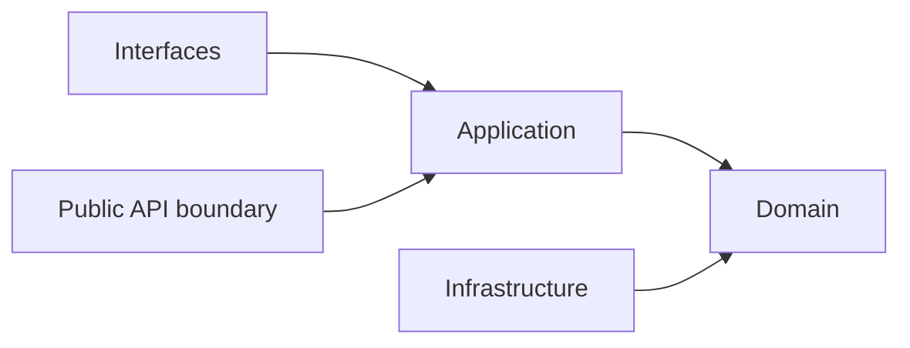

## Correct Interaction Flow

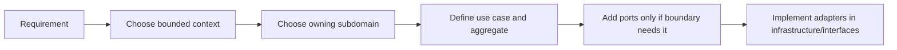

## Document Network

- [README.md](./README.md)
- [architecture-overview.md](./architecture-overview.md)
- [bounded-contexts.md](./bounded-contexts.md)
- [subdomains.md](./subdomains.md)
- [context-map.md](./context-map.md)
- [integration-guidelines.md](./integration-guidelines.md)
- [strategic-patterns.md](./strategic-patterns.md)
- [contexts/_template.md](./contexts/_template.md)
- [decisions/0001-hexagonal-architecture.md](./decisions/0001-hexagonal-architecture.md)
- [decisions/0002-bounded-contexts.md](./decisions/0002-bounded-contexts.md)
- [decisions/0003-context-map.md](./decisions/0003-context-map.md)

## Constraints

- 本模板是 architecture-first 的交付模板，不代表任何既有模組已完全符合此形狀。
- `ports/`、`queries/`、`_actions/`、`hooks/` 是按需要建立的可選骨架，不是強制清單。
- 若某 subdomain 很小，允許比本模板更精簡；若更精簡仍能守住邊界，應優先採用更精簡版本。
````

## File: docs/project-delivery-milestones.md
````markdown
# Project Delivery Milestones

本文件在本次任務限制下，僅依 Context7 驗證的 Hexagonal Architecture、DDD、Context Map 與 ADR 參考建立，作為專案從零到交付的里程碑文件，不主張反映現況實作。

## Purpose

這份文件把 architecture-first 的專案交付拆成可檢查的里程碑，讓 Copilot 在規劃與生成程式碼前，先知道應先完成哪些決策、文件與邊界，而不是直接跳進實作。

## Milestone Map

| Milestone | Goal | Outputs | Exit Criteria |
|---|---|---|---|
| M0 Problem Framing | 對齊目標、角色與成功條件 | 問題敘事、交付範圍、名詞初稿 | 團隊知道要解哪一類問題，而不是只知道要寫哪些檔案 |
| M1 Ubiquitous Language | 建立共同語言 | 術語表、命名規則、避免詞彙 | 主要名詞不再互相衝突 |
| M2 Strategic Design | 切出主域、bounded context、subdomain | subdomains、bounded-contexts、context-map 文件 | 所有權、上下游與 published language 有明確方向 |
| M3 Decision Baseline | 記錄架構與整合決策 | ADR / decisions 條目 | 關鍵決策已寫下 context、decision、consequences |
| M4 Module Skeleton | 建立 bounded context 與 subdomain 樹 | 模組骨架、API boundary、docs 入口 | 模組樹能表達邊界，且未洩漏實作依賴 |
| M5 Domain Modeling | 建立聚合、值對象、領域事件與不變條件 | aggregates、domain-events、repositories、domain model | 核心規則可在 domain 層表達，不依賴外部技術 |
| M6 Use Cases And Ports | 定義應用流程與必要 port | use-cases、DTO、必要 ports | application 能協調流程但不重寫 domain 規則 |
| M7 Adapters And Integration | 實作 persistence、external API、UI adapters | infrastructure adapters、interfaces adapters、published language | adapter 只透過 ports 或 public API boundary 協作 |
| M8 Verification And Hardening | 驗證邊界、流程與交付品質 | 測試、lint/build 證據、文件回補 | 核心路徑可驗證，且文件與決策同步 |
| M9 Release Delivery | 完成交付與後續演進入口 | release note、handoff note、下一輪 backlog | 本輪可交付，同時為下一輪演進保留清楚入口 |

## Milestone Rules

- 沒有完成 M1 到 M3 前，不應直接大規模生成 `application/`、`domain/`、`infrastructure/` 實作。
- M4 應先建立邊界與文件，再建立大量程式碼。
- M5 與 M6 是核心，若這兩步不清楚，後續 adapter 與 UI 很容易反向污染 domain。
- M7 的 published language 與 ACL / Conformist 選擇必須由 context map 決定。
- 只要出現關鍵架構選擇、整合分歧或交付取捨，就應補 ADR，而不是把理由埋進 commit 或程式碼裡。

## Delivery Sequence Guidance

1. 先定義語言與邊界，再定義模組樹。
2. 先定義 domain 核心與 use case，再實作 adapter。
3. 先確認 upstream / downstream 關係，再決定 Published Language、ACL 或 Conformist。
4. 先把本輪交付切成最小可交付增量，再決定是否需要新增抽象。

## Anti-Pattern Rules

- 不得把里程碑順序反過來，先寫大量 adapter 或 UI，再回頭猜 domain。
- 不得把每個規劃點都升級成 ADR；只有架構上有持續影響的決策才寫 ADR。
- 不得在 M4 就預建所有可能的 port、repository、service 與子域，只為了追求骨架完整。
- 不得跳過 context map 與 published language，直接用另一個 context 的內部模型來省事。
- 不得把 lint 或 build 通過誤當成架構完成的證據。

## Copilot Generation Rules

- 生成程式碼前，先判斷目前需求位於哪個 milestone；不要把 M2 問題當成 M7 問題處理。
- 奧卡姆剃刀：若現有 milestone 產物已足夠支撐下一步，就不要平行開第二套流程或第二份模板。
- 規劃新功能時，先補足缺失的術語、context map 或 ADR，再進入模組骨架與程式碼生成。
- 若任務只需要修正單一 use case，不要回頭擴張整個 bounded context 結構。

## Dependency Direction Flow

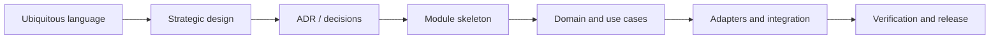

## Correct Interaction Flow

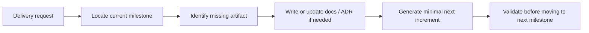

## Document Network

- [README.md](./README.md)
- [architecture-overview.md](./architecture-overview.md)
- [bounded-contexts.md](./bounded-contexts.md)
- [subdomains.md](./subdomains.md)
- [context-map.md](./context-map.md)
- [integration-guidelines.md](./integration-guidelines.md)
- [bounded-context-subdomain-template.md](./bounded-context-subdomain-template.md)
- [decisions/README.md](./decisions/README.md)
- [decisions/0001-hexagonal-architecture.md](./decisions/0001-hexagonal-architecture.md)
- [decisions/0002-bounded-contexts.md](./decisions/0002-bounded-contexts.md)
- [decisions/0003-context-map.md](./decisions/0003-context-map.md)

## Constraints

- 本里程碑文件是 architecture-first 的交付路線，不代表任何既有 repo 已依此順序演進。
- 里程碑是交付順序指引，不是 waterfall 式一次性階段牆；必要時可以小步迭代，但不可跳過核心決策產物。
- 若需求很小，可以在同一次交付內完成多個相鄰里程碑，但仍需保留對應產物。
````

## File: modules/notebooklm/AGENT.md
````markdown
# AGENT.md — notebooklm BC

## 模組定位

`notebooklm` 是 AI 對話的支援域，管理 7 個子域（ai、conversation、note、notebook、source、synthesis、versioning）並封裝 Genkit 呼叫。

## 通用語言（Ubiquitous Language）

| 正確術語 | 禁止使用 |
|----------|----------|
| `Thread` | Conversation、Chat、Session |
| `Message` | ChatMessage、Msg |
| `MessageRole` | Role（單獨使用）、Speaker |
| `NotebookResponse` | AIResponse、GeneratedText |
| `NotebooklmRepository` | AIRepository、ChatRepository |

## 最重要規則：Server Action 隔離

```typescript
// ✅ 正確：在 app/(shell)/ai-chat/_actions.ts 中建立本地 action
"use server";
import { notebooklmApi } from "@/modules/notebooklm/api";
export async function generateResponse(input) {
  return notebooklmApi.generateResponse(input);
}

// ❌ 禁止：在 Client Component 直接 import notebooklm/api
// Genkit/gRPC 是 server-only，會導致打包失敗
import { notebooklmApi } from "@/modules/notebooklm/api"; // 在 "use client" 檔案中
```

## 邊界規則

### ✅ 允許
```typescript
// Server-side context only
import { notebooklmApi } from "@/modules/notebooklm/api";
import type { ThreadDTO, MessageDTO } from "@/modules/notebooklm/api";
```

## 子域導航

| 子域 | 路徑 | 核心職責 |
|------|------|---------|
| `ai` | `subdomains/ai/` | AI 模型調用與提示工程 |
| `conversation` | `subdomains/conversation/` | Thread 與 Message 生命週期 |
| `note` | `subdomains/note/` | 輕量筆記與知識連結 |
| `notebook` | `subdomains/notebook/` | Notebook 組合與管理 |
| `source` | `subdomains/source/` | 來源文件追蹤與引用 |
| `synthesis` | `subdomains/synthesis/` | RAG 合成、摘要與洞察生成 |
| `versioning` | `subdomains/versioning/` | 對話版本與快照策略 |

## 驗證命令

```bash
npm run lint
npm run build
```
````

## File: modules/notebooklm/docs/bounded-context.md
````markdown
# Bounded Context — notebooklm

## 責任邊界

`notebooklm` 擁有 Xuanwu 的 AI 對話與知識合成能力。它是 Supporting Subdomain，為使用者提供 NotebookLM-like 的 AI 推理體驗。

### 這個 context 擁有

- AI 對話 Thread 與 Message 的持久化與生命週期
- AI 模型調用的提示工程、路由與回應封裝
- Notebook 容器的組合、管理與版本策略
- 來源文件的追蹤、引用與引用一致性
- RAG 合成、摘要與洞察的生成
- 對話衍生的輕量筆記與知識連結

### 這個 context 不擁有

- 知識內容的建立與管理（→ `notion`）
- 組織與帳號治理（→ `platform`）
- 工作區生命週期（→ `workspace`）
- 向量索引的建立與語意搜尋查詢（→ AI/RAG 管道）

## 能力分組

| 能力群 | 子域 |
|---|---|
| AI 推理核心 | `ai`、`synthesis` |
| 對話管理 | `conversation`、`versioning` |
| 知識組合 | `notebook`、`note` |
| 來源管理 | `source` |

## Public Boundary

`modules/notebooklm/api/` 是對外的 public boundary：

- 跨模組存取只能透過 `@/modules/notebooklm/api` import
- 禁止直接 import `domain/`、`application/`、`infrastructure/` 或 `subdomains/` 內部

## 封板規則

此 context 的子域清單是 **closed inventory**：

- 7 個子域（ai、conversation、note、notebook、source、synthesis、versioning）
- 後續開發必須先映射到既有子域，不能隨意新增
- 若確實需要新增子域，先更新此文件與 `subdomains.md`

## 層次結構

```
modules/notebooklm/
├── api/             # Public boundary
├── application/     # Use case orchestration
├── domain/          # Aggregates, value objects, domain events
├── infrastructure/  # Driven adapters (AI SDKs, Firebase, etc.)
├── interfaces/      # Driving adapters (web, CLI)
├── ports/           # Input/output port contracts
├── subdomains/      # 7 子域各自的邊界
│   ├── ai/
│   ├── conversation/
│   ├── note/
│   ├── notebook/
│   ├── source/
│   ├── synthesis/
│   └── versioning/
└── docs/            # 本文件集
```

## 上游依賴

| 上游 | 協作方式 | 說明 |
|---|---|---|
| `notion` | API 查詢 | 知識頁面與文章作為合成來源 |
| `platform` | API 查詢 | 身份認證與租戶治理 |
| `workspace` | API 查詢 | `workspaceId` 範疇錨點 |

## 下游消費者

| 下游 | 協作方式 | 說明 |
|---|---|---|
| `app/(shell)/ai-chat` | Server Action → `notebooklm/api` | AI 對話 UI 介面 |
````

## File: modules/notebooklm/docs/README.md
````markdown
# notebooklm — 文件索引

本目錄是 `modules/notebooklm/` 的 DDD blueprint 文件集。所有設計決策、語言定義、聚合結構與 port 契約都在此文件集中有唯一的真相來源。

## 閱讀路徑

### 初次理解邊界

1. [bounded-context.md](./bounded-context.md) — notebooklm 的責任邊界、能力分組與封板規則
2. [subdomains.md](./subdomains.md) — 7 個子域的正式責任表

### 深入語言與設計

3. [ubiquitous-language.md](./ubiquitous-language.md) — 所有術語的規範定義
4. [aggregates.md](./aggregates.md) — 核心聚合根、實體與值物件
5. [domain-services.md](./domain-services.md) — 跨聚合純業務規則

### 理解協作與事件

6. [context-map.md](./context-map.md) — 與外部 bounded context 的協作關係
7. [domain-events.md](./domain-events.md) — 事件命名與發/收清單

### 實作規劃

8. [application-services.md](./application-services.md) — use case orchestration 與命令/查詢清單
9. [repositories.md](./repositories.md) — output port 契約（repositories、stores、gateways）

## 變更同步規則

任何影響 notebooklm 邊界的變更，必須同步以下文件：

- 新增或修改聚合 → `aggregates.md`
- 新增或修改術語 → `ubiquitous-language.md`
- 新增或修改事件 → `domain-events.md`
- 新增或修改 port 契約 → `repositories.md`
- 新增或修改 use case → `application-services.md`
- 新增子域 → `subdomains.md` + `bounded-context.md` + subdomain `README.md`

**不允許**在未更新對應文件的情況下新增 TypeScript 實作。
````

## File: modules/notebooklm/docs/subdomains.md
````markdown
# Subdomains — notebooklm

本文件是 notebooklm 的正式子域 inventory。這份清單是 **closed by default** 的：後續開發必須先把能力映射到既有子域，而不是再新增新的子域名稱。

## Subdomain Rule in Hexagonal DDD

- 每個子域描述的是 AI 對話與合成核心能力，不是資料夾便利分類
- 子域之間共享語言時，應先落地到 `ubiquitous-language.md`、`context-map.md` 與相關 ports 文件

## Canonical Inventory

| 子域 | 核心問題 | 主要語言 |
|---|---|---|
| `ai` | AI 模型如何被調用與管理 | `AiModel`, `Prompt`, `PromptTemplate`, `ModelResponse`, `AiCallLog` |
| `conversation` | 對話 Thread 與 Message 如何被管理 | `Thread`, `Message`, `MessageRole`, `ThreadHistory`, `ConversationContext` |
| `note` | 對話衍生筆記如何與知識連結 | `Note`, `NoteRef`, `KnowledgeLink`, `NoteSource` |
| `notebook` | Notebook 如何組合多個來源與對話 | `Notebook`, `NotebookItem`, `NotebookSource`, `NotebookSummary` |
| `source` | 來源文件如何被追蹤與引用 | `Source`, `SourceRef`, `Citation`, `SourceChunk`, `Grounding` |
| `synthesis` | RAG 合成、摘要與洞察如何被生成 | `Synthesis`, `SynthesisRequest`, `SynthesisResult`, `Insight`, `Summary` |
| `versioning` | 對話版本與快照如何被管理 | `ConversationSnapshot`, `VersionPolicy`, `SnapshotRef` |

## Capability Groups

### AI 推理核心

- `ai` — 模型調用抽象與提示工程
- `synthesis` — RAG 合成、摘要生成

### 對話管理

- `conversation` — Thread/Message 生命週期
- `versioning` — 版本快照策略

### 知識組合

- `notebook` — Notebook 容器組合
- `note` — 輕量筆記

### 來源管理

- `source` — 來源追蹤與引用

## 子域 README

| 子域 | 文件 |
|---|---|
| `ai` | [subdomains/ai/README.md](../subdomains/ai/README.md) |
| `conversation` | [subdomains/conversation/README.md](../subdomains/conversation/README.md) |
| `note` | [subdomains/note/README.md](../subdomains/note/README.md) |
| `notebook` | [subdomains/notebook/README.md](../subdomains/notebook/README.md) |
| `source` | [subdomains/source/README.md](../subdomains/source/README.md) |
| `synthesis` | [subdomains/synthesis/README.md](../subdomains/synthesis/README.md) |
| `versioning` | [subdomains/versioning/README.md](../subdomains/versioning/README.md) |
````

## File: modules/notebooklm/README.md
````markdown
# notebooklm — AI 對話與合成上下文

> **Domain Type:** Supporting Subdomain（支援域）  
> **模組路徑:** `modules/notebooklm/`  
> **開發狀態:** 🏗️ Scaffold

## 在 Knowledge Platform / Second Brain 中的角色

`notebooklm` 是 Xuanwu 的 NotebookLM-like 互動層，將檢索結果、知識內容與知識結構脈絡轉成對話、摘要、洞察與可引用回答。它是最接近使用者 AI 推理體驗的上下文。

## 主要職責

| 能力 | 說明 |
|---|---|
| 對話 Thread 管理 | 維護對話串與訊息歷史（`conversation` 子域） |
| AI 模型調用 | 提示工程與模型介接（`ai` 子域） |
| Notebook 組合 | Notebook 容器與內容組合管理（`notebook` 子域） |
| 來源追蹤 | 來源文件追蹤與引用管理（`source` 子域） |
| RAG 合成 | 摘要、洞察與合成生成（`synthesis` 子域） |
| 輕量筆記 | 對話衍生筆記與知識連結（`note` 子域） |
| 版本策略 | 對話版本與快照管理（`versioning` 子域） |

## 子域清單（7 個）

| 子域 | 核心職責 |
|---|---|
| `ai` | AI 模型調用與提示工程 |
| `conversation` | 對話 Thread 與 Message 生命週期 |
| `note` | 輕量筆記與知識連結 |
| `notebook` | Notebook 組合與管理 |
| `source` | 來源文件追蹤與引用 |
| `synthesis` | RAG 合成、摘要與洞察生成 |
| `versioning` | 對話版本與快照策略 |

## 與其他 Bounded Context 協作

- `notion` 是主要上游，提供知識內容來源。
- `platform` 提供身份認證與平台治理能力。
- `workspace` 提供 `workspaceId` 範疇錨點。

## Hexagonal 邊界

| Hexagonal 概念 | notebooklm 位置 | 說明 |
|---|---|---|
| Public boundary | `api/` | 跨模組公開契約投影 |
| Driving adapters | `adapters/` | web、CLI 等輸入端 |
| Application | `application/` | use case orchestration、DTO、command/query 處理 |
| Domain core | `domain/` | 聚合、值物件、domain services、domain events |
| Input ports | `ports/input/` | 進入 application 的穩定契約 |
| Output ports | `ports/output/` | repositories、stores、gateways、sinks |
| Driven adapters | `infrastructure/` | 對 output ports 的具體實作 |
| Subdomains | `subdomains/` | 7 個子域各自的能力邊界 |

## 詳細文件

| 文件 | 說明 |
|---|---|
| [docs/README.md](./docs/README.md) | 文件索引 |
| [docs/bounded-context.md](./docs/bounded-context.md) | 邊界定義、能力分組與封板規則 |
| [docs/subdomains.md](./docs/subdomains.md) | 7 個子域的正式責任表 |
| [docs/ubiquitous-language.md](./docs/ubiquitous-language.md) | 此 BC 通用語言 |
| [docs/aggregates.md](./docs/aggregates.md) | 聚合根與核心概念 |
| [docs/domain-events.md](./docs/domain-events.md) | 領域事件與整合語言 |
| [docs/context-map.md](./docs/context-map.md) | 與其他 BC 的關係與整合方式 |
````

## File: modules/notebooklm/subdomains/ai/README.md
````markdown
# notebooklm/subdomains/ai

## 子域職責

`ai` 子域負責 AI 模型調用的底層能力：

- AI 模型提供者的抽象與路由（OpenAI、Gemini、Claude 等）
- `Prompt` 與 `PromptTemplate` 的管理與渲染
- 模型調用日誌與 token 計量

## 核心語言

| 術語 | 說明 |
|---|---|
| `AiModel` | 可調用的 AI 模型識別碼與參數 |
| `Prompt` | 一次模型調用的完整提示輸入 |
| `PromptTemplate` | 可參數化的提示範本 |
| `ModelResponse` | 模型返回的原始回應（text、finishReason、usage） |
| `AiCallLog` | 一次 AI 調用的可稽核記錄 |

## Hexagonal shape

- `api/`: public 子域 boundary
- `application/`: use cases（`CallAiModel`、`RenderPromptTemplate`）
- `domain/`: `AiModel`、`Prompt`、`PromptTemplate`、`ModelResponse`
- `infrastructure/`: Genkit / SDK 適配器
- `interfaces/`: server action 接線

## 整合規則

- 此子域不直接與 UI 互動，只對 `synthesis`、`conversation` 等子域提供能力
- 父模組 public API（`@/modules/notebooklm/api`）是跨模組進入點
````

## File: modules/notebooklm/subdomains/conversation/README.md
````markdown
# notebooklm/subdomains/conversation

## 子域職責

`conversation` 子域負責 AI 對話的持久化與生命週期管理：

- `Thread`（對話串）的建立、追加訊息與歸檔
- `Message`（訊息）的有序持久化，維護角色（user/assistant/system）
- 對話歷史的載入，支援 multi-turn context 構建

## 核心語言

| 術語 | 說明 |
|---|---|
| `Thread` | 一組有序 Message 的持久化對話串 |
| `Message` | Thread 中的單則訊息（role + content） |
| `MessageRole` | `"user" \| "assistant" \| "system"` |
| `ThreadHistory` | 提供給模型的對話歷史片段 |
| `ConversationContext` | 用於合成的對話上下文快照 |

## Hexagonal shape

- `api/`: public 子域 boundary
- `application/`: use cases（`CreateThread`、`AppendMessage`、`LoadThreadHistory`）
- `domain/`: `Thread`、`Message`、`MessageRole` 聚合與值物件
- `infrastructure/`: Firestore repository 實作
- `interfaces/`: server action 接線

## 整合規則

- `Thread` 建立時自動關聯 `notebookId` 與 `workspaceId`
- 父模組 public API（`@/modules/notebooklm/api`）是跨模組進入點
````

## File: modules/notebooklm/subdomains/evaluation/README.md
````markdown
# notebooklm/subdomains/evaluation

## 子域職責

`evaluation` 子域負責品質評估與回歸比較的正典邊界：

- 定義與執行 RAG 回應品質的評估指標（`EvaluationMetric`）
- 管理評估集（`EvaluationDataset`）與基準版本比較
- 偵測生成品質退步（`RegressionAlert`）並觸發告警

## 核心語言

| 術語 | 說明 |
|---|---|
| `EvaluationRun` | 一次品質評估作業的聚合根 |
| `EvaluationMetric` | 評估指標定義（忠實度、相關性、引用覆蓋率等） |
| `EvaluationDataset` | 一組用於評估的標準問答對 |
| `EvaluationScore` | 單一指標的評估結果數值 |
| `RegressionAlert` | 評估分數低於基準閾值的退步告警 |

## Hexagonal shape

- `api/`: public 子域 boundary
- `application/`: use cases（`RunEvaluation`、`CompareWithBaseline`、`ManageEvaluationDataset`）
- `domain/`: `EvaluationRun`、`EvaluationMetric`、`EvaluationDataset`
- `infrastructure/`: 評估框架適配器（Genkit Evaluators、Vertex AI Model Evaluation）
- `interfaces/`: server action 接線、評估儀表板

## 整合規則

- `evaluation` 訂閱 `notebooklm.response-grounded` 事件，觸發自動品質評估
- 評估結果供 `platform.analytics` 或 `platform.observability` 消費
- 父模組 public API（`@/modules/notebooklm/api`）是跨模組進入點

## Status

🔲 Gap — 尚未實作，依 docs/contexts/notebooklm/subdomains.md 建議建立
````

## File: modules/notebooklm/subdomains/grounding/README.md
````markdown
# notebooklm/subdomains/grounding

## 子域職責

`grounding` 子域負責引用對齊與可追溯證據的正典邊界：

- 將 AI 生成回應中的每一個聲明對齊到具體的來源片段（`GroundingEvidence`）
- 管理引用可信度評估（`ConfidenceScore`）與引用缺口標記
- 提供可審計的引用追蹤，確保生成內容的可追溯性

## 核心語言

| 術語 | 說明 |
|---|---|
| `GroundingResult` | 一次引用對齊作業的結果聚合根 |
| `GroundingEvidence` | 將生成聲明與來源片段對齊的證據單位 |
| `ConfidenceScore` | 引用對齊的可信度評分（0-1） |
| `CitationGap` | 無法對齊來源的生成聲明標記 |
| `GroundingPolicy` | 控制引用對齊嚴格程度的策略定義 |

## Hexagonal shape

- `api/`: public 子域 boundary
- `application/`: use cases（`GroundResponse`、`ValidateCitations`、`QueryGroundingLog`）
- `domain/`: `GroundingResult`、`GroundingEvidence`、`GroundingPolicy`
- `infrastructure/`: Genkit 引用對齊適配器
- `interfaces/`: server action 接線

## 整合規則

- `grounding` 消費 `retrieval` 提供的 `RetrievedChunk`，對齊 `synthesis` 生成的回應
- 發布 `notebooklm.response-grounded` 事件，供 `evaluation` 訂閱使用
- 父模組 public API（`@/modules/notebooklm/api`）是跨模組進入點

## Status

🔲 Gap — 尚未實作，依 docs/contexts/notebooklm/subdomains.md 建議建立
````

## File: modules/notebooklm/subdomains/ingestion/README.md
````markdown
# notebooklm/subdomains/ingestion

## 子域職責

`ingestion` 子域負責來源文件的匯入、正規化與前處理正典邊界：

- 接收使用者上傳或連結的來源文件（PDF、URL、純文字等）
- 正規化內容格式，轉換為下游子域可消費的標準結構
- 驗證來源合法性、去重與版本化前處理管線

## 核心語言

| 術語 | 說明 |
|---|---|
| `IngestionJob` | 一次來源文件匯入作業的聚合根 |
| `SourceDocument` | 匯入後正規化的來源文件表示 |
| `IngestionStatus` | 匯入作業狀態（`pending`、`processing`、`completed`、`failed`） |
| `NormalizedContent` | 轉換完成的正規化內容單位 |
| `IngestionError` | 匯入失敗的錯誤證據 |

## Hexagonal shape

- `api/`: public 子域 boundary
- `application/`: use cases（`SubmitIngestionJob`、`ProcessIngestionJob`、`RetryIngestionJob`）
- `domain/`: `IngestionJob`、`SourceDocument`、`NormalizedContent`
- `infrastructure/`: 檔案解析適配器（PDF、URL、純文字）、py_fn 工作者橋接
- `interfaces/`: server action 接線、上傳入口

## 整合規則

- `ingestion` 完成後發布 `notebooklm.source-ingested` 事件，通知 `source` 與 `retrieval` 子域
- 重量級解析（PDF、OCR）委派給 `py_fn/` 工作者執行
- 父模組 public API（`@/modules/notebooklm/api`）是跨模組進入點

## Status

🔲 Gap — 尚未實作，依 docs/contexts/notebooklm/subdomains.md 建議建立
````

## File: modules/notebooklm/subdomains/note/README.md
````markdown
# notebooklm/subdomains/note

## 子域職責

`note` 子域負責對話衍生的輕量筆記管理：

- 從 AI 對話中建立、編輯輕量 `Note`
- `Note` 與知識來源（`notion` 頁面、`source` 文件）的連結管理
- 筆記的個人化組織與搜尋

## 核心語言

| 術語 | 說明 |
|---|---|
| `Note` | 對話衍生的輕量筆記文字單元 |
| `NoteRef` | 指向筆記的穩定引用 |
| `KnowledgeLink` | Note 與 notion 頁面或 source 文件的連結 |
| `NoteSource` | Note 的來源追蹤（來自哪個 Thread/Message） |

## Hexagonal shape

- `api/`: public 子域 boundary
- `application/`: use cases（`CreateNote`、`UpdateNote`、`LinkNoteToKnowledge`）
- `domain/`: `Note`、`KnowledgeLink`
- `infrastructure/`: Firestore repository 實作
- `interfaces/`: server action 接線

## 整合規則

- `Note` 的建立來源可以是手動輸入或從 AI 回應中提取
- 父模組 public API（`@/modules/notebooklm/api`）是跨模組進入點
````

## File: modules/notebooklm/subdomains/notebook/README.md
````markdown
# notebooklm/subdomains/notebook

## 子域職責

`notebook` 子域負責 Notebook 容器的組合與管理：

- `Notebook` 的建立、組合多個 `Source` 與 `Conversation`
- Notebook 概覽與摘要的生成
- Notebook 的版本管理與分享

## 核心語言

| 術語 | 說明 |
|---|---|
| `Notebook` | 包含多個來源與對話的知識組合容器 |
| `NotebookItem` | Notebook 中的單一項目（Source、Thread、Note） |
| `NotebookSource` | Notebook 加入的來源文件引用 |
| `NotebookSummary` | Notebook 級別的 AI 生成摘要 |

## Hexagonal shape

- `api/`: public 子域 boundary
- `application/`: use cases（`CreateNotebook`、`AddSourceToNotebook`、`GenerateNotebookSummary`）
- `domain/`: `Notebook`、`NotebookItem`、`NotebookSource` 聚合與值物件
- `infrastructure/`: Firestore repository 實作
- `interfaces/`: server action 接線 + UI 元件

## 整合規則

- `Notebook` 是 `notebooklm` 的頂層組合容器
- 每個 Notebook 綁定一個 `workspaceId` 與 owner
- 父模組 public API（`@/modules/notebooklm/api`）是跨模組進入點
````

## File: modules/notebooklm/subdomains/retrieval/README.md
````markdown
# notebooklm/subdomains/retrieval

## 子域職責

`retrieval` 子域負責查詢召回與排序策略的正典邊界：

- 接收語意查詢請求，執行向量近似搜尋與關鍵字搜尋
- 管理召回排序策略（`RerankerPolicy`）與結果過濾規則
- 提供可審計的召回日誌供 `grounding` 與 `evaluation` 使用

## 核心語言

| 術語 | 說明 |
|---|---|
| `RetrievalQuery` | 一次召回的查詢請求（含查詢文字、過濾條件、topK） |
| `RetrievedChunk` | 召回結果單位，包含原始內容、相似度分數與來源引用 |
| `RerankerPolicy` | 控制召回結果排序的策略定義 |
| `RetrievalLog` | 一次召回作業的可稽核記錄 |
| `ChunkEmbedding` | 已向量化的內容片段（向量 + 元數據） |

## Hexagonal shape

- `api/`: public 子域 boundary
- `application/`: use cases（`ExecuteRetrieval`、`UpdateRerankerPolicy`、`QueryRetrievalLog`）
- `domain/`: `RetrievalQuery`、`RetrievedChunk`、`RerankerPolicy`
- `infrastructure/`: 向量資料庫適配器（Firestore Vector Store、Vertex AI Search 等）
- `interfaces/`: server action 接線

## 整合規則

- `retrieval` 由 `synthesis` 與 `conversation` 子域觸發，回傳 `RetrievedChunk` 列表
- 不直接操作 UI，只對上層子域提供召回能力
- 父模組 public API（`@/modules/notebooklm/api`）是跨模組進入點

## Status

🔲 Gap — 尚未實作，依 docs/contexts/notebooklm/subdomains.md 建議建立
````

## File: modules/notebooklm/subdomains/source/README.md
````markdown
# notebooklm/subdomains/source

## 子域職責

`source` 子域負責來源文件的追蹤與引用管理：

- 加入 Notebook 的來源文件（URL、上傳文件、notion 頁面）的追蹤
- `Citation`（引用）的建立與一致性維護
- `Grounding`（根基文件）的識別，用於 RAG 合成

## 核心語言

| 術語 | 說明 |
|---|---|
| `Source` | 被加入 Notebook 的來源文件 |
| `SourceRef` | 指向 Source 的穩定引用識別碼 |
| `Citation` | AI 回應中的具體引用（指向 SourceChunk） |
| `SourceChunk` | Source 中的文字片段（來自向量檢索） |
| `Grounding` | 支撐 AI 回應的根基文件集合 |

## Hexagonal shape

- `api/`: public 子域 boundary
- `application/`: use cases（`AddSource`、`TrackCitation`、`BuildGrounding`）
- `domain/`: `Source`、`Citation`、`Grounding`
- `infrastructure/`: Firestore repository + 向量索引查詢
- `interfaces/`: server action 接線

## 整合規則

- `Source` 的內容可來自 `notion` 頁面、外部 URL 或直接上傳文件
- `Citation` 必須可追溯到具體的 `SourceChunk`
- 父模組 public API（`@/modules/notebooklm/api`）是跨模組進入點
````

## File: modules/notebooklm/subdomains/synthesis/README.md
````markdown
# notebooklm/subdomains/synthesis

## 子域職責

`synthesis` 子域負責 RAG 合成與 AI 生成內容的管理：

- 基於 `Source` 與 `Grounding` 的 RAG 合成執行
- 摘要（`Summary`）的生成與持久化
- 洞察（`Insight`）的提取與標記
- 合成請求的佇列、重試與結果管理

## 核心語言

| 術語 | 說明 |
|---|---|
| `Synthesis` | 一次完整的 RAG 合成操作聚合根 |
| `SynthesisRequest` | 觸發合成的輸入（問題、來源、模型偏好） |
| `SynthesisResult` | 合成輸出（回答、引用、token 使用量） |
| `Insight` | 從合成結果中提取的關鍵洞察 |
| `Summary` | 對一組來源或對話的自動摘要 |

## Hexagonal shape

- `api/`: public 子域 boundary
- `application/`: use cases（`RunSynthesis`、`GenerateSummary`、`ExtractInsights`）
- `domain/`: `Synthesis`、`SynthesisRequest`、`SynthesisResult`、`Insight`
- `infrastructure/`: Genkit flow 適配器、結果 Firestore 儲存
- `interfaces/`: server action 接線

## 整合規則

- `synthesis` 消費 `source` 子域提供的 `Grounding`
- `synthesis` 調用 `ai` 子域的模型能力
- 生成結果（`SynthesisResult`）觸發 `notebooklm.synthesis_completed` 事件
- 父模組 public API（`@/modules/notebooklm/api`）是跨模組進入點
````

## File: modules/notebooklm/subdomains/versioning/README.md
````markdown
# notebooklm/subdomains/versioning

## 子域職責

`versioning` 子域負責 AI 對話與 Notebook 的版本快照策略：

- `ConversationSnapshot` 的建立與保留策略管理
- `VersionPolicy` 的定義（保留多少版本、保留週期）
- 版本回溯與快照比較

## 核心語言

| 術語 | 說明 |
|---|---|
| `ConversationSnapshot` | 對話在某一時間點的完整快照 |
| `VersionPolicy` | 版本保留規則（數量上限、時間週期） |
| `SnapshotRef` | 指向特定快照的穩定引用 |

## Hexagonal shape

- `api/`: public 子域 boundary
- `application/`: use cases（`CreateSnapshot`、`ApplyVersionPolicy`、`RestoreFromSnapshot`）
- `domain/`: `ConversationSnapshot`、`VersionPolicy`
- `infrastructure/`: Firestore repository 實作
- `interfaces/`: server action 接線

## 整合規則

- `versioning` 由 `conversation` 子域觸發（每次 Thread 歸檔時）
- `VersionPolicy` 預設值由 `platform/subscription` 子域決定
- 父模組 public API（`@/modules/notebooklm/api`）是跨模組進入點
````

## File: modules/notion/subdomains/ai/README.md
````markdown
# notion/subdomains/ai

## 子域職責

`ai` 子域負責 AI 輔助能力在知識內容流程中的整合：

- AI 輔助頁面草稿生成（`AiDraftRequest`）
- 頁面摘要自動生成
- `IngestionSignal` 的發送，觸發 AI 攝入管道（py_fn）
- 與 `notebooklm` 的整合，提供知識內容作為 Synthesis 來源

## 核心語言

| 術語 | 說明 |
|---|---|
| `AiDraftRequest` | 觸發 AI 頁面草稿生成的請求 |
| `IngestionSignal` | 觸發後端 AI 攝入管道的訊號 |
| `AiSuggestion` | AI 提供的內容補全或改寫建議 |
| `PageSummary` | AI 生成的頁面摘要 |

## Hexagonal shape

- `api/`: public 子域 boundary
- `application/`: use cases（`RequestAiDraft`、`GeneratePageSummary`、`PublishIngestionSignal`）
- `domain/`: `AiDraftRequest`、`IngestionSignal`
- `infrastructure/`: Genkit 適配器、py_fn 訊號發送
- `interfaces/`: server action 接線

## 整合規則

- `ai` 子域是 `notion` → `notebooklm` 的橋接器（知識來源攝入）
- `IngestionSignal` 發出後由 `py_fn` 異步處理（chunking / embedding）
- 父模組 public API（`@/modules/notion/api`）是跨模組進入點
````

## File: modules/notion/subdomains/analytics/README.md
````markdown
# notion/subdomains/analytics

## 子域職責

`analytics` 子域負責知識使用行為的量測與分析：

- 頁面瀏覽事件（`PageViewEvent`）的記錄
- 知識指標（`KnowledgeMetric`）的聚合與查詢
- 熱門頁面、使用趨勢的統計報告

## 核心語言

| 術語 | 說明 |
|---|---|
| `PageViewEvent` | 記錄頁面被查看的行為事件 |
| `KnowledgeMetric` | 聚合後的知識使用量測指標 |
| `ViewCount` | 特定時間窗口內的瀏覽次數 |
| `PagePopularityRank` | 基於瀏覽量的頁面熱度排名 |

## Hexagonal shape

- `api/`: public 子域 boundary
- `application/`: use cases（`RecordPageView`、`QueryKnowledgeMetrics`、`GetPopularPages`）
- `domain/`: `PageViewEvent`、`KnowledgeMetric`
- `infrastructure/`: Firestore 事件儲存 + 聚合查詢
- `interfaces/`: server action 接線

## 整合規則

- `analytics` 訂閱 `knowledge.page_viewed` 等行為事件
- 查詢結果供 `notion` UI 的使用情況面板使用
- 父模組 public API（`@/modules/notion/api`）是跨模組進入點
````

## File: modules/notion/subdomains/attachments/README.md
````markdown
# notion/subdomains/attachments

## 子域職責

`attachments` 子域負責附件與媒體資產的關聯與儲存管理：

- 上傳附件（圖片、文件、影片）並關聯至 `KnowledgePage` 或 `Article`
- `Attachment` 的元資料管理（名稱、大小、MIME type、儲存 URL）
- `MediaRef`（媒體引用）的嵌入與解析

## 核心語言

| 術語 | 說明 |
|---|---|
| `Attachment` | 與知識內容關聯的附件資產 |
| `MediaRef` | 嵌入在頁面內容中的媒體引用 |
| `AttachmentOwner` | 附件所屬的知識內容識別碼 |
| `StorageUrl` | 附件的持久化儲存位置 |

## Hexagonal shape

- `api/`: public 子域 boundary
- `application/`: use cases（`UploadAttachment`、`DeleteAttachment`、`ResolveMediaRef`）
- `domain/`: `Attachment`、`MediaRef`
- `infrastructure/`: Firebase Storage 適配器
- `interfaces/`: server action 接線 + 上傳 UI 元件

## 整合規則

- `Attachment` 的 `AttachmentOwner` 可以是 `KnowledgePage` 或 `Article`
- 儲存 URL 由 Firebase Storage 生成，不可在 `domain/` 層直接依賴 SDK
- 父模組 public API（`@/modules/notion/api`）是跨模組進入點
````

## File: modules/notion/subdomains/automation/README.md
````markdown
# notion/subdomains/automation

## 子域職責

`automation` 子域負責知識事件驅動的自動化動作：

- `AutomationRule` 的定義（觸發條件 + 動作）
- 知識事件（頁面建立、文章發布等）與自動化規則的匹配
- 自動化執行記錄與狀態追蹤

## 核心語言

| 術語 | 說明 |
|---|---|
| `AutomationRule` | 一條自動化規則（觸發條件 + 一組動作） |
| `TriggerCondition` | 觸發規則的事件條件（事件類型 + 篩選條件） |
| `AutomationAction` | 規則觸發後執行的動作（通知、標籤、推送等） |
| `AutomationRun` | 一次自動化規則執行記錄 |

## Hexagonal shape

- `api/`: public 子域 boundary
- `application/`: use cases（`CreateAutomationRule`、`EvaluateTrigger`、`ExecuteAutomationAction`）
- `domain/`: `AutomationRule`、`TriggerCondition`、`AutomationAction`
- `infrastructure/`: 事件訂閱適配器 + QStash 工作佇列
- `interfaces/`: server action 接線

## 整合規則

- `automation` 訂閱 `knowledge.*`、`authoring.*` 等 `notion` 領域事件
- 複雜動作（如通知）委託給 `platform/notification` 子域
- 父模組 public API（`@/modules/notion/api`）是跨模組進入點
````

## File: modules/notion/subdomains/integration/README.md
````markdown
# notion/subdomains/integration

## 子域職責

`integration` 子域負責知識與外部系統的雙向整合：

- 外部系統（Confluence、Notion、Google Drive 等）的知識匯入
- 知識內容向外部系統的同步匯出
- `IntegrationSource`（整合來源）的連接管理與同步策略

## 核心語言

| 術語 | 說明 |
|---|---|
| `IntegrationSource` | 一個外部系統整合連線設定 |
| `SyncPolicy` | 同步方向（單向/雙向）與衝突解決策略 |
| `ImportedPage` | 從外部系統匯入的頁面 |
| `SyncLog` | 一次同步執行的狀態記錄 |

## Hexagonal shape

- `api/`: public 子域 boundary
- `application/`: use cases（`ConnectIntegrationSource`、`TriggerSync`、`ImportFromExternal`）
- `domain/`: `IntegrationSource`、`SyncPolicy`
- `infrastructure/`: 外部系統 API 適配器（Confluence、Drive 等）
- `interfaces/`: server action 接線

## 整合規則

- `integration` 的匯入動作最終創建 `knowledge` 子域的 `KnowledgePage`
- `SyncPolicy` 的衝突解決策略不可在 `domain/` 層依賴外部 SDK
- 父模組 public API（`@/modules/notion/api`）是跨模組進入點
````

## File: modules/notion/subdomains/notes/README.md
````markdown
# notion/subdomains/notes

## 子域職責

`notes` 子域負責個人輕量筆記與正式知識的協作：

- 個人 `Note`（快速筆記、想法、草稿）的建立與管理
- `Note` 提升為正式 `KnowledgePage` 的流程
- `NoteRef`（筆記引用）與正式知識內容的雙向連結

## 核心語言

| 術語 | 說明 |
|---|---|
| `Note` | 個人輕量筆記，非正式知識 |
| `NoteRef` | 指向筆記的穩定引用 |
| `NotePromotionRequest` | 將筆記提升為正式頁面的請求 |
| `PersonalNoteCollection` | 個人筆記的組織集合 |

## Hexagonal shape

- `api/`: public 子域 boundary
- `application/`: use cases（`CreateNote`、`UpdateNote`、`PromoteNoteToPage`）
- `domain/`: `Note`、`NoteRef`、`NotePromotionRequest`
- `infrastructure/`: Firestore repository 實作
- `interfaces/`: server action 接線 + 快速筆記 UI 元件

## 整合規則

- `NotePromotionRequest` 觸發後，`knowledge` 子域負責建立正式 `KnowledgePage`
- `notes` 子域的 `Note` 是個人私有的，不需 workspace-level 協作
- 父模組 public API（`@/modules/notion/api`）是跨模組進入點
````

## File: modules/notion/subdomains/publishing/README.md
````markdown
# notion/subdomains/publishing

## 子域職責

`publishing` 子域負責正式發布與對外交付的正典邊界：

- 管理內容從草稿到已發布狀態的完整發布生命週期
- 控制對外可見性（`PublishingPolicy`）、存取層級與發布排程
- 提供發布歷程的可稽核記錄（`PublishRecord`）

## 核心語言

| 術語 | 說明 |
|---|---|
| `PublishRequest` | 一次發布請求的聚合根 |
| `PublishRecord` | 已完成的發布操作的不可變記錄 |
| `PublishingPolicy` | 定義可見性規則、存取層級與發布條件 |
| `PublishedContent` | 對外交付的內容快照（含版本戳記） |
| `PublishStatus` | 發布狀態（`draft`、`scheduled`、`published`、`unpublished`） |

## Hexagonal shape

- `api/`: public 子域 boundary
- `application/`: use cases（`PublishContent`、`UnpublishContent`、`SchedulePublish`、`QueryPublishHistory`）
- `domain/`: `PublishRequest`、`PublishRecord`、`PublishingPolicy`、`PublishedContent`
- `infrastructure/`: Firestore 發布記錄存取
- `interfaces/`: server action 接線、發布管理 UI

## 整合規則

- `publishing` 消費 `taxonomy` 分類與 `relations` 關聯圖，決定發布範圍
- 發布完成後觸發 `notion.content-published` 事件，供 `analytics` 與 `integration` 訂閱
- 父模組 public API（`@/modules/notion/api`）是跨模組進入點

## Status

🔲 Gap — 尚未實作，依 docs/contexts/notion/subdomains.md 建議建立
````

## File: modules/notion/subdomains/relations/README.md
````markdown
# notion/subdomains/relations

## 子域職責

`relations` 子域負責內容之間關聯與 backlink 的正典邊界：

- 管理頁面與內容物件之間的語義關聯（`Relation`）
- 追蹤 backlink：哪些頁面引用了特定頁面（`BacklinkRecord`）
- 提供關聯圖譜查詢與雙向連結索引

## 核心語言

| 術語 | 說明 |
|---|---|
| `Relation` | 兩個內容物件之間的具名語義關聯 |
| `BacklinkRecord` | 記錄某頁面被其他頁面引用的反向連結 |
| `RelationType` | 關聯的語義類型（`references`、`extends`、`contradicts` 等） |
| `RelationGraph` | 以圖結構表示的內容關聯網絡 |
| `RelationIndex` | 針對查詢最佳化的關聯索引快照 |

## Hexagonal shape

- `api/`: public 子域 boundary
- `application/`: use cases（`CreateRelation`、`RemoveRelation`、`QueryBacklinks`、`GetRelationGraph`）
- `domain/`: `Relation`、`BacklinkRecord`、`RelationGraph`
- `infrastructure/`: Firestore 關聯資料存取、圖查詢適配器
- `interfaces/`: server action 接線、關聯面板 UI

## 整合規則

- `relations` 訂閱 `knowledge.page-linked` 等事件，自動維護 backlink 索引
- `publishing` 在計算發布範圍時消費 `RelationGraph`
- 父模組 public API（`@/modules/notion/api`）是跨模組進入點

## Status

🔲 Gap — 尚未實作，依 docs/contexts/notion/subdomains.md 建議建立
````

## File: modules/notion/subdomains/taxonomy/README.md
````markdown
# notion/subdomains/taxonomy

## 子域職責

`taxonomy` 子域負責分類法與語義組織的正典邊界：

- 定義與管理知識內容的分類體系（`Category`、`Tag`、`Taxonomy`）
- 維護分類節點之間的層級關係與語義連結
- 提供分類搜尋與過濾的查詢能力

## 核心語言

| 術語 | 說明 |
|---|---|
| `Taxonomy` | 一個完整的分類體系聚合根 |
| `Category` | 分類體系中的節點（可含子節點） |
| `Tag` | 輕量鬆散標籤，用於跨分類的橫向標記 |
| `TaxonomyAssignment` | 將分類或標籤套用到內容的關聯記錄 |
| `TaxonomyPath` | 從根節點到某分類的完整路徑 |

## Hexagonal shape

- `api/`: public 子域 boundary
- `application/`: use cases（`CreateCategory`、`AssignTaxonomy`、`QueryByTaxonomy`）
- `domain/`: `Taxonomy`、`Category`、`Tag`、`TaxonomyAssignment`
- `infrastructure/`: Firestore 分類資料存取
- `interfaces/`: server action 接線、分類管理 UI

## 整合規則

- `taxonomy` 為 `knowledge`、`authoring`、`publishing` 提供分類服務
- 分類變更觸發 `notion.taxonomy-updated` 事件，供下游訂閱刷新索引
- 父模組 public API（`@/modules/notion/api`）是跨模組進入點

## Status

🔲 Gap — 尚未實作，依 docs/contexts/notion/subdomains.md 建議建立
````

## File: modules/notion/subdomains/templates/README.md
````markdown
# notion/subdomains/templates

## 子域職責

`templates` 子域負責頁面範本的管理與套用：

- 範本（`PageTemplate`）的建立、分類與發布
- 範本套用至新頁面（`TemplateApplication`）的流程
- 範本版本管理與組織內共享

## 核心語言

| 術語 | 說明 |
|---|---|
| `PageTemplate` | 可復用的頁面結構範本（含預設 ContentBlocks） |
| `TemplateApplication` | 將範本套用至新頁面的操作記錄 |
| `TemplateCategory` | 範本的分類標籤（Meeting、SOP、Wiki 等） |
| `TemplateOwner` | 範本的擁有者（個人或組織） |

## Hexagonal shape

- `api/`: public 子域 boundary
- `application/`: use cases（`CreateTemplate`、`ApplyTemplate`、`PublishTemplate`）
- `domain/`: `PageTemplate`、`TemplateApplication`
- `infrastructure/`: Firestore repository 實作
- `interfaces/`: server action 接線 + 範本選擇 UI 元件

## 整合規則

- `ApplyTemplate` 套用後，`knowledge` 子域負責建立實際 `KnowledgePage`
- 組織範本的 `TemplateOwner` 需要 `platform/organization` 的組織 ID 驗證
- 父模組 public API（`@/modules/notion/api`）是跨模組進入點
````

## File: modules/notion/subdomains/versioning/README.md
````markdown
# notion/subdomains/versioning

## 子域職責

`versioning` 子域負責 notion 全域版本快照策略的管理：

- `VersionPolicy`（版本保留規則：保留數量、時間週期）的定義
- 跨子域（`knowledge`、`collaboration`）版本快照的策略協調
- `RetentionRule` 的執行（定期清理舊版本）

## 核心語言

| 術語 | 說明 |
|---|---|
| `VersionPolicy` | 版本保留策略規則（數量上限、時間週期） |
| `RetentionRule` | 版本清理的具體規則 |
| `VersionPolicyTarget` | 版本策略適用的目標（Page、Article、Database） |
| `VersionPolicyApplication` | 一次版本策略套用執行記錄 |

## Hexagonal shape

- `api/`: public 子域 boundary
- `application/`: use cases（`DefineVersionPolicy`、`ApplyRetentionRule`、`QueryVersionHistory`）
- `domain/`: `VersionPolicy`、`RetentionRule`
- `infrastructure/`: Firestore repository 實作 + 排程任務整合
- `interfaces/`: server action 接線

## 整合規則

- `versioning` 不擁有具體的 ContentVersion（由 `knowledge`、`collaboration` 擁有）
- `versioning` 提供全域策略，由各子域的版本實作遵循
- `RetentionRule` 執行由 `platform/background-job` 排程觸發
- 父模組 public API（`@/modules/notion/api`）是跨模組進入點
````

## File: modules/platform/subdomains/access-control/README.md
````markdown
<!-- Purpose: Subdomain scaffold overview for platform 'access-control'. -->
# access-control Subdomain

**Subdomain**: `access-control` | **Module**: `platform` | **Context**: Platform
**Classification**: Generic Subdomain | **Owner**: Platform Team

## Purpose

Determine and enforce authorization decisions: what a verified subject is currently permitted to do on a given resource within a given context. `access-control` is the single runtime authority that evaluates policy rules and returns allow/deny verdicts; it does **not** define policies (that is `security-policy`'s job).

## Core Responsibility

- Evaluate whether a subject holds the required permission on a resource
- Provide role-based and attribute-based access decision APIs
- Cache and invalidate permission snapshots for performance
- Propagate `access-control.permission-changed` events when effective rights change

## Key Aggregates

- **AccessPolicy** — resolved set of grants for a subject + resource scope (derives from `security-policy` rules)
- **AccessDecision** — a single allow/deny verdict with audit metadata (subjectId, resourceId, action, result, evaluatedAt)

## Domain Events

- `access-control.permission-changed` — effective permission set for a subject has been updated
- `access-control.access-denied` — a deny verdict was issued (for audit and alerting)

## Inbound Contracts

- Receives `security-policy.policy-published` → rebuilds cached permission snapshots
- Receives `organization.role-assigned`, `organization.role-revoked` → invalidates subject snapshots
- Receives `identity.subject-authenticated` → pre-warms permission cache on login

## Outbound Contracts

- Exposes `checkPermission(subjectId, resourceId, action): AccessDecision` via query use case / API
- Publishes `access-control.permission-changed` for downstream audit and notification

## Technical Notes

- Decisions are read-heavy; use in-memory or Redis cache keyed on (subjectId, scope)
- All verdicts must be logged to `audit-log` subdomain
- Do not embed business rules here; delegate policy interpretation to `security-policy`

## Status

🔨 Migration-Pending — scaffold only
````

## File: modules/platform/subdomains/account-profile/README.md
````markdown
<!-- Purpose: Subdomain scaffold overview for platform 'account-profile'. -->
# account-profile Subdomain

**Subdomain**: `account-profile` | **Module**: `platform` | **Context**: Platform
**Classification**: Generic Subdomain | **Owner**: Platform Team

## Purpose

Manage the human-facing attributes of an account: display name, avatar, locale preference, timezone, UI preferences, and privacy/governance settings. Separates mutable profile data from the stable `Account` identity aggregate to avoid bloating the account lifecycle model.

## Core Responsibility

- Store and update profile attributes keyed on `accountId`
- Validate profile field constraints (display name length, locale format)
- Track consent preferences for data usage and communication
- Publish `account-profile.updated` for downstream consumers that cache display data

## Key Aggregates

- **AccountProfile** — profile aggregate (accountId as FK, displayName, avatarUrl, locale, timezone, preferences, updatedAt)

## Domain Events

- `account-profile.created` — initial profile provisioned after account creation
- `account-profile.updated` — one or more profile fields changed
- `account-profile.avatar-changed` — avatar specifically updated (for notification enrichment)

## Inbound Contracts

- `account.created` → triggers `CreateAccountProfileUseCase` (auto-provision empty profile)
- `account.deleted` → triggers `DeleteAccountProfileUseCase` (GDPR erasure)

## Outbound Contracts

- Publishes `account-profile.updated` for:
  - `notification` (resolve display name for emails)
  - `organization` (member display in org views)
- Exposes `AccountProfileRepository` for read queries by `accountId`

## Technical Notes

- Profile is always 1:1 with Account; `accountId` is the natural primary key
- Avatar storage delegated to file/storage infrastructure; only URL stored in profile
- Locale and timezone values validated against IANA / BCP 47 standards

## Status

🔨 Migration-Pending — scaffold only
````

## File: modules/platform/subdomains/account/README.md
````markdown
<!-- Purpose: Subdomain scaffold overview for platform 'account'. -->
# account Subdomain

**Subdomain**: `account` | **Module**: `platform` | **Context**: Platform
**Classification**: Core Subdomain | **Owner**: Platform Team

## Purpose

Own the `Account` aggregate root and its full lifecycle: creation, activation, suspension, deactivation, and deletion. An `Account` is the primary platform-level identity container for a single user's operational presence on the platform.

## Core Responsibility

- Create and persist `Account` aggregates with stable `accountId`
- Manage account status transitions (`PENDING → ACTIVE → SUSPENDED → DEACTIVATED`)
- Enforce account-level invariants (unique email, allowed status transitions)
- Publish lifecycle domain events consumed by downstream subdomains

## Key Aggregates

- **Account** — root aggregate (accountId, email, status, createdAt, lastActiveAt)

## Domain Events

- `account.created` — a new account has been provisioned
- `account.activated` — account transitioned to ACTIVE
- `account.suspended` — account temporarily suspended
- `account.deactivated` — account permanently deactivated
- `account.deleted` — account and its data removed

## Inbound Contracts

- `identity.subject-registered` → triggers `CreateAccountUseCase`
- `identity.subject-deleted` → triggers `DeleteAccountUseCase`

## Outbound Contracts

- Publishes `account.*` lifecycle events consumed by:
  - `organization` (membership cleanup on deactivation)
  - `audit-log` (compliance record)
  - `notification` (welcome, suspension notices)
- Exposes `AccountRepository` interface (read account by id/email)

## Technical Notes

- `accountId` is the stable cross-subdomain reference; never expose internal DB primary key
- Email uniqueness enforced at domain + infrastructure layer
- Status transitions validated as domain invariants in the aggregate

## Status

🔨 Migration-Pending — scaffold only
````

## File: modules/platform/subdomains/analytics/README.md
````markdown
<!-- Purpose: Subdomain scaffold overview for platform 'analytics'. -->
# analytics Subdomain

**Subdomain**: `analytics` | **Module**: `platform` | **Context**: Platform
**Classification**: Generic Subdomain | **Owner**: Platform Team

## Purpose

Measure and aggregate platform usage behavior. Captures anonymous and attributed usage signals from all modules, computes aggregated metrics, and exposes summaries for product and operational decision-making. Does **not** own compliance or audit responsibilities (those belong to `audit-log` and `compliance`).

## Core Responsibility

- Ingest usage events (`AnalyticsEvent`) from all platform consumers
- Aggregate events into metric snapshots (daily/weekly/monthly active counts, feature usage rates)
- Provide query API for usage summaries by time range, actor scope, or feature dimension
- Respect privacy settings: anonymise or skip events for accounts with analytics opt-out

## Key Aggregates

- **AnalyticsEvent** — single usage signal (eventId, eventType, subjectId?, workspaceId?, occurredAt, properties)
- **MetricSnapshot** — pre-computed aggregate over a time window (dimension, period, value, computedAt)

## Domain Events

- `analytics.event-recorded` — a usage signal has been ingested
- `analytics.snapshot-computed` — a metric aggregate has been refreshed

## Inbound Contracts

Consumes events from sibling and downstream modules; examples:
- `account.created`, `identity.subject-authenticated` → MAU, signup funnel metrics
- `notion.page-created`, `notebooklm.notebook-created` → feature engagement metrics
- `workspace.member-joined` → collaboration adoption metrics

## Outbound Contracts

- Read-only API: `getUsageSummary(dimension, period)` → `MetricSnapshot`
- No command dependency from analytics to other subdomains
- Does not publish domain events to other subdomains

## Technical Notes

- Events should be ingested asynchronously (event bus / job queue) to avoid blocking hot paths
- Anonymisation applies before storage when subject has opted out
- Snapshots recomputed by `background-job` on a schedule; do not recompute on every query
- Separate read-replica or analytics store recommended for heavy aggregation queries

## Status

🔨 Migration-Pending — scaffold only
````

## File: modules/platform/subdomains/audit-log/README.md
````markdown
<!-- Purpose: Subdomain scaffold overview for platform 'audit-log'. -->

## Audit Log

**Subdomain**: `audit-log` | **Module**: `platform` | **Context**: Platform  
**Classification**: Generic Subdomain | **Owner**: Platform Team

### Purpose

Track and maintain permanent records of significant platform actions—account changes, organization membership, access control modifications, security events, and compliance-relevant operations. Audit logs serve as the authoritative ledger for regulatory compliance, forensic investigation, and operational accountability.

### Core Responsibility

- Record immutable audit entries for all actionable events
- Provide queryable audit trail filtered by actor, resource, action, and timestamp
- Ensure entries are tamper-evident and meet compliance retention policies
- Support audit export and report generation for compliance teams

### Key Aggregates

- **AuditEntry** — single immutable log record (aggregateId, action, actor, resource, timestamp, metadata)
- **AuditLog** — collection view scoped by workspace or organization

### Domain Events

- `audit-log.entry-recorded` — new audit entry appended

### Inbound Contracts

Other subdomains publish events that trigger audit recording:
- `account.created`, `account.deleted` → audit record
- `organization.member-added`, `organization.member-removed` → audit record
- `access-control.permission-changed` → audit record
- `identity.session-created`, `identity.session-terminated` → audit record

### Outbound Contracts

- Read-only: expose `AuditLog` via query use cases or API
- No command dependency from audit-log to other subdomains

### Technical Notes

- Append-only event store or immutable collection
- Indexed by actor, resource type, timestamp for efficient querying
- Retention policy enforced by compliance subdomain

### Status

🔨 Implementation in progress
````

## File: modules/platform/subdomains/background-job/README.md
````markdown
<!-- Purpose: Subdomain scaffold overview for platform 'background-job'. -->
# background-job Subdomain

## Overview

The `background-job` subdomain manages the lifecycle of asynchronous tasks within the platform. It provides abstractions for job submission, scheduling, monitoring, and execution coordination across the xuanwu-app system.

## Core Responsibilities

- **Job Submission**: Accept and queue work requests from other bounded contexts
- **Job Scheduling**: Define and manage when/how jobs execute (immediate, delayed, recurring)
- **Job Monitoring**: Track execution status, progress, and outcomes
- **Retry & Failure Handling**: Define policies for transient failures and dead-letter handling
- **Worker Coordination**: Coordinate with async workers (py_fn Cloud Functions, Cloud Tasks)

## Ubiquitous Language

| Term | Definition |
|---|---|
| **Job** | A unit of async work defined by type, payload, and execution constraints |
| **Job Queue** | Ordered collection of pending jobs awaiting execution |
| **Job Status** | Lifecycle state: `pending` → `running` → `completed`/`failed`/`retrying` |
| **Job Result** | Outcome record: success payload, error details, or retry signal |
| **Retry Policy** | Rules governing max attempts, backoff strategies, and failure thresholds |
| **Job Discriminant** | Unique identifier for job type (e.g., `knowledge.index-page`, `notification.send-email`) |

## Bounded Context

- **Upstream**: All other contexts that submit jobs (knowledge, workspace, notification, etc.)
- **Downstream**: Worker infrastructure (Cloud Functions, Cloud Tasks, message queues)
- **Peer Integration**: Observability and audit-log subdomains for monitoring and compliance

## API Surface

See [`api/`](./api/README.md) for:
- Job submission use cases
- Job query interfaces
- Execution callbacks and webhooks

## Architecture

```
interfaces/
    ├── _actions/          # Server Actions for job submission
    ├── components/        # Job monitoring UI
    └── hooks/             # useJobStatus, useJobHistory

application/
    ├── use-cases/
    │   ├── submit-job.use-case.ts
    │   ├── poll-job-status.use-case.ts
    │   └── retry-failed-job.use-case.ts
    └── dto/

domain/
    ├── entities/          # Job aggregate root
    ├── repositories/      # IJobRepository interface
    ├── services/          # Job scheduling logic, retry policies
    └── ports/             # Worker execution port

infrastructure/
    ├── firebase/          # Firestore job store
    ├── cloud-tasks/       # Cloud Tasks adapter
    └── memory/            # In-memory job store (testing)
```

## Key Patterns

- **Job Aggregate**: Owns all state transitions and retry logic; enforces invariants
- **Retry Policy as Value Object**: Encapsulates backoff, max attempts, and failure criteria
- **Job Result Union**: `{ type: "success", data } | { type: "failed", error } | { type: "retrying", attempt }`
- **Worker Callback Port**: Defines contract for external executors to report completion

## Related Subdomains

- [`notification`](../notification/README.md) — Submits notification jobs
- [`observability`](../observability/README.md) — Monitors job execution health
- [`audit-log`](../audit-log/README.md) — Records job lifecycle events
````

## File: modules/platform/subdomains/billing/README.md
````markdown
<!-- Purpose: Subdomain scaffold overview for platform 'billing'. -->

## Billing Subdomain

### Purpose

The **Billing** subdomain manages subscription plans, usage tracking, payment processing, and financial records within the Xuanwu platform. It enforces billing policies, tracks entitlements, and maintains the financial relationship between the platform and tenants.

### Core Concepts

- **Subscription**: Active billing agreement for a tenant, linked to a plan and billing cycle.
- **Plan**: Pricing tier defining features, quotas, and cost structure.
- **Invoice**: Financial record of charges for a billing period.
- **Usage**: Quantified consumption of platform features (e.g., storage, API calls, seats).
- **Payment Method**: Stored credential for recurring or on-demand charges.

### Key Responsibilities

1. **Subscription Lifecycle**: Create, update, upgrade/downgrade, and cancel subscriptions.
2. **Usage Metering**: Track and aggregate tenant consumption across features.
3. **Billing Cycle Management**: Calculate invoices, apply discounts, and schedule payments.
4. **Financial Reporting**: Generate invoices, payment receipts, and reconciliation records.
5. **Entitlement Enforcement**: Publish quota and feature-access signals for other subdomains to consume.

### Dependencies

- **Upstream** (depends on):
    - `identity`: Resolve tenant and payer identity for billing.
    - `account`: Retrieve account metadata and payment profile.
    - `subscription`: Determine active subscription state.

- **Downstream** (subscribed to events):
    - `workspace.created`, `workspace.deleted`: Trigger subscription creation or cancellation.
    - `organization.member_added`: Update seat count and quotas.

### API Boundary

All cross-subdomain access flows through `modules/platform/api`.

### Implementation References

- **Domain Contracts**: `modules/platform/subdomains/billing/domain/`
- **Use Cases**: `modules/platform/subdomains/billing/application/use-cases/`
- **Infrastructure**: `modules/platform/subdomains/billing/infrastructure/` (Firebase, payment provider adapters)
````

## File: modules/platform/subdomains/compliance/README.md
````markdown
<!-- Purpose: Subdomain scaffold overview for platform 'compliance'. -->

## Compliance Subdomain

Enforces data retention, privacy regulations, and governance policies across the platform.

### Responsibility

- Define and enforce data retention schedules per organizational policy
- Process deletion requests (GDPR right-to-be-forgotten, etc.)
- Audit compliance state and generate compliance reports
- Manage consent records and audit trails for regulatory proof

### Key Aggregates

- `CompliancePolicy` — organizational compliance ruleset (retention periods, deletion triggers)
- `ConsentRecord` — user consent snapshot with timestamp and proof
- `DeletionRequest` — individual or batch deletion mandate with status tracking
- `ComplianceAuditTrail` — immutable log of all compliance actions

### Public API (`api/`)

Exports use-case facades for:
- `InitiateDataDeletionUseCase` — trigger user/workspace data removal
- `DefineCompliancePolicyUseCase` — set retention and deletion rules
- `RecordConsentUseCase` — log consent events (e.g., GDPR acceptance)
- `QueryComplianceStatusUseCase` — check deletion/retention compliance

### Domain Events

- `CompliancePolicyDefined` — new retention rules published
- `DataDeletionInitiated` — deletion request submitted
- `DataDeletionCompleted` — deletion fully executed
- `ConsentRecorded` — consent proof captured

### Dependencies

**Upstream** (feeds this subdomain):
- `platform.account` — account lifecycle (deletions)
- `platform.organization` — org policy scope

**Downstream** (this subdomain notifies):
- `platform.audit-log` — compliance actions logged
- `workspace` — workspace data lifecycle events

### Notes

- All deletion operations are soft or logical unless explicit permanent erasure is required
- Compliance audit trail is append-only and immutable
- Cross-module deletions coordinated via published domain events
````

## File: modules/platform/subdomains/consent/README.md
````markdown
# platform/subdomains/consent

## 子域職責

`consent` 子域負責同意管理與資料使用授權的正典邊界（獨立於 `compliance`）：

- 記錄主體對資料使用目的的明確同意（`ConsentRecord`）
- 管理同意版本化、撤回與更新通知
- 提供同意狀態查詢，供 `analytics`、`notification` 等子域在執行前進行前置確認

## 核心語言

| 術語 | 說明 |
|---|---|
| `ConsentRecord` | 主體對特定資料使用目的的同意記錄聚合根 |
| `ConsentPurpose` | 資料使用目的的具名定義（如 `analytics_tracking`、`marketing_email`） |
| `ConsentStatus` | 同意狀態（`granted`、`denied`、`withdrawn`、`pending`） |
| `ConsentVersion` | 同意聲明的版本（對應隱私政策版本） |
| `ConsentWithdrawal` | 主體撤回同意的不可變記錄 |

## Hexagonal shape

- `api/`: public 子域 boundary
- `application/`: use cases（`RecordConsent`、`WithdrawConsent`、`CheckConsent`、`NotifyConsentUpdate`）
- `domain/`: `ConsentRecord`、`ConsentPurpose`、`ConsentVersion`
- `infrastructure/`: Firestore 同意記錄存取
- `interfaces/`: server action 接線、同意偏好設定 UI

## 整合規則

- `consent` 不是 `compliance` 的別名：compliance 負責法規執行，consent 負責主體意願管理
- `analytics`、`notification`、`integration` 等子域在操作前可查詢 `CheckConsent` 確認授權
- 父模組 public API（`@/modules/platform/api`）是跨模組進入點

## Status

🔲 Gap — 尚未實作，依 docs/contexts/platform/subdomains.md 建議建立
````

## File: modules/platform/subdomains/content/README.md
````markdown
<!-- Purpose: Subdomain scaffold overview for platform 'content'. -->
# Content Subdomain

## Overview

The **content** subdomain manages content asset lifecycle, publishing workflows, and multi-format content delivery within the platform domain.

## Core Responsibilities

- Content classification and metadata management
- Publishing state transitions and visibility rules
- Multi-format rendering and distribution
- Content versioning and archival
- Access control integration with platform policies

## Ubiquitous Language

| Term | Definition |
|---|---|
| Content | Publishable asset with metadata, format, and visibility scope |
| PublishedContent | Content in published state, eligible for discovery and delivery |
| ContentFormat | Structured representation (markdown, html, pdf, etc.) |
| ContentMetadata | Descriptive attributes (title, tags, category, created by, etc.) |
| ContentPublished | Domain event: content transitioned to published state |
| ContentArchived | Domain event: content moved to archived state |

## Architecture

### Domain Layer

**Aggregates:**
- `Content` — root aggregate managing asset lifecycle and state
- `ContentMetadata` — value object grouping descriptive attributes

**Repositories:**
- `IContentRepository` — contract for persisting and querying content

**Domain Services:**
- `ContentPublishingService` — stateless rules for publishing transitions
- `ContentVisibilityService` — visibility rule evaluation

### Application Layer

**Use Cases:**
- `publish-content.use-case.ts` — transition content to published state
- `archive-content.use-case.ts` — move content to archived state
- `list-published-content.use-case.ts` — query published content with filters
- `get-content-metadata.use-case.ts` — retrieve content details

### Infrastructure Layer

**Implementations:**
- `FirebaseContentRepository` — Firestore-backed persistence
- `ContentPublishingAdapter` — publishing event emission

### Interfaces Layer

**Server Actions:**
- `_actions/publish-content.action.ts`
- `_actions/archive-content.action.ts`

**Query Hooks:**
- `queries/use-published-content-list.ts`
- `queries/use-content-metadata.ts`

## Cross-Module Contracts

**Upstream Dependencies:**
- `@/modules/platform/api` — access-control, organization scope
- `@/modules/shared/api` — event publishing

**Downstream Consumers:**
- `@/modules/search/api` — published content indexing
- `@/modules/workspace-feed/api` — content activity tracking

## Validation

Run before merge:

```bash
npm run lint
npm run build
npm run test
```

Ensure all cross-boundary imports use `@/modules/<target>/api`.
````

## File: modules/platform/subdomains/entitlement/README.md
````markdown
# platform/subdomains/entitlement

## 子域職責

`entitlement` 子域負責有效權益與功能可用性統一解算的正典邊界：

- 計算特定主體在當前時間點「有效擁有哪些功能或配額」（`EffectiveEntitlement`）
- 整合 `subscription`、`feature-flag`、`billing` 的訊號，產生統一的權益快照
- 提供功能可用性查詢 API，避免各子域各自實作判斷邏輯

## 核心語言

| 術語 | 說明 |
|---|---|
| `Entitlement` | 一個主體的有效功能可用性聚合根 |
| `EntitlementGrant` | 一條已授予的功能或配額授權記錄 |
| `EffectiveEntitlement` | 整合多來源訊號後的有效權益快照 |
| `FeatureAvailability` | 特定功能對特定主體的可用狀態 |
| `QuotaLimit` | 特定資源的配額上限定義 |

## Hexagonal shape

- `api/`: public 子域 boundary
- `application/`: use cases（`ResolveEntitlement`、`CheckFeatureAvailability`、`QueryQuotaUsage`）
- `domain/`: `Entitlement`、`EntitlementGrant`、`EffectiveEntitlement`
- `infrastructure/`: Firestore 權益快照存取、快取層（Redis）
- `interfaces/`: server action 接線

## 整合規則

- `entitlement` 不等同於 `feature-flag`：feature-flag 控制漸進發布，entitlement 控制授權可用性
- 消費 `subscription.plan-changed`、`billing.payment-succeeded` 事件重新計算有效權益
- 父模組 public API（`@/modules/platform/api`）是跨模組進入點

## Status

🔲 Gap — 尚未實作，依 docs/contexts/platform/subdomains.md 建議建立
````

## File: modules/platform/subdomains/feature-flag/README.md
````markdown
<!-- Purpose: Subdomain scaffold overview for platform 'feature-flag'. -->

# Feature Flag Subdomain

## Overview

The **Feature Flag** subdomain manages feature toggles, release gates, and gradual rollout strategies across Xuanwu. It enables safe feature experimentation, canary deployments, and user-targeted feature activation without redeployment.

## Core Responsibility

- **Feature Toggle Management**: Define, store, and version feature flags with metadata
- **Evaluation Logic**: Determine feature visibility based on user context, tenant, or deployment environment
- **Gradual Rollout**: Support percentage-based, user-segment, and time-window rollouts
- **Real-time Updates**: Propagate flag changes without service restart
- **Audit Trail**: Track flag changes, modifications, and deployment history

## Strategic Classification

| Aspect | Classification |
|--------|----------------|
| Domain Type | Generic Subdomain (platform enabler) |
| Business Value | Risk reduction, faster iterations, safer deployments |
| Ownership | Platform (cross-cutting infrastructure) |

## Key Concepts

| Concept | Definition |
|---------|-----------|
| **Feature Flag** | Aggregate root representing a named toggle with rules and visibility metadata |
| **Flag Rule** | Value object encoding a condition (user segment, percentage, date range, environment) |
| **Flag State** | Value object capturing enabled/disabled status and rollout metadata |
| **Rollout Strategy** | Value object defining distribution (percentage, users, time-window, geo, tenant) |
| **Flag Changed** | Domain event fired when flag state or rules are modified |

## Bounded Context Interactions

| Interaction | Direction | Protocol |
|-------------|-----------|----------|
| **platform.access-control** | Consumes | Checks feature availability via flag rules |
| **platform.observability** | Publishes to | Logs flag evaluations and rollout metrics |
| **workspace** | Consumes | Gate workspace features by flag |
| **notion** | Consumes | Gate knowledge content features by flag |

## Public API (modules/platform/subdomains/feature-flag/api)

```typescript
// Flag evaluation
export { EvaluateFeatureFlagUseCase } from "./application/use-cases/evaluate-feature-flag.use-case";
export { type FeatureFlag } from "./domain/entities/FeatureFlag";

// Flag management (admin)
export { UpsertFeatureFlagUseCase } from "./application/use-cases/upsert-feature-flag.use-case";
export { DeleteFeatureFlagUseCase } from "./application/use-cases/delete-feature-flag.use-case";

// Contracts
export type { IFeatureFlagRepository } from "./domain/repositories/FeatureFlagRepository";
```

## Implementation Status

| Layer | Status | Notes |
|-------|--------|-------|
| Domain | ✅ Planned | Aggregate, value objects, repository interface |
| Application | ✅ Planned | Use cases for evaluation, upsert, delete |
| Infrastructure | ✅ Planned | Firebase Realtime Database or Firestore-backed repository |
| Interfaces | ✅ Planned | Admin dashboard, API routes for flag CRUD |

## Validation

- `npm run test` — Unit tests for flag evaluation logic and rule merging
- `npm run lint` — Type safety and boundary compliance
- Manual testing: Create flag → Evaluate under different contexts → Verify rollout

## Related Documentation

- [Feature Flag Aggregates](./aggregates.md)
- [Feature Flag Event Map](./domain-events.md)
- [Feature Flag Context Map](./context-map.md)
````

## File: modules/platform/subdomains/identity/README.md
````markdown
<!-- Purpose: Subdomain scaffold overview for platform 'identity'. -->

## Overview

The **identity** subdomain is responsible for authenticating and identifying human and service actors within Xuanwu. It establishes trust in who is requesting an action and provides cryptographic evidence of identity.

### Core Responsibility

- Authentication signal capture (credentials, tokens, sessions)
- Identity verification and trust establishment
- Actor type classification (human user, service principal, API client)
- Cryptographic identity artifacts (keys, certificates, tokens)

### Key Aggregates

- **AuthenticationSession** — authenticated user context with token lifecycle
- **Actor** — authenticated principal (human or service)
- **IdentityProvider** — federated identity source (Google, GitHub, custom)

### Domain Events

- `ActorAuthenticated` — Actor passed credential verification
- `SessionInitialized` — New authenticated session created
- `SessionRevoked` — Session invalidated or expired
- `IdentityProviderVerified` — External identity source confirmed

### Cross-Subdomain Contracts

- **→ account**: provides authenticated Actor with identity signals
- **→ organization**: supplies actor identity for membership & roles
- **← access-control**: consumes Actor context for permission gates
- **← platform-config**: reads authentication policy rules

### Repository Interfaces

- `IAuthenticationSessionRepository` — session persistence contract
- `IActorRepository` — actor identity storage contract
- `IIdentityProviderRepository` — IdP metadata persistence contract

### Technology Stack

- Firebase Authentication (credential verification, token issuance)
- Session storage (Firestore + memory cache)
- JWT token validation (Firebase ID tokens)
````

## File: modules/platform/subdomains/integration/README.md
````markdown
<!-- Purpose: Subdomain scaffold overview for platform 'integration'. -->

## Overview

The **integration** subdomain handles external system collaboration boundaries and cross-platform data synchronization within the platform domain.

### Core Responsibilities

- Define and manage integration contracts with third-party systems
- Route integration requests and coordinate external API calls
- Transform external data models into internal domain representations
- Track integration health, rate limits, and error states
- Manage OAuth/API key credentials and secret rotation
- Publish integration events for downstream subscribers

### Key Aggregates

- **Integration** — Integration configuration, status, and metadata
- **IntegrationCredential** — Encrypted secrets and authentication details
- **IntegrationSync** — Synchronization state and last-sync timestamp
- **IntegrationError** — Integration failure records and retry logic

### Bounded Context Map

| Upstream | Relationship | Downstream |
|----------|--------------|-----------|
| `platform:content` | Publishes content updates for external sync | — |
| `platform:notification` | Subscribes to integration events | — |
| `notion:*` | Supplies knowledge models for external export | — |
| `notebooklm:*` | Supplies conversation data for external sync | — |

### API Boundary

Cross-module access via `modules/platform/subdomains/integration/api`:

```typescript
// ✅ Correct
import { FindIntegrationUseCase } from '@/modules/platform/subdomains/integration/api';

// ❌ Avoid
import { FindIntegrationUseCase } from '@/modules/platform/subdomains/integration/application/use-cases/find-integration';
```

### Related Documentation

- [`ubiquitous-language.md`](./ubiquitous-language.md) — Integration terminology
- [`aggregates.md`](./aggregates.md) — Aggregate root definitions
- [`domain-events.md`](./domain-events.md) — Integration domain events
- [`repositories.md`](./repositories.md) — Repository contracts
- [`application-services.md`](./application-services.md) — Use cases
- [`context-map.md`](./context-map.md) — Cross-context boundaries
````

## File: modules/platform/subdomains/notification/README.md
````markdown
<!-- Purpose: Subdomain scaffold overview for platform 'notification'. -->

# Notification

## Overview

The **notification** subdomain manages notification routing, delivery, and preferences across Xuanwu. It handles multi-channel distribution (email, in-app, push), user preference management, and notification lifecycle.

## Core Responsibilities

- **Notification routing**: Determine delivery channels and recipients based on event triggers
- **Preference management**: User-configured notification settings and opt-in/opt-out rules
- **Template management**: Notification message templates with variable substitution
- **Delivery tracking**: Status and delivery history for audit and retry logic
- **Channel adapters**: Integration with email, push, and in-app notification providers

## Bounded Context

- **Module**: `modules/platform/subdomains/notification`
- **Aggregate roots**: `Notification`, `NotificationPreference`, `NotificationTemplate`
- **Published events**: `NotificationQueued`, `NotificationDelivered`, `NotificationFailed`, `PreferenceUpdated`
- **External contracts**: Publishes via `modules/platform/api`

## Key Entities & Value Objects

- `Notification` — Core notification aggregate with content, recipient, channels, and status
- `NotificationPreference` — User preference aggregate (channel opt-in, frequency, quiet hours)
- `NotificationTemplate` — Reusable message template with placeholders
- `NotificationChannel` — Value object representing delivery method (email, push, in-app)
- `NotificationStatus` — Value object for delivery state (pending, delivered, failed, bounced)

## Repositories

- `INotificationRepository` — Store and retrieve notifications
- `INotificationPreferenceRepository` — Manage user notification preferences
- `INotificationTemplateRepository` — Access and version templates

## Use Cases

- `queue-notification.use-case.ts` — Queue a notification for delivery
- `update-preference.use-case.ts` — Update user notification preferences
- `deliver-notification.use-case.ts` — Attempt delivery to configured channels
- `handle-delivery-failure.use-case.ts` — Retry or record failed delivery
- `list-notification-history.use-case.ts` — Retrieve user notification history

## Infrastructure

- **Firebase**: Firestore collections for notifications, preferences, templates
- **Email adapter**: Integration with email provider (SendGrid, Firebase Email)
- **Push adapter**: Integration with Firebase Cloud Messaging (FCM)
- **In-app adapter**: Direct storage for UI consumption

## Cross-Module Dependencies

- **Upstream**: Consumes domain events from `workspace`, `notion`, `notebooklm`
- **Downstream**: None
- **Peers**: May query `identity` for user/tenant context via `modules/platform/api`

## Anti-Patterns & Guardrails

- Do not hardcode notification content; use templates with variable substitution
- Do not bypass preferences; always check opt-in/opt-out before queueing
- Do not couple delivery logic to specific providers; use adapter pattern
- Do not store sensitive data (passwords, tokens) in notification payloads
````

## File: modules/platform/subdomains/observability/README.md
````markdown
<!-- Purpose: Subdomain scaffold overview for platform 'observability'. -->

## Overview

The **Observability** subdomain within the **Platform** bounded context provides health metrics, distributed tracing, monitoring, and alerting capabilities across Xuanwu. It enables visibility into system behavior, performance characteristics, and operational health.

## Responsibility

- **Health Metrics**: Collect and expose system health indicators (response times, error rates, throughput).
- **Distributed Tracing**: Track requests across service boundaries to identify performance bottlenecks.
- **Monitoring & Alerting**: Define thresholds and trigger alerts on anomalies.
- **Observability Policy**: Establish standards for logging, metrics, and trace collection.
- **Diagnostic Dashboard**: Aggregate observability signals for operator review.

## Ubiquitous Language

| Term | Definition |
|---|---|
| **Metric** | Quantitative measurement (e.g., request latency, error count, memory usage). |
| **Trace** | Causal chain of spans across modules showing request flow. |
| **Span** | Single operation within a trace (e.g., function call, RPC, database query). |
| **Alert Rule** | Condition that triggers notification when metric breaches threshold. |
| **Observability Policy** | Organization-wide standards for instrumentation and data retention. |

## Key Aggregates

- **HealthMetric**: Root aggregate tracking system health signals.
- **TraceRecord**: Immutable record of a distributed trace and its constituent spans.
- **AlertRule**: Rule configuration for threshold-based alerting.
- **ObservabilityPolicy**: Organization-level configuration governing collection and retention.

## Cross-Context Collaboration

- **Upstream**: All other bounded contexts emit health metrics and traces.
- **Downstream**: Notification subdomain consumes alert events.
- **Published Language**: `HealthMetricEmitted`, `AnomalyDetected` (domain events).

## Implementation Status

- [ ] Health metric collection interface
- [ ] Trace instrumentation adapter
- [ ] Alert rule engine
- [ ] Dashboard query contract
````

## File: modules/platform/subdomains/onboarding/README.md
````markdown
# Onboarding Subdomain

## Purpose

The **onboarding** subdomain manages initial setup and guided activation for new principals (Tenants, Accounts, Organization members). It orchestrates the first-run experience, including profile completion, workspace initialization, feature discovery, and onboarding checklist progression.

## Core Responsibilities

- **Principal activation** — Post-registration setup flow for Tenants and Accounts
- **Profile initialization** — Guided completion of required account attributes
- **Workspace bootstrapping** — Auto-creation of default workspace and initial structure
- **Feature discovery** — Progressive feature introduction and tutorial guidance
- **Onboarding checklist** — Trackable milestone progression (e.g., "create first knowledge page")
- **Preference defaults** — Seeding initial user preferences and notification settings

## Bounded Context

**Module**: `modules/platform/subdomains/onboarding`

**Ubiquitous Language**:
- **Onboarding Session** — Immutable record of a principal's onboarding journey (createdAt, completedAt, milestones)
- **Milestone** — Discrete onboarding checkpoint (past-tense: `ProfileCompleted`, `FirstWorkspaceCreated`)
- **Onboarding Checklist** — Mutable checklist of tasks tied to a principal's session
- **Feature Gate** — Conditional display of feature hints based on onboarding progress

**Aggregates**:
- `OnboardingSession` (root) — One per principal; owns milestones and completion state
- `OnboardingChecklist` (value object) — Immutable snapshot of required and optional tasks

**Domain Events**:
- `OnboardingSessionStarted` — When a principal enters onboarding (post-signup)
- `MilestoneReached` — When a principal completes a checkpoint
- `OnboardingSessionCompleted` — When all required milestones are done

## Cross-Context Collaboration

**Upstream** (consumes events from):
- `identity` — New principal created → triggers onboarding session start
- `account` — Profile attribute updates inform milestone completion

**Downstream** (publishes events to):
- `account-profile` — Writes onboarding-driven profile defaults
- `workspace` — Creates or configures default workspace after profile completion
- `feature-flag` — Queries feature gates to show/hide tutorial hints

**Anti-Corruption Layer**:
- `identity` and `account` models are adapted in `infrastructure/` to avoid exposing their internal structure to onboarding domain logic

## Implementation Notes

- Use `IOnboardingSessionRepository` in `domain/repositories/` for persistence contract
- Archive completed sessions after configurable retention period (see `compliance` subdomain)
- Onboarding events are published through `modules/shared/api` event-store contract
- Tutorial hints are feature-flagged; see `feature-flag` subdomain for conditional rendering

## Files

- `domain/entities/OnboardingSession.ts` — Aggregate root
- `domain/repositories/OnboardingSessionRepository.ts` — Repository interface
- `application/use-cases/start-onboarding-session.use-case.ts` — Initiate flow on new principal
- `application/use-cases/mark-milestone-reached.use-case.ts` — Record checkpoint completion
- `infrastructure/firebase/FirebaseOnboardingSessionRepository.ts` — Firestore adapter
- `interfaces/api/onboarding.routes.ts` — HTTP endpoints for client checklist fetch/update
- `interfaces/_actions/update-onboarding-checklist.action.ts` — Server Action for checklist mutation
````

## File: modules/platform/subdomains/organization/README.md
````markdown
<!-- Purpose: Subdomain scaffold overview for platform 'organization'. -->

## Organization Subdomain

The Organization subdomain manages organizational boundaries, member roles, and team structures within the platform. It defines how tenants are organized and enforces role-based access control at the organizational level.

### Core Responsibilities

- **Organization Lifecycle**: Create, read, update, and delete organizations
- **Member Management**: Add, remove, and manage organization members
- **Role & Permission Assignment**: Define and enforce roles within an organization
- **Organization Settings**: Manage organization-wide configuration and policies

### Key Aggregates

- **Organization** (Aggregate Root): Represents a tenant organization with identity, name, and metadata
- **OrganizationMember**: Represents a member's relationship to an organization with assigned roles
- **OrganizationRole**: Defines permissions and capabilities for members within the organization

### Bounded Context Contracts

- **Published Events**:
    - `organization.created` — Organization was created
    - `organization.updated` — Organization settings were modified
    - `organization.member-invited` — A new member was invited to the organization
    - `organization.member-removed` — A member was removed from the organization

- **Repository Interfaces**:
    - `IOrganizationRepository` — Manage organization aggregates
    - `IOrganizationMemberRepository` — Manage organization membership records

### Integration Points

- **Upstream (Consumes)**: `identity`, `account` — Validates authenticated principals before member operations
- **Downstream (Provides)**: `access-control`, `workspace`, `platform-config` — Enforces organizational membership and role context for downstream access decisions

### File Structure

```
modules/platform/subdomains/organization/
├── domain/
│   ├── entities/
│   │   ├── Organization.ts
│   │   └── OrganizationMember.ts
│   ├── repositories/
│   │   ├── IOrganizationRepository.ts
│   │   └── IOrganizationMemberRepository.ts
│   └── value-objects/
│       └── OrganizationId.ts
├── application/
│   └── use-cases/
│       ├── create-organization.use-case.ts
│       ├── invite-member.use-case.ts
│       └── remove-member.use-case.ts
├── infrastructure/
│   ├── firebase/
│   │   ├── FirebaseOrganizationRepository.ts
│   │   └── FirebaseOrganizationMemberRepository.ts
│   └── memory/
│       └── InMemoryOrganizationRepository.ts
├── interfaces/
│   ├── _actions/
│   │   └── organization.actions.ts
│   └── api/
│       └── organization.routes.ts
├── api/
│   └── index.ts
└── README.md
```
````

## File: modules/platform/subdomains/platform-config/README.md
````markdown
<!-- Purpose: Subdomain scaffold overview for platform 'platform-config'. -->

## Overview

The **platform-config** subdomain owns configuration profile management, dynamic setting updates, and tenant-scoped preference storage for the Xuanwu platform.

### Core Responsibility

- Manage configuration profiles and schemas across workspaces
- Enable dynamic feature toggles and tenant-specific settings
- Persist and retrieve platform configuration state
- Enforce configuration validation and schema compliance

### Key Aggregates

- **ConfigProfile** — Immutable configuration snapshot tied to a workspace/tenant
- **ConfigSchema** — Schema definition for available configuration keys and constraints
- **ConfigValue** — Individual setting entry with type validation

### Bounded Context Map

**Upstream (Depends on):**
- `platform/access-control` — Authorization for config read/write operations
- `platform/platform-flag` — Feature flag integration for conditional config behavior

**Downstream (Depended on by):**
- `workspace` — Applies workspace-scoped configuration profiles
- `notion` — Reads content rendering and collaboration settings
- `notebooklm` — Reads AI model and synthesis configuration

### Cross-Context Contracts

- **Published Event:** `ConfigProfileUpdated` — Emitted when configuration changes
- **API Boundary:** `modules/platform/subdomains/platform-config/api` — Configuration read/write facade
````

## File: modules/platform/subdomains/referral/README.md
````markdown
<!-- Purpose: Subdomain scaffold overview for platform 'referral'. -->

## Overview

The **Referral** subdomain manages referral relationships, reward tracking, and incentive distribution within the Xuanwu platform. It enables users to refer others and tracks associated rewards and benefits.

## Core Responsibilities

- **Referral Creation & Lifecycle**: Create, track, and manage referral links and relationships between referrers and referred users.
- **Reward Tracking**: Maintain records of rewards earned through successful referrals.
- **Incentive Distribution**: Coordinate reward fulfillment and benefit allocation to referrers.
- **Referral Analytics**: Track conversion metrics and referral program performance.

## Bounded Context

**Module**: `modules/platform/subdomains/referral`

**Owner**: Platform domain

**Upstream Dependencies**:
- `account` — Referrer and referred user identity
- `organization` — Organizational membership and tenant context
- `billing` — Reward fulfillment and subscription benefit linkage

**Downstream Dependents**:
- `notification` — Referral status and reward notifications
- `analytics` — Referral conversion and program metrics

## Key Aggregates

- **Referral** — Root aggregate; represents a referral relationship (referrer → referred user, status, reward details)
- **ReferralCode** — Value object; unique code for referral link distribution
- **ReferralReward** — Value object; reward specification and fulfillment state

## Domain Events

- `ReferralCreated` — New referral link generated
- `ReferralConverted` — Referred user completed target action (e.g., signup, subscription)
- `RewardEarned` — Referrer earned reward from successful referral
- `RewardFulfilled` — Reward distributed to referrer account

## API Boundary

See `modules/platform/subdomains/referral/api/index.ts` for public use cases and contracts.

## Related Documentation

- [Ubiquitous Language](../../docs/ubiquitous-language.md) — Referral terminology
- [Context Map](../../context-map.md) — Platform subdomain relationships
````

## File: modules/platform/subdomains/search/README.md
````markdown
<!-- Purpose: Subdomain scaffold overview for platform 'search'. -->

## Search

**Subdomain:** `platform.search`  
**Classification:** Generic Subdomain  
**Owner:** Platform  

### Purpose

Cross-domain search routing and execution. Enables unified search across knowledge content, notebooks, and platform assets with consistent query semantics and result aggregation.

### Core Responsibilities

- **Search Query Routing** — Route queries to appropriate domain handlers (knowledge, notebooklm, etc.)
- **Result Aggregation** — Combine and rank results from multiple sources
- **Search Index Management** — Maintain and sync searchable indexes
- **Query Semantics** — Define and enforce search grammar and filters
- **Performance & Pagination** — Handle large result sets efficiently

### Key Aggregates

- `SearchQuery` — Immutable query representation with filters and scope
- `SearchResult` — Ranked result item with source context and relevance score
- `SearchIndex` — Searchable artifact registry across domains

### Domain Events

- `SearchQueryExecuted` — Query processed and results returned
- `SearchIndexSynced` — Index updated with new or modified content

### Cross-Context Dependencies

- **Upstream** (suppliers): `notion.knowledge`, `notebooklm.conversation` — Content sources
- **Downstream** (customers): `workspace` — Search-scoped workspace context

### Key Entry Points

- `/api` — Public search facade and contracts
- `application/use-cases/execute-search.use-case.ts` — Primary search orchestration

### Known Constraints

- Search index eventual consistency may lag content updates
- Cross-domain result ranking requires domain-specific relevance signals
````

## File: modules/platform/subdomains/secret-management/README.md
````markdown
# platform/subdomains/secret-management

## 子域職責

`secret-management` 子域負責憑證、token 與金鑰輪換的正典邊界（獨立於 `integration`）：

- 管理 API 金鑰、OAuth token、服務帳號憑證的安全儲存（`Secret`）
- 執行憑證輪換策略（`RotationPolicy`）與到期偵測
- 提供安全存取憑證的介面，不暴露明文給其他子域

## 核心語言

| 術語 | 說明 |
|---|---|
| `Secret` | 一個受保護的憑證或金鑰聚合根 |
| `SecretVersion` | 憑證的版本記錄（支援輪換歷程） |
| `RotationPolicy` | 定義憑證輪換頻率與觸發條件 |
| `SecretReference` | 其他子域安全引用 secret 的間接引用物件 |
| `SecretAccessLog` | 憑證存取的可稽核記錄 |

## Hexagonal shape

- `api/`: public 子域 boundary
- `application/`: use cases（`StoreSecret`、`RotateSecret`、`ResolveSecretRef`、`RevokeSecret`）
- `domain/`: `Secret`、`SecretVersion`、`RotationPolicy`
- `infrastructure/`: Google Secret Manager 適配器、加密層
- `interfaces/`: server action 接線（管理員限定）

## 整合規則

- `integration` 子域透過 `SecretReference` 間接取得憑證，不直接存取明文
- 憑證輪換後觸發 `platform.secret-rotated` 事件，通知依賴方更新引用
- 父模組 public API（`@/modules/platform/api`）是跨模組進入點

## Status

🔲 Gap — 尚未實作，依 docs/contexts/platform/subdomains.md 建議建立
````

## File: modules/platform/subdomains/security-policy/README.md
````markdown
<!-- Purpose: Subdomain scaffold overview for platform 'security-policy'. -->

## Overview

The **security-policy** subdomain owns security rule definitions, policy enforcement, and access control decision publication within the platform bounded context.

### Responsibility

- Define security rules and policies (e.g., data classification, encryption requirements)
- Publish policy updates to downstream subdomains
- Enforce policy compliance via ACLs and decision gates
- Manage policy versioning and audit trails

### Upstream

- Platform `identity` — authenticated principal information
- Platform `account-profile` — subject attributes and governance metadata

### Downstream

- Platform `access-control` — enforces published policies at decision time
- Platform `compliance` — tracks policy adherence and violations
- All platform subdomains — consume published security policies

### Key Aggregates

- `SecurityPolicy` — root aggregate for a policy (name, rules, version, scope)
- `PolicyRule` — value object defining a single enforcement rule
- `PolicyVersion` — value object tracking policy history

### Key Domain Events

- `security-policy.created`
- `security-policy.updated`
- `security-policy.published`

### Folders

- `api/` — public cross-subdomain boundary
- `domain/` — `SecurityPolicy`, `PolicyRule`, policy validation logic
- `application/` — use cases for policy CRUD and publishing
- `infrastructure/` — persistence and policy distribution adapters
- `interfaces/` — admin UI and configuration controllers (if required)
````

## File: modules/platform/subdomains/subscription/README.md
````markdown
<!-- Purpose: Subdomain scaffold overview for platform 'subscription'. -->

## Overview

The `subscription` subdomain manages subscription plans, entitlements, and quota enforcement for Xuanwu tenants. It tracks active subscriptions, plan features, seat allocation, and usage limits across the platform.

## Domain Concepts

### Aggregates

- **Subscription** — Root aggregate representing a tenant's active plan contract, including plan type, billing cycle, seat count, and renewal date.
- **Plan** — Value object defining feature set, quota limits, and pricing tier (e.g., Free, Pro, Enterprise).
- **Seat** — Value object representing an allocated user slot within a subscription.
- **EntitlementGrant** — Value object recording a feature or quota entitlement linked to a plan.

### Domain Events

- `SubscriptionCreated` — A new subscription was activated for a tenant.
- `SubscriptionUpgraded` — Plan was upgraded to a higher tier.
- `SubscriptionDowngraded` — Plan was downgraded to a lower tier.
- `SubscriptionCanceled` — Subscription was terminated.
- `SeatAllocated` — A member was granted a seat.
- `SeatRevoked` — A member's seat was removed.
- `QuotaExceeded` — Tenant exceeded a usage limit (warning/enforcement signal).

## Use Cases

| Use Case | Responsibility |
|---|---|
| `list-subscription-plans.use-case.ts` | Retrieve available plans and feature matrices. |
| `create-subscription.use-case.ts` | Activate a new subscription for a tenant. |
| `upgrade-subscription.use-case.ts` | Migrate tenant to a higher-tier plan. |
| `allocate-seat.use-case.ts` | Assign a member to an available seat. |
| `check-entitlement.use-case.ts` | Verify tenant access to a feature. |
| `check-quota.use-case.ts` | Enforce usage limits and raise alerts. |

## Boundaries & Dependencies

- **Upstream** (depends on): `identity` (tenant identity), `account` (billing account).
- **Downstream** (consumed by): `access-control` (plan-based permissions), `billing` (revenue records), `notification` (seat/quota alerts).
- **Cross-context communication**: Publishes `SubscriptionCreated`, `SeatAllocated` events to event bus; subscribes to billing events.

## Implementation Status

- [ ] Aggregate roots and value objects
- [ ] Repository interfaces
- [ ] Core use cases
- [ ] Event handlers
- [ ] API boundary facade
````

## File: modules/platform/subdomains/support/README.md
````markdown
<!-- Purpose: Subdomain scaffold overview for platform 'support'. -->

## Support

**Subdomain**: `platform.support`  
**Bounded Context**: `modules/platform/`  
**Classification**: Generic Subdomain  
**Primary Language**: Ubiquitous Language

### Purpose

Manage customer support operations—issue tracking, ticketing workflows, knowledge base integration, and support team coordination. This subdomain handles the interface between customer inquiries and internal resolution processes.

### Core Responsibilities

- **Ticket Lifecycle**: Create, prioritize, assign, and resolve support tickets
- **Issue Tracking**: Track issue status, history, and resolution evidence
- **Knowledge Integration**: Link support tickets to knowledge base articles for self-service
- **Team Coordination**: Distribute tickets to support agents, manage workload
- **Escalation**: Route complex issues to appropriate domain experts
- **Resolution Documentation**: Capture resolution steps and lessons learned

### Strategic Fit

Supports the broader **platform** generic subdomain by enabling customer success and reducing friction between users and the system.

### Key Aggregates

- **SupportTicket** — Root aggregate for customer issues
- **TicketComment** — Conversation thread within a ticket
- **Agent** — Support team member assignment and availability

### Domain Events

- `SupportTicketCreated` — New support request submitted
- `TicketAssigned` — Ticket routed to agent
- `TicketResolved` — Issue resolved and closed
- `TicketEscalated` — Escalated to domain expert or management
- `CommentAdded` — Agent or customer added reply

### External Dependencies

- **Workspace**: Tenant scope and workspaceId anchor
- **Identity**: Verified actor (customer or agent)
- **Account**: Customer account details for ticket context
- **Knowledge**: Link to knowledge base articles for resolution

### Anti-Patterns

- Direct customer database queries without repository abstraction
- Ticket resolution without documented reason or evidence
- Bypassing escalation workflow for urgent issues

### References

- Strategic DDD: [`docs/subdomains.md`](../../../docs/subdomains.md)
- Bounded Context Rule: [`bounded-contexts.md`](../../../docs/bounded-contexts.md)
- Context Map: [`context-map.md`](./context-map.md) (local)
````

## File: modules/platform/subdomains/tenant/README.md
````markdown
# platform/subdomains/tenant

## 子域職責

`tenant` 子域負責多租戶隔離與 tenant-scoped 規則的正典邊界：

- 管理 `Tenant` 聚合根與租戶生命週期（建立、暫停、終止）
- 強制執行租戶資源隔離邊界（`TenantBoundary`）
- 維護租戶級配置（`TenantConfig`）與資料分區策略

## 核心語言

| 術語 | 說明 |
|---|---|
| `Tenant` | 一個獨立的租戶組織聚合根（不等同於 `Organization`） |
| `TenantId` | 全局唯一的租戶識別碼（品牌型別） |
| `TenantBoundary` | 定義租戶隔離規則與跨租戶存取限制 |
| `TenantConfig` | 租戶層級的系統配置快照 |
| `TenantStatus` | 租戶狀態（`active`、`suspended`、`terminated`） |

## Hexagonal shape

- `api/`: public 子域 boundary
- `application/`: use cases（`ProvisionTenant`、`SuspendTenant`、`UpdateTenantConfig`、`ResolveTenantContext`）
- `domain/`: `Tenant`、`TenantBoundary`、`TenantConfig`
- `infrastructure/`: Firestore 租戶資料存取
- `interfaces/`: server action 接線、租戶管理入口

## 整合規則

- `tenant` 提供 `TenantId` 解析能力，供 `organization`、`access-control`、`billing` 等子域消費
- 不與 `organization` 視為同義：`Organization` 是業務協作單位，`Tenant` 是資源隔離邊界
- 父模組 public API（`@/modules/platform/api`）是跨模組進入點

## Status

🔲 Gap — 尚未實作，依 docs/contexts/platform/subdomains.md 建議建立
````

## File: modules/platform/subdomains/workflow/README.md
````markdown
<!-- Purpose: Subdomain scaffold overview for platform 'workflow'. -->

## workflow — 事件驅動流程自動化

**Subdomain**: `platform.workflow`  
**Bounded Context**: `modules/platform`  
**Classification**: Generic Subdomain  
**Responsibility**: 事實轉可執行流程；事件觸發與動作編排

### Core Concepts

- **Workflow**: 由事件或排程觸發的自動化動作序列
- **Trigger**: 事件或時間條件
- **Action**: 執行的單一操作（通知、更新狀態、呼叫外部系統）
- **Execution State**: 執行進度與失敗恢復

### Key Aggregates

| Aggregate | Responsibility |
|-----------|---|
| `Workflow` | 流程定義、觸發條件、動作清單 |
| `WorkflowExecution` | 單次流程執行的狀態與結果 |
| `WorkflowAction` | 原子操作單位（可重試） |

### Domain Events

- `WorkflowCreated` — 流程定義已建立
- `WorkflowTriggered` — 觸發條件滿足
- `WorkflowExecutionStarted` — 開始執行流程
- `WorkflowActionExecuted` — 單一動作已完成
- `WorkflowExecutionCompleted` — 流程全部完成或失敗

### Cross-Module Contracts

- **Inbound**: 接收其他子域的事件作為觸發源
- **Outbound**: 發布流程執行結果事件；呼叫通知、內容等子域 API

### Typical Integrations

- `platform.notification` — 發送通知動作
- `platform.background-job` — 非同步排程
- `other-contexts` — 事件訂閱與觸發源

### Implementation Notes

- 使用事件驅動架構避免循環依賴
- 動作失敗應遵循重試原則（exponential backoff）
- 保存執行歷史以供稽核與回溯
````

## File: modules/workspace/AGENT.md
````markdown
# AGENT.md — workspace bounded context

`workspace` is a **Generic Subdomain** bounded context that provides collaboration-scope language and stable boundaries for downstream modules.

## Mandatory workflow

```text
serena
activate_project
list_memories
read_memory
#use skill context7
```

## Strategic position

- **Domain**: Xuanwu knowledge platform.
- **Subdomain**: workspace collaboration container (generic, not differentiating core).
- **Bounded Context**: `modules/workspace/`.

## Current hexagonal shape (authoritative in this module)

```text
modules/workspace/
├── api/                # Public boundary for app/ and other modules
├── application/        # Use cases, app services, DTO orchestration
├── domain/             # Aggregates, entities, value objects, events, services
├── docs/               # Module-local design and reference notes
├── infrastructure/     # Driven adapters (Firebase/events)
├── interfaces/         # Driving adapters (api/cli/web)
├── ports/              # input/ and output/ contracts
└── subdomains/         # workspace-centered subdomain views
```

## Boundary and dependency rules

- Cross-module access must go through `@/modules/workspace/api`.
- Keep dependency direction: `interfaces -> application -> domain <- infrastructure`.
- Keep `domain/` framework-free.
- Keep ports as contracts; do not leak adapter internals through public APIs.

## Canonical language anchors

- Aggregate Root: `Workspace`
- Lifecycle: `preparatory | active | stopped`
- Visibility: `visible | hidden`
- Event discriminants:
  - `workspace.created`
  - `workspace.lifecycle_transitioned`
  - `workspace.visibility_changed`

## Read model vs write model

- Write-side truth: `Workspace` aggregate and domain objects in `domain/`.
- Query/read projections:
  - `WorkspaceMemberView`
  - `WikiAccountContentNode`
  - `WikiWorkspaceContentNode`
  - `WikiContentItemNode`

These projection types are not aggregate roots.

## Context7 grounding used for this module documentation

Based on `/sairyss/domain-driven-hexagon`:

- Hexagonal architecture emphasizes clear ports/adapters boundaries.
- Domain layer should not depend on API/database layers.
- Repository abstractions belong to ports; infrastructure implements them.
- Keep solutions pragmatic and avoid overengineering.

## Related module docs

- [docs/README.md](./docs/README.md) — Module overview, responsibilities, and usage patterns
- [docs/subdomain.md](./docs/subdomain.md) — Subdomain classification and strategic position
- [docs/bounded-context.md](./docs/bounded-context.md) — Context boundaries, collaborations, and published language
- [docs/context-map.md](./docs/context-map.md) — Upstream/downstream dependencies and integration contracts
- [docs/ubiquitous-language.md](./docs/ubiquitous-language.md) — Canonical terminology and naming rules for this context
- [docs/aggregates.md](./docs/aggregates.md) — Aggregate roots, entities, and value objects
- [docs/domain-services.md](./docs/domain-services.md) — Stateless domain services and invariant enforcement
- [docs/domain-events.md](./docs/domain-events.md) — Published domain events and event names
- [docs/repositories.md](./docs/repositories.md) — Repository interfaces and persistence contracts
- [docs/application-services.md](./docs/application-services.md) — Use cases and application-layer orchestration
````

## File: modules/workspace/docs/aggregates.md
````markdown
# Aggregates — workspace

This file documents write-side domain modeling for `modules/workspace/domain`.

## Aggregate Root

### `Workspace`

`Workspace` is the aggregate root for collaboration-scope consistency.

Core invariant language:

- lifecycle: `preparatory | active | stopped`
- visibility: `visible | hidden`
- stable ownership: `accountId`, `accountType`

## Current write-side modeling (from code)

### Aggregate

- `Workspace` (`domain/aggregates/Workspace.ts`)

### Supporting entities

- `WorkspaceLocation`
- `Capability`
- access/profile related domain entities under `domain/entities`

### Value objects

- `WorkspaceName`
- `WorkspaceLifecycleState`
- `WorkspaceVisibility`
- `Address`

## Command behavior implemented on aggregate

- `rename`
- `changeVisibility`
- `transitionLifecycle`
- `activate`
- `stop`
- `updateAddress`
- `updatePersonnel`
- `applySettings`

## Event alignment

Aggregate changes are reflected by domain event language:

- `workspace.created`
- `workspace.lifecycle_transitioned`
- `workspace.visibility_changed`

## Read projections (not aggregates)

- `WorkspaceMemberView`
- `WikiAccountContentNode`
- `WikiWorkspaceContentNode`
- `WikiContentItemNode`

These belong to query/projection concerns and should not be modeled as aggregate roots.

## Hexagonal consistency rule

Per Context7 `/sairyss/domain-driven-hexagon` guidance:

- domain model remains technology-agnostic
- persistence concerns stay out of aggregate modeling
- repository abstraction is external to aggregate core
````

## File: modules/workspace/docs/application-services.md
````markdown
# Application Services — workspace

This file defines the application-layer contract of the workspace bounded context.

## Application layer location

`modules/workspace/application/`

- `use-cases/`: single use-case orchestration
- `services/`: application service composition
- `dtos/`: boundary data shapes for commands/queries

## Current application services

- `WorkspaceCommandApplicationService`
- `WorkspaceQueryApplicationService`

## Responsibilities

- accept requests from driving side (through input ports/facades)
- coordinate use cases
- invoke output ports
- publish domain events after successful state changes

## Current command-side use cases

- create workspace
- create workspace with capabilities
- update workspace settings
- delete workspace
- mount capabilities
- authorize team access
- grant individual access
- create workspace location

## Current query-side use cases

- list/get workspace
- subscribe workspace list for account
- fetch workspace members (`WorkspaceMemberView`)
- build wiki content tree projections

## Layering boundaries

- Application layer can depend on:
  - `domain/*`
  - `ports/output/*`
- Application layer must not depend on infrastructure implementations directly.

## Ports/adapters relation

- driving adapters: `interfaces/api`, `interfaces/cli`, `interfaces/web`
- driven adapters: `infrastructure/firebase`, `infrastructure/events`
- public integration entry: `api/`

## Domain service distinction

- **Domain Service**: pure domain rules.
- **Application Service**: flow orchestration and use-case coordination.

Do not move domain invariants into application services.
````

## File: modules/workspace/docs/bounded-context.md
````markdown
# Bounded Context — workspace

`modules/workspace/` is the bounded context that owns workspace collaboration-scope language.

## Owned language

- `Workspace`
- `workspaceId`
- `WorkspaceLifecycleState`
- `WorkspaceVisibility`
- workspace domain events and related contracts

## Not owned here

- organization membership/team truth
- knowledge content semantics
- platform-level event infrastructure ownership

## Internal hexagonal composition

| Area | Role |
|---|---|
| `domain/` | business core |
| `application/` | use-case orchestration |
| `ports/input` | driving contracts |
| `ports/output` | driven contracts |
| `interfaces/*` | driving adapters |
| `infrastructure/*` | driven adapters |
| `api/` | stable public boundary |

## Dependency direction

`interfaces -> application -> domain <- infrastructure`

Ports remain the seam between core and adapters.

## Driver examples

- web UI flows
- route handlers/server actions
- cli/cron entrypoints
- other modules consuming `@/modules/workspace/api`

## Read model note

`WorkspaceMemberView` and `Wiki*Node` types are query projections, not aggregate ownership.
````

## File: modules/workspace/docs/context-map.md
````markdown
# Context Map — workspace

This file describes cross-bounded-context relationships centered on `workspace`.

## Upstream relationships

- `account -> workspace` (customer/supplier for owner identity context)
- `organization -> workspace` (customer/supplier for org ownership and member/team read translation)

## Downstream/conformist consumers (scope-aligned by `workspaceId`)

- `knowledge`
- `knowledge-base`
- `source`
- `notebook`
- `workspace-flow`
- `workspace-scheduling`
- `workspace-feed`
- `workspace-audit` (plus event consumption path)

## Public collaboration surfaces

1. Sync API: `modules/workspace/api`
2. Published language:
   - `workspaceId`
   - `WorkspaceLifecycleState`
   - `WorkspaceVisibility`
3. Domain events:
   - `workspace.created`
   - `workspace.lifecycle_transitioned`
   - `workspace.visibility_changed`

## Important distinction

Context map is **between** bounded contexts.

It is not:

- internal folder layering (`domain`, `application`, `ports`, `interfaces`, `infrastructure`)
- UI tab composition
- read projection shape design details
````

## File: modules/workspace/docs/domain-events.md
````markdown
# Domain Events — workspace

This file defines the domain-event language published by the workspace bounded context.

## Event contracts (current code)

From `domain/events/workspace.events.ts`:

- `WorkspaceCreatedEvent` (`workspace.created`)
- `WorkspaceLifecycleTransitionedEvent` (`workspace.lifecycle_transitioned`)
- `WorkspaceVisibilityChangedEvent` (`workspace.visibility_changed`)

## Shared event base shape

Workspace events align with shared `DomainEvent` fields:

- `eventId`
- `type`
- `aggregateId`
- `occurredAt`

Workspace-specific fields include `workspaceId` and `accountId`.

## Publishing path

1. state change handled by use case/application service
2. persist state successfully
3. publish event through output port:
   - `WorkspaceDomainEventPublisher`
4. infrastructure adapter dispatches to concrete event system

## Factory functions (current)

- `createWorkspaceCreatedEvent`
- `createWorkspaceLifecycleTransitionedEvent`
- `createWorkspaceVisibilityChangedEvent`

## Scope guardrails

- Event payloads carry domain facts, not UI details.
- Event publishing is application/infrastructure collaboration.
- Event definitions remain part of domain language.
````

## File: modules/workspace/docs/domain-services.md
````markdown
# Domain Services — workspace

Domain services live in `modules/workspace/domain/services`.

## Role

Domain Service in this context means **pure domain logic** that does not naturally belong to a single aggregate or value object.

## Boundaries

Domain services:

- can depend on domain concepts
- must not depend on UI, route handlers, Firebase SDK, or transport/framework concerns
- must not become application-flow orchestrators

## Distinction from application service

| Type | Primary concern |
|---|---|
| Domain Service | domain rule logic |
| Application Service | process/use-case orchestration |

## Practical guidance

- Keep aggregate invariants on aggregate first.
- Extract to domain service only when rule reuse/clarity warrants it.
- Keep cross-adapter integrations out of domain service.

## Current state

The directory exists as the canonical place for domain-service evolution; event publishing, repository access, and process orchestration remain outside domain services.
````

## File: modules/workspace/docs/README.md
````markdown
# workspace — 文件索引

本目錄是 `modules/workspace/` 的 DDD blueprint 文件集。所有設計決策、語言定義、聚合結構與 port 契約都在此文件集中有唯一的真相來源。

## 閱讀路徑

### 初次理解邊界

1. [bounded-context.md](./bounded-context.md) — workspace 的責任邊界、能力分組與封板規則
2. [subdomains.md](./subdomains.md) — 4 個子域的正式責任表

### 深入語言與設計

3. [ubiquitous-language.md](./ubiquitous-language.md) — 所有術語的規範定義
4. [aggregates.md](./aggregates.md) — 核心聚合根、實體與值物件
5. [domain-services.md](./domain-services.md) — 跨聚合純業務規則

### 理解協作與事件

6. [context-map.md](./context-map.md) — 與外部 bounded context 的協作關係
7. [domain-events.md](./domain-events.md) — 事件命名與發/收清單

### 實作規劃

8. [application-services.md](./application-services.md) — use case orchestration 與命令/查詢清單
9. [repositories.md](./repositories.md) — output port 契約（repositories、stores、gateways）

## 參考

- [subdomain.md](./subdomain.md) — Subdomain 戰略分類（Generic Domain 定位說明）

## 變更同步規則

任何影響 workspace 邊界的變更，必須同步以下文件：

- 新增或修改聚合 → `aggregates.md`
- 新增或修改術語 → `ubiquitous-language.md`
- 新增或修改事件 → `domain-events.md`
- 新增或修改 port 契約 → `repositories.md`
- 新增或修改 use case → `application-services.md`
- 新增子域 → `subdomains.md` + subdomain `README.md`

**不允許**在未更新對應文件的情況下新增 TypeScript 實作。
````

## File: modules/workspace/docs/repositories.md
````markdown
# Repositories and Ports — workspace

This file maps repository contracts (ports) to infrastructure adapters.

## Output ports (current)

- `WorkspaceRepository`
- `WorkspaceCapabilityRepository`
- `WorkspaceAccessRepository`
- `WorkspaceLocationRepository`
- `WorkspaceQueryRepository`
- `WikiWorkspaceRepository`
- `WorkspaceDomainEventPublisher`

## Core split

- **Write-side persistence**: workspace aggregate/state updates
- **Read-side queries/projections**: member view and wiki tree inputs
- **Event publishing**: outbound domain-event dispatch

## Port ownership

All repository/event interfaces belong to `ports/output`.

Per Context7-aligned hexagonal guidance:

- domain/application depend on abstractions (ports)
- infrastructure provides concrete implementations
- do not collapse domain and persistence models into one concern

## Adapter implementations (current)

- `FirebaseWorkspaceRepository`
- `FirebaseWorkspaceQueryRepository`
- `FirebaseWikiWorkspaceRepository`
- `SharedWorkspaceDomainEventPublisher`

## Query projection note

`WorkspaceQueryRepository` and `WikiWorkspaceRepository` serve read models. Their outputs are projection-oriented and do not redefine aggregate ownership.
````

## File: modules/workspace/docs/subdomain.md
````markdown
# Subdomain — workspace

`workspace` belongs to a **Generic Subdomain** in Xuanwu strategic design.

## Why generic

This context provides essential but non-differentiating capabilities:

- collaboration container identity
- lifecycle and visibility language
- stable scope contract for other contexts

## Problem space covered

- workspace existence and ownership linkage
- `workspaceId` as shared scope key
- lifecycle state transitions
- visibility state control

## Not the subdomain itself

These are implementation concerns, not subdomain definitions:

- ports/adapters folders
- repository classes
- UI composition details
- read projection shapes

## Investment posture

Keep this subdomain pragmatic:

- stable boundaries
- clear ubiquitous language
- low-friction integration contracts
````

## File: modules/workspace/docs/subdomains.md
````markdown
# Subdomains — workspace

本文件是 workspace 的正式子域 inventory。這份清單是 **closed by default** 的：後續開發必須先把能力映射到既有子域，而不是再新增新的子域名稱。

## Strategic Classification

`workspace` 是 **Generic Subdomain**，提供必要但非差異化的協作容器能力：

- 提供穩定的 `workspaceId` 範疇錨點給所有其他 bounded context 使用
- 管理工作區生命週期（`preparatory | active | stopped`）與可見性（`visible | hidden`）
- 非核心差異化能力，應維持簡單穩定的邊界

## Canonical Inventory

| 子域 | 核心問題 | 主要語言 |
|---|---|---|
| `audit` | 工作區操作稽核記錄如何被捕獲與查詢 | `AuditEntry`, `AuditAction`, `WorkspaceAuditView`, `AuditFilter` |
| `feed` | 工作區活動摘要如何被生成與推送 | `FeedItem`, `FeedEvent`, `ActivitySummary`, `FeedCursor` |
| `scheduling` | 工作區相關的排程與時間管理如何運作 | `Schedule`, `ScheduleSlot`, `RecurrenceRule`, `ScheduleEvent` |
| `workflow` | 工作區流程自動化如何被定義與觸發 | `Workflow`, `WorkflowStep`, `WorkflowTrigger`, `WorkflowRun` |

## Capability Groups

### 可觀察性

- `audit` — 稽核軌跡與操作記錄

### 活動與排程

- `feed` — 活動摘要與動態推送
- `scheduling` — 排程與時間管理

### 自動化

- `workflow` — 工作區流程自動化

## 子域 README

| 子域 | 文件 |
|---|---|
| `audit` | [subdomains/audit/README.md](../subdomains/audit/README.md) |
| `feed` | [subdomains/feed/README.md](../subdomains/feed/README.md) |
| `scheduling` | [subdomains/scheduling/README.md](../subdomains/scheduling/README.md) |
| `workflow` | [subdomains/workflow/README.md](../subdomains/workflow/README.md) |

## Investment Posture

- 維持穩定邊界，避免引入核心業務邏輯
- 以 `workspaceId` 為中心的能力都應歸於此 context
- 不應包含組織治理（→ `platform`）或知識內容（→ `notion`）的邏輯
````

## File: modules/workspace/docs/ubiquitous-language.md
````markdown
# Ubiquitous Language — workspace

Scope: `modules/workspace` bounded context.

## Core terms

| Term | Meaning |
|---|---|
| `Workspace` | aggregate root for collaboration scope |
| `workspaceId` | workspace identity and cross-context scope key |
| `WorkspaceLifecycleState` | `preparatory | active | stopped` |
| `WorkspaceVisibility` | `visible | hidden` |
| `accountId` | owning account/organization identifier |
| `accountType` | `user | organization` owner category |

## Event language

| Event term | Discriminant |
|---|---|
| `WorkspaceCreatedEvent` | `workspace.created` |
| `WorkspaceLifecycleTransitionedEvent` | `workspace.lifecycle_transitioned` |
| `WorkspaceVisibilityChangedEvent` | `workspace.visibility_changed` |

## Projection/read language

| Term | Role |
|---|---|
| `WorkspaceMemberView` | member query projection |
| `WorkspaceMemberAccessChannel` | access path descriptor for member view |
| `WikiAccountContentNode` | account-level wiki tree projection |
| `WikiWorkspaceContentNode` | workspace-level wiki tree projection |
| `WikiContentItemNode` | wiki item projection |

## Naming constraints

- Keep lifecycle wording as `preparatory | active | stopped` (no `archived` replacement).
- Keep visibility wording as `visible | hidden`.
- Do not rename projection types into aggregate terms.
- Keep `Workspace` terminology stable across domain, application, and API contracts.

## Hexagonal meta-terms used in this module

- **Input Port**: contracts in `ports/input`.
- **Output Port**: contracts in `ports/output`.
- **Driving Adapters**: `interfaces/api`, `interfaces/cli`, `interfaces/web`.
- **Driven Adapters**: `infrastructure/firebase`, `infrastructure/events`.

These are architecture terms for structure clarity; the business language remains the core terms above.
````

## File: modules/workspace/subdomains/audit/README.md
````markdown
## workspace.audit subdomain

The audit subdomain owns workspace operation audit trails, read/query capabilities, and UI audit views. It records events and changes for compliance, forensics, and user activity tracking within workspace scope.

### Strategic classification

**Subdomain Type:** Supporting (generic)  
**Parent Domain:** workspace  
**Anchoring aggregate:** `AuditLog` (scoped to `workspaceId`)

### Hexagonal shape

```
interfaces/
    ├── queries/          # TanStack Query hooks for audit event fetching
    ├── components/       # React UI for audit log views, timeline, filters
    └── view-models/      # View transformation for audit display

application/
    ├── use-cases/        # Query audit trails, export logs, filter by actor/action
    └── dto/              # AuditEventReadDTO, AuditFilterDTO

domain/
    ├── entities/         # AuditLog (aggregate root)
    ├── value-objects/    # AuditAction, AuditActorId, AuditTimestamp
    ├── repositories/     # IAuditLogRepository (read/query contracts)
    └── ports/            # (reserved for future event sink ports)

infrastructure/
    ├── firebase/         # FirebaseAuditLogRepository (Firestore collections)
    └── memory/           # InMemoryAuditLogRepository (testing)

api/
    └── index.ts          # Public subdomain boundary (use-case exports, queries)
```

### Ownership and contracts

- **Aggregate root:** `AuditLog` — immutable audit event record with `workspaceId`, `actorId`, `action`, `resourceType`, `resourceId`, `metadata`, `occurredAtISO`
- **Repository interface:** `IAuditLogRepository` — read-only queries (list, filter by date/actor/action)
- **Published events:** Domain events from other workspace subdomains trigger audit log entries via event subscription
- **Dependency:** Consumes published events from workspace parent and sibling subdomains (feed, scheduling, workflow)

### Cross-module integration

- Entry: `@/modules/workspace/api` (parent workspace public API is the preferred cross-module entry)
- Subdomain internal queries: use `@/modules/workspace/subdomains/audit/api`
- Do NOT reach into `domain/`, `application/`, `infrastructure/`, `interfaces/` directly from other modules

### Use cases (sample)

- `list-audit-logs.use-case.ts` — Fetch audit events for a workspace with pagination/filtering
- `export-audit-report.use-case.ts` — Generate audit trail export (CSV/JSON)
- `query-by-actor.use-case.ts` — Find all actions performed by a specific actor
````

## File: modules/workspace/subdomains/feed/README.md
````markdown
# Workspace Feed Subdomain

## Overview

The **Feed** subdomain handles activity aggregation and timeline presentation within a workspace. It publishes and organizes domain events from across the workspace into a chronological feed that provides visibility into resource changes, member activities, and collaborative actions.

## Responsibilities

- **Activity Aggregation**: Collect and normalize domain events from workspace operations into feed entries
- **Timeline Management**: Maintain chronological ordering and pagination of feed entries
- **Event Enrichment**: Augment raw domain events with context (actor details, resource snapshots, impact summary)
- **Feed Filtering & Querying**: Support filtering by event type, actor, resource, or date range
- **Feed Visibility**: Enforce workspace-scoped and permission-based access to feed contents

## Core Entities & Value Objects

### Feed Entry

Represents a single activity record in the workspace feed.

- **FeedEntryId** (value object): Unique identifier
- **WorkspaceId** (value object): Scope boundary
- **EventType** (value object): `workspace.member-joined`, `workspace.member-removed`, `knowledge.page-created`, etc.
- **ActorId** (value object): Identity of the member performing the action
- **ResourceType** (value object): Type of affected resource (`Workspace`, `KnowledgePage`, `Member`, etc.)
- **ResourceId** (value object): Affected resource identifier
- **OccurredAt** (value object): Timestamp in ISO 8601 format
- **Payload** (value object): Event-specific metadata
- **Visibility** (value object): Access level (`public`, `members-only`, `actor-only`)

### Feed Query

Represents a request for feed entries with filters.

- **WorkspaceId** (value object): Required scope
- **Limit** (value object): Page size (default 20, max 100)
- **Offset** (value object): Pagination cursor
- **FilterByEventType** (value object, optional): Single event type or list
- **FilterByActorId** (value object, optional): Activity by specific member
- **FilterByResourceType** (value object, optional): Changes to specific resource type
- **SinceOccurredAt** (value object, optional): Include entries after this timestamp

## Aggregates

### WorkspaceFeed (Root)

- **WorkspaceId**: Immutable reference to the workspace
- **FeedEntries**: List of feed entries (read-only, append-only)
- **LastUpdatedAt**: Timestamp of the most recent entry
- **CurrentSize**: Total number of entries in the feed

**Invariants:**
- All entries belong to the same workspace
- Entries are immutable once persisted
- Entries are ordered by `OccurredAt` descending
- Duplicate events are not stored

## Domain Events

| Event Name | When | Payload |
|---|---|---|
| `feed.entry-created` | Feed entry is recorded from a domain event | `feedEntryId`, `workspaceId`, `eventType`, `actorId`, `resourceId` |
| `feed.enriched` | Entry is enhanced with actor/resource context (async) | `feedEntryId`, `actorName`, `resourceSnapshot` |
| `feed.visibility-changed` | Entry visibility level is updated | `feedEntryId`, `oldVisibility`, `newVisibility` |

## Use Cases

### Create Feed Entry

**Trigger:** Domain event from any workspace subdomain (e.g., `knowledge.page-created`)

**Process:**
1. Receive domain event from event bus
2. Normalize to `FeedEntry` with eventType, actorId, resourceId
3. Set `Visibility` based on event type and workspace policy
4. Persist to feed store
5. Publish `feed.entry-created`

**Example:**
```
Input:  { type: "knowledge.page-created", pageId, createdBy, title }
Output: FeedEntry {
    feedEntryId: "feed_abc123",
    eventType: "knowledge.page-created",
    resourceType: "KnowledgePage",
    resourceId: "page_xyz",
    actorId: "member_creator",
    payload: { title: "...", contentPreview: "..." }
}
```

### Query Feed

**Trigger:** Member requests workspace activity feed (UI list view)

**Process:**
1. Validate workspace membership and feed access
2. Apply filters (eventType, actorId, dateRange)
3. Order by `OccurredAt` descending
4. Paginate using limit/offset
5. Enrich entries with actor names and resource snapshots
6. Return paginated result

**Example Query:**
```
input: {
    workspaceId: "workspace_123",
    limit: 20,
    offset: 0,
    filterByEventType: "knowledge.page-created",
    filterByActorId: "member_abc"
}
output: [
    {
        feedEntryId: "feed_1",
        eventType: "knowledge.page-created",
        actorName: "Alice",
        resourceType: "KnowledgePage",
        resourceTitle: "Meeting Notes",
        occurredAt: "2025-03-15T10:30:00Z"
    }
]
```

### Enrich Feed Entry (Async)

**Trigger:** `feed.entry-created` event

**Process:**
1. Fetch actor profile (via `@/modules/platform/api`)
2. Fetch resource snapshot based on resourceType
3. Generate human-readable summary
4. Update feed entry with enrichment context
5. Publish `feed.enriched`

## Repository Interfaces

### IFeedRepository

```typescript
interface IFeedRepository {
    saveFeedEntry(entry: FeedEntry): Promise<void>;
    queryFeedEntries(query: FeedQuery): Promise<FeedEntry[]>;
    findFeedEntryById(feedEntryId: FeedEntryId): Promise<FeedEntry | null>;
    countFeedEntries(workspaceId: WorkspaceId): Promise<number>;
    deleteFeedEntriesOlderThan(date: Date): Promise<number>;
}
```

## Cross-Module Dependencies

### Inbound (Consumed Events)

- `workspace.*` — Member joins, leaves, settings change
- `knowledge.*` — Page created, modified, deleted, shared
- `notebooklm.conversation.*` — Thread created, message added
- Any workspace subdomain event (via event bus)

### Outbound (Published Events)

- `feed.entry-created` → Event bus for enrichment
- `feed.enriched` → Triggers cache invalidation in UI

### API Dependencies

| Target Module | Purpose | Boundary |
|---|---|---|
| `@/modules/platform/api` | Fetch actor profile, member details | `getMemberDetails(memberId)` |
| `@/modules/workspace/api` | Workspace context (workspace name, members) | `getWorkspaceById(workspaceId)` |
| Any resource module | Fetch resource snapshot | Module-specific API |

## Constraints & Policies

1. **Retention**: Feed entries older than 90 days may be archived (configurable per workspace plan)
2. **Privacy**: Only workspace members can view feed; entries respect resource-level permissions
3. **Event Normalization**: Non-critical events (e.g., member edits) may be batched or sampled
4. **Performance**: Feed queries must complete within 500ms; requires indexing on `workspaceId`, `occurredAt`

## File Structure

```
modules/workspace/subdomains/feed/
├── domain/
│   ├── entities/
│   │   ├── FeedEntry.ts
│   │   └── WorkspaceFeed.ts
│   ├── repositories/
│   │   └── IFeedRepository.ts
│   ├── services/
│   │   └── FeedNormalizer.ts
│   └── value-objects/
│       ├── FeedEntryId.ts
│       ├── FeedQuery.ts
│       └── EventType.ts
├── application/
│   └── use-cases/
│       ├── create-feed-entry.use-case.ts
│       ├── query-feed.use-case.ts
│       └── enrich-feed-entry.use-case.ts
├── infrastructure/
│   ├── firebase/
│   │   └── FirebaseFeedRepository.ts
│   └── memory/
│       └── InMemoryFeedRepository.ts
└── interfaces/
        ├── components/
        │   └── FeedList.tsx
        ├── _actions/
        │   └── get-workspace-feed.action.ts
        └── hooks/
                └── useFeed.ts
```
````

## File: modules/workspace/subdomains/lifecycle/README.md
````markdown
# workspace/subdomains/lifecycle

## 子域職責

`lifecycle` 子域負責工作區容器生命週期的正典邊界（獨立於 `workflow`）：

- 管理工作區從建立、啟用、封存到刪除的完整狀態機
- 強制執行生命週期轉換規則（`LifecyclePolicy`）與不可逆操作保護
- 提供生命週期事件日誌，供 `audit` 與 `feed` 子域訂閱

## 核心語言

| 術語 | 說明 |
|---|---|
| `WorkspaceLifecycle` | 工作區生命週期聚合根 |
| `LifecycleStatus` | 工作區狀態（`initializing`、`active`、`archived`、`deleted`） |
| `LifecycleTransition` | 一次生命週期狀態轉換的記錄 |
| `LifecyclePolicy` | 定義允許的狀態轉換路徑與保護條件 |
| `WorkspaceId` | 工作區唯一識別碼（品牌型別） |

## Hexagonal shape

- `api/`: public 子域 boundary
- `application/`: use cases（`InitializeWorkspace`、`ActivateWorkspace`、`ArchiveWorkspace`、`DeleteWorkspace`）
- `domain/`: `WorkspaceLifecycle`、`LifecycleTransition`、`LifecyclePolicy`
- `infrastructure/`: Firestore 生命週期狀態存取
- `interfaces/`: server action 接線

## 整合規則

- `lifecycle` 不混進 `workflow`：workflow 管理流程步驟，lifecycle 管理容器存在狀態
- 生命週期事件觸發 `workspace.lifecycle-changed`，供 `membership`、`audit`、`feed` 訂閱
- 父模組 public API（`@/modules/workspace/api`）是跨模組進入點

## Status

🔲 Gap — 尚未實作，依 docs/contexts/workspace/subdomains.md 建議建立
````

## File: modules/workspace/subdomains/membership/README.md
````markdown
# workspace/subdomains/membership

## 子域職責

`membership` 子域負責工作區參與關係的正典邊界（獨立於 `platform.identity` 與 `platform.organization`）：

- 管理工作區成員的加入、角色指派、移除與邀請流程
- 維護工作區層級的角色定義（`WorkspaceRole`）與成員清單
- 提供工作區成員查詢與角色解析能力

## 核心語言

| 術語 | 說明 |
|---|---|
| `WorkspaceMembership` | 一個主體在特定工作區的參與記錄聚合根 |
| `WorkspaceRole` | 工作區層級的角色定義（`owner`、`editor`、`viewer` 等） |
| `MemberInvitation` | 邀請主體加入工作區的請求記錄 |
| `MembershipStatus` | 成員狀態（`invited`、`active`、`suspended`、`removed`） |
| `WorkspaceMemberId` | 工作區成員唯一識別碼（品牌型別） |

## Hexagonal shape

- `api/`: public 子域 boundary
- `application/`: use cases（`InviteMember`、`AcceptInvitation`、`AssignRole`、`RemoveMember`、`ListMembers`）
- `domain/`: `WorkspaceMembership`、`WorkspaceRole`、`MemberInvitation`
- `infrastructure/`: Firestore 成員資料存取
- `interfaces/`: server action 接線、成員管理 UI

## 整合規則

- `membership` 不等同於 `platform.organization`：organization 管理組織架構，membership 管理工作區參與
- 成員狀態變更觸發 `workspace.member-joined`/`workspace.member-removed` 事件，供 `feed` 與 `audit` 訂閱
- 父模組 public API（`@/modules/workspace/api`）是跨模組進入點

## Status

🔲 Gap — 尚未實作，依 docs/contexts/workspace/subdomains.md 建議建立
````

## File: modules/workspace/subdomains/presence/README.md
````markdown
# workspace/subdomains/presence

## 子域職責

`presence` 子域負責即時協作存在感與共同編輯訊號的正典邊界：

- 追蹤哪些成員正在線上並活躍於特定工作區或文件（`PresenceSignal`）
- 廣播游標位置、選取範圍等即時協作狀態（`CursorState`）
- 管理存在感的生命週期：上線、心跳、離線逾時

## 核心語言

| 術語 | 說明 |
|---|---|
| `PresenceSession` | 一個成員在工作區的即時存在感聚合根 |
| `PresenceSignal` | 一次存在感廣播訊號（上線、心跳、離線） |
| `CursorState` | 成員在文件中的即時游標與選取狀態 |
| `ActiveParticipants` | 某文件或工作區當前在線成員的快照 |
| `PresenceTTL` | 存在感記錄的存活時間，超過即視為離線 |

## Hexagonal shape

- `api/`: public 子域 boundary
- `application/`: use cases（`RegisterPresence`、`HeartbeatPresence`、`LeavePresence`、`GetActiveParticipants`）
- `domain/`: `PresenceSession`、`PresenceSignal`、`CursorState`
- `infrastructure/`: Firebase Realtime Database / Firestore 即時資料適配器
- `interfaces/`: server action 接線、即時協作 UI 元件

## 整合規則

- `presence` 不藏進 UI 狀態：它有獨立語言，供多個 UI 元件共享
- 消費 `workspace.member-joined` 與 `membership` 成員清單，確認有效存在感主體
- 父模組 public API（`@/modules/workspace/api`）是跨模組進入點

## Status

🔲 Gap — 尚未實作，依 docs/contexts/workspace/subdomains.md 建議建立
````

## File: modules/workspace/subdomains/sharing/README.md
````markdown
# workspace/subdomains/sharing

## 子域職責

`sharing` 子域負責工作區對外共享與可見性規則的正典邊界：

- 管理工作區或其內容的共享連結（`ShareLink`）與存取控制快照
- 維護可見性策略（`SharingPolicy`）：私有、組織內可見、公開連結等層級
- 提供共享狀態查詢與共享記錄的可稽核日誌

## 核心語言

| 術語 | 說明 |
|---|---|
| `ShareLink` | 一個共享存取入口聚合根，含存取層級與有效期 |
| `SharingPolicy` | 定義工作區或內容對外可見性規則 |
| `ShareTarget` | 共享對象描述（匿名連結、特定主體、組織） |
| `SharingRecord` | 一次共享操作的不可變記錄 |
| `AccessLevel` | 共享存取層級（`view`、`comment`、`edit`） |

## Hexagonal shape

- `api/`: public 子域 boundary
- `application/`: use cases（`CreateShareLink`、`RevokeShareLink`、`UpdateSharingPolicy`、`ResolveShareAccess`）
- `domain/`: `ShareLink`、`SharingPolicy`、`SharingRecord`
- `infrastructure/`: Firestore 共享資料存取
- `interfaces/`: server action 接線、共享設定 UI

## 整合規則

- `sharing` 不是一般 permission 欄位的集合：它是獨立的語義邊界，擁有自己的策略語言
- 共享狀態變更觸發 `workspace.sharing-changed` 事件，供 `audit` 與 `feed` 訂閱
- 父模組 public API（`@/modules/workspace/api`）是跨模組進入點

## Status

🔲 Gap — 尚未實作，依 docs/contexts/workspace/subdomains.md 建議建立
````

## File: modules/notebooklm/docs/aggregates.md
````markdown
# Aggregates — notebooklm

## 聚合根：Thread

### 職責
代表一個 AI 對話串。持有有序的 Message 列表，管理對話歷史。

### 關鍵屬性

| 屬性 | 型別 | 說明 |
|------|------|------|
| `id` | `ID` | Thread 主鍵 |
| `messages` | `Message[]` | 有序訊息列表 |
| `createdAt` | `string` | ISO 8601 |
| `updatedAt` | `string` | ISO 8601 |

### 不變數

- messages 列表維持追加順序，不可重新排序
- Thread 不可刪除 Message（只能追加）

---

## 值物件：Message

### 職責
Thread 中的單則訊息，不可變（immutable）。

| 屬性 | 型別 | 說明 |
|------|------|------|
| `id` | `ID` | 訊息主鍵 |
| `role` | `MessageRole` | `"user" \| "assistant" \| "system"` |
| `content` | `string` | 訊息內容文字 |
| `createdAt` | `string` | ISO 8601 |

---

## Repository Interfaces

| 介面 | 說明 |
|------|------|
| `NotebookRepository` | 封裝 Genkit AI 呼叫：`generateResponse(input)` |

### GenerateNotebookResponseInput

```typescript
interface GenerateNotebookResponseInput {
  readonly prompt: string;
  readonly model?: string;    // 預設 Gemini 2.0 flash
  readonly system?: string;   // System prompt
}
```

### GenerateNotebookResponseResult

```typescript
type GenerateNotebookResponseResult =
  | { ok: true; data: NotebookResponse }
  | { ok: false; error: DomainError };

interface NotebookResponse {
  readonly text: string;
  readonly model: string;
  readonly finishReason?: string;
}
```
````

## File: modules/notebooklm/docs/application-services.md
````markdown
# notebook — Application Services

> **Canonical bounded context:** `notebook`
> **模組路徑:** `modules/notebooklm/`
> **Domain Type:** Supporting Subdomain

本文件記錄 `notebook` 的 application layer 服務與 use cases。內容與 `modules/notebooklm/application/` 實作保持一致。

## Application Layer 職責

管理 AI 對話 Thread/Message，並封裝模型生成回應。

Application layer 只負責：
- 協調 use cases / DTO / process manager
- 呼叫 domain repository ports 與 domain services
- 不承載 UI / framework-specific concerns

## 實際檔案

- `application/index.ts`
- `application/use-cases/answer-rag-query.use-case.ts`
- `application/use-cases/generate-agent-response.use-case.ts`

## 設計對齊

- 模組 README：`../../../modules/notebooklm/README.md`
- 模組 AGENT：`../../../modules/notebooklm/AGENT.md`
- 與 application layer 有關的模組內就地文件：`../../../modules/notebooklm/application-services.md`
````

## File: modules/notebooklm/docs/context-map.md
````markdown
# Context Map — notebooklm

## 上游（依賴）

### search → notebooklm（Customer/Supplier）

- `notebooklm` 呼叫 `search/api` 取得語意相關 chunks（RAG retrieval）
- 用於 RAG-augmented 對話生成
- `knowledge`、`knowledge-base` 與 `source` 的內容會先經 `ai` 攝入，再由 `search` 提供給 `notebooklm`

---

## 下游（被依賴）

### notebooklm → app/(shell)/ai-chat（Interfaces）

- AI Chat 頁面透過本地 `app/(shell)/ai-chat/_actions.ts` 呼叫 `notebooklm/api`
- **注意**：`notebooklm/api` barrel 不得在 Client Component 中直接 import（Genkit server-only）

---

## IDDD 整合模式總結

| 關係 | 上游 | 下游 | 模式 |
|------|------|------|------|
| search → notebooklm | search | notebooklm | Customer/Supplier（同步查詢） |
| notebooklm → AI Chat UI | notebooklm | app/ | Anti-Corruption Layer（`app/(shell)/ai-chat/_actions.ts`） |
````

## File: modules/notebooklm/docs/domain-events.md
````markdown
# Domain Events — notebooklm

## 發出事件

`notebooklm` 域目前不發出 DomainEvent。AI 對話是使用者互動的即時回應，不需要下游事件消費。

未來可考慮：

| 潛在事件 | 觸發條件 | 說明 |
|---------|---------|------|
| `notebook.thread_created` | 新 Thread 建立 | 供 workspace-audit 記錄 |
| `notebook.response_generated` | AI 回應完成 | 供 token 使用量追蹤 |

## 訂閱事件

`notebooklm` 不訂閱其他 BC 的事件。

## 整合說明

`notebook` 透過**同步查詢**（非事件）消費其他 BC 的能力：

- **`search`**：呼叫 `search/api.answerRagQuery()` 取得語意相關 chunks（用於 RAG-augmented 對話）
- **`knowledge` / `knowledge-base` / `source`**：作為被檢索內容的上游來源，透過 `ai` 攝入與 `search` 查詢間接供 `notebook` 使用
````

## File: modules/notebooklm/docs/domain-services.md
````markdown
# notebook — Domain Services

> **Canonical bounded context:** `notebook`
> **模組路徑:** `modules/notebooklm/`
> **Domain Type:** Supporting Subdomain

本文件整理 `notebook` 的 domain services。若某模組目前沒有獨立的 domain service，表示其規則主要封裝在 aggregate methods、value objects 或 application layer orchestration 中。

## Domain Services 檔案

- 目前沒有獨立的 `domain/services/*` 檔案。

## 設計規則

- domain services 只承載無狀態、跨聚合或跨值物件的純業務規則
- 不得引入 React、Firebase SDK、HTTP client 等 framework-specific 依賴
- 若規則只屬於單一 aggregate，不應抽成 domain service

## 模組內對應文件

- `../../../modules/notebooklm/domain-services.md`
- `../../../modules/notebooklm/aggregates.md`
````

## File: modules/notebooklm/docs/repositories.md
````markdown
# notebook — Repositories

> **Canonical bounded context:** `notebook`
> **模組路徑:** `modules/notebooklm/`
> **Domain Type:** Supporting Subdomain

本文件整理 `notebook` 的 repository ports 與 infrastructure 實作，作為 `domain/` 與 `infrastructure/` 邊界對照表。

## Domain Repository Ports

- `domain/repositories/NotebookRepository.ts`

> `RagGenerationRepository` 與 `RagRetrievalRepository` 已移至 `modules/search`，
> `domain/repositories/RagGenerationRepository.ts` 與 `domain/repositories/RagRetrievalRepository.ts`
> 為 `@deprecated` re-export stub，不屬於 notebook domain ports。

## Infrastructure Implementations

- `infrastructure/genkit/GenkitNotebookRepository.ts`
- `infrastructure/genkit/client.ts`
- `infrastructure/genkit/index.ts`
- `infrastructure/index.ts`

> `infrastructure/firebase/FirebaseRagRetrievalRepository.ts` 屬於 `search` BC，
> 雖然目前物理上仍在 notebook infrastructure 目錄下，應視為過渡性存放。

## 設計規則

- Repository 介面定義在 `domain/repositories/`
- Repository 實作放在 `infrastructure/`
- `application/` 只能依賴 repository ports，不直接依賴 infrastructure 實作

## 模組內對應文件

- `../../../modules/notebooklm/repositories.md`
- `../../../modules/notebooklm/aggregates.md`
````

## File: modules/notebooklm/docs/ubiquitous-language.md
````markdown
# Ubiquitous Language — notebooklm

> **範圍：** 僅限 `modules/notebooklm/` 有界上下文內

## 術語定義

| 術語 | 英文 | 定義 |
|------|------|------|
| 對話串 | Thread | 一組有序的對話訊息集合，是 AI 對話的持久化單元 |
| 訊息 | Message | Thread 中的單則訊息（含 role 和 content） |
| 訊息角色 | MessageRole | 訊息發出者的角色：`"user" \| "assistant" \| "system"` |
| 筆記本回應 | NotebookResponse | AI 模型對一次 prompt 的回應結果（含 text、model） |
| 生成輸入 | GenerateNotebookResponseInput | 呼叫 AI 生成的輸入（prompt、model?、system?） |
| 筆記本庫 | NotebookRepository | 封裝 Genkit AI 呼叫的 Repository port |

## 棄用術語（已移至 search）

| 棄用術語 | 新位置 |
|----------|--------|
| `RagQuery` / `RagCitation` | `modules/search/domain/entities/RagQuery.ts` |
| `RagGenerationRepository` | `modules/search/domain/repositories/RagGenerationRepository.ts` |
| `RagRetrievalRepository` | `modules/search/domain/repositories/RagRetrievalRepository.ts` |

## 禁止替換術語

| 正確 | 禁止 |
|------|------|
| `Thread` | `Conversation`, `Chat`, `Session` |
| `Message` | `ChatMessage`, `Turn` |
| `NotebookResponse` | `AIResponse`, `LLMOutput` |
````

## File: modules/workspace/README.md
````markdown
# workspace

`workspace` is the bounded context that defines collaboration scope through `workspaceId`, lifecycle, and visibility language.

> Domain Type: **Generic Subdomain**

## Why this context exists

This context gives the rest of the system a stable collaboration container:

- scope identity (`workspaceId`)
- lifecycle semantics (`preparatory | active | stopped`)
- visibility semantics (`visible | hidden`)
- public contracts via `modules/workspace/api`

## Current structure (matches code)

```text
modules/workspace/
├── api/
├── application/
│   ├── dtos/
│   ├── services/
│   └── use-cases/
├── domain/
│   ├── aggregates/
│   ├── entities/
│   ├── events/
│   ├── factories/
│   ├── services/
│   └── value-objects/
├── docs/
├── infrastructure/
│   ├── events/
│   └── firebase/
├── interfaces/
│   ├── api/
│   ├── cli/
│   └── web/
├── ports/
│   ├── input/
│   └── output/
└── subdomains/
```

## Hexagonal mapping

| Hexagonal part | workspace implementation |
|---|---|
| Domain core | `domain/` |
| Application ring | `application/` |
| Driving adapters | `interfaces/api`, `interfaces/cli`, `interfaces/web` |
| Driving ports | `ports/input` |
| Driven ports | `ports/output` |
| Driven adapters | `infrastructure/firebase`, `infrastructure/events` |
| Public boundary | `api/` |

## Tactical summary

- Aggregate Root: `Workspace`
- Domain Events:
  - `WorkspaceCreatedEvent`
  - `WorkspaceLifecycleTransitionedEvent`
  - `WorkspaceVisibilityChangedEvent`
- Output port for event publishing:
  - `WorkspaceDomainEventPublisher`
- Read projections:
  - `WorkspaceMemberView`
  - `WikiAccountContentNode`
  - `WikiWorkspaceContentNode`
  - `WikiContentItemNode`

## Scope guardrails

- This context does not own organization truth (members/teams governance).
- This context does not own knowledge-content semantics.
- UI tab composition is interface composition, not context-map ownership.

## Documentation index

- [subdomain.md](./docs/subdomain.md) — Subdomain classification and strategic position
- [subdomains.md](./docs/subdomains.md) — Canonical subdomain inventory (4 subdomains)
- [bounded-context.md](./docs/bounded-context.md) — Boundary definition, scope, and upstream/downstream relationships
- [ubiquitous-language.md](./docs/ubiquitous-language.md) — Canonical terminology for this context
- [aggregates.md](./docs/aggregates.md) — Aggregate roots, entities, and value objects
- [domain-events.md](./docs/domain-events.md) — Domain events and their payloads
- [domain-services.md](./docs/domain-services.md) — Stateless domain services and business rules
- [repositories.md](./docs/repositories.md) — Repository interfaces and contracts
- [application-services.md](./docs/application-services.md) — Use cases and application orchestration
- [context-map.md](./docs/context-map.md) — Relationships with other bounded contexts
````

## File: modules/workspace/subdomains/scheduling/README.md
````markdown
## workspace.scheduling subdomain

The scheduling subdomain owns workspace-scoped schedule management: creating, updating, cancelling time-driven actions, recurrence rules, and reminder coordination within a workspace.

### Strategic classification

**Subdomain Type:** Generic
**Parent Domain:** workspace
**Anchoring aggregate:** `Schedule` (scoped to `workspaceId`)

### Hexagonal shape

```
interfaces/
    ├── queries/          # TanStack Query hooks for schedule fetching
    ├── components/       # React UI for schedule views and reminder panels
    └── view-models/      # View transformation for schedule display

application/
    ├── use-cases/        # CreateSchedule, UpdateSchedule, CancelSchedule, ListSchedules, ExecuteScheduledAction
    └── dto/              # ScheduleReadDTO, ScheduleWriteDTO, RecurrenceDTO

domain/
    ├── entities/         # Schedule (aggregate root), ScheduledAction (entity)
    ├── value-objects/    # ScheduleId, ScheduleName, Recurrence, ScheduleStatus
    ├── repositories/     # IScheduleRepository
    └── events/           # ScheduleCreated, ScheduleTriggered, ScheduleCancelled

infrastructure/
    ├── firebase/         # FirebaseScheduleRepository (Firestore)
    └── memory/           # InMemoryScheduleRepository (testing)

api/
    └── index.ts          # Public subdomain boundary
```

### Ownership and contracts

- **Aggregate root:** `Schedule` — time-driven action descriptor with `workspaceId`, `scheduledAction`, `recurrence`, `status`, `createdAt`
- **Repository interface:** `IScheduleRepository` — CRUD + query by workspaceId/status
- **Published events:** `scheduling.schedule-triggered`, `scheduling.schedule-cancelled`
- **Dependency:** Consumes `platform.background-job` for cron execution; publishes to `workspace.feed` and `workspace.audit`

### Cross-module integration

- Entry: `@/modules/workspace/api` (preferred cross-module entry point)
- Subdomain internal queries: `@/modules/workspace/subdomains/scheduling/api`
- Do NOT reach into `domain/`, `application/`, `infrastructure/`, `interfaces/` directly from other modules

### Use cases (sample)

- `create-schedule.use-case.ts` — create a new scheduled action
- `update-schedule.use-case.ts` — modify schedule definition or recurrence
- `cancel-schedule.use-case.ts` — cancel an active schedule
- `list-schedules.use-case.ts` — fetch schedules for a workspace with filters
- `execute-scheduled-action.use-case.ts` — triggered by background-job cron

### Status

🔨 Migration-Pending — scaffold only
````

## File: modules/workspace/subdomains/workflow/README.md
````markdown
## workspace.workflow subdomain

The workflow subdomain owns workspace-scoped process orchestration: defining, executing, and governing multi-step automated workflows triggered by domain events or user actions within a workspace.

### Strategic classification

**Subdomain Type:** Generic
**Parent Domain:** workspace
**Anchoring aggregate:** `Workflow` (scoped to `workspaceId`)

### Hexagonal shape

```
interfaces/
    ├── queries/          # TanStack Query hooks for workflow state fetching
    ├── components/       # React UI for workflow builder and execution status
    └── view-models/      # View transformation for workflow run display

application/
    ├── use-cases/        # DefineWorkflow, TriggerWorkflow, CancelWorkflowRun, ListWorkflowRuns
    └── dto/              # WorkflowReadDTO, WorkflowRunDTO, WorkflowStepDTO

domain/
    ├── entities/         # Workflow (aggregate root), WorkflowRun, WorkflowStep
    ├── value-objects/    # WorkflowId, WorkflowRunId, StepStatus, TriggerCondition
    ├── repositories/     # IWorkflowRepository, IWorkflowRunRepository
    └── events/           # WorkflowDefined, WorkflowRunStarted, WorkflowRunCompleted, WorkflowRunFailed

infrastructure/
    ├── firebase/         # FirebaseWorkflowRepository, FirebaseWorkflowRunRepository
    └── memory/           # InMemory implementations (testing)

api/
    └── index.ts          # Public subdomain boundary
```

### Ownership and contracts

- **Aggregate root:** `Workflow` — process definition with `workspaceId`, steps, trigger conditions, and status
- **Run entity:** `WorkflowRun` — a single execution instance of a `Workflow`, with per-step state
- **Repository interfaces:** `IWorkflowRepository` (definitions), `IWorkflowRunRepository` (run history)
- **Published events:** `workflow.run-started`, `workflow.run-completed`, `workflow.run-failed`, `workflow.step-completed`
- **Dependency:** Consumes workspace domain events as triggers; delegates to `platform.background-job` for async step execution; publishes to `workspace.feed` and `workspace.audit`

### Cross-module integration

- Entry: `@/modules/workspace/api` (preferred cross-module entry point)
- Subdomain internal queries: `@/modules/workspace/subdomains/workflow/api`
- Do NOT reach into `domain/`, `application/`, `infrastructure/`, `interfaces/` directly from other modules

### Use cases (sample)

- `define-workflow.use-case.ts` — create or update a workflow definition
- `trigger-workflow.use-case.ts` — start a workflow run from an event or manual action
- `cancel-workflow-run.use-case.ts` — abort an in-progress run
- `list-workflow-runs.use-case.ts` — query run history with status filters
- `advance-workflow-step.use-case.ts` — move run to next step (invoked by job executor)

### Status

🔨 Migration-Pending — scaffold only
````

## File: .github/copilot-instructions.md
````markdown
---
applyTo: **
description: Xuanwu Copilot Workspace Instructions
name: Xuanwu Copilot Workspace Instructions
---

# Xuanwu Copilot Workspace Instructions

Always-on workspace guidance for Copilot. Keep this file short, stable, and repository-wide. Put file-type, framework, or task-specific rules in [.github/instructions](./instructions), reusable workflows in prompts, and tool- or role-specific behavior in skills.

## Purpose

- Xuanwu is a personal- and organization-oriented Knowledge Platform built as a modular monolith with MDDD boundaries.
- Align Copilot with Xuanwu architecture, validation flow, and delivery boundaries.
- Keep always-on instructions low-noise so scoped `.instructions.md` files can do the detailed work.
- Prefer references to canonical docs over repeated policy text.

## Non-Negotiable Session Contract

- Start every conversation with Serena MCP. If Serena tools are unavailable, bootstrap Serena first, then continue.
- Serena owns orchestration. Serena understands the request, gathers targeted context, decides whether subagents are needed, and remains responsible for final synthesis.
- If confidence in any library API, framework behavior, or config schema detail is below 99.99%, query Context7 before writing, generating, or suggesting code.
- Repository orchestration memory and index updates belong to Serena. Use Serena tools for project memory/index work; do not treat direct edits under `.serena/` or non-Serena project-memory paths as authoritative replacements.

## Authoritative Sources

Read these in order before making non-trivial decisions:

1. [docs/ubiquitous-language.md](../docs/ubiquitous-language.md) for canonical terminology routing and duplicate-name guardrails.
2. [docs/subdomains.md](../docs/subdomains.md) for strategic subdomain classification and cross-domain duplicate resolution.
3. [docs/bounded-contexts.md](../docs/bounded-contexts.md) for main-domain ownership, bounded-context boundaries, and module map.
4. `docs/contexts/<context>/{README.md,subdomains.md,bounded-contexts.md,context-map.md,ubiquitous-language.md}` for context-local boundary, language, and relationship detail.
5. [agents/commands.md](./agents/commands.md) for validation commands, build, lint, test, and deployment workflows.

## DDD Reference Authority

Strategic DDD root maps are owned by `docs/subdomains.md` and `docs/bounded-contexts.md`. Bounded-context reference sets are owned by `docs/contexts/<context>/`.

Cross-domain duplicate-name resolution is owned by `docs/subdomains.md`, `docs/bounded-contexts.md`, `docs/ubiquitous-language.md`, and `docs/contexts/<context>/*`. If `modules/<context>/docs/*` preserves legacy or implementation-oriented names during migration, those names must not override the strategic ownership and naming decisions in root `docs/`.

| Query | Canonical Document |
|-------|-------------------|
| Strategic subdomain classification | [`docs/subdomains.md`](../docs/subdomains.md) |
| Bounded Context boundaries / module map | [`docs/bounded-contexts.md`](../docs/bounded-contexts.md) |
| Bounded Context + Subdomain delivery template | [`docs/bounded-context-subdomain-template.md`](../docs/bounded-context-subdomain-template.md) |
| Project milestones from zero to delivery | [`docs/project-delivery-milestones.md`](../docs/project-delivery-milestones.md) |
| Context overview / local responsibility | `docs/contexts/<context>/README.md` |
| Context local subdomains | `docs/contexts/<context>/subdomains.md` |
| Context local bounded-context view | `docs/contexts/<context>/bounded-contexts.md` |
| Context terminology | `docs/contexts/<context>/ubiquitous-language.md` |
| Context map | `docs/contexts/<context>/context-map.md` |

**Rule**: `.github/instructions/` files contain **behavioral constraints** (what Copilot must do). `docs/**/*` owns DDD routing and bounded-context documentation. Link instead of copying.

**Rule**: when strategic naming conflicts with implementation-era names, root `docs/` wins for ownership, vocabulary, and cross-domain communication. Treat `modules/<context>/docs/*` as implementation-aligned detail, not as authority for duplicate generic names across main domains.

## Hexagonal DDD Canonical Triad

- **Ubiquitous Language**: `instructions/ubiquitous-language.instructions.md` + `docs/contexts/<context>/ubiquitous-language.md`
- **Bounded Context**: `instructions/bounded-context-rules.instructions.md` + `docs/bounded-contexts.md` + `docs/contexts/<context>/bounded-contexts.md`
- **Context Map**: `docs/contexts/<context>/context-map.md`

Any architecture/design update must stay consistent across this triad.

## Workspace-Wide Operating Rules

- Plan first for cross-module, cross-runtime, schema, or contract-governed changes.
- When scaffolding a new bounded context or subdomain tree, read `docs/bounded-context-subdomain-template.md` before generating directories or files.
- When sequencing architecture-first delivery, read `docs/project-delivery-milestones.md` before turning planning gaps into implementation work.
- Treat the approved plan as the execution contract; stay within scope and update docs when boundaries or public APIs change.
- Search and read before editing. Prefer existing instructions, prompts, and skills over ad hoc restatement.
- Keep changes minimal, local, and boundary-safe.

## Architecture Guardrails

- Follow docs-defined bounded contexts as the ownership authority; when working in code, keep each `modules/<context>/` directory isolated and access peers through `api/` boundaries only.
- Cross-module access must go through the target module's `api/` boundary only.
- Keep dependency direction explicit: `interfaces/` -> `application/` -> `domain/` <- `infrastructure/`.
- Keep business logic in `domain/` and `application/`; keep UI, transport, and composition in `interfaces/` and `app/`.
- Use package aliases such as `@shared-*`, `@ui-*`, `@lib-*`, and `@integration-*`; do not introduce legacy `@/shared/*`, `@/libs/*`, or similar paths.
- Preserve the runtime split: Next.js owns browser-facing UX, auth/session, orchestration, and streaming; `py_fn/` owns ingestion, parsing, chunking, embedding, and worker jobs.

## Copilot Customization Design Rules

- Keep this file concise and self-contained; prefer short directive statements over long tutorial prose.
- Put scoped guidance in focused `.instructions.md` files with narrow `applyTo` patterns.
- Reuse canonical references instead of duplicating the same rules across instructions, prompts, agents, and skills.
- Do not turn temporary implementation details, current module counts, or migration mappings into permanent global rules.
- When customizations appear ignored, verify them with Chat customization diagnostics before changing the file structure.

## Serena MCP

Serena MCP is **mandatory for every session**. There are no exceptions.

Serena is the orchestration lead for every conversation. Start with Serena to understand the request, gather only the needed context, and decide whether focused subagents are required. Subagents assist with exploration or execution, but Serena remains responsible for task framing, delegation, and final synthesis.

### Session-Start Protocol (Required)

1. Bootstrap Serena MCP server if tools are not available:
   ```bash
   uvx --from git+https://github.com/oraios/serena serena start-mcp-server
   ```
2. Activate the `xuanwu-app` project before any read or write operation.
3. List and read relevant memories before starting any non-trivial task.

### Session-End Protocol (Required)

After every meaningful phase (plan → impl → review → qa) and before any handoff:

1. Write a phase-end memory update using Serena memory tools.
2. Trigger an index update if files were added, renamed, or removed.

See the phase-end template in [skills/serena-mcp/SKILL.md](skills/serena-mcp/SKILL.md).

### Hard Prohibitions

- **NEVER** edit any file inside `.serena/` directly with file tools (`create`, `edit`, `write`, etc.).
- **NEVER** delete or rename `.serena/` entries outside of Serena tooling.
- **NEVER** use non-Serena file edits as a substitute for Serena project memory or index updates.
- If the Serena write tool is unavailable, report blocked and halt — do **not** bypass with direct file writes.
- Index and memory changes are only valid when made through Serena tools.

## Context7 Documentation Query

When confidence in any library API, framework behavior, or config schema detail is **below 99.99%**, you **must** query official documentation through upstash/context7 before writing, generating, or suggesting code.

### Trigger Conditions

Any of the following require a context7 lookup before proceeding:

- API signature, parameter name, or return type is uncertain.
- Version-specific behavior or breaking-change risk exists.
- Config schema details (Next.js, Firebase, Zod, XState, etc.) are not fully recalled.
- A library was recently updated and you are unsure of the current behavior.

### Required Steps

1. Call `resolve-library-id` with the library name to get a Context7-compatible ID.
2. Call `get-library-docs` with that ID and a focused `topic` to retrieve official docs.
3. Use the retrieved docs as the authoritative source; do **not** rely on training-time recall alone.

### Guardrails

- Do not skip the lookup by assuming training data is current — default to querying.
- Do not pass arbitrary strings as the library ID; always resolve it first via `resolve-library-id`.
- Keep queries focused: one `topic` per call rather than fetching the entire doc set.
- See [skills/context7/SKILL.md](skills/context7/SKILL.md) for the full workflow.

## Claude Compatibility Layer

`.claude/` is a supported Claude Code compatibility surface.

- Use `.claude/settings.json` when you need Claude hook lifecycle, permissions, or project MCP behavior.
- Use `.claude/rules/tech-strategy.md` when you need Claude-side technology-policy context.
- Use `.claude/hooks/*` when a task touches Claude-specific guards, validation, or session automation.
- Keep `.github/*` as the primary Copilot governance surface; use `.claude/` to preserve or understand Claude compatibility, not as a parallel source of repository-wide truth.

## Skill And Agent Routing

- Use [skills/xuanwu-app-skill/SKILL.md](skills/xuanwu-app-skill/SKILL.md) when repository structure or implementation location matters; do not use it as the authority for strategic ownership or canonical naming.
- Use [skills/xuanwu-app-markdown-skill/SKILL.md](skills/xuanwu-app-markdown-skill/SKILL.md) when markdown documentation structure or wording matters; strategic authority still comes from `docs/**/*`.
- Use [skills/hexagonal-ddd/SKILL.md](skills/hexagonal-ddd/SKILL.md) when applying Hexagonal Architecture with DDD to module boundaries, ports/adapters, and cross-module API contracts.
- Use boundary or contract skills only when the task actually crosses those concerns.
- Keep prompts, instructions, agents, and skills complementary. Do not duplicate the same policy in multiple layers unless the scope is different.

## Validation

- Run the matching validation for changed files by using [agents/commands.md](./agents/commands.md).
- Do not close work until required lint, build, test, and documentation updates are complete.

## Terminology

- Terminology routing is governed by [instructions/ubiquitous-language.instructions.md](./instructions/ubiquitous-language.instructions.md).
- Treat glossary terminology as canonical naming and vocabulary authority.
- Do not introduce new terms if an equivalent glossary term already exists.
- When multiple names exist, normalize to the glossary term before implementation.
- Use glossary-aligned wording for prompts, instructions, agents, skills, and DDD docs.
````

## File: docs/contexts/_template.md
````markdown
# Context Template

本樣板在本次任務限制下，依 Context7 驗證的 DDD、Context Map、Hexagonal Architecture 與 ADR 原則設計，用於建立新的 context 文件集合。

## Files To Create

- README.md
- subdomains.md
- bounded-contexts.md
- context-map.md
- ubiquitous-language.md
- AGENT.md

## README.md Template

- Purpose
- Why This Context Exists
- Context Summary
- Baseline Subdomains
- Recommended Gap Subdomains
- Key Relationships
- Reading Order
- Copilot Generation Rules
- Dependency Direction
- Dependency Direction Flow
- Anti-Pattern Rules
- Correct Interaction Flow
- Document Network
- Constraints

## subdomains.md Template

- Baseline Subdomains
- Recommended Gap Subdomains
- Recommended Order
- Copilot Generation Rules
- Dependency Direction Flow
- Correct Interaction Flow
- Document Network

## bounded-contexts.md Template

- Domain Role
- Baseline Bounded Contexts
- Recommended Gap Bounded Contexts
- Domain Invariants
- Copilot Generation Rules
- Dependency Direction
- Dependency Direction Flow
- Anti-Patterns
- Correct Interaction Flow
- Document Network

## context-map.md Template

- Context Role
- Relationships
- Mapping Rules
- Copilot Generation Rules
- Dependency Direction
- Dependency Direction Flow
- Anti-Patterns
- Correct Interaction Flow
- Document Network

## ubiquitous-language.md Template

- Canonical Terms
- Language Rules
- Avoid
- Naming Anti-Patterns
- Copilot Generation Rules
- Dependency Direction Flow
- Correct Interaction Flow
- Document Network

## AGENT.md Template

- Mission
- Canonical Ownership
- Route Here When
- Route Elsewhere When
- Guardrails
- Copilot Generation Rules
- Dependency Direction
- Dependency Direction Flow
- Hard Prohibitions
- Correct Interaction Flow
- Document Network

## Consistency Rules

- context-map 只能使用與戰略文件一致的關係方向。
- subdomains 與 bounded-contexts 必須使用同一套 baseline / gap 子域集合。
- README 只做入口摘要，不重寫 ADR 級決策。
- 若新 context 需要 symmetric relationship，必須先明確說明為什麼不採用 upstream-downstream。

## Mandatory Anti-Pattern Rules

- 不得把 domain 寫成依賴 framework、transport、storage 或第三方 SDK 的層。
- 不得把 Shared Kernel / Partnership 與 ACL / Conformist 混用在同一關係敘事。
- 不得把其他主域的正典模型直接拿來當成本地主域模型。

## Copilot Generation Rules

- 先決定 owning context、語言、邊界與依賴方向，再生成程式碼。
- 奧卡姆剃刀：若較少的抽象已能保護邊界與可測試性，就不要額外新增 port、ACL、DTO、subdomain、service 或流程節點。
- 任何新文件都應沿用同一套規則、流程圖與文件網絡章節。

## Occam Guardrail

- 若較少的抽象已能保護邊界與可測試性，就不要額外新增 port、ACL、DTO、subdomain、service 或流程節點。

## Diagram Templates

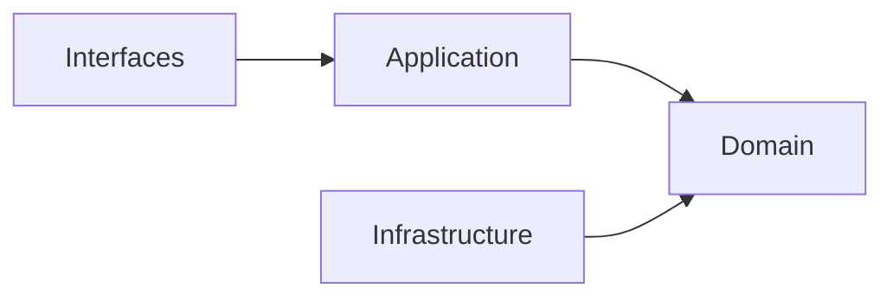

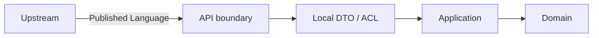

## Document Network

- [../README.md](../README.md)
- [../architecture-overview.md](../architecture-overview.md)
- [../bounded-contexts.md](../bounded-contexts.md)
- [../context-map.md](../context-map.md)
- [../integration-guidelines.md](../integration-guidelines.md)
- [../subdomains.md](../subdomains.md)
- [../ubiquitous-language.md](../ubiquitous-language.md)
- [../decisions/README.md](../decisions/README.md)
````

## File: docs/decisions/0001-hexagonal-architecture.md
````markdown
# 0001 Hexagonal Architecture

- Status: Accepted
- Date: 2026-04-11

## Context

Context7 驗證的 DDD / Hexagonal 參考指出，模組應保持高凝聚、低耦合，外部世界只依賴公開介面，領域核心必須與框架與基礎設施分離。若沒有清楚的邊界與端口，模組內部規則會被外層技術細節污染，跨主域整合也會快速失控。

## Decision

採用主域導向的 Hexagonal Architecture 作為全域架構基線。

- 每個主域內部遵守：driving adapters -> application orchestration -> domain core <- driven adapters。
- 領域核心負責 invariants、值物件、聚合與領域規則。
- 外部框架、IO、第三方服務、傳輸格式只能存在於邊界與 adapter。
- 跨主域互動只能透過 published language、API 邊界或事件。
- 公開 API 是跨主域依賴點，不是內部模組結構的鏡像暴露。

## Consequences

正面影響：

- 主域邊界更清楚，重構內部結構時不必連帶破壞外部整合。
- 領域語言可維持穩定，不會被 UI、HTTP 或基礎設施術語污染。
- 後續若需要分拆部署或演進為更獨立的服務，代價較低。

代價與限制：

- 需要更多 API 契約、Local DTO、ACL 與轉換層。
- 需要更嚴格的命名與文件治理，不可直接偷渡內部模型。

## Conflict Resolution

- 若任何文件暗示 domain 直接依賴 framework / infrastructure，以本 ADR 為準並判定為衝突。
- 若任何文件把 index 或共享檔案當成跨主域真實邊界，以本 ADR 為準並改回公開 API / published language。

## Rejected Anti-Patterns

- Domain 直接依賴 framework、SDK、transport、database implementation。
- Application service 直接呼叫 driven adapter，而不透過 port。
- Interface adapter 直接承載核心業務規則。

## Copilot Generation Rules

- 生成程式碼時，先保留 interfaces -> application -> domain <- infrastructure 的向內依賴方向。
- 奧卡姆剃刀：若較少的 abstraction 已能保護邊界，就不要額外新增 port、service、facade 或 adapter。
- 只有外部依賴或語義污染明確存在時，才建立 port 與 adapter。

## Dependency Direction Flow

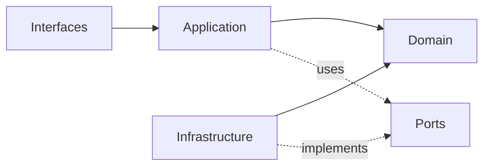

## Correct Interaction Flow

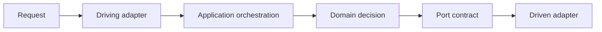

## Document Network

- [README.md](./README.md)
- [0002-bounded-contexts.md](./0002-bounded-contexts.md)
- [0003-context-map.md](./0003-context-map.md)
- [../architecture-overview.md](../architecture-overview.md)
- [../integration-guidelines.md](../integration-guidelines.md)
- [../bounded-context-subdomain-template.md](../bounded-context-subdomain-template.md)
- [../project-delivery-milestones.md](../project-delivery-milestones.md)
````

## File: docs/decisions/0002-bounded-contexts.md
````markdown
# 0002 Bounded Contexts

- Status: Accepted
- Date: 2026-04-11

## Context

Context7 驗證的 bounded context 原則要求每個 context 只承載一組高凝聚、可自洽的語言與規則。如果沒有清楚主域與子域所有權，術語、責任與整合規則就會互相覆蓋，造成治理語言、內容語言與推理語言混雜。

## Decision

將系統的主域固定為四個主域：

- workspace：協作容器與工作區範疇
- platform：治理、身份、權益與營運支撐
- notion：正典知識內容生命週期
- notebooklm：對話、來源處理與推理輸出

每個主域底下都有自己的子域集合。文件中必須明確區分：

- baseline subdomains：此架構基線中已確立的核心子域
- recommended gap subdomains：依 Context7 推導出的合理缺口子域

## Consequences

正面影響：

- 所有權清楚，可避免 platform、workspace、notion、notebooklm 互相吞邊界。
- 上層戰略文件與主域文件可共享同一個 decomposition 模型。

代價與限制：

- 需要承認 gap subdomains 是 architecture-first 建議，而不是 repo-inspected 現況事實。
- 未來若要改主域切分，必須連動更新 strategic docs、ADR 與 context docs。

## Conflict Resolution

- 若任何文件出現超過四個主域的平級切分，以本 ADR 為準並視為衝突。
- 若任何文件把 recommended gap subdomains 寫成已驗證現況，以本 ADR 為準並改回 architecture-first 表述。

## Rejected Anti-Patterns

- 讓多個主域同時聲稱同一正典所有權。
- 用 UI、部署或資料表分組來取代 bounded context 切分。
- 把 gap subdomain 寫成已落地事實，而不標示為架構缺口。

## Copilot Generation Rules

- 生成程式碼時，先判定需求屬於哪個主域與子域，再決定檔案位置與依賴方向。
- 奧卡姆剃刀：若既有 bounded context 已可吸收需求，就不要新增平級主域或語意重疊子域。
- 所有權不清楚時，先修正語言與 context map，再寫程式碼。

## Dependency Direction Flow

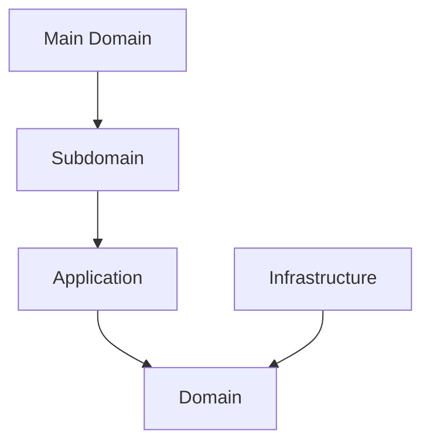

## Correct Interaction Flow

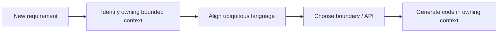

## Document Network

- [README.md](./README.md)
- [0001-hexagonal-architecture.md](./0001-hexagonal-architecture.md)
- [0003-context-map.md](./0003-context-map.md)
- [../bounded-contexts.md](../bounded-contexts.md)
- [../subdomains.md](../subdomains.md)
- [../bounded-context-subdomain-template.md](../bounded-context-subdomain-template.md)
- [../project-delivery-milestones.md](../project-delivery-milestones.md)
````

## File: docs/decisions/0003-context-map.md
````markdown
# 0003 Context Map

- Status: Accepted
- Date: 2026-04-11

## Context

Context Mapper 文件指出，context map 是 bounded contexts 與其關係的中心表示。若關係方向不清楚，則 published language、ACL、supplier/customer 責任無法正確定義，文件之間也容易同時出現互相衝突的整合模型。

## Decision

在四個主域之間，只採用 directed upstream-downstream 關係作為主域級整合基線。

主域關係如下：

- platform -> workspace
- platform -> notion
- platform -> notebooklm
- workspace -> notion
- workspace -> notebooklm
- notion -> notebooklm

主域級不採用 Shared Kernel 或 Partnership。

## Consequences

正面影響：

- 每個主域可以清楚知道誰是上游、誰是下游。
- ACL、Published Language、Conformist 等模式才有明確適用位置。

代價與限制：

- 需要更多轉譯與 API 契約層，不能直接共享內部模型。
- 若某些能力確實需要共用模型，必須先抽象成新的獨立 bounded context，而不是偷渡共享核心。

## Conflict Resolution

- 若任何文件同時宣稱兩個主域是 Partnership / Shared Kernel，又同時使用 ACL 或 Conformist，判定為衝突，以本 ADR 為準。
- 若任何文件出現與上述方向相反的主域級關係，以本 ADR 為準。

## Rejected Anti-Patterns

- 把 directed upstream-downstream 與 symmetric relationship 混寫在同一主域關係。
- 把 supplier / consumer 敘事寫反，造成上下游不明。
- 直接共享內部模型來取代 published language。

## Copilot Generation Rules

- 生成程式碼時，先判定 upstream 與 downstream，再安排 API boundary、published language、ACL 或 Conformist。
- 奧卡姆剃刀：若單一 published language 與單一 translation step 已足夠，就不要加第二條整合鏈。
- 關係方向不清楚時，先停下修正文檔，不直接生成跨主域耦合程式碼。

## Dependency Direction Flow

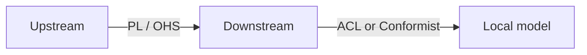

## Correct Interaction Flow

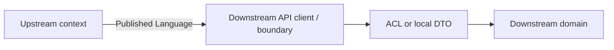

## Document Network

- [README.md](./README.md)
- [0002-bounded-contexts.md](./0002-bounded-contexts.md)
- [0005-anti-corruption-layer.md](./0005-anti-corruption-layer.md)
- [../context-map.md](../context-map.md)
- [../integration-guidelines.md](../integration-guidelines.md)
- [../bounded-context-subdomain-template.md](../bounded-context-subdomain-template.md)
- [../project-delivery-milestones.md](../project-delivery-milestones.md)
````

## File: docs/decisions/0004-ubiquitous-language.md
````markdown
# 0004 Ubiquitous Language

- Status: Accepted
- Date: 2026-04-11

## Context

Context7 驗證的 DDD 參考指出，領域核心必須運作在自己清楚的 ubiquitous language 之上。若沒有共同語言，跨主域整合、ADR、戰略文件與子域文件會用不同詞指同一件事，或用同一詞指不同責任，進而造成長期衝突。

## Decision

建立兩層語言治理：

- strategic ubiquitous language：定義四主域共用的戰略術語與整合術語
- context-specific ubiquitous language：由各主域 context 文件定義更細的本地主域語言

主域層的關鍵術語固定為：

- platform：Actor、Tenant、Entitlement、Secret、Consent
- workspace：Workspace、Membership、ShareScope、ActivityFeed、AuditTrail
- notion：KnowledgeArtifact、Taxonomy、Relation、Publication
- notebooklm：Notebook、Ingestion、Retrieval、Grounding、Synthesis、Evaluation

## Consequences

正面影響：

- 戰略文件、主域文件與 ADR 可以共享同一套術語。
- 語言衝突可以在文件層面先被攔住，而不是等到實作才暴露。

代價與限制：

- 命名自由度下降，需要持續維護 glossary。
- 新概念若無法歸屬到既有語言，必須先做文件決策。

## Conflict Resolution

- 若戰略語言與主域語言衝突，先以更具邊界意義的主域語言為準，再回寫 strategic glossary。
- 若兩個主域同時主張同一術語所有權，以 bounded contexts 與 context map 的所有權關係為準。

## Rejected Anti-Patterns

- 用同一個詞同時指涉治理、內容、推理三種不同責任。
- 用舊產品術語覆蓋新的 bounded context 語言。
- 讓實作便利性凌駕於 ubiquitous language 一致性。

## Copilot Generation Rules

- 生成程式碼時，先對齊 strategic term 與 context-specific term，再決定檔名、型別與 API 名稱。
- 奧卡姆剃刀：若一個名詞已足夠表達邊界，就不要再堆疊第二個近義抽象詞。
- 名稱若與現有語言衝突，先修正文檔與用語，再寫程式碼。

## Dependency Direction Flow

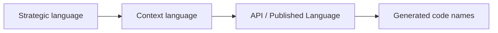

## Correct Interaction Flow

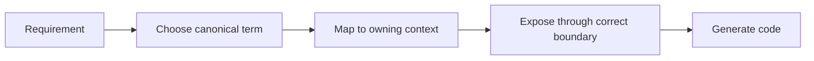

## Document Network

- [README.md](./README.md)
- [0002-bounded-contexts.md](./0002-bounded-contexts.md)
- [../ubiquitous-language.md](../ubiquitous-language.md)
- [../contexts/_template.md](../contexts/_template.md)
- [../bounded-context-subdomain-template.md](../bounded-context-subdomain-template.md)
- [../project-delivery-milestones.md](../project-delivery-milestones.md)
````

## File: docs/decisions/0005-anti-corruption-layer.md
````markdown
# 0005 Anti-Corruption Layer

- Status: Accepted
- Date: 2026-04-11

## Context

Context Mapper 明確指出 ACL 只能出現在 upstream-downstream 關係中，且只能由 downstream 採用；ACL 與 Conformist 互斥，且都不適用於 Shared Kernel 或 Partnership。若沒有這條規則，整合文件會同時宣稱保護語言與直接順從上游，造成自相矛盾。

## Decision

採用以下整合保護規則：

- 主域級整合預設先使用 published language + local DTO。
- 若上游語言會扭曲下游語言，下游必須使用 ACL。
- 若上游語言與下游需求高度一致，下游才可選擇 Conformist。
- ACL 與 Conformist 不能同時套用在同一關係。
- 因本架構基線不採用主域級 Shared Kernel / Partnership，所以主域級不允許以對稱關係為由略過 ACL 判斷。

## Consequences

正面影響：

- 下游主域可以保護自己的 ubiquitous language。
- Integration guidelines 可以有單一、可判斷的模式選擇規則。

代價與限制：

- 需要維護更多轉譯器、Local DTO 與邊界測試。
- 若每個整合都無條件使用 ACL，也會增加樣板成本，因此仍須做必要性判斷。

## Conflict Resolution

- 若任何文件把 ACL 寫成 upstream 的責任，判定為衝突，以本 ADR 為準。
- 若任何文件同時要求 ACL 與 Conformist 套在同一整合，判定為衝突，以本 ADR 為準。
- 若任何文件在對稱關係上使用 ACL / Conformist，判定為衝突，以本 ADR 為準。

## Rejected Anti-Patterns

- 把 ACL 當成 upstream 的工作。
- 在同一關係同時宣稱 ACL 與 Conformist。
- 用 Shared Kernel / Partnership 當理由跳過整合語義判斷。

## Copilot Generation Rules

- 生成程式碼時，先確認自己是 upstream 還是 downstream，再決定是否需要 ACL 或 Conformist。
- 奧卡姆剃刀：若 published language 加 local DTO 已足夠，就不要額外新增第二層 ACL。
- 只有在上游語言真的會污染本地語言時，才建立 ACL。

## Dependency Direction Flow

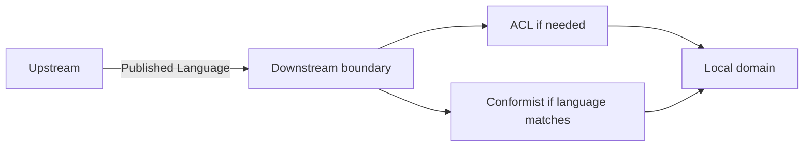

## Correct Interaction Flow

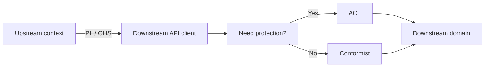

## Document Network

- [README.md](./README.md)
- [0003-context-map.md](./0003-context-map.md)
- [../context-map.md](../context-map.md)
- [../integration-guidelines.md](../integration-guidelines.md)
- [../bounded-context-subdomain-template.md](../bounded-context-subdomain-template.md)
- [../project-delivery-milestones.md](../project-delivery-milestones.md)
````

## File: docs/decisions/README.md
````markdown
# Decisions

本目錄是 architecture-first 的決策日誌。依 ADR 參考模式，每份 ADR 至少說明 context、decision、consequences 與 conflict resolution，讓後續戰略文件可以引用相同決策來源。

## Decision Log

| ADR | Title | Status | Scope |
|---|---|---|---|
| [0001-hexagonal-architecture.md](./0001-hexagonal-architecture.md) | Hexagonal Architecture | Accepted | 全域架構與邊界分層 |
| [0002-bounded-contexts.md](./0002-bounded-contexts.md) | Bounded Contexts | Accepted | 四主域與子域切分 |
| [0003-context-map.md](./0003-context-map.md) | Context Map | Accepted | 主域間依賴方向 |
| [0004-ubiquitous-language.md](./0004-ubiquitous-language.md) | Ubiquitous Language | Accepted | 戰略術語治理 |
| [0005-anti-corruption-layer.md](./0005-anti-corruption-layer.md) | Anti-Corruption Layer | Accepted | 邊界整合保護規則 |

## How To Use This Directory

- 先讀標題以取得整體脈絡。
- 若某份戰略文件與 ADR 衝突，以 ADR 的 decision 與 conflict resolution 為準。
- 若未來新增新的架構決策，應沿用同一結構補充，而不是覆寫舊決策歷史。

## Anti-Pattern Coverage

- 0001 禁止把 framework / infrastructure 滲入核心。
- 0002 禁止主域與子域所有權漂移。
- 0003 禁止上下游方向與對稱關係混寫。
- 0004 禁止語言污染與同詞多義。
- 0005 禁止錯置 ACL / Conformist 的責任位置。

## Copilot Generation Rules

- 生成程式碼前，先由 ADR 決定邊界、語言與整合責任，再下手實作。
- 奧卡姆剃刀：若既有 ADR 已能解決當前判斷，就不要再堆疊新的臨時規則文件。
- 新規則若會改變邊界，先補 ADR，再補戰略文件與 context docs。

## Dependency Direction Flow

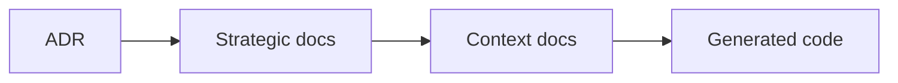

## Correct Interaction Flow

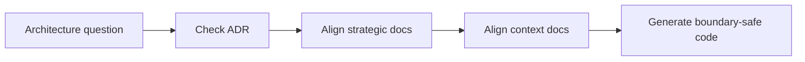

## Document Network

- [0001-hexagonal-architecture.md](./0001-hexagonal-architecture.md)
- [0002-bounded-contexts.md](./0002-bounded-contexts.md)
- [0003-context-map.md](./0003-context-map.md)
- [0004-ubiquitous-language.md](./0004-ubiquitous-language.md)
- [0005-anti-corruption-layer.md](./0005-anti-corruption-layer.md)
- [../bounded-context-subdomain-template.md](../bounded-context-subdomain-template.md)
- [../project-delivery-milestones.md](../project-delivery-milestones.md)
- [../README.md](../README.md)

## Constraints

- 本目錄在本次任務限制下，只依 Context7 架構參考重建。
- 本目錄不是對既有 repo 內容做過語意比對後的歷史還原。
````

## File: docs/integration-guidelines.md
````markdown
# Integration Guidelines

本文件在本次任務限制下，僅依 Context7 驗證的 published language、ACL、Conformist 與 hexagonal boundary 原則重建，不主張反映現況實作。

## Boundary Contract

跨主域整合只能使用：

- published language
- public API boundary
- domain / integration events
- local DTO
- downstream ACL 或 downstream Conformist

## Pattern Selection Rules

| Situation | Pattern |
|---|---|
| 下游與上游語義高度一致，且不會扭曲本地語言 | Conformist |
| 上游語義會污染下游本地語言 | Anti-Corruption Layer |
| 只是跨主域資料交換 | Published Language + Local DTO |

## Hard Rules

- ACL 與 Conformist 只能由 downstream 選擇。
- ACL 與 Conformist 互斥。
- 不可直接傳遞上游 entity / aggregate 作為下游正典模型。
- 不可把 shared technical package 誤當成 strategic shared kernel。
- 若需要共同語義，先定 published language，再定 DTO，再評估是否需要 ACL。

## Domain-Specific Guidance

- workspace 消費 platform 時，優先保護自己的 membership、sharing、presence 語言。
- notion 消費 platform 或 workspace 時，優先保護自己的 knowledge artifact 與 taxonomy 語言。
- notebooklm 消費 notion 時，優先保護自己的 retrieval、grounding、synthesis 語言。

## Integration Checklist

1. 先確認 upstream / downstream 方向。
2. 先列出 published language。
3. 判斷是否語義一致。
4. 一致則考慮 conformist，不一致則建立 ACL。
5. 避免把 DTO、entity、policy、UI 狀態混成同一層。

## Integration Anti-Patterns

- 直接傳遞上游 aggregate、entity、repository 給下游使用。
- 讓 downstream 省略 published language 與 local DTO，直接貼靠上游內部模型。
- 把 ACL 當成預設樣板卻不判斷是否真的有語義污染。

## Copilot Generation Rules

- 生成程式碼時，先決定 upstream、downstream、published language，再決定 DTO、ACL 或 Conformist。
- 奧卡姆剃刀：若 published language 加 local DTO 已足夠，就不要額外建立雙重 mapper、雙重 ACL 或鏡像 aggregate。
- 只有在上游語義真的會污染本地語言時，才建立 ACL。

## Dependency Direction Flow

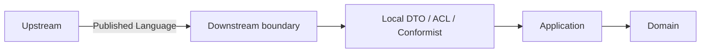

## Correct Interaction Flow

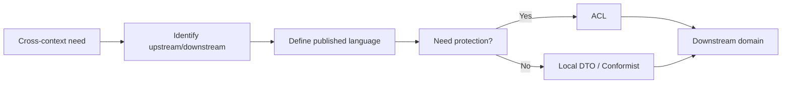

## Document Network

- [context-map.md](./context-map.md)
- [strategic-patterns.md](./strategic-patterns.md)
- [architecture-overview.md](./architecture-overview.md)
- [bounded-context-subdomain-template.md](./bounded-context-subdomain-template.md)
- [project-delivery-milestones.md](./project-delivery-milestones.md)
- [decisions/0001-hexagonal-architecture.md](./decisions/0001-hexagonal-architecture.md)
- [decisions/0003-context-map.md](./decisions/0003-context-map.md)
- [decisions/0005-anti-corruption-layer.md](./decisions/0005-anti-corruption-layer.md)

## Conflict Resolution

- 若某整合指南與 [context-map.md](./context-map.md) 的方向衝突，以 context map 為準。
- 若某整合指南與 [decisions/0005-anti-corruption-layer.md](./decisions/0005-anti-corruption-layer.md) 衝突，以 ADR 為準。
````

## File: docs/strategic-patterns.md
````markdown
# Strategic Patterns

本文件在本次任務限制下，僅依 Context7 驗證的 DDD strategic design 與 context map 原則重建，不主張反映現況實作。

## Selected Patterns

| Pattern | Usage In This Architecture |
|---|---|
| Bounded Context | 四個主域與其子域切分的核心模式 |
| Upstream-Downstream | 主域級關係的唯一基線模式 |
| Published Language | 所有跨主域交換的共同語言 |
| Anti-Corruption Layer | downstream 語言需要保護時使用 |
| Conformist | downstream 語言與 upstream 高度一致時的例外策略 |

## Patterns Not Used At Main-Domain Level

| Pattern | Why Not Used |
|---|---|
| Shared Kernel | 主域級共用模型會快速放大耦合與責任混淆 |
| Partnership | 主域級互相綁定會破壞 supplier / consumer 的清楚方向 |

## Recommended Strategic Posture

- platform 作為治理 supplier。
- workspace 作為協作 scope supplier。
- notion 作為知識內容 supplier。
- notebooklm 作為推理輸出與引用整合者。

## Pattern Conflicts Avoided

- 不把 ACL 與 Conformist 混用。
- 不把 Shared Kernel 與 directed relationship 混用。
- 不把 technical shared libraries 混寫成 strategic shared kernel。

## Strategic Anti-Patterns

- 以 shared technical package 取代真正的 bounded context 關係設計。
- 以對稱關係語言掩蓋其實存在的上下游依賴。
- 以實作方便為由，直接共享內部模型而不定 published language。

## Copilot Generation Rules

- 生成程式碼時，先選對戰略模式，再選對技術形狀。
- 奧卡姆剃刀：優先使用最少但足夠的戰略模式，不要同時堆疊多個彼此衝突的模式。
- 若一段整合沒有真正的語義污染，就不要硬加 ACL。

## Dependency Direction Flow

```mermaid
flowchart LR
	BoundedContext["Bounded Context"] --> UpstreamDownstream["Upstream / Downstream"]
	UpstreamDownstream --> PublishedLanguage["Published Language"]
	PublishedLanguage --> ACLCF["ACL or Conformist"]
```

## Correct Interaction Flow

```mermaid
flowchart LR
	PatternChoice["Choose pattern"] --> Relationship["Set relationship direction"]
	Relationship --> Language["Define published language"]
	Language --> Protection["Apply ACL or Conformist if needed"]
	Protection --> Code["Generate code"]
```

## Document Network

- [architecture-overview.md](./architecture-overview.md)
- [context-map.md](./context-map.md)
- [integration-guidelines.md](./integration-guidelines.md)
- [bounded-context-subdomain-template.md](./bounded-context-subdomain-template.md)
- [project-delivery-milestones.md](./project-delivery-milestones.md)
- [decisions/0003-context-map.md](./decisions/0003-context-map.md)
- [decisions/0005-anti-corruption-layer.md](./decisions/0005-anti-corruption-layer.md)

## Decision References

- [decisions/0001-hexagonal-architecture.md](./decisions/0001-hexagonal-architecture.md)
- [decisions/0002-bounded-contexts.md](./decisions/0002-bounded-contexts.md)
- [decisions/0003-context-map.md](./decisions/0003-context-map.md)
- [decisions/0005-anti-corruption-layer.md](./decisions/0005-anti-corruption-layer.md)
````

## File: docs/context-map.md
````markdown
# Context Map

本文件在本次任務限制下，僅依 Context7 驗證的 context map 與 strategic design 原則重建，不主張反映現況實作。

## System Landscape

主域級關係只採用 directed upstream-downstream 模型。

## Directed Relationships

| Upstream | Downstream | Published Language |
|---|---|---|
| platform | workspace | actor reference、organization scope、access decision、entitlement signal |
| platform | notion | actor reference、organization scope、access decision、entitlement signal |
| platform | notebooklm | actor reference、organization scope、access decision、entitlement signal |
| workspace | notion | workspaceId、membership scope、share scope |
| workspace | notebooklm | workspaceId、membership scope、share scope |
| notion | notebooklm | knowledge artifact reference、attachment reference、taxonomy hint |

## Pattern Rules

- ACL 與 Conformist 只允許出現在 downstream 端。
- ACL 與 Conformist 互斥，不能同時套用在同一整合。
- Shared Kernel 與 Partnership 不用於主域級關係。
- 若未來真的需要共享模型，必須先抽出新的 bounded context，而不是把對稱關係塞回主域之間。

## Dependency Direction Guardrail

- 主域級方向只允許 upstream -> downstream，不允許同時宣稱對稱依賴。
- downstream 整合上游時，先決定 published language，再決定 ACL 或 Conformist。
- 上游提供語言與能力，下游決定如何保護自己的語言。

## Strategic Consequences

- 關係方向清楚後，published language、local DTO 與 ACL 才能一致。
- 主域級文檔可以避免同時出現互相矛盾的 supplier / consumer 敘事。

## Contradictions Removed

- 不再同時把主域級關係描述成 directed relationship 與 symmetric relationship。
- 不再把 ACL 寫成 upstream 的責任。
- 不再把 shared technical libraries 誤寫為主域級 Shared Kernel。

## Forbidden Relationship Patterns

- 不得把 Shared Kernel / Partnership 與 ACL / Conformist 混寫在同一關係。
- 不得把 direct model sharing 寫成 published language。
- 不得把下游的轉譯責任倒灌回上游。

## Copilot Generation Rules

- 生成程式碼時，先畫清 upstream / downstream，再安排 API boundary、published language、ACL 或 Conformist。
- 奧卡姆剃刀：若單一 published language 與單一 translation step 足夠，就不要再加第二層整合流程。
- 不確定關係方向時，先修正文檔，不直接生成跨主域耦合程式碼。

## Dependency Direction Flow

```mermaid
flowchart LR
	Upstream["Upstream"] -->|PL / OHS| Downstream["Downstream"]
	Downstream -->|ACL or Conformist| LocalModel["Local domain model"]
```

## Correct Interaction Flow

```mermaid
flowchart LR
	Platform["platform"] --> Workspace["workspace"]
	Platform --> Notion["notion"]
	Platform --> NotebookLM["notebooklm"]
	Workspace --> Notion
	Workspace --> NotebookLM
	Notion --> NotebookLM
```

## Document Network

- [architecture-overview.md](./architecture-overview.md)
- [integration-guidelines.md](./integration-guidelines.md)
- [strategic-patterns.md](./strategic-patterns.md)
- [bounded-context-subdomain-template.md](./bounded-context-subdomain-template.md)
- [project-delivery-milestones.md](./project-delivery-milestones.md)
- [decisions/0003-context-map.md](./decisions/0003-context-map.md)
- [decisions/0005-anti-corruption-layer.md](./decisions/0005-anti-corruption-layer.md)
````

## File: docs/contexts/notebooklm/README.md
````markdown
# NotebookLM Context

本 README 在本次任務限制下，僅依 Context7 驗證的 DDD、Context Map、Hexagonal Architecture 參考重建，不主張反映現況實作。

## Purpose

notebooklm 是對話、來源處理與推理主域。它的責任是提供 notebook、conversation、source ingestion、retrieval、grounding、synthesis、evaluation 與 conversation-versioning 等語言，把來源材料轉成可對話、可追溯、可評估的衍生輸出。

## Why This Context Exists

- 把推理流程與正典知識內容分離。
- 把來源匯入、檢索、grounding 與 synthesis 統整成同一主域。
- 提供可回流到其他主域、但本質上仍屬衍生輸出的能力邊界。

## Context Summary

| Aspect | Summary |
|---|---|
| Primary Role | 對話、來源處理、檢索與推理輸出 |
| Upstream Dependency | platform 治理、workspace scope、notion 內容來源 |
| Downstream Consumer | 無固定主域級 consumer；輸出可被其他主域吸收 |
| Core Principle | notebooklm 擁有衍生推理流程，不擁有正典知識內容 |

## Baseline Subdomains

- conversation
- note
- notebook
- source
- synthesis
- conversation-versioning

## Recommended Gap Subdomains

- ingestion
- retrieval
- grounding
- evaluation

## Key Relationships

- 與 platform：notebooklm 消費 actor、organization、access、entitlement、ai capability。
- 與 workspace：notebooklm 消費 workspaceId、membership scope、share scope。
- 與 notion：notebooklm 消費 knowledge artifact reference、attachment reference、taxonomy hint。

## Reading Order

1. [subdomains.md](./subdomains.md)
2. [bounded-contexts.md](./bounded-contexts.md)
3. [context-map.md](./context-map.md)
4. [ubiquitous-language.md](./ubiquitous-language.md)
5. [AGENT.md](./AGENT.md)

## Dependency Direction

- 本主域內部固定採用 interfaces -> application -> domain <- infrastructure。
- 跨主域只消費 published language、API boundary、events，不直接依賴他域內部模型。

## Anti-Pattern Rules

- 不把 notebooklm 的衍生輸出直接宣稱為 notion 的正典知識內容。
- 不把 retrieval/grounding 降格成單純 UI 功能或模型提示細節。
- 不把 ingestion 與 source reference 混成同一個不可拆分責任。
- 不把 platform.ai 的共享能力誤寫成 notebooklm 自己擁有的 `ai` 子域。

## Copilot Generation Rules

- 生成程式碼時，先保留 notebooklm 的衍生推理定位，再安排 retrieval、grounding、synthesis 的交互。
- 模型接入、配額、供應商策略若屬共享能力，先消費 platform.ai；notebooklm 保留 retrieval、grounding、synthesis、evaluation 的語義所有權。
- 奧卡姆剃刀：只在必要時引入 port、ACL、DTO；不要因為未來也許會有需求就預先堆疊抽象。
- 優先產生一條清楚的 upstream input -> translation -> application -> domain -> output 流程，而不是多條重疊流程。

## Dependency Direction Flow

```mermaid
flowchart LR
	I["Interfaces"] --> A["Application"]
	A --> D["Domain"]
	X["Infrastructure"] --> D
	X -. implements ports .-> A
```

## Correct Interaction Flow

```mermaid
flowchart LR
	Platform["platform"] --> Boundary["notebooklm boundary"]
	Workspace["workspace"] --> Boundary
	Notion["notion"] --> Boundary
	Boundary --> Translation["DTO / ACL"]
	Translation --> App["Application use case"]
	App --> Domain["NotebookLM domain"]
	Domain --> Output["Grounded answer / note / evaluation"]
```

## Document Network

- [AGENT.md](./AGENT.md)
- [bounded-contexts.md](./bounded-contexts.md)
- [context-map.md](./context-map.md)
- [subdomains.md](./subdomains.md)
- [ubiquitous-language.md](./ubiquitous-language.md)
- [../../README.md](../../README.md)
- [../../architecture-overview.md](../../architecture-overview.md)
- [../../integration-guidelines.md](../../integration-guidelines.md)

## Constraints

- 本文件是 architecture-first 版本。
- 本文件依 Context7 的 bounded context 與 context map 原則編寫。
- 本文件不代表對既有 repo 內容做過語意校準。
````

## File: docs/contexts/notion/README.md
````markdown
# Notion Context

本 README 在本次任務限制下，僅依 Context7 驗證的 DDD、Context Map、Hexagonal Architecture 參考重建，不主張反映現況實作。

## Purpose

notion 是知識內容生命週期主域。它的責任是提供 knowledge artifact、authoring、database、taxonomy、relations、templates、publishing、knowledge-versioning 與 collaboration 等內容語言，承接正式知識內容的正典狀態。

## Why This Context Exists

- 把知識內容正典與平台治理、工作區範疇、對話推理分離。
- 讓內容建立、分類、關聯、交付與版本規則維持在同一個主域。
- 提供 notebooklm 可引用、但不可直接改寫的知識來源。

## Context Summary

| Aspect | Summary |
|---|---|
| Primary Role | 正典知識內容生命週期 |
| Upstream Dependency | platform 治理、workspace scope |
| Downstream Consumer | notebooklm |
| Core Principle | notion 擁有正式內容，不擁有治理或推理過程 |

## Baseline Subdomains

- knowledge
- authoring
- collaboration
- database
- knowledge-analytics
- attachments
- automation
- knowledge-integration
- notes
- templates
- knowledge-versioning

## Recommended Gap Subdomains

- taxonomy
- relations
- publishing

## Key Relationships

- 與 platform：notion 消費 actor、organization、access、entitlement、ai capability。
- 與 workspace：notion 消費 workspaceId、membership scope、share scope。
- 與 notebooklm：notion 向 notebooklm 提供 knowledge artifact reference 與 attachment reference。

## Reading Order

1. [subdomains.md](./subdomains.md)
2. [bounded-contexts.md](./bounded-contexts.md)
3. [context-map.md](./context-map.md)
4. [ubiquitous-language.md](./ubiquitous-language.md)
5. [AGENT.md](./AGENT.md)

## Dependency Direction

- 本主域內部固定採用 interfaces -> application -> domain <- infrastructure。
- notion 對外只暴露 published language、API boundary、events，不暴露內部內容模型。

## Anti-Pattern Rules

- 不把 notebooklm 的衍生輸出直接當成 notion 正典內容。
- 不把 taxonomy、relations、publishing 壓回單一 knowledge 編輯流程。
- 不把 platform 的治理語言混成內容生命週期本身。
- 不把 platform.ai 的共享能力誤寫成 notion 自己擁有的 `ai` 子域。

## Copilot Generation Rules

- 生成程式碼時，先保留 notion 的正典內容定位，再安排 authoring、knowledge、taxonomy、publishing 的交互。
- 內容輔助、摘要與生成若只是內容 use case 的支援能力，優先由 knowledge / authoring use case 消費 `platform.ai`，而不是在 notion 再建一個 generic `ai` 子域。
- 奧卡姆剃刀：不要預先新增第二套內容流程，只在既有內容邊界真的不夠時才補新抽象。
- 優先讓同一條 input -> translation -> application -> domain -> publication 流程保持單純可追溯。

## Dependency Direction Flow

```mermaid
flowchart LR
	I["Interfaces"] --> A["Application"]
	A --> D["Domain"]
	X["Infrastructure"] --> D
	X -. implements ports .-> A
```

## Correct Interaction Flow

```mermaid
flowchart LR
	Platform["platform"] --> Boundary["notion boundary"]
	Workspace["workspace"] --> Boundary
	Boundary --> Translation["DTO / ACL"]
	Translation --> App["Application use case"]
	App --> Domain["Notion domain"]
	Domain --> Output["KnowledgeArtifact / Publication"]
	Output --> NotebookLM["notebooklm consumer"]
```

## Document Network

- [AGENT.md](./AGENT.md)
- [bounded-contexts.md](./bounded-contexts.md)
- [context-map.md](./context-map.md)
- [subdomains.md](./subdomains.md)
- [ubiquitous-language.md](./ubiquitous-language.md)
- [../../README.md](../../README.md)
- [../../architecture-overview.md](../../architecture-overview.md)
- [../../integration-guidelines.md](../../integration-guidelines.md)

## Constraints

- 本文件是 architecture-first 版本。
- 本文件依 Context7 的 bounded context 與 context map 原則編寫。
- 本文件不代表對既有 repo 內容做過語意校準。
````

## File: docs/contexts/platform/README.md
````markdown
# Platform Context

本 README 在本次任務限制下，僅依 Context7 驗證的 DDD、Context Map、Hexagonal Architecture 參考重建，不主張反映現況實作。

## Purpose

platform 是治理與營運支撐主域。它的責任是提供 actor、identity、organization、tenant、access、policy、entitlement、shared ai capability、billing、notification、search、audit 與 observability 等跨切面語言，供其他主域穩定消費。

## Why This Context Exists

- 把治理與營運支撐責任集中，避免滲入其他主域。
- 讓其他主域只消費治理結果，而不是重建治理模型。
- 以清楚的 published language 承接身份、權益、政策與營運能力。

## Context Summary

| Aspect | Summary |
|---|---|
| Primary Role | 治理、身份、權益與營運支撐 |
| Upstream Dependency | 無主域級上游；作為其他主域治理上游 |
| Downstream Consumers | workspace、notion、notebooklm |
| Core Principle | platform 輸出治理結果，不接管其他主域正典內容 |

## Baseline Subdomains

- identity
- account
- account-profile
- organization
- access-control
- security-policy
- platform-config
- feature-flag
- onboarding
- compliance
- billing
- subscription
- referral
- ai
- integration
- workflow
- notification
- background-job
- content
- search
- audit-log
- observability
- analytics
- support

## Recommended Gap Subdomains

- tenant
- entitlement
- secret-management
- consent

## Key Relationships

- 對 workspace：提供 actor、organization、access、entitlement。
- 對 notion：提供 actor、organization、access、entitlement、ai capability。
- 對 notebooklm：提供 actor、organization、access、entitlement、ai capability。

## Reading Order

1. [subdomains.md](./subdomains.md)
2. [bounded-contexts.md](./bounded-contexts.md)
3. [context-map.md](./context-map.md)
4. [ubiquitous-language.md](./ubiquitous-language.md)
5. [AGENT.md](./AGENT.md)

## Dependency Direction

- 本主域內部固定採用 interfaces -> application -> domain <- infrastructure。
- platform 對外只輸出治理結果與 published language，不輸出內部治理模型細節。

## Anti-Pattern Rules

- 不把 platform 寫成內容主域或對話主域。
- 不把 entitlement、consent、secret-management 混成同一個泛用設定區。
- 不把其他主域對平台的依賴寫成可以直接存取其內部模型。

## Copilot Generation Rules

- 生成程式碼時，先保留 platform 的治理定位，再安排 identity、access、entitlement、ai、secret-management 的交互。
- 奧卡姆剃刀：不要預先建立多餘 facade；能直接由既有治理邊界承接就維持單一路徑。
- 優先讓 request -> orchestration -> domain decision -> published language 保持單純可追溯。

## Dependency Direction Flow

```mermaid
flowchart LR
	I["Interfaces"] --> A["Application"]
	A --> D["Domain"]
	X["Infrastructure"] --> D
	X -. implements ports .-> A
```

## Correct Interaction Flow

```mermaid
flowchart LR
	Request["Actor / admin request"] --> Boundary["platform boundary"]
	Boundary --> App["Application use case"]
	App --> Domain["Platform domain"]
	Domain --> Published["Published governance language"]
	Published --> Consumers["workspace / notion / notebooklm"]
```

## Document Network

- [AGENT.md](./AGENT.md)
- [bounded-contexts.md](./bounded-contexts.md)
- [context-map.md](./context-map.md)
- [subdomains.md](./subdomains.md)
- [ubiquitous-language.md](./ubiquitous-language.md)
- [../../README.md](../../README.md)
- [../../architecture-overview.md](../../architecture-overview.md)
- [../../integration-guidelines.md](../../integration-guidelines.md)

## Constraints

- 本文件是 architecture-first 版本。
- 本文件依 Context7 的 bounded context 與 context map 原則編寫。
- 本文件不代表對既有 repo 內容做過語意校準。
````

## File: docs/contexts/workspace/README.md
````markdown
# Workspace Context

本 README 在本次任務限制下，僅依 Context7 驗證的 DDD、Context Map、Hexagonal Architecture 參考重建，不主張反映現況實作。

## Purpose

workspace 是協作容器與工作區範疇主域。它的責任是提供 workspaceId、工作區生命週期、參與關係、共享、存在感、活動投影、稽核、排程與工作流，讓其他主域可以在同一個協作範疇中運作。

## Why This Context Exists

- 把工作區容器語意與平台治理語意分離。
- 把工作區 scope 作為其他主域可依賴的 published language。
- 把活動流、稽核、排程與流程協調收斂為同一主域內的高凝聚能力。

## Context Summary

| Aspect | Summary |
|---|---|
| Primary Role | 協作容器與 workspace scope |
| Upstream Dependency | platform 的 actor、organization、access、entitlement |
| Downstream Consumers | notion、notebooklm |
| Core Principle | workspace 暴露 scope，不接管治理或內容正典 |

## Baseline Subdomains

- audit
- feed
- scheduling
- workspace-workflow

## Recommended Gap Subdomains

- lifecycle
- membership
- sharing
- presence

## Key Relationships

- 與 platform：workspace 是治理結果的 downstream consumer。
- 與 notion：workspace 向 notion 提供 workspaceId、membership scope、share scope。
- 與 notebooklm：workspace 向 notebooklm 提供 workspaceId、membership scope、share scope。

## Reading Order

1. [subdomains.md](./subdomains.md)
2. [bounded-contexts.md](./bounded-contexts.md)
3. [context-map.md](./context-map.md)
4. [ubiquitous-language.md](./ubiquitous-language.md)
5. [AGENT.md](./AGENT.md)

## Dependency Direction

- 本主域內部固定採用 interfaces -> application -> domain <- infrastructure。
- workspace 對外只暴露 scope、published language、API boundary、events，不暴露內部實作。

## Anti-Pattern Rules

- 不把 workspace scope 寫成平台治理結果本身。
- 不把 feed、audit、workspace-workflow 互相取代為單一泛用流程層。
- 不把 notion 或 notebooklm 的內容與推理責任吸回 workspace。

## Copilot Generation Rules

- 生成程式碼時，先保留 workspace 的協作 scope 定位，再安排 lifecycle、membership、sharing、workspace-workflow 的交互。
- 奧卡姆剃刀：不要預先建立第二條平行協作流程；只有既有 scope 邊界不夠時才補新抽象。
- 優先讓 input -> translation -> application -> domain -> published scope 保持單純可追溯。

## Dependency Direction Flow

```mermaid
flowchart LR
	I["Interfaces"] --> A["Application"]
	A --> D["Domain"]
	X["Infrastructure"] --> D
	X -. implements ports .-> A
```

## Correct Interaction Flow

```mermaid
flowchart LR
	Platform["platform"] --> Boundary["workspace boundary"]
	Boundary --> Translation["DTO / ACL"]
	Translation --> App["Application use case"]
	App --> Domain["Workspace domain"]
	Domain --> Scope["workspace scope"]
	Scope --> Notion["notion"]
	Scope --> NotebookLM["notebooklm"]
```

## Document Network

- [AGENT.md](./AGENT.md)
- [bounded-contexts.md](./bounded-contexts.md)
- [context-map.md](./context-map.md)
- [subdomains.md](./subdomains.md)
- [ubiquitous-language.md](./ubiquitous-language.md)
- [../../README.md](../../README.md)
- [../../architecture-overview.md](../../architecture-overview.md)
- [../../integration-guidelines.md](../../integration-guidelines.md)

## Constraints

- 本文件是 architecture-first 版本。
- 本文件依 Context7 的 bounded context 與 context map 原則編寫。
- 本文件不代表對既有 repo 內容做過語意校準。
````

## File: docs/architecture-overview.md
````markdown
# Architecture Overview

本文件在本次任務限制下，僅依 Context7 驗證的 DDD、Context Map、Hexagonal Architecture 與 ADR 參考重建，不主張反映現況實作。

## System Shape

系統以四個主域組成，每個主域都視為一個有自己語言與規則的 bounded context 族群：

- workspace：協作容器與工作區範疇
- platform：治理、身份、權益與營運支撐
- notion：正典知識內容生命週期
- notebooklm：對話、來源處理與推理輸出

## Architectural Baseline

- 主域內部採用 Hexagonal Architecture。
- 主域之間只透過 published language、API 邊界或事件互動。
- 領域核心不直接依賴 framework 與 infrastructure。
- 主域級關係採用 directed upstream-downstream，不採用 Shared Kernel / Partnership。

## Main Domains

| Main Domain | Strategic Role | What It Owns |
|---|---|---|
| workspace | 協作範疇 | workspaceId、membership、sharing、presence、feed、audit、scheduling、workspace-workflow |
| platform | 治理上游 | actor、tenant、access、policy、entitlement、billing、ai capability、notification、audit-log |
| notion | 正典內容 | knowledge artifact、taxonomy、relations、publication、knowledge-versioning |
| notebooklm | 推理輸出 | ingestion、retrieval、grounding、conversation、synthesis、evaluation、conversation-versioning |

## Relationship Baseline

| Upstream | Downstream | Reason |
|---|---|---|
| platform | workspace | 提供治理結果與權益判定 |
| platform | notion | 提供治理結果與權益判定 |
| platform | notebooklm | 提供治理結果與權益判定 |
| workspace | notion | 提供 workspace scope 與 sharing scope |
| workspace | notebooklm | 提供 workspace scope 與 sharing scope |
| notion | notebooklm | 提供可引用的知識內容來源 |

## Contradiction-Free Rules

- 只有四個主域，不再引入其他平級主域。
- 戰略文件若需要描述缺口，一律使用 recommended gap subdomains，而不是假裝它們已被實作驗證。
- platform 是治理上游，不是內容或對話的正典擁有者。
- platform 擁有 shared AI capability，但不擁有 notion 的正典內容語言或 notebooklm 的推理輸出語言。
- notion 是正典內容擁有者，不是治理上游。
- notebooklm 是衍生推理輸出擁有者，不是正典內容擁有者。

## System-Wide Dependency Direction

- 每個主域內部固定遵守 interfaces -> application -> domain <- infrastructure。
- 跨主域依賴只能透過 published language、public API boundary、events。
- 外部框架、SDK、傳輸與儲存細節只能停留在 adapter 邊界。

## System-Wide Anti-Patterns

- 把 domain 核心直接接上 framework、database、HTTP、queue 或 AI SDK。
- 把主域內部模型直接共享給其他主域，取代 published language。
- 把治理、內容、推理三種責任重新揉成單一平級主域。

## Copilot Generation Rules

- 生成程式碼時，先定位需求落在哪個主域，再定位到子域與層。
- 奧卡姆剃刀：若既有主域、子域與 API boundary 已能承接需求，就不要再新增新的平級結構。
- 優先維持單一清楚的 input -> boundary -> application -> domain -> output 路徑。

## Dependency Direction Flow

```mermaid
flowchart LR
	Interfaces["Interfaces"] --> Application["Application"]
	Application --> Domain["Domain"]
	Infrastructure["Infrastructure"] --> Domain
```

## Correct Interaction Flow

```mermaid
flowchart LR
	Platform["platform"] --> Workspace["workspace"]
	Platform --> Notion["notion"]
	Platform --> NotebookLM["notebooklm"]
	Workspace --> Notion
	Workspace --> NotebookLM
	Notion --> NotebookLM
```

## Document Network

- [README.md](./README.md)
- [bounded-contexts.md](./bounded-contexts.md)
- [context-map.md](./context-map.md)
- [subdomains.md](./subdomains.md)
- [integration-guidelines.md](./integration-guidelines.md)
- [strategic-patterns.md](./strategic-patterns.md)
- [bounded-context-subdomain-template.md](./bounded-context-subdomain-template.md)
- [project-delivery-milestones.md](./project-delivery-milestones.md)
- [decisions/0001-hexagonal-architecture.md](./decisions/0001-hexagonal-architecture.md)

## Reading Path

1. [bounded-contexts.md](./bounded-contexts.md)
2. [context-map.md](./context-map.md)
3. [subdomains.md](./subdomains.md)
4. [ubiquitous-language.md](./ubiquitous-language.md)
5. [integration-guidelines.md](./integration-guidelines.md)
6. [strategic-patterns.md](./strategic-patterns.md)
7. [decisions/README.md](./decisions/README.md)
````

## File: docs/bounded-contexts.md
````markdown
# Bounded Contexts

本文件在本次任務限制下，僅依 Context7 驗證的 bounded context 與 hexagonal architecture 原則重建，不主張反映現況實作。

## Strategic Bounded Context Model

系統固定由四個主域構成。每個主域下可再分成 baseline subdomains 與 recommended gap subdomains。

## Main Domain Map

| Main Domain | Strategic Role | Baseline Focus | Recommended Gap Focus |
|---|---|---|---|
| workspace | 協作容器與 scope | audit、feed、scheduling、workspace-workflow | lifecycle、membership、sharing、presence |
| platform | 治理與營運支撐 | identity、organization、access、policy、billing、ai、notification、observability | tenant、entitlement、secret-management、consent |
| notion | 正典知識內容 | knowledge、authoring、collaboration、database、templates、knowledge-versioning | taxonomy、relations、publishing |
| notebooklm | 對話與推理 | conversation、note、notebook、source、synthesis、conversation-versioning | ingestion、retrieval、grounding、evaluation |

## Ownership Rules

- workspace 擁有工作區範疇，不擁有平台治理或正典內容。
- platform 擁有治理與權益，不擁有正典內容或推理輸出。
- notion 擁有正典知識內容，不擁有治理或推理流程。
- notebooklm 擁有推理流程與衍生輸出，不擁有正典知識內容。

## Dependency Direction Guardrail

- bounded context 所有權定義的是語言與規則邊界，不等於可直接穿透的實作邊界。
- 每個主域內部仍必須遵守 interfaces -> application -> domain <- infrastructure。
- 跨主域整合一律先經 API boundary、published language、events 或 local DTO。

## Conflict Resolution

- 若某子域同時被多個主域宣稱，依最能維持語言自洽與 context map 方向的主域保留所有權。
- 若某能力同時像治理又像內容，先問它是否定義 actor / tenant / entitlement；若是，歸 platform。
- 若某能力同時像內容又像推理輸出，先問它是否是正典內容狀態；若是，歸 notion，否則歸 notebooklm。
- generic `ai` 由 platform 擁有；notion 與 notebooklm 只能消費 platform 的 AI capability，不能再各自宣稱 `ai` 子域。
- `workflow` 作為 generic 名稱只保留在 platform；workspace 使用 `workspace-workflow` 避免跨主域混名。

## Forbidden Ownership Moves

- 不得讓兩個主域同時宣稱同一正典模型所有權。
- 不得用部署、資料表或 UI 分區來覆蓋 bounded context 所有權。
- 不得把 gap subdomain 缺口視為可以任意分散到其他主域的理由。
- 不得讓同一個 generic 子域名稱同時作為多個主域的 canonical ownership。

## Copilot Generation Rules

- 生成程式碼時，先決定 owning bounded context，再決定檔案位置、命名與 boundary。
- 奧卡姆剃刀：若既有 bounded context 可吸收需求，就不要為了命名好看而新增新的上下文。
- 所有權模糊時，先修正文檔邊界，再寫程式碼。

## Dependency Direction Flow

```mermaid
flowchart TD
	MainDomain["Main domain"] --> Subdomain["Subdomain"]
	Subdomain --> Application["Application"]
	Application --> Domain["Domain"]
	Infrastructure["Infrastructure"] --> Domain
```

## Correct Interaction Flow

```mermaid
flowchart LR
	Requirement["Requirement"] --> Ownership["Choose bounded context"]
	Ownership --> Boundary["Choose API boundary"]
	Boundary --> Language["Align local language"]
	Language --> Code["Generate code"]
```

## Document Network

- [architecture-overview.md](./architecture-overview.md)
- [subdomains.md](./subdomains.md)
- [context-map.md](./context-map.md)
- [bounded-context-subdomain-template.md](./bounded-context-subdomain-template.md)
- [project-delivery-milestones.md](./project-delivery-milestones.md)
- [decisions/0001-hexagonal-architecture.md](./decisions/0001-hexagonal-architecture.md)
- [decisions/0002-bounded-contexts.md](./decisions/0002-bounded-contexts.md)
````

## File: docs/contexts/notebooklm/ubiquitous-language.md
````markdown
# NotebookLM

本文件在本次任務限制下，僅依 Context7 驗證的 DDD、Context Map、Hexagonal Architecture 參考整理，不主張反映現況實作。

## Canonical Terms

| Term | Meaning |
|---|---|
| Notebook | 聚合對話、來源與衍生筆記的工作單位 |
| Conversation | Notebook 內的對話執行邊界 |
| Message | 一則輸入或輸出對話項 |
| Source | 被引用與推理的來源材料 |
| Ingestion | 來源匯入、正規化與前處理流程 |
| Retrieval | 從來源中召回候選片段的查詢能力 |
| Grounding | 把輸出對齊到來源證據的能力 |
| Citation | 輸出指回來源證據的引用關係 |
| Synthesis | 綜合多來源後生成的衍生輸出 |
| Note | 與 Notebook 關聯的輕量摘記 |
| Evaluation | 對輸出品質、回歸結果與效果的評估 |
| VersionSnapshot | 對話或 Notebook 某一時點的不可變快照 |

## Language Rules

- 使用 Conversation，不使用 Chat 作為正典語彙。
- 使用 Ingestion 與 Source 區分來源處理與來源語義。
- 使用 Retrieval 與 Grounding 區分召回能力與證據對齊能力。
- 使用 Synthesis 表示衍生綜合輸出，不把它直接稱為正典知識內容。
- 使用 Evaluation 表示品質語言，不用 Analytics 混稱模型效果。

## Avoid

| Avoid | Use Instead |
|---|---|
| Chat | Conversation |
| File Import | Ingestion |
| Search Step | Retrieval |
| Verified Answer | Grounded Synthesis |

## Naming Anti-Patterns

- 不用 Chat 混稱 Conversation 與 Notebook。
- 不用 Search 混稱 Retrieval 與 Grounding。
- 不用 Knowledge 或 Wiki 混稱 Synthesis 輸出，避免污染 notion 的正典語言。

## Copilot Generation Rules

- 生成程式碼時，名稱先對齊 Notebook、Conversation、Retrieval、Grounding、Synthesis、Evaluation，再決定型別與模組位置。
- 奧卡姆剃刀：若一個名詞已能準確表達語義，就不要再疊加第二個近義抽象名稱。
- 命名要先保護邊界，再追求實作便利。

## Dependency Direction Flow

```mermaid
flowchart LR
	Strategic["Strategic language"] --> Context["NotebookLM language"]
	Context --> API["Published language / API boundary"]
	API --> Code["Generated code"]
```

## Correct Interaction Flow

```mermaid
flowchart LR
	Source["Source"] --> Ingestion["Ingestion"]
	Ingestion --> Retrieval["Retrieval"]
	Retrieval --> Grounding["Grounding"]
	Grounding --> Synthesis["Synthesis"]
	Synthesis --> Evaluation["Evaluation"]
```

## Document Network

- [README.md](./README.md)
- [AGENT.md](./AGENT.md)
- [subdomains.md](./subdomains.md)
- [bounded-contexts.md](./bounded-contexts.md)
- [../../ubiquitous-language.md](../../ubiquitous-language.md)
- [../../decisions/0004-ubiquitous-language.md](../../decisions/0004-ubiquitous-language.md)
````

## File: docs/contexts/notion/ubiquitous-language.md
````markdown
# Notion

本文件在本次任務限制下，僅依 Context7 驗證的 DDD、Context Map、Hexagonal Architecture 參考整理，不主張反映現況實作。

## Canonical Terms

| Term | Meaning |
|---|---|
| KnowledgeArtifact | notion 主域擁有的知識內容總稱 |
| KnowledgePage | 正典頁面型知識單位 |
| Article | 經過撰寫與驗證流程的知識內容 |
| Database | 結構化知識集合 |
| DatabaseView | 對 Database 的投影與檢視配置 |
| Taxonomy | 標籤、分類法、主題樹等語義組織結構 |
| Relation | 內容對內容之間的正式關聯 |
| CollaborationThread | 內容附著的協作討論邊界 |
| Attachment | 綁定於知識內容的檔案或媒體 |
| Template | 可重複套用的內容結構起點 |
| Publication | 對外可見且可交付的內容狀態 |
| VersionSnapshot | 某一時點的不可變內容快照 |

## Language Rules

- 使用 KnowledgeArtifact、KnowledgePage、Article、Database 區分內容型別。
- 使用 Taxonomy 表示分類法，不用 Tagging 功能泛稱整個語義結構。
- 使用 Relation 表示正式內容關聯，不用 Link 混稱語義關係。
- 使用 Publication 表示正式對外內容狀態，不用 Publish Action 取代整個交付語言。
- 來自 notebooklm 的內容若未被 notion 吸收，不應直接稱為 KnowledgeArtifact。

## Avoid

| Avoid | Use Instead |
|---|---|
| Wiki | KnowledgePage 或 Article |
| Table | Database 或 DatabaseView |
| Tag System | Taxonomy |
| Content Link | Relation |

## Naming Anti-Patterns

- 不用 Wiki 混指 KnowledgeArtifact、KnowledgePage、Article。
- 不用 Tagging 混指 Taxonomy。
- 不用 Link 混指 Relation。
- 不用 Publish Action 混指 Publication 狀態與整個交付邊界。

## Copilot Generation Rules

- 生成程式碼時，名稱先對齊 KnowledgeArtifact、Taxonomy、Relation、Publication，再決定類別與檔名。
- 奧卡姆剃刀：若一個正確名詞已能表達邊界，就不要再堆疊第二個近義抽象名稱。
- 命名先保護內容語義，再考慮實作便利。

## Dependency Direction Flow

```mermaid
flowchart LR
	Strategic["Strategic language"] --> Context["Notion language"]
	Context --> API["Published language / API boundary"]
	API --> Code["Generated code"]
```

## Correct Interaction Flow

```mermaid
flowchart LR
	Knowledge["KnowledgeArtifact"] --> Taxonomy["Taxonomy"]
	Knowledge --> Relation["Relation"]
	Relation --> Publication["Publication"]
	Taxonomy --> Publication
```

## Document Network

- [README.md](./README.md)
- [AGENT.md](./AGENT.md)
- [subdomains.md](./subdomains.md)
- [bounded-contexts.md](./bounded-contexts.md)
- [../../ubiquitous-language.md](../../ubiquitous-language.md)
- [../../decisions/0004-ubiquitous-language.md](../../decisions/0004-ubiquitous-language.md)
````

## File: docs/contexts/platform/ubiquitous-language.md
````markdown
# Platform

本文件在本次任務限制下，僅依 Context7 驗證的 DDD、Context Map、Hexagonal Architecture 參考整理，不主張反映現況實作。

## Canonical Terms

| Term | Meaning |
|---|---|
| Actor | 被平台識別與治理的主體 |
| Identity | 證明 Actor 是誰的訊號集合 |
| Account | Actor 的帳號生命週期聚合根 |
| AccountProfile | 帳號附屬屬性與偏好 |
| Organization | 多主體治理邊界 |
| Tenant | 租戶隔離與 tenant-scoped 規則邊界 |
| AccessDecision | 對 actor 當下能否執行某行為的判定 |
| SecurityPolicy | 可版本化的安全規則集合 |
| FeatureFlag | 功能暴露與 rollout 的治理開關 |
| Entitlement | 綜合 subscription、policy、flag 之後的有效權益 |
| BillingEvent | 財務計價或收費事實 |
| Subscription | 方案、配額與續期狀態 |
| Consent | 同意、偏好與資料使用授權紀錄 |
| Secret | 受控憑證、token 或 integration credential |
| NotificationRoute | 訊息投遞路由與偏好結果 |
| AuditLog | 平台級永久稽核證據 |

## Language Rules

- 使用 Actor，不使用 User 作為平台通用詞。
- 使用 Tenant 區分租戶隔離，不以 Organization 代替。
- 使用 Entitlement 表示解算後權益，不用 Plan 或 Feature 混稱。
- 使用 Consent 表示授權與同意，不用 Preference 混稱法律或治理語意。
- 使用 Secret 表示受控憑證，不放入一般 Integration payload 語言。

## Avoid

| Avoid | Use Instead |
|---|---|
| User | Actor |
| Team | Organization 或 Tenant |
| Plan Access | Entitlement |
| API Key Store | SecretManagement |

## Naming Anti-Patterns

- 不用 User 混稱 Actor。
- 不用 Team 混稱 Organization 或 Tenant。
- 不用 Plan 混稱 Entitlement。
- 不用 Preference 混稱 Consent。

## Copilot Generation Rules

- 生成程式碼時，名稱先對齊 Actor、Tenant、Entitlement、Consent、Secret，再決定類型與檔名。
- 奧卡姆剃刀：若一個治理名詞已足夠表達責任，就不要再堆疊第二個近義抽象名稱。
- 命名先保護治理語言，再考慮 UI 或 API 顯示便利。

## Dependency Direction Flow

```mermaid
flowchart LR
	Strategic["Strategic language"] --> Context["Platform language"]
	Context --> API["Published language / API boundary"]
	API --> Code["Generated code"]
```

## Correct Interaction Flow

```mermaid
flowchart LR
	Actor["Actor"] --> Organization["Organization / Tenant"]
	Organization --> Access["AccessDecision"]
	Access --> Entitlement["Entitlement"]
	Entitlement --> Notification["NotificationRoute / delivery"]
```

## Document Network

- [README.md](./README.md)
- [AGENT.md](./AGENT.md)
- [subdomains.md](./subdomains.md)
- [bounded-contexts.md](./bounded-contexts.md)
- [../../ubiquitous-language.md](../../ubiquitous-language.md)
- [../../decisions/0004-ubiquitous-language.md](../../decisions/0004-ubiquitous-language.md)
````

## File: docs/contexts/workspace/context-map.md
````markdown
# Workspace

本文件在本次任務限制下，僅依 Context7 驗證的 DDD、Context Map、Hexagonal Architecture 參考整理，不主張反映現況實作。

## Context Role

workspace 對其他主域提供工作區範疇。依 Context Mapper 的 context map 思維，workspace 應只暴露 scope、membership scope 與協作容器語言，而不暴露內部實作。

## Relationships

| Related Domain | Relationship Type | Workspace Position | Published Language |
|---|---|---|---|
| platform | Upstream/Downstream | downstream | actor reference、organization scope、access decision、entitlement signal |
| notion | Upstream/Downstream | upstream | workspaceId、membership scope、share scope |
| notebooklm | Upstream/Downstream | upstream | workspaceId、membership scope、share scope |

## Mapping Rules

- workspace 消費 platform 的治理結果，但不重建 identity、policy 或 entitlement 模型。
- notion 與 notebooklm 可以在 workspace scope 內運作，但不反向定義 workspace 生命週期。
- sharing 與 membership 是 workspace 對內容與對話主域輸出的核心 published language。
- 與其他主域的整合優先使用 API 邊界或事件，而不是直接模型滲透。

## Dependency Direction

- workspace 對 platform 屬 downstream；對 notion 與 notebooklm 屬 upstream 的 scope supplier。
- workspace 對外輸出 workspaceId、membership scope、share scope，而不是內部 aggregate 或投影實作。
- downstream 若需保護自己的語言，ACL 由 downstream 自行實作，不由 workspace 代做。

## Anti-Patterns

- 把 workspace 與 notion/notebooklm 寫成對稱共用核心，同時又要求 ACL。
- 把 sharing scope 直接當成平台 access decision 本身。
- 讓其他主域直接操作 workspace 內部 membership 或 lifecycle 模型。

## Copilot Generation Rules

- 生成程式碼時，先維持 workspace 對 platform 的 downstream 位置，以及對 notion / notebooklm 的 upstream scope supplier 位置。
- 奧卡姆剃刀：若 published language 加一層 local DTO 已足夠，就不要再建立第二個翻譯鏈。
- workspace 對外提供的是 scope，不是內部 aggregate、投影或 storage 模型。

## Dependency Direction Flow

```mermaid
flowchart LR
	Upstream["platform upstream"] -->|Published Language| Boundary["workspace boundary"]
	Boundary --> Translation["Local DTO / ACL if needed"]
	Translation --> App["Application"]
	App --> Domain["Domain"]
	Domain --> PL["Published workspace scope"]
```

## Correct Interaction Flow

```mermaid
flowchart LR
	Platform["platform"] -->|actor / access / entitlement| Boundary["workspace API boundary"]
	Boundary --> ACL["ACL or local DTO"]
	ACL --> Domain["Workspace domain"]
	Domain --> Scope["workspaceId / membership scope / share scope"]
	Scope --> Notion["notion"]
	Scope --> NotebookLM["notebooklm"]
```

## Document Network

- [README.md](./README.md)
- [AGENT.md](./AGENT.md)
- [bounded-contexts.md](./bounded-contexts.md)
- [subdomains.md](./subdomains.md)
- [../../context-map.md](../../context-map.md)
- [../../integration-guidelines.md](../../integration-guidelines.md)
- [../../strategic-patterns.md](../../strategic-patterns.md)
- [../../decisions/0003-context-map.md](../../decisions/0003-context-map.md)
- [../../decisions/0005-anti-corruption-layer.md](../../decisions/0005-anti-corruption-layer.md)
````

## File: docs/contexts/workspace/ubiquitous-language.md
````markdown
# Workspace

本文件在本次任務限制下，僅依 Context7 驗證的 DDD、Context Map、Hexagonal Architecture 參考整理，不主張反映現況實作。

## Canonical Terms

| Term | Meaning |
|---|---|
| Workspace | 協作容器與主要範疇邊界 |
| WorkspaceId | 工作區唯一識別子與範疇錨點 |
| WorkspaceLifecycle | 工作區建立、封存、還原、移轉等生命週期狀態 |
| Membership | 工作區內的參與關係 |
| WorkspaceRole | 工作區範疇下的角色語意 |
| ShareScope | 共享暴露範圍 |
| ShareLink | 對外共享的可解析入口 |
| PresenceSession | 即時在線與共同編輯存在感訊號 |
| ActivityFeed | 面向使用者的活動流投影 |
| AuditTrail | 不可否認的工作區操作追蹤 |
| Schedule | 工作區內的時間安排與提醒意圖 |
| WorkflowExecution | 某個工作區流程的一次執行實例 |

## Language Rules

- 使用 Workspace，不使用 Project 或 Space 作為同義詞。
- 使用 Membership，不用 User 表示工作區參與關係。
- 使用 ActivityFeed 與 AuditTrail 區分投影與證據。
- 使用 ShareScope 表示共享邊界，不用 Permission 泛指共享。
- 使用 PresenceSession 表示即時存在感，不把它隱藏在 UI 概念裡。

## Avoid

| Avoid | Use Instead |
|---|---|
| User | Membership 或 Actor reference |
| Timeline | ActivityFeed 或 Schedule |
| Share Permission | ShareScope |
| Workspace Log | ActivityFeed 或 AuditTrail |

## Naming Anti-Patterns

- 不用 User 混指 Membership 與 Actor reference。
- 不用 Timeline 混指 ActivityFeed 與 Schedule。
- 不用 Permission 混指 ShareScope。
- 不用 Log 混指 ActivityFeed 與 AuditTrail。

## Copilot Generation Rules

- 生成程式碼時，名稱先對齊 Workspace、Membership、ShareScope、ActivityFeed、AuditTrail，再決定類型與檔名。
- 奧卡姆剃刀：若一個工作區名詞已足夠表達責任，就不要再堆疊第二個近義抽象名稱。
- 命名先保護 scope 語言，再考慮 UI 或 API 顯示便利。

## Dependency Direction Flow

```mermaid
flowchart LR
	Strategic["Strategic language"] --> Context["Workspace language"]
	Context --> API["Published language / API boundary"]
	API --> Code["Generated code"]
```

## Correct Interaction Flow

```mermaid
flowchart LR
	Workspace["Workspace"] --> Membership["Membership"]
	Membership --> ShareScope["ShareScope"]
	ShareScope --> ActivityFeed["ActivityFeed"]
	ActivityFeed --> AuditTrail["AuditTrail"]
```

## Document Network

- [README.md](./README.md)
- [AGENT.md](./AGENT.md)
- [subdomains.md](./subdomains.md)
- [bounded-contexts.md](./bounded-contexts.md)
- [../../ubiquitous-language.md](../../ubiquitous-language.md)
- [../../decisions/0004-ubiquitous-language.md](../../decisions/0004-ubiquitous-language.md)
````

## File: docs/README.md
````markdown
# Docs

本文件集在本次任務限制下，僅依 Context7 驗證的 DDD、Context Map、Hexagonal Architecture 與 ADR 參考重建，不主張反映現況實作。

## Purpose

這份文件集提供四個主域的 architecture-first 戰略藍圖，並用單一決策日誌與主域文件消除術語、邊界與關係上的衝突。

## Single Source Of Truth Map

| Document | Role |
|---|---|
| [architecture-overview.md](./architecture-overview.md) | 全域架構敘事總覽 |
| [subdomains.md](./subdomains.md) | 四主域與子域總清單 |
| [bounded-contexts.md](./bounded-contexts.md) | 主域與子域所有權地圖 |
| [context-map.md](./context-map.md) | 主域間關係圖與方向 |
| [ubiquitous-language.md](./ubiquitous-language.md) | 戰略詞彙表 |
| [integration-guidelines.md](./integration-guidelines.md) | 主域整合規則 |
| [strategic-patterns.md](./strategic-patterns.md) | 採用與禁用的戰略模式 |
| [bounded-context-subdomain-template.md](./bounded-context-subdomain-template.md) | bounded context 與 subdomain 交付模板 |
| [project-delivery-milestones.md](./project-delivery-milestones.md) | 從零到交付的專案里程碑 |
| [decisions/README.md](./decisions/README.md) | ADR 索引與決策日誌 |
| [contexts/_template.md](./contexts/_template.md) | 新主域或新 context 文件樣板 |

## Context Folders

- [contexts/workspace/README.md](./contexts/workspace/README.md)
- [contexts/platform/README.md](./contexts/platform/README.md)
- [contexts/notion/README.md](./contexts/notion/README.md)
- [contexts/notebooklm/README.md](./contexts/notebooklm/README.md)

## Document Network

- [architecture-overview.md](./architecture-overview.md)
- [bounded-contexts.md](./bounded-contexts.md)
- [context-map.md](./context-map.md)
- [integration-guidelines.md](./integration-guidelines.md)
- [strategic-patterns.md](./strategic-patterns.md)
- [bounded-context-subdomain-template.md](./bounded-context-subdomain-template.md)
- [project-delivery-milestones.md](./project-delivery-milestones.md)
- [subdomains.md](./subdomains.md)
- [ubiquitous-language.md](./ubiquitous-language.md)
- [decisions/README.md](./decisions/README.md)
- [contexts/_template.md](./contexts/_template.md)

## Conflict Resolution Rules

- ADR 與戰略敘事衝突時，以 ADR 為準。
- 戰略文件與主域文件衝突時，先以更具邊界意義的主域文件為準，再回寫戰略文件。
- 子域所有權衝突時，以 [bounded-contexts.md](./bounded-contexts.md) 與 [subdomains.md](./subdomains.md) 為準。
- 關係方向衝突時，以 [context-map.md](./context-map.md) 為準。
- 若 root `docs/` 與 `modules/*/docs/*` 的 generic 子域命名衝突，以 root `docs/` 的戰略命名與 duplicate resolution 為準。

## Global Anti-Pattern Rules

- 不把 framework、transport、storage、SDK 細節寫進 domain 核心。
- 不把其他主域的內部模型當成自己的正典語言。
- 不把對稱關係與 directed relationship 混寫在同一套戰略文件。
- 不把 gap subdomains 描述成已驗證現況。

## Copilot Generation Rules

- 生成程式碼前，先從本文件決定應讀哪些戰略文件與 context 文件。
- 若任務涉及新 bounded context、subdomain 骨架或交付分期，先讀 [bounded-context-subdomain-template.md](./bounded-context-subdomain-template.md) 與 [project-delivery-milestones.md](./project-delivery-milestones.md)。
- 奧卡姆剃刀：若現有文件網已能回答邊界問題，就不要再新增臨時規則文件。
- 生成流程應先看 ADR，再看戰略文件，再看主域文件，最後才落到程式碼。

## Dependency Direction Flow

```mermaid
flowchart LR
	ADR["ADR"] --> Strategy["Strategic docs"]
	Strategy --> Context["Context docs"]
	Context --> Code["Generated code"]
```

## Correct Interaction Flow

```mermaid
flowchart LR
	Question["Coding question"] --> ADR["Check ADR"]
	ADR --> Strategy["Read strategic docs"]
	Strategy --> Context["Read owning context docs"]
	Context --> Code["Generate boundary-safe code"]
```

## Constraints

- 本文件集是 Context7-only 的 architecture-first 版本。
- 本文件集沒有檢視任何既有專案內容，因此不應被解讀為 repo-inspected 現況描述。
````

## File: docs/subdomains.md
````markdown
# Subdomains

本文件在本次任務限制下，僅依 Context7 驗證的 bounded context 與 strategic design 原則重建，不主張反映現況實作。

## Main Domain Inventory

| Main Domain | Baseline Subdomains | Recommended Gap Subdomains |
|---|---|---|
| workspace | audit, feed, scheduling, workspace-workflow | lifecycle, membership, sharing, presence |
| platform | identity, account, account-profile, organization, access-control, security-policy, platform-config, feature-flag, onboarding, compliance, billing, subscription, referral, ai, integration, workflow, notification, background-job, content, search, audit-log, observability, analytics, support | tenant, entitlement, secret-management, consent |
| notion | knowledge, authoring, collaboration, database, knowledge-analytics, attachments, automation, knowledge-integration, notes, templates, knowledge-versioning | taxonomy, relations, publishing |
| notebooklm | conversation, note, notebook, source, synthesis, conversation-versioning | ingestion, retrieval, grounding, evaluation |

## Strategic Notes

- baseline subdomains 代表本架構基線中已確立的核心切分。
- recommended gap subdomains 代表依 Context7 推導出的合理補洞方向。
- recommended gap subdomains 不等於已驗證現況實作。

## Ownership Summary

- workspace 關心協作範疇。
- platform 關心治理與權益。
- notion 關心正典知識內容。
- notebooklm 關心推理與衍生輸出。

## Cross-Domain Duplicate Resolution

| Original Term | Resolution |
|---|---|
| ai | `platform` 擁有唯一 generic `ai` 子域；`notion` 與 `notebooklm` 改為 consumer，不再各自擁有 `ai` 子域 |
| analytics | `platform` 保留 generic `analytics`；`notion` 改為 `knowledge-analytics` |
| integration | `platform` 保留 generic `integration`；`notion` 改為 `knowledge-integration` |
| versioning | `notion` 改為 `knowledge-versioning`；`notebooklm` 改為 `conversation-versioning` |
| workflow | `platform` 保留 generic `workflow`；`workspace` 改為 `workspace-workflow` |

## Subdomain Anti-Patterns

- 不把 baseline subdomains 與 recommended gap subdomains 混成同一種事實狀態。
- 不把主域缺口直接分攤到別的主域，造成所有權漂移。
- 不把子域名稱當成 UI 功能清單，而忽略其邊界責任。
- 不讓同一個 generic 子域名稱同時被多個主域擁有，造成 Copilot 與團隊語言歧義。

## Copilot Generation Rules

- 生成程式碼時，先確認需求屬於哪個主域與子域，再決定實作位置。
- 奧卡姆剃刀：能放進既有子域就不要創造新子域；能放進既有 use case 就不要新增第二條平行流程。
- gap subdomain 只表示架構缺口，不表示一定要立刻實作。
- 遇到 generic 名稱時，先套用本文件的 duplicate resolution，再決定是否新增或改名。

## Dependency Direction Flow

```mermaid
flowchart TD
	MainDomain["Main domain"] --> Baseline["Baseline subdomains"]
	MainDomain --> Gap["Recommended gap subdomains"]
	Baseline --> UseCase["Use case / boundary"]
```

## Correct Interaction Flow

```mermaid
flowchart LR
	Requirement["Requirement"] --> Domain["Choose main domain"]
	Domain --> Subdomain["Choose owning subdomain"]
	Subdomain --> Boundary["Choose boundary"]
	Boundary --> Code["Generate code"]
```

## Document Network

- [architecture-overview.md](./architecture-overview.md)
- [bounded-contexts.md](./bounded-contexts.md)
- [bounded-context-subdomain-template.md](./bounded-context-subdomain-template.md)
- [project-delivery-milestones.md](./project-delivery-milestones.md)
- [contexts/workspace/subdomains.md](./contexts/workspace/subdomains.md)
- [contexts/platform/subdomains.md](./contexts/platform/subdomains.md)
- [contexts/notion/subdomains.md](./contexts/notion/subdomains.md)
- [contexts/notebooklm/subdomains.md](./contexts/notebooklm/subdomains.md)
````

## File: docs/ubiquitous-language.md
````markdown
# Ubiquitous Language

本文件在本次任務限制下，僅依 Context7 驗證的 DDD ubiquitous language 原則重建，不主張反映現況實作。

## Strategic Terms

| Term | Meaning |
|---|---|
| Main Domain | 戰略層級的主要 bounded context 群組 |
| Bounded Context | 一組高凝聚、可自洽的語言與規則邊界 |
| Published Language | 跨邊界交換時使用的共同語言 |
| Upstream | 關係中提供語言或能力的一方 |
| Downstream | 關係中消費語言或能力的一方 |
| Anti-Corruption Layer | downstream 用來保護本地語言的轉譯層 |
| Conformist | downstream 直接接受 upstream 語言的整合選擇 |
| Shared Kernel | 對稱共用模型關係 |
| Partnership | 對稱共同成功 / 共同失敗關係 |

## Domain Terms

| Domain | Key Terms |
|---|---|
| platform | Actor, Tenant, Entitlement, Consent, Secret |
| workspace | Workspace, Membership, ShareScope, ActivityFeed, AuditTrail |
| notion | KnowledgeArtifact, Taxonomy, Relation, Publication |
| notebooklm | Notebook, Ingestion, Retrieval, Grounding, Synthesis, Evaluation |

## Naming Rules

- 不用 User 混指 Actor 與 Membership。
- 不用 Plan 混指 Subscription 與 Entitlement。
- 不用 Wiki 混指 KnowledgeArtifact。
- 不用 Chat 混指 Conversation。
- 不用 Search 混指 Retrieval。
- 不用 AI 混指 platform 的 shared AI capability 與 notion / notebooklm 的本地 use case。
- 不用 Analytics 混指 platform analytics 與 notion 的 knowledge-analytics。
- 不用 Integration 混指 platform integration 與 notion 的 knowledge-integration。
- 不用 Versioning 混指 notion 的 knowledge-versioning 與 notebooklm 的 conversation-versioning。
- 不用 Workflow 混指 platform workflow 與 workspace-workflow。

## Naming Anti-Patterns

- 用同一個詞同時代表平台治理語言與工作區參與語言。
- 用內容產品舊名覆蓋 notion 的正典語言。
- 用 Search 混指 notebooklm 的 Retrieval 與一般搜尋能力。
- 用同一個 generic 子域名跨主域重複宣稱所有權，再期望 Copilot 自行猜對上下文。

## Copilot Generation Rules

- 生成程式碼時，先對齊 strategic term，再對齊 context-specific term，最後才命名型別與 API。
- 奧卡姆剃刀：若一個詞已足夠準確，就不要再加第二個近義詞製造歧義。
- 名稱衝突時先回到 glossary，而不是直接在程式碼裡各自命名。

## Dependency Direction Flow

```mermaid
flowchart LR
	Strategic["Strategic terms"] --> Context["Context terms"]
	Context --> Boundary["Published language / API"]
	Boundary --> Code["Generated code names"]
```

## Correct Interaction Flow

```mermaid
flowchart LR
	Requirement["Requirement"] --> Term["Select canonical term"]
	Term --> Context["Map to owning context"]
	Context --> Boundary["Expose via boundary"]
	Boundary --> Code["Generate code"]
```

## Document Network

- [contexts/workspace/ubiquitous-language.md](./contexts/workspace/ubiquitous-language.md)
- [contexts/platform/ubiquitous-language.md](./contexts/platform/ubiquitous-language.md)
- [contexts/notion/ubiquitous-language.md](./contexts/notion/ubiquitous-language.md)
- [contexts/notebooklm/ubiquitous-language.md](./contexts/notebooklm/ubiquitous-language.md)
- [bounded-context-subdomain-template.md](./bounded-context-subdomain-template.md)
- [project-delivery-milestones.md](./project-delivery-milestones.md)
- [decisions/0004-ubiquitous-language.md](./decisions/0004-ubiquitous-language.md)

## Conflict Resolution

- 若 strategic term 與主域 term 衝突，優先維持主域語言不被污染，再回寫 strategic glossary。
- 若同一個詞在多主域都想擁有，優先看它服務的是治理、協作範疇、正典內容還是推理輸出。
````

## File: docs/contexts/notebooklm/AGENT.md
````markdown
# NotebookLM Agent

本文件在本次任務限制下，僅依 Context7 驗證的 DDD、Context Map、Hexagonal Architecture 參考整理，不主張反映現況實作。

## Mission

保護 notebooklm 主域作為對話、來源處理、檢索、grounding 與 synthesis 邊界。任何變更都應維持 notebooklm 擁有衍生推理流程與可追溯輸出，而不是直接擁有正典知識內容。

## Canonical Ownership

- ingestion
- source
- retrieval
- grounding
- notebook
- conversation
- note
- synthesis
- evaluation
- conversation-versioning

## Route Here When

- 問題核心是 notebook、conversation、source ingestion、retrieval、grounding、synthesis。
- 問題需要處理引用對齊、來源可追溯、模型輸出品質或衍生筆記。
- 問題要把知識來源轉成可對話與可綜合的推理材料。

## Route Elsewhere When

- 正典知識頁面、內容分類、正式發布屬於 notion。
- 身份、授權、權益、憑證治理屬於 platform。
- 共享 AI provider、模型政策、配額與安全護欄屬於 platform.ai。
- 工作區生命週期、共享與存在感屬於 workspace。

## Guardrails

- notebooklm 的輸出是衍生產物，不直接等於正典知識內容。
- retrieval 與 grounding 應作為獨立邊界，而不是隱含在 platform.ai 接入或 source 裡。
- ingestion 應與 source reference 分離，避免來源處理與來源語義耦合。
- evaluation 應作為品質與回歸語言，而不只是分析儀表板指標。
- 跨主域互動只經過 published language、API 邊界或事件。

## Dependency Direction

- notebooklm 內部依賴方向固定為 interfaces -> application -> domain <- infrastructure。
- application 只能透過 ports 協調 retrieval、grounding、ingestion、synthesis 所需的外部能力。
- infrastructure 只實作 ports 與邊界轉譯，不反向定義 domain 語言。

## Hard Prohibitions

- 不得把 notion 的 KnowledgeArtifact 直接當成 notebooklm 的本地主域模型。
- 不得讓 domain 或 application 直接依賴模型 SDK、向量儲存或外部檔案處理框架。
- 不得讓 notebooklm 直接改寫 workspace 或 notion 的內部狀態，而繞過其 API 邊界。

## Copilot Generation Rules

- 生成程式碼時，先維持 notebooklm 作為 downstream 推理主域，不回推治理或正典內容所有權。
- 共享模型能力若已由 platform.ai 提供，就不要在 notebooklm 再建立第二個 generic `ai` 子域。
- 奧卡姆剃刀：若較少的抽象已能保護邊界，就不要額外新增 port、ACL、DTO、subdomain 或 process manager。
- 只有碰到外部依賴、語義污染或跨主域轉譯時，才建立 port、ACL 或 local DTO。
- 任何跨主域互動都先走 API boundary / published language，再轉成本地主域語言。

## Dependency Direction Flow

```mermaid
flowchart LR
	I["Interfaces / Driving Adapters"] --> A["Application / Orchestration"]
	A --> D["NotebookLM Domain / Invariants"]
	P["Ports / Domain-fit Contracts"] -. used by .-> A
	X["Infrastructure / Driven Adapters"] -. implements .-> P
	X --> D
```

## Correct Interaction Flow

```mermaid
flowchart LR
	Platform["platform upstream"] -->|Published Language| Boundary["notebooklm API boundary"]
	Workspace["workspace upstream"] -->|Published Language| Boundary
	Notion["notion upstream"] -->|Published Language| Boundary
	Boundary --> Translation["Local DTO / ACL when needed"]
	Translation --> App["Application orchestration"]
	App --> Domain["Conversation / Retrieval / Grounding / Synthesis"]
	Domain --> Output["Grounded output / notes / evaluation"]
```

## Document Network

- [README.md](./README.md)
- [bounded-contexts.md](./bounded-contexts.md)
- [context-map.md](./context-map.md)
- [subdomains.md](./subdomains.md)
- [ubiquitous-language.md](./ubiquitous-language.md)
- [../../architecture-overview.md](../../architecture-overview.md)
- [../../integration-guidelines.md](../../integration-guidelines.md)
- [../../decisions/0001-hexagonal-architecture.md](../../decisions/0001-hexagonal-architecture.md)
- [../../decisions/0003-context-map.md](../../decisions/0003-context-map.md)
- [../../decisions/0005-anti-corruption-layer.md](../../decisions/0005-anti-corruption-layer.md)
````

## File: docs/contexts/notebooklm/bounded-contexts.md
````markdown
# NotebookLM

本文件在本次任務限制下，僅依 Context7 驗證的 DDD、Context Map、Hexagonal Architecture 參考整理，不主張反映現況實作。

## Domain Role

notebooklm 是對話與推理主域。依 bounded context 原則，它應封裝來源匯入、檢索、grounding、對話、摘要、評估與版本化，使推理流程保持高凝聚且與正典知識內容邊界分離。

## Baseline Bounded Contexts

| Cluster | Subdomains |
|---|---|
| Interaction Core | notebook, conversation, note |
| Reasoning Output | source, synthesis, conversation-versioning |

## Recommended Gap Bounded Contexts

| Subdomain | Why It Should Exist | Gap If Missing |
|---|---|---|
| ingestion | 承接來源匯入、正規化與前處理 | source 會同時承載來源處理與來源語義 |
| retrieval | 承接查詢、召回、排序與檢索策略 | synthesis 缺少清楚上游邊界 |
| grounding | 承接 citation、evidence 對齊與答案可追溯性 | 引用語言無法形成正典邊界 |
| evaluation | 承接品質評估、回歸比較與效果量測 | 品質語言只能散落在 analytics 或測試層 |

## Domain Invariants

- notebooklm 只擁有衍生推理流程，不擁有正典知識內容。
- shared AI capability 由 platform.ai 提供；notebooklm 擁有 retrieval、grounding、synthesis 的本地語義。
- grounding 應能把輸出對齊到來源證據。
- retrieval 是 synthesis 的上游能力，不應與 source reference 混成同一層。
- evaluation 應描述品質，而不是單純使用量。
- 任何要成為正式知識內容的輸出，都必須交由 notion 吸收。

## Dependency Direction

- notebooklm 子域內部一律遵守 interfaces -> application -> domain <- infrastructure。
- ingestion、retrieval、grounding 的外部整合必須由 adapter 實作，透過 port 注入到核心。
- domain 不得向外依賴來源處理框架、模型供應商或傳輸協定。

## Anti-Patterns

- 把 retrieval、grounding、ingestion 重新塞回 platform.ai 接入層或 source，造成責任折疊。
- 讓 synthesis 直接持有正典內容所有權，混淆 notion 與 notebooklm 邊界。
- 讓 application service 直接呼叫外部 SDK，而不經過 port/adapter。

## Copilot Generation Rules

- 生成程式碼時，先保留 retrieval、grounding、ingestion、evaluation 的獨立語義，再決定是否需要額外抽象。
- 奧卡姆剃刀：不要為了形式上的對稱而新增子域；只有在責任、語義或演化速率不同時才拆分。
- 若外部能力只服務單一明確邊界，優先用最小必要 port，而不是複製整套工具 API。

## Dependency Direction Flow

```mermaid
flowchart LR
	I["Interfaces"] --> A["Application"]
	A --> D["NotebookLM bounded contexts"]
	X["Infrastructure"] --> D
	X -. adapter / provider .-> A
```

## Correct Interaction Flow

```mermaid
flowchart LR
	SourceInput["Source / governance / scope input"] --> Boundary["NotebookLM boundary"]
	Boundary --> App["Use case orchestration"]
	App --> Retrieval["Retrieval"]
	Retrieval --> Grounding["Grounding"]
	Grounding --> Synthesis["Synthesis"]
	Synthesis --> Evaluation["Evaluation"]
```

## Document Network

- [README.md](./README.md)
- [AGENT.md](./AGENT.md)
- [context-map.md](./context-map.md)
- [subdomains.md](./subdomains.md)
- [../../bounded-contexts.md](../../bounded-contexts.md)
- [../../subdomains.md](../../subdomains.md)
- [../../decisions/0001-hexagonal-architecture.md](../../decisions/0001-hexagonal-architecture.md)
- [../../decisions/0002-bounded-contexts.md](../../decisions/0002-bounded-contexts.md)
````

## File: docs/contexts/notebooklm/context-map.md
````markdown
# NotebookLM

本文件在本次任務限制下，僅依 Context7 驗證的 DDD、Context Map、Hexagonal Architecture 參考整理，不主張反映現況實作。

## Context Role

notebooklm 消費 workspace scope、platform 治理與 notion 內容來源，並輸出可追溯的對話、洞察與 synthesis。依 Context Mapper 思維，它是多個上游語言的下游整合者，但仍需維持自己的對話與推理邊界。

## Relationships

| Related Domain | Relationship Type | NotebookLM Position | Published Language |
|---|---|---|---|
| platform | Upstream/Downstream | downstream | actor reference、organization scope、access decision、entitlement signal、ai capability signal |
| workspace | Upstream/Downstream | downstream | workspaceId、membership scope、share scope |
| notion | Upstream/Downstream | downstream | knowledge artifact reference、attachment reference、taxonomy hint |

## Mapping Rules

- notebooklm 依賴 platform 的治理結果，但不重建 actor、policy 或 secret 模型。
- notebooklm 可消費 platform.ai 作為共享模型能力，但不擁有 provider / policy 所有權。
- notebooklm 在 workspace scope 內運作，但不定義 workspace 生命周期或 sharing 規則。
- notion 是 notebooklm 的重要 source supplier，notebooklm 不能反向直接改寫 notion 正典內容。
- synthesis、grounding、evaluation 是 notebooklm 對外輸出的核心能力語言。

## Dependency Direction

- notebooklm 只作為 platform、workspace、notion 的 downstream consumer，不反向宣稱治理或正典內容所有權。
- ACL 或 Conformist 只能由 notebooklm 這個 downstream 端選擇，不能回推到上游。
- 跨主域資料進入 notebooklm 時，先落在 published language 或 local DTO，再進入本地主域語言。

## Anti-Patterns

- 把 notebooklm 寫成 notion 或 workspace 的上游治理來源。
- 在同一主域關係上同時聲稱 ACL 與 Conformist。
- 直接共享 notebook、source 或 conversation 的內部模型給其他主域使用。

## Copilot Generation Rules

- 生成程式碼時，先維持 notebooklm 對 platform、workspace、notion 的 downstream 位置，再安排轉譯層。
- 奧卡姆剃刀：若 published language 加一層 local DTO 已足夠，就不要額外發明第二層 mapper 或雙重 ACL。
- 上游只提供 published language；本地主域保護由 downstream 完成。

## Dependency Direction Flow

```mermaid
flowchart LR
	Upstream["Upstream contexts"] -->|Published Language| Boundary["notebooklm boundary"]
	Boundary --> Translation["Local DTO / ACL if needed"]
	Translation --> App["Application"]
	App --> Domain["Domain"]
```

## Correct Interaction Flow

```mermaid
flowchart LR
	Platform["platform"] -->|actor / access / entitlement / ai| Boundary["notebooklm API boundary"]
	Workspace["workspace"] -->|workspace scope| Boundary
	Notion["notion"] -->|knowledge references| Boundary
	Boundary --> ACL["ACL or local DTO"]
	ACL --> Domain["NotebookLM domain"]
	Domain --> Result["Grounded synthesis / conversation output"]
```

## Document Network

- [README.md](./README.md)
- [AGENT.md](./AGENT.md)
- [bounded-contexts.md](./bounded-contexts.md)
- [subdomains.md](./subdomains.md)
- [../../context-map.md](../../context-map.md)
- [../../integration-guidelines.md](../../integration-guidelines.md)
- [../../strategic-patterns.md](../../strategic-patterns.md)
- [../../decisions/0003-context-map.md](../../decisions/0003-context-map.md)
- [../../decisions/0005-anti-corruption-layer.md](../../decisions/0005-anti-corruption-layer.md)
````

## File: docs/contexts/notebooklm/subdomains.md
````markdown
# NotebookLM

本文件在本次任務限制下，僅依 Context7 驗證的 DDD、Context Map、Hexagonal Architecture 參考整理，不主張反映現況實作。

## Baseline Subdomains

| Subdomain | Responsibility |
|---|---|
| conversation | 對話 Thread 與 Message 生命週期 |
| note | 輕量筆記與知識連結 |
| notebook | Notebook 組合與管理 |
| source | 來源文件追蹤與引用 |
| synthesis | RAG 合成、摘要與洞察生成 |
| conversation-versioning | 對話版本與快照策略 |

## Recommended Gap Subdomains

| Subdomain | Why Needed |
|---|---|
| ingestion | 建立來源匯入、正規化與前處理的正典邊界 |
| retrieval | 建立查詢召回與排序策略的正典邊界 |
| grounding | 建立引用對齊與可追溯證據的正典邊界 |
| evaluation | 建立品質評估與回歸比較的正典邊界 |

## Recommended Order

1. retrieval
2. grounding
3. ingestion
4. evaluation

## Anti-Patterns

- 不把 retrieval 與 grounding 併回 source 或 platform.ai 接入層，否則推理鏈條失去清楚邊界。
- 不把 evaluation 只當成 dashboard 指標，否則品質語言無法成為正典子域。
- 不把 notebook、conversation、note 混成單一 UI 容器語意，否則無法維持聚合邊界。
- 不把 platform.ai 的共享能力誤寫成 notebooklm 自己擁有的 `ai` 子域。

## Copilot Generation Rules

- 生成程式碼時，先問新需求落在哪個既有子域；只有既有子域無法容納時才建立新子域。
- 模型 provider、配額與安全護欄優先歸 platform.ai；notebooklm 保留 retrieval、grounding、synthesis、evaluation 的語義切分。
- 奧卡姆剃刀：能在既有子域用一個明確 use case 解決，就不要新增第二個平行子域。
- 子域命名應反映責任與語義，不應只是頁面名稱或工具名稱。

## Dependency Direction Flow

```mermaid
flowchart LR
	UI["Interfaces"] --> UseCase["Use case"]
	UseCase --> Subdomain["Owning subdomain domain"]
	Infra["Infra adapter"] --> Subdomain
```

## Correct Interaction Flow

```mermaid
flowchart LR
	Ingestion["Ingestion"] --> Retrieval["Retrieval"]
	Retrieval --> Grounding["Grounding"]
	Grounding --> Synthesis["Synthesis"]
	Synthesis --> Evaluation["Evaluation"]
```

## Document Network

- [README.md](./README.md)
- [bounded-contexts.md](./bounded-contexts.md)
- [context-map.md](./context-map.md)
- [ubiquitous-language.md](./ubiquitous-language.md)
- [../../subdomains.md](../../subdomains.md)
- [../../bounded-contexts.md](../../bounded-contexts.md)
````

## File: docs/contexts/notion/AGENT.md
````markdown
# Notion Agent

本文件在本次任務限制下，僅依 Context7 驗證的 DDD、Context Map、Hexagonal Architecture 參考整理，不主張反映現況實作。

## Mission

保護 notion 主域作為知識內容生命週期邊界。任何變更都應維持 notion 擁有內容建立、分類、關聯、協作、模板、發布與版本化語言，而不是吸收平台治理或對話推理語言。

## Canonical Ownership

- knowledge
- authoring
- collaboration
- database
- taxonomy
- relations
- knowledge-analytics
- attachments
- automation
- knowledge-integration
- notes
- templates
- publishing
- knowledge-versioning

## Route Here When

- 問題核心是知識頁面、文章、內容結構、分類、關聯、模板與發布。
- 問題需要把輸入吸收成正式知識內容的正典狀態。
- 問題需要定義內容版本、內容協作與內容交付。

## Route Elsewhere When

- 身份、租戶、授權、權益、憑證治理屬於 platform。
- 共享 AI provider、模型政策、配額與安全護欄屬於 platform.ai。
- 工作區生命週期、共享、存在感與工作區流程屬於 workspace。
- notebook、conversation、retrieval、grounding、synthesis 屬於 notebooklm。

## Guardrails

- notion 的正典內容不等於 notebooklm 的衍生輸出。
- taxonomy 與 relations 應作為內容語義邊界，而不是 UI 功能附屬物。
- publishing 應與 authoring 分離，避免編輯語意與交付語意混用。
- notion 可以消費 platform.ai，但不擁有 AI provider / policy 的正典邊界。
- attachments 是內容資產語言，不是平台 secret 或一般檔案暫存語言。
- 跨主域互動只經過 published language、API 邊界或事件。

## Dependency Direction

- notion 內部依賴方向固定為 interfaces -> application -> domain <- infrastructure。
- authoring、knowledge、database、publishing 對外部能力的依賴只能透過 ports 進入核心。
- infrastructure 只負責儲存、傳輸、ACL 轉譯，不定義 KnowledgeArtifact 的正典語義。

## Hard Prohibitions

- 不得讓 notebooklm 的 Conversation、Synthesis 直接滲入 notion 作為正典內容模型。
- 不得讓 domain 或 application 直接依賴 UI、HTTP、資料庫 SDK 或框架語言。
- 不得讓 notion 直接接管 platform 的 actor、tenant、entitlement 治理責任。

## Copilot Generation Rules

- 生成程式碼時，先保留 notion 作為正典內容主域，不讓治理或推理語言滲入核心。
- 內容輔助若只是支援 knowledge / authoring / publishing use case，先消費 platform.ai，而不是在 notion 內重建 generic `ai` 子域。
- 奧卡姆剃刀：若一個既有內容子域與一條清楚 use case 就能承接需求，不要再新增額外 service、mapper 或子域。
- 只有在外部依賴或跨主域語義污染出現時，才建立 port、ACL 或 local DTO。
- 對 notebooklm 或 workspace 的互動一律先經 published language / API boundary，再進入 notion 語言。

## Dependency Direction Flow

```mermaid
flowchart LR
	I["Interfaces / Driving Adapters"] --> A["Application / Orchestration"]
	A --> D["Notion Domain / Invariants"]
	P["Ports / Domain-fit Contracts"] -. used by .-> A
	X["Infrastructure / Driven Adapters"] -. implements .-> P
	X --> D
```

## Correct Interaction Flow

```mermaid
flowchart LR
	Platform["platform upstream"] -->|Published Language| Boundary["notion API boundary"]
	Workspace["workspace upstream"] -->|Published Language| Boundary
	Boundary --> Translation["Local DTO / ACL when needed"]
	Translation --> App["Application orchestration"]
	App --> Domain["Knowledge / Authoring / Relations / Publishing"]
	Domain --> Output["KnowledgeArtifact / Publication / Reference"]
	Output --> NotebookLM["notebooklm downstream"]
```

## Document Network

- [README.md](./README.md)
- [bounded-contexts.md](./bounded-contexts.md)
- [context-map.md](./context-map.md)
- [subdomains.md](./subdomains.md)
- [ubiquitous-language.md](./ubiquitous-language.md)
- [../../architecture-overview.md](../../architecture-overview.md)
- [../../integration-guidelines.md](../../integration-guidelines.md)
- [../../decisions/0001-hexagonal-architecture.md](../../decisions/0001-hexagonal-architecture.md)
- [../../decisions/0003-context-map.md](../../decisions/0003-context-map.md)
- [../../decisions/0005-anti-corruption-layer.md](../../decisions/0005-anti-corruption-layer.md)
````

## File: docs/contexts/notion/bounded-contexts.md
````markdown
# Notion

本文件在本次任務限制下，僅依 Context7 驗證的 DDD、Context Map、Hexagonal Architecture 參考整理，不主張反映現況實作。

## Domain Role

notion 是知識內容主域。依 bounded context 原則，它應封裝內容建立、編輯、結構化、分類、關聯、版本化與對外發布的高凝聚規則。

## Baseline Bounded Contexts

| Cluster | Subdomains |
|---|---|
| Content Core | knowledge, authoring, database |
| Collaboration and Change | collaboration, knowledge-versioning, templates |
| Intelligence and Extension | knowledge-analytics, attachments, automation, knowledge-integration, notes |

## Recommended Gap Bounded Contexts

| Subdomain | Why It Should Exist | Gap If Missing |
|---|---|---|
| taxonomy | 承接標籤、分類、語義樹與主題治理 | authoring 與 database 會混入分類責任 |
| relations | 承接內容之間的引用、backlink 與語義關聯 | 內容關係只能隱藏在欄位或 UI 裡 |
| publishing | 承接發布流程、受眾可見性與正式交付 | 編輯語意與交付語意無法分離 |

## Domain Invariants

- 知識內容的正典狀態屬於 notion。
- taxonomy 應獨立於具體 UI 視圖存在。
- relations 應描述內容對內容的語義關係，而不是臨時連結。
- platform.ai 可被 notion use case 消費，但 AI provider / policy ownership 不屬於 notion。
- publishing 只交付已被 notion 吸收的內容狀態。
- 任何來自 notebooklm 的輸出，若要成為正典內容，必須先被 notion 吸收。

## Dependency Direction

- notion 子域內部一律遵守 interfaces -> application -> domain <- infrastructure。
- content lifecycle 由 knowledge、authoring、database、publishing 等上下文在核心內協作，不由外層技術層直接驅動。
- 外部內容輸入只能先經 API boundary 或 adapter 轉譯，再進入 notion 語言。

## Anti-Patterns

- 把 taxonomy 或 relations 當成純 UI 功能，而不是內容語義邊界。
- 讓 publishing 直接等同 authoring，混淆編輯與交付責任。
- 讓 notebooklm 或 platform 的語言直接取代 notion 的 KnowledgeArtifact 模型。
- 把 platform.ai 共享能力提升成 notion 自己的 generic `ai` 子域所有權。

## Copilot Generation Rules

- 生成程式碼時，先決定需求屬於 content core、collaboration、還是 extension，再安排具體型別與流程。
- 奧卡姆剃刀：不要為了看起來完整而新增抽象層；只在現有內容邊界真的失效時才拆更多上下文。
- 外部能力若不影響正典內容語言，就不要把它抬升成新的內容核心抽象。

## Dependency Direction Flow

```mermaid
flowchart LR
	I["Interfaces"] --> A["Application"]
	A --> D["Notion bounded contexts"]
	X["Infrastructure"] --> D
	X -. adapter / provider .-> A
```

## Correct Interaction Flow

```mermaid
flowchart LR
	Input["Governance / scope / author input"] --> Boundary["Notion boundary"]
	Boundary --> App["Use case orchestration"]
	App --> Knowledge["Knowledge / Authoring / Database"]
	Knowledge --> Taxonomy["Taxonomy / Relations"]
	Taxonomy --> Publishing["Publishing / Knowledge Versioning"]
```

## Document Network

- [README.md](./README.md)
- [AGENT.md](./AGENT.md)
- [context-map.md](./context-map.md)
- [subdomains.md](./subdomains.md)
- [../../bounded-contexts.md](../../bounded-contexts.md)
- [../../subdomains.md](../../subdomains.md)
- [../../decisions/0001-hexagonal-architecture.md](../../decisions/0001-hexagonal-architecture.md)
- [../../decisions/0002-bounded-contexts.md](../../decisions/0002-bounded-contexts.md)
````

## File: docs/contexts/notion/context-map.md
````markdown
# Notion

本文件在本次任務限制下，僅依 Context7 驗證的 DDD、Context Map、Hexagonal Architecture 參考整理，不主張反映現況實作。

## Context Role

notion 對其他主域提供知識內容語言。依 Context Mapper 的 context map 思維，它消費 workspace scope 與 platform 治理，並向 notebooklm 提供可被引用的知識內容來源。

## Relationships

| Related Domain | Relationship Type | Notion Position | Published Language |
|---|---|---|---|
| platform | Upstream/Downstream | downstream | actor reference、organization scope、access decision、entitlement signal、ai capability signal |
| workspace | Upstream/Downstream | downstream | workspaceId、membership scope、share scope |
| notebooklm | Upstream/Downstream | upstream | knowledge artifact reference、attachment reference、taxonomy hint |

## Mapping Rules

- notion 消費 platform 的治理結果，但不重建 actor、tenant、policy 模型。
- notion 可消費 platform.ai 來支援內容 use case，但不擁有 AI provider / policy 所有權。
- notion 在 workspace scope 中運作，但不反向定義 workspace 生命週期。
- notebooklm 可以消費 notion 的知識來源，但不得直接重寫 notion 正典內容。
- publishing 是 notion 對外輸出正式內容狀態的邊界。

## Dependency Direction

- notion 對 platform、workspace 屬 downstream；對 notebooklm 屬 upstream 的內容 supplier。
- ACL 或 Conformist 只能由 notion 作為 downstream 時選擇，不能要求上游替 notion 保護語言。
- notion 對 notebooklm 輸出的是 published language，不是內部 aggregate 或 workflow 細節。

## Anti-Patterns

- 把 notion 與 notebooklm 寫成對稱 Shared Kernel，同時又要求 ACL。
- 讓 notebooklm 直接回寫 notion 正典內容而不經 notion 邊界。
- 把 workspace scope 語言錯寫成 notion 自己擁有的容器生命週期語言。

## Copilot Generation Rules

- 生成程式碼時，先保留 notion 對 platform、workspace 的 downstream 位置與對 notebooklm 的 upstream 位置。
- 奧卡姆剃刀：若 published language 加一層 local DTO 已足夠，就不要再建立第二個平行翻譯管線。
- notion 向外提供的是內容語言，不是內部 aggregate、repository 或 UI projection。

## Dependency Direction Flow

```mermaid
flowchart LR
	Upstream["platform / workspace upstream"] -->|Published Language| Boundary["notion boundary"]
	Boundary --> Translation["Local DTO / ACL if needed"]
	Translation --> App["Application"]
	App --> Domain["Domain"]
	Domain --> PL["Published content language"]
```

## Correct Interaction Flow

```mermaid
flowchart LR
	Platform["platform"] -->|actor / access / entitlement / ai| Boundary["notion API boundary"]
	Workspace["workspace"] -->|workspace scope| Boundary
	Boundary --> ACL["ACL or local DTO"]
	ACL --> Domain["Notion domain"]
	Domain --> Publication["Publication / KnowledgeArtifact reference"]
	Publication --> NotebookLM["notebooklm"]
```

## Document Network

- [README.md](./README.md)
- [AGENT.md](./AGENT.md)
- [bounded-contexts.md](./bounded-contexts.md)
- [subdomains.md](./subdomains.md)
- [../../context-map.md](../../context-map.md)
- [../../integration-guidelines.md](../../integration-guidelines.md)
- [../../strategic-patterns.md](../../strategic-patterns.md)
- [../../decisions/0003-context-map.md](../../decisions/0003-context-map.md)
- [../../decisions/0005-anti-corruption-layer.md](../../decisions/0005-anti-corruption-layer.md)
````

## File: docs/contexts/notion/subdomains.md
````markdown
# Notion

本文件在本次任務限制下，僅依 Context7 驗證的 DDD、Context Map、Hexagonal Architecture 參考整理，不主張反映現況實作。

## Baseline Subdomains

| Subdomain | Responsibility |
|---|---|
| knowledge | 頁面建立、組織、版本化與交付 |
| authoring | 知識庫文章建立、驗證與分類 |
| collaboration | 協作留言、細粒度權限與版本快照 |
| database | 結構化資料多視圖管理 |
| knowledge-analytics | 知識使用行為量測 |
| attachments | 附件與媒體關聯儲存 |
| automation | 知識事件觸發自動化動作 |
| knowledge-integration | 知識與外部系統雙向整合 |
| notes | 個人輕量筆記與正式知識協作 |
| templates | 頁面範本管理與套用 |
| knowledge-versioning | 全域版本快照策略管理 |

## Recommended Gap Subdomains

| Subdomain | Why Needed |
|---|---|
| taxonomy | 建立分類法與語義組織的正典邊界 |
| relations | 建立內容之間關聯與 backlink 的正典邊界 |
| publishing | 建立正式發布與對外交付的正典邊界 |

## Recommended Order

1. taxonomy
2. relations
3. publishing

## Anti-Patterns

- 不把 taxonomy 混成 authoring 裡的附屬設定。
- 不把 relations 混成單純 hyperlink 功能，失去語義關係邊界。
- 不把 publishing 混成 UI 上的一個按鈕事件，而忽略正式交付語言。
- 不把 platform.ai 的共享能力誤寫成 notion 自己擁有的 `ai` 子域。

## Copilot Generation Rules

- 生成程式碼時，先判斷需求屬於 knowledge、authoring、relations、publishing、knowledge-analytics、knowledge-integration、knowledge-versioning 哪一個內容責任。
- 奧卡姆剃刀：能在既有子域用一個明確 use case 解決，就不要新建第二個概念接近的子域。
- 子域命名要反映內容語義，不要退化成頁面或元件名稱。

## Dependency Direction Flow

```mermaid
flowchart LR
	UI["Interfaces"] --> UseCase["Use case"]
	UseCase --> Subdomain["Owning subdomain domain"]
	Infra["Infra adapter"] --> Subdomain
```

## Correct Interaction Flow

```mermaid
flowchart LR
	Authoring["Authoring"] --> Knowledge["Knowledge"]
	Knowledge --> Taxonomy["Taxonomy"]
	Knowledge --> Relations["Relations"]
	Taxonomy --> Publishing["Publishing"]
	Relations --> Publishing
```

## Document Network

- [README.md](./README.md)
- [bounded-contexts.md](./bounded-contexts.md)
- [context-map.md](./context-map.md)
- [ubiquitous-language.md](./ubiquitous-language.md)
- [../../subdomains.md](../../subdomains.md)
- [../../bounded-contexts.md](../../bounded-contexts.md)
````

## File: docs/contexts/platform/AGENT.md
````markdown
# Platform Agent

本文件在本次任務限制下，僅依 Context7 驗證的 DDD、Context Map、Hexagonal Architecture 參考整理，不主張反映現況實作。

## Mission

保護 platform 主域作為治理、身份、組織、權益、策略與營運支撐邊界。任何變更都應維持 platform 對治理語言的所有權，不吸收 workspace、notion、notebooklm 的正典業務模型。

## Canonical Ownership

- identity
- account
- account-profile
- organization
- tenant
- access-control
- security-policy
- platform-config
- feature-flag
- entitlement
- onboarding
- compliance
- consent
- billing
- subscription
- referral
- ai
- integration
- secret-management
- workflow
- notification
- background-job
- content
- search
- audit-log
- observability
- analytics
- support

## Route Here When

- 問題核心是 actor、organization、tenant、access、policy、entitlement 或商業權益。
- 問題核心是通知治理、背景任務、平台級搜尋、觀測與支援。
- 問題核心是共享 AI provider、模型政策、配額、安全護欄或下游主域共同消費的 AI capability。
- 問題需要提供其他主域共同消費的治理結果。

## Route Elsewhere When

- 工作區生命週期、成員關係、共享與存在感屬於 workspace。
- 知識內容建立、分類、關聯與發布屬於 notion。
- 對話、來源、retrieval、grounding、synthesis 屬於 notebooklm。

## Guardrails

- Actor 與 Identity 屬於 platform，不能在其他主域重定義。
- entitlement 是 subscription、feature-flag、policy 的解算結果，不等於 plan 本身。
- ai 屬於 platform 的共享能力治理，不等於 notebooklm 的推理輸出所有權。
- secret-management 應與 integration 分離，避免憑證語義擴散。
- consent 與 compliance 有關，但不是同一個 bounded context。
- 平台輸出治理信號，不接管其他主域的正典內容生命週期。

## Dependency Direction

- platform 內部依賴方向固定為 interfaces -> application -> domain <- infrastructure。
- access-control、entitlement、secret-management 等外部依賴只能透過 ports 進入核心。
- infrastructure 只實作治理能力與外部整合，不反向定義 Actor、Tenant、Entitlement 語言。

## Hard Prohibitions

- 不得讓 platform 直接接管 workspace、notion、notebooklm 的正典業務流程。
- 不得讓 domain 或 application 直接依賴第三方身份、通知、計費或 secret SDK。
- 不得在其他主域重建 Actor、Tenant、Entitlement、Secret 的正典模型。

## Copilot Generation Rules

- 生成程式碼時，先保留 platform 作為治理 upstream，而不是內容或推理 owner。
- notion 與 notebooklm 若需要 AI 能力，先走 platform.ai 的 published language / API boundary。
- 奧卡姆剃刀：若既有治理子域與單一 use case 能承接需求，就不要新增第二層 policy service、flag service 或 entitlement facade。
- 只有在外部依賴、敏感治理或跨主域轉譯明確存在時，才建立 port、ACL 或 local DTO。
- 對 workspace、notion、notebooklm 的輸出應停在 published language / API boundary。

## Dependency Direction Flow

```mermaid
flowchart LR
	I["Interfaces / Driving Adapters"] --> A["Application / Orchestration"]
	A --> D["Platform Domain / Invariants"]
	P["Ports / Domain-fit Contracts"] -. used by .-> A
	X["Infrastructure / Driven Adapters"] -. implements .-> P
	X --> D
```

## Correct Interaction Flow

```mermaid
flowchart LR
	Request["Actor / admin / system request"] --> Boundary["platform API boundary"]
	Boundary --> App["Application orchestration"]
	App --> Domain["Identity / Access / Entitlement / AI / Secret"]
	Domain --> PL["Published governance language"]
	PL --> Workspace["workspace"]
	PL --> Notion["notion"]
	PL --> NotebookLM["notebooklm"]
```

## Document Network

- [README.md](./README.md)
- [bounded-contexts.md](./bounded-contexts.md)
- [context-map.md](./context-map.md)
- [subdomains.md](./subdomains.md)
- [ubiquitous-language.md](./ubiquitous-language.md)
- [../../architecture-overview.md](../../architecture-overview.md)
- [../../integration-guidelines.md](../../integration-guidelines.md)
- [../../decisions/0001-hexagonal-architecture.md](../../decisions/0001-hexagonal-architecture.md)
- [../../decisions/0003-context-map.md](../../decisions/0003-context-map.md)
- [../../decisions/0005-anti-corruption-layer.md](../../decisions/0005-anti-corruption-layer.md)
````

## File: docs/contexts/platform/bounded-contexts.md
````markdown
# Platform

本文件在本次任務限制下，僅依 Context7 驗證的 DDD、Context Map、Hexagonal Architecture 參考整理，不主張反映現況實作。

## Domain Role

platform 是治理與營運支撐主域。依 bounded context 原則，它應把 actor、organization、access、policy、entitlement、billing 與 operational intelligence 封裝成清楚的上下文，而非讓這些責任滲入其他主域。

## Baseline Bounded Contexts

| Cluster | Subdomains |
|---|---|
| Identity and Organization | identity, account, account-profile, organization |
| Governance | access-control, security-policy, platform-config, feature-flag, onboarding, compliance |
| Commercial | billing, subscription, referral |
| Delivery and Operations | ai, integration, workflow, notification, background-job |
| Intelligence and Audit | content, search, audit-log, observability, analytics, support |

## Recommended Gap Bounded Contexts

| Subdomain | Why It Should Exist | Gap If Missing |
|---|---|---|
| tenant | 承接多租戶隔離與 tenant-scoped 規則 | organization 無法完整覆蓋租戶隔離模型 |
| entitlement | 承接有效權益與功能可用性解算 | subscription、feature-flag、policy 之間缺少統一決策點 |
| secret-management | 承接憑證、token、rotation 與 secret audit | integration 容易承載過多敏感治理責任 |
| consent | 承接同意、偏好、資料使用授權 | compliance 會被迫承接過細的使用者授權語意 |

## Domain Invariants

- actor identity 由 platform 正典擁有。
- access decision 必須基於 platform 語言輸出，而不是由下游主域自創。
- entitlement 必須是解算結果，不是任意 UI 標記。
- shared AI capability 由 platform 正典擁有；下游主域只能消費其 published language。
- billing event 與 subscription state 必須分離。
- secret 不應作為一般 integration payload 傳播。

## Dependency Direction

- platform 子域內部一律遵守 interfaces -> application -> domain <- infrastructure。
- identity、organization、billing、notification 等外部整合能力必須透過 port/adapter 進入核心。
- domain 不得向外依賴 HTTP、Firebase、secret provider 或 message transport 細節。

## Anti-Patterns

- 把 entitlement 當成 subscription plan 名稱或 UI 開關。
- 把 secret-management 混回 integration，使敏感治理責任失焦。
- 讓 platform 直接持有其他主域的正典內容或推理模型。
- 把 platform.ai 與 notebooklm 的 retrieval / grounding / synthesis 混成同一個子域所有權。

## Copilot Generation Rules

- 生成程式碼時，先判斷需求落在 identity、organization、entitlement、ai、secret-management 或其他既有治理責任。
- 奧卡姆剃刀：不要為了形式上的完整而新增抽象；只有當既有治理邊界無法承接時才拆新上下文。
- 對外部 provider 的抽象必須貼合 domain 需要，而不是複製供應商 API。

## Dependency Direction Flow

```mermaid
flowchart LR
	I["Interfaces"] --> A["Application"]
	A --> D["Platform bounded contexts"]
	X["Infrastructure"] --> D
	X -. adapter / provider .-> A
```

## Correct Interaction Flow

```mermaid
flowchart LR
	Identity["Identity / Organization"] --> Access["Access / Policy"]
	Access --> Entitlement["Entitlement"]
	Entitlement --> Delivery["AI / Notification / Job / Integration"]
	Delivery --> Audit["Audit / Observability / Analytics"]
```

## Document Network

- [README.md](./README.md)
- [AGENT.md](./AGENT.md)
- [context-map.md](./context-map.md)
- [subdomains.md](./subdomains.md)
- [../../bounded-contexts.md](../../bounded-contexts.md)
- [../../subdomains.md](../../subdomains.md)
- [../../decisions/0001-hexagonal-architecture.md](../../decisions/0001-hexagonal-architecture.md)
- [../../decisions/0002-bounded-contexts.md](../../decisions/0002-bounded-contexts.md)
````

## File: docs/contexts/platform/context-map.md
````markdown
# Platform

本文件在本次任務限制下，僅依 Context7 驗證的 DDD、Context Map、Hexagonal Architecture 參考整理，不主張反映現況實作。

## Context Role

platform 是其他三個主域的治理上游。依 Context Mapper 的 upstream/downstream 關係，它向下游提供身份、組織、存取、權益與營運支撐語言。

## Relationships

| Related Domain | Relationship Type | Platform Position | Published Language |
|---|---|---|---|
| workspace | Upstream/Downstream | upstream | actor reference、organization scope、access decision、entitlement signal |
| notion | Upstream/Downstream | upstream | actor reference、organization scope、access decision、entitlement signal、ai capability signal |
| notebooklm | Upstream/Downstream | upstream | actor reference、organization scope、access decision、entitlement signal、ai capability signal |

## Mapping Rules

- platform 提供治理結果，但不直接擁有工作區、知識內容或對話內容。
- workspace、notion、notebooklm 可以把平台輸出當作 supplier language，但不能穿透其內部模型。
- platform 擁有 shared AI capability，但 notion 與 notebooklm 仍各自擁有內容與推理語義。
- audit-log 與 analytics 可消費其他主域的事件，但那不等於接管對方的主域責任。
- tenant、entitlement、secret-management、consent 是平台應補齊的核心缺口邊界。

## Dependency Direction

- platform 是 workspace、notion、notebooklm 的治理 upstream，而不是它們的內容或流程 owner。
- platform 對下游輸出 published language，不輸出內部 aggregate、repository 或 secret 結構。
- 下游若需保護本地語言，ACL 由下游自行實作，不由 platform 代替選擇。

## Anti-Patterns

- 把 platform 與下游主域寫成 Shared Kernel，再同時保留 supplier/downstream 敘事。
- 讓 platform 直接穿透下游主域內部模型，以治理名義接管業務邏輯。
- 把審計或分析事件消費錯寫成平台擁有下游正典責任。

## Copilot Generation Rules

- 生成程式碼時，先維持 platform 作為 workspace、notion、notebooklm 的治理 upstream。
- 奧卡姆剃刀：若 published language 已足夠，就不要對每個下游再額外建立一套專屬治理模型。
- platform 的輸出應穩定、可被消費，但不應暴露其內部 aggregate 或 repository。

## Dependency Direction Flow

```mermaid
flowchart LR
	Domain["Platform domain"] --> PL["Published Language / OHS"]
	PL --> Boundary["Downstream API clients"]
	Boundary --> Local["Downstream local DTO / ACL"]
```

## Correct Interaction Flow

```mermaid
flowchart LR
	Platform["platform"] -->|actor / org / access / entitlement| Workspace["workspace"]
	Platform -->|actor / org / access / entitlement / ai| Notion["notion"]
	Platform -->|actor / org / access / entitlement / ai| NotebookLM["notebooklm"]
```

## Document Network

- [README.md](./README.md)
- [AGENT.md](./AGENT.md)
- [bounded-contexts.md](./bounded-contexts.md)
- [subdomains.md](./subdomains.md)
- [../../context-map.md](../../context-map.md)
- [../../integration-guidelines.md](../../integration-guidelines.md)
- [../../strategic-patterns.md](../../strategic-patterns.md)
- [../../decisions/0003-context-map.md](../../decisions/0003-context-map.md)
- [../../decisions/0005-anti-corruption-layer.md](../../decisions/0005-anti-corruption-layer.md)
````

## File: docs/contexts/platform/subdomains.md
````markdown
# Platform

本文件在本次任務限制下，僅依 Context7 驗證的 DDD、Context Map、Hexagonal Architecture 參考整理，不主張反映現況實作。

## Baseline Subdomains

| Subdomain | Responsibility |
|---|---|
| identity | 已驗證主體與身份信號治理 |
| account | 帳號聚合根與帳號生命週期 |
| account-profile | 主體屬性、偏好與治理設定 |
| organization | 組織、成員與角色邊界 |
| access-control | 主體現在能做什麼的授權判定 |
| security-policy | 安全規則定義、版本化與發佈 |
| platform-config | 平台設定輪廓與配置管理 |
| feature-flag | 功能開關策略與發佈節點 |
| onboarding | 新主體初始設定與引導流程 |
| compliance | 資料保留、稽核與法規執行 |
| billing | 計費狀態、費率與財務證據 |
| subscription | 方案、權益、配額與續期治理 |
| referral | 推薦關係與獎勵追蹤 |
| ai | 共享 AI provider 路由、模型政策、配額與安全護欄 |
| integration | 外部系統整合邊界與契約 |
| workflow | 平台級流程編排與狀態驅動執行 |
| notification | 通知路由、偏好與投遞 |
| background-job | 背景任務提交、排程與監控 |
| content | 平台級內容資產管理與發布 |
| search | 跨域搜尋路由與查詢協調 |
| audit-log | 永久稽核軌跡與不可否認證據 |
| observability | 健康量測、追蹤與告警 |
| analytics | 平台使用行為量測與分析 |
| support | 客服工單、支援知識與處理流程 |

## Recommended Gap Subdomains

| Subdomain | Why Needed |
|---|---|
| tenant | 建立多租戶隔離與 tenant-scoped 規則的正典邊界 |
| entitlement | 建立有效權益與功能可用性的統一解算上下文 |
| secret-management | 把憑證、token、rotation 從 integration 中切開 |
| consent | 把同意與資料使用授權從 compliance 中切開 |

## Recommended Order

1. tenant
2. entitlement
3. secret-management
4. consent

## Anti-Patterns

- 不把 tenant 與 organization 視為同義詞。
- 不把 entitlement 混成 feature-flag 的別名。
- 不把 secret-management 混成 integration 的一個欄位集合。
- 不把 consent 混成一般 UI preference。
- 不把 platform 的 ai 混成 notebooklm synthesis 或 notion 內容輔助的本地所有權。

## Copilot Generation Rules

- 生成程式碼時，先確認需求屬於哪個治理責任，再決定 use case 與 boundary。
- shared AI provider、模型政策、成本與安全護欄一律先歸 platform.ai 評估。
- 奧卡姆剃刀：能在既有子域用一個清楚 use case 解決，就不要新建語意重疊的治理子域。
- 子域命名必須反映治理責任，不應退化成頁面或介面名稱。

## Dependency Direction Flow

```mermaid
flowchart LR
	UI["Interfaces"] --> UseCase["Use case"]
	UseCase --> Subdomain["Owning subdomain domain"]
	Infra["Infra adapter"] --> Subdomain
```

## Correct Interaction Flow

```mermaid
flowchart LR
	Identity["Identity"] --> Organization["Organization / Tenant"]
	Organization --> Access["Access / Policy"]
	Access --> Entitlement["Entitlement"]
	Entitlement --> Secret["AI / Secret / Integration / Delivery"]
```

## Document Network

- [README.md](./README.md)
- [bounded-contexts.md](./bounded-contexts.md)
- [context-map.md](./context-map.md)
- [ubiquitous-language.md](./ubiquitous-language.md)
- [../../subdomains.md](../../subdomains.md)
- [../../bounded-contexts.md](../../bounded-contexts.md)
````

## File: docs/contexts/workspace/AGENT.md
````markdown
# Workspace Agent

本文件在本次任務限制下，僅依 Context7 驗證的 DDD、Context Map、Hexagonal Architecture 參考整理，不主張反映現況實作。

## Mission

保護 workspace 主域作為協作容器、工作區範疇與 workspaceId 錨點。任何變更都應維持 workspace 擁有工作區生命週期、成員關係、共享、存在感、活動投影、稽核、排程與工作流，而不是吸收平台治理或知識內容正典。

## Canonical Ownership

- lifecycle
- membership
- sharing
- presence
- audit
- feed
- scheduling
- workspace-workflow

## Route Here When

- 問題的中心是 workspaceId、工作區建立封存、工作區內角色與參與關係。
- 問題的中心是工作區共享、存在感、活動流、排程與工作流執行。
- 問題需要提供其他主域運作所需的 workspace scope。

## Route Elsewhere When

- 身份、組織、授權、權益、憑證、通知治理屬於 platform。
- 知識頁面、文章、資料庫、分類、內容發布屬於 notion。
- notebook、conversation、source、retrieval、synthesis 屬於 notebooklm。

## Guardrails

- workspace 的 Member 或 Membership 不等於 platform 的 Actor 或 Identity。
- feed 是投影，不是工作區正典狀態來源。
- audit 是不可否認追蹤，不等於使用者導向動態流。
- sharing 定義暴露範圍，但不取代 platform entitlement 與 access-control。
- 跨主域互動只經過 published language、API 邊界或事件。

## Dependency Direction

- workspace 內部依賴方向固定為 interfaces -> application -> domain <- infrastructure。
- membership、sharing、presence、workspace-workflow 所需外部能力只能透過 ports 進入核心。
- infrastructure 只處理事件、儲存、同步與投影，不反向定義 Workspace 或 Membership 語言。

## Hard Prohibitions

- 不得把 platform 的 Actor 或 Identity 直接當成 workspace 的 Membership 模型。
- 不得讓 feed 取代正典狀態來源，或讓 audit 退化成一般 UI 活動流。
- 不得讓 workspace 直接接管 notion 內容生命週期或 notebooklm 推理流程。

## Copilot Generation Rules

- 生成程式碼時，先保留 workspace 作為協作 scope 主域，而不是治理或內容 owner。
- 奧卡姆剃刀：若既有 lifecycle、membership、sharing、presence 或 workspace-workflow 邊界已足夠，就不要額外新增平行協作抽象。
- 只有在外部依賴、跨主域語義污染或 scope 轉譯明確存在時，才建立 port、ACL 或 local DTO。
- 對 notion 與 notebooklm 的輸出應停在 workspace scope / membership scope / share scope。

## Dependency Direction Flow

```mermaid
flowchart LR
	I["Interfaces / Driving Adapters"] --> A["Application / Orchestration"]
	A --> D["Workspace Domain / Invariants"]
	P["Ports / Domain-fit Contracts"] -. used by .-> A
	X["Infrastructure / Driven Adapters"] -. implements .-> P
	X --> D
```

## Correct Interaction Flow

```mermaid
flowchart LR
	Platform["platform upstream"] -->|Published Language| Boundary["workspace API boundary"]
	Boundary --> Translation["Local DTO / ACL when needed"]
	Translation --> App["Application orchestration"]
	App --> Domain["Lifecycle / Membership / Sharing / Workspace Workflow"]
	Domain --> Scope["workspace scope / membership scope / share scope"]
	Scope --> Notion["notion downstream"]
	Scope --> NotebookLM["notebooklm downstream"]
```

## Document Network

- [README.md](./README.md)
- [bounded-contexts.md](./bounded-contexts.md)
- [context-map.md](./context-map.md)
- [subdomains.md](./subdomains.md)
- [ubiquitous-language.md](./ubiquitous-language.md)
- [../../architecture-overview.md](../../architecture-overview.md)
- [../../integration-guidelines.md](../../integration-guidelines.md)
- [../../decisions/0001-hexagonal-architecture.md](../../decisions/0001-hexagonal-architecture.md)
- [../../decisions/0003-context-map.md](../../decisions/0003-context-map.md)
- [../../decisions/0005-anti-corruption-layer.md](../../decisions/0005-anti-corruption-layer.md)
````

## File: docs/contexts/workspace/bounded-contexts.md
````markdown
# Workspace

本文件在本次任務限制下，僅依 Context7 驗證的 DDD、Context Map、Hexagonal Architecture 參考整理，不主張反映現況實作。

## Domain Role

workspace 是協作與範疇主域。依 bounded context 原則，它應封裝高度凝聚的工作區規則，並以最小公開介面提供其他主域使用的 workspace scope。

## Baseline Bounded Contexts

| Subdomain | Owns | Excludes |
|---|---|---|
| audit | 工作區操作證據、可追溯紀錄 | 平台永久合規審計 |
| feed | 面向使用者的工作區活動投影 | 正典狀態與不可變證據 |
| scheduling | 工作區時間安排、提醒、期限 | 平台背景工作引擎 |
| workspace-workflow | 工作區流程定義、執行、狀態推進 | 知識內容正典生命週期 |

## Recommended Gap Bounded Contexts

| Subdomain | Why It Should Exist | Gap If Missing |
|---|---|---|
| lifecycle | 承接 workspace 建立、封存、還原、移轉與狀態變化 | 主容器生命週期容易散落到 workflow 或 app 組裝層 |
| membership | 承接 workspace 內邀請、席位、角色與參與關係 | 會把 organization 與 workspace participation 混為一談 |
| sharing | 承接分享連結、外部可見性與公開暴露範圍 | 對外共享無獨立邊界，安全與責任不清 |
| presence | 承接即時在線狀態、協作存在感與共同編輯訊號 | 即時協作能力無法形成可演化的本地模型 |

## Domain Invariants

- workspaceId 是工作區範疇錨點。
- 工作區成員關係屬於 membership，而不是平台身份本身。
- activity feed 只投影事實，不創造事實。
- audit trail 一旦寫入即不可隨意覆蓋。
- workspace-workflow 可跨工作區能力協調，但不能取代 lifecycle 與 membership 的正典責任。

## Dependency Direction

- workspace 子域內部一律遵守 interfaces -> application -> domain <- infrastructure。
- lifecycle、membership、sharing、presence 等能力若需要外部服務，必須經過 port/adapter。
- domain 不得依賴 UI 狀態、HTTP 傳輸、排程框架或儲存實作細節。

## Anti-Patterns

- 把 Membership 混成 Actor 身份本身。
- 讓 ActivityFeed 直接創造工作區事實，而不是投影工作區事實。
- 讓 Workspace Workflow 取代 Lifecycle、Membership、Sharing 的正典責任。

## Copilot Generation Rules

- 生成程式碼時，先判斷需求落在 lifecycle、membership、sharing、presence、audit、feed、scheduling、workspace-workflow 哪個責任。
- 奧卡姆剃刀：若既有 workspace 邊界可以吸收需求，就不要額外新建平行容器或 scope 抽象。
- 對外部能力的抽象必須貼合 workspace scope 的需求，而不是複製供應商 API。

## Dependency Direction Flow

```mermaid
flowchart LR
	I["Interfaces"] --> A["Application"]
	A --> D["Workspace bounded contexts"]
	X["Infrastructure"] --> D
	X -. adapter / provider .-> A
```

## Correct Interaction Flow

```mermaid
flowchart LR
	Lifecycle["Lifecycle"] --> Membership["Membership"]
	Membership --> Sharing["Sharing"]
	Sharing --> Presence["Presence"]
	Presence --> Workflow["Workspace Workflow / Scheduling"]
	Workflow --> AuditFeed["Audit / Feed projections"]
```

## Document Network

- [README.md](./README.md)
- [AGENT.md](./AGENT.md)
- [context-map.md](./context-map.md)
- [subdomains.md](./subdomains.md)
- [../../bounded-contexts.md](../../bounded-contexts.md)
- [../../subdomains.md](../../subdomains.md)
- [../../decisions/0001-hexagonal-architecture.md](../../decisions/0001-hexagonal-architecture.md)
- [../../decisions/0002-bounded-contexts.md](../../decisions/0002-bounded-contexts.md)
````

## File: docs/contexts/workspace/subdomains.md
````markdown
# Workspace

本文件在本次任務限制下，僅依 Context7 驗證的 DDD、Context Map、Hexagonal Architecture 參考整理，不主張反映現況實作。

## Baseline Subdomains

| Subdomain | Responsibility |
|---|---|
| audit | 工作區操作稽核與證據追蹤 |
| feed | 工作區活動摘要與事件流呈現 |
| scheduling | 工作區排程、時序與提醒協調 |
| workspace-workflow | 工作區流程編排與執行治理 |

## Recommended Gap Subdomains

| Subdomain | Why Needed |
|---|---|
| lifecycle | 把工作區容器生命週期獨立成正典邊界 |
| membership | 把工作區參與關係從平台身份治理中切開 |
| sharing | 把對外共享與可見性規則收斂到單一上下文 |
| presence | 把即時協作存在感與共同編輯訊號形成本地語言 |

## Recommended Order

1. lifecycle
2. membership
3. sharing
4. presence

## Anti-Patterns

- 不把 lifecycle 混進 workspace-workflow，使容器生命週期被流程編排吞沒。
- 不把 membership 混成 organization 或 identity。
- 不把 sharing 混成一般 permission 欄位集合。
- 不把 presence 藏進 UI 狀態而失去獨立語言。

## Copilot Generation Rules

- 生成程式碼時，先確認需求屬於哪個 workspace 責任，再決定 use case 與 boundary。
- 涉及工作區流程時一律使用 `workspace-workflow`，避免與 `platform.workflow` 混名。
- 奧卡姆剃刀：能在既有子域用一個清楚 use case 解決，就不要新建語意重疊的 scope 子域。
- 子域命名必須反映工作區語義，不應退化成頁面或元件名稱。

## Dependency Direction Flow

```mermaid
flowchart LR
	UI["Interfaces"] --> UseCase["Use case"]
	UseCase --> Subdomain["Owning subdomain domain"]
	Infra["Infra adapter"] --> Subdomain
```

## Correct Interaction Flow

```mermaid
flowchart LR
	Lifecycle["Lifecycle"] --> Membership["Membership"]
	Membership --> Sharing["Sharing"]
	Sharing --> Presence["Presence"]
	Presence --> Workflow["Workspace Workflow"]
	Workflow --> Scheduling["Scheduling"]
```

## Document Network

- [README.md](./README.md)
- [bounded-contexts.md](./bounded-contexts.md)
- [context-map.md](./context-map.md)
- [ubiquitous-language.md](./ubiquitous-language.md)
- [../../subdomains.md](../../subdomains.md)
- [../../bounded-contexts.md](../../bounded-contexts.md)
````