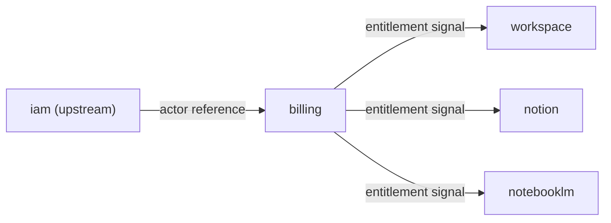

# Files

## File: src/modules/billing/index.ts
````typescript
/**
 * Billing Module — public API surface.
 * All cross-module consumers must import from here only.
 */
⋮----
// entitlement
⋮----
// subscription
⋮----
// usage-metering
````

## File: src/modules/billing/orchestration/index.ts
````typescript
// billing — orchestration layer
// Cross-subdomain composition and facade lives here.
// TODO: implement BillingFacade if needed.
````

## File: src/modules/billing/shared/errors/index.ts
````typescript
// billing shared/errors placeholder
````

## File: src/modules/billing/shared/events/index.ts
````typescript
// billing shared/events placeholder
````

## File: src/modules/billing/shared/index.ts
````typescript

````

## File: src/modules/billing/shared/types/index.ts
````typescript
// billing shared/types placeholder
````

## File: src/modules/billing/subdomains/entitlement/adapters/inbound/http/EntitlementController.ts
````typescript
import type { CommandResult } from '../../../../../../shared';
import {
  GrantEntitlementUseCase,
  SuspendEntitlementUseCase,
  RevokeEntitlementUseCase,
  CheckFeatureEntitlementUseCase,
} from '../../../application/use-cases/EntitlementUseCases';
import type { EntitlementGrantRepository } from '../../../domain/repositories/EntitlementGrantRepository';
⋮----
export class EntitlementController {
⋮----
constructor(repo: EntitlementGrantRepository)
⋮----
async handleGrant(body: {
    contextId: string;
    featureKey: string;
    quota?: number | null;
    expiresAt?: string | null;
}): Promise<CommandResult>
⋮----
async handleSuspend(entitlementId: string): Promise<CommandResult>
⋮----
async handleRevoke(entitlementId: string): Promise<CommandResult>
⋮----
async handleCheck(contextId: string, featureKey: string): Promise<CommandResult>
````

## File: src/modules/billing/subdomains/entitlement/adapters/inbound/index.ts
````typescript
// entitlement — inbound adapters placeholder
// TODO: export server actions / route handlers
````

## File: src/modules/billing/subdomains/entitlement/adapters/index.ts
````typescript
// outbound
⋮----
// inbound
````

## File: src/modules/billing/subdomains/entitlement/adapters/outbound/firestore/FirestoreEntitlementGrantRepository.ts
````typescript
import type { EntitlementGrantSnapshot } from '../../../domain/entities/EntitlementGrant';
import type { EntitlementGrantRepository } from '../../../domain/repositories/EntitlementGrantRepository';
⋮----
export interface FirestoreLike {
  get(collection: string, id: string): Promise<Record<string, unknown> | null>;
  set(collection: string, id: string, data: Record<string, unknown>): Promise<void>;
  delete(collection: string, id: string): Promise<void>;
}
⋮----
get(collection: string, id: string): Promise<Record<string, unknown> | null>;
set(collection: string, id: string, data: Record<string, unknown>): Promise<void>;
delete(collection: string, id: string): Promise<void>;
⋮----
export class FirestoreEntitlementGrantRepository implements EntitlementGrantRepository {
⋮----
constructor(private readonly db: FirestoreLike)
⋮----
async findById(id: string): Promise<EntitlementGrantSnapshot | null>
⋮----
async findByContextId(_contextId: string): Promise<EntitlementGrantSnapshot[]>
⋮----
async findActiveByContextAndFeature(
    _contextId: string,
    _featureKey: string,
): Promise<EntitlementGrantSnapshot | null>
⋮----
async save(snapshot: EntitlementGrantSnapshot): Promise<void>
⋮----
async update(snapshot: EntitlementGrantSnapshot): Promise<void>
````

## File: src/modules/billing/subdomains/entitlement/adapters/outbound/index.ts
````typescript
// entitlement — outbound adapters placeholder
// TODO: export Firestore repositories, external clients
````

## File: src/modules/billing/subdomains/entitlement/application/dto/EntitlementDTO.ts
````typescript
import type { EntitlementGrantSnapshot } from '../../domain/entities/EntitlementGrant';
⋮----
export type EntitlementGrantView = Readonly<EntitlementGrantSnapshot>;
⋮----
export interface EntitlementSignal {
  readonly contextId: string;
  readonly activeFeatures: string[];
  readonly grants: EntitlementGrantView[];
}
````

## File: src/modules/billing/subdomains/entitlement/application/index.ts
````typescript
// use-cases
⋮----
// dto
⋮----
// ports outbound
````

## File: src/modules/billing/subdomains/entitlement/application/ports/outbound/EntitlementRepositoryPort.ts
````typescript
import type { EntitlementGrantRepository } from '../../../domain/repositories/EntitlementGrantRepository';
⋮----
export type EntitlementRepositoryPort = EntitlementGrantRepository;
````

## File: src/modules/billing/subdomains/entitlement/application/use-cases/EntitlementUseCases.ts
````typescript
import { v4 as uuid } from 'uuid';
import { commandSuccess, commandFailureFrom, type CommandResult } from '../../../../../shared';
import { EntitlementGrant } from '../../domain/entities/EntitlementGrant';
import type { EntitlementGrantRepository } from '../../domain/repositories/EntitlementGrantRepository';
⋮----
export class GrantEntitlementUseCase {
⋮----
constructor(private readonly repo: EntitlementGrantRepository)
⋮----
async execute(input: {
    contextId: string;
    featureKey: string;
    quota?: number | null;
    expiresAt?: string | null;
}): Promise<CommandResult>
⋮----
export class SuspendEntitlementUseCase {
⋮----
async execute(entitlementId: string): Promise<CommandResult>
⋮----
export class RevokeEntitlementUseCase {
⋮----
export class ResolveEntitlementsUseCase {
⋮----
async execute(contextId: string): Promise<CommandResult>
⋮----
export class CheckFeatureEntitlementUseCase {
⋮----
async execute(contextId: string, featureKey: string): Promise<CommandResult>
````

## File: src/modules/billing/subdomains/entitlement/domain/entities/EntitlementGrant.ts
````typescript
import { v4 as uuid } from 'uuid';
import type { EntitlementGrantDomainEventType } from '../events/EntitlementGrantDomainEvent';
import { createEntitlementId } from '../value-objects/EntitlementId';
import { canSuspend, canRevoke } from '../value-objects/EntitlementStatus';
import type { EntitlementStatus } from '../value-objects/EntitlementStatus';
⋮----
export interface EntitlementGrantSnapshot {
  readonly id: string;
  readonly contextId: string;
  readonly featureKey: string;
  readonly quota: number | null;
  readonly status: EntitlementStatus;
  readonly grantedAt: string;
  readonly expiresAt: string | null;
  readonly updatedAtISO: string;
}
⋮----
export interface CreateEntitlementGrantInput {
  readonly contextId: string;
  readonly featureKey: string;
  readonly quota?: number | null;
  readonly expiresAt?: string | null;
}
⋮----
export class EntitlementGrant {
⋮----
private constructor(private _props: EntitlementGrantSnapshot)
⋮----
static create(id: string, input: CreateEntitlementGrantInput): EntitlementGrant
⋮----
static reconstitute(snapshot: EntitlementGrantSnapshot): EntitlementGrant
⋮----
suspend(): void
⋮----
revoke(): void
⋮----
expire(): void
⋮----
get id(): string
get contextId(): string
get featureKey(): string
get quota(): number | null
get status(): EntitlementStatus
get grantedAt(): string
get expiresAt(): string | null
get isActive(): boolean
⋮----
getSnapshot(): Readonly<EntitlementGrantSnapshot>
⋮----
pullDomainEvents(): EntitlementGrantDomainEventType[]
````

## File: src/modules/billing/subdomains/entitlement/domain/events/EntitlementGrantDomainEvent.ts
````typescript
export interface EntitlementGrantDomainEvent {
  readonly eventId: string;
  readonly occurredAt: string;
  readonly type: string;
  readonly payload: object;
}
⋮----
export interface EntitlementGrantedEvent extends EntitlementGrantDomainEvent {
  readonly type: 'platform.entitlement.granted';
  readonly payload: {
    readonly entitlementId: string;
    readonly contextId: string;
    readonly featureKey: string;
    readonly quota: number | null;
  };
}
⋮----
export interface EntitlementSuspendedEvent extends EntitlementGrantDomainEvent {
  readonly type: 'platform.entitlement.suspended';
  readonly payload: {
    readonly entitlementId: string;
    readonly contextId: string;
  };
}
⋮----
export interface EntitlementRevokedEvent extends EntitlementGrantDomainEvent {
  readonly type: 'platform.entitlement.revoked';
  readonly payload: {
    readonly entitlementId: string;
    readonly contextId: string;
  };
}
⋮----
export interface EntitlementExpiredEvent extends EntitlementGrantDomainEvent {
  readonly type: 'platform.entitlement.expired';
  readonly payload: {
    readonly entitlementId: string;
    readonly contextId: string;
  };
}
⋮----
export type EntitlementGrantDomainEventType =
  | EntitlementGrantedEvent
  | EntitlementSuspendedEvent
  | EntitlementRevokedEvent
  | EntitlementExpiredEvent;
````

## File: src/modules/billing/subdomains/entitlement/domain/index.ts
````typescript
// entities
⋮----
// value-objects
⋮----
// events
⋮----
// repositories
````

## File: src/modules/billing/subdomains/entitlement/domain/repositories/EntitlementGrantRepository.ts
````typescript
import type { EntitlementGrantSnapshot } from '../entities/EntitlementGrant';
⋮----
export interface EntitlementGrantRepository {
  findById(id: string): Promise<EntitlementGrantSnapshot | null>;
  findByContextId(contextId: string): Promise<EntitlementGrantSnapshot[]>;
  findActiveByContextAndFeature(
    contextId: string,
    featureKey: string,
  ): Promise<EntitlementGrantSnapshot | null>;
  save(snapshot: EntitlementGrantSnapshot): Promise<void>;
  update(snapshot: EntitlementGrantSnapshot): Promise<void>;
}
⋮----
findById(id: string): Promise<EntitlementGrantSnapshot | null>;
findByContextId(contextId: string): Promise<EntitlementGrantSnapshot[]>;
findActiveByContextAndFeature(
    contextId: string,
    featureKey: string,
  ): Promise<EntitlementGrantSnapshot | null>;
save(snapshot: EntitlementGrantSnapshot): Promise<void>;
update(snapshot: EntitlementGrantSnapshot): Promise<void>;
````

## File: src/modules/billing/subdomains/entitlement/domain/value-objects/EntitlementId.ts
````typescript
import { z } from 'zod';
⋮----
export type EntitlementId = z.infer<typeof EntitlementIdSchema>;
⋮----
export function createEntitlementId(raw: string): EntitlementId
````

## File: src/modules/billing/subdomains/entitlement/domain/value-objects/EntitlementStatus.ts
````typescript
export type EntitlementStatus = (typeof ENTITLEMENT_STATUSES)[number];
⋮----
export function canSuspend(status: EntitlementStatus): boolean
⋮----
export function canRevoke(status: EntitlementStatus): boolean
⋮----
export function isActiveStatus(status: EntitlementStatus): boolean
````

## File: src/modules/billing/subdomains/entitlement/domain/value-objects/FeatureKey.ts
````typescript
import { z } from 'zod';
⋮----
export type FeatureKey = z.infer<typeof FeatureKeySchema>;
⋮----
export function createFeatureKey(raw: string): FeatureKey
````

## File: src/modules/billing/subdomains/subscription/adapters/inbound/http/SubscriptionController.ts
````typescript
import type { CommandResult } from '../../../../../../shared';
import {
  ActivateSubscriptionUseCase,
  CancelSubscriptionUseCase,
  RenewSubscriptionUseCase,
  GetActiveSubscriptionUseCase,
  MarkSubscriptionPastDueUseCase,
} from '../../../application/use-cases/SubscriptionUseCases';
import type { SubscriptionRepository } from '../../../domain/repositories/SubscriptionRepository';
import type { BillingCycle } from '../../../domain/value-objects/BillingCycle';
⋮----
export class SubscriptionController {
⋮----
constructor(repo: SubscriptionRepository)
⋮----
async handleActivate(body: {
    contextId: string;
    planCode: string;
    billingCycle: BillingCycle;
    currentPeriodEnd?: string | null;
}): Promise<CommandResult>
⋮----
async handleCancel(subscriptionId: string): Promise<CommandResult>
⋮----
async handleRenew(subscriptionId: string, newPeriodEnd: string): Promise<CommandResult>
⋮----
async handleGetActive(contextId: string): Promise<CommandResult>
⋮----
async handleMarkPastDue(subscriptionId: string): Promise<CommandResult>
````

## File: src/modules/billing/subdomains/subscription/adapters/inbound/index.ts
````typescript

````

## File: src/modules/billing/subdomains/subscription/adapters/index.ts
````typescript
// outbound
⋮----
// inbound
````

## File: src/modules/billing/subdomains/subscription/adapters/outbound/firestore/FirestoreSubscriptionRepository.ts
````typescript
import type { SubscriptionSnapshot } from '../../../domain/entities/Subscription';
import type { SubscriptionRepository } from '../../../domain/repositories/SubscriptionRepository';
⋮----
export interface FirestoreLike {
  get(collection: string, id: string): Promise<Record<string, unknown> | null>;
  set(collection: string, id: string, data: Record<string, unknown>): Promise<void>;
  delete(collection: string, id: string): Promise<void>;
}
⋮----
get(collection: string, id: string): Promise<Record<string, unknown> | null>;
set(collection: string, id: string, data: Record<string, unknown>): Promise<void>;
delete(collection: string, id: string): Promise<void>;
⋮----
export class FirestoreSubscriptionRepository implements SubscriptionRepository {
⋮----
constructor(private readonly db: FirestoreLike)
⋮----
async findById(id: string): Promise<SubscriptionSnapshot | null>
⋮----
async findActiveByContextId(_contextId: string): Promise<SubscriptionSnapshot | null>
⋮----
async findByContextId(_contextId: string): Promise<SubscriptionSnapshot[]>
⋮----
async save(snapshot: SubscriptionSnapshot): Promise<void>
⋮----
async update(snapshot: SubscriptionSnapshot): Promise<void>
````

## File: src/modules/billing/subdomains/subscription/adapters/outbound/index.ts
````typescript

````

## File: src/modules/billing/subdomains/subscription/application/dto/SubscriptionDTO.ts
````typescript
import type { SubscriptionSnapshot } from '../../domain/entities/Subscription';
⋮----
export type SubscriptionView = Readonly<SubscriptionSnapshot>;
⋮----
export interface SubscriptionSummary {
  readonly contextId: string;
  readonly planCode: string;
  readonly status: string;
  readonly isActive: boolean;
  readonly currentPeriodEnd: string | null;
}
````

## File: src/modules/billing/subdomains/subscription/application/index.ts
````typescript
// use-cases
⋮----
// dto
⋮----
// ports outbound
````

## File: src/modules/billing/subdomains/subscription/application/ports/outbound/SubscriptionRepositoryPort.ts
````typescript
import type { SubscriptionRepository } from '../../../domain/repositories/SubscriptionRepository';
⋮----
export type SubscriptionRepositoryPort = SubscriptionRepository;
````

## File: src/modules/billing/subdomains/subscription/application/use-cases/SubscriptionUseCases.ts
````typescript
import { v4 as uuid } from 'uuid';
import { commandSuccess, commandFailureFrom, type CommandResult } from '../../../../../shared';
import { Subscription } from '../../domain/entities/Subscription';
import type { SubscriptionRepository } from '../../domain/repositories/SubscriptionRepository';
import type { BillingCycle } from '../../domain/value-objects/BillingCycle';
⋮----
export class ActivateSubscriptionUseCase {
⋮----
constructor(private readonly repo: SubscriptionRepository)
⋮----
async execute(input: {
    contextId: string;
    planCode: string;
    billingCycle: BillingCycle;
    currentPeriodEnd?: string | null;
}): Promise<CommandResult>
⋮----
export class CancelSubscriptionUseCase {
⋮----
async execute(subscriptionId: string): Promise<CommandResult>
⋮----
export class RenewSubscriptionUseCase {
⋮----
async execute(subscriptionId: string, newPeriodEnd: string): Promise<CommandResult>
⋮----
export class GetActiveSubscriptionUseCase {
⋮----
async execute(contextId: string): Promise<CommandResult>
⋮----
export class MarkSubscriptionPastDueUseCase {
````

## File: src/modules/billing/subdomains/subscription/domain/entities/Subscription.ts
````typescript
import { v4 as uuid } from 'uuid';
import type { SubscriptionDomainEventType } from '../events/SubscriptionDomainEvent';
import { createSubscriptionId } from '../value-objects/SubscriptionId';
import { canCancel, canRenew } from '../value-objects/SubscriptionStatus';
import type { SubscriptionStatus } from '../value-objects/SubscriptionStatus';
import type { BillingCycle } from '../value-objects/BillingCycle';
⋮----
export interface SubscriptionSnapshot {
  readonly id: string;
  readonly contextId: string;
  readonly planCode: string;
  readonly billingCycle: BillingCycle;
  readonly status: SubscriptionStatus;
  readonly currentPeriodStart: string;
  readonly currentPeriodEnd: string | null;
  readonly cancelledAt: string | null;
  readonly createdAtISO: string;
  readonly updatedAtISO: string;
}
⋮----
export interface CreateSubscriptionInput {
  readonly contextId: string;
  readonly planCode: string;
  readonly billingCycle: BillingCycle;
  readonly currentPeriodStart?: string;
  readonly currentPeriodEnd?: string | null;
}
⋮----
export class Subscription {
⋮----
private constructor(private _props: SubscriptionSnapshot)
⋮----
static create(id: string, input: CreateSubscriptionInput): Subscription
⋮----
static reconstitute(snapshot: SubscriptionSnapshot): Subscription
⋮----
cancel(): void
⋮----
renew(newPeriodEnd: string): void
⋮----
markPastDue(): void
⋮----
expire(): void
⋮----
get id(): string
get contextId(): string
get planCode(): string
get billingCycle(): BillingCycle
get status(): SubscriptionStatus
get currentPeriodEnd(): string | null
get cancelledAt(): string | null
get isActive(): boolean
⋮----
getSnapshot(): Readonly<SubscriptionSnapshot>
⋮----
pullDomainEvents(): SubscriptionDomainEventType[]
````

## File: src/modules/billing/subdomains/subscription/domain/events/SubscriptionDomainEvent.ts
````typescript
import type { BillingCycle } from '../value-objects/BillingCycle';
⋮----
export interface SubscriptionDomainEvent {
  readonly eventId: string;
  readonly occurredAt: string;
  readonly type: string;
  readonly payload: object;
}
⋮----
export interface SubscriptionActivatedEvent extends SubscriptionDomainEvent {
  readonly type: 'platform.subscription.activated';
  readonly payload: {
    readonly subscriptionId: string;
    readonly contextId: string;
    readonly planCode: string;
    readonly billingCycle: BillingCycle;
  };
}
⋮----
export interface SubscriptionCancelledEvent extends SubscriptionDomainEvent {
  readonly type: 'platform.subscription.cancelled';
  readonly payload: { readonly subscriptionId: string; readonly contextId: string };
}
⋮----
export interface SubscriptionRenewedEvent extends SubscriptionDomainEvent {
  readonly type: 'platform.subscription.renewed';
  readonly payload: {
    readonly subscriptionId: string;
    readonly contextId: string;
    readonly newPeriodEnd: string;
  };
}
⋮----
export interface SubscriptionPastDueEvent extends SubscriptionDomainEvent {
  readonly type: 'platform.subscription.past_due';
  readonly payload: { readonly subscriptionId: string; readonly contextId: string };
}
⋮----
export interface SubscriptionExpiredEvent extends SubscriptionDomainEvent {
  readonly type: 'platform.subscription.expired';
  readonly payload: { readonly subscriptionId: string; readonly contextId: string };
}
⋮----
export type SubscriptionDomainEventType =
  | SubscriptionActivatedEvent
  | SubscriptionCancelledEvent
  | SubscriptionRenewedEvent
  | SubscriptionPastDueEvent
  | SubscriptionExpiredEvent;
````

## File: src/modules/billing/subdomains/subscription/domain/index.ts
````typescript
// entities
⋮----
// value-objects
⋮----
// events
⋮----
// repositories
````

## File: src/modules/billing/subdomains/subscription/domain/repositories/SubscriptionRepository.ts
````typescript
import type { SubscriptionSnapshot } from '../entities/Subscription';
⋮----
export interface SubscriptionRepository {
  findById(id: string): Promise<SubscriptionSnapshot | null>;
  findActiveByContextId(contextId: string): Promise<SubscriptionSnapshot | null>;
  findByContextId(contextId: string): Promise<SubscriptionSnapshot[]>;
  save(snapshot: SubscriptionSnapshot): Promise<void>;
  update(snapshot: SubscriptionSnapshot): Promise<void>;
}
⋮----
findById(id: string): Promise<SubscriptionSnapshot | null>;
findActiveByContextId(contextId: string): Promise<SubscriptionSnapshot | null>;
findByContextId(contextId: string): Promise<SubscriptionSnapshot[]>;
save(snapshot: SubscriptionSnapshot): Promise<void>;
update(snapshot: SubscriptionSnapshot): Promise<void>;
````

## File: src/modules/billing/subdomains/subscription/domain/value-objects/BillingCycle.ts
````typescript
export type BillingCycle = 'monthly' | 'annual' | 'lifetime';
⋮----
export function cycleMonths(cycle: BillingCycle): number | null
⋮----
return null; // lifetime
````

## File: src/modules/billing/subdomains/subscription/domain/value-objects/PlanCode.ts
````typescript
import { z } from 'zod';
⋮----
export type PlanCodeLiteral = (typeof PLAN_CODES)[number];
⋮----
export type PlanCode = z.infer<typeof PlanCodeSchema>;
⋮----
export function createPlanCode(raw: string): PlanCode
````

## File: src/modules/billing/subdomains/subscription/domain/value-objects/SubscriptionId.ts
````typescript
import { z } from 'zod';
⋮----
export type SubscriptionId = z.infer<typeof SubscriptionIdSchema>;
⋮----
export function createSubscriptionId(raw: string): SubscriptionId
````

## File: src/modules/billing/subdomains/subscription/domain/value-objects/SubscriptionStatus.ts
````typescript
export type SubscriptionStatus = (typeof SUBSCRIPTION_STATUSES)[number];
⋮----
export function canCancel(status: SubscriptionStatus): boolean
⋮----
export function canRenew(status: SubscriptionStatus): boolean
⋮----
export function isActive(status: SubscriptionStatus): boolean
````

## File: src/modules/billing/subdomains/usage-metering/adapters/inbound/index.ts
````typescript
// usage-metering — adapters/inbound placeholder
// TODO: export inbound adapters (HTTP handlers, action wrappers)
````

## File: src/modules/billing/subdomains/usage-metering/adapters/index.ts
````typescript
// usage-metering — adapters aggregate
````

## File: src/modules/billing/subdomains/usage-metering/adapters/outbound/index.ts
````typescript
// usage-metering — adapters/outbound placeholder
// TODO: export outbound adapters (repository implementations, external services)
````

## File: src/modules/billing/subdomains/usage-metering/adapters/outbound/memory/InMemoryUsageRecordRepository.ts
````typescript
import type { UsageRecordSnapshot, UsageUnit } from "../../../domain/entities/UsageRecord";
import type { UsageRecordRepository, UsageQuery } from "../../../domain/repositories/UsageRecordRepository";
⋮----
export class InMemoryUsageRecordRepository implements UsageRecordRepository {
⋮----
async save(snapshot: UsageRecordSnapshot): Promise<void>
⋮----
async findById(id: string): Promise<UsageRecordSnapshot | null>
⋮----
async query(params: UsageQuery): Promise<UsageRecordSnapshot[]>
⋮----
async sumQuantity(featureKey: string, contextId: string, fromDate?: string, toDate?: string): Promise<number>
````

## File: src/modules/billing/subdomains/usage-metering/application/index.ts
````typescript
// usage-metering — application layer placeholder
// TODO: export use-cases, DTOs, application services
````

## File: src/modules/billing/subdomains/usage-metering/application/use-cases/UsageMeteringUseCases.ts
````typescript
import { commandSuccess, commandFailureFrom, type CommandResult } from "../../../../../shared";
import { UsageRecord, type RecordUsageInput } from "../../domain/entities/UsageRecord";
import type { UsageRecordRepository, UsageQuery } from "../../domain/repositories/UsageRecordRepository";
⋮----
export class RecordUsageUseCase {
⋮----
constructor(private readonly repo: UsageRecordRepository)
⋮----
async execute(input: RecordUsageInput): Promise<CommandResult>
⋮----
export class QueryUsageUseCase {
⋮----
async execute(params: UsageQuery)
⋮----
export class GetUsageSummaryUseCase {
⋮----
async execute(input: {
    featureKey: string;
    contextId: string;
    fromDate?: string;
    toDate?: string;
}): Promise<number>
````

## File: src/modules/billing/subdomains/usage-metering/domain/entities/UsageRecord.ts
````typescript
import { z } from "zod";
import { v4 as uuid } from "uuid";
⋮----
export type UsageRecordId = z.infer<typeof UsageRecordIdSchema>;
⋮----
export type UsageUnit = z.infer<typeof UsageUnitSchema>;
⋮----
export interface UsageRecordSnapshot {
  readonly id: string;
  readonly contextId: string;
  readonly featureKey: string;
  readonly quantity: number;
  readonly unit: UsageUnit;
  readonly metadata?: Record<string, unknown>;
  readonly recordedAtISO: string;
}
⋮----
export interface RecordUsageInput {
  readonly contextId: string;
  readonly featureKey: string;
  readonly quantity: number;
  readonly unit: UsageUnit;
  readonly metadata?: Record<string, unknown>;
}
⋮----
export class UsageRecord {
⋮----
private constructor(private readonly _props: UsageRecordSnapshot)
⋮----
static record(input: RecordUsageInput): UsageRecord
⋮----
static reconstitute(snapshot: UsageRecordSnapshot): UsageRecord
⋮----
get id(): string
get contextId(): string
get featureKey(): string
get quantity(): number
get unit(): UsageUnit
get recordedAtISO(): string
⋮----
getSnapshot(): Readonly<UsageRecordSnapshot>
````

## File: src/modules/billing/subdomains/usage-metering/domain/index.ts
````typescript
// usage-metering — domain layer placeholder
// TODO: export entities, value-objects, repositories, events, services
````

## File: src/modules/billing/subdomains/usage-metering/domain/repositories/UsageRecordRepository.ts
````typescript
import type { UsageRecordSnapshot, UsageUnit } from "../entities/UsageRecord";
⋮----
export interface UsageQuery {
  readonly contextId?: string;
  readonly featureKey?: string;
  readonly unit?: UsageUnit;
  readonly fromDate?: string;
  readonly toDate?: string;
  readonly limit?: number;
}
⋮----
export interface UsageRecordRepository {
  save(snapshot: UsageRecordSnapshot): Promise<void>;
  findById(id: string): Promise<UsageRecordSnapshot | null>;
  query(params: UsageQuery): Promise<UsageRecordSnapshot[]>;
  sumQuantity(featureKey: string, contextId: string, fromDate?: string, toDate?: string): Promise<number>;
}
⋮----
save(snapshot: UsageRecordSnapshot): Promise<void>;
findById(id: string): Promise<UsageRecordSnapshot | null>;
query(params: UsageQuery): Promise<UsageRecordSnapshot[]>;
sumQuantity(featureKey: string, contextId: string, fromDate?: string, toDate?: string): Promise<number>;
````

## File: docs/structure/contexts/billing/bounded-contexts.md
````markdown
# Billing

## Domain Role

billing 是 commercial bounded context。它擁有 subscription 與 entitlement 的商業語義，並把結果輸出為 capability signal。

## Ownership Rules

- 擁有 billing、subscription、entitlement、referral。
- 不擁有 identity 與 access decision 正典語言。
- 不擁有 workspace、knowledge 或 notebook aggregate。
````

## File: docs/structure/contexts/billing/context-map.md
````markdown
# Billing

## Relationships

| Upstream | Downstream | Published Language |
|---|---|---|
| iam | billing | actor reference、tenant scope、access policy baseline |
| billing | workspace | entitlement signal、subscription capability signal |
| billing | notion | entitlement signal、subscription capability signal |
| billing | notebooklm | entitlement signal、subscription capability signal |

## Notes

- billing 向下游提供 capability signal，不暴露內部商業 aggregate。
````

## File: docs/structure/contexts/billing/subdomains.md
````markdown
# Billing

## Baseline Subdomains

| Subdomain | Responsibility |
|---|---|
| billing | 計費狀態、費率與財務證據 |
| subscription | 方案、配額與續期治理 |
| entitlement | 有效權益與功能可用性統一解算 |
| referral | 推薦關係與獎勵追蹤 |

## Recommended Gap Subdomains

| Subdomain | Responsibility |
|---|---|
| pricing | 價格模型與方案矩陣治理 |
| invoice | 帳單、請款與對帳流程 |
| quota-policy | 可量化配額與商業限制規則 |
````

## File: docs/structure/contexts/billing/ubiquitous-language.md
````markdown
# Billing

## Canonical Terms

| Term | Meaning |
|---|---|
| Subscription | 方案、配額與續期狀態 |
| Entitlement | 綜合商業規則後的有效權益 |
| BillingEvent | 財務計價或收費事實 |
| Referral | 推薦關係與獎勵追蹤 |

## Avoid

- 不用 Plan 混稱 Subscription 與 Entitlement。
- 不把 feature flag 當成 entitlement 正典語義。
````

## File: docs/structure/contexts/billing/AGENTS.md
````markdown
# Billing Context — Agent Guide

本文件在本次任務限制下，僅依 Context7 驗證的 DDD、Context Map、Hexagonal Architecture 參考整理，不主張反映現況實作。

## Mission

保護 billing 主域作為商業生命週期的正典所有者。任何新功能都應先問：這是計費、訂閱、授權還是推薦的正典能力？若是，屬 billing；若只是消費授權信號，屬下游主域。

## Canonical Ownership

- billing（計費狀態、費率、財務證據）
- subscription（方案、配額、續期治理）
- entitlement（有效權益與功能可用性）
- referral（推薦關係與獎勵追蹤）
- pricing（方案矩陣，gap subdomain）
- invoice（帳單對帳，gap subdomain）
- quota-policy（商業限制規則，gap subdomain）

> **實作層備注：** `src/modules/billing/` 另有 `usage-metering` 子域，作為計量用量的實作邊界，對應戰略層的 quota-policy 能力。

## Route Here When

- 問題核心是訂閱方案、權益解算、計費狀態或推薦追蹤。
- 問題需要決定某個功能是否可用（entitlement）。

## Route Elsewhere When

- 使用者身份治理屬於 iam。
- 工作區或知識內容的可見性規則屬於 workspace 或 notion。
- AI 模型使用政策屬於 ai；不要讓 billing 擁有 AI capability policy。

## Guardrails

- 下游主域只消費 `entitlement signal`（能力是否可用），不持有 billing aggregate 完整模型。
- 不在 billing domain/ 匯入身份治理或內容模型。
- 跨主域互動只經由 published language tokens。

## Hard Prohibitions

- ❌ 讓 billing 持有 Actor / Identity / Tenant 模型（屬 iam）。
- ❌ 讓 billing 擁有 AI 使用政策（屬 ai）。
- ❌ 在 domain/ 匯入 Firebase SDK、React 或任何框架。

## Copilot Generation Rules

- 生成程式碼時，先確認需求是計費、訂閱、授權還是計量，再決定子域。
- 奧卡姆剃刀：若能用 entitlement signal 解決下游問題，不要讓下游擁有 billing 正典。

## Dependency Direction Flow



## Document Network

- [README.md](./README.md)
- [bounded-contexts.md](./bounded-contexts.md)
- [context-map.md](./context-map.md)
- [subdomains.md](./subdomains.md)
- [ubiquitous-language.md](./ubiquitous-language.md)
- [../../system/architecture-overview.md](../../system/architecture-overview.md)
- [../../domain/subdomains.md](../../domain/subdomains.md)
- [../../domain/bounded-contexts.md](../../domain/bounded-contexts.md)
````

## File: docs/structure/contexts/billing/README.md
````markdown
# Billing Context

本 README 在本次重切作業下，定義 commercial lifecycle 的主域邊界。

## Purpose

billing 是商業與權益治理主域。它負責 billing event、subscription、entitlement 與 referral，為 workspace、notion、notebooklm 等主域提供 capability signal。

## Context Summary

| Aspect | Summary |
|---|---|
| Primary Role | 商業生命週期與有效權益解算 |
| Upstream Dependency | iam 的 actor、tenant、access policy |
| Downstream Consumers | workspace、notion、notebooklm |
| Core Principle | 提供商業能力訊號，不接管內容或協作正典 |

## Document Network

- [AGENTS.md](./AGENTS.md)
- [bounded-contexts.md](./bounded-contexts.md)
- [context-map.md](./context-map.md)
- [subdomains.md](./subdomains.md)
- [ubiquitous-language.md](./ubiquitous-language.md)
- [../../system/architecture-overview.md](../../system/architecture-overview.md)
- [../../system/context-map.md](../../system/context-map.md)
- [../../domain/bounded-contexts.md](../../domain/bounded-contexts.md)
````

## File: src/modules/billing/README.md
````markdown
# Billing Module

## 子域清單

| 子域 | 狀態 | 說明 |
|---|---|---|
| `entitlement` | 🔨 骨架建立，實作進行中 | 授權配額信號（能力准入）|
| `subscription` | 🔨 骨架建立，實作進行中 | 訂閱計劃管理 |
| `usage-metering` | 🔨 骨架建立，實作進行中 | API 呼叫、Token 消耗等用量計量 |

**術語提醒：**
- `Subscription` = 計費計劃（billing plan）
- `Entitlement` = 能力信號（capability signal，下游模組按此准入）

---

## 預期目錄結構

```
src/modules/billing/
  index.ts
  README.md
  AGENTS.md
  shared/
    events/index.ts             ← EntitlementGranted / SubscriptionChanged 等 Published Language Events
    types/index.ts
  subdomains/
    entitlement/
      domain/
      application/
      adapters/outbound/
    subscription/
      domain/
      application/
      adapters/outbound/
    usage-metering/
      domain/
      application/
      adapters/outbound/
```

---

## 衝突防護

| 禁止行為 | 原因 |
|---|---|
| 混用 Subscription / Entitlement 術語 | 違反 Ubiquitous Language |
| 在 barrel 使用 `export *` | 破壞 tree-shaking |

---

## 文件網絡

- [AGENTS.md](AGENTS.md) — Agent / Copilot 使用規則
- [src/modules/README.md](../README.md) — 模組層總覽
- [docs/structure/domain/bounded-contexts.md](../../../docs/structure/domain/bounded-contexts.md) — 主域所有權地圖
````

## File: src/modules/billing/AGENTS.md
````markdown
# Billing Module — Agent Guide

## Purpose

`src/modules/billing` 是 **Billing 能力模組**，為 Xuanwu 系統提供訂閱管理與授權配額（Entitlement）的實作落點。

## 子域清單

| 子域 | 說明 | 狀態 |
|---|---|---|
| `entitlement` | 授權配額信號（能力准入）| 🔨 骨架建立，實作進行中 |
| `subscription` | 訂閱計劃管理 | 🔨 骨架建立，實作進行中 |
| `usage-metering` | 用量計量（API 呼叫、Token 消耗等）| 🔨 骨架建立，實作進行中 |

## Boundary Rules

- `domain/` 禁止匯入 React、Firebase SDK、HTTP client 或任何框架。
- Entitlement 信號是上游 Published Language；下游（workspace、notion 等）僅消費，不定義。
- `subscription` ≠ `entitlement`：billing plan（計費）vs capability signal（能力信號）。

## Route Here When

- 撰寫 Billing 的新 use case、entity、adapter 實作。
- 實作 entitlement check port、subscription repository 等骨架。

## Route Elsewhere When

- 讀取邊界規則 → `src/modules/billing/AGENTS.md`
- 跨模組 API boundary → `src/modules/billing/index.ts`

## 路由規則

| 情境 | 正確路徑 |
|---|---|
| 讀取邊界規則 / published language | `src/modules/billing/AGENTS.md` |
| 撰寫新 use case / adapter / entity | `src/modules/billing/`（本層）|
| 跨模組 API boundary | `src/modules/billing/index.ts` |

**嚴禁事項：**
- ❌ 在 barrel 使用 `export *`

## 文件網絡

- [README.md](README.md) — 模組目錄結構
- [src/modules/README.md](../README.md) — 模組層總覽
- [docs/structure/domain/bounded-contexts.md](../../../docs/structure/domain/bounded-contexts.md) — 主域所有權地圖
````