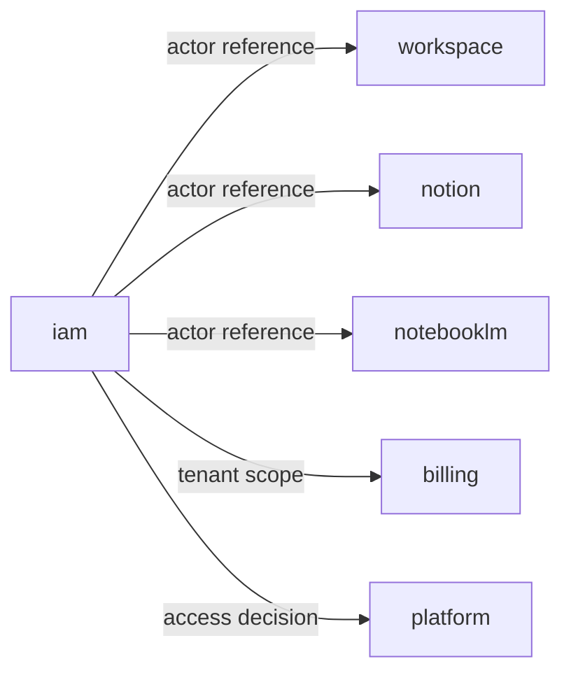

# Files

## File: src/modules/iam/adapters/inbound/react/AuthContext.tsx
````typescript
/**
 * AuthContext — iam inbound adapter (React).
 *
 * Provides the AuthProvider component and useAuth hook.
 * Uses the firebase-composition outbound adapter for all Firebase operations
 * so this file remains free of direct Firebase SDK imports.
 */
⋮----
import { createContext, useContext, useState, useEffect, type ReactNode } from "react";
import {
  subscribeToAuthState,
  firebaseSignOut,
  createClientAuthUseCases as buildAuthUseCases,
  createClientAccountUseCases as buildAccountUseCases,
} from "../../outbound/firebase-composition";
⋮----
// ─── Auth bootstrapping timeout ───────────────────────────────────────────────
// If Firebase hasn't resolved the auth state within this window, treat the
// session as unauthenticated so the UI isn't blocked indefinitely.
⋮----
// ─── Public types ─────────────────────────────────────────────────────────────
⋮----
export interface AuthUser {
  readonly id: string;
  readonly name: string;
  readonly email: string;
}
⋮----
export type AuthStatus = "initializing" | "authenticated" | "unauthenticated" | "anonymous";
⋮----
export interface AuthState {
  readonly user: AuthUser | null;
  readonly status: AuthStatus;
}
⋮----
export interface AuthContextValue {
  readonly state: AuthState;
  readonly logout: () => Promise<void>;
}
⋮----
// ─── Context ──────────────────────────────────────────────────────────────────
⋮----
// ─── Provider ─────────────────────────────────────────────────────────────────
⋮----
export function AuthProvider(
⋮----
// Bootstrap timeout: if Firebase doesn't resolve within the window,
// fall back to unauthenticated so the UI is never permanently blocked.
⋮----
async function logout()
⋮----
// State will be updated by the onAuthStateChanged listener above.
⋮----
// ─── Hook ─────────────────────────────────────────────────────────────────────
⋮----
export function useAuth(): AuthContextValue
⋮----
// ─── Use-case factories (re-exported from outbound composition) ───────────────
⋮----
/**
 * Returns Firebase-backed auth use cases.
 * Calling this in a component is safe: each call shares singleton repositories.
 */
⋮----
/**
 * Returns Firebase-backed account use cases.
 */
````

## File: src/modules/iam/adapters/inbound/react/IamSessionProvider.tsx
````typescript
/**
 * IamSessionProvider — iam inbound adapter (React).
 *
 * Canonical mount point for IAM authentication session state.
 * Wraps the identity-layer AuthProvider and exposes the useIamSession() hook
 * so the rest of the src/ tree never imports directly from the old interfaces/.
 *
 * Internal source: modules/iam/subdomains/identity/interfaces/providers/auth-provider.tsx
 */
````

## File: src/modules/iam/adapters/inbound/react/index.ts
````typescript
/**
 * iam inbound React adapter — barrel.
 *
 * Public surface for all IAM React inbound adapters.
 * Consumed by src/app/ route shims and platform/adapters/inbound/react/.
 */
⋮----
// Re-export account subscription for consumers that don't go through AppContext.
````

## File: src/modules/iam/adapters/inbound/react/PublicLandingView.tsx
````typescript
/**
 * PublicLandingView — iam inbound adapter (React).
 *
 * Self-contained public landing + auth panel component.
 * Manages login / register / guest state internally.
 * Consumed by src/app/(public)/page.tsx as a pure Server Component shim.
 *
 * Ported from: app/(public)/page.tsx
 */
⋮----
import { useState, useEffect, useMemo } from "react";
import { useRouter } from "next/navigation";
import { Loader2, ShieldCheck } from "lucide-react";
⋮----
import { useAuth, createClientAuthUseCases } from "./AuthContext";
import { createClientAccountUseCases } from "./AuthContext";
⋮----
type Tab = "login" | "register";
⋮----
async function handleSubmit(e: React.FormEvent)
⋮----
async function handleGuestAccess()
⋮----
async function handlePasswordReset()
⋮----
setError(null);
setResetSent(false);
setIsAuthPanelOpen((prev)
````

## File: src/modules/iam/adapters/outbound/firebase-composition.ts
````typescript
/**
 * firebase-composition — iam module outbound composition root.
 *
 * Wires Firebase-backed repository implementations into domain use cases.
 * This file is the ONLY entry point for Firebase SDK access within the iam
 * module. All other layers remain infrastructure-agnostic.
 *
 * ESLint: @integration-firebase is allowed here because this file lives in
 * src/modules/iam/adapters/outbound/ which matches the permitted glob.
 */
⋮----
import {
  getFirebaseAuth,
  onFirebaseAuthStateChanged,
  signOutFirebase,
  getFirebaseFirestore,
  firestoreApi,
  type User,
} from "@integration-firebase";
⋮----
import { FirebaseAuthIdentityRepository } from "./FirebaseAuthIdentityRepository";
import { FirebaseAccountQueryRepository } from "./FirebaseAccountQueryRepository";
import {
  FirestoreAccountRepository,
  type FirestoreLike,
} from "../../subdomains/account/adapters/outbound/firestore/FirestoreAccountRepository";
import {
  FirestoreOrganizationRepository,
  type OrgFirestoreLike,
} from "../../subdomains/organization/adapters/outbound/firestore/FirestoreOrganizationRepository";
import {
  SignInUseCase,
  SignInAnonymouslyUseCase,
  RegisterUseCase,
  SendPasswordResetEmailUseCase,
} from "../../subdomains/identity/application/use-cases/IdentityUseCases";
import { CreateUserAccountUseCase } from "../../subdomains/account/application/use-cases/AccountUseCases";
import { CreateOrganizationUseCase } from "../../subdomains/organization/application/use-cases/OrganizationLifecycleUseCases";
import type { AccountSnapshot } from "../../subdomains/account/domain/entities/Account";
import type { Unsubscribe } from "../../subdomains/account/domain/repositories/AccountQueryRepository";
⋮----
// ─── Singleton repositories ───────────────────────────────────────────────────
⋮----
function getIdentityRepo(): FirebaseAuthIdentityRepository
⋮----
function getAccountQueryRepo(): FirebaseAccountQueryRepository
⋮----
function getOrgRepo(): FirestoreOrganizationRepository
⋮----
// ─── FirestoreLike adapter ────────────────────────────────────────────────────
// Bridges the Firestore SDK to the FirestoreLike interface expected by
// FirestoreAccountRepository (subdomain-level adapter, technology-agnostic).
⋮----
function createFirestoreLikeAdapter(): FirestoreLike
⋮----
async get(collectionName: string, id: string): Promise<Record<string, unknown> | null>
async set(
      collectionName: string,
      id: string,
      data: Record<string, unknown>,
): Promise<void>
async delete(collectionName: string, id: string): Promise<void>
⋮----
// ─── OrgFirestoreLike adapter ─────────────────────────────────────────────────
// Bridges the Firestore SDK to the OrgFirestoreLike interface for org operations
// (subcollections, etc.).
⋮----
function createOrgFirestoreLikeAdapter(): OrgFirestoreLike
⋮----
async get(col: string, id: string): Promise<Record<string, unknown> | null>
async set(col: string, id: string, data: Record<string, unknown>): Promise<void>
async delete(col: string, id: string): Promise<void>
async getSubcollection(
      col: string,
      parentId: string,
      sub: string,
): Promise<
async setSubdoc(
      col: string,
      parentId: string,
      sub: string,
      id: string,
      data: Record<string, unknown>,
): Promise<void>
async deleteSubdoc(
      col: string,
      parentId: string,
      sub: string,
      id: string,
): Promise<void>
⋮----
// ─── Auth use-case factory ────────────────────────────────────────────────────
⋮----
/**
 * Returns Firebase-backed auth use cases for use in "use client" components.
 * Each call creates fresh use-case instances sharing one repository instance.
 */
export function createClientAuthUseCases()
⋮----
// ─── Account use-case factory ─────────────────────────────────────────────────
⋮----
/**
 * Returns Firebase-backed account use cases for use in "use client" components.
 */
export function createClientAccountUseCases()
⋮----
// ─── Auth state subscription ──────────────────────────────────────────────────
⋮----
/**
 * Subscribes to Firebase auth state changes.
 * Returns an unsubscribe function.
 * For use in "use client" auth providers only.
 */
export function subscribeToAuthState(
  callback: (user: User | null) => void,
): Unsubscribe
⋮----
/**
 * Signs the current user out of Firebase Auth.
 */
export async function firebaseSignOut(): Promise<void>
⋮----
// ─── Account subscriptions ────────────────────────────────────────────────────
⋮----
/**
 * Subscribes to real-time updates for all organisation accounts associated
 * with the given userId (owned or membership).
 */
export function subscribeToAccountsForUser(
  userId: string,
  onUpdate: (accounts: Record<string, AccountSnapshot>) => void,
): Unsubscribe
⋮----
// ─── Organisation use-case factory ───────────────────────────────────────────
⋮----
/**
 * Returns Firebase-backed organisation use cases for use in "use client"
 * components.
 */
export function createClientOrganizationUseCases()
````

## File: src/modules/iam/adapters/outbound/FirebaseAccountQueryRepository.ts
````typescript
/**
 * FirebaseAccountQueryRepository — module-level outbound adapter (read side).
 *
 * Implements AccountQueryRepository using Firestore real-time listeners.
 * Lives at the iam module outbound boundary so that @integration-firebase
 * is allowed per ESLint boundary rules (src/modules/<context>/adapters/outbound/**).
 */
⋮----
import {
  getFirestore,
  doc,
  getDoc,
  collection,
  query,
  where,
  orderBy,
  limit as firestoreLimit,
  onSnapshot,
  type Timestamp,
} from "firebase/firestore";
import { firebaseClientApp } from "@integration-firebase/client";
import type {
  AccountQueryRepository,
  WalletBalanceSnapshot,
  Unsubscribe,
} from "../../subdomains/account/domain/repositories/AccountQueryRepository";
import type {
  WalletTransaction,
  AccountRoleRecord,
} from "../../subdomains/account/domain/repositories/AccountRepository";
import type { AccountSnapshot } from "../../subdomains/account/domain/entities/Account";
import type { AccountProfile } from "../../subdomains/account/domain/entities/AccountProfile";
⋮----
// ─── Mapper helpers ───────────────────────────────────────────────────────────
⋮----
function toISO(v: unknown): string
⋮----
function toAccountSnapshot(id: string, data: Record<string, unknown>): AccountSnapshot
⋮----
function toAccountProfile(snapshot: AccountSnapshot): AccountProfile
⋮----
// ─── Repository ───────────────────────────────────────────────────────────────
⋮----
export class FirebaseAccountQueryRepository implements AccountQueryRepository {
⋮----
private get db()
⋮----
async getUserProfile(userId: string): Promise<AccountSnapshot | null>
⋮----
subscribeToUserProfile(
    userId: string,
    onUpdate: (profile: AccountSnapshot | null) => void,
): Unsubscribe
⋮----
async getAccountProfile(actorId: string): Promise<AccountProfile | null>
⋮----
subscribeToAccountProfile(
    actorId: string,
    onUpdate: (profile: AccountProfile | null) => void,
): Unsubscribe
⋮----
async getWalletBalance(accountId: string): Promise<WalletBalanceSnapshot>
⋮----
subscribeToWalletBalance(
    accountId: string,
    onUpdate: (snapshot: WalletBalanceSnapshot) => void,
): Unsubscribe
⋮----
subscribeToWalletTransactions(
    accountId: string,
    maxCount: number,
    onUpdate: (txs: WalletTransaction[]) => void,
): Unsubscribe
⋮----
async getAccountRole(accountId: string): Promise<AccountRoleRecord | null>
⋮----
subscribeToAccountRoles(
    accountId: string,
    onUpdate: (record: AccountRoleRecord | null) => void,
): Unsubscribe
⋮----
subscribeToAccountsForUser(
    userId: string,
    onUpdate: (accounts: Record<string, AccountSnapshot>) => void,
): Unsubscribe
⋮----
const emit = () =>
⋮----
// Organisations owned by the user
⋮----
// Organisations where the user is a member
````

## File: src/modules/iam/adapters/outbound/FirebaseAuthIdentityRepository.ts
````typescript
/**
 * FirebaseAuthIdentityRepository — module-level outbound adapter.
 *
 * Implements IdentityRepository using Firebase Authentication SDK.
 * Lives at the iam module outbound boundary so that @integration-firebase
 * is allowed per ESLint boundary rules (src/modules/<context>/adapters/outbound/**).
 *
 * Domain and application layers are isolated from Firebase via this adapter.
 */
⋮----
import {
  getAuth,
  createUserWithEmailAndPassword,
  signInWithEmailAndPassword,
  signInAnonymously,
  sendPasswordResetEmail,
  signOut,
  updateProfile,
  type User,
} from "firebase/auth";
import { firebaseClientApp } from "@integration-firebase/client";
import type { IdentityRepository } from "../../subdomains/identity/domain/repositories/IdentityRepository";
import type {
  IdentityEntity,
  RegistrationInput,
  SignInCredentials,
} from "../../subdomains/identity/domain/entities/Identity";
⋮----
function toIdentityEntity(user: User): IdentityEntity
⋮----
export class FirebaseAuthIdentityRepository implements IdentityRepository {
⋮----
private get auth()
⋮----
async signInWithEmailAndPassword(
    credentials: SignInCredentials,
): Promise<IdentityEntity>
⋮----
async signInAnonymously(): Promise<IdentityEntity>
⋮----
async createUserWithEmailAndPassword(
    input: RegistrationInput,
): Promise<IdentityEntity>
⋮----
async updateDisplayName(uid: string, displayName: string): Promise<void>
⋮----
async sendPasswordResetEmail(email: string): Promise<void>
⋮----
async signOut(): Promise<void>
⋮----
getCurrentUser(): IdentityEntity | null
````

## File: src/modules/iam/orchestration/index.ts
````typescript
// iam — orchestration layer
// Cross-subdomain composition and facade lives here.
// TODO: implement IamFacade if needed.
````

## File: src/modules/iam/shared/errors/index.ts
````typescript
// iam shared errors
export class IamError extends Error {
⋮----
constructor(
    public readonly code: string,
    message: string,
)
⋮----
export class IamNotFoundError extends IamError {
⋮----
constructor(resource: string, id: string)
⋮----
export class IamPermissionDeniedError extends IamError {
⋮----
constructor(action: string)
````

## File: src/modules/iam/shared/events/index.ts
````typescript
// iam shared events — union of all domain events emitted by iam subdomains
````

## File: src/modules/iam/shared/index.ts
````typescript

````

## File: src/modules/iam/shared/types/index.ts
````typescript
// iam shared types
````

## File: src/modules/iam/subdomains/access-control/adapters/inbound/index.ts
````typescript
// access-control — inbound adapters placeholder
// TODO: export server actions / route handlers
````

## File: src/modules/iam/subdomains/access-control/adapters/index.ts
````typescript
// access-control — adapters aggregate
````

## File: src/modules/iam/subdomains/access-control/adapters/outbound/index.ts
````typescript
// access-control — outbound adapters placeholder
// TODO: export Firestore repositories, external clients
````

## File: src/modules/iam/subdomains/access-control/adapters/outbound/memory/InMemoryAccessPolicyRepository.ts
````typescript
import type {
  AccessPolicyRepository,
} from "../../../domain/repositories/AccessPolicyRepository";
import type { AccessPolicySnapshot } from "../../../domain/aggregates/AccessPolicy";
⋮----
export class InMemoryAccessPolicyRepository implements AccessPolicyRepository {
⋮----
async findById(id: string): Promise<AccessPolicySnapshot | null>
⋮----
async findBySubject(subjectId: string): Promise<AccessPolicySnapshot[]>
⋮----
async findActiveBySubjectAndResource(
    subjectId: string,
    resourceType: string,
    resourceId?: string,
): Promise<AccessPolicySnapshot[]>
⋮----
async save(snapshot: AccessPolicySnapshot): Promise<void>
⋮----
async update(snapshot: AccessPolicySnapshot): Promise<void>
````

## File: src/modules/iam/subdomains/access-control/application/dto/AccessControlDTO.ts
````typescript
import type { AccessPolicySnapshot } from "../../domain/aggregates/AccessPolicy";
⋮----
export type AccessPolicyView = Readonly<AccessPolicySnapshot>;
⋮----
export interface PermissionEvaluationView {
  readonly subjectId: string;
  readonly resourceType: string;
  readonly resourceId?: string;
  readonly action: string;
  readonly allowed: boolean;
  readonly reason: string;
}
````

## File: src/modules/iam/subdomains/access-control/application/index.ts
````typescript

````

## File: src/modules/iam/subdomains/access-control/application/use-cases/AccessControlUseCases.ts
````typescript
import { v4 as uuid } from "uuid";
import { commandSuccess, commandFailureFrom, type CommandResult } from "../../../../../shared";
import { AccessPolicy } from "../../domain/aggregates/AccessPolicy";
import type { AccessPolicyRepository } from "../../domain/repositories/AccessPolicyRepository";
import type { SubjectRef } from "../../domain/value-objects/SubjectRef";
import type { ResourceRef } from "../../domain/value-objects/ResourceRef";
import type { PolicyEffect } from "../../domain/value-objects/PolicyEffect";
⋮----
// ─── Evaluate Permission ──────────────────────────────────────────────────────
⋮----
export class EvaluatePermissionUseCase {
⋮----
constructor(private readonly repo: AccessPolicyRepository)
⋮----
async execute(input: {
    subjectId: string;
    resourceType: string;
    resourceId?: string;
    action: string;
}): Promise<CommandResult>
⋮----
// ─── Create Access Policy ─────────────────────────────────────────────────────
⋮----
export class CreateAccessPolicyUseCase {
⋮----
async execute(input: {
    subjectRef: SubjectRef;
    resourceRef: ResourceRef;
    actions: string[];
    effect: PolicyEffect;
    conditions?: string[];
}): Promise<CommandResult>
⋮----
// ─── Update Access Policy ─────────────────────────────────────────────────────
⋮----
export class UpdateAccessPolicyUseCase {
⋮----
async execute(
    policyId: string,
    input: { actions?: string[]; effect?: PolicyEffect; conditions?: string[] },
): Promise<CommandResult>
⋮----
// ─── Deactivate Access Policy ─────────────────────────────────────────────────
⋮----
export class DeactivateAccessPolicyUseCase {
⋮----
async execute(policyId: string): Promise<CommandResult>
````

## File: src/modules/iam/subdomains/access-control/domain/aggregates/AccessPolicy.ts
````typescript
import { v4 as uuid } from "uuid";
import type { AccessPolicyDomainEventType } from "../events/AccessPolicyDomainEvent";
import type { SubjectRef } from "../value-objects/SubjectRef";
import type { ResourceRef } from "../value-objects/ResourceRef";
import type { PolicyEffect } from "../value-objects/PolicyEffect";
⋮----
export interface AccessPolicySnapshot {
  readonly id: string;
  readonly subjectRef: SubjectRef;
  readonly resourceRef: ResourceRef;
  readonly actions: readonly string[];
  readonly effect: PolicyEffect;
  readonly conditions: readonly string[];
  readonly isActive: boolean;
  readonly createdAtISO: string;
  readonly updatedAtISO: string;
}
⋮----
export interface CreateAccessPolicyInput {
  readonly subjectRef: SubjectRef;
  readonly resourceRef: ResourceRef;
  readonly actions: string[];
  readonly effect: PolicyEffect;
  readonly conditions?: string[];
}
⋮----
export class AccessPolicy {
⋮----
private constructor(private _props: AccessPolicySnapshot)
⋮----
static create(id: string, input: CreateAccessPolicyInput): AccessPolicy
⋮----
static reconstitute(snapshot: AccessPolicySnapshot): AccessPolicy
⋮----
update(input: {
    actions?: string[];
    effect?: PolicyEffect;
    conditions?: string[];
}): void
⋮----
deactivate(): void
⋮----
get id(): string
get subjectRef(): SubjectRef
get resourceRef(): ResourceRef
get actions(): readonly string[]
get effect(): PolicyEffect
get conditions(): readonly string[]
get isActive(): boolean
⋮----
getSnapshot(): Readonly<AccessPolicySnapshot>
⋮----
pullDomainEvents(): AccessPolicyDomainEventType[]
````

## File: src/modules/iam/subdomains/access-control/domain/events/AccessPolicyDomainEvent.ts
````typescript
import type { SubjectRef } from "../value-objects/SubjectRef";
import type { ResourceRef } from "../value-objects/ResourceRef";
import type { PolicyEffect } from "../value-objects/PolicyEffect";
⋮----
export interface AccessPolicyDomainEvent {
  readonly eventId: string;
  readonly occurredAt: string;
  readonly type: string;
  readonly payload: object;
}
⋮----
export interface AccessPolicyCreatedEvent extends AccessPolicyDomainEvent {
  readonly type: "iam.access_policy.created";
  readonly payload: {
    readonly policyId: string;
    readonly subjectRef: SubjectRef;
    readonly resourceRef: ResourceRef;
    readonly actions: readonly string[];
    readonly effect: PolicyEffect;
  };
}
⋮----
export interface AccessPolicyUpdatedEvent extends AccessPolicyDomainEvent {
  readonly type: "iam.access_policy.updated";
  readonly payload: { readonly policyId: string };
}
⋮----
export interface AccessPolicyDeactivatedEvent extends AccessPolicyDomainEvent {
  readonly type: "iam.access_policy.deactivated";
  readonly payload: { readonly policyId: string };
}
⋮----
export type AccessPolicyDomainEventType =
  | AccessPolicyCreatedEvent
  | AccessPolicyUpdatedEvent
  | AccessPolicyDeactivatedEvent;
````

## File: src/modules/iam/subdomains/access-control/domain/index.ts
````typescript

````

## File: src/modules/iam/subdomains/access-control/domain/repositories/AccessPolicyRepository.ts
````typescript
import type { AccessPolicySnapshot } from "../aggregates/AccessPolicy";
⋮----
export interface AccessPolicyRepository {
  findById(id: string): Promise<AccessPolicySnapshot | null>;
  findBySubject(subjectId: string): Promise<AccessPolicySnapshot[]>;
  findActiveBySubjectAndResource(
    subjectId: string,
    resourceType: string,
    resourceId?: string,
  ): Promise<AccessPolicySnapshot[]>;
  save(snapshot: AccessPolicySnapshot): Promise<void>;
  update(snapshot: AccessPolicySnapshot): Promise<void>;
}
⋮----
findById(id: string): Promise<AccessPolicySnapshot | null>;
findBySubject(subjectId: string): Promise<AccessPolicySnapshot[]>;
findActiveBySubjectAndResource(
    subjectId: string,
    resourceType: string,
    resourceId?: string,
  ): Promise<AccessPolicySnapshot[]>;
save(snapshot: AccessPolicySnapshot): Promise<void>;
update(snapshot: AccessPolicySnapshot): Promise<void>;
````

## File: src/modules/iam/subdomains/access-control/domain/value-objects/PolicyEffect.ts
````typescript
export type PolicyEffect = "allow" | "deny";
⋮----
export function isAllow(effect: PolicyEffect): boolean
````

## File: src/modules/iam/subdomains/access-control/domain/value-objects/ResourceRef.ts
````typescript
import { z } from "zod";
⋮----
export type ResourceRef = z.infer<typeof ResourceRefSchema>;
⋮----
export function createResourceRef(
  resourceType: string,
  resourceId?: string,
  workspaceId?: string,
): ResourceRef
````

## File: src/modules/iam/subdomains/access-control/domain/value-objects/SubjectRef.ts
````typescript
import { z } from "zod";
⋮----
export type SubjectRef = z.infer<typeof SubjectRefSchema>;
⋮----
export function createSubjectRef(
  subjectId: string,
  subjectType: SubjectRef["subjectType"],
): SubjectRef
````

## File: src/modules/iam/subdomains/account/adapters/inbound/http/AccountController.ts
````typescript
import type { CreateUserAccountUseCase } from "../../../application/use-cases/AccountUseCases";
import type { UpdateUserProfileUseCase } from "../../../application/use-cases/AccountUseCases";
import type { UpdateAccountProfileUseCase } from "../../../application/use-cases/AccountUseCases";
import type { CreditWalletUseCase } from "../../../application/use-cases/AccountUseCases";
import type { DebitWalletUseCase } from "../../../application/use-cases/AccountUseCases";
import type { AssignAccountRoleUseCase } from "../../../application/use-cases/AccountUseCases";
import type { RevokeAccountRoleUseCase } from "../../../application/use-cases/AccountUseCases";
⋮----
/** HTTP inbound adapter stub — translates HTTP requests into application use-case calls. */
export class AccountController {
⋮----
constructor(
⋮----
async createAccount(body:
⋮----
async updateProfile(body:
⋮----
async updateAccountProfile(body:
⋮----
async creditWallet(body:
⋮----
async debitWallet(body:
⋮----
async assignRole(body: {
    accountId: string;
    role: string;
    grantedBy: string;
    traceId?: string;
})
⋮----
async revokeRole(body:
````

## File: src/modules/iam/subdomains/account/adapters/inbound/index.ts
````typescript

````

## File: src/modules/iam/subdomains/account/adapters/index.ts
````typescript
// account — adapters aggregate
````

## File: src/modules/iam/subdomains/account/adapters/outbound/firestore/FirestoreAccountRepository.ts
````typescript
import { v4 as uuid } from "uuid";
import type { AccountRepository, OrganizationRole, UpdateProfileInput, WalletTransaction, AccountRoleRecord } from "../../../domain/repositories/AccountRepository";
import type { UpdateAccountProfileInput } from "../../../domain/entities/AccountProfile";
import type { AccountSnapshot } from "../../../domain/entities/Account";
⋮----
export interface FirestoreLike {
  get(collection: string, id: string): Promise<Record<string, unknown> | null>;
  set(collection: string, id: string, data: Record<string, unknown>): Promise<void>;
  delete(collection: string, id: string): Promise<void>;
}
⋮----
get(collection: string, id: string): Promise<Record<string, unknown> | null>;
set(collection: string, id: string, data: Record<string, unknown>): Promise<void>;
delete(collection: string, id: string): Promise<void>;
⋮----
export class FirestoreAccountRepository implements AccountRepository {
⋮----
constructor(private readonly db: FirestoreLike)
⋮----
async findById(id: string): Promise<AccountSnapshot | null>
⋮----
async save(account: AccountSnapshot): Promise<void>
⋮----
async updateProfile(userId: string, data: UpdateProfileInput): Promise<void>
⋮----
async updateAccountProfile(userId: string, input: UpdateAccountProfileInput): Promise<void>
⋮----
async getWalletBalance(accountId: string): Promise<number>
⋮----
async creditWallet(
    accountId: string,
    amount: number,
    description: string,
): Promise<WalletTransaction>
⋮----
async debitWallet(
    accountId: string,
    amount: number,
    description: string,
): Promise<WalletTransaction>
⋮----
async assignRole(
    accountId: string,
    role: OrganizationRole,
    grantedBy: string,
): Promise<AccountRoleRecord>
⋮----
async revokeRole(accountId: string): Promise<void>
⋮----
async getRole(accountId: string): Promise<AccountRoleRecord | null>
````

## File: src/modules/iam/subdomains/account/adapters/outbound/index.ts
````typescript

````

## File: src/modules/iam/subdomains/account/application/dto/AccountDTO.ts
````typescript

````

## File: src/modules/iam/subdomains/account/application/index.ts
````typescript
// ── DTOs ──────────────────────────────────────────────────────────────────────
⋮----
// ── Use cases ─────────────────────────────────────────────────────────────────
⋮----
// ── Outbound ports ────────────────────────────────────────────────────────────
````

## File: src/modules/iam/subdomains/account/application/ports/outbound/AccountRepositoryPort.ts
````typescript
import type { AccountRepository } from "../../../domain/repositories/AccountRepository";
import type { AccountQueryRepository } from "../../../domain/repositories/AccountQueryRepository";
import type { AccountPolicyRepository } from "../../../domain/repositories/AccountPolicyRepository";
import type { TokenRefreshPort } from "../../../domain/ports/TokenRefreshPort";
⋮----
/** Outbound port contract for account persistence — mirrors AccountRepository. */
⋮----
/** Outbound port contract for account read queries. */
⋮----
/** Outbound port contract for account policy persistence. */
⋮----
/** Outbound port for token-refresh signaling. */
````

## File: src/modules/iam/subdomains/account/application/use-cases/AccountPolicyUseCases.ts
````typescript
import { commandSuccess, commandFailureFrom, type CommandResult } from "../../../../../shared";
import type { AccountPolicyRepository } from "../../domain/repositories/AccountPolicyRepository";
import type { TokenRefreshPort } from "../../domain/ports/TokenRefreshPort";
import type { CreatePolicyInput, UpdatePolicyInput } from "../../domain/entities/AccountPolicy";
⋮----
// ─── Create Account Policy ────────────────────────────────────────────────────
⋮----
export class CreateAccountPolicyUseCase {
⋮----
constructor(
⋮----
async execute(input: CreatePolicyInput): Promise<CommandResult>
⋮----
// ─── Update Account Policy ────────────────────────────────────────────────────
⋮----
export class UpdateAccountPolicyUseCase {
⋮----
async execute(
    policyId: string,
    accountId: string,
    data: UpdatePolicyInput,
    traceId?: string,
): Promise<CommandResult>
⋮----
// ─── Delete Account Policy ────────────────────────────────────────────────────
⋮----
export class DeleteAccountPolicyUseCase {
⋮----
async execute(policyId: string, accountId: string): Promise<CommandResult>
````

## File: src/modules/iam/subdomains/account/application/use-cases/AccountUseCases.ts
````typescript
import { commandSuccess, commandFailureFrom, type CommandResult } from "../../../../../shared";
import type { AccountRepository, OrganizationRole, UpdateProfileInput } from "../../domain/repositories/AccountRepository";
import type { AccountQueryRepository, Unsubscribe } from "../../domain/repositories/AccountQueryRepository";
import type { TokenRefreshPort } from "../../domain/ports/TokenRefreshPort";
import type { AccountProfile, UpdateAccountProfileInput } from "../../domain/entities/AccountProfile";
import { createUpdateAccountProfileInput } from "../../domain/entities/AccountProfile";
⋮----
// ─── Create User Account ──────────────────────────────────────────────────────
⋮----
export class CreateUserAccountUseCase {
⋮----
constructor(private readonly accountRepo: AccountRepository)
⋮----
async execute(userId: string, name: string, email: string): Promise<CommandResult>
⋮----
// ─── Update User Profile ──────────────────────────────────────────────────────
⋮----
export class UpdateUserProfileUseCase {
⋮----
async execute(userId: string, data: UpdateProfileInput): Promise<CommandResult>
⋮----
// ─── Credit Wallet ────────────────────────────────────────────────────────────
⋮----
export class CreditWalletUseCase {
⋮----
async execute(accountId: string, amount: number, description: string): Promise<CommandResult>
⋮----
// ─── Debit Wallet ─────────────────────────────────────────────────────────────
⋮----
export class DebitWalletUseCase {
⋮----
// ─── Assign Account Role ──────────────────────────────────────────────────────
⋮----
export class AssignAccountRoleUseCase {
⋮----
constructor(
⋮----
async execute(
    accountId: string,
    role: OrganizationRole,
    grantedBy: string,
    traceId?: string,
): Promise<CommandResult>
⋮----
// ─── Revoke Account Role ──────────────────────────────────────────────────────
⋮----
export class RevokeAccountRoleUseCase {
⋮----
async execute(accountId: string): Promise<CommandResult>
⋮----
// ─── Get Account Profile ──────────────────────────────────────────────────────
⋮----
export class GetAccountProfileUseCase {
⋮----
constructor(private readonly repo: AccountQueryRepository)
⋮----
async execute(actorId: string): Promise<AccountProfile | null>
⋮----
// ─── Subscribe Account Profile ────────────────────────────────────────────────
⋮----
export class SubscribeAccountProfileUseCase {
⋮----
execute(actorId: string, onUpdate: (profile: AccountProfile | null) => void): Unsubscribe
⋮----
// ─── Update Account Profile ───────────────────────────────────────────────────
⋮----
export class UpdateAccountProfileUseCase {
⋮----
async execute(actorId: string, input: UpdateAccountProfileInput): Promise<CommandResult>
````

## File: src/modules/iam/subdomains/account/domain/entities/Account.ts
````typescript
import { v4 as uuid } from "uuid";
import type { AccountDomainEventType } from "../events/AccountDomainEvent";
import {
  canClose,
  canReactivate,
  canSuspend,
  type AccountStatus,
} from "../value-objects/AccountStatus";
import {
  createAccountId,
  createAccountType,
  createWalletAmount,
} from "../value-objects";
⋮----
export interface AccountSnapshot {
  readonly id: string;
  readonly name: string;
  readonly accountType: "user" | "organization";
  readonly email: string | null;
  readonly photoURL: string | null;
  readonly bio: string | null;
  readonly status: "active" | "suspended" | "closed";
  readonly walletBalance: number;
  readonly createdAtISO: string;
  readonly updatedAtISO: string;
}
⋮----
export interface CreateAccountInput {
  readonly name: string;
  readonly accountType: "user" | "organization";
  readonly email?: string | null;
  readonly photoURL?: string | null;
  readonly bio?: string | null;
}
⋮----
export class Account {
⋮----
private constructor(private _props: AccountSnapshot)
⋮----
static create(id: string, input: CreateAccountInput): Account
⋮----
static reconstitute(snapshot: AccountSnapshot): Account
⋮----
updateProfile(input: {
    name?: string;
    bio?: string | null;
    photoURL?: string | null;
}): void
⋮----
creditWallet(amount: number, description: string): void
⋮----
debitWallet(amount: number, description: string): void
⋮----
suspend(): void
⋮----
close(): void
⋮----
reactivate(): void
⋮----
get id(): string
⋮----
get name(): string
⋮----
get accountType(): "user" | "organization"
⋮----
get email(): string | null
⋮----
get photoURL(): string | null
⋮----
get bio(): string | null
⋮----
get status(): AccountStatus
⋮----
get walletBalance(): number
⋮----
get createdAtISO(): string
⋮----
get updatedAtISO(): string
⋮----
getSnapshot(): Readonly<AccountSnapshot>
⋮----
pullDomainEvents(): AccountDomainEventType[]
⋮----
private changeStatus(
    status: AccountStatus,
    eventType: "iam.account.suspended" | "iam.account.closed" | "iam.account.reactivated",
): void
````

## File: src/modules/iam/subdomains/account/domain/entities/AccountPolicy.ts
````typescript
export type PolicyEffect = "allow" | "deny";
⋮----
export interface PolicyRule {
  resource: string;
  actions: string[];
  effect: PolicyEffect;
  conditions?: Record<string, string>;
}
⋮----
export interface AccountPolicy {
  readonly id: string;
  readonly accountId: string;
  readonly name: string;
  readonly description: string;
  readonly rules: PolicyRule[];
  readonly isActive: boolean;
  readonly createdAt: string; // ISO-8601
  readonly updatedAt: string; // ISO-8601
  readonly traceId?: string;
}
⋮----
readonly createdAt: string; // ISO-8601
readonly updatedAt: string; // ISO-8601
⋮----
export interface CreatePolicyInput {
  readonly accountId: string;
  readonly name: string;
  readonly description: string;
  readonly rules: PolicyRule[];
  readonly traceId?: string;
}
⋮----
export interface UpdatePolicyInput {
  readonly name?: string;
  readonly description?: string;
  readonly rules?: PolicyRule[];
  readonly isActive?: boolean;
}
````

## File: src/modules/iam/subdomains/account/domain/entities/AccountProfile.ts
````typescript
import { z } from "zod";
⋮----
// ── Value objects ─────────────────────────────────────────────────────────────
⋮----
export type AccountProfileTheme = z.infer<typeof AccountProfileThemeSchema>;
⋮----
// ── Profile read-model ────────────────────────────────────────────────────────
⋮----
export type AccountProfile = z.infer<typeof AccountProfileSchema>;
⋮----
// ── Profile mutation command ──────────────────────────────────────────────────
⋮----
export type UpdateAccountProfileInput = z.infer<typeof UpdateAccountProfileInputSchema>;
⋮----
// ── Factories / mappers ───────────────────────────────────────────────────────
⋮----
export function createUpdateAccountProfileInput(raw: unknown): UpdateAccountProfileInput
````

## File: src/modules/iam/subdomains/account/domain/events/AccountDomainEvent.ts
````typescript
export interface AccountDomainEvent {
  readonly eventId: string;
  readonly occurredAt: string; // ISO-8601
  readonly type: string;
  readonly payload: object;
}
⋮----
readonly occurredAt: string; // ISO-8601
⋮----
export interface AccountCreatedEvent extends AccountDomainEvent {
  readonly type: "iam.account.created";
  readonly payload: {
    readonly accountId: string;
    readonly name: string;
    readonly accountType: "user" | "organization";
    readonly email: string | null;
  };
}
⋮----
export interface ProfileUpdatedEvent extends AccountDomainEvent {
  readonly type: "iam.account.profile_updated";
  readonly payload: {
    readonly accountId: string;
    readonly name: string;
    readonly bio: string | null;
    readonly photoURL: string | null;
  };
}
⋮----
export interface WalletCreditedEvent extends AccountDomainEvent {
  readonly type: "iam.account.wallet_credited";
  readonly payload: {
    readonly accountId: string;
    readonly amount: number;
    readonly description: string;
    readonly balance: number;
  };
}
⋮----
export interface WalletDebitedEvent extends AccountDomainEvent {
  readonly type: "iam.account.wallet_debited";
  readonly payload: {
    readonly accountId: string;
    readonly amount: number;
    readonly description: string;
    readonly balance: number;
  };
}
⋮----
export interface AccountSuspendedEvent extends AccountDomainEvent {
  readonly type: "iam.account.suspended";
  readonly payload: {
    readonly accountId: string;
  };
}
⋮----
export interface AccountClosedEvent extends AccountDomainEvent {
  readonly type: "iam.account.closed";
  readonly payload: {
    readonly accountId: string;
  };
}
⋮----
export interface AccountReactivatedEvent extends AccountDomainEvent {
  readonly type: "iam.account.reactivated";
  readonly payload: {
    readonly accountId: string;
  };
}
⋮----
export type AccountDomainEventType =
  | AccountCreatedEvent
  | ProfileUpdatedEvent
  | WalletCreditedEvent
  | WalletDebitedEvent
  | AccountSuspendedEvent
  | AccountClosedEvent
  | AccountReactivatedEvent;
````

## File: src/modules/iam/subdomains/account/domain/index.ts
````typescript
// ── Entities / aggregate root ─────────────────────────────────────────────────
⋮----
// ── Value objects ─────────────────────────────────────────────────────────────
⋮----
// ── Domain events ─────────────────────────────────────────────────────────────
⋮----
// ── Repository interfaces ─────────────────────────────────────────────────────
⋮----
// ── Ports ─────────────────────────────────────────────────────────────────────
````

## File: src/modules/iam/subdomains/account/domain/ports/TokenRefreshPort.ts
````typescript
export type TokenRefreshReason = "role:changed" | "policy:changed";
⋮----
export interface TokenRefreshSignalInput {
  accountId: string;
  reason: TokenRefreshReason;
  traceId?: string;
}
⋮----
export interface TokenRefreshPort {
  emitTokenRefreshSignal(input: TokenRefreshSignalInput): Promise<void>;
}
⋮----
emitTokenRefreshSignal(input: TokenRefreshSignalInput): Promise<void>;
````

## File: src/modules/iam/subdomains/account/domain/repositories/AccountPolicyRepository.ts
````typescript
import type { AccountPolicy, CreatePolicyInput, UpdatePolicyInput } from "../entities/AccountPolicy";
⋮----
export interface AccountPolicyRepository {
  findById(id: string): Promise<AccountPolicy | null>;
  findAllByAccountId(accountId: string): Promise<AccountPolicy[]>;
  findActiveByAccountId(accountId: string): Promise<AccountPolicy[]>;
  create(input: CreatePolicyInput): Promise<AccountPolicy>;
  update(policyId: string, data: UpdatePolicyInput): Promise<void>;
  delete(policyId: string): Promise<void>;
}
⋮----
findById(id: string): Promise<AccountPolicy | null>;
findAllByAccountId(accountId: string): Promise<AccountPolicy[]>;
findActiveByAccountId(accountId: string): Promise<AccountPolicy[]>;
create(input: CreatePolicyInput): Promise<AccountPolicy>;
update(policyId: string, data: UpdatePolicyInput): Promise<void>;
delete(policyId: string): Promise<void>;
````

## File: src/modules/iam/subdomains/account/domain/repositories/AccountQueryRepository.ts
````typescript
import type { AccountProfile } from "../entities/AccountProfile";
import type { AccountSnapshot } from "../entities/Account";
import type { WalletTransaction, AccountRoleRecord } from "./AccountRepository";
⋮----
export interface WalletBalanceSnapshot {
  balance: number;
}
⋮----
export type Unsubscribe = () => void;
⋮----
export interface AccountQueryRepository {
  getUserProfile(userId: string): Promise<AccountSnapshot | null>;
  subscribeToUserProfile(
    userId: string,
    onUpdate: (profile: AccountSnapshot | null) => void,
  ): Unsubscribe;
  getAccountProfile(actorId: string): Promise<AccountProfile | null>;
  subscribeToAccountProfile(
    actorId: string,
    onUpdate: (profile: AccountProfile | null) => void,
  ): Unsubscribe;
  getWalletBalance(accountId: string): Promise<WalletBalanceSnapshot>;
  subscribeToWalletBalance(
    accountId: string,
    onUpdate: (snapshot: WalletBalanceSnapshot) => void,
  ): Unsubscribe;
  subscribeToWalletTransactions(
    accountId: string,
    maxCount: number,
    onUpdate: (txs: WalletTransaction[]) => void,
  ): Unsubscribe;
  getAccountRole(accountId: string): Promise<AccountRoleRecord | null>;
  subscribeToAccountRoles(
    accountId: string,
    onUpdate: (record: AccountRoleRecord | null) => void,
  ): Unsubscribe;
  subscribeToAccountsForUser(
    userId: string,
    onUpdate: (accounts: Record<string, AccountSnapshot>) => void,
  ): Unsubscribe;
}
⋮----
getUserProfile(userId: string): Promise<AccountSnapshot | null>;
subscribeToUserProfile(
    userId: string,
    onUpdate: (profile: AccountSnapshot | null) => void,
  ): Unsubscribe;
getAccountProfile(actorId: string): Promise<AccountProfile | null>;
subscribeToAccountProfile(
    actorId: string,
    onUpdate: (profile: AccountProfile | null) => void,
  ): Unsubscribe;
getWalletBalance(accountId: string): Promise<WalletBalanceSnapshot>;
subscribeToWalletBalance(
    accountId: string,
    onUpdate: (snapshot: WalletBalanceSnapshot) => void,
  ): Unsubscribe;
subscribeToWalletTransactions(
    accountId: string,
    maxCount: number,
    onUpdate: (txs: WalletTransaction[]) => void,
  ): Unsubscribe;
getAccountRole(accountId: string): Promise<AccountRoleRecord | null>;
subscribeToAccountRoles(
    accountId: string,
    onUpdate: (record: AccountRoleRecord | null) => void,
  ): Unsubscribe;
subscribeToAccountsForUser(
    userId: string,
    onUpdate: (accounts: Record<string, AccountSnapshot>) => void,
  ): Unsubscribe;
````

## File: src/modules/iam/subdomains/account/domain/repositories/AccountRepository.ts
````typescript
import type {
  AccountProfile,
  UpdateAccountProfileInput,
} from "../entities/AccountProfile";
⋮----
export type OrganizationRole = "Owner" | "Admin" | "Member" | "Guest";
⋮----
export interface WalletTransaction {
  id: string;
  accountId: string;
  amount: number;
  description: string;
  createdAt: string; // ISO-8601
}
⋮----
createdAt: string; // ISO-8601
⋮----
export interface AccountRoleRecord {
  accountId: string;
  role: OrganizationRole;
  grantedBy: string;
  grantedAt: string; // ISO-8601
}
⋮----
grantedAt: string; // ISO-8601
⋮----
export interface UpdateProfileInput {
  name?: string;
  bio?: string;
  photoURL?: string;
}
⋮----
export interface AccountRepository {
  findById(id: string): Promise<import("../entities/Account").AccountSnapshot | null>;
  save(account: import("../entities/Account").AccountSnapshot): Promise<void>;
  updateProfile(userId: string, data: UpdateProfileInput): Promise<void>;
  updateAccountProfile(userId: string, input: UpdateAccountProfileInput): Promise<void>;
  getWalletBalance(accountId: string): Promise<number>;
  creditWallet(accountId: string, amount: number, description: string): Promise<WalletTransaction>;
  debitWallet(accountId: string, amount: number, description: string): Promise<WalletTransaction>;
  assignRole(accountId: string, role: OrganizationRole, grantedBy: string): Promise<AccountRoleRecord>;
  revokeRole(accountId: string): Promise<void>;
  getRole(accountId: string): Promise<AccountRoleRecord | null>;
}
⋮----
findById(id: string): Promise<import("../entities/Account").AccountSnapshot | null>;
save(account: import("../entities/Account").AccountSnapshot): Promise<void>;
updateProfile(userId: string, data: UpdateProfileInput): Promise<void>;
updateAccountProfile(userId: string, input: UpdateAccountProfileInput): Promise<void>;
getWalletBalance(accountId: string): Promise<number>;
creditWallet(accountId: string, amount: number, description: string): Promise<WalletTransaction>;
debitWallet(accountId: string, amount: number, description: string): Promise<WalletTransaction>;
assignRole(accountId: string, role: OrganizationRole, grantedBy: string): Promise<AccountRoleRecord>;
revokeRole(accountId: string): Promise<void>;
getRole(accountId: string): Promise<AccountRoleRecord | null>;
````

## File: src/modules/iam/subdomains/account/domain/value-objects/AccountId.ts
````typescript
import { z } from "zod";
⋮----
export type AccountId = z.infer<typeof AccountIdSchema>;
⋮----
export function createAccountId(raw: string): AccountId
````

## File: src/modules/iam/subdomains/account/domain/value-objects/AccountStatus.ts
````typescript
export type AccountStatus = (typeof ACCOUNT_STATUSES)[number];
⋮----
export function canSuspend(status: AccountStatus): boolean
⋮----
export function canClose(status: AccountStatus): boolean
⋮----
export function canReactivate(status: AccountStatus): boolean
````

## File: src/modules/iam/subdomains/account/domain/value-objects/AccountType.ts
````typescript
import { z } from "zod";
⋮----
export type AccountTypeValue = (typeof ACCOUNT_TYPES)[number];
⋮----
export function createAccountType(raw: string): AccountTypeValue
````

## File: src/modules/iam/subdomains/account/domain/value-objects/index.ts
````typescript

````

## File: src/modules/iam/subdomains/account/domain/value-objects/WalletAmount.ts
````typescript
import { z } from "zod";
⋮----
export type WalletAmount = z.infer<typeof WalletAmountSchema>;
⋮----
export function createWalletAmount(raw: number): WalletAmount
````

## File: src/modules/iam/subdomains/authentication/adapters/inbound/index.ts
````typescript
// authentication — inbound adapters placeholder
// TODO: export server actions / route handlers
````

## File: src/modules/iam/subdomains/authentication/adapters/index.ts
````typescript
// authentication — adapters aggregate
````

## File: src/modules/iam/subdomains/authentication/adapters/outbound/index.ts
````typescript
// authentication — outbound adapters placeholder
// TODO: export Firestore repositories, external clients
````

## File: src/modules/iam/subdomains/authentication/application/index.ts
````typescript

````

## File: src/modules/iam/subdomains/authentication/application/use-cases/AuthenticationUseCases.ts
````typescript
import type { AuthCredential, AuthenticationPort } from "../../domain/index";
⋮----
export class SignInWithEmailUseCase {
⋮----
constructor(private readonly authPort: AuthenticationPort)
⋮----
async execute(input:
⋮----
export class SignOutUseCase {
⋮----
export class SendPasswordResetEmailUseCase {
````

## File: src/modules/iam/subdomains/authentication/domain/index.ts
````typescript
// authentication — domain layer
// Owns authentication flows: sign-in, sign-up, sign-out, password reset.
// Firebase Auth is the external adapter; this layer defines the port contracts.
⋮----
export interface AuthenticationPort {
  signInWithEmail(email: string, password: string): Promise<{ uid: string; idToken: string }>;
  signOut(uid: string): Promise<void>;
  sendPasswordResetEmail(email: string): Promise<void>;
}
⋮----
signInWithEmail(email: string, password: string): Promise<
signOut(uid: string): Promise<void>;
sendPasswordResetEmail(email: string): Promise<void>;
⋮----
export interface AuthCredential {
  readonly uid: string;
  readonly email: string | null;
  readonly idToken: string;
  readonly expiresAt: string;
}
⋮----
export interface AuthenticationDomainEvent {
  readonly eventId: string;
  readonly occurredAt: string;
  readonly type: "iam.authentication.signed_in" | "iam.authentication.signed_out";
  readonly payload: { readonly uid: string };
}
````

## File: src/modules/iam/subdomains/authorization/adapters/inbound/index.ts
````typescript
// authorization — inbound adapters placeholder
// TODO: export server actions / route handlers
````

## File: src/modules/iam/subdomains/authorization/adapters/index.ts
````typescript
// authorization — adapters aggregate
````

## File: src/modules/iam/subdomains/authorization/adapters/outbound/index.ts
````typescript
// authorization — outbound adapters placeholder
// TODO: export Firestore repositories, external clients
````

## File: src/modules/iam/subdomains/authorization/application/index.ts
````typescript

````

## File: src/modules/iam/subdomains/authorization/application/use-cases/AuthorizationUseCases.ts
````typescript
import type { PermissionDecision, PermissionCheckPort } from "../../domain/index";
⋮----
export class CheckPermissionUseCase {
⋮----
constructor(private readonly permissionPort: PermissionCheckPort)
⋮----
async execute(input: {
    actorId: string;
    action: string;
    resource: string;
}): Promise<PermissionDecision>
⋮----
export class BatchCheckPermissionsUseCase {
⋮----
async execute(
    checks: Array<{ actorId: string; action: string; resource: string }>,
): Promise<PermissionDecision[]>
````

## File: src/modules/iam/subdomains/authorization/domain/index.ts
````typescript
// authorization — domain layer
// Owns permission evaluation, RBAC policies, and entitlement signals.
⋮----
export interface PermissionDecision {
  readonly allowed: boolean;
  readonly reason: string;
}
⋮----
export function allowDecision(reason = "Allowed"): PermissionDecision
⋮----
export function denyDecision(reason = "Denied"): PermissionDecision
⋮----
export interface PermissionCheckPort {
  can(actorId: string, action: string, resource: string): Promise<PermissionDecision>;
}
⋮----
can(actorId: string, action: string, resource: string): Promise<PermissionDecision>;
````

## File: src/modules/iam/subdomains/federation/adapters/inbound/index.ts
````typescript
// federation — inbound adapters placeholder
// TODO: export server actions / route handlers
````

## File: src/modules/iam/subdomains/federation/adapters/index.ts
````typescript
// federation — adapters aggregate
````

## File: src/modules/iam/subdomains/federation/adapters/outbound/index.ts
````typescript
// federation — outbound adapters placeholder
// TODO: export Firestore repositories, external clients
````

## File: src/modules/iam/subdomains/federation/application/index.ts
````typescript

````

## File: src/modules/iam/subdomains/federation/application/use-cases/FederationUseCases.ts
````typescript
import type { FederatedIdentity, FederationPort, FederationProvider } from "../../domain/index";
⋮----
export class LinkProviderUseCase {
⋮----
constructor(private readonly federationPort: FederationPort)
⋮----
async execute(input: {
    uid: string;
    provider: FederationProvider;
    idToken: string;
}): Promise<void>
⋮----
export class UnlinkProviderUseCase {
⋮----
export class GetLinkedProvidersUseCase {
````

## File: src/modules/iam/subdomains/federation/domain/index.ts
````typescript
// federation — domain layer
// Owns external IdP (OAuth / SAML) identity federation flows.
⋮----
export type FederationProvider = "google" | "github" | "microsoft" | "saml";
⋮----
export interface FederatedIdentity {
  readonly uid: string;
  readonly provider: FederationProvider;
  readonly externalId: string;
  readonly email: string | null;
  readonly linkedAtISO: string;
}
⋮----
export interface FederationPort {
  linkProvider(uid: string, provider: FederationProvider, idToken: string): Promise<void>;
  unlinkProvider(uid: string, provider: FederationProvider): Promise<void>;
  getLinkedProviders(uid: string): Promise<FederatedIdentity[]>;
}
⋮----
linkProvider(uid: string, provider: FederationProvider, idToken: string): Promise<void>;
unlinkProvider(uid: string, provider: FederationProvider): Promise<void>;
getLinkedProviders(uid: string): Promise<FederatedIdentity[]>;
````

## File: src/modules/iam/subdomains/identity/adapters/inbound/http/IdentityController.ts
````typescript
import type { SignInUseCase } from "../../../application/use-cases/IdentityUseCases";
import type { SignInAnonymouslyUseCase } from "../../../application/use-cases/IdentityUseCases";
import type { RegisterUseCase } from "../../../application/use-cases/IdentityUseCases";
import type { SendPasswordResetEmailUseCase } from "../../../application/use-cases/IdentityUseCases";
import type { SignOutUseCase } from "../../../application/use-cases/IdentityUseCases";
import type { SignInCredentials, RegistrationInput } from "../../../domain/entities/Identity";
⋮----
/** HTTP inbound adapter stub — translates HTTP requests into identity use-case calls. */
export class IdentityController {
⋮----
constructor(
⋮----
async signIn(body: SignInCredentials)
⋮----
async signInAnonymously()
⋮----
async register(body: RegistrationInput)
⋮----
async sendPasswordReset(body:
⋮----
async signOut()
````

## File: src/modules/iam/subdomains/identity/adapters/inbound/index.ts
````typescript

````

## File: src/modules/iam/subdomains/identity/adapters/index.ts
````typescript
// identity — adapters aggregate
````

## File: src/modules/iam/subdomains/identity/adapters/outbound/firestore/FirestoreIdentityRepository.ts
````typescript
import type { IdentityRepository } from "../../../domain/repositories/IdentityRepository";
import type { IdentityEntity, SignInCredentials, RegistrationInput } from "../../../domain/entities/Identity";
⋮----
export interface FirestoreLike {
  get(collection: string, id: string): Promise<Record<string, unknown> | null>;
  set(collection: string, id: string, data: Record<string, unknown>): Promise<void>;
  delete(collection: string, id: string): Promise<void>;
}
⋮----
get(collection: string, id: string): Promise<Record<string, unknown> | null>;
set(collection: string, id: string, data: Record<string, unknown>): Promise<void>;
delete(collection: string, id: string): Promise<void>;
⋮----
/**
 * Firestore stub for IdentityRepository.
 * Auth operations (sign-in, sign-out) are driven by Firebase Auth SDK in the real adapter.
 * This stub provides Firestore-backed storage for identity documents.
 */
export class FirestoreIdentityRepository implements IdentityRepository {
⋮----
constructor(private readonly db: FirestoreLike)
⋮----
async signInWithEmailAndPassword(_credentials: SignInCredentials): Promise<IdentityEntity>
⋮----
async signInAnonymously(): Promise<IdentityEntity>
⋮----
async createUserWithEmailAndPassword(_input: RegistrationInput): Promise<IdentityEntity>
⋮----
async updateDisplayName(uid: string, displayName: string): Promise<void>
⋮----
async sendPasswordResetEmail(_email: string): Promise<void>
⋮----
async signOut(): Promise<void>
⋮----
getCurrentUser(): IdentityEntity | null
````

## File: src/modules/iam/subdomains/identity/adapters/outbound/index.ts
````typescript

````

## File: src/modules/iam/subdomains/identity/application/dto/IdentityDTO.ts
````typescript

````

## File: src/modules/iam/subdomains/identity/application/index.ts
````typescript
// ── DTOs ──────────────────────────────────────────────────────────────────────
⋮----
// ── Use cases ─────────────────────────────────────────────────────────────────
````

## File: src/modules/iam/subdomains/identity/application/use-cases/IdentityUseCases.ts
````typescript
import { commandSuccess, commandFailureFrom, type CommandResult } from "../../../../../shared";
import type { IdentityRepository } from "../../domain/repositories/IdentityRepository";
import type { SignInCredentials, RegistrationInput } from "../../domain/entities/Identity";
⋮----
function toIdentityErrorMessage(err: unknown, fallback: string): string
⋮----
export class SignInUseCase {
⋮----
constructor(private readonly identityRepo: IdentityRepository)
⋮----
async execute(credentials: SignInCredentials): Promise<CommandResult>
⋮----
export class SignInAnonymouslyUseCase {
⋮----
async execute(): Promise<CommandResult>
⋮----
export class RegisterUseCase {
⋮----
async execute(input: RegistrationInput): Promise<CommandResult>
⋮----
export class SendPasswordResetEmailUseCase {
⋮----
async execute(email: string): Promise<CommandResult>
⋮----
export class SignOutUseCase {
````

## File: src/modules/iam/subdomains/identity/application/use-cases/TokenRefreshUseCases.ts
````typescript
import { commandSuccess, commandFailureFrom, type CommandResult } from "../../../../../shared";
import type { TokenRefreshRepository } from "../../domain/repositories/TokenRefreshRepository";
import type { TokenRefreshReason } from "../../domain/entities/TokenRefreshSignal";
⋮----
export class EmitTokenRefreshSignalUseCase {
⋮----
constructor(private readonly tokenRefreshRepo: TokenRefreshRepository)
⋮----
async execute(accountId: string, reason: TokenRefreshReason, traceId?: string): Promise<CommandResult>
````

## File: src/modules/iam/subdomains/identity/domain/entities/Identity.ts
````typescript
/** IdentityEntity — domain entity for a Firebase Auth user session. Zero external dependencies. */
export interface IdentityEntity {
  readonly uid: string;
  readonly email: string | null;
  readonly displayName: string | null;
  readonly photoURL: string | null;
  readonly isAnonymous: boolean;
  readonly emailVerified: boolean;
}
⋮----
export interface SignInCredentials {
  readonly email: string;
  readonly password: string;
}
⋮----
export interface RegistrationInput {
  readonly email: string;
  readonly password: string;
  readonly name: string;
}
````

## File: src/modules/iam/subdomains/identity/domain/entities/TokenRefreshSignal.ts
````typescript
export type TokenRefreshReason = "role:changed" | "policy:changed";
⋮----
/** Represents the signal written to Firestore when Custom Claims change. */
export interface TokenRefreshSignal {
  readonly accountId: string;
  readonly reason: TokenRefreshReason;
  readonly issuedAt: string; // ISO-8601
  readonly traceId?: string;
}
⋮----
readonly issuedAt: string; // ISO-8601
````

## File: src/modules/iam/subdomains/identity/domain/entities/UserIdentity.ts
````typescript
import { v4 as uuid } from "uuid";
import type { IdentityDomainEventType } from "../events/IdentityDomainEvent";
import { canReactivate, canSuspend, type IdentityStatus } from "../value-objects/IdentityStatus";
import { createDisplayName, createEmail, createUserId } from "../value-objects";
⋮----
export interface UserIdentitySnapshot {
  readonly uid: string;
  readonly email: string | null;
  readonly displayName: string | null;
  readonly photoURL: string | null;
  readonly isAnonymous: boolean;
  readonly emailVerified: boolean;
  readonly status: IdentityStatus;
  readonly lastSignInAtISO: string | null;
  readonly createdAtISO: string;
  readonly updatedAtISO: string;
}
⋮----
export interface CreateIdentityInput {
  readonly email: string | null;
  readonly displayName: string | null;
  readonly photoURL: string | null;
  readonly isAnonymous: boolean;
  readonly emailVerified: boolean;
}
⋮----
export class UserIdentity {
⋮----
private constructor(private _props: UserIdentitySnapshot)
⋮----
static create(uid: string, input: CreateIdentityInput): UserIdentity
⋮----
static reconstitute(snapshot: UserIdentitySnapshot): UserIdentity
⋮----
signIn(): void
⋮----
updateDisplayName(name: string): void
⋮----
verifyEmail(): void
⋮----
suspend(): void
⋮----
reactivate(): void
⋮----
get uid(): string
⋮----
get email(): string | null
⋮----
get displayName(): string | null
⋮----
get isActive(): boolean
⋮----
get isAnonymous(): boolean
⋮----
get emailVerified(): boolean
⋮----
getSnapshot(): Readonly<UserIdentitySnapshot>
⋮----
pullDomainEvents(): IdentityDomainEventType[]
````

## File: src/modules/iam/subdomains/identity/domain/events/IdentityDomainEvent.ts
````typescript
export interface IdentityDomainEvent {
  readonly eventId: string;
  readonly occurredAt: string; // ISO-8601
  readonly type: string;
  readonly payload: object;
}
⋮----
readonly occurredAt: string; // ISO-8601
⋮----
export interface IdentityCreatedEvent extends IdentityDomainEvent {
  readonly type: "platform.identity.created";
  readonly payload: {
    readonly uid: string;
    readonly email: string | null;
    readonly isAnonymous: boolean;
  };
}
⋮----
export interface SignedInEvent extends IdentityDomainEvent {
  readonly type: "platform.identity.signed_in";
  readonly payload: {
    readonly uid: string;
    readonly signedInAtISO: string;
  };
}
⋮----
export interface DisplayNameUpdatedEvent extends IdentityDomainEvent {
  readonly type: "platform.identity.display_name_updated";
  readonly payload: {
    readonly uid: string;
    readonly previousDisplayName: string | null;
    readonly displayName: string;
  };
}
⋮----
export interface EmailVerifiedEvent extends IdentityDomainEvent {
  readonly type: "platform.identity.email_verified";
  readonly payload: {
    readonly uid: string;
    readonly email: string | null;
  };
}
⋮----
export interface IdentitySuspendedEvent extends IdentityDomainEvent {
  readonly type: "platform.identity.suspended";
  readonly payload: {
    readonly uid: string;
  };
}
⋮----
export interface IdentityReactivatedEvent extends IdentityDomainEvent {
  readonly type: "platform.identity.reactivated";
  readonly payload: {
    readonly uid: string;
  };
}
⋮----
export type IdentityDomainEventType =
  | IdentityCreatedEvent
  | SignedInEvent
  | DisplayNameUpdatedEvent
  | EmailVerifiedEvent
  | IdentitySuspendedEvent
  | IdentityReactivatedEvent;
````

## File: src/modules/iam/subdomains/identity/domain/index.ts
````typescript
// ── Aggregate root ────────────────────────────────────────────────────────────
⋮----
// ── Entities ──────────────────────────────────────────────────────────────────
⋮----
// ── Value objects ─────────────────────────────────────────────────────────────
⋮----
// ── Domain events ─────────────────────────────────────────────────────────────
⋮----
// ── Repository interfaces ─────────────────────────────────────────────────────
````

## File: src/modules/iam/subdomains/identity/domain/repositories/IdentityRepository.ts
````typescript
import type { IdentityEntity, RegistrationInput, SignInCredentials } from "../entities/Identity";
⋮----
export interface IdentityRepository {
  signInWithEmailAndPassword(credentials: SignInCredentials): Promise<IdentityEntity>;
  signInAnonymously(): Promise<IdentityEntity>;
  createUserWithEmailAndPassword(input: RegistrationInput): Promise<IdentityEntity>;
  updateDisplayName(uid: string, displayName: string): Promise<void>;
  sendPasswordResetEmail(email: string): Promise<void>;
  signOut(): Promise<void>;
  getCurrentUser(): IdentityEntity | null;
}
⋮----
signInWithEmailAndPassword(credentials: SignInCredentials): Promise<IdentityEntity>;
signInAnonymously(): Promise<IdentityEntity>;
createUserWithEmailAndPassword(input: RegistrationInput): Promise<IdentityEntity>;
updateDisplayName(uid: string, displayName: string): Promise<void>;
sendPasswordResetEmail(email: string): Promise<void>;
signOut(): Promise<void>;
getCurrentUser(): IdentityEntity | null;
````

## File: src/modules/iam/subdomains/identity/domain/repositories/TokenRefreshRepository.ts
````typescript
import type { TokenRefreshSignal } from "../entities/TokenRefreshSignal";
⋮----
export interface TokenRefreshRepository {
  emit(signal: TokenRefreshSignal): Promise<void>;
  subscribe(accountId: string, onSignal: () => void): () => void;
}
⋮----
emit(signal: TokenRefreshSignal): Promise<void>;
subscribe(accountId: string, onSignal: ()
````

## File: src/modules/iam/subdomains/identity/domain/value-objects/DisplayName.ts
````typescript
import { z } from "zod";
⋮----
export type DisplayName = z.infer<typeof DisplayNameSchema>;
⋮----
export function createDisplayName(raw: string): DisplayName
````

## File: src/modules/iam/subdomains/identity/domain/value-objects/Email.ts
````typescript
import { z } from "zod";
⋮----
export type Email = z.infer<typeof EmailSchema>;
⋮----
export function createEmail(raw: string): Email
⋮----
export function unsafeEmail(raw: string): Email
````

## File: src/modules/iam/subdomains/identity/domain/value-objects/IdentityStatus.ts
````typescript
export type IdentityStatus = (typeof IDENTITY_STATUSES)[number];
⋮----
export function canSuspend(status: IdentityStatus): boolean
⋮----
export function canReactivate(status: IdentityStatus): boolean
````

## File: src/modules/iam/subdomains/identity/domain/value-objects/index.ts
````typescript

````

## File: src/modules/iam/subdomains/identity/domain/value-objects/UserId.ts
````typescript
import { z } from "zod";
⋮----
export type UserId = z.infer<typeof UserIdSchema>;
⋮----
export function createUserId(raw: string): UserId
⋮----
export function unsafeUserId(raw: string): UserId
````

## File: src/modules/iam/subdomains/organization/adapters/inbound/index.ts
````typescript
// organization — inbound adapters placeholder
// TODO: export server actions / route handlers
````

## File: src/modules/iam/subdomains/organization/adapters/index.ts
````typescript
// organization — adapters aggregate
````

## File: src/modules/iam/subdomains/organization/adapters/outbound/firestore/FirestoreOrganizationRepository.ts
````typescript
/**
 * FirestoreOrganizationRepository — iam/organization outbound adapter.
 *
 * Implements OrganizationRepository using Firebase Firestore.
 *
 * Firestore schema:
 *   accounts/{orgId}          — account-level record (queried by subscribeToAccountsForUser)
 *     accountType: "organization"
 *     ownerId: string          — owner's Firebase uid
 *     memberIds: string[]      — array-contains index for member queries
 *   organizations/{orgId}     — organisation domain document
 *   org_members/{orgId}/members/{memberId}
 *   org_teams/{orgId}/teams/{teamId}
 *   org_partner_invites/{orgId}/invites/{inviteId}
 *
 * The `accounts/{orgId}` document is maintained in sync so that the existing
 * subscribeToAccountsForUser query (which filters on `ownerId` and `memberIds`)
 * surfaces the new organisation to the creator immediately.
 *
 * This file is in adapters/outbound/firestore/ — @integration-firebase is NOT
 * directly imported; callers at module/adapters/outbound/ use @integration-firebase
 * and pass Firebase-specific helpers via the FirestoreLike port.
 */
⋮----
import { v4 as uuid } from "uuid";
import type {
  OrganizationRepository,
} from "../../../domain/repositories/OrganizationRepository";
import type {
  MemberReference,
  Team,
  PartnerInvite,
  CreateOrganizationCommand,
  UpdateOrganizationSettingsCommand,
  InviteMemberInput,
  UpdateMemberRoleInput,
  CreateTeamInput,
} from "../../../domain/entities/Organization";
import type { OrganizationSnapshot } from "../../../domain/aggregates/Organization";
⋮----
// ── Infrastructure port ───────────────────────────────────────────────────────
// We keep this file Firebase-SDK-free by accepting a narrow persistence port.
// The module-level composition root wires in the real Firebase implementation.
⋮----
export interface OrgFirestoreLike {
  get(collection: string, id: string): Promise<Record<string, unknown> | null>;
  set(collection: string, id: string, data: Record<string, unknown>): Promise<void>;
  delete(collection: string, id: string): Promise<void>;
  getSubcollection(collection: string, parentId: string, sub: string): Promise<{ id: string; data: Record<string, unknown> }[]>;
  setSubdoc(collection: string, parentId: string, sub: string, id: string, data: Record<string, unknown>): Promise<void>;
  deleteSubdoc(collection: string, parentId: string, sub: string, id: string): Promise<void>;
}
⋮----
get(collection: string, id: string): Promise<Record<string, unknown> | null>;
set(collection: string, id: string, data: Record<string, unknown>): Promise<void>;
delete(collection: string, id: string): Promise<void>;
getSubcollection(collection: string, parentId: string, sub: string): Promise<
setSubdoc(collection: string, parentId: string, sub: string, id: string, data: Record<string, unknown>): Promise<void>;
deleteSubdoc(collection: string, parentId: string, sub: string, id: string): Promise<void>;
⋮----
// ── Repository ────────────────────────────────────────────────────────────────
⋮----
export class FirestoreOrganizationRepository implements OrganizationRepository {
⋮----
constructor(private readonly db: OrgFirestoreLike)
⋮----
// ── Organisation lifecycle ─────────────────────────────────────────────────
⋮----
async create(command: CreateOrganizationCommand): Promise<string>
⋮----
// 1. Write organisation domain document
⋮----
// 2. Write account-level record so subscribeToAccountsForUser picks it up.
//    The owner is listed in both `ownerId` (owner query) and `memberIds`
//    (member query) to cover both Firestore subscription paths.
⋮----
// 3. Add owner as first member document
⋮----
async findById(id: string): Promise<OrganizationSnapshot | null>
⋮----
async save(snapshot: OrganizationSnapshot): Promise<void>
⋮----
// Keep the account document name in sync
⋮----
async updateSettings(command: UpdateOrganizationSettingsCommand): Promise<void>
⋮----
// Sync account display name
⋮----
async delete(organizationId: string): Promise<void>
⋮----
// ── Members ────────────────────────────────────────────────────────────────
⋮----
async inviteMember(input: InviteMemberInput): Promise<string>
⋮----
async recruitMember(
    organizationId: string,
    memberId: string,
    name: string,
    email: string,
): Promise<void>
⋮----
// Update memberIds array in the account document
⋮----
async removeMember(organizationId: string, memberId: string): Promise<void>
⋮----
async updateMemberRole(input: UpdateMemberRoleInput): Promise<void>
⋮----
async getMembers(organizationId: string): Promise<MemberReference[]>
⋮----
subscribeToMembers(
    _organizationId: string,
    _onUpdate: (members: MemberReference[]) => void,
): () => void
⋮----
// Real-time members subscription — implement when member management UI is built.
// For now, emit an empty list immediately and return a no-op unsubscribe.
⋮----
// ── Teams ──────────────────────────────────────────────────────────────────
⋮----
async createTeam(input: CreateTeamInput): Promise<string>
⋮----
async deleteTeam(organizationId: string, teamId: string): Promise<void>
⋮----
async addMemberToTeam(
    organizationId: string,
    teamId: string,
    memberId: string,
): Promise<void>
⋮----
async removeMemberFromTeam(
    organizationId: string,
    teamId: string,
    memberId: string,
): Promise<void>
⋮----
async getTeams(organizationId: string): Promise<Team[]>
⋮----
subscribeToTeams(
    _organizationId: string,
    _onUpdate: (teams: Team[]) => void,
): () => void
⋮----
// Real-time teams subscription — implement when team management UI is built.
⋮----
// ── Partner invites ────────────────────────────────────────────────────────
⋮----
async sendPartnerInvite(
    organizationId: string,
    teamId: string,
    email: string,
): Promise<string>
⋮----
async dismissPartnerMember(
    organizationId: string,
    teamId: string,
    memberId: string,
): Promise<void>
⋮----
async getPartnerInvites(organizationId: string): Promise<PartnerInvite[]>
````

## File: src/modules/iam/subdomains/organization/adapters/outbound/index.ts
````typescript
// organization — outbound adapters placeholder
// TODO: export Firestore repositories, external clients
````

## File: src/modules/iam/subdomains/organization/adapters/outbound/memory/InMemoryOrganizationRepository.ts
````typescript
import type { OrganizationRepository } from "../../../domain/repositories/OrganizationRepository";
import type {
  OrganizationSnapshot,
} from "../../../domain/aggregates/Organization";
import type { MemberReference, Team, PartnerInvite, CreateOrganizationCommand, UpdateOrganizationSettingsCommand, InviteMemberInput, UpdateMemberRoleInput, CreateTeamInput } from "../../../domain/entities/Organization";
import { v4 as uuid } from "uuid";
⋮----
export class InMemoryOrganizationRepository implements OrganizationRepository {
⋮----
async create(command: CreateOrganizationCommand): Promise<string>
⋮----
async findById(id: string): Promise<OrganizationSnapshot | null>
⋮----
async save(snapshot: OrganizationSnapshot): Promise<void>
⋮----
async updateSettings(command: UpdateOrganizationSettingsCommand): Promise<void>
⋮----
async delete(organizationId: string): Promise<void>
⋮----
async inviteMember(input: InviteMemberInput): Promise<string>
⋮----
async recruitMember(organizationId: string, memberId: string, name: string, email: string): Promise<void>
⋮----
async removeMember(organizationId: string, memberId: string): Promise<void>
⋮----
async updateMemberRole(input: UpdateMemberRoleInput): Promise<void>
⋮----
async getMembers(organizationId: string): Promise<MemberReference[]>
⋮----
subscribeToMembers(organizationId: string, onUpdate: (members: MemberReference[]) => void): () => void
⋮----
async createTeam(input: CreateTeamInput): Promise<string>
⋮----
async deleteTeam(organizationId: string, teamId: string): Promise<void>
⋮----
async addMemberToTeam(organizationId: string, teamId: string, memberId: string): Promise<void>
⋮----
async removeMemberFromTeam(organizationId: string, teamId: string, memberId: string): Promise<void>
⋮----
async getTeams(organizationId: string): Promise<Team[]>
⋮----
subscribeToTeams(organizationId: string, onUpdate: (teams: Team[]) => void): () => void
⋮----
async sendPartnerInvite(organizationId: string, teamId: string, email: string): Promise<string>
⋮----
async dismissPartnerMember(organizationId: string, _teamId: string, memberId: string): Promise<void>
⋮----
async getPartnerInvites(organizationId: string): Promise<PartnerInvite[]>
````

## File: src/modules/iam/subdomains/organization/application/dto/OrganizationDTO.ts
````typescript

````

## File: src/modules/iam/subdomains/organization/application/index.ts
````typescript

````

## File: src/modules/iam/subdomains/organization/application/use-cases/OrganizationLifecycleUseCases.ts
````typescript
import { commandSuccess, commandFailureFrom, type CommandResult } from "../../../../../shared";
import type { OrganizationRepository } from "../../domain/repositories/OrganizationRepository";
import type {
  CreateOrganizationCommand,
  UpdateOrganizationSettingsCommand,
} from "../../domain/entities/Organization";
⋮----
export class CreateOrganizationUseCase {
⋮----
constructor(private readonly orgRepo: OrganizationRepository)
async execute(command: CreateOrganizationCommand): Promise<CommandResult>
⋮----
export class CreateOrganizationWithTeamUseCase {
⋮----
async execute(
    command: CreateOrganizationCommand,
    teamName: string,
    teamType: "internal" | "external" = "internal",
): Promise<CommandResult>
⋮----
export class UpdateOrganizationSettingsUseCase {
⋮----
async execute(command: UpdateOrganizationSettingsCommand): Promise<CommandResult>
⋮----
export class DeleteOrganizationUseCase {
⋮----
async execute(organizationId: string): Promise<CommandResult>
````

## File: src/modules/iam/subdomains/organization/application/use-cases/OrganizationMemberUseCases.ts
````typescript
import { commandSuccess, commandFailureFrom, type CommandResult } from "../../../../../shared";
import type { OrganizationRepository } from "../../domain/repositories/OrganizationRepository";
import type { InviteMemberInput, UpdateMemberRoleInput } from "../../domain/entities/Organization";
⋮----
export class InviteMemberUseCase {
⋮----
constructor(private readonly orgRepo: OrganizationRepository)
async execute(input: InviteMemberInput): Promise<CommandResult>
⋮----
export class RecruitMemberUseCase {
⋮----
async execute(organizationId: string, memberId: string, name: string, email: string): Promise<CommandResult>
⋮----
export class RemoveMemberUseCase {
⋮----
async execute(organizationId: string, memberId: string): Promise<CommandResult>
⋮----
export class UpdateMemberRoleUseCase {
⋮----
async execute(input: UpdateMemberRoleInput): Promise<CommandResult>
````

## File: src/modules/iam/subdomains/organization/application/use-cases/OrganizationTeamUseCases.ts
````typescript
import { commandSuccess, commandFailureFrom, type CommandResult } from "../../../../../shared";
import type { OrganizationRepository } from "../../domain/repositories/OrganizationRepository";
import type { CreateTeamInput } from "../../domain/entities/Organization";
⋮----
export class CreateTeamUseCase {
⋮----
constructor(private readonly orgRepo: OrganizationRepository)
async execute(input: CreateTeamInput): Promise<CommandResult>
⋮----
export class DeleteTeamUseCase {
⋮----
async execute(organizationId: string, teamId: string): Promise<CommandResult>
⋮----
export class AddMemberToTeamUseCase {
⋮----
async execute(organizationId: string, teamId: string, memberId: string): Promise<CommandResult>
⋮----
export class RemoveMemberFromTeamUseCase {
````

## File: src/modules/iam/subdomains/organization/domain/aggregates/Organization.ts
````typescript
import { v4 as uuid } from "uuid";
import type { OrganizationDomainEventType } from "../events/OrganizationDomainEvent";
import type { ThemeConfig } from "../entities/Organization";
import { createOrganizationId } from "../value-objects/OrganizationId";
import { createMemberRole, type MemberRole } from "../value-objects/MemberRole";
import { canSuspend, canDissolve, canReactivate, type OrganizationStatus } from "../value-objects/OrganizationStatus";
⋮----
export interface OrganizationSnapshot {
  readonly id: string;
  readonly name: string;
  readonly ownerId: string;
  readonly ownerName: string;
  readonly ownerEmail: string;
  readonly description: string | null;
  readonly photoURL: string | null;
  readonly theme: ThemeConfig | null;
  readonly memberCount: number;
  readonly teamCount: number;
  readonly status: OrganizationStatus;
  readonly createdAtISO: string;
  readonly updatedAtISO: string;
}
⋮----
export interface CreateOrganizationInput {
  readonly name: string;
  readonly ownerId: string;
  readonly ownerName: string;
  readonly ownerEmail: string;
  readonly description?: string | null;
  readonly photoURL?: string | null;
  readonly theme?: ThemeConfig | null;
}
⋮----
export class Organization {
⋮----
private constructor(private _props: OrganizationSnapshot)
⋮----
static create(id: string, input: CreateOrganizationInput): Organization
⋮----
static reconstitute(snapshot: OrganizationSnapshot): Organization
⋮----
updateSettings(input:
⋮----
addMember(memberId: string, role: MemberRole): void
⋮----
removeMember(memberId: string): void
⋮----
updateMemberRole(memberId: string, newRole: MemberRole): void
⋮----
suspend(): void
⋮----
dissolve(): void
⋮----
reactivate(): void
⋮----
get id(): string
get name(): string
get ownerId(): string
get status(): OrganizationStatus
get memberCount(): number
⋮----
getSnapshot(): Readonly<OrganizationSnapshot>
⋮----
pullDomainEvents(): OrganizationDomainEventType[]
⋮----
private changeStatus(status: OrganizationStatus): void
⋮----
private ensureActive(message: string): void
⋮----
private recordEvent(event: OrganizationDomainEventType): void
⋮----
private static assertRequired(value: string, message: string): void
````

## File: src/modules/iam/subdomains/organization/domain/aggregates/OrganizationTeam.ts
````typescript
import { v4 as randomUUID } from "uuid";
import type { TeamId } from "../value-objects/TeamId";
import type { TeamType } from "../value-objects/TeamType";
import type { OrganizationTeamDomainEvent } from "../events/OrganizationTeamDomainEvent";
⋮----
export interface OrganizationTeamSnapshot {
  readonly id: string;
  readonly organizationId: string;
  readonly name: string;
  readonly description: string;
  readonly teamType: TeamType;
  readonly memberIds: readonly string[];
}
⋮----
export interface CreateOrganizationTeamProps {
  readonly organizationId: string;
  readonly name: string;
  readonly description?: string;
  readonly teamType: TeamType;
}
⋮----
export class OrganizationTeam {
⋮----
private constructor(private _props: OrganizationTeamSnapshot)
⋮----
static create(id: TeamId, props: CreateOrganizationTeamProps): OrganizationTeam
⋮----
static reconstitute(snapshot: OrganizationTeamSnapshot): OrganizationTeam
⋮----
addMember(memberId: string): void
⋮----
removeMember(memberId: string): void
⋮----
delete(): void
⋮----
get id(): TeamId
⋮----
getSnapshot(): Readonly<OrganizationTeamSnapshot>
⋮----
pullDomainEvents(): OrganizationTeamDomainEvent[]
````

## File: src/modules/iam/subdomains/organization/domain/entities/Organization.ts
````typescript
export type OrganizationRole = "Owner" | "Admin" | "Member" | "Guest";
export type Presence = "active" | "away" | "offline";
export type InviteState = "pending" | "accepted" | "expired";
⋮----
export interface MemberReference {
  id: string;
  name: string;
  email: string;
  role: OrganizationRole;
  presence: Presence;
  isExternal?: boolean;
  expiryDate?: string;
}
⋮----
export interface Team {
  id: string;
  name: string;
  description: string;
  type: "internal" | "external";
  memberIds: string[];
}
⋮----
export interface PartnerInvite {
  id: string;
  email: string;
  teamId: string;
  role: OrganizationRole;
  inviteState: InviteState;
  invitedAt: string;
  protocol: string;
}
⋮----
export interface ThemeConfig {
  primary: string;
  background: string;
  accent: string;
}
⋮----
export type OrgPolicyEffect = "allow" | "deny";
export type OrgPolicyScope = "workspace" | "member" | "global";
⋮----
export interface OrgPolicyRule {
  resource: string;
  actions: string[];
  effect: OrgPolicyEffect;
  conditions?: Record<string, string>;
}
⋮----
export interface OrgPolicy {
  readonly id: string;
  readonly orgId: string;
  readonly name: string;
  readonly description: string;
  readonly rules: OrgPolicyRule[];
  readonly scope: OrgPolicyScope;
  readonly isActive: boolean;
  readonly createdAt: string;
  readonly updatedAt: string;
}
⋮----
export interface CreateOrganizationCommand {
  readonly organizationName: string;
  readonly ownerId: string;
  readonly ownerName: string;
  readonly ownerEmail: string;
}
⋮----
export interface UpdateOrganizationSettingsCommand {
  readonly organizationId: string;
  readonly name?: string;
  readonly description?: string;
  readonly theme?: ThemeConfig | null;
  readonly photoURL?: string;
}
⋮----
export interface InviteMemberInput {
  organizationId: string;
  email: string;
  teamId: string;
  role: OrganizationRole;
  protocol: string;
}
⋮----
export interface UpdateMemberRoleInput {
  organizationId: string;
  memberId: string;
  role: OrganizationRole;
}
⋮----
export interface CreateTeamInput {
  organizationId: string;
  name: string;
  description: string;
  type: "internal" | "external";
}
⋮----
export interface CreateOrgPolicyInput {
  orgId: string;
  name: string;
  description: string;
  rules: OrgPolicyRule[];
  scope: OrgPolicyScope;
}
⋮----
export interface UpdateOrgPolicyInput {
  name?: string;
  description?: string;
  rules?: OrgPolicyRule[];
  scope?: OrgPolicyScope;
  isActive?: boolean;
}
````

## File: src/modules/iam/subdomains/organization/domain/events/OrganizationDomainEvent.ts
````typescript
export interface OrganizationDomainEventBase {
  readonly eventId: string;
  readonly occurredAt: string;
  readonly type: string;
  readonly payload: object;
}
⋮----
export interface OrganizationCreatedEvent extends OrganizationDomainEventBase {
  readonly type: "iam.organization.created";
  readonly payload: { readonly organizationId: string; readonly name: string; readonly ownerId: string };
}
⋮----
export interface OrganizationSettingsUpdatedEvent extends OrganizationDomainEventBase {
  readonly type: "iam.organization.settings_updated";
  readonly payload: { readonly organizationId: string; readonly name?: string; readonly description?: string };
}
⋮----
export interface OrganizationDeletedEvent extends OrganizationDomainEventBase {
  readonly type: "iam.organization.deleted";
  readonly payload: { readonly organizationId: string };
}
⋮----
export interface MemberRecruitedEvent extends OrganizationDomainEventBase {
  readonly type: "iam.organization.member_recruited";
  readonly payload: { readonly organizationId: string; readonly memberId: string };
}
⋮----
export interface MemberRemovedEvent extends OrganizationDomainEventBase {
  readonly type: "iam.organization.member_removed";
  readonly payload: { readonly organizationId: string; readonly memberId: string };
}
⋮----
export interface MemberRoleUpdatedEvent extends OrganizationDomainEventBase {
  readonly type: "iam.organization.member_role_updated";
  readonly payload: { readonly organizationId: string; readonly memberId: string; readonly role: string };
}
⋮----
export interface TeamCreatedEvent extends OrganizationDomainEventBase {
  readonly type: "iam.organization.team_created";
  readonly payload: { readonly organizationId: string; readonly teamId: string; readonly name: string; readonly teamType: "internal" | "external" };
}
⋮----
export interface TeamDeletedEvent extends OrganizationDomainEventBase {
  readonly type: "iam.organization.team_deleted";
  readonly payload: { readonly organizationId: string; readonly teamId: string };
}
⋮----
export type OrganizationDomainEventType =
  | OrganizationCreatedEvent
  | OrganizationSettingsUpdatedEvent
  | OrganizationDeletedEvent
  | MemberRecruitedEvent
  | MemberRemovedEvent
  | MemberRoleUpdatedEvent
  | TeamCreatedEvent
  | TeamDeletedEvent;
````

## File: src/modules/iam/subdomains/organization/domain/events/OrganizationTeamDomainEvent.ts
````typescript
import { z } from "zod";
⋮----
export type OrganizationTeamCreatedEvent = z.infer<typeof OrganizationTeamCreatedEventSchema>;
⋮----
export type OrganizationTeamDeletedEvent = z.infer<typeof OrganizationTeamDeletedEventSchema>;
⋮----
export type OrganizationTeamMemberAddedEvent = z.infer<typeof OrganizationTeamMemberAddedEventSchema>;
⋮----
export type OrganizationTeamMemberRemovedEvent = z.infer<typeof OrganizationTeamMemberRemovedEventSchema>;
⋮----
export type OrganizationTeamDomainEvent =
  | OrganizationTeamCreatedEvent
  | OrganizationTeamDeletedEvent
  | OrganizationTeamMemberAddedEvent
  | OrganizationTeamMemberRemovedEvent;
````

## File: src/modules/iam/subdomains/organization/domain/index.ts
````typescript

````

## File: src/modules/iam/subdomains/organization/domain/repositories/OrganizationRepository.ts
````typescript
import type {
  MemberReference,
  Team,
  PartnerInvite,
  CreateOrganizationCommand,
  UpdateOrganizationSettingsCommand,
  InviteMemberInput,
  UpdateMemberRoleInput,
  CreateTeamInput,
} from "../entities/Organization";
import type { OrganizationSnapshot } from "../aggregates/Organization";
⋮----
export type Unsubscribe = () => void;
⋮----
export interface OrganizationRepository {
  create(command: CreateOrganizationCommand): Promise<string>;
  findById(id: string): Promise<OrganizationSnapshot | null>;
  save(snapshot: OrganizationSnapshot): Promise<void>;
  updateSettings(command: UpdateOrganizationSettingsCommand): Promise<void>;
  delete(organizationId: string): Promise<void>;
  inviteMember(input: InviteMemberInput): Promise<string>;
  recruitMember(organizationId: string, memberId: string, name: string, email: string): Promise<void>;
  removeMember(organizationId: string, memberId: string): Promise<void>;
  updateMemberRole(input: UpdateMemberRoleInput): Promise<void>;
  getMembers(organizationId: string): Promise<MemberReference[]>;
  subscribeToMembers(organizationId: string, onUpdate: (members: MemberReference[]) => void): Unsubscribe;
  createTeam(input: CreateTeamInput): Promise<string>;
  deleteTeam(organizationId: string, teamId: string): Promise<void>;
  addMemberToTeam(organizationId: string, teamId: string, memberId: string): Promise<void>;
  removeMemberFromTeam(organizationId: string, teamId: string, memberId: string): Promise<void>;
  getTeams(organizationId: string): Promise<Team[]>;
  subscribeToTeams(organizationId: string, onUpdate: (teams: Team[]) => void): Unsubscribe;
  sendPartnerInvite(organizationId: string, teamId: string, email: string): Promise<string>;
  dismissPartnerMember(organizationId: string, teamId: string, memberId: string): Promise<void>;
  getPartnerInvites(organizationId: string): Promise<PartnerInvite[]>;
}
⋮----
create(command: CreateOrganizationCommand): Promise<string>;
findById(id: string): Promise<OrganizationSnapshot | null>;
save(snapshot: OrganizationSnapshot): Promise<void>;
updateSettings(command: UpdateOrganizationSettingsCommand): Promise<void>;
delete(organizationId: string): Promise<void>;
inviteMember(input: InviteMemberInput): Promise<string>;
recruitMember(organizationId: string, memberId: string, name: string, email: string): Promise<void>;
removeMember(organizationId: string, memberId: string): Promise<void>;
updateMemberRole(input: UpdateMemberRoleInput): Promise<void>;
getMembers(organizationId: string): Promise<MemberReference[]>;
subscribeToMembers(organizationId: string, onUpdate: (members: MemberReference[])
createTeam(input: CreateTeamInput): Promise<string>;
deleteTeam(organizationId: string, teamId: string): Promise<void>;
addMemberToTeam(organizationId: string, teamId: string, memberId: string): Promise<void>;
removeMemberFromTeam(organizationId: string, teamId: string, memberId: string): Promise<void>;
getTeams(organizationId: string): Promise<Team[]>;
subscribeToTeams(organizationId: string, onUpdate: (teams: Team[])
sendPartnerInvite(organizationId: string, teamId: string, email: string): Promise<string>;
dismissPartnerMember(organizationId: string, teamId: string, memberId: string): Promise<void>;
getPartnerInvites(organizationId: string): Promise<PartnerInvite[]>;
````

## File: src/modules/iam/subdomains/organization/domain/repositories/OrgPolicyRepository.ts
````typescript
import type {
  OrgPolicy,
  CreateOrgPolicyInput,
  UpdateOrgPolicyInput,
} from "../entities/Organization";
⋮----
export interface OrgPolicyRepository {
  createPolicy(input: CreateOrgPolicyInput): Promise<OrgPolicy>;
  updatePolicy(policyId: string, data: UpdateOrgPolicyInput): Promise<void>;
  deletePolicy(policyId: string): Promise<void>;
  getPolicies(orgId: string): Promise<OrgPolicy[]>;
}
⋮----
createPolicy(input: CreateOrgPolicyInput): Promise<OrgPolicy>;
updatePolicy(policyId: string, data: UpdateOrgPolicyInput): Promise<void>;
deletePolicy(policyId: string): Promise<void>;
getPolicies(orgId: string): Promise<OrgPolicy[]>;
````

## File: src/modules/iam/subdomains/organization/domain/value-objects/MemberRole.ts
````typescript
import { z } from "zod";
⋮----
export type MemberRole = z.infer<typeof MemberRoleSchema>;
⋮----
export function createMemberRole(raw: string): MemberRole
⋮----
export function canManageRole(managerRole: MemberRole, targetRole: MemberRole): boolean
````

## File: src/modules/iam/subdomains/organization/domain/value-objects/OrganizationId.ts
````typescript
import { z } from "zod";
⋮----
export type OrganizationId = z.infer<typeof OrganizationIdSchema>;
⋮----
export function createOrganizationId(raw: string): OrganizationId
````

## File: src/modules/iam/subdomains/organization/domain/value-objects/OrganizationStatus.ts
````typescript
export type OrganizationStatus = (typeof ORGANIZATION_STATUSES)[number];
⋮----
export function canSuspend(status: OrganizationStatus): boolean
export function canDissolve(status: OrganizationStatus): boolean
export function canReactivate(status: OrganizationStatus): boolean
````

## File: src/modules/iam/subdomains/organization/domain/value-objects/TeamId.ts
````typescript
import { z } from "zod";
⋮----
export type TeamId = z.infer<typeof TeamIdSchema>;
⋮----
export function createTeamId(raw: string): TeamId
````

## File: src/modules/iam/subdomains/organization/domain/value-objects/TeamType.ts
````typescript
import { z } from "zod";
⋮----
export type TeamType = z.infer<typeof TeamTypeSchema>;
````

## File: src/modules/iam/subdomains/security-policy/adapters/inbound/index.ts
````typescript
// security-policy — inbound adapters placeholder
// TODO: export server actions / route handlers
````

## File: src/modules/iam/subdomains/security-policy/adapters/index.ts
````typescript
// security-policy — adapters aggregate
````

## File: src/modules/iam/subdomains/security-policy/adapters/outbound/index.ts
````typescript

````

## File: src/modules/iam/subdomains/security-policy/adapters/outbound/memory/InMemorySecurityPolicyRepository.ts
````typescript
import type { SecurityPolicySnapshot, SecurityPolicyRepository } from "../../../domain/index";
⋮----
export class InMemorySecurityPolicyRepository implements SecurityPolicyRepository {
⋮----
async findByOrgId(orgId: string): Promise<SecurityPolicySnapshot | null>
⋮----
async save(policy: SecurityPolicySnapshot): Promise<void>
````

## File: src/modules/iam/subdomains/session/adapters/inbound/index.ts
````typescript
// session — inbound adapters placeholder
// TODO: export server actions / route handlers
````

## File: src/modules/iam/subdomains/session/adapters/index.ts
````typescript
// session — adapters aggregate
````

## File: src/modules/iam/subdomains/session/adapters/outbound/index.ts
````typescript

````

## File: src/modules/iam/subdomains/tenant/adapters/inbound/index.ts
````typescript
// tenant — inbound adapters placeholder
// TODO: export server actions / route handlers
````

## File: src/modules/iam/subdomains/tenant/adapters/index.ts
````typescript
// tenant — adapters aggregate
````

## File: src/modules/iam/subdomains/tenant/adapters/outbound/index.ts
````typescript

````

## File: src/modules/iam/subdomains/tenant/adapters/outbound/memory/InMemoryTenantRepository.ts
````typescript
import type { TenantSnapshot, TenantRepository } from "../../../domain/index";
⋮----
export class InMemoryTenantRepository implements TenantRepository {
⋮----
async findByOrgId(orgId: string): Promise<TenantSnapshot | null>
⋮----
async save(tenant: TenantSnapshot): Promise<void>
````

## File: docs/structure/contexts/iam/ubiquitous-language.md
````markdown
# IAM

## Canonical Terms

| Term | Meaning |
|---|---|
| Actor | 被識別與治理的主體 |
| Identity | 證明 Actor 是誰的訊號集合 |
| Tenant | 租戶隔離與 tenant-scoped 規則邊界 |
| AccessDecision | 對 actor 當下能否執行某行為的判定 |
| SecurityPolicy | 可版本化的安全規則集合 |

## Avoid

- 不用 User 混稱 Actor。
- 不用 Organization 取代 Tenant。
- 不把 access decision 寫成 UI flag。
````

## File: src/modules/iam/AGENTS.md
````markdown
# IAM Module — Agent Guide

## Purpose

`src/modules/iam` 是 **IAM（Identity & Access Management）模組**，整合了身份、存取控制、帳號、組織等能力（含原先分散在 `platform/account`、`platform/organization` 的子域）。

## 子域清單

| 子域 | 說明 | 狀態 |
|---|---|---|
| `account` | 帳號 Profile 管理 | ✅ 完成 |
| `access-control` | 存取控制規則 | ✅ 完成 |
| `authentication` | 認證流程 | ✅ 完成 |
| `authorization` | 授權決策 | ✅ 完成 |
| `federation` | SSO / 聯合身份 | ✅ 完成 |
| `identity` | 身份核心（Actor）| ✅ 完成 |
| `organization` | 組織 / 成員 / 團隊（原 platform/org）| ✅ 完成 |
| `security-policy` | 安全策略 | ✅ 完成 |
| `session` | 會話管理 | ✅ 完成 |
| `tenant` | 租戶隔離 | ✅ 完成 |

## 遷入說明

`platform/account` 與 `platform/organization` 子域已**完全遷入** `iam`：
- `src/modules/iam/subdomains/account/` — AccountProfile read-model（getProfile / updateProfile）
- `src/modules/iam/subdomains/organization/` — OrganizationTeam aggregate、成員管理、Team CRUD

## Boundary Rules

- `domain/` 禁止匯入 React、Firebase SDK、HTTP client 或任何框架。
- `organization/` 使用 `OrganizationTeam` aggregate；不得混用 `Actor`（身份）與 `Membership`（工作區參與）術語。
- `identity` 是唯一定義 Actor 概念的子域。

## Route Here When

- 撰寫 IAM 的新 use case、entity、adapter 實作（account、session、access-control 等）。
- 擴展 organization 子域的 team / member 功能。

## Route Elsewhere When

- 讀取邊界規則 → `src/modules/iam/AGENTS.md`
- 跨模組 API boundary → `src/modules/iam/index.ts`
- workspace 的 Membership 概念 → `src/modules/workspace/subdomains/membership/`

## 路由規則

| 情境 | 正確路徑 |
|---|---|
| 讀取邊界規則 / published language | `src/modules/iam/AGENTS.md` |
| 撰寫新 use case / adapter / entity | `src/modules/iam/`（本層）|
| 跨模組 API boundary | `src/modules/iam/index.ts` |

**嚴禁事項：**
- ❌ 在 `src/modules/platform/subdomains/` 下新增 account / org 相關程式碼（已遷入 iam）
- ❌ 在 `domain/` 匯入 Firebase SDK、React
- ❌ 混用 Actor（身份）與 User（業務角色）術語

## 文件網絡

- [README.md](README.md) — 模組目錄結構
- [src/modules/README.md](../README.md) — 模組層總覽
- [docs/structure/domain/bounded-contexts.md](../../../docs/structure/domain/bounded-contexts.md) — 主域所有權地圖
````

## File: src/modules/iam/index.ts
````typescript
/**
 * Iam Module — public API surface.
 * All cross-module consumers must import from here only.
 */
⋮----
// account
⋮----
// identity
⋮----
// access-control
⋮----
// organization
⋮----
// authorization — permission decision helpers
⋮----
// authentication
⋮----
// federation
⋮----
// security-policy
⋮----
// session
⋮----
// tenant
⋮----
// shared errors
````

## File: src/modules/iam/subdomains/security-policy/application/index.ts
````typescript

````

## File: src/modules/iam/subdomains/security-policy/application/use-cases/SecurityPolicyUseCases.ts
````typescript
import { SecurityPolicy } from "../../domain/index";
import type { SecurityPolicySnapshot, SecurityPolicyRepository } from "../../domain/index";
⋮----
export class GetSecurityPolicyUseCase {
⋮----
constructor(private readonly repo: SecurityPolicyRepository)
⋮----
async execute(input:
⋮----
export class UpdateSecurityPolicyUseCase {
⋮----
async execute(
    input: Omit<SecurityPolicySnapshot, "updatedAtISO">,
): Promise<SecurityPolicySnapshot>
````

## File: src/modules/iam/subdomains/security-policy/domain/index.ts
````typescript
// security-policy — domain layer
// Owns org-level security rules: password policy, MFA requirements, session limits.
import { v4 as randomUUID } from "uuid";
⋮----
export type MfaRequirement = "none" | "optional" | "required";
⋮----
export interface SecurityPolicySnapshot {
  readonly policyId: string;
  readonly orgId: string;
  readonly mfaRequirement: MfaRequirement;
  readonly minPasswordLength: number;
  readonly sessionTimeoutMinutes: number;
  readonly allowedDomains: readonly string[];
  readonly updatedAtISO: string;
}
⋮----
export interface SecurityPolicyRepository {
  findByOrgId(orgId: string): Promise<SecurityPolicySnapshot | null>;
  save(policy: SecurityPolicySnapshot): Promise<void>;
}
⋮----
findByOrgId(orgId: string): Promise<SecurityPolicySnapshot | null>;
save(policy: SecurityPolicySnapshot): Promise<void>;
⋮----
export type SecurityPolicyDomainEvent =
  | {
      readonly type: "iam.security_policy.created";
      readonly eventId: string;
      readonly occurredAt: string;
      readonly payload: { readonly policyId: string; readonly orgId: string };
    }
  | {
      readonly type: "iam.security_policy.updated";
      readonly eventId: string;
      readonly occurredAt: string;
      readonly payload: { readonly policyId: string; readonly orgId: string };
    };
⋮----
interface CreateSecurityPolicyProps {
  readonly policyId: string;
  readonly orgId: string;
  readonly mfaRequirement: MfaRequirement;
  readonly minPasswordLength: number;
  readonly sessionTimeoutMinutes: number;
  readonly allowedDomains: readonly string[];
}
⋮----
export class SecurityPolicy {
⋮----
private constructor(private _props: SecurityPolicySnapshot)
⋮----
static create(input: CreateSecurityPolicyProps): SecurityPolicy
⋮----
static reconstitute(snapshot: SecurityPolicySnapshot): SecurityPolicy
⋮----
update(input: {
    readonly mfaRequirement: MfaRequirement;
    readonly minPasswordLength: number;
    readonly sessionTimeoutMinutes: number;
    readonly allowedDomains: readonly string[];
}): void
⋮----
getSnapshot(): Readonly<SecurityPolicySnapshot>
⋮----
pullDomainEvents(): readonly SecurityPolicyDomainEvent[]
⋮----
private static assertInvariants(snapshot: SecurityPolicySnapshot): void
⋮----
private static normalizeDomains(domains: readonly string[]): readonly string[]
````

## File: src/modules/iam/subdomains/session/adapters/outbound/memory/InMemorySessionRepository.ts
````typescript
import type { SessionSnapshot, SessionRepository } from "../../../domain/index";
⋮----
export class InMemorySessionRepository implements SessionRepository {
⋮----
async save(session: SessionSnapshot): Promise<void>
⋮----
async saveMany(sessions: readonly SessionSnapshot[]): Promise<void>
⋮----
async findById(sessionId: string): Promise<SessionSnapshot | null>
⋮----
async findByUid(uid: string): Promise<SessionSnapshot[]>
````

## File: src/modules/iam/subdomains/session/application/index.ts
````typescript

````

## File: src/modules/iam/subdomains/session/application/use-cases/SessionUseCases.ts
````typescript
import { Session } from "../../domain/index";
import type { SessionSnapshot, SessionRepository } from "../../domain/index";
⋮----
export class CreateSessionUseCase {
⋮----
constructor(private readonly repo: SessionRepository)
⋮----
async execute(input: {
    sessionId: string;
    uid: string;
    idToken: string;
    refreshToken: string | null;
    expiresAtISO: string;
}): Promise<SessionSnapshot>
⋮----
export class GetSessionUseCase {
⋮----
export class RevokeSessionUseCase {
⋮----
export class RevokeAllSessionsUseCase {
````

## File: src/modules/iam/subdomains/session/domain/index.ts
````typescript
// session — domain layer
// Owns actor session lifecycle: creation, refresh, expiry, revocation.
import { v4 as randomUUID } from "uuid";
⋮----
export interface SessionSnapshot {
  readonly sessionId: string;
  readonly uid: string;
  readonly idToken: string;
  readonly refreshToken: string | null;
  readonly expiresAtISO: string;
  readonly createdAtISO: string;
  readonly isRevoked: boolean;
}
⋮----
export interface SessionRepository {
  save(session: SessionSnapshot): Promise<void>;
  saveMany(sessions: readonly SessionSnapshot[]): Promise<void>;
  findById(sessionId: string): Promise<SessionSnapshot | null>;
  findByUid(uid: string): Promise<SessionSnapshot[]>;
}
⋮----
save(session: SessionSnapshot): Promise<void>;
saveMany(sessions: readonly SessionSnapshot[]): Promise<void>;
findById(sessionId: string): Promise<SessionSnapshot | null>;
findByUid(uid: string): Promise<SessionSnapshot[]>;
⋮----
export type SessionDomainEvent =
  | {
      readonly type: "iam.session.created";
      readonly eventId: string;
      readonly occurredAt: string;
      readonly payload: { readonly sessionId: string; readonly uid: string };
    }
  | {
      readonly type: "iam.session.revoked";
      readonly eventId: string;
      readonly occurredAt: string;
      readonly payload: { readonly sessionId: string; readonly uid: string };
    };
⋮----
interface CreateSessionProps {
  readonly sessionId: string;
  readonly uid: string;
  readonly idToken: string;
  readonly refreshToken: string | null;
  readonly expiresAtISO: string;
}
⋮----
export class Session {
⋮----
private constructor(private _props: SessionSnapshot)
⋮----
static create(input: CreateSessionProps): Session
⋮----
static reconstitute(snapshot: SessionSnapshot): Session
⋮----
revoke(): void
⋮----
getSnapshot(): Readonly<SessionSnapshot>
⋮----
pullDomainEvents(): readonly SessionDomainEvent[]
⋮----
private static assertInvariants(snapshot: SessionSnapshot): void
````

## File: src/modules/iam/subdomains/tenant/application/index.ts
````typescript

````

## File: src/modules/iam/subdomains/tenant/application/use-cases/TenantUseCases.ts
````typescript
import { Tenant, createTenantId } from "../../domain/index";
import type { TenantId, TenantSnapshot, TenantRepository } from "../../domain/index";
⋮----
export class ProvisionTenantUseCase {
⋮----
constructor(private readonly repo: TenantRepository)
⋮----
async execute(input:
⋮----
export class SuspendTenantUseCase {
⋮----
export class GetTenantUseCase {
````

## File: src/modules/iam/subdomains/tenant/domain/index.ts
````typescript
// tenant — domain layer
// Owns multi-tenant data isolation: TenantId brand type and repository port.
import { v4 as randomUUID } from "uuid";
import { z } from "zod";
⋮----
export type TenantId = z.infer<typeof TenantIdSchema>;
export function createTenantId(raw: string): TenantId
⋮----
export type TenantStatus = "active" | "suspended" | "terminated";
⋮----
export interface TenantSnapshot {
  readonly tenantId: TenantId;
  readonly orgId: string;
  readonly status: TenantStatus;
  readonly createdAtISO: string;
  readonly updatedAtISO: string;
}
⋮----
export interface TenantRepository {
  findByOrgId(orgId: string): Promise<TenantSnapshot | null>;
  save(tenant: TenantSnapshot): Promise<void>;
}
⋮----
findByOrgId(orgId: string): Promise<TenantSnapshot | null>;
save(tenant: TenantSnapshot): Promise<void>;
⋮----
export type TenantDomainEvent =
  | {
      readonly type: "iam.tenant.provisioned";
      readonly eventId: string;
      readonly occurredAt: string;
      readonly payload: { readonly tenantId: TenantId; readonly orgId: string };
    }
  | {
      readonly type: "iam.tenant.suspended";
      readonly eventId: string;
      readonly occurredAt: string;
      readonly payload: { readonly tenantId: TenantId; readonly orgId: string };
    };
⋮----
interface CreateTenantProps {
  readonly tenantId: TenantId;
  readonly orgId: string;
}
⋮----
export class Tenant {
⋮----
private constructor(private _props: TenantSnapshot)
⋮----
static create(input: CreateTenantProps): Tenant
⋮----
static reconstitute(snapshot: TenantSnapshot): Tenant
⋮----
suspend(): void
⋮----
getSnapshot(): Readonly<TenantSnapshot>
⋮----
pullDomainEvents(): readonly TenantDomainEvent[]
⋮----
private static assertInvariants(snapshot: TenantSnapshot): void
````

## File: docs/structure/contexts/iam/AGENTS.md
````markdown
# IAM Context — Agent Guide

本文件在本次任務限制下，僅依 Context7 驗證的 DDD、Context Map、Hexagonal Architecture 參考整理，不主張反映現況實作。

## Mission

保護 iam 主域作為身份、存取、帳號、組織的正典所有者。account 與 organization 已從 platform 遷入此主域；任何新功能都應先問：這是身份治理還是平台操作服務？

## Canonical Ownership

- identity（已驗證主體、身份信號）
- access-control（授權判定）
- tenant（多租戶隔離）
- security-policy（安全規則定義）
- account（帳號聚合根，原 platform/account，已遷入）
- organization（組織邊界，原 platform/organization，已遷入）
- session（session 與 token lifecycle，gap subdomain）
- consent（同意與授權治理，gap subdomain）
- secret-governance（secret access policy，gap subdomain）

> **遷移備注：** `platform/account` 與 `platform/organization` 已完全遷入 `iam/subdomains/account/` 與 `iam/subdomains/organization/`。
> 不應在 platform 新增 account / org 相關程式碼。

## Route Here When

- 問題核心是身份驗證、存取判定、多租戶隔離、帳號生命週期或組織管理。
- 問題涉及 Actor、Identity、Tenant、AccessDecision、Account、Organization。

## Route Elsewhere When

- 平台設定、通知、搜尋 → platform。
- 工作區參與關係（Membership）→ workspace。
- 商業授權（Entitlement）→ billing。
- AI 模型使用政策 → ai。

## Guardrails

- 下游主域只消費 `actor reference`、`tenant scope`、`access decision`，不持有 iam aggregate 完整模型。
- account / org 相關寫入操作一律進 iam；platform 不得新增 account / org 邏輯。
- 跨主域互動只經由 published language tokens。

## Hard Prohibitions

- ❌ 在 platform 新增 account / org 相關業務邏輯（已遷入 iam）。
- ❌ 讓 iam 持有 billing Entitlement、AI Policy 或 Content 模型。
- ❌ 在 domain/ 匯入 Firebase SDK、React 或任何框架。

## Copilot Generation Rules

- 生成程式碼時，先確認需求屬於 identity / access / account / org / tenant / session 哪個邊界。
- 帳號 / 組織相關需求一律落在 `src/modules/iam/subdomains/account/` 或 `src/modules/iam/subdomains/organization/`。
- 奧卡姆剃刀：若能用 access decision 解決，不要暴露完整 identity aggregate。

## Dependency Direction Flow



## Document Network

- [README.md](./README.md)
- [bounded-contexts.md](./bounded-contexts.md)
- [context-map.md](./context-map.md)
- [subdomains.md](./subdomains.md)
- [ubiquitous-language.md](./ubiquitous-language.md)
- 
        param($m)
        $dir = $m.Groups[1].Value
        $file = $m.Groups[2].Value
        "[$file](../../$dir/$file)"
    
- 
        param($m)
        $dir = $m.Groups[1].Value
        $file = $m.Groups[2].Value
        "[$file](../../$dir/$file)"
    
- 
        param($m)
        $dir = $m.Groups[1].Value
        $file = $m.Groups[2].Value
        "[$file](../../$dir/$file)"
````

## File: docs/structure/contexts/iam/bounded-contexts.md
````markdown
# IAM

## Domain Role

iam 是 governance bounded context。它是身份、tenant 與 access decision 的 canonical owner。account 與 organization 的聚合根也屬於 iam（從 platform 遷入）。

## Ownership Rules

- 擁有 identity、access-control、tenant、security-policy。
- 擁有 account（帳號聚合根）與 organization（組織聚合根）— 已從 platform 遷入。
- 向下游輸出 actor reference、tenant scope、access decision。
- 不擁有 workspace、knowledge、notebook 或 billing aggregate。
````

## File: docs/structure/contexts/iam/context-map.md
````markdown
# IAM

## Relationships

| Upstream | Downstream | Published Language |
|---|---|---|
| iam | billing | actor reference、tenant scope、access policy baseline |
| iam | platform | actor reference、tenant scope、access decision |
| iam | workspace | actor reference、tenant scope、access decision |
| iam | notion | actor reference、tenant scope、access decision |
| iam | notebooklm | actor reference、tenant scope、access decision |
| iam | analytics | access event、identity signal |

## Notes

- iam 是治理上游，不擁有商業、內容或推理正典模型。
````

## File: docs/structure/contexts/iam/subdomains.md
````markdown
# IAM

## Baseline Subdomains

| Subdomain | Responsibility |
|---|---|
| identity | 已驗證主體與身份信號治理 |
| access-control | 主體現在能做什麼的授權判定 |
| tenant | 多租戶隔離與 tenant-scoped 規則治理 |
| security-policy | 安全規則定義、版本化與發佈 |
| account | 帳號聚合根與帳號生命週期（原 platform/account，已遷入）|
| organization | 組織、成員與角色邊界（原 platform/organization，已遷入）|

## Recommended Gap Subdomains

| Subdomain | Responsibility |
|---|---|
| session | session、token 與 identity lifecycle 收斂 |
| consent | 同意與資料使用授權治理收斂 |
| secret-governance | secret 與 credential access policy 收斂 |

## Implementation Subdomains (Code Present, Not Yet Fully Aligned)

| Subdomain | Responsibility |
|---|---|
| authentication | sign-in、registration、credential recovery、provider bootstrap |
| authorization | higher-level policy orchestration and decision semantics |
| federation | external identity provider linking, SSO, and trust delegation |
````

## File: docs/structure/contexts/iam/README.md
````markdown
# IAM Context

本 README 在本次重切作業下，定義 identity and access management 的主域邊界。

## Purpose

iam 是身份、驗證、授權、federation、session、租戶與存取治理主域。它提供 actor、identity、tenant、access decision 與 security policy 語言，作為其他主域的治理上游。

## Context Summary

| Aspect | Summary |
|---|---|
| Primary Role | 身份、租戶與 access governance |
| Upstream Dependency | 無主域級上游 |
| Downstream Consumers | billing、platform、workspace、notion、notebooklm |
| Core Principle | 提供治理判定，不接管商業、內容或推理正典 |

## Document Network

- [AGENTS.md](./AGENTS.md)
- [bounded-contexts.md](./bounded-contexts.md)
- [context-map.md](./context-map.md)
- [subdomains.md](./subdomains.md)
- [ubiquitous-language.md](./ubiquitous-language.md)
- 
        param($m)
        $dir = $m.Groups[1].Value
        $file = $m.Groups[2].Value
        "[$file](../../$dir/$file)"
    
- 
        param($m)
        $dir = $m.Groups[1].Value
        $file = $m.Groups[2].Value
        "[$file](../../$dir/$file)"
    
- 
        param($m)
        $dir = $m.Groups[1].Value
        $file = $m.Groups[2].Value
        "[$file](../../$dir/$file)"
````

## File: src/modules/iam/README.md
````markdown
# IAM Module

## 子域清單

| 子域 | 狀態 | 說明 |
|---|---|---|
| `account` | ✅ 完成 | AccountProfile read-model |
| `access-control` | ✅ 完成 | 存取控制規則 |
| `authentication` | ✅ 完成 | 認證流程 |
| `authorization` | ✅ 完成 | 授權決策 |
| `federation` | ✅ 完成 | SSO / 聯合身份 |
| `identity` | ✅ 完成 | 身份核心（Actor）|
| `organization` | ✅ 完成 | 組織 / 成員 / 團隊（原 platform/org）|
| `security-policy` | ✅ 完成 | 安全策略 |
| `session` | ✅ 完成 | 會話管理 |
| `tenant` | ✅ 完成 | 租戶隔離 |

### account / organization 遷入說明

`platform/account` 與 `platform/organization` 子域已完全遷移至 `src/modules/iam/`：
- `src/modules/iam/` 公開入口（`index.ts`）提供 account 與 org API

---

## 目錄結構

```
src/modules/iam/
  index.ts
  README.md
  AGENTS.md
  orchestration/
    IamFacade.ts
    IamCoordinator.ts
  shared/
    domain/index.ts             ← Actor value object（跨子域共用）
    events/index.ts             ← Published Language Events
    types/index.ts
  subdomains/
    account/
      domain/
      application/
      adapters/outbound/
    organization/
      domain/
      application/
      adapters/outbound/
    authentication/
    authorization/
    access-control/
    session/
    tenant/
    identity/
    security-policy/
    federation/
```

---

## 依賴方向

```
adapters/inbound → application → domain ← adapters/outbound
```

跨子域協調只能透過 `orchestration/` 或 `shared/events/`。

---

## 衝突防護

| 禁止行為 | 原因 |
|---|---|
| 在 `src/modules/platform/subdomains/` 下新增 account / org 程式碼 | 已遷入 iam，禁止回寫 |
| 混用 Actor（身份）與 Membership（工作區參與）術語 | 違反 Ubiquitous Language |

---

## 文件網絡

- [AGENTS.md](AGENTS.md) — Agent / Copilot 使用規則
- [src/modules/README.md](../README.md) — 模組層總覽
- [docs/structure/domain/bounded-contexts.md](../../../docs/structure/domain/bounded-contexts.md) — 主域所有權地圖
````