# Files

## File: docs/AGENTS.md
````markdown
# docs — Agent Guide

## Purpose

`docs/` 是 Xuanwu App 的**架構文件集**，記錄 8 個主域的 DDD 戰略設計、Bounded Context 邊界、Context Map 方向與 ADR 決策日誌。

> **重要：** `docs/**/*` 是所有邊界問題、術語命名與 context map 的戰略權威。遇到邊界模糊時，先讀 `docs/`，再看程式碼。

## Reading Order（架構決策）

1. `docs/README.md` — 文件索引與路由規則
2. `docs/structure/system/architecture-overview.md` — 全域架構與主域關係
3. `docs/structure/domain/bounded-contexts.md` — 主域與子域所有權
4. `docs/structure/domain/ubiquitous-language.md` — 戰略術語權威
5. `docs/structure/system/context-map.md` — 主域間關係方向
6. `docs/decisions/README.md` — ADR 決策日誌

## Context Folders

`docs/structure/contexts/<context>/` 各有：
- `README.md` — 主域用途、Upstream/Downstream、Baseline Subdomains
- `AGENTS.md` — Agent 路由規則、保護邊界的 Guardrails
- `subdomains.md`、`bounded-context.md`、`ubiquitous-language.md`、`context-map.md`（選擇性）

## Governance Rules

- 不得在 `docs/` 外複製架構決策內容（指向，不複製）。
- ADR 只記錄有持續影響的架構決策；不把每個實作細節都升格為 ADR。
- `docs/structure/contexts/<context>/` 的術語命名衝突，以 `docs/structure/domain/ubiquitous-language.md` 為準。
- 不得把 `.github/instructions/` 的行為規則寫成 `docs/` 的策略文件。

## 文件網絡

- [README.md](README.md) — 文件索引
- [bounded-contexts.md](structure/domain/bounded-contexts.md) — 主域所有權地圖
- [subdomains.md](structure/domain/subdomains.md) — 子域清單
- [context-map.md](structure/system/context-map.md) — 主域關係方向
- [ubiquitous-language.md](structure/domain/ubiquitous-language.md) — 戰略術語
- decisions/README.md — ADR 索引
````

## File: docs/examples/end-to-end/deliveries/AGENTS.md
````markdown
# Deliveries Agent Guide

本目錄寫跨 context 的流程編排。

- 重點回答：怎麼串起來。
- 可記錄 Saga、Flow、handoff 與步驟順序。
- 以事件、流程與責任交接為主。
- 保持流程導向，不展開底層架構細節。
````

## File: docs/examples/end-to-end/deliveries/README.md
````markdown
# Deliveries Docs

這裡整理跨 context 的流程編排文件。

重點是描述整條流程怎麼串起來，而不是單一模組內部實作。
這一層對齊 event-driven、Saga / Flow orchestration 與 system handoff。

## Current Delivery Write-ups

- [upload-parse-to-task-flow.md](./upload-parse-to-task-flow.md) — upload → parse → Knowledge Page → task flow 的跨 context handoff 與交付證據。
````

## File: docs/examples/modules/feature/AGENTS.md
````markdown
# Feature Docs Agent Guide

本目錄寫單一 bounded context 內的 use case。

- 重點回答：做什麼。
- 聚焦單一能力、目標與結果。
- 採用 Hexagonal + DDD 與 semantic-first 命名。
- 不展開跨 context 串接流程。
````

## File: docs/structure/contexts/_template.md
````markdown
# Context Template

本樣板在本次任務限制下，依 Context7 驗證的 DDD、Context Map、Hexagonal Architecture 與 ADR 原則設計，用於建立新的 context 文件集合。

## Files To Create

- README.md
- subdomains.md
- bounded-contexts.md
- context-map.md
- ubiquitous-language.md
- AGENTS.md

## README.md Template

- Purpose
- Why This Context Exists
- Context Summary
- Baseline Subdomains
- Recommended Gap Subdomains
- Key Relationships
- Reading Order
- Copilot Generation Rules
- Dependency Direction
- Dependency Direction Flow
- Anti-Pattern Rules
- Correct Interaction Flow
- Document Network
- Constraints

## subdomains.md Template

- Baseline Subdomains
- Recommended Gap Subdomains
- Recommended Order
- Copilot Generation Rules
- Dependency Direction Flow
- Correct Interaction Flow
- Document Network

## bounded-contexts.md Template

- Domain Role
- Baseline Bounded Contexts
- Recommended Gap Bounded Contexts
- Domain Invariants
- Copilot Generation Rules
- Dependency Direction
- Dependency Direction Flow
- Anti-Patterns
- Correct Interaction Flow
- Document Network

## context-map.md Template

- Context Role
- Relationships
- Mapping Rules
- Copilot Generation Rules
- Dependency Direction
- Dependency Direction Flow
- Anti-Patterns
- Correct Interaction Flow
- Document Network

## ubiquitous-language.md Template

- Canonical Terms
- Language Rules
- Avoid
- Naming Anti-Patterns
- Copilot Generation Rules
- Dependency Direction Flow
- Correct Interaction Flow
- Document Network

## AGENTS.md Template

- Mission
- Canonical Ownership
- Route Here When
- Route Elsewhere When
- Guardrails
- Copilot Generation Rules
- Dependency Direction
- Dependency Direction Flow
- Hard Prohibitions
- Correct Interaction Flow
- Document Network

## Consistency Rules

- context-map 只能使用與戰略文件一致的關係方向。
- subdomains 與 bounded-contexts 必須使用同一套 baseline / gap 子域集合。
- README 只做入口摘要，不重寫 ADR 級決策。
- 若新 context 需要 symmetric relationship，必須先明確說明為什麼不採用 upstream-downstream。
- 若 context 文件涉及模組骨架或分層，必須與 `docs/structure/domain/bounded-context-subdomain-template.md` 一致：`<bounded-context>` 根層可承接 context-wide 的 `application/`、`domain/`、`infrastructure/`、`interfaces/`，不應被簡化成只有 `docs/` 與 `subdomains/`；subdomain 預設採 core-first，adapter/UI 預設由根層依子域分組承接。
- 若文件提到 `core/`，必須明確說明它只是可選包裝；`infrastructure/` 與 `interfaces/` 仍屬外層，不得被包進泛用 `core/`。

## Mandatory Anti-Pattern Rules

- 不得把 domain 寫成依賴 framework、transport、storage 或第三方 SDK 的層。
- 不得把 Shared Kernel / Partnership 與 ACL / Conformist 混用在同一關係敘事。
- 不得把其他主域的正典模型直接拿來當成本地主域模型。

## Copilot Generation Rules

- 先決定 owning context、語言、邊界與依賴方向，再生成程式碼。
- 若需求屬於 shared policy、published language 或跨 subdomain orchestration，允許在 `<bounded-context>` 根層使用 hexagonal layers；否則優先落回擁有責任的 subdomain。
- 奧卡姆剃刀：若較少的抽象已能保護邊界與可測試性，就不要額外新增 port、ACL、DTO、subdomain、service 或流程節點。
- 任何新文件都應沿用同一套規則、流程圖與文件網絡章節。

## Occam Guardrail

- 若較少的抽象已能保護邊界與可測試性，就不要額外新增 port、ACL、DTO、subdomain、service 或流程節點。

## Diagram Templates

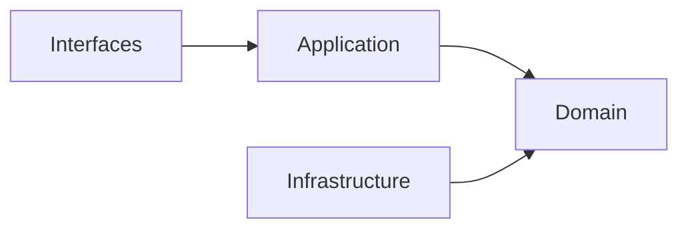

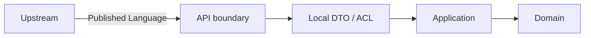

## Document Network

- [../README.md](../../README.md)
- [../architecture-overview.md](../system/architecture-overview.md)
- [../bounded-context-subdomain-template.md](../domain/bounded-context-subdomain-template.md)
- [../bounded-contexts.md](../domain/bounded-contexts.md)
- [../context-map.md](../system/context-map.md)
- [../integration-guidelines.md](../system/integration-guidelines.md)
- [../subdomains.md](../domain/subdomains.md)
- [../ubiquitous-language.md](../domain/ubiquitous-language.md)
````

## File: docs/structure/contexts/ai/context-map.md
````markdown
# AI Context Map

## Context Role

ai 對其他主域提供共享 AI capability signal。它消費 iam 的 access decision 與 billing 的 entitlement signal，向 notion 與 notebooklm 輸出 generation、distillation、retrieval 等能力。

## Relationships

| Upstream | Downstream | Relationship Type | Published Language |
|---|---|---|---|
| iam | ai | Upstream/Downstream | actor reference、access decision |
| billing | ai | Upstream/Downstream | entitlement signal、quota capability |
| ai | notion | Upstream/Downstream | ai capability signal、distillation result、safety result |
| ai | notebooklm | Upstream/Downstream | ai capability signal、distillation result、retrieval result、safety result |

## Mapping Rules

- ai 消費 iam 的結果，但不重建 actor 或 tenant 模型。
- ai 消費 billing 的 entitlement signal 決定配額，但不擁有訂閱或計費語義。
- notion 消費 ai capability，但 AI provider / policy 所有權不屬於 notion。
- notebooklm 消費 ai 的 generation、distillation、retrieval，但推理輸出的正典語義屬於 notebooklm 自己。
- ai 不回寫任何下游主域的正典模型。

## Integration Pattern

- ai 作為下游消費 iam 與 billing 時，採用 Conformist 或 ACL，視語義相容性決定。
- notion 與 notebooklm 消費 ai 時，ai 的 published language 是 capability signal，不是 aggregate。

## Dependency Direction

- ai 對 iam、billing 屬 downstream。
- ai 對 notion、notebooklm 屬 upstream 的能力供應者。

## Anti-Patterns

- 把 ai 與 notebooklm 寫成 Shared Kernel，同時擁有推理輸出語義。
- 讓 notion 或 notebooklm 直接 import ai 的 infrastructure 或 subdomain domain。
- 把 iam 的 actor model 直接帶入 ai domain，而非只消費 access decision。

## Dependency Direction Flow

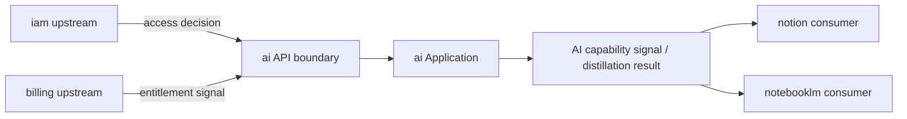
````

## File: docs/structure/contexts/ai/ubiquitous-language.md
````markdown
# AI Ubiquitous Language

## Canonical Terms

| Term | Meaning |
|---|---|
| AICapabilitySignal | ai 向下游輸出的能力結果，不是具體 aggregate |
| GenerationResult | 單次文字生成的輸出，包含 text、model、finishReason |
| DistillationResult | 從多段內容或長輸出濃縮出的精煉知識片段 |
| RetrievalResult | 向量搜尋後回傳的相關內容片段與分數 |
| PromptContext | 組裝後準備送入 LLM 的完整上下文物件 |
| SafetyResult | 安全護欄對輸入或輸出的檢查結果（pass / block） |
| ModelPolicy | 模型選擇、版本鎖定與使用限制規則 |
| OrchestrationFlow | 多步驟 AI 執行圖，由 orchestration 子域控制 |
| ToolCall | 外部工具的調用請求與結果 |
| MemoryEntry | 對話歷史或跨輪次狀態的單筆記錄 |
| EvaluationScore | 針對 AI 輸出的品質量測結果 |
| TraceSpan | AI 執行流程中的單一可觀測片段 |

## Language Rules

- 使用 DistillationResult 表示蒸餾輸出，不用 Summary 混稱精煉過程與摘要功能。
- 使用 GenerationResult 表示生成輸出，不用 Response 泛稱所有 LLM 回傳。
- 使用 PromptContext 表示組裝後的上下文，不用 Prompt 直接傳遞原始字串。
- 使用 SafetyResult 表示護欄結果，不用 Filter 混指檢查流程。
- 使用 AICapabilitySignal 作為跨主域 published language，不暴露內部 aggregate。

## Avoid

| Avoid | Use Instead |
|---|---|
| Summary（跨域泛稱） | DistillationResult（ai 精煉輸出）或 GenerationResult（生成摘要） |
| Response | GenerationResult |
| Filter | SafetyResult |
| Prompt（跨域傳遞） | PromptContext |
| Chat | conversation（ai 輪次管理）或 Conversation（notebooklm 正典） |

## Naming Anti-Patterns

- 不用 Summary 混指 distillation 的精煉結果與 generation 的摘要功能。
- 不用 Chat 混指 ai 的 conversation 管理與 notebooklm 的 Conversation aggregate。
- 不用 Prompt 作為跨域傳遞型別，必須先組裝成 PromptContext。
- 不用 Filter 表示 safety 的護欄判定，SafetyResult 已含通過或攔截語義。

## Copilot Generation Rules

- 命名先對齊上表 Canonical Terms，再決定類別與檔名。
- distillation 子域的輸出型別命名用 DistillationResult，不要退化為 SummarizedText。
- 奧卡姆剃刀：若一個正確名詞已能表達邊界，不要再堆疊近義抽象。
````

## File: docs/structure/contexts/analytics/bounded-contexts.md
````markdown
# Analytics

## Domain Role

analytics 是下游 bounded context。它以 projection、metric 與 report 為主，不持有上游主域的寫入正典模型。

## Ownership Rules

- 擁有 reporting、metrics、dashboards、telemetry projections。
- 消費事件，不直接改寫上游 aggregate。
- 只在需要查詢與分析時建立 local read model。
````

## File: docs/structure/contexts/analytics/context-map.md
````markdown
# Analytics

## Relationships

| Upstream | Downstream | Published Language |
|---|---|---|
| iam | analytics | access event、identity signal |
| billing | analytics | billing event、entitlement usage signal |
| platform | analytics | operational event、notification event |
| workspace | analytics | activity feed、audit signal |
| notion | analytics | knowledge usage signal |
| notebooklm | analytics | retrieval and synthesis usage signal |

## Notes

- analytics consumes events and projections only.
````

## File: docs/structure/contexts/analytics/subdomains.md
````markdown
# Analytics

## Baseline Subdomains

| Subdomain | Responsibility |
|---|---|
| reporting | 報表輸出與查詢整理 |
| metrics | 指標定義與聚合 |
| dashboards | 儀表板呈現語義 |
| telemetry-projection | 事件投影與 read model 匯總 |

> **實作層命名備注：** `src/modules/analytics/` 以 `event-contracts`、`event-ingestion`、`event-projection`、`insights`、`metrics`、`realtime-insights` 作為子域目錄名稱。
> `event-projection` 對應戰略層 `telemetry-projection`；`insights` 對應 `reporting`；`realtime-insights` 對應儀表板能力的即時維度。

## Recommended Gap Subdomains

| Subdomain | Responsibility |
|---|---|
| experimentation | 實驗分析與對照觀測 |
| decision-support | 決策輔助與洞察輸出 |
````

## File: docs/structure/contexts/analytics/ubiquitous-language.md
````markdown
# Analytics

## Canonical Terms

| Term | Meaning |
|---|---|
| Metric | 可重複計算與追蹤的指標 |
| Report | 對分析結果的輸出整理 |
| Dashboard | 視覺化分析面板 |
| Projection | 由上游事件形成的下游 read model |

## Avoid

- 不把 analytics 當成上游寫入語言。
- 不把 projection 當成原始 aggregate。
````

## File: docs/structure/contexts/billing/bounded-contexts.md
````markdown
# Billing

## Domain Role

billing 是 commercial bounded context。它擁有 subscription 與 entitlement 的商業語義，並把結果輸出為 capability signal。

## Ownership Rules

- 擁有 billing、subscription、entitlement、referral。
- 不擁有 identity 與 access decision 正典語言。
- 不擁有 workspace、knowledge 或 notebook aggregate。
````

## File: docs/structure/contexts/billing/context-map.md
````markdown
# Billing

## Relationships

| Upstream | Downstream | Published Language |
|---|---|---|
| iam | billing | actor reference、tenant scope、access policy baseline |
| billing | workspace | entitlement signal、subscription capability signal |
| billing | notion | entitlement signal、subscription capability signal |
| billing | notebooklm | entitlement signal、subscription capability signal |

## Notes

- billing 向下游提供 capability signal，不暴露內部商業 aggregate。
````

## File: docs/structure/contexts/billing/subdomains.md
````markdown
# Billing

## Baseline Subdomains

| Subdomain | Responsibility |
|---|---|
| billing | 計費狀態、費率與財務證據 |
| subscription | 方案、配額與續期治理 |
| entitlement | 有效權益與功能可用性統一解算 |
| referral | 推薦關係與獎勵追蹤 |

## Recommended Gap Subdomains

| Subdomain | Responsibility |
|---|---|
| pricing | 價格模型與方案矩陣治理 |
| invoice | 帳單、請款與對帳流程 |
| quota-policy | 可量化配額與商業限制規則 |
````

## File: docs/structure/contexts/billing/ubiquitous-language.md
````markdown
# Billing

## Canonical Terms

| Term | Meaning |
|---|---|
| Subscription | 方案、配額與續期狀態 |
| Entitlement | 綜合商業規則後的有效權益 |
| BillingEvent | 財務計價或收費事實 |
| Referral | 推薦關係與獎勵追蹤 |

## Avoid

- 不用 Plan 混稱 Subscription 與 Entitlement。
- 不把 feature flag 當成 entitlement 正典語義。
````

## File: docs/structure/contexts/iam/bounded-contexts.md
````markdown
# IAM

## Domain Role

iam 是 governance bounded context。它是身份、tenant 與 access decision 的 canonical owner。account 與 organization 的聚合根也屬於 iam（從 platform 遷入）。

## Ownership Rules

- 擁有 identity、access-control、tenant、security-policy。
- 擁有 account（帳號聚合根）與 organization（組織聚合根）— 已從 platform 遷入。
- 向下游輸出 actor reference、tenant scope、access decision。
- 不擁有 workspace、knowledge、notebook 或 billing aggregate。
````

## File: docs/structure/contexts/iam/context-map.md
````markdown
# IAM

## Relationships

| Upstream | Downstream | Published Language |
|---|---|---|
| iam | billing | actor reference、tenant scope、access policy baseline |
| iam | platform | actor reference、tenant scope、access decision |
| iam | workspace | actor reference、tenant scope、access decision |
| iam | notion | actor reference、tenant scope、access decision |
| iam | notebooklm | actor reference、tenant scope、access decision |
| iam | analytics | access event、identity signal |

## Notes

- iam 是治理上游，不擁有商業、內容或推理正典模型。
````

## File: docs/structure/contexts/iam/subdomains.md
````markdown
# IAM

## Baseline Subdomains

| Subdomain | Responsibility |
|---|---|
| identity | 已驗證主體與身份信號治理 |
| access-control | 主體現在能做什麼的授權判定 |
| tenant | 多租戶隔離與 tenant-scoped 規則治理 |
| security-policy | 安全規則定義、版本化與發佈 |
| account | 帳號聚合根與帳號生命週期（原 platform/account，已遷入）|
| organization | 組織、成員與角色邊界（原 platform/organization，已遷入）|

## Recommended Gap Subdomains

| Subdomain | Responsibility |
|---|---|
| session | session、token 與 identity lifecycle 收斂 |
| consent | 同意與資料使用授權治理收斂 |
| secret-governance | secret 與 credential access policy 收斂 |

## Implementation Subdomains (Code Present, Not Yet Fully Aligned)

| Subdomain | Responsibility |
|---|---|
| authentication | sign-in、registration、credential recovery、provider bootstrap |
| authorization | higher-level policy orchestration and decision semantics |
| federation | external identity provider linking, SSO, and trust delegation |
````

## File: docs/structure/contexts/iam/ubiquitous-language.md
````markdown
# IAM

## Canonical Terms

| Term | Meaning |
|---|---|
| Actor | 被識別與治理的主體 |
| Identity | 證明 Actor 是誰的訊號集合 |
| Tenant | 租戶隔離與 tenant-scoped 規則邊界 |
| AccessDecision | 對 actor 當下能否執行某行為的判定 |
| SecurityPolicy | 可版本化的安全規則集合 |

## Avoid

- 不用 User 混稱 Actor。
- 不用 Organization 取代 Tenant。
- 不把 access decision 寫成 UI flag。
````

## File: docs/structure/domain/bounded-context-subdomain-template.md
````markdown
# Bounded Context Subdomain Template

本文件在本次任務限制下，僅依 Context7 驗證的 Hexagonal Architecture、DDD、Context Map 與 ADR 參考建立，作為 `src/modules/<bounded-context>/subdomains/*` 的交付標準模板，不主張反映現況實作。

## Purpose

這份模板定義新的 bounded context 與其 subdomains 應以什麼結構交付，讓 Copilot 在建立模組樹、層次與邊界時，先遵守 Hexagonal Architecture with Domain-Driven Design，再決定實作細節。

## Development Order Contract (Domain-First)

- 每個需求都必須先有 use case contract（actor、goal、main success scenario、failure branches），再進入程式碼實作。
- 新功能一律遵循：Domain -> Application -> Ports -> Infrastructure -> Interface。
- Domain 先定義「系統是什麼」：聚合、不變條件、值對象與領域事件，不依賴任何框架或外部技術。
- Application 再定義「系統做什麼」：use case 流程協調、DTO 轉換、交易與事件發布時序。
- Ports 定義內外協作契約；Infrastructure 只負責實作契約並接入 Firebase、AI 或其他外部系統。
- Interface（UI / API / Server Action）只做輸入輸出與組裝，不承載領域決策。
- UI 永遠只能呼叫同 bounded context 的 `application/` 或該 bounded context 的 `index.ts`，不可直接呼叫 `domain/` 或 `infrastructure/`。
- `domain/` 不可匯入 React、Firebase SDK、HTTP client、ORM model 或 runtime-specific adapter。

## Standard Structure Tree

```text
src/modules/                                    # 系統所有業務模組（bounded contexts）集合
└── <bounded-context>/                          # 單一業務邊界（高內聚、低耦合）
    ├── README.md                               # 說明此 bounded context 的目的、範圍、核心能力
    ├── AGENTS.md                                # 開發規範：命名、分層規則、不可違反設計約束
    ├── index.ts                                # 跨模組公開入口（cross-module entry surface）
    ├── application/                            # 應用層：負責 use case orchestration
    │   ├── dtos/                                # 輸入/輸出資料契約，僅資料不含業務邏輯
    │   ├── use-cases/                          # 一檔一用例，承擔流程控制與副作用協調
    │   └── services/                           # Application Service：流程共用輔助，不承載核心業務規則
    ├── domain/                                 # 領域層：核心商業邏輯與不變條件
    │   ├── entities/                           # Entity：有 identity，封裝狀態與行為
    │   ├── value-objects/                      # Value Object：無 identity，以值相等，通常 immutable
    │   ├── services/                           # Domain Service：不屬於單一 entity 的業務規則
    │   ├── repositories/                       # Repository 介面（Domain Port）：只定義契約不含實作
    │   ├── events/                             # Domain Events：已發生的業務事實，用於解耦
    │   └── ports/                              # 外部依賴抽象（非資料庫），由 infrastructure 實作
    ├── docs/                                   # 架構文件與治理規範（長期可維護關鍵）
    │   ├── README.md                           # 文件總覽
    │   ├── bounded-context.md                  # 邊界責任（負責/不負責）
    │   ├── context-map.md                      # context 關係圖（ACL/Shared Kernel/Partnership）
    │   ├── subdomains.md                       # 子域拆分（core/supporting/generic）
    │   ├── ubiquitous-language.md              # 統一語言與命名詞彙表
    │   ├── aggregates.md                       # Aggregate 設計（邊界與 root）
    │   ├── domain-events.md                    # 事件設計規範
    │   ├── repositories.md                     # repository 設計準則
    │   ├── application-services.md             # application 層規範
    │   └── domain-services.md                  # domain 層規範
    ├── infrastructure/                         # Driven Adapters：實作 domain ports 與外部整合
    │   ├── <subdomain-a>/                      # 依子域分組的 adapters / persistence / repositories
    │   └── <subdomain-b>/                      # 只有 context-wide concern 才直接放 root
    ├── interfaces/                             # Driving Adapters：從 UI/HTTP/Action 進入系統
    │   ├── <subdomain-a>/                      # 依子域分組的 actions / queries / components / routes
    │   └── <subdomain-b>/                      # 只有 context-wide composition 才直接放 root
    └── subdomains/                             # 子域：bounded context 內部能力拆分
        ├── <subdomain-a>/                      # 單一能力模組（可獨立演化）
            ├── README.md                       # 子域說明（責任與邊界）
        │   ├── application/                    # 子域應用層（局部 use-case orchestration）
        │   │   ├── dto/                        # 子域 DTO（input/output）
        │   │   ├── use-cases/                  # 子域 use-cases（局部流程）
        │   │   └── services/                   # 子域 Application Services：只有在共享流程壓力存在時才建立
        │   ├── domain/                         # 子域領域模型（局部業務核心）
        │   │   ├── entities/                   # 子域 entity
        │   │   ├── value-objects/              # 子域 value object
        │   │   ├── services/                   # 子域 Domain Services（規則）
        │   │   ├── repositories/               # 子域 repository 介面
        │   │   ├── events/                     # 子域事件
        │   │   └── ports/                      # optional：真的需要隔離外部依賴時才建立
        │   └── infrastructure|interfaces/      # optional：只有符合 mini-module gate 時才在子域內建立
        └── <subdomain-b>/                      # 另一個子域（相同結構，獨立演化）
```

## Duplicate Folder Name Notes

- `application` 與 `domain` 在 root 與 subdomain 都可能出現，屬於**刻意重名**。
- `infrastructure` 與 `interfaces` 預設放在 bounded context 根層，並依 subdomain 名分組；只有符合 mini-module gate 時才會在特定 subdomain 內再出現。
- 判斷責任時，先看父路徑：`<bounded-context>/...` 代表 context-wide；`subdomains/<name>/...` 代表 subdomain-local。
- 同名的下一層目錄（如 `dto`、`use-cases`、`services`、`repositories`、`adapters`、`components`、`hooks`、`queries`、`_actions`）也遵循同一條父路徑判斷規則。
- 重名不代表可互相直接 import；跨 subdomain 或跨 bounded context 仍必須走 `index.ts` 邊界或事件契約。

## Layer Responsibilities

| Layer | Responsibility |
|---|---|
| `index.ts` | bounded context 對外唯一公開邊界 |
| `application/` | 協調 use cases、轉換 DTO、執行流程但不承載核心業務規則；若在 bounded context 根層，代表跨 subdomain 的 context-wide orchestration |
| `domain/` | 聚合根、實體、值對象、領域服務、領域事件與核心規則；若在 bounded context 根層，代表跨 subdomain 的 shared policy、published language 或 context-wide domain concept |
| `infrastructure/` | repository / adapter 實作、持久化、外部系統整合；預設在 bounded context 根層，並依 subdomain 名分組 |
| `interfaces/` | UI、route handler、server action、query hooks 等 driving adapters；預設在 bounded context 根層，並依 subdomain 名分組 |

## Service Folder Semantics

- `application/services/`：Application Service，負責流程協調、交易邊界、跨聚合編排與 use case 共用流程；不承載核心業務不變條件。
- `domain/services/`：Domain Service，負責無法自然落在單一 Entity/Value Object 的領域規則與政策；可承載核心業務邏輯與不變條件。

## Core Clarification

- `<bounded-context>` 本身也應該維持 Hexagonal Architecture with DDD 的依賴方向，而不只是 `subdomains/<name>/` 內部才有六邊形分層。
- 但 Hexagonal Architecture 的關鍵是**依賴方向與內外邊界**，不是資料夾一定要叫 `core/`。
- 依 Context7 驗證的參考，Application Core 是概念上的核心，外層依賴向內；ports 可放在 application 或 domain，取決於規則真正屬於哪一層。
- 因此本模板的預設寫法是用顯式的 `application/`、`domain/`、`infrastructure/`、`interfaces/` 來表達六邊形邊界，而不是再包一層泛用 `core/`；其中 subdomain 預設只保留 core-first 形狀。
- 如果團隊真的要使用 `core/`，較合理的變體應是 `<bounded-context>/core/application`、`<bounded-context>/core/domain`，必要時加 `core/ports`；**不應**把 `infrastructure/` 或 `interfaces/` 也放進 `core/`，因為它們本來就是外層。
- 只有當某段邏輯明確屬於整個 bounded context，而不是單一 subdomain 時，才應放在 `<bounded-context>/application|domain|infrastructure|interfaces`；否則優先放回擁有它的 subdomain。

## Template Rules

- `<bounded-context>` 根層允許有自己的 `application/`、`domain/`、`infrastructure/`、`interfaces/`，用來承接 context-wide concern；不要把整個 bounded context 簡化成只剩 `docs/` 與 `subdomains/` 的外殼。
- 每個 subdomain 都必須能獨立表達自己的 use case 與 domain model；adapter/UI 預設由 bounded context 根層承接，並依 subdomain 名分組。
- subdomain 預設採 core-first：`application/`、`domain/`，`ports/` 視需要建立。
- subdomain 的 `infrastructure/` 與 `interfaces/` 不是預設必建，只有在存在明確且持續的本地 I/O、runtime、process 或 provider boundary 壓力時才建立。
- `index.ts` 是 cross-module collaboration 的唯一公開入口，不得暴露內部結構。
- adapter 只實作 port，不直接被其他層呼叫。
- port 只在真的需要隔離 I/O、外部系統、侵入式 library 或 legacy model 時建立。
- 若 domain 核心不需要某個抽象，就不要為了形式完整而先建空的 `service`、`port` 或 `repository`。
- 不預設建立泛用 `core/` 包裝資料夾來混合內外層；若沒有非常明確的遷移理由，優先使用顯式層次名稱。

## Delivery Checklist

1. 建立 bounded context 的 `README.md`、`AGENTS.md`、`index.ts`、`docs/`，以及必要時的根層 `application/`、`domain/`、`infrastructure/`、`interfaces/` 入口。
2. 先判斷需求是屬於 bounded context 根層還是特定 subdomain；只有 context-wide concern 才進根層，其餘一律先落到 `subdomains/<name>/`。
3. 先建立 use case contract（actor / goal / success scenario / failure branches），再建立對應檔案 `application/use-cases/<verb-noun>.use-case.ts`。
4. 對擁有該責任的 subdomain 先落 `domain/` 核心模型，再收斂 `application/` 流程；`ports/` 視需要補齊，`infrastructure/` 與 `interfaces/` 預設落在 bounded context 根層並依 subdomain 名分組。
5. 先放入 aggregate、domain event、published language 與 context map，再補 adapter 與 persistence 實作。
6. 只有在交付需要時才建立 `ports/`、`hooks/`、`queries/`、`_actions/` 等細分資料夾。

## Legacy Strangler Pattern Workflow (Outside-In Convergence)

- 舊功能若已 outside-in 成形，不做一次性大改，採用 use case 為單位的漸進式收斂。
- 每次只選一條 use case 進行重構，並保留舊路徑可回退。

1. 找一條高價值且邊界清楚的 use case，先寫最小 use case contract。
2. 針對該 use case 重新建 Domain（聚合、不變條件、值對象、事件），先讓核心規則可測。
3. 在 Application 收斂流程，讓舊 UI 與舊 API 都改由新的 use case 進入。
4. 以 Ports 隔離舊系統與舊資料模型，避免 legacy 細節回滲到 Domain。
5. 由 Infrastructure 實作新 Ports，逐步替換舊 adapter。
6. 確認新路徑穩定後，再移除對應的舊路徑與臨時轉接層。

- 退出條件：該 use case 已滿足 `interfaces -> application -> domain <- infrastructure` 方向，且 UI 不再直連舊 service。

## Anti-Pattern Rules

- 不得把 `infrastructure/` 直接匯入 `domain/` 或 `application/`。
- 不得把別的 bounded context 的 `domain/`、`application/`、`infrastructure/` 或 `interfaces/` 當成可直接 import 的依賴。
- 不得在還沒有 use case contract 的情況下直接新增 UI 與 adapter。
- 不得讓 UI 或 route handler 直接呼叫 `domain/` 或 `infrastructure/`。
- 不得讓 `domain/` 匯入任何 runtime 或 framework 專用套件。
- 不得把所有子域都預設長成同一個巨型骨架，卻沒有對應的 use case 與業務責任。
- 不得把 `infrastructure/`、`interfaces/` 放進一個泛用 `core/` 目錄，讓六邊形的內外層語義失真。
- 不得因為「看起來完整」而過度建立 repository port、ACL、DTO、facade 或 service。
- 不得讓 `interfaces/` 承載業務決策，也不得讓 `application/` 重寫 domain 規則。

## Copilot Generation Rules

- 生成新模組前，先決定 bounded context、subdomain、public API boundary 與依賴方向，再建立資料夾。
- 若需求屬於 bounded context shared policy、published language、跨 subdomain orchestration，再使用 `<bounded-context>` 根層的 hexagonal layers；否則優先放進擁有責任的 subdomain。
- 奧卡姆剃刀：若較少的層級、port 或 adapter 已能保護邊界與可測試性，就不要額外新增抽象。
- 每個子域只建立當前交付需要的最小骨架，不要先把所有可選資料夾填滿。
- 若需求只是新增一個 use case，優先放進現有 subdomain，而不是新開第二個平行 subdomain。

## Dependency Direction Flow

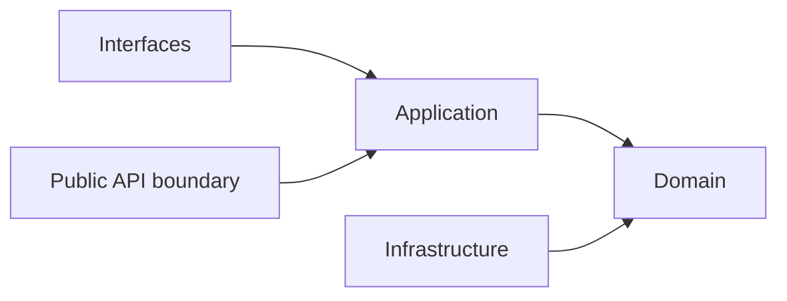

## Correct Interaction Flow

```mermaid
flowchart LR
    Requirement["Requirement"] --> Context["Choose bounded context"]
    Context --> Subdomain["Choose owning subdomain"]
    Subdomain --> UseCase["Write use case contract first"]
    UseCase --> Domain["Define domain model and invariants"]
    Domain --> Application["Orchestrate in use case"]
    Application --> Ports["Define required ports"]
    Ports --> Infra["Implement infrastructure adapters"]
    Infra --> Interface["Wire UI and API at boundary"]
```

## Document Network

- [README.md](../../README.md)
- [architecture-overview.md](../system/architecture-overview.md)
- [bounded-contexts.md](./bounded-contexts.md)
- [subdomains.md](./subdomains.md)
- [context-map.md](../system/context-map.md)
- [integration-guidelines.md](../system/integration-guidelines.md)
- [strategic-patterns.md](../system/strategic-patterns.md)
- [contexts/_template.md](../contexts/_template.md)
- decisions/0001-hexagonal-architecture.md
- decisions/0002-bounded-contexts.md
- decisions/0003-context-map.md

## Constraints

- 本模板是 architecture-first 的交付模板，不代表任何既有模組已完全符合此形狀。
- `ports/`、`queries/`、`_actions/`、`hooks/`、subdomain-local `infrastructure/`、subdomain-local `interfaces/` 都是按需要建立的可選骨架，不是強制清單。
- 若某 subdomain 很小，允許比本模板更精簡；若更精簡仍能守住邊界，應優先採用更精簡版本。
````

## File: docs/structure/domain/ubiquitous-language.md
````markdown
# Ubiquitous Language

本文件在本次任務限制下，僅依 Context7 驗證的 DDD ubiquitous language 原則重建，不主張反映現況實作。

## Strategic Terms

| Term | Meaning |
|---|---|
| Main Domain | 戰略層級的主要 bounded context 群組 |
| Bounded Context | 一組高凝聚、可自洽的語言與規則邊界 |
| Published Language | 跨邊界交換時使用的共同語言 |
| Upstream | 關係中提供語言或能力的一方 |
| Downstream | 關係中消費語言或能力的一方 |
| Anti-Corruption Layer | downstream 用來保護本地語言的轉譯層 |
| Conformist | downstream 直接接受 upstream 語言的整合選擇 |
| Shared Kernel | 對稱共用模型關係 |
| Partnership | 對稱共同成功 / 共同失敗關係 |
| Account Scope | shell 中由 `accountId` 表示的帳號範疇；代碼中的 `AccountType = "user" | "organization"` 會把它映射成 personal account 或 organization account 語意 |
| Workspace Scope | 由 `workspaceId` 表示的協作容器範疇，必須從屬於某個 account scope |
| Canonical Route Contract | 只用來表達 composition surface 的正典 URL 形狀，不取代 published language |

## Domain Terms

| Domain | Key Terms |
|---|---|
| iam | Actor, Identity, Tenant, AccessDecision, SecurityPolicy, Account, AccountProfile, Organization |
| billing | Subscription, Entitlement, BillingEvent, Referral |
| ai | AICapability, ModelPolicy, SafetyGuardrail, PromptPipeline |
| analytics | Metric, Report, Dashboard, Projection |
| platform | NotificationRoute, AuditLog |
| workspace | Workspace, Membership, ShareScope, ActivityFeed, AuditTrail |
| notion | KnowledgeArtifact, Taxonomy, Relation, Publication |
| notebooklm | Notebook, Ingestion, Retrieval, Grounding, Synthesis, Evaluation |

## Route Composition Terms

| Term | Meaning |
|---|---|
| accountId | shell route 上的 account scope identifier，不等於 workspaceId，也不直接等於 Tenant 語言 |
| workspaceId | workspace scope identifier；在 canonical shell URL 中作為 account scope 之下的第二段 |
| AccountType String Contract | code-level enum `"user" | "organization"`；`"user"` 對應 personal actor account，`"organization"` 對應 organization account |
| Personal Account | `AccountType = "user"` 對應的 personal actor account 語意 |
| Organization Account | `AccountType = "organization"` 對應的 organization account 語意 |
| Canonical Workspace URL | `/{accountId}/{workspaceId}` |
| Legacy Workspace Redirect Surface | `/{accountId}/workspace/{workspaceId}` |
| Legacy Organization Redirect Surface | `/{accountId}/organization/*` |

## Identifier Contract Glossary

| Identifier | Canonical Role | Notes |
|---|---|---|
| accountId | Account scope identifier | shell composition 的 route id；由 `AccountType = "user" | "organization"` 決定它代表 personal account 或 organization account |
| workspaceId | Workspace scope identifier | 協作容器錨點；在 canonical workspace URL 中是 account scope 之下的第二段 |
| organizationId | Organization-local identifier | 用於 organization/team/taxonomy/relations/ingestion 等 organization-scoped domain 或 integration contract；不直接取代 shell route 的 `accountId` |
| userId | Concrete user identifier | 用於 `createdByUserId`、`verifiedByUserId`、`submittedByUserId`、`assignedUserId`、`creatorUserId` 等具體使用者欄位 |
| actorId | Acting principal identifier | 用於 audit / event / action initiator；可能是 userId，也可能是 system actor，不應假設一定等於 userId |
| ownerId | Resource owner identifier | 表示資源所有者；不是 shell route id，也不必然等於 `accountId` |
| tenantId | Tenant isolation identifier | 用於 storage path、security rules、multi-tenant isolation；不等於 `workspaceId`，也不是 shell route param |
| fileId | File metadata identifier | 檔案 metadata 主鍵；不取代 owner / workspace / tenant scope |

## Context Map Alignment

| Relationship | Published Language Tokens | Upstream Term Source | Downstream Local Terms |
|---|---|---|---|
| iam -> workspace | actor reference, tenant scope, access decision | Actor, Identity, Tenant, AccessDecision | Workspace, Membership, ShareScope |
| iam -> notion | actor reference, tenant scope, access decision | Actor, Identity, Tenant, AccessDecision | KnowledgeArtifact, Taxonomy, Relation, Publication |
| iam -> notebooklm | actor reference, tenant scope, access decision | Actor, Identity, Tenant, AccessDecision | Notebook, Ingestion, Retrieval, Grounding, Synthesis, Evaluation |
| billing -> workspace | entitlement signal, subscription capability signal | Subscription, Entitlement | Workspace, Membership, ShareScope |
| billing -> notion | entitlement signal, subscription capability signal | Subscription, Entitlement | KnowledgeArtifact, Taxonomy, Relation |
| billing -> notebooklm | entitlement signal, subscription capability signal | Subscription, Entitlement | Notebook, Retrieval, Grounding, Synthesis |
| ai -> notion | ai capability signal, model policy, safety result | AICapability, ModelPolicy, SafetyGuardrail | KnowledgeArtifact, Publication |
| ai -> notebooklm | ai capability signal, model policy, safety result | AICapability, ModelPolicy, SafetyGuardrail | Notebook, Retrieval, Grounding, Synthesis, Evaluation |
| platform -> workspace | account scope, organization surface, operational service signal | NotificationRoute（Account/Organization 正典源自 iam，由 platform 轉傳） | Workspace, Membership, ShareScope |
| workspace -> notion | workspaceId, membership scope, share scope | Workspace, Membership, ShareScope | KnowledgeArtifact, Taxonomy, Relation |
| workspace -> notebooklm | workspaceId, membership scope, share scope | Workspace, Membership, ShareScope | Notebook, Retrieval, Grounding, Synthesis |
| notion -> notebooklm | knowledge artifact reference, attachment reference, taxonomy hint | KnowledgeArtifact, Taxonomy, Relation | Notebook, Retrieval, Grounding, Synthesis, Evaluation |
| all contexts -> analytics | domain event, usage signal, projection input | Metric, Report, Dashboard, Projection | Metrics, Reporting, Dashboard |

## Published Language Token Glossary

| Token | Canonical Mapping | Notes |
|---|---|---|
| actor reference | iam.Actor | 不以 User 泛稱，避免與 Membership 混名 |
| organization scope | iam.Organization scope | 用於 account 與 organization surface，不等於 Workspace scope |
| tenant scope | iam.Tenant scope | 用於治理邊界，不等於 Workspace scope |
| access decision | iam.AccessDecision result | 僅傳遞判定結果，不暴露內部 policy 模型 |
| entitlement signal | billing.Entitlement / Subscription capability signal | 不混同 feature-flag payload |
| ai capability signal | ai shared capability signal | notion 與 notebooklm 僅消費，不擁有 generic `ai` 子域 |
| operational service signal | platform operational capability signal | 只表達 shared platform service，不接管治理語言 |
| workspaceId | Workspace identifier | 不取代 knowledge/notebook 的本地主鍵 |
| membership scope | Membership constraint | 不混同 Actor 身份語言 |
| share scope | ShareScope constraint | 不混同一般 permission 欄位集合 |
| knowledge artifact reference | KnowledgeArtifact reference | 僅引用，不代表內容所有權轉移 |
| attachment reference | Attachment reference | 提供可追溯引用，不暴露儲存實作 |
| taxonomy hint | Taxonomy hint | 作為推理輔助語言，不覆蓋 notion 正典 taxonomy |

## Naming Rules

- 不用 User 混指 Actor 與 Membership。
- 不用 Plan 混指 Subscription 與 Entitlement。
- 不用 Wiki 混指 KnowledgeArtifact。
- 不用 Chat 混指 Conversation。
- 不用 Search 混指 Retrieval。
- 不用 AI 混指 platform 的 shared AI capability 與 notion / notebooklm 的本地 use case。
- 不用 Analytics 混指 platform analytics 與 notion 的 knowledge-engagement。
- 不用 Integration 混指 platform integration 與 notion 的 external-knowledge-sync。
- 不用 Versioning 混指 notion 的 knowledge-versioning 與 notebooklm 的 conversation-versioning。
- 不用 Workflow 混指 platform workflow 與 workspace 內的 task/issue/settlement 流程子域。
- 不用 accountId 混指 workspaceId。
- 不用 organizationId 取代 shell route 上的 accountId。
- 不用 userId 混指 actorId。
- 不用 `AccountType = "personal"` 取代 `AccountType = "user"`。
- 不用 `/{accountId}/workspace/{workspaceId}` 當成新的 canonical workspace URL。
- 不用 `/{accountId}/organization/*` 當成新的 canonical governance route。

## Naming Anti-Patterns

- 用同一個詞同時代表平台治理語言與工作區參與語言。
- 用內容產品舊名覆蓋 notion 的正典語言。
- 用 Search 混指 notebooklm 的 Retrieval 與一般搜尋能力。
- 用同一個 generic 子域名跨主域重複宣稱所有權，再期望 Copilot 自行猜對上下文。
- 把 route composition contract 誤寫成 cross-context published language。
- 把 organization-scoped identifier 誤當成 shell composition identifier。
- 把 actorId、userId、ownerId 三種角色不同的 identifier 混成同一欄位語意。
- 把 personal account 顯示語言誤當成 code-level `AccountType` literal。
- 把 legacy redirect surface 誤寫成正典 URL 契約。

## Copilot Generation Rules

- 生成程式碼時，先對齊 strategic term，再對齊 context-specific term，最後才命名型別與 API。
- 奧卡姆剃刀：若一個詞已足夠準確，就不要再加第二個近義詞製造歧義。
- 名稱衝突時先回到 glossary，而不是直接在程式碼裡各自命名。

## Dependency Direction Flow

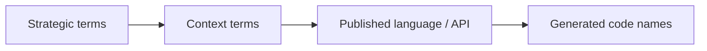

## Correct Interaction Flow

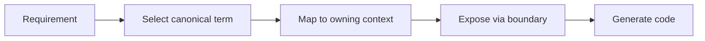

## Document Network

- [contexts/workspace/ubiquitous-language.md](../contexts/workspace/ubiquitous-language.md)
- [contexts/platform/ubiquitous-language.md](../contexts/platform/ubiquitous-language.md)
- [contexts/notion/ubiquitous-language.md](../contexts/notion/ubiquitous-language.md)
- [contexts/notebooklm/ubiquitous-language.md](../contexts/notebooklm/ubiquitous-language.md)
- [bounded-context-subdomain-template.md](./bounded-context-subdomain-template.md)
- [project-delivery-milestones.md](../system/project-delivery-milestones.md)
- decisions/0004-ubiquitous-language.md

## Conflict Resolution

- 若 strategic term 與主域 term 衝突，優先維持主域語言不被污染，再回寫 strategic glossary。
- 若同一個詞在多主域都想擁有，優先看它服務的是治理、協作範疇、正典內容還是推理輸出。
````

## File: docs/structure/system/architecture-overview.md
````markdown
# Architecture Overview

## System Shape

系統以八個主域 / bounded context 組成，每個主域都視為一個有自己語言與規則的邊界：

- iam：身份、租戶、存取判定、安全治理、**account 與 organization 聚合根**
- billing：訂閱、權益、推薦與商業生命週期
- ai：共享 AI capability orchestration、content generation / distillation、context assembly、prompt pipeline、safety 與 quality / observability policy
- analytics：報表、指標、儀表板與下游 read model 投影
- platform：notification、search、audit、營運服務（account 與 organization 已遷入 iam）
- workspace：協作容器與工作區範疇
- notion：正典知識內容生命週期
- notebooklm：對話、來源處理與推理輸出

## Architectural Baseline

- 主域內部採用 Hexagonal Architecture（Ports and Adapters）+ Domain-Driven Design（DDD）。
- 領域建模採 semantic-first，優先對齊 business language，再決定資料結構與 adapter 位置。
- 後端 runtime 基線採 Firebase Serverless Backend Architecture：Authentication、Firestore、Cloud Functions、Hosting。
- AI orchestration 基線採 Genkit：AI Flows、Tool Calling、Prompt Pipelines 皆視為外部能力，由 ai context 統一治理。
- 前端 state 基線採 Zustand 與 XState：Zustand 承接輕量 client state，XState 承接有限狀態工作流。
- runtime validation 基線採 Zod：所有外部輸入先經 Zod，再進入 application 與 domain。
- 主域之間只透過 published language、API 邊界或事件互動。
- 領域核心不直接依賴 framework 與 infrastructure。
- 主域級關係採用 directed upstream-downstream，不採用 Shared Kernel / Partnership。

## Main Domains

| Main Domain | Strategic Role | What It Owns |
|---|---|---|
| iam | 治理上游 | actor、identity、tenant、access decision、security policy、**account、organization** |
| billing | 商業上游 | subscription、entitlement、billing event、referral |
| ai | 共享能力上游 | generation、orchestration、distillation、retrieval、memory、context、safety、tool-calling、reasoning、conversation、evaluation、tracing；provider-routing / model-policy 為後續治理延伸 |
| analytics | 分析下游 | reporting、metrics、dashboard、projection read model |
| platform | 平台營運支擐 | notification、search、audit-log、observability、operational workflow（account、organization 已遷入 iam） |
| workspace | 協作範疇 | workspaceId、membership、sharing、presence、feed、audit、scheduling、task、issue、settlement、approve、quality、orchestration |
| notion | 正典內容 | knowledge artifact、taxonomy、relations、publication、knowledge-versioning |
| notebooklm | 推理輸出 | ingestion、retrieval、grounding、conversation、synthesis、evaluation、conversation-versioning |

## Relationship Baseline

| Upstream | Downstream | Reason |
|---|---|---|
| iam | billing | 提供 actor、tenant 與 access policy 基線 |
| iam | platform | 提供身份與安全治理基線 |
| iam | workspace / notion / notebooklm | 提供 actor、tenant、access decision |
| billing | workspace / notion / notebooklm | 提供 entitlement 與 subscription capability signal |
| ai | notion / notebooklm | 提供 shared AI capability、prompt orchestration、content distillation / generation support、model policy 與 safety |
| platform | workspace | 提供 account scope、organization surface 與 shared operational surface（account/org 正典己遷入 iam） |
| workspace | notion / notebooklm | 提供 workspace scope、membership scope、share scope |
| notion | notebooklm | 提供可引用的正典知識內容來源 |
| iam / billing / platform / workspace / notion / notebooklm | analytics | 輸出事件與 read model 供分析使用 |

## Contradiction-Free Rules

- 目前採八個主域 / bounded context；若未來再切分，必須用新的 ADR 明確記錄。
- 戰略文件若需要描述缺口，一律使用 recommended gap subdomains，而不是假裝它們已被實作驗證。
- iam 是身份與存取治理上游，不是內容或商業正典擁有者。
- billing 擁有 subscription 與 entitlement 的商業語義，不再把它們掛回 platform。
- ai 擁有 shared AI capability，但不擁有 notion 的正典內容語言或 notebooklm 的推理輸出語言。
- analytics 是下游 read-model sink，不應反向成為其他主域的 canonical owner。
- notion 是正典內容擁有者；notebooklm 是衍生推理輸出擁有者。

## System-Wide Dependency Direction

- 每個主域內部固定遵守 interfaces -> application -> domain <- infrastructure。
- 跨主域依賴只能透過 published language、public API boundary、events。
- 外部框架、SDK、傳輸與儲存細節只能停留在 adapter 邊界。

## App Route Composition Contract

- `src/app/(shell)` 是 shell composition 邊界，不承載 business rule。
- account 是 shell 內的唯一 account-scoped route surface，canonical 入口為 `src/app/(shell)/(account)/[accountId]/[[...slug]]/page.tsx`。
- `accountId` 代表 account scope；其語意由 `AccountType = "user" | "organization"` 決定，其中 `"user"` 對應 personal actor account，`"organization"` 對應 organization account，不代表 workspace scope。
- `AccountType = "user" | "organization"` 是目前 domain、use case、validator 與 route composition 共用的字串契約；UI 可顯示 personal account / organization account，但不應把 `"personal"` 當成跨邊界字串值。
- workspace detail 的 canonical URL 為 `/{accountId}/{workspaceId}`，由 account catch-all dispatcher 解析並轉交 workspace module route screen。
- `/{accountId}/workspace/{workspaceId}` 僅作為 legacy redirect surface；文件、UI 與新程式碼不應再把它當成 canonical href。
- account-scoped governance route 採 flattened account surface，例如 `/{accountId}/members`、`/{accountId}/teams`、`/{accountId}/permissions`，不再以 `/{accountId}/organization/*` 作為 canonical URL。
- route files 只做 composition、redirect 與 query-state 轉譯；module collaboration 仍必須走 `src/modules/*` 的公開匯出邊界。

## System-Wide Anti-Patterns

- 把 domain 核心直接接上 framework、database、HTTP、queue 或 AI SDK。
- 把主域內部模型直接共享給其他主域，取代 published language。
- 把治理、內容、推理三種責任重新揉成單一平級主域。

## Copilot Generation Rules

- 生成程式碼時，先定位需求落在哪個主域，再定位到子域與層。
- 奧卡姆剃刀：若既有主域、子域與 API boundary 已能承接需求，就不要再新增新的平級結構。
- 優先維持單一清楚的 input -> boundary -> application -> domain -> output 路徑。

## Dependency Direction Flow


## Correct Interaction Flow

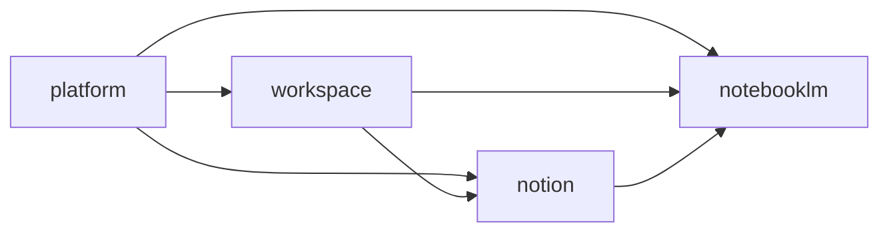

## Document Network

- [README.md](../../README.md)
- [bounded-contexts.md](../domain/bounded-contexts.md)
- [context-map.md](./context-map.md)
- [subdomains.md](../domain/subdomains.md)
- [integration-guidelines.md](./integration-guidelines.md)
- [strategic-patterns.md](./strategic-patterns.md)
- [bounded-context-subdomain-template.md](../domain/bounded-context-subdomain-template.md)
- [project-delivery-milestones.md](./project-delivery-milestones.md)
- decisions/0001-hexagonal-architecture.md

## Reading Path

1. [bounded-contexts.md](../domain/bounded-contexts.md)
2. [context-map.md](./context-map.md)
3. [subdomains.md](../domain/subdomains.md)
4. [ubiquitous-language.md](../domain/ubiquitous-language.md)
5. [integration-guidelines.md](./integration-guidelines.md)
6. [strategic-patterns.md](./strategic-patterns.md)
7. decisions/README.md
````

## File: docs/structure/system/context-map.md
````markdown
# Context Map

本文件在本次任務限制下，僅依 Context7 驗證的 context map 與 strategic design 原則重建，不主張反映現況實作。

## System Landscape

主域級關係只採用 directed upstream-downstream 模型。

## Directed Relationships

| Upstream | Downstream | Published Language |
|---|---|---|
| iam | billing | actor reference、tenant scope、access policy baseline |
| iam | platform | actor reference、tenant scope、access decision |
| iam | workspace | actor reference、tenant scope、access decision |
| iam | notion | actor reference、tenant scope、access decision |
| iam | notebooklm | actor reference、tenant scope、access decision |
| billing | workspace | entitlement signal、subscription capability signal |
| billing | notion | entitlement signal、subscription capability signal |
| billing | notebooklm | entitlement signal、subscription capability signal |
| ai | notion | ai capability signal、model policy、safety result |
| ai | notebooklm | ai capability signal、model policy、safety result |
| platform | workspace | account scope、organization surface、operational service signal |
| workspace | notion | workspaceId、membership scope、share scope |
| workspace | notebooklm | workspaceId、membership scope、share scope |
| notion | notebooklm | knowledge artifact reference、attachment reference、taxonomy hint |
| iam / billing / platform / workspace / notion / notebooklm | analytics | domain event、projection input、usage signal |

## Detailed Language Crosswalk

| Relationship | Upstream Canonical Terms | Published Language | Downstream Protected Terms |
|---|---|---|---|
| iam -> workspace | Actor, Identity, Tenant, AccessDecision | actor reference, tenant scope, access decision | Workspace, Membership, ShareScope |
| iam -> notion | Actor, Identity, Tenant, AccessDecision | actor reference, tenant scope, access decision | KnowledgeArtifact, Taxonomy, Relation, Publication |
| iam -> notebooklm | Actor, Identity, Tenant, AccessDecision | actor reference, tenant scope, access decision | Notebook, Ingestion, Retrieval, Grounding, Synthesis, Evaluation |
| billing -> workspace | Subscription, Entitlement | entitlement signal, subscription capability signal | Workspace, Membership, ShareScope |
| billing -> notion | Subscription, Entitlement | entitlement signal, subscription capability signal | KnowledgeArtifact, Taxonomy, Relation |
| billing -> notebooklm | Subscription, Entitlement | entitlement signal, subscription capability signal | Notebook, Retrieval, Grounding, Synthesis |
| ai -> notion | AICapability, ModelPolicy, SafetyGuardrail | ai capability signal, model policy, safety result | KnowledgeArtifact, Publication |
| ai -> notebooklm | AICapability, ModelPolicy, SafetyGuardrail | ai capability signal, model policy, safety result | Retrieval, Grounding, Synthesis, Evaluation |
| platform -> workspace | AccountScope, OrganizationSurface, NotificationRoute | account scope, organization surface, operational service signal | Workspace, Membership, ShareScope |
| workspace -> notion | Workspace, Membership, ShareScope | workspaceId, membership scope, share scope | KnowledgeArtifact, Taxonomy, Relation |
| workspace -> notebooklm | Workspace, Membership, ShareScope | workspaceId, membership scope, share scope | Notebook, Retrieval, Grounding, Synthesis |
| notion -> notebooklm | KnowledgeArtifact, Taxonomy, Relation | knowledge artifact reference, attachment reference, taxonomy hint | Notebook, Retrieval, Grounding, Synthesis, Evaluation |
| all business and operational contexts -> analytics | DomainEvent, UsageSignal, ProjectionInput | domain event, usage signal, projection input | Metrics, Reporting, Dashboard |

## Relationship Notes

- `iam` 只提供身份、租戶與 access decision，不接管商業、內容或推理語言。
- `billing` 只提供 entitlement 與 subscription capability signal，不接管 workspace、knowledge 或 notebook 的正典模型。
- `ai` 提供共享 AI capability、model policy 與 safety result，但不移轉內容或推理所有權。
- `platform` 保留 operational surface（notification、search、audit-log 等），不再作為所有治理能力的總擁有者。account 與 organization 正典己遷入 iam。
- `workspace -> notion` 與 `workspace -> notebooklm` 只提供 scope 與 membership 邊界，不輸出 workspace 內部模型。
- `notion -> notebooklm` 僅提供可引用內容語言，不允許 notebooklm 直接回寫 notion 正典內容。
- `analytics` 只消費投影與訊號，不反向成為上游 canonical owner。

## Pattern Rules

- ACL 與 Conformist 只允許出現在 downstream 端。
- ACL 與 Conformist 互斥，不能同時套用在同一整合。
- Shared Kernel 與 Partnership 不用於主域級關係。
- 若未來真的需要共享模型，必須先抽出新的 bounded context，而不是把對稱關係塞回主域之間。

## Dependency Direction Guardrail

- 主域級方向只允許 upstream -> downstream，不允許同時宣稱對稱依賴。
- downstream 整合上游時，先決定 published language，再決定 ACL 或 Conformist。
- 上游提供語言與能力，下游決定如何保護自己的語言。

## Strategic Consequences

- 關係方向清楚後，published language、local DTO 與 ACL 才能一致。
- 主域級文檔可以避免同時出現互相矛盾的 supplier / consumer 敘事。

## Contradictions Removed

- 不再同時把主域級關係描述成 directed relationship 與 symmetric relationship。
- 不再把 ACL 寫成 upstream 的責任。
- 不再把 shared technical libraries 誤寫為主域級 Shared Kernel。

## Forbidden Relationship Patterns

- 不得把 Shared Kernel / Partnership 與 ACL / Conformist 混寫在同一關係。
- 不得把 direct model sharing 寫成 published language。
- 不得把下游的轉譯責任倒灌回上游。

## Copilot Generation Rules

- 生成程式碼時，先畫清 upstream / downstream，再安排 API boundary、published language、ACL 或 Conformist。
- 奧卡姆剃刀：若單一 published language 與單一 translation step 足夠，就不要再加第二層整合流程。
- 不確定關係方向時，先修正文檔，不直接生成跨主域耦合程式碼。

## Dependency Direction Flow

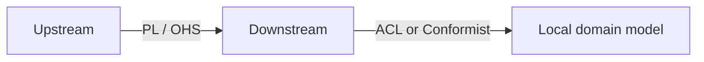

## Correct Interaction Flow


## Document Network

- [architecture-overview.md](./architecture-overview.md)
- [integration-guidelines.md](./integration-guidelines.md)
- [strategic-patterns.md](./strategic-patterns.md)
- [bounded-context-subdomain-template.md](../domain/bounded-context-subdomain-template.md)
- [project-delivery-milestones.md](./project-delivery-milestones.md)
- decisions/0003-context-map.md
- decisions/0005-anti-corruption-layer.md
````

## File: docs/structure/system/integration-guidelines.md
````markdown
# Integration Guidelines

## Boundary Contract

跨主域整合只能使用：

- published language
- public API boundary
- domain / integration events
- local DTO
- downstream ACL 或 downstream Conformist

## Pattern Selection Rules

| Situation | Pattern |
|---|---|
| 下游與上游語義高度一致，且不會扭曲本地語言 | Conformist |
| 上游語義會污染下游本地語言 | Anti-Corruption Layer |
| 只是跨主域資料交換 | Published Language + Local DTO |

## Hard Rules

- ACL 與 Conformist 只能由 downstream 選擇。
- ACL 與 Conformist 互斥。
- 不可直接傳遞上游 entity / aggregate 作為下游正典模型。
- 不可把 shared technical package 誤當成 strategic shared kernel。
- 若需要共同語義，先定 published language，再定 DTO，再評估是否需要 ACL。

## Domain-Specific Guidance

- workspace 消費 iam、billing 或 platform 時，優先保護自己的 membership、sharing、presence 語言。
- notion 消費 iam、billing、ai 或 workspace 時，優先保護自己的 knowledge artifact 與 taxonomy 語言。
- notebooklm 消費 notion、iam、billing 或 ai 時，優先保護自己的 retrieval、grounding、synthesis 語言。
- analytics 消費其他主域時，應以 event projection 與 local read model 為主，不回寫上游 canonical model。

## App Router Boundary Guidance

- App Router path shape 是 composition contract，不是跨主域 published language 的替代品。
- 即使 path 以 `/{accountId}/{workspaceId}` 呈現，platform 與 workspace 之間的語意交換仍必須走 API boundary、published language 或 events。
- shell 內所有 workspace detail href 應優先輸出 canonical `/{accountId}/{workspaceId}`，而不是 `/{accountId}/workspace/{workspaceId}`。
- legacy redirect path 可以短期保留作為 compatibility surface，但文件、設計稿與新程式碼不應再以 legacy path 當作正典契約。
- route redirect、query-state 正規化與 URL composition 屬於 interfaces / app composition concern，不應回滲為 domain rule 或跨主域契約。

## Identifier Boundary Rules

- `accountId` 只用於 shell / composition 層的 account scope，或 account-scoped downstream input；不要把它直接當成 `workspaceId`、`organizationId` 或 `userId`。
- `workspaceId` 只表示協作容器 scope；跨主域 published language 若需要 workspace context，應明確傳遞 `workspaceId`，不要讓 notion / notebooklm 猜測 route segment。
- `organizationId` 只用於 organization-scoped domain 或 integration contract；若某 flow 由 organization account 的 `accountId` 進入，需在 application / mapper 層顯式轉成 `organizationId`。
- `userId` 用於具體使用者欄位，例如 `createdByUserId`、`verifiedByUserId`、`submittedByUserId`、`assignedUserId`；`actorId` 用於行為主體 metadata，不保證一定是 user。
- `ownerId` 表示資源所有者；`tenantId` 表示租戶隔離鍵；兩者都不是 canonical route param。
- `fileId` 是檔案 metadata 主鍵；不能取代 owner / workspace / tenant scope，也不能單獨表示授權邊界。

## Integration Checklist

1. 先確認 upstream / downstream 方向。
2. 先列出 published language。
3. 判斷是否語義一致。
4. 一致則考慮 conformist，不一致則建立 ACL。
5. 避免把 DTO、entity、policy、UI 狀態混成同一層。

## Integration Anti-Patterns

- 直接傳遞上游 aggregate、entity、repository 給下游使用。
- 讓 downstream 省略 published language 與 local DTO，直接貼靠上游內部模型。
- 把 ACL 當成預設樣板卻不判斷是否真的有語義污染。

## Copilot Generation Rules

- 生成程式碼時，先決定 upstream、downstream、published language，再決定 DTO、ACL 或 Conformist。
- 奧卡姆剃刀：若 published language 加 local DTO 已足夠，就不要額外建立雙重 mapper、雙重 ACL 或鏡像 aggregate。
- 只有在上游語義真的會污染本地語言時，才建立 ACL。

## Dependency Direction Flow

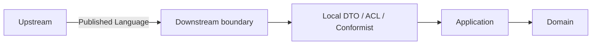

## Correct Interaction Flow

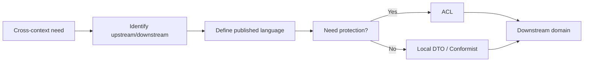

## Document Network

- [context-map.md](./context-map.md)
- [strategic-patterns.md](./strategic-patterns.md)
- [architecture-overview.md](./architecture-overview.md)
- [bounded-context-subdomain-template.md](../domain/bounded-context-subdomain-template.md)
- [project-delivery-milestones.md](./project-delivery-milestones.md)
- decisions/0001-hexagonal-architecture.md
- decisions/0003-context-map.md
- decisions/0005-anti-corruption-layer.md

## Conflict Resolution

- 若某整合指南與 [context-map.md](./context-map.md) 的方向衝突，以 context map 為準。
- 若某整合指南與 decisions/0005-anti-corruption-layer.md 衝突，以 ADR 為準。
````

## File: docs/structure/system/project-delivery-milestones.md
````markdown
# Project Delivery Milestones

本文件在本次任務限制下，僅依 Context7 驗證的 Hexagonal Architecture、DDD、Context Map 與 ADR 參考建立，作為專案從零到交付的里程碑文件，不主張反映現況實作。

## Purpose

這份文件把 architecture-first 的專案交付拆成可檢查的里程碑，讓 Copilot 在規劃與生成程式碼前，先知道應先完成哪些決策、文件與邊界，而不是直接跳進實作。

## Milestone Map

| Milestone | Goal | Outputs | Exit Criteria |
|---|---|---|---|
| M0 Problem Framing | 對齊目標、角色與成功條件 | 問題敘事、交付範圍、名詞初稿 | 團隊知道要解哪一類問題，而不是只知道要寫哪些檔案 |
| M1 Ubiquitous Language | 建立共同語言 | 術語表、命名規則、避免詞彙 | 主要名詞不再互相衝突 |
| M2 Strategic Design | 切出主域、bounded context、subdomain | subdomains、bounded-contexts、context-map 文件 | 所有權、上下游與 published language 有明確方向 |
| M3 Decision Baseline | 記錄架構與整合決策 | ADR / decisions 條目 | 關鍵決策已寫下 context、decision、consequences |
| M4 Module Skeleton | 建立 bounded context 與 subdomain 樹 | 模組骨架、API boundary、docs 入口 | 模組樹能表達邊界，且未洩漏實作依賴 |
| M5 Domain Modeling | 建立聚合、值對象、領域事件與不變條件 | aggregates、domain-events、repositories、domain model | 核心規則可在 domain 層表達，不依賴外部技術 |
| M6 Use Cases And Ports | 定義應用流程與必要 port | use-cases、DTO、必要 ports | application 能協調流程但不重寫 domain 規則 |
| M7 Adapters And Integration | 實作 persistence、external API、UI adapters | infrastructure adapters、interfaces adapters、published language | adapter 只透過 ports 或 public API boundary 協作 |
| M8 Verification And Hardening | 驗證邊界、流程與交付品質 | 測試、lint/build 證據、文件回補 | 核心路徑可驗證，且文件與決策同步 |
| M9 Release Delivery | 完成交付與後續演進入口 | release note、handoff note、下一輪 backlog | 本輪可交付，同時為下一輪演進保留清楚入口 |

## Milestone Rules

- 沒有完成 M1 到 M3 前，不應直接大規模生成 `application/`、`domain/`、`infrastructure/` 實作。
- M4 應先建立邊界與文件，再建立大量程式碼。
- M5 與 M6 是核心，若這兩步不清楚，後續 adapter 與 UI 很容易反向污染 domain。
- M7 的 published language 與 ACL / Conformist 選擇必須由 context map 決定。
- 只要出現關鍵架構選擇、整合分歧或交付取捨，就應補 ADR，而不是把理由埋進 commit 或程式碼裡。

## Delivery Sequence Guidance

1. 先定義語言與邊界，再定義模組樹。
2. 先定義 domain 核心與 use case，再實作 adapter。
3. 先確認 upstream / downstream 關係，再決定 Published Language、ACL 或 Conformist。
4. 先把本輪交付切成最小可交付增量，再決定是否需要新增抽象。

## Legacy Convergence Guidance (Strangler Pattern)

- 既有 outside-in 功能不得一次性推倒重練，必須以單一 use case 為單位收斂。
- 每條 legacy use case 的收斂順序固定為：
1. 定義 use case contract（actor、goal、success scenario、failure branches）。
2. 先重建該 use case 的 domain 模型與不變條件。
3. 由 application 接管流程協調，讓舊入口改走新 use case。
4. 以 ports 隔離 legacy service 或資料模型。
5. 在 infrastructure 實作新 ports，並漸進切換舊 adapter。
6. 新路徑穩定後再移除舊路徑。

- 每次收斂只允許處理一條 use case，避免跨多條流程的大爆炸式重寫。

## Anti-Pattern Rules

- 不得把里程碑順序反過來，先寫大量 adapter 或 UI，再回頭猜 domain。
- 不得以「全面重構」為由跳過 use-case-by-use-case 的漸進式收斂。
- 不得把每個規劃點都升級成 ADR；只有架構上有持續影響的決策才寫 ADR。
- 不得在 M4 就預建所有可能的 port、repository、service 與子域，只為了追求骨架完整。
- 不得跳過 context map 與 published language，直接用另一個 context 的內部模型來省事。
- 不得把 lint 或 build 通過誤當成架構完成的證據。

## Copilot Generation Rules

- 生成程式碼前，先判斷目前需求位於哪個 milestone；不要把 M2 問題當成 M7 問題處理。
- 奧卡姆剃刀：若現有 milestone 產物已足夠支撐下一步，就不要平行開第二套流程或第二份模板。
- 規劃新功能時，先補足缺失的術語、context map 或 ADR，再進入模組骨架與程式碼生成。
- 若任務只需要修正單一 use case，不要回頭擴張整個 bounded context 結構。

## Dependency Direction Flow

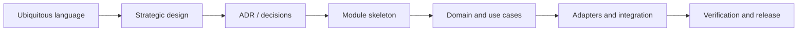

## Correct Interaction Flow

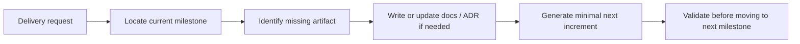

## Document Network

- [README.md](../../README.md)
- [architecture-overview.md](./architecture-overview.md)
- [bounded-contexts.md](../domain/bounded-contexts.md)
- [subdomains.md](../domain/subdomains.md)
- [context-map.md](./context-map.md)
- [integration-guidelines.md](./integration-guidelines.md)
- [bounded-context-subdomain-template.md](../domain/bounded-context-subdomain-template.md)
- decisions/README.md
- decisions/0001-hexagonal-architecture.md
- decisions/0002-bounded-contexts.md
- decisions/0003-context-map.md

## Constraints

- 本里程碑文件是 architecture-first 的交付路線，不代表任何既有 repo 已依此順序演進。
- 里程碑是交付順序指引，不是 waterfall 式一次性階段牆；必要時可以小步迭代，但不可跳過核心決策產物。
- 若需求很小，可以在同一次交付內完成多個相鄰里程碑，但仍需保留對應產物。
````

## File: docs/structure/system/strategic-patterns.md
````markdown
# Strategic Patterns

## Selected Patterns

| Pattern | Usage In This Architecture |
|---|---|
| Bounded Context | 八個主域 / bounded context 與其子域切分的核心模式 |
| Upstream-Downstream | 主域級關係的唯一基線模式 |
| Published Language | 所有跨主域交換的共同語言 |
| Anti-Corruption Layer | downstream 語言需要保護時使用 |
| Conformist | downstream 語言與 upstream 高度一致時的例外策略 |

## Patterns Not Used At Main-Domain Level

| Pattern | Why Not Used |
|---|---|
| Shared Kernel | 主域級共用模型會快速放大耦合與責任混淆 |
| Partnership | 主域級互相綁定會破壞 supplier / consumer 的清楚方向 |

## Recommended Strategic Posture

- platform 作為治理 supplier。
- workspace 作為協作 scope supplier。
- notion 作為知識內容 supplier。
- notebooklm 作為推理輸出與引用整合者。

## Pattern Conflicts Avoided

- 不把 ACL 與 Conformist 混用。
- 不把 Shared Kernel 與 directed relationship 混用。
- 不把 technical shared libraries 混寫成 strategic shared kernel。

## Strategic Anti-Patterns

- 以 shared technical package 取代真正的 bounded context 關係設計。
- 以對稱關係語言掩蓋其實存在的上下游依賴。
- 以實作方便為由，直接共享內部模型而不定 published language。

## Copilot Generation Rules

- 生成程式碼時，先選對戰略模式，再選對技術形狀。
- 奧卡姆剃刀：優先使用最少但足夠的戰略模式，不要同時堆疊多個彼此衝突的模式。
- 若一段整合沒有真正的語義污染，就不要硬加 ACL。

## Dependency Direction Flow

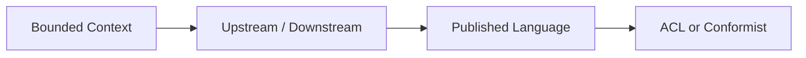

## Correct Interaction Flow

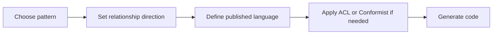

## Document Network

- [architecture-overview.md](./architecture-overview.md)
- [context-map.md](./context-map.md)
- [integration-guidelines.md](./integration-guidelines.md)
- [bounded-context-subdomain-template.md](../domain/bounded-context-subdomain-template.md)
- [project-delivery-milestones.md](./project-delivery-milestones.md)
- decisions/0003-context-map.md
- decisions/0005-anti-corruption-layer.md

## Decision References

- decisions/0001-hexagonal-architecture.md
- decisions/0002-bounded-contexts.md
- decisions/0003-context-map.md
- decisions/0005-anti-corruption-layer.md
````

## File: src/modules/workspace/subdomains/feed/README.md
````markdown
# feed — Workspace Feed Subdomain

每日動態貼文子域。讓工作區成員每天以 IG 風格發布文字與照片動態，未來將擴展為今日任務完成與出勤記錄的整合入口。

## 領域概念

| 概念 | 說明 |
|---|---|
| `FeedPost` | 聚合根。代表一則動態（post / reply / repost）|
| `dateKey` | ISO 日期字串 `YYYY-MM-DD`，用於 Firestore 按日期查詢 |
| `photoUrls` | 附圖 URL 陣列（最多 9 張），指向 Storage 或外部圖片 |
| `FeedPostType` | `post`（一般貼文）· `reply`（回覆）· `repost`（轉貼）|

## 狀態

| 層 | 狀態 |
|---|---|
| Domain | ✅ FeedPost 聚合根（含 photoUrls、dateKey）|
| Application | ✅ CreateFeedPostUseCase、ListFeedPostsUseCase |
| Outbound adapter | ✅ FirestoreFeedRepository（含按日期查詢）|
| Inbound adapter | ✅ feed-actions.ts server actions |
| UI | ✅ WorkspaceDailySection — 每日動態 IG 風格貼文牆 |

## 資料結構（Firestore）

Collection: `feed_posts`

```
{
  id: string (UUID),
  accountId: string,
  workspaceId: string,
  authorAccountId: string,
  type: "post" | "reply" | "repost",
  content: string,
  dateKey: string,       // YYYY-MM-DD — 用於日期過濾索引
  photoUrls: string[],   // Storage URLs，0–9 張
  replyToPostId: string | null,
  repostOfPostId: string | null,
  likeCount: number,
  replyCount: number,
  repostCount: number,
  viewCount: number,
  bookmarkCount: number,
  shareCount: number,
  createdAtISO: string,
  updatedAtISO: string,
}
```

建議 Firestore 複合索引：`(accountId, workspaceId, dateKey)` 以優化每日動態查詢。

## 未來擴展

- 今日任務完成統計（接入 workspace/task 子域）
- 出勤記錄 check-in（接入 workspace/membership 子域）
- 照片實際上傳（整合 platform FileAPI，替換 URL 輸入）
- 點讚 / 回覆互動

## 邊界規則

- `domain/` 不依賴任何外部框架或 Firebase SDK。
- 跨模組消費者只能透過 `workspace/index.ts` 或 server actions 存取。
- 照片上傳涉及所有權與 tenant 隔離時，必須走 platform FileAPI，而非直接呼叫 Storage SDK。
````

## File: src/modules/workspace/subdomains/task-formation/AGENTS.md
````markdown
# task-formation — Agent Guide

## Purpose

`task-formation` 子域負責「從 Notion 知識頁面 AI 提取任務候選，使用者確認後批次建立 Task」的完整流程。

---

## Route Here When

- 實作 AI 提取任務候選的流程（`ExtractTaskCandidatesUseCase`）
- 實作使用者審閱 / 確認候選任務的 UI（`TaskFormationPanel`）
- 修改 `TaskFormationJob` aggregate 行為或生命週期狀態轉換
- 撰寫 Genkit extraction flow（`adapters/outbound/genkit/`）
- 修改 `TaskFormationJobRepository` port 定義
- 建立 task-formation Server Actions

## Route Elsewhere When

| 需求 | 正確路徑 |
|---|---|
| 建立 Task 實體本身 | `src/modules/workspace/subdomains/task/` |
| 知識頁面內容讀取 | `src/modules/notion/index.ts` |
| AI model 選擇 / 安全護欄 | `src/modules/ai/index.ts`（透過 platform 路由）|
| 檔案上傳 / 權限檢查 | `src/modules/platform/index.ts` |
| 任務看板 / issue 追蹤 | `src/modules/workspace/subdomains/task/` 或 `issue/` |

---

## Boundary Rules

1. `domain/` 禁止匯入：React、Firebase SDK、Genkit、`uuid`（用 `@infra/uuid`）
2. `TaskFormationJob` 是唯一 Aggregate Root；狀態轉換只能透過 behavior method
3. AI extraction 結果（`candidates`）必須持久化進 Firestore Job document，不可只存在記憶體
4. 跨到 `task` 子域建立 Task 必須透過 `task` 子域的 use case 邊界，不可直接寫 Firestore
5. `adapters/inbound/` 只呼叫 `application/use-cases/`；不得直接呼叫 domain 實作或 repository
6. Genkit flow 放在 `adapters/outbound/genkit/`；use case 透過 port interface 呼叫，不直接 import flow

---

## ❌ / ✅ 設計範例

### ❌ 禁止這樣做

```typescript
// ❌ inbound adapter 直接呼叫 repository
const repo = new FirestoreTaskFormationJobRepository(db);
const job = await repo.findById(jobId);

// ❌ use case 直接 import Genkit
import { extractTaskCandidatesFlow } from '@genkit-ai/...';

// ❌ aggregate 不儲存 candidates，只存計數
class TaskFormationJob {
  markCompleted(input: { succeededItems: number }): void { /* 候選清單丟失 */ }
}

// ❌ candidates 只存 React state，不持久化
const [candidates, setCandidates] = useState<ExtractedTaskCandidate[]>([]);
```

### ✅ 應該這樣做

```typescript
// ✅ use case 透過 port 呼叫 AI（domain/ports/TaskCandidateExtractorPort.ts）
class ExtractTaskCandidatesUseCase {
  constructor(
    private readonly jobRepo: TaskFormationJobRepository,
    private readonly aiExtractor: TaskCandidateExtractorPort,
  ) {}
}

// ✅ aggregate 儲存候選清單並發出 domain event
class TaskFormationJob {
  setCandidates(candidates: ExtractedTaskCandidate[]): void {
    this._props = { ...this._props, candidates, status: 'succeeded' };
    this._domainEvents.push({
      type: 'workspace.task-formation.candidates-extracted',
      eventId: generateId(),
      occurredAt: new Date().toISOString(),
      payload: { jobId: this._props.id, candidateCount: candidates.length },
    });
  }
}

// ✅ 跨子域透過 use case 邊界建立 Task
class ConfirmCandidatesUseCase {
  constructor(
    private readonly jobRepo: TaskFormationJobRepository,
    private readonly createTask: CreateTaskUseCase,   // task 子域 use case
  ) {}
}
```

---

## 技術選型（Context7 驗證）

| 關注點 | 技術 | 版本 / 模式 |
|---|---|---|
| AI 提取 | Genkit `ai.defineFlow` | Zod `outputSchema` + `z.coerce.number()` for AI numeric strings |
| UI 狀態 | XState v5 `setup()` | `fromPromise<Output, Input>` 雙泛型；machine 放在 `application/machines/` |
| 入口層 | Next.js `useActionState` | `safeParse` + 早期 structured error 回傳 |
| 驗證 | Zod v4 | `z.object()` + `z.iso.datetime()` + `z.coerce.number()` |
| ID 生成 | `@infra/uuid` | 禁止在 domain 層直接 import `uuid` |

---

## 狀態機設計（UI 層）

```
idle ──START──→ extracting ──onDone──→ reviewing ──CONFIRM──→ confirming ──onDone──→ done
               ──onError──→ failed               ──onError──→ reviewing（保留選擇）
reviewing ──CANCEL──→ idle
failed ──RETRY──→ idle
```

XState v5 `setup()` 必填欄位：

```typescript
setup({
  types: {
    context: {} as TaskFormationContext,
    events: {} as TaskFormationEvent,
    input: {} as { workspaceId: string },  // ← input 型別聲明不可省略
  },
  actors: { /* fromPromise actors */ },
})
```

---

## Domain Events（discriminant 格式）

| Event type | 狀態 | 觸發時機 |
|---|---|---|
| `workspace.task-formation.job-created` | ✅ 已實作 | `CreateTaskFormationJobUseCase` 成功 |
| `workspace.task-formation.candidates-extracted` | ⚠️ 待補 | `setCandidates()` 呼叫後 |
| `workspace.task-formation.candidates-confirmed` | ⚠️ 待補 | `ConfirmCandidatesUseCase` 完成 |
| `workspace.task-formation.job-failed` | ⚠️ 待補 | `markFailed()` 呼叫後 |

Event discriminant 格式：`<module>.<subdomain>.<action>`（全 kebab-case）

---

## 現況差距快覽

| 項目 | 現況 | 目標 |
|---|---|---|
| Aggregate 存 candidates | ❌ 只有計數欄位 | ✅ `candidates: ExtractedTaskCandidate[]` + `setCandidates()` |
| `TaskCandidateExtractorPort` | ❌ 不存在 | ✅ `domain/ports/` 新建 |
| AI 提取流程 | ❌ 不存在 | ✅ Genkit flow via port |
| 確認流程 | ❌ 不存在 | ✅ `ConfirmCandidatesUseCase` |
| UI 狀態機 | ❌ 不存在 | ✅ XState v5 machine |
| Server Actions | ❌ inbound 空白 | ✅ `startExtraction` + `confirmCandidates` |

---

## 嚴禁事項

- ❌ 在 `domain/` 或 `application/` 直接 import `defineFlow`、`generate`、Firebase SDK
- ❌ candidates 只存在 React state，不寫回 Firestore Job doc
- ❌ 確認後直接呼叫 `task` 子域 repository（必須走 use case 邊界）
- ❌ `TaskFormationJob` 只存計數，不存候選清單本體
- ❌ `application/machines/` 內的 machine 直接 import Firebase SDK 或 Genkit
- ❌ 在 inbound server action 直接呼叫 Genkit `ai.generate()`
````

## File: src/modules/workspace/subdomains/task-formation/README.md
````markdown
# task-formation 子域

> 狀態：骨架建立，實作進行中（2026-04-18）

## 職責

從 Notion 知識頁面（`KnowledgeArtifact`）中，透過 AI 提取任務候選（`ExtractedTaskCandidate[]`），讓使用者審閱確認後，批次建立正式 `Task` 實體。

**這個子域擁有的：**

- `TaskFormationJob` aggregate（任務形成工作的生命週期）
- AI 提取結果的暫存與狀態（`candidates` 欄位）
- 使用者確認後的批次 Task 建立觸發

**這個子域不擁有的：**

- `KnowledgeArtifact`（屬於 `notion` context）
- `Task` 實體建立（觸發 `task` 子域的 `CreateTaskUseCase`）
- AI provider / model policy（屬於 `ai` context，由 `platform` 路由）

---

## 完整設計流程

```
用戶在 Notion 頁面選取 → 觸發 Server Action
        ↓
CreateTaskFormationJobUseCase  → Firestore（status: queued）
        ↓
ExtractTaskCandidatesUseCase   → TaskCandidateExtractorPort（Genkit Flow）
        ↓ (async, 更新 Job status: queued → running → succeeded/failed)
AI 提取 ExtractedTaskCandidate[]  → setCandidates() 存入 Job.candidates
        ↓
UI（TaskFormationPanel）        → XState machine（reviewing state）
        ↓ 使用者勾選 / 編輯候選任務
ConfirmCandidatesUseCase        → 呼叫 task.CreateTaskUseCase × N
        ↓
CompleteTaskFormationJobUseCase → Firestore（status: succeeded）
```

---

## 生命週期狀態

```
queued → running → succeeded
                 → partially_succeeded
                 → failed
queued → cancelled
```

---

## 現況檔案樹

```
task-formation/
├── README.md                         ← 本文件
├── AGENTS.md                          ← 開發守則
├── domain/
│   ├── index.ts
│   ├── entities/
│   │   └── TaskFormationJob.ts       ← Aggregate Root（⚠️ 需補 candidates 欄位）
│   ├── value-objects/
│   │   ├── TaskFormationJobStatus.ts ← ✅ queued/running/succeeded/partially_succeeded/failed/cancelled
│   │   └── TaskCandidate.ts         ← ✅ ExtractedTaskCandidate 型別定義
│   ├── repositories/
│   │   └── TaskFormationJobRepository.ts  ← ✅ Port 定義
│   └── events/
│       └── TaskFormationDomainEvent.ts    ← ⚠️ 僅 job-created，需補後續事件
├── application/
│   ├── index.ts
│   ├── dto/
│   │   └── TaskFormationDTO.ts           ← ✅ CreateTaskFormationJobSchema（Zod）
│   └── use-cases/
│       └── TaskFormationUseCases.ts      ← ⚠️ 僅 Create + Complete，缺 Extract + Confirm
├── adapters/
│   ├── index.ts
│   ├── inbound/
│   │   └── index.ts                      ← ❌ 空白（export {}）
│   │   ├── server-actions/               ← 待建：startExtraction + confirmCandidates
│   │   └── react/                        ← 待建：TaskFormationPanel（XState）
│   └── outbound/
│       ├── firestore/
│       │   └── FirestoreTaskFormationJobRepository.ts  ← ✅
│       └── genkit/                       ← ❌ 待建：extract-candidates.flow.ts
```

---

## 關鍵缺口（P0）

| # | 缺口 | 位置 |
|---|---|---|
| 1 | `TaskFormationJob` aggregate 不存 candidates | `domain/entities/TaskFormationJob.ts` |
| 2 | 無 AI 提取 Port 定義 | `domain/ports/TaskCandidateExtractorPort.ts`（待建）|
| 3 | 無 `candidates-extracted` domain event | `domain/events/TaskFormationDomainEvent.ts` |
| 4 | 無 `ExtractTaskCandidatesUseCase` | `application/use-cases/TaskFormationUseCases.ts` |
| 5 | 無 Genkit extraction flow adapter | `adapters/outbound/genkit/extract-candidates.flow.ts` |
| 6 | 無 `ConfirmCandidatesUseCase` | `application/use-cases/TaskFormationUseCases.ts` |
| 7 | inbound adapter 完全空白 | `adapters/inbound/` |

---

## 關鍵設計決策

### AI 提取：Genkit `defineFlow` + Zod `outputSchema`

```typescript
// adapters/outbound/genkit/extract-candidates.flow.ts
export const extractTaskCandidatesFlow = ai.defineFlow(
  {
    name: 'task-formation.extractCandidates',
    inputSchema: z.object({
      pageContent: z.string(),
      workspaceContext: z.string(),
    }),
    outputSchema: z.object({
      candidates: z.array(TaskCandidateSchema),
    }),
  },
  async ({ pageContent }) => { /* ... */ }
);
```

- 使用 `z.coerce.number()` 處理 AI 輸出 `confidence` 為字串的情況
- `outputSchema` 與 `generate output.schema` 雙重保護
- AI 結果在進入 use case 前必須通過 Zod `.parse()` 驗證

### UI 狀態：XState v5 `setup()` + `fromPromise`

```typescript
// application/machines/task-formation.machine.ts
export const taskFormationMachine = setup({
  types: {
    context: {} as {
      jobId: string | null;
      candidates: ExtractedTaskCandidate[];
      selectedIds: Set<number>;
      errorMessage: string | null;
    },
    events: {} as
      | { type: 'START'; pageIds: string[] }
      | { type: 'CANDIDATE_TOGGLED'; idx: number }
      | { type: 'CONFIRM_SELECTION' }
      | { type: 'CANCEL' },
    input: {} as { workspaceId: string },
  },
  actors: {
    extractCandidates: fromPromise<ExtractResult, ExtractInput>(
      async ({ input }) => { /* Server Action */ }
    ),
    confirmCandidates: fromPromise<ConfirmResult, ConfirmInput>(
      async ({ input }) => { /* Server Action */ }
    ),
  },
}).createMachine({
  /* idle → extracting → reviewing → confirming → done */
});
```

狀態轉換：

```
idle ──START──→ extracting ──onDone──→ reviewing ──CONFIRM──→ confirming ──onDone──→ done
               ──onError──→ failed               ──onError──→ reviewing（保留選擇）
reviewing ──CANCEL──→ idle
```

### Inbound：Next.js Server Actions + `useActionState`

```typescript
// adapters/inbound/server-actions/task-formation-actions.ts
'use server';
export async function startExtractionAction(
  prevState: ExtractionActionState,
  formData: FormData,
): Promise<ExtractionActionState> {
  const validated = StartExtractionSchema.safeParse({ ... });
  if (!validated.success) return { errors: validated.error.flatten().fieldErrors };
  // ...
}
```

---

## Domain Events（discriminant 格式）

| Event type | 觸發時機 |
|---|---|
| `workspace.task-formation.job-created` | ✅ `CreateTaskFormationJobUseCase` 成功 |
| `workspace.task-formation.candidates-extracted` | ⚠️ 待補：AI 提取完成，candidates 已存入 Job |
| `workspace.task-formation.candidates-confirmed` | ⚠️ 待補：使用者確認選擇，Task 建立觸發 |
| `workspace.task-formation.job-failed` | ⚠️ 待補：任何不可回復錯誤 |

---

## 跨模組依賴

| 依賴方向 | 目標模組 | 用途 | 邊界 |
|---|---|---|---|
| 消費 `notion` | `src/modules/notion/index.ts` | 取得 KnowledgeArtifact 頁面內容 | published language token |
| 消費 `ai`（透過 platform） | `src/modules/platform/index.ts` | Genkit generation flow routing | Service API boundary |
| 觸發 `task` | `src/modules/workspace/subdomains/task/application/` | ConfirmCandidates 後批次建立 Task | use case 邊界 |

---

## 下一步待實作

| 優先 | 工作 | 位置 |
|---|---|---|
| P0 | 補 `TaskFormationJob.candidates` 欄位 + `setCandidates()` 方法 | `domain/entities/TaskFormationJob.ts` |
| P0 | 補 `TaskCandidateExtractorPort` 介面 | `domain/ports/TaskCandidateExtractorPort.ts`（新建）|
| P0 | 補 `candidates-extracted` / `candidates-confirmed` / `job-failed` domain events | `domain/events/TaskFormationDomainEvent.ts` |
| P1 | 建 `ExtractTaskCandidatesUseCase` | `application/use-cases/TaskFormationUseCases.ts` |
| P1 | 建 Genkit `extract-candidates.flow.ts` adapter | `adapters/outbound/genkit/` |
| P2 | 建 `ConfirmCandidatesUseCase` | `application/use-cases/TaskFormationUseCases.ts` |
| P2 | 建 XState `task-formation.machine.ts` | `application/machines/` |
| P3 | 建 Server Actions（start + confirm） | `adapters/inbound/server-actions/` |
| P3 | 建 `TaskFormationPanel` UI（XState `useMachine`） | `adapters/inbound/react/` |
````

## File: docs/examples/end-to-end/deliveries/upload-parse-to-task-flow.md
````markdown
# Upload → Parse → Knowledge Page → Task Flow Delivery

## Delivery Scope

這份 delivery 文件描述跨 context 的完整 handoff 流程，目標是把現有的：

`Upload → Parse → Knowledge Page`

擴充為：

`Upload → Parse → Knowledge Page → Tasks`

且在整個串接過程中維持 platform / notebooklm / notion / workspace 的責任邊界清楚。

## End-to-End Flow

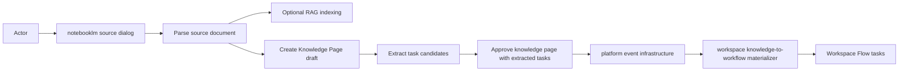

## Responsibility Handoff Table

| Step | Owner | Responsibility | Output |
|---|---|---|---|
| Upload / options | `notebooklm.source.interfaces` | 收集使用者選項與啟動 workflow | processing request |
| Parse | `notebooklm.source.application` + pipeline port | 呼叫解析流程並等待結果 | parsed JSON + page count |
| RAG | `notebooklm.source.application` | 選擇性建立索引 | chunks / vectors |
| Draft page | `notion.knowledge` | 建立正典 Knowledge Page 草稿 | `pageId` |
| Candidate extraction | `workspace.task-formation` public API | 從 parsed blocks 抽取候選任務 | extracted tasks |
| Approval / publish | `notion` + `platform` event infra | 透過公開能力與事件 transport 交接 | approved page event |
| Materialization | `workspace.task-formation` listener | 將 extracted tasks 落地為 workspace tasks | workflow tasks |

## Compliance Rules Applied

1. **Platform owns event transport**
   - 事件基礎設施由 platform server-side composition 建立。
2. **NotebookLM owns orchestration only**
   - notebooklm 不直接寫 task repository。
3. **Notion remains canonical content owner**
   - 任務流程先經過 Knowledge Page，不跳過正典內容邊界。
4. **Workspace owns task materialization**
   - 真正的 task 落地由 workspace.task-formation 處理。
5. **Cross-context collaboration uses public API or events only**
   - 不直接 import 他域的 `domain/` 或 `application/` internals。

## Operational Outcome

交付後，使用者在同一個處理對話框中就能看見：

- 文件解析結果
- RAG 結果
- Knowledge Page 狀態
- 任務流程狀態
- 前往 Knowledge Page 的連結
- 前往 Tasks 的連結

## Validation Evidence

本次交付已通過下列驗證：

- source workflow regression test：passed
- Next.js production build：passed
- lint：0 errors（僅保留 repo 既有 warnings）
- browser load check：passed

## Delivery Summary

這次交付不是新增一條繞路流程，而是把既有的知識頁流程，**向下安全延伸到 workspace 任務流程**，並保留事件驅動與 public API 的合規結構。
````

## File: docs/examples/modules/feature/notebooklm-source-processing-task-flow.md
````markdown
# NotebookLM Source Processing Task Flow

## Purpose

這份 feature 文件描述 `notebooklm/source` 內部的單一 use case：

**上傳文件後，使用者可以在同一個 processing dialog 中選擇：**
- 只做解析
- 解析後建立 RAG 索引
- 解析後建立 Knowledge Page
- 解析後建立 Knowledge Page，並進一步送入任務流程

這一層只回答「這個功能做什麼」，不展開跨 context 的完整交接流程。

## Owning Bounded Context

- **Main Domain**: `notebooklm`
- **Subdomain**: `source`
- **Primary use case**: `ProcessSourceDocumentWorkflowUseCase`

## Business Goal

讓使用者在文件上傳完成後，不需要切換多個頁面或重複操作，就能把同一份來源文件推進到下一個需要的消費場景。

## Actor

- 已登入的 workspace 成員

## Main Success Scenario

1. 使用者上傳文件。
2. 系統呼叫文件解析流程，等待 parse 完成。
3. 使用者可選擇是否建立 RAG 索引。
4. 使用者可選擇是否建立 Knowledge Page。
5. 若使用者勾選「建立任務」，系統會：
   - 先建立 Knowledge Page 作為正典內容承接點；
   - 再從解析文字中抽取 task candidates；
   - 最後把候選任務送入 Workspace Flow。
6. UI 回傳每個 step 的明確狀態與下一步連結。

## Failure Branches

- parse 失敗：RAG / Page / Task 全部跳過。
- 未驗證 Actor：Page 與 Task 不執行。
- draft page 建立失敗：Task 流程停止，不直接跨過 notion 邊界寫入 workspace。
- task extraction 成功但沒有候選項：標記成功，但 `taskCount = 0`。

## Boundary Rules

- `notebooklm/source` **只負責 orchestration**，不直接寫入 workspace repositories。
- 任務流程只能透過 `TaskMaterializationWorkflowPort` 進行。
- `source` 內部只處理 parse / reindex / page handoff / task handoff 的流程狀態，不持有 workflow domain rule。
- 建立任務時，**Knowledge Page 是必要的中介正典載體**；不允許跳過正典內容直接從來源文件去改寫 workspace 任務資料。

## Public User-Facing Output

執行完成後，summary 會回傳：

- parse 狀態
- rag 狀態
- page 狀態
- task 狀態
- `pageHref`
- `workflowHref`
- `taskCount`
- `pageCount`

## Implementation Notes

目前對應的實作重點如下：

- dialog 決策 UI：processing dialog 增加 `shouldCreateTasks`
- application orchestration：`ProcessSourceDocumentWorkflowUseCase`
- task handoff port：`TaskMaterializationWorkflowPort`
- adapter 實作：`TaskMaterializationWorkflowAdapter`

## Guardrails

- 不把 task domain rule 放回 `notebooklm`。
- 不讓 UI 直接呼叫 workspace repository。
- 不讓 notebooklm 直接擁有 canonical task model。
- 不把「建立任務」做成第二條平行且不經 Knowledge Page 的流程。

## Summary

這個 feature 的核心不是「直接建任務」，而是把**同一份 source document**安全地推進到多個下游消費能力，同時維持 `notebooklm → notion / workspace` 的邊界清楚。
````

## File: docs/examples/modules/feature/README.md
````markdown
# Feature Docs

這裡整理單一 bounded context 內的 use case 文件。

重點是說明這個功能做什麼。
並遵循 Hexagonal + DDD 與 semantic-first 的業務語言設計。

## Current Feature Write-ups

- [notebooklm-source-processing-task-flow.md](./notebooklm-source-processing-task-flow.md) — `notebooklm/source` 的 parse / RAG / Knowledge Page / Task Flow 單一功能說明。
- [workspace-nav-notion-notebooklm-implementation-guide.md](./workspace-nav-notion-notebooklm-implementation-guide.md) — Notion & NotebookLM workspace nav tab 三層模型設計與後續實作指南（Data / Behavior / UI）。
- [py-fn-ts-capability-bridge.md](./py-fn-ts-capability-bridge.md) — **gap 分析**：fn 已有的真實能力（parse_document, rag_query callables, Firestore document schema）與 TypeScript `src/modules/notebooklm` 側現有 stubs 的對照，以及三種橋接模式（Firestore 訂閱 / HTTPS Callable / GCS 上傳觸發）與各 tab 的優先實作路徑。
````

## File: docs/README.md
````markdown
# Docs

## Purpose

這份文件集提供八個主域 / bounded context 的 architecture-first 戰略藍圖，並用單一決策日誌與主域文件消除術語、邊界與關係上的衝突。

## Architecture Baseline

本文件網的架構權威基線是：

- Hexagonal Architecture（Ports and Adapters）+ Domain-Driven Design（DDD）
- semantic-first 的 business-language-aligned domain modeling
- Firebase Serverless Backend Architecture：Authentication、Firestore、Cloud Functions、Hosting
- Genkit AI Orchestration Layer：AI Flows、Tool Calling、Prompt Pipelines
- Frontend State Management Layer：Zustand for client state、XState for finite-state workflows
- Schema Validation Layer：Zod for runtime type safety and domain validation

若任務涉及模組分層、runtime 邊界、AI orchestration、frontend state、validation 或 shell route contract，先以 [architecture-overview.md](./structure/system/architecture-overview.md) 為全域敘事權威，再落到對應 context 文件。

## Single Source Of Truth Map

| Document | Role |
|---|---|
| [architecture-overview.md](./structure/system/architecture-overview.md) | 全域架構敘事總覽 |
| [subdomains.md](./structure/domain/subdomains.md) | 八主域與子域總清單 |
| [bounded-contexts.md](./structure/domain/bounded-contexts.md) | 主域與子域所有權地圖 |
| [context-map.md](./structure/system/context-map.md) | 主域間關係圖與方向 |
| [ubiquitous-language.md](./structure/domain/ubiquitous-language.md) | 戰略詞彙表 |
| [integration-guidelines.md](./structure/system/integration-guidelines.md) | 主域整合規則 |
| [strategic-patterns.md](./structure/system/strategic-patterns.md) | 採用與禁用的戰略模式 |
| [hard-rules-consolidated.md](./structure/system/hard-rules-consolidated.md) | 全域硬性守則與 design smell 防線 |
| [bounded-context-subdomain-template.md](./structure/domain/bounded-context-subdomain-template.md) | bounded context 與 subdomain 交付模板 |
| [project-delivery-milestones.md](./structure/system/project-delivery-milestones.md) | 從零到交付的專案里程碑 |
| decisions/README.md | ADR 索引與決策日誌 |
| decisions/SMELL-INDEX.md | Design Smell taxonomy 與對應決策索引 |
| [contexts/_template.md](./structure/contexts/_template.md) | 新主域或新 context 文件樣板 |

## Context Folders

- [contexts/ai/README.md](./structure/contexts/ai/README.md)
- [contexts/analytics/README.md](./structure/contexts/analytics/README.md)
- [contexts/billing/README.md](./structure/contexts/billing/README.md)
- [contexts/iam/README.md](./structure/contexts/iam/README.md)
- [contexts/platform/README.md](./structure/contexts/platform/README.md)
- [contexts/workspace/README.md](./structure/contexts/workspace/README.md)
- [contexts/notion/README.md](./structure/contexts/notion/README.md)
- [contexts/notebooklm/README.md](./structure/contexts/notebooklm/README.md)

## Focused Implementation Docs

- [structure/system/source-to-task-flow.md](./structure/system/source-to-task-flow.md)
- [feature/notebooklm-source-processing-task-flow.md](./examples/modules/feature/notebooklm-source-processing-task-flow.md)
- [deliveries/upload-parse-to-task-flow.md](./examples/end-to-end/deliveries/upload-parse-to-task-flow.md)
- decisions/0012-source-to-task-orchestration.md

## Route Contract Authority

- shell composition 與 canonical account / workspace URL 以 [architecture-overview.md](./structure/system/architecture-overview.md) 為全域權威。
- account scope、`AccountType = "user" | "organization"` 的字串契約，以及 flattened governance route 以 [contexts/platform/README.md](./structure/contexts/platform/README.md) 與 [contexts/platform/ubiquitous-language.md](./structure/contexts/platform/ubiquitous-language.md) 為權威。
- workspace scope 與 canonical workspace detail route 以 [contexts/workspace/README.md](./structure/contexts/workspace/README.md) 與 [contexts/workspace/ubiquitous-language.md](./structure/contexts/workspace/ubiquitous-language.md) 為權威。
- `/{accountId}/workspace/{workspaceId}` 與 `/{accountId}/organization/*` 只作為 legacy redirect surface，不是新文件或新 UI 應引用的 canonical contract。

## Document Network

- [architecture-overview.md](./structure/system/architecture-overview.md)
- [bounded-contexts.md](./structure/domain/bounded-contexts.md)
- [context-map.md](./structure/system/context-map.md)
- [integration-guidelines.md](./structure/system/integration-guidelines.md)
- [strategic-patterns.md](./structure/system/strategic-patterns.md)
- [hard-rules-consolidated.md](./structure/system/hard-rules-consolidated.md)
- [bounded-context-subdomain-template.md](./structure/domain/bounded-context-subdomain-template.md)
- [project-delivery-milestones.md](./structure/system/project-delivery-milestones.md)
- [subdomains.md](./structure/domain/subdomains.md)
- [ubiquitous-language.md](./structure/domain/ubiquitous-language.md)
- decisions/README.md
- decisions/SMELL-INDEX.md
- [contexts/_template.md](./structure/contexts/_template.md)

## Module Layer Map（src 結構）

目前以 `src/modules/` 作為唯一模組實作層：

| 路徑 | 角色 | 結構特徵 | 使用時機 |
|---|---|---|---|
| `src/modules/<context>/` | 主域模組實作（現況） | 以 `subdomains/` 為核心，搭配 `adapters/`、`shared/`、`orchestration/` 與 `index.ts` 公開匯出 | 撰寫與維護所有 use case、adapter、domain entity 與跨子域編排 |

## Top-Level Directory Structure

Repo 根目錄的三個運行時層：

| 目錄 | 角色 |
|---|---|
| `src/` | Next.js App Router + 所有主域模組實作（`src/app/`、`src/modules/`） |
| `packages/` | 共用套件（`infra/*`、`integration-*`、`ui-*`），以 alias 形式被 `src/modules/` 引用 |
| `fn/` | Python Cloud Functions：ingestion、parse、chunk、embed、background worker |

- `packages/` 以 `@infra/*`、`@integration-*`、`@ui-*` alias 被 TypeScript 引用。
- `fn/` 與 Next.js 的互動只透過 QStash 訊息、Firestore trigger 或事件契約；不共用程式碼。

### 路由規則

- 讀取主域邊界與任務路由 → `src/modules/<context>/AGENTS.md`
- 撰寫新實作程式碼 → `src/modules/<context>/`，以 `src/modules/template` 為骨架基線
- 跨主域協作只透過目標主域的公開匯出（`src/modules/<context>/index.ts`）

### 嚴禁混淆

- 不得將已淘汰的 `modules/` 路徑當成現行實作位置。
- 生成程式碼時，目標路徑一律以 `src/modules/` 為準。

## Conflict Resolution Rules

- ADR 與戰略敘事衝突時，以 ADR 為準。
- 戰略文件與主域文件衝突時，先以更具邊界意義的主域文件為準，再回寫戰略文件。
- 子域所有權衝突時，以 [bounded-contexts.md](./structure/domain/bounded-contexts.md) 與 [subdomains.md](./structure/domain/subdomains.md) 為準。
- 關係方向衝突時，以 [context-map.md](./structure/system/context-map.md) 為準。
- 若 root `docs/` 與 `src/modules/*` 的術語命名衝突，以 root `docs/` 的戰略命名與 duplicate resolution 為準。

## Global Anti-Pattern Rules

- 不把 framework、transport、storage、SDK 細節寫進 domain 核心。
- 不把其他主域的內部模型當成自己的正典語言。
- 不把對稱關係與 directed relationship 混寫在同一套戰略文件。
- 不把 gap subdomains 描述成已驗證現況。

## Copilot Generation Rules

- 生成程式碼前，先從本文件決定應讀哪些戰略文件與 context 文件。
- 若任務涉及新 bounded context、subdomain 骨架或交付分期，先讀 [bounded-context-subdomain-template.md](./structure/domain/bounded-context-subdomain-template.md) 與 [project-delivery-milestones.md](./structure/system/project-delivery-milestones.md)。
- 若任務涉及 design smell、架構異味、boundary leakage、cyclic dependency 或 API surface 過胖，先讀 [hard-rules-consolidated.md](./structure/system/hard-rules-consolidated.md)、decisions/SMELL-INDEX.md 與對應編號 smell ADR。
- 奧卡姆剃刀：若現有文件網已能回答邊界問題，就不要再新增臨時規則文件。
- 生成流程應先看 ADR，再看戰略文件，再看主域文件，最後才落到程式碼。

## Dependency Direction Flow

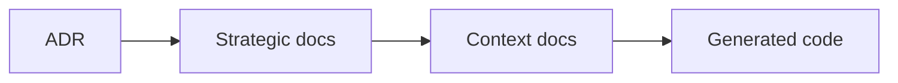

## Correct Interaction Flow

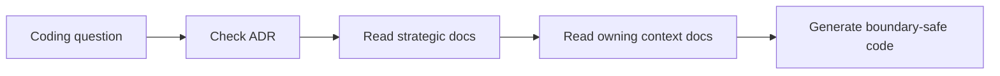

## Constraints

- 本文件集是 Context7-only 的 architecture-first 版本。
- 本文件集沒有檢視任何既有專案內容，因此不應被解讀為 repo-inspected 現況描述。
````

## File: docs/structure/contexts/ai/AGENTS.md
````markdown
# AI Context Agent Guide

## Mission

保護 ai 主域作為共享 AI capability 邊界。任何變更都應維持 ai 擁有 generation、orchestration、distillation、retrieval、safety 與 provider policy 語言，而不是吸收內容正典或推理輸出語義。

## Canonical Ownership

- generation
- orchestration
- distillation
- retrieval
- memory
- context
- safety
- tool-calling
- reasoning
- conversation
- evaluation
- tracing

## Route Here When

- 問題核心是 LLM 呼叫、模型選擇、provider routing。
- 問題需要 prompt 組裝、flow 執行或 tool calling 協調。
- 問題需要將長輸出濃縮（distillation）或進行向量搜尋（retrieval）。
- 問題需要安全護欄、配額或 AI 執行觀測。

## Route Elsewhere When

- 身份與存取治理屬於 iam。
- 訂閱、配額商業政策屬於 billing。
- 正典知識內容屬於 notion。
- 對話推理輸出、grounding、notebook synthesis 屬於 notebooklm。

## Guardrails

- ai 的 distillation 是通用蒸餾能力，不是 notebooklm 的推理輸出語言。
- ai 的 retrieval 是通用向量搜尋能力，不是 notion 的知識查詢正典。
- ai 的 conversation 管理 AI 輪次，不等同 notebooklm 的 Conversation aggregate。
- 下游消費只能透過 `src/modules/ai/index.ts` 公開邊界，不能直接存取 subdomain internals。
- Genkit 與 LLM SDK 只能存在於 infrastructure 層。

## Hard Prohibitions

- 不得讓 domain 或 application 直接依賴 Genkit、Firebase SDK 或框架語言。
- 不得讓其他模組直接 import ai 的 infrastructure 或 subdomain domain 層。
- 不得在 ai 內定義 KnowledgeArtifact、Notebook、Membership 等他域正典型別。

## Copilot Generation Rules

- 生成程式碼時，先確認需求屬於哪個 ai subdomain，再決定 port 定義與 adapter 位置。
- 新能力若已有對應子域，先在該子域擴展，不要新建平行子域。
- 奧卡姆剃刀：若一個 port + use case 就能承接需求，不要再新增 service 或 manager。
- distillation 若只是摘要變體，先確認 generation 子域的 summarize 是否已足夠，再決定是否升級為 distillation use case。

## Dependency Direction Flow

```mermaid
flowchart LR
	I["Interfaces / Driving Adapters"] --> A["Application / Use Cases"]
	A --> D["AI Domain / Ports"]
	P["Ports"] -. used by .-> A
	X["Infrastructure / Adapters"] -. implements .-> P
	X --> D
```

## Correct Interaction Flow

```mermaid
flowchart LR
	IAM["iam upstream"] -->|actor / access| Boundary["ai API boundary"]
	Billing["billing upstream"] -->|entitlement| Boundary
	Boundary --> App["Application orchestration"]
	App --> Generation["generation"]
	App --> Distillation["distillation"]
	App --> Retrieval["retrieval"]
	App --> Safety["safety"]
	Generation --> Output["AI capability signal"]
	Distillation --> Output
	Retrieval --> Output
	Output --> Notion["notion consumer"]
	Output --> NotebookLM["notebooklm consumer"]
```

## Document Network

- [README.md](./README.md)
- [bounded-contexts.md](./bounded-contexts.md)
- [context-map.md](./context-map.md)
- [subdomains.md](./subdomains.md)
- [ubiquitous-language.md](./ubiquitous-language.md)
- [architecture-overview.md](../../system/architecture-overview.md)
````

## File: docs/structure/contexts/ai/bounded-contexts.md
````markdown
# AI Bounded Contexts

## Domain Role

ai 是共享能力 bounded context。它封裝所有 AI 執行能力——從 generation、distillation 到 safety——讓下游主域穩定消費，而不需要了解 LLM provider 細節。

## Baseline Bounded Contexts

| Cluster | Subdomains |
|---|---|
| Core Execution | generation、orchestration、distillation |
| Knowledge Access | retrieval、memory、context |
| Quality & Safety | safety、evaluation、tracing |
| Extended Capability | tool-calling、reasoning、conversation |

## Recommended Gap Bounded Contexts

| Subdomain | Why Needed | Gap If Missing |
|---|---|---|
| provider-routing | 建立模型供應商選擇與路由治理邊界 | 供應商切換邏輯分散於 generation，難以統一管理 |
| model-policy | 建立模型能力、版本與使用政策邊界 | 模型版本更新或限制難以集中決策 |

## Domain Invariants

- generation 是唯一直接呼叫 LLM provider 的子域，其他子域透過 ports 間接使用。
- distillation 輸出的是「精煉知識片段」，不是 KnowledgeArtifact；語義屬於 ai，不屬於 notion。
- memory 若需要長期保存內容，應優先保存 distilled knowledge，而不是無限制保留 raw content。
- retrieval 若存在可選資料來源，應優先索引 distilled chunks 或結構化 knowledge signal。
- evaluation 必須覆蓋 distillation，至少檢查 compression、retention 與 hallucination risk。
- safety 的結果可以終止任何 AI 執行流程。
- orchestration 是執行圖的主控，不直接持有業務資料。
- tracing 只負責觀測與 debug，不得改變執行決策。
- 所有子域的 domain 層必須框架無關。

## Dependency Direction

- ai 子域在存在對應層時遵守 interfaces -> application -> domain <- infrastructure。
- 子域之間透過 ports 或 orchestration application 協調，不直接依賴彼此 domain。
- 外部輸入只能先經 API boundary，再進入 ai 內部執行流程。

## Anti-Patterns

- 讓 generation 子域直接依賴 notion 或 notebooklm 的業務型別。
- 把 distillation 當成 notebooklm synthesis 的 alias，混淆輸出語義。
- 讓下游模組繞過 ai API 邊界，直接 import ai infrastructure。
- 在 ai domain 層 import Genkit、Firebase 或任何 SDK。

## Copilot Generation Rules

- 生成程式碼時，先確認能力屬於哪個 cluster，再決定子域與層。
- 跨子域協調一律交給 orchestration application，不讓子域直接相互呼叫。
- 奧卡姆剃刀：能在現有子域加一個 port + use case 解決，就不要新建子域。

## Dependency Direction Flow

```mermaid
flowchart LR
	I["Interfaces"] --> A["Application"]
	A --> D["Domain / Ports"]
	X["Infrastructure"] -. implements .-> D
```
````

## File: docs/structure/contexts/ai/cross-runtime-contracts.md
````markdown
# AI Context — Cross-Runtime Contracts

**Date**: 2026-04-16  
**Context**: `src/modules/ai` distillation complete. Defines the published-language contracts between Next.js (TypeScript) and fn (Python) workers.

---

## Background

The AI context spans two runtimes:

| Runtime | Role | Owns |
|---|---|---|
| **Next.js** (`src/modules/ai/`) | Orchestration, port contracts, dispatching | `domain/`, `application/`, `adapters/outbound/` (dispatcher side) |
| **fn** (`fn/src/`) | Heavy compute | Parsing, chunking, embedding, vector-write |

Cross-runtime handoff uses **QStash messages**. The payload shape is the shared contract.

---

## Contract Map

### Embedding Job (chunk → embedding dispatch)

| Side | Path | Format |
|---|---|---|
| TypeScript (dispatcher) | `src/modules/ai/subdomains/embedding/adapters/outbound/dto/embedding-job-payload.ts` | Zod schema |
| Python (handler) | `fn/src/application/dto/embedding_job.py` | Pydantic model |

**Fields:**

| Field | TypeScript type | Python type | Description |
|---|---|---|---|
| `jobId` | `string (uuid)` | `UUID4` | Idempotency key |
| `documentId` | `string` | `str` | Source document |
| `workspaceId` | `string` | `str` | Tenant isolation |
| `chunkIds` | `string[]` | `List[str]` | Chunks to embed |
| `modelHint` | `string \| undefined` | `Optional[str]` | Model preference |
| `requestedAt` | `string (datetime)` | `datetime` | ISO 8601 timestamp |

---

### Chunk Job (document → chunking dispatch)

| Side | Path | Format |
|---|---|---|
| TypeScript (dispatcher) | `src/modules/ai/subdomains/chunk/adapters/outbound/dto/chunk-job-payload.ts` | Zod schema |
| Python (handler) | `fn/src/application/dto/chunk_job.py` | Pydantic model |

**Fields:**

| Field | TypeScript type | Python type | Description |
|---|---|---|---|
| `jobId` | `string (uuid)` | `UUID4` | Idempotency key |
| `documentId` | `string` | `str` | Document to chunk |
| `workspaceId` | `string` | `str` | Tenant isolation |
| `sourceType` | `string` | `str` | e.g. `"notion-page"` |
| `strategyHint` | `"fixed-size" \| "semantic" \| "markdown-section" \| undefined` | `Optional[ChunkingStrategy]` | Chunking strategy |
| `maxTokensPerChunk` | `number \| undefined` | `Optional[int]` | Token limit per chunk |
| `requestedAt` | `string (datetime)` | `datetime` | ISO 8601 timestamp |

---

## Flow Diagram

```
Next.js (src/modules/ai adapters/outbound/)
  → serialize payload using Zod schema
  → publish QStash message
  ↓
fn (interface/handlers/)
  → receive QStash webhook
  → parse with Pydantic model (validation gate)
  → application use-case
  → infrastructure (OpenAI, Upstash Vector, Firestore)
```

---

## Contract Governance Rules

1. **Both sides must be updated together** when the payload shape changes.
2. **Adding optional fields** is backward-compatible; adding required fields is a breaking change.
3. **Field names** use camelCase in TypeScript, snake_case in Python (Pydantic auto-aliases via `model_config`).
4. **The TypeScript schema is the source of truth**; the Python model is the mirror.
5. **Never put AI provider config** (model name, API key) in the payload — those belong in fn's `infrastructure/external/`.

---

## Existing fn Firestore Trigger Contracts

These are separate from QStash and are defined by Firestore document structure:

| Trigger | Handler | Document path |
|---|---|---|
| New file uploaded | `fn/src/interface/handlers/parse_document.py` | `workspaces/{wid}/files/{fid}` |
| Re-index request | `fn/src/interface/handlers/rag_reindex_handler.py` | `workspaces/{wid}/reindex_requests/{rid}` |

Firestore document schema for these is owned by `src/modules/platform/subdomains/file-storage/` (TypeScript) and mirrored in `fn/src/infrastructure/persistence/firestore/`.
````

## File: docs/structure/contexts/analytics/README.md
````markdown
# Analytics Context

本 README 在本次重切作業下，定義 analytics 作為下游 read-model 主域的邊界。

## Purpose

analytics 是報表、指標與儀表板主域。它主要消費其他主域的事件、usage signal 與 projection input，形成可查詢的分析視圖。

## Context Summary

| Aspect | Summary |
|---|---|
| Primary Role | reporting、metrics、dashboard、projection |
| Upstream Dependency | iam、billing、platform、workspace、notion、notebooklm 的事件與訊號 |
| Downstream Consumers | 產品與營運分析使用者 |
| Core Principle | analytics 是下游投影，不反向成為 canonical owner |

## Document Network

- [AGENTS.md](./AGENTS.md)
- [bounded-contexts.md](./bounded-contexts.md)
- [context-map.md](./context-map.md)
- [subdomains.md](./subdomains.md)
- [ubiquitous-language.md](./ubiquitous-language.md)
- [README.md](../../../README.md)
- [architecture-overview.md](../../system/architecture-overview.md)
- [integration-guidelines.md](../../system/integration-guidelines.md)
````

## File: docs/structure/contexts/billing/README.md
````markdown
# Billing Context

本 README 在本次重切作業下，定義 commercial lifecycle 的主域邊界。

## Purpose

billing 是商業與權益治理主域。它負責 billing event、subscription、entitlement 與 referral，為 workspace、notion、notebooklm 等主域提供 capability signal。

## Context Summary

| Aspect | Summary |
|---|---|
| Primary Role | 商業生命週期與有效權益解算 |
| Upstream Dependency | iam 的 actor、tenant、access policy |
| Downstream Consumers | workspace、notion、notebooklm |
| Core Principle | 提供商業能力訊號，不接管內容或協作正典 |

## Document Network

- [AGENTS.md](./AGENTS.md)
- [bounded-contexts.md](./bounded-contexts.md)
- [context-map.md](./context-map.md)
- [subdomains.md](./subdomains.md)
- [ubiquitous-language.md](./ubiquitous-language.md)
- [README.md](../../../README.md)
- [architecture-overview.md](../../system/architecture-overview.md)
- [integration-guidelines.md](../../system/integration-guidelines.md)
````

## File: docs/structure/contexts/iam/README.md
````markdown
# IAM Context

本 README 在本次重切作業下，定義 identity and access management 的主域邊界。

## Purpose

iam 是身份、驗證、授權、federation、session、租戶與存取治理主域。它提供 actor、identity、tenant、access decision 與 security policy 語言，作為其他主域的治理上游。

## Context Summary

| Aspect | Summary |
|---|---|
| Primary Role | 身份、租戶與 access governance（含 account、organization） |
| Upstream Dependency | 無主域級上游 |
| Downstream Consumers | billing、platform、workspace、notion、notebooklm |
| Core Principle | 提供治理判定，不接管商業、內容或推理正典 |

## Baseline Subdomains

- identity
- access-control
- tenant
- security-policy
- account（含 account-profile，從 platform 遷入）
- organization（含 team，從 platform 遷入）

## Recommended Gap Subdomains

- session
- consent
- secret-governance

## Document Network

- [AGENTS.md](./AGENTS.md)
- [bounded-contexts.md](./bounded-contexts.md)
- [context-map.md](./context-map.md)
- [subdomains.md](./subdomains.md)
- [ubiquitous-language.md](./ubiquitous-language.md)
- [README.md](../../../README.md)
- [architecture-overview.md](../../system/architecture-overview.md)
- [integration-guidelines.md](../../system/integration-guidelines.md)
````

## File: docs/structure/contexts/notebooklm/AGENTS.md
````markdown
# NotebookLM Agent

本文件在本次任務限制下，僅依 Context7 驗證的 DDD、Context Map、Hexagonal Architecture 參考整理，不主張反映現況實作。

## Mission

保護 notebooklm 主域作為對話、來源處理、檢索、grounding 與 synthesis 邊界。任何變更都應維持 notebooklm 擁有衍生推理流程與可追溯輸出，而不是直接擁有正典知識內容。

## Canonical Ownership

- source
- notebook
- conversation
- synthesis (owns retrieval, grounding, generation, evaluation as internal facets)

## Route Here When

- 問題核心是 notebook、conversation、source ingestion、synthesis（retrieval、grounding、generation、evaluation）。
- 問題需要處理引用對齊、來源可追溯、模型輸出品質或衍生筆記。
- 問題要把知識來源轉成可對話與可綜合的推理材料。

## Route Elsewhere When

- 正典知識頁面、內容分類、正式發布屬於 notion。
- 身份、授權與 tenant 治理屬於 iam；權益屬於 billing；憑證與營運服務屬於 platform。
- 共享 AI provider、模型政策、配額與安全護欄屬於 ai context。
- 工作區生命週期、共享與存在感屬於 workspace。

## Guardrails

- notebooklm 的輸出是衍生產物，不直接等於正典知識內容。
- synthesis 將 retrieval、grounding、generation、evaluation 作為內部 facets；只有當語言分歧或演化速率不同時才拆分為獨立子域。
- evaluation 應作為品質與回歸語言，而不只是分析儀表板指標。
- 跨主域互動只經過 published language、API 邊界或事件。

## Dependency Direction

- notebooklm 內部依賴方向固定為 interfaces -> application -> domain <- infrastructure。
- application 只能透過 ports 協調 synthesis 所需的外部能力。
- infrastructure 只實作 ports 與邊界轉譯，不反向定義 domain 語言。

## Hard Prohibitions

- 不得把 notion 的 KnowledgeArtifact 直接當成 notebooklm 的本地主域模型。
- 不得讓 domain 或 application 直接依賴模型 SDK、向量儲存或外部檔案處理框架。
- 不得讓 notebooklm 直接改寫 workspace 或 notion 的內部狀態，而繞過其 API 邊界。
- 不得建立獨立的 `ai` 子域與 ai context 語義重疊。

## Copilot Generation Rules

- 生成程式碼時，先維持 notebooklm 作為 downstream 推理主域，不回推治理或正典內容所有權。
- 共享模型能力若已由 ai context 提供，就不要在 notebooklm 再建立第二個 generic `ai` 子域。
- 奧卡姆剃刀：若較少的抽象已能保護邊界，就不要額外新增 port、ACL、DTO、subdomain 或 process manager。
- 只有碰到外部依賴、語義污染或跨主域轉譯時，才建立 port、ACL 或 local DTO。
- 任何跨主域互動都先走 API boundary / published language，再轉成本地主域語言。

## Dependency Direction Flow

```mermaid
flowchart LR
	I["Interfaces / Driving Adapters"] --> A["Application / Orchestration"]
	A --> D["NotebookLM Domain / Invariants"]
	P["Ports / Domain-fit Contracts"] -. used by .-> A
	X["Infrastructure / Driven Adapters"] -. implements .-> P
	X --> D
```

## Correct Interaction Flow

```mermaid
flowchart LR
	Platform["platform upstream"] -->|Published Language| Boundary["notebooklm API boundary"]
	Workspace["workspace upstream"] -->|Published Language| Boundary
	Notion["notion upstream"] -->|Published Language| Boundary
	Boundary --> Translation["Local DTO / ACL when needed"]
	Translation --> App["Application orchestration"]
	App --> Domain["Conversation / Source / Synthesis pipeline"]
	Domain --> Output["Grounded output / evaluation"]
```

## Document Network

- [README.md](./README.md)
- [bounded-contexts.md](./bounded-contexts.md)
- [context-map.md](./context-map.md)
- [subdomains.md](./subdomains.md)
- [ubiquitous-language.md](./ubiquitous-language.md)
- [architecture-overview.md](../../system/architecture-overview.md)
- [integration-guidelines.md](../../system/integration-guidelines.md)
````

## File: docs/structure/contexts/notebooklm/context-map.md
````markdown
# NotebookLM

本文件在本次任務限制下，僅依 Context7 驗證的 DDD、Context Map、Hexagonal Architecture 參考整理，不主張反映現況實作。

## Context Role

notebooklm 消費 workspace scope、iam 治理、billing capability、ai signal 與 notion 內容來源，並輸出可追溯的對話、洞察與 synthesis。依 Context Mapper 思維，它是多個上游語言的下游整合者，但仍需維持自己的對話與推理邊界。

## Relationships

| Related Domain | Relationship Type | NotebookLM Position | Published Language |
|---|---|---|---|
| iam | Upstream/Downstream | downstream | actor reference、tenant scope、access decision |
| billing | Upstream/Downstream | downstream | entitlement signal、subscription capability signal |
| ai | Upstream/Downstream | downstream | ai capability signal、model policy、safety result |
| workspace | Upstream/Downstream | downstream | workspaceId、membership scope、share scope |
| notion | Upstream/Downstream | downstream | knowledge artifact reference、attachment reference、taxonomy hint |

## Mapping Rules

- notebooklm 依賴 iam、billing、ai 的結果，但不重建 actor、policy 或 secret 模型。
- notebooklm 可消費 ai context 作為共享模型能力，但不擁有 provider / policy 所有權。
- notebooklm 在 workspace scope 內運作，但不定義 workspace 生命周期或 sharing 規則。
- notion 是 notebooklm 的重要 source supplier，notebooklm 不能反向直接改寫 notion 正典內容。
- synthesis、grounding、evaluation 是 notebooklm 對外輸出的核心能力語言。

## Dependency Direction

- notebooklm 只作為 platform、workspace、notion 的 downstream consumer，不反向宣稱治理或正典內容所有權。
- ACL 或 Conformist 只能由 notebooklm 這個 downstream 端選擇，不能回推到上游。
- 跨主域資料進入 notebooklm 時，先落在 published language 或 local DTO，再進入本地主域語言。

## Anti-Patterns

- 把 notebooklm 寫成 notion 或 workspace 的上游治理來源。
- 在同一主域關係上同時聲稱 ACL 與 Conformist。
- 直接共享 notebook、source 或 conversation 的內部模型給其他主域使用。

## Copilot Generation Rules

- 生成程式碼時，先維持 notebooklm 對 platform、workspace、notion 的 downstream 位置，再安排轉譯層。
- 奧卡姆剃刀：若 published language 加一層 local DTO 已足夠，就不要額外發明第二層 mapper 或雙重 ACL。
- 上游只提供 published language；本地主域保護由 downstream 完成。

## Dependency Direction Flow

```mermaid
flowchart LR
	Upstream["Upstream contexts"] -->|Published Language| Boundary["notebooklm boundary"]
	Boundary --> Translation["Local DTO / ACL if needed"]
	Translation --> App["Application"]
	App --> Domain["Domain"]
```

## Correct Interaction Flow

```mermaid
flowchart LR
	IAM["iam"] -->|actor / tenant / access| Boundary["notebooklm API boundary"]
	Billing["billing"] -->|entitlement| Boundary
	AI["ai"] -->|capability / policy / safety| Boundary
	Workspace["workspace"] -->|workspace scope| Boundary
	Notion["notion"] -->|knowledge references| Boundary
	Boundary --> ACL["ACL or local DTO"]
	ACL --> Domain["NotebookLM domain"]
	Domain --> Result["Grounded synthesis / conversation output"]
```

## Document Network

- [README.md](./README.md)
- [AGENTS.md](./AGENTS.md)
- [bounded-contexts.md](./bounded-contexts.md)
- [subdomains.md](./subdomains.md)
- [context-map.md](../../system/context-map.md)
- [integration-guidelines.md](../../system/integration-guidelines.md)
- [strategic-patterns.md](../../system/strategic-patterns.md)
````

## File: docs/structure/contexts/notebooklm/subdomains.md
````markdown
# NotebookLM

本文件在本次任務限制下，僅依 Context7 驗證的 DDD、Context Map、Hexagonal Architecture 參考整理，不主張反映現況實作。

## Baseline Subdomains

| Subdomain | Responsibility |
|---|---|
| conversation | 對話 Thread 與 Message 生命週期 |
| note | 輕量筆記與知識連結 |
| notebook | Notebook 組合與管理 |
| source | 來源文件追蹤、引用與 ingestion 編排 |
| synthesis | 完整 RAG pipeline：retrieval、grounding、answer generation、evaluation/feedback |
| conversation-versioning | 對話版本與快照策略 |

## Future Split Triggers

`synthesis` 子域將 retrieval、grounding、generation、evaluation 作為內部 facets。只有當以下觸發條件成立時，才拆分為獨立子域：

| Facet | Split Trigger |
|---|---|
| retrieval | 策略複雜到需要獨立領域模型（多重排序、hybrid search） |
| grounding | 引用追溯需要獨立聚合根（citation chains、evidence alignment） |
| generation | 生成策略需要獨立 use case 群（多模態、多來源融合） |
| evaluation | 品質語言需要獨立指標模型（回歸測試、benchmark suite） |

## Anti-Patterns

- 不把 retrieval 與 grounding 併回 source 或 ai context 接入層，否則推理鏈條失去清楚邊界。
- 不把 evaluation 只當成 dashboard 指標，否則品質語言無法成為可演化的關注點。
- 不把 notebook、conversation 混成單一 UI 容器語意，否則無法維持聚合邊界。
- 不把 ai context 的共享能力誤寫成 notebooklm 自己擁有的 `ai` 子域。
- 不過早拆分子域：只有當語言分歧或演化速率不同時才拆分。

## Copilot Generation Rules

- 生成程式碼時，先問新需求落在哪個既有子域；只有既有子域無法容納時才建立新子域。
- 模型 provider、配額與安全護欄優先歸 ai context；notebooklm 在 synthesis 保留 pipeline 本地語義。
- 奧卡姆剃刀：能在既有子域用一個明確 use case 解決，就不要新增第二個平行子域。
- 子域命名應反映責任與語義，不應只是頁面名稱或工具名稱。

## Dependency Direction Flow

```mermaid
flowchart LR
	UI["Interfaces"] --> UseCase["Use case"]
	UseCase --> Subdomain["Owning subdomain domain"]
	Infra["Infra adapter"] --> Subdomain
```

## Correct Interaction Flow

```mermaid
flowchart LR
	Source["Source ingestion"] --> Retrieval["Retrieval"]
	Retrieval --> Grounding["Grounding"]
	Grounding --> Generation["Generation"]
	Generation --> Evaluation["Evaluation"]
```

## Document Network

- [README.md](./README.md)
- [bounded-contexts.md](./bounded-contexts.md)
- [context-map.md](./context-map.md)
- [ubiquitous-language.md](./ubiquitous-language.md)
- [subdomains.md](../../domain/subdomains.md)
- [bounded-contexts.md](../../domain/bounded-contexts.md)
````

## File: docs/structure/contexts/notebooklm/ubiquitous-language.md
````markdown
# NotebookLM

本文件在本次任務限制下，僅依 Context7 驗證的 DDD、Context Map、Hexagonal Architecture 參考整理，不主張反映現況實作。

## Canonical Terms

| Term | Meaning |
|---|---|
| Notebook | 聚合對話、來源與衍生筆記的工作單位 |
| Conversation | Notebook 內的對話執行邊界 |
| Message | 一則輸入或輸出對話項 |
| Source | 被引用與推理的來源材料 |
| Ingestion | 來源匯入、正規化與前處理流程 |
| Retrieval | 從來源中召回候選片段的查詢能力 |
| Grounding | 把輸出對齊到來源證據的能力 |
| Citation | 輸出指回來源證據的引用關係 |
| Synthesis | 綜合多來源後生成的衍生輸出 |
| Note | 與 Notebook 關聯的輕量摘記 |
| Evaluation | 對輸出品質、回歸結果與效果的評估 |
| VersionSnapshot | 對話或 Notebook 某一時點的不可變快照 |

## Language Rules

- 使用 Conversation，不使用 Chat 作為正典語彙。
- 使用 Ingestion 與 Source 區分來源處理與來源語義。
- 使用 Retrieval 與 Grounding 區分召回能力與證據對齊能力。
- 使用 Synthesis 表示衍生綜合輸出，不把它直接稱為正典知識內容。
- 使用 Evaluation 表示品質語言，不用 Analytics 混稱模型效果。

## Avoid

| Avoid | Use Instead |
|---|---|
| Chat | Conversation |
| File Import | Ingestion |
| Search Step | Retrieval |
| Verified Answer | Grounded Synthesis |

## Naming Anti-Patterns

- 不用 Chat 混稱 Conversation 與 Notebook。
- 不用 Search 混稱 Retrieval 與 Grounding。
- 不用 Knowledge 或 Wiki 混稱 Synthesis 輸出，避免污染 notion 的正典語言。

## Copilot Generation Rules

- 生成程式碼時，名稱先對齊 Notebook、Conversation、Retrieval、Grounding、Synthesis、Evaluation，再決定型別與模組位置。
- 奧卡姆剃刀：若一個名詞已能準確表達語義，就不要再疊加第二個近義抽象名稱。
- 命名要先保護邊界，再追求實作便利。

## Dependency Direction Flow

```mermaid
flowchart LR
	Strategic["Strategic language"] --> Context["NotebookLM language"]
	Context --> API["Published language / API boundary"]
	API --> Code["Generated code"]
```

## Correct Interaction Flow

```mermaid
flowchart LR
	Source["Source"] --> Ingestion["Ingestion"]
	Ingestion --> Retrieval["Retrieval"]
	Retrieval --> Grounding["Grounding"]
	Grounding --> Synthesis["Synthesis"]
	Synthesis --> Evaluation["Evaluation"]
```

## Domain Layer Flow (enforced per subdomain)

```mermaid
flowchart LR
  Domain["domain/ (aggregates, entities, ports/)"]
  Application["application/ (use-cases, dtos)"]
  Ports["domain/ports/ (IXxxPort interfaces)"]
  Infrastructure["infrastructure/ (adapters, firebase, composition root)"]
  Interfaces["interfaces/ (actions, queries, components)"]

  Domain --> Application
  Application --> Ports
  Ports --> Infrastructure
  Infrastructure --> Interfaces
```

## Document Network

- [README.md](./README.md)
- [AGENTS.md](./AGENTS.md)
- [subdomains.md](./subdomains.md)
- [bounded-contexts.md](./bounded-contexts.md)
- [ubiquitous-language.md](../../domain/ubiquitous-language.md)
````

## File: docs/structure/contexts/notion/AGENTS.md
````markdown
# Notion Agent

本文件在本次任務限制下，僅依 Context7 驗證的 DDD、Context Map、Hexagonal Architecture 參考整理，不主張反映現況實作。

## Mission

保護 notion 主域作為知識內容生命週期邊界。任何變更都應維持 notion 擁有內容建立、分類、關聯、協作、模板、發布與版本化語言，而不是吸收平台治理或對話推理語言。

## Canonical Ownership

**戰略語言（DDD strategic vocabulary）：**
- knowledge（頁面知識語義，實作層整合至 page）
- authoring（文章建立與驗證）
- collaboration（協作評論與共編）
- database（結構化知識庫，原 knowledge-database）
- taxonomy（分類法與語義組織，整合至 page / database metadata）
- relations（關聯與 backlink，以 view 承接呈現）
- knowledge-engagement（知識使用行為量測）
- attachments（附件與媒體關聯儲存）
- automation（知識事件觸發自動化）
- external-knowledge-sync（外部系統雙向整合）
- notes（個人輕量筆記）
- templates（頁面模板管理）
- publishing（正式發布與對外交付）
- knowledge-versioning（全域版本快照策略）

**實作層子域（`src/modules/notion/` 目錄名稱）：**
- `page` — 頁面文件創作、版本、knowledge 語義整合
- `block` — 頁面內容區塊
- `database` — 結構化知識庫（含 taxonomy/relations 的 metadata 維度）
- `view` — database 多視圖、篩選、排序（含 relations 呈現）
- `collaboration` — 協作評論、共編
- `template` — 模板管理

## Route Here When

- 問題核心是知識頁面、文章、內容結構、分類、關聯、模板與發布。
- 問題需要把輸入吸收成正式知識內容的正典狀態。
- 問題需要定義內容版本、內容協作與內容交付。

## Route Elsewhere When

- 身份、租戶與授權治理屬於 iam；權益屬於 billing；憑證與營運服務屬於 platform。
- 共享 AI provider、模型政策、配額與安全護欄屬於 ai context。
- 工作區生命週期、共享、存在感與工作區流程屬於 workspace。
- notebook、conversation、retrieval、grounding、synthesis 屬於 notebooklm。

## Guardrails

- notion 的正典內容不等於 notebooklm 的衍生輸出。
- taxonomy 與 relations 應作為內容語義邊界，而不是 UI 功能附屬物。
- publishing 應與 authoring 分離，避免編輯語意與交付語意混用。
- notion 可以消費 ai context，但不擁有 AI provider / policy 的正典邊界。
- attachments 是內容資產語言，不是平台 secret 或一般檔案暫存語言。
- 跨主域互動只經過 published language、API 邊界或事件。

## Dependency Direction

- notion 內部依賴方向固定為 interfaces -> application -> domain <- infrastructure。
- authoring、knowledge、database、publishing 對外部能力的依賴只能透過 ports 進入核心。
- infrastructure 只負責儲存、傳輸、ACL 轉譯，不定義 KnowledgeArtifact 的正典語義。

## Hard Prohibitions

- 不得讓 notebooklm 的 Conversation、Synthesis 直接滲入 notion 作為正典內容模型。
- 不得讓 domain 或 application 直接依賴 UI、HTTP、資料庫 SDK 或框架語言。
- 不得讓 notion 直接接管 iam 的 actor、tenant、access 或 billing 的 entitlement 治理責任。

## Copilot Generation Rules

- 生成程式碼時，先保留 notion 作為正典內容主域，不讓治理或推理語言滲入核心。
- 內容輔助若只是支援 knowledge / authoring / publishing use case，先消費 ai context，而不是在 notion 內重建 generic `ai` 子域。
- 奧卡姆剃刀：若一個既有內容子域與一條清楚 use case 就能承接需求，不要再新增額外 service、mapper 或子域。
- 只有在外部依賴或跨主域語義污染出現時，才建立 port、ACL 或 local DTO。
- 對 notebooklm 或 workspace 的互動一律先經 published language / API boundary，再進入 notion 語言。

## Dependency Direction Flow

```mermaid
flowchart LR
	I["Interfaces / Driving Adapters"] --> A["Application / Orchestration"]
	A --> D["Notion Domain / Invariants"]
	P["Ports / Domain-fit Contracts"] -. used by .-> A
	X["Infrastructure / Driven Adapters"] -. implements .-> P
	X --> D
```

## Correct Interaction Flow

```mermaid
flowchart LR
	Platform["platform upstream"] -->|Published Language| Boundary["notion API boundary"]
	Workspace["workspace upstream"] -->|Published Language| Boundary
	Boundary --> Translation["Local DTO / ACL when needed"]
	Translation --> App["Application orchestration"]
	App --> Domain["Knowledge / Authoring / Relations / Publishing"]
	Domain --> Output["KnowledgeArtifact / Publication / Reference"]
	Output --> NotebookLM["notebooklm downstream"]
```

## Document Network

- [README.md](./README.md)
- [bounded-contexts.md](./bounded-contexts.md)
- [context-map.md](./context-map.md)
- [subdomains.md](./subdomains.md)
- [ubiquitous-language.md](./ubiquitous-language.md)
- [architecture-overview.md](../../system/architecture-overview.md)
- [integration-guidelines.md](../../system/integration-guidelines.md)
````

## File: docs/structure/contexts/notion/context-map.md
````markdown
# Notion

本文件在本次任務限制下，僅依 Context7 驗證的 DDD、Context Map、Hexagonal Architecture 參考整理，不主張反映現況實作。

## Context Role

notion 對其他主域提供知識內容語言。依 Context Mapper 的 context map 思維，它消費 workspace scope、iam 治理、billing capability 與 ai signal，並向 notebooklm 提供可被引用的知識內容來源。

## Relationships

| Related Domain | Relationship Type | Notion Position | Published Language |
|---|---|---|---|
| iam | Upstream/Downstream | downstream | actor reference、tenant scope、access decision |
| billing | Upstream/Downstream | downstream | entitlement signal、subscription capability signal |
| ai | Upstream/Downstream | downstream | ai capability signal、model policy、safety result |
| workspace | Upstream/Downstream | downstream | workspaceId、membership scope、share scope |
| notebooklm | Upstream/Downstream | upstream | knowledge artifact reference、attachment reference、taxonomy hint |

## Mapping Rules

- notion 消費 iam、billing、ai 的結果，但不重建 actor、tenant、policy 模型。
- notion 可消費 ai context 來支援內容 use case，但不擁有 AI provider / policy 所有權。
- notion 在 workspace scope 中運作，但不反向定義 workspace 生命週期。
- notebooklm 可以消費 notion 的知識來源，但不得直接重寫 notion 正典內容。
- publishing 是 notion 對外輸出正式內容狀態的邊界。

## Dependency Direction

- notion 對 platform、workspace 屬 downstream；對 notebooklm 屬 upstream 的內容 supplier。
- ACL 或 Conformist 只能由 notion 作為 downstream 時選擇，不能要求上游替 notion 保護語言。
- notion 對 notebooklm 輸出的是 published language，不是內部 aggregate 或 workflow 細節。

## Anti-Patterns

- 把 notion 與 notebooklm 寫成對稱 Shared Kernel，同時又要求 ACL。
- 讓 notebooklm 直接回寫 notion 正典內容而不經 notion 邊界。
- 把 workspace scope 語言錯寫成 notion 自己擁有的容器生命週期語言。

## Copilot Generation Rules

- 生成程式碼時，先保留 notion 對 platform、workspace 的 downstream 位置與對 notebooklm 的 upstream 位置。
- 奧卡姆剃刀：若 published language 加一層 local DTO 已足夠，就不要再建立第二個平行翻譯管線。
- notion 向外提供的是內容語言，不是內部 aggregate、repository 或 UI projection。

## Dependency Direction Flow

```mermaid
flowchart LR
	Upstream["platform / workspace upstream"] -->|Published Language| Boundary["notion boundary"]
	Boundary --> Translation["Local DTO / ACL if needed"]
	Translation --> App["Application"]
	App --> Domain["Domain"]
	Domain --> PL["Published content language"]
```

## Correct Interaction Flow

```mermaid
flowchart LR
	IAM["iam"] -->|actor / tenant / access| Boundary["notion API boundary"]
	Billing["billing"] -->|entitlement| Boundary
	AI["ai"] -->|capability / policy / safety| Boundary
	Workspace["workspace"] -->|workspace scope| Boundary
	Boundary --> ACL["ACL or local DTO"]
	ACL --> Domain["Notion domain"]
	Domain --> Publication["Publication / KnowledgeArtifact reference"]
	Publication --> NotebookLM["notebooklm"]
```

## Document Network

- [README.md](./README.md)
- [AGENTS.md](./AGENTS.md)
- [bounded-contexts.md](./bounded-contexts.md)
- [subdomains.md](./subdomains.md)
- [context-map.md](../../system/context-map.md)
- [integration-guidelines.md](../../system/integration-guidelines.md)
- [strategic-patterns.md](../../system/strategic-patterns.md)
````

## File: docs/structure/contexts/notion/README.md
````markdown
# Notion Context

本 README 在本次任務限制下，僅依 Context7 驗證的 DDD、Context Map、Hexagonal Architecture 參考重建，不主張反映現況實作。

## Purpose

notion 是知識內容生命週期主域。它的責任是提供 knowledge artifact、authoring、database、taxonomy、relations、templates、publishing、knowledge-versioning 與 collaboration 等內容語言，承接正式知識內容的正典狀態。

## Why This Context Exists

- 把知識內容正典與平台治理、工作區範疇、對話推理分離。
- 讓內容建立、分類、關聯、交付與版本規則維持在同一個主域。
- 提供 notebooklm 可引用、但不可直接改寫的知識來源。

## Context Summary

| Aspect | Summary |
|---|---|
| Primary Role | 正典知識內容生命週期 |
| Upstream Dependency | iam 治理、billing entitlement、ai capability、workspace scope |
| Downstream Consumer | notebooklm |
| Core Principle | notion 擁有正式內容，不擁有治理、商業或推理過程 |

## Baseline Subdomains

- knowledge
- authoring
- collaboration
- database
- knowledge-engagement
- attachments
- automation
- external-knowledge-sync
- notes
- templates
- knowledge-versioning

## Recommended Gap Subdomains

- taxonomy
- relations
- publishing

## Key Relationships

- 與 iam：notion 消費 actor、tenant 與 access decision。
- 與 billing：notion 消費 entitlement 與 subscription capability signal。
- 與 ai：notion 消費 ai capability、model policy 與 safety result。
- 與 workspace：notion 消費 workspaceId、membership scope、share scope。
- 與 notebooklm：notion 向 notebooklm 提供 knowledge artifact reference 與 attachment reference。

## Reading Order

1. [subdomains.md](./subdomains.md)
2. [bounded-contexts.md](./bounded-contexts.md)
3. [context-map.md](./context-map.md)
4. [ubiquitous-language.md](./ubiquitous-language.md)
5. [AGENTS.md](./AGENTS.md)

## Dependency Direction

- 本主域內部固定採用 interfaces -> application -> domain <- infrastructure。
- notion 對外只暴露 published language、API boundary、events，不暴露內部內容模型。

## Anti-Pattern Rules

- 不把 notebooklm 的衍生輸出直接當成 notion 正典內容。
- 不把 taxonomy、relations、publishing 壓回單一 knowledge 編輯流程。
- 不把 platform 的治理語言混成內容生命週期本身。
- 不把 ai context 的共享能力誤寫成 notion 自己擁有的 `ai` 子域。

## Copilot Generation Rules

- 生成程式碼時，先保留 notion 的正典內容定位，再安排 authoring、knowledge、taxonomy、publishing 的交互。
- 內容輔助、摘要與生成若只是內容 use case 的支援能力，優先由 knowledge / authoring use case 消費 ai context，而不是在 notion 再建一個 generic `ai` 子域。
- 奧卡姆剃刀：不要預先新增第二套內容流程，只在既有內容邊界真的不夠時才補新抽象。
- 優先讓同一條 input -> translation -> application -> domain -> publication 流程保持單純可追溯。

## Dependency Direction Flow

```mermaid
flowchart LR
	I["Interfaces"] --> A["Application"]
	A --> D["Domain"]
	X["Infrastructure"] --> D
	X -. implements ports .-> A
```

## Correct Interaction Flow

```mermaid
flowchart LR
	Platform["platform"] --> Boundary["notion boundary"]
	Workspace["workspace"] --> Boundary
	Boundary --> Translation["DTO / ACL"]
	Translation --> App["Application use case"]
	App --> Domain["Notion domain"]
	Domain --> Output["KnowledgeArtifact / Publication"]
	Output --> NotebookLM["notebooklm consumer"]
```

## Document Network

- [AGENTS.md](./AGENTS.md)
- [bounded-contexts.md](./bounded-contexts.md)
- [context-map.md](./context-map.md)
- [subdomains.md](./subdomains.md)
- [ubiquitous-language.md](./ubiquitous-language.md)
- [README.md](../../../README.md)
- [architecture-overview.md](../../system/architecture-overview.md)
- [integration-guidelines.md](../../system/integration-guidelines.md)

## Constraints

- 本文件是 architecture-first 版本。
- 本文件依 Context7 的 bounded context 與 context map 原則編寫。
- 本文件不代表對既有 repo 內容做過語意校準。
````

## File: docs/structure/contexts/notion/subdomains.md
````markdown
# Notion

本文件在本次任務限制下，僅依 Context7 驗證的 DDD、Context Map、Hexagonal Architecture 參考整理，不主張反映現況實作。

## Baseline Subdomains

| Subdomain | Responsibility |
|---|---|
| knowledge | 頁面建立、組織、版本化與交付（實作層以 `page` + `block` 對應）|
| authoring | 知識庫文章建立、驗證與分類（實作層整合至 `page` 子域）|
| collaboration | 協作留言、細粒度權限與版本快照 |
| database | 結構化資料多視圖管理（原名 `knowledge-database`，已重命名）|
| knowledge-engagement | 知識使用行為量測 |
| attachments | 附件與媒體關聯儲存 |
| automation | 知識事件觸發自動化動作 |
| external-knowledge-sync | 知識與外部系統雙向整合 |
| notes | 個人輕量筆記與正式知識協作 |
| templates | 頁面範本管理與套用 |
| knowledge-versioning | 全域版本快照策略管理 |
| taxonomy | 分類法與語義組織邊界 |
| relations | 內容之間關聯與 backlink 邊界 |
| publishing | 正式發布與對外交付邊界 |

> **實作層命名備注：** `src/modules/notion/` 以 `page`、`block`、`database`、`view`、`collaboration`、`template` 作為子域目錄名稱。
> `view` 子域承接 `database` 的多視圖能力；`block` 是 `page` 的內容區塊子結構。
> `knowledge-database` 已正式重命名為 `database`；所有戰略文件與實作路徑均已同步更新。

## Recommended Gap Subdomains

無剩餘已驗證 gap subdomain（taxonomy / relations / publishing 已升為 baseline）。

## Anti-Patterns

- 不把 taxonomy 混成 authoring 裡的附屬設定。
- 不把 relations 混成單純 hyperlink 功能，失去語義關係邊界。
- 不把 publishing 混成 UI 上的一個按鈕事件，而忽略正式交付語言。
- 不把 ai context 的共享能力誤寫成 notion 自己擁有的 `ai` 子域。

## Copilot Generation Rules

- 生成程式碼時，先判斷需求屬於 knowledge、authoring、relations、publishing、knowledge-engagement、external-knowledge-sync、knowledge-versioning 哪一個內容責任。
- 奧卡姆剃刀：能在既有子域用一個明確 use case 解決，就不要新建第二個概念接近的子域。
- 子域命名要反映內容語義，不要退化成頁面或元件名稱。

## Dependency Direction Flow

```mermaid
flowchart LR
	UI["Interfaces"] --> UseCase["Use case"]
	UseCase --> Subdomain["Owning subdomain domain"]
	Infra["Infra adapter"] --> Subdomain
```

## Correct Interaction Flow

```mermaid
flowchart LR
	Authoring["Authoring"] --> Knowledge["Knowledge"]
	Knowledge --> Taxonomy["Taxonomy"]
	Knowledge --> Relations["Relations"]
	Taxonomy --> Publishing["Publishing"]
	Relations --> Publishing
```

## Document Network

- [README.md](./README.md)
- [bounded-contexts.md](./bounded-contexts.md)
- [context-map.md](./context-map.md)
- [ubiquitous-language.md](./ubiquitous-language.md)
- [subdomains.md](../../domain/subdomains.md)
- [bounded-contexts.md](../../domain/bounded-contexts.md)
````

## File: docs/structure/contexts/notion/ubiquitous-language.md
````markdown
# Notion

本文件在本次任務限制下，僅依 Context7 驗證的 DDD、Context Map、Hexagonal Architecture 參考整理，不主張反映現況實作。

## Canonical Terms

| Term | Meaning |
|---|---|
| KnowledgeArtifact | notion 主域擁有的知識內容總稱 |
| KnowledgePage | 正典頁面型知識單位 |
| Article | 經過撰寫與驗證流程的知識內容 |
| Database | 結構化知識集合 |
| DatabaseView | 對 Database 的投影與檢視配置 |
| Taxonomy | 標籤、分類法、主題樹等語義組織結構 |
| Relation | 內容對內容之間的正式關聯 |
| CollaborationThread | 內容附著的協作討論邊界 |
| Attachment | 綁定於知識內容的檔案或媒體 |
| Template | 可重複套用的內容結構起點 |
| Publication | 對外可見且可交付的內容狀態 |
| VersionSnapshot | 某一時點的不可變內容快照 |

## Language Rules

- 使用 KnowledgeArtifact、KnowledgePage、Article、Database 區分內容型別。
- 使用 Taxonomy 表示分類法，不用 Tagging 功能泛稱整個語義結構。
- 使用 Relation 表示正式內容關聯，不用 Link 混稱語義關係。
- 使用 Publication 表示正式對外內容狀態，不用 Publish Action 取代整個交付語言。
- 來自 notebooklm 的內容若未被 notion 吸收，不應直接稱為 KnowledgeArtifact。

## Avoid

| Avoid | Use Instead |
|---|---|
| Wiki | KnowledgePage 或 Article |
| Table | Database 或 DatabaseView |
| Tag System | Taxonomy |
| Content Link | Relation |

## Naming Anti-Patterns

- 不用 Wiki 混指 KnowledgeArtifact、KnowledgePage、Article。
- 不用 Tagging 混指 Taxonomy。
- 不用 Link 混指 Relation。
- 不用 Publish Action 混指 Publication 狀態與整個交付邊界。

## Copilot Generation Rules

- 生成程式碼時，名稱先對齊 KnowledgeArtifact、Taxonomy、Relation、Publication，再決定類別與檔名。
- 奧卡姆剃刀：若一個正確名詞已能表達邊界，就不要再堆疊第二個近義抽象名稱。
- 命名先保護內容語義，再考慮實作便利。

## Dependency Direction Flow

```mermaid
flowchart LR
	Strategic["Strategic language"] --> Context["Notion language"]
	Context --> API["Published language / API boundary"]
	API --> Code["Generated code"]
```

## Correct Interaction Flow

```mermaid
flowchart LR
	Knowledge["KnowledgeArtifact"] --> Taxonomy["Taxonomy"]
	Knowledge --> Relation["Relation"]
	Relation --> Publication["Publication"]
	Taxonomy --> Publication
```

## Domain Layer Flow (enforced per subdomain)

```mermaid
flowchart LR
  Domain["domain/ (aggregates, entities, ports/)"]
  Application["application/ (use-cases, dtos)"]
  Ports["domain/ports/ (IXxxPort interfaces)"]
  Infrastructure["infrastructure/ (adapters, firebase, composition root)"]
  Interfaces["interfaces/ (actions, queries, components)"]

  Domain --> Application
  Application --> Ports
  Ports --> Infrastructure
  Infrastructure --> Interfaces
```

## Document Network

- [README.md](./README.md)
- [AGENTS.md](./AGENTS.md)
- [subdomains.md](./subdomains.md)
- [bounded-contexts.md](./bounded-contexts.md)
- [ubiquitous-language.md](../../domain/ubiquitous-language.md)
````

## File: docs/structure/contexts/platform/AGENTS.md
````markdown
# Platform Agent

本文件在本次任務限制下，僅依 Context7 驗證的 DDD、Context Map、Hexagonal Architecture 參考整理，不主張反映現況實作。

## Mission

保護 platform 主域作為營運支撐邊界。platform 提供 notification、background-job、search、audit-log、observability 等橫切能力，不再持有 account、organization 的正典語言（已遷入 iam）。任何變更應維持對 operational services 的所有權，不吸收 iam、billing、ai、workspace、notion、notebooklm 的正典語言。

## Canonical Ownership

> **已遷出（不在 platform）：**  
> - `account` / `account-profile` → `iam/subdomains/account/`  
> - `organization` / `team` → `iam/subdomains/organization/`

- platform-config
- feature-flag
- onboarding
- compliance
- consent
- integration
- secret-management
- workflow
- notification
- background-job
- content
- search
- audit-log
- observability
- support

## Route Here When

- 問題核心是 notification、search、audit-log、observability 或支援能力。
- 問題核心是平台級 workflow、background job、integration 或 secret-management。
- 問題需要提供其他主域共同消費的 operational services。

## Route Elsewhere When

- 工作區生命週期、成員關係、共享與存在感屬於 workspace。
- 知識內容建立、分類、關聯與發布屬於 notion。
- 對話、來源、retrieval、grounding、synthesis 屬於 notebooklm。

## Guardrails

- Actor、Identity、Tenant、AccessDecision 屬於 iam，platform 不重定義它們。
- Subscription、Entitlement、BillingEvent 屬於 billing，platform 只消費 capability signal。
- shared AI capability 屬於 ai context，不等於 notebooklm 的推理輸出所有權。
- secret-management 應與 integration 分離，避免憑證語義擴散。
- consent 與 compliance 有關，但不是同一個 bounded context。
- platform 提供營運服務，不接管其他主域的正典內容生命週期。
- account 與 organization 正典語言屬於 iam，請勿在 platform 重建。

## Dependency Direction

- platform 內部依賴方向固定為 interfaces -> application -> domain <- infrastructure。
- access-control、entitlement、secret-management 等外部依賴只能透過 ports 進入核心。
- infrastructure 只實作治理能力與外部整合，不反向定義 Actor、Tenant、Entitlement 語言。

## Hard Prohibitions

- 不得讓 platform 直接接管 workspace、notion、notebooklm 的正典業務流程。
- 不得讓 domain 或 application 直接依賴第三方身份、通知、計費或 secret SDK。
- 不得在其他主域重建 Actor、Tenant、Entitlement、Secret 的正典模型。

## Copilot Generation Rules

- 生成程式碼時，先保留 platform 作為 operational supplier，而不是治理、內容或推理 owner。
- notion 與 notebooklm 若需要 AI 能力，先走 ai context 的 published language / API boundary。
- 奧卡姆剃刀：若既有治理子域與單一 use case 能承接需求，就不要新增第二層 policy service、flag service 或 entitlement facade。
- 只有在外部依賴、敏感治理或跨主域轉譯明確存在時，才建立 port、ACL 或 local DTO。
- 對 workspace、notion、notebooklm 的輸出應停在 published language / API boundary。

## Dependency Direction Flow

```mermaid
flowchart LR
	I["Interfaces / Driving Adapters"] --> A["Application / Orchestration"]
	A --> D["Platform Domain / Invariants"]
	P["Ports / Domain-fit Contracts"] -. used by .-> A
	X["Infrastructure / Driven Adapters"] -. implements .-> P
	X --> D
```

## Correct Interaction Flow

```mermaid
flowchart LR
	Request["Actor / admin / system request"] --> Boundary["platform API boundary"]
	Boundary --> App["Application orchestration"]
	App --> Domain["Identity / Access / Entitlement / AI / Secret"]
	Domain --> PL["Published governance language"]
	PL --> Workspace["workspace"]
	PL --> Notion["notion"]
	PL --> NotebookLM["notebooklm"]
```

## Document Network

- [README.md](./README.md)
- [bounded-contexts.md](./bounded-contexts.md)
- [context-map.md](./context-map.md)
- [subdomains.md](./subdomains.md)
- [ubiquitous-language.md](./ubiquitous-language.md)
- [architecture-overview.md](../../system/architecture-overview.md)
- [integration-guidelines.md](../../system/integration-guidelines.md)
````

## File: docs/structure/contexts/platform/context-map.md
````markdown
# Platform

本文件在本次任務限制下，僅依 Context7 驗證的 DDD、Context Map、Hexagonal Architecture 參考整理，不主張反映現況實作。

## Context Role

platform 是 account、organization 與 shared operational services 的供應者。它不再同時擁有 identity、billing、AI、analytics 的正典語言，而是與 iam、billing、ai 並列協作。

## Relationships

| Related Domain | Relationship Type | Platform Position | Published Language |
|---|---|---|---|
| iam | Upstream/Downstream | downstream consumer | actor reference、tenant scope、access decision |
| billing | Upstream/Downstream | downstream consumer | entitlement signal、subscription capability signal |
| ai | Upstream/Downstream | downstream consumer | ai capability signal、model policy |
| workspace | Upstream/Downstream | operational supplier | account scope、organization surface、operational service signal |
| notion | Upstream/Downstream | operational supplier as needed | notification、search、audit、observability signal |
| notebooklm | Upstream/Downstream | operational supplier as needed | notification、search、audit、observability signal |

## Mapping Rules

- platform 提供治理結果，但不直接擁有工作區、知識內容或對話內容。
- workspace、notion、notebooklm 可以把平台輸出當作 supplier language，但不能穿透其內部模型。
- platform 擁有 shared AI capability，但 notion 與 notebooklm 仍各自擁有內容與推理語義。
- audit-log 與 analytics 可消費其他主域的事件，但那不等於接管對方的主域責任。
- tenant、entitlement、secret-management、consent 已建立邊界骨架，仍需持續收斂治理契約與 published language。

## Dependency Direction

- platform 是 workspace、notion、notebooklm 的治理 upstream，而不是它們的內容或流程 owner。
- platform 對下游輸出 published language，不輸出內部 aggregate、repository 或 secret 結構。
- 下游若需保護本地語言，ACL 由下游自行實作，不由 platform 代替選擇。

## Anti-Patterns

- 把 platform 與下游主域寫成 Shared Kernel，再同時保留 supplier/downstream 敘事。
- 讓 platform 直接穿透下游主域內部模型，以治理名義接管業務邏輯。
- 把審計或分析事件消費錯寫成平台擁有下游正典責任。

## Copilot Generation Rules

- 生成程式碼時，先維持 platform 作為 workspace、notion、notebooklm 的治理 upstream。
- 奧卡姆剃刀：若 published language 已足夠，就不要對每個下游再額外建立一套專屬治理模型。
- platform 的輸出應穩定、可被消費，但不應暴露其內部 aggregate 或 repository。

## Dependency Direction Flow

```mermaid
flowchart LR
	Domain["Platform domain"] --> PL["Published Language / OHS"]
	PL --> Boundary["Downstream API clients"]
	Boundary --> Local["Downstream local DTO / ACL"]
```

## Correct Interaction Flow

```mermaid
flowchart LR
	IAM["iam"] --> Workspace["workspace"]
	IAM --> Notion["notion"]
	IAM --> NotebookLM["notebooklm"]
	Billing["billing"] --> Workspace
	Billing --> Notion
	Billing --> NotebookLM
	AI["ai"] --> Notion
	AI --> NotebookLM
	Platform["platform"] -->|account / organization / operational services| Workspace
```

## Document Network

- [README.md](./README.md)
- [AGENTS.md](./AGENTS.md)
- [bounded-contexts.md](./bounded-contexts.md)
- [subdomains.md](./subdomains.md)
- [context-map.md](../../system/context-map.md)
- [integration-guidelines.md](../../system/integration-guidelines.md)
- [strategic-patterns.md](../../system/strategic-patterns.md)
````

## File: docs/structure/contexts/platform/README.md
````markdown
# Platform Context

本 README 在本次任務限制下，僅依 Context7 驗證的 DDD、Context Map、Hexagonal Architecture 參考重建，不主張反映現況實作。

## Purpose

platform 是帳號、組織與 shared operational services 主域。它的責任是提供 account、organization、notification、search、audit、observability 與 operational workflow 等跨切面能力，供其他主域穩定消費。

## Why This Context Exists

- 把治理與營運支撐責任集中，避免滲入其他主域。
- 讓其他主域只消費治理結果，而不是重建治理模型。
- 以清楚的 published language 承接身份、權益、政策與營運能力。

## Context Summary

| Aspect | Summary |
|---|---|
| Primary Role | account、organization 與營運支撐 |
| Upstream Dependency | iam、billing、ai 的 shared signals 與治理結果 |
| Downstream Consumers | workspace 與其他需要 operational services 的主域 |
| Core Principle | platform 提供 account 與營運 surface，不接管治理、商業、內容或推理正典 |

## Baseline Subdomains

> account / account-profile / organization / team → 已遷入 iam 主域。

- platform-config
- feature-flag
- onboarding
- compliance
- integration
- workflow
- notification
- background-job
- content
- search
- audit-log
- observability
- support

## Recommended Gap Subdomains

- consent
- secret-management
- operational-catalog

## Strategic Reinforcement Focus

- consent（資料使用授權語義收斂）
- secret-management（敏感憑證治理收斂）
- operational-catalog（平台營運資產語義收斂）


## Key Relationships

- 對 iam、billing、ai：platform 消費它們的治理、商業與 capability signal。
- 對 workspace：提供 account scope、organization surface 與 shared operational services。
- 對 notion 與 notebooklm：按需提供 notification、search、audit、observability 等 operational service。

## Reading Order

1. [subdomains.md](./subdomains.md)
2. [bounded-contexts.md](./bounded-contexts.md)
3. [context-map.md](./context-map.md)
4. [ubiquitous-language.md](./ubiquitous-language.md)
5. [AGENTS.md](./AGENTS.md)

## Dependency Direction

- 本主域內部固定採用 interfaces -> application -> domain <- infrastructure。
- platform 對外只輸出治理結果與 published language，不輸出內部治理模型細節。

## Account Surface Contract

- platform 提供 account scope 的治理語意；shell 的 `accountId` 由這個主域的 account / organization 能力支撐，而不是由 workspace 自行定義。
- account shell surface 採單一 account catch-all：`/{accountId}/[[...slug]]`；這是 account-scoped composition contract，不是 platform domain model 的直接外露。
- `AccountType = "user" | "organization"` 是目前 platform account domain、workspace domain、Zod validators 與 route composition 共用的字串契約；`"user"` 表示 personal account scope，`"organization"` 表示 organization account scope。
- business language 仍使用 personal account / organization account；只有 code-level string contract 才使用 `"user" | "organization"`，避免把 `user` 誤用成平台通用語言名詞。
- organization governance route 在 shell 內應 flatten 到 account scope，例如 `/{accountId}/members`、`/{accountId}/teams`、`/{accountId}/permissions`；`/{accountId}/organization/*` 只應視為 legacy redirect surface。
- iam 擁有 account 與 organization 的 domain governance；platform 承接 account scope 的 shell route composition surface，但不擁有這兩個子域的 domain model。workspace detail 仍由 workspace module route screen 承接，只是經過 account-scoped shell composition 進入。

## Anti-Pattern Rules

- 不把 platform 寫成內容主域或對話主域。
- 不把 entitlement、consent、secret-management 混成同一個泛用設定區。
- 不把其他主域對平台的依賴寫成可以直接存取其內部模型。

## Copilot Generation Rules

- 生成程式碼時，先保留 platform 的 operational 定位，再安排 account、organization、notification、search、audit、secret-management 的交互。
- 奧卡姆剃刀：不要預先建立多餘 facade；能直接由既有治理邊界承接就維持單一路徑。
- 優先讓 request -> orchestration -> domain decision -> published language 保持單純可追溯。

## Dependency Direction Flow

```mermaid
flowchart LR
	I["Interfaces"] --> A["Application"]
	A --> D["Domain"]
	X["Infrastructure"] --> D
	X -. implements ports .-> A
```

## Correct Interaction Flow

```mermaid
flowchart LR
	Request["Actor / admin request"] --> Boundary["platform boundary"]
	Boundary --> App["Application use case"]
	App --> Domain["Platform domain"]
	Domain --> Published["Published governance language"]
	Published --> Consumers["workspace / notion / notebooklm"]
```

## Document Network

- [AGENTS.md](./AGENTS.md)
- [bounded-contexts.md](./bounded-contexts.md)
- [context-map.md](./context-map.md)
- [subdomains.md](./subdomains.md)
- [ubiquitous-language.md](./ubiquitous-language.md)
- [README.md](../../../README.md)
- [architecture-overview.md](../../system/architecture-overview.md)
- [integration-guidelines.md](../../system/integration-guidelines.md)

## Constraints

- 本文件是 architecture-first 版本。
- 本文件依 Context7 的 bounded context 與 context map 原則編寫。
- 本文件不代表對既有 repo 內容做過語意校準。
````

## File: docs/structure/contexts/platform/subdomains.md
````markdown
# Platform

本文件在本次任務限制下，僅依 Context7 驗證的 DDD、Context Map、Hexagonal Architecture 參考整理，不主張反映現況實作。

## Migrated Subdomains（已遷出 platform）

| Subdomain | 遷入位置 |
|---|---|
| account | `iam/subdomains/account/` |
| account-profile | `iam/subdomains/account/` |
| organization | `iam/subdomains/organization/` |
| team | `iam/subdomains/organization/` |

## Baseline Subdomains

| Subdomain | Responsibility |
|---|---|
| platform-config | 平台設定輪廓與配置管理 |
| feature-flag | 功能開關策略與發佈節點 |
| onboarding | 新主體初始設定與引導流程 |
| compliance | 資料保留、日誌與法規執行 |
| integration | 外部系統整合邊界與契約 |
| workflow | 平台級流程編排與狀態驅動執行 |
| notification | 通知路由、偏好與投遞 |
| background-job | 背景任務提交、排程與監控 |
| content | 平台級內容資產管理與發布 |
| search | 跨域搜尋路由與查詢協調 |
| audit-log | 永久日誌軌跡與不可否認證據 |
| observability | 健康量測、追蹤與告警 |
| support | 客服工單、支援知識與處理流程 |

## Strategic Reinforcement Focus

| Focus | Why It Remains Important |
|---|---|
| tenant | 持續收斂租戶隔離語義與 organization 分工邊界 |
| entitlement | 持續收斂 subscription、feature-flag、policy 的統一解算語言 |
| secret-management | 持續收斂與 integration 的責任切割，避免敏感治理擴散 |
| consent | 持續收斂 consent 與 compliance 的責任邊界 |

## Recommended Order

1. tenant
2. entitlement
3. secret-management
4. consent

## Anti-Patterns

- 不把 tenant 與 organization 視為同義詞。
- 不把 entitlement 混成 feature-flag 的別名。
- 不把 secret-management 混成 integration 的一個欄位集合。
- 不把 consent 混成一般 UI preference。
- 不把 platform 的 ai 混成 notebooklm synthesis 或 notion 內容輔助的本地所有權。

## Copilot Generation Rules

- 生成程式碼時，先確認需求屬於哪個治理責任，再決定 use case 與 boundary。
- shared AI provider、模型政策、成本與安全護欄一律先歸 ai context 評估。
- 奧卡姆剃刀：能在既有子域用一個清楚 use case 解決，就不要新建語意重疊的治理子域。
- 子域命名必須反映治理責任，不應退化成頁面或介面名稱。

## Dependency Direction Flow

```mermaid
flowchart LR
	UI["Interfaces"] --> UseCase["Use case"]
	UseCase --> Subdomain["Owning subdomain domain"]
	Infra["Infra adapter"] --> Subdomain
```

## Correct Interaction Flow

```mermaid
flowchart LR
	Identity["Identity"] --> Organization["Organization / Tenant"]
	Organization --> Access["Access / Policy"]
	Access --> Entitlement["Entitlement"]
	Entitlement --> Secret["AI / Secret / Integration / Delivery"]
```

## Document Network

- [README.md](./README.md)
- [bounded-contexts.md](./bounded-contexts.md)
- [context-map.md](./context-map.md)
- [ubiquitous-language.md](./ubiquitous-language.md)
- [subdomains.md](../../domain/subdomains.md)
- [bounded-contexts.md](../../domain/bounded-contexts.md)
````

## File: docs/structure/contexts/platform/ubiquitous-language.md
````markdown
# Platform

本文件在本次任務限制下，僅依 Context7 驗證的 DDD、Context Map、Hexagonal Architecture 參考整理，不主張反映現況實作。

## Consumed from iam（consumed, not owned）

| Term | Source |
|---|---|
| Account | iam — 帳號聚合根，platform 消費其 published language |
| Organization | iam — 組織聚合根，platform 消費其 published language |

## Canonical Terms

| Term | Meaning |
|---|---|
| PlatformConfig | 平台設定輪廓與配置管理 |
| FeatureFlag | 功能暴露與 rollout 的治理開關 |
| Consent | 同意、偏好與資料使用授權紀錄 |
| Secret | 受控憑證、token 或 integration credential |
| NotificationRoute | 訊息投遞路由與偏好結果 |
| AuditLog | 平台級永久日誌證據 |
| AccountScope | shell 上由 `accountId` 表示的帳號範疇，對應 `AccountType = "user" | "organization"` 所決定的 account context |
| PersonalAccount | 對應 `AccountType = "user"` 的 account scope |
| OrganizationAccount | 對應 `AccountType = "organization"` 的 account scope |

## Shell Surface Terms

| Term | Meaning |
|---|---|
| Account Catch-All Surface | `/{accountId}/[[...slug]]`，account-scoped shell composition contract |
| Flattened Governance Route | `/{accountId}/members`、`/{accountId}/teams`、`/{accountId}/permissions` 等 account-scoped governance URL |
| Legacy Organization Redirect Surface | `/{accountId}/organization/*` |

## Identifier Terms

| Identifier | Meaning |
|---|---|
| accountId | shell composition 的 account scope id；platform 以它選擇 personal account 或 organization account context |
| organizationId | organization aggregate、team、taxonomy、relations、ingestion 等 organization-scoped contract 所使用的 id |
| userId | 具體登入使用者或操作使用者的 id；用於 profile、createdByUserId、verifiedByUserId 等欄位 |
| actorId | 日誌、事件或 command metadata 中的行為主體 id；可能等於 userId，也可能是 system actor |
| tenantId | tenant isolation id；用於 tenant-scoped policy、storage、rules 與 observability isolation |

## Language Rules

- platform 以 NotificationRoute、AuditLog、AccountScope 等營運與 shell composition 語言為主。Account 與 Organization 聚合根己遷入 iam；platform 只消費其 published language。
- Actor、Identity、Tenant、AccessDecision 屬於 iam 的 canonical language；platform 只消費其結果。
- Entitlement、BillingEvent、Subscription 屬於 billing 的 canonical language；platform 不再主張其所有權。
- 使用 Consent 表示授權與同意，不用 Preference 混稱法律或治理語意。
- 使用 Secret 表示受控憑證，不放入一般 Integration payload 語言。
- 使用 OrganizationTeam 表示 Organization 邊界內的分組（縮寫為 Team 可接受）。
- Organization member 的移除操作使用 `removeMember`（通用）。`dismissPartnerMember` 僅限 external partner 場景，對應 DismissPartnerMember 使用案例。
- shell route 上的 `accountId` 表示 AccountScope，不等於 workspaceId。
- shell route 使用 `accountId`，不使用 `organizationId` 當 route param；organization-scoped model 需要時，再由 use case / mapper 顯式轉譯。
- `userId` 只表示具體使用者；`actorId` 表示行為主體，日誌與事件 metadata 可用 `actorId = "system"` 等非使用者值。
- `tenantId` 用於租戶隔離與 storage/rules path，不應與 `accountId` 或 `organizationId` 混成同一層 contract。
- `AccountType` 的 code-level literal 只使用 `"user" | "organization"`；顯示文字可寫個人帳號 / 組織帳號，但不把 `"personal"` 當成跨邊界字串值。
- account-scoped governance URL 採 flattened route，不再把 `/{accountId}/organization/*` 當成 canonical surface。

## Avoid

| Avoid | Use Instead |
|---|---|
| User | Actor |
| `AccountType = "personal"` | `AccountType = "user"` |
| `organizationId`（as shell route param） | `accountId` |
| `userId`（as audit / system actor id） | `actorId` |
| Team（as top-level Tenant） | Organization 或 Tenant |
| Team（as internal grouping） | OrganizationTeam（可縮寫 Team） |
| Plan Access | Entitlement |
| API Key Store | SecretManagement |
| `/{accountId}/organization/members` | `/{accountId}/members` |
| `/{accountId}/organization/teams` | `/{accountId}/teams` |
| `/{accountId}/organization/permissions` | `/{accountId}/permissions` |

## Naming Anti-Patterns

- 不用 User 混稱 Actor。
- 不用 Team 混稱 Organization 或 Tenant（分組含義的 Team = OrganizationTeam 可接受）。
- 不用 Plan 混稱 Entitlement。
- 不用 Preference 混稱 Consent。
- 不把 legacy organization route surface 當成 canonical account governance surface。

## AccountType String Values

`AccountType = "user" | "organization"` 是目前代碼、驗證與跨邊界 DTO 共用的字串契約：
- `"user"` → 代表個人 Actor 帳號（personal account），概念對應 Actor
- `"organization"` → 代表組織帳號，概念對應 Organization

命名上仍使用 Actor / Organization，不用 User 作為通用語言名詞。

## Copilot Generation Rules

- 生成程式碼時，名稱先對齊 Actor、Tenant、Entitlement、Consent、Secret，再決定類型與檔名。
- 奧卡姆剃刀：若一個治理名詞已足夠表達責任，就不要再堆疊第二個近義抽象名稱。
- 命名先保護治理語言，再考慮 UI 或 API 顯示便利。
- OrganizationTeam 相關程式碼放在 `src/modules/platform/subdomains/organization/`，以 Team 縮寫命名可接受（已整併入 organization 子域）。

## Dependency Direction Flow

```mermaid
flowchart LR
	Strategic["Strategic language"] --> Context["Platform language"]
	Context --> API["Published language / API boundary"]
	API --> Code["Generated code"]
```

## Correct Interaction Flow

```mermaid
flowchart LR
	Actor["Actor"] --> Organization["Organization / Tenant"]
	Organization --> Access["AccessDecision"]
	Access --> Entitlement["Entitlement"]
	Entitlement --> Notification["NotificationRoute / delivery"]
```

## Domain Layer Flow (enforced per subdomain)

```mermaid
flowchart LR
  Domain["domain/ (aggregates, entities, ports/)"]
  Application["application/ (use-cases, dtos)"]
  Ports["domain/ports/ (IXxxPort interfaces)"]
  Infrastructure["infrastructure/ (adapters, firebase, composition root)"]
  Interfaces["interfaces/ (actions, queries, components)"]

  Domain --> Application
  Application --> Ports
  Ports --> Infrastructure
  Infrastructure --> Interfaces
```

## Document Network

- [README.md](./README.md)
- [AGENTS.md](./AGENTS.md)
- [subdomains.md](./subdomains.md)
- [bounded-contexts.md](./bounded-contexts.md)
- [ubiquitous-language.md](../../domain/ubiquitous-language.md)
````

## File: docs/structure/contexts/workspace/AGENTS.md
````markdown
# Workspace Agent

本文件在本次任務限制下，僅依 Context7 驗證的 DDD、Context Map、Hexagonal Architecture 參考整理，不主張反映現況實作。

## Mission

保護 workspace 主域作為協作容器、工作區範疇與 workspaceId 錨點。任何變更都應維持 workspace 擁有工作區生命週期、成員關係、共享、存在感、活動投影、日誌、排程與工作流，而不是吸收平台治理或知識內容正典。

## Canonical Ownership

- audit
- feed
- scheduling
- approve
- issue
- orchestration
- quality
- settlement
- task
- task-formation
- lifecycle
- membership
- sharing
- presence

## Route Here When

- 問題的中心是 workspaceId、工作區建立封存、工作區內角色與參與關係。
- 問題的中心是工作區共享、存在感、活動流、排程與工作流執行。
- 問題需要提供其他主域運作所需的 workspace scope。

## Route Elsewhere When

- 身份、授權與 tenant 治理屬於 iam；商業權益屬於 billing；通知與營運服務屬於 platform。
- 知識頁面、文章、資料庫、分類、內容發布屬於 notion。
- notebook、conversation、source、retrieval、synthesis 屬於 notebooklm。

## Guardrails

- workspace 的 Member 或 Membership 不等於 iam 的 Actor 或 Identity。
- feed 是投影，不是工作區正典狀態來源。
- audit 是不可否認追蹤，不等於使用者導向動態流。
- sharing 定義暴露範圍，但不取代 billing entitlement 與 iam access-control。
- 跨主域互動只經過 published language、API 邊界或事件。

## Dependency Direction

- workspace 內部依賴方向固定為 interfaces -> application -> domain <- infrastructure。
- membership、sharing、presence、workspace-workflow 所需外部能力只能透過 ports 進入核心。
- infrastructure 只處理事件、儲存、同步與投影，不反向定義 Workspace 或 Membership 語言。

## Hard Prohibitions

- 不得把 iam 的 Actor 或 Identity 直接當成 workspace 的 Membership 模型。
- 不得讓 feed 取代正典狀態來源，或讓 audit 退化成一般 UI 活動流。
- 不得讓 workspace 直接接管 notion 內容生命週期或 notebooklm 推理流程。

## Copilot Generation Rules

- 生成程式碼時，先保留 workspace 作為協作 scope 主域，而不是治理或內容 owner。
- 奧卡姆剃刀：若既有 lifecycle、membership、sharing、presence 或 workspace-workflow 邊界已足夠，就不要額外新增平行協作抽象。
- 只有在外部依賴、跨主域語義污染或 scope 轉譯明確存在時，才建立 port、ACL 或 local DTO。
- 對 notion 與 notebooklm 的輸出應停在 workspace scope / membership scope / share scope。

## Dependency Direction Flow

```mermaid
flowchart LR
	I["Interfaces / Driving Adapters"] --> A["Application / Orchestration"]
	A --> D["Workspace Domain / Invariants"]
	P["Ports / Domain-fit Contracts"] -. used by .-> A
	X["Infrastructure / Driven Adapters"] -. implements .-> P
	X --> D
```

## Correct Interaction Flow

```mermaid
flowchart LR
	Platform["platform upstream"] -->|Published Language| Boundary["workspace API boundary"]
	Boundary --> Translation["Local DTO / ACL when needed"]
	Translation --> App["Application orchestration"]
	App --> Domain["Lifecycle / Membership / Sharing / Workspace Workflow"]
	Domain --> Scope["workspace scope / membership scope / share scope"]
	Scope --> Notion["notion downstream"]
	Scope --> NotebookLM["notebooklm downstream"]
```

## Document Network

- [README.md](./README.md)
- [bounded-contexts.md](./bounded-contexts.md)
- [context-map.md](./context-map.md)
- [subdomains.md](./subdomains.md)
- [ubiquitous-language.md](./ubiquitous-language.md)
- [architecture-overview.md](../../system/architecture-overview.md)
- [integration-guidelines.md](../../system/integration-guidelines.md)
````

## File: docs/structure/contexts/workspace/bounded-contexts.md
````markdown
# Workspace

本文件在本次任務限制下，僅依 Context7 驗證的 DDD、Context Map、Hexagonal Architecture 參考整理，不主張反映現況實作。

## Domain Role

workspace 是協作與範疇主域。依 bounded context 原則，它應封裝高度凝聚的工作區規則，並以最小公開介面提供其他主域使用的 workspace scope。

## Baseline Bounded Contexts

| Subdomain | Owns | Excludes |
|---|---|---|
| audit | 工作區操作證據、可追溯紀錄 | 平台永久合規審計 |
| feed | 面向使用者的工作區活動投影 | 正典狀態與不可變證據 |
| scheduling | 工作區時間安排、提醒、期限 | 平台背景工作引擎 |
| approve | 任務驗收與問題單覆核審批判定 | 平台身份授權決策 |
| issue | 問題單建立、追蹤、狀態轉換 | 知識內容正典生命週期 |
| orchestration | 知識頁面→任務物化批次流程編排 | domain 事實的直接寫入 |
| quality | 任務 QA 審查與質檢流程 | 業務驗收規則本身 |
| settlement | 請款發票生命週期與財務對帳 | billing 計費狀態 |
| task | 任務建立、指派、狀態機 | 知識內容與 notebook 推理 |
| task-formation | AI 輔助任務候選抽取與批次匯入 | AI 模型能力（屬 ai context） |

## Recommended Gap Bounded Contexts

| Subdomain | Why It Should Exist | Gap If Missing |
|---|---|---|
| lifecycle | 承接 workspace 建立、封存、還原、移轉與狀態變化 | 主容器生命週期容易散落到 orchestration 或 app 組裝層 |
| membership | 承接 workspace 內邀請、席位、角色與參與關係 | 會把 organization 與 workspace participation 混為一談 |
| sharing | 承接分享連結、外部可見性與公開暴露範圍 | 對外共享無獨立邊界，安全與責任不清 |
| presence | 承接即時在線狀態、協作存在感與共同編輯訊號 | 即時協作能力無法形成可演化的本地模型 |

## Domain Invariants

- workspaceId 是工作區範疇錨點。
- 工作區成員關係屬於 membership，而不是平台身份本身。
- activity feed 只投影事實，不創造事實。
- audit trail 一旦寫入即不可隨意覆蓋。
- task/issue/settlement/approve/quality/orchestration 是獨立子域，不得合併為單一 workspace-workflow 概念。

## Dependency Direction

- workspace 子域在存在對應層時必須遵守 interfaces -> application -> domain <- infrastructure；不必為形式完整而預建所有層。
- lifecycle、membership、sharing、presence 等能力若需要外部服務，必須經過 port/adapter。
- domain 不得依賴 UI 狀態、HTTP 傳輸、排程框架或儲存實作細節。

## Anti-Patterns

- 把 Membership 混成 Actor 身份本身。
- 讓 ActivityFeed 直接創造工作區事實，而不是投影工作區事實。
- 用 `workspace-workflow` 代指已分解的 task、issue、settlement、approve、quality、orchestration 等子域。
- 混用 `platform.workflow` 與 workspace 內的任務流程語言。

## Copilot Generation Rules

- 生成程式碼時，先判斷需求落在 task、issue、approve、quality、settlement、orchestration、audit、feed、scheduling 哪個責任。
- workspace 工作區流程語言已分解為多個獨立子域，不再使用 `workspace-workflow` 混指所有流程。
- 奧卡姆剃刀：若既有 workspace 邊界可以吸收需求，就不要額外新建平行容器或 scope 抽象。
- 對外部能力的抽象必須貼合 workspace scope 的需求，而不是複製供應商 API。

## Dependency Direction Flow

```mermaid
flowchart LR
	I["Interfaces"] --> A["Application"]
	A --> D["Workspace bounded contexts"]
	X["Infrastructure"] --> D
	X -. adapter / provider .-> A
```

## Correct Interaction Flow

```mermaid
flowchart LR
	TaskFormation["TaskFormation"] --> Task["Task"]
	Task --> Approve["Approve / Quality"]
	Task --> Issue["Issue"]
	Task --> Settlement["Settlement"]
	Scheduling["Scheduling"] --> Task
	Orchestration["Orchestration"] --> Task
	Task --> AuditFeed["Audit / Feed"]
```

## Document Network

- [README.md](./README.md)
- [AGENTS.md](./AGENTS.md)
- [context-map.md](./context-map.md)
- [subdomains.md](./subdomains.md)
- [bounded-contexts.md](../../domain/bounded-contexts.md)
- [subdomains.md](../../domain/subdomains.md)
````

## File: docs/structure/contexts/workspace/context-map.md
````markdown
# Workspace

本文件在本次任務限制下，僅依 Context7 驗證的 DDD、Context Map、Hexagonal Architecture 參考整理，不主張反映現況實作。

## Context Role

workspace 對其他主域提供工作區範疇。依 Context Mapper 的 context map 思維，workspace 應只暴露 scope、membership scope 與協作容器語言，而不暴露內部實作。

## Relationships

| Related Domain | Relationship Type | Workspace Position | Published Language |
|---|---|---|---|
| iam | Upstream/Downstream | downstream | actor reference、tenant scope、access decision |
| billing | Upstream/Downstream | downstream | entitlement signal、subscription capability signal |
| platform | Upstream/Downstream | downstream | account scope、organization surface、operational service signal |
| notion | Upstream/Downstream | upstream | workspaceId、membership scope、share scope |
| notebooklm | Upstream/Downstream | upstream | workspaceId、membership scope、share scope |

## Mapping Rules

- workspace 消費 iam、billing、platform 的 signals 與治理結果，但不重建 identity、policy 或 entitlement 模型。
- notion 與 notebooklm 可以在 workspace scope 內運作，但不反向定義 workspace 生命週期。
- sharing 與 membership 是 workspace 對內容與對話主域輸出的核心 published language。
- 與其他主域的整合優先使用 API 邊界或事件，而不是直接模型滲透。

## Dependency Direction

- workspace 對 iam、billing、platform 屬 downstream；對 notion 與 notebooklm 屬 upstream 的 scope supplier。
- workspace 對外輸出 workspaceId、membership scope、share scope，而不是內部 aggregate 或投影實作。
- downstream 若需保護自己的語言，ACL 由 downstream 自行實作，不由 workspace 代做。

## Anti-Patterns

- 把 workspace 與 notion/notebooklm 寫成對稱共用核心，同時又要求 ACL。
- 把 sharing scope 直接當成平台 access decision 本身。
- 讓其他主域直接操作 workspace 內部 membership 或 lifecycle 模型。

## Copilot Generation Rules

- 生成程式碼時，先維持 workspace 對 platform 的 downstream 位置，以及對 notion / notebooklm 的 upstream scope supplier 位置。
- 奧卡姆剃刀：若 published language 加一層 local DTO 已足夠，就不要再建立第二個翻譯鏈。
- workspace 對外提供的是 scope，不是內部 aggregate、投影或 storage 模型。

## Dependency Direction Flow

```mermaid
flowchart LR
	Upstream["platform upstream"] -->|Published Language| Boundary["workspace boundary"]
	Boundary --> Translation["Local DTO / ACL if needed"]
	Translation --> App["Application"]
	App --> Domain["Domain"]
	Domain --> PL["Published workspace scope"]
```

## Correct Interaction Flow

```mermaid
flowchart LR
	IAM["iam"] -->|actor / tenant / access| Boundary["workspace API boundary"]
	Billing["billing"] -->|entitlement| Boundary
	Platform["platform"] -->|account / organization surface| Boundary
	Boundary --> ACL["ACL or local DTO"]
	ACL --> Domain["Workspace domain"]
	Domain --> Scope["workspaceId / membership scope / share scope"]
	Scope --> Notion["notion"]
	Scope --> NotebookLM["notebooklm"]
```

## Document Network

- [README.md](./README.md)
- [AGENTS.md](./AGENTS.md)
- [bounded-contexts.md](./bounded-contexts.md)
- [subdomains.md](./subdomains.md)
- [context-map.md](../../system/context-map.md)
- [integration-guidelines.md](../../system/integration-guidelines.md)
- [strategic-patterns.md](../../system/strategic-patterns.md)
````

## File: docs/structure/contexts/workspace/README.md
````markdown
# Workspace Context

本 README 在本次任務限制下，僅依 Context7 驗證的 DDD、Context Map、Hexagonal Architecture 參考重建，不主張反映現況實作。

## Purpose

workspace 是協作容器與工作區範疇主域。它的責任是提供 workspaceId、工作區生命週期、參與關係、共享、存在感、活動投影、日誌、排程與工作流，讓其他主域可以在同一個協作範疇中運作。

## Why This Context Exists

- 把工作區容器語意與平台治理語意分離。
- 把工作區 scope 作為其他主域可依賴的 published language。
- 把活動流、日誌、排程與流程協調收斂為同一主域內的高凝聚能力。

## Context Summary

| Aspect | Summary |
|---|---|
| Primary Role | 協作容器與 workspace scope |
| Upstream Dependency | iam 的 actor、tenant、access decision；billing 的 entitlement；platform 的 account 與 organization surface |
| Downstream Consumers | notion、notebooklm |
| Core Principle | workspace 暴露 scope，不接管治理、商業或內容正典 |

## Baseline Subdomains

- audit
- feed
- scheduling
- approve
- issue
- orchestration
- quality
- settlement
- task
- task-formation

## Recommended Gap Subdomains

- lifecycle
- membership
- sharing
- presence

## Key Relationships

- 與 iam：workspace 消費 actor、tenant 與 access decision。
- 與 billing：workspace 消費 entitlement 與 subscription capability signal。
- 與 platform：workspace 消費 account scope 與 organization surface。
- 與 notion：workspace 向 notion 提供 workspaceId、membership scope、share scope。
- 與 notebooklm：workspace 向 notebooklm 提供 workspaceId、membership scope、share scope。

## Reading Order

1. [subdomains.md](./subdomains.md)
2. [bounded-contexts.md](./bounded-contexts.md)
3. [context-map.md](./context-map.md)
4. [ubiquitous-language.md](./ubiquitous-language.md)
5. [AGENTS.md](./AGENTS.md)

## Dependency Direction

- 本主域內部固定採用 interfaces -> application -> domain <- infrastructure。
- workspace 對外只暴露 scope、published language、API boundary、events，不暴露內部實作。

## Route Surface Contract

- workspace 不擁有獨立的 top-level shell route；它被組裝在 account-scoped shell surface 之下。
- workspace 消費來自 platform account scope 的 `AccountType = "user" | "organization"` 字串契約；其中 `"user"` 代表 personal account context，`"organization"` 代表 organization context。
- workspace detail 的 canonical route 是 `/{accountId}/{workspaceId}`，表示「先選 account，再進入該 account 底下的 workspace」。
- workspace tabs 與 overview panels 應維持在同一條 detail route 上，以 query state 表示，例如 `?tab=Overview&panel=knowledge-pages`。
- `/{accountId}/workspace/{workspaceId}` 只保留為相容 redirect，不是新的文件或 UI 應輸出的 canonical href。
- UI 可以顯示個人帳號 / 組織帳號，但 workspace aggregate、use case、event metadata 與 validator 的 accountType string contract 不應漂移成 `"personal" | "organization"`。
- account dashboard、members、teams、permissions、schedule、audit 等 account-level concern 不屬於 workspace route surface。
- workspace route 只負責協作容器與 workspace-scoped consumption，不承接 platform governance canonical navigation。

## Anti-Pattern Rules

- 不把 workspace scope 寫成平台治理結果本身。
- 不把 feed、audit、workspace-workflow 互相取代為單一泛用流程層。
- 不把 notion 或 notebooklm 的內容與推理責任吸回 workspace。

## Copilot Generation Rules

- 生成程式碼時，先保留 workspace 的協作 scope 定位，再安排 lifecycle、membership、sharing、workspace-workflow 的交互。
- 奧卡姆剃刀：不要預先建立第二條平行協作流程；只有既有 scope 邊界不夠時才補新抽象。
- 優先讓 input -> translation -> application -> domain -> published scope 保持單純可追溯。

## Dependency Direction Flow

```mermaid
flowchart LR
	I["Interfaces"] --> A["Application"]
	A --> D["Domain"]
	X["Infrastructure"] --> D
	X -. implements ports .-> A
```

## Correct Interaction Flow

```mermaid
flowchart LR
	Platform["platform"] --> Boundary["workspace boundary"]
	Boundary --> Translation["DTO / ACL"]
	Translation --> App["Application use case"]
	App --> Domain["Workspace domain"]
	Domain --> Scope["workspace scope"]
	Scope --> Notion["notion"]
	Scope --> NotebookLM["notebooklm"]
```

## Document Network

- [AGENTS.md](./AGENTS.md)
- [bounded-contexts.md](./bounded-contexts.md)
- [context-map.md](./context-map.md)
- [subdomains.md](./subdomains.md)
- [ubiquitous-language.md](./ubiquitous-language.md)
- [README.md](../../../README.md)
- [architecture-overview.md](../../system/architecture-overview.md)
- [integration-guidelines.md](../../system/integration-guidelines.md)

## Constraints

- 本文件是 architecture-first 版本。
- 本文件依 Context7 的 bounded context 與 context map 原則編寫。
- 本文件不代表對既有 repo 內容做過語意校準。
````

## File: docs/structure/contexts/workspace/subdomains.md
````markdown
# Workspace

本文件在本次任務限制下，僅依 Context7 驗證的 DDD、Context Map、Hexagonal Architecture 參考整理，不主張反映現況實作。

## Baseline Subdomains

| Subdomain | Responsibility |
|---|---|
| audit | 工作區操作日誌與證據追蹤 |
| feed | 工作區活動摘要與事件流呈現 |
| scheduling | 工作區排程、時序與提醒協調 |
| approve | 任務驗收與問題單覆核審批流程 |
| issue | 問題單生命週期與追蹤管理 |
| orchestration | 知識頁面→任務物化批次作業編排 |
| quality | 任務 QA 審查與質檢流程 |
| settlement | 請款發票生命週期與財務對帳 |
| task | 任務建立、指派與狀態轉換 |
| task-formation | AI 輔助任務候選抽取與批次匯入 |

## Recommended Gap Subdomains

| Subdomain | Why Needed |
|---|---|
| lifecycle | 把工作區容器生命週期獨立成正典邊界 |
| membership | 把工作區參與關係從平台身份治理中切開 |
| sharing | 把對外共享與可見性規則收斂到單一上下文 |
| presence | 把即時協作存在感與共同編輯訊號形成本地語言 |

## Recommended Order

1. lifecycle
2. membership
3. sharing
4. presence

## Anti-Patterns

- 不把 lifecycle 混進 orchestration，使容器生命週期被流程編排吞沒。
- 不把 membership 混成 organization 或 identity。
- 不把 sharing 混成一般 permission 欄位集合。
- 不把 presence 藏進 UI 狀態而失去獨立語言。
- 不用 `workspace-workflow` 混指已分解的 task、issue、settlement、approve、quality、orchestration 等獨立子域。

## Copilot Generation Rules

- 生成程式碼時，先確認需求屬於哪個 workspace 責任（task/issue/settlement/approve/quality/orchestration/audit/feed/scheduling），再決定 use case 與 boundary。
- 工作區流程責任已分解為多個專門子域，避免與 `platform.workflow` 混名。
- 奧卡姆剃刀：能在既有子域用一個清楚 use case 解決，就不要新建語意重疊的 scope 子域。
- 子域命名必須反映工作區語義，不應退化成頁面或元件名稱。

## Dependency Direction Flow

```mermaid
flowchart LR
	UI["Interfaces"] --> UseCase["Use case"]
	UseCase --> Subdomain["Owning subdomain domain"]
	Infra["Infra adapter"] --> Subdomain
```

## Correct Interaction Flow

```mermaid
flowchart LR
	TaskFormation["TaskFormation"] --> Task["Task"]
	Task --> Approve["Approve / Quality"]
	Task --> Issue["Issue"]
	Task --> Settlement["Settlement"]
	Scheduling["Scheduling"] --> Task
	Orchestration["Orchestration"] --> Task
	Task --> AuditFeed["Audit / Feed"]
```

## Document Network

- [README.md](./README.md)
- [bounded-contexts.md](./bounded-contexts.md)
- [context-map.md](./context-map.md)
- [ubiquitous-language.md](./ubiquitous-language.md)
- [subdomains.md](../../domain/subdomains.md)
- [bounded-contexts.md](../../domain/bounded-contexts.md)
````

## File: docs/structure/contexts/workspace/ubiquitous-language.md
````markdown
# Workspace

本文件在本次任務限制下，僅依 Context7 驗證的 DDD、Context Map、Hexagonal Architecture 參考整理，不主張反映現況實作。

## Canonical Terms

| Term | Meaning |
|---|---|
| Workspace | 協作容器與主要範疇邊界 |
| WorkspaceId | 工作區唯一識別子與範疇錨點 |
| WorkspaceLifecycle | 工作區建立、封存、還原、移轉等生命週期狀態 |
| Membership | 工作區內的參與關係 |
| WorkspaceRole | 工作區範疇下的角色語意 |
| ShareScope | 共享暴露範圍 |
| ShareLink | 對外共享的可解析入口 |
| PresenceSession | 即時在線與共同編輯存在感訊號 |
| ActivityFeed | 面向使用者的活動流投影 |
| AuditTrail | 不可否認的工作區操作追蹤 |
| Schedule | 工作區內的時間安排與提醒意圖 |
| WorkflowExecution | 某個工作區流程的一次執行實例 |
| WorkspaceTab | 同一條 workspace detail route 上的 query-state 分頁語意 |
| OverviewPanel | `Overview` tab 內的 panel 細分語意 |

## Shell Route Terms

| Term | Meaning |
|---|---|
| AccountScope | workspace route 所依附的 account scope；由 shell 上的 `accountId` 表示 |
| AccountTypeStringContract | workspace aggregate / use case / validator 所消費的 code-level enum `"user" | "organization"`；`"user"` 對應 personal account context |
| CreatorUserId | 建立 workspace 或發起 workspace-scoped command 的具體 user identifier |
| CurrentUserId | 目前正在操作 workspace UI / workflow 的具體 user identifier |
| CanonicalWorkspaceRoute | `/{accountId}/{workspaceId}` |
| LegacyWorkspaceRedirectSurface | `/{accountId}/workspace/{workspaceId}` |

## Language Rules

- 使用 Workspace，不使用 Project 或 Space 作為同義詞。
- 使用 Membership，不用 User 表示工作區參與關係。
- 使用 ActivityFeed 與 AuditTrail 區分投影與證據。
- 使用 ShareScope 表示共享邊界，不用 Permission 泛指共享。
- 使用 PresenceSession 表示即時存在感，不把它隱藏在 UI 概念裡。
- 使用 `workspaceId` 表示 workspace scope，不用 `accountId` 混稱。
- 使用 `AccountType = "user" | "organization"` 作為 workspace 跨邊界字串契約；顯示語言可寫個人帳號 / 組織帳號，但不把 `"personal"` 當成 canonical accountType literal。
- 使用 `creatorUserId` / `currentUserId` 表示具體使用者操作，不把它寫成 `accountId` 或 `workspaceId`。
- organization-scoped event metadata 需要時，可由 `accountType = "organization"` 下的 `accountId` 映射出 `organizationId`；但 workspace route surface 本身仍以 `accountId` + `workspaceId` 為主。
- 使用 `/{accountId}/{workspaceId}` 表示 canonical workspace detail route。
- `/{accountId}/workspace/{workspaceId}` 只視為 legacy redirect surface，不作為新的文件、設計稿或 UI href。

## Avoid

| Avoid | Use Instead |
|---|---|
| User | Membership 或 Actor reference |
| Timeline | ActivityFeed 或 Schedule |
| Share Permission | ShareScope |
| Workspace Log | ActivityFeed 或 AuditTrail |
| `AccountType = "personal"` | `AccountType = "user"`，顯示語言再另寫個人帳號 |
| `organizationId`（as workspace route param） | `accountId` |
| `accountId`（as concrete acting user id） | `creatorUserId` / `currentUserId` |
| Legacy workspace path `/{accountId}/workspace/{workspaceId}` | Canonical workspace path `/{accountId}/{workspaceId}` |

## Naming Anti-Patterns

- 不用 User 混指 Membership 與 Actor reference。
- 不用 Timeline 混指 ActivityFeed 與 Schedule。
- 不用 Permission 混指 ShareScope。
- 不用 Log 混指 ActivityFeed 與 AuditTrail。
- 不把 personal account 顯示語言誤當成 workspace 的 code-level `AccountType` literal。
- 不把 `accountId`、`workspaceId`、`creatorUserId`、`organizationId` 混成同一個 identifier 概念。
- 不把 account-scoped shell route 語意誤當成 workspace 自己的 top-level route ownership。

## Copilot Generation Rules

- 生成程式碼時，名稱先對齊 Workspace、Membership、ShareScope、ActivityFeed、AuditTrail，再決定類型與檔名。
- 奧卡姆剃刀：若一個工作區名詞已足夠表達責任，就不要再堆疊第二個近義抽象名稱。
- 命名先保護 scope 語言，再考慮 UI 或 API 顯示便利。

## Dependency Direction Flow

```mermaid
flowchart LR
	Strategic["Strategic language"] --> Context["Workspace language"]
	Context --> API["Published language / API boundary"]
	API --> Code["Generated code"]
```

## Correct Interaction Flow

```mermaid
flowchart LR
	Workspace["Workspace"] --> Membership["Membership"]
	Membership --> ShareScope["ShareScope"]
	ShareScope --> ActivityFeed["ActivityFeed"]
	ActivityFeed --> AuditTrail["AuditTrail"]
```

## Domain Layer Flow (enforced per subdomain)

```mermaid
flowchart LR
  Domain["domain/ (aggregates, entities, ports/)"]
  Application["application/ (use-cases, dtos)"]
  Ports["domain/ports/ (IXxxPort interfaces)"]
  Infrastructure["infrastructure/ (adapters, firebase, composition root)"]
  Interfaces["interfaces/ (actions, queries, components)"]

  Domain --> Application
  Application --> Ports
  Ports --> Infrastructure
  Infrastructure --> Interfaces
```

## Document Network

- [README.md](./README.md)
- [AGENTS.md](./AGENTS.md)
- [subdomains.md](./subdomains.md)
- [bounded-contexts.md](./bounded-contexts.md)
- [ubiquitous-language.md](../../domain/ubiquitous-language.md)
````

## File: docs/structure/domain/ddd-strategic-design.md
````markdown
# DDD Strategic Design — Eric Evans Reference

> 本文件依據 *Domain-Driven Design: Tackling Complexity in the Heart of Software*（Eric Evans）整理規則句，並對應本系統的 bounded context、subdomain 與依賴方向設計。

---

# 🧠 一、核心戰略概念（Strategic Design Rules）

1. 通用語言（Ubiquitous Language）必須在團隊內部與程式碼中保持一致，任何領域概念的命名都應直接反映業務語意。
2. 界限上下文（Bounded Context）必須明確定義語言與模型的邊界，不同上下文之間不得共享模型語意。
3. 每個界限上下文內的模型必須保持一致性（Consistency），跨上下文則允許語意轉換（Translation）。
4. 子域（Subdomain）應依業務價值分類為核心域（Core）、支撐域（Supporting）、通用域（Generic），並依此分配設計與資源優先級。
5. 核心域（Core Domain）必須集中最強設計能力與抽象，避免被基礎設施或通用邏輯污染。
6. 支撐域（Supporting Subdomain）應服務核心域需求，但不承載關鍵競爭優勢。
7. 通用域（Generic Subdomain）應優先採用現成方案（如第三方服務），避免自行重複建造。
8. 上下文映射（Context Mapping）必須明確描述各界限上下文之間的關係與整合方式。
9. 不同上下文之間的整合必須選擇適當模式（如 Anti-Corruption Layer、Conformist、Open Host Service 等）。
10. 反腐層（Anti-Corruption Layer）必須用於隔離外部模型，防止污染內部核心模型。
11. 開放主機服務（Open Host Service）應提供穩定、公開的契約，供其他上下文整合使用。
12. 發佈語言（Published Language）應定義跨上下文共享的標準資料格式與語意。
13. 共享核心（Shared Kernel）僅應在高度信任的團隊之間使用，並需嚴格控制變更。
14. 客戶-供應者（Customer-Supplier）關係應明確定義需求與交付責任，以維持演進穩定。
15. 順從者（Conformist）模式應在無法影響上游模型時採用，接受其語意限制。
16. 分離方式（Separate Ways）應在整合成本過高時採用，允許上下文完全獨立演化。
17. 大泥球（Big Ball of Mud）應被避免，若存在則需逐步以界限上下文重構。
18. 戰略設計必須優先於戰術設計，先定義邊界與關係，再設計內部模型與程式結構。
19. 模型驅動設計（Model-Driven Design）必須以領域模型作為系統核心驅動，而非資料庫、API 或 UI 結構。
20. 模型必須持續重構（Continuous Refinement），在實作與理解演進中不斷調整語意與結構。
21. 深層模型（Deep Model）必須挖掘隱含規則、非顯性約束與業務內在不變性，而非停留於表層對應。
22. 概念完整性（Conceptual Integrity）必須維持模型語意一致性，避免同義多名或語意污染。
23. 隱式概念顯性化（Make Implicit Concepts Explicit）必須將業務隱含規則轉為明確模型結構。
24. 領域專家協作（Domain Expert Collaboration）必須與業務專家持續共同建模，而非一次性需求收集。
25. 模型腐化監測（Model Distillation / Refactoring Trigger）必須識別語意漂移、規則外移與模型失真並觸發重構。
26. 上下文獨立演化（Independent Evolution of Bounded Contexts）必須允許各上下文獨立部署、調整與演進而不破壞其他模型。
27. 模型即程式碼（Model as Code Principle）必須使領域語意直接反映於程式結構、命名與 API contract。
28. 策略設計優先於技術架構（Strategic First Principle）必須確保技術選型不影響模型邊界與語意設計。
29. 語意穩定性（Semantic Stability）必須確保核心領域概念在演化過程中保持語意一致，不隨技術或實作任意漂移。
30. 模型一致性優先於效能優化（Consistency over Optimization）在衝突時應優先維持語意一致，而非進行破壞性優化。
31. 有界上下文必須具備明確的內部模型完整性（Internal Model Integrity），任何領域概念必須在該上下文內形成自洽系統，不依賴外部語意補全。
32. 上下文邊界的劃分必須基於語意差異而非技術模組差異（Semantic Boundary over Technical Boundary），避免以資料表、服務或 API 形態錯誤切割模型。
33. 模型分裂與合併必須以語意演化為唯一依據（Semantic Split/Merge Principle），當單一模型同時承載多重語意時必須拆分。
34. 聚合邊界（Aggregate Boundary）必須保護一致性不變性（Invariants），所有寫入操作必須經由聚合根進行。
35. 聚合根（Aggregate Root）必須作為唯一外部進入點，禁止直接修改內部實體狀態。
36. 聚合設計必須優先控制一致性邊界，而非資料結構或 ORM 映射便利性。
37. 交易一致性邊界必須明確定義（Transactional Consistency Boundary），跨聚合操作不得假設強一致性。
38. 最終一致性（Eventual Consistency）必須被視為跨上下文標準模型，而非例外情境。
39. 領域事件（Domain Event）必須作為跨邊界語意傳遞的主要機制，而非直接資料共享。
40. 領域事件必須保持不可變性（Immutability），並描述已發生的業務事實而非命令。
41. 事件驅動整合必須優先於直接同步呼叫（Event-First Integration），降低上下文耦合度。
42. 上下文之間的同步 API 必須被視為高耦合設計，需明確標記其技術與語意風險。
43. 查詢模型與命令模型必須分離（CQRS Principle），避免讀寫責任混合導致模型污染。
44. 寫模型必須優先保護領域規則完整性，讀模型則可為效能進行結構化重塑。
45. 讀模型允許冗餘與反正規化，但不得反向影響寫模型語意。
46. 領域服務（Domain Service）僅應承載無自然歸屬於單一實體的業務規則，避免成為邏輯垃圾場。
47. 應用層（Application Layer）必須僅負責流程編排，不得承載核心業務規則。
48. 基礎設施層（Infrastructure Layer）必須完全隔離領域模型，避免技術細節污染語意模型。
49. 模型依賴方向必須單向流動（Dependency Direction Rule），領域層不得依賴基礎設施層。
50. 防腐層（ACL）內部轉換必須顯式建模，禁止隱性映射或魔法轉換。
51. 上下文契約必須顯式化（Explicit Contract Principle），所有跨上下文互動需具備明確 schema 與語意版本控制。

> 以下規則為進階參考，僅在觸發條件出現時適用：

52. 契約變更必須遵守向後相容性（Backward Compatibility First），避免破壞既有上下文整合。
53. 語意版本控制必須獨立於技術版本控制（Semantic Versioning of Domain Contracts）。
54. 模型演化必須支援漸進式遷移（Strangler Pattern for Domain Evolution），避免一次性重構。
55. 舊模型淘汰必須具備明確遷移策略與雙模型共存期（Parallel Model Migration）。
56. 反模式識別必須成為設計流程的一部分（Continuous Anti-Pattern Detection），例如：
   - 貧血模型（Anemic Domain Model）
   - 神服務（God Service）
   - 過度聚合（Over-Aggregation）
57. 領域邏輯集中化與分散化必須基於語意凝聚度（Cohesion-based Distribution），而非工程便利性。
58. 模型設計必須優先支援可理解性（Understandability over Cleverness），避免過度抽象導致語意損失。
59. 模型表達必須貼近語言結構（Language-Structure Alignment），降低翻譯成本。
60. 系統邊界必須與組織結構保持一致性（Conway’s Law Alignment），避免組織與模型錯位導致持續摩擦。
---

# 🧩 二、戰略地圖（概念關係）

```
Subdomain（業務問題空間）
        ↓ 對應
Bounded Context（解決方案邊界）
        ↓
Context Mapping（上下文關係）
        ↓
Integration Patterns（整合模式）
```

---

# ⚡ 三、關鍵對照（很多人會混）

| 概念                  | 本質           |
| ------------------- | ------------ |
| Subdomain           | 業務問題分類（商業視角） |
| Bounded Context     | 技術模型邊界（系統視角） |
| Ubiquitous Language | 語意一致性        |
| Context Mapping     | 上下文關係圖       |

---

# 🔥 四、Xuanwu ai Context 的子域映射

```
Core Domain
  → generation / orchestration（核心能力）

Supporting Domain
  → memory / evaluation

Generic Domain
  → models / embeddings / tokens（可外包）
```

---

# 🎯 五、最重要的總結（戰略層一句話）

> 先切邊界（Bounded Context），再談模型；先定關係（Context Map），再寫程式。

---

# 🏛 六、分層架構規則（Layered Architecture）

> Evans 第四章：將複雜系統分為四層，每層只依賴其下層，業務規則集中於 Domain Layer。

1. **UI / Interface Layer**：只負責輸入轉換與輸出呈現，不承載業務決策。
2. **Application Layer**：編排 Use Case 流程，不包含業務規則；它是薄的協調層，不是業務層。
3. **Domain Layer**：封裝所有業務規則、不變量與領域概念；是整個系統的核心，完全不依賴外部框架或技術。
4. **Infrastructure Layer**：實作持久化、訊息、外部服務等技術細節；實作 Domain 定義的介面，不反向依賴 Domain 實作。
5. **依賴方向固定**：`Interface → Application → Domain ← Infrastructure`；禁止 Domain 依賴任何外部層。
6. Application Layer 不得包含領域邏輯；若 Use Case 開始判斷業務條件，應下沉至 Domain。
7. Infrastructure Layer 的具體實作（如 Firestore、HTTP client）不得洩漏進 Application 或 Domain。

---

# 🧩 七、聚合根規則（Aggregate Rules）

> Evans 第六章：Aggregate 是一致性邊界，Aggregate Root 是唯一的對外入口。

1. Aggregate 是一組領域物件的一致性邊界，確保內部不變量始終成立。
2. Aggregate Root 是唯一允許外部引用的實體；外部物件不得直接持有 Aggregate 內部實體的引用。
3. 跨 Aggregate 的引用只能透過 Aggregate Root 的全域唯一識別碼（ID），不得持有直接物件引用。
4. 每個 Aggregate 對應一個 Repository；不為 Aggregate 內部的 non-root 實體建立 Repository。
5. 跨 Aggregate 的狀態變更應透過 Domain Event，不得在一個事務內同時修改兩個 Aggregate（最終一致性）。
6. Aggregate 邊界應設計得越小越好；大型 Aggregate 導致鎖爭搶與效能問題。
7. Aggregate 必須在物件建立時即驗證並保護不變量，不得讓不合法的狀態進入存在。

---

# 🔷 八、實體與值對象規則（Entity & Value Object Rules）

> Evans 第五章：以身份 vs 值特性區分兩種核心領域物件。

**實體（Entity）**

1. 實體以身份（Identity）定義相等，兩個屬性相同但 ID 不同的物件視為不同實體。
2. 實體必須封裝狀態變更；不得對外暴露裸 setter，所有狀態轉換應透過具業務語意的行為方法。
3. 實體必須主動保護其不變量（Invariants），不依賴外部呼叫方自行確保合法狀態。
4. 實體的生命週期由 Repository 管理；不在 Entity 內部直接呼叫持久化邏輯。

**值對象（Value Object）**

5. 值對象以屬性值定義相等，相同屬性值的兩個值對象視為相等。
6. 值對象必須是不可變的（Immutable）；修改代表建立新的值對象，不原地修改。
7. 值對象的方法不得有副作用（Side Effect Free）；計算結果返回新值對象。
8. 優先使用值對象替代基本型別（Primitive Obsession），封裝業務語意與驗證規則。

---

# 📦 九、Repository 規則（Repository Rules）

> Evans 第六章：Repository 提供物件導向的集合語意，隱藏持久化技術細節。

1. Repository 對外提供集合語意（如 `findByEmail`、`add`、`remove`），不暴露 SQL、查詢語法或技術細節。
2. Repository 介面定義在 **Domain Layer**；實作放在 **Infrastructure Layer**。
3. 每個 Aggregate Root 對應一個 Repository；不為 Aggregate 內部實體建立獨立 Repository。
4. Repository 返回完整重建的 Aggregate，不返回局部數據結構或 ORM model。
5. Repository 不承載業務邏輯；複雜查詢條件應以規範物件（Specification）或具名方法封裝。
6. 跨 Aggregate 的查詢應建立獨立的 Read Model（Query Handler），不強迫 Repository 承擔讀模型職責。

---

# ⚙️ 十、領域服務規則（Domain Service Rules）

> Evans 第五章：無法自然歸屬於任何 Entity 或 Value Object 的領域操作，放入 Domain Service。

1. 只有當操作不屬於任何單一 Entity 或 Value Object 時，才建立 Domain Service。
2. Domain Service 是無狀態的（Stateless），不持有成員變數（除非是被注入的 Port 介面）。
3. Domain Service 以業務語意命名（如 `PriceCalculator`、`PolicyEvaluator`），不以技術術語命名。
4. 若 Domain Service 開始依賴外部技術（如資料庫、HTTP），應將依賴抽象為 Port，由 Infrastructure 實作。
5. Domain Service 與 Application Service 的區別：Domain Service 持有業務規則；Application Service 持有流程協調。

---

# 🧱 十一、邊界設計規則（Boundary Rules）

> Evans 第十四~十六章：Bounded Context 是語意邊界，不是技術邊界；邊界內的語言必須一致。

1. Bounded Context 的邊界由業務語言一致性決定，不由資料庫表、微服務部署或 UI 模組劃定。
2. 同一個領域概念在不同 Bounded Context 中可以有不同的語意與模型；跨邊界的語意轉換必須顯式。
3. Bounded Context 之間的模型絕不直接共享；跨上下文的數據交換必須透過 Published Language 或 ACL。
4. Anti-Corruption Layer（ACL）是防止外部語意污染內部核心語言的強制屏障；每個 downstream 消費 upstream 模型時都應評估是否需要 ACL。
5. Context Map 必須記錄每對上下文之間的整合模式（ACL、Conformist、OHS、Shared Kernel 等），不允許隱式整合。
6. Upstream context 有責任維護穩定的 Published Language；Downstream 不得假設 upstream 內部實作不變。

---

# 🎯 十二、Evans 核心原則總覽

| 原則 | 一句話 |
|------|--------|
| Aggregate | 一致性邊界；Root 是唯一入口 |
| Entity | 以 Identity 存在；封裝狀態與不變量 |
| Value Object | 以 Value 存在；不可變、無副作用 |
| Repository | 集合語意；介面在 Domain，實作在 Infrastructure |
| Domain Service | 無家可歸的業務規則；無狀態、業務命名 |
| Bounded Context | 語意一致性邊界；不是技術部署邊界 |
| Ubiquitous Language | 同一詞在同一 Context 內只有一個意思 |
| Anti-Corruption Layer | 保護內部語意不被外部模型污染的翻譯層 |
| Core Domain | 集中最強設計能力；不允許基礎設施邏輯污染 |
````

## File: docs/structure/domain/event-driven-design.md
````markdown
# Event-Driven Design

系統的狀態變更以 **domain event** 作為事實記錄，跨主域的非同步流以 **event bus（QStash）** 傳遞。事件描述「已發生的事實」，不是命令。

## 核心原則

1. **事件是事實，不是命令**：`WorkspaceCreated`（已建立）而不是 `CreateWorkspace`（請建立）
2. **持久化先，發布後**：aggregate 必須先存入 Firestore，再發布事件，確保一致性
3. **At-Least-Once 語意**：事件傳遞以 QStash 的 at-least-once 為基準，消費端必須設計為冪等
4. **事件不跨越非法依賴方向**：上游可以向下游發布事件，但下游不可向上游發布要求治理決策的事件

---

## Domain Event 結構規範

所有 domain event 必須繼承以下基礎欄位，並以 Zod schema 定型：

```typescript
// src/modules/shared/domain/events.ts（或各 module 的 domain/events/base.ts）
import { z } from 'zod';

export const DomainEventBaseSchema = z.object({
  type: z.string(),              // discriminant，格式：<module-name>.<action>
  eventId: z.string().uuid(),    // 每次發出唯一 ID（用於去重與 idempotency key）
  occurredAt: z.string().datetime(), // ISO 8601 字串，不使用 Date 物件
  correlationId: z.string().uuid().optional(), // 關聯追蹤 ID，用於跨上下文因果鏈
  causationId: z.string().uuid().optional(),   // 觸發本事件的前因事件 ID
});

export type DomainEventBase = z.infer<typeof DomainEventBaseSchema>;
```

### Discriminant 命名規範

格式：`<module-name>.<action>`（全小寫，連字號分隔）

| ✅ 正確 | ❌ 錯誤 |
|---|---|
| `workspace.created` | `WorkspaceCreated` |
| `notion.knowledge-artifact.published` | `notion_knowledge_artifact_published` |
| `platform.subscription.activated` | `SubscriptionActivated` |
| `notebooklm.synthesis.completed` | `notebooklm/synthesis/completed` |

### 完整 Domain Event 定義範例

```typescript
// src/modules/workspace/subdomains/lifecycle/domain/events/workspace-created.event.ts
import { z } from 'zod';
import { DomainEventBaseSchema } from '@shared/domain/events';

export const WorkspaceCreatedEventSchema = DomainEventBaseSchema.extend({
  type: z.literal('workspace.created'),
  payload: z.object({
    workspaceId: z.string().uuid(),
    organizationId: z.string().uuid().optional(), // personal account workspaces（AccountType = "user"）無 organizationId
    name: z.string(),
    ownerId: z.string(),
    createdAt: z.string().datetime(),
  }),
});

export type WorkspaceCreatedEvent = z.infer<typeof WorkspaceCreatedEventSchema>;
```

---

## 事件發布流程（三步驟）

```typescript
// src/modules/workspace/subdomains/lifecycle/application/use-cases/create-workspace.use-case.ts
export class CreateWorkspaceUseCase {
  constructor(
    private readonly workspaceRepository: WorkspaceRepository,
    private readonly eventPublisher: DomainEventPublisher,
  ) {}

  async execute(input: CreateWorkspaceCommand): Promise<CommandResult> {
    // Step 1：執行 domain 邏輯，aggregate 內部累積 events
    const workspace = Workspace.create(generateId(), input);

    // Step 2：先持久化（必須在發布前完成）
    await this.workspaceRepository.save(workspace);

    // Step 3：提取並發布事件（Firestore 成功後才發布）
    const events = workspace.pullDomainEvents();
    await this.eventPublisher.publishAll(events);

    return { success: true, aggregateId: workspace.id };
  }
}
```

**不可**在持久化前發布事件，否則可能發布了事件但 aggregate 儲存失敗。

---

## 跨主域事件流

事件在主域間以 published language 包裝後傳遞，下游主域只訂閱與自身邏輯相關的事件，並以 ACL 或 Conformist 轉譯為本地語言：

```
billing emits: billing.subscription.activated
    ↓ (QStash)
workspace subscribes: maps to local MembershipEntitlementUpdated
notion subscribes: maps to local ContentCapabilityGranted
notebooklm subscribes: maps to local AICapabilityGranted
```

下游主域**不直接使用**上游 event payload 的型別作為本地 domain model。

---

## QStash — 非同步事件傳遞

**QStash** 是跨主域非同步事件傳遞的 message queue，採 at-least-once 語意。

### 使用場景

- 跨主域的非同步觸發（例如 iam / billing / ai → workspace / notion / notebooklm）
- 長時間執行的背景工作（embedding pipeline、ingestion job）
- 需要可重試的 side effect（通知、webhook 回呼）

### 冪等性要求

消費端**必須**設計為冪等，以 `eventId` 作為 idempotency key：

```typescript
// 消費端 Cloud Function 範例
export async function onWorkspaceCreated(event: WorkspaceCreatedEvent) {
  // 先檢查是否已處理過（冪等保護）
  const alreadyProcessed = await idempotencyStore.check(event.eventId);
  if (alreadyProcessed) return;

  // 業務邏輯...
  await processEvent(event);

  // 標記為已處理
  await idempotencyStore.mark(event.eventId);
}
```

### 不應使用 QStash 的場景

- 同一主域內的同步 domain event 發布（直接在 use case 中 `eventPublisher.publishAll()`）
- 需要強一致性 / 同步回應的跨主域請求（改用同步 API call）

---

## `occurredAt` — 型別規範

- `occurredAt` 必須使用 **ISO 8601 字串**（`z.string().datetime()`）
- 不使用 `Date` 物件（無法序列化、跨 Server/Client 邊界不安全）
- 不使用 Firestore `Timestamp`（domain 不依賴 Firestore 型別）

```typescript
// ✅ 正確
occurredAt: new Date().toISOString()   // "2026-04-14T09:00:00.000Z"

// ❌ 錯誤
occurredAt: new Date()                 // Date 物件
occurredAt: Timestamp.now()            // Firestore Timestamp（domain 不能有此依賴）
```

---

## 跨 Server/Client 邊界的序列化

事件或包含 `Date`、`Map`、`Set` 等型別的資料跨越 Server/Client 邊界時，使用 **SuperJSON** 序列化：

- Server Action 輸出端序列化
- Client 端以 SuperJSON 還原

---

## 禁止模式

- ❌ 持久化前發布事件（會導致 event 與 aggregate 狀態不一致）
- ❌ 下游直接用上游 event payload 型別作為本地 domain model
- ❌ 消費端沒有冪等保護（at-least-once 語意下必須冪等）
- ❌ `occurredAt` 使用 `Date` 物件或 `Firestore.Timestamp`
- ❌ Discriminant 使用 PascalCase 或底線（應是 `module-name.action` 小寫連字號）
- ❌ Event payload 沒有 Zod schema 定型（不允許 `any`）

---

## Document Network

- [firebase-architecture.md](../../tooling/firebase/firebase-architecture.md)
- [state-machine-model.md](../../tooling/nextjs/state-machine-model.md)
- [`../.github/instructions/event-driven-state.instructions.md`](../../../.github/instructions/event-driven-state.instructions.md)
- [`docs/structure/system/hard-rules-consolidated.md`](../system/hard-rules-consolidated.md)
````

## File: docs/structure/system/hard-rules-consolidated.md
````markdown
# 51 Hard Rules — Consolidated Architecture Guardrails

**Status**: Consolidated from user request (2026-04-12)  
**Authority**: AGENTS.md (strategic) + module AGENTS.md (tactical)  
**Purpose**: Prevent late-stage architectural breakage; enforce non-negotiable boundaries

---

## 🗂️ Document Placement Strategy

| Rule Category | Rules | Primary Location | Secondary Location |
|---|---|---|---|
| **Strategic Ownership** | 1, 5-10, 28 | `AGENTS.md` § Module Ownership | — |
| **Dependency Direction** | 2, 6-7, 49 | `AGENTS.md` § Anti-Patterns | `eslint.config.mjs` |
| **Layer Responsibility** | 11-13, 16, 21-23 | `.github/instructions/architecture-core.instructions.md` | Module AGENTS.md |
| **Data Flow & Events** | 4, 9, 34-36 | `.github/instructions/event-driven-state.instructions.md` | RAG docs |
| **File / Storage / IO** | 3, 29-33, 39 | `.github/instructions/security-rules.instructions.md` | Firestore schema docs |
| **Permission / Security** | 37-38, 40 | `.github/instructions/security-rules.instructions.md` | Platform docs |
| **Cross-Module Contracts** | 24-27 | `docs/structure/system/context-map.md` | Module AGENTS.md |
| **Feature Toggles / Independence** | 17 | Platform feature-flag docs | — |
| **Anti-Patterns** | 46-51 | `AGENTS.md` § Anti-Patterns | Module AGENTS.md |
| **Module-Tactical** | 14-15, 18-20, 41-45 | Each `src/modules/<context>/AGENTS.md` | — |

> Rules 14-15, 18-20, 41-45 are enforced at the module level. Each module AGENTS.md carries its own tactical subset. This document consolidates the cross-cutting rules only.

---

## Mapping to 20 Mandatory Compliance Rules

Cross-reference between `.github/copilot-instructions.md` Mandatory Rules (1-20) and the Hard Rules in this document.

| Mandatory Rule | Hard Rules | ESLint | Other Enforcement |
|---|---|---|---|
| 1. AI Operational Scope | — | — | Code Review |
| 2. Bounded Context | 1, 6, 7, 24-27 | `no-restricted-imports` | Code Review |
| 3. Ubiquitous Language | — | — | Docs Authority (`docs/structure/domain/ubiquitous-language.md`) |
| 4. Contract / Schema | 11, 22 | — | Zod at boundary; Code Review |
| 5. Breaking Change Policy | — | — | ADR + Code Review |
| 6. Aggregate Design | 11-13, 23 | `functional/no-let` (domain) | Domain Tests |
| 7. State Model / FSM | — | — | Code Review |
| 8. Consistency / Transaction | 4, 9, 35 | — | Code Review |
| 9. Event Ordering / Causality | 4, 36 | — | Event schema registry |
| 10. Failure Strategy | 34-35 | — | Code Review |
| 11. Authorization / Security | 37-40 | — | Firestore Security Rules |
| 12. Hexagonal Architecture | 10-13 | `no-restricted-imports` (integration) | Code Review |
| 13. Dependency Rule | 2, 6-7, 49 | `no-restricted-imports` (cross-module) | `eslint.config.mjs` |
| 14. Testability / Specification | 22 | — | Code Review |
| 15. Observability | 31-32 | — | Code Review |
| 16. ADR / Design Rationale | — | — | `docs/decisions/` records |
| 17. Minimum Necessary Design | — | `sonarjs/cognitive-complexity` | Code Review |
| 18. Single Responsibility | 8, 12-13 | `max-lines` (ESLint smell) | Code Review |
| 19. Design Activation Rules | — | — | Code Review |
| 20. Lint / Policy as Code | ESLint guardrails | `npm run lint` | See §ESLint Design Smell Guardrails |

---

## Strategic Ownership Rules (Rules 1, 5–10, 28)

### Rule 1: Each Module Owns Its Domain Adapters
- ✅ Each module (iam, billing, ai, platform, workspace, notion, notebooklm) maintains its own Firestore/infrastructure adapters for domain-local data
- ✅ Cross-domain operations go through published language or platform Service APIs
- ❌ notion, notebooklm NEVER bypass platform Service APIs for cross-domain operations (file ownership, permission, auth)
- ❌ workspace NEVER touches Firebase/Storage/Genkit directly — always via platform Service APIs

### Rule 5: Workspace is Orchestration Only
- ✅ workspace composes module APIs and next.js routing
- ❌ workspace NEVER contains domain business logic
- ❌ workspace NEVER makes direct DB/permission decisions

### Rule 6: Cross-Module Access Prohibition
- ✅ module A imports module B only via `@/modules/b/index.ts`
- ❌ NO direct imports of domain/, application/, infrastructure/, interfaces/
- ✅ ALL data sharing via events or published language tokens

### Rule 7: Mandatory Single Entry Point (Public Boundary)
- ✅ Every module must export via `index.ts` at the module root
- ✅ `index.ts` exposes only public surface; hides internals
- ❌ NO imports from internal module paths outside module

### Rule 8: Platform Provides Shared Operational Services
- ✅ **iam** owns the canonical `account` and `organization` aggregates; `platform` does NOT own auth governance
- ✅ File Storage lifecycle, Genkit AI routing, Permission API: platform coordinates as operational services
- ✅ Cross-domain coordination, routing, audit-log, notification, search: platform owns
- ❌ notion and notebooklm NEVER bypass FileAPI for operations involving file ownership, entitlement, or multi-tenant isolation
- ❌ notion and notebooklm DO own domain-local persistence adapters (Firestore reads/writes for their own domain data)

### Rule 9: Cross-Module Data Flow MUST Use Events or API
- ✅ When module A needs data from module B: A calls `@/modules/b` (index.ts public boundary) or subscribes to B.event
- ❌ NO shared in-memory state
- ❌ NO direct repository access across module boundaries
- ✅ All state mutations via transaction-protected API calls

### Rule 10: Domain Layer is Externally Independent
- ✅ domain/ contains entities, value objects, rules; NO framework deps
- ❌ domain/ NEVER imports: React, Firebase SDK, HTTP client, ORM
- ❌ domain/ NEVER depends on other modules (even platform)
- ✅ All external deps injected via ports/adapters

### Rule 28: Upstream Contexts Cannot Depend on Their Downstreams
- ✅ iam / billing / ai / platform keep one-way dependency direction toward their downstream consumers
- ❌ upstream contexts NEVER import downstream domain internals directly
- ✅ If an upstream context needs semantic data from downstreams, use events or public APIs only
## Hard Anti-Patterns (Rules 46–51)

- ❌ **Rule 46**: workspace directly calls Firestore (`firestore.collection().get()`)
  - Fix: Use `@/modules/platform` (FileAPI, PermissionAPI, etc. via module `index.ts`)

- ❌ **Rule 47**: notebooklm implements its own permission logic
  - Fix: Call `@/modules/platform` → `PermissionAPI.can()`

- ❌ **Rule 48**: notion directly invokes AI/Genkit
  - Fix: Notion emits event; platform routes to notebooklm via AI API

- ❌ **Rule 49**: Module imports another module's internal (domain/application/infrastructure)
  - Fix: Use `@/modules/<target>` (`index.ts` public boundary) only

- ❌ **Rule 50**: Business logic written in React component (workspace UI)
  - Fix: Move to application/ use-case; UI only composes and calls

- ❌ **Rule 51**: Cross-module route components read foreign context providers
  - Fix: workspace is the composition owner; pass explicit scope props (`accountId`, `workspaceId`, optional `currentUserId`) through module `index.ts` boundaries

---

## Layer Responsibility Rules (Rules 11–13, 16, 21–23)

### Rule 11: Application Layer = Transaction Boundary + Use Case Orchestration
- ✅ application/ coordinates domain behavior + transaction boundaries
- ✅ application/ handles command/query DTO translation
- ✅ application/ publishes domain events
- ❌ application/ NEVER contains business rules (write in domain/)
- ❌ application/ NEVER directly calls UI frameworks
- ✅ Use cases orchestrate only; rules stay in domain

### Rule 12: Repositories Hidden Behind Module Boundary
- ✅ Repository interface defined in domain/repositories/
- ✅ Repository implementation hidden in infrastructure/
- ❌ NO other module calls a module's repository directly
- ✅ If another module needs aggregate data: call module.api or use events

### Rule 13: DTO ≠ Domain Model
- ✅ DTO lives in application/dtos/ (structural change contract)
- ✅ Domain model lives in domain/entities/, domain/aggregates/ (business rules)
- ❌ NEVER return domain model directly in API response
- ✅ Map domain → DTO before crossing module boundary

### Rule 16: Firestore Schema Driven by Domain, Not UI
- ✅ domain/entities define what data exists (invariants, validation)
- ✅ infrastructure/persistence maps domain → Firestore
- ❌ UI changes NEVER drive schema changes directly
- ✅ If UI needs new data: propose to domain; domain approves; schema follows

### Rule 21: UI Layer (workspace + interfaces/) = Zero Business Logic
- ✅ interfaces/ composes routes, actions, UI components
- ✅ interfaces/ calls application/ use-cases or services
- ❌ NO if (business rule) in UI
- ❌ NO NO permission judgment in UI
- ❌ NO NO transaction logic in UI
- ✅ All decisions made server-side; UI only displays result

### Rule 22: Application Layer = Use-Case Driven, Testable
- ✅ Every use-case has: actor, goal, main scenario, extensions
- ✅ Use-case can be tested without UI/framework
- ✅ Use-case has no database import (uses injected repository)
- ❌ NO generic utility classes masquerading as use-cases

### Rule 23: Domain Layer = Pure, Side-Effect Free
- ✅ domain/ contains rules, validation, state transitions
- ✅ domain/ can be tested in isolation with no async
- ❌ domain/ NEVER makes I/O calls
- ❌ domain/ NEVER calls external services
- ✅ domain events emitted; orchestration in application/

---

## Event Bus & Async Data Flow (Rules 4, 9, 34–36)

### Rule 4: Event Bus is Mandatory (Not Optional)
- ✅ Platform.event-bus/ subdomain must exist and be fully implemented
- ✅ All cross-module async flows go through event bus
- ✅ All domain events emitted with: id, timestamp, source, payload schema
- ❌ NEVER use Queue/RabbitMQ without event schema registry

### Rule 34: Ingestion & Embedding Must Be Async
- ✅ File upload triggers event; worker processes async
- ✅ Embedding generation async; client polls or subscribes
- ❌ NEVER block request until embedding complete
- ✅ Store job ID; allow client to check status later

### Rule 35: Long Tasks Must Use Queue/Event
- ✅ AI orchestration, embedding, chunking: async with queue
- ✅ Non-blocking request → store task ID → return immediately
- ❌ NEVER setTimeout/promise without proper queue
- ✅ Task must be retryable and idempotent

### Rule 36: Event Schema is Non-Negotiable
- ✅ Every event has: id (UUID), timestamp (ISO), source (module), payload
- ✅ Event schema registered before emission
- ✅ Event can be replayed from audit log
- ❌ NO unstructured event payload (use discriminant + payload schema)

### Rule 9: Cross-Module Data Flow = Events or API
- ✅ When B needs to know about A's change: A emits event; B subscribes
- ✅ When B needs data from A: B calls A.api (synchronous)
- ❌ NO B reading A's Firestore collection directly
- ✅ Events enable loose coupling; API enables strongcontract

---

## File, Data & Permission Rules (Rules 3, 29–33, 37–40)

### Rule 3: File Metadata is Non-Negotiable
- ✅ EVERY file in Storage has metadata in Firestore
- ✅ Metadata includes: ownerId, workspaceId, createdAt, lifecycle (active/archived/deleted)
- ✅ `ownerId` = resource owner identifier；`workspaceId` = collaboration scope identifier；兩者都不等於 shell route 的 `accountId`
- ❌ NEVER store-only URL without DB entry
- ✅ Firestore entry is source of truth for permissions & lifecycle

### Rule 29: File Lifecycle is Explicit
- ✅ File states: upload → used → archived → deleted
- ✅ Transitions logged; each state has timestamp
- ✅ Archived files not deleted immediately (async cleanup after retention)
- ❌ NO orphaned files (every file must be referenced)

### Rule 30: File Metadata in Database, Not Storage Headers Only
- ✅ Firestore/Storage both contain metadata; DB is canonical
- ✅ If Storage Object's custom metadata lost, DB entry remains
- ❌ NEVER rely on Storage object metadata alone
- ✅ Schema: collections/files/{fileId} → {ownerId, workspaceId, path, size, ...}

### Rule 31: AI Input Traceability
- ✅ Every AI request logged: [timestamp, source, input, model, params]
- ✅ Logging in application/ service before sending to the ai context
- ❌ NEVER lose context (prompt + source + groundings)
- ✅ Can replay prompts; deterministic when possible

### Rule 32: AI Output Reconstructibility
- ✅ AI output + input + timestamp + model version all stored
- ✅ Deterministic flow: same input + params → same output (for embedding)
- ✅ Snapshot stored so rerank/re-retrieval uses same data
- ❌ NEVER lose ability to rewind/re-generate

### Rule 33: Embedding & Index Reconstructibility
- ✅ Embeddings stored with source chunk ID + hash
- ✅ Vector index can be rebuilt from source + embedding service
- ❌ Vector index is NOT source of truth
- ✅ Source of truth: Firestore (chunks) + embedding service (vectors)

### Rule 37: Every Resource Has an Owner
- ✅ Every knowledge artifact, conversation, notebook: {ownerId, workspaceId}
- ✅ Permission check before access: does request.user == resource.owner | member
- ❌ NEVER expose resource without owner scope
- ✅ Cross-workspace access: explicit ACL check

### Rule 38: Permission NEVER Hard-Coded in UI
- ✅ All permission checks happen server-side
- ✅ UI conditionally rendered based on server permission response
- ❌ NEVER hide UI element expecting client-side security
- ✅ always fallback: permission denied → error message

### Rule 39: Storage Path Contains Scope (Leak Prevention)
- ✅ Storage paths: `{tenantId}/{workspaceId}/{ownerId}/{fileId}`
- ✅ `tenantId` = tenant isolation key；不是 `workspaceId`、`accountId` 或 `ownerId` 的別名
- ✅ Firestore rules prevent cross-tenant access
- ❌ NEVER path like `storage/uploads/{random}.pdf` (breaks isolation)
- ✅ Scope visible in path; admins can audit

### Rule 40: All Queries Must Include Scope
- ✅ Firestore query: `collection.where('workspaceId', '==', workspace).get()`
- ✅ Database query: `select * from resources where workspace_id = ?`
- ❌ NEVER query without workspace/tenant filter
- ✅ Scope enforced in both application and Firestore rules

---

## Cross-Module Data Flow Rules (Rules 24–27)

### Rule 24: Notebooklm Cannot Direct-Read Firestore
- ✅ notebooklm reads knowledge artifacts via `@/modules/notion` (`index.ts` public boundary)
- ❌ NEVER: `firestore.collection('notion_pages').get()`
- ✅ Decouples notebooklm from notion's persistence model

### Rule 25: Notebooklm Data Requests = Via Notion API
- ✅ If notebooklm.retrieval needs knowledge: calls exported capability from `@/modules/notion`
- ✅ Notion controls schema; notebooklm consumes contract only
- ❌ NEVER notebooklm queries notion's Firestore directly

### Rule 26: Notion is Completely Unaware of AI
- ✅ notion/ has zero imports from notebooklm/
- ✅ notion/ does not know AI exists
- ✅ If AI needs notion data: calls notion.api
- ❌ NO coupling from notion to AI/notebooklm

### Rule 27: Workspace Cannot Direct-Call AI
- ✅ workspace orchestrates; notebooklm synthesizes
- ✅ workspace calls notebooklm.api; notebooklm handles AI routing
- ❌ NEVER workspace imports the ai context or genkit directly
- ✅ Decouples UI from AI complexity

---

## Module-Level Enforcement

Each module enforces its own subset of these rules. Key mapping:

### src/modules/platform

1. **Rule 1**: Platform infra (Firebase, Genkit, Auth) never directly exposed; wrapped in semantic APIs
2. **Rule 2**: All consumers access platform via Service API layer only (FileAPI, AIAPI, PermissionAPI, AuthAPI)
3. **Rule 8**: Platform is only module allowed to import Firebase SDK, Genkit SDK, external AI APIs
4. **Rule 28**: Platform.api can emit events to downstream; platform.domain never imports downstream modules

### src/modules/workspace

1. **Rule 5**: Workspace is pure orchestration (routes, actions); zero domain business logic
2. **Rule 21**: UI components in workspace.interfaces/ NEVER contain business decision logic
3. **Rule 27**: Workspace never directly calls AI; always goes through notebooklm or platform
4. **Rule 17**: Workspace feature toggles ensure modules can be disabled; no hard dependencies

### src/modules/notion

1. **Rule 26**: Notion is agnostic of AI systems; zero imports from notebooklm or the ai context
2. **Rules 24–25**: Notion owns knowledge artifact authoring; others access via notion.api only
3. **Rule 24**: Notion controls persistence schema; downstream modules don't query Firestore

### src/modules/notebooklm

1. **Rules 24–25**: All knowledge data requests via notion.api; never direct Firestore
2. **Rule 27**: Workspace calls notebooklm.api; notebooklm routes to the ai context internally
3. **Rules 31–32**: All AI prompts/outputs logged with full traceability metadata
4. **Rule 34**: Retrieval + synthesis always async; non-blocking to request

---

## ESLint Design Smell Guardrails

以下 guardrails 用來把 design smell 變成持續可見的 warning signal，而不是等到大型 convergence 才發現。

### 1300 Cyclic Dependency

- 禁止把 `require()` 當成正常的 composition 模式。
- 若真的因既有循環鏈暫時保留 lazy require，必須把它侷限在單點並標明循環來源。
- lint signal: `no-restricted-syntax` on `CallExpression[callee.name='require']`。

### 1400 Dependency Leakage

- `index.ts` 不得用 `export * from "./application"` 或 `export * from "./interfaces"` 洩漏內層。
- 公開邊界應只精確 export 穩定 capability、service facade 與必要 DTO / type contract。
- lint signal: `no-restricted-syntax` on `ExportAllDeclaration` selectors。

### 3100 Low Cohesion

- `index.ts` 若同時混入 infrastructure、service、subdomain business API、UI hooks/components，視為低內聚風險。
- 優先拆分為 capability boundary，而不是繼續把 root barrel 做大。
- lint signal: `max-lines` on module `index.ts` files as early warning.

### 5200 Cognitive Load

- fat screen 不是單純行數問題，而是單一畫面同時承接 cross-module orchestration、panel wiring 與流程判斷。
- 超過閾值時先檢查是否可以抽出 focused composition、helper 或 facade。
- lint signal: `max-lines` on `interfaces/**/components/screens/**`.

### Enforcement Posture

- lint 使用 warning 等級，目的是持續暴露 smell 壓力，不是把既有技術債一次性升級成 build blocker。
- smell 是否成立，以對應 ADR 的 context、decision、conflict resolution 為準；lint 只是入口訊號。

---

## 🎯 Summary: Where Each Rule Lives

| Rules | Location | File |
|---|---|---|
| 1, 5-10, 28 | AGENTS.md | Strategic ownership |
| 2, 6-7, 49 | AGENTS.md + eslint | Dependency direction |
| 11-13, 21-23 | architecture-core.instructions.md | Layer responsibility |
| 4, 9, 34-36 | event-driven-state.instructions.md | Event bus & async |
| 3, 29-32, 37-40 | security-rules.instructions.md | File/data/permission |
| 24-27 | context-map.md | Cross-module contracts |
| 17 | Platform feature-flag docs | Feature independence |
| 46-51 | AGENTS.md | Anti-patterns |
| All | Module AGENTS.md | Tactical enforcement |

---

## ✅ Enforcement Checklist

### Before Each Merge:
- [ ] No cross-module imports outside `index.ts` (module root)
- [ ] No Firebase/Genkit outside platform
- [ ] All async flows use event bus with schema
- [ ] File metadata in Firestore
- [ ] Permission checks server-side only
- [ ] Domain layer has zero external deps
- [ ] Application layer orchestrates, not rules

### Before Each Release:
- [ ] All rules reviewed in relevant AGENTS.md
- [ ] ESLint boundary checks passing
- [ ] Zero anti-pattern violations (46-51)
- [ ] Event schemas registered & consistent

---

## 📚 Document Network

- [AGENTS.md](../../AGENTS.md) — Strategic ownership & anti-patterns
- [.github/instructions/architecture-core.instructions.md](../../../.github/instructions/architecture-core.instructions.md) — Layer responsibility
- [.github/instructions/event-driven-state.instructions.md](../../../.github/instructions/event-driven-state.instructions.md) — Event bus & async
- [.github/instructions/security-rules.instructions.md](../../../.github/instructions/security-rules.instructions.md) — File/data/permission
- [docs/structure/system/context-map.md](./context-map.md) — Cross-module contracts
- [src/modules/platform/AGENTS.md](../../../src/modules/platform/AGENTS.md) — Platform constraints
- [src/modules/workspace/AGENTS.md](../../../src/modules/workspace/AGENTS.md) — Workspace constraints
- [src/modules/notion/AGENTS.md](../../../src/modules/notion/AGENTS.md) — Notion constraints
- [src/modules/notebooklm/AGENTS.md](../../../src/modules/notebooklm/AGENTS.md) — NotebookLM constraints
````

## File: docs/structure/system/source-to-task-flow.md
````markdown
# Source To Task Flow Architecture

## Purpose

這份 architecture 文件說明 `upload → parse → task` 為什麼要以目前這種方式實作，並記錄合規的邊界與組裝入口。

## Architectural Decision Summary

系統採取以下固定路徑：

- `notebooklm.source`：負責來源文件的入口與流程 orchestration
- `notion.knowledge`：負責正典 Knowledge Page 的建立與 approval
- `workspace.task-formation`：負責 task candidates extraction 與 task materialization
- `platform`：負責事件 transport 與共享基礎設施能力

## Ownership Map

| Concern | Owning Context | Why |
|---|---|---|
| Upload dialog / processing summary | `notebooklm.source` | 這是 source ingestion 的使用者入口 |
| Parse / reindex orchestration | `notebooklm.source` | 這是來源文件處理能力 |
| Knowledge Page draft / approval | `notion.knowledge` | Knowledge Page 是正典內容 |
| Extracted task interpretation | `workspace.task-formation` | 任務語言屬於 workspace task formation |
| Event publication / dispatch | `platform` | transport 與 infra gateway 屬 platform |
| Final task creation | `workspace.task-formation` | task aggregate 與流程狀態屬 workspace |

## Required Dependency Direction

```text
interfaces → application → domain ← infrastructure
```

跨 context 僅允許：

- public API
- published events
- semantic DTO / published language

不允許：

- `notebooklm` 直接 import `workspace/domain/*`
- `notebooklm` 直接寫 `workspace` repository
- `workspace` 直接擁有 `KnowledgePage` canonical model

## Canonical Assembly Path

```mermaid
sequenceDiagram
    participant U as User
    participant N as notebooklm.source
    participant K as notion.knowledge
    participant P as platform event infra
    participant W as workspace.task-formation

    U->>N: upload file + choose create tasks
    N->>N: parse source document
    N->>K: create knowledge page draft
    N->>W: extract task candidates via public API
    N->>K: approve page with extractedTasks
    K->>P: publish approved knowledge event
    P->>W: dispatch to knowledge-to-workflow materializer
    W->>W: materialize tasks
```

## Why Task Creation Goes Through Knowledge Page First

這是本架構最關鍵的合規點。

原因如下：

1. 來源文件本身不是 workspace 的 canonical workflow artifact。
2. `notion` 才是正典內容邊界，應先承接 parse 結果。
3. `workspace` 只接收已整理好的 task intent，不直接接收 raw source ingestion intent。
4. 這樣可以避免 notebooklm 同時擁有 content 與 task 的雙重 canonical ownership。

## Public Seams Used In Implementation

- processing entry: `processSourceDocumentWorkflow`
- orchestration use case: `ProcessSourceDocumentWorkflowUseCase`
- downstream handoff port: `TaskMaterializationWorkflowPort`
- downstream adapter: `TaskMaterializationWorkflowAdapter`
- workspace listener registration: `createKnowledgeToWorkflowListener`
- platform event infra factory: `createPlatformEventInfrastructure`

## Local Knowledge Surface Clarification

- `Pages` / `Database` tabs are workspace-scoped knowledge surfaces owned by `notion`; they are **Notion-like local models**, not a promise of full Notion API compatibility.
- `workspace.task-formation` only keeps source references in URL/query state (`sourceKind`, `sourceId`), then resolves the concrete page/database context through the notion public boundary before extraction.
- page summaries / source labels and database parent/schema metadata exist to make source-to-task handoff auditable without copying canonical knowledge ownership into workspace.

## Architecture Guardrails

- UI 只顯示 step 狀態，不內嵌 business rule。
- notebooklm 的 application layer 只做 orchestration，不解釋 task domain 規則。
- public API surface 只暴露必要 command / query，不暴露 internals。
- event-driven materialization 是真正的寫入通道，不把 transport 混進 feature component。

## Result

這個設計讓 `upload → parse → task` 不是一條臨時 shortcut，而是一條**符合 DDD ownership、Hexagonal boundary、API-only collaboration、platform-owned infra** 的正式系統路徑。
````

## File: docs/structure/system/ui-ux-closed-loop.md
````markdown
# UI/UX Closed-Loop Design

## Purpose

本文件說明 Xuanwu App 各 UI tab 之間的**資料閉環設計**（Closed-Loop UX），確保每個功能入口都能明確告知使用者：「這個頁面的資料從哪裡來？」以及「這個頁面的輸出將流向哪裡？」。

閉環設計的核心目標：**使用者在任何一個 tab 都能看到完整的上下游脈絡，而不是孤立的功能孤島。**

---

## 閉環全景圖

```
┌─────────────────────────────────────────────────────────────────────────────┐
│                       Xuanwu App — 資料閉環全景                              │
│                                                                             │
│  [入口] 來源文件 ──────────────────────────────────────────────────────────┐ │
│   notebooklm.sources                                                       │ │
│   • 用戶上傳 PDF / 圖片                                                     │ │
│   • fn Storage Trigger 自動執行 parse + RAG index                        │ │
│   └──────────────────────────────────────────────────────────────────────► │ │
│                                                                             │ │
│  [知識結構] notion.pages / notion.database                               │ │
│   • 從文件解析提取或手動撰寫的知識頁面                                         │ │
│   • 結構化資料（需求清單、人員表、里程碑等）                                    │ │
│   └──────────────────────────────────────────────────────────────────────► │ │
│                                                                             │ │
│  [AI 分析] notebooklm.notebook / notebooklm.research                       │ │
│   • RAG 查詢針對已索引來源文件做語意問答                                       │ │
│   • 研究合成 = 全工作區文件主題萃取 + 關鍵結論                                 │ │
│   └──────────────────────────────────────────────────────────────────────► │ │
│                                                                             │ │
│  [任務形成] workspace.task-formation                              ◄──────── ┘ │
│   • 選擇來源：頁面 / 資料庫 / AI 研究摘要                                     │
│   • AI 萃取任務候選清單                                                       │
│   • 使用者確認後進入任務管道                                                   │
│   └──────────────────────────────────────────────────────────────────────► │
│                                                                             │
│  [執行管道] workspace.tasks → workspace.quality → workspace.approval        │
│            → workspace.settlement                                           │
│   └──────────────────────────────────────────────────────────────────────► │
│                                                                             │
│  [回饋閉環] workspace.issues → workspace.daily → workspace.schedule        │
│   • 問題單反映品質缺口                                                        │
│   • 每日 standup 更新任務狀態                                                 │
│   • 回饋至下一個迭代的任務形成                                         ─────►  │
│                                                                             │
└─────────────────────────────────────────────────────────────────────────────┘
```

---

## 各 Tab 的上下游關係

### 1. notebooklm.sources（來源文件）

| 項目 | 說明 |
|------|------|
| **上游** | 使用者手動上傳，或從外部系統匯入 |
| **處理** | fn Storage Trigger → `parse_document` → `rag_reindex_document` |
| **下游** | → `notebooklm.notebook`（可查詢）<br>→ `notebooklm.research`（可合成）<br>→ `notion.pages`（知識頁面草稿）|
| **閉環 CTA** | 上傳後提示「文件已索引，可前往 RAG 查詢或研究合成」 |

### 2. notion.pages / notion.database（知識結構）

| 項目 | 說明 |
|------|------|
| **上游** | 用戶手動撰寫，或從 notebooklm 文件解析結果提取 |
| **下游** | → `workspace.task-formation`（作為任務生成的知識來源）|
| **閉環 CTA** | 每個頁面 / 資料庫旁顯示「→ 發送至任務形成」 |

### 3. notebooklm.research（研究摘要）

| 項目 | 說明 |
|------|------|
| **上游** | 所有已索引來源文件 |
| **處理** | AI 全文合成：萃取主題、關鍵發現、重要結論 |
| **下游** | → `workspace.task-formation`（AI 摘要可作為任務形成的輸入）|
| **閉環 CTA** | 合成結果底部顯示「→ 從研究摘要生成任務」 |

### 4. workspace.task-formation（任務形成）

| 項目 | 說明 |
|------|------|
| **上游** | notion.pages / notion.database / notebooklm.research |
| **處理** | AI 從選定來源萃取任務候選 → 使用者確認 → 任務建立 |
| **下游** | → `workspace.tasks` |
| **閉環 CTA** | 顯示來源選擇器；各來源 tab 快速導覽 |

### 5. workspace.tasks → quality → approval → settlement

| 項目 | 說明 |
|------|------|
| **上游** | `workspace.task-formation` |
| **處理** | 任務執行 → 質檢 → 驗收 → 結算 |
| **下游** | → `workspace.issues`（問題回饋）|

### 6. workspace.issues → daily → schedule（回饋閉環）

| 項目 | 說明 |
|------|------|
| **上游** | 任務執行過程中發現的問題 |
| **處理** | 問題歸因 → 每日 standup 追蹤 → 排程調整 |
| **下游** | → 下一個迭代的 `workspace.task-formation` |
| **閉環意義** | 問題單提供改善輸入，驅動下一輪任務形成 |

---

## UI 閉環設計原則

1. **每個 tab 都應顯示來源提示**：「此資料來自哪裡？」用輕量的 info banner 或 description 說明。
2. **每個 tab 都應顯示下游 CTA**：「接下來可以做什麼？」用按鈕或 link 引導至下一步。
3. **知識 → 任務的橋樑必須明確**：`notion.pages`、`notion.database`、`notebooklm.research` 都應有「→ 任務形成」的進入點。
4. **任務形成的來源選擇器是閉環的入口**：讓使用者在 task-formation tab 能一眼看到可用的知識來源（頁面數量、資料庫數量、AI 研究狀態）。
5. **上傳文件的處理狀態要可見**：`notebooklm.sources` 應顯示每份文件的處理鏈狀態（上傳 → 解析 → 索引 → 就緒）。

---

## 架構邊界合規

閉環 UI 必須遵守 [source-to-task-flow.md](./source-to-task-flow.md) 中的邊界規則：

- UI 層只顯示狀態，不內嵌 business rule
- 跨 module 導覽（如 pages → task-formation）通過 URL 查詢參數實現，不通過直接 import
- task-formation 的來源選擇器僅存 reference（pageId、databaseId），不複製知識內容
- AI 摘要進入任務形成前，必須通過 `WorkspaceTaskFormationSection` 的確認步驟

---

## 關聯文件

- [source-to-task-flow.md](./source-to-task-flow.md) — 技術邊界與組裝路徑
- [context-map.md](./context-map.md) — 主域關係圖
- [architecture-overview.md](./architecture-overview.md) — 全域架構概述
````

## File: docs/tooling/firebase/firebase-architecture.md
````markdown
# Firebase Architecture

Firebase 是本系統的 backend runtime 基線。所有 Firebase 服務（Auth、Firestore、Storage、Cloud Functions）視為外部基礎設施，統一由 `platform` 主域的 infrastructure 層治理。任何 `domain/` 核心不直接依賴 Firebase SDK。

## 服務職責分工

| 服務 | 職責 |
|---|---|
| **Firebase Auth** | 身份驗證與登入狀態；Actor 的 auth session |
| **Firestore** | 結構化資料持久化；所有 domain aggregate 的正典儲存 |
| **Cloud Storage** | 二進制檔案與附件；不儲存業務結構化資料 |
| **Cloud Functions (TS)** | 輕量 webhook、Firestore trigger、Auth trigger |
| **fn (Python Cloud Functions)** | 重量級、可重試的非同步 pipeline（ingestion、chunking、embedding） |

---

## 邊界規則：誰可以碰 Firebase SDK

| 層 / 模組 | 可直接使用 Firebase SDK？ |
|---|---|
| `platform/infrastructure/` | ✅ 唯一允許的位置 |
| `platform/subdomains/*/infrastructure/` | ✅ 允許（在 mini-module gate 成立時） |
| `notebooklm/`, `notion/`, `workspace/` 的 infrastructure | ✅ 只限 **read-only** Firestore query，不得寫入 platform-owned collection |
| 任何 `domain/` | ❌ 絕對禁止 |
| 任何 `application/` | ❌ 絕對禁止（透過 repository port） |
| `interfaces/`（Server Action / route） | ❌ 禁止（透過 use case 呼叫） |

---

## Firebase Auth — 邊界規則

- Auth adapter 實作收斂在 `src/modules/iam/subdomains/identity/adapters/outbound/`
- Next.js Server Action 驗證 session 時，呼叫 `platform.api` 或 `iam.api` 的 auth capability，不直接呼叫 `getAuth()`
- `actorId` 由 IAM identity capability 解析後，以 published language token 傳遞給下游主域
- Client side 的 `onAuthStateChanged` 只用於 UI 登入狀態反映，不作為 domain 授權決策依據

```typescript
// ✅ 正確：Server Action 透過 platform port 取得 actor
import { resolveActor } from '@/modules/platform';  // 透過 module index.ts 公開邊界

export async function createWorkspaceAction(input: unknown) {
  const actor = await resolveActor();  // platform 封裝 auth，不是直接 getAuth()
  // ...
}

// ❌ 錯誤：Server Action 直接使用 Firebase Auth SDK
import { getAuth } from 'firebase-admin/auth';
const user = await getAuth().verifyIdToken(token);
```

---

## Firestore — Schema 與 Collection 所有權

### Collection 所有權規則

每個 Firestore collection 歸屬單一 bounded context 的 infrastructure 層：

| Collection 前綴 | 所有者主域 |
|---|---|
| `platform_*` | platform |
| `workspace_*` | workspace |
| `notion_*` | notion |
| `notebooklm_*` | notebooklm |

- 非所有者主域不得直接寫入他人的 collection
- 非所有者需要資料時，透過所有者的 `api/` 或訂閱 domain event

### Query Scope 硬性規則

所有 Firestore query 必須帶有 scope filter，禁止無條件全集合查詢：

```typescript
// ✅ 正確：帶 workspaceId scope
const workspaceDocs = await db
  .collection('notion_knowledge_artifacts')
  .where('workspaceId', '==', workspaceId)
  .where('lifecycle', '==', 'active')
  .get();

// ❌ 錯誤：無 scope filter
const allDocs = await db.collection('notion_knowledge_artifacts').get();
```

必要 scope filter（至少其一）：
- `workspaceId` — 協作容器範疇
- `organizationId` — 組織範疇
- `tenantId` — 租戶隔離（multi-tenant 場景）

### Schema 版本管理

- Schema 以 domain entity 為主，不以 UI 需求為主
- 破壞性變更（rename / remove field）必須有 migration step，不可直接改 collection 結構
- 新欄位盡量 optional，保持向下相容

---

## Cloud Storage — 路徑規範與 Metadata 規則

### Storage Path 格式

```
{tenantId}/{workspaceId}/{ownerId}/{fileId}
```

- `tenantId`：租戶隔離鍵，不等於 `workspaceId` 或 `accountId`
- `workspaceId`：協作容器識別碼
- `ownerId`：資源所有者識別碼
- `fileId`：檔案 metadata 主鍵

路徑中的每個 segment 都有語意，禁止使用 `uploads/{random}.pdf` 等無結構路徑。

### Metadata 硬性規則

每個 Storage object 在 Firestore 中必須有對應的 metadata document：

```typescript
// Firestore metadata document schema（位於 platform_files/{fileId}）
interface FileMetadata {
  fileId: string;       // = Storage object 的 fileId segment
  tenantId: string;
  workspaceId: string;
  ownerId: string;
  path: string;         // = 完整 Storage path
  mimeType: string;
  sizeBytes: number;
  lifecycle: 'active' | 'archived' | 'deleted';
  createdAt: string;    // ISO string
  archivedAt?: string;
  deletedAt?: string;
}
```

- Firestore metadata 是檔案存在與權限的正典來源，不是 Storage object headers
- 若 Storage object metadata 遺失，Firestore document 仍完整
- 沒有 Firestore metadata 的 Storage object 視為 orphan，不得被業務邏輯引用

---

## Cloud Functions (TS) vs fn 分工

| 任務類型 | 歸屬 |
|---|---|
| Auth trigger（新用戶 onboarding）| Cloud Functions (TS) |
| Firestore onCreate/onUpdate trigger（輕量 side effect）| Cloud Functions (TS) |
| HTTP webhook（integration callback）| Cloud Functions (TS) |
| 大型文件 parse、clean、chunk | fn |
| Embedding 生成（呼叫 embedding model）| fn |
| Vector index 維護 | fn |
| 需要 Python 生態套件（NLTK、spaCy、PyMuPDF 等）| fn |

**規則**：Next.js 負責接收請求並觸發事件，`fn` 處理重量計算，結果寫回 Firestore，Next.js 或 Firestore trigger 再後續處理。Next.js 不等待 fn 完成（非阻塞）。

---

## Security Rules 設計原則

Firestore 與 Storage security rules 必須：

1. 以 `request.auth.uid` 做 actor 身份驗證，不信任 client 傳入的 `userId` 欄位
2. 以 resource 的 `workspaceId` + membership 做 scope 驗證
3. 以 resource 的 `tenantId` 做租戶隔離
4. 禁止 `allow read, write: if true` 或任何無條件允許規則
5. 規則異動必須附帶對應的 scenario-based 測試

```
// firestore.rules 範例片段（workspace collection）
match /workspace_workspaces/{workspaceId} {
  allow read: if request.auth != null
    && exists(/databases/$(database)/documents/workspace_members/$(request.auth.uid + '_' + workspaceId));

  allow write: if request.auth != null
    && get(/databases/$(database)/documents/workspace_members/$(request.auth.uid + '_' + workspaceId)).data.role == 'owner';
}
```

---

## 禁止模式

- ❌ `domain/` 中 `import { getFirestore }` 或任何 firebase-admin / firebase client SDK
- ❌ `application/` 直接呼叫 Firestore（透過 repository port）
- ❌ 無 scope filter 的 Firestore collection query
- ❌ Storage object 沒有 Firestore metadata document
- ❌ `/{random}` 的無結構 Storage path
- ❌ Security rules `allow read, write: if true`
- ❌ 非 platform 主域直接寫入 platform-owned collection

---

## Document Network

- [genkit-flow-standards.md](../genkit/genkit-flow-standards.md)
- [event-driven-design.md](../../structure/domain/event-driven-design.md)
- [`../.github/instructions/firestore-schema.instructions.md`](../../../.github/instructions/firestore-schema.instructions.md)
- [`../.github/instructions/security-rules.instructions.md`](../../../.github/instructions/security-rules.instructions.md)
- [`docs/structure/system/hard-rules-consolidated.md`](../../structure/system/hard-rules-consolidated.md)
````

## File: docs/tooling/genkit/genkit-flow-standards.md
````markdown
# Genkit Flow Standards

AI orchestration 基線採 **Genkit**。所有 AI 能力（Flow、Tool Calling、Prompt Pipeline）視為外部能力，由 `platform` 主域的 `ai` 子域統一治理。`notebooklm` 使用這些能力，`notion` 對 AI 一無所知。

## 核心原則

1. **AI 是外部依賴**：Genkit SDK 只存在於 `platform/infrastructure/` 或 `platform/subdomains/ai/` 的 adapter 層，任何 `domain/` 核心不直接依賴 Genkit。
2. **輸入輸出明確定型**：每個 flow 必須以 Zod schema 定義 input 與 output，不允許 `any` 或 `unknown`。
3. **AI 輸出先驗證，再進 use case**：AI 回傳結果必須通過 Zod parse，失敗視為外部錯誤，不得讓未驗證的 AI 輸出直接進入 domain。
4. **AI 不直接改 domain 狀態**：AI flow 回傳資料後，由 use case 決定是否觸發 domain 變更。
5. **可觀測性是必需品，不是選項**：所有 flow 執行必須記錄輸入、輸出、模型版本、時間戳，確保可重放與可日誌。

---

## 治理邊界

| 治理項目 | 歸屬 |
|---|---|
| provider 選擇（Gemini / OpenAI / Vertex AI 等）| `ai context` |
| quota 限制、rate limiting | `ai context` |
| safety policy、content filtering | `ai context` |
| flow 定義（retrieval、synthesis、evaluation）| `notebooklm` |
| prompt template 管理 | `notebooklm`（可委託 `ai context` 的 prompt registry）|
| embedding pipeline | `fn`（背景 worker）|

---

## Flow 結構規範

### 標準 Flow 骨架

```typescript
// src/modules/notebooklm/subdomains/conversation/adapters/outbound/ai/synthesis.flow.ts
import { defineFlow } from '@genkit-ai/core';
import { z } from 'zod';

// 1. 明確定義 input schema
const SynthesisInputSchema = z.object({
  notebookId: z.string().uuid(),
  query: z.string().min(1).max(2000),
  groundingChunks: z.array(z.object({
    chunkId: z.string().uuid(),
    content: z.string(),
    sourceRef: z.string(),
  })).min(1).max(20),
  modelConfig: z.object({
    temperature: z.number().min(0).max(1).default(0.3),
  }).optional(),
});

// 2. 明確定義 output schema
const SynthesisOutputSchema = z.object({
  answer: z.string(),
  citations: z.array(z.object({
    chunkId: z.string().uuid(),
    excerpt: z.string(),
  })),
  modelVersion: z.string(),
  completedAt: z.string().datetime(),
});

export type SynthesisInput = z.infer<typeof SynthesisInputSchema>;
export type SynthesisOutput = z.infer<typeof SynthesisOutputSchema>;

export const synthesisFlow = defineFlow(
  {
    name: 'notebooklm.synthesis',
    inputSchema: SynthesisInputSchema,
    outputSchema: SynthesisOutputSchema,
  },
  async (input) => {
    // 3. 執行 AI 推理
    // ...呼叫 model、組裝 prompt、接收結果...

    // 4. 回傳結果（Genkit 會以 outputSchema 驗證）
    return {
      answer,
      citations,
      modelVersion: 'gemini-1.5-pro',
      completedAt: new Date().toISOString(),
    };
  }
);
```

### Use Case 中使用 Flow 的正確模式

```typescript
// src/modules/notebooklm/subdomains/conversation/application/use-cases/synthesize-answer.use-case.ts
export class SynthesizeAnswerUseCase {
  constructor(
    private readonly aiPort: AIOrchestrationPort,  // port，不是直接依賴 flow
    private readonly notebookRepository: NotebookRepository,
    private readonly auditLogger: AuditLogPort,
  ) {}

  async execute(command: SynthesizeAnswerCommand): Promise<SynthesisResult> {
    // 1. 先驗證 domain 前置條件
    const notebook = await this.notebookRepository.findById(command.notebookId);
    if (!notebook.canSynthesize()) {
      throw new NotebookNotReadyError(command.notebookId);
    }

    // 2. 記錄 AI 請求（traceability）
    const traceId = generateId();
    await this.auditLogger.recordAIRequest({
      traceId,
      source: 'notebooklm.synthesize-answer',
      input: command,
      initiatedAt: new Date().toISOString(),
    });

    // 3. 呼叫 AI port（不直接呼叫 flow）
    const rawResult = await this.aiPort.runSynthesis({
      notebookId: command.notebookId,
      query: command.query,
      groundingChunks: command.chunks,
    });

    // 4. AI 輸出驗證（在 port 實作中完成，use case 只信任 port 回傳的型別）

    // 5. 持久化後再觸發 domain event
    notebook.recordSynthesisCompleted(traceId, rawResult.modelVersion);
    await this.notebookRepository.save(notebook);

    return { traceId, answer: rawResult.answer, citations: rawResult.citations };
  }
}
```

---

## Tool Calling 規範

- Tool 定義放在 `platform/subdomains/ai/tools/` 或 `notebooklm/infrastructure/ai/tools/`
- 每個 tool 必須有明確的 `description`（模型依賴此描述判斷使用時機）
- Tool 的 input / output 必須以 Zod schema 定型
- Tool 呼叫結果必須驗證，不允許直接 passthrough

```typescript
// 正確：有 schema 的 tool 定義
import { defineTool } from '@genkit-ai/core';

const retrieveChunksTool = defineTool(
  {
    name: 'retrieveGroundingChunks',
    description: '根據查詢語句從 vector index 取回最相關的知識片段，用於回答問題的 grounding',
    inputSchema: z.object({
      query: z.string(),
      limit: z.number().int().min(1).max(20).default(5),
    }),
    outputSchema: z.array(z.object({
      chunkId: z.string().uuid(),
      content: z.string(),
      score: z.number(),
    })),
  },
  async ({ query, limit }) => {
    // 呼叫 vector search adapter
    return retrievalAdapter.search(query, limit);
  }
);
```

---

## Prompt Pipeline 規範

- Prompt template 以結構化字串管理，不散落在 flow 實作中
- 系統 prompt 與使用者 prompt 分開定義
- 支援多語言、多模型的 prompt 需納入 `ai context` 的 prompt registry 治理

```typescript
// 正確：prompt 以 definePrompt 或 template 函式管理
const synthesisPrompt = (input: SynthesisInput) => `
你是知識助理，依照以下參考資料回答問題，回答必須引用來源。

### 參考資料
${input.groundingChunks.map((c, i) => `[${i + 1}] ${c.content}`).join('\n\n')}

### 問題
${input.query}

### 回答要求
- 每個主張必須引用對應的 [編號]
- 若資料不足以回答，明確告知「資料不足」
- 不可捏造不在參考資料中的資訊
`;
```

---

## 可觀測性（Traceability）硬性要求

每次 AI flow 執行都必須記錄：

| 欄位 | 說明 |
|---|---|
| `traceId` | 請求唯一識別碼（UUID） |
| `source` | 發起模組與 use case 名稱 |
| `flowName` | Genkit flow 名稱 |
| `modelVersion` | 實際使用的模型版本 |
| `inputHash` | input 的 hash（用於去重與比對） |
| `initiatedAt` | 請求開始時間（ISO string） |
| `completedAt` | 請求完成時間（ISO string） |
| `status` | `success` / `failed` |
| `errorCode` | 失敗時的錯誤分類 |

---

## 禁止模式

- ❌ 在 `domain/` 直接 `import { defineFlow }` 或任何 Genkit symbol
- ❌ AI flow 結果不驗證直接賦值給 domain aggregate
- ❌ 在 `notion/` 的任何層呼叫或引用 AI flow
- ❌ workspace 直接呼叫 ai context 或 Genkit（workspace 只能呼叫 notebooklm.api）
- ❌ 不記錄 traceId 的 AI 呼叫
- ❌ Prompt 以魔法字串散落在 use case 實作中

---

## Document Network

- [state-machine-model.md](../nextjs/state-machine-model.md)
- [event-driven-design.md](../../structure/domain/event-driven-design.md)
- [firebase-architecture.md](../firebase/firebase-architecture.md)
- [`../.github/instructions/genkit-flow.instructions.md`](../../../.github/instructions/genkit-flow.instructions.md)
- [`docs/structure/contexts/platform/README.md`](../../structure/contexts/platform/README.md)
- [`docs/structure/contexts/notebooklm/README.md`](../../structure/contexts/notebooklm/README.md)
````

## File: docs/tooling/knowledge-base-reference.md
````markdown
# Knowledge Base — Implementation Navigation

> **Authority note**: Strategic bounded-context ownership, canonical vocabulary, and duplicate-name resolution are owned by `docs/**/*` and must not be redefined here. Use this file only as a quick implementation-surface lookup.

## Use This File For

- Locating implementation surfaces quickly
- Recalling boundary-safe import patterns
- Checking the high-level code layout before reading concrete files

## Docs Authority

- Strategic ownership, terminology, and duplicate-name resolution: `docs/structure/domain/subdomains.md`, `docs/structure/domain/bounded-contexts.md`, `docs/structure/domain/ubiquitous-language.md`, `docs/structure/contexts/<context>/*`
- Bounded-context scaffolding and root-layer rules: `docs/structure/domain/bounded-context-subdomain-template.md`
- Delivery sequencing and validation entrypoint: `docs/README.md` and `docs/tooling/commands-reference.md`

## Boundary Summary

- Cross-module imports go through `src/modules/<target>/index.ts` only (not `api/`).
- Dependency direction is `interfaces/` → `application/` → `domain/` ← `infrastructure/`.
- `<bounded-context>` root may own context-wide `application/`, `domain/`, `infrastructure/`, and `interfaces/`; subdomains own local concerns.
- If a team adds `core/`, treat it as an optional inner wrapper only; do not put `infrastructure/` or `interfaces/` inside it.

## Repository Surfaces

- `src/app/`: Next.js route composition, shell UX, providers, and orchestration
- `src/modules/`: bounded-context and subdomain implementations
- `packages/`: stable shared boundaries exposed through `@shared-*`, `@lib-*`, `@integration-*`, `@ui-*`
- `fn/`: worker-side ingestion, parsing, chunking, embedding, and job execution

## Typical Module Shape

```text
src/modules/<context>/
├── index.ts            ← cross-module public boundary (only import this)
├── application/
├── domain/
├── infrastructure/
├── interfaces/
└── subdomains/<name>/
```
````

## File: docs/tooling/nextjs/state-machine-model.md
````markdown
# State Management Model

前端狀態依責任切分為兩層：**Zustand** 承接輕量 client state，**XState** 承接有明確狀態轉換圖的有限狀態工作流。兩者職責互斥，不可混用。

## 責任切分原則

| 問題 | 答案 |
|---|---|
| 這是需要跨元件共享的 UI / 瀏覽器端狀態？ | → **Zustand** |
| 這是有明確 state / event / transition 的多步驟工作流？ | → **XState** |
| 這是來自 server 的非同步資料？ | → **TanStack Query**，不要放進 Zustand 或 XState |
| 這是 domain 的持久狀態？ | → **Firestore via use case**，不要在前端 cache 中持有正典 |

**黃金規則**：Zustand 不做流程控制，XState 不做純粹的 UI 狀態儲存。

---

## Zustand — Client State

### 適用場景

- Sidebar 展開 / 收折
- Modal 開關、主題設定、current panel 選取
- Multi-step form 的暫存草稿（送出前）
- 跨元件共享但不需要持久化至 server 的 UI preference

### 存放位置

```
src/modules/<context>/interfaces/stores/<name>.store.ts
```

若 store 完全屬於 app shell composition（不屬於任何主域），放在：

```
src/app/(shell)/stores/<name>.store.ts
```

### 命名規範

- 檔名：`<name>.store.ts`
- Hook export：`use<Name>Store`
- Slice 型別：`<Name>State`

### Slice 模式

每個 store 拆成 **state** 與 **actions** 兩個 slice，防止整個 store 重新渲染：

```typescript
// src/modules/workspace/interfaces/stores/panel.store.ts
import { create } from 'zustand';

interface PanelState {
  activePanelId: string | null;
}

interface PanelActions {
  setActivePanel: (id: string | null) => void;
}

export const usePanelStore = create<PanelState & PanelActions>((set) => ({
  activePanelId: null,
  setActivePanel: (id) => set({ activePanelId: id }),
}));
```

### 禁止模式

- ❌ 在 Zustand store 中存放從 server 取得的資料（用 TanStack Query）
- ❌ 在 Zustand store 中放 domain aggregate 或 entity 直接實例
- ❌ 在 Zustand store 中寫 business rule 或 permission 判斷
- ❌ 跨主域共享同一個 Zustand store（各主域各自維護自己的 store）
- ❌ 在 `domain/` 或 `application/` 層匯入 Zustand

---

## XState — Finite-State Workflows

### 適用場景

- 多步驟表單（wizard）：每一步都有明確進入條件與退出條件
- 多階段審批流程
- 非同步操作的生命週期（idle → loading → success / failed → retry）
- 需要精確 cancel / pause / resume 控制的工作流

### 存放位置

```
src/modules/<context>/subdomains/<subdomain>/application/machines/<name>.machine.ts
```

Machine 定義屬於 application 層（不是 interfaces 層），因為它代表業務流程的有限狀態圖，而非純粹的 UI 呈現。元件透過 `useMachine` 掛接，但 machine 本身不依賴 React。

### 狀態命名規範

使用業務語意命名，而非技術語意：

| ✅ 正確 | ❌ 錯誤 |
|---|---|
| `idle` | `initial` |
| `creating` | `loading` |
| `ready` | `success` |
| `failed` | `error` |
| `reviewing` | `step2` |

### XState + Server Action 整合模式

Machine 的 `actions` 或 `invoke.src` 呼叫 Server Action，結果以 `onDone` / `onError` 映射回 machine 事件：

```typescript
// src/modules/workspace/subdomains/lifecycle/application/machines/workspace-creation.machine.ts
import { createMachine, assign } from 'xstate';

export const workspaceCreationMachine = createMachine({
  id: 'workspaceCreation',
  initial: 'idle',
  context: {
    workspaceId: null as string | null,
    error: null as string | null,
  },
  states: {
    idle: {
      on: { SUBMIT: 'creating' },
    },
    creating: {
      invoke: {
        src: 'createWorkspaceAction',   // Server Action（注入為 actor）
        onDone: {
          target: 'ready',
          actions: assign({
            workspaceId: ({ event }) => event.output.aggregateId,
          }),
        },
        onError: {
          target: 'failed',
          actions: assign({
            error: ({ event }) => String(event.error),
          }),
        },
      },
    },
    ready: {},
    failed: {
      on: { RETRY: 'idle' },
    },
  },
});
```

### 禁止模式

- ❌ 在 XState machine 中直接呼叫 Firestore SDK（必須透過 use case 或 Server Action）
- ❌ 在 XState machine 中寫 business rule（business rule 在 `domain/`）
- ❌ 把 XState machine 放在 `interfaces/` 元件裡 inline 定義（放在 `application/machines/`）
- ❌ 用 XState 管理純粹的 UI toggle / panel 狀態（用 Zustand）
- ❌ Machine event type 與 domain event discriminant 混用同一型別（兩者有各自的 schema 與語意）

---

## Zustand 與 TanStack Query 的協作邊界

TanStack Query 是 **server state** 的正典來源，不要把 query 結果複製進 Zustand：

```typescript
// ✅ 正確：TanStack Query 承接 server state
const { data: workspace } = useQuery({
  queryKey: ['workspace', workspaceId],
  queryFn: () => fetchWorkspace(workspaceId),
});

// ✅ 正確：Zustand 只做 UI state
const { activePanelId, setActivePanel } = usePanelStore();

// ❌ 錯誤：把 query 結果塞進 Zustand
const { data } = useQuery(...);
useEffect(() => { setWorkspaceInStore(data); }, [data]);
```

---

## Document Network

- [firebase-architecture.md](../firebase/firebase-architecture.md)
- [event-driven-design.md](../../structure/domain/event-driven-design.md)
- [genkit-flow-standards.md](../genkit/genkit-flow-standards.md)
- [`../.github/instructions/event-driven-state.instructions.md`](../../../.github/instructions/event-driven-state.instructions.md)
````

## File: packages/infra/client-state/AGENTS.md
````markdown
# infra/client-state — Agent Rules

<!-- nested-index:start -->
## Immediate Index

- Pair: [README.md](README.md)
- Parent AGENTS: [AGENTS.md](../AGENTS.md)
- Parent README: [README.md](../README.md)
- Public boundary: [index.ts](index.ts)

## Package / Directory Index

- `index.ts`

## Drift Guard

- `AGENTS.md` 擁有 `packages/infra/client-state/` 的 routing 與 nested index。
- `README.md` 保留同節點的人類可讀概覽。
<!-- nested-index:end -->


此套件提供 **client-side 狀態原語**，供 UI 層使用的非業務狀態工具（atom、slice factory）。

---

## Route Here

| 類型 | 說明 |
|---|---|
| Zustand slice factory | 通用 slice 建立工具，不含業務語意 |
| 非業務 atom 定義 | UI-local 的暫存狀態、控制狀態 |
| client state 型別工具 | 狀態容器共用型別、工具 |

## Route Elsewhere

| 類型 | 正確位置 |
|---|---|
| 業務狀態（workspace、task 等） | `src/modules/<context>/interfaces/` 的 Zustand store |
| XState machine | `packages/infra/state/` |

---

## 嚴禁

- 不得 import Firebase、HTTP client 或任何外部服務
- 不得包含業務判斷邏輯（use case 層級的決策）

## Alias

```ts
import { ... } from '@infra/client-state'
```
````

## File: packages/infra/client-state/README.md
````markdown
# infra/client-state

<!-- nested-index:start -->
## Navigation Index

- Pair: [AGENTS.md](AGENTS.md)
- Parent AGENTS: [AGENTS.md](../AGENTS.md)
- Parent README: [README.md](../README.md)
- Public boundary: [index.ts](index.ts)

## Package / Directory Index

- `index.ts`

## Pair Contract

- `README.md` 保留最短概覽與實際目錄索引。
- `AGENTS.md` 保留 routing 與放置決策。
<!-- nested-index:end -->


Client-side 狀態原語（非業務的 atom / slice 工具）。

## 公開 API

```ts
import {
  updateClientState,  // 合併更新（支援 updater 函式）
  cloneClientState,   // structuredClone 包裝
  type ClientStateUpdater,
} from '@infra/client-state'
```

## 使用規則

- 此套件只提供純函式工具，不持有狀態。
- 業務狀態管理使用 `@infra/state`（Zustand / XState）。
- 禁止加入業務邏輯或 domain rule。
````

## File: packages/infra/form/AGENTS.md
````markdown
# infra/form — Agent Rules

<!-- nested-index:start -->
## Immediate Index

- Pair: [README.md](README.md)
- Parent AGENTS: [AGENTS.md](../AGENTS.md)
- Parent README: [README.md](../README.md)
- Public boundary: [index.ts](index.ts)

## Package / Directory Index

- `index.ts`

## Drift Guard

- `AGENTS.md` 擁有 `packages/infra/form/` 的 routing 與 nested index。
- `README.md` 保留同節點的人類可讀概覽。
<!-- nested-index:end -->


此套件是 **headless 表單狀態管理的唯一授權來源**，透過 TanStack Form v1 提供零框架侵入的表單邏輯。

---

## Route Here

| 類型 | 說明 |
|---|---|
| 表單狀態管理 | `useForm({ defaultValues, onSubmit })` — 主要 hook |
| 自訂 Field 組件工廠 | `createFormHook` / `createFormHookContexts` — 組合模式 |
| 共用表單選項 | `formOptions(...)` — 可在 shared config 定義 defaultValues / validators |
| 伺服器狀態合併 | `mergeForm(...)` — Server Action 回傳初始值時使用 |
| Field metadata 型別 | `FieldMeta`, `FormState`, `FormApi`, `FieldApi` |

## Route Elsewhere

| 類型 | 正確位置 |
|---|---|
| 業務邏輯驗證（invariant） | `src/modules/<context>/domain/` |
| Zod 驗證 schema | `packages/infra/zod/` |
| UI 輸入組件（Input、Select） | `packages/ui-shadcn/` |
| 帶業務語意的表單組件 | `src/modules/<context>/interfaces/` |
| Server Action 邊界驗證 | `packages/infra/zod/` + Server Action 層 |

---

## 嚴禁

```ts
// ❌ 不得在 domain/ 層 import
import { useForm } from '@infra/form'  // domain 層禁止 React hooks

// ❌ 不得把業務 invariant 寫在 onSubmit
const form = useForm({
  onSubmit: ({ value }) => {
    if (value.balance < 0) throw new Error('...')  // ❌ 應在 domain aggregate
  }
})

// ✅ 正確：validation 在 field 層，invariant 在 domain
const form = useForm({
  defaultValues: { title: '' },
  onSubmit: async ({ value }) => {
    await createWorkspaceUseCase.execute(value)
  }
})
```

- 此套件所有 hook 均需 `"use client"`，不得在 Server Component 中呼叫
- `formOptions` 可在 shared config 使用，但 `useForm` 必須在 Client Component
- 不得在此套件包含任何業務語意或 domain rule

## Alias

```ts
import { useForm, formOptions, type FormApi } from '@infra/form'
```
````

## File: packages/infra/form/README.md
````markdown
# @infra/form

<!-- nested-index:start -->
## Navigation Index

- Pair: [AGENTS.md](AGENTS.md)
- Parent AGENTS: [AGENTS.md](../AGENTS.md)
- Parent README: [README.md](../README.md)
- Public boundary: [index.ts](index.ts)

## Package / Directory Index

- `index.ts`

## Pair Contract

- `README.md` 保留最短概覽與實際目錄索引。
- `AGENTS.md` 保留 routing 與放置決策。
<!-- nested-index:end -->


Headless form state management via **TanStack Form v1**.

## Purpose

提供無 UI 耦合的表單狀態管理能力，作為 `interfaces/` 層的表單邏輯基礎。業務驗證由 `domain/` 處理，UI 組件由 `ui-shadcn/` 提供，此套件只負責表單的狀態機、欄位訂閱與提交流程。

## Import

```ts
import { useForm, formOptions, createFormHook, type FormApi } from '@infra/form'
```

## Core Usage

### 基本表單

```tsx
"use client"
import { useForm } from '@infra/form'

function CreateWorkspaceForm() {
  const form = useForm({
    defaultValues: { name: '', description: '' },
    onSubmit: async ({ value }) => {
      await createWorkspaceAction(value)
    },
  })

  return (
    <form onSubmit={(e) => { e.preventDefault(); form.handleSubmit() }}>
      <form.Field name="name">
        {(field) => (
          <input
            value={field.state.value}
            onChange={(e) => field.handleChange(e.target.value)}
            onBlur={field.handleBlur}
          />
        )}
      </form.Field>
      <button type="submit">建立</button>
    </form>
  )
}
```

### 共用 formOptions

```ts
import { formOptions } from '@infra/form'

// 可在 shared config 定義，避免重複 defaultValues
export const workspaceFormOptions = formOptions({
  defaultValues: { name: '', description: '' },
})
```

### createFormHook — 自訂 Field 組件

```ts
import { createFormHookContexts, createFormHook } from '@infra/form'

const { fieldContext, formContext, useFieldContext, useFormContext } =
  createFormHookContexts()

function TextField() {
  const field = useFieldContext<string>()
  return <input value={field.state.value} onChange={(e) => field.handleChange(e.target.value)} />
}

export const { useAppForm } = createFormHook({
  fieldComponents: { TextField },
  formComponents: {},
  fieldContext,
  formContext,
})
```

## Key Exports

| Export | 類型 | 說明 |
|---|---|---|
| `useForm` | Hook | 主要表單 hook，管理所有欄位狀態與提交 |
| `useField` | Hook | 獨立欄位管理（非 form.Field 語境） |
| `useStore` | Hook | 訂閱 form/field 狀態的 reactive selector |
| `createFormHook` | Factory | 建立自訂 `useAppForm` hook（含注入組件） |
| `createFormHookContexts` | Factory | 建立 fieldContext / formContext / useFieldContext |
| `formOptions` | Helper | 定義共用表單選項（defaultValues、validators） |
| `mergeForm` | Helper | 合併 Server Action 回傳的伺服器狀態 |
| `FormApi` | Type | form 物件型別（`useForm` 的回傳值） |
| `FieldApi` | Type | field 物件型別 |
| `FieldMeta` | Type | 欄位 meta（touched、dirty、errors） |
| `ValidationError` | Type | 驗證錯誤格式 |

## Architecture Notes

- 僅用於 `interfaces/` 層（`"use client"` 必要）
- `formOptions` 可定義在 shared config，但 `useForm` 只能在 Client Component 呼叫
- 業務 invariant 屬於 `domain/`，此套件不承載業務規則
- 表單 UI 組件（Input、Button）使用 `packages/ui-shadcn/`
````

## File: packages/infra/http/AGENTS.md
````markdown
# infra/http — Agent Rules

<!-- nested-index:start -->
## Immediate Index

- Pair: [README.md](README.md)
- Parent AGENTS: [AGENTS.md](../AGENTS.md)
- Parent README: [README.md](../README.md)
- Public boundary: [index.ts](index.ts)

## Package / Directory Index

- `index.ts`

## Drift Guard

- `AGENTS.md` 擁有 `packages/infra/http/` 的 routing 與 nested index。
- `README.md` 保留同節點的人類可讀概覽。
<!-- nested-index:end -->


此套件提供 **HTTP 工具原語**：fetch wrapper、retry、timeout、header helper。

---

## Route Here

| 類型 | 說明 |
|---|---|
| fetch wrapper | 統一 fetch 介面，支援 retry / timeout |
| HTTP header helper | 共用 header 工具（Content-Type、Authorization prefix 等） |
| HTTP error 型別 | `HttpError`、`NetworkError` 等共用錯誤型別 |

## Route Elsewhere

| 類型 | 正確位置 |
|---|---|
| 業務 API 呼叫 | `src/modules/<context>/adapters/outbound/` |
| tRPC 客戶端 | `packages/infra/trpc/` |
| Firebase SDK 呼叫 | `packages/integration-firebase/` |

---

## 嚴禁

- 不得在此套件加入業務路由邏輯或 base URL 硬編碼
- 不得 import `src/modules/*`

## Alias

```ts
import { ... } from '@infra/http'
```
````

## File: packages/infra/http/README.md
````markdown
# infra/http

<!-- nested-index:start -->
## Navigation Index

- Pair: [AGENTS.md](AGENTS.md)
- Parent AGENTS: [AGENTS.md](../AGENTS.md)
- Parent README: [README.md](../README.md)
- Public boundary: [index.ts](index.ts)

## Package / Directory Index

- `index.ts`

## Pair Contract

- `README.md` 保留最短概覽與實際目錄索引。
- `AGENTS.md` 保留 routing 與放置決策。
<!-- nested-index:end -->


HTTP 工具（fetch wrapper、retry、timeout）。

## 公開 API

```ts
import {
  request,        // fetch with timeout + retry
  requestJson,    // request + JSON deserialization
  HttpError,      // status / statusText 附加資訊
  type HttpRequestOptions,
} from '@infra/http'
```

## 範例

```ts
import { requestJson, HttpError } from '@infra/http'

try {
  const data = await requestJson<{ id: string }>(
    'https://api.example.com/items',
    { method: 'GET' },
    { timeoutMs: 5000, retryCount: 2, retryDelayMs: 500 },
  )
} catch (err) {
  if (err instanceof HttpError) {
    console.error(`HTTP ${err.status}: ${err.message}`)
  }
}
```

## 使用規則

- 此套件封裝 fetch；integration 與 outbound adapter 層可使用。
- `domain/` 與 `application/` 層禁止直接 import。
- 需要 QStash / Firebase 等具體整合，改用對應 `@integration-*` 套件。
````

## File: packages/infra/serialization/AGENTS.md
````markdown
# infra/serialization — Agent Rules

<!-- nested-index:start -->
## Immediate Index

- Pair: [README.md](README.md)
- Parent AGENTS: [AGENTS.md](../AGENTS.md)
- Parent README: [README.md](../README.md)
- Public boundary: [index.ts](index.ts)

## Package / Directory Index

- `index.ts`

## Drift Guard

- `AGENTS.md` 擁有 `packages/infra/serialization/` 的 routing 與 nested index。
- `README.md` 保留同節點的人類可讀概覽。
<!-- nested-index:end -->


此套件提供 **序列化 / 反序列化工具**：JSON 解析、binary 編碼、資料格式轉換。

---

## Route Here

| 類型 | 說明 |
|---|---|
| JSON 解析 / 序列化 | 安全 JSON parse（捕捉 SyntaxError）、stringify |
| Binary 編碼工具 | Base64、ArrayBuffer 轉換 |
| 資料格式轉換 | Blob ↔ string、File ↔ binary 等 |

## Route Elsewhere

| 類型 | 正確位置 |
|---|---|
| 業務 DTO 轉換 | `src/modules/<context>/application/` mappers |
| Zod schema 驗證 | `packages/infra/zod/` |

---

## 嚴禁

- 不得依賴任何外部服務或 SDK
- 不得包含業務資料結構定義

## Alias

```ts
import { ... } from '@infra/serialization'
```
````

## File: packages/infra/serialization/README.md
````markdown
# infra/serialization

<!-- nested-index:start -->
## Navigation Index

- Pair: [AGENTS.md](AGENTS.md)
- Parent AGENTS: [AGENTS.md](../AGENTS.md)
- Parent README: [README.md](../README.md)
- Public boundary: [index.ts](index.ts)

## Package / Directory Index

- `index.ts`

## Pair Contract

- `README.md` 保留最短概覽與實際目錄索引。
- `AGENTS.md` 保留 routing 與放置決策。
<!-- nested-index:end -->


序列化 / 反序列化工具。

## 公開 API

```ts
import {
  safeJsonParse,   // string -> { ok, value, error } (不拋出)
  toJsonString,    // unknown -> string
  encodeBase64,    // string -> base64 string
  decodeBase64,    // base64 string -> string
  type JsonParseResult,
} from '@infra/serialization'
```

## 使用規則

- 純工具函式，跨層可用（domain 層除外）。
- 複雜序列化（SuperJSON 含 Date/Map/Set）在 Server Action 邊界使用 `superjson` 直接操作。
````

## File: packages/infra/state/AGENTS.md
````markdown
# infra/state — Agent Rules

<!-- nested-index:start -->
## Immediate Index

- Pair: [README.md](README.md)
- Parent AGENTS: [AGENTS.md](../AGENTS.md)
- Parent README: [README.md](../README.md)
- Public boundary: [index.ts](index.ts)

## Package / Directory Index

- `index.ts`

## Drift Guard

- `AGENTS.md` 擁有 `packages/infra/state/` 的 routing 與 nested index。
- `README.md` 保留同節點的人類可讀概覽。
<!-- nested-index:end -->


此套件提供 **本地狀態管理原語**：Zustand store factory 與 XState machine helpers。
所有工具均為本地原語，**不連接外部服務**。

---

## Route Here

| 類型 | 說明 |
|---|---|
| Zustand store factory | 建立 store 的通用 factory，不含業務 slice |
| XState machine helpers | machine config builder、service helper、type utilities |
| 狀態機共用型別 | `MachineContext`、`MachineEvent` 等共用型別 |

## Route Elsewhere

| 類型 | 正確位置 |
|---|---|
| 業務 Zustand store | `src/modules/<context>/interfaces/` |
| 業務 XState machine | `src/modules/<context>/application/` |
| client-side UI 狀態原語 | `packages/infra/client-state/` |

---

## 嚴禁

- 不得在此套件定義任何業務語意（workspace、task 等名詞）
- 不得 import Firebase 或任何外部 SDK

## Alias

```ts
import { ... } from '@infra/state'
```
````

## File: packages/infra/state/README.md
````markdown
# infra/state

<!-- nested-index:start -->
## Navigation Index

- Pair: [AGENTS.md](AGENTS.md)
- Parent AGENTS: [AGENTS.md](../AGENTS.md)
- Parent README: [README.md](../README.md)
- Public boundary: [index.ts](index.ts)

## Package / Directory Index

- `index.ts`

## Pair Contract

- `README.md` 保留最短概覽與實際目錄索引。
- `AGENTS.md` 保留 routing 與放置決策。
<!-- nested-index:end -->


本地狀態管理原語。封裝 **Zustand 5** 與 **XState 5**，供 `src/modules/*/interfaces/stores/` 與 `src/modules/*/application/machines/` 使用。

## 套件結構

```
packages/infra/state/
  index.ts    ← Zustand create/createStore/StateCreator + XState createMachine/createActor/assign/setup
  AGENTS.md
```

## 公開 API

```ts
import {
  // Zustand — React hook factory (canonical for interfaces/stores/)
  create,
  type StateCreator,

  // Zustand — vanilla factory (non-React contexts)
  createStore,
  type StoreApi,

  // XState — machine & actor
  createMachine,
  createActor,
  assign,
  setup,
  type ActorRefFrom,
  type SnapshotFrom,

  // Utility
  replaceStoreState,
} from '@infra/state'
```

## 使用規則

| 場景 | 使用 |
|---|---|
| module `interfaces/stores/*.store.ts` | `create` + `StateCreator` |
| 非 React 環境 / SSR vanilla store | `createStore` + `StoreApi` |
| `application/machines/*.machine.ts` | `createMachine` + `createActor` + `setup` + `assign` |
| 有型別的 machine context | `setup({ types })` |

## Slice Pattern（必讀）

```ts
import { create, type StateCreator } from '@infra/state'

interface PanelState { isOpen: boolean }
interface PanelActions { open(): void; close(): void }
type PanelStore = PanelState & PanelActions

const createPanelSlice: StateCreator<PanelStore, [], [], PanelStore> = (set) => ({
  isOpen: false,
  open: () => set({ isOpen: true }),
  close: () => set({ isOpen: false }),
})

export const usePanelStore = create<PanelStore>()((...a) => ({
  ...createPanelSlice(...a),
}))
```

## Context7 官方基線

| Library | Context7 ID |
|---|---|
| Zustand | `/pmndrs/zustand` |
| XState  | `/statelyai/xstate` |

- Zustand：`create` 是 React hook factory；`createStore` 是 vanilla。
- XState：`createMachine` 定義邏輯，`createActor` 實例化並執行；`setup` 提供更好的 TypeScript 型別推導。
````

## File: packages/infra/table/AGENTS.md
````markdown
# infra/table — Agent Rules

<!-- nested-index:start -->
## Immediate Index

- Pair: [README.md](README.md)
- Parent AGENTS: [AGENTS.md](../AGENTS.md)
- Parent README: [README.md](../README.md)
- Public boundary: [index.ts](index.ts)

## Package / Directory Index

- `index.ts`

## Drift Guard

- `AGENTS.md` 擁有 `packages/infra/table/` 的 routing 與 nested index。
- `README.md` 保留同節點的人類可讀概覽。
<!-- nested-index:end -->


此套件是 **headless 表格狀態管理的唯一授權來源**，透過 TanStack Table v8 提供排序、過濾、分頁、選取等能力。

---

## Route Here

| 類型 | 說明 |
|---|---|
| 表格狀態管理 | `useReactTable({ data, columns, getCoreRowModel() })` |
| 欄位定義 | `createColumnHelper<T>()` — 型別安全欄位定義 |
| 渲染輔助 | `flexRender(cell.column.columnDef.cell, cell.getContext())` |
| Row model 工廠 | `getCoreRowModel`, `getSortedRowModel`, `getPaginationRowModel` 等 |
| 表格狀態型別 | `SortingState`, `PaginationState`, `RowSelectionState` 等 |

## Route Elsewhere

| 類型 | 正確位置 |
|---|---|
| 表格 UI 組件（thead、td、tr 樣式） | `packages/ui-shadcn/` 的 `Table*` 組件 |
| 帶業務語意的資料表（TaskTable、IssueTable） | `src/modules/<context>/interfaces/` |
| 資料查詢與快取 | `packages/infra/query/` |
| 虛擬化長清單 | `packages/infra/virtual/` |

---

## 嚴禁

```ts
// ❌ 不得在 domain/ 層 import
// ❌ 不得把業務邏輯寫在 filterFn / sortingFn

// ✅ 正確使用模式
const columnHelper = createColumnHelper<Task>()
const columns = [
  columnHelper.accessor('title', { header: '任務標題' }),
  columnHelper.accessor('status', { header: '狀態' }),
]
const table = useReactTable({
  data,
  columns,
  getCoreRowModel: getCoreRowModel(),
  getSortedRowModel: getSortedRowModel(),
})
```

- 此套件 hook 均需 `"use client"`，不得在 Server Component 使用
- 業務過濾邏輯（invariant）屬於 `domain/`，此套件只做 UI state
- 不得在此套件包含任何業務語意

## Alias

```ts
import { useReactTable, createColumnHelper, flexRender, getCoreRowModel } from '@infra/table'
```
````

## File: packages/infra/table/README.md
````markdown
# @infra/table

<!-- nested-index:start -->
## Navigation Index

- Pair: [AGENTS.md](AGENTS.md)
- Parent AGENTS: [AGENTS.md](../AGENTS.md)
- Parent README: [README.md](../README.md)
- Public boundary: [index.ts](index.ts)

## Package / Directory Index

- `index.ts`

## Pair Contract

- `README.md` 保留最短概覽與實際目錄索引。
- `AGENTS.md` 保留 routing 與放置決策。
<!-- nested-index:end -->


Headless table state management via **TanStack Table v8**.

## Purpose

提供無 UI 耦合的表格狀態管理（排序、過濾、分頁、選取、分組），作為 `interfaces/` 層的表格邏輯基礎。此套件只負責 headless 狀態，UI 渲染由消費方提供（通常搭配 `packages/ui-shadcn/` 的 `Table*` 組件）。

## Import

```ts
import {
  useReactTable,
  createColumnHelper,
  flexRender,
  getCoreRowModel,
  getSortedRowModel,
} from '@infra/table'
```

## Core Usage

### 基本表格

```tsx
"use client"
import {
  useReactTable,
  createColumnHelper,
  flexRender,
  getCoreRowModel,
} from '@infra/table'
import { Table, TableHeader, TableBody, TableRow, TableHead, TableCell } from '@ui-shadcn'

type Task = { id: string; title: string; status: string }

const columnHelper = createColumnHelper<Task>()
const columns = [
  columnHelper.accessor('title', { header: '標題' }),
  columnHelper.accessor('status', { header: '狀態' }),
]

function TaskTable({ data }: { data: Task[] }) {
  const table = useReactTable({
    data,
    columns,
    getCoreRowModel: getCoreRowModel(),
  })

  return (
    <Table>
      <TableHeader>
        {table.getHeaderGroups().map((hg) => (
          <TableRow key={hg.id}>
            {hg.headers.map((header) => (
              <TableHead key={header.id}>
                {flexRender(header.column.columnDef.header, header.getContext())}
              </TableHead>
            ))}
          </TableRow>
        ))}
      </TableHeader>
      <TableBody>
        {table.getRowModel().rows.map((row) => (
          <TableRow key={row.id}>
            {row.getVisibleCells().map((cell) => (
              <TableCell key={cell.id}>
                {flexRender(cell.column.columnDef.cell, cell.getContext())}
              </TableCell>
            ))}
          </TableRow>
        ))}
      </TableBody>
    </Table>
  )
}
```

### 加入排序與分頁

```tsx
import { useReactTable, getCoreRowModel, getSortedRowModel, getPaginationRowModel, type SortingState, type PaginationState } from '@infra/table'
import { useState } from 'react'

const [sorting, setSorting] = useState<SortingState>([])
const [pagination, setPagination] = useState<PaginationState>({ pageIndex: 0, pageSize: 20 })

const table = useReactTable({
  data,
  columns,
  state: { sorting, pagination },
  onSortingChange: setSorting,
  onPaginationChange: setPagination,
  getCoreRowModel: getCoreRowModel(),
  getSortedRowModel: getSortedRowModel(),
  getPaginationRowModel: getPaginationRowModel(),
})
```

## Key Exports

| Export | 類型 | 說明 |
|---|---|---|
| `useReactTable` | Hook | 主要表格 hook |
| `createColumnHelper` | Factory | 型別安全欄位定義工廠 |
| `flexRender` | Helper | 渲染欄位 cell / header 內容 |
| `getCoreRowModel` | Factory | 基礎 row model（必填） |
| `getSortedRowModel` | Factory | 排序 row model |
| `getFilteredRowModel` | Factory | 過濾 row model |
| `getPaginationRowModel` | Factory | 分頁 row model |
| `getGroupedRowModel` | Factory | 分組 row model |
| `getExpandedRowModel` | Factory | 展開 row model |
| `getSelectedRowModel` | Factory | 選取 row model |
| `SortingState` | Type | 排序狀態陣列型別 |
| `PaginationState` | Type | 分頁狀態型別 |
| `RowSelectionState` | Type | 列選取狀態型別 |
| `ColumnDef` | Type | 欄位定義型別 |

## Architecture Notes

- 僅用於 `interfaces/` 層（`"use client"` 必要）
- 業務過濾條件屬於 `domain/`，UI 表格 state 屬於此套件
- 虛擬化長清單搭配 `packages/infra/virtual/`
- 表格 HTML 結構使用 `packages/ui-shadcn/` 的 `Table*` 組件
````

## File: packages/infra/trpc/AGENTS.md
````markdown
# infra/trpc — Agent Rules

<!-- nested-index:start -->
## Immediate Index

- Pair: [README.md](README.md)
- Parent AGENTS: [AGENTS.md](../AGENTS.md)
- Parent README: [README.md](../README.md)
- Public boundary: [index.ts](index.ts)

## Package / Directory Index

- `index.ts`

## Drift Guard

- `AGENTS.md` 擁有 `packages/infra/trpc/` 的 routing 與 nested index。
- `README.md` 保留同節點的人類可讀概覽。
<!-- nested-index:end -->


此套件提供 **tRPC 客戶端設定與 React Provider**。
注意：tRPC 連接的是**本系統自有伺服器**，不是第三方服務，故歸類為 `infra`。

---

## Route Here

| 類型 | 說明 |
|---|---|
| tRPC client 設定 | `trpc.ts` — createTRPCClient、links 設定 |
| tRPC React Provider | `TrpcProvider` component |
| tRPC 型別匯出 | `AppRouter` type re-export，供客戶端推斷 |

## Route Elsewhere

| 類型 | 正確位置 |
|---|---|
| tRPC router 定義（server side） | `src/app/api/trpc/` |
| 業務 procedure | `src/modules/<context>/interfaces/` |
| Firebase 呼叫 | `packages/integration-firebase/` |

---

## 嚴禁

- 不得在 client 端設定中加入業務邏輯
- 不得 import `src/modules/*` 的 domain 或 application 層

## Alias

```ts
import { trpc, TrpcProvider } from '@infra/trpc'
```
````

## File: packages/infra/trpc/README.md
````markdown
# infra/trpc

<!-- nested-index:start -->
## Navigation Index

- Pair: [AGENTS.md](AGENTS.md)
- Parent AGENTS: [AGENTS.md](../AGENTS.md)
- Parent README: [README.md](../README.md)
- Public boundary: [index.ts](index.ts)

## Package / Directory Index

- `index.ts`

## Pair Contract

- `README.md` 保留最短概覽與實際目錄索引。
- `AGENTS.md` 保留 routing 與放置決策。
<!-- nested-index:end -->


tRPC v11 客戶端原語。

## 公開 API

```ts
import {
  createTRPCClient,
  createTRPCProxyClient, // alias（相容舊版）
  httpBatchLink,
  httpLink,
  splitLink,
  TRPCClientError,
  createTRPCReact,
  type AnyRouter,
} from '@infra/trpc'
```

## 範例

```ts
import { createTRPCClient, httpBatchLink } from '@infra/trpc'

const trpc = createTRPCClient<AppRouter>({
  links: [
    httpBatchLink({ url: '/api/trpc' }),
  ],
})
```

## Context7 官方基線

- 文件：`/trpc/trpc`
- 優先使用 v11 `createTRPCClient`；link 組合以 `httpBatchLink` + `splitLink` 為主。
- `createTRPCProxyClient` 已視為相容 alias，不建議新代碼使用。
````

## File: packages/infra/uuid/AGENTS.md
````markdown
# infra/uuid — Agent Rules

<!-- nested-index:start -->
## Immediate Index

- Pair: [README.md](README.md)
- Parent AGENTS: [AGENTS.md](../AGENTS.md)
- Parent README: [README.md](../README.md)
- Public boundary: [index.ts](index.ts)

## Package / Directory Index

- `index.ts`

## Drift Guard

- `AGENTS.md` 擁有 `packages/infra/uuid/` 的 routing 與 nested index。
- `README.md` 保留同節點的人類可讀概覽。
<!-- nested-index:end -->


此套件是 **UUID 生成的唯一授權來源**。
`domain/` 層需要 id 生成時，**必須使用此套件**，不得直接呼叫 `crypto.randomUUID()`。

---

## Route Here

| 類型 | 說明 |
|---|---|
| UUID v4 生成 | `generateId()` — 唯一 id 生成入口 |
| UUID 驗證 | `isValidUUID(value)` — 格式驗證 |
| UUID 型別 | `UUID` brand type |

## Route Elsewhere

| 類型 | 正確位置 |
|---|---|
| domain brand type 定義 | `src/modules/<context>/domain/value-objects/` |
| Zod UUID schema | `packages/infra/zod/` |

---

## 嚴禁

```ts
// ❌ 在 domain/ 直接呼叫 crypto
const id = crypto.randomUUID()

// ✅ 必須透過此套件
import { generateId } from '@infra/uuid'
const id = generateId()
```

- 不得在此套件包含任何業務語意
- `domain/` 層違反此規則屬 ADR 1101 層違規，必須立即修正

## Alias

```ts
import { generateId, isValidUUID, type UUID } from '@infra/uuid'
```
````

## File: packages/infra/uuid/README.md
````markdown
# infra/uuid

<!-- nested-index:start -->
## Navigation Index

- Pair: [AGENTS.md](AGENTS.md)
- Parent AGENTS: [AGENTS.md](../AGENTS.md)
- Parent README: [README.md](../README.md)
- Public boundary: [index.ts](index.ts)

## Package / Directory Index

- `index.ts`

## Pair Contract

- `README.md` 保留最短概覽與實際目錄索引。
- `AGENTS.md` 保留 routing 與放置決策。
<!-- nested-index:end -->


UUID 生成原語。封裝 **uuid v13**，是 domain 層唯一允許的 ID 生成入口。

## 公開 API

```ts
import {
  generateId,   // v4 UUID string
  isValidUUID,  // boolean
  asUUID,       // branded type cast
} from '@infra/uuid'
```

## 使用規則

| ✅ 正確 | ❌ 錯誤 |
|---|---|
| `import { generateId } from '@infra/uuid'` | `import { v4 as uuidv4 } from 'uuid'` |
| 只在 `domain/` factory 或 `application/` use case 呼叫 | 在 `infrastructure/` 或 `interfaces/` 中生成 ID |

## Context7 官方基線

- 文件：`/uuidjs/uuid`
- 實作：以 `v4()` 生成 ID；驗證時用 `validate()`（必要時再加 `version() === 4`）。
````

## File: packages/infra/virtual/AGENTS.md
````markdown
# infra/virtual — Agent Rules

<!-- nested-index:start -->
## Immediate Index

- Pair: [README.md](README.md)
- Parent AGENTS: [AGENTS.md](../AGENTS.md)
- Parent README: [README.md](../README.md)
- Public boundary: [index.ts](index.ts)

## Package / Directory Index

- `index.ts`

## Drift Guard

- `AGENTS.md` 擁有 `packages/infra/virtual/` 的 routing 與 nested index。
- `README.md` 保留同節點的人類可讀概覽。
<!-- nested-index:end -->


此套件是 **headless 虛擬化長清單與長表格的唯一授權來源**，透過 TanStack Virtual v3 提供 DOM 元素數量最小化的能力。

---

## Route Here

| 類型 | 說明 |
|---|---|
| 容器內虛擬化 | `useVirtualizer({ count, getScrollElement, estimateSize })` |
| 全頁面虛擬化 | `useWindowVirtualizer({ count, estimateSize, scrollMargin })` |
| VirtualItem 型別 | `key`, `index`, `start`, `end`, `size`, `lane` 存取 |

## Route Elsewhere

| 類型 | 正確位置 |
|---|---|
| 表格 headless 狀態 | `packages/infra/table/` |
| 清單 UI 樣式 | `packages/ui-shadcn/` / `packages/ui-components/` |
| 帶業務語意的虛擬列表（TaskFeed） | `src/modules/<context>/interfaces/` |
| 資料查詢與無限捲動 | `packages/infra/query/` (`useInfiniteQuery`) |

---

## 嚴禁

```ts
// ❌ 不得在 domain/ 層 import
// ❌ 虛擬化容器高度不得使用絕對值，應由 getTotalSize() 決定

// ✅ 正確模式
const parentRef = useRef<HTMLDivElement>(null)
const virtualizer = useVirtualizer({
  count: items.length,
  getScrollElement: () => parentRef.current,
  estimateSize: () => 48,
})

// 容器必須設定固定高度並 overflow-y: auto
return (
  <div ref={parentRef} style={{ height: '400px', overflowY: 'auto' }}>
    <div style={{ height: virtualizer.getTotalSize() }}>
      {virtualizer.getVirtualItems().map((vItem) => (
        <div
          key={vItem.key}
          style={{ position: 'absolute', top: vItem.start, height: vItem.size }}
        >
          {items[vItem.index]}
        </div>
      ))}
    </div>
  </div>
)
```

- 此套件 hook 均需 `"use client"`，不得在 Server Component 使用
- `getVirtualItems()` 只渲染可見項目，外層容器必須使用 `position: relative`
- 不得在此套件包含任何業務語意

## Alias

```ts
import { useVirtualizer, useWindowVirtualizer, type VirtualItem } from '@infra/virtual'
```
````

## File: packages/infra/virtual/README.md
````markdown
# @infra/virtual

<!-- nested-index:start -->
## Navigation Index

- Pair: [AGENTS.md](AGENTS.md)
- Parent AGENTS: [AGENTS.md](../AGENTS.md)
- Parent README: [README.md](../README.md)
- Public boundary: [index.ts](index.ts)

## Package / Directory Index

- `index.ts`

## Pair Contract

- `README.md` 保留最短概覽與實際目錄索引。
- `AGENTS.md` 保留 routing 與放置決策。
<!-- nested-index:end -->


Headless list and grid virtualization via **TanStack Virtual v3**.

## Purpose

在 `interfaces/` 層渲染超大清單時，限制實際 DOM 節點數量以維持效能。只渲染目前可見的項目，並以總高度撐開容器保持滾動條準確度。

## Import

```ts
import { useVirtualizer, useWindowVirtualizer, type VirtualItem } from '@infra/virtual'
```

## Core Usage

### 容器虛擬化（useVirtualizer）

```tsx
"use client"
import { useRef } from 'react'
import { useVirtualizer } from '@infra/virtual'

function TaskList({ tasks }: { tasks: Task[] }) {
  const parentRef = useRef<HTMLDivElement>(null)

  const virtualizer = useVirtualizer({
    count: tasks.length,
    getScrollElement: () => parentRef.current,
    estimateSize: () => 56,       // 預估每列高度 px
    overscan: 5,                  // 緩衝渲染列數
  })

  return (
    <div
      ref={parentRef}
      style={{ height: '600px', overflowY: 'auto', position: 'relative' }}
    >
      <div style={{ height: virtualizer.getTotalSize(), position: 'relative' }}>
        {virtualizer.getVirtualItems().map((vItem) => (
          <div
            key={vItem.key}
            data-index={vItem.index}
            ref={virtualizer.measureElement}
            style={{
              position: 'absolute',
              top: vItem.start,
              left: 0,
              width: '100%',
            }}
          >
            <TaskRow task={tasks[vItem.index]} />
          </div>
        ))}
      </div>
    </div>
  )
}
```

### 全頁面虛擬化（useWindowVirtualizer）

```tsx
"use client"
import { useWindowVirtualizer } from '@infra/virtual'

function InfiniteSourceList({ sources }: { sources: Source[] }) {
  const virtualizer = useWindowVirtualizer({
    count: sources.length,
    estimateSize: () => 80,
    scrollMargin: 64,   // 固定 header 高度補償
  })

  return (
    <div style={{ height: virtualizer.getTotalSize() }}>
      {virtualizer.getVirtualItems().map((vItem) => (
        <div
          key={vItem.key}
          style={{
            position: 'absolute',
            top: vItem.start - virtualizer.options.scrollMargin,
            width: '100%',
          }}
        >
          <SourceCard source={sources[vItem.index]} />
        </div>
      ))}
    </div>
  )
}
```

## Key Exports

| Export | 類型 | 說明 |
|---|---|---|
| `useVirtualizer` | Hook | 容器內虛擬化，需提供 `getScrollElement` |
| `useWindowVirtualizer` | Hook | 全頁面虛擬化，使用 `scrollMargin` 補償 offset |
| `VirtualItem` | Type | 虛擬項目（`key`, `index`, `start`, `end`, `size`, `lane`） |
| `VirtualizerOptions` | Type | virtualizer 設定選項型別 |
| `Virtualizer` | Type | virtualizer 實例型別 |
| `Range` | Type | 可見範圍型別 |

## Virtualizer 方法

| 方法 | 說明 |
|---|---|
| `getVirtualItems()` | 返回目前可見的 `VirtualItem[]` |
| `getTotalSize()` | 返回容器應有的總高度（撐開容器用） |
| `scrollToIndex(index)` | 程式化捲動到指定項目 |
| `measureElement` | ref callback，用於動態高度測量 |

## Architecture Notes

- 僅用於 `interfaces/` 層（`"use client"` 必要）
- 與 `packages/infra/query/` 的 `useInfiniteQuery` 搭配實現無限捲動
- 與 `packages/infra/table/` 搭配實現虛擬化表格
- 外層容器必須設定 `position: relative`，項目設定 `position: absolute`
````

## File: packages/infra/zod/AGENTS.md
````markdown
# infra/zod — Agent Rules

<!-- nested-index:start -->
## Immediate Index

- Pair: [README.md](README.md)
- Parent AGENTS: [AGENTS.md](../AGENTS.md)
- Parent README: [README.md](../README.md)
- Public boundary: [index.ts](index.ts)

## Package / Directory Index

- `index.ts`

## Drift Guard

- `AGENTS.md` 擁有 `packages/infra/zod/` 的 routing 與 nested index。
- `README.md` 保留同節點的人類可讀概覽。
<!-- nested-index:end -->


此套件提供 **Zod 基礎設施原語**：共用 schema 片段、brand type helper、通用驗證工具。

---

## Route Here

| 類型 | 說明 |
|---|---|
| 共用 Zod schema 片段 | email、url、isoDate 等共用格式 schema |
| Brand type helper | `createBrandedId<T>()` 等建立 brand type 的工具 |
| 通用 Zod 工具 | `zodToFormError()` — Zod error 轉 UI 錯誤格式 |

## Route Elsewhere

| 類型 | 正確位置 |
|---|---|
| 業務 domain brand type | `src/modules/<context>/domain/value-objects/` |
| 外部 boundary 驗證 schema | `src/modules/<context>/interfaces/` server action 邊界 |
| infrastructure output 驗證 | `src/modules/<context>/adapters/outbound/` |

---

## 嚴禁

- 不得在此套件加入業務規則（invariant）
- 不得 import `src/modules/*`

## Alias

```ts
import { ... } from '@infra/zod'
```
````

## File: packages/infra/zod/README.md
````markdown
# infra/zod

<!-- nested-index:start -->
## Navigation Index

- Pair: [AGENTS.md](AGENTS.md)
- Parent AGENTS: [AGENTS.md](../AGENTS.md)
- Parent README: [README.md](../README.md)
- Public boundary: [index.ts](index.ts)

## Package / Directory Index

- `index.ts`

## Pair Contract

- `README.md` 保留最短概覽與實際目錄索引。
- `AGENTS.md` 保留 routing 與放置決策。
<!-- nested-index:end -->


Zod 基礎設施原語。封裝 **Zod v4**，提供共用 schema 片段、brand helper、邊界驗證工具。

## 公開 API

```ts
import {
  z,

  // 共用 schema 片段
  UuidSchema,
  IsoDateTimeSchema,

  // Domain value object helper
  createBrandedUuidSchema,

  // 邊界驗證工具
  zodErrorToFieldMap,   // ZodError -> Record<fieldPath, messages[]>
  zodParseOrThrow,      // 驗證失敗時拋出 Error（附摘要）
  zodSafeParse,         // 不拋出，回傳 { success, data, error }
} from '@infra/zod'
```

## 三層驗證位置（架構規則）

| 層級 | 用途 | API |
|---|---|---|
| `interfaces/` Server Action 邊界 | 外部輸入驗證 | `zodParseOrThrow` |
| `domain/value-objects/` | Brand type 定義 | `createBrandedUuidSchema` / `z.brand()` |
| `infrastructure/` adapter | 外部系統輸出驗證 | `z.parse()` / `zodSafeParse` |

## 範例

```ts
// ─── Server Action boundary ───────────────────────────────────────
import { z, zodParseOrThrow } from '@infra/zod'

const InputSchema = z.object({ name: z.string().min(1) })

export async function createWorkspaceAction(raw: unknown) {
  const input = zodParseOrThrow(InputSchema, raw)
  // input is typed InputSchema
}

// ─── Domain value object ──────────────────────────────────────────
import { createBrandedUuidSchema } from '@infra/zod'

export const WorkspaceIdSchema = createBrandedUuidSchema('WorkspaceId')
export type WorkspaceId = typeof WorkspaceIdSchema._type
```

## Context7 官方基線

- 文件：`/colinhacks/zod`（Zod v4）
- 邊界驗證採 `parse` / `safeParse`；錯誤統一回傳 `ZodError.issues` 結構。
- `z.object().passthrough()` 禁止用於生產資料路徑。
````

## File: packages/integration-ai/README.md
````markdown
# integration-ai

<!-- nested-index:start -->
## Navigation Index

- Pair: [AGENTS.md](AGENTS.md)
- Parent AGENTS: [AGENTS.md](../AGENTS.md)
- Parent README: [README.md](../README.md)
- Public boundary: [index.ts](index.ts)

## Package / Directory Index

- `genkit.ts`
- `index.ts`

## Pair Contract

- `README.md` 保留最短概覽與實際目錄索引。
- `AGENTS.md` 保留 routing 與放置決策。
<!-- nested-index:end -->


AI 服務整合層：Genkit singleton、flow 執行合約、共用 AI 型別。

## 套件結構

```
packages/integration-ai/
  index.ts    ← 合約型別 + createUnconfiguredAiClient
  genkit.ts   ← Genkit singleton（`ai` 實例）
  AGENTS.md
```

## 公開 API

```ts
// 從 index.ts（瀏覽器安全的型別 + 合約）
import {
  type AiGenerateTextInput,
  type AiGenerateTextResult,
  type AiTextClient,
  IntegrationAiConfigurationError,
  IntegrationAiFlowError,
  createUnconfiguredAiClient,
} from '@integration-ai'

// Genkit singleton（Server 端，在 infrastructure/ai/ 中使用）
// genkit/googleAI 是 Server-only，不包含在 index.ts barrel 內
import { ai } from '@integration-ai/genkit'
```

## 使用規則

| 規則 | 說明 |
|---|---|
| **只允許在 `infrastructure/ai/` 使用** | Flow 定義放 `infrastructure/ai/*.flow.ts` |
| **禁止在 `domain/` 或 `application/` import** | 這兩層依賴 port 介面，不依賴 genkit 直接呼叫 |
| **flow 必須有 inputSchema + outputSchema** | 使用 Zod（`genkitZ`）定義 |
| **AI 輸出在返回 application 前必須驗證** | `outputSchema.parse(output)` |
| **環境憑證只來自 env vars** | `GOOGLE_GENAI_API_KEY` / `GOOGLE_API_KEY` |

## Flow 定義範例

```ts
import { ai } from '@integration-ai/genkit'
import { genkitZ } from '@integration-ai'
import { googleAI } from '@genkit-ai/google-genai'

export const synthesisFlow = ai.defineFlow(
  {
    name: 'notebooklm.synthesis',
    inputSchema: genkitZ.object({ query: genkitZ.string() }),
    outputSchema: genkitZ.object({ answer: genkitZ.string() }),
  },
  async ({ query }) => {
    const { text } = await ai.generate({
      model: googleAI.model('gemini-2.5-flash'),
      prompt: query,
    })
    return { answer: text }
  },
)
```

## Context7 官方基線

- 文件：`/websites/genkit_dev_js`
- flow/tool 必須有 schema（輸入/輸出）；避免回傳未驗證的模型結果。
- Genkit singleton 以 `genkit({ plugins: [googleAI()] })` 初始化一次。
````

## File: packages/integration-firebase/AGENTS.md
````markdown
# integration-firebase — Agent Rules

<!-- nested-index:start -->
## Immediate Index

- Pair: [README.md](README.md)
- Parent AGENTS: [AGENTS.md](../AGENTS.md)
- Parent README: [README.md](../README.md)
- Public boundary: [index.ts](index.ts)

## Package / Directory Index

- `auth.ts`
- `client.ts`
- `firestore.ts`
- `functions.ts`
- `index.ts`
- `storage.ts`

## Drift Guard

- `AGENTS.md` 擁有 `packages/integration-firebase/` 的 routing 與 nested index。
- `README.md` 保留同節點的人類可讀概覽。
<!-- nested-index:end -->


此套件是 **Firebase Client SDK 的唯一封裝層**。所有與 Firebase 服務的互動必須透過這個套件提供的介面，不得在 `src/modules/` 或 `src/app/` 中直接 import Firebase SDK。

---

## Route Here（放這裡）

| 類型 | 說明 |
|---|---|
| Firebase App 初始化 | `client.ts` — singleton `firebaseClientApp` |
| Firebase Auth 操作 | `auth.ts` — `getFirebaseAuth`, `onFirebaseAuthStateChanged`, `signOutFirebase` |
| Firestore 操作原語 | `firestore.ts` — `firestoreApi`, `getFirebaseFirestore` |
| Firebase Functions 操作 | `functions.ts` — `getFirebaseFunctions`, `httpsCallable` |
| Firebase Storage 操作 | `storage.ts` — `getFirebaseStorage`, `ref`, `uploadBytes`, `getDownloadURL` |
| 新增 Firebase 服務封裝 | 在此套件新增對應 `.ts` 並從 `index.ts` re-export |

## Route Elsewhere（不放這裡）

| 類型 | 正確位置 |
|---|---|
| 業務邏輯（use case、domain rule） | `src/modules/<context>/domain/` 或 `application/` |
| Repository 實作（Firestore CRUD 業務查詢） | `src/modules/<context>/adapters/outbound/` |
| 跨模組資料協調 | `src/modules/<context>/index.ts` |
| UI 組件 | `packages/ui-shadcn/ui-custom/` |

---

## 嚴禁

```ts
// ❌ 直接在 modules 或 app 中 import Firebase SDK
import { getFirestore } from 'firebase/firestore'

// ✅ 必須透過此套件
import { firestoreApi, getFirebaseFirestore } from '@integration-firebase'
```

- 不得在此套件加入業務判斷邏輯
- 不得 import `src/modules/*` 任何路徑
- 不得在此套件處理認證 session 狀態（由 iam module 負責）
- 環境設定只能來自 `NEXT_PUBLIC_FIREBASE_*` env vars

---

## Context7 官方基線

- 文件來源：`/firebase/firebase-js-sdk`
- 必守準則：
  - 維持 modular API 用法，避免 namespaced 舊寫法。
  - App 初始化保持 singleton（`getApps/getApp/initializeApp`）。
  - `index.ts` 僅 re-export SDK 封裝，不洩漏業務語意。

---

## Alias

```ts
import { ... } from '@integration-firebase'
import { ... } from '@integration-firebase/auth'
import { ... } from '@integration-firebase/firestore'
```

`@integration-firebase` alias 定義在 `tsconfig.json`，只允許在 `src/modules/*/adapters/outbound/` 使用（ESLint boundary 規則）。
````

## File: packages/integration-firebase/README.md
````markdown
# integration-firebase

<!-- nested-index:start -->
## Navigation Index

- Pair: [AGENTS.md](AGENTS.md)
- Parent AGENTS: [AGENTS.md](../AGENTS.md)
- Parent README: [README.md](../README.md)
- Public boundary: [index.ts](index.ts)

## Package / Directory Index

- `auth.ts`
- `client.ts`
- `firestore.ts`
- `functions.ts`
- `index.ts`
- `storage.ts`

## Pair Contract

- `README.md` 保留最短概覽與實際目錄索引。
- `AGENTS.md` 保留 routing 與放置決策。
<!-- nested-index:end -->


Firebase Client SDK 封裝套件。提供 Firebase App、Auth、Firestore 的穩定介面，隔離 SDK 細節與 `src/modules/` 業務層。

## 套件結構

```
packages/integration-firebase/
  client.ts     ← Firebase App singleton 初始化
  auth.ts       ← Auth 操作（getAuth、onAuthStateChanged、signOut）
  firestore.ts  ← Firestore 操作原語（firestoreApi）
  functions.ts  ← Functions 操作（getFunctions、httpsCallable）
  storage.ts    ← Storage 操作（ref、uploadBytes、getDownloadURL）
  index.ts      ← 統一 re-export
  AGENTS.md     ← Agent 使用規則
```

## 公開 API

```ts
// Firebase App
import { firebaseClientApp } from '@integration-firebase'

// Auth
import {
  getFirebaseAuth,
  onFirebaseAuthStateChanged,
  signOutFirebase,
  type User,
} from '@integration-firebase'

// Firestore
import {
  getFirebaseFirestore,
  firestoreApi,
  type Firestore,
} from '@integration-firebase'

// Functions
import {
  getFirebaseFunctions,
  httpsCallable,
  type Functions,
} from '@integration-firebase'

// Storage
import {
  getFirebaseStorage,
  ref,
  uploadBytes,
  uploadBytesResumable,
  getDownloadURL,
  type FirebaseStorage,
} from '@integration-firebase'
```

## 使用限制

| 規則 | 說明 |
|---|---|
| **只允許在 outbound adapters 使用** | ESLint boundary 限制 `src/modules/*/adapters/outbound/` |
| **禁止直接 import Firebase SDK** | 所有 Firebase 操作必須透過此套件 |
| **禁止加入業務邏輯** | 此套件只封裝 SDK，不含 domain rule |

## 設定來源

所有 Firebase 設定從 `NEXT_PUBLIC_FIREBASE_*` 環境變數讀取，詳見 `client.ts`。

## Context7 官方基線

- 文件來源：`/firebase/firebase-js-sdk`
- 實作原則：
  - 維持 modular import（`firebase/app`, `firebase/auth`, `firebase/firestore`, `firebase/storage`, `firebase/functions`）。
  - App 初始化維持 singleton（`getApps().length === 0 ? initializeApp(...) : getApp()`）。
  - 僅封裝 SDK 能力，不在此層加入業務規則。
````

## File: packages/integration-queue/README.md
````markdown
# integration-queue

<!-- nested-index:start -->
## Navigation Index

- Pair: [AGENTS.md](AGENTS.md)
- Parent AGENTS: [AGENTS.md](../AGENTS.md)
- Parent README: [README.md](../README.md)
- Public boundary: [index.ts](index.ts)

## Package / Directory Index

- `index.ts`

## Pair Contract

- `README.md` 保留最短概覽與實際目錄索引。
- `AGENTS.md` 保留 routing 與放置決策。
<!-- nested-index:end -->


訊息佇列整合層：QStash HTTP publisher 合約與工具函式。

## 套件結構

```
packages/integration-queue/
  index.ts    ← QueueClient 介面 + createQStashClient + 型別定義
  AGENTS.md
```

## 公開 API

```ts
import {
  // 主要 API
  createQStashClient,
  type QueueClient,
  type QueuePublishOptions,
  type QueuePublishResult,
  type QStashConfig,

  // 錯誤
  IntegrationQueueError,

  // 開發 / 測試 stub
  createNoOpQueueClient,

  // Legacy 相容
  createInMemoryQueuePublisher,
  type QueuePublisher,
  type QueueMessage,
} from '@integration-queue'
```

## 使用範例

```ts
import { createQStashClient } from '@integration-queue'

const queue = createQStashClient({
  token: process.env.QSTASH_TOKEN!,
})

await queue.publish({
  destination: 'https://app.example.com/api/worker/embed',
  body: { documentId: 'doc-123' },
  retries: 3,
  delay: '5s',
  failureCallback: 'https://app.example.com/api/worker/embed-failed',
})
```

## 使用規則

| 規則 | 說明 |
|---|---|
| **只允許在 outbound adapter 使用** | `src/modules/*/adapters/outbound/` |
| **token 來自 env var** | `QSTASH_TOKEN`，不得 hardcode |
| **domain / application 禁止直接 import** | 透過 port interface 注入 |

## Context7 官方基線

- 文件：`/websites/upstash_qstash`
- 佇列發布需支援 retry、delay、callback/failureCallback。
- 發布訊息通過 `Authorization: Bearer <token>` HTTP header。
````

## File: packages/ui-components/AGENTS.md
````markdown
# ui-components — Agent Rules

<!-- nested-index:start -->
## Immediate Index

- Pair: [README.md](README.md)
- Parent AGENTS: [AGENTS.md](../AGENTS.md)
- Parent README: [README.md](../README.md)
- Public boundary: [index.ts](index.ts)

## Package / Directory Index

- `index.ts`

## Drift Guard

- `AGENTS.md` 擁有 `packages/ui-components/` 的 routing 與 nested index。
- `README.md` 保留同節點的人類可讀概覽。
<!-- nested-index:end -->


此套件是 **業務無關的自訂 UI 組件庫**，提供設計系統擴充組件與 shadcn/ui 的 thin wrapper。

---

## Route Here

| 類型 | 說明 |
|---|---|
| 設計系統擴充組件 | 有設計語意但無業務語意的組件（`DataTable`、`EmptyState`、`LoadingSkeleton`） |
| shadcn thin wrapper | 加設計 token 或共用 variant 的 wrapper |
| Layout 原語 | `PageShell`、`SectionHeader` 等版面組件 |

## Route Elsewhere

| 類型 | 正確位置 |
|---|---|
| 有業務語意的 UI（WorkspaceCard、TaskRow） | `src/modules/<context>/interfaces/` |
| shadcn 官方原始組件 | `packages/ui-shadcn/ui/`（CLI 生成，不直接放這裡）|
| 主題 token | `src/app/globals.css` CSS 變數層 |

---

## 嚴禁

- 不得包含業務判斷邏輯（module 層級 use case、domain rule）
- 不得 import `src/modules/*`
- 不得 import Firebase 或任何外部服務 SDK

## Alias

```ts
import { ... } from '@ui-components'
```
````

## File: packages/ui-components/README.md
````markdown
# ui-components

<!-- nested-index:start -->
## Navigation Index

- Pair: [AGENTS.md](AGENTS.md)
- Parent AGENTS: [AGENTS.md](../AGENTS.md)
- Parent README: [README.md](../README.md)
- Public boundary: [index.ts](index.ts)

## Package / Directory Index

- `index.ts`

## Pair Contract

- `README.md` 保留最短概覽與實際目錄索引。
- `AGENTS.md` 保留 routing 與放置決策。
<!-- nested-index:end -->


業務無關的自訂 UI 元件（wrap、design-system 擴充）。

## 公開 API

```ts
import {
  PageSection,
  type PageSectionProps,

  EmptyState,
  type EmptyStateProps,
} from '@ui-components'
```

## 使用規則

| 規則 | 說明 |
|---|---|
| **唯一放置自訂 UI 元件的位置** | 任何 wrap / 設計系統擴充都放此層 |
| **禁止含業務邏輯** | 業務語意放 `src/modules/*/interfaces/` |
| **不 import `src/modules/`** | UI 元件不得感知 domain |

## 判斷：放這裡 vs ui-shadcn

| 情況 | 放哪裡 |
|---|---|
| shadcn 官方組件（Button, Card, Input…） | `@ui-shadcn`（CLI 管理，不手改） |
| 對官方組件的 wrap / 業務語意層 | `@ui-components` |
| 跨 module 共用但無業務語意的 layout 元件 | `@ui-components` |
````

## File: packages/ui-dnd/AGENTS.md
````markdown
# ui-dnd — Agent Rules

<!-- nested-index:start -->
## Immediate Index

- Pair: [README.md](README.md)
- Parent AGENTS: [AGENTS.md](../AGENTS.md)
- Parent README: [README.md](../README.md)
- Public boundary: [index.ts](index.ts)

## Package / Directory Index

- `index.ts`

## Drift Guard

- `AGENTS.md` 擁有 `packages/ui-dnd/` 的 routing 與 nested index。
- `README.md` 保留同節點的人類可讀概覽。
<!-- nested-index:end -->


此套件是 **拖放（Drag-and-Drop）能力的唯一授權來源**，透過 Atlassian Pragmatic DnD 提供效能優化的拖放原語。

---

## Route Here

| 類型 | 說明 |
|---|---|
| 元素拖放綁定 | `draggable`, `dropTargetForElements`, `monitorForElements` |
| 多 cleanup 合併 | `combine(cleanup1, cleanup2, ...)` — useEffect 清理 |
| 陣列重排 | `reorder({ list, startIndex, finishIndex })` |
| 邊緣插入 | `attachClosestEdge` / `extractClosestEdge` + `Edge` 型別 |
| 拖放視覺指示器 | `DropIndicator`（box）、`TreeDropIndicator`（tree-item） |
| 容器自動捲動 | `autoScrollForElements` |

## Route Elsewhere

| 類型 | 正確位置 |
|---|---|
| 帶業務語意的可拖放組件（TaskCard） | `src/modules/<context>/interfaces/` |
| 拖放後的業務狀態更新 | `src/modules/<context>/application/` use case |
| 拖放資料 schema 定義 | `src/modules/<context>/domain/` |
| UI 組件樣式 | `packages/ui-shadcn/` / `packages/ui-components/` |

---

## 嚴禁

```ts
// ❌ 不得在 domain/ / application/ 層 import 任何此套件

// ✅ 正確模式：在 interfaces/ 的 Client Component 使用
"use client"
import { useEffect, useRef } from 'react'
import { draggable, combine } from '@ui-dnd'

function DraggableCard({ item }) {
  const ref = useRef<HTMLDivElement>(null)

  useEffect(() => {
    return combine(
      draggable({ element: ref.current!, getInitialData: () => ({ id: item.id }) })
    )
  }, [item.id])

  return <div ref={ref}>{item.title}</div>
}
```

- 所有消費者必須加 `"use client"`（瀏覽器 drag API）
- 拖放邏輯在 `useEffect` 中以命令式綁定，清理函數必須透過 `combine` 合併後 return
- `DropIndicator` 父元素必須設定 `position: relative`
- 不得在此套件包含任何業務語意

## Alias

```ts
import { draggable, dropTargetForElements, combine, reorder, DropIndicator } from '@ui-dnd'
```
````

## File: packages/ui-dnd/README.md
````markdown
# @ui-dnd

<!-- nested-index:start -->
## Navigation Index

- Pair: [AGENTS.md](AGENTS.md)
- Parent AGENTS: [AGENTS.md](../AGENTS.md)
- Parent README: [README.md](../README.md)
- Public boundary: [index.ts](index.ts)

## Package / Directory Index

- `index.ts`

## Pair Contract

- `README.md` 保留最短概覽與實際目錄索引。
- `AGENTS.md` 保留 routing 與放置決策。
<!-- nested-index:end -->


Drag-and-drop primitives via **Atlassian Pragmatic DnD**.

## Purpose

提供高效能、無 React state 洩漏的拖放綁定，透過 imperative useEffect 模式將 drag/drop 行為附加到 DOM 元素，讓 React 渲染週期不受拖放內部狀態影響。

## Install Requirements

```bash
npm install @atlaskit/pragmatic-drag-and-drop
npm install @atlaskit/pragmatic-drag-and-drop-hitbox
npm install @atlaskit/pragmatic-drag-and-drop-react-drop-indicator
npm install @atlaskit/pragmatic-drag-and-drop-auto-scroll
```

## Import

```ts
import {
  draggable,
  dropTargetForElements,
  monitorForElements,
  combine,
  reorder,
  attachClosestEdge,
  extractClosestEdge,
  DropIndicator,
  type Edge,
} from '@ui-dnd'
```

## Core Usage

### 基本拖放清單

```tsx
"use client"
import { useEffect, useRef, useState } from 'react'
import { draggable, dropTargetForElements, monitorForElements, combine, reorder } from '@ui-dnd'

function SortableList({ items }: { items: { id: string; title: string }[] }) {
  const [list, setList] = useState(items)

  useEffect(() => {
    return monitorForElements({
      onDrop({ source, location }) {
        const target = location.current.dropTargets[0]
        if (!target) return

        const sourceId = source.data.id as string
        const targetId = target.data.id as string
        const startIndex = list.findIndex((i) => i.id === sourceId)
        const finishIndex = list.findIndex((i) => i.id === targetId)

        if (startIndex !== -1 && finishIndex !== -1) {
          setList(reorder({ list, startIndex, finishIndex }))
        }
      },
    })
  }, [list])

  return (
    <div>
      {list.map((item) => (
        <DraggableItem key={item.id} item={item} />
      ))}
    </div>
  )
}

function DraggableItem({ item }: { item: { id: string; title: string } }) {
  const ref = useRef<HTMLDivElement>(null)

  useEffect(() => {
    return combine(
      draggable({
        element: ref.current!,
        getInitialData: () => ({ id: item.id }),
      }),
      dropTargetForElements({
        element: ref.current!,
        getData: () => ({ id: item.id }),
      }),
    )
  }, [item.id])

  return <div ref={ref} style={{ cursor: 'grab' }}>{item.title}</div>
}
```

### 邊緣插入（上方/下方）

```tsx
"use client"
import { useEffect, useRef, useState } from 'react'
import { draggable, dropTargetForElements, combine, attachClosestEdge, extractClosestEdge, DropIndicator, type Edge } from '@ui-dnd'

function EdgeDropItem({ item }) {
  const ref = useRef<HTMLDivElement>(null)
  const [closestEdge, setClosestEdge] = useState<Edge | null>(null)

  useEffect(() => {
    return combine(
      draggable({ element: ref.current!, getInitialData: () => ({ id: item.id }) }),
      dropTargetForElements({
        element: ref.current!,
        getData: ({ input, element }) =>
          attachClosestEdge({ id: item.id }, { input, element, allowedEdges: ['top', 'bottom'] }),
        onDrag: ({ self }) => setClosestEdge(extractClosestEdge(self.data)),
        onDragLeave: () => setClosestEdge(null),
        onDrop: () => setClosestEdge(null),
      }),
    )
  }, [item.id])

  return (
    <div ref={ref} style={{ position: 'relative' }}>
      {item.title}
      {closestEdge && <DropIndicator edge={closestEdge} gap="1px" />}
    </div>
  )
}
```

## Key Exports

| Export | 類型 | 說明 |
|---|---|---|
| `draggable` | Adapter | 讓元素可拖動 |
| `dropTargetForElements` | Adapter | 讓元素成為放置目標 |
| `monitorForElements` | Monitor | 全局監聽拖放事件 |
| `combine` | Utility | 合併多個 cleanup 函數 |
| `reorder` | Utility | 純函數陣列重排 |
| `attachClosestEdge` | Hitbox | 附加最近邊緣資料到 getData |
| `extractClosestEdge` | Hitbox | 從 data 提取最近邊緣 |
| `reorderWithEdge` | Hitbox | 依邊緣方向重排陣列 |
| `DropIndicator` | Component | Box 型拖放插入線指示器 |
| `TreeDropIndicator` | Component | Tree-item 型拖放插入線指示器 |
| `autoScrollForElements` | Adapter | 拖動時自動捲動容器 |
| `Edge` | Type | `'top' \| 'bottom' \| 'left' \| 'right'` |

## Architecture Notes

- 僅用於 `interfaces/` 層（`"use client"` 必要）
- 所有綁定在 `useEffect` 中以 imperative 方式附加，不使用 JSX wrapper
- `combine()` 是合併多個 adapter cleanup 的正確方式
- 拖放後的業務狀態更新應透過 use case / application 層執行
- `DropIndicator` 父元素需要 `position: relative`
````

## File: packages/ui-editor/AGENTS.md
````markdown
# ui-editor — Agent Rules

<!-- nested-index:start -->
## Immediate Index

- Pair: [README.md](README.md)
- Parent AGENTS: [AGENTS.md](../AGENTS.md)
- Parent README: [README.md](../README.md)
- Public boundary: [index.ts](index.ts)

## Package / Directory Index

- `index.ts`

## Drift Guard

- `AGENTS.md` 擁有 `packages/ui-editor/` 的 routing 與 nested index。
- `README.md` 保留同節點的人類可讀概覽。
<!-- nested-index:end -->


此套件是 **富文字編輯器的封裝層**：TipTap wrapper、editor 設定、extensions。

---

## Route Here

| 類型 | 說明 |
|---|---|
| TipTap Editor 組件 | `RichTextEditor`、`ReadOnlyEditor` 等 React 組件 |
| TipTap extension 設定 | 共用 extension 清單、toolbar 設定 |
| Editor 型別 | `EditorContent`、`EditorState` 等共用型別 |

## Route Elsewhere

| 類型 | 正確位置 |
|---|---|
| 文件內容業務邏輯 | `src/modules/notion/` |
| AI 寫作輔助邏輯 | `src/modules/ai/` |
| Markdown 純渲染（非編輯） | `packages/ui-markdown/` |

---

## 嚴禁

```ts
// ❌ 在 editor 套件加業務儲存邏輯
onUpdate({ editor }) { saveDocument(editor.getJSON()) }

// ✅ 透過 props 回調交給模組處理
<RichTextEditor onChange={(content) => props.onContentChange(content)} />
```

- 不得在此套件 import `src/modules/*`
- 不得包含 Firestore 讀寫操作

## Alias

```ts
import { RichTextEditor } from '@ui-editor'
```
````

## File: packages/ui-editor/README.md
````markdown
# ui-editor

<!-- nested-index:start -->
## Navigation Index

- Pair: [AGENTS.md](AGENTS.md)
- Parent AGENTS: [AGENTS.md](../AGENTS.md)
- Parent README: [README.md](../README.md)
- Public boundary: [index.ts](index.ts)

## Package / Directory Index

- `index.ts`

## Pair Contract

- `README.md` 保留最短概覽與實際目錄索引。
- `AGENTS.md` 保留 routing 與放置決策。
<!-- nested-index:end -->


TipTap 3 富文本編輯器封裝。提供 `RichTextEditor`（可編輯）與 `ReadOnlyEditor`（唯讀）兩個 React 元件。

## 套件結構

```
packages/ui-editor/
  index.ts    ← RichTextEditor + ReadOnlyEditor
  AGENTS.md
```

## 公開 API

```ts
import {
  RichTextEditor,
  type RichTextEditorProps,

  ReadOnlyEditor,
  type ReadOnlyEditorProps,
} from '@ui-editor'
```

## 使用範例

```tsx
'use client'

import { RichTextEditor, ReadOnlyEditor } from '@ui-editor'

// 可編輯
<RichTextEditor
  value={html}
  onChange={setHtml}
  placeholder="Start writing…"
/>

// 唯讀
<ReadOnlyEditor value={html} />
```

## 啟用的 TipTap 擴充

| 擴充 | 功能 |
|---|---|
| `@tiptap/starter-kit` | 段落、標題、列表、粗體、斜體、刪除線、程式碼等 |
| `@tiptap/extension-link` | 超連結（`openOnClick: false`） |
| `@tiptap/extension-underline` | 底線 |
| `@tiptap/extension-text-style` | 文字樣式容器 |
| `@tiptap/extension-color` | 文字色彩 |
| `@tiptap/extension-typography` | 智慧引號、Em dash 等排版轉換 |
| `@tiptap/extension-placeholder` | 佔位提示（僅 RichTextEditor） |

## 注意事項

- `immediatelyRender: false` — 避免 Next.js SSR hydration mismatch。
- 父元件需要 `'use client'` directive（RichTextEditor 使用 React hooks）。
- HTML 資料格式：TipTap 以 HTML string 輸入/輸出。

## Context7 官方基線

- 文件：`/ueberdosis/tiptap-docs`
- `useEditor` + `EditorContent` 是 React 整合方式。
- Next.js 下必須設定 `immediatelyRender: false`。
````

## File: packages/ui-markdown/AGENTS.md
````markdown
# ui-markdown — Agent Rules

<!-- nested-index:start -->
## Immediate Index

- Pair: [README.md](README.md)
- Parent AGENTS: [AGENTS.md](../AGENTS.md)
- Parent README: [README.md](../README.md)

## Package / Directory Index

- `index.tsx`

## Drift Guard

- `AGENTS.md` 擁有 `packages/ui-markdown/` 的 routing 與 nested index。
- `README.md` 保留同節點的人類可讀概覽。
<!-- nested-index:end -->


此套件提供 **Markdown 渲染組件**，將 Markdown 字串轉換為格式化 HTML 輸出。

---

## Route Here

| 類型 | 說明 |
|---|---|
| Markdown → HTML 渲染 | `MarkdownRenderer` React 組件 |
| Markdown 樣式設定 | 渲染組件的 Tailwind typography 主題 |
| Syntax highlight 設定 | 程式碼區塊 highlight 設定（shiki / prism） |

## Route Elsewhere

| 類型 | 正確位置 |
|---|---|
| Markdown 內容業務處理 | `src/modules/<context>/application/` |
| 富文字**編輯**功能 | `packages/ui-editor/` |
| AI 生成內容的後處理 | `src/modules/notebooklm/` 或 `src/modules/ai/` |

---

## 嚴禁

- 不得在組件內改變 Markdown 內容（sanitize 除外）
- 不得 import `src/modules/*`
- 若需要 sanitize，使用安全 library（如 `dompurify`），不得 bypass

## Alias

```ts
import { MarkdownRenderer } from '@ui-markdown'
```
````

## File: packages/ui-markdown/README.md
````markdown
# ui-markdown

<!-- nested-index:start -->
## Navigation Index

- Pair: [AGENTS.md](AGENTS.md)
- Parent AGENTS: [AGENTS.md](../AGENTS.md)
- Parent README: [README.md](../README.md)

## Package / Directory Index

- `index.tsx`

## Pair Contract

- `README.md` 保留最短概覽與實際目錄索引。
- `AGENTS.md` 保留 routing 與放置決策。
<!-- nested-index:end -->


Markdown 渲染元件（react-markdown + remark-gfm）。

## 公開 API

```tsx
import { MarkdownRenderer, type MarkdownRendererProps } from '@ui-markdown'

<MarkdownRenderer markdown={text} className="my-prose-class" />
```

## 使用規則

- 預設維持安全渲染（不開 raw HTML）。
- GFM（表格、任務列表、刪除線）透過 `remark-gfm` 啟用。

## Context7 官方基線

- 文件：`/remarkjs/react-markdown`、`/remarkjs/remark-gfm`
````

## File: packages/ui-shadcn/AGENTS.md
````markdown
# AGENTS.md — packages/ui-shadcn

<!-- nested-index:start -->
## Immediate Index

- Pair: [README.md](README.md)
- Parent AGENTS: [AGENTS.md](../AGENTS.md)
- Parent README: [README.md](../README.md)
- Public boundary: [index.ts](index.ts)

## Package / Directory Index

- `hooks/`
- `index.ts`
- `lib/`
- `provider/`
- `ui/`

## Drift Guard

- `AGENTS.md` 擁有 `packages/ui-shadcn/` 的 routing 與 nested index。
- `README.md` 保留同節點的人類可讀概覽。
<!-- nested-index:end -->


## ⛔ 禁止直接修改此套件

`packages/ui-shadcn/` 是 **shadcn/ui 官方組件庫的原始輸出目錄**。
所有 `ui/` 下的組件皆由 `shadcn` CLI 生成，不得手動編輯。

---

## 為什麼禁止修改

| 理由 | 說明 |
|---|---|
| 官方組件來源 | `ui/` 下每個檔案都是由 `npx shadcn add <component>` 生成 |
| CLI 覆寫會 overwrite | 下次執行 `shadcn add` 或 `shadcn diff` 會直接覆寫手動修改 |
| 版本追蹤困難 | 手動修改混入 CLI 更新，導致 diff 不可讀、回退困難 |
| 架構邊界 | 此套件是 **pure UI primitive**，不承載業務邏輯 |

---

## 允許的操作

| 操作 | 方式 |
|---|---|
| 新增組件 | `npx shadcn add <component>` — 由 CLI 生成，不要手動建檔 |
| 升級組件 | `npx shadcn diff` 預覽差異，`npx shadcn update` 更新 |
| 查看可用組件 | `npx shadcn list` |
| 客製化樣式 | 在消費端（`src/app/`、`src/modules/*/interfaces/`）wrapping，不改本套件 |
| Provider / hooks | `provider/` 與 `hooks/` 為此套件的 thin wrapper，修改前需確認不是官方管理範圍 |

---

## 正確的客製化路徑

```
❌ 不對
packages/ui-shadcn/ui/button.tsx        ← 直接改官方組件
src/app/components/AppButton.tsx        ← 不應散落在 src/app

✅ 正確
packages/ui-shadcn/ui-custom/           ← 所有自訂 UI 組件的唯一存放位置
  AppButton.tsx                         ← wrap 官方組件，加入業務語意或設計系統層
  ...
src/modules/<context>/interfaces/       ← 組合 ui-custom 為模組業務 UI pattern
```

---

## Route Here / Route Elsewhere

| 任務 | 路由 |
|---|---|
| 新增 shadcn 原生組件 | 這裡（CLI 執行） |
| 修改組件 **外觀** | `packages/ui-shadcn/ui-custom/` — wrap 官方組件加設計語意 |
| 修改組件 **行為** | `packages/ui-shadcn/ui-custom/` — 同上，不直接改 `ui/` |
| 消費官方原件 | `import { Button } from "@ui-shadcn/ui/button"` |
| 消費自訂組件 | `import { AppButton } from "@ui-shadcn/ui-custom/AppButton"` |
| 主題 / design token | `src/app/globals.css` 的 CSS 變數層 |

---

## 別名

```ts
// tsconfig.json 中已配置
"@ui-shadcn/*": ["packages/ui-shadcn/*"]
```

消費端使用 `@ui-shadcn/ui/<component>` import，不用相對路徑。
````

## File: packages/ui-shadcn/README.md
````markdown
# packages/ui-shadcn

<!-- nested-index:start -->
## Navigation Index

- Pair: [AGENTS.md](AGENTS.md)
- Parent AGENTS: [AGENTS.md](../AGENTS.md)
- Parent README: [README.md](../README.md)
- Public boundary: [index.ts](index.ts)

## Package / Directory Index

- `hooks/`
- `index.ts`
- `lib/`
- `provider/`
- `ui/`

## Pair Contract

- `README.md` 保留最短概覽與實際目錄索引。
- `AGENTS.md` 保留 routing 與放置決策。
<!-- nested-index:end -->


官方 shadcn/ui 組件輸出目錄。**此套件由 shadcn CLI 管理，禁止手動修改 `ui/` 目錄下的任何檔案。**

---

## 用途

提供系統所有 UI primitive 的統一來源，供 `src/app/` 與 `src/modules/*/interfaces/` 組合消費。

---

## 套件結構

```
packages/ui-shadcn/
  ui/          ← 官方組件（CLI 生成，禁止手動修改）
  ui-custom/   ← ✅ 自訂組件唯一存放目錄（wrap 官方組件或設計系統擴充）
  hooks/       ← shadcn 配套 hooks（use-mobile 等）
  lib/         ← cn() 工具（tailwind-merge + clsx）
  provider/    ← ThemeProvider 等 thin wrapper
  index.ts     ← 統一 re-export
```

---

## ⛔ 禁止手動修改 `ui/`

`ui/` 下的所有組件皆由以下指令生成：

```bash
npx shadcn add <component-name>
```

手動修改 `ui/` 內的檔案會在次次 `shadcn add` / `shadcn update` 時被覆寫，且無法被 diff 追蹤。

---

## 組件管理

| 操作 | 指令 |
|---|---|
| 新增組件 | `npx shadcn add <component>` |
| 查看可用組件 | `npx shadcn list` |
| 檢視版本差異 | `npx shadcn diff` |
| 更新組件 | `npx shadcn update <component>` |

---

## 消費方式

所有消費端透過別名 import，不使用相對路徑：

```ts
// 官方組件
import { Button } from "@ui-shadcn/ui/button";
import { cn } from "@ui-shadcn/lib/utils";
import { useIsMobile } from "@ui-shadcn/hooks/use-mobile";

// 自訂組件（ui-custom 唯一存放點）
import { AppButton } from "@ui-shadcn/ui-custom/AppButton";
```

---

## 客製化原則

不修改 `ui/` 目錄下的官方組件。**所有自訂 UI 組件一律放在 `ui-custom/`**：

```
packages/ui-shadcn/
  ui/           ← 官方組件（CLI 管理，禁止修改）
  ui-custom/    ← ✅ 唯一允許放置自訂組件的目錄
```

- **樣式覆寫**：透過 `src/app/globals.css` CSS 變數（`--primary`、`--radius` 等）
- **行為擴充 / 業務語意**：在 `ui-custom/` 建立 wrapper，如 `AppButton`、`FormField`
- **模組級組合**：`src/modules/<context>/interfaces/` 消費 `ui-custom/` 組合為業務 pattern

---

## 相關配置

- `components.json` — shadcn CLI 配置（別名、style、baseColor）
- `tailwind.config.ts` — Tailwind CSS 4 設定
- `tsconfig.json` — `@ui-shadcn/*` path alias
````

## File: packages/ui-vis/AGENTS.md
````markdown
# ui-vis — Agent Rules

<!-- nested-index:start -->
## Immediate Index

- Pair: [README.md](README.md)
- Parent AGENTS: [AGENTS.md](../AGENTS.md)
- Parent README: [README.md](../README.md)
- Public boundary: [index.ts](index.ts)

## Package / Directory Index

- `index.ts`

## Drift Guard

- `AGENTS.md` 擁有 `packages/ui-vis/` 的 routing 與 nested index。
- `README.md` 保留同節點的人類可讀概覽。
<!-- nested-index:end -->


此套件是 **圖形（Graph）、網絡（Network）與時間軸（Timeline）視覺化能力的唯一授權來源**，透過 vis.js 系列提供互動式節點邊緣圖與事件時間軸。

---

## Route Here

| 類型 | 說明 |
|---|---|
| 力導向圖 | `Network` — 節點邊緣互動式視覺化 |
| 反應式資料集 | `DataSet`, `DataView` — 觸發自動重繪 |
| 時間軸 | `Timeline` — 水平事件與時間範圍呈現 |
| 匯入工具 | 不支援 — `parseGephiNetwork`、`parseDOTNetwork` 僅在 UMD global build (`vis.parseGephiNetwork`)，不是 ESM named export |
| 型別 | `VisNode`, `VisEdge`, `VisNetworkOptions`, `TimelineItem` 等 |

## Route Elsewhere

| 類型 | 正確位置 |
|---|---|
| Recharts 折線圖、長條圖、圓餅圖 | `packages/ui-visualization/`（XuanwuLineChart 等） |
| 圖形資料的業務邏輯 | `src/modules/<context>/domain/` 或 `application/` |
| 圖形狀態管理 | `packages/infra/state/` |

---

## 嚴禁

```ts
// ❌ 不得在 domain/ / application/ 層 import
// ❌ 不得在 Server Component 使用（需 DOM）
// ❌ 不得省略 CSS import（會導致 Network 渲染異常）

// ✅ 正確模式：在 Client Component 的 useEffect 中建立
"use client"
import { useEffect, useRef } from 'react'
import { Network, DataSet } from '@ui-vis'
import 'vis-network/styles/vis-network.css'   // 必須在消費模組 import

function KnowledgeGraph({ nodes, edges }) {
  const containerRef = useRef<HTMLDivElement>(null)

  useEffect(() => {
    if (!containerRef.current) return
    const network = new Network(
      containerRef.current,
      { nodes: new DataSet(nodes), edges: new DataSet(edges) },
      {}
    )
    return () => network.destroy()   // 必須清理
  }, [nodes, edges])

  return <div ref={containerRef} style={{ height: '500px' }} />
}
```

- 所有消費者必須加 `"use client"`（需瀏覽器 DOM API）
- `Network` 與 `Timeline` 在 `useEffect` 中以 `new` 建立，`destroy()` 在 cleanup 中呼叫
- `Node` / `Edge` 從 vis-network 已別名為 `VisNode` / `VisEdge`（避免與 TS 內建名稱衝突）
- 不得在此套件包含任何業務語意

## Alias

```ts
import { Network, DataSet, Timeline, type VisNode, type VisEdge } from '@ui-vis'
```
````

## File: packages/ui-vis/README.md
````markdown
# @ui-vis

Graph, network, and timeline visualization via **vis.js family** (`vis-network`, `vis-data`, `vis-timeline`).

## Navigation Index

- Pair: [AGENTS.md](AGENTS.md)
- Parent: [../README.md](../README.md) / [../AGENTS.md](../AGENTS.md)
- Public boundary: [index.ts](index.ts)

## Actual Exports

```ts
import {
  Network,
  DataSet,
  DataView,
  Timeline,
  type VisNode,
  type VisEdge,
  type VisNetworkOptions,
  type DataSetOptions,
  type TimelineOptions,
  type TimelineItem,
  type TimelineGroup,
} from '@ui-vis'
```

> `parseGephiNetwork` 與 `parseDOTNetwork` **不是** 目前 `@ui-vis` 的公開匯出；以 `index.ts` 為準。

## Runtime Notes

- 只在 client component 使用（需瀏覽器 DOM）。
- CSS 由消費端個別引入：
  - `vis-network/styles/vis-network.css`
  - `vis-timeline/styles/vis-timeline-graph2d.css`
- `Network` / `Timeline` 需在 effect 中建立並於 cleanup 呼叫 `destroy()`。

## Pair Contract

- `README.md` 只描述目前公開匯出與使用前提。
- `AGENTS.md` 負責 routing 與放置決策。
````

## File: packages/ui-visualization/AGENTS.md
````markdown
# ui-visualization — Agent Rules

<!-- nested-index:start -->
## Immediate Index

- Pair: [README.md](README.md)
- Parent AGENTS: [AGENTS.md](../AGENTS.md)
- Parent README: [README.md](../README.md)

## Package / Directory Index

- `index.tsx`

## Drift Guard

- `AGENTS.md` 擁有 `packages/ui-visualization/` 的 routing 與 nested index。
- `README.md` 保留同節點的人類可讀概覽。
<!-- nested-index:end -->


此套件提供 **資料視覺化組件**：圖表（charts）、圖形（graphs）、儀表板 widget。

---

## Route Here

| 類型 | 說明 |
|---|---|
| Chart 組件 | `LineChart`、`BarChart`、`PieChart` 等 React wrapper |
| Graph 組件 | `NetworkGraph`、`TreeDiagram` 等 |
| 儀表板 widget 原語 | `StatCard`、`MetricDisplay` 等數字展示組件 |
| Chart 共用型別 | `ChartDataPoint`、`ChartSeries` 等 |

## Route Elsewhere

| 類型 | 正確位置 |
|---|---|
| 資料聚合 / 業務計算 | `src/modules/analytics/` |
| 儀表板頁面組合 | `src/app/` 或 `src/modules/analytics/interfaces/` |

---

## 嚴禁

- 不得在組件內直接呼叫 Firestore 或 API
- 不得包含業務資料聚合邏輯（圖表只接受已計算的資料 props）
- 不得 import `src/modules/*`

## Alias

```ts
import { LineChart, StatCard } from '@ui-visualization'
```
````

## File: packages/ui-visualization/README.md
````markdown
# ui-visualization

<!-- nested-index:start -->
## Navigation Index

- Pair: [AGENTS.md](AGENTS.md)
- Parent AGENTS: [AGENTS.md](../AGENTS.md)
- Parent README: [README.md](../README.md)

## Package / Directory Index

- `index.tsx`

## Pair Contract

- `README.md` 保留最短概覽與實際目錄索引。
- `AGENTS.md` 保留 routing 與放置決策。
<!-- nested-index:end -->


數據視覺化元件（Recharts 2 封裝）。

## 套件結構

```
packages/ui-visualization/
  index.ts    ← StatCard + XuanwuLineChart + XuanwuBarChart + XuanwuPieChart
  AGENTS.md
```

## 公開 API

```ts
import {
  // 統計卡片
  StatCard,
  type StatCardProps,

  // 折線圖
  XuanwuLineChart,
  type XuanwuLineChartProps,

  // 長條圖
  XuanwuBarChart,
  type XuanwuBarChartProps,

  // 圓餅圖 / 環形圖
  XuanwuPieChart,
  type XuanwuPieChartProps,

  // 共用資料型別
  type DataPoint,
  type SeriesConfig,
  type PieDataPoint,
} from '@ui-visualization'
```

## 使用範例

```tsx
'use client'

import { XuanwuLineChart, XuanwuBarChart, XuanwuPieChart } from '@ui-visualization'

// 折線圖
<XuanwuLineChart
  data={[
    { name: 'Jan', value: 400 },
    { name: 'Feb', value: 300 },
  ]}
  series={[{ dataKey: 'value', label: '收入', color: '#8884d8' }]}
  height={300}
/>

// 長條圖（堆疊）
<XuanwuBarChart
  data={data}
  series={[
    { dataKey: 'done', label: '完成' },
    { dataKey: 'todo', label: '待辦' },
  ]}
  stacked
/>

// 環形圖
<XuanwuPieChart
  data={[{ name: '完成', value: 80 }, { name: '待辦', value: 20 }]}
  innerRadius={60}
/>
```

## 使用規則

- 使用 `ResponsiveContainer` — 不固定 width/height，透過父 div 高度控制。
- 禁止含業務邏輯，只做資料呈現。
- 需要 `'use client'` directive（Recharts 使用 ResizeObserver）。

## 顏色系統

預設使用 CSS variable `--chart-1` ... `--chart-5`（Shadcn 主題變數）。可透過 `series[i].color` 覆寫。

## Context7 官方基線

- 文件：`/recharts/recharts`
- `ResponsiveContainer` + percentage 寬高為標準響應式模式。
````

## File: src/AGENTS.md
````markdown
# src — Agent Guide

## Immediate Index

- Parent: [AGENTS.md](../AGENTS.md)
- Pair: [README.md](README.md)
- Route layer: [app/AGENTS.md](app/AGENTS.md)
- Module layer: [modules/AGENTS.md](modules/AGENTS.md)

## Node Map

| Node | Role | Agent entry | Human overview |
|---|---|---|---|
| `src/app/` | Next.js App Router composition layer | [app/AGENTS.md](app/AGENTS.md) | [app/README.md](app/README.md) |
| `src/modules/` | bounded-context implementation layer | [modules/AGENTS.md](modules/AGENTS.md) | [modules/README.md](modules/README.md) |

## Drift Guard

- `src/AGENTS.md` 只負責 routing，不重複模組或路由細節。
- `src/README.md` 保留簡短概覽；深入規則交給子節點。
````

## File: src/app/AGENTS.md
````markdown
# src/app — Agent Guide

## Immediate Index

- Parent: [../AGENTS.md](../AGENTS.md)
- Pair: [README.md](README.md)
- Strategic authority: [../../docs/README.md](../../docs/README.md)

## Route Here When

- 新增或修改 page、layout、route group、parallel route。
- 調整 App Router composition、slot 組合或 route-level loading / error surface。

## Route Elsewhere When

- 業務規則、use case、domain entity → `src/modules/<context>/`
- 共享 UI primitive → `packages/`
- 背景 worker / parsing / embedding pipeline → `fn/`

## Drift Guard

- `AGENTS.md` 管路由與 routing。
- `README.md` 管 App Router 概覽。
````

## File: src/app/README.md
````markdown
# src/app

`src/app/` 是 Next.js App Router composition layer。這裡只做 route / layout / slot 組合。

## Navigation Index

- Pair: [AGENTS.md](AGENTS.md)
- Parent: [../README.md](../README.md)
- Strategic authority: [../../docs/README.md](../../docs/README.md)

## Ownership

- Route files 專注在 composition 與 rendering。
- 業務邏輯仍由 `src/modules/<context>/index.ts` 提供。
````

## File: src/modules/ai/AGENTS.md
````markdown
# AI Module — Agent Guide

## Purpose

`src/modules/ai/` 是 AI 機制能力模組；提供 AI mechanism，使用者體驗仍由其他模組組合。

## Immediate Index

- Parent AGENTS: [../AGENTS.md](../AGENTS.md)
- Parent README: [../README.md](../README.md)
- Pair: [README.md](README.md)
- Public boundary: [index.ts](index.ts)

## Subdomain Index（actual directories）

- `subdomains/chunk/`
- `subdomains/citation/`
- `subdomains/context/`
- `subdomains/embedding/`
- `subdomains/evaluation/`
- `subdomains/generation/`
- `subdomains/memory/`
- `subdomains/pipeline/`
- `subdomains/retrieval/`
- `subdomains/safety/`
- `subdomains/tool-calling/`

## Route Here When

- 需要在 `src/modules/ai/` 內新增或調整 domain / application / adapters / orchestration 實作。
- 需要確認此 bounded context 的目前目錄形狀與公開邊界。

## Route Elsewhere When

- 使用者對話與 RAG UX → `src/modules/notebooklm/`
- 知識內容寫入 → `src/modules/notion/`
- 任務生成業務流程 → `src/modules/workspace/`

## Drift Guard

- `AGENTS.md` 擁有 `src/modules/ai/` 的 routing、nested index、放置判斷。
- `README.md` 擁有同一節點的人類可讀概覽。
- 子域名稱與數量以實際 `subdomains/` 目錄為準。

## Related Docs

- [../../../docs/README.md](../../../docs/README.md)
- [../../../docs/structure/domain/bounded-contexts.md](../../../docs/structure/domain/bounded-contexts.md)
````

## File: src/modules/ai/README.md
````markdown
# AI Module

`src/modules/ai/` 是 AI 機制能力模組；提供 AI mechanism，使用者體驗仍由其他模組組合。

## Navigation Index

- Pair: [AGENTS.md](AGENTS.md)
- Parent: [../README.md](../README.md)
- Public boundary: [index.ts](index.ts)

## Directory Index（actual directories）

- `subdomains/chunk/`
- `subdomains/citation/`
- `subdomains/context/`
- `subdomains/embedding/`
- `subdomains/evaluation/`
- `subdomains/generation/`
- `subdomains/memory/`
- `subdomains/pipeline/`
- `subdomains/retrieval/`
- `subdomains/safety/`
- `subdomains/tool-calling/`

## Pair Contract

- `README.md` 維護 `src/modules/ai/` 的最短概覽與實際目錄索引。
- `AGENTS.md` 維護 agent routing、nested index 與放置決策。
- 若未來新增 / 移除子域，先更新這兩份索引，再補充更細的 module-local 說明。

## Read Next

- [../AGENTS.md](../AGENTS.md)
- [../../../docs/README.md](../../../docs/README.md)
````

## File: src/modules/analytics/AGENTS.md
````markdown
# Analytics Module — Agent Guide

## Purpose

`src/modules/analytics/` 是 分析能力模組；承接事件、指標、洞察與實驗相關實作。

## Immediate Index

- Parent AGENTS: [../AGENTS.md](../AGENTS.md)
- Parent README: [../README.md](../README.md)
- Pair: [README.md](README.md)
- Public boundary: [index.ts](index.ts)

## Subdomain Index（actual directories）

- `subdomains/event-contracts/`
- `subdomains/event-ingestion/`
- `subdomains/event-projection/`
- `subdomains/experimentation/`
- `subdomains/insights/`
- `subdomains/metrics/`
- `subdomains/realtime-insights/`

## Route Here When

- 需要在 `src/modules/analytics/` 內新增或調整 domain / application / adapters / orchestration 實作。
- 需要確認此 bounded context 的目前目錄形狀與公開邊界。

## Route Elsewhere When

- UI 路由與頁面組合 → `src/app/`
- 跨模組消費 → `src/modules/analytics/index.ts`

## Drift Guard

- `AGENTS.md` 擁有 `src/modules/analytics/` 的 routing、nested index、放置判斷。
- `README.md` 擁有同一節點的人類可讀概覽。
- 子域名稱與數量以實際 `subdomains/` 目錄為準。

## Related Docs

- [../../../docs/README.md](../../../docs/README.md)
- [../../../docs/structure/domain/bounded-contexts.md](../../../docs/structure/domain/bounded-contexts.md)
````

## File: src/modules/analytics/README.md
````markdown
# Analytics Module

`src/modules/analytics/` 是 分析能力模組；承接事件、指標、洞察與實驗相關實作。

## Navigation Index

- Pair: [AGENTS.md](AGENTS.md)
- Parent: [../README.md](../README.md)
- Public boundary: [index.ts](index.ts)

## Directory Index（actual directories）

- `subdomains/event-contracts/`
- `subdomains/event-ingestion/`
- `subdomains/event-projection/`
- `subdomains/experimentation/`
- `subdomains/insights/`
- `subdomains/metrics/`
- `subdomains/realtime-insights/`

## Pair Contract

- `README.md` 維護 `src/modules/analytics/` 的最短概覽與實際目錄索引。
- `AGENTS.md` 維護 agent routing、nested index 與放置決策。
- 若未來新增 / 移除子域，先更新這兩份索引，再補充更細的 module-local 說明。

## Read Next

- [../AGENTS.md](../AGENTS.md)
- [../../../docs/README.md](../../../docs/README.md)
````

## File: src/modules/billing/AGENTS.md
````markdown
# Billing Module — Agent Guide

## Purpose

`src/modules/billing/` 是 計費能力模組；處理 entitlement、subscription、usage-metering。

## Immediate Index

- Parent AGENTS: [../AGENTS.md](../AGENTS.md)
- Parent README: [../README.md](../README.md)
- Pair: [README.md](README.md)
- Public boundary: [index.ts](index.ts)

## Subdomain Index（actual directories）

- `subdomains/entitlement/`
- `subdomains/subscription/`
- `subdomains/usage-metering/`

## Route Here When

- 需要在 `src/modules/billing/` 內新增或調整 domain / application / adapters / orchestration 實作。
- 需要確認此 bounded context 的目前目錄形狀與公開邊界。

## Route Elsewhere When

- 跨模組消費 entitlement / plan → `src/modules/billing/index.ts`
- 帳號 / 組織 / session → `src/modules/iam/`

## Drift Guard

- `AGENTS.md` 擁有 `src/modules/billing/` 的 routing、nested index、放置判斷。
- `README.md` 擁有同一節點的人類可讀概覽。
- 子域名稱與數量以實際 `subdomains/` 目錄為準。

## Related Docs

- [../../../docs/README.md](../../../docs/README.md)
- [../../../docs/structure/domain/bounded-contexts.md](../../../docs/structure/domain/bounded-contexts.md)
````

## File: src/modules/billing/README.md
````markdown
# Billing Module

`src/modules/billing/` 是 計費能力模組；處理 entitlement、subscription、usage-metering。

## Navigation Index

- Pair: [AGENTS.md](AGENTS.md)
- Parent: [../README.md](../README.md)
- Public boundary: [index.ts](index.ts)

## Directory Index（actual directories）

- `subdomains/entitlement/`
- `subdomains/subscription/`
- `subdomains/usage-metering/`

## Pair Contract

- `README.md` 維護 `src/modules/billing/` 的最短概覽與實際目錄索引。
- `AGENTS.md` 維護 agent routing、nested index 與放置決策。
- 若未來新增 / 移除子域，先更新這兩份索引，再補充更細的 module-local 說明。

## Read Next

- [../AGENTS.md](../AGENTS.md)
- [../../../docs/README.md](../../../docs/README.md)
````

## File: src/modules/iam/AGENTS.md
````markdown
# IAM Module — Agent Guide

## Purpose

`src/modules/iam/` 是 Identity & Access Management 模組；account / organization 已集中於此。

## Immediate Index

- Parent AGENTS: [../AGENTS.md](../AGENTS.md)
- Parent README: [../README.md](../README.md)
- Pair: [README.md](README.md)
- Public boundary: [index.ts](index.ts)

## Subdomain Index（actual directories）

- `subdomains/access-control/`
- `subdomains/account/`
- `subdomains/authentication/`
- `subdomains/authorization/`
- `subdomains/federation/`
- `subdomains/identity/`
- `subdomains/organization/`
- `subdomains/security-policy/`
- `subdomains/session/`
- `subdomains/tenant/`

## Route Here When

- 需要在 `src/modules/iam/` 內新增或調整 domain / application / adapters / orchestration 實作。
- 需要確認此 bounded context 的目前目錄形狀與公開邊界。

## Route Elsewhere When

- 工作區 Membership → `src/modules/workspace/`
- 跨模組消費身份能力 → `src/modules/iam/index.ts`

## Drift Guard

- `AGENTS.md` 擁有 `src/modules/iam/` 的 routing、nested index、放置判斷。
- `README.md` 擁有同一節點的人類可讀概覽。
- 子域名稱與數量以實際 `subdomains/` 目錄為準。

## Related Docs

- [../../../docs/README.md](../../../docs/README.md)
- [../../../docs/structure/domain/bounded-contexts.md](../../../docs/structure/domain/bounded-contexts.md)
````

## File: src/modules/iam/README.md
````markdown
# IAM Module

`src/modules/iam/` 是 Identity & Access Management 模組；account / organization 已集中於此。

## Navigation Index

- Pair: [AGENTS.md](AGENTS.md)
- Parent: [../README.md](../README.md)
- Public boundary: [index.ts](index.ts)

## Directory Index（actual directories）

- `subdomains/access-control/`
- `subdomains/account/`
- `subdomains/authentication/`
- `subdomains/authorization/`
- `subdomains/federation/`
- `subdomains/identity/`
- `subdomains/organization/`
- `subdomains/security-policy/`
- `subdomains/session/`
- `subdomains/tenant/`

## Pair Contract

- `README.md` 維護 `src/modules/iam/` 的最短概覽與實際目錄索引。
- `AGENTS.md` 維護 agent routing、nested index 與放置決策。
- 若未來新增 / 移除子域，先更新這兩份索引，再補充更細的 module-local 說明。

## Read Next

- [../AGENTS.md](../AGENTS.md)
- [../../../docs/README.md](../../../docs/README.md)
````

## File: src/modules/notebooklm/AGENTS.md
````markdown
# NotebookLM Module — Agent Guide

## Purpose

`src/modules/notebooklm/` 是 NotebookLM 使用者體驗模組；實際子域以目錄結構為準。

## Immediate Index

- Parent AGENTS: [../AGENTS.md](../AGENTS.md)
- Parent README: [../README.md](../README.md)
- Pair: [README.md](README.md)
- Public boundary: [index.ts](index.ts)

## Subdomain Index（actual directories）

- `subdomains/conversation/`
- `subdomains/notebook/`
- `subdomains/source/`
- `subdomains/synthesis/`

## Route Here When

- 需要在 `src/modules/notebooklm/` 內新增或調整 domain / application / adapters / orchestration 實作。
- 需要確認此 bounded context 的目前目錄形狀與公開邊界。

## Route Elsewhere When

- AI mechanism → `src/modules/ai/`
- KnowledgeArtifact 可寫內容 → `src/modules/notion/`
- 跨模組 API → `src/modules/notebooklm/index.ts`

## Drift Guard

- `AGENTS.md` 擁有 `src/modules/notebooklm/` 的 routing、nested index、放置判斷。
- `README.md` 擁有同一節點的人類可讀概覽。
- 子域名稱與數量以實際 `subdomains/` 目錄為準。

## Related Docs

- [../../../docs/README.md](../../../docs/README.md)
- [../../../docs/structure/domain/bounded-contexts.md](../../../docs/structure/domain/bounded-contexts.md)
````

## File: src/modules/notebooklm/README.md
````markdown
# NotebookLM Module

`src/modules/notebooklm/` 是 NotebookLM 使用者體驗模組；實際子域以目錄結構為準。

## Navigation Index

- Pair: [AGENTS.md](AGENTS.md)
- Parent: [../README.md](../README.md)
- Public boundary: [index.ts](index.ts)

## Directory Index（actual directories）

- `subdomains/conversation/`
- `subdomains/notebook/`
- `subdomains/source/`
- `subdomains/synthesis/`

## Pair Contract

- `README.md` 維護 `src/modules/notebooklm/` 的最短概覽與實際目錄索引。
- `AGENTS.md` 維護 agent routing、nested index 與放置決策。
- 若未來新增 / 移除子域，先更新這兩份索引，再補充更細的 module-local 說明。

## Read Next

- [../AGENTS.md](../AGENTS.md)
- [../../../docs/README.md](../../../docs/README.md)
````

## File: src/modules/notion/AGENTS.md
````markdown
# Notion Module — Agent Guide

## Purpose

`src/modules/notion/` 是 KnowledgeArtifact 模組；Page / Block / Database 等可寫內容由此所有。

## Immediate Index

- Parent AGENTS: [../AGENTS.md](../AGENTS.md)
- Parent README: [../README.md](../README.md)
- Pair: [README.md](README.md)
- Public boundary: [index.ts](index.ts)

## Subdomain Index（actual directories）

- `subdomains/block/`
- `subdomains/collaboration/`
- `subdomains/database/`
- `subdomains/knowledge/`
- `subdomains/page/`
- `subdomains/template/`
- `subdomains/view/`

## Route Here When

- 需要在 `src/modules/notion/` 內新增或調整 domain / application / adapters / orchestration 實作。
- 需要確認此 bounded context 的目前目錄形狀與公開邊界。

## Route Elsewhere When

- RAG UX / conversation flow → `src/modules/notebooklm/`
- AI mechanism → `src/modules/ai/`
- 跨模組 API → `src/modules/notion/index.ts`

## Drift Guard

- `AGENTS.md` 擁有 `src/modules/notion/` 的 routing、nested index、放置判斷。
- `README.md` 擁有同一節點的人類可讀概覽。
- 子域名稱與數量以實際 `subdomains/` 目錄為準。

## Related Docs

- [../../../docs/README.md](../../../docs/README.md)
- [../../../docs/structure/domain/bounded-contexts.md](../../../docs/structure/domain/bounded-contexts.md)
````

## File: src/modules/notion/README.md
````markdown
# Notion Module

`src/modules/notion/` 是 KnowledgeArtifact 模組；Page / Block / Database 等可寫內容由此所有。

## Navigation Index

- Pair: [AGENTS.md](AGENTS.md)
- Parent: [../README.md](../README.md)
- Public boundary: [index.ts](index.ts)

## Directory Index（actual directories）

- `subdomains/block/`
- `subdomains/collaboration/`
- `subdomains/database/`
- `subdomains/knowledge/`
- `subdomains/page/`
- `subdomains/template/`
- `subdomains/view/`

## Pair Contract

- `README.md` 維護 `src/modules/notion/` 的最短概覽與實際目錄索引。
- `AGENTS.md` 維護 agent routing、nested index 與放置決策。
- 若未來新增 / 移除子域，先更新這兩份索引，再補充更細的 module-local 說明。

## Read Next

- [../AGENTS.md](../AGENTS.md)
- [../../../docs/README.md](../../../docs/README.md)
````

## File: src/modules/platform/AGENTS.md
````markdown
# Platform Module — Agent Guide

## Purpose

`src/modules/platform/` 是 平台橫切能力模組；account / organization 已遷入 iam。

## Immediate Index

- Parent AGENTS: [../AGENTS.md](../AGENTS.md)
- Parent README: [../README.md](../README.md)
- Pair: [README.md](README.md)
- Public boundary: [index.ts](index.ts)

## Subdomain Index（actual directories）

- `subdomains/audit-log/`
- `subdomains/background-job/`
- `subdomains/cache/`
- `subdomains/feature-flag/`
- `subdomains/file-storage/`
- `subdomains/notification/`
- `subdomains/platform-config/`
- `subdomains/search/`

## Route Here When

- 需要在 `src/modules/platform/` 內新增或調整 domain / application / adapters / orchestration 實作。
- 需要確認此 bounded context 的目前目錄形狀與公開邊界。

## Route Elsewhere When

- account / organization → `src/modules/iam/`
- 跨模組 API → `src/modules/platform/index.ts`

## Drift Guard

- `AGENTS.md` 擁有 `src/modules/platform/` 的 routing、nested index、放置判斷。
- `README.md` 擁有同一節點的人類可讀概覽。
- 子域名稱與數量以實際 `subdomains/` 目錄為準。

## Related Docs

- [../../../docs/README.md](../../../docs/README.md)
- [../../../docs/structure/domain/bounded-contexts.md](../../../docs/structure/domain/bounded-contexts.md)
````

## File: src/modules/platform/README.md
````markdown
# Platform Module

`src/modules/platform/` 是 平台橫切能力模組；account / organization 已遷入 iam。

## Navigation Index

- Pair: [AGENTS.md](AGENTS.md)
- Parent: [../README.md](../README.md)
- Public boundary: [index.ts](index.ts)

## Directory Index（actual directories）

- `subdomains/audit-log/`
- `subdomains/background-job/`
- `subdomains/cache/`
- `subdomains/feature-flag/`
- `subdomains/file-storage/`
- `subdomains/notification/`
- `subdomains/platform-config/`
- `subdomains/search/`

## Pair Contract

- `README.md` 維護 `src/modules/platform/` 的最短概覽與實際目錄索引。
- `AGENTS.md` 維護 agent routing、nested index 與放置決策。
- 若未來新增 / 移除子域，先更新這兩份索引，再補充更細的 module-local 說明。

## Read Next

- [../AGENTS.md](../AGENTS.md)
- [../../../docs/README.md](../../../docs/README.md)
````

## File: src/modules/README.md
````markdown
# src/modules

`src/modules/` 是唯一的 bounded-context 實作層。此檔只保留實際目錄索引，避免與各模組文件漂移。

## Navigation Index

- Pair: [AGENTS.md](AGENTS.md)
- Parent: [../README.md](../README.md)
- Strategic authority: [../../docs/README.md](../../docs/README.md)

## Module Index（actual directories）

| Module | Overview | Agent entry | Public boundary | Actual subdomains |
|---|---|---|---|---|
| `ai/` | [README.md](ai/README.md) | [AGENTS.md](ai/AGENTS.md) | [index.ts](ai/index.ts) | `chunk`, `citation`, `context`, `embedding`, `evaluation`, `generation`, `memory`, `pipeline`, `retrieval`, `safety`, `tool-calling` |
| `analytics/` | [README.md](analytics/README.md) | [AGENTS.md](analytics/AGENTS.md) | [index.ts](analytics/index.ts) | `event-contracts`, `event-ingestion`, `event-projection`, `experimentation`, `insights`, `metrics`, `realtime-insights` |
| `billing/` | [README.md](billing/README.md) | [AGENTS.md](billing/AGENTS.md) | [index.ts](billing/index.ts) | `entitlement`, `subscription`, `usage-metering` |
| `iam/` | [README.md](iam/README.md) | [AGENTS.md](iam/AGENTS.md) | [index.ts](iam/index.ts) | `access-control`, `account`, `authentication`, `authorization`, `federation`, `identity`, `organization`, `security-policy`, `session`, `tenant` |
| `notebooklm/` | [README.md](notebooklm/README.md) | [AGENTS.md](notebooklm/AGENTS.md) | [index.ts](notebooklm/index.ts) | `conversation`, `notebook`, `source`, `synthesis` |
| `notion/` | [README.md](notion/README.md) | [AGENTS.md](notion/AGENTS.md) | [index.ts](notion/index.ts) | `block`, `collaboration`, `database`, `knowledge`, `page`, `template`, `view` |
| `platform/` | [README.md](platform/README.md) | [AGENTS.md](platform/AGENTS.md) | [index.ts](platform/index.ts) | `audit-log`, `background-job`, `cache`, `feature-flag`, `file-storage`, `notification`, `platform-config`, `search` |
| `template/` | [README.md](template/README.md) | [AGENTS.md](template/AGENTS.md) | [index.ts](template/index.ts) | `document`, `generation`, `ingestion`, `workflow` |
| `workspace/` | [README.md](workspace/README.md) | [AGENTS.md](workspace/AGENTS.md) | [index.ts](workspace/index.ts) | `activity`, `api-key`, `approval`, `audit`, `feed`, `invitation`, `issue`, `lifecycle`, `membership`, `orchestration`, `quality`, `resource`, `schedule`, `settlement`, `share`, `task`, `task-formation` |

## Pair Contract

- `README.md` 只維護模組層實際索引。
- `AGENTS.md` 提供 AI routing 與 nested index。
- 模組內細節由各自的 `AGENTS.md` / `README.md` 維護。
````

## File: src/modules/template/README.md
````markdown
# Template Module

`src/modules/template/` 是 可複製骨架模組；提供新 bounded context 的結構參考。

## Navigation Index

- Pair: [AGENTS.md](AGENTS.md)
- Parent: [../README.md](../README.md)
- Public boundary: [index.ts](index.ts)

## Directory Index（actual directories）

- `subdomains/document/`
- `subdomains/generation/`
- `subdomains/ingestion/`
- `subdomains/workflow/`

## Pair Contract

- `README.md` 維護 `src/modules/template/` 的最短概覽與實際目錄索引。
- `AGENTS.md` 維護 agent routing、nested index 與放置決策。
- 若未來新增 / 移除子域，先更新這兩份索引，再補充更細的 module-local 說明。

## Read Next

- [../AGENTS.md](../AGENTS.md)
- [../../../docs/README.md](../../../docs/README.md)
````

## File: src/modules/workspace/AGENTS.md
````markdown
# Workspace Module — Agent Guide

## Purpose

`src/modules/workspace/` 是 工作區協作模組；workspace-workflow 已拆分，現況以子目錄索引為準。

## Immediate Index

- Parent AGENTS: [../AGENTS.md](../AGENTS.md)
- Parent README: [../README.md](../README.md)
- Pair: [README.md](README.md)
- Public boundary: [index.ts](index.ts)

## Subdomain Index（actual directories）

- `subdomains/activity/`
- `subdomains/api-key/`
- `subdomains/approval/`
- `subdomains/audit/`
- `subdomains/feed/`
- `subdomains/invitation/`
- `subdomains/issue/`
- `subdomains/lifecycle/`
- `subdomains/membership/`
- `subdomains/orchestration/`
- `subdomains/quality/`
- `subdomains/resource/`
- `subdomains/schedule/`
- `subdomains/settlement/`
- `subdomains/share/`
- `subdomains/task/`
- `subdomains/task-formation/`

## Route Here When

- 需要在 `src/modules/workspace/` 內新增或調整 domain / application / adapters / orchestration 實作。
- 需要確認此 bounded context 的目前目錄形狀與公開邊界。

## Route Elsewhere When

- 身份與權限 → `src/modules/iam/`
- AI mechanism → `src/modules/ai/`
- 跨模組 API → `src/modules/workspace/index.ts`

## Drift Guard

- `AGENTS.md` 擁有 `src/modules/workspace/` 的 routing、nested index、放置判斷。
- `README.md` 擁有同一節點的人類可讀概覽。
- 子域名稱與數量以實際 `subdomains/` 目錄為準。

## Related Docs

- [../../../docs/README.md](../../../docs/README.md)
- [../../../docs/structure/domain/bounded-contexts.md](../../../docs/structure/domain/bounded-contexts.md)
````

## File: src/modules/workspace/README.md
````markdown
# Workspace Module

`src/modules/workspace/` 是 工作區協作模組；workspace-workflow 已拆分，現況以子目錄索引為準。

## Navigation Index

- Pair: [AGENTS.md](AGENTS.md)
- Parent: [../README.md](../README.md)
- Public boundary: [index.ts](index.ts)

## Directory Index（actual directories）

- `subdomains/activity/`
- `subdomains/api-key/`
- `subdomains/approval/`
- `subdomains/audit/`
- `subdomains/feed/`
- `subdomains/invitation/`
- `subdomains/issue/`
- `subdomains/lifecycle/`
- `subdomains/membership/`
- `subdomains/orchestration/`
- `subdomains/quality/`
- `subdomains/resource/`
- `subdomains/schedule/`
- `subdomains/settlement/`
- `subdomains/share/`
- `subdomains/task/`
- `subdomains/task-formation/`

## Pair Contract

- `README.md` 維護 `src/modules/workspace/` 的最短概覽與實際目錄索引。
- `AGENTS.md` 維護 agent routing、nested index 與放置決策。
- 若未來新增 / 移除子域，先更新這兩份索引，再補充更細的 module-local 說明。

## Read Next

- [../AGENTS.md](../AGENTS.md)
- [../../../docs/README.md](../../../docs/README.md)
````

## File: src/README.md
````markdown
# src

`src/` 是 Xuanwu App 的 Next.js 根目錄。這一層只保留最短導航，實際規則往下分流。

## Navigation Index

- Pair: [AGENTS.md](AGENTS.md)
- Route composition: [app/README.md](app/README.md) / [app/AGENTS.md](app/AGENTS.md)
- Business modules: [modules/README.md](modules/README.md) / [modules/AGENTS.md](modules/AGENTS.md)
- Strategic authority: [docs/README.md](../docs/README.md)

## Pair Contract

- `README.md` 提供最短概覽。
- `AGENTS.md` 提供 AI routing 與 nested index。
````

## File: docs/examples/modules/feature/workspace-nav-notion-notebooklm-implementation-guide.md
````markdown
# Workspace Nav — Notion & NotebookLM Tab Implementation Guide

## Purpose

本文件說明如何以現有 Xuanwu 架構（Hexagonal DDD + Next.js App Router）實作
`notion` 與 `notebooklm` 兩個主域在 workspace 導覽層的**完整分頁畫面**。

前一步驟（`workspace-nav-model.ts` 已新增 8 個 tab 項目）只完成了**導覽資料層**的定義。
本文件延續那個基線，說明資料層、行為層、UI / Navigation 層各自該做什麼，以及如何在不違反邊界規則的前提下串接起來。

---

## 1. 三層模型對照表

### 1.1 Notion — 知識與資料結構

| 層次 | 內容 |
|---|---|
| **資料層 (Data / Resource Layer)** | `Page` — 階層式內容容器，含 `parentPageId`、`blockIds[]`、`iconUrl`、`coverUrl`；`Block` — 最小內容單元（text / image / code / table 等）；`Database` — 具型別屬性的結構化集合（text / number / select / date / relation）；`View` — 資料庫的呈現設定（table / board / calendar / gallery / timeline）；`Template` — 可重用頁面或資料庫鷹架（scope: workspace / org / global；category: page / database / workflow）；`Comment` — 頁面或 Block 上的討論串 |
| **行為層 (Behavior / Capability Layer)** | Page: `CreatePage`、`RenamePage`、`ArchivePage`、`QueryPages`；Block: `AppendBlock`、`UpdateBlock`；Database: `CreateDatabase`、`AddProperty`、`QueryDatabase`；View: `CreateView`（type / filter / sort）；Template: `ApplyTemplate`（erase 再植入）；Collaboration: `AddComment`、`ResolveComment` |
| **UI / Navigation 層** | `notion.knowledge` → 知識中心（page tree 入口）；`notion.pages` → 頁面瀏覽器（樹狀 + 搜尋）；`notion.database` → 結構化資料視圖（table / board 切換）；`notion.templates` → 範本庫 |

### 1.2 NotebookLM — AI 理解與推理

| 層次 | 內容 |
|---|---|
| **資料層 (Data / Resource Layer)** | `Notebook` — AI 筆記本（`sourceIds[]`、`model`、status）；`IngestionSource` — 已 ingested 的來源文件（`mimeType`、`sizeBytes`、`classification`: image / manifest / record / other、`status`: active / processing / archived / deleted、`storageUrl`）；`Conversation` — 與 Notebook 綁定的 thread（`messages[]`：`role`: `"user"` / `"assistant"` / `"system"`，此處 `"user"` 為 AI message role 術語，非 `Actor` 身份語意；`content`）|
| **行為層 (Behavior / Capability Layer)** | Notebook: `CreateNotebook`、`AddSourceToNotebook`、`RemoveSource`、`GenerateNotebookResponse`、`ArchiveNotebook`；IngestionSource: `AddSource`（upload trigger）、`ArchiveSource`、`DeleteSource`；Conversation: `StartConversation`、`AddMessage`（user message → RAG grounding → assistant reply）|
| **UI / Navigation 層** | `notebooklm.notebook` → RAG 查詢（notebook 列表 + 執行 grounding query）；`notebooklm.ai-chat` → AI 對話（Conversation thread UI）；`notebooklm.sources` → 來源文件（IngestionSource 上傳 / 狀態追蹤）；`notebooklm.research` → 研究摘要（Conversation synthesis / summary 視圖）|

---

## 2. 目前已完成的基線

```
src/modules/workspace/adapters/inbound/react/workspace-nav-model.ts
```

已定義的 tab 項目（`WORKSPACE_TAB_ITEMS`）：

```typescript
// notion group
{ id: "notion.knowledge",  value: "Knowledge",  label: "知識",   domainGroup: "notion" }
{ id: "notion.pages",      value: "Pages",      label: "頁面",   domainGroup: "notion" }
{ id: "notion.database",   value: "Database",   label: "資料庫", domainGroup: "notion" }
{ id: "notion.templates",  value: "Templates",  label: "範本",   domainGroup: "notion" }

// notebooklm group
{ id: "notebooklm.notebook", value: "Notebook", label: "RAG 查詢",  domainGroup: "notebooklm" }
{ id: "notebooklm.ai-chat",  value: "AiChat",   label: "AI 對話",   domainGroup: "notebooklm" }
{ id: "notebooklm.sources",  value: "Sources",  label: "來源文件",  domainGroup: "notebooklm" }
{ id: "notebooklm.research", value: "Research", label: "研究摘要",  domainGroup: "notebooklm" }
```

`WorkspaceTabValue` union 已含 `Pages | Database | Templates | Sources | Research`。
`DEFAULT_NAV_PREFS.pinnedWorkspace` 已依 domain 分組排列，所有新 ID 都在預設清單中。
Legacy aliases（`NotionPages`、`NotionDatabase`、`NotionTemplates`、`NotebookSources`、`NotebookResearch`）已加入 `WORKSPACE_TAB_ALIASES`。

---

## 3. 下一步實作路徑

### 3.1 `workspace-route-screens.tsx` — 新增 tab 分支

`WorkspaceDetailRouteScreen` 的 `<section>` 目前只處理 `Overview`，其餘 tab 顯示佔位文字。
每個新 tab 需補上對應的 **route section component**。

**原則**：
- Section component 只做 UI composition，不含業務邏輯。
- 呼叫 module use case 必須透過 server action 或 tRPC 路由，**不直接 import use case class**。
- 跨模組資料只能透過 `@/modules/notion` 或 `@/modules/notebooklm` 的 `index.ts` 公開介面取得。

**範例結構（notion.pages）**：

```tsx
// 在 WorkspaceDetailRouteScreen 的 <section> 中加入：
{activeTab === "Pages" && (
  <NotionPagesSection workspaceId={workspaceId} accountId={accountId} />
)}
```

```tsx
// 新建 src/modules/notion/adapters/inbound/react/NotionPagesSection.tsx
"use client";
// 職責：只做列表 UI + 呼叫 server action。
// 禁止：import Page 聚合、import PageRepository。
```

#### 各 tab 對應的 section components

| Tab value | 建議 component 名稱 | 所屬模組 adapter 路徑 |
|---|---|---|
| `Pages` | `NotionPagesSection` | `src/modules/notion/adapters/inbound/react/` |
| `Database` | `NotionDatabaseSection` | `src/modules/notion/adapters/inbound/react/` |
| `Templates` | `NotionTemplatesSection` | `src/modules/notion/adapters/inbound/react/` |
| `Knowledge` | `NotionKnowledgeSection` | `src/modules/notion/adapters/inbound/react/` |
| `Notebook` | `NotebooklmNotebookSection` | `src/modules/notebooklm/adapters/inbound/react/` |
| `AiChat` | `NotebooklmAiChatSection` | `src/modules/notebooklm/adapters/inbound/react/` |
| `Sources` | `NotebooklmSourcesSection` | `src/modules/notebooklm/adapters/inbound/react/` |
| `Research` | `NotebooklmResearchSection` | `src/modules/notebooklm/adapters/inbound/react/` |

### 3.2 Server Actions（notion）

在 `src/modules/notion/adapters/inbound/server-actions/` 建立各 tab 所需的 server action 檔案。
必須遵守「先 Zod parse → 呼叫 use case → 回傳 CommandResult」的三段式：

```typescript
// src/modules/notion/adapters/inbound/server-actions/page-actions.ts
"use server";
import { z } from "zod";
import { createClientNotionUseCases } from "../../outbound/firebase-composition";

const QueryPagesInputSchema = z.object({
  workspaceId: z.string().uuid(),
  accountId: z.string(),
  parentPageId: z.string().nullable().optional(),
});

export async function queryPagesAction(rawInput: unknown) {
  const input = QueryPagesInputSchema.parse(rawInput);
  const { queryPages } = createClientNotionUseCases();
  return queryPages.execute(input);
}
```

現有 use case：
- `QueryPagesUseCase` → 給 `notion.pages` / `notion.knowledge`
- `CreatePageUseCase` → 新增頁面
- `RenamePageUseCase` → 重命名
- `ArchivePageUseCase` → 封存

### 3.3 Server Actions（notebooklm）

```typescript
// src/modules/notebooklm/adapters/inbound/server-actions/notebook-actions.ts
"use server";
import { z } from "zod";
import { createClientNotebooklmUseCases } from "../../outbound/firebase-composition";

const ListNotebooksInputSchema = z.object({
  workspaceId: z.string().uuid(),
  accountId: z.string(),
});

export async function listNotebooksAction(rawInput: unknown) {
  const input = ListNotebooksInputSchema.parse(rawInput);
  const { listNotebooks } = createClientNotebooklmUseCases();
  return listNotebooks.execute(input);
}
```

現有 use case：
- `CreateNotebookUseCase` → 給 `notebooklm.notebook`
- `AddDocumentToNotebookUseCase` → 給 `notebooklm.sources`
- `GenerateNotebookResponseUseCase` → 給 `notebooklm.notebook` / `notebooklm.research`

---

## 4. 開發順序建議

遵循架構核心規則中的「Use Case → Domain → (Application ↔ Ports iterate) → Infrastructure → Interface」：

```
1. 確認 use case 已存在（或新增）  → src/modules/<context>/subdomains/*/application/
2. 建立 server action                → src/modules/<context>/adapters/inbound/server-actions/
3. 建立 section component            → src/modules/<context>/adapters/inbound/react/
4. 在 workspace-route-screens.tsx 加入 tab branch
5. 在 workspace-shell-interop.tsx 補 quick access item
6. lint + build + unit test 驗證
```

---

## 5. 邊界規則摘要

| 規則 | 正確做法 | 禁止做法 |
|---|---|---|
| 跨模組呼叫 | `import { ... } from "@/modules/notion"` | `import { Page } from "@/modules/notion/subdomains/page/domain/entities/Page"` |
| Server Action 輸入 | 先 `ZodSchema.parse(rawInput)` | 直接把 `rawInput` 傳進 use case |
| UI component | 只做 composition + 呼叫 action | 在 `.tsx` 內含 business invariant |
| notion AI 能力 | 透過 `ai` 模組路由 | 在 notion 內直接呼叫 Genkit |
| notebooklm 文件所有權 | 透過 `platform.FileAPI` 處理 ownership | 直接呼叫 raw `StorageAPI` |
| 任務物化 | 透過 `TaskMaterializationWorkflowPort` | notebooklm 直接寫入 workspace repository |

---

## 6. 與 workspace-nav-model.ts 的對應關係

```
WorkspaceTabValue          →  domainGroup    →  backing subdomain
──────────────────────────────────────────────────────────────────
Knowledge                  →  notion         →  notion/page (page tree overview)
Pages                      →  notion         →  notion/page
Database                   →  notion         →  notion/database + notion/view
Templates                  →  notion         →  notion/template
Notebook                   →  notebooklm     →  notebooklm/notebook
AiChat                     →  notebooklm     →  notebooklm/conversation
Sources                    →  notebooklm     →  notebooklm/source
Research                   →  notebooklm     →  notebooklm/conversation (synthesis mode)
```

`resolveTabDomainGroup(tab)` 可在 shell sidebar 中用於條件顯示對應主域的 section nav，
`resolveWorkspaceTabValue(rawValue)` 可在 `WorkspaceDetailRouteScreen` 的 URL 解析時使用。

---

## 7. 相關文件

- [`workspace-nav-model.ts`](../../../../src/modules/workspace/adapters/inbound/react/workspace-nav-model.ts) — tab 資料模型
- [`workspace-route-screens.tsx`](../../../../src/modules/workspace/adapters/inbound/react/workspace-route-screens.tsx) — route section composition
- [`workspace-shell-interop.tsx`](../../../../src/modules/workspace/adapters/inbound/react/workspace-shell-interop.tsx) — shell quick access + nav preferences
- [`docs/structure/contexts/notion/subdomains.md`](../../../structure/contexts/notion/subdomains.md) — notion 子域策略
- [`docs/structure/contexts/notebooklm/subdomains.md`](../../../structure/contexts/notebooklm/subdomains.md) — notebooklm 子域策略
- [`docs/examples/modules/feature/notebooklm-source-processing-task-flow.md`](./notebooklm-source-processing-task-flow.md) — notebooklm/source 文件處理 use case
- [`docs/structure/system/hard-rules-consolidated.md`](../../../structure/system/hard-rules-consolidated.md) — 全域邊界規則
````

## File: docs/structure/contexts/ai/README.md
````markdown
# AI Context

## Purpose

ai 是共享 AI capability 主域。它負責 generation、orchestration、distillation、retrieval、memory、safety 與 provider routing，供 notion、notebooklm 等主域穩定消費。

## Context Summary

| Aspect | Summary |
|---|---|
| Primary Role | 共享 AI capability orchestration |
| Upstream Dependency | iam access policy、billing entitlement |
| Downstream Consumers | notion、notebooklm |
| Core Principle | 提供 AI 能力，不接管內容正典或推理輸出語義 |

## Baseline Subdomains

- generation — 文字生成，Genkit 接縫
- orchestration — 執行圖與工作流協調
- distillation — 將長輸出濃縮為精煉知識片段
- retrieval — 向量搜尋與上下文抓取
- memory — 對話歷史與狀態保存
- context — prompt 上下文組裝
- safety — 安全護欄與內容保護
- tool-calling — 外部工具調用協調
- reasoning — 推理步驟管理
- conversation — AI 互動輪次管理
- evaluation — 輸出品質評估
- tracing — AI 執行觀測與追蹤
## Recommended Gap Subdomains

- provider-routing — 模型供應商選擇與路由治理
- model-policy — 模型能力、版本與使用政策
## Key Relationships

- 與 iam：消費 actor reference 與 access decision。
- 與 billing：消費 entitlement signal 決定 AI 配額。
- 與 notion：向 notion 提供 generate、summarize、distill 能力。
- 與 notebooklm：向 notebooklm 提供 generation、retrieval、distillation 能力。

## Strategic Rules

- Context 應先做 token budgeting、ranking 與壓縮，再把結果交給 generation 或 distillation。
- Distillation 應被視為 knowledge compiler，而不是單純摘要工具。
- Retrieval、memory、evaluation 都應明確接收並檢查 distillation 的輸出，而不是各自重新定義相同語義。
- 大型蒸餾或多來源蒸餾應優先走 async pipeline，避免同步入口承擔過高成本與延遲。

## Reading Order

1. [subdomains.md](./subdomains.md)
2. [bounded-contexts.md](./bounded-contexts.md)
3. [context-map.md](./context-map.md)
4. [ubiquitous-language.md](./ubiquitous-language.md)
5. [AGENTS.md](./AGENTS.md)

## Dependency Direction

- 本主域內部固定採用 interfaces -> application -> domain <- infrastructure。
- Genkit、LLM SDK 等 provider 細節只能停留在 infrastructure 層。
- 下游消費者只透過 `src/modules/ai/index.ts` 的公開匯出存取，不可直接依賴 ai 內部實作路徑。

## Anti-Pattern Rules

- 不把 notion 的 KnowledgeArtifact 或 notebooklm 的 Conversation 語義拉進 ai domain。
- 不在 ai 內重建 identity 或 billing 邏輯。
- 不讓下游模組直接呼叫 ai 的 infrastructure 或 subdomain internals。

## Document Network

- [AGENTS.md](./AGENTS.md)
- [bounded-contexts.md](./bounded-contexts.md)
- [context-map.md](./context-map.md)
- [subdomains.md](./subdomains.md)
- [ubiquitous-language.md](./ubiquitous-language.md)
- [architecture-overview.md](../../system/architecture-overview.md)
- [integration-guidelines.md](../../system/integration-guidelines.md)
````

## File: docs/structure/contexts/ai/subdomains.md
````markdown
# AI Subdomains

## Baseline Subdomains

| Subdomain | Responsibility |
|---|---|
| generation | 文字生成；Genkit 接縫；`generateText`、`summarize` |
| orchestration | 執行圖與多步驟 AI workflow 協調 |
| distillation | 將長輸出或多來源濃縮為精煉知識片段 |
| retrieval | 向量搜尋、相似度查詢與上下文抓取 |
| memory | 對話歷史與跨輪次狀態保存 |
| context | prompt 上下文組裝與 token 預算管理 |
| safety | 安全護欄、有害內容過濾與合規保護 |
| tool-calling | 外部工具調用協調與結果回注 |
| reasoning | 推理步驟管理（chain-of-thought、反思） |
| conversation | AI 互動輪次追蹤與歷史管理 |
| evaluation | 輸出品質評估與回歸基準 |
| tracing | AI 執行觀測、span 紀錄與成本追蹤 |

## Subdomain Groupings

| Group | Subdomains |
|---|---|
| Core Execution | generation、orchestration、distillation |
| Knowledge Access | retrieval、memory、context |
| Quality & Safety | safety、evaluation、tracing |
| Extended Capability | tool-calling、reasoning、conversation |

## Recommended Gap Subdomains

| Subdomain | 功能註解 |
|---|---|
| provider-routing | 模型供應商選擇與路由治理 |
| model-policy | 模型能力、版本與使用政策 |

- generation 子域已有 Genkit 實作（`GenkitAiTextGenerationAdapter`）。
- 其餘子域為骨架狀態，依需求逐步實作。

## Distillation 說明

distillation 將多段 AI 輸出或長文濃縮為精煉、可引用的知識片段，與 generation 的差異在於：

- generation：輸入 prompt → 輸出文字。
- distillation：輸入多段內容 → 輸出 overview、highlights 與其他 schema-ready knowledge fragments。

下游（如 notebooklm）消費 distillation 能力，但 distillation 的輸出語義屬於 ai，不屬於 notebooklm 的推理輸出。

### Distilled Rules

- distillation 應被視為 knowledge compiler，而不是只做單一 summary 字串回傳。
- memory 應優先吸收 distilled output，避免 raw content 直接放大 token 與成本。
- retrieval 若可選擇資料來源，應優先使用 distilled chunks 或 structured knowledge signal。
- evaluation 應把 distillation 視為正式品質對象，至少檢查 compression、retention 與 hallucination 風險。
- 大型蒸餾流程應優先走 async pipeline，而不是把重工作壓在同步入口。

## Anti-Patterns

- 不把 distillation 子域當成 notebooklm 的 synthesis 子域的替代品；兩者語義不同。
- 不把 retrieval 混成 notion 的知識查詢；ai retrieval 是通用向量能力。
- 不把 conversation 子域等同 notebooklm 的 Conversation aggregate。
- 不在 subdomain domain 層 import 任何 LLM SDK 或 Firebase 相關依賴。

## Copilot Generation Rules

- 新 AI use case 先對應到上表某個子域，再決定 port 位置與 adapter 實作。
- 若 distillation 只是 summarize 的變體，先在 generation 子域新增 use case，確認不夠後才升至 distillation 子域。
- 奧卡姆剃刀：子域骨架存在不代表需要立即填滿所有層；按需實作。

## Dependency Direction Flow

```mermaid
flowchart LR
	UI["Interfaces"] --> UseCase["Use case (application)"]
	UseCase --> Port["Port (domain)"]
	Infra["Infrastructure adapter"] -. implements .-> Port
```

## Correct Subdomain Interaction

```mermaid
flowchart LR
	Orchestration["orchestration"] --> Generation["generation"]
	Orchestration --> Distillation["distillation"]
	Orchestration --> Retrieval["retrieval"]
	Context["context"] --> Orchestration
	Memory["memory"] --> Context
	Safety["safety"] --> Orchestration
```

## Document Network

- [README.md](./README.md)
- [bounded-contexts.md](./bounded-contexts.md)
- [context-map.md](./context-map.md)
- [ubiquitous-language.md](./ubiquitous-language.md)
- [subdomains.md](../../domain/subdomains.md)
````

## File: docs/structure/contexts/analytics/AGENTS.md
````markdown
# Analytics Context — Agent Guide

本文件在本次任務限制下，僅依 Context7 驗證的 DDD、Context Map、Hexagonal Architecture 參考整理，不主張反映現況實作。

## Mission

保護 analytics 主域作為下游投影與指標主域。任何變更都應維持 analytics 消費上游事件後形成 read model，而不是反向成為正典 aggregate 的持有者。

## Canonical Ownership

- reporting（報表輸出）
- metrics（指標定義與聚合）
- dashboards（儀表板語義）
- telemetry-projection（事件投影 / read model 匯總）
- experimentation（A/B 測試分析，gap subdomain）
- decision-support（決策輔助輸出，gap subdomain）

> **實作層命名備注：** `src/modules/analytics/` 以 `event-contracts`、`event-ingestion`、`event-projection`、`insights`、`metrics`、`realtime-insights` 作為子域目錄名稱。
> 這些是技術操作名稱；`event-projection` 對應戰略層 `telemetry-projection`，`insights` 對應 `reporting`，`realtime-insights` 對應儀表板能力。

## Route Here When

- 問題核心是事件投影、指標計算、洞察報表或分析儀表板。
- 問題需要把上游業務事件轉成下游 read model 或分析視圖。

## Route Elsewhere When

- 業務事件的發出方屬於各自的上游主域（iam、billing、workspace、notion、notebooklm）。
- AI 生成能力屬於 ai context；不要讓 analytics 擁有 AI capability。
- 平台觀測（健康量測、告警、追蹤）屬於 platform.observability。

## Guardrails

- analytics 是下游投影，不直接持有上游 aggregate 的寫入正典。
- event projection 的 read model 不得反向改寫上游狀態。
- analytics 消費 published language tokens（domain event），不暴露上游 aggregate 完整模型。
- 跨主域互動只經過 published language、API 邊界或事件。

## Hard Prohibitions

- ❌ 讓 analytics 成為上游 iam / billing / workspace / notion 的正典模型持有者。
- ❌ 在 domain/ 匯入 Firebase SDK、React 或任何框架。
- ❌ 讓 analytics 反向呼叫上游主域的寫入 API（analytics 是 sink，不是 source）。

## Copilot Generation Rules

- 生成程式碼時，先確認需求是投影、指標還是報表，再決定子域。
- 奧卡姆剃刀：能用事件投影解決的分析需求，不要另建寫入 aggregate。

## Dependency Direction Flow

```mermaid
flowchart LR
	UpstreamEvents["Upstream domain events"] -->|Published Language| Projection["event-projection / metrics"]
	Projection --> ReadModel["Read model / Insights"]
	ReadModel --> Dashboard["Dashboards / Reports"]
```

## Document Network

- [README.md](./README.md)
- [bounded-contexts.md](./bounded-contexts.md)
- [context-map.md](./context-map.md)
- [subdomains.md](./subdomains.md)
- [ubiquitous-language.md](./ubiquitous-language.md)
````

## File: docs/structure/contexts/billing/AGENTS.md
````markdown
# Billing Context — Agent Guide

本文件在本次任務限制下，僅依 Context7 驗證的 DDD、Context Map、Hexagonal Architecture 參考整理，不主張反映現況實作。

## Mission

保護 billing 主域作為商業生命週期的正典所有者。任何新功能都應先問：這是計費、訂閱、授權還是推薦的正典能力？若是，屬 billing；若只是消費授權信號，屬下游主域。

## Canonical Ownership

- billing（計費狀態、費率、財務證據）
- subscription（方案、配額、續期治理）
- entitlement（有效權益與功能可用性）
- referral（推薦關係與獎勵追蹤）
- pricing（方案矩陣，gap subdomain）
- invoice（帳單對帳，gap subdomain）
- quota-policy（商業限制規則，gap subdomain）

> **實作層備注：** `src/modules/billing/` 另有 `usage-metering` 子域，作為計量用量的實作邊界，對應戰略層的 quota-policy 能力。

## Route Here When

- 問題核心是訂閱方案、權益解算、計費狀態或推薦追蹤。
- 問題需要決定某個功能是否可用（entitlement）。

## Route Elsewhere When

- 使用者身份治理屬於 iam。
- 工作區或知識內容的可見性規則屬於 workspace 或 notion。
- AI 模型使用政策屬於 ai；不要讓 billing 擁有 AI capability policy。

## Guardrails

- 下游主域只消費 `entitlement signal`（能力是否可用），不持有 billing aggregate 完整模型。
- 不在 billing domain/ 匯入身份治理或內容模型。
- 跨主域互動只經由 published language tokens。

## Hard Prohibitions

- ❌ 讓 billing 持有 Actor / Identity / Tenant 模型（屬 iam）。
- ❌ 讓 billing 擁有 AI 使用政策（屬 ai）。
- ❌ 在 domain/ 匯入 Firebase SDK、React 或任何框架。

## Copilot Generation Rules

- 生成程式碼時，先確認需求是計費、訂閱、授權還是計量，再決定子域。
- 奧卡姆剃刀：若能用 entitlement signal 解決下游問題，不要讓下游擁有 billing 正典。

## Dependency Direction Flow

```mermaid
flowchart LR
	iam["iam (upstream)"] -->|actor reference| billing
	billing -->|entitlement signal| workspace
	billing -->|entitlement signal| notion
	billing -->|entitlement signal| notebooklm
```

## Document Network

- [README.md](./README.md)
- [bounded-contexts.md](./bounded-contexts.md)
- [context-map.md](./context-map.md)
- [subdomains.md](./subdomains.md)
- [ubiquitous-language.md](./ubiquitous-language.md)
````

## File: docs/structure/contexts/iam/AGENTS.md
````markdown
# IAM Context — Agent Guide

本文件在本次任務限制下，僅依 Context7 驗證的 DDD、Context Map、Hexagonal Architecture 參考整理，不主張反映現況實作。

## Mission

保護 iam 主域作為身份、存取、帳號、組織的正典所有者。account 與 organization 已從 platform 遷入此主域；任何新功能都應先問：這是身份治理還是平台操作服務？

## Canonical Ownership

- identity（已驗證主體、身份信號）
- access-control（授權判定）
- tenant（多租戶隔離）
- security-policy（安全規則定義）
- account（帳號聚合根，原 platform/account，已遷入）
- organization（組織邊界，原 platform/organization，已遷入）
- session（session 與 token lifecycle，gap subdomain）
- consent（同意與授權治理，gap subdomain）
- secret-governance（secret access policy，gap subdomain）

> **遷移備注：** `platform/account` 與 `platform/organization` 已完全遷入 `iam/subdomains/account/` 與 `iam/subdomains/organization/`。
> 不應在 platform 新增 account / org 相關程式碼。

## Route Here When

- 問題核心是身份驗證、存取判定、多租戶隔離、帳號生命週期或組織管理。
- 問題涉及 Actor、Identity、Tenant、AccessDecision、Account、Organization。

## Route Elsewhere When

- 平台設定、通知、搜尋 → platform。
- 工作區參與關係（Membership）→ workspace。
- 商業授權（Entitlement）→ billing。
- AI 模型使用政策 → ai。

## Guardrails

- 下游主域只消費 `actor reference`、`tenant scope`、`access decision`，不持有 iam aggregate 完整模型。
- account / org 相關寫入操作一律進 iam；platform 不得新增 account / org 邏輯。
- 跨主域互動只經由 published language tokens。

## Hard Prohibitions

- ❌ 在 platform 新增 account / org 相關業務邏輯（已遷入 iam）。
- ❌ 讓 iam 持有 billing Entitlement、AI Policy 或 Content 模型。
- ❌ 在 domain/ 匯入 Firebase SDK、React 或任何框架。

## Copilot Generation Rules

- 生成程式碼時，先確認需求屬於 identity / access / account / org / tenant / session 哪個邊界。
- 帳號 / 組織相關需求一律落在 `src/modules/iam/subdomains/account/` 或 `src/modules/iam/subdomains/organization/`。
- 奧卡姆剃刀：若能用 access decision 解決，不要暴露完整 identity aggregate。

## Dependency Direction Flow

```mermaid
flowchart LR
	iam -->|actor reference| workspace
	iam -->|actor reference| notion
	iam -->|actor reference| notebooklm
	iam -->|tenant scope| billing
	iam -->|access decision| platform
```

## Document Network

- [README.md](./README.md)
- [bounded-contexts.md](./bounded-contexts.md)
- [context-map.md](./context-map.md)
- [subdomains.md](./subdomains.md)
- [ubiquitous-language.md](./ubiquitous-language.md)
````

## File: docs/structure/contexts/notebooklm/bounded-contexts.md
````markdown
# NotebookLM

本文件在本次任務限制下，僅依 Context7 驗證的 DDD、Context Map、Hexagonal Architecture 參考整理，不主張反映現況實作。

## Domain Role

notebooklm 是對話與推理主域。依 bounded context 原則，它應封裝來源匯入、檢索、grounding、對話、摘要、評估與版本化，使推理流程保持高凝聚且與正典知識內容邊界分離。

## Baseline Bounded Contexts

| Cluster | Subdomains |
|---|---|
| Interaction Core | notebook, conversation, note |
| Reasoning Output | source, synthesis, conversation-versioning |

## Future Split Triggers

ingestion 現為 source 職責的一部分。retrieval、grounding、evaluation 為 synthesis 的內部 facets。只有當語言分歧或演化速率不同觸發拆分需求時，才升為獨立 bounded context。觸發條件定義於 [subdomains.md](./subdomains.md)。

## Domain Invariants

- notebooklm 只擁有衍生推理流程，不擁有正典知識內容。
- shared AI capability 由 ai context 提供；notebooklm 擁有 retrieval、grounding、synthesis 的本地語義。
- grounding 應能把輸出對齊到來源證據。
- retrieval 是 synthesis 的上游能力，不應與 source reference 混成同一層。
- evaluation 應描述品質，而不是單純使用量。
- 任何要成為正式知識內容的輸出，都必須交由 notion 吸收。

## Dependency Direction

- notebooklm 子域在存在對應層時必須遵守 interfaces -> application -> domain <- infrastructure；不必為形式完整而預建所有層。
- synthesis（含 retrieval、grounding facets）與 source（含 ingestion 職責）的外部整合必須由 adapter 實作，透過 port 注入到核心。
- domain 不得向外依賴來源處理框架、模型供應商或傳輸協定。

## Anti-Patterns

- 把 retrieval、grounding、ingestion 重新塞回 ai context 接入層或 source，造成責任折疊。
- 讓 synthesis 直接持有正典內容所有權，混淆 notion 與 notebooklm 邊界。
- 讓 application service 直接呼叫外部 SDK，而不經過 port/adapter。

## Copilot Generation Rules

- 生成程式碼時，先保留 retrieval、grounding、ingestion、evaluation 的獨立語義，再決定是否需要額外抽象。
- 奧卡姆剃刀：不要為了形式上的對稱而新增子域；只有在責任、語義或演化速率不同時才拆分。
- 若外部能力只服務單一明確邊界，優先用最小必要 port，而不是複製整套工具 API。

## Dependency Direction Flow

```mermaid
flowchart LR
	I["Interfaces"] --> A["Application"]
	A --> D["NotebookLM bounded contexts"]
	X["Infrastructure"] --> D
	X -. adapter / provider .-> A
```

## Correct Interaction Flow

```mermaid
flowchart LR
	SourceInput["Source / governance / scope input"] --> Boundary["NotebookLM boundary"]
	Boundary --> App["Use case orchestration"]
	App --> Retrieval["Retrieval"]
	Retrieval --> Grounding["Grounding"]
	Grounding --> Synthesis["Synthesis"]
	Synthesis --> Evaluation["Evaluation"]
```

## Document Network

- [README.md](./README.md)
- [AGENTS.md](./AGENTS.md)
- [context-map.md](./context-map.md)
- [subdomains.md](./subdomains.md)
- [bounded-contexts.md](../../domain/bounded-contexts.md)
- [subdomains.md](../../domain/subdomains.md)
````

## File: docs/structure/contexts/notebooklm/README.md
````markdown
# NotebookLM Context

本 README 在本次任務限制下，僅依 Context7 驗證的 DDD、Context Map、Hexagonal Architecture 參考重建，不主張反映現況實作。

## Purpose

notebooklm 是對話、來源處理與推理主域。它的責任是提供 notebook、conversation、source ingestion、retrieval、grounding、synthesis、evaluation 與 conversation-versioning 等語言，把來源材料轉成可對話、可追溯、可評估的衍生輸出。

## Why This Context Exists

- 把推理流程與正典知識內容分離。
- 把來源匯入、檢索、grounding 與 synthesis 統整成同一主域。
- 提供可回流到其他主域、但本質上仍屬衍生輸出的能力邊界。

## Context Summary

| Aspect | Summary |
|---|---|
| Primary Role | 對話、來源處理、檢索與推理輸出 |
| Upstream Dependency | iam 治理、billing entitlement、ai capability、workspace scope、notion 內容來源 |
| Downstream Consumer | 無固定主域級 consumer；輸出可被其他主域吸收 |
| Core Principle | notebooklm 擁有衍生推理流程，不擁有正典知識內容或共享 AI capability |

## Baseline Subdomains

- conversation
- note
- notebook
- source
- synthesis
- conversation-versioning

## Future Split Triggers（非獨立 Gap Subdomain）

ingestion 已整合至 source；retrieval、grounding、evaluation 現為 synthesis 內部 facets。僅當語言分歧或演化速率差異觸發時才拆分為獨立子域。完整觸發條件見 [subdomains.md](./subdomains.md)。

## Key Relationships

- 與 iam：notebooklm 消費 actor、tenant 與 access decision。
- 與 billing：notebooklm 消費 entitlement 與 subscription capability signal。
- 與 ai：notebooklm 消費 ai capability、model policy 與 safety result。
- 與 workspace：notebooklm 消費 workspaceId、membership scope、share scope。
- 與 notion：notebooklm 消費 knowledge artifact reference、attachment reference、taxonomy hint。

## Reading Order

1. [subdomains.md](./subdomains.md)
2. [bounded-contexts.md](./bounded-contexts.md)
3. [context-map.md](./context-map.md)
4. [ubiquitous-language.md](./ubiquitous-language.md)
5. [AGENTS.md](./AGENTS.md)

## Dependency Direction

- 本主域內部固定採用 interfaces -> application -> domain <- infrastructure。
- 跨主域只消費 published language、API boundary、events，不直接依賴他域內部模型。

## Anti-Pattern Rules

- 不把 notebooklm 的衍生輸出直接宣稱為 notion 的正典知識內容。
- 不把 retrieval/grounding 降格成單純 UI 功能或模型提示細節。
- 不把 ingestion 與 source reference 混成同一個不可拆分責任。
- 不把 ai context 的共享能力誤寫成 notebooklm 自己擁有的 `ai` 子域。

## Copilot Generation Rules

- 生成程式碼時，先保留 notebooklm 的衍生推理定位，再安排 retrieval、grounding、synthesis 的交互。
- 模型接入、配額、供應商策略若屬共享能力，先消費 ai context；notebooklm 保留 retrieval、grounding、synthesis、evaluation 的語義所有權。
- 奧卡姆剃刀：只在必要時引入 port、ACL、DTO；不要因為未來也許會有需求就預先堆疊抽象。
- 優先產生一條清楚的 upstream input -> translation -> application -> domain -> output 流程，而不是多條重疊流程。

## Dependency Direction Flow

```mermaid
flowchart LR
	I["Interfaces"] --> A["Application"]
	A --> D["Domain"]
	X["Infrastructure"] --> D
	X -. implements ports .-> A
```

## Correct Interaction Flow

```mermaid
flowchart LR
	Platform["platform"] --> Boundary["notebooklm boundary"]
	Workspace["workspace"] --> Boundary
	Notion["notion"] --> Boundary
	Boundary --> Translation["DTO / ACL"]
	Translation --> App["Application use case"]
	App --> Domain["NotebookLM domain"]
	Domain --> Output["Grounded answer / note / evaluation"]
```

## Document Network

- [AGENTS.md](./AGENTS.md)
- [bounded-contexts.md](./bounded-contexts.md)
- [context-map.md](./context-map.md)
- [subdomains.md](./subdomains.md)
- [ubiquitous-language.md](./ubiquitous-language.md)
- [README.md](../../../README.md)
- [architecture-overview.md](../../system/architecture-overview.md)
- [integration-guidelines.md](../../system/integration-guidelines.md)

## Constraints

- 本文件是 architecture-first 版本。
- 本文件依 Context7 的 bounded context 與 context map 原則編寫。
- 本文件不代表對既有 repo 內容做過語意校準。
````

## File: docs/structure/contexts/notion/bounded-contexts.md
````markdown
# Notion

本文件在本次任務限制下，僅依 Context7 驗證的 DDD、Context Map、Hexagonal Architecture 參考整理，不主張反映現況實作。

## Domain Role

notion 是知識內容主域。依 bounded context 原則，它應封裝內容建立、編輯、結構化、分類、關聯、版本化與對外發布的高凝聚規則。

## Baseline Bounded Contexts

| Cluster | Subdomains |
|---|---|
| Content Core | knowledge, authoring, database |
| Collaboration and Change | collaboration, knowledge-versioning, templates |
| Intelligence and Extension | knowledge-engagement, attachments, automation, external-knowledge-sync, notes |
| Content Structure and Delivery | taxonomy, relations, publishing |

## Recommended Gap Bounded Contexts

無剩餘已驗證 gap bounded context（taxonomy / relations / publishing 已升為 baseline）。

## Domain Invariants

- 知識內容的正典狀態屬於 notion。
- taxonomy 應獨立於具體 UI 視圖存在。
- relations 應描述內容對內容的語義關係，而不是臨時連結。
- ai context 可被 notion use case 消費，但 AI provider / policy ownership 不屬於 notion。
- publishing 只交付已被 notion 吸收的內容狀態。
- 任何來自 notebooklm 的輸出，若要成為正典內容，必須先被 notion 吸收。

## Dependency Direction

- notion 子域在存在對應層時必須遵守 interfaces -> application -> domain <- infrastructure；不必為形式完整而預建所有層。
- content lifecycle 由 knowledge、authoring、database、publishing 等上下文在核心內協作，不由外層技術層直接驅動。
- 外部內容輸入只能先經 API boundary 或 adapter 轉譯，再進入 notion 語言。

## Anti-Patterns

- 把 taxonomy 或 relations 當成純 UI 功能，而不是內容語義邊界。
- 讓 publishing 直接等同 authoring，混淆編輯與交付責任。
- 讓 notebooklm 或 platform 的語言直接取代 notion 的 KnowledgeArtifact 模型。
- 把 ai context 的共享能力提升成 notion 自己的 generic `ai` 子域所有權。

## Copilot Generation Rules

- 生成程式碼時，先決定需求屬於 content core、collaboration、還是 extension，再安排具體型別與流程。
- 奧卡姆剃刀：不要為了看起來完整而新增抽象層；只在現有內容邊界真的失效時才拆更多上下文。
- 外部能力若不影響正典內容語言，就不要把它抬升成新的內容核心抽象。

## Dependency Direction Flow

```mermaid
flowchart LR
	I["Interfaces"] --> A["Application"]
	A --> D["Notion bounded contexts"]
	X["Infrastructure"] --> D
	X -. adapter / provider .-> A
```

## Correct Interaction Flow

```mermaid
flowchart LR
	Input["Governance / scope / author input"] --> Boundary["Notion boundary"]
	Boundary --> App["Use case orchestration"]
	App --> Knowledge["Knowledge / Authoring / Database"]
	Knowledge --> Taxonomy["Taxonomy / Relations"]
	Taxonomy --> Publishing["Publishing / Knowledge Versioning"]
```

## Document Network

- [README.md](./README.md)
- [AGENTS.md](./AGENTS.md)
- [context-map.md](./context-map.md)
- [subdomains.md](./subdomains.md)
- [bounded-contexts.md](../../domain/bounded-contexts.md)
- [subdomains.md](../../domain/subdomains.md)
````

## File: docs/structure/contexts/platform/bounded-contexts.md
````markdown
# Platform

本文件在本次任務限制下，僅依 Context7 驗證的 DDD、Context Map、Hexagonal Architecture 參考整理，不主張反映現況實作。

## Domain Role

platform 是 account、organization 與 operational-service 主域。依 bounded context 原則，它應把帳號與營運支撐責任封裝成清楚的上下文，而不是再作為 identity、billing、AI、analytics 的 umbrella owner。

## Migrated Bounded Contexts（已遷出）

| Cluster | 遷入位置 |
|---|---|
| Account and Organization (account, account-profile, organization, team) | `iam/subdomains/account/` + `iam/subdomains/organization/` |

## Baseline Bounded Contexts

| Cluster | Subdomains |
|---|---|
| Platform Governance and Configuration | platform-config, feature-flag, onboarding, compliance |
| Delivery and Operations | integration, workflow, notification, background-job |
| Intelligence and Audit | content, search, audit-log, observability, support |

## Recommended Gap Bounded Contexts

| Subdomain | Why Needed | Gap If Missing |
|---|---|---|
| secret-management | 將憑證、token、rotation 從 integration 中切開 | integration 容易承載過多敏感治理責任 |
| consent | 將同意與偏好、資料使用授權從 compliance 中切開 | compliance 會被迫承接過細的授權決策 |
| operational-catalog | 將平台營運資產與配置字典收斂成單一邊界 | 平台設定無統一語義層，難以治理 |

## Strategic Reinforcement Focus

| Subdomain | Why It Stays A Focus | Risk If Under-Specified |
|---|---|---|
| tenant | 收斂多租戶隔離與 tenant-scoped 規則（iam 正典，platform 必須正確消費）| organization 會被迫承載過多租戶治理語義 |
| entitlement | 收斂有效權益與功能可用性解算（billing 正典，platform 必須正確路由）| subscription、feature-flag、policy 難以一致決策 |

## Domain Invariants

- actor identity 由 iam 正典擁有，platform 只消費 actor reference。
- access decision 必須基於 iam 語言輸出，而不是由下游主域自創。
- entitlement 必須是解算結果，不是任意 UI 標記。
- shared AI capability 由 ai context 正典擁有；下游主域只能消費其 published language。
- billing event 與 subscription state 必須分離。
- secret 不應作為一般 integration payload 傳播。

## Dependency Direction

- platform 子域在存在對應層時必須遵守 interfaces -> application -> domain <- infrastructure；不必為形式完整而預建所有層。
- identity、organization、billing、notification 等外部整合能力必須透過 port/adapter 進入核心。
- domain 不得向外依賴 HTTP、Firebase、secret provider 或 message transport 細節。

## Anti-Patterns

- 把 entitlement 當成 subscription plan 名稱或 UI 開關。
- 把 secret-management 混回 integration，使敏感治理責任失焦。
- 讓 platform 直接持有其他主域的正典內容或推理模型。
- 把 ai context 與 notebooklm 的 retrieval / grounding / synthesis 混成同一個子域所有權。

## Copilot Generation Rules

- 生成程式碼時，先判斷需求落在 identity、organization、entitlement、ai、secret-management 或其他既有治理責任。
- 奧卡姆剃刀：不要為了形式上的完整而新增抽象；只有當既有治理邊界無法承接時才拆新上下文。
- 對外部 provider 的抽象必須貼合 domain 需要，而不是複製供應商 API。

## Dependency Direction Flow

```mermaid
flowchart LR
	I["Interfaces"] --> A["Application"]
	A --> D["Platform bounded contexts"]
	X["Infrastructure"] --> D
	X -. adapter / provider .-> A
```

## Correct Interaction Flow

```mermaid
flowchart LR
	Identity["Identity / Organization"] --> Access["Access / Policy"]
	Access --> Entitlement["Entitlement"]
	Entitlement --> Delivery["AI / Notification / Job / Integration"]
	Delivery --> Audit["Audit / Observability / Analytics"]
```

## Document Network

- [README.md](./README.md)
- [AGENTS.md](./AGENTS.md)
- [context-map.md](./context-map.md)
- [subdomains.md](./subdomains.md)
- [bounded-contexts.md](../../domain/bounded-contexts.md)
- [subdomains.md](../../domain/subdomains.md)
````

## File: docs/structure/domain/subdomains.md
````markdown
# Subdomains

本文件在本次任務限制下，僅依 Context7 驗證的 bounded context 與 strategic design 原則重建，不主張反映現況實作。

## Main Domain Inventory

| Main Domain | Baseline Subdomains | Recommended Gap Subdomains |
|---|---|---|
| iam | identity, access-control, tenant, security-policy, **account, organization** | session, consent, secret-governance |
| billing | billing, subscription, entitlement, referral | pricing, invoice, quota-policy |
| ai | generation, orchestration, distillation, retrieval, memory, context, safety, tool-calling, reasoning, conversation, evaluation, tracing | provider-routing, model-policy |
| analytics | reporting, metrics, dashboards, telemetry-projection | experimentation, decision-support |
| platform | platform-config, feature-flag, onboarding, compliance, integration, workflow, notification, background-job, content, search, audit-log, observability, support | consent, secret-management |
| workspace | audit, feed, scheduling, approve, issue, orchestration, quality, settlement, task, task-formation | lifecycle, membership, sharing, presence |
| notion | knowledge, authoring, collaboration, database, knowledge-engagement, attachments, automation, external-knowledge-sync, notes, templates, knowledge-versioning, taxonomy, relations, publishing | — |
| notebooklm | conversation, note, notebook, source, synthesis, conversation-versioning | —（Future Split Triggers；參見 notebooklm/subdomains.md） |

## Detailed Subdomain Catalog

### iam

#### Baseline Subdomains

| Subdomain | 功能註解 |
|---|---|
| identity | 已驗證主體與身份信號治理 |
| access-control | 主體現在能做什麼的授權判定 |
| tenant | 多租戶隔離與 tenant-scoped 規則治理 |
| security-policy | 安全規則定義、版本化與發佈 |
| account | 帳號聚合根與帳號生命週期（從 platform 遷入） |
| organization | 組織、成員與角色邊界（從 platform 遷入） |

#### Recommended Gap Subdomains

| Subdomain | 功能註解 |
|---|---|
| session | session、token 與 identity lifecycle 收斂 |
| consent | 同意與資料使用授權治理收斂 |
| secret-governance | secret 與 credential access policy 收斂 |

### billing

#### Baseline Subdomains

| Subdomain | 功能註解 |
|---|---|
| billing | 計費狀態、費率與財務證據 |
| subscription | 方案、配額與續期治理 |
| entitlement | 有效權益與功能可用性統一解算 |
| referral | 推薦關係與獎勵追蹤 |

#### Recommended Gap Subdomains

| Subdomain | 功能註解 |
|---|---|
| pricing | 價格模型與方案矩陣治理 |
| invoice | 帳單、請款與對帳流程 |
| quota-policy | 可量化配額與商業限制規則 |

### ai

#### Baseline Subdomains

| Subdomain | 功能註解 |
|---|---|
| generation | AI 驅動的文本生成與回覆輸出（Genkit 接縫） |
| orchestration | 執行圖與多步驟 AI workflow 協調 |
| distillation | 將長輸出或多來源濃縮為精煉知識片段 |
| retrieval | 向量搜尋、相似度查詢與上下文抓取 |
| memory | 對話歷史與跨輪次狀態保存 |
| context | prompt 上下文組裝與 token 預算管理 |
| safety | 安全護欄、有害內容過濾與合規保護 |
| tool-calling | 外部工具調用協調與結果回注 |
| reasoning | 推理步驟管理（chain-of-thought、反思） |
| conversation | AI 互動輪次追蹤與歷史管理 |
| evaluation | 輸出品質評估與回歸基準 |
| tracing | AI 執行觀測、span 紀錄與成本追蹤 |

#### Recommended Gap Subdomains

| Subdomain | 功能註解 |
|---|---|
| provider-routing | 模型供應商選擇與路由治理 |
| model-policy | 模型能力、版本與使用政策 |

### analytics

#### Baseline Subdomains

| Subdomain | 功能註解 |
|---|---|
| reporting | 報表輸出與查詢整理 |
| metrics | 指標定義與聚合 |
| dashboards | 儀表板呈現語義 |
| telemetry-projection | 事件投影與 read model 匯總 |

#### Recommended Gap Subdomains

| Subdomain | 功能註解 |
|---|---|
| experimentation | 實驗分析與對照觀測 |
| decision-support | 決策輔助與洞察輸出 |

### workspace

#### Baseline Subdomains

| Subdomain | 功能註解 |
|---|---|
| audit | 工作區操作日誌與證據追蹤 |
| feed | 工作區活動摘要與事件流呈現 |
| scheduling | 工作區排程、時序與提醒協調 |
| approve | 任務驗收與問題單覆核審批流程 |
| issue | 問題單生命週期與追蹤管理 |
| orchestration | 知識頁面→任務物化批次作業編排 |
| quality | 任務 QA 審查與質檢流程 |
| settlement | 請款發票生命週期與財務對帳 |
| task | 任務建立、指派與狀態轉換 |
| task-formation | AI 輔助任務候選抽取與批次匯入 |

#### Recommended Gap Subdomains

| Subdomain | 功能註解 |
|---|---|
| lifecycle | 將工作區容器生命週期獨立為正典邊界（建立、封存、復原） |
| membership | 將工作區參與關係從平台身份治理切開（角色、加入、移除） |
| sharing | 將共享範圍與可見性規則收斂到單一上下文（對內/對外分享） |
| presence | 將即時協作存在感、共同編輯訊號收斂為本地語言 |

### platform

#### Baseline Subdomains

| Subdomain | 功能註解 |
|---|---|
| platform-config | 平台設定輪廓與配置管理 |
| feature-flag | 功能開關策略與發佈節點 |
| onboarding | 新主體初始設定與引導流程 |
| compliance | 資料保留、日誌與法規執行 |
| integration | 外部系統整合邊界與契約 |
| workflow | 平台級流程編排與狀態驅動執行 |
| notification | 通知路由、偏好與投遞 |
| background-job | 背景任務提交、排程與監控 |
| content | 平台級內容資產管理與發布 |
| search | 跨域搜尋路由與查詢協調 |
| audit-log | 永久日誌軌跡與不可否認證據 |
| observability | 健康量測、追蹤與告警 |
| support | 客服工單、支援知識與處理流程 |

> **遷出子域：** `account` / `account-profile` → `iam/subdomains/account/`；`organization` / `team` → `iam/subdomains/organization/`

#### Recommended Gap Subdomains

| Subdomain | 功能註解 |
|---|---|
| consent | 將同意與資料使用授權從 compliance 中切開 |
| secret-management | 將憑證、token、rotation 從 integration 中切開 |
| operational-catalog | 將平台營運資產與配置字典收斂成單一邊界 |

### notion

#### Baseline Subdomains

| Subdomain | 功能註解 |
|---|---|
| knowledge | 頁面建立、組織、版本化與交付 |
| authoring | 知識庫文章建立、驗證與分類 |
| collaboration | 協作留言、細粒度權限與版本快照 |
| database | 結構化資料多視圖管理（原名 `knowledge-database`，已重命名）|
| knowledge-engagement | 知識使用行為量測 |
| attachments | 附件與媒體關聯儲存 |
| automation | 知識事件觸發自動化動作 |
| external-knowledge-sync | 知識與外部系統雙向整合 |
| notes | 個人輕量筆記與正式知識協作 |
| templates | 頁面範本管理與套用 |
| knowledge-versioning | 全域版本快照策略管理 |
| taxonomy | 分類法與語義組織的正典邊界 |
| relations | 內容之間關聯與 backlink 的正典邊界 |
| publishing | 正式發布與對外交付的正典邊界 |

#### Recommended Gap Subdomains

無剩餘已驗證 gap subdomain（taxonomy / relations / publishing 已升為 baseline）。

### notebooklm

#### Baseline Subdomains

| Subdomain | 功能註解 |
|---|---|
| conversation | 對話 Thread 與 Message 生命週期 |
| note | 輕量筆記與知識連結 |
| notebook | Notebook 組合與管理 |
| source | 來源文件追蹤與引用 |
| synthesis | RAG 合成、摘要與洞察生成 |
| conversation-versioning | 對話版本與快照策略 |

#### Future Split Triggers（非獨立 Gap Subdomain）

ingestion 已整合至 source；retrieval、grounding、evaluation 現為 synthesis 內部 facets。僅當語言分歧或演化速率差異觸發時才拆分為獨立子域。完整觸發條件見 `contexts/notebooklm/subdomains.md`。

## Strategic Notes

- baseline subdomains 代表本架構基線中已確立的核心切分。
- recommended gap subdomains 代表依 Context7 推導出的合理補洞方向。
- recommended gap subdomains 不等於已驗證現況實作。

## Ownership Summary

- iam 關心身份、租戶、存取治理、account 與 organization 聚合根。
- billing 關心商業生命週期與有效權益。
- ai 關心共享 AI capability 與模型政策。
- analytics 關心下游分析、指標與 read model 投影。
- platform 關心 operational service（通知、搜尋、日誌、可觀測性等），不再擁有 account 與 organization。
- workspace 關心協作範疇。
- notion 關心正典知識內容。
- notebooklm 關心推理與衍生輸出。

## Cross-Domain Duplicate Resolution

| Original Term | Resolution |
|---|---|
| ai | `ai` context 擁有 generic AI capability；`notion` 與 `notebooklm` 僅為 consumer |
| analytics | `analytics` context 擁有 generic analytics；`notion` 保留 `knowledge-engagement` |
| entitlement | `billing` 擁有 entitlement；其他主域只消費 capability signal |
| identity | `iam` 擁有 identity 與 access-control；其他主域不再各自宣稱 |
| integration | `platform` 保留 generic `integration`；`notion` 保留 `external-knowledge-sync` |
| versioning | `notion` 改為 `knowledge-versioning`；`notebooklm` 改為 `conversation-versioning` |
| workflow | `platform` 保留 generic `workflow`；workspace 的流程能力已分解為 task、issue、settlement、approve、quality、orchestration 等獨立子域 |

## Subdomain Anti-Patterns

- 不把 baseline subdomains 與 recommended gap subdomains 混成同一種事實狀態。
- 不把主域缺口直接分攤到別的主域，造成所有權漂移。
- 不把子域名稱當成 UI 功能清單，而忽略其邊界責任。
- 不讓同一個 generic 子域名稱同時被多個主域擁有，造成 Copilot 與團隊語言歧義。

## Copilot Generation Rules

- 生成程式碼時，先確認需求屬於哪個主域與子域，再決定實作位置。
- 奧卡姆剃刀：能放進既有子域就不要創造新子域；能放進既有 use case 就不要新增第二條平行流程。
- gap subdomain 只表示架構缺口，不表示一定要立刻實作。
- 遇到 generic 名稱時，先套用本文件的 duplicate resolution，再決定是否新增或改名。

## Dependency Direction Flow

```mermaid
flowchart TD
	MainDomain["Main domain"] --> Baseline["Baseline subdomains"]
	MainDomain --> Gap["Recommended gap subdomains"]
	Baseline --> UseCase["Use case / boundary"]
```

## Correct Interaction Flow

```mermaid
flowchart LR
	Requirement["Requirement"] --> Domain["Choose main domain"]
	Domain --> Subdomain["Choose owning subdomain"]
	Subdomain --> Boundary["Choose boundary"]
	Boundary --> Code["Generate code"]
```

## Document Network

- [architecture-overview.md](../system/architecture-overview.md)
- [bounded-contexts.md](./bounded-contexts.md)
- [bounded-context-subdomain-template.md](./bounded-context-subdomain-template.md)
- [project-delivery-milestones.md](../system/project-delivery-milestones.md)
- [contexts/workspace/subdomains.md](../contexts/workspace/subdomains.md)
- [contexts/platform/subdomains.md](../contexts/platform/subdomains.md)
- [contexts/notion/subdomains.md](../contexts/notion/subdomains.md)
- [contexts/notebooklm/subdomains.md](../contexts/notebooklm/subdomains.md)
````

## File: docs/tooling/commands-reference.md
````markdown
# Build, Lint & Development Commands

## Development

- `npm run dev` — Start Next.js development server (App Router, port 3000)
- `npm run build` — Production build (Next.js + TypeScript type-check)
- `npm run start` — Start production server from build output

## Lint & Type Check

- `npm run lint` — Run ESLint (flat config, `eslint.config.mjs`)
- `npm run lint:markdown` — Run repo-wide Markdown linting (`.markdownlint-cli2.jsonc`)
- `npm run test` — Run Vitest unit tests
- TypeScript type-checking is included in `npm run build`

## Firebase Deployment

- `npm run deploy:firebase` — Deploy all Firebase resources
- `npm run deploy:firestore:indexes` — Deploy Firestore indexes only
- `npm run deploy:firestore:rules` — Deploy Firestore security rules only
- `npm run deploy:storage:rules` — Deploy Storage security rules only
- `npm run deploy:rules` — Deploy Firestore rules + Storage rules
- `npm run deploy:apphosting` — Deploy App Hosting configuration
- `npm run deploy:functions` — Deploy Cloud Functions (Python)
- `npm run deploy:functions:fn` — Deploy the `fn` Cloud Functions target
- `npm run deploy:functions:all` — Deploy all Cloud Functions

## Repomix (AI Skill Generation)

- `npm run repomix:skill` — Generate a repomix skill from the full codebase
- `npm run repomix:markdown` — Generate the markdown-only skill (`xuanwu-markdown-skill`)
- `npm run repomix:remote` — Generate a skill from a remote GitHub repository
- `npm run repomix:local` — Generate a skill from a local directory

## Key Configuration Files

| File | Purpose |
|------|---------|
| `next.config.ts` | Next.js 16 App Router configuration |
| `tsconfig.json` | TypeScript config with `@alias` path mappings |
| `eslint.config.mjs` | ESLint flat config with package boundary enforcement |
| `.markdownlint-cli2.jsonc` | Repo-wide Markdown lint configuration |
| `tailwind.config.ts` | Tailwind CSS 4 configuration |
| `firebase.json` | Firebase project configuration |
| `firestore.rules` | Firestore security rules |
| `firestore.indexes.json` | Firestore composite indexes |
| `storage.rules` | Cloud Storage security rules |
| `components.json` | shadcn CLI configuration (aliases → `@ui-shadcn/*`) |
| `apphosting.yaml` | Firebase App Hosting configuration |

## Environment Setup

- **Node.js**: Version 24 required (see `engines` in `package.json`)
- **Package manager**: npm
- Install dependencies: `npm install`
- Python test dependencies: `python -m pip install -r fn/requirements-dev.txt`
- Firebase CLI: `npx firebase` (no global install required)
````

## File: packages/AGENTS.md
````markdown
# packages — Agent Rules

## Immediate Index

- Parent: [../AGENTS.md](../AGENTS.md)
- Pair: [README.md](README.md)
- Infra subgroup: [infra/AGENTS.md](infra/AGENTS.md)

## Package Index

### infra
- `infra/` —  ([AGENTS.md](infra/AGENTS.md) / [README.md](infra/README.md))

### integration
- `integration-ai/` — AI 服務整合封裝；SDK 細節應留在這裡。 ([AGENTS.md](integration-ai/AGENTS.md) / [README.md](integration-ai/README.md))
- `integration-firebase/` — Firebase Client SDK 封裝；modules/app 不直接 import Firebase SDK。 ([AGENTS.md](integration-firebase/AGENTS.md) / [README.md](integration-firebase/README.md))
- `integration-queue/` — 佇列與訊息發布整合封裝。 ([AGENTS.md](integration-queue/AGENTS.md) / [README.md](integration-queue/README.md))

### ui
- `ui-components/` — 共享自訂 UI 元件層。 ([AGENTS.md](ui-components/AGENTS.md) / [README.md](ui-components/README.md))
- `ui-dnd/` — 拖放能力封裝；消費端需以 client component 使用。 ([AGENTS.md](ui-dnd/AGENTS.md) / [README.md](ui-dnd/README.md))
- `ui-editor/` — 富文本編輯器封裝。 ([AGENTS.md](ui-editor/AGENTS.md) / [README.md](ui-editor/README.md))
- `ui-markdown/` — Markdown 渲染封裝。 ([AGENTS.md](ui-markdown/AGENTS.md) / [README.md](ui-markdown/README.md))
- `ui-shadcn/` — shadcn/ui 官方輸出目錄；`ui/` 仍由 CLI 管理。 ([AGENTS.md](ui-shadcn/AGENTS.md) / [README.md](ui-shadcn/README.md))
- `ui-vis/` — vis.js family 圖形 / 時間軸封裝；以實際匯出為準。 ([AGENTS.md](ui-vis/AGENTS.md) / [README.md](ui-vis/README.md))
- `ui-visualization/` — Recharts 視覺化封裝。 ([AGENTS.md](ui-visualization/AGENTS.md) / [README.md](ui-visualization/README.md))

## Routing Rules

- 外部 SDK 封裝與共享 UI / infra 原語放在 `packages/`。
- 業務規則仍回到 `src/modules/<context>/`。
- 子套件清單以實際目錄為準，不再手動維護易漂移的省略表。

## Drift Guard

- `AGENTS.md` 管 nested index 與放置決策。
- `README.md` 管 packages 層總覽。
````

## File: packages/infra/AGENTS.md
````markdown
# infra — Agent Rules

## Immediate Index

- Parent: [../AGENTS.md](../AGENTS.md)
- Pair: [README.md](README.md)

## Subpackage Index

- `client-state/` — client-side 狀態原語。 ([AGENTS.md](client-state/AGENTS.md) / [README.md](client-state/README.md))
- `date/` — 日期與時間工具原語。 ([AGENTS.md](date/AGENTS.md) / [README.md](date/README.md))
- `form/` — headless 表單狀態原語。 ([AGENTS.md](form/AGENTS.md) / [README.md](form/README.md))
- `http/` — HTTP 工具原語。 ([AGENTS.md](http/AGENTS.md) / [README.md](http/README.md))
- `query/` — server-state query 原語。 ([AGENTS.md](query/AGENTS.md) / [README.md](query/README.md))
- `serialization/` — 序列化 / 反序列化原語。 ([AGENTS.md](serialization/AGENTS.md) / [README.md](serialization/README.md))
- `state/` — Zustand / XState 封裝原語。 ([AGENTS.md](state/AGENTS.md) / [README.md](state/README.md))
- `table/` — headless 表格原語。 ([AGENTS.md](table/AGENTS.md) / [README.md](table/README.md))
- `trpc/` — tRPC client / provider 原語。 ([AGENTS.md](trpc/AGENTS.md) / [README.md](trpc/README.md))
- `uuid/` — UUID 生成與驗證原語。 ([AGENTS.md](uuid/AGENTS.md) / [README.md](uuid/README.md))
- `virtual/` — 長清單虛擬化原語。 ([AGENTS.md](virtual/AGENTS.md) / [README.md](virtual/README.md))
- `zod/` — Zod schema helper 原語。 ([AGENTS.md](zod/AGENTS.md) / [README.md](zod/README.md))

## Routing Rules

- `packages/infra/*` 只放本地 infra primitive。
- 需要外部服務 / credentials / network 的能力改放 `packages/integration-*`。
- 子套件清單以實際目錄為準。

## Drift Guard

- `AGENTS.md` 管 routing 與 nested index。
- `README.md` 管 infra 子套件總覽。
````

## File: packages/integration-ai/AGENTS.md
````markdown
# integration-ai — Agent Rules

<!-- nested-index:start -->
## Immediate Index

- Pair: [README.md](README.md)
- Parent AGENTS: [AGENTS.md](../AGENTS.md)
- Parent README: [README.md](../README.md)
- Public boundary: [index.ts](index.ts)

## Package / Directory Index

- `genkit.ts`
- `index.ts`

## Drift Guard

- `AGENTS.md` 擁有 `packages/integration-ai/` 的 routing 與 nested index。
- `README.md` 保留同節點的人類可讀概覽。
<!-- nested-index:end -->


此套件是 **AI 服務整合的唯一封裝層**：Genkit、Google AI、OpenAI。
AI 能力的 provider 設定與 flow 呼叫必須集中在此，業務層不得直接 import AI SDK。

---

## Route Here

| 類型 | 說明 |
|---|---|
| Genkit flow 呼叫 | `runGenkitFlow(flowName, input)` — flow 呼叫入口 |
| AI provider 初始化 | Google AI / OpenAI client 設定 |
| AI 服務 API 型別 | `GenerateRequest`、`GenerateResponse` 等共用型別 |
| Safety / policy 設定原語 | 供 `src/modules/ai/` 消費的 policy config |

## Route Elsewhere

| 類型 | 正確位置 |
|---|---|
| AI 業務邏輯（prompt 組裝、RAG 流程） | `src/modules/ai/` |
| Notebook 推理流程 | `src/modules/notebooklm/` |
| Genkit flow **定義**（非呼叫） | `src/modules/ai/` 或 fn/ |

---

## 嚴禁

```ts
// ❌ 在 modules/notebooklm 直接 import AI SDK
import { generate } from '@genkit-ai/core'

// ✅ 透過此套件或 modules/ai 邊界
import { runGenkitFlow } from '@integration-ai'
```

- 不得在此套件加入業務 prompt 範本或 RAG 邏輯
- 不得 import `src/modules/*`
- 環境設定只能來自 env vars（`GOOGLE_AI_API_KEY` 等）

## Alias

```ts
import { ... } from '@integration-ai'
```
````

## File: packages/integration-queue/AGENTS.md
````markdown
# integration-queue — Agent Rules

<!-- nested-index:start -->
## Immediate Index

- Pair: [README.md](README.md)
- Parent AGENTS: [AGENTS.md](../AGENTS.md)
- Parent README: [README.md](../README.md)
- Public boundary: [index.ts](index.ts)

## Package / Directory Index

- `index.ts`

## Drift Guard

- `AGENTS.md` 擁有 `packages/integration-queue/` 的 routing 與 nested index。
- `README.md` 保留同節點的人類可讀概覽。
<!-- nested-index:end -->


此套件是 **訊息佇列整合的唯一封裝層**：QStash、Google Cloud Tasks。

---

## Route Here

| 類型 | 說明 |
|---|---|
| QStash 訊息發布 | `publishToQueue(topic, payload)` |
| Cloud Tasks 任務建立 | `enqueueCloudTask(queue, url, payload)` |
| Queue 設定原語 | topic 名稱常數、delivery 設定 |

## Route Elsewhere

| 類型 | 正確位置 |
|---|---|
| 業務任務內容與邏輯 | `src/modules/<context>/application/` |
| 背景工作處理 handler | `src/app/api/` 或 `fn/` |

---

## 嚴禁

```ts
// ❌ 在 domain 直接 import queue SDK
import { Client } from '@upstash/qstash'

// ✅ 透過此套件
import { publishToQueue } from '@integration-queue'
```

- 不得在此套件包含業務 payload 建構邏輯
- 不得 import `src/modules/*`
- 憑證只能來自 env vars（`QSTASH_TOKEN` 等）

## Alias

```ts
import { ... } from '@integration-queue'
```
````

## File: packages/README.md
````markdown
# packages

`packages/` 是共享 infra primitive、外部整合封裝與 UI package 的目錄。這份索引只維護實際子套件清單。

## Navigation Index

- Pair: [AGENTS.md](AGENTS.md)
- Parent: [../AGENTS.md](../AGENTS.md)
- Infra subgroup: [infra/README.md](infra/README.md) / [infra/AGENTS.md](infra/AGENTS.md)

## Package Index（actual directories）

| Package | Overview | Agent entry | Public boundary |
|---|---|---|---|
| `infra/` | [README.md](infra/README.md) | [AGENTS.md](infra/AGENTS.md) | — |
| `integration-ai/` | [README.md](integration-ai/README.md) | [AGENTS.md](integration-ai/AGENTS.md) | [index.ts](integration-ai/index.ts) |
| `integration-firebase/` | [README.md](integration-firebase/README.md) | [AGENTS.md](integration-firebase/AGENTS.md) | [index.ts](integration-firebase/index.ts) |
| `integration-queue/` | [README.md](integration-queue/README.md) | [AGENTS.md](integration-queue/AGENTS.md) | [index.ts](integration-queue/index.ts) |
| `ui-components/` | [README.md](ui-components/README.md) | [AGENTS.md](ui-components/AGENTS.md) | [index.ts](ui-components/index.ts) |
| `ui-dnd/` | [README.md](ui-dnd/README.md) | [AGENTS.md](ui-dnd/AGENTS.md) | [index.ts](ui-dnd/index.ts) |
| `ui-editor/` | [README.md](ui-editor/README.md) | [AGENTS.md](ui-editor/AGENTS.md) | [index.ts](ui-editor/index.ts) |
| `ui-markdown/` | [README.md](ui-markdown/README.md) | [AGENTS.md](ui-markdown/AGENTS.md) | — |
| `ui-shadcn/` | [README.md](ui-shadcn/README.md) | [AGENTS.md](ui-shadcn/AGENTS.md) | [index.ts](ui-shadcn/index.ts) |
| `ui-vis/` | [README.md](ui-vis/README.md) | [AGENTS.md](ui-vis/AGENTS.md) | [index.ts](ui-vis/index.ts) |
| `ui-visualization/` | [README.md](ui-visualization/README.md) | [AGENTS.md](ui-visualization/AGENTS.md) | — |

## Pair Contract

- `README.md` 維護 packages 層的實際索引。
- `AGENTS.md` 維護 routing / placement 決策。
````

## File: src/modules/AGENTS.md
````markdown
# src/modules — Agent Guide

## Immediate Index

- Parent: [../AGENTS.md](../AGENTS.md)
- Pair: [README.md](README.md)
- Template baseline: [template/AGENTS.md](template/AGENTS.md)

## Bounded Context Index

| Module | Role | Agent entry | Human overview |
|---|---|---|---|
| `ai/` | AI 機制能力模組；提供 AI mechanism，使用者體驗仍由其他模組組合。 | [AGENTS.md](ai/AGENTS.md) | [README.md](ai/README.md) |
| `analytics/` | 分析能力模組；承接事件、指標、洞察與實驗相關實作。 | [AGENTS.md](analytics/AGENTS.md) | [README.md](analytics/README.md) |
| `billing/` | 計費能力模組；處理 entitlement、subscription、usage-metering。 | [AGENTS.md](billing/AGENTS.md) | [README.md](billing/README.md) |
| `iam/` | Identity & Access Management 模組；account / organization 已集中於此。 | [AGENTS.md](iam/AGENTS.md) | [README.md](iam/README.md) |
| `notebooklm/` | NotebookLM 使用者體驗模組；實際子域以目錄結構為準。 | [AGENTS.md](notebooklm/AGENTS.md) | [README.md](notebooklm/README.md) |
| `notion/` | KnowledgeArtifact 模組；Page / Block / Database 等可寫內容由此所有。 | [AGENTS.md](notion/AGENTS.md) | [README.md](notion/README.md) |
| `platform/` | 平台橫切能力模組；account / organization 已遷入 iam。 | [AGENTS.md](platform/AGENTS.md) | [README.md](platform/README.md) |
| `template/` | 可複製骨架模組；提供新 bounded context 的結構參考。 | [AGENTS.md](template/AGENTS.md) | [README.md](template/README.md) |
| `workspace/` | 工作區協作模組；workspace-workflow 已拆分，現況以子目錄索引為準。 | [AGENTS.md](workspace/AGENTS.md) | [README.md](workspace/README.md) |

## Routing Rules

- 讀 module-local 規則時，先進入對應 `src/modules/<context>/AGENTS.md`。
- 跨模組協作只經由 `src/modules/<context>/index.ts`。
- 子域清單以實際 `subdomains/` 目錄為準，不再在本檔重複維護狀態表。

## Drift Guard

- `AGENTS.md` 管 nested index 與 routing。
- `README.md` 管模組層概覽。
````

## File: src/modules/template/AGENTS.md
````markdown
# Template Module — Agent Guide

## Purpose

`src/modules/template/` 是 可複製骨架模組；提供新 bounded context 的結構參考。

## Immediate Index

- Parent AGENTS: [../AGENTS.md](../AGENTS.md)
- Parent README: [../README.md](../README.md)
- Pair: [README.md](README.md)
- Public boundary: [index.ts](index.ts)

## Subdomain Index（actual directories）

- `subdomains/document/`
- `subdomains/generation/`
- `subdomains/ingestion/`
- `subdomains/workflow/`

## Route Here When

- 需要在 `src/modules/template/` 內新增或調整 domain / application / adapters / orchestration 實作。
- 需要確認此 bounded context 的目前目錄形狀與公開邊界。

## Route Elsewhere When

- 真實業務實作 → `src/modules/<context>/`
- 共享套件 → `packages/`

## Drift Guard

- `AGENTS.md` 擁有 `src/modules/template/` 的 routing、nested index、放置判斷。
- `README.md` 擁有同一節點的人類可讀概覽。
- 子域名稱與數量以實際 `subdomains/` 目錄為準。

## Related Docs

- [../../../docs/README.md](../../../docs/README.md)
- [../../../docs/structure/domain/bounded-contexts.md](../../../docs/structure/domain/bounded-contexts.md)
````

## File: docs/structure/contexts/ai/ddd-strategic-design.md
````markdown
# DDD 戰略設計規則 — AI Context

DDD 全域戰略概念規則見 [docs/structure/domain/ddd-strategic-design.md](../../domain/ddd-strategic-design.md)。本文件只記錄 `ai` bounded context 的子域分類映射與整合模式選擇。

---

## 四、AI Context 的子域分類映射

```
Core Domain（核心競爭優勢）
  → prompt-pipeline     — AI 提示詞編排與多家族分派
  → inference           — 模型推理執行（content-generation、content-distillation）

Supporting Domain（服務核心域）
  → memory-context      — 跨對話記憶與可重用上下文整理
  → evaluation-policy   — AI 品質與回歸評估政策
  → safety-guardrail    — 安全護欄與內容保護

Generic Domain（可外包／第三方替換）
  → models              — LLM Provider 適配（可替換 provider）
  → embeddings          — Embedding 向量（fn 執行，schema 在此）
  → tokens              — 計費權重與配額（依 provider 計費模型）
```

> **選型原則**：Core Domain 自建最強抽象；Supporting Domain 謹慎設計；Generic Domain 優先接入 provider adapters，不重複造輪。

---

## 五、整合模式說明（`ai` context 適用）

| 整合模式 | 適用場景 |
|----------|---------|
| Anti-Corruption Layer | `ai` 接入外部 LLM provider（OpenAI、Gemini）時保護內部語意 |
| Open Host Service | `ai` 模組的 `index.ts` 提供穩定公開契約供 `notion`、`notebooklm` 消費 |
| Published Language | `AICapabilitySignal`、`ModelPolicy`、`SafetyGuardrail` 等跨域 token |
| Conformist | `notion`、`notebooklm` 直接接受 `ai` 的能力語意，不轉換 |
| Customer-Supplier | `platform.ai` → `notion`、`notebooklm`（upstream 定義，downstream 消費）|

---

## 六、最重要的總結（戰略層一句話）

> 先切邊界（Bounded Context），再談模型；先定關係（Context Map），再寫程式。

---

## 文件網

- [subdomains.md](./subdomains.md) — `ai` context 子域清單
- [bounded-contexts.md](./bounded-contexts.md) — 邊界責任定義
- [context-map.md](./context-map.md) — 與其他 context 的關係圖
- [ubiquitous-language.md](./ubiquitous-language.md) — 通用語言詞彙表
- [bounded-contexts.md](../../domain/bounded-contexts.md) — 全域主域所有權地圖
````

## File: docs/structure/domain/bounded-contexts.md
````markdown
# Bounded Contexts

## Strategic Bounded Context Model

系統目前以八個主域 / bounded context 構成。子域完整清單（baseline + recommended gap）見 [subdomains.md](./subdomains.md)。

## Main Domain Map

| Main Domain | Strategic Role | Baseline Focus | Recommended Gap Focus |
|---|---|---|---|
| iam | 身份與存取治理 | identity、access-control、tenant、security-policy、**account、organization** | session、consent、secret-governance |
| billing | 商業與權益治理 | billing、subscription、entitlement、referral | pricing、invoice、quota-policy |
| ai | 共享 AI capability | generation、orchestration、distillation、retrieval、memory、context、safety、tool-calling、reasoning、conversation、evaluation、tracing | provider-routing、model-policy |
| analytics | 分析與 read model 下游 | reporting、metrics、dashboards、telemetry-projection | experimentation、decision-support |
| platform | 平台營運支撐 | notification、search、audit-log、observability、platform-config、feature-flag、onboarding | consent、secret-management、operational-catalog |
| workspace | 協作容器與 scope | audit、feed、scheduling、approve、issue、orchestration、quality、settlement、task、task-formation | lifecycle、membership、sharing、presence |
| notion | 正典知識內容 | knowledge、authoring、collaboration、database、templates、knowledge-versioning、taxonomy、relations、publishing | — |
| notebooklm | 對話與推理 | conversation、note、notebook、source、synthesis、conversation-versioning | —（Future Split Triggers；參見 notebooklm/subdomains.md） |

## Ownership Rules

- iam 擁有身份、租戶、access decision、account 與 organization，不擁有商業、內容或推理正典。
- billing 擁有 subscription 與 entitlement，不擁有身份治理或內容正典。
- ai 擁有 shared AI capability，不擁有內容或 notebook 推理正典。
- analytics 擁有下游報表與 projection，不擁有上游寫入模型。
- platform 擁有 operational service（notification、search、audit-log 等），不再擁有 account 與 organization 正典。
- workspace 擁有工作區範疇，不擁有平台治理或正典內容。
- notion 擁有正典知識內容，不擁有治理或推理流程。
- notebooklm 擁有推理流程與衍生輸出，不擁有正典知識內容。

## Dependency Direction Guardrail

- bounded context 所有權定義的是語言與規則邊界，不等於可直接穿透的實作邊界。
- 每個主域內部仍必須遵守 interfaces -> application -> domain <- infrastructure。
- 跨主域整合一律先經 API boundary、published language、events 或 local DTO。

## Conflict Resolution

- 若某子域同時被多個主域宣稱，依最能維持語言自洽與 context map 方向的主域保留所有權。
- 若某能力定義 actor、identity、tenant 或 access decision，優先歸 iam。
- 若某能力定義 subscription、entitlement、pricing 或 referral，優先歸 billing。
- 若某能力定義 shared model capability、provider routing、safety 或 prompt orchestration，優先歸 ai。
- 若某能力只消費事件並形成報表或 read model，優先歸 analytics。
- 若某能力同時像內容又像推理輸出，先問它是否是正典內容狀態；若是，歸 notion，否則歸 notebooklm。
- `workflow` 作為 generic 名稱只保留在 platform；workspace 的流程能力已分解為 task、issue、settlement、approve、quality、orchestration 等獨立子域。

## Forbidden Ownership Moves

- 不得讓兩個主域同時宣稱同一正典模型所有權。
- 不得用部署、資料表或 UI 分區來覆蓋 bounded context 所有權。
- 不得把 gap subdomain 缺口視為可以任意分散到其他主域的理由。
- 不得讓同一個 generic 子域名稱同時作為多個主域的 canonical ownership。

## Copilot Generation Rules

- 生成程式碼時，先決定 owning bounded context，再決定檔案位置、命名與 boundary。
- 奧卡姆剃刀：若既有 bounded context 可吸收需求，就不要為了命名好看而新增新的上下文。
- 所有權模糊時，先修正文檔邊界，再寫程式碼。

## Dependency Direction Flow

```mermaid
flowchart TD
	MainDomain["Main domain"] --> Subdomain["Subdomain"]
	Subdomain --> Application["Application"]
	Application --> Domain["Domain"]
	Infrastructure["Infrastructure"] --> Domain
```

## Correct Interaction Flow

```mermaid
flowchart LR
	Requirement["Requirement"] --> Ownership["Choose bounded context"]
	Ownership --> Boundary["Choose API boundary"]
	Boundary --> Language["Align local language"]
	Language --> Code["Generate code"]
```

## Document Network

- [architecture-overview.md](../system/architecture-overview.md)
- [subdomains.md](./subdomains.md)
- [context-map.md](../system/context-map.md)
- [bounded-context-subdomain-template.md](./bounded-context-subdomain-template.md)
- [project-delivery-milestones.md](../system/project-delivery-milestones.md)
- decisions/0001-hexagonal-architecture.md
- decisions/0002-bounded-contexts.md
````

## File: docs/structure/system/module-graph.system-wide.md
````markdown
# System-Wide Module Graph

本圖反映 0014-main-domain-resplit.md 確立的八主域重切 baseline。

凡例：
  subdomain          = Baseline subdomain（已基線化）
  [subdomain]        = Recommended Gap subdomain（尚未基線化，待 ADR 確認）
  T0 / T1 / … / SINK = Upstream→Downstream Tier（越小越上游）

---

## Upstream → Downstream Dependency Map

  Upstream     │  Downstream
  ─────────────┼───────────────────────────────────────────────────────────
  iam          │  billing · platform · workspace · notion · notebooklm
  billing      │  workspace · notion · notebooklm
  ai           │  notion · notebooklm
  platform     │  workspace
  workspace    │  notion · notebooklm
  notion       │  notebooklm
  (all above)  │  analytics  ← 事件 / 投影 sink，不反向寫回任何上游

---

## Domain + Subdomain Inventory

─────────────────────────────────────────────────────────────────────────────
T0  IAM                     BILLING                 AI
    身份與存取治理上游       商業與權益治理上游       共享 AI Capability 上游
─────────────────────────────────────────────────────────────────────────────

    identity                billing                 generation
    access-control          subscription            orchestration
    tenant                  entitlement             distillation
    security-policy         referral                retrieval
    account                                          memory
    organization                                     context
                                                     safety
                                                     tool-calling
                                                     reasoning
                                                     conversation
                                                     evaluation
                                                     tracing

    [session]               [pricing]               [provider-routing]
    [consent]               [invoice]               [model-policy]
    [secret-governance]     [quota-policy]

─────────────────────────────────────────────────────────────────────────────
T1  PLATFORM
    平台營運支撐
─────────────────────────────────────────────────────────────────────────────

    notification            audit-log
    background-job          observability
    content                 support
    search                  workflow
    platform-config         compliance
    feature-flag            integration
    onboarding

    > account（含 account-profile）/ organization（含 team）→ 已遷入 T0 iam

    [consent]               [secret-management]     [operational-catalog]

─────────────────────────────────────────────────────────────────────────────
T2  WORKSPACE
    協作容器與工作區範疇
─────────────────────────────────────────────────────────────────────────────

    audit                   issue                   settlement
    feed                    orchestration           task
    scheduling              quality                 task-formation
    approve

    [lifecycle]             [membership]
    [sharing]               [presence]

─────────────────────────────────────────────────────────────────────────────
T3  NOTION
    正典知識內容
─────────────────────────────────────────────────────────────────────────────

    knowledge               automation
    authoring               external-knowledge-sync
    collaboration           notes
    database                templates
    knowledge-engagement     knowledge-versioning
    attachments

    taxonomy                relations               publishing

─────────────────────────────────────────────────────────────────────────────
T4  NOTEBOOKLM
    對話與推理輸出
─────────────────────────────────────────────────────────────────────────────

    conversation            source（含 ingestion）
    note                    synthesis（含 retrieval·grounding·evaluation）
    notebook                conversation-versioning

─────────────────────────────────────────────────────────────────────────────
SINK  ANALYTICS
      Read model / 事件 sink，下游 only，不反向擁有任何上游正典
─────────────────────────────────────────────────────────────────────────────

    reporting               telemetry-projection
    metrics
    dashboards

    [experimentation]       [decision-support]

---

## Ownership Rules（速查）

  iam         → 身份、tenant、access decision、**account、organization**；不擁有商業、內容、推理正典
  billing     → subscription、entitlement；不擁有身份治理或內容正典
  ai          → shared AI capability；不擁有 notion 或 notebooklm 的語言
  platform    → operational services（notification、search、audit-log 等）；account/org 已遷入 iam
  workspace   → 工作區範疇與 membership；不擁有平台治理或正典內容
  notion      → 正典知識內容；不擁有治理或推理流程
  notebooklm  → 推理流程與衍生輸出；不擁有正典知識內容
  analytics   → 下游 read model sink；不反向成為上游 canonical owner

---

## Document Network

  architecture-overview.md  — 全域架構與主域關係
  bounded-contexts.md        — 主域與子域所有權詳目
  context-map.md             — Upstream/Downstream published language 對照
  ubiquitous-language.md     — 戰略術語權威
````

## File: packages/infra/date/AGENTS.md
````markdown
# infra/date — Agent Rules

<!-- nested-index:start -->
## Immediate Index

- Pair: [README.md](README.md)
- Parent AGENTS: [AGENTS.md](../AGENTS.md)
- Parent README: [README.md](../README.md)
- Public boundary: [index.ts](index.ts)

## Package / Directory Index

- `index.ts`

## Drift Guard

- `AGENTS.md` 擁有 `packages/infra/date/` 的 routing 與 nested index。
- `README.md` 保留同節點的人類可讀概覽。
<!-- nested-index:end -->


此套件提供 **日期處理原語**，封裝 `date-fns` 的解析、格式化、比較與區間工具。

---

## Route Here

| 類型 | 說明 |
|---|---|
| 日期格式化 | `format`、`formatISO`、`formatDistance` |
| 日期解析 | `parse`、`parseISO` |
| 日期比較 | `isBefore`、`isAfter`、`compareAsc` |
| 日期區間邊界 | `startOfDay`、`endOfMonth`、`startOfWeek` |
| 日期運算 | `addDays`、`subMonths`、`differenceInDays` |

## Route Elsewhere

| 類型 | 正確位置 |
|---|---|
| 業務日曆規則、排程語意 | `src/modules/<context>/domain/` 或 `application/` |
| 時區 / locale 業務決策 | owning module `interfaces/` 或 `application/` |
| Server-state 快取 | `packages/infra/query/` |

---

## 嚴禁

- 不得在此套件加入業務判斷或 workflow 規則
- 不得 import `src/modules/*`
- 不得依賴任何外部服務或 I/O

## Alias

```ts
import { format, parseISO, addDays } from '@infra/date'
```
````

## File: packages/infra/date/README.md
````markdown
# @infra/date

<!-- nested-index:start -->
## Navigation Index

- Pair: [AGENTS.md](AGENTS.md)
- Parent AGENTS: [AGENTS.md](../AGENTS.md)
- Parent README: [README.md](../README.md)
- Public boundary: [index.ts](index.ts)

## Package / Directory Index

- `index.ts`

## Pair Contract

- `README.md` 保留最短概覽與實際目錄索引。
- `AGENTS.md` 保留 routing 與放置決策。
<!-- nested-index:end -->


Date manipulation utilities via **date-fns v4**.

## Purpose

提供純函式的日期原語，供 `interfaces/`、`application/` 與共享套件做格式化、比較與日期區間計算。
這裡只封裝通用日期能力，不承載任何業務日曆規則。

## Import

```ts
import {
  format,
  parseISO,
  addDays,
  startOfMonth,
  differenceInDays,
  type Locale,
} from '@infra/date'
```

## Key Exports

| 類別 | 代表函式 |
|---|---|
| Parsing & formatting | `parse`, `parseISO`, `format`, `formatISO` |
| Validation | `isValid`, `isDate` |
| Arithmetic | `addDays`, `subWeeks`, `addMonths`, `subYears` |
| Boundaries | `startOfDay`, `endOfWeek`, `startOfMonth`, `endOfYear` |
| Comparison | `isBefore`, `isAfter`, `isEqual`, `compareAsc` |
| Difference | `differenceInDays`, `differenceInHours`, `differenceInMonths` |

## Guardrails

- 只放通用日期工具，不放業務時程邏輯
- 保持純函式，避免副作用
- 業務語意（例如工作日、需求優先級日曆）屬於 owning module
````

## File: packages/infra/query/AGENTS.md
````markdown
# infra/query — Agent Rules

<!-- nested-index:start -->
## Immediate Index

- Pair: [README.md](README.md)
- Parent AGENTS: [AGENTS.md](../AGENTS.md)
- Parent README: [README.md](../README.md)
- Public boundary: [index.ts](index.ts)

## Package / Directory Index

- `index.ts`

## Drift Guard

- `AGENTS.md` 擁有 `packages/infra/query/` 的 routing 與 nested index。
- `README.md` 保留同節點的人類可讀概覽。
<!-- nested-index:end -->


此套件提供 **TanStack Query v5 server-state 原語**。
它負責 query client、query hook 與型別安全的 options factory，不負責業務資料模型。

---

## Route Here

| 類型 | 說明 |
|---|---|
| Query client 與 provider | `QueryClient`、`QueryClientProvider` |
| Query hooks | `useQuery`、`useMutation`、`useInfiniteQuery` |
| Query factory helpers | `queryOptions`、`infiniteQueryOptions` |
| Server-state 型別 | `UseQueryOptions`、`QueryKey`、`InfiniteData` |

## Route Elsewhere

| 類型 | 正確位置 |
|---|---|
| 具業務語意的 query key / query function | `src/modules/<context>/interfaces/queries/` |
| UI toggle / panel state | `src/modules/<context>/interfaces/stores/` 或 `@infra/state` |
| 業務 invariant | `src/modules/<context>/domain/` |

---

## 嚴禁

- 不得在此套件加入業務 query key 或資料轉換規則
- 不得把 TanStack Query 資料鏡像到本地 store
- 不得 import `src/modules/*`

## Alias

```ts
import { useQuery, useMutation, queryOptions } from '@infra/query'
```
````

## File: packages/infra/query/README.md
````markdown
# @infra/query

<!-- nested-index:start -->
## Navigation Index

- Pair: [AGENTS.md](AGENTS.md)
- Parent AGENTS: [AGENTS.md](../AGENTS.md)
- Parent README: [README.md](../README.md)
- Public boundary: [index.ts](index.ts)

## Package / Directory Index

- `index.ts`

## Pair Contract

- `README.md` 保留最短概覽與實際目錄索引。
- `AGENTS.md` 保留 routing 與放置決策。
<!-- nested-index:end -->


Server-state management via **TanStack Query v5**.

## Purpose

提供查詢快取、mutation lifecycle 與 options factory，作為 `interfaces/` 層處理 server-state 的標準入口。
資料的業務語意與 query key 命名仍由 owning module 決定。

## Import

```ts
import {
  QueryClient,
  QueryClientProvider,
  useQuery,
  useMutation,
  queryOptions,
  type QueryKey,
} from '@infra/query'
```

## Key Exports

| Export | 類型 | 說明 |
|---|---|---|
| `QueryClient` | Class | 建立全域 query client |
| `QueryClientProvider` | Component | React provider |
| `useQuery` | Hook | 讀取 server-state |
| `useMutation` | Hook | 提交寫入 / side effect |
| `useInfiniteQuery` | Hook | 分頁查詢 |
| `useSuspenseQuery` | Hook | Suspense 查詢 |
| `queryOptions` | Helper | 型別安全 query options factory |
| `infiniteQueryOptions` | Helper | infinite query options factory |

## Guardrails

- TanStack Query 是 server-state authority
- 不把 query result 複製到 Zustand / local store
- 業務 query function 與 query key 留在 owning module
````

## File: docs/examples/modules/feature/py-fn-ts-capability-bridge.md
````markdown
# fn ↔ TypeScript 能力橋接指南

> **歷史文件注意**：本文件撰寫於 ADR 0001（`document` 子域重命名為 `source`）完成之前。
> 文中的 `subdomains/document/`、`Document` entity、`FirestoreDocumentRepository` 等名稱現已遷移為
> `subdomains/source/`、`IngestionSource` entity、`FirestoreIngestionSourceRepository`。
> Firestore collection 路徑 `accounts/{accountId}/documents` 依 ADR 決策保持不變（alias 策略）。
> 橋接模式、規則與 fn callable 名稱仍有效，僅 TypeScript 側的型別與路徑名稱需以 `source` 為準。

## 背景：三層模型的真實狀態

[workspace-nav-notion-notebooklm-implementation-guide.md](./workspace-nav-notion-notebooklm-implementation-guide.md)
中的「三層模型對照表」列出了 `notebooklm` 與 `notion` 的資料層與行為層。
但那份文件對「行為層」的描述是**設計目標**，不是**當前狀態**。

實際情況是：

| 層次 | TypeScript (`src/modules/`) | fn |
|---|---|---|
| Domain entities | ✅ 存在（`IngestionSource.ts`, `Notebook.ts` 等） | ✅ 存在（domain value objects） |
| Use case stubs | ✅ 存在（完整 Firestore 實作） | ✅ 完整實作 |
| Infrastructure adapters | ✅ `FirestoreIngestionSourceRepository` 完成 | ✅ 真實 Firestore + Vector + Storage |
| HTTP / Callable entry points | ❌ 無 | ✅ Firebase Functions 已部署 |

**本文件的目的**：說明 fn 已具備的能力、TypeScript 側缺少什麼、以及如何用最小變動接通兩端。

---

## 1. fn 現有能力清單（已部署 Firebase Functions）

### 1.1 Cloud Storage Trigger（自動觸發）

| Function | 觸發條件 | 能力 |
|---|---|---|
| `on_document_uploaded` | GCS `uploads/` 前綴有新物件 | 自動啟動完整 parse + RAG 流程 |

**流程步驟**：
```
GCS upload (uploads/{accountId}/{file})
  → init_document()         → Firestore: accounts/{accountId}/documents/{docId} status=processing
  → process_document_gcs()  → Document AI: 解析 PDF/TIFF/PNG/JPEG → 取得 text + page_count
  → upload_json()           → GCS: files/ 前綴寫入 parsed JSON
  → update_parsed()         → Firestore: status=completed, parsed.json_gcs_uri, parsed.page_count
  → ingest_document_for_rag() → clean → chunk → embed (OpenAI) → upsert (Upstash Vector + Search)
  → mark_rag_ready()        → Firestore: rag.status=ready, rag.chunk_count, rag.vector_count
```

### 1.2 HTTPS Callable（前端主動呼叫）

| Callable 名稱 | 用途 | 必填參數 |
|---|---|---|
| `parse_document` | 手動觸發單一文件的 Document AI 解析 + RAG | `account_id`, `workspace_id`, `gcs_uri` |
| `rag_query` | RAG 檢索 + 生成查詢 | `account_id`, `workspace_id`, `query` |
| `rag_reindex_document` | 重新執行 normalization + chunk + embed | `account_id`, `doc_id` |

### 1.3 Firestore Document Schema（fn 寫入）

Collection path: `accounts/{accountId}/documents/{docId}`

```typescript
// TypeScript 型別對應（用於 Firestore adapter 讀取）
interface FirestoreDocumentRecord {
  id: string;
  title: string;
  status: "processing" | "completed" | "error";
  account_id: string;
  spaceId?: string;          // = workspaceId
  source: {
    gcs_uri: string;
    filename: string;
    display_name: string;
    original_filename: string;
    size_bytes: number;
    uploaded_at: Timestamp;
    mime_type: string;
  };
  parsed?: {
    json_gcs_uri: string;
    page_count: number;
    parsed_at: Timestamp;
    extraction_ms: number;
  };
  rag?: {
    status: "ready" | "error";
    chunk_count: number;
    vector_count: number;
    embedding_model: string;
    embedding_dimensions: number;
    indexed_at: Timestamp;
  };
  error?: {
    message: string;
    timestamp: Timestamp;
  };
  metadata?: {
    filename: string;
    display_name: string;
    space_id?: string;
  };
}
```

---

## 2. TypeScript 側目前狀態（src/modules/）

### 2.1 已存在（可用）

```
src/modules/notebooklm/subdomains/source/
├── domain/entities/IngestionSource.ts          ✅ DDD 聚合根（含 create/archive/delete + domain events）
├── domain/repositories/IngestionSourceRepository.ts  ✅ Repository 介面
└── application/use-cases/                      ✅ AddSource / ArchiveSource / QuerySources
```

### 2.2 已完成的基礎設施

```
src/modules/notebooklm/subdomains/source/
├── adapters/outbound/firestore/
│   └── FirestoreIngestionSourceRepository.ts   ✅ 讀取 accounts/{accountId}/documents
src/modules/notebooklm/adapters/inbound/server-actions/
│   ├── document-actions.ts                     ✅ uploadDocument / queryDocuments
│   └── source-processing-actions.ts            ✅ triggerParse / source processing
src/modules/notebooklm/adapters/inbound/react/
    └── NotebooklmSourcesSection.tsx            ✅ UI 組件（Sources tab）
```

### 2.3 Notebook 子域（notebooklm.notebook tab）

`notebooklm.notebook` 用的是 RAG 查詢能力，已橋接 `rag_query` callable。

```
src/modules/notebooklm/subdomains/notebook/    ✅ 存在
src/modules/notebooklm/adapters/inbound/server-actions/
    └── notebook-actions.ts                    ✅ ragQuery server action 已完成
```

---

## 3. 橋接模式

### 3.1 模式 A：Firestore 訂閱（即時列表）

用於讀取已存在的資料（IngestionSource 列表、狀態更新）。

```typescript
// src/modules/notebooklm/subdomains/source/adapters/outbound/firestore/FirestoreIngestionSourceRepository.ts
import { collection, onSnapshot, query, where, orderBy } from "firebase/firestore";
import { getFirestore } from "@integration-firebase/firestore";
import type { IngestionSourceRepository, IngestionSourceQuery } from "../../../domain/repositories/IngestionSourceRepository";
import type { IngestionSourceSnapshot } from "../../../domain/entities/IngestionSource";

// 注意：Firestore 寫入的欄位名稱與 TypeScript 型別對應
function fromFirestore(raw: Record<string, unknown>, id: string): IngestionSourceSnapshot {
  return {
    id,
    workspaceId: (raw.spaceId ?? raw.metadata?.space_id ?? "") as string,
    accountId: raw.account_id as string,
    organizationId: "", // TODO: organizationId 必須由呼叫方從 iam account adapter 取得，此處暫為佔位符
    name: raw.title as string,
    mimeType: (raw.source as any)?.mime_type ?? "",
    sizeBytes: (raw.source as any)?.size_bytes ?? 0,
    classification: "other",
    tags: [],
    status: mapPyFnStatus(raw.status as string, (raw.rag as any)?.status),
    storageUrl: (raw.source as any)?.gcs_uri,
    createdAtISO: ((raw.source as any)?.uploaded_at?.toDate?.() ?? new Date()).toISOString(),
    updatedAtISO: new Date().toISOString(),
  };
}

function mapPyFnStatus(
  docStatus: string,
  ragStatus?: string
): "active" | "processing" | "archived" | "deleted" {
  if (docStatus === "processing") return "processing";
  if (ragStatus === "ready") return "active";
  return "processing"; // completed but rag not yet ready
}

export class FirestoreIngestionSourceRepository implements IngestionSourceRepository {
  async query(params: IngestionSourceQuery): Promise<IngestionSourceSnapshot[]> {
    const db = getFirestore();
    const ref = collection(db, "accounts", params.accountId!, "documents");
    const q = params.workspaceId
      ? query(ref, where("spaceId", "==", params.workspaceId), orderBy("source.uploaded_at", "desc"))
      : query(ref, orderBy("source.uploaded_at", "desc"));
    // ... snapshot read
  }
  // save / findById / delete → fn 負責寫入，TypeScript 側不需要 write
}
```

**邊界規則**：`FirestoreIngestionSourceRepository` 是 **read-only**（只讀）。
寫入由 fn 完成，TypeScript 只監聽 Firestore 狀態變化。

### 3.2 模式 B：HTTPS Callable（觸發工作流）

用於主動觸發 fn 操作（上傳後觸發解析、執行 RAG 查詢）。

```typescript
// src/modules/notebooklm/adapters/outbound/callable/FirebaseCallableAdapter.ts
import { getFunctions, httpsCallable } from "firebase/functions";
import { z } from "zod";

export interface RagQueryInput {
  account_id: string;
  workspace_id: string;
  query: string;
  top_k?: number;
}

export interface RagQueryOutput {
  answer: string;
  citations: Array<{
    doc_id: string;
    chunk_id: string;
    filename: string;
    score: number;
  }>;
  cache: "hit" | "miss";
  vector_hits: number;
  search_hits: number;
}

// Rule 4: 所有 fn callable 回傳值必須通過 Zod 驗證再傳入 application layer
const RagQueryOutputSchema = z.object({
  answer: z.string(),
  citations: z.array(z.object({
    doc_id: z.string(),
    chunk_id: z.string(),
    filename: z.string(),
    score: z.number(),
  })),
  cache: z.enum(["hit", "miss"]),
  vector_hits: z.number(),
  search_hits: z.number(),
});

export async function callRagQuery(input: RagQueryInput): Promise<RagQueryOutput> {
  const functions = getFunctions();
  const fn = httpsCallable<RagQueryInput, RagQueryOutput>(functions, "rag_query");
  let result;
  try {
    result = await fn(input);
  } catch (err) {
    throw new Error(`callRagQuery failed: ${err instanceof Error ? err.message : String(err)}`);
  }
  return RagQueryOutputSchema.parse(result.data);
}

export async function callParseDocument(input: {
  account_id: string;
  workspace_id: string;
  gcs_uri: string;
  doc_id?: string;
  filename?: string;
}) {
  const functions = getFunctions();
  const fn = httpsCallable(functions, "parse_document");
  try {
    return await fn(input);
  } catch (err) {
    throw new Error(`callParseDocument failed: ${err instanceof Error ? err.message : String(err)}`);
  }
}
```

### 3.3 模式 C：GCS 上傳 + Storage Trigger（自動流程）

```
Next.js UI（拖放上傳）
  → platform.FileAPI.uploadWorkspaceFile({ file, ownerId }) → 上傳到 uploads/{accountId}/{workspaceId}/{filename}
  → Cloud Storage Trigger (on_document_uploaded)
  → fn 自動執行完整 parse + RAG pipeline
  → Firestore accounts/{accountId}/documents/{docId} 狀態更新
  → TypeScript Firestore 訂閱收到更新 → UI 即時反映狀態
```

> **Rule 8**：前端禁止直接呼叫 `Firebase Storage uploadBytes()`；所有涉及檔案所有權、entitlement 或多租戶隔離的上傳，
> 必須透過 `platform.FileAPI.uploadWorkspaceFile()` 路由，讓 platform 統一處理 ownership、entitlement 與 audit 語意。

這是**最推薦的模式**，前端不需要主動呼叫 `parse_document` callable。
只需要：
1. 透過 `FileAPI.uploadWorkspaceFile()` 上傳到正確的 GCS 路徑（帶 `account_id` 和 `workspace_id` 作為 custom metadata）
2. 訂閱 Firestore 文件狀態

---

## 4. 各 Tab 的具體實作路徑

### 4.1 `notebooklm.sources` — 來源文件

**目標**：顯示文件列表（含狀態），支援上傳新文件。

**已完成的實作**：

```
1. FirestoreIngestionSourceRepository.ts  ✅
   → 讀取 accounts/{accountId}/documents
   → filter by spaceId (workspaceId)

2. document-actions.ts (Server Action)  ✅
   "use server"
   → queryDocumentsAction({ accountId, workspaceId })  → 呼叫 QuerySourcesUseCase
   → uploadDocumentAction({ accountId, workspaceId, file }) → FileAPI.uploadWorkspaceFile() 後自動觸發 Storage Trigger

3. NotebooklmSourcesSection.tsx  ✅
   → 列出文件（名稱、狀態 badge、rag 就緒狀態）
   → 上傳按鈕 → 透過 platform.FileAPI.uploadWorkspaceFile() 上傳到 uploads/{accountId}/{workspaceId}/
   → 訂閱 Firestore 狀態更新（useEffect + onSnapshot）
```

**上傳路徑約定**：
```
GCS bucket: [UPLOAD_BUCKET from fn config]
Object path: uploads/{accountId}/{workspaceId}/{uuid}-{filename}
Custom metadata:
  account_id: {accountId}
  workspace_id: {workspaceId}
  filename: {originalFilename}
```

### 4.2 `notebooklm.notebook` — RAG 查詢

**目標**：輸入查詢 → 顯示 AI 生成答案 + 來源引用。

**已完成的實作**：

```
1. callRagQuery() (callable adapter)  ✅
   → 呼叫 fn rag_query callable

2. notebook-actions.ts (Server Action)  ✅
   "use server"
   → ragQueryAction({ accountId, workspaceId, query })
   → 呼叫 callRagQuery() → 回傳 { answer, citations }

3. NotebooklmNotebookSection.tsx  ✅
   → 查詢輸入框 + 提交按鈕
   → 顯示 answer（Markdown 渲染）
   → 顯示 citations 列表（filename + score）
```

### 4.3 `notion.*` tabs

Notion 的四個 tabs（knowledge / pages / database / templates）目前 fn **沒有對應能力**。
它們是純 TypeScript DDD 實作，需要建立：
1. Firestore 寫入路徑（由 TypeScript 側直接負責）
2. 對應的 Firestore adapter
3. Server actions

這部分不涉及 fn 橋接，按標準 Hexagonal adapter 模式實作即可。

---

## 5. 邊界規則（橋接版本補充）

原有規則（見 implementation-guide 第 5 節）加上以下補充：

| 規則 | 正確做法 | 禁止做法 |
|---|---|---|
| fn callable 呼叫 | 透過 infrastructure adapter（`adapters/outbound/callable/`） | 在 server action 直接 import firebase/functions SDK |
| Firestore 讀取（fn 寫入的 collection） | TypeScript `FirestoreIngestionSourceRepository` 只讀，映射 fn schema | 在 TypeScript 端重複寫入 fn 管理的 fields |
| GCS 上傳路徑 | `uploads/{accountId}/{workspaceId}/{uuid}-{filename}` + custom metadata | 任意路徑（Storage Trigger 依賴 `uploads/` 前綴過濾） |
| 狀態同步 | Firestore 訂閱（onSnapshot）取得 fn 寫入的狀態更新 | 輪詢 callable 或自行維護一份狀態副本 |

---

## 6. 相關文件

- [`workspace-nav-notion-notebooklm-implementation-guide.md`](./workspace-nav-notion-notebooklm-implementation-guide.md) — Tab 導覽模型與三層設計
- [`notebooklm-source-processing-task-flow.md`](./notebooklm-source-processing-task-flow.md) — Source 文件處理流程細節
- [`fn/README.md`](../../../../fn/README.md) — fn 架構規範
- [`fn/main.py`](../../../../fn/main.py) — Firebase Functions 入口（callable 名稱列表）
- [`fn/src/interface/handlers/`](../../../../fn/src/interface/handlers/) — 各 callable 的 handler 實作
- [`fn/src/infrastructure/persistence/firestore/document_repository.py`](../../../../fn/src/infrastructure/persistence/firestore/document_repository.py) — Firestore document schema
````

## File: packages/infra/README.md
````markdown
# packages/infra

`packages/infra/` 是本 repo 的本地 infra primitive 集合。這份文件只維護實際子套件索引。

## Navigation Index

- Pair: [AGENTS.md](AGENTS.md)
- Parent: [../README.md](../README.md)

## Subpackage Index（actual directories）

| Package | Overview | Agent entry | Public boundary |
|---|---|---|---|
| `client-state/` | [README.md](client-state/README.md) | [AGENTS.md](client-state/AGENTS.md) | [index.ts](client-state/index.ts) |
| `date/` | [README.md](date/README.md) | [AGENTS.md](date/AGENTS.md) | [index.ts](date/index.ts) |
| `form/` | [README.md](form/README.md) | [AGENTS.md](form/AGENTS.md) | [index.ts](form/index.ts) |
| `http/` | [README.md](http/README.md) | [AGENTS.md](http/AGENTS.md) | [index.ts](http/index.ts) |
| `query/` | [README.md](query/README.md) | [AGENTS.md](query/AGENTS.md) | [index.ts](query/index.ts) |
| `serialization/` | [README.md](serialization/README.md) | [AGENTS.md](serialization/AGENTS.md) | [index.ts](serialization/index.ts) |
| `state/` | [README.md](state/README.md) | [AGENTS.md](state/AGENTS.md) | [index.ts](state/index.ts) |
| `table/` | [README.md](table/README.md) | [AGENTS.md](table/AGENTS.md) | [index.ts](table/index.ts) |
| `trpc/` | [README.md](trpc/README.md) | [AGENTS.md](trpc/AGENTS.md) | [index.ts](trpc/index.ts) |
| `uuid/` | [README.md](uuid/README.md) | [AGENTS.md](uuid/AGENTS.md) | [index.ts](uuid/index.ts) |
| `virtual/` | [README.md](virtual/README.md) | [AGENTS.md](virtual/AGENTS.md) | [index.ts](virtual/index.ts) |
| `zod/` | [README.md](zod/README.md) | [AGENTS.md](zod/AGENTS.md) | [index.ts](zod/index.ts) |

## Pair Contract

- `README.md` 維護 infra 子套件實際索引。
- `AGENTS.md` 維護放置與 routing 規則。
````

## File: fn/AGENTS.md
````markdown

````

## File: fn/README.md
````markdown

````