# Files

## File: .github/agents/ai-genkit-lead.agent.md
````markdown
---
name: AI Genkit Lead
description: Lead Genkit-oriented AI orchestration with boundary-safe runtime split across Next.js and py_fn pipelines.
tools: ['serena/*', 'context7/*', 'read', 'edit', 'search', 'todo']
model: 'GPT-5.3-Codex'
handoffs:
  - label: Refine Genkit Flow
    agent: Genkit Flow Agent
    prompt: Refine the Genkit flow contract, tool orchestration boundaries, and fallback behavior for this scope.
  - label: Review RAG Boundary
    agent: RAG Lead
    prompt: Review the retrieval and worker-runtime contract impact for this AI scope.
  - label: Run Quality Review
    agent: Quality Lead
    prompt: Review this AI and Genkit change for regression risk, boundary safety, and validation gaps.

---

# AI Genkit Lead

## Target Scope

- `app/**`
- `modules/platform/**`
- `modules/notebooklm/**`
- `modules/notion/**` when content use cases consume shared AI capability
- `py_fn/**` when coordinating runtime boundaries and worker handoff contracts

## Focus

- Shared `platform.ai` capability ownership and app-side orchestration
- Contract-safe integration with `notebooklm` reasoning flows and worker-side ingestion / retrieval layers

## Guardrails

- Keep shared provider, quota, and safety policy in `platform.ai`.
- Keep auth and chat orchestration in Next.js.
- Keep parsing, chunking, embedding in py_fn workers.
- Do not model `notion` or `notebooklm` as owning a generic `ai` bounded-context surface.

Tags: #use skill context7 #use skill serena-mcp #use skill xuanwu-app-skill
````

## File: .github/agents/app-router.agent.md
````markdown
---
name: App Router Agent
description: Diagnose and implement Next.js App Router behavior using runtime evidence and boundary-safe edits.
argument-hint: Provide route segment, expected behavior, and failing symptoms.
tools: ['serena/*', 'context7/*', 'read', 'edit', 'search', 'todo', 'io.github.vercel/next-devtools-mcp/*']
model: 'GPT-5.3-Codex'
handoffs:
  - label: Refine Parallel Routes
    agent: Parallel Routes Agent
    prompt: Refine the parallel-route composition, slot isolation, and one-way data flow for this route scope.
  - label: Write Server Action
    agent: Server Action Writer
    prompt: Implement or review the server action orchestration and validation boundary used by this route.
  - label: Verify End-to-End
    agent: E2E QA Agent
    prompt: Verify the affected route in a browser and collect runtime evidence for this change.

---

# App Router Agent

## Target Scope

- `app/**`
- `modules/**/interfaces/**`
- `providers/**`

## Workflow

1. Identify the target segment and rendering/data path.
2. Use Next runtime evidence when symptoms are ambiguous.
3. Apply least-change fixes in route composition or local route UI.
4. Validate only the affected route behavior and related module API usage.

## Guardrails

- Keep business logic in modules.
- Use runtime evidence when route behavior is unclear.
- Keep route slices composition-focused.

## Output

- Route scope and failure mode
- Changes applied
- Evidence checked
- Residual route risk

Tags: #use skill context7 #use skill serena-mcp #use skill xuanwu-app-skill
````

## File: .github/agents/chunk-strategist.agent.md
````markdown
---
name: Chunk Strategist
description: Design chunking strategies for retrieval quality, context efficiency, and stable document traceability.
tools: ['serena/*', 'context7/*', 'read', 'edit', 'search', 'todo']
model: 'GPT-5.3-Codex'
handoffs:
  - label: Align Ingestion Inputs
    agent: Doc Ingest Agent
    prompt: Align document normalization and source attribution with the chunking strategy described above.
  - label: Configure Embeddings
    agent: Embedding Writer
    prompt: Implement or review embedding payloads and metadata that match this chunking strategy.
  - label: Review RAG Contract
    agent: RAG Lead
    prompt: Review this chunking strategy against retrieval quality, runtime boundaries, and indexing contracts.

---

# Chunk Strategist

## Target Scope

- `py_fn/**`
- `modules/notebooklm/**`
- `modules/notion/**` when source segmentation depends on canonical content structure
- `modules/platform/**` when chunk metadata or model constraints depend on shared `platform.ai` capability

## Focus

- Chunk size and overlap policy
- Metadata fields for retrieval and attribution
- Domain-specific segmentation rules
- Ownership alignment across `notion` source contracts, `notebooklm` retrieval semantics, and shared `platform.ai` constraints

Tags: #use skill context7 #use skill serena-mcp #use skill xuanwu-app-skill
````

## File: .github/agents/commands.md
````markdown
# Build, Lint & Development Commands

## Development

- `npm run dev` — Start Next.js development server (App Router, port 3000)
- `npm run build` — Production build (Next.js + TypeScript type-check)
- `npm run start` — Start production server from build output

## Lint & Type Check

- `npm run lint` — Run ESLint (flat config, `eslint.config.mjs`)
- `npm run test` — Run Vitest unit tests
- TypeScript type-checking is included in `npm run build`

## Firebase Deployment

- `npm run deploy:firebase` — Deploy all Firebase resources
- `npm run deploy:firestore:indexes` — Deploy Firestore indexes only
- `npm run deploy:firestore:rules` — Deploy Firestore security rules only
- `npm run deploy:storage:rules` — Deploy Storage security rules only
- `npm run deploy:rules` — Deploy Firestore rules + Storage rules
- `npm run deploy:apphosting` — Deploy App Hosting configuration
- `npm run deploy:functions` — Deploy Cloud Functions (Python)
- `npm run deploy:functions:py-fn` — Deploy Python Cloud Functions only
- `npm run deploy:functions:all` — Deploy all Cloud Functions

## Repomix (AI Skill Generation)

- `npm run repomix:skill` — Generate a repomix skill from the full codebase
- `npm run repomix:remote` — Generate a skill from a remote GitHub repository
- `npm run repomix:local` — Generate a skill from a local directory

## Key Configuration Files

| File | Purpose |
|------|---------|
| `next.config.ts` | Next.js 16 App Router configuration |
| `tsconfig.json` | TypeScript config with `@alias` path mappings |
| `eslint.config.mjs` | ESLint flat config with package boundary enforcement |
| `tailwind.config.ts` | Tailwind CSS 4 configuration |
| `firebase.json` | Firebase project configuration |
| `firestore.rules` | Firestore security rules |
| `firestore.indexes.json` | Firestore composite indexes |
| `storage.rules` | Cloud Storage security rules |
| `components.json` | shadcn CLI configuration (aliases → `@ui-shadcn/*`) |
| `apphosting.yaml` | Firebase App Hosting configuration |

## Environment Setup

- **Node.js**: Version 24 required (see `engines` in `package.json`)
- **Package manager**: npm
- Install dependencies: `npm install`
- Python test dependencies: `python -m pip install -r py_fn/requirements-dev.txt`
- Firebase CLI: `npx firebase` (no global install required)
````

## File: .github/agents/doc-ingest.agent.md
````markdown
---
name: Doc Ingest Agent
description: Implement document ingestion flows from source conversion to normalized artifacts for downstream chunking and indexing.
tools: ['serena/*', 'context7/*', 'read', 'edit', 'search', 'todo', 'microsoft/markitdown/*']
model: 'GPT-5.3-Codex'
handoffs:
  - label: Design Chunk Strategy
    agent: Chunk Strategist
    prompt: Design the chunking policy and metadata boundaries for the normalized artifacts described above.
  - label: Write Embeddings
    agent: Embedding Writer
    prompt: Implement or review embedding generation and metadata writes for this ingestion output.
  - label: Review RAG Flow
    agent: RAG Lead
    prompt: Review this ingestion change for retrieval quality, runtime boundaries, and contract alignment.

---

# Doc Ingest Agent

## Target Scope

- `py_fn/**`
- `modules/notebooklm/**`
- `modules/notion/**` when normalized artifacts depend on canonical source/reference shape
- `modules/platform/**` when ingestion constraints depend on shared `platform.ai` capability or entitlement policy

## Rules

- Keep conversion and normalization deterministic.
- Preserve source attribution fields.
- Align outputs with chunk and embedding contracts.
- Flag notable format-loss risk when source conversion may affect downstream retrieval.
- Treat `notion` as the canonical content source and `notebooklm` as the owner of ingestion / retrieval pipeline semantics.

Tags: #use skill context7 #use skill serena-mcp #use skill xuanwu-app-skill
````

## File: .github/agents/domain-architect.agent.md
````markdown
---
name: Domain Architect
description: Hexagonal Architecture with Domain-Driven Design 領域架構審查 Agent，專注確保聚合根、限界上下文、通用語言與事件驅動設計符合邊界與依賴方向規範。
tools: ['serena/*', 'context7/*', 'read', 'edit', 'search', 'execute']
model: 'GPT-5.3-Codex'
handoffs:
  - label: Boundary Review 審查模組邊界
    agent: Hexagonal DDD Architect
    prompt: 審查或重構此領域決策涉及的模組邊界、層依賴方向與公開 API 形狀。
  - label: Glossary Update 更新通用語言術語
    agent: KB Architect
    prompt: 將本次領域建模新增或變更的術語同步更新至 docs/ubiquitous-language.md 與對應 context 文件。
  - label: Quality Review 品質審查
    agent: Quality Lead
    prompt: 審查此領域變更的行為風險、邊界回歸與遺漏驗證，確認符合 Hexagonal DDD 規範。

---

# Domain Architect

## 目標範圍 (Target Scope)

- `modules/**/domain/**`
- `modules/**/application/use-cases/**`
- `modules/**/application/machines/**`
- `docs/ubiquitous-language.md`
- `docs/contexts/*/**`
- `.github/instructions/docs-authority-and-language.instructions.md`
- `.github/instructions/architecture-core.instructions.md`
- `.github/instructions/domain-modeling.instructions.md`
- `.github/instructions/event-driven-state.instructions.md`

## 使命 (Mission)

以 docs-first authority 審查與修正領域模型設計，確保聚合、限界上下文、通用語言與領域事件符合 Hexagonal Architecture with Domain-Driven Design 規則。

## 必讀來源

- `docs/README.md`
- `docs/ubiquitous-language.md`
- `docs/subdomains.md`
- `docs/bounded-contexts.md`
- `docs/contexts/<context>/*`
- `.github/instructions/docs-authority-and-language.instructions.md`
- `.github/instructions/architecture-core.instructions.md`
- `.github/instructions/domain-modeling.instructions.md`
- `.github/instructions/event-driven-state.instructions.md`

## 審查清單

- [ ] 命名是否已先對齊 `docs/ubiquitous-language.md` 與對應 context 文件？
- [ ] 程式碼是否位於正確的 bounded context / subdomain？
- [ ] 跨模組互動是否只透過 `api/` 邊界或領域事件？
- [ ] 上下游關係、ACL 與依賴方向是否與 `docs/contexts/<context>/context-map.md` 一致？
- [ ] 聚合根是否保護不變數、避免貧血模型，且狀態修改透過封裝方法進行？
- [ ] 值對象是否保持不可變，必要時使用 Zod / brand 型別保護？
- [ ] 領域事件是否使用過去式命名、穩定 discriminant、ISO 時間欄位，並在持久化成功後發布？
- [ ] 外部系統模型是否透過 `infrastructure/` 或 ACL adapter 轉譯，而未污染 `domain/`？

## 輸出格式

1. **Hexagonal DDD 合規性評估**：通過 / 需修正
2. **問題項目清單**：每項附檔案路徑與具體說明
3. **修正建議**：附程式碼範例
4. **驗證指令執行結果**：`npm run lint` 與 `npm run build` 結果

Tags: #use skill context7 #use skill serena-mcp #use skill xuanwu-app-skill
#use skill hexagonal-ddd
````

## File: .github/agents/domain-lead.agent.md
````markdown
---
name: Domain Lead
description: Lead domain ownership decisions and enforce module boundaries, dependency direction, and API-only collaboration.
tools: ['serena/*', 'context7/*', 'read', 'edit', 'search', 'execute']
model: 'GPT-5.3-Codex'
handoffs:
  - label: Refactor Module Boundary
    agent: Hexagonal DDD Architect
    prompt: Refactor or review module boundaries, layer direction, and public API shape for this domain decision.
  - label: Update Contracts
    agent: TS Interface Writer
    prompt: Update the DTO, interface, or API contract surface that follows from this domain decision.
  - label: Run Quality Review
    agent: Quality Lead
    prompt: Review this domain change for behavioral risk, boundary regressions, and missing validation.

---

# Domain Lead

## Target Scope

- `modules/**`
- `packages/shared-types/**`
- `packages/api-contracts/**`

## Responsibilities

- Confirm owning bounded context before edits.
- Place logic in the correct layer.
- Prevent internal cross-module imports.

## Layer Placement Guide

- `domain`: business rules, entities, value objects, repository interfaces
- `application`: use cases and DTO orchestration
- `infrastructure`: external adapters and implementations
- `interfaces`: UI, hooks, queries, contracts, server actions
- `api`: only public cross-module boundary

## Validation

- Run lint for boundary and import changes.
- Run build when public types or exports are touched.

Tags: #use skill context7 #use skill serena-mcp #use skill xuanwu-app-skill
````

## File: .github/agents/e2e-qa.agent.md
````markdown
---
name: E2E QA Agent
description: Execute browser-level verification with Playwright MCP and report reproducible release-readiness evidence.
tools: ['serena/*', 'context7/*', 'read', 'search', 'todo', 'microsoft/playwright-mcp/*']
model: 'GPT-5.3-Codex'
handoffs:
  - label: Summarize Quality Risk
    agent: Quality Lead
    prompt: Summarize the confirmed failures, residual risks, and release recommendation from this browser verification.
  - label: Expand Test Coverage
    agent: Test Scenario Writer
    prompt: Turn the executed browser paths and gaps into explicit scenario coverage recommendations.
  - label: Capture Support Follow-up
    agent: Support Architect
    prompt: Convert the confirmed failures and evidence into bounded support and follow-up actions.

---

# E2E QA Agent

## Target Scope

- `app/**`
- `modules/**/interfaces/**`
- `debug/**`

## Workflow

1. Build scenarios from acceptance criteria and user paths.
2. Execute browser interactions and capture runtime evidence.
3. Separate confirmed failures from improvement suggestions.

## Rules

- Capture clear reproduction steps.
- Separate confirmed failures from improvement ideas.
- Report console and network evidence when relevant.

## Output

- Scenarios executed
- Evidence collected
- Confirmed failures
- Release recommendation: ready | ready-with-risk | blocked

Tags: #use skill context7 #use skill serena-mcp #use skill xuanwu-app-skill
````

## File: .github/agents/embedding-writer.agent.md
````markdown
---
name: Embedding Writer
description: Implement embedding generation and vector-write workflows with deterministic metadata and quality checks.
tools: ['serena/*', 'context7/*', 'read', 'edit', 'search', 'execute']
model: 'GPT-5.3-Codex'
handoffs:
  - label: Review Chunk Inputs
    agent: Chunk Strategist
    prompt: Review the upstream chunking policy and metadata assumptions for this embedding workflow.
  - label: Refine Flow Integration
    agent: Genkit Flow Agent
    prompt: Refine the orchestration contract that consumes or coordinates this embedding workflow.
  - label: Run Quality Review
    agent: Quality Lead
    prompt: Review this embedding change for deterministic metadata, compatibility, and regression risk.

---

# Embedding Writer

## Target Scope

- `py_fn/**`
- `modules/notebooklm/**`
- `modules/notion/**` when vector metadata depends on canonical source/reference contracts
- `modules/platform/**` when embedding provider, quota, or policy constraints come from shared `platform.ai`

## Responsibilities

- Define embedding payload shape.
- Ensure consistent vector metadata.
- Validate write path and retrieval compatibility.
- Keep ownership aligned: `notebooklm` owns retrieval-facing semantics, while shared provider capability is consumed from `platform.ai`.

Tags: #use skill context7 #use skill serena-mcp #use skill xuanwu-app-skill
````

## File: .github/agents/firestore-schema.agent.md
````markdown
---
name: Firestore Schema Agent
description: Design Firestore document models, indexes, and access patterns aligned with module ownership and query workloads.
tools: ['serena/*', 'context7/*', 'read', 'edit', 'search', 'execute']
model: 'GPT-5.3-Codex'
handoffs:
  - label: Plan Migration
    agent: Schema Migration Agent
    prompt: Plan the compatibility window, rollout path, and rollback strategy for this schema change.
  - label: Review Security Rules
    agent: Security Rules Agent
    prompt: Review the security-rule implications of this Firestore schema and access-pattern change.
  - label: Run Quality Review
    agent: Quality Lead
    prompt: Review this schema change for compatibility risk, query correctness, and missing validation.

---

# Firestore Schema Agent

## Target Scope

- `modules/**/infrastructure/**`
- `firestore.indexes.json`
- `firestore.rules`

## Responsibilities

- Model collections and documents for bounded contexts.
- Keep schema and index plans aligned with read and write paths.
- Track migration impact and backward compatibility.

Tags: #use skill context7 #use skill serena-mcp #use skill xuanwu-app-skill
````

## File: .github/agents/frontend-lead.agent.md
````markdown
---
name: Frontend Lead
description: Lead app route composition and component architecture while keeping business logic in modules and APIs.
tools: ['serena/*', 'context7/*', 'read', 'edit', 'search', 'execute', 'shadcn/*']
model: 'GPT-5.3-Codex'
handoffs:
  - label: Diagnose Route Behavior
    agent: App Router Agent
    prompt: Diagnose the App Router composition, rendering behavior, and runtime boundary impact for this frontend scope.
  - label: Compose UI Primitives
    agent: Shadcn Composer
    prompt: Compose or refactor the UI primitives and interaction states needed for this route-level frontend change.
  - label: Run Quality Review
    agent: Quality Lead
    prompt: Review this frontend change for UX regressions, ownership boundaries, and missing validation.

---

# Frontend Lead

## Target Scope

- `app/**`
- `modules/**/interfaces/**`
- `packages/ui-*/**`

## Mission

Deliver route-level UI slices with clear ownership and predictable data flow.

## Guardrails

- Keep app routes thin and composition-focused.
- Consume module behavior via module api only.
- Prefer server components unless client interactivity is required.

Tags: #use skill context7 #use skill serena-mcp #use skill xuanwu-app-skill
````

## File: .github/agents/genkit-flow.agent.md
````markdown
---
name: Genkit Flow Agent
description: Design and refine Genkit flow definitions, boundaries, and contract-safe integration with retrieval and worker pipelines.
tools: ['serena/*', 'context7/*', 'read', 'edit', 'search', 'todo']
model: 'GPT-5.3-Codex'
handoffs:
  - label: Review AI Ownership
    agent: AI Genkit Lead
    prompt: Review the Genkit orchestration ownership, runtime split, and app-side integration for this flow.
  - label: Review RAG Contract
    agent: RAG Lead
    prompt: Review this Genkit flow against retrieval contracts, worker boundaries, and indexing expectations.
  - label: Run Quality Review
    agent: Quality Lead
    prompt: Review this Genkit flow change for fallback behavior, contract safety, and validation gaps.

---

# Genkit Flow Agent

## Target Scope

- `app/**`
- `modules/platform/**`
- `modules/notebooklm/**`
- `modules/notion/**` when content-side orchestration consumes shared AI capability

## Focus

- Flow inputs and outputs
- Prompt and tool orchestration boundaries
- Error handling and fallback behavior
- Separation between shared `platform.ai` governance and `notebooklm` reasoning / retrieval semantics

## Guardrails

- Keep flow contracts explicit.
- Avoid leaking worker-only logic into app orchestration.
- Keep generic AI ownership in `platform.ai`; downstream contexts consume capability rather than redefining ownership.

Tags: #use skill context7 #use skill serena-mcp #use skill xuanwu-app-skill
````

## File: .github/agents/hexagonal-ddd-architect.agent.md
````markdown
---
name: Hexagonal DDD Architect
description: Design and refactor modules with Hexagonal Architecture with Domain-Driven Design ownership, layer direction, and API-only cross-module boundaries.
tools: ['serena/*', 'context7/*', 'read', 'edit', 'search', 'execute']
model: 'GPT-5.3-Codex'
handoffs:
  - label: Confirm Domain Ownership
    agent: Domain Lead
    prompt: Confirm the owning bounded context and the required public API boundary for this module refactor.
  - label: Update Contracts
    agent: TS Interface Writer
    prompt: Update or review the public DTO and contract surface affected by this module refactor.
  - label: Run Quality Review
    agent: Quality Lead
    prompt: Review this module refactor for boundary regressions, compatibility risk, and missing validation.

---

# Hexagonal DDD Architect

## Target Scope

- `modules/**`
- `packages/shared-types/**`
- `packages/api-contracts/**`

## Mission

Shape module structures without breaking bounded contexts.

## Rules

- Keep dependency direction: interfaces -> application -> domain <- infrastructure.
- Cross-module access must go through modules target api only.
- Keep domain framework-free.
- Run lint and build when boundaries or exports move.

## Module Lifecycle Operations

- Support create/refactor/split/merge/delete with explicit ownership mapping.
- Preserve public API compatibility or document migration steps in the same change.
- Replace internal cross-module imports with API contracts or event-driven collaboration.

## Output

- Ownership decision
- Boundary impact
- Files changed
- Validation evidence

Tags: #use skill context7 #use skill serena-mcp #use skill xuanwu-app-skill
````

## File: .github/agents/kb-architect.agent.md
````markdown
---
name: KB Architect
description: Plan and optimize knowledge-base documentation structure, deduplication, and retrieval-friendly formatting.
tools: ['serena/*', 'context7/*', 'read', 'edit', 'search', 'todo']
model: 'GPT-5.3-Codex'
handoffs:
  - label: Refine Prompt Contracts
    agent: Prompt Engineer
    prompt: Refine the prompt contract, reusable workflow wording, and instruction clarity for this knowledge-base change.
  - label: Align Support Playbooks
    agent: Support Architect
    prompt: Align the support workflow, escalation notes, and operational follow-up with this knowledge-base update.
  - label: Run Quality Review
    agent: Quality Lead
    prompt: Review this knowledge-base change for clarity, consistency, and residual ambiguity.

---

# KB Architect

## Target Scope

- `docs/**`
- `.github/prompts/**`
- `.github/instructions/**`

## Focus

- Information hierarchy for docs and references
- Cross-document deduplication
- Stable glossary and index links

## Execution Pattern

- Process docs in leaf-to-root order when restructuring large doc trees.
- Prefer lint/compress/dedup/structure updates before index regeneration.
- Keep token usage efficient without changing technical meaning.

## Guardrails

- Do not change technical meaning while restructuring docs.
- Keep docs aligned with current module boundaries and contracts.

Tags: #use skill context7 #use skill serena-mcp #use skill xuanwu-app-skill
````

## File: .github/agents/knowledge-base.md
````markdown
# Knowledge Base — Implementation Navigation

This file is an implementation-oriented supplement for repository navigation. Strategic bounded-context ownership, canonical vocabulary, and duplicate-name resolution are owned by `docs/**/*` and must not be redefined here.

## Use This File For

- locating implementation surfaces quickly
- recalling boundary-safe import patterns
- checking the high-level code layout before reading concrete files

## Docs Authority

- Strategic ownership, terminology, and duplicate-name resolution: `docs/subdomains.md`, `docs/bounded-contexts.md`, `docs/ubiquitous-language.md`, `docs/contexts/<context>/*`
- Bounded-context scaffolding and root-layer rules: `docs/bounded-context-subdomain-template.md`
- Delivery sequencing and validation entrypoint: `docs/README.md` and `.github/agents/commands.md`

## Boundary Summary

- Cross-module imports go through `modules/<target>/api` only.
- Dependency direction is `interfaces/` → `application/` → `domain/` ← `infrastructure/`.
- `<bounded-context>` root may own context-wide `application/`, `domain/`, `infrastructure/`, and `interfaces/`; subdomains own local concerns.
- If a team adds `core/`, treat it as an optional inner wrapper only; do not put `infrastructure/` or `interfaces/` inside it.

## Repository Surfaces

- `app/`: Next.js route composition, shell UX, providers, and orchestration
- `modules/`: bounded-context and subdomain implementations
- `packages/`: stable shared boundaries exposed through `@shared-*`, `@lib-*`, `@integration-*`, `@ui-*`
- `py_fn/`: worker-side ingestion, parsing, chunking, embedding, and job execution

## Typical Module Shape

```text
modules/<context>/
├── api/
├── application/
├── domain/
├── infrastructure/
├── interfaces/
└── subdomains/<name>/
```

Not every module needs every folder, and local details may live inside a subdomain rather than the bounded-context root.

## Import Rules

- Prefer package aliases such as `@shared-types`, `@shared-utils`, `@integration-firebase`, `@ui-shadcn`, and `@lib-*`.
- Do not use legacy aliases such as `@/shared/*`, `@/libs/*`, or similar paths blocked by lint rules.
- Inside one module, prefer relative imports over self-importing the module barrel.
- Across modules, import only from the target module `api/` boundary.

## Validation

- Use `.github/agents/commands.md` for lint, build, test, and deployment commands.
- When strategic naming or ownership seems unclear, stop using this file and return to `docs/**/*`.
````

## File: .github/agents/lint-rule-enforcer.agent.md
````markdown
---
name: Lint Rule Enforcer
description: Enforce lint and boundary rules, identify violation causes, and propose minimal fixes without broad refactors.
tools: ['serena/*', 'context7/*', 'read', 'edit', 'search', 'execute']
model: 'GPT-5.3-Codex'
handoffs:
  - label: Check Domain Boundary
    agent: Domain Lead
    prompt: Confirm whether this lint or boundary issue indicates a domain ownership or layer-placement problem.
  - label: Review Frontend Impact
    agent: Frontend Lead
    prompt: Review the frontend or route-composition impact of the lint and boundary issues identified above.
  - label: Summarize Quality Risk
    agent: Quality Lead
    prompt: Summarize the confirmed issues, fix status, and residual release risk after lint enforcement.

---

# Lint Rule Enforcer

## Target Scope

- `app/**`
- `modules/**`
- `packages/**`
- `providers/**`
- `py_fn/**`

## Mission

Keep rule compliance high while minimizing churn.

## Guardrails

- Fix root causes, not symptoms.
- Preserve existing architecture boundaries.

Tags: #use skill context7 #use skill serena-mcp #use skill xuanwu-app-skill
````

## File: .github/agents/prompt-engineer.agent.md
````markdown
---
name: Prompt Engineer
description: Create and refine high-signal prompts, templates, and prompt contracts for repeatable delivery workflows.
tools: ['serena/*', 'context7/*', 'read', 'edit', 'search', 'todo']
model: 'GPT-5.3-Codex'
handoffs:
  - label: Organize Knowledge Base
    agent: KB Architect
    prompt: Organize the surrounding knowledge-base structure, deduplication, and glossary alignment for this prompt work.
  - label: Refine Tool Strategy
    agent: Tool Caller
    prompt: Refine the tool sequencing, least-privilege access, and evidence flow expected by this prompt.
  - label: Run Quality Review
    agent: Quality Lead
    prompt: Review this prompt or workflow contract for ambiguity, missing constraints, and validation gaps.

---

# Prompt Engineer

## Target Scope

- `.github/prompts/**`
- `.github/instructions/**`
- `.github/agents/**`

## Focus

- Reusable prompt skeletons
- Clear input and output contracts
- Low-noise, high-precision instruction design

## Guardrails

- Keep prompts task-focused and testable.
- Avoid broad ambiguous directives.

Tags: #use skill context7 #use skill serena-mcp #use skill xuanwu-app-skill
````

## File: .github/agents/quality-lead.agent.md
````markdown
---
name: Quality Lead
description: Drive risk-first review and QA evidence, including regression detection, coverage gaps, and release recommendation.
tools: ['serena/*', 'context7/*', 'read', 'search', 'execute', 'todo']
model: 'GPT-5.3-Codex'
handoffs:
  - label: Enforce Lint Rules
    agent: Lint Rule Enforcer
    prompt: Enforce the relevant lint and boundary rules and report the root causes for any remaining violations.
  - label: Verify Browser Flows
    agent: E2E QA Agent
    prompt: Execute the highest-risk browser scenarios and collect runtime evidence for this change.
  - label: Expand Test Scenarios
    agent: Test Scenario Writer
    prompt: Turn the residual risks and gaps into explicit unit, integration, or E2E scenario coverage.

---

# Quality Lead

## Target Scope

- `app/**`
- `modules/**`
- `packages/**`
- `providers/**`
- `py_fn/**`

## Mission

Verify correctness, boundary safety, and release readiness.

## Review Lenses

1. Correctness and behavioral regression risk
2. Ownership and boundary integrity
3. Validation completeness
4. Documentation completeness for changed behavior

## Workflow

1. Build scenario list from requirements and change scope.
2. Execute happy path, boundary, negative, and error scenarios.
3. Report findings by severity before summaries.

## Output

- Findings ordered by severity
- Evidence and reproduction details
- Residual risks and recommendation: ready, ready-with-risk, blocked

Tags: #use skill context7 #use skill serena-mcp #use skill xuanwu-app-skill
````

## File: .github/agents/rag-lead.agent.md
````markdown
---
name: RAG Lead
description: Lead RAG ingest and retrieval contracts, runtime boundaries, and quality gates for chunk and vector pipelines.
tools: ['serena/*', 'context7/*', 'read', 'edit', 'search', 'todo', 'microsoft/markitdown/*']
model: 'GPT-5.3-Codex'
handoffs:
  - label: Normalize Ingestion
    agent: Doc Ingest Agent
    prompt: Normalize the ingestion inputs, attribution fields, and source-conversion flow for this RAG scope.
  - label: Design Chunk Strategy
    agent: Chunk Strategist
    prompt: Design the chunking policy, overlap, and metadata boundaries for this RAG scope.
  - label: Write Embeddings
    agent: Embedding Writer
    prompt: Implement or review the embedding payload, metadata writes, and compatibility guarantees for this RAG scope.

---

# RAG Lead

## Target Scope

- `py_fn/**`
- `modules/notebooklm/**`
- `modules/notion/**` when canonical source contracts or source references change
- `modules/platform/**` when shared `platform.ai` capability, entitlement, or policy constraints affect retrieval flows

## Focus

- Ingestion contract alignment
- Retrieval quality and index consistency
- Runtime split between app orchestration and worker processing
- Ownership alignment: `notebooklm` owns ingestion / retrieval / grounding / evaluation semantics, `notion` provides canonical sources, and shared model/provider capability is consumed from `platform.ai`

## Guardrails

- Validate contract alignment before changing ingestion shape.
- Keep Next.js orchestration and `py_fn` ingestion responsibilities separated.
- Do not reintroduce generic `ai` or `retrieval` ownership into `notion`; keep retrieval semantics in `notebooklm` and consume shared AI capability from `platform.ai`.

Tags: #use skill context7 #use skill serena-mcp #use skill xuanwu-app-skill
````

## File: .github/agents/schema-migration.agent.md
````markdown
---
name: Schema Migration Agent
description: Plan and implement schema evolution with compatibility windows, data backfill steps, and rollback considerations.
tools: ['serena/*', 'context7/*', 'read', 'edit', 'search', 'execute']
model: 'GPT-5.3-Codex'
handoffs:
  - label: Review Firestore Model
    agent: Firestore Schema Agent
    prompt: Review the source and target schema shape, query impact, and index needs for this migration plan.
  - label: Review Security Rules
    agent: Security Rules Agent
    prompt: Review the security-rule impact and access-policy compatibility for this migration plan.
  - label: Run Quality Review
    agent: Quality Lead
    prompt: Review this migration plan for rollout risk, rollback gaps, and validation completeness.

---

# Schema Migration Agent

## Target Scope

- `modules/**/infrastructure/**`
- `firestore.indexes.json`
- `firestore.rules`

## Workflow

1. Define source and target schema.
2. Plan compatibility and cutover phases.
3. Validate reads and writes before and after migration.

Tags: #use skill context7 #use skill serena-mcp #use skill xuanwu-app-skill
````

## File: .github/agents/security-rules.agent.md
````markdown
---
name: Security Rules Agent
description: Author and review Firestore and Storage security rules with least-privilege, tenancy isolation, and testable access policies.
tools: ['serena/*', 'context7/*', 'read', 'edit', 'search', 'execute']
model: 'GPT-5.3-Codex'
handoffs:
  - label: Review Firestore Schema
    agent: Firestore Schema Agent
    prompt: Review the data model and access paths that this security-rules change must protect.
  - label: Verify Browser Impact
    agent: E2E QA Agent
    prompt: Verify the product flows affected by this rules change and capture evidence for any access regressions.
  - label: Run Quality Review
    agent: Quality Lead
    prompt: Review this security-rules change for least-privilege coverage, regression risk, and validation gaps.

---

# Security Rules Agent

## Target Scope

- `firestore.rules`
- `storage.rules`
- `modules/**/infrastructure/**`

## Mission

Prevent unauthorized access while preserving required product flows.

## Guardrails

- Enforce organization and workspace isolation.
- Prefer explicit allow conditions with clear actor checks.
- Pair rule changes with validation scenarios.

Tags: #use skill context7 #use skill serena-mcp #use skill xuanwu-app-skill
````

## File: .github/agents/server-action-writer.agent.md
````markdown
---
name: Server Action Writer
description: Write Next.js server actions that validate input, delegate to use cases, and return stable command results.
tools: ['serena/*', 'context7/*', 'read', 'edit', 'search']
model: 'GPT-5.3-Codex'
handoffs:
  - label: Update Contracts
    agent: TS Interface Writer
    prompt: Update or review the DTO and command-result contracts used by this server action.
  - label: Review Domain Boundary
    agent: Domain Lead
    prompt: Confirm the use-case boundary, layer placement, and API ownership for this server action.
  - label: Run Quality Review
    agent: Quality Lead
    prompt: Review this server action change for validation gaps, orchestration drift, and regression risk.

---

# Server Action Writer

## Target Scope

- `app/**`
- `modules/**/interfaces/**`
- `modules/**/application/**`

## Guardrails

- Keep actions thin and orchestration-only.
- Place business rules in module use cases.
- Preserve consistent command-result response shape.

Tags: #use skill context7 #use skill serena-mcp #use skill xuanwu-app-skill
````

## File: .github/agents/shadcn-composer.agent.md
````markdown
---
name: Shadcn Composer
description: Compose and refactor UI components using shadcn patterns while preserving route and module ownership boundaries.
argument-hint: Describe component goal, target route, and required interaction states.
tools: ['serena/*', 'context7/*', 'read', 'edit', 'search', 'shadcn/*']
model: 'GPT-5.3-Codex'
handoffs:
  - label: Review Frontend Ownership
    agent: Frontend Lead
    prompt: Review the route ownership, composition boundary, and data-flow assumptions behind this UI work.
  - label: Refine Parallel Routes
    agent: Parallel Routes Agent
    prompt: Refine the slot composition, state isolation, and route-level integration for this UI work.
  - label: Verify End-to-End
    agent: E2E QA Agent
    prompt: Verify the interaction states and browser behavior for this UI change.

---

# Shadcn Composer

## Target Scope

- `app/**`
- `modules/**/interfaces/components/**`
- `packages/ui-shadcn/**`

## Workflow

1. Confirm route ownership and API data shape before composing UI.
2. Reuse existing primitives and tokens first.
3. Validate interaction states and accessibility basics.

## Rules

- Reuse existing component primitives before adding new ones.
- Keep styling and behavior consistent with app composition boundaries.
- Validate interactive states and accessibility basics.

Tags: #use skill context7 #use skill serena-mcp #use skill xuanwu-app-skill
````

## File: .github/agents/test-scenario-writer.agent.md
````markdown
---
name: Test Scenario Writer
description: Write risk-based scenario suites for unit, integration, and E2E coverage with clear acceptance criteria.
tools: ['serena/*', 'context7/*', 'read', 'edit', 'search', 'todo']
model: 'GPT-5.3-Codex'
handoffs:
  - label: Review Quality Risk
    agent: Quality Lead
    prompt: Review these scenarios against the highest-risk behaviors, missing coverage, and release concerns.
  - label: Verify Browser Flows
    agent: E2E QA Agent
    prompt: Execute the E2E scenarios from this suite in the browser and collect runtime evidence.
  - label: Check Lint And Rules
    agent: Lint Rule Enforcer
    prompt: Check whether any structural or lint rule changes are needed to support the scenarios described above.

---

# Test Scenario Writer

## Target Scope

- `app/**`
- `modules/**`
- `py_fn/tests/**`

## Scope

- Happy path
- Boundary and negative paths
- Error handling and regression-sensitive paths

Tags: #use skill context7 #use skill serena-mcp #use skill xuanwu-app-skill
````

## File: .github/agents/ts-interface-writer.agent.md
````markdown
---
name: TS Interface Writer
description: Write and refactor TypeScript interfaces, DTOs, and contracts with stable naming and compatibility-aware changes.
tools: ['serena/*', 'context7/*', 'read', 'edit', 'search']
model: 'GPT-5.3-Codex'
handoffs:
  - label: Review Domain Ownership
    agent: Domain Lead
    prompt: Confirm the owning bounded context and public API boundary for these contract changes.
  - label: Write Server Action
    agent: Server Action Writer
    prompt: Update the server action orchestration that consumes or returns these contract changes.
  - label: Review Firestore Shape
    agent: Firestore Schema Agent
    prompt: Review the persistence and index implications of these contract changes.

---

# TS Interface Writer

## Target Scope

- `modules/**/api/**`
- `modules/**/application/dto/**`
- `packages/shared-types/**`

## Focus

- Domain and application DTO contracts
- Backward-safe type evolution
- Explicit optional and required field transitions

## Guardrails

- Keep module interface and API contracts explicit and minimal.
- Do not leak private infrastructure/entity internals into public API contracts.
- Coordinate contract changes with consumer updates in the same change.

Tags: #use skill context7 #use skill serena-mcp #use skill xuanwu-app-skill
````

## File: .github/instructions/architecture-runtime.instructions.md
````markdown
---
description: 'Consolidated runtime architecture rules across app/modules/packages/providers/debug/py_fn with explicit Next.js and worker boundaries.'
applyTo: '{app,modules,packages,providers,debug,py_fn}/**/*.{ts,tsx,js,jsx,py,md}'
---

# Architecture Runtime

## Boundary Model

- `app/` composes module APIs and package aliases.
- `modules/` own business capabilities by bounded context.
- `packages/` provide stable shared implementations through aliases.
- `py_fn/` owns ingestion and heavy worker jobs.

## Runtime Ownership

- Next.js owns browser-facing interactions, auth/session, server actions, and route orchestration.
- `py_fn/` owns heavy, retryable, and asynchronous ingestion/embedding jobs.

## Responsibility Split

- Next.js handles upload UX, browser-facing APIs, and response orchestration.
- `py_fn/` handles parse, clean, taxonomy, chunk, embed, and persistence pipelines.

## Data Boundary

- Keep Firestore contracts explicit and version-aware.
- Avoid implicit schema drift across contexts.
- Preserve source/chunk metadata traceability for audit and citation needs.

## Import and Source Rules

- Use configured aliases; avoid legacy import families.
- Avoid cross-layer relative imports across contexts.
- Use external documentation only when local sources are insufficient or behavior is version-sensitive.
- Prefer local authority first: `AGENTS.md`, `.github/copilot-instructions.md`, module docs, local code.

Tags: #use skill context7 #use skill serena-mcp #use skill xuanwu-app-skill
#use skill hexagonal-ddd
#use skill next-devtools-mcp
````

## File: .github/instructions/ci-cd.instructions.md
````markdown
---
description: 'CI/CD execution rules for lint, build, tests, and release evidence.'
applyTo: '{.github/workflows/**/*.{yml,yaml},package.json,py_fn/requirements.txt,firebase.json,apphosting.yaml}'
---

# CI CD

## Required Checks

- `npm run lint`
- `npm run build`
- `cd py_fn && python -m compileall -q .`
- `cd py_fn && python -m pytest tests/ -v`

## Rules

- Do not skip failing mandatory checks.
- Report unrelated baseline failures separately.

Tags: #use skill context7 #use skill serena-mcp #use skill xuanwu-app-skill
````

## File: .github/instructions/cloud-functions.instructions.md
````markdown
---
description: 'Rules for Python Cloud Functions worker responsibilities and boundaries.'
applyTo: 'py_fn/**/*.py'
---

# Cloud Functions

## Ownership

- `py_fn/` handles parsing, cleaning, taxonomy, chunking, embedding, and background jobs.
- Do not add browser-facing chat/auth/session logic in `py_fn/`.

## Runtime Decision Rule

- If called directly from page or browser flow, keep it in Next.js.
- If heavy, retryable, admin/internal, or long-running, keep it in `py_fn/`.

## Guardrails

- Preserve worker layer boundaries.
- Keep ingest job flow deterministic and retry-safe.

## Boundary Change Validation

- Before changing worker ownership, review `py_fn/docs/decision-architecture/adr/README.md` and accepted ADRs.
- Update `py_fn/README.md` when responsibilities or runtime contracts change.

Tags: #use skill context7 #use skill serena-mcp #use skill xuanwu-app-skill
#use skill xuanwu-rag-runtime-boundary
````

## File: .github/instructions/docs-authority-and-language.instructions.md
````markdown
---
description: 'Consolidated documentation authority and ubiquitous language rules for docs governance and naming discipline.'
applyTo: '{docs,modules,packages}/**/*.{ts,tsx,js,jsx,md}'
---

# Docs Authority And Language

## Authority Rules

- `docs/**/*` is the strategic authority for bounded-context ownership, terminology, and context map.
- Before adding or editing docs, start from `docs/README.md` and update the owning authority document.
- `.github/instructions/*` defines behavior rules only; do not duplicate architecture inventory or glossary content.
- `modules/<context>/docs/*` may describe implementation detail only and must not override root docs decisions.

## Ubiquitous Language Rules

1. Before naming classes, interfaces, types, variables, or domain events, check `docs/ubiquitous-language.md` and context-local glossary docs.
2. Do not replace canonical terms with synonyms once defined.
3. Domain events must use past-tense naming.
4. Bounded-context names must align with `modules/<context>/` folder names.
5. If a necessary term is missing, update glossary docs first, then implement.

## Naming Rules

- Aggregate roots: `PascalCase` nouns.
- Value objects: `PascalCase` nouns with meaning-focused names.
- Domain events: `PascalCase` past tense.
- Event discriminant: `kebab-case` `<module>.<action>`.
- Use-case file: `verb-noun.use-case.ts`.
- Repository interface: `PascalCaseRepository`.
- Repository implementation: `TechnologyPascalCaseRepository`.

## Documentation Checks

- Verify content belongs to the owner document instead of creating parallel files.
- Verify behavioral rules are not restating full strategic docs content.
- If docs changes affect `.github/skills/` repomix references, regenerate with existing scripts.

Tags: #use skill context7 #use skill serena-mcp #use skill xuanwu-app-skill
#use skill hexagonal-ddd
````

## File: .github/instructions/domain-modeling.instructions.md
````markdown
---
description: '聚合根、實體與值對象的 Immutable 設計與 Zod 驗證規範，遵循 Hexagonal Architecture with Domain-Driven Design 戰術設計原則。'
applyTo: 'modules/**/domain/**/*.{ts,tsx}'
---

# 領域模型設計規範 (Domain Modeling)

> 完整邊界參考：**先查 `docs/contexts/<context>/README.md`、`bounded-contexts.md`、`subdomains.md`、`ubiquitous-language.md`**
> 此文件只包含**行為約束與程式碼範例**，不複製領域知識。

## 聚合根 (Aggregate Root)

- 每個聚合必須有**唯一識別碼**（使用 Zod 品牌型別 `z.string().uuid().brand('...')`）。
- 使用**私有建構函式**加靜態工廠方法 `create()` 與 `reconstitute()`。
- 所有狀態修改必須透過**封裝的命令方法**，不允許直接修改屬性。
- **業務規則（不變數）**只在聚合內部執行，違規時拋出帶有描述的 `Error`。
- 每次狀態修改必須產生對應的**領域事件**並存入 `_domainEvents` 私有陣列。
- 使用 `pullDomainEvents()` 方法提取並清空待發布事件。
- `getSnapshot()` 回傳 `Readonly<State>`，防止外部直接修改狀態。

```typescript
// 聚合根標準結構
export class MyAggregate {
  private readonly _id: MyId;
  private _state: MyState;
  private _domainEvents: DomainEvent[] = [];

  private constructor(id: MyId, state: MyState) {
    this._id = id;
    this._state = state;
  }

  // 工廠方法：新建
  public static create(id: MyId, /* ...inputs */): MyAggregate {
    const aggregate = new MyAggregate(id, { /* 初始狀態 */ });
    aggregate._domainEvents.push({ /* MyAggregateCreated 事件 */ });
    return aggregate;
  }

  // 工廠方法：從持久化資料重建
  public static reconstitute(snapshot: MySnapshot): MyAggregate {
    return new MyAggregate(snapshot.id as MyId, snapshot);
  }

  // 業務方法
  public doSomething(input: string): void {
    // 1. 驗證不變數
    if (this._state.status === 'archived') {
      throw new Error('Cannot modify an archived aggregate.');
    }
    // 2. 更新狀態
    this._state = { ...this._state, field: input };
    // 3. 記錄領域事件
    this._domainEvents.push({ type: 'my-context.something-done', /* ... */ });
  }

  public get id(): MyId { return this._id; }

  public getSnapshot(): Readonly<MyState> {
    return Object.freeze({ ...this._state });
  }

  public pullDomainEvents(): DomainEvent[] {
    const events = [...this._domainEvents];
    this._domainEvents = [];
    return events;
  }
}
```

## 值對象 (Value Object)

- 使用 **Zod Schema** 定義並驗證，並使用 `z.brand()` 確保型別安全。
- 值對象必須是**不可變的**（Immutable）。
- 相等性以**值內容**判斷，不以物件參考判斷。
- 不應包含識別碼欄位。

```typescript
// 值對象：品牌型別模式
import { z } from 'zod';

export const WorkspaceIdSchema = z.string().uuid().brand('WorkspaceId');
export type WorkspaceId = z.infer<typeof WorkspaceIdSchema>;

export const WorkspaceNameSchema = z.string().min(1).max(100).trim().brand('WorkspaceName');
export type WorkspaceName = z.infer<typeof WorkspaceNameSchema>;
```

## 實體 (Entity)

- 具有唯一識別碼，以識別碼判斷相等性。
- 狀態可變，但修改應透過方法封裝。
- 不要設計成只有 Getter/Setter 的**貧血模型**（Anemic Domain Model）。
- 識別碼使用品牌型別值對象保護型別安全。

## Zod 驗證規範

- 所有 Domain 物件的 Schema 定義必須放在 `domain/` 層（不依賴外部框架）。
- 使用 `z.infer<typeof Schema>` 產生 TypeScript 型別，避免型別重複定義。
- 在聚合的工廠方法或命令方法中執行輸入驗證。
- `CommandResult` 使用 `@shared-types` 的共用型別。

## 禁止模式 (Anti-Patterns)

- ❌ **貧血領域模型**：只有資料屬性（`id`, `name`, `status`），無業務邏輯。
- ❌ **直接暴露可變狀態**：`public state: MyState`。
- ❌ **在 `domain/` 層匯入外部框架**：Firebase、HTTP 客戶端、React。
- ❌ **跨聚合直接操作**：在聚合 A 中直接修改聚合 B 的狀態。
- ❌ **過大聚合**：聚合包含過多子實體，應重新評估邊界。

## 目錄結構

```
modules/<context>/domain/
├── aggregates/        # 聚合根類別
├── entities/          # 子實體類別與型別定義
├── value-objects/     # 值對象（品牌型別）
├── events/            # 領域事件定義（Zod Schema）
├── repositories/      # 儲存庫介面（只有介面，無實作）
└── services/          # 領域服務（無狀態業務邏輯）
```

Tags: #use skill context7 #use skill serena-mcp #use skill xuanwu-app-skill
#use skill hexagonal-ddd
````

## File: .github/instructions/embedding-pipeline.instructions.md
````markdown
---
description: 'Ingestion and embedding pipeline contract for worker-side RAG preparation.'
applyTo: '{py_fn/**/*.py,docs/**/*.md}'
---

# Embedding Pipeline

## Contract Order

Parse -> Clean -> Taxonomy -> Chunk -> Chunk metadata -> Embedding -> Firestore writes -> Mark ready

## Rules

- Do not reorder stages without contract/doc update.
- Normalize source documents to markdown (for example via MarkItDown) before chunking when required by source format.
- Keep metadata traceable for retrieval citations.
- Validate converted markdown quality before chunking.
- Record notable format-loss risk when conversion fidelity may affect downstream retrieval.

Tags: #use skill context7 #use skill serena-mcp #use skill xuanwu-app-skill
#use skill xuanwu-rag-runtime-boundary
#use skill llamaparse
#use skill liteparse
````

## File: .github/instructions/event-driven-state.instructions.md
````markdown
---
description: 'XState 狀態機與領域事件互動規範，包含 SuperJSON 序列化處理，遵循 Hexagonal Architecture with Domain-Driven Design 的事件驅動原則。'
applyTo: 'modules/**/*.{ts,tsx}'
---

# 事件驅動狀態規範 (Event-Driven State)

> 完整邊界參考：**先查 `docs/contexts/<context>/context-map.md`、`bounded-contexts.md`、`subdomains.md`、`ubiquitous-language.md`**
> 此文件只包含**行為約束與程式碼範例**，不複製領域知識。

## 領域事件 (Domain Events)

- 所有**狀態變更**都必須產生一個對應的領域事件，捕捉業務因果關係。
- 領域事件命名必須是**過去式**，格式為 `<Entity><Action>`，例如 `WorkspaceCreated`、`KnowledgeIngested`。
- 事件 `type` 的 discriminant 格式為 `<module-name>.<action>`，例如 `workspace.created`。
- 使用 **Zod Schema** 嚴格定義事件 Payload。
- 事件必須包含 `eventId`（UUID）與 `occurredAt`（**ISO string**）欄位，遵循 `modules/shared/domain/events.ts` 的 `DomainEvent` 基礎介面。

```typescript
// 領域事件定義範例
import { z } from 'zod';

export const WorkspaceCreatedEventSchema = z.object({
  type: z.literal('workspace.created'),
  eventId: z.string().uuid(),
  occurredAt: z.string().datetime(),   // ISO 8601 字串，非 Date 物件
  payload: z.object({
    workspaceId: z.string().uuid(),
    organizationId: z.string().uuid(),
    name: z.string(),
    ownerId: z.string(),
  }),
});
export type WorkspaceCreatedEvent = z.infer<typeof WorkspaceCreatedEventSchema>;
```

## SuperJSON 序列化

- 跨越 Server/Client 邊界傳遞事件或包含 `Date`、`Map`、`Set` 等型別時，使用 **SuperJSON** 進行序列化。
- 確保 Server Action 或 API 回應中的複雜型別能正確序列化與還原。
- 在 Next.js Server Action 的輸出端序列化，在 Client 端使用 SuperJSON 還原。

## XState 狀態機整合

- 前端複雜的多步驟狀態流轉（如表單精靈、多階段審批）使用 **XState** 管理。
- Machine 定義放在 `modules/<context>/application/machines/` 目錄。
- XState Machine 的 `actions` 應觸發對應的 Server Action，並將結果映射回 Machine 的事件。
- Machine 的事件型別應與對應的領域事件保持語意一致。

```typescript
// XState Machine 與 Server Action 整合範例
import { createMachine, assign } from 'xstate';

export const workspaceMachine = createMachine({
  id: 'workspace',
  initial: 'idle',
  context: { workspaceId: null as string | null, error: null as string | null },
  states: {
    idle: {
      on: { CREATE: 'creating' },
    },
    creating: {
      invoke: {
        src: 'createWorkspaceAction',  // 對應 Server Action
        onDone: {
          target: 'ready',
          actions: assign({ workspaceId: ({ event }) => event.output.aggregateId }),
        },
        onError: {
          target: 'failed',
          actions: assign({ error: ({ event }) => String(event.error) }),
        },
      },
    },
    ready: {},
    failed: { on: { RETRY: 'idle' } },
  },
});
```

## 事件發布流程

1. 聚合根透過業務方法產生領域事件，存入 `_domainEvents` 陣列。
2. Use Case（Application Service）在聚合**持久化成功後**，呼叫 `pullDomainEvents()` 提取事件。
3. Use Case 負責將事件發布到 QStash 或事件匯流排（At-Least-Once 語意）。
4. 不可在聚合持久化**之前**發布事件（確保一致性）。

```typescript
// Use Case 中的事件發布流程
export class CreateWorkspaceUseCase {
  async execute(input: CreateWorkspaceInput): Promise<CommandResult> {
    const workspace = Workspace.create(generateId(), input);
    await this.workspaceRepository.save(workspace);  // 1. 先持久化
    const events = workspace.pullDomainEvents();      // 2. 提取事件
    await this.eventPublisher.publishAll(events);     // 3. 再發布
    return { success: true, aggregateId: workspace.id };
  }
}
```

## 驗證

- `occurredAt` 必須使用 ISO string，不得使用 `Date` 物件（與 `shared/domain/events.ts` 一致）。
- 事件 Schema 使用 Zod 驗證，確保 Payload 型別安全。

Tags: #use skill context7 #use skill serena-mcp #use skill xuanwu-app-skill
#use skill hexagonal-ddd
````

## File: .github/instructions/firestore-schema.instructions.md
````markdown
---
description: 'Firestore schema and index design rules aligned to bounded context ownership.'
applyTo: '{modules/**/infrastructure/**/*.{ts,tsx,js,jsx},firestore.indexes.json,firestore.rules}'
---

# Firestore Schema

## Rules

- Keep collection ownership explicit per module.
- Version breaking schema transitions with migration steps.
- Update indexes with query-shape changes.

## Validation

- Verify read/write paths remain compatible.
- Confirm index coverage for new query patterns.

Tags: #use skill context7 #use skill serena-mcp #use skill xuanwu-app-skill
#use skill xuanwu-development-contracts
````

## File: .github/instructions/genkit-flow.instructions.md
````markdown
---
description: 'Genkit flow design and runtime-boundary rules for AI orchestration.'
applyTo: '{modules/platform/**/*.{ts,tsx,js,jsx},modules/notebooklm/**/*.{ts,tsx,js,jsx},app/**/*.{ts,tsx}}'
---

# Genkit Flow

## Rules

- Keep flow inputs/outputs explicit and typed.
- Keep shared provider, quota, and safety policy orchestration in `platform.ai`.
- Keep `notebooklm`-specific reasoning, retrieval, grounding, synthesis, and evaluation semantics outside generic platform governance.
- Keep user-facing orchestration in Next.js.
- Delegate heavy ingestion/embedding to worker-side pipelines.

Tags: #use skill context7 #use skill serena-mcp #use skill xuanwu-app-skill
#use skill xuanwu-rag-runtime-boundary
#use skill next-devtools-mcp
````

## File: .github/instructions/hosting-deploy.instructions.md
````markdown
---
description: 'Hosting deploy guardrails for Firebase App Hosting and release safety.'
applyTo: '{apphosting.yaml,firebase.json,.github/workflows/**/*.{yml,yaml}}'
---

# Hosting Deploy

## Rules

- Validate build and config before deployment.
- Keep deploy scope explicit (hosting, rules, indexes, functions).
- Record rollback path for production-impacting changes.

Tags: #use skill context7 #use skill serena-mcp #use skill xuanwu-app-skill
````

## File: .github/instructions/lint-format.instructions.md
````markdown
---
description: 'Lint and formatting expectations for TypeScript and Python changes.'
applyTo: '{app,modules,packages,providers,debug,py_fn}/**/*.{ts,tsx,js,jsx,py}'
---

# Lint Format

## Required Commands

- `npm run lint`
- `npm run build` when types or exports changed
- `cd py_fn && python -m compileall -q .`

## Rules

- Fix new lint errors introduced by your change.
- Do not hide violations by broad rule disables.

Tags: #use skill context7 #use skill serena-mcp #use skill xuanwu-app-skill
#use skill vscode-typescript-workbench
````

## File: .github/instructions/nextjs-app-router.instructions.md
````markdown
---
description: 'Next.js App Router composition rules for route slices and ownership boundaries.'
applyTo: 'app/**/*.{ts,tsx}'
---

# Nextjs App Router

## Rules

- Keep route files focused on composition and rendering.
- Prefer Server Components unless client interactivity is required.
- Keep business logic in modules and consume via module APIs.
- Use package aliases and avoid legacy import families.
- Keep `app/` as composition ownership, not domain-rule ownership.

Tags: #use skill context7 #use skill serena-mcp #use skill xuanwu-app-skill
#use skill next-devtools-mcp
#use skill vercel-react-best-practices
#use skill vercel-composition-patterns
````

## File: .github/instructions/nextjs-parallel-routes.instructions.md
````markdown
---
description: 'Parallel-route UI block composition rules with isolated local state and API-only module access.'
applyTo: 'app/**/*.{ts,tsx}'
---

# Nextjs Parallel Routes

## Rules

- Keep slot-level state isolated.
- Avoid hidden coupling between unrelated slots.
- Consume cross-domain behavior through module APIs only.

Tags: #use skill context7 #use skill serena-mcp #use skill xuanwu-app-skill
#use skill app-router-parallel-routes
#use skill next-devtools-mcp
#use skill vercel-react-best-practices
````

## File: .github/instructions/nextjs-server-actions.instructions.md
````markdown
---
description: 'Server Action rules for thin orchestration, validation at boundaries, and stable result contracts.'
applyTo: '{app,modules}/**/*.{ts,tsx}'
---

# Nextjs Server Actions

## Rules

- Use `use server` explicitly.
- Keep actions thin and delegate business logic to use cases.
- Return consistent command result shapes.
- Validate inputs at action boundaries using shared validators where applicable.
- Keep infrastructure access out of route files and action wrappers.

Tags: #use skill context7 #use skill serena-mcp #use skill xuanwu-app-skill
#use skill next-devtools-mcp
#use skill vercel-react-best-practices
````

## File: .github/instructions/playwright-mcp-testing.instructions.md
````markdown
---
description: >
  Playwright MCP 瀏覽器測試執行規則。凡涉及用戶流程驗證、UI 功能測試、
  截圖存證、表單操作自動化、Console 錯誤偵測時適用。
applyTo: '{app,modules,debug}/**/*.{ts,tsx}'
---

# Playwright MCP Testing Rules

## 工具優先順序

1. **主要**：`mcp_playwright-mc_*` 工具鏈（snapshot → ref → action）
2. **備援**：`mcp_io_github_ver_browser_eval`（playwright-mcp 失效時）
3. **永遠不用**：在備援模式下呼叫 playwright-mcp（會得到 closed 錯誤）

## Snapshot-First 原則

**禁止** 在未取得 snapshot ref 的情況下直接 click 或 fill。

```
✅ 正確：snapshot → 找 ref → click(ref: "...")
❌ 錯誤：直接 click(selector: "button.create")
```

## evaluate 限制（備援模式）

以下表達式在 `mcp_io_github_ver_browser_eval evaluate` 中會失敗：

- 包含 `new Event()`、`new PointerEvent()` 的鏈式表達式
- 包含 `Array.from()` + 方法鏈的複合表達式
- 包含 for loop 的表達式

解法：拆分為多個單一表達式呼叫。

## SPA 導航規則

**全頁重載導致 React 狀態重置**（activeAccount 被清空）。

```
✅ 允許：點擊 Link 的 ref（SPA 路由）
✅ 允許：點擊麵包屑 a[href="/target"] 的 ref
❌ 禁止：瀏覽器導航到新 URL（重置 activeAccount）
❌ 禁止：evaluate window.location.href = '...'
```

## Radix UI Dropdown 開啟規則

Radix DropdownMenu 需要 `PointerEvent` 才能觸發。使用 snapshot 找到 trigger 的 ref，然後 click 它（playwright-mcp 的 click 自動發送正確事件）。

## 帳號情境一致性

- 每次全頁重載後，必須重新確認 `localStorage['xuanwu_last_active_account']`
- 組織功能測試：在 SPA 已載入狀態下切換，勿重載

## workspaceId 前提

以下頁面的 CTA 需要 `activeWorkspaceId` 非空：
- `/knowledge-base/articles`（新增文章）
- `/knowledge-base/articles/[id]`（編輯文章）

測試前先在 `/workspace` 選擇工作區。

## Console 錯誤義務

每次測試結束前，必須呼叫：
```
mcp_playwright-mc_browser_console_messages
```
並在報告中記錄錯誤（即使為零也要寫「無錯誤」）。

## 截圖義務

每個主要測試步驟（初始狀態、操作後、最終狀態）必須截圖：
```
mcp_playwright-mc_browser_take_screenshot → 儲存至 scratchpad/
```

## 測試報告格式

輸出遵循 SKILL.md「測試報告格式」區塊的模板，包含：
- URL + 帳號情境 + 日期 + 狀態
- 截圖證據清單
- 操作步驟記錄
- 發現問題（含優先級）
- Console 錯誤
- 建議修復

## 工具搭配規則

| 情境 | 必用工具 |
|------|---------|
| 確認元件 API | `mcp_shadcn_view_items_in_registries` |
| 不確定 Playwright API | `mcp_context7_resolve-library-id "playwright"` |
| 找 Server Action | `mcp_io_github_ver_nextjs_call get_server_action_by_id` |
| 找元件 props | `mcp_oraios_serena_find_symbol` |
| 輸出測試報告 | `mcp_markitdown_convert_to_markdown` |

Tags: #use skill playwright-mcp-testing
````

## File: .github/instructions/process-framework.instructions.md
````markdown
---
description: 'Consolidated process framework for branch scope, commit quality, Cockburn delivery loop, and Occam parsimony decisions.'
applyTo: '**/*'
---

# Process Framework

## Branch and PR Scope

- Keep one concern per branch and PR.
- Name branches by intent and scope.
- Do not mix architecture refactor with unrelated feature work.

## Commit Quality

- Keep commit subject concise and action-oriented.
- Reference scope (module/runtime) in commit body when relevant.
- Include validation evidence for non-trivial changes.
- Avoid vague subjects and mixed unrelated changes.

## Cockburn Delivery Loop

1. Collaborate: align vocabulary, ownership, and expected behavior.
2. Deliver: ship a small increment with observable value.
3. Reflect: inspect implementation and handoff learnings.
4. Improve: adjust code, process, or docs based on evidence.

## Method Weight Rules

- Use the lightest process that still controls risk.
- Remove ceremony that does not improve communication, feedback, or quality.

## Occam Decision Rules

- Prefer options with fewer assumptions when outcomes are comparable.
- Remove assumptions before removing evidence.
- Add abstraction/layers/docs only when they protect real boundaries or repeated change pressure.
- Reintroduce complexity only after new evidence appears.

## PR Checkpoints

- State what changed and why.
- State what assumption was removed.
- State what complexity remains and why.
- State validation proving the chosen path still works.

Tags: #use skill context7 #use skill serena-mcp #use skill xuanwu-app-skill
#use skill alistair-cockburn
#use skill occams-razor
````

## File: .github/instructions/prompt-engineering.instructions.md
````markdown
---
description: 'Prompt authoring rules for deterministic, low-noise, reusable workflow prompts.'
applyTo: '.github/prompts/**/*.prompt.md'
---

# Prompt Engineering

## Frontmatter

- Use clear `description` and `agent` fields.
- Declare `tools` with least privilege when tool usage is required.
- Keep `argument-hint` explicit when the prompt expects user inputs.

## Structure

1. Mission
2. Inputs
3. Workflow
4. Output contract
5. Validation

## Rules

- Keep prompts specific and executable.
- Declare required inputs and fallbacks.
- Keep tools least-privilege when defined.
- Avoid copying repository-global policy into each prompt.
- Prefer short executable steps over long background text.

Tags: #use skill context7 #use skill serena-mcp #use skill xuanwu-app-skill
````

## File: .github/instructions/rag-architecture.instructions.md
````markdown
---
description: 'RAG architecture boundaries for conversion, chunking, embedding, and retrieval workflows.'
applyTo: '{modules/notebooklm/**/*.{ts,tsx,js,jsx},modules/notion/**/*.{ts,tsx,js,jsx},py_fn/**/*.py,docs/**/*.md}'
---

# RAG Architecture

## Rules

- Normalize source docs before chunking when needed, including MarkItDown-based conversion for non-markdown sources.
- Keep retrieval metadata auditable and source-traceable.
- Keep runtime split: Next.js orchestration, `py_fn` ingestion pipeline.
- Treat `notion` as the canonical content source and `notebooklm` as the owner of ingestion / retrieval / grounding / evaluation semantics.
- Consume shared model and provider capability from `platform.ai`; do not reintroduce a generic `ai` owner inside downstream RAG flows.

Tags: #use skill context7 #use skill serena-mcp #use skill xuanwu-app-skill
#use skill xuanwu-rag-runtime-boundary
#use skill llamaparse
#use skill liteparse
````

## File: .github/instructions/security-rules.instructions.md
````markdown
---
description: 'Security rules guardrails for Firestore and Storage with least-privilege access.'
applyTo: '{firestore.rules,storage.rules,modules/**/infrastructure/**/*.{ts,tsx,js,jsx},py_fn/**/*.py}'
---

# Security Rules

## Rules

- Enforce organization and workspace isolation.
- Keep allow conditions explicit and auditable.
- Pair rule changes with scenario-based validation.

## Avoid

- Broad wildcard allows without actor checks.
- Hidden coupling to UI-side assumptions.

Tags: #use skill context7 #use skill serena-mcp #use skill xuanwu-app-skill
#use skill xuanwu-development-contracts
````

## File: .github/instructions/shadcn-ui.instructions.md
````markdown
---
description: 'shadcn/ui usage rules for consistent component composition and accessibility.'
applyTo: '{app,modules,packages}/**/*.{ts,tsx}'
---

# Shadcn UI

## Rules

- Prefer existing primitives before creating new components.
- Keep semantic markup and keyboard accessibility intact.
- Keep component concerns separate from business rules.

Tags: #use skill context7 #use skill serena-mcp #use skill xuanwu-app-skill
#use skill shadcn
#use skill web-design-guidelines
````

## File: .github/instructions/tailwind-design-system.instructions.md
````markdown
---
description: 'Tailwind design-system consistency rules for tokens, spacing, and responsive behavior.'
applyTo: '{app,modules,packages}/**/*.{ts,tsx,css}'
---

# Tailwind Design System

## Rules

- Reuse established tokens and utility conventions.
- Keep spacing and typography scales consistent.
- Avoid ad-hoc one-off style patterns without rationale.

Tags: #use skill context7 #use skill serena-mcp #use skill xuanwu-app-skill
#use skill web-design-guidelines
#use skill shadcn
````

## File: .github/instructions/testing-e2e.instructions.md
````markdown
---
description: 'End-to-end testing rules for browser flows, evidence capture, and release confidence.'
applyTo: '{app,modules,debug}/**/*.{ts,tsx}'
---

# Testing E2E

## Rules

- Validate user-critical flows and failure paths.
- Capture reproducible evidence for failures.
- Separate confirmed defects from enhancement suggestions.

Tags: #use skill context7 #use skill serena-mcp #use skill xuanwu-app-skill
#use skill vscode-testing-debugging-browser
#use skill next-devtools-mcp
````

## File: .github/instructions/testing-unit.instructions.md
````markdown
---
description: 'Unit testing rules for deterministic, isolated, and behavior-focused coverage.'
applyTo: '{modules,packages,py_fn}/**/*.{ts,tsx,js,jsx,py}'
---

# Testing Unit

## Rules

- Keep tests deterministic and isolated.
- Test behavior and invariants, not implementation trivia.
- Cover happy, boundary, and negative paths for core domain logic.

Tags: #use skill context7 #use skill serena-mcp #use skill xuanwu-app-skill
#use skill vscode-testing-debugging-browser
#use skill vscode-typescript-workbench
````

## File: .github/prompts/analyze-repo.prompt.md
````markdown
---
name: analyze-repo
description: Analyze repository structure, ownership boundaries, and change impact before implementation.
agent: Serena Strategist
argument-hint: Provide target area, goal, and constraints.
---

# Analyze Repo

## Mission

Map ownership, boundaries, and risks before coding.

## Inputs

- target: ${input:target:modules/workspace}
- goal: ${input:goal:what needs to change}
- constraints: ${input:constraints:boundary, runtime, timeline}

## Workflow

1. Identify owning module and runtime.
2. Locate existing APIs, use cases, and adapters.
3. Flag boundary violations and regression risks.
4. Recommend minimal-change implementation path.

## Output Contract

- Ownership map
- Affected files
- Risk list
- Suggested next prompt

Tags: #use skill context7 #use skill serena-mcp #use skill xuanwu-app-skill
#use skill hexagonal-ddd
````

## File: .github/prompts/chunk-docs.prompt.md
````markdown
---
name: chunk-docs
description: Define and execute document chunking strategy for retrieval quality and context efficiency.
agent: rag-lead
argument-hint: Provide source docs, target chunk policy, and constraints.
---

# Chunk Docs

## Inputs

- docs: ${input:docs:docs/**/*.md}
- policy: ${input:policy:size,overlap,metadata}
- constraints: ${input:constraints:token budget and citation needs}

## Workflow

1. Validate document normalization status.
2. Apply chunking policy with explicit metadata fields.
3. Check chunk quality for retrieval relevance.
4. Report chunk statistics and edge cases.

Tags: #use skill context7 #use skill serena-mcp #use skill xuanwu-app-skill
#use skill xuanwu-rag-runtime-boundary
#use skill liteparse
#use skill llamaparse
````

## File: .github/prompts/debug-error.prompt.md
````markdown
---
name: debug-error
description: Reproduce, diagnose, and propose fixes for runtime or logic errors with evidence.
agent: App Router Agent
argument-hint: Provide error message, route/module, and reproduction steps.
---

# Debug Error

## Inputs

- error: ${input:error:paste error message}
- scope: ${input:scope:route/module/runtime}
- repro: ${input:repro:steps to reproduce}

## Workflow

1. Reproduce issue and capture evidence.
2. Isolate likely root cause and affected boundaries.
3. Propose minimal fix plus regression checks.
4. State validation commands to confirm resolution.

Tags: #use skill context7 #use skill serena-mcp #use skill xuanwu-app-skill
#use skill next-devtools-mcp
#use skill vscode-testing-debugging-browser
````

## File: .github/prompts/embedding-docs.prompt.md
````markdown
---
name: embedding-docs
description: Generate embeddings from normalized docs with traceable metadata and retrieval compatibility checks.
agent: embedding-writer
argument-hint: Provide doc sources, embedding model/runtime, and storage target.
---

# Embedding Docs

## Workflow

1. Confirm docs are normalized and chunked.
2. Generate embeddings with stable metadata.
3. Write vectors and verify retrieval compatibility.
4. Report failures, retries, and quality risks.

Tags: #use skill context7 #use skill serena-mcp #use skill xuanwu-app-skill
#use skill xuanwu-rag-runtime-boundary
#use skill llamaparse
````

## File: .github/prompts/generate-aggregate.prompt.md
````markdown
---
name: generate-aggregate
description: 根據業務需求生成符合 Hexagonal Architecture with Domain-Driven Design 規範的 TypeScript 聚合根骨架，包含值對象、領域事件與 Zod Schema。
agent: Domain Architect
argument-hint: 提供聚合名稱、所屬限界上下文（模組）、核心業務規則與狀態欄位。
---

# 生成聚合根 (Generate Aggregate Root)

## 輸入

- **聚合名稱**：例如 `Workspace`、`KnowledgeBase`
- **所屬模組**：例如 `workspace`、`knowledge`
- **核心業務規則（不變數）**：列出需要保護的業務規則
- **狀態欄位**：列出聚合的主要屬性與型別
- **主要業務操作**：列出需要封裝的命令方法

## 工作流程

1. 查閱 `docs/ubiquitous-language.md` 與對應 context 文件，確認命名符合通用語言規範。
2. 查閱 `.github/instructions/domain-modeling.instructions.md` 確認設計模式。
3. 在 `modules/<context>/domain/` 建立以下檔案：
   - `value-objects/<AggregateName>Id.ts` — 識別碼品牌型別
   - `aggregates/<AggregateName>.ts` — 聚合根類別
   - `events/<AggregateName>Created.ts` — 建立領域事件
4. 聚合根必須包含：
   - 私有建構函式 + 靜態工廠方法 `create()` 與 `reconstitute()`
   - Zod Schema 嚴格定義狀態型別
   - `_domainEvents: DomainEvent[]` 私有陣列
   - `pullDomainEvents()` 提取並清空事件的方法
   - `getSnapshot(): Readonly<State>` 唯讀快照方法
5. 每個業務方法必須：
   - 驗證不變數，違規時拋出帶有描述性訊息的 `Error`
   - 更新內部狀態
   - 將對應的領域事件推入 `_domainEvents`

## 輸出合約

- 識別碼值對象檔案（品牌 Zod Schema）
- 聚合根 TypeScript 類別（完整實作，含所有業務方法）
- 至少一個領域事件定義（Zod Schema + 推導型別）
- 更新 `modules/<context>/domain/aggregates/index.ts`（若存在）

## 驗證

- `npm run lint` — 確認無邊界違規與型別錯誤
- `npm run build` — 確認型別一致性

Tags: #use skill context7 #use skill serena-mcp #use skill xuanwu-app-skill
#use skill hexagonal-ddd
````

## File: .github/prompts/generate-domain-event.prompt.md
````markdown
---
name: generate-domain-event
description: 根據業務操作生成符合 Hexagonal Architecture with Domain-Driven Design 規範的 TypeScript 領域事件定義，包含 Zod Schema、型別推導與聚合整合。
agent: Domain Architect
argument-hint: 提供觸發事件的業務操作名稱、所屬聚合、Payload 欄位與所屬模組。
---

# 生成領域事件 (Generate Domain Event)

## 輸入

- **觸發業務操作**：例如「使用者建立工作空間」
- **事件名稱（過去式）**：例如 `WorkspaceCreated`
- **所屬聚合**：例如 `Workspace`
- **所屬模組**：例如 `workspace`
- **Payload 欄位**：列出事件需攜帶的資料與其型別

## 工作流程

1. 確認事件名稱符合**過去式**命名規範（查閱 `docs-authority-and-language.instructions.md`）。
2. 確認 `discriminant` 格式為 `<module-name>.<action>`，例如 `workspace.created`。
3. 確認 `occurredAt` 使用 ISO string，遵循 `modules/shared/domain/events.ts` 的 `DomainEvent` 介面。
4. 在 `modules/<context>/domain/events/<EventName>.ts` 建立事件定義。
5. 在對應聚合根的業務方法中加入事件推入邏輯：`this._domainEvents.push({ ... })`。
6. 若需要，更新 `modules/<context>/domain/events/index.ts` 匯出。

## 事件定義模板

```typescript
import { z } from 'zod';

export const {EventName}Schema = z.object({
  type: z.literal('{module}.{action}'),
  eventId: z.string().uuid(),
  occurredAt: z.string().datetime(),   // ISO 8601，非 Date 物件
  payload: z.object({
    // 在此定義業務相關的 Payload 欄位
  }),
});

export type {EventName} = z.infer<typeof {EventName}Schema>;
```

## 輸出合約

- 領域事件 Zod Schema（完整定義）
- 推導出的 TypeScript 型別
- 更新對應聚合根，在業務方法中推入事件
- 更新 `modules/<context>/domain/events/index.ts` 匯出（若適用）

## 驗證

- 確認事件的 `occurredAt` 使用 ISO string 而非 `Date` 物件（與 `shared/domain/events.ts` 一致）。
- 確認事件 `type` discriminant 格式為 `<module>.<action>`，與模組命名一致。
- `npm run lint` — 確認無邊界違規。

Tags: #use skill context7 #use skill serena-mcp #use skill xuanwu-app-skill
#use skill hexagonal-ddd
````

## File: .github/prompts/implement-feature.prompt.md
````markdown
---
name: implement-feature
description: Execute an approved feature plan with bounded scope, required validation, and doc updates.
agent: Domain Lead
argument-hint: Provide approved plan reference and tasks to execute.
---

# Implement Feature

## Requirements

- Treat the approved plan as execution contract.
- Keep within scope and non-goals.
- Run required validation commands.
- Update listed docs in the same change.

## Output

- Tasks completed
- Validation run
- Documentation updated
- Deviations or blockers

Tags: #use skill context7 #use skill serena-mcp #use skill xuanwu-app-skill
#use skill hexagonal-ddd
#use skill next-devtools-mcp
#use skill vercel-react-best-practices
````

## File: .github/prompts/implement-firestore-schema.prompt.md
````markdown
---
name: implement-firestore-schema
description: Implement Firestore schema/index updates with backward-safe migration and validation evidence.
agent: firestore-schema
argument-hint: Provide collections, fields, query patterns, and migration constraints.
---

# Implement Firestore Schema

## Workflow

1. Define schema and ownership by bounded context.
2. Update indexes for new query shapes.
3. Plan migration or compatibility path.
4. Validate read/write behavior and regressions.

Tags: #use skill context7 #use skill serena-mcp #use skill xuanwu-app-skill
#use skill xuanwu-development-contracts
````

## File: .github/prompts/implement-genkit-flow.prompt.md
````markdown
---
name: implement-genkit-flow
description: Implement or refactor Genkit flow with explicit contracts, runtime boundaries, and validation.
agent: genkit-flow
argument-hint: Provide flow intent, inputs/outputs, and target runtime.
---

# Implement Genkit Flow

## Workflow

1. Define flow contract (input, output, failure modes).
2. Keep orchestration in Next.js and heavy processing in worker runtime.
3. Integrate with retrieval or action boundaries safely.
4. Validate flow behavior and fallback paths.

Tags: #use skill context7 #use skill serena-mcp #use skill xuanwu-app-skill
#use skill xuanwu-rag-runtime-boundary
#use skill next-devtools-mcp
````

## File: .github/prompts/implement-security-rules.prompt.md
````markdown
---
name: implement-security-rules
description: Implement Firestore/Storage security rules with least privilege and tenancy isolation.
agent: security-rules
argument-hint: Provide access scenarios, actor roles, and constrained resources.
---

# Implement Security Rules

## Workflow

1. Enumerate allowed actor-resource actions.
2. Encode explicit allow conditions and deny-by-default behavior.
3. Validate with scenario-based checks.
4. Report residual access risks.

Tags: #use skill context7 #use skill serena-mcp #use skill xuanwu-app-skill
#use skill xuanwu-development-contracts
````

## File: .github/prompts/implement-server-action.prompt.md
````markdown
---
name: implement-server-action
description: Implement Next.js server actions as thin orchestrators that delegate to use cases.
agent: server-action-writer
argument-hint: Provide action intent, input schema, and target use case.
---

# Implement Server Action

## Rules

- Use `use server`.
- Validate input at boundary.
- Delegate business logic to module use cases.
- Return stable command-result shape.

Tags: #use skill context7 #use skill serena-mcp #use skill xuanwu-app-skill
#use skill next-devtools-mcp
#use skill vercel-react-best-practices
#use skill hexagonal-ddd
````

## File: .github/prompts/implement-ui-component.prompt.md
````markdown
---
name: implement-ui-component
description: Build or refactor UI components with shadcn patterns and boundary-safe composition.
agent: Component Agent
argument-hint: Provide component goal, route scope, and interaction states.
---

# Implement UI Component

## Workflow

1. Confirm component ownership and target route slice.
2. Reuse existing shadcn primitives where possible.
3. Implement states: loading, empty, error, success.
4. Validate accessibility and interaction behavior.

Tags: #use skill context7 #use skill serena-mcp #use skill xuanwu-app-skill
#use skill shadcn
#use skill web-design-guidelines
#use skill vercel-react-best-practices
#use skill next-devtools-mcp
````

## File: .github/prompts/ingest-docs.prompt.md
````markdown
---
name: ingest-docs
description: Ingest and normalize documents for downstream chunking and embedding workflows.
agent: doc-ingest
argument-hint: Provide source format, target pipeline, and quality constraints.
---

# Ingest Docs

## Workflow

1. Convert/normalize sources to markdown when needed.
2. Preserve source metadata and traceability.
3. Validate structure quality for chunking.
4. Output ingestion summary and loss-risk notes.

Tags: #use skill context7 #use skill serena-mcp #use skill xuanwu-app-skill
#use skill xuanwu-rag-runtime-boundary
#use skill liteparse
#use skill llamaparse
````

## File: .github/prompts/plan-api.prompt.md
````markdown
---
name: plan-api
description: Create an API-focused implementation plan covering contracts, facades, consumers, and validation.
agent: Planner
argument-hint: Provide API intent, owner module, consumers, and compatibility constraints.
---

# Plan API

## Requirements

- Define contract shape and owner boundary.
- Identify consuming routes/modules.
- Include compatibility and migration strategy.
- Specify validation and documentation updates.

Tags: #use skill context7 #use skill serena-mcp #use skill xuanwu-app-skill
#use skill hexagonal-ddd
#use skill xuanwu-development-contracts
````

## File: .github/prompts/plan-feature.prompt.md
````markdown
---
name: plan-feature
description: Create a formal implementation plan for a feature or scoped enhancement.
agent: Planner
argument-hint: Describe desired outcome, constraints, and affected modules.
---

# Plan Feature

Use the implementation plan template and include scope, ownership, risks, validation, and non-goals.

Tags: #use skill context7 #use skill serena-mcp #use skill xuanwu-app-skill
#use skill hexagonal-ddd
#use skill xuanwu-development-contracts
````

## File: .github/prompts/plan-module.prompt.md
````markdown
---
name: plan-module
description: Plan module lifecycle changes (create, refactor, split, merge, delete) under Hexagonal Architecture with Domain-Driven Design boundaries.
agent: Hexagonal DDD Architect
argument-hint: Provide module scope, operation type, and migration constraints.
---

# Plan Module

## Workflow

1. Confirm bounded-context ownership.
2. Choose operation: create, refactor, split, merge, delete.
3. Check ubiquitous language and module `context-map.md` before boundary decisions.
4. Map API/event consumers and migration path.
5. Define validation and docs updates.

Tags: #use skill context7 #use skill serena-mcp #use skill xuanwu-app-skill
#use skill hexagonal-ddd
````

## File: .github/prompts/playwright-mcp-inspect.prompt.md
````markdown
---
name: playwright-mcp-inspect
description: 以用戶視角巡覽目標路由，自動偵測 UI 功能缺口、反直覺設計、空狀態引導缺失與 Console 錯誤。
agent: E2E QA Agent
argument-hint: "<route-or-section> [--account org|personal] [--deep]"
---

# Playwright MCP UI 缺口偵測

## 輸入參數

- target: ${input:target:要巡覽的路由或功能模組，例如 /organization 或 knowledge-base}
- account: ${input:account:帳號情境 personal 或 org（組織功能用 org）}
- depth: ${input:depth:巡覽深度 shallow（主頁面）或 deep（進入子頁面）}

## 目標

扮演一位「第一次使用」的真實用戶，系統性地走過目標區域，找出：

1. **功能缺口**：預期存在但找不到的操作入口（CRUD 缺少 Create？）
2. **反直覺設計**：動作不符合用戶預期、按鈕位置奇怪、命名混淆
3. **空狀態問題**：列表為空時無任何引導性說明或 CTA
4. **Disabled 陷阱**：按鈕存在但 disabled 且無說明原因
5. **導航死胡同**：進入後找不到返回路徑
6. **Console 錯誤**：任何 JavaScript 錯誤或 API 失敗

## 帳號情境設置

**Personal 帳號**（預設）：
- 直接導航到目標頁面
- 確認 localStorage `xuanwu_last_active_account` = `dev-demo-user`

**Organization 帳號**（需要 org 功能時）：
1. 導航到 `/workspace`（確保 SPA 已載入）
2. 點開帳號切換 dropdown（需 PointerDown 事件）
3. 選擇 org 選項
4. 確認 localStorage 更新為 org ID
5. 點擊麵包屑或 Link（勿用全頁重載）導航到目標

## 巡覽執行流程

### Phase 1: 頁面初始化分析

```
1. mcp_playwright-mc_browser_navigate → 目標 URL
2. mcp_playwright-mc_browser_snapshot → 取得完整 a11y 樹
3. mcp_playwright-mc_browser_take_screenshot → 初始截圖
4. mcp_playwright-mc_browser_console_messages → 確認無初始錯誤
```

記錄頁面結構：
- 頁面標題、小標、說明文字
- 可見的操作按鈕（CTA）
- 是否有資料列表或空狀態
- 是否有 Nav/Breadcrumb 讓用戶知道自己在哪

### Phase 2: CTA 完整性檢查

針對每個功能模組，預期應有的 CRUD 操作入口：

| 功能類型 | 預期 CTA | 缺口判斷 |
|---------|---------|---------|
| 列表頁 | 新增/建立按鈕 | 無「＋」或「新增」按鈕 |
| 詳情頁 | 編輯/刪除按鈕 | 只能查看無法修改 |
| 表單 | 送出/取消 | 送出後無任何反饋 |
| 搜尋/篩選 | 清除/重設 | 無法清除已輸入的篩選 |

### Phase 3: 互動測試（Shallow 模式）

```
1. 找到主要 CTA → snapshot ref → click
2. 記錄 Dialog/Form 是否正確開啟
3. 填入測試資料（snapshot find inputs → fill）
4. 送出表單
5. 驗證成功反饋（toast、列表更新）
6. 截圖紀錄

負面測試：
1. 不填任何資料直接送出
2. 確認 validation 錯誤提示出現
3. 截圖記錄
```

### Phase 4: 子頁面巡覽（Deep 模式）

```
針對頁面上每個導航連結：
1. 記錄 href
2. click 進入
3. 重複 Phase 1-3
4. click 返回（找 Back Link 或 Breadcrumb）
```

### Phase 5: 錯誤狀態收集

```
mcp_playwright-mc_browser_console_messages → 收集所有 console 訊息
mcp_io_github_ver_nextjs_call port:3000 toolName:"get_errors" → Next.js 錯誤
```

## 缺口評分標準

| 嚴重度 | 說明 | 示例 |
|-------|------|------|
| 🔴 高 | 核心功能完全缺失 | 列表頁沒有建立入口 |
| 🟡 中 | 功能存在但使用困難 | 按鈕 disabled 無說明 |
| 🟢 低 | 體驗可改善 | 空狀態缺少引導文字 |

## 輸出 UI 缺口報告

```markdown
## UI 缺口偵測報告：{target}

**巡覽路徑**: {routes visited}
**帳號情境**: personal / organization  
**巡覽日期**: YYYY-MM-DD  
**巡覽深度**: shallow / deep

### 截圖索引
1. [ss_initial.png] 初始狀態
2. [ss_create_dialog.png] 建立流程
...

### 發現的缺口

#### 🔴 高優先級
- [ ] **路徑**: /route  
  **問題**: 功能說明  
  **影響**: 用戶無法完成 X  
  **建議**: 在 Y 位置加入 Z 元件

#### 🟡 中優先級
...

#### 🟢 低優先級
...

### Console 錯誤
- 無 / 錯誤清單

### 修復建議優先順序
1. 最高影響 + 最低代價
2. ...
```

## 與其他 MCP 的協作

**找修復方案時**：
- `mcp_shadcn_list_items_in_registries` → 查詢適合的 UI 元件
- `mcp_shadcn_get_item_examples_from_registries` → 取得元件示例

**確認 API 可用性**：
- `mcp_oraios_serena_find_symbol` → 找對應的 use case / server action
- `mcp_io_github_ver_nextjs_call get_routes` → 確認路由存在

**查詢 UX 最佳實踐**：
- `mcp_context7_resolve-library-id "shadcn/ui"` → 查元件文件

Tags: #use skill playwright-mcp-testing
#use skill shadcn
#use skill context7
#use skill serena-mcp
#use skill next-devtools-mcp
````

## File: .github/prompts/playwright-mcp-test.prompt.md
````markdown
---
name: playwright-mcp-test
description: 執行 Playwright MCP 瀏覽器測試，驗證指定路由的用戶流程並輸出帶截圖的測試報告。
agent: E2E QA Agent
argument-hint: "<route-or-url> <user-flow-description> [--account org|personal]"
---

# Playwright MCP 瀏覽器測試

## 輸入參數

- route: ${input:route:目標路由或完整 URL，例如 /organization/members}
- flow: ${input:flow:要測試的用戶流程，例如「邀請成員」}
- account: ${input:account:帳號情境 personal 或 org（預設 personal）}

## 前置條件確認

在開始前，執行以下確認步驟：

1. **Dev server 狀態**  
   確認 `http://localhost:3000` 可存取。若未啟動，提示用戶執行 `npm run dev`。

2. **playwright-mcp 可用性**  
   執行 `mcp_playwright-mc_browser_snapshot`（無參數）。
   - 成功 → 使用 playwright-mcp 工具鏈
   - 失敗（"closed"）→ 切換到 `mcp_io_github_ver_browser_eval` 備援模式

3. **帳號情境切換（若需要 org 情境）**  
   參照 SKILL.md 的「帳號切換」章節執行組織帳號切換。

4. **工作區確認（若頁面需要 workspaceId）**  
   先導航到 /workspace 選擇工作區，再前往目標頁面。

## 測試執行流程

### Step 1: 導航到目標路由

```
playwright-mcp 模式：
  mcp_playwright-mc_browser_navigate → url: "http://localhost:3000{route}"
  
備援模式：
  mcp_io_github_ver_browser_eval action:"navigate" → url: "http://localhost:3000{route}"
```

### Step 2: 取得初始快照

```
mcp_playwright-mc_browser_snapshot → 取得完整 a11y 樹
識別所有可交互元素（buttons、inputs、links、selects）
確認主要 CTA 是否 enabled
```

### Step 3: 截圖（初始狀態）

```
mcp_playwright-mc_browser_take_screenshot → 初始狀態截圖
儲存至 scratchpad/ 目錄並 view_image 檢視
```

### Step 4: 執行用戶流程

依照 `{flow}` 執行具體操作，記錄每步驟的：
- 找到的元素 ref
- 執行的動作（click/fill/select）
- 操作後的快照變化

### Step 5: 驗證結果

```
成功路徑驗證：
  - snapshot → 確認 UI 反映成功狀態（新項目出現、Dialog 關閉）
  - console_messages → 確認無錯誤

失敗路徑驗證（負面測試）：
  - 故意送空表單 → 確認 validation 訊息出現
  - 故意填錯格式 → 確認錯誤提示
```

### Step 6: 最終截圖

```
mcp_playwright-mc_browser_take_screenshot → 最終狀態截圖
```

### Step 7: Next.js 診斷（可選）

```
mcp_io_github_ver_nextjs_call port:3000 toolName:"get_errors"
→ 確認無 Next.js build/runtime 錯誤
```

## 輸出測試報告

使用以下模板輸出報告：

```markdown
## 測試結果：{flow} @ {route}

**URL**: {route}  
**帳號情境**: personal / organization  
**測試日期**: YYYY-MM-DD  
**狀態**: ✅ 通過 / ❌ 失敗 / ⚠️ 部分通過

### 截圖證據
- [初始狀態截圖]
- [操作後截圖]
- [最終狀態截圖]

### 操作步驟記錄
1. 步驟描述 + ref + 結果
2. ...

### 發現問題
- ❌ 問題描述（優先級：高/中/低）

### Console 錯誤
- 無 / 錯誤列表

### 建議
- [ ] 修復建議或增強建議
```

Tags: #use skill playwright-mcp-testing
#use skill context7
#use skill next-devtools-mcp
#use skill serena-mcp
````

## File: .github/prompts/refactor-api.prompt.md
````markdown
---
name: refactor-api
description: Refactor module API surface with contract safety, consumer migration, and minimal boundary impact.
agent: Modules API Surface Steward
argument-hint: Provide current API, target API, and migration constraints.
---

# Refactor API

## Rules

- Preserve API-only cross-module access.
- Avoid leaking internals through barrels.
- Make compatibility path explicit when breaking changes are required.

Tags: #use skill context7 #use skill serena-mcp #use skill xuanwu-app-skill
#use skill hexagonal-ddd
````

## File: .github/prompts/refactor-module.prompt.md
````markdown
---
name: refactor-module
description: Refactor existing module internals while preserving Hexagonal Architecture with Domain-Driven Design layers and public boundaries.
agent: Hexagonal DDD Architect
argument-hint: Provide module name, refactor goal, and boundary risks.
---

# Refactor Module

## Workflow

1. Analyze entity/use-case/repository ownership.
2. Move logic into correct layer boundaries.
3. Remove forbidden internal cross-module imports.
4. Update tests/docs alongside code changes.

Tags: #use skill context7 #use skill serena-mcp #use skill xuanwu-app-skill
#use skill hexagonal-ddd
````

## File: .github/prompts/review-architecture.prompt.md
````markdown
---
name: review-architecture
description: Review ownership boundaries, dependency direction, and contract alignment of implemented changes.
agent: Quality Lead
argument-hint: Provide plan reference, changed files, and architecture concerns.
---

# Review Architecture

Return findings first by severity: boundary breaks, dependency inversions, contract drift, and missing docs.

Require checks against:
- `instructions/docs-authority-and-language.instructions.md`
- `instructions/architecture-core.instructions.md`
- target module `context-map.md`

Tags: #use skill context7 #use skill serena-mcp #use skill xuanwu-app-skill
#use skill hexagonal-ddd
````

## File: .github/prompts/review-code.prompt.md
````markdown
---
name: review-code
description: Perform risk-first code review for correctness, regressions, and missing validation.
agent: Quality Lead
argument-hint: Provide change summary, touched files, and known risk areas.
---

# Review Code

## Requirements

- Findings first, ordered by severity.
- Include why it matters and blocking status.
- State residual risks and testing gaps explicitly.

Tags: #use skill context7 #use skill serena-mcp #use skill xuanwu-app-skill
#use skill hexagonal-ddd
#use skill vscode-typescript-workbench
````

## File: .github/prompts/review-performance.prompt.md
````markdown
---
name: review-performance
description: Review runtime and render performance risks with evidence-backed recommendations.
agent: App Router Agent
argument-hint: Provide route/feature scope, observed slowness, and baseline expectations.
---

# Review Performance

## Workflow

1. Collect route/runtime evidence.
2. Identify bottlenecks and likely causes.
3. Propose ranked fixes by impact and complexity.
4. Define validation for improvement claims.

Tags: #use skill context7 #use skill serena-mcp #use skill xuanwu-app-skill
#use skill vercel-react-best-practices
#use skill next-devtools-mcp
````

## File: .github/prompts/review-security.prompt.md
````markdown
---
name: review-security
description: Review security posture for access control, data exposure, and rule/authorization regressions.
agent: quality-lead
argument-hint: Provide changed auth/rules/critical data paths and threat concerns.
---

# Review Security

Report vulnerabilities first with severity, reproduction notes, and concrete remediation steps.

Tags: #use skill context7 #use skill serena-mcp #use skill xuanwu-app-skill
#use skill xuanwu-development-contracts
````

## File: .github/prompts/serena-hexagonal-ddd-refactor.prompt.md
````markdown
---

name: serena-hexagonal-ddd-refactor
description: Scan large files, refactor to follow Hexagonal Architecture with Domain-Driven Design without breaking functionality, then update Serena MCP memory and index.
agent: copilot
argument-hint: <project-root>
-----------------------------

# Serena Hexagonal DDD Refactor Prompt

## Objective

Identify oversized files in the project, verify whether they violate Hexagonal Architecture with Domain-Driven Design layering principles, refactor them without breaking functionality, then update Serena MCP memory and symbol index.

---

# Step 1 — Start Serena MCP

If Serena MCP is not running:

```
serena start-mcp-server
```

Activate project and load memory:

```
serena
#use skill serena-mcp > activate_project
list_memories
read_memory
#use skill xuanwu-app-markdown-skill
#use skill xuanwu-app-skill
#use skill context7
```

---

# Step 2 — Find Largest Files

Run PowerShell to locate largest files:

```
$folders = @("app","modules","packages","py_fn\src")

Get-ChildItem $folders -Recurse -File |
Where-Object { $_.FullName -notmatch "node_modules|\.next|\.git|dist|build|__pycache__" } |
Sort-Object Length -Descending |
Select-Object -First 33 FullName, Length
```

Focus refactoring on these large files first.

---

# Step 3 — Hexagonal DDD Refactor Rules

Refactor files that violate these rules:

## Application Service must NOT contain

* Business logic
* Repository query logic
* DTO mapping logic
* Entity creation logic
* Infrastructure calls

Application Service should only:

```
Receive request → Load Aggregate → Call Domain → Save Aggregate → Publish Event
```

## Aggregate must NOT contain

* Repository
* Firebase / Database
* HTTP / API calls
* UI / DTO
* Infrastructure logic

Aggregate should contain only:

```
Entities
Value Objects
Domain Logic
Domain Events
```

## Repository must NOT contain

* Business logic
* Domain rules
* Complex query logic
* Application logic

Repository should only:

```
Save
Get
Delete
```

## Domain Service usage

Create Domain Service only when:

* Logic does not belong to a single Entity
* Requires multiple Aggregates
* Pure business logic
* No infrastructure dependency

---

# Step 4 — File Splitting Structure

When splitting large files, use this structure:

```
domain/
  aggregates/
  entities/
  value-objects/
  domain-events/
  domain-services/

application/
  services/
  commands/
  queries/

infrastructure/
  repositories/
  firebase/
  external-services/

interface/
  controllers/
  dto/
  routes/
```

---

# Step 5 — File Size Guidelines

Recommended file sizes:

```
Entity < 150 lines
Aggregate < 300 lines
Application Service < 150 lines
Repository < 120 lines
Controller < 120 lines
Domain Service < 150 lines
```

Files exceeding ~300 lines likely indicate boundary or responsibility problems.

---

# Step 6 — After Refactor Update Serena

After modifications:

```
#sym:update_memory
#sym:prune_index
```

Purpose:

```
update_memory → sync new architecture and symbols
prune_index → remove outdated symbols
```

---

# Full Workflow Checklist

```
1. serena start-mcp-server
2. activate_project
3. list_memories
4. read_memory
5. Find largest files
6. Check Hexagonal DDD violations
7. Refactor and split files
8. Ensure functionality still works
9. #sym:update_memory
10. #sym:prune_index
```

---

# Core Principle

Hexagonal DDD refactoring goal is not smaller files, but correct boundaries:

```
Controller → Application Service → Domain → Repository
```

Domain layer must not depend on:

```
Database
Firebase
HTTP
UI
Framework
```
````

## File: .github/prompts/write-docs.prompt.md
````markdown
---
name: write-docs
description: Write or optimize documentation using structured, deduplicated, and index-driven markdown patterns.
agent: KB Architect
argument-hint: Provide target docs scope and expected documentation outcome.
---

# Write Docs

## Workflow

1. Lint markdown syntax first.
2. Compress and deduplicate repeated concepts.
3. Convert prose to rules/tables where possible.
4. Update folder index/README after leaf updates.

Tags: #use skill context7 #use skill serena-mcp #use skill xuanwu-app-skill
#use skill documentation-writer
````

## File: .github/prompts/write-e2e-tests.prompt.md
````markdown
---
name: write-e2e-tests
description: Design and execute end-to-end tests for user-critical flows with reproducible evidence.
agent: E2E QA Agent
argument-hint: Provide URL/route, target user flow, and acceptance criteria.
---

# Write E2E Tests

## Scope

- Happy path
- Boundary/negative path
- Error-state handling

Collect evidence for failures and include clear reproduction steps.

Tags: #use skill context7 #use skill serena-mcp #use skill xuanwu-app-skill
#use skill vscode-testing-debugging-browser
#use skill next-devtools-mcp
````

## File: .github/prompts/write-tests.prompt.md
````markdown
---
name: write-tests
description: Write deterministic unit/integration tests based on risk and behavior contracts.
agent: quality-lead
argument-hint: Provide module scope, behaviors to verify, and known regression risks.
---

# Write Tests

## Requirements

- Cover happy, boundary, and negative cases.
- Keep tests deterministic and isolated.
- Prioritize behavior contracts over implementation details.

Tags: #use skill context7 #use skill serena-mcp #use skill xuanwu-app-skill
#use skill vscode-testing-debugging-browser
#use skill vscode-typescript-workbench
````

## File: .github/skills/alistair-cockburn/SKILL.md
````markdown
---
name: alistair-cockburn
description: >-
  Alistair Cockburn style skillbook. Use when choosing process weight, writing use cases,
  simplifying collaboration, or reviewing whether architecture and workflow stay human-centered and fit for purpose.
user-invocable: true
disable-model-invocation: false
---

# Alistair Cockburn

Use this skill when the problem is not only technical structure but also collaboration, method weight, requirements framing, or delivery rhythm.

## Research Basis

Context7 availability note:

1. No strong Context7 library entry exists for Cockburn as a person or for the Heart of Agile as a concept, so the skill is grounded primarily in web sources.

Web-verified:

1. Alistair Cockburn is an Agile Manifesto co-author, major use-case author, Crystal methodology creator, and the originator of Hexagonal Architecture.
2. Heart of Agile reduces practice to four imperatives: Collaborate, Deliver, Reflect, Improve.
3. Heart of Agile is explicitly presented as a simplification and a community of ideas, not a heavyweight method.

## Core Stance

Software development is a cooperative game of invention and communication.

That implies two simultaneous goals:

1. deliver working software now,
2. leave the codebase and the team in shape for the next round of work.

If a decision helps the current change but makes the next change harder to understand, negotiate, or test, it is suspect.

## Four Moves

Use Cockburn's four moves as the default operating loop:

1. Collaborate: align vocabulary, boundaries, and expected behavior with the right people.
2. Deliver: ship a small but real increment that can be evaluated.
3. Reflect: inspect what was learned from the increment and from the handoffs.
4. Improve: adjust code, process, or communication based on that evidence.

## Use-Case Guidance

Prefer user-goal use cases over technical step lists.

Write use cases as behavior contracts between stakeholders and the system:

1. identify the primary actor,
2. state the goal in business language,
3. write the main success scenario,
4. add only meaningful extensions and failure branches,
5. keep storage, framework, and transport details out of the use case itself.

If a use case reads like controller code or database choreography, it is at the wrong level.

## Crystal Guidance

Use the lightest method that is sufficient for the team, risk, and domain.

Favor these Crystal-style properties:

1. frequent delivery,
2. reflective improvement,
3. focus,
4. personal safety,
5. direct communication,
6. a technical environment that supports rapid feedback.

Method is a means, not the product. Process that becomes theater should be cut.

## Architectural Consequence

Cockburn's architecture contribution is practical, not decorative:

1. keep the application core insulated from UI, persistence, and external systems,
2. let ports define the conversation the core expects,
3. let adapters deal with technology and integration detail,
4. preserve replaceability only where that replaceability matters.

Use architecture to support conversation and delivery, not to win purity contests.

## Xuanwu Translation

In this repo, applying Cockburn means:

1. start with docs authority and shared language before coding,
2. keep one concern per branch or PR,
3. keep `app/` and `interfaces/` thin where possible,
4. prefer explicit ownership and readable handoffs over clever indirection,
5. choose the lightest structure that still protects the next change.

## Anti-Patterns

- Heavier process than the team or task needs.
- Architecture work detached from delivery pressure.
- Use cases written in transport or persistence language.
- PRs that mix unrelated goals and destroy focus.
- Naming that forces humans to decode intent from implementation.
- Review behavior that punishes questions instead of reducing ambiguity.

## Review Questions

1. Does this change improve both current delivery and the next round of work?
2. Is the language understandable to the real stakeholders of the feature?
3. Is the chosen process or structure the lightest thing that will work?
4. Are we documenting behavior and decisions, or just recording technical noise?
5. Did we add ceremony where better conversation would have solved the problem?

## Output Contract

When this skill is used, provide:

1. the delivery goal,
2. the collaboration or communication bottleneck,
3. the lightest sufficient process or structure,
4. any use-case or boundary rewrite needed,
5. the next feedback loop to run.
````

## File: .github/skills/app-router-parallel-routes/SKILL.md
````markdown
---
name: app-router-parallel-routes
description: Build and refactor Next.js app route slices and parallel-route UI blocks that keep data flow one-way, isolate local state, and consume Xuanwu modules only through public api boundaries. Use for dashboard areas, side tools, modals, chat consoles, and route composition work in app/.
---

# App Router Parallel Routes

Use this skill when work is centered on `app/` composition, especially when a route slice or parallel-route block must coordinate one UI feature area without leaking module internals into the route layer.

## When to use

- Creating or refactoring dashboard slices
- Adding a sidebar tool, modal slot, or chat console block
- Rewiring route composition to use module APIs only
- Separating local UI state between neighboring route blocks

## Workflow

1. Identify the route segment and its single UI responsibility.
2. List the module APIs the slice may consume.
3. Keep route files thin: composition, loading states, and rendering only.
4. Move interactive state into local components or hooks when needed.
5. Validate imports so no module internals are pulled into `app/`.

## Guardrails

- Do not import `domain/`, `application/`, or `infrastructure/` from `modules/`.
- Do not move business rules into route files.
- Do not create hidden state coupling between route blocks.

## Output expectations

- State the route slice responsibility
- State the consumed module APIs
- Note whether the slice is server or client
- Report validation performed
````

## File: .github/skills/context7/SKILL.md
````markdown
---
name: context7
description: >
  Auto-load verification skill for library/framework API accuracy. Use when confidence is below 99.99% on API signatures,
  version behavior, or config schema details. Resolve library ID and fetch official docs before answering.
user-invocable: false
disable-model-invocation: false
---

# Context7 MCP

## 目的

把 Context7 當成**官方文件驗證層**。只要對 library API、版本行為、設定 schema、參數名稱或回傳型別有任何不確定，就先查 Context7，再回答、規劃或寫碼。

## 何時必用

- 不確定 API signature、options、return type
- 不確定版本差異或 breaking change
- 不確定設定檔 schema（例如 Next.js、Firebase、Zod、XState）
- 使用者要求「查官方文件」「確認最新版行為」
- 需要最新文件而不是依賴模型記憶

## 對應 MCP Tools

| 目的 | 工具 | 說明 |
|---|---|---|
| 解析 library ID | `upstash-context7-resolve-library-id` | 先把套件/框架名稱解析成 Context7 相容 ID |
| 讀官方文件 | `upstash-context7-get-library-docs` | 用解析出的 ID 讀文件；支援 `mode`、`topic`、`page` |

> 若使用者已直接提供 Context7 ID（例如 `/vercel/next.js` 或 `/mongodb/docs/v8.0`），可直接呼叫 `upstash-context7-get-library-docs`，否則**一定要先 resolve**。

## 強制工作流

1. 把問題縮成**單一 library + 單一主題**。
2. 呼叫 `upstash-context7-resolve-library-id` 取得正確 ID。
3. 呼叫 `upstash-context7-get-library-docs`：
   - `mode: "code"`：查 API、簽名、範例、設定欄位
   - `mode: "info"`：查概念、架構、遷移說明
   - `topic`: 聚焦單一主題，例如 `routing`、`server actions`、`hooks`
4. 若第一頁資訊不足，再用同一組 `topic` 翻下一頁（`page: 2, 3...`）。
5. 以取回文件為權威，再決定回答、規劃、修改或驗證。

## 自洽使用規則

- **先 resolve，後 docs**；不要猜 library ID。
- 一次只查一個 library；不要把多個框架混在同一次 docs 查詢裡。
- `topic` 要窄，不要用「all」「everything」這種寬查詢。
- 查 API 與程式碼範例時優先用 `mode: "code"`。
- 查概念、限制、遷移與設計原因時用 `mode: "info"`。
- 文件不足時先翻頁，再決定是否需要第二個 topic。
- 回答時要明確表示結論是根據 Context7 文件，而不是模型記憶。

## 最小決策表

| 情境 | 動作 |
|---|---|
| 使用者只說 library 名稱 | 先 `resolve-library-id` |
| 使用者已給 `/org/project` | 直接 `get-library-docs` |
| 要確認 API 怎麼呼叫 | `mode: "code"` |
| 要確認某功能怎麼運作/限制是什麼 | `mode: "info"` |
| 內容不夠 | 同 topic 換 `page` |
| resolve 結果有多個接近候選 | 先選最相關者；若仍歧義再請使用者澄清 |

## 推薦輸出格式

1. 這次驗證的 library 與 topic
2. Context7 查到的關鍵結論
3. 對目前任務的影響（可做 / 不可做 / 要改哪裡）
4. 剩餘不確定點（若有）

## 反模式

- ❌ 憑印象直接回答最新版 API
- ❌ 未 resolve 就手填 library ID
- ❌ 一次抓整套文件，不加 topic
- ❌ 拿別的框架文件套到目前 library
- ❌ 查到文件後仍用記憶覆蓋文件內容

## 短流程模板

```text
目標：確認 <library> 的 <topic>
1. resolve library id
2. get docs(mode=code|info, topic=<topic>)
3. 如不足則翻 page
4. 依文件做回答/規劃/修改
```
````

## File: .github/skills/deploy-to-vercel/SKILL.md
````markdown
---
name: deploy-to-vercel
description: Deploy projects to Vercel. Use for preview/production deployments, project linking, team scope selection, and deployment URL retrieval.
metadata:
  author: vercel
  version: "3.0.0"
disable-model-invocation: true
---

# deploy-to-vercel (Condensed)

## Scope
Use this skill only when the request clearly matches its description/frontmatter.

## Workflow
1. Define the concrete outcome and success criteria in one short block.
2. Collect only the minimum files/docs needed for that outcome.
3. Implement the smallest safe change that satisfies the request.
4. Validate with project-required commands and report evidence.

## Output Contract
- State owner/boundary impact (module, runtime, or integration).
- List changed files and why each changed.
- Report validation results and residual risk.

## Guardrails
- Do not duplicate repository-global policy text from AGENTS or copilot instructions.
- Do not copy long handbooks into responses; reference canonical docs instead.
- Keep examples short and directly executable.

## Anti-Noise
- Prefer checklist-style guidance over long prose.
- Keep this file focused on skill-specific execution intent.
- Remove repeated conceptual background that exists elsewhere.
````

## File: .github/skills/hexagonal-ddd/SKILL.md
````markdown
---
name: hexagonal-ddd
description: >-
  Hexagonal Architecture with Domain-Driven Design skillbook. Use when designing or reviewing bounded-context ownership,
  domain/application separation, ports/adapters, aggregates, and API-only cross-module collaboration in Xuanwu.
user-invocable: true
disable-model-invocation: false
---

# Hexagonal Architecture with Domain-Driven Design

Use this skill when the task involves module boundaries, application flow, tactical domain design, or refactoring code back behind stable ports and public APIs.

## Research Basis

Context7-verified:

1. `/sairyss/domain-driven-hexagon`
   - Dependencies point inward; application core does not depend on frameworks or external resources directly.
   - Ports are contracts owned by the core; adapters implement them outside the core.
   - Ports may live in application by default, but domain-owned ports are appropriate when a domain rule itself depends on an external capability.
   - Adapters should not be called directly; they are reached through ports.
   - Feature-oriented structure is preferable to broad technical buckets when files change together.

Web-verified:

1. Martin Fowler, Domain-Driven Design
   - DDD centers software around a rich domain model, ubiquitous language in code, aggregates, and strategic bounded contexts.
2. Hexagonal architecture overview
   - The core is isolated from UI, database, test scripts, and external systems through ports and adapters.
   - A port can have multiple adapters, and the shape is about replaceable boundaries, not a literal six-part layout.

## Working Synthesis

Hexagonal DDD in this repo means:

1. Start from owning bounded context and ubiquitous language, not from folders.
2. Keep business rules in domain objects and domain services, not in routes, UI, or persistence code.
3. Use application for orchestration, transactions, command/query flow, and DTO translation.
4. Place infrastructure and interfaces outside the core, depending inward.
5. Expose cross-module collaboration only through the target module `api/` boundary or published events.
6. Add abstractions only when they protect a real boundary.

## DDD Use Case Decision Rules (Compact)

### Core Rules

1. Use a use case only when there is business behavior.
2. If there is flow logic (validation, orchestration, events), use a use case.
3. If multiple aggregates or services must collaborate, use a use case.
4. If transaction or consistency control is required, use a use case.

### Exclusion Rules

5. Pure reads without business logic should be queries, not use cases.
6. UI state and frontend interaction logic stay in interfaces.
7. A single data operation with no rule can go directly to repository or domain service.

### Design Rules

8. One use case equals one business intent, named with a verb-first action.
9. Use cases should not do data-shape conversion; delegate mapping to mappers.
10. Use cases must not depend directly on UI or framework concerns.
11. Use cases orchestrate flow only; complex business rules belong to domain.

### Structure Rules

12. Commands belong in `use-cases/`.
13. Reads belong in `queries/`.
14. DTO and mapping logic belong in `mappers/`.
15. Cross-flow helper logic belongs in `services/`.

### Anti-Pattern Checks

16. `GetXxxUseCase` is usually a smell and should likely be a query.
17. A use case above about 200 lines should be split or pushed down into domain.
18. A use case that only wraps a single call is usually over-design.

### One-Line Summary

Use case is the entry point for business behavior, not the entry point for every function.

## Layer Decision Rules (Compact)

### Domain Layer

#### Core Rules

1. Business rules always belong in domain, not in use cases.
2. Invariants must be enforced by the aggregate boundary.
3. State changes must happen through behavior methods, not direct setters.
4. Domain must not depend on DB, API, framework, or transport concerns.

#### Design Rules

5. An aggregate is a consistency boundary, not a data container.
6. Entities have identity; value objects do not.
7. Value objects should be immutable.
8. Domain services should handle cross-aggregate business rules only.

#### Exclusion Rules

9. Do not place CRUD workflow in domain services.
10. Do not place orchestration in domain; that belongs to application.

#### Anti-Pattern Checks

11. Getter/setter-only entities are an anemic model smell.
12. If business logic sits in use cases, domain is being hollowed out.

### Repository Layer

#### Core Rules

1. Repository models aggregate collections.
2. Repository works on aggregate roots, not internal entities directly.

#### Design Rules

3. Repository interfaces belong in domain; implementations belong in infrastructure.
4. Use semantic method names such as `findByEmail` over generic names.

#### Exclusion Rules

5. Repositories must not contain business logic.
6. Repositories should not own mapping concerns.

#### Anti-Pattern Checks

7. Treating repository as an unrestricted DAO breaks aggregate boundaries.
8. Returning ORM entities leaks technical details into the core.

### Query (Read Model)

#### Core Rules

1. Separate read and write concerns (CQRS).
2. Queries may bypass domain when controlled and explicit.

#### Design Rules

3. Return DTO or view model directly from query handlers.
4. Query models may be optimized for UI read performance.

#### Exclusion Rules

5. Queries must be side-effect free.
6. Queries must not trigger domain behavior.

#### Anti-Pattern Checks

7. Business logic in query handlers is responsibility drift.

### Application Service (Beyond Use Cases)

#### Core Rules

1. Extract services only for flow fragments shared across use cases.
2. Application service is orchestration support, not business core.

#### Design Rules

3. Keep application services stateless.
4. Reuse across multiple use cases when duplication pressure is real.

#### Anti-Pattern Checks

5. Domain logic moved into application services is a layer violation.

### Infrastructure Layer

#### Core Rules

1. Implement external dependencies (DB, API, Firebase, queues, etc.).
2. Implement contracts; do not define business rules here.

#### Design Rules

3. Use adapters aligned to declared ports.
4. Keep implementations replaceable for tests and environment swaps.

#### Exclusion Rules

5. Infrastructure should not hold business decisions.

#### Anti-Pattern Checks

6. Business logic in infrastructure is architectural contamination.

### Interface Layer (UI/API)

#### Core Rules

1. Interface handles input/output translation, not business decisions.
2. Convert incoming requests to commands or queries.

#### Design Rules

3. Controllers and route handlers should remain thin.
4. Validation split: format at interface, business invariants at domain.

#### Exclusion Rules

5. Interface should not directly operate repositories.
6. Interface should not embed use case logic.

#### Anti-Pattern Checks

7. Fat controllers indicate boundary failure.

### Mapper

#### Core Rules

1. Keep DTO, domain model, and persistence model separated.

#### Design Rules

2. Use explicit mapper verbs: `toDomain`, `toDTO`, `toPersistence`.

#### Anti-Pattern Checks

3. Hand-written mapping in every use case causes duplication and leakage.

### Events (Domain and Integration)

#### Core Rules

1. State changes should emit domain events.
2. Cross-system propagation should use integration events.

#### Design Rules

3. Use past-tense event names (for example `UserRegistered`).
4. Events describe facts, not commands.

#### Anti-Pattern Checks

5. Using events as commands is misuse.

### Transaction and Consistency

#### Core Rules

1. One use case should define one transaction boundary.
2. Cross-aggregate flows should favor eventual consistency.

#### Anti-Pattern Checks

3. Demanding strict consistency across many aggregates is usually a design smell.

### Ports (Hexagonal Core)

#### Core Rules

1. Domain or application defines ports as interfaces.
2. Infrastructure implements adapters for those ports.

#### Design Rules

3. Keep dependency direction inverted toward the core.

#### Anti-Pattern Checks

4. If domain imports Firebase SDK directly, the boundary is broken.

### Upgraded One-Line Summary

Use case decides what to do, domain decides how rules work, repository decides how aggregates are retrieved and stored, infrastructure decides how external technology is executed, and interface decides how requests enter and responses leave.

## Development Order Contract (Domain-First)

### Standard Flow (Default)

1. Define the use case intent first.
2. Model domain rules and domain objects.
3. Define ports for required dependencies.
4. Complete application orchestration.
5. Implement infrastructure adapters.
6. Wire interfaces (UI/API) last.

### Step Decision Rules

#### 1) Use Case (Entry First)

1. Name use cases with verb-first intent (`CreateXxx`, `SubmitXxx`, `InviteXxx`).
2. Start with flow skeleton before implementation details.
3. Make command input and result output explicit.

Rule focus: decide what to do before deciding how to do it.

#### 2) Domain (Core Modeling)

4. Push business rules into domain.
5. Define aggregates, entities, and value objects.
6. Define invariants that cannot be violated.

Rule focus: this step determines most correctness.

#### 3) Ports (Dependency Isolation)

7. Define repository and external-service interfaces in domain or application.
8. Keep Firebase, ORM, or SDK types out of these definitions.

Rule focus: abstract first, implement second.

#### 4) Application (Use Case Completion)

9. Orchestrate flow: load aggregate, invoke domain behavior, save, publish events.
10. Keep business rules out of application flow.

Rule focus: application composes the path, domain owns the rules.

#### 5) Infrastructure (External Plug-In)

11. Implement repositories and external adapters (Firestore, API, storage, email, AI, etc.).
12. Implement each declared port explicitly.

Rule focus: infrastructure is replaceable plug-in surface.

#### 6) Interface (Latest Stage)

13. Add API routes, actions, or UI wiring after core flow is stable.
14. Convert requests into command/query contracts.
15. Call use cases, do not inline business decisions.

Rule focus: interface is the last-mile translation layer.

### Forced Order Guardrails

1. Do not build UI first and backfill domain later.
2. Do not call repositories directly from interface.
3. Do not design infrastructure schema first and force domain to match it.
4. Do not start implementation before use-case intent is defined.

### Legacy Exception: Outside-In Strangler

1. Start from interface or API when delivery pressure requires it.
2. Wrap legacy behavior behind a use-case boundary first.
3. Incrementally move business logic into domain.
4. Converge back to the standard flow.

Rule focus: temporary mess is acceptable only if convergence is explicit and scheduled.

### Firebase x Next.js Runtime Reinforcement

1. Run use cases on server entry points (Server Actions, route handlers, or functions).
2. Keep domain in pure TypeScript with no Firebase imports.
3. Implement Firestore integration in infrastructure adapters.
4. Keep Next.js routes and RSC in interface composition.
5. Allow read-model realtime queries to consume Firestore snapshots directly when they are query-only.
6. Keep realtime query paths side-effect free and outside command use-case flow.

### Development-Order Essence

Define behavior first, define rules second, connect the outside world last.

## Xuanwu Mapping

| Concern | Xuanwu location |
|---|---|
| Public cross-module boundary | `modules/<context>/api/` |
| Driving adapters | `app/`, `modules/<context>/interfaces/` |
| Application orchestration | `modules/<context>/application/` |
| Domain rules and invariants | `modules/<context>/domain/` |
| Driven adapters | `modules/<context>/infrastructure/` |
| Context-wide concern | `<bounded-context>/application|domain|infrastructure|interfaces` |

## Placement Rules

1. Choose the owning bounded context before choosing the file path.
2. Default to existing subdomains; create a new one only when ownership or language genuinely diverges.
3. Keep `interfaces -> application -> domain <- infrastructure` as the dependency rule.
4. Treat `index.ts` as exports only; do not treat it as the public module boundary.
5. Use `api/` for cross-module calls; do not import peer `domain/`, `application/`, `interfaces/`, or `infrastructure/` directly.
6. Bounded-context root layers are valid for context-wide policies or orchestration; do not force everything into a generic `core/` wrapper.

## Port Decision Heuristics

Create a port when at least one of these is true:

1. The core must stay independent from a framework, SDK, database, queue, or remote service.
2. The dependency crosses process, runtime, or bounded-context boundaries.
3. Multiple adapters are plausible now, or swapping later is a realistic requirement.
4. A domain rule depends on an external capability and that dependency must remain expressible in domain terms.

Avoid a port when the abstraction only exists to look architectural.

## Red Flags

- Domain imports React, Firebase, HTTP clients, ORM models, or runtime transport types.
- Application rewrites business invariants that belong in domain.
- A route handler or Server Action becomes the real use-case implementation.
- Another module imports peer internals instead of `@/modules/<target>/api`.
- A repository implementation is referenced directly from the core.
- A new layer or folder is introduced without a new boundary to protect.

## Review Loop

1. Identify the actor, use case, and owning bounded context.
2. Name concepts with the repo glossary before naming types.
3. Place rules in domain, orchestration in application, adapters outside.
4. Verify every outward dependency is inverted or isolated behind the public boundary.
5. Remove decorative abstractions that do not protect a real seam.
6. Update docs and contracts together when ownership or language changes.

## Output Contract

When this skill is used, provide:

1. the owning bounded context and subdomain,
2. boundary or layer violations,
3. the minimal structural correction,
4. changed files and rationale,
5. residual risks or migration notes.
````

## File: .github/skills/next-devtools-mcp/SKILL.md
````markdown
---
name: next-devtools-mcp
description: >
  Auto-load skill for Next.js route architecture and diagnostics. Use for App Router, parallel routes, server components,
  server actions, streaming, hydration/performance checks, and Next.js config changes.
user-invocable: false
disable-model-invocation: false
---

# next-devtools-mcp (Condensed)

## Scope
Use this skill only when the request clearly matches its description/frontmatter.

## Workflow
1. Define the concrete outcome and success criteria in one short block.
2. Collect only the minimum files/docs needed for that outcome.
3. Implement the smallest safe change that satisfies the request.
4. Validate with project-required commands and report evidence.

## Output Contract
- State owner/boundary impact (module, runtime, or integration).
- List changed files and why each changed.
- Report validation results and residual risk.

## Guardrails
- Do not duplicate repository-global policy text from AGENTS or copilot instructions.
- Do not copy long handbooks into responses; reference canonical docs instead.
- Keep examples short and directly executable.

## Anti-Noise
- Prefer checklist-style guidance over long prose.
- Keep this file focused on skill-specific execution intent.
- Remove repeated conceptual background that exists elsewhere.
````

## File: .github/skills/occams-razor/SKILL.md
````markdown
---
name: occams-razor
description: >-
  Occam's Razor skillbook. Use when multiple designs compete, abstractions are proliferating,
  docs or workflows are bloating, or you need the simplest adequate path without denying real complexity.
user-invocable: true
disable-model-invocation: false
---

# Occam's Razor

Use this skill when you must choose between plausible options and need to reduce unnecessary assumptions, indirection, or ceremony.

## Research Basis

Context7 availability note:

1. No authoritative Context7 library entry exists for Occam's Razor as a philosophical and methodological principle, so this skill is grounded primarily in web sources.

Web-verified:

1. Occam's Razor is a parsimony heuristic: when competing explanations have comparable explanatory power, prefer the one with fewer assumptions.
2. It is a heuristic, not a proof rule and not a guarantee that the simplest explanation is true.
3. It is most useful for cutting ad hoc additions and prioritizing the option that is easier to test and falsify.
4. It becomes misuse when used to erase real complexity, evidence, or domain distinctions.

## Engineering Translation

In software work, apply Occam's Razor as:

1. remove assumptions before removing evidence,
2. prefer the smallest structure that still protects the real boundary,
3. do not create a second abstraction until the first concrete pressure appears,
4. simplify by deleting duplication, not by collapsing distinct meanings,
5. if two options both work, prefer the one that is easier to explain, test, and reverse.

## What Counts As A Real Pressure

An extra abstraction, document, layer, or module should usually exist only if it protects at least one of these:

1. a runtime or process boundary,
2. a bounded-context ownership boundary,
3. a volatile external dependency,
4. materially different behavior,
5. repeated change pressure that is already visible.

If none of those exist, the extra structure is probably speculative.

## Xuanwu Translation

In this repo, applying Occam's Razor usually means:

1. prefer the owning existing bounded context before inventing a new one,
2. keep `.github` thin and let `docs/` stay the authority,
3. add ports only when they protect the core from a real external seam,
4. avoid parallel glossaries, prompts, or instructions that restate existing authority,
5. keep app shims thin and move real behavior into the owning module,
6. keep one concern per branch or PR.

## Decision Loop

1. State the competing options and the invariant that must be preserved.
2. List the extra assumptions, files, layers, or concepts each option introduces.
3. Remove options that depend on hypothetical future needs only.
4. Prefer the option with fewer assumptions that still satisfies current evidence and boundaries.
5. If uncertain, choose the option that is easiest to validate and easiest to undo.
6. Reintroduce complexity only after new evidence appears.

## Red Flags

- A new interface exists only because “architecturally it feels right”.
- A new module or subdomain is created for naming symmetry rather than ownership.
- A second document restates the first without new authority.
- The solution becomes more generic while the use case remains singular.
- “Simple” is being used to dismiss already confirmed edge cases.
- Fewer files are treated as inherently better even when boundaries become less clear.

## Review Questions

1. What new assumption does this change add?
2. Which existing owner or layer could absorb the behavior instead?
3. Is the abstraction protecting a real seam or only aesthetics?
4. Did we simplify the explanation, or only hide the complexity?
5. What would break if we removed this extra layer today?

## Output Contract

When this skill is used, provide:

1. the competing options,
2. the unnecessary assumptions or layers,
3. the simplest adequate recommendation,
4. what complexity must remain because it is real,
5. the validation step that proves the simpler path still works.
````

## File: .github/skills/playwright-mcp-testing/AGENTS.md
````markdown
# Playwright MCP Testing Skill

## Purpose

This skill enables browser-based test execution for Xuanwu App using the Playwright MCP toolchain combined with Next.js DevTools, shadcn, context7, Serena, and markitdown MCPs.

## When to Use This Skill

Load [SKILL.md](SKILL.md) when:

- Running UI functional tests via simulate click / fill / navigate
- Detecting missing features or anti-intuitive UX gaps
- Validating form flows (create/edit/submit) with evidence
- Taking and documenting screenshots for test reports
- Checking Console errors and API response behaviour
- Testing login, workspace switching, and account-context flows

## Quick Start

```bash
# Ensure dev server is running
npm run dev
```

Then use the [playwright-mcp-test prompt](../../.github/prompts/playwright-mcp-test.prompt.md) or [playwright-mcp-inspect prompt](../../.github/prompts/playwright-mcp-inspect.prompt.md).

## Tools in This Skill

| Tool | Role |
|------|------|
| `mcp_playwright-mc_*` | Primary browser automation |
| `mcp_io_github_ver_browser_eval` | Fallback when playwright-mcp is closed |
| `mcp_io_github_ver_nextjs_*` | Next.js runtime diagnostics |
| `mcp_shadcn_*` | Component lookup |
| `mcp_context7_*` | API documentation verification |
| `mcp_oraios_serena_*` | Source code symbol search |
| `mcp_markitdown_*` | Test evidence to Markdown |
````

## File: .github/skills/playwright-mcp-testing/SKILL.md
````markdown
---
name: playwright-mcp-testing
description: >
  瀏覽器自動化測試與 UI 缺陷偵測技能。凡涉及以下任何行為時自動觸發：
  模擬用戶操作（點擊、填表、導航）、UI 功能缺口驗證、截圖比對、
  元素狀態檢查、表單送出流程、歡迎／登入流程、Console 錯誤偵測、
  API 返回值驗證。搭配 playwright-mcp、next-devtools-mcp、shadcn-mcp、
  context7、serena-mcp、markitdown-mcp 完整生態系執行閉環。
user-invocable: true
argument-hint: "<url-or-route> <user-flow-description>"
---

# Playwright MCP Testing (完整版)

## 定位

此技能是 Xuanwu App 的 **瀏覽器測試執行層**（Browser Test Execution Layer）。

負責範圍：
- 模擬真實用戶操作並觀察 UI 反應
- 找出功能缺口（missing features）與反直覺設計（anti-intuitive UX）
- 驗證表單送出、按鈕狀態、錯誤訊息、成功反饋
- 截圖存證讓 AI 和人類雙方都能「看見」測試結果
- 結合 Next.js 運行時診斷取得 Console 錯誤、路由資訊、Server Action 追蹤

---

## MCP 工具生態系統與用途

| MCP 工具 | 用途 | 何時調用 |
|---------|------|---------|
| `run_task` (VS Code) | 自主啟動 `npm run dev`（`shell: dev` task） | Dev server 未運行時，作為啟動前置步驟 |
| `open_browser_page` (VS Code) | 在 VS Code 內建瀏覽器面板直接開啟 URL | 快速目視驗證，不需要外部視窗 |
| `playwright-mcp` (`mcp_playwright-mc_*`) | 瀏覽器快照、點擊、填表、導航 | 主要執行层 — 凡涉及 UI 操作 |
| `io.github.vercel/next-devtools-mcp` (`mcp_io_github_ver_*`) | Next.js 路由、Console 錯誤、Server Action ID、頁面元數據 | 診斷 Next.js 特定問題 |
| `shadcn-mcp` (`mcp_shadcn_*`) | 查詢 shadcn/ui 元件用法、確認正確 import 路徑 | 需確認元件行為或找可用元件 |
| `context7-mcp` (`mcp_context7_*`) | 查詢 Playwright API、React API、Next.js API 最新文件 | 任何 API 不確定時，99.99% 準確率要求 |
| `oraios/serena-mcp` (`mcp_oraios_serena_*`) | 讀取 repo 記憶、符號搜尋、找 Server Actions | 需要查找 source code 或更新 memory |
| `markitdown-mcp` (`mcp_markitdown_*`) | 將截圖或 HTML 轉換為 Markdown 測試報告 | 需要輸出測試報告或文件化證據 |
| `mcp_io_github_ver_browser_eval` | 後備 browser eval（playwright-mcp 不可用時） | playwright-mcp 工具失效時的備援 |

---

## 工具優先順序（Priority）

```
run_task（啟動 dev server）
  ↓
open_browser_page（VS Code 內建預覽）
  ↓
playwright-mcp（主要互動執行）
  ↓
mcp_io_github_ver_browser_eval（備援）
```

**關鍵原則**：`playwright-mcp` 工具永遠優先於互動操作。若返回 `"Target page, context or browser has been closed"` 需立即切換備援方案（見下方「備援流程」章節）。

---

## VS Code 整合瀏覽器（open_browser_page）

`open_browser_page` 會在 VS Code 的 **Simple Browser** 面板中直接開啟 URL，無需外部視窗。

### 使用時機
- 快速目視確認頁面是否正常渲染
- dev server 剛啟動後驗證首頁可達
- 搭配 playwright-mcp 做雙重視覺確認

### 用法

```
# 在 VS Code 內建瀏覽器開啟目標頁面
open_browser_page url="http://localhost:3000/workspace"

# 組合範例：自動啟動 + 開啟預覽
1. run_task id="shell: dev" → 等待 Ready
2. open_browser_page url="http://localhost:3000"
3. mcp_playwright-mc_browser_navigate url="http://localhost:3000/workspace"
4. mcp_playwright-mc_browser_snapshot → 開始測試
```

### 限制
- **不支援 playwright-mcp 互動**（click、fill、snapshot 仍需 playwright-mcp）
- VS Code Simple Browser 是唯讀預覽層，複雜 SPA 互動請用 playwright-mcp
- 可同時開啟兩個工具（一個預覽 + 一個互動）

---

## 標準工作流程

### 0. 自主啟動 Dev Server（若未運行）

```
# 檢查 localhost:3000 是否可達；若不可達，自動啟動：
run_task:
  workspaceFolder: "d:\\GitHub\\122sp7\\xuanwu-app"
  id: "shell: dev"

# 等待 Ready 訊號後再繼續（isBackground=true，透過 get_task_output 確認）
```

### 1. 啟動前確認

```
[ ] Dev server 運行中（localhost:3000）
      → 若未啟動：run_task id="shell: dev" （自動，不需人工介入）
[ ] playwright-mcp 工具可用（mcp_playwright-mc_browser_snapshot 測試）
[ ] 確認測試目標 URL 與用戶流程
[ ] 確認測試帳號（dev demo: test@demo.com）
```

### 2. 取得 Accessibility Snapshot

**永遠先 snapshot，再行動**：

```
# 1. 取得頁面可訪問性快照（包含所有元素 ref）
mcp_playwright-mc_browser_snapshot: {}

# 2. 從 snapshot 找到目標元素的 ref（格式：e.g. "ref-123"）
# 3. 用 ref 進行 click / fill / select_option

# 正確示例：
mcp_playwright-mc_browser_click: { ref: "ref-123", element: "新增文章按鈕" }
mcp_playwright-mc_browser_fill: { ref: "ref-456", value: "文章標題內容" }
```

### 3. 表單操作流程

```
1. snapshot → 找到表單元素 refs
2. fill 逐一填入欄位（title、content、tags 等）
3. snapshot → 確認填入正確（欄位 value 反映即時狀態）
4. click 提交按鈕
5. wait_for → 等待成功/失敗狀態
6. snapshot → 確認最終 UI 狀態
7. screenshot → 截圖存證
```

### 4. 截圖存證流程

```
# 取得截圖 base64 內容
mcp_playwright-mc_browser_take_screenshot: {}

# PowerShell 儲存（Windows 環境）
$json = Get-Content "<content.json path>" | ConvertFrom-Json
$bytes = [Convert]::FromBase64String($json.result.content[0].data)
[System.IO.File]::WriteAllBytes("C:\Temp\ss_<name>.png", $bytes)

# 或自動儲存至 scratchpad
```

### 5. Console 錯誤收集

```
# 驗證是否有 Console 錯誤
mcp_playwright-mc_browser_console_messages: {}

# 或透過 next-devtools-mcp
mcp_io_github_ver_nextjs_call: { port: 3000, toolName: "get_errors" }
```

---

## Xuanwu App 特定操作模式

### A. 帳號切換（Personal → Organization）

> **重要**：Radix UI DropdownMenu 需要 `PointerEvent('pointerdown')` 才能觸發開啟。

```js
// 1. 取得 snapshot，找到帳號切換按鈕 ref
// 2. click 按鈕（觸發 PointerDown）
// 3. snapshot → 確認 [role=menu] 出現
// 4. click org 選項（[role=menuitem]）
// 5. 驗證：localStorage['xuanwu_last_active_account'] = orgId
```

```
// 備援：evaluate 方式（playwright-mcp 不可用時）
mcp_io_github_ver_browser_eval evaluate:
  document.querySelector('button[aria-label="切換帳號情境"]')
    ?.dispatchEvent(new PointerEvent('pointerdown', {bubbles:true,isPrimary:true}))
// 點選 org([role=menuitem][1].click())
```

### B. 工作區選擇

> 許多頁面需要 `activeWorkspaceId` 才能啟用 CTA（如「新增文章」）。

```
流程：
1. 導航到 /workspace
2. 點擊某個工作區（snapshot → 找 workspace 卡片 ref → click）
3. 確認 appState.activeWorkspaceId 非空
4. 再導航到目標頁面
```

### C. SPA 內頁導航（避免全頁重載）

> 全頁重載（navigate/goto）會導致 React 重新初始化並重置 activeAccount。

```
✅ 正確方式：
- 使用 snapshot 找到 Link 的 ref → click
- 使用麵包屑連結（breadcrumb a[href="/target"]）的 ref → click

❌ 避免：
- mcp_playwright-mc_browser_navigate 到新頁面（會重置狀態）
- evaluate window.location.href = '...'
```

---

## 備援流程（playwright-mcp 失效時）

若 `mcp_playwright-mc_browser_snapshot` 返回 `"Target page, context or browser has been closed"`：

```
1. 使用 mcp_io_github_ver_browser_eval action:"navigate" 導航到目標 URL
2. 使用 mcp_io_github_ver_browser_eval action:"evaluate" 執行 JavaScript
3. 使用 mcp_io_github_ver_browser_eval action:"screenshot" 截圖
4. 使用 mcp_io_github_ver_browser_eval action:"fill_form" 填表（需 name 和 type）
```

### evaluate 限制（重要）

```
❌ 不可序列化的 evaluate（會失敗）：
- 包含 new Event()、new PointerEvent() 的表達式
- 包含 for loop 的表達式
- 包含 Array.from() + map 的複雜鏈

✅ 可序列化的 evaluate（單一表達式）：
- document.querySelector('...').getAttribute('href')
- document.querySelectorAll('button')[3].textContent
- localStorage.getItem('key')
- el.click()（單一 DOM 操作）
```

---

## 缺口偵測檢查清單（UI Gap Detective）

執行每個頁面時，逐一確認：

| 項目 | 檢查方式 | 缺口徵兆 |
|------|---------|---------|
| 主要 CTA 明顯可見 | 截圖 + 視覺判斷 | 無「新增/建立」按鈕 |
| CTA 是否 enabled | snapshot `disabled` 屬性 | 按鈕存在但 disabled，缺少說明 |
| 空狀態有引導 | snapshot empty state | 畫面空白無任何指引 |
| 表單有 validation feedback | 故意送空表單 | 無錯誤提示 |
| 成功操作有反饋 | 執行 CRUD 後 snapshot | 無 toast / 無列表更新 |
| 如何「離開」此頁有出口 | 找 back/breadcrumb | 頁面死胡同（dead end） |
| 載入中有 skeleton/spinner | 慢速觀察 | 白屏 loading |
| Console 無錯誤 | console_messages | 紅字錯誤 |

---

## 測試報告格式（Evidence Block）

每次測試結束輸出以下格式：

```markdown
## 測試結果：<頁面/功能名稱>

**URL**: /target-path  
**狀態**: ✅ 通過 / ❌ 失敗 / ⚠️ 部分通過

### 操作記錄
1. [截圖 ss_N.png] 描述操作
2. [快照] 確認 ref 位置
3. 填入欄位 → 提交
4. 驗證結果

### 發現的缺口
- ❌ <缺口描述>：<影響說明>（建議修復優先級：高/中/低）

### Console 錯誤
- 無 / <錯誤列表>

### 建議修復
- [ ] <修復建議>
```

---

## 搭配工具調用時機

### 需要查 shadcn 元件

```
1. mcp_shadcn_list_items_in_registries → 確認元件名稱
2. mcp_shadcn_view_items_in_registries → 取得使用示例
3. 如有疑義，mcp_context7_resolve-library-id "shadcn/ui" → get-library-docs
```

### 需要查 Playwright API

```
1. mcp_context7_resolve-library-id "playwright"
2. mcp_context7_get-library-docs id=<resolved> topic="browser actions"
```

### 需要找 Server Action

```
1. mcp_io_github_ver_nextjs_call port:3000 toolName:"get_server_action_by_id"
2. 或 mcp_oraios_serena_find_symbol name_path_pattern="*Action*" include_body=true
```

### 需要找元件源碼

```
1. mcp_oraios_serena_find_symbol name_path_pattern="ArticleDialog" include_body=false
2. 確認 props 後 include_body=true 讀取細節
```

### 需要寫測試報告

```
1. 截圖後用 mcp_markitdown_convert_to_markdown 轉換
2. 整合到 scratchpad/<task>-test-report-YYYY-MM-DD.md
```

---

## 反模式（Anti-Patterns）

```
❌ 不驗證就假設功能可用
❌ 先 fill 再找 ref（應先 snapshot 找 ref）
❌ 全頁重載導航（破壞 React 狀態）
❌ 只截圖不檢查 Console 錯誤
❌ 對複雜表達式使用 evaluate（應拆分）
❌ 跳過 wait_for 直接 snapshot（競態條件）
❌ 無 workspaceId 就嘗試建立資源（必定 disabled）
```

---

## Xuanwu App 關鍵 localStorage 對照

| Key | 說明 |
|-----|------|
| `xuanwu_dev_demo_session_v1` | Dev demo 用戶 session（`{id, name, email}`） |
| `xuanwu_last_active_account` | 當前活躍帳號 ID（Personal: `dev-demo-user`，Org: Firebase ID） |

---

## 技能觸發標籤

Tags: #use skill playwright-mcp-testing
#use skill context7
#use skill next-devtools-mcp
#use skill shadcn
#use skill serena-mcp
````

## File: .github/skills/vercel-composition-patterns/AGENTS.md
````markdown
# React Composition Patterns (Condensed)

This AGENTS file is intentionally compact to reduce repeated context load.

## Source of Truth

- Primary workflow: `./SKILL.md`

## When to Apply

Use for component architecture and state-composition refactors in React codebases.

## Core Rules

1. Avoid boolean-prop proliferation for variants.
2. Prefer compound components for complex composition.
3. Lift state into provider boundaries when shared behavior is required.
4. Keep UI composition explicit and variant-specific.

## Minimal Execution Flow

1. Detect branching complexity and variant explosion.
2. Refactor to explicit variants and composition.
3. Move shared state and actions into context/provider only when needed.
4. Validate behavior parity and readability.

## Guardrails

- Do not turn simple components into over-engineered abstractions.
- Avoid copying large tutorial examples into this file.
- Keep this file as a high-signal checklist; place deep examples in `SKILL.md`.

## Validation

- Run `npm run lint`
- Run `npm run build`
````

## File: .github/skills/vercel-composition-patterns/README.md
````markdown
# React Composition Patterns

A structured repository for React composition patterns that scale. These
patterns help avoid boolean prop proliferation by using compound components,
lifting state, and composing internals.

## Structure

- `rules/` - Individual rule files (one per rule)
  - `_sections.md` - Section metadata (titles, impacts, descriptions)
  - `_template.md` - Template for creating new rules
  - `area-description.md` - Individual rule files
- `metadata.json` - Document metadata (version, organization, abstract)
- **`AGENTS.md`** - Compiled output (generated)

## Rules

### Component Architecture (CRITICAL)

- `architecture-avoid-boolean-props.md` - Don't add boolean props to customize
  behavior
- `architecture-compound-components.md` - Structure as compound components with
  shared context

### State Management (HIGH)

- `state-lift-state.md` - Lift state into provider components
- `state-context-interface.md` - Define clear context interfaces
  (state/actions/meta)
- `state-decouple-implementation.md` - Decouple state management from UI

### Implementation Patterns (MEDIUM)

- `patterns-children-over-render-props.md` - Prefer children over renderX props
- `patterns-explicit-variants.md` - Create explicit component variants

## Core Principles

1. **Composition over configuration** — Instead of adding props, let consumers
   compose
2. **Lift your state** — State in providers, not trapped in components
3. **Compose your internals** — Subcomponents access context, not props
4. **Explicit variants** — Create ThreadComposer, EditComposer, not Composer
   with isThread

## Creating a New Rule

1. Copy `rules/_template.md` to `rules/area-description.md`
2. Choose the appropriate area prefix:
   - `architecture-` for Component Architecture
   - `state-` for State Management
   - `patterns-` for Implementation Patterns
3. Fill in the frontmatter and content
4. Ensure you have clear examples with explanations

## Impact Levels

- `CRITICAL` - Foundational patterns, prevents unmaintainable code
- `HIGH` - Significant maintainability improvements
- `MEDIUM` - Good practices for cleaner code
````

## File: .github/skills/vercel-composition-patterns/rules/_sections.md
````markdown
# Sections

This file defines all sections, their ordering, impact levels, and descriptions.
The section ID (in parentheses) is the filename prefix used to group rules.

---

## 1. Component Architecture (architecture)

**Impact:** HIGH  
**Description:** Fundamental patterns for structuring components to avoid prop
proliferation and enable flexible composition.

## 2. State Management (state)

**Impact:** MEDIUM  
**Description:** Patterns for lifting state and managing shared context across
composed components.

## 3. Implementation Patterns (patterns)

**Impact:** MEDIUM  
**Description:** Specific techniques for implementing compound components and
context providers.

## 4. React 19 APIs (react19)

**Impact:** MEDIUM  
**Description:** React 19+ only. Don't use `forwardRef`; use `use()` instead of `useContext()`.
````

## File: .github/skills/vercel-composition-patterns/rules/_template.md
````markdown
---
title: Rule Title Here
impact: MEDIUM
impactDescription: brief description of impact
tags: composition, components
---

## Rule Title Here

Brief explanation of the rule and why it matters.

**Incorrect:**

```tsx
// Bad code example
```

**Correct:**

```tsx
// Good code example
```

Reference: [Link](https://example.com)
````

## File: .github/skills/vercel-composition-patterns/rules/architecture-avoid-boolean-props.md
````markdown
---
title: Avoid Boolean Prop Proliferation
impact: CRITICAL
impactDescription: prevents unmaintainable component variants
tags: composition, props, architecture
---

## Avoid Boolean Prop Proliferation

Don't add boolean props like `isThread`, `isEditing`, `isDMThread` to customize
component behavior. Each boolean doubles possible states and creates
unmaintainable conditional logic. Use composition instead.

**Incorrect (boolean props create exponential complexity):**

```tsx
function Composer({
  onSubmit,
  isThread,
  channelId,
  isDMThread,
  dmId,
  isEditing,
  isForwarding,
}: Props) {
  return (
    <form>
      <Header />
      <Input />
      {isDMThread ? (
        <AlsoSendToDMField id={dmId} />
      ) : isThread ? (
        <AlsoSendToChannelField id={channelId} />
      ) : null}
      {isEditing ? (
        <EditActions />
      ) : isForwarding ? (
        <ForwardActions />
      ) : (
        <DefaultActions />
      )}
      <Footer onSubmit={onSubmit} />
    </form>
  )
}
```

**Correct (composition eliminates conditionals):**

```tsx
// Channel composer
function ChannelComposer() {
  return (
    <Composer.Frame>
      <Composer.Header />
      <Composer.Input />
      <Composer.Footer>
        <Composer.Attachments />
        <Composer.Formatting />
        <Composer.Emojis />
        <Composer.Submit />
      </Composer.Footer>
    </Composer.Frame>
  )
}

// Thread composer - adds "also send to channel" field
function ThreadComposer({ channelId }: { channelId: string }) {
  return (
    <Composer.Frame>
      <Composer.Header />
      <Composer.Input />
      <AlsoSendToChannelField id={channelId} />
      <Composer.Footer>
        <Composer.Formatting />
        <Composer.Emojis />
        <Composer.Submit />
      </Composer.Footer>
    </Composer.Frame>
  )
}

// Edit composer - different footer actions
function EditComposer() {
  return (
    <Composer.Frame>
      <Composer.Input />
      <Composer.Footer>
        <Composer.Formatting />
        <Composer.Emojis />
        <Composer.CancelEdit />
        <Composer.SaveEdit />
      </Composer.Footer>
    </Composer.Frame>
  )
}
```

Each variant is explicit about what it renders. We can share internals without
sharing a single monolithic parent.
````

## File: .github/skills/vercel-composition-patterns/rules/architecture-compound-components.md
````markdown
---
title: Use Compound Components
impact: HIGH
impactDescription: enables flexible composition without prop drilling
tags: composition, compound-components, architecture
---

## Use Compound Components

Structure complex components as compound components with a shared context. Each
subcomponent accesses shared state via context, not props. Consumers compose the
pieces they need.

**Incorrect (monolithic component with render props):**

```tsx
function Composer({
  renderHeader,
  renderFooter,
  renderActions,
  showAttachments,
  showFormatting,
  showEmojis,
}: Props) {
  return (
    <form>
      {renderHeader?.()}
      <Input />
      {showAttachments && <Attachments />}
      {renderFooter ? (
        renderFooter()
      ) : (
        <Footer>
          {showFormatting && <Formatting />}
          {showEmojis && <Emojis />}
          {renderActions?.()}
        </Footer>
      )}
    </form>
  )
}
```

**Correct (compound components with shared context):**

```tsx
const ComposerContext = createContext<ComposerContextValue | null>(null)

function ComposerProvider({ children, state, actions, meta }: ProviderProps) {
  return (
    <ComposerContext value={{ state, actions, meta }}>
      {children}
    </ComposerContext>
  )
}

function ComposerFrame({ children }: { children: React.ReactNode }) {
  return <form>{children}</form>
}

function ComposerInput() {
  const {
    state,
    actions: { update },
    meta: { inputRef },
  } = use(ComposerContext)
  return (
    <TextInput
      ref={inputRef}
      value={state.input}
      onChangeText={(text) => update((s) => ({ ...s, input: text }))}
    />
  )
}

function ComposerSubmit() {
  const {
    actions: { submit },
  } = use(ComposerContext)
  return <Button onPress={submit}>Send</Button>
}

// Export as compound component
const Composer = {
  Provider: ComposerProvider,
  Frame: ComposerFrame,
  Input: ComposerInput,
  Submit: ComposerSubmit,
  Header: ComposerHeader,
  Footer: ComposerFooter,
  Attachments: ComposerAttachments,
  Formatting: ComposerFormatting,
  Emojis: ComposerEmojis,
}
```

**Usage:**

```tsx
<Composer.Provider state={state} actions={actions} meta={meta}>
  <Composer.Frame>
    <Composer.Header />
    <Composer.Input />
    <Composer.Footer>
      <Composer.Formatting />
      <Composer.Submit />
    </Composer.Footer>
  </Composer.Frame>
</Composer.Provider>
```

Consumers explicitly compose exactly what they need. No hidden conditionals. And the state, actions and meta are dependency-injected by a parent provider, allowing multiple usages of the same component structure.
````

## File: .github/skills/vercel-composition-patterns/rules/patterns-children-over-render-props.md
````markdown
---
title: Prefer Composing Children Over Render Props
impact: MEDIUM
impactDescription: cleaner composition, better readability
tags: composition, children, render-props
---

## Prefer Children Over Render Props

Use `children` for composition instead of `renderX` props. Children are more
readable, compose naturally, and don't require understanding callback
signatures.

**Incorrect (render props):**

```tsx
function Composer({
  renderHeader,
  renderFooter,
  renderActions,
}: {
  renderHeader?: () => React.ReactNode
  renderFooter?: () => React.ReactNode
  renderActions?: () => React.ReactNode
}) {
  return (
    <form>
      {renderHeader?.()}
      <Input />
      {renderFooter ? renderFooter() : <DefaultFooter />}
      {renderActions?.()}
    </form>
  )
}

// Usage is awkward and inflexible
return (
  <Composer
    renderHeader={() => <CustomHeader />}
    renderFooter={() => (
      <>
        <Formatting />
        <Emojis />
      </>
    )}
    renderActions={() => <SubmitButton />}
  />
)
```

**Correct (compound components with children):**

```tsx
function ComposerFrame({ children }: { children: React.ReactNode }) {
  return <form>{children}</form>
}

function ComposerFooter({ children }: { children: React.ReactNode }) {
  return <footer className='flex'>{children}</footer>
}

// Usage is flexible
return (
  <Composer.Frame>
    <CustomHeader />
    <Composer.Input />
    <Composer.Footer>
      <Composer.Formatting />
      <Composer.Emojis />
      <SubmitButton />
    </Composer.Footer>
  </Composer.Frame>
)
```

**When render props are appropriate:**

```tsx
// Render props work well when you need to pass data back
<List
  data={items}
  renderItem={({ item, index }) => <Item item={item} index={index} />}
/>
```

Use render props when the parent needs to provide data or state to the child.
Use children when composing static structure.
````

## File: .github/skills/vercel-composition-patterns/rules/patterns-explicit-variants.md
````markdown
---
title: Create Explicit Component Variants
impact: MEDIUM
impactDescription: self-documenting code, no hidden conditionals
tags: composition, variants, architecture
---

## Create Explicit Component Variants

Instead of one component with many boolean props, create explicit variant
components. Each variant composes the pieces it needs. The code documents
itself.

**Incorrect (one component, many modes):**

```tsx
// What does this component actually render?
<Composer
  isThread
  isEditing={false}
  channelId='abc'
  showAttachments
  showFormatting={false}
/>
```

**Correct (explicit variants):**

```tsx
// Immediately clear what this renders
<ThreadComposer channelId="abc" />

// Or
<EditMessageComposer messageId="xyz" />

// Or
<ForwardMessageComposer messageId="123" />
```

Each implementation is unique, explicit and self-contained. Yet they can each
use shared parts.

**Implementation:**

```tsx
function ThreadComposer({ channelId }: { channelId: string }) {
  return (
    <ThreadProvider channelId={channelId}>
      <Composer.Frame>
        <Composer.Input />
        <AlsoSendToChannelField channelId={channelId} />
        <Composer.Footer>
          <Composer.Formatting />
          <Composer.Emojis />
          <Composer.Submit />
        </Composer.Footer>
      </Composer.Frame>
    </ThreadProvider>
  )
}

function EditMessageComposer({ messageId }: { messageId: string }) {
  return (
    <EditMessageProvider messageId={messageId}>
      <Composer.Frame>
        <Composer.Input />
        <Composer.Footer>
          <Composer.Formatting />
          <Composer.Emojis />
          <Composer.CancelEdit />
          <Composer.SaveEdit />
        </Composer.Footer>
      </Composer.Frame>
    </EditMessageProvider>
  )
}

function ForwardMessageComposer({ messageId }: { messageId: string }) {
  return (
    <ForwardMessageProvider messageId={messageId}>
      <Composer.Frame>
        <Composer.Input placeholder="Add a message, if you'd like." />
        <Composer.Footer>
          <Composer.Formatting />
          <Composer.Emojis />
          <Composer.Mentions />
        </Composer.Footer>
      </Composer.Frame>
    </ForwardMessageProvider>
  )
}
```

Each variant is explicit about:

- What provider/state it uses
- What UI elements it includes
- What actions are available

No boolean prop combinations to reason about. No impossible states.
````

## File: .github/skills/vercel-composition-patterns/rules/react19-no-forwardref.md
````markdown
---
title: React 19 API Changes
impact: MEDIUM
impactDescription: cleaner component definitions and context usage
tags: react19, refs, context, hooks
---

## React 19 API Changes

> **⚠️ React 19+ only.** Skip this if you're on React 18 or earlier.

In React 19, `ref` is now a regular prop (no `forwardRef` wrapper needed), and `use()` replaces `useContext()`.

**Incorrect (forwardRef in React 19):**

```tsx
const ComposerInput = forwardRef<TextInput, Props>((props, ref) => {
  return <TextInput ref={ref} {...props} />
})
```

**Correct (ref as a regular prop):**

```tsx
function ComposerInput({ ref, ...props }: Props & { ref?: React.Ref<TextInput> }) {
  return <TextInput ref={ref} {...props} />
}
```

**Incorrect (useContext in React 19):**

```tsx
const value = useContext(MyContext)
```

**Correct (use instead of useContext):**

```tsx
const value = use(MyContext)
```

`use()` can also be called conditionally, unlike `useContext()`.
````

## File: .github/skills/vercel-composition-patterns/rules/state-context-interface.md
````markdown
---
title: Define Generic Context Interfaces for Dependency Injection
impact: HIGH
impactDescription: enables dependency-injectable state across use-cases
tags: composition, context, state, typescript, dependency-injection
---

## Define Generic Context Interfaces for Dependency Injection

Define a **generic interface** for your component context with three parts:
`state`, `actions`, and `meta`. This interface is a contract that any provider
can implement—enabling the same UI components to work with completely different
state implementations.

**Core principle:** Lift state, compose internals, make state
dependency-injectable.

**Incorrect (UI coupled to specific state implementation):**

```tsx
function ComposerInput() {
  // Tightly coupled to a specific hook
  const { input, setInput } = useChannelComposerState()
  return <TextInput value={input} onChangeText={setInput} />
}
```

**Correct (generic interface enables dependency injection):**

```tsx
// Define a GENERIC interface that any provider can implement
interface ComposerState {
  input: string
  attachments: Attachment[]
  isSubmitting: boolean
}

interface ComposerActions {
  update: (updater: (state: ComposerState) => ComposerState) => void
  submit: () => void
}

interface ComposerMeta {
  inputRef: React.RefObject<TextInput>
}

interface ComposerContextValue {
  state: ComposerState
  actions: ComposerActions
  meta: ComposerMeta
}

const ComposerContext = createContext<ComposerContextValue | null>(null)
```

**UI components consume the interface, not the implementation:**

```tsx
function ComposerInput() {
  const {
    state,
    actions: { update },
    meta,
  } = use(ComposerContext)

  // This component works with ANY provider that implements the interface
  return (
    <TextInput
      ref={meta.inputRef}
      value={state.input}
      onChangeText={(text) => update((s) => ({ ...s, input: text }))}
    />
  )
}
```

**Different providers implement the same interface:**

```tsx
// Provider A: Local state for ephemeral forms
function ForwardMessageProvider({ children }: { children: React.ReactNode }) {
  const [state, setState] = useState(initialState)
  const inputRef = useRef(null)
  const submit = useForwardMessage()

  return (
    <ComposerContext
      value={{
        state,
        actions: { update: setState, submit },
        meta: { inputRef },
      }}
    >
      {children}
    </ComposerContext>
  )
}

// Provider B: Global synced state for channels
function ChannelProvider({ channelId, children }: Props) {
  const { state, update, submit } = useGlobalChannel(channelId)
  const inputRef = useRef(null)

  return (
    <ComposerContext
      value={{
        state,
        actions: { update, submit },
        meta: { inputRef },
      }}
    >
      {children}
    </ComposerContext>
  )
}
```

**The same composed UI works with both:**

```tsx
// Works with ForwardMessageProvider (local state)
<ForwardMessageProvider>
  <Composer.Frame>
    <Composer.Input />
    <Composer.Submit />
  </Composer.Frame>
</ForwardMessageProvider>

// Works with ChannelProvider (global synced state)
<ChannelProvider channelId="abc">
  <Composer.Frame>
    <Composer.Input />
    <Composer.Submit />
  </Composer.Frame>
</ChannelProvider>
```

**Custom UI outside the component can access state and actions:**

The provider boundary is what matters—not the visual nesting. Components that
need shared state don't have to be inside the `Composer.Frame`. They just need
to be within the provider.

```tsx
function ForwardMessageDialog() {
  return (
    <ForwardMessageProvider>
      <Dialog>
        {/* The composer UI */}
        <Composer.Frame>
          <Composer.Input placeholder="Add a message, if you'd like." />
          <Composer.Footer>
            <Composer.Formatting />
            <Composer.Emojis />
          </Composer.Footer>
        </Composer.Frame>

        {/* Custom UI OUTSIDE the composer, but INSIDE the provider */}
        <MessagePreview />

        {/* Actions at the bottom of the dialog */}
        <DialogActions>
          <CancelButton />
          <ForwardButton />
        </DialogActions>
      </Dialog>
    </ForwardMessageProvider>
  )
}

// This button lives OUTSIDE Composer.Frame but can still submit based on its context!
function ForwardButton() {
  const {
    actions: { submit },
  } = use(ComposerContext)
  return <Button onPress={submit}>Forward</Button>
}

// This preview lives OUTSIDE Composer.Frame but can read composer's state!
function MessagePreview() {
  const { state } = use(ComposerContext)
  return <Preview message={state.input} attachments={state.attachments} />
}
```

The `ForwardButton` and `MessagePreview` are not visually inside the composer
box, but they can still access its state and actions. This is the power of
lifting state into providers.

The UI is reusable bits you compose together. The state is dependency-injected
by the provider. Swap the provider, keep the UI.
````

## File: .github/skills/vercel-composition-patterns/rules/state-decouple-implementation.md
````markdown
---
title: Decouple State Management from UI
impact: MEDIUM
impactDescription: enables swapping state implementations without changing UI
tags: composition, state, architecture
---

## Decouple State Management from UI

The provider component should be the only place that knows how state is managed.
UI components consume the context interface—they don't know if state comes from
useState, Zustand, or a server sync.

**Incorrect (UI coupled to state implementation):**

```tsx
function ChannelComposer({ channelId }: { channelId: string }) {
  // UI component knows about global state implementation
  const state = useGlobalChannelState(channelId)
  const { submit, updateInput } = useChannelSync(channelId)

  return (
    <Composer.Frame>
      <Composer.Input
        value={state.input}
        onChange={(text) => sync.updateInput(text)}
      />
      <Composer.Submit onPress={() => sync.submit()} />
    </Composer.Frame>
  )
}
```

**Correct (state management isolated in provider):**

```tsx
// Provider handles all state management details
function ChannelProvider({
  channelId,
  children,
}: {
  channelId: string
  children: React.ReactNode
}) {
  const { state, update, submit } = useGlobalChannel(channelId)
  const inputRef = useRef(null)

  return (
    <Composer.Provider
      state={state}
      actions={{ update, submit }}
      meta={{ inputRef }}
    >
      {children}
    </Composer.Provider>
  )
}

// UI component only knows about the context interface
function ChannelComposer() {
  return (
    <Composer.Frame>
      <Composer.Header />
      <Composer.Input />
      <Composer.Footer>
        <Composer.Submit />
      </Composer.Footer>
    </Composer.Frame>
  )
}

// Usage
function Channel({ channelId }: { channelId: string }) {
  return (
    <ChannelProvider channelId={channelId}>
      <ChannelComposer />
    </ChannelProvider>
  )
}
```

**Different providers, same UI:**

```tsx
// Local state for ephemeral forms
function ForwardMessageProvider({ children }) {
  const [state, setState] = useState(initialState)
  const forwardMessage = useForwardMessage()

  return (
    <Composer.Provider
      state={state}
      actions={{ update: setState, submit: forwardMessage }}
    >
      {children}
    </Composer.Provider>
  )
}

// Global synced state for channels
function ChannelProvider({ channelId, children }) {
  const { state, update, submit } = useGlobalChannel(channelId)

  return (
    <Composer.Provider state={state} actions={{ update, submit }}>
      {children}
    </Composer.Provider>
  )
}
```

The same `Composer.Input` component works with both providers because it only
depends on the context interface, not the implementation.
````

## File: .github/skills/vercel-composition-patterns/rules/state-lift-state.md
````markdown
---
title: Lift State into Provider Components
impact: HIGH
impactDescription: enables state sharing outside component boundaries
tags: composition, state, context, providers
---

## Lift State into Provider Components

Move state management into dedicated provider components. This allows sibling
components outside the main UI to access and modify state without prop drilling
or awkward refs.

**Incorrect (state trapped inside component):**

```tsx
function ForwardMessageComposer() {
  const [state, setState] = useState(initialState)
  const forwardMessage = useForwardMessage()

  return (
    <Composer.Frame>
      <Composer.Input />
      <Composer.Footer />
    </Composer.Frame>
  )
}

// Problem: How does this button access composer state?
function ForwardMessageDialog() {
  return (
    <Dialog>
      <ForwardMessageComposer />
      <MessagePreview /> {/* Needs composer state */}
      <DialogActions>
        <CancelButton />
        <ForwardButton /> {/* Needs to call submit */}
      </DialogActions>
    </Dialog>
  )
}
```

**Incorrect (useEffect to sync state up):**

```tsx
function ForwardMessageDialog() {
  const [input, setInput] = useState('')
  return (
    <Dialog>
      <ForwardMessageComposer onInputChange={setInput} />
      <MessagePreview input={input} />
    </Dialog>
  )
}

function ForwardMessageComposer({ onInputChange }) {
  const [state, setState] = useState(initialState)
  useEffect(() => {
    onInputChange(state.input) // Sync on every change 😬
  }, [state.input])
}
```

**Incorrect (reading state from ref on submit):**

```tsx
function ForwardMessageDialog() {
  const stateRef = useRef(null)
  return (
    <Dialog>
      <ForwardMessageComposer stateRef={stateRef} />
      <ForwardButton onPress={() => submit(stateRef.current)} />
    </Dialog>
  )
}
```

**Correct (state lifted to provider):**

```tsx
function ForwardMessageProvider({ children }: { children: React.ReactNode }) {
  const [state, setState] = useState(initialState)
  const forwardMessage = useForwardMessage()
  const inputRef = useRef(null)

  return (
    <Composer.Provider
      state={state}
      actions={{ update: setState, submit: forwardMessage }}
      meta={{ inputRef }}
    >
      {children}
    </Composer.Provider>
  )
}

function ForwardMessageDialog() {
  return (
    <ForwardMessageProvider>
      <Dialog>
        <ForwardMessageComposer />
        <MessagePreview /> {/* Custom components can access state and actions */}
        <DialogActions>
          <CancelButton />
          <ForwardButton /> {/* Custom components can access state and actions */}
        </DialogActions>
      </Dialog>
    </ForwardMessageProvider>
  )
}

function ForwardButton() {
  const { actions } = use(Composer.Context)
  return <Button onPress={actions.submit}>Forward</Button>
}
```

The ForwardButton lives outside the Composer.Frame but still has access to the
submit action because it's within the provider. Even though it's a one-off
component, it can still access the composer's state and actions from outside the
UI itself.

**Key insight:** Components that need shared state don't have to be visually
nested inside each other—they just need to be within the same provider.
````

## File: .github/skills/vercel-composition-patterns/SKILL.md
````markdown
---
name: vercel-composition-patterns
description:
  React composition patterns that scale. Use when refactoring components with
  boolean prop proliferation, building flexible component libraries, or
  designing reusable APIs. Triggers on tasks involving compound components,
  render props, context providers, or component architecture. Includes React 19
  API changes.
license: MIT
metadata:
  author: vercel
  version: '1.0.0'
disable-model-invocation: true
---

# vercel-composition-patterns (Condensed)

## Scope
Use this skill only when the request clearly matches its description/frontmatter.

## Workflow
1. Define the concrete outcome and success criteria in one short block.
2. Collect only the minimum files/docs needed for that outcome.
3. Implement the smallest safe change that satisfies the request.
4. Validate with project-required commands and report evidence.

## Output Contract
- State owner/boundary impact (module, runtime, or integration).
- List changed files and why each changed.
- Report validation results and residual risk.

## Guardrails
- Do not duplicate repository-global policy text from AGENTS or copilot instructions.
- Do not copy long handbooks into responses; reference canonical docs instead.
- Keep examples short and directly executable.

## Anti-Noise
- Prefer checklist-style guidance over long prose.
- Keep this file focused on skill-specific execution intent.
- Remove repeated conceptual background that exists elsewhere.
````

## File: .github/skills/vercel-react-best-practices/AGENTS.md
````markdown
# React Best Practices (Condensed)

This AGENTS file is intentionally compact to reduce repeated context load.

## Source of Truth

- Primary workflow: `./SKILL.md`
- Detailed rules: `./rules/`

## When to Apply

Use this guidance when working on React or Next.js implementation, review, or refactor tasks.

## Priority Order

1. Eliminate async waterfalls (`async-*`)
2. Reduce bundle size (`bundle-*`)
3. Improve server-side performance (`server-*`)
4. Optimize client fetching and rerenders (`client-*`, `rerender-*`)
5. Apply rendering and JS micro-optimizations (`rendering-*`, `js-*`, `advanced-*`)

## Minimal Execution Flow

1. Identify the slow path and classify by rule prefix.
2. Apply the highest-impact rule first.
3. Keep changes scoped and measurable.
4. Validate with project commands.

## Guardrails

- Prefer server-first data strategies in Next.js.
- Avoid speculative micro-optimizations before waterfall and bundle fixes.
- Do not duplicate long rule text here; keep details in `rules/*`.

## Validation

- Run `npm run lint`
- Run `npm run build`

## Note

If this file grows large again, move examples to `rules/` and keep this file as a routing index only.
````

## File: .github/skills/vercel-react-best-practices/rules/advanced-event-handler-refs.md
````markdown
---
title: Store Event Handlers in Refs
impact: LOW
impactDescription: stable subscriptions
tags: advanced, hooks, refs, event-handlers, optimization
---

## Store Event Handlers in Refs

Store callbacks in refs when used in effects that shouldn't re-subscribe on callback changes.

**Incorrect (re-subscribes on every render):**

```tsx
function useWindowEvent(event: string, handler: () => void) {
  useEffect(() => {
    window.addEventListener(event, handler)
    return () => window.removeEventListener(event, handler)
  }, [event, handler])
}
```

**Correct (stable subscription):**

```tsx
function useWindowEvent(event: string, handler: () => void) {
  const handlerRef = useRef(handler)
  useEffect(() => {
    handlerRef.current = handler
  }, [handler])

  useEffect(() => {
    const listener = () => handlerRef.current()
    window.addEventListener(event, listener)
    return () => window.removeEventListener(event, listener)
  }, [event])
}
```

**Alternative: use `useEffectEvent` if you're on latest React:**

```tsx
import { useEffectEvent } from 'react'

function useWindowEvent(event: string, handler: () => void) {
  const onEvent = useEffectEvent(handler)

  useEffect(() => {
    window.addEventListener(event, onEvent)
    return () => window.removeEventListener(event, onEvent)
  }, [event])
}
```

`useEffectEvent` provides a cleaner API for the same pattern: it creates a stable function reference that always calls the latest version of the handler.
````

## File: .github/skills/vercel-react-best-practices/rules/advanced-use-latest.md
````markdown
---
title: useLatest for Stable Callback Refs
impact: LOW
impactDescription: prevents effect re-runs
tags: advanced, hooks, useLatest, refs, optimization
---

## useLatest for Stable Callback Refs

Access latest values in callbacks without adding them to dependency arrays. Prevents effect re-runs while avoiding stale closures.

**Implementation:**

```typescript
function useLatest<T>(value: T) {
  const ref = useRef(value)
  useEffect(() => {
    ref.current = value
  }, [value])
  return ref
}
```

**Incorrect (effect re-runs on every callback change):**

```tsx
function SearchInput({ onSearch }: { onSearch: (q: string) => void }) {
  const [query, setQuery] = useState('')

  useEffect(() => {
    const timeout = setTimeout(() => onSearch(query), 300)
    return () => clearTimeout(timeout)
  }, [query, onSearch])
}
```

**Correct (stable effect, fresh callback):**

```tsx
function SearchInput({ onSearch }: { onSearch: (q: string) => void }) {
  const [query, setQuery] = useState('')
  const onSearchRef = useLatest(onSearch)

  useEffect(() => {
    const timeout = setTimeout(() => onSearchRef.current(query), 300)
    return () => clearTimeout(timeout)
  }, [query])
}
```
````

## File: .github/skills/vercel-react-best-practices/rules/async-api-routes.md
````markdown
---
title: Prevent Waterfall Chains in API Routes
impact: CRITICAL
impactDescription: 2-10× improvement
tags: api-routes, server-actions, waterfalls, parallelization
---

## Prevent Waterfall Chains in API Routes

In API routes and Server Actions, start independent operations immediately, even if you don't await them yet.

**Incorrect (config waits for auth, data waits for both):**

```typescript
export async function GET(request: Request) {
  const session = await auth()
  const config = await fetchConfig()
  const data = await fetchData(session.user.id)
  return Response.json({ data, config })
}
```

**Correct (auth and config start immediately):**

```typescript
export async function GET(request: Request) {
  const sessionPromise = auth()
  const configPromise = fetchConfig()
  const session = await sessionPromise
  const [config, data] = await Promise.all([
    configPromise,
    fetchData(session.user.id)
  ])
  return Response.json({ data, config })
}
```

For operations with more complex dependency chains, use `better-all` to automatically maximize parallelism (see Dependency-Based Parallelization).
````

## File: .github/skills/vercel-react-best-practices/rules/async-defer-await.md
````markdown
---
title: Defer Await Until Needed
impact: HIGH
impactDescription: avoids blocking unused code paths
tags: async, await, conditional, optimization
---

## Defer Await Until Needed

Move `await` operations into the branches where they're actually used to avoid blocking code paths that don't need them.

**Incorrect (blocks both branches):**

```typescript
async function handleRequest(userId: string, skipProcessing: boolean) {
  const userData = await fetchUserData(userId)
  
  if (skipProcessing) {
    // Returns immediately but still waited for userData
    return { skipped: true }
  }
  
  // Only this branch uses userData
  return processUserData(userData)
}
```

**Correct (only blocks when needed):**

```typescript
async function handleRequest(userId: string, skipProcessing: boolean) {
  if (skipProcessing) {
    // Returns immediately without waiting
    return { skipped: true }
  }
  
  // Fetch only when needed
  const userData = await fetchUserData(userId)
  return processUserData(userData)
}
```

**Another example (early return optimization):**

```typescript
// Incorrect: always fetches permissions
async function updateResource(resourceId: string, userId: string) {
  const permissions = await fetchPermissions(userId)
  const resource = await getResource(resourceId)
  
  if (!resource) {
    return { error: 'Not found' }
  }
  
  if (!permissions.canEdit) {
    return { error: 'Forbidden' }
  }
  
  return await updateResourceData(resource, permissions)
}

// Correct: fetches only when needed
async function updateResource(resourceId: string, userId: string) {
  const resource = await getResource(resourceId)
  
  if (!resource) {
    return { error: 'Not found' }
  }
  
  const permissions = await fetchPermissions(userId)
  
  if (!permissions.canEdit) {
    return { error: 'Forbidden' }
  }
  
  return await updateResourceData(resource, permissions)
}
```

This optimization is especially valuable when the skipped branch is frequently taken, or when the deferred operation is expensive.
````

## File: .github/skills/vercel-react-best-practices/rules/async-dependencies.md
````markdown
---
title: Dependency-Based Parallelization
impact: CRITICAL
impactDescription: 2-10× improvement
tags: async, parallelization, dependencies, better-all
---

## Dependency-Based Parallelization

For operations with partial dependencies, use `better-all` to maximize parallelism. It automatically starts each task at the earliest possible moment.

**Incorrect (profile waits for config unnecessarily):**

```typescript
const [user, config] = await Promise.all([
  fetchUser(),
  fetchConfig()
])
const profile = await fetchProfile(user.id)
```

**Correct (config and profile run in parallel):**

```typescript
import { all } from 'better-all'

const { user, config, profile } = await all({
  async user() { return fetchUser() },
  async config() { return fetchConfig() },
  async profile() {
    return fetchProfile((await this.$.user).id)
  }
})
```

Reference: [https://github.com/shuding/better-all](https://github.com/shuding/better-all)
````

## File: .github/skills/vercel-react-best-practices/rules/async-parallel.md
````markdown
---
title: Promise.all() for Independent Operations
impact: CRITICAL
impactDescription: 2-10× improvement
tags: async, parallelization, promises, waterfalls
---

## Promise.all() for Independent Operations

When async operations have no interdependencies, execute them concurrently using `Promise.all()`.

**Incorrect (sequential execution, 3 round trips):**

```typescript
const user = await fetchUser()
const posts = await fetchPosts()
const comments = await fetchComments()
```

**Correct (parallel execution, 1 round trip):**

```typescript
const [user, posts, comments] = await Promise.all([
  fetchUser(),
  fetchPosts(),
  fetchComments()
])
```
````

## File: .github/skills/vercel-react-best-practices/rules/async-suspense-boundaries.md
````markdown
---
title: Strategic Suspense Boundaries
impact: HIGH
impactDescription: faster initial paint
tags: async, suspense, streaming, layout-shift
---

## Strategic Suspense Boundaries

Instead of awaiting data in async components before returning JSX, use Suspense boundaries to show the wrapper UI faster while data loads.

**Incorrect (wrapper blocked by data fetching):**

```tsx
async function Page() {
  const data = await fetchData() // Blocks entire page
  
  return (
    <div>
      <div>Sidebar</div>
      <div>Header</div>
      <div>
        <DataDisplay data={data} />
      </div>
      <div>Footer</div>
    </div>
  )
}
```

The entire layout waits for data even though only the middle section needs it.

**Correct (wrapper shows immediately, data streams in):**

```tsx
function Page() {
  return (
    <div>
      <div>Sidebar</div>
      <div>Header</div>
      <div>
        <Suspense fallback={<Skeleton />}>
          <DataDisplay />
        </Suspense>
      </div>
      <div>Footer</div>
    </div>
  )
}

async function DataDisplay() {
  const data = await fetchData() // Only blocks this component
  return <div>{data.content}</div>
}
```

Sidebar, Header, and Footer render immediately. Only DataDisplay waits for data.

**Alternative (share promise across components):**

```tsx
function Page() {
  // Start fetch immediately, but don't await
  const dataPromise = fetchData()
  
  return (
    <div>
      <div>Sidebar</div>
      <div>Header</div>
      <Suspense fallback={<Skeleton />}>
        <DataDisplay dataPromise={dataPromise} />
        <DataSummary dataPromise={dataPromise} />
      </Suspense>
      <div>Footer</div>
    </div>
  )
}

function DataDisplay({ dataPromise }: { dataPromise: Promise<Data> }) {
  const data = use(dataPromise) // Unwraps the promise
  return <div>{data.content}</div>
}

function DataSummary({ dataPromise }: { dataPromise: Promise<Data> }) {
  const data = use(dataPromise) // Reuses the same promise
  return <div>{data.summary}</div>
}
```

Both components share the same promise, so only one fetch occurs. Layout renders immediately while both components wait together.

**When NOT to use this pattern:**

- Critical data needed for layout decisions (affects positioning)
- SEO-critical content above the fold
- Small, fast queries where suspense overhead isn't worth it
- When you want to avoid layout shift (loading → content jump)

**Trade-off:** Faster initial paint vs potential layout shift. Choose based on your UX priorities.
````

## File: .github/skills/vercel-react-best-practices/rules/bundle-barrel-imports.md
````markdown
---
title: Avoid Barrel File Imports
impact: CRITICAL
impactDescription: 200-800ms import cost, slow builds
tags: bundle, imports, tree-shaking, barrel-files, performance
---

## Avoid Barrel File Imports

Import directly from source files instead of barrel files to avoid loading thousands of unused modules. **Barrel files** are entry points that re-export multiple modules (e.g., `index.js` that does `export * from './module'`).

Popular icon and component libraries can have **up to 10,000 re-exports** in their entry file. For many React packages, **it takes 200-800ms just to import them**, affecting both development speed and production cold starts.

**Why tree-shaking doesn't help:** When a library is marked as external (not bundled), the bundler can't optimize it. If you bundle it to enable tree-shaking, builds become substantially slower analyzing the entire module graph.

**Incorrect (imports entire library):**

```tsx
import { Check, X, Menu } from 'lucide-react'
// Loads 1,583 modules, takes ~2.8s extra in dev
// Runtime cost: 200-800ms on every cold start

import { Button, TextField } from '@mui/material'
// Loads 2,225 modules, takes ~4.2s extra in dev
```

**Correct (imports only what you need):**

```tsx
import Check from 'lucide-react/dist/esm/icons/check'
import X from 'lucide-react/dist/esm/icons/x'
import Menu from 'lucide-react/dist/esm/icons/menu'
// Loads only 3 modules (~2KB vs ~1MB)

import Button from '@mui/material/Button'
import TextField from '@mui/material/TextField'
// Loads only what you use
```

**Alternative (Next.js 13.5+):**

```js
// next.config.js - use optimizePackageImports
module.exports = {
  experimental: {
    optimizePackageImports: ['lucide-react', '@mui/material']
  }
}

// Then you can keep the ergonomic barrel imports:
import { Check, X, Menu } from 'lucide-react'
// Automatically transformed to direct imports at build time
```

Direct imports provide 15-70% faster dev boot, 28% faster builds, 40% faster cold starts, and significantly faster HMR.

Libraries commonly affected: `lucide-react`, `@mui/material`, `@mui/icons-material`, `@tabler/icons-react`, `react-icons`, `@headlessui/react`, `@radix-ui/react-*`, `lodash`, `ramda`, `date-fns`, `rxjs`, `react-use`.

Reference: [How we optimized package imports in Next.js](https://vercel.com/blog/how-we-optimized-package-imports-in-next-js)
````

## File: .github/skills/vercel-react-best-practices/rules/bundle-conditional.md
````markdown
---
title: Conditional Module Loading
impact: HIGH
impactDescription: loads large data only when needed
tags: bundle, conditional-loading, lazy-loading
---

## Conditional Module Loading

Load large data or modules only when a feature is activated.

**Example (lazy-load animation frames):**

```tsx
function AnimationPlayer({ enabled }: { enabled: boolean }) {
  const [frames, setFrames] = useState<Frame[] | null>(null)

  useEffect(() => {
    if (enabled && !frames && typeof window !== 'undefined') {
      import('./animation-frames.js')
        .then(mod => setFrames(mod.frames))
        .catch(() => setEnabled(false))
    }
  }, [enabled, frames])

  if (!frames) return <Skeleton />
  return <Canvas frames={frames} />
}
```

The `typeof window !== 'undefined'` check prevents bundling this module for SSR, optimizing server bundle size and build speed.
````

## File: .github/skills/vercel-react-best-practices/rules/bundle-defer-third-party.md
````markdown
---
title: Defer Non-Critical Third-Party Libraries
impact: MEDIUM
impactDescription: loads after hydration
tags: bundle, third-party, analytics, defer
---

## Defer Non-Critical Third-Party Libraries

Analytics, logging, and error tracking don't block user interaction. Load them after hydration.

**Incorrect (blocks initial bundle):**

```tsx
import { Analytics } from '@vercel/analytics/react'

export default function RootLayout({ children }) {
  return (
    <html>
      <body>
        {children}
        <Analytics />
      </body>
    </html>
  )
}
```

**Correct (loads after hydration):**

```tsx
import dynamic from 'next/dynamic'

const Analytics = dynamic(
  () => import('@vercel/analytics/react').then(m => m.Analytics),
  { ssr: false }
)

export default function RootLayout({ children }) {
  return (
    <html>
      <body>
        {children}
        <Analytics />
      </body>
    </html>
  )
}
```
````

## File: .github/skills/vercel-react-best-practices/rules/bundle-dynamic-imports.md
````markdown
---
title: Dynamic Imports for Heavy Components
impact: CRITICAL
impactDescription: directly affects TTI and LCP
tags: bundle, dynamic-import, code-splitting, next-dynamic
---

## Dynamic Imports for Heavy Components

Use `next/dynamic` to lazy-load large components not needed on initial render.

**Incorrect (Monaco bundles with main chunk ~300KB):**

```tsx
import { MonacoEditor } from './monaco-editor'

function CodePanel({ code }: { code: string }) {
  return <MonacoEditor value={code} />
}
```

**Correct (Monaco loads on demand):**

```tsx
import dynamic from 'next/dynamic'

const MonacoEditor = dynamic(
  () => import('./monaco-editor').then(m => m.MonacoEditor),
  { ssr: false }
)

function CodePanel({ code }: { code: string }) {
  return <MonacoEditor value={code} />
}
```
````

## File: .github/skills/vercel-react-best-practices/rules/bundle-preload.md
````markdown
---
title: Preload Based on User Intent
impact: MEDIUM
impactDescription: reduces perceived latency
tags: bundle, preload, user-intent, hover
---

## Preload Based on User Intent

Preload heavy bundles before they're needed to reduce perceived latency.

**Example (preload on hover/focus):**

```tsx
function EditorButton({ onClick }: { onClick: () => void }) {
  const preload = () => {
    if (typeof window !== 'undefined') {
      void import('./monaco-editor')
    }
  }

  return (
    <button
      onMouseEnter={preload}
      onFocus={preload}
      onClick={onClick}
    >
      Open Editor
    </button>
  )
}
```

**Example (preload when feature flag is enabled):**

```tsx
function FlagsProvider({ children, flags }: Props) {
  useEffect(() => {
    if (flags.editorEnabled && typeof window !== 'undefined') {
      void import('./monaco-editor').then(mod => mod.init())
    }
  }, [flags.editorEnabled])

  return <FlagsContext.Provider value={flags}>
    {children}
  </FlagsContext.Provider>
}
```

The `typeof window !== 'undefined'` check prevents bundling preloaded modules for SSR, optimizing server bundle size and build speed.
````

## File: .github/skills/vercel-react-best-practices/rules/client-event-listeners.md
````markdown
---
title: Deduplicate Global Event Listeners
impact: LOW
impactDescription: single listener for N components
tags: client, swr, event-listeners, subscription
---

## Deduplicate Global Event Listeners

Use `useSWRSubscription()` to share global event listeners across component instances.

**Incorrect (N instances = N listeners):**

```tsx
function useKeyboardShortcut(key: string, callback: () => void) {
  useEffect(() => {
    const handler = (e: KeyboardEvent) => {
      if (e.metaKey && e.key === key) {
        callback()
      }
    }
    window.addEventListener('keydown', handler)
    return () => window.removeEventListener('keydown', handler)
  }, [key, callback])
}
```

When using the `useKeyboardShortcut` hook multiple times, each instance will register a new listener.

**Correct (N instances = 1 listener):**

```tsx
import useSWRSubscription from 'swr/subscription'

// Module-level Map to track callbacks per key
const keyCallbacks = new Map<string, Set<() => void>>()

function useKeyboardShortcut(key: string, callback: () => void) {
  // Register this callback in the Map
  useEffect(() => {
    if (!keyCallbacks.has(key)) {
      keyCallbacks.set(key, new Set())
    }
    keyCallbacks.get(key)!.add(callback)

    return () => {
      const set = keyCallbacks.get(key)
      if (set) {
        set.delete(callback)
        if (set.size === 0) {
          keyCallbacks.delete(key)
        }
      }
    }
  }, [key, callback])

  useSWRSubscription('global-keydown', () => {
    const handler = (e: KeyboardEvent) => {
      if (e.metaKey && keyCallbacks.has(e.key)) {
        keyCallbacks.get(e.key)!.forEach(cb => cb())
      }
    }
    window.addEventListener('keydown', handler)
    return () => window.removeEventListener('keydown', handler)
  })
}

function Profile() {
  // Multiple shortcuts will share the same listener
  useKeyboardShortcut('p', () => { /* ... */ }) 
  useKeyboardShortcut('k', () => { /* ... */ })
  // ...
}
```
````

## File: .github/skills/vercel-react-best-practices/rules/client-swr-dedup.md
````markdown
---
title: Use SWR for Automatic Deduplication
impact: MEDIUM-HIGH
impactDescription: automatic deduplication
tags: client, swr, deduplication, data-fetching
---

## Use SWR for Automatic Deduplication

SWR enables request deduplication, caching, and revalidation across component instances.

**Incorrect (no deduplication, each instance fetches):**

```tsx
function UserList() {
  const [users, setUsers] = useState([])
  useEffect(() => {
    fetch('/api/users')
      .then(r => r.json())
      .then(setUsers)
  }, [])
}
```

**Correct (multiple instances share one request):**

```tsx
import useSWR from 'swr'

function UserList() {
  const { data: users } = useSWR('/api/users', fetcher)
}
```

**For immutable data:**

```tsx
import { useImmutableSWR } from '@/lib/swr'

function StaticContent() {
  const { data } = useImmutableSWR('/api/config', fetcher)
}
```

**For mutations:**

```tsx
import { useSWRMutation } from 'swr/mutation'

function UpdateButton() {
  const { trigger } = useSWRMutation('/api/user', updateUser)
  return <button onClick={() => trigger()}>Update</button>
}
```

Reference: [https://swr.vercel.app](https://swr.vercel.app)
````

## File: .github/skills/vercel-react-best-practices/rules/js-batch-dom-css.md
````markdown
---
title: Batch DOM CSS Changes
impact: MEDIUM
impactDescription: reduces reflows/repaints
tags: javascript, dom, css, performance, reflow
---

## Batch DOM CSS Changes

Avoid changing styles one property at a time. Group multiple CSS changes together via classes or `cssText` to minimize browser reflows.

**Incorrect (multiple reflows):**

```typescript
function updateElementStyles(element: HTMLElement) {
  // Each line triggers a reflow
  element.style.width = '100px'
  element.style.height = '200px'
  element.style.backgroundColor = 'blue'
  element.style.border = '1px solid black'
}
```

**Correct (add class - single reflow):**

```typescript
// CSS file
.highlighted-box {
  width: 100px;
  height: 200px;
  background-color: blue;
  border: 1px solid black;
}

// JavaScript
function updateElementStyles(element: HTMLElement) {
  element.classList.add('highlighted-box')
}
```

**Correct (change cssText - single reflow):**

```typescript
function updateElementStyles(element: HTMLElement) {
  element.style.cssText = `
    width: 100px;
    height: 200px;
    background-color: blue;
    border: 1px solid black;
  `
}
```

**React example:**

```tsx
// Incorrect: changing styles one by one
function Box({ isHighlighted }: { isHighlighted: boolean }) {
  const ref = useRef<HTMLDivElement>(null)
  
  useEffect(() => {
    if (ref.current && isHighlighted) {
      ref.current.style.width = '100px'
      ref.current.style.height = '200px'
      ref.current.style.backgroundColor = 'blue'
    }
  }, [isHighlighted])
  
  return <div ref={ref}>Content</div>
}

// Correct: toggle class
function Box({ isHighlighted }: { isHighlighted: boolean }) {
  return (
    <div className={isHighlighted ? 'highlighted-box' : ''}>
      Content
    </div>
  )
}
```

Prefer CSS classes over inline styles when possible. Classes are cached by the browser and provide better separation of concerns.
````

## File: .github/skills/vercel-react-best-practices/rules/js-cache-function-results.md
````markdown
---
title: Cache Repeated Function Calls
impact: MEDIUM
impactDescription: avoid redundant computation
tags: javascript, cache, memoization, performance
---

## Cache Repeated Function Calls

Use a module-level Map to cache function results when the same function is called repeatedly with the same inputs during render.

**Incorrect (redundant computation):**

```typescript
function ProjectList({ projects }: { projects: Project[] }) {
  return (
    <div>
      {projects.map(project => {
        // slugify() called 100+ times for same project names
        const slug = slugify(project.name)
        
        return <ProjectCard key={project.id} slug={slug} />
      })}
    </div>
  )
}
```

**Correct (cached results):**

```typescript
// Module-level cache
const slugifyCache = new Map<string, string>()

function cachedSlugify(text: string): string {
  if (slugifyCache.has(text)) {
    return slugifyCache.get(text)!
  }
  const result = slugify(text)
  slugifyCache.set(text, result)
  return result
}

function ProjectList({ projects }: { projects: Project[] }) {
  return (
    <div>
      {projects.map(project => {
        // Computed only once per unique project name
        const slug = cachedSlugify(project.name)
        
        return <ProjectCard key={project.id} slug={slug} />
      })}
    </div>
  )
}
```

**Simpler pattern for single-value functions:**

```typescript
let isLoggedInCache: boolean | null = null

function isLoggedIn(): boolean {
  if (isLoggedInCache !== null) {
    return isLoggedInCache
  }
  
  isLoggedInCache = document.cookie.includes('auth=')
  return isLoggedInCache
}

// Clear cache when auth changes
function onAuthChange() {
  isLoggedInCache = null
}
```

Use a Map (not a hook) so it works everywhere: utilities, event handlers, not just React components.

Reference: [How we made the Vercel Dashboard twice as fast](https://vercel.com/blog/how-we-made-the-vercel-dashboard-twice-as-fast)
````

## File: .github/skills/vercel-react-best-practices/rules/js-cache-property-access.md
````markdown
---
title: Cache Property Access in Loops
impact: LOW-MEDIUM
impactDescription: reduces lookups
tags: javascript, loops, optimization, caching
---

## Cache Property Access in Loops

Cache object property lookups in hot paths.

**Incorrect (3 lookups × N iterations):**

```typescript
for (let i = 0; i < arr.length; i++) {
  process(obj.config.settings.value)
}
```

**Correct (1 lookup total):**

```typescript
const value = obj.config.settings.value
const len = arr.length
for (let i = 0; i < len; i++) {
  process(value)
}
```
````

## File: .github/skills/vercel-react-best-practices/rules/js-cache-storage.md
````markdown
---
title: Cache Storage API Calls
impact: LOW-MEDIUM
impactDescription: reduces expensive I/O
tags: javascript, localStorage, storage, caching, performance
---

## Cache Storage API Calls

`localStorage`, `sessionStorage`, and `document.cookie` are synchronous and expensive. Cache reads in memory.

**Incorrect (reads storage on every call):**

```typescript
function getTheme() {
  return localStorage.getItem('theme') ?? 'light'
}
// Called 10 times = 10 storage reads
```

**Correct (Map cache):**

```typescript
const storageCache = new Map<string, string | null>()

function getLocalStorage(key: string) {
  if (!storageCache.has(key)) {
    storageCache.set(key, localStorage.getItem(key))
  }
  return storageCache.get(key)
}

function setLocalStorage(key: string, value: string) {
  localStorage.setItem(key, value)
  storageCache.set(key, value)  // keep cache in sync
}
```

Use a Map (not a hook) so it works everywhere: utilities, event handlers, not just React components.

**Cookie caching:**

```typescript
let cookieCache: Record<string, string> | null = null

function getCookie(name: string) {
  if (!cookieCache) {
    cookieCache = Object.fromEntries(
      document.cookie.split('; ').map(c => c.split('='))
    )
  }
  return cookieCache[name]
}
```

**Important (invalidate on external changes):**

If storage can change externally (another tab, server-set cookies), invalidate cache:

```typescript
window.addEventListener('storage', (e) => {
  if (e.key) storageCache.delete(e.key)
})

document.addEventListener('visibilitychange', () => {
  if (document.visibilityState === 'visible') {
    storageCache.clear()
  }
})
```
````

## File: .github/skills/vercel-react-best-practices/rules/js-combine-iterations.md
````markdown
---
title: Combine Multiple Array Iterations
impact: LOW-MEDIUM
impactDescription: reduces iterations
tags: javascript, arrays, loops, performance
---

## Combine Multiple Array Iterations

Multiple `.filter()` or `.map()` calls iterate the array multiple times. Combine into one loop.

**Incorrect (3 iterations):**

```typescript
const admins = users.filter(u => u.isAdmin)
const testers = users.filter(u => u.isTester)
const inactive = users.filter(u => !u.isActive)
```

**Correct (1 iteration):**

```typescript
const admins: User[] = []
const testers: User[] = []
const inactive: User[] = []

for (const user of users) {
  if (user.isAdmin) admins.push(user)
  if (user.isTester) testers.push(user)
  if (!user.isActive) inactive.push(user)
}
```
````

## File: .github/skills/vercel-react-best-practices/rules/js-early-exit.md
````markdown
---
title: Early Return from Functions
impact: LOW-MEDIUM
impactDescription: avoids unnecessary computation
tags: javascript, functions, optimization, early-return
---

## Early Return from Functions

Return early when result is determined to skip unnecessary processing.

**Incorrect (processes all items even after finding answer):**

```typescript
function validateUsers(users: User[]) {
  let hasError = false
  let errorMessage = ''
  
  for (const user of users) {
    if (!user.email) {
      hasError = true
      errorMessage = 'Email required'
    }
    if (!user.name) {
      hasError = true
      errorMessage = 'Name required'
    }
    // Continues checking all users even after error found
  }
  
  return hasError ? { valid: false, error: errorMessage } : { valid: true }
}
```

**Correct (returns immediately on first error):**

```typescript
function validateUsers(users: User[]) {
  for (const user of users) {
    if (!user.email) {
      return { valid: false, error: 'Email required' }
    }
    if (!user.name) {
      return { valid: false, error: 'Name required' }
    }
  }

  return { valid: true }
}
```
````

## File: .github/skills/vercel-react-best-practices/rules/js-hoist-regexp.md
````markdown
---
title: Hoist RegExp Creation
impact: LOW-MEDIUM
impactDescription: avoids recreation
tags: javascript, regexp, optimization, memoization
---

## Hoist RegExp Creation

Don't create RegExp inside render. Hoist to module scope or memoize with `useMemo()`.

**Incorrect (new RegExp every render):**

```tsx
function Highlighter({ text, query }: Props) {
  const regex = new RegExp(`(${query})`, 'gi')
  const parts = text.split(regex)
  return <>{parts.map((part, i) => ...)}</>
}
```

**Correct (memoize or hoist):**

```tsx
const EMAIL_REGEX = /^[^\s@]+@[^\s@]+\.[^\s@]+$/

function Highlighter({ text, query }: Props) {
  const regex = useMemo(
    () => new RegExp(`(${escapeRegex(query)})`, 'gi'),
    [query]
  )
  const parts = text.split(regex)
  return <>{parts.map((part, i) => ...)}</>
}
```

**Warning (global regex has mutable state):**

Global regex (`/g`) has mutable `lastIndex` state:

```typescript
const regex = /foo/g
regex.test('foo')  // true, lastIndex = 3
regex.test('foo')  // false, lastIndex = 0
```
````

## File: .github/skills/vercel-react-best-practices/rules/js-index-maps.md
````markdown
---
title: Build Index Maps for Repeated Lookups
impact: LOW-MEDIUM
impactDescription: 1M ops to 2K ops
tags: javascript, map, indexing, optimization, performance
---

## Build Index Maps for Repeated Lookups

Multiple `.find()` calls by the same key should use a Map.

**Incorrect (O(n) per lookup):**

```typescript
function processOrders(orders: Order[], users: User[]) {
  return orders.map(order => ({
    ...order,
    user: users.find(u => u.id === order.userId)
  }))
}
```

**Correct (O(1) per lookup):**

```typescript
function processOrders(orders: Order[], users: User[]) {
  const userById = new Map(users.map(u => [u.id, u]))

  return orders.map(order => ({
    ...order,
    user: userById.get(order.userId)
  }))
}
```

Build map once (O(n)), then all lookups are O(1).
For 1000 orders × 1000 users: 1M ops → 2K ops.
````

## File: .github/skills/vercel-react-best-practices/rules/js-length-check-first.md
````markdown
---
title: Early Length Check for Array Comparisons
impact: MEDIUM-HIGH
impactDescription: avoids expensive operations when lengths differ
tags: javascript, arrays, performance, optimization, comparison
---

## Early Length Check for Array Comparisons

When comparing arrays with expensive operations (sorting, deep equality, serialization), check lengths first. If lengths differ, the arrays cannot be equal.

In real-world applications, this optimization is especially valuable when the comparison runs in hot paths (event handlers, render loops).

**Incorrect (always runs expensive comparison):**

```typescript
function hasChanges(current: string[], original: string[]) {
  // Always sorts and joins, even when lengths differ
  return current.sort().join() !== original.sort().join()
}
```

Two O(n log n) sorts run even when `current.length` is 5 and `original.length` is 100. There is also overhead of joining the arrays and comparing the strings.

**Correct (O(1) length check first):**

```typescript
function hasChanges(current: string[], original: string[]) {
  // Early return if lengths differ
  if (current.length !== original.length) {
    return true
  }
  // Only sort/join when lengths match
  const currentSorted = current.toSorted()
  const originalSorted = original.toSorted()
  for (let i = 0; i < currentSorted.length; i++) {
    if (currentSorted[i] !== originalSorted[i]) {
      return true
    }
  }
  return false
}
```

This new approach is more efficient because:
- It avoids the overhead of sorting and joining the arrays when lengths differ
- It avoids consuming memory for the joined strings (especially important for large arrays)
- It avoids mutating the original arrays
- It returns early when a difference is found
````

## File: .github/skills/vercel-react-best-practices/rules/js-min-max-loop.md
````markdown
---
title: Use Loop for Min/Max Instead of Sort
impact: LOW
impactDescription: O(n) instead of O(n log n)
tags: javascript, arrays, performance, sorting, algorithms
---

## Use Loop for Min/Max Instead of Sort

Finding the smallest or largest element only requires a single pass through the array. Sorting is wasteful and slower.

**Incorrect (O(n log n) - sort to find latest):**

```typescript
interface Project {
  id: string
  name: string
  updatedAt: number
}

function getLatestProject(projects: Project[]) {
  const sorted = [...projects].sort((a, b) => b.updatedAt - a.updatedAt)
  return sorted[0]
}
```

Sorts the entire array just to find the maximum value.

**Incorrect (O(n log n) - sort for oldest and newest):**

```typescript
function getOldestAndNewest(projects: Project[]) {
  const sorted = [...projects].sort((a, b) => a.updatedAt - b.updatedAt)
  return { oldest: sorted[0], newest: sorted[sorted.length - 1] }
}
```

Still sorts unnecessarily when only min/max are needed.

**Correct (O(n) - single loop):**

```typescript
function getLatestProject(projects: Project[]) {
  if (projects.length === 0) return null
  
  let latest = projects[0]
  
  for (let i = 1; i < projects.length; i++) {
    if (projects[i].updatedAt > latest.updatedAt) {
      latest = projects[i]
    }
  }
  
  return latest
}

function getOldestAndNewest(projects: Project[]) {
  if (projects.length === 0) return { oldest: null, newest: null }
  
  let oldest = projects[0]
  let newest = projects[0]
  
  for (let i = 1; i < projects.length; i++) {
    if (projects[i].updatedAt < oldest.updatedAt) oldest = projects[i]
    if (projects[i].updatedAt > newest.updatedAt) newest = projects[i]
  }
  
  return { oldest, newest }
}
```

Single pass through the array, no copying, no sorting.

**Alternative (Math.min/Math.max for small arrays):**

```typescript
const numbers = [5, 2, 8, 1, 9]
const min = Math.min(...numbers)
const max = Math.max(...numbers)
```

This works for small arrays but can be slower for very large arrays due to spread operator limitations. Use the loop approach for reliability.
````

## File: .github/skills/vercel-react-best-practices/rules/js-set-map-lookups.md
````markdown
---
title: Use Set/Map for O(1) Lookups
impact: LOW-MEDIUM
impactDescription: O(n) to O(1)
tags: javascript, set, map, data-structures, performance
---

## Use Set/Map for O(1) Lookups

Convert arrays to Set/Map for repeated membership checks.

**Incorrect (O(n) per check):**

```typescript
const allowedIds = ['a', 'b', 'c', ...]
items.filter(item => allowedIds.includes(item.id))
```

**Correct (O(1) per check):**

```typescript
const allowedIds = new Set(['a', 'b', 'c', ...])
items.filter(item => allowedIds.has(item.id))
```
````

## File: .github/skills/vercel-react-best-practices/rules/js-tosorted-immutable.md
````markdown
---
title: Use toSorted() Instead of sort() for Immutability
impact: MEDIUM-HIGH
impactDescription: prevents mutation bugs in React state
tags: javascript, arrays, immutability, react, state, mutation
---

## Use toSorted() Instead of sort() for Immutability

`.sort()` mutates the array in place, which can cause bugs with React state and props. Use `.toSorted()` to create a new sorted array without mutation.

**Incorrect (mutates original array):**

```typescript
function UserList({ users }: { users: User[] }) {
  // Mutates the users prop array!
  const sorted = useMemo(
    () => users.sort((a, b) => a.name.localeCompare(b.name)),
    [users]
  )
  return <div>{sorted.map(renderUser)}</div>
}
```

**Correct (creates new array):**

```typescript
function UserList({ users }: { users: User[] }) {
  // Creates new sorted array, original unchanged
  const sorted = useMemo(
    () => users.toSorted((a, b) => a.name.localeCompare(b.name)),
    [users]
  )
  return <div>{sorted.map(renderUser)}</div>
}
```

**Why this matters in React:**

1. Props/state mutations break React's immutability model - React expects props and state to be treated as read-only
2. Causes stale closure bugs - Mutating arrays inside closures (callbacks, effects) can lead to unexpected behavior

**Browser support (fallback for older browsers):**

`.toSorted()` is available in all modern browsers (Chrome 110+, Safari 16+, Firefox 115+, Node.js 20+). For older environments, use spread operator:

```typescript
// Fallback for older browsers
const sorted = [...items].sort((a, b) => a.value - b.value)
```

**Other immutable array methods:**

- `.toSorted()` - immutable sort
- `.toReversed()` - immutable reverse
- `.toSpliced()` - immutable splice
- `.with()` - immutable element replacement
````

## File: .github/skills/vercel-react-best-practices/rules/rendering-activity.md
````markdown
---
title: Use Activity Component for Show/Hide
impact: MEDIUM
impactDescription: preserves state/DOM
tags: rendering, activity, visibility, state-preservation
---

## Use Activity Component for Show/Hide

Use React's `<Activity>` to preserve state/DOM for expensive components that frequently toggle visibility.

**Usage:**

```tsx
import { Activity } from 'react'

function Dropdown({ isOpen }: Props) {
  return (
    <Activity mode={isOpen ? 'visible' : 'hidden'}>
      <ExpensiveMenu />
    </Activity>
  )
}
```

Avoids expensive re-renders and state loss.
````

## File: .github/skills/vercel-react-best-practices/rules/rendering-animate-svg-wrapper.md
````markdown
---
title: Animate SVG Wrapper Instead of SVG Element
impact: LOW
impactDescription: enables hardware acceleration
tags: rendering, svg, css, animation, performance
---

## Animate SVG Wrapper Instead of SVG Element

Many browsers don't have hardware acceleration for CSS3 animations on SVG elements. Wrap SVG in a `<div>` and animate the wrapper instead.

**Incorrect (animating SVG directly - no hardware acceleration):**

```tsx
function LoadingSpinner() {
  return (
    <svg 
      className="animate-spin"
      width="24" 
      height="24" 
      viewBox="0 0 24 24"
    >
      <circle cx="12" cy="12" r="10" stroke="currentColor" />
    </svg>
  )
}
```

**Correct (animating wrapper div - hardware accelerated):**

```tsx
function LoadingSpinner() {
  return (
    <div className="animate-spin">
      <svg 
        width="24" 
        height="24" 
        viewBox="0 0 24 24"
      >
        <circle cx="12" cy="12" r="10" stroke="currentColor" />
      </svg>
    </div>
  )
}
```

This applies to all CSS transforms and transitions (`transform`, `opacity`, `translate`, `scale`, `rotate`). The wrapper div allows browsers to use GPU acceleration for smoother animations.
````

## File: .github/skills/vercel-react-best-practices/rules/rendering-conditional-render.md
````markdown
---
title: Use Explicit Conditional Rendering
impact: LOW
impactDescription: prevents rendering 0 or NaN
tags: rendering, conditional, jsx, falsy-values
---

## Use Explicit Conditional Rendering

Use explicit ternary operators (`? :`) instead of `&&` for conditional rendering when the condition can be `0`, `NaN`, or other falsy values that render.

**Incorrect (renders "0" when count is 0):**

```tsx
function Badge({ count }: { count: number }) {
  return (
    <div>
      {count && <span className="badge">{count}</span>}
    </div>
  )
}

// When count = 0, renders: <div>0</div>
// When count = 5, renders: <div><span class="badge">5</span></div>
```

**Correct (renders nothing when count is 0):**

```tsx
function Badge({ count }: { count: number }) {
  return (
    <div>
      {count > 0 ? <span className="badge">{count}</span> : null}
    </div>
  )
}

// When count = 0, renders: <div></div>
// When count = 5, renders: <div><span class="badge">5</span></div>
```
````

## File: .github/skills/vercel-react-best-practices/rules/rendering-content-visibility.md
````markdown
---
title: CSS content-visibility for Long Lists
impact: HIGH
impactDescription: faster initial render
tags: rendering, css, content-visibility, long-lists
---

## CSS content-visibility for Long Lists

Apply `content-visibility: auto` to defer off-screen rendering.

**CSS:**

```css
.message-item {
  content-visibility: auto;
  contain-intrinsic-size: 0 80px;
}
```

**Example:**

```tsx
function MessageList({ messages }: { messages: Message[] }) {
  return (
    <div className="overflow-y-auto h-screen">
      {messages.map(msg => (
        <div key={msg.id} className="message-item">
          <Avatar user={msg.author} />
          <div>{msg.content}</div>
        </div>
      ))}
    </div>
  )
}
```

For 1000 messages, browser skips layout/paint for ~990 off-screen items (10× faster initial render).
````

## File: .github/skills/vercel-react-best-practices/rules/rendering-hoist-jsx.md
````markdown
---
title: Hoist Static JSX Elements
impact: LOW
impactDescription: avoids re-creation
tags: rendering, jsx, static, optimization
---

## Hoist Static JSX Elements

Extract static JSX outside components to avoid re-creation.

**Incorrect (recreates element every render):**

```tsx
function LoadingSkeleton() {
  return <div className="animate-pulse h-20 bg-gray-200" />
}

function Container() {
  return (
    <div>
      {loading && <LoadingSkeleton />}
    </div>
  )
}
```

**Correct (reuses same element):**

```tsx
const loadingSkeleton = (
  <div className="animate-pulse h-20 bg-gray-200" />
)

function Container() {
  return (
    <div>
      {loading && loadingSkeleton}
    </div>
  )
}
```

This is especially helpful for large and static SVG nodes, which can be expensive to recreate on every render.

**Note:** If your project has [React Compiler](https://react.dev/learn/react-compiler) enabled, the compiler automatically hoists static JSX elements and optimizes component re-renders, making manual hoisting unnecessary.
````

## File: .github/skills/vercel-react-best-practices/rules/rendering-hydration-no-flicker.md
````markdown
---
title: Prevent Hydration Mismatch Without Flickering
impact: MEDIUM
impactDescription: avoids visual flicker and hydration errors
tags: rendering, ssr, hydration, localStorage, flicker
---

## Prevent Hydration Mismatch Without Flickering

When rendering content that depends on client-side storage (localStorage, cookies), avoid both SSR breakage and post-hydration flickering by injecting a synchronous script that updates the DOM before React hydrates.

**Incorrect (breaks SSR):**

```tsx
function ThemeWrapper({ children }: { children: ReactNode }) {
  // localStorage is not available on server - throws error
  const theme = localStorage.getItem('theme') || 'light'
  
  return (
    <div className={theme}>
      {children}
    </div>
  )
}
```

Server-side rendering will fail because `localStorage` is undefined.

**Incorrect (visual flickering):**

```tsx
function ThemeWrapper({ children }: { children: ReactNode }) {
  const [theme, setTheme] = useState('light')
  
  useEffect(() => {
    // Runs after hydration - causes visible flash
    const stored = localStorage.getItem('theme')
    if (stored) {
      setTheme(stored)
    }
  }, [])
  
  return (
    <div className={theme}>
      {children}
    </div>
  )
}
```

Component first renders with default value (`light`), then updates after hydration, causing a visible flash of incorrect content.

**Correct (no flicker, no hydration mismatch):**

```tsx
function ThemeWrapper({ children }: { children: ReactNode }) {
  return (
    <>
      <div id="theme-wrapper">
        {children}
      </div>
      <script
        dangerouslySetInnerHTML={{
          __html: `
            (function() {
              try {
                var theme = localStorage.getItem('theme') || 'light';
                var el = document.getElementById('theme-wrapper');
                if (el) el.className = theme;
              } catch (e) {}
            })();
          `,
        }}
      />
    </>
  )
}
```

The inline script executes synchronously before showing the element, ensuring the DOM already has the correct value. No flickering, no hydration mismatch.

This pattern is especially useful for theme toggles, user preferences, authentication states, and any client-only data that should render immediately without flashing default values.
````

## File: .github/skills/vercel-react-best-practices/rules/rendering-svg-precision.md
````markdown
---
title: Optimize SVG Precision
impact: LOW
impactDescription: reduces file size
tags: rendering, svg, optimization, svgo
---

## Optimize SVG Precision

Reduce SVG coordinate precision to decrease file size. The optimal precision depends on the viewBox size, but in general reducing precision should be considered.

**Incorrect (excessive precision):**

```svg
<path d="M 10.293847 20.847362 L 30.938472 40.192837" />
```

**Correct (1 decimal place):**

```svg
<path d="M 10.3 20.8 L 30.9 40.2" />
```

**Automate with SVGO:**

```bash
npx svgo --precision=1 --multipass icon.svg
```
````

## File: .github/skills/vercel-react-best-practices/rules/rerender-defer-reads.md
````markdown
---
title: Defer State Reads to Usage Point
impact: MEDIUM
impactDescription: avoids unnecessary subscriptions
tags: rerender, searchParams, localStorage, optimization
---

## Defer State Reads to Usage Point

Don't subscribe to dynamic state (searchParams, localStorage) if you only read it inside callbacks.

**Incorrect (subscribes to all searchParams changes):**

```tsx
function ShareButton({ chatId }: { chatId: string }) {
  const searchParams = useSearchParams()

  const handleShare = () => {
    const ref = searchParams.get('ref')
    shareChat(chatId, { ref })
  }

  return <button onClick={handleShare}>Share</button>
}
```

**Correct (reads on demand, no subscription):**

```tsx
function ShareButton({ chatId }: { chatId: string }) {
  const handleShare = () => {
    const params = new URLSearchParams(window.location.search)
    const ref = params.get('ref')
    shareChat(chatId, { ref })
  }

  return <button onClick={handleShare}>Share</button>
}
```
````

## File: .github/skills/vercel-react-best-practices/rules/rerender-dependencies.md
````markdown
---
title: Narrow Effect Dependencies
impact: LOW
impactDescription: minimizes effect re-runs
tags: rerender, useEffect, dependencies, optimization
---

## Narrow Effect Dependencies

Specify primitive dependencies instead of objects to minimize effect re-runs.

**Incorrect (re-runs on any user field change):**

```tsx
useEffect(() => {
  console.log(user.id)
}, [user])
```

**Correct (re-runs only when id changes):**

```tsx
useEffect(() => {
  console.log(user.id)
}, [user.id])
```

**For derived state, compute outside effect:**

```tsx
// Incorrect: runs on width=767, 766, 765...
useEffect(() => {
  if (width < 768) {
    enableMobileMode()
  }
}, [width])

// Correct: runs only on boolean transition
const isMobile = width < 768
useEffect(() => {
  if (isMobile) {
    enableMobileMode()
  }
}, [isMobile])
```
````

## File: .github/skills/vercel-react-best-practices/rules/rerender-derived-state.md
````markdown
---
title: Subscribe to Derived State
impact: MEDIUM
impactDescription: reduces re-render frequency
tags: rerender, derived-state, media-query, optimization
---

## Subscribe to Derived State

Subscribe to derived boolean state instead of continuous values to reduce re-render frequency.

**Incorrect (re-renders on every pixel change):**

```tsx
function Sidebar() {
  const width = useWindowWidth()  // updates continuously
  const isMobile = width < 768
  return <nav className={isMobile ? 'mobile' : 'desktop'}>
}
```

**Correct (re-renders only when boolean changes):**

```tsx
function Sidebar() {
  const isMobile = useMediaQuery('(max-width: 767px)')
  return <nav className={isMobile ? 'mobile' : 'desktop'}>
}
```
````

## File: .github/skills/vercel-react-best-practices/rules/rerender-functional-setstate.md
````markdown
---
title: Use Functional setState Updates
impact: MEDIUM
impactDescription: prevents stale closures and unnecessary callback recreations
tags: react, hooks, useState, useCallback, callbacks, closures
---

## Use Functional setState Updates

When updating state based on the current state value, use the functional update form of setState instead of directly referencing the state variable. This prevents stale closures, eliminates unnecessary dependencies, and creates stable callback references.

**Incorrect (requires state as dependency):**

```tsx
function TodoList() {
  const [items, setItems] = useState(initialItems)
  
  // Callback must depend on items, recreated on every items change
  const addItems = useCallback((newItems: Item[]) => {
    setItems([...items, ...newItems])
  }, [items])  // ❌ items dependency causes recreations
  
  // Risk of stale closure if dependency is forgotten
  const removeItem = useCallback((id: string) => {
    setItems(items.filter(item => item.id !== id))
  }, [])  // ❌ Missing items dependency - will use stale items!
  
  return <ItemsEditor items={items} onAdd={addItems} onRemove={removeItem} />
}
```

The first callback is recreated every time `items` changes, which can cause child components to re-render unnecessarily. The second callback has a stale closure bug—it will always reference the initial `items` value.

**Correct (stable callbacks, no stale closures):**

```tsx
function TodoList() {
  const [items, setItems] = useState(initialItems)
  
  // Stable callback, never recreated
  const addItems = useCallback((newItems: Item[]) => {
    setItems(curr => [...curr, ...newItems])
  }, [])  // ✅ No dependencies needed
  
  // Always uses latest state, no stale closure risk
  const removeItem = useCallback((id: string) => {
    setItems(curr => curr.filter(item => item.id !== id))
  }, [])  // ✅ Safe and stable
  
  return <ItemsEditor items={items} onAdd={addItems} onRemove={removeItem} />
}
```

**Benefits:**

1. **Stable callback references** - Callbacks don't need to be recreated when state changes
2. **No stale closures** - Always operates on the latest state value
3. **Fewer dependencies** - Simplifies dependency arrays and reduces memory leaks
4. **Prevents bugs** - Eliminates the most common source of React closure bugs

**When to use functional updates:**

- Any setState that depends on the current state value
- Inside useCallback/useMemo when state is needed
- Event handlers that reference state
- Async operations that update state

**When direct updates are fine:**

- Setting state to a static value: `setCount(0)`
- Setting state from props/arguments only: `setName(newName)`
- State doesn't depend on previous value

**Note:** If your project has [React Compiler](https://react.dev/learn/react-compiler) enabled, the compiler can automatically optimize some cases, but functional updates are still recommended for correctness and to prevent stale closure bugs.
````

## File: .github/skills/vercel-react-best-practices/rules/rerender-lazy-state-init.md
````markdown
---
title: Use Lazy State Initialization
impact: MEDIUM
impactDescription: wasted computation on every render
tags: react, hooks, useState, performance, initialization
---

## Use Lazy State Initialization

Pass a function to `useState` for expensive initial values. Without the function form, the initializer runs on every render even though the value is only used once.

**Incorrect (runs on every render):**

```tsx
function FilteredList({ items }: { items: Item[] }) {
  // buildSearchIndex() runs on EVERY render, even after initialization
  const [searchIndex, setSearchIndex] = useState(buildSearchIndex(items))
  const [query, setQuery] = useState('')
  
  // When query changes, buildSearchIndex runs again unnecessarily
  return <SearchResults index={searchIndex} query={query} />
}

function UserProfile() {
  // JSON.parse runs on every render
  const [settings, setSettings] = useState(
    JSON.parse(localStorage.getItem('settings') || '{}')
  )
  
  return <SettingsForm settings={settings} onChange={setSettings} />
}
```

**Correct (runs only once):**

```tsx
function FilteredList({ items }: { items: Item[] }) {
  // buildSearchIndex() runs ONLY on initial render
  const [searchIndex, setSearchIndex] = useState(() => buildSearchIndex(items))
  const [query, setQuery] = useState('')
  
  return <SearchResults index={searchIndex} query={query} />
}

function UserProfile() {
  // JSON.parse runs only on initial render
  const [settings, setSettings] = useState(() => {
    const stored = localStorage.getItem('settings')
    return stored ? JSON.parse(stored) : {}
  })
  
  return <SettingsForm settings={settings} onChange={setSettings} />
}
```

Use lazy initialization when computing initial values from localStorage/sessionStorage, building data structures (indexes, maps), reading from the DOM, or performing heavy transformations.

For simple primitives (`useState(0)`), direct references (`useState(props.value)`), or cheap literals (`useState({})`), the function form is unnecessary.
````

## File: .github/skills/vercel-react-best-practices/rules/rerender-memo.md
````markdown
---
title: Extract to Memoized Components
impact: MEDIUM
impactDescription: enables early returns
tags: rerender, memo, useMemo, optimization
---

## Extract to Memoized Components

Extract expensive work into memoized components to enable early returns before computation.

**Incorrect (computes avatar even when loading):**

```tsx
function Profile({ user, loading }: Props) {
  const avatar = useMemo(() => {
    const id = computeAvatarId(user)
    return <Avatar id={id} />
  }, [user])

  if (loading) return <Skeleton />
  return <div>{avatar}</div>
}
```

**Correct (skips computation when loading):**

```tsx
const UserAvatar = memo(function UserAvatar({ user }: { user: User }) {
  const id = useMemo(() => computeAvatarId(user), [user])
  return <Avatar id={id} />
})

function Profile({ user, loading }: Props) {
  if (loading) return <Skeleton />
  return (
    <div>
      <UserAvatar user={user} />
    </div>
  )
}
```

**Note:** If your project has [React Compiler](https://react.dev/learn/react-compiler) enabled, manual memoization with `memo()` and `useMemo()` is not necessary. The compiler automatically optimizes re-renders.
````

## File: .github/skills/vercel-react-best-practices/rules/rerender-transitions.md
````markdown
---
title: Use Transitions for Non-Urgent Updates
impact: MEDIUM
impactDescription: maintains UI responsiveness
tags: rerender, transitions, startTransition, performance
---

## Use Transitions for Non-Urgent Updates

Mark frequent, non-urgent state updates as transitions to maintain UI responsiveness.

**Incorrect (blocks UI on every scroll):**

```tsx
function ScrollTracker() {
  const [scrollY, setScrollY] = useState(0)
  useEffect(() => {
    const handler = () => setScrollY(window.scrollY)
    window.addEventListener('scroll', handler, { passive: true })
    return () => window.removeEventListener('scroll', handler)
  }, [])
}
```

**Correct (non-blocking updates):**

```tsx
import { startTransition } from 'react'

function ScrollTracker() {
  const [scrollY, setScrollY] = useState(0)
  useEffect(() => {
    const handler = () => {
      startTransition(() => setScrollY(window.scrollY))
    }
    window.addEventListener('scroll', handler, { passive: true })
    return () => window.removeEventListener('scroll', handler)
  }, [])
}
```
````

## File: .github/skills/vercel-react-best-practices/rules/server-after-nonblocking.md
````markdown
---
title: Use after() for Non-Blocking Operations
impact: MEDIUM
impactDescription: faster response times
tags: server, async, logging, analytics, side-effects
---

## Use after() for Non-Blocking Operations

Use Next.js's `after()` to schedule work that should execute after a response is sent. This prevents logging, analytics, and other side effects from blocking the response.

**Incorrect (blocks response):**

```tsx
import { logUserAction } from '@/app/utils'

export async function POST(request: Request) {
  // Perform mutation
  await updateDatabase(request)
  
  // Logging blocks the response
  const userAgent = request.headers.get('user-agent') || 'unknown'
  await logUserAction({ userAgent })
  
  return new Response(JSON.stringify({ status: 'success' }), {
    status: 200,
    headers: { 'Content-Type': 'application/json' }
  })
}
```

**Correct (non-blocking):**

```tsx
import { after } from 'next/server'
import { headers, cookies } from 'next/headers'
import { logUserAction } from '@/app/utils'

export async function POST(request: Request) {
  // Perform mutation
  await updateDatabase(request)
  
  // Log after response is sent
  after(async () => {
    const userAgent = (await headers()).get('user-agent') || 'unknown'
    const sessionCookie = (await cookies()).get('session-id')?.value || 'anonymous'
    
    logUserAction({ sessionCookie, userAgent })
  })
  
  return new Response(JSON.stringify({ status: 'success' }), {
    status: 200,
    headers: { 'Content-Type': 'application/json' }
  })
}
```

The response is sent immediately while logging happens in the background.

**Common use cases:**

- Analytics tracking
- Audit logging
- Sending notifications
- Cache invalidation
- Cleanup tasks

**Important notes:**

- `after()` runs even if the response fails or redirects
- Works in Server Actions, Route Handlers, and Server Components

Reference: [https://nextjs.org/docs/app/api-reference/functions/after](https://nextjs.org/docs/app/api-reference/functions/after)
````

## File: .github/skills/vercel-react-best-practices/rules/server-cache-lru.md
````markdown
---
title: Cross-Request LRU Caching
impact: HIGH
impactDescription: caches across requests
tags: server, cache, lru, cross-request
---

## Cross-Request LRU Caching

`React.cache()` only works within one request. For data shared across sequential requests (user clicks button A then button B), use an LRU cache.

**Implementation:**

```typescript
import { LRUCache } from 'lru-cache'

const cache = new LRUCache<string, any>({
  max: 1000,
  ttl: 5 * 60 * 1000  // 5 minutes
})

export async function getUser(id: string) {
  const cached = cache.get(id)
  if (cached) return cached

  const user = await db.user.findUnique({ where: { id } })
  cache.set(id, user)
  return user
}

// Request 1: DB query, result cached
// Request 2: cache hit, no DB query
```

Use when sequential user actions hit multiple endpoints needing the same data within seconds.

**With Vercel's [Fluid Compute](https://vercel.com/docs/fluid-compute):** LRU caching is especially effective because multiple concurrent requests can share the same function instance and cache. This means the cache persists across requests without needing external storage like Redis.

**In traditional serverless:** Each invocation runs in isolation, so consider Redis for cross-process caching.

Reference: [https://github.com/isaacs/node-lru-cache](https://github.com/isaacs/node-lru-cache)
````

## File: .github/skills/vercel-react-best-practices/rules/server-cache-react.md
````markdown
---
title: Per-Request Deduplication with React.cache()
impact: MEDIUM
impactDescription: deduplicates within request
tags: server, cache, react-cache, deduplication
---

## Per-Request Deduplication with React.cache()

Use `React.cache()` for server-side request deduplication. Authentication and database queries benefit most.

**Usage:**

```typescript
import { cache } from 'react'

export const getCurrentUser = cache(async () => {
  const session = await auth()
  if (!session?.user?.id) return null
  return await db.user.findUnique({
    where: { id: session.user.id }
  })
})
```

Within a single request, multiple calls to `getCurrentUser()` execute the query only once.
````

## File: .github/skills/vercel-react-best-practices/rules/server-parallel-fetching.md
````markdown
---
title: Parallel Data Fetching with Component Composition
impact: CRITICAL
impactDescription: eliminates server-side waterfalls
tags: server, rsc, parallel-fetching, composition
---

## Parallel Data Fetching with Component Composition

React Server Components execute sequentially within a tree. Restructure with composition to parallelize data fetching.

**Incorrect (Sidebar waits for Page's fetch to complete):**

```tsx
export default async function Page() {
  const header = await fetchHeader()
  return (
    <div>
      <div>{header}</div>
      <Sidebar />
    </div>
  )
}

async function Sidebar() {
  const items = await fetchSidebarItems()
  return <nav>{items.map(renderItem)}</nav>
}
```

**Correct (both fetch simultaneously):**

```tsx
async function Header() {
  const data = await fetchHeader()
  return <div>{data}</div>
}

async function Sidebar() {
  const items = await fetchSidebarItems()
  return <nav>{items.map(renderItem)}</nav>
}

export default function Page() {
  return (
    <div>
      <Header />
      <Sidebar />
    </div>
  )
}
```

**Alternative with children prop:**

```tsx
async function Layout({ children }: { children: ReactNode }) {
  const header = await fetchHeader()
  return (
    <div>
      <div>{header}</div>
      {children}
    </div>
  )
}

async function Sidebar() {
  const items = await fetchSidebarItems()
  return <nav>{items.map(renderItem)}</nav>
}

export default function Page() {
  return (
    <Layout>
      <Sidebar />
    </Layout>
  )
}
```
````

## File: .github/skills/vercel-react-best-practices/rules/server-serialization.md
````markdown
---
title: Minimize Serialization at RSC Boundaries
impact: HIGH
impactDescription: reduces data transfer size
tags: server, rsc, serialization, props
---

## Minimize Serialization at RSC Boundaries

The React Server/Client boundary serializes all object properties into strings and embeds them in the HTML response and subsequent RSC requests. This serialized data directly impacts page weight and load time, so **size matters a lot**. Only pass fields that the client actually uses.

**Incorrect (serializes all 50 fields):**

```tsx
async function Page() {
  const user = await fetchUser()  // 50 fields
  return <Profile user={user} />
}

'use client'
function Profile({ user }: { user: User }) {
  return <div>{user.name}</div>  // uses 1 field
}
```

**Correct (serializes only 1 field):**

```tsx
async function Page() {
  const user = await fetchUser()
  return <Profile name={user.name} />
}

'use client'
function Profile({ name }: { name: string }) {
  return <div>{name}</div>
}
```
````

## File: .github/skills/vercel-react-best-practices/SKILL.md
````markdown
---
name: vercel-react-best-practices
description: React and Next.js performance optimization guidelines from Vercel Engineering. This skill should be used when writing, reviewing, or refactoring React/Next.js code to ensure optimal performance patterns. Triggers on tasks involving React components, Next.js pages, data fetching, bundle optimization, or performance improvements.
license: MIT
metadata:
  author: vercel
  version: "1.0.0"
---

# vercel-react-best-practices (Condensed)

## Scope
Use this skill only when the request clearly matches its description/frontmatter.

## Workflow
1. Define the concrete outcome and success criteria in one short block.
2. Collect only the minimum files/docs needed for that outcome.
3. Implement the smallest safe change that satisfies the request.
4. Validate with project-required commands and report evidence.

## Output Contract
- State owner/boundary impact (module, runtime, or integration).
- List changed files and why each changed.
- Report validation results and residual risk.

## Guardrails
- Do not duplicate repository-global policy text from AGENTS or copilot instructions.
- Do not copy long handbooks into responses; reference canonical docs instead.
- Keep examples short and directly executable.

## Anti-Noise
- Prefer checklist-style guidance over long prose.
- Keep this file focused on skill-specific execution intent.
- Remove repeated conceptual background that exists elsewhere.
````

## File: .github/skills/web-design-guidelines/SKILL.md
````markdown
---
name: web-design-guidelines
description: Review UI code for Web Interface Guidelines compliance. Use when asked to "review my UI", "check accessibility", "audit design", "review UX", or "check my site against best practices".
argument-hint: <file-or-pattern>
metadata:
  author: vercel
  version: "1.0.0"
---

# Web Interface Guidelines

Review files for compliance with Web Interface Guidelines.

## How It Works

1. Fetch the latest guidelines from the source URL below
2. Read the specified files (or prompt user for files/pattern)
3. Check against all rules in the fetched guidelines
4. Output findings in the terse `file:line` format

## Guidelines Source

Fetch fresh guidelines before each review:

```
https://raw.githubusercontent.com/vercel-labs/web-interface-guidelines/main/command.md
```

Use WebFetch to retrieve the latest rules. The fetched content contains all the rules and output format instructions.

## Usage

When a user provides a file or pattern argument:
1. Fetch guidelines from the source URL above
2. Read the specified files
3. Apply all rules from the fetched guidelines
4. Output findings using the format specified in the guidelines

If no files specified, ask the user which files to review.
````

## File: docs/architecture-overview.md
````markdown
# Architecture Overview

本文件在本次任務限制下，僅依 Context7 驗證的 DDD、Context Map、Hexagonal Architecture 與 ADR 參考重建，不主張反映現況實作。

## System Shape

系統以四個主域組成，每個主域都視為一個有自己語言與規則的 bounded context 族群：

- workspace：協作容器與工作區範疇
- platform：治理、身份、權益與營運支撐
- notion：正典知識內容生命週期
- notebooklm：對話、來源處理與推理輸出

## Architectural Baseline

- 主域內部採用 Hexagonal Architecture。
- 主域之間只透過 published language、API 邊界或事件互動。
- 領域核心不直接依賴 framework 與 infrastructure。
- 主域級關係採用 directed upstream-downstream，不採用 Shared Kernel / Partnership。

## Main Domains

| Main Domain | Strategic Role | What It Owns |
|---|---|---|
| workspace | 協作範疇 | workspaceId、membership、sharing、presence、feed、audit、scheduling、workspace-workflow |
| platform | 治理上游 | actor、tenant、access、policy、entitlement、billing、ai capability、notification、audit-log |
| notion | 正典內容 | knowledge artifact、taxonomy、relations、publication、knowledge-versioning |
| notebooklm | 推理輸出 | ingestion、retrieval、grounding、conversation、synthesis、evaluation、conversation-versioning |

## Relationship Baseline

| Upstream | Downstream | Reason |
|---|---|---|
| platform | workspace | 提供治理結果與權益判定 |
| platform | notion | 提供治理結果與權益判定 |
| platform | notebooklm | 提供治理結果與權益判定 |
| workspace | notion | 提供 workspace scope 與 sharing scope |
| workspace | notebooklm | 提供 workspace scope 與 sharing scope |
| notion | notebooklm | 提供可引用的知識內容來源 |

## Contradiction-Free Rules

- 只有四個主域，不再引入其他平級主域。
- 戰略文件若需要描述缺口，一律使用 recommended gap subdomains，而不是假裝它們已被實作驗證。
- platform 是治理上游，不是內容或對話的正典擁有者。
- platform 擁有 shared AI capability，但不擁有 notion 的正典內容語言或 notebooklm 的推理輸出語言。
- notion 是正典內容擁有者，不是治理上游。
- notebooklm 是衍生推理輸出擁有者，不是正典內容擁有者。

## System-Wide Dependency Direction

- 每個主域內部固定遵守 interfaces -> application -> domain <- infrastructure。
- 跨主域依賴只能透過 published language、public API boundary、events。
- 外部框架、SDK、傳輸與儲存細節只能停留在 adapter 邊界。

## System-Wide Anti-Patterns

- 把 domain 核心直接接上 framework、database、HTTP、queue 或 AI SDK。
- 把主域內部模型直接共享給其他主域，取代 published language。
- 把治理、內容、推理三種責任重新揉成單一平級主域。

## Copilot Generation Rules

- 生成程式碼時，先定位需求落在哪個主域，再定位到子域與層。
- 奧卡姆剃刀：若既有主域、子域與 API boundary 已能承接需求，就不要再新增新的平級結構。
- 優先維持單一清楚的 input -> boundary -> application -> domain -> output 路徑。

## Dependency Direction Flow

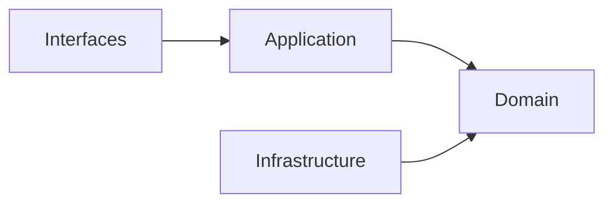

## Correct Interaction Flow

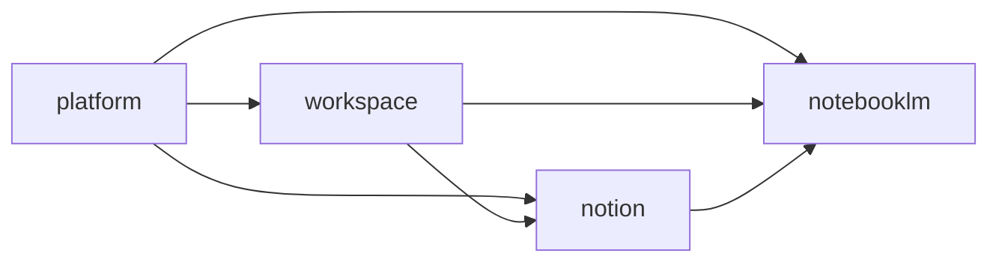

## Document Network

- [README.md](./README.md)
- [bounded-contexts.md](./bounded-contexts.md)
- [context-map.md](./context-map.md)
- [subdomains.md](./subdomains.md)
- [integration-guidelines.md](./integration-guidelines.md)
- [strategic-patterns.md](./strategic-patterns.md)
- [bounded-context-subdomain-template.md](./bounded-context-subdomain-template.md)
- [project-delivery-milestones.md](./project-delivery-milestones.md)
- [decisions/0001-hexagonal-architecture.md](./decisions/0001-hexagonal-architecture.md)

## Reading Path

1. [bounded-contexts.md](./bounded-contexts.md)
2. [context-map.md](./context-map.md)
3. [subdomains.md](./subdomains.md)
4. [ubiquitous-language.md](./ubiquitous-language.md)
5. [integration-guidelines.md](./integration-guidelines.md)
6. [strategic-patterns.md](./strategic-patterns.md)
7. [decisions/README.md](./decisions/README.md)
````

## File: docs/bounded-contexts.md
````markdown
# Bounded Contexts

本文件在本次任務限制下，僅依 Context7 驗證的 bounded context 與 hexagonal architecture 原則重建，不主張反映現況實作。

## Strategic Bounded Context Model

系統固定由四個主域構成。每個主域下可再分成 baseline subdomains 與 recommended gap subdomains。

## Main Domain Map

| Main Domain | Strategic Role | Baseline Focus | Recommended Gap Focus |
|---|---|---|---|
| workspace | 協作容器與 scope | audit、feed、scheduling、workspace-workflow | lifecycle、membership、sharing、presence |
| platform | 治理與營運支撐 | identity、organization、access、policy、billing、ai、notification、observability | tenant、entitlement、secret-management、consent |
| notion | 正典知識內容 | knowledge、authoring、collaboration、database、templates、knowledge-versioning | taxonomy、relations、publishing |
| notebooklm | 對話與推理 | conversation、note、notebook、source、synthesis、conversation-versioning | ingestion、retrieval、grounding、evaluation |

## Subdomain Inventory By Main Domain

### workspace

#### Baseline Subdomains

| Subdomain | 功能註解 |
|---|---|
| audit | 工作區操作稽核與證據追蹤 |
| feed | 工作區活動摘要與事件流呈現 |
| scheduling | 工作區排程、時序與提醒協調 |
| workspace-workflow | 工作區流程編排與執行治理 |

#### Recommended Gap Subdomains

| Subdomain | 功能註解 |
|---|---|
| lifecycle | 將工作區容器生命週期獨立為正典邊界（建立、封存、復原） |
| membership | 將工作區參與關係從平台身份治理切開（角色、加入、移除） |
| sharing | 將共享範圍與可見性規則收斂到單一上下文（對內/對外分享） |
| presence | 將即時協作存在感、共同編輯訊號收斂為本地語言 |

### platform

#### Baseline Subdomains

| Subdomain | 功能註解 |
|---|---|
| identity | 已驗證主體與身份信號治理 |
| account | 帳號聚合根與帳號生命週期 |
| account-profile | 主體屬性、偏好與治理設定 |
| organization | 組織、成員與角色邊界 |
| access-control | 主體現在能做什麼的授權判定 |
| security-policy | 安全規則定義、版本化與發佈 |
| platform-config | 平台設定輪廓與配置管理 |
| feature-flag | 功能開關策略與發佈節點 |
| onboarding | 新主體初始設定與引導流程 |
| compliance | 資料保留、稽核與法規執行 |
| billing | 計費狀態、費率與財務證據 |
| subscription | 方案、權益、配額與續期治理 |
| referral | 推薦關係與獎勵追蹤 |
| ai | 共享 AI provider 路由、模型政策、配額與安全護欄 |
| integration | 外部系統整合邊界與契約 |
| workflow | 平台級流程編排與狀態驅動執行 |
| notification | 通知路由、偏好與投遞 |
| background-job | 背景任務提交、排程與監控 |
| content | 平台級內容資產管理與發布 |
| search | 跨域搜尋路由與查詢協調 |
| audit-log | 永久稽核軌跡與不可否認證據 |
| observability | 健康量測、追蹤與告警 |
| analytics | 平台使用行為量測與分析 |
| support | 客服工單、支援知識與處理流程 |

#### Recommended Gap Subdomains

| Subdomain | 功能註解 |
|---|---|
| tenant | 建立多租戶隔離與 tenant-scoped 規則的正典邊界 |
| entitlement | 建立有效權益與功能可用性的統一解算上下文 |
| secret-management | 將憑證、token、rotation 從 integration 中切開 |
| consent | 將同意與資料使用授權從 compliance 中切開 |

### notion

#### Baseline Subdomains

| Subdomain | 功能註解 |
|---|---|
| knowledge | 頁面建立、組織、版本化與交付 |
| authoring | 知識庫文章建立、驗證與分類 |
| collaboration | 協作留言、細粒度權限與版本快照 |
| database | 結構化資料多視圖管理 |
| knowledge-analytics | 知識使用行為量測 |
| attachments | 附件與媒體關聯儲存 |
| automation | 知識事件觸發自動化動作 |
| knowledge-integration | 知識與外部系統雙向整合 |
| notes | 個人輕量筆記與正式知識協作 |
| templates | 頁面範本管理與套用 |
| knowledge-versioning | 全域版本快照策略管理 |

#### Recommended Gap Subdomains

| Subdomain | 功能註解 |
|---|---|
| taxonomy | 建立分類法與語義組織的正典邊界 |
| relations | 建立內容之間關聯與 backlink 的正典邊界 |
| publishing | 建立正式發布與對外交付的正典邊界 |

### notebooklm

#### Baseline Subdomains

| Subdomain | 功能註解 |
|---|---|
| conversation | 對話 Thread 與 Message 生命週期 |
| note | 輕量筆記與知識連結 |
| notebook | Notebook 組合與管理 |
| source | 來源文件追蹤與引用 |
| synthesis | RAG 合成、摘要與洞察生成 |
| conversation-versioning | 對話版本與快照策略 |

#### Recommended Gap Subdomains

| Subdomain | 功能註解 |
|---|---|
| ingestion | 建立來源匯入、正規化與前處理的正典邊界 |
| retrieval | 建立查詢召回與排序策略的正典邊界 |
| grounding | 建立引用對齊與可追溯證據的正典邊界 |
| evaluation | 建立品質評估與回歸比較的正典邊界 |

## Ownership Rules

- workspace 擁有工作區範疇，不擁有平台治理或正典內容。
- platform 擁有治理與權益，不擁有正典內容或推理輸出。
- notion 擁有正典知識內容，不擁有治理或推理流程。
- notebooklm 擁有推理流程與衍生輸出，不擁有正典知識內容。

## Dependency Direction Guardrail

- bounded context 所有權定義的是語言與規則邊界，不等於可直接穿透的實作邊界。
- 每個主域內部仍必須遵守 interfaces -> application -> domain <- infrastructure。
- 跨主域整合一律先經 API boundary、published language、events 或 local DTO。

## Conflict Resolution

- 若某子域同時被多個主域宣稱，依最能維持語言自洽與 context map 方向的主域保留所有權。
- 若某能力同時像治理又像內容，先問它是否定義 actor / tenant / entitlement；若是，歸 platform。
- 若某能力同時像內容又像推理輸出，先問它是否是正典內容狀態；若是，歸 notion，否則歸 notebooklm。
- generic `ai` 由 platform 擁有；notion 與 notebooklm 只能消費 platform 的 AI capability，不能再各自宣稱 `ai` 子域。
- `workflow` 作為 generic 名稱只保留在 platform；workspace 使用 `workspace-workflow` 避免跨主域混名。

## Forbidden Ownership Moves

- 不得讓兩個主域同時宣稱同一正典模型所有權。
- 不得用部署、資料表或 UI 分區來覆蓋 bounded context 所有權。
- 不得把 gap subdomain 缺口視為可以任意分散到其他主域的理由。
- 不得讓同一個 generic 子域名稱同時作為多個主域的 canonical ownership。

## Copilot Generation Rules

- 生成程式碼時，先決定 owning bounded context，再決定檔案位置、命名與 boundary。
- 奧卡姆剃刀：若既有 bounded context 可吸收需求，就不要為了命名好看而新增新的上下文。
- 所有權模糊時，先修正文檔邊界，再寫程式碼。

## Dependency Direction Flow

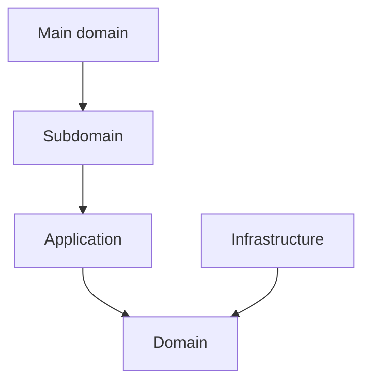

## Correct Interaction Flow

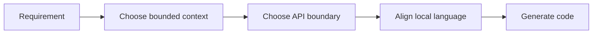

## Document Network

- [architecture-overview.md](./architecture-overview.md)
- [subdomains.md](./subdomains.md)
- [context-map.md](./context-map.md)
- [bounded-context-subdomain-template.md](./bounded-context-subdomain-template.md)
- [project-delivery-milestones.md](./project-delivery-milestones.md)
- [decisions/0001-hexagonal-architecture.md](./decisions/0001-hexagonal-architecture.md)
- [decisions/0002-bounded-contexts.md](./decisions/0002-bounded-contexts.md)
````

## File: docs/context-map.md
````markdown
# Context Map

本文件在本次任務限制下，僅依 Context7 驗證的 context map 與 strategic design 原則重建，不主張反映現況實作。

## System Landscape

主域級關係只採用 directed upstream-downstream 模型。

## Directed Relationships

| Upstream | Downstream | Published Language |
|---|---|---|
| platform | workspace | actor reference、organization scope、access decision、entitlement signal |
| platform | notion | actor reference、organization scope、access decision、entitlement signal、ai capability signal |
| platform | notebooklm | actor reference、organization scope、access decision、entitlement signal、ai capability signal |
| workspace | notion | workspaceId、membership scope、share scope |
| workspace | notebooklm | workspaceId、membership scope、share scope |
| notion | notebooklm | knowledge artifact reference、attachment reference、taxonomy hint |

## Detailed Language Crosswalk

| Relationship | Upstream Canonical Terms | Published Language | Downstream Protected Terms |
|---|---|---|---|
| platform -> workspace | Actor, Tenant, Entitlement, Consent | actor reference, organization scope, access decision, entitlement signal | Workspace, Membership, ShareScope |
| platform -> notion | Actor, Tenant, Entitlement, Secret | actor reference, organization scope, access decision, entitlement signal, ai capability signal | KnowledgeArtifact, Taxonomy, Relation, Publication |
| platform -> notebooklm | Actor, Tenant, Entitlement, Secret | actor reference, organization scope, access decision, entitlement signal, ai capability signal | Notebook, Ingestion, Retrieval, Grounding, Synthesis, Evaluation |
| workspace -> notion | Workspace, Membership, ShareScope | workspaceId, membership scope, share scope | KnowledgeArtifact, Taxonomy, Relation |
| workspace -> notebooklm | Workspace, Membership, ShareScope | workspaceId, membership scope, share scope | Notebook, Retrieval, Grounding, Synthesis |
| notion -> notebooklm | KnowledgeArtifact, Taxonomy, Relation | knowledge artifact reference, attachment reference, taxonomy hint | Notebook, Retrieval, Grounding, Synthesis, Evaluation |

## Relationship Notes

- `platform -> workspace` 只提供治理判定與權益訊號；workspace 保留協作範疇語言。
- `platform -> notion` 與 `platform -> notebooklm` 可提供 shared AI capability 訊號，但不移轉內容或推理所有權。
- `workspace -> notion` 與 `workspace -> notebooklm` 只提供 scope 與 membership 邊界，不輸出 workspace 內部模型。
- `notion -> notebooklm` 僅提供可引用內容語言，不允許 notebooklm 直接回寫 notion 正典內容。

## Pattern Rules

- ACL 與 Conformist 只允許出現在 downstream 端。
- ACL 與 Conformist 互斥，不能同時套用在同一整合。
- Shared Kernel 與 Partnership 不用於主域級關係。
- 若未來真的需要共享模型，必須先抽出新的 bounded context，而不是把對稱關係塞回主域之間。

## Dependency Direction Guardrail

- 主域級方向只允許 upstream -> downstream，不允許同時宣稱對稱依賴。
- downstream 整合上游時，先決定 published language，再決定 ACL 或 Conformist。
- 上游提供語言與能力，下游決定如何保護自己的語言。

## Strategic Consequences

- 關係方向清楚後，published language、local DTO 與 ACL 才能一致。
- 主域級文檔可以避免同時出現互相矛盾的 supplier / consumer 敘事。

## Contradictions Removed

- 不再同時把主域級關係描述成 directed relationship 與 symmetric relationship。
- 不再把 ACL 寫成 upstream 的責任。
- 不再把 shared technical libraries 誤寫為主域級 Shared Kernel。

## Forbidden Relationship Patterns

- 不得把 Shared Kernel / Partnership 與 ACL / Conformist 混寫在同一關係。
- 不得把 direct model sharing 寫成 published language。
- 不得把下游的轉譯責任倒灌回上游。

## Copilot Generation Rules

- 生成程式碼時，先畫清 upstream / downstream，再安排 API boundary、published language、ACL 或 Conformist。
- 奧卡姆剃刀：若單一 published language 與單一 translation step 足夠，就不要再加第二層整合流程。
- 不確定關係方向時，先修正文檔，不直接生成跨主域耦合程式碼。

## Dependency Direction Flow

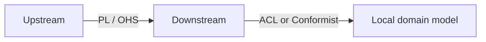

## Correct Interaction Flow


## Document Network

- [architecture-overview.md](./architecture-overview.md)
- [integration-guidelines.md](./integration-guidelines.md)
- [strategic-patterns.md](./strategic-patterns.md)
- [bounded-context-subdomain-template.md](./bounded-context-subdomain-template.md)
- [project-delivery-milestones.md](./project-delivery-milestones.md)
- [decisions/0003-context-map.md](./decisions/0003-context-map.md)
- [decisions/0005-anti-corruption-layer.md](./decisions/0005-anti-corruption-layer.md)
````

## File: docs/contexts/notebooklm/AGENT.md
````markdown
# NotebookLM Agent

本文件在本次任務限制下，僅依 Context7 驗證的 DDD、Context Map、Hexagonal Architecture 參考整理，不主張反映現況實作。

## Mission

保護 notebooklm 主域作為對話、來源處理、檢索、grounding 與 synthesis 邊界。任何變更都應維持 notebooklm 擁有衍生推理流程與可追溯輸出，而不是直接擁有正典知識內容。

## Canonical Ownership

- source
- notebook
- conversation
- synthesis (owns retrieval, grounding, generation, evaluation as internal facets)

## Route Here When

- 問題核心是 notebook、conversation、source ingestion、synthesis（retrieval、grounding、generation、evaluation）。
- 問題需要處理引用對齊、來源可追溯、模型輸出品質或衍生筆記。
- 問題要把知識來源轉成可對話與可綜合的推理材料。

## Route Elsewhere When

- 正典知識頁面、內容分類、正式發布屬於 notion。
- 身份、授權、權益、憑證治理屬於 platform。
- 共享 AI provider、模型政策、配額與安全護欄屬於 platform.ai。
- 工作區生命週期、共享與存在感屬於 workspace。

## Guardrails

- notebooklm 的輸出是衍生產物，不直接等於正典知識內容。
- synthesis 將 retrieval、grounding、generation、evaluation 作為內部 facets；只有當語言分歧或演化速率不同時才拆分為獨立子域。
- evaluation 應作為品質與回歸語言，而不只是分析儀表板指標。
- 跨主域互動只經過 published language、API 邊界或事件。

## Dependency Direction

- notebooklm 內部依賴方向固定為 interfaces -> application -> domain <- infrastructure。
- application 只能透過 ports 協調 synthesis 所需的外部能力。
- infrastructure 只實作 ports 與邊界轉譯，不反向定義 domain 語言。

## Hard Prohibitions

- 不得把 notion 的 KnowledgeArtifact 直接當成 notebooklm 的本地主域模型。
- 不得讓 domain 或 application 直接依賴模型 SDK、向量儲存或外部檔案處理框架。
- 不得讓 notebooklm 直接改寫 workspace 或 notion 的內部狀態，而繞過其 API 邊界。
- 不得建立獨立的 `ai` 子域與 platform.ai 語義重疊。

## Copilot Generation Rules

- 生成程式碼時，先維持 notebooklm 作為 downstream 推理主域，不回推治理或正典內容所有權。
- 共享模型能力若已由 platform.ai 提供，就不要在 notebooklm 再建立第二個 generic `ai` 子域。
- 奧卡姆剃刀：若較少的抽象已能保護邊界，就不要額外新增 port、ACL、DTO、subdomain 或 process manager。
- 只有碰到外部依賴、語義污染或跨主域轉譯時，才建立 port、ACL 或 local DTO。
- 任何跨主域互動都先走 API boundary / published language，再轉成本地主域語言。

## Dependency Direction Flow


## Correct Interaction Flow

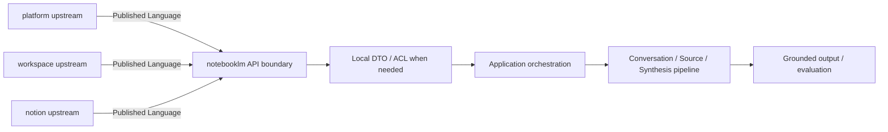

## Document Network

- [README.md](./README.md)
- [bounded-contexts.md](./bounded-contexts.md)
- [context-map.md](./context-map.md)
- [subdomains.md](./subdomains.md)
- [ubiquitous-language.md](./ubiquitous-language.md)
- [../../architecture-overview.md](../../architecture-overview.md)
- [../../integration-guidelines.md](../../integration-guidelines.md)
- [../../decisions/0001-hexagonal-architecture.md](../../decisions/0001-hexagonal-architecture.md)
- [../../decisions/0003-context-map.md](../../decisions/0003-context-map.md)
- [../../decisions/0005-anti-corruption-layer.md](../../decisions/0005-anti-corruption-layer.md)
````

## File: docs/contexts/notebooklm/context-map.md
````markdown
# NotebookLM

本文件在本次任務限制下，僅依 Context7 驗證的 DDD、Context Map、Hexagonal Architecture 參考整理，不主張反映現況實作。

## Context Role

notebooklm 消費 workspace scope、platform 治理與 notion 內容來源，並輸出可追溯的對話、洞察與 synthesis。依 Context Mapper 思維，它是多個上游語言的下游整合者，但仍需維持自己的對話與推理邊界。

## Relationships

| Related Domain | Relationship Type | NotebookLM Position | Published Language |
|---|---|---|---|
| platform | Upstream/Downstream | downstream | actor reference、organization scope、access decision、entitlement signal、ai capability signal |
| workspace | Upstream/Downstream | downstream | workspaceId、membership scope、share scope |
| notion | Upstream/Downstream | downstream | knowledge artifact reference、attachment reference、taxonomy hint |

## Mapping Rules

- notebooklm 依賴 platform 的治理結果，但不重建 actor、policy 或 secret 模型。
- notebooklm 可消費 platform.ai 作為共享模型能力，但不擁有 provider / policy 所有權。
- notebooklm 在 workspace scope 內運作，但不定義 workspace 生命周期或 sharing 規則。
- notion 是 notebooklm 的重要 source supplier，notebooklm 不能反向直接改寫 notion 正典內容。
- synthesis、grounding、evaluation 是 notebooklm 對外輸出的核心能力語言。

## Dependency Direction

- notebooklm 只作為 platform、workspace、notion 的 downstream consumer，不反向宣稱治理或正典內容所有權。
- ACL 或 Conformist 只能由 notebooklm 這個 downstream 端選擇，不能回推到上游。
- 跨主域資料進入 notebooklm 時，先落在 published language 或 local DTO，再進入本地主域語言。

## Anti-Patterns

- 把 notebooklm 寫成 notion 或 workspace 的上游治理來源。
- 在同一主域關係上同時聲稱 ACL 與 Conformist。
- 直接共享 notebook、source 或 conversation 的內部模型給其他主域使用。

## Copilot Generation Rules

- 生成程式碼時，先維持 notebooklm 對 platform、workspace、notion 的 downstream 位置，再安排轉譯層。
- 奧卡姆剃刀：若 published language 加一層 local DTO 已足夠，就不要額外發明第二層 mapper 或雙重 ACL。
- 上游只提供 published language；本地主域保護由 downstream 完成。

## Dependency Direction Flow

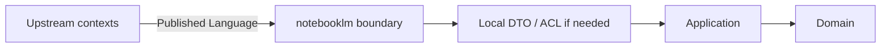

## Correct Interaction Flow

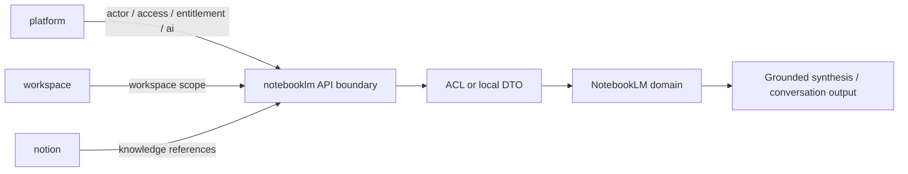

## Document Network

- [README.md](./README.md)
- [AGENT.md](./AGENT.md)
- [bounded-contexts.md](./bounded-contexts.md)
- [subdomains.md](./subdomains.md)
- [../../context-map.md](../../context-map.md)
- [../../integration-guidelines.md](../../integration-guidelines.md)
- [../../strategic-patterns.md](../../strategic-patterns.md)
- [../../decisions/0003-context-map.md](../../decisions/0003-context-map.md)
- [../../decisions/0005-anti-corruption-layer.md](../../decisions/0005-anti-corruption-layer.md)
````

## File: docs/contexts/notebooklm/README.md
````markdown
# NotebookLM Context

本 README 在本次任務限制下，僅依 Context7 驗證的 DDD、Context Map、Hexagonal Architecture 參考重建，不主張反映現況實作。

## Purpose

notebooklm 是對話、來源處理與推理主域。它的責任是提供 notebook、conversation、source ingestion、retrieval、grounding、synthesis、evaluation 與 conversation-versioning 等語言，把來源材料轉成可對話、可追溯、可評估的衍生輸出。

## Why This Context Exists

- 把推理流程與正典知識內容分離。
- 把來源匯入、檢索、grounding 與 synthesis 統整成同一主域。
- 提供可回流到其他主域、但本質上仍屬衍生輸出的能力邊界。

## Context Summary

| Aspect | Summary |
|---|---|
| Primary Role | 對話、來源處理、檢索與推理輸出 |
| Upstream Dependency | platform 治理、workspace scope、notion 內容來源 |
| Downstream Consumer | 無固定主域級 consumer；輸出可被其他主域吸收 |
| Core Principle | notebooklm 擁有衍生推理流程，不擁有正典知識內容 |

## Baseline Subdomains

- conversation
- note
- notebook
- source
- synthesis
- conversation-versioning

## Recommended Gap Subdomains

- ingestion
- retrieval
- grounding
- evaluation

## Key Relationships

- 與 platform：notebooklm 消費 actor、organization、access、entitlement、ai capability。
- 與 workspace：notebooklm 消費 workspaceId、membership scope、share scope。
- 與 notion：notebooklm 消費 knowledge artifact reference、attachment reference、taxonomy hint。

## Reading Order

1. [subdomains.md](./subdomains.md)
2. [bounded-contexts.md](./bounded-contexts.md)
3. [context-map.md](./context-map.md)
4. [ubiquitous-language.md](./ubiquitous-language.md)
5. [AGENT.md](./AGENT.md)

## Dependency Direction

- 本主域內部固定採用 interfaces -> application -> domain <- infrastructure。
- 跨主域只消費 published language、API boundary、events，不直接依賴他域內部模型。

## Anti-Pattern Rules

- 不把 notebooklm 的衍生輸出直接宣稱為 notion 的正典知識內容。
- 不把 retrieval/grounding 降格成單純 UI 功能或模型提示細節。
- 不把 ingestion 與 source reference 混成同一個不可拆分責任。
- 不把 platform.ai 的共享能力誤寫成 notebooklm 自己擁有的 `ai` 子域。

## Copilot Generation Rules

- 生成程式碼時，先保留 notebooklm 的衍生推理定位，再安排 retrieval、grounding、synthesis 的交互。
- 模型接入、配額、供應商策略若屬共享能力，先消費 platform.ai；notebooklm 保留 retrieval、grounding、synthesis、evaluation 的語義所有權。
- 奧卡姆剃刀：只在必要時引入 port、ACL、DTO；不要因為未來也許會有需求就預先堆疊抽象。
- 優先產生一條清楚的 upstream input -> translation -> application -> domain -> output 流程，而不是多條重疊流程。

## Dependency Direction Flow

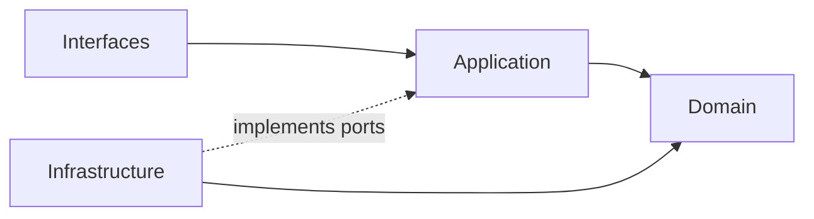

## Correct Interaction Flow

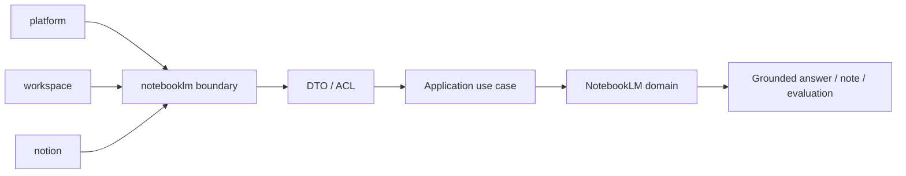

## Document Network

- [AGENT.md](./AGENT.md)
- [bounded-contexts.md](./bounded-contexts.md)
- [context-map.md](./context-map.md)
- [subdomains.md](./subdomains.md)
- [ubiquitous-language.md](./ubiquitous-language.md)
- [../../README.md](../../README.md)
- [../../architecture-overview.md](../../architecture-overview.md)
- [../../integration-guidelines.md](../../integration-guidelines.md)

## Constraints

- 本文件是 architecture-first 版本。
- 本文件依 Context7 的 bounded context 與 context map 原則編寫。
- 本文件不代表對既有 repo 內容做過語意校準。
````

## File: docs/contexts/notebooklm/subdomains.md
````markdown
# NotebookLM

本文件在本次任務限制下，僅依 Context7 驗證的 DDD、Context Map、Hexagonal Architecture 參考整理，不主張反映現況實作。

## Baseline Subdomains

| Subdomain | Responsibility |
|---|---|
| conversation | 對話 Thread 與 Message 生命週期 |
| notebook | Notebook 組合與管理 |
| source | 來源文件追蹤、引用與 ingestion 編排 |
| synthesis | 完整 RAG pipeline：retrieval、grounding、answer generation、evaluation/feedback |

## Future Split Triggers

`synthesis` 子域將 retrieval、grounding、generation、evaluation 作為內部 facets。只有當以下觸發條件成立時，才拆分為獨立子域：

| Facet | Split Trigger |
|---|---|
| retrieval | 策略複雜到需要獨立領域模型（多重排序、hybrid search） |
| grounding | 引用追溯需要獨立聚合根（citation chains、evidence alignment） |
| generation | 生成策略需要獨立 use case 群（多模態、多來源融合） |
| evaluation | 品質語言需要獨立指標模型（回歸測試、benchmark suite） |

## Anti-Patterns

- 不把 retrieval 與 grounding 併回 source 或 platform.ai 接入層，否則推理鏈條失去清楚邊界。
- 不把 evaluation 只當成 dashboard 指標，否則品質語言無法成為可演化的關注點。
- 不把 notebook、conversation 混成單一 UI 容器語意，否則無法維持聚合邊界。
- 不把 platform.ai 的共享能力誤寫成 notebooklm 自己擁有的 `ai` 子域。
- 不過早拆分子域：只有當語言分歧或演化速率不同時才拆分。

## Copilot Generation Rules

- 生成程式碼時，先問新需求落在哪個既有子域；只有既有子域無法容納時才建立新子域。
- 模型 provider、配額與安全護欄優先歸 platform.ai；notebooklm 在 synthesis 保留 pipeline 本地語義。
- 奧卡姆剃刀：能在既有子域用一個明確 use case 解決，就不要新增第二個平行子域。
- 子域命名應反映責任與語義，不應只是頁面名稱或工具名稱。

## Dependency Direction Flow

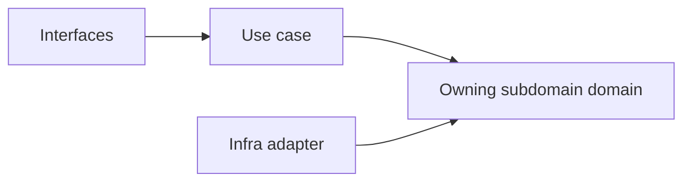

## Correct Interaction Flow

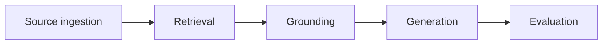

## Document Network

- [README.md](./README.md)
- [bounded-contexts.md](./bounded-contexts.md)
- [context-map.md](./context-map.md)
- [ubiquitous-language.md](./ubiquitous-language.md)
- [../../subdomains.md](../../subdomains.md)
- [../../bounded-contexts.md](../../bounded-contexts.md)
````

## File: docs/contexts/notebooklm/ubiquitous-language.md
````markdown
# NotebookLM

本文件在本次任務限制下，僅依 Context7 驗證的 DDD、Context Map、Hexagonal Architecture 參考整理，不主張反映現況實作。

## Canonical Terms

| Term | Meaning |
|---|---|
| Notebook | 聚合對話、來源與衍生筆記的工作單位 |
| Conversation | Notebook 內的對話執行邊界 |
| Message | 一則輸入或輸出對話項 |
| Source | 被引用與推理的來源材料 |
| Ingestion | 來源匯入、正規化與前處理流程 |
| Retrieval | 從來源中召回候選片段的查詢能力 |
| Grounding | 把輸出對齊到來源證據的能力 |
| Citation | 輸出指回來源證據的引用關係 |
| Synthesis | 綜合多來源後生成的衍生輸出 |
| Note | 與 Notebook 關聯的輕量摘記 |
| Evaluation | 對輸出品質、回歸結果與效果的評估 |
| VersionSnapshot | 對話或 Notebook 某一時點的不可變快照 |

## Language Rules

- 使用 Conversation，不使用 Chat 作為正典語彙。
- 使用 Ingestion 與 Source 區分來源處理與來源語義。
- 使用 Retrieval 與 Grounding 區分召回能力與證據對齊能力。
- 使用 Synthesis 表示衍生綜合輸出，不把它直接稱為正典知識內容。
- 使用 Evaluation 表示品質語言，不用 Analytics 混稱模型效果。

## Avoid

| Avoid | Use Instead |
|---|---|
| Chat | Conversation |
| File Import | Ingestion |
| Search Step | Retrieval |
| Verified Answer | Grounded Synthesis |

## Naming Anti-Patterns

- 不用 Chat 混稱 Conversation 與 Notebook。
- 不用 Search 混稱 Retrieval 與 Grounding。
- 不用 Knowledge 或 Wiki 混稱 Synthesis 輸出，避免污染 notion 的正典語言。

## Copilot Generation Rules

- 生成程式碼時，名稱先對齊 Notebook、Conversation、Retrieval、Grounding、Synthesis、Evaluation，再決定型別與模組位置。
- 奧卡姆剃刀：若一個名詞已能準確表達語義，就不要再疊加第二個近義抽象名稱。
- 命名要先保護邊界，再追求實作便利。

## Dependency Direction Flow

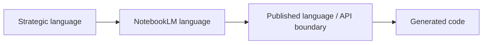

## Correct Interaction Flow

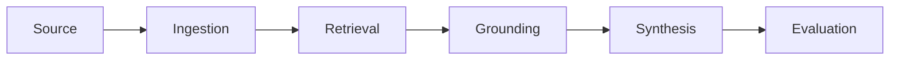

## Domain Layer Flow (enforced per subdomain)

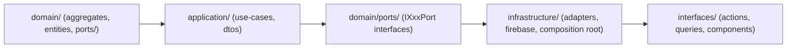

## Document Network

- [README.md](./README.md)
- [AGENT.md](./AGENT.md)
- [subdomains.md](./subdomains.md)
- [bounded-contexts.md](./bounded-contexts.md)
- [../../ubiquitous-language.md](../../ubiquitous-language.md)
- [../../decisions/0004-ubiquitous-language.md](../../decisions/0004-ubiquitous-language.md)
````

## File: docs/contexts/notion/AGENT.md
````markdown
# Notion Agent

本文件在本次任務限制下，僅依 Context7 驗證的 DDD、Context Map、Hexagonal Architecture 參考整理，不主張反映現況實作。

## Mission

保護 notion 主域作為知識內容生命週期邊界。任何變更都應維持 notion 擁有內容建立、分類、關聯、協作、模板、發布與版本化語言，而不是吸收平台治理或對話推理語言。

## Canonical Ownership

- knowledge
- authoring
- collaboration
- database
- taxonomy
- relations
- knowledge-analytics
- attachments
- automation
- knowledge-integration
- notes
- templates
- publishing
- knowledge-versioning

## Route Here When

- 問題核心是知識頁面、文章、內容結構、分類、關聯、模板與發布。
- 問題需要把輸入吸收成正式知識內容的正典狀態。
- 問題需要定義內容版本、內容協作與內容交付。

## Route Elsewhere When

- 身份、租戶、授權、權益、憑證治理屬於 platform。
- 共享 AI provider、模型政策、配額與安全護欄屬於 platform.ai。
- 工作區生命週期、共享、存在感與工作區流程屬於 workspace。
- notebook、conversation、retrieval、grounding、synthesis 屬於 notebooklm。

## Guardrails

- notion 的正典內容不等於 notebooklm 的衍生輸出。
- taxonomy 與 relations 應作為內容語義邊界，而不是 UI 功能附屬物。
- publishing 應與 authoring 分離，避免編輯語意與交付語意混用。
- notion 可以消費 platform.ai，但不擁有 AI provider / policy 的正典邊界。
- attachments 是內容資產語言，不是平台 secret 或一般檔案暫存語言。
- 跨主域互動只經過 published language、API 邊界或事件。

## Dependency Direction

- notion 內部依賴方向固定為 interfaces -> application -> domain <- infrastructure。
- authoring、knowledge、database、publishing 對外部能力的依賴只能透過 ports 進入核心。
- infrastructure 只負責儲存、傳輸、ACL 轉譯，不定義 KnowledgeArtifact 的正典語義。

## Hard Prohibitions

- 不得讓 notebooklm 的 Conversation、Synthesis 直接滲入 notion 作為正典內容模型。
- 不得讓 domain 或 application 直接依賴 UI、HTTP、資料庫 SDK 或框架語言。
- 不得讓 notion 直接接管 platform 的 actor、tenant、entitlement 治理責任。

## Copilot Generation Rules

- 生成程式碼時，先保留 notion 作為正典內容主域，不讓治理或推理語言滲入核心。
- 內容輔助若只是支援 knowledge / authoring / publishing use case，先消費 platform.ai，而不是在 notion 內重建 generic `ai` 子域。
- 奧卡姆剃刀：若一個既有內容子域與一條清楚 use case 就能承接需求，不要再新增額外 service、mapper 或子域。
- 只有在外部依賴或跨主域語義污染出現時，才建立 port、ACL 或 local DTO。
- 對 notebooklm 或 workspace 的互動一律先經 published language / API boundary，再進入 notion 語言。

## Dependency Direction Flow

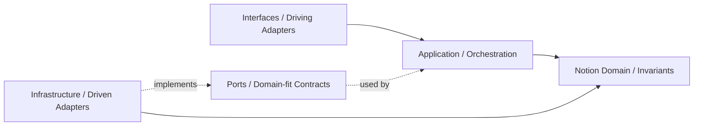

## Correct Interaction Flow

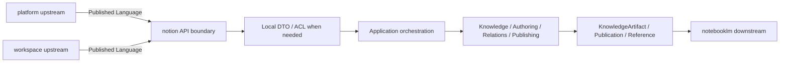

## Document Network

- [README.md](./README.md)
- [bounded-contexts.md](./bounded-contexts.md)
- [context-map.md](./context-map.md)
- [subdomains.md](./subdomains.md)
- [ubiquitous-language.md](./ubiquitous-language.md)
- [../../architecture-overview.md](../../architecture-overview.md)
- [../../integration-guidelines.md](../../integration-guidelines.md)
- [../../decisions/0001-hexagonal-architecture.md](../../decisions/0001-hexagonal-architecture.md)
- [../../decisions/0003-context-map.md](../../decisions/0003-context-map.md)
- [../../decisions/0005-anti-corruption-layer.md](../../decisions/0005-anti-corruption-layer.md)
````

## File: docs/contexts/notion/context-map.md
````markdown
# Notion

本文件在本次任務限制下，僅依 Context7 驗證的 DDD、Context Map、Hexagonal Architecture 參考整理，不主張反映現況實作。

## Context Role

notion 對其他主域提供知識內容語言。依 Context Mapper 的 context map 思維，它消費 workspace scope 與 platform 治理，並向 notebooklm 提供可被引用的知識內容來源。

## Relationships

| Related Domain | Relationship Type | Notion Position | Published Language |
|---|---|---|---|
| platform | Upstream/Downstream | downstream | actor reference、organization scope、access decision、entitlement signal、ai capability signal |
| workspace | Upstream/Downstream | downstream | workspaceId、membership scope、share scope |
| notebooklm | Upstream/Downstream | upstream | knowledge artifact reference、attachment reference、taxonomy hint |

## Mapping Rules

- notion 消費 platform 的治理結果，但不重建 actor、tenant、policy 模型。
- notion 可消費 platform.ai 來支援內容 use case，但不擁有 AI provider / policy 所有權。
- notion 在 workspace scope 中運作，但不反向定義 workspace 生命週期。
- notebooklm 可以消費 notion 的知識來源，但不得直接重寫 notion 正典內容。
- publishing 是 notion 對外輸出正式內容狀態的邊界。

## Dependency Direction

- notion 對 platform、workspace 屬 downstream；對 notebooklm 屬 upstream 的內容 supplier。
- ACL 或 Conformist 只能由 notion 作為 downstream 時選擇，不能要求上游替 notion 保護語言。
- notion 對 notebooklm 輸出的是 published language，不是內部 aggregate 或 workflow 細節。

## Anti-Patterns

- 把 notion 與 notebooklm 寫成對稱 Shared Kernel，同時又要求 ACL。
- 讓 notebooklm 直接回寫 notion 正典內容而不經 notion 邊界。
- 把 workspace scope 語言錯寫成 notion 自己擁有的容器生命週期語言。

## Copilot Generation Rules

- 生成程式碼時，先保留 notion 對 platform、workspace 的 downstream 位置與對 notebooklm 的 upstream 位置。
- 奧卡姆剃刀：若 published language 加一層 local DTO 已足夠，就不要再建立第二個平行翻譯管線。
- notion 向外提供的是內容語言，不是內部 aggregate、repository 或 UI projection。

## Dependency Direction Flow

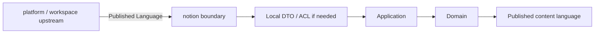

## Correct Interaction Flow

```mermaid
flowchart LR
	Platform["platform"] -->|actor / access / entitlement / ai| Boundary["notion API boundary"]
	Workspace["workspace"] -->|workspace scope| Boundary
	Boundary --> ACL["ACL or local DTO"]
	ACL --> Domain["Notion domain"]
	Domain --> Publication["Publication / KnowledgeArtifact reference"]
	Publication --> NotebookLM["notebooklm"]
```

## Document Network

- [README.md](./README.md)
- [AGENT.md](./AGENT.md)
- [bounded-contexts.md](./bounded-contexts.md)
- [subdomains.md](./subdomains.md)
- [../../context-map.md](../../context-map.md)
- [../../integration-guidelines.md](../../integration-guidelines.md)
- [../../strategic-patterns.md](../../strategic-patterns.md)
- [../../decisions/0003-context-map.md](../../decisions/0003-context-map.md)
- [../../decisions/0005-anti-corruption-layer.md](../../decisions/0005-anti-corruption-layer.md)
````

## File: docs/contexts/notion/README.md
````markdown
# Notion Context

本 README 在本次任務限制下，僅依 Context7 驗證的 DDD、Context Map、Hexagonal Architecture 參考重建，不主張反映現況實作。

## Purpose

notion 是知識內容生命週期主域。它的責任是提供 knowledge artifact、authoring、database、taxonomy、relations、templates、publishing、knowledge-versioning 與 collaboration 等內容語言，承接正式知識內容的正典狀態。

## Why This Context Exists

- 把知識內容正典與平台治理、工作區範疇、對話推理分離。
- 讓內容建立、分類、關聯、交付與版本規則維持在同一個主域。
- 提供 notebooklm 可引用、但不可直接改寫的知識來源。

## Context Summary

| Aspect | Summary |
|---|---|
| Primary Role | 正典知識內容生命週期 |
| Upstream Dependency | platform 治理、workspace scope |
| Downstream Consumer | notebooklm |
| Core Principle | notion 擁有正式內容，不擁有治理或推理過程 |

## Baseline Subdomains

- knowledge
- authoring
- collaboration
- database
- knowledge-analytics
- attachments
- automation
- knowledge-integration
- notes
- templates
- knowledge-versioning

## Recommended Gap Subdomains

- taxonomy
- relations
- publishing

## Key Relationships

- 與 platform：notion 消費 actor、organization、access、entitlement、ai capability。
- 與 workspace：notion 消費 workspaceId、membership scope、share scope。
- 與 notebooklm：notion 向 notebooklm 提供 knowledge artifact reference 與 attachment reference。

## Reading Order

1. [subdomains.md](./subdomains.md)
2. [bounded-contexts.md](./bounded-contexts.md)
3. [context-map.md](./context-map.md)
4. [ubiquitous-language.md](./ubiquitous-language.md)
5. [AGENT.md](./AGENT.md)

## Dependency Direction

- 本主域內部固定採用 interfaces -> application -> domain <- infrastructure。
- notion 對外只暴露 published language、API boundary、events，不暴露內部內容模型。

## Anti-Pattern Rules

- 不把 notebooklm 的衍生輸出直接當成 notion 正典內容。
- 不把 taxonomy、relations、publishing 壓回單一 knowledge 編輯流程。
- 不把 platform 的治理語言混成內容生命週期本身。
- 不把 platform.ai 的共享能力誤寫成 notion 自己擁有的 `ai` 子域。

## Copilot Generation Rules

- 生成程式碼時，先保留 notion 的正典內容定位，再安排 authoring、knowledge、taxonomy、publishing 的交互。
- 內容輔助、摘要與生成若只是內容 use case 的支援能力，優先由 knowledge / authoring use case 消費 `platform.ai`，而不是在 notion 再建一個 generic `ai` 子域。
- 奧卡姆剃刀：不要預先新增第二套內容流程，只在既有內容邊界真的不夠時才補新抽象。
- 優先讓同一條 input -> translation -> application -> domain -> publication 流程保持單純可追溯。

## Dependency Direction Flow

```mermaid
flowchart LR
	I["Interfaces"] --> A["Application"]
	A --> D["Domain"]
	X["Infrastructure"] --> D
	X -. implements ports .-> A
```

## Correct Interaction Flow

```mermaid
flowchart LR
	Platform["platform"] --> Boundary["notion boundary"]
	Workspace["workspace"] --> Boundary
	Boundary --> Translation["DTO / ACL"]
	Translation --> App["Application use case"]
	App --> Domain["Notion domain"]
	Domain --> Output["KnowledgeArtifact / Publication"]
	Output --> NotebookLM["notebooklm consumer"]
```

## Document Network

- [AGENT.md](./AGENT.md)
- [bounded-contexts.md](./bounded-contexts.md)
- [context-map.md](./context-map.md)
- [subdomains.md](./subdomains.md)
- [ubiquitous-language.md](./ubiquitous-language.md)
- [../../README.md](../../README.md)
- [../../architecture-overview.md](../../architecture-overview.md)
- [../../integration-guidelines.md](../../integration-guidelines.md)

## Constraints

- 本文件是 architecture-first 版本。
- 本文件依 Context7 的 bounded context 與 context map 原則編寫。
- 本文件不代表對既有 repo 內容做過語意校準。
````

## File: docs/contexts/notion/subdomains.md
````markdown
# Notion

本文件在本次任務限制下，僅依 Context7 驗證的 DDD、Context Map、Hexagonal Architecture 參考整理，不主張反映現況實作。

## Baseline Subdomains

| Subdomain | Responsibility |
|---|---|
| knowledge | 頁面建立、組織、版本化與交付 |
| authoring | 知識庫文章建立、驗證與分類 |
| collaboration | 協作留言、細粒度權限與版本快照 |
| database | 結構化資料多視圖管理 |
| knowledge-analytics | 知識使用行為量測 |
| attachments | 附件與媒體關聯儲存 |
| automation | 知識事件觸發自動化動作 |
| knowledge-integration | 知識與外部系統雙向整合 |
| notes | 個人輕量筆記與正式知識協作 |
| templates | 頁面範本管理與套用 |
| knowledge-versioning | 全域版本快照策略管理 |

## Recommended Gap Subdomains

| Subdomain | Why Needed |
|---|---|
| taxonomy | 建立分類法與語義組織的正典邊界 |
| relations | 建立內容之間關聯與 backlink 的正典邊界 |
| publishing | 建立正式發布與對外交付的正典邊界 |

## Recommended Order

1. taxonomy
2. relations
3. publishing

## Anti-Patterns

- 不把 taxonomy 混成 authoring 裡的附屬設定。
- 不把 relations 混成單純 hyperlink 功能，失去語義關係邊界。
- 不把 publishing 混成 UI 上的一個按鈕事件，而忽略正式交付語言。
- 不把 platform.ai 的共享能力誤寫成 notion 自己擁有的 `ai` 子域。

## Copilot Generation Rules

- 生成程式碼時，先判斷需求屬於 knowledge、authoring、relations、publishing、knowledge-analytics、knowledge-integration、knowledge-versioning 哪一個內容責任。
- 奧卡姆剃刀：能在既有子域用一個明確 use case 解決，就不要新建第二個概念接近的子域。
- 子域命名要反映內容語義，不要退化成頁面或元件名稱。

## Dependency Direction Flow

```mermaid
flowchart LR
	UI["Interfaces"] --> UseCase["Use case"]
	UseCase --> Subdomain["Owning subdomain domain"]
	Infra["Infra adapter"] --> Subdomain
```

## Correct Interaction Flow

```mermaid
flowchart LR
	Authoring["Authoring"] --> Knowledge["Knowledge"]
	Knowledge --> Taxonomy["Taxonomy"]
	Knowledge --> Relations["Relations"]
	Taxonomy --> Publishing["Publishing"]
	Relations --> Publishing
```

## Document Network

- [README.md](./README.md)
- [bounded-contexts.md](./bounded-contexts.md)
- [context-map.md](./context-map.md)
- [ubiquitous-language.md](./ubiquitous-language.md)
- [../../subdomains.md](../../subdomains.md)
- [../../bounded-contexts.md](../../bounded-contexts.md)
````

## File: docs/contexts/notion/ubiquitous-language.md
````markdown
# Notion

本文件在本次任務限制下，僅依 Context7 驗證的 DDD、Context Map、Hexagonal Architecture 參考整理，不主張反映現況實作。

## Canonical Terms

| Term | Meaning |
|---|---|
| KnowledgeArtifact | notion 主域擁有的知識內容總稱 |
| KnowledgePage | 正典頁面型知識單位 |
| Article | 經過撰寫與驗證流程的知識內容 |
| Database | 結構化知識集合 |
| DatabaseView | 對 Database 的投影與檢視配置 |
| Taxonomy | 標籤、分類法、主題樹等語義組織結構 |
| Relation | 內容對內容之間的正式關聯 |
| CollaborationThread | 內容附著的協作討論邊界 |
| Attachment | 綁定於知識內容的檔案或媒體 |
| Template | 可重複套用的內容結構起點 |
| Publication | 對外可見且可交付的內容狀態 |
| VersionSnapshot | 某一時點的不可變內容快照 |

## Language Rules

- 使用 KnowledgeArtifact、KnowledgePage、Article、Database 區分內容型別。
- 使用 Taxonomy 表示分類法，不用 Tagging 功能泛稱整個語義結構。
- 使用 Relation 表示正式內容關聯，不用 Link 混稱語義關係。
- 使用 Publication 表示正式對外內容狀態，不用 Publish Action 取代整個交付語言。
- 來自 notebooklm 的內容若未被 notion 吸收，不應直接稱為 KnowledgeArtifact。

## Avoid

| Avoid | Use Instead |
|---|---|
| Wiki | KnowledgePage 或 Article |
| Table | Database 或 DatabaseView |
| Tag System | Taxonomy |
| Content Link | Relation |

## Naming Anti-Patterns

- 不用 Wiki 混指 KnowledgeArtifact、KnowledgePage、Article。
- 不用 Tagging 混指 Taxonomy。
- 不用 Link 混指 Relation。
- 不用 Publish Action 混指 Publication 狀態與整個交付邊界。

## Copilot Generation Rules

- 生成程式碼時，名稱先對齊 KnowledgeArtifact、Taxonomy、Relation、Publication，再決定類別與檔名。
- 奧卡姆剃刀：若一個正確名詞已能表達邊界，就不要再堆疊第二個近義抽象名稱。
- 命名先保護內容語義，再考慮實作便利。

## Dependency Direction Flow

```mermaid
flowchart LR
	Strategic["Strategic language"] --> Context["Notion language"]
	Context --> API["Published language / API boundary"]
	API --> Code["Generated code"]
```

## Correct Interaction Flow

```mermaid
flowchart LR
	Knowledge["KnowledgeArtifact"] --> Taxonomy["Taxonomy"]
	Knowledge --> Relation["Relation"]
	Relation --> Publication["Publication"]
	Taxonomy --> Publication
```

## Domain Layer Flow (enforced per subdomain)

```mermaid
flowchart LR
  Domain["domain/ (aggregates, entities, ports/)"]
  Application["application/ (use-cases, dtos)"]
  Ports["domain/ports/ (IXxxPort interfaces)"]
  Infrastructure["infrastructure/ (adapters, firebase, composition root)"]
  Interfaces["interfaces/ (actions, queries, components)"]

  Domain --> Application
  Application --> Ports
  Ports --> Infrastructure
  Infrastructure --> Interfaces
```

## Document Network

- [README.md](./README.md)
- [AGENT.md](./AGENT.md)
- [subdomains.md](./subdomains.md)
- [bounded-contexts.md](./bounded-contexts.md)
- [../../ubiquitous-language.md](../../ubiquitous-language.md)
- [../../decisions/0004-ubiquitous-language.md](../../decisions/0004-ubiquitous-language.md)
````

## File: docs/contexts/platform/AGENT.md
````markdown
# Platform Agent

本文件在本次任務限制下，僅依 Context7 驗證的 DDD、Context Map、Hexagonal Architecture 參考整理，不主張反映現況實作。

## Mission

保護 platform 主域作為治理、身份、組織、權益、策略與營運支撐邊界。任何變更都應維持 platform 對治理語言的所有權，不吸收 workspace、notion、notebooklm 的正典業務模型。

## Canonical Ownership

- identity
- account
- account-profile
- organization
- team
- tenant
- access-control
- security-policy
- platform-config
- feature-flag
- entitlement
- onboarding
- compliance
- consent
- billing
- subscription
- referral
- ai
- integration
- secret-management
- workflow
- notification
- background-job
- content
- search
- audit-log
- observability
- analytics
- support

## Route Here When

- 問題核心是 actor、organization、tenant、access、policy、entitlement 或商業權益。
- 問題核心是通知治理、背景任務、平台級搜尋、觀測與支援。
- 問題核心是共享 AI provider、模型政策、配額、安全護欄或下游主域共同消費的 AI capability。
- 問題需要提供其他主域共同消費的治理結果。

## Route Elsewhere When

- 工作區生命週期、成員關係、共享與存在感屬於 workspace。
- 知識內容建立、分類、關聯與發布屬於 notion。
- 對話、來源、retrieval、grounding、synthesis 屬於 notebooklm。

## Guardrails

- Actor 與 Identity 屬於 platform，不能在其他主域重定義。
- entitlement 是 subscription、feature-flag、policy 的解算結果，不等於 plan 本身。
- ai 屬於 platform 的共享能力治理，不等於 notebooklm 的推理輸出所有權。
- secret-management 應與 integration 分離，避免憑證語義擴散。
- consent 與 compliance 有關，但不是同一個 bounded context。
- 平台輸出治理信號，不接管其他主域的正典內容生命週期。

## Dependency Direction

- platform 內部依賴方向固定為 interfaces -> application -> domain <- infrastructure。
- access-control、entitlement、secret-management 等外部依賴只能透過 ports 進入核心。
- infrastructure 只實作治理能力與外部整合，不反向定義 Actor、Tenant、Entitlement 語言。

## Hard Prohibitions

- 不得讓 platform 直接接管 workspace、notion、notebooklm 的正典業務流程。
- 不得讓 domain 或 application 直接依賴第三方身份、通知、計費或 secret SDK。
- 不得在其他主域重建 Actor、Tenant、Entitlement、Secret 的正典模型。

## Copilot Generation Rules

- 生成程式碼時，先保留 platform 作為治理 upstream，而不是內容或推理 owner。
- notion 與 notebooklm 若需要 AI 能力，先走 platform.ai 的 published language / API boundary。
- 奧卡姆剃刀：若既有治理子域與單一 use case 能承接需求，就不要新增第二層 policy service、flag service 或 entitlement facade。
- 只有在外部依賴、敏感治理或跨主域轉譯明確存在時，才建立 port、ACL 或 local DTO。
- 對 workspace、notion、notebooklm 的輸出應停在 published language / API boundary。

## Dependency Direction Flow

```mermaid
flowchart LR
	I["Interfaces / Driving Adapters"] --> A["Application / Orchestration"]
	A --> D["Platform Domain / Invariants"]
	P["Ports / Domain-fit Contracts"] -. used by .-> A
	X["Infrastructure / Driven Adapters"] -. implements .-> P
	X --> D
```

## Correct Interaction Flow

```mermaid
flowchart LR
	Request["Actor / admin / system request"] --> Boundary["platform API boundary"]
	Boundary --> App["Application orchestration"]
	App --> Domain["Identity / Access / Entitlement / AI / Secret"]
	Domain --> PL["Published governance language"]
	PL --> Workspace["workspace"]
	PL --> Notion["notion"]
	PL --> NotebookLM["notebooklm"]
```

## Document Network

- [README.md](./README.md)
- [bounded-contexts.md](./bounded-contexts.md)
- [context-map.md](./context-map.md)
- [subdomains.md](./subdomains.md)
- [ubiquitous-language.md](./ubiquitous-language.md)
- [../../architecture-overview.md](../../architecture-overview.md)
- [../../integration-guidelines.md](../../integration-guidelines.md)
- [../../decisions/0001-hexagonal-architecture.md](../../decisions/0001-hexagonal-architecture.md)
- [../../decisions/0003-context-map.md](../../decisions/0003-context-map.md)
- [../../decisions/0005-anti-corruption-layer.md](../../decisions/0005-anti-corruption-layer.md)
````

## File: docs/contexts/platform/context-map.md
````markdown
# Platform

本文件在本次任務限制下，僅依 Context7 驗證的 DDD、Context Map、Hexagonal Architecture 參考整理，不主張反映現況實作。

## Context Role

platform 是其他三個主域的治理上游。依 Context Mapper 的 upstream/downstream 關係，它向下游提供身份、組織、存取、權益與營運支撐語言。

## Relationships

| Related Domain | Relationship Type | Platform Position | Published Language |
|---|---|---|---|
| workspace | Upstream/Downstream | upstream | actor reference、organization scope、access decision、entitlement signal |
| notion | Upstream/Downstream | upstream | actor reference、organization scope、access decision、entitlement signal、ai capability signal |
| notebooklm | Upstream/Downstream | upstream | actor reference、organization scope、access decision、entitlement signal、ai capability signal |

## Mapping Rules

- platform 提供治理結果，但不直接擁有工作區、知識內容或對話內容。
- workspace、notion、notebooklm 可以把平台輸出當作 supplier language，但不能穿透其內部模型。
- platform 擁有 shared AI capability，但 notion 與 notebooklm 仍各自擁有內容與推理語義。
- audit-log 與 analytics 可消費其他主域的事件，但那不等於接管對方的主域責任。
- tenant、entitlement、secret-management、consent 已建立邊界骨架，仍需持續收斂治理契約與 published language。

## Dependency Direction

- platform 是 workspace、notion、notebooklm 的治理 upstream，而不是它們的內容或流程 owner。
- platform 對下游輸出 published language，不輸出內部 aggregate、repository 或 secret 結構。
- 下游若需保護本地語言，ACL 由下游自行實作，不由 platform 代替選擇。

## Anti-Patterns

- 把 platform 與下游主域寫成 Shared Kernel，再同時保留 supplier/downstream 敘事。
- 讓 platform 直接穿透下游主域內部模型，以治理名義接管業務邏輯。
- 把審計或分析事件消費錯寫成平台擁有下游正典責任。

## Copilot Generation Rules

- 生成程式碼時，先維持 platform 作為 workspace、notion、notebooklm 的治理 upstream。
- 奧卡姆剃刀：若 published language 已足夠，就不要對每個下游再額外建立一套專屬治理模型。
- platform 的輸出應穩定、可被消費，但不應暴露其內部 aggregate 或 repository。

## Dependency Direction Flow

```mermaid
flowchart LR
	Domain["Platform domain"] --> PL["Published Language / OHS"]
	PL --> Boundary["Downstream API clients"]
	Boundary --> Local["Downstream local DTO / ACL"]
```

## Correct Interaction Flow

```mermaid
flowchart LR
	Platform["platform"] -->|actor / org / access / entitlement| Workspace["workspace"]
	Platform -->|actor / org / access / entitlement / ai| Notion["notion"]
	Platform -->|actor / org / access / entitlement / ai| NotebookLM["notebooklm"]
```

## Document Network

- [README.md](./README.md)
- [AGENT.md](./AGENT.md)
- [bounded-contexts.md](./bounded-contexts.md)
- [subdomains.md](./subdomains.md)
- [../../context-map.md](../../context-map.md)
- [../../integration-guidelines.md](../../integration-guidelines.md)
- [../../strategic-patterns.md](../../strategic-patterns.md)
- [../../decisions/0003-context-map.md](../../decisions/0003-context-map.md)
- [../../decisions/0005-anti-corruption-layer.md](../../decisions/0005-anti-corruption-layer.md)
````

## File: docs/contexts/platform/README.md
````markdown
# Platform Context

本 README 在本次任務限制下，僅依 Context7 驗證的 DDD、Context Map、Hexagonal Architecture 參考重建，不主張反映現況實作。

## Purpose

platform 是治理與營運支撐主域。它的責任是提供 actor、identity、organization、tenant、access、policy、entitlement、shared ai capability、billing、notification、search、audit 與 observability 等跨切面語言，供其他主域穩定消費。

## Why This Context Exists

- 把治理與營運支撐責任集中，避免滲入其他主域。
- 讓其他主域只消費治理結果，而不是重建治理模型。
- 以清楚的 published language 承接身份、權益、政策與營運能力。

## Context Summary

| Aspect | Summary |
|---|---|
| Primary Role | 治理、身份、權益與營運支撐 |
| Upstream Dependency | 無主域級上游；作為其他主域治理上游 |
| Downstream Consumers | workspace、notion、notebooklm |
| Core Principle | platform 輸出治理結果，不接管其他主域正典內容 |

## Baseline Subdomains

- identity
- account
- account-profile
- organization
- team
- tenant
- access-control
- security-policy
- platform-config
- feature-flag
- entitlement
- onboarding
- compliance
- consent
- billing
- subscription
- referral
- ai
- integration
- secret-management
- workflow
- notification
- background-job
- content
- search
- audit-log
- observability
- analytics
- support

## Strategic Reinforcement Focus

- tenant（租戶隔離模型收斂）
- entitlement（權益解算一致性收斂）
- secret-management（敏感憑證治理收斂）
- consent（資料使用授權語義收斂）


## Key Relationships

- 對 workspace：提供 actor、organization、access、entitlement。
- 對 notion：提供 actor、organization、access、entitlement、ai capability。
- 對 notebooklm：提供 actor、organization、access、entitlement、ai capability。

## Reading Order

1. [subdomains.md](./subdomains.md)
2. [bounded-contexts.md](./bounded-contexts.md)
3. [context-map.md](./context-map.md)
4. [ubiquitous-language.md](./ubiquitous-language.md)
5. [AGENT.md](./AGENT.md)

## Dependency Direction

- 本主域內部固定採用 interfaces -> application -> domain <- infrastructure。
- platform 對外只輸出治理結果與 published language，不輸出內部治理模型細節。

## Anti-Pattern Rules

- 不把 platform 寫成內容主域或對話主域。
- 不把 entitlement、consent、secret-management 混成同一個泛用設定區。
- 不把其他主域對平台的依賴寫成可以直接存取其內部模型。

## Copilot Generation Rules

- 生成程式碼時，先保留 platform 的治理定位，再安排 identity、access、entitlement、ai、secret-management 的交互。
- 奧卡姆剃刀：不要預先建立多餘 facade；能直接由既有治理邊界承接就維持單一路徑。
- 優先讓 request -> orchestration -> domain decision -> published language 保持單純可追溯。

## Dependency Direction Flow

```mermaid
flowchart LR
	I["Interfaces"] --> A["Application"]
	A --> D["Domain"]
	X["Infrastructure"] --> D
	X -. implements ports .-> A
```

## Correct Interaction Flow

```mermaid
flowchart LR
	Request["Actor / admin request"] --> Boundary["platform boundary"]
	Boundary --> App["Application use case"]
	App --> Domain["Platform domain"]
	Domain --> Published["Published governance language"]
	Published --> Consumers["workspace / notion / notebooklm"]
```

## Document Network

- [AGENT.md](./AGENT.md)
- [bounded-contexts.md](./bounded-contexts.md)
- [context-map.md](./context-map.md)
- [subdomains.md](./subdomains.md)
- [ubiquitous-language.md](./ubiquitous-language.md)
- [../../README.md](../../README.md)
- [../../architecture-overview.md](../../architecture-overview.md)
- [../../integration-guidelines.md](../../integration-guidelines.md)

## Constraints

- 本文件是 architecture-first 版本。
- 本文件依 Context7 的 bounded context 與 context map 原則編寫。
- 本文件不代表對既有 repo 內容做過語意校準。
````

## File: docs/contexts/platform/subdomains.md
````markdown
# Platform

本文件在本次任務限制下，僅依 Context7 驗證的 DDD、Context Map、Hexagonal Architecture 參考整理，不主張反映現況實作。

## Baseline Subdomains

| Subdomain | Responsibility |
|---|---|
| identity | 已驗證主體與身份信號治理 |
| account | 帳號聚合根與帳號生命週期 |
| account-profile | 主體屬性、偏好與治理設定 |
| organization | 組織、成員與角色邊界 |
| team | OrganizationTeam 分組與成員關係治理 |
| tenant | 多租戶隔離與 tenant-scoped 規則治理 |
| access-control | 主體現在能做什麼的授權判定 |
| security-policy | 安全規則定義、版本化與發佈 |
| platform-config | 平台設定輪廓與配置管理 |
| feature-flag | 功能開關策略與發佈節點 |
| entitlement | 有效權益與功能可用性統一解算 |
| onboarding | 新主體初始設定與引導流程 |
| compliance | 資料保留、稽核與法規執行 |
| consent | 同意、偏好與資料使用授權治理 |
| billing | 計費狀態、費率與財務證據 |
| subscription | 方案、權益、配額與續期治理 |
| referral | 推薦關係與獎勵追蹤 |
| ai | 共享 AI provider 路由、模型政策、配額與安全護欄 |
| integration | 外部系統整合邊界與契約 |
| secret-management | 憑證、token 與 rotation 治理邊界 |
| workflow | 平台級流程編排與狀態驅動執行 |
| notification | 通知路由、偏好與投遞 |
| background-job | 背景任務提交、排程與監控 |
| content | 平台級內容資產管理與發布 |
| search | 跨域搜尋路由與查詢協調 |
| audit-log | 永久稽核軌跡與不可否認證據 |
| observability | 健康量測、追蹤與告警 |
| analytics | 平台使用行為量測與分析 |
| support | 客服工單、支援知識與處理流程 |

## Strategic Reinforcement Focus

| Focus | Why It Remains Important |
|---|---|
| tenant | 持續收斂租戶隔離語義與 organization 分工邊界 |
| entitlement | 持續收斂 subscription、feature-flag、policy 的統一解算語言 |
| secret-management | 持續收斂與 integration 的責任切割，避免敏感治理擴散 |
| consent | 持續收斂 consent 與 compliance 的責任邊界 |

## Recommended Order

1. tenant
2. entitlement
3. secret-management
4. consent

## Anti-Patterns

- 不把 tenant 與 organization 視為同義詞。
- 不把 entitlement 混成 feature-flag 的別名。
- 不把 secret-management 混成 integration 的一個欄位集合。
- 不把 consent 混成一般 UI preference。
- 不把 platform 的 ai 混成 notebooklm synthesis 或 notion 內容輔助的本地所有權。

## Copilot Generation Rules

- 生成程式碼時，先確認需求屬於哪個治理責任，再決定 use case 與 boundary。
- shared AI provider、模型政策、成本與安全護欄一律先歸 platform.ai 評估。
- 奧卡姆剃刀：能在既有子域用一個清楚 use case 解決，就不要新建語意重疊的治理子域。
- 子域命名必須反映治理責任，不應退化成頁面或介面名稱。

## Dependency Direction Flow

```mermaid
flowchart LR
	UI["Interfaces"] --> UseCase["Use case"]
	UseCase --> Subdomain["Owning subdomain domain"]
	Infra["Infra adapter"] --> Subdomain
```

## Correct Interaction Flow

```mermaid
flowchart LR
	Identity["Identity"] --> Organization["Organization / Tenant"]
	Organization --> Access["Access / Policy"]
	Access --> Entitlement["Entitlement"]
	Entitlement --> Secret["AI / Secret / Integration / Delivery"]
```

## Document Network

- [README.md](./README.md)
- [bounded-contexts.md](./bounded-contexts.md)
- [context-map.md](./context-map.md)
- [ubiquitous-language.md](./ubiquitous-language.md)
- [../../subdomains.md](../../subdomains.md)
- [../../bounded-contexts.md](../../bounded-contexts.md)
````

## File: docs/contexts/platform/ubiquitous-language.md
````markdown
# Platform

本文件在本次任務限制下，僅依 Context7 驗證的 DDD、Context Map、Hexagonal Architecture 參考整理，不主張反映現況實作。

## Canonical Terms

| Term | Meaning |
|---|---|
| Actor | 被平台識別與治理的主體 |
| Identity | 證明 Actor 是誰的訊號集合 |
| Account | Actor 的帳號生命週期聚合根 |
| AccountProfile | 帳號附屬屬性與偏好 |
| Organization | 多主體治理邊界 |
| OrganizationTeam | Organization 邊界內的成員分組實體（內部/外部）。Team 是 OrganizationTeam 的縮寫，不代表獨立 Tenant。 |
| Tenant | 租戶隔離與 tenant-scoped 規則邊界 |
| AccessDecision | 對 actor 當下能否執行某行為的判定 |
| SecurityPolicy | 可版本化的安全規則集合 |
| FeatureFlag | 功能暴露與 rollout 的治理開關 |
| Entitlement | 綜合 subscription、policy、flag 之後的有效權益 |
| BillingEvent | 財務計價或收費事實 |
| Subscription | 方案、配額與續期狀態 |
| Consent | 同意、偏好與資料使用授權紀錄 |
| Secret | 受控憑證、token 或 integration credential |
| NotificationRoute | 訊息投遞路由與偏好結果 |
| AuditLog | 平台級永久稽核證據 |

## Language Rules

- 使用 Actor，不使用 User 作為平台通用詞。代碼中 `AccountType = "user"` 是 legacy 字串值，代表「個人 Actor 帳號」，不等於 User 作為命名概念。
- 使用 Tenant 區分租戶隔離，不以 Organization 代替。
- 使用 OrganizationTeam 表示 Organization 邊界內的分組（縮寫為 Team 可接受）。Team 不代表獨立的 Tenant 或頂層治理邊界。
- 使用 Entitlement 表示解算後權益，不用 Plan 或 Feature 混稱。
- 使用 Consent 表示授權與同意，不用 Preference 混稱法律或治理語意。
- 使用 Secret 表示受控憑證，不放入一般 Integration payload 語言。
- Organization member 的移除操作使用 `removeMember`（通用）。`dismissPartnerMember` 僅限 external partner 場景，對應 DismissPartnerMember 使用案例。

## Avoid

| Avoid | Use Instead |
|---|---|
| User | Actor |
| Team（as top-level Tenant） | Organization 或 Tenant |
| Team（as internal grouping） | OrganizationTeam（可縮寫 Team） |
| Plan Access | Entitlement |
| API Key Store | SecretManagement |

## Naming Anti-Patterns

- 不用 User 混稱 Actor。
- 不用 Team 混稱 Organization 或 Tenant（分組含義的 Team = OrganizationTeam 可接受）。
- 不用 Plan 混稱 Entitlement。
- 不用 Preference 混稱 Consent。

## AccountType String Values

`AccountType = "user" | "organization"` 是代碼內部 legacy 字串枚舉：
- `"user"` → 代表個人 Actor 帳號（personal account），概念對應 Actor
- `"organization"` → 代表組織帳號，概念對應 Organization

命名上仍使用 Actor / Organization，不用 User 作為通用語言名詞。

## Copilot Generation Rules

- 生成程式碼時，名稱先對齊 Actor、Tenant、Entitlement、Consent、Secret，再決定類型與檔名。
- 奧卡姆剃刀：若一個治理名詞已足夠表達責任，就不要再堆疊第二個近義抽象名稱。
- 命名先保護治理語言，再考慮 UI 或 API 顯示便利。
- OrganizationTeam 相關程式碼放在 `modules/platform/subdomains/team/`，以 Team 縮寫命名可接受。

## Dependency Direction Flow

```mermaid
flowchart LR
	Strategic["Strategic language"] --> Context["Platform language"]
	Context --> API["Published language / API boundary"]
	API --> Code["Generated code"]
```

## Correct Interaction Flow

```mermaid
flowchart LR
	Actor["Actor"] --> Organization["Organization / Tenant"]
	Organization --> Access["AccessDecision"]
	Access --> Entitlement["Entitlement"]
	Entitlement --> Notification["NotificationRoute / delivery"]
```

## Domain Layer Flow (enforced per subdomain)

```mermaid
flowchart LR
  Domain["domain/ (aggregates, entities, ports/)"]
  Application["application/ (use-cases, dtos)"]
  Ports["domain/ports/ (IXxxPort interfaces)"]
  Infrastructure["infrastructure/ (adapters, firebase, composition root)"]
  Interfaces["interfaces/ (actions, queries, components)"]

  Domain --> Application
  Application --> Ports
  Ports --> Infrastructure
  Infrastructure --> Interfaces
```

## Document Network

- [README.md](./README.md)
- [AGENT.md](./AGENT.md)
- [subdomains.md](./subdomains.md)
- [bounded-contexts.md](./bounded-contexts.md)
- [../../ubiquitous-language.md](../../ubiquitous-language.md)
- [../../decisions/0004-ubiquitous-language.md](../../decisions/0004-ubiquitous-language.md)
````

## File: docs/contexts/workspace/AGENT.md
````markdown
# Workspace Agent

本文件在本次任務限制下，僅依 Context7 驗證的 DDD、Context Map、Hexagonal Architecture 參考整理，不主張反映現況實作。

## Mission

保護 workspace 主域作為協作容器、工作區範疇與 workspaceId 錨點。任何變更都應維持 workspace 擁有工作區生命週期、成員關係、共享、存在感、活動投影、稽核、排程與工作流，而不是吸收平台治理或知識內容正典。

## Canonical Ownership

- lifecycle
- membership
- sharing
- presence
- audit
- feed
- scheduling
- workspace-workflow

## Route Here When

- 問題的中心是 workspaceId、工作區建立封存、工作區內角色與參與關係。
- 問題的中心是工作區共享、存在感、活動流、排程與工作流執行。
- 問題需要提供其他主域運作所需的 workspace scope。

## Route Elsewhere When

- 身份、組織、授權、權益、憑證、通知治理屬於 platform。
- 知識頁面、文章、資料庫、分類、內容發布屬於 notion。
- notebook、conversation、source、retrieval、synthesis 屬於 notebooklm。

## Guardrails

- workspace 的 Member 或 Membership 不等於 platform 的 Actor 或 Identity。
- feed 是投影，不是工作區正典狀態來源。
- audit 是不可否認追蹤，不等於使用者導向動態流。
- sharing 定義暴露範圍，但不取代 platform entitlement 與 access-control。
- 跨主域互動只經過 published language、API 邊界或事件。

## Dependency Direction

- workspace 內部依賴方向固定為 interfaces -> application -> domain <- infrastructure。
- membership、sharing、presence、workspace-workflow 所需外部能力只能透過 ports 進入核心。
- infrastructure 只處理事件、儲存、同步與投影，不反向定義 Workspace 或 Membership 語言。

## Hard Prohibitions

- 不得把 platform 的 Actor 或 Identity 直接當成 workspace 的 Membership 模型。
- 不得讓 feed 取代正典狀態來源，或讓 audit 退化成一般 UI 活動流。
- 不得讓 workspace 直接接管 notion 內容生命週期或 notebooklm 推理流程。

## Copilot Generation Rules

- 生成程式碼時，先保留 workspace 作為協作 scope 主域，而不是治理或內容 owner。
- 奧卡姆剃刀：若既有 lifecycle、membership、sharing、presence 或 workspace-workflow 邊界已足夠，就不要額外新增平行協作抽象。
- 只有在外部依賴、跨主域語義污染或 scope 轉譯明確存在時，才建立 port、ACL 或 local DTO。
- 對 notion 與 notebooklm 的輸出應停在 workspace scope / membership scope / share scope。

## Dependency Direction Flow

```mermaid
flowchart LR
	I["Interfaces / Driving Adapters"] --> A["Application / Orchestration"]
	A --> D["Workspace Domain / Invariants"]
	P["Ports / Domain-fit Contracts"] -. used by .-> A
	X["Infrastructure / Driven Adapters"] -. implements .-> P
	X --> D
```

## Correct Interaction Flow

```mermaid
flowchart LR
	Platform["platform upstream"] -->|Published Language| Boundary["workspace API boundary"]
	Boundary --> Translation["Local DTO / ACL when needed"]
	Translation --> App["Application orchestration"]
	App --> Domain["Lifecycle / Membership / Sharing / Workspace Workflow"]
	Domain --> Scope["workspace scope / membership scope / share scope"]
	Scope --> Notion["notion downstream"]
	Scope --> NotebookLM["notebooklm downstream"]
```

## Document Network

- [README.md](./README.md)
- [bounded-contexts.md](./bounded-contexts.md)
- [context-map.md](./context-map.md)
- [subdomains.md](./subdomains.md)
- [ubiquitous-language.md](./ubiquitous-language.md)
- [../../architecture-overview.md](../../architecture-overview.md)
- [../../integration-guidelines.md](../../integration-guidelines.md)
- [../../decisions/0001-hexagonal-architecture.md](../../decisions/0001-hexagonal-architecture.md)
- [../../decisions/0003-context-map.md](../../decisions/0003-context-map.md)
- [../../decisions/0005-anti-corruption-layer.md](../../decisions/0005-anti-corruption-layer.md)
````

## File: docs/contexts/workspace/context-map.md
````markdown
# Workspace

本文件在本次任務限制下，僅依 Context7 驗證的 DDD、Context Map、Hexagonal Architecture 參考整理，不主張反映現況實作。

## Context Role

workspace 對其他主域提供工作區範疇。依 Context Mapper 的 context map 思維，workspace 應只暴露 scope、membership scope 與協作容器語言，而不暴露內部實作。

## Relationships

| Related Domain | Relationship Type | Workspace Position | Published Language |
|---|---|---|---|
| platform | Upstream/Downstream | downstream | actor reference、organization scope、access decision、entitlement signal |
| notion | Upstream/Downstream | upstream | workspaceId、membership scope、share scope |
| notebooklm | Upstream/Downstream | upstream | workspaceId、membership scope、share scope |

## Mapping Rules

- workspace 消費 platform 的治理結果，但不重建 identity、policy 或 entitlement 模型。
- notion 與 notebooklm 可以在 workspace scope 內運作，但不反向定義 workspace 生命週期。
- sharing 與 membership 是 workspace 對內容與對話主域輸出的核心 published language。
- 與其他主域的整合優先使用 API 邊界或事件，而不是直接模型滲透。

## Dependency Direction

- workspace 對 platform 屬 downstream；對 notion 與 notebooklm 屬 upstream 的 scope supplier。
- workspace 對外輸出 workspaceId、membership scope、share scope，而不是內部 aggregate 或投影實作。
- downstream 若需保護自己的語言，ACL 由 downstream 自行實作，不由 workspace 代做。

## Anti-Patterns

- 把 workspace 與 notion/notebooklm 寫成對稱共用核心，同時又要求 ACL。
- 把 sharing scope 直接當成平台 access decision 本身。
- 讓其他主域直接操作 workspace 內部 membership 或 lifecycle 模型。

## Copilot Generation Rules

- 生成程式碼時，先維持 workspace 對 platform 的 downstream 位置，以及對 notion / notebooklm 的 upstream scope supplier 位置。
- 奧卡姆剃刀：若 published language 加一層 local DTO 已足夠，就不要再建立第二個翻譯鏈。
- workspace 對外提供的是 scope，不是內部 aggregate、投影或 storage 模型。

## Dependency Direction Flow

```mermaid
flowchart LR
	Upstream["platform upstream"] -->|Published Language| Boundary["workspace boundary"]
	Boundary --> Translation["Local DTO / ACL if needed"]
	Translation --> App["Application"]
	App --> Domain["Domain"]
	Domain --> PL["Published workspace scope"]
```

## Correct Interaction Flow

```mermaid
flowchart LR
	Platform["platform"] -->|actor / access / entitlement| Boundary["workspace API boundary"]
	Boundary --> ACL["ACL or local DTO"]
	ACL --> Domain["Workspace domain"]
	Domain --> Scope["workspaceId / membership scope / share scope"]
	Scope --> Notion["notion"]
	Scope --> NotebookLM["notebooklm"]
```

## Document Network

- [README.md](./README.md)
- [AGENT.md](./AGENT.md)
- [bounded-contexts.md](./bounded-contexts.md)
- [subdomains.md](./subdomains.md)
- [../../context-map.md](../../context-map.md)
- [../../integration-guidelines.md](../../integration-guidelines.md)
- [../../strategic-patterns.md](../../strategic-patterns.md)
- [../../decisions/0003-context-map.md](../../decisions/0003-context-map.md)
- [../../decisions/0005-anti-corruption-layer.md](../../decisions/0005-anti-corruption-layer.md)
````

## File: docs/contexts/workspace/README.md
````markdown
# Workspace Context

本 README 在本次任務限制下，僅依 Context7 驗證的 DDD、Context Map、Hexagonal Architecture 參考重建，不主張反映現況實作。

## Purpose

workspace 是協作容器與工作區範疇主域。它的責任是提供 workspaceId、工作區生命週期、參與關係、共享、存在感、活動投影、稽核、排程與工作流，讓其他主域可以在同一個協作範疇中運作。

## Why This Context Exists

- 把工作區容器語意與平台治理語意分離。
- 把工作區 scope 作為其他主域可依賴的 published language。
- 把活動流、稽核、排程與流程協調收斂為同一主域內的高凝聚能力。

## Context Summary

| Aspect | Summary |
|---|---|
| Primary Role | 協作容器與 workspace scope |
| Upstream Dependency | platform 的 actor、organization、access、entitlement |
| Downstream Consumers | notion、notebooklm |
| Core Principle | workspace 暴露 scope，不接管治理或內容正典 |

## Baseline Subdomains

- audit
- feed
- scheduling
- workspace-workflow

## Recommended Gap Subdomains

- lifecycle
- membership
- sharing
- presence

## Key Relationships

- 與 platform：workspace 是治理結果的 downstream consumer。
- 與 notion：workspace 向 notion 提供 workspaceId、membership scope、share scope。
- 與 notebooklm：workspace 向 notebooklm 提供 workspaceId、membership scope、share scope。

## Reading Order

1. [subdomains.md](./subdomains.md)
2. [bounded-contexts.md](./bounded-contexts.md)
3. [context-map.md](./context-map.md)
4. [ubiquitous-language.md](./ubiquitous-language.md)
5. [AGENT.md](./AGENT.md)

## Dependency Direction

- 本主域內部固定採用 interfaces -> application -> domain <- infrastructure。
- workspace 對外只暴露 scope、published language、API boundary、events，不暴露內部實作。

## Anti-Pattern Rules

- 不把 workspace scope 寫成平台治理結果本身。
- 不把 feed、audit、workspace-workflow 互相取代為單一泛用流程層。
- 不把 notion 或 notebooklm 的內容與推理責任吸回 workspace。

## Copilot Generation Rules

- 生成程式碼時，先保留 workspace 的協作 scope 定位，再安排 lifecycle、membership、sharing、workspace-workflow 的交互。
- 奧卡姆剃刀：不要預先建立第二條平行協作流程；只有既有 scope 邊界不夠時才補新抽象。
- 優先讓 input -> translation -> application -> domain -> published scope 保持單純可追溯。

## Dependency Direction Flow

```mermaid
flowchart LR
	I["Interfaces"] --> A["Application"]
	A --> D["Domain"]
	X["Infrastructure"] --> D
	X -. implements ports .-> A
```

## Correct Interaction Flow

```mermaid
flowchart LR
	Platform["platform"] --> Boundary["workspace boundary"]
	Boundary --> Translation["DTO / ACL"]
	Translation --> App["Application use case"]
	App --> Domain["Workspace domain"]
	Domain --> Scope["workspace scope"]
	Scope --> Notion["notion"]
	Scope --> NotebookLM["notebooklm"]
```

## Document Network

- [AGENT.md](./AGENT.md)
- [bounded-contexts.md](./bounded-contexts.md)
- [context-map.md](./context-map.md)
- [subdomains.md](./subdomains.md)
- [ubiquitous-language.md](./ubiquitous-language.md)
- [../../README.md](../../README.md)
- [../../architecture-overview.md](../../architecture-overview.md)
- [../../integration-guidelines.md](../../integration-guidelines.md)

## Constraints

- 本文件是 architecture-first 版本。
- 本文件依 Context7 的 bounded context 與 context map 原則編寫。
- 本文件不代表對既有 repo 內容做過語意校準。
````

## File: docs/contexts/workspace/subdomains.md
````markdown
# Workspace

本文件在本次任務限制下，僅依 Context7 驗證的 DDD、Context Map、Hexagonal Architecture 參考整理，不主張反映現況實作。

## Baseline Subdomains

| Subdomain | Responsibility |
|---|---|
| audit | 工作區操作稽核與證據追蹤 |
| feed | 工作區活動摘要與事件流呈現 |
| scheduling | 工作區排程、時序與提醒協調 |
| workspace-workflow | 工作區流程編排與執行治理 |

## Recommended Gap Subdomains

| Subdomain | Why Needed |
|---|---|
| lifecycle | 把工作區容器生命週期獨立成正典邊界 |
| membership | 把工作區參與關係從平台身份治理中切開 |
| sharing | 把對外共享與可見性規則收斂到單一上下文 |
| presence | 把即時協作存在感與共同編輯訊號形成本地語言 |

## Recommended Order

1. lifecycle
2. membership
3. sharing
4. presence

## Anti-Patterns

- 不把 lifecycle 混進 workspace-workflow，使容器生命週期被流程編排吞沒。
- 不把 membership 混成 organization 或 identity。
- 不把 sharing 混成一般 permission 欄位集合。
- 不把 presence 藏進 UI 狀態而失去獨立語言。

## Copilot Generation Rules

- 生成程式碼時，先確認需求屬於哪個 workspace 責任，再決定 use case 與 boundary。
- 涉及工作區流程時一律使用 `workspace-workflow`，避免與 `platform.workflow` 混名。
- 奧卡姆剃刀：能在既有子域用一個清楚 use case 解決，就不要新建語意重疊的 scope 子域。
- 子域命名必須反映工作區語義，不應退化成頁面或元件名稱。

## Dependency Direction Flow

```mermaid
flowchart LR
	UI["Interfaces"] --> UseCase["Use case"]
	UseCase --> Subdomain["Owning subdomain domain"]
	Infra["Infra adapter"] --> Subdomain
```

## Correct Interaction Flow

```mermaid
flowchart LR
	Lifecycle["Lifecycle"] --> Membership["Membership"]
	Membership --> Sharing["Sharing"]
	Sharing --> Presence["Presence"]
	Presence --> Workflow["Workspace Workflow"]
	Workflow --> Scheduling["Scheduling"]
```

## Document Network

- [README.md](./README.md)
- [bounded-contexts.md](./bounded-contexts.md)
- [context-map.md](./context-map.md)
- [ubiquitous-language.md](./ubiquitous-language.md)
- [../../subdomains.md](../../subdomains.md)
- [../../bounded-contexts.md](../../bounded-contexts.md)
````

## File: docs/contexts/workspace/ubiquitous-language.md
````markdown
# Workspace

本文件在本次任務限制下，僅依 Context7 驗證的 DDD、Context Map、Hexagonal Architecture 參考整理，不主張反映現況實作。

## Canonical Terms

| Term | Meaning |
|---|---|
| Workspace | 協作容器與主要範疇邊界 |
| WorkspaceId | 工作區唯一識別子與範疇錨點 |
| WorkspaceLifecycle | 工作區建立、封存、還原、移轉等生命週期狀態 |
| Membership | 工作區內的參與關係 |
| WorkspaceRole | 工作區範疇下的角色語意 |
| ShareScope | 共享暴露範圍 |
| ShareLink | 對外共享的可解析入口 |
| PresenceSession | 即時在線與共同編輯存在感訊號 |
| ActivityFeed | 面向使用者的活動流投影 |
| AuditTrail | 不可否認的工作區操作追蹤 |
| Schedule | 工作區內的時間安排與提醒意圖 |
| WorkflowExecution | 某個工作區流程的一次執行實例 |

## Language Rules

- 使用 Workspace，不使用 Project 或 Space 作為同義詞。
- 使用 Membership，不用 User 表示工作區參與關係。
- 使用 ActivityFeed 與 AuditTrail 區分投影與證據。
- 使用 ShareScope 表示共享邊界，不用 Permission 泛指共享。
- 使用 PresenceSession 表示即時存在感，不把它隱藏在 UI 概念裡。

## Avoid

| Avoid | Use Instead |
|---|---|
| User | Membership 或 Actor reference |
| Timeline | ActivityFeed 或 Schedule |
| Share Permission | ShareScope |
| Workspace Log | ActivityFeed 或 AuditTrail |

## Naming Anti-Patterns

- 不用 User 混指 Membership 與 Actor reference。
- 不用 Timeline 混指 ActivityFeed 與 Schedule。
- 不用 Permission 混指 ShareScope。
- 不用 Log 混指 ActivityFeed 與 AuditTrail。

## Copilot Generation Rules

- 生成程式碼時，名稱先對齊 Workspace、Membership、ShareScope、ActivityFeed、AuditTrail，再決定類型與檔名。
- 奧卡姆剃刀：若一個工作區名詞已足夠表達責任，就不要再堆疊第二個近義抽象名稱。
- 命名先保護 scope 語言，再考慮 UI 或 API 顯示便利。

## Dependency Direction Flow

```mermaid
flowchart LR
	Strategic["Strategic language"] --> Context["Workspace language"]
	Context --> API["Published language / API boundary"]
	API --> Code["Generated code"]
```

## Correct Interaction Flow

```mermaid
flowchart LR
	Workspace["Workspace"] --> Membership["Membership"]
	Membership --> ShareScope["ShareScope"]
	ShareScope --> ActivityFeed["ActivityFeed"]
	ActivityFeed --> AuditTrail["AuditTrail"]
```

## Domain Layer Flow (enforced per subdomain)

```mermaid
flowchart LR
  Domain["domain/ (aggregates, entities, ports/)"]
  Application["application/ (use-cases, dtos)"]
  Ports["domain/ports/ (IXxxPort interfaces)"]
  Infrastructure["infrastructure/ (adapters, firebase, composition root)"]
  Interfaces["interfaces/ (actions, queries, components)"]

  Domain --> Application
  Application --> Ports
  Ports --> Infrastructure
  Infrastructure --> Interfaces
```

## Document Network

- [README.md](./README.md)
- [AGENT.md](./AGENT.md)
- [subdomains.md](./subdomains.md)
- [bounded-contexts.md](./bounded-contexts.md)
- [../../ubiquitous-language.md](../../ubiquitous-language.md)
- [../../decisions/0004-ubiquitous-language.md](../../decisions/0004-ubiquitous-language.md)
````

## File: docs/decisions/0001-hexagonal-architecture.md
````markdown
# 0001 Hexagonal Architecture

- Status: Accepted
- Date: 2026-04-11

## Context

Context7 驗證的 DDD / Hexagonal 參考指出，模組應保持高凝聚、低耦合，外部世界只依賴公開介面，領域核心必須與框架與基礎設施分離。若沒有清楚的邊界與端口，模組內部規則會被外層技術細節污染，跨主域整合也會快速失控。

## Decision

採用主域導向的 Hexagonal Architecture 作為全域架構基線。

- 每個主域內部遵守：driving adapters -> application orchestration -> domain core <- driven adapters。
- 領域核心負責 invariants、值物件、聚合與領域規則。
- 外部框架、IO、第三方服務、傳輸格式只能存在於邊界與 adapter。
- 跨主域互動只能透過 published language、API 邊界或事件。
- 公開 API 是跨主域依賴點，不是內部模組結構的鏡像暴露。

## Consequences

正面影響：

- 主域邊界更清楚，重構內部結構時不必連帶破壞外部整合。
- 領域語言可維持穩定，不會被 UI、HTTP 或基礎設施術語污染。
- 後續若需要分拆部署或演進為更獨立的服務，代價較低。

代價與限制：

- 需要更多 API 契約、Local DTO、ACL 與轉換層。
- 需要更嚴格的命名與文件治理，不可直接偷渡內部模型。

## Conflict Resolution

- 若任何文件暗示 domain 直接依賴 framework / infrastructure，以本 ADR 為準並判定為衝突。
- 若任何文件把 index 或共享檔案當成跨主域真實邊界，以本 ADR 為準並改回公開 API / published language。

## Rejected Anti-Patterns

- Domain 直接依賴 framework、SDK、transport、database implementation。
- Application service 直接呼叫 driven adapter，而不透過 port。
- Interface adapter 直接承載核心業務規則。

## Copilot Generation Rules

- 生成程式碼時，先保留 interfaces -> application -> domain <- infrastructure 的向內依賴方向。
- 奧卡姆剃刀：若較少的 abstraction 已能保護邊界，就不要額外新增 port、service、facade 或 adapter。
- 只有外部依賴或語義污染明確存在時，才建立 port 與 adapter。

## Dependency Direction Flow

```mermaid
flowchart LR
	Interfaces["Interfaces"] --> Application["Application"]
	Application --> Domain["Domain"]
	Infrastructure["Infrastructure"] --> Domain
	Infrastructure -. implements .-> Ports["Ports"]
	Application -. uses .-> Ports
```

## Correct Interaction Flow

```mermaid
flowchart LR
	Request["Request"] --> Interfaces["Driving adapter"]
	Interfaces --> Application["Application orchestration"]
	Application --> Domain["Domain decision"]
	Domain --> Ports["Port contract"]
	Ports --> Infrastructure["Driven adapter"]
```

## Document Network

- [README.md](./README.md)
- [0002-bounded-contexts.md](./0002-bounded-contexts.md)
- [0003-context-map.md](./0003-context-map.md)
- [../architecture-overview.md](../architecture-overview.md)
- [../integration-guidelines.md](../integration-guidelines.md)
- [../bounded-context-subdomain-template.md](../bounded-context-subdomain-template.md)
- [../project-delivery-milestones.md](../project-delivery-milestones.md)
````

## File: docs/decisions/0002-bounded-contexts.md
````markdown
# 0002 Bounded Contexts

- Status: Accepted
- Date: 2026-04-11

## Context

Context7 驗證的 bounded context 原則要求每個 context 只承載一組高凝聚、可自洽的語言與規則。如果沒有清楚主域與子域所有權，術語、責任與整合規則就會互相覆蓋，造成治理語言、內容語言與推理語言混雜。

## Decision

將系統的主域固定為四個主域：

- workspace：協作容器與工作區範疇
- platform：治理、身份、權益與營運支撐
- notion：正典知識內容生命週期
- notebooklm：對話、來源處理與推理輸出

每個主域底下都有自己的子域集合。文件中必須明確區分：

- baseline subdomains：此架構基線中已確立的核心子域
- recommended gap subdomains：依 Context7 推導出的合理缺口子域

## Consequences

正面影響：

- 所有權清楚，可避免 platform、workspace、notion、notebooklm 互相吞邊界。
- 上層戰略文件與主域文件可共享同一個 decomposition 模型。

代價與限制：

- 需要承認 gap subdomains 是 architecture-first 建議，而不是 repo-inspected 現況事實。
- 未來若要改主域切分，必須連動更新 strategic docs、ADR 與 context docs。

## Conflict Resolution

- 若任何文件出現超過四個主域的平級切分，以本 ADR 為準並視為衝突。
- 若任何文件把 recommended gap subdomains 寫成已驗證現況，以本 ADR 為準並改回 architecture-first 表述。

## Rejected Anti-Patterns

- 讓多個主域同時聲稱同一正典所有權。
- 用 UI、部署或資料表分組來取代 bounded context 切分。
- 把 gap subdomain 寫成已落地事實，而不標示為架構缺口。

## Copilot Generation Rules

- 生成程式碼時，先判定需求屬於哪個主域與子域，再決定檔案位置與依賴方向。
- 奧卡姆剃刀：若既有 bounded context 已可吸收需求，就不要新增平級主域或語意重疊子域。
- 所有權不清楚時，先修正語言與 context map，再寫程式碼。

## Dependency Direction Flow

```mermaid
flowchart TD
	MainDomain["Main Domain"] --> Subdomain["Subdomain"]
	Subdomain --> Application["Application"]
	Application --> Domain["Domain"]
	Infrastructure["Infrastructure"] --> Domain
```

## Correct Interaction Flow

```mermaid
flowchart LR
	Need["New requirement"] --> Ownership["Identify owning bounded context"]
	Ownership --> Language["Align ubiquitous language"]
	Language --> API["Choose boundary / API"]
	API --> Code["Generate code in owning context"]
```

## Document Network

- [README.md](./README.md)
- [0001-hexagonal-architecture.md](./0001-hexagonal-architecture.md)
- [0003-context-map.md](./0003-context-map.md)
- [../bounded-contexts.md](../bounded-contexts.md)
- [../subdomains.md](../subdomains.md)
- [../bounded-context-subdomain-template.md](../bounded-context-subdomain-template.md)
- [../project-delivery-milestones.md](../project-delivery-milestones.md)
````

## File: docs/decisions/0003-context-map.md
````markdown
# 0003 Context Map

- Status: Accepted
- Date: 2026-04-11

## Context

Context Mapper 文件指出，context map 是 bounded contexts 與其關係的中心表示。若關係方向不清楚，則 published language、ACL、supplier/customer 責任無法正確定義，文件之間也容易同時出現互相衝突的整合模型。

## Decision

在四個主域之間，只採用 directed upstream-downstream 關係作為主域級整合基線。

主域關係如下：

- platform -> workspace
- platform -> notion
- platform -> notebooklm
- workspace -> notion
- workspace -> notebooklm
- notion -> notebooklm

主域級不採用 Shared Kernel 或 Partnership。

## Consequences

正面影響：

- 每個主域可以清楚知道誰是上游、誰是下游。
- ACL、Published Language、Conformist 等模式才有明確適用位置。

代價與限制：

- 需要更多轉譯與 API 契約層，不能直接共享內部模型。
- 若某些能力確實需要共用模型，必須先抽象成新的獨立 bounded context，而不是偷渡共享核心。

## Conflict Resolution

- 若任何文件同時宣稱兩個主域是 Partnership / Shared Kernel，又同時使用 ACL 或 Conformist，判定為衝突，以本 ADR 為準。
- 若任何文件出現與上述方向相反的主域級關係，以本 ADR 為準。

## Rejected Anti-Patterns

- 把 directed upstream-downstream 與 symmetric relationship 混寫在同一主域關係。
- 把 supplier / consumer 敘事寫反，造成上下游不明。
- 直接共享內部模型來取代 published language。

## Copilot Generation Rules

- 生成程式碼時，先判定 upstream 與 downstream，再安排 API boundary、published language、ACL 或 Conformist。
- 奧卡姆剃刀：若單一 published language 與單一 translation step 已足夠，就不要加第二條整合鏈。
- 關係方向不清楚時，先停下修正文檔，不直接生成跨主域耦合程式碼。

## Dependency Direction Flow

```mermaid
flowchart LR
	Upstream["Upstream"] -->|PL / OHS| Downstream["Downstream"]
	Downstream -->|ACL or Conformist| LocalModel["Local model"]
```

## Correct Interaction Flow

```mermaid
flowchart LR
	Upstream["Upstream context"] -->|Published Language| Boundary["Downstream API client / boundary"]
	Boundary --> Translation["ACL or local DTO"]
	Translation --> Domain["Downstream domain"]
```

## Document Network

- [README.md](./README.md)
- [0002-bounded-contexts.md](./0002-bounded-contexts.md)
- [0005-anti-corruption-layer.md](./0005-anti-corruption-layer.md)
- [../context-map.md](../context-map.md)
- [../integration-guidelines.md](../integration-guidelines.md)
- [../bounded-context-subdomain-template.md](../bounded-context-subdomain-template.md)
- [../project-delivery-milestones.md](../project-delivery-milestones.md)
````

## File: docs/decisions/0004-ubiquitous-language.md
````markdown
# 0004 Ubiquitous Language

- Status: Accepted
- Date: 2026-04-11

## Context

Context7 驗證的 DDD 參考指出，領域核心必須運作在自己清楚的 ubiquitous language 之上。若沒有共同語言，跨主域整合、ADR、戰略文件與子域文件會用不同詞指同一件事，或用同一詞指不同責任，進而造成長期衝突。

## Decision

建立兩層語言治理：

- strategic ubiquitous language：定義四主域共用的戰略術語與整合術語
- context-specific ubiquitous language：由各主域 context 文件定義更細的本地主域語言

主域層的關鍵術語固定為：

- platform：Actor、Tenant、Entitlement、Secret、Consent
- workspace：Workspace、Membership、ShareScope、ActivityFeed、AuditTrail
- notion：KnowledgeArtifact、Taxonomy、Relation、Publication
- notebooklm：Notebook、Ingestion、Retrieval、Grounding、Synthesis、Evaluation

## Consequences

正面影響：

- 戰略文件、主域文件與 ADR 可以共享同一套術語。
- 語言衝突可以在文件層面先被攔住，而不是等到實作才暴露。

代價與限制：

- 命名自由度下降，需要持續維護 glossary。
- 新概念若無法歸屬到既有語言，必須先做文件決策。

## Conflict Resolution

- 若戰略語言與主域語言衝突，先以更具邊界意義的主域語言為準，再回寫 strategic glossary。
- 若兩個主域同時主張同一術語所有權，以 bounded contexts 與 context map 的所有權關係為準。

## Rejected Anti-Patterns

- 用同一個詞同時指涉治理、內容、推理三種不同責任。
- 用舊產品術語覆蓋新的 bounded context 語言。
- 讓實作便利性凌駕於 ubiquitous language 一致性。

## Copilot Generation Rules

- 生成程式碼時，先對齊 strategic term 與 context-specific term，再決定檔名、型別與 API 名稱。
- 奧卡姆剃刀：若一個名詞已足夠表達邊界，就不要再堆疊第二個近義抽象詞。
- 名稱若與現有語言衝突，先修正文檔與用語，再寫程式碼。

## Dependency Direction Flow

```mermaid
flowchart LR
	Strategic["Strategic language"] --> Context["Context language"]
	Context --> Boundary["API / Published Language"]
	Boundary --> Code["Generated code names"]
```

## Correct Interaction Flow

```mermaid
flowchart LR
	Requirement["Requirement"] --> Term["Choose canonical term"]
	Term --> Context["Map to owning context"]
	Context --> Boundary["Expose through correct boundary"]
	Boundary --> Code["Generate code"]
```

## Document Network

- [README.md](./README.md)
- [0002-bounded-contexts.md](./0002-bounded-contexts.md)
- [../ubiquitous-language.md](../ubiquitous-language.md)
- [../contexts/_template.md](../contexts/_template.md)
- [../bounded-context-subdomain-template.md](../bounded-context-subdomain-template.md)
- [../project-delivery-milestones.md](../project-delivery-milestones.md)
````

## File: docs/decisions/0005-anti-corruption-layer.md
````markdown
# 0005 Anti-Corruption Layer

- Status: Accepted
- Date: 2026-04-11

## Context

Context Mapper 明確指出 ACL 只能出現在 upstream-downstream 關係中，且只能由 downstream 採用；ACL 與 Conformist 互斥，且都不適用於 Shared Kernel 或 Partnership。若沒有這條規則，整合文件會同時宣稱保護語言與直接順從上游，造成自相矛盾。

## Decision

採用以下整合保護規則：

- 主域級整合預設先使用 published language + local DTO。
- 若上游語言會扭曲下游語言，下游必須使用 ACL。
- 若上游語言與下游需求高度一致，下游才可選擇 Conformist。
- ACL 與 Conformist 不能同時套用在同一關係。
- 因本架構基線不採用主域級 Shared Kernel / Partnership，所以主域級不允許以對稱關係為由略過 ACL 判斷。

## Consequences

正面影響：

- 下游主域可以保護自己的 ubiquitous language。
- Integration guidelines 可以有單一、可判斷的模式選擇規則。

代價與限制：

- 需要維護更多轉譯器、Local DTO 與邊界測試。
- 若每個整合都無條件使用 ACL，也會增加樣板成本，因此仍須做必要性判斷。

## Conflict Resolution

- 若任何文件把 ACL 寫成 upstream 的責任，判定為衝突，以本 ADR 為準。
- 若任何文件同時要求 ACL 與 Conformist 套在同一整合，判定為衝突，以本 ADR 為準。
- 若任何文件在對稱關係上使用 ACL / Conformist，判定為衝突，以本 ADR 為準。

## Rejected Anti-Patterns

- 把 ACL 當成 upstream 的工作。
- 在同一關係同時宣稱 ACL 與 Conformist。
- 用 Shared Kernel / Partnership 當理由跳過整合語義判斷。

## Copilot Generation Rules

- 生成程式碼時，先確認自己是 upstream 還是 downstream，再決定是否需要 ACL 或 Conformist。
- 奧卡姆剃刀：若 published language 加 local DTO 已足夠，就不要額外新增第二層 ACL。
- 只有在上游語言真的會污染本地語言時，才建立 ACL。

## Dependency Direction Flow

```mermaid
flowchart LR
	Upstream["Upstream"] -->|Published Language| DownstreamBoundary["Downstream boundary"]
	DownstreamBoundary --> ACL["ACL if needed"]
	DownstreamBoundary --> CF["Conformist if language matches"]
	ACL --> LocalDomain["Local domain"]
	CF --> LocalDomain
```

## Correct Interaction Flow

```mermaid
flowchart LR
	Upstream["Upstream context"] -->|PL / OHS| Boundary["Downstream API client"]
	Boundary --> Decision["Need protection?"]
	Decision -->|Yes| ACL["ACL"]
	Decision -->|No| CF["Conformist"]
	ACL --> Domain["Downstream domain"]
	CF --> Domain
```

## Document Network

- [README.md](./README.md)
- [0003-context-map.md](./0003-context-map.md)
- [../context-map.md](../context-map.md)
- [../integration-guidelines.md](../integration-guidelines.md)
- [../bounded-context-subdomain-template.md](../bounded-context-subdomain-template.md)
- [../project-delivery-milestones.md](../project-delivery-milestones.md)
````

## File: docs/integration-guidelines.md
````markdown
# Integration Guidelines

本文件在本次任務限制下，僅依 Context7 驗證的 published language、ACL、Conformist 與 hexagonal boundary 原則重建，不主張反映現況實作。

## Boundary Contract

跨主域整合只能使用：

- published language
- public API boundary
- domain / integration events
- local DTO
- downstream ACL 或 downstream Conformist

## Pattern Selection Rules

| Situation | Pattern |
|---|---|
| 下游與上游語義高度一致，且不會扭曲本地語言 | Conformist |
| 上游語義會污染下游本地語言 | Anti-Corruption Layer |
| 只是跨主域資料交換 | Published Language + Local DTO |

## Hard Rules

- ACL 與 Conformist 只能由 downstream 選擇。
- ACL 與 Conformist 互斥。
- 不可直接傳遞上游 entity / aggregate 作為下游正典模型。
- 不可把 shared technical package 誤當成 strategic shared kernel。
- 若需要共同語義，先定 published language，再定 DTO，再評估是否需要 ACL。

## Domain-Specific Guidance

- workspace 消費 platform 時，優先保護自己的 membership、sharing、presence 語言。
- notion 消費 platform 或 workspace 時，優先保護自己的 knowledge artifact 與 taxonomy 語言。
- notebooklm 消費 notion 時，優先保護自己的 retrieval、grounding、synthesis 語言。

## Integration Checklist

1. 先確認 upstream / downstream 方向。
2. 先列出 published language。
3. 判斷是否語義一致。
4. 一致則考慮 conformist，不一致則建立 ACL。
5. 避免把 DTO、entity、policy、UI 狀態混成同一層。

## Integration Anti-Patterns

- 直接傳遞上游 aggregate、entity、repository 給下游使用。
- 讓 downstream 省略 published language 與 local DTO，直接貼靠上游內部模型。
- 把 ACL 當成預設樣板卻不判斷是否真的有語義污染。

## Copilot Generation Rules

- 生成程式碼時，先決定 upstream、downstream、published language，再決定 DTO、ACL 或 Conformist。
- 奧卡姆剃刀：若 published language 加 local DTO 已足夠，就不要額外建立雙重 mapper、雙重 ACL 或鏡像 aggregate。
- 只有在上游語義真的會污染本地語言時，才建立 ACL。

## Dependency Direction Flow

```mermaid
flowchart LR
	Upstream["Upstream"] -->|Published Language| Boundary["Downstream boundary"]
	Boundary --> Translation["Local DTO / ACL / Conformist"]
	Translation --> Application["Application"]
	Application --> Domain["Domain"]
```

## Correct Interaction Flow

```mermaid
flowchart LR
	Need["Cross-context need"] --> Direction["Identify upstream/downstream"]
	Direction --> PL["Define published language"]
	PL --> Decision["Need protection?"]
	Decision -->|Yes| ACL["ACL"]
	Decision -->|No| DTO["Local DTO / Conformist"]
	ACL --> Domain["Downstream domain"]
	DTO --> Domain
```

## Document Network

- [context-map.md](./context-map.md)
- [strategic-patterns.md](./strategic-patterns.md)
- [architecture-overview.md](./architecture-overview.md)
- [bounded-context-subdomain-template.md](./bounded-context-subdomain-template.md)
- [project-delivery-milestones.md](./project-delivery-milestones.md)
- [decisions/0001-hexagonal-architecture.md](./decisions/0001-hexagonal-architecture.md)
- [decisions/0003-context-map.md](./decisions/0003-context-map.md)
- [decisions/0005-anti-corruption-layer.md](./decisions/0005-anti-corruption-layer.md)

## Conflict Resolution

- 若某整合指南與 [context-map.md](./context-map.md) 的方向衝突，以 context map 為準。
- 若某整合指南與 [decisions/0005-anti-corruption-layer.md](./decisions/0005-anti-corruption-layer.md) 衝突，以 ADR 為準。
````

## File: docs/project-delivery-milestones.md
````markdown
# Project Delivery Milestones

本文件在本次任務限制下，僅依 Context7 驗證的 Hexagonal Architecture、DDD、Context Map 與 ADR 參考建立，作為專案從零到交付的里程碑文件，不主張反映現況實作。

## Purpose

這份文件把 architecture-first 的專案交付拆成可檢查的里程碑，讓 Copilot 在規劃與生成程式碼前，先知道應先完成哪些決策、文件與邊界，而不是直接跳進實作。

## Milestone Map

| Milestone | Goal | Outputs | Exit Criteria |
|---|---|---|---|
| M0 Problem Framing | 對齊目標、角色與成功條件 | 問題敘事、交付範圍、名詞初稿 | 團隊知道要解哪一類問題，而不是只知道要寫哪些檔案 |
| M1 Ubiquitous Language | 建立共同語言 | 術語表、命名規則、避免詞彙 | 主要名詞不再互相衝突 |
| M2 Strategic Design | 切出主域、bounded context、subdomain | subdomains、bounded-contexts、context-map 文件 | 所有權、上下游與 published language 有明確方向 |
| M3 Decision Baseline | 記錄架構與整合決策 | ADR / decisions 條目 | 關鍵決策已寫下 context、decision、consequences |
| M4 Module Skeleton | 建立 bounded context 與 subdomain 樹 | 模組骨架、API boundary、docs 入口 | 模組樹能表達邊界，且未洩漏實作依賴 |
| M5 Domain Modeling | 建立聚合、值對象、領域事件與不變條件 | aggregates、domain-events、repositories、domain model | 核心規則可在 domain 層表達，不依賴外部技術 |
| M6 Use Cases And Ports | 定義應用流程與必要 port | use-cases、DTO、必要 ports | application 能協調流程但不重寫 domain 規則 |
| M7 Adapters And Integration | 實作 persistence、external API、UI adapters | infrastructure adapters、interfaces adapters、published language | adapter 只透過 ports 或 public API boundary 協作 |
| M8 Verification And Hardening | 驗證邊界、流程與交付品質 | 測試、lint/build 證據、文件回補 | 核心路徑可驗證，且文件與決策同步 |
| M9 Release Delivery | 完成交付與後續演進入口 | release note、handoff note、下一輪 backlog | 本輪可交付，同時為下一輪演進保留清楚入口 |

## Milestone Rules

- 沒有完成 M1 到 M3 前，不應直接大規模生成 `application/`、`domain/`、`infrastructure/` 實作。
- M4 應先建立邊界與文件，再建立大量程式碼。
- M5 與 M6 是核心，若這兩步不清楚，後續 adapter 與 UI 很容易反向污染 domain。
- M7 的 published language 與 ACL / Conformist 選擇必須由 context map 決定。
- 只要出現關鍵架構選擇、整合分歧或交付取捨，就應補 ADR，而不是把理由埋進 commit 或程式碼裡。

## Delivery Sequence Guidance

1. 先定義語言與邊界，再定義模組樹。
2. 先定義 domain 核心與 use case，再實作 adapter。
3. 先確認 upstream / downstream 關係，再決定 Published Language、ACL 或 Conformist。
4. 先把本輪交付切成最小可交付增量，再決定是否需要新增抽象。

## Legacy Convergence Guidance (Strangler Pattern)

- 既有 outside-in 功能不得一次性推倒重練，必須以單一 use case 為單位收斂。
- 每條 legacy use case 的收斂順序固定為：
1. 定義 use case contract（actor、goal、success scenario、failure branches）。
2. 先重建該 use case 的 domain 模型與不變條件。
3. 由 application 接管流程協調，讓舊入口改走新 use case。
4. 以 ports 隔離 legacy service 或資料模型。
5. 在 infrastructure 實作新 ports，並漸進切換舊 adapter。
6. 新路徑穩定後再移除舊路徑。

- 每次收斂只允許處理一條 use case，避免跨多條流程的大爆炸式重寫。

## Anti-Pattern Rules

- 不得把里程碑順序反過來，先寫大量 adapter 或 UI，再回頭猜 domain。
- 不得以「全面重構」為由跳過 use-case-by-use-case 的漸進式收斂。
- 不得把每個規劃點都升級成 ADR；只有架構上有持續影響的決策才寫 ADR。
- 不得在 M4 就預建所有可能的 port、repository、service 與子域，只為了追求骨架完整。
- 不得跳過 context map 與 published language，直接用另一個 context 的內部模型來省事。
- 不得把 lint 或 build 通過誤當成架構完成的證據。

## Copilot Generation Rules

- 生成程式碼前，先判斷目前需求位於哪個 milestone；不要把 M2 問題當成 M7 問題處理。
- 奧卡姆剃刀：若現有 milestone 產物已足夠支撐下一步，就不要平行開第二套流程或第二份模板。
- 規劃新功能時，先補足缺失的術語、context map 或 ADR，再進入模組骨架與程式碼生成。
- 若任務只需要修正單一 use case，不要回頭擴張整個 bounded context 結構。

## Dependency Direction Flow

```mermaid
flowchart LR
    Language["Ubiquitous language"] --> Strategy["Strategic design"]
    Strategy --> Decisions["ADR / decisions"]
    Decisions --> Skeleton["Module skeleton"]
    Skeleton --> Domain["Domain and use cases"]
    Domain --> Adapters["Adapters and integration"]
    Adapters --> Verification["Verification and release"]
```

## Correct Interaction Flow

```mermaid
flowchart LR
    Request["Delivery request"] --> Milestone["Locate current milestone"]
    Milestone --> Gap["Identify missing artifact"]
    Gap --> Decision["Write or update docs / ADR if needed"]
    Decision --> Build["Generate minimal next increment"]
    Build --> Verify["Validate before moving to next milestone"]
```

## Document Network

- [README.md](./README.md)
- [architecture-overview.md](./architecture-overview.md)
- [bounded-contexts.md](./bounded-contexts.md)
- [subdomains.md](./subdomains.md)
- [context-map.md](./context-map.md)
- [integration-guidelines.md](./integration-guidelines.md)
- [bounded-context-subdomain-template.md](./bounded-context-subdomain-template.md)
- [decisions/README.md](./decisions/README.md)
- [decisions/0001-hexagonal-architecture.md](./decisions/0001-hexagonal-architecture.md)
- [decisions/0002-bounded-contexts.md](./decisions/0002-bounded-contexts.md)
- [decisions/0003-context-map.md](./decisions/0003-context-map.md)

## Constraints

- 本里程碑文件是 architecture-first 的交付路線，不代表任何既有 repo 已依此順序演進。
- 里程碑是交付順序指引，不是 waterfall 式一次性階段牆；必要時可以小步迭代，但不可跳過核心決策產物。
- 若需求很小，可以在同一次交付內完成多個相鄰里程碑，但仍需保留對應產物。
````

## File: docs/strategic-patterns.md
````markdown
# Strategic Patterns

本文件在本次任務限制下，僅依 Context7 驗證的 DDD strategic design 與 context map 原則重建，不主張反映現況實作。

## Selected Patterns

| Pattern | Usage In This Architecture |
|---|---|
| Bounded Context | 四個主域與其子域切分的核心模式 |
| Upstream-Downstream | 主域級關係的唯一基線模式 |
| Published Language | 所有跨主域交換的共同語言 |
| Anti-Corruption Layer | downstream 語言需要保護時使用 |
| Conformist | downstream 語言與 upstream 高度一致時的例外策略 |

## Patterns Not Used At Main-Domain Level

| Pattern | Why Not Used |
|---|---|
| Shared Kernel | 主域級共用模型會快速放大耦合與責任混淆 |
| Partnership | 主域級互相綁定會破壞 supplier / consumer 的清楚方向 |

## Recommended Strategic Posture

- platform 作為治理 supplier。
- workspace 作為協作 scope supplier。
- notion 作為知識內容 supplier。
- notebooklm 作為推理輸出與引用整合者。

## Pattern Conflicts Avoided

- 不把 ACL 與 Conformist 混用。
- 不把 Shared Kernel 與 directed relationship 混用。
- 不把 technical shared libraries 混寫成 strategic shared kernel。

## Strategic Anti-Patterns

- 以 shared technical package 取代真正的 bounded context 關係設計。
- 以對稱關係語言掩蓋其實存在的上下游依賴。
- 以實作方便為由，直接共享內部模型而不定 published language。

## Copilot Generation Rules

- 生成程式碼時，先選對戰略模式，再選對技術形狀。
- 奧卡姆剃刀：優先使用最少但足夠的戰略模式，不要同時堆疊多個彼此衝突的模式。
- 若一段整合沒有真正的語義污染，就不要硬加 ACL。

## Dependency Direction Flow

```mermaid
flowchart LR
	BoundedContext["Bounded Context"] --> UpstreamDownstream["Upstream / Downstream"]
	UpstreamDownstream --> PublishedLanguage["Published Language"]
	PublishedLanguage --> ACLCF["ACL or Conformist"]
```

## Correct Interaction Flow

```mermaid
flowchart LR
	PatternChoice["Choose pattern"] --> Relationship["Set relationship direction"]
	Relationship --> Language["Define published language"]
	Language --> Protection["Apply ACL or Conformist if needed"]
	Protection --> Code["Generate code"]
```

## Document Network

- [architecture-overview.md](./architecture-overview.md)
- [context-map.md](./context-map.md)
- [integration-guidelines.md](./integration-guidelines.md)
- [bounded-context-subdomain-template.md](./bounded-context-subdomain-template.md)
- [project-delivery-milestones.md](./project-delivery-milestones.md)
- [decisions/0003-context-map.md](./decisions/0003-context-map.md)
- [decisions/0005-anti-corruption-layer.md](./decisions/0005-anti-corruption-layer.md)

## Decision References

- [decisions/0001-hexagonal-architecture.md](./decisions/0001-hexagonal-architecture.md)
- [decisions/0002-bounded-contexts.md](./decisions/0002-bounded-contexts.md)
- [decisions/0003-context-map.md](./decisions/0003-context-map.md)
- [decisions/0005-anti-corruption-layer.md](./decisions/0005-anti-corruption-layer.md)
````

## File: docs/subdomains.md
````markdown
# Subdomains

本文件在本次任務限制下，僅依 Context7 驗證的 bounded context 與 strategic design 原則重建，不主張反映現況實作。

## Main Domain Inventory

| Main Domain | Baseline Subdomains | Recommended Gap Subdomains |
|---|---|---|
| workspace | audit, feed, scheduling, workspace-workflow | lifecycle, membership, sharing, presence |
| platform | identity, account, account-profile, organization, access-control, security-policy, platform-config, feature-flag, onboarding, compliance, billing, subscription, referral, ai, integration, workflow, notification, background-job, content, search, audit-log, observability, analytics, support | tenant, entitlement, secret-management, consent |
| notion | knowledge, authoring, collaboration, database, knowledge-analytics, attachments, automation, knowledge-integration, notes, templates, knowledge-versioning | taxonomy, relations, publishing |
| notebooklm | conversation, note, notebook, source, synthesis, conversation-versioning | ingestion, retrieval, grounding, evaluation |

## Detailed Subdomain Catalog

### workspace

#### Baseline Subdomains

| Subdomain | 功能註解 |
|---|---|
| audit | 工作區操作稽核與證據追蹤 |
| feed | 工作區活動摘要與事件流呈現 |
| scheduling | 工作區排程、時序與提醒協調 |
| workspace-workflow | 工作區流程編排與執行治理 |

#### Recommended Gap Subdomains

| Subdomain | 功能註解 |
|---|---|
| lifecycle | 將工作區容器生命週期獨立為正典邊界（建立、封存、復原） |
| membership | 將工作區參與關係從平台身份治理切開（角色、加入、移除） |
| sharing | 將共享範圍與可見性規則收斂到單一上下文（對內/對外分享） |
| presence | 將即時協作存在感、共同編輯訊號收斂為本地語言 |

### platform

#### Baseline Subdomains

| Subdomain | 功能註解 |
|---|---|
| identity | 已驗證主體與身份信號治理 |
| account | 帳號聚合根與帳號生命週期 |
| account-profile | 主體屬性、偏好與治理設定 |
| organization | 組織、成員與角色邊界 |
| access-control | 主體現在能做什麼的授權判定 |
| security-policy | 安全規則定義、版本化與發佈 |
| platform-config | 平台設定輪廓與配置管理 |
| feature-flag | 功能開關策略與發佈節點 |
| onboarding | 新主體初始設定與引導流程 |
| compliance | 資料保留、稽核與法規執行 |
| billing | 計費狀態、費率與財務證據 |
| subscription | 方案、權益、配額與續期治理 |
| referral | 推薦關係與獎勵追蹤 |
| ai | 共享 AI provider 路由、模型政策、配額與安全護欄 |
| integration | 外部系統整合邊界與契約 |
| workflow | 平台級流程編排與狀態驅動執行 |
| notification | 通知路由、偏好與投遞 |
| background-job | 背景任務提交、排程與監控 |
| content | 平台級內容資產管理與發布 |
| search | 跨域搜尋路由與查詢協調 |
| audit-log | 永久稽核軌跡與不可否認證據 |
| observability | 健康量測、追蹤與告警 |
| analytics | 平台使用行為量測與分析 |
| support | 客服工單、支援知識與處理流程 |

#### Recommended Gap Subdomains

| Subdomain | 功能註解 |
|---|---|
| tenant | 建立多租戶隔離與 tenant-scoped 規則的正典邊界 |
| entitlement | 建立有效權益與功能可用性的統一解算上下文 |
| secret-management | 將憑證、token、rotation 從 integration 中切開 |
| consent | 將同意與資料使用授權從 compliance 中切開 |

### notion

#### Baseline Subdomains

| Subdomain | 功能註解 |
|---|---|
| knowledge | 頁面建立、組織、版本化與交付 |
| authoring | 知識庫文章建立、驗證與分類 |
| collaboration | 協作留言、細粒度權限與版本快照 |
| database | 結構化資料多視圖管理 |
| knowledge-analytics | 知識使用行為量測 |
| attachments | 附件與媒體關聯儲存 |
| automation | 知識事件觸發自動化動作 |
| knowledge-integration | 知識與外部系統雙向整合 |
| notes | 個人輕量筆記與正式知識協作 |
| templates | 頁面範本管理與套用 |
| knowledge-versioning | 全域版本快照策略管理 |

#### Recommended Gap Subdomains

| Subdomain | 功能註解 |
|---|---|
| taxonomy | 建立分類法與語義組織的正典邊界 |
| relations | 建立內容之間關聯與 backlink 的正典邊界 |
| publishing | 建立正式發布與對外交付的正典邊界 |

### notebooklm

#### Baseline Subdomains

| Subdomain | 功能註解 |
|---|---|
| conversation | 對話 Thread 與 Message 生命週期 |
| note | 輕量筆記與知識連結 |
| notebook | Notebook 組合與管理 |
| source | 來源文件追蹤與引用 |
| synthesis | RAG 合成、摘要與洞察生成 |
| conversation-versioning | 對話版本與快照策略 |

#### Recommended Gap Subdomains

| Subdomain | 功能註解 |
|---|---|
| ingestion | 建立來源匯入、正規化與前處理的正典邊界 |
| retrieval | 建立查詢召回與排序策略的正典邊界 |
| grounding | 建立引用對齊與可追溯證據的正典邊界 |
| evaluation | 建立品質評估與回歸比較的正典邊界 |

## Strategic Notes

- baseline subdomains 代表本架構基線中已確立的核心切分。
- recommended gap subdomains 代表依 Context7 推導出的合理補洞方向。
- recommended gap subdomains 不等於已驗證現況實作。

## Ownership Summary

- workspace 關心協作範疇。
- platform 關心治理與權益。
- notion 關心正典知識內容。
- notebooklm 關心推理與衍生輸出。

## Cross-Domain Duplicate Resolution

| Original Term | Resolution |
|---|---|
| ai | `platform` 擁有唯一 generic `ai` 子域；`notion` 與 `notebooklm` 改為 consumer，不再各自擁有 `ai` 子域 |
| analytics | `platform` 保留 generic `analytics`；`notion` 改為 `knowledge-analytics` |
| integration | `platform` 保留 generic `integration`；`notion` 改為 `knowledge-integration` |
| versioning | `notion` 改為 `knowledge-versioning`；`notebooklm` 改為 `conversation-versioning` |
| workflow | `platform` 保留 generic `workflow`；`workspace` 改為 `workspace-workflow` |

## Subdomain Anti-Patterns

- 不把 baseline subdomains 與 recommended gap subdomains 混成同一種事實狀態。
- 不把主域缺口直接分攤到別的主域，造成所有權漂移。
- 不把子域名稱當成 UI 功能清單，而忽略其邊界責任。
- 不讓同一個 generic 子域名稱同時被多個主域擁有，造成 Copilot 與團隊語言歧義。

## Copilot Generation Rules

- 生成程式碼時，先確認需求屬於哪個主域與子域，再決定實作位置。
- 奧卡姆剃刀：能放進既有子域就不要創造新子域；能放進既有 use case 就不要新增第二條平行流程。
- gap subdomain 只表示架構缺口，不表示一定要立刻實作。
- 遇到 generic 名稱時，先套用本文件的 duplicate resolution，再決定是否新增或改名。

## Dependency Direction Flow

```mermaid
flowchart TD
	MainDomain["Main domain"] --> Baseline["Baseline subdomains"]
	MainDomain --> Gap["Recommended gap subdomains"]
	Baseline --> UseCase["Use case / boundary"]
```

## Correct Interaction Flow

```mermaid
flowchart LR
	Requirement["Requirement"] --> Domain["Choose main domain"]
	Domain --> Subdomain["Choose owning subdomain"]
	Subdomain --> Boundary["Choose boundary"]
	Boundary --> Code["Generate code"]
```

## Document Network

- [architecture-overview.md](./architecture-overview.md)
- [bounded-contexts.md](./bounded-contexts.md)
- [bounded-context-subdomain-template.md](./bounded-context-subdomain-template.md)
- [project-delivery-milestones.md](./project-delivery-milestones.md)
- [contexts/workspace/subdomains.md](./contexts/workspace/subdomains.md)
- [contexts/platform/subdomains.md](./contexts/platform/subdomains.md)
- [contexts/notion/subdomains.md](./contexts/notion/subdomains.md)
- [contexts/notebooklm/subdomains.md](./contexts/notebooklm/subdomains.md)
````

## File: docs/ubiquitous-language.md
````markdown
# Ubiquitous Language

本文件在本次任務限制下，僅依 Context7 驗證的 DDD ubiquitous language 原則重建，不主張反映現況實作。

## Strategic Terms

| Term | Meaning |
|---|---|
| Main Domain | 戰略層級的主要 bounded context 群組 |
| Bounded Context | 一組高凝聚、可自洽的語言與規則邊界 |
| Published Language | 跨邊界交換時使用的共同語言 |
| Upstream | 關係中提供語言或能力的一方 |
| Downstream | 關係中消費語言或能力的一方 |
| Anti-Corruption Layer | downstream 用來保護本地語言的轉譯層 |
| Conformist | downstream 直接接受 upstream 語言的整合選擇 |
| Shared Kernel | 對稱共用模型關係 |
| Partnership | 對稱共同成功 / 共同失敗關係 |

## Domain Terms

| Domain | Key Terms |
|---|---|
| platform | Actor, Tenant, Entitlement, Consent, Secret |
| workspace | Workspace, Membership, ShareScope, ActivityFeed, AuditTrail |
| notion | KnowledgeArtifact, Taxonomy, Relation, Publication |
| notebooklm | Notebook, Ingestion, Retrieval, Grounding, Synthesis, Evaluation |

## Context Map Alignment

| Relationship | Published Language Tokens | Upstream Term Source | Downstream Local Terms |
|---|---|---|---|
| platform -> workspace | actor reference, organization scope, access decision, entitlement signal | Actor, Tenant, Entitlement, Consent | Workspace, Membership, ShareScope |
| platform -> notion | actor reference, organization scope, access decision, entitlement signal, ai capability signal | Actor, Tenant, Entitlement, Secret | KnowledgeArtifact, Taxonomy, Relation, Publication |
| platform -> notebooklm | actor reference, organization scope, access decision, entitlement signal, ai capability signal | Actor, Tenant, Entitlement, Secret | Notebook, Ingestion, Retrieval, Grounding, Synthesis, Evaluation |
| workspace -> notion | workspaceId, membership scope, share scope | Workspace, Membership, ShareScope | KnowledgeArtifact, Taxonomy, Relation |
| workspace -> notebooklm | workspaceId, membership scope, share scope | Workspace, Membership, ShareScope | Notebook, Retrieval, Grounding, Synthesis |
| notion -> notebooklm | knowledge artifact reference, attachment reference, taxonomy hint | KnowledgeArtifact, Taxonomy, Relation | Notebook, Retrieval, Grounding, Synthesis, Evaluation |

## Published Language Token Glossary

| Token | Canonical Mapping | Notes |
|---|---|---|
| actor reference | Actor | 不以 User 泛稱，避免與 Membership 混名 |
| organization scope | Tenant / Organization scope | 用於治理邊界，不等於 Workspace scope |
| access decision | Access-Control / Security-Policy result | 僅傳遞判定結果，不暴露內部 policy 模型 |
| entitlement signal | Entitlement / Subscription capability signal | 不混同 feature-flag payload |
| ai capability signal | platform.ai shared capability signal | notion 與 notebooklm 僅消費，不擁有 generic `ai` 子域 |
| workspaceId | Workspace identifier | 不取代 knowledge/notebook 的本地主鍵 |
| membership scope | Membership constraint | 不混同 Actor 身份語言 |
| share scope | ShareScope constraint | 不混同一般 permission 欄位集合 |
| knowledge artifact reference | KnowledgeArtifact reference | 僅引用，不代表內容所有權轉移 |
| attachment reference | Attachment reference | 提供可追溯引用，不暴露儲存實作 |
| taxonomy hint | Taxonomy hint | 作為推理輔助語言，不覆蓋 notion 正典 taxonomy |

## Naming Rules

- 不用 User 混指 Actor 與 Membership。
- 不用 Plan 混指 Subscription 與 Entitlement。
- 不用 Wiki 混指 KnowledgeArtifact。
- 不用 Chat 混指 Conversation。
- 不用 Search 混指 Retrieval。
- 不用 AI 混指 platform 的 shared AI capability 與 notion / notebooklm 的本地 use case。
- 不用 Analytics 混指 platform analytics 與 notion 的 knowledge-analytics。
- 不用 Integration 混指 platform integration 與 notion 的 knowledge-integration。
- 不用 Versioning 混指 notion 的 knowledge-versioning 與 notebooklm 的 conversation-versioning。
- 不用 Workflow 混指 platform workflow 與 workspace-workflow。

## Naming Anti-Patterns

- 用同一個詞同時代表平台治理語言與工作區參與語言。
- 用內容產品舊名覆蓋 notion 的正典語言。
- 用 Search 混指 notebooklm 的 Retrieval 與一般搜尋能力。
- 用同一個 generic 子域名跨主域重複宣稱所有權，再期望 Copilot 自行猜對上下文。

## Copilot Generation Rules

- 生成程式碼時，先對齊 strategic term，再對齊 context-specific term，最後才命名型別與 API。
- 奧卡姆剃刀：若一個詞已足夠準確，就不要再加第二個近義詞製造歧義。
- 名稱衝突時先回到 glossary，而不是直接在程式碼裡各自命名。

## Dependency Direction Flow

```mermaid
flowchart LR
	Strategic["Strategic terms"] --> Context["Context terms"]
	Context --> Boundary["Published language / API"]
	Boundary --> Code["Generated code names"]
```

## Correct Interaction Flow

```mermaid
flowchart LR
	Requirement["Requirement"] --> Term["Select canonical term"]
	Term --> Context["Map to owning context"]
	Context --> Boundary["Expose via boundary"]
	Boundary --> Code["Generate code"]
```

## Document Network

- [contexts/workspace/ubiquitous-language.md](./contexts/workspace/ubiquitous-language.md)
- [contexts/platform/ubiquitous-language.md](./contexts/platform/ubiquitous-language.md)
- [contexts/notion/ubiquitous-language.md](./contexts/notion/ubiquitous-language.md)
- [contexts/notebooklm/ubiquitous-language.md](./contexts/notebooklm/ubiquitous-language.md)
- [bounded-context-subdomain-template.md](./bounded-context-subdomain-template.md)
- [project-delivery-milestones.md](./project-delivery-milestones.md)
- [decisions/0004-ubiquitous-language.md](./decisions/0004-ubiquitous-language.md)

## Conflict Resolution

- 若 strategic term 與主域 term 衝突，優先維持主域語言不被污染，再回寫 strategic glossary。
- 若同一個詞在多主域都想擁有，優先看它服務的是治理、協作範疇、正典內容還是推理輸出。
````

## File: modules/notebooklm/docs/README.md
````markdown
# NotebookLM Documentation

Implementation-level documentation for the notebooklm bounded context.

## Strategic Documentation (Authority)

Strategic architecture documentation lives in `docs/contexts/notebooklm/`:

- [README.md](../../../docs/contexts/notebooklm/README.md) — Context overview
- [subdomains.md](../../../docs/contexts/notebooklm/subdomains.md) — Subdomain inventory
- [bounded-contexts.md](../../../docs/contexts/notebooklm/bounded-contexts.md) — Ownership map
- [context-map.md](../../../docs/contexts/notebooklm/context-map.md) — Relationships
- [ubiquitous-language.md](../../../docs/contexts/notebooklm/ubiquitous-language.md) — Terminology

## Architecture Reference

- [Bounded Context Template](../../../docs/bounded-context-subdomain-template.md) — Standard structure
- [Architecture Overview](../../../docs/architecture-overview.md) — System-wide architecture
- [Integration Guidelines](../../../docs/integration-guidelines.md) — Cross-context rules

## Conflict Resolution

- Strategic docs in `docs/contexts/notebooklm/` are the authority for naming, ownership, and boundaries.
- This `docs/` folder is for implementation-aligned detail only.
````

## File: modules/notebooklm/subdomains/synthesis/README.md
````markdown
# Synthesis

完整 RAG pipeline：retrieval → grounding → answer generation → evaluation/feedback。

## Ownership

- **Bounded Context**: notebooklm
- **Subdomain**: synthesis (Active)
- **Status**: Consolidated — all RAG pipeline responsibilities

## Internal Facets

The RAG pipeline is organized as internal domain facets within this single subdomain:

| Facet | Responsibility | Key Types |
|-------|---------------|-----------|
| retrieval | 查詢召回與排序策略、向量搜尋 | RetrievedChunk, IChunkRetrievalPort, RagScoringService |
| grounding | 引用對齊與可追溯證據 | Citation, GroundingEvidence, ICitationBuilder, RagCitationBuilder |
| generation | RAG 合成、摘要與洞察生成 | GenerateAnswerInput/Output, IGenerationPort, RagPromptBuilder |
| evaluation | 品質評估、feedback 收集 | QualityFeedback, IFeedbackPort, SubmitRagQueryFeedbackUseCase |

## Key Components

| Component | Layer | Purpose |
|-----------|-------|---------|
| AnswerRagQueryUseCase | application | 完整 RAG Q&A 流程 orchestration |
| SubmitRagQueryFeedbackUseCase | application | 用戶品質 feedback 收集 |
| FirebaseRagRetrievalAdapter | infrastructure | Firestore 向量/稀疏檢索 |
| GenkitRagGenerationAdapter | infrastructure | Genkit AI answer generation |
| FirebaseRagQueryFeedbackAdapter | infrastructure | Firestore feedback 持久化 |
| FirebaseKnowledgeContentAdapter | infrastructure | Knowledge 文件查詢與 reindex |
| RagQueryView | interfaces | 最小化 RAG 查詢 UI |

## Development Order

When implementing, follow inside-out:
1. Domain → 2. Application → 3. Ports (if needed) → 4. Infrastructure → 5. Interfaces
````

## File: modules/notion/docs/README.md
````markdown
# Notion Documentation

Implementation-level documentation for the notion bounded context.

## Strategic Documentation (Authority)

Strategic architecture documentation lives in `docs/contexts/notion/`:

- [README.md](../../../docs/contexts/notion/README.md) — Context overview
- [subdomains.md](../../../docs/contexts/notion/subdomains.md) — Subdomain inventory
- [bounded-contexts.md](../../../docs/contexts/notion/bounded-contexts.md) — Ownership map
- [context-map.md](../../../docs/contexts/notion/context-map.md) — Relationships
- [ubiquitous-language.md](../../../docs/contexts/notion/ubiquitous-language.md) — Terminology

## Architecture Reference

- [Bounded Context Template](../../../docs/bounded-context-subdomain-template.md) — Standard structure
- [Architecture Overview](../../../docs/architecture-overview.md) — System-wide architecture
- [Integration Guidelines](../../../docs/integration-guidelines.md) — Cross-context rules

## Conflict Resolution

- Strategic docs in `docs/contexts/notion/` are the authority for naming, ownership, and boundaries.
- This `docs/` folder is for implementation-aligned detail only.
````

## File: modules/platform/AGENT.md
````markdown
# Platform Agent

> Strategic agent documentation: [docs/contexts/platform/AGENT.md](../../docs/contexts/platform/AGENT.md)

## Mission

保護 platform 主域作為治理、身份、組織、權益、策略與營運支撐邊界。

## Route Here When

- 問題核心是 actor、organization、tenant、access、policy、entitlement 或商業權益。
- 問題核心是通知治理、背景任務、平台級搜尋、觀測與支援。
- 問題核心是共享 AI provider、模型政策、配額、安全護欄或下游主域共同消費的 AI capability。
- 問題需要提供其他主域共同消費的治理結果。

## Route Elsewhere When

- 工作區生命週期、成員關係、共享與存在感屬於 workspace。
- 知識內容建立、分類、關聯與發布屬於 notion。
- 對話、來源、retrieval、grounding、synthesis 屬於 notebooklm。

## Dependency Direction

```text
interfaces/ → application/ → domain/ ← infrastructure/
```

## Development Order (Strangler Pattern)

New features:
1. Define Domain (entities, value objects, aggregates, events)
2. Define Application (use cases, DTOs)
3. Define Ports (only if boundary isolation needed)
4. Implement Infrastructure (adapters, persistence)
5. Implement Interfaces (UI, actions, hooks)

Legacy migration:
1. Find a Use Case to extract
2. Build Domain model for that use case
3. Converge Application layer
4. Isolate legacy via Ports
5. Replace Infrastructure adapter
````

## File: modules/platform/api/api.instructions.md
````markdown
---
description: 'Platform API boundary rules: cross-module entry surface, facade contracts, and published language enforcement.'
applyTo: 'modules/platform/api/**/*.{ts,tsx}'
---

# Platform API Layer (Local)

Use this file as execution guardrails for `modules/platform/api/*`.
For full reference, align with `.github/instructions/architecture-core.instructions.md` and `docs/contexts/platform/context-map.md`.

## Core Rules

- `api/` is the **only** cross-module entry surface for platform; never expose `domain/`, `application/`, or `infrastructure/` internals directly.
- Expose stable **facade methods** and **contract types** only — no aggregate classes, no repository interfaces.
- All cross-module tokens must use published language: `actor reference`, `workspaceId`, `entitlement signal`, `knowledge artifact reference`.
- Never pass upstream aggregates as downstream canonical models; translate at the boundary.
- Downstream modules import from `modules/platform/api` only — enforce this with lint restricted-import rules.

Tags: #use skill context7 #use skill serena-mcp #use skill xuanwu-app-skill
#use skill hexagonal-ddd
````

## File: modules/platform/application/application.instructions.md
````markdown
---
description: 'Platform application layer rules: use-case orchestration, command/query dispatch, event handling, and DTO contracts.'
applyTo: 'modules/platform/application/**/*.{ts,tsx}'
---

# Platform Application Layer (Local)

Use this file as execution guardrails for `modules/platform/application/*`.
For full reference, align with `.github/instructions/architecture-core.instructions.md` and `docs/contexts/platform/*`.

## Core Rules

- Use cases orchestrate flow only; complex business rules stay in `domain/`.
- Every use case operates on a **single aggregate** per transaction boundary.
- After persisting, call `pullDomainEvents()` and publish via `DomainEventPublisher` — never publish before persistence.
- Pure reads without business logic belong in **query handlers**, not use cases (`GetXxxUseCase` is a smell).
- DTOs are application-layer contracts; never expose domain entities or value objects across the layer boundary.
- Event handlers translate ingress events to commands via `mapIngressEventToCommand` before dispatching.
- `PlatformCommandDispatcher` and `PlatformQueryDispatcher` are the single dispatch entry points — do not bypass them.

Tags: #use skill context7 #use skill serena-mcp #use skill xuanwu-app-skill
#use skill hexagonal-ddd
````

## File: modules/platform/docs/docs.instructions.md
````markdown
---
description: 'Platform documentation rules: strategic doc authority, ADR discipline, and ubiquitous language enforcement.'
applyTo: 'modules/platform/docs/**/*.md'
---

# Platform Docs Layer (Local)

Use this file as execution guardrails for `modules/platform/docs/*`.
For full reference, align with `.github/instructions/docs-authority-and-language.instructions.md` and `docs/contexts/platform/*`.

## Core Rules

- `modules/platform/docs/` holds **links and local summaries only** — authoritative content lives in `docs/contexts/platform/`.
- Do not duplicate strategic knowledge here; point to the canonical source instead.
- Any new architectural decision affecting platform must have a corresponding ADR in `docs/decisions/`.
- Use ubiquitous language from `docs/contexts/platform/ubiquitous-language.md`; do not introduce synonyms or aliases.
- Keep this directory in sync with `docs/contexts/platform/README.md` whenever the subdomain list changes.

Tags: #use skill context7 #use skill serena-mcp #use skill xuanwu-app-skill
#use skill hexagonal-ddd
````

## File: modules/platform/docs/README.md
````markdown
# Platform Documentation

Implementation-level documentation for the platform bounded context.

## Strategic Documentation (Authority)

Strategic architecture documentation lives in `docs/contexts/platform/`:

- [README.md](../../../docs/contexts/platform/README.md) — Context overview
- [subdomains.md](../../../docs/contexts/platform/subdomains.md) — Subdomain inventory
- [bounded-contexts.md](../../../docs/contexts/platform/bounded-contexts.md) — Ownership map
- [context-map.md](../../../docs/contexts/platform/context-map.md) — Relationships
- [ubiquitous-language.md](../../../docs/contexts/platform/ubiquitous-language.md) — Terminology

## Architecture Reference

- [Bounded Context Template](../../../docs/bounded-context-subdomain-template.md) — Standard structure
- [Architecture Overview](../../../docs/architecture-overview.md) — System-wide architecture
- [Integration Guidelines](../../../docs/integration-guidelines.md) — Cross-context rules

## Conflict Resolution

- Strategic docs in `docs/contexts/platform/` are the authority for naming, ownership, and boundaries.
- This `docs/` folder is for implementation-aligned detail only.
````

## File: modules/platform/domain/domain-modeling.instructions.md
````markdown
---
description: 'Platform domain tactical modeling rules (local mirror of root domain-modeling guidance).'
applyTo: '*.{ts,tsx}'
---

# Domain Modeling (Platform Local)

Use this local file as execution guardrails for `modules/platform/domain/*`.
For full reference, align with `.github/instructions/domain-modeling.instructions.md` and `docs/contexts/platform/*`.

## Core Rules

- Keep aggregate invariants inside aggregate methods.
- Use immutable value objects with Zod schemas and inferred types.
- Keep domain framework-free (no Firebase/React/transport imports).
- Emit domain events on state transitions and publish via application orchestration.

Tags: #use skill context7 #use skill serena-mcp #use skill xuanwu-app-skill
#use skill hexagonal-ddd
````

## File: modules/platform/infrastructure/infrastructure.instructions.md
````markdown
---
description: 'Platform infrastructure layer rules: Firebase adapters, QStash messaging, event routing, persistence mapping, and cache strategy.'
applyTo: 'modules/platform/infrastructure/**/*.{ts,tsx}'
---

# Platform Infrastructure Layer (Local)

Use this file as execution guardrails for `modules/platform/infrastructure/*`.
For full reference, align with `.github/instructions/firestore-schema.instructions.md` and `docs/contexts/platform/*`.

## Core Rules

- Implement only **port interfaces** declared in `domain/ports/output/`; never invent new contracts here.
- Keep Firestore collection ownership explicit per bounded context — do not read or write another module's collections.
- Persistence mappers (`mapXxxToPersistenceRecord`) are the only place to translate between domain objects and storage records.
- Cached repositories (`cache/`) must delegate to the underlying repository and never bypass domain validation.
- QStash adapters (`messaging/`) must implement `DomainEventPublisher`, `JobQueuePort`, or `WorkflowDispatcherPort` — no ad-hoc fire-and-forget.
- Event routing (`events/routing/`) must use `resolveEventHandler` as the single dispatch table; do not hardcode handler selection in consumers.
- Version breaking schema transitions with migration steps before deploying; update `firestore.indexes.json` with query-shape changes.

Tags: #use skill context7 #use skill serena-mcp #use skill xuanwu-app-skill
#use skill hexagonal-ddd
#use skill xuanwu-development-contracts
````

## File: modules/platform/interfaces/interfaces.instructions.md
````markdown
---
description: 'Platform interfaces layer rules: input/output translation, Server Actions, UI components, CLI wiring, and HTTP handler contracts.'
applyTo: 'modules/platform/interfaces/**/*.{ts,tsx}'
---

# Platform Interfaces Layer (Local)

Use this file as execution guardrails for `modules/platform/interfaces/*`.
For full reference, align with `.github/instructions/nextjs-server-actions.instructions.md`, `.github/instructions/shadcn-ui.instructions.md`, and `docs/contexts/platform/*`.

## Core Rules

- This layer owns **input/output translation only** — no business rules, no repository calls.
- Server Actions (`_actions/`) must be thin: validate input, call the use case or dispatcher, return a stable result shape.
- Never call repositories directly from components, actions, or route handlers.
- UI components consume data via query hooks or Server Components; they do not hold domain logic.
- HTTP handlers (`api/`) map requests to platform commands via `mapHttpRequestToPlatformCommand` and map results via `mapPlatformResultToHttpResponse` — do not inline mapping logic.
- CLI handlers (`cli/`) follow the same pattern: parse → dispatch → render.
- Use shadcn/ui primitives before creating new components; keep semantic markup and accessibility intact.

Tags: #use skill context7 #use skill serena-mcp #use skill xuanwu-app-skill
#use skill hexagonal-ddd
#use skill next-devtools-mcp
#use skill vercel-react-best-practices
````

## File: modules/platform/platform.instructions.md
````markdown
---
description: 'Platform bounded context rules: governance upstream role, module shape, subdomain routing, and cross-context dependency direction.'
applyTo: 'modules/platform/**/*.{ts,tsx,md}'
---

# Platform Bounded Context (Local)

Use this file as execution guardrails for `modules/platform/`.
For full reference, align with `.github/instructions/architecture-core.instructions.md`, `docs/contexts/platform/README.md`, and `docs/bounded-contexts.md`.

## Core Rules

- `platform` is the **governance upstream** for all other bounded contexts (`workspace`, `notion`, `notebooklm`); never invert this dependency.
- Cross-module consumers must import from `modules/platform/api` only — never from `domain/`, `application/`, `infrastructure/`, or `interfaces/` internals.
- Route work to the correct subdomain first; do not place subdomain-specific logic in the context-wide `application/` or `domain/` layers.
- New top-level main domains are forbidden — the system has exactly four: `platform`, `workspace`, `notion`, `notebooklm`.
- Use ubiquitous language from `docs/contexts/platform/ubiquitous-language.md`: `Actor` not `User`, `Entitlement` not `Plan`, `Membership` not `User` for workspace participant.

## Route to Subdomain When

| Concern | Subdomain |
|---|---|
| Authentication, identity federation | `identity` |
| Account lifecycle | `account` |
| Account profile & preferences | `account-profile` |
| Organization, tenant structure | `organization` |
| Team membership | `team` |
| Subscription & billing plan | `subscription` |
| Capability grants | `entitlement` |
| Access policy enforcement | `access-control` |
| Notification dispatch | `notification` |
| Background / ingestion jobs | `background-job` |

## Route Elsewhere When

- Workspace lifecycle, membership, presence → `workspace`
- Knowledge content creation, taxonomy, publishing → `notion`
- Conversation, retrieval, synthesis → `notebooklm`

Tags: #use skill context7 #use skill serena-mcp #use skill xuanwu-app-skill
#use skill hexagonal-ddd
````

## File: modules/platform/README.md
````markdown
# Platform

治理與營運支撐主域

## Implementation Structure

```text
modules/platform/
├── api/              # Public API boundary
├── application/      # Context-wide orchestration
├── domain/           # Context-wide domain concepts
├── infrastructure/   # Context-wide driven adapters
├── interfaces/       # Context-wide driving adapters
├── docs/             # Links to strategic documentation
└── subdomains/
    ├── account/
    ├── account-profile/
    ├── access-control/
    ├── ai/
    ├── analytics/
    ├── audit-log/
    ├── background-job/
    ├── billing/
    ├── compliance/
    ├── consent/
    ├── content/
    ├── entitlement/
    ├── feature-flag/
    ├── identity/
    ├── integration/
    ├── notification/
    ├── observability/
    ├── onboarding/
    ├── organization/
    ├── platform-config/
    ├── referral/
    ├── search/
    ├── secret-management/
    ├── security-policy/
    ├── subscription/
    ├── support/
    ├── tenant/
    ├── team/
    └── workflow/
```

## Subdomains

| Subdomain | Status | Purpose |
|-----------|--------|---------|
| account | Active | 帳號管理與帳號生命週期 |
| identity | Active | 身份驗證與身份聯邦 |
| notification | Active | 通知治理與遞送 |
| organization | Active | 組織管理與租戶結構 |
| team | Active | 團隊管理與成員關係 |
| account-profile | Stub | 帳號個人檔案與偏好 |
| access-control | Stub | 存取控制與權限策略 |
| ai | Stub | 共享 AI provider 路由與能力治理 |
| analytics | Stub | 平台級分析與指標 |
| audit-log | Stub | 平台稽核日誌 |
| background-job | Stub | 背景任務排程與管理 |
| billing | Stub | 計費與支付管理 |
| compliance | Stub | 合規與法遵管理 |
| consent | Stub | 同意與資料使用授權治理 |
| content | Stub | 平台內容管理 |
| entitlement | Stub | 權益解算與功能可用性治理 |
| feature-flag | Stub | 功能旗標與漸進式發布 |
| integration | Stub | 外部系統整合 |
| observability | Stub | 觀測與監控 |
| onboarding | Stub | 使用者引導流程 |
| platform-config | Stub | 平台組態管理 |
| referral | Stub | 推薦與邀請機制 |
| search | Stub | 平台級搜尋能力 |
| secret-management | Stub | 憑證與 token 生命週期治理 |
| security-policy | Stub | 安全策略管理 |
| subscription | Stub | 訂閱與方案管理 |
| support | Stub | 客戶支援管理 |
| tenant | Stub | 多租戶隔離與 tenant-scoped 規則 |
| workflow | Stub | 平台級工作流引擎 |

## Dependency Direction

```text
interfaces/ → application/ → domain/ ← infrastructure/
```

- `api/` is the only cross-module public boundary.
- Domain must not import infrastructure, interfaces, or external frameworks.
- Cross-module collaboration goes through `api/` only.

## Strategic Documentation

- [Context README](../../docs/contexts/platform/README.md)
- [Subdomains](../../docs/contexts/platform/subdomains.md)
- [Context Map](../../docs/contexts/platform/context-map.md)
- [Ubiquitous Language](../../docs/contexts/platform/ubiquitous-language.md)
- [Bounded Context Template](../../docs/bounded-context-subdomain-template.md)
````

## File: modules/platform/subdomains/access-control/README.md
````markdown
# Access Control

Access control policies and permission resolution.

## Ownership

- **Bounded Context**: platform
- **Status**: Stub — awaiting use case definition

## Development Order

When implementing, follow inside-out:
1. Domain → 2. Application → 3. Ports (if needed) → 4. Infrastructure → 5. Interfaces
````

## File: modules/platform/subdomains/account-profile/README.md
````markdown
# Account Profile

User profile preferences and settings.

## Ownership

- **Bounded Context**: platform
- **Status**: Stub — awaiting use case definition

## Development Order

When implementing, follow inside-out:
1. Domain → 2. Application → 3. Ports (if needed) → 4. Infrastructure → 5. Interfaces
````

## File: modules/platform/subdomains/ai/README.md
````markdown
# Ai

共享 AI provider 路由、模型政策、配額與安全護欄。

## Ownership

- **Bounded Context**: platform
- **Subdomain Type**: Baseline
- **Status**: Stub — awaiting use case definition

## Development Order

When implementing, follow inside-out:
1. Domain → 2. Application → 3. Ports (if needed) → 4. Infrastructure → 5. Interfaces
````

## File: modules/platform/subdomains/analytics/README.md
````markdown
# Analytics

Platform-wide analytics and metrics.

## Ownership

- **Bounded Context**: platform
- **Status**: Stub — awaiting use case definition

## Development Order

When implementing, follow inside-out:
1. Domain → 2. Application → 3. Ports (if needed) → 4. Infrastructure → 5. Interfaces
````

## File: modules/platform/subdomains/audit-log/README.md
````markdown
# Audit Log

Platform audit logging.

## Ownership

- **Bounded Context**: platform
- **Status**: Stub — awaiting use case definition

## Development Order

When implementing, follow inside-out:
1. Domain → 2. Application → 3. Ports (if needed) → 4. Infrastructure → 5. Interfaces
````

## File: modules/platform/subdomains/background-job/README.md
````markdown
# Background Job

Background job scheduling and execution.

## Ownership

- **Bounded Context**: platform
- **Status**: Stub — awaiting use case definition

## Development Order

When implementing, follow inside-out:
1. Domain → 2. Application → 3. Ports (if needed) → 4. Infrastructure → 5. Interfaces
````

## File: modules/platform/subdomains/billing/README.md
````markdown
# Billing

Billing and payment processing.

## Ownership

- **Bounded Context**: platform
- **Status**: Stub — awaiting use case definition

## Development Order

When implementing, follow inside-out:
1. Domain → 2. Application → 3. Ports (if needed) → 4. Infrastructure → 5. Interfaces
````

## File: modules/platform/subdomains/compliance/README.md
````markdown
# Compliance

Regulatory compliance management.

## Ownership

- **Bounded Context**: platform
- **Status**: Stub — awaiting use case definition

## Development Order

When implementing, follow inside-out:
1. Domain → 2. Application → 3. Ports (if needed) → 4. Infrastructure → 5. Interfaces
````

## File: modules/platform/subdomains/consent/README.md
````markdown
# Consent

把同意與資料使用授權從 compliance 中切開。

## Ownership

- **Bounded Context**: platform
- **Subdomain Type**: Recommended Gap
- **Status**: Stub — awaiting use case definition

## Development Order

When implementing, follow inside-out:
1. Domain → 2. Application → 3. Ports (if needed) → 4. Infrastructure → 5. Interfaces
````

## File: modules/platform/subdomains/content/README.md
````markdown
# Content

Platform content management.

## Ownership

- **Bounded Context**: platform
- **Status**: Stub — awaiting use case definition

## Development Order

When implementing, follow inside-out:
1. Domain → 2. Application → 3. Ports (if needed) → 4. Infrastructure → 5. Interfaces
````

## File: modules/platform/subdomains/entitlement/README.md
````markdown
# Entitlement

建立有效權益與功能可用性的統一解算上下文。

## Ownership

- **Bounded Context**: platform
- **Subdomain Type**: Recommended Gap
- **Status**: Stub — awaiting use case definition

## Development Order

When implementing, follow inside-out:
1. Domain → 2. Application → 3. Ports (if needed) → 4. Infrastructure → 5. Interfaces
````

## File: modules/platform/subdomains/feature-flag/README.md
````markdown
# Feature Flag

Feature flag management and rollout.

## Ownership

- **Bounded Context**: platform
- **Status**: Stub — awaiting use case definition

## Development Order

When implementing, follow inside-out:
1. Domain → 2. Application → 3. Ports (if needed) → 4. Infrastructure → 5. Interfaces
````

## File: modules/platform/subdomains/integration/README.md
````markdown
# Integration

External system integration management.

## Ownership

- **Bounded Context**: platform
- **Status**: Stub — awaiting use case definition

## Development Order

When implementing, follow inside-out:
1. Domain → 2. Application → 3. Ports (if needed) → 4. Infrastructure → 5. Interfaces
````

## File: modules/platform/subdomains/observability/README.md
````markdown
# Observability

System observability and monitoring.

## Ownership

- **Bounded Context**: platform
- **Status**: Stub — awaiting use case definition

## Development Order

When implementing, follow inside-out:
1. Domain → 2. Application → 3. Ports (if needed) → 4. Infrastructure → 5. Interfaces
````

## File: modules/platform/subdomains/onboarding/README.md
````markdown
# Onboarding

User and organization onboarding flows.

## Ownership

- **Bounded Context**: platform
- **Status**: Stub — awaiting use case definition

## Development Order

When implementing, follow inside-out:
1. Domain → 2. Application → 3. Ports (if needed) → 4. Infrastructure → 5. Interfaces
````

## File: modules/platform/subdomains/platform-config/README.md
````markdown
# Platform Config

Platform configuration management.

## Ownership

- **Bounded Context**: platform
- **Status**: Stub — awaiting use case definition

## Development Order

When implementing, follow inside-out:
1. Domain → 2. Application → 3. Ports (if needed) → 4. Infrastructure → 5. Interfaces
````

## File: modules/platform/subdomains/referral/README.md
````markdown
# Referral

Referral program management.

## Ownership

- **Bounded Context**: platform
- **Status**: Stub — awaiting use case definition

## Development Order

When implementing, follow inside-out:
1. Domain → 2. Application → 3. Ports (if needed) → 4. Infrastructure → 5. Interfaces
````

## File: modules/platform/subdomains/search/README.md
````markdown
# Search

Platform-wide search capabilities.

## Ownership

- **Bounded Context**: platform
- **Status**: Stub — awaiting use case definition

## Development Order

When implementing, follow inside-out:
1. Domain → 2. Application → 3. Ports (if needed) → 4. Infrastructure → 5. Interfaces
````

## File: modules/platform/subdomains/secret-management/README.md
````markdown
# Secret Management

把憑證、token、rotation 從 integration 中切開。

## Ownership

- **Bounded Context**: platform
- **Subdomain Type**: Recommended Gap
- **Status**: Stub — awaiting use case definition

## Development Order

When implementing, follow inside-out:
1. Domain → 2. Application → 3. Ports (if needed) → 4. Infrastructure → 5. Interfaces
````

## File: modules/platform/subdomains/security-policy/README.md
````markdown
# Security Policy

Security policy enforcement.

## Ownership

- **Bounded Context**: platform
- **Status**: Stub — awaiting use case definition

## Development Order

When implementing, follow inside-out:
1. Domain → 2. Application → 3. Ports (if needed) → 4. Infrastructure → 5. Interfaces
````

## File: modules/platform/subdomains/subscription/README.md
````markdown
# Subscription

Subscription plan management.

## Ownership

- **Bounded Context**: platform
- **Status**: Stub — awaiting use case definition

## Development Order

When implementing, follow inside-out:
1. Domain → 2. Application → 3. Ports (if needed) → 4. Infrastructure → 5. Interfaces
````

## File: modules/platform/subdomains/support/README.md
````markdown
# Support

Customer support management.

## Ownership

- **Bounded Context**: platform
- **Status**: Stub — awaiting use case definition

## Development Order

When implementing, follow inside-out:
1. Domain → 2. Application → 3. Ports (if needed) → 4. Infrastructure → 5. Interfaces
````

## File: modules/platform/subdomains/team/README.md
````markdown
# Team

Team management within organizations.

## Ownership

- **Bounded Context**: platform
- **Status**: Stub — awaiting use case definition

## Development Order

When implementing, follow inside-out:
1. Domain → 2. Application → 3. Ports (if needed) → 4. Infrastructure → 5. Interfaces
````

## File: modules/platform/subdomains/tenant/README.md
````markdown
# Tenant

建立多租戶隔離與 tenant-scoped 規則的正典邊界。

## Ownership

- **Bounded Context**: platform
- **Subdomain Type**: Recommended Gap
- **Status**: Stub — awaiting use case definition

## Development Order

When implementing, follow inside-out:
1. Domain → 2. Application → 3. Ports (if needed) → 4. Infrastructure → 5. Interfaces
````

## File: modules/platform/subdomains/workflow/README.md
````markdown
# Workflow

Platform-level workflow orchestration.

## Ownership

- **Bounded Context**: platform
- **Status**: Stub — awaiting use case definition

## Development Order

When implementing, follow inside-out:
1. Domain → 2. Application → 3. Ports (if needed) → 4. Infrastructure → 5. Interfaces
````

## File: modules/workspace/AGENT.md
````markdown
# Workspace Agent

> Strategic agent documentation: [docs/contexts/workspace/AGENT.md](../../docs/contexts/workspace/AGENT.md)

## Mission

保護 workspace 主域作為協作容器、工作區範疇與 workspaceId 錨點。

## Route Here When

- 問題的中心是 workspaceId、工作區建立封存、工作區內角色與參與關係。
- 問題的中心是工作區共享、存在感、活動流、排程與工作流執行。
- 問題需要提供其他主域運作所需的 workspace scope。

## Route Elsewhere When

- 身份、組織、授權、權益、憑證、通知治理屬於 platform。
- 知識頁面、文章、資料庫、分類、內容發布屬於 notion。
- notebook、conversation、source、retrieval、synthesis 屬於 notebooklm。

## Dependency Direction

```text
interfaces/ → application/ → domain/ ← infrastructure/
```

## Development Order (Strangler Pattern)

New features:
1. Define Domain (entities, value objects, aggregates, events)
2. Define Application (use cases, DTOs)
3. Define Ports (only if boundary isolation needed)
4. Implement Infrastructure (adapters, persistence)
5. Implement Interfaces (UI, actions, hooks)

Legacy migration:
1. Find a Use Case to extract
2. Build Domain model for that use case
3. Converge Application layer
4. Isolate legacy via Ports
5. Replace Infrastructure adapter
````

## File: modules/workspace/api/api.instructions.md
````markdown
---
description: 'Workspace API boundary rules: cross-module entry surface, workspaceId published language, facade/contract/runtime separation, and downstream consumer contracts.'
applyTo: 'modules/workspace/api/**/*.{ts,tsx}'
---

# Workspace API Layer (Local)

Use this file as execution guardrails for `modules/workspace/api/*`.
For full reference, align with `.github/instructions/architecture-core.instructions.md` and `docs/contexts/workspace/context-map.md`.

## Core Rules

- `api/` is the **only** cross-module entry surface; never expose `domain/`, `application/`, or `infrastructure/` internals.
- `contracts.ts` defines stable cross-module types; `facade.ts` exposes callable service methods; `ui.ts` exposes UI-safe view tokens only.
- Published language tokens for cross-module use: `workspaceId`, `membershipRef`, `workspaceCapabilitySignal`, `wikiContentTreeRef`.
- `runtime/factories.ts` wires workspace services for server-side consumption — keep wiring thin, delegate to application services.
- Never expose `Workspace` aggregate or `WorkspaceMemberView` entity directly across the boundary; translate to contract types.
- `notebooklm` and `notion` must receive `workspaceId` as a scope token, never as a full workspace object.

Tags: #use skill context7 #use skill serena-mcp #use skill xuanwu-app-skill
#use skill hexagonal-ddd
````

## File: modules/workspace/application/application.instructions.md
````markdown
---
description: 'Workspace application layer rules: use-case orchestration, command/query application services, event publishing order, and DTO contracts.'
applyTo: 'modules/workspace/application/**/*.{ts,tsx}'
---

# Workspace Application Layer (Local)

Use this file as execution guardrails for `modules/workspace/application/*`.
For full reference, align with `.github/instructions/architecture-core.instructions.md` and `docs/contexts/workspace/*`.

## Core Rules

- `WorkspaceCommandApplicationService` and `WorkspaceQueryApplicationService` are the primary dispatch entry points — do not bypass them from interfaces.
- Use cases orchestrate flow only; lifecycle invariants, capability rules, and access checks stay in `domain/`.
- After persisting, call `pullDomainEvents()` and publish via `WorkspaceDomainEventPublisher` — never publish before persistence.
- DTOs (`workspace-interfaces.dto.ts`, `workspace-member-view.dto.ts`, `wiki-content-tree.dto.ts`) are application-layer contracts; never expose domain aggregates across the boundary.
- Pure reads (workspace queries, member views, wiki tree) belong in **query handlers** — `WorkspaceQueryApplicationService` owns these.
- Use case ordering for new workspace features: lifecycle → member → capabilities → access.

Tags: #use skill context7 #use skill serena-mcp #use skill xuanwu-app-skill
#use skill hexagonal-ddd
````

## File: modules/workspace/docs/docs.instructions.md
````markdown
---
description: 'Workspace documentation rules: strategic doc authority, subdomain list sync, and ubiquitous language enforcement.'
applyTo: 'modules/workspace/docs/**/*.md'
---

# Workspace Docs Layer (Local)

Use this file as execution guardrails for `modules/workspace/docs/*`.
For full reference, align with `.github/instructions/docs-authority-and-language.instructions.md` and `docs/contexts/workspace/*`.

## Core Rules

- `modules/workspace/docs/` holds **links and local summaries only** — authoritative content lives in `docs/contexts/workspace/`.
- Do not duplicate strategic knowledge here; point to the canonical source instead.
- Any new architectural decision affecting workspace must have a corresponding ADR in `docs/decisions/`.
- Use ubiquitous language from `docs/contexts/workspace/ubiquitous-language.md`; do not introduce synonyms.
- Keep this directory in sync with `docs/contexts/workspace/README.md` whenever the subdomain list changes.

Tags: #use skill context7 #use skill serena-mcp #use skill xuanwu-app-skill
#use skill hexagonal-ddd
````

## File: modules/workspace/docs/README.md
````markdown
# Workspace Documentation

Implementation-level documentation for the workspace bounded context.

## Strategic Documentation (Authority)

Strategic architecture documentation lives in `docs/contexts/workspace/`:

- [README.md](../../../docs/contexts/workspace/README.md) — Context overview
- [subdomains.md](../../../docs/contexts/workspace/subdomains.md) — Subdomain inventory
- [bounded-contexts.md](../../../docs/contexts/workspace/bounded-contexts.md) — Ownership map
- [context-map.md](../../../docs/contexts/workspace/context-map.md) — Relationships
- [ubiquitous-language.md](../../../docs/contexts/workspace/ubiquitous-language.md) — Terminology

## Architecture Reference

- [Bounded Context Template](../../../docs/bounded-context-subdomain-template.md) — Standard structure
- [Architecture Overview](../../../docs/architecture-overview.md) — System-wide architecture
- [Integration Guidelines](../../../docs/integration-guidelines.md) — Cross-context rules

## Conflict Resolution

- Strategic docs in `docs/contexts/workspace/` are the authority for naming, ownership, and boundaries.
- This `docs/` folder is for implementation-aligned detail only.
````

## File: modules/workspace/domain/domain-modeling.instructions.md
````markdown
---
description: 'Workspace domain tactical modeling rules (local mirror of root domain-modeling guidance).'
applyTo: '*.{ts,tsx}'
---

# Domain Modeling (Workspace Local)

Use this local file as execution guardrails for `modules/workspace/domain/*`.
For full reference, align with `.github/instructions/domain-modeling.instructions.md` and `docs/contexts/workspace/*`.

## Core Rules

- Keep aggregate invariants inside aggregate methods.
- Use immutable value objects with Zod schemas and inferred types.
- Keep domain framework-free (no Firebase/React/transport imports).
- Emit domain events on state transitions and publish via application orchestration.

Tags: #use skill context7 #use skill serena-mcp #use skill xuanwu-app-skill
#use skill hexagonal-ddd
````

## File: modules/workspace/interfaces/interfaces.instructions.md
````markdown
---
description: 'Workspace interfaces layer rules: input/output translation, Server Actions, workspace UI components, hooks, view-models, and session state wiring.'
applyTo: 'modules/workspace/interfaces/**/*.{ts,tsx}'
---

# Workspace Interfaces Layer (Local)

Use this file as execution guardrails for `modules/workspace/interfaces/*`.
For full reference, align with `.github/instructions/nextjs-server-actions.instructions.md`, `.github/instructions/shadcn-ui.instructions.md`, and `docs/contexts/workspace/*`.

## Core Rules

- This layer owns **input/output translation only** — no workspace lifecycle rules, no capability policy.
- Server Actions (`interfaces/api/actions/`) must be thin: validate input, call the application service, return a stable result shape.
- Never call repositories directly from components, hooks, or actions.
- View-models (`view-models/`) translate DTOs into UI-specific shapes — keep them in `interfaces/`, not in `application/`.
- Session state (`state/workspace-session.ts`, `state/workspace-settings.ts`) is UI state only; do not persist domain decisions here.
- `interfaces/api/` exposes tRPC facades and query handlers for workspace — keep route and action wiring separate from business logic.
- Use shadcn/ui primitives before creating new components; maintain semantic markup and accessibility.

Tags: #use skill context7 #use skill serena-mcp #use skill xuanwu-app-skill
#use skill hexagonal-ddd
#use skill next-devtools-mcp
#use skill vercel-react-best-practices
````

## File: modules/workspace/subdomains/lifecycle/README.md
````markdown
# Lifecycle

把工作區容器生命週期獨立成正典邊界。

## Ownership

- **Bounded Context**: workspace
- **Subdomain Type**: Active
- **Status**: Active — lifecycle use cases implemented

## Responsibility

- Workspace creation (with optional capabilities)
- Workspace settings update (with lifecycle/visibility transition events)
- Workspace deletion
- Lifecycle state machine (preparatory → active → stopped)

## Dependency Direction

```
interfaces/ → application/ → domain/ ← infrastructure/
```

## Development Order

When implementing, follow inside-out:
1. Domain → 2. Application → 3. Ports (if needed) → 4. Infrastructure → 5. Interfaces

## Key Design Decisions

- The Workspace aggregate root lives at context root level (`modules/workspace/domain/`), not inside this subdomain.
- This subdomain's use cases operate on the root aggregate through ports.
- Event publishing follows the "persist-then-publish" pattern.
- The `UpdateWorkspaceSettingsUseCase` consolidates both settings persistence and transition event emission into one cohesive use case, eliminating the prior split where the application service handled event logic.
````

## File: modules/workspace/subdomains/membership/README.md
````markdown
# Membership

把工作區參與關係從平台身份治理中切開。

## Ownership

- **Bounded Context**: workspace
- **Subdomain Type**: Active
- **Status**: Active — member view query implemented

## Responsibility

- Workspace member view model (canonical read model for participants)
- Member resolution queries (merging grants, teams, personnel sources)
- Workspace participation semantics distinct from platform identity

## Ubiquitous Language

- **Membership**: Workspace participation relationship, NOT platform identity
- **WorkspaceMemberView**: Read-only projection of a workspace participant
- **AccessChannel**: The route through which a member gained workspace access (owner, direct, team, personnel)

## Dependency Direction

```
interfaces/ → application/ → domain/ ← infrastructure/
```

## Development Order

When implementing, follow inside-out:
1. Domain → 2. Application → 3. Ports (if needed) → 4. Infrastructure → 5. Interfaces

## Key Design Decisions

- WorkspaceMemberView is the membership read model, not a full Membership aggregate (that would come when invitation/seat management is needed).
- Complex member resolution logic (merging from grants, teams, personnel) stays in the root infrastructure adapter since it depends on the full workspace document model.
- The subdomain's query handler delegates to the root WorkspaceQueryRepository port.
````

## File: modules/workspace/subdomains/sharing/README.md
````markdown
# Sharing

把對外共享與可見性規則收斂到單一上下文。

## Ownership

- **Bounded Context**: workspace
- **Subdomain Type**: Active
- **Status**: Active — access grant use cases implemented

## Responsibility

- Team access grants (authorize a team to access a workspace)
- Individual access grants (grant a user direct workspace access)
- Workspace sharing scope semantics

## Ubiquitous Language

- **ShareScope**: The sharing boundary and visibility extent, NOT generic "Permission"
- **WorkspaceGrant**: An individual access authorization to a workspace
- **WorkspaceAccessPolicy**: The aggregate access policy including grants and team associations

## Dependency Direction

```
interfaces/ → application/ → domain/ ← infrastructure/
```

## Development Order

When implementing, follow inside-out:
1. Domain → 2. Application → 3. Ports (if needed) → 4. Infrastructure → 5. Interfaces

## Key Design Decisions

- Access grant use cases take injected WorkspaceAccessRepository through the deps pattern.
- WorkspaceSharingApplicationService composes grant use cases and exposes team/individual grant operations.
- Location management stays at root level (part of Workspace operational profile, not sharing semantics).
````

## File: modules/workspace/workspace.instructions.md
````markdown
---
description: 'Workspace bounded context rules: workspaceId anchor ownership, collaboration container scope, downstream dependency position, and subdomain routing.'
applyTo: 'modules/workspace/**/*.{ts,tsx,md}'
---

# Workspace Bounded Context (Local)

Use this file as execution guardrails for `modules/workspace/`.
For full reference, align with `.github/instructions/architecture-core.instructions.md`, `docs/contexts/workspace/README.md`, and `docs/bounded-contexts.md`.

## Core Rules

- `workspace` is **downstream** of `platform`; never import from platform internals — use `modules/platform/api` only.
- `workspace` is **upstream** of `notebooklm`; expose `workspaceId` scope and membership signals via `modules/workspace/api`.
- Cross-module consumers import from `modules/workspace/api` only.
- `workspaceId` is the canonical scope anchor for all downstream modules — always resolve workspace identity through this module.
- Use ubiquitous language: `Membership` not `User` (for workspace participant), `WorkspaceCapability` not `Feature`, `WorkspaceLifecycleState` not `Status`.

## Route to Subdomain When

| Concern | Subdomain |
|---|---|
| Workspace lifecycle (create, archive, restore) | `lifecycle` |
| Member roles, invitations, participant management | `membership` |
| Workspace activity feed and posts | `feed` |
| Audit trail and compliance log | `audit` |
| Task, issue, invoice workflow | `workspace-workflow` |
| Scheduling and work demand | `scheduling` |
| Real-time presence and activity | `presence` |
| Workspace sharing and access grants | `sharing` |

## Route Elsewhere When

- Identity, entitlements, organization, credentials → `platform`
- Knowledge pages, articles, databases, content publishing → `notion`
- Notebook, conversation, source, retrieval, synthesis → `notebooklm`

Tags: #use skill context7 #use skill serena-mcp #use skill xuanwu-app-skill
#use skill hexagonal-ddd
````

## File: py_fn/README.md
````markdown
# py_fn 架構規範（路徑級依賴版）

這份規範重點是「看完整路徑判斷依賴」，不是看資料夾名稱。
例如 services 這個名字在 application 和 domain 都存在，但它們是不同層，規則不同。

## 1. 全域依賴方向

```text
interface -> application -> domain
infrastructure -> application -> domain
app -> interface / application / infrastructure / core
core -> all layers
domain -> only core
```

## 2. 目錄基準（含子資料夾）

```text
py_fn/src
├─ app
│  ├─ config
│  ├─ bootstrap
│  ├─ container
│  └─ settings
├─ application
│  ├─ use_cases
│  ├─ dto
│  ├─ services
│  ├─ ports
│  │  ├─ input
│  │  └─ output
│  └─ mappers
├─ domain
│  ├─ entities
│  ├─ value_objects
│  ├─ repositories
│  ├─ services
│  ├─ events
│  └─ exceptions
├─ infrastructure
│  ├─ cache
│  ├─ audit
│  ├─ persistence
│  │  ├─ firestore
│  │  ├─ storage
│  │  └─ vector
│  ├─ external
│  │  ├─ openai
│  │  ├─ genkit
│  │  └─ http
│  ├─ repositories
│  ├─ config
│  └─ logging
├─ interface
│  ├─ controllers
│  ├─ middleware
│  ├─ handlers
│  ├─ schemas
│  └─ routes
└─ core
   ├─ utils
   ├─ types
   ├─ constants
   ├─ exceptions
   └─ security
```

## 3. 各層職責摘要

### app
- 啟動、組裝、注入。
- 這一層可以依賴所有層，但不承載核心業務規則。

### application
- 放 use case、application service、ports、DTO、mappers。
- 負責流程編排，不直接依賴 infrastructure 實作。

### domain
- 放 entities、value objects、repositories 介面、domain services、events、exceptions。
- 是最核心的層，必須保持純淨。

### infrastructure
- 放 Firestore、Storage、Vector、外部 API、repository implementation。
- 只負責技術實作，不主導業務流程。

### interface
- 放 controllers、handlers、routes、schemas、middleware。
- 接外部請求、驗證輸入、呼叫 use case。

### core
- 放所有層可共用的 utils、types、constants、exceptions、security。
- core 本身不依賴任何外層。

## 4.1 值物件與 DTO 規劃

### 應放在 domain/value_objects
- 純資料語意、無基礎設施細節、可被多個 use case 重用。
- 例如：`RagQueryInput`、`RagCitation`、`RagQueryResult`。

### 應放在 application/dto
- 某個 use case 的輸入/輸出模型。
- 例如：`RagIngestionResult` 這種 use case 輸出摘要。

### 不應放進 domain/value_objects
- 外部服務供應商回傳模型。
- 例如：`ParsedDocument` 屬於 Document AI adapter 的回傳型別，保留在 infrastructure/external。

### 目前 py_fn 的落點範例
- `domain/value_objects/rag.py`: `RagQueryInput`, `RagCitation`, `RagQueryResult`
- `domain/repositories/rag.py`: `RagQueryGateway`, `RagIngestionGateway`, `DocumentPipelineGateway`
- `application/dto/rag.py`: `RagIngestionResult`
- `infrastructure/external/documentai/client.py`: `ParsedDocument`

## 4.2 同名資料夾的判讀規則

- services 只看名稱會誤判，必須看完整路徑
       - domain/services 是核心業務規則
       - application/services 是應用層編排
       - infrastructure/services 若存在，只能是技術 adapter；若可拆回更明確目錄，優先拆回 cache / audit / external / persistence
- repositories 也一樣
       - domain/repositories 是介面（contracts）
       - infrastructure/repositories 是實作（implementations）
- config 也一樣
       - app/config 是啟動與組裝配置
       - infrastructure/config 是技術配置
       - core/constants 才是跨層可共用常量

## 5. 路徑級依賴矩陣（最重要）

| From 路徑 | Allowed To Import |
| --- | --- |
| interface/routes | interface/controllers, interface/handlers, core |
| interface/controllers | application/use_cases, application/dto, domain, core |
| interface/handlers | application/use_cases, application/ports/input, core |
| interface/middleware | core |
| interface/schemas | core, 同層 schema 模組 |
| application/use_cases | domain, application/ports/output, application/dto, core |
| application/services | domain, application/ports/output, core |
| application/mappers | application/dto, domain, core |
| application/ports/input | domain, core |
| application/ports/output | domain, core |
| domain/entities | domain/value_objects, core |
| domain/value_objects | core |
| domain/services | domain/entities, domain/value_objects, domain/repositories, core |
| domain/repositories | domain/entities, domain/value_objects, core |
| domain/events | domain/entities, core |
| domain/exceptions | core |
| infrastructure/repositories | domain/repositories, domain/entities, infrastructure/persistence, core |
| infrastructure/cache | infrastructure/external, core |
| infrastructure/audit | infrastructure/external, core |
| infrastructure/persistence | domain/entities, domain/value_objects, core |
| infrastructure/external | application/ports/output, domain, core |
| infrastructure/config | core |
| infrastructure/logging | core |
| app/bootstrap | app/config, app/container, infrastructure, application, interface, core |
| app/container | infrastructure, application, domain, core |
| app/settings | core |
| core/* | 不可依賴任何外層 |

## 6. 明確禁止規則

- domain 不可 import application/interface/infrastructure/app
- application 不可 import infrastructure 實作
- interface 不可直接 import infrastructure（除非經 app 組裝注入後由 application port 提供）
- infrastructure 不可主導業務流程（流程應在 application/use_cases）

## 7. 標準依賴流

```text
route -> controller/handler -> use case -> domain -> repository interface
                                                     ^
                                                     |
                           repository implementation (infrastructure)
```

## 8. import 範例

### interface controller

```python
from application.use_cases.create_user import CreateUserUseCase
from interface.schemas.user_schema import CreateUserRequest
```

### application use case

```python
from domain.repositories.user_repository import UserRepository
from domain.entities.user import User
```

### infrastructure repository implementation

```python
from domain.repositories.user_repository import UserRepository
from infrastructure.persistence.firestore.client import FirestoreClient
```

### app container

```python
from infrastructure.repositories.firestore_user_repository import FirestoreUserRepository
from application.use_cases.create_user import CreateUserUseCase
```

## 9. PR 檢查清單

- 是否用完整路徑判讀層級，而不是只看資料夾名稱
- domain 是否只依賴 core
- use case 是否只依賴抽象（ports/repository interface）
- infrastructure 是否只做技術實作
- app 是否是唯一組裝與注入入口

## 10. 附錄 A：快速記憶版

如果只想快速判斷，先記這張：

```text
Controller/Handler -> UseCase -> Domain -> Repository Interface
                                                                         ^
                                                                         |
                                                   Repository Implementation
                                                                         |
                                                                Database / API
```

對應路徑：

```text
interface/controllers or interface/handlers
application/use_cases
domain/entities or domain/services
domain/repositories
infrastructure/repositories
infrastructure/persistence or infrastructure/external
```

## 11. 附錄 B：高階流程圖

```text
HTTP Request
       -> interface (controller / handler)
       -> application (use case)
       -> domain (entity / service / repository interface)
       -> infrastructure (Firestore / Vector / API implementation)
```

## 12. 附錄 C：典型誤判案例

### services 同名但不同層
- `application/services/*` 可以編排流程，但不應放純領域規則。
- `domain/services/*` 才是純領域規則。

### repositories 同名但不同性質
- `domain/repositories/*` 是介面。
- `infrastructure/repositories/*` 是實作。

### config 同名但職責不同
- `app/config/*` 面向啟動與組裝。
- `infrastructure/config/*` 面向技術設定。
- 可跨層重用的常量優先放 `core/constants/*`。

## 13. 一句話總結

看完整路徑判斷層級，不看資料夾名稱猜責任。
````

## File: .github/copilot-instructions.md
````markdown
---
applyTo: **
description: Xuanwu Copilot Workspace Instructions
name: Xuanwu Copilot Workspace Instructions
---

#use skill serena-mcp
#use skill alistair-cockburn
#use skill hexagonal-ddd
#use skill occams-razor
#use skill context7
#use skill xuanwu-app-skill

# Xuanwu Copilot Workspace Instructions

Always-on workspace guidance for Copilot. Keep this file short, stable, and repository-wide. Put detailed architecture truth in [docs/README.md](../docs/README.md), scoped behavior in [.github/instructions](./instructions), reusable workflows in prompts, and tool-specific procedure in skills.

## Session Contract

- Start every conversation with Serena MCP. If Serena is unavailable, bootstrap it first, activate `xuanwu-app`, and use Serena for project memory/index work.
- If confidence in any library API, framework, or config schema detail is below 99.99%, verify it through Context7 before writing or suggesting code.
- Treat `docs/**/*` as the authority for DDD routing, bounded-context ownership, terminology, and strategic duplicate-name resolution. `.github/*` defines Copilot behavior and must not compete with docs.
- Run the matching validation from [agents/commands.md](./agents/commands.md) before closing non-trivial changes.

## Read Order

1. Start with [docs/README.md](../docs/README.md).
2. Use [docs/ubiquitous-language.md](../docs/ubiquitous-language.md) for terminology and duplicate-name guardrails.
3. Use [docs/subdomains.md](../docs/subdomains.md) and [docs/bounded-contexts.md](../docs/bounded-contexts.md) for ownership, module routing, and strategic boundaries.
4. Use `docs/contexts/<context>/*` for context-local language, bounded-context detail, and context-map relationships.
5. Use [docs/bounded-context-subdomain-template.md](../docs/bounded-context-subdomain-template.md) and [docs/project-delivery-milestones.md](../docs/project-delivery-milestones.md) when scaffolding or sequencing architecture-first delivery.
6. Use [agents/commands.md](./agents/commands.md) for build, lint, test, and deployment validation.

## Instruction Series (Phase 1)

- Use [instructions/architecture-core.instructions.md](./instructions/architecture-core.instructions.md) as the consolidated module architecture rule set.
- Use [instructions/architecture-runtime.instructions.md](./instructions/architecture-runtime.instructions.md) as the consolidated runtime split rule set.
- Use [instructions/process-framework.instructions.md](./instructions/process-framework.instructions.md) as the consolidated delivery/decision framework.
- Use [instructions/docs-authority-and-language.instructions.md](./instructions/docs-authority-and-language.instructions.md) as the consolidated docs authority and terminology rule set.
- Legacy instruction files marked DEPRECATED remain transition-only and should not be expanded.

## Operating Rules

- Plan first for cross-module, cross-runtime, schema, or contract-governed changes.
- Cross-module collaboration goes through the target module `api/` boundary only.
- Keep dependency direction explicit: `interfaces/` -> `application/` -> `domain/` <- `infrastructure/`.
- `<bounded-context>` root may own context-wide `application/`, `domain/`, `infrastructure/`, and `interfaces/`; do not reduce it to only `docs/` plus `subdomains/`.
- If a team adds `core/`, limit it to inner concerns like `application/`, `domain/`, and optional `ports/`; do not place `infrastructure/` or `interfaces/` inside a generic `core/`.
- Keep business logic in `domain/` and `application`; keep UI, transport, and composition in `interfaces/` and `app/`.
- Preserve the runtime split: Next.js owns browser-facing UX and orchestration; `py_fn/` owns ingestion, parsing, chunking, embedding, and worker jobs.
- Use package aliases such as `@shared-*`, `@ui-*`, `@lib-*`, and `@integration-*`; do not introduce legacy alias patterns.

## Governance Rules

- Keep this file thin. Put detailed, file-scoped behavior in `.github/instructions/` and reuse docs instead of copying architecture content into customization files.
- Use [skills/serena-mcp/SKILL.md](skills/serena-mcp/SKILL.md) for Serena workflow details, [skills/context7/SKILL.md](skills/context7/SKILL.md) for documentation verification, and [skills/hexagonal-ddd/SKILL.md](skills/hexagonal-ddd/SKILL.md) for boundary-safe module design.
- Use [skills/xuanwu-app-skill/SKILL.md](skills/xuanwu-app-skill/SKILL.md) and [skills/xuanwu-app-markdown-skill/SKILL.md](skills/xuanwu-app-markdown-skill.md) for implementation lookup only; they are not strategic authority.
- `.claude/` may exist as a compatibility surface, but `.github/*` remains the primary Copilot governance surface.

## Terminology

- Follow [instructions/docs-authority-and-language.instructions.md](./instructions/docs-authority-and-language.instructions.md) and the docs it routes to.
- Normalize to canonical glossary terms before naming code, prompts, instructions, agents, skills, or documentation.

## DDD Strategic Rules (Phase 1)

- Use [instructions/subdomain-rules.instructions.md](./instructions/subdomain-rules.instructions.md) for subdomain design rules.
- Use [instructions/bounded-context-rules.instructions.md](./instructions/bounded-context-rules.instructions.md) for Bounded Context design rules.
- Use [instructions/domain-layer-rules.instructions.md](./instructions/domain-layer-rules.instructions.md) for Domain Layer design rules.
- Use [instructions/hexagonal-rules.instructions.md](./instructions/hexagonal-rules.instructions.md) for Hexagonal Architecture and cross-cutting subdomain × hexagonal rules.
````

## File: .github/instructions/bounded-context-rules.instructions.md
````markdown
---
description: 'Bounded Context（界限上下文）戰略設計規則：語意一致性邊界、模型隔離、顯式轉換、獨立演化。'
applyTo: 'modules/**/*.{ts,tsx,js,jsx,md}'
---

# Bounded Context（界限上下文）設計規則

> 完整邊界參考：**先查 `docs/bounded-contexts.md`、`docs/ubiquitous-language.md`、`docs/contexts/<context>/README.md`**
> 此文件只包含 Bounded Context 層級的**戰略設計約束**，不複製領域知識或程式碼範例。

## 戰略設計規則

1. Bounded Context 是「語意一致性邊界」，不是資料夾。
2. 每個 Bounded Context 內的語言必須一致（Ubiquitous Language）。
3. 同一概念在不同 Context 可以有不同模型，但不能混用。
4. Context 之間的模型轉換必須顯式（Translator / Mapper / ACL）。
5. Domain Model 只能存在於 Bounded Context 內，不可跨 Context reuse。
6. Context 是演化單位，不是模組拆分單位。
7. 一個 Context 必須能獨立測試與部署（至少邏輯層面）。

## 與子域的關係

- 一個子域可以包含多個 Bounded Context。
- Bounded Context 名稱必須與 `modules/<context>/` 資料夾名稱一致。
- 跨 Context 的模型引用必須使用 Published Language token，不得直接傳遞 upstream aggregate。

## 驗證

- 確認每個 Context 有獨立的 Ubiquitous Language 定義。
- 確認跨 Context 通訊使用 API boundary 或 event contract。
- 確認不存在跨 Context 的 Domain Model 重用。

Tags: #use skill context7 #use skill serena-mcp #use skill xuanwu-app-skill
#use skill hexagonal-ddd
````

## File: .github/instructions/domain-layer-rules.instructions.md
````markdown
---
description: 'Domain Layer（領域層）戰略設計規則：業務純度、行為封裝、不變數保護、技術無關性。'
applyTo: 'modules/**/domain/**/*.{ts,tsx}'
---

# Domain Layer（領域層）設計規則

> 完整邊界參考：**先查 `docs/ubiquitous-language.md`、`docs/contexts/<context>/README.md`**
> 戰術設計範例（聚合根、值對象、Zod 驗證）請參考 `domain-modeling.instructions.md`。
> 此文件只包含 Domain Layer 層級的**戰略設計約束**。

## 戰略設計規則

1. Domain 層只表達業務規則，不包含技術實作（DB / API / Framework）。
2. Entity 必須封裝狀態與行為，禁止裸 set state。
3. Aggregate Root 是唯一外部進入 Domain 的入口。
4. Domain 不依賴 Application / Infrastructure / Interface。
5. Domain 變更只能透過行為方法（method），不能直接修改屬性。
6. Domain event 用於表達「業務事實」，不是技術事件。
7. Invariant（不變條件）必須在 Aggregate 內強制保護。
8. Domain 必須能在沒有 DB / HTTP 的情況下完整運作（pure logic）。

## 與其他層的關係

- `domain/` 是依賴方向的最內層，所有其他層指向它。
- `application/` 依賴 `domain/` 的 abstraction，不依賴 implementation。
- `infrastructure/` 實作 `domain/` 定義的 Port/Repository 介面。
- `interfaces/` 不得直接呼叫 `domain/` 內部，必須經由 `application/` 或 `api/`。

## 禁止模式

- ❌ 在 `domain/` 層匯入 Firebase、HTTP client、React、ORM。
- ❌ 貧血模型：只有 data properties，無 business logic。
- ❌ 跨聚合直接操作：在 Aggregate A 中修改 Aggregate B 的狀態。
- ❌ Domain event 命名使用現在式或技術術語。

Tags: #use skill context7 #use skill serena-mcp #use skill xuanwu-app-skill
#use skill hexagonal-ddd
````

## File: .github/instructions/hexagonal-rules.instructions.md
````markdown
---
description: 'Hexagonal Architecture（端口與適配器）戰略設計規則：Core 獨立性、Port 需求導向、Adapter 邊界、子域交叉約束。'
applyTo: 'modules/**/*.{ts,tsx,js,jsx,md}'
---

# Hexagonal Architecture（端口與適配器）設計規則

> 完整邊界參考：**先查 `architecture-core.instructions.md`（實作層級規則）**
> 此文件只包含 Hexagonal Architecture 層級的**戰略設計原則**。

## Core（Domain + Application）

1. Core 不依賴任何外部世界（DB / API / UI / SDK）。
2. Application Layer 只負責 orchestration，不包含 business rule。
3. Use Case 是系統對外的唯一操作入口。
4. Application 只能依賴 Domain abstraction，不依賴 infrastructure implementation。

## Ports（介面層）

5. Port 必須是「需求導向」，不是技術導向（例如 UserRepository，而不是 FirestoreUserClient）。
6. Port 定義在 Core，實作在 Infrastructure。
7. 每個 Port 必須可 mock，可替換，可測試。

## Adapters（基礎設施）

8. Infrastructure 只能實作 Port，禁止反向依賴 Domain 實作細節。
9. Adapter 不可包含 business rule，只能做轉換與 I/O。
10. 外部 SDK 永遠只存在 Adapter 層。

## 子域 × Hexagonal 切分核心規則

1. 子域是「業務邊界」，Hexagonal 是「技術邊界」。
2. 一個子域可以包含多個 Hexagonal 模型，但不允許跨子域共享 core。
3. Domain Model 永遠比 API / DB 更穩定。
4. 技術可以重構，但子域不能因此改變。
5. 所有依賴方向必須指向內部（Dependency Inversion）。
6. 外部世界永遠被 Adapter 包住，不能滲透進 Domain。

## 一句話總結

子域定義「業務邊界」，Bounded Context 定義「語意邊界」，Hexagonal 定義「依賴方向」，Domain 則是唯一不能被任何外部污染的純業務核心。

Tags: #use skill context7 #use skill serena-mcp #use skill xuanwu-app-skill
#use skill hexagonal-ddd
````

## File: .github/skills/repomix/SKILL.md
````markdown
---
name: repomix
description: >-
  Repomix Explorer workflow skill. Use when AI needs to analyze repositories
  through Repomix outputs and especially when it should use xuanwu-app-skill
  references to understand this codebase.
user-invocable: true
disable-model-invocation: false
---

# Repomix

Use this skill when the task is repository exploration, pattern search, architecture understanding, or refreshing Repomix-generated skill references.

## Primary Goal

Make AI reliably know how to use `xuanwu-app-skill` as the first exploration path for this repository.

## Context7 Certainty Gate

- If confidence is below 99.99% for Repomix CLI flags, behavior, or config schema, verify with Context7 first.
- Required sequence: resolve library id -> get docs.
- Do not proceed with guessed CLI syntax.

## Explorer Workflow (Aligned with Repomix Explorer Skill)

1. Detect user intent:
  - understand repo structure
  - find specific patterns
  - reference prior implementations
2. Prepare analysis source:
  - if `.github/skills/xuanwu-app-skill/` exists, use it first
  - otherwise run `npm run repomix:skill` to generate/refresh
3. Analyze outputs in this order:
  - `references/summary.md` for scope and exclusions
  - `references/project-structure.md` for file map
  - `references/files.md` for symbol/pattern search
4. Use search-first strategy:
  - grep/search patterns first
  - read full file content only when necessary
5. Return insights:
  - structure summary
  - file-level evidence
  - actionable next steps

## Agent Skills Generation Rules

- `--skill-generate` 會產生結構化目錄（不是單一打包檔）：
  - `SKILL.md`
  - `references/summary.md`
  - `references/project-structure.md`
  - `references/files.md`
  - `references/tech-stacks.md`（若版本與設定可用）
- 自動化流程優先採非互動：`--skill-output <path> --force`。
- `--skill-generate` 不可與 `--stdout` 或 `--copy` 併用。
- skills 名稱需維持穩定 kebab-case，避免頻繁改名造成引用漂移。

## How AI Should Use xuanwu-app-skill

When user asks architecture/pattern/where-is-X questions in this repo:

1. Start with `.github/skills/xuanwu-app-skill/SKILL.md`.
2. Go to `references/project-structure.md` to locate candidate files.
3. Use `references/files.md` to search symbols/imports/events.
4. If details are still insufficient, read original source files directly.
5. In answers, include concrete file evidence rather than generic summaries.

Recommended user intents:

- "What is the structure of this repo?"
- "Find all authentication-related code."
- "Where is this use case implemented?"
- "I want to implement a similar feature from another module."

## Generation Script Map

- `npm run repomix:skill` -> `.github/skills/xuanwu-app-skill`
- `npm run repomix:notebooklm` -> `.github/skills/xuanwu-notebooklm-skill`
- `npm run repomix:notion` -> `.github/skills/xuanwu-notion-skill`
- `npm run repomix:platform` -> `.github/skills/xuanwu-app-platform-skill`
- `npm run repomix:workspace` -> `.github/skills/xuanwu-app-workspace-skill`
- `npm run repomix:workspace-workflows` -> `.github/skills/xuanwu-app-workspace-workflows-skill`
- `npm run repomix:markdown` -> `.github/skills/xuanwu-markdown-skill`
- `npm run repomix:explore` -> `repomix.config.json`（即時探索輸出）
- `npm run repomix:app` -> `repomix.app.config.json`（App Router scope）
- `npm run repomix:remote -- <repo-url-or-owner/repo>` -> 遠端倉庫探索
- `npm run repomix:local -- <path>` -> 本地目錄探索

## Guardrails

- Keep one scope per run to avoid mixed ownership.
- Treat repomix config files as source of truth for generation scope.
- Do not claim semantic correctness from generation success alone; spot-check high-risk files.
- Prefer search-first analysis before reading large content blocks.
- If output is noisy, reduce assumptions before adding abstraction.
- 對高風險結論，需附來源檔證據（至少一個 `references/*` 路徑）。

## Output Contract

- intent_type
- source_used (`xuanwu-app-skill` or fresh repomix output)
- target_script (if generated)
- generated_path (if generated)
- evidence_files
- findings_summary
- residual_risk

Tags: #use skill context7 #use skill xuanwu-app-skill #use skill occams-razor
````

## File: .github/skills/serena-mcp/SKILL.md
````markdown
---
name: serena-mcp
description: >-
  Use when working with Serena MCP, .serena memories, Serena project indexing,
  onboarding, health-checks, or Serena bootstrap/repair tasks. Governs
  project memory operations, .serena scoped work, and Serena MCP startup.
user-invocable: true
disable-model-invocation: false
---

# Serena MCP

## 核心目標

將 Serena 作為**會話編排與專案記憶的唯一權威**。所有 `.serena/` 相關操作、project memories、onboarding、symbol / file / project query，皆應透過 Serena MCP 工具完成，而非一般檔案或 IDE 操作。

## 必須使用時機

* 會話啟動，需要 Serena 接手 orchestration
* 操作 `.serena/` 或專案記憶
* 專案 onboarding、health-check、bootstrap
* 查找或修改 symbol / file / project
* phase-end memory update 或 index refresh

## 啟動順序

1. 確認 Serena tools 是否可用
2. 若不可用，先 bootstrap MCP server：

```bash
uvx --from git+https://github.com/oraios/serena serena start-mcp-server
```

3. 啟用專案：`activate_project`
4. 檢查 onboarding：`check_onboarding_performed`
5. 列出 / 讀取相關記憶：`list_memories` → `read_memory`
6. 開始規劃、實作、檢查或收尾

## MCP Tool 群組

### 1) config / workflow

| 目的            | 工具                           |
| ------------- | ---------------------------- |
| 啟用專案          | `activate_project`           |
| 檢查 onboarding | `check_onboarding_performed` |
| 執行 onboarding | `onboarding`                 |
| 收尾摘要          | `summarize_changes`          |

### 2) memory

| 目的      | 工具                                |
| ------- | --------------------------------- |
| 列出記憶    | `list_memories`                   |
| 讀記憶     | `read_memory`                     |
| 寫記憶     | `write_memory`                    |
| 編輯記憶    | `edit_memory`                     |
| 改名 / 刪除 | `rename_memory` / `delete_memory` |

### 3) symbols / code

| 目的                 | 工具                                                                                                          |
| ------------------ | ----------------------------------------------------------------------------------------------------------- |
| 找 symbol / 概覽      | `find_symbol`, `get_symbols_overview`                                                                       |
| 找引用                | `find_referencing_symbols`                                                                                  |
| 安全修改 symbol        | `insert_before_symbol`, `insert_after_symbol`, `replace_symbol_body`, `rename_symbol`, `safe_delete_symbol` |
| 重啟 language server | `restart_language_server`                                                                                   |

### 4) file / filesystem

| 目的         | 工具                 |
| ---------- | ------------------ |
| 找檔案        | `find_file`        |
| 列目錄        | `list_dir`         |
| 讀檔案        | `read_file`        |
| 寫檔案 / 取代內容 | `replace_content`  |
| 新增文字檔案     | `create_text_file` |
| 插入特定行      | `insert_at_line`   |
| 刪除行        | `delete_lines`     |

### 5) project query / shell

| 目的       | 工具                                         |
| -------- | ------------------------------------------ |
| 專案查詢     | `list_queryable_projects`, `query_project` |
| 補充 shell | `execute_shell_command`                    |

> 工具可用性依實際環境為準，不確定時請以 Serena 當前工具清單為準。

## 工作流建議

### Session start

1. Bootstrap（如需要）
2. `activate_project`
3. `check_onboarding_performed`
4. `list_memories` → `read_memory`

### During task

* 用 Serena symbol/file/query tools 收集上下文
* 記錄決策時，用 Serena memory tools
* 檔案結構變更時安排 index refresh / summarize

### Phase end

1. phase-end write_memory
2. 結構變更 → refresh index / summarize_changes

## Memory 命名與內容

* 命名：`workflow/<phase>-<task-id>`
* 內容至少包含：

  * Scope
  * Decisions / Findings
  * Validation / Evidence
  * Deviations / Risks
  * Open Questions

## `.serena/` 安全邊界

* 永遠不要用一般檔案工具直接操作 `.serena/`
* 若 memory write tools 不可用，回報 blocked，不可繞過

## 最小決策表

| 情境                 | 正確動作                            |
| ------------------ | ------------------------------- |
| Serena tools 不存在   | 先 bootstrap                     |
| 開始本 repo 工作        | `activate_project`              |
| 不確定是否做過 onboarding | `check_onboarding_performed`    |
| 找既有上下文             | `list_memories` → `read_memory` |
| 記錄本階段決策            | `write_memory` / `edit_memory`  |
| 改 symbol           | 優先用 Serena symbol tools         |
| 手改 `.serena/`      | ❌ 停止，改走 Serena 工具               |

## 短流程模板

```text
目標：用 Serena 接手 <task>
1. 確認 tools；無則 bootstrap
2. activate_project
3. check_onboarding_performed
4. list/read relevant memories
5. 用 Serena tools完成探索或修改
6. phase-end write_memory
7. 結構變更時 refresh index / summarize_changes
```

---

我已經把 **不存在的 JetBrains 導向工具**、`switch_modes`、`prepare_for_new_conversation`、`open_dashboard`、`initial_instructions`、`think_*` 等刪掉，保證只保留官方文件可用的 MCP tools。

如果你要，我可以幫你畫一個 **最簡化 MCP 工作流圖**，一眼看出 session start → task → phase-end 的流程。你想要我畫嗎？
````

## File: docs/contexts/_template.md
````markdown
# Context Template

本樣板在本次任務限制下，依 Context7 驗證的 DDD、Context Map、Hexagonal Architecture 與 ADR 原則設計，用於建立新的 context 文件集合。

## Files To Create

- README.md
- subdomains.md
- bounded-contexts.md
- context-map.md
- ubiquitous-language.md
- AGENT.md

## README.md Template

- Purpose
- Why This Context Exists
- Context Summary
- Baseline Subdomains
- Recommended Gap Subdomains
- Key Relationships
- Reading Order
- Copilot Generation Rules
- Dependency Direction
- Dependency Direction Flow
- Anti-Pattern Rules
- Correct Interaction Flow
- Document Network
- Constraints

## subdomains.md Template

- Baseline Subdomains
- Recommended Gap Subdomains
- Recommended Order
- Copilot Generation Rules
- Dependency Direction Flow
- Correct Interaction Flow
- Document Network

## bounded-contexts.md Template

- Domain Role
- Baseline Bounded Contexts
- Recommended Gap Bounded Contexts
- Domain Invariants
- Copilot Generation Rules
- Dependency Direction
- Dependency Direction Flow
- Anti-Patterns
- Correct Interaction Flow
- Document Network

## context-map.md Template

- Context Role
- Relationships
- Mapping Rules
- Copilot Generation Rules
- Dependency Direction
- Dependency Direction Flow
- Anti-Patterns
- Correct Interaction Flow
- Document Network

## ubiquitous-language.md Template

- Canonical Terms
- Language Rules
- Avoid
- Naming Anti-Patterns
- Copilot Generation Rules
- Dependency Direction Flow
- Correct Interaction Flow
- Document Network

## AGENT.md Template

- Mission
- Canonical Ownership
- Route Here When
- Route Elsewhere When
- Guardrails
- Copilot Generation Rules
- Dependency Direction
- Dependency Direction Flow
- Hard Prohibitions
- Correct Interaction Flow
- Document Network

## Consistency Rules

- context-map 只能使用與戰略文件一致的關係方向。
- subdomains 與 bounded-contexts 必須使用同一套 baseline / gap 子域集合。
- README 只做入口摘要，不重寫 ADR 級決策。
- 若新 context 需要 symmetric relationship，必須先明確說明為什麼不採用 upstream-downstream。
- 若 context 文件涉及模組骨架或分層，必須與 `docs/bounded-context-subdomain-template.md` 一致：`<bounded-context>` 根層可承接 context-wide 的 `application/`、`domain/`、`infrastructure/`、`interfaces/`，不應被簡化成只有 `docs/` 與 `subdomains/`；subdomain 預設採 core-first，adapter/UI 預設由根層依子域分組承接。
- 若文件提到 `core/`，必須明確說明它只是可選包裝；`infrastructure/` 與 `interfaces/` 仍屬外層，不得被包進泛用 `core/`。

## Mandatory Anti-Pattern Rules

- 不得把 domain 寫成依賴 framework、transport、storage 或第三方 SDK 的層。
- 不得把 Shared Kernel / Partnership 與 ACL / Conformist 混用在同一關係敘事。
- 不得把其他主域的正典模型直接拿來當成本地主域模型。

## Copilot Generation Rules

- 先決定 owning context、語言、邊界與依賴方向，再生成程式碼。
- 若需求屬於 shared policy、published language 或跨 subdomain orchestration，允許在 `<bounded-context>` 根層使用 hexagonal layers；否則優先落回擁有責任的 subdomain。
- 奧卡姆剃刀：若較少的抽象已能保護邊界與可測試性，就不要額外新增 port、ACL、DTO、subdomain、service 或流程節點。
- 任何新文件都應沿用同一套規則、流程圖與文件網絡章節。

## Occam Guardrail

- 若較少的抽象已能保護邊界與可測試性，就不要額外新增 port、ACL、DTO、subdomain、service 或流程節點。

## Diagram Templates

```mermaid
flowchart LR
	Interfaces["Interfaces"] --> Application["Application"]
	Application --> Domain["Domain"]
	Infrastructure["Infrastructure"] --> Domain
```

```mermaid
flowchart LR
	Upstream["Upstream"] -->|Published Language| Boundary["API boundary"]
	Boundary --> Translation["Local DTO / ACL"]
	Translation --> Application["Application"]
	Application --> Domain["Domain"]
```

## Document Network

- [../README.md](../README.md)
- [../architecture-overview.md](../architecture-overview.md)
- [../bounded-context-subdomain-template.md](../bounded-context-subdomain-template.md)
- [../bounded-contexts.md](../bounded-contexts.md)
- [../context-map.md](../context-map.md)
- [../integration-guidelines.md](../integration-guidelines.md)
- [../subdomains.md](../subdomains.md)
- [../ubiquitous-language.md](../ubiquitous-language.md)
- [../decisions/README.md](../decisions/README.md)
````

## File: docs/contexts/notebooklm/bounded-contexts.md
````markdown
# NotebookLM

本文件在本次任務限制下，僅依 Context7 驗證的 DDD、Context Map、Hexagonal Architecture 參考整理，不主張反映現況實作。

## Domain Role

notebooklm 是對話與推理主域。依 bounded context 原則，它應封裝來源匯入、檢索、grounding、對話、摘要、評估與版本化，使推理流程保持高凝聚且與正典知識內容邊界分離。

## Baseline Bounded Contexts

| Cluster | Subdomains |
|---|---|
| Interaction Core | notebook, conversation, note |
| Reasoning Output | source, synthesis, conversation-versioning |

## Recommended Gap Bounded Contexts

| Subdomain | Why It Should Exist | Gap If Missing |
|---|---|---|
| ingestion | 承接來源匯入、正規化與前處理 | source 會同時承載來源處理與來源語義 |
| retrieval | 承接查詢、召回、排序與檢索策略 | synthesis 缺少清楚上游邊界 |
| grounding | 承接 citation、evidence 對齊與答案可追溯性 | 引用語言無法形成正典邊界 |
| evaluation | 承接品質評估、回歸比較與效果量測 | 品質語言只能散落在 analytics 或測試層 |

## Domain Invariants

- notebooklm 只擁有衍生推理流程，不擁有正典知識內容。
- shared AI capability 由 platform.ai 提供；notebooklm 擁有 retrieval、grounding、synthesis 的本地語義。
- grounding 應能把輸出對齊到來源證據。
- retrieval 是 synthesis 的上游能力，不應與 source reference 混成同一層。
- evaluation 應描述品質，而不是單純使用量。
- 任何要成為正式知識內容的輸出，都必須交由 notion 吸收。

## Dependency Direction

- notebooklm 子域在存在對應層時必須遵守 interfaces -> application -> domain <- infrastructure；不必為形式完整而預建所有層。
- ingestion、retrieval、grounding 的外部整合必須由 adapter 實作，透過 port 注入到核心。
- domain 不得向外依賴來源處理框架、模型供應商或傳輸協定。

## Anti-Patterns

- 把 retrieval、grounding、ingestion 重新塞回 platform.ai 接入層或 source，造成責任折疊。
- 讓 synthesis 直接持有正典內容所有權，混淆 notion 與 notebooklm 邊界。
- 讓 application service 直接呼叫外部 SDK，而不經過 port/adapter。

## Copilot Generation Rules

- 生成程式碼時，先保留 retrieval、grounding、ingestion、evaluation 的獨立語義，再決定是否需要額外抽象。
- 奧卡姆剃刀：不要為了形式上的對稱而新增子域；只有在責任、語義或演化速率不同時才拆分。
- 若外部能力只服務單一明確邊界，優先用最小必要 port，而不是複製整套工具 API。

## Dependency Direction Flow

```mermaid
flowchart LR
	I["Interfaces"] --> A["Application"]
	A --> D["NotebookLM bounded contexts"]
	X["Infrastructure"] --> D
	X -. adapter / provider .-> A
```

## Correct Interaction Flow

```mermaid
flowchart LR
	SourceInput["Source / governance / scope input"] --> Boundary["NotebookLM boundary"]
	Boundary --> App["Use case orchestration"]
	App --> Retrieval["Retrieval"]
	Retrieval --> Grounding["Grounding"]
	Grounding --> Synthesis["Synthesis"]
	Synthesis --> Evaluation["Evaluation"]
```

## Document Network

- [README.md](./README.md)
- [AGENT.md](./AGENT.md)
- [context-map.md](./context-map.md)
- [subdomains.md](./subdomains.md)
- [../../bounded-contexts.md](../../bounded-contexts.md)
- [../../subdomains.md](../../subdomains.md)
- [../../decisions/0001-hexagonal-architecture.md](../../decisions/0001-hexagonal-architecture.md)
- [../../decisions/0002-bounded-contexts.md](../../decisions/0002-bounded-contexts.md)
````

## File: docs/contexts/notion/bounded-contexts.md
````markdown
# Notion

本文件在本次任務限制下，僅依 Context7 驗證的 DDD、Context Map、Hexagonal Architecture 參考整理，不主張反映現況實作。

## Domain Role

notion 是知識內容主域。依 bounded context 原則，它應封裝內容建立、編輯、結構化、分類、關聯、版本化與對外發布的高凝聚規則。

## Baseline Bounded Contexts

| Cluster | Subdomains |
|---|---|
| Content Core | knowledge, authoring, database |
| Collaboration and Change | collaboration, knowledge-versioning, templates |
| Intelligence and Extension | knowledge-analytics, attachments, automation, knowledge-integration, notes |

## Recommended Gap Bounded Contexts

| Subdomain | Why It Should Exist | Gap If Missing |
|---|---|---|
| taxonomy | 承接標籤、分類、語義樹與主題治理 | authoring 與 database 會混入分類責任 |
| relations | 承接內容之間的引用、backlink 與語義關聯 | 內容關係只能隱藏在欄位或 UI 裡 |
| publishing | 承接發布流程、受眾可見性與正式交付 | 編輯語意與交付語意無法分離 |

## Domain Invariants

- 知識內容的正典狀態屬於 notion。
- taxonomy 應獨立於具體 UI 視圖存在。
- relations 應描述內容對內容的語義關係，而不是臨時連結。
- platform.ai 可被 notion use case 消費，但 AI provider / policy ownership 不屬於 notion。
- publishing 只交付已被 notion 吸收的內容狀態。
- 任何來自 notebooklm 的輸出，若要成為正典內容，必須先被 notion 吸收。

## Dependency Direction

- notion 子域在存在對應層時必須遵守 interfaces -> application -> domain <- infrastructure；不必為形式完整而預建所有層。
- content lifecycle 由 knowledge、authoring、database、publishing 等上下文在核心內協作，不由外層技術層直接驅動。
- 外部內容輸入只能先經 API boundary 或 adapter 轉譯，再進入 notion 語言。

## Anti-Patterns

- 把 taxonomy 或 relations 當成純 UI 功能，而不是內容語義邊界。
- 讓 publishing 直接等同 authoring，混淆編輯與交付責任。
- 讓 notebooklm 或 platform 的語言直接取代 notion 的 KnowledgeArtifact 模型。
- 把 platform.ai 共享能力提升成 notion 自己的 generic `ai` 子域所有權。

## Copilot Generation Rules

- 生成程式碼時，先決定需求屬於 content core、collaboration、還是 extension，再安排具體型別與流程。
- 奧卡姆剃刀：不要為了看起來完整而新增抽象層；只在現有內容邊界真的失效時才拆更多上下文。
- 外部能力若不影響正典內容語言，就不要把它抬升成新的內容核心抽象。

## Dependency Direction Flow

```mermaid
flowchart LR
	I["Interfaces"] --> A["Application"]
	A --> D["Notion bounded contexts"]
	X["Infrastructure"] --> D
	X -. adapter / provider .-> A
```

## Correct Interaction Flow

```mermaid
flowchart LR
	Input["Governance / scope / author input"] --> Boundary["Notion boundary"]
	Boundary --> App["Use case orchestration"]
	App --> Knowledge["Knowledge / Authoring / Database"]
	Knowledge --> Taxonomy["Taxonomy / Relations"]
	Taxonomy --> Publishing["Publishing / Knowledge Versioning"]
```

## Document Network

- [README.md](./README.md)
- [AGENT.md](./AGENT.md)
- [context-map.md](./context-map.md)
- [subdomains.md](./subdomains.md)
- [../../bounded-contexts.md](../../bounded-contexts.md)
- [../../subdomains.md](../../subdomains.md)
- [../../decisions/0001-hexagonal-architecture.md](../../decisions/0001-hexagonal-architecture.md)
- [../../decisions/0002-bounded-contexts.md](../../decisions/0002-bounded-contexts.md)
````

## File: docs/contexts/platform/bounded-contexts.md
````markdown
# Platform

本文件在本次任務限制下，僅依 Context7 驗證的 DDD、Context Map、Hexagonal Architecture 參考整理，不主張反映現況實作。

## Domain Role

platform 是治理與營運支撐主域。依 bounded context 原則，它應把 actor、organization、access、policy、entitlement、billing 與 operational intelligence 封裝成清楚的上下文，而非讓這些責任滲入其他主域。

## Baseline Bounded Contexts

| Cluster | Subdomains |
|---|---|
| Identity and Organization | identity, account, account-profile, organization, team, tenant |
| Governance | access-control, security-policy, platform-config, feature-flag, onboarding, compliance, consent |
| Commercial | billing, subscription, referral, entitlement |
| Delivery and Operations | ai, integration, workflow, notification, background-job, secret-management |
| Intelligence and Audit | content, search, audit-log, observability, analytics, support |

## Strategic Reinforcement Focus

| Subdomain | Why It Stays A Focus | Risk If Under-Specified |
|---|---|---|
| tenant | 收斂多租戶隔離與 tenant-scoped 規則 | organization 會被迫承載過多租戶治理語義 |
| entitlement | 收斂有效權益與功能可用性解算 | subscription、feature-flag、policy 難以一致決策 |
| secret-management | 收斂憑證、token、rotation 與 secret audit | integration 容易承載過多敏感治理責任 |
| consent | 收斂同意、偏好、資料使用授權語義 | compliance 會被迫承接過細的授權決策 |

## Domain Invariants

- actor identity 由 platform 正典擁有。
- access decision 必須基於 platform 語言輸出，而不是由下游主域自創。
- entitlement 必須是解算結果，不是任意 UI 標記。
- shared AI capability 由 platform 正典擁有；下游主域只能消費其 published language。
- billing event 與 subscription state 必須分離。
- secret 不應作為一般 integration payload 傳播。

## Dependency Direction

- platform 子域在存在對應層時必須遵守 interfaces -> application -> domain <- infrastructure；不必為形式完整而預建所有層。
- identity、organization、billing、notification 等外部整合能力必須透過 port/adapter 進入核心。
- domain 不得向外依賴 HTTP、Firebase、secret provider 或 message transport 細節。

## Anti-Patterns

- 把 entitlement 當成 subscription plan 名稱或 UI 開關。
- 把 secret-management 混回 integration，使敏感治理責任失焦。
- 讓 platform 直接持有其他主域的正典內容或推理模型。
- 把 platform.ai 與 notebooklm 的 retrieval / grounding / synthesis 混成同一個子域所有權。

## Copilot Generation Rules

- 生成程式碼時，先判斷需求落在 identity、organization、entitlement、ai、secret-management 或其他既有治理責任。
- 奧卡姆剃刀：不要為了形式上的完整而新增抽象；只有當既有治理邊界無法承接時才拆新上下文。
- 對外部 provider 的抽象必須貼合 domain 需要，而不是複製供應商 API。

## Dependency Direction Flow

```mermaid
flowchart LR
	I["Interfaces"] --> A["Application"]
	A --> D["Platform bounded contexts"]
	X["Infrastructure"] --> D
	X -. adapter / provider .-> A
```

## Correct Interaction Flow

```mermaid
flowchart LR
	Identity["Identity / Organization"] --> Access["Access / Policy"]
	Access --> Entitlement["Entitlement"]
	Entitlement --> Delivery["AI / Notification / Job / Integration"]
	Delivery --> Audit["Audit / Observability / Analytics"]
```

## Document Network

- [README.md](./README.md)
- [AGENT.md](./AGENT.md)
- [context-map.md](./context-map.md)
- [subdomains.md](./subdomains.md)
- [../../bounded-contexts.md](../../bounded-contexts.md)
- [../../subdomains.md](../../subdomains.md)
- [../../decisions/0001-hexagonal-architecture.md](../../decisions/0001-hexagonal-architecture.md)
- [../../decisions/0002-bounded-contexts.md](../../decisions/0002-bounded-contexts.md)
````

## File: docs/contexts/workspace/bounded-contexts.md
````markdown
# Workspace

本文件在本次任務限制下，僅依 Context7 驗證的 DDD、Context Map、Hexagonal Architecture 參考整理，不主張反映現況實作。

## Domain Role

workspace 是協作與範疇主域。依 bounded context 原則，它應封裝高度凝聚的工作區規則，並以最小公開介面提供其他主域使用的 workspace scope。

## Baseline Bounded Contexts

| Subdomain | Owns | Excludes |
|---|---|---|
| audit | 工作區操作證據、可追溯紀錄 | 平台永久合規審計 |
| feed | 面向使用者的工作區活動投影 | 正典狀態與不可變證據 |
| scheduling | 工作區時間安排、提醒、期限 | 平台背景工作引擎 |
| workspace-workflow | 工作區流程定義、執行、狀態推進 | 知識內容正典生命週期 |

## Recommended Gap Bounded Contexts

| Subdomain | Why It Should Exist | Gap If Missing |
|---|---|---|
| lifecycle | 承接 workspace 建立、封存、還原、移轉與狀態變化 | 主容器生命週期容易散落到 workflow 或 app 組裝層 |
| membership | 承接 workspace 內邀請、席位、角色與參與關係 | 會把 organization 與 workspace participation 混為一談 |
| sharing | 承接分享連結、外部可見性與公開暴露範圍 | 對外共享無獨立邊界，安全與責任不清 |
| presence | 承接即時在線狀態、協作存在感與共同編輯訊號 | 即時協作能力無法形成可演化的本地模型 |

## Domain Invariants

- workspaceId 是工作區範疇錨點。
- 工作區成員關係屬於 membership，而不是平台身份本身。
- activity feed 只投影事實，不創造事實。
- audit trail 一旦寫入即不可隨意覆蓋。
- workspace-workflow 可跨工作區能力協調，但不能取代 lifecycle 與 membership 的正典責任。

## Dependency Direction

- workspace 子域在存在對應層時必須遵守 interfaces -> application -> domain <- infrastructure；不必為形式完整而預建所有層。
- lifecycle、membership、sharing、presence 等能力若需要外部服務，必須經過 port/adapter。
- domain 不得依賴 UI 狀態、HTTP 傳輸、排程框架或儲存實作細節。

## Anti-Patterns

- 把 Membership 混成 Actor 身份本身。
- 讓 ActivityFeed 直接創造工作區事實，而不是投影工作區事實。
- 讓 Workspace Workflow 取代 Lifecycle、Membership、Sharing 的正典責任。

## Copilot Generation Rules

- 生成程式碼時，先判斷需求落在 lifecycle、membership、sharing、presence、audit、feed、scheduling、workspace-workflow 哪個責任。
- 奧卡姆剃刀：若既有 workspace 邊界可以吸收需求，就不要額外新建平行容器或 scope 抽象。
- 對外部能力的抽象必須貼合 workspace scope 的需求，而不是複製供應商 API。

## Dependency Direction Flow

```mermaid
flowchart LR
	I["Interfaces"] --> A["Application"]
	A --> D["Workspace bounded contexts"]
	X["Infrastructure"] --> D
	X -. adapter / provider .-> A
```

## Correct Interaction Flow

```mermaid
flowchart LR
	Lifecycle["Lifecycle"] --> Membership["Membership"]
	Membership --> Sharing["Sharing"]
	Sharing --> Presence["Presence"]
	Presence --> Workflow["Workspace Workflow / Scheduling"]
	Workflow --> AuditFeed["Audit / Feed projections"]
```

## Document Network

- [README.md](./README.md)
- [AGENT.md](./AGENT.md)
- [context-map.md](./context-map.md)
- [subdomains.md](./subdomains.md)
- [../../bounded-contexts.md](../../bounded-contexts.md)
- [../../subdomains.md](../../subdomains.md)
- [../../decisions/0001-hexagonal-architecture.md](../../decisions/0001-hexagonal-architecture.md)
- [../../decisions/0002-bounded-contexts.md](../../decisions/0002-bounded-contexts.md)
````

## File: docs/decisions/0006-domain-event-discriminant-format.md
````markdown
# 0006 Domain Event Discriminant Format

- Status: Accepted
- Date: 2026-04-13

## Context

架構指引要求 domain event discriminant 遵守格式 `<module-name>.<subdomain>.<action>`，其中 action 部分必須使用 **kebab-case**（例如 `platform.identity.signed-in`）。但掃描後發現三類格式偏差，影響全庫共 112 處 domain event 類型宣告：

### 偏差一：action 部分使用 snake_case（83 處）

`snake_case` 出現在以下 24 個事件文件中，覆蓋所有四個主域：

| 主域 | 受影響文件 |
|------|-----------|
| platform | `access-control/domain/events/AccessPolicyDomainEvent.ts` |
| platform | `account/domain/events/AccountDomainEvent.ts` |
| platform | `background-job/domain/events/IngestionJobDomainEvent.ts` |
| platform | `identity/domain/events/IdentityDomainEvent.ts` |
| platform | `notification/domain/events/NotificationDomainEvent.ts` |
| platform | `organization/domain/events/OrganizationDomainEvent.ts` |
| platform | `subscription/domain/events/SubscriptionDomainEvent.ts` |
| workspace | `audit/domain/events/AuditDomainEvent.ts` |
| workspace | `workspace-workflow/domain/events/InvoiceEvent.ts` |
| workspace | `workspace-workflow/domain/events/IssueEvent.ts` |
| workspace | `workspace-workflow/domain/events/TaskEvent.ts` |
| notion | `authoring/domain/events/AuthoringEvents.ts` |
| notion | `collaboration/domain/events/CollaborationEvents.ts` |
| notion | `database/domain/events/DatabaseEvents.ts` |
| notion | `knowledge/domain/events/KnowledgeBlockEvents.ts` |
| notion | `knowledge/domain/events/KnowledgeCollectionEvents.ts` |
| notion | `knowledge/domain/events/KnowledgePageEvents.ts` |
| notion | `relations/domain/events/RelationEvents.ts` |
| notion | `taxonomy/domain/events/TaxonomyEvents.ts` |
| notebooklm | `conversation/domain/events/ConversationEvents.ts` |
| notebooklm | `notebook/domain/events/NotebookEvents.ts` |
| notebooklm | `source/domain/events/SourceEvents.ts` |
| notebooklm | `synthesis/domain/events/EvaluationEvents.ts` |
| notebooklm | `synthesis/domain/events/SynthesisPipelineDomainEvent.ts` |

範例（snake_case 違規 → 應改為 kebab-case）：

```
"platform.identity.signed_in"         → "platform.identity.signed-in"
"platform.account.profile_updated"    → "platform.account.profile-updated"
"platform.access_policy.created"      → "platform.access-control.created"
"notion.knowledge.page_created"       → "notion.knowledge.page-created"
"notebooklm.synthesis.query_submitted" → "notebooklm.synthesis.query-submitted"
"workspace.audit.entry_recorded"      → "workspace.audit.entry-recorded"
```

### 偏差二：team 子域事件缺少主域前綴（4 處）

`modules/platform/subdomains/team/domain/events/OrganizationTeamDomainEvent.ts` 中四個事件使用 `team.*` 而非 `platform.team.*`：

```
"team.created"        → "platform.team.created"
"team.deleted"        → "platform.team.deleted"
"team.member-added"   → "platform.team.member-added"
"team.member-removed" → "platform.team.member-removed"
```

### 偏差三：workspace-workflow 事件使用 workspace-flow 縮寫前綴（25 處）

`modules/workspace/subdomains/workspace-workflow/domain/events/` 中所有事件使用 `workspace-flow.*` 前綴，與主域路徑 `workspace.workspace-workflow.*` 不一致：

```
"workspace-flow.task.created"     → "workspace.workspace-workflow.task-created"
"workspace-flow.invoice.approved" → "workspace.workspace-workflow.invoice-approved"
"workspace-flow.issue.opened"     → "workspace.workspace-workflow.issue-opened"
```

## Decision

確立以下全庫 domain event discriminant 格式規則，作為後續修復的唯一基準：

```
<main-domain>.<subdomain>.<action>
```

格式約束：

1. **主域前綴**：必須是四個主域之一（`platform`、`workspace`、`notion`、`notebooklm`）。
2. **子域段**：與 `modules/<main-domain>/subdomains/<subdomain>/` 路徑一致，使用 **kebab-case**。
3. **action 段**：使用 **kebab-case**，不允許 `snake_case` 或 `PascalCase`。
4. **三段結構**：格式固定為三段，不允許省略主域前綴或子域段。

正確範例：

```
platform.identity.signed-in
platform.team.member-added
platform.access-control.policy-created
workspace.workspace-workflow.task-created
workspace.audit.entry-recorded
notion.knowledge.page-created
notebooklm.synthesis.query-submitted
```

## Consequences

正面影響：

- 所有 domain event 可以透過主域前綴在 event bus 做一致的路由與訂閱過濾。
- 不再需要用不同命名規則判斷事件來源。
- 工具自動化（訂閱規則、QStash routing）可以依賴一致格式。

代價與限制：

- 需要同步修改 112 個 discriminant 值，並更新所有消費方的 switch/case 與型別衛語句。
- `workspace-flow.*` 的修改會觸及 listeners、facades 與測試合約，需要版本協議窗口。
- 建議以 subdomain 為單位分批遷移，每批修改後執行 `npm run build && npm run lint` 驗證。

## Conflict Resolution

- 若現有消費方（py_fn 訂閱器、QStash 路由）使用 `snake_case` 鍵，遷移期間需同時保留舊值為 alias，在新版確認無消費後才移除。
- `workspace-flow` 縮寫前綴遷移至 `workspace.workspace-workflow` 為破壞性變更，需事先對齊 py_fn 與任何外部訂閱合約。
````

## File: docs/decisions/0007-infrastructure-in-api-layer.md
````markdown
# 0007 Infrastructure Wiring in api/ Layer

- Status: Accepted
- Date: 2026-04-13

## Context

架構指引要求 `api/` 只暴露**語意契約**（類型、DTO、服務介面），不得包含任何基礎設施配線（Firebase 適配器實例化、資料庫工廠函式）。infrastructure adapter 的組裝應在 `interfaces/composition/` 內完成，這樣才能保持 api/ 邊界的語意穩定性、讓測試可以替換實現。

platform 子域已正確遵守此規則：每個子域的 composition root 位於 `interfaces/composition/*-service.ts`，api/ 僅重新匯出服務合約。

掃描後發現以下 10 個文件直接在 `api/` 層實例化 Firebase 適配器，共 28 個 `new Firebase*()` 呼叫：

### 違規文件清單

| 文件 | 說明 |
|------|------|
| `modules/workspace/api/runtime/factories.ts` | 在 workspace 主域 api/ 內直接實例化 `FirebaseWorkspaceRepository`、`FirebaseWorkspaceQueryRepository`、`FirebaseWikiWorkspaceRepository` |
| `modules/workspace/subdomains/audit/api/factories.ts` | 實例化 `FirebaseAuditRepository` |
| `modules/workspace/subdomains/feed/api/factories.ts` | 實例化 `FirebaseWorkspaceFeedPostRepository`、`FirebaseWorkspaceFeedInteractionRepository` |
| `modules/workspace/subdomains/feed/api/workspace-feed.facade.ts` | facade 建構子預設參數直接使用 `new FirebaseWorkspaceFeedPostRepository()` |
| `modules/workspace/subdomains/scheduling/api/factories.ts` | 實例化 `FirebaseDemandRepository` |
| `modules/workspace/subdomains/workspace-workflow/api/factories.ts` | 實例化 4 個 Firebase 倉儲 |
| `modules/workspace/subdomains/workspace-workflow/api/listeners.ts` | 在 listener 初始化時直接 `new FirebaseTaskRepository()`、`new FirebaseInvoiceRepository()` |
| `modules/workspace/subdomains/workspace-workflow/api/workspace-flow.facade.ts` | facade 依賴直接構建的 Firebase 倉儲 |
| `modules/platform/api/platform-service.ts` | 頂層 api/ 有 singleton 管理與 9 個 Firebase 適配器實例化 |
| `modules/notebooklm/subdomains/synthesis/api/server.ts` | 實例化 `FirebaseKnowledgeContentAdapter`、`FirebaseRagRetrievalAdapter` |

### 違規影響分析

- `api/runtime/factories.ts` 暴露 `OrganizationDirectoryGateway` inline interface，這個 port 應定義在 `domain/ports/`。
- workspace 子域（feed、scheduling、workspace-workflow、audit）完全沒有 `interfaces/composition/` 目錄，導致 DI 組裝散落在 `api/factories.ts`。
- `workspace-feed.facade.ts` 的預設參數注入 Firebase 倉儲，讓 facade 在任何 import 時都可能觸發 Firebase 初始化副作用。

## Decision

確立以下規則作為全庫基礎設施配線的唯一位置準則：

1. **`api/` 層禁止**持有 `let _singleton` 狀態、`new Firebase*()` 呼叫、或任何 infrastructure import。
2. **composition root 唯一位置**：`modules/<context>/(subdomains/<sub>/)interfaces/composition/*-service.ts`。
3. **api/ 允許的內容**：類型匯出、DTO、服務 facade 的型別簽名、`api/server.ts` 為 server-only 薄殼（可 import composition root，不可直接 import Firebase SDK）。
4. **factory function 位置**：若子域需要工廠，應在 `interfaces/composition/` 而非 `api/factories.ts`。
5. **inline port interface**：如 `OrganizationDirectoryGateway`，應移入 `domain/ports/`。

### 修復路徑（優先順序）

| 優先 | 文件 | 行動 |
|------|------|------|
| 高 | `workspace/api/runtime/factories.ts` | 移至 `workspace/interfaces/composition/workspace-service.ts` |
| 高 | `workspace/subdomains/*/api/factories.ts` (4 個) | 各別移至同子域 `interfaces/composition/` |
| 高 | `workspace-workflow/api/listeners.ts` | 從 api/ 分離 Firebase 初始化，移至 composition root |
| 中 | `platform/api/platform-service.ts` | 遵循 platform 子域 composition root 模式重構 |
| 中 | `notebooklm/synthesis/api/server.ts` | 保留 server.ts 薄殼，但 Firebase 組裝移至 `interfaces/composition/synthesis-service.ts` |

## Consequences

正面影響：

- `api/` 邊界真正成為語意穩定的合約層，測試可以注入 mock 而無需觸碰 Firebase。
- Import 時不再觸發 Firebase 初始化副作用。
- 遵循 platform 子域已建立的 composition root 模式，全庫一致。

代價與限制：

- workspace 子域需新建 `interfaces/composition/` 目錄並遷移所有工廠邏輯。
- 遷移期間需確保所有消費端（interfaces/_actions、queries）從 composition root 而非 api/factories.ts import。
- `workspace-feed.facade.ts` 的預設參數模式需重寫為顯式 DI。

## Conflict Resolution

- 若有消費端因移除 `api/factories.ts` 而 import 失敗，統一改為從 `api/index.ts` re-export composition root 的服務函式（不是工廠）。
- `platform/api/platform-service.ts` 的修改需確保現有 `api/index.ts` 匯出合約不變，只移動內部實作。
````

## File: docs/decisions/0008-repository-interface-placement.md
````markdown
# 0008 Repository Interface Placement

- Status: Accepted
- Date: 2026-04-13

## Context

DDD Hexagonal Architecture 要求 domain layer 只定義**端口（port）介面**，由 infrastructure layer 實作。端口可以是 repository interface、gateway interface 或任何驅動端 / 被驅動端抽象。

掃描後發現 domain 層存在兩套並行的端口放置慣例：

### 慣例 A：`domain/repositories/` 目錄（23 個子域）

沿用 DDD 傳統命名，將 repository interface 放在 `domain/repositories/`：

```
platform/subdomains/account/domain/repositories/AccountRepository.ts
platform/subdomains/entitlement/domain/repositories/EntitlementGrantRepository.ts
platform/subdomains/access-control/domain/repositories/AccessPolicyRepository.ts
platform/subdomains/subscription/domain/repositories/SubscriptionRepository.ts
workspace/subdomains/workspace-workflow/domain/repositories/...
notion/subdomains/knowledge/domain/repositories/...
```

### 慣例 B：`domain/ports/` 目錄（24 個子域）

較新的子域使用 Hexagonal Architecture 的 port 術語，將所有端口（包括 repository、gateway、event publisher）放在 `domain/ports/`：

```
platform/subdomains/team/domain/ports/TeamRepository.ts
platform/subdomains/organization/domain/ports/OrganizationTeamPort.ts
notebooklm/subdomains/source/domain/ports/KnowledgePageGatewayPort.ts
workspace/subdomains/workspace-workflow/domain/ports/...
```

### 混用問題

部分子域（如 `workspace/subdomains/workspace-workflow/`）同時存在 `domain/repositories/` 與 `domain/ports/`，造成：

- 開發者不清楚新的端口應放哪個目錄。
- ESLint 邊界規則難以同時覆蓋兩個路徑。
- `api/index.ts` re-export 時有時從 `domain/repositories`、有時從 `domain/ports` import，增加合約不穩定性。

### 補充發現：inline port interface

`modules/workspace/api/runtime/factories.ts` 中定義了 `OrganizationDirectoryGateway` 作為 inline interface，這個 port 沒有放在任何 `domain/ports/` 或 `domain/repositories/` 目錄，違反了端口定義必須在 domain 層的規則（見 ADR 0007）。

## Decision

採用以下規則，統一全庫端口放置位置：

1. **Repository interface** → 放在 `domain/repositories/`，命名 `PascalCaseRepository`（無 I 前綴）。
2. **Non-repository port**（Gateway、Publisher、Adapter port）→ 放在 `domain/ports/`，命名 `PascalCasePort` 或 `PascalCaseGateway`。
3. **禁止 inline port**：所有端口 interface 必須在 domain 層獨立文件中定義，不允許在 api/ 或 application/ 內定義 inline interface。
4. **`domain/ports/` 與 `domain/repositories/` 可以共存**：若子域同時有 repository 與 gateway port，兩個目錄都允許存在。
5. **禁止在 `domain/ports/` 放 repository interface**，反之亦然（不混用）。

### 現有文件遷移規則

| 現況 | 行動 |
|------|------|
| `domain/repositories/*.ts` 中只有標準 CRUD repository interface | 維持不動，符合規則 |
| `domain/ports/*.ts` 中有 repository interface（如 `TeamRepository.ts`）| 可保留，無需移動（符合 ports 廣義定義） |
| `api/runtime/factories.ts` 中的 `OrganizationDirectoryGateway` | 移入 `workspace/domain/ports/OrganizationDirectoryGateway.ts` |
| 同一子域同時有 `domain/repositories/` 和 `domain/ports/` | 確認放置規則：repo → repositories/，non-repo gateway → ports/ |

## Consequences

正面影響：

- 開發者只需看路徑就能判斷端口類型（資料存取 vs. 跨域閘道）。
- ESLint 邊界規則可以精確覆蓋 `domain/repositories/` 和 `domain/ports/` 兩個路徑。
- 減少 api/ 層 inline interface 造成的「端口洩漏」。

代價與限制：

- 需要確認 23 個 `domain/repositories/` 的子域是否混入了 non-repository port，若有則需移至 `domain/ports/`。
- `OrganizationDirectoryGateway` 遷移需同步更新 `workspace/api/runtime/factories.ts` 的 import（見 ADR 0007）。

## Conflict Resolution

- 若舊端口已在 api/index.ts 匯出（例如 `export type { TeamRepository } from "./domain/ports"`），遷移後 re-export 路徑不變；只改動目錄下的物理文件位置，外部合約不受影響。
- 若有消費端直接 import `domain/repositories/` 或 `domain/ports/`（違反 API 邊界），應優先修正消費端改從 `api/` import，再考慮目錄整合。
````

## File: docs/decisions/0009-anemic-aggregates.md
````markdown
# 0009 Anemic Aggregates

- Status: Accepted
- Date: 2026-04-13

## Context

架構規範要求 `domain/aggregates/` 目錄只放**聚合根（Aggregate Root）類別**：必須封裝狀態與行為、保護不變數（invariants）、透過工廠方法建立，並在狀態變更時記錄領域事件。

掃描後發現 `domain/aggregates/` 目錄下共有 **11 個文件**只包含 `interface`、`type`、`export type` 宣告，完全沒有 `class` 定義——即典型的**貧血領域模型（Anemic Domain Model）**。這些文件名稱暗示是聚合根，但實際上是純資料結構：

### 違規文件清單

| 文件 | 包含內容 | 應有形態 |
|------|---------|---------|
| `modules/platform/domain/aggregates/PlatformContext.ts` | `interface PlatformContextSnapshot`，`type PlatformContextId` | 聚合根 class 封裝平台配置不變數 |
| `modules/platform/domain/aggregates/SubscriptionAgreement.ts` | `interface SubscriptionAgreementSnapshot` | 聚合根 class 管理訂閱合約生命週期 |
| `modules/platform/domain/aggregates/IntegrationContract.ts` | `interface IntegrationContractSnapshot` | 聚合根 class 管理整合合約 |
| `modules/platform/domain/aggregates/PolicyCatalog.ts` | `interface PolicyCatalogSnapshot` | 聚合根 class 管理政策目錄 |
| `modules/notion/subdomains/database/domain/aggregates/Database.ts` | `interface DatabaseSnapshot`, `interface Field`, `type FieldType` | 聚合根 class 封裝資料庫欄位不變數 |
| `modules/notion/subdomains/database/domain/aggregates/DatabaseRecord.ts` | `interface DatabaseRecordSnapshot` | 聚合根 class 管理記錄欄位值型別驗證 |
| `modules/notion/subdomains/database/domain/aggregates/View.ts` | `interface ViewSnapshot`, `interface FilterRule`, `interface SortRule` | 聚合根 class 管理過濾排序規則不變數 |
| `modules/notion/subdomains/database/domain/aggregates/DatabaseAutomation.ts` | `interface DatabaseAutomationSnapshot`, `type AutomationTrigger` | 聚合根 class 管理自動化規則不變數 |
| `modules/notion/subdomains/collaboration/domain/aggregates/Version.ts` | `interface VersionSnapshot` | 聚合根 class 管理版本生命週期 |
| `modules/notion/subdomains/collaboration/domain/aggregates/Permission.ts` | `interface PermissionSnapshot`, `type PermissionLevel` | 聚合根 class 管理權限授予不變數 |
| `modules/notion/subdomains/collaboration/domain/aggregates/Comment.ts` | `interface CommentSnapshot`, `interface SelectionRange` | 聚合根 class 管理留言生命週期 |

### 危害

- Use-case 直接操作裸資料結構，業務邏輯外洩至 application 層。
- 「新增欄位需有最大欄位數」等不變數無法在 aggregate 內保護，只能在 use-case 重複實作。
- 缺乏 `pullDomainEvents` → 無法觸發 domain event → 下游訂閱者收不到變更信號。
- `*Snapshot` interface 與 `*class` 邊界混淆，讀者無法分辨哪個是真正的聚合根。

### 與現有正確實作的對比

正確的聚合根（如 `KnowledgePage`、`OrganizationTeam`、`Subscription`）使用：

```typescript
export class KnowledgePage {
  private _domainEvents: DomainEvent[] = [];
  private constructor(readonly id: string, private _state: KnowledgePageState) {}
  static create(...): KnowledgePage { ... }
  static reconstitute(snapshot: KnowledgePageSnapshot): KnowledgePage { ... }
  rename(title: string): void { /* enforce invariant + emit event */ }
  pullDomainEvents(): DomainEvent[] { ... }
  getSnapshot(): Readonly<KnowledgePageState> { ... }
}
```

## Decision

確立以下規則：

1. **`domain/aggregates/` 只放 class**：`*.ts` 文件必須 `export class`，不允許只放 `interface` / `type` / `export type`。
2. **純資料快照（Snapshot）interface 位置**：應放在同一 class 文件中（作為 `export interface XxxSnapshot`），或移入 `domain/entities/` 目錄（若是子實體）。
3. **class-less 資料結構的遷移路徑**：
   - 若業務行為確實不存在（例如 `ViewSnapshot` 只是持久化格式）→ 移至 `domain/entities/` 並改名為 entity。
   - 若業務行為存在但尚未實作 → 新建對應 class，`*Snapshot` interface 保留在同一文件。
4. **判斷條件**：業務行為包括但不限於：
   - 狀態轉移（生命週期）
   - 不變數保護（欄位驗證、數量上限、狀態前置條件）
   - 事件記錄（`_domainEvents`）

## Consequences

正面影響：

- domain/aggregates/ 目錄的意圖明確：進入此目錄的開發者知道裡面只有含業務行為的聚合根。
- 不變數集中在 aggregate class，use-case 職責縮減為純 orchestration。

代價與限制：

- 11 個文件需重構，需判斷哪些應成為真正的 aggregate class，哪些應降格為 entity。
- notion/database 的 4 個聚合根（Database、Record、View、Automation）都有對應的 `DatabaseEvents.ts` → 遷移時需同步確認事件觸發路徑。
- `PermissionLevel`、`ContentType` 等型別目前放在 collaboration/aggregates，遷移後應移入 `domain/value-objects/`。

## Conflict Resolution

- 若現有 infrastructure repository（如 `FirebaseDatabaseRepository`）使用 `*Snapshot` interface 作為 Firestore 序列化格式，snapshot interface 可以保留在 class 文件中作為 `export interface`，但不得取代 class 本身。
- 遷移期間 use-case 可先繼續使用 snapshot interface 建立實例，逐步改為呼叫 class factory，不需要一次全部替換。
````

## File: docs/decisions/0010-aggregate-domain-event-emission.md
````markdown
# 0010 Aggregate Domain Event Emission Pattern

- Status: Accepted
- Date: 2026-04-13

## Context

架構規範要求聚合根負責**收集自己的領域事件**：在業務方法執行後，將事件推入 `private _domainEvents: DomainEvent[]`，由 use-case 在持久化成功後呼叫 `pullDomainEvents()` 提取並發布。

掃描後發現以下兩種違規模式：

### 模式一：真正 class 聚合根，但缺少 pullDomainEvents（2 個）

| 文件 | 問題 |
|------|------|
| `modules/workspace/domain/aggregates/Workspace.ts` | class Workspace 有 `create()`、`update()` 等業務方法，但不含 `_domainEvents` 陣列與 `pullDomainEvents()` |
| `modules/notion/subdomains/knowledge/domain/aggregates/BacklinkIndex.ts` | class BacklinkIndex 有狀態更新方法，但不含 domain event 機制 |

### 模式二：事件在 use-case / 外部工廠組裝，而非在 aggregate 內觸發

`modules/workspace/domain/events/workspace.events.ts` 定義了三個事件：

```typescript
WORKSPACE_CREATED_EVENT_TYPE = "workspace.lifecycle_transitioned"
WORKSPACE_VISIBILITY_CHANGED_EVENT_TYPE = "workspace.visibility_changed"
WorkspaceCreatedEvent, WorkspaceLifecycleTransitionedEvent, WorkspaceVisibilityChangedEvent
```

但 `Workspace.create()` 與 `Workspace.update*()` 方法完全不推送這些事件到 `_domainEvents`。

追蹤發現這些事件在 `modules/workspace/subdomains/lifecycle/application/use-cases/create-workspace.use-case.ts` 中由 use-case 手動建立 event 物件再直接發布，繞過了聚合根的 event collection 責任。

### 為什麼這是問題

1. **因果性喪失**：事件與狀態變更分離，use-case 可能在持久化之前發布事件（違反 At-Least-Once 保證）。
2. **可測試性下降**：測試聚合根行為必須同時察看 use-case 外部事件組裝邏輯。
3. **事件遺漏風險**：若使用者呼叫 `workspace.updateSettings()` 而不是 `create-workspace` use-case 的特定路徑，不會觸發事件。
4. **不一致性**：`KnowledgePage`、`OrganizationTeam`、`Subscription` 等聚合根已正確實作 `pullDomainEvents`，但 `Workspace` 沒有，形成混亂的雙重標準。

### 正確範例（已有的實作）

```typescript
// modules/platform/subdomains/team/domain/aggregates/OrganizationTeam.ts
export class OrganizationTeam {
  private _domainEvents: OrganizationTeamDomainEvent[] = [];

  static create(id: string, input: CreateTeamInput): OrganizationTeam {
    const team = new OrganizationTeam(id, { ... });
    team._domainEvents.push({ type: "platform.team.created", ... });
    return team;
  }

  addMember(memberId: string): void {
    // invariant check ...
    this._members.add(memberId);
    this._domainEvents.push({ type: "platform.team.member-added", ... });
  }

  pullDomainEvents(): OrganizationTeamDomainEvent[] {
    const events = [...this._domainEvents];
    this._domainEvents = [];
    return events;
  }
}
```

### 正確的 use-case 流程

```typescript
export class CreateWorkspaceUseCase {
  async execute(input: CreateWorkspaceInput): Promise<CommandResult> {
    const workspace = Workspace.create(input);      // aggregate creates event internally
    await this.repo.save(workspace);                // persist first
    const events = workspace.pullDomainEvents();    // extract after persist
    await this.publisher.publishAll(events);        // publish last
    return commandSuccess(workspace.id);
  }
}
```

## Decision

確立以下規則：

1. **所有 class 聚合根必須**實作 `private _domainEvents: DomainEvent[]` 與 `pullDomainEvents(): DomainEvent[]`。
2. **業務方法負責推送事件**：凡有狀態變更的 method（`create`、`rename`、`archive`、`update*`）必須在變更後推送對應事件至 `_domainEvents`。
3. **禁止在 use-case 中手動建立 aggregate 事件物件**：use-case 只能呼叫 `pullDomainEvents()` 提取，不允許直接 `new XxxCreatedEvent(...)`。
4. **持久化後才 pull**：use-case 必須在 `repository.save()` 成功後才呼叫 `pullDomainEvents()`，確保事件與持久化一致。
5. **BacklinkIndex 例外審查**：若 `BacklinkIndex` 屬於查詢輔助結構（non-transactional read index）而非真正的命令聚合根，允許不含 `_domainEvents`，但需移至 `domain/entities/` 並標注為 ReadModel。

### 修復範圍

| 優先 | 聚合根 | 行動 |
|------|-------|------|
| 高 | `Workspace` | 新增 `_domainEvents`、`pullDomainEvents()`，在 `create()` / `updateSettings()` 推送 workspace events |
| 高 | `create-workspace.use-case.ts` | 移除手動事件組裝，改為呼叫 `workspace.pullDomainEvents()` |
| 中 | `BacklinkIndex` | 審查是否應為 ReadModel entity，若是則移出 aggregates/ |

## Consequences

正面影響：

- 領域事件與業務行為成為不可分離的原子操作，持久化與事件發布的順序可由 use-case 統一控制。
- 聚合根單元測試可以直接驗證 `pullDomainEvents()` 的輸出，無需依賴 use-case 流程。

代價與限制：

- `Workspace` 的事件遷移需同步更新 `workspace/subdomains/lifecycle/application/use-cases/` 中的 use-case（移除外部事件組裝邏輯）。
- 需要確認 `create-workspace.use-case.ts` 現有的事件發布路徑不會因遷移造成雙重發布。

## Conflict Resolution

- 若現有 `create-workspace.use-case.ts` 直接 import `WORKSPACE_CREATED_EVENT_TYPE` 來組裝事件，遷移後這些 import 應移除，改由 `workspace.pullDomainEvents()` 提供。
- `workspace.events.ts` 的常數定義（`WORKSPACE_CREATED_EVENT_TYPE` 等）保留不動，改由 aggregate 內部 import 使用。
````

## File: docs/decisions/0011-use-case-bundling.md
````markdown
# 0011 Use Case Bundling and Query-Command Mixing

- Status: Accepted
- Date: 2026-04-13

## Context

架構規範要求 use-case 文件遵守以下兩個原則：

1. **一個文件一個 use-case**：文件名為 `verb-noun.use-case.ts`，只包含一個 `export class`。
2. **命令與查詢分離（CQS）**：命令 use-case 文件（`VerbNounUseCase`）不包含查詢類別；查詢類別放在 `application/queries/` 目錄。

掃描後發現兩類違規：

### 違規一：多類別 use-case 捆綁（Multi-Class Bundle）— 30 個文件

單一 `.use-cases.ts` 文件包含 3–6 個 use-case class，實際上是「分組容器」而非獨立 use-case：

**platform 域（13 個文件）**

| 文件 | Class 數 |
|------|---------|
| `platform/subdomains/account/application/use-cases/account.use-cases.ts` | 6 |
| `platform/subdomains/identity/application/use-cases/identity.use-cases.ts` | 5 |
| `platform/subdomains/entitlement/application/use-cases/entitlement.use-cases.ts` | 5 |
| `platform/subdomains/subscription/application/use-cases/subscription.use-cases.ts` | 5 |
| `platform/subdomains/organization/application/use-cases/organization-member.use-cases.ts` | 4 |
| `platform/subdomains/organization/application/use-cases/organization-lifecycle.use-cases.ts` | 4 |
| `platform/subdomains/access-control/application/use-cases/access-control.use-cases.ts` | 4 |
| `platform/subdomains/background-job/application/use-cases/ingestion.use-cases.ts` | 3 |
| `platform/subdomains/team/application/use-cases/team.use-cases.ts` | 3 |
| `platform/subdomains/account/application/use-cases/account-policy.use-cases.ts` | 3 |
| `platform/subdomains/notification/application/use-cases/notification.use-cases.ts` | 3 |
| `platform/subdomains/organization/application/use-cases/organization-policy.use-cases.ts` | 3 |
| `platform/subdomains/organization/application/use-cases/organization-team.use-cases.ts` | 3 |

**notion 域（11 個文件）**

| 文件 | Class 數 |
|------|---------|
| `notion/subdomains/knowledge/application/use-cases/manage-knowledge-collection.use-cases.ts` | 6 |
| `notion/subdomains/collaboration/application/use-cases/manage-comment.use-cases.ts` | 5 |
| `notion/subdomains/knowledge/application/use-cases/manage-knowledge-page.use-cases.ts` | 5 |
| `notion/subdomains/authoring/application/use-cases/manage-article-lifecycle.use-cases.ts` | 4 |
| `notion/subdomains/authoring/application/use-cases/manage-category.use-cases.ts` | 4 |
| `notion/subdomains/database/application/use-cases/manage-database.use-cases.ts` | 4 |
| `notion/subdomains/database/application/use-cases/manage-record.use-cases.ts` | 3 |
| `notion/subdomains/database/application/use-cases/manage-automation.use-cases.ts` | 3 |
| `notion/subdomains/taxonomy/application/use-cases/manage-taxonomy.use-cases.ts` | 4 |
| `notion/subdomains/relations/application/use-cases/manage-relation.use-cases.ts` | 4 |
| `notion/subdomains/database/application/use-cases/manage-view.use-cases.ts` | 3 |

**workspace 域（4 個文件）**

| 文件 | Class 數 |
|------|---------|
| `workspace/subdomains/feed/application/use-cases/workspace-feed-interaction.use-cases.ts` | 4 |
| `workspace/subdomains/scheduling/application/work-demand.use-cases.ts` | 4 |
| `workspace/subdomains/knowledge/application/use-cases/review-knowledge-page.use-cases.ts` | 4 |
| `workspace/subdomains/feed/application/use-cases/workspace-feed-post.use-cases.ts` | 3 |

**notebooklm 域（2 個文件）**

| 文件 | Class 數 |
|------|---------|
| `notebooklm/subdomains/source/application/use-cases/source-pipeline.use-cases.ts` | 2 |

---

### 違規二：命令 use-case 文件 re-export 查詢類別（8 處）

下列 `manage-*.use-cases.ts` 或 `*.use-cases.ts` 文件使用 `export {...} from "../queries/..."` 將查詢類別重新暴露，混淆了命令與查詢責任界線：

| 文件 | Re-export 查詢 |
|------|--------------|
| `notion/knowledge/use-cases/manage-knowledge-page.use-cases.ts` | `GetKnowledgePageUseCase`, `ListKnowledgePagesUseCase`, `GetKnowledgePageTreeUseCase` 等 5 個 |
| `notion/database/use-cases/manage-database.use-cases.ts` | `GetDatabaseUseCase`, `ListDatabasesUseCase` |
| `notion/database/use-cases/manage-view.use-cases.ts` | `ListViewsUseCase` |
| `notion/database/use-cases/manage-record.use-cases.ts` | `ListRecordsUseCase` |
| `notion/database/use-cases/manage-automation.use-cases.ts` | `ListAutomationsUseCase` |
| `platform/notification/use-cases/notification.use-cases.ts` | `GetNotificationsForRecipientUseCase`, `GetUnreadCountUseCase` |
| `platform/subscription/use-cases/subscription.use-cases.ts` | `GetActiveSubscriptionUseCase`（混在命令類別中） |
| `platform/background-job/use-cases/ingestion.use-cases.ts` | `ListWorkspaceIngestionJobsUseCase`（混在命令類別中） |

---

### 危害分析

- **可測試性下降**：6 個 class 共用一個 Jest 文件，測試文件也被迫捆綁，coverage 難以追蹤。
- **單一職責違反**：`manage-comment.use-cases.ts` 同時負責 Create/Update/Resolve/Delete + List，任何需求變更都打開同一文件。
- **查詢 use-case 暴露路徑不一致**：部分查詢從 `api/` re-export，部分藏在命令文件的 re-export 中，消費方無法依賴一致的 import 路徑。
- **命名格式違反**：`manage-*.use-cases.ts` 不符合 `verb-noun.use-case.ts` 格式規範（archive、manage 屬於非具體動詞）。

## Decision

確立以下規則：

1. **每個 use-case 文件只含一個 class**，命名格式 `verb-noun.use-case.ts`（例如 `create-workspace.use-case.ts`）。
2. **命令 use-case 文件禁止 re-export 查詢類別**。查詢類別只從 `application/queries/` 目錄發布，並由 `api/index.ts` 選擇性 re-export。
3. **查詢類別命名**：`GetXxxUseCase` / `ListXxxUseCase` 若只做純讀取（無業務邏輯），應改為 QueryHandler 並放入 `application/queries/`，命名為 `get-xxx.queries.ts` / `list-xxx.queries.ts`。
4. **過渡期容忍**：既有 `*.use-cases.ts` 多類別文件允許在當前版本中保留，但新增 use-case 必須遵守一文件一類別規則。

### 分批拆分路徑

| 優先 | 域 | 行動 |
|------|----|------|
| 高 | notion/knowledge `manage-knowledge-page.use-cases.ts` (5 classes) | 拆成 5 個獨立文件，queries re-export 移除 |
| 高 | platform/account `account.use-cases.ts` (6 classes) | 拆成 6 個獨立文件 |
| 中 | platform/subscription `subscription.use-cases.ts` — `GetActiveSubscriptionUseCase` | 移至 `queries/get-active-subscription.queries.ts` |
| 中 | platform/background-job `ingestion.use-cases.ts` — `ListWorkspaceIngestionJobsUseCase` | 移至 `queries/list-ingestion-jobs.queries.ts` |
| 低 | 其餘 manage-*.use-cases.ts | 按功能逐步拆分 |

## Consequences

正面影響：

- 每個文件責任邊界清晰，Git blame / code review 更準確。
- 命令與查詢可獨立測試、獨立擴展。
- api/index.ts 可精確控制對外暴露的 use-case 表面積。

代價與限制：

- 拆分 30 個 multi-class 文件需同步更新所有 `import` 路徑（包括 api/index.ts barrel、composition root）。
- `manage-*.use-cases.ts` 的 backward-compat re-export 路徑需要版本窗口確保消費方無感遷移。

## Conflict Resolution

- 拆分時若舊 `manage-*.use-cases.ts` 已在多個 composition root import，可先保留舊文件作為 re-export barrel（只做 `export {...} from "./split-file"`），待消費方全部切換後再移除。
- 查詢類別從命令文件移除後，api/index.ts 需直接從 `application/queries/` import，確保對外合約不中斷。
````

## File: docs/decisions/1100-layer-violation.md
````markdown
# 1100 Layer Violation

- Status: Accepted
- Date: 2026-04-13
- Category: Architectural Smells > Layer Violation

## Context

Hexagonal Architecture 規定固定依賴方向：`interfaces/ → application/ → domain/ ← infrastructure/`。「Layer Violation」指某一層對不該依賴的層產生直接 import，穿越了層邊界。

掃描後發現兩類違規：

### 違規一：`interfaces/` 內部建立了 `api/` 子目錄（workspace、platform）

```
modules/workspace/interfaces/api/       ← interfaces 內部包含 API 層職責
modules/platform/interfaces/api/        ← 同上
```

`interfaces/api/` 放的是 facades、actions、queries、runtime 等**公開邊界行為**，這些本應在 `modules/*/api/` 中協調，卻被下移至 `interfaces/` 層，造成：

- `interfaces/` 同時承擔「輸入/輸出轉換」（本職）與「公開邊界協調」（api/ 職責）。
- 外部消費者必須知道 `interfaces/api/facades/workspace.facade.ts` 存在，否則無法追蹤實際 export 路徑。

**受影響文件（workspace）：**
```
interfaces/api/runtime/workspace-runtime.ts
interfaces/api/facades/workspace.facade.ts
interfaces/api/facades/workspace-member.facade.ts
interfaces/api/actions/workspace.command.ts
interfaces/api/queries/workspace.query.ts
interfaces/api/queries/workspace-member.query.ts
interfaces/api/contracts/workspace.contract.ts
```

### 違規二：Firebase SDK 直接出現在 `platform/api/infrastructure-api.ts`（非 `infrastructure/`）

```typescript
// modules/platform/api/infrastructure-api.ts
import { collectionGroup } from "firebase/firestore";   // Firebase SDK in api/ layer
```

`api/` 層應只做邊界協調，Firebase SDK 屬於 `infrastructure/` 層職責。此文件將 Firebase 低階能力暴露為「基礎設施 API」，混淆了 api/infrastructure 的職責邊界。

## Decision

1. **`interfaces/api/` 子目錄不應存在**：façade、action、query、runtime 等公開邊界行為應放在 `modules/*/api/` 或 `modules/*/interfaces/` 根下的指定子目錄，不允許在 `interfaces/` 內嵌套 `api/`。
2. **遷移路徑（workspace）**：`interfaces/api/facades/` → `api/` 根（或保留在 interfaces/ 內不命名 api/）；runtime 可保留在 `interfaces/` 的 `runtime/` 子目錄。
3. **Firebase SDK 不得出現在 `api/` 層**：`platform/api/infrastructure-api.ts` 中的 Firebase SDK 直接呼叫應移至 `infrastructure/` 或透過 `@integration-firebase` 提供的 adapter，`api/` 層只持有 adapter interface 引用。

## Consequences

正面：
- `interfaces/` 的職責回歸「輸入/輸出轉換與 UI 組裝」，不再兼任公開邊界協調。
- 追蹤任何模組的公開邊界只需讀 `api/index.ts`，不需進入 `interfaces/` 深層。

代價：
- workspace `interfaces/api/` 的遷移需要同步更新 `workspace/api/facade.ts` 的 import 路徑，以及所有消費 `workspace/interfaces/api/` 的 app 層文件。
- `platform/api/infrastructure-api.ts` 重構需要確認哪些呼叫者依賴其低階行為，避免破壞 Firebase adapter 注入鏈。
````

## File: docs/decisions/1101-layer-violation-crypto-in-domain.md
````markdown
# 1101 Layer Violation — `crypto.randomUUID()` in Domain Layer

- Status: Accepted
- Date: 2026-04-13
- Category: Architectural Smells > Layer Violation

## Context

`domain/` 層必須做到「技術無關（runtime-agnostic）」，不能直接依賴 Node.js 內建模組或任何執行環境 API。
這是 Hexagonal Architecture 的核心要求：Domain 是最內層，所有技術依賴都必須由外層（infrastructure）注入。

掃描後發現 **43 個 domain 聚合根** 與 **6 個 application use-case** 直接呼叫 `crypto.randomUUID()`
或透過 `import { randomUUID } from "node:crypto"` 引入 Node.js 內建模組，
而非使用已建立的 `@lib-uuid` 套件別名。

> 對照：`modules/platform/subdomains/team/domain/aggregates/OrganizationTeam.ts:16`
> 是唯一正確使用 `import { v4 as randomUUID } from "@lib-uuid"` 的聚合根。

### 受影響的 domain 層（`crypto.randomUUID()` 直呼叫）

```
modules/workspace/domain/aggregates/Workspace.ts:182
modules/workspace/subdomains/audit/domain/aggregates/AuditEntry.ts:68, 85
modules/notion/subdomains/authoring/domain/aggregates/Article.ts:72, 102, 114
modules/notion/subdomains/knowledge/domain/aggregates/KnowledgePage.ts:68, 99, 117, 136, 159, 168, 169, 186, 202, 213, 228, 243
modules/notion/subdomains/knowledge/domain/aggregates/KnowledgeCollection.ts:62, 83, 109, 156
modules/notion/subdomains/knowledge/domain/aggregates/ContentBlock.ts:52, 69, 84
modules/platform/subdomains/access-control/domain/aggregates/AccessPolicy.ts:48, 77, 89
modules/platform/subdomains/account-profile/domain/aggregates/AccountProfileAggregate.ts:67
modules/platform/subdomains/account/domain/aggregates/Account.ts:50, 85, 106, 130, 220
modules/platform/subdomains/entitlement/domain/aggregates/EntitlementGrant.ts:43, 68, 82, 93
modules/platform/subdomains/identity/domain/aggregates/UserIdentity.ts:53, 76, 89, 107, 121, 135
modules/platform/subdomains/notification/domain/aggregates/NotificationAggregate.ts:45, 66
modules/platform/subdomains/organization/domain/aggregates/Organization.ts:80, 123, 153, 184, 210, 313, 322, 330
modules/platform/subdomains/subscription/domain/aggregates/Subscription.ts:49, 79, 99, 117, 128
```

### 受影響的 application 層（`node:crypto` 直接 import）

```
modules/notebooklm/subdomains/source/application/use-cases/upload-init-source-file.use-case.ts:11
  import { randomBytes, randomUUID } from "node:crypto";
modules/notebooklm/subdomains/source/application/use-cases/upload-complete-source-file.use-case.ts:14
  import { randomUUID } from "node:crypto";
modules/notebooklm/subdomains/source/application/use-cases/register-rag-document.use-case.ts:10
  import { randomUUID } from "node:crypto";
modules/notebooklm/subdomains/synthesis/application/use-cases/answer-rag-query.use-case.ts:13
  import { randomUUID } from "node:crypto";
modules/platform/subdomains/background-job/application/use-cases/ingestion.use-cases.ts:12
  import { randomUUID } from "node:crypto";
```

### 問題說明

1. **可攜性**：`crypto` global 在 Web Worker 環境與 Node.js 環境行為不同，domain 直呼叫使 domain 暗中依賴 Node.js 執行環境。
2. **測試困難**：無法在 Jest/Vitest 的瀏覽器模擬模式下直接 mock `crypto.randomUUID`，需要全域 polyfill。
3. **一致性**：`@lib-uuid` 已存在並正確用於 `OrganizationTeam`，其他 43 個 aggregates 卻繞過它，造成混亂。
4. **ADR 規範破壞**：命名慣例記憶（citations: `modules/platform/subdomains/team/domain/aggregates/OrganizationTeam.ts:16`）明確要求使用 `@lib-uuid`，但 43 個地方違反了這條規範。

## Decision

1. **Domain 層禁止直接使用 `crypto` global 或 `node:crypto`**：所有聚合根中的 `crypto.randomUUID()` 必須替換為 `import { v4 as uuid } from "@lib-uuid"` 的 `uuid()`。
2. **Application 層的 `node:crypto` import**：`randomUUID` 用途同樣替換為 `@lib-uuid`；`randomBytes` 若確實需要加密安全隨機，可保留 `node:crypto` 用於 infrastructure 層，但 application 層的 `randomBytes` 用途應透過 port 注入。
3. **建議 lint rule**：在 `eslint.config.mjs` 中加入 `no-restricted-imports` 規則，禁止 `modules/*/domain/**` 和 `modules/*/application/**` 從 `node:crypto`、`crypto` 直接 import `randomUUID`。

## Consequences

正面：
- Domain 層從 Node.js runtime 解耦，可在任意 JS 環境（瀏覽器、Edge、Deno）下執行。
- UUID 生成策略（v4 → v7 等）只需修改 `@lib-uuid` 一個地方，43 個 aggregates 自動受益（見 ADR 4101）。
- 測試不需要全域 crypto polyfill。

代價：
- 需在 43 個 domain 文件和 6 個 application 文件中進行 import 替換（機械性，無邏輯變更）。

## 關聯 ADR

- **2101**：crypto 直接使用是緊耦合的另一表現
- **4101**：UUID 策略分散導致 Change Amplification
````

## File: docs/decisions/1102-layer-violation-ports-in-application.md
````markdown
# 1102 Layer Violation — Port 介面定義於 `application/ports/` 而非 `domain/ports/`

- Status: Accepted
- Date: 2026-04-13
- Category: Architectural Smells > Layer Violation

## Context

Hexagonal Architecture 的 Port 是由 **Domain 層定義**的依賴倒置合約（Dependency Inversion Contract）。
Port 表達「Domain/Application 需要什麼能力」，由 Infrastructure 層的 Adapter 實作。
Port **必須**放在 `domain/ports/`，使 domain 層對外部依賴保持控制。

掃描發現 `workspace/subdomains/workspace-workflow/application/ports/` 放置了 4 個 port 介面：

```
modules/workspace/subdomains/workspace-workflow/application/ports/
  IssueService.ts       ← Port: Issue 操作合約
  InvoiceService.ts     ← Port: Invoice 操作合約
  TaskService.ts        ← Port: Task 操作合約（推測）
  TaskCandidateExtractionAiPort.ts  ← AI 能力 Port
```

### 問題分析

**`IssueService.ts` 內容檢視：**

```typescript
// application/ports/IssueService.ts
import type { Issue } from "../../domain/entities/Issue";
import type { IssueStatus } from "../../domain/value-objects/IssueStatus";
import type { OpenIssueDto } from "../dto/open-issue.dto";
import type { IssueQueryDto } from "../dto/issue-query.dto";

export interface IssueService {
  openIssue(dto: OpenIssueDto): Promise<Issue>;
  transitionStatus(issueId: string, to: IssueStatus): Promise<Issue>;
  listIssues(query: IssueQueryDto): Promise<Issue[]>;
  getIssue(issueId: string): Promise<Issue | null>;
}
```

這個 `IssueService` 是一個 Port（依賴倒置介面），其 Input/Output 型別（`Issue`、`IssueStatus`）都來自 domain 層，
本身就是 domain 關注點的一部分，應定義在 `domain/ports/` 中。

**`TaskCandidateExtractionAiPort.ts` 內容檢視：**

```typescript
// application/ports/TaskCandidateExtractionAiPort.ts
export interface TaskCandidateExtractionAiPort {
  extractTaskCandidates(input: {
    readonly knowledgePageId: string;
    readonly content: string;
    readonly maxCandidates?: number;
  }): Promise<ReadonlyArray<AIExtractedTaskCandidate>>;
}
```

這個 AI 能力 Port 更清楚地屬於 domain 的 Output Port（定義業務流程所需的外部能力），
放在 `application/ports/` 打破了 `domain/ ← infrastructure/` 的依賴方向設計。

### 為何這是 Layer Violation？

| 正確位置 | 錯誤位置 | 問題 |
|----------|----------|------|
| `domain/ports/IssueRepository.ts` | `application/ports/IssueService.ts` | `domain/` 不知道 `application/ports/` 存在，造成隱式耦合 |
| `domain/ports/TaskCandidateExtractionAiPort.ts` | `application/ports/TaskCandidateExtractionAiPort.ts` | Infrastructure adapter 需 import application/ 才能知道要實作什麼 |

Infrastructure 層的 Adapter 必須 implement 某個 Port，如果 Port 定義在 `application/`，
則 `infrastructure/` → `application/` 方向依賴違反了「infrastructure 只依賴 domain ports」的原則。

### 對照正確模式

以下是 workspace-workflow 同域名下的正確 Port 放置：

```
modules/workspace/subdomains/workspace-workflow/domain/ports/   ← 正確：domain ports
  （注意：此目錄目前不存在，說明這些 port 應遷移至此）
```

其他模組的正確範例：

```
modules/notebooklm/subdomains/synthesis/domain/ports/VectorStore.ts   ✅ 正確
modules/notebooklm/subdomains/source/domain/ports/SourceDocumentPort.ts  ✅ 正確
modules/platform/subdomains/ai/domain/ports/   ✅ 正確
```

## Decision

1. **`application/ports/` 不是合法的目錄**：Port 介面必須放在 `domain/ports/`（Output Port）或在 domain 層的 use-case 中宣告（如需要，以 inner interface 形式）。
2. **遷移路徑**：
   - `application/ports/IssueService.ts` → `domain/ports/IssueServicePort.ts`
   - `application/ports/InvoiceService.ts` → `domain/ports/InvoiceServicePort.ts`
   - `application/ports/TaskService.ts` → `domain/ports/TaskServicePort.ts`
   - `application/ports/TaskCandidateExtractionAiPort.ts` → `domain/ports/TaskCandidateExtractionAiPort.ts`
3. **DTO 輸入型別**：若 Port 方法接收 DTO（定義在 `application/dto/`），則該 Port 視為 Application Port，可保留在 `application/`，但必須明確標示為 Application-layer Port，且不被 infrastructure 直接 implement。

## Consequences

正面：
- Infrastructure adapter 只需 import `domain/ports/`，依賴方向回歸正確。
- Domain tests 可以 mock 這些 ports 而不需要 import application 層型別。

代價：
- 4 個 port 文件需移動並更新所有 import 路徑（包含 use-case 和 adapter 文件）。
````

## File: docs/decisions/1200-boundary-violation.md
````markdown
# 1200 Boundary Violation

- Status: Accepted
- Date: 2026-04-13
- Category: Architectural Smells > Boundary Violation

## Context

模組邊界規則要求：跨模組協作必須透過目標模組的 `api/index.ts` 進行；任何模組不得直接 import 另一模組的 `domain/`、`application/`、`infrastructure/`、`interfaces/` 內部。

掃描後沒有發現跨模組的直接 internal import 違規（`grep` 零結果）。但發現三類**隱性邊界侵蝕**：

### 違規一：`platform/api/index.ts` 暴露 UI 元件

`platform/api/index.ts` 導出了以下 UI 元件與 React hook：

```typescript
// UI 元件（本應屬 interfaces/）
AccountSwitcher, CreateOrganizationDialog,
OrganizationOverviewRouteScreen, MembersPage, ...
ShellHeaderControls, ShellThemeToggle, ShellNotificationButton,
ShellUserAvatar, ShellTranslationSwitcher, ShellAppBreadcrumbs,
ShellGlobalSearchDialog

// React hooks
useApp, useShellGlobalSearch, useAccountRouteContext
```

`api/` 邊界的語意是「跨模組語意能力合約」（use-case、commands、queries、domain types），不是「UI 元件導出通道」。將 React 元件暴露於 `api/` 邊界會讓 workspace、app/ 等消費者依賴 platform 的 UI 實作細節，形成隱性邊界滲漏。

**影響範圍：**
```
modules/notion (19 files) - 部分 import platform/api
modules/workspace (21 files)
modules/notebooklm (16 files)
app/(shell) (13 files)
```

### 違規二：notion/interfaces 依 subdomain 命名，而非依技術層命名

```
notion/interfaces/knowledge/  ← 這是 subdomain 名稱，不是 "web" / "api"
notion/interfaces/collaboration/
notion/interfaces/database/
...
```

相比 workspace 的 `interfaces/web/` 與 `interfaces/api/`，notion 的 interfaces 直接用子域名稱分組，導致「interfaces 是技術層」與「interfaces 是子域容器」的語意混淆，破壞跨模組閱讀一致性。

### 違規三：workspace/api/ui.ts 在公開 api 邊界暴露 UI 元件

```typescript
// workspace/api/ui.ts
export { WorkspaceDetailScreen } from "../interfaces/web/components/...";
export { WorkspaceHubScreen } from "../interfaces/web/components/...";
...
```

與 platform 的問題相同：UI 元件不應出現在 `api/` 邊界層。

## Decision

1. **`api/` 邊界只允許以下類型**：
   - 跨模組能力合約（use-case class、service interface）
   - Published Language token types
   - Domain event types（type-only）
   - Application command/query input types
2. **UI 元件與 React hooks 屬 `interfaces/` 層**，由 `app/` 組裝層直接 import from `@/modules/<module>/interfaces/web/...` 或透過 `api/ui.ts` 的**獨立 UI 邊界文件**（不混入主 `api/index.ts`）。
3. **platform/api/index.ts 分離 UI 邊界**：UI 元件 import 應移至 `platform/api/ui.ts`（獨立文件），主 `api/index.ts` 只暴露能力合約；app/ 消費者需要 UI 元件時從 `platform/api/ui.ts` import。
4. **notion/interfaces/ 長期目標**：subdomain 命名方式可以接受，但需在 README 中明確標注為「subdomain-grouped interfaces」，避免與 workspace/platform 的「tech-layer interfaces（web/、api/）」混淆。

## Consequences

正面：
- 消費者清楚分辨「能力合約 import（`from platform/api`）」與「UI 元件 import（`from platform/api/ui`）」。
- 修改 platform UI 元件不會影響跨模組能力合約的版本穩定性。

代價：
- 需要更新 app/(shell) 中所有從 `platform/api` import UI 元件的文件，改為 `platform/api/ui`。
- workspace/api/ui.ts 已是獨立文件，但 platform 目前將 UI 混入 `api/index.ts`，遷移量較大（約 18 個 UI 相關 export）。
````

## File: docs/decisions/1201-boundary-violation-business-logic-in-infrastructure.md
````markdown
# 1201 Boundary Violation — 業務規則漏入 Infrastructure 層

- Status: Accepted
- Date: 2026-04-13
- Category: Architectural Smells > Boundary Violation

## Context

Hexagonal Architecture 要求 Infrastructure 層（Adapter）只負責技術轉換（I/O、序列化、協議轉換），
**不得包含業務規則或 Domain Invariant**。業務規則屬於 `domain/` 層，
透過聚合根的方法（command method）來執行不變量檢查。

掃描發現 `FirebaseAccountRepository.ts` 在 Firestore 交易中直接執行了 wallet 業務規則：

```typescript
// modules/platform/subdomains/account/infrastructure/firebase/FirebaseAccountRepository.ts:127-133
const current = snap.exists()
  ? ((snap.data() as Record<string, unknown>).wallet as Record<string, unknown> | undefined)
  : undefined;
const currentBalance = typeof current?.balance === "number" ? current.balance : 0;
if (currentBalance < amount) {
  throw new Error(`Insufficient wallet balance: have ${currentBalance}, need ${amount}`);
}
txn.update(accountRef, {
  "wallet.balance": currentBalance - amount,
  updatedAt: serverTimestamp(),
});
```

### 問題分析

此段程式碼做了三件事：

1. 從 Firestore 讀取 wallet.balance（基礎設施）
2. 檢查餘額是否足夠（**業務規則 / Domain Invariant**）
3. 直接扣除餘額並寫回 Firestore（應透過 Aggregate 來協調）

**為何這是邊界違規？**

| 職責 | 正確歸屬 | 實際歸屬 |
|------|----------|----------|
| 讀取 wallet 狀態 | infrastructure（Firestore 查詢） | ✅ infrastructure |
| `balance >= amount` 檢查 | domain（Account aggregate invariant） | ❌ infrastructure |
| 扣款操作 | domain（Account.deductWallet()） | ❌ infrastructure（直接 Firestore update） |

正確的模式是：
1. Repository 讀取 Account aggregate（含 wallet state）
2. `account.deductFromWallet(amount)` 在 aggregate 內部執行不變量檢查並記錄 domain event
3. Repository 將更新後的 aggregate 持久化

### 潛在危害

- **測試盲點**：wallet 規則只能在整合測試（需要 Firestore）中覆蓋，無法用純 domain unit test 驗證。
- **規則散落**：若 wallet 扣款邏輯在多個 use-case 中重複呼叫 repository，未來新增「VIP 用戶免費」規則需要修改多個 infrastructure 層文件。
- **Domain Event 遺失**：直接操作 Firestore 的 wallet 扣款不會產生 `WalletDeducted` domain event，無法被下游 subscriber 監聽。

### 相關掃描結果

以下 infrastructure 文件中也有類似的「not found」防衛性拋出，但因為這些是純查詢守衛（找不到資源回傳 Error），屬於邊界性案例，需個別審視：

```
modules/notion/infrastructure/database/firebase/FirebaseViewRepository.ts:89, 102
modules/notion/infrastructure/database/firebase/FirebaseDatabaseRecordRepository.ts:82, 86
modules/notion/infrastructure/database/firebase/FirebaseDatabaseRepository.ts:74
```

上述「not found throws」建議以 `null` 回傳後由 application 決定是否拋出業務錯誤（遵循 Query 回傳 null 模式）。

## Decision

1. **wallet 扣款業務規則遷移至 Account aggregate**：建立 `Account.deductFromWallet(amount: number): void` 方法，在其中執行 `balance < amount` 不變量檢查並拋出適當 domain error，同時記錄 `WalletDeducted` domain event。
2. **FirebaseAccountRepository 職責還原**：只負責從 Firestore 重建 Account aggregate，儲存後的 aggregate（含 domain events），移除直接業務判斷。
3. **Repository 中的「not found」拋出**：統一為 `null` 回傳（Repository returning `null` pattern），由 use-case 決定是否拋出 `ResourceNotFoundError`。
4. **Domain Error 型別**：建議建立模組層級的 domain error 型別（如 `AccountDomainError`），而非 plain `new Error(message)`。

## Consequences

正面：
- wallet 扣款邏輯可以被 pure domain unit tests 覆蓋（不需 Firestore emulator）。
- 任何 wallet 扣款都會產生 `WalletDeducted` domain event，可供 audit、notification 等下游訂閱。
- 未來新增 wallet 政策（免費額度、VIP 折扣）只需修改 `Account.deductFromWallet()`。

代價：
- 需要重構 Account aggregate 加入 wallet 行為方法。
- 需要更新 `FirebaseAccountRepository` 中的交易邏輯，改為先 reconstitute aggregate，呼叫方法，再 persist。

## 關聯 ADR

- **ADR 0009** (Anemic Aggregates)：wallet 規則放在 infrastructure 是 Anemic Model 的一種表現
- **ADR 1100** (Layer Violation)：layer violation 的另一形式
````

## File: docs/decisions/1300-cyclic-dependency.md
````markdown
# 1300 Cyclic Dependency

- Status: Accepted
- Date: 2026-04-13
- Category: Architectural Smells > Cyclic Dependency

## Context

Hexagonal Architecture 要求依賴方向嚴格單向：`platform → workspace → notion → notebooklm`，且同一域內 `interfaces → application → domain ← infrastructure`。循環依賴（Cyclic Dependency）指兩個或多個模組互相直接或間接依賴，形成環形依賴鏈。

掃描後發現四條 `require(...)` 延遲載入用於**打破循環**的用法，每一個都暗示底層存在真正的循環依賴鏈：

### 循環鏈一：workspace ↔ platform（主域循環）

```
// modules/workspace/interfaces/api/runtime/workspace-runtime.ts:22
const platformApi = require("@/modules/platform/api");
// 代碼注釋：「Lazy-load the organization query functions to break the circular module
// evaluation chain: workspace-runtime → platform/api → organization/interfaces
// → organization/api → workspace (via barrel re-exports).」
```

**循環路徑**：`workspace-runtime` → `platform/api` → `organization/interfaces` → `organization/api` → **(barrel re-exports workspace)** → `workspace-runtime`

這是**主域間循環**，違反了 `platform → workspace`（單向）的 Context Map 規定。

### 循環鏈二：account ↔ identity（subdomain 循環）

```
// modules/platform/subdomains/account/infrastructure/identity-token-refresh.adapter.ts:26
const mod = require("../../identity/api") as { EmitTokenRefreshSignalUseCase: ... };
```

**循環路徑**：`account/infrastructure` → lazy `identity/api` → (identity emits back to account refresh path)

### 循環鏈三：organization ↔ team（subdomain 循環）

```
// modules/platform/subdomains/organization/interfaces/composition/organization-service.ts:84
const mod = require("../../../team/infrastructure/team-composition") as { ... };
```

**循環路徑**：`organization/interfaces/composition` → lazy `team/infrastructure` → (team uses organization context)

### 循環鏈四：account-profile ↔ account（subdomain 循環）

```
// modules/platform/subdomains/account-profile/interfaces/composition/account-profile-service.ts:46
const bridge = require("../../../account/api/legacy-account-profile.bridge") as { ... };
```

**循環路徑**：`account-profile/interfaces` → lazy `account/api/legacy-bridge` → (legacy bridge references account-profile state)

### 危害

- `require()` 延遲載入是**技術補丁**，不是架構修正：它掩蓋了真正的循環，但沒有解決依賴方向問題。
- 循環依賴使得模組無法獨立初始化、測試，任何一環的變更都可能引發不可預測的 module evaluation order 問題。
- Next.js/Turbopack 的 HMR 和打包優化在存在循環時行為不可預測。

## Decision

1. **主域間循環優先修復（workspace ↔ platform）**：
   - `organization/api` barrel 不得 re-export workspace 的任何符號。
   - workspace 需要 organization 的 query 功能，應透過依賴注入（constructor 傳入函式）而非直接 import。
2. **intra-platform subdomain 循環**（account↔identity、organization↔team、account-profile↔account）：
   - 使用 DI/Port pattern：依賴方定義 Port interface，被依賴方注入 adapter 實作，消除直接 import。
3. **所有 `require()` 延遲載入必須附帶 TODO**：標注對應循環鏈，列為架構債，直到真正的 DI 解法落地為止。
4. **新增依賴前執行循環檢查**：`eslint-plugin-import/no-cycle` 或 madge 可在 CI 中靜態偵測。

## Consequences

正面：
- 模組評估順序可預測，Next.js 打包穩定。
- 每個 subdomain 可獨立測試，不需要初始化其他子域。

代價：
- 修復 workspace ↔ platform 循環需要重新設計 `WorkspaceQueryApplicationService` 的 organization 資料注入方式（constructor DI 而非直接 import）。
- account ↔ identity 的 TokenRefresh adapter 需要改為 Port + 事件方式解耦，涉及 authentication 關鍵路徑。
````

## File: docs/decisions/1400-dependency-leakage.md
````markdown
# 1400 Dependency Leakage

- Status: Accepted
- Date: 2026-04-13
- Category: Architectural Smells > Dependency Leakage

## Context

`api/index.ts` 的職責是精確控制對外暴露的公開表面積（public API surface）。使用 `export * from "../application"` 或 `export * from "../interfaces"` 會將 application 層或 interfaces 層的**所有**導出物（包括 use-case class、private DTO、internal helper）不加選擇地穿透至公開邊界，造成依賴洩漏。

掃描後發現 **15 個** `api/index.ts` 文件使用無差別 wildcard re-export：

### 違規文件（按嚴重程度）

| 文件 | 洩漏路徑 | 潛在洩漏內容 |
|------|---------|------------|
| `platform/subdomains/account/api/index.ts` | `export * from "../application"` + `export * from "../interfaces"` | CreateUserAccountUseCase、UpdateUserProfileUseCase 等 6 個 use-case **class**；interfaces 內部 helpers |
| `platform/subdomains/identity/api/index.ts` | `export * from "../application"` + `export * from "../interfaces"` | identity use-case classes；interfaces 內部 action helpers |
| `platform/subdomains/entitlement/api/index.ts` | `export * from "../application"` | entitlement.use-cases.ts 中 5 個 use-case class |
| `platform/subdomains/subscription/api/index.ts` | `export * from "../application"` | subscription.use-cases.ts 中 5 個 use-case class |
| `platform/subdomains/access-control/api/index.ts` | `export * from "../application"` | access-control use-case classes |
| `platform/subdomains/notification/api/index.ts` | `export * from "../application"` + `export * from "../interfaces"` | notification use-cases + interfaces |
| `platform/subdomains/background-job/api/index.ts` | `export * from "../application"` | ingestion use-case classes |
| `platform/subdomains/account-profile/api/index.ts` | `export * from "../application"` | account-profile use-cases |
| `platform/subdomains/platform-config/api/index.ts` | `export * from "../application"` | platform-config use-cases |
| `platform/subdomains/search/api/index.ts` | `export * from "../application"` | search use-cases |
| `platform/subdomains/organization/api/index.ts` | `export * from "../interfaces"` | organization interfaces 全部 |
| `notion/subdomains/relations/api/index.ts` | `export * from "../application"` | relations use-cases |

### 危害

1. **Use-case class 公開暴露**：消費者可直接 `new CreateUserAccountUseCase()` 繞過 composition root（正確路徑是透過 `accountService.createUserAccount()`）。
2. **版本穩定性喪失**：application 層任何 internal refactor（rename、split）都自動成為 breaking change，需要所有消費者同步更新。
3. **樹搖（tree-shaking）失效**：wildcard re-export 讓打包工具無法靜態分析哪些 use-case class 真正被使用。
4. **interface 層内部洩漏**：`export * from "../interfaces"` 會暴露 composition 輔助函式、internal hooks 等，超出公開邊界的語意合約。

## Decision

1. **禁止 `export * from "../application"` 在 `api/index.ts` 中使用**。
2. **禁止 `export * from "../interfaces"` 在 `api/index.ts` 中使用**（`interfaces/` 的選擇性 export 可以，但不能 wildcard）。
3. **正確做法**：只 export 真正需要跨模組消費的符號：
   ```typescript
   // ✅ 正確：精確 export
   export type { CreateUserAccountInput } from "../application/dtos/account.dto";
   export { accountService } from "../interfaces/composition/account-service";
   
   // ❌ 禁止：wildcard application re-export
   // export * from "../application";
   ```
4. **Use-case class 本身不應出現在 api/ 邊界**：消費者應呼叫 service facade method，而非直接實例化 use-case。
5. **遷移優先級**：account、identity（影響最廣）→ entitlement、subscription → 其他。

## Consequences

正面：
- api/ 邊界表面積明確，版本合約可控。
- 消費者無法繞過 composition root 直接操作 use-case。

代價：
- 需要逐一審查每個 `export *` 消費者，確認哪些 export 可以保留（以 `export { ... }` 精確列出），哪些可以刪除。
- 短期可能發現某些消費者實際上依賴了不該依賴的 internal，需要補充 service facade method。
````

## File: docs/decisions/2100-tight-coupling.md
````markdown
# 2100 Tight Coupling

- Status: Accepted
- Date: 2026-04-13
- Category: Coupling Smells > Tight Coupling

## Context

緊耦合（Tight Coupling）指模組直接依賴另一模組的具體實作，而非抽象合約，導致任一側的變更都對另一側造成直接影響。

掃描後發現兩類緊耦合問題：

### 問題一：78 個文件直接依賴 `platform/api`，形成超高扇入

```
modules/workspace  (21 files)
modules/notion     (19 files)
modules/notebooklm (16 files)
app/(shell)        (13 files)
app/_providers     (1 file)
app/(public)       (1 file)
modules/platform   (1 file)
```

`platform/api/index.ts` 是 153 行的集中再導出文件，混合了：
- 基礎設施 API（`firestoreInfrastructureApi` 等）
- 服務 API（`authApi`、`permissionApi`、`fileApi`）
- 子域 API（identity、account、organization、notification、background-job、ai）
- UI 元件（Shell* 系列、Organization* 系列）
- React hooks（`useApp`、`useShellGlobalSearch`）

78 個消費者中，大多數只需要某**一個**子域的能力，卻因為 `platform/api` 是單一 monolithic entry，只能引入整個集合。任何 `platform/api` 的 export 變更（rename、split、remove）都潛在影響這 78 個文件。

### 問題二：`platform/api/infrastructure-api.ts` 直接使用 Firebase SDK

```typescript
import { collectionGroup } from "firebase/firestore";
```

`api/` 層直接 import Firebase SDK 而非透過 `@integration-firebase` adapter，使 api/ 與 Firebase 實作緊耦合。若未來替換 Firestore，api/ 層也需要修改。

## Decision

1. **platform/api 拆分為多個語意邊界文件**：
   - `platform/api/index.ts` — 只重新導出穩定的跨域能力合約（auth、permission、file）
   - `platform/api/ui.ts` — UI 元件與 hooks（已有 workspace 的範例）
   - `platform/api/server.ts` — server-only 能力（AI 生成等）
   - 子域 api 直接 export from `../subdomains/<name>/api`
2. **消費者按需 import**：workspace、notion、notebooklm 應從精確路徑 import，而非整個 `platform/api`：
   ```typescript
   // ✅ 精確
   import { authApi } from "@/modules/platform/api";
   import { organizationService } from "@/modules/platform/subdomains/organization/api";
   
   // ❌ 過度依賴
   import { authApi, organizationService, ShellHeaderControls } from "@/modules/platform/api";
   ```
3. **`platform/api/infrastructure-api.ts`**：Firebase SDK 呼叫移至 `@integration-firebase` 內部，api/ 只引用 interface，不引用 SDK 實體。

## Consequences

正面：
- 修改 platform UI 元件不影響 workspace 的業務邏輯 import。
- 子域 api 可獨立版本化。

代價：
- 拆分 platform/api 後，現有的 78 個消費者需要更新 import 路徑，需分批執行。
- 需要在 eslint 規則中加入 `no-restricted-imports`，阻止新的 wildcard platform/api 使用。
````

## File: docs/decisions/2101-tight-coupling-crypto-runtime.md
````markdown
# 2101 Tight Coupling — Domain Aggregates 直接綁定 Node.js `crypto` Runtime

- Status: Accepted
- Date: 2026-04-13
- Category: Coupling Smells > Tight Coupling

## Context

緊耦合不僅發生在模組之間，也發生在程式碼與執行環境（Runtime）之間。
Domain 聚合根直接呼叫 `crypto.randomUUID()` 或 `import { randomUUID } from "node:crypto"`，
使 domain 層與特定執行環境（Node.js）產生 **Runtime Tight Coupling**。

掃描結果（見 ADR 1101）：
- **43 個 domain aggregates** 直接使用 `crypto.randomUUID()` global
- **6 個 application use-cases** 使用 `node:crypto` 直接 import
- **唯一正確範例**：`OrganizationTeam.ts` 使用 `import { v4 as randomUUID } from "@lib-uuid"`

### 耦合層次分析

| 耦合類型 | 耦合目標 | 解耦策略 |
|----------|----------|----------|
| `crypto` global | Node.js / Web Crypto API global 物件 | 使用 `@lib-uuid` 套件（跨環境相容）|
| `node:crypto` import | Node.js 特定模組（有 `node:` 協議） | 使用 `@lib-uuid` 或注入 port |
| `randomBytes` | 加密強度隨機（Node.js-only） | 若 domain 真需要，定義 port，由 infra 提供 |

### Runtime Coupling 的具體風險

**Edge Runtime 相容性問題：**

Next.js App Router 的 Server Components 和 Middleware 可以在 Edge Runtime 執行。
Edge Runtime 沒有 `node:crypto`，但有 Web `crypto` global。
若 domain aggregates 被 server action 呼叫（透過 use-case），
且 Next.js 決定在 Edge Runtime 執行，`import { randomUUID } from "node:crypto"` 將直接失敗。

**測試環境問題：**

Vitest/Jest 的 `jsdom` 環境中：
- `crypto.randomUUID()` global 在較舊版本可能未定義，需要 polyfill。
- `node:crypto` 在 `browser` mode 的測試中不可用。

`@lib-uuid` 封裝了這些差異，提供統一接口。

### 為何選擇 `@lib-uuid` 而非直接用 crypto

```
packages/lib-uuid/  ← @lib-uuid 套件（已存在）
```

`@lib-uuid` 是本 repo 已建立的跨環境 UUID 工具套件，
存在的意義就是作為 domain 對 UUID 生成能力的抽象，
隱藏底層是 `uuid` npm 包、Web Crypto 還是 Node.js crypto 的實作細節。

只有 `OrganizationTeam` 正確使用了這個套件，其他 43 個 aggregates 繞過了這個抽象，
在全域重用「`crypto.randomUUID()`」的情況下，整個 domain 層實際上與 runtime 緊耦合。

### 已發現的直接 node:crypto 用例（application 層）

```typescript
// upload-init-source-file.use-case.ts:11
import { randomBytes, randomUUID } from "node:crypto";
// 用途：生成 storage 路徑用的唯一 token
```

此處 `randomBytes` 用於生成 storage path token，是 infrastructure 關注點（storage path generation），
不應出現在 application use-case 中，應透過 StoragePath port 封裝。

## Decision

1. **所有 domain aggregates 改用 `@lib-uuid`**：  
   `crypto.randomUUID()` → `import { v4 as uuid } from "@lib-uuid"` then `uuid()`
2. **application use-cases 的 `randomUUID` 同樣改用 `@lib-uuid`**  
3. **`randomBytes` 用於 storage path**：定義 `StoragePathGeneratorPort` 或 `UniqueTokenPort`，由 infrastructure 提供實作；或在 infrastructure adapter 層直接使用 `node:crypto`（不進入 application）。
4. **建議 ESLint rule**（同 ADR 1101）：限制 domain 和 application 層從 `node:crypto` 直接 import。

## Consequences

正面：
- Domain 可在 Edge Runtime、browser、Node.js 任意環境下執行。
- 若未來升級 UUID 版本（v7 有時間排序優勢），只需修改 `@lib-uuid` 一處。

代價：
- 43 個 aggregates + 6 個 use-cases 需要機械性 import 替換（無邏輯變更）。

## 關聯 ADR

- **1101**：這是層次違規的同一實例
- **4101**：UUID 策略分散 = Change Amplification
````

## File: docs/decisions/2200-hidden-coupling.md
````markdown
# 2200 Hidden Coupling

- Status: Accepted
- Date: 2026-04-13
- Category: Coupling Smells > Hidden Coupling

## Context

隱式耦合（Hidden Coupling）指兩個或多個模組透過共享的**可變全域狀態**互相依賴，而非明確的介面依賴。這種耦合在靜態分析中不可見，但在執行時會造成初始化順序、並行安全、測試隔離等問題。

掃描後發現 **26 個** `let _xxx: ... | undefined` 模組級可變狀態（mutable module-level singletons），分布在多個子域：

### 違規清單（按嚴重性）

**高風險（位於業務關鍵路徑）：**

| 文件 | 變數 |
|------|------|
| `platform/subdomains/identity/interfaces/composition/identity-service.ts` | `_tokenRefreshRepo`, `_emitUseCase` |
| `platform/subdomains/account/interfaces/composition/account-service.ts` | `_accountRepo`, `_policyRepo` |
| `platform/subdomains/organization/interfaces/composition/organization-service.ts` | `_orgRepo`, `_policyRepo`, `_teamPort`, `_teamPortFactory` |
| `platform/api/platform-service.ts` | `_platformFacade` |
| `workspace/interfaces/api/runtime/workspace-runtime.ts` | `_sessionContext` |

**中風險（application 層 singleton）：**

| 文件 | 變數 |
|------|------|
| `platform/subdomains/ai/api/server.ts` | `_useCase` |
| `platform/subdomains/account/api/legacy-account-profile.bridge.ts` | `_accountQueryRepo` |
| `notebooklm/subdomains/source/application/use-cases/wiki-library.use-cases.ts` | `_eventPublisher` |
| `notebooklm/interfaces/source/composition/wiki-library-facade.ts` | `_libraryRepo` |
| `platform/subdomains/identity/interfaces/_actions/identity.actions.ts` | `_identityRepo` |

**低風險（isolated helpers）：**
`entitlement-service.ts`、`access-control-service.ts`、`notification-service.ts`、`subscription-service.ts`、`identity-service.ts`（_emitUseCase）、`account-profile-service.ts`（4 個）

### 特別危害

1. **測試隔離失敗**：一個測試設置了 `_accountRepo`，下一個測試繼承同一個 singleton，導致測試互相污染。
2. **React Fast Refresh 問題**：Next.js 的 HMR 重新評估模組時，`let _xxx = undefined` 會被重置，導致熱更新後 singleton 失效。
3. **並行請求衝突（Server Side）**：Next.js server-side rendering 中，多個請求共享同一個模組實例的 `let _xxx`，可能導致跨請求狀態污染。

## Decision

1. **組合根（Composition Root）中的 `let _xxx`** 是合理的延遲初始化模式（lazy singleton for DI），**但只允許出現在 `interfaces/composition/` 目錄**，不得出現在 `api/`、`application/` 或 domain 層。
2. **`application/` 層中的 singleton**（如 `wiki-library.use-cases.ts:_eventPublisher`）必須移除，改由外部注入（constructor DI 或 factory function 參數）。
3. **Server Action 文件（`_actions/`）中的 singleton**（如 `identity.actions.ts:_identityRepo`）應透過 composition root 注入，不自行持有 repository instance。
4. **測試環境**：composition root 的 singleton 應可被 reset（提供 `resetForTesting()` 或使用 factory function 方式）。

## Consequences

正面：
- 測試可在每個 test suite 獨立初始化 composition，避免跨測試污染。
- Next.js server rendering 中不存在跨請求狀態污染。

代價：
- `application/` 層中移除 singleton 後，use-case 的 `_eventPublisher` 必須改為 constructor 注入，需要更新 composition root 配置。
- `identity.actions.ts` 等 server action 文件改用 DI 注入後，需要調整 composition root wiring。
````

## File: docs/decisions/2300-temporal-coupling.md
````markdown
# 2300 Temporal Coupling

- Status: Accepted
- Date: 2026-04-13
- Category: Coupling Smells > Temporal Coupling

## Context

時序耦合（Temporal Coupling）指某一操作正確執行依賴另一操作必須**先**執行，但這個依賴關係**沒有在類型系統或介面中顯式表達**。調用方必須「知道正確的呼叫順序」才能正確使用。

掃描後發現兩類時序耦合：

### 類型一：延遲初始化 singleton 的隱式初始化順序

```typescript
// workspace-runtime.ts
let _sessionContext: ReturnType<typeof createWorkspaceSessionContext> | undefined;

function getSessionContext() {
  if (!_sessionContext) {
    const platformApi = require("@/modules/platform/api"); // 延遲載入破壞循環
    // ...
    _sessionContext = createWorkspaceSessionContext(...);
  }
  return _sessionContext;
}
```

使用 `getSessionContext()` 的任何呼叫者，必須在 platform/api 完全初始化**之後**才能呼叫，否則 `require()` 得到的是部分初始化的 module。這個前提條件沒有在型別中表達——呼叫方看不到這個時序需求。

同類問題存在於：
- `organization-service.ts: getTeamPort()` — 必須等 team module 初始化
- `identity-token-refresh.adapter.ts: getEmitFn()` — 必須等 identity module 初始化
- `account-profile-service.ts: getLegacyDataSource()` — 必須等 account module 初始化

### 類型二：Use Case 流程中的隱式步驟順序依賴

根據 ADR 0010，`Workspace.create()` 不在 aggregate 內部觸發事件，而是依賴 use-case 在外部按正確順序（1. 持久化，2. 組裝事件，3. 發布）執行。這就是時序耦合：use-case 呼叫者必須「知道」不能跳過中間步驟。

### 危害

1. **文件依賴**：時序需求無法從型別推導，只能靠代碼注釋或文件，容易在重構時遺忘。
2. **測試困難**：測試必須模擬正確的初始化順序，否則 singleton 處於 undefined 狀態。
3. **啟動耦合**：`platform/api` 的初始化速度決定了 workspace 能否正常啟動，耦合了兩個主域的啟動時序。

## Decision

1. **消除隱式初始化順序**：
   - 用 Constructor DI 替代 `require()` 延遲載入——在創建時就注入依賴，而非在第一次呼叫時才解析。
   - 或使用 async factory（`createWorkspaceRuntime()`）明確標示需要等待初始化完成。
2. **時序前提條件要在型別中可見**：
   - 若確實需要延遲初始化，應用 `Promise<T>` 或 builder pattern，讓型別表達「需要 await 初始化」。
   - 禁止 `let _xxx: T | undefined`，改為 `late(() => T)`（函式包裝）或 explicit initialization 方法。
3. **Aggregate domain event 時序（ADR 0010 補充）**：use-case 的事件收集必須是聚合根的責任（aggregate 收集事件），use-case 只需在 `save()` 後呼叫 `pullDomainEvents()`——消除 use-case 的步驟順序依賴。

## Consequences

正面：
- 依賴關係在型別中可見，編譯器在依賴未滿足時報錯。
- 測試不需要模擬特定初始化順序。

代價：
- 所有延遲 `require()` 都需要改為 constructor DI 或 async factory，這是循環依賴問題（ADR 1300）的根本解法，需要同步進行。
````

## File: docs/decisions/3100-low-cohesion.md
````markdown
# 3100 Low Cohesion

- Status: Accepted
- Date: 2026-04-13
- Category: Modularity Smells > Low Cohesion

## Context

低內聚（Low Cohesion）指一個模組或文件承擔了多個不相關的職責，違反了「一個文件/模組只做一件事」的原則。

掃描後發現三類低內聚問題：

### 問題一：`platform/api/index.ts` 混合四種不同職責（153 行）

```typescript
// 1. 基礎設施 API（底層 Firebase adapter）
export { firestoreInfrastructureApi, storageInfrastructureApi, ... }

// 2. 服務 API（跨域能力合約）
export { authApi, permissionApi, fileApi }

// 3. 子域業務 API（identity、account、organization、notification、background-job、ai、access-control）
export * from "../subdomains/identity/api";
export * from "../subdomains/account/api";
...

// 4. UI 元件與 React hooks（Shell 系列、Organization 系列）
export { ShellHeaderControls, ShellThemeToggle, AccountSwitcher, ... }
export { useApp, useShellGlobalSearch }
```

這四種職責的變更頻率、消費者、版本穩定性需求完全不同：
- 基礎設施 API：只有 notion、notebooklm 需要（它們直接訪問 Firestore）
- 服務 API：workspace、notion、notebooklm 跨域呼叫
- 子域業務 API：按功能需求各取所需
- UI 元件：只有 app/(shell) 需要

### 問題二：workspace/api 分為五個文件（427 行總計）無明確凝聚單元

```
workspace/api/
  index.ts    (20 行)   ← 只做 re-export
  contracts.ts (146 行) ← 型別合約
  facade.ts   (91 行)   ← 業務行為
  ui.ts       (170 行)  ← UI 元件
  runtime/    ← runtime factory
```

workspace/api 的設計本身合理（ui、facade、contracts 分離），但 `index.ts` 只有 20 行且做 re-export，暗示這個分層的必要性值得再確認。

### 問題三：`platform/application/` 混合多個不相關子目錄

```
modules/platform/application/
  dtos/
  event-handlers/     ← 事件處理（Pub/Sub 消費）
  event-mappers/      ← 事件轉換（型別映射）
  handlers/           ← 請求處理器
  queries/            ← 查詢
  services/           ← Application services
  use-cases/          ← Use cases
```

`event-handlers/`、`event-mappers/`、`handlers/` 三個目錄的職責邊界不清晰，造成維護者難以判斷「新的 event handler 應放在 event-handlers/ 還是 handlers/」。

## Decision

1. **platform/api/index.ts 按職責拆分**（也見 ADR 2100）：
   - `api/index.ts` — 只放跨域服務 API（authApi、permissionApi、fileApi）及穩定能力合約
   - `api/ui.ts` — 所有 Shell UI 元件與 hooks
   - `api/server.ts` — server-only 能力
   - 子域 api 讓消費者直接從 `platform/subdomains/<name>/api` import
2. **platform/application/ 結構整理**：
   - 合併 `event-handlers/` 與 `handlers/` 或明確區分職責（event-handlers = async domain event subscribers，handlers = sync command handlers）
   - 合併 `event-mappers/` 至 `infrastructure/mappers/`（轉換是 infrastructure 關注點）
3. **新增 `api/` 層合約規範**：每個 `api/index.ts` 的職責為「跨模組語意能力合約」，不允許混入 UI、runtime、infrastructure 職責。

## Consequences

正面：
- 消費者可按實際需求選擇正確的 import 路徑，無需解析 monolithic api/index.ts。
- `platform/application/` 目錄結構清晰，新增事件處理有明確歸屬。

代價：
- 現有消費者需要更新 import 路徑（主要是 app/(shell) 中的 UI 元件 import）。
- `event-handlers/` 與 `handlers/` 合併前需要確認是否有循環依賴風險。
````

## File: docs/decisions/3101-low-cohesion-platform-application-layer.md
````markdown
# 3101 Low Cohesion — `platform/application/` 層 9 個異質子目錄

- Status: Accepted
- Date: 2026-04-13
- Category: Modularity Smells > Low Cohesion

## Context

凝聚性（Cohesion）指一個目錄（或模組）內的所有元素是否服務於同一職責。
`application/` 層的職責應是「Use-Case 編排（Orchestration）」——協調 domain 物件完成業務目標。

掃描 `platform/application/` 目錄，發現包含以下 9 個子目錄，且各自承載不同性質的概念：

```
modules/platform/application/
  dtos/              ← 資料轉換型別（Data Transfer）
  event-handlers/    ← 外部事件訂閱處理器（可能是 interfaces 職責）
  event-mappers/     ← 事件格式轉換（infrastructure/mappers 職責？）
  handlers/          ← 命令/查詢分派器（屬於 application 但與 use-cases 重複概念）
  index.ts
  queries/           ← 查詢 handler（與 use-cases 並列）
  services/          ← application service（與 use-cases 概念重疊）
  use-cases/         ← use-case orchestration（application 本職）
  application.instructions.md
```

### 各子目錄職責分析

| 子目錄 | 內容範例 | 正確歸屬 |
|--------|----------|----------|
| `dtos/` | 輸入/輸出 DTO 型別 | ✅ application（可接受） |
| `use-cases/` | use-case orchestration 類別 | ✅ application（本職） |
| `queries/` | read-model query handlers | ✅ application（可接受） |
| `services/` | application service 包裝 | ⚠️ 與 use-cases 職責重疊，需釐清 |
| `handlers/` | `PlatformCommandDispatcher`, `PlatformQueryDispatcher` | ⚠️ 是 CQRS 入口，職責模糊 |
| `event-handlers/` | `handleIngressIdentitySubjectAuthenticated`, `handleIngressSubscriptionEntitlementChanged`, ... | ⚠️ 處理外部系統事件，應屬 `interfaces/event-subscribers/` |
| `event-mappers/` | `mapDomainEventToPublishedEvent`, `mapExternalEventToPlatformEvent`, `mapIngressEventToCommand` | ⚠️ 格式映射屬於 infrastructure/mappers 或 interfaces 職責 |

### event-handlers 的特別問題

```
platform/application/event-handlers/
  handleIngressAccountProfileAmended.ts
  handleIngressIdentitySubjectAuthenticated.ts
  handleIngressIntegrationCallbackReceived.ts
  handleIngressOrganizationMembershipChanged.ts
  handleIngressSubscriptionEntitlementChanged.ts
  handleIngressWorkflowExecutionCompleted.ts
```

這 6 個 handler 名稱包含 `Ingress`，表示它們處理**從外部系統流入**的事件（Identity provider callback、Integration webhook 等）。
外部事件訂閱屬於 `interfaces/` 的 transport/adapter 職責，不應放在 `application/`。

### event-mappers 的特別問題

```
platform/application/event-mappers/
  mapDomainEventToPublishedEvent.ts    ← 序列化轉換 → infrastructure/serializers/
  mapExternalEventToPlatformEvent.ts   ← 外部格式解析 → infrastructure/translators/ 或 ACL
  mapIngressEventToCommand.ts          ← 轉換進入命令 → 可在 interfaces/ 中
```

這三個 mapper 做的都是「外部格式 ↔ 內部格式」的轉換，是 Anti-Corruption Layer (ACL) 的工作，
應放在 `infrastructure/translators/` 或 `interfaces/acl/`，而非 `application/event-mappers/`。

### 與其他模組對比

```
modules/notion/application/    → dtos/, use-cases/                     (2 子目錄)
modules/notebooklm/application/ → dtos/, use-cases/                    (2 子目錄)
modules/workspace/application/  → dtos/, queries/, services/, use-cases/ (4 子目錄)
modules/platform/application/   → 9 子目錄                             (最高複雜度)
```

`notion` 和 `notebooklm` 都維持了精簡的 `application/` 結構，
`platform` 的 9 子目錄是全域最複雜的 application 層，暗示職責邊界失守。

## Decision

1. **`event-handlers/` → `interfaces/event-subscribers/`**：外部系統事件訂閱屬於 interfaces 層（transport wiring），移至 `interfaces/event-subscribers/`。
2. **`event-mappers/` → `infrastructure/translators/`（或 `interfaces/acl/`）**：格式轉換/映射屬於 ACL/infrastructure 職責。
3. **`handlers/` → 整合至 `application/` 根層**：`PlatformCommandDispatcher` 和 `PlatformQueryDispatcher` 若是 application 入口，可作為 `application/` 根層類別，或合併進 use-cases 入口。
4. **`services/` 與 `use-cases/` 職責釐清**：`services/` 內容若與 use-cases 重複，應合併；若是薄薄的 facade，應移至 `interfaces/composition/`。
5. **目標結構**（`platform/application/`）：
   ```
   application/
     dtos/           ← DTO 型別
     use-cases/      ← orchestration use cases
     queries/        ← read-model queries
   ```

## Consequences

正面：
- `platform/application/` 職責清晰，與 `notion` 和 `notebooklm` 的 application 層結構對齊。
- Event 訂閱邏輯可在 `interfaces/` 中被替換（如從 QStash 改為 Pub/Sub），不需修改 application 層。

代價：
- 6 個 event-handler 文件和 3 個 event-mapper 文件需要移動並更新所有 import 路徑。
- 需要重新分析 `services/` 內容是否可合併至 use-cases 或移至 composition root。

## 關聯 ADR

- **4301** (Semantic Drift)：event-handlers、event-mappers 命名語意漂移
- **5201** (Cognitive Load)：platform application 9 子目錄也增加認知負荷
````

## File: docs/decisions/3200-duplication.md
````markdown
# 3200 Duplication

- Status: Accepted
- Date: 2026-04-13
- Category: Modularity Smells > Duplication

## Context

重複（Duplication）指同一個概念（目錄命名慣例、型別、工具函式）在 codebase 中存在多個不一致的表達方式，造成維護時的判斷成本。

掃描後發現三類重複問題：

### 問題一：`dto` vs `dtos` 目錄命名（13 vs 11 個目錄）

```
# 使用 "dto"（13 目錄）
modules/notebooklm/subdomains/conversation/application/dto/
modules/notebooklm/subdomains/notebook/application/dto/
modules/notebooklm/subdomains/source/application/dto/
modules/notion/subdomains/authoring/application/dto/
modules/notion/subdomains/collaboration/application/dto/
modules/notion/subdomains/database/application/dto/
modules/notion/subdomains/knowledge/application/dto/
modules/notion/subdomains/relations/application/dto/
modules/notion/subdomains/taxonomy/application/dto/
modules/workspace/subdomains/audit/application/dto/
modules/workspace/subdomains/feed/application/dto/
modules/workspace/subdomains/scheduling/application/dto/
modules/workspace/subdomains/workspace-workflow/application/dto/

# 使用 "dtos"（11 目錄）
modules/notebooklm/application/dtos/
modules/notion/application/dtos/
modules/platform/application/dtos/
modules/platform/subdomains/access-control/application/dtos/
modules/platform/subdomains/account-profile/application/dtos/
modules/platform/subdomains/account/application/dtos/
modules/platform/subdomains/entitlement/application/dtos/
modules/platform/subdomains/notification/application/dtos/
modules/platform/subdomains/organization/application/dtos/
modules/platform/subdomains/subscription/application/dtos/
modules/workspace/application/dtos/
```

`dto`（單數）vs `dtos`（複數）的混用，造成：
- 開發者不知道新增 DTO 文件應放入哪個命名的目錄
- grep/glob 搜尋需要同時匹配兩種 pattern

### 問題二：use-case 文件放置位置不一致

```
# 正常路徑（30 個子域使用）
modules/*/application/use-cases/

# 異常：use-case 文件直接放在 application/ 根目錄
modules/workspace/subdomains/scheduling/application/work-demand.use-cases.ts
```

`scheduling` 子域將 use-case 放在 `application/` 根（`work-demand.use-cases.ts`），而非標準的 `application/use-cases/` 子目錄。

### 問題三：timestamp/日期工具函式重複定義

```typescript
// modules/platform/domain/services/to-iso-timestamp.ts
export function toIsoTimestamp(value: Date | number): string { ... }

// modules/workspace/domain/aggregates/Workspace.ts (inline)
function createWorkspaceTimestamp(date = new Date()): Timestamp { ... }

// modules/workspace/interfaces/web/components/layout/workspace-detail-helpers.ts
export function formatTimestamp(...) { ... }
```

三個不同的 timestamp 轉換函式，分散在 domain service、aggregate、interfaces 中，每次新增需要時開發者不知道應復用哪個。

## Decision

1. **統一 DTO 目錄命名為 `dto`（單數）**：
   - 理由：subdomain 已採用 `dto`（13 個）；`dtos` 主要出現在 root-level application/ 和 platform subdomains。
   - 遷移：將 `dtos/` 目錄重命名為 `dto/`，更新所有 import 路徑。
2. **use-case 文件統一放入 `application/use-cases/`**：
   - `work-demand.use-cases.ts` 移入 `application/use-cases/` 目錄。
3. **timestamp 工具統一至 shared package**：
   - `toIsoTimestamp` 移至 `packages/` 的 shared utilities，供所有 domain、interfaces 使用。
   - domain 層可引用 shared pure utility（無框架依賴），無 DDD 違規。

## Consequences

正面：
- 目錄命名統一後，新增文件有明確歸屬，不需要判斷應用哪種慣例。
- 工具函式集中後，行為一致性由單一實作保證。

代價：
- 重命名 `dtos/` → `dto/` 涉及約 11 個目錄、大量 import 路徑更新，需要腳本輔助批量替換。
- `work-demand.use-cases.ts` 移動後，確認沒有其他文件透過相對路徑引用該文件位置。
````

## File: docs/decisions/3201-duplication-event-discriminant-format.md
````markdown
# 3201 Duplication — Domain Event 識別符號格式不一致（`snake_case` vs `kebab-case`）

- Status: Accepted
- Date: 2026-04-13
- Category: Modularity Smells > Duplication

## Context

本 repo 的 domain event 識別符號（discriminant）格式在不同模組之間存在兩種互不相容的慣例，
造成「同一概念有兩種寫法」的 **Logic Duplication**（邏輯複製）：
格式規則在兩處地方各自定義，但互不一致，未來任何事件處理器（switch/discriminated union）
都需要分別處理這兩種格式。

### 格式一：`<context>.<action_with_underscore>`（platform root domain events）

```typescript
// modules/platform/domain/events/index.ts
export const PLATFORM_CONTEXT_REGISTERED_EVENT_TYPE = "platform.context_registered" as const;
export const PLATFORM_CAPABILITY_ENABLED_EVENT_TYPE  = "platform.capability_enabled"  as const;
export const POLICY_CATALOG_PUBLISHED_EVENT_TYPE     = "policy.catalog_published"     as const;
export const BACKGROUND_JOB_ENQUEUED_EVENT_TYPE      = "background-job.enqueued"      as const;
// ^ 注意：context 名稱用 kebab（background-job）但 action 部分用 underscore（enqueued）
```

格式：`<context-kebab>.<action_underscore>`（混合：context 用 kebab，action 用 underscore）

### 格式二：`<context>.<subdomain>.<action-with-kebab>`（workspace / team subdomains）

```typescript
// modules/workspace/subdomains/feed/domain/events/workspace-feed.events.ts（ADR 記憶引用）
export const POST_CREATED_EVENT_TYPE = "workspace.feed.post-created" as const;
export const POST_REPLIED_EVENT_TYPE = "workspace.feed.post-replied" as const;

// modules/platform/subdomains/team/domain/events/
export const TEAM_CREATED_EVENT_TYPE        = "team.created"        as const;
export const TEAM_MEMBER_ADDED_EVENT_TYPE   = "team.member-added"   as const;
export const TEAM_MEMBER_REMOVED_EVENT_TYPE = "team.member-removed" as const;
```

格式：`<context>.<action-full-kebab>` 或 `<context>.<subdomain>.<action-full-kebab>`
（全部 kebab-case，含 action）

### 格式對比

| 事件 | 格式 | 模組 |
|------|------|------|
| `platform.context_registered` | `<ctx>.<underscore_action>` | platform root |
| `platform.capability_enabled` | `<ctx>.<underscore_action>` | platform root |
| `workspace.feed.post-created` | `<ctx>.<sub>.<kebab-action>` | workspace/feed |
| `team.created` | `<ctx>.<kebab-action>` | platform/team |
| `team.member-added` | `<ctx>.<kebab-action>` | platform/team |
| `background-job.enqueued` | `<ctx-kebab>.<underscore-action>` | platform root（混合） |

平台根層 events 使用 `underscore_action`，而 workspace feed 和 platform/team 使用 `kebab-action`——**同一個 repo 中兩種格式並存**。

### 已建立的 ADR 規範

ADR 0006 (`0006-domain-event-discriminant-format.md`) 定義了識別符號格式，但從掃描結果看，
`platform/domain/events/index.ts` 的格式未遵循目前 workspace/team 所使用的 kebab-case 格式，
存在格式漂移（見 ADR 4301）。

### 為何這是 Duplication？

1. **格式規則複製**：兩種格式都試圖表達「event discriminant」這個概念，但用了不同的約定，造成「format logic」被複製在兩個不一致的實作中。
2. **事件路由器複製**：任何需要匹配 event type string 的 handler（switch、discriminated union）必須同時處理兩種格式，導致比對邏輯複製。
3. **命名規則文件複製**：若要描述「如何命名 domain event」，需要兩段規則，而非一段。

## Decision

1. **統一採用 kebab-case** 格式：`<context>.<action-in-kebab>`（遵循 ADR 0006 方向）。
   - 例：`platform.context-registered`（非 `platform.context_registered`）
   - 例：`background-job.enqueued`（保持 context 部分 kebab，action 也改 kebab：`background-job.job-enqueued`）
2. **platform root domain events 遷移**：24 個 `platform.domain/events/index.ts` 的 event type 常數從 `underscore_action` 改為 `kebab-action`。但這些事件目前都是 TODO stubs（見 ADR 5101），不需要同時遷移 payload 類型，可在實作時直接以 kebab 格式定義。
3. **加入 lint 規則或 Zod schema 驗證**：`DomainEventSchema` 的 `type` 欄位加入 regex 驗證：`/^[a-z][a-z0-9-]+(\.[a-z][a-z0-9-]+)+$/`。

## Consequences

正面：
- 所有 domain event discriminants 格式一致，可用同一個 regex 驗證。
- 事件路由器只需處理一種格式。
- 新加入開發者只需學習一條規則。

代價：
- platform root 的 24 個 TODO stub event types 在實作時需使用新格式（低代價，因尚未實作）。
- 若已有生產資料儲存舊格式 event type，需要版本遷移計畫。

## 關聯 ADR

- **ADR 0006** (Domain Event Discriminant Format)：原始規範，需更新以反映此決定
- **4201** (Inconsistency)：格式不一致是 Inconsistency 的一種
- **4301** (Semantic Drift)：underscore 格式偏離了 kebab 命名的初始意圖
````

## File: docs/decisions/4100-change-amplification.md
````markdown
# 4100 Change Amplification

- Status: Accepted
- Date: 2026-04-13
- Category: Maintainability Smells > Change Amplification

## Context

變更放大（Change Amplification）指一個邏輯上的單點變更，實際上需要修改大量文件才能完成。這通常是過度耦合或缺乏抽象的症狀。

掃描後發現兩類變更放大問題：

### 問題一：platform/api 的任何改動影響 68–78 個文件

`platform/api/index.ts` 是 78 個文件的共同依賴點：
- workspace (21 files)
- notion (19 files)
- notebooklm (16 files)
- app/(shell) (13 files)
- 其他 (9 files)

**放大場景舉例：**

| 變更類型 | 實際影響 |
|---------|---------|
| 重命名 `organizationService` → `orgService` | 需要在 21 個 workspace 文件中搜索並更新 |
| 將 Shell UI 元件移至 `platform/api/ui.ts` | 需要更新所有 import 路徑（13 個 app/(shell) 文件） |
| 將 organization subdomain API 設為 explicit export | 可能導致 platform/api wildcard export 破壞，影響依賴它的所有 consumer |
| 新增 breaking change 到 account subdomain | 透過 `export * from "../subdomains/account/api"` 自動擴散至 78 個消費者 |

### 問題二：api/ 的 `export * from "../application"` 變更放大

見 ADR 1400：application 層的任何 export 變更（rename、delete）因為 wildcard re-export 自動成為 api/ 邊界的 breaking change，影響所有消費 api/ 的文件。

**影響計算：**
- 15 個 api/index.ts 使用 `export *`
- 每個 api/index.ts 平均被 3–5 個其他文件引用
- application 層的任何重構 = 平均 45–75 個文件的潛在影響

### 問題三：dto vs dtos 命名（ADR 3200 補充）

若要統一 DTO 目錄命名，需要同時修改：
- 11 個 `dtos/` 目錄重命名
- 所有 import 路徑更新（預計 50+ 文件）

這是命名不一致的代價（Change Amplification 是 Inconsistency 的後果）。

## Decision

1. **platform/api 拆分** 是降低變更放大的根本解法（見 ADR 2100、3100）：
   - 將 UI 元件移至 `api/ui.ts`，降低修改 UI 時對業務 api 消費者的影響。
   - 讓子域 api 可獨立版本化，消費者從精確子域路徑 import。
2. **禁止 `export *` 在 api/ 層**（見 ADR 1400）：
   - 精確列出 export，讓 application 重構不自動成為 api 邊界的 breaking change。
3. **增量遷移策略**：
   - 步驟 1：加入 ESLint `no-restricted-imports`，阻止新的 `platform/api` monolithic import。
   - 步驟 2：新功能使用精確子域路徑，舊 import 不強制遷移。
   - 步驟 3：建立 PR 自動標注（任何 `platform/api/index.ts` 的 diff 需要 platform owner review）。

## Consequences

正面：
- 修改 Shell UI 元件只影響 `platform/api/ui.ts` 消費者，不影響業務邏輯消費者。
- application 重構不再自動破壞 api 邊界合約。

代價：
- 拆分後，新消費者需要查閱哪個 api/ 文件提供所需能力，需要補充文件或 IDE 路徑提示。
- 增量遷移期間，`platform/api/index.ts` 和 `platform/api/ui.ts` 同時存在，短期導航成本稍高。
````

## File: docs/decisions/4101-change-amplification-uuid-strategy.md
````markdown
# 4101 Change Amplification — UUID 生成策略變更需觸及 43+ 個 Domain 文件

- Status: Accepted
- Date: 2026-04-13
- Category: Maintainability Smells > Change Amplification

## Context

變更放大（Change Amplification）指對單一概念的修改必須在多個不相關的位置重複執行。
理想狀態下，改變「UUID 生成策略」（如從 v4 升級到 v7、新增冪等前綴、加入 trace context）只需修改一個地方。

掃描結果顯示（見 ADR 1101）：`crypto.randomUUID()` 和 `node:crypto` 直接調用散佈在：

```
受影響文件統計：
  domain aggregates 中的 crypto.randomUUID() : 43 處（跨 4 個主域）
  application use-cases 中的 node:crypto import : 6 個文件

主域分佈：
  platform   : 43 個 aggregates 中的 ~30 處
  notion     : KnowledgePage, KnowledgeCollection, ContentBlock, Article
  workspace  : Workspace, AuditEntry
  notebooklm : 4 個 application use-cases
```

### 假設情境：從 UUIDv4 升級到 UUIDv7

UUIDv7 提供時間排序（time-ordered），對 Firestore 文件 ID、分頁查詢有性能優勢。
若決定升級，以下所有文件都需要修改：

```
modules/platform/subdomains/account/domain/aggregates/Account.ts       (5 處)
modules/platform/subdomains/organization/domain/aggregates/Organization.ts (7 處)
modules/platform/subdomains/identity/domain/aggregates/UserIdentity.ts  (6 處)
modules/platform/subdomains/subscription/domain/aggregates/Subscription.ts (5 處)
modules/notion/subdomains/knowledge/domain/aggregates/KnowledgePage.ts  (11 處)
modules/notion/subdomains/knowledge/domain/aggregates/KnowledgeCollection.ts (4 處)
... (共 43 個 domain 文件 + 6 個 use-case 文件)
```

一次策略決定 → 49 個文件變更 → 49 個 PR diff hunks → 49 個 code review 審查點。

### 對比正確模式

`@lib-uuid` 套件（已存在）是 UUID 生成的集中點：

```
packages/lib-uuid/     ← 唯一需要修改的地方
  index.ts              ← 改這一個文件
```

若全部 aggregates 使用 `@lib-uuid`，UUID 策略升級只需修改 `packages/lib-uuid/index.ts`，
所有 43 個 aggregates 自動受益，**0 個 domain 文件需要修改**。

### 其他 UUID 策略變更場景

1. **加入 trace context 到 eventId**：`eventId: traceId + '-' + uuid()` — 修改 49 個文件 vs 修改 1 個
2. **為測試環境使用序列性 ID**（`uuid-001`, `uuid-002`）：需要 global mock 49 處 vs mock 1 個 `@lib-uuid`
3. **冪等 ID（基於內容雜湊）**：某些 aggregate 決定改用 content-hash ID — 需要知道哪些文件使用了 randomUUID

## Decision

1. **`@lib-uuid` 作為唯一 UUID 來源**（同 ADR 1101、2101 的技術決定）。
2. **Change Control Point 原則**：任何「跨多個 domain 文件使用的基礎設施能力」（UUID、時間戳、雜湊、亂數）必須集中在 `packages/lib-*/` 或 port/adapter 中，禁止在 domain 層直接調用。
3. **記錄已知的 Change Amplification 風險點**：
   - UUID 生成 → 遷移至 `@lib-uuid`（本 ADR）
   - `new Date().toISOString()` 在 domain aggregates 中（尚未系統掃描）— 應集中到 `@lib-datetime` 或 Clock port

## Consequences

正面：
- UUID 策略升級：O(1) 修改（1 個 package）vs O(n) 修改（n 個 aggregates）。
- Domain aggregates 的變更集中在業務邏輯，不被基礎設施工具的版本升級汙染。

代價：
- 初始遷移需要 49 個文件的機械性 import 替換（無邏輯變更，可批量執行）。

## 關聯 ADR

- **1101** (Layer Violation)：crypto 在 domain 是層次違規
- **2101** (Tight Coupling)：crypto 是緊耦合
- **ADR 0001** (Hexagonal Architecture)：Change Amplification 是違反 DIP 的直接後果
````

## File: docs/decisions/4200-inconsistency.md
````markdown
# 4200 Inconsistency

- Status: Accepted
- Date: 2026-04-13
- Category: Maintainability Smells > Inconsistency

## Context

不一致（Inconsistency）指同類事物在 codebase 中使用了不同的命名慣例、目錄結構或組織方式，導致開發者每次增刪時都需要判斷「跟誰對齊」。

掃描後發現四類不一致問題：

### 不一致一：`dto` vs `dtos` 目錄命名

見 ADR 3200。**13** 個目錄用 `dto`，**11** 個目錄用 `dtos`。
這是最廣泛的不一致，影響所有模組的 application 層。

### 不一致二：`interfaces/` 子目錄組織方式

| 模組 | interfaces/ 子目錄命名方式 |
|------|--------------------------|
| platform | 技術層（`web/`、`api/`、`cli/`） |
| workspace | 技術層（`web/`、`api/`） |
| notion | **子域名稱**（`knowledge/`、`authoring/`、`collaboration/`、`database/`、`taxonomy/`、`relations/`） |
| notebooklm | **子域名稱**（`conversation/`、`notebook/`、`source/`、`synthesis/`） |

兩種組織方式均有其合理性：
- 技術層命名（web/api/cli）按「輸出渠道」分類，適合主域有單一技術邊界的情況。
- 子域命名按「業務能力」分類，適合 notion/notebooklm 各子域 UI 相互獨立的情況。

**問題**：開發者在新模組決定 `interfaces/` 結構時，沒有明確慣例可遵循。

### 不一致三：`api/` 邊界文件數量與命名

| 模組 | api/ 文件 |
|------|----------|
| platform | `index.ts`（153 行 monolith） |
| workspace | `index.ts` + `facade.ts` + `ui.ts` + `contracts.ts` + `runtime/` |
| notion | `index.ts`（re-export subdomain api）|
| notebooklm | `index.ts` + `server.ts` |

workspace 和 notebooklm 已採用 `api/ui.ts` / `api/server.ts` 的分離方式，但 platform 尚未跟進。

### 不一致四：queries/ 目錄歸屬

| 位置 | 範例 |
|------|------|
| `application/queries/` | `platform/application/queries/`, `workspace/application/queries/` |
| `interfaces/queries/` | `platform/subdomains/account/interfaces/queries/`, `workspace/subdomains/audit/interfaces/queries/` |
| `interfaces/api/queries/` | `workspace/interfaces/api/queries/` |

同樣是「查詢」，有些放在 `application/queries/`（純業務查詢），有些放在 `interfaces/queries/`（React/Next.js 相關查詢），有些放在 `interfaces/api/queries/`（server action 查詢）。對應關係沒有明確規範。

## Decision

1. **DTO 目錄命名統一**：全部改為 `dto`（單數），見 ADR 3200。
2. **interfaces/ 子目錄命名標準**：
   - 若模組有明確的技術輸出渠道差異（web UI vs server API）→ 使用技術層命名（`web/`、`api/`）
   - 若模組按子域組織 interfaces（各子域 UI 完全獨立）→ 使用子域命名
   - 選擇的方式需在模組的 `interfaces/interfaces.instructions.md` 中說明
3. **api/ 文件分離標準**（見 ADR 1200、3100）：
   - 有 UI 元件：新增 `api/ui.ts`
   - 有 server-only 能力：新增 `api/server.ts`
   - 主 `api/index.ts` 只暴露能力合約
4. **queries/ 目錄歸屬規範**：
   - 純業務查詢（框架無關）→ `application/queries/`
   - React/client side 查詢 hook → `interfaces/web/queries/` 或 `interfaces/<subdomain>/queries/`
   - Server Action 查詢（Next.js server function）→ `interfaces/api/queries/`（若有 interfaces/api/）或 `interfaces/queries/`

## Consequences

正面：
- 開發者在新增文件時有明確的歸屬規則，不需要靠「跟哪個模組看起來像」的直覺判斷。
- 跨模組 code review 時，可以用統一標準評估目錄結構合理性。

代價：
- `dto` → `dtos` 統一涉及批量重命名，需要腳本和 PR review（見 ADR 3200）。
- interfaces/ 命名標準需要在 `interfaces.instructions.md` 補充說明，現有不一致的模組（notion vs platform）不強制遷移，但新模組必須遵循。
````

## File: docs/decisions/4201-inconsistency-dto-vs-dtos.md
````markdown
# 4201 Inconsistency — `dto` vs `dtos` 目錄命名不一致

- Status: Accepted
- Date: 2026-04-13
- Category: Maintainability Smells > Inconsistency

## Context

一致性（Consistency）使開發者能夠通過慣例預測文件位置，無需逐一查找。
當相同概念在不同位置使用不同名稱時，認知摩擦增加，新成員容易在錯誤目錄下尋找或建立文件。

掃描 `application/` 層的 DTO 目錄命名，發現**單數 `dto` 與複數 `dtos` 混用**：

### 使用 `dtos`（複數）的模組

```
modules/platform/application/dtos/             ← platform root application
modules/workspace/application/dtos/            ← workspace root application
modules/notebooklm/application/dtos/           ← notebooklm root application
modules/notion/application/dtos/               ← notion root application（部分）
```

### 使用 `dto`（單數）的模組

```
modules/workspace/subdomains/audit/application/dto/
modules/workspace/subdomains/workspace-workflow/application/dto/
modules/workspace/subdomains/scheduling/application/dto/
modules/workspace/subdomains/feed/application/dto/
modules/notion/subdomains/knowledge/application/dto/
modules/notion/subdomains/database/application/dto/
modules/notion/subdomains/collaboration/application/dto/
modules/notion/subdomains/taxonomy/application/dto/
modules/notion/subdomains/relations/application/dto/
modules/notion/subdomains/authoring/application/dto/
modules/notebooklm/subdomains/notebook/application/dto/
modules/notebooklm/subdomains/source/application/dto/
modules/notebooklm/subdomains/conversation/application/dto/
```

**統計：** 4 個使用 `dtos`，13 個使用 `dto`（單數佔多數）。

### 命名模式對比

在同一主域（workspace）中同時存在兩種格式：

```
modules/workspace/application/dtos/          ← 根層使用複數
modules/workspace/subdomains/audit/application/dto/  ← 子域使用單數
modules/workspace/subdomains/feed/application/dto/   ← 子域使用單數
```

這造成：
- 在 workspace root application 尋找 DTO → 去 `dtos/`
- 在 workspace/audit 尋找 DTO → 去 `dto/`
- 在 workspace/feed 尋找 DTO → 去 `dto/`

同一個 workspace 模組，兩種約定。

### 延伸：其他目錄命名觀察

以下目錄均已統一，未有不一致問題（供對比）：

```
domain/repositories/   → 全部複數 ✅（24 個目錄均為 repositories）
domain/value-objects/  → 全部複數 ✅
domain/events/         → 全部複數 ✅
domain/ports/          → 全部複數 ✅
application/use-cases/ → 全部複數 ✅（僅 scheduling 例外，見 ADR 3200）
```

`dto`/`dtos` 是唯一出現複數不一致的目錄層級。

### 根本原因

可能的歷史原因：
- Platform、workspace、notion、notebooklm 的**根層 application**（`modules/*/application/`）最初使用複數 `dtos`。
- 後來新建的**子域 application**（`modules/*/subdomains/*/application/`）跟隨了不同慣例，使用單數 `dto`。
- 沒有強制性的目錄命名規範 lint rule，兩種模式共存至今。

## Decision

1. **統一採用單數 `dto`**（多數優先原則，13 vs 4）：
   - 單數 `dto` 表示「this directory contains DTO definitions」，與 `repositories/`、`events/`、`value-objects/` 的複數慣例不衝突（因為 dto 是 directory type，不是 entity type）。
   - 將 `modules/platform/application/dtos/`、`modules/workspace/application/dtos/`、`modules/notebooklm/application/dtos/`、`modules/notion/application/dtos/` 的 4 個目錄從 `dtos` 重命名為 `dto`。
2. **備選：統一採用複數 `dtos`**（若團隊偏好與 `repositories/`、`value-objects/` 一致）：
   - 將 13 個 `dto/` 目錄改為 `dtos/`（較大工作量）。
3. **無論哪個決定，都需要更新 `architecture-core.instructions.md`** 中的目錄形狀規範，確保未來新建子域遵循統一格式。

## Consequences

正面：
- 開發者可以直覺預測任何 module 的 DTO 目錄位置，無需翻找。
- 新子域建立時有明確的目錄命名參考。

代價：
- 重命名需要更新所有 import 路徑（可用 IDE 重構工具批量處理）。
- 4 個目錄（單數→複數決定）或 13 個目錄（複數→單數決定）的路徑更新。

## 關聯 ADR

- **ADR 3200** (Duplication)：`work-demand.use-cases.ts` 放置不一致也是相同根因
- **ADR 4200** (Inconsistency)：這是命名一致性問題的延伸
````

## File: docs/decisions/4300-semantic-drift.md
````markdown
# 4300 Semantic Drift

- Status: Accepted
- Date: 2026-04-13
- Category: Maintainability Smells > Semantic Drift

## Context

語意漂移（Semantic Drift）指代碼中使用的名稱或結構隨時間偏離了其原始語意，使得名稱不再準確描述所承載的職責。

掃描後發現三類語意漂移問題：

### 漂移一：`interfaces/` 目錄內嵌 `api/` 子目錄

```
modules/workspace/interfaces/api/       ← interfaces 內部有 api
modules/platform/interfaces/api/
```

`interfaces/` 的語意是「輸入/輸出轉換層（UI、route handler、input translation）」。
`api/` 的語意是「跨模組公開邊界合約」。

在 `interfaces/` 下建立 `api/` 子目錄，使得「interfaces 這一層變成也承擔 api 職責」——字面上是 interfaces 的子結構，語意上卻是 api 層的工作（facades、actions、公開合約）。任何閱讀 `workspace/interfaces/api/facades/workspace.facade.ts` 的開發者都需要解讀兩層語意。

### 漂移二：`application/` 層包含 `event-handlers/`、`event-mappers/`

```
modules/platform/application/
  event-handlers/     ← 這應是 infrastructure 或 interfaces 的職責？
  event-mappers/      ← 轉換邏輯屬於 infrastructure/mappers
  handlers/           ← generic handlers（含義模糊）
```

`application/` 的語意是「use-case 編排層，不含框架依賴」。
- `event-handlers/`：若是處理外部消息系統（QStash、Pub/Sub）的訂閱，應屬 `interfaces/`；若是 domain event 的副作用處理，可以在 `application/` 但應命名為 `application/event-subscribers/` 或在 use-case 中內嵌。
- `event-mappers/`：資料轉換（映射外部格式 ↔ 內部 DTO）是 infrastructure 的職責。
- `handlers/`：命名不明確，無法從名稱判斷這是 command handler、event handler 還是 HTTP handler。

### 漂移三：`services/` 放置位置不一致

```
# Application Services（正確）
modules/workspace/subdomains/lifecycle/application/services/
modules/platform/subdomains/account/application/services/

# Platform Service Facades（在 api/ 層）
modules/platform/api/platform-service.ts     ← 是 api/ 層還是 application/ 層？
modules/platform/api/service-api.ts          ← api/ 層的 service？
```

「service」在 DDD 中可指 Domain Service、Application Service 或 Platform Service，但文件所在位置（`api/platform-service.ts`）使讀者不清楚這是 api 合約還是 application 服務。

## Decision

1. **`interfaces/api/` 子目錄語意修正**（見 ADR 1100）：
   - 將 facades、actions、queries 升移至 module 根的 `api/` 或保留在 `interfaces/` 但不命名 `api/`。
   - `interfaces/` 內只允許：`web/`、`cli/`（技術渠道）或子域名稱，不允許 `api/`。
2. **application 層子目錄語意規範**：
   - `event-handlers/` → 若處理外部消息 → 移至 `interfaces/event-subscribers/`；若是 domain event reaction → 移至 `application/event-reactions/` 或 use-case 中
   - `event-mappers/` → 移至 `infrastructure/mappers/`
   - `handlers/` → 重命名為明確的 `command-handlers/` 或 `query-handlers/`
3. **Service 命名歸屬規範**：
   - Domain Service → `domain/services/`
   - Application Service（use-case orchestration） → `application/services/`
   - Platform Facade（api 層的合約協調者） → `api/<name>-facade.ts` 或 `api/<name>-service.ts`（需在模組文件中說明是 api-layer coordinator，非 application service）

## Consequences

正面：
- 開發者讀到目錄名稱即可準確推斷其職責，無需進入文件才能確認。
- 跨模組 code review 時，語意偏移在 PR 中可被快速辨識。

代價：
- `event-handlers/` 和 `event-mappers/` 移動需要追蹤其在 interfaces 或 infrastructure 的完整依賴鏈，避免移動後出現循環。
- 修正語意的同時可能觸發其他 ADR（如 1300 循環依賴、1100 層次違規）需要一起處理。
````

## File: docs/decisions/4301-semantic-drift-application-subdirectory-names.md
````markdown
# 4301 Semantic Drift — `application/` 子目錄命名偏離職責語意

- Status: Accepted
- Date: 2026-04-13
- Category: Maintainability Smells > Semantic Drift

## Context

語意漂移（Semantic Drift）在目錄命名上的表現是：目錄名稱隨時間偏離其最初（或標準）語意，
使讀者無法從名稱推斷目錄的職責，或名稱暗示的職責與目錄的實際職責不符。

掃描 `application/` 層各子目錄，發現以下命名偏離了「Application 層 = Use-Case 編排」的語意：

### 漂移一：`event-handlers/`（在 `platform/application/`）

```
modules/platform/application/event-handlers/
  handleIngressAccountProfileAmended.ts
  handleIngressIdentitySubjectAuthenticated.ts
  handleIngressIntegrationCallbackReceived.ts
  handleIngressOrganizationMembershipChanged.ts
  handleIngressSubscriptionEntitlementChanged.ts
  handleIngressWorkflowExecutionCompleted.ts
```

**語意問題：**
- `event-handlers/` 這個名稱在 Application 層暗示「Application 層負責監聽並處理事件」，但在 Hexagonal Architecture 中，外部事件的「接收和訂閱」屬於 `interfaces/` 層（transport adapter）。
- `handleIngress*`（Ingress = 進入的）明確指出這些是外部系統流入的事件，是 **transport concern**，而非 **use-case orchestration**。
- Application 層可以有「對 domain event 的反應邏輯」，但這些邏輯應命名為 `event-reactions/` 或 `domain-event-subscribers/`，而非 `event-handlers/`（後者與 HTTP handler、message handler 的語意混淆）。

### 漂移二：`event-mappers/`（在 `platform/application/`）

```
modules/platform/application/event-mappers/
  mapDomainEventToPublishedEvent.ts     ← 序列化：domain → wire format
  mapExternalEventToPlatformEvent.ts    ← 解析：external → internal
  mapIngressEventToCommand.ts           ← ACL 轉換：ingress → command
```

**語意問題：**
- 資料格式轉換（serialization、deserialization、ACL translation）屬於 **infrastructure** 或 **interfaces** 的職責。
- `mapDomainEventToPublishedEvent` 是序列化，應在 `infrastructure/serializers/` 或 `infrastructure/messaging/`。
- `mapExternalEventToPlatformEvent` 是 Anti-Corruption Layer 轉換，應在 `infrastructure/translators/` 或 `interfaces/acl/`。
- 放在 `application/event-mappers/` 使 application 層承擔了「知道外部事件格式」的職責，破壞了 application 層的外部格式無知性（format-agnostic）。

### 漂移三：`handlers/`（在 `platform/application/`）

```
modules/platform/application/handlers/
  PlatformCommandDispatcher.ts
  PlatformQueryDispatcher.ts
```

**語意問題：**
- `handlers/` 是極度通用的名稱，在不同上下文分別指：
  - HTTP 路由處理器（Express/Next.js）
  - Message queue consumer
  - CQRS Command Handler
  - Event Handler
- 此目錄的實際內容是 CQRS **Dispatcher**（分派器），已在文件名上正確表達了語意（`PlatformCommandDispatcher`），但目錄名稱 `handlers/` 仍然模糊。
- 建議更名為 `dispatchers/` 或合併到 `application/` 根層（因為只有 2 個文件）。

### 漂移四：`process-managers/`（在 `workspace-workflow/application/`）

```
modules/workspace/subdomains/workspace-workflow/application/process-managers/
  knowledge-to-workflow-materializer.ts
```

**語意問題：**
- `process-managers/` 是 Saga/Process Manager 模式的術語，暗示有分散式交易協調。
- 該目錄只有一個文件 `knowledge-to-workflow-materializer.ts`，名稱中的 `materializer` 暗示這是資料具體化（materialization），而非流程協調（process management）。
- 職責語意（materializer）與目錄語意（process-managers）不匹配。

### 漂移五：`services/` 含義模糊

```
modules/platform/subdomains/account/application/services/
modules/platform/subdomains/platform-config/application/services/
modules/platform/subdomains/access-control/application/services/
modules/workspace/application/services/
modules/workspace/subdomains/lifecycle/application/services/
modules/workspace/subdomains/sharing/application/services/
```

- `services/` 在 DDD 中有三種意義：Domain Service、Application Service、Platform Service。
- 這 6 個 `application/services/` 目錄各自的內容需要逐一確認，但名稱本身無法分辨其與 `use-cases/` 的差異。

## Decision

1. **`event-handlers/` 重命名/移動**：外部事件訂閱 → `interfaces/event-subscribers/`；domain event 副作用 → `application/event-reactions/`。
2. **`event-mappers/` 移動**：序列化映射 → `infrastructure/mappers/` 或 `infrastructure/serializers/`；ACL 翻譯 → `interfaces/acl/` 或 `infrastructure/translators/`。
3. **`handlers/` 重命名**：→ `dispatchers/`（若保留 CQRS dispatcher pattern）或移至 `application/` 根層。
4. **`process-managers/` 重命名**：若內容是 materializer（讀模型投影），應命名為 `projections/`；若確為 process manager，則保留但補充文件說明協調的業務流程。
5. **`services/` 規範化**：在 `architecture-core.instructions.md` 中明確定義 `application/services/` 的允許內容（僅 Application Service 且無法成為 use-case 時才放此處）。

## Consequences

正面：
- 開發者可從目錄名稱直觀判斷文件的層次歸屬和職責。
- 新加入成員不需要逐一閱讀文件才能判斷放置位置。

代價：
- 6 個 event-handler 文件、3 個 event-mapper 文件、2 個 handler 文件的移動和 import 路徑更新。

## 關聯 ADR

- **3101** (Low Cohesion)：platform/application/ 低凝聚性與此語意漂移互相加強
- **4200** (Inconsistency)：應用層命名不一致的系統性問題
````

## File: docs/decisions/5100-accidental-complexity.md
````markdown
# 5100 Accidental Complexity

- Status: Accepted
- Date: 2026-04-13
- Category: Complexity Smells > Accidental Complexity

## Context

偶然複雜性（Accidental Complexity）指系統中並非由業務需求驅動、而是由技術選擇或設計決策引入的不必要複雜性。

掃描後發現三類偶然複雜性：

### 問題一：workspace/api 分為五個文件（over-engineering）

```
workspace/api/
  index.ts     (20 行)  ← 只做 re-export，無實質內容
  contracts.ts (146 行) ← 型別合約
  facade.ts    (91 行)  ← 業務行為 facade
  ui.ts        (170 行) ← UI 元件 re-export
  runtime/              ← runtime factory
```

`index.ts` 只有 20 行且只做 `export * from "./facade"` 等 re-export，本身無實質意義。
`contracts.ts` 和 `facade.ts` 分離意義不大——contracts 通常就是 facade 導出的型別，可合併。

相比之下：
- `notebooklm/api/index.ts`（129 行）將所有能力統一在 index.ts + server.ts 中，更清晰。
- `notion/api/index.ts` 也是統一的 index.ts re-export 聚合。

workspace 的五文件拆分沒有對應的業務複雜性支撐，是過度拆分（over-engineering）。

### 問題二：lazy `require()` 打補丁代替設計

見 ADR 1300、2300。四個 `require()` 呼叫是技術補丁，每個都暗示一個更深層的設計問題（循環依賴）。維護這些補丁需要額外的注釋、特殊的測試考慮、以及避免「普通開發者改了 import 路徑導致補丁失效」的風險。

### 問題三：infrastructure-api.ts 在 api/ 層存在

```
modules/platform/api/
  index.ts
  contracts.ts
  facade.ts
  infrastructure-api.ts   ← 為什麼 infrastructure 存在於 api/ 層？
  service-api.ts
  platform-service.ts
```

`infrastructure-api.ts` 的存在表示 api/ 層在暴露「基礎設施能力（Firebase Firestore、Storage、Functions）」作為公開合約。這引入了不必要的複雜性：
- 消費者需要理解「api/index.ts 暴露業務合約」與「infrastructure-api.ts 暴露基礎設施」的差異。
- 實際上，notion 和 notebooklm 直接使用 infrastructure API（`firestoreInfrastructureApi`）是架構妥協，長期應透過平台 service API 而非 infrastructure API。

### 問題四：workspace/application 同時有 services/ 和 queries/ 和 use-cases/ 三個平行子目錄

```
modules/workspace/application/
  dtos/
  queries/
  services/
  use-cases/
```

DDD 的 application 層需要 `use-cases/`（業務行為）和 `queries/`（CQRS 讀端）。但同時存在 `services/` 表示有些業務邏輯被組織為 Application Service 而非 Use Case，產生「同一概念兩種表達」的偶然複雜性。

## Decision

1. **workspace/api 簡化**：
   - 合併 `contracts.ts` 至 `index.ts` 或 `facade.ts`
   - 保留 `ui.ts`（職責明確）和 `server.ts`（server-only）
   - `index.ts` 直接 re-export from `facade.ts` + `ui.ts`，不需要 separate contracts.ts
2. **`infrastructure-api.ts` 長期目標**：
   - 移至 `infrastructure/` 層，api/ 不直接暴露基礎設施能力
   - notion/notebooklm 的直接 Firestore 存取需求透過 Platform Service API 滿足，而非 infrastructure-api.ts
3. **`services/` vs `use-cases/` 統一**：
   - 選擇 use-cases/ 作為標準（因為「use-case」語意更精確）
   - 若某些業務邏輯不適合單一 use-case 形式，可以在 use-cases/ 中建立 Application Service class，但放在 use-cases/ 目錄下，而非另建 services/
4. **`require()` 補丁替換**：見 ADR 1300、2300 的 DI/Port 解法。

## Consequences

正面：
- workspace/api 簡化後，消費者只需讀 1–2 個文件（index.ts + ui.ts/server.ts）。
- 消除 infrastructure-api.ts 後，notion/notebooklm 的 Firestore 使用路徑更符合架構規範。

代價：
- workspace/api contracts.ts 合併前，需確認所有 `import from workspace/api/contracts` 的路徑都更新。
- `services/` → `use-cases/` 統一需要分批遷移，避免破壞 workspace application 層的現有功能。
````

## File: docs/decisions/5101-accidental-complexity-platform-domain-stubs.md
````markdown
# 5101 Accidental Complexity — `platform/domain/` 102 個 TODO Stub 文件

- Status: Accepted
- Date: 2026-04-13
- Category: Complexity Smells > Accidental Complexity

## Context

意外複雜性（Accidental Complexity）指超出解決問題所必要的複雜度，由工具選擇、結構決定或偶然因素引入。
空殼占位文件（Hollow Stub Files）是一種特殊形式：它們在文件系統上創造了大量的「代碼位置」幻覺，
但不承載任何可執行的業務邏輯，反而製造了以下複雜性：
- 目錄瀏覽時看似豐富的 domain 模型，實際上無法運行
- 每個 stub 文件都是「未完成工作的信號雜訊」
- IDE 自動補全和搜索索引中充滿了不可用的符號

掃描 `modules/platform/domain/` 發現 **102 個 TODO 標記**，主要集中在：

### Stub 分佈

**24 個 domain event 文件（全部都是純 TODO）：**

```
modules/platform/domain/events/
  AnalyticsEventRecordedEvent.ts        → // TODO: implement
  AuditSignalRecordedEvent.ts           → // TODO: implement
  BackgroundJobEnqueuedEvent.ts         → // TODO: implement
  CompliancePolicyVerifiedEvent.ts      → // TODO: implement
  ConfigProfileAppliedEvent.ts          → // TODO: implement
  ContentAssetPublishedEvent.ts         → // TODO: implement
  IntegrationContractRegisteredEvent.ts → // TODO: implement
  IntegrationDeliveryFailedEvent.ts     → // TODO: implement
  NotificationDispatchRequestedEvent.ts → // TODO: implement
  ObservabilitySignalEmittedEvent.ts    → // TODO: implement
  OnboardingFlowCompletedEvent.ts       → // TODO: implement
  PermissionDecisionRecordedEvent.ts    → // TODO: implement
  PlatformCapabilityDisabledEvent.ts    → // TODO: implement
  PlatformCapabilityEnabledEvent.ts     → // TODO: implement
  PlatformContextRegisteredEvent.ts     → // TODO: implement
  PolicyCatalogPublishedEvent.ts        → // TODO: implement
  ReferralRewardRecordedEvent.ts        → // TODO: implement
  SearchQueryExecutedEvent.ts           → // TODO: implement
  SubscriptionAgreementActivatedEvent.ts→ // TODO: implement
  SupportTicketOpenedEvent.ts           → // TODO: implement
  WorkflowTriggerFiredEvent.ts          → // TODO: implement
  + 3 個 published/ utility stubs
```

**3 個 entity stub 文件：**

```
modules/platform/domain/entities/
  PolicyRuleEntity.ts        → // TODO: implement PolicyRuleEntity
  SignalSubscriptionEntity.ts→ // TODO: implement SignalSubscriptionEntity
  DispatchContextEntity.ts   → // TODO: implement DispatchContextEntity
```

**2 個 constants stub 文件：**

```
modules/platform/domain/constants/
  PlatformLifecycleConstants.ts → // TODO: implement
  PlatformErrorCodeConstants.ts → // TODO: implement
```

**3 個 published/ utility stub 文件：**

```
modules/platform/domain/events/published/
  publishSinglePlatformEvent.ts    → // TODO: implement
  publishBatchPlatformEvents.ts    → // TODO: implement
  buildPublishedEventEnvelope.ts   → // TODO: implement
```

### Stub 的實際內容

以 `AuditSignalRecordedEvent.ts` 為例（代表 24 個 event stubs 的共同結構）：

```typescript
/**
 * AuditSignalRecordedEvent
 * Event type: "audit.signal_recorded"
 * Owner:      application layer (audit-log)
 * [rich documentation block ~20 lines]
 */

// TODO: implement AuditSignalRecordedEvent payload type and factory function
```

每個 stub 文件都有精心書寫的 JSDoc，但沒有任何可執行代碼。
文件傳達了「設計意圖」，但同時也傳達了「這是一個無法使用的佔位符」。

### Accidental Complexity 的具體表現

1. **目錄遍歷噪音**：`platform/domain/events/` 有 21 個 .ts 文件，但 20 個是空殼，只有 `index.ts` 包含實際的 event type 常數定義。
2. **IDE 索引膨脹**：20 個 empty 文件被 TypeScript compiler 和 IDE 索引，增加分析負擔但無法提供任何自動補全或類型支援。
3. **搜索干擾**：搜索 `AuditSignalRecorded` 會同時找到 `index.ts` 的常數定義 和 `AuditSignalRecordedEvent.ts` 的空殼，造成搜索結果歧義。
4. **錯誤的完整感**：新加入開發者看到 `platform/domain/events/` 有 20 個文件，可能誤以為 domain events 已實作完整，而忽略了深入閱讀的必要。

### 文件記錄了有價值的設計意圖

值得注意的是：這些 stub 文件的 JSDoc **確實有價值**——它們記錄了 event 的語意、發出時機、payload 結構。
問題不在於文件本身，而在於「設計文件」與「可執行代碼的佔位符」混在了同一個 `.ts` 文件中。

## Decision

1. **不刪除設計意圖文件**：stub 文件中的 JSDoc 應保留，但調整形式。
2. **將設計意圖從 `.ts` stub 移出至 `.md` 設計文件**：
   - 新建 `modules/platform/domain/events/DESIGN.md`，集中記錄所有 24 個 event 的設計意圖。
   - 刪除對應的 `.ts` stub 文件（或將其保留為最小 export：`export type { SomethingPayload }` 一旦實作）。
3. **備選：立即實作**：若某些 event（如 `AuditSignalRecordedEvent`、`BackgroundJobEnqueuedEvent`）業務上已就緒，直接實作而非保留 stub。
4. **建立「stub 追蹤機制」**：對確實需要未來實作的 stub，使用 GitHub Issues 追蹤，而非在代碼庫中留下空殼文件。

## Consequences

正面：
- `platform/domain/events/` 目錄只包含實際可用的代碼，目錄遍歷不產生噪音。
- TypeScript compiler 需要索引的文件數量減少。
- 設計意圖以 `.md` 形式保存，不被 TypeScript 工具處理。

代價：
- 需要決定哪些 event 立即實作、哪些以 DESIGN.md 記錄、哪些以 Issue 追蹤。
- 21 個文件的處理決策（但每個決策很小）。

## 關聯 ADR

- **3201** (Duplication)：stub 文件中的 event type 常數已在 `domain/events/index.ts` 定義，存在文件層面的重複
- **5201** (Cognitive Load)：大量 stub 文件增加了閱讀 platform domain 的認知負荷
````

## File: docs/decisions/5200-cognitive-load.md
````markdown
# 5200 Cognitive Load

- Status: Accepted
- Date: 2026-04-13
- Category: Complexity Smells > Cognitive Load

## Context

認知負荷（Cognitive Load）指開發者為了理解、修改或新增一個功能，需要同時記住的概念數量。高認知負荷直接降低開發效率，增加出錯機率。

掃描後發現三類高認知負荷問題：

### 問題一：最大路徑深度 13 層（workspace-workflow）

```
modules/workspace/subdomains/workspace-workflow/interfaces/_actions/workspace-flow-task.actions.ts
```

路徑分解：
1. `modules/`
2. `workspace/`
3. `subdomains/`
4. `workspace-workflow/`
5. `interfaces/`
6. `_actions/`
7. `workspace-flow-task.actions.ts`

7 層路徑（全路徑從 repo root 計算為 13 段）。開發者閱讀 import 路徑時需要同時理解：module → subdomain → layer → sub-category → file，認知成本高。

同類深層路徑（全 13 段）：
```
workspace-workflow/infrastructure/repositories/FirebaseTaskRepository.ts
workspace-workflow/infrastructure/repositories/FirebaseIssueRepository.ts
workspace-workflow/infrastructure/repositories/FirebaseInvoiceRepository.ts
workspace-workflow/interfaces/_actions/workspace-flow-task-batch-job.actions.ts
workspace-workflow/interfaces/_actions/workspace-flow-issue.actions.ts
workspace-workflow/interfaces/_actions/workspace-flow-invoice.actions.ts
workspace-workflow/interfaces/queries/workspace-flow.queries.ts
workspace-workflow/interfaces/contracts/workspace-flow.contract.ts
```

### 問題二：platform/application/ 有 8 個子目錄

```
modules/platform/application/
  dtos/
  event-handlers/     ← 見 ADR 4300
  event-mappers/      ← 見 ADR 4300
  handlers/           ← 見 ADR 4300
  queries/
  services/
  use-cases/
```

7 個平行子目錄，開發者需要記住「event-handlers vs handlers vs event-mappers 的區別」，以及「services vs use-cases 的區別」（見 ADR 5100）。

### 問題三：platform/api/ 有 7 個文件（不含子目錄）

```
modules/platform/api/
  index.ts            ← 主入口（153 行）
  contracts.ts        ← 型別合約
  facade.ts           ← Facade 函式
  infrastructure-api.ts ← 基礎設施能力
  service-api.ts      ← 服務能力
  platform-service.ts ← Platform Facade 單例
```

消費者 import 時需要決定：「我需要的東西在 index.ts、contracts.ts、facade.ts、infrastructure-api.ts 還是 service-api.ts？」—— 6 個文件均無法從名稱快速判斷差異，需要逐一查閱。

### 問題四：interfaces/ 同時存在技術層命名和子域命名（見 ADR 4200）

開發者在 notion 模組工作時，`interfaces/knowledge/` 是子域組織；
切換到 workspace 工作時，`interfaces/web/` 是技術渠道組織。
這兩種心智模型需要來回切換，增加認知負荷。

## Decision

1. **控制路徑深度上限為 10 層**（從 repo root 計算）：
   - workspace-workflow 可考慮從 `subdomains/workspace-workflow/` 提升為獨立的 `modules/workspace-workflow/`（如果它已有完整的 domain + application + infrastructure + interfaces 結構）。
   - 或者 workspace-workflow 的 `_actions/` 子目錄合併，減少一層。
2. **platform/application/ 子目錄數量控制在 4 個以內**：
   - `use-cases/` ← 業務行為
   - `queries/` ← CQRS 讀端
   - `dtos/` ← 輸入輸出合約
   - （可選）`event-reactions/` ← 領域事件副作用（明確命名）
   - 合併 services/ 到 use-cases/，移除 event-handlers/、event-mappers/、handlers/（見 ADR 4300）
3. **platform/api/ 文件精簡到 3 個**（見 ADR 3100、5100）：
   - `index.ts` — 能力合約（auth、permission、file）
   - `ui.ts` — UI 元件（需要時）
   - `server.ts` — server-only 能力
4. **interfaces/ 結構選擇規範化**（見 ADR 4200）：
   - 各模組在 `interfaces/interfaces.instructions.md` 中說明使用哪種組織方式，消除開發者的猜測成本。

## Consequences

正面：
- 路徑深度降低後，import 路徑更短，IDE 補全更快，認知成本降低。
- platform/application/ 結構清晰後，新增事件處理器不需要判斷歸屬。

代價：
- workspace-workflow 如果升為獨立 module，需要評估它是否違反「四主域」架構規範（ADR 0002）——可能不升 module，而是合併 _actions/ 子目錄。
- platform/api/ 精簡需要追蹤所有消費者是否依賴 infrastructure-api.ts 或 platform-service.ts 的具體路徑。
````

## File: docs/decisions/5201-cognitive-load-workspace-workflow-application.md
````markdown
# 5201 Cognitive Load — `workspace-workflow/application/` 混合 5 種子目錄慣例

- Status: Accepted
- Date: 2026-04-13
- Category: Complexity Smells > Cognitive Load

## Context

認知負荷（Cognitive Load）在架構上的體現是：開發者需要在腦海中維持多套互相衝突的心理模型才能在代碼庫中導航。
當一個目錄的子目錄採用多種不同的命名和結構慣例時，每次打開這個目錄都需要重新解析「這裡遵循的是哪套規則」。

`workspace/subdomains/workspace-workflow/application/` 是全 repo 中 `application/` 子目錄複雜度最高的：

```
modules/workspace/subdomains/workspace-workflow/application/
  dto/                  ← 單數（vs 根層 dtos/ 複數）
  ports/                ← port 介面（違反：應在 domain/ports/，見 ADR 1102）
  process-managers/     ← 只有 1 個文件，且名稱偏離實際內容（見 ADR 4301）
  services/             ← 含義模糊（domain service？application service？）
  use-cases/            ← 標準 application 層目錄
```

**5 種不同的子目錄，各自暗示不同的架構概念：**

| 子目錄 | 期望包含 | 潛在問題 |
|--------|----------|----------|
| `dto/` | DTO 型別定義 | 命名與根層 `dtos/` 不一致 |
| `ports/` | 應放在 `domain/ports/` | Layer Violation（ADR 1102）|
| `process-managers/` | Process Manager / Saga 協調 | 只有 1 個文件，且是 materializer |
| `services/` | Application Service | 與 `use-cases/` 的差異未明確定義 |
| `use-cases/` | Use-Case classes | 標準，無問題 |

### 對比：repo 中 application 層最輕量的子域

```
modules/notebooklm/subdomains/notebook/application/
  dto/       ← 1 種
  use-cases/ ← 1 種
（共 2 種子目錄，清晰）

modules/workspace/subdomains/scheduling/application/
  dto/                      ← DTO
  work-demand.use-cases.ts  ← use-case 直接在 application/ 根，不在 use-cases/ 子目錄
（命名：use-case 文件不在 use-cases/ 子目錄，也是不一致）
```

`workspace-workflow/application/` 的 5 種子目錄是全 repo 的極值，
`scheduling/application/` 的 use-case 文件直接放在 `application/` 根（而非 `use-cases/`）是另一種反慣例。

### 認知負荷的具體成本

1. **新加入開發者的第一問題**：「`services/` 和 `use-cases/` 裡面放的有什麼區別？」——沒有明確規則。
2. **placement decision paralysis**：新增功能時，不清楚該建立 use-case class 還是 service class。
3. **`ports/` 在 application 的誤導性**：如果 Port 可以在 `application/ports/`，那 `domain/ports/` 的存在意義是什麼？兩套規則。
4. **`process-managers/` 的單文件問題**：單文件目錄增加了目錄層級，但不帶來任何組織收益，只增加導航深度。
5. **跨模組一致性破壞**：工程師在 `notion/knowledge/application/` 工作後換到 `workspace-workflow/application/`，
   面對的是完全不同的子目錄結構，需要重新建立心理模型。

### platform/application/ 的額外認知負荷

`platform/application/` 有 9 個子目錄（見 ADR 3101），是認知負荷最高的 application 層，
但因其問題更偏向 Low Cohesion，已在 ADR 3101 中分析。
此 ADR 聚焦 `workspace-workflow` 的多慣例混用問題。

### 全 repo application/ 子目錄統計

```
platform/application/           : 9 種子目錄（event-handlers, event-mappers, handlers, dtos, queries, services, use-cases）
workspace-workflow/application/  : 5 種子目錄（dto, ports, process-managers, services, use-cases）
workspace/application/           : 4 種子目錄（dtos, queries, services, use-cases）
notion/application/              : 2 種子目錄（dtos, use-cases）  ← 最清晰
notebooklm/application/          : 2 種子目錄（dtos, use-cases）  ← 最清晰
```

## Decision

1. **`workspace-workflow/application/` 目標結構**（精簡至 3 種）：
   ```
   application/
     dto/          ← DTO 型別（統一命名，見 ADR 4201）
     use-cases/    ← 所有 use-case orchestration
     queries/      ← 若有 read-model query，否則刪除
   ```
2. **移出 `ports/`**：遷移至 `domain/ports/`（ADR 1102）。
3. **移出 `process-managers/`**：
   - 若 `knowledge-to-workflow-materializer.ts` 是讀模型投影 → 移至 `interfaces/` 的 projection 目錄或 infrastructure
   - 若確為 process manager → 保留，但補充 README 解釋為何需要獨立目錄
4. **`services/` 內容稽核**：
   - 如果 `services/` 中的類別能被重構為 use-cases（有 `execute()` 方法），合併至 `use-cases/`
   - 如果是薄薄的 Application Service facade（組合多個 use-cases），移至 `interfaces/composition/`
5. **`scheduling/application/` 的 `work-demand.use-cases.ts`**：移入 `use-cases/` 子目錄，遵循標準位置。
6. **`architecture-core.instructions.md` 更新**：明確定義 application 層只允許的子目錄：`dto/`（或 `dtos/`，統一後）、`use-cases/`、`queries/`（可選），其他需要特別申請。

## Consequences

正面：
- 開發者在任何 application 層目錄下都面對相同的 3 種子目錄，無需重新建立心理模型。
- 新增功能時，placement 決策簡單：業務邏輯 → `use-cases/`，查詢 → `queries/`，型別 → `dto/`。

代價：
- 需要將 `ports/`（4 個文件）、`process-managers/`（1 個文件）、`services/` 內容遷移至合適位置，並更新所有 import 路徑。

## 關聯 ADR

- **1102** (Layer Violation)：ports 在 application 層
- **3101** (Low Cohesion)：platform/application 是另一個 application 層凝聚性問題
- **4201** (Inconsistency)：dto vs dtos 命名不一致
- **4301** (Semantic Drift)：process-managers 命名語意漂移
````

## File: docs/hard-rules-consolidated.md
````markdown
# 50 Hard Rules — Consolidated Architecture Guardrails

**Status**: Consolidated from user request (2026-04-12)  
**Authority**: AGENTS.md (strategic) + module AGENT.md (tactical)  
**Purpose**: Prevent late-stage architectural breakage; enforce non-negotiable boundaries

---

## 🗂️ Document Placement Strategy

| Rule Category | Count | Primary Location | Secondary Location |
|---|---|---|---|
| **Strategic Ownership** (1, 5-10, 28) | 9 | `AGENTS.md` § Module Ownership | — |
| **Dependency Direction** (2, 6-7, 49) | 4 | `AGENTS.md` § Anti-Patterns | `eslint.config.mjs` |
| **Layer Responsibility** (11-13, 21-23) | 7 | `.github/instructions/architecture-core.instructions.md` | Module AGENT.md |
| **Data Flow & Events** (4, 9, 34-36) | 5 | `.github/instructions/event-driven-state.instructions.md` | RAG docs |
| **File / Storage / IO** (3, 29-32, 39) | 6 | `.github/instructions/security-rules.instructions.md` | Firestore schema docs |
| **Permission / Security** (37-38, 40) | 3 | `.github/instructions/security-rules.instructions.md` | Platform docs |
| **Cross-Module Contracts** (24-27) | 4 | `docs/context-map.md` | Module AGENT.md |
| **Feature Toggles / Independence** (17) | 1 | Platform feature-flag docs | — |
| **Anti-Patterns** (46-50) | 5 | `AGENTS.md` § Anti-Patterns | Module AGENT.md |

**Total**: 50 rules consolidated into 8 homes

---

## 📍 LOCATION 1: `AGENTS.md` (Strategic Rules)

### Add to § "Module Ownership Guardrails"

```markdown
## Strategic Ownership Rules (Hard Constraints)

### Rule 1: Platform is Unique Infrastructure Gateway
- ✅ platform owns Firebase, Genkit, external AI routing, cross-domain auth
- ❌ notion, notebooklm NEVER own infra (except local read-only access)
- ✅ workspace NEVER touches Firebase/Storage/Genkit directly

### Rule 5: Workspace is Orchestration Only
- ✅ workspace composes module APIs and next.js routing
- ❌ workspace NEVER contains domain business logic
- ❌ workspace NEVER makes direct DB/permission decisions

### Rule 6: Cross-Module Access Prohibition
- ✅ module A imports module B only via `@/modules/b/api`
- ❌ NO direct imports of domain/, application/, infrastructure/, interfaces/
- ✅ ALL data sharing via events or published language tokens

### Rule 7: Mandatory Single Entry Point (API Boundary)
- ✅ Every module must export `api/index.ts` 
- ✅ `api/` exposes only public surface; hides internals
- ❌ NO imports from internal module paths outside module

### Rule 8: Platform is Only Infrastructure Layer
- ✅ Firebase, Genkit, Auth, File Storage, Queue: platform owns
- ✅ Cross-domain coordination, routing, governance: platform owns
- ❌ Notion NEVER owns persistence (uses platform.infrastructure APIs)
- ❌ Notebooklm NEVER owns embedding infra (uses platform.infrastructure APIs)

### Rule 9: Cross-Module Data Flow MUST Use Events or API
- ✅ When module A needs data from module B: A calls B.api or subscribes to B.event
- ❌ NO shared in-memory state
- ❌ NO direct repository access across module boundaries
- ✅ All state mutations via transaction-protected API calls

### Rule 10: Domain Layer is Externally Independent
- ✅ domain/ contains entities, value objects, rules; NO framework deps
- ❌ domain/ NEVER imports: React, Firebase SDK, HTTP client, ORM
- ❌ domain/ NEVER depends on other modules (even platform)
- ✅ All external deps injected via ports/adapters

### Rule 28: Platform Cannot Depend on Downstream
- ✅ platform → workspace | notion | notebooklm (one direction only)
- ❌ platform NEVER imports from workspace, notion, notebooklm
- ✅ If platform needs semantic data from notion/notebooklm: notion/notebooklm emit event to platform
```

### Add to § "Anti-Patterns"

```markdown
### Hard Anti-Patterns (Will Cause Refactors)

- ❌ **Rule 46**: workspace directly calls Firestore (`firestore.collection().get()`)
  - Fix: Use `@/modules/platform/api` (FileAPI, PermissionAPI, etc.)

- ❌ **Rule 47**: notebooklm implements its own permission logic
  - Fix: Call `@/modules/platform/api → PermissionAPI.can()`

- ❌ **Rule 48**: notion directly invokes AI/Genkit
  - Fix: Notion emits event; platform routes to notebooklm via AI API

- ❌ **Rule 49**: Module imports another module's internal (domain/application/infrastructure)
  - Fix: Use `@/modules/<target>/api` only

- ❌ **Rule 50**: Business logic written in React component (workspace UI)
  - Fix: Move to application/ use-case; UI only composes and calls
```

---

## 📍 LOCATION 2: `.github/instructions/architecture-core.instructions.md`

### Add Section: "Layer Responsibility Rules"

```markdown
## Layer Responsibility Rules (Hard Constraints)

### Rule 11: Application Layer = Transaction Boundary + Use Case Orchestration
- ✅ application/ coordinates domain behavior + transaction boundaries
- ✅ application/ handles command/query DTO translation
- ✅ application/ publishes domain events
- ❌ application/ NEVER contains business rules (write in domain/)
- ❌ application/ NEVER directly calls UI frameworks
- ✅ Use cases orchestrate only; rules stay in domain

### Rule 12: Repositories Hidden Behind Module Boundary
- ✅ Repository interface defined in domain/repositories/
- ✅ Repository implementation hidden in infrastructure/
- ❌ NO other module calls a module's repository directly
- ✅ If another module needs aggregate data: call module.api or use events

### Rule 13: DTO ≠ Domain Model
- ✅ DTO lives in application/dtos/ (structural change contract)
- ✅ Domain model lives in domain/entities/, domain/aggregates/ (business rules)
- ❌ NEVER return domain model directly in API response
- ✅ Map domain → DTO before crossing module boundary

### Rule 16: Firestore Schema Driven by Domain, Not UI
- ✅ domain/entities define what data exists (invariants, validation)
- ✅ infrastructure/persistence maps domain → Firestore
- ❌ UI changes NEVER drive schema changes directly
- ✅ If UI needs new data: propose to domain; domain approves; schema follows

### Rule 21: UI Layer (workspace + interfaces/) = Zero Business Logic
- ✅ interfaces/ composes routes, actions, UI components
- ✅ interfaces/ calls application/ use-cases or services
- ❌ NO if (business rule) in UI
- ❌ NO NO permission judgment in UI
- ❌ NO NO transaction logic in UI
- ✅ All decisions made server-side; UI only displays result

### Rule 22: Application Layer = Use-Case Driven, Testable
- ✅ Every use-case has: actor, goal, main scenario, extensions
- ✅ Use-case can be tested without UI/framework
- ✅ Use-case has no database import (uses injected repository)
- ❌ NO generic utility classes masquerading as use-cases

### Rule 23: Domain Layer = Pure, Side-Effect Free
- ✅ domain/ contains rules, validation, state transitions
- ✅ domain/ can be tested in isolation with no async
- ❌ domain/ NEVER makes I/O calls
- ❌ domain/ NEVER calls external services
- ✅ domain events emitted; orchestration in application/
```

---

## 📍 LOCATION 3: `.github/instructions/event-driven-state.instructions.md`

### Add Section: "Event Bus Requirement & Data Flow"

```markdown
## Event Bus Requirement & Async Data Flow (Hard Constraints)

### Rule 4: Event Bus is Mandatory (Not Optional)
- ✅ Platform.event-bus/ subdomain must exist and be fully implemented
- ✅ All cross-module async flows go through event bus
- ✅ All domain events emitted with: id, timestamp, source, payload schema
- ❌ NEVER use Queue/RabbitMQ without event schema registry

### Rule 34: Ingestion & Embedding Must Be Async
- ✅ File upload triggers event; worker processes async
- ✅ Embedding generation async; client polls or subscribes
- ❌ NEVER block request until embedding complete
- ✅ Store job ID; allow client to check status later

### Rule 35: Long Tasks Must Use Queue/Event
- ✅ AI orchestration, embedding, chunking: async with queue
- ✅ Non-blocking request → store task ID → return immediately
- ❌ NEVER setTimeout/promise without proper queue
- ✅ Task must be retryable and idempotent

### Rule 36: Event Schema is Non-Negotiable
- ✅ Every event has: id (UUID), timestamp (ISO), source (module), payload
- ✅ Event schema registered before emission
- ✅ Event can be replayed from audit log
- ❌ NO unstructured event payload (use discriminant + payload schema)

### Rule 9: Cross-Module Data Flow = Events or API
- ✅ When B needs to know about A's change: A emits event; B subscribes
- ✅ When B needs data from A: B calls A.api (synchronous)
- ❌ NO B reading A's Firestore collection directly
- ✅ Events enable loose coupling; API enables strongcontract
```

---

## 📍 LOCATION 4: `.github/instructions/security-rules.instructions.md`

### Add Section: "File Lifecycle, Metadata, Ownership"

```markdown
## File & Data Ownership Rules (Hard Constraints)

### Rule 3: File Metadata is Non-Negotiable
- ✅ EVERY file in Storage has metadata in Firestore
- ✅ Metadata includes: ownerId, workspaceId, createdAt, lifecycle (active/archived/deleted)
- ❌ NEVER store-only URL without DB entry
- ✅ Firestore entry is source of truth for permissions & lifecycle

### Rule 29: File Lifecycle is Explicit
- ✅ File states: upload → used → archived → deleted
- ✅ Transitions logged; each state has timestamp
- ✅ Archived files not deleted immediately (async cleanup after retention)
- ❌ NO orphaned files (every file must be referenced)

### Rule 30: File Metadata in Database, Not Storage Headers Only
- ✅ Firestore/Storage both contain metadata; DB is canonical
- ✅ If Storage Object's custom metadata lost, DB entry remains
- ❌ NEVER rely on Storage object metadata alone
- ✅ Schema: collections/files/{fileId} → {ownerId, workspaceId, path, size, ...}

### Rule 31: AI Input Traceability
- ✅ Every AI request logged: [timestamp, source, input, model, params]
- ✅ Logging in application/ service before sending to platform.ai
- ❌ NEVER lose context (prompt + source + groundings)
- ✅ Can replay prompts; deterministic when possible

### Rule 32: AI Output Reconstructibility
- ✅ AI output + input + timestamp + model version all stored
- ✅ Deterministic flow: same input + params → same output (for embedding)
- ✅ Snapshot stored so rerank/re-retrieval uses same data
- ❌ NEVER lose ability to rewind/re-generate

### Rule 33: Embedding & Index Reconstructibility
- ✅ Embeddings stored with source chunk ID + hash
- ✅ Vector index can be rebuilt from source + embedding service
- ❌ Vector index is NOT source of truth
- ✅ Source of truth: Firestore (chunks) + embedding service (vectors)

### Rule 37: Every Resource Has an Owner
- ✅ Every knowledge artifact, conversation, notebook: {ownerId, workspaceId}
- ✅ Permission check before access: does request.user == resource.owner | member
- ❌ NEVER expose resource without owner scope
- ✅ Cross-workspace access: explicit ACL check

### Rule 38: Permission NEVER Hard-Coded in UI
- ✅ All permission checks happen server-side
- ✅ UI conditionally rendered based on server permission response
- ❌ NEVER hide UI element expecting client-side security
- ✅ always fallback: permission denied → error message

### Rule 39: Storage Path Contains Scope (Leak Prevention)
- ✅ Storage paths: `{tenantId}/{workspaceId}/{ownerId}/{fileId}`
- ✅ Firestore rules prevent cross-tenant access
- ❌ NEVER path like `storage/uploads/{random}.pdf` (breaks isolation)
- ✅ Scope visible in path; admins can audit

### Rule 40: All Queries Must Include Scope
- ✅ Firestore query: `collection.where('workspaceId', '==', workspace).get()`
- ✅ Database query: `select * from resources where workspace_id = ?`
- ❌ NEVER query without workspace/tenant filter
- ✅ Scope enforced in both application and Firestore rules
```

---

## 📍 LOCATION 5: `docs/context-map.md`

### Add or Extend Section: "Cross-Module Data Contracts"

```markdown
## Cross-Module Data Flow Rules (Hard Constraints)

### Rule 24: Notebooklm Cannot Direct-Read Firestore
- ✅ notebooklm reads knowledge artifacts via `@/modules/notion/api`
- ❌ NEVER: `firestore.collection('notion_pages').get()`
- ✅ Decouples notebooklm from notion's persistence model

### Rule 25: Notebooklm Data Requests = Via Notion API
- ✅ If notebooklm.retrieval needs knowledge: calls `notion.api.getKnowledgeArtifacts()`
- ✅ Notion controls schema; notebooklm consumes contract only
- ❌ NEVER notebooklm queries notion's Firestore directly

### Rule 26: Notion is Completely Unaware of AI
- ✅ notion/ has zero imports from notebooklm/
- ✅ notion/ does not know AI exists
- ✅ If AI needs notion data: calls notion.api
- ❌ NO coupling from notion to AI/notebooklm

### Rule 27: Workspace Cannot Direct-Call AI
- ✅ workspace orchestrates; notebooklm synthesizes
- ✅ workspace calls notebooklm.api; notebooklm handles AI routing
- ❌ NEVER workspace imports platform.ai or genkit directly
- ✅ Decouples UI from AI complexity
```

---

## 📍 LOCATION 6: Module-Level `AGENT.md` Files

Each module should have its own constraints section, such as:

### **`modules/platform/AGENT.md`** (Add Section)

```markdown
## Platform-Specific Hard Rules

1. **Rule 1**: Platform infra (Firebase, Genkit, Auth) never directly exposed; wrapped in semantic APIs
2. **Rule 2**: All consumers access platform via Service API layer only (FileAPI, AIAPI, PermissionAPI, AuthAPI)
3. **Rule 8**: Platform is only module allowed to import Firebase SDK, Genkit SDK, external AI APIs
4. **Rule 28**: Platform.api can emit events to downstream; platform.domain never imports downstream modules
```

### **`modules/workspace/AGENT.md`** (Add Section)

```markdown
## Workspace-Specific Hard Rules

1. **Rule 5**: Workspace is pure orchestration (routes, actions); zero domain business logic
2. **Rule 21**: UI components in workspace.interfaces/ NEVER contain business decision logic
3. **Rule 27**: Workspace never directly calls AI; always goes through notebooklm or platform
4. **Rule 17**: Workspace feature toggles ensure modules can be disabled; no hard dependencies
```

### **`modules/notion/AGENT.md`** (Add Section)

```markdown
## Notion-Specific Hard Rules

1. **Rule 26**: Notion is agnostic of AI systems; zero imports from notebooklm or platform.ai
2. **Rule 24-25**: Notion owns knowledge artifact authoring; others access via notion.api only
3. **Rule 24**: Notion controls persistence schema; downstream modules don't query Firestore
```

### **`modules/notebooklm/AGENT.md`** (Add Section)

```markdown
## NotebookLM-Specific Hard Rules

1. **Rule 24-25**: All knowledge data requests via notion.api; never direct Firestore
2. **Rule 27**: Workspace calls notebooklm.api; notebooklm routes to platform.ai internally
3. **Rule 31-32**: All AI prompts/outputs logged with full traceability metadata
4. **Rule 34**: Retrieval + synthesis always async; non-blocking to request
```

---

## 📍 LOCATION 7: ESLint Config (`eslint.config.mjs`)

### Add Custom Rule Enforcement

```javascript
// Enforce hard rule 2, 6, 49: No cross-module internal imports
{
  rules: {
    "@custom/no-cross-module-internal-import": {
      enabled: true,
      allowedPaths: ["api/", "index.ts"],  // Only api/ and root exports allowed
      blockedPaths: ["domain/", "application/", "infrastructure/", "interfaces/"]
    },
    
    // Enforce hard rule 1, 8: No direct Firebase/Genkit imports outside platform
    "@custom/no-direct-firebase-outside-platform": {
      enabled: true,
      allowedModules: ["platform"],
      blockedImports: ["firebase", "@google-cloud/genkit"]
    }
  }
}
```

### Design Smell Guardrails

以下 guardrails 用來把 design smell 變成持續可見的 warning signal，而不是等到大型 convergence 才發現。

#### 1300 Cyclic Dependency

- 禁止把 `require()` 當成正常的 composition 模式。
- 若真的因既有循環鏈暫時保留 lazy require，必須把它侷限在單點並標明循環來源。
- lint signal: `no-restricted-syntax` on `CallExpression[callee.name='require']`。

#### 1400 Dependency Leakage

- `api/index.ts` 不得用 `export * from "../application"` 或 `export * from "../interfaces"` 洩漏內層。
- API boundary 應只精確 export 穩定 capability、service facade 與必要 DTO / type contract。
- lint signal: `no-restricted-syntax` on `ExportAllDeclaration` selectors。

#### 3100 Low Cohesion

- `api/` 檔案若同時混入 infrastructure、service、subdomain business API、UI hooks/components，視為低內聚風險。
- 優先拆分為 capability boundary，而不是繼續把 root barrel 做大。
- lint signal: `max-lines` on module `api/` files as early warning.

#### 5200 Cognitive Load

- fat screen 不是單純行數問題，而是單一畫面同時承接 cross-module orchestration、panel wiring 與流程判斷。
- 超過閾值時先檢查是否可以抽出 focused composition、helper 或 facade。
- lint signal: `max-lines` on `interfaces/**/components/screens/**`.

#### Enforcement Posture

- lint 使用 warning 等級，目的是持續暴露 smell 壓力，不是把既有技術債一次性升級成 build blocker。
- smell 是否成立，以對應 ADR 的 context、decision、conflict resolution 為準；lint 只是入口訊號。

---

## 🎯 Summary: Where Each Rule Lives

| Rules | Location | File |
|---|---|---|
| 1, 5-10, 28 | AGENTS.md | Strategic ownership |
| 2, 6-7, 49 | AGENTS.md + eslint | Dependency direction |
| 11-13, 21-23 | architecture-core.instructions.md | Layer responsibility |
| 4, 9, 34-36 | event-driven-state.instructions.md | Event bus & async |
| 3, 29-32, 37-40 | security-rules.instructions.md | File/data/permission |
| 24-27 | context-map.md | Cross-module contracts |
| 17 | Platform feature-flag docs | Feature independence |
| 46-50 | AGENTS.md | Anti-patterns |
| All | Module AGENT.md | Tactical enforcement |

---

## ✅ Enforcement Checklist

### Before Each Merge:
- [ ] No cross-module imports outside `api/`
- [ ] No Firebase/Genkit outside platform
- [ ] All async flows use event bus with schema
- [ ] File metadata in Firestore
- [ ] Permission checks server-side only
- [ ] Domain layer has zero external deps
- [ ] Application layer orchestrates, not rules

### Before Each Release:
- [ ] All rules reviewed in relevant AGENT.md
- [ ] ESLint boundary checks passing
- [ ] Zero anti-pattern violations (46-50)
- [ ] Event schemas registered & consistent

---

## 📚 Document Network

- [AGENTS.md](../AGENTS.md) — Strategic ownership & anti-patterns
- [.github/instructions/architecture-core.instructions.md](../.github/instructions/architecture-core.instructions.md) — Layer responsibility
- [.github/instructions/event-driven-state.instructions.md](../.github/instructions/event-driven-state.instructions.md) — Event bus & async
- [.github/instructions/security-rules.instructions.md](../.github/instructions/security-rules.instructions.md) — File/data/permission
- [docs/context-map.md](./context-map.md) — Cross-module contracts
- [modules/platform/AGENT.md](../modules/platform/AGENT.md) — Platform constraints
- [modules/workspace/AGENT.md](../modules/workspace/AGENT.md) — Workspace constraints
- [modules/notion/AGENT.md](../modules/notion/AGENT.md) — Notion constraints
- [modules/notebooklm/AGENT.md](../modules/notebooklm/AGENT.md) — NotebookLM constraints
````

## File: docs/README.md
````markdown
# Docs

本文件集在本次任務限制下，僅依 Context7 驗證的 DDD、Context Map、Hexagonal Architecture 與 ADR 參考重建，不主張反映現況實作。

## Purpose

這份文件集提供四個主域的 architecture-first 戰略藍圖，並用單一決策日誌與主域文件消除術語、邊界與關係上的衝突。

## Single Source Of Truth Map

| Document | Role |
|---|---|
| [architecture-overview.md](./architecture-overview.md) | 全域架構敘事總覽 |
| [subdomains.md](./subdomains.md) | 四主域與子域總清單 |
| [bounded-contexts.md](./bounded-contexts.md) | 主域與子域所有權地圖 |
| [context-map.md](./context-map.md) | 主域間關係圖與方向 |
| [ubiquitous-language.md](./ubiquitous-language.md) | 戰略詞彙表 |
| [integration-guidelines.md](./integration-guidelines.md) | 主域整合規則 |
| [strategic-patterns.md](./strategic-patterns.md) | 採用與禁用的戰略模式 |
| [hard-rules-consolidated.md](./hard-rules-consolidated.md) | 全域硬性守則與 design smell 防線 |
| [bounded-context-subdomain-template.md](./bounded-context-subdomain-template.md) | bounded context 與 subdomain 交付模板 |
| [project-delivery-milestones.md](./project-delivery-milestones.md) | 從零到交付的專案里程碑 |
| [decisions/README.md](./decisions/README.md) | ADR 索引與決策日誌 |
| [decisions/SMELL-INDEX.md](./decisions/SMELL-INDEX.md) | Design Smell taxonomy 與對應決策索引 |
| [contexts/_template.md](./contexts/_template.md) | 新主域或新 context 文件樣板 |

## Context Folders

- [contexts/workspace/README.md](./contexts/workspace/README.md)
- [contexts/platform/README.md](./contexts/platform/README.md)
- [contexts/notion/README.md](./contexts/notion/README.md)
- [contexts/notebooklm/README.md](./contexts/notebooklm/README.md)

## Document Network

- [architecture-overview.md](./architecture-overview.md)
- [bounded-contexts.md](./bounded-contexts.md)
- [context-map.md](./context-map.md)
- [integration-guidelines.md](./integration-guidelines.md)
- [strategic-patterns.md](./strategic-patterns.md)
- [hard-rules-consolidated.md](./hard-rules-consolidated.md)
- [bounded-context-subdomain-template.md](./bounded-context-subdomain-template.md)
- [project-delivery-milestones.md](./project-delivery-milestones.md)
- [subdomains.md](./subdomains.md)
- [ubiquitous-language.md](./ubiquitous-language.md)
- [decisions/README.md](./decisions/README.md)
- [decisions/SMELL-INDEX.md](./decisions/SMELL-INDEX.md)
- [contexts/_template.md](./contexts/_template.md)

## Conflict Resolution Rules

- ADR 與戰略敘事衝突時，以 ADR 為準。
- 戰略文件與主域文件衝突時，先以更具邊界意義的主域文件為準，再回寫戰略文件。
- 子域所有權衝突時，以 [bounded-contexts.md](./bounded-contexts.md) 與 [subdomains.md](./subdomains.md) 為準。
- 關係方向衝突時，以 [context-map.md](./context-map.md) 為準。
- 若 root `docs/` 與 `modules/*/docs/*` 的 generic 子域命名衝突，以 root `docs/` 的戰略命名與 duplicate resolution 為準。

## Global Anti-Pattern Rules

- 不把 framework、transport、storage、SDK 細節寫進 domain 核心。
- 不把其他主域的內部模型當成自己的正典語言。
- 不把對稱關係與 directed relationship 混寫在同一套戰略文件。
- 不把 gap subdomains 描述成已驗證現況。

## Copilot Generation Rules

- 生成程式碼前，先從本文件決定應讀哪些戰略文件與 context 文件。
- 若任務涉及新 bounded context、subdomain 骨架或交付分期，先讀 [bounded-context-subdomain-template.md](./bounded-context-subdomain-template.md) 與 [project-delivery-milestones.md](./project-delivery-milestones.md)。
- 若任務涉及 design smell、架構異味、boundary leakage、cyclic dependency 或 API surface 過胖，先讀 [hard-rules-consolidated.md](./hard-rules-consolidated.md)、[decisions/SMELL-INDEX.md](./decisions/SMELL-INDEX.md) 與對應編號 smell ADR。
- 奧卡姆剃刀：若現有文件網已能回答邊界問題，就不要再新增臨時規則文件。
- 生成流程應先看 ADR，再看戰略文件，再看主域文件，最後才落到程式碼。

## Dependency Direction Flow

```mermaid
flowchart LR
	ADR["ADR"] --> Strategy["Strategic docs"]
	Strategy --> Context["Context docs"]
	Context --> Code["Generated code"]
```

## Correct Interaction Flow

```mermaid
flowchart LR
	Question["Coding question"] --> ADR["Check ADR"]
	ADR --> Strategy["Read strategic docs"]
	Strategy --> Context["Read owning context docs"]
	Context --> Code["Generate boundary-safe code"]
```

## Constraints

- 本文件集是 Context7-only 的 architecture-first 版本。
- 本文件集沒有檢視任何既有專案內容，因此不應被解讀為 repo-inspected 現況描述。
````

## File: modules/notebooklm/AGENT.md
````markdown
# NotebookLM Agent

> Strategic agent documentation: [docs/contexts/notebooklm/AGENT.md](../../docs/contexts/notebooklm/AGENT.md)

## Mission

保護 notebooklm 主域作為對話、來源處理與推理輸出的邊界。notebooklm 擁有衍生推理流程，不擁有正典知識內容。任何變更都應維持 notebooklm 擁有對話生命週期、來源管理與 RAG pipeline 語言，而不是吸收平台治理或正典知識語言。

## Bounded Context Summary

| Aspect | Description |
|--------|-------------|
| Primary role | 對話、來源處理與推理輸出 |
| Upstream | platform（治理、AI capability）、workspace（scope）、notion（knowledge artifact reference） |
| Downstream | 無固定主域級下游；輸出可被其他主域吸收 |
| Core invariant | notebooklm 只能持有衍生推理輸出，不得直接修改 notion 的正典內容 |
| Published language | Notebook reference、Conversation reference、SourceReference、GroundedAnswer |

## Bounded Contexts

| Cluster | Subdomains | Responsibility |
|---------|------------|----------------|
| Interaction Core | notebook, conversation | 對話容器與互動生命週期 |
| Source & RAG Pipeline | source, synthesis | 來源管理與完整 RAG pipeline（retrieval → grounding → synthesis → evaluation） |

## Route Here When

- 問題核心是 notebook、conversation、source、synthesis（RAG pipeline）。
- 問題需要處理引用對齊、來源可追溯、模型輸出品質或衍生筆記。
- 問題要把知識來源（notion artifact、uploaded file）轉成可對話與可綜合的推理材料。
- 問題涉及 RAG 問答、向量檢索、chunks 召回、generation 品質。
- 問題涉及 evaluation、品質評估、回歸比較或 grounding 可信度。

## Route Elsewhere When

- 正典知識頁面、文章、分類、正式發布屬於 notion。
- 身份、授權、權益、憑證治理屬於 platform。
- 共享 AI provider、模型政策、配額與安全護欄屬於 platform.ai。
- 工作區生命週期、成員管理、共享範圍屬於 workspace。
- browser-facing shell composition、tab orchestration、panel assembly 屬於 workspace；notebooklm 提供下游能力，不擁有外層 UI orchestration。

## Subdomains

| Subdomain | Purpose | Key Aggregates / Entities |
|-----------|---------|---------------------------|
| conversation | 對話 Thread 與 Message 生命週期管理 | Thread, Message |
| notebook | Notebook 容器組合與 GenKit 回應生成 | AgentGeneration, NotebookRepository |
| source | 來源文件匯入生命週期、RagDocument 狀態機、WikiLibrary、ingestion 編排 | SourceFile, SourceFileVersion, RagDocument, WikiLibrary, SourceRetentionPolicy |
| synthesis | 完整 RAG pipeline：retrieval、grounding、synthesis、evaluation | AnswerRagQueryUseCase, RagScoringService, RagCitationBuilder, RagPromptBuilder |

### Future Split Triggers

`synthesis` 子域將四個 RAG 關注點作為內部 facets 持有。只有當以下觸發條件成立時，才拆分為獨立子域：

| Facet | Split Trigger |
|-------|---------------|
| retrieval | 策略複雜到需要獨立領域模型（多重排序、hybrid search） |
| grounding | 引用追溯需要獨立聚合根（citation chains、evidence alignment） |
| generation | 生成策略需要獨立 use case 群（多模態、多來源融合） |
| evaluation | 品質語言需要獨立指標模型（回歸測試、benchmark suite） |

### Domain Invariants

- notebooklm 只擁有衍生推理流程，不擁有正典知識內容。
- shared AI capability 由 platform.ai 提供；notebooklm 在 synthesis 擁有 retrieval、grounding、generation、evaluation 的本地語義。
- grounding 應能把輸出對齊到來源證據。
- retrieval 是 generation 的上游能力。
- evaluation 應描述品質，而不是單純使用量。
- 任何要成為正式知識內容的輸出，都必須交由 notion 吸收。

## Ubiquitous Language

| Term | Meaning | Owning Subdomain | Do Not Use |
|------|---------|------------------|------------|
| Notebook | 聚合對話、來源與衍生筆記的工作單位 | notebook | Project, Workspace |
| AgentGeneration | GenKit 代理回應生成 | notebook | - |
| Conversation | Notebook 內的對話執行邊界 | conversation | Chat, Session |
| Thread | 一段對話的容器 | conversation | - |
| Message | 一則輸入或輸出對話項 | conversation | Turn, Exchange |
| Source | 被引用與推理的來源材料 | source | File, Document (generic) |
| SourceFile | 使用者上傳的原始檔案 | source | - |
| RagDocument | 來源文件在 RAG pipeline 中的表示 | source | - |
| WikiLibrary | 結構化知識來源庫 | source | - |
| Ingestion | 來源匯入、正規化與前處理流程 | source | File Import, Upload |
| Retrieval | 從來源中召回候選片段的查詢能力 | synthesis | Search, Lookup |
| Grounding | 把輸出對齊到來源證據的能力 | synthesis | Verification, Factcheck |
| Citation | 輸出指回來源證據的引用關係 | synthesis | Reference, Link |
| Synthesis | 綜合多來源後生成的衍生輸出 | synthesis | Answer, Response (generic) |
| Evaluation | 對輸出品質、回歸結果與效果的評估 | synthesis | Analytics, Metrics (generic) |
| RelevanceScore | 檢索結果的相關性分數 | synthesis | - |

### Avoid

| Avoid | Use Instead |
|-------|-------------|
| Chat | Conversation |
| File Import | Ingestion |
| Search Step | Retrieval |
| Verified Answer | Grounded Synthesis |
| Knowledge / Wiki | Synthesis output（正典知識屬 notion） |

## Dependency Direction

```text
interfaces/ → application/ → domain/ ← infrastructure/
api/ ← 唯一跨模組入口
```

## Development Order (Domain-First)

1. Define Domain (entities, value objects, aggregates, events)
2. Define Application (use cases, DTOs)
3. Define Ports (only if boundary isolation needed)
4. Implement Infrastructure (adapters, persistence)
5. Implement Interfaces (UI, actions, hooks)
````

## File: modules/notebooklm/README.md
````markdown
# NotebookLM

對話、來源處理與推理主域

## Bounded Context

| Aspect | Description |
|--------|-------------|
| Primary role | 對話、來源處理、檢索與推理輸出 |
| Upstream | platform（治理、AI capability）、workspace（scope）、notion（knowledge artifact, attachment reference） |
| Downstream | 無固定主域級下游；GroundedAnswer 可被其他主域消費 |
| Core principle | notebooklm 擁有衍生推理流程，不擁有正典知識內容 |
| Cross-module boundary | `api/` only — no direct import of notion/platform/workspace internals |

## Ubiquitous Language

| Term | Meaning |
|------|---------|
| Notebook | 聚合對話、來源與衍生筆記的工作單位 |
| Conversation | Notebook 內的對話執行邊界（Thread + Messages） |
| Message | 一則輸入或輸出對話項 |
| Source | 被引用與推理的來源材料 |
| Ingestion | 來源匯入、正規化與前處理流程（TypeScript 側協調 py_fn） |
| Retrieval | 從來源中召回候選 Chunk 的查詢能力（向量搜尋） |
| Grounding | 把輸出對齊到來源證據、建立 Citation 的能力 |
| Citation | 輸出指回來源證據的引用關係 |
| Synthesis | 綜合多來源後生成的衍生輸出（RAG generation） |
| Evaluation | 對輸出品質、feedback 與回歸結果的評估 |

## Implementation Structure

```text
modules/notebooklm/
├── api/              # Public API boundary — cross-module entry point only
├── application/      # Context-wide orchestration
├── domain/           # Context-wide domain concepts (events, published-language)
├── infrastructure/   # Context-wide driven adapters, grouped by subdomain when needed
├── interfaces/       # Context-wide driving adapters, grouped by subdomain when needed
├── docs/             # Links to strategic documentation
└── subdomains/
    ├── conversation/  # Tier 1 — 對話 Thread 與 Message
    ├── notebook/      # Tier 1 — Notebook 容器與 GenKit 生成
    ├── source/        # Tier 1 — 來源文件與 ingestion 編排
    └── synthesis/     # Tier 1 — 完整 RAG pipeline（retrieval → grounding → synthesis → evaluation）
```

## Subdomains

| Subdomain | Purpose | Key Aggregates / Entities |
|-----------|---------|--------------------------|
| conversation | 對話 Thread 與 Message 生命週期管理 | Thread, Message |
| notebook | Notebook 容器組合與 GenKit 回應生成 | AgentGeneration |
| source | 來源文件匯入生命週期、RagDocument 狀態機、WikiLibrary、ingestion 編排 | SourceFile, SourceFileVersion, RagDocument, WikiLibrary |
| synthesis | 完整 RAG pipeline：retrieval、grounding、answer generation、evaluation/feedback | AnswerRagQueryUseCase, SubmitRagQueryFeedbackUseCase, RagScoringService, RagCitationBuilder, RagPromptBuilder |

### Future Split Triggers

`synthesis` 子域將四個 RAG 關注點作為內部 facets 持有。只有當以下觸發條件成立時，才拆分為獨立子域：

| Facet | Split Trigger |
|-------|---------------|
| retrieval | 策略複雜到需要獨立領域模型（多重排序、hybrid search） |
| grounding | 引用追溯需要獨立聚合根（citation chains、evidence alignment） |
| generation | 生成策略需要獨立 use case 群（多模態、多來源融合） |
| evaluation | 品質語言需要獨立指標模型（回歸測試、benchmark suite） |

## Dependency Direction

```text
interfaces/ → application/ → domain/ ← infrastructure/
```

- `api/` is the only cross-module public boundary.
- `domain/` must not import infrastructure, interfaces, React, Firebase SDK, or any runtime framework.
- Cross-module collaboration goes through `api/` only.

## Strategic Documentation

- [Context README](../../docs/contexts/notebooklm/README.md)
- [Subdomains](../../docs/contexts/notebooklm/subdomains.md)
- [Bounded Context](../../docs/contexts/notebooklm/bounded-contexts.md)
- [Context Map](../../docs/contexts/notebooklm/context-map.md)
- [Ubiquitous Language](../../docs/contexts/notebooklm/ubiquitous-language.md)
- [Bounded Context Template](../../docs/bounded-context-subdomain-template.md)
````

## File: modules/notebooklm/subdomains/conversation/README.md
````markdown
# Conversation

Conversation threads and message management.

## Ownership

- **Bounded Context**: notebooklm
- **Status**: Active

## Layers

| Layer | Purpose |
|-------|---------|
| `api/` | Local public boundary for same bounded context access |
| `application/` | Use case orchestration and DTOs |
| `domain/` | Entities, value objects, events, repositories, and business rules |

> By default, `infrastructure/` and `interfaces/` live at the bounded-context root and are grouped by subdomain. Add local `infrastructure/` or `interfaces/` inside a subdomain only when the mini-module gate is explicitly justified.

## Dependency Direction

```text
interfaces/ → application/ → domain/ ← infrastructure/
```

## Development Order

1. Domain → 2. Application → 3. Ports (if needed) → 4. Infrastructure → 5. Interfaces
````

## File: modules/notebooklm/subdomains/notebook/README.md
````markdown
# Notebook

Notebook container and organization.

## Ownership

- **Bounded Context**: notebooklm
- **Status**: Active — GenerateNotebookResponseUseCase + PlatformTextGenerationAdapter + Server Actions wired

## Development Order

When implementing, follow inside-out:
1. Domain → 2. Application → 3. Ports (if needed) → 4. Infrastructure → 5. Interfaces
````

## File: modules/notebooklm/subdomains/source/README.md
````markdown
# Source

Source document ingestion and reference management.

## Ownership

- **Bounded Context**: notebooklm
- **Status**: Active

## Layers

| Layer | Purpose |
|-------|---------|
| `api/` | Local public boundary for same bounded context access |
| `application/` | Use case orchestration and DTOs |
| `domain/` | Entities, value objects, events, repositories, and business rules |

> By default, `infrastructure/` and `interfaces/` live at the bounded-context root and are grouped by subdomain. Add local `infrastructure/` or `interfaces/` inside a subdomain only when the mini-module gate is explicitly justified.

## Dependency Direction

```text
interfaces/ → application/ → domain/ ← infrastructure/
```

## Development Order

1. Domain → 2. Application → 3. Ports (if needed) → 4. Infrastructure → 5. Interfaces
````

## File: modules/notion/AGENT.md
````markdown
# Notion Agent

> Strategic agent documentation: [docs/contexts/notion/AGENT.md](../../docs/contexts/notion/AGENT.md)

## Mission

保護 notion 主域作為知識內容生命週期邊界。notion 擁有正式知識內容（KnowledgePage、Article、Database），不擁有治理、工作區範疇或推理輸出。任何變更都應維持 notion 擁有內容建立、結構化、協作、版本化與交付語言。

## Bounded Context Summary

| Aspect | Description |
|--------|-------------|
| Primary role | 正典知識內容生命週期 |
| Upstream | platform（治理、AI capability）、workspace（workspaceId、membership scope、share scope） |
| Downstream | notebooklm（knowledge artifact reference、attachment reference、taxonomy hint） |
| Core invariant | notion 只能修改自己的正典內容，不可直接呼叫 notebooklm 的推理流程 |
| Published language | KnowledgeArtifact reference、attachment reference、taxonomy hint |

## Bounded Contexts

| Cluster | Subdomains | Responsibility |
|---------|------------|----------------|
| Content Core | knowledge, authoring | 知識頁面與文章生命週期、分類、內容區塊 |
| Collaboration & Change | collaboration | 協作留言、細粒度權限與版本快照 |
| Structured Data | database | 結構化資料多視圖管理與自動化 |
| Semantic Organization | taxonomy, relations | 分類法與語義關聯圖 |
| Future Extensions | publishing, attachments | 正式發布流程、附件管理 |

## Route Here When

- 問題核心是知識頁面（KnowledgePage）、內容區塊（ContentBlock）、知識集合（KnowledgeCollection）。
- 問題需要把內容建立、編輯、分類、關聯、版本或交付收斂到正典狀態。
- 問題涉及知識庫文章（Article）、分類（Category）、樣板（Template）。
- 問題涉及結構化資料視圖（Database、DatabaseView、Record）。
- 問題涉及協作留言（Comment）、細粒度權限（Permission）或版本快照（Version）。
- 問題涉及分類法（Taxonomy）或語義關聯（Relation）。

## Route Elsewhere When

- 身份、租戶、授權、權益、憑證治理屬於 platform。
- 共享 AI provider、模型政策、配額與安全護欄屬於 platform.ai。
- 工作區生命週期、成員管理、共享範圍屬於 workspace。
- notebook、conversation、retrieval、grounding、synthesis 屬於 notebooklm。
- browser-facing shell composition、tab orchestration、panel assembly 屬於 workspace；notion 提供下游能力，不擁有外層 UI orchestration。

## Subdomain Delivery Tiers

### Tier 1 — Core (Active)

| Subdomain | Purpose | Key Aggregates |
|-----------|---------|----------------|
| knowledge | KnowledgePage 生命週期、ContentBlock 編輯、BacklinkIndex | KnowledgePage, ContentBlock, KnowledgeCollection, BacklinkIndex |
| authoring | 知識庫文章建立、驗證、分類與發布工作流程 | Article, Category |
| collaboration | 協作留言、細粒度權限與版本快照 | Comment, Permission, Version |
| database | 結構化資料多視圖（Table/Board/Calendar/Gallery） | Database, DatabaseRecord, View, DatabaseAutomation |

### Tier 2 — Near-Term (Domain Contracts — High Business Value)

| Subdomain | Purpose | Note |
|-----------|---------|------|
| taxonomy | 分類法、標籤樹與語義組織（跨頁面分類的正典邊界） | ≠ authoring.Category（局部文章分類）；taxonomy 是全域語義網 |
| relations | 內容之間的正式語義關聯與 backlink 管理 | ≠ knowledge.BacklinkIndex（自動反向索引）；relations 是明確語義圖（有類型、有方向） |
| attachments | 附件與媒體關聯儲存 | 檔案儲存整合的正典邊界。待附件需要獨立於頁面的保留策略時充實 |

### Tier 3 — Medium-Term (Stubs)

| Subdomain | Purpose | Note |
|-----------|---------|------|
| publishing | 正式發布與對外交付（Publication 狀態邊界） | authoring 的 `ArticlePublicationUseCases` 是前置邊界 |
| knowledge-versioning | 全域版本快照策略（workspace-level checkpoint、保留政策） | ≠ collaboration.Version（逐次編輯歷史）；是策略量，不是操作量 |

### Premature Stubs（目錄保留，不建議擴充）

| Subdomain | Reason |
|-----------|--------|
| automation | database 子域已涵蓋 DatabaseAutomation；跨內容類型事件自動化目前無獨立領域需求 |
| knowledge-analytics | 知識使用行為量測是讀模型關注，非獨立領域模型。可由 infrastructure 查詢層處理 |
| knowledge-integration | 外部系統整合是 infrastructure adapter 關注，非獨立子域 |
| notes | 輕量筆記可作為 KnowledgePage 的頁面類型處理，不需獨立子域 |
| templates | 頁面範本是 authoring 的內部關注（內容結構起點），非獨立子域 |

### Domain Invariants

- 知識內容的正典狀態屬於 notion。
- taxonomy 應獨立於具體 UI 視圖存在（目前由 Category 承載部分）。
- BacklinkIndex 描述自動反向連結；Relation 描述主動宣告的語義關係。兩者不互相取代。
- platform.ai 可被 notion use case 消費，但 AI provider / policy ownership 不屬於 notion。
- 任何來自 notebooklm 的輸出，若要成為正典內容，必須先被 notion 吸收。

## Subdomain Analysis — 子域數量合理性

**14 個目錄（4 Active + 2 Domain Contracts + 1 Stub + 3 Medium-Term Stubs + 5 Premature = 15 分類，共 14 目錄），分析如下：**

1. **`knowledge` 與 `authoring` 不重疊**：`knowledge` 是 KnowledgePage + ContentBlock（自由形式的 wiki 頁面）；`authoring` 是 Article + Category（有工作流程的結構化 KB 文章）。
2. **`collaboration.Version` 與 `knowledge-versioning` 不重疊**：`collaboration.Version` 是逐次編輯快照（per-change history）；`knowledge-versioning` 是全域 checkpoint 策略（workspace-level snapshot policy）。
3. **`relations` 與 `knowledge.BacklinkIndex` 不重疊**：`BacklinkIndex` 是自動反向連結索引；`relations` 是明確的語義關係圖（有類型、有方向的關聯）。
4. **5 個 premature stubs** 有明確理由：每個都已被現有 active 子域或 infrastructure 層吸收。

## Ubiquitous Language

| Term | Meaning | Owning Subdomain | Do Not Use |
|------|---------|------------------|------------|
| KnowledgeArtifact | notion 主域擁有的知識內容總稱 | （跨子域概念） | Doc, Wiki (混指) |
| KnowledgePage | 正典頁面型知識單位（block-based） | knowledge | Wiki, Page (generic) |
| ContentBlock | 知識頁面的最小可組合內容單位 | knowledge | Block (generic) |
| KnowledgeCollection | 頁面集合容器（非 Database） | knowledge | Folder, Section |
| BacklinkIndex | 自動反向連結索引 | knowledge | - |
| PageStatus | 頁面生命週期狀態（draft, published, archived） | knowledge | - |
| Article | 經過撰寫與驗證流程的知識庫文章 | authoring | Post, Content |
| Category | 文章分類樹結構 | authoring | Tag System |
| Template | 可重複套用的內容結構起點 | authoring | Preset, Layout |
| Comment | 內容附著的協作討論 | collaboration | Chat, Discussion |
| Permission | 內容的細粒度存取權限 | collaboration | - |
| Version | 內容某一時點的不可變快照（逐次編輯歷史） | collaboration | - |
| Database | 結構化知識集合 | database | Table, Spreadsheet |
| DatabaseView | 對 Database 的投影與檢視配置 | database | View (generic) |
| DatabaseRecord | Database 中的一筆記錄 | database | - |
| DatabaseAutomation | Database 事件觸發的自動化動作 | database | - |
| Taxonomy | 分類法、標籤樹等語義組織結構 | taxonomy | Tag System, Category (混稱全域分類) |
| Relation | 內容對內容之間的正式語義關聯 | relations | Link, Connection |
| Publication | 對外可見且可交付的內容狀態 | publishing (stub) | Published, Public |
| Attachment | 綁定於知識內容的檔案或媒體 | attachments | File, Upload |
| VersionSnapshot | 全域版本 checkpoint 策略的不可變快照 | knowledge-versioning (stub) | Backup, History |

### Avoid

| Avoid | Use Instead |
|-------|-------------|
| Wiki | KnowledgePage 或 Article |
| Table | Database 或 DatabaseView |
| Tag System | Category (current) or Taxonomy (Tier 2) |
| Content Link | BacklinkIndex (automatic) or Relation (explicit semantic) |
| Publish Action | Publication 或 ArticlePublication |

## Dependency Direction

```text
interfaces/ → application/ → domain/ ← infrastructure/
api/ ← 唯一跨模組入口
```

## Development Order (Domain-First)

New features:
1. Define Domain (entities, value objects, aggregates, events)
2. Define Application (use cases, DTOs)
3. Define Ports (only if boundary isolation needed)
4. Implement Infrastructure (adapters, persistence)
5. Implement Interfaces (UI, actions, hooks)

Legacy migration (Strangler Pattern):
1. Find a Use Case to extract
2. Build Domain model in the owning subdomain
3. Converge Application layer
4. Isolate legacy via Ports
5. Replace Infrastructure adapter; remove old path when stable
````

## File: modules/notion/README.md
````markdown
# Notion

知識內容生命週期主域

## Bounded Context

| Aspect | Description |
|--------|-------------|
| Primary role | 正典知識內容生命週期（頁面、文章、資料庫、協作、版本） |
| Upstream | platform（治理、AI capability）、workspace（workspaceId、membership scope、share scope） |
| Downstream | notebooklm（knowledge artifact reference、attachment reference、taxonomy hint） |
| Core principle | notion 擁有正典知識內容，不擁有治理或推理過程 |
| Cross-module boundary | `api/` only — no direct import of platform/workspace/notebooklm internals |

## Ubiquitous Language

| Term | Meaning |
|------|---------|
| KnowledgeArtifact | notion 主域擁有的知識內容總稱 |
| KnowledgePage | 正典頁面型知識單位（block-based 自由頁面） |
| ContentBlock | 知識頁面的最小可組合內容單位（段落、標題、程式碼等） |
| KnowledgeCollection | 頁面集合容器（分組 KnowledgePage，非 Database） |
| BacklinkIndex | 自動反向連結索引（哪些頁面引用了此頁面） |
| Article | 經過撰寫與驗證工作流程的知識庫文章 |
| Database | 結構化知識集合（可投影多種視圖） |
| DatabaseView | 對 Database 的投影配置（Table/Board/Calendar/Gallery/Form） |
| DatabaseRecord | Database 中的一筆記錄 |
| Taxonomy | 跨頁面的分類法與語義組織結構 |
| Relation | 內容對內容之間的正式語義關聯（有類型、有方向） |
| Publication | 對外可見且可交付的內容狀態 |
| VersionSnapshot | 全域版本 checkpoint 策略的不可變快照（≠ 逐次編輯 Version） |
| Template | 可重複套用的內容結構起點 |
| Attachment | 綁定於知識內容的檔案或媒體 |

## Implementation Structure

```text
modules/notion/
├── api/              # Public API boundary — cross-module entry point only
├── application/      # Context-wide orchestration
├── domain/           # Context-wide domain concepts (events, published-language)
├── infrastructure/   # Context-wide driven adapters, grouped by subdomain when needed
├── interfaces/       # Context-wide driving adapters, grouped by subdomain when needed
├── docs/             # Links to strategic documentation
└── subdomains/
    ├── knowledge/             # Tier 1 — Active (KnowledgePage, ContentBlock)
    ├── authoring/             # Tier 1 — Active (Article, Category)
    ├── collaboration/         # Tier 1 — Active (Comment, Permission, Version)
    ├── database/              # Tier 1 — Active (Database, Record, View)
    ├── taxonomy/              # Tier 2 — Domain contracts (semantic classification)
    ├── relations/             # Tier 2 — Domain contracts (explicit semantic graph)
    ├── attachments/           # Tier 2 — Stub (file/media association)
    ├── publishing/            # Tier 3 — Stub (external delivery boundary)
    ├── knowledge-versioning/  # Tier 3 — Stub (global snapshot policy)
    ├── notes/                 # Premature — absorbed by KnowledgePage
    ├── templates/             # Premature — absorbed by authoring
    ├── automation/            # Premature — absorbed by database
    ├── knowledge-analytics/   # Premature — read model concern
    └── knowledge-integration/ # Premature — infrastructure adapter concern
```

> **Premature stubs** — `notes/`, `templates/`, `automation/`, `knowledge-analytics/`, `knowledge-integration/` 目錄存在但不建議擴充。見 [Premature Stubs](#premature-stubs) 段落。

## Subdomains

### Tier 1 — Core (Active)

| Subdomain | Purpose | Key Aggregates / Entities |
|-----------|---------|--------------------------|
| knowledge | KnowledgePage 生命週期、ContentBlock 編輯、BacklinkIndex、版本查詢 | KnowledgePage, ContentBlock, KnowledgeCollection, BacklinkIndex |
| authoring | 知識庫文章建立、驗證工作流程與分類目錄 | Article, Category |
| collaboration | 協作留言、細粒度權限與版本快照（逐次編輯歷史） | Comment, Permission, Version |
| database | 結構化資料視圖（Table/Board/Calendar/Gallery/Form）、記錄、自動化 | Database, DatabaseRecord, View, DatabaseAutomation |

### Tier 2 — Near-Term (Domain Contracts — High Business Value)

| Subdomain | Purpose | Distinction |
|-----------|---------|------------|
| taxonomy | 跨頁面分類法與語義組織（全域標籤樹、主題分類） | ≠ authoring.Category（局部文章分類）；taxonomy 是全域語義網 |
| relations | 內容對內容的明確語義關聯（有類型、方向） | ≠ knowledge.BacklinkIndex（自動反向連結）；relations 是主動宣告的語義圖 |
| attachments | 附件與媒體關聯儲存（Storage 整合正典邊界） | 獨立於知識頁面內容模型。待附件需要獨立保留策略時充實 |

### Tier 3 — Medium-Term (Stubs)

| Subdomain | Purpose | Note |
|-----------|---------|------|
| publishing | 正式對外交付的 Publication 狀態邊界 | authoring 的 `ArticlePublicationUseCases` 是前置邊界 |
| knowledge-versioning | 全域版本 checkpoint 策略（workspace-level, 保留政策） | ≠ collaboration.Version（per-edit 歷史）；是策略量，不是操作量 |

### Premature Stubs（目錄保留，不建議擴充）

| Subdomain | Reason |
|-----------|--------|
| notes | 輕量筆記可作為 KnowledgePage 的頁面類型處理，不需獨立子域 |
| templates | 頁面範本是 authoring 的內部關注（內容結構起點），非獨立子域 |
| automation | database 子域已涵蓋 DatabaseAutomation；跨內容類型事件自動化目前無獨立領域需求 |
| knowledge-analytics | 知識使用行為量測是讀模型關注，非獨立領域模型。可由 infrastructure 查詢層處理 |
| knowledge-integration | 外部系統整合是 infrastructure adapter 關注，非獨立子域 |

## Subdomain Analysis

**14 個目錄（4 Active + 2 Domain Contracts + 1 Stub + 2 Medium-Term + 5 Premature），分析如下：**

- ✅ `knowledge` 與 `authoring` 分工正確：自由頁面（block-based wiki）vs. 結構化文章（KB article workflow）。
- ✅ `collaboration.Version`（逐次編輯快照）與 `knowledge-versioning`（全域 checkpoint 策略）是不同責任，分開正確。
- ✅ `knowledge.BacklinkIndex`（自動反向索引）與 `relations`（明確語義圖）不重疊。
- ✅ `taxonomy` 是全域語義組織核心，與 `authoring.Category`（局部文章分類）不重疊，維持 Tier 2。
- ✅ 5 個 premature stubs 有明確理由：每個都已被現有 active 子域或 infrastructure 層吸收。
- ⚠️ `knowledge-versioning` 需持續明確與 `collaboration.Version` 的分界，避免實作者混淆。

## Dependency Direction

```text
interfaces/ → application/ → domain/ ← infrastructure/
```

- `api/` is the only cross-module public boundary.
- `domain/` must not import infrastructure, interfaces, React, Firebase SDK, or any runtime framework.
- Cross-module collaboration goes through `api/` only.

## Strategic Documentation

- [Context README](../../docs/contexts/notion/README.md)
- [Subdomains](../../docs/contexts/notion/subdomains.md)
- [Bounded Context](../../docs/contexts/notion/bounded-contexts.md)
- [Context Map](../../docs/contexts/notion/context-map.md)
- [Ubiquitous Language](../../docs/contexts/notion/ubiquitous-language.md)
- [Bounded Context Template](../../docs/bounded-context-subdomain-template.md)
````

## File: modules/notion/subdomains/authoring/README.md
````markdown
# Authoring

知識庫文章建立、驗證與分類。

## Ownership

- **Bounded Context**: notion
- **Subdomain Type**: Baseline
- **Status**: Active

## Layers

| Layer | Purpose |
|-------|---------|
| `api/` | Local public boundary for same bounded context access |
| `application/` | Use case orchestration and DTOs |
| `domain/` | Entities, value objects, events, repositories, and business rules |

> By default, `infrastructure/` and `interfaces/` live at the bounded-context root and are grouped by subdomain. Add local `infrastructure/` or `interfaces/` inside a subdomain only when the mini-module gate is explicitly justified.

## Dependency Direction

```text
interfaces/ → application/ → domain/ ← infrastructure/
```

## Development Order

1. Domain → 2. Application → 3. Ports (if needed) → 4. Infrastructure → 5. Interfaces
````

## File: modules/notion/subdomains/collaboration/README.md
````markdown
# Collaboration

協作留言、細粒度權限與版本快照。

## Ownership

- **Bounded Context**: notion
- **Subdomain Type**: Baseline
- **Status**: Active

## Layers

| Layer | Purpose |
|-------|---------|
| `api/` | Local public boundary for same bounded context access |
| `application/` | Use case orchestration and DTOs |
| `domain/` | Entities, value objects, events, repositories, and business rules |

> By default, `infrastructure/` and `interfaces/` live at the bounded-context root and are grouped by subdomain. Add local `infrastructure/` or `interfaces/` inside a subdomain only when the mini-module gate is explicitly justified.

## Dependency Direction

```text
interfaces/ → application/ → domain/ ← infrastructure/
```

## Development Order

1. Domain → 2. Application → 3. Ports (if needed) → 4. Infrastructure → 5. Interfaces
````

## File: modules/notion/subdomains/database/README.md
````markdown
# Database

結構化資料多視圖管理。

## Ownership

- **Bounded Context**: notion
- **Subdomain Type**: Baseline
- **Status**: Active

## Layers

| Layer | Purpose |
|-------|---------|
| `api/` | Local public boundary for same bounded context access |
| `application/` | Use case orchestration and DTOs |
| `domain/` | Entities, value objects, events, repositories, and business rules |

> By default, `infrastructure/` and `interfaces/` live at the bounded-context root and are grouped by subdomain. Add local `infrastructure/` or `interfaces/` inside a subdomain only when the mini-module gate is explicitly justified.

## Dependency Direction

```text
interfaces/ → application/ → domain/ ← infrastructure/
```

## Development Order

1. Domain → 2. Application → 3. Ports (if needed) → 4. Infrastructure → 5. Interfaces
````

## File: modules/notion/subdomains/knowledge/README.md
````markdown
# Knowledge

頁面建立、組織、版本化與交付。

## Ownership

- **Bounded Context**: notion
- **Subdomain Type**: Baseline
- **Status**: Active

## Layers

| Layer | Purpose |
|-------|---------|
| `api/` | Local public boundary for same bounded context access |
| `application/` | Use case orchestration and DTOs |
| `domain/` | Entities, value objects, events, repositories, and business rules |

> By default, `infrastructure/` and `interfaces/` live at the bounded-context root and are grouped by subdomain. Add local `infrastructure/` or `interfaces/` inside a subdomain only when the mini-module gate is explicitly justified.

## Dependency Direction

```text
interfaces/ → application/ → domain/ ← infrastructure/
```

## Development Order

1. Domain → 2. Application → 3. Ports (if needed) → 4. Infrastructure → 5. Interfaces
````

## File: modules/platform/subdomains/account/README.md
````markdown
# Account

User account lifecycle management.

## Ownership

- **Bounded Context**: platform
- **Status**: Active

## Layers

| Layer | Purpose |
|-------|---------|
| `api/` | Local public boundary for same bounded context access |
| `application/` | Use case orchestration and DTOs |
| `domain/` | Entities, value objects, events, repositories, and business rules |

> By default, `infrastructure/` and `interfaces/` live at the bounded-context root and are grouped by subdomain. Add local `infrastructure/` or `interfaces/` inside a subdomain only when the mini-module gate is explicitly justified.

## Dependency Direction

```text
interfaces/ → application/ → domain/ ← infrastructure/
```

## Development Order

1. Domain → 2. Application → 3. Ports (if needed) → 4. Infrastructure → 5. Interfaces
````

## File: modules/platform/subdomains/identity/README.md
````markdown
# Identity

Authentication, identity tokens, and session management.

## Ownership

- **Bounded Context**: platform
- **Status**: Active

## Layers

| Layer | Purpose |
|-------|---------|
| `api/` | Local public boundary for same bounded context access |
| `application/` | Use case orchestration and DTOs |
| `domain/` | Entities, value objects, events, repositories, and business rules |

> By default, `infrastructure/` and `interfaces/` live at the bounded-context root and are grouped by subdomain. Add local `infrastructure/` or `interfaces/` inside a subdomain only when the mini-module gate is explicitly justified.

## Dependency Direction

```text
interfaces/ → application/ → domain/ ← infrastructure/
```

## Development Order

1. Domain → 2. Application → 3. Ports (if needed) → 4. Infrastructure → 5. Interfaces
````

## File: modules/platform/subdomains/notification/README.md
````markdown
# Notification

Notification delivery and preference management.

## Ownership

- **Bounded Context**: platform
- **Status**: Active

## Layers

| Layer | Purpose |
|-------|---------|
| `api/` | Local public boundary for same bounded context access |
| `application/` | Use case orchestration and DTOs |
| `domain/` | Entities, value objects, events, repositories, and business rules |

> By default, `infrastructure/` and `interfaces/` live at the bounded-context root and are grouped by subdomain. Add local `infrastructure/` or `interfaces/` inside a subdomain only when the mini-module gate is explicitly justified.

## Dependency Direction

```text
interfaces/ → application/ → domain/ ← infrastructure/
```

## Development Order

1. Domain → 2. Application → 3. Ports (if needed) → 4. Infrastructure → 5. Interfaces
````

## File: modules/platform/subdomains/organization/README.md
````markdown
# Organization

Organization structure, membership, and team management.

## Ownership

- **Bounded Context**: platform
- **Status**: Active

## Layers

| Layer | Purpose |
|-------|---------|
| `api/` | Local public boundary for same bounded context access |
| `application/` | Use case orchestration and DTOs |
| `domain/` | Entities, value objects, events, repositories, and business rules |

> By default, `infrastructure/` and `interfaces/` live at the bounded-context root and are grouped by subdomain. Add local `infrastructure/` or `interfaces/` inside a subdomain only when the mini-module gate is explicitly justified.

## Dependency Direction

```text
interfaces/ → application/ → domain/ ← infrastructure/
```

## Development Order

1. Domain → 2. Application → 3. Ports (if needed) → 4. Infrastructure → 5. Interfaces
````

## File: modules/platform/subdomains/subdomains.instructions.md
````markdown
---
description: 'Platform subdomains structural rules: hexagonal shape per subdomain, status discipline, cross-subdomain collaboration, and stub promotion criteria.'
applyTo: 'modules/platform/subdomains/**/*.{ts,tsx}'
---

# Platform Subdomains Layer (Local)

Use this file as execution guardrails for `modules/platform/subdomains/*`.
For full reference, align with `.github/instructions/architecture-core.instructions.md` and `docs/contexts/platform/subdomains.md`.

## Core Rules

- Every subdomain must maintain the core-first default shape: `api/`, `domain/`, `application/`, optional `ports/`, and `README.md`.
- `infrastructure/` and `interfaces/` belong at the bounded-context root by default and should be grouped by subdomain there unless the mini-module gate is explicitly justified.
- Stub subdomains (`domain/index.ts` only) must not be promoted to Active without a corresponding ADR and `README.md` update.
- Cross-subdomain collaboration within platform goes through the **subdomain's own `api/`** — never import a sibling subdomain's `domain/`, `application/`, `infrastructure/`, or `interfaces/` internals.
- Each subdomain owns its Firestore collection(s); no subdomain reads or writes another subdomain's data directly.
- Domain events emitted by a subdomain must use the discriminant format `platform.<subdomain>.<action>` (e.g. `platform.identity.subject-authenticated`).
- Dependency direction inside each subdomain mirrors the module-level rule: `interfaces → application → domain ← infrastructure`.

Tags: #use skill context7 #use skill serena-mcp #use skill xuanwu-app-skill
#use skill hexagonal-ddd
````

## File: modules/workspace/infrastructure/infrastructure.instructions.md
````markdown
---
description: 'Workspace infrastructure layer rules: Firebase adapters, event publisher, repository implementations, and Firestore collection ownership.'
applyTo: 'modules/workspace/infrastructure/**/*.{ts,tsx}'
---

# Workspace Infrastructure Layer (Local)

Use this file as execution guardrails for `modules/workspace/infrastructure/*`.
For full reference, align with `.github/instructions/firestore-schema.instructions.md` and `docs/contexts/workspace/*`.

## Core Rules

- Implement only **port interfaces** declared in `domain/ports/output/` — never invent new contracts here.
- `SharedWorkspaceDomainEventPublisher` is the canonical event publisher; do not create alternative publish paths.
- Each Firebase repository (`FirebaseWorkspaceRepository`, `FirebaseWorkspaceQueryRepository`, `FirebaseWikiWorkspaceRepository`) owns its Firestore collection(s) — do not cross-read between them without an explicit port.
- `FirebaseWorkspaceQueryRepository` serves read-model queries; `FirebaseWorkspaceRepository` serves aggregate persistence — keep their responsibilities separate.
- Version breaking schema transitions with migration steps; update `firestore.indexes.json` with query-shape changes.
- Subdomain-specific adapters belong in the bounded-context root `infrastructure/<subdomain>/` grouping by default; only place adapters inside `subdomains/<name>/infrastructure/` when the mini-module gate is explicitly justified.

Tags: #use skill context7 #use skill serena-mcp #use skill xuanwu-app-skill
#use skill hexagonal-ddd
#use skill xuanwu-development-contracts
````

## File: modules/workspace/README.md
````markdown
# Workspace

協作容器與工作區範疇主域

## Implementation Structure

```text
modules/workspace/
├── api/              # Public API boundary
├── application/      # Context-wide orchestration (delegates to subdomains)
│   ├── queries/      # Read query handlers (pure reads, no business logic)
│   ├── use-cases/    # Command use cases remaining at root level
│   └── services/     # Application services (composite orchestrators)
├── domain/           # Context-wide domain concepts (Workspace aggregate root)
├── infrastructure/   # Context-wide driven adapters
├── interfaces/       # Context-wide driving adapters
├── docs/             # Links to strategic documentation
└── subdomains/
    ├── audit/             # Active — append-only audit trail
    ├── feed/              # Active — workspace activity projection
    ├── lifecycle/         # Active — workspace create/update/delete/transitions
    ├── membership/        # Active — member view model and participation queries
    ├── presence/          # Stub — real-time presence and activity
    ├── scheduling/        # Active — workspace scheduling management
    ├── sharing/           # Active — team and individual access grants
    └── workspace-workflow/ # Active — task/issue/invoice state machines
```

## Subdomains

| Subdomain | Status | Purpose |
|-----------|--------|---------|
| audit | Active | 不可否認稽核追蹤 |
| feed | Active | 工作區活動投影 |
| lifecycle | Active | 工作區容器生命週期（建立/修改/刪除/狀態轉換）|
| membership | Active | 工作區參與者視圖模型與查詢 |
| presence | Stub | 即時在線狀態 |
| scheduling | Active | 工作區排程管理 |
| sharing | Active | 工作區存取授權（團隊/個人）|
| workspace-workflow | Active | 工作區流程協調 |

## Application Layer Architecture

The root application services act as **composite orchestrators** that delegate to subdomain services:

| Operation | Delegated To |
|-----------|-------------|
| Create/Update/Delete workspace | `lifecycle` subdomain |
| Team/Individual access grants | `sharing` subdomain |
| Member view queries | `membership` subdomain |
| Mount capabilities | Root use-case (pending subdomain assignment) |
| Create workspace location | Root use-case (Workspace operational profile) |
| Workspace read queries | Root query handlers |
| Wiki content tree projection | Root query handler |

### DDD Rules Applied

- **Rule 5/13/16**: Pure reads → query handlers in `queries/`, not use cases
- **Rule 12**: Commands → `use-cases/` or subdomain use cases
- **Rule 18**: Single-call wrappers eliminated; functions instead of classes for queries
- **Rule 8**: Each use case = one business intent (verb-first naming)

## Dependency Direction

```text
interfaces/ → application/ → domain/ ← infrastructure/
```

- `api/` is the only cross-module public boundary.
- Domain must not import infrastructure, interfaces, or external frameworks.
- Cross-module collaboration goes through `api/` only.
- Subdomain cross-collaboration goes through subdomain `api/` only.

## UI Orchestration Boundary

- App-layer browser composition should prefer `modules/workspace/api/ui` and `modules/workspace/api/facade`.
- workspace is the composition owner for notion/notebooklm panels, commands, and navigation flows rendered in the shell.
- notion and notebooklm root `api/` surfaces provide downstream semantic capabilities for orchestrators; they are not the preferred browser-facing import path for app routes when workspace owns the flow.

## Strategic Documentation

- [Context README](../../docs/contexts/workspace/README.md)
- [Subdomains](../../docs/contexts/workspace/subdomains.md)
- [Context Map](../../docs/contexts/workspace/context-map.md)
- [Ubiquitous Language](../../docs/contexts/workspace/ubiquitous-language.md)
- [Bounded Context Template](../../docs/bounded-context-subdomain-template.md)
````

## File: modules/workspace/subdomains/audit/README.md
````markdown
# Audit

Audit trail and accountability tracking for workspace actions.

## Ownership

- **Bounded Context**: workspace
- **Status**: Active

## Layers

| Layer | Purpose |
|-------|---------|
| `api/` | Local public boundary for same bounded context access |
| `application/` | Use case orchestration and DTOs |
| `domain/` | Entities, value objects, events, repositories, and business rules |

> By default, `infrastructure/` and `interfaces/` live at the bounded-context root and are grouped by subdomain. Add local `infrastructure/` or `interfaces/` inside a subdomain only when the mini-module gate is explicitly justified.

## Dependency Direction

```text
interfaces/ → application/ → domain/ ← infrastructure/
```

## Development Order

1. Domain → 2. Application → 3. Ports (if needed) → 4. Infrastructure → 5. Interfaces
````

## File: modules/workspace/subdomains/feed/README.md
````markdown
# Feed

Activity feed projections for workspace events.

## Ownership

- **Bounded Context**: workspace
- **Status**: Active

## Layers

| Layer | Purpose |
|-------|---------|
| `api/` | Local public boundary for same bounded context access |
| `application/` | Use case orchestration and DTOs |
| `domain/` | Entities, value objects, events, repositories, and business rules |

> By default, `infrastructure/` and `interfaces/` live at the bounded-context root and are grouped by subdomain. Add local `infrastructure/` or `interfaces/` inside a subdomain only when the mini-module gate is explicitly justified.

## Dependency Direction

```text
interfaces/ → application/ → domain/ ← infrastructure/
```

## Development Order

1. Domain → 2. Application → 3. Ports (if needed) → 4. Infrastructure → 5. Interfaces
````

## File: modules/workspace/subdomains/scheduling/README.md
````markdown
# Scheduling

Scheduling and demand management within workspaces.

## Ownership

- **Bounded Context**: workspace
- **Status**: Active

## Layers

| Layer | Purpose |
|-------|---------|
| `api/` | Local public boundary for same bounded context access |
| `application/` | Use case orchestration and DTOs |
| `domain/` | Entities, value objects, events, repositories, and business rules |

> By default, `infrastructure/` and `interfaces/` live at the bounded-context root and are grouped by subdomain. Add local `infrastructure/` or `interfaces/` inside a subdomain only when the mini-module gate is explicitly justified.

## Dependency Direction

```text
interfaces/ → application/ → domain/ ← infrastructure/
```

## Development Order

1. Domain → 2. Application → 3. Ports (if needed) → 4. Infrastructure → 5. Interfaces
````

## File: modules/workspace/subdomains/subdomains.instructions.md
````markdown
---
description: 'Workspace subdomains structural rules: hexagonal shape per subdomain, workspaceId scope enforcement, cross-subdomain collaboration, and stub promotion criteria.'
applyTo: 'modules/workspace/subdomains/**/*.{ts,tsx}'
---

# Workspace Subdomains Layer (Local)

Use this file as execution guardrails for `modules/workspace/subdomains/*`.
For full reference, align with `.github/instructions/architecture-core.instructions.md` and `docs/contexts/workspace/subdomains.md`.

## Core Rules

- Every subdomain must maintain the core-first default shape: `api/`, `domain/`, `application/`, optional `ports/`, and `README.md`.
- `infrastructure/` and `interfaces/` belong at the bounded-context root by default and should be grouped by subdomain there unless the mini-module gate is explicitly justified.
- Stub subdomains must not be promoted to Active without a corresponding ADR and `README.md` update.
- Cross-subdomain collaboration within workspace goes through the **subdomain's own `api/`** — never import a sibling's `domain/`, `application/`, `infrastructure/`, or `interfaces/` internals.
- All subdomain operations must be scoped to a `workspaceId`; never perform workspace-wide queries without an explicit scope check.
- `workspace-workflow` owns Task, Issue, and Invoice state machines — do not duplicate workflow logic in other subdomains.
- `audit` subdomain is append-only; never modify or delete audit entries.
- Domain events use the discriminant format `workspace.<subdomain>.<action>` (e.g. `workspace.feed.post-created`, `workspace.workflow.task-assigned`).
- Dependency direction inside each subdomain: `interfaces → application → domain ← infrastructure`.

Tags: #use skill context7 #use skill serena-mcp #use skill xuanwu-app-skill
#use skill hexagonal-ddd
````

## File: modules/workspace/subdomains/workspace-workflow/README.md
````markdown
# Workspace Workflow

Workflow orchestration for workspace processes.

## Ownership

- **Bounded Context**: workspace
- **Status**: Active

## Layers

| Layer | Purpose |
|-------|---------|
| `api/` | Local public boundary for same bounded context access |
| `application/` | Use case orchestration and DTOs |
| `domain/` | Entities, value objects, events, repositories, and business rules |

> By default, `infrastructure/` and `interfaces/` live at the bounded-context root and are grouped by subdomain. Add local `infrastructure/` or `interfaces/` inside a subdomain only when the mini-module gate is explicitly justified.

## Dependency Direction

```text
interfaces/ → application/ → domain/ ← infrastructure/
```

## Development Order

1. Domain → 2. Application → 3. Ports (if needed) → 4. Infrastructure → 5. Interfaces
````

## File: .github/agents/architecture-enforcer.agent.md
````markdown
---
name: Architecture Enforcer
description: 架構總裁／規則審核器：全域掃描 Hexagonal + DDD 規則是否被破壞，驗證 dependency direction、import boundary，防止 domain 污染與層級跳越。
argument-hint: 提供審查範圍（預設全 repo）、已知風險點、或特定 PR diff 路徑。
tools: ['serena/*', 'context7/*', 'read', 'edit', 'search', 'execute', 'todo']
model: 'GPT-5.3-Codex'
handoffs:
  - label: Fix Domain Purity
    agent: Domain Enforcer
    prompt: 修正此次掃描中發現的 domain layer 污染或貧血模型問題，確保 domain 純度符合 Hexagonal DDD 規範。
  - label: Fix Firebase Misuse
    agent: Firebase Guardian
    prompt: 修正此次掃描中發現的 Firebase 被錯誤層級引用問題，確保 Firebase 只存在於 infrastructure adapter。
  - label: Run Quality Review
    agent: Quality Lead
    prompt: 對此次架構審查的修正結果進行最終品質把關，確認邊界回歸風險與驗證覆蓋度。

---

# Architecture Enforcer

## 目標範圍 (Target Scope)

- `modules/**`
- `app/**`
- `packages/**`
- `py_fn/**`

## 使命 (Mission)

作為架構總裁，以全域視角審查並強制執行 Hexagonal Architecture + DDD 的核心不變規則。發現任何違規必須修正，不允許以「技術負債標注」代替修復。

## 必讀來源

- `.github/instructions/architecture.instructions.md`
- `.github/instructions/architecture-core.instructions.md`
- `.github/instructions/architecture-runtime.instructions.md`
- `.github/instructions/hexagonal-rules.instructions.md`
- `.github/instructions/bounded-context-rules.instructions.md`
- `docs/bounded-contexts.md`
- `docs/subdomains.md`

## 審查清單

### Dependency Direction（依賴方向）
- [ ] `interfaces/` 不直接呼叫 `infrastructure/` 或 `domain/` 內部？
- [ ] `application/` 只依賴 `domain/` abstraction，不依賴 infrastructure 實作？
- [ ] `domain/` 完全不匯入 Firebase / React / HTTP client / ORM？
- [ ] `api/` 僅暴露 cross-module 公開表面，不含 repository factory 或 container wiring？

### Import Boundary（匯入邊界）
- [ ] 跨模組呼叫一律經由 `modules/<target>/api/`，無直接內部路徑匯入？
- [ ] Route components 使用 props 傳遞 scope（`accountId`, `workspaceId`），不呼叫外部模組 context provider？

### Module Shape（模組形狀）
- [ ] Bounded context root 包含 `api/`, `domain/`, `application/`, `infrastructure/`, `interfaces/`？
- [ ] Subdomain 採 core-first 形狀（`api/`, `domain/`, `application/`），`infrastructure/` 和 `interfaces/` 為 gate-based？

### Layer Coupling Smells（層耦合怪味道）
- [ ] 無 God Use Case（包含 business rule 與 infrastructure logic 混合）？
- [ ] 無貧血模型（Aggregate 只有 getters/setters，無業務方法）？
- [ ] 無 Layer Skipping（interfaces 直接呼叫 repository）？

### Runtime Boundary（執行時邊界）
- [ ] Next.js 不直接執行 parsing / chunking / embedding pipeline？
- [ ] `py_fn/` 不包含 browser-facing auth / session / chat logic？

## 輸出格式

1. **違規項目清單**：每項附 `[SEVERITY: CRITICAL|HIGH|MEDIUM]`、檔案路徑與行號、具體說明
2. **根因分析**：非症狀描述，而是造成違規的設計決策
3. **修正建議**：具體檔案移動 / 重構步驟
4. **修正後驗證**：`npm run lint` + `npm run build` 結果

Tags: #use skill context7 #use skill serena-mcp #use skill xuanwu-app-skill
#use skill hexagonal-ddd
#use skill occams-razor
````

## File: .github/agents/domain-enforcer.agent.md
````markdown
---
name: Domain Enforcer
description: DDD 純度守門員：保護 domain layer 純淨性，檢查 business logic 外洩，驗證 aggregate / entity 設計正確性，強制 domain 不依賴任何外部框架。
argument-hint: 提供需審查的 module / subdomain 路徑，或特定 domain 問題描述。
tools: ['serena/*', 'context7/*', 'read', 'edit', 'search', 'execute']
model: 'GPT-5.3-Codex'
handoffs:
  - label: Refactor Module Boundary
    agent: Hexagonal DDD Architect
    prompt: 根據此次 domain 純度問題重構模組邊界、層依賴方向與公開 API 形狀。
  - label: Update Ubiquitous Language
    agent: KB Architect
    prompt: 將此次 domain 建模新增或變更的術語同步更新至 docs/ubiquitous-language.md。
  - label: Run Quality Review
    agent: Quality Lead
    prompt: 審查 domain 修正的行為風險、邊界回歸，確認符合 Hexagonal DDD 規範後才可合入。

---

# Domain Enforcer

## 目標範圍 (Target Scope)

- `modules/**/domain/**`
- `modules/**/application/use-cases/**`
- `modules/**/application/dto/**`

## 使命 (Mission)

以 zero-tolerance 原則保護 domain 層的純淨性：domain 只能包含業務規則，任何技術框架依賴都是違規，任何貧血模型都是設計缺陷。

## 必讀來源

- `.github/instructions/domain-modeling.instructions.md`
- `.github/instructions/domain-layer-rules.instructions.md`
- `.github/instructions/event-driven-state.instructions.md`
- `docs/ubiquitous-language.md`
- `docs/contexts/<context>/README.md`

## 禁止事項（Hard Violations）

以下任一出現即為 CRITICAL 違規，必須立即修正：

- `domain/` 匯入 Firebase / Firestore / Firebase Admin SDK
- `domain/` 匯入 React / React hooks / Next.js
- `domain/` 匯入 HTTP client（axios / fetch wrapper / tRPC）
- `domain/` 匯入 ORM / database client
- `domain/` 直接呼叫 `node:crypto`（必須用 `@lib-uuid`）
- Aggregate 只有 getter/setter，無任何業務方法（貧血模型）
- Use Case 內含業務 invariant 判斷（應移至 Aggregate）
- Domain Event 使用現在式命名

## 審查清單

### Aggregate 設計
- [ ] 使用私有 constructor + 靜態 `create()` / `reconstitute()`？
- [ ] 業務不變數在 Aggregate method 內強制，違規時拋 `Error`？
- [ ] 狀態修改透過封裝 method，不暴露可變屬性？
- [ ] `_domainEvents` 私有陣列 + `pullDomainEvents()` + `getSnapshot()`？
- [ ] 識別碼使用 `z.string().uuid().brand()` 品牌型別？

### Value Object 設計
- [ ] 不可變（Immutable）？
- [ ] 無識別碼欄位？
- [ ] 以值內容判斷相等性？

### Domain Event 設計
- [ ] 過去式命名（例如 `WorkspaceCreated`）？
- [ ] discriminant 格式 `<module>.<action>`（例如 `workspace.created`）？
- [ ] `occurredAt` 為 ISO string，不是 `Date` 物件？
- [ ] 使用 Zod schema 嚴格定義 payload？

### Repository / Port 介面
- [ ] 只有介面定義，無實作細節？
- [ ] 命名為 `PascalCaseRepository`（無 `I` 前綴）？

## 輸出格式

1. **Domain 純度評估**：通過 / 需修正
2. **違規清單**：`[CRITICAL|HIGH]` + 檔案路徑 + 違規描述
3. **修正後的程式碼**：提供完整修正實作
4. **驗證結果**：`npm run lint` + `npm run build`

Tags: #use skill context7 #use skill serena-mcp #use skill xuanwu-app-skill
#use skill hexagonal-ddd
````

## File: .github/agents/firebase-guardian.agent.md
````markdown
---
name: Firebase Guardian
description: Firebase 使用安全層：防止 Firebase SDK 被錯誤層級引用，檢查 Firestore schema / Security Rules 思維正確性，驗證 Cloud Functions 不污染 domain。
argument-hint: 提供需審查的 module 路徑、具體 Firebase 使用問題，或 Firestore security rules 片段。
tools: ['serena/*', 'context7/*', 'read', 'edit', 'search', 'execute']
model: 'GPT-5.3-Codex'
handoffs:
  - label: Fix Firebase Adapter
    agent: Hexagonal DDD Architect
    prompt: 將被錯誤放置的 Firebase 程式碼移至正確的 infrastructure adapter 層，並確認 Port 介面定義完整。
  - label: Review Security Rules
    agent: Security Rules Agent
    prompt: 審查此次發現的 Firestore / Storage security rules 問題，確保 tenant isolation 與 least-privilege 合規。
  - label: Run Quality Review
    agent: Quality Lead
    prompt: 審查 Firebase 修正的邊界安全性與回歸風險。

---

# Firebase Guardian

## 目標範圍 (Target Scope)

- `modules/**` — 掃描所有 Firebase import
- `firestore.rules`
- `storage.rules`
- `firestore.indexes.json`
- `py_fn/**/*.py` — Cloud Functions 邊界

## 使命 (Mission)

作為 Firebase 使用安全層，確保 Firebase SDK 只存在於 `infrastructure/` adapter 層。任何在 `domain/` 或 `application/` 直接引用 Firebase 都是架構違規，必須立即修正。

## 必讀來源

- `.github/instructions/architecture.instructions.md`（§2 Backend Architecture）
- `.github/instructions/firestore-schema.instructions.md`
- `.github/instructions/security-rules.instructions.md`
- `.github/instructions/cloud-functions.instructions.md`

## 核心防線（Hard Rules）

1. **Firebase 只能在 `infrastructure/` adapter 層** — `domain/` 與 `application/` 嚴禁直接 import Firebase SDK
2. **Firestore 必須透過 repository access** — 不允許在 use case 或 route 直接呼叫 `firestore.collection()`
3. **Cloud Functions 不含 domain logic** — `py_fn/` 函式只負責 I/O 協調；業務規則在 Next.js domain layer
4. **workspace 不直接呼叫 Firestore** — 必須透過 `platform/api` 的 FileAPI / PermissionAPI 等 Service API
5. **Security Rules 必須含 tenant isolation** — `orgId` / `workspaceId` 必須在規則中強制隔離

## 審查清單

### Firebase Import 位置
- [ ] `modules/**/domain/` 無任何 `firebase` import？
- [ ] `modules/**/application/` 無任何 `firebase` import？
- [ ] `app/` route files 無直接 Firestore / Storage import？
- [ ] Firebase import 集中在 `modules/**/infrastructure/` 與 `modules/platform/`？

### Firestore Schema
- [ ] Collection 所有權歸屬 bounded context 明確？
- [ ] Breaking schema change 有 migration 步驟？
- [ ] 新 query pattern 有對應 index 更新？

### Security Rules
- [ ] Firestore rules 包含 `request.auth != null` 驗證？
- [ ] 每個 collection 有 organization / workspace isolation 條件？
- [ ] 無寬泛 wildcard allow（`allow read, write: if true`）？

### Cloud Functions（py_fn）
- [ ] `py_fn/` 函式不包含 browser-facing auth / session logic？
- [ ] `py_fn/` 的 Firestore 寫入使用 Admin SDK（非 client SDK）？

## 輸出格式

1. **Firebase 使用安全評估**：通過 / 需修正
2. **違規清單**：`[CRITICAL|HIGH|MEDIUM]` + 檔案路徑 + 違規描述
3. **修正建議**：移動至正確層的步驟
4. **Security Rules 建議**（如有）
5. **驗證結果**：`npm run lint` + `npm run build`

Tags: #use skill context7 #use skill serena-mcp #use skill xuanwu-app-skill
#use skill hexagonal-ddd
````

## File: .github/agents/genkit-orchestrator.agent.md
````markdown
---
name: Genkit Orchestrator
description: AI Flow 控制器（Genkit 專屬）：管理 AI flow 設計、tool calling / prompt pipeline，驗證 AI output 安全性，控制 AI 與 domain interaction 邊界。
argument-hint: 提供 AI flow 名稱、業務目標、inputs/outputs、目標 runtime（Next.js / py_fn），以及是否涉及 retrieval / grounding。
tools: ['serena/*', 'context7/*', 'read', 'edit', 'search', 'execute', 'todo']
model: 'GPT-5.3-Codex'
handoffs:
  - label: Refine Flow Contract
    agent: Genkit Flow Agent
    prompt: 根據此次 AI flow 設計細化 flow 合約、tool orchestration 邊界與 fallback 行為。
  - label: Review RAG Boundary
    agent: RAG Lead
    prompt: 審查此 AI flow 對 retrieval / worker 邊界的影響，確認 ingestion 與 grounding 合約安全。
  - label: Run Quality Review
    agent: Quality Lead
    prompt: 對此 Genkit flow 變更進行最終品質把關，確認 fallback 安全、contract 穩定、驗證覆蓋完整。

---

# Genkit Orchestrator

## 目標範圍 (Target Scope)

- `modules/platform/subdomains/ai/**`
- `modules/notebooklm/**` — reasoning / synthesis / retrieval flows
- `app/**` — Next.js 端 AI orchestration
- `py_fn/**` — worker-side ingestion / embedding pipeline

## 使命 (Mission)

管理並守護全系統的 Genkit AI Flow 設計，確保 AI 作為「外部不可信任 actor」正確接入，AI output 必須通過 Zod 驗證閘道後才能影響 domain state，AI 不得直接寫入資料庫或 bypass 任何驗證邊界。

## 必讀來源

- `.github/instructions/genkit-flow.instructions.md`
- `.github/instructions/rag-architecture.instructions.md`
- `.github/instructions/embedding-pipeline.instructions.md`
- `.github/instructions/architecture-runtime.instructions.md`

## 禁止事項（Hard Rules）

- ❌ AI flow 直接寫入 Firestore（必須透過 domain use case）
- ❌ AI output 未經 Zod 驗證就進入 system
- ❌ AI flow 直接修改 domain state（必須透過 application layer）
- ❌ `notion` 或 `notebooklm` 自行定義 `ai` subdomain（AI capability 屬 `platform.ai`，下游只消費）
- ❌ 重 AI 計算邏輯放在 Next.js（應移至 `py_fn/` worker）
- ❌ Genkit flow 繞過 `platform.ai` 的 quota / safety policy

## AI Flow 設計審查清單

### Flow Contract
- [ ] Flow input / output 型別明確？（使用 Zod schema 定義）
- [ ] Failure modes 與 fallback behavior 已定義？
- [ ] Flow 不修改 domain state，只回傳 output？

### Runtime Boundary
- [ ] User-facing orchestration（chat / routing）在 Next.js？
- [ ] Heavy computation（parsing / chunking / embedding）在 `py_fn/`？
- [ ] Cross-runtime handoff 有明確 QStash / event contract？

### AI Output Validation Gate
- [ ] AI output 通過 Zod 驗證後才進入 use case？
- [ ] Validation 失敗時有 graceful fallback（不 crash domain）？

### Platform.AI 消費路徑
- [ ] `notion` / `notebooklm` 消費 `platform.ai` 的 AIAPI？
- [ ] 無 notion / notebooklm 直接呼叫 Genkit SDK？

### Tool Definitions
- [ ] Tool 職責單一，無跨業務邊界的 god tool？
- [ ] Tool 名稱使用業務語言，非技術名稱？

## 輸出格式

1. **AI Flow 安全性評估**：通過 / 需修正
2. **違規清單**：`[CRITICAL|HIGH|MEDIUM]` + 描述 + 修正建議
3. **Flow 設計建議**（如需新建）：含 input/output contract、tool list、fallback 路徑
4. **驗證結果**：`npm run lint` + `npm run build`

Tags: #use skill context7 #use skill serena-mcp #use skill xuanwu-app-skill
#use skill xuanwu-rag-runtime-boundary
#use skill next-devtools-mcp
````

## File: .github/instructions/architecture.instructions.md
````markdown
---
description: >
  Consolidated architecture standard: Hexagonal Architecture + DDD + Firebase + Genkit + Frontend State + Validation.
  Incorporates layer ownership, API-only boundaries, module shape, runtime split, Bounded Context rules, and subdomain design constraints.
applyTo: "**"
---

# Architecture Standard

System is designed under a combined architecture model:

Hexagonal Architecture (Ports and Adapters) + Domain-Driven Design (DDD)
with semantic-first (business-language-aligned domain modeling)
and Firebase Serverless Backend Architecture (Authentication, Firestore, Cloud Functions, Hosting)
and Genkit AI Orchestration Layer (AI Flows, Tool Calling, Prompt Pipelines)
and Frontend State Management Layer (Zustand for client state, XState for finite-state workflows)
and Schema Validation Layer (Zod for runtime type safety and domain validation)

> **Detailed file-scoped rules** are in `.github/instructions/` siblings (e.g. `domain-modeling`, `firestore-schema`, `nextjs-app-router`).
> This file is the **global system contract** that applies to every file in the repo.

---

# 1. Hexagonal Architecture (Ports and Adapters)

## 1.1 Dependency Direction (Fixed, Non-Negotiable)

```
interfaces/ → application/ → domain/ ← infrastructure/
```

- `domain/` must be framework-free and runtime-agnostic.
- `application/` depends only on `domain/` abstractions — never on infrastructure implementations.
- `infrastructure/` implements ports defined in `domain/`; it never depends on UI.
- `interfaces/` and `infrastructure/` are outer layers; do not nest them inside a generic `core/`.

Strict rule: `domain/` must never import Firebase, Genkit, React, Node.js `crypto`, HTTP clients, or ORMs.
Use `@lib-uuid` for UUID generation in domain layers.

## 1.2 Port Design

- Ports are **requirement-driven**, not technology-driven (e.g. `UserRepository`, not `FirestoreUserClient`).
- Port interfaces are defined in `domain/`; implementations live in `infrastructure/`.
- Every port must be mockable, swappable, and independently testable.

## 1.3 Adapter Rules

- Adapters implement ports only; they never contain business rules.
- All external SDKs (Firebase, Genkit, HTTP) exist only inside adapter implementations.
- Adapters translate I/O; they do not make business decisions.

---

# 2. Domain-Driven Design (DDD)

## 2.1 Layer Ownership

| Layer | Owns |
|---|---|
| `domain/` | Business rules, invariants, aggregates, entities, value objects, domain events, repository/port interfaces |
| `application/` | Use-case orchestration, transaction boundaries, command/query contracts |
| `infrastructure/` | Repository and adapter implementations only |
| `interfaces/` | Input/output translation, route/action/UI wiring |
| `api/` | Cross-module entry surface only — stable semantic capability contracts |

`api/` must NOT expose repository factories, container wiring, or internal composition helpers as public contracts.
Internal composition helpers belong under module-local `interfaces/` or `infrastructure/` paths.

## 2.2 Bounded Context Rules

- Bounded Context is a **semantic consistency boundary**, not just a folder.
- Every Bounded Context has its own Ubiquitous Language — do not mix models across contexts.
- Cross-context model translation must be explicit (Translator / ACL Mapper).
- Domain models must not be reused across contexts; use Published Language tokens instead.
- Bounded Context names must align with `modules/<context>/` folder names.

## 2.3 Subdomain Rules

- Subdomains represent **business capability boundaries** — split by business concern, not technical function.
- Default subdomain shape is **core-first**: `api/`, `domain/`, `application/`, optional `ports/`.
- Subdomain `infrastructure/` and `interfaces/` are gate-based: only add them when there is clear, sustained external integration pressure that the bounded context root cannot absorb.
- One subdomain = one business capability. Never mix responsibilities.
- Subdomains communicate only through the parent module's `api/` boundary or domain events.

## 2.4 Main Domain Relationships (Upstream → Downstream)

```
platform → workspace → notion → notebooklm
platform → notion
platform → notebooklm
workspace → notebooklm
```

`platform` is governance upstream. Never invert this direction.

## 2.5 Use Case Decision Rules

- Use a use case only for **business behavior** (orchestration + invariant flow).
- Pure reads without business logic go to query handlers — `GetXxxUseCase` is a query smell.
- Complex business rules stay in `domain/`; use cases orchestrate flow only.
- Do not call repositories directly from `interfaces/`.

## 2.6 Development Order

1. Use-case contract first (actor, goal, main success scenario, failure branches).
2. `Use Case → Domain → (Application ↔ Ports, iterate) → Infrastructure → Interface`.
3. Do not build UI first and backfill domain later.
4. Do not force domain design from storage schema first.

---

# 3. Module Shape and Naming

## 3.1 Required Shape (Bounded Context Root)

```
modules/<context>/
  api/            ← cross-module entry surface only
  domain/
  application/
  infrastructure/
  interfaces/
  README.md
  index.ts        ← aggregate export only
```

## 3.2 Naming Conventions

| Element | Pattern |
|---|---|
| Use case file | `verb-noun.use-case.ts` |
| Repository interface | `PascalCaseRepository` (no `I` prefix) |
| Repository implementation | `TechnologyPascalCaseRepository` |
| Domain event discriminant | `module-name.action` (kebab-case) |
| Domain event naming | Past tense PascalCase (e.g. `WorkspaceCreated`) |

## 3.3 Cross-Module Boundary Rules

- Cross-module collaboration must go through `modules/<target>/api/` or explicit domain events.
- Do not import another module's `domain/`, `application/`, `infrastructure/`, or `interfaces/` internals.
- Cross-module route components must use props-scoped scope (`accountId`, `workspaceId`); do not consume another module's context provider directly.

---

# 4. Runtime Boundary (Next.js / py_fn)

- **Next.js** owns: browser-facing interactions, auth/session, server actions, route orchestration, user-facing AI chat.
- **`py_fn/`** owns: parsing, cleaning, taxonomy, chunking, embedding, and background/retryable jobs.
- Do not run heavy ingestion/embedding pipelines inside Next.js server actions.
- Do not add browser-facing auth/session/chat logic inside `py_fn/`.
- Cross-runtime handoff must use an explicit contract (QStash message, Firestore trigger, or event).

---

# 5. Backend Architecture (Firebase)

Firebase is the only backend runtime platform.

- Firestore accessed only via `infrastructure/` repository implementations.
- Cloud Functions must not contain domain logic.
- Authentication state must be mapped into domain identity before crossing into `domain/`.
- `workspace` must not call Firestore directly; it must use `platform/api` Service APIs (FileAPI, PermissionAPI, etc.).

---

# 6. AI Architecture (Genkit)

Genkit is the AI orchestration layer.

- AI is treated as an **external untrusted actor**.
- AI output must be validated via Zod before entering any use case or domain.
- AI must not directly mutate domain state or write to Firestore.
- Shared AI capability ownership (provider, quota, safety policy) belongs to `platform.ai`.
- `notion` and `notebooklm` **consume** `platform.ai` capability — they do not own an `ai` subdomain.

---

# 7. Frontend State Management

- **Zustand**: lightweight client state; no domain logic, no business rule persistence.
- **XState**: complex finite-state workflows aligned with use case transitions; must represent explicit states and events.
- UI state ≠ domain state. Never let UI interaction drive domain model design.

---

# 8. Validation (Zod)

- Zod is the only runtime validation tool.
- All external inputs must be validated via Zod before reaching use cases.
- Domain invariants are enforced **after** Zod validation, inside aggregates.
- Zod schemas must NOT contain business logic.

```
External Input → Zod Validation → Application Use Case → Domain
```

---

# 9. Enforcement Priority

When ambiguity exists, apply in this order:

1. Domain integrity (never compromise)
2. Bounded context isolation
3. Dependency direction
4. Infrastructure convenience

Never sacrifice domain purity for implementation simplicity.

Tags: #use skill context7 #use skill serena-mcp #use skill xuanwu-app-skill
#use skill hexagonal-ddd
````

## File: .github/prompts/domain-modeling.prompt.md
````markdown
---
name: domain-modeling
description: 純 Domain 模型建構器（DDD 核心）：設計 Entity / Value Object / Aggregate Root，建立或擴展 bounded context，將業務語言映射至 domain model。
agent: Domain Architect
argument-hint: 提供業務概念名稱、所屬模組與子域、核心業務規則（不變數）、狀態欄位、與其他 Aggregate 的關係。
tools: ['serena/*', 'context7/*', 'read', 'edit', 'search', 'execute']
---

# Domain Modeling 純領域模型建構器

## 職責邊界

**負責**
- Entity / Value Object / Aggregate Root 設計
- Bounded Context 識別與建立
- 業務語言（Ubiquitous Language）→ domain model 映射
- Domain Event 定義（過去式命名、Zod schema）
- Repository / Port 介面定義（不含實作）
- 業務不變數（invariants）保護規則

**不負責**
- Firebase / infrastructure 實作
- UI / React 元件
- AI flow（Genkit）
- Application Layer orchestration

## 輸入

- **業務概念名稱**：例如 `WorkDemand`、`KnowledgeArtifact`
- **所屬模組 / 子域**：例如 `modules/notion/subdomains/knowledge`
- **核心業務規則**：需要保護的不變數清單
- **狀態欄位**：主要屬性與型別
- **關係**：與哪些 Aggregate 有邊界關係（only by reference/ID）

## 工作流程

1. 讀取 `docs/ubiquitous-language.md` — 確認命名符合通用語言，若術語不存在，先在 docs 新增再繼續。
2. 讀取 `docs/bounded-contexts.md` 與 `docs/subdomains.md` — 確認所屬 bounded context 與子域正確。
3. 讀取 `docs/contexts/<context>/README.md` — 了解 context-local 語言規則。
4. 讀取 `.github/instructions/domain-modeling.instructions.md` — 確認 Aggregate / Value Object / Event 設計模式。
5. 讀取 `.github/instructions/domain-layer-rules.instructions.md` — 確認技術純度規則。
6. 在 `modules/<context>/[subdomains/<sub>/]domain/` 建立以下結構（視需要）：
   - `value-objects/<Name>Id.ts` — 識別碼品牌型別（`z.string().uuid().brand()`）
   - `value-objects/<Name>.ts` — 其他值對象
   - `aggregates/<Name>.ts` — 聚合根（私有 constructor + `create()` + `reconstitute()`）
   - `events/<Name>.events.ts` — 領域事件（Zod schema + type，過去式命名）
   - `repositories/<Name>Repository.ts` — Repository 介面（非實作）
7. 聚合根必須：
   - 私有 `_domainEvents: DomainEvent[]` + `pullDomainEvents()` + `getSnapshot()`
   - 業務方法內驗證不變數後 push 事件
   - 不依賴 Firebase / React / ORM
8. Domain Event discriminant 格式：`<module-name>.<action>`（例如 `workspace.demand-created`）

## 輸出合約

- 識別碼值對象（Zod brand type）
- Aggregate Root 完整類別
- 最少一個 Domain Event（Zod schema + 推導型別）
- Repository 介面
- 若有新術語：`docs/ubiquitous-language.md` 更新建議

## 驗證

- `npm run lint` — 確認無 framework 依賴與邊界違規
- `npm run build` — 確認型別一致

Tags: #use skill context7 #use skill serena-mcp #use skill xuanwu-app-skill
#use skill hexagonal-ddd
````

## File: .github/prompts/feature-design.prompt.md
````markdown
---
name: feature-design
description: 整體功能架構設計總控模板：統整 Domain + Use Case + Adapter + UI State，拆解 feature 至各架構層，決定 Genkit 是否介入，輸出 layered blueprint。
agent: Domain Lead
argument-hint: 提供功能名稱、業務背景、所屬主域（platform / workspace / notion / notebooklm）、已知限制與非目標。
tools: ['serena/*', 'context7/*', 'read', 'search']
---

# Feature Design 功能架構設計總控

## 職責邊界

**負責**
- 將功能需求拆解至 Domain / Application / Infrastructure / Interface 層
- 識別所屬 bounded context 與 subdomain
- 定義 Genkit AI flow 是否介入（是/否/未來）
- 輸出 feature blueprint 與 dependency map
- 定義 non-goals 與邊界假設

**不負責**
- 細節 implementation（由各 implement-* prompt 負責）
- Firebase code 生成
- runtime 實作邏輯

## 輸入

- **功能名稱**：一句話業務描述
- **所屬主域**：platform / workspace / notion / notebooklm
- **業務背景**：為何需要此功能、現有系統狀態
- **已知限制**：技術、時程、依賴等
- **非目標**：明確排除的功能範圍

## 工作流程

1. 讀取 `docs/README.md` → `docs/bounded-contexts.md` → `docs/subdomains.md`，定位所屬 bounded context。
2. 讀取 `docs/ubiquitous-language.md`，確認功能用語是否有既有術語映射。
3. 讀取 `docs/contexts/<context>/context-map.md`，確認上下游依賴關係。
4. 讀取 `.github/instructions/architecture-core.instructions.md` 與 `architecture-runtime.instructions.md`，確認 runtime 邊界。
5. 輸出 feature blueprint（見下方格式）。
6. 若功能涉及 AI capability，標注 `platform.ai` 消費路徑；不允許 notion/notebooklm 自擁 `ai` subdomain。

## 輸出合約

### Feature Blueprint

```
## Feature: <名稱>

### Bounded Context
- 主域：<platform|workspace|notion|notebooklm>
- 子域：<subdomain 名稱>

### Domain Layer
- 新增 / 修改 Aggregates：
- 新增 / 修改 Value Objects：
- 新增 Domain Events：
- 業務不變數（invariants）：

### Application Layer
- Use Cases（verb-noun 格式）：
- Input DTOs：
- Output：CommandResult

### Infrastructure Layer
- Firebase Repositories / Adapters：
- 外部 API Gateways（若有）：

### Interface Layer
- Server Actions：
- UI Components / Hooks：
- Route 位置（app/）：

### Genkit AI Flow
- 是否介入：yes / no / future
- 若 yes：flow 名稱、input/output、platform.ai 消費路徑

### Cross-Module Dependencies
- 上游消費（來自哪些模組 api/）：
- 下游提供（向哪些模組發布事件或 API）：

### Non-Goals
-

### Open Questions
-
```

## 後續 Prompts 建議順序

1. `domain-modeling` — 若需新建 Aggregate 或 Value Object
2. `use-case-generation` — 實作 Application Layer
3. `firebase-adapter` — 實作 Infrastructure Layer
4. `implement-server-action` — 實作 Interface Layer
5. `implement-ui-component` — 實作 UI

Tags: #use skill context7 #use skill serena-mcp #use skill xuanwu-app-skill
#use skill hexagonal-ddd
#use skill alistair-cockburn
#use skill occams-razor
````

## File: .github/prompts/firebase-adapter.prompt.md
````markdown
---
name: firebase-adapter
description: 將 Domain Ports 轉成 Firebase 基礎設施實作，生成 repository / gateway adapter，嚴格遵守 Hexagonal Architecture 的 infrastructure 層職責。
agent: Hexagonal DDD Architect
argument-hint: 提供 Port 介面名稱、所屬模組 / 子域、需對應的 Firebase 服務（Firestore / Auth / Storage / Functions），以及必要的 Firestore 集合路徑或 schema 限制。
tools: ['serena/*', 'context7/*', 'read', 'edit', 'search', 'execute']
---

# Firebase Adapter 生成器

## 職責邊界

**負責**
- 將 `domain/repositories/` 或 `domain/ports/` 介面轉成 Firebase 具體實作
- Firestore collection / document 的讀寫映射
- Firebase Auth 狀態轉 domain identity model
- Cloud Storage / Functions 的 gateway adapter
- Zod 驗證 Firestore 原始資料後再轉 domain entity

**不負責**
- business logic（不在 adapter 內決定業務規則）
- domain model 設計（Port 介面已由 domain 定義）
- UI state 管理

## 輸入

- **Port / Repository 介面**：例如 `WorkspaceRepository`、`FileStoragePort`
- **所屬模組與子域**：例如 `modules/workspace/subdomains/scheduling`
- **Firebase 服務**：Firestore / Auth / Storage / Functions
- **Collection 路徑**（Firestore）：例如 `organizations/{orgId}/workspaces`
- **Schema 限制**：現有 Firestore schema、tenant isolation 規則

## 工作流程

1. 讀取 `docs/ubiquitous-language.md` 與對應 `docs/contexts/<context>/README.md`，確認命名一致。
2. 讀取 `.github/instructions/architecture-core.instructions.md` 與 `.github/instructions/firestore-schema.instructions.md`，確認層級規則。
3. 確認 Port 介面定義（在 `domain/repositories/` 或 `domain/ports/`）。
4. 在 `modules/<context>/[subdomains/<sub>/]infrastructure/` 建立實作檔案：
   - 命名格式：`Firebase<PortName>.ts`（例如 `FirebaseWorkspaceRepository.ts`）
5. 實作原則：
   - Firestore 資料先通過 Zod Schema 驗證後再轉 domain entity
   - `reconstitute()` 用於從快照重建聚合，不呼叫 `create()`
   - 不在 adapter 內含 business rule 或不變數邏輯
   - tenant isolation（`orgId` / `workspaceId`）必須從外部注入，不硬編碼
6. 若需 `firestore.rules` 更新，同步標注；若需新 index，同步更新 `firestore.indexes.json`。
7. 更新對應 `infrastructure/index.ts` barrel export。

## 輸出合約

- Firebase adapter 實作檔案（TypeScript，完整型別）
- Zod schema（Firestore raw document 驗證）
- `infrastructure/index.ts` barrel 更新
- 若有新 index：`firestore.indexes.json` 變更說明
- 若有規則調整：`firestore.rules` 受影響片段

## 驗證

- `npm run lint` — 確認無邊界違規
- `npm run build` — 確認型別一致

Tags: #use skill context7 #use skill serena-mcp #use skill xuanwu-app-skill
#use skill hexagonal-ddd
````

## File: .github/prompts/use-case-generation.prompt.md
````markdown
---
name: use-case-generation
description: 將業務流程轉成 Application Layer Use Case，定義 orchestration logic、input/output DTO，並串連 domain entities 與 ports。
agent: Domain Lead
argument-hint: 提供 actor、業務目標（goal）、主要成功情境（main success scenario）、失敗分支、所屬模組與子域。
tools: ['serena/*', 'context7/*', 'read', 'edit', 'search', 'execute']
---

# Use Case 生成器

## 職責邊界

**負責**
- 業務流程 → application service orchestration
- input DTO / output DTO 定義
- Use Case 內的 port / repository 互動順序
- 事件發布時機（先持久化，再 `pullDomainEvents()`，再發布）
- `CommandResult` 標準回傳格式

**不負責**
- Firebase / infrastructure 實作
- UI state 或 React 元件
- AI flow 實作（Genkit flow 由 `implement-genkit-flow` 負責）

## 輸入

- **Actor**：誰發起這個 use case（例如 `AuthenticatedUser`、`SystemJob`）
- **Goal**：業務目標一句話描述
- **Main Success Scenario**：列點描述正常流程
- **Failure Branches**：列出失敗情況與對應錯誤
- **所屬模組 / 子域**：例如 `modules/workspace/subdomains/scheduling`
- **相關 Domain Entities / Aggregates**：例如 `WorkDemand`、`Workspace`

## 工作流程

1. 讀取 `docs/ubiquitous-language.md` 與對應 `docs/contexts/<context>/README.md`，確認語言與邊界。
2. 讀取 `.github/instructions/architecture-core.instructions.md`，確認 use case 決策規則。
3. 在 `modules/<context>/[subdomains/<sub>/]application/use-cases/` 建立：
   - 檔案命名：`verb-noun.use-case.ts`（例如 `create-work-demand.use-case.ts`）
4. Use Case 結構：
   - constructor 注入 repository / port 介面（非實作）
   - `execute(input: XxxInput): Promise<CommandResult>` 是唯一公開方法
   - 不直接呼叫 Firebase SDK；僅透過注入的 port
   - 業務規則交給 aggregate；use case 只負責 orchestration
5. 建立或更新 DTO 檔案：
   - `application/dto/<noun>.dto.ts`
   - DTO 只含型別宣告，runtime value 不得從 domain re-export
6. 更新 `application/use-cases/index.ts` barrel export。

## 輸出合約

- Use case TypeScript 類別（含完整 JSDoc）
- Input DTO 型別
- Output：`CommandResult`（從 `@shared-types` 引用）
- `application/use-cases/index.ts` barrel 更新

## 驗證

- `npm run lint` — 確認無 layer 違規
- `npm run build` — 確認型別一致

Tags: #use skill context7 #use skill serena-mcp #use skill xuanwu-app-skill
#use skill hexagonal-ddd
````

## File: .github/skills/shadcn/SKILL.md
````markdown
---
name: shadcn
description: >
  UI/UX 開發強制技能。凡涉及任何介面元件、視覺設計、互動模式、排版佈局、
  響應式設計或行動裝置體驗時自動觸發。
  使用 shadcn/ui 作為唯一 UI 系統，強制 Mobile First、最少代碼原則、
  現代直覺操作設計。適用於 Dashboard、AI Console、表單、資料顯示等場景。
user-invocable: true
disable-model-invocation: false
---

# shadcn MCP（工程規範完整版）

---

🎯 技能定位

此技能為 UI/UX 強制規範層（UI Governance Layer）

目標：

- UI 一致性
- 最少代碼
- 行動優先
- 可直接接 AI / Firebase / Server Actions

---

⚡ 核心設計原則（不可妥協）

📱 1. Mobile First（強制）

規則

- MUST：先設計 Mobile（≤ 640px）
- MUST：逐步擴展至 Desktop
- MUST NOT：先設計 Desktop 再縮小

Breakpoints

尺寸| 用途
sm 640px| 行動
md 768px| 平板
lg 1024px| 小筆電
xl 1280px| 桌機
2xl 1536px| 大螢幕

---

✨ 2. Modern Intuitive UX

優先順序

1. 無學習成本
2. 即時反饋（loading / error）
3. 視覺層次清晰
4. 觸控 ≥ 44px
5. 不依賴 hover

---

🧠 3. 最少代碼原則（關鍵🔥）

規則

- MUST NOT：建立 UI abstraction
- MUST NOT：包裝 shadcn component
- MUST NOT：自建 UI library
- SHOULD：直接使用 component
- SHOULD：使用 Tailwind utility

判斷準則

如果你想：
「要不要抽 component？」

→ 90% 不需要

---

🚫 4. UI 套件限制

允許

- shadcn/ui
- Tailwind CSS
- Radix UI

禁止

- MUI / Ant Design / Chakra / Mantine
- CSS Modules
- inline style（除 CSS 變數）

---

🧩 UI 架構分層（強制）

UI Layer (shadcn)
    ↓
Action Layer (Server Actions / Genkit)
    ↓
Data Layer (Firebase)

限制

行為| 是否允許
fetch| ❌
business logic| ❌
state 管理（非表單）| ❌

---

🔄 工作流程（標準化）

Step 1：辨識 UI 類型

類型| 元件
表單| Form / Input / Select
導航| Tabs / Sidebar
回饋| Dialog / Sheet / Toast
資料| Table / Card
AI UI| Card + Textarea

---

Step 2：查詢 MCP

shadcn:get-component({ name: "component" })

規則：

- MUST：每次使用前查詢
- MUST NOT：憑記憶寫 API

---

Step 3：最少代碼實作

- 不抽象
- 不封裝
- 不重寫

---

Step 4：行動裝置檢查

□ 375px 正常
□ 觸控 ≥ 44px
□ 無 hover 依賴
□ 不被鍵盤遮擋
□ Dialog → Sheet（mobile）
□ Dark mode 正常

---

📦 元件使用規範

---

🔄 Dialog vs Sheet

const isMobile = useMediaQuery("(max-width: 768px)")

return isMobile ? (
  <Sheet>
    <SheetContent side="bottom">...</SheetContent>
  </Sheet>
) : (
  <Dialog>
    <DialogContent>...</DialogContent>
  </Dialog>
)

---

🧾 表單（強制）

<Form {...form}>
  <form action={action}>
    <FormField
      control={form.control}
      name="email"
      render={({ field }) => (
        <FormItem>
          <FormLabel>Email</FormLabel>
          <FormControl>
            <Input {...field} />
          </FormControl>
          <FormMessage />
        </FormItem>
      )}
    />
    <Button type="submit">Submit</Button>
  </form>
</Form>

---

⚡ Server Actions（強制推薦）

<form action={createPost}>
  <Input name="title" />
  <Button type="submit">Save</Button>
</form>

---

🤖 AI Console Pattern（新增🔥）

<div className="flex flex-col gap-4 md:flex-row">
  <Card className="flex-1 p-4 space-y-2">
    <Textarea name="prompt" />
    <Button type="submit">Run</Button>
  </Card>

  <Card className="flex-1 p-4">
    Output
  </Card>
</div>

---

📊 Data（RWD）

<div className="hidden md:block">
  <Table />
</div>

<div className="md:hidden space-y-2">
  {items.map(item => (
    <Card key={item.id}>{item.name}</Card>
  ))}
</div>

---

🔔 Toast（強制）

toast({ title: "成功" })

toast({
  variant: "destructive",
  title: "錯誤",
  description: error.message,
})

---

🎨 Design Token（強制）

bg-background
bg-card
text-foreground
text-muted-foreground
border-border
ring-ring
bg-primary
bg-destructive
bg-secondary
bg-accent

---

🚫 常見錯誤（禁止）

❌ 錯誤| ✅ 正確
grid-cols-4| grid-cols-1 sm:grid-cols-2
Dialog mobile| Sheet bottom
硬編碼顏色| Design Token
小按鈕| ≥44px

---

🔗 技能協作

情境| 技能
UI API| context7
Next.js| next-devtools
記憶| serena
AI| genkit

---

💣 強制限制

- UI 檔案 ≤ 150 行
- 禁止過度抽象
- 禁止 UI 邏輯耦合

---

🧠 最終原則

«shadcn = UI Lego
不是 UI framework»
````

## File: docs/decisions/SMELL-INDEX.md
````markdown
# Design Smell Taxonomy Index

本目錄收錄 Xuanwu App 的架構診斷記錄，依「smell 類型」編號分群，與原始 ADR（0001–0011）平行維護。

## 編號體系

| 前綴 | 類型 | 子類型 |
|------|------|-------|
| **1000** | **Architectural Smells** | 架構結構性問題 |
| 1100 | Layer Violation | 層次邊界穿越 |
| 1200 | Boundary Violation | 模組邊界穿越 |
| 1300 | Cyclic Dependency | 循環依賴 |
| 1400 | Dependency Leakage | 依賴洩漏 |
| **2000** | **Coupling Smells** | 耦合問題 |
| 2100 | Tight Coupling | 緊耦合 |
| 2200 | Hidden Coupling | 隱式耦合 |
| 2300 | Temporal Coupling | 時序耦合 |
| **3000** | **Modularity Smells** | 模組性問題 |
| 3100 | Low Cohesion | 低內聚 |
| 3200 | Duplication | 重複 |
| **4000** | **Maintainability Smells** | 可維護性問題 |
| 4100 | Change Amplification | 變更放大 |
| 4200 | Inconsistency | 不一致 |
| 4300 | Semantic Drift | 語意漂移 |
| **5000** | **Complexity Smells** | 複雜性問題 |
| 5100 | Accidental Complexity | 偶然複雜性 |
| 5200 | Cognitive Load | 認知負荷 |

## Decision Log (Smell Taxonomy)

| ID | File | Title | Status |
|----|------|-------|--------|
| 1100 | [1100-layer-violation.md](./1100-layer-violation.md) | Layer Violation — `interfaces/api/` 子目錄與 Firebase SDK 在 `api/` 層 | Accepted |
| 1101 | [1101-layer-violation-crypto-in-domain.md](./1101-layer-violation-crypto-in-domain.md) | Layer Violation — `crypto.randomUUID()` 在 Domain 層（43 aggregates + 6 use-cases） | Accepted |
| 1102 | [1102-layer-violation-ports-in-application.md](./1102-layer-violation-ports-in-application.md) | Layer Violation — Port 介面定義於 `application/ports/` 而非 `domain/ports/` | Accepted |
| 1200 | [1200-boundary-violation.md](./1200-boundary-violation.md) | Boundary Violation — Cross-module direct domain imports | Accepted |
| 1201 | [1201-boundary-violation-business-logic-in-infrastructure.md](./1201-boundary-violation-business-logic-in-infrastructure.md) | Boundary Violation — 業務規則（wallet balance check）漏入 Infrastructure 層 | Accepted |
| 1300 | [1300-cyclic-dependency.md](./1300-cyclic-dependency.md) | Cyclic Dependency — workspace ↔ platform circular module-evaluation | Accepted |
| 1400 | [1400-dependency-leakage.md](./1400-dependency-leakage.md) | Dependency Leakage — platform/api 混合 infra/service/UI exports | Accepted |
| 2100 | [2100-tight-coupling.md](./2100-tight-coupling.md) | Tight Coupling — 78 files depending on monolithic platform/api | Accepted |
| 2101 | [2101-tight-coupling-crypto-runtime.md](./2101-tight-coupling-crypto-runtime.md) | Tight Coupling — Domain Aggregates 直接綁定 Node.js `crypto` Runtime | Accepted |
| 2200 | [2200-hidden-coupling.md](./2200-hidden-coupling.md) | Hidden Coupling | Accepted |
| 2300 | [2300-temporal-coupling.md](./2300-temporal-coupling.md) | Temporal Coupling | Accepted |
| 3100 | [3100-low-cohesion.md](./3100-low-cohesion.md) | Low Cohesion — use-case bundling | Accepted |
| 3101 | [3101-low-cohesion-platform-application-layer.md](./3101-low-cohesion-platform-application-layer.md) | Low Cohesion — `platform/application/` 層 9 個異質子目錄 | Accepted |
| 3200 | [3200-duplication.md](./3200-duplication.md) | Duplication | Accepted |
| 3201 | [3201-duplication-event-discriminant-format.md](./3201-duplication-event-discriminant-format.md) | Duplication — Domain Event 識別符號格式 `snake_case` vs `kebab-case` 並存 | Accepted |
| 4100 | [4100-change-amplification.md](./4100-change-amplification.md) | Change Amplification | Accepted |
| 4101 | [4101-change-amplification-uuid-strategy.md](./4101-change-amplification-uuid-strategy.md) | Change Amplification — UUID 策略變更需觸及 49+ 個文件 | Accepted |
| 4200 | [4200-inconsistency.md](./4200-inconsistency.md) | Inconsistency | Accepted |
| 4201 | [4201-inconsistency-dto-vs-dtos.md](./4201-inconsistency-dto-vs-dtos.md) | Inconsistency — `dto` vs `dtos` 目錄命名不一致（4 vs 13 個模組） | Accepted |
| 4300 | [4300-semantic-drift.md](./4300-semantic-drift.md) | Semantic Drift — interfaces/api 子目錄與 application/event-handlers | Accepted |
| 4301 | [4301-semantic-drift-application-subdirectory-names.md](./4301-semantic-drift-application-subdirectory-names.md) | Semantic Drift — `event-handlers/`、`event-mappers/`、`handlers/`、`process-managers/` 命名偏離職責語意 | Accepted |
| 5100 | [5100-accidental-complexity.md](./5100-accidental-complexity.md) | Accidental Complexity | Accepted |
| 5101 | [5101-accidental-complexity-platform-domain-stubs.md](./5101-accidental-complexity-platform-domain-stubs.md) | Accidental Complexity — `platform/domain/` 102 個 TODO Stub 文件 | Accepted |
| 5200 | [5200-cognitive-load.md](./5200-cognitive-load.md) | Cognitive Load | Accepted |
| 5201 | [5201-cognitive-load-workspace-workflow-application.md](./5201-cognitive-load-workspace-workflow-application.md) | Cognitive Load — `workspace-workflow/application/` 混合 5 種子目錄慣例 | Accepted |

## 與 0001–0011 ADR 的對應關係

| Smell ADR | 對應 ADR |
|-----------|---------|
| 1100 Layer Violation | 0001 Hexagonal Architecture |
| 1101 Layer Violation — crypto in domain | 0001 Hexagonal Architecture |
| 1102 Layer Violation — ports in application | 0001 Hexagonal Architecture, 0008 Repository Interface |
| 1200 Boundary Violation | 0002 Bounded Contexts, 0003 Context Map |
| 1201 Boundary Violation — business logic in infra | 0001 Hexagonal Architecture, 0009 Anemic Aggregates |
| 1300 Cyclic Dependency | 0001 Hexagonal Architecture |
| 1400 Dependency Leakage | 0007 Infrastructure in api/, 0008 Repository Interface |
| 2100 Tight Coupling | 0003 Context Map, 0007 Infrastructure in api/ |
| 2101 Tight Coupling — crypto runtime | 0001 Hexagonal Architecture |
| 2200 Hidden Coupling | 0010 Aggregate Domain Event Emission |
| 2300 Temporal Coupling | 0007 Infrastructure in api/ |
| 3100 Low Cohesion | 0011 Use Case Bundling |
| 3101 Low Cohesion — platform application layer | 0001 Hexagonal Architecture, 0011 Use Case Bundling |
| 3200 Duplication | 0004 Ubiquitous Language |
| 3201 Duplication — event discriminant format | 0004 Ubiquitous Language, 0006 Domain Event Discriminant |
| 4100 Change Amplification | 0011 Use Case Bundling |
| 4101 Change Amplification — UUID strategy | 0001 Hexagonal Architecture |
| 4200 Inconsistency | 0004 Ubiquitous Language, 0006 Domain Event Discriminant |
| 4201 Inconsistency — dto vs dtos | 0004 Ubiquitous Language |
| 4300 Semantic Drift | 0004 Ubiquitous Language |
| 4301 Semantic Drift — application subdirectory names | 0001 Hexagonal Architecture, 0004 Ubiquitous Language |
| 5100 Accidental Complexity | 0001 Hexagonal Architecture |
| 5101 Accidental Complexity — platform domain stubs | 0001 Hexagonal Architecture, 0010 Aggregate Domain Event Emission |
| 5200 Cognitive Load | 0009 Anemic Aggregates, 0011 Use Case Bundling |
| 5201 Cognitive Load — workspace-workflow application | 0001 Hexagonal Architecture, 0011 Use Case Bundling |

## How To Use This Index

1. 識別問題所屬 smell 類型。
2. 查閱對應編號文件的 context + decision + consequences。
3. 參照「對應 ADR」確認架構規範根源。
4. 若 smell 尚未記錄，按此編號體系新增文件。
````

## File: modules/notion/subdomains/relations/README.md
````markdown
# Relations

建立內容之間關聯與 backlink 的正典邊界。

## Ownership

- **Bounded Context**: notion
- **Subdomain Type**: Recommended Gap
- **Status**: Active — domain + application + infrastructure adapter + composition wired

## Layers

| Layer | Purpose |
|-------|----------|
| `api/` | Local public boundary for same bounded context access |
| `application/` | Use case orchestration and DTOs |
| `domain/` | Entities, value objects, events, repositories, and business rules |

> By default, `infrastructure/` and `interfaces/` live at the bounded-context root and are grouped by subdomain. Add local `infrastructure/` or `interfaces/` inside a subdomain only when the mini-module gate is explicitly justified.

## Dependency Direction

```text
interfaces/ → application/ → domain/ ← infrastructure/
```

## Development Order

1. Domain → 2. Application → 3. Ports (if needed) → 4. Infrastructure → 5. Interfaces
````

## File: modules/notion/subdomains/taxonomy/README.md
````markdown
# Taxonomy

建立分類法與語義組織的正典邊界。

## Ownership

- **Bounded Context**: notion
- **Subdomain Type**: Recommended Gap
- **Status**: Active — domain + application + infrastructure adapter + composition wired

## Layers

| Layer | Purpose |
|-------|----------|
| `api/` | Local public boundary for same bounded context access |
| `application/` | Use case orchestration and DTOs |
| `domain/` | Entities, value objects, events, repositories, and business rules |

> By default, `infrastructure/` and `interfaces/` live at the bounded-context root and are grouped by subdomain. Add local `infrastructure/` or `interfaces/` inside a subdomain only when the mini-module gate is explicitly justified.

## Dependency Direction

```text
interfaces/ → application/ → domain/ ← infrastructure/
```

## Development Order

1. Domain → 2. Application → 3. Ports (if needed) → 4. Infrastructure → 5. Interfaces
````

## File: .github/instructions/architecture-core.instructions.md
````markdown
---
description: 'Consolidated Hexagonal DDD architecture rules: layer ownership, API-only boundaries, module shape, and bounded-context dependency direction.'
applyTo: 'modules/**/*.{ts,tsx,js,jsx,md}'
---

# Architecture Core

## Core Boundary Rules

- Determine owning bounded context and subdomain from `docs/**/*` before choosing file placement.
- Cross-module collaboration must go through `modules/<target>/api` or explicit events.
- Cross-module route components must be props-scoped (`accountId`, `workspaceId`, optional `currentUserId`) from the composition owner; do not consume another module's context provider directly.
- Do not import another module's `domain/`, `application/`, `infrastructure/`, or `interfaces/` internals.
- Replace any boundary bypass in the same change with API contracts or events.

## Layer Direction

- Dependency direction is fixed: `interfaces -> application -> domain <- infrastructure`.
- Keep `domain/` framework-free and runtime-agnostic.
- `infrastructure/` and `interfaces/` are outer layers; do not place them inside generic `core/`.

## Layer Ownership

- `domain/`: business rules, invariants, aggregates, entities, value objects, domain events, repository/port interfaces.
- `application/`: use-case orchestration, transaction boundaries, command/query contracts, application services.
- `infrastructure/`: repository and adapter implementations only.
- `interfaces/`: input/output translation, route/action/UI wiring.
- `api/`: only cross-module entry surface with stable semantic capability contracts.
- `api/` must not expose repository factories, container wiring, or other internal composition helpers as public contracts.
- Internal composition helpers belong under module-local `interfaces/` or `infrastructure/` paths unless a real cross-module semantic boundary requires promotion.

## Use Case Decision Rules

- Use a use case only for business behavior.
- Pure reads without business logic go to query handlers.
- Keep UI state and interaction logic in `interfaces/`.
- Use cases orchestrate flow; complex business rules stay in `domain/`.
- `GetXxxUseCase` is usually a query smell.

## Development Order

- Use-case contract first: actor, goal, main success scenario, failure branches.
- Recommended order: `Use Case -> Domain -> (Application <-> Ports iterate as needed) -> Infrastructure -> Interface`.
- Do not build UI first and backfill domain later.
- Do not call repositories directly from `interfaces/`.
- Do not force domain design from storage schema first.

## Module Shape and Naming

- Bounded-context root required shape: `api/`, `domain/`, `application/`, `infrastructure/`, `interfaces/`, `README.md`, `index.ts`.
- Subdomain default shape follows core-first (`api/`, `domain/`, `application/`, optional `ports/`); subdomain `infrastructure/` and `interfaces/` are gate-based, not always required.
- Public boundary is `api/`; `index.ts` is aggregate export only.
- Use case file: `verb-noun.use-case.ts`.
- Repository interface: `PascalCaseRepository`.
- Repository implementation: `TechnologyPascalCaseRepository`.
- Domain event discriminant: `module-name.action`.

## Refactor and Lifecycle Rules

1. Confirm ownership first.
2. Map API consumers.
3. Create or update the target use-case contract before adapter/UI edits.
4. Preserve boundaries during split/merge/delete.
5. Update docs and imports in the same change.
6. Migrate public API and event contracts before removing old paths.

## Validation

- Use `eslint.config.mjs` restricted-import and boundary rules as enforcement source.
- Re-check changed imports under `@/modules/` for API-only access.
- Keep dependency flow acyclic unless an explicit event contract documents an exception.

Tags: #use skill context7 #use skill serena-mcp #use skill xuanwu-app-skill
#use skill hexagonal-ddd
````

## File: .github/prompts/enforce-hexagonal-ddd-convergence.prompt.md
````markdown
---
name: enforce-hexagonal-ddd-convergence
description: Execute repo-wide Hexagonal DDD convergence with root-cause fixes, anti-regression safeguards, and Serena synchronization.
agent: Hexagonal Convergence Enforcer
argument-hint: Provide full-repo scope confirmation, priority contexts (optional), and any temporary delivery constraints.
---

# Enforce Hexagonal DDD Convergence

## Mission

透過技能索引與架構規則，執行「全域違規定位 -> 根因分析 -> 鏈路級修復 -> 系統收斂」，讓系統更一致、更簡單，並符合 Hexagonal Architecture with Domain-Driven Design。

強制目標：
- 完全符合 `AGENTS.md`
- 不修 symptom，只修 root cause
- 不允許跨層偷依賴、隱性耦合、workaround、domain bypass
- 每次變更都必須降低系統複雜度

## Inputs

- `scope`: 預設 `full-repo`，禁止只掃局部
- `priority_contexts` (optional): 需優先收斂的 bounded contexts
- `delivery_constraints` (optional): 交付限制（時間、風險、鎖定檔案）

若 `scope` 未明確提供，視為 `full-repo`。

## Workflow

### 0) Skill Bootstrap

```text
Skill declarations are centralized in:
- .github/agents/hexagonal-convergence-enforcer.agent.md

#use skill serena-mcp
- if not started: serena start-mcp-server
- activate_project
- list_memories
- read_memory
```

若出現 `Skill not found: serena-mcp`：
- 先檢查 `.github/skills/serena-mcp/SKILL.md` frontmatter 是否有效。
- 改以 Serena MCP 工具流程執行 `activate_project`、`list_memories`、`read_memory`，不要把它們當成一般聊天語句。

### 0.5) Context7 Certainty Gate

- 對任何 library/framework API、版本行為、設定 schema 的把握度低於 `99.99%`，一律先查 `context7` 文件。
- 流程固定：`resolve-library-id` -> `get-library-docs`（資訊不足時翻頁）。
- 未查證前不可依靠猜測或舊記憶下結論。

### 0.8) Repomix Explorer Bootstrap

- 優先使用 `.github/skills/xuanwu-app-skill/references/` 作為分析來源。
- 若來源缺失或過期，先執行 `npm run repomix:skill` 進行刷新。
- 分析順序固定：`summary.md` -> `project-structure.md` -> `files.md`。
- 採 search-first：先搜尋 pattern，再讀完整檔案。

### 1) Global Scan

- 使用 `xuanwu-app-skill`（或 fresh-generated repomix skill）建立全域違規索引
- 掃描範圍必須覆蓋整個 repo

輸出 `violation_list`：
- `file_path`
- `violation_type`
- `severity` (`low|medium|high|critical`)

### 1.2) Mandatory Semantic Audit

- 若第一階段結論為 `violations_before=0` 與 `smells_before=0`，不可直接結束。
- 必須執行語意審計第二階段，最少覆蓋：`platform`、`workspace`、`notion`、`notebooklm`。
- 每個主域至少一條鏈路抽查：`domain -> application -> infrastructure -> interfaces`。
- 每個主域至少一個 `api/` 邊界與一個跨模組依賴點檢查。
- 若工具不足，必須走 fallback（read/search/grep）完成等價證據。

### 1.5) Smell Detection

在 violation index 之外，必須同時建立 `smell_list`：
- `smell_type`
- `file_path`
- `impact_surface`（受影響 bounded context / subdomain / route）
- `cognitive_tax`（`low|medium|high`）

必查怪味道：
- `god_object_or_service`
- `anemic_domain_model`
- `layer_skipping`
- `boundary_leak`
- `shotgun_surgery`
- `duplicate_or_parallel_use_case`
- `dead_abstraction`
- `implicit_coupling`

優先順序公式（由高到低修復）：
- `priority_score = severity + blast_radius + cognitive_tax`

### 2) Classification

每個 `violation` 必須歸類為：
- `architecture_violation`
- `layer_violation`
- `dependency_inversion_error`
- `boundary_leak`
- `convention_missing`

### 3) Root Cause Analysis

禁止只停在表層錯誤。每個 `violation` 必須定位根因：
- `design_flaw`
- `boundary_misplacement`
- `abstraction_leak`
- `responsibility_misalignment`

### 4) End-to-End Fix

修復必須覆蓋完整鏈路：
- `Domain -> Application -> Ports -> Infrastructure -> Interface`

強制規則：
- 禁止局部 patch
- 禁止 workaround
- 禁止 bypass domain
- 禁止 domain 直接依賴外部 SDK（必須走 ports）

### 5) Occam Convergence

每次修復後必須執行：
- 移除冗餘 abstraction
- 合併重複 use-case/service
- 減少不必要檔案
- 降低層級深度
- 降低認知切換點（跨層跳轉、跨目錄追蹤、命名歧義）

量化驗證：
- 檔案數量 `下降或持平`（不可無意義增加）
- 呼叫鏈長度 `下降`
- 認知負擔 `下降`

認知負擔指標（至少回報三項）：
- `hotspot_file_count`（高風險檔案數）
- `avg_dependency_fan_out`（平均外部依賴扇出）
- `cross_layer_hop_count`（主要流程跨層跳數）
- `naming_collision_count`（語意衝突命名數）

### 6) Prevention

補齊防再發機制：
- type constraints
- ESLint/custom rules
- codegen/template（避免重複製造同型錯誤）
- 針對關鍵邊界的測試

### 7) Post-Process

1. Repomix 收斂
   - 執行 `npm run repomix:skill`
   - 確保結構壓平、無多餘依賴、模組邊界清晰
2. Serena 同步
   - 更新 Serena memory
   - 更新 Serena index（LSP/symbol）

## Output Contract

每個修復項目都必須輸出：
- `problem`
- `smell_type`
- `root_cause`
- `fix_strategy`
- `affected_scope`
- `tech_debt_removed` (`Yes|No` + reason)

另外輸出全域摘要：
- `total_violations_before`
- `total_violations_after`
- `new_violations`
- `total_smells_before`
- `total_smells_after`
- `repomix_source_used`（`xuanwu-app-skill|fresh-generated`）
- `complexity_delta`（files / call-chain / cognitive-load）

必填覆蓋證據：
- `scan_coverage_report`
   - `domain`
   - `subdomain`
   - `sampled_chain`
   - `api_boundary_checked`
   - `evidence_file`

必填審計狀態：
- `semantic_audit_status`（`completed|blocked`）

並列出收斂證據：
- `removed_abstractions`
- `merged_workflows`
- `deleted_or_consolidated_files`

## Validation

僅在同時滿足下列條件時可標記完成：
- 所有 violations 已消除
- 無新增 violations
- 架構更簡潔且可量化
- 無技術債殘留
- Serena memory/index 已同步

若任一條件無法滿足，必須回報：
- `blocked_by`
- `remaining_risks`
- `next_reduction_step`

禁止使用「若你要我可以再掃」作為結案語句；必須直接完成或明確 blocked。

Tags: #use agent hexagonal-convergence-enforcer
````

## File: docs/bounded-context-subdomain-template.md
````markdown
# Bounded Context Subdomain Template

本文件在本次任務限制下，僅依 Context7 驗證的 Hexagonal Architecture、DDD、Context Map 與 ADR 參考建立，作為 `modules/<bounded-context>/subdomains/*` 的交付標準模板，不主張反映現況實作。

## Purpose

這份模板定義新的 bounded context 與其 subdomains 應以什麼結構交付，讓 Copilot 在建立模組樹、層次與邊界時，先遵守 Hexagonal Architecture with Domain-Driven Design，再決定實作細節。

## Development Order Contract (Domain-First)

- 每個需求都必須先有 use case contract（actor、goal、main success scenario、failure branches），再進入程式碼實作。
- 新功能一律遵循：Domain -> Application -> Ports -> Infrastructure -> Interface。
- Domain 先定義「系統是什麼」：聚合、不變條件、值對象與領域事件，不依賴任何框架或外部技術。
- Application 再定義「系統做什麼」：use case 流程協調、DTO 轉換、交易與事件發布時序。
- Ports 定義內外協作契約；Infrastructure 只負責實作契約並接入 Firebase、AI 或其他外部系統。
- Interface（UI / API / Server Action）只做輸入輸出與組裝，不承載領域決策。
- UI 永遠只能呼叫同 bounded context 的 `application/` 或該 subdomain 的 `api/`，不可直接呼叫 `domain/` 或 `infrastructure/`。
- `domain/` 不可匯入 React、Firebase SDK、HTTP client、ORM model 或 runtime-specific adapter。

## Standard Structure Tree

```text
modules/                                        # 系統所有業務模組（bounded contexts）集合
└── <bounded-context>/                          # 單一業務邊界（高內聚、低耦合）
    ├── README.md                               # 說明此 bounded context 的目的、範圍、核心能力
    ├── AGENT.md                                # 開發規範：命名、分層規則、不可違反設計約束
    ├── api/                                    # 對其他 bounded context 的公開 API 邊界（ACL 入口）
    │   └── index.ts                            # 只匯出安全能力，隱藏內部結構與實作細節
    ├── application/                            # 應用層：負責 use case orchestration
    │   ├── dtos/                                # 輸入/輸出資料契約，僅資料不含業務邏輯
    │   ├── use-cases/                          # 一檔一用例，承擔流程控制與副作用協調
    │   └── services/                           # Application Service：流程共用輔助，不承載核心業務規則
    ├── domain/                                 # 領域層：核心商業邏輯與不變條件
    │   ├── entities/                           # Entity：有 identity，封裝狀態與行為
    │   ├── value-objects/                      # Value Object：無 identity，以值相等，通常 immutable
    │   ├── services/                           # Domain Service：不屬於單一 entity 的業務規則
    │   ├── repositories/                       # Repository 介面（Domain Port）：只定義契約不含實作
    │   ├── events/                             # Domain Events：已發生的業務事實，用於解耦
    │   └── ports/                              # 外部依賴抽象（非資料庫），由 infrastructure 實作
    ├── docs/                                   # 架構文件與治理規範（長期可維護關鍵）
    │   ├── README.md                           # 文件總覽
    │   ├── bounded-context.md                  # 邊界責任（負責/不負責）
    │   ├── context-map.md                      # context 關係圖（ACL/Shared Kernel/Partnership）
    │   ├── subdomains.md                       # 子域拆分（core/supporting/generic）
    │   ├── ubiquitous-language.md              # 統一語言與命名詞彙表
    │   ├── aggregates.md                       # Aggregate 設計（邊界與 root）
    │   ├── domain-events.md                    # 事件設計規範
    │   ├── repositories.md                     # repository 設計準則
    │   ├── application-services.md             # application 層規範
    │   └── domain-services.md                  # domain 層規範
    ├── infrastructure/                         # Driven Adapters：實作 domain ports 與外部整合
    │   ├── <subdomain-a>/                      # 依子域分組的 adapters / persistence / repositories
    │   └── <subdomain-b>/                      # 只有 context-wide concern 才直接放 root
    ├── interfaces/                             # Driving Adapters：從 UI/HTTP/Action 進入系統
    │   ├── <subdomain-a>/                      # 依子域分組的 actions / queries / components / routes
    │   └── <subdomain-b>/                      # 只有 context-wide composition 才直接放 root
    └── subdomains/                             # 子域：bounded context 內部能力拆分
        ├── <subdomain-a>/                      # 單一能力模組（可獨立演化）
        │   ├── README.md                       # 子域說明（責任與邊界）
        │   ├── api/                            # 子域對外 API（限同 context 內使用）
        │   │   └── index.ts                    # 匯出子域能力，避免直接跨層呼叫
        │   ├── application/                    # 子域應用層（局部 use-case orchestration）
        │   │   ├── dto/                        # 子域 DTO（input/output）
        │   │   ├── use-cases/                  # 子域 use-cases（局部流程）
        │   │   └── services/                   # 子域 Application Services：只有在共享流程壓力存在時才建立
        │   ├── domain/                         # 子域領域模型（局部業務核心）
        │   │   ├── entities/                   # 子域 entity
        │   │   ├── value-objects/              # 子域 value object
        │   │   ├── services/                   # 子域 Domain Services（規則）
        │   │   ├── repositories/               # 子域 repository 介面
        │   │   ├── events/                     # 子域事件
        │   │   └── ports/                      # optional：真的需要隔離外部依賴時才建立
        │   └── infrastructure|interfaces/      # optional：只有符合 mini-module gate 時才在子域內建立
        └── <subdomain-b>/                      # 另一個子域（相同結構，獨立演化）
```

## Duplicate Folder Name Notes

- `application` 與 `domain` 在 root 與 subdomain 都可能出現，屬於**刻意重名**。
- `infrastructure` 與 `interfaces` 預設放在 bounded context 根層，並依 subdomain 名分組；只有符合 mini-module gate 時才會在特定 subdomain 內再出現。
- 判斷責任時，先看父路徑：`<bounded-context>/...` 代表 context-wide；`subdomains/<name>/...` 代表 subdomain-local。
- 同名的下一層目錄（如 `dto`、`use-cases`、`services`、`repositories`、`adapters`、`components`、`hooks`、`queries`、`_actions`）也遵循同一條父路徑判斷規則。
- 重名不代表可互相直接 import；跨 subdomain 或跨 bounded context 仍必須走 `api/` 邊界或事件契約。

## Layer Responsibilities

| Layer | Responsibility |
|---|---|
| `api/` | bounded context 或 subdomain 對外唯一公開邊界 |
| `application/` | 協調 use cases、轉換 DTO、執行流程但不承載核心業務規則；若在 bounded context 根層，代表跨 subdomain 的 context-wide orchestration |
| `domain/` | 聚合根、實體、值對象、領域服務、領域事件與核心規則；若在 bounded context 根層，代表跨 subdomain 的 shared policy、published language 或 context-wide domain concept |
| `infrastructure/` | repository / adapter 實作、持久化、外部系統整合；預設在 bounded context 根層，並依 subdomain 名分組 |
| `interfaces/` | UI、route handler、server action、query hooks 等 driving adapters；預設在 bounded context 根層，並依 subdomain 名分組 |

## Service Folder Semantics

- `application/services/`：Application Service，負責流程協調、交易邊界、跨聚合編排與 use case 共用流程；不承載核心業務不變條件。
- `domain/services/`：Domain Service，負責無法自然落在單一 Entity/Value Object 的領域規則與政策；可承載核心業務邏輯與不變條件。

## Core Clarification

- `<bounded-context>` 本身也應該維持 Hexagonal Architecture with DDD 的依賴方向，而不只是 `subdomains/<name>/` 內部才有六邊形分層。
- 但 Hexagonal Architecture 的關鍵是**依賴方向與內外邊界**，不是資料夾一定要叫 `core/`。
- 依 Context7 驗證的參考，Application Core 是概念上的核心，外層依賴向內；ports 可放在 application 或 domain，取決於規則真正屬於哪一層。
- 因此本模板的預設寫法是用顯式的 `application/`、`domain/`、`infrastructure/`、`interfaces/` 來表達六邊形邊界，而不是再包一層泛用 `core/`；其中 subdomain 預設只保留 core-first 形狀。
- 如果團隊真的要使用 `core/`，較合理的變體應是 `<bounded-context>/core/application`、`<bounded-context>/core/domain`，必要時加 `core/ports`；**不應**把 `infrastructure/` 或 `interfaces/` 也放進 `core/`，因為它們本來就是外層。
- 只有當某段邏輯明確屬於整個 bounded context，而不是單一 subdomain 時，才應放在 `<bounded-context>/application|domain|infrastructure|interfaces`；否則優先放回擁有它的 subdomain。

## Template Rules

- `<bounded-context>` 根層允許有自己的 `application/`、`domain/`、`infrastructure/`、`interfaces/`，用來承接 context-wide concern；不要把整個 bounded context 簡化成只剩 `docs/` 與 `subdomains/` 的外殼。
- 每個 subdomain 都必須能獨立表達自己的 use case 與 domain model；adapter/UI 預設由 bounded context 根層承接，並依 subdomain 名分組。
- subdomain 預設採 core-first：`api/`、`application/`、`domain/`，`ports/` 視需要建立。
- subdomain 的 `infrastructure/` 與 `interfaces/` 不是預設必建，只有在存在明確且持續的本地 I/O、runtime、process 或 provider boundary 壓力時才建立。
- `api/` 是 cross-module collaboration 的唯一入口，`index.ts` 不是跨模組公開邊界。
- adapter 只實作 port，不直接被其他層呼叫。
- port 只在真的需要隔離 I/O、外部系統、侵入式 library 或 legacy model 時建立。
- 若 domain 核心不需要某個抽象，就不要為了形式完整而先建空的 `service`、`port` 或 `repository`。
- 不預設建立泛用 `core/` 包裝資料夾來混合內外層；若沒有非常明確的遷移理由，優先使用顯式層次名稱。

## Delivery Checklist

1. 建立 bounded context 的 `README.md`、`AGENT.md`、`api/`、`docs/`，以及必要時的根層 `application/`、`domain/`、`infrastructure/`、`interfaces/` 入口。
2. 先判斷需求是屬於 bounded context 根層還是特定 subdomain；只有 context-wide concern 才進根層，其餘一律先落到 `subdomains/<name>/`。
3. 先建立 use case contract（actor / goal / success scenario / failure branches），再建立對應檔案 `application/use-cases/<verb-noun>.use-case.ts`。
4. 對擁有該責任的 subdomain 先落 `domain/` 核心模型，再收斂 `application/` 流程；`ports/` 視需要補齊，`infrastructure/` 與 `interfaces/` 預設落在 bounded context 根層並依 subdomain 名分組。
5. 先放入 aggregate、domain event、published language 與 context map，再補 adapter 與 persistence 實作。
6. 只有在交付需要時才建立 `ports/`、`hooks/`、`queries/`、`_actions/` 等細分資料夾。

## Legacy Strangler Pattern Workflow (Outside-In Convergence)

- 舊功能若已 outside-in 成形，不做一次性大改，採用 use case 為單位的漸進式收斂。
- 每次只選一條 use case 進行重構，並保留舊路徑可回退。

1. 找一條高價值且邊界清楚的 use case，先寫最小 use case contract。
2. 針對該 use case 重新建 Domain（聚合、不變條件、值對象、事件），先讓核心規則可測。
3. 在 Application 收斂流程，讓舊 UI 與舊 API 都改由新的 use case 進入。
4. 以 Ports 隔離舊系統與舊資料模型，避免 legacy 細節回滲到 Domain。
5. 由 Infrastructure 實作新 Ports，逐步替換舊 adapter。
6. 確認新路徑穩定後，再移除對應的舊路徑與臨時轉接層。

- 退出條件：該 use case 已滿足 `interfaces -> application -> domain <- infrastructure` 方向，且 UI 不再直連舊 service。

## Anti-Pattern Rules

- 不得把 `infrastructure/` 直接匯入 `domain/` 或 `application/`。
- 不得把別的 bounded context 的 `domain/`、`application/`、`infrastructure/` 或 `interfaces/` 當成可直接 import 的依賴。
- 不得在還沒有 use case contract 的情況下直接新增 UI 與 adapter。
- 不得讓 UI 或 route handler 直接呼叫 `domain/` 或 `infrastructure/`。
- 不得讓 `domain/` 匯入任何 runtime 或 framework 專用套件。
- 不得把所有子域都預設長成同一個巨型骨架，卻沒有對應的 use case 與業務責任。
- 不得把 `infrastructure/`、`interfaces/` 放進一個泛用 `core/` 目錄，讓六邊形的內外層語義失真。
- 不得因為「看起來完整」而過度建立 repository port、ACL、DTO、facade 或 service。
- 不得讓 `interfaces/` 承載業務決策，也不得讓 `application/` 重寫 domain 規則。

## Copilot Generation Rules

- 生成新模組前，先決定 bounded context、subdomain、public API boundary 與依賴方向，再建立資料夾。
- 若需求屬於 bounded context shared policy、published language、跨 subdomain orchestration，再使用 `<bounded-context>` 根層的 hexagonal layers；否則優先放進擁有責任的 subdomain。
- 奧卡姆剃刀：若較少的層級、port 或 adapter 已能保護邊界與可測試性，就不要額外新增抽象。
- 每個子域只建立當前交付需要的最小骨架，不要先把所有可選資料夾填滿。
- 若需求只是新增一個 use case，優先放進現有 subdomain，而不是新開第二個平行 subdomain。

## Dependency Direction Flow

```mermaid
flowchart LR
    Interfaces["Interfaces"] --> Application["Application"]
    Application --> Domain["Domain"]
    Infrastructure["Infrastructure"] --> Domain
    API["Public API boundary"] --> Application
```

## Correct Interaction Flow

```mermaid
flowchart LR
    Requirement["Requirement"] --> Context["Choose bounded context"]
    Context --> Subdomain["Choose owning subdomain"]
    Subdomain --> UseCase["Write use case contract first"]
    UseCase --> Domain["Define domain model and invariants"]
    Domain --> Application["Orchestrate in use case"]
    Application --> Ports["Define required ports"]
    Ports --> Infra["Implement infrastructure adapters"]
    Infra --> Interface["Wire UI and API at boundary"]
```

## Document Network

- [README.md](./README.md)
- [architecture-overview.md](./architecture-overview.md)
- [bounded-contexts.md](./bounded-contexts.md)
- [subdomains.md](./subdomains.md)
- [context-map.md](./context-map.md)
- [integration-guidelines.md](./integration-guidelines.md)
- [strategic-patterns.md](./strategic-patterns.md)
- [contexts/_template.md](./contexts/_template.md)
- [decisions/0001-hexagonal-architecture.md](./decisions/0001-hexagonal-architecture.md)
- [decisions/0002-bounded-contexts.md](./decisions/0002-bounded-contexts.md)
- [decisions/0003-context-map.md](./decisions/0003-context-map.md)

## Constraints

- 本模板是 architecture-first 的交付模板，不代表任何既有模組已完全符合此形狀。
- `ports/`、`queries/`、`_actions/`、`hooks/`、subdomain-local `infrastructure/`、subdomain-local `interfaces/` 都是按需要建立的可選骨架，不是強制清單。
- 若某 subdomain 很小，允許比本模板更精簡；若更精簡仍能守住邊界，應優先採用更精簡版本。
````

## File: .github/agents/hexagonal-convergence-enforcer.agent.md
````markdown
---
name: Hexagonal Convergence Enforcer
description: Drive repo-wide architecture smell detection and complexity reduction with root-cause refactors and anti-regression safeguards.
argument-hint: Provide target scope (default full-repo), risk constraints, and optional priority contexts.
tools: ['serena/*', 'context7/*', 'read', 'edit', 'search', 'execute', 'todo', 'shadcn/*', 'next-devtools/*']
model: 'GPT-5.3-Codex'
handoffs:
  - label: Verify App Router Impact
    agent: App Router Agent
    prompt: Validate route ownership, App Router behavior, and runtime regression risk after convergence refactors.
  - label: Refine UI Boundaries
    agent: Shadcn Composer
    prompt: Refactor UI smells with shadcn patterns while preserving API-only module boundaries and state isolation.
  - label: Final Risk Review
    agent: Quality Lead
    prompt: Review residual boundary risks, missing safeguards, and validation evidence for release confidence.

---

# Hexagonal Convergence Enforcer

## Mission

在 full-repo 範圍偵測架構怪味道並執行根因修復，持續降低複雜度、心智負擔與認知負擔。

## Required Skills

- `context7`
- `shadcn`（alias keyword: `cshadcn`）
- `next-devtools-mcp`（alias: `cnext-devtools-mcp`）
- `serena-mcp`
- `hexagonal-ddd`
- `occams-razor`
- `xuanwu-app-skill`
- `repomix`

## Context7 Certainty Gate

- 對任何 library/framework API、版本行為、設定 schema 的把握度只要低於 `99.99%`，一律先查 `context7` 文件再實作或回答。
- 固定流程：`resolve-library-id` -> `get-library-docs`（必要時翻頁）。
- 未完成 Context7 驗證前，不可用記憶或猜測替代。

## Repomix Explorer Source Policy

- 優先使用 `.github/skills/xuanwu-app-skill/references/` 作為第一層索引來源。
- 若 `xuanwu-app-skill` 缺失或疑似過期，先執行 `npm run repomix:skill` 再分析。
- 分析順序固定：`summary.md` -> `project-structure.md` -> `files.md`。
- 採 search-first：先 pattern search，再讀完整檔案。
- `--skill-generate` 工作流採非互動模式（`--skill-output` + `--force`），避免互動阻塞。

## Serena Troubleshooting

- 若出現 `Skill not found: serena-mcp`，先確認 `.github/skills/serena-mcp/SKILL.md` frontmatter 合法（`---` 開始與結束）。
- `serena start-mcp-server`、`activate_project`、`list_memories`、`read_memory` 屬於 Serena MCP 工作流，不是一般聊天語句。
- 在支援 MCP tool 的客戶端中，應以對應 Serena 工具執行（例如 activate/check/list/read memory 工具）。

## Workflow

1. Bootstrap Serena, activate project, load memories.
2. Bootstrap Repomix evidence source via `xuanwu-app-skill` (refresh if stale).
3. Build violation and smell index for full repo.
4. Classify issues by architecture, layer, dependency inversion, boundary, and convention.
5. Identify root causes and reject symptom patches.
6. Fix end-to-end across Domain -> Application -> Ports -> Infrastructure -> Interface.
7. Run Occam reduction pass to remove redundant abstractions and merge duplicate flows.
8. Add anti-regression guardrails (type constraints, lint/custom rules, template/codegen, boundary tests).
9. Sync Serena memory and index.

## Execution Depth Gate

- 不可只做結構式規則掃描即結束。
- 若 `violations_before=0` 且 `smells_before=0`，必須進入第二階段語意審計後才能結案。
- 第二階段至少覆蓋四大主域：`platform`、`workspace`、`notion`、`notebooklm`。
- 每個主域至少抽查一條完整鏈路：`domain -> application -> infrastructure -> interfaces`。
- 每個主域至少抽查一個 `api/` 邊界與一個跨模組依賴點。

## No Early Exit Rule

- 禁止以「若你要我可以再掃」作為結尾。
- 在無違規時也必須提交完整覆蓋證據與剩餘風險分級。
- 僅在「工具不可用且無可替代流程」時可標記 blocked。

## Fallback Policy

- 若 `serena-mcp` 技能或流程不可用，改以可用的 code search/read tools 完成同等覆蓋。
- 若 `shadcn` 或 `next-devtools-mcp` 不可用，不得中止；改以現有 repo 規則與程式碼證據完成掃描。

## Smell Baseline

- God object/service/use case
- Anemic domain model
- Feature envy or inappropriate intimacy
- Shotgun surgery or divergent change
- Layer skipping
- Boundary leakage
- Duplicate workflow abstractions
- Dead abstractions or unused interfaces

## Output Contract

- `violations_before` / `violations_after`
- `smells_before` / `smells_after`
- `repomix_source_used`（`xuanwu-app-skill|fresh-generated`）
- `complexity_delta`（`file_count`, `call_chain_depth`, `cognitive_surface`）
- `tech_debt_removed`（per fix item）
- `residual_risk`（if any）
- `scan_coverage_report`（domain, subdomain, sampled_chain, api_boundary, evidence_file）
- `semantic_audit_status`（`completed|blocked`）

Tags: #use skill context7 #use skill shadcn #use skill next-devtools-mcp
#use skill serena-mcp #use skill hexagonal-ddd #use skill occams-razor #use skill xuanwu-app-skill
#use skill repomix
````

## File: docs/decisions/README.md
````markdown
# Decisions

本目錄是 architecture-first 的決策日誌。依 ADR 參考模式，每份 ADR 至少說明 context、decision、consequences 與 conflict resolution，讓後續戰略文件可以引用相同決策來源。

## Decision Log

| ADR | Title | Status | Scope |
|---|---|---|---|
| [0001-hexagonal-architecture.md](./0001-hexagonal-architecture.md) | Hexagonal Architecture | Accepted | 全域架構與邊界分層 |
| [0002-bounded-contexts.md](./0002-bounded-contexts.md) | Bounded Contexts | Accepted | 四主域與子域切分 |
| [0003-context-map.md](./0003-context-map.md) | Context Map | Accepted | 主域間依賴方向 |
| [0004-ubiquitous-language.md](./0004-ubiquitous-language.md) | Ubiquitous Language | Accepted | 戰略術語治理 |
| [0005-anti-corruption-layer.md](./0005-anti-corruption-layer.md) | Anti-Corruption Layer | Accepted | 邊界整合保護規則 |
| [0006-domain-event-discriminant-format.md](./0006-domain-event-discriminant-format.md) | Domain Event Discriminant Format | Accepted | 83 snake_case + 4 missing prefix + 25 wrong module prefix violations |
| [0007-infrastructure-in-api-layer.md](./0007-infrastructure-in-api-layer.md) | Infrastructure Wiring in api/ Layer | Accepted | workspace & platform api/ 層直接實例化 Firebase 適配器（10 檔、28 處）|
| [0008-repository-interface-placement.md](./0008-repository-interface-placement.md) | Repository Interface Placement | Accepted | domain/repositories/ vs domain/ports/ 混用（23+24 個子域）|
| [0009-anemic-aggregates.md](./0009-anemic-aggregates.md) | Anemic Aggregates | Accepted | 11 個 domain/aggregates/ 文件只含 interface/type，無 class 與業務行為 |
| [0010-aggregate-domain-event-emission.md](./0010-aggregate-domain-event-emission.md) | Aggregate Domain Event Emission | Accepted | 2 個 class 聚合根缺少 pullDomainEvents；Workspace 事件在 use-case 中手動組裝 |
| [0011-use-case-bundling.md](./0011-use-case-bundling.md) | Use Case Bundling and Query-Command Mixing | Accepted | 30 個多類別 use-case 捆綁文件；8 處命令文件 re-export 查詢類別 |

## Design Smell Taxonomy (1000–5200)

完整編號體系請見 [SMELL-INDEX.md](./SMELL-INDEX.md)。

| ID | Title | Category | Status |
|----|-------|----------|--------|
| [1100](./1100-layer-violation.md) | Layer Violation | Architectural | Accepted |
| [1200](./1200-boundary-violation.md) | Boundary Violation | Architectural | Accepted |
| [1300](./1300-cyclic-dependency.md) | Cyclic Dependency | Architectural | Accepted |
| [1400](./1400-dependency-leakage.md) | Dependency Leakage | Architectural | Accepted |
| [2100](./2100-tight-coupling.md) | Tight Coupling | Coupling | Accepted |
| [2200](./2200-hidden-coupling.md) | Hidden Coupling | Coupling | Accepted |
| [2300](./2300-temporal-coupling.md) | Temporal Coupling | Coupling | Accepted |
| [3100](./3100-low-cohesion.md) | Low Cohesion | Modularity | Accepted |
| [3200](./3200-duplication.md) | Duplication | Modularity | Accepted |
| [4100](./4100-change-amplification.md) | Change Amplification | Maintainability | Accepted |
| [4200](./4200-inconsistency.md) | Inconsistency | Maintainability | Accepted |
| [4300](./4300-semantic-drift.md) | Semantic Drift | Maintainability | Accepted |
| [5100](./5100-accidental-complexity.md) | Accidental Complexity | Complexity | Accepted |
| [5200](./5200-cognitive-load.md) | Cognitive Load | Complexity | Accepted |

## How To Use This Directory

- 先讀標題以取得整體脈絡。
- 若某份戰略文件與 ADR 衝突，以 ADR 的 decision 與 conflict resolution 為準。
- 若未來新增新的架構決策，應沿用同一結構補充，而不是覆寫舊決策歷史。
- Design Smell ADR（1000–5200）記錄具體 smell 的 context + evidence + decision；遇到對應 smell 時先查此表再動手。

## Lint Signal Mapping

下列 smell 有對應的 ESLint warning-level signal。lint 只負責早期暴露壓力，不自動等於完整語意判決。

| Smell ADR | Lint Signal | Enforcement Target |
|---|---|---|
| 1300 Cyclic Dependency | `no-restricted-syntax` 禁止 `require()` | `modules/**/*.{ts,tsx,js,jsx}` |
| 1400 Dependency Leakage | `no-restricted-syntax` 禁止 `api/index.ts` wildcard re-export `../application` / `../interfaces` | `modules/**/api/**/*.ts` |
| 3100 Low Cohesion | `max-lines` 預警 API surface 過胖 | `modules/*/api/**/*.{ts,tsx,js,jsx}` |
| 5200 Cognitive Load | `max-lines` 預警 fat screen | `modules/*/**/interfaces/**/components/screens/**/*.{ts,tsx}` |

- 若 lint warning 指向上述 smell，先回到對應 smell ADR 看 decision 與 conflict resolution，再決定是拆分、降 surface、還是保留臨時例外。
- 若某個 smell 目前無法由 lint 穩定表達，文件判準仍優先於方便但粗糙的 regex 規則。

## Anti-Pattern Coverage

- 0001 禁止把 framework / infrastructure 滲入核心。
- 0002 禁止主域與子域所有權漂移。
- 0003 禁止上下游方向與對稱關係混寫。
- 0004 禁止語言污染與同詞多義。
- 0005 禁止錯置 ACL / Conformist 的責任位置。
- 0006 禁止 domain event discriminant 使用 snake_case、缺少主域前綴、或使用縮寫模組名稱。
- 0007 禁止在 api/ 層持有 infrastructure singleton 或 Firebase 適配器實例化。
- 0008 禁止在 api/ 或 application/ 定義 inline port interface；repository 與 non-repository port 應分別放入 domain/repositories/ 與 domain/ports/。
- 0009 禁止在 domain/aggregates/ 放只含 interface/type 的文件；aggregates/ 只放 class，純資料快照移至 entities/ 或與 class 共置。
- 0010 禁止在 use-case 中手動組裝 aggregate 領域事件；聚合根必須實作 _domainEvents 陣列與 pullDomainEvents()，use-case 只在持久化後提取。
- 0011 禁止在一個 use-case 文件中捆綁多個 class；禁止命令 use-case 文件 re-export 查詢類別（GetXxx/ListXxx 屬 application/queries/）。
- 1100 禁止 interfaces/ 下建立 api/ 子目錄；api/ 層禁止直接 import Firebase SDK（應透過 @integration-firebase adapter）。
- 1200 禁止 api/ 邊界暴露 UI 元件或 React hooks；跨模組能力合約只含 use-case、service interface、DTO types。
- 1300 禁止主域間直接循環依賴；intra-subdomain 循環必須透過 Port + DI 解決，`require()` 延遲載入只作臨時補丁並標注 TODO。
- 1400 禁止 `export * from "../application"` 或 `export * from "../interfaces"` 在 api/index.ts 中使用；只精確 export 公開能力合約符號。
- 2100 禁止消費者無差別 import `platform/api` 整體；應從精確子域路徑或分離的 api/ui.ts 取用。
- 2200 禁止在 application/ 層或 server action 文件中持有 module-level `let _xxx` singleton；singleton 只允許在 interfaces/composition/ 中。
- 2300 禁止隱式初始化順序依賴；延遲初始化前提條件必須在型別（Promise、factory）中顯式表達。
- 3100 禁止 api/index.ts 混合基礎設施 API、服務 API、UI 元件、hooks；各職責應分離至獨立文件。
- 3200 禁止混用 dto/dtos 目錄命名；統一使用 dto（單數）；use-case 文件統一放入 use-cases/ 子目錄。
- 4100 禁止 platform/api 作為單一 monolithic 依賴點；精確子域 import 降低變更放大範圍。
- 4200 禁止不一致的目錄命名（dto/dtos）和 queries/ 歸屬；統一規則記錄於模組 instructions 中。
- 4300 禁止 interfaces/ 內嵌 api/ 子目錄；禁止 application/ 持有 event-mappers/（屬 infrastructure）；handlers/ 必須有明確語意名稱。
- 5100 禁止在 api/ 層製造超過必要數量的文件；workspace/api contracts.ts 與 facade.ts 應合併；infrastructure-api.ts 長期移至 infrastructure/。
- 5200 路徑深度上限 10 層；platform/application/ 子目錄控制在 4 個以內；platform/api/ 文件精簡至 3 個。

## Copilot Generation Rules

- 生成程式碼前，先由 ADR 決定邊界、語言與整合責任，再下手實作。
- 奧卡姆剃刀：若既有 ADR 已能解決當前判斷，就不要再堆疊新的臨時規則文件。
- 新規則若會改變邊界，先補 ADR，再補戰略文件與 context docs。

## Dependency Direction Flow

```mermaid
flowchart LR
	ADR["ADR"] --> Strategy["Strategic docs"]
	Strategy --> Context["Context docs"]
	Context --> Code["Generated code"]
```

## Correct Interaction Flow

```mermaid
flowchart LR
	Question["Architecture question"] --> ADR["Check ADR"]
	ADR --> Strategy["Align strategic docs"]
	Strategy --> Context["Align context docs"]
	Context --> Code["Generate boundary-safe code"]
```

## Document Network

- [0001-hexagonal-architecture.md](./0001-hexagonal-architecture.md)
- [0002-bounded-contexts.md](./0002-bounded-contexts.md)
- [0003-context-map.md](./0003-context-map.md)
- [0004-ubiquitous-language.md](./0004-ubiquitous-language.md)
- [0005-anti-corruption-layer.md](./0005-anti-corruption-layer.md)
- [0006-domain-event-discriminant-format.md](./0006-domain-event-discriminant-format.md)
- [0007-infrastructure-in-api-layer.md](./0007-infrastructure-in-api-layer.md)
- [0008-repository-interface-placement.md](./0008-repository-interface-placement.md)
- [0009-anemic-aggregates.md](./0009-anemic-aggregates.md)
- [0010-aggregate-domain-event-emission.md](./0010-aggregate-domain-event-emission.md)
- [0011-use-case-bundling.md](./0011-use-case-bundling.md)
- [SMELL-INDEX.md](./SMELL-INDEX.md) ← Design Smell Taxonomy Index
- [1100-layer-violation.md](./1100-layer-violation.md)
- [1200-boundary-violation.md](./1200-boundary-violation.md)
- [1300-cyclic-dependency.md](./1300-cyclic-dependency.md)
- [1400-dependency-leakage.md](./1400-dependency-leakage.md)
- [2100-tight-coupling.md](./2100-tight-coupling.md)
- [2200-hidden-coupling.md](./2200-hidden-coupling.md)
- [2300-temporal-coupling.md](./2300-temporal-coupling.md)
- [3100-low-cohesion.md](./3100-low-cohesion.md)
- [3200-duplication.md](./3200-duplication.md)
- [4100-change-amplification.md](./4100-change-amplification.md)
- [4200-inconsistency.md](./4200-inconsistency.md)
- [4300-semantic-drift.md](./4300-semantic-drift.md)
- [5100-accidental-complexity.md](./5100-accidental-complexity.md)
- [5200-cognitive-load.md](./5200-cognitive-load.md)
- [../bounded-context-subdomain-template.md](../bounded-context-subdomain-template.md)
- [../project-delivery-milestones.md](../project-delivery-milestones.md)
- [../README.md](../README.md)

## Constraints

- 本目錄在本次任務限制下，只依 Context7 架構參考重建。
- 本目錄不是對既有 repo 內容做過語意比對後的歷史還原。
````

## File: .github/instructions/subdomain-rules.instructions.md
````markdown
---
description: '子域（Subdomain）戰略設計規則：業務能力切分、邊界穩定性、契約溝通、可替換性。'
applyTo: 'modules/**/subdomains/**/*.{ts,tsx,js,jsx,md}'
---

# 子域（Subdomain）設計規則

> 完整邊界參考：**先查 `docs/subdomains.md`、`docs/bounded-contexts.md`、`docs/ubiquitous-language.md`**
> 此文件只包含子域層級的**戰略設計約束**，不複製領域知識或程式碼範例。

## 核心定義

子域 = 業務能力邊界（Business Capability Boundary）

每個子域代表一個獨立、明確定義的業務能力，不得混合多重職責。

## 戰略設計規則

1. 子域必須以「業務能力」切分，而不是技術功能或 UI 功能。
2. 每個子域必須能獨立描述一個完整業務問題空間（Problem Space）。
3. 子域之間禁止共享內部模型，只能透過明確契約（ACL / API / Event）。
4. 子域邊界必須穩定，不能因 UI 或技術重構而頻繁變動。
5. 子域劃分優先於技術架構（database / service / module）。
6. 一個子域內可以包含多個 bounded context，但不能跨子域共享 domain model。
7. 子域必須可被替換（replaceable），不依賴其他子域內部實作。
8. 子域之間只能透過「輸入/輸出契約」溝通，不允許直接依賴 domain logic。

## 層級約束（Hard Rules）

子域預設形狀（default）採 core-first：
- `api/`
- `domain/`
- `application/`
- `ports/`（optional）

子域內 `infrastructure/` 與 `interfaces/` 不是預設必建，僅在符合 mini-module gate 時允許建立：
1. 該子域存在明確且持續的外部整合壓力（runtime / process / provider boundary）。
2. 需要由子域本身承接本地 I/O 或 transport 組裝，而非 bounded context 根層共享能力。
3. 仍維持 `interfaces -> application -> domain <- infrastructure`，且 business rule 不外溢到 adapter/UI。
4. 跨子域與跨 bounded context 協作仍只能經由 `api/` 或事件契約，不得直接依賴他域內部。

若不符合上述 gate，`infrastructure/` 與 `interfaces/` 應維持在 bounded context 根層，由 context-wide adapter/composition 承接。

## 單一職責

每個子域只負責一個業務能力。

正確：authoring、collaboration、publishing

錯誤：article + comment + permission 混在一起

## 跨子域依賴禁止

子域不得直接匯入其他子域。溝通必須經由：
- 上層 application layer
- module API boundary

## 領域純度

domain 層必須：
- 零框架依賴
- 不依賴 Firebase、DB 或 API
- 不包含 UI logic

允許：Entities、Value Objects、Domain Services、Business invariants

## 命名規則

使用業務語言命名子域。

正確：authoring、taxonomy、workspace

錯誤：utils、common、shared

## 獨立演化

每個子域應：
- 可獨立測試
- 可獨立重構
- 為未來微服務拆分做準備

## 一句話總結

Subdomain = Business capability first; default core-first, add infra/interfaces only when real boundary pressure exists

Tags: #use skill context7 #use skill serena-mcp #use skill xuanwu-app-skill
#use skill hexagonal-ddd
````

## File: .github/skills/xuanwu-app-skill/SKILL.md
````markdown
---
name: xuanwu-app-skill
description: Reference codebase for Xuanwu App. Use this skill when you need to understand the structure, implementation patterns, or code details of the Xuanwu App project.
---

# Xuanwu App Codebase Reference

1669 files | 46098 lines | 447185 tokens

## Overview

Use this skill when you need to:
- Understand project structure and file organization
- Find where specific functionality is implemented
- Read source code for any file
- Search for code patterns or keywords

## Files

| File | Contents |
|------|----------|
| `references/summary.md` | **Start here** - Purpose, format explanation, and statistics |
| `references/project-structure.md` | Directory tree with line counts per file |
| `references/files.md` | All file contents (search with `## File: <path>`) |
| `references/tech-stack.md` | Languages, frameworks, and dependencies |

## How to Use

### 1. Find file locations

Check `project-structure.md` for the directory tree:

```
src/
  index.ts (42 lines)
  utils/
    helpers.ts (128 lines)
```

### 2. Read file contents

Grep in `files.md` for the file path:

```
## File: src/utils/helpers.ts
```

### 3. Search for code

Grep in `files.md` for keywords:

```
function calculateTotal
```

## Common Use Cases

**Understand a feature:**
1. Search `project-structure.md` for related file names
2. Read the main implementation file in `files.md`
3. Search for imports/references to trace dependencies

**Debug an error:**
1. Grep the error message or class name in `files.md`
2. Check line counts in `project-structure.md` to find large files

**Find all usages:**
1. Grep function or variable name in `files.md`

## Tips

- Use line counts in `project-structure.md` to estimate file complexity
- Search `## File:` pattern to jump between files
- Check `summary.md` for excluded files, format details, and file statistics
- Check `tech-stack.md` for languages, frameworks, and dependencies

---

This skill was generated by [Repomix](https://github.com/yamadashy/repomix)
````