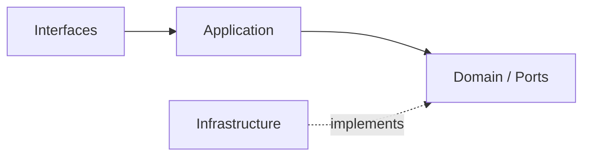
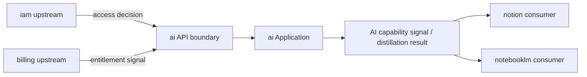
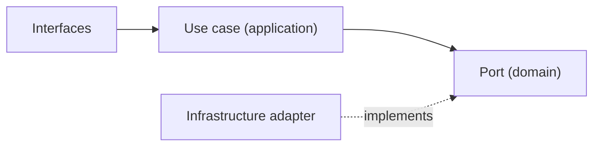
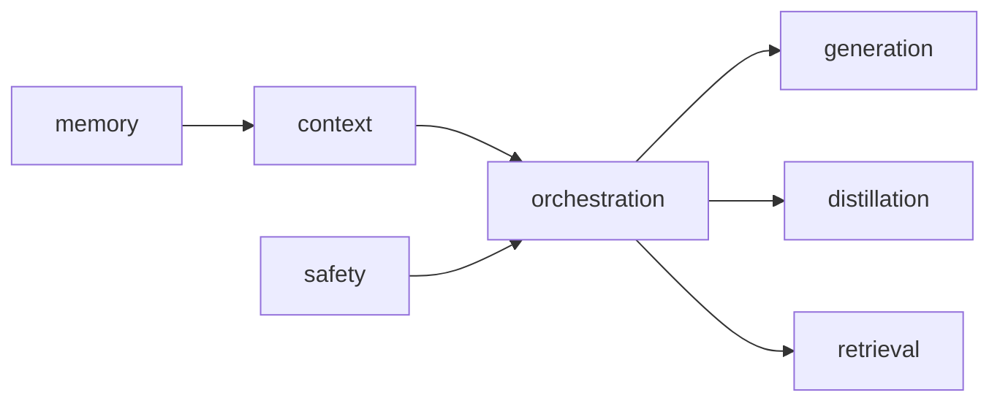

# Files

## File: docs/structure/contexts/ai/bounded-contexts.md
````markdown
# AI Bounded Contexts

## Domain Role

ai 是共享能力 bounded context。它封裝所有 AI 執行能力——從 generation、distillation 到 safety——讓下游主域穩定消費，而不需要了解 LLM provider 細節。

## Baseline Bounded Contexts

| Cluster | Subdomains |
|---|---|
| Core Execution | generation、orchestration、distillation |
| Knowledge Access | retrieval、memory、context |
| Quality & Safety | safety、evaluation、tracing |
| Extended Capability | tool-calling、reasoning、conversation |

## Recommended Gap Bounded Contexts

| Subdomain | Why Needed | Gap If Missing |
|---|---|---|
| provider-routing | 建立模型供應商選擇與路由治理邊界 | 供應商切換邏輯分散於 generation，難以統一管理 |
| model-policy | 建立模型能力、版本與使用政策邊界 | 模型版本更新或限制難以集中決策 |

## Domain Invariants

- generation 是唯一直接呼叫 LLM provider 的子域，其他子域透過 ports 間接使用。
- distillation 輸出的是「精煉知識片段」，不是 KnowledgeArtifact；語義屬於 ai，不屬於 notion。
- memory 若需要長期保存內容，應優先保存 distilled knowledge，而不是無限制保留 raw content。
- retrieval 若存在可選資料來源，應優先索引 distilled chunks 或結構化 knowledge signal。
- evaluation 必須覆蓋 distillation，至少檢查 compression、retention 與 hallucination risk。
- safety 的結果可以終止任何 AI 執行流程。
- orchestration 是執行圖的主控，不直接持有業務資料。
- tracing 只負責觀測與 debug，不得改變執行決策。
- 所有子域的 domain 層必須框架無關。

## Dependency Direction

- ai 子域在存在對應層時遵守 interfaces -> application -> domain <- infrastructure。
- 子域之間透過 ports 或 orchestration application 協調，不直接依賴彼此 domain。
- 外部輸入只能先經 API boundary，再進入 ai 內部執行流程。

## Anti-Patterns

- 讓 generation 子域直接依賴 notion 或 notebooklm 的業務型別。
- 把 distillation 當成 notebooklm synthesis 的 alias，混淆輸出語義。
- 讓下游模組繞過 ai API 邊界，直接 import ai infrastructure。
- 在 ai domain 層 import Genkit、Firebase 或任何 SDK。

## Copilot Generation Rules

- 生成程式碼時，先確認能力屬於哪個 cluster，再決定子域與層。
- 跨子域協調一律交給 orchestration application，不讓子域直接相互呼叫。
- 奧卡姆剃刀：能在現有子域加一個 port + use case 解決，就不要新建子域。

## Dependency Direction Flow


````

## File: docs/structure/contexts/ai/context-map.md
````markdown
# AI Context Map

## Context Role

ai 對其他主域提供共享 AI capability signal。它消費 iam 的 access decision 與 billing 的 entitlement signal，向 notion 與 notebooklm 輸出 generation、distillation、retrieval 等能力。

## Relationships

| Upstream | Downstream | Relationship Type | Published Language |
|---|---|---|---|
| iam | ai | Upstream/Downstream | actor reference、access decision |
| billing | ai | Upstream/Downstream | entitlement signal、quota capability |
| ai | notion | Upstream/Downstream | ai capability signal、distillation result、safety result |
| ai | notebooklm | Upstream/Downstream | ai capability signal、distillation result、retrieval result、safety result |

## Mapping Rules

- ai 消費 iam 的結果，但不重建 actor 或 tenant 模型。
- ai 消費 billing 的 entitlement signal 決定配額，但不擁有訂閱或計費語義。
- notion 消費 ai capability，但 AI provider / policy 所有權不屬於 notion。
- notebooklm 消費 ai 的 generation、distillation、retrieval，但推理輸出的正典語義屬於 notebooklm 自己。
- ai 不回寫任何下游主域的正典模型。

## Integration Pattern

- ai 作為下游消費 iam 與 billing 時，採用 Conformist 或 ACL，視語義相容性決定。
- notion 與 notebooklm 消費 ai 時，ai 的 published language 是 capability signal，不是 aggregate。

## Dependency Direction

- ai 對 iam、billing 屬 downstream。
- ai 對 notion、notebooklm 屬 upstream 的能力供應者。

## Anti-Patterns

- 把 ai 與 notebooklm 寫成 Shared Kernel，同時擁有推理輸出語義。
- 讓 notion 或 notebooklm 直接 import ai 的 infrastructure 或 subdomain domain。
- 把 iam 的 actor model 直接帶入 ai domain，而非只消費 access decision。

## Dependency Direction Flow


````

## File: docs/structure/contexts/ai/cross-runtime-contracts.md
````markdown
# AI Context — Cross-Runtime Contracts

**Date**: 2026-04-16  
**Context**: `src/modules/ai` distillation complete. Defines the published-language contracts between Next.js (TypeScript) and fn (Python) workers.

---

## Background

The AI context spans two runtimes:

| Runtime | Role | Owns |
|---|---|---|
| **Next.js** (`src/modules/ai/`) | Orchestration, port contracts, dispatching | `domain/`, `application/`, `adapters/outbound/` (dispatcher side) |
| **fn** (`fn/src/`) | Heavy compute | Parsing, chunking, embedding, vector-write |

Cross-runtime handoff uses **QStash messages**. The payload shape is the shared contract.

---

## Contract Map

### Embedding Job (chunk → embedding dispatch)

| Side | Path | Format |
|---|---|---|
| TypeScript (dispatcher) | `src/modules/ai/subdomains/embedding/adapters/outbound/dto/embedding-job-payload.ts` | Zod schema |
| Python (handler) | `fn/src/application/dto/embedding_job.py` | Pydantic model |

**Fields:**

| Field | TypeScript type | Python type | Description |
|---|---|---|---|
| `jobId` | `string (uuid)` | `UUID4` | Idempotency key |
| `documentId` | `string` | `str` | Source document |
| `workspaceId` | `string` | `str` | Tenant isolation |
| `chunkIds` | `string[]` | `List[str]` | Chunks to embed |
| `modelHint` | `string \| undefined` | `Optional[str]` | Model preference |
| `requestedAt` | `string (datetime)` | `datetime` | ISO 8601 timestamp |

---

### Chunk Job (document → chunking dispatch)

| Side | Path | Format |
|---|---|---|
| TypeScript (dispatcher) | `src/modules/ai/subdomains/chunk/adapters/outbound/dto/chunk-job-payload.ts` | Zod schema |
| Python (handler) | `fn/src/application/dto/chunk_job.py` | Pydantic model |

**Fields:**

| Field | TypeScript type | Python type | Description |
|---|---|---|---|
| `jobId` | `string (uuid)` | `UUID4` | Idempotency key |
| `documentId` | `string` | `str` | Document to chunk |
| `workspaceId` | `string` | `str` | Tenant isolation |
| `sourceType` | `string` | `str` | e.g. `"notion-page"` |
| `strategyHint` | `"fixed-size" \| "semantic" \| "markdown-section" \| undefined` | `Optional[ChunkingStrategy]` | Chunking strategy |
| `maxTokensPerChunk` | `number \| undefined` | `Optional[int]` | Token limit per chunk |
| `requestedAt` | `string (datetime)` | `datetime` | ISO 8601 timestamp |

---

## Flow Diagram

```
Next.js (src/modules/ai adapters/outbound/)
  → serialize payload using Zod schema
  → publish QStash message
  ↓
fn (interface/handlers/)
  → receive QStash webhook
  → parse with Pydantic model (validation gate)
  → application use-case
  → infrastructure (OpenAI, Upstash Vector, Firestore)
```

---

## Contract Governance Rules

1. **Both sides must be updated together** when the payload shape changes.
2. **Adding optional fields** is backward-compatible; adding required fields is a breaking change.
3. **Field names** use camelCase in TypeScript, snake_case in Python (Pydantic auto-aliases via `model_config`).
4. **The TypeScript schema is the source of truth**; the Python model is the mirror.
5. **Never put AI provider config** (model name, API key) in the payload — those belong in fn's `infrastructure/external/`.

---

## Existing fn Firestore Trigger Contracts

These are separate from QStash and are defined by Firestore document structure:

| Trigger | Handler | Document path |
|---|---|---|
| New file uploaded | `fn/src/interface/handlers/parse_document.py` | `workspaces/{wid}/files/{fid}` |
| Re-index request | `fn/src/interface/handlers/rag_reindex_handler.py` | `workspaces/{wid}/reindex_requests/{rid}` |

Firestore document schema for these is owned by `src/modules/platform/subdomains/file-storage/` (TypeScript) and mirrored in `fn/src/infrastructure/persistence/firestore/`.
````

## File: docs/structure/contexts/ai/ubiquitous-language.md
````markdown
# AI Ubiquitous Language

## Canonical Terms

| Term | Meaning |
|---|---|
| AICapabilitySignal | ai 向下游輸出的能力結果，不是具體 aggregate |
| GenerationResult | 單次文字生成的輸出，包含 text、model、finishReason |
| DistillationResult | 從多段內容或長輸出濃縮出的精煉知識片段 |
| RetrievalResult | 向量搜尋後回傳的相關內容片段與分數 |
| PromptContext | 組裝後準備送入 LLM 的完整上下文物件 |
| SafetyResult | 安全護欄對輸入或輸出的檢查結果（pass / block） |
| ModelPolicy | 模型選擇、版本鎖定與使用限制規則 |
| OrchestrationFlow | 多步驟 AI 執行圖，由 orchestration 子域控制 |
| ToolCall | 外部工具的調用請求與結果 |
| MemoryEntry | 對話歷史或跨輪次狀態的單筆記錄 |
| EvaluationScore | 針對 AI 輸出的品質量測結果 |
| TraceSpan | AI 執行流程中的單一可觀測片段 |

## Language Rules

- 使用 DistillationResult 表示蒸餾輸出，不用 Summary 混稱精煉過程與摘要功能。
- 使用 GenerationResult 表示生成輸出，不用 Response 泛稱所有 LLM 回傳。
- 使用 PromptContext 表示組裝後的上下文，不用 Prompt 直接傳遞原始字串。
- 使用 SafetyResult 表示護欄結果，不用 Filter 混指檢查流程。
- 使用 AICapabilitySignal 作為跨主域 published language，不暴露內部 aggregate。

## Avoid

| Avoid | Use Instead |
|---|---|
| Summary（跨域泛稱） | DistillationResult（ai 精煉輸出）或 GenerationResult（生成摘要） |
| Response | GenerationResult |
| Filter | SafetyResult |
| Prompt（跨域傳遞） | PromptContext |
| Chat | conversation（ai 輪次管理）或 Conversation（notebooklm 正典） |

## Naming Anti-Patterns

- 不用 Summary 混指 distillation 的精煉結果與 generation 的摘要功能。
- 不用 Chat 混指 ai 的 conversation 管理與 notebooklm 的 Conversation aggregate。
- 不用 Prompt 作為跨域傳遞型別，必須先組裝成 PromptContext。
- 不用 Filter 表示 safety 的護欄判定，SafetyResult 已含通過或攔截語義。

## Copilot Generation Rules

- 命名先對齊上表 Canonical Terms，再決定類別與檔名。
- distillation 子域的輸出型別命名用 DistillationResult，不要退化為 SummarizedText。
- 奧卡姆剃刀：若一個正確名詞已能表達邊界，不要再堆疊近義抽象。
````

## File: src/modules/ai/orchestration/AiFacade.ts
````typescript
import { GenkitPromptRegistry } from "../prompts/registry/GenkitPromptRegistry";
import type { PromptRegistryPort } from "../prompts/registry/PromptRegistry";
import { PROMPT_KEYS } from "../prompts/versions";
⋮----
interface GenerationPromptOutput {
  readonly text: string;
}
⋮----
interface QueryExpansionPromptOutput {
  readonly queries: readonly string[];
}
⋮----
/**
 * AiFacade is the orchestration entry for cross-subdomain AI prompt execution.
 * It keeps callers decoupled from prompt definitions by delegating all prompt
 * resolution and execution to the PromptRegistry boundary.
 */
export class AiFacade {
⋮----
constructor(private readonly promptRegistry: PromptRegistryPort = new GenkitPromptRegistry())
⋮----
async generateText(input:
⋮----
async expandQuery(query: string): Promise<readonly string[]>
````

## File: src/modules/ai/orchestration/index.ts
````typescript

````

## File: src/modules/ai/prompts/registry/GenkitPromptRegistry.ts
````typescript
import { ai } from "@/packages/integration-ai/genkit";
import { z } from "genkit";
⋮----
import { PROMPT_KEYS } from "../versions";
import type { PromptRegistryPort } from "./PromptRegistry";
import { loadPromptDefinitions } from "./prompt-loader";
import type { PromptKey, PromptRunner } from "./prompt-types";
⋮----
export class GenkitPromptRegistry implements PromptRegistryPort {
⋮----
constructor(knownKeys: readonly PromptKey[] = Object.values(PROMPT_KEYS))
⋮----
get<TOutput = unknown>(key: PromptKey): PromptRunner<TOutput>
⋮----
const runner: PromptRunner<TOutput> = async (input) =>
⋮----
list(): readonly PromptKey[]
⋮----
resolve(key: string): PromptKey | null
````

## File: src/modules/ai/prompts/registry/InMemoryPromptRegistry.ts
````typescript
import type { PromptRegistryPort } from "./PromptRegistry";
import type { PromptKey, PromptRunner } from "./prompt-types";
⋮----
export interface PromptRegistryEntry<TOutput = unknown> {
  readonly key: PromptKey;
  readonly runner: PromptRunner<TOutput>;
}
⋮----
export class InMemoryPromptRegistry implements PromptRegistryPort {
⋮----
constructor(entries: readonly PromptRegistryEntry[] = [])
⋮----
register<TOutput = unknown>(entry: PromptRegistryEntry<TOutput>): void
⋮----
get<TOutput = unknown>(key: PromptKey): PromptRunner<TOutput>
⋮----
list(): readonly PromptKey[]
⋮----
resolve(key: string): PromptKey | null
````

## File: src/modules/ai/prompts/registry/prompt-loader.ts
````typescript
import { registerGenerationPrompts } from "../../subdomains/generation/prompts/generate-text.prompt";
import { registerRetrievalPrompts } from "../../subdomains/retrieval/prompts/query-expansion.prompt";
⋮----
export const loadPromptDefinitions = (): void =>
````

## File: src/modules/ai/prompts/registry/prompt-types.ts
````typescript
export type PromptKey = `${string}.${string}`;
⋮----
export type PromptRegistryInput = Readonly<Record<string, unknown>>;
⋮----
export interface PromptRegistryResult<TOutput = unknown> {
  readonly output: TOutput;
  readonly text?: string;
}
⋮----
export type PromptRunner<TOutput = unknown> = (input: PromptRegistryInput) => Promise<PromptRegistryResult<TOutput>>;
````

## File: src/modules/ai/prompts/registry/PromptRegistry.ts
````typescript
import type { PromptKey, PromptRunner } from "./prompt-types";
⋮----
export interface PromptRegistryPort {
  get<TOutput = unknown>(key: PromptKey): PromptRunner<TOutput>;
  list(): readonly PromptKey[];
  resolve(key: string): PromptKey | null;
}
⋮----
get<TOutput = unknown>(key: PromptKey): PromptRunner<TOutput>;
list(): readonly PromptKey[];
resolve(key: string): PromptKey | null;
````

## File: src/modules/ai/prompts/versions.ts
````typescript
import type { PromptKey } from "./registry/prompt-types";
````

## File: src/modules/ai/shared/errors/index.ts
````typescript
// ai shared/errors placeholder
````

## File: src/modules/ai/shared/events/index.ts
````typescript
// ai shared/events placeholder
````

## File: src/modules/ai/shared/index.ts
````typescript

````

## File: src/modules/ai/shared/types/index.ts
````typescript
// ai shared/types placeholder
````

## File: src/modules/ai/subdomains/chunk/adapters/inbound/index.ts
````typescript
// chunk — inbound adapters placeholder
// TODO: export server actions / route handlers
````

## File: src/modules/ai/subdomains/chunk/adapters/index.ts
````typescript
// chunk — adapters aggregate
````

## File: src/modules/ai/subdomains/chunk/adapters/outbound/dto/chunk-job-payload.ts
````typescript
/**
 * chunk-job-payload.ts
 *
 * Outbound DTO: QStash message payload for dispatching chunking jobs
 * to fn workers. This is an outbound contract (dispatcher → worker),
 * NOT a provider API contract.
 *
 * Discussion 08 — cross-runtime contract:
 * - TypeScript side (this file): Zod schema defining the payload shape
 * - Python side (fn/src/application/dto/chunk_job.py): Pydantic mirror
 *
 * Both sides must stay semantically aligned. Changes here require
 * corresponding updates to the fn Pydantic model.
 *
 * @see docs/structure/contexts/ai/cross-runtime-contracts.md
 */
⋮----
import { z } from "zod";
⋮----
/** Unique identifier for this job (used for idempotency) */
⋮----
/** The raw document content to be chunked */
⋮----
/** Workspace scope for multi-tenant isolation */
⋮----
/** Source type (e.g. "notion-page", "uploaded-file") */
⋮----
/** Optional hint for chunking strategy */
⋮----
/** Max token count per chunk; fn uses default if omitted */
⋮----
/** ISO 8601 timestamp when the job was requested */
⋮----
export type ChunkJobPayload = z.infer<typeof ChunkJobPayloadSchema>;
````

## File: src/modules/ai/subdomains/chunk/adapters/outbound/index.ts
````typescript
// chunk — outbound adapters
````

## File: src/modules/ai/subdomains/chunk/adapters/outbound/memory/InMemoryChunkRepository.ts
````typescript
import type { ChunkSnapshot, ChunkStatus } from "../../../domain/entities/Chunk";
import type { ChunkRepository, ChunkQuery } from "../../../domain/repositories/ChunkRepository";
⋮----
export class InMemoryChunkRepository implements ChunkRepository {
⋮----
async save(snapshot: ChunkSnapshot): Promise<void>
⋮----
async saveAll(snapshots: ChunkSnapshot[]): Promise<void>
⋮----
async findById(id: string): Promise<ChunkSnapshot | null>
⋮----
async findBySourceId(sourceId: string): Promise<ChunkSnapshot[]>
⋮----
async query(params: ChunkQuery): Promise<ChunkSnapshot[]>
⋮----
async delete(id: string): Promise<void>
⋮----
async deleteBySourceId(sourceId: string): Promise<void>
````

## File: src/modules/ai/subdomains/chunk/application/index.ts
````typescript

````

## File: src/modules/ai/subdomains/chunk/application/use-cases/ChunkUseCases.ts
````typescript
import { commandSuccess, commandFailureFrom, type CommandResult } from "../../../../../shared";
import { Chunk, type CreateChunkInput } from "../../domain/entities/Chunk";
import type { ChunkRepository } from "../../domain/repositories/ChunkRepository";
⋮----
export class CreateChunkUseCase {
⋮----
constructor(private readonly repo: ChunkRepository)
⋮----
async execute(input: CreateChunkInput): Promise<CommandResult>
⋮----
export class BulkCreateChunksUseCase {
⋮----
async execute(inputs: CreateChunkInput[]): Promise<CommandResult>
⋮----
export class GetChunksBySourceUseCase {
⋮----
async execute(sourceId: string)
````

## File: src/modules/ai/subdomains/chunk/domain/entities/Chunk.ts
````typescript
import { z } from "zod";
import { v4 as uuid } from "uuid";
⋮----
export type ChunkId = z.infer<typeof ChunkIdSchema>;
⋮----
export type ChunkStatus = z.infer<typeof ChunkStatusSchema>;
⋮----
export interface ChunkSnapshot {
  readonly id: string;
  readonly sourceId: string;
  readonly sourceType: string;
  readonly content: string;
  readonly order: number;
  readonly tokenCount?: number;
  readonly metadata: Record<string, unknown>;
  readonly status: ChunkStatus;
  readonly createdAtISO: string;
  readonly updatedAtISO: string;
}
⋮----
export interface CreateChunkInput {
  readonly sourceId: string;
  readonly sourceType: string;
  readonly content: string;
  readonly order: number;
  readonly tokenCount?: number;
  readonly metadata?: Record<string, unknown>;
}
⋮----
export class Chunk {
⋮----
private constructor(private _props: ChunkSnapshot)
⋮----
static create(input: CreateChunkInput): Chunk
⋮----
static reconstitute(snapshot: ChunkSnapshot): Chunk
⋮----
markEmbedded(): void
⋮----
markIndexed(): void
⋮----
markFailed(): void
⋮----
get id(): string
get sourceId(): string
get content(): string
get status(): ChunkStatus
⋮----
getSnapshot(): Readonly<ChunkSnapshot>
````

## File: src/modules/ai/subdomains/chunk/domain/index.ts
````typescript

````

## File: src/modules/ai/subdomains/chunk/domain/repositories/ChunkRepository.ts
````typescript
import type { ChunkSnapshot, ChunkStatus } from "../entities/Chunk";
⋮----
export interface ChunkQuery {
  readonly sourceId?: string;
  readonly status?: ChunkStatus;
  readonly limit?: number;
  readonly offset?: number;
}
⋮----
export interface ChunkRepository {
  save(snapshot: ChunkSnapshot): Promise<void>;
  saveAll(snapshots: ChunkSnapshot[]): Promise<void>;
  findById(id: string): Promise<ChunkSnapshot | null>;
  findBySourceId(sourceId: string): Promise<ChunkSnapshot[]>;
  query(params: ChunkQuery): Promise<ChunkSnapshot[]>;
  delete(id: string): Promise<void>;
  deleteBySourceId(sourceId: string): Promise<void>;
}
⋮----
save(snapshot: ChunkSnapshot): Promise<void>;
saveAll(snapshots: ChunkSnapshot[]): Promise<void>;
findById(id: string): Promise<ChunkSnapshot | null>;
findBySourceId(sourceId: string): Promise<ChunkSnapshot[]>;
query(params: ChunkQuery): Promise<ChunkSnapshot[]>;
delete(id: string): Promise<void>;
deleteBySourceId(sourceId: string): Promise<void>;
````

## File: src/modules/ai/subdomains/citation/adapters/inbound/index.ts
````typescript
// citation — inbound adapters placeholder
// TODO: export server actions / route handlers
````

## File: src/modules/ai/subdomains/citation/adapters/index.ts
````typescript
// citation — adapters aggregate
````

## File: src/modules/ai/subdomains/citation/adapters/outbound/index.ts
````typescript
// citation — outbound adapters placeholder
// TODO: export Firestore repositories, external clients
````

## File: src/modules/ai/subdomains/citation/application/index.ts
````typescript
// citation — application layer placeholder
// TODO: export use-cases, DTOs, ports
````

## File: src/modules/ai/subdomains/citation/application/use-cases/CitationUseCases.ts
````typescript
// TODO: implement citation building use-cases
````

## File: src/modules/ai/subdomains/citation/domain/entities/Citation.ts
````typescript
export interface CitationSource {
  readonly id: string;
  readonly sourceId: string;
  readonly chunkId: string;
  readonly title?: string;
  readonly excerpt: string;
  readonly score: number;
  readonly url?: string;
}
⋮----
export interface Citation {
  readonly id: string;
  readonly responseId: string;
  readonly sources: CitationSource[];
  readonly createdAtISO: string;
}
⋮----
export interface CitationRepository {
  save(citation: Citation): Promise<void>;
  findById(id: string): Promise<Citation | null>;
  findByResponseId(responseId: string): Promise<Citation | null>;
}
⋮----
save(citation: Citation): Promise<void>;
findById(id: string): Promise<Citation | null>;
findByResponseId(responseId: string): Promise<Citation | null>;
````

## File: src/modules/ai/subdomains/citation/domain/index.ts
````typescript
// citation — domain layer placeholder
// TODO: export entities, value-objects, repositories, events, services
````

## File: src/modules/ai/subdomains/context/adapters/inbound/index.ts
````typescript
// context — inbound adapters placeholder
// TODO: export server actions / route handlers
````

## File: src/modules/ai/subdomains/context/adapters/index.ts
````typescript
// context — adapters aggregate
````

## File: src/modules/ai/subdomains/context/adapters/outbound/index.ts
````typescript
// context — outbound adapters placeholder
// TODO: export Firestore repositories, external clients
````

## File: src/modules/ai/subdomains/context/application/index.ts
````typescript
// context — application layer placeholder
// TODO: export use-cases, DTOs, ports
````

## File: src/modules/ai/subdomains/context/application/use-cases/ContextUseCases.ts
````typescript
import { commandSuccess, commandFailureFrom, type CommandResult } from "../../../../../shared";
import { ContextSession } from "../../domain/entities/ContextSession";
import type { ContextSessionRepository } from "../../domain/repositories/ContextSessionRepository";
⋮----
export class CreateContextSessionUseCase {
⋮----
constructor(private readonly repo: ContextSessionRepository)
⋮----
async execute(input:
⋮----
export class AddContextMessageUseCase {
````

## File: src/modules/ai/subdomains/context/domain/entities/ContextSession.ts
````typescript
import { z } from "zod";
import { v4 as uuid } from "uuid";
⋮----
export type ContextSessionId = z.infer<typeof ContextSessionIdSchema>;
⋮----
export type ContextRole = "user" | "assistant" | "system";
⋮----
export interface ContextMessage {
  readonly id: string;
  readonly role: ContextRole;
  readonly content: string;
  readonly createdAtISO: string;
}
⋮----
export interface ContextSessionSnapshot {
  readonly id: string;
  readonly actorId?: string;
  readonly workspaceId?: string;
  readonly messages: ContextMessage[];
  readonly systemPrompt?: string;
  readonly model?: string;
  readonly createdAtISO: string;
  readonly updatedAtISO: string;
}
⋮----
export class ContextSession {
⋮----
private constructor(private _props: ContextSessionSnapshot)
⋮----
static create(input: {
    actorId?: string;
    workspaceId?: string;
    systemPrompt?: string;
    model?: string;
}): ContextSession
⋮----
static reconstitute(snapshot: ContextSessionSnapshot): ContextSession
⋮----
addMessage(role: ContextRole, content: string): void
⋮----
get id(): string
get messages(): ContextMessage[]
⋮----
getSnapshot(): Readonly<ContextSessionSnapshot>
````

## File: src/modules/ai/subdomains/context/domain/index.ts
````typescript
// context — domain layer placeholder
// TODO: export entities, value-objects, repositories, events, services
````

## File: src/modules/ai/subdomains/context/domain/repositories/ContextSessionRepository.ts
````typescript
import type { ContextSessionSnapshot } from "../entities/ContextSession";
⋮----
export interface ContextSessionRepository {
  save(snapshot: ContextSessionSnapshot): Promise<void>;
  findById(id: string): Promise<ContextSessionSnapshot | null>;
  findByActorId(actorId: string, limit?: number): Promise<ContextSessionSnapshot[]>;
  delete(id: string): Promise<void>;
}
⋮----
save(snapshot: ContextSessionSnapshot): Promise<void>;
findById(id: string): Promise<ContextSessionSnapshot | null>;
findByActorId(actorId: string, limit?: number): Promise<ContextSessionSnapshot[]>;
delete(id: string): Promise<void>;
````

## File: src/modules/ai/subdomains/embedding/adapters/inbound/index.ts
````typescript
// embedding — inbound adapters placeholder
// TODO: export server actions / route handlers
````

## File: src/modules/ai/subdomains/embedding/adapters/index.ts
````typescript
// embedding — adapters aggregate
````

## File: src/modules/ai/subdomains/embedding/adapters/outbound/dto/embedding-job-payload.ts
````typescript
/**
 * embedding-job-payload.ts
 *
 * Outbound DTO: QStash message payload for dispatching embedding generation
 * jobs to fn workers. This is an outbound contract (dispatcher → worker),
 * NOT a provider API contract.
 *
 * Discussion 08 — cross-runtime contract:
 * - TypeScript side (this file): Zod schema defining the payload shape
 * - Python side (fn/src/application/dto/embedding_job.py): Pydantic mirror
 *
 * Both sides must stay semantically aligned. Changes here require
 * corresponding updates to the fn Pydantic model.
 *
 * @see docs/structure/contexts/ai/cross-runtime-contracts.md
 */
⋮----
import { z } from "zod";
⋮----
/** Unique identifier for this job (used for idempotency) */
⋮----
/** The document/artifact that sourced these chunks */
⋮----
/** Workspace scope for multi-tenant isolation */
⋮----
/** Chunk IDs to generate embeddings for (at least one required) */
⋮----
/** Optional model hint; fn selects default if omitted */
⋮----
/** ISO 8601 timestamp when the job was requested */
⋮----
export type EmbeddingJobPayload = z.infer<typeof EmbeddingJobPayloadSchema>;
````

## File: src/modules/ai/subdomains/embedding/adapters/outbound/index.ts
````typescript
// embedding — outbound adapters
````

## File: src/modules/ai/subdomains/embedding/application/index.ts
````typescript

````

## File: src/modules/ai/subdomains/embedding/application/use-cases/EmbeddingUseCases.ts
````typescript
import { commandSuccess, commandFailureFrom, type CommandResult } from "../../../../../shared";
import { Embedding } from "../../domain/entities/Embedding";
import type { EmbeddingGenerationPort } from "../../domain/entities/Embedding";
import type { EmbeddingRepository } from "../../domain/repositories/EmbeddingRepository";
⋮----
export class GenerateAndStoreEmbeddingUseCase {
⋮----
constructor(
⋮----
async execute(input: {
    chunkId: string;
    sourceId: string;
    text: string;
    model?: string;
}): Promise<CommandResult>
````

## File: src/modules/ai/subdomains/embedding/domain/entities/Embedding.ts
````typescript
import { z } from "zod";
import { v4 as uuid } from "uuid";
⋮----
export type EmbeddingId = z.infer<typeof EmbeddingIdSchema>;
⋮----
export interface EmbeddingSnapshot {
  readonly id: string;
  readonly chunkId: string;
  readonly sourceId: string;
  readonly vector: number[];
  readonly model: string;
  readonly dimensions: number;
  readonly createdAtISO: string;
}
⋮----
export interface CreateEmbeddingInput {
  readonly chunkId: string;
  readonly sourceId: string;
  readonly vector: number[];
  readonly model: string;
}
⋮----
export class Embedding {
⋮----
private constructor(private readonly _props: EmbeddingSnapshot)
⋮----
static create(input: CreateEmbeddingInput): Embedding
⋮----
static reconstitute(snapshot: EmbeddingSnapshot): Embedding
⋮----
get id(): string
get chunkId(): string
get vector(): number[]
get model(): string
⋮----
getSnapshot(): Readonly<EmbeddingSnapshot>
⋮----
export interface EmbeddingGenerationPort {
  generateEmbedding(text: string, model?: string): Promise<{ vector: number[]; model: string }>;
  generateEmbeddingBatch(texts: string[], model?: string): Promise<Array<{ vector: number[]; model: string }>>;
}
⋮----
generateEmbedding(text: string, model?: string): Promise<
generateEmbeddingBatch(texts: string[], model?: string): Promise<Array<
````

## File: src/modules/ai/subdomains/embedding/domain/index.ts
````typescript

````

## File: src/modules/ai/subdomains/embedding/domain/repositories/EmbeddingRepository.ts
````typescript
import type { EmbeddingSnapshot } from "../entities/Embedding";
⋮----
export interface EmbeddingRepository {
  save(snapshot: EmbeddingSnapshot): Promise<void>;
  saveAll(snapshots: EmbeddingSnapshot[]): Promise<void>;
  findById(id: string): Promise<EmbeddingSnapshot | null>;
  findByChunkId(chunkId: string): Promise<EmbeddingSnapshot | null>;
  findBySourceId(sourceId: string): Promise<EmbeddingSnapshot[]>;
  delete(id: string): Promise<void>;
  deleteBySourceId(sourceId: string): Promise<void>;
}
⋮----
save(snapshot: EmbeddingSnapshot): Promise<void>;
saveAll(snapshots: EmbeddingSnapshot[]): Promise<void>;
findById(id: string): Promise<EmbeddingSnapshot | null>;
findByChunkId(chunkId: string): Promise<EmbeddingSnapshot | null>;
findBySourceId(sourceId: string): Promise<EmbeddingSnapshot[]>;
delete(id: string): Promise<void>;
deleteBySourceId(sourceId: string): Promise<void>;
````

## File: src/modules/ai/subdomains/evaluation/adapters/inbound/index.ts
````typescript
// evaluation — inbound adapters placeholder
// TODO: export server actions / route handlers
````

## File: src/modules/ai/subdomains/evaluation/adapters/index.ts
````typescript
// evaluation — adapters aggregate
````

## File: src/modules/ai/subdomains/evaluation/adapters/outbound/index.ts
````typescript
// evaluation — outbound adapters placeholder
// TODO: export Firestore repositories, external clients
````

## File: src/modules/ai/subdomains/evaluation/application/index.ts
````typescript
// evaluation — application layer placeholder
// TODO: export use-cases, DTOs, ports
````

## File: src/modules/ai/subdomains/evaluation/application/use-cases/EvaluationUseCases.ts
````typescript
// TODO: implement evaluation use-cases
````

## File: src/modules/ai/subdomains/evaluation/domain/entities/EvaluationResult.ts
````typescript
export type EvaluationVerdict = "pass" | "fail" | "needs_review";
⋮----
export interface EvaluationCriterion {
  readonly name: string;
  readonly weight: number;
  readonly description?: string;
}
⋮----
export interface EvaluationResult {
  readonly id: string;
  readonly responseId: string;
  readonly criteria: Array<{
    readonly criterion: EvaluationCriterion;
    readonly score: number;
    readonly verdict: EvaluationVerdict;
    readonly reasoning?: string;
  }>;
  readonly overallScore: number;
  readonly overallVerdict: EvaluationVerdict;
  readonly evaluatedAtISO: string;
}
⋮----
export interface EvaluationPort {
  evaluate(input: {
    response: string;
    context?: string;
    criteria: EvaluationCriterion[];
    model?: string;
  }): Promise<Omit<EvaluationResult, "id" | "responseId" | "evaluatedAtISO">>;
}
⋮----
evaluate(input: {
    response: string;
    context?: string;
    criteria: EvaluationCriterion[];
    model?: string;
  }): Promise<Omit<EvaluationResult, "id" | "responseId" | "evaluatedAtISO">>;
````

## File: src/modules/ai/subdomains/evaluation/domain/index.ts
````typescript
// evaluation — domain layer placeholder
// TODO: export entities, value-objects, repositories, events, services
````

## File: src/modules/ai/subdomains/generation/adapters/inbound/index.ts
````typescript
// generation — inbound adapters placeholder
// TODO: export server actions / route handlers
````

## File: src/modules/ai/subdomains/generation/adapters/index.ts
````typescript
// generation — adapters aggregate
````

## File: src/modules/ai/subdomains/generation/adapters/outbound/index.ts
````typescript
// generation — outbound adapters placeholder
// TODO: export Firestore repositories, external clients
````

## File: src/modules/ai/subdomains/generation/application/index.ts
````typescript

````

## File: src/modules/ai/subdomains/generation/application/use-cases/GenerationUseCases.ts
````typescript
import type {
  TextGenerationPort,
  GenerateTextInput,
  GenerateTextOutput,
  ContentDistillationPort,
  DistillContentInput,
  DistillationOutput,
  TaskExtractionPort,
  TaskExtractionInput,
  TaskExtractionOutput,
} from "../../domain/ports/GenerationPorts";
⋮----
export class GenerateTextUseCase {
⋮----
constructor(private readonly port: TextGenerationPort)
⋮----
async execute(input: GenerateTextInput): Promise<
⋮----
export class DistillContentUseCase {
⋮----
constructor(private readonly port: ContentDistillationPort)
⋮----
async execute(input: DistillContentInput): Promise<
⋮----
export class ExtractTasksUseCase {
⋮----
constructor(private readonly port: TaskExtractionPort)
⋮----
async execute(input: TaskExtractionInput): Promise<
````

## File: src/modules/ai/subdomains/generation/domain/index.ts
````typescript

````

## File: src/modules/ai/subdomains/generation/domain/ports/GenerationPorts.ts
````typescript
/**
 * generation — domain ports
 * Distilled from modules/ai/domain/ports/AiTextGenerationPort.ts and DistillationPort.ts
 */
⋮----
export interface GenerateTextInput {
  readonly prompt: string;
  readonly system?: string;
  readonly model?: string;
}
⋮----
export interface GenerateTextOutput {
  readonly text: string;
  readonly model: string;
  readonly finishReason?: string;
  readonly traceId?: string;
  readonly completedAt?: string;
}
⋮----
export interface TextGenerationPort {
  generateText(input: GenerateTextInput): Promise<GenerateTextOutput>;
}
⋮----
generateText(input: GenerateTextInput): Promise<GenerateTextOutput>;
⋮----
export interface DistillationSource {
  readonly title?: string | null;
  readonly text: string;
}
⋮----
export interface DistillContentInput {
  readonly sources: readonly DistillationSource[];
  readonly objective?: string;
  readonly model?: string;
}
⋮----
export interface DistillationItem {
  readonly title: string;
  readonly summary: string;
  readonly sourceTitle?: string | null;
}
⋮----
export interface DistillationOutput {
  readonly overview: string;
  readonly items: readonly DistillationItem[];
  readonly model: string;
  readonly traceId: string;
  readonly completedAt: string;
}
⋮----
export interface ContentDistillationPort {
  distill(input: DistillContentInput): Promise<DistillationOutput>;
}
⋮----
distill(input: DistillContentInput): Promise<DistillationOutput>;
⋮----
export interface TaskExtractionItem {
  readonly title: string;
  readonly description?: string;
  readonly dueDate?: string;
  readonly metadata?: Record<string, unknown>;
}
⋮----
export interface TaskExtractionInput {
  readonly content: string;
  readonly maxCandidates?: number;
  readonly model?: string;
  readonly promptFamily?: string;
  readonly context?: Record<string, unknown>;
}
⋮----
export interface TaskExtractionOutput {
  readonly tasks: readonly TaskExtractionItem[];
  readonly model: string;
  readonly traceId: string;
  readonly completedAt: string;
}
⋮----
export interface TaskExtractionPort {
  extractTasks(input: TaskExtractionInput): Promise<TaskExtractionOutput>;
}
⋮----
extractTasks(input: TaskExtractionInput): Promise<TaskExtractionOutput>;
````

## File: src/modules/ai/subdomains/generation/prompts/generate-text.prompt.ts
````typescript
import { ai } from "@/packages/integration-ai/genkit";
import { z } from "genkit";
⋮----
import { PROMPT_KEYS } from "../../../prompts/versions";
⋮----
export const registerGenerationPrompts = (): void =>
````

## File: src/modules/ai/subdomains/memory/adapters/inbound/index.ts
````typescript
// memory — adapters/inbound placeholder
// TODO: export inbound adapters (HTTP handlers, action wrappers)
````

## File: src/modules/ai/subdomains/memory/adapters/index.ts
````typescript
// memory — adapters aggregate
````

## File: src/modules/ai/subdomains/memory/adapters/outbound/index.ts
````typescript
// memory — adapters/outbound placeholder
// TODO: export outbound adapters (repository implementations, external services)
````

## File: src/modules/ai/subdomains/memory/application/index.ts
````typescript
// memory — application layer placeholder
// TODO: export use-cases, DTOs, application services
````

## File: src/modules/ai/subdomains/memory/application/use-cases/MemoryUseCases.ts
````typescript
// TODO: implement memory upsert/query use-cases
````

## File: src/modules/ai/subdomains/memory/domain/entities/MemoryItem.ts
````typescript
export interface MemoryItem {
  readonly id: string;
  readonly actorId: string;
  readonly key: string;
  readonly value: string;
  readonly tags: string[];
  readonly expiresAtISO?: string;
  readonly createdAtISO: string;
  readonly updatedAtISO: string;
}
⋮----
export interface MemoryRepository {
  save(item: MemoryItem): Promise<void>;
  findByActorAndKey(actorId: string, key: string): Promise<MemoryItem | null>;
  findByActor(actorId: string, tags?: string[]): Promise<MemoryItem[]>;
  delete(id: string): Promise<void>;
}
⋮----
save(item: MemoryItem): Promise<void>;
findByActorAndKey(actorId: string, key: string): Promise<MemoryItem | null>;
findByActor(actorId: string, tags?: string[]): Promise<MemoryItem[]>;
delete(id: string): Promise<void>;
````

## File: src/modules/ai/subdomains/memory/domain/index.ts
````typescript
// memory — domain layer placeholder
// TODO: export entities, value-objects, repositories, events, services
````

## File: src/modules/ai/subdomains/pipeline/adapters/inbound/index.ts
````typescript
// pipeline — inbound adapters placeholder
// TODO: export server actions / route handlers
````

## File: src/modules/ai/subdomains/pipeline/adapters/index.ts
````typescript
// pipeline — adapters aggregate
````

## File: src/modules/ai/subdomains/pipeline/adapters/outbound/index.ts
````typescript
// pipeline — outbound adapters placeholder
// TODO: export Firestore repositories, external clients
````

## File: src/modules/ai/subdomains/pipeline/application/index.ts
````typescript
// pipeline — application layer placeholder
// TODO: export use-cases, DTOs, ports
````

## File: src/modules/ai/subdomains/pipeline/application/use-cases/PipelineUseCases.ts
````typescript
// TODO: implement pipeline use-cases for prompt rendering and pipeline orchestration
````

## File: src/modules/ai/subdomains/pipeline/domain/entities/PromptTemplate.ts
````typescript
export interface PromptTemplate {
  readonly id: string;
  readonly name: string;
  readonly family: string;
  readonly system?: string;
  readonly userTemplate: string;
  readonly variables: string[];
  readonly model?: string;
  readonly version: number;
  readonly createdAtISO: string;
}
⋮----
export interface PromptTemplateRepository {
  save(template: PromptTemplate): Promise<void>;
  findById(id: string): Promise<PromptTemplate | null>;
  findByFamily(family: string): Promise<PromptTemplate[]>;
  findLatestByName(name: string): Promise<PromptTemplate | null>;
}
⋮----
save(template: PromptTemplate): Promise<void>;
findById(id: string): Promise<PromptTemplate | null>;
findByFamily(family: string): Promise<PromptTemplate[]>;
findLatestByName(name: string): Promise<PromptTemplate | null>;
⋮----
export interface RenderedPrompt {
  readonly system?: string;
  readonly user: string;
  readonly model?: string;
}
⋮----
export interface PromptRenderPort {
  render(template: PromptTemplate, variables: Record<string, string>): RenderedPrompt;
}
⋮----
render(template: PromptTemplate, variables: Record<string, string>): RenderedPrompt;
````

## File: src/modules/ai/subdomains/pipeline/domain/index.ts
````typescript

````

## File: src/modules/ai/subdomains/pipeline/domain/ports/AiOrchestrationPort.ts
````typescript
export interface AiOrchestrationInput {
  readonly promptKey: string;
  readonly variables: Readonly<Record<string, unknown>>;
}
⋮----
export interface AiOrchestrationResult<TOutput = unknown> {
  readonly output: TOutput;
  readonly text?: string;
}
⋮----
export interface AiOrchestrationPort {
  runPrompt<TOutput = unknown>(input: AiOrchestrationInput): Promise<AiOrchestrationResult<TOutput>>;
}
⋮----
runPrompt<TOutput = unknown>(input: AiOrchestrationInput): Promise<AiOrchestrationResult<TOutput>>;
````

## File: src/modules/ai/subdomains/pipeline/infrastructure/GenkitAiOrchestrationAdapter.ts
````typescript
import { GenkitPromptRegistry } from "../../../prompts/registry/GenkitPromptRegistry";
import type { PromptRegistryPort } from "../../../prompts/registry/PromptRegistry";
import type { AiOrchestrationInput, AiOrchestrationPort, AiOrchestrationResult } from "../domain/ports/AiOrchestrationPort";
⋮----
export class GenkitAiOrchestrationAdapter implements AiOrchestrationPort {
⋮----
constructor(private readonly promptRegistry: PromptRegistryPort = new GenkitPromptRegistry())
⋮----
async runPrompt<TOutput = unknown>(input: AiOrchestrationInput): Promise<AiOrchestrationResult<TOutput>>
````

## File: src/modules/ai/subdomains/pipeline/infrastructure/index.ts
````typescript

````

## File: src/modules/ai/subdomains/pipeline/infrastructure/prompts/synthesis.prompt
````
---
model: googleai/gemini-2.5-flash
input:
  schema:
    type: object
    properties:
      prompt:
        type: string
    required: [prompt]
output:
  format: json
  schema:
    type: object
    properties:
      text:
        type: string
    required: [text]
---
{{prompt}}
````

## File: src/modules/ai/subdomains/retrieval/adapters/inbound/index.ts
````typescript
// retrieval — inbound adapters placeholder
// TODO: export server actions / route handlers
````

## File: src/modules/ai/subdomains/retrieval/adapters/index.ts
````typescript
// retrieval — adapters aggregate
````

## File: src/modules/ai/subdomains/retrieval/adapters/outbound/index.ts
````typescript
// retrieval — outbound adapters placeholder
// TODO: export Firestore repositories, external clients
````

## File: src/modules/ai/subdomains/retrieval/application/index.ts
````typescript
// retrieval — application layer placeholder
// TODO: export use-cases, DTOs, ports
````

## File: src/modules/ai/subdomains/retrieval/application/use-cases/RetrievalUseCases.ts
````typescript
import type { SemanticSearchPort, SemanticSearchInput, VectorSearchResult } from "../../domain/ports/RetrievalPorts";
⋮----
export class SemanticSearchUseCase {
⋮----
constructor(private readonly port: SemanticSearchPort)
⋮----
async execute(input: SemanticSearchInput): Promise<VectorSearchResult[]>
````

## File: src/modules/ai/subdomains/retrieval/domain/index.ts
````typescript
// retrieval — domain layer placeholder
// TODO: export entities, value-objects, repositories, events, services
````

## File: src/modules/ai/subdomains/retrieval/domain/ports/RetrievalPorts.ts
````typescript
export interface VectorSearchResult {
  readonly id: string;
  readonly chunkId: string;
  readonly sourceId: string;
  readonly score: number;
  readonly content?: string;
  readonly metadata?: Record<string, unknown>;
}
⋮----
export interface VectorSearchInput {
  readonly queryVector: number[];
  readonly limit?: number;
  readonly minScore?: number;
  readonly filter?: Record<string, unknown>;
}
⋮----
export interface VectorSearchPort {
  search(input: VectorSearchInput): Promise<VectorSearchResult[]>;
  upsert(id: string, vector: number[], metadata?: Record<string, unknown>): Promise<void>;
  delete(id: string): Promise<void>;
}
⋮----
search(input: VectorSearchInput): Promise<VectorSearchResult[]>;
upsert(id: string, vector: number[], metadata?: Record<string, unknown>): Promise<void>;
delete(id: string): Promise<void>;
⋮----
export interface SemanticSearchInput {
  readonly query: string;
  readonly limit?: number;
  readonly minScore?: number;
  readonly filter?: Record<string, unknown>;
  readonly model?: string;
}
⋮----
export interface SemanticSearchPort {
  semanticSearch(input: SemanticSearchInput): Promise<VectorSearchResult[]>;
}
⋮----
semanticSearch(input: SemanticSearchInput): Promise<VectorSearchResult[]>;
````

## File: src/modules/ai/subdomains/retrieval/prompts/query-expansion.prompt.ts
````typescript
import { ai } from "@/packages/integration-ai/genkit";
import { z } from "genkit";
⋮----
import { PROMPT_KEYS } from "../../../prompts/versions";
⋮----
export const registerRetrievalPrompts = (): void =>
````

## File: src/modules/ai/subdomains/tool-calling/adapters/inbound/index.ts
````typescript
// tool-calling — adapters/inbound placeholder
// TODO: export inbound adapters (HTTP handlers, action wrappers)
````

## File: src/modules/ai/subdomains/tool-calling/adapters/index.ts
````typescript
// tool-calling — adapters aggregate
````

## File: src/modules/ai/subdomains/tool-calling/adapters/outbound/index.ts
````typescript
// tool-calling — adapters/outbound placeholder
// TODO: export outbound adapters (repository implementations, external services)
````

## File: src/modules/ai/subdomains/tool-calling/application/index.ts
````typescript
// tool-calling — application layer placeholder
// TODO: export use-cases, DTOs, application services
````

## File: src/modules/ai/subdomains/tool-calling/application/use-cases/ToolCallingUseCases.ts
````typescript
// TODO: implement tool invocation and registration use-cases
````

## File: src/modules/ai/subdomains/tool-calling/domain/entities/AiTool.ts
````typescript
export interface AiTool {
  readonly name: string;
  readonly description: string;
  readonly inputSchema: Record<string, unknown>;
  readonly outputSchema: Record<string, unknown>;
}
⋮----
export interface ToolCallInput {
  readonly toolName: string;
  readonly args: Record<string, unknown>;
  readonly actorId?: string;
}
⋮----
export interface ToolCallOutput {
  readonly toolName: string;
  readonly result: unknown;
  readonly traceId: string;
  readonly executedAtISO: string;
}
⋮----
export interface ToolRuntimePort {
  call(input: ToolCallInput): Promise<ToolCallOutput>;
  listAvailable(): Promise<AiTool[]>;
}
⋮----
call(input: ToolCallInput): Promise<ToolCallOutput>;
listAvailable(): Promise<AiTool[]>;
````

## File: src/modules/ai/subdomains/tool-calling/domain/index.ts
````typescript
// tool-calling — domain layer placeholder
// TODO: export entities, value-objects, repositories, events, services
````

## File: docs/structure/contexts/ai/README.md
````markdown
# AI Context

## Purpose

ai 是共享 AI capability 主域。它負責 generation、orchestration、distillation、retrieval、memory、safety 與 provider routing，供 notion、notebooklm 等主域穩定消費。

## Context Summary

| Aspect | Summary |
|---|---|
| Primary Role | 共享 AI capability orchestration |
| Upstream Dependency | iam access policy、billing entitlement |
| Downstream Consumers | notion、notebooklm |
| Core Principle | 提供 AI 能力，不接管內容正典或推理輸出語義 |

## Baseline Subdomains

- generation — 文字生成，Genkit 接縫
- orchestration — 執行圖與工作流協調
- distillation — 將長輸出濃縮為精煉知識片段
- retrieval — 向量搜尋與上下文抓取
- memory — 對話歷史與狀態保存
- context — prompt 上下文組裝
- safety — 安全護欄與內容保護
- tool-calling — 外部工具調用協調
- reasoning — 推理步驟管理
- conversation — AI 互動輪次管理
- evaluation — 輸出品質評估
- tracing — AI 執行觀測與追蹤
## Recommended Gap Subdomains

- provider-routing — 模型供應商選擇與路由治理
- model-policy — 模型能力、版本與使用政策
## Key Relationships

- 與 iam：消費 actor reference 與 access decision。
- 與 billing：消費 entitlement signal 決定 AI 配額。
- 與 notion：向 notion 提供 generate、summarize、distill 能力。
- 與 notebooklm：向 notebooklm 提供 generation、retrieval、distillation 能力。

## Strategic Rules

- Context 應先做 token budgeting、ranking 與壓縮，再把結果交給 generation 或 distillation。
- Distillation 應被視為 knowledge compiler，而不是單純摘要工具。
- Retrieval、memory、evaluation 都應明確接收並檢查 distillation 的輸出，而不是各自重新定義相同語義。
- 大型蒸餾或多來源蒸餾應優先走 async pipeline，避免同步入口承擔過高成本與延遲。

## Reading Order

1. [subdomains.md](./subdomains.md)
2. [bounded-contexts.md](./bounded-contexts.md)
3. [context-map.md](./context-map.md)
4. [ubiquitous-language.md](./ubiquitous-language.md)
5. [AGENTS.md](./AGENTS.md)

## Dependency Direction

- 本主域內部固定採用 interfaces -> application -> domain <- infrastructure。
- Genkit、LLM SDK 等 provider 細節只能停留在 infrastructure 層。
- 下游消費者只透過 `src/modules/ai/index.ts` 的公開匯出存取，不可直接依賴 ai 內部實作路徑。

## Anti-Pattern Rules

- 不把 notion 的 KnowledgeArtifact 或 notebooklm 的 Conversation 語義拉進 ai domain。
- 不在 ai 內重建 identity 或 billing 邏輯。
- 不讓下游模組直接呼叫 ai 的 infrastructure 或 subdomain internals。

## Document Network

- [AGENTS.md](./AGENTS.md)
- [bounded-contexts.md](./bounded-contexts.md)
- [context-map.md](./context-map.md)
- [subdomains.md](./subdomains.md)
- [ubiquitous-language.md](./ubiquitous-language.md)
- [architecture-overview.md](../../system/architecture-overview.md)
- [integration-guidelines.md](../../system/integration-guidelines.md)
````

## File: docs/structure/contexts/ai/subdomains.md
````markdown
# AI Subdomains

## Baseline Subdomains

| Subdomain | Responsibility |
|---|---|
| generation | 文字生成；Genkit 接縫；`generateText`、`summarize` |
| orchestration | 執行圖與多步驟 AI workflow 協調 |
| distillation | 將長輸出或多來源濃縮為精煉知識片段 |
| retrieval | 向量搜尋、相似度查詢與上下文抓取 |
| memory | 對話歷史與跨輪次狀態保存 |
| context | prompt 上下文組裝與 token 預算管理 |
| safety | 安全護欄、有害內容過濾與合規保護 |
| tool-calling | 外部工具調用協調與結果回注 |
| reasoning | 推理步驟管理（chain-of-thought、反思） |
| conversation | AI 互動輪次追蹤與歷史管理 |
| evaluation | 輸出品質評估與回歸基準 |
| tracing | AI 執行觀測、span 紀錄與成本追蹤 |

## Subdomain Groupings

| Group | Subdomains |
|---|---|
| Core Execution | generation、orchestration、distillation |
| Knowledge Access | retrieval、memory、context |
| Quality & Safety | safety、evaluation、tracing |
| Extended Capability | tool-calling、reasoning、conversation |

## Recommended Gap Subdomains

| Subdomain | 功能註解 |
|---|---|
| provider-routing | 模型供應商選擇與路由治理 |
| model-policy | 模型能力、版本與使用政策 |

- generation 子域已有 Genkit 實作（`GenkitAiTextGenerationAdapter`）。
- 其餘子域為骨架狀態，依需求逐步實作。

## Distillation 說明

distillation 將多段 AI 輸出或長文濃縮為精煉、可引用的知識片段，與 generation 的差異在於：

- generation：輸入 prompt → 輸出文字。
- distillation：輸入多段內容 → 輸出 overview、highlights 與其他 schema-ready knowledge fragments。

下游（如 notebooklm）消費 distillation 能力，但 distillation 的輸出語義屬於 ai，不屬於 notebooklm 的推理輸出。

### Distilled Rules

- distillation 應被視為 knowledge compiler，而不是只做單一 summary 字串回傳。
- memory 應優先吸收 distilled output，避免 raw content 直接放大 token 與成本。
- retrieval 若可選擇資料來源，應優先使用 distilled chunks 或 structured knowledge signal。
- evaluation 應把 distillation 視為正式品質對象，至少檢查 compression、retention 與 hallucination 風險。
- 大型蒸餾流程應優先走 async pipeline，而不是把重工作壓在同步入口。

## Anti-Patterns

- 不把 distillation 子域當成 notebooklm 的 synthesis 子域的替代品；兩者語義不同。
- 不把 retrieval 混成 notion 的知識查詢；ai retrieval 是通用向量能力。
- 不把 conversation 子域等同 notebooklm 的 Conversation aggregate。
- 不在 subdomain domain 層 import 任何 LLM SDK 或 Firebase 相關依賴。

## Copilot Generation Rules

- 新 AI use case 先對應到上表某個子域，再決定 port 位置與 adapter 實作。
- 若 distillation 只是 summarize 的變體，先在 generation 子域新增 use case，確認不夠後才升至 distillation 子域。
- 奧卡姆剃刀：子域骨架存在不代表需要立即填滿所有層；按需實作。

## Dependency Direction Flow



## Correct Subdomain Interaction



## Document Network

- [README.md](./README.md)
- [bounded-contexts.md](./bounded-contexts.md)
- [context-map.md](./context-map.md)
- [ubiquitous-language.md](./ubiquitous-language.md)
- [subdomains.md](../../domain/subdomains.md)
````

## File: src/modules/ai/index.ts
````typescript
/**
 * AI Module — public API surface.
 * All cross-module consumers must import from here only.
 */
⋮----
// generation
⋮----
// chunk
⋮----
// embedding
⋮----
// retrieval
⋮----
// context
⋮----
// safety (content safety policy)
⋮----
// pipeline
⋮----
// prompt registry
⋮----
// citation
⋮----
// evaluation
⋮----
// memory
⋮----
// tool-calling
````

## File: src/modules/ai/subdomains/safety/adapters/inbound/index.ts
````typescript
// inbound adapters for safety subdomain
````

## File: src/modules/ai/subdomains/safety/adapters/outbound/index.ts
````typescript
// outbound adapters for safety subdomain
````

## File: src/modules/ai/subdomains/safety/application/index.ts
````typescript

````

## File: src/modules/ai/subdomains/safety/application/use-cases/SafetyUseCases.ts
````typescript
import type { ContentSafetyPort, ContentSafetyInput, SafetyCheckResult } from "../../domain/entities/SafetyCheckResult";
⋮----
export interface CheckContentSafetyResult {
  readonly ok: boolean;
  readonly result?: SafetyCheckResult;
  readonly error?: string;
}
⋮----
export class CheckContentSafetyUseCase {
⋮----
constructor(private readonly safetyPort: ContentSafetyPort)
⋮----
async execute(input: ContentSafetyInput): Promise<CheckContentSafetyResult>
⋮----
export class AssertContentSafeUseCase {
⋮----
/** Resolves normally when safe; throws when blocked or flagged. */
async execute(input: ContentSafetyInput): Promise<SafetyCheckResult>
````

## File: src/modules/ai/subdomains/safety/domain/entities/SafetyCheckResult.ts
````typescript
/**
 * SafetyCheckResult — domain value object for AI output safety evaluation.
 *
 * Owned by ai/safety subdomain.
 * ContentSafetyPort is the primary outbound port; all AI generation paths must
 * pass output through a safety check before returning to callers.
 */
⋮----
export type SafetyVerdict = "safe" | "blocked" | "flagged";
⋮----
export interface SafetyCategory {
  /** e.g. "hate_speech", "self_harm", "violence", "sexual" */
  readonly name: string;
  readonly score: number;
  readonly verdict: SafetyVerdict;
}
⋮----
/** e.g. "hate_speech", "self_harm", "violence", "sexual" */
⋮----
export interface SafetyCheckResult {
  readonly id: string;
  readonly inputHash: string;
  readonly overallVerdict: SafetyVerdict;
  readonly categories: readonly SafetyCategory[];
  readonly reason?: string;
  readonly checkedAtISO: string;
  readonly model?: string;
}
⋮----
export interface ContentSafetyInput {
  readonly content: string;
  readonly context?: string;
  readonly model?: string;
}
⋮----
/** Outbound port — implemented in infrastructure layer. */
export interface ContentSafetyPort {
  check(input: ContentSafetyInput): Promise<SafetyCheckResult>;
}
⋮----
check(input: ContentSafetyInput): Promise<SafetyCheckResult>;
````

## File: src/modules/ai/subdomains/safety/domain/index.ts
````typescript

````

## File: docs/structure/contexts/ai/AGENTS.md
````markdown
# AI Context Agent Rules

## ROLE

- The agent MUST treat this directory as the documentation authority for the ai context inside docs/structure/contexts.
- The agent MUST keep ai framed as shared AI capability owner.

## DOMAIN BOUNDARIES

- The agent MUST preserve ai ownership for generation, orchestration, distillation, retrieval, memory, context, safety, tool-calling, reasoning, conversation, evaluation, and tracing.
- The agent MUST NOT let ai absorb canonical knowledge or notebook reasoning output ownership.

## TOOL USAGE

- The agent MUST align context docs with strategic docs before local edits.
- The agent MUST keep cross-context references explicit and valid.

## EXECUTION FLOW

- The agent MUST identify whether the question is capability ownership, integration, or routing.
- The agent MUST update local context docs without competing with root strategic docs.

## CONSTRAINTS

- The agent MUST keep downstream access through published boundaries.
- The agent MUST avoid framework-specific implementation detail in context governance docs.

## Route Here When

- You document ai context ownership, boundaries, or cross-context routing.

## Route Elsewhere When

- Root strategic ownership decisions: [../../../README.md](../../../README.md)
````

## File: docs/structure/contexts/ai/ddd-strategic-design.md
````markdown
# DDD 戰略設計規則 — AI Context

DDD 全域戰略概念規則見 [docs/structure/domain/ddd-strategic-design.md](../../domain/ddd-strategic-design.md)。本文件只記錄 `ai` bounded context 的子域分類映射與整合模式選擇。

---

## 四、AI Context 的子域分類映射

```
Core Domain（核心競爭優勢）
  → prompt-pipeline     — AI 提示詞編排與多家族分派
  → inference           — 模型推理執行（content-generation、content-distillation）

Supporting Domain（服務核心域）
  → memory-context      — 跨對話記憶與可重用上下文整理
  → evaluation-policy   — AI 品質與回歸評估政策
  → safety-guardrail    — 安全護欄與內容保護

Generic Domain（可外包／第三方替換）
  → models              — LLM Provider 適配（可替換 provider）
  → embeddings          — Embedding 向量（fn 執行，schema 在此）
  → tokens              — 計費權重與配額（依 provider 計費模型）
```

> **選型原則**：Core Domain 自建最強抽象；Supporting Domain 謹慎設計；Generic Domain 優先接入 provider adapters，不重複造輪。

---

## 五、整合模式說明（`ai` context 適用）

| 整合模式 | 適用場景 |
|----------|---------|
| Anti-Corruption Layer | `ai` 接入外部 LLM provider（OpenAI、Gemini）時保護內部語意 |
| Open Host Service | `ai` 模組的 `index.ts` 提供穩定公開契約供 `notion`、`notebooklm` 消費 |
| Published Language | `AICapabilitySignal`、`ModelPolicy`、`SafetyGuardrail` 等跨域 token |
| Conformist | `notion`、`notebooklm` 直接接受 `ai` 的能力語意，不轉換 |
| Customer-Supplier | `platform.ai` → `notion`、`notebooklm`（upstream 定義，downstream 消費）|

---

## 六、最重要的總結（戰略層一句話）

> 先切邊界（Bounded Context），再談模型；先定關係（Context Map），再寫程式。

---

## 文件網

- [subdomains.md](./subdomains.md) — `ai` context 子域清單
- [bounded-contexts.md](./bounded-contexts.md) — 邊界責任定義
- [context-map.md](./context-map.md) — 與其他 context 的關係圖
- [ubiquitous-language.md](./ubiquitous-language.md) — 通用語言詞彙表
- [bounded-contexts.md](../../domain/bounded-contexts.md) — 全域主域所有權地圖
````

## File: src/modules/ai/AGENTS.md
````markdown
# ai Agent Rules

## ROLE

- The agent MUST treat ai as the mechanism capability module for generation, retrieval, safety, and tool-calling primitives.
- The agent MUST keep AI mechanism ownership in this context while leaving product UX composition to consumer contexts.

## DOMAIN BOUNDARIES

- The agent MUST keep ai subdomains focused on reusable AI capability, not feature UX.
- The agent MUST NOT move notebook/chat product workflow ownership into ai.
- The agent MUST expose cross-context collaboration via [index.ts](index.ts) only.

## TOOL USAGE

- The agent MUST validate subdomain paths before index or doc updates.
- The agent MUST keep AI contract changes schema-explicit.
- The agent MUST keep edits scoped to ai ownership.

## EXECUTION FLOW

- The agent MUST follow this order:
	1. Read [../AGENTS.md](../AGENTS.md).
	2. Read this file and [README.md](README.md).
	3. Identify owning ai subdomain.
	4. Apply bounded edits.
	5. Validate boundary and references.

## DATA CONTRACT

- The agent MUST keep subdomain index synchronized with actual directories.
- The agent MUST keep public capability contracts stable or versioned.
- The agent MUST keep links relative and valid.

## CONSTRAINTS

- The agent MUST NOT bypass ai module boundary for cross-context calls.
- The agent MUST NOT duplicate strategic ownership text here.
- The agent MUST NOT introduce framework/runtime leakage into domain layer.

## ERROR HANDLING

- The agent MUST report stale subdomain links.
- The agent MUST fail fast on ambiguous ownership.
- The agent MUST escalate when strategic and runtime rules conflict.

## CONSISTENCY

- The agent MUST keep AGENTS for routing/rules and README for overview.
- The agent MUST keep naming aligned with docs ubiquitous language.

## SECURITY

- The agent MUST preserve safety and policy boundaries for AI outputs.
- The agent MUST avoid secret/key exposure in examples and docs.

## Route Here When

- You change ai mechanism subdomains or capability contracts.
- You update generation/retrieval/safety/tool-calling internals.

## Route Elsewhere When

- Notebook/user conversation UX: [../notebooklm/AGENTS.md](../notebooklm/AGENTS.md)
- Knowledge content ownership: [../notion/AGENTS.md](../notion/AGENTS.md)
- Workspace task business process: [../workspace/AGENTS.md](../workspace/AGENTS.md)

## Quick Links

- Parent: [../AGENTS.md](../AGENTS.md)
- Pair: [README.md](README.md)
- Public boundary: [index.ts](index.ts)
- Strategic authority: [../../../docs/README.md](../../../docs/README.md)
````

## File: src/modules/ai/README.md
````markdown
# ai

## PURPOSE

ai 模組提供共享 AI 機制能力，包括生成、檢索、記憶、安全與工具調用。
它是能力提供者，不直接擁有產品體驗流程。

## GETTING STARTED

先閱讀：

1. [AGENTS.md](AGENTS.md)
2. [../AGENTS.md](../AGENTS.md)
3. [../../../docs/README.md](../../../docs/README.md)

## ARCHITECTURE

ai 以多子域切分機制能力，透過 [index.ts](index.ts) 對外提供穩定邊界。
子域聚焦 capability，避免與消費端 UX 邊界重疊。

## PROJECT STRUCTURE

- [subdomains/chunk](subdomains/chunk)
- [subdomains/citation](subdomains/citation)
- [subdomains/context](subdomains/context)
- [subdomains/embedding](subdomains/embedding)
- [subdomains/evaluation](subdomains/evaluation)
- [subdomains/generation](subdomains/generation)
- [subdomains/memory](subdomains/memory)
- [subdomains/pipeline](subdomains/pipeline)
- [subdomains/retrieval](subdomains/retrieval)
- [subdomains/safety](subdomains/safety)
- [subdomains/tool-calling](subdomains/tool-calling)

## DEVELOPMENT RULES

- MUST keep ai as capability provider, not feature UX owner.
- MUST expose cross-context APIs via module index boundary.
- MUST keep schema and contract changes explicit.
- MUST preserve module boundary alignment with docs ownership.

## AI INTEGRATION

ai 模組是 AI integration 的核心承接層。
若整合 external provider 或 flow contract 變更，需同步驗證契約與消費端邊界。

## DOCUMENTATION

- Routing/rules: [AGENTS.md](AGENTS.md)
- Parent modules index: [../README.md](../README.md)
- Strategic authority: [../../../docs/README.md](../../../docs/README.md)

## USABILITY

- 新開發者可在 5 分鐘內定位 ai 子域能力入口。
- 可在 3 分鐘內判斷需求屬於 ai 機制層或消費端體驗層。
````

## File: src/modules/ai/subdomains/chunk/AGENTS.md
````markdown
# chunk Subdomain Agent Rules

## ROLE

- The agent MUST treat chunk as the ai subdomain for content chunking semantics.
- The agent MUST keep chunk documentation aligned with ai ownership.

## DOMAIN BOUNDARIES

- The agent MUST keep chunk inside ai.
- The agent MUST route cross-module use through [../../index.ts](../../index.ts).

## TOOL USAGE

- The agent MUST keep links valid and workspace-relative.
- The agent MUST keep chunk terminology explicit and stable.

## EXECUTION FLOW

- The agent MUST read [../../AGENTS.md](../../AGENTS.md) before broad changes.
- The agent MUST update [README.md](README.md) with this file when ownership text changes.

## CONSTRAINTS

- The agent MUST NOT redefine notebooklm source ownership here.

## Route Here When

- You document ai chunking boundaries.

## Route Elsewhere When

- Embedding logic: [../embedding/AGENTS.md](../embedding/AGENTS.md)
- AI root concerns: [../../AGENTS.md](../../AGENTS.md)
````

## File: src/modules/ai/subdomains/chunk/README.md
````markdown
# chunk

## PURPOSE

chunk 子域負責內容切塊與 chunking 語言。

## GETTING STARTED

先閱讀：

1. [AGENTS.md](AGENTS.md)
2. [../../README.md](../../README.md)
3. [../../../../../../docs/README.md](../../../../../../docs/README.md)

## ARCHITECTURE

此子域隸屬 ai，承接內容切塊與後續 AI pipeline 前置能力。

## PROJECT STRUCTURE

- [AGENTS.md](AGENTS.md)

## DEVELOPMENT RULES

- MUST keep chunk terms explicit.
- MUST route cross-module access through [../../index.ts](../../index.ts).

## DOCUMENTATION

- Parent: [../../README.md](../../README.md)
- Strategic authority: [../../../../../../docs/README.md](../../../../../../docs/README.md)

## USABILITY

- 開發者可快速定位 ai 中的 chunk 邊界。
````

## File: src/modules/ai/subdomains/citation/AGENTS.md
````markdown
# citation Subdomain Agent Rules

## ROLE

- The agent MUST treat citation as the ai subdomain for citation and grounding reference semantics.
- The agent MUST keep citation documentation aligned with ai ownership.

## DOMAIN BOUNDARIES

- The agent MUST keep citation inside ai.
- The agent MUST route cross-module use through [../../index.ts](../../index.ts).

## TOOL USAGE

- The agent MUST keep links valid and workspace-relative.
- The agent MUST keep citation terminology explicit and stable.

## EXECUTION FLOW

- The agent MUST read [../../AGENTS.md](../../AGENTS.md) before broad changes.
- The agent MUST update [README.md](README.md) with this file when ownership text changes.

## CONSTRAINTS

- The agent MUST NOT claim source-content ownership here.

## Route Here When

- You document ai citation boundaries.

## Route Elsewhere When

- Retrieval logic: [../retrieval/AGENTS.md](../retrieval/AGENTS.md)
- AI root concerns: [../../AGENTS.md](../../AGENTS.md)
````

## File: src/modules/ai/subdomains/citation/README.md
````markdown
# citation

## PURPOSE

citation 子域負責引用、grounding reference 與可追溯語言。

## GETTING STARTED

先閱讀：

1. [AGENTS.md](AGENTS.md)
2. [../../README.md](../../README.md)
3. [../../../../../../docs/README.md](../../../../../../docs/README.md)

## ARCHITECTURE

此子域隸屬 ai，承接 citation 與 grounding reference 能力。

## PROJECT STRUCTURE

- [AGENTS.md](AGENTS.md)

## DEVELOPMENT RULES

- MUST keep citation terms explicit.
- MUST route cross-module access through [../../index.ts](../../index.ts).

## DOCUMENTATION

- Parent: [../../README.md](../../README.md)
- Strategic authority: [../../../../../../docs/README.md](../../../../../../docs/README.md)

## USABILITY

- 開發者可快速定位 ai 中的 citation 邊界。
````

## File: src/modules/ai/subdomains/context/AGENTS.md
````markdown
# context Subdomain Agent Rules

## ROLE

- The agent MUST treat context as the ai subdomain for prompt context assembly semantics.
- The agent MUST keep context documentation aligned with ai ownership.

## DOMAIN BOUNDARIES

- The agent MUST keep context inside ai.
- The agent MUST route cross-module use through [../../index.ts](../../index.ts).

## TOOL USAGE

- The agent MUST keep links valid and workspace-relative.
- The agent MUST keep context terminology explicit and stable.

## EXECUTION FLOW

- The agent MUST read [../../AGENTS.md](../../AGENTS.md) before broad changes.
- The agent MUST update [README.md](README.md) with this file when ownership text changes.

## CONSTRAINTS

- The agent MUST NOT move notebooklm conversation ownership here.

## Route Here When

- You document ai context assembly boundaries.

## Route Elsewhere When

- Memory logic: [../memory/AGENTS.md](../memory/AGENTS.md)
- AI root concerns: [../../AGENTS.md](../../AGENTS.md)
````

## File: src/modules/ai/subdomains/context/README.md
````markdown
# context

## PURPOSE

context 子域負責 prompt context assembly 與上下文預算語言。

## GETTING STARTED

先閱讀：

1. [AGENTS.md](AGENTS.md)
2. [../../README.md](../../README.md)
3. [../../../../../../docs/README.md](../../../../../../docs/README.md)

## ARCHITECTURE

此子域隸屬 ai，承接 prompt context assembly 能力。

## PROJECT STRUCTURE

- [AGENTS.md](AGENTS.md)

## DEVELOPMENT RULES

- MUST keep context terms explicit.
- MUST route cross-module access through [../../index.ts](../../index.ts).

## DOCUMENTATION

- Parent: [../../README.md](../../README.md)
- Strategic authority: [../../../../../../docs/README.md](../../../../../../docs/README.md)

## USABILITY

- 開發者可快速定位 ai 中的 context 邊界。
````

## File: src/modules/ai/subdomains/embedding/AGENTS.md
````markdown
# embedding Subdomain Agent Rules

## ROLE

- The agent MUST treat embedding as the ai subdomain for vectorization and representation semantics.
- The agent MUST keep embedding documentation aligned with ai ownership.

## DOMAIN BOUNDARIES

- The agent MUST keep embedding inside ai.
- The agent MUST route cross-module use through [../../index.ts](../../index.ts).

## TOOL USAGE

- The agent MUST keep links valid and workspace-relative.
- The agent MUST keep embedding terminology explicit and stable.

## EXECUTION FLOW

- The agent MUST read [../../AGENTS.md](../../AGENTS.md) before broad changes.
- The agent MUST update [README.md](README.md) with this file when ownership text changes.

## CONSTRAINTS

- The agent MUST NOT mix chunk or retrieval ownership casually.

## Route Here When

- You document ai embedding boundaries.

## Route Elsewhere When

- Chunk logic: [../chunk/AGENTS.md](../chunk/AGENTS.md)
- AI root concerns: [../../AGENTS.md](../../AGENTS.md)
````

## File: src/modules/ai/subdomains/embedding/README.md
````markdown
# embedding

## PURPOSE

embedding 子域負責向量化與 representation 語言。

## GETTING STARTED

先閱讀：

1. [AGENTS.md](AGENTS.md)
2. [../../README.md](../../README.md)
3. [../../../../../../docs/README.md](../../../../../../docs/README.md)

## ARCHITECTURE

此子域隸屬 ai，承接 embedding 與 representation 能力。

## PROJECT STRUCTURE

- [AGENTS.md](AGENTS.md)

## DEVELOPMENT RULES

- MUST keep embedding terms explicit.
- MUST route cross-module access through [../../index.ts](../../index.ts).

## DOCUMENTATION

- Parent: [../../README.md](../../README.md)
- Strategic authority: [../../../../../../docs/README.md](../../../../../../docs/README.md)

## USABILITY

- 開發者可快速定位 ai 中的 embedding 邊界。
````

## File: src/modules/ai/subdomains/evaluation/AGENTS.md
````markdown
# evaluation Subdomain Agent Rules

## ROLE

- The agent MUST treat evaluation as the ai subdomain for output quality and assessment semantics.
- The agent MUST keep evaluation documentation aligned with ai ownership.

## DOMAIN BOUNDARIES

- The agent MUST keep evaluation inside ai.
- The agent MUST route cross-module use through [../../index.ts](../../index.ts).

## TOOL USAGE

- The agent MUST keep links valid and workspace-relative.
- The agent MUST keep evaluation terminology explicit and stable.

## EXECUTION FLOW

- The agent MUST read [../../AGENTS.md](../../AGENTS.md) before broad changes.
- The agent MUST update [README.md](README.md) with this file when ownership text changes.

## CONSTRAINTS

- The agent MUST NOT move analytics ownership into ai evaluation docs.

## Route Here When

- You document ai evaluation boundaries.

## Route Elsewhere When

- Safety logic: [../safety/AGENTS.md](../safety/AGENTS.md)
- AI root concerns: [../../AGENTS.md](../../AGENTS.md)
````

## File: src/modules/ai/subdomains/evaluation/README.md
````markdown
# evaluation

## PURPOSE

evaluation 子域負責 AI 輸出品質評估與 assessment 語言。

## GETTING STARTED

先閱讀：

1. [AGENTS.md](AGENTS.md)
2. [../../README.md](../../README.md)
3. [../../../../../../docs/README.md](../../../../../../docs/README.md)

## ARCHITECTURE

此子域隸屬 ai，承接 output quality evaluation 能力。

## PROJECT STRUCTURE

- [AGENTS.md](AGENTS.md)

## DEVELOPMENT RULES

- MUST keep evaluation terms explicit.
- MUST route cross-module access through [../../index.ts](../../index.ts).

## DOCUMENTATION

- Parent: [../../README.md](../../README.md)
- Strategic authority: [../../../../../../docs/README.md](../../../../../../docs/README.md)

## USABILITY

- 開發者可快速定位 ai 中的 evaluation 邊界。
````

## File: src/modules/ai/subdomains/generation/AGENTS.md
````markdown
# generation Subdomain Agent Rules

## ROLE

- The agent MUST treat generation as the ai subdomain for model output generation semantics.
- The agent MUST keep generation documentation aligned with ai ownership.

## DOMAIN BOUNDARIES

- The agent MUST keep generation inside ai.
- The agent MUST route cross-module use through [../../index.ts](../../index.ts).

## TOOL USAGE

- The agent MUST keep links valid and workspace-relative.
- The agent MUST keep generation terminology explicit and stable.

## EXECUTION FLOW

- The agent MUST read [../../AGENTS.md](../../AGENTS.md) before broad changes.
- The agent MUST update [README.md](README.md) with this file when ownership text changes.

## CONSTRAINTS

- The agent MUST NOT claim product UX ownership here.

## Route Here When

- You document ai generation boundaries.

## Route Elsewhere When

- Pipeline logic: [../pipeline/AGENTS.md](../pipeline/AGENTS.md)
- AI root concerns: [../../AGENTS.md](../../AGENTS.md)
````

## File: src/modules/ai/subdomains/generation/README.md
````markdown
# generation

## PURPOSE

generation 子域負責模型生成輸出與 generation 語言。

## GETTING STARTED

先閱讀：

1. [AGENTS.md](AGENTS.md)
2. [../../README.md](../../README.md)
3. [../../../../../../docs/README.md](../../../../../../docs/README.md)

## ARCHITECTURE

此子域隸屬 ai，承接生成能力與 output production 語言。

## PROJECT STRUCTURE

- [AGENTS.md](AGENTS.md)

## DEVELOPMENT RULES

- MUST keep generation terms explicit.
- MUST route cross-module access through [../../index.ts](../../index.ts).

## DOCUMENTATION

- Parent: [../../README.md](../../README.md)
- Strategic authority: [../../../../../../docs/README.md](../../../../../../docs/README.md)

## USABILITY

- 開發者可快速定位 ai 中的 generation 邊界。
````

## File: src/modules/ai/subdomains/memory/AGENTS.md
````markdown
# memory Subdomain Agent Rules

## ROLE

- The agent MUST treat memory as the ai subdomain for conversational and retained AI state semantics.
- The agent MUST keep memory documentation aligned with ai ownership.

## DOMAIN BOUNDARIES

- The agent MUST keep memory inside ai.
- The agent MUST route cross-module use through [../../index.ts](../../index.ts).

## TOOL USAGE

- The agent MUST keep links valid and workspace-relative.
- The agent MUST keep memory terminology explicit and stable.

## EXECUTION FLOW

- The agent MUST read [../../AGENTS.md](../../AGENTS.md) before broad changes.
- The agent MUST update [README.md](README.md) with this file when ownership text changes.

## CONSTRAINTS

- The agent MUST NOT redefine external memory systems here.

## Route Here When

- You document ai memory boundaries.

## Route Elsewhere When

- Context logic: [../context/AGENTS.md](../context/AGENTS.md)
- AI root concerns: [../../AGENTS.md](../../AGENTS.md)
````

## File: src/modules/ai/subdomains/memory/README.md
````markdown
# memory

## PURPOSE

memory 子域負責 AI 狀態記憶與 retained context 語言。

## GETTING STARTED

先閱讀：

1. [AGENTS.md](AGENTS.md)
2. [../../README.md](../../README.md)
3. [../../../../../../docs/README.md](../../../../../../docs/README.md)

## ARCHITECTURE

此子域隸屬 ai，承接 memory retention 與 conversational state 能力。

## PROJECT STRUCTURE

- [AGENTS.md](AGENTS.md)

## DEVELOPMENT RULES

- MUST keep memory terms explicit.
- MUST route cross-module access through [../../index.ts](../../index.ts).

## DOCUMENTATION

- Parent: [../../README.md](../../README.md)
- Strategic authority: [../../../../../../docs/README.md](../../../../../../docs/README.md)

## USABILITY

- 開發者可快速定位 ai 中的 memory 邊界。
````

## File: src/modules/ai/subdomains/pipeline/AGENTS.md
````markdown
# pipeline Subdomain Agent Rules

## ROLE

- The agent MUST treat pipeline as the ai subdomain for multi-step orchestration and pipeline semantics.
- The agent MUST keep pipeline documentation aligned with ai ownership.

## DOMAIN BOUNDARIES

- The agent MUST keep pipeline inside ai.
- The agent MUST route cross-module use through [../../index.ts](../../index.ts).

## TOOL USAGE

- The agent MUST keep links valid and workspace-relative.
- The agent MUST keep pipeline terminology explicit and stable.

## EXECUTION FLOW

- The agent MUST read [../../AGENTS.md](../../AGENTS.md) before broad changes.
- The agent MUST update [README.md](README.md) with this file when ownership text changes.

## CONSTRAINTS

- The agent MUST NOT turn pipeline docs into provider-specific implementation docs.

## Route Here When

- You document ai pipeline boundaries.

## Route Elsewhere When

- Generation logic: [../generation/AGENTS.md](../generation/AGENTS.md)
- AI root concerns: [../../AGENTS.md](../../AGENTS.md)
````

## File: src/modules/ai/subdomains/pipeline/README.md
````markdown
# pipeline

## PURPOSE

pipeline 子域負責多步驟 AI orchestration 與 pipeline 語言。

## GETTING STARTED

先閱讀：

1. [AGENTS.md](AGENTS.md)
2. [../../README.md](../../README.md)
3. [../../../../../../docs/README.md](../../../../../../docs/README.md)

## ARCHITECTURE

此子域隸屬 ai，承接 multi-step pipeline orchestration 能力。

## PROJECT STRUCTURE

- [AGENTS.md](AGENTS.md)

## DEVELOPMENT RULES

- MUST keep pipeline terms explicit.
- MUST route cross-module access through [../../index.ts](../../index.ts).

## DOCUMENTATION

- Parent: [../../README.md](../../README.md)
- Strategic authority: [../../../../../../docs/README.md](../../../../../../docs/README.md)

## USABILITY

- 開發者可快速定位 ai 中的 pipeline 邊界。
````

## File: src/modules/ai/subdomains/retrieval/AGENTS.md
````markdown
# retrieval Subdomain Agent Rules

## ROLE

- The agent MUST treat retrieval as the ai subdomain for search and context retrieval semantics.
- The agent MUST keep retrieval documentation aligned with ai ownership.

## DOMAIN BOUNDARIES

- The agent MUST keep retrieval inside ai.
- The agent MUST route cross-module use through [../../index.ts](../../index.ts).

## TOOL USAGE

- The agent MUST keep links valid and workspace-relative.
- The agent MUST keep retrieval terminology explicit and stable.

## EXECUTION FLOW

- The agent MUST read [../../AGENTS.md](../../AGENTS.md) before broad changes.
- The agent MUST update [README.md](README.md) with this file when ownership text changes.

## CONSTRAINTS

- The agent MUST NOT claim notebooklm synthesis ownership here.

## Route Here When

- You document ai retrieval boundaries.

## Route Elsewhere When

- Citation logic: [../citation/AGENTS.md](../citation/AGENTS.md)
- AI root concerns: [../../AGENTS.md](../../AGENTS.md)
````

## File: src/modules/ai/subdomains/retrieval/README.md
````markdown
# retrieval

## PURPOSE

retrieval 子域負責搜尋與 context retrieval 語言。

## GETTING STARTED

先閱讀：

1. [AGENTS.md](AGENTS.md)
2. [../../README.md](../../README.md)
3. [../../../../../../docs/README.md](../../../../../../docs/README.md)

## ARCHITECTURE

此子域隸屬 ai，承接 retrieval 與 search-for-context 能力。

## PROJECT STRUCTURE

- [AGENTS.md](AGENTS.md)

## DEVELOPMENT RULES

- MUST keep retrieval terms explicit.
- MUST route cross-module access through [../../index.ts](../../index.ts).

## DOCUMENTATION

- Parent: [../../README.md](../../README.md)
- Strategic authority: [../../../../../../docs/README.md](../../../../../../docs/README.md)

## USABILITY

- 開發者可快速定位 ai 中的 retrieval 邊界。
````

## File: src/modules/ai/subdomains/safety/AGENTS.md
````markdown
# safety Subdomain Agent Rules

## ROLE

- The agent MUST treat safety as the ai subdomain for guardrail and safety evaluation semantics.
- The agent MUST keep safety documentation aligned with ai ownership.

## DOMAIN BOUNDARIES

- The agent MUST keep safety inside ai.
- The agent MUST route cross-module use through [../../index.ts](../../index.ts).

## TOOL USAGE

- The agent MUST keep links valid and workspace-relative.
- The agent MUST keep safety terminology explicit and stable.

## EXECUTION FLOW

- The agent MUST read [../../AGENTS.md](../../AGENTS.md) before broad changes.
- The agent MUST update [README.md](README.md) with this file when ownership text changes.

## CONSTRAINTS

- The agent MUST NOT include harmful examples or unsafe policy shortcuts.

## Route Here When

- You document ai safety boundaries.

## Route Elsewhere When

- Evaluation logic: [../evaluation/AGENTS.md](../evaluation/AGENTS.md)
- AI root concerns: [../../AGENTS.md](../../AGENTS.md)
````

## File: src/modules/ai/subdomains/safety/README.md
````markdown
# safety

## PURPOSE

safety 子域負責 guardrail、風險限制與 safety evaluation 語言。

## GETTING STARTED

先閱讀：

1. [AGENTS.md](AGENTS.md)
2. [../../README.md](../../README.md)
3. [../../../../../../docs/README.md](../../../../../../docs/README.md)

## ARCHITECTURE

此子域隸屬 ai，承接 guardrail 與 safety evaluation 能力。

## PROJECT STRUCTURE

- [AGENTS.md](AGENTS.md)

## DEVELOPMENT RULES

- MUST keep safety terms explicit.
- MUST route cross-module access through [../../index.ts](../../index.ts).

## DOCUMENTATION

- Parent: [../../README.md](../../README.md)
- Strategic authority: [../../../../../../docs/README.md](../../../../../../docs/README.md)

## USABILITY

- 開發者可快速定位 ai 中的 safety 邊界。
````

## File: src/modules/ai/subdomains/tool-calling/AGENTS.md
````markdown
# tool-calling Subdomain Agent Rules

## ROLE

- The agent MUST treat tool-calling as the ai subdomain for tool invocation orchestration semantics.
- The agent MUST keep tool-calling documentation aligned with ai ownership.

## DOMAIN BOUNDARIES

- The agent MUST keep tool-calling inside ai.
- The agent MUST route cross-module use through [../../index.ts](../../index.ts).

## TOOL USAGE

- The agent MUST keep links valid and workspace-relative.
- The agent MUST keep tool-calling terminology explicit and stable.

## EXECUTION FLOW

- The agent MUST read [../../AGENTS.md](../../AGENTS.md) before broad changes.
- The agent MUST update [README.md](README.md) with this file when ownership text changes.

## CONSTRAINTS

- The agent MUST NOT turn tool-calling docs into provider-specific SDK docs.

## Route Here When

- You document ai tool-calling boundaries.

## Route Elsewhere When

- Pipeline logic: [../pipeline/AGENTS.md](../pipeline/AGENTS.md)
- AI root concerns: [../../AGENTS.md](../../AGENTS.md)
````

## File: src/modules/ai/subdomains/tool-calling/README.md
````markdown
# tool-calling

## PURPOSE

tool-calling 子域負責工具調用協調與 tool invocation 語言。

## GETTING STARTED

先閱讀：

1. [AGENTS.md](AGENTS.md)
2. [../../README.md](../../README.md)
3. [../../../../../../docs/README.md](../../../../../../docs/README.md)

## ARCHITECTURE

此子域隸屬 ai，承接 tool invocation orchestration 能力。

## PROJECT STRUCTURE

- [AGENTS.md](AGENTS.md)

## DEVELOPMENT RULES

- MUST keep tool-calling terms explicit.
- MUST route cross-module access through [../../index.ts](../../index.ts).

## DOCUMENTATION

- Parent: [../../README.md](../../README.md)
- Strategic authority: [../../../../../../docs/README.md](../../../../../../docs/README.md)

## USABILITY

- 開發者可快速定位 ai 中的 tool-calling 邊界。
````