# Files

## File: src/modules/notebooklm/adapters/inbound/react/index.ts
````typescript
/**
 * notebooklm/adapters/inbound/react — barrel.
 * Section components for notebooklm tabs in the workspace view.
 */
````

## File: src/modules/notebooklm/adapters/inbound/react/NotebooklmResearchSection.tsx
````typescript
/**
 * NotebooklmResearchSection — notebooklm.research tab — workspace synthesis.
 * Calls rag_query with a synthesis prompt to summarise all workspace documents.
 *
 * Closed-loop design: the synthesis result can be forwarded to
 * workspace.task-formation as the AI research source for task generation.
 */
⋮----
import { Button } from "@packages";
import { BookOpen, FlaskConical, ListPlus } from "lucide-react";
import Link from "next/link";
import { useState, useTransition } from "react";
⋮----
import type { RagQueryOutput } from "../../../adapters/outbound/callable/FirebaseCallableAdapter";
import { synthesizeWorkspaceAction } from "../server-actions/notebook-actions";
⋮----
interface NotebooklmResearchSectionProps {
  workspaceId: string;
  accountId: string;
}
⋮----
function taskFormationHref(accountId: string, workspaceId: string)
⋮----
const handleSynthesize = () =>
⋮----
{/* Closed-loop CTA: forward research result to task formation */}
⋮----
href=
````

## File: src/modules/notebooklm/adapters/inbound/server-actions/notebook-actions.ts
````typescript
/**
 * notebook-actions — notebooklm notebook + RAG server actions.
 */
⋮----
import { z } from "zod";
import {
  callRagQuery,
  createClientNotebooklmNotebookUseCases,
} from "../../outbound/firebase-composition";
⋮----
// ── Input schemas ─────────────────────────────────────────────────────────────
⋮----
// ── Actions ───────────────────────────────────────────────────────────────────
⋮----
export async function createNotebookAction(rawInput: unknown)
⋮----
/**
 * ragQueryAction — RAG retrieval + generation via fn rag_query callable.
 * Returns AI-generated answer with source citations.
 */
export async function ragQueryAction(rawInput: unknown)
⋮----
/**
 * synthesizeWorkspaceAction — RAG synthesis across all workspace documents.
 * Uses a fixed synthesis prompt to summarise key themes.
 */
export async function synthesizeWorkspaceAction(rawInput: unknown)
````

## File: src/modules/notebooklm/adapters/outbound/TaskMaterializationWorkflowAdapter.ts
````typescript
/**
 * TaskMaterializationWorkflowAdapter — synchronous Server Action bridge for task handoff.
 *
 * ADR: Task bridge → synchronous Server Action callback (option A, not QStash).
 *
 * This adapter receives an injected `WorkspaceTaskFormationCallback` from the
 * composition root (source-processing-actions.ts). When `sourceText` is provided
 * in the input it delegates to workspace's full extract-and-confirm pipeline via
 * the callback. Pre-extracted `candidates` (legacy path) are counted as-is.
 *
 * ESLint: No @integration-firebase import — delegates only via injected callback.
 */
⋮----
import type {
  TaskMaterializationWorkflowPort,
  MaterializeTasksInput,
  MaterializeTasksResult,
} from "../../orchestration/TaskMaterializationWorkflowPort";
⋮----
/**
 * Injected workspace task-formation capability.
 * The composition root provides this callback using workspace's internal use cases;
 * the adapter stays decoupled from workspace internals.
 */
export interface WorkspaceTaskFormationCallback {
  run(input: {
    sourceText: string;
    workspaceId: string;
    actorId: string;
    knowledgePageId: string;
  }): Promise<{ taskCount: number; error?: string }>;
}
⋮----
run(input: {
    sourceText: string;
    workspaceId: string;
    actorId: string;
    knowledgePageId: string;
}): Promise<
⋮----
export class TaskMaterializationWorkflowAdapter implements TaskMaterializationWorkflowPort {
⋮----
constructor(private readonly workspaceTaskFormation: WorkspaceTaskFormationCallback)
⋮----
async materializeTasks(input: MaterializeTasksInput): Promise<MaterializeTasksResult>
⋮----
// Primary path: AI extraction via workspace Genkit flow
⋮----
// Legacy path: pre-extracted candidates provided directly
````

## File: src/modules/notebooklm/infrastructure/ai/synthesis.flow.ts
````typescript
import { ai } from "@/packages/integration-ai/genkit";
import { z } from "genkit";
⋮----
export type NotebooklmSynthesisInput = z.infer<typeof NotebooklmSynthesisInputSchema>;
export type NotebooklmSynthesisOutput = z.infer<typeof NotebooklmSynthesisOutputSchema>;
⋮----
const buildSynthesisPrompt = (input: NotebooklmSynthesisInput): string
````

## File: src/modules/notebooklm/orchestration/index.ts
````typescript
// notebooklm — orchestration layer
// Cross-subdomain composition and facade lives here.
````

## File: src/modules/notebooklm/orchestration/ProcessSourceDocumentWorkflowUseCase.ts
````typescript
/**
 * ProcessSourceDocumentWorkflowUseCase — orchestrates the full source processing flow.
 *
 * After a document is uploaded and parsed (by fn), this use case orchestrates
 * the optional downstream steps the user selects in the processing dialog:
 *   1. Parse (already done by fn — this step validates parse status)
 *   2. RAG index (already done by fn — this step validates RAG status)
 *   3. Create Knowledge Page via notion boundary
 *   4. Extract task candidates + hand off via TaskMaterializationWorkflowPort
 *
 * Guardrails:
 *   - notebooklm does NOT write workspace repositories directly.
 *   - Knowledge Page is the required canonical carrier before task creation.
 *   - Task handoff only via TaskMaterializationWorkflowPort.
 *   - parse failure stops all downstream steps.
 */
⋮----
import type { TaskMaterializationWorkflowPort } from "./TaskMaterializationWorkflowPort";
⋮----
// ── Input / output contracts ──────────────────────────────────────────────────
⋮----
export type StepStatus = "skipped" | "success" | "failed";
⋮----
export interface ProcessSourceDocumentWorkflowInput {
  readonly accountId: string;
  readonly workspaceId: string;
  readonly documentId: string;
  readonly documentTitle: string;
  readonly parsedTextSummary?: string;
  readonly shouldCreateRag: boolean;
  readonly shouldCreatePage: boolean;
  readonly shouldCreateTasks: boolean;
  readonly requestedByUserId?: string;
}
⋮----
export interface ProcessSourceDocumentWorkflowResult {
  readonly parseStatus: StepStatus;
  readonly ragStatus: StepStatus;
  readonly pageStatus: StepStatus;
  readonly taskStatus: StepStatus;
  readonly pageHref?: string;
  readonly workflowHref?: string;
  readonly taskCount: number;
  readonly pageCount: number;
  readonly errors: readonly string[];
}
⋮----
// ── Create Knowledge Page port (notion boundary) ──────────────────────────────
⋮----
export interface CreateKnowledgePagePort {
  createPage(input: {
    accountId: string;
    workspaceId: string;
    title: string;
    sourceDocumentId: string;
    requestedByUserId?: string;
  }): Promise<{ ok: boolean; pageId?: string; pageHref?: string; error?: string }>;
}
⋮----
createPage(input: {
    accountId: string;
    workspaceId: string;
    title: string;
    sourceDocumentId: string;
    requestedByUserId?: string;
}): Promise<
⋮----
// ── Use case ──────────────────────────────────────────────────────────────────
⋮----
export class ProcessSourceDocumentWorkflowUseCase {
⋮----
constructor(
⋮----
async execute(
    input: ProcessSourceDocumentWorkflowInput,
): Promise<ProcessSourceDocumentWorkflowResult>
⋮----
private async _runPageStep(input: ProcessSourceDocumentWorkflowInput)
⋮----
private async _runTaskStep(
    input: ProcessSourceDocumentWorkflowInput,
    parsedText: string,
    pageId: string,
)
⋮----
// ── Helpers ───────────────────────────────────────────────────────────────────
⋮----
interface ResultArgs {
  parseStatus: StepStatus;
  ragStatus: StepStatus;
  errors: string[];
  pageStatus?: StepStatus;
  pageHref?: string;
  pageCount?: number;
  taskStatus?: StepStatus;
  taskCount?: number;
  workflowHref?: string;
}
⋮----
function buildResult(args: ResultArgs): ProcessSourceDocumentWorkflowResult
````

## File: src/modules/notebooklm/orchestration/TaskMaterializationWorkflowPort.ts
````typescript
/**
 * TaskMaterializationWorkflowPort — outbound port for task materialization.
 *
 * notebooklm/source calls this port to hand off task candidates to the
 * workspace task flow. notebooklm does NOT directly write workspace repositories.
 *
 * Implementors: TaskMaterializationWorkflowAdapter (adapters/outbound/)
 */
⋮----
export interface TaskCandidate {
  readonly title: string;
  readonly description?: string;
  readonly sourceRef?: string;
}
⋮----
export interface MaterializeTasksInput {
  readonly workspaceId: string;
  readonly accountId: string;
  readonly sourceDocumentId: string;
  readonly knowledgePageId: string;
  readonly candidates: readonly TaskCandidate[];
  /** Source text forwarded to workspace AI extraction when candidates is empty. */
  readonly sourceText?: string;
  /** Actor performing the materialization (defaults to requestedByUserId). */
  readonly actorId?: string;
  readonly requestedByUserId?: string;
}
⋮----
/** Source text forwarded to workspace AI extraction when candidates is empty. */
⋮----
/** Actor performing the materialization (defaults to requestedByUserId). */
⋮----
export interface MaterializeTasksResult {
  readonly ok: boolean;
  readonly taskCount: number;
  readonly workflowHref?: string;
  readonly error?: string;
}
⋮----
export interface TaskMaterializationWorkflowPort {
  materializeTasks(input: MaterializeTasksInput): Promise<MaterializeTasksResult>;
}
⋮----
materializeTasks(input: MaterializeTasksInput): Promise<MaterializeTasksResult>;
````

## File: src/modules/notebooklm/shared/errors/index.ts
````typescript
// notebooklm shared/errors placeholder
````

## File: src/modules/notebooklm/shared/events/index.ts
````typescript
// notebooklm shared/events placeholder
````

## File: src/modules/notebooklm/shared/index.ts
````typescript

````

## File: src/modules/notebooklm/shared/types/index.ts
````typescript
// notebooklm shared/types placeholder
````

## File: src/modules/notebooklm/subdomains/conversation/adapters/inbound/index.ts
````typescript
// conversation — inbound adapters placeholder
// TODO: export server actions / route handlers
````

## File: src/modules/notebooklm/subdomains/conversation/adapters/index.ts
````typescript
// conversation — adapters aggregate
````

## File: src/modules/notebooklm/subdomains/conversation/adapters/outbound/index.ts
````typescript
// conversation — outbound adapters placeholder
// TODO: export Firestore repositories, external clients
````

## File: src/modules/notebooklm/subdomains/conversation/adapters/outbound/memory/InMemoryConversationRepository.ts
````typescript
import type { ConversationSnapshot } from "../../../domain/entities/Conversation";
import type { ConversationRepository } from "../../../domain/repositories/ConversationRepository";
⋮----
export class InMemoryConversationRepository implements ConversationRepository {
⋮----
async save(snapshot: ConversationSnapshot): Promise<void>
⋮----
async findById(id: string): Promise<ConversationSnapshot | null>
⋮----
async findByNotebookId(notebookId: string): Promise<ConversationSnapshot[]>
⋮----
async findByAccountId(accountId: string, limit = 50): Promise<ConversationSnapshot[]>
⋮----
async delete(id: string): Promise<void>
````

## File: src/modules/notebooklm/subdomains/conversation/application/index.ts
````typescript

````

## File: src/modules/notebooklm/subdomains/conversation/application/use-cases/ConversationUseCases.ts
````typescript
import { commandSuccess, commandFailureFrom, type CommandResult } from "../../../../../shared";
import { Conversation, type StartConversationInput } from "../../domain/entities/Conversation";
import type { ConversationRepository } from "../../domain/repositories/ConversationRepository";
⋮----
export class StartConversationUseCase {
⋮----
constructor(private readonly repo: ConversationRepository)
⋮----
async execute(input: StartConversationInput): Promise<CommandResult>
⋮----
export class AddMessageToConversationUseCase {
⋮----
async execute(input: {
    conversationId: string;
    role: "user" | "assistant" | "system";
    content: string;
}): Promise<CommandResult>
⋮----
export class LoadConversationUseCase {
⋮----
async execute(conversationId: string)
````

## File: src/modules/notebooklm/subdomains/conversation/domain/entities/Conversation.ts
````typescript
/**
 * Conversation — distilled from modules/notebooklm/subdomains/conversation
 * Owns thread-based AI conversations linked to a notebook.
 */
import { v4 as uuid } from "uuid";
⋮----
export type MessageRole = "user" | "assistant" | "system";
⋮----
export interface ConversationMessage {
  readonly id: string;
  readonly role: MessageRole;
  readonly content: string;
  readonly createdAtISO: string;
}
⋮----
export interface ConversationSnapshot {
  readonly id: string;
  readonly notebookId: string;
  readonly workspaceId: string;
  readonly accountId: string;
  readonly messages: ConversationMessage[];
  readonly title?: string;
  readonly createdAtISO: string;
  readonly updatedAtISO: string;
}
⋮----
export interface StartConversationInput {
  readonly notebookId: string;
  readonly workspaceId: string;
  readonly accountId: string;
  readonly title?: string;
}
⋮----
export class Conversation {
⋮----
private constructor(private _props: ConversationSnapshot)
⋮----
static start(input: StartConversationInput): Conversation
⋮----
static reconstitute(snapshot: ConversationSnapshot): Conversation
⋮----
addMessage(role: MessageRole, content: string): string
⋮----
get id(): string
get notebookId(): string
get messages(): ConversationMessage[]
get workspaceId(): string
⋮----
getSnapshot(): Readonly<ConversationSnapshot>
⋮----
pullDomainEvents()
````

## File: src/modules/notebooklm/subdomains/conversation/domain/index.ts
````typescript

````

## File: src/modules/notebooklm/subdomains/conversation/domain/repositories/ConversationRepository.ts
````typescript
import type { ConversationSnapshot } from "../entities/Conversation";
⋮----
export interface ConversationRepository {
  save(snapshot: ConversationSnapshot): Promise<void>;
  findById(id: string): Promise<ConversationSnapshot | null>;
  findByNotebookId(notebookId: string): Promise<ConversationSnapshot[]>;
  findByAccountId(accountId: string, limit?: number): Promise<ConversationSnapshot[]>;
  delete(id: string): Promise<void>;
}
⋮----
save(snapshot: ConversationSnapshot): Promise<void>;
findById(id: string): Promise<ConversationSnapshot | null>;
findByNotebookId(notebookId: string): Promise<ConversationSnapshot[]>;
findByAccountId(accountId: string, limit?: number): Promise<ConversationSnapshot[]>;
delete(id: string): Promise<void>;
````

## File: src/modules/notebooklm/subdomains/notebook/adapters/inbound/index.ts
````typescript
// notebook — inbound adapters placeholder
// TODO: export server actions / route handlers
````

## File: src/modules/notebooklm/subdomains/notebook/adapters/index.ts
````typescript
// notebook — adapters aggregate
````

## File: src/modules/notebooklm/subdomains/notebook/adapters/outbound/index.ts
````typescript
// notebook — outbound adapters placeholder
// TODO: export Firestore repositories, external clients
````

## File: src/modules/notebooklm/subdomains/notebook/adapters/outbound/memory/InMemoryNotebookRepository.ts
````typescript
import type { NotebookSnapshot } from "../../../domain/entities/Notebook";
import type { NotebookRepository } from "../../../domain/repositories/NotebookRepository";
⋮----
export class InMemoryNotebookRepository implements NotebookRepository {
⋮----
async save(snapshot: NotebookSnapshot): Promise<void>
⋮----
async findById(id: string): Promise<NotebookSnapshot | null>
⋮----
async findByWorkspaceId(workspaceId: string): Promise<NotebookSnapshot[]>
⋮----
async findByAccountId(accountId: string): Promise<NotebookSnapshot[]>
⋮----
async delete(id: string): Promise<void>
````

## File: src/modules/notebooklm/subdomains/notebook/application/index.ts
````typescript

````

## File: src/modules/notebooklm/subdomains/notebook/application/use-cases/NotebookUseCases.ts
````typescript
import { commandSuccess, commandFailureFrom, type CommandResult } from "../../../../../shared";
import { Notebook, type CreateNotebookInput } from "../../domain/entities/Notebook";
import type { NotebookRepository } from "../../domain/repositories/NotebookRepository";
import type { NotebookGenerationPort } from "../../domain/ports/NotebookGenerationPort";
⋮----
export class CreateNotebookUseCase {
⋮----
constructor(private readonly repo: NotebookRepository)
⋮----
async execute(input: CreateNotebookInput): Promise<CommandResult>
⋮----
export class AddDocumentToNotebookUseCase {
⋮----
async execute(notebookId: string, documentId: string): Promise<CommandResult>
⋮----
export class GenerateNotebookResponseUseCase {
⋮----
constructor(
⋮----
async execute(input: {
    notebookId: string;
    prompt: string;
    model?: string;
}): Promise<
````

## File: src/modules/notebooklm/subdomains/notebook/domain/entities/Notebook.ts
````typescript
/**
 * Notebook — distilled from modules/notebooklm/subdomains/notebook
 * Represents an AI-assisted notebook backed by documents.
 */
import { v4 as uuid } from "uuid";
⋮----
export type NotebookStatus = "active" | "archived";
⋮----
export interface NotebookSnapshot {
  readonly id: string;
  readonly workspaceId: string;
  readonly accountId: string;
  readonly title: string;
  readonly description?: string;
  readonly documentIds: readonly string[];
  readonly status: NotebookStatus;
  readonly model?: string;
  readonly createdAtISO: string;
  readonly updatedAtISO: string;
}
⋮----
export interface CreateNotebookInput {
  readonly workspaceId: string;
  readonly accountId: string;
  readonly title: string;
  readonly description?: string;
  readonly model?: string;
}
⋮----
export class Notebook {
⋮----
private constructor(private _props: NotebookSnapshot)
⋮----
static create(input: CreateNotebookInput): Notebook
⋮----
static reconstitute(snapshot: NotebookSnapshot): Notebook
⋮----
addDocument(documentId: string): void
⋮----
removeDocument(documentId: string): void
⋮----
archive(): void
⋮----
get id(): string
get title(): string
get status(): NotebookStatus
get workspaceId(): string
get documentIds(): readonly string[]
⋮----
getSnapshot(): Readonly<NotebookSnapshot>
⋮----
pullDomainEvents()
````

## File: src/modules/notebooklm/subdomains/notebook/domain/index.ts
````typescript

````

## File: src/modules/notebooklm/subdomains/notebook/domain/ports/NotebookGenerationPort.ts
````typescript
export interface NotebookGenerationPort {
  generateResponse(input: {
    prompt: string;
    notebookId: string;
    model?: string;
    system?: string;
  }): Promise<{ text: string; model: string; finishReason?: string }>;
}
⋮----
generateResponse(input: {
    prompt: string;
    notebookId: string;
    model?: string;
    system?: string;
}): Promise<
````

## File: src/modules/notebooklm/subdomains/notebook/domain/repositories/NotebookRepository.ts
````typescript
import type { NotebookSnapshot } from "../entities/Notebook";
⋮----
export interface NotebookRepository {
  save(snapshot: NotebookSnapshot): Promise<void>;
  findById(id: string): Promise<NotebookSnapshot | null>;
  findByWorkspaceId(workspaceId: string): Promise<NotebookSnapshot[]>;
  findByAccountId(accountId: string): Promise<NotebookSnapshot[]>;
  delete(id: string): Promise<void>;
}
⋮----
save(snapshot: NotebookSnapshot): Promise<void>;
findById(id: string): Promise<NotebookSnapshot | null>;
findByWorkspaceId(workspaceId: string): Promise<NotebookSnapshot[]>;
findByAccountId(accountId: string): Promise<NotebookSnapshot[]>;
delete(id: string): Promise<void>;
````

## File: docs/structure/contexts/notebooklm/AGENTS.md
````markdown
# NotebookLM Agent

本文件在本次任務限制下，僅依 Context7 驗證的 DDD、Context Map、Hexagonal Architecture 參考整理，不主張反映現況實作。

## Mission

保護 notebooklm 主域作為對話、來源處理、檢索、grounding 與 synthesis 邊界。任何變更都應維持 notebooklm 擁有衍生推理流程與可追溯輸出，而不是直接擁有正典知識內容。

## Canonical Ownership

- source
- notebook
- conversation
- synthesis (owns retrieval, grounding, generation, evaluation as internal facets)

## Route Here When

- 問題核心是 notebook、conversation、source ingestion、synthesis（retrieval、grounding、generation、evaluation）。
- 問題需要處理引用對齊、來源可追溯、模型輸出品質或衍生筆記。
- 問題要把知識來源轉成可對話與可綜合的推理材料。

## Route Elsewhere When

- 正典知識頁面、內容分類、正式發布屬於 notion。
- 身份、授權與 tenant 治理屬於 iam；權益屬於 billing；憑證與營運服務屬於 platform。
- 共享 AI provider、模型政策、配額與安全護欄屬於 ai context。
- 工作區生命週期、共享與存在感屬於 workspace。

## Guardrails

- notebooklm 的輸出是衍生產物，不直接等於正典知識內容。
- synthesis 將 retrieval、grounding、generation、evaluation 作為內部 facets；只有當語言分歧或演化速率不同時才拆分為獨立子域。
- evaluation 應作為品質與回歸語言，而不只是分析儀表板指標。
- 跨主域互動只經過 published language、API 邊界或事件。

## Dependency Direction

- notebooklm 內部依賴方向固定為 interfaces -> application -> domain <- infrastructure。
- application 只能透過 ports 協調 synthesis 所需的外部能力。
- infrastructure 只實作 ports 與邊界轉譯，不反向定義 domain 語言。

## Hard Prohibitions

- 不得把 notion 的 KnowledgeArtifact 直接當成 notebooklm 的本地主域模型。
- 不得讓 domain 或 application 直接依賴模型 SDK、向量儲存或外部檔案處理框架。
- 不得讓 notebooklm 直接改寫 workspace 或 notion 的內部狀態，而繞過其 API 邊界。
- 不得建立獨立的 `ai` 子域與 ai context 語義重疊。

## Copilot Generation Rules

- 生成程式碼時，先維持 notebooklm 作為 downstream 推理主域，不回推治理或正典內容所有權。
- 共享模型能力若已由 ai context 提供，就不要在 notebooklm 再建立第二個 generic `ai` 子域。
- 奧卡姆剃刀：若較少的抽象已能保護邊界，就不要額外新增 port、ACL、DTO、subdomain 或 process manager。
- 只有碰到外部依賴、語義污染或跨主域轉譯時，才建立 port、ACL 或 local DTO。
- 任何跨主域互動都先走 API boundary / published language，再轉成本地主域語言。

## Dependency Direction Flow

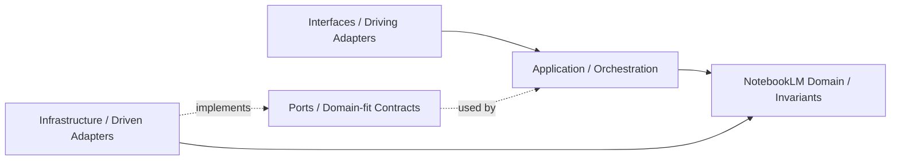

## Correct Interaction Flow

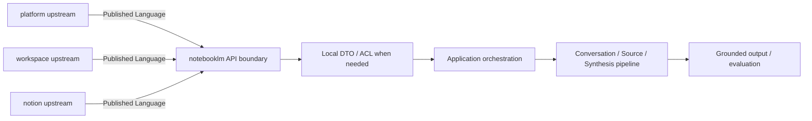

## Document Network

- [README.md](./README.md)
- [bounded-contexts.md](./bounded-contexts.md)
- [context-map.md](./context-map.md)
- [subdomains.md](./subdomains.md)
- [ubiquitous-language.md](./ubiquitous-language.md)
- [architecture-overview.md](../../system/architecture-overview.md)
- [integration-guidelines.md](../../system/integration-guidelines.md)
````

## File: docs/structure/contexts/notebooklm/bounded-contexts.md
````markdown
# NotebookLM

本文件在本次任務限制下，僅依 Context7 驗證的 DDD、Context Map、Hexagonal Architecture 參考整理，不主張反映現況實作。

## Domain Role

notebooklm 是對話與推理主域。依 bounded context 原則，它應封裝來源匯入、檢索、grounding、對話、摘要、評估與版本化，使推理流程保持高凝聚且與正典知識內容邊界分離。

## Baseline Bounded Contexts

| Cluster | Subdomains |
|---|---|
| Interaction Core | notebook, conversation, note |
| Reasoning Output | source, synthesis, conversation-versioning |

## Future Split Triggers

ingestion 現為 source 職責的一部分。retrieval、grounding、evaluation 為 synthesis 的內部 facets。只有當語言分歧或演化速率不同觸發拆分需求時，才升為獨立 bounded context。觸發條件定義於 [subdomains.md](./subdomains.md)。

## Domain Invariants

- notebooklm 只擁有衍生推理流程，不擁有正典知識內容。
- shared AI capability 由 ai context 提供；notebooklm 擁有 retrieval、grounding、synthesis 的本地語義。
- grounding 應能把輸出對齊到來源證據。
- retrieval 是 synthesis 的上游能力，不應與 source reference 混成同一層。
- evaluation 應描述品質，而不是單純使用量。
- 任何要成為正式知識內容的輸出，都必須交由 notion 吸收。

## Dependency Direction

- notebooklm 子域在存在對應層時必須遵守 interfaces -> application -> domain <- infrastructure；不必為形式完整而預建所有層。
- synthesis（含 retrieval、grounding facets）與 source（含 ingestion 職責）的外部整合必須由 adapter 實作，透過 port 注入到核心。
- domain 不得向外依賴來源處理框架、模型供應商或傳輸協定。

## Anti-Patterns

- 把 retrieval、grounding、ingestion 重新塞回 ai context 接入層或 source，造成責任折疊。
- 讓 synthesis 直接持有正典內容所有權，混淆 notion 與 notebooklm 邊界。
- 讓 application service 直接呼叫外部 SDK，而不經過 port/adapter。

## Copilot Generation Rules

- 生成程式碼時，先保留 retrieval、grounding、ingestion、evaluation 的獨立語義，再決定是否需要額外抽象。
- 奧卡姆剃刀：不要為了形式上的對稱而新增子域；只有在責任、語義或演化速率不同時才拆分。
- 若外部能力只服務單一明確邊界，優先用最小必要 port，而不是複製整套工具 API。

## Dependency Direction Flow

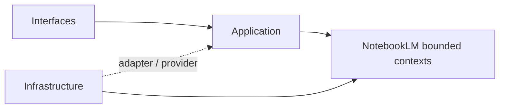

## Correct Interaction Flow

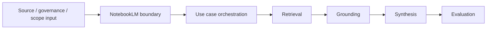

## Document Network

- [README.md](./README.md)
- [AGENTS.md](./AGENTS.md)
- [context-map.md](./context-map.md)
- [subdomains.md](./subdomains.md)
- [bounded-contexts.md](../../domain/bounded-contexts.md)
- [subdomains.md](../../domain/subdomains.md)
````

## File: docs/structure/contexts/notebooklm/context-map.md
````markdown
# NotebookLM

本文件在本次任務限制下，僅依 Context7 驗證的 DDD、Context Map、Hexagonal Architecture 參考整理，不主張反映現況實作。

## Context Role

notebooklm 消費 workspace scope、iam 治理、billing capability、ai signal 與 notion 內容來源，並輸出可追溯的對話、洞察與 synthesis。依 Context Mapper 思維，它是多個上游語言的下游整合者，但仍需維持自己的對話與推理邊界。

## Relationships

| Related Domain | Relationship Type | NotebookLM Position | Published Language |
|---|---|---|---|
| iam | Upstream/Downstream | downstream | actor reference、tenant scope、access decision |
| billing | Upstream/Downstream | downstream | entitlement signal、subscription capability signal |
| ai | Upstream/Downstream | downstream | ai capability signal、model policy、safety result |
| workspace | Upstream/Downstream | downstream | workspaceId、membership scope、share scope |
| notion | Upstream/Downstream | downstream | knowledge artifact reference、attachment reference、taxonomy hint |

## Mapping Rules

- notebooklm 依賴 iam、billing、ai 的結果，但不重建 actor、policy 或 secret 模型。
- notebooklm 可消費 ai context 作為共享模型能力，但不擁有 provider / policy 所有權。
- notebooklm 在 workspace scope 內運作，但不定義 workspace 生命周期或 sharing 規則。
- notion 是 notebooklm 的重要 source supplier，notebooklm 不能反向直接改寫 notion 正典內容。
- synthesis、grounding、evaluation 是 notebooklm 對外輸出的核心能力語言。

## Dependency Direction

- notebooklm 只作為 platform、workspace、notion 的 downstream consumer，不反向宣稱治理或正典內容所有權。
- ACL 或 Conformist 只能由 notebooklm 這個 downstream 端選擇，不能回推到上游。
- 跨主域資料進入 notebooklm 時，先落在 published language 或 local DTO，再進入本地主域語言。

## Anti-Patterns

- 把 notebooklm 寫成 notion 或 workspace 的上游治理來源。
- 在同一主域關係上同時聲稱 ACL 與 Conformist。
- 直接共享 notebook、source 或 conversation 的內部模型給其他主域使用。

## Copilot Generation Rules

- 生成程式碼時，先維持 notebooklm 對 platform、workspace、notion 的 downstream 位置，再安排轉譯層。
- 奧卡姆剃刀：若 published language 加一層 local DTO 已足夠，就不要額外發明第二層 mapper 或雙重 ACL。
- 上游只提供 published language；本地主域保護由 downstream 完成。

## Dependency Direction Flow

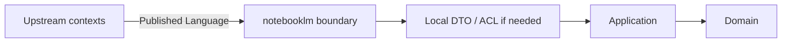

## Correct Interaction Flow

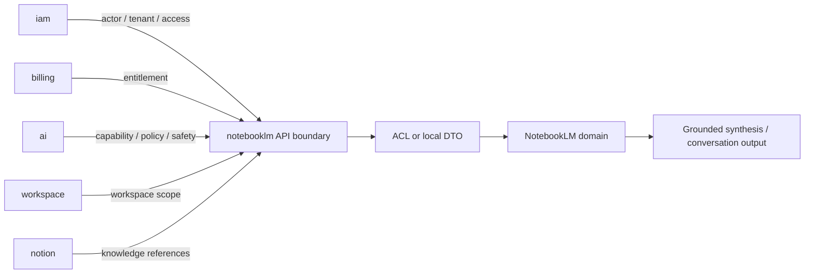

## Document Network

- [README.md](./README.md)
- [AGENTS.md](./AGENTS.md)
- [bounded-contexts.md](./bounded-contexts.md)
- [subdomains.md](./subdomains.md)
- [context-map.md](../../system/context-map.md)
- [integration-guidelines.md](../../system/integration-guidelines.md)
- [strategic-patterns.md](../../system/strategic-patterns.md)
````

## File: docs/structure/contexts/notebooklm/README.md
````markdown
# NotebookLM Context

本 README 在本次任務限制下，僅依 Context7 驗證的 DDD、Context Map、Hexagonal Architecture 參考重建，不主張反映現況實作。

## Purpose

notebooklm 是對話、來源處理與推理主域。它的責任是提供 notebook、conversation、source ingestion、retrieval、grounding、synthesis、evaluation 與 conversation-versioning 等語言，把來源材料轉成可對話、可追溯、可評估的衍生輸出。

## Why This Context Exists

- 把推理流程與正典知識內容分離。
- 把來源匯入、檢索、grounding 與 synthesis 統整成同一主域。
- 提供可回流到其他主域、但本質上仍屬衍生輸出的能力邊界。

## Context Summary

| Aspect | Summary |
|---|---|
| Primary Role | 對話、來源處理、檢索與推理輸出 |
| Upstream Dependency | iam 治理、billing entitlement、ai capability、workspace scope、notion 內容來源 |
| Downstream Consumer | 無固定主域級 consumer；輸出可被其他主域吸收 |
| Core Principle | notebooklm 擁有衍生推理流程，不擁有正典知識內容或共享 AI capability |

## Baseline Subdomains

- conversation
- note
- notebook
- source
- synthesis
- conversation-versioning

## Future Split Triggers（非獨立 Gap Subdomain）

ingestion 已整合至 source；retrieval、grounding、evaluation 現為 synthesis 內部 facets。僅當語言分歧或演化速率差異觸發時才拆分為獨立子域。完整觸發條件見 [subdomains.md](./subdomains.md)。

## Key Relationships

- 與 iam：notebooklm 消費 actor、tenant 與 access decision。
- 與 billing：notebooklm 消費 entitlement 與 subscription capability signal。
- 與 ai：notebooklm 消費 ai capability、model policy 與 safety result。
- 與 workspace：notebooklm 消費 workspaceId、membership scope、share scope。
- 與 notion：notebooklm 消費 knowledge artifact reference、attachment reference、taxonomy hint。

## Reading Order

1. [subdomains.md](./subdomains.md)
2. [bounded-contexts.md](./bounded-contexts.md)
3. [context-map.md](./context-map.md)
4. [ubiquitous-language.md](./ubiquitous-language.md)
5. [AGENTS.md](./AGENTS.md)

## Dependency Direction

- 本主域內部固定採用 interfaces -> application -> domain <- infrastructure。
- 跨主域只消費 published language、API boundary、events，不直接依賴他域內部模型。

## Anti-Pattern Rules

- 不把 notebooklm 的衍生輸出直接宣稱為 notion 的正典知識內容。
- 不把 retrieval/grounding 降格成單純 UI 功能或模型提示細節。
- 不把 ingestion 與 source reference 混成同一個不可拆分責任。
- 不把 ai context 的共享能力誤寫成 notebooklm 自己擁有的 `ai` 子域。

## Copilot Generation Rules

- 生成程式碼時，先保留 notebooklm 的衍生推理定位，再安排 retrieval、grounding、synthesis 的交互。
- 模型接入、配額、供應商策略若屬共享能力，先消費 ai context；notebooklm 保留 retrieval、grounding、synthesis、evaluation 的語義所有權。
- 奧卡姆剃刀：只在必要時引入 port、ACL、DTO；不要因為未來也許會有需求就預先堆疊抽象。
- 優先產生一條清楚的 upstream input -> translation -> application -> domain -> output 流程，而不是多條重疊流程。

## Dependency Direction Flow

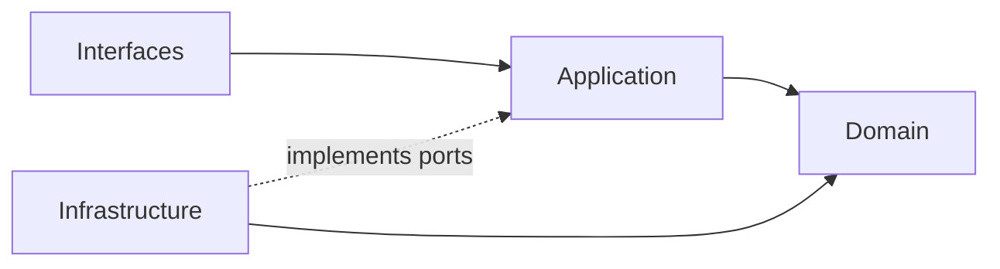

## Correct Interaction Flow

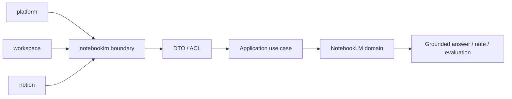

## Document Network

- [AGENTS.md](./AGENTS.md)
- [bounded-contexts.md](./bounded-contexts.md)
- [context-map.md](./context-map.md)
- [subdomains.md](./subdomains.md)
- [ubiquitous-language.md](./ubiquitous-language.md)
- [README.md](../../../README.md)
- [architecture-overview.md](../../system/architecture-overview.md)
- [integration-guidelines.md](../../system/integration-guidelines.md)

## Constraints

- 本文件是 architecture-first 版本。
- 本文件依 Context7 的 bounded context 與 context map 原則編寫。
- 本文件不代表對既有 repo 內容做過語意校準。
````

## File: docs/structure/contexts/notebooklm/subdomains.md
````markdown
# NotebookLM

本文件在本次任務限制下，僅依 Context7 驗證的 DDD、Context Map、Hexagonal Architecture 參考整理，不主張反映現況實作。

## Baseline Subdomains

| Subdomain | Responsibility |
|---|---|
| conversation | 對話 Thread 與 Message 生命週期 |
| note | 輕量筆記與知識連結 |
| notebook | Notebook 組合與管理 |
| source | 來源文件追蹤、引用與 ingestion 編排 |
| synthesis | 完整 RAG pipeline：retrieval、grounding、answer generation、evaluation/feedback |
| conversation-versioning | 對話版本與快照策略 |

## Future Split Triggers

`synthesis` 子域將 retrieval、grounding、generation、evaluation 作為內部 facets。只有當以下觸發條件成立時，才拆分為獨立子域：

| Facet | Split Trigger |
|---|---|
| retrieval | 策略複雜到需要獨立領域模型（多重排序、hybrid search） |
| grounding | 引用追溯需要獨立聚合根（citation chains、evidence alignment） |
| generation | 生成策略需要獨立 use case 群（多模態、多來源融合） |
| evaluation | 品質語言需要獨立指標模型（回歸測試、benchmark suite） |

## Anti-Patterns

- 不把 retrieval 與 grounding 併回 source 或 ai context 接入層，否則推理鏈條失去清楚邊界。
- 不把 evaluation 只當成 dashboard 指標，否則品質語言無法成為可演化的關注點。
- 不把 notebook、conversation 混成單一 UI 容器語意，否則無法維持聚合邊界。
- 不把 ai context 的共享能力誤寫成 notebooklm 自己擁有的 `ai` 子域。
- 不過早拆分子域：只有當語言分歧或演化速率不同時才拆分。

## Copilot Generation Rules

- 生成程式碼時，先問新需求落在哪個既有子域；只有既有子域無法容納時才建立新子域。
- 模型 provider、配額與安全護欄優先歸 ai context；notebooklm 在 synthesis 保留 pipeline 本地語義。
- 奧卡姆剃刀：能在既有子域用一個明確 use case 解決，就不要新增第二個平行子域。
- 子域命名應反映責任與語義，不應只是頁面名稱或工具名稱。

## Dependency Direction Flow

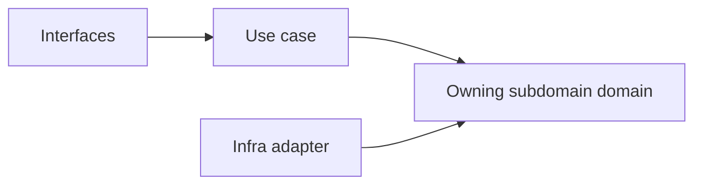

## Correct Interaction Flow

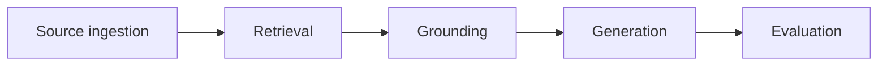

## Document Network

- [README.md](./README.md)
- [bounded-contexts.md](./bounded-contexts.md)
- [context-map.md](./context-map.md)
- [ubiquitous-language.md](./ubiquitous-language.md)
- [subdomains.md](../../domain/subdomains.md)
- [bounded-contexts.md](../../domain/bounded-contexts.md)
````

## File: docs/structure/contexts/notebooklm/ubiquitous-language.md
````markdown
# NotebookLM

本文件在本次任務限制下，僅依 Context7 驗證的 DDD、Context Map、Hexagonal Architecture 參考整理，不主張反映現況實作。

## Canonical Terms

| Term | Meaning |
|---|---|
| Notebook | 聚合對話、來源與衍生筆記的工作單位 |
| Conversation | Notebook 內的對話執行邊界 |
| Message | 一則輸入或輸出對話項 |
| Source | 被引用與推理的來源材料 |
| Ingestion | 來源匯入、正規化與前處理流程 |
| Retrieval | 從來源中召回候選片段的查詢能力 |
| Grounding | 把輸出對齊到來源證據的能力 |
| Citation | 輸出指回來源證據的引用關係 |
| Synthesis | 綜合多來源後生成的衍生輸出 |
| Note | 與 Notebook 關聯的輕量摘記 |
| Evaluation | 對輸出品質、回歸結果與效果的評估 |
| VersionSnapshot | 對話或 Notebook 某一時點的不可變快照 |

## Language Rules

- 使用 Conversation，不使用 Chat 作為正典語彙。
- 使用 Ingestion 與 Source 區分來源處理與來源語義。
- 使用 Retrieval 與 Grounding 區分召回能力與證據對齊能力。
- 使用 Synthesis 表示衍生綜合輸出，不把它直接稱為正典知識內容。
- 使用 Evaluation 表示品質語言，不用 Analytics 混稱模型效果。

## Avoid

| Avoid | Use Instead |
|---|---|
| Chat | Conversation |
| File Import | Ingestion |
| Search Step | Retrieval |
| Verified Answer | Grounded Synthesis |

## Naming Anti-Patterns

- 不用 Chat 混稱 Conversation 與 Notebook。
- 不用 Search 混稱 Retrieval 與 Grounding。
- 不用 Knowledge 或 Wiki 混稱 Synthesis 輸出，避免污染 notion 的正典語言。

## Copilot Generation Rules

- 生成程式碼時，名稱先對齊 Notebook、Conversation、Retrieval、Grounding、Synthesis、Evaluation，再決定型別與模組位置。
- 奧卡姆剃刀：若一個名詞已能準確表達語義，就不要再疊加第二個近義抽象名稱。
- 命名要先保護邊界，再追求實作便利。

## Dependency Direction Flow

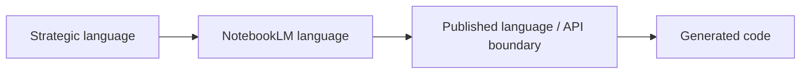

## Correct Interaction Flow

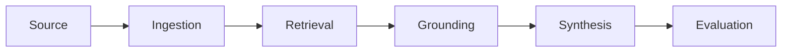

## Domain Layer Flow (enforced per subdomain)

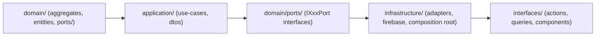

## Document Network

- [README.md](./README.md)
- [AGENTS.md](./AGENTS.md)
- [subdomains.md](./subdomains.md)
- [bounded-contexts.md](./bounded-contexts.md)
- [ubiquitous-language.md](../../domain/ubiquitous-language.md)
````

## File: src/modules/notebooklm/adapters/inbound/react/NotebooklmAiChatSection.tsx
````typescript
/**
 * NotebooklmAiChatSection — notebooklm.ai-chat tab — RAG Q&A interface.
 * Calls fn rag_query callable via ragQueryAction server action.
 */
⋮----
import { Button, Input } from "@packages";
import { MessageSquare, Send } from "lucide-react";
import { useState, useTransition } from "react";
⋮----
import type { RagQueryOutput } from "../../../adapters/outbound/callable/FirebaseCallableAdapter";
import { callRagQuery } from "../../../adapters/outbound/firebase-composition";
⋮----
interface NotebooklmAiChatSectionProps {
  workspaceId: string;
  accountId: string;
}
⋮----
interface ChatMessage {
  id: string;
  role: "user" | "assistant";
  content: string;
  citations?: RagQueryOutput["citations"];
}
⋮----
const handleSubmit = () =>
````

## File: src/modules/notebooklm/adapters/inbound/react/NotebooklmNotebookSection.tsx
````typescript
/**
 * NotebooklmNotebookSection — notebooklm.notebook tab — RAG query interface.
 * Input a question → AI retrieves from indexed documents → displays answer + citations.
 */
⋮----
import { Button, Input } from "@packages";
import { Brain, Search } from "lucide-react";
import { useState, useTransition } from "react";
⋮----
import type { RagQueryOutput } from "../../../adapters/outbound/callable/FirebaseCallableAdapter";
import { callRagQuery } from "../../../adapters/outbound/firebase-composition";
⋮----
interface NotebooklmNotebookSectionProps {
  workspaceId: string;
  accountId: string;
}
⋮----
const handleQuery = () =>
````

## File: src/modules/notebooklm/adapters/inbound/server-actions/source-processing-actions.ts
````typescript
/**
 * source-processing-actions — notebooklm source document processing workflow.
 *
 * Composes ProcessSourceDocumentWorkflowUseCase with:
 *   - TaskMaterializationWorkflowAdapter  (ADR: synchronous Server Action bridge)
 *   - Notion CreateKnowledgePagePort       (bridges notion's createPage use case)
 *
 * ADR decisions implemented here:
 *   1. AI extraction → workspace.extract-task-candidates Genkit flow
 *      GenkitTaskCandidateExtractor is instantiated directly here because
 *      this is a "use server" file — it is never included in browser bundles.
 *      firebase-composition.ts retains FirebaseCallableTaskCandidateExtractor
 *      for the shared factory used by client-accessible code paths.
 *   2. Task bridge → synchronous Server Action callback (not QStash event).
 *
 * Architecture note: this server action is the composition root for a
 * cross-module workflow (notebooklm → workspace → notion). It reaches into
 * the workspace and notion composition factories to assemble the use case.
 * The domain layers remain fully isolated; only the adapter layer is composed here.
 */
⋮----
import { z } from "zod";
import { ProcessSourceDocumentWorkflowUseCase } from "../../../orchestration/ProcessSourceDocumentWorkflowUseCase";
import { TaskMaterializationWorkflowAdapter } from "../../outbound/TaskMaterializationWorkflowAdapter";
import { GenkitTaskCandidateExtractor } from "@/src/modules/workspace/subdomains/task-formation/adapters/outbound/genkit/GenkitTaskCandidateExtractor";
import { ExtractTaskCandidatesUseCase, ConfirmCandidatesUseCase } from "@/src/modules/workspace/subdomains/task-formation/application/use-cases/TaskFormationUseCases";
import { FirestoreTaskFormationJobRepository } from "@/src/modules/workspace/subdomains/task-formation/adapters/outbound/firestore/FirestoreTaskFormationJobRepository";
import { CreateTaskUseCase } from "@/src/modules/workspace/subdomains/task/application/use-cases/TaskUseCases";
import { FirestoreTaskRepository } from "@/src/modules/workspace/subdomains/task/adapters/outbound/firestore/FirestoreTaskRepository";
import { createFirestoreLikeAdapter } from "@/src/modules/workspace/adapters/outbound/firebase-composition";
import { createClientNotionPageUseCases } from "@/src/modules/notion/adapters/outbound/firebase-composition";
⋮----
// ── Input schema ───────────────────────────────────────────────────────────────
⋮----
// ── Action ─────────────────────────────────────────────────────────────────────
⋮----
export async function processSourceDocumentAction(rawInput: unknown)
⋮----
// ── Wire workspace task formation with Genkit extractor (server-only) ────────
⋮----
// ── Wire notion page creation ────────────────────────────────────────────────
⋮----
// ── Execute workflow ─────────────────────────────────────────────────────────
````

## File: src/modules/notebooklm/subdomains/source/adapters/inbound/index.ts
````typescript
// inbound adapters for source subdomain (server actions live at module root adapters/inbound)
````

## File: src/modules/notebooklm/subdomains/source/adapters/index.ts
````typescript

````

## File: src/modules/notebooklm/subdomains/source/adapters/outbound/index.ts
````typescript

````

## File: src/modules/notebooklm/subdomains/source/adapters/outbound/memory/InMemoryIngestionSourceRepository.ts
````typescript
import type { IngestionSourceSnapshot, SourceStatus } from "../../../domain/entities/IngestionSource";
import type { IngestionSourceRepository, IngestionSourceQuery } from "../../../domain/repositories/IngestionSourceRepository";
⋮----
export class InMemoryIngestionSourceRepository implements IngestionSourceRepository {
⋮----
async save(snapshot: IngestionSourceSnapshot): Promise<void>
⋮----
async findById(id: string): Promise<IngestionSourceSnapshot | null>
⋮----
async findByNotebookId(notebookId: string): Promise<IngestionSourceSnapshot[]>
⋮----
async query(params: IngestionSourceQuery): Promise<IngestionSourceSnapshot[]>
⋮----
async delete(id: string): Promise<void>
````

## File: src/modules/notebooklm/subdomains/source/application/index.ts
````typescript

````

## File: src/modules/notebooklm/subdomains/source/application/use-cases/IngestionSourceUseCases.ts
````typescript
import { commandSuccess, commandFailureFrom, type CommandResult } from "../../../../../shared";
import { IngestionSource, type RegisterIngestionSourceInput } from "../../domain/entities/IngestionSource";
import type { IngestionSourceRepository, IngestionSourceQuery } from "../../domain/repositories/IngestionSourceRepository";
⋮----
export class RegisterIngestionSourceUseCase {
⋮----
constructor(private readonly repo: IngestionSourceRepository)
⋮----
async execute(input: RegisterIngestionSourceInput): Promise<CommandResult>
⋮----
export class ArchiveIngestionSourceUseCase {
⋮----
async execute(sourceId: string): Promise<CommandResult>
⋮----
export class QueryIngestionSourcesUseCase {
⋮----
async execute(params: IngestionSourceQuery)
````

## File: src/modules/notebooklm/subdomains/source/domain/index.ts
````typescript

````

## File: src/modules/notebooklm/subdomains/source/domain/repositories/IngestionSourceRepository.ts
````typescript
import type { IngestionSourceSnapshot, SourceStatus } from "../entities/IngestionSource";
⋮----
export interface IngestionSourceQuery {
  readonly notebookId?: string;
  readonly workspaceId?: string;
  readonly accountId?: string;
  readonly status?: SourceStatus;
  readonly limit?: number;
  readonly offset?: number;
}
⋮----
export interface IngestionSourceRepository {
  save(snapshot: IngestionSourceSnapshot): Promise<void>;
  findById(id: string): Promise<IngestionSourceSnapshot | null>;
  findByNotebookId(notebookId: string): Promise<IngestionSourceSnapshot[]>;
  query(params: IngestionSourceQuery): Promise<IngestionSourceSnapshot[]>;
  delete(id: string): Promise<void>;
}
⋮----
save(snapshot: IngestionSourceSnapshot): Promise<void>;
findById(id: string): Promise<IngestionSourceSnapshot | null>;
findByNotebookId(notebookId: string): Promise<IngestionSourceSnapshot[]>;
query(params: IngestionSourceQuery): Promise<IngestionSourceSnapshot[]>;
delete(id: string): Promise<void>;
````

## File: src/modules/notebooklm/subdomains/synthesis/adapters/inbound/index.ts
````typescript
// inbound adapters for synthesis subdomain
````

## File: src/modules/notebooklm/subdomains/synthesis/adapters/outbound/index.ts
````typescript
// outbound adapters for synthesis subdomain (Genkit implementation lives in infrastructure/ai/)
````

## File: src/modules/notebooklm/subdomains/synthesis/application/index.ts
````typescript

````

## File: src/modules/notebooklm/subdomains/synthesis/application/use-cases/RunSynthesisUseCase.ts
````typescript
import { v4 as uuid } from "uuid";
import type { SynthesisPort } from "../../domain/ports/SynthesisPort";
import type { SynthesisInput, SynthesisResultSnapshot } from "../../domain/entities/SynthesisResult";
⋮----
export interface RunSynthesisResult {
  readonly ok: boolean;
  readonly result?: SynthesisResultSnapshot;
  readonly error?: string;
}
⋮----
export class RunSynthesisUseCase {
⋮----
constructor(private readonly synthesisPort: SynthesisPort)
⋮----
async execute(input: SynthesisInput): Promise<RunSynthesisResult>
````

## File: src/modules/notebooklm/subdomains/synthesis/domain/entities/SynthesisResult.ts
````typescript
/**
 * SynthesisResult — value object produced by a RAG synthesis operation.
 *
 * Owned by notebooklm/synthesis subdomain.
 * The synthesis port (SynthesisPort) is the primary contract for calling AI.
 * The Genkit flow (infrastructure/ai/synthesis.flow.ts) implements the port.
 */
⋮----
export interface SynthesisCitation {
  readonly index: number;
  /** Raw citation identifier returned by the synthesis flow. */
  readonly ref: string;
}
⋮----
/** Raw citation identifier returned by the synthesis flow. */
⋮----
export interface SynthesisResultSnapshot {
  readonly id: string;
  readonly notebookId?: string;
  readonly question: string;
  readonly answer: string;
  readonly citations: readonly SynthesisCitation[];
  readonly model?: string;
  readonly completedAtISO: string;
}
⋮----
export interface SynthesisInput {
  readonly notebookId?: string;
  readonly question: string;
  readonly contextChunks: readonly string[];
  readonly maxCitations?: number;
  readonly model?: string;
}
````

## File: src/modules/notebooklm/subdomains/synthesis/domain/index.ts
````typescript

````

## File: src/modules/notebooklm/subdomains/synthesis/domain/ports/SynthesisPort.ts
````typescript
import type { SynthesisInput, SynthesisResultSnapshot } from "../entities/SynthesisResult";
⋮----
/** Outbound port — implemented by infrastructure/ai/synthesis.flow adapter. */
export interface SynthesisPort {
  synthesize(input: SynthesisInput): Promise<SynthesisResultSnapshot>;
}
⋮----
synthesize(input: SynthesisInput): Promise<SynthesisResultSnapshot>;
````

## File: src/modules/notebooklm/AGENTS.md
````markdown
# notebooklm Agent Rules

## ROLE

- The agent MUST treat notebooklm as the owner of notebook-based reasoning UX and derived synthesis flows.
- The agent MUST keep notebooklm focused on notebook conversation and synthesis experience, not shared AI mechanism ownership.

## DOMAIN BOUNDARIES

- The agent MUST keep conversation, notebook, source, and synthesis inside notebooklm.
- The agent MUST expose cross-module capabilities through [index.ts](index.ts).
- The agent MUST keep generic AI mechanism ownership in ai and canonical writable knowledge ownership in notion.

## TOOL USAGE

- The agent MUST validate subdomain path references before edits.
- The agent MUST keep notebooklm terminology aligned with strategic docs.
- The agent MUST scope edits to notebooklm-owned docs and capabilities.

## EXECUTION FLOW

- The agent MUST follow this order:
	1. Read [../AGENTS.md](../AGENTS.md).
	2. Read this file and [README.md](README.md).
	3. Select the owning notebooklm subdomain.
	4. Apply bounded changes.
	5. Validate links and terminology consistency.

## DATA CONTRACT

- The agent MUST keep notebook, conversation, source, and synthesis wording precise.
- The agent MUST keep subdomain indexes synchronized with actual directories.

## CONSTRAINTS

- The agent MUST NOT move AI mechanism ownership from ai into notebooklm.
- The agent MUST NOT move canonical writable knowledge ownership from notion into notebooklm.

## ERROR HANDLING

- The agent MUST report stale links, missing docs, or ownership ambiguity.
- The agent MUST stop and ask for direction if notebooklm and notion boundaries blur.

## CONSISTENCY

- The agent MUST keep AGENTS focused on routing and constraints.
- The agent MUST keep README focused on overview and navigation.

## SECURITY

- The agent MUST preserve source and retrieval traceability wording.
- The agent MUST avoid unsafe data-handling shortcuts in docs.

## Route Here When

- You update notebooklm notebook, conversation, source, or synthesis behavior or docs.
- You need the notebooklm module boundary or subdomain routing contract.

## Route Elsewhere When

- Shared AI mechanism concerns: [../ai/AGENTS.md](../ai/AGENTS.md)
- Canonical writable knowledge concerns: [../notion/AGENTS.md](../notion/AGENTS.md)

## Quick Links

- Pair: [README.md](README.md)
- Parent: [../AGENTS.md](../AGENTS.md)
- Public boundary: [index.ts](index.ts)
- Strategic authority: [../../../docs/README.md](../../../docs/README.md)
````

## File: src/modules/notebooklm/index.ts
````typescript
/**
 * Notebooklm Module — public API surface.
 * All cross-module consumers must import from here only.
 */
⋮----
// notebook
⋮----
// conversation
⋮----
// source (canonical ubiquitous-language term for ingested document)
⋮----
// synthesis (RAG answer generation)
⋮----
// orchestration — source processing workflow
````

## File: src/modules/notebooklm/README.md
````markdown
# notebooklm

## PURPOSE

notebooklm 模組負責 notebook-based reasoning UX、conversation flow、source 管理與 synthesis 語言。
它承接推理與衍生輸出體驗，不擁有通用 AI mechanism 或可寫知識正典。

## GETTING STARTED

先閱讀：

1. [AGENTS.md](AGENTS.md)
2. [../AGENTS.md](../AGENTS.md)
3. [../../../docs/README.md](../../../docs/README.md)

## ARCHITECTURE

notebooklm 由 conversation、notebook、source、synthesis 等子域組成。
跨模組整合應透過 [index.ts](index.ts) 消費公開能力。

## PROJECT STRUCTURE

- [subdomains/conversation](subdomains/conversation)
- [subdomains/notebook](subdomains/notebook)
- [subdomains/source](subdomains/source)
- [subdomains/synthesis](subdomains/synthesis)

## DEVELOPMENT RULES

- MUST keep notebooklm as reasoning UX owner.
- MUST expose cross-module capability via [index.ts](index.ts).
- MUST keep notebook, source, and synthesis terminology explicit.
- MUST avoid mixing ai mechanism or notion canonical ownership into notebooklm.

## AI INTEGRATION

notebooklm 直接消費 ai 模組提供的 shared capability，並產出 notebook-specific synthesis experience。
任何整合都應尊重 ai 與 notion 的邊界，不直接耦合內部模型。

## DOCUMENTATION

- Routing/rules: [AGENTS.md](AGENTS.md)
- Parent modules index: [../README.md](../README.md)
- Strategic authority: [../../../docs/README.md](../../../docs/README.md)

## USABILITY

- 新開發者可在 5 分鐘內定位 notebooklm 的四個主子域。
- 可在 3 分鐘內判斷變更屬於 conversation、notebook、source 或 synthesis。
````

## File: src/modules/notebooklm/subdomains/conversation/AGENTS.md
````markdown
# conversation Subdomain Agent Rules

## ROLE

- The agent MUST treat conversation as the notebooklm subdomain for conversation semantics.
- The agent MUST keep conversation documentation aligned with notebooklm ownership.

## DOMAIN BOUNDARIES

- The agent MUST keep conversation inside notebooklm.
- The agent MUST route cross-module use through [../../index.ts](../../index.ts).

## EXECUTION FLOW

- The agent MUST read [../../AGENTS.md](../../AGENTS.md) before broad changes.
- The agent MUST update [README.md](README.md) when ownership text changes.

## Route Here When

- You document notebooklm conversation boundaries.
````

## File: src/modules/notebooklm/subdomains/conversation/README.md
````markdown
# conversation

## PURPOSE

conversation 子域負責 notebooklm conversation 語言。

## GETTING STARTED

1. [AGENTS.md](AGENTS.md)
2. [../../README.md](../../README.md)
3. [../../../../../../docs/README.md](../../../../../../docs/README.md)

## ARCHITECTURE

此子域隸屬 notebooklm，承接 conversation 能力。

## DOCUMENTATION

- Parent: [../../README.md](../../README.md)
````

## File: src/modules/notebooklm/subdomains/notebook/AGENTS.md
````markdown
# notebook Subdomain Agent Rules

## ROLE

- The agent MUST treat notebook as the notebooklm subdomain for notebook container semantics.
- The agent MUST keep notebook documentation aligned with notebooklm ownership.

## DOMAIN BOUNDARIES

- The agent MUST keep notebook inside notebooklm.
- The agent MUST route cross-module use through [../../index.ts](../../index.ts).

## EXECUTION FLOW

- The agent MUST read [../../AGENTS.md](../../AGENTS.md) before broad changes.
- The agent MUST update [README.md](README.md) when ownership text changes.

## Route Here When

- You document notebooklm notebook boundaries.
````

## File: src/modules/notebooklm/subdomains/notebook/README.md
````markdown
# notebook

## PURPOSE

notebook 子域負責 notebooklm notebook container 語言。

## GETTING STARTED

1. [AGENTS.md](AGENTS.md)
2. [../../README.md](../../README.md)
3. [../../../../../../docs/README.md](../../../../../../docs/README.md)

## ARCHITECTURE

此子域隸屬 notebooklm，承接 notebook container 能力。

## DOCUMENTATION

- Parent: [../../README.md](../../README.md)
````

## File: src/modules/notebooklm/subdomains/source/adapters/outbound/firestore/FirestoreIngestionSourceRepository.ts
````typescript
/**
 * FirestoreIngestionSourceRepository — Firestore adapter for the source subdomain.
 *
 * Reads from accounts/{accountId}/documents/{docId}, which is the same collection
 * written by the fn pipeline.  TypeScript side is read-only: fn is the sole writer.
 *
 * ESLint: @integration-firebase is allowed here — this file lives at
 * src/modules/notebooklm/subdomains/source/adapters/outbound/firestore/
 * which matches the extended outbound glob.
 */
⋮----
import { getFirebaseFirestore, firestoreApi } from "@packages";
import type {
  IngestionSourceSnapshot,
  SourceStatus,
} from "../../../domain/entities/IngestionSource";
import type {
  IngestionSourceRepository,
  IngestionSourceQuery,
} from "../../../domain/repositories/IngestionSourceRepository";
⋮----
// ── Firestore record shape written by fn ──────────────────────────────────────
⋮----
interface PyFnSourceRecord {
  id?: string;
  title?: string;
  status?: string;
  account_id?: string;
  spaceId?: string;
  source?: {
    gcs_uri?: string;
    filename?: string;
    display_name?: string;
    original_filename?: string;
    size_bytes?: number;
    uploaded_at?: { toDate?: () => Date };
    mime_type?: string;
  };
  parsed?: {
    layout_json_gcs_uri?: string;
    form_json_gcs_uri?: string;
    ocr_json_gcs_uri?: string;
    genkit_json_gcs_uri?: string;
    page_count?: number;
    parsed_at?: { toDate?: () => Date };
    extraction_ms?: number;
    layout_chunk_count?: number;
    form_entity_count?: number;
    /** Legacy field written by storage trigger before the split. */
    json_gcs_uri?: string;
    chunk_count?: number;
    entity_count?: number;
  };
  rag?: {
    status?: string;
    chunk_count?: number;
    vector_count?: number;
    embedding_model?: string;
    embedding_dimensions?: number;
    indexed_at?: { toDate?: () => Date };
  };
  error?: {
    message?: string;
    timestamp?: { toDate?: () => Date };
  };
  metadata?: {
    filename?: string;
    display_name?: string;
    space_id?: string;
  };
}
⋮----
/** Legacy field written by storage trigger before the split. */
⋮----
// ── Mapping helpers ───────────────────────────────────────────────────────────
⋮----
function mapPyFnStatus(
  docStatus: string | undefined,
  ragStatus: string | undefined,
): SourceStatus
⋮----
// fn sets status="completed" after a successful parse but before RAG indexing.
⋮----
// TS-side initial write uses status="active" (upload done, not yet parsed).
⋮----
function fromFirestore(
  raw: PyFnSourceRecord,
  docId: string,
): IngestionSourceSnapshot
⋮----
// fn pipeline fields
⋮----
// ── Repository implementation ─────────────────────────────────────────────────
⋮----
export class FirestoreIngestionSourceRepository
implements IngestionSourceRepository
⋮----
async save(_snapshot: IngestionSourceSnapshot): Promise<void>
⋮----
// Intentionally no-op: fn is the sole writer for this collection.
// TypeScript side is read-only.
⋮----
async findById(_id: string): Promise<IngestionSourceSnapshot | null>
⋮----
// findById requires accountId context; use query() for list operations.
⋮----
async findByNotebookId(
    _notebookId: string,
): Promise<IngestionSourceSnapshot[]>
⋮----
// Notebook → source relationship is managed by the Notebook aggregate.
⋮----
async query(
    params: IngestionSourceQuery,
): Promise<IngestionSourceSnapshot[]>
⋮----
async delete(_id: string): Promise<void>
⋮----
// fn manages deletions; TypeScript side does not delete.
````

## File: src/modules/notebooklm/subdomains/source/AGENTS.md
````markdown
# source Subdomain Agent Rules

## ROLE

- The agent MUST treat source as the notebooklm subdomain for source asset semantics.
- The agent MUST keep source documentation aligned with notebooklm ownership.

## DOMAIN BOUNDARIES

- The agent MUST keep source inside notebooklm.
- The agent MUST route cross-module use through [../../index.ts](../../index.ts).

## EXECUTION FLOW

- The agent MUST read [../../AGENTS.md](../../AGENTS.md) before broad changes.
- The agent MUST update [README.md](README.md) when ownership text changes.

## Route Here When

- You document notebooklm source boundaries.
````

## File: src/modules/notebooklm/subdomains/source/domain/entities/IngestionSource.ts
````typescript
/**
 * IngestionSource — canonical ubiquitous-language term for a workspace-scoped
 * ingested document in the notebooklm bounded context.
 *
 * "Source" is the strategic name per docs/structure/domain/ubiquitous-language.md.
 * The legacy "document" subdomain has been removed; all consumers now reference
 * IngestionSource and IngestionSourceSnapshot directly.
 */
import { v4 as uuid } from "uuid";
⋮----
export type SourceStatus = "active" | "processing" | "archived" | "deleted";
export type SourceClassification = "image" | "manifest" | "record" | "other";
⋮----
export interface IngestionSourceSnapshot {
  readonly id: string;
  readonly notebookId?: string;
  readonly workspaceId: string;
  readonly organizationId: string;
  readonly accountId: string;
  readonly name: string;
  readonly mimeType: string;
  readonly sizeBytes: number;
  readonly classification: SourceClassification;
  readonly tags: readonly string[];
  readonly status: SourceStatus;
  readonly storageUrl?: string;
  /** External origin URI (e.g. GCS path, URL) */
  readonly originUri?: string;
  readonly createdAtISO: string;
  readonly updatedAtISO: string;
  readonly deletedAtISO?: string;

  // ── fn pipeline status fields ──────────────────────────────────────────────
  /** Layout Parser 解析頁數（由 fn 寫入 Firestore parsed.page_count）*/
  readonly parsedPageCount?: number;
  /** Layout Parser 語意分塊數（由 fn 寫入 Firestore parsed.layout_chunk_count）*/
  readonly parsedLayoutChunkCount?: number;
  /** Form Parser 結構化欄位數（由 fn 寫入 Firestore parsed.form_entity_count）*/
  readonly parsedFormEntityCount?: number;
  /** Layout Parser 解析結果 JSON 的 GCS URI（由 fn 寫入 Firestore parsed.layout_json_gcs_uri）*/
  readonly parsedLayoutJsonGcsUri?: string;
  /** Form Parser 解析結果 JSON 的 GCS URI（由 fn 寫入 Firestore parsed.form_json_gcs_uri）*/
  readonly parsedFormJsonGcsUri?: string;
  /** OCR Parser 解析結果 JSON 的 GCS URI（由 fn 寫入 Firestore parsed.ocr_json_gcs_uri）*/
  readonly parsedOcrJsonGcsUri?: string;
  /** Genkit-AI 解析結果 JSON 的 GCS URI（由 fn 寫入 Firestore parsed.genkit_json_gcs_uri）*/
  readonly parsedGenkitJsonGcsUri?: string;
  /** RAG 索引分塊數（由 fn 寫入 Firestore rag.chunk_count）*/
  readonly ragChunkCount?: number;
  /** RAG 向量數（由 fn 寫入 Firestore rag.vector_count）*/
  readonly ragVectorCount?: number;
  /** RAG 索引狀態（由 fn 寫入 Firestore rag.status: "ready" | "error"）*/
  readonly ragStatus?: string;
  /** fn 解析失敗時的錯誤訊息（由 fn 寫入 Firestore error.message）*/
  readonly errorMessage?: string;
}
⋮----
/** External origin URI (e.g. GCS path, URL) */
⋮----
// ── fn pipeline status fields ──────────────────────────────────────────────
/** Layout Parser 解析頁數（由 fn 寫入 Firestore parsed.page_count）*/
⋮----
/** Layout Parser 語意分塊數（由 fn 寫入 Firestore parsed.layout_chunk_count）*/
⋮----
/** Form Parser 結構化欄位數（由 fn 寫入 Firestore parsed.form_entity_count）*/
⋮----
/** Layout Parser 解析結果 JSON 的 GCS URI（由 fn 寫入 Firestore parsed.layout_json_gcs_uri）*/
⋮----
/** Form Parser 解析結果 JSON 的 GCS URI（由 fn 寫入 Firestore parsed.form_json_gcs_uri）*/
⋮----
/** OCR Parser 解析結果 JSON 的 GCS URI（由 fn 寫入 Firestore parsed.ocr_json_gcs_uri）*/
⋮----
/** Genkit-AI 解析結果 JSON 的 GCS URI（由 fn 寫入 Firestore parsed.genkit_json_gcs_uri）*/
⋮----
/** RAG 索引分塊數（由 fn 寫入 Firestore rag.chunk_count）*/
⋮----
/** RAG 向量數（由 fn 寫入 Firestore rag.vector_count）*/
⋮----
/** RAG 索引狀態（由 fn 寫入 Firestore rag.status: "ready" | "error"）*/
⋮----
/** fn 解析失敗時的錯誤訊息（由 fn 寫入 Firestore error.message）*/
⋮----
export interface RegisterIngestionSourceInput {
  readonly notebookId?: string;
  readonly workspaceId: string;
  readonly organizationId: string;
  readonly accountId: string;
  readonly name: string;
  readonly mimeType: string;
  readonly sizeBytes: number;
  readonly classification?: SourceClassification;
  readonly tags?: string[];
  readonly storageUrl?: string;
  readonly originUri?: string;
}
⋮----
export class IngestionSource {
⋮----
private constructor(private _props: IngestionSourceSnapshot)
⋮----
static register(input: RegisterIngestionSourceInput): IngestionSource
⋮----
static reconstitute(snapshot: IngestionSourceSnapshot): IngestionSource
⋮----
markReady(): void
⋮----
archive(): void
⋮----
get id(): string
get name(): string
get status(): SourceStatus
get workspaceId(): string
get notebookId(): string | undefined
⋮----
getSnapshot(): Readonly<IngestionSourceSnapshot>
⋮----
pullDomainEvents()
````

## File: src/modules/notebooklm/subdomains/source/README.md
````markdown
# source

## PURPOSE

source 子域負責 notebooklm source asset 與來源語言。

## GETTING STARTED

1. [AGENTS.md](AGENTS.md)
2. [../../README.md](../../README.md)
3. [../../../../../../docs/README.md](../../../../../../docs/README.md)

## ARCHITECTURE

此子域隸屬 notebooklm，承接 source asset 能力。

## DOCUMENTATION

- Parent: [../../README.md](../../README.md)
````

## File: src/modules/notebooklm/subdomains/synthesis/AGENTS.md
````markdown
# synthesis Subdomain Agent Rules

## ROLE

- The agent MUST treat synthesis as the notebooklm subdomain for synthesis semantics.
- The agent MUST keep synthesis documentation aligned with notebooklm ownership.

## DOMAIN BOUNDARIES

- The agent MUST keep synthesis inside notebooklm.
- The agent MUST route cross-module use through [../../index.ts](../../index.ts).

## EXECUTION FLOW

- The agent MUST read [../../AGENTS.md](../../AGENTS.md) before broad changes.
- The agent MUST update [README.md](README.md) when ownership text changes.

## Route Here When

- You document notebooklm synthesis boundaries.
````

## File: src/modules/notebooklm/subdomains/synthesis/README.md
````markdown
# synthesis

## PURPOSE

synthesis 子域負責 notebooklm synthesis 與衍生輸出語言。

## GETTING STARTED

1. [AGENTS.md](AGENTS.md)
2. [../../README.md](../../README.md)
3. [../../../../../../docs/README.md](../../../../../../docs/README.md)

## ARCHITECTURE

此子域隸屬 notebooklm，承接 synthesis 能力。

## DOCUMENTATION

- Parent: [../../README.md](../../README.md)
````

## File: src/modules/notebooklm/adapters/outbound/callable/FirebaseCallableAdapter.ts
````typescript
/**
 * FirebaseCallableAdapter — HTTPS Callable bridge to fn.
 *
 * Wraps Firebase Cloud Function callables for:
 *   - rag_query  (RAG retrieval + generation)
 *   - parse_document (manual trigger for document parsing)
 *   - rag_reindex_document (re-embed a document)
 *
 * ESLint: @integration-firebase is allowed here — this file lives at
 * src/modules/notebooklm/adapters/outbound/callable/
 * which matches src/modules/<context>/adapters/outbound/**.
 */
⋮----
import { getFirebaseFunctions, httpsCallable } from "@packages";
⋮----
// ── Input / output contracts ──────────────────────────────────────────────────
⋮----
export interface RagQueryInput {
  readonly account_id: string;
  readonly workspace_id: string;
  readonly query: string;
  readonly top_k?: number;
}
⋮----
export interface RagQueryCitation {
  readonly doc_id: string;
  readonly chunk_id: string;
  readonly filename: string;
  readonly score: number;
}
⋮----
export interface RagQueryOutput {
  readonly answer: string;
  readonly citations: RagQueryCitation[];
  readonly cache: "hit" | "miss";
  readonly vector_hits: number;
  readonly search_hits: number;
}
⋮----
export interface ParseDocumentInput {
  readonly account_id: string;
  readonly workspace_id: string;
  readonly gcs_uri: string;
  readonly doc_id?: string;
  readonly filename?: string;
  readonly mime_type?: string;
  readonly size_bytes?: number;
  /** When true fn also runs RAG ingestion after parse. Defaults to true in fn. */
  readonly run_rag?: boolean;
  /** Parser variant: "layout" | "form" | "ocr" | "genkit". Defaults to "layout" in fn. */
  readonly parser?: "layout" | "form" | "ocr" | "genkit";
}
⋮----
/** When true fn also runs RAG ingestion after parse. Defaults to true in fn. */
⋮----
/** Parser variant: "layout" | "form" | "ocr" | "genkit". Defaults to "layout" in fn. */
⋮----
export interface ParseDocumentOutput {
  readonly doc_id: string;
  readonly account_scope: string;
  readonly status: string;
}
⋮----
export interface ReindexDocumentInput {
  readonly account_id: string;
  readonly doc_id: string;
  /** GCS URI of the parsed JSON file (gs://bucket/files/…json). Required by fn. */
  readonly json_gcs_uri: string;
}
⋮----
/** GCS URI of the parsed JSON file (gs://bucket/files/…json). Required by fn. */
⋮----
// ── Callable wrappers ─────────────────────────────────────────────────────────
⋮----
export async function callRagQuery(input: RagQueryInput): Promise<RagQueryOutput>
⋮----
export async function callParseDocument(input: ParseDocumentInput): Promise<ParseDocumentOutput>
⋮----
export async function callReindexDocument(input: ReindexDocumentInput): Promise<void>
````

## File: src/modules/notebooklm/adapters/outbound/firebase-composition.ts
````typescript
/**
 * firebase-composition — notebooklm module outbound composition root.
 *
 * Single entry point for all Firebase operations owned by the notebooklm module.
 *
 * ESLint: @integration-firebase is allowed here — this file lives at
 * src/modules/notebooklm/adapters/outbound/ which matches the permitted glob.
 */
⋮----
import { getFirebaseFirestore, firestoreApi, getFirebaseStorage, ref, uploadBytes, getDownloadURL } from "@packages";
import { FirestoreIngestionSourceRepository } from "../../subdomains/source/adapters/outbound/firestore/FirestoreIngestionSourceRepository";
import { InMemoryNotebookRepository } from "../../subdomains/notebook/adapters/outbound/memory/InMemoryNotebookRepository";
import {
  RegisterIngestionSourceUseCase,
  ArchiveIngestionSourceUseCase,
  QueryIngestionSourcesUseCase,
} from "../../subdomains/source/application/use-cases/IngestionSourceUseCases";
import {
  CreateNotebookUseCase,
  AddDocumentToNotebookUseCase,
  GenerateNotebookResponseUseCase,
} from "../../subdomains/notebook/application/use-cases/NotebookUseCases";
import type { NotebookGenerationPort } from "../../subdomains/notebook/domain/ports/NotebookGenerationPort";
import { callRagQuery, callParseDocument, callReindexDocument, type RagQueryInput, type RagQueryOutput, type ParseDocumentInput, type ParseDocumentOutput, type ReindexDocumentInput } from "./callable/FirebaseCallableAdapter";
⋮----
// ── Singleton repositories ────────────────────────────────────────────────────
⋮----
function getSourceRepo(): FirestoreIngestionSourceRepository
⋮----
function getNotebookRepo(): InMemoryNotebookRepository
⋮----
// ── RagQuery generation port bridge ──────────────────────────────────────────
⋮----
class RagQueryGenerationPort implements NotebookGenerationPort {
⋮----
constructor(
⋮----
async generateResponse(input: {
    prompt: string;
    notebookId: string;
    model?: string;
}): Promise<
⋮----
// ── Factory functions ─────────────────────────────────────────────────────────
⋮----
export function createClientNotebooklmSourceUseCases()
⋮----
export function createClientNotebooklmNotebookUseCases(accountId: string, workspaceId: string)
⋮----
// ── Storage upload helper ─────────────────────────────────────────────────────
⋮----
/**
 * Upload a document to a workspace-scoped source path.
 * Path: workspaces/{workspaceId}/sources/{accountId}/{uuid}-{filename}
 * Parsing / indexing are triggered manually from the Sources UI.
 */
export async function uploadDocumentToStorage(
  file: File,
  accountId: string,
  workspaceId: string,
): Promise<string>
⋮----
/**
 * getDocumentDownloadUrl — resolve a Firebase Storage gs:// URI or storage path
 * to an HTTPS download URL suitable for embedding in Google Doc Viewer.
 *
 * Accepts both gs://bucket/path and relative paths like workspaces/...
 */
export async function getDocumentDownloadUrl(storageUrl: string): Promise<string>
⋮----
// keep firestore & firestoreApi accessible within this composition module
⋮----
// ── Storage bucket / GCS URI helpers ─────────────────────────────────────────
⋮----
/**
 * Convert a relative Storage path to a gs:// URI.
 * Already-absolute gs:// URIs are returned unchanged.
 */
export function toGcsUri(pathOrUri: string): string
⋮----
// ── Client-side Firestore source initialisation ───────────────────────────────
⋮----
/**
 * Write an initial source-document record to Firestore so the document appears
 * in the Sources list immediately after upload — even before fn parses it.
 *
 * The schema mirrors fn's `init_document()` so `FirestoreIngestionSourceRepository`
 * maps it correctly.  fn's parse_document callable uses merge=True when it writes,
 * so calling parse later will add parsed.* fields without overwriting these.
 */
export async function initSourceDocumentInFirestore(params: {
  docId: string;
  gcsUri: string;
  filename: string;
  sizeBytes: number;
  mimeType: string;
  accountId: string;
  workspaceId: string;
}): Promise<void>
⋮----
// "active" = upload done, ready to parse.
// fn's parse_document callable will overwrite with "processing" when it starts,
// then "completed" when done.
⋮----
// ── Client-side Firestore query helper ───────────────────────────────────────
⋮----
/**
 * queryDocuments — query ingestion sources directly from the browser.
 *
 * MUST be called from a client component, NOT from a Server Action.
 * The Firebase Web Client SDK requires a signed-in user in the browser context
 * so that Firestore Security Rules can evaluate request.auth.  A Server Action
 * has no active Firebase user session, which causes "Missing or insufficient
 * permissions" even when rules only require `isSignedIn()`.
 */
export async function queryDocuments(params: {
  accountId: string;
  workspaceId?: string;
})
````

## File: src/modules/notebooklm/adapters/inbound/server-actions/document-actions.ts
````typescript
/**
 * document-actions — notebooklm document server actions.
 *
 * Handles document upload (via Firebase Storage) and listing.
 * Parse / index actions are explicit user-triggered steps.
 */
⋮----
import { z } from "zod";
import {
  createClientNotebooklmSourceUseCases,
} from "../../outbound/firebase-composition";
import { processSourceDocumentAction } from "./source-processing-actions";
import { createDatabaseAction } from "@/src/modules/notion/adapters/inbound/server-actions/database-actions";
import type { ParseDocumentOutput } from "../../outbound/callable/FirebaseCallableAdapter";
⋮----
// ── Firebase HTTPS Callable server-side helper ────────────────────────────────
// Calling Cloud Functions from a Server Action avoids CORS completely.
// Functions are deployed in asia-southeast1; project ID comes from env.
⋮----
function _toGcsUri(storageUrl: string): string
⋮----
async function _callCallable<TIn, TOut>(fnName: string, data: TIn): Promise<TOut>
⋮----
// ── Input schemas ─────────────────────────────────────────────────────────────
⋮----
/** Which parser to invoke: "layout" | "form" | "ocr" | "genkit". */
⋮----
/** GCS URI of the Layout Parser JSON written by fn after Document AI parse. */
⋮----
// ── Actions ───────────────────────────────────────────────────────────────────
⋮----
// NOTE: queryDocumentsAction was removed.
// Querying accounts/{accountId}/documents via a Server Action fails with
// "Missing or insufficient permissions" because the Firebase Web Client SDK
// has no user auth context on the server.
// Use queryDocuments() from firebase-composition.ts (client-side helper) instead.
⋮----
/**
 * registerUploadedDocumentAction — register a document snapshot after upload.
 *
 * Call this after uploadDocumentToStorage() completes on the client.
 * This action only records the uploaded source for immediate UI feedback.
 * Parsing / indexing remain separate manual actions.
 */
export async function registerUploadedDocumentAction(rawInput: unknown)
⋮----
/**
 * createPageFromDocumentAction — create a Knowledge Page from a parsed document.
 *
 * Delegates to processSourceDocumentAction with shouldCreatePage=true only.
 * The Knowledge Page title is set to the document name.
 */
export async function createPageFromDocumentAction(rawInput: unknown)
⋮----
/**
 * createDatabaseFromDocumentAction — create a Notion Database named after the document.
 *
 * Useful as a container for Form Parser-extracted structured fields.
 */
export async function createDatabaseFromDocumentAction(rawInput: unknown)
⋮----
/**
 * parseDocumentAction — trigger Document AI parse for a specific document.
 *
 * Pass `parser: "layout"` (default) for Layout Parser (text + semantic chunks).
 * Pass `parser: "form"` for Form Parser (structured entities / KV fields).
 * Always a pure parse step; RAG indexing is a separate step.
 */
export async function parseDocumentAction(rawInput: unknown): Promise<ParseDocumentOutput>
⋮----
/**
 * reindexDocumentAction — trigger RAG reindex from Layout Parser JSON.
 *
 * Calls the fn `rag_reindex_document` HTTPS callable function from the server
 * side to avoid browser CORS restrictions.
 */
export async function reindexDocumentAction(rawInput: unknown): Promise<void>
````

## File: src/modules/notebooklm/adapters/inbound/react/NotebooklmSourcesSection.tsx
````typescript
/**
 * NotebooklmSourcesSection — notebooklm.sources tab — document source list + upload.
 *
 * Manual Document AI pipeline controls:
 *   ① 上傳文件  — upload to Firebase Storage only
 *   ② 解析文件  — manually trigger Layout/Form/OCR/Genkit-AI via callable
 *   ③ RAG 索引  — manually trigger RAG reindex via callable
 *   ④ 建立知識頁 — create Notion Knowledge Page from parsed document
 *   ⑤ 建立資料庫 — create Notion Database named after document (for Form Parser entities)
 *
 * Artifact display: page count, layout chunks, form entities, RAG vector count.
 */
⋮----
import { Button, createGoogleViewerEmbedUrl, z } from "@packages";
import {
  Upload, RefreshCw, FileUp, ArrowRight, BookOpen, ListPlus,
  Eye, X, Loader2, ScanText, Database, FileText, ChevronDown, ChevronUp,
  Layers, Braces, BarChart2, CheckCircle2,
} from "lucide-react";
import Link from "next/link";
import { useEffect, useRef, useState, useTransition } from "react";
⋮----
import type { IngestionSourceSnapshot } from "../../../subdomains/source/domain/entities/IngestionSource";
import {
  queryDocuments,
  uploadDocumentToStorage,
  getDocumentDownloadUrl,
  initSourceDocumentInFirestore,
  toGcsUri,
  callParseDocument,
  callReindexDocument,
} from "../../../adapters/outbound/firebase-composition";
import {
  createWorkspaceKnowledgeDatabase,
  createWorkspaceKnowledgePage,
} from "@/src/modules/notion";
⋮----
interface NotebooklmSourcesSectionProps {
  workspaceId: string;
  accountId: string;
}
⋮----
function deriveDocIdFromStoragePath(storagePath: string): string
⋮----
function createPendingSourceSnapshot(input: {
  file: File;
  storagePath: string;
  workspaceId: string;
  accountId: string;
}): IngestionSourceSnapshot
⋮----
// Upload is done; show "已就緒" until a parse callable is explicitly triggered.
// fn's parse_document callable will set status back to "processing" when it starts.
⋮----
/** MIME types renderable via Google Doc Viewer */
⋮----
// Keep sourceText safely below Firestore's 1 MiB document limit. 80k chars is
// ~240–320 KB for typical CJK/ASCII mix (3–4 bytes per char in UTF-8), leaving
// ample headroom for the rest of the page/database snapshot fields.
⋮----
/**
 * Normalize parser artifacts written by fn parse_document:
 * - layout / ocr / genkit: prefer top-level text, then chunk.text
 * - form: fallback to entity key/value lines when plain text is unavailable
 */
function extractTextFromArtifactPayload(payload: unknown): string | undefined
⋮----
function trimSourceText(text: string | undefined): string | undefined
⋮----
async function loadSourceTextFromArtifactUri(uri: string): Promise<string | undefined>
⋮----
// ── Per-document action state ─────────────────────────────────────────────────
⋮----
type DocActionStatus = "idle" | "running" | "done" | "error";
⋮----
interface DocActionState {
  parseLayout: DocActionStatus;
  parseForm: DocActionStatus;
  parseOcr: DocActionStatus;
  parseGenkit: DocActionStatus;
  index: DocActionStatus;
  reindex: DocActionStatus;
  page: DocActionStatus;
  database: DocActionStatus;
  message?: string;
  pageHref?: string;
  databaseHref?: string;
}
⋮----
// ── Component ─────────────────────────────────────────────────────────────────
⋮----
// Preview state
⋮----
// Per-document expanded / action state
⋮----
// JSON viewer modal state
⋮----
const load = () =>
⋮----
// Auto-load on mount so sources are visible without a manual click.
useEffect(() => { load(); }, [workspaceId, accountId]); // eslint-disable-line react-hooks/exhaustive-deps
⋮----
const handleFileChange = (e: React.ChangeEvent<HTMLInputElement>) =>
⋮----
// Write initial Firestore record so the document survives page reload
// (fn no longer auto-triggers on workspaces/ path; we own the initial write).
⋮----
const handlePreview = async (doc: IngestionSourceSnapshot) =>
⋮----
// Use Firebase Storage getDownloadURL() directly on the client.
// Storage rules allow read for authenticated users, so the Firebase JS SDK
// fetches a token-based download URL without any IAM signing.  The resulting
// URL is publicly accessible (token embedded in the URL) and works with
// Google Docs Viewer — no Cloud Function round-trip required.
⋮----
const closePreview = () =>
⋮----
// ── Per-document action helpers ─────────────────────────────────────────────
⋮----
const setDocAction = (docId: string, patch: Partial<DocActionState>) =>
⋮----
const handleParseLayout = async (doc: IngestionSourceSnapshot) =>
⋮----
const handleParseForm = async (doc: IngestionSourceSnapshot) =>
⋮----
const handleParseOcr = async (doc: IngestionSourceSnapshot) =>
⋮----
const handleParseGenkit = async (doc: IngestionSourceSnapshot) =>
⋮----
const handleIndex = async (doc: IngestionSourceSnapshot) =>
⋮----
const handleReindex = async (doc: IngestionSourceSnapshot) =>
⋮----
const handleCreatePage = async (doc: IngestionSourceSnapshot) =>
⋮----
// Page prefers layout text first because task extraction expects dense
// full-document sequences (3RDTW / 小計) preserved by layout output.
⋮----
const handleCreateDatabase = async (doc: IngestionSourceSnapshot) =>
⋮----
// Database prefers form output first to retain structured entity fields;
// fallback to layout text when form parser output is not available.
⋮----
// ── Render helpers ───────────────────────────────────────────────────────────
⋮----
{/* Header */}
⋮----
{/* Hidden file input */}
⋮----
{/* Processing chain banner */}
⋮----
{/* Document list */}
⋮----
{/* Document header row */}
⋮----
{/* Toggle actions panel */}
⋮----
{/* Meta row */}
⋮----
{/* Expandable actions panel */}
⋮----
{/* Section: Document AI parse */}
⋮----
onClick=
⋮----
{/* Section: RAG index — uses Layout Parser output */}
⋮----
{/* Section: Generate downstream artifacts */}
⋮----
{/* Action status message */}
⋮----
{/* Downstream CTAs when documents are ready */}
⋮----
{/* JSON viewer modal — parsed output summary */}
⋮----
<Button size="sm" variant="ghost" onClick=
⋮----
src=
````