# Files

## File: .github/agents/app-router.agent.md
`````markdown
---
name: App Router Agent
description: Diagnose and implement Next.js App Router behavior using runtime evidence and boundary-safe edits.
argument-hint: Provide route segment, expected behavior, and failing symptoms.
tools: ['serena/*', 'context7/*', 'read', 'edit', 'search', 'todo', 'io.github.vercel/next-devtools-mcp/*']
model: 'GPT-5.3-Codex'
handoffs:
  - label: Refine Parallel Routes
    agent: Parallel Routes Agent
    prompt: Refine the parallel-route composition, slot isolation, and one-way data flow for this route scope.
  - label: Write Server Action
    agent: Server Action Writer
    prompt: Implement or review the server action orchestration and validation boundary used by this route.
  - label: Verify End-to-End
    agent: E2E QA Agent
    prompt: Verify the affected route in a browser and collect runtime evidence for this change.

---

# App Router Agent

## Target Scope

- `app/**`
- `modules/**/interfaces/**`
- `providers/**`

## Workflow

1. Identify the target segment and rendering/data path.
2. Use Next runtime evidence when symptoms are ambiguous.
3. Apply least-change fixes in route composition or local route UI.
4. Validate only the affected route behavior and related module API usage.

## Guardrails

- Keep business logic in modules.
- Use runtime evidence when route behavior is unclear.
- Keep route slices composition-focused.

## Output

- Route scope and failure mode
- Changes applied
- Evidence checked
- Residual route risk

Tags: #use skill context7 #use skill serena-mcp #use skill xuanwu-app-skill
`````

## File: .github/agents/commands.md
`````markdown
# Build, Lint & Development Commands

## Development

- `npm run dev` — Start Next.js development server (App Router, port 3000)
- `npm run build` — Production build (Next.js + TypeScript type-check)
- `npm run start` — Start production server from build output

## Lint & Type Check

- `npm run lint` — Run ESLint (flat config, `eslint.config.mjs`)
- `npm run test` — Run Vitest unit tests
- TypeScript type-checking is included in `npm run build`

## Firebase Deployment

- `npm run deploy:firebase` — Deploy all Firebase resources
- `npm run deploy:firestore:indexes` — Deploy Firestore indexes only
- `npm run deploy:firestore:rules` — Deploy Firestore security rules only
- `npm run deploy:storage:rules` — Deploy Storage security rules only
- `npm run deploy:rules` — Deploy Firestore rules + Storage rules
- `npm run deploy:apphosting` — Deploy App Hosting configuration
- `npm run deploy:functions` — Deploy Cloud Functions (Python)
- `npm run deploy:functions:py-fn` — Deploy Python Cloud Functions only
- `npm run deploy:functions:all` — Deploy all Cloud Functions

## Repomix (AI Skill Generation)

- `npm run repomix:skill` — Generate a repomix skill from the full codebase
- `npm run repomix:remote` — Generate a skill from a remote GitHub repository
- `npm run repomix:local` — Generate a skill from a local directory

## Key Configuration Files

| File | Purpose |
|------|---------|
| `next.config.ts` | Next.js 16 App Router configuration |
| `tsconfig.json` | TypeScript config with `@alias` path mappings |
| `eslint.config.mjs` | ESLint flat config with package boundary enforcement |
| `tailwind.config.ts` | Tailwind CSS 4 configuration |
| `firebase.json` | Firebase project configuration |
| `firestore.rules` | Firestore security rules |
| `firestore.indexes.json` | Firestore composite indexes |
| `storage.rules` | Cloud Storage security rules |
| `components.json` | shadcn CLI configuration (aliases → `@ui-shadcn/*`) |
| `apphosting.yaml` | Firebase App Hosting configuration |

## Environment Setup

- **Node.js**: Version 24 required (see `engines` in `package.json`)
- **Package manager**: npm
- Install dependencies: `npm install`
- Python test dependencies: `python -m pip install -r py_fn/requirements-dev.txt`
- Firebase CLI: `npx firebase` (no global install required)
`````

## File: .github/agents/e2e-qa.agent.md
`````markdown
---
name: E2E QA Agent
description: Execute browser-level verification with Playwright MCP and report reproducible release-readiness evidence.
tools: ['serena/*', 'context7/*', 'read', 'search', 'todo', 'microsoft/playwright-mcp/*']
model: 'GPT-5.3-Codex'
handoffs:
  - label: Summarize Quality Risk
    agent: Quality Lead
    prompt: Summarize the confirmed failures, residual risks, and release recommendation from this browser verification.
  - label: Expand Test Coverage
    agent: Test Scenario Writer
    prompt: Turn the executed browser paths and gaps into explicit scenario coverage recommendations.
  - label: Capture Support Follow-up
    agent: Support Architect
    prompt: Convert the confirmed failures and evidence into bounded support and follow-up actions.

---

# E2E QA Agent

## Target Scope

- `app/**`
- `modules/**/interfaces/**`
- `debug/**`

## Workflow

1. Build scenarios from acceptance criteria and user paths.
2. Execute browser interactions and capture runtime evidence.
3. Separate confirmed failures from improvement suggestions.

## Rules

- Capture clear reproduction steps.
- Separate confirmed failures from improvement ideas.
- Report console and network evidence when relevant.

## Output

- Scenarios executed
- Evidence collected
- Confirmed failures
- Release recommendation: ready | ready-with-risk | blocked

Tags: #use skill context7 #use skill serena-mcp #use skill xuanwu-app-skill
`````

## File: .github/agents/firestore-schema.agent.md
`````markdown
---
name: Firestore Schema Agent
description: Design Firestore document models, indexes, and access patterns aligned with module ownership and query workloads.
tools: ['serena/*', 'context7/*', 'read', 'edit', 'search', 'execute']
model: 'GPT-5.3-Codex'
handoffs:
  - label: Plan Migration
    agent: Schema Migration Agent
    prompt: Plan the compatibility window, rollout path, and rollback strategy for this schema change.
  - label: Review Security Rules
    agent: Security Rules Agent
    prompt: Review the security-rule implications of this Firestore schema and access-pattern change.
  - label: Run Quality Review
    agent: Quality Lead
    prompt: Review this schema change for compatibility risk, query correctness, and missing validation.

---

# Firestore Schema Agent

## Target Scope

- `modules/**/infrastructure/**`
- `firestore.indexes.json`
- `firestore.rules`

## Responsibilities

- Model collections and documents for bounded contexts.
- Keep schema and index plans aligned with read and write paths.
- Track migration impact and backward compatibility.

Tags: #use skill context7 #use skill serena-mcp #use skill xuanwu-app-skill
`````

## File: .github/agents/frontend-lead.agent.md
`````markdown
---
name: Frontend Lead
description: Lead app route composition and component architecture while keeping business logic in modules and APIs.
tools: ['serena/*', 'context7/*', 'read', 'edit', 'search', 'execute', 'shadcn/*']
model: 'GPT-5.3-Codex'
handoffs:
  - label: Diagnose Route Behavior
    agent: App Router Agent
    prompt: Diagnose the App Router composition, rendering behavior, and runtime boundary impact for this frontend scope.
  - label: Compose UI Primitives
    agent: Shadcn Composer
    prompt: Compose or refactor the UI primitives and interaction states needed for this route-level frontend change.
  - label: Run Quality Review
    agent: Quality Lead
    prompt: Review this frontend change for UX regressions, ownership boundaries, and missing validation.

---

# Frontend Lead

## Target Scope

- `app/**`
- `modules/**/interfaces/**`
- `packages/ui-*/**`

## Mission

Deliver route-level UI slices with clear ownership and predictable data flow.

## Guardrails

- Keep app routes thin and composition-focused.
- Consume module behavior via module api only.
- Prefer server components unless client interactivity is required.

Tags: #use skill context7 #use skill serena-mcp #use skill xuanwu-app-skill
`````

## File: .github/agents/kb-architect.agent.md
`````markdown
---
name: KB Architect
description: Plan and optimize knowledge-base documentation structure, deduplication, and retrieval-friendly formatting.
tools: ['serena/*', 'context7/*', 'read', 'edit', 'search', 'todo']
model: 'GPT-5.3-Codex'
handoffs:
  - label: Refine Prompt Contracts
    agent: Prompt Engineer
    prompt: Refine the prompt contract, reusable workflow wording, and instruction clarity for this knowledge-base change.
  - label: Align Support Playbooks
    agent: Support Architect
    prompt: Align the support workflow, escalation notes, and operational follow-up with this knowledge-base update.
  - label: Run Quality Review
    agent: Quality Lead
    prompt: Review this knowledge-base change for clarity, consistency, and residual ambiguity.

---

# KB Architect

## Target Scope

- `docs/**`
- `.github/prompts/**`
- `.github/instructions/**`

## Focus

- Information hierarchy for docs and references
- Cross-document deduplication
- Stable glossary and index links

## Execution Pattern

- Process docs in leaf-to-root order when restructuring large doc trees.
- Prefer lint/compress/dedup/structure updates before index regeneration.
- Keep token usage efficient without changing technical meaning.

## Guardrails

- Do not change technical meaning while restructuring docs.
- Keep docs aligned with current module boundaries and contracts.

Tags: #use skill context7 #use skill serena-mcp #use skill xuanwu-app-skill
`````

## File: .github/agents/lint-rule-enforcer.agent.md
`````markdown
---
name: Lint Rule Enforcer
description: Enforce lint and boundary rules, identify violation causes, and propose minimal fixes without broad refactors.
tools: ['serena/*', 'context7/*', 'read', 'edit', 'search', 'execute']
model: 'GPT-5.3-Codex'
handoffs:
  - label: Check Domain Boundary
    agent: Domain Lead
    prompt: Confirm whether this lint or boundary issue indicates a domain ownership or layer-placement problem.
  - label: Review Frontend Impact
    agent: Frontend Lead
    prompt: Review the frontend or route-composition impact of the lint and boundary issues identified above.
  - label: Summarize Quality Risk
    agent: Quality Lead
    prompt: Summarize the confirmed issues, fix status, and residual release risk after lint enforcement.

---

# Lint Rule Enforcer

## Target Scope

- `app/**`
- `modules/**`
- `packages/**`
- `providers/**`
- `py_fn/**`

## Mission

Keep rule compliance high while minimizing churn.

## Guardrails

- Fix root causes, not symptoms.
- Preserve existing architecture boundaries.

Tags: #use skill context7 #use skill serena-mcp #use skill xuanwu-app-skill
`````

## File: .github/agents/prompt-engineer.agent.md
`````markdown
---
name: Prompt Engineer
description: Create and refine high-signal prompts, templates, and prompt contracts for repeatable delivery workflows.
tools: ['serena/*', 'context7/*', 'read', 'edit', 'search', 'todo']
model: 'GPT-5.3-Codex'
handoffs:
  - label: Organize Knowledge Base
    agent: KB Architect
    prompt: Organize the surrounding knowledge-base structure, deduplication, and glossary alignment for this prompt work.
  - label: Refine Tool Strategy
    agent: Tool Caller
    prompt: Refine the tool sequencing, least-privilege access, and evidence flow expected by this prompt.
  - label: Run Quality Review
    agent: Quality Lead
    prompt: Review this prompt or workflow contract for ambiguity, missing constraints, and validation gaps.

---

# Prompt Engineer

## Target Scope

- `.github/prompts/**`
- `.github/instructions/**`
- `.github/agents/**`

## Focus

- Reusable prompt skeletons
- Clear input and output contracts
- Low-noise, high-precision instruction design

## Guardrails

- Keep prompts task-focused and testable.
- Avoid broad ambiguous directives.

Tags: #use skill context7 #use skill serena-mcp #use skill xuanwu-app-skill
`````

## File: .github/agents/quality-lead.agent.md
`````markdown
---
name: Quality Lead
description: Drive risk-first review and QA evidence, including regression detection, coverage gaps, and release recommendation.
tools: ['serena/*', 'context7/*', 'read', 'search', 'execute', 'todo']
model: 'GPT-5.3-Codex'
handoffs:
  - label: Enforce Lint Rules
    agent: Lint Rule Enforcer
    prompt: Enforce the relevant lint and boundary rules and report the root causes for any remaining violations.
  - label: Verify Browser Flows
    agent: E2E QA Agent
    prompt: Execute the highest-risk browser scenarios and collect runtime evidence for this change.
  - label: Expand Test Scenarios
    agent: Test Scenario Writer
    prompt: Turn the residual risks and gaps into explicit unit, integration, or E2E scenario coverage.

---

# Quality Lead

## Target Scope

- `app/**`
- `modules/**`
- `packages/**`
- `providers/**`
- `py_fn/**`

## Mission

Verify correctness, boundary safety, and release readiness.

## Review Lenses

1. Correctness and behavioral regression risk
2. Ownership and boundary integrity
3. Validation completeness
4. Documentation completeness for changed behavior

## Workflow

1. Build scenario list from requirements and change scope.
2. Execute happy path, boundary, negative, and error scenarios.
3. Report findings by severity before summaries.

## Output

- Findings ordered by severity
- Evidence and reproduction details
- Residual risks and recommendation: ready, ready-with-risk, blocked

Tags: #use skill context7 #use skill serena-mcp #use skill xuanwu-app-skill
`````

## File: .github/agents/schema-migration.agent.md
`````markdown
---
name: Schema Migration Agent
description: Plan and implement schema evolution with compatibility windows, data backfill steps, and rollback considerations.
tools: ['serena/*', 'context7/*', 'read', 'edit', 'search', 'execute']
model: 'GPT-5.3-Codex'
handoffs:
  - label: Review Firestore Model
    agent: Firestore Schema Agent
    prompt: Review the source and target schema shape, query impact, and index needs for this migration plan.
  - label: Review Security Rules
    agent: Security Rules Agent
    prompt: Review the security-rule impact and access-policy compatibility for this migration plan.
  - label: Run Quality Review
    agent: Quality Lead
    prompt: Review this migration plan for rollout risk, rollback gaps, and validation completeness.

---

# Schema Migration Agent

## Target Scope

- `modules/**/infrastructure/**`
- `firestore.indexes.json`
- `firestore.rules`

## Workflow

1. Define source and target schema.
2. Plan compatibility and cutover phases.
3. Validate reads and writes before and after migration.

Tags: #use skill context7 #use skill serena-mcp #use skill xuanwu-app-skill
`````

## File: .github/agents/security-rules.agent.md
`````markdown
---
name: Security Rules Agent
description: Author and review Firestore and Storage security rules with least-privilege, tenancy isolation, and testable access policies.
tools: ['serena/*', 'context7/*', 'read', 'edit', 'search', 'execute']
model: 'GPT-5.3-Codex'
handoffs:
  - label: Review Firestore Schema
    agent: Firestore Schema Agent
    prompt: Review the data model and access paths that this security-rules change must protect.
  - label: Verify Browser Impact
    agent: E2E QA Agent
    prompt: Verify the product flows affected by this rules change and capture evidence for any access regressions.
  - label: Run Quality Review
    agent: Quality Lead
    prompt: Review this security-rules change for least-privilege coverage, regression risk, and validation gaps.

---

# Security Rules Agent

## Target Scope

- `firestore.rules`
- `storage.rules`
- `modules/**/infrastructure/**`

## Mission

Prevent unauthorized access while preserving required product flows.

## Guardrails

- Enforce organization and workspace isolation.
- Prefer explicit allow conditions with clear actor checks.
- Pair rule changes with validation scenarios.

Tags: #use skill context7 #use skill serena-mcp #use skill xuanwu-app-skill
`````

## File: .github/agents/server-action-writer.agent.md
`````markdown
---
name: Server Action Writer
description: Write Next.js server actions that validate input, delegate to use cases, and return stable command results.
tools: ['serena/*', 'context7/*', 'read', 'edit', 'search']
model: 'GPT-5.3-Codex'
handoffs:
  - label: Update Contracts
    agent: TS Interface Writer
    prompt: Update or review the DTO and command-result contracts used by this server action.
  - label: Review Domain Boundary
    agent: Domain Lead
    prompt: Confirm the use-case boundary, layer placement, and API ownership for this server action.
  - label: Run Quality Review
    agent: Quality Lead
    prompt: Review this server action change for validation gaps, orchestration drift, and regression risk.

---

# Server Action Writer

## Target Scope

- `app/**`
- `modules/**/interfaces/**`
- `modules/**/application/**`

## Guardrails

- Keep actions thin and orchestration-only.
- Place business rules in module use cases.
- Preserve consistent command-result response shape.

Tags: #use skill context7 #use skill serena-mcp #use skill xuanwu-app-skill
`````

## File: .github/agents/shadcn-composer.agent.md
`````markdown
---
name: Shadcn Composer
description: Compose and refactor UI components using shadcn patterns while preserving route and module ownership boundaries.
argument-hint: Describe component goal, target route, and required interaction states.
tools: ['serena/*', 'context7/*', 'read', 'edit', 'search', 'shadcn/*']
model: 'GPT-5.3-Codex'
handoffs:
  - label: Review Frontend Ownership
    agent: Frontend Lead
    prompt: Review the route ownership, composition boundary, and data-flow assumptions behind this UI work.
  - label: Refine Parallel Routes
    agent: Parallel Routes Agent
    prompt: Refine the slot composition, state isolation, and route-level integration for this UI work.
  - label: Verify End-to-End
    agent: E2E QA Agent
    prompt: Verify the interaction states and browser behavior for this UI change.

---

# Shadcn Composer

## Target Scope

- `app/**`
- `modules/**/interfaces/components/**`
- `packages/ui-shadcn/**`

## Workflow

1. Confirm route ownership and API data shape before composing UI.
2. Reuse existing primitives and tokens first.
3. Validate interaction states and accessibility basics.

## Rules

- Reuse existing component primitives before adding new ones.
- Keep styling and behavior consistent with app composition boundaries.
- Validate interactive states and accessibility basics.

Tags: #use skill context7 #use skill serena-mcp #use skill xuanwu-app-skill
`````

## File: .github/agents/test-scenario-writer.agent.md
`````markdown
---
name: Test Scenario Writer
description: Write risk-based scenario suites for unit, integration, and E2E coverage with clear acceptance criteria.
tools: ['serena/*', 'context7/*', 'read', 'edit', 'search', 'todo']
model: 'GPT-5.3-Codex'
handoffs:
  - label: Review Quality Risk
    agent: Quality Lead
    prompt: Review these scenarios against the highest-risk behaviors, missing coverage, and release concerns.
  - label: Verify Browser Flows
    agent: E2E QA Agent
    prompt: Execute the E2E scenarios from this suite in the browser and collect runtime evidence.
  - label: Check Lint And Rules
    agent: Lint Rule Enforcer
    prompt: Check whether any structural or lint rule changes are needed to support the scenarios described above.

---

# Test Scenario Writer

## Target Scope

- `app/**`
- `modules/**`
- `py_fn/tests/**`

## Scope

- Happy path
- Boundary and negative paths
- Error handling and regression-sensitive paths

Tags: #use skill context7 #use skill serena-mcp #use skill xuanwu-app-skill
`````

## File: .github/agents/ts-interface-writer.agent.md
`````markdown
---
name: TS Interface Writer
description: Write and refactor TypeScript interfaces, DTOs, and contracts with stable naming and compatibility-aware changes.
tools: ['serena/*', 'context7/*', 'read', 'edit', 'search']
model: 'GPT-5.3-Codex'
handoffs:
  - label: Review Domain Ownership
    agent: Domain Lead
    prompt: Confirm the owning bounded context and public API boundary for these contract changes.
  - label: Write Server Action
    agent: Server Action Writer
    prompt: Update the server action orchestration that consumes or returns these contract changes.
  - label: Review Firestore Shape
    agent: Firestore Schema Agent
    prompt: Review the persistence and index implications of these contract changes.

---

# TS Interface Writer

## Target Scope

- `modules/**/api/**`
- `modules/**/application/dto/**`
- `packages/shared-types/**`

## Focus

- Domain and application DTO contracts
- Backward-safe type evolution
- Explicit optional and required field transitions

## Guardrails

- Keep module interface and API contracts explicit and minimal.
- Do not leak private infrastructure/entity internals into public API contracts.
- Coordinate contract changes with consumer updates in the same change.

Tags: #use skill context7 #use skill serena-mcp #use skill xuanwu-app-skill
`````

## File: .github/instructions/ci-cd.instructions.md
`````markdown
---
description: 'CI/CD execution rules for lint, build, tests, and release evidence.'
applyTo: '{.github/workflows/**/*.{yml,yaml},package.json,py_fn/requirements.txt,firebase.json,apphosting.yaml}'
---

# CI CD

## Required Checks

- `npm run lint`
- `npm run build`
- `cd py_fn && python -m compileall -q .`
- `cd py_fn && python -m pytest tests/ -v`

## Rules

- Do not skip failing mandatory checks.
- Report unrelated baseline failures separately.

Tags: #use skill context7 #use skill serena-mcp #use skill xuanwu-app-skill
`````

## File: .github/instructions/cloud-functions.instructions.md
`````markdown
---
description: 'Rules for Python Cloud Functions worker responsibilities and boundaries.'
applyTo: 'py_fn/**/*.py'
---

# Cloud Functions

## Ownership

- `py_fn/` handles parsing, cleaning, taxonomy, chunking, embedding, and background jobs.
- Do not add browser-facing chat/auth/session logic in `py_fn/`.

## Runtime Decision Rule

- If called directly from page or browser flow, keep it in Next.js.
- If heavy, retryable, admin/internal, or long-running, keep it in `py_fn/`.

## Guardrails

- Preserve worker layer boundaries.
- Keep ingest job flow deterministic and retry-safe.

## Boundary Change Validation

- Before changing worker ownership, review `py_fn/docs/decision-architecture/adr/README.md` and accepted ADRs.
- Update `py_fn/README.md` when responsibilities or runtime contracts change.

Tags: #use skill context7 #use skill serena-mcp #use skill xuanwu-app-skill
#use skill xuanwu-rag-runtime-boundary
`````

## File: .github/instructions/embedding-pipeline.instructions.md
`````markdown
---
description: 'Ingestion and embedding pipeline contract for worker-side RAG preparation.'
applyTo: '{py_fn/**/*.py,docs/**/*.md}'
---

# Embedding Pipeline

## Contract Order

Parse -> Clean -> Taxonomy -> Chunk -> Chunk metadata -> Embedding -> Firestore writes -> Mark ready

## Rules

- Do not reorder stages without contract/doc update.
- Normalize source documents to markdown (for example via MarkItDown) before chunking when required by source format.
- Keep metadata traceable for retrieval citations.
- Validate converted markdown quality before chunking.
- Record notable format-loss risk when conversion fidelity may affect downstream retrieval.

Tags: #use skill context7 #use skill serena-mcp #use skill xuanwu-app-skill
#use skill xuanwu-rag-runtime-boundary
#use skill llamaparse
#use skill liteparse
`````

## File: .github/instructions/firestore-schema.instructions.md
`````markdown
---
description: 'Firestore schema and index design rules aligned to bounded context ownership.'
applyTo: '{modules/**/infrastructure/**/*.{ts,tsx,js,jsx},firestore.indexes.json,firestore.rules}'
---

# Firestore Schema

## Rules

- Keep collection ownership explicit per module.
- Version breaking schema transitions with migration steps.
- Update indexes with query-shape changes.

## Validation

- Verify read/write paths remain compatible.
- Confirm index coverage for new query patterns.

Tags: #use skill context7 #use skill serena-mcp #use skill xuanwu-app-skill
#use skill xuanwu-development-contracts
`````

## File: .github/instructions/hosting-deploy.instructions.md
`````markdown
---
description: 'Hosting deploy guardrails for Firebase App Hosting and release safety.'
applyTo: '{apphosting.yaml,firebase.json,.github/workflows/**/*.{yml,yaml}}'
---

# Hosting Deploy

## Rules

- Validate build and config before deployment.
- Keep deploy scope explicit (hosting, rules, indexes, functions).
- Record rollback path for production-impacting changes.

Tags: #use skill context7 #use skill serena-mcp #use skill xuanwu-app-skill
`````

## File: .github/instructions/lint-format.instructions.md
`````markdown
---
description: 'Lint and formatting expectations for TypeScript and Python changes.'
applyTo: '{app,modules,packages,providers,debug,py_fn}/**/*.{ts,tsx,js,jsx,py}'
---

# Lint Format

## Required Commands

- `npm run lint`
- `npm run build` when types or exports changed
- `cd py_fn && python -m compileall -q .`

## Rules

- Fix new lint errors introduced by your change.
- Do not hide violations by broad rule disables.

Tags: #use skill context7 #use skill serena-mcp #use skill xuanwu-app-skill
#use skill vscode-typescript-workbench
`````

## File: .github/instructions/nextjs-app-router.instructions.md
`````markdown
---
description: 'Next.js App Router composition rules for route slices and ownership boundaries.'
applyTo: 'app/**/*.{ts,tsx}'
---

# Nextjs App Router

## Rules

- Keep route files focused on composition and rendering.
- Prefer Server Components unless client interactivity is required.
- Keep business logic in modules and consume via module APIs.
- Use package aliases and avoid legacy import families.
- Keep `app/` as composition ownership, not domain-rule ownership.

Tags: #use skill context7 #use skill serena-mcp #use skill xuanwu-app-skill
#use skill next-devtools-mcp
#use skill vercel-react-best-practices
#use skill vercel-composition-patterns
`````

## File: .github/instructions/nextjs-parallel-routes.instructions.md
`````markdown
---
description: 'Parallel-route UI block composition rules with isolated local state and API-only module access.'
applyTo: 'app/**/*.{ts,tsx}'
---

# Nextjs Parallel Routes

## Rules

- Keep slot-level state isolated.
- Avoid hidden coupling between unrelated slots.
- Consume cross-domain behavior through module APIs only.

Tags: #use skill context7 #use skill serena-mcp #use skill xuanwu-app-skill
#use skill app-router-parallel-routes
#use skill next-devtools-mcp
#use skill vercel-react-best-practices
`````

## File: .github/instructions/nextjs-server-actions.instructions.md
`````markdown
---
description: 'Server Action rules for thin orchestration, validation at boundaries, and stable result contracts.'
applyTo: '{app,modules}/**/*.{ts,tsx}'
---

# Nextjs Server Actions

## Rules

- Use `use server` explicitly.
- Keep actions thin and delegate business logic to use cases.
- Return consistent command result shapes.
- Validate inputs at action boundaries using shared validators where applicable.
- Keep infrastructure access out of route files and action wrappers.

Tags: #use skill context7 #use skill serena-mcp #use skill xuanwu-app-skill
#use skill next-devtools-mcp
#use skill vercel-react-best-practices
`````

## File: .github/instructions/playwright-mcp-testing.instructions.md
`````markdown
---
description: >
  Playwright MCP 瀏覽器測試執行規則。凡涉及用戶流程驗證、UI 功能測試、
  截圖存證、表單操作自動化、Console 錯誤偵測時適用。
applyTo: '{app,modules,debug}/**/*.{ts,tsx}'
---

# Playwright MCP Testing Rules

## 工具優先順序

1. **主要**：`mcp_playwright-mc_*` 工具鏈（snapshot → ref → action）
2. **備援**：`mcp_io_github_ver_browser_eval`（playwright-mcp 失效時）
3. **永遠不用**：在備援模式下呼叫 playwright-mcp（會得到 closed 錯誤）

## Snapshot-First 原則

**禁止** 在未取得 snapshot ref 的情況下直接 click 或 fill。

```
✅ 正確：snapshot → 找 ref → click(ref: "...")
❌ 錯誤：直接 click(selector: "button.create")
```

## evaluate 限制（備援模式）

以下表達式在 `mcp_io_github_ver_browser_eval evaluate` 中會失敗：

- 包含 `new Event()`、`new PointerEvent()` 的鏈式表達式
- 包含 `Array.from()` + 方法鏈的複合表達式
- 包含 for loop 的表達式

解法：拆分為多個單一表達式呼叫。

## SPA 導航規則

**全頁重載導致 React 狀態重置**（activeAccount 被清空）。

```
✅ 允許：點擊 Link 的 ref（SPA 路由）
✅ 允許：點擊麵包屑 a[href="/target"] 的 ref
❌ 禁止：瀏覽器導航到新 URL（重置 activeAccount）
❌ 禁止：evaluate window.location.href = '...'
```

## Radix UI Dropdown 開啟規則

Radix DropdownMenu 需要 `PointerEvent` 才能觸發。使用 snapshot 找到 trigger 的 ref，然後 click 它（playwright-mcp 的 click 自動發送正確事件）。

## 帳號情境一致性

- 每次全頁重載後，必須重新確認 `localStorage['xuanwu_last_active_account']`
- 組織功能測試：在 SPA 已載入狀態下切換，勿重載

## workspaceId 前提

以下頁面的 CTA 需要 `activeWorkspaceId` 非空：
- `/knowledge-base/articles`（新增文章）
- `/knowledge-base/articles/[id]`（編輯文章）

測試前先在 `/workspace` 選擇工作區。

## Console 錯誤義務

每次測試結束前，必須呼叫：
```
mcp_playwright-mc_browser_console_messages
```
並在報告中記錄錯誤（即使為零也要寫「無錯誤」）。

## 截圖義務

每個主要測試步驟（初始狀態、操作後、最終狀態）必須截圖：
```
mcp_playwright-mc_browser_take_screenshot → 儲存至 scratchpad/
```

## 測試報告格式

輸出遵循 SKILL.md「測試報告格式」區塊的模板，包含：
- URL + 帳號情境 + 日期 + 狀態
- 截圖證據清單
- 操作步驟記錄
- 發現問題（含優先級）
- Console 錯誤
- 建議修復

## 工具搭配規則

| 情境 | 必用工具 |
|------|---------|
| 確認元件 API | `mcp_shadcn_view_items_in_registries` |
| 不確定 Playwright API | `mcp_context7_resolve-library-id "playwright"` |
| 找 Server Action | `mcp_io_github_ver_nextjs_call get_server_action_by_id` |
| 找元件 props | `mcp_oraios_serena_find_symbol` |
| 輸出測試報告 | `mcp_markitdown_convert_to_markdown` |

Tags: #use skill playwright-mcp-testing
`````

## File: .github/instructions/prompt-engineering.instructions.md
`````markdown
---
description: 'Prompt authoring rules for deterministic, low-noise, reusable workflow prompts.'
applyTo: '.github/prompts/**/*.prompt.md'
---

# Prompt Engineering

## Frontmatter

- Use clear `description` and `agent` fields.
- Declare `tools` with least privilege when tool usage is required.
- Keep `argument-hint` explicit when the prompt expects user inputs.

## Structure

1. Mission
2. Inputs
3. Workflow
4. Output contract
5. Validation

## Rules

- Keep prompts specific and executable.
- Declare required inputs and fallbacks.
- Keep tools least-privilege when defined.
- Avoid copying repository-global policy into each prompt.
- Prefer short executable steps over long background text.

Tags: #use skill context7 #use skill serena-mcp #use skill xuanwu-app-skill
`````

## File: .github/instructions/security-rules.instructions.md
`````markdown
---
description: 'Security rules guardrails for Firestore and Storage with least-privilege access.'
applyTo: '{firestore.rules,storage.rules,modules/**/infrastructure/**/*.{ts,tsx,js,jsx},py_fn/**/*.py}'
---

# Security Rules

## Rules

- Enforce organization and workspace isolation.
- Keep allow conditions explicit and auditable.
- Pair rule changes with scenario-based validation.

## Avoid

- Broad wildcard allows without actor checks.
- Hidden coupling to UI-side assumptions.

Tags: #use skill context7 #use skill serena-mcp #use skill xuanwu-app-skill
#use skill xuanwu-development-contracts
`````

## File: .github/instructions/shadcn-ui.instructions.md
`````markdown
---
description: 'shadcn/ui usage rules for consistent component composition and accessibility.'
applyTo: '{app,modules,packages}/**/*.{ts,tsx}'
---

# Shadcn UI

## Rules

- Prefer existing primitives before creating new components.
- Keep semantic markup and keyboard accessibility intact.
- Keep component concerns separate from business rules.

Tags: #use skill context7 #use skill serena-mcp #use skill xuanwu-app-skill
#use skill shadcn
#use skill web-design-guidelines
`````

## File: .github/instructions/tailwind-design-system.instructions.md
`````markdown
---
description: 'Tailwind design-system consistency rules for tokens, spacing, and responsive behavior.'
applyTo: '{app,modules,packages}/**/*.{ts,tsx,css}'
---

# Tailwind Design System

## Rules

- Reuse established tokens and utility conventions.
- Keep spacing and typography scales consistent.
- Avoid ad-hoc one-off style patterns without rationale.

Tags: #use skill context7 #use skill serena-mcp #use skill xuanwu-app-skill
#use skill web-design-guidelines
#use skill shadcn
`````

## File: .github/instructions/testing-e2e.instructions.md
`````markdown
---
description: 'End-to-end testing rules for browser flows, evidence capture, and release confidence.'
applyTo: '{app,modules,debug}/**/*.{ts,tsx}'
---

# Testing E2E

## Rules

- Validate user-critical flows and failure paths.
- Capture reproducible evidence for failures.
- Separate confirmed defects from enhancement suggestions.

Tags: #use skill context7 #use skill serena-mcp #use skill xuanwu-app-skill
#use skill vscode-testing-debugging-browser
#use skill next-devtools-mcp
`````

## File: .github/instructions/testing-unit.instructions.md
`````markdown
---
description: 'Unit testing rules for deterministic, isolated, and behavior-focused coverage.'
applyTo: '{modules,packages,py_fn}/**/*.{ts,tsx,js,jsx,py}'
---

# Testing Unit

## Rules

- Keep tests deterministic and isolated.
- Test behavior and invariants, not implementation trivia.
- Cover happy, boundary, and negative paths for core domain logic.

Tags: #use skill context7 #use skill serena-mcp #use skill xuanwu-app-skill
#use skill vscode-testing-debugging-browser
#use skill vscode-typescript-workbench
`````

## File: .github/prompts/chunk-docs.prompt.md
`````markdown
---
name: chunk-docs
description: Define and execute document chunking strategy for retrieval quality and context efficiency.
agent: rag-lead
argument-hint: Provide source docs, target chunk policy, and constraints.
---

# Chunk Docs

## Inputs

- docs: ${input:docs:docs/**/*.md}
- policy: ${input:policy:size,overlap,metadata}
- constraints: ${input:constraints:token budget and citation needs}

## Workflow

1. Validate document normalization status.
2. Apply chunking policy with explicit metadata fields.
3. Check chunk quality for retrieval relevance.
4. Report chunk statistics and edge cases.

Tags: #use skill context7 #use skill serena-mcp #use skill xuanwu-app-skill
#use skill xuanwu-rag-runtime-boundary
#use skill liteparse
#use skill llamaparse
`````

## File: .github/prompts/debug-error.prompt.md
`````markdown
---
name: debug-error
description: Reproduce, diagnose, and propose fixes for runtime or logic errors with evidence.
agent: App Router Agent
argument-hint: Provide error message, route/module, and reproduction steps.
---

# Debug Error

## Inputs

- error: ${input:error:paste error message}
- scope: ${input:scope:route/module/runtime}
- repro: ${input:repro:steps to reproduce}

## Workflow

1. Reproduce issue and capture evidence.
2. Isolate likely root cause and affected boundaries.
3. Propose minimal fix plus regression checks.
4. State validation commands to confirm resolution.

Tags: #use skill context7 #use skill serena-mcp #use skill xuanwu-app-skill
#use skill next-devtools-mcp
#use skill vscode-testing-debugging-browser
`````

## File: .github/prompts/embedding-docs.prompt.md
`````markdown
---
name: embedding-docs
description: Generate embeddings from normalized docs with traceable metadata and retrieval compatibility checks.
agent: embedding-writer
argument-hint: Provide doc sources, embedding model/runtime, and storage target.
---

# Embedding Docs

## Workflow

1. Confirm docs are normalized and chunked.
2. Generate embeddings with stable metadata.
3. Write vectors and verify retrieval compatibility.
4. Report failures, retries, and quality risks.

Tags: #use skill context7 #use skill serena-mcp #use skill xuanwu-app-skill
#use skill xuanwu-rag-runtime-boundary
#use skill llamaparse
`````

## File: .github/prompts/implement-firestore-schema.prompt.md
`````markdown
---
name: implement-firestore-schema
description: Implement Firestore schema/index updates with backward-safe migration and validation evidence.
agent: firestore-schema
argument-hint: Provide collections, fields, query patterns, and migration constraints.
---

# Implement Firestore Schema

## Workflow

1. Define schema and ownership by bounded context.
2. Update indexes for new query shapes.
3. Plan migration or compatibility path.
4. Validate read/write behavior and regressions.

Tags: #use skill context7 #use skill serena-mcp #use skill xuanwu-app-skill
#use skill xuanwu-development-contracts
`````

## File: .github/prompts/implement-genkit-flow.prompt.md
`````markdown
---
name: implement-genkit-flow
description: Implement or refactor Genkit flow with explicit contracts, runtime boundaries, and validation.
agent: genkit-flow
argument-hint: Provide flow intent, inputs/outputs, and target runtime.
---

# Implement Genkit Flow

## Workflow

1. Define flow contract (input, output, failure modes).
2. Keep orchestration in Next.js and heavy processing in worker runtime.
3. Integrate with retrieval or action boundaries safely.
4. Validate flow behavior and fallback paths.

Tags: #use skill context7 #use skill serena-mcp #use skill xuanwu-app-skill
#use skill xuanwu-rag-runtime-boundary
#use skill next-devtools-mcp
`````

## File: .github/prompts/implement-security-rules.prompt.md
`````markdown
---
name: implement-security-rules
description: Implement Firestore/Storage security rules with least privilege and tenancy isolation.
agent: security-rules
argument-hint: Provide access scenarios, actor roles, and constrained resources.
---

# Implement Security Rules

## Workflow

1. Enumerate allowed actor-resource actions.
2. Encode explicit allow conditions and deny-by-default behavior.
3. Validate with scenario-based checks.
4. Report residual access risks.

Tags: #use skill context7 #use skill serena-mcp #use skill xuanwu-app-skill
#use skill xuanwu-development-contracts
`````

## File: .github/prompts/implement-ui-component.prompt.md
`````markdown
---
name: implement-ui-component
description: Build or refactor UI components with shadcn patterns and boundary-safe composition.
agent: Component Agent
argument-hint: Provide component goal, route scope, and interaction states.
---

# Implement UI Component

## Workflow

1. Confirm component ownership and target route slice.
2. Reuse existing shadcn primitives where possible.
3. Implement states: loading, empty, error, success.
4. Validate accessibility and interaction behavior.

Tags: #use skill context7 #use skill serena-mcp #use skill xuanwu-app-skill
#use skill shadcn
#use skill web-design-guidelines
#use skill vercel-react-best-practices
#use skill next-devtools-mcp
`````

## File: .github/prompts/ingest-docs.prompt.md
`````markdown
---
name: ingest-docs
description: Ingest and normalize documents for downstream chunking and embedding workflows.
agent: doc-ingest
argument-hint: Provide source format, target pipeline, and quality constraints.
---

# Ingest Docs

## Workflow

1. Convert/normalize sources to markdown when needed.
2. Preserve source metadata and traceability.
3. Validate structure quality for chunking.
4. Output ingestion summary and loss-risk notes.

Tags: #use skill context7 #use skill serena-mcp #use skill xuanwu-app-skill
#use skill xuanwu-rag-runtime-boundary
#use skill liteparse
#use skill llamaparse
`````

## File: .github/prompts/playwright-mcp-inspect.prompt.md
`````markdown
---
name: playwright-mcp-inspect
description: 以用戶視角巡覽目標路由，自動偵測 UI 功能缺口、反直覺設計、空狀態引導缺失與 Console 錯誤。
agent: E2E QA Agent
argument-hint: "<route-or-section> [--account org|personal] [--deep]"
---

# Playwright MCP UI 缺口偵測

## 輸入參數

- target: ${input:target:要巡覽的路由或功能模組，例如 /organization 或 knowledge-base}
- account: ${input:account:帳號情境 personal 或 org（組織功能用 org）}
- depth: ${input:depth:巡覽深度 shallow（主頁面）或 deep（進入子頁面）}

## 目標

扮演一位「第一次使用」的真實用戶，系統性地走過目標區域，找出：

1. **功能缺口**：預期存在但找不到的操作入口（CRUD 缺少 Create？）
2. **反直覺設計**：動作不符合用戶預期、按鈕位置奇怪、命名混淆
3. **空狀態問題**：列表為空時無任何引導性說明或 CTA
4. **Disabled 陷阱**：按鈕存在但 disabled 且無說明原因
5. **導航死胡同**：進入後找不到返回路徑
6. **Console 錯誤**：任何 JavaScript 錯誤或 API 失敗

## 帳號情境設置

**Personal 帳號**（預設）：
- 直接導航到目標頁面
- 確認 localStorage `xuanwu_last_active_account` = `dev-demo-user`

**Organization 帳號**（需要 org 功能時）：
1. 導航到 `/workspace`（確保 SPA 已載入）
2. 點開帳號切換 dropdown（需 PointerDown 事件）
3. 選擇 org 選項
4. 確認 localStorage 更新為 org ID
5. 點擊麵包屑或 Link（勿用全頁重載）導航到目標

## 巡覽執行流程

### Phase 1: 頁面初始化分析

```
1. mcp_playwright-mc_browser_navigate → 目標 URL
2. mcp_playwright-mc_browser_snapshot → 取得完整 a11y 樹
3. mcp_playwright-mc_browser_take_screenshot → 初始截圖
4. mcp_playwright-mc_browser_console_messages → 確認無初始錯誤
```

記錄頁面結構：
- 頁面標題、小標、說明文字
- 可見的操作按鈕（CTA）
- 是否有資料列表或空狀態
- 是否有 Nav/Breadcrumb 讓用戶知道自己在哪

### Phase 2: CTA 完整性檢查

針對每個功能模組，預期應有的 CRUD 操作入口：

| 功能類型 | 預期 CTA | 缺口判斷 |
|---------|---------|---------|
| 列表頁 | 新增/建立按鈕 | 無「＋」或「新增」按鈕 |
| 詳情頁 | 編輯/刪除按鈕 | 只能查看無法修改 |
| 表單 | 送出/取消 | 送出後無任何反饋 |
| 搜尋/篩選 | 清除/重設 | 無法清除已輸入的篩選 |

### Phase 3: 互動測試（Shallow 模式）

```
1. 找到主要 CTA → snapshot ref → click
2. 記錄 Dialog/Form 是否正確開啟
3. 填入測試資料（snapshot find inputs → fill）
4. 送出表單
5. 驗證成功反饋（toast、列表更新）
6. 截圖紀錄

負面測試：
1. 不填任何資料直接送出
2. 確認 validation 錯誤提示出現
3. 截圖記錄
```

### Phase 4: 子頁面巡覽（Deep 模式）

```
針對頁面上每個導航連結：
1. 記錄 href
2. click 進入
3. 重複 Phase 1-3
4. click 返回（找 Back Link 或 Breadcrumb）
```

### Phase 5: 錯誤狀態收集

```
mcp_playwright-mc_browser_console_messages → 收集所有 console 訊息
mcp_io_github_ver_nextjs_call port:3000 toolName:"get_errors" → Next.js 錯誤
```

## 缺口評分標準

| 嚴重度 | 說明 | 示例 |
|-------|------|------|
| 🔴 高 | 核心功能完全缺失 | 列表頁沒有建立入口 |
| 🟡 中 | 功能存在但使用困難 | 按鈕 disabled 無說明 |
| 🟢 低 | 體驗可改善 | 空狀態缺少引導文字 |

## 輸出 UI 缺口報告

```markdown
## UI 缺口偵測報告：{target}

**巡覽路徑**: {routes visited}
**帳號情境**: personal / organization  
**巡覽日期**: YYYY-MM-DD  
**巡覽深度**: shallow / deep

### 截圖索引
1. [ss_initial.png] 初始狀態
2. [ss_create_dialog.png] 建立流程
...

### 發現的缺口

#### 🔴 高優先級
- [ ] **路徑**: /route  
  **問題**: 功能說明  
  **影響**: 用戶無法完成 X  
  **建議**: 在 Y 位置加入 Z 元件

#### 🟡 中優先級
...

#### 🟢 低優先級
...

### Console 錯誤
- 無 / 錯誤清單

### 修復建議優先順序
1. 最高影響 + 最低代價
2. ...
```

## 與其他 MCP 的協作

**找修復方案時**：
- `mcp_shadcn_list_items_in_registries` → 查詢適合的 UI 元件
- `mcp_shadcn_get_item_examples_from_registries` → 取得元件示例

**確認 API 可用性**：
- `mcp_oraios_serena_find_symbol` → 找對應的 use case / server action
- `mcp_io_github_ver_nextjs_call get_routes` → 確認路由存在

**查詢 UX 最佳實踐**：
- `mcp_context7_resolve-library-id "shadcn/ui"` → 查元件文件

Tags: #use skill playwright-mcp-testing
#use skill shadcn
#use skill context7
#use skill serena-mcp
#use skill next-devtools-mcp
`````

## File: .github/prompts/playwright-mcp-test.prompt.md
`````markdown
---
name: playwright-mcp-test
description: 執行 Playwright MCP 瀏覽器測試，驗證指定路由的用戶流程並輸出帶截圖的測試報告。
agent: E2E QA Agent
argument-hint: "<route-or-url> <user-flow-description> [--account org|personal]"
---

# Playwright MCP 瀏覽器測試

## 輸入參數

- route: ${input:route:目標路由或完整 URL，例如 /organization/members}
- flow: ${input:flow:要測試的用戶流程，例如「邀請成員」}
- account: ${input:account:帳號情境 personal 或 org（預設 personal）}

## 前置條件確認

在開始前，執行以下確認步驟：

1. **Dev server 狀態**  
   確認 `http://localhost:3000` 可存取。若未啟動，提示用戶執行 `npm run dev`。

2. **playwright-mcp 可用性**  
   執行 `mcp_playwright-mc_browser_snapshot`（無參數）。
   - 成功 → 使用 playwright-mcp 工具鏈
   - 失敗（"closed"）→ 切換到 `mcp_io_github_ver_browser_eval` 備援模式

3. **帳號情境切換（若需要 org 情境）**  
   參照 SKILL.md 的「帳號切換」章節執行組織帳號切換。

4. **工作區確認（若頁面需要 workspaceId）**  
   先導航到 /workspace 選擇工作區，再前往目標頁面。

## 測試執行流程

### Step 1: 導航到目標路由

```
playwright-mcp 模式：
  mcp_playwright-mc_browser_navigate → url: "http://localhost:3000{route}"
  
備援模式：
  mcp_io_github_ver_browser_eval action:"navigate" → url: "http://localhost:3000{route}"
```

### Step 2: 取得初始快照

```
mcp_playwright-mc_browser_snapshot → 取得完整 a11y 樹
識別所有可交互元素（buttons、inputs、links、selects）
確認主要 CTA 是否 enabled
```

### Step 3: 截圖（初始狀態）

```
mcp_playwright-mc_browser_take_screenshot → 初始狀態截圖
儲存至 scratchpad/ 目錄並 view_image 檢視
```

### Step 4: 執行用戶流程

依照 `{flow}` 執行具體操作，記錄每步驟的：
- 找到的元素 ref
- 執行的動作（click/fill/select）
- 操作後的快照變化

### Step 5: 驗證結果

```
成功路徑驗證：
  - snapshot → 確認 UI 反映成功狀態（新項目出現、Dialog 關閉）
  - console_messages → 確認無錯誤

失敗路徑驗證（負面測試）：
  - 故意送空表單 → 確認 validation 訊息出現
  - 故意填錯格式 → 確認錯誤提示
```

### Step 6: 最終截圖

```
mcp_playwright-mc_browser_take_screenshot → 最終狀態截圖
```

### Step 7: Next.js 診斷（可選）

```
mcp_io_github_ver_nextjs_call port:3000 toolName:"get_errors"
→ 確認無 Next.js build/runtime 錯誤
```

## 輸出測試報告

使用以下模板輸出報告：

```markdown
## 測試結果：{flow} @ {route}

**URL**: {route}  
**帳號情境**: personal / organization  
**測試日期**: YYYY-MM-DD  
**狀態**: ✅ 通過 / ❌ 失敗 / ⚠️ 部分通過

### 截圖證據
- [初始狀態截圖]
- [操作後截圖]
- [最終狀態截圖]

### 操作步驟記錄
1. 步驟描述 + ref + 結果
2. ...

### 發現問題
- ❌ 問題描述（優先級：高/中/低）

### Console 錯誤
- 無 / 錯誤列表

### 建議
- [ ] 修復建議或增強建議
```

Tags: #use skill playwright-mcp-testing
#use skill context7
#use skill next-devtools-mcp
#use skill serena-mcp
`````

## File: .github/prompts/review-performance.prompt.md
`````markdown
---
name: review-performance
description: Review runtime and render performance risks with evidence-backed recommendations.
agent: App Router Agent
argument-hint: Provide route/feature scope, observed slowness, and baseline expectations.
---

# Review Performance

## Workflow

1. Collect route/runtime evidence.
2. Identify bottlenecks and likely causes.
3. Propose ranked fixes by impact and complexity.
4. Define validation for improvement claims.

Tags: #use skill context7 #use skill serena-mcp #use skill xuanwu-app-skill
#use skill vercel-react-best-practices
#use skill next-devtools-mcp
`````

## File: .github/prompts/review-security.prompt.md
`````markdown
---
name: review-security
description: Review security posture for access control, data exposure, and rule/authorization regressions.
agent: quality-lead
argument-hint: Provide changed auth/rules/critical data paths and threat concerns.
---

# Review Security

Report vulnerabilities first with severity, reproduction notes, and concrete remediation steps.

Tags: #use skill context7 #use skill serena-mcp #use skill xuanwu-app-skill
#use skill xuanwu-development-contracts
`````

## File: .github/prompts/write-docs.prompt.md
`````markdown
---
name: write-docs
description: Write or optimize documentation using structured, deduplicated, and index-driven markdown patterns.
agent: KB Architect
argument-hint: Provide target docs scope and expected documentation outcome.
---

# Write Docs

## Workflow

1. Lint markdown syntax first.
2. Compress and deduplicate repeated concepts.
3. Convert prose to rules/tables where possible.
4. Update folder index/README after leaf updates.

Tags: #use skill context7 #use skill serena-mcp #use skill xuanwu-app-skill
#use skill documentation-writer
`````

## File: .github/prompts/write-e2e-tests.prompt.md
`````markdown
---
name: write-e2e-tests
description: Design and execute end-to-end tests for user-critical flows with reproducible evidence.
agent: E2E QA Agent
argument-hint: Provide URL/route, target user flow, and acceptance criteria.
---

# Write E2E Tests

## Scope

- Happy path
- Boundary/negative path
- Error-state handling

Collect evidence for failures and include clear reproduction steps.

Tags: #use skill context7 #use skill serena-mcp #use skill xuanwu-app-skill
#use skill vscode-testing-debugging-browser
#use skill next-devtools-mcp
`````

## File: .github/prompts/write-tests.prompt.md
`````markdown
---
name: write-tests
description: Write deterministic unit/integration tests based on risk and behavior contracts.
agent: quality-lead
argument-hint: Provide module scope, behaviors to verify, and known regression risks.
---

# Write Tests

## Requirements

- Cover happy, boundary, and negative cases.
- Keep tests deterministic and isolated.
- Prioritize behavior contracts over implementation details.

Tags: #use skill context7 #use skill serena-mcp #use skill xuanwu-app-skill
#use skill vscode-testing-debugging-browser
#use skill vscode-typescript-workbench
`````

## File: .github/skills/app-router-parallel-routes/SKILL.md
`````markdown
---
name: app-router-parallel-routes
description: Build and refactor Next.js app route slices and parallel-route UI blocks that keep data flow one-way, isolate local state, and consume Xuanwu modules only through public api boundaries. Use for dashboard areas, side tools, modals, chat consoles, and route composition work in app/.
---

# App Router Parallel Routes

Use this skill when work is centered on `app/` composition, especially when a route slice or parallel-route block must coordinate one UI feature area without leaking module internals into the route layer.

## When to use

- Creating or refactoring dashboard slices
- Adding a sidebar tool, modal slot, or chat console block
- Rewiring route composition to use module APIs only
- Separating local UI state between neighboring route blocks

## Workflow

1. Identify the route segment and its single UI responsibility.
2. List the module APIs the slice may consume.
3. Keep route files thin: composition, loading states, and rendering only.
4. Move interactive state into local components or hooks when needed.
5. Validate imports so no module internals are pulled into `app/`.

## Guardrails

- Do not import `domain/`, `application/`, or `infrastructure/` from `modules/`.
- Do not move business rules into route files.
- Do not create hidden state coupling between route blocks.

## Output expectations

- State the route slice responsibility
- State the consumed module APIs
- Note whether the slice is server or client
- Report validation performed
`````

## File: .github/skills/context7/SKILL.md
`````markdown
---
name: context7
description: >
  Auto-load verification skill for library/framework API accuracy. Use when confidence is below 99.99% on API signatures,
  version behavior, or config schema details. Resolve library ID and fetch official docs before answering.
user-invocable: false
disable-model-invocation: false
---

# Context7 MCP

## 目的

把 Context7 當成**官方文件驗證層**。只要對 library API、版本行為、設定 schema、參數名稱或回傳型別有任何不確定，就先查 Context7，再回答、規劃或寫碼。

## 何時必用

- 不確定 API signature、options、return type
- 不確定版本差異或 breaking change
- 不確定設定檔 schema（例如 Next.js、Firebase、Zod、XState）
- 使用者要求「查官方文件」「確認最新版行為」
- 需要最新文件而不是依賴模型記憶

## 對應 MCP Tools

| 目的 | 工具 | 說明 |
|---|---|---|
| 解析 library ID | `upstash-context7-resolve-library-id` | 先把套件/框架名稱解析成 Context7 相容 ID |
| 讀官方文件 | `upstash-context7-get-library-docs` | 用解析出的 ID 讀文件；支援 `mode`、`topic`、`page` |

> 若使用者已直接提供 Context7 ID（例如 `/vercel/next.js` 或 `/mongodb/docs/v8.0`），可直接呼叫 `upstash-context7-get-library-docs`，否則**一定要先 resolve**。

## 強制工作流

1. 把問題縮成**單一 library + 單一主題**。
2. 呼叫 `upstash-context7-resolve-library-id` 取得正確 ID。
3. 呼叫 `upstash-context7-get-library-docs`：
   - `mode: "code"`：查 API、簽名、範例、設定欄位
   - `mode: "info"`：查概念、架構、遷移說明
   - `topic`: 聚焦單一主題，例如 `routing`、`server actions`、`hooks`
4. 若第一頁資訊不足，再用同一組 `topic` 翻下一頁（`page: 2, 3...`）。
5. 以取回文件為權威，再決定回答、規劃、修改或驗證。

## 自洽使用規則

- **先 resolve，後 docs**；不要猜 library ID。
- 一次只查一個 library；不要把多個框架混在同一次 docs 查詢裡。
- `topic` 要窄，不要用「all」「everything」這種寬查詢。
- 查 API 與程式碼範例時優先用 `mode: "code"`。
- 查概念、限制、遷移與設計原因時用 `mode: "info"`。
- 文件不足時先翻頁，再決定是否需要第二個 topic。
- 回答時要明確表示結論是根據 Context7 文件，而不是模型記憶。

## 最小決策表

| 情境 | 動作 |
|---|---|
| 使用者只說 library 名稱 | 先 `resolve-library-id` |
| 使用者已給 `/org/project` | 直接 `get-library-docs` |
| 要確認 API 怎麼呼叫 | `mode: "code"` |
| 要確認某功能怎麼運作/限制是什麼 | `mode: "info"` |
| 內容不夠 | 同 topic 換 `page` |
| resolve 結果有多個接近候選 | 先選最相關者；若仍歧義再請使用者澄清 |

## 推薦輸出格式

1. 這次驗證的 library 與 topic
2. Context7 查到的關鍵結論
3. 對目前任務的影響（可做 / 不可做 / 要改哪裡）
4. 剩餘不確定點（若有）

## 反模式

- ❌ 憑印象直接回答最新版 API
- ❌ 未 resolve 就手填 library ID
- ❌ 一次抓整套文件，不加 topic
- ❌ 拿別的框架文件套到目前 library
- ❌ 查到文件後仍用記憶覆蓋文件內容

## 短流程模板

```text
目標：確認 <library> 的 <topic>
1. resolve library id
2. get docs(mode=code|info, topic=<topic>)
3. 如不足則翻 page
4. 依文件做回答/規劃/修改
```
`````

## File: .github/skills/deploy-to-vercel/SKILL.md
`````markdown
---
name: deploy-to-vercel
description: Deploy projects to Vercel. Use for preview/production deployments, project linking, team scope selection, and deployment URL retrieval.
metadata:
  author: vercel
  version: "3.0.0"
disable-model-invocation: true
---

# deploy-to-vercel (Condensed)

## Scope
Use this skill only when the request clearly matches its description/frontmatter.

## Workflow
1. Define the concrete outcome and success criteria in one short block.
2. Collect only the minimum files/docs needed for that outcome.
3. Implement the smallest safe change that satisfies the request.
4. Validate with project-required commands and report evidence.

## Output Contract
- State owner/boundary impact (module, runtime, or integration).
- List changed files and why each changed.
- Report validation results and residual risk.

## Guardrails
- Do not duplicate repository-global policy text from AGENTS or copilot instructions.
- Do not copy long handbooks into responses; reference canonical docs instead.
- Keep examples short and directly executable.

## Anti-Noise
- Prefer checklist-style guidance over long prose.
- Keep this file focused on skill-specific execution intent.
- Remove repeated conceptual background that exists elsewhere.
`````

## File: .github/skills/next-devtools-mcp/SKILL.md
`````markdown
---
name: next-devtools-mcp
description: >
  Auto-load skill for Next.js route architecture and diagnostics. Use for App Router, parallel routes, server components,
  server actions, streaming, hydration/performance checks, and Next.js config changes.
user-invocable: false
disable-model-invocation: false
---

# next-devtools-mcp (Condensed)

## Scope
Use this skill only when the request clearly matches its description/frontmatter.

## Workflow
1. Define the concrete outcome and success criteria in one short block.
2. Collect only the minimum files/docs needed for that outcome.
3. Implement the smallest safe change that satisfies the request.
4. Validate with project-required commands and report evidence.

## Output Contract
- State owner/boundary impact (module, runtime, or integration).
- List changed files and why each changed.
- Report validation results and residual risk.

## Guardrails
- Do not duplicate repository-global policy text from AGENTS or copilot instructions.
- Do not copy long handbooks into responses; reference canonical docs instead.
- Keep examples short and directly executable.

## Anti-Noise
- Prefer checklist-style guidance over long prose.
- Keep this file focused on skill-specific execution intent.
- Remove repeated conceptual background that exists elsewhere.
`````

## File: .github/skills/playwright-mcp-testing/AGENTS.md
`````markdown
# Playwright MCP Testing Skill

## Purpose

This skill enables browser-based test execution for Xuanwu App using the Playwright MCP toolchain combined with Next.js DevTools, shadcn, context7, Serena, and markitdown MCPs.

## When to Use This Skill

Load [SKILL.md](SKILL.md) when:

- Running UI functional tests via simulate click / fill / navigate
- Detecting missing features or anti-intuitive UX gaps
- Validating form flows (create/edit/submit) with evidence
- Taking and documenting screenshots for test reports
- Checking Console errors and API response behaviour
- Testing login, workspace switching, and account-context flows

## Quick Start

```bash
# Ensure dev server is running
npm run dev
```

Then use the [playwright-mcp-test prompt](../../.github/prompts/playwright-mcp-test.prompt.md) or [playwright-mcp-inspect prompt](../../.github/prompts/playwright-mcp-inspect.prompt.md).

## Tools in This Skill

| Tool | Role |
|------|------|
| `mcp_playwright-mc_*` | Primary browser automation |
| `mcp_io_github_ver_browser_eval` | Fallback when playwright-mcp is closed |
| `mcp_io_github_ver_nextjs_*` | Next.js runtime diagnostics |
| `mcp_shadcn_*` | Component lookup |
| `mcp_context7_*` | API documentation verification |
| `mcp_oraios_serena_*` | Source code symbol search |
| `mcp_markitdown_*` | Test evidence to Markdown |
`````

## File: .github/skills/playwright-mcp-testing/SKILL.md
`````markdown
---
name: playwright-mcp-testing
description: >
  瀏覽器自動化測試與 UI 缺陷偵測技能。凡涉及以下任何行為時自動觸發：
  模擬用戶操作（點擊、填表、導航）、UI 功能缺口驗證、截圖比對、
  元素狀態檢查、表單送出流程、歡迎／登入流程、Console 錯誤偵測、
  API 返回值驗證。搭配 playwright-mcp、next-devtools-mcp、shadcn-mcp、
  context7、serena-mcp、markitdown-mcp 完整生態系執行閉環。
user-invocable: true
argument-hint: "<url-or-route> <user-flow-description>"
---

# Playwright MCP Testing (完整版)

## 定位

此技能是 Xuanwu App 的 **瀏覽器測試執行層**（Browser Test Execution Layer）。

負責範圍：
- 模擬真實用戶操作並觀察 UI 反應
- 找出功能缺口（missing features）與反直覺設計（anti-intuitive UX）
- 驗證表單送出、按鈕狀態、錯誤訊息、成功反饋
- 截圖存證讓 AI 和人類雙方都能「看見」測試結果
- 結合 Next.js 運行時診斷取得 Console 錯誤、路由資訊、Server Action 追蹤

---

## MCP 工具生態系統與用途

| MCP 工具 | 用途 | 何時調用 |
|---------|------|---------|
| `run_task` (VS Code) | 自主啟動 `npm run dev`（`shell: dev` task） | Dev server 未運行時，作為啟動前置步驟 |
| `open_browser_page` (VS Code) | 在 VS Code 內建瀏覽器面板直接開啟 URL | 快速目視驗證，不需要外部視窗 |
| `playwright-mcp` (`mcp_playwright-mc_*`) | 瀏覽器快照、點擊、填表、導航 | 主要執行层 — 凡涉及 UI 操作 |
| `io.github.vercel/next-devtools-mcp` (`mcp_io_github_ver_*`) | Next.js 路由、Console 錯誤、Server Action ID、頁面元數據 | 診斷 Next.js 特定問題 |
| `shadcn-mcp` (`mcp_shadcn_*`) | 查詢 shadcn/ui 元件用法、確認正確 import 路徑 | 需確認元件行為或找可用元件 |
| `context7-mcp` (`mcp_context7_*`) | 查詢 Playwright API、React API、Next.js API 最新文件 | 任何 API 不確定時，99.99% 準確率要求 |
| `oraios/serena-mcp` (`mcp_oraios_serena_*`) | 讀取 repo 記憶、符號搜尋、找 Server Actions | 需要查找 source code 或更新 memory |
| `markitdown-mcp` (`mcp_markitdown_*`) | 將截圖或 HTML 轉換為 Markdown 測試報告 | 需要輸出測試報告或文件化證據 |
| `mcp_io_github_ver_browser_eval` | 後備 browser eval（playwright-mcp 不可用時） | playwright-mcp 工具失效時的備援 |

---

## 工具優先順序（Priority）

```
run_task（啟動 dev server）
  ↓
open_browser_page（VS Code 內建預覽）
  ↓
playwright-mcp（主要互動執行）
  ↓
mcp_io_github_ver_browser_eval（備援）
```

**關鍵原則**：`playwright-mcp` 工具永遠優先於互動操作。若返回 `"Target page, context or browser has been closed"` 需立即切換備援方案（見下方「備援流程」章節）。

---

## VS Code 整合瀏覽器（open_browser_page）

`open_browser_page` 會在 VS Code 的 **Simple Browser** 面板中直接開啟 URL，無需外部視窗。

### 使用時機
- 快速目視確認頁面是否正常渲染
- dev server 剛啟動後驗證首頁可達
- 搭配 playwright-mcp 做雙重視覺確認

### 用法

```
# 在 VS Code 內建瀏覽器開啟目標頁面
open_browser_page url="http://localhost:3000/workspace"

# 組合範例：自動啟動 + 開啟預覽
1. run_task id="shell: dev" → 等待 Ready
2. open_browser_page url="http://localhost:3000"
3. mcp_playwright-mc_browser_navigate url="http://localhost:3000/workspace"
4. mcp_playwright-mc_browser_snapshot → 開始測試
```

### 限制
- **不支援 playwright-mcp 互動**（click、fill、snapshot 仍需 playwright-mcp）
- VS Code Simple Browser 是唯讀預覽層，複雜 SPA 互動請用 playwright-mcp
- 可同時開啟兩個工具（一個預覽 + 一個互動）

---

## 標準工作流程

### 0. 自主啟動 Dev Server（若未運行）

```
# 檢查 localhost:3000 是否可達；若不可達，自動啟動：
run_task:
  workspaceFolder: "d:\\GitHub\\122sp7\\xuanwu-app"
  id: "shell: dev"

# 等待 Ready 訊號後再繼續（isBackground=true，透過 get_task_output 確認）
```

### 1. 啟動前確認

```
[ ] Dev server 運行中（localhost:3000）
      → 若未啟動：run_task id="shell: dev" （自動，不需人工介入）
[ ] playwright-mcp 工具可用（mcp_playwright-mc_browser_snapshot 測試）
[ ] 確認測試目標 URL 與用戶流程
[ ] 確認測試帳號（dev demo: test@demo.com）
```

### 2. 取得 Accessibility Snapshot

**永遠先 snapshot，再行動**：

```
# 1. 取得頁面可訪問性快照（包含所有元素 ref）
mcp_playwright-mc_browser_snapshot: {}

# 2. 從 snapshot 找到目標元素的 ref（格式：e.g. "ref-123"）
# 3. 用 ref 進行 click / fill / select_option

# 正確示例：
mcp_playwright-mc_browser_click: { ref: "ref-123", element: "新增文章按鈕" }
mcp_playwright-mc_browser_fill: { ref: "ref-456", value: "文章標題內容" }
```

### 3. 表單操作流程

```
1. snapshot → 找到表單元素 refs
2. fill 逐一填入欄位（title、content、tags 等）
3. snapshot → 確認填入正確（欄位 value 反映即時狀態）
4. click 提交按鈕
5. wait_for → 等待成功/失敗狀態
6. snapshot → 確認最終 UI 狀態
7. screenshot → 截圖存證
```

### 4. 截圖存證流程

```
# 取得截圖 base64 內容
mcp_playwright-mc_browser_take_screenshot: {}

# PowerShell 儲存（Windows 環境）
$json = Get-Content "<content.json path>" | ConvertFrom-Json
$bytes = [Convert]::FromBase64String($json.result.content[0].data)
[System.IO.File]::WriteAllBytes("C:\Temp\ss_<name>.png", $bytes)

# 或自動儲存至 scratchpad
```

### 5. Console 錯誤收集

```
# 驗證是否有 Console 錯誤
mcp_playwright-mc_browser_console_messages: {}

# 或透過 next-devtools-mcp
mcp_io_github_ver_nextjs_call: { port: 3000, toolName: "get_errors" }
```

---

## Xuanwu App 特定操作模式

### A. 帳號切換（Personal → Organization）

> **重要**：Radix UI DropdownMenu 需要 `PointerEvent('pointerdown')` 才能觸發開啟。

```js
// 1. 取得 snapshot，找到帳號切換按鈕 ref
// 2. click 按鈕（觸發 PointerDown）
// 3. snapshot → 確認 [role=menu] 出現
// 4. click org 選項（[role=menuitem]）
// 5. 驗證：localStorage['xuanwu_last_active_account'] = orgId
```

```
// 備援：evaluate 方式（playwright-mcp 不可用時）
mcp_io_github_ver_browser_eval evaluate:
  document.querySelector('button[aria-label="切換帳號情境"]')
    ?.dispatchEvent(new PointerEvent('pointerdown', {bubbles:true,isPrimary:true}))
// 點選 org([role=menuitem][1].click())
```

### B. 工作區選擇

> 許多頁面需要 `activeWorkspaceId` 才能啟用 CTA（如「新增文章」）。

```
流程：
1. 導航到 /workspace
2. 點擊某個工作區（snapshot → 找 workspace 卡片 ref → click）
3. 確認 appState.activeWorkspaceId 非空
4. 再導航到目標頁面
```

### C. SPA 內頁導航（避免全頁重載）

> 全頁重載（navigate/goto）會導致 React 重新初始化並重置 activeAccount。

```
✅ 正確方式：
- 使用 snapshot 找到 Link 的 ref → click
- 使用麵包屑連結（breadcrumb a[href="/target"]）的 ref → click

❌ 避免：
- mcp_playwright-mc_browser_navigate 到新頁面（會重置狀態）
- evaluate window.location.href = '...'
```

---

## 備援流程（playwright-mcp 失效時）

若 `mcp_playwright-mc_browser_snapshot` 返回 `"Target page, context or browser has been closed"`：

```
1. 使用 mcp_io_github_ver_browser_eval action:"navigate" 導航到目標 URL
2. 使用 mcp_io_github_ver_browser_eval action:"evaluate" 執行 JavaScript
3. 使用 mcp_io_github_ver_browser_eval action:"screenshot" 截圖
4. 使用 mcp_io_github_ver_browser_eval action:"fill_form" 填表（需 name 和 type）
```

### evaluate 限制（重要）

```
❌ 不可序列化的 evaluate（會失敗）：
- 包含 new Event()、new PointerEvent() 的表達式
- 包含 for loop 的表達式
- 包含 Array.from() + map 的複雜鏈

✅ 可序列化的 evaluate（單一表達式）：
- document.querySelector('...').getAttribute('href')
- document.querySelectorAll('button')[3].textContent
- localStorage.getItem('key')
- el.click()（單一 DOM 操作）
```

---

## 缺口偵測檢查清單（UI Gap Detective）

執行每個頁面時，逐一確認：

| 項目 | 檢查方式 | 缺口徵兆 |
|------|---------|---------|
| 主要 CTA 明顯可見 | 截圖 + 視覺判斷 | 無「新增/建立」按鈕 |
| CTA 是否 enabled | snapshot `disabled` 屬性 | 按鈕存在但 disabled，缺少說明 |
| 空狀態有引導 | snapshot empty state | 畫面空白無任何指引 |
| 表單有 validation feedback | 故意送空表單 | 無錯誤提示 |
| 成功操作有反饋 | 執行 CRUD 後 snapshot | 無 toast / 無列表更新 |
| 如何「離開」此頁有出口 | 找 back/breadcrumb | 頁面死胡同（dead end） |
| 載入中有 skeleton/spinner | 慢速觀察 | 白屏 loading |
| Console 無錯誤 | console_messages | 紅字錯誤 |

---

## 測試報告格式（Evidence Block）

每次測試結束輸出以下格式：

```markdown
## 測試結果：<頁面/功能名稱>

**URL**: /target-path  
**狀態**: ✅ 通過 / ❌ 失敗 / ⚠️ 部分通過

### 操作記錄
1. [截圖 ss_N.png] 描述操作
2. [快照] 確認 ref 位置
3. 填入欄位 → 提交
4. 驗證結果

### 發現的缺口
- ❌ <缺口描述>：<影響說明>（建議修復優先級：高/中/低）

### Console 錯誤
- 無 / <錯誤列表>

### 建議修復
- [ ] <修復建議>
```

---

## 搭配工具調用時機

### 需要查 shadcn 元件

```
1. mcp_shadcn_list_items_in_registries → 確認元件名稱
2. mcp_shadcn_view_items_in_registries → 取得使用示例
3. 如有疑義，mcp_context7_resolve-library-id "shadcn/ui" → get-library-docs
```

### 需要查 Playwright API

```
1. mcp_context7_resolve-library-id "playwright"
2. mcp_context7_get-library-docs id=<resolved> topic="browser actions"
```

### 需要找 Server Action

```
1. mcp_io_github_ver_nextjs_call port:3000 toolName:"get_server_action_by_id"
2. 或 mcp_oraios_serena_find_symbol name_path_pattern="*Action*" include_body=true
```

### 需要找元件源碼

```
1. mcp_oraios_serena_find_symbol name_path_pattern="ArticleDialog" include_body=false
2. 確認 props 後 include_body=true 讀取細節
```

### 需要寫測試報告

```
1. 截圖後用 mcp_markitdown_convert_to_markdown 轉換
2. 整合到 scratchpad/<task>-test-report-YYYY-MM-DD.md
```

---

## 反模式（Anti-Patterns）

```
❌ 不驗證就假設功能可用
❌ 先 fill 再找 ref（應先 snapshot 找 ref）
❌ 全頁重載導航（破壞 React 狀態）
❌ 只截圖不檢查 Console 錯誤
❌ 對複雜表達式使用 evaluate（應拆分）
❌ 跳過 wait_for 直接 snapshot（競態條件）
❌ 無 workspaceId 就嘗試建立資源（必定 disabled）
```

---

## Xuanwu App 關鍵 localStorage 對照

| Key | 說明 |
|-----|------|
| `xuanwu_dev_demo_session_v1` | Dev demo 用戶 session（`{id, name, email}`） |
| `xuanwu_last_active_account` | 當前活躍帳號 ID（Personal: `dev-demo-user`，Org: Firebase ID） |

---

## 技能觸發標籤

Tags: #use skill playwright-mcp-testing
#use skill context7
#use skill next-devtools-mcp
#use skill shadcn
#use skill serena-mcp
`````

## File: .github/skills/serena-mcp/SKILL.md
`````markdown
---
name: serena-mcp
description: >-
  Use when working with Serena MCP, .serena memories, Serena project indexing,
  onboarding, health-checks, or Serena bootstrap/repair tasks. Governs
  project memory operations, .serena scoped work, and Serena MCP startup.
user-invocable: false
disable-model-invocation: true
------------------------------

# Serena MCP

## 核心目標

將 Serena 作為**會話編排與專案記憶的唯一權威**。所有 `.serena/` 相關操作、project memories、onboarding、symbol / file / project query，皆應透過 Serena MCP 工具完成，而非一般檔案或 IDE 操作。

## 必須使用時機

* 會話啟動，需要 Serena 接手 orchestration
* 操作 `.serena/` 或專案記憶
* 專案 onboarding、health-check、bootstrap
* 查找或修改 symbol / file / project
* phase-end memory update 或 index refresh

## 啟動順序

1. 確認 Serena tools 是否可用
2. 若不可用，先 bootstrap MCP server：

```bash
uvx --from git+https://github.com/oraios/serena serena start-mcp-server
```

3. 啟用專案：`activate_project`
4. 檢查 onboarding：`check_onboarding_performed`
5. 列出 / 讀取相關記憶：`list_memories` → `read_memory`
6. 開始規劃、實作、檢查或收尾

## MCP Tool 群組

### 1) config / workflow

| 目的            | 工具                           |
| ------------- | ---------------------------- |
| 啟用專案          | `activate_project`           |
| 檢查 onboarding | `check_onboarding_performed` |
| 執行 onboarding | `onboarding`                 |
| 收尾摘要          | `summarize_changes`          |

### 2) memory

| 目的      | 工具                                |
| ------- | --------------------------------- |
| 列出記憶    | `list_memories`                   |
| 讀記憶     | `read_memory`                     |
| 寫記憶     | `write_memory`                    |
| 編輯記憶    | `edit_memory`                     |
| 改名 / 刪除 | `rename_memory` / `delete_memory` |

### 3) symbols / code

| 目的                 | 工具                                                                                                          |
| ------------------ | ----------------------------------------------------------------------------------------------------------- |
| 找 symbol / 概覽      | `find_symbol`, `get_symbols_overview`                                                                       |
| 找引用                | `find_referencing_symbols`                                                                                  |
| 安全修改 symbol        | `insert_before_symbol`, `insert_after_symbol`, `replace_symbol_body`, `rename_symbol`, `safe_delete_symbol` |
| 重啟 language server | `restart_language_server`                                                                                   |

### 4) file / filesystem

| 目的         | 工具                 |
| ---------- | ------------------ |
| 找檔案        | `find_file`        |
| 列目錄        | `list_dir`         |
| 讀檔案        | `read_file`        |
| 寫檔案 / 取代內容 | `replace_content`  |
| 新增文字檔案     | `create_text_file` |
| 插入特定行      | `insert_at_line`   |
| 刪除行        | `delete_lines`     |

### 5) project query / shell

| 目的       | 工具                                         |
| -------- | ------------------------------------------ |
| 專案查詢     | `list_queryable_projects`, `query_project` |
| 補充 shell | `execute_shell_command`                    |

> 工具可用性依實際環境為準，不確定時請以 Serena 當前工具清單為準。

## 工作流建議

### Session start

1. Bootstrap（如需要）
2. `activate_project`
3. `check_onboarding_performed`
4. `list_memories` → `read_memory`

### During task

* 用 Serena symbol/file/query tools 收集上下文
* 記錄決策時，用 Serena memory tools
* 檔案結構變更時安排 index refresh / summarize

### Phase end

1. phase-end write_memory
2. 結構變更 → refresh index / summarize_changes

## Memory 命名與內容

* 命名：`workflow/<phase>-<task-id>`
* 內容至少包含：

  * Scope
  * Decisions / Findings
  * Validation / Evidence
  * Deviations / Risks
  * Open Questions

## `.serena/` 安全邊界

* 永遠不要用一般檔案工具直接操作 `.serena/`
* 若 memory write tools 不可用，回報 blocked，不可繞過

## 最小決策表

| 情境                 | 正確動作                            |
| ------------------ | ------------------------------- |
| Serena tools 不存在   | 先 bootstrap                     |
| 開始本 repo 工作        | `activate_project`              |
| 不確定是否做過 onboarding | `check_onboarding_performed`    |
| 找既有上下文             | `list_memories` → `read_memory` |
| 記錄本階段決策            | `write_memory` / `edit_memory`  |
| 改 symbol           | 優先用 Serena symbol tools         |
| 手改 `.serena/`      | ❌ 停止，改走 Serena 工具               |

## 短流程模板

```text
目標：用 Serena 接手 <task>
1. 確認 tools；無則 bootstrap
2. activate_project
3. check_onboarding_performed
4. list/read relevant memories
5. 用 Serena tools完成探索或修改
6. phase-end write_memory
7. 結構變更時 refresh index / summarize_changes
```

---

我已經把 **不存在的 JetBrains 導向工具**、`switch_modes`、`prepare_for_new_conversation`、`open_dashboard`、`initial_instructions`、`think_*` 等刪掉，保證只保留官方文件可用的 MCP tools。

如果你要，我可以幫你畫一個 **最簡化 MCP 工作流圖**，一眼看出 session start → task → phase-end 的流程。你想要我畫嗎？
`````

## File: .github/skills/shadcn/SKILL.md
`````markdown
---

name: shadcn-mcp
description: >
UI/UX 開發強制技能。凡涉及任何介面元件、視覺設計、互動模式、排版佈局、
響應式設計或行動裝置體驗時自動觸發。
使用 shadcn/ui 作為唯一 UI 系統，強制 Mobile First、最少代碼原則、
現代直覺操作設計。適用於 Dashboard、AI Console、表單、資料顯示等場景。
user-invocable: false
disable-model-invocation: false

🔥 shadcn MCP（工程規範完整版）

---

🎯 技能定位

此技能為 UI/UX 強制規範層（UI Governance Layer）

目標：

- UI 一致性
- 最少代碼
- 行動優先
- 可直接接 AI / Firebase / Server Actions

---

⚡ 核心設計原則（不可妥協）

📱 1. Mobile First（強制）

規則

- MUST：先設計 Mobile（≤ 640px）
- MUST：逐步擴展至 Desktop
- MUST NOT：先設計 Desktop 再縮小

Breakpoints

尺寸| 用途
sm 640px| 行動
md 768px| 平板
lg 1024px| 小筆電
xl 1280px| 桌機
2xl 1536px| 大螢幕

---

✨ 2. Modern Intuitive UX

優先順序

1. 無學習成本
2. 即時反饋（loading / error）
3. 視覺層次清晰
4. 觸控 ≥ 44px
5. 不依賴 hover

---

🧠 3. 最少代碼原則（關鍵🔥）

規則

- MUST NOT：建立 UI abstraction
- MUST NOT：包裝 shadcn component
- MUST NOT：自建 UI library
- SHOULD：直接使用 component
- SHOULD：使用 Tailwind utility

判斷準則

如果你想：
「要不要抽 component？」

→ 90% 不需要

---

🚫 4. UI 套件限制

允許

- shadcn/ui
- Tailwind CSS
- Radix UI

禁止

- MUI / Ant Design / Chakra / Mantine
- CSS Modules
- inline style（除 CSS 變數）

---

🧩 UI 架構分層（強制）

UI Layer (shadcn)
    ↓
Action Layer (Server Actions / Genkit)
    ↓
Data Layer (Firebase)

限制

行為| 是否允許
fetch| ❌
business logic| ❌
state 管理（非表單）| ❌

---

🔄 工作流程（標準化）

Step 1：辨識 UI 類型

類型| 元件
表單| Form / Input / Select
導航| Tabs / Sidebar
回饋| Dialog / Sheet / Toast
資料| Table / Card
AI UI| Card + Textarea

---

Step 2：查詢 MCP

shadcn:get-component({ name: "component" })

規則：

- MUST：每次使用前查詢
- MUST NOT：憑記憶寫 API

---

Step 3：最少代碼實作

- 不抽象
- 不封裝
- 不重寫

---

Step 4：行動裝置檢查

□ 375px 正常
□ 觸控 ≥ 44px
□ 無 hover 依賴
□ 不被鍵盤遮擋
□ Dialog → Sheet（mobile）
□ Dark mode 正常

---

📦 元件使用規範

---

🔄 Dialog vs Sheet

const isMobile = useMediaQuery("(max-width: 768px)")

return isMobile ? (
  <Sheet>
    <SheetContent side="bottom">...</SheetContent>
  </Sheet>
) : (
  <Dialog>
    <DialogContent>...</DialogContent>
  </Dialog>
)

---

🧾 表單（強制）

<Form {...form}>
  <form action={action}>
    <FormField
      control={form.control}
      name="email"
      render={({ field }) => (
        <FormItem>
          <FormLabel>Email</FormLabel>
          <FormControl>
            <Input {...field} />
          </FormControl>
          <FormMessage />
        </FormItem>
      )}
    />
    <Button type="submit">Submit</Button>
  </form>
</Form>

---

⚡ Server Actions（強制推薦）

<form action={createPost}>
  <Input name="title" />
  <Button type="submit">Save</Button>
</form>

---

🤖 AI Console Pattern（新增🔥）

<div className="flex flex-col gap-4 md:flex-row">
  <Card className="flex-1 p-4 space-y-2">
    <Textarea name="prompt" />
    <Button type="submit">Run</Button>
  </Card>

  <Card className="flex-1 p-4">
    Output
  </Card>
</div>

---

📊 Data（RWD）

<div className="hidden md:block">
  <Table />
</div>

<div className="md:hidden space-y-2">
  {items.map(item => (
    <Card key={item.id}>{item.name}</Card>
  ))}
</div>

---

🔔 Toast（強制）

toast({ title: "成功" })

toast({
  variant: "destructive",
  title: "錯誤",
  description: error.message,
})

---

🎨 Design Token（強制）

bg-background
bg-card
text-foreground
text-muted-foreground
border-border
ring-ring
bg-primary
bg-destructive
bg-secondary
bg-accent

---

🚫 常見錯誤（禁止）

❌ 錯誤| ✅ 正確
grid-cols-4| grid-cols-1 sm:grid-cols-2
Dialog mobile| Sheet bottom
硬編碼顏色| Design Token
小按鈕| ≥44px

---

🔗 技能協作

情境| 技能
UI API| context7
Next.js| next-devtools
記憶| serena
AI| genkit

---

💣 強制限制

- UI 檔案 ≤ 150 行
- 禁止過度抽象
- 禁止 UI 邏輯耦合

---

🧠 最終原則

«shadcn = UI Lego
不是 UI framework»
`````

## File: .github/skills/vercel-composition-patterns/AGENTS.md
`````markdown
# React Composition Patterns (Condensed)

This AGENTS file is intentionally compact to reduce repeated context load.

## Source of Truth

- Primary workflow: `./SKILL.md`

## When to Apply

Use for component architecture and state-composition refactors in React codebases.

## Core Rules

1. Avoid boolean-prop proliferation for variants.
2. Prefer compound components for complex composition.
3. Lift state into provider boundaries when shared behavior is required.
4. Keep UI composition explicit and variant-specific.

## Minimal Execution Flow

1. Detect branching complexity and variant explosion.
2. Refactor to explicit variants and composition.
3. Move shared state and actions into context/provider only when needed.
4. Validate behavior parity and readability.

## Guardrails

- Do not turn simple components into over-engineered abstractions.
- Avoid copying large tutorial examples into this file.
- Keep this file as a high-signal checklist; place deep examples in `SKILL.md`.

## Validation

- Run `npm run lint`
- Run `npm run build`
`````

## File: .github/skills/vercel-composition-patterns/README.md
`````markdown
# React Composition Patterns

A structured repository for React composition patterns that scale. These
patterns help avoid boolean prop proliferation by using compound components,
lifting state, and composing internals.

## Structure

- `rules/` - Individual rule files (one per rule)
  - `_sections.md` - Section metadata (titles, impacts, descriptions)
  - `_template.md` - Template for creating new rules
  - `area-description.md` - Individual rule files
- `metadata.json` - Document metadata (version, organization, abstract)
- **`AGENTS.md`** - Compiled output (generated)

## Rules

### Component Architecture (CRITICAL)

- `architecture-avoid-boolean-props.md` - Don't add boolean props to customize
  behavior
- `architecture-compound-components.md` - Structure as compound components with
  shared context

### State Management (HIGH)

- `state-lift-state.md` - Lift state into provider components
- `state-context-interface.md` - Define clear context interfaces
  (state/actions/meta)
- `state-decouple-implementation.md` - Decouple state management from UI

### Implementation Patterns (MEDIUM)

- `patterns-children-over-render-props.md` - Prefer children over renderX props
- `patterns-explicit-variants.md` - Create explicit component variants

## Core Principles

1. **Composition over configuration** — Instead of adding props, let consumers
   compose
2. **Lift your state** — State in providers, not trapped in components
3. **Compose your internals** — Subcomponents access context, not props
4. **Explicit variants** — Create ThreadComposer, EditComposer, not Composer
   with isThread

## Creating a New Rule

1. Copy `rules/_template.md` to `rules/area-description.md`
2. Choose the appropriate area prefix:
   - `architecture-` for Component Architecture
   - `state-` for State Management
   - `patterns-` for Implementation Patterns
3. Fill in the frontmatter and content
4. Ensure you have clear examples with explanations

## Impact Levels

- `CRITICAL` - Foundational patterns, prevents unmaintainable code
- `HIGH` - Significant maintainability improvements
- `MEDIUM` - Good practices for cleaner code
`````

## File: .github/skills/vercel-composition-patterns/rules/_sections.md
`````markdown
# Sections

This file defines all sections, their ordering, impact levels, and descriptions.
The section ID (in parentheses) is the filename prefix used to group rules.

---

## 1. Component Architecture (architecture)

**Impact:** HIGH  
**Description:** Fundamental patterns for structuring components to avoid prop
proliferation and enable flexible composition.

## 2. State Management (state)

**Impact:** MEDIUM  
**Description:** Patterns for lifting state and managing shared context across
composed components.

## 3. Implementation Patterns (patterns)

**Impact:** MEDIUM  
**Description:** Specific techniques for implementing compound components and
context providers.

## 4. React 19 APIs (react19)

**Impact:** MEDIUM  
**Description:** React 19+ only. Don't use `forwardRef`; use `use()` instead of `useContext()`.
`````

## File: .github/skills/vercel-composition-patterns/rules/_template.md
`````markdown
---
title: Rule Title Here
impact: MEDIUM
impactDescription: brief description of impact
tags: composition, components
---

## Rule Title Here

Brief explanation of the rule and why it matters.

**Incorrect:**

```tsx
// Bad code example
```

**Correct:**

```tsx
// Good code example
```

Reference: [Link](https://example.com)
`````

## File: .github/skills/vercel-composition-patterns/rules/architecture-avoid-boolean-props.md
`````markdown
---
title: Avoid Boolean Prop Proliferation
impact: CRITICAL
impactDescription: prevents unmaintainable component variants
tags: composition, props, architecture
---

## Avoid Boolean Prop Proliferation

Don't add boolean props like `isThread`, `isEditing`, `isDMThread` to customize
component behavior. Each boolean doubles possible states and creates
unmaintainable conditional logic. Use composition instead.

**Incorrect (boolean props create exponential complexity):**

```tsx
function Composer({
  onSubmit,
  isThread,
  channelId,
  isDMThread,
  dmId,
  isEditing,
  isForwarding,
}: Props) {
  return (
    <form>
      <Header />
      <Input />
      {isDMThread ? (
        <AlsoSendToDMField id={dmId} />
      ) : isThread ? (
        <AlsoSendToChannelField id={channelId} />
      ) : null}
      {isEditing ? (
        <EditActions />
      ) : isForwarding ? (
        <ForwardActions />
      ) : (
        <DefaultActions />
      )}
      <Footer onSubmit={onSubmit} />
    </form>
  )
}
```

**Correct (composition eliminates conditionals):**

```tsx
// Channel composer
function ChannelComposer() {
  return (
    <Composer.Frame>
      <Composer.Header />
      <Composer.Input />
      <Composer.Footer>
        <Composer.Attachments />
        <Composer.Formatting />
        <Composer.Emojis />
        <Composer.Submit />
      </Composer.Footer>
    </Composer.Frame>
  )
}

// Thread composer - adds "also send to channel" field
function ThreadComposer({ channelId }: { channelId: string }) {
  return (
    <Composer.Frame>
      <Composer.Header />
      <Composer.Input />
      <AlsoSendToChannelField id={channelId} />
      <Composer.Footer>
        <Composer.Formatting />
        <Composer.Emojis />
        <Composer.Submit />
      </Composer.Footer>
    </Composer.Frame>
  )
}

// Edit composer - different footer actions
function EditComposer() {
  return (
    <Composer.Frame>
      <Composer.Input />
      <Composer.Footer>
        <Composer.Formatting />
        <Composer.Emojis />
        <Composer.CancelEdit />
        <Composer.SaveEdit />
      </Composer.Footer>
    </Composer.Frame>
  )
}
```

Each variant is explicit about what it renders. We can share internals without
sharing a single monolithic parent.
`````

## File: .github/skills/vercel-composition-patterns/rules/architecture-compound-components.md
`````markdown
---
title: Use Compound Components
impact: HIGH
impactDescription: enables flexible composition without prop drilling
tags: composition, compound-components, architecture
---

## Use Compound Components

Structure complex components as compound components with a shared context. Each
subcomponent accesses shared state via context, not props. Consumers compose the
pieces they need.

**Incorrect (monolithic component with render props):**

```tsx
function Composer({
  renderHeader,
  renderFooter,
  renderActions,
  showAttachments,
  showFormatting,
  showEmojis,
}: Props) {
  return (
    <form>
      {renderHeader?.()}
      <Input />
      {showAttachments && <Attachments />}
      {renderFooter ? (
        renderFooter()
      ) : (
        <Footer>
          {showFormatting && <Formatting />}
          {showEmojis && <Emojis />}
          {renderActions?.()}
        </Footer>
      )}
    </form>
  )
}
```

**Correct (compound components with shared context):**

```tsx
const ComposerContext = createContext<ComposerContextValue | null>(null)

function ComposerProvider({ children, state, actions, meta }: ProviderProps) {
  return (
    <ComposerContext value={{ state, actions, meta }}>
      {children}
    </ComposerContext>
  )
}

function ComposerFrame({ children }: { children: React.ReactNode }) {
  return <form>{children}</form>
}

function ComposerInput() {
  const {
    state,
    actions: { update },
    meta: { inputRef },
  } = use(ComposerContext)
  return (
    <TextInput
      ref={inputRef}
      value={state.input}
      onChangeText={(text) => update((s) => ({ ...s, input: text }))}
    />
  )
}

function ComposerSubmit() {
  const {
    actions: { submit },
  } = use(ComposerContext)
  return <Button onPress={submit}>Send</Button>
}

// Export as compound component
const Composer = {
  Provider: ComposerProvider,
  Frame: ComposerFrame,
  Input: ComposerInput,
  Submit: ComposerSubmit,
  Header: ComposerHeader,
  Footer: ComposerFooter,
  Attachments: ComposerAttachments,
  Formatting: ComposerFormatting,
  Emojis: ComposerEmojis,
}
```

**Usage:**

```tsx
<Composer.Provider state={state} actions={actions} meta={meta}>
  <Composer.Frame>
    <Composer.Header />
    <Composer.Input />
    <Composer.Footer>
      <Composer.Formatting />
      <Composer.Submit />
    </Composer.Footer>
  </Composer.Frame>
</Composer.Provider>
```

Consumers explicitly compose exactly what they need. No hidden conditionals. And the state, actions and meta are dependency-injected by a parent provider, allowing multiple usages of the same component structure.
`````

## File: .github/skills/vercel-composition-patterns/rules/patterns-children-over-render-props.md
`````markdown
---
title: Prefer Composing Children Over Render Props
impact: MEDIUM
impactDescription: cleaner composition, better readability
tags: composition, children, render-props
---

## Prefer Children Over Render Props

Use `children` for composition instead of `renderX` props. Children are more
readable, compose naturally, and don't require understanding callback
signatures.

**Incorrect (render props):**

```tsx
function Composer({
  renderHeader,
  renderFooter,
  renderActions,
}: {
  renderHeader?: () => React.ReactNode
  renderFooter?: () => React.ReactNode
  renderActions?: () => React.ReactNode
}) {
  return (
    <form>
      {renderHeader?.()}
      <Input />
      {renderFooter ? renderFooter() : <DefaultFooter />}
      {renderActions?.()}
    </form>
  )
}

// Usage is awkward and inflexible
return (
  <Composer
    renderHeader={() => <CustomHeader />}
    renderFooter={() => (
      <>
        <Formatting />
        <Emojis />
      </>
    )}
    renderActions={() => <SubmitButton />}
  />
)
```

**Correct (compound components with children):**

```tsx
function ComposerFrame({ children }: { children: React.ReactNode }) {
  return <form>{children}</form>
}

function ComposerFooter({ children }: { children: React.ReactNode }) {
  return <footer className='flex'>{children}</footer>
}

// Usage is flexible
return (
  <Composer.Frame>
    <CustomHeader />
    <Composer.Input />
    <Composer.Footer>
      <Composer.Formatting />
      <Composer.Emojis />
      <SubmitButton />
    </Composer.Footer>
  </Composer.Frame>
)
```

**When render props are appropriate:**

```tsx
// Render props work well when you need to pass data back
<List
  data={items}
  renderItem={({ item, index }) => <Item item={item} index={index} />}
/>
```

Use render props when the parent needs to provide data or state to the child.
Use children when composing static structure.
`````

## File: .github/skills/vercel-composition-patterns/rules/patterns-explicit-variants.md
`````markdown
---
title: Create Explicit Component Variants
impact: MEDIUM
impactDescription: self-documenting code, no hidden conditionals
tags: composition, variants, architecture
---

## Create Explicit Component Variants

Instead of one component with many boolean props, create explicit variant
components. Each variant composes the pieces it needs. The code documents
itself.

**Incorrect (one component, many modes):**

```tsx
// What does this component actually render?
<Composer
  isThread
  isEditing={false}
  channelId='abc'
  showAttachments
  showFormatting={false}
/>
```

**Correct (explicit variants):**

```tsx
// Immediately clear what this renders
<ThreadComposer channelId="abc" />

// Or
<EditMessageComposer messageId="xyz" />

// Or
<ForwardMessageComposer messageId="123" />
```

Each implementation is unique, explicit and self-contained. Yet they can each
use shared parts.

**Implementation:**

```tsx
function ThreadComposer({ channelId }: { channelId: string }) {
  return (
    <ThreadProvider channelId={channelId}>
      <Composer.Frame>
        <Composer.Input />
        <AlsoSendToChannelField channelId={channelId} />
        <Composer.Footer>
          <Composer.Formatting />
          <Composer.Emojis />
          <Composer.Submit />
        </Composer.Footer>
      </Composer.Frame>
    </ThreadProvider>
  )
}

function EditMessageComposer({ messageId }: { messageId: string }) {
  return (
    <EditMessageProvider messageId={messageId}>
      <Composer.Frame>
        <Composer.Input />
        <Composer.Footer>
          <Composer.Formatting />
          <Composer.Emojis />
          <Composer.CancelEdit />
          <Composer.SaveEdit />
        </Composer.Footer>
      </Composer.Frame>
    </EditMessageProvider>
  )
}

function ForwardMessageComposer({ messageId }: { messageId: string }) {
  return (
    <ForwardMessageProvider messageId={messageId}>
      <Composer.Frame>
        <Composer.Input placeholder="Add a message, if you'd like." />
        <Composer.Footer>
          <Composer.Formatting />
          <Composer.Emojis />
          <Composer.Mentions />
        </Composer.Footer>
      </Composer.Frame>
    </ForwardMessageProvider>
  )
}
```

Each variant is explicit about:

- What provider/state it uses
- What UI elements it includes
- What actions are available

No boolean prop combinations to reason about. No impossible states.
`````

## File: .github/skills/vercel-composition-patterns/rules/react19-no-forwardref.md
`````markdown
---
title: React 19 API Changes
impact: MEDIUM
impactDescription: cleaner component definitions and context usage
tags: react19, refs, context, hooks
---

## React 19 API Changes

> **⚠️ React 19+ only.** Skip this if you're on React 18 or earlier.

In React 19, `ref` is now a regular prop (no `forwardRef` wrapper needed), and `use()` replaces `useContext()`.

**Incorrect (forwardRef in React 19):**

```tsx
const ComposerInput = forwardRef<TextInput, Props>((props, ref) => {
  return <TextInput ref={ref} {...props} />
})
```

**Correct (ref as a regular prop):**

```tsx
function ComposerInput({ ref, ...props }: Props & { ref?: React.Ref<TextInput> }) {
  return <TextInput ref={ref} {...props} />
}
```

**Incorrect (useContext in React 19):**

```tsx
const value = useContext(MyContext)
```

**Correct (use instead of useContext):**

```tsx
const value = use(MyContext)
```

`use()` can also be called conditionally, unlike `useContext()`.
`````

## File: .github/skills/vercel-composition-patterns/rules/state-context-interface.md
`````markdown
---
title: Define Generic Context Interfaces for Dependency Injection
impact: HIGH
impactDescription: enables dependency-injectable state across use-cases
tags: composition, context, state, typescript, dependency-injection
---

## Define Generic Context Interfaces for Dependency Injection

Define a **generic interface** for your component context with three parts:
`state`, `actions`, and `meta`. This interface is a contract that any provider
can implement—enabling the same UI components to work with completely different
state implementations.

**Core principle:** Lift state, compose internals, make state
dependency-injectable.

**Incorrect (UI coupled to specific state implementation):**

```tsx
function ComposerInput() {
  // Tightly coupled to a specific hook
  const { input, setInput } = useChannelComposerState()
  return <TextInput value={input} onChangeText={setInput} />
}
```

**Correct (generic interface enables dependency injection):**

```tsx
// Define a GENERIC interface that any provider can implement
interface ComposerState {
  input: string
  attachments: Attachment[]
  isSubmitting: boolean
}

interface ComposerActions {
  update: (updater: (state: ComposerState) => ComposerState) => void
  submit: () => void
}

interface ComposerMeta {
  inputRef: React.RefObject<TextInput>
}

interface ComposerContextValue {
  state: ComposerState
  actions: ComposerActions
  meta: ComposerMeta
}

const ComposerContext = createContext<ComposerContextValue | null>(null)
```

**UI components consume the interface, not the implementation:**

```tsx
function ComposerInput() {
  const {
    state,
    actions: { update },
    meta,
  } = use(ComposerContext)

  // This component works with ANY provider that implements the interface
  return (
    <TextInput
      ref={meta.inputRef}
      value={state.input}
      onChangeText={(text) => update((s) => ({ ...s, input: text }))}
    />
  )
}
```

**Different providers implement the same interface:**

```tsx
// Provider A: Local state for ephemeral forms
function ForwardMessageProvider({ children }: { children: React.ReactNode }) {
  const [state, setState] = useState(initialState)
  const inputRef = useRef(null)
  const submit = useForwardMessage()

  return (
    <ComposerContext
      value={{
        state,
        actions: { update: setState, submit },
        meta: { inputRef },
      }}
    >
      {children}
    </ComposerContext>
  )
}

// Provider B: Global synced state for channels
function ChannelProvider({ channelId, children }: Props) {
  const { state, update, submit } = useGlobalChannel(channelId)
  const inputRef = useRef(null)

  return (
    <ComposerContext
      value={{
        state,
        actions: { update, submit },
        meta: { inputRef },
      }}
    >
      {children}
    </ComposerContext>
  )
}
```

**The same composed UI works with both:**

```tsx
// Works with ForwardMessageProvider (local state)
<ForwardMessageProvider>
  <Composer.Frame>
    <Composer.Input />
    <Composer.Submit />
  </Composer.Frame>
</ForwardMessageProvider>

// Works with ChannelProvider (global synced state)
<ChannelProvider channelId="abc">
  <Composer.Frame>
    <Composer.Input />
    <Composer.Submit />
  </Composer.Frame>
</ChannelProvider>
```

**Custom UI outside the component can access state and actions:**

The provider boundary is what matters—not the visual nesting. Components that
need shared state don't have to be inside the `Composer.Frame`. They just need
to be within the provider.

```tsx
function ForwardMessageDialog() {
  return (
    <ForwardMessageProvider>
      <Dialog>
        {/* The composer UI */}
        <Composer.Frame>
          <Composer.Input placeholder="Add a message, if you'd like." />
          <Composer.Footer>
            <Composer.Formatting />
            <Composer.Emojis />
          </Composer.Footer>
        </Composer.Frame>

        {/* Custom UI OUTSIDE the composer, but INSIDE the provider */}
        <MessagePreview />

        {/* Actions at the bottom of the dialog */}
        <DialogActions>
          <CancelButton />
          <ForwardButton />
        </DialogActions>
      </Dialog>
    </ForwardMessageProvider>
  )
}

// This button lives OUTSIDE Composer.Frame but can still submit based on its context!
function ForwardButton() {
  const {
    actions: { submit },
  } = use(ComposerContext)
  return <Button onPress={submit}>Forward</Button>
}

// This preview lives OUTSIDE Composer.Frame but can read composer's state!
function MessagePreview() {
  const { state } = use(ComposerContext)
  return <Preview message={state.input} attachments={state.attachments} />
}
```

The `ForwardButton` and `MessagePreview` are not visually inside the composer
box, but they can still access its state and actions. This is the power of
lifting state into providers.

The UI is reusable bits you compose together. The state is dependency-injected
by the provider. Swap the provider, keep the UI.
`````

## File: .github/skills/vercel-composition-patterns/rules/state-decouple-implementation.md
`````markdown
---
title: Decouple State Management from UI
impact: MEDIUM
impactDescription: enables swapping state implementations without changing UI
tags: composition, state, architecture
---

## Decouple State Management from UI

The provider component should be the only place that knows how state is managed.
UI components consume the context interface—they don't know if state comes from
useState, Zustand, or a server sync.

**Incorrect (UI coupled to state implementation):**

```tsx
function ChannelComposer({ channelId }: { channelId: string }) {
  // UI component knows about global state implementation
  const state = useGlobalChannelState(channelId)
  const { submit, updateInput } = useChannelSync(channelId)

  return (
    <Composer.Frame>
      <Composer.Input
        value={state.input}
        onChange={(text) => sync.updateInput(text)}
      />
      <Composer.Submit onPress={() => sync.submit()} />
    </Composer.Frame>
  )
}
```

**Correct (state management isolated in provider):**

```tsx
// Provider handles all state management details
function ChannelProvider({
  channelId,
  children,
}: {
  channelId: string
  children: React.ReactNode
}) {
  const { state, update, submit } = useGlobalChannel(channelId)
  const inputRef = useRef(null)

  return (
    <Composer.Provider
      state={state}
      actions={{ update, submit }}
      meta={{ inputRef }}
    >
      {children}
    </Composer.Provider>
  )
}

// UI component only knows about the context interface
function ChannelComposer() {
  return (
    <Composer.Frame>
      <Composer.Header />
      <Composer.Input />
      <Composer.Footer>
        <Composer.Submit />
      </Composer.Footer>
    </Composer.Frame>
  )
}

// Usage
function Channel({ channelId }: { channelId: string }) {
  return (
    <ChannelProvider channelId={channelId}>
      <ChannelComposer />
    </ChannelProvider>
  )
}
```

**Different providers, same UI:**

```tsx
// Local state for ephemeral forms
function ForwardMessageProvider({ children }) {
  const [state, setState] = useState(initialState)
  const forwardMessage = useForwardMessage()

  return (
    <Composer.Provider
      state={state}
      actions={{ update: setState, submit: forwardMessage }}
    >
      {children}
    </Composer.Provider>
  )
}

// Global synced state for channels
function ChannelProvider({ channelId, children }) {
  const { state, update, submit } = useGlobalChannel(channelId)

  return (
    <Composer.Provider state={state} actions={{ update, submit }}>
      {children}
    </Composer.Provider>
  )
}
```

The same `Composer.Input` component works with both providers because it only
depends on the context interface, not the implementation.
`````

## File: .github/skills/vercel-composition-patterns/rules/state-lift-state.md
`````markdown
---
title: Lift State into Provider Components
impact: HIGH
impactDescription: enables state sharing outside component boundaries
tags: composition, state, context, providers
---

## Lift State into Provider Components

Move state management into dedicated provider components. This allows sibling
components outside the main UI to access and modify state without prop drilling
or awkward refs.

**Incorrect (state trapped inside component):**

```tsx
function ForwardMessageComposer() {
  const [state, setState] = useState(initialState)
  const forwardMessage = useForwardMessage()

  return (
    <Composer.Frame>
      <Composer.Input />
      <Composer.Footer />
    </Composer.Frame>
  )
}

// Problem: How does this button access composer state?
function ForwardMessageDialog() {
  return (
    <Dialog>
      <ForwardMessageComposer />
      <MessagePreview /> {/* Needs composer state */}
      <DialogActions>
        <CancelButton />
        <ForwardButton /> {/* Needs to call submit */}
      </DialogActions>
    </Dialog>
  )
}
```

**Incorrect (useEffect to sync state up):**

```tsx
function ForwardMessageDialog() {
  const [input, setInput] = useState('')
  return (
    <Dialog>
      <ForwardMessageComposer onInputChange={setInput} />
      <MessagePreview input={input} />
    </Dialog>
  )
}

function ForwardMessageComposer({ onInputChange }) {
  const [state, setState] = useState(initialState)
  useEffect(() => {
    onInputChange(state.input) // Sync on every change 😬
  }, [state.input])
}
```

**Incorrect (reading state from ref on submit):**

```tsx
function ForwardMessageDialog() {
  const stateRef = useRef(null)
  return (
    <Dialog>
      <ForwardMessageComposer stateRef={stateRef} />
      <ForwardButton onPress={() => submit(stateRef.current)} />
    </Dialog>
  )
}
```

**Correct (state lifted to provider):**

```tsx
function ForwardMessageProvider({ children }: { children: React.ReactNode }) {
  const [state, setState] = useState(initialState)
  const forwardMessage = useForwardMessage()
  const inputRef = useRef(null)

  return (
    <Composer.Provider
      state={state}
      actions={{ update: setState, submit: forwardMessage }}
      meta={{ inputRef }}
    >
      {children}
    </Composer.Provider>
  )
}

function ForwardMessageDialog() {
  return (
    <ForwardMessageProvider>
      <Dialog>
        <ForwardMessageComposer />
        <MessagePreview /> {/* Custom components can access state and actions */}
        <DialogActions>
          <CancelButton />
          <ForwardButton /> {/* Custom components can access state and actions */}
        </DialogActions>
      </Dialog>
    </ForwardMessageProvider>
  )
}

function ForwardButton() {
  const { actions } = use(Composer.Context)
  return <Button onPress={actions.submit}>Forward</Button>
}
```

The ForwardButton lives outside the Composer.Frame but still has access to the
submit action because it's within the provider. Even though it's a one-off
component, it can still access the composer's state and actions from outside the
UI itself.

**Key insight:** Components that need shared state don't have to be visually
nested inside each other—they just need to be within the same provider.
`````

## File: .github/skills/vercel-composition-patterns/SKILL.md
`````markdown
---
name: vercel-composition-patterns
description:
  React composition patterns that scale. Use when refactoring components with
  boolean prop proliferation, building flexible component libraries, or
  designing reusable APIs. Triggers on tasks involving compound components,
  render props, context providers, or component architecture. Includes React 19
  API changes.
license: MIT
metadata:
  author: vercel
  version: '1.0.0'
disable-model-invocation: true
---

# vercel-composition-patterns (Condensed)

## Scope
Use this skill only when the request clearly matches its description/frontmatter.

## Workflow
1. Define the concrete outcome and success criteria in one short block.
2. Collect only the minimum files/docs needed for that outcome.
3. Implement the smallest safe change that satisfies the request.
4. Validate with project-required commands and report evidence.

## Output Contract
- State owner/boundary impact (module, runtime, or integration).
- List changed files and why each changed.
- Report validation results and residual risk.

## Guardrails
- Do not duplicate repository-global policy text from AGENTS or copilot instructions.
- Do not copy long handbooks into responses; reference canonical docs instead.
- Keep examples short and directly executable.

## Anti-Noise
- Prefer checklist-style guidance over long prose.
- Keep this file focused on skill-specific execution intent.
- Remove repeated conceptual background that exists elsewhere.
`````

## File: .github/skills/vercel-react-best-practices/AGENTS.md
`````markdown
# React Best Practices (Condensed)

This AGENTS file is intentionally compact to reduce repeated context load.

## Source of Truth

- Primary workflow: `./SKILL.md`
- Detailed rules: `./rules/`

## When to Apply

Use this guidance when working on React or Next.js implementation, review, or refactor tasks.

## Priority Order

1. Eliminate async waterfalls (`async-*`)
2. Reduce bundle size (`bundle-*`)
3. Improve server-side performance (`server-*`)
4. Optimize client fetching and rerenders (`client-*`, `rerender-*`)
5. Apply rendering and JS micro-optimizations (`rendering-*`, `js-*`, `advanced-*`)

## Minimal Execution Flow

1. Identify the slow path and classify by rule prefix.
2. Apply the highest-impact rule first.
3. Keep changes scoped and measurable.
4. Validate with project commands.

## Guardrails

- Prefer server-first data strategies in Next.js.
- Avoid speculative micro-optimizations before waterfall and bundle fixes.
- Do not duplicate long rule text here; keep details in `rules/*`.

## Validation

- Run `npm run lint`
- Run `npm run build`

## Note

If this file grows large again, move examples to `rules/` and keep this file as a routing index only.
`````

## File: .github/skills/vercel-react-best-practices/rules/advanced-event-handler-refs.md
`````markdown
---
title: Store Event Handlers in Refs
impact: LOW
impactDescription: stable subscriptions
tags: advanced, hooks, refs, event-handlers, optimization
---

## Store Event Handlers in Refs

Store callbacks in refs when used in effects that shouldn't re-subscribe on callback changes.

**Incorrect (re-subscribes on every render):**

```tsx
function useWindowEvent(event: string, handler: () => void) {
  useEffect(() => {
    window.addEventListener(event, handler)
    return () => window.removeEventListener(event, handler)
  }, [event, handler])
}
```

**Correct (stable subscription):**

```tsx
function useWindowEvent(event: string, handler: () => void) {
  const handlerRef = useRef(handler)
  useEffect(() => {
    handlerRef.current = handler
  }, [handler])

  useEffect(() => {
    const listener = () => handlerRef.current()
    window.addEventListener(event, listener)
    return () => window.removeEventListener(event, listener)
  }, [event])
}
```

**Alternative: use `useEffectEvent` if you're on latest React:**

```tsx
import { useEffectEvent } from 'react'

function useWindowEvent(event: string, handler: () => void) {
  const onEvent = useEffectEvent(handler)

  useEffect(() => {
    window.addEventListener(event, onEvent)
    return () => window.removeEventListener(event, onEvent)
  }, [event])
}
```

`useEffectEvent` provides a cleaner API for the same pattern: it creates a stable function reference that always calls the latest version of the handler.
`````

## File: .github/skills/vercel-react-best-practices/rules/advanced-use-latest.md
`````markdown
---
title: useLatest for Stable Callback Refs
impact: LOW
impactDescription: prevents effect re-runs
tags: advanced, hooks, useLatest, refs, optimization
---

## useLatest for Stable Callback Refs

Access latest values in callbacks without adding them to dependency arrays. Prevents effect re-runs while avoiding stale closures.

**Implementation:**

```typescript
function useLatest<T>(value: T) {
  const ref = useRef(value)
  useEffect(() => {
    ref.current = value
  }, [value])
  return ref
}
```

**Incorrect (effect re-runs on every callback change):**

```tsx
function SearchInput({ onSearch }: { onSearch: (q: string) => void }) {
  const [query, setQuery] = useState('')

  useEffect(() => {
    const timeout = setTimeout(() => onSearch(query), 300)
    return () => clearTimeout(timeout)
  }, [query, onSearch])
}
```

**Correct (stable effect, fresh callback):**

```tsx
function SearchInput({ onSearch }: { onSearch: (q: string) => void }) {
  const [query, setQuery] = useState('')
  const onSearchRef = useLatest(onSearch)

  useEffect(() => {
    const timeout = setTimeout(() => onSearchRef.current(query), 300)
    return () => clearTimeout(timeout)
  }, [query])
}
```
`````

## File: .github/skills/vercel-react-best-practices/rules/async-api-routes.md
`````markdown
---
title: Prevent Waterfall Chains in API Routes
impact: CRITICAL
impactDescription: 2-10× improvement
tags: api-routes, server-actions, waterfalls, parallelization
---

## Prevent Waterfall Chains in API Routes

In API routes and Server Actions, start independent operations immediately, even if you don't await them yet.

**Incorrect (config waits for auth, data waits for both):**

```typescript
export async function GET(request: Request) {
  const session = await auth()
  const config = await fetchConfig()
  const data = await fetchData(session.user.id)
  return Response.json({ data, config })
}
```

**Correct (auth and config start immediately):**

```typescript
export async function GET(request: Request) {
  const sessionPromise = auth()
  const configPromise = fetchConfig()
  const session = await sessionPromise
  const [config, data] = await Promise.all([
    configPromise,
    fetchData(session.user.id)
  ])
  return Response.json({ data, config })
}
```

For operations with more complex dependency chains, use `better-all` to automatically maximize parallelism (see Dependency-Based Parallelization).
`````

## File: .github/skills/vercel-react-best-practices/rules/async-defer-await.md
`````markdown
---
title: Defer Await Until Needed
impact: HIGH
impactDescription: avoids blocking unused code paths
tags: async, await, conditional, optimization
---

## Defer Await Until Needed

Move `await` operations into the branches where they're actually used to avoid blocking code paths that don't need them.

**Incorrect (blocks both branches):**

```typescript
async function handleRequest(userId: string, skipProcessing: boolean) {
  const userData = await fetchUserData(userId)
  
  if (skipProcessing) {
    // Returns immediately but still waited for userData
    return { skipped: true }
  }
  
  // Only this branch uses userData
  return processUserData(userData)
}
```

**Correct (only blocks when needed):**

```typescript
async function handleRequest(userId: string, skipProcessing: boolean) {
  if (skipProcessing) {
    // Returns immediately without waiting
    return { skipped: true }
  }
  
  // Fetch only when needed
  const userData = await fetchUserData(userId)
  return processUserData(userData)
}
```

**Another example (early return optimization):**

```typescript
// Incorrect: always fetches permissions
async function updateResource(resourceId: string, userId: string) {
  const permissions = await fetchPermissions(userId)
  const resource = await getResource(resourceId)
  
  if (!resource) {
    return { error: 'Not found' }
  }
  
  if (!permissions.canEdit) {
    return { error: 'Forbidden' }
  }
  
  return await updateResourceData(resource, permissions)
}

// Correct: fetches only when needed
async function updateResource(resourceId: string, userId: string) {
  const resource = await getResource(resourceId)
  
  if (!resource) {
    return { error: 'Not found' }
  }
  
  const permissions = await fetchPermissions(userId)
  
  if (!permissions.canEdit) {
    return { error: 'Forbidden' }
  }
  
  return await updateResourceData(resource, permissions)
}
```

This optimization is especially valuable when the skipped branch is frequently taken, or when the deferred operation is expensive.
`````

## File: .github/skills/vercel-react-best-practices/rules/async-dependencies.md
`````markdown
---
title: Dependency-Based Parallelization
impact: CRITICAL
impactDescription: 2-10× improvement
tags: async, parallelization, dependencies, better-all
---

## Dependency-Based Parallelization

For operations with partial dependencies, use `better-all` to maximize parallelism. It automatically starts each task at the earliest possible moment.

**Incorrect (profile waits for config unnecessarily):**

```typescript
const [user, config] = await Promise.all([
  fetchUser(),
  fetchConfig()
])
const profile = await fetchProfile(user.id)
```

**Correct (config and profile run in parallel):**

```typescript
import { all } from 'better-all'

const { user, config, profile } = await all({
  async user() { return fetchUser() },
  async config() { return fetchConfig() },
  async profile() {
    return fetchProfile((await this.$.user).id)
  }
})
```

Reference: [https://github.com/shuding/better-all](https://github.com/shuding/better-all)
`````

## File: .github/skills/vercel-react-best-practices/rules/async-parallel.md
`````markdown
---
title: Promise.all() for Independent Operations
impact: CRITICAL
impactDescription: 2-10× improvement
tags: async, parallelization, promises, waterfalls
---

## Promise.all() for Independent Operations

When async operations have no interdependencies, execute them concurrently using `Promise.all()`.

**Incorrect (sequential execution, 3 round trips):**

```typescript
const user = await fetchUser()
const posts = await fetchPosts()
const comments = await fetchComments()
```

**Correct (parallel execution, 1 round trip):**

```typescript
const [user, posts, comments] = await Promise.all([
  fetchUser(),
  fetchPosts(),
  fetchComments()
])
```
`````

## File: .github/skills/vercel-react-best-practices/rules/async-suspense-boundaries.md
`````markdown
---
title: Strategic Suspense Boundaries
impact: HIGH
impactDescription: faster initial paint
tags: async, suspense, streaming, layout-shift
---

## Strategic Suspense Boundaries

Instead of awaiting data in async components before returning JSX, use Suspense boundaries to show the wrapper UI faster while data loads.

**Incorrect (wrapper blocked by data fetching):**

```tsx
async function Page() {
  const data = await fetchData() // Blocks entire page
  
  return (
    <div>
      <div>Sidebar</div>
      <div>Header</div>
      <div>
        <DataDisplay data={data} />
      </div>
      <div>Footer</div>
    </div>
  )
}
```

The entire layout waits for data even though only the middle section needs it.

**Correct (wrapper shows immediately, data streams in):**

```tsx
function Page() {
  return (
    <div>
      <div>Sidebar</div>
      <div>Header</div>
      <div>
        <Suspense fallback={<Skeleton />}>
          <DataDisplay />
        </Suspense>
      </div>
      <div>Footer</div>
    </div>
  )
}

async function DataDisplay() {
  const data = await fetchData() // Only blocks this component
  return <div>{data.content}</div>
}
```

Sidebar, Header, and Footer render immediately. Only DataDisplay waits for data.

**Alternative (share promise across components):**

```tsx
function Page() {
  // Start fetch immediately, but don't await
  const dataPromise = fetchData()
  
  return (
    <div>
      <div>Sidebar</div>
      <div>Header</div>
      <Suspense fallback={<Skeleton />}>
        <DataDisplay dataPromise={dataPromise} />
        <DataSummary dataPromise={dataPromise} />
      </Suspense>
      <div>Footer</div>
    </div>
  )
}

function DataDisplay({ dataPromise }: { dataPromise: Promise<Data> }) {
  const data = use(dataPromise) // Unwraps the promise
  return <div>{data.content}</div>
}

function DataSummary({ dataPromise }: { dataPromise: Promise<Data> }) {
  const data = use(dataPromise) // Reuses the same promise
  return <div>{data.summary}</div>
}
```

Both components share the same promise, so only one fetch occurs. Layout renders immediately while both components wait together.

**When NOT to use this pattern:**

- Critical data needed for layout decisions (affects positioning)
- SEO-critical content above the fold
- Small, fast queries where suspense overhead isn't worth it
- When you want to avoid layout shift (loading → content jump)

**Trade-off:** Faster initial paint vs potential layout shift. Choose based on your UX priorities.
`````

## File: .github/skills/vercel-react-best-practices/rules/bundle-barrel-imports.md
`````markdown
---
title: Avoid Barrel File Imports
impact: CRITICAL
impactDescription: 200-800ms import cost, slow builds
tags: bundle, imports, tree-shaking, barrel-files, performance
---

## Avoid Barrel File Imports

Import directly from source files instead of barrel files to avoid loading thousands of unused modules. **Barrel files** are entry points that re-export multiple modules (e.g., `index.js` that does `export * from './module'`).

Popular icon and component libraries can have **up to 10,000 re-exports** in their entry file. For many React packages, **it takes 200-800ms just to import them**, affecting both development speed and production cold starts.

**Why tree-shaking doesn't help:** When a library is marked as external (not bundled), the bundler can't optimize it. If you bundle it to enable tree-shaking, builds become substantially slower analyzing the entire module graph.

**Incorrect (imports entire library):**

```tsx
import { Check, X, Menu } from 'lucide-react'
// Loads 1,583 modules, takes ~2.8s extra in dev
// Runtime cost: 200-800ms on every cold start

import { Button, TextField } from '@mui/material'
// Loads 2,225 modules, takes ~4.2s extra in dev
```

**Correct (imports only what you need):**

```tsx
import Check from 'lucide-react/dist/esm/icons/check'
import X from 'lucide-react/dist/esm/icons/x'
import Menu from 'lucide-react/dist/esm/icons/menu'
// Loads only 3 modules (~2KB vs ~1MB)

import Button from '@mui/material/Button'
import TextField from '@mui/material/TextField'
// Loads only what you use
```

**Alternative (Next.js 13.5+):**

```js
// next.config.js - use optimizePackageImports
module.exports = {
  experimental: {
    optimizePackageImports: ['lucide-react', '@mui/material']
  }
}

// Then you can keep the ergonomic barrel imports:
import { Check, X, Menu } from 'lucide-react'
// Automatically transformed to direct imports at build time
```

Direct imports provide 15-70% faster dev boot, 28% faster builds, 40% faster cold starts, and significantly faster HMR.

Libraries commonly affected: `lucide-react`, `@mui/material`, `@mui/icons-material`, `@tabler/icons-react`, `react-icons`, `@headlessui/react`, `@radix-ui/react-*`, `lodash`, `ramda`, `date-fns`, `rxjs`, `react-use`.

Reference: [How we optimized package imports in Next.js](https://vercel.com/blog/how-we-optimized-package-imports-in-next-js)
`````

## File: .github/skills/vercel-react-best-practices/rules/bundle-conditional.md
`````markdown
---
title: Conditional Module Loading
impact: HIGH
impactDescription: loads large data only when needed
tags: bundle, conditional-loading, lazy-loading
---

## Conditional Module Loading

Load large data or modules only when a feature is activated.

**Example (lazy-load animation frames):**

```tsx
function AnimationPlayer({ enabled }: { enabled: boolean }) {
  const [frames, setFrames] = useState<Frame[] | null>(null)

  useEffect(() => {
    if (enabled && !frames && typeof window !== 'undefined') {
      import('./animation-frames.js')
        .then(mod => setFrames(mod.frames))
        .catch(() => setEnabled(false))
    }
  }, [enabled, frames])

  if (!frames) return <Skeleton />
  return <Canvas frames={frames} />
}
```

The `typeof window !== 'undefined'` check prevents bundling this module for SSR, optimizing server bundle size and build speed.
`````

## File: .github/skills/vercel-react-best-practices/rules/bundle-defer-third-party.md
`````markdown
---
title: Defer Non-Critical Third-Party Libraries
impact: MEDIUM
impactDescription: loads after hydration
tags: bundle, third-party, analytics, defer
---

## Defer Non-Critical Third-Party Libraries

Analytics, logging, and error tracking don't block user interaction. Load them after hydration.

**Incorrect (blocks initial bundle):**

```tsx
import { Analytics } from '@vercel/analytics/react'

export default function RootLayout({ children }) {
  return (
    <html>
      <body>
        {children}
        <Analytics />
      </body>
    </html>
  )
}
```

**Correct (loads after hydration):**

```tsx
import dynamic from 'next/dynamic'

const Analytics = dynamic(
  () => import('@vercel/analytics/react').then(m => m.Analytics),
  { ssr: false }
)

export default function RootLayout({ children }) {
  return (
    <html>
      <body>
        {children}
        <Analytics />
      </body>
    </html>
  )
}
```
`````

## File: .github/skills/vercel-react-best-practices/rules/bundle-dynamic-imports.md
`````markdown
---
title: Dynamic Imports for Heavy Components
impact: CRITICAL
impactDescription: directly affects TTI and LCP
tags: bundle, dynamic-import, code-splitting, next-dynamic
---

## Dynamic Imports for Heavy Components

Use `next/dynamic` to lazy-load large components not needed on initial render.

**Incorrect (Monaco bundles with main chunk ~300KB):**

```tsx
import { MonacoEditor } from './monaco-editor'

function CodePanel({ code }: { code: string }) {
  return <MonacoEditor value={code} />
}
```

**Correct (Monaco loads on demand):**

```tsx
import dynamic from 'next/dynamic'

const MonacoEditor = dynamic(
  () => import('./monaco-editor').then(m => m.MonacoEditor),
  { ssr: false }
)

function CodePanel({ code }: { code: string }) {
  return <MonacoEditor value={code} />
}
```
`````

## File: .github/skills/vercel-react-best-practices/rules/bundle-preload.md
`````markdown
---
title: Preload Based on User Intent
impact: MEDIUM
impactDescription: reduces perceived latency
tags: bundle, preload, user-intent, hover
---

## Preload Based on User Intent

Preload heavy bundles before they're needed to reduce perceived latency.

**Example (preload on hover/focus):**

```tsx
function EditorButton({ onClick }: { onClick: () => void }) {
  const preload = () => {
    if (typeof window !== 'undefined') {
      void import('./monaco-editor')
    }
  }

  return (
    <button
      onMouseEnter={preload}
      onFocus={preload}
      onClick={onClick}
    >
      Open Editor
    </button>
  )
}
```

**Example (preload when feature flag is enabled):**

```tsx
function FlagsProvider({ children, flags }: Props) {
  useEffect(() => {
    if (flags.editorEnabled && typeof window !== 'undefined') {
      void import('./monaco-editor').then(mod => mod.init())
    }
  }, [flags.editorEnabled])

  return <FlagsContext.Provider value={flags}>
    {children}
  </FlagsContext.Provider>
}
```

The `typeof window !== 'undefined'` check prevents bundling preloaded modules for SSR, optimizing server bundle size and build speed.
`````

## File: .github/skills/vercel-react-best-practices/rules/client-event-listeners.md
`````markdown
---
title: Deduplicate Global Event Listeners
impact: LOW
impactDescription: single listener for N components
tags: client, swr, event-listeners, subscription
---

## Deduplicate Global Event Listeners

Use `useSWRSubscription()` to share global event listeners across component instances.

**Incorrect (N instances = N listeners):**

```tsx
function useKeyboardShortcut(key: string, callback: () => void) {
  useEffect(() => {
    const handler = (e: KeyboardEvent) => {
      if (e.metaKey && e.key === key) {
        callback()
      }
    }
    window.addEventListener('keydown', handler)
    return () => window.removeEventListener('keydown', handler)
  }, [key, callback])
}
```

When using the `useKeyboardShortcut` hook multiple times, each instance will register a new listener.

**Correct (N instances = 1 listener):**

```tsx
import useSWRSubscription from 'swr/subscription'

// Module-level Map to track callbacks per key
const keyCallbacks = new Map<string, Set<() => void>>()

function useKeyboardShortcut(key: string, callback: () => void) {
  // Register this callback in the Map
  useEffect(() => {
    if (!keyCallbacks.has(key)) {
      keyCallbacks.set(key, new Set())
    }
    keyCallbacks.get(key)!.add(callback)

    return () => {
      const set = keyCallbacks.get(key)
      if (set) {
        set.delete(callback)
        if (set.size === 0) {
          keyCallbacks.delete(key)
        }
      }
    }
  }, [key, callback])

  useSWRSubscription('global-keydown', () => {
    const handler = (e: KeyboardEvent) => {
      if (e.metaKey && keyCallbacks.has(e.key)) {
        keyCallbacks.get(e.key)!.forEach(cb => cb())
      }
    }
    window.addEventListener('keydown', handler)
    return () => window.removeEventListener('keydown', handler)
  })
}

function Profile() {
  // Multiple shortcuts will share the same listener
  useKeyboardShortcut('p', () => { /* ... */ }) 
  useKeyboardShortcut('k', () => { /* ... */ })
  // ...
}
```
`````

## File: .github/skills/vercel-react-best-practices/rules/client-swr-dedup.md
`````markdown
---
title: Use SWR for Automatic Deduplication
impact: MEDIUM-HIGH
impactDescription: automatic deduplication
tags: client, swr, deduplication, data-fetching
---

## Use SWR for Automatic Deduplication

SWR enables request deduplication, caching, and revalidation across component instances.

**Incorrect (no deduplication, each instance fetches):**

```tsx
function UserList() {
  const [users, setUsers] = useState([])
  useEffect(() => {
    fetch('/api/users')
      .then(r => r.json())
      .then(setUsers)
  }, [])
}
```

**Correct (multiple instances share one request):**

```tsx
import useSWR from 'swr'

function UserList() {
  const { data: users } = useSWR('/api/users', fetcher)
}
```

**For immutable data:**

```tsx
import { useImmutableSWR } from '@/lib/swr'

function StaticContent() {
  const { data } = useImmutableSWR('/api/config', fetcher)
}
```

**For mutations:**

```tsx
import { useSWRMutation } from 'swr/mutation'

function UpdateButton() {
  const { trigger } = useSWRMutation('/api/user', updateUser)
  return <button onClick={() => trigger()}>Update</button>
}
```

Reference: [https://swr.vercel.app](https://swr.vercel.app)
`````

## File: .github/skills/vercel-react-best-practices/rules/js-batch-dom-css.md
`````markdown
---
title: Batch DOM CSS Changes
impact: MEDIUM
impactDescription: reduces reflows/repaints
tags: javascript, dom, css, performance, reflow
---

## Batch DOM CSS Changes

Avoid changing styles one property at a time. Group multiple CSS changes together via classes or `cssText` to minimize browser reflows.

**Incorrect (multiple reflows):**

```typescript
function updateElementStyles(element: HTMLElement) {
  // Each line triggers a reflow
  element.style.width = '100px'
  element.style.height = '200px'
  element.style.backgroundColor = 'blue'
  element.style.border = '1px solid black'
}
```

**Correct (add class - single reflow):**

```typescript
// CSS file
.highlighted-box {
  width: 100px;
  height: 200px;
  background-color: blue;
  border: 1px solid black;
}

// JavaScript
function updateElementStyles(element: HTMLElement) {
  element.classList.add('highlighted-box')
}
```

**Correct (change cssText - single reflow):**

```typescript
function updateElementStyles(element: HTMLElement) {
  element.style.cssText = `
    width: 100px;
    height: 200px;
    background-color: blue;
    border: 1px solid black;
  `
}
```

**React example:**

```tsx
// Incorrect: changing styles one by one
function Box({ isHighlighted }: { isHighlighted: boolean }) {
  const ref = useRef<HTMLDivElement>(null)
  
  useEffect(() => {
    if (ref.current && isHighlighted) {
      ref.current.style.width = '100px'
      ref.current.style.height = '200px'
      ref.current.style.backgroundColor = 'blue'
    }
  }, [isHighlighted])
  
  return <div ref={ref}>Content</div>
}

// Correct: toggle class
function Box({ isHighlighted }: { isHighlighted: boolean }) {
  return (
    <div className={isHighlighted ? 'highlighted-box' : ''}>
      Content
    </div>
  )
}
```

Prefer CSS classes over inline styles when possible. Classes are cached by the browser and provide better separation of concerns.
`````

## File: .github/skills/vercel-react-best-practices/rules/js-cache-function-results.md
`````markdown
---
title: Cache Repeated Function Calls
impact: MEDIUM
impactDescription: avoid redundant computation
tags: javascript, cache, memoization, performance
---

## Cache Repeated Function Calls

Use a module-level Map to cache function results when the same function is called repeatedly with the same inputs during render.

**Incorrect (redundant computation):**

```typescript
function ProjectList({ projects }: { projects: Project[] }) {
  return (
    <div>
      {projects.map(project => {
        // slugify() called 100+ times for same project names
        const slug = slugify(project.name)
        
        return <ProjectCard key={project.id} slug={slug} />
      })}
    </div>
  )
}
```

**Correct (cached results):**

```typescript
// Module-level cache
const slugifyCache = new Map<string, string>()

function cachedSlugify(text: string): string {
  if (slugifyCache.has(text)) {
    return slugifyCache.get(text)!
  }
  const result = slugify(text)
  slugifyCache.set(text, result)
  return result
}

function ProjectList({ projects }: { projects: Project[] }) {
  return (
    <div>
      {projects.map(project => {
        // Computed only once per unique project name
        const slug = cachedSlugify(project.name)
        
        return <ProjectCard key={project.id} slug={slug} />
      })}
    </div>
  )
}
```

**Simpler pattern for single-value functions:**

```typescript
let isLoggedInCache: boolean | null = null

function isLoggedIn(): boolean {
  if (isLoggedInCache !== null) {
    return isLoggedInCache
  }
  
  isLoggedInCache = document.cookie.includes('auth=')
  return isLoggedInCache
}

// Clear cache when auth changes
function onAuthChange() {
  isLoggedInCache = null
}
```

Use a Map (not a hook) so it works everywhere: utilities, event handlers, not just React components.

Reference: [How we made the Vercel Dashboard twice as fast](https://vercel.com/blog/how-we-made-the-vercel-dashboard-twice-as-fast)
`````

## File: .github/skills/vercel-react-best-practices/rules/js-cache-property-access.md
`````markdown
---
title: Cache Property Access in Loops
impact: LOW-MEDIUM
impactDescription: reduces lookups
tags: javascript, loops, optimization, caching
---

## Cache Property Access in Loops

Cache object property lookups in hot paths.

**Incorrect (3 lookups × N iterations):**

```typescript
for (let i = 0; i < arr.length; i++) {
  process(obj.config.settings.value)
}
```

**Correct (1 lookup total):**

```typescript
const value = obj.config.settings.value
const len = arr.length
for (let i = 0; i < len; i++) {
  process(value)
}
```
`````

## File: .github/skills/vercel-react-best-practices/rules/js-cache-storage.md
`````markdown
---
title: Cache Storage API Calls
impact: LOW-MEDIUM
impactDescription: reduces expensive I/O
tags: javascript, localStorage, storage, caching, performance
---

## Cache Storage API Calls

`localStorage`, `sessionStorage`, and `document.cookie` are synchronous and expensive. Cache reads in memory.

**Incorrect (reads storage on every call):**

```typescript
function getTheme() {
  return localStorage.getItem('theme') ?? 'light'
}
// Called 10 times = 10 storage reads
```

**Correct (Map cache):**

```typescript
const storageCache = new Map<string, string | null>()

function getLocalStorage(key: string) {
  if (!storageCache.has(key)) {
    storageCache.set(key, localStorage.getItem(key))
  }
  return storageCache.get(key)
}

function setLocalStorage(key: string, value: string) {
  localStorage.setItem(key, value)
  storageCache.set(key, value)  // keep cache in sync
}
```

Use a Map (not a hook) so it works everywhere: utilities, event handlers, not just React components.

**Cookie caching:**

```typescript
let cookieCache: Record<string, string> | null = null

function getCookie(name: string) {
  if (!cookieCache) {
    cookieCache = Object.fromEntries(
      document.cookie.split('; ').map(c => c.split('='))
    )
  }
  return cookieCache[name]
}
```

**Important (invalidate on external changes):**

If storage can change externally (another tab, server-set cookies), invalidate cache:

```typescript
window.addEventListener('storage', (e) => {
  if (e.key) storageCache.delete(e.key)
})

document.addEventListener('visibilitychange', () => {
  if (document.visibilityState === 'visible') {
    storageCache.clear()
  }
})
```
`````

## File: .github/skills/vercel-react-best-practices/rules/js-combine-iterations.md
`````markdown
---
title: Combine Multiple Array Iterations
impact: LOW-MEDIUM
impactDescription: reduces iterations
tags: javascript, arrays, loops, performance
---

## Combine Multiple Array Iterations

Multiple `.filter()` or `.map()` calls iterate the array multiple times. Combine into one loop.

**Incorrect (3 iterations):**

```typescript
const admins = users.filter(u => u.isAdmin)
const testers = users.filter(u => u.isTester)
const inactive = users.filter(u => !u.isActive)
```

**Correct (1 iteration):**

```typescript
const admins: User[] = []
const testers: User[] = []
const inactive: User[] = []

for (const user of users) {
  if (user.isAdmin) admins.push(user)
  if (user.isTester) testers.push(user)
  if (!user.isActive) inactive.push(user)
}
```
`````

## File: .github/skills/vercel-react-best-practices/rules/js-early-exit.md
`````markdown
---
title: Early Return from Functions
impact: LOW-MEDIUM
impactDescription: avoids unnecessary computation
tags: javascript, functions, optimization, early-return
---

## Early Return from Functions

Return early when result is determined to skip unnecessary processing.

**Incorrect (processes all items even after finding answer):**

```typescript
function validateUsers(users: User[]) {
  let hasError = false
  let errorMessage = ''
  
  for (const user of users) {
    if (!user.email) {
      hasError = true
      errorMessage = 'Email required'
    }
    if (!user.name) {
      hasError = true
      errorMessage = 'Name required'
    }
    // Continues checking all users even after error found
  }
  
  return hasError ? { valid: false, error: errorMessage } : { valid: true }
}
```

**Correct (returns immediately on first error):**

```typescript
function validateUsers(users: User[]) {
  for (const user of users) {
    if (!user.email) {
      return { valid: false, error: 'Email required' }
    }
    if (!user.name) {
      return { valid: false, error: 'Name required' }
    }
  }

  return { valid: true }
}
```
`````

## File: .github/skills/vercel-react-best-practices/rules/js-hoist-regexp.md
`````markdown
---
title: Hoist RegExp Creation
impact: LOW-MEDIUM
impactDescription: avoids recreation
tags: javascript, regexp, optimization, memoization
---

## Hoist RegExp Creation

Don't create RegExp inside render. Hoist to module scope or memoize with `useMemo()`.

**Incorrect (new RegExp every render):**

```tsx
function Highlighter({ text, query }: Props) {
  const regex = new RegExp(`(${query})`, 'gi')
  const parts = text.split(regex)
  return <>{parts.map((part, i) => ...)}</>
}
```

**Correct (memoize or hoist):**

```tsx
const EMAIL_REGEX = /^[^\s@]+@[^\s@]+\.[^\s@]+$/

function Highlighter({ text, query }: Props) {
  const regex = useMemo(
    () => new RegExp(`(${escapeRegex(query)})`, 'gi'),
    [query]
  )
  const parts = text.split(regex)
  return <>{parts.map((part, i) => ...)}</>
}
```

**Warning (global regex has mutable state):**

Global regex (`/g`) has mutable `lastIndex` state:

```typescript
const regex = /foo/g
regex.test('foo')  // true, lastIndex = 3
regex.test('foo')  // false, lastIndex = 0
```
`````

## File: .github/skills/vercel-react-best-practices/rules/js-index-maps.md
`````markdown
---
title: Build Index Maps for Repeated Lookups
impact: LOW-MEDIUM
impactDescription: 1M ops to 2K ops
tags: javascript, map, indexing, optimization, performance
---

## Build Index Maps for Repeated Lookups

Multiple `.find()` calls by the same key should use a Map.

**Incorrect (O(n) per lookup):**

```typescript
function processOrders(orders: Order[], users: User[]) {
  return orders.map(order => ({
    ...order,
    user: users.find(u => u.id === order.userId)
  }))
}
```

**Correct (O(1) per lookup):**

```typescript
function processOrders(orders: Order[], users: User[]) {
  const userById = new Map(users.map(u => [u.id, u]))

  return orders.map(order => ({
    ...order,
    user: userById.get(order.userId)
  }))
}
```

Build map once (O(n)), then all lookups are O(1).
For 1000 orders × 1000 users: 1M ops → 2K ops.
`````

## File: .github/skills/vercel-react-best-practices/rules/js-length-check-first.md
`````markdown
---
title: Early Length Check for Array Comparisons
impact: MEDIUM-HIGH
impactDescription: avoids expensive operations when lengths differ
tags: javascript, arrays, performance, optimization, comparison
---

## Early Length Check for Array Comparisons

When comparing arrays with expensive operations (sorting, deep equality, serialization), check lengths first. If lengths differ, the arrays cannot be equal.

In real-world applications, this optimization is especially valuable when the comparison runs in hot paths (event handlers, render loops).

**Incorrect (always runs expensive comparison):**

```typescript
function hasChanges(current: string[], original: string[]) {
  // Always sorts and joins, even when lengths differ
  return current.sort().join() !== original.sort().join()
}
```

Two O(n log n) sorts run even when `current.length` is 5 and `original.length` is 100. There is also overhead of joining the arrays and comparing the strings.

**Correct (O(1) length check first):**

```typescript
function hasChanges(current: string[], original: string[]) {
  // Early return if lengths differ
  if (current.length !== original.length) {
    return true
  }
  // Only sort/join when lengths match
  const currentSorted = current.toSorted()
  const originalSorted = original.toSorted()
  for (let i = 0; i < currentSorted.length; i++) {
    if (currentSorted[i] !== originalSorted[i]) {
      return true
    }
  }
  return false
}
```

This new approach is more efficient because:
- It avoids the overhead of sorting and joining the arrays when lengths differ
- It avoids consuming memory for the joined strings (especially important for large arrays)
- It avoids mutating the original arrays
- It returns early when a difference is found
`````

## File: .github/skills/vercel-react-best-practices/rules/js-min-max-loop.md
`````markdown
---
title: Use Loop for Min/Max Instead of Sort
impact: LOW
impactDescription: O(n) instead of O(n log n)
tags: javascript, arrays, performance, sorting, algorithms
---

## Use Loop for Min/Max Instead of Sort

Finding the smallest or largest element only requires a single pass through the array. Sorting is wasteful and slower.

**Incorrect (O(n log n) - sort to find latest):**

```typescript
interface Project {
  id: string
  name: string
  updatedAt: number
}

function getLatestProject(projects: Project[]) {
  const sorted = [...projects].sort((a, b) => b.updatedAt - a.updatedAt)
  return sorted[0]
}
```

Sorts the entire array just to find the maximum value.

**Incorrect (O(n log n) - sort for oldest and newest):**

```typescript
function getOldestAndNewest(projects: Project[]) {
  const sorted = [...projects].sort((a, b) => a.updatedAt - b.updatedAt)
  return { oldest: sorted[0], newest: sorted[sorted.length - 1] }
}
```

Still sorts unnecessarily when only min/max are needed.

**Correct (O(n) - single loop):**

```typescript
function getLatestProject(projects: Project[]) {
  if (projects.length === 0) return null
  
  let latest = projects[0]
  
  for (let i = 1; i < projects.length; i++) {
    if (projects[i].updatedAt > latest.updatedAt) {
      latest = projects[i]
    }
  }
  
  return latest
}

function getOldestAndNewest(projects: Project[]) {
  if (projects.length === 0) return { oldest: null, newest: null }
  
  let oldest = projects[0]
  let newest = projects[0]
  
  for (let i = 1; i < projects.length; i++) {
    if (projects[i].updatedAt < oldest.updatedAt) oldest = projects[i]
    if (projects[i].updatedAt > newest.updatedAt) newest = projects[i]
  }
  
  return { oldest, newest }
}
```

Single pass through the array, no copying, no sorting.

**Alternative (Math.min/Math.max for small arrays):**

```typescript
const numbers = [5, 2, 8, 1, 9]
const min = Math.min(...numbers)
const max = Math.max(...numbers)
```

This works for small arrays but can be slower for very large arrays due to spread operator limitations. Use the loop approach for reliability.
`````

## File: .github/skills/vercel-react-best-practices/rules/js-set-map-lookups.md
`````markdown
---
title: Use Set/Map for O(1) Lookups
impact: LOW-MEDIUM
impactDescription: O(n) to O(1)
tags: javascript, set, map, data-structures, performance
---

## Use Set/Map for O(1) Lookups

Convert arrays to Set/Map for repeated membership checks.

**Incorrect (O(n) per check):**

```typescript
const allowedIds = ['a', 'b', 'c', ...]
items.filter(item => allowedIds.includes(item.id))
```

**Correct (O(1) per check):**

```typescript
const allowedIds = new Set(['a', 'b', 'c', ...])
items.filter(item => allowedIds.has(item.id))
```
`````

## File: .github/skills/vercel-react-best-practices/rules/js-tosorted-immutable.md
`````markdown
---
title: Use toSorted() Instead of sort() for Immutability
impact: MEDIUM-HIGH
impactDescription: prevents mutation bugs in React state
tags: javascript, arrays, immutability, react, state, mutation
---

## Use toSorted() Instead of sort() for Immutability

`.sort()` mutates the array in place, which can cause bugs with React state and props. Use `.toSorted()` to create a new sorted array without mutation.

**Incorrect (mutates original array):**

```typescript
function UserList({ users }: { users: User[] }) {
  // Mutates the users prop array!
  const sorted = useMemo(
    () => users.sort((a, b) => a.name.localeCompare(b.name)),
    [users]
  )
  return <div>{sorted.map(renderUser)}</div>
}
```

**Correct (creates new array):**

```typescript
function UserList({ users }: { users: User[] }) {
  // Creates new sorted array, original unchanged
  const sorted = useMemo(
    () => users.toSorted((a, b) => a.name.localeCompare(b.name)),
    [users]
  )
  return <div>{sorted.map(renderUser)}</div>
}
```

**Why this matters in React:**

1. Props/state mutations break React's immutability model - React expects props and state to be treated as read-only
2. Causes stale closure bugs - Mutating arrays inside closures (callbacks, effects) can lead to unexpected behavior

**Browser support (fallback for older browsers):**

`.toSorted()` is available in all modern browsers (Chrome 110+, Safari 16+, Firefox 115+, Node.js 20+). For older environments, use spread operator:

```typescript
// Fallback for older browsers
const sorted = [...items].sort((a, b) => a.value - b.value)
```

**Other immutable array methods:**

- `.toSorted()` - immutable sort
- `.toReversed()` - immutable reverse
- `.toSpliced()` - immutable splice
- `.with()` - immutable element replacement
`````

## File: .github/skills/vercel-react-best-practices/rules/rendering-activity.md
`````markdown
---
title: Use Activity Component for Show/Hide
impact: MEDIUM
impactDescription: preserves state/DOM
tags: rendering, activity, visibility, state-preservation
---

## Use Activity Component for Show/Hide

Use React's `<Activity>` to preserve state/DOM for expensive components that frequently toggle visibility.

**Usage:**

```tsx
import { Activity } from 'react'

function Dropdown({ isOpen }: Props) {
  return (
    <Activity mode={isOpen ? 'visible' : 'hidden'}>
      <ExpensiveMenu />
    </Activity>
  )
}
```

Avoids expensive re-renders and state loss.
`````

## File: .github/skills/vercel-react-best-practices/rules/rendering-animate-svg-wrapper.md
`````markdown
---
title: Animate SVG Wrapper Instead of SVG Element
impact: LOW
impactDescription: enables hardware acceleration
tags: rendering, svg, css, animation, performance
---

## Animate SVG Wrapper Instead of SVG Element

Many browsers don't have hardware acceleration for CSS3 animations on SVG elements. Wrap SVG in a `<div>` and animate the wrapper instead.

**Incorrect (animating SVG directly - no hardware acceleration):**

```tsx
function LoadingSpinner() {
  return (
    <svg 
      className="animate-spin"
      width="24" 
      height="24" 
      viewBox="0 0 24 24"
    >
      <circle cx="12" cy="12" r="10" stroke="currentColor" />
    </svg>
  )
}
```

**Correct (animating wrapper div - hardware accelerated):**

```tsx
function LoadingSpinner() {
  return (
    <div className="animate-spin">
      <svg 
        width="24" 
        height="24" 
        viewBox="0 0 24 24"
      >
        <circle cx="12" cy="12" r="10" stroke="currentColor" />
      </svg>
    </div>
  )
}
```

This applies to all CSS transforms and transitions (`transform`, `opacity`, `translate`, `scale`, `rotate`). The wrapper div allows browsers to use GPU acceleration for smoother animations.
`````

## File: .github/skills/vercel-react-best-practices/rules/rendering-conditional-render.md
`````markdown
---
title: Use Explicit Conditional Rendering
impact: LOW
impactDescription: prevents rendering 0 or NaN
tags: rendering, conditional, jsx, falsy-values
---

## Use Explicit Conditional Rendering

Use explicit ternary operators (`? :`) instead of `&&` for conditional rendering when the condition can be `0`, `NaN`, or other falsy values that render.

**Incorrect (renders "0" when count is 0):**

```tsx
function Badge({ count }: { count: number }) {
  return (
    <div>
      {count && <span className="badge">{count}</span>}
    </div>
  )
}

// When count = 0, renders: <div>0</div>
// When count = 5, renders: <div><span class="badge">5</span></div>
```

**Correct (renders nothing when count is 0):**

```tsx
function Badge({ count }: { count: number }) {
  return (
    <div>
      {count > 0 ? <span className="badge">{count}</span> : null}
    </div>
  )
}

// When count = 0, renders: <div></div>
// When count = 5, renders: <div><span class="badge">5</span></div>
```
`````

## File: .github/skills/vercel-react-best-practices/rules/rendering-content-visibility.md
`````markdown
---
title: CSS content-visibility for Long Lists
impact: HIGH
impactDescription: faster initial render
tags: rendering, css, content-visibility, long-lists
---

## CSS content-visibility for Long Lists

Apply `content-visibility: auto` to defer off-screen rendering.

**CSS:**

```css
.message-item {
  content-visibility: auto;
  contain-intrinsic-size: 0 80px;
}
```

**Example:**

```tsx
function MessageList({ messages }: { messages: Message[] }) {
  return (
    <div className="overflow-y-auto h-screen">
      {messages.map(msg => (
        <div key={msg.id} className="message-item">
          <Avatar user={msg.author} />
          <div>{msg.content}</div>
        </div>
      ))}
    </div>
  )
}
```

For 1000 messages, browser skips layout/paint for ~990 off-screen items (10× faster initial render).
`````

## File: .github/skills/vercel-react-best-practices/rules/rendering-hoist-jsx.md
`````markdown
---
title: Hoist Static JSX Elements
impact: LOW
impactDescription: avoids re-creation
tags: rendering, jsx, static, optimization
---

## Hoist Static JSX Elements

Extract static JSX outside components to avoid re-creation.

**Incorrect (recreates element every render):**

```tsx
function LoadingSkeleton() {
  return <div className="animate-pulse h-20 bg-gray-200" />
}

function Container() {
  return (
    <div>
      {loading && <LoadingSkeleton />}
    </div>
  )
}
```

**Correct (reuses same element):**

```tsx
const loadingSkeleton = (
  <div className="animate-pulse h-20 bg-gray-200" />
)

function Container() {
  return (
    <div>
      {loading && loadingSkeleton}
    </div>
  )
}
```

This is especially helpful for large and static SVG nodes, which can be expensive to recreate on every render.

**Note:** If your project has [React Compiler](https://react.dev/learn/react-compiler) enabled, the compiler automatically hoists static JSX elements and optimizes component re-renders, making manual hoisting unnecessary.
`````

## File: .github/skills/vercel-react-best-practices/rules/rendering-hydration-no-flicker.md
`````markdown
---
title: Prevent Hydration Mismatch Without Flickering
impact: MEDIUM
impactDescription: avoids visual flicker and hydration errors
tags: rendering, ssr, hydration, localStorage, flicker
---

## Prevent Hydration Mismatch Without Flickering

When rendering content that depends on client-side storage (localStorage, cookies), avoid both SSR breakage and post-hydration flickering by injecting a synchronous script that updates the DOM before React hydrates.

**Incorrect (breaks SSR):**

```tsx
function ThemeWrapper({ children }: { children: ReactNode }) {
  // localStorage is not available on server - throws error
  const theme = localStorage.getItem('theme') || 'light'
  
  return (
    <div className={theme}>
      {children}
    </div>
  )
}
```

Server-side rendering will fail because `localStorage` is undefined.

**Incorrect (visual flickering):**

```tsx
function ThemeWrapper({ children }: { children: ReactNode }) {
  const [theme, setTheme] = useState('light')
  
  useEffect(() => {
    // Runs after hydration - causes visible flash
    const stored = localStorage.getItem('theme')
    if (stored) {
      setTheme(stored)
    }
  }, [])
  
  return (
    <div className={theme}>
      {children}
    </div>
  )
}
```

Component first renders with default value (`light`), then updates after hydration, causing a visible flash of incorrect content.

**Correct (no flicker, no hydration mismatch):**

```tsx
function ThemeWrapper({ children }: { children: ReactNode }) {
  return (
    <>
      <div id="theme-wrapper">
        {children}
      </div>
      <script
        dangerouslySetInnerHTML={{
          __html: `
            (function() {
              try {
                var theme = localStorage.getItem('theme') || 'light';
                var el = document.getElementById('theme-wrapper');
                if (el) el.className = theme;
              } catch (e) {}
            })();
          `,
        }}
      />
    </>
  )
}
```

The inline script executes synchronously before showing the element, ensuring the DOM already has the correct value. No flickering, no hydration mismatch.

This pattern is especially useful for theme toggles, user preferences, authentication states, and any client-only data that should render immediately without flashing default values.
`````

## File: .github/skills/vercel-react-best-practices/rules/rendering-svg-precision.md
`````markdown
---
title: Optimize SVG Precision
impact: LOW
impactDescription: reduces file size
tags: rendering, svg, optimization, svgo
---

## Optimize SVG Precision

Reduce SVG coordinate precision to decrease file size. The optimal precision depends on the viewBox size, but in general reducing precision should be considered.

**Incorrect (excessive precision):**

```svg
<path d="M 10.293847 20.847362 L 30.938472 40.192837" />
```

**Correct (1 decimal place):**

```svg
<path d="M 10.3 20.8 L 30.9 40.2" />
```

**Automate with SVGO:**

```bash
npx svgo --precision=1 --multipass icon.svg
```
`````

## File: .github/skills/vercel-react-best-practices/rules/rerender-defer-reads.md
`````markdown
---
title: Defer State Reads to Usage Point
impact: MEDIUM
impactDescription: avoids unnecessary subscriptions
tags: rerender, searchParams, localStorage, optimization
---

## Defer State Reads to Usage Point

Don't subscribe to dynamic state (searchParams, localStorage) if you only read it inside callbacks.

**Incorrect (subscribes to all searchParams changes):**

```tsx
function ShareButton({ chatId }: { chatId: string }) {
  const searchParams = useSearchParams()

  const handleShare = () => {
    const ref = searchParams.get('ref')
    shareChat(chatId, { ref })
  }

  return <button onClick={handleShare}>Share</button>
}
```

**Correct (reads on demand, no subscription):**

```tsx
function ShareButton({ chatId }: { chatId: string }) {
  const handleShare = () => {
    const params = new URLSearchParams(window.location.search)
    const ref = params.get('ref')
    shareChat(chatId, { ref })
  }

  return <button onClick={handleShare}>Share</button>
}
```
`````

## File: .github/skills/vercel-react-best-practices/rules/rerender-dependencies.md
`````markdown
---
title: Narrow Effect Dependencies
impact: LOW
impactDescription: minimizes effect re-runs
tags: rerender, useEffect, dependencies, optimization
---

## Narrow Effect Dependencies

Specify primitive dependencies instead of objects to minimize effect re-runs.

**Incorrect (re-runs on any user field change):**

```tsx
useEffect(() => {
  console.log(user.id)
}, [user])
```

**Correct (re-runs only when id changes):**

```tsx
useEffect(() => {
  console.log(user.id)
}, [user.id])
```

**For derived state, compute outside effect:**

```tsx
// Incorrect: runs on width=767, 766, 765...
useEffect(() => {
  if (width < 768) {
    enableMobileMode()
  }
}, [width])

// Correct: runs only on boolean transition
const isMobile = width < 768
useEffect(() => {
  if (isMobile) {
    enableMobileMode()
  }
}, [isMobile])
```
`````

## File: .github/skills/vercel-react-best-practices/rules/rerender-derived-state.md
`````markdown
---
title: Subscribe to Derived State
impact: MEDIUM
impactDescription: reduces re-render frequency
tags: rerender, derived-state, media-query, optimization
---

## Subscribe to Derived State

Subscribe to derived boolean state instead of continuous values to reduce re-render frequency.

**Incorrect (re-renders on every pixel change):**

```tsx
function Sidebar() {
  const width = useWindowWidth()  // updates continuously
  const isMobile = width < 768
  return <nav className={isMobile ? 'mobile' : 'desktop'}>
}
```

**Correct (re-renders only when boolean changes):**

```tsx
function Sidebar() {
  const isMobile = useMediaQuery('(max-width: 767px)')
  return <nav className={isMobile ? 'mobile' : 'desktop'}>
}
```
`````

## File: .github/skills/vercel-react-best-practices/rules/rerender-functional-setstate.md
`````markdown
---
title: Use Functional setState Updates
impact: MEDIUM
impactDescription: prevents stale closures and unnecessary callback recreations
tags: react, hooks, useState, useCallback, callbacks, closures
---

## Use Functional setState Updates

When updating state based on the current state value, use the functional update form of setState instead of directly referencing the state variable. This prevents stale closures, eliminates unnecessary dependencies, and creates stable callback references.

**Incorrect (requires state as dependency):**

```tsx
function TodoList() {
  const [items, setItems] = useState(initialItems)
  
  // Callback must depend on items, recreated on every items change
  const addItems = useCallback((newItems: Item[]) => {
    setItems([...items, ...newItems])
  }, [items])  // ❌ items dependency causes recreations
  
  // Risk of stale closure if dependency is forgotten
  const removeItem = useCallback((id: string) => {
    setItems(items.filter(item => item.id !== id))
  }, [])  // ❌ Missing items dependency - will use stale items!
  
  return <ItemsEditor items={items} onAdd={addItems} onRemove={removeItem} />
}
```

The first callback is recreated every time `items` changes, which can cause child components to re-render unnecessarily. The second callback has a stale closure bug—it will always reference the initial `items` value.

**Correct (stable callbacks, no stale closures):**

```tsx
function TodoList() {
  const [items, setItems] = useState(initialItems)
  
  // Stable callback, never recreated
  const addItems = useCallback((newItems: Item[]) => {
    setItems(curr => [...curr, ...newItems])
  }, [])  // ✅ No dependencies needed
  
  // Always uses latest state, no stale closure risk
  const removeItem = useCallback((id: string) => {
    setItems(curr => curr.filter(item => item.id !== id))
  }, [])  // ✅ Safe and stable
  
  return <ItemsEditor items={items} onAdd={addItems} onRemove={removeItem} />
}
```

**Benefits:**

1. **Stable callback references** - Callbacks don't need to be recreated when state changes
2. **No stale closures** - Always operates on the latest state value
3. **Fewer dependencies** - Simplifies dependency arrays and reduces memory leaks
4. **Prevents bugs** - Eliminates the most common source of React closure bugs

**When to use functional updates:**

- Any setState that depends on the current state value
- Inside useCallback/useMemo when state is needed
- Event handlers that reference state
- Async operations that update state

**When direct updates are fine:**

- Setting state to a static value: `setCount(0)`
- Setting state from props/arguments only: `setName(newName)`
- State doesn't depend on previous value

**Note:** If your project has [React Compiler](https://react.dev/learn/react-compiler) enabled, the compiler can automatically optimize some cases, but functional updates are still recommended for correctness and to prevent stale closure bugs.
`````

## File: .github/skills/vercel-react-best-practices/rules/rerender-lazy-state-init.md
`````markdown
---
title: Use Lazy State Initialization
impact: MEDIUM
impactDescription: wasted computation on every render
tags: react, hooks, useState, performance, initialization
---

## Use Lazy State Initialization

Pass a function to `useState` for expensive initial values. Without the function form, the initializer runs on every render even though the value is only used once.

**Incorrect (runs on every render):**

```tsx
function FilteredList({ items }: { items: Item[] }) {
  // buildSearchIndex() runs on EVERY render, even after initialization
  const [searchIndex, setSearchIndex] = useState(buildSearchIndex(items))
  const [query, setQuery] = useState('')
  
  // When query changes, buildSearchIndex runs again unnecessarily
  return <SearchResults index={searchIndex} query={query} />
}

function UserProfile() {
  // JSON.parse runs on every render
  const [settings, setSettings] = useState(
    JSON.parse(localStorage.getItem('settings') || '{}')
  )
  
  return <SettingsForm settings={settings} onChange={setSettings} />
}
```

**Correct (runs only once):**

```tsx
function FilteredList({ items }: { items: Item[] }) {
  // buildSearchIndex() runs ONLY on initial render
  const [searchIndex, setSearchIndex] = useState(() => buildSearchIndex(items))
  const [query, setQuery] = useState('')
  
  return <SearchResults index={searchIndex} query={query} />
}

function UserProfile() {
  // JSON.parse runs only on initial render
  const [settings, setSettings] = useState(() => {
    const stored = localStorage.getItem('settings')
    return stored ? JSON.parse(stored) : {}
  })
  
  return <SettingsForm settings={settings} onChange={setSettings} />
}
```

Use lazy initialization when computing initial values from localStorage/sessionStorage, building data structures (indexes, maps), reading from the DOM, or performing heavy transformations.

For simple primitives (`useState(0)`), direct references (`useState(props.value)`), or cheap literals (`useState({})`), the function form is unnecessary.
`````

## File: .github/skills/vercel-react-best-practices/rules/rerender-memo.md
`````markdown
---
title: Extract to Memoized Components
impact: MEDIUM
impactDescription: enables early returns
tags: rerender, memo, useMemo, optimization
---

## Extract to Memoized Components

Extract expensive work into memoized components to enable early returns before computation.

**Incorrect (computes avatar even when loading):**

```tsx
function Profile({ user, loading }: Props) {
  const avatar = useMemo(() => {
    const id = computeAvatarId(user)
    return <Avatar id={id} />
  }, [user])

  if (loading) return <Skeleton />
  return <div>{avatar}</div>
}
```

**Correct (skips computation when loading):**

```tsx
const UserAvatar = memo(function UserAvatar({ user }: { user: User }) {
  const id = useMemo(() => computeAvatarId(user), [user])
  return <Avatar id={id} />
})

function Profile({ user, loading }: Props) {
  if (loading) return <Skeleton />
  return (
    <div>
      <UserAvatar user={user} />
    </div>
  )
}
```

**Note:** If your project has [React Compiler](https://react.dev/learn/react-compiler) enabled, manual memoization with `memo()` and `useMemo()` is not necessary. The compiler automatically optimizes re-renders.
`````

## File: .github/skills/vercel-react-best-practices/rules/rerender-transitions.md
`````markdown
---
title: Use Transitions for Non-Urgent Updates
impact: MEDIUM
impactDescription: maintains UI responsiveness
tags: rerender, transitions, startTransition, performance
---

## Use Transitions for Non-Urgent Updates

Mark frequent, non-urgent state updates as transitions to maintain UI responsiveness.

**Incorrect (blocks UI on every scroll):**

```tsx
function ScrollTracker() {
  const [scrollY, setScrollY] = useState(0)
  useEffect(() => {
    const handler = () => setScrollY(window.scrollY)
    window.addEventListener('scroll', handler, { passive: true })
    return () => window.removeEventListener('scroll', handler)
  }, [])
}
```

**Correct (non-blocking updates):**

```tsx
import { startTransition } from 'react'

function ScrollTracker() {
  const [scrollY, setScrollY] = useState(0)
  useEffect(() => {
    const handler = () => {
      startTransition(() => setScrollY(window.scrollY))
    }
    window.addEventListener('scroll', handler, { passive: true })
    return () => window.removeEventListener('scroll', handler)
  }, [])
}
```
`````

## File: .github/skills/vercel-react-best-practices/rules/server-after-nonblocking.md
`````markdown
---
title: Use after() for Non-Blocking Operations
impact: MEDIUM
impactDescription: faster response times
tags: server, async, logging, analytics, side-effects
---

## Use after() for Non-Blocking Operations

Use Next.js's `after()` to schedule work that should execute after a response is sent. This prevents logging, analytics, and other side effects from blocking the response.

**Incorrect (blocks response):**

```tsx
import { logUserAction } from '@/app/utils'

export async function POST(request: Request) {
  // Perform mutation
  await updateDatabase(request)
  
  // Logging blocks the response
  const userAgent = request.headers.get('user-agent') || 'unknown'
  await logUserAction({ userAgent })
  
  return new Response(JSON.stringify({ status: 'success' }), {
    status: 200,
    headers: { 'Content-Type': 'application/json' }
  })
}
```

**Correct (non-blocking):**

```tsx
import { after } from 'next/server'
import { headers, cookies } from 'next/headers'
import { logUserAction } from '@/app/utils'

export async function POST(request: Request) {
  // Perform mutation
  await updateDatabase(request)
  
  // Log after response is sent
  after(async () => {
    const userAgent = (await headers()).get('user-agent') || 'unknown'
    const sessionCookie = (await cookies()).get('session-id')?.value || 'anonymous'
    
    logUserAction({ sessionCookie, userAgent })
  })
  
  return new Response(JSON.stringify({ status: 'success' }), {
    status: 200,
    headers: { 'Content-Type': 'application/json' }
  })
}
```

The response is sent immediately while logging happens in the background.

**Common use cases:**

- Analytics tracking
- Audit logging
- Sending notifications
- Cache invalidation
- Cleanup tasks

**Important notes:**

- `after()` runs even if the response fails or redirects
- Works in Server Actions, Route Handlers, and Server Components

Reference: [https://nextjs.org/docs/app/api-reference/functions/after](https://nextjs.org/docs/app/api-reference/functions/after)
`````

## File: .github/skills/vercel-react-best-practices/rules/server-cache-lru.md
`````markdown
---
title: Cross-Request LRU Caching
impact: HIGH
impactDescription: caches across requests
tags: server, cache, lru, cross-request
---

## Cross-Request LRU Caching

`React.cache()` only works within one request. For data shared across sequential requests (user clicks button A then button B), use an LRU cache.

**Implementation:**

```typescript
import { LRUCache } from 'lru-cache'

const cache = new LRUCache<string, any>({
  max: 1000,
  ttl: 5 * 60 * 1000  // 5 minutes
})

export async function getUser(id: string) {
  const cached = cache.get(id)
  if (cached) return cached

  const user = await db.user.findUnique({ where: { id } })
  cache.set(id, user)
  return user
}

// Request 1: DB query, result cached
// Request 2: cache hit, no DB query
```

Use when sequential user actions hit multiple endpoints needing the same data within seconds.

**With Vercel's [Fluid Compute](https://vercel.com/docs/fluid-compute):** LRU caching is especially effective because multiple concurrent requests can share the same function instance and cache. This means the cache persists across requests without needing external storage like Redis.

**In traditional serverless:** Each invocation runs in isolation, so consider Redis for cross-process caching.

Reference: [https://github.com/isaacs/node-lru-cache](https://github.com/isaacs/node-lru-cache)
`````

## File: .github/skills/vercel-react-best-practices/rules/server-cache-react.md
`````markdown
---
title: Per-Request Deduplication with React.cache()
impact: MEDIUM
impactDescription: deduplicates within request
tags: server, cache, react-cache, deduplication
---

## Per-Request Deduplication with React.cache()

Use `React.cache()` for server-side request deduplication. Authentication and database queries benefit most.

**Usage:**

```typescript
import { cache } from 'react'

export const getCurrentUser = cache(async () => {
  const session = await auth()
  if (!session?.user?.id) return null
  return await db.user.findUnique({
    where: { id: session.user.id }
  })
})
```

Within a single request, multiple calls to `getCurrentUser()` execute the query only once.
`````

## File: .github/skills/vercel-react-best-practices/rules/server-parallel-fetching.md
`````markdown
---
title: Parallel Data Fetching with Component Composition
impact: CRITICAL
impactDescription: eliminates server-side waterfalls
tags: server, rsc, parallel-fetching, composition
---

## Parallel Data Fetching with Component Composition

React Server Components execute sequentially within a tree. Restructure with composition to parallelize data fetching.

**Incorrect (Sidebar waits for Page's fetch to complete):**

```tsx
export default async function Page() {
  const header = await fetchHeader()
  return (
    <div>
      <div>{header}</div>
      <Sidebar />
    </div>
  )
}

async function Sidebar() {
  const items = await fetchSidebarItems()
  return <nav>{items.map(renderItem)}</nav>
}
```

**Correct (both fetch simultaneously):**

```tsx
async function Header() {
  const data = await fetchHeader()
  return <div>{data}</div>
}

async function Sidebar() {
  const items = await fetchSidebarItems()
  return <nav>{items.map(renderItem)}</nav>
}

export default function Page() {
  return (
    <div>
      <Header />
      <Sidebar />
    </div>
  )
}
```

**Alternative with children prop:**

```tsx
async function Layout({ children }: { children: ReactNode }) {
  const header = await fetchHeader()
  return (
    <div>
      <div>{header}</div>
      {children}
    </div>
  )
}

async function Sidebar() {
  const items = await fetchSidebarItems()
  return <nav>{items.map(renderItem)}</nav>
}

export default function Page() {
  return (
    <Layout>
      <Sidebar />
    </Layout>
  )
}
```
`````

## File: .github/skills/vercel-react-best-practices/rules/server-serialization.md
`````markdown
---
title: Minimize Serialization at RSC Boundaries
impact: HIGH
impactDescription: reduces data transfer size
tags: server, rsc, serialization, props
---

## Minimize Serialization at RSC Boundaries

The React Server/Client boundary serializes all object properties into strings and embeds them in the HTML response and subsequent RSC requests. This serialized data directly impacts page weight and load time, so **size matters a lot**. Only pass fields that the client actually uses.

**Incorrect (serializes all 50 fields):**

```tsx
async function Page() {
  const user = await fetchUser()  // 50 fields
  return <Profile user={user} />
}

'use client'
function Profile({ user }: { user: User }) {
  return <div>{user.name}</div>  // uses 1 field
}
```

**Correct (serializes only 1 field):**

```tsx
async function Page() {
  const user = await fetchUser()
  return <Profile name={user.name} />
}

'use client'
function Profile({ name }: { name: string }) {
  return <div>{name}</div>
}
```
`````

## File: .github/skills/vercel-react-best-practices/SKILL.md
`````markdown
---
name: vercel-react-best-practices
description: React and Next.js performance optimization guidelines from Vercel Engineering. This skill should be used when writing, reviewing, or refactoring React/Next.js code to ensure optimal performance patterns. Triggers on tasks involving React components, Next.js pages, data fetching, bundle optimization, or performance improvements.
license: MIT
metadata:
  author: vercel
  version: "1.0.0"
---

# vercel-react-best-practices (Condensed)

## Scope
Use this skill only when the request clearly matches its description/frontmatter.

## Workflow
1. Define the concrete outcome and success criteria in one short block.
2. Collect only the minimum files/docs needed for that outcome.
3. Implement the smallest safe change that satisfies the request.
4. Validate with project-required commands and report evidence.

## Output Contract
- State owner/boundary impact (module, runtime, or integration).
- List changed files and why each changed.
- Report validation results and residual risk.

## Guardrails
- Do not duplicate repository-global policy text from AGENTS or copilot instructions.
- Do not copy long handbooks into responses; reference canonical docs instead.
- Keep examples short and directly executable.

## Anti-Noise
- Prefer checklist-style guidance over long prose.
- Keep this file focused on skill-specific execution intent.
- Remove repeated conceptual background that exists elsewhere.
`````

## File: .github/skills/web-design-guidelines/SKILL.md
`````markdown
---
name: web-design-guidelines
description: Review UI code for Web Interface Guidelines compliance. Use when asked to "review my UI", "check accessibility", "audit design", "review UX", or "check my site against best practices".
argument-hint: <file-or-pattern>
metadata:
  author: vercel
  version: "1.0.0"
---

# Web Interface Guidelines

Review files for compliance with Web Interface Guidelines.

## How It Works

1. Fetch the latest guidelines from the source URL below
2. Read the specified files (or prompt user for files/pattern)
3. Check against all rules in the fetched guidelines
4. Output findings in the terse `file:line` format

## Guidelines Source

Fetch fresh guidelines before each review:

```
https://raw.githubusercontent.com/vercel-labs/web-interface-guidelines/main/command.md
```

Use WebFetch to retrieve the latest rules. The fetched content contains all the rules and output format instructions.

## Usage

When a user provides a file or pattern argument:
1. Fetch guidelines from the source URL above
2. Read the specified files
3. Apply all rules from the fetched guidelines
4. Output findings using the format specified in the guidelines

If no files specified, ask the user which files to review.
`````

## File: modules/platform/application/dtos/index.ts
`````typescript
/**
 * platform application contracts and DTOs.
 */

export type PlatformCommandName =
	| "registerPlatformContext"
	| "publishPolicyCatalog"
	| "applyConfigurationProfile"
	| "registerIntegrationContract"
	| "activateSubscriptionAgreement"
	| "fireWorkflowTrigger"
	| "requestNotificationDispatch"
	| "recordAuditSignal"
	| "emitObservabilitySignal";

export type PlatformQueryName =
	| "getPlatformContextView"
	| "listEnabledCapabilities"
	| "getPolicyCatalogView"
	| "getSubscriptionEntitlements"
	| "getWorkflowPolicyView";

export interface PlatformCommand<TName extends PlatformCommandName = PlatformCommandName, TPayload = unknown> {
	name: TName;
	payload: TPayload;
}

export interface PlatformQuery<TName extends PlatformQueryName = PlatformQueryName, TPayload = unknown> {
	name: TName;
	payload: TPayload;
}

export interface PlatformCommandResult {
	ok: boolean;
	code?: string;
	message?: string;
	metadata?: Record<string, unknown>;
}

export interface RegisterPlatformContextInput {
	contextId: string;
	subjectScope: string;
}

export interface PublishPolicyCatalogInput {
	contextId: string;
	revision: number;
}

export interface ApplyConfigurationProfileInput {
	contextId: string;
	profileRef: string;
}

export interface RegisterIntegrationContractInput {
	contextId: string;
	integrationContractId: string;
	endpointRef: string;
	protocol: "http" | "webhook" | "queue" | "topic" | "file";
}

export interface ActivateSubscriptionAgreementInput {
	contextId: string;
	subscriptionAgreementId: string;
	planCode: string;
}

export interface FireWorkflowTriggerInput {
	contextId: string;
	triggerKey: string;
	triggeredBy: string;
}

export interface RequestNotificationDispatchInput {
	contextId: string;
	channel: string;
	recipientRef: string;
	templateKey: string;
}

export interface RecordAuditSignalInput {
	contextId: string;
	signalType: string;
	severity: string;
}

export interface EmitObservabilitySignalInput {
	contextId: string;
	signalName: string;
	signalLevel: string;
	sourceRef: string;
}

export interface GetPlatformContextViewInput {
	contextId: string;
}

export interface ListEnabledCapabilitiesInput {
	contextId: string;
}

export interface GetPolicyCatalogViewInput {
	contextId: string;
}

export interface GetSubscriptionEntitlementsInput {
	contextId: string;
}

export interface GetWorkflowPolicyViewInput {
	contextId: string;
	triggerKey: string;
}
`````

## File: modules/platform/application/dtos/PlatformCommandResult.dto.ts
`````typescript
/**
 * PlatformCommandResult — Shared Command Result DTO
 *
 * The uniform envelope returned by every command handler in the platform module.
 * Driving adapters (web, CLI) map this to their own protocol-level response —
 * they must not invent new result shapes for platform commands.
 *
 * Fields:
 *   ok        — true if command succeeded, false if it failed
 *   code      — machine-readable outcome code (e.g., "ENTITLEMENT_DENIED", "POLICY_CONFLICT")
 *   message   — human-readable description (optional, primarily for debugging)
 *   metadata  — additional key-value data for downstream audit or tracing (optional)
 *
 * Usage rules:
 *   - Errors are expressed as ok=false + code, never as thrown exceptions at the port boundary
 *   - code should map to a value in shared/constants/PlatformErrorCodeConstants.ts
 *
 * @see application/dtos/index.ts
 * @see shared/constants/PlatformErrorCodeConstants.ts
 * @see docs/application-services.md — Command Result
 */

// TODO: implement PlatformCommandResult DTO interface (re-export or extend from application/dtos/index.ts)
`````

## File: modules/platform/application/dtos/PlatformContextView.dto.ts
`````typescript
/**
 * PlatformContextView — Read Model DTO
 *
 * A read-only projection of a PlatformContext for use in queries.
 * This is not an aggregate snapshot — it is a purposely flattened view
 * optimised for rendering and downstream read consumers.
 *
 * Fields:
 *   contextId       — PlatformContextId (string representation)
 *   lifecycleState  — current PlatformLifecycleState value
 *   capabilityKeys  — list of currently active capability keys
 *   subjectScope    — string representation of subject scope
 *   updatedAt       — ISO 8601 timestamp of last state change
 *
 * Produced by: GetPlatformContextViewHandler
 * Consumed by: api/contracts.ts surface, driving adapters
 *
 * @see application/handlers/GetPlatformContextViewHandler.ts
 * @see ports/output/index.ts — PlatformContextViewRepository
 * @see docs/application-services.md — Query DTOs
 */

// TODO: implement PlatformContextView DTO interface
`````

## File: modules/platform/application/dtos/PolicyCatalogView.dto.ts
`````typescript
/**
 * PolicyCatalogView — Read Model DTO
 *
 * A read-only projection of the active PolicyCatalog for a platform scope.
 *
 * Fields:
 *   contextId             — owning platform scope identifier
 *   revision              — current revision number
 *   permissionRuleCount   — count of active permission rules
 *   workflowRuleCount     — count of active workflow rules
 *   notificationRuleCount — count of active notification rules
 *   auditRuleCount        — count of active audit rules
 *   publishedAt           — ISO 8601 timestamp of catalog publication
 *
 * Produced by: GetPolicyCatalogViewHandler
 * Consumed by: api/contracts.ts surface, driving adapters
 *
 * @see application/handlers/GetPolicyCatalogViewHandler.ts
 * @see ports/output/index.ts — PolicyCatalogViewRepository
 * @see docs/application-services.md — Query DTOs
 */

// TODO: implement PolicyCatalogView DTO interface
`````

## File: modules/platform/application/dtos/SubscriptionEntitlementsView.dto.ts
`````typescript
/**
 * SubscriptionEntitlementsView — Read Model DTO
 *
 * A read-only projection of the current subscription entitlements for a platform scope.
 *
 * Fields:
 *   contextId        — owning platform scope identifier
 *   planCode         — active plan code
 *   entitlements     — list of entitled capability keys
 *   usageLimits      — list of active usage limit descriptors
 *   billingState     — current billing state of the agreement
 *   validUntil       — ISO 8601 timestamp of agreement expiry (null if open-ended)
 *
 * Produced by: GetSubscriptionEntitlementsHandler
 *
 * @see application/handlers/GetSubscriptionEntitlementsHandler.ts
 * @see ports/output/index.ts — SubscriptionAgreementRepository, UsageMeterRepository
 * @see docs/application-services.md — Query DTOs
 */

// TODO: implement SubscriptionEntitlementsView DTO interface
`````

## File: modules/platform/application/dtos/WorkflowPolicyView.dto.ts
`````typescript
/**
 * WorkflowPolicyView — Read Model DTO
 *
 * A read-only projection of the workflow policy for a specific trigger key.
 *
 * Fields:
 *   contextId   — owning platform scope identifier
 *   triggerKey  — workflow trigger key
 *   enabled     — whether the trigger is currently enabled by policy
 *   ruleRef     — reference to the underlying PolicyRule (for audit linkage)
 *   decisionAt  — ISO 8601 timestamp of the last policy evaluation
 *
 * Produced by: GetWorkflowPolicyViewHandler
 *
 * @see application/handlers/GetWorkflowPolicyViewHandler.ts
 * @see ports/output/index.ts — WorkflowPolicyRepository
 * @see docs/application-services.md — Query DTOs
 */

// TODO: implement WorkflowPolicyView DTO interface
`````

## File: modules/platform/domain/aggregates/index.ts
`````typescript
/**
 * platform aggregate placeholder module.
 */

export const PLATFORM_DOMAIN_AGGREGATE_FUNCTIONS = [
	"registerPlatformContext",
	"enablePlatformCapability",
	"disablePlatformCapability",
	"publishPolicyCatalogRevision",
	"registerIntegrationContractAggregate",
	"activateSubscriptionAgreementAggregate",
	"renewSubscriptionAgreementAggregate",
	"cancelSubscriptionAgreementAggregate",
] as const;

export type PlatformDomainAggregateFunction = (typeof PLATFORM_DOMAIN_AGGREGATE_FUNCTIONS)[number];
`````

## File: modules/platform/domain/aggregates/IntegrationContract.ts
`````typescript
/**
 * IntegrationContract — Aggregate Root
 *
 * Manages the endpoint, communication protocol, authentication reference, and
 * delivery policy required when the platform interacts with an external system.
 * Defines the business-facing integration language but does not execute external calls directly.
 *
 * Key attributes:
 *   integrationContractId — IntegrationContractId
 *   contextId             — PlatformContextId (owning platform scope)
 *   endpointRef           — EndpointRef (external endpoint reference)
 *   protocol              — IntegrationProtocol (http | webhook | queue | topic | file)
 *   authenticationRef     — SecretReference (authentication reference)
 *   subscribedSignals     — SignalSubscription[] (signals the external system needs)
 *   deliveryPolicy        — DeliveryPolicy (retry / timeout / idempotency strategy)
 *   contractState         — ContractState (draft | active | paused | revoked)
 *
 * Invariants:
 *   - An active contract must have endpoint and authentication reference
 *   - Async delivery must define a retry/timeout policy
 *   - Subscribed signals must correspond to events in the platform published language
 *
 * Emits:
 *   integration.contract_registered
 *   integration.delivery_failed
 *
 * @see docs/aggregates.md — 聚合根：IntegrationContract
 * @see docs/domain-events.md
 */

// TODO: implement IntegrationContract aggregate root class
`````

## File: modules/platform/domain/aggregates/PlatformContext.ts
`````typescript
/**
 * PlatformContext — Aggregate Root
 *
 * Platform-scope capability enablement and governance baseline.
 * Answers: "Which capabilities are allowed in this platform scope,
 * and under what policies and configuration does it operate?"
 *
 * Key attributes:
 *   contextId                — PlatformContextId
 *   subjectScope             — SubjectScope (actor/account/organization boundary)
 *   capabilities             — PlatformCapability[] (registered capability set)
 *   policyCatalogId          — PolicyCatalogId (active policy set reference)
 *   configurationProfileRef  — ConfigurationProfileRef (active configuration profile)
 *   subscriptionAgreementId  — SubscriptionAgreementId (active subscription agreement)
 *   lifecycleState           — PlatformLifecycleState (draft | active | suspended | retired)
 *
 * Invariants:
 *   - An active context must reference a valid SubscriptionAgreement
 *   - A capability may only be enabled when entitlement permits
 *   - A suspended or retired context must not issue new workflow or integration delivery commands
 *
 * Lifecycle:
 *   1. Driving adapter translates external request into command
 *   2. Application service loads this aggregate via PlatformContextRepository
 *   3. Aggregate executes command method and enforces invariants
 *   4. Application service persists new state
 *   5. Application service pulls and publishes domain events after successful persistence
 *
 * Emits:
 *   platform.context_registered
 *   platform.capability_enabled
 *   platform.capability_disabled
 *   config.profile_applied
 *
 * @see docs/aggregates.md — 聚合根：PlatformContext
 * @see docs/domain-events.md — 發出事件
 */

// TODO: implement PlatformContext aggregate root class
`````

## File: modules/platform/domain/aggregates/PolicyCatalog.ts
`````typescript
/**
 * PolicyCatalog — Aggregate Root
 *
 * Owns the versioned set of policies used to evaluate permissions, notifications,
 * workflows, and audit rules within a platform scope.
 * It is the domain's single source of truth for governance semantics —
 * not an adapter configuration container.
 *
 * Key attributes:
 *   policyCatalogId   — PolicyCatalogId
 *   contextId         — PlatformContextId (owning platform scope)
 *   permissionRules   — PolicyRule[] (access-control and authorization rules)
 *   workflowRules     — PolicyRule[] (trigger conditions and step rules)
 *   notificationRules — PolicyRule[] (notification routing and suppression rules)
 *   auditRules        — PolicyRule[] (decisions and behaviors that must be recorded)
 *   revision          — number (monotonically incrementing version number)
 *
 * Invariants:
 *   - Only one active catalog revision per contextId at any time
 *   - Every rule must have explicit subject, condition, and effect
 *   - Permission, workflow, notification, and audit rules must not create indeterminate conflicts
 *
 * Emits:
 *   policy.catalog_published
 *
 * @see docs/aggregates.md — 聚合根：PolicyCatalog
 * @see docs/domain-events.md
 */

// TODO: implement PolicyCatalog aggregate root class
`````

## File: modules/platform/domain/aggregates/SubscriptionAgreement.ts
`````typescript
/**
 * SubscriptionAgreement — Aggregate Root
 *
 * Represents the plan, entitlements, and constraints currently in effect
 * for a platform scope. It is the commercial boundary for capability
 * enablement and usage governance.
 *
 * Key attributes:
 *   subscriptionAgreementId — SubscriptionAgreementId
 *   contextId               — PlatformContextId (owning platform scope)
 *   planCode                — PlanCode (plan identifier)
 *   entitlements            — Entitlement[] (usable capabilities and quotas)
 *   usageLimits             — UsageLimit[] (quantitative limits)
 *   billingState            — BillingState (pending | active | delinquent | expired | cancelled)
 *   validPeriod             — EffectivePeriod (validity interval)
 *
 * Invariants:
 *   - Entitlements may only be derived from planCode; they must not deviate from plan definition
 *   - An expired or cancelled agreement must not activate new capabilities
 *   - When usage limits are exceeded the platform must return an explicit governance result,
 *     not silently fail
 *
 * Emits:
 *   subscription.agreement_activated
 *
 * @see docs/aggregates.md — 聚合根：SubscriptionAgreement
 * @see docs/domain-events.md
 */

// TODO: implement SubscriptionAgreement aggregate root class
`````

## File: modules/platform/domain/entities/DispatchContextEntity.ts
`````typescript
/**
 * DispatchContextEntity — Entity
 *
 * Tracks the state of a single delivery attempt for a workflow trigger or
 * notification dispatch. Records attempt count, last failure code, and
 * correlation identifiers for traceability.
 *
 * Key attributes:
 *   dispatchId       — unique dispatch attempt identifier
 *   contractId       — IntegrationContractId of originating contract (nullable for notifications)
 *   triggerKey       — workflow trigger key or notification template key
 *   attemptCount     — number of delivery attempts so far
 *   lastFailureCode  — most recent failure code (nullable if no failures)
 *   correlationId    — CorrelationContext correlation chain identifier
 *   causationId      — event or command that caused this dispatch
 *
 * Invariants:
 *   - attemptCount must be >= 0
 *   - If attemptCount > 0 and status is failed, lastFailureCode must be non-null
 *
 * Used by: WorkflowDispatchPolicy, NotificationRoutingPolicy domain services
 * @see docs/aggregates.md — 子實體與值物件
 */

// TODO: implement DispatchContextEntity interface / class
`````

## File: modules/platform/domain/entities/index.ts
`````typescript
/**
 * platform entity placeholder module.
 */

export const PLATFORM_DOMAIN_ENTITY_FUNCTIONS = [
	"definePolicyRuleEntity",
	"defineSignalSubscriptionEntity",
	"defineDispatchContextEntity",
] as const;

export type PlatformDomainEntityFunction = (typeof PLATFORM_DOMAIN_ENTITY_FUNCTIONS)[number];
`````

## File: modules/platform/domain/entities/PolicyRuleEntity.ts
`````typescript
/**
 * PolicyRuleEntity — Entity
 *
 * A single evaluatable governance rule inside a PolicyCatalog aggregate.
 * Has its own identity (ruleId) within the catalog, but cannot exist outside one.
 *
 * Key attributes:
 *   ruleId     — unique within its catalog revision
 *   subject    — SubjectScope the rule applies to
 *   condition  — predicate expression (domain-typed, not SQL/CEL)
 *   effect     — "allow" | "deny" | "require"
 *   ruleType   — "permission" | "workflow" | "notification" | "audit"
 *   priority   — integer; lower value = higher priority
 *
 * Invariants:
 *   - Every rule must declare subject, condition, and effect
 *   - Two rules within the same catalog may not share the same ruleId
 *   - A rule with effect "require" is only valid for ruleType "audit"
 *
 * Owned by: PolicyCatalog aggregate
 * @see domain/aggregates/PolicyCatalog.ts
 * @see docs/aggregates.md — 子實體與值物件
 */

// TODO: implement PolicyRuleEntity interface / class
`````

## File: modules/platform/domain/entities/SignalSubscriptionEntity.ts
`````typescript
/**
 * SignalSubscriptionEntity — Entity
 *
 * Represents one event type that an IntegrationContract subscribes to receive.
 * Has its own identity (subscriptionId) within the contract.
 *
 * Key attributes:
 *   subscriptionId — unique within its contract
 *   eventType      — PlatformDomainEventType (the event to subscribe to)
 *   filterPredicate — optional payload filter expression
 *   deliveryConfig  — per-subscription delivery overrides (timeout, retry)
 *
 * Invariants:
 *   - eventType must be a recognised PlatformDomainEventType constant
 *   - Only one subscription per eventType per contract is allowed
 *
 * Owned by: IntegrationContract aggregate
 * @see domain/aggregates/IntegrationContract.ts
 * @see domain/events/index.ts — PlatformDomainEventType
 * @see docs/aggregates.md — 子實體與值物件
 */

// TODO: implement SignalSubscriptionEntity interface / class
`````

## File: modules/platform/domain/events/AnalyticsEventRecordedEvent.ts
`````typescript
/**
 * AnalyticsEventRecordedEvent
 *
 * Event type: "analytics.event_recorded"
 * Owner:      application layer (analytics)
 *
 * When emitted:
 *   An analytics event was recorded and aggregated.
 *
 * Core payload fields:
 *   eventName, metricRef, subjectRef
 *
 * Envelope fields (standard for all platform events):
 *   type, aggregateType, aggregateId, contextId,
 *   occurredAt (ISO 8601), version, correlationId, causationId, actorId, payload
 *
 * @see docs/domain-events.md — 發出事件
 * @see domain/events/index.ts — event type constant: ANALYTICS_EVENT_RECORDED_EVENT_TYPE
 */

// TODO: implement AnalyticsEventRecordedEvent payload type and factory function
`````

## File: modules/platform/domain/events/AuditSignalRecordedEvent.ts
`````typescript
/**
 * AuditSignalRecordedEvent
 *
 * Event type: "audit.signal_recorded"
 * Owner:      application layer (audit-log)
 *
 * When emitted:
 *   An immutable audit signal was written.
 *
 * Core payload fields:
 *   signalType, severity, subjectRef
 *
 * Envelope fields (standard for all platform events):
 *   type, aggregateType, aggregateId, contextId,
 *   occurredAt (ISO 8601), version, correlationId, causationId, actorId, payload
 *
 * @see docs/domain-events.md — 發出事件
 * @see domain/events/index.ts — event type constant: AUDIT_SIGNAL_RECORDED_EVENT_TYPE
 */

// TODO: implement AuditSignalRecordedEvent payload type and factory function
`````

## File: modules/platform/domain/events/BackgroundJobEnqueuedEvent.ts
`````typescript
/**
 * BackgroundJobEnqueuedEvent
 *
 * Event type: "background-job.enqueued"
 * Owner:      application layer (background-job)
 *
 * When emitted:
 *   A background job was submitted to the queue.
 *
 * Core payload fields:
 *   jobId, jobType, scheduleAt
 *
 * Envelope fields (standard for all platform events):
 *   type, aggregateType, aggregateId, contextId,
 *   occurredAt (ISO 8601), version, correlationId, causationId, actorId, payload
 *
 * @see docs/domain-events.md — 發出事件
 * @see domain/events/index.ts — event type constant: BACKGROUND_JOB_ENQUEUED_EVENT_TYPE
 */

// TODO: implement BackgroundJobEnqueuedEvent payload type and factory function
`````

## File: modules/platform/domain/events/CompliancePolicyVerifiedEvent.ts
`````typescript
/**
 * CompliancePolicyVerifiedEvent
 *
 * Event type: "compliance.policy_verified"
 * Owner:      application layer (compliance)
 *
 * When emitted:
 *   A compliance policy check passed or was updated.
 *
 * Core payload fields:
 *   policyRef, verificationResult, effectivePeriod
 *
 * Envelope fields (standard for all platform events):
 *   type, aggregateType, aggregateId, contextId,
 *   occurredAt (ISO 8601), version, correlationId, causationId, actorId, payload
 *
 * @see docs/domain-events.md — 發出事件
 * @see domain/events/index.ts — event type constant: COMPLIANCE_POLICY_VERIFIED_EVENT_TYPE
 */

// TODO: implement CompliancePolicyVerifiedEvent payload type and factory function
`````

## File: modules/platform/domain/events/ConfigProfileAppliedEvent.ts
`````typescript
/**
 * ConfigProfileAppliedEvent
 *
 * Event type: "config.profile_applied"
 * Owner:      PlatformContext (orchestration)
 *
 * When emitted:
 *   A configuration profile was successfully applied.
 *
 * Core payload fields:
 *   configurationProfileRef, changedKeys
 *
 * Envelope fields (standard for all platform events):
 *   type, aggregateType, aggregateId, contextId,
 *   occurredAt (ISO 8601), version, correlationId, causationId, actorId, payload
 *
 * @see docs/domain-events.md — 發出事件
 * @see domain/events/index.ts — event type constant: CONFIG_PROFILE_APPLIED_EVENT_TYPE
 */

// TODO: implement ConfigProfileAppliedEvent payload type and factory function
`````

## File: modules/platform/domain/events/ContentAssetPublishedEvent.ts
`````typescript
/**
 * ContentAssetPublishedEvent
 *
 * Event type: "content.asset_published"
 * Owner:      application layer (content)
 *
 * When emitted:
 *   A content asset entered published state.
 *
 * Core payload fields:
 *   assetId, publicationState, publishedAt
 *
 * Envelope fields (standard for all platform events):
 *   type, aggregateType, aggregateId, contextId,
 *   occurredAt (ISO 8601), version, correlationId, causationId, actorId, payload
 *
 * @see docs/domain-events.md — 發出事件
 * @see domain/events/index.ts — event type constant: CONTENT_ASSET_PUBLISHED_EVENT_TYPE
 */

// TODO: implement ContentAssetPublishedEvent payload type and factory function
`````

## File: modules/platform/domain/events/index.ts
`````typescript
/**
 * platform domain event language.
 *
 * Single source of truth for all platform event type constants.
 * events/contracts re-exports from here; do not define event types elsewhere.
 */

export interface PlatformDomainEvent<TPayload = Record<string, unknown>> {
	type: string;
	aggregateType: string;
	aggregateId: string;
	contextId: string;
	occurredAt: string;
	version: number;
	correlationId?: string;
	causationId?: string;
	actorId?: string;
	payload: TPayload;
}

// ─── PlatformContext aggregate events ────────────────────────────────────────
export const PLATFORM_CONTEXT_REGISTERED_EVENT_TYPE = "platform.context_registered" as const;
export const PLATFORM_CAPABILITY_ENABLED_EVENT_TYPE = "platform.capability_enabled" as const;
export const PLATFORM_CAPABILITY_DISABLED_EVENT_TYPE = "platform.capability_disabled" as const;

// ─── PolicyCatalog aggregate events ──────────────────────────────────────────
export const POLICY_CATALOG_PUBLISHED_EVENT_TYPE = "policy.catalog_published" as const;

// ─── Configuration events (PlatformContext orchestration) ────────────────────
export const CONFIG_PROFILE_APPLIED_EVENT_TYPE = "config.profile_applied" as const;

// ─── Permission domain service events ────────────────────────────────────────
export const PERMISSION_DECISION_RECORDED_EVENT_TYPE = "permission.decision_recorded" as const;

// ─── IntegrationContract aggregate events ────────────────────────────────────
export const INTEGRATION_CONTRACT_REGISTERED_EVENT_TYPE = "integration.contract_registered" as const;
export const INTEGRATION_DELIVERY_FAILED_EVENT_TYPE = "integration.delivery_failed" as const;

// ─── SubscriptionAgreement aggregate events ───────────────────────────────────
export const SUBSCRIPTION_AGREEMENT_ACTIVATED_EVENT_TYPE = "subscription.agreement_activated" as const;

// ─── Application-layer owned events ──────────────────────────────────────────
export const ONBOARDING_FLOW_COMPLETED_EVENT_TYPE = "onboarding.flow_completed" as const;
export const COMPLIANCE_POLICY_VERIFIED_EVENT_TYPE = "compliance.policy_verified" as const;
export const REFERRAL_REWARD_RECORDED_EVENT_TYPE = "referral.reward_recorded" as const;
export const WORKFLOW_TRIGGER_FIRED_EVENT_TYPE = "workflow.trigger_fired" as const;
export const BACKGROUND_JOB_ENQUEUED_EVENT_TYPE = "background-job.enqueued" as const;
export const CONTENT_ASSET_PUBLISHED_EVENT_TYPE = "content.asset_published" as const;
export const SEARCH_QUERY_EXECUTED_EVENT_TYPE = "search.query_executed" as const;
export const NOTIFICATION_DISPATCH_REQUESTED_EVENT_TYPE = "notification.dispatch_requested" as const;
export const AUDIT_SIGNAL_RECORDED_EVENT_TYPE = "audit.signal_recorded" as const;
export const OBSERVABILITY_SIGNAL_EMITTED_EVENT_TYPE = "observability.signal_emitted" as const;
export const ANALYTICS_EVENT_RECORDED_EVENT_TYPE = "analytics.event_recorded" as const;
export const SUPPORT_TICKET_OPENED_EVENT_TYPE = "support.ticket_opened" as const;

// ─── All-events catalogue ─────────────────────────────────────────────────────
export const PLATFORM_DOMAIN_EVENT_TYPES = [
	PLATFORM_CONTEXT_REGISTERED_EVENT_TYPE,
	PLATFORM_CAPABILITY_ENABLED_EVENT_TYPE,
	PLATFORM_CAPABILITY_DISABLED_EVENT_TYPE,
	POLICY_CATALOG_PUBLISHED_EVENT_TYPE,
	CONFIG_PROFILE_APPLIED_EVENT_TYPE,
	PERMISSION_DECISION_RECORDED_EVENT_TYPE,
	INTEGRATION_CONTRACT_REGISTERED_EVENT_TYPE,
	INTEGRATION_DELIVERY_FAILED_EVENT_TYPE,
	SUBSCRIPTION_AGREEMENT_ACTIVATED_EVENT_TYPE,
	ONBOARDING_FLOW_COMPLETED_EVENT_TYPE,
	COMPLIANCE_POLICY_VERIFIED_EVENT_TYPE,
	REFERRAL_REWARD_RECORDED_EVENT_TYPE,
	WORKFLOW_TRIGGER_FIRED_EVENT_TYPE,
	BACKGROUND_JOB_ENQUEUED_EVENT_TYPE,
	CONTENT_ASSET_PUBLISHED_EVENT_TYPE,
	SEARCH_QUERY_EXECUTED_EVENT_TYPE,
	NOTIFICATION_DISPATCH_REQUESTED_EVENT_TYPE,
	AUDIT_SIGNAL_RECORDED_EVENT_TYPE,
	OBSERVABILITY_SIGNAL_EMITTED_EVENT_TYPE,
	ANALYTICS_EVENT_RECORDED_EVENT_TYPE,
	SUPPORT_TICKET_OPENED_EVENT_TYPE,
] as const;

export type PlatformDomainEventType = (typeof PLATFORM_DOMAIN_EVENT_TYPES)[number];
`````

## File: modules/platform/domain/events/IntegrationContractRegisteredEvent.ts
`````typescript
/**
 * IntegrationContractRegisteredEvent
 *
 * Event type: "integration.contract_registered"
 * Owner:      IntegrationContract
 *
 * When emitted:
 *   An integration contract became active or was updated.
 *
 * Core payload fields:
 *   integrationContractId, protocol, endpointRef
 *
 * Envelope fields (standard for all platform events):
 *   type, aggregateType, aggregateId, contextId,
 *   occurredAt (ISO 8601), version, correlationId, causationId, actorId, payload
 *
 * @see docs/domain-events.md — 發出事件
 * @see domain/events/index.ts — event type constant: INTEGRATION_CONTRACT_REGISTERED_EVENT_TYPE
 */

// TODO: implement IntegrationContractRegisteredEvent payload type and factory function
`````

## File: modules/platform/domain/events/IntegrationDeliveryFailedEvent.ts
`````typescript
/**
 * IntegrationDeliveryFailedEvent
 *
 * Event type: "integration.delivery_failed"
 * Owner:      IntegrationContract
 *
 * When emitted:
 *   An external delivery attempt failed.
 *
 * Core payload fields:
 *   integrationContractId, deliveryAttempt, failureCode
 *
 * Envelope fields (standard for all platform events):
 *   type, aggregateType, aggregateId, contextId,
 *   occurredAt (ISO 8601), version, correlationId, causationId, actorId, payload
 *
 * @see docs/domain-events.md — 發出事件
 * @see domain/events/index.ts — event type constant: INTEGRATION_DELIVERY_FAILED_EVENT_TYPE
 */

// TODO: implement IntegrationDeliveryFailedEvent payload type and factory function
`````

## File: modules/platform/domain/events/NotificationDispatchRequestedEvent.ts
`````typescript
/**
 * NotificationDispatchRequestedEvent
 *
 * Event type: "notification.dispatch_requested"
 * Owner:      application layer (notification)
 *
 * When emitted:
 *   A notification dispatch request was created.
 *
 * Core payload fields:
 *   channel, recipientRef, templateKey
 *
 * Envelope fields (standard for all platform events):
 *   type, aggregateType, aggregateId, contextId,
 *   occurredAt (ISO 8601), version, correlationId, causationId, actorId, payload
 *
 * @see docs/domain-events.md — 發出事件
 * @see domain/events/index.ts — event type constant: NOTIFICATION_DISPATCH_REQUESTED_EVENT_TYPE
 */

// TODO: implement NotificationDispatchRequestedEvent payload type and factory function
`````

## File: modules/platform/domain/events/ObservabilitySignalEmittedEvent.ts
`````typescript
/**
 * ObservabilitySignalEmittedEvent
 *
 * Event type: "observability.signal_emitted"
 * Owner:      application layer (observability)
 *
 * When emitted:
 *   A metric, trace, or alert signal was emitted.
 *
 * Core payload fields:
 *   signalName, signalLevel, sourceRef
 *
 * Envelope fields (standard for all platform events):
 *   type, aggregateType, aggregateId, contextId,
 *   occurredAt (ISO 8601), version, correlationId, causationId, actorId, payload
 *
 * @see docs/domain-events.md — 發出事件
 * @see domain/events/index.ts — event type constant: OBSERVABILITY_SIGNAL_EMITTED_EVENT_TYPE
 */

// TODO: implement ObservabilitySignalEmittedEvent payload type and factory function
`````

## File: modules/platform/domain/events/OnboardingFlowCompletedEvent.ts
`````typescript
/**
 * OnboardingFlowCompletedEvent
 *
 * Event type: "onboarding.flow_completed"
 * Owner:      application layer (onboarding)
 *
 * When emitted:
 *   A new subject completed the primary onboarding flow.
 *
 * Core payload fields:
 *   onboardingId, subjectRef, completedSteps
 *
 * Envelope fields (standard for all platform events):
 *   type, aggregateType, aggregateId, contextId,
 *   occurredAt (ISO 8601), version, correlationId, causationId, actorId, payload
 *
 * @see docs/domain-events.md — 發出事件
 * @see domain/events/index.ts — event type constant: ONBOARDING_FLOW_COMPLETED_EVENT_TYPE
 */

// TODO: implement OnboardingFlowCompletedEvent payload type and factory function
`````

## File: modules/platform/domain/events/PermissionDecisionRecordedEvent.ts
`````typescript
/**
 * PermissionDecisionRecordedEvent
 *
 * Event type: "permission.decision_recorded"
 * Owner:      application layer (permission service)
 *
 * When emitted:
 *   A traceable authorization decision was completed.
 *
 * Core payload fields:
 *   decision, subjectRef, resourceRef
 *
 * Envelope fields (standard for all platform events):
 *   type, aggregateType, aggregateId, contextId,
 *   occurredAt (ISO 8601), version, correlationId, causationId, actorId, payload
 *
 * @see docs/domain-events.md — 發出事件
 * @see domain/events/index.ts — event type constant: PERMISSION_DECISION_RECORDED_EVENT_TYPE
 */

// TODO: implement PermissionDecisionRecordedEvent payload type and factory function
`````

## File: modules/platform/domain/events/PlatformCapabilityDisabledEvent.ts
`````typescript
/**
 * PlatformCapabilityDisabledEvent
 *
 * Event type: "platform.capability_disabled"
 * Owner:      PlatformContext
 *
 * When emitted:
 *   A capability was disabled in a platform scope.
 *
 * Core payload fields:
 *   capabilityKey, reason
 *
 * Envelope fields (standard for all platform events):
 *   type, aggregateType, aggregateId, contextId,
 *   occurredAt (ISO 8601), version, correlationId, causationId, actorId, payload
 *
 * @see docs/domain-events.md — 發出事件
 * @see domain/events/index.ts — event type constant: PLATFORM_CAPABILITY_DISABLED_EVENT_TYPE
 */

// TODO: implement PlatformCapabilityDisabledEvent payload type and factory function
`````

## File: modules/platform/domain/events/PlatformCapabilityEnabledEvent.ts
`````typescript
/**
 * PlatformCapabilityEnabledEvent
 *
 * Event type: "platform.capability_enabled"
 * Owner:      PlatformContext
 *
 * When emitted:
 *   A capability was enabled in a platform scope.
 *
 * Core payload fields:
 *   capabilityKey, entitlementRef
 *
 * Envelope fields (standard for all platform events):
 *   type, aggregateType, aggregateId, contextId,
 *   occurredAt (ISO 8601), version, correlationId, causationId, actorId, payload
 *
 * @see docs/domain-events.md — 發出事件
 * @see domain/events/index.ts — event type constant: PLATFORM_CAPABILITY_ENABLED_EVENT_TYPE
 */

// TODO: implement PlatformCapabilityEnabledEvent payload type and factory function
`````

## File: modules/platform/domain/events/PlatformContextRegisteredEvent.ts
`````typescript
/**
 * PlatformContextRegisteredEvent
 *
 * Event type: "platform.context_registered"
 * Owner:      PlatformContext
 *
 * When emitted:
 *   Platform scope creation is complete.
 *
 * Core payload fields:
 *   subjectScope, lifecycleState
 *
 * Envelope fields (standard for all platform events):
 *   type, aggregateType, aggregateId, contextId,
 *   occurredAt (ISO 8601), version, correlationId, causationId, actorId, payload
 *
 * @see docs/domain-events.md — 發出事件
 * @see domain/events/index.ts — event type constant: PLATFORM_CONTEXT_REGISTERED_EVENT_TYPE
 */

// TODO: implement PlatformContextRegisteredEvent payload type and factory function
`````

## File: modules/platform/domain/events/PolicyCatalogPublishedEvent.ts
`````typescript
/**
 * PolicyCatalogPublishedEvent
 *
 * Event type: "policy.catalog_published"
 * Owner:      PolicyCatalog
 *
 * When emitted:
 *   A new policy revision has taken effect.
 *
 * Core payload fields:
 *   policyCatalogId, revision
 *
 * Envelope fields (standard for all platform events):
 *   type, aggregateType, aggregateId, contextId,
 *   occurredAt (ISO 8601), version, correlationId, causationId, actorId, payload
 *
 * @see docs/domain-events.md — 發出事件
 * @see domain/events/index.ts — event type constant: POLICY_CATALOG_PUBLISHED_EVENT_TYPE
 */

// TODO: implement PolicyCatalogPublishedEvent payload type and factory function
`````

## File: modules/platform/domain/events/ReferralRewardRecordedEvent.ts
`````typescript
/**
 * ReferralRewardRecordedEvent
 *
 * Event type: "referral.reward_recorded"
 * Owner:      application layer (referral)
 *
 * When emitted:
 *   A referral reward was calculated and recorded.
 *
 * Core payload fields:
 *   referralId, rewardType, rewardAmount
 *
 * Envelope fields (standard for all platform events):
 *   type, aggregateType, aggregateId, contextId,
 *   occurredAt (ISO 8601), version, correlationId, causationId, actorId, payload
 *
 * @see docs/domain-events.md — 發出事件
 * @see domain/events/index.ts — event type constant: REFERRAL_REWARD_RECORDED_EVENT_TYPE
 */

// TODO: implement ReferralRewardRecordedEvent payload type and factory function
`````

## File: modules/platform/domain/events/SearchQueryExecutedEvent.ts
`````typescript
/**
 * SearchQueryExecutedEvent
 *
 * Event type: "search.query_executed"
 * Owner:      application layer (search)
 *
 * When emitted:
 *   A search query was completed and produced results.
 *
 * Core payload fields:
 *   queryId, queryText, resultCount
 *
 * Envelope fields (standard for all platform events):
 *   type, aggregateType, aggregateId, contextId,
 *   occurredAt (ISO 8601), version, correlationId, causationId, actorId, payload
 *
 * @see docs/domain-events.md — 發出事件
 * @see domain/events/index.ts — event type constant: SEARCH_QUERY_EXECUTED_EVENT_TYPE
 */

// TODO: implement SearchQueryExecutedEvent payload type and factory function
`````

## File: modules/platform/domain/events/SubscriptionAgreementActivatedEvent.ts
`````typescript
/**
 * SubscriptionAgreementActivatedEvent
 *
 * Event type: "subscription.agreement_activated"
 * Owner:      SubscriptionAgreement
 *
 * When emitted:
 *   A subscription agreement entered active state.
 *
 * Core payload fields:
 *   subscriptionAgreementId, planCode, validUntil
 *
 * Envelope fields (standard for all platform events):
 *   type, aggregateType, aggregateId, contextId,
 *   occurredAt (ISO 8601), version, correlationId, causationId, actorId, payload
 *
 * @see docs/domain-events.md — 發出事件
 * @see domain/events/index.ts — event type constant: SUBSCRIPTION_AGREEMENT_ACTIVATED_EVENT_TYPE
 */

// TODO: implement SubscriptionAgreementActivatedEvent payload type and factory function
`````

## File: modules/platform/domain/events/SupportTicketOpenedEvent.ts
`````typescript
/**
 * SupportTicketOpenedEvent
 *
 * Event type: "support.ticket_opened"
 * Owner:      application layer (support)
 *
 * When emitted:
 *   A support ticket was created.
 *
 * Core payload fields:
 *   ticketId, priority, requesterRef
 *
 * Envelope fields (standard for all platform events):
 *   type, aggregateType, aggregateId, contextId,
 *   occurredAt (ISO 8601), version, correlationId, causationId, actorId, payload
 *
 * @see docs/domain-events.md — 發出事件
 * @see domain/events/index.ts — event type constant: SUPPORT_TICKET_OPENED_EVENT_TYPE
 */

// TODO: implement SupportTicketOpenedEvent payload type and factory function
`````

## File: modules/platform/domain/events/WorkflowTriggerFiredEvent.ts
`````typescript
/**
 * WorkflowTriggerFiredEvent
 *
 * Event type: "workflow.trigger_fired"
 * Owner:      application layer (workflow)
 *
 * When emitted:
 *   A workflow trigger was successfully emitted.
 *
 * Core payload fields:
 *   triggerKey, triggeredBy, triggeredAt
 *
 * Envelope fields (standard for all platform events):
 *   type, aggregateType, aggregateId, contextId,
 *   occurredAt (ISO 8601), version, correlationId, causationId, actorId, payload
 *
 * @see docs/domain-events.md — 發出事件
 * @see domain/events/index.ts — event type constant: WORKFLOW_TRIGGER_FIRED_EVENT_TYPE
 */

// TODO: implement WorkflowTriggerFiredEvent payload type and factory function
`````

## File: modules/platform/domain/factories/createIntegrationContractAggregate.ts
`````typescript
/**
 * createIntegrationContractAggregate — Domain Factory
 *
 * Constructs a new IntegrationContract aggregate root from validated input.
 *
 * Responsibility:
 *   - Validate that protocol and authentication reference are compatible
 *   - Validate that subscribedSignals reference known event types
 *   - Set initial contractState to "draft"
 *   - Stamp IntegrationContractRegisteredEvent into the aggregate's event queue
 *
 * Used by: RegisterIntegrationContractHandler (application layer)
 *
 * @see domain/aggregates/IntegrationContract.ts
 * @see docs/aggregates.md — 聚合根工廠
 */

// TODO: implement createIntegrationContractAggregate factory function
`````

## File: modules/platform/domain/factories/createPlatformContextAggregate.ts
`````typescript
/**
 * createPlatformContextAggregate — Domain Factory
 *
 * Constructs a new PlatformContext aggregate root from validated input.
 * This is the single place where aggregate creation invariants are enforced
 * before the aggregate is handed to the application layer.
 *
 * Responsibility:
 *   - Accept only validated, domain-typed input (not raw HTTP or DTO payloads)
 *   - Apply initial invariants (e.g., capabilities empty on creation)
 *   - Stamp the initial PlatformContextRegisteredEvent into the aggregate's event queue
 *   - Return the aggregate instance ready for persistence
 *
 * Used by: RegisterPlatformContextHandler (application layer)
 *
 * @see domain/aggregates/PlatformContext.ts
 * @see docs/aggregates.md — 聚合根工廠
 */

// TODO: implement createPlatformContextAggregate factory function
`````

## File: modules/platform/domain/factories/createPolicyCatalogAggregate.ts
`````typescript
/**
 * createPolicyCatalogAggregate — Domain Factory
 *
 * Constructs a new PolicyCatalog aggregate root from validated input.
 *
 * Responsibility:
 *   - Validate that permissionRules, workflowRules, notificationRules,
 *     and auditRules collectively do not contain conflicting effects
 *   - Assign initial revision = 1
 *   - Stamp PolicyCatalogPublishedEvent into the aggregate's event queue
 *
 * Used by: PublishPolicyCatalogHandler (application layer)
 *
 * @see domain/aggregates/PolicyCatalog.ts
 * @see docs/aggregates.md — 聚合根工廠
 */

// TODO: implement createPolicyCatalogAggregate factory function
`````

## File: modules/platform/domain/factories/createSubscriptionAgreementAggregate.ts
`````typescript
/**
 * createSubscriptionAgreementAggregate — Domain Factory
 *
 * Constructs a new SubscriptionAgreement aggregate root from validated input.
 *
 * Responsibility:
 *   - Derive Entitlement[] from planCode (must not deviate from plan definition)
 *   - Set initial billingState to "pending"
 *   - Stamp SubscriptionAgreementActivatedEvent into the aggregate's event queue
 *     once activation conditions are confirmed
 *
 * Used by: ActivateSubscriptionAgreementHandler (application layer)
 *
 * @see domain/aggregates/SubscriptionAgreement.ts
 * @see docs/aggregates.md — 聚合根工廠
 */

// TODO: implement createSubscriptionAgreementAggregate factory function
`````

## File: modules/platform/domain/factories/index.ts
`````typescript
/**
 * platform domain factory placeholder module.
 */

export const PLATFORM_DOMAIN_FACTORY_FUNCTIONS = [
	"createPlatformContextAggregate",
	"createPolicyCatalogAggregate",
	"createIntegrationContractAggregate",
	"createSubscriptionAgreementAggregate",
] as const;

export type PlatformDomainFactoryFunction = (typeof PLATFORM_DOMAIN_FACTORY_FUNCTIONS)[number];
`````

## File: modules/platform/domain/index.ts
`````typescript
/**
 * platform domain layer barrel.
 */

export * from "./aggregates";
export * from "./entities";
export * from "./value-objects";
export * from "./services";
export * from "./events";
`````

## File: modules/platform/domain/services/AuditClassificationService.ts
`````typescript
/**
 * AuditClassificationService — Domain Service
 *
 * Determines what kind of audit record a given behavior or decision requires,
 * and at what severity/retention level.
 *
 * Inputs:  AuditSignal, PolicyCatalog
 * Returns: AuditClassification
 *
 * @see docs/domain-services.md — Domain Services 清單
 * @see docs/ubiquitous-language.md — 稽核分類
 */

// TODO: implement AuditClassificationService domain service
`````

## File: modules/platform/domain/services/CapabilityEntitlementPolicy.ts
`````typescript
/**
 * CapabilityEntitlementPolicy — Domain Service
 *
 * Evaluates whether a platform capability can be activated given the
 * current SubscriptionAgreement entitlements.
 *
 * Inputs:  PlatformCapability, SubscriptionAgreement
 * Returns: DeliveryAllowance | PlanConstraint (never a loose boolean)
 *
 * Cross-aggregate rule: spans PlatformContext and SubscriptionAgreement.
 * Stateless — all inputs supplied by application service via output ports.
 *
 * @see docs/domain-services.md — Domain Services 清單
 */

// TODO: implement CapabilityEntitlementPolicy domain service
`````

## File: modules/platform/domain/services/ConfigurationCompositionService.ts
`````typescript
/**
 * ConfigurationCompositionService — Domain Service
 *
 * Assembles a single effective configuration view from multiple layers:
 * ConfigurationProfile, PolicyCatalog, and SubscriptionAgreement constraints.
 *
 * Inputs:  ConfigurationProfile, PolicyCatalog, SubscriptionAgreement
 * Returns: effective configuration view (domain-typed, not adapter-typed)
 *
 * @see docs/domain-services.md — Domain Services 清單
 */

// TODO: implement ConfigurationCompositionService domain service
`````

## File: modules/platform/domain/services/IntegrationCompatibilityService.ts
`````typescript
/**
 * IntegrationCompatibilityService — Domain Service
 *
 * Validates whether an IntegrationContract is compatible with
 * the current policy, subscription plan, and protocol constraints.
 *
 * Inputs:  IntegrationContract, SubscriptionAgreement, PolicyCatalog
 * Returns: DeliveryAllowance
 *
 * @see docs/domain-services.md — Domain Services 清單
 */

// TODO: implement IntegrationCompatibilityService domain service
`````

## File: modules/platform/domain/services/NotificationRoutingPolicy.ts
`````typescript
/**
 * NotificationRoutingPolicy — Domain Service
 *
 * Decides which channel a notification should travel through,
 * and whether it should be suppressed based on policy and subject preferences.
 *
 * Inputs:  NotificationDispatch, PolicyCatalog, SubjectPreference
 * Returns: NotificationRoute | suppression decision
 *
 * @see docs/domain-services.md — Domain Services 清單
 * @see docs/ubiquitous-language.md — 通知路由
 */

// TODO: implement NotificationRoutingPolicy domain service
`````

## File: modules/platform/domain/services/ObservabilityCorrelationService.ts
`````typescript
/**
 * ObservabilityCorrelationService — Domain Service
 *
 * Correlates signals from workflow, integration, notification, and audit
 * into a traceable chain using CorrelationContext.
 *
 * Inputs:  ObservabilitySignal, CorrelationContext
 * Returns: correlated signal (domain-typed)
 *
 * @see docs/domain-services.md — Domain Services 清單
 * @see docs/ubiquitous-language.md — 關聯上下文
 */

// TODO: implement ObservabilityCorrelationService domain service
`````

## File: modules/platform/domain/services/PermissionResolutionService.ts
`````typescript
/**
 * PermissionResolutionService — Domain Service
 *
 * Resolves a PermissionDecision based on subject scope, active policy catalog,
 * and resource descriptor.
 *
 * Inputs:  SubjectScope, PolicyCatalog, ResourceDescriptor
 * Returns: PermissionDecision (allow | deny | conditional_allow | escalate)
 *
 * Cross-aggregate rule: spans SubjectScope and PolicyCatalog.
 * Errors describe governance semantics: entitlement_denied, policy_conflict.
 *
 * @see docs/domain-services.md — Domain Services 清單
 * @see docs/ubiquitous-language.md — 權限決策
 */

// TODO: implement PermissionResolutionService domain service
`````

## File: modules/platform/domain/services/WorkflowDispatchPolicy.ts
`````typescript
/**
 * WorkflowDispatchPolicy — Domain Service
 *
 * Determines whether a workflow trigger should be allowed, delayed,
 * suppressed, or escalated given current policy and permission state.
 *
 * Inputs:  WorkflowTrigger, PolicyCatalog, PermissionDecision
 * Returns: dispatch decision (domain-typed decision object)
 *
 * @see docs/domain-services.md — Domain Services 清單
 * @see docs/ubiquitous-language.md — 工作流觸發器
 */

// TODO: implement WorkflowDispatchPolicy domain service
`````

## File: modules/platform/domain/value-objects/AuditClassification.ts
`````typescript
/**
 * AuditClassification — Value Object / Decision Object
 *
 * Determines what kind of audit trail a given behavior or decision requires.
 * Contains: severity level, retention requirement, and classification category.
 *
 * Used by: AuditClassificationService, audit-log subdomain
 * @see docs/aggregates.md — 主要值物件
 * @see docs/domain-services.md — 主要 Decision Objects
 */

// TODO: implement AuditClassification value object
`````

## File: modules/platform/domain/value-objects/ConfigurationProfileRef.ts
`````typescript
/**
 * ConfigurationProfileRef — Value Object
 *
 * A stable reference to an active configuration profile.
 * Does not contain profile data; only the reference identifier.
 *
 * Used by: PlatformContext aggregate
 * @see docs/aggregates.md — 主要值物件
 */

// TODO: implement ConfigurationProfileRef value object
`````

## File: modules/platform/domain/value-objects/DeliveryAllowance.ts
`````typescript
/**
 * DeliveryAllowance — Value Object / Decision Object
 *
 * Expresses whether an integration or notification delivery is permitted
 * under current conditions (plan, policy, quota, contract state).
 * Contains: allowed flag, reason code, and relevant constraint reference.
 *
 * Used by: IntegrationCompatibilityService, notification routing
 * @see docs/aggregates.md — 主要值物件
 * @see docs/domain-services.md — 主要 Decision Objects
 */

// TODO: implement DeliveryAllowance value object
`````

## File: modules/platform/domain/value-objects/DeliveryPolicy.ts
`````typescript
/**
 * DeliveryPolicy — Value Object
 *
 * Combined delivery configuration:
 *   timeout    — maximum wait before giving up
 *   retries    — maximum retry count and backoff strategy
 *   idempotency — idempotency key derivation strategy
 *
 * Used by: IntegrationContract aggregate, NotificationDispatch
 * @see docs/aggregates.md — 主要值物件
 */

// TODO: implement DeliveryPolicy value object
`````

## File: modules/platform/domain/value-objects/NotificationRoute.ts
`````typescript
/**
 * NotificationRoute — Value Object
 *
 * The channel and recipient language for a notification.
 * Contains: channel type (email | SMS | push | chat), recipient reference,
 * and locale/template selection.
 *
 * Used by: notification subdomain, domain services
 * @see docs/aggregates.md — 主要值物件
 */

// TODO: implement NotificationRoute value object
`````

## File: modules/platform/domain/value-objects/ObservabilitySignal.ts
`````typescript
/**
 * ObservabilitySignal — Value Object
 *
 * Unified wrapper for metrics, traces, and alert signals in the platform domain language.
 * Contains: signal name, level, source reference, and additional dimensions.
 *
 * Used by: observability subdomain, domain services
 * @see docs/aggregates.md — 主要值物件
 */

// TODO: implement ObservabilitySignal value object
`````

## File: modules/platform/domain/value-objects/PlatformCapability.ts
`````typescript
/**
 * PlatformCapability — Value Object
 *
 * An activatable, deactivatable, rate-limitable capability constrained by entitlement.
 * Contains: capability name, status, corresponding entitlement reference, and lifecycle state.
 *
 * Used by: PlatformContext aggregate
 * @see docs/aggregates.md — 主要值物件
 */

// TODO: implement PlatformCapability value object (type / interface / branded type)
`````

## File: modules/platform/domain/value-objects/PolicyRule.ts
`````typescript
/**
 * PolicyRule — Value Object
 *
 * Expresses a single governance rule with:
 *   subject   — who the rule applies to
 *   condition — under what circumstances
 *   effect    — allow | deny | require
 *   priority  — evaluation precedence
 *
 * Used by: PolicyCatalog aggregate, domain services
 * @see docs/aggregates.md — 主要值物件
 */

// TODO: implement PolicyRule value object
`````

## File: modules/platform/domain/value-objects/SignalSubscription.ts
`````typescript
/**
 * SignalSubscription — Value Object
 *
 * The set of platform events an external system needs to receive
 * through an IntegrationContract. Each subscription maps an event type
 * to a delivery configuration.
 *
 * Used by: IntegrationContract aggregate
 * @see docs/aggregates.md — 主要值物件
 */

// TODO: implement SignalSubscription value object
`````

## File: modules/platform/domain/value-objects/SubjectScope.ts
`````typescript
/**
 * SubjectScope — Value Object
 *
 * Governance boundary for actor, account, and organization subjects.
 * Expresses which principals are within a given platform context scope.
 *
 * Used by: PlatformContext aggregate, domain services
 * @see docs/aggregates.md — 主要值物件
 */

// TODO: implement SubjectScope value object
`````

## File: modules/platform/domain/value-objects/UsageLimit.ts
`````typescript
/**
 * UsageLimit — Value Object
 *
 * Defines a quantitative limit on usage and the enforcement strategy when exceeded.
 * Contains: limit dimension (e.g., API calls / month), threshold, and over-limit policy.
 *
 * Used by: SubscriptionAgreement aggregate
 * @see docs/aggregates.md — 主要值物件
 */

// TODO: implement UsageLimit value object
`````

## File: modules/platform/infrastructure/index.ts
`````typescript
/**
 * platform infrastructure layer barrel.
 */

export * from "./cache";
export * from "./db";
export * from "./email";
export * from "./messaging";
export * from "./monitoring";
export * from "./storage";
`````

## File: modules/platform/interfaces/index.ts
`````typescript
export * from "./web";
`````

## File: modules/platform/subdomains/account/application/use-cases/account-policy.use-cases.ts
`````typescript
/**
 * Account Policy Use Cases — pure application logic.
 * Token-refresh side effects are injected via TokenRefreshPort, not imported directly.
 */

import { commandSuccess, commandFailureFrom, type CommandResult } from "@shared-types";
import type { AccountPolicyRepository } from "../../domain/repositories/AccountPolicyRepository";
import type { TokenRefreshPort } from "../../domain/ports/TokenRefreshPort";
import type { CreatePolicyInput, UpdatePolicyInput } from "../../domain/entities/AccountPolicy";

// ─── Create Account Policy ────────────────────────────────────────────────────

export class CreateAccountPolicyUseCase {
  constructor(
    private readonly policyRepo: AccountPolicyRepository,
    private readonly tokenRefresh: TokenRefreshPort,
  ) {}

  async execute(input: CreatePolicyInput): Promise<CommandResult> {
    try {
      const policy = await this.policyRepo.create(input);
      await this.tokenRefresh.emitTokenRefreshSignal({
        accountId: input.accountId,
        reason: "policy:changed",
        ...(input.traceId ? { traceId: input.traceId } : {}),
      });
      return commandSuccess(policy.id, Date.now());
    } catch (err) {
      return commandFailureFrom(
        "CREATE_ACCOUNT_POLICY_FAILED",
        err instanceof Error ? err.message : "Failed to create account policy",
      );
    }
  }
}

// ─── Update Account Policy ────────────────────────────────────────────────────

export class UpdateAccountPolicyUseCase {
  constructor(
    private readonly policyRepo: AccountPolicyRepository,
    private readonly tokenRefresh: TokenRefreshPort,
  ) {}

  async execute(
    policyId: string,
    accountId: string,
    data: UpdatePolicyInput,
    traceId?: string,
  ): Promise<CommandResult> {
    try {
      const existing = await this.policyRepo.findById(policyId);
      if (!existing) {
        return commandFailureFrom("ACCOUNT_POLICY_NOT_FOUND", `Policy ${policyId} not found`);
      }
      await this.policyRepo.update(policyId, data);
      await this.tokenRefresh.emitTokenRefreshSignal({
        accountId,
        reason: "policy:changed",
        ...(traceId ? { traceId } : {}),
      });
      return commandSuccess(policyId, Date.now());
    } catch (err) {
      return commandFailureFrom(
        "UPDATE_ACCOUNT_POLICY_FAILED",
        err instanceof Error ? err.message : "Failed to update account policy",
      );
    }
  }
}

// ─── Delete Account Policy ────────────────────────────────────────────────────

export class DeleteAccountPolicyUseCase {
  constructor(
    private readonly policyRepo: AccountPolicyRepository,
    private readonly tokenRefresh: TokenRefreshPort,
  ) {}

  async execute(policyId: string, accountId: string): Promise<CommandResult> {
    try {
      const existing = await this.policyRepo.findById(policyId);
      if (!existing) {
        return commandFailureFrom("ACCOUNT_POLICY_NOT_FOUND", `Policy ${policyId} not found`);
      }
      await this.policyRepo.delete(policyId);
      await this.tokenRefresh.emitTokenRefreshSignal({
        accountId,
        reason: "policy:changed",
      });
      return commandSuccess(policyId, Date.now());
    } catch (err) {
      return commandFailureFrom(
        "DELETE_ACCOUNT_POLICY_FAILED",
        err instanceof Error ? err.message : "Failed to delete account policy",
      );
    }
  }
}
`````

## File: modules/platform/subdomains/account/application/use-cases/account.use-cases.ts
`````typescript
/**
 * Account Use Cases — pure application logic.
 * All cross-domain dependencies are injected via ports (no direct imports).
 */

import { commandSuccess, commandFailureFrom, type CommandResult } from "@shared-types";
import type { AccountRepository } from "../../domain/repositories/AccountRepository";
import type { TokenRefreshPort } from "../../domain/ports/TokenRefreshPort";
import type { UpdateProfileInput, OrganizationRole } from "../../domain/entities/Account";

// ─── Create User Account ──────────────────────────────────────────────────────

export class CreateUserAccountUseCase {
  constructor(private readonly accountRepo: AccountRepository) {}

  async execute(userId: string, name: string, email: string): Promise<CommandResult> {
    try {
      await this.accountRepo.save({
        id: userId,
        name,
        email,
        accountType: "user",
      });
      return commandSuccess(userId, Date.now());
    } catch (err) {
      return commandFailureFrom(
        "CREATE_USER_ACCOUNT_FAILED",
        err instanceof Error ? err.message : "Failed to create user account",
      );
    }
  }
}

// ─── Update User Profile ──────────────────────────────────────────────────────

export class UpdateUserProfileUseCase {
  constructor(private readonly accountRepo: AccountRepository) {}

  async execute(userId: string, data: UpdateProfileInput): Promise<CommandResult> {
    try {
      await this.accountRepo.updateProfile(userId, data);
      return commandSuccess(userId, Date.now());
    } catch (err) {
      return commandFailureFrom(
        "UPDATE_USER_PROFILE_FAILED",
        err instanceof Error ? err.message : "Failed to update user profile",
      );
    }
  }
}

// ─── Credit Wallet ────────────────────────────────────────────────────────────

export class CreditWalletUseCase {
  constructor(private readonly accountRepo: AccountRepository) {}

  async execute(accountId: string, amount: number, description: string): Promise<CommandResult> {
    try {
      if (amount <= 0) {
        return commandFailureFrom("WALLET_INVALID_AMOUNT", "Credit amount must be positive");
      }
      const tx = await this.accountRepo.creditWallet(accountId, amount, description);
      return commandSuccess(tx.id, Date.now());
    } catch (err) {
      return commandFailureFrom(
        "WALLET_CREDIT_FAILED",
        err instanceof Error ? err.message : "Failed to credit wallet",
      );
    }
  }
}

// ─── Debit Wallet ─────────────────────────────────────────────────────────────

export class DebitWalletUseCase {
  constructor(private readonly accountRepo: AccountRepository) {}

  async execute(accountId: string, amount: number, description: string): Promise<CommandResult> {
    try {
      if (amount <= 0) {
        return commandFailureFrom("WALLET_INVALID_AMOUNT", "Debit amount must be positive");
      }
      const balance = await this.accountRepo.getWalletBalance(accountId);
      if (balance < amount) {
        return commandFailureFrom("WALLET_INSUFFICIENT_FUNDS", "Insufficient wallet balance");
      }
      const tx = await this.accountRepo.debitWallet(accountId, amount, description);
      return commandSuccess(tx.id, Date.now());
    } catch (err) {
      return commandFailureFrom(
        "WALLET_DEBIT_FAILED",
        err instanceof Error ? err.message : "Failed to debit wallet",
      );
    }
  }
}

// ─── Assign Account Role ──────────────────────────────────────────────────────

export class AssignAccountRoleUseCase {
  constructor(
    private readonly accountRepo: AccountRepository,
    private readonly tokenRefresh: TokenRefreshPort,
  ) {}

  async execute(
    accountId: string,
    role: OrganizationRole,
    grantedBy: string,
    traceId?: string,
  ): Promise<CommandResult> {
    try {
      const record = await this.accountRepo.assignRole(accountId, role, grantedBy);
      await this.tokenRefresh.emitTokenRefreshSignal({
        accountId,
        reason: "role:changed",
        ...(traceId ? { traceId } : {}),
      });
      return commandSuccess(record.accountId, Date.now());
    } catch (err) {
      return commandFailureFrom(
        "ASSIGN_ROLE_FAILED",
        err instanceof Error ? err.message : "Failed to assign role",
      );
    }
  }
}

// ─── Revoke Account Role ──────────────────────────────────────────────────────

export class RevokeAccountRoleUseCase {
  constructor(
    private readonly accountRepo: AccountRepository,
    private readonly tokenRefresh: TokenRefreshPort,
  ) {}

  async execute(accountId: string): Promise<CommandResult> {
    try {
      await this.accountRepo.revokeRole(accountId);
      await this.tokenRefresh.emitTokenRefreshSignal({
        accountId,
        reason: "role:changed",
      });
      return commandSuccess(accountId, Date.now());
    } catch (err) {
      return commandFailureFrom(
        "REVOKE_ROLE_FAILED",
        err instanceof Error ? err.message : "Failed to revoke role",
      );
    }
  }
}
`````

## File: modules/platform/subdomains/account/domain/entities/Account.ts
`````typescript
/**
 * Account Domain Entities — pure TypeScript, zero framework dependencies.
 * Bounded context: platform/account subdomain.
 */

import type { Timestamp } from "@shared-types";

export type AccountType = "user" | "organization";
export type OrganizationRole = "Owner" | "Admin" | "Member" | "Guest";
export type Presence = "active" | "away" | "offline";

export interface ThemeConfig {
  primary: string;
  background: string;
  accent: string;
}

export interface Wallet {
  balance: number;
}

export interface ExpertiseBadge {
  id: string;
  name: string;
  icon?: string;
}

export interface MemberReference {
  id: string;
  name: string;
  email: string;
  role: OrganizationRole;
  presence: Presence;
  isExternal?: boolean;
  expiryDate?: Timestamp;
}

export interface Team {
  id: string;
  name: string;
  description: string;
  type: "internal" | "external";
  memberIds: string[];
}

export interface AccountEntity {
  id: string;
  name: string;
  accountType: AccountType;
  email?: string;
  photoURL?: string;
  bio?: string;
  achievements?: string[];
  expertiseBadges?: ExpertiseBadge[];
  wallet?: Wallet;
  description?: string;
  ownerId?: string;
  role?: OrganizationRole;
  theme?: ThemeConfig;
  members?: MemberReference[];
  memberIds?: string[];
  teams?: Team[];
  createdAt?: Timestamp;
}

export type AccountRoleRecord = {
  accountId: string;
  role: OrganizationRole;
  grantedBy: string;
  grantedAt: Timestamp;
};

// ─── Value Objects ────────────────────────────────────────────────────────────

export interface UpdateProfileInput {
  name?: string;
  bio?: string;
  photoURL?: string;
  theme?: ThemeConfig;
}

export interface WalletTransaction {
  id: string;
  accountId: string;
  amount: number;
  description: string;
  createdAt: Timestamp;
}
`````

## File: modules/platform/subdomains/account/domain/entities/AccountPolicy.ts
`````typescript
/**
 * AccountPolicy — Domain Entity.
 * Represents an access-control policy attached to an account.
 * Account-level policies trigger CUSTOM_CLAIMS refresh via TokenRefreshPort.
 * Zero external dependencies.
 */

export type PolicyEffect = "allow" | "deny";

export interface PolicyRule {
  resource: string;
  actions: string[];
  effect: PolicyEffect;
  conditions?: Record<string, string>;
}

export interface AccountPolicy {
  readonly id: string;
  readonly accountId: string;
  readonly name: string;
  readonly description: string;
  readonly rules: PolicyRule[];
  readonly isActive: boolean;
  readonly createdAt: string; // ISO-8601
  readonly updatedAt: string; // ISO-8601
  readonly traceId?: string;
}

// ─── Value Objects (Commands) ─────────────────────────────────────────────────

export interface CreatePolicyInput {
  readonly accountId: string;
  readonly name: string;
  readonly description: string;
  readonly rules: PolicyRule[];
  readonly traceId?: string;
}

export interface UpdatePolicyInput {
  readonly name?: string;
  readonly description?: string;
  readonly rules?: PolicyRule[];
  readonly isActive?: boolean;
}
`````

## File: modules/platform/subdomains/account/domain/ports/TokenRefreshPort.ts
`````typescript
/**
 * TokenRefreshPort — Driven port for emitting token-refresh signals.
 * Decouples account application layer from the identity subdomain.
 * Platform identity adapter implements this port.
 */

export type TokenRefreshReason = "role:changed" | "policy:changed";

export interface TokenRefreshSignalInput {
  accountId: string;
  reason: TokenRefreshReason;
  traceId?: string;
}

export interface TokenRefreshPort {
  emitTokenRefreshSignal(input: TokenRefreshSignalInput): Promise<void>;
}
`````

## File: modules/platform/subdomains/account/domain/repositories/AccountPolicyRepository.ts
`````typescript
/**
 * AccountPolicyRepository — Policy CRUD persistence port.
 */

import type { AccountPolicy, CreatePolicyInput, UpdatePolicyInput } from "../entities/AccountPolicy";

export interface AccountPolicyRepository {
  findById(id: string): Promise<AccountPolicy | null>;
  findAllByAccountId(accountId: string): Promise<AccountPolicy[]>;
  findActiveByAccountId(accountId: string): Promise<AccountPolicy[]>;
  create(input: CreatePolicyInput): Promise<AccountPolicy>;
  update(policyId: string, data: UpdatePolicyInput): Promise<void>;
  delete(policyId: string): Promise<void>;
}
`````

## File: modules/platform/subdomains/account/domain/repositories/AccountQueryRepository.ts
`````typescript
/**
 * AccountQueryRepository — Read-side persistence port (CQRS).
 * Separated from AccountRepository for CQRS clarity.
 */

import type { AccountEntity, WalletTransaction, AccountRoleRecord } from "../entities/Account";

export interface WalletBalanceSnapshot {
  balance: number;
}

export type Unsubscribe = () => void;

export interface AccountQueryRepository {
  getUserProfile(userId: string): Promise<AccountEntity | null>;
  subscribeToUserProfile(userId: string, onUpdate: (profile: AccountEntity | null) => void): Unsubscribe;
  getWalletBalance(accountId: string): Promise<WalletBalanceSnapshot>;
  subscribeToWalletBalance(accountId: string, onUpdate: (snapshot: WalletBalanceSnapshot) => void): Unsubscribe;
  subscribeToWalletTransactions(accountId: string, maxCount: number, onUpdate: (txs: WalletTransaction[]) => void): Unsubscribe;
  getAccountRole(accountId: string): Promise<AccountRoleRecord | null>;
  subscribeToAccountRoles(accountId: string, onUpdate: (record: AccountRoleRecord | null) => void): Unsubscribe;
  subscribeToAccountsForUser(userId: string, onUpdate: (accounts: Record<string, AccountEntity>) => void): Unsubscribe;
}
`````

## File: modules/platform/subdomains/account/domain/repositories/AccountRepository.ts
`````typescript
/**
 * AccountRepository — Write-side persistence port (CQRS).
 * Domain owns the contract; Infrastructure implements it.
 */

import type {
  AccountEntity,
  UpdateProfileInput,
  WalletTransaction,
  AccountRoleRecord,
  OrganizationRole,
} from "../entities/Account";

export interface AccountRepository {
  findById(id: string): Promise<AccountEntity | null>;
  save(account: AccountEntity): Promise<void>;
  updateProfile(userId: string, data: UpdateProfileInput): Promise<void>;
  getWalletBalance(accountId: string): Promise<number>;
  creditWallet(accountId: string, amount: number, description: string): Promise<WalletTransaction>;
  debitWallet(accountId: string, amount: number, description: string): Promise<WalletTransaction>;
  assignRole(accountId: string, role: OrganizationRole, grantedBy: string): Promise<AccountRoleRecord>;
  revokeRole(accountId: string): Promise<void>;
  getRole(accountId: string): Promise<AccountRoleRecord | null>;
}
`````

## File: modules/platform/subdomains/account/interfaces/components/HeaderUserAvatar.tsx
`````typescript
"use client";

/**
 * HeaderUserAvatar – platform/account interfaces component.
 * Displays the signed-in user identity as an avatar with a sign-out action.
 */

import { LogOut } from "lucide-react";

import { Avatar, AvatarFallback } from "@ui-shadcn/ui/avatar";
import {
  DropdownMenu,
  DropdownMenuContent,
  DropdownMenuItem,
  DropdownMenuSeparator,
  DropdownMenuTrigger,
} from "@ui-shadcn/ui/dropdown-menu";

interface HeaderUserAvatarProps {
  readonly name: string;
  readonly email: string;
  readonly onSignOut: () => void;
}

function toInitial(name: string, email: string) {
  const source = name.trim() || email.trim();
  return source.charAt(0).toUpperCase() || "U";
}

export function HeaderUserAvatar({ name, email, onSignOut }: HeaderUserAvatarProps) {
  return (
    <DropdownMenu>
      <DropdownMenuTrigger asChild>
        <button
          type="button"
          aria-label="開啟使用者選單"
          className="rounded-full ring-offset-background transition hover:opacity-90 focus-visible:outline-none focus-visible:ring-2 focus-visible:ring-primary focus-visible:ring-offset-2"
        >
          <Avatar size="sm">
            <AvatarFallback className="bg-primary/10 text-xs font-semibold text-primary">
              {toInitial(name, email)}
            </AvatarFallback>
          </Avatar>
        </button>
      </DropdownMenuTrigger>
      <DropdownMenuContent align="end" className="w-64">
        <div className="flex flex-col items-center gap-2 px-4 py-4">
          <Avatar size="lg">
            <AvatarFallback className="bg-primary/10 text-lg font-semibold text-primary">
              {toInitial(name, email)}
            </AvatarFallback>
          </Avatar>
          <div className="text-center">
            <p className="text-sm font-semibold text-foreground">{name}</p>
            <p className="text-xs text-muted-foreground">{email}</p>
          </div>
        </div>
        <DropdownMenuSeparator />
        <DropdownMenuItem
          variant="destructive"
          onClick={onSignOut}
          className="flex items-center gap-2"
        >
          <LogOut className="size-4 shrink-0" />
          <span>登出</span>
        </DropdownMenuItem>
      </DropdownMenuContent>
    </DropdownMenu>
  );
}
`````

## File: modules/platform/subdomains/account/interfaces/components/NavUser.tsx
`````typescript
"use client";

import { Button } from "@ui-shadcn/ui/button";

interface NavUserProps {
  name: string;
  email: string;
  onSignOut: () => void;
}

export function NavUser({ name, email, onSignOut }: NavUserProps) {
  const initial = name.trim().charAt(0).toUpperCase() || "U";

  return (
    <div className="space-y-3 rounded-xl border border-border/50 bg-background/80 p-3">
      <div className="flex items-center gap-3">
        <div className="flex h-8 w-8 items-center justify-center rounded-full bg-primary/10 text-xs font-semibold text-primary">
          {initial}
        </div>
        <div className="min-w-0">
          <p className="truncate text-sm font-medium">{name}</p>
          <p className="truncate text-xs text-muted-foreground">{email}</p>
        </div>
      </div>

      <Button
        type="button"
        variant="outline"
        size="sm"
        onClick={onSignOut}
        className="w-full"
      >
        登出
      </Button>
    </div>
  );
}
`````

## File: modules/platform/subdomains/analytics/application/index.ts
`````typescript
// Purpose: Application layer placeholder for platform subdomain 'analytics'.
`````

## File: modules/platform/subdomains/analytics/domain/index.ts
`````typescript
// Purpose: Domain layer placeholder for platform subdomain 'analytics'.
`````

## File: modules/platform/subdomains/audit-log/application/index.ts
`````typescript
// Purpose: Application layer placeholder for platform subdomain 'audit-log'.
`````

## File: modules/platform/subdomains/audit-log/domain/index.ts
`````typescript
// Purpose: Domain layer placeholder for platform subdomain 'audit-log'.
`````

## File: modules/platform/subdomains/background-job/application/index.ts
`````typescript
export {
  RegisterIngestionDocumentUseCase,
  AdvanceIngestionStageUseCase,
  ListWorkspaceIngestionJobsUseCase,
} from "./use-cases/ingestion.use-cases";
export type {
  IngestionResult,
  RegisterIngestionDocumentInput,
  AdvanceIngestionStageInput,
  ListWorkspaceIngestionJobsInput,
} from "./use-cases/ingestion.use-cases";
`````

## File: modules/platform/subdomains/background-job/application/use-cases/ingestion.use-cases.ts
`````typescript
/**
 * Ingestion Use Cases — application-layer orchestration for IngestionJob domain operations.
 *
 * Each use case receives its repository dependency via constructor injection,
 * keeping it testable and decoupled from any specific adapter.
 *
 * Return type uses a locally-defined IngestionResult<T> rather than the
 * command-only CommandResult, because creation and advancement operations
 * need to surface the resulting IngestionJob entity to callers.
 */

import { randomUUID } from "node:crypto";

import type { DomainError } from "@shared-types";

import type { IngestionDocument } from "../../domain/entities/IngestionDocument";
import { canTransitionIngestionStatus, type IngestionJob, type IngestionStatus } from "../../domain/entities/IngestionJob";
import type { IIngestionJobRepository } from "../../domain/repositories/IIngestionJobRepository";

// ── Shared result type ────────────────────────────────────────────────────────

export type IngestionResult<T> =
  | { readonly ok: true; readonly data: T }
  | { readonly ok: false; readonly error: DomainError };

function ok<T>(data: T): IngestionResult<T> {
  return { ok: true, data };
}

function fail(code: string, message: string): IngestionResult<never> {
  return { ok: false, error: { code, message } };
}

// ── Register Ingestion Document ───────────────────────────────────────────────

export interface RegisterIngestionDocumentInput {
  readonly organizationId: string;
  readonly workspaceId: string;
  readonly sourceFileId: string;
  readonly title: string;
  readonly mimeType: string;
}

export class RegisterIngestionDocumentUseCase {
  constructor(private readonly repo: IIngestionJobRepository) {}

  async execute(input: RegisterIngestionDocumentInput): Promise<IngestionResult<IngestionJob>> {
    const organizationId = input.organizationId.trim();
    const workspaceId    = input.workspaceId.trim();
    const sourceFileId   = input.sourceFileId.trim();
    const title          = input.title.trim();
    const mimeType       = input.mimeType.trim();

    if (!organizationId) return fail("INGESTION_ORGANIZATION_REQUIRED", "Organization is required.");
    if (!workspaceId)    return fail("INGESTION_WORKSPACE_REQUIRED",    "Workspace is required.");
    if (!sourceFileId)   return fail("INGESTION_SOURCE_FILE_REQUIRED",  "Source file id is required.");
    if (!title)          return fail("INGESTION_TITLE_REQUIRED",        "Document title is required.");
    if (!mimeType)       return fail("INGESTION_MIME_TYPE_REQUIRED",    "Mime type is required.");

    const now = new Date().toISOString();

    const document: IngestionDocument = {
      id: randomUUID(),
      organizationId,
      workspaceId,
      sourceFileId,
      title,
      mimeType,
      createdAtISO: now,
      updatedAtISO: now,
    };

    const job: IngestionJob = {
      id:           randomUUID(),
      document,
      status:       "uploaded",
      createdAtISO: now,
      updatedAtISO: now,
    };

    await this.repo.save(job);
    return ok(job);
  }
}

// ── Advance Ingestion Stage ───────────────────────────────────────────────────

export interface AdvanceIngestionStageInput {
  readonly documentId: string;
  readonly nextStatus: IngestionStatus;
  readonly statusMessage?: string;
}

export class AdvanceIngestionStageUseCase {
  constructor(private readonly repo: IIngestionJobRepository) {}

  async execute(input: AdvanceIngestionStageInput): Promise<IngestionResult<IngestionJob>> {
    const documentId = input.documentId.trim();

    if (!documentId) return fail("INGESTION_DOCUMENT_REQUIRED", "Document id is required.");

    const job = await this.repo.findByDocumentId(documentId);
    if (!job) return fail("INGESTION_DOCUMENT_NOT_FOUND", "Ingestion document not found.");

    if (!canTransitionIngestionStatus(job.status, input.nextStatus)) {
      return fail(
        "INGESTION_INVALID_STATUS_TRANSITION",
        `Cannot transition ingestion status from '${job.status}' to '${input.nextStatus}'.`,
      );
    }

    const updated = await this.repo.updateStatus({
      documentId,
      status:        input.nextStatus,
      statusMessage: input.statusMessage,
      updatedAtISO:  new Date().toISOString(),
    });

    if (!updated) return fail("INGESTION_UPDATE_FAILED", "Failed to persist ingestion status update.");

    return ok(updated);
  }
}

// ── List Workspace Ingestion Jobs ─────────────────────────────────────────────

export interface ListWorkspaceIngestionJobsInput {
  readonly organizationId: string;
  readonly workspaceId: string;
}

export class ListWorkspaceIngestionJobsUseCase {
  constructor(private readonly repo: IIngestionJobRepository) {}

  async execute(input: ListWorkspaceIngestionJobsInput): Promise<readonly IngestionJob[]> {
    return this.repo.listByWorkspace(input);
  }
}
`````

## File: modules/platform/subdomains/background-job/domain/entities/IngestionChunk.ts
`````typescript
/**
 * IngestionChunk — value-like entity representing a text segment produced
 * by the chunking stage of the ingestion pipeline.
 *
 * Produced downstream from the Python `py_fn` worker; tracked by the
 * platform layer for audit and retrieval-quality accounting.
 */

export interface IngestionChunkMetadata {
  readonly sourceDocId: string;
  readonly section?: string;
  readonly pageNumber?: number;
}

export interface IngestionChunk {
  readonly id: string;
  readonly documentId: string;
  readonly chunkIndex: number;
  readonly content: string;
  readonly metadata: IngestionChunkMetadata;
}
`````

## File: modules/platform/subdomains/background-job/domain/entities/IngestionDocument.ts
`````typescript
/**
 * IngestionDocument — value-like entity representing a source document
 * submitted for RAG pipeline processing.
 *
 * Immutable snapshot attached to an IngestionJob; updated only when the
 * underlying source file metadata changes (e.g. title rename, MIME reclassification).
 */

export interface IngestionDocument {
  readonly id: string;
  readonly organizationId: string;
  readonly workspaceId: string;
  readonly sourceFileId: string;
  readonly title: string;
  readonly mimeType: string;
  readonly createdAtISO: string;
  readonly updatedAtISO: string;
}
`````

## File: modules/platform/subdomains/background-job/domain/entities/IngestionJob.ts
`````typescript
/**
 * IngestionJob — aggregate entity tracking a document through the RAG
 * ingestion pipeline.
 *
 * The embedded state machine enforces strict one-way status transitions,
 * keeping invalid states impossible at the domain level.
 *
 * Lifecycle (happy path):
 *   uploaded → parsing → chunking → embedding → indexed
 *
 * Repair paths:
 *   indexed  → stale → re-indexing → parsing
 *   failed   → re-indexing → parsing
 */

import type { IngestionDocument } from "./IngestionDocument";

// ── Status ────────────────────────────────────────────────────────────────────

export type IngestionStatus =
  | "uploaded"
  | "parsing"
  | "chunking"
  | "embedding"
  | "indexed"
  | "stale"
  | "re-indexing"
  | "failed";

const ALLOWED_TRANSITIONS: Readonly<Record<IngestionStatus, readonly IngestionStatus[]>> = {
  uploaded:      ["parsing",    "failed"],
  parsing:       ["chunking",   "failed"],
  chunking:      ["embedding",  "failed"],
  embedding:     ["indexed",    "failed"],
  indexed:       ["stale",      "re-indexing"],
  stale:         ["re-indexing"],
  "re-indexing": ["parsing",    "failed"],
  failed:        ["re-indexing"],
};

/**
 * Domain guard: returns true only when the requested transition is permitted
 * by the state machine contract.
 */
export function canTransitionIngestionStatus(
  from: IngestionStatus,
  to: IngestionStatus,
): boolean {
  return ALLOWED_TRANSITIONS[from].includes(to);
}

// ── Aggregate ─────────────────────────────────────────────────────────────────

export interface IngestionJob {
  /** Unique job identifier (UUID). */
  readonly id: string;
  /** Immutable document snapshot attached to this job. */
  readonly document: IngestionDocument;
  /** Current pipeline stage. */
  readonly status: IngestionStatus;
  /** Optional human-readable message describing the current stage or failure reason. */
  readonly statusMessage?: string;
  /** ISO-8601 timestamp of job creation. */
  readonly createdAtISO: string;
  /** ISO-8601 timestamp of last status update. */
  readonly updatedAtISO: string;
}
`````

## File: modules/platform/subdomains/background-job/domain/repositories/IIngestionJobRepository.ts
`````typescript
/**
 * IIngestionJobRepository — output port (driven port) for ingestion job persistence.
 *
 * Implementations live in the adapters layer (InMemoryIngestionJobRepository,
 * FirebaseIngestionJobRepository, …). The domain core depends only on this interface.
 */

import type { IngestionJob, IngestionStatus } from "../entities/IngestionJob";

export interface IIngestionJobRepository {
  /** Retrieve a job by its associated document id. Returns null if not found. */
  findByDocumentId(documentId: string): Promise<IngestionJob | null>;

  /** List all jobs scoped to a specific workspace. */
  listByWorkspace(input: {
    readonly organizationId: string;
    readonly workspaceId: string;
  }): Promise<readonly IngestionJob[]>;

  /** Persist a new ingestion job. */
  save(job: IngestionJob): Promise<void>;

  /** Advance job status; returns the updated job, or null if the document was not found. */
  updateStatus(input: {
    readonly documentId: string;
    readonly status: IngestionStatus;
    readonly statusMessage?: string;
    readonly updatedAtISO: string;
  }): Promise<IngestionJob | null>;
}
`````

## File: modules/platform/subdomains/billing/application/index.ts
`````typescript
// Purpose: Application layer placeholder for platform subdomain 'billing'.
`````

## File: modules/platform/subdomains/billing/domain/index.ts
`````typescript
// Purpose: Domain layer placeholder for platform subdomain 'billing'.
`````

## File: modules/platform/subdomains/compliance/application/index.ts
`````typescript
// Purpose: Application layer placeholder for platform subdomain 'compliance'.
`````

## File: modules/platform/subdomains/compliance/domain/index.ts
`````typescript
// Purpose: Domain layer placeholder for platform subdomain 'compliance'.
`````

## File: modules/platform/subdomains/content/application/index.ts
`````typescript
// Purpose: Application layer placeholder for platform subdomain 'content'.
`````

## File: modules/platform/subdomains/content/domain/index.ts
`````typescript
// Purpose: Domain layer placeholder for platform subdomain 'content'.
`````

## File: modules/platform/subdomains/feature-flag/application/index.ts
`````typescript
// Purpose: Application layer placeholder for platform subdomain 'feature-flag'.
`````

## File: modules/platform/subdomains/feature-flag/domain/index.ts
`````typescript
// Purpose: Domain layer placeholder for platform subdomain 'feature-flag'.
`````

## File: modules/platform/subdomains/identity/application/identity-error-message.ts
`````typescript
type StructuredError = {
	code?: string;
	message?: string;
};

const IDENTITY_ERROR_MESSAGES: Record<string, string> = {
	"auth/network-request-failed": "We couldn’t reach the sign-in service. Check your connection and try again.",
	"auth/invalid-credential": "The email or password is incorrect.",
	"auth/invalid-login-credentials": "The email or password is incorrect.",
	"auth/invalid_login_credentials": "The email or password is incorrect.",
	"auth/user-not-found": "The email or password is incorrect.",
	"auth/wrong-password": "The email or password is incorrect.",
	"auth/email-already-in-use": "This email is already registered. Try signing in instead.",
	"auth/weak-password": "Password must be at least 6 characters long.",
	"auth/too-many-requests": "Too many attempts were made. Please wait a moment and try again.",
	"auth/user-disabled": "This account is currently disabled. Contact support for help.",
	"auth/operation-not-allowed": "This sign-in method is not available right now.",
	"auth/invalid-email": "Enter a valid email address.",
	"auth/missing-email": "Enter an email address.",
	"auth/missing-password": "Enter a password.",
};

export function toIdentityErrorMessage(error: unknown, fallback: string): string {
	const resolveFromMessage = (message: string) => {
		const normalizedMessage = message.trim();
		const matchedCode = normalizedMessage.match(/auth\/[a-z][a-z0-9_-]*/)?.[0]?.toLowerCase();

		if (matchedCode && matchedCode in IDENTITY_ERROR_MESSAGES) {
			return IDENTITY_ERROR_MESSAGES[matchedCode];
		}

		return normalizedMessage
			.replace(/^Firebase:\s*/i, "")
			.replace(/^Error\s*/i, "")
			.trim();
	};

	if (typeof error === "object" && error !== null) {
		const { code, message } = error as StructuredError;

		if (code && code in IDENTITY_ERROR_MESSAGES) {
			return IDENTITY_ERROR_MESSAGES[code];
		}

		if (typeof message === "string" && message.trim().length > 0) {
			return resolveFromMessage(message);
		}
	}

	if (error instanceof Error && error.message.trim().length > 0) {
		return resolveFromMessage(error.message);
	}

	return fallback;
}
`````

## File: modules/platform/subdomains/identity/application/index.ts
`````typescript
export { toIdentityErrorMessage } from "./identity-error-message";
export {
	RegisterUseCase,
	SendPasswordResetEmailUseCase,
	SignInAnonymouslyUseCase,
	SignInUseCase,
	SignOutUseCase,
} from "./use-cases/identity.use-cases";
export { EmitTokenRefreshSignalUseCase } from "./use-cases/token-refresh.use-cases";
`````

## File: modules/platform/subdomains/identity/application/use-cases/identity.use-cases.ts
`````typescript
import { commandFailureFrom, commandSuccess, type CommandResult } from "@shared-types";
import type { RegistrationInput, SignInCredentials } from "../../domain";
import type { IdentityRepository } from "../../domain";
import { toIdentityErrorMessage } from "../identity-error-message";

export class SignInUseCase {
	constructor(private readonly identityRepo: IdentityRepository) {}

	async execute(credentials: SignInCredentials): Promise<CommandResult> {
		try {
			const identity = await this.identityRepo.signInWithEmailAndPassword(credentials);
			return commandSuccess(identity.uid, 0);
		} catch (err) {
			return commandFailureFrom("SIGN_IN_FAILED", toIdentityErrorMessage(err, "Sign-in failed"));
		}
	}
}

export class SignInAnonymouslyUseCase {
	constructor(private readonly identityRepo: IdentityRepository) {}

	async execute(): Promise<CommandResult> {
		try {
			const identity = await this.identityRepo.signInAnonymously();
			return commandSuccess(identity.uid, 0);
		} catch (err) {
			return commandFailureFrom(
				"SIGN_IN_ANONYMOUS_FAILED",
				toIdentityErrorMessage(err, "Anonymous sign-in failed"),
			);
		}
	}
}

export class RegisterUseCase {
	constructor(private readonly identityRepo: IdentityRepository) {}

	async execute(input: RegistrationInput): Promise<CommandResult> {
		try {
			const identity = await this.identityRepo.createUserWithEmailAndPassword(input);
			await this.identityRepo.updateDisplayName(identity.uid, input.name);
			return commandSuccess(identity.uid, 0);
		} catch (err) {
			return commandFailureFrom("REGISTRATION_FAILED", toIdentityErrorMessage(err, "Registration failed"));
		}
	}
}

export class SendPasswordResetEmailUseCase {
	constructor(private readonly identityRepo: IdentityRepository) {}

	async execute(email: string): Promise<CommandResult> {
		try {
			await this.identityRepo.sendPasswordResetEmail(email);
			return commandSuccess(email, 0);
		} catch (err) {
			return commandFailureFrom(
				"PASSWORD_RESET_FAILED",
				toIdentityErrorMessage(err, "Password reset failed"),
			);
		}
	}
}

export class SignOutUseCase {
	constructor(private readonly identityRepo: IdentityRepository) {}

	async execute(): Promise<CommandResult> {
		const currentUser = this.identityRepo.getCurrentUser();
		const aggregateId = currentUser?.uid ?? "anonymous";

		try {
			await this.identityRepo.signOut();
			return commandSuccess(aggregateId, 0);
		} catch (err) {
			return commandFailureFrom("SIGN_OUT_FAILED", toIdentityErrorMessage(err, "Sign-out failed"));
		}
	}
}
`````

## File: modules/platform/subdomains/identity/application/use-cases/token-refresh.use-cases.ts
`````typescript
import { commandFailureFrom, commandSuccess, type CommandResult } from "@shared-types";
import type { TokenRefreshReason } from "../../domain";
import type { TokenRefreshRepository } from "../../domain";

export class EmitTokenRefreshSignalUseCase {
	constructor(private readonly tokenRefreshRepo: TokenRefreshRepository) {}

	async execute(accountId: string, reason: TokenRefreshReason, traceId?: string): Promise<CommandResult> {
		if (!/^[\w-]+$/.test(accountId)) {
			return commandFailureFrom(
				"TOKEN_REFRESH_INVALID_ACCOUNT_ID",
				`accountId '${accountId}' is not a valid Firestore document ID`,
			);
		}

		try {
			await this.tokenRefreshRepo.emit({
				accountId,
				reason,
				issuedAt: new Date().toISOString(),
				...(traceId ? { traceId } : {}),
			});
			return commandSuccess(accountId, 0);
		} catch (err) {
			return commandFailureFrom(
				"TOKEN_REFRESH_EMIT_FAILED",
				err instanceof Error ? err.message : "Failed to emit token refresh signal",
			);
		}
	}
}
`````

## File: modules/platform/subdomains/identity/domain/entities/Identity.ts
`````typescript
/**
 * Identity Domain Entity — represents an authenticated user session.
 * Zero external dependencies.
 */
export interface IdentityEntity {
	readonly uid: string;
	readonly email: string | null;
	readonly displayName: string | null;
	readonly photoURL: string | null;
	readonly isAnonymous: boolean;
	readonly emailVerified: boolean;
}

/** Value Object — credentials for sign-in */
export interface SignInCredentials {
	readonly email: string;
	readonly password: string;
}

/** Value Object — registration input */
export interface RegistrationInput {
	readonly email: string;
	readonly password: string;
	readonly name: string;
}
`````

## File: modules/platform/subdomains/identity/domain/entities/TokenRefreshSignal.ts
`````typescript
/**
 * TokenRefreshSignal — Domain Value Object.
 * Represents the signal written to Firestore when Custom Claims change.
 */

export type TokenRefreshReason = "role:changed" | "policy:changed";

export interface TokenRefreshSignal {
	readonly accountId: string;
	readonly reason: TokenRefreshReason;
	readonly issuedAt: string;
	readonly traceId?: string;
}
`````

## File: modules/platform/subdomains/identity/domain/repositories/IdentityRepository.ts
`````typescript
import type { IdentityEntity, RegistrationInput, SignInCredentials } from "../entities/Identity";

export interface IdentityRepository {
	signInWithEmailAndPassword(credentials: SignInCredentials): Promise<IdentityEntity>;
	signInAnonymously(): Promise<IdentityEntity>;
	createUserWithEmailAndPassword(input: RegistrationInput): Promise<IdentityEntity>;
	updateDisplayName(uid: string, displayName: string): Promise<void>;
	sendPasswordResetEmail(email: string): Promise<void>;
	signOut(): Promise<void>;
	getCurrentUser(): IdentityEntity | null;
}
`````

## File: modules/platform/subdomains/identity/domain/repositories/TokenRefreshRepository.ts
`````typescript
import type { TokenRefreshSignal } from "../entities/TokenRefreshSignal";

export interface TokenRefreshRepository {
	emit(signal: TokenRefreshSignal): Promise<void>;
	subscribe(accountId: string, onSignal: () => void): () => void;
}
`````

## File: modules/platform/subdomains/integration/application/index.ts
`````typescript
// Purpose: Application layer placeholder for platform subdomain 'integration'.
`````

## File: modules/platform/subdomains/integration/domain/index.ts
`````typescript
// Purpose: Domain layer placeholder for platform subdomain 'integration'.
`````

## File: modules/platform/subdomains/notification/application/index.ts
`````typescript
export {
  DispatchNotificationUseCase,
  MarkNotificationReadUseCase,
  MarkAllNotificationsReadUseCase,
} from "./use-cases/notification.use-cases";
`````

## File: modules/platform/subdomains/notification/domain/entities/Notification.ts
`````typescript
/**
 * Notification Domain Entities — pure TypeScript, zero framework dependencies.
 */

export type NotificationType = "info" | "alert" | "success" | "warning";

export interface NotificationEntity {
  id: string;
  recipientId: string;
  title: string;
  message: string;
  type: NotificationType;
  read: boolean;
  timestamp: number;
  sourceEventType?: string;
  metadata?: Record<string, unknown>;
}

export interface DispatchNotificationInput {
  recipientId: string;
  title: string;
  message: string;
  type: NotificationType;
  sourceEventType?: string;
  metadata?: Record<string, unknown>;
}
`````

## File: modules/platform/subdomains/notification/domain/repositories/NotificationRepository.ts
`````typescript
/**
 * NotificationRepository — Port for notification persistence.
 */

import type { NotificationEntity, DispatchNotificationInput } from "../entities/Notification";

export interface NotificationRepository {
  dispatch(input: DispatchNotificationInput): Promise<NotificationEntity>;
  markAsRead(notificationId: string, recipientId: string): Promise<void>;
  markAllAsRead(recipientId: string): Promise<void>;
  findByRecipient(recipientId: string, limit?: number): Promise<NotificationEntity[]>;
  getUnreadCount(recipientId: string): Promise<number>;
}
`````

## File: modules/platform/subdomains/observability/application/index.ts
`````typescript
// Purpose: Application layer placeholder for platform subdomain 'observability'.
`````

## File: modules/platform/subdomains/observability/domain/index.ts
`````typescript
// Purpose: Domain layer placeholder for platform subdomain 'observability'.
`````

## File: modules/platform/subdomains/onboarding/application/index.ts
`````typescript
// Purpose: Application layer placeholder for platform subdomain 'onboarding'.
`````

## File: modules/platform/subdomains/onboarding/domain/index.ts
`````typescript
// Purpose: Domain layer placeholder for platform subdomain 'onboarding'.
`````

## File: modules/platform/subdomains/organization/application/index.ts
`````typescript
export {
  CreateOrganizationUseCase,
  CreateOrganizationWithTeamUseCase,
  UpdateOrganizationSettingsUseCase,
  DeleteOrganizationUseCase,
} from "./use-cases/organization-lifecycle.use-cases";

export {
  InviteMemberUseCase,
  RecruitMemberUseCase,
  RemoveMemberUseCase,
  UpdateMemberRoleUseCase,
} from "./use-cases/organization-member.use-cases";

export {
  CreateTeamUseCase,
  DeleteTeamUseCase,
  UpdateTeamMembersUseCase,
} from "./use-cases/organization-team.use-cases";

export {
  CreatePartnerGroupUseCase,
  SendPartnerInviteUseCase,
  DismissPartnerMemberUseCase,
} from "./use-cases/organization-partner.use-cases";

export {
  CreateOrgPolicyUseCase,
  UpdateOrgPolicyUseCase,
  DeleteOrgPolicyUseCase,
} from "./use-cases/organization-policy.use-cases";
`````

## File: modules/platform/subdomains/organization/application/use-cases/organization-lifecycle.use-cases.ts
`````typescript
/**
 * Organization Lifecycle Use Cases — org CRUD workflows.
 */

import { commandSuccess, commandFailureFrom, type CommandResult } from "@shared-types";
import type { OrganizationRepository } from "../../domain/repositories/OrganizationRepository";
import type { CreateOrganizationCommand, UpdateOrganizationSettingsCommand } from "../../domain/entities/Organization";

export class CreateOrganizationUseCase {
  constructor(private readonly orgRepo: OrganizationRepository) {}

  async execute(command: CreateOrganizationCommand): Promise<CommandResult> {
    try {
      const orgId = await this.orgRepo.create(command);
      return commandSuccess(orgId, Date.now());
    } catch (err) {
      return commandFailureFrom("CREATE_ORGANIZATION_FAILED", err instanceof Error ? err.message : "Failed to create organization");
    }
  }
}

export class CreateOrganizationWithTeamUseCase {
  constructor(private readonly orgRepo: OrganizationRepository) {}

  async execute(
    command: CreateOrganizationCommand,
    teamName: string,
    teamType: "internal" | "external" = "internal",
  ): Promise<CommandResult> {
    try {
      const organizationId = await this.orgRepo.create(command);
      await this.orgRepo.createTeam({ organizationId, name: teamName, description: "", type: teamType });
      return commandSuccess(organizationId, Date.now());
    } catch (err) {
      return commandFailureFrom("SETUP_ORGANIZATION_WITH_TEAM_FAILED", err instanceof Error ? err.message : "Failed to setup organization with team");
    }
  }
}

export class UpdateOrganizationSettingsUseCase {
  constructor(private readonly orgRepo: OrganizationRepository) {}

  async execute(command: UpdateOrganizationSettingsCommand): Promise<CommandResult> {
    try {
      await this.orgRepo.updateSettings(command);
      return commandSuccess(command.organizationId, Date.now());
    } catch (err) {
      return commandFailureFrom("UPDATE_ORGANIZATION_SETTINGS_FAILED", err instanceof Error ? err.message : "Failed to update organization settings");
    }
  }
}

export class DeleteOrganizationUseCase {
  constructor(private readonly orgRepo: OrganizationRepository) {}

  async execute(organizationId: string): Promise<CommandResult> {
    try {
      await this.orgRepo.delete(organizationId);
      return commandSuccess(organizationId, Date.now());
    } catch (err) {
      return commandFailureFrom("DELETE_ORGANIZATION_FAILED", err instanceof Error ? err.message : "Failed to delete organization");
    }
  }
}
`````

## File: modules/platform/subdomains/organization/application/use-cases/organization-member.use-cases.ts
`````typescript
/**
 * Organization Member Use Cases — member lifecycle workflows.
 */

import { commandSuccess, commandFailureFrom, type CommandResult } from "@shared-types";
import type { OrganizationRepository } from "../../domain/repositories/OrganizationRepository";
import type { InviteMemberInput, UpdateMemberRoleInput } from "../../domain/entities/Organization";

export class InviteMemberUseCase {
  constructor(private readonly orgRepo: OrganizationRepository) {}

  async execute(input: InviteMemberInput): Promise<CommandResult> {
    try {
      const inviteId = await this.orgRepo.inviteMember(input);
      return commandSuccess(inviteId, Date.now());
    } catch (err) {
      return commandFailureFrom("INVITE_MEMBER_FAILED", err instanceof Error ? err.message : "Failed to invite member");
    }
  }
}

export class RecruitMemberUseCase {
  constructor(private readonly orgRepo: OrganizationRepository) {}

  async execute(organizationId: string, memberId: string, name: string, email: string): Promise<CommandResult> {
    try {
      await this.orgRepo.recruitMember(organizationId, memberId, name, email);
      return commandSuccess(memberId, Date.now());
    } catch (err) {
      return commandFailureFrom("RECRUIT_MEMBER_FAILED", err instanceof Error ? err.message : "Failed to recruit member");
    }
  }
}

export class RemoveMemberUseCase {
  constructor(private readonly orgRepo: OrganizationRepository) {}

  async execute(organizationId: string, memberId: string): Promise<CommandResult> {
    try {
      await this.orgRepo.removeMember(organizationId, memberId);
      return commandSuccess(memberId, Date.now());
    } catch (err) {
      return commandFailureFrom("REMOVE_MEMBER_FAILED", err instanceof Error ? err.message : "Failed to remove member");
    }
  }
}

export class UpdateMemberRoleUseCase {
  constructor(private readonly orgRepo: OrganizationRepository) {}

  async execute(input: UpdateMemberRoleInput): Promise<CommandResult> {
    try {
      await this.orgRepo.updateMemberRole(input);
      return commandSuccess(input.memberId, Date.now());
    } catch (err) {
      return commandFailureFrom("UPDATE_MEMBER_ROLE_FAILED", err instanceof Error ? err.message : "Failed to update member role");
    }
  }
}
`````

## File: modules/platform/subdomains/organization/application/use-cases/organization-partner.use-cases.ts
`````typescript
/**
 * Organization Partner Use Cases — external partner group workflows.
 */

import { commandSuccess, commandFailureFrom, type CommandResult } from "@shared-types";
import type { OrganizationRepository } from "../../domain/repositories/OrganizationRepository";

export class CreatePartnerGroupUseCase {
  constructor(private readonly orgRepo: OrganizationRepository) {}

  async execute(organizationId: string, groupName: string): Promise<CommandResult> {
    try {
      const teamId = await this.orgRepo.createTeam({ organizationId, name: groupName, description: "", type: "external" });
      return commandSuccess(teamId, Date.now());
    } catch (err) {
      return commandFailureFrom("CREATE_PARTNER_GROUP_FAILED", err instanceof Error ? err.message : "Failed to create partner group");
    }
  }
}

export class SendPartnerInviteUseCase {
  constructor(private readonly orgRepo: OrganizationRepository) {}

  async execute(organizationId: string, teamId: string, email: string): Promise<CommandResult> {
    try {
      const inviteId = await this.orgRepo.sendPartnerInvite(organizationId, teamId, email);
      return commandSuccess(inviteId, Date.now());
    } catch (err) {
      return commandFailureFrom("SEND_PARTNER_INVITE_FAILED", err instanceof Error ? err.message : "Failed to send partner invite");
    }
  }
}

export class DismissPartnerMemberUseCase {
  constructor(private readonly orgRepo: OrganizationRepository) {}

  async execute(organizationId: string, teamId: string, memberId: string): Promise<CommandResult> {
    try {
      await this.orgRepo.dismissPartnerMember(organizationId, teamId, memberId);
      return commandSuccess(memberId, Date.now());
    } catch (err) {
      return commandFailureFrom("DISMISS_PARTNER_MEMBER_FAILED", err instanceof Error ? err.message : "Failed to dismiss partner member");
    }
  }
}
`````

## File: modules/platform/subdomains/organization/application/use-cases/organization-policy.use-cases.ts
`````typescript
/**
 * Organization Policy Use Cases — org-level RBAC policy management.
 */

import { commandSuccess, commandFailureFrom, type CommandResult } from "@shared-types";
import type { OrgPolicyRepository } from "../../domain/repositories/OrgPolicyRepository";
import type { CreateOrgPolicyInput, UpdateOrgPolicyInput } from "../../domain/entities/Organization";

export class CreateOrgPolicyUseCase {
  constructor(private readonly policyRepo: OrgPolicyRepository) {}

  async execute(input: CreateOrgPolicyInput): Promise<CommandResult> {
    try {
      const policy = await this.policyRepo.createPolicy(input);
      return commandSuccess(policy.id, Date.now());
    } catch (err) {
      return commandFailureFrom("CREATE_ORG_POLICY_FAILED", err instanceof Error ? err.message : "Failed to create org policy");
    }
  }
}

export class UpdateOrgPolicyUseCase {
  constructor(private readonly policyRepo: OrgPolicyRepository) {}

  async execute(policyId: string, data: UpdateOrgPolicyInput): Promise<CommandResult> {
    try {
      await this.policyRepo.updatePolicy(policyId, data);
      return commandSuccess(policyId, Date.now());
    } catch (err) {
      return commandFailureFrom("UPDATE_ORG_POLICY_FAILED", err instanceof Error ? err.message : "Failed to update org policy");
    }
  }
}

export class DeleteOrgPolicyUseCase {
  constructor(private readonly policyRepo: OrgPolicyRepository) {}

  async execute(policyId: string): Promise<CommandResult> {
    try {
      await this.policyRepo.deletePolicy(policyId);
      return commandSuccess(policyId, Date.now());
    } catch (err) {
      return commandFailureFrom("DELETE_ORG_POLICY_FAILED", err instanceof Error ? err.message : "Failed to delete org policy");
    }
  }
}
`````

## File: modules/platform/subdomains/organization/domain/entities/Organization.ts
`````typescript
/**
 * Organization Domain Entities — pure TypeScript, zero framework dependencies.
 */

import type { Timestamp } from "@shared-types";

export type OrganizationRole = "Owner" | "Admin" | "Member" | "Guest";
export type Presence = "active" | "away" | "offline";
export type InviteState = "pending" | "accepted" | "expired";
export type PolicyEffect = "allow" | "deny";

export interface MemberReference {
  id: string;
  name: string;
  email: string;
  role: OrganizationRole;
  presence: Presence;
  isExternal?: boolean;
  expiryDate?: Timestamp;
}

export interface Team {
  id: string;
  name: string;
  description: string;
  type: "internal" | "external";
  memberIds: string[];
}

export interface PartnerInvite {
  id: string;
  email: string;
  teamId: string;
  role: OrganizationRole;
  inviteState: InviteState;
  invitedAt: Timestamp;
  protocol: string;
}

export interface ThemeConfig {
  primary: string;
  background: string;
  accent: string;
}

export interface OrganizationEntity {
  id: string;
  name: string;
  ownerId: string;
  email?: string;
  photoURL?: string;
  description?: string;
  theme?: ThemeConfig;
  members: MemberReference[];
  memberIds: string[];
  teams: Team[];
  partnerInvites?: PartnerInvite[];
  createdAt: Timestamp;
}

export interface OrgPolicyRule {
  resource: string;
  actions: string[];
  effect: PolicyEffect;
  conditions?: Record<string, string>;
}

export type OrgPolicyScope = "workspace" | "member" | "global";

export interface OrgPolicy {
  readonly id: string;
  readonly orgId: string;
  readonly name: string;
  readonly description: string;
  readonly rules: OrgPolicyRule[];
  readonly scope: OrgPolicyScope;
  readonly isActive: boolean;
  readonly createdAt: string;
  readonly updatedAt: string;
}

export interface CreateOrganizationCommand {
  readonly organizationName: string;
  readonly ownerId: string;
  readonly ownerName: string;
  readonly ownerEmail: string;
}

export interface UpdateOrganizationSettingsCommand {
  readonly organizationId: string;
  readonly name?: string;
  readonly description?: string;
  readonly theme?: ThemeConfig | null;
  readonly photoURL?: string;
}

export interface InviteMemberInput {
  organizationId: string;
  email: string;
  teamId: string;
  role: OrganizationRole;
  protocol: string;
}

export interface UpdateMemberRoleInput {
  organizationId: string;
  memberId: string;
  role: OrganizationRole;
}

export interface CreateTeamInput {
  organizationId: string;
  name: string;
  description: string;
  type: "internal" | "external";
}

export interface CreateOrgPolicyInput {
  orgId: string;
  name: string;
  description: string;
  rules: OrgPolicyRule[];
  scope: OrgPolicyScope;
}

export interface UpdateOrgPolicyInput {
  name?: string;
  description?: string;
  rules?: OrgPolicyRule[];
  scope?: OrgPolicyScope;
  isActive?: boolean;
}
`````

## File: modules/platform/subdomains/organization/domain/repositories/OrganizationRepository.ts
`````typescript
/**
 * OrganizationRepository — Port for organization persistence.
 */

import type {
  OrganizationEntity,
  InviteMemberInput,
  UpdateMemberRoleInput,
  CreateTeamInput,
  CreateOrganizationCommand,
  UpdateOrganizationSettingsCommand,
  MemberReference,
  Team,
  PartnerInvite,
} from "../entities/Organization";

export type Unsubscribe = () => void;

export interface OrganizationRepository {
  create(command: CreateOrganizationCommand): Promise<string>;
  findById(id: string): Promise<OrganizationEntity | null>;
  save(org: OrganizationEntity): Promise<void>;
  updateSettings(command: UpdateOrganizationSettingsCommand): Promise<void>;
  delete(organizationId: string): Promise<void>;

  inviteMember(input: InviteMemberInput): Promise<string>;
  recruitMember(organizationId: string, memberId: string, name: string, email: string): Promise<void>;
  removeMember(organizationId: string, memberId: string): Promise<void>;
  updateMemberRole(input: UpdateMemberRoleInput): Promise<void>;
  getMembers(organizationId: string): Promise<MemberReference[]>;
  subscribeToMembers(organizationId: string, onUpdate: (members: MemberReference[]) => void): Unsubscribe;

  createTeam(input: CreateTeamInput): Promise<string>;
  deleteTeam(organizationId: string, teamId: string): Promise<void>;
  addMemberToTeam(organizationId: string, teamId: string, memberId: string): Promise<void>;
  removeMemberFromTeam(organizationId: string, teamId: string, memberId: string): Promise<void>;
  getTeams(organizationId: string): Promise<Team[]>;
  subscribeToTeams(organizationId: string, onUpdate: (teams: Team[]) => void): Unsubscribe;

  sendPartnerInvite(organizationId: string, teamId: string, email: string): Promise<string>;
  dismissPartnerMember(organizationId: string, teamId: string, memberId: string): Promise<void>;
  getPartnerInvites(organizationId: string): Promise<PartnerInvite[]>;
}
`````

## File: modules/platform/subdomains/organization/domain/repositories/OrgPolicyRepository.ts
`````typescript
/**
 * OrgPolicyRepository — Port for org-policy persistence.
 */

import type { OrgPolicy, CreateOrgPolicyInput, UpdateOrgPolicyInput } from "../entities/Organization";

export interface OrgPolicyRepository {
  createPolicy(input: CreateOrgPolicyInput): Promise<OrgPolicy>;
  updatePolicy(policyId: string, data: UpdateOrgPolicyInput): Promise<void>;
  deletePolicy(policyId: string): Promise<void>;
  getPolicies(orgId: string): Promise<OrgPolicy[]>;
}
`````

## File: modules/platform/subdomains/platform-config/domain/index.ts
`````typescript
// Purpose: Domain layer placeholder for platform subdomain 'platform-config'.
`````

## File: modules/platform/subdomains/referral/application/index.ts
`````typescript
// Purpose: Application layer placeholder for platform subdomain 'referral'.
`````

## File: modules/platform/subdomains/referral/domain/index.ts
`````typescript
// Purpose: Domain layer placeholder for platform subdomain 'referral'.
`````

## File: modules/platform/subdomains/search/domain/index.ts
`````typescript
// Purpose: Domain layer placeholder for platform subdomain 'search'.
`````

## File: modules/platform/subdomains/security-policy/application/index.ts
`````typescript
// Purpose: Application layer placeholder for platform subdomain 'security-policy'.
`````

## File: modules/platform/subdomains/security-policy/domain/index.ts
`````typescript
// Purpose: Domain layer placeholder for platform subdomain 'security-policy'.
`````

## File: modules/platform/subdomains/support/application/index.ts
`````typescript
// Purpose: Application layer placeholder for platform subdomain 'support'.
`````

## File: modules/platform/subdomains/support/domain/index.ts
`````typescript
// Purpose: Domain layer placeholder for platform subdomain 'support'.
`````

## File: modules/platform/subdomains/workflow/application/index.ts
`````typescript
// Purpose: Application layer placeholder for platform subdomain 'workflow'.
`````

## File: modules/platform/subdomains/workflow/domain/index.ts
`````typescript
// Purpose: Domain layer placeholder for platform subdomain 'workflow'.
`````

## File: py_fn/README.md
`````markdown
# py_fn 架構規範（路徑級依賴版）

這份規範重點是「看完整路徑判斷依賴」，不是看資料夾名稱。
例如 services 這個名字在 application 和 domain 都存在，但它們是不同層，規則不同。

## 1. 全域依賴方向

```text
interface -> application -> domain
infrastructure -> application -> domain
app -> interface / application / infrastructure / core
core -> all layers
domain -> only core
```

## 2. 目錄基準（含子資料夾）

```text
py_fn/src
├─ app
│  ├─ config
│  ├─ bootstrap
│  ├─ container
│  └─ settings
├─ application
│  ├─ use_cases
│  ├─ dto
│  ├─ services
│  ├─ ports
│  │  ├─ input
│  │  └─ output
│  └─ mappers
├─ domain
│  ├─ entities
│  ├─ value_objects
│  ├─ repositories
│  ├─ services
│  ├─ events
│  └─ exceptions
├─ infrastructure
│  ├─ cache
│  ├─ audit
│  ├─ persistence
│  │  ├─ firestore
│  │  ├─ storage
│  │  └─ vector
│  ├─ external
│  │  ├─ openai
│  │  ├─ genkit
│  │  └─ http
│  ├─ repositories
│  ├─ config
│  └─ logging
├─ interface
│  ├─ controllers
│  ├─ middleware
│  ├─ handlers
│  ├─ schemas
│  └─ routes
└─ core
   ├─ utils
   ├─ types
   ├─ constants
   ├─ exceptions
   └─ security
```

## 3. 各層職責摘要

### app
- 啟動、組裝、注入。
- 這一層可以依賴所有層，但不承載核心業務規則。

### application
- 放 use case、application service、ports、DTO、mappers。
- 負責流程編排，不直接依賴 infrastructure 實作。

### domain
- 放 entities、value objects、repositories 介面、domain services、events、exceptions。
- 是最核心的層，必須保持純淨。

### infrastructure
- 放 Firestore、Storage、Vector、外部 API、repository implementation。
- 只負責技術實作，不主導業務流程。

### interface
- 放 controllers、handlers、routes、schemas、middleware。
- 接外部請求、驗證輸入、呼叫 use case。

### core
- 放所有層可共用的 utils、types、constants、exceptions、security。
- core 本身不依賴任何外層。

## 4.1 值物件與 DTO 規劃

### 應放在 domain/value_objects
- 純資料語意、無基礎設施細節、可被多個 use case 重用。
- 例如：`RagQueryInput`、`RagCitation`、`RagQueryResult`。

### 應放在 application/dto
- 某個 use case 的輸入/輸出模型。
- 例如：`RagIngestionResult` 這種 use case 輸出摘要。

### 不應放進 domain/value_objects
- 外部服務供應商回傳模型。
- 例如：`ParsedDocument` 屬於 Document AI adapter 的回傳型別，保留在 infrastructure/external。

### 目前 py_fn 的落點範例
- `domain/value_objects/rag.py`: `RagQueryInput`, `RagCitation`, `RagQueryResult`
- `domain/repositories/rag.py`: `RagQueryGateway`, `RagIngestionGateway`, `DocumentPipelineGateway`
- `application/dto/rag.py`: `RagIngestionResult`
- `infrastructure/external/documentai/client.py`: `ParsedDocument`

## 4.2 同名資料夾的判讀規則

- services 只看名稱會誤判，必須看完整路徑
       - domain/services 是核心業務規則
       - application/services 是應用層編排
       - infrastructure/services 若存在，只能是技術 adapter；若可拆回更明確目錄，優先拆回 cache / audit / external / persistence
- repositories 也一樣
       - domain/repositories 是介面（contracts）
       - infrastructure/repositories 是實作（implementations）
- config 也一樣
       - app/config 是啟動與組裝配置
       - infrastructure/config 是技術配置
       - core/constants 才是跨層可共用常量

## 5. 路徑級依賴矩陣（最重要）

| From 路徑 | Allowed To Import |
| --- | --- |
| interface/routes | interface/controllers, interface/handlers, core |
| interface/controllers | application/use_cases, application/dto, domain, core |
| interface/handlers | application/use_cases, application/ports/input, core |
| interface/middleware | core |
| interface/schemas | core, 同層 schema 模組 |
| application/use_cases | domain, application/ports/output, application/dto, core |
| application/services | domain, application/ports/output, core |
| application/mappers | application/dto, domain, core |
| application/ports/input | domain, core |
| application/ports/output | domain, core |
| domain/entities | domain/value_objects, core |
| domain/value_objects | core |
| domain/services | domain/entities, domain/value_objects, domain/repositories, core |
| domain/repositories | domain/entities, domain/value_objects, core |
| domain/events | domain/entities, core |
| domain/exceptions | core |
| infrastructure/repositories | domain/repositories, domain/entities, infrastructure/persistence, core |
| infrastructure/cache | infrastructure/external, core |
| infrastructure/audit | infrastructure/external, core |
| infrastructure/persistence | domain/entities, domain/value_objects, core |
| infrastructure/external | application/ports/output, domain, core |
| infrastructure/config | core |
| infrastructure/logging | core |
| app/bootstrap | app/config, app/container, infrastructure, application, interface, core |
| app/container | infrastructure, application, domain, core |
| app/settings | core |
| core/* | 不可依賴任何外層 |

## 6. 明確禁止規則

- domain 不可 import application/interface/infrastructure/app
- application 不可 import infrastructure 實作
- interface 不可直接 import infrastructure（除非經 app 組裝注入後由 application port 提供）
- infrastructure 不可主導業務流程（流程應在 application/use_cases）

## 7. 標準依賴流

```text
route -> controller/handler -> use case -> domain -> repository interface
                                                     ^
                                                     |
                           repository implementation (infrastructure)
```

## 8. import 範例

### interface controller

```python
from application.use_cases.create_user import CreateUserUseCase
from interface.schemas.user_schema import CreateUserRequest
```

### application use case

```python
from domain.repositories.user_repository import UserRepository
from domain.entities.user import User
```

### infrastructure repository implementation

```python
from domain.repositories.user_repository import UserRepository
from infrastructure.persistence.firestore.client import FirestoreClient
```

### app container

```python
from infrastructure.repositories.firestore_user_repository import FirestoreUserRepository
from application.use_cases.create_user import CreateUserUseCase
```

## 9. PR 檢查清單

- 是否用完整路徑判讀層級，而不是只看資料夾名稱
- domain 是否只依賴 core
- use case 是否只依賴抽象（ports/repository interface）
- infrastructure 是否只做技術實作
- app 是否是唯一組裝與注入入口

## 10. 附錄 A：快速記憶版

如果只想快速判斷，先記這張：

```text
Controller/Handler -> UseCase -> Domain -> Repository Interface
                                                                         ^
                                                                         |
                                                   Repository Implementation
                                                                         |
                                                                Database / API
```

對應路徑：

```text
interface/controllers or interface/handlers
application/use_cases
domain/entities or domain/services
domain/repositories
infrastructure/repositories
infrastructure/persistence or infrastructure/external
```

## 11. 附錄 B：高階流程圖

```text
HTTP Request
       -> interface (controller / handler)
       -> application (use case)
       -> domain (entity / service / repository interface)
       -> infrastructure (Firestore / Vector / API implementation)
```

## 12. 附錄 C：典型誤判案例

### services 同名但不同層
- `application/services/*` 可以編排流程，但不應放純領域規則。
- `domain/services/*` 才是純領域規則。

### repositories 同名但不同性質
- `domain/repositories/*` 是介面。
- `infrastructure/repositories/*` 是實作。

### config 同名但職責不同
- `app/config/*` 面向啟動與組裝。
- `infrastructure/config/*` 面向技術設定。
- 可跨層重用的常量優先放 `core/constants/*`。

## 13. 一句話總結

看完整路徑判斷層級，不看資料夾名稱猜責任。
`````

## File: .github/agents/ai-genkit-lead.agent.md
`````markdown
---
name: AI Genkit Lead
description: Lead Genkit-oriented AI orchestration with boundary-safe runtime split across Next.js and py_fn pipelines.
tools: ['serena/*', 'context7/*', 'read', 'edit', 'search', 'todo']
model: 'GPT-5.3-Codex'
handoffs:
  - label: Refine Genkit Flow
    agent: Genkit Flow Agent
    prompt: Refine the Genkit flow contract, tool orchestration boundaries, and fallback behavior for this scope.
  - label: Review RAG Boundary
    agent: RAG Lead
    prompt: Review the retrieval and worker-runtime contract impact for this AI scope.
  - label: Run Quality Review
    agent: Quality Lead
    prompt: Review this AI and Genkit change for regression risk, boundary safety, and validation gaps.

---

# AI Genkit Lead

## Target Scope

- `app/**`
- `modules/platform/**`
- `modules/notebooklm/**`
- `modules/notion/**` when content use cases consume shared AI capability
- `py_fn/**` when coordinating runtime boundaries and worker handoff contracts

## Focus

- Shared `platform.ai` capability ownership and app-side orchestration
- Contract-safe integration with `notebooklm` reasoning flows and worker-side ingestion / retrieval layers

## Guardrails

- Keep shared provider, quota, and safety policy in `platform.ai`.
- Keep auth and chat orchestration in Next.js.
- Keep parsing, chunking, embedding in py_fn workers.
- Do not model `notion` or `notebooklm` as owning a generic `ai` bounded-context surface.

Tags: #use skill context7 #use skill serena-mcp #use skill xuanwu-app-skill
`````

## File: .github/agents/chunk-strategist.agent.md
`````markdown
---
name: Chunk Strategist
description: Design chunking strategies for retrieval quality, context efficiency, and stable document traceability.
tools: ['serena/*', 'context7/*', 'read', 'edit', 'search', 'todo']
model: 'GPT-5.3-Codex'
handoffs:
  - label: Align Ingestion Inputs
    agent: Doc Ingest Agent
    prompt: Align document normalization and source attribution with the chunking strategy described above.
  - label: Configure Embeddings
    agent: Embedding Writer
    prompt: Implement or review embedding payloads and metadata that match this chunking strategy.
  - label: Review RAG Contract
    agent: RAG Lead
    prompt: Review this chunking strategy against retrieval quality, runtime boundaries, and indexing contracts.

---

# Chunk Strategist

## Target Scope

- `py_fn/**`
- `modules/notebooklm/**`
- `modules/notion/**` when source segmentation depends on canonical content structure
- `modules/platform/**` when chunk metadata or model constraints depend on shared `platform.ai` capability

## Focus

- Chunk size and overlap policy
- Metadata fields for retrieval and attribution
- Domain-specific segmentation rules
- Ownership alignment across `notion` source contracts, `notebooklm` retrieval semantics, and shared `platform.ai` constraints

Tags: #use skill context7 #use skill serena-mcp #use skill xuanwu-app-skill
`````

## File: .github/agents/doc-ingest.agent.md
`````markdown
---
name: Doc Ingest Agent
description: Implement document ingestion flows from source conversion to normalized artifacts for downstream chunking and indexing.
tools: ['serena/*', 'context7/*', 'read', 'edit', 'search', 'todo', 'microsoft/markitdown/*']
model: 'GPT-5.3-Codex'
handoffs:
  - label: Design Chunk Strategy
    agent: Chunk Strategist
    prompt: Design the chunking policy and metadata boundaries for the normalized artifacts described above.
  - label: Write Embeddings
    agent: Embedding Writer
    prompt: Implement or review embedding generation and metadata writes for this ingestion output.
  - label: Review RAG Flow
    agent: RAG Lead
    prompt: Review this ingestion change for retrieval quality, runtime boundaries, and contract alignment.

---

# Doc Ingest Agent

## Target Scope

- `py_fn/**`
- `modules/notebooklm/**`
- `modules/notion/**` when normalized artifacts depend on canonical source/reference shape
- `modules/platform/**` when ingestion constraints depend on shared `platform.ai` capability or entitlement policy

## Rules

- Keep conversion and normalization deterministic.
- Preserve source attribution fields.
- Align outputs with chunk and embedding contracts.
- Flag notable format-loss risk when source conversion may affect downstream retrieval.
- Treat `notion` as the canonical content source and `notebooklm` as the owner of ingestion / retrieval pipeline semantics.

Tags: #use skill context7 #use skill serena-mcp #use skill xuanwu-app-skill
`````

## File: .github/agents/domain-lead.agent.md
`````markdown
---
name: Domain Lead
description: Lead domain ownership decisions and enforce module boundaries, dependency direction, and API-only collaboration.
tools: ['serena/*', 'context7/*', 'read', 'edit', 'search', 'execute']
model: 'GPT-5.3-Codex'
handoffs:
  - label: Refactor Module Boundary
    agent: Hexagonal DDD Architect
    prompt: Refactor or review module boundaries, layer direction, and public API shape for this domain decision.
  - label: Update Contracts
    agent: TS Interface Writer
    prompt: Update the DTO, interface, or API contract surface that follows from this domain decision.
  - label: Run Quality Review
    agent: Quality Lead
    prompt: Review this domain change for behavioral risk, boundary regressions, and missing validation.

---

# Domain Lead

## Target Scope

- `modules/**`
- `packages/shared-types/**`
- `packages/api-contracts/**`

## Responsibilities

- Confirm owning bounded context before edits.
- Place logic in the correct layer.
- Prevent internal cross-module imports.

## Layer Placement Guide

- `domain`: business rules, entities, value objects, repository interfaces
- `application`: use cases and DTO orchestration
- `infrastructure`: external adapters and implementations
- `interfaces`: UI, hooks, queries, contracts, server actions
- `api`: only public cross-module boundary

## Validation

- Run lint for boundary and import changes.
- Run build when public types or exports are touched.

Tags: #use skill context7 #use skill serena-mcp #use skill xuanwu-app-skill
`````

## File: .github/agents/embedding-writer.agent.md
`````markdown
---
name: Embedding Writer
description: Implement embedding generation and vector-write workflows with deterministic metadata and quality checks.
tools: ['serena/*', 'context7/*', 'read', 'edit', 'search', 'execute']
model: 'GPT-5.3-Codex'
handoffs:
  - label: Review Chunk Inputs
    agent: Chunk Strategist
    prompt: Review the upstream chunking policy and metadata assumptions for this embedding workflow.
  - label: Refine Flow Integration
    agent: Genkit Flow Agent
    prompt: Refine the orchestration contract that consumes or coordinates this embedding workflow.
  - label: Run Quality Review
    agent: Quality Lead
    prompt: Review this embedding change for deterministic metadata, compatibility, and regression risk.

---

# Embedding Writer

## Target Scope

- `py_fn/**`
- `modules/notebooklm/**`
- `modules/notion/**` when vector metadata depends on canonical source/reference contracts
- `modules/platform/**` when embedding provider, quota, or policy constraints come from shared `platform.ai`

## Responsibilities

- Define embedding payload shape.
- Ensure consistent vector metadata.
- Validate write path and retrieval compatibility.
- Keep ownership aligned: `notebooklm` owns retrieval-facing semantics, while shared provider capability is consumed from `platform.ai`.

Tags: #use skill context7 #use skill serena-mcp #use skill xuanwu-app-skill
`````

## File: .github/agents/genkit-flow.agent.md
`````markdown
---
name: Genkit Flow Agent
description: Design and refine Genkit flow definitions, boundaries, and contract-safe integration with retrieval and worker pipelines.
tools: ['serena/*', 'context7/*', 'read', 'edit', 'search', 'todo']
model: 'GPT-5.3-Codex'
handoffs:
  - label: Review AI Ownership
    agent: AI Genkit Lead
    prompt: Review the Genkit orchestration ownership, runtime split, and app-side integration for this flow.
  - label: Review RAG Contract
    agent: RAG Lead
    prompt: Review this Genkit flow against retrieval contracts, worker boundaries, and indexing expectations.
  - label: Run Quality Review
    agent: Quality Lead
    prompt: Review this Genkit flow change for fallback behavior, contract safety, and validation gaps.

---

# Genkit Flow Agent

## Target Scope

- `app/**`
- `modules/platform/**`
- `modules/notebooklm/**`
- `modules/notion/**` when content-side orchestration consumes shared AI capability

## Focus

- Flow inputs and outputs
- Prompt and tool orchestration boundaries
- Error handling and fallback behavior
- Separation between shared `platform.ai` governance and `notebooklm` reasoning / retrieval semantics

## Guardrails

- Keep flow contracts explicit.
- Avoid leaking worker-only logic into app orchestration.
- Keep generic AI ownership in `platform.ai`; downstream contexts consume capability rather than redefining ownership.

Tags: #use skill context7 #use skill serena-mcp #use skill xuanwu-app-skill
`````

## File: .github/agents/hexagonal-ddd-architect.agent.md
`````markdown
---
name: Hexagonal DDD Architect
description: Design and refactor modules with Hexagonal Architecture with Domain-Driven Design ownership, layer direction, and API-only cross-module boundaries.
tools: ['serena/*', 'context7/*', 'read', 'edit', 'search', 'execute']
model: 'GPT-5.3-Codex'
handoffs:
  - label: Confirm Domain Ownership
    agent: Domain Lead
    prompt: Confirm the owning bounded context and the required public API boundary for this module refactor.
  - label: Update Contracts
    agent: TS Interface Writer
    prompt: Update or review the public DTO and contract surface affected by this module refactor.
  - label: Run Quality Review
    agent: Quality Lead
    prompt: Review this module refactor for boundary regressions, compatibility risk, and missing validation.

---

# Hexagonal DDD Architect

## Target Scope

- `modules/**`
- `packages/shared-types/**`
- `packages/api-contracts/**`

## Mission

Shape module structures without breaking bounded contexts.

## Rules

- Keep dependency direction: interfaces -> application -> domain <- infrastructure.
- Cross-module access must go through modules target api only.
- Keep domain framework-free.
- Run lint and build when boundaries or exports move.

## Module Lifecycle Operations

- Support create/refactor/split/merge/delete with explicit ownership mapping.
- Preserve public API compatibility or document migration steps in the same change.
- Replace internal cross-module imports with API contracts or event-driven collaboration.

## Output

- Ownership decision
- Boundary impact
- Files changed
- Validation evidence

Tags: #use skill context7 #use skill serena-mcp #use skill xuanwu-app-skill
`````

## File: .github/agents/rag-lead.agent.md
`````markdown
---
name: RAG Lead
description: Lead RAG ingest and retrieval contracts, runtime boundaries, and quality gates for chunk and vector pipelines.
tools: ['serena/*', 'context7/*', 'read', 'edit', 'search', 'todo', 'microsoft/markitdown/*']
model: 'GPT-5.3-Codex'
handoffs:
  - label: Normalize Ingestion
    agent: Doc Ingest Agent
    prompt: Normalize the ingestion inputs, attribution fields, and source-conversion flow for this RAG scope.
  - label: Design Chunk Strategy
    agent: Chunk Strategist
    prompt: Design the chunking policy, overlap, and metadata boundaries for this RAG scope.
  - label: Write Embeddings
    agent: Embedding Writer
    prompt: Implement or review the embedding payload, metadata writes, and compatibility guarantees for this RAG scope.

---

# RAG Lead

## Target Scope

- `py_fn/**`
- `modules/notebooklm/**`
- `modules/notion/**` when canonical source contracts or source references change
- `modules/platform/**` when shared `platform.ai` capability, entitlement, or policy constraints affect retrieval flows

## Focus

- Ingestion contract alignment
- Retrieval quality and index consistency
- Runtime split between app orchestration and worker processing
- Ownership alignment: `notebooklm` owns ingestion / retrieval / grounding / evaluation semantics, `notion` provides canonical sources, and shared model/provider capability is consumed from `platform.ai`

## Guardrails

- Validate contract alignment before changing ingestion shape.
- Keep Next.js orchestration and `py_fn` ingestion responsibilities separated.
- Do not reintroduce generic `ai` or `retrieval` ownership into `notion`; keep retrieval semantics in `notebooklm` and consume shared AI capability from `platform.ai`.

Tags: #use skill context7 #use skill serena-mcp #use skill xuanwu-app-skill
`````

## File: .github/instructions/architecture-core.instructions.md
`````markdown
---
description: 'Consolidated Hexagonal DDD architecture rules: layer ownership, API-only boundaries, module shape, and bounded-context dependency direction.'
applyTo: 'modules/**/*.{ts,tsx,js,jsx,md}'
---

# Architecture Core

## Core Boundary Rules

- Determine owning bounded context and subdomain from `docs/**/*` before choosing file placement.
- Cross-module collaboration must go through `modules/<target>/api` or explicit events.
- Do not import another module's `domain/`, `application/`, `infrastructure/`, or `interfaces/` internals.
- Replace any boundary bypass in the same change with API contracts or events.

## Layer Direction

- Dependency direction is fixed: `interfaces -> application -> domain <- infrastructure`.
- Keep `domain/` framework-free and runtime-agnostic.
- `infrastructure/` and `interfaces/` are outer layers; do not place them inside generic `core/`.

## Layer Ownership

- `domain/`: business rules, invariants, aggregates, entities, value objects, domain events, repository/port interfaces.
- `application/`: use-case orchestration, transaction boundaries, command/query contracts, application services.
- `infrastructure/`: repository and adapter implementations only.
- `interfaces/`: input/output translation, route/action/UI wiring.
- `api/`: only cross-module entry surface.

## Use Case Decision Rules

- Use a use case only for business behavior.
- Pure reads without business logic go to query handlers.
- Keep UI state and interaction logic in `interfaces/`.
- Use cases orchestrate flow; complex business rules stay in `domain/`.
- `GetXxxUseCase` is usually a query smell.

## Development Order

- Use-case contract first: actor, goal, main success scenario, failure branches.
- Required order: `Use Case -> Domain -> Ports -> Application -> Infrastructure -> Interface`.
- Do not build UI first and backfill domain later.
- Do not call repositories directly from `interfaces/`.
- Do not force domain design from storage schema first.

## Module Shape and Naming

- Required shape: `api/`, `domain/`, `application/`, `infrastructure/`, `interfaces/`, `README.md`, `index.ts`.
- Public boundary is `api/`; `index.ts` is aggregate export only.
- Use case file: `verb-noun.use-case.ts`.
- Repository interface: `PascalCaseRepository`.
- Repository implementation: `TechnologyPascalCaseRepository`.
- Domain event discriminant: `module-name.action`.

## Refactor and Lifecycle Rules

1. Confirm ownership first.
2. Map API consumers.
3. Create or update the target use-case contract before adapter/UI edits.
4. Preserve boundaries during split/merge/delete.
5. Update docs and imports in the same change.
6. Migrate public API and event contracts before removing old paths.

## Validation

- Use `eslint.config.mjs` restricted-import and boundary rules as enforcement source.
- Re-check changed imports under `@/modules/` for API-only access.
- Keep dependency flow acyclic unless an explicit event contract documents an exception.

Tags: #use skill context7 #use skill serena-mcp #use skill xuanwu-app-skill
#use skill hexagonal-ddd
`````

## File: .github/instructions/architecture-runtime.instructions.md
`````markdown
---
description: 'Consolidated runtime architecture rules across app/modules/packages/providers/debug/py_fn with explicit Next.js and worker boundaries.'
applyTo: '{app,modules,packages,providers,debug,py_fn}/**/*.{ts,tsx,js,jsx,py,md}'
---

# Architecture Runtime

## Boundary Model

- `app/` composes module APIs and package aliases.
- `modules/` own business capabilities by bounded context.
- `packages/` provide stable shared implementations through aliases.
- `py_fn/` owns ingestion and heavy worker jobs.

## Runtime Ownership

- Next.js owns browser-facing interactions, auth/session, server actions, and route orchestration.
- `py_fn/` owns heavy, retryable, and asynchronous ingestion/embedding jobs.

## Responsibility Split

- Next.js handles upload UX, browser-facing APIs, and response orchestration.
- `py_fn/` handles parse, clean, taxonomy, chunk, embed, and persistence pipelines.

## Data Boundary

- Keep Firestore contracts explicit and version-aware.
- Avoid implicit schema drift across contexts.
- Preserve source/chunk metadata traceability for audit and citation needs.

## Import and Source Rules

- Use configured aliases; avoid legacy import families.
- Avoid cross-layer relative imports across contexts.
- Use external documentation only when local sources are insufficient or behavior is version-sensitive.
- Prefer local authority first: `AGENTS.md`, `.github/copilot-instructions.md`, module docs, local code.

Tags: #use skill context7 #use skill serena-mcp #use skill xuanwu-app-skill
#use skill hexagonal-ddd
#use skill next-devtools-mcp
`````

## File: .github/instructions/docs-authority-and-language.instructions.md
`````markdown
---
description: 'Consolidated documentation authority and ubiquitous language rules for docs governance and naming discipline.'
applyTo: '{docs,modules,packages}/**/*.{ts,tsx,js,jsx,md}'
---

# Docs Authority And Language

## Authority Rules

- `docs/**/*` is the strategic authority for bounded-context ownership, terminology, and context map.
- Before adding or editing docs, start from `docs/README.md` and update the owning authority document.
- `.github/instructions/*` defines behavior rules only; do not duplicate architecture inventory or glossary content.
- `modules/<context>/docs/*` may describe implementation detail only and must not override root docs decisions.

## Ubiquitous Language Rules

1. Before naming classes, interfaces, types, variables, or domain events, check `docs/ubiquitous-language.md` and context-local glossary docs.
2. Do not replace canonical terms with synonyms once defined.
3. Domain events must use past-tense naming.
4. Bounded-context names must align with `modules/<context>/` folder names.
5. If a necessary term is missing, update glossary docs first, then implement.

## Naming Rules

- Aggregate roots: `PascalCase` nouns.
- Value objects: `PascalCase` nouns with meaning-focused names.
- Domain events: `PascalCase` past tense.
- Event discriminant: `kebab-case` `<module>.<action>`.
- Use-case file: `verb-noun.use-case.ts`.
- Repository interface: `PascalCaseRepository`.
- Repository implementation: `TechnologyPascalCaseRepository`.

## Documentation Checks

- Verify content belongs to the owner document instead of creating parallel files.
- Verify behavioral rules are not restating full strategic docs content.
- If docs changes affect `.github/skills/` repomix references, regenerate with existing scripts.

Tags: #use skill context7 #use skill serena-mcp #use skill xuanwu-app-skill
#use skill hexagonal-ddd
`````

## File: .github/instructions/genkit-flow.instructions.md
`````markdown
---
description: 'Genkit flow design and runtime-boundary rules for AI orchestration.'
applyTo: '{modules/platform/**/*.{ts,tsx,js,jsx},modules/notebooklm/**/*.{ts,tsx,js,jsx},app/**/*.{ts,tsx}}'
---

# Genkit Flow

## Rules

- Keep flow inputs/outputs explicit and typed.
- Keep shared provider, quota, and safety policy orchestration in `platform.ai`.
- Keep `notebooklm`-specific reasoning, retrieval, grounding, synthesis, and evaluation semantics outside generic platform governance.
- Keep user-facing orchestration in Next.js.
- Delegate heavy ingestion/embedding to worker-side pipelines.

Tags: #use skill context7 #use skill serena-mcp #use skill xuanwu-app-skill
#use skill xuanwu-rag-runtime-boundary
#use skill next-devtools-mcp
`````

## File: .github/instructions/process-framework.instructions.md
`````markdown
---
description: 'Consolidated process framework for branch scope, commit quality, Cockburn delivery loop, and Occam parsimony decisions.'
applyTo: '**/*'
---

# Process Framework

## Branch and PR Scope

- Keep one concern per branch and PR.
- Name branches by intent and scope.
- Do not mix architecture refactor with unrelated feature work.

## Commit Quality

- Keep commit subject concise and action-oriented.
- Reference scope (module/runtime) in commit body when relevant.
- Include validation evidence for non-trivial changes.
- Avoid vague subjects and mixed unrelated changes.

## Cockburn Delivery Loop

1. Collaborate: align vocabulary, ownership, and expected behavior.
2. Deliver: ship a small increment with observable value.
3. Reflect: inspect implementation and handoff learnings.
4. Improve: adjust code, process, or docs based on evidence.

## Method Weight Rules

- Use the lightest process that still controls risk.
- Remove ceremony that does not improve communication, feedback, or quality.

## Occam Decision Rules

- Prefer options with fewer assumptions when outcomes are comparable.
- Remove assumptions before removing evidence.
- Add abstraction/layers/docs only when they protect real boundaries or repeated change pressure.
- Reintroduce complexity only after new evidence appears.

## PR Checkpoints

- State what changed and why.
- State what assumption was removed.
- State what complexity remains and why.
- State validation proving the chosen path still works.

Tags: #use skill context7 #use skill serena-mcp #use skill xuanwu-app-skill
#use skill alistair-cockburn
#use skill occams-razor
`````

## File: .github/instructions/rag-architecture.instructions.md
`````markdown
---
description: 'RAG architecture boundaries for conversion, chunking, embedding, and retrieval workflows.'
applyTo: '{modules/notebooklm/**/*.{ts,tsx,js,jsx},modules/notion/**/*.{ts,tsx,js,jsx},py_fn/**/*.py,docs/**/*.md}'
---

# RAG Architecture

## Rules

- Normalize source docs before chunking when needed, including MarkItDown-based conversion for non-markdown sources.
- Keep retrieval metadata auditable and source-traceable.
- Keep runtime split: Next.js orchestration, `py_fn` ingestion pipeline.
- Treat `notion` as the canonical content source and `notebooklm` as the owner of ingestion / retrieval / grounding / evaluation semantics.
- Consume shared model and provider capability from `platform.ai`; do not reintroduce a generic `ai` owner inside downstream RAG flows.

Tags: #use skill context7 #use skill serena-mcp #use skill xuanwu-app-skill
#use skill xuanwu-rag-runtime-boundary
#use skill llamaparse
#use skill liteparse
`````

## File: .github/prompts/analyze-repo.prompt.md
`````markdown
---
name: analyze-repo
description: Analyze repository structure, ownership boundaries, and change impact before implementation.
agent: Serena Strategist
argument-hint: Provide target area, goal, and constraints.
---

# Analyze Repo

## Mission

Map ownership, boundaries, and risks before coding.

## Inputs

- target: ${input:target:modules/workspace}
- goal: ${input:goal:what needs to change}
- constraints: ${input:constraints:boundary, runtime, timeline}

## Workflow

1. Identify owning module and runtime.
2. Locate existing APIs, use cases, and adapters.
3. Flag boundary violations and regression risks.
4. Recommend minimal-change implementation path.

## Output Contract

- Ownership map
- Affected files
- Risk list
- Suggested next prompt

Tags: #use skill context7 #use skill serena-mcp #use skill xuanwu-app-skill
#use skill hexagonal-ddd
`````

## File: .github/prompts/generate-aggregate.prompt.md
`````markdown
---
name: generate-aggregate
description: 根據業務需求生成符合 Hexagonal Architecture with Domain-Driven Design 規範的 TypeScript 聚合根骨架，包含值對象、領域事件與 Zod Schema。
agent: Domain Architect
argument-hint: 提供聚合名稱、所屬限界上下文（模組）、核心業務規則與狀態欄位。
---

# 生成聚合根 (Generate Aggregate Root)

## 輸入

- **聚合名稱**：例如 `Workspace`、`KnowledgeBase`
- **所屬模組**：例如 `workspace`、`knowledge`
- **核心業務規則（不變數）**：列出需要保護的業務規則
- **狀態欄位**：列出聚合的主要屬性與型別
- **主要業務操作**：列出需要封裝的命令方法

## 工作流程

1. 查閱 `docs/ubiquitous-language.md` 與對應 context 文件，確認命名符合通用語言規範。
2. 查閱 `.github/instructions/domain-modeling.instructions.md` 確認設計模式。
3. 在 `modules/<context>/domain/` 建立以下檔案：
   - `value-objects/<AggregateName>Id.ts` — 識別碼品牌型別
   - `aggregates/<AggregateName>.ts` — 聚合根類別
   - `events/<AggregateName>Created.ts` — 建立領域事件
4. 聚合根必須包含：
   - 私有建構函式 + 靜態工廠方法 `create()` 與 `reconstitute()`
   - Zod Schema 嚴格定義狀態型別
   - `_domainEvents: DomainEvent[]` 私有陣列
   - `pullDomainEvents()` 提取並清空事件的方法
   - `getSnapshot(): Readonly<State>` 唯讀快照方法
5. 每個業務方法必須：
   - 驗證不變數，違規時拋出帶有描述性訊息的 `Error`
   - 更新內部狀態
   - 將對應的領域事件推入 `_domainEvents`

## 輸出合約

- 識別碼值對象檔案（品牌 Zod Schema）
- 聚合根 TypeScript 類別（完整實作，含所有業務方法）
- 至少一個領域事件定義（Zod Schema + 推導型別）
- 更新 `modules/<context>/domain/aggregates/index.ts`（若存在）

## 驗證

- `npm run lint` — 確認無邊界違規與型別錯誤
- `npm run build` — 確認型別一致性

Tags: #use skill context7 #use skill serena-mcp #use skill xuanwu-app-skill
#use skill hexagonal-ddd
`````

## File: .github/prompts/implement-feature.prompt.md
`````markdown
---
name: implement-feature
description: Execute an approved feature plan with bounded scope, required validation, and doc updates.
agent: Domain Lead
argument-hint: Provide approved plan reference and tasks to execute.
---

# Implement Feature

## Requirements

- Treat the approved plan as execution contract.
- Keep within scope and non-goals.
- Run required validation commands.
- Update listed docs in the same change.

## Output

- Tasks completed
- Validation run
- Documentation updated
- Deviations or blockers

Tags: #use skill context7 #use skill serena-mcp #use skill xuanwu-app-skill
#use skill hexagonal-ddd
#use skill next-devtools-mcp
#use skill vercel-react-best-practices
`````

## File: .github/prompts/implement-server-action.prompt.md
`````markdown
---
name: implement-server-action
description: Implement Next.js server actions as thin orchestrators that delegate to use cases.
agent: server-action-writer
argument-hint: Provide action intent, input schema, and target use case.
---

# Implement Server Action

## Rules

- Use `use server`.
- Validate input at boundary.
- Delegate business logic to module use cases.
- Return stable command-result shape.

Tags: #use skill context7 #use skill serena-mcp #use skill xuanwu-app-skill
#use skill next-devtools-mcp
#use skill vercel-react-best-practices
#use skill hexagonal-ddd
`````

## File: .github/prompts/plan-api.prompt.md
`````markdown
---
name: plan-api
description: Create an API-focused implementation plan covering contracts, facades, consumers, and validation.
agent: Planner
argument-hint: Provide API intent, owner module, consumers, and compatibility constraints.
---

# Plan API

## Requirements

- Define contract shape and owner boundary.
- Identify consuming routes/modules.
- Include compatibility and migration strategy.
- Specify validation and documentation updates.

Tags: #use skill context7 #use skill serena-mcp #use skill xuanwu-app-skill
#use skill hexagonal-ddd
#use skill xuanwu-development-contracts
`````

## File: .github/prompts/plan-feature.prompt.md
`````markdown
---
name: plan-feature
description: Create a formal implementation plan for a feature or scoped enhancement.
agent: Planner
argument-hint: Describe desired outcome, constraints, and affected modules.
---

# Plan Feature

Use the implementation plan template and include scope, ownership, risks, validation, and non-goals.

Tags: #use skill context7 #use skill serena-mcp #use skill xuanwu-app-skill
#use skill hexagonal-ddd
#use skill xuanwu-development-contracts
`````

## File: .github/prompts/plan-module.prompt.md
`````markdown
---
name: plan-module
description: Plan module lifecycle changes (create, refactor, split, merge, delete) under Hexagonal Architecture with Domain-Driven Design boundaries.
agent: Hexagonal DDD Architect
argument-hint: Provide module scope, operation type, and migration constraints.
---

# Plan Module

## Workflow

1. Confirm bounded-context ownership.
2. Choose operation: create, refactor, split, merge, delete.
3. Check ubiquitous language and module `context-map.md` before boundary decisions.
4. Map API/event consumers and migration path.
5. Define validation and docs updates.

Tags: #use skill context7 #use skill serena-mcp #use skill xuanwu-app-skill
#use skill hexagonal-ddd
`````

## File: .github/prompts/refactor-api.prompt.md
`````markdown
---
name: refactor-api
description: Refactor module API surface with contract safety, consumer migration, and minimal boundary impact.
agent: Modules API Surface Steward
argument-hint: Provide current API, target API, and migration constraints.
---

# Refactor API

## Rules

- Preserve API-only cross-module access.
- Avoid leaking internals through barrels.
- Make compatibility path explicit when breaking changes are required.

Tags: #use skill context7 #use skill serena-mcp #use skill xuanwu-app-skill
#use skill hexagonal-ddd
`````

## File: .github/prompts/refactor-module.prompt.md
`````markdown
---
name: refactor-module
description: Refactor existing module internals while preserving Hexagonal Architecture with Domain-Driven Design layers and public boundaries.
agent: Hexagonal DDD Architect
argument-hint: Provide module name, refactor goal, and boundary risks.
---

# Refactor Module

## Workflow

1. Analyze entity/use-case/repository ownership.
2. Move logic into correct layer boundaries.
3. Remove forbidden internal cross-module imports.
4. Update tests/docs alongside code changes.

Tags: #use skill context7 #use skill serena-mcp #use skill xuanwu-app-skill
#use skill hexagonal-ddd
`````

## File: .github/prompts/review-code.prompt.md
`````markdown
---
name: review-code
description: Perform risk-first code review for correctness, regressions, and missing validation.
agent: Quality Lead
argument-hint: Provide change summary, touched files, and known risk areas.
---

# Review Code

## Requirements

- Findings first, ordered by severity.
- Include why it matters and blocking status.
- State residual risks and testing gaps explicitly.

Tags: #use skill context7 #use skill serena-mcp #use skill xuanwu-app-skill
#use skill hexagonal-ddd
#use skill vscode-typescript-workbench
`````

## File: .github/prompts/serena-hexagonal-ddd-refactor.prompt.md
`````markdown
---

name: serena-hexagonal-ddd-refactor
description: Scan large files, refactor to follow Hexagonal Architecture with Domain-Driven Design without breaking functionality, then update Serena MCP memory and index.
agent: copilot
argument-hint: <project-root>
-----------------------------

# Serena Hexagonal DDD Refactor Prompt

## Objective

Identify oversized files in the project, verify whether they violate Hexagonal Architecture with Domain-Driven Design layering principles, refactor them without breaking functionality, then update Serena MCP memory and symbol index.

---

# Step 1 — Start Serena MCP

If Serena MCP is not running:

```
serena start-mcp-server
```

Activate project and load memory:

```
serena
#use skill serena-mcp > activate_project
list_memories
read_memory
#use skill xuanwu-app-markdown-skill
#use skill xuanwu-app-skill
#use skill context7
```

---

# Step 2 — Find Largest Files

Run PowerShell to locate largest files:

```
$folders = @("app","modules","packages","py_fn\src")

Get-ChildItem $folders -Recurse -File |
Where-Object { $_.FullName -notmatch "node_modules|\.next|\.git|dist|build|__pycache__" } |
Sort-Object Length -Descending |
Select-Object -First 33 FullName, Length
```

Focus refactoring on these large files first.

---

# Step 3 — Hexagonal DDD Refactor Rules

Refactor files that violate these rules:

## Application Service must NOT contain

* Business logic
* Repository query logic
* DTO mapping logic
* Entity creation logic
* Infrastructure calls

Application Service should only:

```
Receive request → Load Aggregate → Call Domain → Save Aggregate → Publish Event
```

## Aggregate must NOT contain

* Repository
* Firebase / Database
* HTTP / API calls
* UI / DTO
* Infrastructure logic

Aggregate should contain only:

```
Entities
Value Objects
Domain Logic
Domain Events
```

## Repository must NOT contain

* Business logic
* Domain rules
* Complex query logic
* Application logic

Repository should only:

```
Save
Get
Delete
```

## Domain Service usage

Create Domain Service only when:

* Logic does not belong to a single Entity
* Requires multiple Aggregates
* Pure business logic
* No infrastructure dependency

---

# Step 4 — File Splitting Structure

When splitting large files, use this structure:

```
domain/
  aggregates/
  entities/
  value-objects/
  domain-events/
  domain-services/

application/
  services/
  commands/
  queries/

infrastructure/
  repositories/
  firebase/
  external-services/

interface/
  controllers/
  dto/
  routes/
```

---

# Step 5 — File Size Guidelines

Recommended file sizes:

```
Entity < 150 lines
Aggregate < 300 lines
Application Service < 150 lines
Repository < 120 lines
Controller < 120 lines
Domain Service < 150 lines
```

Files exceeding ~300 lines likely indicate boundary or responsibility problems.

---

# Step 6 — After Refactor Update Serena

After modifications:

```
#sym:update_memory
#sym:prune_index
```

Purpose:

```
update_memory → sync new architecture and symbols
prune_index → remove outdated symbols
```

---

# Full Workflow Checklist

```
1. serena start-mcp-server
2. activate_project
3. list_memories
4. read_memory
5. Find largest files
6. Check Hexagonal DDD violations
7. Refactor and split files
8. Ensure functionality still works
9. #sym:update_memory
10. #sym:prune_index
```

---

# Core Principle

Hexagonal DDD refactoring goal is not smaller files, but correct boundaries:

```
Controller → Application Service → Domain → Repository
```

Domain layer must not depend on:

```
Database
Firebase
HTTP
UI
Framework
```
`````

## File: .github/skills/occams-razor/SKILL.md
`````markdown
---
name: occams-razor
description: >-
  Occam's Razor skillbook. Use when multiple designs compete, abstractions are proliferating,
  docs or workflows are bloating, or you need the simplest adequate path without denying real complexity.
user-invocable: true
disable-model-invocation: false
---

# Occam's Razor

Use this skill when you must choose between plausible options and need to reduce unnecessary assumptions, indirection, or ceremony.

## Research Basis

Context7 availability note:

1. No authoritative Context7 library entry exists for Occam's Razor as a philosophical and methodological principle, so this skill is grounded primarily in web sources.

Web-verified:

1. Occam's Razor is a parsimony heuristic: when competing explanations have comparable explanatory power, prefer the one with fewer assumptions.
2. It is a heuristic, not a proof rule and not a guarantee that the simplest explanation is true.
3. It is most useful for cutting ad hoc additions and prioritizing the option that is easier to test and falsify.
4. It becomes misuse when used to erase real complexity, evidence, or domain distinctions.

## Engineering Translation

In software work, apply Occam's Razor as:

1. remove assumptions before removing evidence,
2. prefer the smallest structure that still protects the real boundary,
3. do not create a second abstraction until the first concrete pressure appears,
4. simplify by deleting duplication, not by collapsing distinct meanings,
5. if two options both work, prefer the one that is easier to explain, test, and reverse.

## What Counts As A Real Pressure

An extra abstraction, document, layer, or module should usually exist only if it protects at least one of these:

1. a runtime or process boundary,
2. a bounded-context ownership boundary,
3. a volatile external dependency,
4. materially different behavior,
5. repeated change pressure that is already visible.

If none of those exist, the extra structure is probably speculative.

## Xuanwu Translation

In this repo, applying Occam's Razor usually means:

1. prefer the owning existing bounded context before inventing a new one,
2. keep `.github` thin and let `docs/` stay the authority,
3. add ports only when they protect the core from a real external seam,
4. avoid parallel glossaries, prompts, or instructions that restate existing authority,
5. keep app shims thin and move real behavior into the owning module,
6. keep one concern per branch or PR.

## Decision Loop

1. State the competing options and the invariant that must be preserved.
2. List the extra assumptions, files, layers, or concepts each option introduces.
3. Remove options that depend on hypothetical future needs only.
4. Prefer the option with fewer assumptions that still satisfies current evidence and boundaries.
5. If uncertain, choose the option that is easiest to validate and easiest to undo.
6. Reintroduce complexity only after new evidence appears.

## Red Flags

- A new interface exists only because “architecturally it feels right”.
- A new module or subdomain is created for naming symmetry rather than ownership.
- A second document restates the first without new authority.
- The solution becomes more generic while the use case remains singular.
- “Simple” is being used to dismiss already confirmed edge cases.
- Fewer files are treated as inherently better even when boundaries become less clear.

## Review Questions

1. What new assumption does this change add?
2. Which existing owner or layer could absorb the behavior instead?
3. Is the abstraction protecting a real seam or only aesthetics?
4. Did we simplify the explanation, or only hide the complexity?
5. What would break if we removed this extra layer today?

## Output Contract

When this skill is used, provide:

1. the competing options,
2. the unnecessary assumptions or layers,
3. the simplest adequate recommendation,
4. what complexity must remain because it is real,
5. the validation step that proves the simpler path still works.
`````

## File: features/AGENT.md
`````markdown
# AGENT.md — features/

## Role

`features/` is the **behaviour layer** of this application.

Each feature represents a discrete user-facing action or interaction that is composed from one or more domain modules (`modules/notebooklm`, `modules/notion`, `modules/platform`, `modules/workspace`, etc.).

---

## Architectural Contract

### What belongs here

| Artefact | Description |
|----------|-------------|
| `ui/` | Components that exist solely to serve this feature |
| `model/` | Local state, hooks, business logic (`use<Feature>.ts`) |
| `api/` | Feature-scoped API calls (if not already covered by a module) |
| `index.ts` | Public API — the only surface exposed to `app/` or other consumers |

### What does NOT belong here

| Artefact | Correct location |
|----------|-----------------|
| Reusable UI primitives (Button, Modal, …) | `shared/ui` |
| Domain API clients & data models | `modules/<domain>/` |
| Route definitions | `app/` |
| Cross-feature utilities | `shared/lib` |

---

## Dependency Rules

```
app/
 └── features/          ← may import from modules/, shared/
      └── modules/      ← no knowledge of features/
           └── shared/  ← no knowledge of modules/ or features/
```

- A feature **may** import from any `modules/*` or `shared/*`.
- A feature **must not** import from another feature directly.
  - Cross-feature coordination belongs in `app/` (page / layout level).
- `modules/*` **must not** import from `features/*`.

---

## Naming Convention

```
features/
└── <verb>-<noun>/          # kebab-case, action-oriented name
    ├── ui/
    │   └── <FeatureName>.tsx
    ├── model/
    │   └── use<FeatureName>.ts
    ├── api/                # optional
    │   └── <featureName>Api.ts
    └── index.ts            # explicit public exports only
```

**Good names** (verb + noun):
- `sync-to-notion`
- `import-from-notebooklm`
- `workspace-switcher`
- `auth-guard`

**Bad names** (avoid noun-only or vague names):
- `notion` ← belongs in `modules/notion`, not features
- `utils`
- `helpers`

---

## Checklist before adding a new feature

- [ ] The feature name describes a user action, not a data entity
- [ ] It composes ≥ 1 module (not just wrapping a single module call)
- [ ] `index.ts` exports only what consumers need
- [ ] No direct import from another `features/*` sibling
- [ ] UI components inside `ui/` are not reused outside this feature

---

## Agent Guidance

When generating or modifying code in `features/`:

1. **Read `modules/<domain>/index.ts`** before importing — use the public API only.
2. **Keep `index.ts` minimal** — do not barrel-export internal implementation files.
3. **One hook per feature** — `model/use<Feature>.ts` owns all state and side-effects for that feature.
4. **No business logic inside UI components** — delegate to the `model/` hook.
5. **Do not add routing logic** — return components/hooks only; let `app/` decide where to render.
`````

## File: features/README.md
`````markdown
# features/

> **Behaviour layer** — user-facing feature slices composed from domain modules.

---

## What is a "feature"?

A feature is anything a user can **do** in the application — a discrete, nameable action with its own UI, state, and logic.

```
"I want to sync this note to Notion."          → features/sync-to-notion/
"I want to import from NotebookLM."            → features/import-from-notebooklm/
"I want to switch my active workspace."        → features/workspace-switcher/
"I want to search across all modules."         → features/global-search/
```

If you can complete the sentence _"As a user, I want to ___"_ with the folder name, it belongs here.

---

## Folder structure

```
features/
├── sync-to-notion/
│   ├── ui/
│   │   └── SyncToNotionButton.tsx
│   ├── model/
│   │   └── useSyncToNotion.ts
│   └── index.ts
│
├── import-from-notebooklm/
│   ├── ui/
│   │   └── ImportDialog.tsx
│   ├── model/
│   │   └── useImportFromNotebooklm.ts
│   ├── api/
│   │   └── importApi.ts
│   └── index.ts
│
├── workspace-switcher/
│   ├── ui/
│   │   └── WorkspaceSwitcher.tsx
│   ├── model/
│   │   └── useWorkspaceSwitcher.ts
│   └── index.ts
│
└── auth-guard/
    ├── ui/
    │   └── AuthGuard.tsx
    ├── model/
    │   └── useAuthGuard.ts
    └── index.ts
```

---

## Layer relationship

```
app/              → orchestrates features into pages & layouts
  features/       → composes modules into user actions
    modules/      → domain logic, API clients, data models
      shared/     → primitives, utilities, constants
```

Features sit **above** modules and **below** the app routing layer.

---

## Rules

| Rule | Reason |
|------|--------|
| Import from `modules/*` via their `index.ts` only | Keeps module internals encapsulated |
| Never import from another `features/*` sibling | Prevents hidden coupling; cross-feature logic goes in `app/` |
| Export only the public surface in `index.ts` | Consumers should not depend on internal file paths |
| Name folders as `<verb>-<noun>` | Signals this is an action, not a data domain |
| Keep business logic in `model/`, not in `ui/` | Testability and separation of concerns |

---

## Quick reference

| I want to… | Location |
|------------|----------|
| Add a new user-facing action | `features/<verb>-<noun>/` |
| Add a reusable UI component | `shared/ui/` |
| Add an API integration for a platform | `modules/<platform>/` |
| Add a page or route | `app/` |
| Add a cross-feature utility | `shared/lib/` |
`````

## File: modules/notebooklm/api/api.instructions.md
`````markdown
---
description: 'NotebookLM API boundary rules: cross-module entry surface, tRPC server factory, and published language for notebook/source/conversation references.'
applyTo: 'modules/notebooklm/api/**/*.{ts,tsx}'
---

# NotebookLM API Layer (Local)

Use this file as execution guardrails for `modules/notebooklm/api/*`.
For full reference, align with `.github/instructions/architecture-core.instructions.md` and `docs/contexts/notebooklm/context-map.md`.

## Core Rules

- `api/` is the **only** cross-module entry surface; never expose `domain/`, `application/`, or `infrastructure/` internals.
- Expose stable **factory functions** and **contract types** only — no aggregate classes, no repository interfaces.
- Published language tokens for cross-module use: `notebookId`, `sourceId`, `conversationId`, `ragDocumentRef`.
- `factories.ts` wires subdomain services for tRPC consumption; keep wiring thin and delegate to use cases.
- `server.ts` is the tRPC router entry point — do not place business logic here.
- Never pass `notion` knowledge aggregates directly into notebooklm domain; translate via ACL at the boundary.

Tags: #use skill context7 #use skill serena-mcp #use skill xuanwu-app-skill
#use skill hexagonal-ddd
`````

## File: modules/notebooklm/application/application.instructions.md
`````markdown
---
description: 'NotebookLM application layer rules: use-case orchestration, RAG pipeline coordination, event publishing order, and DTO contracts.'
applyTo: 'modules/notebooklm/application/**/*.{ts,tsx}'
---

# NotebookLM Application Layer (Local)

Use this file as execution guardrails for `modules/notebooklm/application/*`.
For full reference, align with `.github/instructions/architecture-core.instructions.md` and `docs/contexts/notebooklm/*`.

## Core Rules

- Context-wide `application/` is reserved for cross-subdomain orchestration; subdomain-specific use cases belong inside `subdomains/<name>/application/`.
- Use cases orchestrate flow only; RAG scoring, citation building, and prompt construction stay in `domain/services/`.
- After persisting, call `pullDomainEvents()` and publish — never publish before persistence.
- DTOs are application-layer contracts; never expose domain entities across the layer boundary.
- Pure reads (retrieval results, conversation history) belong in **query handlers**, not use cases.
- RAG pipeline steps (retrieve → ground → generate → evaluate) must be individually use-case-addressable to allow partial retry.

Tags: #use skill context7 #use skill serena-mcp #use skill xuanwu-app-skill
#use skill hexagonal-ddd
#use skill rag-architecture
`````

## File: modules/notebooklm/docs/docs.instructions.md
`````markdown
---
description: 'NotebookLM documentation rules: strategic doc authority, subdomain list sync, and ubiquitous language enforcement.'
applyTo: 'modules/notebooklm/docs/**/*.md'
---

# NotebookLM Docs Layer (Local)

Use this file as execution guardrails for `modules/notebooklm/docs/*`.
For full reference, align with `.github/instructions/docs-authority-and-language.instructions.md` and `docs/contexts/notebooklm/*`.

## Core Rules

- `modules/notebooklm/docs/` holds **links and local summaries only** — authoritative content lives in `docs/contexts/notebooklm/`.
- Do not duplicate strategic knowledge here; point to the canonical source instead.
- Any new architectural decision affecting notebooklm must have a corresponding ADR in `docs/decisions/`.
- Use ubiquitous language from `docs/contexts/notebooklm/ubiquitous-language.md`; do not introduce synonyms.
- Keep this directory in sync with `docs/contexts/notebooklm/README.md` whenever the subdomain list changes.

Tags: #use skill context7 #use skill serena-mcp #use skill xuanwu-app-skill
#use skill hexagonal-ddd
`````

## File: modules/notebooklm/domain/domain-modeling.instructions.md
`````markdown
---
description: 'NotebookLM domain tactical modeling rules (local mirror of root domain-modeling guidance).'
applyTo: '*.{ts,tsx}'
---

# Domain Modeling (NotebookLM Local)

Use this local file as execution guardrails for `modules/notebooklm/domain/*`.
For full reference, align with `.github/instructions/domain-modeling.instructions.md` and `docs/contexts/notebooklm/*`.

## Core Rules

- Keep aggregate invariants inside aggregate methods.
- Use immutable value objects with Zod schemas and inferred types.
- Keep domain framework-free (no Firebase/React/transport imports).
- Emit domain events on state transitions and publish via application orchestration.

Tags: #use skill context7 #use skill serena-mcp #use skill xuanwu-app-skill
#use skill hexagonal-ddd
`````

## File: modules/notebooklm/infrastructure/infrastructure.instructions.md
`````markdown
---
description: 'NotebookLM infrastructure layer rules: Firebase adapters, Genkit AI client, vector store, and RAG persistence contracts.'
applyTo: 'modules/notebooklm/infrastructure/**/*.{ts,tsx}'
---

# NotebookLM Infrastructure Layer (Local)

Use this file as execution guardrails for `modules/notebooklm/infrastructure/*`.
For full reference, align with `.github/instructions/firestore-schema.instructions.md`, `.github/instructions/genkit-flow.instructions.md`, and `docs/contexts/notebooklm/*`.

## Core Rules

- Implement only **port interfaces** declared in subdomain `domain/ports/` or context-wide `domain/ports/output/`; never invent new contracts here.
- Genkit adapters (`infrastructure/genkit/`) implement `IRagGenerationRepository` or `NotebookRepository` — keep Genkit flow wiring inside the adapter, not in use cases.
- Firebase adapters own their Firestore collection(s); do not read or write sibling subdomain or cross-module collections directly.
- Vector store interactions must go through `IVectorStore` port — never call embedding or retrieval APIs directly from use cases.
- Keep AI client initialisation (`genkit-ai-client.ts`, `client.ts`) in infrastructure; domain must not reference any AI SDK types.
- Version breaking schema transitions with migration steps; update `firestore.indexes.json` with query-shape changes.

Tags: #use skill context7 #use skill serena-mcp #use skill xuanwu-app-skill
#use skill hexagonal-ddd
#use skill rag-architecture
`````

## File: modules/notebooklm/interfaces/interfaces.instructions.md
`````markdown
---
description: 'NotebookLM interfaces layer rules: input/output translation, Server Actions, RAG UI components, and chat action wiring.'
applyTo: 'modules/notebooklm/interfaces/**/*.{ts,tsx}'
---

# NotebookLM Interfaces Layer (Local)

Use this file as execution guardrails for `modules/notebooklm/interfaces/*`.
For full reference, align with `.github/instructions/nextjs-server-actions.instructions.md`, `.github/instructions/shadcn-ui.instructions.md`, and `docs/contexts/notebooklm/*`.

## Core Rules

- This layer owns **input/output translation only** — no RAG logic, no retrieval scoring, no prompt construction.
- Server Actions (`_actions/`) must be thin: validate input, call the use case, return a stable result shape.
- Never call repositories or AI clients directly from components or actions.
- `RagQueryView` and chat components consume data via query hooks or Server Components; keep them display-only.
- Streaming RAG responses must be handled at the action boundary; do not pass raw stream objects into domain or application layers.
- Use shadcn/ui primitives before creating new components; maintain semantic markup and keyboard accessibility.

Tags: #use skill context7 #use skill serena-mcp #use skill xuanwu-app-skill
#use skill hexagonal-ddd
#use skill next-devtools-mcp
#use skill vercel-react-best-practices
`````

## File: modules/notebooklm/notebooklm.instructions.md
`````markdown
---
description: 'NotebookLM bounded context rules: conversation/source/retrieval/synthesis ownership, downstream dependency position, and subdomain routing.'
applyTo: 'modules/notebooklm/**/*.{ts,tsx,md}'
---

# NotebookLM Bounded Context (Local)

Use this file as execution guardrails for `modules/notebooklm/`.
For full reference, align with `.github/instructions/architecture-core.instructions.md`, `docs/contexts/notebooklm/README.md`, and `docs/bounded-contexts.md`.

## Core Rules

- `notebooklm` is **downstream** of `platform`, `workspace`, and `notion`; never import from their internals — use `modules/<context>/api` only.
- Cross-module consumers import from `modules/notebooklm/api` only.
- AI provider, model policy, quota, and safety guardrails belong to `platform.ai` — do not reimplement governance here.
- RAG generation and retrieval logic lives in `subdomains/ai`; notebook session orchestration lives in `subdomains/notebook`; source lifecycle lives in `subdomains/source`.
- Use ubiquitous language: `Conversation` not `Chat`, `Source` not `Document` (when referring to RAG input), `Notebook` not `Project`.

## Route to Subdomain When

| Concern | Subdomain |
|---|---|
| RAG query, generation, retrieval scoring | `ai` |
| Conversation threads, messages | `conversation` |
| Notebook session orchestration, agent generation | `notebook` |
| Source file lifecycle, RAG document registration | `source` |
| Conversation history versioning | `conversation-versioning` |
| Output grounding and citation alignment | `grounding` |
| Source ingestion pipeline | `ingestion` |
| Inline notes from synthesis output | `note` |
| Retrieval ranking and recall | `retrieval` |
| Synthesis and summarisation | `synthesis` |
| Response quality evaluation | `evaluation` |

## Route Elsewhere When

- Canonical knowledge pages, article publishing → `notion`
- Identity, entitlements, credentials → `platform`
- Workspace lifecycle, membership, presence → `workspace`

Tags: #use skill context7 #use skill serena-mcp #use skill xuanwu-app-skill
#use skill hexagonal-ddd
`````

## File: modules/notebooklm/subdomains/subdomains.instructions.md
`````markdown
---
description: 'NotebookLM subdomains structural rules: hexagonal shape per subdomain, RAG pipeline ownership, cross-subdomain collaboration, and stub promotion criteria.'
applyTo: 'modules/notebooklm/subdomains/**/*.{ts,tsx}'
---

# NotebookLM Subdomains Layer (Local)

Use this file as execution guardrails for `modules/notebooklm/subdomains/*`.
For full reference, align with `.github/instructions/architecture-core.instructions.md` and `docs/contexts/notebooklm/subdomains.md`.

## Core Rules

- Every subdomain must maintain the full hexagonal shape: `api/`, `domain/`, `application/`, `infrastructure/`, `interfaces/`, `README.md`.
- Stub subdomains must not be promoted to Active without a corresponding ADR and `README.md` update.
- Cross-subdomain collaboration within notebooklm goes through the **subdomain's own `api/`** — never import a sibling's internals directly.
- RAG pipeline ownership is fixed: `source` → ingestion boundary; `ai` → generation and scoring; `grounding` → citation alignment; `retrieval` → recall and ranking; `synthesis` → summarisation output.
- Domain events use the discriminant format `notebooklm.<subdomain>.<action>` (e.g. `notebooklm.source.document-registered`).
- `source` subdomain may read `notion` knowledge artifacts via ACL adapter — never import notion domain types directly.
- Dependency direction inside each subdomain: `interfaces → application → domain ← infrastructure`.

Tags: #use skill context7 #use skill serena-mcp #use skill xuanwu-app-skill
#use skill hexagonal-ddd
#use skill rag-architecture
`````

## File: modules/notion/api/api.instructions.md
`````markdown
---
description: 'Notion API boundary rules: cross-module entry surface, knowledge artifact published language, and downstream consumer contracts.'
applyTo: 'modules/notion/api/**/*.{ts,tsx}'
---

# Notion API Layer (Local)

Use this file as execution guardrails for `modules/notion/api/*`.
For full reference, align with `.github/instructions/architecture-core.instructions.md` and `docs/contexts/notion/context-map.md`.

## Core Rules

- `api/` is the **only** cross-module entry surface; never expose `domain/`, `application/`, or `infrastructure/` internals.
- Expose stable **factory functions** and **contract types** only — no aggregate classes, no repository interfaces.
- Published language tokens for cross-module use: `knowledgePageRef`, `articleRef`, `collectionId`, `contentBlockRef`, `knowledgeArtifactReference`.
- `notebooklm` consumes knowledge artifact references from this boundary — translate to notebooklm's own domain model via ACL.
- `factories.ts` in subdomains wires services for tRPC or server-action consumption; keep wiring thin.
- Never expose `workspaceId`-scoped data without verifying workspace membership through `platform` entitlement signals.

Tags: #use skill context7 #use skill serena-mcp #use skill xuanwu-app-skill
#use skill hexagonal-ddd
`````

## File: modules/notion/application/application.instructions.md
`````markdown
---
description: 'Notion application layer rules: use-case orchestration, content lifecycle commands, event publishing order, and DTO contracts.'
applyTo: 'modules/notion/application/**/*.{ts,tsx}'
---

# Notion Application Layer (Local)

Use this file as execution guardrails for `modules/notion/application/*`.
For full reference, align with `.github/instructions/architecture-core.instructions.md` and `docs/contexts/notion/*`.

## Core Rules

- Context-wide `application/` is reserved for cross-subdomain orchestration; subdomain-specific use cases belong inside `subdomains/<name>/application/`.
- Use cases orchestrate flow only; content validation, backlink extraction, and publication rules stay in `domain/services/`.
- After persisting, call `pullDomainEvents()` and publish — never publish before persistence.
- DTOs are application-layer contracts; never expose domain aggregates (`Article`, `KnowledgePage`, `Database`) across the layer boundary.
- Pure reads (page trees, block queries, collection views) belong in **query handlers**, not use cases.
- Content lifecycle stages (draft → verified → published) must each correspond to a discrete use case with explicit precondition checks.

Tags: #use skill context7 #use skill serena-mcp #use skill xuanwu-app-skill
#use skill hexagonal-ddd
`````

## File: modules/notion/docs/docs.instructions.md
`````markdown
---
description: 'Notion documentation rules: strategic doc authority, subdomain list sync, and ubiquitous language enforcement.'
applyTo: 'modules/notion/docs/**/*.md'
---

# Notion Docs Layer (Local)

Use this file as execution guardrails for `modules/notion/docs/*`.
For full reference, align with `.github/instructions/docs-authority-and-language.instructions.md` and `docs/contexts/notion/*`.

## Core Rules

- `modules/notion/docs/` holds **links and local summaries only** — authoritative content lives in `docs/contexts/notion/`.
- Do not duplicate strategic knowledge here; point to the canonical source instead.
- Any new architectural decision affecting notion must have a corresponding ADR in `docs/decisions/`.
- Use ubiquitous language from `docs/contexts/notion/ubiquitous-language.md`; do not introduce synonyms.
- Keep this directory in sync with `docs/contexts/notion/README.md` whenever the subdomain list changes.

Tags: #use skill context7 #use skill serena-mcp #use skill xuanwu-app-skill
#use skill hexagonal-ddd
`````

## File: modules/notion/domain/domain-modeling.instructions.md
`````markdown
---
description: 'Notion domain tactical modeling rules (local mirror of root domain-modeling guidance).'
applyTo: '*.{ts,tsx}'
---

# Domain Modeling (Notion Local)

Use this local file as execution guardrails for `modules/notion/domain/*`.
For full reference, align with `.github/instructions/domain-modeling.instructions.md` and `docs/contexts/notion/*`.

## Core Rules

- Keep aggregate invariants inside aggregate methods.
- Use immutable value objects with Zod schemas and inferred types.
- Keep domain framework-free (no Firebase/React/transport imports).
- Emit domain events on state transitions and publish via application orchestration.

Tags: #use skill context7 #use skill serena-mcp #use skill xuanwu-app-skill
#use skill hexagonal-ddd
`````

## File: modules/notion/infrastructure/infrastructure.instructions.md
`````markdown
---
description: 'Notion infrastructure layer rules: Firebase adapters, repository implementations, Firestore collection ownership, and persistence mapping.'
applyTo: 'modules/notion/infrastructure/**/*.{ts,tsx}'
---

# Notion Infrastructure Layer (Local)

Use this file as execution guardrails for `modules/notion/infrastructure/*`.
For full reference, align with `.github/instructions/firestore-schema.instructions.md` and `docs/contexts/notion/*`.

## Core Rules

- Implement only **port interfaces** declared in subdomain `domain/ports/` — never invent new contracts here.
- Context-wide `infrastructure/` is for shared adapters that span multiple subdomains; subdomain-specific adapters belong inside `subdomains/<name>/infrastructure/`.
- Each subdomain's Firebase adapter owns its Firestore collection(s); do not read or write sibling subdomain or cross-module collections directly.
- Persistence mappers translate between domain objects and Firestore records — keep them in infrastructure, never in domain.
- Version breaking schema transitions with migration steps; update `firestore.indexes.json` with query-shape changes.
- Content block storage must preserve ordering metadata for consistent tree reconstruction.

Tags: #use skill context7 #use skill serena-mcp #use skill xuanwu-app-skill
#use skill hexagonal-ddd
#use skill xuanwu-development-contracts
`````

## File: modules/notion/interfaces/interfaces.instructions.md
`````markdown
---
description: 'Notion interfaces layer rules: input/output translation, Server Actions, rich-text editor wiring, and knowledge UI components.'
applyTo: 'modules/notion/interfaces/**/*.{ts,tsx}'
---

# Notion Interfaces Layer (Local)

Use this file as execution guardrails for `modules/notion/interfaces/*`.
For full reference, align with `.github/instructions/nextjs-server-actions.instructions.md`, `.github/instructions/shadcn-ui.instructions.md`, and `docs/contexts/notion/*`.

## Core Rules

- This layer owns **input/output translation only** — no content validation rules, no publication policy.
- Server Actions (`_actions/`) must be thin: validate input, call the use case, return a stable result shape.
- Never call repositories directly from components or actions.
- TipTap editor integration belongs here; do not let editor schema types leak into `domain/` or `application/`.
- Block editor stores (`store/block-editor.store.ts`) are UI state only — do not mix domain state with editor state.
- Use shadcn/ui primitives before creating new components; maintain semantic markup and keyboard accessibility.

Tags: #use skill context7 #use skill serena-mcp #use skill xuanwu-app-skill
#use skill hexagonal-ddd
#use skill next-devtools-mcp
#use skill vercel-react-best-practices
`````

## File: modules/notion/notion.instructions.md
`````markdown
---
description: 'Notion bounded context rules: knowledge content lifecycle ownership, downstream dependency position, and subdomain routing.'
applyTo: 'modules/notion/**/*.{ts,tsx,md}'
---

# Notion Bounded Context (Local)

Use this file as execution guardrails for `modules/notion/`.
For full reference, align with `.github/instructions/architecture-core.instructions.md`, `docs/contexts/notion/README.md`, and `docs/bounded-contexts.md`.

## Core Rules

- `notion` is **downstream** of `platform`; never import from platform internals — use `modules/platform/api` only.
- `notion` is **upstream** of `notebooklm`; expose stable knowledge artifact references via `modules/notion/api`, never raw aggregates.
- Cross-module consumers import from `modules/notion/api` only.
- Use ubiquitous language: `KnowledgeArtifact` not `Wiki`/`Doc`, `KnowledgePage` not `Page` (when referring to canonical knowledge), `Article` for authored editorial content.

## Route to Subdomain When

| Concern | Subdomain |
|---|---|
| Article and category lifecycle, publication, verification | `authoring` |
| Knowledge pages, content blocks, collections, backlinks | `knowledge` |
| Structured database records, views, automation | `database` |
| Comments, permissions, version history | `collaboration` |
| File and media attachments | `attachments` |
| Content publishing and distribution | `publishing` |
| Content relations and cross-references | `relations` |
| Tag and taxonomy management | `taxonomy` |
| Page and block templates | `templates` |
| Knowledge analytics and metrics | `knowledge-analytics` |
| External knowledge integration | `knowledge-integration` |
| Knowledge version management | `knowledge-versioning` |
| Personal notes | `notes` |
| Workflow automation on content | `automation` |

## Route Elsewhere When

- Identity, entitlements, credentials, organization → `platform`
- Workspace lifecycle, membership, presence → `workspace`
- Notebook, conversation, retrieval, synthesis → `notebooklm`

Tags: #use skill context7 #use skill serena-mcp #use skill xuanwu-app-skill
#use skill hexagonal-ddd
`````

## File: modules/notion/subdomains/subdomains.instructions.md
`````markdown
---
description: 'Notion subdomains structural rules: hexagonal shape per subdomain, content lifecycle ownership, cross-subdomain collaboration, and stub promotion criteria.'
applyTo: 'modules/notion/subdomains/**/*.{ts,tsx}'
---

# Notion Subdomains Layer (Local)

Use this file as execution guardrails for `modules/notion/subdomains/*`.
For full reference, align with `.github/instructions/architecture-core.instructions.md` and `docs/contexts/notion/subdomains.md`.

## Core Rules

- Every subdomain must maintain the full hexagonal shape: `api/`, `domain/`, `application/`, `infrastructure/`, `interfaces/`, `README.md`.
- Stub subdomains must not be promoted to Active without a corresponding ADR and `README.md` update.
- Cross-subdomain collaboration within notion goes through the **subdomain's own `api/`** — never import a sibling's `domain/`, `application/`, or `infrastructure/` internals.
- Content lifecycle ownership is fixed: `authoring` owns Article state machine; `knowledge` owns KnowledgePage and ContentBlock; `database` owns structured records and views; `collaboration` owns comments, permissions, and versions.
- `knowledge` subdomain is the canonical upstream for knowledge artifact references consumed by `notebooklm` — expose via `api/` only.
- Domain events use the discriminant format `notion.<subdomain>.<action>` (e.g. `notion.knowledge.page-published`).
- Dependency direction inside each subdomain: `interfaces → application → domain ← infrastructure`.

Tags: #use skill context7 #use skill serena-mcp #use skill xuanwu-app-skill
#use skill hexagonal-ddd
`````

## File: modules/platform/api/api.instructions.md
`````markdown
---
description: 'Platform API boundary rules: cross-module entry surface, facade contracts, and published language enforcement.'
applyTo: 'modules/platform/api/**/*.{ts,tsx}'
---

# Platform API Layer (Local)

Use this file as execution guardrails for `modules/platform/api/*`.
For full reference, align with `.github/instructions/architecture-core.instructions.md` and `docs/contexts/platform/context-map.md`.

## Core Rules

- `api/` is the **only** cross-module entry surface for platform; never expose `domain/`, `application/`, or `infrastructure/` internals directly.
- Expose stable **facade methods** and **contract types** only — no aggregate classes, no repository interfaces.
- All cross-module tokens must use published language: `actor reference`, `workspaceId`, `entitlement signal`, `knowledge artifact reference`.
- Never pass upstream aggregates as downstream canonical models; translate at the boundary.
- Downstream modules import from `modules/platform/api` only — enforce this with lint restricted-import rules.

Tags: #use skill context7 #use skill serena-mcp #use skill xuanwu-app-skill
#use skill hexagonal-ddd
`````

## File: modules/platform/application/application.instructions.md
`````markdown
---
description: 'Platform application layer rules: use-case orchestration, command/query dispatch, event handling, and DTO contracts.'
applyTo: 'modules/platform/application/**/*.{ts,tsx}'
---

# Platform Application Layer (Local)

Use this file as execution guardrails for `modules/platform/application/*`.
For full reference, align with `.github/instructions/architecture-core.instructions.md` and `docs/contexts/platform/*`.

## Core Rules

- Use cases orchestrate flow only; complex business rules stay in `domain/`.
- Every use case operates on a **single aggregate** per transaction boundary.
- After persisting, call `pullDomainEvents()` and publish via `DomainEventPublisher` — never publish before persistence.
- Pure reads without business logic belong in **query handlers**, not use cases (`GetXxxUseCase` is a smell).
- DTOs are application-layer contracts; never expose domain entities or value objects across the layer boundary.
- Event handlers translate ingress events to commands via `mapIngressEventToCommand` before dispatching.
- `PlatformCommandDispatcher` and `PlatformQueryDispatcher` are the single dispatch entry points — do not bypass them.

Tags: #use skill context7 #use skill serena-mcp #use skill xuanwu-app-skill
#use skill hexagonal-ddd
`````

## File: modules/platform/application/event-handlers/handleIngressAccountProfileAmended.ts
`````typescript
/**
 * handleIngressAccountProfileAmended — Ingress Event Handler
 *
 * Subscribes to: "account.profile_amended"
 *
 * Triggered when:
 *   Triggered when an account profile is updated externally.
 *
 * Platform reaction:
 *   Refresh subject scope references used in active PolicyCatalogs.
 *
 * Uses output ports:
 *   PlatformContextRepository, PolicyCatalogRepository
 *
 * Rules:
 *   - Handler is idempotent — processing the same event twice must produce the same state
 *   - Handler must not call external services directly; it routes through output ports only
 *   - Emits a domain event if platform state changes as a result
 *
 * @see events/ingress/index.ts — ingress function inventory
 * @see events/routing/index.ts — routing registration
 * @see ports/input/index.ts — PlatformEventIngressPort
 * @see docs/domain-events.md — ingress events
 */

// TODO: implement handleIngressAccountProfileAmended ingress event handler
`````

## File: modules/platform/application/event-handlers/handleIngressIdentitySubjectAuthenticated.ts
`````typescript
/**
 * handleIngressIdentitySubjectAuthenticated — Ingress Event Handler
 *
 * Subscribes to: "identity.subject_authenticated"
 *
 * Triggered when:
 *   Triggered when the identity subdomain emits a subject-authenticated event.
 *
 * Platform reaction:
 *   Validate the subject scope and ensure PlatformContext is in active state.
 *
 * Uses output ports:
 *   PlatformContextRepository
 *
 * Rules:
 *   - Handler is idempotent — processing the same event twice must produce the same state
 *   - Handler must not call external services directly; it routes through output ports only
 *   - Emits a domain event if platform state changes as a result
 *
 * @see events/ingress/index.ts — ingress function inventory
 * @see events/routing/index.ts — routing registration
 * @see ports/input/index.ts — PlatformEventIngressPort
 * @see docs/domain-events.md — ingress events
 */

// TODO: implement handleIngressIdentitySubjectAuthenticated ingress event handler
`````

## File: modules/platform/application/event-handlers/handleIngressIntegrationCallbackReceived.ts
`````typescript
/**
 * handleIngressIntegrationCallbackReceived — Ingress Event Handler
 *
 * Subscribes to: "integration.callback_received"
 *
 * Triggered when:
 *   Triggered when an external system calls back after a workflow or delivery.
 *
 * Platform reaction:
 *   Correlate with DispatchContextEntity and record delivery outcome.
 *
 * Uses output ports:
 *   IntegrationContractRepository, AuditSignalStore
 *
 * Rules:
 *   - Handler is idempotent — processing the same event twice must produce the same state
 *   - Handler must not call external services directly; it routes through output ports only
 *   - Emits a domain event if platform state changes as a result
 *
 * @see events/ingress/index.ts — ingress function inventory
 * @see events/routing/index.ts — routing registration
 * @see ports/input/index.ts — PlatformEventIngressPort
 * @see docs/domain-events.md — ingress events
 */

// TODO: implement handleIngressIntegrationCallbackReceived ingress event handler
`````

## File: modules/platform/application/event-handlers/handleIngressOrganizationMembershipChanged.ts
`````typescript
/**
 * handleIngressOrganizationMembershipChanged — Ingress Event Handler
 *
 * Subscribes to: "organization.membership_changed"
 *
 * Triggered when:
 *   Triggered when an organization member is added or removed.
 *
 * Platform reaction:
 *   Re-evaluate SubjectScope policies referencing the organization.
 *
 * Uses output ports:
 *   PolicyCatalogRepository, PlatformContextRepository
 *
 * Rules:
 *   - Handler is idempotent — processing the same event twice must produce the same state
 *   - Handler must not call external services directly; it routes through output ports only
 *   - Emits a domain event if platform state changes as a result
 *
 * @see events/ingress/index.ts — ingress function inventory
 * @see events/routing/index.ts — routing registration
 * @see ports/input/index.ts — PlatformEventIngressPort
 * @see docs/domain-events.md — ingress events
 */

// TODO: implement handleIngressOrganizationMembershipChanged ingress event handler
`````

## File: modules/platform/application/event-handlers/handleIngressSubscriptionEntitlementChanged.ts
`````typescript
/**
 * handleIngressSubscriptionEntitlementChanged — Ingress Event Handler
 *
 * Subscribes to: "subscription.entitlement_changed"
 *
 * Triggered when:
 *   Triggered when an external billing system changes plan entitlements.
 *
 * Platform reaction:
 *   Sync SubscriptionAgreement with new entitlements and trigger CapabilityEntitlementPolicy re-evaluation.
 *
 * Uses output ports:
 *   SubscriptionAgreementRepository, PlatformContextRepository, DomainEventPublisher
 *
 * Rules:
 *   - Handler is idempotent — processing the same event twice must produce the same state
 *   - Handler must not call external services directly; it routes through output ports only
 *   - Emits a domain event if platform state changes as a result
 *
 * @see events/ingress/index.ts — ingress function inventory
 * @see events/routing/index.ts — routing registration
 * @see ports/input/index.ts — PlatformEventIngressPort
 * @see docs/domain-events.md — ingress events
 */

// TODO: implement handleIngressSubscriptionEntitlementChanged ingress event handler
`````

## File: modules/platform/application/event-handlers/handleIngressWorkflowExecutionCompleted.ts
`````typescript
/**
 * handleIngressWorkflowExecutionCompleted — Ingress Event Handler
 *
 * Subscribes to: "workflow.execution_completed"
 *
 * Triggered when:
 *   Triggered when a downstream workflow executor signals completion.
 *
 * Platform reaction:
 *   Record the completion, update DispatchContextEntity, and emit completion audit signal.
 *
 * Uses output ports:
 *   AuditSignalStore, DomainEventPublisher
 *
 * Rules:
 *   - Handler is idempotent — processing the same event twice must produce the same state
 *   - Handler must not call external services directly; it routes through output ports only
 *   - Emits a domain event if platform state changes as a result
 *
 * @see events/ingress/index.ts — ingress function inventory
 * @see events/routing/index.ts — routing registration
 * @see ports/input/index.ts — PlatformEventIngressPort
 * @see docs/domain-events.md — ingress events
 */

// TODO: implement handleIngressWorkflowExecutionCompleted ingress event handler
`````

## File: modules/platform/application/event-handlers/index.ts
`````typescript
/**
 * platform event handler placeholder module.
 */

export const PLATFORM_EVENT_HANDLER_FUNCTIONS = [
	"handleIngressIdentitySubjectAuthenticated",
	"handleIngressAccountProfileAmended",
	"handleIngressOrganizationMembershipChanged",
	"handleIngressSubscriptionEntitlementChanged",
	"handleIngressIntegrationCallbackReceived",
	"handleIngressWorkflowExecutionCompleted",
] as const;

export type PlatformEventHandlerFunction = (typeof PLATFORM_EVENT_HANDLER_FUNCTIONS)[number];
`````

## File: modules/platform/application/event-mappers/index.ts
`````typescript
/**
 * platform event mapper placeholder module.
 */

export const PLATFORM_EVENT_MAPPER_FUNCTIONS = [
	"mapExternalEventToPlatformEvent",
	"mapIngressEventToCommand",
	"mapDomainEventToPublishedEvent",
] as const;

export type PlatformEventMapperFunction = (typeof PLATFORM_EVENT_MAPPER_FUNCTIONS)[number];
`````

## File: modules/platform/application/event-mappers/mapDomainEventToPublishedEvent.ts
`````typescript
/**
 * mapDomainEventToPublishedEvent — Domain Event to Published Event Mapper
 *
 * Translates an internal PlatformDomainEvent into the platform's Published Language
 * envelope before it is handed to the DomainEventPublisher output port.
 *
 * Responsibilities:
 *   - Enrich event with publication metadata (schemaVersion, publishedAt, producerRef)
 *   - Ensure published envelope follows the platform Published Language contract
 *   - Strip internal implementation details not meant for downstream consumers
 *
 * @see events/published/ — publisher utilities that receive the mapped envelope
 * @see domain/events/index.ts — PlatformDomainEvent (source)
 * @see ports/output/index.ts — DomainEventPublisher (sink)
 * @see docs/domain-events.md — Published Language contract
 */

// TODO: implement mapDomainEventToPublishedEvent mapper function
`````

## File: modules/platform/application/event-mappers/mapExternalEventToPlatformEvent.ts
`````typescript
/**
 * mapExternalEventToPlatformEvent — Event Mapper
 *
 * Translates a raw external event payload (from a webhook, queue message, or
 * polling adapter) into the platform domain event envelope format.
 *
 * Mapping rules:
 *   - External event type codes are normalised to PlatformDomainEventType constants
 *   - All mandatory envelope fields (eventId, occurredAt, version, correlationId) are derived
 *   - Unknown external event types produce a typed parse error, not a thrown exception
 *
 * @see events/ingress/ — ingress parsers (call this mapper)
 * @see domain/events/index.ts — PlatformDomainEvent, PlatformDomainEventType
 */

// TODO: implement mapExternalEventToPlatformEvent mapper function
`````

## File: modules/platform/application/event-mappers/mapIngressEventToCommand.ts
`````typescript
/**
 * mapIngressEventToCommand — Event-to-Command Mapper
 *
 * Translates an ingested PlatformDomainEvent into the appropriate PlatformCommand.
 * This enables event-driven command issuance: a reaction handler uses this mapper
 * to bridge an incoming event into a command that the PlatformCommandPort can execute.
 *
 * Supported mappings:
 *   subscription.entitlement_changed  → ActivateSubscriptionAgreementCommand
 *   organization.membership_changed   → (update subject scope in RegisterPlatformContextCommand)
 *   integration.callback_received     → RecordAuditSignalCommand
 *   workflow.execution_completed      → RecordAuditSignalCommand + EmitObservabilitySignalCommand
 *
 * @see events/handlers/ — handlers that call this mapper
 * @see application/commands/ — command types
 * @see ports/input/index.ts — PlatformCommandPort
 */

// TODO: implement mapIngressEventToCommand mapper function
`````

## File: modules/platform/application/handlers/PlatformCommandDispatcher.ts
`````typescript
/**
 * PlatformCommandDispatcher — Application-layer Command Router
 *
 * Implements: PlatformCommandPort
 * Routes commands by name to the appropriate use case class.
 *
 * This is the primary driving adapter for the platform module's command side.
 * Called by: api/facade.ts via PlatformCommandPort
 */

import type { PlatformCommandPort, PlatformCommand, PlatformCommandResult } from "../../domain/ports/input";
import type {
	PlatformContextRepository,
	PolicyCatalogRepository,
	IntegrationContractRepository,
	SubscriptionAgreementRepository,
	WorkflowPolicyRepository,
	ConfigurationProfileStore,
	SecretReferenceResolver,
	DomainEventPublisher,
	WorkflowDispatcherPort,
	NotificationGateway,
	PolicyCatalogViewRepository,
	AuditSignalStore,
	ObservabilitySink,
} from "../../domain/ports/output";
import { RegisterPlatformContextUseCase } from "../use-cases/register-platform-context.use-cases";
import { PublishPolicyCatalogUseCase } from "../use-cases/publish-policy-catalog.use-cases";
import { ApplyConfigurationProfileUseCase } from "../use-cases/apply-configuration-profile.use-cases";
import { RegisterIntegrationContractUseCase } from "../use-cases/register-integration-contract.use-cases";
import { ActivateSubscriptionAgreementUseCase } from "../use-cases/activate-subscription-agreement.use-cases";
import { FireWorkflowTriggerUseCase } from "../use-cases/fire-workflow-trigger.use-cases";
import { RequestNotificationDispatchUseCase } from "../use-cases/request-notification-dispatch.use-cases";
import { RecordAuditSignalUseCase } from "../use-cases/record-audit-signal.use-cases";
import { EmitObservabilitySignalUseCase } from "../use-cases/emit-observability-signal.use-cases";

export interface PlatformCommandDispatcherDeps {
	contextRepo: PlatformContextRepository;
	catalogRepo: PolicyCatalogRepository;
	contractRepo: IntegrationContractRepository;
	agreementRepo: SubscriptionAgreementRepository;
	workflowPolicyRepo: WorkflowPolicyRepository;
	configProfileStore: ConfigurationProfileStore;
	secretResolver: SecretReferenceResolver;
	eventPublisher: DomainEventPublisher;
	workflowDispatcher: WorkflowDispatcherPort;
	notificationGateway: NotificationGateway;
	catalogViewRepo: PolicyCatalogViewRepository;
	auditStore: AuditSignalStore;
	observabilitySink: ObservabilitySink;
}

export class PlatformCommandDispatcher implements PlatformCommandPort {
	constructor(private readonly deps: PlatformCommandDispatcherDeps) {}

	async executeCommand<TCommand extends PlatformCommand>(
		command: TCommand,
	): Promise<PlatformCommandResult> {
		const { deps } = this;
		switch (command.name) {
			case "registerPlatformContext":
				return new RegisterPlatformContextUseCase(
					deps.contextRepo,
					deps.eventPublisher,
				).execute(command.payload as Parameters<RegisterPlatformContextUseCase["execute"]>[0]);

			case "publishPolicyCatalog":
				return new PublishPolicyCatalogUseCase(
					deps.catalogRepo,
					deps.eventPublisher,
				).execute(command.payload as Parameters<PublishPolicyCatalogUseCase["execute"]>[0]);

			case "applyConfigurationProfile":
				return new ApplyConfigurationProfileUseCase(
					deps.contextRepo,
					deps.configProfileStore,
					deps.eventPublisher,
				).execute(command.payload as Parameters<ApplyConfigurationProfileUseCase["execute"]>[0]);

			case "registerIntegrationContract":
				return new RegisterIntegrationContractUseCase(
					deps.contractRepo,
					deps.secretResolver,
					deps.eventPublisher,
				).execute(command.payload as Parameters<RegisterIntegrationContractUseCase["execute"]>[0]);

			case "activateSubscriptionAgreement":
				return new ActivateSubscriptionAgreementUseCase(
					deps.agreementRepo,
					deps.contextRepo,
					deps.eventPublisher,
				).execute(command.payload as Parameters<ActivateSubscriptionAgreementUseCase["execute"]>[0]);

			case "fireWorkflowTrigger":
				return new FireWorkflowTriggerUseCase(
					deps.workflowPolicyRepo,
					deps.workflowDispatcher,
					deps.eventPublisher,
				).execute(command.payload as Parameters<FireWorkflowTriggerUseCase["execute"]>[0]);

			case "requestNotificationDispatch":
				return new RequestNotificationDispatchUseCase(
					deps.notificationGateway,
					deps.catalogViewRepo,
					deps.auditStore,
					deps.eventPublisher,
				).execute(command.payload as Parameters<RequestNotificationDispatchUseCase["execute"]>[0]);

			case "recordAuditSignal":
				return new RecordAuditSignalUseCase(
					deps.auditStore,
					deps.eventPublisher,
				).execute(command.payload as Parameters<RecordAuditSignalUseCase["execute"]>[0]);

			case "emitObservabilitySignal":
				return new EmitObservabilitySignalUseCase(
					deps.observabilitySink,
					deps.auditStore,
					deps.eventPublisher,
				).execute(command.payload as Parameters<EmitObservabilitySignalUseCase["execute"]>[0]);

			default:
				return {
					ok: false,
					code: "UNKNOWN_COMMAND",
					message: `Unknown platform command: '${String((command as PlatformCommand).name)}'`,
				};
		}
	}
}
`````

## File: modules/platform/application/queries/get-platform-context-view.queries.ts
`````typescript
/**
 * get-platform-context-view — use case.
 *
 * Query:   GetPlatformContextView
 * Purpose: Returns a read-only summary of a platform scope.
 */

import type { GetPlatformContextViewInput } from "../dtos";
import type { PlatformContextViewRepository, PlatformContextView } from "../../domain/ports/output";

export class GetPlatformContextViewUseCase {
	constructor(private readonly viewRepo: PlatformContextViewRepository) {}

	async execute(input: GetPlatformContextViewInput): Promise<PlatformContextView | null> {
		return this.viewRepo.getView(input.contextId);
	}
}
`````

## File: modules/platform/application/queries/get-policy-catalog-view.queries.ts
`````typescript
/**
 * get-policy-catalog-view — use case.
 *
 * Query:   GetPolicyCatalogView
 * Purpose: Returns the active policy version and rule summary.
 */

import type { GetPolicyCatalogViewInput } from "../dtos";
import type { PolicyCatalogViewRepository, PolicyCatalogView } from "../../domain/ports/output";

export class GetPolicyCatalogViewUseCase {
	constructor(private readonly viewRepo: PolicyCatalogViewRepository) {}

	async execute(input: GetPolicyCatalogViewInput): Promise<PolicyCatalogView | null> {
		return this.viewRepo.getView(input.contextId);
	}
}
`````

## File: modules/platform/application/queries/get-subscription-entitlements.queries.ts
`````typescript
/**
 * get-subscription-entitlements — use case.
 *
 * Query:   GetSubscriptionEntitlements
 * Purpose: Returns plan entitlements and usage limits.
 */

import type { GetSubscriptionEntitlementsInput } from "../dtos";
import type { UsageMeterRepository, SubscriptionEntitlementsView } from "../../domain/ports/output";

export class GetSubscriptionEntitlementsUseCase {
	constructor(private readonly usageRepo: UsageMeterRepository) {}

	async execute(input: GetSubscriptionEntitlementsInput): Promise<SubscriptionEntitlementsView | null> {
		return this.usageRepo.getEntitlementsView(input.contextId);
	}
}
`````

## File: modules/platform/application/queries/get-workflow-policy-view.queries.ts
`````typescript
/**
 * get-workflow-policy-view — use case.
 *
 * Query:   GetWorkflowPolicyView
 * Purpose: Returns the workflow policy corresponding to a trigger key.
 */

import type { GetWorkflowPolicyViewInput } from "../dtos";
import type { WorkflowPolicyRepository, WorkflowPolicyView } from "../../domain/ports/output";

export class GetWorkflowPolicyViewUseCase {
	constructor(private readonly policyRepo: WorkflowPolicyRepository) {}

	async execute(input: GetWorkflowPolicyViewInput): Promise<WorkflowPolicyView | null> {
		return this.policyRepo.getView(input.contextId, input.triggerKey);
	}
}
`````

## File: modules/platform/application/queries/list-enabled-capabilities.queries.ts
`````typescript
/**
 * list-enabled-capabilities — use case.
 *
 * Query:   ListEnabledCapabilities
 * Purpose: Lists all currently active capabilities for a platform scope.
 */

import type { ListEnabledCapabilitiesInput } from "../dtos";
import type { PlatformContextViewRepository } from "../../domain/ports/output";

export class ListEnabledCapabilitiesUseCase {
	constructor(private readonly viewRepo: PlatformContextViewRepository) {}

	async execute(input: ListEnabledCapabilitiesInput): Promise<readonly string[]> {
		const view = await this.viewRepo.getView(input.contextId);
		return view?.capabilityKeys ?? [];
	}
}
`````

## File: modules/platform/application/services/build-causation-id.ts
`````typescript
/**
 * buildCausationId — derive a causation identifier from a triggering event or command.
 *
 * Application-level helper used when publishing domain events: links each
 * event back to the command or event that triggered it, forming an observable
 * causal chain.
 *
 * Convention:
 *   commandCausation — pass the commandId from the triggering PlatformCommand.
 *   eventCausation   — pass the eventId from the triggering PlatformDomainEvent.
 *
 * @see shared/types/CorrelationContext.ts
 */
export function buildCausationId(triggeringId: string): string {
	return `caused-by:${triggeringId}`;
}
`````

## File: modules/platform/application/services/build-correlation-id.ts
`````typescript
/**
 * buildCorrelationId — generate a new UUID v4 correlation identifier.
 *
 * Application-level helper used when a new command arrives at the driving
 * adapter without an existing correlation chain, or when starting a new
 * batch of domain events not caused by an existing event.
 *
 * @see shared/types/CorrelationContext.ts
 */
export function buildCorrelationId(): string {
	return crypto.randomUUID();
}
`````

## File: modules/platform/application/services/shell-quick-create.ts
`````typescript
/**
 * Shell quick-create orchestrator.
 *
 * Context-wide application service that coordinates cross-bounded-context
 * creation actions triggered from the platform shell UI.
 * Delegates to the target module's public API boundary only.
 */

import { createKnowledgePage } from "@/modules/notion/api";

// ── Input / output contracts ──────────────────────────────────────────────────

export interface QuickCreatePageInput {
  readonly accountId: string;
  readonly workspaceId: string;
  readonly createdByUserId: string;
}

export interface QuickCreatePageResult {
  readonly success: boolean;
  readonly error?: { message: string };
}

// ── Orchestration ─────────────────────────────────────────────────────────────

export async function quickCreateKnowledgePage(
  input: QuickCreatePageInput,
): Promise<QuickCreatePageResult> {
  if (!input.accountId) {
    return { success: false, error: { message: "目前沒有 active account，無法建立" } };
  }
  if (!input.workspaceId) {
    return { success: false, error: { message: "請先切換到工作區，再建立頁面" } };
  }
  return createKnowledgePage({
    accountId: input.accountId,
    workspaceId: input.workspaceId,
    title: "未命名頁面",
    parentPageId: null,
    createdByUserId: input.createdByUserId,
  });
}
`````

## File: modules/platform/docs/docs.instructions.md
`````markdown
---
description: 'Platform documentation rules: strategic doc authority, ADR discipline, and ubiquitous language enforcement.'
applyTo: 'modules/platform/docs/**/*.md'
---

# Platform Docs Layer (Local)

Use this file as execution guardrails for `modules/platform/docs/*`.
For full reference, align with `.github/instructions/docs-authority-and-language.instructions.md` and `docs/contexts/platform/*`.

## Core Rules

- `modules/platform/docs/` holds **links and local summaries only** — authoritative content lives in `docs/contexts/platform/`.
- Do not duplicate strategic knowledge here; point to the canonical source instead.
- Any new architectural decision affecting platform must have a corresponding ADR in `docs/decisions/`.
- Use ubiquitous language from `docs/contexts/platform/ubiquitous-language.md`; do not introduce synonyms or aliases.
- Keep this directory in sync with `docs/contexts/platform/README.md` whenever the subdomain list changes.

Tags: #use skill context7 #use skill serena-mcp #use skill xuanwu-app-skill
#use skill hexagonal-ddd
`````

## File: modules/platform/domain/constants/index.ts
`````typescript
/**
 * platform shared constants placeholder module.
 */

export const PLATFORM_SHARED_CONSTANT_GROUPS = [
	"PlatformLifecycleConstants",
	"PlatformEventTypeConstants",
	"PlatformErrorCodeConstants",
] as const;

export type PlatformSharedConstantGroup = (typeof PLATFORM_SHARED_CONSTANT_GROUPS)[number];
`````

## File: modules/platform/domain/constants/PlatformErrorCodeConstants.ts
`````typescript
/**
 * PlatformErrorCodeConstants — Shared Constants
 *
 * String constants for all machine-readable error codes used in PlatformCommandResult.
 *
 * Codes:
 *   ENTITLEMENT_DENIED     — capability not allowed by current subscription plan
 *   POLICY_CONFLICT        — two or more policy rules produce a contradictory decision
 *   DELIVERY_NOT_ALLOWED   — integration or notification delivery was blocked by policy
 *   CONTRACT_NOT_ACTIVE    — integration contract is not in active state
 *   AGREEMENT_EXPIRED      — subscription agreement has expired
 *   CONTEXT_NOT_ACTIVE     — platform context is not in active state
 *   INVARIANT_VIOLATION    — aggregate invariant was violated
 *   UNKNOWN_ERROR          — unexpected error (fallback)
 *
 * @see application/dtos/PlatformCommandResult.dto.ts
 * @see adapters/web/mapPlatformResultToHttpResponse.ts
 */

// TODO: implement PlatformErrorCodeConstants as const object
`````

## File: modules/platform/domain/constants/PlatformEventTypeConstants.ts
`````typescript
/**
 * PlatformEventTypeConstants — Shared Constants
 *
 * Re-exports all PlatformDomainEventType string constants from domain/events/index.ts
 * as a named constant group for use in adapters and infrastructure layers.
 *
 * Rationale:
 *   Infrastructure and adapter layers need event type string literals for
 *   QStash topic routing, Firestore query filters, and monitoring dashboards.
 *   Using this re-export prevents direct domain layer imports into infrastructure.
 *
 * @see domain/events/index.ts — canonical event type source
 */

// TODO: re-export PLATFORM_DOMAIN_EVENT_TYPES from domain/events/index.ts
`````

## File: modules/platform/domain/constants/PlatformLifecycleConstants.ts
`````typescript
/**
 * PlatformLifecycleConstants — Shared Constants
 *
 * Defines string literal constants for all lifecycle state values used
 * across platform aggregates and shared value objects.
 *
 * Constant groups:
 *   PLATFORM_CONTEXT_LIFECYCLE — "draft" | "active" | "suspended" | "retired"
 *   CONTRACT_STATE            — "draft" | "active" | "paused" | "revoked"
 *   BILLING_STATE             — "pending" | "active" | "delinquent" | "expired" | "cancelled"
 *
 * Rules:
 *   - All state values in domain VOs and aggregates must reference these constants
 *   - Do not inline magic strings in aggregate or domain service code
 *
 * @see shared/value-objects/PlatformLifecycleState.ts
 * @see shared/value-objects/ContractState.ts
 * @see shared/value-objects/BillingState.ts
 */

// TODO: implement PlatformLifecycleConstants as const object(s)
`````

## File: modules/platform/domain/domain-modeling.instructions.md
`````markdown
---
description: 'Platform domain tactical modeling rules (local mirror of root domain-modeling guidance).'
applyTo: '*.{ts,tsx}'
---

# Domain Modeling (Platform Local)

Use this local file as execution guardrails for `modules/platform/domain/*`.
For full reference, align with `.github/instructions/domain-modeling.instructions.md` and `docs/contexts/platform/*`.

## Core Rules

- Keep aggregate invariants inside aggregate methods.
- Use immutable value objects with Zod schemas and inferred types.
- Keep domain framework-free (no Firebase/React/transport imports).
- Emit domain events on state transitions and publish via application orchestration.

Tags: #use skill context7 #use skill serena-mcp #use skill xuanwu-app-skill
#use skill hexagonal-ddd
`````

## File: modules/platform/domain/errors/createDeliveryNotAllowedError.ts
`````typescript
/**
 * createDeliveryNotAllowedError — Error Factory
 *
 * Creates a typed domain error for the case where an integration delivery
 * or notification dispatch is blocked by policy or contract state.
 *
 * Error fields:
 *   code            — "DELIVERY_NOT_ALLOWED"
 *   deliveryTarget  — the recipient or integration contract reference
 *   blockingReason  — policy rule reference or contract state that caused the block
 *   contextId       — the platform scope
 *
 * @see shared/constants/PlatformErrorCodeConstants.ts
 * @see domain/services/IntegrationCompatibilityService.ts
 * @see domain/services/NotificationRoutingPolicy.ts
 */

// TODO: implement createDeliveryNotAllowedError factory function
`````

## File: modules/platform/domain/errors/createEntitlementDeniedError.ts
`````typescript
/**
 * createEntitlementDeniedError — Error Factory
 *
 * Creates a typed domain error for the case where a capability action
 * is rejected because current entitlements do not permit it.
 *
 * Error fields:
 *   code       — "ENTITLEMENT_DENIED" (from PlatformErrorCodeConstants)
 *   capabilityKey — the capability that was denied
 *   planCode      — the current plan code at time of denial
 *   contextId     — the platform scope where denial occurred
 *
 * @see shared/constants/PlatformErrorCodeConstants.ts
 * @see domain/services/CapabilityEntitlementPolicy.ts
 */

// TODO: implement createEntitlementDeniedError factory function
`````

## File: modules/platform/domain/errors/createPolicyConflictError.ts
`````typescript
/**
 * createPolicyConflictError — Error Factory
 *
 * Creates a typed domain error for the case where the PolicyCatalog
 * contains rules that produce a contradictory decision for the same subject/resource.
 *
 * Error fields:
 *   code          — "POLICY_CONFLICT"
 *   conflictingRuleIds — list of ruleIds that conflict
 *   contextId         — the platform scope
 *   catalogRevision   — the revision where the conflict was detected
 *
 * @see shared/constants/PlatformErrorCodeConstants.ts
 * @see domain/services/PermissionResolutionService.ts
 */

// TODO: implement createPolicyConflictError factory function
`````

## File: modules/platform/domain/errors/index.ts
`````typescript
/**
 * platform shared errors placeholder module.
 */

export const PLATFORM_SHARED_ERROR_FACTORIES = [
	"createEntitlementDeniedError",
	"createPolicyConflictError",
	"createDeliveryNotAllowedError",
] as const;

export type PlatformSharedErrorFactory = (typeof PLATFORM_SHARED_ERROR_FACTORIES)[number];
`````

## File: modules/platform/domain/events/published/buildPublishedEventEnvelope.ts
`````typescript
/**
 * buildPublishedEventEnvelope — Published Event Builder
 *
 * Constructs the standard Published Language envelope for an outgoing platform event.
 * Every event emitted to downstream consumers must pass through this builder to guarantee
 * envelope consistency (version, schemaVersion, producerRef, publishedAt).
 *
 * Envelope fields added:
 *   schemaVersion  — published language schema version (semver string)
 *   producerRef    — platform module identifier
 *   publishedAt    — ISO 8601 emission timestamp
 *   correlationId  — from CorrelationContext (optional)
 *   causationId    — from originating command or event
 *
 * @see events/mappers/mapDomainEventToPublishedEvent.ts
 * @see docs/domain-events.md — Published Language envelope
 */

// TODO: implement buildPublishedEventEnvelope utility function
`````

## File: modules/platform/domain/events/published/index.ts
`````typescript
/**
 * platform published event placeholder module.
 */

export const PLATFORM_PUBLISHED_EVENT_FUNCTIONS = [
	"buildPublishedEventEnvelope",
	"publishSinglePlatformEvent",
	"publishBatchPlatformEvents",
] as const;

export type PlatformPublishedEventFunction = (typeof PLATFORM_PUBLISHED_EVENT_FUNCTIONS)[number];
`````

## File: modules/platform/domain/events/published/publishBatchPlatformEvents.ts
`````typescript
/**
 * publishBatchPlatformEvents — Batch Event Publisher Utility
 *
 * Publishes multiple platform domain events in a single DomainEventPublisher call.
 * Used when a command produces more than one domain event (e.g., capability enable + config applied).
 *
 * Rules:
 *   - Maps each event through buildPublishedEventEnvelope before dispatch
 *   - Preserves event order (emitted in the same order they were collected from the aggregate)
 *   - Must not publish a partial batch on failure; the caller decides retry strategy
 *
 * @see events/published/buildPublishedEventEnvelope.ts
 * @see ports/output/index.ts — DomainEventPublisher
 */

// TODO: implement publishBatchPlatformEvents utility function
`````

## File: modules/platform/domain/events/published/publishSinglePlatformEvent.ts
`````typescript
/**
 * publishSinglePlatformEvent — Single Event Publisher Utility
 *
 * Publishes one platform domain event via the DomainEventPublisher output port
 * after building the standard published envelope.
 *
 * Use this for atomic command side-effects (one command → one primary event).
 *
 * Rules:
 *   - Must call mapDomainEventToPublishedEvent before delegating to the port
 *   - Must not swallow DomainEventPublisher errors; propagate to the application layer
 *
 * @see events/published/buildPublishedEventEnvelope.ts
 * @see ports/output/index.ts — DomainEventPublisher
 */

// TODO: implement publishSinglePlatformEvent utility function
`````

## File: modules/platform/domain/ports/index.ts
`````typescript
/**
 * platform ports barrel.
 */

export * from "./input";
export * from "./output";
`````

## File: modules/platform/domain/ports/input/PlatformCommandPort.ts
`````typescript
/**
 * PlatformCommandPort — Input Port Interface
 *
 * The driving port for all command-oriented interactions with the platform module.
 * Implemented by: application/handlers/index.ts (command dispatch router)
 * Called by:      adapters/web/, adapters/cli/, api/facade.ts
 *
 * Contract:
 *   executeCommand<TCommand extends PlatformCommand>(command: TCommand): Promise<PlatformCommandResult>
 *
 * Invariants:
 *   - Commands are dispatched by name; the handler registry resolves the handler
 *   - Errors in business logic are returned as ok=false results, not thrown exceptions
 *   - The port interface itself has no knowledge of HTTP, CLI, or queue semantics
 *
 * @see ports/input/index.ts — re-exports this interface
 * @see application/handlers/ — implementations
 * @see docs/bounded-context.md — port contract rules
 */

// TODO: implement / re-export PlatformCommandPort interface
`````

## File: modules/platform/domain/ports/input/PlatformEventIngressPort.ts
`````typescript
/**
 * PlatformEventIngressPort — Input Port Interface
 *
 * The driving port for ingesting external domain events into the platform module.
 * Implemented by: events/routing/routeIngressEvent.ts
 * Called by:      QStash webhook route handler, test harnesses
 *
 * Contract:
 *   ingestEvent(event: PlatformDomainEvent): Promise<void>
 *
 * Invariants:
 *   - Ingestion is idempotent by eventId; re-processing the same event must be safe
 *   - The port itself does not validate payloads; events/ingress/ validates before calling
 *   - The port returns void; failures are expressed via thrown typed errors
 *
 * @see ports/input/index.ts — re-exports this interface
 * @see events/routing/routeIngressEvent.ts — implementation
 * @see docs/bounded-context.md — port contract rules
 */

// TODO: implement / re-export PlatformEventIngressPort interface
`````

## File: modules/platform/domain/ports/input/PlatformQueryPort.ts
`````typescript
/**
 * PlatformQueryPort — Input Port Interface
 *
 * The driving port for all query-oriented interactions with the platform module.
 * Implemented by: application/handlers/index.ts (query dispatch router)
 * Called by:      adapters/web/, api/facade.ts
 *
 * Contract:
 *   executeQuery<TResult, TQuery extends PlatformQuery>(query: TQuery): Promise<TResult>
 *
 * Invariants:
 *   - Query handlers never mutate state
 *   - Return types are read-model DTOs from application/dtos/
 *   - The port has no knowledge of HTTP status codes or pagination strategies
 *
 * @see ports/input/index.ts — re-exports this interface
 * @see application/handlers/ — implementations
 * @see docs/bounded-context.md — port contract rules
 */

// TODO: implement / re-export PlatformQueryPort interface
`````

## File: modules/platform/domain/ports/output/AccountRepository.ts
`````typescript
/**
 * AccountRepository — Subdomain Repository
 *
 * Account entity reference (owned by account subdomain)
 *
 * Contract methods:
 *   findById(accountId: string): Promise<unknown | null>
 *
 * Implemented by: infrastructure/ driven adapters
 * Used by:        application/handlers/ (injected at wire-up time)
 *
 * Rules:
 *   - Interface must remain framework-free (no Firebase, QStash, or HTTP types)
 *   - Implementations live in infrastructure/; the interface lives here
 *   - Do not extend this interface for convenience; add new ports for new concerns
 *
 * @see ports/output/index.ts — aggregated re-export
 * @see docs/repositories.md — full port catalogue
 */

// TODO: implement / re-export AccountRepository interface
`````

## File: modules/platform/domain/ports/output/AnalyticsSink.ts
`````typescript
/**
 * AnalyticsSink — Non-Repository Output Port
 *
 * Records analytics events to the analytics data store
 *
 * Contract methods:
 *   record(event: Record<string, unknown>): Promise<void>
 *
 * Implemented by: infrastructure/ driven adapters
 * Used by:        application/handlers/ (injected at wire-up time)
 *
 * Rules:
 *   - Interface must remain framework-free (no Firebase, QStash, or HTTP types)
 *   - Implementations live in infrastructure/; the interface lives here
 *   - Do not extend this interface for convenience; add new ports for new concerns
 *
 * @see ports/output/index.ts — aggregated re-export
 * @see docs/repositories.md — full port catalogue
 */

// TODO: implement / re-export AnalyticsSink interface
`````

## File: modules/platform/domain/ports/output/AuditSignalStore.ts
`````typescript
/**
 * AuditSignalStore — Non-Repository Output Port
 *
 * Writes immutable audit signals to the audit-log store
 *
 * Contract methods:
 *   write(signal: Record<string, unknown>): Promise<void>
 *
 * Implemented by: infrastructure/ driven adapters
 * Used by:        application/handlers/ (injected at wire-up time)
 *
 * Rules:
 *   - Interface must remain framework-free (no Firebase, QStash, or HTTP types)
 *   - Implementations live in infrastructure/; the interface lives here
 *   - Do not extend this interface for convenience; add new ports for new concerns
 *
 * @see ports/output/index.ts — aggregated re-export
 * @see docs/repositories.md — full port catalogue
 */

// TODO: implement / re-export AuditSignalStore interface
`````

## File: modules/platform/domain/ports/output/CompliancePolicyStore.ts
`````typescript
/**
 * CompliancePolicyStore — Subdomain Store
 *
 * Compliance policy reference (owned by compliance subdomain)
 *
 * Contract methods:
 *   getPolicy(policyRef: string): Promise<unknown | null>
 *
 * Implemented by: infrastructure/ driven adapters
 * Used by:        application/handlers/ (injected at wire-up time)
 *
 * Rules:
 *   - Interface must remain framework-free (no Firebase, QStash, or HTTP types)
 *   - Implementations live in infrastructure/; the interface lives here
 *   - Do not extend this interface for convenience; add new ports for new concerns
 *
 * @see ports/output/index.ts — aggregated re-export
 * @see docs/repositories.md — full port catalogue
 */

// TODO: implement / re-export CompliancePolicyStore interface
`````

## File: modules/platform/domain/ports/output/ConfigurationProfileStore.ts
`````typescript
/**
 * ConfigurationProfileStore — Support Port
 *
 * Read-only configuration profile store
 *
 * Contract methods:
 *   getProfile(profileRef: string): Promise<unknown | null>
 *
 * Implemented by: infrastructure/ driven adapters
 * Used by:        application/handlers/ (injected at wire-up time)
 *
 * Rules:
 *   - Interface must remain framework-free (no Firebase, QStash, or HTTP types)
 *   - Implementations live in infrastructure/; the interface lives here
 *   - Do not extend this interface for convenience; add new ports for new concerns
 *
 * @see ports/output/index.ts — aggregated re-export
 * @see docs/repositories.md — full port catalogue
 */

// TODO: implement / re-export ConfigurationProfileStore interface
`````

## File: modules/platform/domain/ports/output/ContentRepository.ts
`````typescript
/**
 * ContentRepository — Subdomain Repository
 *
 * Content asset reference (owned by content subdomain)
 *
 * Contract methods:
 *   findById(contentId: string): Promise<unknown | null>
 *
 * Implemented by: infrastructure/ driven adapters
 * Used by:        application/handlers/ (injected at wire-up time)
 *
 * Rules:
 *   - Interface must remain framework-free (no Firebase, QStash, or HTTP types)
 *   - Implementations live in infrastructure/; the interface lives here
 *   - Do not extend this interface for convenience; add new ports for new concerns
 *
 * @see ports/output/index.ts — aggregated re-export
 * @see docs/repositories.md — full port catalogue
 */

// TODO: implement / re-export ContentRepository interface
`````

## File: modules/platform/domain/ports/output/DeliveryHistoryRepository.ts
`````typescript
/**
 * DeliveryHistoryRepository — Query Port
 *
 * Read-only delivery history store
 *
 * Contract methods:
 *   listByContext(contextId: string): Promise<readonly unknown[]>
 *
 * Implemented by: infrastructure/ driven adapters
 * Used by:        application/handlers/ (injected at wire-up time)
 *
 * Rules:
 *   - Interface must remain framework-free (no Firebase, QStash, or HTTP types)
 *   - Implementations live in infrastructure/; the interface lives here
 *   - Do not extend this interface for convenience; add new ports for new concerns
 *
 * @see ports/output/index.ts — aggregated re-export
 * @see docs/repositories.md — full port catalogue
 */

// TODO: implement / re-export DeliveryHistoryRepository interface
`````

## File: modules/platform/domain/ports/output/DomainEventPublisher.ts
`````typescript
/**
 * DomainEventPublisher — Non-Repository Output Port
 *
 * Publishes platform domain events to QStash topics for downstream consumers
 *
 * Contract methods:
 *   publish(events: readonly PlatformDomainEvent[]): Promise<void>
 *
 * Implemented by: infrastructure/ driven adapters
 * Used by:        application/handlers/ (injected at wire-up time)
 *
 * Rules:
 *   - Interface must remain framework-free (no Firebase, QStash, or HTTP types)
 *   - Implementations live in infrastructure/; the interface lives here
 *   - Do not extend this interface for convenience; add new ports for new concerns
 *
 * @see ports/output/index.ts — aggregated re-export
 * @see docs/repositories.md — full port catalogue
 */

// TODO: implement / re-export DomainEventPublisher interface
`````

## File: modules/platform/domain/ports/output/ExternalSystemGateway.ts
`````typescript
/**
 * ExternalSystemGateway — Non-Repository Output Port
 *
 * Makes calls to external integrated systems (webhook, HTTP, queue)
 *
 * Contract methods:
 *   call(request: Record<string, unknown>): Promise<PlatformCommandResult>
 *
 * Implemented by: infrastructure/ driven adapters
 * Used by:        application/handlers/ (injected at wire-up time)
 *
 * Rules:
 *   - Interface must remain framework-free (no Firebase, QStash, or HTTP types)
 *   - Implementations live in infrastructure/; the interface lives here
 *   - Do not extend this interface for convenience; add new ports for new concerns
 *
 * @see ports/output/index.ts — aggregated re-export
 * @see docs/repositories.md — full port catalogue
 */

// TODO: implement / re-export ExternalSystemGateway interface
`````

## File: modules/platform/domain/ports/output/IntegrationContractRepository.ts
`````typescript
/**
 * IntegrationContractRepository — Aggregate Repository
 *
 * IntegrationContract aggregate root
 *
 * Contract methods:
 *   findById(integrationContractId: string): Promise<IntegrationContract | null>
 *   save(contract: IntegrationContract): Promise<void>
 *
 * Implemented by: infrastructure/ driven adapters
 * Used by:        application/handlers/ (injected at wire-up time)
 *
 * Rules:
 *   - Interface must remain framework-free (no Firebase, QStash, or HTTP types)
 *   - Implementations live in infrastructure/; the interface lives here
 *   - Do not extend this interface for convenience; add new ports for new concerns
 *
 * @see ports/output/index.ts — aggregated re-export
 * @see docs/repositories.md — full port catalogue
 */

// TODO: implement / re-export IntegrationContractRepository interface
`````

## File: modules/platform/domain/ports/output/JobQueuePort.ts
`````typescript
/**
 * JobQueuePort — Non-Repository Output Port
 *
 * Enqueues background jobs into the QStash job queue
 *
 * Contract methods:
 *   enqueue(job: Record<string, unknown>): Promise<PlatformCommandResult>
 *
 * Implemented by: infrastructure/ driven adapters
 * Used by:        application/handlers/ (injected at wire-up time)
 *
 * Rules:
 *   - Interface must remain framework-free (no Firebase, QStash, or HTTP types)
 *   - Implementations live in infrastructure/; the interface lives here
 *   - Do not extend this interface for convenience; add new ports for new concerns
 *
 * @see ports/output/index.ts — aggregated re-export
 * @see docs/repositories.md — full port catalogue
 */

// TODO: implement / re-export JobQueuePort interface
`````

## File: modules/platform/domain/ports/output/NotificationGateway.ts
`````typescript
/**
 * NotificationGateway — Non-Repository Output Port
 *
 * Delivers notifications (email, SMS, push) via the appropriate channel adapter
 *
 * Contract methods:
 *   dispatch(request: Record<string, unknown>): Promise<PlatformCommandResult>
 *
 * Implemented by: infrastructure/ driven adapters
 * Used by:        application/handlers/ (injected at wire-up time)
 *
 * Rules:
 *   - Interface must remain framework-free (no Firebase, QStash, or HTTP types)
 *   - Implementations live in infrastructure/; the interface lives here
 *   - Do not extend this interface for convenience; add new ports for new concerns
 *
 * @see ports/output/index.ts — aggregated re-export
 * @see docs/repositories.md — full port catalogue
 */

// TODO: implement / re-export NotificationGateway interface
`````

## File: modules/platform/domain/ports/output/ObservabilitySink.ts
`````typescript
/**
 * ObservabilitySink — Non-Repository Output Port
 *
 * Emits observability signals (metrics, traces, alerts) to the monitoring backend
 *
 * Contract methods:
 *   emit(signal: Record<string, unknown>): Promise<void>
 *
 * Implemented by: infrastructure/ driven adapters
 * Used by:        application/handlers/ (injected at wire-up time)
 *
 * Rules:
 *   - Interface must remain framework-free (no Firebase, QStash, or HTTP types)
 *   - Implementations live in infrastructure/; the interface lives here
 *   - Do not extend this interface for convenience; add new ports for new concerns
 *
 * @see ports/output/index.ts — aggregated re-export
 * @see docs/repositories.md — full port catalogue
 */

// TODO: implement / re-export ObservabilitySink interface
`````

## File: modules/platform/domain/ports/output/OnboardingRepository.ts
`````typescript
/**
 * OnboardingRepository — Subdomain Repository
 *
 * Onboarding record reference (owned by onboarding subdomain)
 *
 * Contract methods:
 *   findById(onboardingId: string): Promise<unknown | null>
 *
 * Implemented by: infrastructure/ driven adapters
 * Used by:        application/handlers/ (injected at wire-up time)
 *
 * Rules:
 *   - Interface must remain framework-free (no Firebase, QStash, or HTTP types)
 *   - Implementations live in infrastructure/; the interface lives here
 *   - Do not extend this interface for convenience; add new ports for new concerns
 *
 * @see ports/output/index.ts — aggregated re-export
 * @see docs/repositories.md — full port catalogue
 */

// TODO: implement / re-export OnboardingRepository interface
`````

## File: modules/platform/domain/ports/output/PlatformContextRepository.ts
`````typescript
/**
 * PlatformContextRepository — Aggregate Repository
 *
 * PlatformContext aggregate root
 *
 * Contract methods:
 *   findById(contextId: string): Promise<PlatformContext | null>
 *   save(context: PlatformContext): Promise<void>
 *
 * Implemented by: infrastructure/ driven adapters
 * Used by:        application/handlers/ (injected at wire-up time)
 *
 * Rules:
 *   - Interface must remain framework-free (no Firebase, QStash, or HTTP types)
 *   - Implementations live in infrastructure/; the interface lives here
 *   - Do not extend this interface for convenience; add new ports for new concerns
 *
 * @see ports/output/index.ts — aggregated re-export
 * @see docs/repositories.md — full port catalogue
 */

// TODO: implement / re-export PlatformContextRepository interface
`````

## File: modules/platform/domain/ports/output/PlatformContextViewRepository.ts
`````typescript
/**
 * PlatformContextViewRepository — Query Port
 *
 * Read-only PlatformContextView projection store
 *
 * Contract methods:
 *   getView(contextId: string): Promise<PlatformContextView | null>
 *
 * Implemented by: infrastructure/ driven adapters
 * Used by:        application/handlers/ (injected at wire-up time)
 *
 * Rules:
 *   - Interface must remain framework-free (no Firebase, QStash, or HTTP types)
 *   - Implementations live in infrastructure/; the interface lives here
 *   - Do not extend this interface for convenience; add new ports for new concerns
 *
 * @see ports/output/index.ts — aggregated re-export
 * @see docs/repositories.md — full port catalogue
 */

// TODO: implement / re-export PlatformContextViewRepository interface
`````

## File: modules/platform/domain/ports/output/PolicyCatalogRepository.ts
`````typescript
/**
 * PolicyCatalogRepository — Aggregate Repository
 *
 * PolicyCatalog aggregate root
 *
 * Contract methods:
 *   findActiveByContextId(contextId: string): Promise<PolicyCatalog | null>
 *   saveRevision(catalog: PolicyCatalog): Promise<void>
 *
 * Implemented by: infrastructure/ driven adapters
 * Used by:        application/handlers/ (injected at wire-up time)
 *
 * Rules:
 *   - Interface must remain framework-free (no Firebase, QStash, or HTTP types)
 *   - Implementations live in infrastructure/; the interface lives here
 *   - Do not extend this interface for convenience; add new ports for new concerns
 *
 * @see ports/output/index.ts — aggregated re-export
 * @see docs/repositories.md — full port catalogue
 */

// TODO: implement / re-export PolicyCatalogRepository interface
`````

## File: modules/platform/domain/ports/output/PolicyCatalogViewRepository.ts
`````typescript
/**
 * PolicyCatalogViewRepository — Query Port
 *
 * Read-only PolicyCatalogView projection store
 *
 * Contract methods:
 *   getView(contextId: string): Promise<PolicyCatalogView | null>
 *
 * Implemented by: infrastructure/ driven adapters
 * Used by:        application/handlers/ (injected at wire-up time)
 *
 * Rules:
 *   - Interface must remain framework-free (no Firebase, QStash, or HTTP types)
 *   - Implementations live in infrastructure/; the interface lives here
 *   - Do not extend this interface for convenience; add new ports for new concerns
 *
 * @see ports/output/index.ts — aggregated re-export
 * @see docs/repositories.md — full port catalogue
 */

// TODO: implement / re-export PolicyCatalogViewRepository interface
`````

## File: modules/platform/domain/ports/output/ReferralRepository.ts
`````typescript
/**
 * ReferralRepository — Subdomain Repository
 *
 * Referral record reference (owned by referral subdomain)
 *
 * Contract methods:
 *   findById(referralId: string): Promise<unknown | null>
 *
 * Implemented by: infrastructure/ driven adapters
 * Used by:        application/handlers/ (injected at wire-up time)
 *
 * Rules:
 *   - Interface must remain framework-free (no Firebase, QStash, or HTTP types)
 *   - Implementations live in infrastructure/; the interface lives here
 *   - Do not extend this interface for convenience; add new ports for new concerns
 *
 * @see ports/output/index.ts — aggregated re-export
 * @see docs/repositories.md — full port catalogue
 */

// TODO: implement / re-export ReferralRepository interface
`````

## File: modules/platform/domain/ports/output/SearchIndexPort.ts
`````typescript
/**
 * SearchIndexPort — Non-Repository Output Port
 *
 * Indexes documents for platform-wide search via the search subdomain
 *
 * Contract methods:
 *   index(document: Record<string, unknown>): Promise<void>
 *
 * Implemented by: infrastructure/ driven adapters
 * Used by:        application/handlers/ (injected at wire-up time)
 *
 * Rules:
 *   - Interface must remain framework-free (no Firebase, QStash, or HTTP types)
 *   - Implementations live in infrastructure/; the interface lives here
 *   - Do not extend this interface for convenience; add new ports for new concerns
 *
 * @see ports/output/index.ts — aggregated re-export
 * @see docs/repositories.md — full port catalogue
 */

// TODO: implement / re-export SearchIndexPort interface
`````

## File: modules/platform/domain/ports/output/SecretReferenceResolver.ts
`````typescript
/**
 * SecretReferenceResolver — Support Port
 *
 * Resolves opaque SecretReference to the actual credential at runtime
 *
 * Contract methods:
 *   resolve(secretRef: string): Promise<string>
 *
 * Implemented by: infrastructure/ driven adapters
 * Used by:        application/handlers/ (injected at wire-up time)
 *
 * Rules:
 *   - Interface must remain framework-free (no Firebase, QStash, or HTTP types)
 *   - Implementations live in infrastructure/; the interface lives here
 *   - Do not extend this interface for convenience; add new ports for new concerns
 *
 * @see ports/output/index.ts — aggregated re-export
 * @see docs/repositories.md — full port catalogue
 */

// TODO: implement / re-export SecretReferenceResolver interface
`````

## File: modules/platform/domain/ports/output/SubjectDirectory.ts
`````typescript
/**
 * SubjectDirectory — Support Port
 *
 * Read-only subject (actor/account) reference store
 *
 * Contract methods:
 *   getSubject(subjectId: string): Promise<unknown | null>
 *
 * Implemented by: infrastructure/ driven adapters
 * Used by:        application/handlers/ (injected at wire-up time)
 *
 * Rules:
 *   - Interface must remain framework-free (no Firebase, QStash, or HTTP types)
 *   - Implementations live in infrastructure/; the interface lives here
 *   - Do not extend this interface for convenience; add new ports for new concerns
 *
 * @see ports/output/index.ts — aggregated re-export
 * @see docs/repositories.md — full port catalogue
 */

// TODO: implement / re-export SubjectDirectory interface
`````

## File: modules/platform/domain/ports/output/SubscriptionAgreementRepository.ts
`````typescript
/**
 * SubscriptionAgreementRepository — Aggregate Repository
 *
 * SubscriptionAgreement aggregate root
 *
 * Contract methods:
 *   findEffectiveByContextId(contextId: string): Promise<SubscriptionAgreement | null>
 *   save(agreement: SubscriptionAgreement): Promise<void>
 *
 * Implemented by: infrastructure/ driven adapters
 * Used by:        application/handlers/ (injected at wire-up time)
 *
 * Rules:
 *   - Interface must remain framework-free (no Firebase, QStash, or HTTP types)
 *   - Implementations live in infrastructure/; the interface lives here
 *   - Do not extend this interface for convenience; add new ports for new concerns
 *
 * @see ports/output/index.ts — aggregated re-export
 * @see docs/repositories.md — full port catalogue
 */

// TODO: implement / re-export SubscriptionAgreementRepository interface
`````

## File: modules/platform/domain/ports/output/SupportRepository.ts
`````typescript
/**
 * SupportRepository — Subdomain Repository
 *
 * Support ticket reference (owned by support subdomain)
 *
 * Contract methods:
 *   findById(ticketId: string): Promise<unknown | null>
 *
 * Implemented by: infrastructure/ driven adapters
 * Used by:        application/handlers/ (injected at wire-up time)
 *
 * Rules:
 *   - Interface must remain framework-free (no Firebase, QStash, or HTTP types)
 *   - Implementations live in infrastructure/; the interface lives here
 *   - Do not extend this interface for convenience; add new ports for new concerns
 *
 * @see ports/output/index.ts — aggregated re-export
 * @see docs/repositories.md — full port catalogue
 */

// TODO: implement / re-export SupportRepository interface
`````

## File: modules/platform/domain/ports/output/UsageMeterRepository.ts
`````typescript
/**
 * UsageMeterRepository — Query Port
 *
 * Read-only subscription entitlements view store
 *
 * Contract methods:
 *   getEntitlementsView(contextId: string): Promise<SubscriptionEntitlementsView | null>
 *
 * Implemented by: infrastructure/ driven adapters
 * Used by:        application/handlers/ (injected at wire-up time)
 *
 * Rules:
 *   - Interface must remain framework-free (no Firebase, QStash, or HTTP types)
 *   - Implementations live in infrastructure/; the interface lives here
 *   - Do not extend this interface for convenience; add new ports for new concerns
 *
 * @see ports/output/index.ts — aggregated re-export
 * @see docs/repositories.md — full port catalogue
 */

// TODO: implement / re-export UsageMeterRepository interface
`````

## File: modules/platform/domain/ports/output/WorkflowDispatcherPort.ts
`````typescript
/**
 * WorkflowDispatcherPort — Non-Repository Output Port
 *
 * Dispatches workflow triggers to the QStash workflow executor
 *
 * Contract methods:
 *   dispatch(triggerKey: string, payload: Record<string, unknown>): Promise<PlatformCommandResult>
 *
 * Implemented by: infrastructure/ driven adapters
 * Used by:        application/handlers/ (injected at wire-up time)
 *
 * Rules:
 *   - Interface must remain framework-free (no Firebase, QStash, or HTTP types)
 *   - Implementations live in infrastructure/; the interface lives here
 *   - Do not extend this interface for convenience; add new ports for new concerns
 *
 * @see ports/output/index.ts — aggregated re-export
 * @see docs/repositories.md — full port catalogue
 */

// TODO: implement / re-export WorkflowDispatcherPort interface
`````

## File: modules/platform/domain/ports/output/WorkflowPolicyRepository.ts
`````typescript
/**
 * WorkflowPolicyRepository — Query Port
 *
 * Read-only workflow policy view store
 *
 * Contract methods:
 *   getView(contextId: string, triggerKey: string): Promise<WorkflowPolicyView | null>
 *
 * Implemented by: infrastructure/ driven adapters
 * Used by:        application/handlers/ (injected at wire-up time)
 *
 * Rules:
 *   - Interface must remain framework-free (no Firebase, QStash, or HTTP types)
 *   - Implementations live in infrastructure/; the interface lives here
 *   - Do not extend this interface for convenience; add new ports for new concerns
 *
 * @see ports/output/index.ts — aggregated re-export
 * @see docs/repositories.md — full port catalogue
 */

// TODO: implement / re-export WorkflowPolicyRepository interface
`````

## File: modules/platform/domain/services/assert-never.ts
`````typescript
/**
 * assertNever — exhaustive union check utility.
 *
 * TypeScript compile-time guard: throws a runtime Error if a discriminated
 * union branch is reached that should be unreachable.  Useful in domain
 * switch/if chains to guarantee all variants of a discriminated type are
 * handled.
 *
 * Usage:
 *   switch (state) {
 *     case "active":  ...
 *     case "draft":   ...
 *     default: assertNever(state); // compile error when new states are added
 *   }
 *
 * @see shared/value-objects/PlatformLifecycleState.ts — example usage
 */
export function assertNever(value: never): never {
	throw new Error(`Unexpected value: ${JSON.stringify(value)}`);
}
`````

## File: modules/platform/domain/services/index.ts
`````typescript
/**
 * platform domain services barrel.
 *
 * Domain Services carry business rules and invariants that cannot naturally
 * fall on a single Entity or Value Object.
 */

export { assertNever } from "./assert-never";
export { toIsoTimestamp } from "./to-iso-timestamp";
`````

## File: modules/platform/domain/services/to-iso-timestamp.ts
`````typescript
/**
 * toIsoTimestamp — convert a Date or Unix ms timestamp to an ISO 8601 string.
 *
 * All `occurredAt` and `publishedAt` fields in the platform domain must use
 * ISO 8601 strings, never Date objects, to ensure safe serialisation across
 * the server/client boundary.  This is a domain-level invariant.
 *
 * @see instructions — occurredAt must be ISO string (not Date)
 */
export function toIsoTimestamp(value: Date | number): string {
	const date = typeof value === "number" ? new Date(value) : value;
	return date.toISOString();
}
`````

## File: modules/platform/domain/types/CorrelationContext.ts
`````typescript
/**
 * CorrelationContext — Shared Type
 *
 * Carries correlation and causation identifiers through the platform's
 * event chain for distributed tracing and audit.
 *
 * Fields:
 *   correlationId — string UUID; shared across all events in a single user action chain
 *   causationId   — string UUID; the eventId or commandId that directly caused this event
 *   actorId       — the authenticated subject identifier (user, service account)
 *   sessionId     — optional browser session identifier (for web-originated commands)
 *
 * Conventions:
 *   - Passed through application service method signatures, not via global context
 *   - All published events must include correlationId and causationId
 *   - Do not store CorrelationContext in aggregates; it is a transport concern
 *
 * @see shared/utils/buildCorrelationId.ts
 * @see shared/utils/buildCausationId.ts
 * @see docs/ubiquitous-language.md — 關聯上下文
 */

// TODO: implement CorrelationContext type interface
`````

## File: modules/platform/domain/types/DispatchOutcome.ts
`````typescript
/**
 * DispatchOutcome — Shared Type
 *
 * Represents the normalised result of an external delivery attempt.
 * Abstracts protocol-specific responses (HTTP status, queue ACK, error codes)
 * into a single domain-visible outcome type.
 *
 * Values:
 *   success  — delivery confirmed by the external system
 *   failure  — external system rejected or did not acknowledge
 *   partial  — partial delivery (e.g., some batch items failed)
 *   unknown  — no response received within timeout
 *
 * Fields:
 *   outcome      — "success" | "failure" | "partial" | "unknown"
 *   failureCode  — optional protocol-level failure code
 *   attemptAt    — ISO 8601 timestamp of the delivery attempt
 *
 * @see adapters/external/mapExternalResponseToDispatchOutcome.ts
 * @see domain/entities/DispatchContextEntity.ts
 */

// TODO: implement DispatchOutcome discriminated union type
`````

## File: modules/platform/domain/types/index.ts
`````typescript
/**
 * platform shared types placeholder module.
 */

export const PLATFORM_SHARED_TYPE_GROUPS = [
	"CorrelationContextType",
	"ResourceDescriptorType",
	"DispatchOutcomeType",
] as const;

export type PlatformSharedTypeGroup = (typeof PLATFORM_SHARED_TYPE_GROUPS)[number];
`````

## File: modules/platform/domain/types/ResourceDescriptor.ts
`````typescript
/**
 * ResourceDescriptor — Shared Type
 *
 * A uniform descriptor for any resource that a permission rule or audit signal
 * refers to. Allows the permission system to be resource-type agnostic.
 *
 * Fields:
 *   resourceType — e.g., "workspace", "knowledge-base", "integration-contract"
 *   resourceId   — stable identifier of the resource
 *   contextId    — owning platform context
 *
 * @see domain/services/PermissionResolutionService.ts
 * @see domain/value-objects/PermissionDecision.ts
 * @see docs/ubiquitous-language.md — 資源描述符
 */

// TODO: implement ResourceDescriptor type interface
`````

## File: modules/platform/domain/value-objects/BillingState.ts
`````typescript
/**
 * BillingState — State Value Object
 *
 * Billing state of a SubscriptionAgreement aggregate.
 *
 * Values: pending | active | delinquent | expired | cancelled
 *
 * @see docs/aggregates.md — 主要識別值與狀態值
 */

// TODO: implement BillingState type
`````

## File: modules/platform/domain/value-objects/ContractState.ts
`````typescript
/**
 * ContractState — State Value Object
 *
 * Lifecycle state of an IntegrationContract aggregate.
 *
 * Values: draft | active | paused | revoked
 *
 * @see docs/aggregates.md — 主要識別值與狀態值
 */

// TODO: implement ContractState type
`````

## File: modules/platform/domain/value-objects/EffectivePeriod.ts
`````typescript
/**
 * EffectivePeriod — Value Object
 *
 * Validity interval for a subscription agreement, configuration profile,
 * or policy rule.
 *
 * Contains:
 *   startsAt — ISO 8601 datetime string (inclusive)
 *   endsAt   — ISO 8601 datetime string (exclusive, optional for open-ended periods)
 *
 * @see docs/aggregates.md — 主要識別值與狀態值
 */

// TODO: implement EffectivePeriod value object and createEffectivePeriod factory
`````

## File: modules/platform/domain/value-objects/EndpointRef.ts
`````typescript
/**
 * EndpointRef — Reference Value Object
 *
 * A stable reference to an external endpoint (URL, queue name, topic ARN, etc.).
 * Does not contain the actual endpoint value; points to a resolved configuration.
 *
 * Used by: IntegrationContract aggregate
 * @see docs/aggregates.md — 主要識別值與狀態值
 */

// TODO: implement EndpointRef value object
`````

## File: modules/platform/domain/value-objects/Entitlement.ts
`````typescript
/**
 * Entitlement — Value Object
 *
 * Describes which capability and usage quota a plan allows.
 * Entitlements are derived from planCode; they must not deviate from plan definition.
 *
 * Used by: SubscriptionAgreement aggregate, entitlement subdomain
 */

export const ENTITLEMENT_TYPES = ["capability", "quota", "feature_flag"] as const;
export type EntitlementType = (typeof ENTITLEMENT_TYPES)[number];

export interface Entitlement {
  readonly featureKey: string;
  readonly type: EntitlementType;
  readonly quota: number | null; // null = unlimited
  readonly isEnabled: boolean;
}

export function createEntitlement(input: {
  featureKey: string;
  type: EntitlementType;
  quota?: number | null;
  isEnabled?: boolean;
}): Entitlement {
  if (!input.featureKey || input.featureKey.trim().length === 0) {
    throw new Error("Entitlement featureKey must not be empty");
  }
  return {
    featureKey: input.featureKey.trim(),
    type: input.type,
    quota: input.quota ?? null,
    isEnabled: input.isEnabled ?? true,
  };
}

export function isUnlimited(entitlement: Entitlement): boolean {
  return entitlement.quota === null;
}
`````

## File: modules/platform/domain/value-objects/index.ts
`````typescript
/**
 * platform domain value-object derivation inventory.
 */

export const PLATFORM_DOMAIN_VALUE_OBJECT_TYPES = [
	"PlatformCapability",
	"SubjectScope",
	"PolicyRule",
	"ConfigurationProfileRef",
	"Entitlement",
	"UsageLimit",
	"SignalSubscription",
	"DeliveryPolicy",
	"NotificationRoute",
	"ObservabilitySignal",
	"PermissionDecision",
	"AuditClassification",
	"PlanConstraint",
	"DeliveryAllowance",
	"BillingState",
	"ContractState",
	"EffectivePeriod",
	"EndpointRef",
	"IntegrationContractId",
	"PlatformContextId",
	"PlatformLifecycleState",
	"PolicyCatalogId",
	"SecretReference",
	"SubscriptionAgreementId",
] as const;

export type PlatformDomainValueObjectType = (typeof PLATFORM_DOMAIN_VALUE_OBJECT_TYPES)[number];

export const PLATFORM_DOMAIN_VALUE_OBJECT_FACTORY_FUNCTIONS = [
	"createPlatformCapability",
	"createSubjectScope",
	"createPolicyRule",
	"createConfigurationProfileRef",
	"createEntitlement",
	"createUsageLimit",
	"createSignalSubscription",
	"createDeliveryPolicy",
	"createNotificationRoute",
	"createObservabilitySignal",
	"createPermissionDecision",
	"createAuditClassification",
	"createPlanConstraint",
	"createDeliveryAllowance",
] as const;

export type PlatformDomainValueObjectFactoryFunction =
	(typeof PLATFORM_DOMAIN_VALUE_OBJECT_FACTORY_FUNCTIONS)[number];
`````

## File: modules/platform/domain/value-objects/IntegrationContractId.ts
`````typescript
/**
 * IntegrationContractId — Identifier Value Object
 *
 * Branded string UUID identifying an IntegrationContract aggregate.
 *
 * @see docs/aggregates.md — 主要識別值與狀態值
 */

// TODO: implement IntegrationContractId branded type and createIntegrationContractId factory
`````

## File: modules/platform/domain/value-objects/PermissionDecision.ts
`````typescript
/**
 * PermissionDecision — Value Object / Decision Object
 *
 * The outcome of a permission evaluation.
 * Possible outcomes: allow | deny | conditional_allow | escalate
 *
 * A PermissionDecision is always explicit — never a loose boolean.
 *
 * Used by: PermissionResolutionService, access-control subdomain
 */

export type PermissionOutcome = "allow" | "deny" | "conditional_allow" | "escalate";

export interface PermissionDecision {
  readonly outcome: PermissionOutcome;
  readonly reason: string;
  readonly conditions?: readonly string[];
  readonly evaluatedAt: string;
}

export function allowDecision(reason: string): PermissionDecision {
  return { outcome: "allow", reason, evaluatedAt: new Date().toISOString() };
}

export function denyDecision(reason: string): PermissionDecision {
  return { outcome: "deny", reason, evaluatedAt: new Date().toISOString() };
}

export function conditionalAllowDecision(
  reason: string,
  conditions: string[],
): PermissionDecision {
  return {
    outcome: "conditional_allow",
    reason,
    conditions,
    evaluatedAt: new Date().toISOString(),
  };
}

export function escalateDecision(reason: string): PermissionDecision {
  return { outcome: "escalate", reason, evaluatedAt: new Date().toISOString() };
}

export function isAllowed(decision: PermissionDecision): boolean {
  return decision.outcome === "allow" || decision.outcome === "conditional_allow";
}
`````

## File: modules/platform/domain/value-objects/PlanConstraint.ts
`````typescript
/**
 * PlanConstraint — Value Object
 *
 * Expresses the limitation a subscription plan places on a capability, workflow, or delivery.
 * Contains: constraint type, threshold, and enforcement mode (soft | hard).
 *
 * Used by: CapabilityEntitlementPolicy, subscription subdomain
 */

export const CONSTRAINT_TYPES = [
  "usage_limit",
  "feature_gate",
  "rate_limit",
  "storage_cap",
] as const;
export type ConstraintType = (typeof CONSTRAINT_TYPES)[number];

export type EnforcementMode = "hard" | "soft";

export interface PlanConstraint {
  readonly constraintType: ConstraintType;
  readonly featureKey: string;
  readonly threshold: number;
  readonly enforcementMode: EnforcementMode;
}

export function createPlanConstraint(input: {
  constraintType: ConstraintType;
  featureKey: string;
  threshold: number;
  enforcementMode: EnforcementMode;
}): PlanConstraint {
  if (input.threshold < 0) {
    throw new Error("PlanConstraint threshold must not be negative");
  }
  return { ...input };
}

export function isHardConstraint(constraint: PlanConstraint): boolean {
  return constraint.enforcementMode === "hard";
}

export function isExceeded(constraint: PlanConstraint, usage: number): boolean {
  return usage >= constraint.threshold;
}
`````

## File: modules/platform/domain/value-objects/PlatformContextId.ts
`````typescript
/**
 * PlatformContextId — Identifier Value Object
 *
 * Branded string UUID identifying a PlatformContext aggregate root.
 *
 * Usage: PlatformContext.contextId, cross-aggregate references
 * @see docs/aggregates.md — 主要識別值與狀態值
 */

// TODO: implement PlatformContextId branded type and createPlatformContextId factory
`````

## File: modules/platform/domain/value-objects/PlatformLifecycleState.ts
`````typescript
/**
 * PlatformLifecycleState — State Value Object
 *
 * Lifecycle state of a PlatformContext aggregate.
 *
 * Values: draft | active | suspended | retired
 *
 * Transition rules:
 *   draft -> active     (context is fully configured and subscription is activated)
 *   active -> suspended (governance action or payment failure)
 *   suspended -> active (issue resolved)
 *   active | suspended -> retired (permanent decommission)
 *
 * @see docs/aggregates.md — 主要識別值與狀態值
 */

// TODO: implement PlatformLifecycleState type and transition guard
`````

## File: modules/platform/domain/value-objects/PolicyCatalogId.ts
`````typescript
/**
 * PolicyCatalogId — Identifier Value Object
 *
 * Branded string UUID identifying a PolicyCatalog aggregate.
 *
 * @see docs/aggregates.md — 主要識別值與狀態值
 */

// TODO: implement PolicyCatalogId branded type and createPolicyCatalogId factory
`````

## File: modules/platform/domain/value-objects/SecretReference.ts
`````typescript
/**
 * SecretReference — Reference Value Object
 *
 * A stable, opaque reference to a secret, credential, or token stored
 * in an external secret manager. Resolved at runtime by SecretReferenceResolver output port.
 *
 * Contains: secretId, vault/provider hint
 * Does NOT contain: the actual secret value
 *
 * Used by: IntegrationContract aggregate
 * @see docs/aggregates.md — 主要識別值與狀態值
 * @see docs/repositories.md — SecretReferenceResolver
 */

// TODO: implement SecretReference value object
`````

## File: modules/platform/domain/value-objects/SubscriptionAgreementId.ts
`````typescript
/**
 * SubscriptionAgreementId — Identifier Value Object
 *
 * Branded string UUID identifying a SubscriptionAgreement aggregate.
 *
 * @see docs/aggregates.md — 主要識別值與狀態值
 */

// TODO: implement SubscriptionAgreementId branded type and createSubscriptionAgreementId factory
`````

## File: modules/platform/infrastructure/cache/CachedPlatformContextViewRepository.ts
`````typescript
/**
 * CachedPlatformContextViewRepository — Firestore-backed View Repository (Driven Adapter)
 *
 * Implements: PlatformContextViewRepository
 * Reads PlatformContextView from "platform-contexts" collection.
 */

import { getFirestore, doc, getDoc } from "firebase/firestore";
import { firebaseClientApp } from "@integration-firebase/client";
import type { PlatformContextViewRepository, PlatformContextView } from "../../domain/ports/output";

export class CachedPlatformContextViewRepository implements PlatformContextViewRepository {
	private get db() {
		return getFirestore(firebaseClientApp);
	}

	async getView(contextId: string): Promise<PlatformContextView | null> {
		const snap = await getDoc(doc(this.db, "platform-contexts", contextId));
		if (!snap.exists()) return null;
		const data = snap.data() as Record<string, unknown>;
		return {
			contextId,
			lifecycleState: typeof data.lifecycleState === "string" ? data.lifecycleState : "unknown",
			capabilityKeys: Array.isArray(data.capabilityKeys) ? (data.capabilityKeys as string[]) : [],
		};
	}
}
`````

## File: modules/platform/infrastructure/cache/CachedPolicyCatalogViewRepository.ts
`````typescript
/**
 * CachedPolicyCatalogViewRepository — Firestore-backed View Repository (Driven Adapter)
 *
 * Implements: PolicyCatalogViewRepository
 * Reads PolicyCatalogView from "policy-catalogs" collection (latest active revision).
 */

import { getFirestore, collection, query, orderBy, limit, getDocs } from "firebase/firestore";
import { firebaseClientApp } from "@integration-firebase/client";
import type { PolicyCatalogViewRepository, PolicyCatalogView } from "../../domain/ports/output";

export class CachedPolicyCatalogViewRepository implements PolicyCatalogViewRepository {
private get db() {
return getFirestore(firebaseClientApp);
}

async getView(contextId: string): Promise<PolicyCatalogView | null> {
const q = query(
collection(this.db, "policy-catalogs"),
orderBy("revision", "desc"),
limit(1),
);
const snap = await getDocs(q);
if (snap.empty) return null;
const data = snap.docs[0].data() as Record<string, unknown>;
return {
contextId,
revision: typeof data.revision === "number" ? data.revision : 0,
permissionRuleCount: typeof data.permissionRuleCount === "number" ? data.permissionRuleCount : 0,
workflowRuleCount: typeof data.workflowRuleCount === "number" ? data.workflowRuleCount : 0,
notificationRuleCount: typeof data.notificationRuleCount === "number" ? data.notificationRuleCount : 0,
auditRuleCount: typeof data.auditRuleCount === "number" ? data.auditRuleCount : 0,
};
}
}
`````

## File: modules/platform/infrastructure/cache/CachedUsageMeterRepository.ts
`````typescript
/**
 * CachedUsageMeterRepository — Firestore-backed View Repository (Driven Adapter)
 *
 * Implements: UsageMeterRepository
 * Reads SubscriptionEntitlementsView from "subscription-agreements" collection.
 */

import { getFirestore, collection, query, where, getDocs, limit } from "firebase/firestore";
import { firebaseClientApp } from "@integration-firebase/client";
import type { UsageMeterRepository, SubscriptionEntitlementsView } from "../../domain/ports/output";

export class CachedUsageMeterRepository implements UsageMeterRepository {
private get db() {
return getFirestore(firebaseClientApp);
}

async getEntitlementsView(contextId: string): Promise<SubscriptionEntitlementsView | null> {
const q = query(
collection(this.db, "subscription-agreements"),
where("contextId", "==", contextId),
where("billingState", "==", "active"),
limit(1),
);
const snap = await getDocs(q);
if (snap.empty) return null;
const data = snap.docs[0].data() as Record<string, unknown>;
return {
contextId,
planCode: typeof data.planCode === "string" ? data.planCode : "free",
entitlements: Array.isArray(data.entitlements) ? (data.entitlements as string[]) : [],
usageLimits: Array.isArray(data.usageLimits) ? (data.usageLimits as string[]) : [],
};
}
}
`````

## File: modules/platform/infrastructure/cache/index.ts
`````typescript
/**
 * platform cache infrastructure barrel.
 */

export { CachedPlatformContextViewRepository } from "./CachedPlatformContextViewRepository";
export { CachedPolicyCatalogViewRepository } from "./CachedPolicyCatalogViewRepository";
export { CachedUsageMeterRepository } from "./CachedUsageMeterRepository";
`````

## File: modules/platform/infrastructure/db/EnvSecretReferenceResolver.ts
`````typescript
/**
 * EnvSecretReferenceResolver — Environment-based Adapter (Driven Adapter)
 *
 * Implements: SecretReferenceResolver
 * Resolves secret references from environment variables.
 */

import type { SecretReferenceResolver } from "../../domain/ports/output";

export class EnvSecretReferenceResolver implements SecretReferenceResolver {
async resolve(secretRef: string): Promise<string> {
const envKey = secretRef.toUpperCase().replace(/-/g, "_");
return process.env[envKey] ?? "";
}
}
`````

## File: modules/platform/infrastructure/db/FirebaseConfigurationProfileStore.ts
`````typescript
/**
 * FirebaseConfigurationProfileStore — Firestore Store (Driven Adapter)
 *
 * Implements: ConfigurationProfileStore
 * Collection: "config-profiles"
 */

import { getFirestore, doc, getDoc } from "firebase/firestore";
import { firebaseClientApp } from "@integration-firebase/client";
import type { ConfigurationProfileStore } from "../../domain/ports/output";

export class FirebaseConfigurationProfileStore implements ConfigurationProfileStore {
	private get db() {
		return getFirestore(firebaseClientApp);
	}

	async getProfile(profileRef: string): Promise<unknown | null> {
		const snap = await getDoc(doc(this.db, "config-profiles", profileRef));
		if (!snap.exists()) return null;
		return { profileRef, ...(snap.data() as Record<string, unknown>) };
	}
}
`````

## File: modules/platform/infrastructure/db/FirebaseIntegrationContractRepository.ts
`````typescript
/**
 * FirebaseIntegrationContractRepository — Firestore Repository (Driven Adapter)
 *
 * Implements: IntegrationContractRepository
 * Collection: "integration-contracts"
 */

import { getFirestore, doc, getDoc, setDoc } from "firebase/firestore";
import { firebaseClientApp } from "@integration-firebase/client";
import type { IntegrationContractRepository } from "../../domain/ports/output";

export class FirebaseIntegrationContractRepository implements IntegrationContractRepository {
	private get db() {
		return getFirestore(firebaseClientApp);
	}

	async findById(integrationContractId: string): Promise<unknown | null> {
		const snap = await getDoc(doc(this.db, "integration-contracts", integrationContractId));
		if (!snap.exists()) return null;
		return { integrationContractId, ...(snap.data() as Record<string, unknown>) };
	}

	async save(contract: unknown): Promise<void> {
		const record = contract as Record<string, unknown>;
		const id = record.integrationContractId as string;
		await setDoc(doc(this.db, "integration-contracts", id), record, { merge: true });
	}
}
`````

## File: modules/platform/infrastructure/db/FirebasePlatformContextRepository.ts
`````typescript
/**
 * FirebasePlatformContextRepository — Firestore Repository (Driven Adapter)
 *
 * Implements: PlatformContextRepository
 * Collection: "platform-contexts"
 */

import { getFirestore, doc, getDoc, setDoc } from "firebase/firestore";
import { firebaseClientApp } from "@integration-firebase/client";
import type { PlatformContextRepository } from "../../domain/ports/output";

export class FirebasePlatformContextRepository implements PlatformContextRepository {
	private get db() {
		return getFirestore(firebaseClientApp);
	}

	async findById(contextId: string): Promise<unknown | null> {
		const snap = await getDoc(doc(this.db, "platform-contexts", contextId));
		if (!snap.exists()) return null;
		return { contextId, ...(snap.data() as Record<string, unknown>) };
	}

	async save(context: unknown): Promise<void> {
		const record = context as Record<string, unknown>;
		const contextId = record.contextId as string;
		await setDoc(doc(this.db, "platform-contexts", contextId), record, { merge: true });
	}
}
`````

## File: modules/platform/infrastructure/db/FirebasePolicyCatalogRepository.ts
`````typescript
/**
 * FirebasePolicyCatalogRepository — Firestore Repository (Driven Adapter)
 *
 * Implements: PolicyCatalogRepository
 * Collection: "policy-catalogs"
 */

import { getFirestore, collection, query, orderBy, limit, getDocs, setDoc, doc } from "firebase/firestore";
import { firebaseClientApp } from "@integration-firebase/client";
import type { PolicyCatalogRepository } from "../../domain/ports/output";

export class FirebasePolicyCatalogRepository implements PolicyCatalogRepository {
	private get db() {
		return getFirestore(firebaseClientApp);
	}

	async findActiveByContextId(contextId: string): Promise<unknown | null> {
		const q = query(
			collection(this.db, "policy-catalogs"),
			orderBy("revision", "desc"),
			limit(1),
		);
		const snap = await getDocs(q);
		if (snap.empty) return null;
		const d = snap.docs[0];
		return { contextId, ...(d.data() as Record<string, unknown>), id: d.id };
	}

	async saveRevision(catalog: unknown): Promise<void> {
		const record = catalog as Record<string, unknown>;
		const contextId = record.contextId as string;
		const revision = record.revision as number;
		const id = `${contextId}__rev${revision}`;
		await setDoc(doc(this.db, "policy-catalogs", id), record, { merge: true });
	}
}
`````

## File: modules/platform/infrastructure/db/FirebaseSubscriptionAgreementRepository.ts
`````typescript
/**
 * FirebaseSubscriptionAgreementRepository — Firestore Repository (Driven Adapter)
 *
 * Implements: SubscriptionAgreementRepository
 * Collection: "subscription-agreements"
 */

import { getFirestore, collection, query, where, getDocs, limit, setDoc, doc } from "firebase/firestore";
import { firebaseClientApp } from "@integration-firebase/client";
import type { SubscriptionAgreementRepository } from "../../domain/ports/output";

export class FirebaseSubscriptionAgreementRepository implements SubscriptionAgreementRepository {
	private get db() {
		return getFirestore(firebaseClientApp);
	}

	async findEffectiveByContextId(contextId: string): Promise<unknown | null> {
		const q = query(
			collection(this.db, "subscription-agreements"),
			where("contextId", "==", contextId),
			where("billingState", "==", "active"),
			limit(1),
		);
		const snap = await getDocs(q);
		if (snap.empty) return null;
		const d = snap.docs[0];
		return { ...(d.data() as Record<string, unknown>), subscriptionAgreementId: d.id };
	}

	async save(agreement: unknown): Promise<void> {
		const record = agreement as Record<string, unknown>;
		const id = record.subscriptionAgreementId as string;
		await setDoc(doc(this.db, "subscription-agreements", id), record, { merge: true });
	}
}
`````

## File: modules/platform/infrastructure/db/FirebaseWorkflowPolicyRepository.ts
`````typescript
/**
 * FirebaseWorkflowPolicyRepository — Firestore Repository (Driven Adapter)
 *
 * Implements: WorkflowPolicyRepository
 * Collection: "workflow-policies"
 */

import { getFirestore, doc, getDoc, setDoc } from "firebase/firestore";
import { firebaseClientApp } from "@integration-firebase/client";
import type { WorkflowPolicyRepository, WorkflowPolicyView } from "../../domain/ports/output";

export class FirebaseWorkflowPolicyRepository implements WorkflowPolicyRepository {
	private get db() {
		return getFirestore(firebaseClientApp);
	}

	private makeId(contextId: string, triggerKey: string): string {
		return `${contextId}__${triggerKey}`;
	}

	async getView(contextId: string, triggerKey: string): Promise<WorkflowPolicyView | null> {
		const id = this.makeId(contextId, triggerKey);
		const snap = await getDoc(doc(this.db, "workflow-policies", id));
		if (!snap.exists()) return null;
		const data = snap.data() as Record<string, unknown>;
		return {
			contextId,
			triggerKey,
			enabled: Boolean(data.enabled),
		};
	}

	async save(policy: WorkflowPolicyView): Promise<void> {
		const id = this.makeId(policy.contextId, policy.triggerKey);
		await setDoc(doc(this.db, "workflow-policies", id), policy, { merge: true });
	}
}
`````

## File: modules/platform/infrastructure/db/index.ts
`````typescript
/**
 * platform database infrastructure barrel.
 */

export { FirebasePlatformContextRepository } from "./FirebasePlatformContextRepository";
export { FirebasePolicyCatalogRepository } from "./FirebasePolicyCatalogRepository";
export { FirebaseIntegrationContractRepository } from "./FirebaseIntegrationContractRepository";
export { FirebaseSubscriptionAgreementRepository } from "./FirebaseSubscriptionAgreementRepository";
export { FirebaseWorkflowPolicyRepository } from "./FirebaseWorkflowPolicyRepository";
export { FirebaseConfigurationProfileStore } from "./FirebaseConfigurationProfileStore";
export { EnvSecretReferenceResolver } from "./EnvSecretReferenceResolver";
`````

## File: modules/platform/infrastructure/email/index.ts
`````typescript
/**
 * platform email infrastructure barrel.
 */

export { SmtpNotificationGateway } from "./SmtpNotificationGateway";
`````

## File: modules/platform/infrastructure/email/SmtpNotificationGateway.ts
`````typescript
/**
 * SmtpNotificationGateway — Email Adapter (Driven Adapter)
 *
 * Implements: NotificationGateway
 * Delivers notifications. In production, replace console.info with
 * a Resend / SendGrid / SMTP relay API call.
 */

import type { NotificationGateway } from "../../domain/ports/output";
import type { PlatformCommandResult } from "../../domain/ports/input";

export class SmtpNotificationGateway implements NotificationGateway {
async dispatch(request: Record<string, unknown>): Promise<PlatformCommandResult> {
if (process.env.NODE_ENV !== "test") {
console.info("[SmtpNotificationGateway] dispatch", request);
}
return { ok: true, code: "NOTIFICATION_DISPATCHED" };
}
}
`````

## File: modules/platform/infrastructure/events/ingress/index.ts
`````typescript
/**
 * platform event ingress placeholder module.
 */

export const PLATFORM_EVENT_INGRESS_FUNCTIONS = [
	"ingestIdentitySubjectAuthenticated",
	"ingestAccountProfileAmended",
	"ingestOrganizationMembershipChanged",
	"ingestSubscriptionEntitlementChanged",
	"ingestIntegrationCallbackReceived",
	"ingestWorkflowExecutionCompleted",
] as const;

export type PlatformEventIngressFunction = (typeof PLATFORM_EVENT_INGRESS_FUNCTIONS)[number];
`````

## File: modules/platform/infrastructure/events/ingress/ingestAccountProfileAmended.ts
`````typescript
/**
 * ingestAccountProfileAmended — Ingress Parser / Validator
 *
 * Event type: "account.profile_amended"
 *
 * Input:  Raw message from account subdomain
 * Output: Parsed account profile amendment event
 *
 * Responsibilities:
 *   1. Validate raw payload schema (using Zod or equivalent)
 *   2. Translate to platform domain event envelope
 *   3. Attach correlation and causation identifiers
 *   4. Pass to PlatformEventIngressPort for handler dispatch
 *
 * Rules:
 *   - Must not contain business logic; this layer is purely parsing/validation
 *   - Unknown or malformed payloads should return a typed parse error, not throw
 *
 * @see events/handlers/handleAccountProfileAmended.ts — downstream handler
 * @see ports/input/index.ts — PlatformEventIngressPort
 */

// TODO: implement ingestAccountProfileAmended ingress parser / Zod schema validation
`````

## File: modules/platform/infrastructure/events/ingress/ingestIdentitySubjectAuthenticated.ts
`````typescript
/**
 * ingestIdentitySubjectAuthenticated — Ingress Parser / Validator
 *
 * Event type: "identity.subject_authenticated"
 *
 * Input:  Raw QStash / topic message from identity subdomain
 * Output: Parsed and typed identity subject authentication event payload
 *
 * Responsibilities:
 *   1. Validate raw payload schema (using Zod or equivalent)
 *   2. Translate to platform domain event envelope
 *   3. Attach correlation and causation identifiers
 *   4. Pass to PlatformEventIngressPort for handler dispatch
 *
 * Rules:
 *   - Must not contain business logic; this layer is purely parsing/validation
 *   - Unknown or malformed payloads should return a typed parse error, not throw
 *
 * @see events/handlers/handleIdentitySubjectAuthenticated.ts — downstream handler
 * @see ports/input/index.ts — PlatformEventIngressPort
 */

// TODO: implement ingestIdentitySubjectAuthenticated ingress parser / Zod schema validation
`````

## File: modules/platform/infrastructure/events/ingress/ingestIntegrationCallbackReceived.ts
`````typescript
/**
 * ingestIntegrationCallbackReceived — Ingress Parser / Validator
 *
 * Event type: "integration.callback_received"
 *
 * Input:  Raw HTTP callback from external integrated system
 * Output: Parsed integration callback event
 *
 * Responsibilities:
 *   1. Validate raw payload schema (using Zod or equivalent)
 *   2. Translate to platform domain event envelope
 *   3. Attach correlation and causation identifiers
 *   4. Pass to PlatformEventIngressPort for handler dispatch
 *
 * Rules:
 *   - Must not contain business logic; this layer is purely parsing/validation
 *   - Unknown or malformed payloads should return a typed parse error, not throw
 *
 * @see events/handlers/handleIntegrationCallbackReceived.ts — downstream handler
 * @see ports/input/index.ts — PlatformEventIngressPort
 */

// TODO: implement ingestIntegrationCallbackReceived ingress parser / Zod schema validation
`````

## File: modules/platform/infrastructure/events/ingress/ingestOrganizationMembershipChanged.ts
`````typescript
/**
 * ingestOrganizationMembershipChanged — Ingress Parser / Validator
 *
 * Event type: "organization.membership_changed"
 *
 * Input:  Raw message from organization subdomain
 * Output: Parsed organization membership change event
 *
 * Responsibilities:
 *   1. Validate raw payload schema (using Zod or equivalent)
 *   2. Translate to platform domain event envelope
 *   3. Attach correlation and causation identifiers
 *   4. Pass to PlatformEventIngressPort for handler dispatch
 *
 * Rules:
 *   - Must not contain business logic; this layer is purely parsing/validation
 *   - Unknown or malformed payloads should return a typed parse error, not throw
 *
 * @see events/handlers/handleOrganizationMembershipChanged.ts — downstream handler
 * @see ports/input/index.ts — PlatformEventIngressPort
 */

// TODO: implement ingestOrganizationMembershipChanged ingress parser / Zod schema validation
`````

## File: modules/platform/infrastructure/events/ingress/ingestSubscriptionEntitlementChanged.ts
`````typescript
/**
 * ingestSubscriptionEntitlementChanged — Ingress Parser / Validator
 *
 * Event type: "subscription.entitlement_changed"
 *
 * Input:  Raw message from billing/subscription external integration
 * Output: Parsed entitlement change event
 *
 * Responsibilities:
 *   1. Validate raw payload schema (using Zod or equivalent)
 *   2. Translate to platform domain event envelope
 *   3. Attach correlation and causation identifiers
 *   4. Pass to PlatformEventIngressPort for handler dispatch
 *
 * Rules:
 *   - Must not contain business logic; this layer is purely parsing/validation
 *   - Unknown or malformed payloads should return a typed parse error, not throw
 *
 * @see events/handlers/handleSubscriptionEntitlementChanged.ts — downstream handler
 * @see ports/input/index.ts — PlatformEventIngressPort
 */

// TODO: implement ingestSubscriptionEntitlementChanged ingress parser / Zod schema validation
`````

## File: modules/platform/infrastructure/events/ingress/ingestWorkflowExecutionCompleted.ts
`````typescript
/**
 * ingestWorkflowExecutionCompleted — Ingress Parser / Validator
 *
 * Event type: "workflow.execution_completed"
 *
 * Input:  Raw QStash callback from workflow executor
 * Output: Parsed workflow completion event
 *
 * Responsibilities:
 *   1. Validate raw payload schema (using Zod or equivalent)
 *   2. Translate to platform domain event envelope
 *   3. Attach correlation and causation identifiers
 *   4. Pass to PlatformEventIngressPort for handler dispatch
 *
 * Rules:
 *   - Must not contain business logic; this layer is purely parsing/validation
 *   - Unknown or malformed payloads should return a typed parse error, not throw
 *
 * @see events/handlers/handleWorkflowExecutionCompleted.ts — downstream handler
 * @see ports/input/index.ts — PlatformEventIngressPort
 */

// TODO: implement ingestWorkflowExecutionCompleted ingress parser / Zod schema validation
`````

## File: modules/platform/infrastructure/events/routing/index.ts
`````typescript
/**
 * platform event routing placeholder module.
 */

export const PLATFORM_EVENT_ROUTING_FUNCTIONS = [
	"routeIngressEvent",
	"routeDomainEvent",
	"resolveEventHandler",
] as const;

export type PlatformEventRoutingFunction = (typeof PLATFORM_EVENT_ROUTING_FUNCTIONS)[number];
`````

## File: modules/platform/infrastructure/events/routing/resolveEventHandler.ts
`````typescript
/**
 * resolveEventHandler — Event Handler Resolver
 *
 * Resolves the correct handler function for a given event type at runtime.
 * Decouples the routing table from hard-coded switch statements;
 * allows handler registration to be extended without modifying the router core.
 *
 * Pattern: registry / handler-map keyed by PlatformDomainEventType
 *
 * @see events/routing/routeIngressEvent.ts
 * @see events/routing/routeDomainEvent.ts
 * @see domain/events/index.ts — PlatformDomainEventType
 */

// TODO: implement resolveEventHandler registry / factory function
`````

## File: modules/platform/infrastructure/events/routing/routeDomainEvent.ts
`````typescript
/**
 * routeDomainEvent — Domain Event Outbound Router
 *
 * Receives a collected domain event from an aggregate (post-persistence) and
 * dispatches it to the appropriate publisher utility.
 *
 * Responsibilities:
 *   - Determine whether the event should be published externally (via DomainEventPublisher)
 *   - Determine whether the event should trigger internal side-effect handlers
 *   - Route analytics events to AnalyticsSink
 *   - Route audit events to AuditSignalStore
 *
 * @see events/published/publishSinglePlatformEvent.ts
 * @see ports/output/index.ts — DomainEventPublisher, AnalyticsSink, AuditSignalStore
 */

// TODO: implement routeDomainEvent routing function
`````

## File: modules/platform/infrastructure/events/routing/routeIngressEvent.ts
`````typescript
/**
 * routeIngressEvent — Ingress Event Router
 *
 * Receives a parsed PlatformDomainEvent and dispatches it to the matching
 * ingress event handler function.
 *
 * Routing table (event type → handler):
 *   identity.subject_authenticated      → handleIngressIdentitySubjectAuthenticated
 *   account.profile_amended             → handleIngressAccountProfileAmended
 *   organization.membership_changed     → handleIngressOrganizationMembershipChanged
 *   subscription.entitlement_changed    → handleIngressSubscriptionEntitlementChanged
 *   integration.callback_received       → handleIngressIntegrationCallbackReceived
 *   workflow.execution_completed        → handleIngressWorkflowExecutionCompleted
 *
 * Unknown event types should produce a typed routing error, not a thrown exception.
 *
 * @see events/handlers/ — handler implementations
 * @see events/ingress/ — ingress parsers that call this router
 */

// TODO: implement routeIngressEvent routing function and routing table
`````

## File: modules/platform/infrastructure/external/buildExternalDeliveryRequest.ts
`````typescript
/**
 * buildExternalDeliveryRequest — External Delivery Request Builder
 *
 * Constructs the protocol-specific request payload for an external delivery
 * (webhook, HTTP call, queue message) from a domain-typed dispatch input.
 *
 * Responsibility:
 *   - Translate IntegrationContract delivery config + signal payload → protocol request
 *   - Apply serialisation rules for the target protocol (JSON body, headers, signing)
 *
 * @see adapters/external/dispatchExternalDelivery.ts — sends the built request
 * @see domain/aggregates/IntegrationContract.ts
 * @see ports/output/index.ts — ExternalSystemGateway
 */

// TODO: implement buildExternalDeliveryRequest request builder
`````

## File: modules/platform/infrastructure/external/dispatchExternalDelivery.ts
`````typescript
/**
 * dispatchExternalDelivery — External Delivery Dispatcher
 *
 * Sends the built request to the external system via ExternalSystemGateway.
 * Records the delivery attempt in DispatchContextEntity for traceability.
 *
 * Rules:
 *   - All I/O goes through ExternalSystemGateway output port (no direct HTTP calls here)
 *   - Delivery failures must return a typed DispatchOutcome, not throw
 *   - Retry logic is governed by DeliveryPolicy VO, not hardcoded here
 *
 * @see adapters/external/buildExternalDeliveryRequest.ts
 * @see domain/entities/DispatchContextEntity.ts
 * @see ports/output/index.ts — ExternalSystemGateway
 */

// TODO: implement dispatchExternalDelivery function
`````

## File: modules/platform/infrastructure/external/index.ts
`````typescript
/**
 * platform external driven adapter placeholder module.
 */

export const PLATFORM_ADAPTER_EXTERNAL_FUNCTIONS = [
	"buildExternalDeliveryRequest",
	"dispatchExternalDelivery",
	"mapExternalResponseToDispatchOutcome",
] as const;

export type PlatformAdapterExternalFunction = (typeof PLATFORM_ADAPTER_EXTERNAL_FUNCTIONS)[number];
`````

## File: modules/platform/infrastructure/external/mapExternalResponseToDispatchOutcome.ts
`````typescript
/**
 * mapExternalResponseToDispatchOutcome — Response Mapper
 *
 * Translates the raw response from an external system call into
 * a domain-typed DispatchOutcome (success | failure | partial).
 *
 * Rules:
 *   - HTTP status codes, queue acknowledgements, and error bodies are all
 *     normalised to a single DispatchOutcome before entering the domain
 *   - Prevents raw HTTP concepts from leaking into the platform domain model
 *
 * @see shared/types/index.ts — DispatchOutcomeType
 * @see adapters/external/dispatchExternalDelivery.ts
 */

// TODO: implement mapExternalResponseToDispatchOutcome mapper function
`````

## File: modules/platform/infrastructure/infrastructure.instructions.md
`````markdown
---
description: 'Platform infrastructure layer rules: Firebase adapters, QStash messaging, event routing, persistence mapping, and cache strategy.'
applyTo: 'modules/platform/infrastructure/**/*.{ts,tsx}'
---

# Platform Infrastructure Layer (Local)

Use this file as execution guardrails for `modules/platform/infrastructure/*`.
For full reference, align with `.github/instructions/firestore-schema.instructions.md` and `docs/contexts/platform/*`.

## Core Rules

- Implement only **port interfaces** declared in `domain/ports/output/`; never invent new contracts here.
- Keep Firestore collection ownership explicit per bounded context — do not read or write another module's collections.
- Persistence mappers (`mapXxxToPersistenceRecord`) are the only place to translate between domain objects and storage records.
- Cached repositories (`cache/`) must delegate to the underlying repository and never bypass domain validation.
- QStash adapters (`messaging/`) must implement `DomainEventPublisher`, `JobQueuePort`, or `WorkflowDispatcherPort` — no ad-hoc fire-and-forget.
- Event routing (`events/routing/`) must use `resolveEventHandler` as the single dispatch table; do not hardcode handler selection in consumers.
- Version breaking schema transitions with migration steps before deploying; update `firestore.indexes.json` with query-shape changes.

Tags: #use skill context7 #use skill serena-mcp #use skill xuanwu-app-skill
#use skill hexagonal-ddd
#use skill xuanwu-development-contracts
`````

## File: modules/platform/infrastructure/messaging/index.ts
`````typescript
/**
 * platform messaging infrastructure barrel.
 */

export { QStashDomainEventPublisher } from "./QStashDomainEventPublisher";
export { QStashWorkflowDispatcher } from "./QStashWorkflowDispatcher";
export { QStashJobQueuePort } from "./QStashJobQueuePort";
`````

## File: modules/platform/infrastructure/messaging/QStashDomainEventPublisher.ts
`````typescript
/**
 * QStashDomainEventPublisher — Messaging Adapter (Driven Adapter)
 *
 * Implements: DomainEventPublisher
 * Publishes platform domain events via Upstash QStash.
 */

import type { DomainEventPublisher } from "../../domain/ports/output";
import type { PlatformDomainEvent } from "../../domain/events";

const QSTASH_ENDPOINT = "https://qstash.upstash.io/v2/publish/";

export class QStashDomainEventPublisher implements DomainEventPublisher {
	constructor(
		private readonly destinationUrl: string = process.env.QSTASH_DESTINATION_URL ?? "",
		private readonly token: string = process.env.QSTASH_TOKEN ?? "",
	) {}

	async publish(events: PlatformDomainEvent[]): Promise<void> {
		if (events.length === 0) return;

		if (!this.destinationUrl || !this.token) {
			if (process.env.NODE_ENV !== "production") {
				for (const event of events) {
					console.warn(
						`[QStashDomainEventPublisher] QSTASH_DESTINATION_URL or QSTASH_TOKEN not set. ` +
							`Skipping publish of event '${event.type}' (${event.aggregateId}).`,
					);
				}
			}
			return;
		}

		for (const event of events) {
			const body = JSON.stringify(event);
			const dedupeId = `${event.aggregateType}:${event.aggregateId}:${event.occurredAt}`;
			const response = await fetch(
				`${QSTASH_ENDPOINT}${encodeURIComponent(this.destinationUrl)}`,
				{
					method: "POST",
					headers: {
						Authorization: `Bearer ${this.token}`,
						"Content-Type": "application/json",
						"Upstash-Retries": "3",
						"Upstash-Deduplication-Id": dedupeId,
					},
					body,
				},
			);
			if (!response.ok) {
				const text = await response.text().catch(() => response.statusText);
				throw new Error(
					`QStashDomainEventPublisher: failed to publish '${event.type}'. ` +
						`HTTP ${response.status}: ${text}`,
				);
			}
		}
	}
}
`````

## File: modules/platform/infrastructure/messaging/QStashJobQueuePort.ts
`````typescript
/**
 * QStashJobQueuePort — Messaging Adapter (Driven Adapter)
 *
 * Implements: JobQueuePort
 * Transport:  Upstash QStash job queue
 */

import type { JobQueuePort } from "../../domain/ports/output";
import type { PlatformCommandResult } from "../../domain/ports/input";

const QSTASH_ENDPOINT = "https://qstash.upstash.io/v2/publish/";

export class QStashJobQueuePort implements JobQueuePort {
constructor(
private readonly jobWorkerUrl: string = process.env.JOB_WORKER_URL ?? "",
private readonly token: string = process.env.QSTASH_TOKEN ?? "",
) {}

async enqueue(job: Record<string, unknown>): Promise<PlatformCommandResult> {
const jobType = typeof job.jobType === "string" ? job.jobType : "unknown";

if (!this.jobWorkerUrl || !this.token) {
if (process.env.NODE_ENV !== "production") {
console.warn(
`[QStashJobQueuePort] JOB_WORKER_URL or QSTASH_TOKEN not set. ` +
`Skipping enqueue of job '${jobType}'.`,
);
}
return { ok: true, code: "JOB_ENQUEUED_NOOP", metadata: { jobType } };
}

const destinationUrl = `${this.jobWorkerUrl}/api/jobs/${encodeURIComponent(jobType)}`;
const response = await fetch(`${QSTASH_ENDPOINT}${encodeURIComponent(destinationUrl)}`, {
method: "POST",
headers: {
Authorization: `Bearer ${this.token}`,
"Content-Type": "application/json",
"Upstash-Retries": "3",
},
body: JSON.stringify(job),
});

if (!response.ok) {
const text = await response.text().catch(() => response.statusText);
return { ok: false, code: "JOB_ENQUEUE_FAILED", message: `HTTP ${response.status}: ${text}` };
}

return { ok: true, code: "JOB_ENQUEUED", metadata: { jobType } };
}
}
`````

## File: modules/platform/infrastructure/messaging/QStashWorkflowDispatcher.ts
`````typescript
/**
 * QStashWorkflowDispatcher — Messaging Adapter (Driven Adapter)
 *
 * Implements: WorkflowDispatcherPort
 * Dispatches workflow triggers via Upstash QStash.
 */

import type { WorkflowDispatcherPort } from "../../domain/ports/output";
import type { PlatformCommandResult } from "../../domain/ports/input";

const QSTASH_ENDPOINT = "https://qstash.upstash.io/v2/publish/";

export class QStashWorkflowDispatcher implements WorkflowDispatcherPort {
constructor(
private readonly workflowBaseUrl: string = process.env.WORKFLOW_BASE_URL ?? "",
private readonly token: string = process.env.QSTASH_TOKEN ?? "",
) {}

async dispatch(triggerKey: string, payload: Record<string, unknown>): Promise<PlatformCommandResult> {
if (!this.workflowBaseUrl || !this.token) {
if (process.env.NODE_ENV !== "production") {
console.warn(
`[QStashWorkflowDispatcher] WORKFLOW_BASE_URL or QSTASH_TOKEN not set. ` +
`Skipping workflow dispatch for key '${triggerKey}'.`,
);
}
return { ok: true, code: "WORKFLOW_DISPATCHED_NOOP", metadata: { triggerKey } };
}

const destinationUrl = `${this.workflowBaseUrl}/api/workflows/${encodeURIComponent(triggerKey)}`;
const response = await fetch(`${QSTASH_ENDPOINT}${encodeURIComponent(destinationUrl)}`, {
method: "POST",
headers: {
Authorization: `Bearer ${this.token}`,
"Content-Type": "application/json",
"Upstash-Retries": "3",
},
body: JSON.stringify({ triggerKey, ...payload }),
});

if (!response.ok) {
const text = await response.text().catch(() => response.statusText);
return { ok: false, code: "WORKFLOW_DISPATCH_FAILED", message: `HTTP ${response.status}: ${text}` };
}

return { ok: true, code: "WORKFLOW_DISPATCHED", metadata: { triggerKey } };
}
}
`````

## File: modules/platform/infrastructure/monitoring/FirebaseObservabilitySink.ts
`````typescript
/**
 * FirebaseObservabilitySink — Monitoring Adapter (Driven Adapter)
 *
 * Implements: ObservabilitySink
 * Emits observability signals as structured console telemetry suitable for
 * Cloud Logging ingestion. Extend with a provider SDK (Datadog, GCM, etc.) as needed.
 */

import type { ObservabilitySink } from "../../domain/ports/output";

export class FirebaseObservabilitySink implements ObservabilitySink {
async emit(signal: Record<string, unknown>): Promise<void> {
const entry = { type: "observability", ...signal, emittedAt: new Date().toISOString() };
if (process.env.NODE_ENV !== "test") {
console.info("[ObservabilitySink]", JSON.stringify(entry));
}
}
}
`````

## File: modules/platform/infrastructure/monitoring/index.ts
`````typescript
/**
 * platform monitoring infrastructure barrel.
 */

export { FirebaseObservabilitySink } from "./FirebaseObservabilitySink";
`````

## File: modules/platform/infrastructure/persistence/index.ts
`````typescript
/**
 * platform persistence driven adapter placeholder module.
 */

export const PLATFORM_ADAPTER_PERSISTENCE_FUNCTIONS = [
	"mapAggregateToPersistenceRecord",
	"mapPersistenceRecordToAggregate",
	"persistPlatformAggregate",
	"loadPlatformAggregate",
] as const;

export type PlatformAdapterPersistenceFunction = (typeof PLATFORM_ADAPTER_PERSISTENCE_FUNCTIONS)[number];
`````

## File: modules/platform/infrastructure/persistence/mapIntegrationContractToPersistenceRecord.ts
`````typescript
/**
 * mapIntegrationContractToPersistenceRecord — Persistence Mapper
 *
 * Serialises an IntegrationContract aggregate (including SignalSubscriptionEntities) into a persistence record.
 *
 * Rules:
 *   - All domain value objects must be serialised to primitives before writing
 *   - Domain entity sub-collections must be flattened or nested per storage contract
 *   - The inverse mapper (persistence record → aggregate) is the reconstitute factory
 *
 * Related:
 *   - domain/aggregates/IntegrationContract.ts — source aggregate
 *   - domain/factories/createIntegrationContractAggregate.ts — reconstitution path (inverse)
 *   - infrastructure/db/ — Firestore repository that calls this mapper
 *
 * @see docs/repositories.md — persistence record schema contract
 */

// TODO: implement mapIntegrationContractToPersistenceRecord serialisation function
`````

## File: modules/platform/infrastructure/persistence/mapPlatformContextToPersistenceRecord.ts
`````typescript
/**
 * mapPlatformContextToPersistenceRecord — Persistence Mapper
 *
 * Serialises a PlatformContext aggregate snapshot into a flat Firestore/DB record.
 *
 * Rules:
 *   - All domain value objects must be serialised to primitives before writing
 *   - Domain entity sub-collections must be flattened or nested per storage contract
 *   - The inverse mapper (persistence record → aggregate) is the reconstitute factory
 *
 * Related:
 *   - domain/aggregates/PlatformContext.ts — source aggregate
 *   - domain/factories/createPlatformContextAggregate.ts — reconstitution path (inverse)
 *   - infrastructure/db/ — Firestore repository that calls this mapper
 *
 * @see docs/repositories.md — persistence record schema contract
 */

// TODO: implement mapPlatformContextToPersistenceRecord serialisation function
`````

## File: modules/platform/infrastructure/persistence/mapPolicyCatalogToPersistenceRecord.ts
`````typescript
/**
 * mapPolicyCatalogToPersistenceRecord — Persistence Mapper
 *
 * Serialises a PolicyCatalog aggregate (including all PolicyRuleEntities) into a persistence record.
 *
 * Rules:
 *   - All domain value objects must be serialised to primitives before writing
 *   - Domain entity sub-collections must be flattened or nested per storage contract
 *   - The inverse mapper (persistence record → aggregate) is the reconstitute factory
 *
 * Related:
 *   - domain/aggregates/PolicyCatalog.ts — source aggregate
 *   - domain/factories/createPolicyCatalogAggregate.ts — reconstitution path (inverse)
 *   - infrastructure/db/ — Firestore repository that calls this mapper
 *
 * @see docs/repositories.md — persistence record schema contract
 */

// TODO: implement mapPolicyCatalogToPersistenceRecord serialisation function
`````

## File: modules/platform/infrastructure/persistence/mapSubscriptionAgreementToPersistenceRecord.ts
`````typescript
/**
 * mapSubscriptionAgreementToPersistenceRecord — Persistence Mapper
 *
 * Serialises a SubscriptionAgreement aggregate into a persistence record.
 *
 * Rules:
 *   - All domain value objects must be serialised to primitives before writing
 *   - Domain entity sub-collections must be flattened or nested per storage contract
 *   - The inverse mapper (persistence record → aggregate) is the reconstitute factory
 *
 * Related:
 *   - domain/aggregates/SubscriptionAgreement.ts — source aggregate
 *   - domain/factories/createSubscriptionAgreementAggregate.ts — reconstitution path (inverse)
 *   - infrastructure/db/ — Firestore repository that calls this mapper
 *
 * @see docs/repositories.md — persistence record schema contract
 */

// TODO: implement mapSubscriptionAgreementToPersistenceRecord serialisation function
`````

## File: modules/platform/infrastructure/storage/FirebaseStorageAuditSignalStore.ts
`````typescript
/**
 * FirebaseStorageAuditSignalStore — Storage Adapter (Driven Adapter)
 *
 * Implements: AuditSignalStore
 * Appends immutable audit signals to "audit-signals" Firestore collection.
 */

import { getFirestore, collection, addDoc, serverTimestamp } from "firebase/firestore";
import { firebaseClientApp } from "@integration-firebase/client";
import type { AuditSignalStore } from "../../domain/ports/output";

export class FirebaseStorageAuditSignalStore implements AuditSignalStore {
private get db() {
return getFirestore(firebaseClientApp);
}

async write(signal: Record<string, unknown>): Promise<void> {
await addDoc(collection(this.db, "audit-signals"), {
...signal,
recordedAt: serverTimestamp(),
});
}
}
`````

## File: modules/platform/infrastructure/storage/index.ts
`````typescript
/**
 * platform storage infrastructure barrel.
 */

export { FirebaseStorageAuditSignalStore } from "./FirebaseStorageAuditSignalStore";
`````

## File: modules/platform/interfaces/api/handlePlatformCommandHttp.ts
`````typescript
/**
 * handlePlatformCommandHttp — HTTP Command Handler (Driving Adapter)
 *
 * Next.js Server Action or Route Handler wrapper for platform commands.
 * Full cycle:
 *   1. Parse HTTP request via mapHttpRequestToPlatformCommand
 *   2. Execute via PlatformCommandPort (or PlatformFacade)
 *   3. Map PlatformCommandResult to HTTP response via mapPlatformResultToHttpResponse
 *
 * Rules:
 *   - Authentication and authorisation are enforced before this handler is called
 *   - Must not add command business logic
 *   - Follows Next.js server action conventions
 *
 * @see adapters/web/mapHttpRequestToPlatformCommand.ts
 * @see adapters/web/mapPlatformResultToHttpResponse.ts
 * @see api/facade.ts — PlatformFacade
 */

// TODO: implement handlePlatformCommandHttp server action / route handler
`````

## File: modules/platform/interfaces/api/handlePlatformQueryHttp.ts
`````typescript
/**
 * handlePlatformQueryHttp — HTTP Query Handler (Driving Adapter)
 *
 * Next.js Server Action or Route Handler wrapper for platform queries.
 * Full cycle:
 *   1. Parse HTTP request params into a typed PlatformQuery
 *   2. Execute via PlatformQueryPort (or PlatformFacade)
 *   3. Serialise read model DTO into HTTP response
 *
 * Rules:
 *   - Authentication is enforced before this handler is called
 *   - Must not transform query results; return DTOs as-is from the application layer
 *
 * @see ports/input/index.ts — PlatformQueryPort
 * @see api/facade.ts — PlatformFacade
 * @see application/dtos/ — read model DTOs
 */

// TODO: implement handlePlatformQueryHttp server action / route handler
`````

## File: modules/platform/interfaces/api/index.ts
`````typescript
/**
 * platform web driving adapter placeholder module.
 */

export const PLATFORM_ADAPTER_WEB_FUNCTIONS = [
	"mapHttpRequestToPlatformCommand",
	"handlePlatformCommandHttp",
	"handlePlatformQueryHttp",
	"mapPlatformResultToHttpResponse",
] as const;

export type PlatformAdapterWebFunction = (typeof PLATFORM_ADAPTER_WEB_FUNCTIONS)[number];
`````

## File: modules/platform/interfaces/api/mapHttpRequestToPlatformCommand.ts
`````typescript
/**
 * mapHttpRequestToPlatformCommand — HTTP Request Parser
 *
 * Parses and validates an incoming HTTP request body/params into
 * a typed PlatformCommand payload.
 *
 * Rules:
 *   - Request validation (schema, types) is the driving adapter's responsibility
 *   - Unknown or malformed requests must return a typed parse error (HTTP 400 semantics)
 *   - Must not contain business logic
 *   - Uses Zod or equivalent schema validation
 *
 * @see adapters/web/handlePlatformCommandHttp.ts — calls this mapper
 * @see ports/input/index.ts — PlatformCommandPort
 */

// TODO: implement mapHttpRequestToPlatformCommand parser using Zod validation
`````

## File: modules/platform/interfaces/api/mapPlatformResultToHttpResponse.ts
`````typescript
/**
 * mapPlatformResultToHttpResponse — HTTP Response Mapper
 *
 * Translates a PlatformCommandResult into the HTTP response shape
 * expected by the client (status code + JSON body).
 *
 * Mapping rules:
 *   ok=true              → HTTP 200 (or 201 for creation)
 *   ok=false, code=*     → HTTP 400/403/409/500 based on code
 *   ENTITLEMENT_DENIED   → HTTP 403
 *   POLICY_CONFLICT      → HTTP 409
 *   unknown              → HTTP 500
 *
 * @see adapters/web/handlePlatformCommandHttp.ts
 * @see application/dtos/PlatformCommandResult.dto.ts
 * @see shared/constants/PlatformErrorCodeConstants.ts
 */

// TODO: implement mapPlatformResultToHttpResponse mapping function
`````

## File: modules/platform/interfaces/cli/index.ts
`````typescript
/**
 * platform CLI driving adapter placeholder module.
 */

export const PLATFORM_ADAPTER_CLI_FUNCTIONS = [
	"parseCliInputToCommand",
	"runPlatformCliCommand",
	"renderPlatformCliResult",
] as const;

export type PlatformAdapterCliFunction = (typeof PLATFORM_ADAPTER_CLI_FUNCTIONS)[number];
`````

## File: modules/platform/interfaces/cli/parseCliInputToCommand.ts
`````typescript
/**
 * parseCliInputToCommand — CLI Input Parser
 *
 * Parses raw CLI arguments (argv array) into a typed PlatformCommand.
 * This is the driving adapter responsibility: translate external CLI input
 * into the platform's command contract without adding business logic.
 *
 * Rules:
 *   - Unknown command names must return a parse error, not throw
 *   - CLI adapter must not interpret command business rules
 *   - Produced PlatformCommand is passed unchanged to PlatformCommandPort
 *
 * @see adapters/cli/runPlatformCliCommand.ts — executes the parsed command
 * @see ports/input/index.ts — PlatformCommandPort
 */

// TODO: implement parseCliInputToCommand argv parser
`````

## File: modules/platform/interfaces/cli/renderPlatformCliResult.ts
`````typescript
/**
 * renderPlatformCliResult — CLI Result Renderer
 *
 * Formats a PlatformCommandResult or query view model into
 * human-readable CLI output (stdout / stderr).
 *
 * Rules:
 *   - ok=false results must write to stderr with a non-zero exit code signal
 *   - ok=true results write to stdout in JSON or table format (configurable)
 *   - Must not contain business logic; purely presentation
 *
 * @see adapters/cli/runPlatformCliCommand.ts
 * @see application/dtos/ — view model types
 */

// TODO: implement renderPlatformCliResult formatter
`````

## File: modules/platform/interfaces/cli/runPlatformCliCommand.ts
`````typescript
/**
 * runPlatformCliCommand — CLI Command Runner
 *
 * Orchestrates a full CLI command cycle:
 *   1. Parse argv via parseCliInputToCommand
 *   2. Resolve PlatformFacade (or PlatformCommandPort directly)
 *   3. Execute the command
 *   4. Render result via renderPlatformCliResult
 *
 * Used as: CLI entrypoint for platform admin operations, migration scripts,
 * and developer tooling. Not for production request paths.
 *
 * @see adapters/cli/parseCliInputToCommand.ts
 * @see adapters/cli/renderPlatformCliResult.ts
 * @see api/facade.ts — PlatformFacade
 */

// TODO: implement runPlatformCliCommand CLI entrypoint
`````

## File: modules/platform/interfaces/interfaces.instructions.md
`````markdown
---
description: 'Platform interfaces layer rules: input/output translation, Server Actions, UI components, CLI wiring, and HTTP handler contracts.'
applyTo: 'modules/platform/interfaces/**/*.{ts,tsx}'
---

# Platform Interfaces Layer (Local)

Use this file as execution guardrails for `modules/platform/interfaces/*`.
For full reference, align with `.github/instructions/nextjs-server-actions.instructions.md`, `.github/instructions/shadcn-ui.instructions.md`, and `docs/contexts/platform/*`.

## Core Rules

- This layer owns **input/output translation only** — no business rules, no repository calls.
- Server Actions (`_actions/`) must be thin: validate input, call the use case or dispatcher, return a stable result shape.
- Never call repositories directly from components, actions, or route handlers.
- UI components consume data via query hooks or Server Components; they do not hold domain logic.
- HTTP handlers (`api/`) map requests to platform commands via `mapHttpRequestToPlatformCommand` and map results via `mapPlatformResultToHttpResponse` — do not inline mapping logic.
- CLI handlers (`cli/`) follow the same pattern: parse → dispatch → render.
- Use shadcn/ui primitives before creating new components; keep semantic markup and accessibility intact.

Tags: #use skill context7 #use skill serena-mcp #use skill xuanwu-app-skill
#use skill hexagonal-ddd
#use skill next-devtools-mcp
#use skill vercel-react-best-practices
`````

## File: modules/platform/interfaces/web/providers/ShellProviders.tsx
`````typescript
"use client";

/**
 * shell-providers.tsx — platform/interfaces/web layer
 * Composed root providers tree.
 * Import <Providers> into app/layout.tsx to wrap the entire application.
 *
 * Provider nesting order (outermost → innermost):
 *   AuthProvider   — Firebase auth state
 *   AppProvider    — Active account + org accounts (depends on AuthProvider)
 */

import type { ReactNode } from "react";
import { Toaster } from "@ui-shadcn/ui/sonner";
import { AuthProvider } from "../../../subdomains/identity/api";
import { AppProvider } from "./ShellAppProvider";

export function Providers({ children }: { children: ReactNode }) {
  return (
    <AuthProvider>
      <AppProvider>{children}</AppProvider>
      <Toaster richColors closeButton />
    </AuthProvider>
  );
}
`````

## File: modules/platform/interfaces/web/shell/header/components/ShellHeaderControls.tsx
`````typescript
"use client";

/**
 * ShellHeaderControls – platform interfaces/web component.
 * Composes shell header utility controls: language switch, theme toggle, notification bell.
 */

import { useAuth } from "../../../../../subdomains/identity/api";
import { ShellNotificationButton } from "./ShellNotificationButton";
import { ShellThemeToggle } from "./ShellThemeToggle";
import { ShellTranslationSwitcher } from "./ShellTranslationSwitcher";

export function ShellHeaderControls() {
  const { state: authState } = useAuth();

  const recipientId = authState.user?.id ?? "";

  return (
    <div className="flex items-center gap-2">
      <ShellTranslationSwitcher />
      <ShellThemeToggle />
      <ShellNotificationButton recipientId={recipientId} />
    </div>
  );
}
`````

## File: modules/platform/interfaces/web/shell/header/components/ShellThemeToggle.tsx
`````typescript
"use client";

import { Moon, Sun } from "lucide-react";
import { useEffect, useState } from "react";

import { Button } from "@ui-shadcn/ui/button";

const THEME_KEY = "xuanwu_theme";

export function ShellThemeToggle() {
  const [theme, setTheme] = useState<"light" | "dark">(() => {
    if (typeof window === "undefined") return "light";
    const storedTheme = window.localStorage.getItem(THEME_KEY);
    if (storedTheme === "light" || storedTheme === "dark") return storedTheme;
    return document.documentElement.classList.contains("dark") ? "dark" : "light";
  });

  useEffect(() => {
    document.documentElement.classList.toggle("dark", theme === "dark");
    window.localStorage.setItem(THEME_KEY, theme);
  }, [theme]);

  function toggleTheme() {
    setTheme((current) => (current === "light" ? "dark" : "light"));
  }

  return (
    <Button
      type="button"
      variant="outline"
      size="icon-sm"
      onClick={toggleTheme}
      aria-label="切換深淺主題"
      className="text-muted-foreground"
    >
      {theme === "light" ? <Moon className="h-4 w-4" /> : <Sun className="h-4 w-4" />}
    </Button>
  );
}
`````

## File: modules/platform/interfaces/web/shell/header/components/ShellTranslationSwitcher.tsx
`````typescript
"use client";

/**
 * Module: shell-translation-switcher.tsx
 * Purpose: provide a reusable locale switch control for shell-level UI.
 * Responsibilities: persist locale preference and sync html lang attribute.
 * Constraints: keep state client-side and avoid coupling to business modules.
 */

import { Languages } from "lucide-react";
import { useEffect, useState } from "react";

import { Button } from "@ui-shadcn/ui/button";
import {
  DropdownMenu,
  DropdownMenuContent,
  DropdownMenuLabel,
  DropdownMenuRadioGroup,
  DropdownMenuRadioItem,
  DropdownMenuTrigger,
} from "@ui-shadcn/ui/dropdown-menu";

const LOCALE_STORAGE_KEY = "xuanwu_locale";

const localeOptions = [
  { value: "en", label: "English" },
  { value: "zh-TW", label: "繁體中文" },
] as const;

type LocaleValue = (typeof localeOptions)[number]["value"];

function isLocaleValue(value: string | null): value is LocaleValue {
  return value === "en" || value === "zh-TW";
}

export function ShellTranslationSwitcher() {
  const [locale, setLocale] = useState<LocaleValue>(() => {
    if (typeof window === "undefined") {
      return "en";
    }

    const storedValue = window.localStorage.getItem(LOCALE_STORAGE_KEY);
    return isLocaleValue(storedValue) ? storedValue : "en";
  });

  useEffect(() => {
    document.documentElement.lang = locale;
    window.localStorage.setItem(LOCALE_STORAGE_KEY, locale);
  }, [locale]);

  return (
    <DropdownMenu>
      <DropdownMenuTrigger asChild>
        <Button
          type="button"
          variant="outline"
          size="icon-sm"
          aria-label="切換語言"
          className="text-muted-foreground"
        >
          <Languages className="h-4 w-4" />
        </Button>
      </DropdownMenuTrigger>
      <DropdownMenuContent align="end" className="w-40">
        <DropdownMenuLabel>語言</DropdownMenuLabel>
        <DropdownMenuRadioGroup value={locale} onValueChange={(value) => {
          if (isLocaleValue(value)) {
            setLocale(value);
          }
        }}>
          {localeOptions.map((option) => (
            <DropdownMenuRadioItem key={option.value} value={option.value}>
              {option.label}
            </DropdownMenuRadioItem>
          ))}
        </DropdownMenuRadioGroup>
      </DropdownMenuContent>
    </DropdownMenu>
  );
}
`````

## File: modules/platform/interfaces/web/shell/sidebar/ShellSidebarHeader.tsx
`````typescript
"use client";

import { PanelLeftClose, SlidersHorizontal } from "lucide-react";

interface ShellSidebarHeaderProps {
  sectionLabel: string;
  sectionIcon: React.ReactNode;
  onOpenCustomize: () => void;
  onToggleCollapsed: () => void;
}

export function ShellSidebarHeader({
  sectionLabel,
  sectionIcon,
  onOpenCustomize,
  onToggleCollapsed,
}: ShellSidebarHeaderProps) {
  return (
    <div className="flex shrink-0 items-center border-b border-border/40 px-2 py-1.5">
      <span className="flex flex-1 items-center gap-1.5 px-1 text-[11px] font-semibold tracking-tight text-foreground/80">
        {sectionIcon}
        {sectionLabel}
      </span>
      <div className="flex items-center gap-0.5">
        <button
          type="button"
          title="設定"
          aria-label="設定"
          onClick={onOpenCustomize}
          className="flex size-6 items-center justify-center rounded text-muted-foreground transition hover:bg-muted/70 hover:text-foreground"
        >
          <SlidersHorizontal className="size-3.5" />
        </button>
        <button
          type="button"
          onClick={onToggleCollapsed}
          aria-label="收起側欄"
          title="收起側欄"
          className="flex size-6 items-center justify-center rounded text-muted-foreground transition hover:bg-muted/70 hover:text-foreground"
        >
          <PanelLeftClose className="size-3.5" />
        </button>
      </div>
    </div>
  );
}
`````

## File: modules/platform/platform.instructions.md
`````markdown
---
description: 'Platform bounded context rules: governance upstream role, module shape, subdomain routing, and cross-context dependency direction.'
applyTo: 'modules/platform/**/*.{ts,tsx,md}'
---

# Platform Bounded Context (Local)

Use this file as execution guardrails for `modules/platform/`.
For full reference, align with `.github/instructions/architecture-core.instructions.md`, `docs/contexts/platform/README.md`, and `docs/bounded-contexts.md`.

## Core Rules

- `platform` is the **governance upstream** for all other bounded contexts (`workspace`, `notion`, `notebooklm`); never invert this dependency.
- Cross-module consumers must import from `modules/platform/api` only — never from `domain/`, `application/`, `infrastructure/`, or `interfaces/` internals.
- Route work to the correct subdomain first; do not place subdomain-specific logic in the context-wide `application/` or `domain/` layers.
- New top-level main domains are forbidden — the system has exactly four: `platform`, `workspace`, `notion`, `notebooklm`.
- Use ubiquitous language from `docs/contexts/platform/ubiquitous-language.md`: `Actor` not `User`, `Entitlement` not `Plan`, `Membership` not `User` for workspace participant.

## Route to Subdomain When

| Concern | Subdomain |
|---|---|
| Authentication, identity federation | `identity` |
| Account lifecycle | `account` |
| Account profile & preferences | `account-profile` |
| Organization, tenant structure | `organization` |
| Team membership | `team` |
| Subscription & billing plan | `subscription` |
| Capability grants | `entitlement` |
| Access policy enforcement | `access-control` |
| Notification dispatch | `notification` |
| Background / ingestion jobs | `background-job` |

## Route Elsewhere When

- Workspace lifecycle, membership, presence → `workspace`
- Knowledge content creation, taxonomy, publishing → `notion`
- Conversation, retrieval, synthesis → `notebooklm`

Tags: #use skill context7 #use skill serena-mcp #use skill xuanwu-app-skill
#use skill hexagonal-ddd
`````

## File: modules/platform/subdomains/access-control/application/dtos/access-control.dto.ts
`````typescript
import type { AccessPolicySnapshot } from "../../domain/aggregates/AccessPolicy";

export type AccessPolicyView = Readonly<AccessPolicySnapshot>;

export interface PermissionEvaluationView {
  readonly subjectId: string;
  readonly resourceType: string;
  readonly resourceId?: string;
  readonly action: string;
  readonly allowed: boolean;
  readonly reason: string;
}
`````

## File: modules/platform/subdomains/access-control/application/dtos/index.ts
`````typescript
export * from "./access-control.dto";
`````

## File: modules/platform/subdomains/access-control/application/services/shell-account-access.ts
`````typescript
export interface ShellAccountActor {
  readonly id: string;
  readonly accountType?: string;
}

export function isOrganizationActor(
  account: ShellAccountActor | null | undefined,
): account is ShellAccountActor & { accountType: "organization" } {
  return account?.accountType === "organization";
}

/**
 * Keep shell fallback behavior centralized so route access rules are not
 * duplicated across layout components.
 */
export function resolveOrganizationRouteFallback(
  pathname: string,
  account: ShellAccountActor | null | undefined,
): string | null {
  if (pathname === "/organization" && !isOrganizationActor(account)) {
    return "/workspace";
  }

  return null;
}
`````

## File: modules/platform/subdomains/access-control/application/use-cases/index.ts
`````typescript
export * from "./access-control.use-cases";
`````

## File: modules/platform/subdomains/access-control/domain/aggregates/AccessPolicy.ts
`````typescript
import type { AccessPolicyDomainEventType } from "../events/AccessPolicyDomainEvent";
import type { SubjectRef } from "../value-objects/SubjectRef";
import type { ResourceRef } from "../value-objects/ResourceRef";
import type { PolicyEffect } from "../value-objects/PolicyEffect";

export interface AccessPolicySnapshot {
  readonly id: string;
  readonly subjectRef: SubjectRef;
  readonly resourceRef: ResourceRef;
  readonly actions: readonly string[];
  readonly effect: PolicyEffect;
  readonly conditions: readonly string[];
  readonly isActive: boolean;
  readonly createdAtISO: string;
  readonly updatedAtISO: string;
}

export interface CreateAccessPolicyInput {
  readonly subjectRef: SubjectRef;
  readonly resourceRef: ResourceRef;
  readonly actions: string[];
  readonly effect: PolicyEffect;
  readonly conditions?: string[];
}

export class AccessPolicy {
  private readonly _domainEvents: AccessPolicyDomainEventType[] = [];

  private constructor(private _props: AccessPolicySnapshot) {}

  static create(id: string, input: CreateAccessPolicyInput): AccessPolicy {
    if (!id || id.trim().length === 0) throw new Error("AccessPolicy id must not be empty");
    if (input.actions.length === 0) throw new Error("AccessPolicy must specify at least one action");
    const now = new Date().toISOString();
    const policy = new AccessPolicy({
      id,
      subjectRef: input.subjectRef,
      resourceRef: input.resourceRef,
      actions: input.actions,
      effect: input.effect,
      conditions: input.conditions ?? [],
      isActive: true,
      createdAtISO: now,
      updatedAtISO: now,
    });
    policy._domainEvents.push({
      type: "platform.access_policy.created",
      eventId: crypto.randomUUID(),
      occurredAt: now,
      payload: {
        policyId: id,
        subjectRef: input.subjectRef,
        resourceRef: input.resourceRef,
        actions: input.actions,
        effect: input.effect,
      },
    });
    return policy;
  }

  static reconstitute(snapshot: AccessPolicySnapshot): AccessPolicy {
    return new AccessPolicy({ ...snapshot });
  }

  update(input: { actions?: string[]; effect?: PolicyEffect; conditions?: string[] }): void {
    if (!this._props.isActive) throw new Error("Cannot update an inactive policy.");
    const now = new Date().toISOString();
    this._props = {
      ...this._props,
      actions: input.actions ?? this._props.actions,
      effect: input.effect ?? this._props.effect,
      conditions: input.conditions ?? this._props.conditions,
      updatedAtISO: now,
    };
    this._domainEvents.push({
      type: "platform.access_policy.updated",
      eventId: crypto.randomUUID(),
      occurredAt: now,
      payload: { policyId: this._props.id },
    });
  }

  deactivate(): void {
    if (!this._props.isActive) throw new Error("Policy is already inactive.");
    const now = new Date().toISOString();
    this._props = { ...this._props, isActive: false, updatedAtISO: now };
    this._domainEvents.push({
      type: "platform.access_policy.deactivated",
      eventId: crypto.randomUUID(),
      occurredAt: now,
      payload: { policyId: this._props.id },
    });
  }

  get id(): string { return this._props.id; }
  get subjectRef(): SubjectRef { return this._props.subjectRef; }
  get resourceRef(): ResourceRef { return this._props.resourceRef; }
  get actions(): readonly string[] { return this._props.actions; }
  get effect(): PolicyEffect { return this._props.effect; }
  get conditions(): readonly string[] { return this._props.conditions; }
  get isActive(): boolean { return this._props.isActive; }

  getSnapshot(): Readonly<AccessPolicySnapshot> {
    return Object.freeze({ ...this._props });
  }

  pullDomainEvents(): AccessPolicyDomainEventType[] {
    const events = [...this._domainEvents];
    this._domainEvents.length = 0;
    return events;
  }
}
`````

## File: modules/platform/subdomains/access-control/domain/aggregates/index.ts
`````typescript
export * from "./AccessPolicy";
`````

## File: modules/platform/subdomains/access-control/domain/events/AccessPolicyDomainEvent.ts
`````typescript
import type { SubjectRef } from "../value-objects/SubjectRef";
import type { ResourceRef } from "../value-objects/ResourceRef";
import type { PolicyEffect } from "../value-objects/PolicyEffect";

export interface AccessPolicyDomainEvent {
  readonly eventId: string;
  readonly occurredAt: string;
  readonly type: string;
  readonly payload: object;
}

export interface AccessPolicyCreatedEvent extends AccessPolicyDomainEvent {
  readonly type: "platform.access_policy.created";
  readonly payload: {
    readonly policyId: string;
    readonly subjectRef: SubjectRef;
    readonly resourceRef: ResourceRef;
    readonly actions: readonly string[];
    readonly effect: PolicyEffect;
  };
}

export interface AccessPolicyUpdatedEvent extends AccessPolicyDomainEvent {
  readonly type: "platform.access_policy.updated";
  readonly payload: { readonly policyId: string };
}

export interface AccessPolicyDeactivatedEvent extends AccessPolicyDomainEvent {
  readonly type: "platform.access_policy.deactivated";
  readonly payload: { readonly policyId: string };
}

export type AccessPolicyDomainEventType =
  | AccessPolicyCreatedEvent
  | AccessPolicyUpdatedEvent
  | AccessPolicyDeactivatedEvent;
`````

## File: modules/platform/subdomains/access-control/domain/events/index.ts
`````typescript
export * from "./AccessPolicyDomainEvent";
`````

## File: modules/platform/subdomains/access-control/domain/index.ts
`````typescript
export * from "./aggregates";
export * from "./events";
export * from "./repositories";
export * from "./value-objects";
`````

## File: modules/platform/subdomains/access-control/domain/repositories/AccessPolicyRepository.ts
`````typescript
/**
 * AccessPolicyRepository — Write-side persistence port (CQRS).
 */
import type { AccessPolicySnapshot } from "../aggregates/AccessPolicy";

export interface AccessPolicyRepository {
  findById(id: string): Promise<AccessPolicySnapshot | null>;
  findBySubject(subjectId: string): Promise<AccessPolicySnapshot[]>;
  findActiveBySubjectAndResource(
    subjectId: string,
    resourceType: string,
    resourceId?: string,
  ): Promise<AccessPolicySnapshot[]>;
  save(snapshot: AccessPolicySnapshot): Promise<void>;
  update(snapshot: AccessPolicySnapshot): Promise<void>;
}
`````

## File: modules/platform/subdomains/access-control/domain/repositories/index.ts
`````typescript
export * from "./AccessPolicyRepository";
`````

## File: modules/platform/subdomains/access-control/domain/value-objects/index.ts
`````typescript
export * from "./SubjectRef";
export * from "./ResourceRef";
export * from "./PolicyEffect";
`````

## File: modules/platform/subdomains/access-control/domain/value-objects/PolicyEffect.ts
`````typescript
export type PolicyEffect = "allow" | "deny";

export function isAllow(effect: PolicyEffect): boolean {
  return effect === "allow";
}
`````

## File: modules/platform/subdomains/access-control/domain/value-objects/ResourceRef.ts
`````typescript
import { z } from "@lib-zod";

export const ResourceRefSchema = z.object({
  resourceType: z.string().min(1),
  resourceId: z.string().min(1).optional(),
  workspaceId: z.string().min(1).optional(),
});
export type ResourceRef = z.infer<typeof ResourceRefSchema>;

export function createResourceRef(
  resourceType: string,
  resourceId?: string,
  workspaceId?: string,
): ResourceRef {
  return ResourceRefSchema.parse({ resourceType, resourceId, workspaceId });
}
`````

## File: modules/platform/subdomains/access-control/domain/value-objects/SubjectRef.ts
`````typescript
import { z } from "@lib-zod";

export const SubjectRefSchema = z.object({
  subjectId: z.string().min(1),
  subjectType: z.enum(["actor", "organization", "service"]),
});
export type SubjectRef = z.infer<typeof SubjectRefSchema>;

export function createSubjectRef(subjectId: string, subjectType: SubjectRef["subjectType"]): SubjectRef {
  return SubjectRefSchema.parse({ subjectId, subjectType });
}
`````

## File: modules/platform/subdomains/access-control/infrastructure/access-control-service.ts
`````typescript
/**
 * AccessControlService — Composition root for access-control use cases.
 */
import {
  EvaluatePermissionUseCase,
  CreateAccessPolicyUseCase,
  UpdateAccessPolicyUseCase,
  DeactivateAccessPolicyUseCase,
} from "../application/use-cases/access-control.use-cases";
import { FirebaseAccessPolicyRepository } from "./firebase/FirebaseAccessPolicyRepository";
import type { SubjectRef } from "../domain/value-objects/SubjectRef";
import type { ResourceRef } from "../domain/value-objects/ResourceRef";
import type { PolicyEffect } from "../domain/value-objects/PolicyEffect";
import type { CommandResult } from "@shared-types";

let _repo: FirebaseAccessPolicyRepository | undefined;

function getRepo(): FirebaseAccessPolicyRepository {
  if (!_repo) _repo = new FirebaseAccessPolicyRepository();
  return _repo;
}

export const accessControlService = {
  evaluatePermission: (input: {
    subjectId: string;
    resourceType: string;
    resourceId?: string;
    action: string;
  }): Promise<CommandResult> => new EvaluatePermissionUseCase(getRepo()).execute(input),

  createPolicy: (input: {
    subjectRef: SubjectRef;
    resourceRef: ResourceRef;
    actions: string[];
    effect: PolicyEffect;
    conditions?: string[];
  }): Promise<CommandResult> => new CreateAccessPolicyUseCase(getRepo()).execute(input),

  updatePolicy: (
    policyId: string,
    input: { actions?: string[]; effect?: PolicyEffect; conditions?: string[] },
  ): Promise<CommandResult> => new UpdateAccessPolicyUseCase(getRepo()).execute(policyId, input),

  deactivatePolicy: (policyId: string): Promise<CommandResult> =>
    new DeactivateAccessPolicyUseCase(getRepo()).execute(policyId),
};
`````

## File: modules/platform/subdomains/access-control/infrastructure/firebase/FirebaseAccessPolicyRepository.ts
`````typescript
/**
 * FirebaseAccessPolicyRepository — Infrastructure adapter for access-policy persistence.
 * Firebase SDK only exists in this file.
 */
import {
  getFirestore,
  doc,
  getDoc,
  setDoc,
  updateDoc,
  collection,
  query,
  where,
  getDocs,
  serverTimestamp,
} from "firebase/firestore";
import { firebaseClientApp } from "@integration-firebase/client";
import type { AccessPolicyRepository } from "../../domain/repositories/AccessPolicyRepository";
import type { AccessPolicySnapshot } from "../../domain/aggregates/AccessPolicy";

const COLLECTION = "accessPolicies";

function toSnapshot(id: string, data: Record<string, unknown>): AccessPolicySnapshot {
  return {
    id,
    subjectRef: data.subjectRef as AccessPolicySnapshot["subjectRef"],
    resourceRef: data.resourceRef as AccessPolicySnapshot["resourceRef"],
    actions: data.actions as string[],
    effect: data.effect as AccessPolicySnapshot["effect"],
    conditions: (data.conditions as string[]) ?? [],
    isActive: Boolean(data.isActive),
    createdAtISO: data.createdAtISO as string,
    updatedAtISO: data.updatedAtISO as string,
  };
}

export class FirebaseAccessPolicyRepository implements AccessPolicyRepository {
  private get db() {
    return getFirestore(firebaseClientApp);
  }

  async findById(id: string): Promise<AccessPolicySnapshot | null> {
    const snap = await getDoc(doc(this.db, COLLECTION, id));
    if (!snap.exists()) return null;
    return toSnapshot(snap.id, snap.data() as Record<string, unknown>);
  }

  async findBySubject(subjectId: string): Promise<AccessPolicySnapshot[]> {
    const q = query(
      collection(this.db, COLLECTION),
      where("subjectRef.subjectId", "==", subjectId),
    );
    const snaps = await getDocs(q);
    return snaps.docs.map((d) => toSnapshot(d.id, d.data() as Record<string, unknown>));
  }

  async findActiveBySubjectAndResource(
    subjectId: string,
    resourceType: string,
    resourceId?: string,
  ): Promise<AccessPolicySnapshot[]> {
    const constraints = [
      where("subjectRef.subjectId", "==", subjectId),
      where("resourceRef.resourceType", "==", resourceType),
      where("isActive", "==", true),
    ];
    if (resourceId) {
      constraints.push(where("resourceRef.resourceId", "==", resourceId));
    }
    const q = query(collection(this.db, COLLECTION), ...constraints);
    const snaps = await getDocs(q);
    return snaps.docs.map((d) => toSnapshot(d.id, d.data() as Record<string, unknown>));
  }

  async save(snapshot: AccessPolicySnapshot): Promise<void> {
    await setDoc(doc(this.db, COLLECTION, snapshot.id), {
      ...snapshot,
      createdAt: serverTimestamp(),
      updatedAt: serverTimestamp(),
    });
  }

  async update(snapshot: AccessPolicySnapshot): Promise<void> {
    await updateDoc(doc(this.db, COLLECTION, snapshot.id), {
      actions: snapshot.actions,
      effect: snapshot.effect,
      conditions: snapshot.conditions,
      isActive: snapshot.isActive,
      updatedAtISO: snapshot.updatedAtISO,
      updatedAt: serverTimestamp(),
    });
  }
}
`````

## File: modules/platform/subdomains/account-profile/application/dtos/account-profile.dto.ts
`````typescript
/**
 * Application-layer DTO re-exports for the account-profile subdomain.
 * Interfaces must import from here, not from domain/ directly.
 */
export type {
  AccountProfile,
  AccountProfileId,
  AccountProfileTheme,
  UpdateAccountProfileInput,
} from "../../domain/entities/AccountProfile";
export type { Unsubscribe } from "../../domain/repositories/AccountProfileQueryRepository";
`````

## File: modules/platform/subdomains/account-profile/application/use-cases/get-account-profile.use-case.ts
`````typescript
import {
  createAccountProfileId,
  type AccountProfile,
} from "../../domain/entities/AccountProfile";
import type {
  AccountProfileQueryRepository,
  Unsubscribe,
} from "../../domain/repositories/AccountProfileQueryRepository";

/**
 * Use Case Contract: GetAccountProfile
 * Actor: Authenticated Actor
 * Goal: Read the profile state of the target actor for UI rendering.
 * Main Success Scenario:
 * 1. Validate actor identity input.
 * 2. Load profile from query repository.
 * 3. Return profile snapshot or null when not found.
 * Failure Branches:
 * - Invalid actor id -> schema validation error.
 * - Repository failure -> upstream infrastructure error.
 */
export class GetAccountProfileUseCase {
  constructor(
    private readonly accountProfileQueryRepository: AccountProfileQueryRepository,
  ) {}

  async execute(actorId: string): Promise<AccountProfile | null> {
    const profileId = createAccountProfileId(actorId);
    return this.accountProfileQueryRepository.getAccountProfile(profileId);
  }
}

/**
 * Use Case Contract: SubscribeAccountProfile
 * Actor: Authenticated Actor / UI session
 * Goal: Observe profile updates reactively.
 */
export class SubscribeAccountProfileUseCase {
  constructor(
    private readonly accountProfileQueryRepository: AccountProfileQueryRepository,
  ) {}

  execute(
    actorId: string,
    onUpdate: (profile: AccountProfile | null) => void,
  ): Unsubscribe {
    const profileId = createAccountProfileId(actorId);
    return this.accountProfileQueryRepository.subscribeToAccountProfile(profileId, onUpdate);
  }
}
`````

## File: modules/platform/subdomains/account-profile/application/use-cases/update-account-profile.use-case.ts
`````typescript
import { commandFailureFrom, commandSuccess, type CommandResult } from "@shared-types";
import {
	createAccountProfileId,
	createUpdateAccountProfileInput,
	type UpdateAccountProfileInput,
} from "../../domain/entities/AccountProfile";
import type { AccountProfileCommandRepository } from "../../domain/repositories/AccountProfileCommandRepository";

/**
 * Use Case Contract: UpdateAccountProfile
 * Actor: Authenticated Actor
 * Goal: Update account profile fields (name/bio/photo/theme).
 * Main Success Scenario:
 * 1. Validate actor identity input.
 * 2. Validate update payload.
 * 3. Persist profile updates via command repository.
 * 4. Return command success.
 * Failure Branches:
 * - Invalid actor id or payload -> validation error.
 * - Repository failure -> command failure.
 */
export class UpdateAccountProfileUseCase {
	constructor(
		private readonly accountProfileCommandRepository: AccountProfileCommandRepository,
	) {}

	async execute(actorId: string, input: UpdateAccountProfileInput): Promise<CommandResult> {
		try {
			const profileId = createAccountProfileId(actorId);
			const validatedInput = createUpdateAccountProfileInput(input);
			await this.accountProfileCommandRepository.updateAccountProfile(profileId, validatedInput);
			return commandSuccess(profileId, Date.now());
		} catch (err) {
			return commandFailureFrom(
				"UPDATE_ACCOUNT_PROFILE_FAILED",
				err instanceof Error ? err.message : "Failed to update account profile",
			);
		}
	}
}
`````

## File: modules/platform/subdomains/account-profile/domain/aggregates/index.ts
`````typescript
export { AccountProfileAggregate } from "./AccountProfileAggregate";
export type { AccountProfileAggregateSnapshot } from "./AccountProfileAggregate";
`````

## File: modules/platform/subdomains/account-profile/domain/events/AccountProfileDomainEvent.ts
`````typescript
export interface AccountProfileDomainEvent {
  readonly eventId: string;
  readonly occurredAt: string;
  readonly type: string;
  readonly payload: object;
}

export interface AccountProfileUpdatedEvent extends AccountProfileDomainEvent {
  readonly type: "platform.account-profile.updated";
  readonly payload: {
    readonly profileId: string;
    readonly fields: string[];
  };
}

export type AccountProfileDomainEventType = AccountProfileUpdatedEvent;
`````

## File: modules/platform/subdomains/account-profile/domain/events/index.ts
`````typescript
export type {
  AccountProfileDomainEvent,
  AccountProfileUpdatedEvent,
  AccountProfileDomainEventType,
} from "./AccountProfileDomainEvent";
`````

## File: modules/platform/subdomains/account-profile/domain/ports/index.ts
`````typescript
/**
 * account-profile domain/ports — driven port interfaces for the account-profile subdomain.
 *
 * These re-export the repository contracts from domain/repositories/, making
 * the Ports layer explicitly visible in the directory structure.
 * New code should import port interfaces from this directory.
 */
export type { AccountProfileQueryRepository as IAccountProfileQueryPort } from "../repositories/AccountProfileQueryRepository";
export type { AccountProfileCommandRepository as IAccountProfileCommandPort } from "../repositories/AccountProfileCommandRepository";
`````

## File: modules/platform/subdomains/account-profile/domain/repositories/AccountProfileCommandRepository.ts
`````typescript
import type {
	AccountProfileId,
	UpdateAccountProfileInput,
} from "../entities/AccountProfile";

export interface AccountProfileCommandRepository {
	updateAccountProfile(
		actorId: AccountProfileId,
		input: UpdateAccountProfileInput,
	): Promise<void>;
}
`````

## File: modules/platform/subdomains/account-profile/domain/repositories/AccountProfileQueryRepository.ts
`````typescript
import type { AccountProfile, AccountProfileId } from "../entities/AccountProfile";

export type Unsubscribe = () => void;

export interface AccountProfileQueryRepository {
  getAccountProfile(actorId: AccountProfileId): Promise<AccountProfile | null>;
  subscribeToAccountProfile(
    actorId: AccountProfileId,
    onUpdate: (profile: AccountProfile | null) => void,
  ): Unsubscribe;
}
`````

## File: modules/platform/subdomains/account-profile/domain/value-objects/index.ts
`````typescript
export { ProfileIdSchema, createProfileId } from "./ProfileId";
export type { ProfileId } from "./ProfileId";
export {
  ProfileDisplayNameSchema,
  createProfileDisplayName,
} from "./ProfileDisplayName";
export type { ProfileDisplayName } from "./ProfileDisplayName";
`````

## File: modules/platform/subdomains/account-profile/domain/value-objects/ProfileDisplayName.ts
`````typescript
import { z } from "@lib-zod";

export const ProfileDisplayNameSchema = z
  .string()
  .min(1)
  .max(100)
  .trim()
  .brand("ProfileDisplayName");
export type ProfileDisplayName = z.infer<typeof ProfileDisplayNameSchema>;

export function createProfileDisplayName(raw: string): ProfileDisplayName {
  return ProfileDisplayNameSchema.parse(raw);
}
`````

## File: modules/platform/subdomains/account-profile/domain/value-objects/ProfileId.ts
`````typescript
import { z } from "@lib-zod";

export const ProfileIdSchema = z.string().min(1).brand("ProfileId");
export type ProfileId = z.infer<typeof ProfileIdSchema>;

export function createProfileId(raw: string): ProfileId {
  return ProfileIdSchema.parse(raw);
}
`````

## File: modules/platform/subdomains/account-profile/infrastructure/account-profile-service.ts
`````typescript
/**
 * AccountProfileService — Composition root for account-profile subdomain.
 *
 * Wires the legacy account data-source (from the account subdomain bridge)
 * into domain-port-conforming adapters and use cases. This keeps infrastructure
 * wiring inside the infrastructure layer, off the api boundary.
 */

import {
	GetAccountProfileUseCase,
	SubscribeAccountProfileUseCase,
	UpdateAccountProfileUseCase,
} from "../application";
import {
	createLegacyAccountProfileCommandRepository,
	createLegacyAccountProfileQueryRepository,
	type LegacyAccountProfileDataSource,
} from "./create-legacy-account-profile-application.adapter";
import {
	getLegacyUserProfile,
	subscribeToLegacyUserProfile,
	updateLegacyUserProfile,
} from "../../account/api/legacy-account-profile.bridge";
import type { AccountProfile, Unsubscribe } from "../domain";
import type { UpdateAccountProfileInput } from "../application";
import type { CommandResult } from "@shared-types";

// ── Lazy singletons ──────────────────────────────────────────────────────

let _legacyDataSource: LegacyAccountProfileDataSource | undefined;
let _getAccountProfileUseCase: GetAccountProfileUseCase | undefined;
let _subscribeAccountProfileUseCase: SubscribeAccountProfileUseCase | undefined;
let _updateAccountProfileUseCase: UpdateAccountProfileUseCase | undefined;

function getLegacyDataSource(): LegacyAccountProfileDataSource {
	if (_legacyDataSource) {
		return _legacyDataSource;
	}

	_legacyDataSource = {
		getUserProfile: getLegacyUserProfile,
		subscribeToUserProfile: subscribeToLegacyUserProfile,
		updateUserProfile: updateLegacyUserProfile,
	};
	return _legacyDataSource;
}

function getGetAccountProfileUseCase(): GetAccountProfileUseCase {
	if (_getAccountProfileUseCase) {
		return _getAccountProfileUseCase;
	}

	const repository = createLegacyAccountProfileQueryRepository(getLegacyDataSource());
	_getAccountProfileUseCase = new GetAccountProfileUseCase(repository);
	return _getAccountProfileUseCase;
}

function getSubscribeAccountProfileUseCase(): SubscribeAccountProfileUseCase {
	if (_subscribeAccountProfileUseCase) {
		return _subscribeAccountProfileUseCase;
	}

	const repository = createLegacyAccountProfileQueryRepository(getLegacyDataSource());
	_subscribeAccountProfileUseCase = new SubscribeAccountProfileUseCase(repository);
	return _subscribeAccountProfileUseCase;
}

function getUpdateAccountProfileUseCase(): UpdateAccountProfileUseCase {
	if (_updateAccountProfileUseCase) {
		return _updateAccountProfileUseCase;
	}

	const repository = createLegacyAccountProfileCommandRepository(getLegacyDataSource());
	_updateAccountProfileUseCase = new UpdateAccountProfileUseCase(repository);
	return _updateAccountProfileUseCase;
}

// ── Public service API ───────────────────────────────────────────────────

export async function getAccountProfile(actorId: string): Promise<AccountProfile | null> {
	return getGetAccountProfileUseCase().execute(actorId);
}

export function subscribeToAccountProfile(
	actorId: string,
	onUpdate: (profile: AccountProfile | null) => void,
): Unsubscribe {
	return getSubscribeAccountProfileUseCase().execute(actorId, onUpdate);
}

export async function updateAccountProfile(
	actorId: string,
	input: UpdateAccountProfileInput,
): Promise<CommandResult> {
	return getUpdateAccountProfileUseCase().execute(actorId, input);
}
`````

## File: modules/platform/subdomains/account/application/dtos/account.dto.ts
`````typescript
/**
 * Application-layer DTO re-exports for the account subdomain.
 * Interfaces must import from here, not from domain/ directly.
 */
export type {
  AccountEntity,
  WalletTransaction,
  AccountRoleRecord,
  UpdateProfileInput,
  OrganizationRole,
} from "../../domain/entities/Account";
export type { WalletBalanceSnapshot, Unsubscribe } from "../../domain/repositories/AccountQueryRepository";
export type { AccountPolicy, CreatePolicyInput, UpdatePolicyInput } from "../../domain/entities/AccountPolicy";
`````

## File: modules/platform/subdomains/account/application/index.ts
`````typescript
export {
  CreateUserAccountUseCase,
  UpdateUserProfileUseCase,
  CreditWalletUseCase,
  DebitWalletUseCase,
  AssignAccountRoleUseCase,
  RevokeAccountRoleUseCase,
} from "./use-cases/account.use-cases";

export {
  CreateAccountPolicyUseCase,
  UpdateAccountPolicyUseCase,
  DeleteAccountPolicyUseCase,
} from "./use-cases/account-policy.use-cases";

export {
  resolveActiveAccount,
  type AccountBootstrapPhase,
  type ResolveActiveAccountInput,
  type SelectableActiveAccount,
} from "./services/resolve-active-account";
`````

## File: modules/platform/subdomains/account/domain/aggregates/Account.ts
`````typescript
import type { AccountDomainEventType } from "../events";
import { canClose, canReactivate, canSuspend } from "../value-objects";
import { createAccountId, createAccountType, createWalletAmount } from "../value-objects";
import type { AccountStatus } from "../value-objects";

export interface AccountSnapshot {
	readonly id: string;
	readonly name: string;
	readonly accountType: "user" | "organization";
	readonly email: string | null;
	readonly photoURL: string | null;
	readonly bio: string | null;
	readonly status: "active" | "suspended" | "closed";
	readonly walletBalance: number;
	readonly createdAtISO: string;
	readonly updatedAtISO: string;
}

export interface CreateAccountInput {
	readonly name: string;
	readonly accountType: "user" | "organization";
	readonly email?: string | null;
	readonly photoURL?: string | null;
	readonly bio?: string | null;
}

export class Account {
	private readonly _domainEvents: AccountDomainEventType[] = [];

	private constructor(private _props: AccountSnapshot) {}

	static create(id: string, input: CreateAccountInput): Account {
		createAccountId(id);
		createAccountType(input.accountType);
		const now = new Date().toISOString();
		const account = new Account({
			id,
			name: input.name,
			accountType: input.accountType,
			email: input.email ?? null,
			photoURL: input.photoURL ?? null,
			bio: input.bio ?? null,
			status: "active",
			walletBalance: 0,
			createdAtISO: now,
			updatedAtISO: now,
		});
		account._domainEvents.push({
			type: "platform.account.created",
			eventId: crypto.randomUUID(),
			occurredAt: now,
			payload: {
				accountId: id,
				name: input.name,
				accountType: input.accountType,
				email: input.email ?? null,
			},
		});
		return account;
	}

	static reconstitute(snapshot: AccountSnapshot): Account {
		createAccountId(snapshot.id);
		createAccountType(snapshot.accountType);
		if (snapshot.walletBalance < 0) {
			throw new Error("Wallet balance cannot be negative.");
		}
		return new Account({ ...snapshot });
	}

	updateProfile(input: { name?: string; bio?: string | null; photoURL?: string | null }): void {
		if (this._props.status !== "active") {
			throw new Error("Only active account can update profile.");
		}
		const now = new Date().toISOString();
		this._props = {
			...this._props,
			name: input.name ?? this._props.name,
			bio: input.bio === undefined ? this._props.bio : input.bio,
			photoURL: input.photoURL === undefined ? this._props.photoURL : input.photoURL,
			updatedAtISO: now,
		};
		this._domainEvents.push({
			type: "platform.account.profile_updated",
			eventId: crypto.randomUUID(),
			occurredAt: now,
			payload: {
				accountId: this._props.id,
				name: this._props.name,
				bio: this._props.bio,
				photoURL: this._props.photoURL,
			},
		});
	}

	creditWallet(amount: number, description: string): void {
		const creditAmount = createWalletAmount(amount);
		const now = new Date().toISOString();
		this._props = {
			...this._props,
			walletBalance: this._props.walletBalance + creditAmount,
			updatedAtISO: now,
		};
		this._domainEvents.push({
			type: "platform.account.wallet_credited",
			eventId: crypto.randomUUID(),
			occurredAt: now,
			payload: {
				accountId: this._props.id,
				amount: creditAmount,
				description,
				balance: this._props.walletBalance,
			},
		});
	}

	debitWallet(amount: number, description: string): void {
		const debitAmount = createWalletAmount(amount);
		if (this._props.walletBalance < debitAmount) {
			throw new Error("Insufficient wallet balance.");
		}
		const now = new Date().toISOString();
		this._props = {
			...this._props,
			walletBalance: this._props.walletBalance - debitAmount,
			updatedAtISO: now,
		};
		this._domainEvents.push({
			type: "platform.account.wallet_debited",
			eventId: crypto.randomUUID(),
			occurredAt: now,
			payload: {
				accountId: this._props.id,
				amount: debitAmount,
				description,
				balance: this._props.walletBalance,
			},
		});
	}

	suspend(): void {
		if (!canSuspend(this._props.status)) {
			throw new Error("Only active account can be suspended.");
		}
		this.changeStatus("suspended", "platform.account.suspended");
	}

	close(): void {
		if (!canClose(this._props.status)) {
			throw new Error("Account is already closed.");
		}
		this.changeStatus("closed", "platform.account.closed");
	}

	reactivate(): void {
		if (!canReactivate(this._props.status)) {
			throw new Error("Only suspended account can be reactivated.");
		}
		this.changeStatus("active", "platform.account.reactivated");
	}

	get id(): string {
		return this._props.id;
	}

	get name(): string {
		return this._props.name;
	}

	get accountType(): "user" | "organization" {
		return this._props.accountType;
	}

	get email(): string | null {
		return this._props.email;
	}

	get photoURL(): string | null {
		return this._props.photoURL;
	}

	get bio(): string | null {
		return this._props.bio;
	}

	get status(): AccountStatus {
		return this._props.status;
	}

	get walletBalance(): number {
		return this._props.walletBalance;
	}

	get createdAtISO(): string {
		return this._props.createdAtISO;
	}

	get updatedAtISO(): string {
		return this._props.updatedAtISO;
	}

	getSnapshot(): Readonly<AccountSnapshot> {
		return Object.freeze({ ...this._props });
	}

	pullDomainEvents(): AccountDomainEventType[] {
		const events = [...this._domainEvents];
		this._domainEvents.length = 0;
		return events;
	}

	private changeStatus(
		status: AccountStatus,
		eventType: "platform.account.suspended" | "platform.account.closed" | "platform.account.reactivated",
	): void {
		const now = new Date().toISOString();
		this._props = { ...this._props, status, updatedAtISO: now };
		this._domainEvents.push({
			type: eventType,
			eventId: crypto.randomUUID(),
			occurredAt: now,
			payload: { accountId: this._props.id },
		});
	}
}
`````

## File: modules/platform/subdomains/account/domain/aggregates/index.ts
`````typescript
export * from "./Account";
`````

## File: modules/platform/subdomains/account/domain/events/AccountDomainEvent.ts
`````typescript
export interface AccountDomainEvent {
	readonly eventId: string;
	readonly occurredAt: string;
	readonly type: string;
	readonly payload: object;
}

export interface AccountCreatedEvent extends AccountDomainEvent {
	readonly type: "platform.account.created";
	readonly payload: {
		readonly accountId: string;
		readonly name: string;
		readonly accountType: "user" | "organization";
		readonly email: string | null;
	};
}

export interface ProfileUpdatedEvent extends AccountDomainEvent {
	readonly type: "platform.account.profile_updated";
	readonly payload: {
		readonly accountId: string;
		readonly name: string;
		readonly bio: string | null;
		readonly photoURL: string | null;
	};
}

export interface WalletCreditedEvent extends AccountDomainEvent {
	readonly type: "platform.account.wallet_credited";
	readonly payload: {
		readonly accountId: string;
		readonly amount: number;
		readonly description: string;
		readonly balance: number;
	};
}

export interface WalletDebitedEvent extends AccountDomainEvent {
	readonly type: "platform.account.wallet_debited";
	readonly payload: {
		readonly accountId: string;
		readonly amount: number;
		readonly description: string;
		readonly balance: number;
	};
}

export interface AccountSuspendedEvent extends AccountDomainEvent {
	readonly type: "platform.account.suspended";
	readonly payload: {
		readonly accountId: string;
	};
}

export interface AccountClosedEvent extends AccountDomainEvent {
	readonly type: "platform.account.closed";
	readonly payload: {
		readonly accountId: string;
	};
}

export interface AccountReactivatedEvent extends AccountDomainEvent {
	readonly type: "platform.account.reactivated";
	readonly payload: {
		readonly accountId: string;
	};
}

export type AccountDomainEventType =
	| AccountCreatedEvent
	| ProfileUpdatedEvent
	| WalletCreditedEvent
	| WalletDebitedEvent
	| AccountSuspendedEvent
	| AccountClosedEvent
	| AccountReactivatedEvent;
`````

## File: modules/platform/subdomains/account/domain/events/index.ts
`````typescript
export * from "./AccountDomainEvent";
`````

## File: modules/platform/subdomains/account/domain/ports/index.ts
`````typescript
/**
 * account domain/ports — driven port interfaces for the account subdomain.
 *
 * These re-export the repository contracts from domain/repositories/, making
 * the Ports layer explicitly visible in the directory structure.
 * New code should import port interfaces from this directory.
 */
export type { AccountRepository as IAccountPort } from "../repositories/AccountRepository";
export type { AccountQueryRepository as IAccountQueryPort } from "../repositories/AccountQueryRepository";
export type { AccountPolicyRepository as IAccountPolicyPort } from "../repositories/AccountPolicyRepository";
export type { TokenRefreshPort } from "./TokenRefreshPort";
`````

## File: modules/platform/subdomains/account/domain/value-objects/AccountId.ts
`````typescript
import { z } from "@lib-zod";

export const AccountIdSchema = z.string().min(1).brand("AccountId");
export type AccountId = z.infer<typeof AccountIdSchema>;

export function createAccountId(raw: string): AccountId {
	return AccountIdSchema.parse(raw);
}
`````

## File: modules/platform/subdomains/account/domain/value-objects/AccountStatus.ts
`````typescript
export const ACCOUNT_STATUSES = ["active", "suspended", "closed"] as const;
export type AccountStatus = (typeof ACCOUNT_STATUSES)[number];

export function canSuspend(status: AccountStatus): boolean {
	return status === "active";
}

export function canClose(status: AccountStatus): boolean {
	return status !== "closed";
}

export function canReactivate(status: AccountStatus): boolean {
	return status === "suspended";
}
`````

## File: modules/platform/subdomains/account/domain/value-objects/AccountType.ts
`````typescript
import { z } from "@lib-zod";

export const ACCOUNT_TYPES = ["user", "organization"] as const;
export type AccountType = (typeof ACCOUNT_TYPES)[number];

export const AccountTypeSchema = z.enum(ACCOUNT_TYPES);

export function createAccountType(raw: string): AccountType {
	return AccountTypeSchema.parse(raw);
}
`````

## File: modules/platform/subdomains/account/domain/value-objects/index.ts
`````typescript
export { AccountIdSchema, createAccountId } from "./AccountId";
export type { AccountId } from "./AccountId";

export { ACCOUNT_TYPES, AccountTypeSchema, createAccountType } from "./AccountType";
export type { AccountType } from "./AccountType";

export { ACCOUNT_STATUSES, canSuspend, canClose, canReactivate } from "./AccountStatus";
export type { AccountStatus } from "./AccountStatus";

export { WalletAmountSchema, createWalletAmount } from "./WalletAmount";
export type { WalletAmount } from "./WalletAmount";
`````

## File: modules/platform/subdomains/account/domain/value-objects/WalletAmount.ts
`````typescript
import { z } from "@lib-zod";

export const WalletAmountSchema = z.number().positive().brand("WalletAmount");
export type WalletAmount = z.infer<typeof WalletAmountSchema>;

export function createWalletAmount(raw: number): WalletAmount {
	return WalletAmountSchema.parse(raw);
}
`````

## File: modules/platform/subdomains/account/infrastructure/firebase/FirebaseAccountPolicyRepository.ts
`````typescript
/**
 * FirebaseAccountPolicyRepository — Policy persistence adapter.
 * Firebase SDK only exists in this file.
 */

import {
  getFirestore,
  collection,
  doc,
  getDoc,
  getDocs,
  addDoc,
  updateDoc,
  deleteDoc,
  query,
  where,
  serverTimestamp,
} from "firebase/firestore";
import { firebaseClientApp } from "@integration-firebase/client";
import type { AccountPolicyRepository } from "../../domain/repositories/AccountPolicyRepository";
import type { AccountPolicy, CreatePolicyInput, UpdatePolicyInput } from "../../domain/entities/AccountPolicy";

function toAccountPolicy(id: string, data: Record<string, unknown>): AccountPolicy {
  return {
    id,
    accountId: data.accountId as string,
    name: typeof data.name === "string" ? data.name : "",
    description: typeof data.description === "string" ? data.description : "",
    rules: Array.isArray(data.rules) ? (data.rules as AccountPolicy["rules"]) : [],
    isActive: data.isActive === true,
    createdAt: typeof data.createdAt === "string" ? data.createdAt : new Date().toISOString(),
    updatedAt: typeof data.updatedAt === "string" ? data.updatedAt : new Date().toISOString(),
    traceId: typeof data.traceId === "string" ? data.traceId : undefined,
  };
}

export class FirebaseAccountPolicyRepository implements AccountPolicyRepository {
  private get db() {
    return getFirestore(firebaseClientApp);
  }

  async findById(id: string): Promise<AccountPolicy | null> {
    const snap = await getDoc(doc(this.db, "accountPolicies", id));
    if (!snap.exists()) return null;
    return toAccountPolicy(snap.id, snap.data() as Record<string, unknown>);
  }

  async findAllByAccountId(accountId: string): Promise<AccountPolicy[]> {
    const q = query(collection(this.db, "accountPolicies"), where("accountId", "==", accountId));
    const snaps = await getDocs(q);
    return snaps.docs.map((d) => toAccountPolicy(d.id, d.data() as Record<string, unknown>));
  }

  async findActiveByAccountId(accountId: string): Promise<AccountPolicy[]> {
    const q = query(
      collection(this.db, "accountPolicies"),
      where("accountId", "==", accountId),
      where("isActive", "==", true),
    );
    const snaps = await getDocs(q);
    return snaps.docs.map((d) => toAccountPolicy(d.id, d.data() as Record<string, unknown>));
  }

  async create(input: CreatePolicyInput): Promise<AccountPolicy> {
    const now = new Date().toISOString();
    const ref = await addDoc(collection(this.db, "accountPolicies"), {
      accountId: input.accountId,
      name: input.name,
      description: input.description,
      rules: input.rules,
      isActive: true,
      createdAt: now,
      updatedAt: now,
      ...(input.traceId ? { traceId: input.traceId } : {}),
      _createdAt: serverTimestamp(),
    });
    return {
      id: ref.id,
      accountId: input.accountId,
      name: input.name,
      description: input.description,
      rules: input.rules,
      isActive: true,
      createdAt: now,
      updatedAt: now,
      traceId: input.traceId,
    };
  }

  async update(policyId: string, data: UpdatePolicyInput): Promise<void> {
    const updates: Record<string, unknown> = { updatedAt: new Date().toISOString(), _updatedAt: serverTimestamp() };
    if (data.name !== undefined) updates.name = data.name;
    if (data.description !== undefined) updates.description = data.description;
    if (data.rules !== undefined) updates.rules = data.rules;
    if (data.isActive !== undefined) updates.isActive = data.isActive;
    await updateDoc(doc(this.db, "accountPolicies", policyId), updates);
  }

  async delete(policyId: string): Promise<void> {
    await deleteDoc(doc(this.db, "accountPolicies", policyId));
  }
}
`````

## File: modules/platform/subdomains/account/infrastructure/firebase/FirebaseAccountQueryRepository.ts
`````typescript
/**
 * FirebaseAccountQueryRepository — Read-side infrastructure adapter.
 * Provides real-time subscriptions and one-shot reads.
 * Firebase SDK only exists in this file.
 */

import {
  getFirestore,
  doc,
  getDoc,
  collection,
  query,
  where,
  orderBy,
  limit as fbLimit,
  onSnapshot,
} from "firebase/firestore";
import { firebaseClientApp } from "@integration-firebase/client";
import type { AccountQueryRepository, WalletBalanceSnapshot, Unsubscribe } from "../../domain/repositories/AccountQueryRepository";
import type { AccountEntity, WalletTransaction, AccountRoleRecord, OrganizationRole } from "../../domain/entities/Account";

function toAccountEntity(id: string, data: Record<string, unknown>): AccountEntity {
  return {
    id,
    name: typeof data.name === "string" ? data.name : "",
    accountType:
      (data.accountType as AccountEntity["accountType"]) === "organization"
        ? "organization"
        : "user",
    email: typeof data.email === "string" ? data.email : undefined,
    photoURL: typeof data.photoURL === "string" ? data.photoURL : undefined,
    bio: typeof data.bio === "string" ? data.bio : undefined,
    wallet: data.wallet != null ? (data.wallet as AccountEntity["wallet"]) : undefined,
    theme: data.theme != null ? (data.theme as AccountEntity["theme"]) : undefined,
    members: Array.isArray(data.members) ? (data.members as AccountEntity["members"]) : undefined,
    memberIds: Array.isArray(data.memberIds) ? (data.memberIds as string[]) : undefined,
    teams: Array.isArray(data.teams) ? (data.teams as AccountEntity["teams"]) : undefined,
    ownerId: typeof data.ownerId === "string" ? data.ownerId : undefined,
    createdAt: data.createdAt as AccountEntity["createdAt"],
  };
}

export class FirebaseAccountQueryRepository implements AccountQueryRepository {
  private get db() {
    return getFirestore(firebaseClientApp);
  }

  async getUserProfile(userId: string): Promise<AccountEntity | null> {
    const snap = await getDoc(doc(this.db, "accounts", userId));
    if (!snap.exists()) return null;
    return toAccountEntity(snap.id, snap.data() as Record<string, unknown>);
  }

  subscribeToUserProfile(userId: string, onUpdate: (profile: AccountEntity | null) => void): Unsubscribe {
    return onSnapshot(doc(this.db, "accounts", userId), (snap) => {
      onUpdate(
        snap.exists() ? toAccountEntity(snap.id, snap.data() as Record<string, unknown>) : null,
      );
    });
  }

  async getWalletBalance(accountId: string): Promise<WalletBalanceSnapshot> {
    const snap = await getDoc(doc(this.db, "accounts", accountId));
    if (!snap.exists()) return { balance: 0 };
    const data = snap.data() as Record<string, unknown>;
    const wallet = data.wallet as Record<string, unknown> | undefined;
    return { balance: typeof wallet?.balance === "number" ? wallet.balance : 0 };
  }

  subscribeToWalletBalance(accountId: string, onUpdate: (snapshot: WalletBalanceSnapshot) => void): Unsubscribe {
    return onSnapshot(doc(this.db, "accounts", accountId), (snap) => {
      if (!snap.exists()) {
        onUpdate({ balance: 0 });
        return;
      }
      const data = snap.data() as Record<string, unknown>;
      const wallet = data.wallet as Record<string, unknown> | undefined;
      onUpdate({ balance: typeof wallet?.balance === "number" ? wallet.balance : 0 });
    });
  }

  subscribeToWalletTransactions(
    accountId: string,
    maxCount: number,
    onUpdate: (txs: WalletTransaction[]) => void,
  ): Unsubscribe {
    const ref = collection(this.db, "accounts", accountId, "walletTransactions");
    const q = query(ref, orderBy("occurredAt", "desc"), fbLimit(maxCount));
    return onSnapshot(q, (snap) => {
      const txs: WalletTransaction[] = snap.docs.map((d) => {
        const data = d.data() as Record<string, unknown>;
        return {
          id: d.id,
          accountId: data.accountId as string,
          amount: data.amount as number,
          description: (data.reason as string | undefined) ?? "",
          createdAt: data.occurredAt as WalletTransaction["createdAt"],
        };
      });
      onUpdate(txs);
    });
  }

  async getAccountRole(accountId: string): Promise<AccountRoleRecord | null> {
    const snap = await getDoc(doc(this.db, "accountRoles", accountId));
    if (!snap.exists()) return null;
    const data = snap.data() as Record<string, unknown>;
    return {
      accountId,
      role: data.role as OrganizationRole,
      grantedBy: data.grantedBy as string,
      grantedAt: data.grantedAt as AccountRoleRecord["grantedAt"],
    };
  }

  subscribeToAccountRoles(accountId: string, onUpdate: (record: AccountRoleRecord | null) => void): Unsubscribe {
    return onSnapshot(doc(this.db, "accountRoles", accountId), (snap) => {
      if (!snap.exists()) {
        onUpdate(null);
        return;
      }
      const data = snap.data() as Record<string, unknown>;
      onUpdate({
        accountId,
        role: data.role as OrganizationRole,
        grantedBy: data.grantedBy as string,
        grantedAt: data.grantedAt as AccountRoleRecord["grantedAt"],
      });
    });
  }

  subscribeToAccountsForUser(userId: string, onUpdate: (accounts: Record<string, AccountEntity>) => void): Unsubscribe {
    const db = this.db;
    let ownerAccounts: Record<string, AccountEntity> = {};
    let memberAccounts: Record<string, AccountEntity> = {};

    const emit = () => {
      onUpdate({ ...ownerAccounts, ...memberAccounts });
    };

    const ownerQuery = query(
      collection(db, "accounts"),
      where("ownerId", "==", userId),
      where("accountType", "==", "organization"),
    );

    const memberQuery = query(
      collection(db, "accounts"),
      where("memberIds", "array-contains", userId),
      where("accountType", "==", "organization"),
    );

    const unsubOwner = onSnapshot(ownerQuery, (snap) => {
      ownerAccounts = {};
      snap.docs.forEach((d) => {
        ownerAccounts[d.id] = toAccountEntity(d.id, d.data() as Record<string, unknown>);
      });
      emit();
    });

    const unsubMember = onSnapshot(memberQuery, (snap) => {
      memberAccounts = {};
      snap.docs.forEach((d) => {
        memberAccounts[d.id] = toAccountEntity(d.id, d.data() as Record<string, unknown>);
      });
      emit();
    });

    return () => {
      unsubOwner();
      unsubMember();
    };
  }
}
`````

## File: modules/platform/subdomains/account/infrastructure/firebase/FirebaseAccountRepository.ts
`````typescript
/**
 * FirebaseAccountRepository — Infrastructure adapter for account persistence.
 * Translates Firestore documents ↔ Domain AccountEntity.
 * Firebase SDK only exists in this file.
 */

import {
  getFirestore,
  doc,
  getDoc,
  setDoc,
  updateDoc,
  collection,
  addDoc,
  runTransaction,
  serverTimestamp,
} from "firebase/firestore";
import { firebaseClientApp } from "@integration-firebase/client";
import type { AccountRepository } from "../../domain/repositories/AccountRepository";
import type {
  AccountEntity,
  UpdateProfileInput,
  WalletTransaction,
  AccountRoleRecord,
  OrganizationRole,
} from "../../domain/entities/Account";

function toAccountEntity(id: string, data: Record<string, unknown>): AccountEntity {
  return {
    id,
    name: typeof data.name === "string" ? data.name : "",
    accountType:
      (data.accountType as AccountEntity["accountType"]) === "organization"
        ? "organization"
        : "user",
    email: typeof data.email === "string" ? data.email : undefined,
    photoURL: typeof data.photoURL === "string" ? data.photoURL : undefined,
    bio: typeof data.bio === "string" ? data.bio : undefined,
    wallet: data.wallet != null ? (data.wallet as AccountEntity["wallet"]) : undefined,
    theme: data.theme != null ? (data.theme as AccountEntity["theme"]) : undefined,
    members: Array.isArray(data.members) ? (data.members as AccountEntity["members"]) : undefined,
    memberIds: Array.isArray(data.memberIds) ? (data.memberIds as string[]) : undefined,
    teams: Array.isArray(data.teams) ? (data.teams as AccountEntity["teams"]) : undefined,
    ownerId: typeof data.ownerId === "string" ? data.ownerId : undefined,
    createdAt: data.createdAt as AccountEntity["createdAt"],
  };
}

export class FirebaseAccountRepository implements AccountRepository {
  private get db() {
    return getFirestore(firebaseClientApp);
  }

  async findById(id: string): Promise<AccountEntity | null> {
    const snap = await getDoc(doc(this.db, "accounts", id));
    if (!snap.exists()) return null;
    return toAccountEntity(snap.id, snap.data() as Record<string, unknown>);
  }

  async save(account: AccountEntity): Promise<void> {
    await setDoc(doc(this.db, "accounts", account.id), {
      name: account.name,
      accountType: account.accountType,
      email: account.email ?? null,
      photoURL: account.photoURL ?? null,
      bio: account.bio ?? null,
      createdAt: serverTimestamp(),
    });
  }

  async updateProfile(userId: string, data: UpdateProfileInput): Promise<void> {
    const updates: Record<string, unknown> = { updatedAt: serverTimestamp() };
    if (data.name !== undefined) updates.name = data.name;
    if (data.bio !== undefined) updates.bio = data.bio;
    if (data.photoURL !== undefined) updates.photoURL = data.photoURL;
    if (data.theme !== undefined) updates.theme = data.theme;
    await updateDoc(doc(this.db, "accounts", userId), updates);
  }

  async getWalletBalance(accountId: string): Promise<number> {
    const snap = await getDoc(doc(this.db, "accounts", accountId));
    if (!snap.exists()) return 0;
    const data = snap.data() as Record<string, unknown>;
    const wallet = data.wallet as Record<string, unknown> | undefined;
    return typeof wallet?.balance === "number" ? wallet.balance : 0;
  }

  async creditWallet(accountId: string, amount: number, description: string): Promise<WalletTransaction> {
    const db = this.db;
    const accountRef = doc(db, "accounts", accountId);

    await runTransaction(db, async (txn) => {
      const snap = await txn.get(accountRef);
      const current = snap.exists()
        ? ((snap.data() as Record<string, unknown>).wallet as Record<string, unknown> | undefined)
        : undefined;
      const currentBalance = typeof current?.balance === "number" ? current.balance : 0;
      txn.update(accountRef, {
        "wallet.balance": currentBalance + amount,
        updatedAt: serverTimestamp(),
      });
    });

    const txRef = await addDoc(collection(db, "accounts", accountId, "walletTransactions"), {
      accountId,
      type: "credit",
      amount,
      reason: description,
      occurredAt: serverTimestamp(),
    });

    return {
      id: txRef.id,
      accountId,
      amount,
      description,
      createdAt: { seconds: Date.now() / 1000, nanoseconds: 0, toDate: () => new Date() },
    };
  }

  async debitWallet(accountId: string, amount: number, description: string): Promise<WalletTransaction> {
    const db = this.db;
    const accountRef = doc(db, "accounts", accountId);

    await runTransaction(db, async (txn) => {
      const snap = await txn.get(accountRef);
      const current = snap.exists()
        ? ((snap.data() as Record<string, unknown>).wallet as Record<string, unknown> | undefined)
        : undefined;
      const currentBalance = typeof current?.balance === "number" ? current.balance : 0;
      if (currentBalance < amount) {
        throw new Error(`Insufficient wallet balance: have ${currentBalance}, need ${amount}`);
      }
      txn.update(accountRef, {
        "wallet.balance": currentBalance - amount,
        updatedAt: serverTimestamp(),
      });
    });

    const txRef = await addDoc(collection(db, "accounts", accountId, "walletTransactions"), {
      accountId,
      type: "debit",
      amount,
      reason: description,
      occurredAt: serverTimestamp(),
    });

    return {
      id: txRef.id,
      accountId,
      amount,
      description,
      createdAt: { seconds: Date.now() / 1000, nanoseconds: 0, toDate: () => new Date() },
    };
  }

  async assignRole(accountId: string, role: OrganizationRole, grantedBy: string): Promise<AccountRoleRecord> {
    await setDoc(
      doc(this.db, "accountRoles", accountId),
      { accountId, role, grantedBy, grantedAt: new Date().toISOString(), isActive: true, updatedAt: serverTimestamp() },
      { merge: true },
    );
    return {
      accountId,
      role,
      grantedBy,
      grantedAt: { seconds: Date.now() / 1000, nanoseconds: 0, toDate: () => new Date() },
    };
  }

  async revokeRole(accountId: string): Promise<void> {
    await updateDoc(doc(this.db, "accountRoles", accountId), {
      isActive: false,
      revokedAt: new Date().toISOString(),
      updatedAt: serverTimestamp(),
    });
  }

  async getRole(accountId: string): Promise<AccountRoleRecord | null> {
    const snap = await getDoc(doc(this.db, "accountRoles", accountId));
    if (!snap.exists()) return null;
    const data = snap.data() as Record<string, unknown>;
    return {
      accountId,
      role: data.role as OrganizationRole,
      grantedBy: data.grantedBy as string,
      grantedAt: data.grantedAt as AccountRoleRecord["grantedAt"],
    };
  }
}
`````

## File: modules/platform/subdomains/account/infrastructure/identity-token-refresh.adapter.ts
`````typescript
/**
 * IdentityTokenRefreshAdapter — Implements TokenRefreshPort using the platform identity subdomain.
 * This adapter lives in the adapters layer so the application layer stays clean.
 */

import { identityApi } from "@/modules/platform/subdomains/identity/api";
import type { TokenRefreshPort, TokenRefreshSignalInput } from "../domain/ports/TokenRefreshPort";

export class IdentityTokenRefreshAdapter implements TokenRefreshPort {
  async emitTokenRefreshSignal(input: TokenRefreshSignalInput): Promise<void> {
    await identityApi.emitTokenRefreshSignal(input);
  }
}

export const tokenRefreshAdapter = new IdentityTokenRefreshAdapter();
`````

## File: modules/platform/subdomains/account/interfaces/index.ts
`````typescript
export { HeaderUserAvatar } from "./components/HeaderUserAvatar";
export { NavUser } from "./components/NavUser";

export {
  getUserProfile,
  subscribeToUserProfile,
  getWalletBalance,
  subscribeToWalletBalance,
  subscribeToWalletTransactions,
  getAccountRole,
  subscribeToAccountRoles,
  subscribeToAccountsForUser,
  getAccountPolicies,
  getActiveAccountPolicies,
} from "./queries/account.queries";

export {
  createUserAccount,
  updateUserProfile,
  creditWallet,
  debitWallet,
  assignAccountRole,
  revokeAccountRole,
} from "./_actions/account.actions";

export {
  createAccountPolicy,
  updateAccountPolicy,
  deleteAccountPolicy,
} from "./_actions/account-policy.actions";
`````

## File: modules/platform/subdomains/ai/api/index.ts
`````typescript
/**
 * Public API boundary for this subdomain.
 * Cross-module consumers must import through this entry point.
 */
export {};
`````

## File: modules/platform/subdomains/ai/application/index.ts
`````typescript
// Purpose: Application layer placeholder for platform subdomain 'ai'.
`````

## File: modules/platform/subdomains/ai/domain/index.ts
`````typescript
// Purpose: Domain layer placeholder for platform subdomain 'ai'.
`````

## File: modules/platform/subdomains/ai/infrastructure/index.ts
`````typescript
// Purpose: Infrastructure layer placeholder for platform subdomain 'ai'.
`````

## File: modules/platform/subdomains/analytics/infrastructure/index.ts
`````typescript
// Purpose: Infrastructure layer placeholder for platform subdomain 'analytics'.
`````

## File: modules/platform/subdomains/audit-log/infrastructure/index.ts
`````typescript
// Purpose: Infrastructure layer placeholder for platform subdomain 'audit-log'.
`````

## File: modules/platform/subdomains/background-job/domain/events/index.ts
`````typescript
export type {
  IngestionJobDomainEvent,
  IngestionJobRegisteredEvent,
  IngestionJobAdvancedEvent,
  IngestionJobFailedEvent,
  IngestionJobDomainEventType,
} from "./IngestionJobDomainEvent";
`````

## File: modules/platform/subdomains/background-job/domain/events/IngestionJobDomainEvent.ts
`````typescript
import type { IngestionStatus } from "../entities/IngestionJob";

export interface IngestionJobDomainEvent {
  readonly eventId: string;
  readonly occurredAt: string;
  readonly type: string;
  readonly payload: object;
}

export interface IngestionJobRegisteredEvent extends IngestionJobDomainEvent {
  readonly type: "platform.background-job.ingestion_registered";
  readonly payload: {
    readonly jobId: string;
    readonly documentId: string;
    readonly organizationId: string;
    readonly workspaceId: string;
    readonly title: string;
    readonly mimeType: string;
  };
}

export interface IngestionJobAdvancedEvent extends IngestionJobDomainEvent {
  readonly type: "platform.background-job.ingestion_advanced";
  readonly payload: {
    readonly jobId: string;
    readonly documentId: string;
    readonly previousStatus: IngestionStatus;
    readonly nextStatus: IngestionStatus;
  };
}

export interface IngestionJobFailedEvent extends IngestionJobDomainEvent {
  readonly type: "platform.background-job.ingestion_failed";
  readonly payload: {
    readonly jobId: string;
    readonly documentId: string;
    readonly reason: string;
  };
}

export type IngestionJobDomainEventType =
  | IngestionJobRegisteredEvent
  | IngestionJobAdvancedEvent
  | IngestionJobFailedEvent;
`````

## File: modules/platform/subdomains/background-job/domain/ports/index.ts
`````typescript
/**
 * background-job domain/ports — driven port interfaces for the background-job subdomain.
 *
 * These re-export the repository contracts from domain/repositories/, making
 * the Ports layer explicitly visible in the directory structure.
 * New code should import port interfaces from this directory.
 */
export type { IIngestionJobRepository as IIngestionJobPort } from "../repositories/IIngestionJobRepository";
`````

## File: modules/platform/subdomains/background-job/infrastructure/index.ts
`````typescript
export { ingestionService } from "./ingestion-service";
export type { IngestionStatus } from "./ingestion-service";
export { InMemoryIngestionJobRepository } from "./InMemoryIngestionJobRepository";
`````

## File: modules/platform/subdomains/background-job/infrastructure/ingestion-service.ts
`````typescript
/**
 * ingestionService — composition root for knowledge ingestion use cases.
 *
 * Wires use cases to the default InMemoryIngestionJobRepository.
 * Swap the repository assignment here once a Firebase adapter is in place.
 *
 * This module is the single entry point for ingestion side-effects; adapters
 * (Server Actions, route handlers) must not reach into use cases directly.
 */

import type { IngestionJob } from "../domain/entities/IngestionJob";
import type { IngestionStatus } from "../domain/entities/IngestionJob";
import {
  RegisterIngestionDocumentUseCase,
  AdvanceIngestionStageUseCase,
  ListWorkspaceIngestionJobsUseCase,
  type IngestionResult,
  type RegisterIngestionDocumentInput,
  type AdvanceIngestionStageInput,
} from "../application/use-cases/ingestion.use-cases";
import { InMemoryIngestionJobRepository } from "./InMemoryIngestionJobRepository";

// Single shared repository instance for the lifetime of the module.
const defaultRepo = new InMemoryIngestionJobRepository();

export const ingestionService = {
  /**
   * Register a newly uploaded document and create an IngestionJob in
   * `uploaded` status, ready for the Python worker handoff.
   */
  registerDocument(input: RegisterIngestionDocumentInput): Promise<IngestionResult<IngestionJob>> {
    return new RegisterIngestionDocumentUseCase(defaultRepo).execute(input);
  },

  /**
   * Advance the ingestion pipeline to the given status.
   * Rejects invalid transitions with `INGESTION_INVALID_STATUS_TRANSITION`.
   */
  advanceStage(input: AdvanceIngestionStageInput): Promise<IngestionResult<IngestionJob>> {
    return new AdvanceIngestionStageUseCase(defaultRepo).execute(input);
  },

  /**
   * Return all ingestion jobs belonging to a workspace.
   */
  listWorkspaceJobs(input: {
    readonly organizationId: string;
    readonly workspaceId: string;
  }): Promise<readonly IngestionJob[]> {
    return new ListWorkspaceIngestionJobsUseCase(defaultRepo).execute(input);
  },
} satisfies {
  registerDocument(input: RegisterIngestionDocumentInput): Promise<IngestionResult<IngestionJob>>;
  advanceStage(input: AdvanceIngestionStageInput): Promise<IngestionResult<IngestionJob>>;
  listWorkspaceJobs(input: { readonly organizationId: string; readonly workspaceId: string }): Promise<readonly IngestionJob[]>;
};

// Re-export status type for convenience (callers using `ingestionService` should not
// need to reach into the domain layer directly).
export type { IngestionStatus };
`````

## File: modules/platform/subdomains/background-job/infrastructure/InMemoryIngestionJobRepository.ts
`````typescript
/**
 * InMemoryIngestionJobRepository — default in-process adapter implementing IIngestionJobRepository.
 *
 * Suitable for development environments and unit tests. Scoped to a single
 * process lifetime (data is lost on restart).
 *
 * Replace with FirebaseIngestionJobRepository for production persistence.
 */

import type { IngestionJob, IngestionStatus } from "../domain/entities/IngestionJob";
import type { IIngestionJobRepository } from "../domain/repositories/IIngestionJobRepository";

export class InMemoryIngestionJobRepository implements IIngestionJobRepository {
  /** Keyed by document.id for O(1) lookups. */
  private readonly store = new Map<string, IngestionJob>();

  async findByDocumentId(documentId: string): Promise<IngestionJob | null> {
    return this.store.get(documentId) ?? null;
  }

  async listByWorkspace(input: {
    readonly organizationId: string;
    readonly workspaceId: string;
  }): Promise<readonly IngestionJob[]> {
    return [...this.store.values()].filter(
      (job) =>
        job.document.organizationId === input.organizationId &&
        job.document.workspaceId    === input.workspaceId,
    );
  }

  async save(job: IngestionJob): Promise<void> {
    this.store.set(job.document.id, job);
  }

  async updateStatus(input: {
    readonly documentId: string;
    readonly status: IngestionStatus;
    readonly statusMessage?: string;
    readonly updatedAtISO: string;
  }): Promise<IngestionJob | null> {
    const current = this.store.get(input.documentId);
    if (!current) return null;

    const updated: IngestionJob = {
      ...current,
      status:        input.status,
      statusMessage: input.statusMessage,
      updatedAtISO:  input.updatedAtISO,
      document: {
        ...current.document,
        updatedAtISO: input.updatedAtISO,
      },
    };

    this.store.set(input.documentId, updated);
    return updated;
  }
}
`````

## File: modules/platform/subdomains/billing/infrastructure/index.ts
`````typescript
// Purpose: Infrastructure layer placeholder for platform subdomain 'billing'.
`````

## File: modules/platform/subdomains/compliance/infrastructure/index.ts
`````typescript
// Purpose: Infrastructure layer placeholder for platform subdomain 'compliance'.
`````

## File: modules/platform/subdomains/consent/api/index.ts
`````typescript
/**
 * Public API boundary for this subdomain.
 * Cross-module consumers must import through this entry point.
 */
export {};
`````

## File: modules/platform/subdomains/consent/application/index.ts
`````typescript
// Purpose: Application layer placeholder for platform subdomain 'consent'.
`````

## File: modules/platform/subdomains/consent/domain/index.ts
`````typescript
// Purpose: Domain layer placeholder for platform subdomain 'consent'.
`````

## File: modules/platform/subdomains/consent/infrastructure/index.ts
`````typescript
// Purpose: Infrastructure layer placeholder for platform subdomain 'consent'.
`````

## File: modules/platform/subdomains/content/infrastructure/index.ts
`````typescript
// Purpose: Infrastructure layer placeholder for platform subdomain 'content'.
`````

## File: modules/platform/subdomains/entitlement/application/dtos/entitlement.dto.ts
`````typescript
import type { EntitlementGrantSnapshot } from "../../domain/aggregates/EntitlementGrant";

export type EntitlementGrantView = Readonly<EntitlementGrantSnapshot>;

export interface EntitlementSignal {
  readonly contextId: string;
  readonly activeFeatures: string[];
  readonly grants: EntitlementGrantView[];
}
`````

## File: modules/platform/subdomains/entitlement/application/dtos/index.ts
`````typescript
export * from "./entitlement.dto";
`````

## File: modules/platform/subdomains/entitlement/application/use-cases/index.ts
`````typescript
export * from "./entitlement.use-cases";
`````

## File: modules/platform/subdomains/entitlement/domain/aggregates/EntitlementGrant.ts
`````typescript
import type { EntitlementGrantDomainEventType } from "../events/EntitlementGrantDomainEvent";
import { createEntitlementId, canSuspend, canRevoke } from "../value-objects";
import type { EntitlementStatus } from "../value-objects";

export interface EntitlementGrantSnapshot {
  readonly id: string;
  readonly contextId: string;
  readonly featureKey: string;
  readonly quota: number | null;
  readonly status: EntitlementStatus;
  readonly grantedAt: string;
  readonly expiresAt: string | null;
  readonly updatedAtISO: string;
}

export interface CreateEntitlementGrantInput {
  readonly contextId: string;
  readonly featureKey: string;
  readonly quota?: number | null;
  readonly expiresAt?: string | null;
}

export class EntitlementGrant {
  private readonly _domainEvents: EntitlementGrantDomainEventType[] = [];

  private constructor(private _props: EntitlementGrantSnapshot) {}

  static create(id: string, input: CreateEntitlementGrantInput): EntitlementGrant {
    createEntitlementId(id);
    const now = new Date().toISOString();
    const grant = new EntitlementGrant({
      id,
      contextId: input.contextId,
      featureKey: input.featureKey,
      quota: input.quota ?? null,
      status: "active",
      grantedAt: now,
      expiresAt: input.expiresAt ?? null,
      updatedAtISO: now,
    });
    grant._domainEvents.push({
      type: "platform.entitlement.granted",
      eventId: crypto.randomUUID(),
      occurredAt: now,
      payload: {
        entitlementId: id,
        contextId: input.contextId,
        featureKey: input.featureKey,
        quota: input.quota ?? null,
      },
    });
    return grant;
  }

  static reconstitute(snapshot: EntitlementGrantSnapshot): EntitlementGrant {
    createEntitlementId(snapshot.id);
    return new EntitlementGrant({ ...snapshot });
  }

  suspend(): void {
    if (!canSuspend(this._props.status)) {
      throw new Error("Only active entitlement can be suspended.");
    }
    const now = new Date().toISOString();
    this._props = { ...this._props, status: "suspended", updatedAtISO: now };
    this._domainEvents.push({
      type: "platform.entitlement.suspended",
      eventId: crypto.randomUUID(),
      occurredAt: now,
      payload: { entitlementId: this._props.id, contextId: this._props.contextId },
    });
  }

  revoke(): void {
    if (!canRevoke(this._props.status)) {
      throw new Error("Entitlement is already revoked.");
    }
    const now = new Date().toISOString();
    this._props = { ...this._props, status: "revoked", updatedAtISO: now };
    this._domainEvents.push({
      type: "platform.entitlement.revoked",
      eventId: crypto.randomUUID(),
      occurredAt: now,
      payload: { entitlementId: this._props.id, contextId: this._props.contextId },
    });
  }

  expire(): void {
    const now = new Date().toISOString();
    this._props = { ...this._props, status: "expired", updatedAtISO: now };
    this._domainEvents.push({
      type: "platform.entitlement.expired",
      eventId: crypto.randomUUID(),
      occurredAt: now,
      payload: { entitlementId: this._props.id, contextId: this._props.contextId },
    });
  }

  get id(): string { return this._props.id; }
  get contextId(): string { return this._props.contextId; }
  get featureKey(): string { return this._props.featureKey; }
  get quota(): number | null { return this._props.quota; }
  get status(): EntitlementStatus { return this._props.status; }
  get grantedAt(): string { return this._props.grantedAt; }
  get expiresAt(): string | null { return this._props.expiresAt; }
  get isActive(): boolean { return this._props.status === "active"; }

  getSnapshot(): Readonly<EntitlementGrantSnapshot> {
    return Object.freeze({ ...this._props });
  }

  pullDomainEvents(): EntitlementGrantDomainEventType[] {
    const events = [...this._domainEvents];
    this._domainEvents.length = 0;
    return events;
  }
}
`````

## File: modules/platform/subdomains/entitlement/domain/aggregates/index.ts
`````typescript
export * from "./EntitlementGrant";
`````

## File: modules/platform/subdomains/entitlement/domain/events/EntitlementGrantDomainEvent.ts
`````typescript
export interface EntitlementGrantDomainEvent {
  readonly eventId: string;
  readonly occurredAt: string;
  readonly type: string;
  readonly payload: object;
}

export interface EntitlementGrantedEvent extends EntitlementGrantDomainEvent {
  readonly type: "platform.entitlement.granted";
  readonly payload: {
    readonly entitlementId: string;
    readonly contextId: string;
    readonly featureKey: string;
    readonly quota: number | null;
  };
}

export interface EntitlementSuspendedEvent extends EntitlementGrantDomainEvent {
  readonly type: "platform.entitlement.suspended";
  readonly payload: {
    readonly entitlementId: string;
    readonly contextId: string;
  };
}

export interface EntitlementRevokedEvent extends EntitlementGrantDomainEvent {
  readonly type: "platform.entitlement.revoked";
  readonly payload: {
    readonly entitlementId: string;
    readonly contextId: string;
  };
}

export interface EntitlementExpiredEvent extends EntitlementGrantDomainEvent {
  readonly type: "platform.entitlement.expired";
  readonly payload: {
    readonly entitlementId: string;
    readonly contextId: string;
  };
}

export type EntitlementGrantDomainEventType =
  | EntitlementGrantedEvent
  | EntitlementSuspendedEvent
  | EntitlementRevokedEvent
  | EntitlementExpiredEvent;
`````

## File: modules/platform/subdomains/entitlement/domain/events/index.ts
`````typescript
export * from "./EntitlementGrantDomainEvent";
`````

## File: modules/platform/subdomains/entitlement/domain/repositories/EntitlementGrantRepository.ts
`````typescript
/**
 * EntitlementGrantRepository — Write-side persistence port (CQRS).
 * Domain owns the contract; Infrastructure implements it.
 */
import type { EntitlementGrantSnapshot } from "../aggregates/EntitlementGrant";

export interface EntitlementGrantRepository {
  findById(id: string): Promise<EntitlementGrantSnapshot | null>;
  findByContextId(contextId: string): Promise<EntitlementGrantSnapshot[]>;
  findActiveByContextAndFeature(
    contextId: string,
    featureKey: string,
  ): Promise<EntitlementGrantSnapshot | null>;
  save(snapshot: EntitlementGrantSnapshot): Promise<void>;
  update(snapshot: EntitlementGrantSnapshot): Promise<void>;
}
`````

## File: modules/platform/subdomains/entitlement/domain/repositories/index.ts
`````typescript
export * from "./EntitlementGrantRepository";
`````

## File: modules/platform/subdomains/entitlement/domain/value-objects/EntitlementId.ts
`````typescript
import { z } from "@lib-zod";

export const EntitlementIdSchema = z.string().min(1).brand("EntitlementId");
export type EntitlementId = z.infer<typeof EntitlementIdSchema>;

export function createEntitlementId(raw: string): EntitlementId {
  return EntitlementIdSchema.parse(raw);
}
`````

## File: modules/platform/subdomains/entitlement/domain/value-objects/EntitlementStatus.ts
`````typescript
export const ENTITLEMENT_STATUSES = ["active", "suspended", "expired", "revoked"] as const;
export type EntitlementStatus = (typeof ENTITLEMENT_STATUSES)[number];

export function canSuspend(status: EntitlementStatus): boolean {
  return status === "active";
}

export function canRevoke(status: EntitlementStatus): boolean {
  return status !== "revoked";
}

export function isActiveStatus(status: EntitlementStatus): boolean {
  return status === "active";
}
`````

## File: modules/platform/subdomains/entitlement/domain/value-objects/FeatureKey.ts
`````typescript
import { z } from "@lib-zod";

export const FeatureKeySchema = z
  .string()
  .min(1)
  .regex(/^[a-z][a-z0-9_:.\-]*$/, "FeatureKey must be lowercase dot/colon/hyphen separated")
  .brand("FeatureKey");
export type FeatureKey = z.infer<typeof FeatureKeySchema>;

export function createFeatureKey(raw: string): FeatureKey {
  return FeatureKeySchema.parse(raw);
}
`````

## File: modules/platform/subdomains/entitlement/domain/value-objects/index.ts
`````typescript
export * from "./EntitlementId";
export * from "./EntitlementStatus";
export * from "./FeatureKey";
`````

## File: modules/platform/subdomains/entitlement/infrastructure/entitlement-service.ts
`````typescript
/**
 * EntitlementService — Composition root for entitlement use cases.
 * Wires repositories; provides a unified service interface.
 */
import {
  GrantEntitlementUseCase,
  SuspendEntitlementUseCase,
  RevokeEntitlementUseCase,
  ResolveEntitlementsUseCase,
  CheckFeatureEntitlementUseCase,
} from "../application/use-cases/entitlement.use-cases";
import { FirebaseEntitlementGrantRepository } from "./firebase/FirebaseEntitlementGrantRepository";
import type { CommandResult } from "@shared-types";

let _repo: FirebaseEntitlementGrantRepository | undefined;

function getRepo(): FirebaseEntitlementGrantRepository {
  if (!_repo) _repo = new FirebaseEntitlementGrantRepository();
  return _repo;
}

export const entitlementService = {
  grantEntitlement: (input: {
    contextId: string;
    featureKey: string;
    quota?: number | null;
    expiresAt?: string | null;
  }): Promise<CommandResult> => new GrantEntitlementUseCase(getRepo()).execute(input),

  suspendEntitlement: (entitlementId: string): Promise<CommandResult> =>
    new SuspendEntitlementUseCase(getRepo()).execute(entitlementId),

  revokeEntitlement: (entitlementId: string): Promise<CommandResult> =>
    new RevokeEntitlementUseCase(getRepo()).execute(entitlementId),

  resolveEntitlements: (contextId: string): Promise<CommandResult> =>
    new ResolveEntitlementsUseCase(getRepo()).execute(contextId),

  checkFeatureEntitlement: (contextId: string, featureKey: string): Promise<CommandResult> =>
    new CheckFeatureEntitlementUseCase(getRepo()).execute(contextId, featureKey),
};
`````

## File: modules/platform/subdomains/entitlement/infrastructure/firebase/FirebaseEntitlementGrantRepository.ts
`````typescript
/**
 * FirebaseEntitlementGrantRepository — Infrastructure adapter for entitlement persistence.
 * Firebase SDK only exists in this file.
 */
import {
  getFirestore,
  doc,
  getDoc,
  setDoc,
  updateDoc,
  collection,
  query,
  where,
  getDocs,
  serverTimestamp,
} from "firebase/firestore";
import { firebaseClientApp } from "@integration-firebase/client";
import type { EntitlementGrantRepository } from "../../domain/repositories/EntitlementGrantRepository";
import type { EntitlementGrantSnapshot } from "../../domain/aggregates/EntitlementGrant";

const COLLECTION = "entitlementGrants";

function toSnapshot(id: string, data: Record<string, unknown>): EntitlementGrantSnapshot {
  return {
    id,
    contextId: data.contextId as string,
    featureKey: data.featureKey as string,
    quota: data.quota != null ? (data.quota as number) : null,
    status: data.status as EntitlementGrantSnapshot["status"],
    grantedAt: data.grantedAt as string,
    expiresAt: data.expiresAt != null ? (data.expiresAt as string) : null,
    updatedAtISO: data.updatedAtISO as string,
  };
}

export class FirebaseEntitlementGrantRepository implements EntitlementGrantRepository {
  private get db() {
    return getFirestore(firebaseClientApp);
  }

  async findById(id: string): Promise<EntitlementGrantSnapshot | null> {
    const snap = await getDoc(doc(this.db, COLLECTION, id));
    if (!snap.exists()) return null;
    return toSnapshot(snap.id, snap.data() as Record<string, unknown>);
  }

  async findByContextId(contextId: string): Promise<EntitlementGrantSnapshot[]> {
    const q = query(collection(this.db, COLLECTION), where("contextId", "==", contextId));
    const snaps = await getDocs(q);
    return snaps.docs.map((d) => toSnapshot(d.id, d.data() as Record<string, unknown>));
  }

  async findActiveByContextAndFeature(
    contextId: string,
    featureKey: string,
  ): Promise<EntitlementGrantSnapshot | null> {
    const q = query(
      collection(this.db, COLLECTION),
      where("contextId", "==", contextId),
      where("featureKey", "==", featureKey),
      where("status", "==", "active"),
    );
    const snaps = await getDocs(q);
    if (snaps.empty) return null;
    const d = snaps.docs[0];
    return toSnapshot(d.id, d.data() as Record<string, unknown>);
  }

  async save(snapshot: EntitlementGrantSnapshot): Promise<void> {
    await setDoc(doc(this.db, COLLECTION, snapshot.id), {
      ...snapshot,
      createdAt: serverTimestamp(),
      updatedAt: serverTimestamp(),
    });
  }

  async update(snapshot: EntitlementGrantSnapshot): Promise<void> {
    await updateDoc(doc(this.db, COLLECTION, snapshot.id), {
      status: snapshot.status,
      updatedAtISO: snapshot.updatedAtISO,
      updatedAt: serverTimestamp(),
    });
  }
}
`````

## File: modules/platform/subdomains/feature-flag/infrastructure/index.ts
`````typescript
// Purpose: Infrastructure layer placeholder for platform subdomain 'feature-flag'.
`````

## File: modules/platform/subdomains/identity/domain/aggregates/index.ts
`````typescript
export * from "./UserIdentity";
`````

## File: modules/platform/subdomains/identity/domain/aggregates/UserIdentity.ts
`````typescript
import type { IdentityDomainEventType } from "../events";
import { canReactivate, canSuspend } from "../value-objects";
import { createDisplayName, createEmail, createUserId } from "../value-objects";
import type { IdentityStatus } from "../value-objects";

export interface UserIdentitySnapshot {
	readonly uid: string;
	readonly email: string | null;
	readonly displayName: string | null;
	readonly photoURL: string | null;
	readonly isAnonymous: boolean;
	readonly emailVerified: boolean;
	readonly status: IdentityStatus;
	readonly lastSignInAtISO: string | null;
	readonly createdAtISO: string;
	readonly updatedAtISO: string;
}

export interface CreateIdentityInput {
	readonly email: string | null;
	readonly displayName: string | null;
	readonly photoURL: string | null;
	readonly isAnonymous: boolean;
	readonly emailVerified: boolean;
}

export class UserIdentity {
	private readonly _domainEvents: IdentityDomainEventType[] = [];

	private constructor(private _props: UserIdentitySnapshot) {}

	static create(uid: string, input: CreateIdentityInput): UserIdentity {
		createUserId(uid);
		if (input.email !== null) {
			createEmail(input.email);
		}
		const normalizedDisplayName = input.displayName === null ? null : createDisplayName(input.displayName);
		const now = new Date().toISOString();
		const aggregate = new UserIdentity({
			uid,
			email: input.email,
			displayName: normalizedDisplayName ?? null,
			photoURL: input.photoURL,
			isAnonymous: input.isAnonymous,
			emailVerified: input.emailVerified,
			status: "active",
			lastSignInAtISO: null,
			createdAtISO: now,
			updatedAtISO: now,
		});
		aggregate._domainEvents.push({
			type: "platform.identity.created",
			eventId: crypto.randomUUID(),
			occurredAt: now,
			payload: {
				uid,
				email: input.email,
				isAnonymous: input.isAnonymous,
			},
		});
		return aggregate;
	}

	static reconstitute(snapshot: UserIdentitySnapshot): UserIdentity {
		return new UserIdentity({ ...snapshot });
	}

	signIn(): void {
		if (this._props.status !== "active") {
			throw new Error("Cannot sign in with a suspended identity.");
		}
		const now = new Date().toISOString();
		this._props = { ...this._props, lastSignInAtISO: now, updatedAtISO: now };
		this._domainEvents.push({
			type: "platform.identity.signed_in",
			eventId: crypto.randomUUID(),
			occurredAt: now,
			payload: { uid: this._props.uid, signedInAtISO: now },
		});
	}

	updateDisplayName(name: string): void {
		const normalizedName = createDisplayName(name);
		const previousDisplayName = this._props.displayName;
		const now = new Date().toISOString();
		this._props = { ...this._props, displayName: normalizedName, updatedAtISO: now };
		this._domainEvents.push({
			type: "platform.identity.display_name_updated",
			eventId: crypto.randomUUID(),
			occurredAt: now,
			payload: {
				uid: this._props.uid,
				previousDisplayName,
				displayName: normalizedName,
			},
		});
	}

	verifyEmail(): void {
		if (this._props.emailVerified) {
			throw new Error("Identity email is already verified.");
		}
		const now = new Date().toISOString();
		this._props = { ...this._props, emailVerified: true, updatedAtISO: now };
		this._domainEvents.push({
			type: "platform.identity.email_verified",
			eventId: crypto.randomUUID(),
			occurredAt: now,
			payload: { uid: this._props.uid, email: this._props.email },
		});
	}

	suspend(): void {
		if (!canSuspend(this._props.status)) {
			throw new Error("Identity is already suspended.");
		}
		const now = new Date().toISOString();
		this._props = { ...this._props, status: "suspended", updatedAtISO: now };
		this._domainEvents.push({
			type: "platform.identity.suspended",
			eventId: crypto.randomUUID(),
			occurredAt: now,
			payload: { uid: this._props.uid },
		});
	}

	reactivate(): void {
		if (!canReactivate(this._props.status)) {
			throw new Error("Identity is not suspended.");
		}
		const now = new Date().toISOString();
		this._props = { ...this._props, status: "active", updatedAtISO: now };
		this._domainEvents.push({
			type: "platform.identity.reactivated",
			eventId: crypto.randomUUID(),
			occurredAt: now,
			payload: { uid: this._props.uid },
		});
	}

	get uid(): string {
		return this._props.uid;
	}

	get email(): string | null {
		return this._props.email;
	}

	get displayName(): string | null {
		return this._props.displayName;
	}

	get isActive(): boolean {
		return this._props.status === "active";
	}

	get isAnonymous(): boolean {
		return this._props.isAnonymous;
	}

	get emailVerified(): boolean {
		return this._props.emailVerified;
	}

	getSnapshot(): Readonly<UserIdentitySnapshot> {
		return Object.freeze({ ...this._props });
	}

	pullDomainEvents(): IdentityDomainEventType[] {
		const events = [...this._domainEvents];
		this._domainEvents.length = 0;
		return events;
	}
}
`````

## File: modules/platform/subdomains/identity/domain/events/IdentityDomainEvent.ts
`````typescript
export interface IdentityDomainEvent {
	readonly eventId: string;
	readonly occurredAt: string;
	readonly type: string;
	readonly payload: object;
}

export interface IdentityCreatedEvent extends IdentityDomainEvent {
	readonly type: "platform.identity.created";
	readonly payload: {
		readonly uid: string;
		readonly email: string | null;
		readonly isAnonymous: boolean;
	};
}

export interface SignedInEvent extends IdentityDomainEvent {
	readonly type: "platform.identity.signed_in";
	readonly payload: {
		readonly uid: string;
		readonly signedInAtISO: string;
	};
}

export interface DisplayNameUpdatedEvent extends IdentityDomainEvent {
	readonly type: "platform.identity.display_name_updated";
	readonly payload: {
		readonly uid: string;
		readonly previousDisplayName: string | null;
		readonly displayName: string;
	};
}

export interface EmailVerifiedEvent extends IdentityDomainEvent {
	readonly type: "platform.identity.email_verified";
	readonly payload: {
		readonly uid: string;
		readonly email: string | null;
	};
}

export interface IdentitySuspendedEvent extends IdentityDomainEvent {
	readonly type: "platform.identity.suspended";
	readonly payload: {
		readonly uid: string;
	};
}

export interface IdentityReactivatedEvent extends IdentityDomainEvent {
	readonly type: "platform.identity.reactivated";
	readonly payload: {
		readonly uid: string;
	};
}

export type IdentityDomainEventType =
	| IdentityCreatedEvent
	| SignedInEvent
	| DisplayNameUpdatedEvent
	| EmailVerifiedEvent
	| IdentitySuspendedEvent
	| IdentityReactivatedEvent;
`````

## File: modules/platform/subdomains/identity/domain/events/index.ts
`````typescript
export * from "./IdentityDomainEvent";
`````

## File: modules/platform/subdomains/identity/domain/ports/index.ts
`````typescript
/**
 * identity domain/ports — driven port interfaces for the identity subdomain.
 *
 * These re-export the repository contracts from domain/repositories/, making
 * the Ports layer explicitly visible in the directory structure.
 * New code should import port interfaces from this directory.
 */
export type { IdentityRepository as IIdentityPort } from "../repositories/IdentityRepository";
export type { TokenRefreshRepository as ITokenRefreshPort } from "../repositories/TokenRefreshRepository";
`````

## File: modules/platform/subdomains/identity/domain/value-objects/DisplayName.ts
`````typescript
import { z } from "@lib-zod";

export const DisplayNameSchema = z.string().min(1).max(100).trim().brand("DisplayName");
export type DisplayName = z.infer<typeof DisplayNameSchema>;

export function createDisplayName(raw: string): DisplayName {
	return DisplayNameSchema.parse(raw);
}
`````

## File: modules/platform/subdomains/identity/domain/value-objects/Email.ts
`````typescript
import { z } from "@lib-zod";

export const EmailSchema = z.string().email().brand("Email");
export type Email = z.infer<typeof EmailSchema>;

export function createEmail(raw: string): Email {
	return EmailSchema.parse(raw);
}

export function unsafeEmail(raw: string): Email {
	return raw as Email;
}
`````

## File: modules/platform/subdomains/identity/domain/value-objects/IdentityStatus.ts
`````typescript
export const IDENTITY_STATUSES = ["active", "suspended"] as const;
export type IdentityStatus = (typeof IDENTITY_STATUSES)[number];

export function canSuspend(status: IdentityStatus): boolean {
	return status === "active";
}

export function canReactivate(status: IdentityStatus): boolean {
	return status === "suspended";
}
`````

## File: modules/platform/subdomains/identity/domain/value-objects/index.ts
`````typescript
export { EmailSchema, createEmail, unsafeEmail } from "./Email";
export type { Email } from "./Email";

export { UserIdSchema, createUserId, unsafeUserId } from "./UserId";
export type { UserId } from "./UserId";

export { DisplayNameSchema, createDisplayName } from "./DisplayName";
export type { DisplayName } from "./DisplayName";

export { IDENTITY_STATUSES, canSuspend, canReactivate } from "./IdentityStatus";
export type { IdentityStatus } from "./IdentityStatus";
`````

## File: modules/platform/subdomains/identity/domain/value-objects/UserId.ts
`````typescript
import { z } from "@lib-zod";

export const UserIdSchema = z.string().min(1).brand("UserId");
export type UserId = z.infer<typeof UserIdSchema>;

export function createUserId(raw: string): UserId {
	return UserIdSchema.parse(raw);
}

export function unsafeUserId(raw: string): UserId {
	return raw as UserId;
}
`````

## File: modules/platform/subdomains/identity/infrastructure/firebase/FirebaseIdentityRepository.ts
`````typescript
import { firebaseClientApp } from "@integration-firebase/client";
import {
	createUserWithEmailAndPassword as fbCreateUser,
	getAuth,
	sendPasswordResetEmail as fbSendPasswordResetEmail,
	signInAnonymously as fbSignInAnonymously,
	signInWithEmailAndPassword as fbSignIn,
	signOut as fbSignOut,
	type User,
	updateProfile,
} from "firebase/auth";
import type { IdentityEntity, IdentityRepository, RegistrationInput, SignInCredentials } from "../../domain";

function toIdentityEntity(user: User): IdentityEntity {
	return {
		uid: user.uid,
		email: user.email,
		displayName: user.displayName,
		photoURL: user.photoURL,
		isAnonymous: user.isAnonymous,
		emailVerified: user.emailVerified,
	};
}

export class FirebaseIdentityRepository implements IdentityRepository {
	private get auth() {
		return getAuth(firebaseClientApp);
	}

	async signInWithEmailAndPassword(credentials: SignInCredentials): Promise<IdentityEntity> {
		const result = await fbSignIn(this.auth, credentials.email, credentials.password);
		return toIdentityEntity(result.user);
	}

	async signInAnonymously(): Promise<IdentityEntity> {
		const result = await fbSignInAnonymously(this.auth);
		return toIdentityEntity(result.user);
	}

	async createUserWithEmailAndPassword(input: RegistrationInput): Promise<IdentityEntity> {
		const result = await fbCreateUser(this.auth, input.email, input.password);
		return toIdentityEntity(result.user);
	}

	async updateDisplayName(uid: string, displayName: string): Promise<void> {
		const currentUser = this.auth.currentUser;
		if (currentUser && currentUser.uid === uid) {
			await updateProfile(currentUser, { displayName });
		}
	}

	async sendPasswordResetEmail(email: string): Promise<void> {
		await fbSendPasswordResetEmail(this.auth, email);
	}

	async signOut(): Promise<void> {
		await fbSignOut(this.auth);
	}

	getCurrentUser(): IdentityEntity | null {
		const user = this.auth.currentUser;
		return user ? toIdentityEntity(user) : null;
	}
}
`````

## File: modules/platform/subdomains/identity/infrastructure/firebase/FirebaseTokenRefreshRepository.ts
`````typescript
import { firebaseClientApp } from "@integration-firebase/client";
import { doc, getFirestore, onSnapshot, setDoc } from "firebase/firestore";
import type { TokenRefreshRepository, TokenRefreshSignal } from "../../domain";

const COLLECTION = "tokenRefreshSignals";

export class FirebaseTokenRefreshRepository implements TokenRefreshRepository {
	private get db() {
		return getFirestore(firebaseClientApp);
	}

	async emit(signal: TokenRefreshSignal): Promise<void> {
		await setDoc(
			doc(this.db, COLLECTION, signal.accountId),
			{
				accountId: signal.accountId,
				reason: signal.reason,
				issuedAt: signal.issuedAt,
				...(signal.traceId ? { traceId: signal.traceId } : {}),
			},
			{ merge: true },
		);
	}

	subscribe(accountId: string, onSignal: () => void): () => void {
		let isFirstEmission = true;
		const ref = doc(this.db, COLLECTION, accountId);
		return onSnapshot(ref, () => {
			if (isFirstEmission) {
				isFirstEmission = false;
				return;
			}
			onSignal();
		});
	}
}
`````

## File: modules/platform/subdomains/identity/infrastructure/index.ts
`````typescript
export { FirebaseIdentityRepository } from "./firebase/FirebaseIdentityRepository";
export { FirebaseTokenRefreshRepository } from "./firebase/FirebaseTokenRefreshRepository";
export type { EmitTokenRefreshSignalInput } from "./identity-service";
export { createClientAuthUseCases, identityApi } from "./identity-service";
`````

## File: modules/platform/subdomains/identity/interfaces/contexts/auth-context.ts
`````typescript
"use client";

/**
 * auth-context.ts — platform/identity interfaces layer
 * Defines the AuthContext contract: state shape, actions, and React context.
 * Consumed by AuthProvider and useAuth().
 *
 * AuthUser is owned by the Platform/Identity bounded context.
 */

import { createContext, type Dispatch } from "react";

import type { AuthUser } from "@/modules/platform/api/contracts";
export type { AuthUser };

export type AuthStatus = "initializing" | "authenticated" | "unauthenticated";

export interface AuthState {
  user: AuthUser | null;
  status: AuthStatus;
}

export type AuthAction =
  | { type: "SET_AUTH_STATE"; payload: { user: AuthUser | null; status: AuthStatus } }
  | { type: "UPDATE_DISPLAY_NAME"; payload: { name: string } };

export interface AuthContextValue {
  state: AuthState;
  dispatch: Dispatch<AuthAction>;
  logout: () => Promise<void>;
}

export const AuthContext = createContext<AuthContextValue | null>(null);
`````

## File: modules/platform/subdomains/identity/interfaces/providers/auth-provider.tsx
`````typescript
"use client";

/**
 * auth-provider.tsx — platform/identity interfaces layer
 * Hosts the Firebase auth state lifecycle and exposes useAuth().
 * Syncs onAuthStateChanged → AuthContext → consumed by AppProvider and shell guard.
 *
 * [S6] Token refresh is handled separately by useTokenRefreshListener (Party 3).
 */

import { useReducer, useContext, useEffect, type ReactNode } from "react";
import {
  getFirebaseAuth,
  onFirebaseAuthStateChanged,
  signOutFirebase,
  type User,
} from "@integration-firebase";
import {
  AuthContext,
  type AuthAction,
  type AuthState,
  type AuthUser,
} from "../contexts/auth-context";
import {
  clearDevDemoSession,
  isLocalDevDemoAllowed,
  readDevDemoSession,
} from "../utils/dev-demo-auth";

// ─── Constants ────────────────────────────────────────────────────────────────

const AUTH_BOOTSTRAP_TIMEOUT_MS = 6000;

// ─── Mapper ───────────────────────────────────────────────────────────────────

function toAuthUser(user: User): AuthUser {
  return {
    id: user.uid,
    name: user.displayName ?? "Dimension Member",
    email: user.email ?? "",
  };
}

function resolveSignedOutStatePayload(): { user: AuthUser | null; status: "authenticated" | "unauthenticated" } {
  const demoUser = readDevDemoSession();
  return demoUser
    ? { user: demoUser, status: "authenticated" }
    : { user: null, status: "unauthenticated" };
}

// ─── Reducer ──────────────────────────────────────────────────────────────────

const authReducer = (state: AuthState, action: AuthAction): AuthState => {
  switch (action.type) {
    case "SET_AUTH_STATE":
      return {
        ...state,
        user: action.payload.user,
        status: action.payload.status,
      };
    case "UPDATE_DISPLAY_NAME":
      if (!state.user) return state;
      return { ...state, user: { ...state.user, name: action.payload.name } };
    default:
      return state;
  }
};

const initialState: AuthState = { user: null, status: "initializing" };

// ─── Provider ─────────────────────────────────────────────────────────────────

export function AuthProvider({ children }: { children: ReactNode }) {
  const [state, dispatch] = useReducer(authReducer, initialState);

  useEffect(() => {
    let resolved = false;
    let unsubscribe: (() => void) | undefined;

    const timeoutId = window.setTimeout(() => {
      if (resolved) return;
      dispatch({
        type: "SET_AUTH_STATE",
        payload: { user: null, status: "unauthenticated" },
      });
    }, AUTH_BOOTSTRAP_TIMEOUT_MS);

    try {
      const auth = getFirebaseAuth();
      unsubscribe = onFirebaseAuthStateChanged(auth, (firebaseUser) => {
        resolved = true;
        window.clearTimeout(timeoutId);

        if (firebaseUser) {
          dispatch({
            type: "SET_AUTH_STATE",
            payload: { user: toAuthUser(firebaseUser), status: "authenticated" },
          });
        } else {
          dispatch({
            type: "SET_AUTH_STATE",
            payload: resolveSignedOutStatePayload(),
          });
        }
      });
    } catch (error) {
      if (process.env.NODE_ENV !== "production") {
        console.warn("[AuthProvider] Firebase auth initialization failed:", error);
      }
      resolved = true;
      window.clearTimeout(timeoutId);
      dispatch({
        type: "SET_AUTH_STATE",
        payload: resolveSignedOutStatePayload(),
      });
    }

    return () => {
      window.clearTimeout(timeoutId);
      unsubscribe?.();
    };
  }, []);

  const logout = async () => {
    if (isLocalDevDemoAllowed()) {
      clearDevDemoSession();
    }

    try {
      await signOutFirebase(getFirebaseAuth());
    } catch (error) {
      if (process.env.NODE_ENV !== "production") {
        console.warn("[AuthProvider] Firebase sign out failed:", error);
      }
    } finally {
      // Always dispatch unauthenticated: onAuthStateChanged will not fire when
      // there is no real Firebase session (e.g. dev-demo guest mode), so we
      // cannot rely solely on the listener to clear the auth state.
      dispatch({
        type: "SET_AUTH_STATE",
        payload: { user: null, status: "unauthenticated" },
      });
    }
  };

  return (
    <AuthContext.Provider value={{ state, dispatch, logout }}>
      {children}
    </AuthContext.Provider>
  );
}

// ─── Hook ─────────────────────────────────────────────────────────────────────

export function useAuth() {
  const ctx = useContext(AuthContext);
  if (!ctx) throw new Error("useAuth must be used within AuthProvider");
  return ctx;
}
`````

## File: modules/platform/subdomains/identity/interfaces/utils/dev-demo-auth.ts
`````typescript
"use client";

import type { AuthUser } from "@/modules/platform/api/contracts";

const DEV_DEMO_SESSION_KEY = "xuanwu_dev_demo_session_v1";

export const DEV_DEMO_ACCOUNT_EMAIL = "test@demo.com";
// Localhost-only development fallback secret for the requested smoke-test account.
// Never reuse this pattern for production authentication flows.
const DEV_DEMO_ACCOUNT_PASSWORD =
  process.env.NEXT_PUBLIC_DEV_DEMO_PASSWORD ?? "123456";

function isLocalhostHost(hostname: string): boolean {
  return (
    hostname === "localhost" ||
    hostname === "127.0.0.1" ||
    hostname === "::1" ||
    hostname === "[::1]"
  );
}

export function isLocalDevDemoAllowed(): boolean {
  if (typeof window === "undefined") {
    return false;
  }

  return process.env.NODE_ENV !== "production" && isLocalhostHost(window.location.hostname);
}

export function isDevDemoCredential(email: string, password: string): boolean {
  return (
    email.trim().toLowerCase() === DEV_DEMO_ACCOUNT_EMAIL &&
    password === DEV_DEMO_ACCOUNT_PASSWORD
  );
}

export function createDevDemoUser(): AuthUser {
  return {
    id: "dev-demo-user",
    name: "Demo User",
    email: DEV_DEMO_ACCOUNT_EMAIL,
  };
}

export function readDevDemoSession(): AuthUser | null {
  if (!isLocalDevDemoAllowed()) {
    return null;
  }

  const raw = window.localStorage.getItem(DEV_DEMO_SESSION_KEY);
  if (!raw) {
    return null;
  }

  try {
    const parsed = JSON.parse(raw) as Partial<AuthUser>;
    if (
      typeof parsed.id !== "string" ||
      typeof parsed.name !== "string" ||
      typeof parsed.email !== "string"
    ) {
      return null;
    }
    return { id: parsed.id, name: parsed.name, email: parsed.email };
  } catch {
    return null;
  }
}

export function writeDevDemoSession(user: AuthUser): void {
  if (!isLocalDevDemoAllowed()) {
    return;
  }
  window.localStorage.setItem(DEV_DEMO_SESSION_KEY, JSON.stringify(user));
}

export function clearDevDemoSession(): void {
  if (typeof window === "undefined") {
    return;
  }
  window.localStorage.removeItem(DEV_DEMO_SESSION_KEY);
}
`````

## File: modules/platform/subdomains/integration/infrastructure/index.ts
`````typescript
// Purpose: Infrastructure layer placeholder for platform subdomain 'integration'.
`````

## File: modules/platform/subdomains/notification/application/dtos/notification.dto.ts
`````typescript
/**
 * Application-layer DTO re-exports for the notification subdomain.
 * Interfaces must import from here, not from domain/ directly.
 */
export type { NotificationEntity, DispatchNotificationInput } from "../../domain/entities/Notification";
`````

## File: modules/platform/subdomains/notification/application/queries/notification.queries.ts
`````typescript
import type { NotificationRepository } from "../../domain/repositories/NotificationRepository";
import type { NotificationEntity } from "../../domain/entities/Notification";

export class GetNotificationsForRecipientUseCase {
  constructor(private readonly repo: NotificationRepository) {}

  async execute(recipientId: string, limit?: number): Promise<NotificationEntity[]> {
    return this.repo.findByRecipient(recipientId, limit);
  }
}

export class GetUnreadCountUseCase {
  constructor(private readonly repo: NotificationRepository) {}

  async execute(recipientId: string): Promise<number> {
    return this.repo.getUnreadCount(recipientId);
  }
}
`````

## File: modules/platform/subdomains/notification/domain/aggregates/index.ts
`````typescript
export { NotificationAggregate } from "./NotificationAggregate";
export type { NotificationAggregateSnapshot } from "./NotificationAggregate";
`````

## File: modules/platform/subdomains/notification/domain/aggregates/NotificationAggregate.ts
`````typescript
import type {
  NotificationDomainEventType,
  NotificationDispatchedEvent,
  NotificationReadEvent,
} from "../events/NotificationDomainEvent";
import { createNotificationId } from "../value-objects";
import type { NotificationId } from "../value-objects";
import type {
  NotificationEntity,
  DispatchNotificationInput,
} from "../entities/Notification";

export interface NotificationAggregateSnapshot {
  readonly id: string;
  readonly recipientId: string;
  readonly title: string;
  readonly message: string;
  readonly type: NotificationEntity["type"];
  readonly read: boolean;
  readonly timestamp: number;
  readonly sourceEventType: string | undefined;
  readonly metadata: Record<string, unknown> | undefined;
}

export class NotificationAggregate {
  private readonly _domainEvents: NotificationDomainEventType[] = [];

  private constructor(private _props: NotificationAggregateSnapshot) {}

  static create(id: string, input: DispatchNotificationInput): NotificationAggregate {
    createNotificationId(id);
    const aggregate = new NotificationAggregate({
      id,
      recipientId: input.recipientId,
      title: input.title,
      message: input.message,
      type: input.type,
      read: false,
      timestamp: Date.now(),
      sourceEventType: input.sourceEventType,
      metadata: input.metadata,
    });
    aggregate.recordEvent<NotificationDispatchedEvent>({
      type: "platform.notification.dispatched",
      eventId: crypto.randomUUID(),
      occurredAt: new Date().toISOString(),
      payload: {
        notificationId: id,
        recipientId: input.recipientId,
        notificationType: input.type,
      },
    });
    return aggregate;
  }

  static reconstitute(snapshot: NotificationAggregateSnapshot): NotificationAggregate {
    return new NotificationAggregate({ ...snapshot });
  }

  markRead(): void {
    if (this._props.read) return;
    const now = new Date().toISOString();
    this._props = { ...this._props, read: true };
    this.recordEvent<NotificationReadEvent>({
      type: "platform.notification.read",
      eventId: crypto.randomUUID(),
      occurredAt: now,
      payload: {
        notificationId: this._props.id,
        recipientId: this._props.recipientId,
      },
    });
  }

  get id(): NotificationId {
    return createNotificationId(this._props.id);
  }

  get recipientId(): string {
    return this._props.recipientId;
  }

  get read(): boolean {
    return this._props.read;
  }

  getSnapshot(): Readonly<NotificationAggregateSnapshot> {
    return Object.freeze({ ...this._props });
  }

  pullDomainEvents(): NotificationDomainEventType[] {
    const events = [...this._domainEvents];
    this._domainEvents.length = 0;
    return events;
  }

  private recordEvent<TEvent extends NotificationDomainEventType>(event: TEvent): void {
    this._domainEvents.push(event);
  }
}
`````

## File: modules/platform/subdomains/notification/domain/events/index.ts
`````typescript
export type {
  NotificationDomainEvent,
  NotificationDispatchedEvent,
  NotificationReadEvent,
  AllNotificationsReadEvent,
  NotificationDomainEventType,
} from "./NotificationDomainEvent";
`````

## File: modules/platform/subdomains/notification/domain/events/NotificationDomainEvent.ts
`````typescript
import type { NotificationType } from "../entities/Notification";

export interface NotificationDomainEvent {
  readonly eventId: string;
  readonly occurredAt: string;
  readonly type: string;
  readonly payload: object;
}

export interface NotificationDispatchedEvent extends NotificationDomainEvent {
  readonly type: "platform.notification.dispatched";
  readonly payload: {
    readonly notificationId: string;
    readonly recipientId: string;
    readonly notificationType: NotificationType;
  };
}

export interface NotificationReadEvent extends NotificationDomainEvent {
  readonly type: "platform.notification.read";
  readonly payload: {
    readonly notificationId: string;
    readonly recipientId: string;
  };
}

export interface AllNotificationsReadEvent extends NotificationDomainEvent {
  readonly type: "platform.notification.all_read";
  readonly payload: {
    readonly recipientId: string;
  };
}

export type NotificationDomainEventType =
  | NotificationDispatchedEvent
  | NotificationReadEvent
  | AllNotificationsReadEvent;
`````

## File: modules/platform/subdomains/notification/domain/ports/index.ts
`````typescript
/**
 * notification domain/ports — driven port interfaces for the notification subdomain.
 *
 * These re-export the repository contracts from domain/repositories/, making
 * the Ports layer explicitly visible in the directory structure.
 * New code should import port interfaces from this directory.
 */
export type { NotificationRepository as INotificationPort } from "../repositories/NotificationRepository";
`````

## File: modules/platform/subdomains/notification/domain/value-objects/index.ts
`````typescript
export { NotificationIdSchema, createNotificationId } from "./NotificationId";
export type { NotificationId } from "./NotificationId";
`````

## File: modules/platform/subdomains/notification/domain/value-objects/NotificationId.ts
`````typescript
import { z } from "@lib-zod";

export const NotificationIdSchema = z.string().min(1).brand("NotificationId");
export type NotificationId = z.infer<typeof NotificationIdSchema>;

export function createNotificationId(raw: string): NotificationId {
  return NotificationIdSchema.parse(raw);
}
`````

## File: modules/platform/subdomains/notification/infrastructure/firebase/FirebaseNotificationRepository.ts
`````typescript
/**
 * FirebaseNotificationRepository — Infrastructure adapter for notification persistence.
 * Firebase SDK is isolated to this file. Query recipient requires Firestore index:
 *   notifications: recipientId ASC, timestamp DESC
 *   notifications: recipientId ASC, read ASC
 */

import {
  getFirestore,
  collection,
  doc,
  addDoc,
  updateDoc,
  getDocs,
  query,
  where,
  orderBy,
  limit as fbLimit,
  serverTimestamp,
} from "firebase/firestore";
import { firebaseClientApp } from "@integration-firebase/client";
import type { NotificationRepository } from "../../domain/repositories/NotificationRepository";
import type { NotificationEntity, DispatchNotificationInput } from "../../domain/entities/Notification";

function toNotification(id: string, data: Record<string, unknown>): NotificationEntity {
  return {
    id,
    recipientId: data.recipientId as string,
    title: data.title as string,
    message: data.message as string,
    type: data.type as NotificationEntity["type"],
    read: data.read as boolean,
    timestamp: data.timestamp as number,
    sourceEventType: typeof data.sourceEventType === "string" ? data.sourceEventType : undefined,
    metadata: data.metadata != null ? (data.metadata as Record<string, unknown>) : undefined,
  };
}

export class FirebaseNotificationRepository implements NotificationRepository {
  private get db() {
    return getFirestore(firebaseClientApp);
  }

  async dispatch(input: DispatchNotificationInput): Promise<NotificationEntity> {
    const now = Date.now();
    const ref = await addDoc(collection(this.db, "notifications"), {
      recipientId: input.recipientId,
      title: input.title,
      message: input.message,
      type: input.type,
      read: false,
      timestamp: now,
      sourceEventType: input.sourceEventType ?? null,
      metadata: input.metadata ?? null,
      _createdAt: serverTimestamp(),
    });
    return {
      id: ref.id,
      recipientId: input.recipientId,
      title: input.title,
      message: input.message,
      type: input.type,
      read: false,
      timestamp: now,
      sourceEventType: input.sourceEventType,
      metadata: input.metadata,
    };
  }

  async markAsRead(notificationId: string, _recipientId: string): Promise<void> {
    await updateDoc(doc(this.db, "notifications", notificationId), { read: true });
  }

  async markAllAsRead(recipientId: string): Promise<void> {
    const q = query(
      collection(this.db, "notifications"),
      where("recipientId", "==", recipientId),
      where("read", "==", false),
    );
    const snaps = await getDocs(q);
    await Promise.all(snaps.docs.map((d) => updateDoc(d.ref, { read: true })));
  }

  async findByRecipient(recipientId: string, maxCount = 50): Promise<NotificationEntity[]> {
    const q = query(
      collection(this.db, "notifications"),
      where("recipientId", "==", recipientId),
      orderBy("timestamp", "desc"),
      fbLimit(maxCount),
    );
    const snaps = await getDocs(q);
    return snaps.docs.map((d) => toNotification(d.id, d.data() as Record<string, unknown>));
  }

  async getUnreadCount(recipientId: string): Promise<number> {
    const q = query(
      collection(this.db, "notifications"),
      where("recipientId", "==", recipientId),
      where("read", "==", false),
    );
    const snaps = await getDocs(q);
    return snaps.size;
  }
}
`````

## File: modules/platform/subdomains/notification/infrastructure/index.ts
`````typescript
export { notificationService } from "./notification-service";
`````

## File: modules/platform/subdomains/notification/interfaces/index.ts
`````typescript
export { getNotificationsForRecipient } from "./queries/notification.queries";
export {
  dispatchNotification,
  markNotificationRead,
  markAllNotificationsRead,
} from "./_actions/notification.actions";
`````

## File: modules/platform/subdomains/observability/infrastructure/index.ts
`````typescript
// Purpose: Infrastructure layer placeholder for platform subdomain 'observability'.
`````

## File: modules/platform/subdomains/onboarding/infrastructure/index.ts
`````typescript
// Purpose: Infrastructure layer placeholder for platform subdomain 'onboarding'.
`````

## File: modules/platform/subdomains/organization/application/dtos/organization.dto.ts
`````typescript
/**
 * Application-layer DTO re-exports for the organization subdomain.
 * Interfaces must import from here, not from domain/ directly.
 */
export type {
  MemberReference,
  Team,
  OrgPolicy,
  CreateOrgPolicyInput,
  UpdateOrgPolicyInput,
  CreateOrganizationCommand,
  UpdateOrganizationSettingsCommand,
  InviteMemberInput,
  UpdateMemberRoleInput,
  CreateTeamInput,
} from "../../domain/entities/Organization";
`````

## File: modules/platform/subdomains/organization/domain/aggregates/index.ts
`````typescript
export * from "./Organization";
`````

## File: modules/platform/subdomains/organization/domain/aggregates/Organization.ts
`````typescript
import type {
	MemberAddedEvent,
	MemberRemovedEvent,
	MemberRoleUpdatedEvent,
	OrganizationCreatedEvent,
	OrganizationDissolvedEvent,
	OrganizationDomainEventType,
	OrganizationReactivatedEvent,
	OrganizationSuspendedEvent,
	SettingsUpdatedEvent,
} from "../events";
import type { ThemeConfig } from "../entities/Organization";
import {
	canDissolve,
	canReactivate,
	canSuspend,
	createMemberRole,
	createOrganizationId,
	type MemberRole,
	type OrganizationStatus,
} from "../value-objects";

export interface OrganizationSnapshot {
	readonly id: string;
	readonly name: string;
	readonly ownerId: string;
	readonly ownerName: string;
	readonly ownerEmail: string;
	readonly description: string | null;
	readonly photoURL: string | null;
	readonly theme: ThemeConfig | null;
	readonly memberCount: number;
	readonly teamCount: number;
	readonly status: "active" | "suspended" | "dissolved";
	readonly createdAtISO: string;
	readonly updatedAtISO: string;
}

export interface CreateOrganizationInput {
	readonly name: string;
	readonly ownerId: string;
	readonly ownerName: string;
	readonly ownerEmail: string;
	readonly description?: string | null;
	readonly photoURL?: string | null;
	readonly theme?: ThemeConfig | null;
}

export class Organization {
	private readonly _domainEvents: OrganizationDomainEventType[] = [];
	private readonly _memberRoles = new Map<string, MemberRole>();

	private constructor(private _props: OrganizationSnapshot) {}

	static create(id: string, input: CreateOrganizationInput): Organization {
		createOrganizationId(id);
		Organization.assertRequired(input.name, "Organization name is required.");
		Organization.assertRequired(input.ownerId, "Owner id is required.");
		Organization.assertRequired(input.ownerName, "Owner name is required.");
		Organization.assertRequired(input.ownerEmail, "Owner email is required.");
		const now = new Date().toISOString();
		const aggregate = new Organization({
			id,
			name: input.name.trim(),
			ownerId: input.ownerId.trim(),
			ownerName: input.ownerName.trim(),
			ownerEmail: input.ownerEmail.trim(),
			description: input.description ?? null,
			photoURL: input.photoURL ?? null,
			theme: input.theme ?? null,
			memberCount: 1,
			teamCount: 0,
			status: "active",
			createdAtISO: now,
			updatedAtISO: now,
		});
		aggregate._memberRoles.set(aggregate._props.ownerId, "Owner");
		aggregate.recordEvent<OrganizationCreatedEvent>({
			type: "platform.organization.created",
			eventId: crypto.randomUUID(),
			occurredAt: now,
			payload: {
				organizationId: aggregate._props.id,
				name: aggregate._props.name,
				ownerId: aggregate._props.ownerId,
				ownerName: aggregate._props.ownerName,
				ownerEmail: aggregate._props.ownerEmail,
				theme: aggregate._props.theme,
			},
		});
		return aggregate;
	}

	static reconstitute(snapshot: OrganizationSnapshot): Organization {
		createOrganizationId(snapshot.id);
		if (snapshot.memberCount < 1) {
			throw new Error("Organization memberCount must be at least 1.");
		}
		if (snapshot.teamCount < 0) {
			throw new Error("Organization teamCount cannot be negative.");
		}
		const aggregate = new Organization({ ...snapshot });
		aggregate._memberRoles.set(snapshot.ownerId, "Owner");
		return aggregate;
	}

	updateSettings(input: { name?: string; description?: string | null; photoURL?: string | null; theme?: ThemeConfig | null }): void {
		this.ensureActive("Only active organization can update settings.");
		if (input.name !== undefined) {
			Organization.assertRequired(input.name, "Organization name is required.");
		}
		const now = new Date().toISOString();
		this._props = {
			...this._props,
			name: input.name === undefined ? this._props.name : input.name.trim(),
			description: input.description === undefined ? this._props.description : input.description,
			photoURL: input.photoURL === undefined ? this._props.photoURL : input.photoURL,
			theme: input.theme === undefined ? this._props.theme : input.theme,
			updatedAtISO: now,
		};
		this.recordEvent<SettingsUpdatedEvent>({
			type: "platform.organization.settings_updated",
			eventId: crypto.randomUUID(),
			occurredAt: now,
			payload: {
				organizationId: this._props.id,
				name: this._props.name,
				description: this._props.description,
				photoURL: this._props.photoURL,
				theme: this._props.theme,
			},
		});
	}

	addMember(memberId: string, name: string, email: string, role: MemberRole): void {
		this.ensureActive("Only active organization can add members.");
		Organization.assertRequired(memberId, "Member id is required.");
		Organization.assertRequired(name, "Member name is required.");
		Organization.assertRequired(email, "Member email is required.");
		const normalizedRole = createMemberRole(role);
		if (memberId === this._props.ownerId || this._memberRoles.has(memberId)) {
			throw new Error("Member already exists in organization.");
		}
		const now = new Date().toISOString();
		this._memberRoles.set(memberId, normalizedRole);
		this._props = {
			...this._props,
			memberCount: this._props.memberCount + 1,
			updatedAtISO: now,
		};
		this.recordEvent<MemberAddedEvent>({
			type: "platform.organization.member_added",
			eventId: crypto.randomUUID(),
			occurredAt: now,
			payload: {
				organizationId: this._props.id,
				memberId,
				name: name.trim(),
				email: email.trim(),
				role: normalizedRole,
				memberCount: this._props.memberCount,
			},
		});
	}

	removeMember(memberId: string): void {
		this.ensureActive("Only active organization can remove members.");
		Organization.assertRequired(memberId, "Member id is required.");
		if (memberId === this._props.ownerId) {
			throw new Error("Cannot remove organization owner.");
		}
		if (!this._memberRoles.has(memberId)) {
			throw new Error("Member does not exist in organization.");
		}
		const now = new Date().toISOString();
		this._memberRoles.delete(memberId);
		this._props = {
			...this._props,
			memberCount: this._props.memberCount - 1,
			updatedAtISO: now,
		};
		this.recordEvent<MemberRemovedEvent>({
			type: "platform.organization.member_removed",
			eventId: crypto.randomUUID(),
			occurredAt: now,
			payload: {
				organizationId: this._props.id,
				memberId,
				memberCount: this._props.memberCount,
			},
		});
	}

	updateMemberRole(memberId: string, newRole: MemberRole): void {
		this.ensureActive("Only active organization can update member roles.");
		Organization.assertRequired(memberId, "Member id is required.");
		if (memberId === this._props.ownerId) {
			throw new Error("Cannot change organization owner role.");
		}
		if (!this._memberRoles.has(memberId)) {
			throw new Error("Member does not exist in organization.");
		}
		const normalizedRole = createMemberRole(newRole);
		const previousRole = this._memberRoles.get(memberId) ?? "Member";
		const now = new Date().toISOString();
		this._memberRoles.set(memberId, normalizedRole);
		this._props = { ...this._props, updatedAtISO: now };
		this.recordEvent<MemberRoleUpdatedEvent>({
			type: "platform.organization.member_role_updated",
			eventId: crypto.randomUUID(),
			occurredAt: now,
			payload: {
				organizationId: this._props.id,
				memberId,
				previousRole,
				role: normalizedRole,
			},
		});
	}

	suspend(): void {
		if (!canSuspend(this._props.status)) {
			throw new Error("Only active organization can be suspended.");
		}
		this.changeStatus("suspended", "platform.organization.suspended");
	}

	dissolve(): void {
		if (!canDissolve(this._props.status)) {
			throw new Error("Organization is already dissolved.");
		}
		this.changeStatus("dissolved", "platform.organization.dissolved");
	}

	reactivate(): void {
		if (!canReactivate(this._props.status)) {
			throw new Error("Only suspended organization can be reactivated.");
		}
		this.changeStatus("active", "platform.organization.reactivated");
	}

	get id(): string {
		return this._props.id;
	}

	get name(): string {
		return this._props.name;
	}

	get ownerId(): string {
		return this._props.ownerId;
	}

	get ownerName(): string {
		return this._props.ownerName;
	}

	get ownerEmail(): string {
		return this._props.ownerEmail;
	}

	get description(): string | null {
		return this._props.description;
	}

	get photoURL(): string | null {
		return this._props.photoURL;
	}

	get theme(): ThemeConfig | null {
		return this._props.theme;
	}

	get memberCount(): number {
		return this._props.memberCount;
	}

	get teamCount(): number {
		return this._props.teamCount;
	}

	get status(): OrganizationStatus {
		return this._props.status;
	}

	get createdAtISO(): string {
		return this._props.createdAtISO;
	}

	get updatedAtISO(): string {
		return this._props.updatedAtISO;
	}

	getSnapshot(): Readonly<OrganizationSnapshot> {
		return Object.freeze({ ...this._props });
	}

	pullDomainEvents(): OrganizationDomainEventType[] {
		const events = [...this._domainEvents];
		this._domainEvents.length = 0;
		return events;
	}

	private changeStatus(
		status: OrganizationStatus,
		eventType: "platform.organization.suspended" | "platform.organization.dissolved" | "platform.organization.reactivated",
	): void {
		const now = new Date().toISOString();
		this._props = { ...this._props, status, updatedAtISO: now };
		if (eventType === "platform.organization.suspended") {
			this.recordEvent<OrganizationSuspendedEvent>({
				type: eventType,
				eventId: crypto.randomUUID(),
				occurredAt: now,
				payload: { organizationId: this._props.id, status },
			});
			return;
		}
		if (eventType === "platform.organization.dissolved") {
			this.recordEvent<OrganizationDissolvedEvent>({
				type: eventType,
				eventId: crypto.randomUUID(),
				occurredAt: now,
				payload: { organizationId: this._props.id, status },
			});
			return;
		}
		this.recordEvent<OrganizationReactivatedEvent>({
			type: eventType,
			eventId: crypto.randomUUID(),
			occurredAt: now,
			payload: { organizationId: this._props.id, status },
		});
	}

	private ensureActive(message: string): void {
		if (this._props.status !== "active") {
			throw new Error(message);
		}
	}

	private recordEvent<TEvent extends OrganizationDomainEventType>(event: TEvent): void {
		this._domainEvents.push(event);
	}

	private static assertRequired(value: string, message: string): void {
		if (value.trim().length === 0) {
			throw new Error(message);
		}
	}
}
`````

## File: modules/platform/subdomains/organization/domain/events/index.ts
`````typescript
export * from "./OrganizationDomainEvent";
`````

## File: modules/platform/subdomains/organization/domain/events/OrganizationDomainEvent.ts
`````typescript
import type { ThemeConfig } from "../entities/Organization";
import type { MemberRole, OrganizationStatus } from "../value-objects";

export interface OrganizationDomainEvent {
	readonly eventId: string;
	readonly occurredAt: string;
	readonly type: string;
	readonly payload: object;
}

export interface OrganizationCreatedEvent extends OrganizationDomainEvent {
	readonly type: "platform.organization.created";
	readonly payload: {
		readonly organizationId: string;
		readonly name: string;
		readonly ownerId: string;
		readonly ownerName: string;
		readonly ownerEmail: string;
		readonly theme: ThemeConfig | null;
	};
}

export interface SettingsUpdatedEvent extends OrganizationDomainEvent {
	readonly type: "platform.organization.settings_updated";
	readonly payload: {
		readonly organizationId: string;
		readonly name: string;
		readonly description: string | null;
		readonly photoURL: string | null;
		readonly theme: ThemeConfig | null;
	};
}

export interface MemberAddedEvent extends OrganizationDomainEvent {
	readonly type: "platform.organization.member_added";
	readonly payload: {
		readonly organizationId: string;
		readonly memberId: string;
		readonly name: string;
		readonly email: string;
		readonly role: MemberRole;
		readonly memberCount: number;
	};
}

export interface MemberRemovedEvent extends OrganizationDomainEvent {
	readonly type: "platform.organization.member_removed";
	readonly payload: {
		readonly organizationId: string;
		readonly memberId: string;
		readonly memberCount: number;
	};
}

export interface MemberRoleUpdatedEvent extends OrganizationDomainEvent {
	readonly type: "platform.organization.member_role_updated";
	readonly payload: {
		readonly organizationId: string;
		readonly memberId: string;
		readonly previousRole: MemberRole;
		readonly role: MemberRole;
	};
}

export interface OrganizationSuspendedEvent extends OrganizationDomainEvent {
	readonly type: "platform.organization.suspended";
	readonly payload: {
		readonly organizationId: string;
		readonly status: OrganizationStatus;
	};
}

export interface OrganizationDissolvedEvent extends OrganizationDomainEvent {
	readonly type: "platform.organization.dissolved";
	readonly payload: {
		readonly organizationId: string;
		readonly status: OrganizationStatus;
	};
}

export interface OrganizationReactivatedEvent extends OrganizationDomainEvent {
	readonly type: "platform.organization.reactivated";
	readonly payload: {
		readonly organizationId: string;
		readonly status: OrganizationStatus;
	};
}

export type OrganizationDomainEventType =
	| OrganizationCreatedEvent
	| SettingsUpdatedEvent
	| MemberAddedEvent
	| MemberRemovedEvent
	| MemberRoleUpdatedEvent
	| OrganizationSuspendedEvent
	| OrganizationDissolvedEvent
	| OrganizationReactivatedEvent;
`````

## File: modules/platform/subdomains/organization/domain/ports/index.ts
`````typescript
export type { IOrganizationTeamPort } from "./IOrganizationTeamPort";
`````

## File: modules/platform/subdomains/organization/domain/ports/IOrganizationTeamPort.ts
`````typescript
/**
 * IOrganizationTeamPort — driven port for organization-scoped team operations.
 *
 * Defined in organization's domain layer so the application layer can depend on
 * this interface without importing from a peer subdomain (team).
 * The infrastructure composition root (organization-service.ts) wires the
 * concrete team subdomain adapter as the implementation.
 */

import type { Team, CreateTeamInput } from "../entities/Organization";

export interface IOrganizationTeamPort {
  createTeam(input: CreateTeamInput): Promise<string>;
  deleteTeam(organizationId: string, teamId: string): Promise<void>;
  addMemberToTeam(organizationId: string, teamId: string, memberId: string): Promise<void>;
  removeMemberFromTeam(organizationId: string, teamId: string, memberId: string): Promise<void>;
  getTeams(organizationId: string): Promise<Team[]>;
}
`````

## File: modules/platform/subdomains/organization/domain/value-objects/index.ts
`````typescript
export { OrganizationIdSchema, createOrganizationId } from "./OrganizationId";
export type { OrganizationId } from "./OrganizationId";

export { MEMBER_ROLES, MemberRoleSchema, createMemberRole, canManageRole } from "./MemberRole";
export type { MemberRole } from "./MemberRole";

export { ORGANIZATION_STATUSES, canSuspend, canDissolve, canReactivate } from "./OrganizationStatus";
export type { OrganizationStatus } from "./OrganizationStatus";
`````

## File: modules/platform/subdomains/organization/domain/value-objects/MemberRole.ts
`````typescript
import { z } from "@lib-zod";

export const MEMBER_ROLES = ["Owner", "Admin", "Member", "Guest"] as const;
export const MemberRoleSchema = z.enum(MEMBER_ROLES);
export type MemberRole = z.infer<typeof MemberRoleSchema>;

const ROLE_RANK: Record<MemberRole, number> = {
	Owner: 4,
	Admin: 3,
	Member: 2,
	Guest: 1,
};

export function createMemberRole(raw: string): MemberRole {
	return MemberRoleSchema.parse(raw);
}

export function canManageRole(managerRole: MemberRole, targetRole: MemberRole): boolean {
	if (managerRole === "Owner") {
		return targetRole !== "Owner";
	}
	return ROLE_RANK[managerRole] > ROLE_RANK[targetRole];
}
`````

## File: modules/platform/subdomains/organization/domain/value-objects/OrganizationId.ts
`````typescript
import { z } from "@lib-zod";

export const OrganizationIdSchema = z.string().min(1).brand("OrganizationId");
export type OrganizationId = z.infer<typeof OrganizationIdSchema>;

export function createOrganizationId(raw: string): OrganizationId {
	return OrganizationIdSchema.parse(raw);
}
`````

## File: modules/platform/subdomains/organization/domain/value-objects/OrganizationStatus.ts
`````typescript
export const ORGANIZATION_STATUSES = ["active", "suspended", "dissolved"] as const;
export type OrganizationStatus = (typeof ORGANIZATION_STATUSES)[number];

export function canSuspend(status: OrganizationStatus): boolean {
	return status === "active";
}

export function canDissolve(status: OrganizationStatus): boolean {
	return status !== "dissolved";
}

export function canReactivate(status: OrganizationStatus): boolean {
	return status === "suspended";
}
`````

## File: modules/platform/subdomains/organization/infrastructure/firebase/FirebaseOrganizationRepository.ts
`````typescript
/**
 * FirebaseOrganizationRepository — Infrastructure adapter for organization persistence.
 * Firebase SDK is isolated to this file and organization-mappers.ts.
 * Dual-write: `organizations` (primary) + `accounts` (for organization account profile).
 */

import {
  getFirestore,
  doc,
  getDoc,
  setDoc,
  updateDoc,
  deleteDoc,
  collection,
  getDocs,
  addDoc,
  arrayUnion,
  arrayRemove,
  onSnapshot,
  serverTimestamp,
  writeBatch,
} from "firebase/firestore";
import { firebaseClientApp } from "@integration-firebase/client";
import type { OrganizationRepository, Unsubscribe } from "../../domain/repositories/OrganizationRepository";
import type {
  OrganizationEntity,
  MemberReference,
  Team,
  PartnerInvite,
  CreateOrganizationCommand,
  UpdateOrganizationSettingsCommand,
  InviteMemberInput,
  UpdateMemberRoleInput,
  CreateTeamInput,
  OrganizationRole,
} from "../../domain/entities/Organization";
import { toOrganizationEntity, toTeam, toPartnerInvite } from "./organization-mappers";

export class FirebaseOrganizationRepository implements OrganizationRepository {
  private get db() {
    return getFirestore(firebaseClientApp);
  }

  private orgAccountRef(organizationId: string) {
    return doc(this.db, "accounts", organizationId);
  }

  private buildAccountData(data: {
    name?: string;
    ownerId?: string;
    email?: string;
    photoURL?: string;
    description?: string;
    theme?: OrganizationEntity["theme"];
    members?: MemberReference[];
    memberIds?: string[];
    teams?: Team[];
    createdAt?: OrganizationEntity["createdAt"] | ReturnType<typeof serverTimestamp>;
  }) {
    return {
      accountType: "organization" as const,
      name: data.name ?? "",
      ownerId: data.ownerId ?? "",
      email: data.email ?? null,
      photoURL: data.photoURL ?? null,
      description: data.description ?? null,
      theme: data.theme ?? null,
      members: data.members ?? [],
      memberIds: data.memberIds ?? [],
      teams: data.teams ?? [],
      createdAt: data.createdAt ?? serverTimestamp(),
      updatedAt: serverTimestamp(),
    };
  }

  async create(command: CreateOrganizationCommand): Promise<string> {
    const orgRef = doc(collection(this.db, "organizations"));
    const owner: MemberReference = {
      id: command.ownerId,
      name: command.ownerName,
      email: command.ownerEmail,
      role: "Owner",
      presence: "active",
    };
    const createdAt = serverTimestamp();
    const batch = writeBatch(this.db);
    batch.set(orgRef, {
      name: command.organizationName,
      ownerId: command.ownerId,
      members: [owner],
      memberIds: [command.ownerId],
      teams: [],
      createdAt,
    });
    batch.set(
      this.orgAccountRef(orgRef.id),
      this.buildAccountData({
        name: command.organizationName,
        ownerId: command.ownerId,
        members: [owner],
        memberIds: [command.ownerId],
        teams: [],
        createdAt,
      }),
      { merge: true },
    );
    await batch.commit();
    return orgRef.id;
  }

  async findById(id: string): Promise<OrganizationEntity | null> {
    const snap = await getDoc(doc(this.db, "organizations", id));
    if (!snap.exists()) return null;
    return toOrganizationEntity(snap.id, snap.data() as Record<string, unknown>);
  }

  async save(org: OrganizationEntity): Promise<void> {
    const batch = writeBatch(this.db);
    batch.set(doc(this.db, "organizations", org.id), {
      name: org.name,
      ownerId: org.ownerId,
      members: org.members,
      memberIds: org.memberIds,
      teams: org.teams,
      updatedAt: serverTimestamp(),
    });
    batch.set(
      this.orgAccountRef(org.id),
      this.buildAccountData({
        name: org.name,
        ownerId: org.ownerId,
        email: org.email,
        photoURL: org.photoURL,
        description: org.description,
        theme: org.theme,
        members: org.members,
        memberIds: org.memberIds,
        teams: org.teams,
        createdAt: org.createdAt,
      }),
      { merge: true },
    );
    await batch.commit();
  }

  async updateSettings(command: UpdateOrganizationSettingsCommand): Promise<void> {
    const updates: Record<string, unknown> = {
      accountType: "organization",
      updatedAt: serverTimestamp(),
    };
    if (command.name !== undefined) updates.name = command.name;
    if (command.description !== undefined) updates.description = command.description;
    if (command.theme !== undefined) updates.theme = command.theme;
    if (command.photoURL !== undefined) updates.photoURL = command.photoURL;
    const batch = writeBatch(this.db);
    batch.update(doc(this.db, "organizations", command.organizationId), updates);
    batch.set(this.orgAccountRef(command.organizationId), updates, { merge: true });
    await batch.commit();
  }

  async delete(organizationId: string): Promise<void> {
    const batch = writeBatch(this.db);
    batch.delete(doc(this.db, "organizations", organizationId));
    batch.delete(this.orgAccountRef(organizationId));
    await batch.commit();
  }

  async inviteMember(input: InviteMemberInput): Promise<string> {
    const ref = await addDoc(collection(this.db, "organizations", input.organizationId, "invites"), {
      email: input.email,
      teamId: input.teamId,
      role: input.role,
      inviteState: "pending",
      protocol: input.protocol,
      invitedAt: serverTimestamp(),
    });
    return ref.id;
  }

  async recruitMember(organizationId: string, memberId: string, name: string, email: string): Promise<void> {
    const member: MemberReference = { id: memberId, name, email, role: "Member", presence: "active" };
    const batch = writeBatch(this.db);
    batch.update(doc(this.db, "organizations", organizationId), {
      members: arrayUnion(member),
      memberIds: arrayUnion(memberId),
      updatedAt: serverTimestamp(),
    });
    batch.set(this.orgAccountRef(organizationId), { members: arrayUnion(member), memberIds: arrayUnion(memberId), updatedAt: serverTimestamp() }, { merge: true });
    await batch.commit();
  }

  async removeMember(organizationId: string, memberId: string): Promise<void> {
    const snap = await getDoc(doc(this.db, "organizations", organizationId));
    if (!snap.exists()) return;
    const data = snap.data() as Record<string, unknown>;
    const members = Array.isArray(data.members)
      ? (data.members as MemberReference[]).filter((m) => m.id !== memberId)
      : [];
    const batch = writeBatch(this.db);
    batch.update(doc(this.db, "organizations", organizationId), { members, memberIds: arrayRemove(memberId), updatedAt: serverTimestamp() });
    batch.set(this.orgAccountRef(organizationId), { members, memberIds: arrayRemove(memberId), updatedAt: serverTimestamp() }, { merge: true });
    await batch.commit();
  }

  async updateMemberRole(input: UpdateMemberRoleInput): Promise<void> {
    const snap = await getDoc(doc(this.db, "organizations", input.organizationId));
    if (!snap.exists()) return;
    const data = snap.data() as Record<string, unknown>;
    const members = Array.isArray(data.members)
      ? (data.members as MemberReference[]).map((m) =>
          m.id === input.memberId ? { ...m, role: input.role as OrganizationRole } : m,
        )
      : [];
    const batch = writeBatch(this.db);
    batch.update(doc(this.db, "organizations", input.organizationId), { members, updatedAt: serverTimestamp() });
    batch.set(this.orgAccountRef(input.organizationId), { members, updatedAt: serverTimestamp() }, { merge: true });
    await batch.commit();
  }

  async getMembers(organizationId: string): Promise<MemberReference[]> {
    const snap = await getDoc(doc(this.db, "organizations", organizationId));
    if (!snap.exists()) return [];
    const data = snap.data() as Record<string, unknown>;
    return Array.isArray(data.members) ? (data.members as MemberReference[]) : [];
  }

  subscribeToMembers(organizationId: string, onUpdate: (members: MemberReference[]) => void): Unsubscribe {
    return onSnapshot(doc(this.db, "organizations", organizationId), (snap) => {
      if (!snap.exists()) { onUpdate([]); return; }
      const data = snap.data() as Record<string, unknown>;
      onUpdate(Array.isArray(data.members) ? (data.members as MemberReference[]) : []);
    });
  }

  async createTeam(input: CreateTeamInput): Promise<string> {
    const teamRef = doc(collection(this.db, "organizations", input.organizationId, "teams"));
    await setDoc(teamRef, {
      name: input.name,
      description: input.description,
      type: input.type,
      memberIds: [],
      createdAt: serverTimestamp(),
    });
    return teamRef.id;
  }

  async deleteTeam(organizationId: string, teamId: string): Promise<void> {
    await deleteDoc(doc(this.db, "organizations", organizationId, "teams", teamId));
  }

  async addMemberToTeam(organizationId: string, teamId: string, memberId: string): Promise<void> {
    await updateDoc(doc(this.db, "organizations", organizationId, "teams", teamId), {
      memberIds: arrayUnion(memberId),
    });
  }

  async removeMemberFromTeam(organizationId: string, teamId: string, memberId: string): Promise<void> {
    await updateDoc(doc(this.db, "organizations", organizationId, "teams", teamId), {
      memberIds: arrayRemove(memberId),
    });
  }

  async getTeams(organizationId: string): Promise<Team[]> {
    const snaps = await getDocs(collection(this.db, "organizations", organizationId, "teams"));
    return snaps.docs.map((d) => toTeam(d.id, d.data() as Record<string, unknown>));
  }

  subscribeToTeams(organizationId: string, onUpdate: (teams: Team[]) => void): Unsubscribe {
    return onSnapshot(collection(this.db, "organizations", organizationId, "teams"), (snap) => {
      onUpdate(snap.docs.map((d) => toTeam(d.id, d.data() as Record<string, unknown>)));
    });
  }

  async sendPartnerInvite(organizationId: string, teamId: string, email: string): Promise<string> {
    const ref = await addDoc(collection(this.db, "organizations", organizationId, "partnerInvites"), {
      email,
      teamId,
      role: "Guest",
      inviteState: "pending",
      invitedAt: serverTimestamp(),
    });
    return ref.id;
  }

  async dismissPartnerMember(organizationId: string, teamId: string, memberId: string): Promise<void> {
    await this.removeMemberFromTeam(organizationId, teamId, memberId);
  }

  async getPartnerInvites(organizationId: string): Promise<PartnerInvite[]> {
    const snaps = await getDocs(collection(this.db, "organizations", organizationId, "partnerInvites"));
    return snaps.docs.map((d) => toPartnerInvite(d.id, d.data() as Record<string, unknown>));
  }
}
`````

## File: modules/platform/subdomains/organization/infrastructure/firebase/FirebaseOrgPolicyRepository.ts
`````typescript
/**
 * FirebaseOrgPolicyRepository — Infrastructure adapter for org-policy persistence.
 * OrgPolicy lives in top-level `orgPolicies` collection, independent of `organizations`.
 */

import {
  getFirestore,
  doc,
  addDoc,
  updateDoc,
  deleteDoc,
  collection,
  getDocs,
  query,
  where,
  serverTimestamp,
} from "firebase/firestore";
import { firebaseClientApp } from "@integration-firebase/client";
import type { OrgPolicyRepository } from "../../domain/repositories/OrgPolicyRepository";
import type { OrgPolicy, CreateOrgPolicyInput, UpdateOrgPolicyInput } from "../../domain/entities/Organization";
import { toOrgPolicy } from "./organization-mappers";

export class FirebaseOrgPolicyRepository implements OrgPolicyRepository {
  private get db() {
    return getFirestore(firebaseClientApp);
  }

  async createPolicy(input: CreateOrgPolicyInput): Promise<OrgPolicy> {
    const now = new Date().toISOString();
    const ref = await addDoc(collection(this.db, "orgPolicies"), {
      orgId: input.orgId,
      name: input.name,
      description: input.description,
      rules: input.rules,
      scope: input.scope,
      isActive: true,
      createdAt: now,
      updatedAt: now,
      _createdAt: serverTimestamp(),
    });
    return {
      id: ref.id,
      orgId: input.orgId,
      name: input.name,
      description: input.description,
      rules: input.rules,
      scope: input.scope,
      isActive: true,
      createdAt: now,
      updatedAt: now,
    };
  }

  async updatePolicy(policyId: string, data: UpdateOrgPolicyInput): Promise<void> {
    const updates: Record<string, unknown> = {
      updatedAt: new Date().toISOString(),
      _updatedAt: serverTimestamp(),
    };
    if (data.name !== undefined) updates.name = data.name;
    if (data.description !== undefined) updates.description = data.description;
    if (data.rules !== undefined) updates.rules = data.rules;
    if (data.scope !== undefined) updates.scope = data.scope;
    if (data.isActive !== undefined) updates.isActive = data.isActive;
    await updateDoc(doc(this.db, "orgPolicies", policyId), updates);
  }

  async deletePolicy(policyId: string): Promise<void> {
    await deleteDoc(doc(this.db, "orgPolicies", policyId));
  }

  async getPolicies(orgId: string): Promise<OrgPolicy[]> {
    const q = query(collection(this.db, "orgPolicies"), where("orgId", "==", orgId));
    const snaps = await getDocs(q);
    return snaps.docs.map((d) => toOrgPolicy(d.id, d.data() as Record<string, unknown>));
  }
}
`````

## File: modules/platform/subdomains/organization/infrastructure/firebase/organization-mappers.ts
`````typescript
import type {
  OrganizationEntity,
  MemberReference,
  Team,
  OrgPolicy,
  PartnerInvite,
} from "../../domain/entities/Organization";

export function toOrganizationEntity(id: string, data: Record<string, unknown>): OrganizationEntity {
  return {
    id,
    name: typeof data.name === "string" ? data.name : "",
    ownerId: typeof data.ownerId === "string" ? data.ownerId : "",
    email: typeof data.email === "string" ? data.email : undefined,
    photoURL: typeof data.photoURL === "string" ? data.photoURL : undefined,
    description: typeof data.description === "string" ? data.description : undefined,
    theme: data.theme != null ? (data.theme as OrganizationEntity["theme"]) : undefined,
    members: Array.isArray(data.members) ? (data.members as MemberReference[]) : [],
    memberIds: Array.isArray(data.memberIds) ? (data.memberIds as string[]) : [],
    teams: Array.isArray(data.teams) ? (data.teams as Team[]) : [],
    partnerInvites: Array.isArray(data.partnerInvites) ? (data.partnerInvites as PartnerInvite[]) : undefined,
    createdAt: data.createdAt as OrganizationEntity["createdAt"],
  };
}

export function toTeam(id: string, data: Record<string, unknown>): Team {
  return {
    id,
    name: typeof data.name === "string" ? data.name : "",
    description: typeof data.description === "string" ? data.description : "",
    type: data.type === "external" ? "external" : "internal",
    memberIds: Array.isArray(data.memberIds) ? (data.memberIds as string[]) : [],
  };
}

export function toPartnerInvite(id: string, data: Record<string, unknown>): PartnerInvite {
  const VALID_STATES = new Set<PartnerInvite["inviteState"]>(["pending", "accepted", "expired"]);
  return {
    id,
    email: typeof data.email === "string" ? data.email : "",
    teamId: typeof data.teamId === "string" ? data.teamId : "",
    role: (data.role as PartnerInvite["role"]) ?? "Guest",
    inviteState: VALID_STATES.has(data.inviteState as PartnerInvite["inviteState"])
      ? (data.inviteState as PartnerInvite["inviteState"])
      : "pending",
    invitedAt: data.invitedAt as PartnerInvite["invitedAt"],
    protocol: typeof data.protocol === "string" ? data.protocol : "",
  };
}

export function toOrgPolicy(id: string, data: Record<string, unknown>): OrgPolicy {
  const VALID_SCOPES = new Set<OrgPolicy["scope"]>(["workspace", "member", "global"]);
  return {
    id,
    orgId: typeof data.orgId === "string" ? data.orgId : "",
    name: typeof data.name === "string" ? data.name : "",
    description: typeof data.description === "string" ? data.description : "",
    rules: Array.isArray(data.rules) ? (data.rules as OrgPolicy["rules"]) : [],
    scope: VALID_SCOPES.has(data.scope as OrgPolicy["scope"]) ? (data.scope as OrgPolicy["scope"]) : "global",
    isActive: data.isActive === true,
    createdAt: typeof data.createdAt === "string" ? data.createdAt : new Date().toISOString(),
    updatedAt: typeof data.updatedAt === "string" ? data.updatedAt : new Date().toISOString(),
  };
}
`````

## File: modules/platform/subdomains/organization/interfaces/components/OrganizationAuditPage.tsx
`````typescript
"use client";

import { useEffect, useMemo, useState } from "react";

import { AuditStream, getOrganizationAuditLogs } from "@/modules/workspace/api";
import type { WorkspaceEntity } from "@/modules/workspace/api";
import { Badge } from "@ui-shadcn/ui/badge";
import {
  Card,
  CardContent,
  CardDescription,
  CardHeader,
  CardTitle,
} from "@ui-shadcn/ui/card";

// ── Props ─────────────────────────────────────────────────────────────────────

export interface OrganizationAuditPageProps {
  organizationId: string | null;
  workspaces: Record<string, WorkspaceEntity>;
  workspacesHydrated: boolean;
}

// ── Helpers ───────────────────────────────────────────────────────────────────

function formatDateTime(value: string | Date | null | undefined): string {
  if (!value) return "—";
  try {
    return new Intl.DateTimeFormat("zh-TW", {
      year: "numeric",
      month: "2-digit",
      day: "2-digit",
      hour: "2-digit",
      minute: "2-digit",
    }).format(value instanceof Date ? value : new Date(value));
  } catch {
    return value instanceof Date ? value.toISOString() : String(value);
  }
}

const MAX_DISPLAYED_AUDIT_LOGS = 50;

// ── Component ─────────────────────────────────────────────────────────────────

export function OrganizationAuditPage({
  organizationId,
  workspaces,
  workspacesHydrated,
}: OrganizationAuditPageProps) {
  const [auditLogs, setAuditLogs] = useState<
    Awaited<ReturnType<typeof getOrganizationAuditLogs>>
  >([]);
  const [loadState, setLoadState] = useState<"idle" | "loading" | "loaded" | "error">("idle");

  // workspaceNameById is derived from the workspaces prop — no extra fetch needed.
  const workspaceNameById = useMemo(
    () => new Map(Object.values(workspaces).map((w) => [w.id, w.name])),
    [workspaces],
  );

  useEffect(() => {
    if (!organizationId || !workspacesHydrated) return;
    let cancelled = false;
    const workspaceIds = Object.keys(workspaces);

    async function load() {
      setLoadState("loading");
      try {
        const logs = await getOrganizationAuditLogs(workspaceIds, MAX_DISPLAYED_AUDIT_LOGS);
        if (!cancelled) {
          setAuditLogs(logs);
          setLoadState("loaded");
        }
      } catch {
        if (!cancelled) {
          setAuditLogs([]);
          setLoadState("error");
        }
      }
    }
    void load();

    return () => {
      cancelled = true;
    };
  }, [organizationId, workspacesHydrated, workspaces]);

  if (!organizationId) {
    return (
      <div className="">
        <p className="text-sm text-muted-foreground">請先切換到組織帳戶。</p>
      </div>
    );
  }

  return (
    <div className="space-y-8">
      <div>
        <h1 className="text-2xl font-bold tracking-tight">稽核</h1>
        <p className="mt-1 text-sm text-muted-foreground">組織下所有工作區的 audit log 彙整。</p>
      </div>

      <Card className="border-border/50">
        <CardHeader>
          <CardTitle>Audit</CardTitle>
          <CardDescription>組織下所有工作區的 audit log 彙整。</CardDescription>
        </CardHeader>
        <CardContent className="space-y-3">
          {loadState === "loading" && (
            <p className="text-sm text-muted-foreground">載入稽核資料中…</p>
          )}
          {loadState === "error" && (
            <p className="text-sm text-destructive">讀取稽核資料失敗，請稍後重新整理頁面。</p>
          )}
          {loadState === "loaded" && auditLogs.length === 0 && (
            <p className="text-sm text-muted-foreground">目前沒有可顯示的 audit logs。</p>
          )}
          {loadState === "loaded" &&
            auditLogs.slice(0, MAX_DISPLAYED_AUDIT_LOGS).map((log) => (
              <div key={log.id} className="rounded-lg border border-border/40 px-3 py-2">
                <div className="flex flex-wrap items-center gap-2">
                  <p className="text-sm font-medium">{log.action}</p>
                  <Badge variant="outline">{log.source}</Badge>
                  <Badge variant="secondary">
                    {workspaceNameById.get(log.workspaceId) ?? log.workspaceId}
                  </Badge>
                </div>
                <p className="mt-1 text-xs text-muted-foreground">{log.detail || "—"}</p>
                <p className="mt-1 text-xs text-muted-foreground">
                  {formatDateTime(log.occurredAtISO)}
                </p>
              </div>
            ))}
        </CardContent>
      </Card>

      {/* ── 稽核時間軸（新版 AuditStream）─────────────────────────────── */}
      <Card className="border-border/50">
        <CardHeader>
          <CardTitle>稽核時間軸</CardTitle>
          <CardDescription>
            以時間軸視覺化呈現稽核事件；嚴重程度由色點標示（藍 = 中、橘 = 高、紅 = 嚴重）。
          </CardDescription>
        </CardHeader>
        <CardContent>
          <AuditStream logs={auditLogs} height={500} />
        </CardContent>
      </Card>
    </div>
  );
}
`````

## File: modules/platform/subdomains/platform-config/infrastructure/index.ts
`````typescript
// Purpose: Infrastructure layer placeholder for platform subdomain 'platform-config'.
`````

## File: modules/platform/subdomains/referral/infrastructure/index.ts
`````typescript
// Purpose: Infrastructure layer placeholder for platform subdomain 'referral'.
`````

## File: modules/platform/subdomains/search/application/index.ts
`````typescript
// Purpose: Application layer for platform subdomain 'search'.

export {
	listShellCommandCatalogItems,
	type ShellCommandCatalogItem,
} from "./services/shell-command-catalog";
`````

## File: modules/platform/subdomains/search/application/services/shell-command-catalog.ts
`````typescript
export interface ShellCommandCatalogItem {
  readonly href: string;
  readonly label: string;
  readonly group: "導覽" | "Knowledge" | "Source";
}

const SHELL_COMMAND_CATALOG_ITEMS: readonly ShellCommandCatalogItem[] = [
  { href: "/workspace", label: "Workspace Hub", group: "導覽" },
  { href: "/knowledge", label: "Knowledge Hub", group: "導覽" },
  { href: "/knowledge-base/articles", label: "Knowledge Base", group: "導覽" },
  { href: "/knowledge-database/databases", label: "Knowledge Database", group: "導覽" },
  { href: "/notebook/rag-query", label: "Notebook / AI", group: "導覽" },
  { href: "/ai-chat", label: "AI Chat", group: "導覽" },
  { href: "/knowledge/pages", label: "頁面管理", group: "Knowledge" },
  { href: "/knowledge/block-editor", label: "區塊編輯器", group: "Knowledge" },
  { href: "/source/libraries", label: "Libraries 表格", group: "Source" },
] as const;

export function listShellCommandCatalogItems(): readonly ShellCommandCatalogItem[] {
  return SHELL_COMMAND_CATALOG_ITEMS;
}
`````

## File: modules/platform/subdomains/search/infrastructure/index.ts
`````typescript
// Purpose: Infrastructure layer placeholder for platform subdomain 'search'.
`````

## File: modules/platform/subdomains/secret-management/api/index.ts
`````typescript
/**
 * Public API boundary for this subdomain.
 * Cross-module consumers must import through this entry point.
 */
export {};
`````

## File: modules/platform/subdomains/secret-management/application/index.ts
`````typescript
// Purpose: Application layer placeholder for platform subdomain 'secret-management'.
`````

## File: modules/platform/subdomains/secret-management/domain/index.ts
`````typescript
// Purpose: Domain layer placeholder for platform subdomain 'secret-management'.
`````

## File: modules/platform/subdomains/secret-management/infrastructure/index.ts
`````typescript
// Purpose: Infrastructure layer placeholder for platform subdomain 'secret-management'.
`````

## File: modules/platform/subdomains/security-policy/infrastructure/index.ts
`````typescript
// Purpose: Infrastructure layer placeholder for platform subdomain 'security-policy'.
`````

## File: modules/platform/subdomains/subdomains.instructions.md
`````markdown
---
description: 'Platform subdomains structural rules: hexagonal shape per subdomain, status discipline, cross-subdomain collaboration, and stub promotion criteria.'
applyTo: 'modules/platform/subdomains/**/*.{ts,tsx}'
---

# Platform Subdomains Layer (Local)

Use this file as execution guardrails for `modules/platform/subdomains/*`.
For full reference, align with `.github/instructions/architecture-core.instructions.md` and `docs/contexts/platform/subdomains.md`.

## Core Rules

- Every subdomain must maintain the full hexagonal shape: `api/`, `domain/`, `application/`, `infrastructure/`, `interfaces/`, `README.md`.
- Stub subdomains (`domain/index.ts` only) must not be promoted to Active without a corresponding ADR and `README.md` update.
- Cross-subdomain collaboration within platform goes through the **subdomain's own `api/`** — never import a sibling subdomain's `domain/`, `application/`, or `infrastructure/` internals.
- Each subdomain owns its Firestore collection(s); no subdomain reads or writes another subdomain's data directly.
- Domain events emitted by a subdomain must use the discriminant format `platform.<subdomain>.<action>` (e.g. `platform.identity.subject-authenticated`).
- Dependency direction inside each subdomain mirrors the module-level rule: `interfaces → application → domain ← infrastructure`.

Tags: #use skill context7 #use skill serena-mcp #use skill xuanwu-app-skill
#use skill hexagonal-ddd
`````

## File: modules/platform/subdomains/subscription/application/dtos/index.ts
`````typescript
export * from "./subscription.dto";
`````

## File: modules/platform/subdomains/subscription/application/dtos/subscription.dto.ts
`````typescript
import type { SubscriptionSnapshot } from "../../domain/aggregates/Subscription";

export type SubscriptionView = Readonly<SubscriptionSnapshot>;

export interface SubscriptionSummary {
  readonly contextId: string;
  readonly planCode: string;
  readonly status: string;
  readonly isActive: boolean;
  readonly currentPeriodEnd: string | null;
}
`````

## File: modules/platform/subdomains/subscription/application/index.ts
`````typescript
export * from "./dtos";
export * from "./use-cases";
`````

## File: modules/platform/subdomains/subscription/application/use-cases/index.ts
`````typescript
export * from "./subscription.use-cases";
`````

## File: modules/platform/subdomains/subscription/domain/aggregates/index.ts
`````typescript
export * from "./Subscription";
`````

## File: modules/platform/subdomains/subscription/domain/aggregates/Subscription.ts
`````typescript
import type { SubscriptionDomainEventType } from "../events/SubscriptionDomainEvent";
import { createSubscriptionId, canCancel, canRenew } from "../value-objects";
import type { SubscriptionStatus } from "../value-objects";
import type { PlanCode } from "../value-objects/PlanCode";
import type { BillingCycle } from "../value-objects/BillingCycle";

export interface SubscriptionSnapshot {
  readonly id: string;
  readonly contextId: string;
  readonly planCode: string;
  readonly billingCycle: BillingCycle;
  readonly status: SubscriptionStatus;
  readonly currentPeriodStart: string;
  readonly currentPeriodEnd: string | null;
  readonly cancelledAt: string | null;
  readonly createdAtISO: string;
  readonly updatedAtISO: string;
}

export interface CreateSubscriptionInput {
  readonly contextId: string;
  readonly planCode: string;
  readonly billingCycle: BillingCycle;
  readonly currentPeriodStart?: string;
  readonly currentPeriodEnd?: string | null;
}

export class Subscription {
  private readonly _domainEvents: SubscriptionDomainEventType[] = [];

  private constructor(private _props: SubscriptionSnapshot) {}

  static create(id: string, input: CreateSubscriptionInput): Subscription {
    createSubscriptionId(id);
    const now = new Date().toISOString();
    const sub = new Subscription({
      id,
      contextId: input.contextId,
      planCode: input.planCode,
      billingCycle: input.billingCycle,
      status: "active",
      currentPeriodStart: input.currentPeriodStart ?? now,
      currentPeriodEnd: input.currentPeriodEnd ?? null,
      cancelledAt: null,
      createdAtISO: now,
      updatedAtISO: now,
    });
    sub._domainEvents.push({
      type: "platform.subscription.activated",
      eventId: crypto.randomUUID(),
      occurredAt: now,
      payload: {
        subscriptionId: id,
        contextId: input.contextId,
        planCode: input.planCode,
        billingCycle: input.billingCycle,
      },
    });
    return sub;
  }

  static reconstitute(snapshot: SubscriptionSnapshot): Subscription {
    createSubscriptionId(snapshot.id);
    return new Subscription({ ...snapshot });
  }

  cancel(): void {
    if (!canCancel(this._props.status)) {
      throw new Error(`Subscription in status '${this._props.status}' cannot be cancelled.`);
    }
    const now = new Date().toISOString();
    this._props = {
      ...this._props,
      status: "cancelled",
      cancelledAt: now,
      updatedAtISO: now,
    };
    this._domainEvents.push({
      type: "platform.subscription.cancelled",
      eventId: crypto.randomUUID(),
      occurredAt: now,
      payload: { subscriptionId: this._props.id, contextId: this._props.contextId },
    });
  }

  renew(newPeriodEnd: string): void {
    if (!canRenew(this._props.status)) {
      throw new Error(`Subscription in status '${this._props.status}' cannot be renewed.`);
    }
    const now = new Date().toISOString();
    this._props = {
      ...this._props,
      status: "active",
      currentPeriodStart: now,
      currentPeriodEnd: newPeriodEnd,
      updatedAtISO: now,
    };
    this._domainEvents.push({
      type: "platform.subscription.renewed",
      eventId: crypto.randomUUID(),
      occurredAt: now,
      payload: {
        subscriptionId: this._props.id,
        contextId: this._props.contextId,
        newPeriodEnd,
      },
    });
  }

  markPastDue(): void {
    if (this._props.status !== "active") {
      throw new Error("Only active subscription can be marked past due.");
    }
    const now = new Date().toISOString();
    this._props = { ...this._props, status: "past_due", updatedAtISO: now };
    this._domainEvents.push({
      type: "platform.subscription.past_due",
      eventId: crypto.randomUUID(),
      occurredAt: now,
      payload: { subscriptionId: this._props.id, contextId: this._props.contextId },
    });
  }

  expire(): void {
    const now = new Date().toISOString();
    this._props = { ...this._props, status: "expired", updatedAtISO: now };
    this._domainEvents.push({
      type: "platform.subscription.expired",
      eventId: crypto.randomUUID(),
      occurredAt: now,
      payload: { subscriptionId: this._props.id, contextId: this._props.contextId },
    });
  }

  get id(): string { return this._props.id; }
  get contextId(): string { return this._props.contextId; }
  get planCode(): string { return this._props.planCode; }
  get billingCycle(): BillingCycle { return this._props.billingCycle; }
  get status(): SubscriptionStatus { return this._props.status; }
  get currentPeriodEnd(): string | null { return this._props.currentPeriodEnd; }
  get cancelledAt(): string | null { return this._props.cancelledAt; }
  get isActive(): boolean { return this._props.status === "active" || this._props.status === "trialing"; }

  getSnapshot(): Readonly<SubscriptionSnapshot> {
    return Object.freeze({ ...this._props });
  }

  pullDomainEvents(): SubscriptionDomainEventType[] {
    const events = [...this._domainEvents];
    this._domainEvents.length = 0;
    return events;
  }
}
`````

## File: modules/platform/subdomains/subscription/domain/events/index.ts
`````typescript
export * from "./SubscriptionDomainEvent";
`````

## File: modules/platform/subdomains/subscription/domain/events/SubscriptionDomainEvent.ts
`````typescript
import type { BillingCycle } from "../value-objects/BillingCycle";

export interface SubscriptionDomainEvent {
  readonly eventId: string;
  readonly occurredAt: string;
  readonly type: string;
  readonly payload: object;
}

export interface SubscriptionActivatedEvent extends SubscriptionDomainEvent {
  readonly type: "platform.subscription.activated";
  readonly payload: {
    readonly subscriptionId: string;
    readonly contextId: string;
    readonly planCode: string;
    readonly billingCycle: BillingCycle;
  };
}

export interface SubscriptionCancelledEvent extends SubscriptionDomainEvent {
  readonly type: "platform.subscription.cancelled";
  readonly payload: { readonly subscriptionId: string; readonly contextId: string };
}

export interface SubscriptionRenewedEvent extends SubscriptionDomainEvent {
  readonly type: "platform.subscription.renewed";
  readonly payload: {
    readonly subscriptionId: string;
    readonly contextId: string;
    readonly newPeriodEnd: string;
  };
}

export interface SubscriptionPastDueEvent extends SubscriptionDomainEvent {
  readonly type: "platform.subscription.past_due";
  readonly payload: { readonly subscriptionId: string; readonly contextId: string };
}

export interface SubscriptionExpiredEvent extends SubscriptionDomainEvent {
  readonly type: "platform.subscription.expired";
  readonly payload: { readonly subscriptionId: string; readonly contextId: string };
}

export type SubscriptionDomainEventType =
  | SubscriptionActivatedEvent
  | SubscriptionCancelledEvent
  | SubscriptionRenewedEvent
  | SubscriptionPastDueEvent
  | SubscriptionExpiredEvent;
`````

## File: modules/platform/subdomains/subscription/domain/index.ts
`````typescript
export * from "./aggregates";
export * from "./events";
export * from "./repositories";
export * from "./value-objects";
`````

## File: modules/platform/subdomains/subscription/domain/repositories/index.ts
`````typescript
export * from "./SubscriptionRepository";
`````

## File: modules/platform/subdomains/subscription/domain/repositories/SubscriptionRepository.ts
`````typescript
/**
 * SubscriptionRepository — Write-side persistence port (CQRS).
 */
import type { SubscriptionSnapshot } from "../aggregates/Subscription";

export interface SubscriptionRepository {
  findById(id: string): Promise<SubscriptionSnapshot | null>;
  findActiveByContextId(contextId: string): Promise<SubscriptionSnapshot | null>;
  findByContextId(contextId: string): Promise<SubscriptionSnapshot[]>;
  save(snapshot: SubscriptionSnapshot): Promise<void>;
  update(snapshot: SubscriptionSnapshot): Promise<void>;
}
`````

## File: modules/platform/subdomains/subscription/domain/value-objects/BillingCycle.ts
`````typescript
export type BillingCycle = "monthly" | "annual" | "lifetime";

export function cycleMonths(cycle: BillingCycle): number | null {
  if (cycle === "monthly") return 1;
  if (cycle === "annual") return 12;
  return null; // lifetime
}
`````

## File: modules/platform/subdomains/subscription/domain/value-objects/index.ts
`````typescript
export * from "./SubscriptionId";
export * from "./PlanCode";
export * from "./SubscriptionStatus";
export * from "./BillingCycle";
`````

## File: modules/platform/subdomains/subscription/domain/value-objects/PlanCode.ts
`````typescript
import { z } from "@lib-zod";

export const PLAN_CODES = ["free", "starter", "pro", "enterprise"] as const;
export type PlanCodeLiteral = (typeof PLAN_CODES)[number];

export const PlanCodeSchema = z.string().min(1).brand("PlanCode");
export type PlanCode = z.infer<typeof PlanCodeSchema>;

export function createPlanCode(raw: string): PlanCode {
  return PlanCodeSchema.parse(raw);
}
`````

## File: modules/platform/subdomains/subscription/domain/value-objects/SubscriptionId.ts
`````typescript
import { z } from "@lib-zod";

export const SubscriptionIdSchema = z.string().min(1).brand("SubscriptionId");
export type SubscriptionId = z.infer<typeof SubscriptionIdSchema>;

export function createSubscriptionId(raw: string): SubscriptionId {
  return SubscriptionIdSchema.parse(raw);
}
`````

## File: modules/platform/subdomains/subscription/domain/value-objects/SubscriptionStatus.ts
`````typescript
export const SUBSCRIPTION_STATUSES = [
  "trialing",
  "active",
  "past_due",
  "cancelled",
  "expired",
] as const;
export type SubscriptionStatus = (typeof SUBSCRIPTION_STATUSES)[number];

export function canCancel(status: SubscriptionStatus): boolean {
  return status === "active" || status === "trialing" || status === "past_due";
}

export function canRenew(status: SubscriptionStatus): boolean {
  return status === "active" || status === "past_due";
}

export function isActive(status: SubscriptionStatus): boolean {
  return status === "active" || status === "trialing";
}
`````

## File: modules/platform/subdomains/subscription/infrastructure/firebase/FirebaseSubscriptionRepository.ts
`````typescript
/**
 * FirebaseSubscriptionRepository — Infrastructure adapter for subscription persistence.
 * Firebase SDK only exists in this file.
 */
import {
  getFirestore,
  doc,
  getDoc,
  setDoc,
  updateDoc,
  collection,
  query,
  where,
  getDocs,
  orderBy,
  limit,
  serverTimestamp,
} from "firebase/firestore";
import { firebaseClientApp } from "@integration-firebase/client";
import type { SubscriptionRepository } from "../../domain/repositories/SubscriptionRepository";
import type { SubscriptionSnapshot } from "../../domain/aggregates/Subscription";

const COLLECTION = "subscriptions";

function toSnapshot(id: string, data: Record<string, unknown>): SubscriptionSnapshot {
  return {
    id,
    contextId: data.contextId as string,
    planCode: data.planCode as string,
    billingCycle: data.billingCycle as SubscriptionSnapshot["billingCycle"],
    status: data.status as SubscriptionSnapshot["status"],
    currentPeriodStart: data.currentPeriodStart as string,
    currentPeriodEnd: data.currentPeriodEnd != null ? (data.currentPeriodEnd as string) : null,
    cancelledAt: data.cancelledAt != null ? (data.cancelledAt as string) : null,
    createdAtISO: data.createdAtISO as string,
    updatedAtISO: data.updatedAtISO as string,
  };
}

export class FirebaseSubscriptionRepository implements SubscriptionRepository {
  private get db() {
    return getFirestore(firebaseClientApp);
  }

  async findById(id: string): Promise<SubscriptionSnapshot | null> {
    const snap = await getDoc(doc(this.db, COLLECTION, id));
    if (!snap.exists()) return null;
    return toSnapshot(snap.id, snap.data() as Record<string, unknown>);
  }

  async findActiveByContextId(contextId: string): Promise<SubscriptionSnapshot | null> {
    const q = query(
      collection(this.db, COLLECTION),
      where("contextId", "==", contextId),
      where("status", "in", ["active", "trialing"]),
      orderBy("createdAtISO", "desc"),
      limit(1),
    );
    const snaps = await getDocs(q);
    if (snaps.empty) return null;
    const d = snaps.docs[0];
    return toSnapshot(d.id, d.data() as Record<string, unknown>);
  }

  async findByContextId(contextId: string): Promise<SubscriptionSnapshot[]> {
    const q = query(
      collection(this.db, COLLECTION),
      where("contextId", "==", contextId),
      orderBy("createdAtISO", "desc"),
    );
    const snaps = await getDocs(q);
    return snaps.docs.map((d) => toSnapshot(d.id, d.data() as Record<string, unknown>));
  }

  async save(snapshot: SubscriptionSnapshot): Promise<void> {
    await setDoc(doc(this.db, COLLECTION, snapshot.id), {
      ...snapshot,
      createdAt: serverTimestamp(),
      updatedAt: serverTimestamp(),
    });
  }

  async update(snapshot: SubscriptionSnapshot): Promise<void> {
    await updateDoc(doc(this.db, COLLECTION, snapshot.id), {
      status: snapshot.status,
      currentPeriodStart: snapshot.currentPeriodStart,
      currentPeriodEnd: snapshot.currentPeriodEnd,
      cancelledAt: snapshot.cancelledAt,
      updatedAtISO: snapshot.updatedAtISO,
      updatedAt: serverTimestamp(),
    });
  }
}
`````

## File: modules/platform/subdomains/subscription/infrastructure/subscription-service.ts
`````typescript
/**
 * SubscriptionService — Composition root for subscription use cases.
 */
import {
  ActivateSubscriptionUseCase,
  CancelSubscriptionUseCase,
  RenewSubscriptionUseCase,
  GetActiveSubscriptionUseCase,
  MarkSubscriptionPastDueUseCase,
} from "../application/use-cases/subscription.use-cases";
import { FirebaseSubscriptionRepository } from "./firebase/FirebaseSubscriptionRepository";
import type { BillingCycle } from "../domain/value-objects/BillingCycle";
import type { CommandResult } from "@shared-types";

let _repo: FirebaseSubscriptionRepository | undefined;

function getRepo(): FirebaseSubscriptionRepository {
  if (!_repo) _repo = new FirebaseSubscriptionRepository();
  return _repo;
}

export const subscriptionService = {
  activateSubscription: (input: {
    contextId: string;
    planCode: string;
    billingCycle: BillingCycle;
    currentPeriodEnd?: string | null;
  }): Promise<CommandResult> => new ActivateSubscriptionUseCase(getRepo()).execute(input),

  cancelSubscription: (subscriptionId: string): Promise<CommandResult> =>
    new CancelSubscriptionUseCase(getRepo()).execute(subscriptionId),

  renewSubscription: (subscriptionId: string, newPeriodEnd: string): Promise<CommandResult> =>
    new RenewSubscriptionUseCase(getRepo()).execute(subscriptionId, newPeriodEnd),

  getActiveSubscription: (contextId: string): Promise<CommandResult> =>
    new GetActiveSubscriptionUseCase(getRepo()).execute(contextId),

  markPastDue: (subscriptionId: string): Promise<CommandResult> =>
    new MarkSubscriptionPastDueUseCase(getRepo()).execute(subscriptionId),
};
`````

## File: modules/platform/subdomains/support/infrastructure/index.ts
`````typescript
// Purpose: Infrastructure layer placeholder for platform subdomain 'support'.
`````

## File: modules/platform/subdomains/team/application/use-cases/team.use-cases.ts
`````typescript
/**
 * Module: platform/subdomains/team
 * Layer: application/use-cases
 * Purpose: Team management use cases — create, delete, and member updates.
 */

import { commandSuccess, commandFailureFrom, type CommandResult } from "@shared-types";
import type { TeamRepository } from "../../domain/repositories/TeamRepository";
import type { CreateTeamInput } from "../../domain/entities/Team";

export class CreateTeamUseCase {
  constructor(private readonly teamRepo: TeamRepository) {}

  async execute(input: CreateTeamInput): Promise<CommandResult> {
    try {
      const teamId = await this.teamRepo.createTeam(input);
      return commandSuccess(teamId, Date.now());
    } catch (err) {
      return commandFailureFrom("CREATE_TEAM_FAILED", err instanceof Error ? err.message : "Failed to create team");
    }
  }
}

export class DeleteTeamUseCase {
  constructor(private readonly teamRepo: TeamRepository) {}

  async execute(organizationId: string, teamId: string): Promise<CommandResult> {
    try {
      await this.teamRepo.deleteTeam(organizationId, teamId);
      return commandSuccess(teamId, Date.now());
    } catch (err) {
      return commandFailureFrom("DELETE_TEAM_FAILED", err instanceof Error ? err.message : "Failed to delete team");
    }
  }
}

export class UpdateTeamMembersUseCase {
  constructor(private readonly teamRepo: TeamRepository) {}

  async execute(
    organizationId: string,
    teamId: string,
    memberId: string,
    action: "add" | "remove",
  ): Promise<CommandResult> {
    try {
      if (action === "add") {
        await this.teamRepo.addMemberToTeam(organizationId, teamId, memberId);
      } else {
        await this.teamRepo.removeMemberFromTeam(organizationId, teamId, memberId);
      }
      return commandSuccess(teamId, Date.now());
    } catch (err) {
      return commandFailureFrom("UPDATE_TEAM_MEMBERS_FAILED", err instanceof Error ? err.message : "Failed to update team members");
    }
  }
}
`````

## File: modules/platform/subdomains/team/domain/aggregates/index.ts
`````typescript
export { OrganizationTeam } from "./OrganizationTeam";
export type { OrganizationTeamSnapshot, CreateOrganizationTeamProps } from "./OrganizationTeam";
`````

## File: modules/platform/subdomains/team/domain/entities/Team.ts
`````typescript
/**
 * Module: platform/subdomains/team
 * Layer: domain/entities
 * Purpose: Team entity and related input types owned by the team subdomain.
 */

export interface Team {
  id: string;
  name: string;
  description: string;
  type: "internal" | "external";
  memberIds: string[];
}

export interface CreateTeamInput {
  organizationId: string;
  name: string;
  description: string;
  type: "internal" | "external";
}
`````

## File: modules/platform/subdomains/team/domain/events/index.ts
`````typescript
export type {
  OrganizationTeamDomainEvent,
  OrganizationTeamCreatedEvent,
  OrganizationTeamDeletedEvent,
  OrganizationTeamMemberAddedEvent,
  OrganizationTeamMemberRemovedEvent,
} from "./OrganizationTeamDomainEvent";
`````

## File: modules/platform/subdomains/team/domain/events/OrganizationTeamDomainEvent.ts
`````typescript
/**
 * OrganizationTeamDomainEvent — domain events produced by the OrganizationTeam aggregate.
 *
 * Naming: past-tense, format `<module>.<action>`.
 * occurredAt: ISO 8601 string (not Date) per platform event convention.
 */
import { z } from "zod";

// ── OrganizationTeamCreated ──────────────────────────────────────────────────

export const OrganizationTeamCreatedEventSchema = z.object({
  type: z.literal("team.created"),
  eventId: z.string().uuid(),
  occurredAt: z.string().datetime(),
  payload: z.object({
    teamId: z.string().uuid(),
    organizationId: z.string(),
    name: z.string(),
    teamType: z.enum(["internal", "external"]),
  }),
});
export type OrganizationTeamCreatedEvent = z.infer<typeof OrganizationTeamCreatedEventSchema>;

// ── OrganizationTeamDeleted ──────────────────────────────────────────────────

export const OrganizationTeamDeletedEventSchema = z.object({
  type: z.literal("team.deleted"),
  eventId: z.string().uuid(),
  occurredAt: z.string().datetime(),
  payload: z.object({
    teamId: z.string().uuid(),
    organizationId: z.string(),
  }),
});
export type OrganizationTeamDeletedEvent = z.infer<typeof OrganizationTeamDeletedEventSchema>;

// ── OrganizationTeamMemberAdded ──────────────────────────────────────────────

export const OrganizationTeamMemberAddedEventSchema = z.object({
  type: z.literal("team.member-added"),
  eventId: z.string().uuid(),
  occurredAt: z.string().datetime(),
  payload: z.object({
    teamId: z.string().uuid(),
    organizationId: z.string(),
    memberId: z.string(),
  }),
});
export type OrganizationTeamMemberAddedEvent = z.infer<typeof OrganizationTeamMemberAddedEventSchema>;

// ── OrganizationTeamMemberRemoved ────────────────────────────────────────────

export const OrganizationTeamMemberRemovedEventSchema = z.object({
  type: z.literal("team.member-removed"),
  eventId: z.string().uuid(),
  occurredAt: z.string().datetime(),
  payload: z.object({
    teamId: z.string().uuid(),
    organizationId: z.string(),
    memberId: z.string(),
  }),
});
export type OrganizationTeamMemberRemovedEvent = z.infer<
  typeof OrganizationTeamMemberRemovedEventSchema
>;

// ── Union ────────────────────────────────────────────────────────────────────

export type OrganizationTeamDomainEvent =
  | OrganizationTeamCreatedEvent
  | OrganizationTeamDeletedEvent
  | OrganizationTeamMemberAddedEvent
  | OrganizationTeamMemberRemovedEvent;
`````

## File: modules/platform/subdomains/team/domain/index.ts
`````typescript
/**
 * team subdomain — domain layer public exports.
 */

export type { Team, CreateTeamInput } from "./entities/Team";
export type { TeamRepository } from "./repositories/TeamRepository";
export type { ITeamPort } from "./ports";
export * from "./aggregates";
export * from "./events";
export * from "./value-objects";
`````

## File: modules/platform/subdomains/team/domain/ports/index.ts
`````typescript
/**
 * team domain/ports — driven port interfaces for the team subdomain.
 *
 * These re-export the repository contracts from domain/repositories/, making
 * the Ports layer explicitly visible in the directory structure.
 * New code should import port interfaces from this directory.
 */
export type { TeamRepository as ITeamPort } from "../repositories/TeamRepository";
`````

## File: modules/platform/subdomains/team/domain/repositories/TeamRepository.ts
`````typescript
/**
 * Module: platform/subdomains/team
 * Layer: domain/repositories
 * Purpose: TeamRepository port — team-scoped operations only.
 *          Implemented in the firebase adapter.
 */

import type { Team, CreateTeamInput } from "../entities/Team";

export interface TeamRepository {
  createTeam(input: CreateTeamInput): Promise<string>;
  deleteTeam(organizationId: string, teamId: string): Promise<void>;
  addMemberToTeam(organizationId: string, teamId: string, memberId: string): Promise<void>;
  removeMemberFromTeam(organizationId: string, teamId: string, memberId: string): Promise<void>;
  getTeams(organizationId: string): Promise<Team[]>;
}
`````

## File: modules/platform/subdomains/team/domain/value-objects/index.ts
`````typescript
export type { TeamId } from "./TeamId";
export { TeamIdSchema, createTeamId } from "./TeamId";
export type { TeamType } from "./TeamType";
export { TeamTypeSchema } from "./TeamType";
`````

## File: modules/platform/subdomains/team/domain/value-objects/TeamId.ts
`````typescript
/**
 * TeamId — branded value object for OrganizationTeam identity.
 */
import { z } from "zod";

export const TeamIdSchema = z.string().uuid().brand("TeamId");
export type TeamId = z.infer<typeof TeamIdSchema>;

export function createTeamId(raw: string): TeamId {
  return TeamIdSchema.parse(raw);
}
`````

## File: modules/platform/subdomains/team/domain/value-objects/TeamType.ts
`````typescript
/**
 * TeamType — value object representing the membership scope of an OrganizationTeam.
 *
 * - internal: members belong to the same Organization
 * - external: members include partner/guest actors outside the Organization
 */
import { z } from "zod";

export const TeamTypeSchema = z.enum(["internal", "external"]);
export type TeamType = z.infer<typeof TeamTypeSchema>;
`````

## File: modules/platform/subdomains/team/infrastructure/firebase/FirebaseTeamRepository.ts
`````typescript
/**
 * Module: platform/subdomains/team
 * Layer: infrastructure/firebase
 * Purpose: Firebase implementation of TeamRepository.
 *          Directly accesses the organizations/{orgId}/teams sub-collection.
 */

import {
  getFirestore,
  doc,
  setDoc,
  updateDoc,
  deleteDoc,
  collection,
  getDocs,
  arrayUnion,
  arrayRemove,
  serverTimestamp,
} from "firebase/firestore";
import { firebaseClientApp } from "@integration-firebase/client";
import type { TeamRepository } from "../../domain/repositories/TeamRepository";
import type { Team, CreateTeamInput } from "../../domain/entities/Team";

function toTeam(id: string, data: Record<string, unknown>): Team {
  return {
    id,
    name: typeof data.name === "string" ? data.name : "",
    description: typeof data.description === "string" ? data.description : "",
    type: data.type === "external" ? "external" : "internal",
    memberIds: Array.isArray(data.memberIds) ? (data.memberIds as string[]) : [],
  };
}

export class FirebaseTeamRepository implements TeamRepository {
  private get db() {
    return getFirestore(firebaseClientApp);
  }

  async createTeam(input: CreateTeamInput): Promise<string> {
    const teamRef = doc(collection(this.db, "organizations", input.organizationId, "teams"));
    await setDoc(teamRef, {
      name: input.name,
      description: input.description,
      type: input.type,
      memberIds: [],
      createdAt: serverTimestamp(),
    });
    return teamRef.id;
  }

  async deleteTeam(organizationId: string, teamId: string): Promise<void> {
    await deleteDoc(doc(this.db, "organizations", organizationId, "teams", teamId));
  }

  async addMemberToTeam(organizationId: string, teamId: string, memberId: string): Promise<void> {
    await updateDoc(doc(this.db, "organizations", organizationId, "teams", teamId), {
      memberIds: arrayUnion(memberId),
    });
  }

  async removeMemberFromTeam(organizationId: string, teamId: string, memberId: string): Promise<void> {
    await updateDoc(doc(this.db, "organizations", organizationId, "teams", teamId), {
      memberIds: arrayRemove(memberId),
    });
  }

  async getTeams(organizationId: string): Promise<Team[]> {
    const snaps = await getDocs(collection(this.db, "organizations", organizationId, "teams"));
    return snaps.docs.map((d) => toTeam(d.id, d.data() as Record<string, unknown>));
  }
}
`````

## File: modules/platform/subdomains/team/interfaces/_actions/team.actions.ts
`````typescript
"use server";

import { commandFailureFrom, type CommandResult } from "@shared-types";
import {
  createTeamRepository,
  CreateTeamUseCase,
  DeleteTeamUseCase,
  UpdateTeamMembersUseCase,
} from "../../api";
import type { CreateTeamInput } from "../../api";

function getRepo() {
  return createTeamRepository();
}

export async function createTeamAction(input: CreateTeamInput): Promise<CommandResult> {
  try {
    return await new CreateTeamUseCase(getRepo()).execute(input);
  } catch (err) {
    return commandFailureFrom(
      "CREATE_TEAM_FAILED",
      err instanceof Error ? err.message : "Unexpected error",
    );
  }
}

export async function deleteTeamAction(
  organizationId: string,
  teamId: string,
): Promise<CommandResult> {
  try {
    return await new DeleteTeamUseCase(getRepo()).execute(organizationId, teamId);
  } catch (err) {
    return commandFailureFrom(
      "DELETE_TEAM_FAILED",
      err instanceof Error ? err.message : "Unexpected error",
    );
  }
}

export async function updateTeamMembersAction(
  organizationId: string,
  teamId: string,
  memberId: string,
  action: "add" | "remove",
): Promise<CommandResult> {
  try {
    return await new UpdateTeamMembersUseCase(getRepo()).execute(
      organizationId,
      teamId,
      memberId,
      action,
    );
  } catch (err) {
    return commandFailureFrom(
      "UPDATE_TEAM_MEMBERS_FAILED",
      err instanceof Error ? err.message : "Unexpected error",
    );
  }
}
`````

## File: modules/platform/subdomains/team/interfaces/index.ts
`````typescript
export {
  createTeamAction,
  deleteTeamAction,
  updateTeamMembersAction,
} from "./_actions/team.actions";
`````

## File: modules/platform/subdomains/tenant/api/index.ts
`````typescript
/**
 * Public API boundary for this subdomain.
 * Cross-module consumers must import through this entry point.
 */
export {};
`````

## File: modules/platform/subdomains/tenant/application/index.ts
`````typescript
// Purpose: Application layer placeholder for platform subdomain 'tenant'.
`````

## File: modules/platform/subdomains/tenant/domain/index.ts
`````typescript
// Purpose: Domain layer placeholder for platform subdomain 'tenant'.
`````

## File: modules/platform/subdomains/tenant/infrastructure/index.ts
`````typescript
// Purpose: Infrastructure layer placeholder for platform subdomain 'tenant'.
`````

## File: modules/platform/subdomains/workflow/infrastructure/index.ts
`````typescript
// Purpose: Infrastructure layer placeholder for platform subdomain 'workflow'.
`````

## File: modules/workspace/api/api.instructions.md
`````markdown
---
description: 'Workspace API boundary rules: cross-module entry surface, workspaceId published language, facade/contract/runtime separation, and downstream consumer contracts.'
applyTo: 'modules/workspace/api/**/*.{ts,tsx}'
---

# Workspace API Layer (Local)

Use this file as execution guardrails for `modules/workspace/api/*`.
For full reference, align with `.github/instructions/architecture-core.instructions.md` and `docs/contexts/workspace/context-map.md`.

## Core Rules

- `api/` is the **only** cross-module entry surface; never expose `domain/`, `application/`, or `infrastructure/` internals.
- `contracts.ts` defines stable cross-module types; `facade.ts` exposes callable service methods; `ui.ts` exposes UI-safe view tokens only.
- Published language tokens for cross-module use: `workspaceId`, `membershipRef`, `workspaceCapabilitySignal`, `wikiContentTreeRef`.
- `runtime/factories.ts` wires workspace services for server-side consumption — keep wiring thin, delegate to application services.
- Never expose `Workspace` aggregate or `WorkspaceMemberView` entity directly across the boundary; translate to contract types.
- `notebooklm` and `notion` must receive `workspaceId` as a scope token, never as a full workspace object.

Tags: #use skill context7 #use skill serena-mcp #use skill xuanwu-app-skill
#use skill hexagonal-ddd
`````

## File: modules/workspace/application/application.instructions.md
`````markdown
---
description: 'Workspace application layer rules: use-case orchestration, command/query application services, event publishing order, and DTO contracts.'
applyTo: 'modules/workspace/application/**/*.{ts,tsx}'
---

# Workspace Application Layer (Local)

Use this file as execution guardrails for `modules/workspace/application/*`.
For full reference, align with `.github/instructions/architecture-core.instructions.md` and `docs/contexts/workspace/*`.

## Core Rules

- `WorkspaceCommandApplicationService` and `WorkspaceQueryApplicationService` are the primary dispatch entry points — do not bypass them from interfaces.
- Use cases orchestrate flow only; lifecycle invariants, capability rules, and access checks stay in `domain/`.
- After persisting, call `pullDomainEvents()` and publish via `WorkspaceDomainEventPublisher` — never publish before persistence.
- DTOs (`workspace-interfaces.dto.ts`, `workspace-member-view.dto.ts`, `wiki-content-tree.dto.ts`) are application-layer contracts; never expose domain aggregates across the boundary.
- Pure reads (workspace queries, member views, wiki tree) belong in **query handlers** — `WorkspaceQueryApplicationService` owns these.
- Use case ordering for new workspace features: lifecycle → member → capabilities → access.

Tags: #use skill context7 #use skill serena-mcp #use skill xuanwu-app-skill
#use skill hexagonal-ddd
`````

## File: modules/workspace/docs/docs.instructions.md
`````markdown
---
description: 'Workspace documentation rules: strategic doc authority, subdomain list sync, and ubiquitous language enforcement.'
applyTo: 'modules/workspace/docs/**/*.md'
---

# Workspace Docs Layer (Local)

Use this file as execution guardrails for `modules/workspace/docs/*`.
For full reference, align with `.github/instructions/docs-authority-and-language.instructions.md` and `docs/contexts/workspace/*`.

## Core Rules

- `modules/workspace/docs/` holds **links and local summaries only** — authoritative content lives in `docs/contexts/workspace/`.
- Do not duplicate strategic knowledge here; point to the canonical source instead.
- Any new architectural decision affecting workspace must have a corresponding ADR in `docs/decisions/`.
- Use ubiquitous language from `docs/contexts/workspace/ubiquitous-language.md`; do not introduce synonyms.
- Keep this directory in sync with `docs/contexts/workspace/README.md` whenever the subdomain list changes.

Tags: #use skill context7 #use skill serena-mcp #use skill xuanwu-app-skill
#use skill hexagonal-ddd
`````

## File: modules/workspace/domain/domain-modeling.instructions.md
`````markdown
---
description: 'Workspace domain tactical modeling rules (local mirror of root domain-modeling guidance).'
applyTo: '*.{ts,tsx}'
---

# Domain Modeling (Workspace Local)

Use this local file as execution guardrails for `modules/workspace/domain/*`.
For full reference, align with `.github/instructions/domain-modeling.instructions.md` and `docs/contexts/workspace/*`.

## Core Rules

- Keep aggregate invariants inside aggregate methods.
- Use immutable value objects with Zod schemas and inferred types.
- Keep domain framework-free (no Firebase/React/transport imports).
- Emit domain events on state transitions and publish via application orchestration.

Tags: #use skill context7 #use skill serena-mcp #use skill xuanwu-app-skill
#use skill hexagonal-ddd
`````

## File: modules/workspace/infrastructure/infrastructure.instructions.md
`````markdown
---
description: 'Workspace infrastructure layer rules: Firebase adapters, event publisher, repository implementations, and Firestore collection ownership.'
applyTo: 'modules/workspace/infrastructure/**/*.{ts,tsx}'
---

# Workspace Infrastructure Layer (Local)

Use this file as execution guardrails for `modules/workspace/infrastructure/*`.
For full reference, align with `.github/instructions/firestore-schema.instructions.md` and `docs/contexts/workspace/*`.

## Core Rules

- Implement only **port interfaces** declared in `domain/ports/output/` — never invent new contracts here.
- `SharedWorkspaceDomainEventPublisher` is the canonical event publisher; do not create alternative publish paths.
- Each Firebase repository (`FirebaseWorkspaceRepository`, `FirebaseWorkspaceQueryRepository`, `FirebaseWikiWorkspaceRepository`) owns its Firestore collection(s) — do not cross-read between them without an explicit port.
- `FirebaseWorkspaceQueryRepository` serves read-model queries; `FirebaseWorkspaceRepository` serves aggregate persistence — keep their responsibilities separate.
- Version breaking schema transitions with migration steps; update `firestore.indexes.json` with query-shape changes.
- Subdomain-specific adapters belong inside `subdomains/<name>/infrastructure/` — do not place them in the context-wide infrastructure.

Tags: #use skill context7 #use skill serena-mcp #use skill xuanwu-app-skill
#use skill hexagonal-ddd
#use skill xuanwu-development-contracts
`````

## File: modules/workspace/interfaces/interfaces.instructions.md
`````markdown
---
description: 'Workspace interfaces layer rules: input/output translation, Server Actions, workspace UI components, hooks, view-models, and session state wiring.'
applyTo: 'modules/workspace/interfaces/**/*.{ts,tsx}'
---

# Workspace Interfaces Layer (Local)

Use this file as execution guardrails for `modules/workspace/interfaces/*`.
For full reference, align with `.github/instructions/nextjs-server-actions.instructions.md`, `.github/instructions/shadcn-ui.instructions.md`, and `docs/contexts/workspace/*`.

## Core Rules

- This layer owns **input/output translation only** — no workspace lifecycle rules, no capability policy.
- Server Actions (`interfaces/api/actions/`) must be thin: validate input, call the application service, return a stable result shape.
- Never call repositories directly from components, hooks, or actions.
- View-models (`view-models/`) translate DTOs into UI-specific shapes — keep them in `interfaces/`, not in `application/`.
- Session state (`state/workspace-session.ts`, `state/workspace-settings.ts`) is UI state only; do not persist domain decisions here.
- `interfaces/api/` exposes tRPC facades and query handlers for workspace — keep route and action wiring separate from business logic.
- Use shadcn/ui primitives before creating new components; maintain semantic markup and accessibility.

Tags: #use skill context7 #use skill serena-mcp #use skill xuanwu-app-skill
#use skill hexagonal-ddd
#use skill next-devtools-mcp
#use skill vercel-react-best-practices
`````

## File: modules/workspace/subdomains/subdomains.instructions.md
`````markdown
---
description: 'Workspace subdomains structural rules: hexagonal shape per subdomain, workspaceId scope enforcement, cross-subdomain collaboration, and stub promotion criteria.'
applyTo: 'modules/workspace/subdomains/**/*.{ts,tsx}'
---

# Workspace Subdomains Layer (Local)

Use this file as execution guardrails for `modules/workspace/subdomains/*`.
For full reference, align with `.github/instructions/architecture-core.instructions.md` and `docs/contexts/workspace/subdomains.md`.

## Core Rules

- Every subdomain must maintain the full hexagonal shape: `api/`, `domain/`, `application/`, `infrastructure/`, `interfaces/`, `README.md`.
- Stub subdomains must not be promoted to Active without a corresponding ADR and `README.md` update.
- Cross-subdomain collaboration within workspace goes through the **subdomain's own `api/`** — never import a sibling's `domain/`, `application/`, or `infrastructure/` internals.
- All subdomain operations must be scoped to a `workspaceId`; never perform workspace-wide queries without an explicit scope check.
- `workspace-workflow` owns Task, Issue, and Invoice state machines — do not duplicate workflow logic in other subdomains.
- `audit` subdomain is append-only; never modify or delete audit entries.
- Domain events use the discriminant format `workspace.<subdomain>.<action>` (e.g. `workspace.feed.post-created`, `workspace.workflow.task-assigned`).
- Dependency direction inside each subdomain: `interfaces → application → domain ← infrastructure`.

Tags: #use skill context7 #use skill serena-mcp #use skill xuanwu-app-skill
#use skill hexagonal-ddd
`````

## File: modules/workspace/workspace.instructions.md
`````markdown
---
description: 'Workspace bounded context rules: workspaceId anchor ownership, collaboration container scope, downstream dependency position, and subdomain routing.'
applyTo: 'modules/workspace/**/*.{ts,tsx,md}'
---

# Workspace Bounded Context (Local)

Use this file as execution guardrails for `modules/workspace/`.
For full reference, align with `.github/instructions/architecture-core.instructions.md`, `docs/contexts/workspace/README.md`, and `docs/bounded-contexts.md`.

## Core Rules

- `workspace` is **downstream** of `platform`; never import from platform internals — use `modules/platform/api` only.
- `workspace` is **upstream** of `notebooklm`; expose `workspaceId` scope and membership signals via `modules/workspace/api`.
- Cross-module consumers import from `modules/workspace/api` only.
- `workspaceId` is the canonical scope anchor for all downstream modules — always resolve workspace identity through this module.
- Use ubiquitous language: `Membership` not `User` (for workspace participant), `WorkspaceCapability` not `Feature`, `WorkspaceLifecycleState` not `Status`.

## Route to Subdomain When

| Concern | Subdomain |
|---|---|
| Workspace lifecycle (create, archive, restore) | `lifecycle` |
| Member roles, invitations, participant management | `membership` |
| Workspace activity feed and posts | `feed` |
| Audit trail and compliance log | `audit` |
| Task, issue, invoice workflow | `workspace-workflow` |
| Scheduling and work demand | `scheduling` |
| Real-time presence and activity | `presence` |
| Workspace sharing and access grants | `sharing` |

## Route Elsewhere When

- Identity, entitlements, organization, credentials → `platform`
- Knowledge pages, articles, databases, content publishing → `notion`
- Notebook, conversation, source, retrieval, synthesis → `notebooklm`

Tags: #use skill context7 #use skill serena-mcp #use skill xuanwu-app-skill
#use skill hexagonal-ddd
`````

## File: .github/agents/knowledge-base.md
`````markdown
# Knowledge Base — Implementation Navigation

This file is an implementation-oriented supplement for repository navigation. Strategic bounded-context ownership, canonical vocabulary, and duplicate-name resolution are owned by `docs/**/*` and must not be redefined here.

## Use This File For

- locating implementation surfaces quickly
- recalling boundary-safe import patterns
- checking the high-level code layout before reading concrete files

## Docs Authority

- Strategic ownership, terminology, and duplicate-name resolution: `docs/subdomains.md`, `docs/bounded-contexts.md`, `docs/ubiquitous-language.md`, `docs/contexts/<context>/*`
- Bounded-context scaffolding and root-layer rules: `docs/bounded-context-subdomain-template.md`
- Delivery sequencing and validation entrypoint: `docs/README.md` and `.github/agents/commands.md`

## Boundary Summary

- Cross-module imports go through `modules/<target>/api` only.
- Dependency direction is `interfaces/` → `application/` → `domain/` ← `infrastructure/`.
- `<bounded-context>` root may own context-wide `application/`, `domain/`, `infrastructure/`, and `interfaces/`; subdomains own local concerns.
- If a team adds `core/`, treat it as an optional inner wrapper only; do not put `infrastructure/` or `interfaces/` inside it.

## Repository Surfaces

- `app/`: Next.js route composition, shell UX, providers, and orchestration
- `modules/`: bounded-context and subdomain implementations
- `packages/`: stable shared boundaries exposed through `@shared-*`, `@lib-*`, `@integration-*`, `@ui-*`
- `py_fn/`: worker-side ingestion, parsing, chunking, embedding, and job execution

## Typical Module Shape

```text
modules/<context>/
├── api/
├── application/
├── domain/
├── infrastructure/
├── interfaces/
└── subdomains/<name>/
```

Not every module needs every folder, and local details may live inside a subdomain rather than the bounded-context root.

## Import Rules

- Prefer package aliases such as `@shared-types`, `@shared-utils`, `@integration-firebase`, `@ui-shadcn`, and `@lib-*`.
- Do not use legacy aliases such as `@/shared/*`, `@/libs/*`, or similar paths blocked by lint rules.
- Inside one module, prefer relative imports over self-importing the module barrel.
- Across modules, import only from the target module `api/` boundary.

## Validation

- Use `.github/agents/commands.md` for lint, build, test, and deployment commands.
- When strategic naming or ownership seems unclear, stop using this file and return to `docs/**/*`.
`````

## File: .github/instructions/domain-modeling.instructions.md
`````markdown
---
description: '聚合根、實體與值對象的 Immutable 設計與 Zod 驗證規範，遵循 Hexagonal Architecture with Domain-Driven Design 戰術設計原則。'
applyTo: 'modules/**/domain/**/*.{ts,tsx}'
---

# 領域模型設計規範 (Domain Modeling)

> 完整邊界參考：**先查 `docs/contexts/<context>/README.md`、`bounded-contexts.md`、`subdomains.md`、`ubiquitous-language.md`**
> 此文件只包含**行為約束與程式碼範例**，不複製領域知識。

## 聚合根 (Aggregate Root)

- 每個聚合必須有**唯一識別碼**（使用 Zod 品牌型別 `z.string().uuid().brand('...')`）。
- 使用**私有建構函式**加靜態工廠方法 `create()` 與 `reconstitute()`。
- 所有狀態修改必須透過**封裝的命令方法**，不允許直接修改屬性。
- **業務規則（不變數）**只在聚合內部執行，違規時拋出帶有描述的 `Error`。
- 每次狀態修改必須產生對應的**領域事件**並存入 `_domainEvents` 私有陣列。
- 使用 `pullDomainEvents()` 方法提取並清空待發布事件。
- `getSnapshot()` 回傳 `Readonly<State>`，防止外部直接修改狀態。

```typescript
// 聚合根標準結構
export class MyAggregate {
  private readonly _id: MyId;
  private _state: MyState;
  private _domainEvents: DomainEvent[] = [];

  private constructor(id: MyId, state: MyState) {
    this._id = id;
    this._state = state;
  }

  // 工廠方法：新建
  public static create(id: MyId, /* ...inputs */): MyAggregate {
    const aggregate = new MyAggregate(id, { /* 初始狀態 */ });
    aggregate._domainEvents.push({ /* MyAggregateCreated 事件 */ });
    return aggregate;
  }

  // 工廠方法：從持久化資料重建
  public static reconstitute(snapshot: MySnapshot): MyAggregate {
    return new MyAggregate(snapshot.id as MyId, snapshot);
  }

  // 業務方法
  public doSomething(input: string): void {
    // 1. 驗證不變數
    if (this._state.status === 'archived') {
      throw new Error('Cannot modify an archived aggregate.');
    }
    // 2. 更新狀態
    this._state = { ...this._state, field: input };
    // 3. 記錄領域事件
    this._domainEvents.push({ type: 'my-context.something-done', /* ... */ });
  }

  public get id(): MyId { return this._id; }

  public getSnapshot(): Readonly<MyState> {
    return Object.freeze({ ...this._state });
  }

  public pullDomainEvents(): DomainEvent[] {
    const events = [...this._domainEvents];
    this._domainEvents = [];
    return events;
  }
}
```

## 值對象 (Value Object)

- 使用 **Zod Schema** 定義並驗證，並使用 `z.brand()` 確保型別安全。
- 值對象必須是**不可變的**（Immutable）。
- 相等性以**值內容**判斷，不以物件參考判斷。
- 不應包含識別碼欄位。

```typescript
// 值對象：品牌型別模式
import { z } from 'zod';

export const WorkspaceIdSchema = z.string().uuid().brand('WorkspaceId');
export type WorkspaceId = z.infer<typeof WorkspaceIdSchema>;

export const WorkspaceNameSchema = z.string().min(1).max(100).trim().brand('WorkspaceName');
export type WorkspaceName = z.infer<typeof WorkspaceNameSchema>;
```

## 實體 (Entity)

- 具有唯一識別碼，以識別碼判斷相等性。
- 狀態可變，但修改應透過方法封裝。
- 不要設計成只有 Getter/Setter 的**貧血模型**（Anemic Domain Model）。
- 識別碼使用品牌型別值對象保護型別安全。

## Zod 驗證規範

- 所有 Domain 物件的 Schema 定義必須放在 `domain/` 層（不依賴外部框架）。
- 使用 `z.infer<typeof Schema>` 產生 TypeScript 型別，避免型別重複定義。
- 在聚合的工廠方法或命令方法中執行輸入驗證。
- `CommandResult` 使用 `@shared-types` 的共用型別。

## 禁止模式 (Anti-Patterns)

- ❌ **貧血領域模型**：只有資料屬性（`id`, `name`, `status`），無業務邏輯。
- ❌ **直接暴露可變狀態**：`public state: MyState`。
- ❌ **在 `domain/` 層匯入外部框架**：Firebase、HTTP 客戶端、React。
- ❌ **跨聚合直接操作**：在聚合 A 中直接修改聚合 B 的狀態。
- ❌ **過大聚合**：聚合包含過多子實體，應重新評估邊界。

## 目錄結構

```
modules/<context>/domain/
├── aggregates/        # 聚合根類別
├── entities/          # 子實體類別與型別定義
├── value-objects/     # 值對象（品牌型別）
├── events/            # 領域事件定義（Zod Schema）
├── repositories/      # 儲存庫介面（只有介面，無實作）
└── services/          # 領域服務（無狀態業務邏輯）
```

Tags: #use skill context7 #use skill serena-mcp #use skill xuanwu-app-skill
#use skill hexagonal-ddd
`````

## File: .github/instructions/event-driven-state.instructions.md
`````markdown
---
description: 'XState 狀態機與領域事件互動規範，包含 SuperJSON 序列化處理，遵循 Hexagonal Architecture with Domain-Driven Design 的事件驅動原則。'
applyTo: 'modules/**/*.{ts,tsx}'
---

# 事件驅動狀態規範 (Event-Driven State)

> 完整邊界參考：**先查 `docs/contexts/<context>/context-map.md`、`bounded-contexts.md`、`subdomains.md`、`ubiquitous-language.md`**
> 此文件只包含**行為約束與程式碼範例**，不複製領域知識。

## 領域事件 (Domain Events)

- 所有**狀態變更**都必須產生一個對應的領域事件，捕捉業務因果關係。
- 領域事件命名必須是**過去式**，格式為 `<Entity><Action>`，例如 `WorkspaceCreated`、`KnowledgeIngested`。
- 事件 `type` 的 discriminant 格式為 `<module-name>.<action>`，例如 `workspace.created`。
- 使用 **Zod Schema** 嚴格定義事件 Payload。
- 事件必須包含 `eventId`（UUID）與 `occurredAt`（**ISO string**）欄位，遵循 `modules/shared/domain/events.ts` 的 `DomainEvent` 基礎介面。

```typescript
// 領域事件定義範例
import { z } from 'zod';

export const WorkspaceCreatedEventSchema = z.object({
  type: z.literal('workspace.created'),
  eventId: z.string().uuid(),
  occurredAt: z.string().datetime(),   // ISO 8601 字串，非 Date 物件
  payload: z.object({
    workspaceId: z.string().uuid(),
    organizationId: z.string().uuid(),
    name: z.string(),
    ownerId: z.string(),
  }),
});
export type WorkspaceCreatedEvent = z.infer<typeof WorkspaceCreatedEventSchema>;
```

## SuperJSON 序列化

- 跨越 Server/Client 邊界傳遞事件或包含 `Date`、`Map`、`Set` 等型別時，使用 **SuperJSON** 進行序列化。
- 確保 Server Action 或 API 回應中的複雜型別能正確序列化與還原。
- 在 Next.js Server Action 的輸出端序列化，在 Client 端使用 SuperJSON 還原。

## XState 狀態機整合

- 前端複雜的多步驟狀態流轉（如表單精靈、多階段審批）使用 **XState** 管理。
- Machine 定義放在 `modules/<context>/application/machines/` 目錄。
- XState Machine 的 `actions` 應觸發對應的 Server Action，並將結果映射回 Machine 的事件。
- Machine 的事件型別應與對應的領域事件保持語意一致。

```typescript
// XState Machine 與 Server Action 整合範例
import { createMachine, assign } from 'xstate';

export const workspaceMachine = createMachine({
  id: 'workspace',
  initial: 'idle',
  context: { workspaceId: null as string | null, error: null as string | null },
  states: {
    idle: {
      on: { CREATE: 'creating' },
    },
    creating: {
      invoke: {
        src: 'createWorkspaceAction',  // 對應 Server Action
        onDone: {
          target: 'ready',
          actions: assign({ workspaceId: ({ event }) => event.output.aggregateId }),
        },
        onError: {
          target: 'failed',
          actions: assign({ error: ({ event }) => String(event.error) }),
        },
      },
    },
    ready: {},
    failed: { on: { RETRY: 'idle' } },
  },
});
```

## 事件發布流程

1. 聚合根透過業務方法產生領域事件，存入 `_domainEvents` 陣列。
2. Use Case（Application Service）在聚合**持久化成功後**，呼叫 `pullDomainEvents()` 提取事件。
3. Use Case 負責將事件發布到 QStash 或事件匯流排（At-Least-Once 語意）。
4. 不可在聚合持久化**之前**發布事件（確保一致性）。

```typescript
// Use Case 中的事件發布流程
export class CreateWorkspaceUseCase {
  async execute(input: CreateWorkspaceInput): Promise<CommandResult> {
    const workspace = Workspace.create(generateId(), input);
    await this.workspaceRepository.save(workspace);  // 1. 先持久化
    const events = workspace.pullDomainEvents();      // 2. 提取事件
    await this.eventPublisher.publishAll(events);     // 3. 再發布
    return { success: true, aggregateId: workspace.id };
  }
}
```

## 驗證

- `occurredAt` 必須使用 ISO string，不得使用 `Date` 物件（與 `shared/domain/events.ts` 一致）。
- 事件 Schema 使用 Zod 驗證，確保 Payload 型別安全。

Tags: #use skill context7 #use skill serena-mcp #use skill xuanwu-app-skill
#use skill hexagonal-ddd
`````

## File: .github/prompts/generate-domain-event.prompt.md
`````markdown
---
name: generate-domain-event
description: 根據業務操作生成符合 Hexagonal Architecture with Domain-Driven Design 規範的 TypeScript 領域事件定義，包含 Zod Schema、型別推導與聚合整合。
agent: Domain Architect
argument-hint: 提供觸發事件的業務操作名稱、所屬聚合、Payload 欄位與所屬模組。
---

# 生成領域事件 (Generate Domain Event)

## 輸入

- **觸發業務操作**：例如「使用者建立工作空間」
- **事件名稱（過去式）**：例如 `WorkspaceCreated`
- **所屬聚合**：例如 `Workspace`
- **所屬模組**：例如 `workspace`
- **Payload 欄位**：列出事件需攜帶的資料與其型別

## 工作流程

1. 確認事件名稱符合**過去式**命名規範（查閱 `docs-authority-and-language.instructions.md`）。
2. 確認 `discriminant` 格式為 `<module-name>.<action>`，例如 `workspace.created`。
3. 確認 `occurredAt` 使用 ISO string，遵循 `modules/shared/domain/events.ts` 的 `DomainEvent` 介面。
4. 在 `modules/<context>/domain/events/<EventName>.ts` 建立事件定義。
5. 在對應聚合根的業務方法中加入事件推入邏輯：`this._domainEvents.push({ ... })`。
6. 若需要，更新 `modules/<context>/domain/events/index.ts` 匯出。

## 事件定義模板

```typescript
import { z } from 'zod';

export const {EventName}Schema = z.object({
  type: z.literal('{module}.{action}'),
  eventId: z.string().uuid(),
  occurredAt: z.string().datetime(),   // ISO 8601，非 Date 物件
  payload: z.object({
    // 在此定義業務相關的 Payload 欄位
  }),
});

export type {EventName} = z.infer<typeof {EventName}Schema>;
```

## 輸出合約

- 領域事件 Zod Schema（完整定義）
- 推導出的 TypeScript 型別
- 更新對應聚合根，在業務方法中推入事件
- 更新 `modules/<context>/domain/events/index.ts` 匯出（若適用）

## 驗證

- 確認事件的 `occurredAt` 使用 ISO string 而非 `Date` 物件（與 `shared/domain/events.ts` 一致）。
- 確認事件 `type` discriminant 格式為 `<module>.<action>`，與模組命名一致。
- `npm run lint` — 確認無邊界違規。

Tags: #use skill context7 #use skill serena-mcp #use skill xuanwu-app-skill
#use skill hexagonal-ddd
`````

## File: .github/prompts/review-architecture.prompt.md
`````markdown
---
name: review-architecture
description: Review ownership boundaries, dependency direction, and contract alignment of implemented changes.
agent: Quality Lead
argument-hint: Provide plan reference, changed files, and architecture concerns.
---

# Review Architecture

Return findings first by severity: boundary breaks, dependency inversions, contract drift, and missing docs.

Require checks against:
- `instructions/docs-authority-and-language.instructions.md`
- `instructions/architecture-core.instructions.md`
- target module `context-map.md`

Tags: #use skill context7 #use skill serena-mcp #use skill xuanwu-app-skill
#use skill hexagonal-ddd
`````

## File: .github/skills/alistair-cockburn/SKILL.md
`````markdown
---
name: alistair-cockburn
description: >-
  Alistair Cockburn style skillbook. Use when choosing process weight, writing use cases,
  simplifying collaboration, or reviewing whether architecture and workflow stay human-centered and fit for purpose.
user-invocable: true
disable-model-invocation: false
---

# Alistair Cockburn

Use this skill when the problem is not only technical structure but also collaboration, method weight, requirements framing, or delivery rhythm.

## Research Basis

Context7 availability note:

1. No strong Context7 library entry exists for Cockburn as a person or for the Heart of Agile as a concept, so the skill is grounded primarily in web sources.

Web-verified:

1. Alistair Cockburn is an Agile Manifesto co-author, major use-case author, Crystal methodology creator, and the originator of Hexagonal Architecture.
2. Heart of Agile reduces practice to four imperatives: Collaborate, Deliver, Reflect, Improve.
3. Heart of Agile is explicitly presented as a simplification and a community of ideas, not a heavyweight method.

## Core Stance

Software development is a cooperative game of invention and communication.

That implies two simultaneous goals:

1. deliver working software now,
2. leave the codebase and the team in shape for the next round of work.

If a decision helps the current change but makes the next change harder to understand, negotiate, or test, it is suspect.

## Four Moves

Use Cockburn's four moves as the default operating loop:

1. Collaborate: align vocabulary, boundaries, and expected behavior with the right people.
2. Deliver: ship a small but real increment that can be evaluated.
3. Reflect: inspect what was learned from the increment and from the handoffs.
4. Improve: adjust code, process, or communication based on that evidence.

## Use-Case Guidance

Prefer user-goal use cases over technical step lists.

Write use cases as behavior contracts between stakeholders and the system:

1. identify the primary actor,
2. state the goal in business language,
3. write the main success scenario,
4. add only meaningful extensions and failure branches,
5. keep storage, framework, and transport details out of the use case itself.

If a use case reads like controller code or database choreography, it is at the wrong level.

## Crystal Guidance

Use the lightest method that is sufficient for the team, risk, and domain.

Favor these Crystal-style properties:

1. frequent delivery,
2. reflective improvement,
3. focus,
4. personal safety,
5. direct communication,
6. a technical environment that supports rapid feedback.

Method is a means, not the product. Process that becomes theater should be cut.

## Architectural Consequence

Cockburn's architecture contribution is practical, not decorative:

1. keep the application core insulated from UI, persistence, and external systems,
2. let ports define the conversation the core expects,
3. let adapters deal with technology and integration detail,
4. preserve replaceability only where that replaceability matters.

Use architecture to support conversation and delivery, not to win purity contests.

## Xuanwu Translation

In this repo, applying Cockburn means:

1. start with docs authority and shared language before coding,
2. keep one concern per branch or PR,
3. keep `app/` and `interfaces/` thin where possible,
4. prefer explicit ownership and readable handoffs over clever indirection,
5. choose the lightest structure that still protects the next change.

## Anti-Patterns

- Heavier process than the team or task needs.
- Architecture work detached from delivery pressure.
- Use cases written in transport or persistence language.
- PRs that mix unrelated goals and destroy focus.
- Naming that forces humans to decode intent from implementation.
- Review behavior that punishes questions instead of reducing ambiguity.

## Review Questions

1. Does this change improve both current delivery and the next round of work?
2. Is the language understandable to the real stakeholders of the feature?
3. Is the chosen process or structure the lightest thing that will work?
4. Are we documenting behavior and decisions, or just recording technical noise?
5. Did we add ceremony where better conversation would have solved the problem?

## Output Contract

When this skill is used, provide:

1. the delivery goal,
2. the collaboration or communication bottleneck,
3. the lightest sufficient process or structure,
4. any use-case or boundary rewrite needed,
5. the next feedback loop to run.
`````

## File: .github/skills/hexagonal-ddd/SKILL.md
`````markdown
---
name: hexagonal-ddd
description: >-
  Hexagonal Architecture with Domain-Driven Design skillbook. Use when designing or reviewing bounded-context ownership,
  domain/application separation, ports/adapters, aggregates, and API-only cross-module collaboration in Xuanwu.
user-invocable: true
disable-model-invocation: false
---

# Hexagonal Architecture with Domain-Driven Design

Use this skill when the task involves module boundaries, application flow, tactical domain design, or refactoring code back behind stable ports and public APIs.

## Research Basis

Context7-verified:

1. `/sairyss/domain-driven-hexagon`
   - Dependencies point inward; application core does not depend on frameworks or external resources directly.
   - Ports are contracts owned by the core; adapters implement them outside the core.
   - Ports may live in application by default, but domain-owned ports are appropriate when a domain rule itself depends on an external capability.
   - Adapters should not be called directly; they are reached through ports.
   - Feature-oriented structure is preferable to broad technical buckets when files change together.

Web-verified:

1. Martin Fowler, Domain-Driven Design
   - DDD centers software around a rich domain model, ubiquitous language in code, aggregates, and strategic bounded contexts.
2. Hexagonal architecture overview
   - The core is isolated from UI, database, test scripts, and external systems through ports and adapters.
   - A port can have multiple adapters, and the shape is about replaceable boundaries, not a literal six-part layout.

## Working Synthesis

Hexagonal DDD in this repo means:

1. Start from owning bounded context and ubiquitous language, not from folders.
2. Keep business rules in domain objects and domain services, not in routes, UI, or persistence code.
3. Use application for orchestration, transactions, command/query flow, and DTO translation.
4. Place infrastructure and interfaces outside the core, depending inward.
5. Expose cross-module collaboration only through the target module `api/` boundary or published events.
6. Add abstractions only when they protect a real boundary.

## DDD Use Case Decision Rules (Compact)

### Core Rules

1. Use a use case only when there is business behavior.
2. If there is flow logic (validation, orchestration, events), use a use case.
3. If multiple aggregates or services must collaborate, use a use case.
4. If transaction or consistency control is required, use a use case.

### Exclusion Rules

5. Pure reads without business logic should be queries, not use cases.
6. UI state and frontend interaction logic stay in interfaces.
7. A single data operation with no rule can go directly to repository or domain service.

### Design Rules

8. One use case equals one business intent, named with a verb-first action.
9. Use cases should not do data-shape conversion; delegate mapping to mappers.
10. Use cases must not depend directly on UI or framework concerns.
11. Use cases orchestrate flow only; complex business rules belong to domain.

### Structure Rules

12. Commands belong in `use-cases/`.
13. Reads belong in `queries/`.
14. DTO and mapping logic belong in `mappers/`.
15. Cross-flow helper logic belongs in `services/`.

### Anti-Pattern Checks

16. `GetXxxUseCase` is usually a smell and should likely be a query.
17. A use case above about 200 lines should be split or pushed down into domain.
18. A use case that only wraps a single call is usually over-design.

### One-Line Summary

Use case is the entry point for business behavior, not the entry point for every function.

## Layer Decision Rules (Compact)

### Domain Layer

#### Core Rules

1. Business rules always belong in domain, not in use cases.
2. Invariants must be enforced by the aggregate boundary.
3. State changes must happen through behavior methods, not direct setters.
4. Domain must not depend on DB, API, framework, or transport concerns.

#### Design Rules

5. An aggregate is a consistency boundary, not a data container.
6. Entities have identity; value objects do not.
7. Value objects should be immutable.
8. Domain services should handle cross-aggregate business rules only.

#### Exclusion Rules

9. Do not place CRUD workflow in domain services.
10. Do not place orchestration in domain; that belongs to application.

#### Anti-Pattern Checks

11. Getter/setter-only entities are an anemic model smell.
12. If business logic sits in use cases, domain is being hollowed out.

### Repository Layer

#### Core Rules

1. Repository models aggregate collections.
2. Repository works on aggregate roots, not internal entities directly.

#### Design Rules

3. Repository interfaces belong in domain; implementations belong in infrastructure.
4. Use semantic method names such as `findByEmail` over generic names.

#### Exclusion Rules

5. Repositories must not contain business logic.
6. Repositories should not own mapping concerns.

#### Anti-Pattern Checks

7. Treating repository as an unrestricted DAO breaks aggregate boundaries.
8. Returning ORM entities leaks technical details into the core.

### Query (Read Model)

#### Core Rules

1. Separate read and write concerns (CQRS).
2. Queries may bypass domain when controlled and explicit.

#### Design Rules

3. Return DTO or view model directly from query handlers.
4. Query models may be optimized for UI read performance.

#### Exclusion Rules

5. Queries must be side-effect free.
6. Queries must not trigger domain behavior.

#### Anti-Pattern Checks

7. Business logic in query handlers is responsibility drift.

### Application Service (Beyond Use Cases)

#### Core Rules

1. Extract services only for flow fragments shared across use cases.
2. Application service is orchestration support, not business core.

#### Design Rules

3. Keep application services stateless.
4. Reuse across multiple use cases when duplication pressure is real.

#### Anti-Pattern Checks

5. Domain logic moved into application services is a layer violation.

### Infrastructure Layer

#### Core Rules

1. Implement external dependencies (DB, API, Firebase, queues, etc.).
2. Implement contracts; do not define business rules here.

#### Design Rules

3. Use adapters aligned to declared ports.
4. Keep implementations replaceable for tests and environment swaps.

#### Exclusion Rules

5. Infrastructure should not hold business decisions.

#### Anti-Pattern Checks

6. Business logic in infrastructure is architectural contamination.

### Interface Layer (UI/API)

#### Core Rules

1. Interface handles input/output translation, not business decisions.
2. Convert incoming requests to commands or queries.

#### Design Rules

3. Controllers and route handlers should remain thin.
4. Validation split: format at interface, business invariants at domain.

#### Exclusion Rules

5. Interface should not directly operate repositories.
6. Interface should not embed use case logic.

#### Anti-Pattern Checks

7. Fat controllers indicate boundary failure.

### Mapper

#### Core Rules

1. Keep DTO, domain model, and persistence model separated.

#### Design Rules

2. Use explicit mapper verbs: `toDomain`, `toDTO`, `toPersistence`.

#### Anti-Pattern Checks

3. Hand-written mapping in every use case causes duplication and leakage.

### Events (Domain and Integration)

#### Core Rules

1. State changes should emit domain events.
2. Cross-system propagation should use integration events.

#### Design Rules

3. Use past-tense event names (for example `UserRegistered`).
4. Events describe facts, not commands.

#### Anti-Pattern Checks

5. Using events as commands is misuse.

### Transaction and Consistency

#### Core Rules

1. One use case should define one transaction boundary.
2. Cross-aggregate flows should favor eventual consistency.

#### Anti-Pattern Checks

3. Demanding strict consistency across many aggregates is usually a design smell.

### Ports (Hexagonal Core)

#### Core Rules

1. Domain or application defines ports as interfaces.
2. Infrastructure implements adapters for those ports.

#### Design Rules

3. Keep dependency direction inverted toward the core.

#### Anti-Pattern Checks

4. If domain imports Firebase SDK directly, the boundary is broken.

### Upgraded One-Line Summary

Use case decides what to do, domain decides how rules work, repository decides how aggregates are retrieved and stored, infrastructure decides how external technology is executed, and interface decides how requests enter and responses leave.

## Development Order Contract (Domain-First)

### Standard Flow (Default)

1. Define the use case intent first.
2. Model domain rules and domain objects.
3. Define ports for required dependencies.
4. Complete application orchestration.
5. Implement infrastructure adapters.
6. Wire interfaces (UI/API) last.

### Step Decision Rules

#### 1) Use Case (Entry First)

1. Name use cases with verb-first intent (`CreateXxx`, `SubmitXxx`, `InviteXxx`).
2. Start with flow skeleton before implementation details.
3. Make command input and result output explicit.

Rule focus: decide what to do before deciding how to do it.

#### 2) Domain (Core Modeling)

4. Push business rules into domain.
5. Define aggregates, entities, and value objects.
6. Define invariants that cannot be violated.

Rule focus: this step determines most correctness.

#### 3) Ports (Dependency Isolation)

7. Define repository and external-service interfaces in domain or application.
8. Keep Firebase, ORM, or SDK types out of these definitions.

Rule focus: abstract first, implement second.

#### 4) Application (Use Case Completion)

9. Orchestrate flow: load aggregate, invoke domain behavior, save, publish events.
10. Keep business rules out of application flow.

Rule focus: application composes the path, domain owns the rules.

#### 5) Infrastructure (External Plug-In)

11. Implement repositories and external adapters (Firestore, API, storage, email, AI, etc.).
12. Implement each declared port explicitly.

Rule focus: infrastructure is replaceable plug-in surface.

#### 6) Interface (Latest Stage)

13. Add API routes, actions, or UI wiring after core flow is stable.
14. Convert requests into command/query contracts.
15. Call use cases, do not inline business decisions.

Rule focus: interface is the last-mile translation layer.

### Forced Order Guardrails

1. Do not build UI first and backfill domain later.
2. Do not call repositories directly from interface.
3. Do not design infrastructure schema first and force domain to match it.
4. Do not start implementation before use-case intent is defined.

### Legacy Exception: Outside-In Strangler

1. Start from interface or API when delivery pressure requires it.
2. Wrap legacy behavior behind a use-case boundary first.
3. Incrementally move business logic into domain.
4. Converge back to the standard flow.

Rule focus: temporary mess is acceptable only if convergence is explicit and scheduled.

### Firebase x Next.js Runtime Reinforcement

1. Run use cases on server entry points (Server Actions, route handlers, or functions).
2. Keep domain in pure TypeScript with no Firebase imports.
3. Implement Firestore integration in infrastructure adapters.
4. Keep Next.js routes and RSC in interface composition.
5. Allow read-model realtime queries to consume Firestore snapshots directly when they are query-only.
6. Keep realtime query paths side-effect free and outside command use-case flow.

### Development-Order Essence

Define behavior first, define rules second, connect the outside world last.

## Xuanwu Mapping

| Concern | Xuanwu location |
|---|---|
| Public cross-module boundary | `modules/<context>/api/` |
| Driving adapters | `app/`, `modules/<context>/interfaces/` |
| Application orchestration | `modules/<context>/application/` |
| Domain rules and invariants | `modules/<context>/domain/` |
| Driven adapters | `modules/<context>/infrastructure/` |
| Context-wide concern | `<bounded-context>/application|domain|infrastructure|interfaces` |

## Placement Rules

1. Choose the owning bounded context before choosing the file path.
2. Default to existing subdomains; create a new one only when ownership or language genuinely diverges.
3. Keep `interfaces -> application -> domain <- infrastructure` as the dependency rule.
4. Treat `index.ts` as exports only; do not treat it as the public module boundary.
5. Use `api/` for cross-module calls; do not import peer `domain/`, `application/`, `interfaces/`, or `infrastructure/` directly.
6. Bounded-context root layers are valid for context-wide policies or orchestration; do not force everything into a generic `core/` wrapper.

## Port Decision Heuristics

Create a port when at least one of these is true:

1. The core must stay independent from a framework, SDK, database, queue, or remote service.
2. The dependency crosses process, runtime, or bounded-context boundaries.
3. Multiple adapters are plausible now, or swapping later is a realistic requirement.
4. A domain rule depends on an external capability and that dependency must remain expressible in domain terms.

Avoid a port when the abstraction only exists to look architectural.

## Red Flags

- Domain imports React, Firebase, HTTP clients, ORM models, or runtime transport types.
- Application rewrites business invariants that belong in domain.
- A route handler or Server Action becomes the real use-case implementation.
- Another module imports peer internals instead of `@/modules/<target>/api`.
- A repository implementation is referenced directly from the core.
- A new layer or folder is introduced without a new boundary to protect.

## Review Loop

1. Identify the actor, use case, and owning bounded context.
2. Name concepts with the repo glossary before naming types.
3. Place rules in domain, orchestration in application, adapters outside.
4. Verify every outward dependency is inverted or isolated behind the public boundary.
5. Remove decorative abstractions that do not protect a real seam.
6. Update docs and contracts together when ownership or language changes.

## Output Contract

When this skill is used, provide:

1. the owning bounded context and subdomain,
2. boundary or layer violations,
3. the minimal structural correction,
4. changed files and rationale,
5. residual risks or migration notes.
`````

## File: .github/skills/xuanwu-notion-skill/references/files.md
`````markdown
# Files

## File: .github/agents/ai-genkit-lead.agent.md
````markdown
---
name: AI Genkit Lead
description: Lead Genkit-oriented AI orchestration with boundary-safe runtime split across Next.js and py_fn pipelines.
tools: ['serena/*', 'context7/*', 'read', 'edit', 'search', 'todo']
model: 'GPT-5.3-Codex'
handoffs:
  - label: Refine Genkit Flow
    agent: Genkit Flow Agent
    prompt: Refine the Genkit flow contract, tool orchestration boundaries, and fallback behavior for this scope.
  - label: Review RAG Boundary
    agent: RAG Lead
    prompt: Review the retrieval and worker-runtime contract impact for this AI scope.
  - label: Run Quality Review
    agent: Quality Lead
    prompt: Review this AI and Genkit change for regression risk, boundary safety, and validation gaps.

---

# AI Genkit Lead

## Target Scope

- `app/**`
- `modules/platform/**`
- `modules/notebooklm/**`
- `modules/notion/**` when content use cases consume shared AI capability
- `py_fn/**` when coordinating runtime boundaries and worker handoff contracts

## Focus

- Shared `platform.ai` capability ownership and app-side orchestration
- Contract-safe integration with `notebooklm` reasoning flows and worker-side ingestion / retrieval layers

## Guardrails

- Keep shared provider, quota, and safety policy in `platform.ai`.
- Keep auth and chat orchestration in Next.js.
- Keep parsing, chunking, embedding in py_fn workers.
- Do not model `notion` or `notebooklm` as owning a generic `ai` bounded-context surface.

Tags: #use skill context7 #use skill serena-mcp #use skill xuanwu-app-skill
````

## File: .github/agents/app-router.agent.md
````markdown
---
name: App Router Agent
description: Diagnose and implement Next.js App Router behavior using runtime evidence and boundary-safe edits.
argument-hint: Provide route segment, expected behavior, and failing symptoms.
tools: ['serena/*', 'context7/*', 'read', 'edit', 'search', 'todo', 'io.github.vercel/next-devtools-mcp/*']
model: 'GPT-5.3-Codex'
handoffs:
  - label: Refine Parallel Routes
    agent: Parallel Routes Agent
    prompt: Refine the parallel-route composition, slot isolation, and one-way data flow for this route scope.
  - label: Write Server Action
    agent: Server Action Writer
    prompt: Implement or review the server action orchestration and validation boundary used by this route.
  - label: Verify End-to-End
    agent: E2E QA Agent
    prompt: Verify the affected route in a browser and collect runtime evidence for this change.

---

# App Router Agent

## Target Scope

- `app/**`
- `modules/**/interfaces/**`
- `providers/**`

## Workflow

1. Identify the target segment and rendering/data path.
2. Use Next runtime evidence when symptoms are ambiguous.
3. Apply least-change fixes in route composition or local route UI.
4. Validate only the affected route behavior and related module API usage.

## Guardrails

- Keep business logic in modules.
- Use runtime evidence when route behavior is unclear.
- Keep route slices composition-focused.

## Output

- Route scope and failure mode
- Changes applied
- Evidence checked
- Residual route risk

Tags: #use skill context7 #use skill serena-mcp #use skill xuanwu-app-skill
````

## File: .github/agents/chunk-strategist.agent.md
````markdown
---
name: Chunk Strategist
description: Design chunking strategies for retrieval quality, context efficiency, and stable document traceability.
tools: ['serena/*', 'context7/*', 'read', 'edit', 'search', 'todo']
model: 'GPT-5.3-Codex'
handoffs:
  - label: Align Ingestion Inputs
    agent: Doc Ingest Agent
    prompt: Align document normalization and source attribution with the chunking strategy described above.
  - label: Configure Embeddings
    agent: Embedding Writer
    prompt: Implement or review embedding payloads and metadata that match this chunking strategy.
  - label: Review RAG Contract
    agent: RAG Lead
    prompt: Review this chunking strategy against retrieval quality, runtime boundaries, and indexing contracts.

---

# Chunk Strategist

## Target Scope

- `py_fn/**`
- `modules/notebooklm/**`
- `modules/notion/**` when source segmentation depends on canonical content structure
- `modules/platform/**` when chunk metadata or model constraints depend on shared `platform.ai` capability

## Focus

- Chunk size and overlap policy
- Metadata fields for retrieval and attribution
- Domain-specific segmentation rules
- Ownership alignment across `notion` source contracts, `notebooklm` retrieval semantics, and shared `platform.ai` constraints

Tags: #use skill context7 #use skill serena-mcp #use skill xuanwu-app-skill
````

## File: .github/agents/commands.md
````markdown
# Build, Lint & Development Commands

## Development

- `npm run dev` — Start Next.js development server (App Router, port 3000)
- `npm run build` — Production build (Next.js + TypeScript type-check)
- `npm run start` — Start production server from build output

## Lint & Type Check

- `npm run lint` — Run ESLint (flat config, `eslint.config.mjs`)
- `npm run test` — Run Vitest unit tests
- TypeScript type-checking is included in `npm run build`

## Firebase Deployment

- `npm run deploy:firebase` — Deploy all Firebase resources
- `npm run deploy:firestore:indexes` — Deploy Firestore indexes only
- `npm run deploy:firestore:rules` — Deploy Firestore security rules only
- `npm run deploy:storage:rules` — Deploy Storage security rules only
- `npm run deploy:rules` — Deploy Firestore rules + Storage rules
- `npm run deploy:apphosting` — Deploy App Hosting configuration
- `npm run deploy:functions` — Deploy Cloud Functions (Python)
- `npm run deploy:functions:py-fn` — Deploy Python Cloud Functions only
- `npm run deploy:functions:all` — Deploy all Cloud Functions

## Repomix (AI Skill Generation)

- `npm run repomix:skill` — Generate a repomix skill from the full codebase
- `npm run repomix:remote` — Generate a skill from a remote GitHub repository
- `npm run repomix:local` — Generate a skill from a local directory

## Key Configuration Files

| File | Purpose |
|------|---------|
| `next.config.ts` | Next.js 16 App Router configuration |
| `tsconfig.json` | TypeScript config with `@alias` path mappings |
| `eslint.config.mjs` | ESLint flat config with package boundary enforcement |
| `tailwind.config.ts` | Tailwind CSS 4 configuration |
| `firebase.json` | Firebase project configuration |
| `firestore.rules` | Firestore security rules |
| `firestore.indexes.json` | Firestore composite indexes |
| `storage.rules` | Cloud Storage security rules |
| `components.json` | shadcn CLI configuration (aliases → `@ui-shadcn/*`) |
| `apphosting.yaml` | Firebase App Hosting configuration |

## Environment Setup

- **Node.js**: Version 24 required (see `engines` in `package.json`)
- **Package manager**: npm
- Install dependencies: `npm install`
- Python test dependencies: `python -m pip install -r py_fn/requirements-dev.txt`
- Firebase CLI: `npx firebase` (no global install required)
````

## File: .github/agents/doc-ingest.agent.md
````markdown
---
name: Doc Ingest Agent
description: Implement document ingestion flows from source conversion to normalized artifacts for downstream chunking and indexing.
tools: ['serena/*', 'context7/*', 'read', 'edit', 'search', 'todo', 'microsoft/markitdown/*']
model: 'GPT-5.3-Codex'
handoffs:
  - label: Design Chunk Strategy
    agent: Chunk Strategist
    prompt: Design the chunking policy and metadata boundaries for the normalized artifacts described above.
  - label: Write Embeddings
    agent: Embedding Writer
    prompt: Implement or review embedding generation and metadata writes for this ingestion output.
  - label: Review RAG Flow
    agent: RAG Lead
    prompt: Review this ingestion change for retrieval quality, runtime boundaries, and contract alignment.

---

# Doc Ingest Agent

## Target Scope

- `py_fn/**`
- `modules/notebooklm/**`
- `modules/notion/**` when normalized artifacts depend on canonical source/reference shape
- `modules/platform/**` when ingestion constraints depend on shared `platform.ai` capability or entitlement policy

## Rules

- Keep conversion and normalization deterministic.
- Preserve source attribution fields.
- Align outputs with chunk and embedding contracts.
- Flag notable format-loss risk when source conversion may affect downstream retrieval.
- Treat `notion` as the canonical content source and `notebooklm` as the owner of ingestion / retrieval pipeline semantics.

Tags: #use skill context7 #use skill serena-mcp #use skill xuanwu-app-skill
````

## File: .github/agents/domain-lead.agent.md
````markdown
---
name: Domain Lead
description: Lead domain ownership decisions and enforce module boundaries, dependency direction, and API-only collaboration.
tools: ['serena/*', 'context7/*', 'read', 'edit', 'search', 'execute']
model: 'GPT-5.3-Codex'
handoffs:
  - label: Refactor Module Boundary
    agent: Hexagonal DDD Architect
    prompt: Refactor or review module boundaries, layer direction, and public API shape for this domain decision.
  - label: Update Contracts
    agent: TS Interface Writer
    prompt: Update the DTO, interface, or API contract surface that follows from this domain decision.
  - label: Run Quality Review
    agent: Quality Lead
    prompt: Review this domain change for behavioral risk, boundary regressions, and missing validation.

---

# Domain Lead

## Target Scope

- `modules/**`
- `packages/shared-types/**`
- `packages/api-contracts/**`

## Responsibilities

- Confirm owning bounded context before edits.
- Place logic in the correct layer.
- Prevent internal cross-module imports.

## Layer Placement Guide

- `domain`: business rules, entities, value objects, repository interfaces
- `application`: use cases and DTO orchestration
- `infrastructure`: external adapters and implementations
- `interfaces`: UI, hooks, queries, contracts, server actions
- `api`: only public cross-module boundary

## Validation

- Run lint for boundary and import changes.
- Run build when public types or exports are touched.

Tags: #use skill context7 #use skill serena-mcp #use skill xuanwu-app-skill
````

## File: .github/agents/e2e-qa.agent.md
````markdown
---
name: E2E QA Agent
description: Execute browser-level verification with Playwright MCP and report reproducible release-readiness evidence.
tools: ['serena/*', 'context7/*', 'read', 'search', 'todo', 'microsoft/playwright-mcp/*']
model: 'GPT-5.3-Codex'
handoffs:
  - label: Summarize Quality Risk
    agent: Quality Lead
    prompt: Summarize the confirmed failures, residual risks, and release recommendation from this browser verification.
  - label: Expand Test Coverage
    agent: Test Scenario Writer
    prompt: Turn the executed browser paths and gaps into explicit scenario coverage recommendations.
  - label: Capture Support Follow-up
    agent: Support Architect
    prompt: Convert the confirmed failures and evidence into bounded support and follow-up actions.

---

# E2E QA Agent

## Target Scope

- `app/**`
- `modules/**/interfaces/**`
- `debug/**`

## Workflow

1. Build scenarios from acceptance criteria and user paths.
2. Execute browser interactions and capture runtime evidence.
3. Separate confirmed failures from improvement suggestions.

## Rules

- Capture clear reproduction steps.
- Separate confirmed failures from improvement ideas.
- Report console and network evidence when relevant.

## Output

- Scenarios executed
- Evidence collected
- Confirmed failures
- Release recommendation: ready | ready-with-risk | blocked

Tags: #use skill context7 #use skill serena-mcp #use skill xuanwu-app-skill
````

## File: .github/agents/embedding-writer.agent.md
````markdown
---
name: Embedding Writer
description: Implement embedding generation and vector-write workflows with deterministic metadata and quality checks.
tools: ['serena/*', 'context7/*', 'read', 'edit', 'search', 'execute']
model: 'GPT-5.3-Codex'
handoffs:
  - label: Review Chunk Inputs
    agent: Chunk Strategist
    prompt: Review the upstream chunking policy and metadata assumptions for this embedding workflow.
  - label: Refine Flow Integration
    agent: Genkit Flow Agent
    prompt: Refine the orchestration contract that consumes or coordinates this embedding workflow.
  - label: Run Quality Review
    agent: Quality Lead
    prompt: Review this embedding change for deterministic metadata, compatibility, and regression risk.

---

# Embedding Writer

## Target Scope

- `py_fn/**`
- `modules/notebooklm/**`
- `modules/notion/**` when vector metadata depends on canonical source/reference contracts
- `modules/platform/**` when embedding provider, quota, or policy constraints come from shared `platform.ai`

## Responsibilities

- Define embedding payload shape.
- Ensure consistent vector metadata.
- Validate write path and retrieval compatibility.
- Keep ownership aligned: `notebooklm` owns retrieval-facing semantics, while shared provider capability is consumed from `platform.ai`.

Tags: #use skill context7 #use skill serena-mcp #use skill xuanwu-app-skill
````

## File: .github/agents/firestore-schema.agent.md
````markdown
---
name: Firestore Schema Agent
description: Design Firestore document models, indexes, and access patterns aligned with module ownership and query workloads.
tools: ['serena/*', 'context7/*', 'read', 'edit', 'search', 'execute']
model: 'GPT-5.3-Codex'
handoffs:
  - label: Plan Migration
    agent: Schema Migration Agent
    prompt: Plan the compatibility window, rollout path, and rollback strategy for this schema change.
  - label: Review Security Rules
    agent: Security Rules Agent
    prompt: Review the security-rule implications of this Firestore schema and access-pattern change.
  - label: Run Quality Review
    agent: Quality Lead
    prompt: Review this schema change for compatibility risk, query correctness, and missing validation.

---

# Firestore Schema Agent

## Target Scope

- `modules/**/infrastructure/**`
- `firestore.indexes.json`
- `firestore.rules`

## Responsibilities

- Model collections and documents for bounded contexts.
- Keep schema and index plans aligned with read and write paths.
- Track migration impact and backward compatibility.

Tags: #use skill context7 #use skill serena-mcp #use skill xuanwu-app-skill
````

## File: .github/agents/frontend-lead.agent.md
````markdown
---
name: Frontend Lead
description: Lead app route composition and component architecture while keeping business logic in modules and APIs.
tools: ['serena/*', 'context7/*', 'read', 'edit', 'search', 'execute', 'shadcn/*']
model: 'GPT-5.3-Codex'
handoffs:
  - label: Diagnose Route Behavior
    agent: App Router Agent
    prompt: Diagnose the App Router composition, rendering behavior, and runtime boundary impact for this frontend scope.
  - label: Compose UI Primitives
    agent: Shadcn Composer
    prompt: Compose or refactor the UI primitives and interaction states needed for this route-level frontend change.
  - label: Run Quality Review
    agent: Quality Lead
    prompt: Review this frontend change for UX regressions, ownership boundaries, and missing validation.

---

# Frontend Lead

## Target Scope

- `app/**`
- `modules/**/interfaces/**`
- `packages/ui-*/**`

## Mission

Deliver route-level UI slices with clear ownership and predictable data flow.

## Guardrails

- Keep app routes thin and composition-focused.
- Consume module behavior via module api only.
- Prefer server components unless client interactivity is required.

Tags: #use skill context7 #use skill serena-mcp #use skill xuanwu-app-skill
````

## File: .github/agents/genkit-flow.agent.md
````markdown
---
name: Genkit Flow Agent
description: Design and refine Genkit flow definitions, boundaries, and contract-safe integration with retrieval and worker pipelines.
tools: ['serena/*', 'context7/*', 'read', 'edit', 'search', 'todo']
model: 'GPT-5.3-Codex'
handoffs:
  - label: Review AI Ownership
    agent: AI Genkit Lead
    prompt: Review the Genkit orchestration ownership, runtime split, and app-side integration for this flow.
  - label: Review RAG Contract
    agent: RAG Lead
    prompt: Review this Genkit flow against retrieval contracts, worker boundaries, and indexing expectations.
  - label: Run Quality Review
    agent: Quality Lead
    prompt: Review this Genkit flow change for fallback behavior, contract safety, and validation gaps.

---

# Genkit Flow Agent

## Target Scope

- `app/**`
- `modules/platform/**`
- `modules/notebooklm/**`
- `modules/notion/**` when content-side orchestration consumes shared AI capability

## Focus

- Flow inputs and outputs
- Prompt and tool orchestration boundaries
- Error handling and fallback behavior
- Separation between shared `platform.ai` governance and `notebooklm` reasoning / retrieval semantics

## Guardrails

- Keep flow contracts explicit.
- Avoid leaking worker-only logic into app orchestration.
- Keep generic AI ownership in `platform.ai`; downstream contexts consume capability rather than redefining ownership.

Tags: #use skill context7 #use skill serena-mcp #use skill xuanwu-app-skill
````

## File: .github/agents/hexagonal-ddd-architect.agent.md
````markdown
---
name: Hexagonal DDD Architect
description: Design and refactor modules with Hexagonal Architecture with Domain-Driven Design ownership, layer direction, and API-only cross-module boundaries.
tools: ['serena/*', 'context7/*', 'read', 'edit', 'search', 'execute']
model: 'GPT-5.3-Codex'
handoffs:
  - label: Confirm Domain Ownership
    agent: Domain Lead
    prompt: Confirm the owning bounded context and the required public API boundary for this module refactor.
  - label: Update Contracts
    agent: TS Interface Writer
    prompt: Update or review the public DTO and contract surface affected by this module refactor.
  - label: Run Quality Review
    agent: Quality Lead
    prompt: Review this module refactor for boundary regressions, compatibility risk, and missing validation.

---

# Hexagonal DDD Architect

## Target Scope

- `modules/**`
- `packages/shared-types/**`
- `packages/api-contracts/**`

## Mission

Shape module structures without breaking bounded contexts.

## Rules

- Keep dependency direction: interfaces -> application -> domain <- infrastructure.
- Cross-module access must go through modules target api only.
- Keep domain framework-free.
- Run lint and build when boundaries or exports move.

## Module Lifecycle Operations

- Support create/refactor/split/merge/delete with explicit ownership mapping.
- Preserve public API compatibility or document migration steps in the same change.
- Replace internal cross-module imports with API contracts or event-driven collaboration.

## Output

- Ownership decision
- Boundary impact
- Files changed
- Validation evidence

Tags: #use skill context7 #use skill serena-mcp #use skill xuanwu-app-skill
````

## File: .github/agents/kb-architect.agent.md
````markdown
---
name: KB Architect
description: Plan and optimize knowledge-base documentation structure, deduplication, and retrieval-friendly formatting.
tools: ['serena/*', 'context7/*', 'read', 'edit', 'search', 'todo']
model: 'GPT-5.3-Codex'
handoffs:
  - label: Refine Prompt Contracts
    agent: Prompt Engineer
    prompt: Refine the prompt contract, reusable workflow wording, and instruction clarity for this knowledge-base change.
  - label: Align Support Playbooks
    agent: Support Architect
    prompt: Align the support workflow, escalation notes, and operational follow-up with this knowledge-base update.
  - label: Run Quality Review
    agent: Quality Lead
    prompt: Review this knowledge-base change for clarity, consistency, and residual ambiguity.

---

# KB Architect

## Target Scope

- `docs/**`
- `.github/prompts/**`
- `.github/instructions/**`

## Focus

- Information hierarchy for docs and references
- Cross-document deduplication
- Stable glossary and index links

## Execution Pattern

- Process docs in leaf-to-root order when restructuring large doc trees.
- Prefer lint/compress/dedup/structure updates before index regeneration.
- Keep token usage efficient without changing technical meaning.

## Guardrails

- Do not change technical meaning while restructuring docs.
- Keep docs aligned with current module boundaries and contracts.

Tags: #use skill context7 #use skill serena-mcp #use skill xuanwu-app-skill
````

## File: .github/agents/knowledge-base.md
````markdown
# Knowledge Base — Implementation Navigation

This file is an implementation-oriented supplement for repository navigation. Strategic bounded-context ownership, canonical vocabulary, and duplicate-name resolution are owned by `docs/**/*` and must not be redefined here.

## Use This File For

- locating implementation surfaces quickly
- recalling boundary-safe import patterns
- checking the high-level code layout before reading concrete files

## Docs Authority

- Strategic ownership, terminology, and duplicate-name resolution: `docs/subdomains.md`, `docs/bounded-contexts.md`, `docs/ubiquitous-language.md`, `docs/contexts/<context>/*`
- Bounded-context scaffolding and root-layer rules: `docs/bounded-context-subdomain-template.md`
- Delivery sequencing and validation entrypoint: `docs/README.md` and `.github/agents/commands.md`

## Boundary Summary

- Cross-module imports go through `modules/<target>/api` only.
- Dependency direction is `interfaces/` → `application/` → `domain/` ← `infrastructure/`.
- `<bounded-context>` root may own context-wide `application/`, `domain/`, `infrastructure/`, and `interfaces/`; subdomains own local concerns.
- If a team adds `core/`, treat it as an optional inner wrapper only; do not put `infrastructure/` or `interfaces/` inside it.

## Repository Surfaces

- `app/`: Next.js route composition, shell UX, providers, and orchestration
- `modules/`: bounded-context and subdomain implementations
- `packages/`: stable shared boundaries exposed through `@shared-*`, `@lib-*`, `@integration-*`, `@ui-*`
- `py_fn/`: worker-side ingestion, parsing, chunking, embedding, and job execution

## Typical Module Shape

```text
modules/<context>/
├── api/
├── application/
├── domain/
├── infrastructure/
├── interfaces/
└── subdomains/<name>/
```

Not every module needs every folder, and local details may live inside a subdomain rather than the bounded-context root.

## Import Rules

- Prefer package aliases such as `@shared-types`, `@shared-utils`, `@integration-firebase`, `@ui-shadcn`, and `@lib-*`.
- Do not use legacy aliases such as `@/shared/*`, `@/libs/*`, or similar paths blocked by lint rules.
- Inside one module, prefer relative imports over self-importing the module barrel.
- Across modules, import only from the target module `api/` boundary.

## Validation

- Use `.github/agents/commands.md` for lint, build, test, and deployment commands.
- When strategic naming or ownership seems unclear, stop using this file and return to `docs/**/*`.
````

## File: .github/agents/lint-rule-enforcer.agent.md
````markdown
---
name: Lint Rule Enforcer
description: Enforce lint and boundary rules, identify violation causes, and propose minimal fixes without broad refactors.
tools: ['serena/*', 'context7/*', 'read', 'edit', 'search', 'execute']
model: 'GPT-5.3-Codex'
handoffs:
  - label: Check Domain Boundary
    agent: Domain Lead
    prompt: Confirm whether this lint or boundary issue indicates a domain ownership or layer-placement problem.
  - label: Review Frontend Impact
    agent: Frontend Lead
    prompt: Review the frontend or route-composition impact of the lint and boundary issues identified above.
  - label: Summarize Quality Risk
    agent: Quality Lead
    prompt: Summarize the confirmed issues, fix status, and residual release risk after lint enforcement.

---

# Lint Rule Enforcer

## Target Scope

- `app/**`
- `modules/**`
- `packages/**`
- `providers/**`
- `py_fn/**`

## Mission

Keep rule compliance high while minimizing churn.

## Guardrails

- Fix root causes, not symptoms.
- Preserve existing architecture boundaries.

Tags: #use skill context7 #use skill serena-mcp #use skill xuanwu-app-skill
````

## File: .github/agents/prompt-engineer.agent.md
````markdown
---
name: Prompt Engineer
description: Create and refine high-signal prompts, templates, and prompt contracts for repeatable delivery workflows.
tools: ['serena/*', 'context7/*', 'read', 'edit', 'search', 'todo']
model: 'GPT-5.3-Codex'
handoffs:
  - label: Organize Knowledge Base
    agent: KB Architect
    prompt: Organize the surrounding knowledge-base structure, deduplication, and glossary alignment for this prompt work.
  - label: Refine Tool Strategy
    agent: Tool Caller
    prompt: Refine the tool sequencing, least-privilege access, and evidence flow expected by this prompt.
  - label: Run Quality Review
    agent: Quality Lead
    prompt: Review this prompt or workflow contract for ambiguity, missing constraints, and validation gaps.

---

# Prompt Engineer

## Target Scope

- `.github/prompts/**`
- `.github/instructions/**`
- `.github/agents/**`

## Focus

- Reusable prompt skeletons
- Clear input and output contracts
- Low-noise, high-precision instruction design

## Guardrails

- Keep prompts task-focused and testable.
- Avoid broad ambiguous directives.

Tags: #use skill context7 #use skill serena-mcp #use skill xuanwu-app-skill
````

## File: .github/agents/quality-lead.agent.md
````markdown
---
name: Quality Lead
description: Drive risk-first review and QA evidence, including regression detection, coverage gaps, and release recommendation.
tools: ['serena/*', 'context7/*', 'read', 'search', 'execute', 'todo']
model: 'GPT-5.3-Codex'
handoffs:
  - label: Enforce Lint Rules
    agent: Lint Rule Enforcer
    prompt: Enforce the relevant lint and boundary rules and report the root causes for any remaining violations.
  - label: Verify Browser Flows
    agent: E2E QA Agent
    prompt: Execute the highest-risk browser scenarios and collect runtime evidence for this change.
  - label: Expand Test Scenarios
    agent: Test Scenario Writer
    prompt: Turn the residual risks and gaps into explicit unit, integration, or E2E scenario coverage.

---

# Quality Lead

## Target Scope

- `app/**`
- `modules/**`
- `packages/**`
- `providers/**`
- `py_fn/**`

## Mission

Verify correctness, boundary safety, and release readiness.

## Review Lenses

1. Correctness and behavioral regression risk
2. Ownership and boundary integrity
3. Validation completeness
4. Documentation completeness for changed behavior

## Workflow

1. Build scenario list from requirements and change scope.
2. Execute happy path, boundary, negative, and error scenarios.
3. Report findings by severity before summaries.

## Output

- Findings ordered by severity
- Evidence and reproduction details
- Residual risks and recommendation: ready, ready-with-risk, blocked

Tags: #use skill context7 #use skill serena-mcp #use skill xuanwu-app-skill
````

## File: .github/agents/rag-lead.agent.md
````markdown
---
name: RAG Lead
description: Lead RAG ingest and retrieval contracts, runtime boundaries, and quality gates for chunk and vector pipelines.
tools: ['serena/*', 'context7/*', 'read', 'edit', 'search', 'todo', 'microsoft/markitdown/*']
model: 'GPT-5.3-Codex'
handoffs:
  - label: Normalize Ingestion
    agent: Doc Ingest Agent
    prompt: Normalize the ingestion inputs, attribution fields, and source-conversion flow for this RAG scope.
  - label: Design Chunk Strategy
    agent: Chunk Strategist
    prompt: Design the chunking policy, overlap, and metadata boundaries for this RAG scope.
  - label: Write Embeddings
    agent: Embedding Writer
    prompt: Implement or review the embedding payload, metadata writes, and compatibility guarantees for this RAG scope.

---

# RAG Lead

## Target Scope

- `py_fn/**`
- `modules/notebooklm/**`
- `modules/notion/**` when canonical source contracts or source references change
- `modules/platform/**` when shared `platform.ai` capability, entitlement, or policy constraints affect retrieval flows

## Focus

- Ingestion contract alignment
- Retrieval quality and index consistency
- Runtime split between app orchestration and worker processing
- Ownership alignment: `notebooklm` owns ingestion / retrieval / grounding / evaluation semantics, `notion` provides canonical sources, and shared model/provider capability is consumed from `platform.ai`

## Guardrails

- Validate contract alignment before changing ingestion shape.
- Keep Next.js orchestration and `py_fn` ingestion responsibilities separated.
- Do not reintroduce generic `ai` or `retrieval` ownership into `notion`; keep retrieval semantics in `notebooklm` and consume shared AI capability from `platform.ai`.

Tags: #use skill context7 #use skill serena-mcp #use skill xuanwu-app-skill
````

## File: .github/agents/schema-migration.agent.md
````markdown
---
name: Schema Migration Agent
description: Plan and implement schema evolution with compatibility windows, data backfill steps, and rollback considerations.
tools: ['serena/*', 'context7/*', 'read', 'edit', 'search', 'execute']
model: 'GPT-5.3-Codex'
handoffs:
  - label: Review Firestore Model
    agent: Firestore Schema Agent
    prompt: Review the source and target schema shape, query impact, and index needs for this migration plan.
  - label: Review Security Rules
    agent: Security Rules Agent
    prompt: Review the security-rule impact and access-policy compatibility for this migration plan.
  - label: Run Quality Review
    agent: Quality Lead
    prompt: Review this migration plan for rollout risk, rollback gaps, and validation completeness.

---

# Schema Migration Agent

## Target Scope

- `modules/**/infrastructure/**`
- `firestore.indexes.json`
- `firestore.rules`

## Workflow

1. Define source and target schema.
2. Plan compatibility and cutover phases.
3. Validate reads and writes before and after migration.

Tags: #use skill context7 #use skill serena-mcp #use skill xuanwu-app-skill
````

## File: .github/agents/security-rules.agent.md
````markdown
---
name: Security Rules Agent
description: Author and review Firestore and Storage security rules with least-privilege, tenancy isolation, and testable access policies.
tools: ['serena/*', 'context7/*', 'read', 'edit', 'search', 'execute']
model: 'GPT-5.3-Codex'
handoffs:
  - label: Review Firestore Schema
    agent: Firestore Schema Agent
    prompt: Review the data model and access paths that this security-rules change must protect.
  - label: Verify Browser Impact
    agent: E2E QA Agent
    prompt: Verify the product flows affected by this rules change and capture evidence for any access regressions.
  - label: Run Quality Review
    agent: Quality Lead
    prompt: Review this security-rules change for least-privilege coverage, regression risk, and validation gaps.

---

# Security Rules Agent

## Target Scope

- `firestore.rules`
- `storage.rules`
- `modules/**/infrastructure/**`

## Mission

Prevent unauthorized access while preserving required product flows.

## Guardrails

- Enforce organization and workspace isolation.
- Prefer explicit allow conditions with clear actor checks.
- Pair rule changes with validation scenarios.

Tags: #use skill context7 #use skill serena-mcp #use skill xuanwu-app-skill
````

## File: .github/agents/server-action-writer.agent.md
````markdown
---
name: Server Action Writer
description: Write Next.js server actions that validate input, delegate to use cases, and return stable command results.
tools: ['serena/*', 'context7/*', 'read', 'edit', 'search']
model: 'GPT-5.3-Codex'
handoffs:
  - label: Update Contracts
    agent: TS Interface Writer
    prompt: Update or review the DTO and command-result contracts used by this server action.
  - label: Review Domain Boundary
    agent: Domain Lead
    prompt: Confirm the use-case boundary, layer placement, and API ownership for this server action.
  - label: Run Quality Review
    agent: Quality Lead
    prompt: Review this server action change for validation gaps, orchestration drift, and regression risk.

---

# Server Action Writer

## Target Scope

- `app/**`
- `modules/**/interfaces/**`
- `modules/**/application/**`

## Guardrails

- Keep actions thin and orchestration-only.
- Place business rules in module use cases.
- Preserve consistent command-result response shape.

Tags: #use skill context7 #use skill serena-mcp #use skill xuanwu-app-skill
````

## File: .github/agents/shadcn-composer.agent.md
````markdown
---
name: Shadcn Composer
description: Compose and refactor UI components using shadcn patterns while preserving route and module ownership boundaries.
argument-hint: Describe component goal, target route, and required interaction states.
tools: ['serena/*', 'context7/*', 'read', 'edit', 'search', 'shadcn/*']
model: 'GPT-5.3-Codex'
handoffs:
  - label: Review Frontend Ownership
    agent: Frontend Lead
    prompt: Review the route ownership, composition boundary, and data-flow assumptions behind this UI work.
  - label: Refine Parallel Routes
    agent: Parallel Routes Agent
    prompt: Refine the slot composition, state isolation, and route-level integration for this UI work.
  - label: Verify End-to-End
    agent: E2E QA Agent
    prompt: Verify the interaction states and browser behavior for this UI change.

---

# Shadcn Composer

## Target Scope

- `app/**`
- `modules/**/interfaces/components/**`
- `packages/ui-shadcn/**`

## Workflow

1. Confirm route ownership and API data shape before composing UI.
2. Reuse existing primitives and tokens first.
3. Validate interaction states and accessibility basics.

## Rules

- Reuse existing component primitives before adding new ones.
- Keep styling and behavior consistent with app composition boundaries.
- Validate interactive states and accessibility basics.

Tags: #use skill context7 #use skill serena-mcp #use skill xuanwu-app-skill
````

## File: .github/agents/test-scenario-writer.agent.md
````markdown
---
name: Test Scenario Writer
description: Write risk-based scenario suites for unit, integration, and E2E coverage with clear acceptance criteria.
tools: ['serena/*', 'context7/*', 'read', 'edit', 'search', 'todo']
model: 'GPT-5.3-Codex'
handoffs:
  - label: Review Quality Risk
    agent: Quality Lead
    prompt: Review these scenarios against the highest-risk behaviors, missing coverage, and release concerns.
  - label: Verify Browser Flows
    agent: E2E QA Agent
    prompt: Execute the E2E scenarios from this suite in the browser and collect runtime evidence.
  - label: Check Lint And Rules
    agent: Lint Rule Enforcer
    prompt: Check whether any structural or lint rule changes are needed to support the scenarios described above.

---

# Test Scenario Writer

## Target Scope

- `app/**`
- `modules/**`
- `py_fn/tests/**`

## Scope

- Happy path
- Boundary and negative paths
- Error handling and regression-sensitive paths

Tags: #use skill context7 #use skill serena-mcp #use skill xuanwu-app-skill
````

## File: .github/agents/ts-interface-writer.agent.md
````markdown
---
name: TS Interface Writer
description: Write and refactor TypeScript interfaces, DTOs, and contracts with stable naming and compatibility-aware changes.
tools: ['serena/*', 'context7/*', 'read', 'edit', 'search']
model: 'GPT-5.3-Codex'
handoffs:
  - label: Review Domain Ownership
    agent: Domain Lead
    prompt: Confirm the owning bounded context and public API boundary for these contract changes.
  - label: Write Server Action
    agent: Server Action Writer
    prompt: Update the server action orchestration that consumes or returns these contract changes.
  - label: Review Firestore Shape
    agent: Firestore Schema Agent
    prompt: Review the persistence and index implications of these contract changes.

---

# TS Interface Writer

## Target Scope

- `modules/**/api/**`
- `modules/**/application/dto/**`
- `packages/shared-types/**`

## Focus

- Domain and application DTO contracts
- Backward-safe type evolution
- Explicit optional and required field transitions

## Guardrails

- Keep module interface and API contracts explicit and minimal.
- Do not leak private infrastructure/entity internals into public API contracts.
- Coordinate contract changes with consumer updates in the same change.

Tags: #use skill context7 #use skill serena-mcp #use skill xuanwu-app-skill
````

## File: .github/instructions/ci-cd.instructions.md
````markdown
---
description: 'CI/CD execution rules for lint, build, tests, and release evidence.'
applyTo: '{.github/workflows/**/*.{yml,yaml},package.json,py_fn/requirements.txt,firebase.json,apphosting.yaml}'
---

# CI CD

## Required Checks

- `npm run lint`
- `npm run build`
- `cd py_fn && python -m compileall -q .`
- `cd py_fn && python -m pytest tests/ -v`

## Rules

- Do not skip failing mandatory checks.
- Report unrelated baseline failures separately.

Tags: #use skill context7 #use skill serena-mcp #use skill xuanwu-app-skill
````

## File: .github/instructions/cloud-functions.instructions.md
````markdown
---
description: 'Rules for Python Cloud Functions worker responsibilities and boundaries.'
applyTo: 'py_fn/**/*.py'
---

# Cloud Functions

## Ownership

- `py_fn/` handles parsing, cleaning, taxonomy, chunking, embedding, and background jobs.
- Do not add browser-facing chat/auth/session logic in `py_fn/`.

## Runtime Decision Rule

- If called directly from page or browser flow, keep it in Next.js.
- If heavy, retryable, admin/internal, or long-running, keep it in `py_fn/`.

## Guardrails

- Preserve worker layer boundaries.
- Keep ingest job flow deterministic and retry-safe.

## Boundary Change Validation

- Before changing worker ownership, review `py_fn/docs/decision-architecture/adr/README.md` and accepted ADRs.
- Update `py_fn/README.md` when responsibilities or runtime contracts change.

Tags: #use skill context7 #use skill serena-mcp #use skill xuanwu-app-skill
#use skill xuanwu-rag-runtime-boundary
````

## File: .github/instructions/domain-modeling.instructions.md
````markdown
---
description: '聚合根、實體與值對象的 Immutable 設計與 Zod 驗證規範，遵循 Hexagonal Architecture with Domain-Driven Design 戰術設計原則。'
applyTo: 'modules/**/domain/**/*.{ts,tsx}'
---

# 領域模型設計規範 (Domain Modeling)

> 完整邊界參考：**先查 `docs/contexts/<context>/README.md`、`bounded-contexts.md`、`subdomains.md`、`ubiquitous-language.md`**
> 此文件只包含**行為約束與程式碼範例**，不複製領域知識。

## 聚合根 (Aggregate Root)

- 每個聚合必須有**唯一識別碼**（使用 Zod 品牌型別 `z.string().uuid().brand('...')`）。
- 使用**私有建構函式**加靜態工廠方法 `create()` 與 `reconstitute()`。
- 所有狀態修改必須透過**封裝的命令方法**，不允許直接修改屬性。
- **業務規則（不變數）**只在聚合內部執行，違規時拋出帶有描述的 `Error`。
- 每次狀態修改必須產生對應的**領域事件**並存入 `_domainEvents` 私有陣列。
- 使用 `pullDomainEvents()` 方法提取並清空待發布事件。
- `getSnapshot()` 回傳 `Readonly<State>`，防止外部直接修改狀態。

```typescript
// 聚合根標準結構
export class MyAggregate {
  private readonly _id: MyId;
  private _state: MyState;
  private _domainEvents: DomainEvent[] = [];

  private constructor(id: MyId, state: MyState) {
    this._id = id;
    this._state = state;
  }

  // 工廠方法：新建
  public static create(id: MyId, /* ...inputs */): MyAggregate {
    const aggregate = new MyAggregate(id, { /* 初始狀態 */ });
    aggregate._domainEvents.push({ /* MyAggregateCreated 事件 */ });
    return aggregate;
  }

  // 工廠方法：從持久化資料重建
  public static reconstitute(snapshot: MySnapshot): MyAggregate {
    return new MyAggregate(snapshot.id as MyId, snapshot);
  }

  // 業務方法
  public doSomething(input: string): void {
    // 1. 驗證不變數
    if (this._state.status === 'archived') {
      throw new Error('Cannot modify an archived aggregate.');
    }
    // 2. 更新狀態
    this._state = { ...this._state, field: input };
    // 3. 記錄領域事件
    this._domainEvents.push({ type: 'my-context.something-done', /* ... */ });
  }

  public get id(): MyId { return this._id; }

  public getSnapshot(): Readonly<MyState> {
    return Object.freeze({ ...this._state });
  }

  public pullDomainEvents(): DomainEvent[] {
    const events = [...this._domainEvents];
    this._domainEvents = [];
    return events;
  }
}
```

## 值對象 (Value Object)

- 使用 **Zod Schema** 定義並驗證，並使用 `z.brand()` 確保型別安全。
- 值對象必須是**不可變的**（Immutable）。
- 相等性以**值內容**判斷，不以物件參考判斷。
- 不應包含識別碼欄位。

```typescript
// 值對象：品牌型別模式
import { z } from 'zod';

export const WorkspaceIdSchema = z.string().uuid().brand('WorkspaceId');
export type WorkspaceId = z.infer<typeof WorkspaceIdSchema>;

export const WorkspaceNameSchema = z.string().min(1).max(100).trim().brand('WorkspaceName');
export type WorkspaceName = z.infer<typeof WorkspaceNameSchema>;
```

## 實體 (Entity)

- 具有唯一識別碼，以識別碼判斷相等性。
- 狀態可變，但修改應透過方法封裝。
- 不要設計成只有 Getter/Setter 的**貧血模型**（Anemic Domain Model）。
- 識別碼使用品牌型別值對象保護型別安全。

## Zod 驗證規範

- 所有 Domain 物件的 Schema 定義必須放在 `domain/` 層（不依賴外部框架）。
- 使用 `z.infer<typeof Schema>` 產生 TypeScript 型別，避免型別重複定義。
- 在聚合的工廠方法或命令方法中執行輸入驗證。
- `CommandResult` 使用 `@shared-types` 的共用型別。

## 禁止模式 (Anti-Patterns)

- ❌ **貧血領域模型**：只有資料屬性（`id`, `name`, `status`），無業務邏輯。
- ❌ **直接暴露可變狀態**：`public state: MyState`。
- ❌ **在 `domain/` 層匯入外部框架**：Firebase、HTTP 客戶端、React。
- ❌ **跨聚合直接操作**：在聚合 A 中直接修改聚合 B 的狀態。
- ❌ **過大聚合**：聚合包含過多子實體，應重新評估邊界。

## 目錄結構

```
modules/<context>/domain/
├── aggregates/        # 聚合根類別
├── entities/          # 子實體類別與型別定義
├── value-objects/     # 值對象（品牌型別）
├── events/            # 領域事件定義（Zod Schema）
├── repositories/      # 儲存庫介面（只有介面，無實作）
└── services/          # 領域服務（無狀態業務邏輯）
```

Tags: #use skill context7 #use skill serena-mcp #use skill xuanwu-app-skill
#use skill hexagonal-ddd
````

## File: .github/instructions/embedding-pipeline.instructions.md
````markdown
---
description: 'Ingestion and embedding pipeline contract for worker-side RAG preparation.'
applyTo: '{py_fn/**/*.py,docs/**/*.md}'
---

# Embedding Pipeline

## Contract Order

Parse -> Clean -> Taxonomy -> Chunk -> Chunk metadata -> Embedding -> Firestore writes -> Mark ready

## Rules

- Do not reorder stages without contract/doc update.
- Normalize source documents to markdown (for example via MarkItDown) before chunking when required by source format.
- Keep metadata traceable for retrieval citations.
- Validate converted markdown quality before chunking.
- Record notable format-loss risk when conversion fidelity may affect downstream retrieval.

Tags: #use skill context7 #use skill serena-mcp #use skill xuanwu-app-skill
#use skill xuanwu-rag-runtime-boundary
#use skill llamaparse
#use skill liteparse
````

## File: .github/instructions/event-driven-state.instructions.md
````markdown
---
description: 'XState 狀態機與領域事件互動規範，包含 SuperJSON 序列化處理，遵循 Hexagonal Architecture with Domain-Driven Design 的事件驅動原則。'
applyTo: 'modules/**/*.{ts,tsx}'
---

# 事件驅動狀態規範 (Event-Driven State)

> 完整邊界參考：**先查 `docs/contexts/<context>/context-map.md`、`bounded-contexts.md`、`subdomains.md`、`ubiquitous-language.md`**
> 此文件只包含**行為約束與程式碼範例**，不複製領域知識。

## 領域事件 (Domain Events)

- 所有**狀態變更**都必須產生一個對應的領域事件，捕捉業務因果關係。
- 領域事件命名必須是**過去式**，格式為 `<Entity><Action>`，例如 `WorkspaceCreated`、`KnowledgeIngested`。
- 事件 `type` 的 discriminant 格式為 `<module-name>.<action>`，例如 `workspace.created`。
- 使用 **Zod Schema** 嚴格定義事件 Payload。
- 事件必須包含 `eventId`（UUID）與 `occurredAt`（**ISO string**）欄位，遵循 `modules/shared/domain/events.ts` 的 `DomainEvent` 基礎介面。

```typescript
// 領域事件定義範例
import { z } from 'zod';

export const WorkspaceCreatedEventSchema = z.object({
  type: z.literal('workspace.created'),
  eventId: z.string().uuid(),
  occurredAt: z.string().datetime(),   // ISO 8601 字串，非 Date 物件
  payload: z.object({
    workspaceId: z.string().uuid(),
    organizationId: z.string().uuid(),
    name: z.string(),
    ownerId: z.string(),
  }),
});
export type WorkspaceCreatedEvent = z.infer<typeof WorkspaceCreatedEventSchema>;
```

## SuperJSON 序列化

- 跨越 Server/Client 邊界傳遞事件或包含 `Date`、`Map`、`Set` 等型別時，使用 **SuperJSON** 進行序列化。
- 確保 Server Action 或 API 回應中的複雜型別能正確序列化與還原。
- 在 Next.js Server Action 的輸出端序列化，在 Client 端使用 SuperJSON 還原。

## XState 狀態機整合

- 前端複雜的多步驟狀態流轉（如表單精靈、多階段審批）使用 **XState** 管理。
- Machine 定義放在 `modules/<context>/application/machines/` 目錄。
- XState Machine 的 `actions` 應觸發對應的 Server Action，並將結果映射回 Machine 的事件。
- Machine 的事件型別應與對應的領域事件保持語意一致。

```typescript
// XState Machine 與 Server Action 整合範例
import { createMachine, assign } from 'xstate';

export const workspaceMachine = createMachine({
  id: 'workspace',
  initial: 'idle',
  context: { workspaceId: null as string | null, error: null as string | null },
  states: {
    idle: {
      on: { CREATE: 'creating' },
    },
    creating: {
      invoke: {
        src: 'createWorkspaceAction',  // 對應 Server Action
        onDone: {
          target: 'ready',
          actions: assign({ workspaceId: ({ event }) => event.output.aggregateId }),
        },
        onError: {
          target: 'failed',
          actions: assign({ error: ({ event }) => String(event.error) }),
        },
      },
    },
    ready: {},
    failed: { on: { RETRY: 'idle' } },
  },
});
```

## 事件發布流程

1. 聚合根透過業務方法產生領域事件，存入 `_domainEvents` 陣列。
2. Use Case（Application Service）在聚合**持久化成功後**，呼叫 `pullDomainEvents()` 提取事件。
3. Use Case 負責將事件發布到 QStash 或事件匯流排（At-Least-Once 語意）。
4. 不可在聚合持久化**之前**發布事件（確保一致性）。

```typescript
// Use Case 中的事件發布流程
export class CreateWorkspaceUseCase {
  async execute(input: CreateWorkspaceInput): Promise<CommandResult> {
    const workspace = Workspace.create(generateId(), input);
    await this.workspaceRepository.save(workspace);  // 1. 先持久化
    const events = workspace.pullDomainEvents();      // 2. 提取事件
    await this.eventPublisher.publishAll(events);     // 3. 再發布
    return { success: true, aggregateId: workspace.id };
  }
}
```

## 驗證

- `occurredAt` 必須使用 ISO string，不得使用 `Date` 物件（與 `shared/domain/events.ts` 一致）。
- 事件 Schema 使用 Zod 驗證，確保 Payload 型別安全。

Tags: #use skill context7 #use skill serena-mcp #use skill xuanwu-app-skill
#use skill hexagonal-ddd
````

## File: .github/instructions/firestore-schema.instructions.md
````markdown
---
description: 'Firestore schema and index design rules aligned to bounded context ownership.'
applyTo: '{modules/**/infrastructure/**/*.{ts,tsx,js,jsx},firestore.indexes.json,firestore.rules}'
---

# Firestore Schema

## Rules

- Keep collection ownership explicit per module.
- Version breaking schema transitions with migration steps.
- Update indexes with query-shape changes.

## Validation

- Verify read/write paths remain compatible.
- Confirm index coverage for new query patterns.

Tags: #use skill context7 #use skill serena-mcp #use skill xuanwu-app-skill
#use skill xuanwu-development-contracts
````

## File: .github/instructions/genkit-flow.instructions.md
````markdown
---
description: 'Genkit flow design and runtime-boundary rules for AI orchestration.'
applyTo: '{modules/platform/**/*.{ts,tsx,js,jsx},modules/notebooklm/**/*.{ts,tsx,js,jsx},app/**/*.{ts,tsx}}'
---

# Genkit Flow

## Rules

- Keep flow inputs/outputs explicit and typed.
- Keep shared provider, quota, and safety policy orchestration in `platform.ai`.
- Keep `notebooklm`-specific reasoning, retrieval, grounding, synthesis, and evaluation semantics outside generic platform governance.
- Keep user-facing orchestration in Next.js.
- Delegate heavy ingestion/embedding to worker-side pipelines.

Tags: #use skill context7 #use skill serena-mcp #use skill xuanwu-app-skill
#use skill xuanwu-rag-runtime-boundary
#use skill next-devtools-mcp
````

## File: .github/instructions/hosting-deploy.instructions.md
````markdown
---
description: 'Hosting deploy guardrails for Firebase App Hosting and release safety.'
applyTo: '{apphosting.yaml,firebase.json,.github/workflows/**/*.{yml,yaml}}'
---

# Hosting Deploy

## Rules

- Validate build and config before deployment.
- Keep deploy scope explicit (hosting, rules, indexes, functions).
- Record rollback path for production-impacting changes.

Tags: #use skill context7 #use skill serena-mcp #use skill xuanwu-app-skill
````

## File: .github/instructions/lint-format.instructions.md
````markdown
---
description: 'Lint and formatting expectations for TypeScript and Python changes.'
applyTo: '{app,modules,packages,providers,debug,py_fn}/**/*.{ts,tsx,js,jsx,py}'
---

# Lint Format

## Required Commands

- `npm run lint`
- `npm run build` when types or exports changed
- `cd py_fn && python -m compileall -q .`

## Rules

- Fix new lint errors introduced by your change.
- Do not hide violations by broad rule disables.

Tags: #use skill context7 #use skill serena-mcp #use skill xuanwu-app-skill
#use skill vscode-typescript-workbench
````

## File: .github/instructions/nextjs-app-router.instructions.md
````markdown
---
description: 'Next.js App Router composition rules for route slices and ownership boundaries.'
applyTo: 'app/**/*.{ts,tsx}'
---

# Nextjs App Router

## Rules

- Keep route files focused on composition and rendering.
- Prefer Server Components unless client interactivity is required.
- Keep business logic in modules and consume via module APIs.
- Use package aliases and avoid legacy import families.
- Keep `app/` as composition ownership, not domain-rule ownership.

Tags: #use skill context7 #use skill serena-mcp #use skill xuanwu-app-skill
#use skill next-devtools-mcp
#use skill vercel-react-best-practices
#use skill vercel-composition-patterns
````

## File: .github/instructions/nextjs-parallel-routes.instructions.md
````markdown
---
description: 'Parallel-route UI block composition rules with isolated local state and API-only module access.'
applyTo: 'app/**/*.{ts,tsx}'
---

# Nextjs Parallel Routes

## Rules

- Keep slot-level state isolated.
- Avoid hidden coupling between unrelated slots.
- Consume cross-domain behavior through module APIs only.

Tags: #use skill context7 #use skill serena-mcp #use skill xuanwu-app-skill
#use skill app-router-parallel-routes
#use skill next-devtools-mcp
#use skill vercel-react-best-practices
````

## File: .github/instructions/nextjs-server-actions.instructions.md
````markdown
---
description: 'Server Action rules for thin orchestration, validation at boundaries, and stable result contracts.'
applyTo: '{app,modules}/**/*.{ts,tsx}'
---

# Nextjs Server Actions

## Rules

- Use `use server` explicitly.
- Keep actions thin and delegate business logic to use cases.
- Return consistent command result shapes.
- Validate inputs at action boundaries using shared validators where applicable.
- Keep infrastructure access out of route files and action wrappers.

Tags: #use skill context7 #use skill serena-mcp #use skill xuanwu-app-skill
#use skill next-devtools-mcp
#use skill vercel-react-best-practices
````

## File: .github/instructions/playwright-mcp-testing.instructions.md
````markdown
---
description: >
  Playwright MCP 瀏覽器測試執行規則。凡涉及用戶流程驗證、UI 功能測試、
  截圖存證、表單操作自動化、Console 錯誤偵測時適用。
applyTo: '{app,modules,debug}/**/*.{ts,tsx}'
---

# Playwright MCP Testing Rules

## 工具優先順序

1. **主要**：`mcp_playwright-mc_*` 工具鏈（snapshot → ref → action）
2. **備援**：`mcp_io_github_ver_browser_eval`（playwright-mcp 失效時）
3. **永遠不用**：在備援模式下呼叫 playwright-mcp（會得到 closed 錯誤）

## Snapshot-First 原則

**禁止** 在未取得 snapshot ref 的情況下直接 click 或 fill。

```
✅ 正確：snapshot → 找 ref → click(ref: "...")
❌ 錯誤：直接 click(selector: "button.create")
```

## evaluate 限制（備援模式）

以下表達式在 `mcp_io_github_ver_browser_eval evaluate` 中會失敗：

- 包含 `new Event()`、`new PointerEvent()` 的鏈式表達式
- 包含 `Array.from()` + 方法鏈的複合表達式
- 包含 for loop 的表達式

解法：拆分為多個單一表達式呼叫。

## SPA 導航規則

**全頁重載導致 React 狀態重置**（activeAccount 被清空）。

```
✅ 允許：點擊 Link 的 ref（SPA 路由）
✅ 允許：點擊麵包屑 a[href="/target"] 的 ref
❌ 禁止：瀏覽器導航到新 URL（重置 activeAccount）
❌ 禁止：evaluate window.location.href = '...'
```

## Radix UI Dropdown 開啟規則

Radix DropdownMenu 需要 `PointerEvent` 才能觸發。使用 snapshot 找到 trigger 的 ref，然後 click 它（playwright-mcp 的 click 自動發送正確事件）。

## 帳號情境一致性

- 每次全頁重載後，必須重新確認 `localStorage['xuanwu_last_active_account']`
- 組織功能測試：在 SPA 已載入狀態下切換，勿重載

## workspaceId 前提

以下頁面的 CTA 需要 `activeWorkspaceId` 非空：
- `/knowledge-base/articles`（新增文章）
- `/knowledge-base/articles/[id]`（編輯文章）

測試前先在 `/workspace` 選擇工作區。

## Console 錯誤義務

每次測試結束前，必須呼叫：
```
mcp_playwright-mc_browser_console_messages
```
並在報告中記錄錯誤（即使為零也要寫「無錯誤」）。

## 截圖義務

每個主要測試步驟（初始狀態、操作後、最終狀態）必須截圖：
```
mcp_playwright-mc_browser_take_screenshot → 儲存至 scratchpad/
```

## 測試報告格式

輸出遵循 SKILL.md「測試報告格式」區塊的模板，包含：
- URL + 帳號情境 + 日期 + 狀態
- 截圖證據清單
- 操作步驟記錄
- 發現問題（含優先級）
- Console 錯誤
- 建議修復

## 工具搭配規則

| 情境 | 必用工具 |
|------|---------|
| 確認元件 API | `mcp_shadcn_view_items_in_registries` |
| 不確定 Playwright API | `mcp_context7_resolve-library-id "playwright"` |
| 找 Server Action | `mcp_io_github_ver_nextjs_call get_server_action_by_id` |
| 找元件 props | `mcp_oraios_serena_find_symbol` |
| 輸出測試報告 | `mcp_markitdown_convert_to_markdown` |

Tags: #use skill playwright-mcp-testing
````

## File: .github/instructions/prompt-engineering.instructions.md
````markdown
---
description: 'Prompt authoring rules for deterministic, low-noise, reusable workflow prompts.'
applyTo: '.github/prompts/**/*.prompt.md'
---

# Prompt Engineering

## Frontmatter

- Use clear `description` and `agent` fields.
- Declare `tools` with least privilege when tool usage is required.
- Keep `argument-hint` explicit when the prompt expects user inputs.

## Structure

1. Mission
2. Inputs
3. Workflow
4. Output contract
5. Validation

## Rules

- Keep prompts specific and executable.
- Declare required inputs and fallbacks.
- Keep tools least-privilege when defined.
- Avoid copying repository-global policy into each prompt.
- Prefer short executable steps over long background text.

Tags: #use skill context7 #use skill serena-mcp #use skill xuanwu-app-skill
````

## File: .github/instructions/rag-architecture.instructions.md
````markdown
---
description: 'RAG architecture boundaries for conversion, chunking, embedding, and retrieval workflows.'
applyTo: '{modules/notebooklm/**/*.{ts,tsx,js,jsx},modules/notion/**/*.{ts,tsx,js,jsx},py_fn/**/*.py,docs/**/*.md}'
---

# RAG Architecture

## Rules

- Normalize source docs before chunking when needed, including MarkItDown-based conversion for non-markdown sources.
- Keep retrieval metadata auditable and source-traceable.
- Keep runtime split: Next.js orchestration, `py_fn` ingestion pipeline.
- Treat `notion` as the canonical content source and `notebooklm` as the owner of ingestion / retrieval / grounding / evaluation semantics.
- Consume shared model and provider capability from `platform.ai`; do not reintroduce a generic `ai` owner inside downstream RAG flows.

Tags: #use skill context7 #use skill serena-mcp #use skill xuanwu-app-skill
#use skill xuanwu-rag-runtime-boundary
#use skill llamaparse
#use skill liteparse
````

## File: .github/instructions/security-rules.instructions.md
````markdown
---
description: 'Security rules guardrails for Firestore and Storage with least-privilege access.'
applyTo: '{firestore.rules,storage.rules,modules/**/infrastructure/**/*.{ts,tsx,js,jsx},py_fn/**/*.py}'
---

# Security Rules

## Rules

- Enforce organization and workspace isolation.
- Keep allow conditions explicit and auditable.
- Pair rule changes with scenario-based validation.

## Avoid

- Broad wildcard allows without actor checks.
- Hidden coupling to UI-side assumptions.

Tags: #use skill context7 #use skill serena-mcp #use skill xuanwu-app-skill
#use skill xuanwu-development-contracts
````

## File: .github/instructions/shadcn-ui.instructions.md
````markdown
---
description: 'shadcn/ui usage rules for consistent component composition and accessibility.'
applyTo: '{app,modules,packages}/**/*.{ts,tsx}'
---

# Shadcn UI

## Rules

- Prefer existing primitives before creating new components.
- Keep semantic markup and keyboard accessibility intact.
- Keep component concerns separate from business rules.

Tags: #use skill context7 #use skill serena-mcp #use skill xuanwu-app-skill
#use skill shadcn
#use skill web-design-guidelines
````

## File: .github/instructions/tailwind-design-system.instructions.md
````markdown
---
description: 'Tailwind design-system consistency rules for tokens, spacing, and responsive behavior.'
applyTo: '{app,modules,packages}/**/*.{ts,tsx,css}'
---

# Tailwind Design System

## Rules

- Reuse established tokens and utility conventions.
- Keep spacing and typography scales consistent.
- Avoid ad-hoc one-off style patterns without rationale.

Tags: #use skill context7 #use skill serena-mcp #use skill xuanwu-app-skill
#use skill web-design-guidelines
#use skill shadcn
````

## File: .github/instructions/testing-e2e.instructions.md
````markdown
---
description: 'End-to-end testing rules for browser flows, evidence capture, and release confidence.'
applyTo: '{app,modules,debug}/**/*.{ts,tsx}'
---

# Testing E2E

## Rules

- Validate user-critical flows and failure paths.
- Capture reproducible evidence for failures.
- Separate confirmed defects from enhancement suggestions.

Tags: #use skill context7 #use skill serena-mcp #use skill xuanwu-app-skill
#use skill vscode-testing-debugging-browser
#use skill next-devtools-mcp
````

## File: .github/instructions/testing-unit.instructions.md
````markdown
---
description: 'Unit testing rules for deterministic, isolated, and behavior-focused coverage.'
applyTo: '{modules,packages,py_fn}/**/*.{ts,tsx,js,jsx,py}'
---

# Testing Unit

## Rules

- Keep tests deterministic and isolated.
- Test behavior and invariants, not implementation trivia.
- Cover happy, boundary, and negative paths for core domain logic.

Tags: #use skill context7 #use skill serena-mcp #use skill xuanwu-app-skill
#use skill vscode-testing-debugging-browser
#use skill vscode-typescript-workbench
````

## File: .github/prompts/analyze-repo.prompt.md
````markdown
---
name: analyze-repo
description: Analyze repository structure, ownership boundaries, and change impact before implementation.
agent: Serena Strategist
argument-hint: Provide target area, goal, and constraints.
---

# Analyze Repo

## Mission

Map ownership, boundaries, and risks before coding.

## Inputs

- target: ${input:target:modules/workspace}
- goal: ${input:goal:what needs to change}
- constraints: ${input:constraints:boundary, runtime, timeline}

## Workflow

1. Identify owning module and runtime.
2. Locate existing APIs, use cases, and adapters.
3. Flag boundary violations and regression risks.
4. Recommend minimal-change implementation path.

## Output Contract

- Ownership map
- Affected files
- Risk list
- Suggested next prompt

Tags: #use skill context7 #use skill serena-mcp #use skill xuanwu-app-skill
#use skill hexagonal-ddd
````

## File: .github/prompts/chunk-docs.prompt.md
````markdown
---
name: chunk-docs
description: Define and execute document chunking strategy for retrieval quality and context efficiency.
agent: rag-lead
argument-hint: Provide source docs, target chunk policy, and constraints.
---

# Chunk Docs

## Inputs

- docs: ${input:docs:docs/**/*.md}
- policy: ${input:policy:size,overlap,metadata}
- constraints: ${input:constraints:token budget and citation needs}

## Workflow

1. Validate document normalization status.
2. Apply chunking policy with explicit metadata fields.
3. Check chunk quality for retrieval relevance.
4. Report chunk statistics and edge cases.

Tags: #use skill context7 #use skill serena-mcp #use skill xuanwu-app-skill
#use skill xuanwu-rag-runtime-boundary
#use skill liteparse
#use skill llamaparse
````

## File: .github/prompts/debug-error.prompt.md
````markdown
---
name: debug-error
description: Reproduce, diagnose, and propose fixes for runtime or logic errors with evidence.
agent: App Router Agent
argument-hint: Provide error message, route/module, and reproduction steps.
---

# Debug Error

## Inputs

- error: ${input:error:paste error message}
- scope: ${input:scope:route/module/runtime}
- repro: ${input:repro:steps to reproduce}

## Workflow

1. Reproduce issue and capture evidence.
2. Isolate likely root cause and affected boundaries.
3. Propose minimal fix plus regression checks.
4. State validation commands to confirm resolution.

Tags: #use skill context7 #use skill serena-mcp #use skill xuanwu-app-skill
#use skill next-devtools-mcp
#use skill vscode-testing-debugging-browser
````

## File: .github/prompts/embedding-docs.prompt.md
````markdown
---
name: embedding-docs
description: Generate embeddings from normalized docs with traceable metadata and retrieval compatibility checks.
agent: embedding-writer
argument-hint: Provide doc sources, embedding model/runtime, and storage target.
---

# Embedding Docs

## Workflow

1. Confirm docs are normalized and chunked.
2. Generate embeddings with stable metadata.
3. Write vectors and verify retrieval compatibility.
4. Report failures, retries, and quality risks.

Tags: #use skill context7 #use skill serena-mcp #use skill xuanwu-app-skill
#use skill xuanwu-rag-runtime-boundary
#use skill llamaparse
````

## File: .github/prompts/generate-aggregate.prompt.md
````markdown
---
name: generate-aggregate
description: 根據業務需求生成符合 Hexagonal Architecture with Domain-Driven Design 規範的 TypeScript 聚合根骨架，包含值對象、領域事件與 Zod Schema。
agent: Domain Architect
argument-hint: 提供聚合名稱、所屬限界上下文（模組）、核心業務規則與狀態欄位。
---

# 生成聚合根 (Generate Aggregate Root)

## 輸入

- **聚合名稱**：例如 `Workspace`、`KnowledgeBase`
- **所屬模組**：例如 `workspace`、`knowledge`
- **核心業務規則（不變數）**：列出需要保護的業務規則
- **狀態欄位**：列出聚合的主要屬性與型別
- **主要業務操作**：列出需要封裝的命令方法

## 工作流程

1. 查閱 `docs/ubiquitous-language.md` 與對應 context 文件，確認命名符合通用語言規範。
2. 查閱 `.github/instructions/domain-modeling.instructions.md` 確認設計模式。
3. 在 `modules/<context>/domain/` 建立以下檔案：
   - `value-objects/<AggregateName>Id.ts` — 識別碼品牌型別
   - `aggregates/<AggregateName>.ts` — 聚合根類別
   - `events/<AggregateName>Created.ts` — 建立領域事件
4. 聚合根必須包含：
   - 私有建構函式 + 靜態工廠方法 `create()` 與 `reconstitute()`
   - Zod Schema 嚴格定義狀態型別
   - `_domainEvents: DomainEvent[]` 私有陣列
   - `pullDomainEvents()` 提取並清空事件的方法
   - `getSnapshot(): Readonly<State>` 唯讀快照方法
5. 每個業務方法必須：
   - 驗證不變數，違規時拋出帶有描述性訊息的 `Error`
   - 更新內部狀態
   - 將對應的領域事件推入 `_domainEvents`

## 輸出合約

- 識別碼值對象檔案（品牌 Zod Schema）
- 聚合根 TypeScript 類別（完整實作，含所有業務方法）
- 至少一個領域事件定義（Zod Schema + 推導型別）
- 更新 `modules/<context>/domain/aggregates/index.ts`（若存在）

## 驗證

- `npm run lint` — 確認無邊界違規與型別錯誤
- `npm run build` — 確認型別一致性

Tags: #use skill context7 #use skill serena-mcp #use skill xuanwu-app-skill
#use skill hexagonal-ddd
````

## File: .github/prompts/implement-feature.prompt.md
````markdown
---
name: implement-feature
description: Execute an approved feature plan with bounded scope, required validation, and doc updates.
agent: Domain Lead
argument-hint: Provide approved plan reference and tasks to execute.
---

# Implement Feature

## Requirements

- Treat the approved plan as execution contract.
- Keep within scope and non-goals.
- Run required validation commands.
- Update listed docs in the same change.

## Output

- Tasks completed
- Validation run
- Documentation updated
- Deviations or blockers

Tags: #use skill context7 #use skill serena-mcp #use skill xuanwu-app-skill
#use skill hexagonal-ddd
#use skill next-devtools-mcp
#use skill vercel-react-best-practices
````

## File: .github/prompts/implement-firestore-schema.prompt.md
````markdown
---
name: implement-firestore-schema
description: Implement Firestore schema/index updates with backward-safe migration and validation evidence.
agent: firestore-schema
argument-hint: Provide collections, fields, query patterns, and migration constraints.
---

# Implement Firestore Schema

## Workflow

1. Define schema and ownership by bounded context.
2. Update indexes for new query shapes.
3. Plan migration or compatibility path.
4. Validate read/write behavior and regressions.

Tags: #use skill context7 #use skill serena-mcp #use skill xuanwu-app-skill
#use skill xuanwu-development-contracts
````

## File: .github/prompts/implement-genkit-flow.prompt.md
````markdown
---
name: implement-genkit-flow
description: Implement or refactor Genkit flow with explicit contracts, runtime boundaries, and validation.
agent: genkit-flow
argument-hint: Provide flow intent, inputs/outputs, and target runtime.
---

# Implement Genkit Flow

## Workflow

1. Define flow contract (input, output, failure modes).
2. Keep orchestration in Next.js and heavy processing in worker runtime.
3. Integrate with retrieval or action boundaries safely.
4. Validate flow behavior and fallback paths.

Tags: #use skill context7 #use skill serena-mcp #use skill xuanwu-app-skill
#use skill xuanwu-rag-runtime-boundary
#use skill next-devtools-mcp
````

## File: .github/prompts/implement-security-rules.prompt.md
````markdown
---
name: implement-security-rules
description: Implement Firestore/Storage security rules with least privilege and tenancy isolation.
agent: security-rules
argument-hint: Provide access scenarios, actor roles, and constrained resources.
---

# Implement Security Rules

## Workflow

1. Enumerate allowed actor-resource actions.
2. Encode explicit allow conditions and deny-by-default behavior.
3. Validate with scenario-based checks.
4. Report residual access risks.

Tags: #use skill context7 #use skill serena-mcp #use skill xuanwu-app-skill
#use skill xuanwu-development-contracts
````

## File: .github/prompts/implement-server-action.prompt.md
````markdown
---
name: implement-server-action
description: Implement Next.js server actions as thin orchestrators that delegate to use cases.
agent: server-action-writer
argument-hint: Provide action intent, input schema, and target use case.
---

# Implement Server Action

## Rules

- Use `use server`.
- Validate input at boundary.
- Delegate business logic to module use cases.
- Return stable command-result shape.

Tags: #use skill context7 #use skill serena-mcp #use skill xuanwu-app-skill
#use skill next-devtools-mcp
#use skill vercel-react-best-practices
#use skill hexagonal-ddd
````

## File: .github/prompts/implement-ui-component.prompt.md
````markdown
---
name: implement-ui-component
description: Build or refactor UI components with shadcn patterns and boundary-safe composition.
agent: Component Agent
argument-hint: Provide component goal, route scope, and interaction states.
---

# Implement UI Component

## Workflow

1. Confirm component ownership and target route slice.
2. Reuse existing shadcn primitives where possible.
3. Implement states: loading, empty, error, success.
4. Validate accessibility and interaction behavior.

Tags: #use skill context7 #use skill serena-mcp #use skill xuanwu-app-skill
#use skill shadcn
#use skill web-design-guidelines
#use skill vercel-react-best-practices
#use skill next-devtools-mcp
````

## File: .github/prompts/ingest-docs.prompt.md
````markdown
---
name: ingest-docs
description: Ingest and normalize documents for downstream chunking and embedding workflows.
agent: doc-ingest
argument-hint: Provide source format, target pipeline, and quality constraints.
---

# Ingest Docs

## Workflow

1. Convert/normalize sources to markdown when needed.
2. Preserve source metadata and traceability.
3. Validate structure quality for chunking.
4. Output ingestion summary and loss-risk notes.

Tags: #use skill context7 #use skill serena-mcp #use skill xuanwu-app-skill
#use skill xuanwu-rag-runtime-boundary
#use skill liteparse
#use skill llamaparse
````

## File: .github/prompts/plan-api.prompt.md
````markdown
---
name: plan-api
description: Create an API-focused implementation plan covering contracts, facades, consumers, and validation.
agent: Planner
argument-hint: Provide API intent, owner module, consumers, and compatibility constraints.
---

# Plan API

## Requirements

- Define contract shape and owner boundary.
- Identify consuming routes/modules.
- Include compatibility and migration strategy.
- Specify validation and documentation updates.

Tags: #use skill context7 #use skill serena-mcp #use skill xuanwu-app-skill
#use skill hexagonal-ddd
#use skill xuanwu-development-contracts
````

## File: .github/prompts/plan-feature.prompt.md
````markdown
---
name: plan-feature
description: Create a formal implementation plan for a feature or scoped enhancement.
agent: Planner
argument-hint: Describe desired outcome, constraints, and affected modules.
---

# Plan Feature

Use the implementation plan template and include scope, ownership, risks, validation, and non-goals.

Tags: #use skill context7 #use skill serena-mcp #use skill xuanwu-app-skill
#use skill hexagonal-ddd
#use skill xuanwu-development-contracts
````

## File: .github/prompts/plan-module.prompt.md
````markdown
---
name: plan-module
description: Plan module lifecycle changes (create, refactor, split, merge, delete) under Hexagonal Architecture with Domain-Driven Design boundaries.
agent: Hexagonal DDD Architect
argument-hint: Provide module scope, operation type, and migration constraints.
---

# Plan Module

## Workflow

1. Confirm bounded-context ownership.
2. Choose operation: create, refactor, split, merge, delete.
3. Check ubiquitous language and module `context-map.md` before boundary decisions.
4. Map API/event consumers and migration path.
5. Define validation and docs updates.

Tags: #use skill context7 #use skill serena-mcp #use skill xuanwu-app-skill
#use skill hexagonal-ddd
````

## File: .github/prompts/playwright-mcp-inspect.prompt.md
````markdown
---
name: playwright-mcp-inspect
description: 以用戶視角巡覽目標路由，自動偵測 UI 功能缺口、反直覺設計、空狀態引導缺失與 Console 錯誤。
agent: E2E QA Agent
argument-hint: "<route-or-section> [--account org|personal] [--deep]"
---

# Playwright MCP UI 缺口偵測

## 輸入參數

- target: ${input:target:要巡覽的路由或功能模組，例如 /organization 或 knowledge-base}
- account: ${input:account:帳號情境 personal 或 org（組織功能用 org）}
- depth: ${input:depth:巡覽深度 shallow（主頁面）或 deep（進入子頁面）}

## 目標

扮演一位「第一次使用」的真實用戶，系統性地走過目標區域，找出：

1. **功能缺口**：預期存在但找不到的操作入口（CRUD 缺少 Create？）
2. **反直覺設計**：動作不符合用戶預期、按鈕位置奇怪、命名混淆
3. **空狀態問題**：列表為空時無任何引導性說明或 CTA
4. **Disabled 陷阱**：按鈕存在但 disabled 且無說明原因
5. **導航死胡同**：進入後找不到返回路徑
6. **Console 錯誤**：任何 JavaScript 錯誤或 API 失敗

## 帳號情境設置

**Personal 帳號**（預設）：
- 直接導航到目標頁面
- 確認 localStorage `xuanwu_last_active_account` = `dev-demo-user`

**Organization 帳號**（需要 org 功能時）：
1. 導航到 `/workspace`（確保 SPA 已載入）
2. 點開帳號切換 dropdown（需 PointerDown 事件）
3. 選擇 org 選項
4. 確認 localStorage 更新為 org ID
5. 點擊麵包屑或 Link（勿用全頁重載）導航到目標

## 巡覽執行流程

### Phase 1: 頁面初始化分析

```
1. mcp_playwright-mc_browser_navigate → 目標 URL
2. mcp_playwright-mc_browser_snapshot → 取得完整 a11y 樹
3. mcp_playwright-mc_browser_take_screenshot → 初始截圖
4. mcp_playwright-mc_browser_console_messages → 確認無初始錯誤
```

記錄頁面結構：
- 頁面標題、小標、說明文字
- 可見的操作按鈕（CTA）
- 是否有資料列表或空狀態
- 是否有 Nav/Breadcrumb 讓用戶知道自己在哪

### Phase 2: CTA 完整性檢查

針對每個功能模組，預期應有的 CRUD 操作入口：

| 功能類型 | 預期 CTA | 缺口判斷 |
|---------|---------|---------|
| 列表頁 | 新增/建立按鈕 | 無「＋」或「新增」按鈕 |
| 詳情頁 | 編輯/刪除按鈕 | 只能查看無法修改 |
| 表單 | 送出/取消 | 送出後無任何反饋 |
| 搜尋/篩選 | 清除/重設 | 無法清除已輸入的篩選 |

### Phase 3: 互動測試（Shallow 模式）

```
1. 找到主要 CTA → snapshot ref → click
2. 記錄 Dialog/Form 是否正確開啟
3. 填入測試資料（snapshot find inputs → fill）
4. 送出表單
5. 驗證成功反饋（toast、列表更新）
6. 截圖紀錄

負面測試：
1. 不填任何資料直接送出
2. 確認 validation 錯誤提示出現
3. 截圖記錄
```

### Phase 4: 子頁面巡覽（Deep 模式）

```
針對頁面上每個導航連結：
1. 記錄 href
2. click 進入
3. 重複 Phase 1-3
4. click 返回（找 Back Link 或 Breadcrumb）
```

### Phase 5: 錯誤狀態收集

```
mcp_playwright-mc_browser_console_messages → 收集所有 console 訊息
mcp_io_github_ver_nextjs_call port:3000 toolName:"get_errors" → Next.js 錯誤
```

## 缺口評分標準

| 嚴重度 | 說明 | 示例 |
|-------|------|------|
| 🔴 高 | 核心功能完全缺失 | 列表頁沒有建立入口 |
| 🟡 中 | 功能存在但使用困難 | 按鈕 disabled 無說明 |
| 🟢 低 | 體驗可改善 | 空狀態缺少引導文字 |

## 輸出 UI 缺口報告

```markdown
## UI 缺口偵測報告：{target}

**巡覽路徑**: {routes visited}
**帳號情境**: personal / organization  
**巡覽日期**: YYYY-MM-DD  
**巡覽深度**: shallow / deep

### 截圖索引
1. [ss_initial.png] 初始狀態
2. [ss_create_dialog.png] 建立流程
...

### 發現的缺口

#### 🔴 高優先級
- [ ] **路徑**: /route  
  **問題**: 功能說明  
  **影響**: 用戶無法完成 X  
  **建議**: 在 Y 位置加入 Z 元件

#### 🟡 中優先級
...

#### 🟢 低優先級
...

### Console 錯誤
- 無 / 錯誤清單

### 修復建議優先順序
1. 最高影響 + 最低代價
2. ...
```

## 與其他 MCP 的協作

**找修復方案時**：
- `mcp_shadcn_list_items_in_registries` → 查詢適合的 UI 元件
- `mcp_shadcn_get_item_examples_from_registries` → 取得元件示例

**確認 API 可用性**：
- `mcp_oraios_serena_find_symbol` → 找對應的 use case / server action
- `mcp_io_github_ver_nextjs_call get_routes` → 確認路由存在

**查詢 UX 最佳實踐**：
- `mcp_context7_resolve-library-id "shadcn/ui"` → 查元件文件

Tags: #use skill playwright-mcp-testing
#use skill shadcn
#use skill context7
#use skill serena-mcp
#use skill next-devtools-mcp
````

## File: .github/prompts/playwright-mcp-test.prompt.md
````markdown
---
name: playwright-mcp-test
description: 執行 Playwright MCP 瀏覽器測試，驗證指定路由的用戶流程並輸出帶截圖的測試報告。
agent: E2E QA Agent
argument-hint: "<route-or-url> <user-flow-description> [--account org|personal]"
---

# Playwright MCP 瀏覽器測試

## 輸入參數

- route: ${input:route:目標路由或完整 URL，例如 /organization/members}
- flow: ${input:flow:要測試的用戶流程，例如「邀請成員」}
- account: ${input:account:帳號情境 personal 或 org（預設 personal）}

## 前置條件確認

在開始前，執行以下確認步驟：

1. **Dev server 狀態**  
   確認 `http://localhost:3000` 可存取。若未啟動，提示用戶執行 `npm run dev`。

2. **playwright-mcp 可用性**  
   執行 `mcp_playwright-mc_browser_snapshot`（無參數）。
   - 成功 → 使用 playwright-mcp 工具鏈
   - 失敗（"closed"）→ 切換到 `mcp_io_github_ver_browser_eval` 備援模式

3. **帳號情境切換（若需要 org 情境）**  
   參照 SKILL.md 的「帳號切換」章節執行組織帳號切換。

4. **工作區確認（若頁面需要 workspaceId）**  
   先導航到 /workspace 選擇工作區，再前往目標頁面。

## 測試執行流程

### Step 1: 導航到目標路由

```
playwright-mcp 模式：
  mcp_playwright-mc_browser_navigate → url: "http://localhost:3000{route}"
  
備援模式：
  mcp_io_github_ver_browser_eval action:"navigate" → url: "http://localhost:3000{route}"
```

### Step 2: 取得初始快照

```
mcp_playwright-mc_browser_snapshot → 取得完整 a11y 樹
識別所有可交互元素（buttons、inputs、links、selects）
確認主要 CTA 是否 enabled
```

### Step 3: 截圖（初始狀態）

```
mcp_playwright-mc_browser_take_screenshot → 初始狀態截圖
儲存至 scratchpad/ 目錄並 view_image 檢視
```

### Step 4: 執行用戶流程

依照 `{flow}` 執行具體操作，記錄每步驟的：
- 找到的元素 ref
- 執行的動作（click/fill/select）
- 操作後的快照變化

### Step 5: 驗證結果

```
成功路徑驗證：
  - snapshot → 確認 UI 反映成功狀態（新項目出現、Dialog 關閉）
  - console_messages → 確認無錯誤

失敗路徑驗證（負面測試）：
  - 故意送空表單 → 確認 validation 訊息出現
  - 故意填錯格式 → 確認錯誤提示
```

### Step 6: 最終截圖

```
mcp_playwright-mc_browser_take_screenshot → 最終狀態截圖
```

### Step 7: Next.js 診斷（可選）

```
mcp_io_github_ver_nextjs_call port:3000 toolName:"get_errors"
→ 確認無 Next.js build/runtime 錯誤
```

## 輸出測試報告

使用以下模板輸出報告：

```markdown
## 測試結果：{flow} @ {route}

**URL**: {route}  
**帳號情境**: personal / organization  
**測試日期**: YYYY-MM-DD  
**狀態**: ✅ 通過 / ❌ 失敗 / ⚠️ 部分通過

### 截圖證據
- [初始狀態截圖]
- [操作後截圖]
- [最終狀態截圖]

### 操作步驟記錄
1. 步驟描述 + ref + 結果
2. ...

### 發現問題
- ❌ 問題描述（優先級：高/中/低）

### Console 錯誤
- 無 / 錯誤列表

### 建議
- [ ] 修復建議或增強建議
```

Tags: #use skill playwright-mcp-testing
#use skill context7
#use skill next-devtools-mcp
#use skill serena-mcp
````

## File: .github/prompts/refactor-api.prompt.md
````markdown
---
name: refactor-api
description: Refactor module API surface with contract safety, consumer migration, and minimal boundary impact.
agent: Modules API Surface Steward
argument-hint: Provide current API, target API, and migration constraints.
---

# Refactor API

## Rules

- Preserve API-only cross-module access.
- Avoid leaking internals through barrels.
- Make compatibility path explicit when breaking changes are required.

Tags: #use skill context7 #use skill serena-mcp #use skill xuanwu-app-skill
#use skill hexagonal-ddd
````

## File: .github/prompts/refactor-module.prompt.md
````markdown
---
name: refactor-module
description: Refactor existing module internals while preserving Hexagonal Architecture with Domain-Driven Design layers and public boundaries.
agent: Hexagonal DDD Architect
argument-hint: Provide module name, refactor goal, and boundary risks.
---

# Refactor Module

## Workflow

1. Analyze entity/use-case/repository ownership.
2. Move logic into correct layer boundaries.
3. Remove forbidden internal cross-module imports.
4. Update tests/docs alongside code changes.

Tags: #use skill context7 #use skill serena-mcp #use skill xuanwu-app-skill
#use skill hexagonal-ddd
````

## File: .github/prompts/review-code.prompt.md
````markdown
---
name: review-code
description: Perform risk-first code review for correctness, regressions, and missing validation.
agent: Quality Lead
argument-hint: Provide change summary, touched files, and known risk areas.
---

# Review Code

## Requirements

- Findings first, ordered by severity.
- Include why it matters and blocking status.
- State residual risks and testing gaps explicitly.

Tags: #use skill context7 #use skill serena-mcp #use skill xuanwu-app-skill
#use skill hexagonal-ddd
#use skill vscode-typescript-workbench
````

## File: .github/prompts/review-performance.prompt.md
````markdown
---
name: review-performance
description: Review runtime and render performance risks with evidence-backed recommendations.
agent: App Router Agent
argument-hint: Provide route/feature scope, observed slowness, and baseline expectations.
---

# Review Performance

## Workflow

1. Collect route/runtime evidence.
2. Identify bottlenecks and likely causes.
3. Propose ranked fixes by impact and complexity.
4. Define validation for improvement claims.

Tags: #use skill context7 #use skill serena-mcp #use skill xuanwu-app-skill
#use skill vercel-react-best-practices
#use skill next-devtools-mcp
````

## File: .github/prompts/review-security.prompt.md
````markdown
---
name: review-security
description: Review security posture for access control, data exposure, and rule/authorization regressions.
agent: quality-lead
argument-hint: Provide changed auth/rules/critical data paths and threat concerns.
---

# Review Security

Report vulnerabilities first with severity, reproduction notes, and concrete remediation steps.

Tags: #use skill context7 #use skill serena-mcp #use skill xuanwu-app-skill
#use skill xuanwu-development-contracts
````

## File: .github/prompts/serena-hexagonal-ddd-refactor.prompt.md
````markdown
---

name: serena-hexagonal-ddd-refactor
description: Scan large files, refactor to follow Hexagonal Architecture with Domain-Driven Design without breaking functionality, then update Serena MCP memory and index.
agent: copilot
argument-hint: <project-root>
-----------------------------

# Serena Hexagonal DDD Refactor Prompt

## Objective

Identify oversized files in the project, verify whether they violate Hexagonal Architecture with Domain-Driven Design layering principles, refactor them without breaking functionality, then update Serena MCP memory and symbol index.

---

# Step 1 — Start Serena MCP

If Serena MCP is not running:

```
serena start-mcp-server
```

Activate project and load memory:

```
serena
#use skill serena-mcp > activate_project
list_memories
read_memory
#use skill xuanwu-app-markdown-skill
#use skill xuanwu-app-skill
#use skill context7
```

---

# Step 2 — Find Largest Files

Run PowerShell to locate largest files:

```
$folders = @("app","modules","packages","py_fn\src")

Get-ChildItem $folders -Recurse -File |
Where-Object { $_.FullName -notmatch "node_modules|\.next|\.git|dist|build|__pycache__" } |
Sort-Object Length -Descending |
Select-Object -First 33 FullName, Length
```

Focus refactoring on these large files first.

---

# Step 3 — Hexagonal DDD Refactor Rules

Refactor files that violate these rules:

## Application Service must NOT contain

* Business logic
* Repository query logic
* DTO mapping logic
* Entity creation logic
* Infrastructure calls

Application Service should only:

```
Receive request → Load Aggregate → Call Domain → Save Aggregate → Publish Event
```

## Aggregate must NOT contain

* Repository
* Firebase / Database
* HTTP / API calls
* UI / DTO
* Infrastructure logic

Aggregate should contain only:

```
Entities
Value Objects
Domain Logic
Domain Events
```

## Repository must NOT contain

* Business logic
* Domain rules
* Complex query logic
* Application logic

Repository should only:

```
Save
Get
Delete
```

## Domain Service usage

Create Domain Service only when:

* Logic does not belong to a single Entity
* Requires multiple Aggregates
* Pure business logic
* No infrastructure dependency

---

# Step 4 — File Splitting Structure

When splitting large files, use this structure:

```
domain/
  aggregates/
  entities/
  value-objects/
  domain-events/
  domain-services/

application/
  services/
  commands/
  queries/

infrastructure/
  repositories/
  firebase/
  external-services/

interface/
  controllers/
  dto/
  routes/
```

---

# Step 5 — File Size Guidelines

Recommended file sizes:

```
Entity < 150 lines
Aggregate < 300 lines
Application Service < 150 lines
Repository < 120 lines
Controller < 120 lines
Domain Service < 150 lines
```

Files exceeding ~300 lines likely indicate boundary or responsibility problems.

---

# Step 6 — After Refactor Update Serena

After modifications:

```
#sym:update_memory
#sym:prune_index
```

Purpose:

```
update_memory → sync new architecture and symbols
prune_index → remove outdated symbols
```

---

# Full Workflow Checklist

```
1. serena start-mcp-server
2. activate_project
3. list_memories
4. read_memory
5. Find largest files
6. Check Hexagonal DDD violations
7. Refactor and split files
8. Ensure functionality still works
9. #sym:update_memory
10. #sym:prune_index
```

---

# Core Principle

Hexagonal DDD refactoring goal is not smaller files, but correct boundaries:

```
Controller → Application Service → Domain → Repository
```

Domain layer must not depend on:

```
Database
Firebase
HTTP
UI
Framework
```
````

## File: .github/prompts/write-docs.prompt.md
````markdown
---
name: write-docs
description: Write or optimize documentation using structured, deduplicated, and index-driven markdown patterns.
agent: KB Architect
argument-hint: Provide target docs scope and expected documentation outcome.
---

# Write Docs

## Workflow

1. Lint markdown syntax first.
2. Compress and deduplicate repeated concepts.
3. Convert prose to rules/tables where possible.
4. Update folder index/README after leaf updates.

Tags: #use skill context7 #use skill serena-mcp #use skill xuanwu-app-skill
#use skill documentation-writer
````

## File: .github/prompts/write-e2e-tests.prompt.md
````markdown
---
name: write-e2e-tests
description: Design and execute end-to-end tests for user-critical flows with reproducible evidence.
agent: E2E QA Agent
argument-hint: Provide URL/route, target user flow, and acceptance criteria.
---

# Write E2E Tests

## Scope

- Happy path
- Boundary/negative path
- Error-state handling

Collect evidence for failures and include clear reproduction steps.

Tags: #use skill context7 #use skill serena-mcp #use skill xuanwu-app-skill
#use skill vscode-testing-debugging-browser
#use skill next-devtools-mcp
````

## File: .github/prompts/write-tests.prompt.md
````markdown
---
name: write-tests
description: Write deterministic unit/integration tests based on risk and behavior contracts.
agent: quality-lead
argument-hint: Provide module scope, behaviors to verify, and known regression risks.
---

# Write Tests

## Requirements

- Cover happy, boundary, and negative cases.
- Keep tests deterministic and isolated.
- Prioritize behavior contracts over implementation details.

Tags: #use skill context7 #use skill serena-mcp #use skill xuanwu-app-skill
#use skill vscode-testing-debugging-browser
#use skill vscode-typescript-workbench
````

## File: docs/architecture-overview.md
````markdown
# Architecture Overview

本文件在本次任務限制下，僅依 Context7 驗證的 DDD、Context Map、Hexagonal Architecture 與 ADR 參考重建，不主張反映現況實作。

## System Shape

系統以四個主域組成，每個主域都視為一個有自己語言與規則的 bounded context 族群：

- workspace：協作容器與工作區範疇
- platform：治理、身份、權益與營運支撐
- notion：正典知識內容生命週期
- notebooklm：對話、來源處理與推理輸出

## Architectural Baseline

- 主域內部採用 Hexagonal Architecture。
- 主域之間只透過 published language、API 邊界或事件互動。
- 領域核心不直接依賴 framework 與 infrastructure。
- 主域級關係採用 directed upstream-downstream，不採用 Shared Kernel / Partnership。

## Main Domains

| Main Domain | Strategic Role | What It Owns |
|---|---|---|
| workspace | 協作範疇 | workspaceId、membership、sharing、presence、feed、audit、scheduling、workspace-workflow |
| platform | 治理上游 | actor、tenant、access、policy、entitlement、billing、ai capability、notification、audit-log |
| notion | 正典內容 | knowledge artifact、taxonomy、relations、publication、knowledge-versioning |
| notebooklm | 推理輸出 | ingestion、retrieval、grounding、conversation、synthesis、evaluation、conversation-versioning |

## Relationship Baseline

| Upstream | Downstream | Reason |
|---|---|---|
| platform | workspace | 提供治理結果與權益判定 |
| platform | notion | 提供治理結果與權益判定 |
| platform | notebooklm | 提供治理結果與權益判定 |
| workspace | notion | 提供 workspace scope 與 sharing scope |
| workspace | notebooklm | 提供 workspace scope 與 sharing scope |
| notion | notebooklm | 提供可引用的知識內容來源 |

## Contradiction-Free Rules

- 只有四個主域，不再引入其他平級主域。
- 戰略文件若需要描述缺口，一律使用 recommended gap subdomains，而不是假裝它們已被實作驗證。
- platform 是治理上游，不是內容或對話的正典擁有者。
- platform 擁有 shared AI capability，但不擁有 notion 的正典內容語言或 notebooklm 的推理輸出語言。
- notion 是正典內容擁有者，不是治理上游。
- notebooklm 是衍生推理輸出擁有者，不是正典內容擁有者。

## System-Wide Dependency Direction

- 每個主域內部固定遵守 interfaces -> application -> domain <- infrastructure。
- 跨主域依賴只能透過 published language、public API boundary、events。
- 外部框架、SDK、傳輸與儲存細節只能停留在 adapter 邊界。

## System-Wide Anti-Patterns

- 把 domain 核心直接接上 framework、database、HTTP、queue 或 AI SDK。
- 把主域內部模型直接共享給其他主域，取代 published language。
- 把治理、內容、推理三種責任重新揉成單一平級主域。

## Copilot Generation Rules

- 生成程式碼時，先定位需求落在哪個主域，再定位到子域與層。
- 奧卡姆剃刀：若既有主域、子域與 API boundary 已能承接需求，就不要再新增新的平級結構。
- 優先維持單一清楚的 input -> boundary -> application -> domain -> output 路徑。

## Dependency Direction Flow

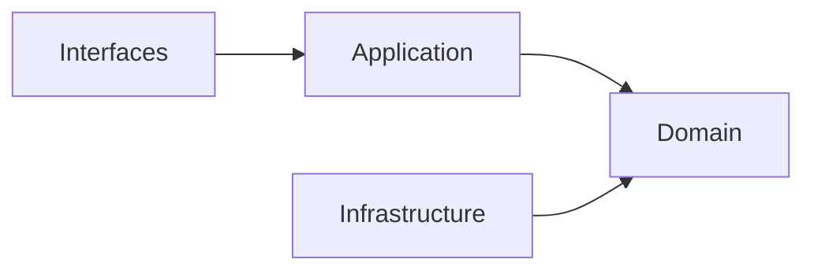

## Correct Interaction Flow

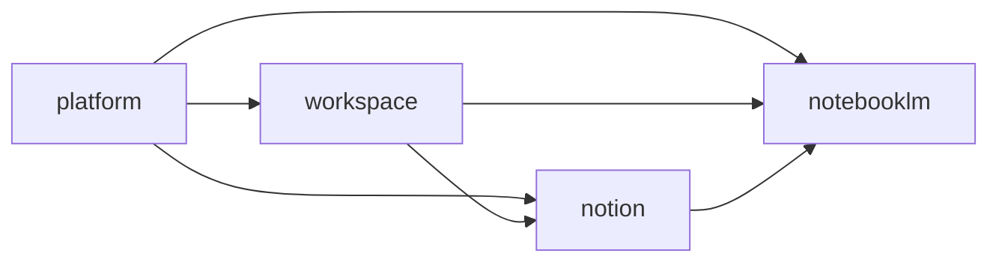

## Document Network

- [README.md](./README.md)
- [bounded-contexts.md](./bounded-contexts.md)
- [context-map.md](./context-map.md)
- [subdomains.md](./subdomains.md)
- [integration-guidelines.md](./integration-guidelines.md)
- [strategic-patterns.md](./strategic-patterns.md)
- [bounded-context-subdomain-template.md](./bounded-context-subdomain-template.md)
- [project-delivery-milestones.md](./project-delivery-milestones.md)
- [decisions/0001-hexagonal-architecture.md](./decisions/0001-hexagonal-architecture.md)

## Reading Path

1. [bounded-contexts.md](./bounded-contexts.md)
2. [context-map.md](./context-map.md)
3. [subdomains.md](./subdomains.md)
4. [ubiquitous-language.md](./ubiquitous-language.md)
5. [integration-guidelines.md](./integration-guidelines.md)
6. [strategic-patterns.md](./strategic-patterns.md)
7. [decisions/README.md](./decisions/README.md)
````

## File: docs/contexts/_template.md
````markdown
# Context Template

本樣板在本次任務限制下，依 Context7 驗證的 DDD、Context Map、Hexagonal Architecture 與 ADR 原則設計，用於建立新的 context 文件集合。

## Files To Create

- README.md
- subdomains.md
- bounded-contexts.md
- context-map.md
- ubiquitous-language.md
- AGENT.md

## README.md Template

- Purpose
- Why This Context Exists
- Context Summary
- Baseline Subdomains
- Recommended Gap Subdomains
- Key Relationships
- Reading Order
- Copilot Generation Rules
- Dependency Direction
- Dependency Direction Flow
- Anti-Pattern Rules
- Correct Interaction Flow
- Document Network
- Constraints

## subdomains.md Template

- Baseline Subdomains
- Recommended Gap Subdomains
- Recommended Order
- Copilot Generation Rules
- Dependency Direction Flow
- Correct Interaction Flow
- Document Network

## bounded-contexts.md Template

- Domain Role
- Baseline Bounded Contexts
- Recommended Gap Bounded Contexts
- Domain Invariants
- Copilot Generation Rules
- Dependency Direction
- Dependency Direction Flow
- Anti-Patterns
- Correct Interaction Flow
- Document Network

## context-map.md Template

- Context Role
- Relationships
- Mapping Rules
- Copilot Generation Rules
- Dependency Direction
- Dependency Direction Flow
- Anti-Patterns
- Correct Interaction Flow
- Document Network

## ubiquitous-language.md Template

- Canonical Terms
- Language Rules
- Avoid
- Naming Anti-Patterns
- Copilot Generation Rules
- Dependency Direction Flow
- Correct Interaction Flow
- Document Network

## AGENT.md Template

- Mission
- Canonical Ownership
- Route Here When
- Route Elsewhere When
- Guardrails
- Copilot Generation Rules
- Dependency Direction
- Dependency Direction Flow
- Hard Prohibitions
- Correct Interaction Flow
- Document Network

## Consistency Rules

- context-map 只能使用與戰略文件一致的關係方向。
- subdomains 與 bounded-contexts 必須使用同一套 baseline / gap 子域集合。
- README 只做入口摘要，不重寫 ADR 級決策。
- 若新 context 需要 symmetric relationship，必須先明確說明為什麼不採用 upstream-downstream。
- 若 context 文件涉及模組骨架或分層，必須與 `docs/bounded-context-subdomain-template.md` 一致：`<bounded-context>` 根層可承接 context-wide 的 `application/`、`domain/`、`infrastructure/`、`interfaces/`，不應被簡化成只有 `docs/` 與 `subdomains/`。
- 若文件提到 `core/`，必須明確說明它只是可選包裝；`infrastructure/` 與 `interfaces/` 仍屬外層，不得被包進泛用 `core/`。

## Mandatory Anti-Pattern Rules

- 不得把 domain 寫成依賴 framework、transport、storage 或第三方 SDK 的層。
- 不得把 Shared Kernel / Partnership 與 ACL / Conformist 混用在同一關係敘事。
- 不得把其他主域的正典模型直接拿來當成本地主域模型。

## Copilot Generation Rules

- 先決定 owning context、語言、邊界與依賴方向，再生成程式碼。
- 若需求屬於 shared policy、published language 或跨 subdomain orchestration，允許在 `<bounded-context>` 根層使用 hexagonal layers；否則優先落回擁有責任的 subdomain。
- 奧卡姆剃刀：若較少的抽象已能保護邊界與可測試性，就不要額外新增 port、ACL、DTO、subdomain、service 或流程節點。
- 任何新文件都應沿用同一套規則、流程圖與文件網絡章節。

## Occam Guardrail

- 若較少的抽象已能保護邊界與可測試性，就不要額外新增 port、ACL、DTO、subdomain、service 或流程節點。

## Diagram Templates


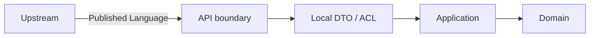

## Document Network

- [../README.md](../README.md)
- [../architecture-overview.md](../architecture-overview.md)
- [../bounded-context-subdomain-template.md](../bounded-context-subdomain-template.md)
- [../bounded-contexts.md](../bounded-contexts.md)
- [../context-map.md](../context-map.md)
- [../integration-guidelines.md](../integration-guidelines.md)
- [../subdomains.md](../subdomains.md)
- [../ubiquitous-language.md](../ubiquitous-language.md)
- [../decisions/README.md](../decisions/README.md)
````

## File: docs/contexts/notebooklm/AGENT.md
````markdown
# NotebookLM Agent

本文件在本次任務限制下，僅依 Context7 驗證的 DDD、Context Map、Hexagonal Architecture 參考整理，不主張反映現況實作。

## Mission

保護 notebooklm 主域作為對話、來源處理、檢索、grounding 與 synthesis 邊界。任何變更都應維持 notebooklm 擁有衍生推理流程與可追溯輸出，而不是直接擁有正典知識內容。

## Canonical Ownership

- ingestion
- source
- retrieval
- grounding
- notebook
- conversation
- note
- synthesis
- evaluation
- conversation-versioning

## Route Here When

- 問題核心是 notebook、conversation、source ingestion、retrieval、grounding、synthesis。
- 問題需要處理引用對齊、來源可追溯、模型輸出品質或衍生筆記。
- 問題要把知識來源轉成可對話與可綜合的推理材料。

## Route Elsewhere When

- 正典知識頁面、內容分類、正式發布屬於 notion。
- 身份、授權、權益、憑證治理屬於 platform。
- 共享 AI provider、模型政策、配額與安全護欄屬於 platform.ai。
- 工作區生命週期、共享與存在感屬於 workspace。

## Guardrails

- notebooklm 的輸出是衍生產物，不直接等於正典知識內容。
- retrieval 與 grounding 應作為獨立邊界，而不是隱含在 platform.ai 接入或 source 裡。
- ingestion 應與 source reference 分離，避免來源處理與來源語義耦合。
- evaluation 應作為品質與回歸語言，而不只是分析儀表板指標。
- 跨主域互動只經過 published language、API 邊界或事件。

## Dependency Direction

- notebooklm 內部依賴方向固定為 interfaces -> application -> domain <- infrastructure。
- application 只能透過 ports 協調 retrieval、grounding、ingestion、synthesis 所需的外部能力。
- infrastructure 只實作 ports 與邊界轉譯，不反向定義 domain 語言。

## Hard Prohibitions

- 不得把 notion 的 KnowledgeArtifact 直接當成 notebooklm 的本地主域模型。
- 不得讓 domain 或 application 直接依賴模型 SDK、向量儲存或外部檔案處理框架。
- 不得讓 notebooklm 直接改寫 workspace 或 notion 的內部狀態，而繞過其 API 邊界。

## Copilot Generation Rules

- 生成程式碼時，先維持 notebooklm 作為 downstream 推理主域，不回推治理或正典內容所有權。
- 共享模型能力若已由 platform.ai 提供，就不要在 notebooklm 再建立第二個 generic `ai` 子域。
- 奧卡姆剃刀：若較少的抽象已能保護邊界，就不要額外新增 port、ACL、DTO、subdomain 或 process manager。
- 只有碰到外部依賴、語義污染或跨主域轉譯時，才建立 port、ACL 或 local DTO。
- 任何跨主域互動都先走 API boundary / published language，再轉成本地主域語言。

## Dependency Direction Flow

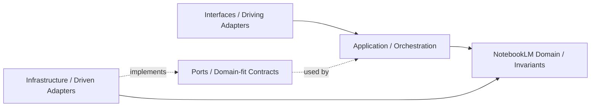

## Correct Interaction Flow

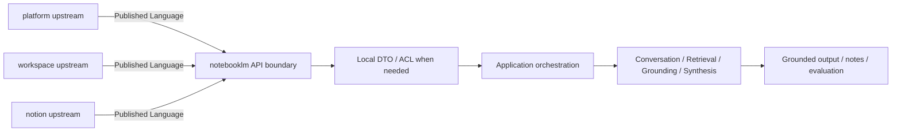

## Document Network

- [README.md](./README.md)
- [bounded-contexts.md](./bounded-contexts.md)
- [context-map.md](./context-map.md)
- [subdomains.md](./subdomains.md)
- [ubiquitous-language.md](./ubiquitous-language.md)
- [../../architecture-overview.md](../../architecture-overview.md)
- [../../integration-guidelines.md](../../integration-guidelines.md)
- [../../decisions/0001-hexagonal-architecture.md](../../decisions/0001-hexagonal-architecture.md)
- [../../decisions/0003-context-map.md](../../decisions/0003-context-map.md)
- [../../decisions/0005-anti-corruption-layer.md](../../decisions/0005-anti-corruption-layer.md)
````

## File: docs/contexts/notebooklm/bounded-contexts.md
````markdown
# NotebookLM

本文件在本次任務限制下，僅依 Context7 驗證的 DDD、Context Map、Hexagonal Architecture 參考整理，不主張反映現況實作。

## Domain Role

notebooklm 是對話與推理主域。依 bounded context 原則，它應封裝來源匯入、檢索、grounding、對話、摘要、評估與版本化，使推理流程保持高凝聚且與正典知識內容邊界分離。

## Baseline Bounded Contexts

| Cluster | Subdomains |
|---|---|
| Interaction Core | notebook, conversation, note |
| Reasoning Output | source, synthesis, conversation-versioning |

## Recommended Gap Bounded Contexts

| Subdomain | Why It Should Exist | Gap If Missing |
|---|---|---|
| ingestion | 承接來源匯入、正規化與前處理 | source 會同時承載來源處理與來源語義 |
| retrieval | 承接查詢、召回、排序與檢索策略 | synthesis 缺少清楚上游邊界 |
| grounding | 承接 citation、evidence 對齊與答案可追溯性 | 引用語言無法形成正典邊界 |
| evaluation | 承接品質評估、回歸比較與效果量測 | 品質語言只能散落在 analytics 或測試層 |

## Domain Invariants

- notebooklm 只擁有衍生推理流程，不擁有正典知識內容。
- shared AI capability 由 platform.ai 提供；notebooklm 擁有 retrieval、grounding、synthesis 的本地語義。
- grounding 應能把輸出對齊到來源證據。
- retrieval 是 synthesis 的上游能力，不應與 source reference 混成同一層。
- evaluation 應描述品質，而不是單純使用量。
- 任何要成為正式知識內容的輸出，都必須交由 notion 吸收。

## Dependency Direction

- notebooklm 子域內部一律遵守 interfaces -> application -> domain <- infrastructure。
- ingestion、retrieval、grounding 的外部整合必須由 adapter 實作，透過 port 注入到核心。
- domain 不得向外依賴來源處理框架、模型供應商或傳輸協定。

## Anti-Patterns

- 把 retrieval、grounding、ingestion 重新塞回 platform.ai 接入層或 source，造成責任折疊。
- 讓 synthesis 直接持有正典內容所有權，混淆 notion 與 notebooklm 邊界。
- 讓 application service 直接呼叫外部 SDK，而不經過 port/adapter。

## Copilot Generation Rules

- 生成程式碼時，先保留 retrieval、grounding、ingestion、evaluation 的獨立語義，再決定是否需要額外抽象。
- 奧卡姆剃刀：不要為了形式上的對稱而新增子域；只有在責任、語義或演化速率不同時才拆分。
- 若外部能力只服務單一明確邊界，優先用最小必要 port，而不是複製整套工具 API。

## Dependency Direction Flow

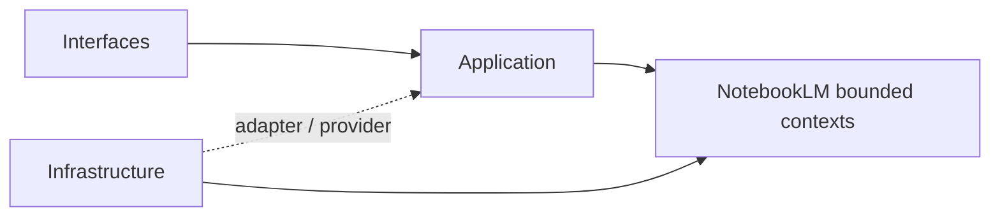

## Correct Interaction Flow

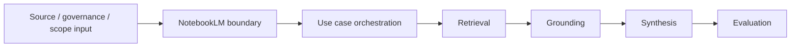

## Document Network

- [README.md](./README.md)
- [AGENT.md](./AGENT.md)
- [context-map.md](./context-map.md)
- [subdomains.md](./subdomains.md)
- [../../bounded-contexts.md](../../bounded-contexts.md)
- [../../subdomains.md](../../subdomains.md)
- [../../decisions/0001-hexagonal-architecture.md](../../decisions/0001-hexagonal-architecture.md)
- [../../decisions/0002-bounded-contexts.md](../../decisions/0002-bounded-contexts.md)
````

## File: docs/contexts/notebooklm/context-map.md
````markdown
# NotebookLM

本文件在本次任務限制下，僅依 Context7 驗證的 DDD、Context Map、Hexagonal Architecture 參考整理，不主張反映現況實作。

## Context Role

notebooklm 消費 workspace scope、platform 治理與 notion 內容來源，並輸出可追溯的對話、洞察與 synthesis。依 Context Mapper 思維，它是多個上游語言的下游整合者，但仍需維持自己的對話與推理邊界。

## Relationships

| Related Domain | Relationship Type | NotebookLM Position | Published Language |
|---|---|---|---|
| platform | Upstream/Downstream | downstream | actor reference、organization scope、access decision、entitlement signal、ai capability signal |
| workspace | Upstream/Downstream | downstream | workspaceId、membership scope、share scope |
| notion | Upstream/Downstream | downstream | knowledge artifact reference、attachment reference、taxonomy hint |

## Mapping Rules

- notebooklm 依賴 platform 的治理結果，但不重建 actor、policy 或 secret 模型。
- notebooklm 可消費 platform.ai 作為共享模型能力，但不擁有 provider / policy 所有權。
- notebooklm 在 workspace scope 內運作，但不定義 workspace 生命周期或 sharing 規則。
- notion 是 notebooklm 的重要 source supplier，notebooklm 不能反向直接改寫 notion 正典內容。
- synthesis、grounding、evaluation 是 notebooklm 對外輸出的核心能力語言。

## Dependency Direction

- notebooklm 只作為 platform、workspace、notion 的 downstream consumer，不反向宣稱治理或正典內容所有權。
- ACL 或 Conformist 只能由 notebooklm 這個 downstream 端選擇，不能回推到上游。
- 跨主域資料進入 notebooklm 時，先落在 published language 或 local DTO，再進入本地主域語言。

## Anti-Patterns

- 把 notebooklm 寫成 notion 或 workspace 的上游治理來源。
- 在同一主域關係上同時聲稱 ACL 與 Conformist。
- 直接共享 notebook、source 或 conversation 的內部模型給其他主域使用。

## Copilot Generation Rules

- 生成程式碼時，先維持 notebooklm 對 platform、workspace、notion 的 downstream 位置，再安排轉譯層。
- 奧卡姆剃刀：若 published language 加一層 local DTO 已足夠，就不要額外發明第二層 mapper 或雙重 ACL。
- 上游只提供 published language；本地主域保護由 downstream 完成。

## Dependency Direction Flow

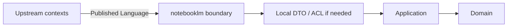

## Correct Interaction Flow

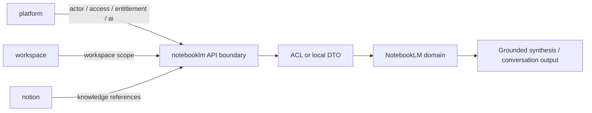

## Document Network

- [README.md](./README.md)
- [AGENT.md](./AGENT.md)
- [bounded-contexts.md](./bounded-contexts.md)
- [subdomains.md](./subdomains.md)
- [../../context-map.md](../../context-map.md)
- [../../integration-guidelines.md](../../integration-guidelines.md)
- [../../strategic-patterns.md](../../strategic-patterns.md)
- [../../decisions/0003-context-map.md](../../decisions/0003-context-map.md)
- [../../decisions/0005-anti-corruption-layer.md](../../decisions/0005-anti-corruption-layer.md)
````

## File: docs/contexts/notebooklm/README.md
````markdown
# NotebookLM Context

本 README 在本次任務限制下，僅依 Context7 驗證的 DDD、Context Map、Hexagonal Architecture 參考重建，不主張反映現況實作。

## Purpose

notebooklm 是對話、來源處理與推理主域。它的責任是提供 notebook、conversation、source ingestion、retrieval、grounding、synthesis、evaluation 與 conversation-versioning 等語言，把來源材料轉成可對話、可追溯、可評估的衍生輸出。

## Why This Context Exists

- 把推理流程與正典知識內容分離。
- 把來源匯入、檢索、grounding 與 synthesis 統整成同一主域。
- 提供可回流到其他主域、但本質上仍屬衍生輸出的能力邊界。

## Context Summary

| Aspect | Summary |
|---|---|
| Primary Role | 對話、來源處理、檢索與推理輸出 |
| Upstream Dependency | platform 治理、workspace scope、notion 內容來源 |
| Downstream Consumer | 無固定主域級 consumer；輸出可被其他主域吸收 |
| Core Principle | notebooklm 擁有衍生推理流程，不擁有正典知識內容 |

## Baseline Subdomains

- conversation
- note
- notebook
- source
- synthesis
- conversation-versioning

## Recommended Gap Subdomains

- ingestion
- retrieval
- grounding
- evaluation

## Key Relationships

- 與 platform：notebooklm 消費 actor、organization、access、entitlement、ai capability。
- 與 workspace：notebooklm 消費 workspaceId、membership scope、share scope。
- 與 notion：notebooklm 消費 knowledge artifact reference、attachment reference、taxonomy hint。

## Reading Order

1. [subdomains.md](./subdomains.md)
2. [bounded-contexts.md](./bounded-contexts.md)
3. [context-map.md](./context-map.md)
4. [ubiquitous-language.md](./ubiquitous-language.md)
5. [AGENT.md](./AGENT.md)

## Dependency Direction

- 本主域內部固定採用 interfaces -> application -> domain <- infrastructure。
- 跨主域只消費 published language、API boundary、events，不直接依賴他域內部模型。

## Anti-Pattern Rules

- 不把 notebooklm 的衍生輸出直接宣稱為 notion 的正典知識內容。
- 不把 retrieval/grounding 降格成單純 UI 功能或模型提示細節。
- 不把 ingestion 與 source reference 混成同一個不可拆分責任。
- 不把 platform.ai 的共享能力誤寫成 notebooklm 自己擁有的 `ai` 子域。

## Copilot Generation Rules

- 生成程式碼時，先保留 notebooklm 的衍生推理定位，再安排 retrieval、grounding、synthesis 的交互。
- 模型接入、配額、供應商策略若屬共享能力，先消費 platform.ai；notebooklm 保留 retrieval、grounding、synthesis、evaluation 的語義所有權。
- 奧卡姆剃刀：只在必要時引入 port、ACL、DTO；不要因為未來也許會有需求就預先堆疊抽象。
- 優先產生一條清楚的 upstream input -> translation -> application -> domain -> output 流程，而不是多條重疊流程。

## Dependency Direction Flow

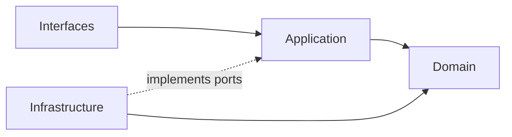

## Correct Interaction Flow

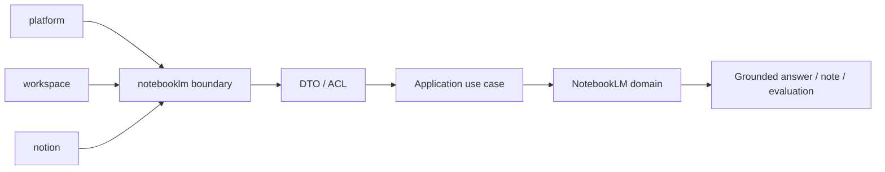

## Document Network

- [AGENT.md](./AGENT.md)
- [bounded-contexts.md](./bounded-contexts.md)
- [context-map.md](./context-map.md)
- [subdomains.md](./subdomains.md)
- [ubiquitous-language.md](./ubiquitous-language.md)
- [../../README.md](../../README.md)
- [../../architecture-overview.md](../../architecture-overview.md)
- [../../integration-guidelines.md](../../integration-guidelines.md)

## Constraints

- 本文件是 architecture-first 版本。
- 本文件依 Context7 的 bounded context 與 context map 原則編寫。
- 本文件不代表對既有 repo 內容做過語意校準。
````

## File: docs/contexts/notebooklm/subdomains.md
````markdown
# NotebookLM

本文件在本次任務限制下，僅依 Context7 驗證的 DDD、Context Map、Hexagonal Architecture 參考整理，不主張反映現況實作。

## Baseline Subdomains

| Subdomain | Responsibility |
|---|---|
| conversation | 對話 Thread 與 Message 生命週期 |
| note | 輕量筆記與知識連結 |
| notebook | Notebook 組合與管理 |
| source | 來源文件追蹤與引用 |
| synthesis | RAG 合成、摘要與洞察生成 |
| conversation-versioning | 對話版本與快照策略 |

## Recommended Gap Subdomains

| Subdomain | Why Needed |
|---|---|
| ingestion | 建立來源匯入、正規化與前處理的正典邊界 |
| retrieval | 建立查詢召回與排序策略的正典邊界 |
| grounding | 建立引用對齊與可追溯證據的正典邊界 |
| evaluation | 建立品質評估與回歸比較的正典邊界 |

## Recommended Order

1. retrieval
2. grounding
3. ingestion
4. evaluation

## Anti-Patterns

- 不把 retrieval 與 grounding 併回 source 或 platform.ai 接入層，否則推理鏈條失去清楚邊界。
- 不把 evaluation 只當成 dashboard 指標，否則品質語言無法成為正典子域。
- 不把 notebook、conversation、note 混成單一 UI 容器語意，否則無法維持聚合邊界。
- 不把 platform.ai 的共享能力誤寫成 notebooklm 自己擁有的 `ai` 子域。

## Copilot Generation Rules

- 生成程式碼時，先問新需求落在哪個既有子域；只有既有子域無法容納時才建立新子域。
- 模型 provider、配額與安全護欄優先歸 platform.ai；notebooklm 保留 retrieval、grounding、synthesis、evaluation 的語義切分。
- 奧卡姆剃刀：能在既有子域用一個明確 use case 解決，就不要新增第二個平行子域。
- 子域命名應反映責任與語義，不應只是頁面名稱或工具名稱。

## Dependency Direction Flow

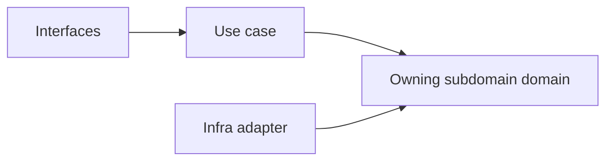

## Correct Interaction Flow

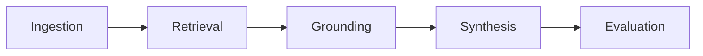

## Document Network

- [README.md](./README.md)
- [bounded-contexts.md](./bounded-contexts.md)
- [context-map.md](./context-map.md)
- [ubiquitous-language.md](./ubiquitous-language.md)
- [../../subdomains.md](../../subdomains.md)
- [../../bounded-contexts.md](../../bounded-contexts.md)
````

## File: docs/contexts/notion/AGENT.md
````markdown
# Notion Agent

本文件在本次任務限制下，僅依 Context7 驗證的 DDD、Context Map、Hexagonal Architecture 參考整理，不主張反映現況實作。

## Mission

保護 notion 主域作為知識內容生命週期邊界。任何變更都應維持 notion 擁有內容建立、分類、關聯、協作、模板、發布與版本化語言，而不是吸收平台治理或對話推理語言。

## Canonical Ownership

- knowledge
- authoring
- collaboration
- database
- taxonomy
- relations
- knowledge-analytics
- attachments
- automation
- knowledge-integration
- notes
- templates
- publishing
- knowledge-versioning

## Route Here When

- 問題核心是知識頁面、文章、內容結構、分類、關聯、模板與發布。
- 問題需要把輸入吸收成正式知識內容的正典狀態。
- 問題需要定義內容版本、內容協作與內容交付。

## Route Elsewhere When

- 身份、租戶、授權、權益、憑證治理屬於 platform。
- 共享 AI provider、模型政策、配額與安全護欄屬於 platform.ai。
- 工作區生命週期、共享、存在感與工作區流程屬於 workspace。
- notebook、conversation、retrieval、grounding、synthesis 屬於 notebooklm。

## Guardrails

- notion 的正典內容不等於 notebooklm 的衍生輸出。
- taxonomy 與 relations 應作為內容語義邊界，而不是 UI 功能附屬物。
- publishing 應與 authoring 分離，避免編輯語意與交付語意混用。
- notion 可以消費 platform.ai，但不擁有 AI provider / policy 的正典邊界。
- attachments 是內容資產語言，不是平台 secret 或一般檔案暫存語言。
- 跨主域互動只經過 published language、API 邊界或事件。

## Dependency Direction

- notion 內部依賴方向固定為 interfaces -> application -> domain <- infrastructure。
- authoring、knowledge、database、publishing 對外部能力的依賴只能透過 ports 進入核心。
- infrastructure 只負責儲存、傳輸、ACL 轉譯，不定義 KnowledgeArtifact 的正典語義。

## Hard Prohibitions

- 不得讓 notebooklm 的 Conversation、Synthesis 直接滲入 notion 作為正典內容模型。
- 不得讓 domain 或 application 直接依賴 UI、HTTP、資料庫 SDK 或框架語言。
- 不得讓 notion 直接接管 platform 的 actor、tenant、entitlement 治理責任。

## Copilot Generation Rules

- 生成程式碼時，先保留 notion 作為正典內容主域，不讓治理或推理語言滲入核心。
- 內容輔助若只是支援 knowledge / authoring / publishing use case，先消費 platform.ai，而不是在 notion 內重建 generic `ai` 子域。
- 奧卡姆剃刀：若一個既有內容子域與一條清楚 use case 就能承接需求，不要再新增額外 service、mapper 或子域。
- 只有在外部依賴或跨主域語義污染出現時，才建立 port、ACL 或 local DTO。
- 對 notebooklm 或 workspace 的互動一律先經 published language / API boundary，再進入 notion 語言。

## Dependency Direction Flow

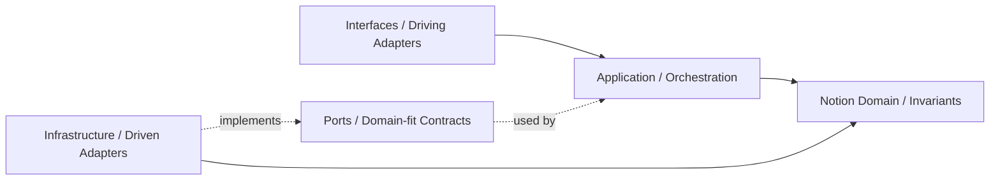

## Correct Interaction Flow

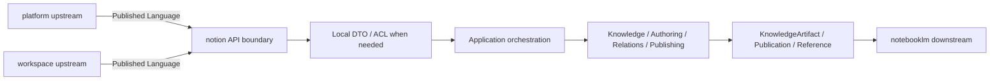

## Document Network

- [README.md](./README.md)
- [bounded-contexts.md](./bounded-contexts.md)
- [context-map.md](./context-map.md)
- [subdomains.md](./subdomains.md)
- [ubiquitous-language.md](./ubiquitous-language.md)
- [../../architecture-overview.md](../../architecture-overview.md)
- [../../integration-guidelines.md](../../integration-guidelines.md)
- [../../decisions/0001-hexagonal-architecture.md](../../decisions/0001-hexagonal-architecture.md)
- [../../decisions/0003-context-map.md](../../decisions/0003-context-map.md)
- [../../decisions/0005-anti-corruption-layer.md](../../decisions/0005-anti-corruption-layer.md)
````

## File: docs/contexts/notion/bounded-contexts.md
````markdown
# Notion

本文件在本次任務限制下，僅依 Context7 驗證的 DDD、Context Map、Hexagonal Architecture 參考整理，不主張反映現況實作。

## Domain Role

notion 是知識內容主域。依 bounded context 原則，它應封裝內容建立、編輯、結構化、分類、關聯、版本化與對外發布的高凝聚規則。

## Baseline Bounded Contexts

| Cluster | Subdomains |
|---|---|
| Content Core | knowledge, authoring, database |
| Collaboration and Change | collaboration, knowledge-versioning, templates |
| Intelligence and Extension | knowledge-analytics, attachments, automation, knowledge-integration, notes |

## Recommended Gap Bounded Contexts

| Subdomain | Why It Should Exist | Gap If Missing |
|---|---|---|
| taxonomy | 承接標籤、分類、語義樹與主題治理 | authoring 與 database 會混入分類責任 |
| relations | 承接內容之間的引用、backlink 與語義關聯 | 內容關係只能隱藏在欄位或 UI 裡 |
| publishing | 承接發布流程、受眾可見性與正式交付 | 編輯語意與交付語意無法分離 |

## Domain Invariants

- 知識內容的正典狀態屬於 notion。
- taxonomy 應獨立於具體 UI 視圖存在。
- relations 應描述內容對內容的語義關係，而不是臨時連結。
- platform.ai 可被 notion use case 消費，但 AI provider / policy ownership 不屬於 notion。
- publishing 只交付已被 notion 吸收的內容狀態。
- 任何來自 notebooklm 的輸出，若要成為正典內容，必須先被 notion 吸收。

## Dependency Direction

- notion 子域內部一律遵守 interfaces -> application -> domain <- infrastructure。
- content lifecycle 由 knowledge、authoring、database、publishing 等上下文在核心內協作，不由外層技術層直接驅動。
- 外部內容輸入只能先經 API boundary 或 adapter 轉譯，再進入 notion 語言。

## Anti-Patterns

- 把 taxonomy 或 relations 當成純 UI 功能，而不是內容語義邊界。
- 讓 publishing 直接等同 authoring，混淆編輯與交付責任。
- 讓 notebooklm 或 platform 的語言直接取代 notion 的 KnowledgeArtifact 模型。
- 把 platform.ai 共享能力提升成 notion 自己的 generic `ai` 子域所有權。

## Copilot Generation Rules

- 生成程式碼時，先決定需求屬於 content core、collaboration、還是 extension，再安排具體型別與流程。
- 奧卡姆剃刀：不要為了看起來完整而新增抽象層；只在現有內容邊界真的失效時才拆更多上下文。
- 外部能力若不影響正典內容語言，就不要把它抬升成新的內容核心抽象。

## Dependency Direction Flow

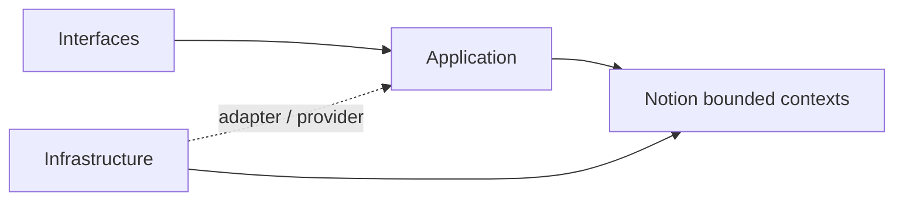

## Correct Interaction Flow

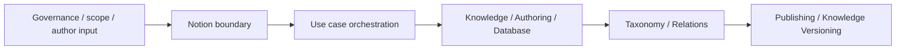

## Document Network

- [README.md](./README.md)
- [AGENT.md](./AGENT.md)
- [context-map.md](./context-map.md)
- [subdomains.md](./subdomains.md)
- [../../bounded-contexts.md](../../bounded-contexts.md)
- [../../subdomains.md](../../subdomains.md)
- [../../decisions/0001-hexagonal-architecture.md](../../decisions/0001-hexagonal-architecture.md)
- [../../decisions/0002-bounded-contexts.md](../../decisions/0002-bounded-contexts.md)
````

## File: docs/contexts/notion/context-map.md
````markdown
# Notion

本文件在本次任務限制下，僅依 Context7 驗證的 DDD、Context Map、Hexagonal Architecture 參考整理，不主張反映現況實作。

## Context Role

notion 對其他主域提供知識內容語言。依 Context Mapper 的 context map 思維，它消費 workspace scope 與 platform 治理，並向 notebooklm 提供可被引用的知識內容來源。

## Relationships

| Related Domain | Relationship Type | Notion Position | Published Language |
|---|---|---|---|
| platform | Upstream/Downstream | downstream | actor reference、organization scope、access decision、entitlement signal、ai capability signal |
| workspace | Upstream/Downstream | downstream | workspaceId、membership scope、share scope |
| notebooklm | Upstream/Downstream | upstream | knowledge artifact reference、attachment reference、taxonomy hint |

## Mapping Rules

- notion 消費 platform 的治理結果，但不重建 actor、tenant、policy 模型。
- notion 可消費 platform.ai 來支援內容 use case，但不擁有 AI provider / policy 所有權。
- notion 在 workspace scope 中運作，但不反向定義 workspace 生命週期。
- notebooklm 可以消費 notion 的知識來源，但不得直接重寫 notion 正典內容。
- publishing 是 notion 對外輸出正式內容狀態的邊界。

## Dependency Direction

- notion 對 platform、workspace 屬 downstream；對 notebooklm 屬 upstream 的內容 supplier。
- ACL 或 Conformist 只能由 notion 作為 downstream 時選擇，不能要求上游替 notion 保護語言。
- notion 對 notebooklm 輸出的是 published language，不是內部 aggregate 或 workflow 細節。

## Anti-Patterns

- 把 notion 與 notebooklm 寫成對稱 Shared Kernel，同時又要求 ACL。
- 讓 notebooklm 直接回寫 notion 正典內容而不經 notion 邊界。
- 把 workspace scope 語言錯寫成 notion 自己擁有的容器生命週期語言。

## Copilot Generation Rules

- 生成程式碼時，先保留 notion 對 platform、workspace 的 downstream 位置與對 notebooklm 的 upstream 位置。
- 奧卡姆剃刀：若 published language 加一層 local DTO 已足夠，就不要再建立第二個平行翻譯管線。
- notion 向外提供的是內容語言，不是內部 aggregate、repository 或 UI projection。

## Dependency Direction Flow

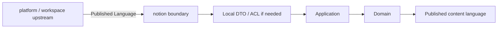

## Correct Interaction Flow

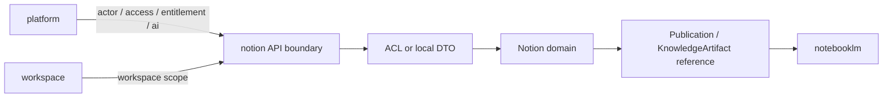

## Document Network

- [README.md](./README.md)
- [AGENT.md](./AGENT.md)
- [bounded-contexts.md](./bounded-contexts.md)
- [subdomains.md](./subdomains.md)
- [../../context-map.md](../../context-map.md)
- [../../integration-guidelines.md](../../integration-guidelines.md)
- [../../strategic-patterns.md](../../strategic-patterns.md)
- [../../decisions/0003-context-map.md](../../decisions/0003-context-map.md)
- [../../decisions/0005-anti-corruption-layer.md](../../decisions/0005-anti-corruption-layer.md)
````

## File: docs/contexts/notion/README.md
````markdown
# Notion Context

本 README 在本次任務限制下，僅依 Context7 驗證的 DDD、Context Map、Hexagonal Architecture 參考重建，不主張反映現況實作。

## Purpose

notion 是知識內容生命週期主域。它的責任是提供 knowledge artifact、authoring、database、taxonomy、relations、templates、publishing、knowledge-versioning 與 collaboration 等內容語言，承接正式知識內容的正典狀態。

## Why This Context Exists

- 把知識內容正典與平台治理、工作區範疇、對話推理分離。
- 讓內容建立、分類、關聯、交付與版本規則維持在同一個主域。
- 提供 notebooklm 可引用、但不可直接改寫的知識來源。

## Context Summary

| Aspect | Summary |
|---|---|
| Primary Role | 正典知識內容生命週期 |
| Upstream Dependency | platform 治理、workspace scope |
| Downstream Consumer | notebooklm |
| Core Principle | notion 擁有正式內容，不擁有治理或推理過程 |

## Baseline Subdomains

- knowledge
- authoring
- collaboration
- database
- knowledge-analytics
- attachments
- automation
- knowledge-integration
- notes
- templates
- knowledge-versioning

## Recommended Gap Subdomains

- taxonomy
- relations
- publishing

## Key Relationships

- 與 platform：notion 消費 actor、organization、access、entitlement、ai capability。
- 與 workspace：notion 消費 workspaceId、membership scope、share scope。
- 與 notebooklm：notion 向 notebooklm 提供 knowledge artifact reference 與 attachment reference。

## Reading Order

1. [subdomains.md](./subdomains.md)
2. [bounded-contexts.md](./bounded-contexts.md)
3. [context-map.md](./context-map.md)
4. [ubiquitous-language.md](./ubiquitous-language.md)
5. [AGENT.md](./AGENT.md)

## Dependency Direction

- 本主域內部固定採用 interfaces -> application -> domain <- infrastructure。
- notion 對外只暴露 published language、API boundary、events，不暴露內部內容模型。

## Anti-Pattern Rules

- 不把 notebooklm 的衍生輸出直接當成 notion 正典內容。
- 不把 taxonomy、relations、publishing 壓回單一 knowledge 編輯流程。
- 不把 platform 的治理語言混成內容生命週期本身。
- 不把 platform.ai 的共享能力誤寫成 notion 自己擁有的 `ai` 子域。

## Copilot Generation Rules

- 生成程式碼時，先保留 notion 的正典內容定位，再安排 authoring、knowledge、taxonomy、publishing 的交互。
- 內容輔助、摘要與生成若只是內容 use case 的支援能力，優先由 knowledge / authoring use case 消費 `platform.ai`，而不是在 notion 再建一個 generic `ai` 子域。
- 奧卡姆剃刀：不要預先新增第二套內容流程，只在既有內容邊界真的不夠時才補新抽象。
- 優先讓同一條 input -> translation -> application -> domain -> publication 流程保持單純可追溯。

## Dependency Direction Flow

```mermaid
flowchart LR
	I["Interfaces"] --> A["Application"]
	A --> D["Domain"]
	X["Infrastructure"] --> D
	X -. implements ports .-> A
```

## Correct Interaction Flow

```mermaid
flowchart LR
	Platform["platform"] --> Boundary["notion boundary"]
	Workspace["workspace"] --> Boundary
	Boundary --> Translation["DTO / ACL"]
	Translation --> App["Application use case"]
	App --> Domain["Notion domain"]
	Domain --> Output["KnowledgeArtifact / Publication"]
	Output --> NotebookLM["notebooklm consumer"]
```

## Document Network

- [AGENT.md](./AGENT.md)
- [bounded-contexts.md](./bounded-contexts.md)
- [context-map.md](./context-map.md)
- [subdomains.md](./subdomains.md)
- [ubiquitous-language.md](./ubiquitous-language.md)
- [../../README.md](../../README.md)
- [../../architecture-overview.md](../../architecture-overview.md)
- [../../integration-guidelines.md](../../integration-guidelines.md)

## Constraints

- 本文件是 architecture-first 版本。
- 本文件依 Context7 的 bounded context 與 context map 原則編寫。
- 本文件不代表對既有 repo 內容做過語意校準。
````

## File: docs/contexts/notion/subdomains.md
````markdown
# Notion

本文件在本次任務限制下，僅依 Context7 驗證的 DDD、Context Map、Hexagonal Architecture 參考整理，不主張反映現況實作。

## Baseline Subdomains

| Subdomain | Responsibility |
|---|---|
| knowledge | 頁面建立、組織、版本化與交付 |
| authoring | 知識庫文章建立、驗證與分類 |
| collaboration | 協作留言、細粒度權限與版本快照 |
| database | 結構化資料多視圖管理 |
| knowledge-analytics | 知識使用行為量測 |
| attachments | 附件與媒體關聯儲存 |
| automation | 知識事件觸發自動化動作 |
| knowledge-integration | 知識與外部系統雙向整合 |
| notes | 個人輕量筆記與正式知識協作 |
| templates | 頁面範本管理與套用 |
| knowledge-versioning | 全域版本快照策略管理 |

## Recommended Gap Subdomains

| Subdomain | Why Needed |
|---|---|
| taxonomy | 建立分類法與語義組織的正典邊界 |
| relations | 建立內容之間關聯與 backlink 的正典邊界 |
| publishing | 建立正式發布與對外交付的正典邊界 |

## Recommended Order

1. taxonomy
2. relations
3. publishing

## Anti-Patterns

- 不把 taxonomy 混成 authoring 裡的附屬設定。
- 不把 relations 混成單純 hyperlink 功能，失去語義關係邊界。
- 不把 publishing 混成 UI 上的一個按鈕事件，而忽略正式交付語言。
- 不把 platform.ai 的共享能力誤寫成 notion 自己擁有的 `ai` 子域。

## Copilot Generation Rules

- 生成程式碼時，先判斷需求屬於 knowledge、authoring、relations、publishing、knowledge-analytics、knowledge-integration、knowledge-versioning 哪一個內容責任。
- 奧卡姆剃刀：能在既有子域用一個明確 use case 解決，就不要新建第二個概念接近的子域。
- 子域命名要反映內容語義，不要退化成頁面或元件名稱。

## Dependency Direction Flow

```mermaid
flowchart LR
	UI["Interfaces"] --> UseCase["Use case"]
	UseCase --> Subdomain["Owning subdomain domain"]
	Infra["Infra adapter"] --> Subdomain
```

## Correct Interaction Flow

```mermaid
flowchart LR
	Authoring["Authoring"] --> Knowledge["Knowledge"]
	Knowledge --> Taxonomy["Taxonomy"]
	Knowledge --> Relations["Relations"]
	Taxonomy --> Publishing["Publishing"]
	Relations --> Publishing
```

## Document Network

- [README.md](./README.md)
- [bounded-contexts.md](./bounded-contexts.md)
- [context-map.md](./context-map.md)
- [ubiquitous-language.md](./ubiquitous-language.md)
- [../../subdomains.md](../../subdomains.md)
- [../../bounded-contexts.md](../../bounded-contexts.md)
````

## File: docs/contexts/platform/AGENT.md
````markdown
# Platform Agent

本文件在本次任務限制下，僅依 Context7 驗證的 DDD、Context Map、Hexagonal Architecture 參考整理，不主張反映現況實作。

## Mission

保護 platform 主域作為治理、身份、組織、權益、策略與營運支撐邊界。任何變更都應維持 platform 對治理語言的所有權，不吸收 workspace、notion、notebooklm 的正典業務模型。

## Canonical Ownership

- identity
- account
- account-profile
- organization
- tenant
- access-control
- security-policy
- platform-config
- feature-flag
- entitlement
- onboarding
- compliance
- consent
- billing
- subscription
- referral
- ai
- integration
- secret-management
- workflow
- notification
- background-job
- content
- search
- audit-log
- observability
- analytics
- support

## Route Here When

- 問題核心是 actor、organization、tenant、access、policy、entitlement 或商業權益。
- 問題核心是通知治理、背景任務、平台級搜尋、觀測與支援。
- 問題核心是共享 AI provider、模型政策、配額、安全護欄或下游主域共同消費的 AI capability。
- 問題需要提供其他主域共同消費的治理結果。

## Route Elsewhere When

- 工作區生命週期、成員關係、共享與存在感屬於 workspace。
- 知識內容建立、分類、關聯與發布屬於 notion。
- 對話、來源、retrieval、grounding、synthesis 屬於 notebooklm。

## Guardrails

- Actor 與 Identity 屬於 platform，不能在其他主域重定義。
- entitlement 是 subscription、feature-flag、policy 的解算結果，不等於 plan 本身。
- ai 屬於 platform 的共享能力治理，不等於 notebooklm 的推理輸出所有權。
- secret-management 應與 integration 分離，避免憑證語義擴散。
- consent 與 compliance 有關，但不是同一個 bounded context。
- 平台輸出治理信號，不接管其他主域的正典內容生命週期。

## Dependency Direction

- platform 內部依賴方向固定為 interfaces -> application -> domain <- infrastructure。
- access-control、entitlement、secret-management 等外部依賴只能透過 ports 進入核心。
- infrastructure 只實作治理能力與外部整合，不反向定義 Actor、Tenant、Entitlement 語言。

## Hard Prohibitions

- 不得讓 platform 直接接管 workspace、notion、notebooklm 的正典業務流程。
- 不得讓 domain 或 application 直接依賴第三方身份、通知、計費或 secret SDK。
- 不得在其他主域重建 Actor、Tenant、Entitlement、Secret 的正典模型。

## Copilot Generation Rules

- 生成程式碼時，先保留 platform 作為治理 upstream，而不是內容或推理 owner。
- notion 與 notebooklm 若需要 AI 能力，先走 platform.ai 的 published language / API boundary。
- 奧卡姆剃刀：若既有治理子域與單一 use case 能承接需求，就不要新增第二層 policy service、flag service 或 entitlement facade。
- 只有在外部依賴、敏感治理或跨主域轉譯明確存在時，才建立 port、ACL 或 local DTO。
- 對 workspace、notion、notebooklm 的輸出應停在 published language / API boundary。

## Dependency Direction Flow

```mermaid
flowchart LR
	I["Interfaces / Driving Adapters"] --> A["Application / Orchestration"]
	A --> D["Platform Domain / Invariants"]
	P["Ports / Domain-fit Contracts"] -. used by .-> A
	X["Infrastructure / Driven Adapters"] -. implements .-> P
	X --> D
```

## Correct Interaction Flow

```mermaid
flowchart LR
	Request["Actor / admin / system request"] --> Boundary["platform API boundary"]
	Boundary --> App["Application orchestration"]
	App --> Domain["Identity / Access / Entitlement / AI / Secret"]
	Domain --> PL["Published governance language"]
	PL --> Workspace["workspace"]
	PL --> Notion["notion"]
	PL --> NotebookLM["notebooklm"]
```

## Document Network

- [README.md](./README.md)
- [bounded-contexts.md](./bounded-contexts.md)
- [context-map.md](./context-map.md)
- [subdomains.md](./subdomains.md)
- [ubiquitous-language.md](./ubiquitous-language.md)
- [../../architecture-overview.md](../../architecture-overview.md)
- [../../integration-guidelines.md](../../integration-guidelines.md)
- [../../decisions/0001-hexagonal-architecture.md](../../decisions/0001-hexagonal-architecture.md)
- [../../decisions/0003-context-map.md](../../decisions/0003-context-map.md)
- [../../decisions/0005-anti-corruption-layer.md](../../decisions/0005-anti-corruption-layer.md)
````

## File: docs/contexts/platform/bounded-contexts.md
````markdown
# Platform

本文件在本次任務限制下，僅依 Context7 驗證的 DDD、Context Map、Hexagonal Architecture 參考整理，不主張反映現況實作。

## Domain Role

platform 是治理與營運支撐主域。依 bounded context 原則，它應把 actor、organization、access、policy、entitlement、billing 與 operational intelligence 封裝成清楚的上下文，而非讓這些責任滲入其他主域。

## Baseline Bounded Contexts

| Cluster | Subdomains |
|---|---|
| Identity and Organization | identity, account, account-profile, organization |
| Governance | access-control, security-policy, platform-config, feature-flag, onboarding, compliance |
| Commercial | billing, subscription, referral |
| Delivery and Operations | ai, integration, workflow, notification, background-job |
| Intelligence and Audit | content, search, audit-log, observability, analytics, support |

## Recommended Gap Bounded Contexts

| Subdomain | Why It Should Exist | Gap If Missing |
|---|---|---|
| tenant | 承接多租戶隔離與 tenant-scoped 規則 | organization 無法完整覆蓋租戶隔離模型 |
| entitlement | 承接有效權益與功能可用性解算 | subscription、feature-flag、policy 之間缺少統一決策點 |
| secret-management | 承接憑證、token、rotation 與 secret audit | integration 容易承載過多敏感治理責任 |
| consent | 承接同意、偏好、資料使用授權 | compliance 會被迫承接過細的使用者授權語意 |

## Domain Invariants

- actor identity 由 platform 正典擁有。
- access decision 必須基於 platform 語言輸出，而不是由下游主域自創。
- entitlement 必須是解算結果，不是任意 UI 標記。
- shared AI capability 由 platform 正典擁有；下游主域只能消費其 published language。
- billing event 與 subscription state 必須分離。
- secret 不應作為一般 integration payload 傳播。

## Dependency Direction

- platform 子域內部一律遵守 interfaces -> application -> domain <- infrastructure。
- identity、organization、billing、notification 等外部整合能力必須透過 port/adapter 進入核心。
- domain 不得向外依賴 HTTP、Firebase、secret provider 或 message transport 細節。

## Anti-Patterns

- 把 entitlement 當成 subscription plan 名稱或 UI 開關。
- 把 secret-management 混回 integration，使敏感治理責任失焦。
- 讓 platform 直接持有其他主域的正典內容或推理模型。
- 把 platform.ai 與 notebooklm 的 retrieval / grounding / synthesis 混成同一個子域所有權。

## Copilot Generation Rules

- 生成程式碼時，先判斷需求落在 identity、organization、entitlement、ai、secret-management 或其他既有治理責任。
- 奧卡姆剃刀：不要為了形式上的完整而新增抽象；只有當既有治理邊界無法承接時才拆新上下文。
- 對外部 provider 的抽象必須貼合 domain 需要，而不是複製供應商 API。

## Dependency Direction Flow

```mermaid
flowchart LR
	I["Interfaces"] --> A["Application"]
	A --> D["Platform bounded contexts"]
	X["Infrastructure"] --> D
	X -. adapter / provider .-> A
```

## Correct Interaction Flow

```mermaid
flowchart LR
	Identity["Identity / Organization"] --> Access["Access / Policy"]
	Access --> Entitlement["Entitlement"]
	Entitlement --> Delivery["AI / Notification / Job / Integration"]
	Delivery --> Audit["Audit / Observability / Analytics"]
```

## Document Network

- [README.md](./README.md)
- [AGENT.md](./AGENT.md)
- [context-map.md](./context-map.md)
- [subdomains.md](./subdomains.md)
- [../../bounded-contexts.md](../../bounded-contexts.md)
- [../../subdomains.md](../../subdomains.md)
- [../../decisions/0001-hexagonal-architecture.md](../../decisions/0001-hexagonal-architecture.md)
- [../../decisions/0002-bounded-contexts.md](../../decisions/0002-bounded-contexts.md)
````

## File: docs/contexts/platform/context-map.md
````markdown
# Platform

本文件在本次任務限制下，僅依 Context7 驗證的 DDD、Context Map、Hexagonal Architecture 參考整理，不主張反映現況實作。

## Context Role

platform 是其他三個主域的治理上游。依 Context Mapper 的 upstream/downstream 關係，它向下游提供身份、組織、存取、權益與營運支撐語言。

## Relationships

| Related Domain | Relationship Type | Platform Position | Published Language |
|---|---|---|---|
| workspace | Upstream/Downstream | upstream | actor reference、organization scope、access decision、entitlement signal |
| notion | Upstream/Downstream | upstream | actor reference、organization scope、access decision、entitlement signal、ai capability signal |
| notebooklm | Upstream/Downstream | upstream | actor reference、organization scope、access decision、entitlement signal、ai capability signal |

## Mapping Rules

- platform 提供治理結果，但不直接擁有工作區、知識內容或對話內容。
- workspace、notion、notebooklm 可以把平台輸出當作 supplier language，但不能穿透其內部模型。
- platform 擁有 shared AI capability，但 notion 與 notebooklm 仍各自擁有內容與推理語義。
- audit-log 與 analytics 可消費其他主域的事件，但那不等於接管對方的主域責任。
- tenant、entitlement、secret-management、consent 是平台應補齊的核心缺口邊界。

## Dependency Direction

- platform 是 workspace、notion、notebooklm 的治理 upstream，而不是它們的內容或流程 owner。
- platform 對下游輸出 published language，不輸出內部 aggregate、repository 或 secret 結構。
- 下游若需保護本地語言，ACL 由下游自行實作，不由 platform 代替選擇。

## Anti-Patterns

- 把 platform 與下游主域寫成 Shared Kernel，再同時保留 supplier/downstream 敘事。
- 讓 platform 直接穿透下游主域內部模型，以治理名義接管業務邏輯。
- 把審計或分析事件消費錯寫成平台擁有下游正典責任。

## Copilot Generation Rules

- 生成程式碼時，先維持 platform 作為 workspace、notion、notebooklm 的治理 upstream。
- 奧卡姆剃刀：若 published language 已足夠，就不要對每個下游再額外建立一套專屬治理模型。
- platform 的輸出應穩定、可被消費，但不應暴露其內部 aggregate 或 repository。

## Dependency Direction Flow

```mermaid
flowchart LR
	Domain["Platform domain"] --> PL["Published Language / OHS"]
	PL --> Boundary["Downstream API clients"]
	Boundary --> Local["Downstream local DTO / ACL"]
```

## Correct Interaction Flow

```mermaid
flowchart LR
	Platform["platform"] -->|actor / org / access / entitlement| Workspace["workspace"]
	Platform -->|actor / org / access / entitlement / ai| Notion["notion"]
	Platform -->|actor / org / access / entitlement / ai| NotebookLM["notebooklm"]
```

## Document Network

- [README.md](./README.md)
- [AGENT.md](./AGENT.md)
- [bounded-contexts.md](./bounded-contexts.md)
- [subdomains.md](./subdomains.md)
- [../../context-map.md](../../context-map.md)
- [../../integration-guidelines.md](../../integration-guidelines.md)
- [../../strategic-patterns.md](../../strategic-patterns.md)
- [../../decisions/0003-context-map.md](../../decisions/0003-context-map.md)
- [../../decisions/0005-anti-corruption-layer.md](../../decisions/0005-anti-corruption-layer.md)
````

## File: docs/contexts/platform/README.md
````markdown
# Platform Context

本 README 在本次任務限制下，僅依 Context7 驗證的 DDD、Context Map、Hexagonal Architecture 參考重建，不主張反映現況實作。

## Purpose

platform 是治理與營運支撐主域。它的責任是提供 actor、identity、organization、tenant、access、policy、entitlement、shared ai capability、billing、notification、search、audit 與 observability 等跨切面語言，供其他主域穩定消費。

## Why This Context Exists

- 把治理與營運支撐責任集中，避免滲入其他主域。
- 讓其他主域只消費治理結果，而不是重建治理模型。
- 以清楚的 published language 承接身份、權益、政策與營運能力。

## Context Summary

| Aspect | Summary |
|---|---|
| Primary Role | 治理、身份、權益與營運支撐 |
| Upstream Dependency | 無主域級上游；作為其他主域治理上游 |
| Downstream Consumers | workspace、notion、notebooklm |
| Core Principle | platform 輸出治理結果，不接管其他主域正典內容 |

## Baseline Subdomains

- identity
- account
- account-profile
- organization
- access-control
- security-policy
- platform-config
- feature-flag
- onboarding
- compliance
- billing
- subscription
- referral
- ai
- integration
- workflow
- notification
- background-job
- content
- search
- audit-log
- observability
- analytics
- support

## Recommended Gap Subdomains

- tenant
- entitlement
- secret-management
- consent

## Key Relationships

- 對 workspace：提供 actor、organization、access、entitlement。
- 對 notion：提供 actor、organization、access、entitlement、ai capability。
- 對 notebooklm：提供 actor、organization、access、entitlement、ai capability。

## Reading Order

1. [subdomains.md](./subdomains.md)
2. [bounded-contexts.md](./bounded-contexts.md)
3. [context-map.md](./context-map.md)
4. [ubiquitous-language.md](./ubiquitous-language.md)
5. [AGENT.md](./AGENT.md)

## Dependency Direction

- 本主域內部固定採用 interfaces -> application -> domain <- infrastructure。
- platform 對外只輸出治理結果與 published language，不輸出內部治理模型細節。

## Anti-Pattern Rules

- 不把 platform 寫成內容主域或對話主域。
- 不把 entitlement、consent、secret-management 混成同一個泛用設定區。
- 不把其他主域對平台的依賴寫成可以直接存取其內部模型。

## Copilot Generation Rules

- 生成程式碼時，先保留 platform 的治理定位，再安排 identity、access、entitlement、ai、secret-management 的交互。
- 奧卡姆剃刀：不要預先建立多餘 facade；能直接由既有治理邊界承接就維持單一路徑。
- 優先讓 request -> orchestration -> domain decision -> published language 保持單純可追溯。

## Dependency Direction Flow

```mermaid
flowchart LR
	I["Interfaces"] --> A["Application"]
	A --> D["Domain"]
	X["Infrastructure"] --> D
	X -. implements ports .-> A
```

## Correct Interaction Flow

```mermaid
flowchart LR
	Request["Actor / admin request"] --> Boundary["platform boundary"]
	Boundary --> App["Application use case"]
	App --> Domain["Platform domain"]
	Domain --> Published["Published governance language"]
	Published --> Consumers["workspace / notion / notebooklm"]
```

## Document Network

- [AGENT.md](./AGENT.md)
- [bounded-contexts.md](./bounded-contexts.md)
- [context-map.md](./context-map.md)
- [subdomains.md](./subdomains.md)
- [ubiquitous-language.md](./ubiquitous-language.md)
- [../../README.md](../../README.md)
- [../../architecture-overview.md](../../architecture-overview.md)
- [../../integration-guidelines.md](../../integration-guidelines.md)

## Constraints

- 本文件是 architecture-first 版本。
- 本文件依 Context7 的 bounded context 與 context map 原則編寫。
- 本文件不代表對既有 repo 內容做過語意校準。
````

## File: docs/contexts/platform/subdomains.md
````markdown
# Platform

本文件在本次任務限制下，僅依 Context7 驗證的 DDD、Context Map、Hexagonal Architecture 參考整理，不主張反映現況實作。

## Baseline Subdomains

| Subdomain | Responsibility |
|---|---|
| identity | 已驗證主體與身份信號治理 |
| account | 帳號聚合根與帳號生命週期 |
| account-profile | 主體屬性、偏好與治理設定 |
| organization | 組織、成員與角色邊界 |
| access-control | 主體現在能做什麼的授權判定 |
| security-policy | 安全規則定義、版本化與發佈 |
| platform-config | 平台設定輪廓與配置管理 |
| feature-flag | 功能開關策略與發佈節點 |
| onboarding | 新主體初始設定與引導流程 |
| compliance | 資料保留、稽核與法規執行 |
| billing | 計費狀態、費率與財務證據 |
| subscription | 方案、權益、配額與續期治理 |
| referral | 推薦關係與獎勵追蹤 |
| ai | 共享 AI provider 路由、模型政策、配額與安全護欄 |
| integration | 外部系統整合邊界與契約 |
| workflow | 平台級流程編排與狀態驅動執行 |
| notification | 通知路由、偏好與投遞 |
| background-job | 背景任務提交、排程與監控 |
| content | 平台級內容資產管理與發布 |
| search | 跨域搜尋路由與查詢協調 |
| audit-log | 永久稽核軌跡與不可否認證據 |
| observability | 健康量測、追蹤與告警 |
| analytics | 平台使用行為量測與分析 |
| support | 客服工單、支援知識與處理流程 |

## Recommended Gap Subdomains

| Subdomain | Why Needed |
|---|---|
| tenant | 建立多租戶隔離與 tenant-scoped 規則的正典邊界 |
| entitlement | 建立有效權益與功能可用性的統一解算上下文 |
| secret-management | 把憑證、token、rotation 從 integration 中切開 |
| consent | 把同意與資料使用授權從 compliance 中切開 |

## Recommended Order

1. tenant
2. entitlement
3. secret-management
4. consent

## Anti-Patterns

- 不把 tenant 與 organization 視為同義詞。
- 不把 entitlement 混成 feature-flag 的別名。
- 不把 secret-management 混成 integration 的一個欄位集合。
- 不把 consent 混成一般 UI preference。
- 不把 platform 的 ai 混成 notebooklm synthesis 或 notion 內容輔助的本地所有權。

## Copilot Generation Rules

- 生成程式碼時，先確認需求屬於哪個治理責任，再決定 use case 與 boundary。
- shared AI provider、模型政策、成本與安全護欄一律先歸 platform.ai 評估。
- 奧卡姆剃刀：能在既有子域用一個清楚 use case 解決，就不要新建語意重疊的治理子域。
- 子域命名必須反映治理責任，不應退化成頁面或介面名稱。

## Dependency Direction Flow

```mermaid
flowchart LR
	UI["Interfaces"] --> UseCase["Use case"]
	UseCase --> Subdomain["Owning subdomain domain"]
	Infra["Infra adapter"] --> Subdomain
```

## Correct Interaction Flow

```mermaid
flowchart LR
	Identity["Identity"] --> Organization["Organization / Tenant"]
	Organization --> Access["Access / Policy"]
	Access --> Entitlement["Entitlement"]
	Entitlement --> Secret["AI / Secret / Integration / Delivery"]
```

## Document Network

- [README.md](./README.md)
- [bounded-contexts.md](./bounded-contexts.md)
- [context-map.md](./context-map.md)
- [ubiquitous-language.md](./ubiquitous-language.md)
- [../../subdomains.md](../../subdomains.md)
- [../../bounded-contexts.md](../../bounded-contexts.md)
````

## File: docs/contexts/workspace/AGENT.md
````markdown
# Workspace Agent

本文件在本次任務限制下，僅依 Context7 驗證的 DDD、Context Map、Hexagonal Architecture 參考整理，不主張反映現況實作。

## Mission

保護 workspace 主域作為協作容器、工作區範疇與 workspaceId 錨點。任何變更都應維持 workspace 擁有工作區生命週期、成員關係、共享、存在感、活動投影、稽核、排程與工作流，而不是吸收平台治理或知識內容正典。

## Canonical Ownership

- lifecycle
- membership
- sharing
- presence
- audit
- feed
- scheduling
- workspace-workflow

## Route Here When

- 問題的中心是 workspaceId、工作區建立封存、工作區內角色與參與關係。
- 問題的中心是工作區共享、存在感、活動流、排程與工作流執行。
- 問題需要提供其他主域運作所需的 workspace scope。

## Route Elsewhere When

- 身份、組織、授權、權益、憑證、通知治理屬於 platform。
- 知識頁面、文章、資料庫、分類、內容發布屬於 notion。
- notebook、conversation、source、retrieval、synthesis 屬於 notebooklm。

## Guardrails

- workspace 的 Member 或 Membership 不等於 platform 的 Actor 或 Identity。
- feed 是投影，不是工作區正典狀態來源。
- audit 是不可否認追蹤，不等於使用者導向動態流。
- sharing 定義暴露範圍，但不取代 platform entitlement 與 access-control。
- 跨主域互動只經過 published language、API 邊界或事件。

## Dependency Direction

- workspace 內部依賴方向固定為 interfaces -> application -> domain <- infrastructure。
- membership、sharing、presence、workspace-workflow 所需外部能力只能透過 ports 進入核心。
- infrastructure 只處理事件、儲存、同步與投影，不反向定義 Workspace 或 Membership 語言。

## Hard Prohibitions

- 不得把 platform 的 Actor 或 Identity 直接當成 workspace 的 Membership 模型。
- 不得讓 feed 取代正典狀態來源，或讓 audit 退化成一般 UI 活動流。
- 不得讓 workspace 直接接管 notion 內容生命週期或 notebooklm 推理流程。

## Copilot Generation Rules

- 生成程式碼時，先保留 workspace 作為協作 scope 主域，而不是治理或內容 owner。
- 奧卡姆剃刀：若既有 lifecycle、membership、sharing、presence 或 workspace-workflow 邊界已足夠，就不要額外新增平行協作抽象。
- 只有在外部依賴、跨主域語義污染或 scope 轉譯明確存在時，才建立 port、ACL 或 local DTO。
- 對 notion 與 notebooklm 的輸出應停在 workspace scope / membership scope / share scope。

## Dependency Direction Flow

```mermaid
flowchart LR
	I["Interfaces / Driving Adapters"] --> A["Application / Orchestration"]
	A --> D["Workspace Domain / Invariants"]
	P["Ports / Domain-fit Contracts"] -. used by .-> A
	X["Infrastructure / Driven Adapters"] -. implements .-> P
	X --> D
```

## Correct Interaction Flow

```mermaid
flowchart LR
	Platform["platform upstream"] -->|Published Language| Boundary["workspace API boundary"]
	Boundary --> Translation["Local DTO / ACL when needed"]
	Translation --> App["Application orchestration"]
	App --> Domain["Lifecycle / Membership / Sharing / Workspace Workflow"]
	Domain --> Scope["workspace scope / membership scope / share scope"]
	Scope --> Notion["notion downstream"]
	Scope --> NotebookLM["notebooklm downstream"]
```

## Document Network

- [README.md](./README.md)
- [bounded-contexts.md](./bounded-contexts.md)
- [context-map.md](./context-map.md)
- [subdomains.md](./subdomains.md)
- [ubiquitous-language.md](./ubiquitous-language.md)
- [../../architecture-overview.md](../../architecture-overview.md)
- [../../integration-guidelines.md](../../integration-guidelines.md)
- [../../decisions/0001-hexagonal-architecture.md](../../decisions/0001-hexagonal-architecture.md)
- [../../decisions/0003-context-map.md](../../decisions/0003-context-map.md)
- [../../decisions/0005-anti-corruption-layer.md](../../decisions/0005-anti-corruption-layer.md)
````

## File: docs/contexts/workspace/bounded-contexts.md
````markdown
# Workspace

本文件在本次任務限制下，僅依 Context7 驗證的 DDD、Context Map、Hexagonal Architecture 參考整理，不主張反映現況實作。

## Domain Role

workspace 是協作與範疇主域。依 bounded context 原則，它應封裝高度凝聚的工作區規則，並以最小公開介面提供其他主域使用的 workspace scope。

## Baseline Bounded Contexts

| Subdomain | Owns | Excludes |
|---|---|---|
| audit | 工作區操作證據、可追溯紀錄 | 平台永久合規審計 |
| feed | 面向使用者的工作區活動投影 | 正典狀態與不可變證據 |
| scheduling | 工作區時間安排、提醒、期限 | 平台背景工作引擎 |
| workspace-workflow | 工作區流程定義、執行、狀態推進 | 知識內容正典生命週期 |

## Recommended Gap Bounded Contexts

| Subdomain | Why It Should Exist | Gap If Missing |
|---|---|---|
| lifecycle | 承接 workspace 建立、封存、還原、移轉與狀態變化 | 主容器生命週期容易散落到 workflow 或 app 組裝層 |
| membership | 承接 workspace 內邀請、席位、角色與參與關係 | 會把 organization 與 workspace participation 混為一談 |
| sharing | 承接分享連結、外部可見性與公開暴露範圍 | 對外共享無獨立邊界，安全與責任不清 |
| presence | 承接即時在線狀態、協作存在感與共同編輯訊號 | 即時協作能力無法形成可演化的本地模型 |

## Domain Invariants

- workspaceId 是工作區範疇錨點。
- 工作區成員關係屬於 membership，而不是平台身份本身。
- activity feed 只投影事實，不創造事實。
- audit trail 一旦寫入即不可隨意覆蓋。
- workspace-workflow 可跨工作區能力協調，但不能取代 lifecycle 與 membership 的正典責任。

## Dependency Direction

- workspace 子域內部一律遵守 interfaces -> application -> domain <- infrastructure。
- lifecycle、membership、sharing、presence 等能力若需要外部服務，必須經過 port/adapter。
- domain 不得依賴 UI 狀態、HTTP 傳輸、排程框架或儲存實作細節。

## Anti-Patterns

- 把 Membership 混成 Actor 身份本身。
- 讓 ActivityFeed 直接創造工作區事實，而不是投影工作區事實。
- 讓 Workspace Workflow 取代 Lifecycle、Membership、Sharing 的正典責任。

## Copilot Generation Rules

- 生成程式碼時，先判斷需求落在 lifecycle、membership、sharing、presence、audit、feed、scheduling、workspace-workflow 哪個責任。
- 奧卡姆剃刀：若既有 workspace 邊界可以吸收需求，就不要額外新建平行容器或 scope 抽象。
- 對外部能力的抽象必須貼合 workspace scope 的需求，而不是複製供應商 API。

## Dependency Direction Flow

```mermaid
flowchart LR
	I["Interfaces"] --> A["Application"]
	A --> D["Workspace bounded contexts"]
	X["Infrastructure"] --> D
	X -. adapter / provider .-> A
```

## Correct Interaction Flow

```mermaid
flowchart LR
	Lifecycle["Lifecycle"] --> Membership["Membership"]
	Membership --> Sharing["Sharing"]
	Sharing --> Presence["Presence"]
	Presence --> Workflow["Workspace Workflow / Scheduling"]
	Workflow --> AuditFeed["Audit / Feed projections"]
```

## Document Network

- [README.md](./README.md)
- [AGENT.md](./AGENT.md)
- [context-map.md](./context-map.md)
- [subdomains.md](./subdomains.md)
- [../../bounded-contexts.md](../../bounded-contexts.md)
- [../../subdomains.md](../../subdomains.md)
- [../../decisions/0001-hexagonal-architecture.md](../../decisions/0001-hexagonal-architecture.md)
- [../../decisions/0002-bounded-contexts.md](../../decisions/0002-bounded-contexts.md)
````

## File: docs/contexts/workspace/context-map.md
````markdown
# Workspace

本文件在本次任務限制下，僅依 Context7 驗證的 DDD、Context Map、Hexagonal Architecture 參考整理，不主張反映現況實作。

## Context Role

workspace 對其他主域提供工作區範疇。依 Context Mapper 的 context map 思維，workspace 應只暴露 scope、membership scope 與協作容器語言，而不暴露內部實作。

## Relationships

| Related Domain | Relationship Type | Workspace Position | Published Language |
|---|---|---|---|
| platform | Upstream/Downstream | downstream | actor reference、organization scope、access decision、entitlement signal |
| notion | Upstream/Downstream | upstream | workspaceId、membership scope、share scope |
| notebooklm | Upstream/Downstream | upstream | workspaceId、membership scope、share scope |

## Mapping Rules

- workspace 消費 platform 的治理結果，但不重建 identity、policy 或 entitlement 模型。
- notion 與 notebooklm 可以在 workspace scope 內運作，但不反向定義 workspace 生命週期。
- sharing 與 membership 是 workspace 對內容與對話主域輸出的核心 published language。
- 與其他主域的整合優先使用 API 邊界或事件，而不是直接模型滲透。

## Dependency Direction

- workspace 對 platform 屬 downstream；對 notion 與 notebooklm 屬 upstream 的 scope supplier。
- workspace 對外輸出 workspaceId、membership scope、share scope，而不是內部 aggregate 或投影實作。
- downstream 若需保護自己的語言，ACL 由 downstream 自行實作，不由 workspace 代做。

## Anti-Patterns

- 把 workspace 與 notion/notebooklm 寫成對稱共用核心，同時又要求 ACL。
- 把 sharing scope 直接當成平台 access decision 本身。
- 讓其他主域直接操作 workspace 內部 membership 或 lifecycle 模型。

## Copilot Generation Rules

- 生成程式碼時，先維持 workspace 對 platform 的 downstream 位置，以及對 notion / notebooklm 的 upstream scope supplier 位置。
- 奧卡姆剃刀：若 published language 加一層 local DTO 已足夠，就不要再建立第二個翻譯鏈。
- workspace 對外提供的是 scope，不是內部 aggregate、投影或 storage 模型。

## Dependency Direction Flow

```mermaid
flowchart LR
	Upstream["platform upstream"] -->|Published Language| Boundary["workspace boundary"]
	Boundary --> Translation["Local DTO / ACL if needed"]
	Translation --> App["Application"]
	App --> Domain["Domain"]
	Domain --> PL["Published workspace scope"]
```

## Correct Interaction Flow

```mermaid
flowchart LR
	Platform["platform"] -->|actor / access / entitlement| Boundary["workspace API boundary"]
	Boundary --> ACL["ACL or local DTO"]
	ACL --> Domain["Workspace domain"]
	Domain --> Scope["workspaceId / membership scope / share scope"]
	Scope --> Notion["notion"]
	Scope --> NotebookLM["notebooklm"]
```

## Document Network

- [README.md](./README.md)
- [AGENT.md](./AGENT.md)
- [bounded-contexts.md](./bounded-contexts.md)
- [subdomains.md](./subdomains.md)
- [../../context-map.md](../../context-map.md)
- [../../integration-guidelines.md](../../integration-guidelines.md)
- [../../strategic-patterns.md](../../strategic-patterns.md)
- [../../decisions/0003-context-map.md](../../decisions/0003-context-map.md)
- [../../decisions/0005-anti-corruption-layer.md](../../decisions/0005-anti-corruption-layer.md)
````

## File: docs/contexts/workspace/README.md
````markdown
# Workspace Context

本 README 在本次任務限制下，僅依 Context7 驗證的 DDD、Context Map、Hexagonal Architecture 參考重建，不主張反映現況實作。

## Purpose

workspace 是協作容器與工作區範疇主域。它的責任是提供 workspaceId、工作區生命週期、參與關係、共享、存在感、活動投影、稽核、排程與工作流，讓其他主域可以在同一個協作範疇中運作。

## Why This Context Exists

- 把工作區容器語意與平台治理語意分離。
- 把工作區 scope 作為其他主域可依賴的 published language。
- 把活動流、稽核、排程與流程協調收斂為同一主域內的高凝聚能力。

## Context Summary

| Aspect | Summary |
|---|---|
| Primary Role | 協作容器與 workspace scope |
| Upstream Dependency | platform 的 actor、organization、access、entitlement |
| Downstream Consumers | notion、notebooklm |
| Core Principle | workspace 暴露 scope，不接管治理或內容正典 |

## Baseline Subdomains

- audit
- feed
- scheduling
- workspace-workflow

## Recommended Gap Subdomains

- lifecycle
- membership
- sharing
- presence

## Key Relationships

- 與 platform：workspace 是治理結果的 downstream consumer。
- 與 notion：workspace 向 notion 提供 workspaceId、membership scope、share scope。
- 與 notebooklm：workspace 向 notebooklm 提供 workspaceId、membership scope、share scope。

## Reading Order

1. [subdomains.md](./subdomains.md)
2. [bounded-contexts.md](./bounded-contexts.md)
3. [context-map.md](./context-map.md)
4. [ubiquitous-language.md](./ubiquitous-language.md)
5. [AGENT.md](./AGENT.md)

## Dependency Direction

- 本主域內部固定採用 interfaces -> application -> domain <- infrastructure。
- workspace 對外只暴露 scope、published language、API boundary、events，不暴露內部實作。

## Anti-Pattern Rules

- 不把 workspace scope 寫成平台治理結果本身。
- 不把 feed、audit、workspace-workflow 互相取代為單一泛用流程層。
- 不把 notion 或 notebooklm 的內容與推理責任吸回 workspace。

## Copilot Generation Rules

- 生成程式碼時，先保留 workspace 的協作 scope 定位，再安排 lifecycle、membership、sharing、workspace-workflow 的交互。
- 奧卡姆剃刀：不要預先建立第二條平行協作流程；只有既有 scope 邊界不夠時才補新抽象。
- 優先讓 input -> translation -> application -> domain -> published scope 保持單純可追溯。

## Dependency Direction Flow

```mermaid
flowchart LR
	I["Interfaces"] --> A["Application"]
	A --> D["Domain"]
	X["Infrastructure"] --> D
	X -. implements ports .-> A
```

## Correct Interaction Flow

```mermaid
flowchart LR
	Platform["platform"] --> Boundary["workspace boundary"]
	Boundary --> Translation["DTO / ACL"]
	Translation --> App["Application use case"]
	App --> Domain["Workspace domain"]
	Domain --> Scope["workspace scope"]
	Scope --> Notion["notion"]
	Scope --> NotebookLM["notebooklm"]
```

## Document Network

- [AGENT.md](./AGENT.md)
- [bounded-contexts.md](./bounded-contexts.md)
- [context-map.md](./context-map.md)
- [subdomains.md](./subdomains.md)
- [ubiquitous-language.md](./ubiquitous-language.md)
- [../../README.md](../../README.md)
- [../../architecture-overview.md](../../architecture-overview.md)
- [../../integration-guidelines.md](../../integration-guidelines.md)

## Constraints

- 本文件是 architecture-first 版本。
- 本文件依 Context7 的 bounded context 與 context map 原則編寫。
- 本文件不代表對既有 repo 內容做過語意校準。
````

## File: docs/contexts/workspace/subdomains.md
````markdown
# Workspace

本文件在本次任務限制下，僅依 Context7 驗證的 DDD、Context Map、Hexagonal Architecture 參考整理，不主張反映現況實作。

## Baseline Subdomains

| Subdomain | Responsibility |
|---|---|
| audit | 工作區操作稽核與證據追蹤 |
| feed | 工作區活動摘要與事件流呈現 |
| scheduling | 工作區排程、時序與提醒協調 |
| workspace-workflow | 工作區流程編排與執行治理 |

## Recommended Gap Subdomains

| Subdomain | Why Needed |
|---|---|
| lifecycle | 把工作區容器生命週期獨立成正典邊界 |
| membership | 把工作區參與關係從平台身份治理中切開 |
| sharing | 把對外共享與可見性規則收斂到單一上下文 |
| presence | 把即時協作存在感與共同編輯訊號形成本地語言 |

## Recommended Order

1. lifecycle
2. membership
3. sharing
4. presence

## Anti-Patterns

- 不把 lifecycle 混進 workspace-workflow，使容器生命週期被流程編排吞沒。
- 不把 membership 混成 organization 或 identity。
- 不把 sharing 混成一般 permission 欄位集合。
- 不把 presence 藏進 UI 狀態而失去獨立語言。

## Copilot Generation Rules

- 生成程式碼時，先確認需求屬於哪個 workspace 責任，再決定 use case 與 boundary。
- 涉及工作區流程時一律使用 `workspace-workflow`，避免與 `platform.workflow` 混名。
- 奧卡姆剃刀：能在既有子域用一個清楚 use case 解決，就不要新建語意重疊的 scope 子域。
- 子域命名必須反映工作區語義，不應退化成頁面或元件名稱。

## Dependency Direction Flow

```mermaid
flowchart LR
	UI["Interfaces"] --> UseCase["Use case"]
	UseCase --> Subdomain["Owning subdomain domain"]
	Infra["Infra adapter"] --> Subdomain
```

## Correct Interaction Flow

```mermaid
flowchart LR
	Lifecycle["Lifecycle"] --> Membership["Membership"]
	Membership --> Sharing["Sharing"]
	Sharing --> Presence["Presence"]
	Presence --> Workflow["Workspace Workflow"]
	Workflow --> Scheduling["Scheduling"]
```

## Document Network

- [README.md](./README.md)
- [bounded-contexts.md](./bounded-contexts.md)
- [context-map.md](./context-map.md)
- [ubiquitous-language.md](./ubiquitous-language.md)
- [../../subdomains.md](../../subdomains.md)
- [../../bounded-contexts.md](../../bounded-contexts.md)
````

## File: docs/decisions/0001-hexagonal-architecture.md
````markdown
# 0001 Hexagonal Architecture

- Status: Accepted
- Date: 2026-04-11

## Context

Context7 驗證的 DDD / Hexagonal 參考指出，模組應保持高凝聚、低耦合，外部世界只依賴公開介面，領域核心必須與框架與基礎設施分離。若沒有清楚的邊界與端口，模組內部規則會被外層技術細節污染，跨主域整合也會快速失控。

## Decision

採用主域導向的 Hexagonal Architecture 作為全域架構基線。

- 每個主域內部遵守：driving adapters -> application orchestration -> domain core <- driven adapters。
- 領域核心負責 invariants、值物件、聚合與領域規則。
- 外部框架、IO、第三方服務、傳輸格式只能存在於邊界與 adapter。
- 跨主域互動只能透過 published language、API 邊界或事件。
- 公開 API 是跨主域依賴點，不是內部模組結構的鏡像暴露。

## Consequences

正面影響：

- 主域邊界更清楚，重構內部結構時不必連帶破壞外部整合。
- 領域語言可維持穩定，不會被 UI、HTTP 或基礎設施術語污染。
- 後續若需要分拆部署或演進為更獨立的服務，代價較低。

代價與限制：

- 需要更多 API 契約、Local DTO、ACL 與轉換層。
- 需要更嚴格的命名與文件治理，不可直接偷渡內部模型。

## Conflict Resolution

- 若任何文件暗示 domain 直接依賴 framework / infrastructure，以本 ADR 為準並判定為衝突。
- 若任何文件把 index 或共享檔案當成跨主域真實邊界，以本 ADR 為準並改回公開 API / published language。

## Rejected Anti-Patterns

- Domain 直接依賴 framework、SDK、transport、database implementation。
- Application service 直接呼叫 driven adapter，而不透過 port。
- Interface adapter 直接承載核心業務規則。

## Copilot Generation Rules

- 生成程式碼時，先保留 interfaces -> application -> domain <- infrastructure 的向內依賴方向。
- 奧卡姆剃刀：若較少的 abstraction 已能保護邊界，就不要額外新增 port、service、facade 或 adapter。
- 只有外部依賴或語義污染明確存在時，才建立 port 與 adapter。

## Dependency Direction Flow

```mermaid
flowchart LR
	Interfaces["Interfaces"] --> Application["Application"]
	Application --> Domain["Domain"]
	Infrastructure["Infrastructure"] --> Domain
	Infrastructure -. implements .-> Ports["Ports"]
	Application -. uses .-> Ports
```

## Correct Interaction Flow

```mermaid
flowchart LR
	Request["Request"] --> Interfaces["Driving adapter"]
	Interfaces --> Application["Application orchestration"]
	Application --> Domain["Domain decision"]
	Domain --> Ports["Port contract"]
	Ports --> Infrastructure["Driven adapter"]
```

## Document Network

- [README.md](./README.md)
- [0002-bounded-contexts.md](./0002-bounded-contexts.md)
- [0003-context-map.md](./0003-context-map.md)
- [../architecture-overview.md](../architecture-overview.md)
- [../integration-guidelines.md](../integration-guidelines.md)
- [../bounded-context-subdomain-template.md](../bounded-context-subdomain-template.md)
- [../project-delivery-milestones.md](../project-delivery-milestones.md)
````

## File: docs/decisions/0002-bounded-contexts.md
````markdown
# 0002 Bounded Contexts

- Status: Accepted
- Date: 2026-04-11

## Context

Context7 驗證的 bounded context 原則要求每個 context 只承載一組高凝聚、可自洽的語言與規則。如果沒有清楚主域與子域所有權，術語、責任與整合規則就會互相覆蓋，造成治理語言、內容語言與推理語言混雜。

## Decision

將系統的主域固定為四個主域：

- workspace：協作容器與工作區範疇
- platform：治理、身份、權益與營運支撐
- notion：正典知識內容生命週期
- notebooklm：對話、來源處理與推理輸出

每個主域底下都有自己的子域集合。文件中必須明確區分：

- baseline subdomains：此架構基線中已確立的核心子域
- recommended gap subdomains：依 Context7 推導出的合理缺口子域

## Consequences

正面影響：

- 所有權清楚，可避免 platform、workspace、notion、notebooklm 互相吞邊界。
- 上層戰略文件與主域文件可共享同一個 decomposition 模型。

代價與限制：

- 需要承認 gap subdomains 是 architecture-first 建議，而不是 repo-inspected 現況事實。
- 未來若要改主域切分，必須連動更新 strategic docs、ADR 與 context docs。

## Conflict Resolution

- 若任何文件出現超過四個主域的平級切分，以本 ADR 為準並視為衝突。
- 若任何文件把 recommended gap subdomains 寫成已驗證現況，以本 ADR 為準並改回 architecture-first 表述。

## Rejected Anti-Patterns

- 讓多個主域同時聲稱同一正典所有權。
- 用 UI、部署或資料表分組來取代 bounded context 切分。
- 把 gap subdomain 寫成已落地事實，而不標示為架構缺口。

## Copilot Generation Rules

- 生成程式碼時，先判定需求屬於哪個主域與子域，再決定檔案位置與依賴方向。
- 奧卡姆剃刀：若既有 bounded context 已可吸收需求，就不要新增平級主域或語意重疊子域。
- 所有權不清楚時，先修正語言與 context map，再寫程式碼。

## Dependency Direction Flow

```mermaid
flowchart TD
	MainDomain["Main Domain"] --> Subdomain["Subdomain"]
	Subdomain --> Application["Application"]
	Application --> Domain["Domain"]
	Infrastructure["Infrastructure"] --> Domain
```

## Correct Interaction Flow

```mermaid
flowchart LR
	Need["New requirement"] --> Ownership["Identify owning bounded context"]
	Ownership --> Language["Align ubiquitous language"]
	Language --> API["Choose boundary / API"]
	API --> Code["Generate code in owning context"]
```

## Document Network

- [README.md](./README.md)
- [0001-hexagonal-architecture.md](./0001-hexagonal-architecture.md)
- [0003-context-map.md](./0003-context-map.md)
- [../bounded-contexts.md](../bounded-contexts.md)
- [../subdomains.md](../subdomains.md)
- [../bounded-context-subdomain-template.md](../bounded-context-subdomain-template.md)
- [../project-delivery-milestones.md](../project-delivery-milestones.md)
````

## File: docs/decisions/0003-context-map.md
````markdown
# 0003 Context Map

- Status: Accepted
- Date: 2026-04-11

## Context

Context Mapper 文件指出，context map 是 bounded contexts 與其關係的中心表示。若關係方向不清楚，則 published language、ACL、supplier/customer 責任無法正確定義，文件之間也容易同時出現互相衝突的整合模型。

## Decision

在四個主域之間，只採用 directed upstream-downstream 關係作為主域級整合基線。

主域關係如下：

- platform -> workspace
- platform -> notion
- platform -> notebooklm
- workspace -> notion
- workspace -> notebooklm
- notion -> notebooklm

主域級不採用 Shared Kernel 或 Partnership。

## Consequences

正面影響：

- 每個主域可以清楚知道誰是上游、誰是下游。
- ACL、Published Language、Conformist 等模式才有明確適用位置。

代價與限制：

- 需要更多轉譯與 API 契約層，不能直接共享內部模型。
- 若某些能力確實需要共用模型，必須先抽象成新的獨立 bounded context，而不是偷渡共享核心。

## Conflict Resolution

- 若任何文件同時宣稱兩個主域是 Partnership / Shared Kernel，又同時使用 ACL 或 Conformist，判定為衝突，以本 ADR 為準。
- 若任何文件出現與上述方向相反的主域級關係，以本 ADR 為準。

## Rejected Anti-Patterns

- 把 directed upstream-downstream 與 symmetric relationship 混寫在同一主域關係。
- 把 supplier / consumer 敘事寫反，造成上下游不明。
- 直接共享內部模型來取代 published language。

## Copilot Generation Rules

- 生成程式碼時，先判定 upstream 與 downstream，再安排 API boundary、published language、ACL 或 Conformist。
- 奧卡姆剃刀：若單一 published language 與單一 translation step 已足夠，就不要加第二條整合鏈。
- 關係方向不清楚時，先停下修正文檔，不直接生成跨主域耦合程式碼。

## Dependency Direction Flow

```mermaid
flowchart LR
	Upstream["Upstream"] -->|PL / OHS| Downstream["Downstream"]
	Downstream -->|ACL or Conformist| LocalModel["Local model"]
```

## Correct Interaction Flow

```mermaid
flowchart LR
	Upstream["Upstream context"] -->|Published Language| Boundary["Downstream API client / boundary"]
	Boundary --> Translation["ACL or local DTO"]
	Translation --> Domain["Downstream domain"]
```

## Document Network

- [README.md](./README.md)
- [0002-bounded-contexts.md](./0002-bounded-contexts.md)
- [0005-anti-corruption-layer.md](./0005-anti-corruption-layer.md)
- [../context-map.md](../context-map.md)
- [../integration-guidelines.md](../integration-guidelines.md)
- [../bounded-context-subdomain-template.md](../bounded-context-subdomain-template.md)
- [../project-delivery-milestones.md](../project-delivery-milestones.md)
````

## File: docs/decisions/0004-ubiquitous-language.md
````markdown
# 0004 Ubiquitous Language

- Status: Accepted
- Date: 2026-04-11

## Context

Context7 驗證的 DDD 參考指出，領域核心必須運作在自己清楚的 ubiquitous language 之上。若沒有共同語言，跨主域整合、ADR、戰略文件與子域文件會用不同詞指同一件事，或用同一詞指不同責任，進而造成長期衝突。

## Decision

建立兩層語言治理：

- strategic ubiquitous language：定義四主域共用的戰略術語與整合術語
- context-specific ubiquitous language：由各主域 context 文件定義更細的本地主域語言

主域層的關鍵術語固定為：

- platform：Actor、Tenant、Entitlement、Secret、Consent
- workspace：Workspace、Membership、ShareScope、ActivityFeed、AuditTrail
- notion：KnowledgeArtifact、Taxonomy、Relation、Publication
- notebooklm：Notebook、Ingestion、Retrieval、Grounding、Synthesis、Evaluation

## Consequences

正面影響：

- 戰略文件、主域文件與 ADR 可以共享同一套術語。
- 語言衝突可以在文件層面先被攔住，而不是等到實作才暴露。

代價與限制：

- 命名自由度下降，需要持續維護 glossary。
- 新概念若無法歸屬到既有語言，必須先做文件決策。

## Conflict Resolution

- 若戰略語言與主域語言衝突，先以更具邊界意義的主域語言為準，再回寫 strategic glossary。
- 若兩個主域同時主張同一術語所有權，以 bounded contexts 與 context map 的所有權關係為準。

## Rejected Anti-Patterns

- 用同一個詞同時指涉治理、內容、推理三種不同責任。
- 用舊產品術語覆蓋新的 bounded context 語言。
- 讓實作便利性凌駕於 ubiquitous language 一致性。

## Copilot Generation Rules

- 生成程式碼時，先對齊 strategic term 與 context-specific term，再決定檔名、型別與 API 名稱。
- 奧卡姆剃刀：若一個名詞已足夠表達邊界，就不要再堆疊第二個近義抽象詞。
- 名稱若與現有語言衝突，先修正文檔與用語，再寫程式碼。

## Dependency Direction Flow

```mermaid
flowchart LR
	Strategic["Strategic language"] --> Context["Context language"]
	Context --> Boundary["API / Published Language"]
	Boundary --> Code["Generated code names"]
```

## Correct Interaction Flow

```mermaid
flowchart LR
	Requirement["Requirement"] --> Term["Choose canonical term"]
	Term --> Context["Map to owning context"]
	Context --> Boundary["Expose through correct boundary"]
	Boundary --> Code["Generate code"]
```

## Document Network

- [README.md](./README.md)
- [0002-bounded-contexts.md](./0002-bounded-contexts.md)
- [../ubiquitous-language.md](../ubiquitous-language.md)
- [../contexts/_template.md](../contexts/_template.md)
- [../bounded-context-subdomain-template.md](../bounded-context-subdomain-template.md)
- [../project-delivery-milestones.md](../project-delivery-milestones.md)
````

## File: docs/decisions/0005-anti-corruption-layer.md
````markdown
# 0005 Anti-Corruption Layer

- Status: Accepted
- Date: 2026-04-11

## Context

Context Mapper 明確指出 ACL 只能出現在 upstream-downstream 關係中，且只能由 downstream 採用；ACL 與 Conformist 互斥，且都不適用於 Shared Kernel 或 Partnership。若沒有這條規則，整合文件會同時宣稱保護語言與直接順從上游，造成自相矛盾。

## Decision

採用以下整合保護規則：

- 主域級整合預設先使用 published language + local DTO。
- 若上游語言會扭曲下游語言，下游必須使用 ACL。
- 若上游語言與下游需求高度一致，下游才可選擇 Conformist。
- ACL 與 Conformist 不能同時套用在同一關係。
- 因本架構基線不採用主域級 Shared Kernel / Partnership，所以主域級不允許以對稱關係為由略過 ACL 判斷。

## Consequences

正面影響：

- 下游主域可以保護自己的 ubiquitous language。
- Integration guidelines 可以有單一、可判斷的模式選擇規則。

代價與限制：

- 需要維護更多轉譯器、Local DTO 與邊界測試。
- 若每個整合都無條件使用 ACL，也會增加樣板成本，因此仍須做必要性判斷。

## Conflict Resolution

- 若任何文件把 ACL 寫成 upstream 的責任，判定為衝突，以本 ADR 為準。
- 若任何文件同時要求 ACL 與 Conformist 套在同一整合，判定為衝突，以本 ADR 為準。
- 若任何文件在對稱關係上使用 ACL / Conformist，判定為衝突，以本 ADR 為準。

## Rejected Anti-Patterns

- 把 ACL 當成 upstream 的工作。
- 在同一關係同時宣稱 ACL 與 Conformist。
- 用 Shared Kernel / Partnership 當理由跳過整合語義判斷。

## Copilot Generation Rules

- 生成程式碼時，先確認自己是 upstream 還是 downstream，再決定是否需要 ACL 或 Conformist。
- 奧卡姆剃刀：若 published language 加 local DTO 已足夠，就不要額外新增第二層 ACL。
- 只有在上游語言真的會污染本地語言時，才建立 ACL。

## Dependency Direction Flow

```mermaid
flowchart LR
	Upstream["Upstream"] -->|Published Language| DownstreamBoundary["Downstream boundary"]
	DownstreamBoundary --> ACL["ACL if needed"]
	DownstreamBoundary --> CF["Conformist if language matches"]
	ACL --> LocalDomain["Local domain"]
	CF --> LocalDomain
```

## Correct Interaction Flow

```mermaid
flowchart LR
	Upstream["Upstream context"] -->|PL / OHS| Boundary["Downstream API client"]
	Boundary --> Decision["Need protection?"]
	Decision -->|Yes| ACL["ACL"]
	Decision -->|No| CF["Conformist"]
	ACL --> Domain["Downstream domain"]
	CF --> Domain
```

## Document Network

- [README.md](./README.md)
- [0003-context-map.md](./0003-context-map.md)
- [../context-map.md](../context-map.md)
- [../integration-guidelines.md](../integration-guidelines.md)
- [../bounded-context-subdomain-template.md](../bounded-context-subdomain-template.md)
- [../project-delivery-milestones.md](../project-delivery-milestones.md)
````

## File: docs/decisions/README.md
````markdown
# Decisions

本目錄是 architecture-first 的決策日誌。依 ADR 參考模式，每份 ADR 至少說明 context、decision、consequences 與 conflict resolution，讓後續戰略文件可以引用相同決策來源。

## Decision Log

| ADR | Title | Status | Scope |
|---|---|---|---|
| [0001-hexagonal-architecture.md](./0001-hexagonal-architecture.md) | Hexagonal Architecture | Accepted | 全域架構與邊界分層 |
| [0002-bounded-contexts.md](./0002-bounded-contexts.md) | Bounded Contexts | Accepted | 四主域與子域切分 |
| [0003-context-map.md](./0003-context-map.md) | Context Map | Accepted | 主域間依賴方向 |
| [0004-ubiquitous-language.md](./0004-ubiquitous-language.md) | Ubiquitous Language | Accepted | 戰略術語治理 |
| [0005-anti-corruption-layer.md](./0005-anti-corruption-layer.md) | Anti-Corruption Layer | Accepted | 邊界整合保護規則 |

## How To Use This Directory

- 先讀標題以取得整體脈絡。
- 若某份戰略文件與 ADR 衝突，以 ADR 的 decision 與 conflict resolution 為準。
- 若未來新增新的架構決策，應沿用同一結構補充，而不是覆寫舊決策歷史。

## Anti-Pattern Coverage

- 0001 禁止把 framework / infrastructure 滲入核心。
- 0002 禁止主域與子域所有權漂移。
- 0003 禁止上下游方向與對稱關係混寫。
- 0004 禁止語言污染與同詞多義。
- 0005 禁止錯置 ACL / Conformist 的責任位置。

## Copilot Generation Rules

- 生成程式碼前，先由 ADR 決定邊界、語言與整合責任，再下手實作。
- 奧卡姆剃刀：若既有 ADR 已能解決當前判斷，就不要再堆疊新的臨時規則文件。
- 新規則若會改變邊界，先補 ADR，再補戰略文件與 context docs。

## Dependency Direction Flow

```mermaid
flowchart LR
	ADR["ADR"] --> Strategy["Strategic docs"]
	Strategy --> Context["Context docs"]
	Context --> Code["Generated code"]
```

## Correct Interaction Flow

```mermaid
flowchart LR
	Question["Architecture question"] --> ADR["Check ADR"]
	ADR --> Strategy["Align strategic docs"]
	Strategy --> Context["Align context docs"]
	Context --> Code["Generate boundary-safe code"]
```

## Document Network

- [0001-hexagonal-architecture.md](./0001-hexagonal-architecture.md)
- [0002-bounded-contexts.md](./0002-bounded-contexts.md)
- [0003-context-map.md](./0003-context-map.md)
- [0004-ubiquitous-language.md](./0004-ubiquitous-language.md)
- [0005-anti-corruption-layer.md](./0005-anti-corruption-layer.md)
- [../bounded-context-subdomain-template.md](../bounded-context-subdomain-template.md)
- [../project-delivery-milestones.md](../project-delivery-milestones.md)
- [../README.md](../README.md)

## Constraints

- 本目錄在本次任務限制下，只依 Context7 架構參考重建。
- 本目錄不是對既有 repo 內容做過語意比對後的歷史還原。
````

## File: docs/integration-guidelines.md
````markdown
# Integration Guidelines

本文件在本次任務限制下，僅依 Context7 驗證的 published language、ACL、Conformist 與 hexagonal boundary 原則重建，不主張反映現況實作。

## Boundary Contract

跨主域整合只能使用：

- published language
- public API boundary
- domain / integration events
- local DTO
- downstream ACL 或 downstream Conformist

## Pattern Selection Rules

| Situation | Pattern |
|---|---|
| 下游與上游語義高度一致，且不會扭曲本地語言 | Conformist |
| 上游語義會污染下游本地語言 | Anti-Corruption Layer |
| 只是跨主域資料交換 | Published Language + Local DTO |

## Hard Rules

- ACL 與 Conformist 只能由 downstream 選擇。
- ACL 與 Conformist 互斥。
- 不可直接傳遞上游 entity / aggregate 作為下游正典模型。
- 不可把 shared technical package 誤當成 strategic shared kernel。
- 若需要共同語義，先定 published language，再定 DTO，再評估是否需要 ACL。

## Domain-Specific Guidance

- workspace 消費 platform 時，優先保護自己的 membership、sharing、presence 語言。
- notion 消費 platform 或 workspace 時，優先保護自己的 knowledge artifact 與 taxonomy 語言。
- notebooklm 消費 notion 時，優先保護自己的 retrieval、grounding、synthesis 語言。

## Integration Checklist

1. 先確認 upstream / downstream 方向。
2. 先列出 published language。
3. 判斷是否語義一致。
4. 一致則考慮 conformist，不一致則建立 ACL。
5. 避免把 DTO、entity、policy、UI 狀態混成同一層。

## Integration Anti-Patterns

- 直接傳遞上游 aggregate、entity、repository 給下游使用。
- 讓 downstream 省略 published language 與 local DTO，直接貼靠上游內部模型。
- 把 ACL 當成預設樣板卻不判斷是否真的有語義污染。

## Copilot Generation Rules

- 生成程式碼時，先決定 upstream、downstream、published language，再決定 DTO、ACL 或 Conformist。
- 奧卡姆剃刀：若 published language 加 local DTO 已足夠，就不要額外建立雙重 mapper、雙重 ACL 或鏡像 aggregate。
- 只有在上游語義真的會污染本地語言時，才建立 ACL。

## Dependency Direction Flow

```mermaid
flowchart LR
	Upstream["Upstream"] -->|Published Language| Boundary["Downstream boundary"]
	Boundary --> Translation["Local DTO / ACL / Conformist"]
	Translation --> Application["Application"]
	Application --> Domain["Domain"]
```

## Correct Interaction Flow

```mermaid
flowchart LR
	Need["Cross-context need"] --> Direction["Identify upstream/downstream"]
	Direction --> PL["Define published language"]
	PL --> Decision["Need protection?"]
	Decision -->|Yes| ACL["ACL"]
	Decision -->|No| DTO["Local DTO / Conformist"]
	ACL --> Domain["Downstream domain"]
	DTO --> Domain
```

## Document Network

- [context-map.md](./context-map.md)
- [strategic-patterns.md](./strategic-patterns.md)
- [architecture-overview.md](./architecture-overview.md)
- [bounded-context-subdomain-template.md](./bounded-context-subdomain-template.md)
- [project-delivery-milestones.md](./project-delivery-milestones.md)
- [decisions/0001-hexagonal-architecture.md](./decisions/0001-hexagonal-architecture.md)
- [decisions/0003-context-map.md](./decisions/0003-context-map.md)
- [decisions/0005-anti-corruption-layer.md](./decisions/0005-anti-corruption-layer.md)

## Conflict Resolution

- 若某整合指南與 [context-map.md](./context-map.md) 的方向衝突，以 context map 為準。
- 若某整合指南與 [decisions/0005-anti-corruption-layer.md](./decisions/0005-anti-corruption-layer.md) 衝突，以 ADR 為準。
````

## File: docs/README.md
````markdown
# Docs

本文件集在本次任務限制下，僅依 Context7 驗證的 DDD、Context Map、Hexagonal Architecture 與 ADR 參考重建，不主張反映現況實作。

## Purpose

這份文件集提供四個主域的 architecture-first 戰略藍圖，並用單一決策日誌與主域文件消除術語、邊界與關係上的衝突。

## Single Source Of Truth Map

| Document | Role |
|---|---|
| [architecture-overview.md](./architecture-overview.md) | 全域架構敘事總覽 |
| [subdomains.md](./subdomains.md) | 四主域與子域總清單 |
| [bounded-contexts.md](./bounded-contexts.md) | 主域與子域所有權地圖 |
| [context-map.md](./context-map.md) | 主域間關係圖與方向 |
| [ubiquitous-language.md](./ubiquitous-language.md) | 戰略詞彙表 |
| [integration-guidelines.md](./integration-guidelines.md) | 主域整合規則 |
| [strategic-patterns.md](./strategic-patterns.md) | 採用與禁用的戰略模式 |
| [bounded-context-subdomain-template.md](./bounded-context-subdomain-template.md) | bounded context 與 subdomain 交付模板 |
| [project-delivery-milestones.md](./project-delivery-milestones.md) | 從零到交付的專案里程碑 |
| [decisions/README.md](./decisions/README.md) | ADR 索引與決策日誌 |
| [contexts/_template.md](./contexts/_template.md) | 新主域或新 context 文件樣板 |

## Context Folders

- [contexts/workspace/README.md](./contexts/workspace/README.md)
- [contexts/platform/README.md](./contexts/platform/README.md)
- [contexts/notion/README.md](./contexts/notion/README.md)
- [contexts/notebooklm/README.md](./contexts/notebooklm/README.md)

## Document Network

- [architecture-overview.md](./architecture-overview.md)
- [bounded-contexts.md](./bounded-contexts.md)
- [context-map.md](./context-map.md)
- [integration-guidelines.md](./integration-guidelines.md)
- [strategic-patterns.md](./strategic-patterns.md)
- [bounded-context-subdomain-template.md](./bounded-context-subdomain-template.md)
- [project-delivery-milestones.md](./project-delivery-milestones.md)
- [subdomains.md](./subdomains.md)
- [ubiquitous-language.md](./ubiquitous-language.md)
- [decisions/README.md](./decisions/README.md)
- [contexts/_template.md](./contexts/_template.md)

## Conflict Resolution Rules

- ADR 與戰略敘事衝突時，以 ADR 為準。
- 戰略文件與主域文件衝突時，先以更具邊界意義的主域文件為準，再回寫戰略文件。
- 子域所有權衝突時，以 [bounded-contexts.md](./bounded-contexts.md) 與 [subdomains.md](./subdomains.md) 為準。
- 關係方向衝突時，以 [context-map.md](./context-map.md) 為準。
- 若 root `docs/` 與 `modules/*/docs/*` 的 generic 子域命名衝突，以 root `docs/` 的戰略命名與 duplicate resolution 為準。

## Global Anti-Pattern Rules

- 不把 framework、transport、storage、SDK 細節寫進 domain 核心。
- 不把其他主域的內部模型當成自己的正典語言。
- 不把對稱關係與 directed relationship 混寫在同一套戰略文件。
- 不把 gap subdomains 描述成已驗證現況。

## Copilot Generation Rules

- 生成程式碼前，先從本文件決定應讀哪些戰略文件與 context 文件。
- 若任務涉及新 bounded context、subdomain 骨架或交付分期，先讀 [bounded-context-subdomain-template.md](./bounded-context-subdomain-template.md) 與 [project-delivery-milestones.md](./project-delivery-milestones.md)。
- 奧卡姆剃刀：若現有文件網已能回答邊界問題，就不要再新增臨時規則文件。
- 生成流程應先看 ADR，再看戰略文件，再看主域文件，最後才落到程式碼。

## Dependency Direction Flow

```mermaid
flowchart LR
	ADR["ADR"] --> Strategy["Strategic docs"]
	Strategy --> Context["Context docs"]
	Context --> Code["Generated code"]
```

## Correct Interaction Flow

```mermaid
flowchart LR
	Question["Coding question"] --> ADR["Check ADR"]
	ADR --> Strategy["Read strategic docs"]
	Strategy --> Context["Read owning context docs"]
	Context --> Code["Generate boundary-safe code"]
```

## Constraints

- 本文件集是 Context7-only 的 architecture-first 版本。
- 本文件集沒有檢視任何既有專案內容，因此不應被解讀為 repo-inspected 現況描述。
````

## File: docs/strategic-patterns.md
````markdown
# Strategic Patterns

本文件在本次任務限制下，僅依 Context7 驗證的 DDD strategic design 與 context map 原則重建，不主張反映現況實作。

## Selected Patterns

| Pattern | Usage In This Architecture |
|---|---|
| Bounded Context | 四個主域與其子域切分的核心模式 |
| Upstream-Downstream | 主域級關係的唯一基線模式 |
| Published Language | 所有跨主域交換的共同語言 |
| Anti-Corruption Layer | downstream 語言需要保護時使用 |
| Conformist | downstream 語言與 upstream 高度一致時的例外策略 |

## Patterns Not Used At Main-Domain Level

| Pattern | Why Not Used |
|---|---|
| Shared Kernel | 主域級共用模型會快速放大耦合與責任混淆 |
| Partnership | 主域級互相綁定會破壞 supplier / consumer 的清楚方向 |

## Recommended Strategic Posture

- platform 作為治理 supplier。
- workspace 作為協作 scope supplier。
- notion 作為知識內容 supplier。
- notebooklm 作為推理輸出與引用整合者。

## Pattern Conflicts Avoided

- 不把 ACL 與 Conformist 混用。
- 不把 Shared Kernel 與 directed relationship 混用。
- 不把 technical shared libraries 混寫成 strategic shared kernel。

## Strategic Anti-Patterns

- 以 shared technical package 取代真正的 bounded context 關係設計。
- 以對稱關係語言掩蓋其實存在的上下游依賴。
- 以實作方便為由，直接共享內部模型而不定 published language。

## Copilot Generation Rules

- 生成程式碼時，先選對戰略模式，再選對技術形狀。
- 奧卡姆剃刀：優先使用最少但足夠的戰略模式，不要同時堆疊多個彼此衝突的模式。
- 若一段整合沒有真正的語義污染，就不要硬加 ACL。

## Dependency Direction Flow

```mermaid
flowchart LR
	BoundedContext["Bounded Context"] --> UpstreamDownstream["Upstream / Downstream"]
	UpstreamDownstream --> PublishedLanguage["Published Language"]
	PublishedLanguage --> ACLCF["ACL or Conformist"]
```

## Correct Interaction Flow

```mermaid
flowchart LR
	PatternChoice["Choose pattern"] --> Relationship["Set relationship direction"]
	Relationship --> Language["Define published language"]
	Language --> Protection["Apply ACL or Conformist if needed"]
	Protection --> Code["Generate code"]
```

## Document Network

- [architecture-overview.md](./architecture-overview.md)
- [context-map.md](./context-map.md)
- [integration-guidelines.md](./integration-guidelines.md)
- [bounded-context-subdomain-template.md](./bounded-context-subdomain-template.md)
- [project-delivery-milestones.md](./project-delivery-milestones.md)
- [decisions/0003-context-map.md](./decisions/0003-context-map.md)
- [decisions/0005-anti-corruption-layer.md](./decisions/0005-anti-corruption-layer.md)

## Decision References

- [decisions/0001-hexagonal-architecture.md](./decisions/0001-hexagonal-architecture.md)
- [decisions/0002-bounded-contexts.md](./decisions/0002-bounded-contexts.md)
- [decisions/0003-context-map.md](./decisions/0003-context-map.md)
- [decisions/0005-anti-corruption-layer.md](./decisions/0005-anti-corruption-layer.md)
````

## File: py_fn/README.md
````markdown
# py_fn 架構規範（路徑級依賴版）

這份規範重點是「看完整路徑判斷依賴」，不是看資料夾名稱。
例如 services 這個名字在 application 和 domain 都存在，但它們是不同層，規則不同。

## 1. 全域依賴方向

```text
interface -> application -> domain
infrastructure -> application -> domain
app -> interface / application / infrastructure / core
core -> all layers
domain -> only core
```

## 2. 目錄基準（含子資料夾）

```text
py_fn/src
├─ app
│  ├─ config
│  ├─ bootstrap
│  ├─ container
│  └─ settings
├─ application
│  ├─ use_cases
│  ├─ dto
│  ├─ services
│  ├─ ports
│  │  ├─ input
│  │  └─ output
│  └─ mappers
├─ domain
│  ├─ entities
│  ├─ value_objects
│  ├─ repositories
│  ├─ services
│  ├─ events
│  └─ exceptions
├─ infrastructure
│  ├─ cache
│  ├─ audit
│  ├─ persistence
│  │  ├─ firestore
│  │  ├─ storage
│  │  └─ vector
│  ├─ external
│  │  ├─ openai
│  │  ├─ genkit
│  │  └─ http
│  ├─ repositories
│  ├─ config
│  └─ logging
├─ interface
│  ├─ controllers
│  ├─ middleware
│  ├─ handlers
│  ├─ schemas
│  └─ routes
└─ core
   ├─ utils
   ├─ types
   ├─ constants
   ├─ exceptions
   └─ security
```

## 3. 各層職責摘要

### app
- 啟動、組裝、注入。
- 這一層可以依賴所有層，但不承載核心業務規則。

### application
- 放 use case、application service、ports、DTO、mappers。
- 負責流程編排，不直接依賴 infrastructure 實作。

### domain
- 放 entities、value objects、repositories 介面、domain services、events、exceptions。
- 是最核心的層，必須保持純淨。

### infrastructure
- 放 Firestore、Storage、Vector、外部 API、repository implementation。
- 只負責技術實作，不主導業務流程。

### interface
- 放 controllers、handlers、routes、schemas、middleware。
- 接外部請求、驗證輸入、呼叫 use case。

### core
- 放所有層可共用的 utils、types、constants、exceptions、security。
- core 本身不依賴任何外層。

## 4.1 值物件與 DTO 規劃

### 應放在 domain/value_objects
- 純資料語意、無基礎設施細節、可被多個 use case 重用。
- 例如：`RagQueryInput`、`RagCitation`、`RagQueryResult`。

### 應放在 application/dto
- 某個 use case 的輸入/輸出模型。
- 例如：`RagIngestionResult` 這種 use case 輸出摘要。

### 不應放進 domain/value_objects
- 外部服務供應商回傳模型。
- 例如：`ParsedDocument` 屬於 Document AI adapter 的回傳型別，保留在 infrastructure/external。

### 目前 py_fn 的落點範例
- `domain/value_objects/rag.py`: `RagQueryInput`, `RagCitation`, `RagQueryResult`
- `domain/repositories/rag.py`: `RagQueryGateway`, `RagIngestionGateway`, `DocumentPipelineGateway`
- `application/dto/rag.py`: `RagIngestionResult`
- `infrastructure/external/documentai/client.py`: `ParsedDocument`

## 4.2 同名資料夾的判讀規則

- services 只看名稱會誤判，必須看完整路徑
       - domain/services 是核心業務規則
       - application/services 是應用層編排
       - infrastructure/services 若存在，只能是技術 adapter；若可拆回更明確目錄，優先拆回 cache / audit / external / persistence
- repositories 也一樣
       - domain/repositories 是介面（contracts）
       - infrastructure/repositories 是實作（implementations）
- config 也一樣
       - app/config 是啟動與組裝配置
       - infrastructure/config 是技術配置
       - core/constants 才是跨層可共用常量

## 5. 路徑級依賴矩陣（最重要）

| From 路徑 | Allowed To Import |
| --- | --- |
| interface/routes | interface/controllers, interface/handlers, core |
| interface/controllers | application/use_cases, application/dto, domain, core |
| interface/handlers | application/use_cases, application/ports/input, core |
| interface/middleware | core |
| interface/schemas | core, 同層 schema 模組 |
| application/use_cases | domain, application/ports/output, application/dto, core |
| application/services | domain, application/ports/output, core |
| application/mappers | application/dto, domain, core |
| application/ports/input | domain, core |
| application/ports/output | domain, core |
| domain/entities | domain/value_objects, core |
| domain/value_objects | core |
| domain/services | domain/entities, domain/value_objects, domain/repositories, core |
| domain/repositories | domain/entities, domain/value_objects, core |
| domain/events | domain/entities, core |
| domain/exceptions | core |
| infrastructure/repositories | domain/repositories, domain/entities, infrastructure/persistence, core |
| infrastructure/cache | infrastructure/external, core |
| infrastructure/audit | infrastructure/external, core |
| infrastructure/persistence | domain/entities, domain/value_objects, core |
| infrastructure/external | application/ports/output, domain, core |
| infrastructure/config | core |
| infrastructure/logging | core |
| app/bootstrap | app/config, app/container, infrastructure, application, interface, core |
| app/container | infrastructure, application, domain, core |
| app/settings | core |
| core/* | 不可依賴任何外層 |

## 6. 明確禁止規則

- domain 不可 import application/interface/infrastructure/app
- application 不可 import infrastructure 實作
- interface 不可直接 import infrastructure（除非經 app 組裝注入後由 application port 提供）
- infrastructure 不可主導業務流程（流程應在 application/use_cases）

## 7. 標準依賴流

```text
route -> controller/handler -> use case -> domain -> repository interface
                                                     ^
                                                     |
                           repository implementation (infrastructure)
```

## 8. import 範例

### interface controller

```python
from application.use_cases.create_user import CreateUserUseCase
from interface.schemas.user_schema import CreateUserRequest
```

### application use case

```python
from domain.repositories.user_repository import UserRepository
from domain.entities.user import User
```

### infrastructure repository implementation

```python
from domain.repositories.user_repository import UserRepository
from infrastructure.persistence.firestore.client import FirestoreClient
```

### app container

```python
from infrastructure.repositories.firestore_user_repository import FirestoreUserRepository
from application.use_cases.create_user import CreateUserUseCase
```

## 9. PR 檢查清單

- 是否用完整路徑判讀層級，而不是只看資料夾名稱
- domain 是否只依賴 core
- use case 是否只依賴抽象（ports/repository interface）
- infrastructure 是否只做技術實作
- app 是否是唯一組裝與注入入口

## 10. 附錄 A：快速記憶版

如果只想快速判斷，先記這張：

```text
Controller/Handler -> UseCase -> Domain -> Repository Interface
                                                                         ^
                                                                         |
                                                   Repository Implementation
                                                                         |
                                                                Database / API
```

對應路徑：

```text
interface/controllers or interface/handlers
application/use_cases
domain/entities or domain/services
domain/repositories
infrastructure/repositories
infrastructure/persistence or infrastructure/external
```

## 11. 附錄 B：高階流程圖

```text
HTTP Request
       -> interface (controller / handler)
       -> application (use case)
       -> domain (entity / service / repository interface)
       -> infrastructure (Firestore / Vector / API implementation)
```

## 12. 附錄 C：典型誤判案例

### services 同名但不同層
- `application/services/*` 可以編排流程，但不應放純領域規則。
- `domain/services/*` 才是純領域規則。

### repositories 同名但不同性質
- `domain/repositories/*` 是介面。
- `infrastructure/repositories/*` 是實作。

### config 同名但職責不同
- `app/config/*` 面向啟動與組裝。
- `infrastructure/config/*` 面向技術設定。
- 可跨層重用的常量優先放 `core/constants/*`。

## 13. 一句話總結

看完整路徑判斷層級，不看資料夾名稱猜責任。
````

## File: .github/agents/domain-architect.agent.md
````markdown
---
name: Domain Architect
description: Hexagonal Architecture with Domain-Driven Design 領域架構審查 Agent，專注確保聚合根、限界上下文、通用語言與事件驅動設計符合邊界與依賴方向規範。
tools: ['serena/*', 'context7/*', 'read', 'edit', 'search', 'execute']
model: 'GPT-5.3-Codex'
handoffs:
  - label: Boundary Review 審查模組邊界
    agent: Hexagonal DDD Architect
    prompt: 審查或重構此領域決策涉及的模組邊界、層依賴方向與公開 API 形狀。
  - label: Glossary Update 更新通用語言術語
    agent: KB Architect
    prompt: 將本次領域建模新增或變更的術語同步更新至 docs/ubiquitous-language.md 與對應 context 文件。
  - label: Quality Review 品質審查
    agent: Quality Lead
    prompt: 審查此領域變更的行為風險、邊界回歸與遺漏驗證，確認符合 Hexagonal DDD 規範。

---

# Domain Architect

## 目標範圍 (Target Scope)

- `modules/**/domain/**`
- `modules/**/application/use-cases/**`
- `modules/**/application/machines/**`
- `docs/ubiquitous-language.md`
- `docs/contexts/*/**`
- `.github/instructions/docs-authority-and-language.instructions.md`
- `.github/instructions/architecture-core.instructions.md`
- `.github/instructions/domain-modeling.instructions.md`
- `.github/instructions/event-driven-state.instructions.md`

## 使命 (Mission)

以 docs-first authority 審查與修正領域模型設計，確保聚合、限界上下文、通用語言與領域事件符合 Hexagonal Architecture with Domain-Driven Design 規則。

## 必讀來源

- `docs/README.md`
- `docs/ubiquitous-language.md`
- `docs/subdomains.md`
- `docs/bounded-contexts.md`
- `docs/contexts/<context>/*`
- `.github/instructions/docs-authority-and-language.instructions.md`
- `.github/instructions/architecture-core.instructions.md`
- `.github/instructions/domain-modeling.instructions.md`
- `.github/instructions/event-driven-state.instructions.md`

## 審查清單

- [ ] 命名是否已先對齊 `docs/ubiquitous-language.md` 與對應 context 文件？
- [ ] 程式碼是否位於正確的 bounded context / subdomain？
- [ ] 跨模組互動是否只透過 `api/` 邊界或領域事件？
- [ ] 上下游關係、ACL 與依賴方向是否與 `docs/contexts/<context>/context-map.md` 一致？
- [ ] 聚合根是否保護不變數、避免貧血模型，且狀態修改透過封裝方法進行？
- [ ] 值對象是否保持不可變，必要時使用 Zod / brand 型別保護？
- [ ] 領域事件是否使用過去式命名、穩定 discriminant、ISO 時間欄位，並在持久化成功後發布？
- [ ] 外部系統模型是否透過 `infrastructure/` 或 ACL adapter 轉譯，而未污染 `domain/`？

## 輸出格式

1. **Hexagonal DDD 合規性評估**：通過 / 需修正
2. **問題項目清單**：每項附檔案路徑與具體說明
3. **修正建議**：附程式碼範例
4. **驗證指令執行結果**：`npm run lint` 與 `npm run build` 結果

Tags: #use skill context7 #use skill serena-mcp #use skill xuanwu-app-skill
#use skill hexagonal-ddd
````

## File: .github/instructions/architecture-core.instructions.md
````markdown
---
description: 'Consolidated Hexagonal DDD architecture rules: layer ownership, API-only boundaries, module shape, and bounded-context dependency direction.'
applyTo: 'modules/**/*.{ts,tsx,js,jsx,md}'
---

# Architecture Core

## Core Boundary Rules

- Determine owning bounded context and subdomain from `docs/**/*` before choosing file placement.
- Cross-module collaboration must go through `modules/<target>/api` or explicit events.
- Do not import another module's `domain/`, `application/`, `infrastructure/`, or `interfaces/` internals.
- Replace any boundary bypass in the same change with API contracts or events.

## Layer Direction

- Dependency direction is fixed: `interfaces -> application -> domain <- infrastructure`.
- Keep `domain/` framework-free and runtime-agnostic.
- `infrastructure/` and `interfaces/` are outer layers; do not place them inside generic `core/`.

## Layer Ownership

- `domain/`: business rules, invariants, aggregates, entities, value objects, domain events, repository/port interfaces.
- `application/`: use-case orchestration, transaction boundaries, command/query contracts, application services.
- `infrastructure/`: repository and adapter implementations only.
- `interfaces/`: input/output translation, route/action/UI wiring.
- `api/`: only cross-module entry surface.

## Use Case Decision Rules

- Use a use case only for business behavior.
- Pure reads without business logic go to query handlers.
- Keep UI state and interaction logic in `interfaces/`.
- Use cases orchestrate flow; complex business rules stay in `domain/`.
- `GetXxxUseCase` is usually a query smell.

## Development Order

- Use-case contract first: actor, goal, main success scenario, failure branches.
- Required order: `Use Case -> Domain -> Ports -> Application -> Infrastructure -> Interface`.
- Do not build UI first and backfill domain later.
- Do not call repositories directly from `interfaces/`.
- Do not force domain design from storage schema first.

## Module Shape and Naming

- Required shape: `api/`, `domain/`, `application/`, `infrastructure/`, `interfaces/`, `README.md`, `index.ts`.
- Public boundary is `api/`; `index.ts` is aggregate export only.
- Use case file: `verb-noun.use-case.ts`.
- Repository interface: `PascalCaseRepository`.
- Repository implementation: `TechnologyPascalCaseRepository`.
- Domain event discriminant: `module-name.action`.

## Refactor and Lifecycle Rules

1. Confirm ownership first.
2. Map API consumers.
3. Create or update the target use-case contract before adapter/UI edits.
4. Preserve boundaries during split/merge/delete.
5. Update docs and imports in the same change.
6. Migrate public API and event contracts before removing old paths.

## Validation

- Use `eslint.config.mjs` restricted-import and boundary rules as enforcement source.
- Re-check changed imports under `@/modules/` for API-only access.
- Keep dependency flow acyclic unless an explicit event contract documents an exception.

Tags: #use skill context7 #use skill serena-mcp #use skill xuanwu-app-skill
#use skill hexagonal-ddd
````

## File: .github/instructions/architecture-runtime.instructions.md
````markdown
---
description: 'Consolidated runtime architecture rules across app/modules/packages/providers/debug/py_fn with explicit Next.js and worker boundaries.'
applyTo: '{app,modules,packages,providers,debug,py_fn}/**/*.{ts,tsx,js,jsx,py,md}'
---

# Architecture Runtime

## Boundary Model

- `app/` composes module APIs and package aliases.
- `modules/` own business capabilities by bounded context.
- `packages/` provide stable shared implementations through aliases.
- `py_fn/` owns ingestion and heavy worker jobs.

## Runtime Ownership

- Next.js owns browser-facing interactions, auth/session, server actions, and route orchestration.
- `py_fn/` owns heavy, retryable, and asynchronous ingestion/embedding jobs.

## Responsibility Split

- Next.js handles upload UX, browser-facing APIs, and response orchestration.
- `py_fn/` handles parse, clean, taxonomy, chunk, embed, and persistence pipelines.

## Data Boundary

- Keep Firestore contracts explicit and version-aware.
- Avoid implicit schema drift across contexts.
- Preserve source/chunk metadata traceability for audit and citation needs.

## Import and Source Rules

- Use configured aliases; avoid legacy import families.
- Avoid cross-layer relative imports across contexts.
- Use external documentation only when local sources are insufficient or behavior is version-sensitive.
- Prefer local authority first: `AGENTS.md`, `.github/copilot-instructions.md`, module docs, local code.

Tags: #use skill context7 #use skill serena-mcp #use skill xuanwu-app-skill
#use skill hexagonal-ddd
#use skill next-devtools-mcp
````

## File: .github/instructions/docs-authority-and-language.instructions.md
````markdown
---
description: 'Consolidated documentation authority and ubiquitous language rules for docs governance and naming discipline.'
applyTo: '{docs,modules,packages}/**/*.{ts,tsx,js,jsx,md}'
---

# Docs Authority And Language

## Authority Rules

- `docs/**/*` is the strategic authority for bounded-context ownership, terminology, and context map.
- Before adding or editing docs, start from `docs/README.md` and update the owning authority document.
- `.github/instructions/*` defines behavior rules only; do not duplicate architecture inventory or glossary content.
- `modules/<context>/docs/*` may describe implementation detail only and must not override root docs decisions.

## Ubiquitous Language Rules

1. Before naming classes, interfaces, types, variables, or domain events, check `docs/ubiquitous-language.md` and context-local glossary docs.
2. Do not replace canonical terms with synonyms once defined.
3. Domain events must use past-tense naming.
4. Bounded-context names must align with `modules/<context>/` folder names.
5. If a necessary term is missing, update glossary docs first, then implement.

## Naming Rules

- Aggregate roots: `PascalCase` nouns.
- Value objects: `PascalCase` nouns with meaning-focused names.
- Domain events: `PascalCase` past tense.
- Event discriminant: `kebab-case` `<module>.<action>`.
- Use-case file: `verb-noun.use-case.ts`.
- Repository interface: `PascalCaseRepository`.
- Repository implementation: `TechnologyPascalCaseRepository`.

## Documentation Checks

- Verify content belongs to the owner document instead of creating parallel files.
- Verify behavioral rules are not restating full strategic docs content.
- If docs changes affect `.github/skills/` repomix references, regenerate with existing scripts.

Tags: #use skill context7 #use skill serena-mcp #use skill xuanwu-app-skill
#use skill hexagonal-ddd
````

## File: .github/instructions/process-framework.instructions.md
````markdown
---
description: 'Consolidated process framework for branch scope, commit quality, Cockburn delivery loop, and Occam parsimony decisions.'
applyTo: '**/*'
---

# Process Framework

## Branch and PR Scope

- Keep one concern per branch and PR.
- Name branches by intent and scope.
- Do not mix architecture refactor with unrelated feature work.

## Commit Quality

- Keep commit subject concise and action-oriented.
- Reference scope (module/runtime) in commit body when relevant.
- Include validation evidence for non-trivial changes.
- Avoid vague subjects and mixed unrelated changes.

## Cockburn Delivery Loop

1. Collaborate: align vocabulary, ownership, and expected behavior.
2. Deliver: ship a small increment with observable value.
3. Reflect: inspect implementation and handoff learnings.
4. Improve: adjust code, process, or docs based on evidence.

## Method Weight Rules

- Use the lightest process that still controls risk.
- Remove ceremony that does not improve communication, feedback, or quality.

## Occam Decision Rules

- Prefer options with fewer assumptions when outcomes are comparable.
- Remove assumptions before removing evidence.
- Add abstraction/layers/docs only when they protect real boundaries or repeated change pressure.
- Reintroduce complexity only after new evidence appears.

## PR Checkpoints

- State what changed and why.
- State what assumption was removed.
- State what complexity remains and why.
- State validation proving the chosen path still works.

Tags: #use skill context7 #use skill serena-mcp #use skill xuanwu-app-skill
#use skill alistair-cockburn
#use skill occams-razor
````

## File: .github/prompts/generate-domain-event.prompt.md
````markdown
---
name: generate-domain-event
description: 根據業務操作生成符合 Hexagonal Architecture with Domain-Driven Design 規範的 TypeScript 領域事件定義，包含 Zod Schema、型別推導與聚合整合。
agent: Domain Architect
argument-hint: 提供觸發事件的業務操作名稱、所屬聚合、Payload 欄位與所屬模組。
---

# 生成領域事件 (Generate Domain Event)

## 輸入

- **觸發業務操作**：例如「使用者建立工作空間」
- **事件名稱（過去式）**：例如 `WorkspaceCreated`
- **所屬聚合**：例如 `Workspace`
- **所屬模組**：例如 `workspace`
- **Payload 欄位**：列出事件需攜帶的資料與其型別

## 工作流程

1. 確認事件名稱符合**過去式**命名規範（查閱 `docs-authority-and-language.instructions.md`）。
2. 確認 `discriminant` 格式為 `<module-name>.<action>`，例如 `workspace.created`。
3. 確認 `occurredAt` 使用 ISO string，遵循 `modules/shared/domain/events.ts` 的 `DomainEvent` 介面。
4. 在 `modules/<context>/domain/events/<EventName>.ts` 建立事件定義。
5. 在對應聚合根的業務方法中加入事件推入邏輯：`this._domainEvents.push({ ... })`。
6. 若需要，更新 `modules/<context>/domain/events/index.ts` 匯出。

## 事件定義模板

```typescript
import { z } from 'zod';

export const {EventName}Schema = z.object({
  type: z.literal('{module}.{action}'),
  eventId: z.string().uuid(),
  occurredAt: z.string().datetime(),   // ISO 8601，非 Date 物件
  payload: z.object({
    // 在此定義業務相關的 Payload 欄位
  }),
});

export type {EventName} = z.infer<typeof {EventName}Schema>;
```

## 輸出合約

- 領域事件 Zod Schema（完整定義）
- 推導出的 TypeScript 型別
- 更新對應聚合根，在業務方法中推入事件
- 更新 `modules/<context>/domain/events/index.ts` 匯出（若適用）

## 驗證

- 確認事件的 `occurredAt` 使用 ISO string 而非 `Date` 物件（與 `shared/domain/events.ts` 一致）。
- 確認事件 `type` discriminant 格式為 `<module>.<action>`，與模組命名一致。
- `npm run lint` — 確認無邊界違規。

Tags: #use skill context7 #use skill serena-mcp #use skill xuanwu-app-skill
#use skill hexagonal-ddd
````

## File: .github/prompts/review-architecture.prompt.md
````markdown
---
name: review-architecture
description: Review ownership boundaries, dependency direction, and contract alignment of implemented changes.
agent: Quality Lead
argument-hint: Provide plan reference, changed files, and architecture concerns.
---

# Review Architecture

Return findings first by severity: boundary breaks, dependency inversions, contract drift, and missing docs.

Require checks against:
- `instructions/docs-authority-and-language.instructions.md`
- `instructions/architecture-core.instructions.md`
- target module `context-map.md`

Tags: #use skill context7 #use skill serena-mcp #use skill xuanwu-app-skill
#use skill hexagonal-ddd
````

## File: docs/bounded-contexts.md
````markdown
# Bounded Contexts

本文件在本次任務限制下，僅依 Context7 驗證的 bounded context 與 hexagonal architecture 原則重建，不主張反映現況實作。

## Strategic Bounded Context Model

系統固定由四個主域構成。每個主域下可再分成 baseline subdomains 與 recommended gap subdomains。

## Main Domain Map

| Main Domain | Strategic Role | Baseline Focus | Recommended Gap Focus |
|---|---|---|---|
| workspace | 協作容器與 scope | audit、feed、scheduling、workspace-workflow | lifecycle、membership、sharing、presence |
| platform | 治理與營運支撐 | identity、organization、access、policy、billing、ai、notification、observability | tenant、entitlement、secret-management、consent |
| notion | 正典知識內容 | knowledge、authoring、collaboration、database、templates、knowledge-versioning | taxonomy、relations、publishing |
| notebooklm | 對話與推理 | conversation、note、notebook、source、synthesis、conversation-versioning | ingestion、retrieval、grounding、evaluation |

## Subdomain Inventory By Main Domain

### workspace

#### Baseline Subdomains

| Subdomain | 功能註解 |
|---|---|
| audit | 工作區操作稽核與證據追蹤 |
| feed | 工作區活動摘要與事件流呈現 |
| scheduling | 工作區排程、時序與提醒協調 |
| workspace-workflow | 工作區流程編排與執行治理 |

#### Recommended Gap Subdomains

| Subdomain | 功能註解 |
|---|---|
| lifecycle | 將工作區容器生命週期獨立為正典邊界（建立、封存、復原） |
| membership | 將工作區參與關係從平台身份治理切開（角色、加入、移除） |
| sharing | 將共享範圍與可見性規則收斂到單一上下文（對內/對外分享） |
| presence | 將即時協作存在感、共同編輯訊號收斂為本地語言 |

### platform

#### Baseline Subdomains

| Subdomain | 功能註解 |
|---|---|
| identity | 已驗證主體與身份信號治理 |
| account | 帳號聚合根與帳號生命週期 |
| account-profile | 主體屬性、偏好與治理設定 |
| organization | 組織、成員與角色邊界 |
| access-control | 主體現在能做什麼的授權判定 |
| security-policy | 安全規則定義、版本化與發佈 |
| platform-config | 平台設定輪廓與配置管理 |
| feature-flag | 功能開關策略與發佈節點 |
| onboarding | 新主體初始設定與引導流程 |
| compliance | 資料保留、稽核與法規執行 |
| billing | 計費狀態、費率與財務證據 |
| subscription | 方案、權益、配額與續期治理 |
| referral | 推薦關係與獎勵追蹤 |
| ai | 共享 AI provider 路由、模型政策、配額與安全護欄 |
| integration | 外部系統整合邊界與契約 |
| workflow | 平台級流程編排與狀態驅動執行 |
| notification | 通知路由、偏好與投遞 |
| background-job | 背景任務提交、排程與監控 |
| content | 平台級內容資產管理與發布 |
| search | 跨域搜尋路由與查詢協調 |
| audit-log | 永久稽核軌跡與不可否認證據 |
| observability | 健康量測、追蹤與告警 |
| analytics | 平台使用行為量測與分析 |
| support | 客服工單、支援知識與處理流程 |

#### Recommended Gap Subdomains

| Subdomain | 功能註解 |
|---|---|
| tenant | 建立多租戶隔離與 tenant-scoped 規則的正典邊界 |
| entitlement | 建立有效權益與功能可用性的統一解算上下文 |
| secret-management | 將憑證、token、rotation 從 integration 中切開 |
| consent | 將同意與資料使用授權從 compliance 中切開 |

### notion

#### Baseline Subdomains

| Subdomain | 功能註解 |
|---|---|
| knowledge | 頁面建立、組織、版本化與交付 |
| authoring | 知識庫文章建立、驗證與分類 |
| collaboration | 協作留言、細粒度權限與版本快照 |
| database | 結構化資料多視圖管理 |
| knowledge-analytics | 知識使用行為量測 |
| attachments | 附件與媒體關聯儲存 |
| automation | 知識事件觸發自動化動作 |
| knowledge-integration | 知識與外部系統雙向整合 |
| notes | 個人輕量筆記與正式知識協作 |
| templates | 頁面範本管理與套用 |
| knowledge-versioning | 全域版本快照策略管理 |

#### Recommended Gap Subdomains

| Subdomain | 功能註解 |
|---|---|
| taxonomy | 建立分類法與語義組織的正典邊界 |
| relations | 建立內容之間關聯與 backlink 的正典邊界 |
| publishing | 建立正式發布與對外交付的正典邊界 |

### notebooklm

#### Baseline Subdomains

| Subdomain | 功能註解 |
|---|---|
| conversation | 對話 Thread 與 Message 生命週期 |
| note | 輕量筆記與知識連結 |
| notebook | Notebook 組合與管理 |
| source | 來源文件追蹤與引用 |
| synthesis | RAG 合成、摘要與洞察生成 |
| conversation-versioning | 對話版本與快照策略 |

#### Recommended Gap Subdomains

| Subdomain | 功能註解 |
|---|---|
| ingestion | 建立來源匯入、正規化與前處理的正典邊界 |
| retrieval | 建立查詢召回與排序策略的正典邊界 |
| grounding | 建立引用對齊與可追溯證據的正典邊界 |
| evaluation | 建立品質評估與回歸比較的正典邊界 |

## Ownership Rules

- workspace 擁有工作區範疇，不擁有平台治理或正典內容。
- platform 擁有治理與權益，不擁有正典內容或推理輸出。
- notion 擁有正典知識內容，不擁有治理或推理流程。
- notebooklm 擁有推理流程與衍生輸出，不擁有正典知識內容。

## Dependency Direction Guardrail

- bounded context 所有權定義的是語言與規則邊界，不等於可直接穿透的實作邊界。
- 每個主域內部仍必須遵守 interfaces -> application -> domain <- infrastructure。
- 跨主域整合一律先經 API boundary、published language、events 或 local DTO。

## Conflict Resolution

- 若某子域同時被多個主域宣稱，依最能維持語言自洽與 context map 方向的主域保留所有權。
- 若某能力同時像治理又像內容，先問它是否定義 actor / tenant / entitlement；若是，歸 platform。
- 若某能力同時像內容又像推理輸出，先問它是否是正典內容狀態；若是，歸 notion，否則歸 notebooklm。
- generic `ai` 由 platform 擁有；notion 與 notebooklm 只能消費 platform 的 AI capability，不能再各自宣稱 `ai` 子域。
- `workflow` 作為 generic 名稱只保留在 platform；workspace 使用 `workspace-workflow` 避免跨主域混名。

## Forbidden Ownership Moves

- 不得讓兩個主域同時宣稱同一正典模型所有權。
- 不得用部署、資料表或 UI 分區來覆蓋 bounded context 所有權。
- 不得把 gap subdomain 缺口視為可以任意分散到其他主域的理由。
- 不得讓同一個 generic 子域名稱同時作為多個主域的 canonical ownership。

## Copilot Generation Rules

- 生成程式碼時，先決定 owning bounded context，再決定檔案位置、命名與 boundary。
- 奧卡姆剃刀：若既有 bounded context 可吸收需求，就不要為了命名好看而新增新的上下文。
- 所有權模糊時，先修正文檔邊界，再寫程式碼。

## Dependency Direction Flow

```mermaid
flowchart TD
	MainDomain["Main domain"] --> Subdomain["Subdomain"]
	Subdomain --> Application["Application"]
	Application --> Domain["Domain"]
	Infrastructure["Infrastructure"] --> Domain
```

## Correct Interaction Flow

```mermaid
flowchart LR
	Requirement["Requirement"] --> Ownership["Choose bounded context"]
	Ownership --> Boundary["Choose API boundary"]
	Boundary --> Language["Align local language"]
	Language --> Code["Generate code"]
```

## Document Network

- [architecture-overview.md](./architecture-overview.md)
- [subdomains.md](./subdomains.md)
- [context-map.md](./context-map.md)
- [bounded-context-subdomain-template.md](./bounded-context-subdomain-template.md)
- [project-delivery-milestones.md](./project-delivery-milestones.md)
- [decisions/0001-hexagonal-architecture.md](./decisions/0001-hexagonal-architecture.md)
- [decisions/0002-bounded-contexts.md](./decisions/0002-bounded-contexts.md)
````

## File: docs/context-map.md
````markdown
# Context Map

本文件在本次任務限制下，僅依 Context7 驗證的 context map 與 strategic design 原則重建，不主張反映現況實作。

## System Landscape

主域級關係只採用 directed upstream-downstream 模型。

## Directed Relationships

| Upstream | Downstream | Published Language |
|---|---|---|
| platform | workspace | actor reference、organization scope、access decision、entitlement signal |
| platform | notion | actor reference、organization scope、access decision、entitlement signal、ai capability signal |
| platform | notebooklm | actor reference、organization scope、access decision、entitlement signal、ai capability signal |
| workspace | notion | workspaceId、membership scope、share scope |
| workspace | notebooklm | workspaceId、membership scope、share scope |
| notion | notebooklm | knowledge artifact reference、attachment reference、taxonomy hint |

## Detailed Language Crosswalk

| Relationship | Upstream Canonical Terms | Published Language | Downstream Protected Terms |
|---|---|---|---|
| platform -> workspace | Actor, Tenant, Entitlement, Consent | actor reference, organization scope, access decision, entitlement signal | Workspace, Membership, ShareScope |
| platform -> notion | Actor, Tenant, Entitlement, Secret | actor reference, organization scope, access decision, entitlement signal, ai capability signal | KnowledgeArtifact, Taxonomy, Relation, Publication |
| platform -> notebooklm | Actor, Tenant, Entitlement, Secret | actor reference, organization scope, access decision, entitlement signal, ai capability signal | Notebook, Ingestion, Retrieval, Grounding, Synthesis, Evaluation |
| workspace -> notion | Workspace, Membership, ShareScope | workspaceId, membership scope, share scope | KnowledgeArtifact, Taxonomy, Relation |
| workspace -> notebooklm | Workspace, Membership, ShareScope | workspaceId, membership scope, share scope | Notebook, Retrieval, Grounding, Synthesis |
| notion -> notebooklm | KnowledgeArtifact, Taxonomy, Relation | knowledge artifact reference, attachment reference, taxonomy hint | Notebook, Retrieval, Grounding, Synthesis, Evaluation |

## Relationship Notes

- `platform -> workspace` 只提供治理判定與權益訊號；workspace 保留協作範疇語言。
- `platform -> notion` 與 `platform -> notebooklm` 可提供 shared AI capability 訊號，但不移轉內容或推理所有權。
- `workspace -> notion` 與 `workspace -> notebooklm` 只提供 scope 與 membership 邊界，不輸出 workspace 內部模型。
- `notion -> notebooklm` 僅提供可引用內容語言，不允許 notebooklm 直接回寫 notion 正典內容。

## Pattern Rules

- ACL 與 Conformist 只允許出現在 downstream 端。
- ACL 與 Conformist 互斥，不能同時套用在同一整合。
- Shared Kernel 與 Partnership 不用於主域級關係。
- 若未來真的需要共享模型，必須先抽出新的 bounded context，而不是把對稱關係塞回主域之間。

## Dependency Direction Guardrail

- 主域級方向只允許 upstream -> downstream，不允許同時宣稱對稱依賴。
- downstream 整合上游時，先決定 published language，再決定 ACL 或 Conformist。
- 上游提供語言與能力，下游決定如何保護自己的語言。

## Strategic Consequences

- 關係方向清楚後，published language、local DTO 與 ACL 才能一致。
- 主域級文檔可以避免同時出現互相矛盾的 supplier / consumer 敘事。

## Contradictions Removed

- 不再同時把主域級關係描述成 directed relationship 與 symmetric relationship。
- 不再把 ACL 寫成 upstream 的責任。
- 不再把 shared technical libraries 誤寫為主域級 Shared Kernel。

## Forbidden Relationship Patterns

- 不得把 Shared Kernel / Partnership 與 ACL / Conformist 混寫在同一關係。
- 不得把 direct model sharing 寫成 published language。
- 不得把下游的轉譯責任倒灌回上游。

## Copilot Generation Rules

- 生成程式碼時，先畫清 upstream / downstream，再安排 API boundary、published language、ACL 或 Conformist。
- 奧卡姆剃刀：若單一 published language 與單一 translation step 足夠，就不要再加第二層整合流程。
- 不確定關係方向時，先修正文檔，不直接生成跨主域耦合程式碼。

## Dependency Direction Flow

```mermaid
flowchart LR
	Upstream["Upstream"] -->|PL / OHS| Downstream["Downstream"]
	Downstream -->|ACL or Conformist| LocalModel["Local domain model"]
```

## Correct Interaction Flow

```mermaid
flowchart LR
	Platform["platform"] --> Workspace["workspace"]
	Platform --> Notion["notion"]
	Platform --> NotebookLM["notebooklm"]
	Workspace --> Notion
	Workspace --> NotebookLM
	Notion --> NotebookLM
```

## Document Network

- [architecture-overview.md](./architecture-overview.md)
- [integration-guidelines.md](./integration-guidelines.md)
- [strategic-patterns.md](./strategic-patterns.md)
- [bounded-context-subdomain-template.md](./bounded-context-subdomain-template.md)
- [project-delivery-milestones.md](./project-delivery-milestones.md)
- [decisions/0003-context-map.md](./decisions/0003-context-map.md)
- [decisions/0005-anti-corruption-layer.md](./decisions/0005-anti-corruption-layer.md)
````

## File: docs/contexts/notebooklm/ubiquitous-language.md
````markdown
# NotebookLM

本文件在本次任務限制下，僅依 Context7 驗證的 DDD、Context Map、Hexagonal Architecture 參考整理，不主張反映現況實作。

## Canonical Terms

| Term | Meaning |
|---|---|
| Notebook | 聚合對話、來源與衍生筆記的工作單位 |
| Conversation | Notebook 內的對話執行邊界 |
| Message | 一則輸入或輸出對話項 |
| Source | 被引用與推理的來源材料 |
| Ingestion | 來源匯入、正規化與前處理流程 |
| Retrieval | 從來源中召回候選片段的查詢能力 |
| Grounding | 把輸出對齊到來源證據的能力 |
| Citation | 輸出指回來源證據的引用關係 |
| Synthesis | 綜合多來源後生成的衍生輸出 |
| Note | 與 Notebook 關聯的輕量摘記 |
| Evaluation | 對輸出品質、回歸結果與效果的評估 |
| VersionSnapshot | 對話或 Notebook 某一時點的不可變快照 |

## Language Rules

- 使用 Conversation，不使用 Chat 作為正典語彙。
- 使用 Ingestion 與 Source 區分來源處理與來源語義。
- 使用 Retrieval 與 Grounding 區分召回能力與證據對齊能力。
- 使用 Synthesis 表示衍生綜合輸出，不把它直接稱為正典知識內容。
- 使用 Evaluation 表示品質語言，不用 Analytics 混稱模型效果。

## Avoid

| Avoid | Use Instead |
|---|---|
| Chat | Conversation |
| File Import | Ingestion |
| Search Step | Retrieval |
| Verified Answer | Grounded Synthesis |

## Naming Anti-Patterns

- 不用 Chat 混稱 Conversation 與 Notebook。
- 不用 Search 混稱 Retrieval 與 Grounding。
- 不用 Knowledge 或 Wiki 混稱 Synthesis 輸出，避免污染 notion 的正典語言。

## Copilot Generation Rules

- 生成程式碼時，名稱先對齊 Notebook、Conversation、Retrieval、Grounding、Synthesis、Evaluation，再決定型別與模組位置。
- 奧卡姆剃刀：若一個名詞已能準確表達語義，就不要再疊加第二個近義抽象名稱。
- 命名要先保護邊界，再追求實作便利。

## Dependency Direction Flow

```mermaid
flowchart LR
	Strategic["Strategic language"] --> Context["NotebookLM language"]
	Context --> API["Published language / API boundary"]
	API --> Code["Generated code"]
```

## Correct Interaction Flow

```mermaid
flowchart LR
	Source["Source"] --> Ingestion["Ingestion"]
	Ingestion --> Retrieval["Retrieval"]
	Retrieval --> Grounding["Grounding"]
	Grounding --> Synthesis["Synthesis"]
	Synthesis --> Evaluation["Evaluation"]
```

## Domain Layer Flow (enforced per subdomain)

```mermaid
flowchart LR
  Domain["domain/ (aggregates, entities, ports/)"]
  Application["application/ (use-cases, dtos)"]
  Ports["domain/ports/ (IXxxPort interfaces)"]
  Infrastructure["infrastructure/ (adapters, firebase, composition root)"]
  Interfaces["interfaces/ (actions, queries, components)"]

  Domain --> Application
  Application --> Ports
  Ports --> Infrastructure
  Infrastructure --> Interfaces
```

## Document Network

- [README.md](./README.md)
- [AGENT.md](./AGENT.md)
- [subdomains.md](./subdomains.md)
- [bounded-contexts.md](./bounded-contexts.md)
- [../../ubiquitous-language.md](../../ubiquitous-language.md)
- [../../decisions/0004-ubiquitous-language.md](../../decisions/0004-ubiquitous-language.md)
````

## File: docs/contexts/notion/ubiquitous-language.md
````markdown
# Notion

本文件在本次任務限制下，僅依 Context7 驗證的 DDD、Context Map、Hexagonal Architecture 參考整理，不主張反映現況實作。

## Canonical Terms

| Term | Meaning |
|---|---|
| KnowledgeArtifact | notion 主域擁有的知識內容總稱 |
| KnowledgePage | 正典頁面型知識單位 |
| Article | 經過撰寫與驗證流程的知識內容 |
| Database | 結構化知識集合 |
| DatabaseView | 對 Database 的投影與檢視配置 |
| Taxonomy | 標籤、分類法、主題樹等語義組織結構 |
| Relation | 內容對內容之間的正式關聯 |
| CollaborationThread | 內容附著的協作討論邊界 |
| Attachment | 綁定於知識內容的檔案或媒體 |
| Template | 可重複套用的內容結構起點 |
| Publication | 對外可見且可交付的內容狀態 |
| VersionSnapshot | 某一時點的不可變內容快照 |

## Language Rules

- 使用 KnowledgeArtifact、KnowledgePage、Article、Database 區分內容型別。
- 使用 Taxonomy 表示分類法，不用 Tagging 功能泛稱整個語義結構。
- 使用 Relation 表示正式內容關聯，不用 Link 混稱語義關係。
- 使用 Publication 表示正式對外內容狀態，不用 Publish Action 取代整個交付語言。
- 來自 notebooklm 的內容若未被 notion 吸收，不應直接稱為 KnowledgeArtifact。

## Avoid

| Avoid | Use Instead |
|---|---|
| Wiki | KnowledgePage 或 Article |
| Table | Database 或 DatabaseView |
| Tag System | Taxonomy |
| Content Link | Relation |

## Naming Anti-Patterns

- 不用 Wiki 混指 KnowledgeArtifact、KnowledgePage、Article。
- 不用 Tagging 混指 Taxonomy。
- 不用 Link 混指 Relation。
- 不用 Publish Action 混指 Publication 狀態與整個交付邊界。

## Copilot Generation Rules

- 生成程式碼時，名稱先對齊 KnowledgeArtifact、Taxonomy、Relation、Publication，再決定類別與檔名。
- 奧卡姆剃刀：若一個正確名詞已能表達邊界，就不要再堆疊第二個近義抽象名稱。
- 命名先保護內容語義，再考慮實作便利。

## Dependency Direction Flow

```mermaid
flowchart LR
	Strategic["Strategic language"] --> Context["Notion language"]
	Context --> API["Published language / API boundary"]
	API --> Code["Generated code"]
```

## Correct Interaction Flow

```mermaid
flowchart LR
	Knowledge["KnowledgeArtifact"] --> Taxonomy["Taxonomy"]
	Knowledge --> Relation["Relation"]
	Relation --> Publication["Publication"]
	Taxonomy --> Publication
```

## Domain Layer Flow (enforced per subdomain)

```mermaid
flowchart LR
  Domain["domain/ (aggregates, entities, ports/)"]
  Application["application/ (use-cases, dtos)"]
  Ports["domain/ports/ (IXxxPort interfaces)"]
  Infrastructure["infrastructure/ (adapters, firebase, composition root)"]
  Interfaces["interfaces/ (actions, queries, components)"]

  Domain --> Application
  Application --> Ports
  Ports --> Infrastructure
  Infrastructure --> Interfaces
```

## Document Network

- [README.md](./README.md)
- [AGENT.md](./AGENT.md)
- [subdomains.md](./subdomains.md)
- [bounded-contexts.md](./bounded-contexts.md)
- [../../ubiquitous-language.md](../../ubiquitous-language.md)
- [../../decisions/0004-ubiquitous-language.md](../../decisions/0004-ubiquitous-language.md)
````

## File: docs/contexts/platform/ubiquitous-language.md
````markdown
# Platform

本文件在本次任務限制下，僅依 Context7 驗證的 DDD、Context Map、Hexagonal Architecture 參考整理，不主張反映現況實作。

## Canonical Terms

| Term | Meaning |
|---|---|
| Actor | 被平台識別與治理的主體 |
| Identity | 證明 Actor 是誰的訊號集合 |
| Account | Actor 的帳號生命週期聚合根 |
| AccountProfile | 帳號附屬屬性與偏好 |
| Organization | 多主體治理邊界 |
| OrganizationTeam | Organization 邊界內的成員分組實體（內部/外部）。Team 是 OrganizationTeam 的縮寫，不代表獨立 Tenant。 |
| Tenant | 租戶隔離與 tenant-scoped 規則邊界 |
| AccessDecision | 對 actor 當下能否執行某行為的判定 |
| SecurityPolicy | 可版本化的安全規則集合 |
| FeatureFlag | 功能暴露與 rollout 的治理開關 |
| Entitlement | 綜合 subscription、policy、flag 之後的有效權益 |
| BillingEvent | 財務計價或收費事實 |
| Subscription | 方案、配額與續期狀態 |
| Consent | 同意、偏好與資料使用授權紀錄 |
| Secret | 受控憑證、token 或 integration credential |
| NotificationRoute | 訊息投遞路由與偏好結果 |
| AuditLog | 平台級永久稽核證據 |

## Language Rules

- 使用 Actor，不使用 User 作為平台通用詞。代碼中 `AccountType = "user"` 是 legacy 字串值，代表「個人 Actor 帳號」，不等於 User 作為命名概念。
- 使用 Tenant 區分租戶隔離，不以 Organization 代替。
- 使用 OrganizationTeam 表示 Organization 邊界內的分組（縮寫為 Team 可接受）。Team 不代表獨立的 Tenant 或頂層治理邊界。
- 使用 Entitlement 表示解算後權益，不用 Plan 或 Feature 混稱。
- 使用 Consent 表示授權與同意，不用 Preference 混稱法律或治理語意。
- 使用 Secret 表示受控憑證，不放入一般 Integration payload 語言。
- Organization member 的移除操作使用 `removeMember`（通用）。`dismissPartnerMember` 僅限 external partner 場景，對應 DismissPartnerMember 使用案例。

## Avoid

| Avoid | Use Instead |
|---|---|
| User | Actor |
| Team（as top-level Tenant） | Organization 或 Tenant |
| Team（as internal grouping） | OrganizationTeam（可縮寫 Team） |
| Plan Access | Entitlement |
| API Key Store | SecretManagement |

## Naming Anti-Patterns

- 不用 User 混稱 Actor。
- 不用 Team 混稱 Organization 或 Tenant（分組含義的 Team = OrganizationTeam 可接受）。
- 不用 Plan 混稱 Entitlement。
- 不用 Preference 混稱 Consent。

## AccountType String Values

`AccountType = "user" | "organization"` 是代碼內部 legacy 字串枚舉：
- `"user"` → 代表個人 Actor 帳號（personal account），概念對應 Actor
- `"organization"` → 代表組織帳號，概念對應 Organization

命名上仍使用 Actor / Organization，不用 User 作為通用語言名詞。

## Copilot Generation Rules

- 生成程式碼時，名稱先對齊 Actor、Tenant、Entitlement、Consent、Secret，再決定類型與檔名。
- 奧卡姆剃刀：若一個治理名詞已足夠表達責任，就不要再堆疊第二個近義抽象名稱。
- 命名先保護治理語言，再考慮 UI 或 API 顯示便利。
- OrganizationTeam 相關程式碼放在 `modules/platform/subdomains/team/`，以 Team 縮寫命名可接受。

## Dependency Direction Flow

```mermaid
flowchart LR
	Strategic["Strategic language"] --> Context["Platform language"]
	Context --> API["Published language / API boundary"]
	API --> Code["Generated code"]
```

## Correct Interaction Flow

```mermaid
flowchart LR
	Actor["Actor"] --> Organization["Organization / Tenant"]
	Organization --> Access["AccessDecision"]
	Access --> Entitlement["Entitlement"]
	Entitlement --> Notification["NotificationRoute / delivery"]
```

## Domain Layer Flow (enforced per subdomain)

```mermaid
flowchart LR
  Domain["domain/ (aggregates, entities, ports/)"]
  Application["application/ (use-cases, dtos)"]
  Ports["domain/ports/ (IXxxPort interfaces)"]
  Infrastructure["infrastructure/ (adapters, firebase, composition root)"]
  Interfaces["interfaces/ (actions, queries, components)"]

  Domain --> Application
  Application --> Ports
  Ports --> Infrastructure
  Infrastructure --> Interfaces
```

## Document Network

- [README.md](./README.md)
- [AGENT.md](./AGENT.md)
- [subdomains.md](./subdomains.md)
- [bounded-contexts.md](./bounded-contexts.md)
- [../../ubiquitous-language.md](../../ubiquitous-language.md)
- [../../decisions/0004-ubiquitous-language.md](../../decisions/0004-ubiquitous-language.md)
````

## File: docs/contexts/workspace/ubiquitous-language.md
````markdown
# Workspace

本文件在本次任務限制下，僅依 Context7 驗證的 DDD、Context Map、Hexagonal Architecture 參考整理，不主張反映現況實作。

## Canonical Terms

| Term | Meaning |
|---|---|
| Workspace | 協作容器與主要範疇邊界 |
| WorkspaceId | 工作區唯一識別子與範疇錨點 |
| WorkspaceLifecycle | 工作區建立、封存、還原、移轉等生命週期狀態 |
| Membership | 工作區內的參與關係 |
| WorkspaceRole | 工作區範疇下的角色語意 |
| ShareScope | 共享暴露範圍 |
| ShareLink | 對外共享的可解析入口 |
| PresenceSession | 即時在線與共同編輯存在感訊號 |
| ActivityFeed | 面向使用者的活動流投影 |
| AuditTrail | 不可否認的工作區操作追蹤 |
| Schedule | 工作區內的時間安排與提醒意圖 |
| WorkflowExecution | 某個工作區流程的一次執行實例 |

## Language Rules

- 使用 Workspace，不使用 Project 或 Space 作為同義詞。
- 使用 Membership，不用 User 表示工作區參與關係。
- 使用 ActivityFeed 與 AuditTrail 區分投影與證據。
- 使用 ShareScope 表示共享邊界，不用 Permission 泛指共享。
- 使用 PresenceSession 表示即時存在感，不把它隱藏在 UI 概念裡。

## Avoid

| Avoid | Use Instead |
|---|---|
| User | Membership 或 Actor reference |
| Timeline | ActivityFeed 或 Schedule |
| Share Permission | ShareScope |
| Workspace Log | ActivityFeed 或 AuditTrail |

## Naming Anti-Patterns

- 不用 User 混指 Membership 與 Actor reference。
- 不用 Timeline 混指 ActivityFeed 與 Schedule。
- 不用 Permission 混指 ShareScope。
- 不用 Log 混指 ActivityFeed 與 AuditTrail。

## Copilot Generation Rules

- 生成程式碼時，名稱先對齊 Workspace、Membership、ShareScope、ActivityFeed、AuditTrail，再決定類型與檔名。
- 奧卡姆剃刀：若一個工作區名詞已足夠表達責任，就不要再堆疊第二個近義抽象名稱。
- 命名先保護 scope 語言，再考慮 UI 或 API 顯示便利。

## Dependency Direction Flow

```mermaid
flowchart LR
	Strategic["Strategic language"] --> Context["Workspace language"]
	Context --> API["Published language / API boundary"]
	API --> Code["Generated code"]
```

## Correct Interaction Flow

```mermaid
flowchart LR
	Workspace["Workspace"] --> Membership["Membership"]
	Membership --> ShareScope["ShareScope"]
	ShareScope --> ActivityFeed["ActivityFeed"]
	ActivityFeed --> AuditTrail["AuditTrail"]
```

## Domain Layer Flow (enforced per subdomain)

```mermaid
flowchart LR
  Domain["domain/ (aggregates, entities, ports/)"]
  Application["application/ (use-cases, dtos)"]
  Ports["domain/ports/ (IXxxPort interfaces)"]
  Infrastructure["infrastructure/ (adapters, firebase, composition root)"]
  Interfaces["interfaces/ (actions, queries, components)"]

  Domain --> Application
  Application --> Ports
  Ports --> Infrastructure
  Infrastructure --> Interfaces
```

## Document Network

- [README.md](./README.md)
- [AGENT.md](./AGENT.md)
- [subdomains.md](./subdomains.md)
- [bounded-contexts.md](./bounded-contexts.md)
- [../../ubiquitous-language.md](../../ubiquitous-language.md)
- [../../decisions/0004-ubiquitous-language.md](../../decisions/0004-ubiquitous-language.md)
````

## File: docs/project-delivery-milestones.md
````markdown
# Project Delivery Milestones

本文件在本次任務限制下，僅依 Context7 驗證的 Hexagonal Architecture、DDD、Context Map 與 ADR 參考建立，作為專案從零到交付的里程碑文件，不主張反映現況實作。

## Purpose

這份文件把 architecture-first 的專案交付拆成可檢查的里程碑，讓 Copilot 在規劃與生成程式碼前，先知道應先完成哪些決策、文件與邊界，而不是直接跳進實作。

## Milestone Map

| Milestone | Goal | Outputs | Exit Criteria |
|---|---|---|---|
| M0 Problem Framing | 對齊目標、角色與成功條件 | 問題敘事、交付範圍、名詞初稿 | 團隊知道要解哪一類問題，而不是只知道要寫哪些檔案 |
| M1 Ubiquitous Language | 建立共同語言 | 術語表、命名規則、避免詞彙 | 主要名詞不再互相衝突 |
| M2 Strategic Design | 切出主域、bounded context、subdomain | subdomains、bounded-contexts、context-map 文件 | 所有權、上下游與 published language 有明確方向 |
| M3 Decision Baseline | 記錄架構與整合決策 | ADR / decisions 條目 | 關鍵決策已寫下 context、decision、consequences |
| M4 Module Skeleton | 建立 bounded context 與 subdomain 樹 | 模組骨架、API boundary、docs 入口 | 模組樹能表達邊界，且未洩漏實作依賴 |
| M5 Domain Modeling | 建立聚合、值對象、領域事件與不變條件 | aggregates、domain-events、repositories、domain model | 核心規則可在 domain 層表達，不依賴外部技術 |
| M6 Use Cases And Ports | 定義應用流程與必要 port | use-cases、DTO、必要 ports | application 能協調流程但不重寫 domain 規則 |
| M7 Adapters And Integration | 實作 persistence、external API、UI adapters | infrastructure adapters、interfaces adapters、published language | adapter 只透過 ports 或 public API boundary 協作 |
| M8 Verification And Hardening | 驗證邊界、流程與交付品質 | 測試、lint/build 證據、文件回補 | 核心路徑可驗證，且文件與決策同步 |
| M9 Release Delivery | 完成交付與後續演進入口 | release note、handoff note、下一輪 backlog | 本輪可交付，同時為下一輪演進保留清楚入口 |

## Milestone Rules

- 沒有完成 M1 到 M3 前，不應直接大規模生成 `application/`、`domain/`、`infrastructure/` 實作。
- M4 應先建立邊界與文件，再建立大量程式碼。
- M5 與 M6 是核心，若這兩步不清楚，後續 adapter 與 UI 很容易反向污染 domain。
- M7 的 published language 與 ACL / Conformist 選擇必須由 context map 決定。
- 只要出現關鍵架構選擇、整合分歧或交付取捨，就應補 ADR，而不是把理由埋進 commit 或程式碼裡。

## Delivery Sequence Guidance

1. 先定義語言與邊界，再定義模組樹。
2. 先定義 domain 核心與 use case，再實作 adapter。
3. 先確認 upstream / downstream 關係，再決定 Published Language、ACL 或 Conformist。
4. 先把本輪交付切成最小可交付增量，再決定是否需要新增抽象。

## Legacy Convergence Guidance (Strangler Pattern)

- 既有 outside-in 功能不得一次性推倒重練，必須以單一 use case 為單位收斂。
- 每條 legacy use case 的收斂順序固定為：
1. 定義 use case contract（actor、goal、success scenario、failure branches）。
2. 先重建該 use case 的 domain 模型與不變條件。
3. 由 application 接管流程協調，讓舊入口改走新 use case。
4. 以 ports 隔離 legacy service 或資料模型。
5. 在 infrastructure 實作新 ports，並漸進切換舊 adapter。
6. 新路徑穩定後再移除舊路徑。

- 每次收斂只允許處理一條 use case，避免跨多條流程的大爆炸式重寫。

## Anti-Pattern Rules

- 不得把里程碑順序反過來，先寫大量 adapter 或 UI，再回頭猜 domain。
- 不得以「全面重構」為由跳過 use-case-by-use-case 的漸進式收斂。
- 不得把每個規劃點都升級成 ADR；只有架構上有持續影響的決策才寫 ADR。
- 不得在 M4 就預建所有可能的 port、repository、service 與子域，只為了追求骨架完整。
- 不得跳過 context map 與 published language，直接用另一個 context 的內部模型來省事。
- 不得把 lint 或 build 通過誤當成架構完成的證據。

## Copilot Generation Rules

- 生成程式碼前，先判斷目前需求位於哪個 milestone；不要把 M2 問題當成 M7 問題處理。
- 奧卡姆剃刀：若現有 milestone 產物已足夠支撐下一步，就不要平行開第二套流程或第二份模板。
- 規劃新功能時，先補足缺失的術語、context map 或 ADR，再進入模組骨架與程式碼生成。
- 若任務只需要修正單一 use case，不要回頭擴張整個 bounded context 結構。

## Dependency Direction Flow

```mermaid
flowchart LR
    Language["Ubiquitous language"] --> Strategy["Strategic design"]
    Strategy --> Decisions["ADR / decisions"]
    Decisions --> Skeleton["Module skeleton"]
    Skeleton --> Domain["Domain and use cases"]
    Domain --> Adapters["Adapters and integration"]
    Adapters --> Verification["Verification and release"]
```

## Correct Interaction Flow

```mermaid
flowchart LR
    Request["Delivery request"] --> Milestone["Locate current milestone"]
    Milestone --> Gap["Identify missing artifact"]
    Gap --> Decision["Write or update docs / ADR if needed"]
    Decision --> Build["Generate minimal next increment"]
    Build --> Verify["Validate before moving to next milestone"]
```

## Document Network

- [README.md](./README.md)
- [architecture-overview.md](./architecture-overview.md)
- [bounded-contexts.md](./bounded-contexts.md)
- [subdomains.md](./subdomains.md)
- [context-map.md](./context-map.md)
- [integration-guidelines.md](./integration-guidelines.md)
- [bounded-context-subdomain-template.md](./bounded-context-subdomain-template.md)
- [decisions/README.md](./decisions/README.md)
- [decisions/0001-hexagonal-architecture.md](./decisions/0001-hexagonal-architecture.md)
- [decisions/0002-bounded-contexts.md](./decisions/0002-bounded-contexts.md)
- [decisions/0003-context-map.md](./decisions/0003-context-map.md)

## Constraints

- 本里程碑文件是 architecture-first 的交付路線，不代表任何既有 repo 已依此順序演進。
- 里程碑是交付順序指引，不是 waterfall 式一次性階段牆；必要時可以小步迭代，但不可跳過核心決策產物。
- 若需求很小，可以在同一次交付內完成多個相鄰里程碑，但仍需保留對應產物。
````

## File: docs/subdomains.md
````markdown
# Subdomains

本文件在本次任務限制下，僅依 Context7 驗證的 bounded context 與 strategic design 原則重建，不主張反映現況實作。

## Main Domain Inventory

| Main Domain | Baseline Subdomains | Recommended Gap Subdomains |
|---|---|---|
| workspace | audit, feed, scheduling, workspace-workflow | lifecycle, membership, sharing, presence |
| platform | identity, account, account-profile, organization, access-control, security-policy, platform-config, feature-flag, onboarding, compliance, billing, subscription, referral, ai, integration, workflow, notification, background-job, content, search, audit-log, observability, analytics, support | tenant, entitlement, secret-management, consent |
| notion | knowledge, authoring, collaboration, database, knowledge-analytics, attachments, automation, knowledge-integration, notes, templates, knowledge-versioning | taxonomy, relations, publishing |
| notebooklm | conversation, note, notebook, source, synthesis, conversation-versioning | ingestion, retrieval, grounding, evaluation |

## Detailed Subdomain Catalog

### workspace

#### Baseline Subdomains

| Subdomain | 功能註解 |
|---|---|
| audit | 工作區操作稽核與證據追蹤 |
| feed | 工作區活動摘要與事件流呈現 |
| scheduling | 工作區排程、時序與提醒協調 |
| workspace-workflow | 工作區流程編排與執行治理 |

#### Recommended Gap Subdomains

| Subdomain | 功能註解 |
|---|---|
| lifecycle | 將工作區容器生命週期獨立為正典邊界（建立、封存、復原） |
| membership | 將工作區參與關係從平台身份治理切開（角色、加入、移除） |
| sharing | 將共享範圍與可見性規則收斂到單一上下文（對內/對外分享） |
| presence | 將即時協作存在感、共同編輯訊號收斂為本地語言 |

### platform

#### Baseline Subdomains

| Subdomain | 功能註解 |
|---|---|
| identity | 已驗證主體與身份信號治理 |
| account | 帳號聚合根與帳號生命週期 |
| account-profile | 主體屬性、偏好與治理設定 |
| organization | 組織、成員與角色邊界 |
| access-control | 主體現在能做什麼的授權判定 |
| security-policy | 安全規則定義、版本化與發佈 |
| platform-config | 平台設定輪廓與配置管理 |
| feature-flag | 功能開關策略與發佈節點 |
| onboarding | 新主體初始設定與引導流程 |
| compliance | 資料保留、稽核與法規執行 |
| billing | 計費狀態、費率與財務證據 |
| subscription | 方案、權益、配額與續期治理 |
| referral | 推薦關係與獎勵追蹤 |
| ai | 共享 AI provider 路由、模型政策、配額與安全護欄 |
| integration | 外部系統整合邊界與契約 |
| workflow | 平台級流程編排與狀態驅動執行 |
| notification | 通知路由、偏好與投遞 |
| background-job | 背景任務提交、排程與監控 |
| content | 平台級內容資產管理與發布 |
| search | 跨域搜尋路由與查詢協調 |
| audit-log | 永久稽核軌跡與不可否認證據 |
| observability | 健康量測、追蹤與告警 |
| analytics | 平台使用行為量測與分析 |
| support | 客服工單、支援知識與處理流程 |

#### Recommended Gap Subdomains

| Subdomain | 功能註解 |
|---|---|
| tenant | 建立多租戶隔離與 tenant-scoped 規則的正典邊界 |
| entitlement | 建立有效權益與功能可用性的統一解算上下文 |
| secret-management | 將憑證、token、rotation 從 integration 中切開 |
| consent | 將同意與資料使用授權從 compliance 中切開 |

### notion

#### Baseline Subdomains

| Subdomain | 功能註解 |
|---|---|
| knowledge | 頁面建立、組織、版本化與交付 |
| authoring | 知識庫文章建立、驗證與分類 |
| collaboration | 協作留言、細粒度權限與版本快照 |
| database | 結構化資料多視圖管理 |
| knowledge-analytics | 知識使用行為量測 |
| attachments | 附件與媒體關聯儲存 |
| automation | 知識事件觸發自動化動作 |
| knowledge-integration | 知識與外部系統雙向整合 |
| notes | 個人輕量筆記與正式知識協作 |
| templates | 頁面範本管理與套用 |
| knowledge-versioning | 全域版本快照策略管理 |

#### Recommended Gap Subdomains

| Subdomain | 功能註解 |
|---|---|
| taxonomy | 建立分類法與語義組織的正典邊界 |
| relations | 建立內容之間關聯與 backlink 的正典邊界 |
| publishing | 建立正式發布與對外交付的正典邊界 |

### notebooklm

#### Baseline Subdomains

| Subdomain | 功能註解 |
|---|---|
| conversation | 對話 Thread 與 Message 生命週期 |
| note | 輕量筆記與知識連結 |
| notebook | Notebook 組合與管理 |
| source | 來源文件追蹤與引用 |
| synthesis | RAG 合成、摘要與洞察生成 |
| conversation-versioning | 對話版本與快照策略 |

#### Recommended Gap Subdomains

| Subdomain | 功能註解 |
|---|---|
| ingestion | 建立來源匯入、正規化與前處理的正典邊界 |
| retrieval | 建立查詢召回與排序策略的正典邊界 |
| grounding | 建立引用對齊與可追溯證據的正典邊界 |
| evaluation | 建立品質評估與回歸比較的正典邊界 |

## Strategic Notes

- baseline subdomains 代表本架構基線中已確立的核心切分。
- recommended gap subdomains 代表依 Context7 推導出的合理補洞方向。
- recommended gap subdomains 不等於已驗證現況實作。

## Ownership Summary

- workspace 關心協作範疇。
- platform 關心治理與權益。
- notion 關心正典知識內容。
- notebooklm 關心推理與衍生輸出。

## Cross-Domain Duplicate Resolution

| Original Term | Resolution |
|---|---|
| ai | `platform` 擁有唯一 generic `ai` 子域；`notion` 與 `notebooklm` 改為 consumer，不再各自擁有 `ai` 子域 |
| analytics | `platform` 保留 generic `analytics`；`notion` 改為 `knowledge-analytics` |
| integration | `platform` 保留 generic `integration`；`notion` 改為 `knowledge-integration` |
| versioning | `notion` 改為 `knowledge-versioning`；`notebooklm` 改為 `conversation-versioning` |
| workflow | `platform` 保留 generic `workflow`；`workspace` 改為 `workspace-workflow` |

## Subdomain Anti-Patterns

- 不把 baseline subdomains 與 recommended gap subdomains 混成同一種事實狀態。
- 不把主域缺口直接分攤到別的主域，造成所有權漂移。
- 不把子域名稱當成 UI 功能清單，而忽略其邊界責任。
- 不讓同一個 generic 子域名稱同時被多個主域擁有，造成 Copilot 與團隊語言歧義。

## Copilot Generation Rules

- 生成程式碼時，先確認需求屬於哪個主域與子域，再決定實作位置。
- 奧卡姆剃刀：能放進既有子域就不要創造新子域；能放進既有 use case 就不要新增第二條平行流程。
- gap subdomain 只表示架構缺口，不表示一定要立刻實作。
- 遇到 generic 名稱時，先套用本文件的 duplicate resolution，再決定是否新增或改名。

## Dependency Direction Flow

```mermaid
flowchart TD
	MainDomain["Main domain"] --> Baseline["Baseline subdomains"]
	MainDomain --> Gap["Recommended gap subdomains"]
	Baseline --> UseCase["Use case / boundary"]
```

## Correct Interaction Flow

```mermaid
flowchart LR
	Requirement["Requirement"] --> Domain["Choose main domain"]
	Domain --> Subdomain["Choose owning subdomain"]
	Subdomain --> Boundary["Choose boundary"]
	Boundary --> Code["Generate code"]
```

## Document Network

- [architecture-overview.md](./architecture-overview.md)
- [bounded-contexts.md](./bounded-contexts.md)
- [bounded-context-subdomain-template.md](./bounded-context-subdomain-template.md)
- [project-delivery-milestones.md](./project-delivery-milestones.md)
- [contexts/workspace/subdomains.md](./contexts/workspace/subdomains.md)
- [contexts/platform/subdomains.md](./contexts/platform/subdomains.md)
- [contexts/notion/subdomains.md](./contexts/notion/subdomains.md)
- [contexts/notebooklm/subdomains.md](./contexts/notebooklm/subdomains.md)
````

## File: docs/ubiquitous-language.md
````markdown
# Ubiquitous Language

本文件在本次任務限制下，僅依 Context7 驗證的 DDD ubiquitous language 原則重建，不主張反映現況實作。

## Strategic Terms

| Term | Meaning |
|---|---|
| Main Domain | 戰略層級的主要 bounded context 群組 |
| Bounded Context | 一組高凝聚、可自洽的語言與規則邊界 |
| Published Language | 跨邊界交換時使用的共同語言 |
| Upstream | 關係中提供語言或能力的一方 |
| Downstream | 關係中消費語言或能力的一方 |
| Anti-Corruption Layer | downstream 用來保護本地語言的轉譯層 |
| Conformist | downstream 直接接受 upstream 語言的整合選擇 |
| Shared Kernel | 對稱共用模型關係 |
| Partnership | 對稱共同成功 / 共同失敗關係 |

## Domain Terms

| Domain | Key Terms |
|---|---|
| platform | Actor, Tenant, Entitlement, Consent, Secret |
| workspace | Workspace, Membership, ShareScope, ActivityFeed, AuditTrail |
| notion | KnowledgeArtifact, Taxonomy, Relation, Publication |
| notebooklm | Notebook, Ingestion, Retrieval, Grounding, Synthesis, Evaluation |

## Context Map Alignment

| Relationship | Published Language Tokens | Upstream Term Source | Downstream Local Terms |
|---|---|---|---|
| platform -> workspace | actor reference, organization scope, access decision, entitlement signal | Actor, Tenant, Entitlement, Consent | Workspace, Membership, ShareScope |
| platform -> notion | actor reference, organization scope, access decision, entitlement signal, ai capability signal | Actor, Tenant, Entitlement, Secret | KnowledgeArtifact, Taxonomy, Relation, Publication |
| platform -> notebooklm | actor reference, organization scope, access decision, entitlement signal, ai capability signal | Actor, Tenant, Entitlement, Secret | Notebook, Ingestion, Retrieval, Grounding, Synthesis, Evaluation |
| workspace -> notion | workspaceId, membership scope, share scope | Workspace, Membership, ShareScope | KnowledgeArtifact, Taxonomy, Relation |
| workspace -> notebooklm | workspaceId, membership scope, share scope | Workspace, Membership, ShareScope | Notebook, Retrieval, Grounding, Synthesis |
| notion -> notebooklm | knowledge artifact reference, attachment reference, taxonomy hint | KnowledgeArtifact, Taxonomy, Relation | Notebook, Retrieval, Grounding, Synthesis, Evaluation |

## Published Language Token Glossary

| Token | Canonical Mapping | Notes |
|---|---|---|
| actor reference | Actor | 不以 User 泛稱，避免與 Membership 混名 |
| organization scope | Tenant / Organization scope | 用於治理邊界，不等於 Workspace scope |
| access decision | Access-Control / Security-Policy result | 僅傳遞判定結果，不暴露內部 policy 模型 |
| entitlement signal | Entitlement / Subscription capability signal | 不混同 feature-flag payload |
| ai capability signal | platform.ai shared capability signal | notion 與 notebooklm 僅消費，不擁有 generic `ai` 子域 |
| workspaceId | Workspace identifier | 不取代 knowledge/notebook 的本地主鍵 |
| membership scope | Membership constraint | 不混同 Actor 身份語言 |
| share scope | ShareScope constraint | 不混同一般 permission 欄位集合 |
| knowledge artifact reference | KnowledgeArtifact reference | 僅引用，不代表內容所有權轉移 |
| attachment reference | Attachment reference | 提供可追溯引用，不暴露儲存實作 |
| taxonomy hint | Taxonomy hint | 作為推理輔助語言，不覆蓋 notion 正典 taxonomy |

## Naming Rules

- 不用 User 混指 Actor 與 Membership。
- 不用 Plan 混指 Subscription 與 Entitlement。
- 不用 Wiki 混指 KnowledgeArtifact。
- 不用 Chat 混指 Conversation。
- 不用 Search 混指 Retrieval。
- 不用 AI 混指 platform 的 shared AI capability 與 notion / notebooklm 的本地 use case。
- 不用 Analytics 混指 platform analytics 與 notion 的 knowledge-analytics。
- 不用 Integration 混指 platform integration 與 notion 的 knowledge-integration。
- 不用 Versioning 混指 notion 的 knowledge-versioning 與 notebooklm 的 conversation-versioning。
- 不用 Workflow 混指 platform workflow 與 workspace-workflow。

## Naming Anti-Patterns

- 用同一個詞同時代表平台治理語言與工作區參與語言。
- 用內容產品舊名覆蓋 notion 的正典語言。
- 用 Search 混指 notebooklm 的 Retrieval 與一般搜尋能力。
- 用同一個 generic 子域名跨主域重複宣稱所有權，再期望 Copilot 自行猜對上下文。

## Copilot Generation Rules

- 生成程式碼時，先對齊 strategic term，再對齊 context-specific term，最後才命名型別與 API。
- 奧卡姆剃刀：若一個詞已足夠準確，就不要再加第二個近義詞製造歧義。
- 名稱衝突時先回到 glossary，而不是直接在程式碼裡各自命名。

## Dependency Direction Flow

```mermaid
flowchart LR
	Strategic["Strategic terms"] --> Context["Context terms"]
	Context --> Boundary["Published language / API"]
	Boundary --> Code["Generated code names"]
```

## Correct Interaction Flow

```mermaid
flowchart LR
	Requirement["Requirement"] --> Term["Select canonical term"]
	Term --> Context["Map to owning context"]
	Context --> Boundary["Expose via boundary"]
	Boundary --> Code["Generate code"]
```

## Document Network

- [contexts/workspace/ubiquitous-language.md](./contexts/workspace/ubiquitous-language.md)
- [contexts/platform/ubiquitous-language.md](./contexts/platform/ubiquitous-language.md)
- [contexts/notion/ubiquitous-language.md](./contexts/notion/ubiquitous-language.md)
- [contexts/notebooklm/ubiquitous-language.md](./contexts/notebooklm/ubiquitous-language.md)
- [bounded-context-subdomain-template.md](./bounded-context-subdomain-template.md)
- [project-delivery-milestones.md](./project-delivery-milestones.md)
- [decisions/0004-ubiquitous-language.md](./decisions/0004-ubiquitous-language.md)

## Conflict Resolution

- 若 strategic term 與主域 term 衝突，優先維持主域語言不被污染，再回寫 strategic glossary。
- 若同一個詞在多主域都想擁有，優先看它服務的是治理、協作範疇、正典內容還是推理輸出。
````

## File: features/AGENT.md
````markdown
# AGENT.md — features/

## Role

`features/` is the **behaviour layer** of this application.

Each feature represents a discrete user-facing action or interaction that is composed from one or more domain modules (`modules/notebooklm`, `modules/notion`, `modules/platform`, `modules/workspace`, etc.).

---

## Architectural Contract

### What belongs here

| Artefact | Description |
|----------|-------------|
| `ui/` | Components that exist solely to serve this feature |
| `model/` | Local state, hooks, business logic (`use<Feature>.ts`) |
| `api/` | Feature-scoped API calls (if not already covered by a module) |
| `index.ts` | Public API — the only surface exposed to `app/` or other consumers |

### What does NOT belong here

| Artefact | Correct location |
|----------|-----------------|
| Reusable UI primitives (Button, Modal, …) | `shared/ui` |
| Domain API clients & data models | `modules/<domain>/` |
| Route definitions | `app/` |
| Cross-feature utilities | `shared/lib` |

---

## Dependency Rules

```
app/
 └── features/          ← may import from modules/, shared/
      └── modules/      ← no knowledge of features/
           └── shared/  ← no knowledge of modules/ or features/
```

- A feature **may** import from any `modules/*` or `shared/*`.
- A feature **must not** import from another feature directly.
  - Cross-feature coordination belongs in `app/` (page / layout level).
- `modules/*` **must not** import from `features/*`.

---

## Naming Convention

```
features/
└── <verb>-<noun>/          # kebab-case, action-oriented name
    ├── ui/
    │   └── <FeatureName>.tsx
    ├── model/
    │   └── use<FeatureName>.ts
    ├── api/                # optional
    │   └── <featureName>Api.ts
    └── index.ts            # explicit public exports only
```

**Good names** (verb + noun):
- `sync-to-notion`
- `import-from-notebooklm`
- `workspace-switcher`
- `auth-guard`

**Bad names** (avoid noun-only or vague names):
- `notion` ← belongs in `modules/notion`, not features
- `utils`
- `helpers`

---

## Checklist before adding a new feature

- [ ] The feature name describes a user action, not a data entity
- [ ] It composes ≥ 1 module (not just wrapping a single module call)
- [ ] `index.ts` exports only what consumers need
- [ ] No direct import from another `features/*` sibling
- [ ] UI components inside `ui/` are not reused outside this feature

---

## Agent Guidance

When generating or modifying code in `features/`:

1. **Read `modules/<domain>/index.ts`** before importing — use the public API only.
2. **Keep `index.ts` minimal** — do not barrel-export internal implementation files.
3. **One hook per feature** — `model/use<Feature>.ts` owns all state and side-effects for that feature.
4. **No business logic inside UI components** — delegate to the `model/` hook.
5. **Do not add routing logic** — return components/hooks only; let `app/` decide where to render.
````

## File: features/README.md
````markdown
# features/

> **Behaviour layer** — user-facing feature slices composed from domain modules.

---

## What is a "feature"?

A feature is anything a user can **do** in the application — a discrete, nameable action with its own UI, state, and logic.

```
"I want to sync this note to Notion."          → features/sync-to-notion/
"I want to import from NotebookLM."            → features/import-from-notebooklm/
"I want to switch my active workspace."        → features/workspace-switcher/
"I want to search across all modules."         → features/global-search/
```

If you can complete the sentence _"As a user, I want to ___"_ with the folder name, it belongs here.

---

## Folder structure

```
features/
├── sync-to-notion/
│   ├── ui/
│   │   └── SyncToNotionButton.tsx
│   ├── model/
│   │   └── useSyncToNotion.ts
│   └── index.ts
│
├── import-from-notebooklm/
│   ├── ui/
│   │   └── ImportDialog.tsx
│   ├── model/
│   │   └── useImportFromNotebooklm.ts
│   ├── api/
│   │   └── importApi.ts
│   └── index.ts
│
├── workspace-switcher/
│   ├── ui/
│   │   └── WorkspaceSwitcher.tsx
│   ├── model/
│   │   └── useWorkspaceSwitcher.ts
│   └── index.ts
│
└── auth-guard/
    ├── ui/
    │   └── AuthGuard.tsx
    ├── model/
    │   └── useAuthGuard.ts
    └── index.ts
```

---

## Layer relationship

```
app/              → orchestrates features into pages & layouts
  features/       → composes modules into user actions
    modules/      → domain logic, API clients, data models
      shared/     → primitives, utilities, constants
```

Features sit **above** modules and **below** the app routing layer.

---

## Rules

| Rule | Reason |
|------|--------|
| Import from `modules/*` via their `index.ts` only | Keeps module internals encapsulated |
| Never import from another `features/*` sibling | Prevents hidden coupling; cross-feature logic goes in `app/` |
| Export only the public surface in `index.ts` | Consumers should not depend on internal file paths |
| Name folders as `<verb>-<noun>` | Signals this is an action, not a data domain |
| Keep business logic in `model/`, not in `ui/` | Testability and separation of concerns |

---

## Quick reference

| I want to… | Location |
|------------|----------|
| Add a new user-facing action | `features/<verb>-<noun>/` |
| Add a reusable UI component | `shared/ui/` |
| Add an API integration for a platform | `modules/<platform>/` |
| Add a page or route | `app/` |
| Add a cross-feature utility | `shared/lib/` |
````

## File: modules/notebooklm/domain/domain-modeling.instructions.md
````markdown
---
description: 'NotebookLM domain tactical modeling rules (local mirror of root domain-modeling guidance).'
applyTo: '*.{ts,tsx}'
---

# Domain Modeling (NotebookLM Local)

Use this local file as execution guardrails for `modules/notebooklm/domain/*`.
For full reference, align with `.github/instructions/domain-modeling.instructions.md` and `docs/contexts/notebooklm/*`.

## Core Rules

- Keep aggregate invariants inside aggregate methods.
- Use immutable value objects with Zod schemas and inferred types.
- Keep domain framework-free (no Firebase/React/transport imports).
- Emit domain events on state transitions and publish via application orchestration.

Tags: #use skill context7 #use skill serena-mcp #use skill xuanwu-app-skill
#use skill hexagonal-ddd
````

## File: modules/notion/domain/domain-modeling.instructions.md
````markdown
---
description: 'Notion domain tactical modeling rules (local mirror of root domain-modeling guidance).'
applyTo: '*.{ts,tsx}'
---

# Domain Modeling (Notion Local)

Use this local file as execution guardrails for `modules/notion/domain/*`.
For full reference, align with `.github/instructions/domain-modeling.instructions.md` and `docs/contexts/notion/*`.

## Core Rules

- Keep aggregate invariants inside aggregate methods.
- Use immutable value objects with Zod schemas and inferred types.
- Keep domain framework-free (no Firebase/React/transport imports).
- Emit domain events on state transitions and publish via application orchestration.

Tags: #use skill context7 #use skill serena-mcp #use skill xuanwu-app-skill
#use skill hexagonal-ddd
````

## File: modules/platform/domain/domain-modeling.instructions.md
````markdown
---
description: 'Platform domain tactical modeling rules (local mirror of root domain-modeling guidance).'
applyTo: '*.{ts,tsx}'
---

# Domain Modeling (Platform Local)

Use this local file as execution guardrails for `modules/platform/domain/*`.
For full reference, align with `.github/instructions/domain-modeling.instructions.md` and `docs/contexts/platform/*`.

## Core Rules

- Keep aggregate invariants inside aggregate methods.
- Use immutable value objects with Zod schemas and inferred types.
- Keep domain framework-free (no Firebase/React/transport imports).
- Emit domain events on state transitions and publish via application orchestration.

Tags: #use skill context7 #use skill serena-mcp #use skill xuanwu-app-skill
#use skill hexagonal-ddd
````

## File: modules/workspace/domain/domain-modeling.instructions.md
````markdown
---
description: 'Workspace domain tactical modeling rules (local mirror of root domain-modeling guidance).'
applyTo: '*.{ts,tsx}'
---

# Domain Modeling (Workspace Local)

Use this local file as execution guardrails for `modules/workspace/domain/*`.
For full reference, align with `.github/instructions/domain-modeling.instructions.md` and `docs/contexts/workspace/*`.

## Core Rules

- Keep aggregate invariants inside aggregate methods.
- Use immutable value objects with Zod schemas and inferred types.
- Keep domain framework-free (no Firebase/React/transport imports).
- Emit domain events on state transitions and publish via application orchestration.

Tags: #use skill context7 #use skill serena-mcp #use skill xuanwu-app-skill
#use skill hexagonal-ddd
````

## File: .github/copilot-instructions.md
````markdown
---
applyTo: **
description: Xuanwu Copilot Workspace Instructions
name: Xuanwu Copilot Workspace Instructions
---

#use skill serena-mcp
#use skill alistair-cockburn
#use skill hexagonal-ddd
#use skill occams-razor
#use skill context7
#use skill xuanwu-app-skill

# Xuanwu Copilot Workspace Instructions

Always-on workspace guidance for Copilot. Keep this file short, stable, and repository-wide. Put detailed architecture truth in [docs/README.md](../docs/README.md), scoped behavior in [.github/instructions](./instructions), reusable workflows in prompts, and tool-specific procedure in skills.

## Session Contract

- Start every conversation with Serena MCP. If Serena is unavailable, bootstrap it first, activate `xuanwu-app`, and use Serena for project memory/index work.
- If confidence in any library API, framework behavior, or config schema detail is below 99.99%, verify it through Context7 before writing or suggesting code.
- Treat `docs/**/*` as the authority for DDD routing, bounded-context ownership, terminology, and strategic duplicate-name resolution. `.github/*` defines Copilot behavior and must not compete with docs.
- Run the matching validation from [agents/commands.md](./agents/commands.md) before closing non-trivial changes.

## Read Order

1. Start with [docs/README.md](../docs/README.md).
2. Use [docs/ubiquitous-language.md](../docs/ubiquitous-language.md) for terminology and duplicate-name guardrails.
3. Use [docs/subdomains.md](../docs/subdomains.md) and [docs/bounded-contexts.md](../docs/bounded-contexts.md) for ownership, module routing, and strategic boundaries.
4. Use `docs/contexts/<context>/*` for context-local language, bounded-context detail, and context-map relationships.
5. Use [docs/bounded-context-subdomain-template.md](../docs/bounded-context-subdomain-template.md) and [docs/project-delivery-milestones.md](../docs/project-delivery-milestones.md) when scaffolding or sequencing architecture-first delivery.
6. Use [agents/commands.md](./agents/commands.md) for build, lint, test, and deployment validation.

## Instruction Series (Phase 1)

- Use [instructions/architecture-core.instructions.md](./instructions/architecture-core.instructions.md) as the consolidated module architecture rule set.
- Use [instructions/architecture-runtime.instructions.md](./instructions/architecture-runtime.instructions.md) as the consolidated runtime split rule set.
- Use [instructions/process-framework.instructions.md](./instructions/process-framework.instructions.md) as the consolidated delivery/decision framework.
- Use [instructions/docs-authority-and-language.instructions.md](./instructions/docs-authority-and-language.instructions.md) as the consolidated docs authority and terminology rule set.
- Legacy instruction files marked DEPRECATED remain transition-only and should not be expanded.

## Operating Rules

- Plan first for cross-module, cross-runtime, schema, or contract-governed changes.
- Cross-module collaboration goes through the target module `api/` boundary only.
- Keep dependency direction explicit: `interfaces/` -> `application/` -> `domain/` <- `infrastructure/`.
- `<bounded-context>` root may own context-wide `application/`, `domain/`, `infrastructure/`, and `interfaces/`; do not reduce it to only `docs/` plus `subdomains/`.
- If a team adds `core/`, limit it to inner concerns like `application/`, `domain/`, and optional `ports/`; do not place `infrastructure/` or `interfaces/` inside a generic `core/`.
- Keep business logic in `domain/` and `application`; keep UI, transport, and composition in `interfaces/` and `app/`.
- Preserve the runtime split: Next.js owns browser-facing UX and orchestration; `py_fn/` owns ingestion, parsing, chunking, embedding, and worker jobs.
- Use package aliases such as `@shared-*`, `@ui-*`, `@lib-*`, and `@integration-*`; do not introduce legacy alias patterns.

## Governance Rules

- Keep this file thin. Put detailed, file-scoped behavior in `.github/instructions/` and reuse docs instead of copying architecture content into customization files.
- Use [skills/serena-mcp/SKILL.md](skills/serena-mcp/SKILL.md) for Serena workflow details, [skills/context7/SKILL.md](skills/context7/SKILL.md) for documentation verification, and [skills/hexagonal-ddd/SKILL.md](skills/hexagonal-ddd/SKILL.md) for boundary-safe module design.
- Use [skills/xuanwu-app-skill/SKILL.md](skills/xuanwu-app-skill/SKILL.md) and [skills/xuanwu-app-markdown-skill/SKILL.md](skills/xuanwu-app-markdown-skill/SKILL.md) for implementation lookup only; they are not strategic authority.
- `.claude/` may exist as a compatibility surface, but `.github/*` remains the primary Copilot governance surface.

## Terminology

- Follow [instructions/docs-authority-and-language.instructions.md](./instructions/docs-authority-and-language.instructions.md) and the docs it routes to.
- Normalize to canonical glossary terms before naming code, prompts, instructions, agents, skills, or documentation.
````

## File: modules/notebooklm/AGENT.md
````markdown
# NotebookLM Agent

> Strategic agent documentation: [docs/contexts/notebooklm/AGENT.md](../../docs/contexts/notebooklm/AGENT.md)

## Mission

保護 notebooklm 主域作為對話、來源處理、檢索、grounding 與 synthesis 邊界。

## Route Here When

- 問題核心是 notebook、conversation、source ingestion、retrieval、grounding、synthesis。
- 問題需要處理引用對齊、來源可追溯、模型輸出品質或衍生筆記。
- 問題要把知識來源轉成可對話與可綜合的推理材料。

## Route Elsewhere When

- 正典知識頁面、內容分類、正式發布屬於 notion。
- 身份、授權、權益、憑證治理屬於 platform。
- 共享 AI provider、模型政策、配額與安全護欄屬於 platform.ai。
- 工作區生命週期、共享與存在感屬於 workspace。

## Dependency Direction

```text
interfaces/ → application/ → domain/ ← infrastructure/
```

## Development Order (Strangler Pattern)

New features:
1. Define Domain (entities, value objects, aggregates, events)
2. Define Application (use cases, DTOs)
3. Define Ports (only if boundary isolation needed)
4. Implement Infrastructure (adapters, persistence)
5. Implement Interfaces (UI, actions, hooks)

Legacy migration:
1. Find a Use Case to extract
2. Build Domain model for that use case
3. Converge Application layer
4. Isolate legacy via Ports
5. Replace Infrastructure adapter
````

## File: modules/notebooklm/docs/README.md
````markdown
# NotebookLM Documentation

Implementation-level documentation for the notebooklm bounded context.

## Strategic Documentation (Authority)

Strategic architecture documentation lives in `docs/contexts/notebooklm/`:

- [README.md](../../../docs/contexts/notebooklm/README.md) — Context overview
- [subdomains.md](../../../docs/contexts/notebooklm/subdomains.md) — Subdomain inventory
- [bounded-contexts.md](../../../docs/contexts/notebooklm/bounded-contexts.md) — Ownership map
- [context-map.md](../../../docs/contexts/notebooklm/context-map.md) — Relationships
- [ubiquitous-language.md](../../../docs/contexts/notebooklm/ubiquitous-language.md) — Terminology

## Architecture Reference

- [Bounded Context Template](../../../docs/bounded-context-subdomain-template.md) — Standard structure
- [Architecture Overview](../../../docs/architecture-overview.md) — System-wide architecture
- [Integration Guidelines](../../../docs/integration-guidelines.md) — Cross-context rules

## Conflict Resolution

- Strategic docs in `docs/contexts/notebooklm/` are the authority for naming, ownership, and boundaries.
- This `docs/` folder is for implementation-aligned detail only.
````

## File: modules/notebooklm/README.md
````markdown
# NotebookLM

對話、來源處理與推理主域

## Implementation Structure

```text
modules/notebooklm/
├── api/              # Public API boundary
├── application/      # Context-wide orchestration
├── domain/           # Context-wide domain concepts
├── infrastructure/   # Context-wide driven adapters
├── interfaces/       # Context-wide driving adapters
├── docs/             # Links to strategic documentation
└── subdomains/
    ├── ai/
    ├── conversation/
    ├── notebook/
    └── source/
```

## Subdomains

| Subdomain | Status | Purpose |
|-----------|--------|---------|
| ai | Active | AI 推理與模型互動 |
| conversation | Active | 對話管理與對話流程 |
| source | Active | 來源匯入與來源管理 |
| notebook | Stub | 筆記本容器與組織 |

## Dependency Direction

```text
interfaces/ → application/ → domain/ ← infrastructure/
```

- `api/` is the only cross-module public boundary.
- Domain must not import infrastructure, interfaces, or external frameworks.
- Cross-module collaboration goes through `api/` only.

## Strategic Documentation

- [Context README](../../docs/contexts/notebooklm/README.md)
- [Subdomains](../../docs/contexts/notebooklm/subdomains.md)
- [Context Map](../../docs/contexts/notebooklm/context-map.md)
- [Ubiquitous Language](../../docs/contexts/notebooklm/ubiquitous-language.md)
- [Bounded Context Template](../../docs/bounded-context-subdomain-template.md)
````

## File: modules/notebooklm/subdomains/ai/README.md
````markdown
# AI

AI-powered grounding, QA, and synthesis.

## Ownership

- **Bounded Context**: notebooklm
- **Status**: Active

## Layers

| Layer | Purpose |
|-------|---------|
| `api/` | Public boundary for cross-subdomain access |
| `application/` | Use case orchestration and DTOs |
| `domain/` | Entities, value objects, and business rules |
| `infrastructure/` | Adapters, persistence, and external integrations |
| `interfaces/` | UI components, hooks, actions, and queries |

## Dependency Direction

```text
interfaces/ → application/ → domain/ ← infrastructure/
```

## Development Order

1. Domain → 2. Application → 3. Ports (if needed) → 4. Infrastructure → 5. Interfaces
````

## File: modules/notebooklm/subdomains/conversation-versioning/README.md
````markdown
# Conversation Versioning

對話版本與快照策略。

## Ownership

- **Bounded Context**: notebooklm
- **Subdomain Type**: Baseline
- **Status**: Stub — awaiting use case definition

## Development Order

When implementing, follow inside-out:
1. Domain → 2. Application → 3. Ports (if needed) → 4. Infrastructure → 5. Interfaces
````

## File: modules/notebooklm/subdomains/conversation/README.md
````markdown
# Conversation

Conversation threads and message management.

## Ownership

- **Bounded Context**: notebooklm
- **Status**: Active

## Layers

| Layer | Purpose |
|-------|---------|
| `api/` | Public boundary for cross-subdomain access |
| `application/` | Use case orchestration and DTOs |
| `domain/` | Entities, value objects, and business rules |
| `infrastructure/` | Adapters, persistence, and external integrations |
| `interfaces/` | UI components, hooks, actions, and queries |

## Dependency Direction

```text
interfaces/ → application/ → domain/ ← infrastructure/
```

## Development Order

1. Domain → 2. Application → 3. Ports (if needed) → 4. Infrastructure → 5. Interfaces
````

## File: modules/notebooklm/subdomains/evaluation/README.md
````markdown
# Evaluation

建立品質評估與回歸比較的正典邊界。

## Ownership

- **Bounded Context**: notebooklm
- **Subdomain Type**: Recommended Gap
- **Status**: Stub — awaiting use case definition

## Development Order

When implementing, follow inside-out:
1. Domain → 2. Application → 3. Ports (if needed) → 4. Infrastructure → 5. Interfaces
````

## File: modules/notebooklm/subdomains/grounding/README.md
````markdown
# Grounding

建立引用對齊與可追溯證據的正典邊界。

## Ownership

- **Bounded Context**: notebooklm
- **Subdomain Type**: Recommended Gap
- **Status**: Stub — awaiting use case definition

## Development Order

When implementing, follow inside-out:
1. Domain → 2. Application → 3. Ports (if needed) → 4. Infrastructure → 5. Interfaces
````

## File: modules/notebooklm/subdomains/ingestion/README.md
````markdown
# Ingestion

建立來源匯入、正規化與前處理的正典邊界。

## Ownership

- **Bounded Context**: notebooklm
- **Subdomain Type**: Recommended Gap
- **Status**: Stub — awaiting use case definition

## Development Order

When implementing, follow inside-out:
1. Domain → 2. Application → 3. Ports (if needed) → 4. Infrastructure → 5. Interfaces
````

## File: modules/notebooklm/subdomains/note/README.md
````markdown
# Note

輕量筆記與知識連結。

## Ownership

- **Bounded Context**: notebooklm
- **Subdomain Type**: Baseline
- **Status**: Stub — awaiting use case definition

## Development Order

When implementing, follow inside-out:
1. Domain → 2. Application → 3. Ports (if needed) → 4. Infrastructure → 5. Interfaces
````

## File: modules/notebooklm/subdomains/notebook/README.md
````markdown
# Notebook

Notebook container and organization.

## Ownership

- **Bounded Context**: notebooklm
- **Status**: Stub — awaiting use case definition

## Development Order

When implementing, follow inside-out:
1. Domain → 2. Application → 3. Ports (if needed) → 4. Infrastructure → 5. Interfaces
````

## File: modules/notebooklm/subdomains/retrieval/README.md
````markdown
# Retrieval

建立查詢召回與排序策略的正典邊界。

## Ownership

- **Bounded Context**: notebooklm
- **Subdomain Type**: Recommended Gap
- **Status**: Stub — awaiting use case definition

## Development Order

When implementing, follow inside-out:
1. Domain → 2. Application → 3. Ports (if needed) → 4. Infrastructure → 5. Interfaces
````

## File: modules/notebooklm/subdomains/source/README.md
````markdown
# Source

Source document ingestion and reference management.

## Ownership

- **Bounded Context**: notebooklm
- **Status**: Active

## Layers

| Layer | Purpose |
|-------|---------|
| `api/` | Public boundary for cross-subdomain access |
| `application/` | Use case orchestration and DTOs |
| `domain/` | Entities, value objects, and business rules |
| `infrastructure/` | Adapters, persistence, and external integrations |
| `interfaces/` | UI components, hooks, actions, and queries |

## Dependency Direction

```text
interfaces/ → application/ → domain/ ← infrastructure/
```

## Development Order

1. Domain → 2. Application → 3. Ports (if needed) → 4. Infrastructure → 5. Interfaces
````

## File: modules/notebooklm/subdomains/synthesis/README.md
````markdown
# Synthesis

RAG 合成、摘要與洞察生成。

## Ownership

- **Bounded Context**: notebooklm
- **Subdomain Type**: Baseline
- **Status**: Stub — awaiting use case definition

## Development Order

When implementing, follow inside-out:
1. Domain → 2. Application → 3. Ports (if needed) → 4. Infrastructure → 5. Interfaces
````

## File: modules/notion/AGENT.md
````markdown
# Notion Agent

> Strategic agent documentation: [docs/contexts/notion/AGENT.md](../../docs/contexts/notion/AGENT.md)

## Mission

保護 notion 主域作為知識內容生命週期邊界。

## Route Here When

- 問題核心是知識頁面、文章、內容結構、分類、關聯、模板與發布。
- 問題需要把輸入吸收成正式知識內容的正典狀態。
- 問題需要定義內容版本、內容協作與內容交付。

## Route Elsewhere When

- 身份、租戶、授權、權益、憑證治理屬於 platform。
- 工作區生命週期、共享、存在感與工作區流程屬於 workspace。
- notebook、conversation、retrieval、grounding、synthesis 屬於 notebooklm。

## Dependency Direction

```text
interfaces/ → application/ → domain/ ← infrastructure/
```

## Development Order (Strangler Pattern)

New features:
1. Define Domain (entities, value objects, aggregates, events)
2. Define Application (use cases, DTOs)
3. Define Ports (only if boundary isolation needed)
4. Implement Infrastructure (adapters, persistence)
5. Implement Interfaces (UI, actions, hooks)

Legacy migration:
1. Find a Use Case to extract
2. Build Domain model for that use case
3. Converge Application layer
4. Isolate legacy via Ports
5. Replace Infrastructure adapter
````

## File: modules/notion/docs/README.md
````markdown
# Notion Documentation

Implementation-level documentation for the notion bounded context.

## Strategic Documentation (Authority)

Strategic architecture documentation lives in `docs/contexts/notion/`:

- [README.md](../../../docs/contexts/notion/README.md) — Context overview
- [subdomains.md](../../../docs/contexts/notion/subdomains.md) — Subdomain inventory
- [bounded-contexts.md](../../../docs/contexts/notion/bounded-contexts.md) — Ownership map
- [context-map.md](../../../docs/contexts/notion/context-map.md) — Relationships
- [ubiquitous-language.md](../../../docs/contexts/notion/ubiquitous-language.md) — Terminology

## Architecture Reference

- [Bounded Context Template](../../../docs/bounded-context-subdomain-template.md) — Standard structure
- [Architecture Overview](../../../docs/architecture-overview.md) — System-wide architecture
- [Integration Guidelines](../../../docs/integration-guidelines.md) — Cross-context rules

## Conflict Resolution

- Strategic docs in `docs/contexts/notion/` are the authority for naming, ownership, and boundaries.
- This `docs/` folder is for implementation-aligned detail only.
````

## File: modules/notion/README.md
````markdown
# Notion

知識內容生命週期主域

## Implementation Structure

```text
modules/notion/
├── api/              # Public API boundary
├── application/      # Context-wide orchestration
├── domain/           # Context-wide domain concepts
├── infrastructure/   # Context-wide driven adapters
├── interfaces/       # Context-wide driving adapters
├── docs/             # Links to strategic documentation
└── subdomains/
    ├── authoring/
    ├── collaboration/
    ├── database/
    └── knowledge/
```

## Subdomains

| Subdomain | Status | Purpose |
|-----------|--------|---------|
| authoring | Active | 內容建立與編輯 |
| collaboration | Active | 內容協作與共同編輯 |
| database | Active | 結構化資料與資料庫管理 |
| knowledge | Active | 知識內容正典狀態管理 |

## Dependency Direction

```text
interfaces/ → application/ → domain/ ← infrastructure/
```

- `api/` is the only cross-module public boundary.
- Domain must not import infrastructure, interfaces, or external frameworks.
- Cross-module collaboration goes through `api/` only.

## Strategic Documentation

- [Context README](../../docs/contexts/notion/README.md)
- [Subdomains](../../docs/contexts/notion/subdomains.md)
- [Context Map](../../docs/contexts/notion/context-map.md)
- [Ubiquitous Language](../../docs/contexts/notion/ubiquitous-language.md)
- [Bounded Context Template](../../docs/bounded-context-subdomain-template.md)
````

## File: modules/notion/subdomains/attachments/README.md
````markdown
# Attachments

附件與媒體關聯儲存。

## Ownership

- **Bounded Context**: notion
- **Subdomain Type**: Baseline
- **Status**: Stub — awaiting use case definition

## Development Order

When implementing, follow inside-out:
1. Domain → 2. Application → 3. Ports (if needed) → 4. Infrastructure → 5. Interfaces
````

## File: modules/notion/subdomains/authoring/README.md
````markdown
# Authoring

Content authoring and page editing lifecycle.

## Ownership

- **Bounded Context**: notion
- **Status**: Active

## Layers

| Layer | Purpose |
|-------|---------|
| `api/` | Public boundary for cross-subdomain access |
| `application/` | Use case orchestration and DTOs |
| `domain/` | Entities, value objects, and business rules |
| `infrastructure/` | Adapters, persistence, and external integrations |
| `interfaces/` | UI components, hooks, actions, and queries |

## Dependency Direction

```text
interfaces/ → application/ → domain/ ← infrastructure/
```

## Development Order

1. Domain → 2. Application → 3. Ports (if needed) → 4. Infrastructure → 5. Interfaces
````

## File: modules/notion/subdomains/automation/README.md
````markdown
# Automation

知識事件觸發自動化動作。

## Ownership

- **Bounded Context**: notion
- **Subdomain Type**: Baseline
- **Status**: Stub — awaiting use case definition

## Development Order

When implementing, follow inside-out:
1. Domain → 2. Application → 3. Ports (if needed) → 4. Infrastructure → 5. Interfaces
````

## File: modules/notion/subdomains/collaboration/README.md
````markdown
# Collaboration

Real-time collaboration and sharing.

## Ownership

- **Bounded Context**: notion
- **Status**: Active

## Layers

| Layer | Purpose |
|-------|---------|
| `api/` | Public boundary for cross-subdomain access |
| `application/` | Use case orchestration and DTOs |
| `domain/` | Entities, value objects, and business rules |
| `infrastructure/` | Adapters, persistence, and external integrations |
| `interfaces/` | UI components, hooks, actions, and queries |

## Dependency Direction

```text
interfaces/ → application/ → domain/ ← infrastructure/
```

## Development Order

1. Domain → 2. Application → 3. Ports (if needed) → 4. Infrastructure → 5. Interfaces
````

## File: modules/notion/subdomains/database/README.md
````markdown
# Database

Structured database views and properties.

## Ownership

- **Bounded Context**: notion
- **Status**: Active

## Layers

| Layer | Purpose |
|-------|---------|
| `api/` | Public boundary for cross-subdomain access |
| `application/` | Use case orchestration and DTOs |
| `domain/` | Entities, value objects, and business rules |
| `infrastructure/` | Adapters, persistence, and external integrations |
| `interfaces/` | UI components, hooks, actions, and queries |

## Dependency Direction

```text
interfaces/ → application/ → domain/ ← infrastructure/
```

## Development Order

1. Domain → 2. Application → 3. Ports (if needed) → 4. Infrastructure → 5. Interfaces
````

## File: modules/notion/subdomains/knowledge-analytics/README.md
````markdown
# Knowledge Analytics

知識使用行為量測。

## Ownership

- **Bounded Context**: notion
- **Subdomain Type**: Baseline
- **Status**: Stub — awaiting use case definition

## Development Order

When implementing, follow inside-out:
1. Domain → 2. Application → 3. Ports (if needed) → 4. Infrastructure → 5. Interfaces
````

## File: modules/notion/subdomains/knowledge-integration/README.md
````markdown
# Knowledge Integration

知識與外部系統雙向整合。

## Ownership

- **Bounded Context**: notion
- **Subdomain Type**: Baseline
- **Status**: Stub — awaiting use case definition

## Development Order

When implementing, follow inside-out:
1. Domain → 2. Application → 3. Ports (if needed) → 4. Infrastructure → 5. Interfaces
````

## File: modules/notion/subdomains/knowledge-versioning/README.md
````markdown
# Knowledge Versioning

全域版本快照策略管理。

## Ownership

- **Bounded Context**: notion
- **Subdomain Type**: Baseline
- **Status**: Stub — awaiting use case definition

## Development Order

When implementing, follow inside-out:
1. Domain → 2. Application → 3. Ports (if needed) → 4. Infrastructure → 5. Interfaces
````

## File: modules/notion/subdomains/knowledge/README.md
````markdown
# Knowledge

Knowledge base articles and management.

## Ownership

- **Bounded Context**: notion
- **Status**: Active

## Layers

| Layer | Purpose |
|-------|---------|
| `api/` | Public boundary for cross-subdomain access |
| `application/` | Use case orchestration and DTOs |
| `domain/` | Entities, value objects, and business rules |
| `infrastructure/` | Adapters, persistence, and external integrations |
| `interfaces/` | UI components, hooks, actions, and queries |

## Dependency Direction

```text
interfaces/ → application/ → domain/ ← infrastructure/
```

## Development Order

1. Domain → 2. Application → 3. Ports (if needed) → 4. Infrastructure → 5. Interfaces
````

## File: modules/notion/subdomains/notes/README.md
````markdown
# Notes

個人輕量筆記與正式知識協作。

## Ownership

- **Bounded Context**: notion
- **Subdomain Type**: Baseline
- **Status**: Stub — awaiting use case definition

## Development Order

When implementing, follow inside-out:
1. Domain → 2. Application → 3. Ports (if needed) → 4. Infrastructure → 5. Interfaces
````

## File: modules/notion/subdomains/publishing/README.md
````markdown
# Publishing

建立正式發布與對外交付的正典邊界。

## Ownership

- **Bounded Context**: notion
- **Subdomain Type**: Recommended Gap
- **Status**: Stub — awaiting use case definition

## Development Order

When implementing, follow inside-out:
1. Domain → 2. Application → 3. Ports (if needed) → 4. Infrastructure → 5. Interfaces
````

## File: modules/notion/subdomains/relations/README.md
````markdown
# Relations

建立內容之間關聯與 backlink 的正典邊界。

## Ownership

- **Bounded Context**: notion
- **Subdomain Type**: Recommended Gap
- **Status**: Stub — awaiting use case definition

## Development Order

When implementing, follow inside-out:
1. Domain → 2. Application → 3. Ports (if needed) → 4. Infrastructure → 5. Interfaces
````

## File: modules/notion/subdomains/taxonomy/README.md
````markdown
# Taxonomy

建立分類法與語義組織的正典邊界。

## Ownership

- **Bounded Context**: notion
- **Subdomain Type**: Recommended Gap
- **Status**: Stub — awaiting use case definition

## Development Order

When implementing, follow inside-out:
1. Domain → 2. Application → 3. Ports (if needed) → 4. Infrastructure → 5. Interfaces
````

## File: modules/notion/subdomains/templates/README.md
````markdown
# Templates

頁面範本管理與套用。

## Ownership

- **Bounded Context**: notion
- **Subdomain Type**: Baseline
- **Status**: Stub — awaiting use case definition

## Development Order

When implementing, follow inside-out:
1. Domain → 2. Application → 3. Ports (if needed) → 4. Infrastructure → 5. Interfaces
````

## File: modules/platform/AGENT.md
````markdown
# Platform Agent

> Strategic agent documentation: [docs/contexts/platform/AGENT.md](../../docs/contexts/platform/AGENT.md)

## Mission

保護 platform 主域作為治理、身份、組織、權益、策略與營運支撐邊界。

## Route Here When

- 問題核心是 actor、organization、tenant、access、policy、entitlement 或商業權益。
- 問題核心是通知治理、背景任務、平台級搜尋、觀測與支援。
- 問題核心是共享 AI provider、模型政策、配額、安全護欄或下游主域共同消費的 AI capability。
- 問題需要提供其他主域共同消費的治理結果。

## Route Elsewhere When

- 工作區生命週期、成員關係、共享與存在感屬於 workspace。
- 知識內容建立、分類、關聯與發布屬於 notion。
- 對話、來源、retrieval、grounding、synthesis 屬於 notebooklm。

## Dependency Direction

```text
interfaces/ → application/ → domain/ ← infrastructure/
```

## Development Order (Strangler Pattern)

New features:
1. Define Domain (entities, value objects, aggregates, events)
2. Define Application (use cases, DTOs)
3. Define Ports (only if boundary isolation needed)
4. Implement Infrastructure (adapters, persistence)
5. Implement Interfaces (UI, actions, hooks)

Legacy migration:
1. Find a Use Case to extract
2. Build Domain model for that use case
3. Converge Application layer
4. Isolate legacy via Ports
5. Replace Infrastructure adapter
````

## File: modules/platform/docs/README.md
````markdown
# Platform Documentation

Implementation-level documentation for the platform bounded context.

## Strategic Documentation (Authority)

Strategic architecture documentation lives in `docs/contexts/platform/`:

- [README.md](../../../docs/contexts/platform/README.md) — Context overview
- [subdomains.md](../../../docs/contexts/platform/subdomains.md) — Subdomain inventory
- [bounded-contexts.md](../../../docs/contexts/platform/bounded-contexts.md) — Ownership map
- [context-map.md](../../../docs/contexts/platform/context-map.md) — Relationships
- [ubiquitous-language.md](../../../docs/contexts/platform/ubiquitous-language.md) — Terminology

## Architecture Reference

- [Bounded Context Template](../../../docs/bounded-context-subdomain-template.md) — Standard structure
- [Architecture Overview](../../../docs/architecture-overview.md) — System-wide architecture
- [Integration Guidelines](../../../docs/integration-guidelines.md) — Cross-context rules

## Conflict Resolution

- Strategic docs in `docs/contexts/platform/` are the authority for naming, ownership, and boundaries.
- This `docs/` folder is for implementation-aligned detail only.
````

## File: modules/platform/README.md
````markdown
# Platform

治理與營運支撐主域

## Implementation Structure

```text
modules/platform/
├── api/              # Public API boundary
├── application/      # Context-wide orchestration
├── domain/           # Context-wide domain concepts
├── infrastructure/   # Context-wide driven adapters
├── interfaces/       # Context-wide driving adapters
├── docs/             # Links to strategic documentation
└── subdomains/
    ├── account/
    ├── account-profile/
    ├── access-control/
    ├── analytics/
    ├── audit-log/
    ├── background-job/
    ├── billing/
    ├── compliance/
    ├── content/
    ├── feature-flag/
    ├── identity/
    ├── integration/
    ├── notification/
    ├── observability/
    ├── onboarding/
    ├── organization/
    ├── platform-config/
    ├── referral/
    ├── search/
    ├── security-policy/
    ├── subscription/
    ├── support/
    ├── team/
    └── workflow/
```

## Subdomains

| Subdomain | Status | Purpose |
|-----------|--------|---------|
| account | Active | 帳號管理與帳號生命週期 |
| identity | Active | 身份驗證與身份聯邦 |
| notification | Active | 通知治理與遞送 |
| organization | Active | 組織管理與租戶結構 |
| team | Active | 團隊管理與成員關係 |
| account-profile | Stub | 帳號個人檔案與偏好 |
| access-control | Stub | 存取控制與權限策略 |
| analytics | Stub | 平台級分析與指標 |
| audit-log | Stub | 平台稽核日誌 |
| background-job | Stub | 背景任務排程與管理 |
| billing | Stub | 計費與支付管理 |
| compliance | Stub | 合規與法遵管理 |
| content | Stub | 平台內容管理 |
| feature-flag | Stub | 功能旗標與漸進式發布 |
| integration | Stub | 外部系統整合 |
| observability | Stub | 觀測與監控 |
| onboarding | Stub | 使用者引導流程 |
| platform-config | Stub | 平台組態管理 |
| referral | Stub | 推薦與邀請機制 |
| search | Stub | 平台級搜尋能力 |
| security-policy | Stub | 安全策略管理 |
| subscription | Stub | 訂閱與方案管理 |
| support | Stub | 客戶支援管理 |
| workflow | Stub | 平台級工作流引擎 |

## Dependency Direction

```text
interfaces/ → application/ → domain/ ← infrastructure/
```

- `api/` is the only cross-module public boundary.
- Domain must not import infrastructure, interfaces, or external frameworks.
- Cross-module collaboration goes through `api/` only.

## Strategic Documentation

- [Context README](../../docs/contexts/platform/README.md)
- [Subdomains](../../docs/contexts/platform/subdomains.md)
- [Context Map](../../docs/contexts/platform/context-map.md)
- [Ubiquitous Language](../../docs/contexts/platform/ubiquitous-language.md)
- [Bounded Context Template](../../docs/bounded-context-subdomain-template.md)
````

## File: modules/platform/subdomains/access-control/README.md
````markdown
# Access Control

Access control policies and permission resolution.

## Ownership

- **Bounded Context**: platform
- **Status**: Stub — awaiting use case definition

## Development Order

When implementing, follow inside-out:
1. Domain → 2. Application → 3. Ports (if needed) → 4. Infrastructure → 5. Interfaces
````

## File: modules/platform/subdomains/account-profile/README.md
````markdown
# Account Profile

User profile preferences and settings.

## Ownership

- **Bounded Context**: platform
- **Status**: Stub — awaiting use case definition

## Development Order

When implementing, follow inside-out:
1. Domain → 2. Application → 3. Ports (if needed) → 4. Infrastructure → 5. Interfaces
````

## File: modules/platform/subdomains/account/README.md
````markdown
# Account

User account lifecycle management.

## Ownership

- **Bounded Context**: platform
- **Status**: Active

## Layers

| Layer | Purpose |
|-------|---------|
| `api/` | Public boundary for cross-subdomain access |
| `application/` | Use case orchestration and DTOs |
| `domain/` | Entities, value objects, and business rules |
| `infrastructure/` | Adapters, persistence, and external integrations |
| `interfaces/` | UI components, hooks, actions, and queries |

## Dependency Direction

```text
interfaces/ → application/ → domain/ ← infrastructure/
```

## Development Order

1. Domain → 2. Application → 3. Ports (if needed) → 4. Infrastructure → 5. Interfaces
````

## File: modules/platform/subdomains/ai/README.md
````markdown
# Ai

共享 AI provider 路由、模型政策、配額與安全護欄。

## Ownership

- **Bounded Context**: platform
- **Subdomain Type**: Baseline
- **Status**: Stub — awaiting use case definition

## Development Order

When implementing, follow inside-out:
1. Domain → 2. Application → 3. Ports (if needed) → 4. Infrastructure → 5. Interfaces
````

## File: modules/platform/subdomains/analytics/README.md
````markdown
# Analytics

Platform-wide analytics and metrics.

## Ownership

- **Bounded Context**: platform
- **Status**: Stub — awaiting use case definition

## Development Order

When implementing, follow inside-out:
1. Domain → 2. Application → 3. Ports (if needed) → 4. Infrastructure → 5. Interfaces
````

## File: modules/platform/subdomains/audit-log/README.md
````markdown
# Audit Log

Platform audit logging.

## Ownership

- **Bounded Context**: platform
- **Status**: Stub — awaiting use case definition

## Development Order

When implementing, follow inside-out:
1. Domain → 2. Application → 3. Ports (if needed) → 4. Infrastructure → 5. Interfaces
````

## File: modules/platform/subdomains/background-job/README.md
````markdown
# Background Job

Background job scheduling and execution.

## Ownership

- **Bounded Context**: platform
- **Status**: Stub — awaiting use case definition

## Development Order

When implementing, follow inside-out:
1. Domain → 2. Application → 3. Ports (if needed) → 4. Infrastructure → 5. Interfaces
````

## File: modules/platform/subdomains/billing/README.md
````markdown
# Billing

Billing and payment processing.

## Ownership

- **Bounded Context**: platform
- **Status**: Stub — awaiting use case definition

## Development Order

When implementing, follow inside-out:
1. Domain → 2. Application → 3. Ports (if needed) → 4. Infrastructure → 5. Interfaces
````

## File: modules/platform/subdomains/compliance/README.md
````markdown
# Compliance

Regulatory compliance management.

## Ownership

- **Bounded Context**: platform
- **Status**: Stub — awaiting use case definition

## Development Order

When implementing, follow inside-out:
1. Domain → 2. Application → 3. Ports (if needed) → 4. Infrastructure → 5. Interfaces
````

## File: modules/platform/subdomains/consent/README.md
````markdown
# Consent

把同意與資料使用授權從 compliance 中切開。

## Ownership

- **Bounded Context**: platform
- **Subdomain Type**: Recommended Gap
- **Status**: Stub — awaiting use case definition

## Development Order

When implementing, follow inside-out:
1. Domain → 2. Application → 3. Ports (if needed) → 4. Infrastructure → 5. Interfaces
````

## File: modules/platform/subdomains/content/README.md
````markdown
# Content

Platform content management.

## Ownership

- **Bounded Context**: platform
- **Status**: Stub — awaiting use case definition

## Development Order

When implementing, follow inside-out:
1. Domain → 2. Application → 3. Ports (if needed) → 4. Infrastructure → 5. Interfaces
````

## File: modules/platform/subdomains/entitlement/README.md
````markdown
# Entitlement

建立有效權益與功能可用性的統一解算上下文。

## Ownership

- **Bounded Context**: platform
- **Subdomain Type**: Recommended Gap
- **Status**: Stub — awaiting use case definition

## Development Order

When implementing, follow inside-out:
1. Domain → 2. Application → 3. Ports (if needed) → 4. Infrastructure → 5. Interfaces
````

## File: modules/platform/subdomains/feature-flag/README.md
````markdown
# Feature Flag

Feature flag management and rollout.

## Ownership

- **Bounded Context**: platform
- **Status**: Stub — awaiting use case definition

## Development Order

When implementing, follow inside-out:
1. Domain → 2. Application → 3. Ports (if needed) → 4. Infrastructure → 5. Interfaces
````

## File: modules/platform/subdomains/identity/README.md
````markdown
# Identity

Authentication, identity tokens, and session management.

## Ownership

- **Bounded Context**: platform
- **Status**: Active

## Layers

| Layer | Purpose |
|-------|---------|
| `api/` | Public boundary for cross-subdomain access |
| `application/` | Use case orchestration and DTOs |
| `domain/` | Entities, value objects, and business rules |
| `infrastructure/` | Adapters, persistence, and external integrations |
| `interfaces/` | UI components, hooks, actions, and queries |

## Dependency Direction

```text
interfaces/ → application/ → domain/ ← infrastructure/
```

## Development Order

1. Domain → 2. Application → 3. Ports (if needed) → 4. Infrastructure → 5. Interfaces
````

## File: modules/platform/subdomains/integration/README.md
````markdown
# Integration

External system integration management.

## Ownership

- **Bounded Context**: platform
- **Status**: Stub — awaiting use case definition

## Development Order

When implementing, follow inside-out:
1. Domain → 2. Application → 3. Ports (if needed) → 4. Infrastructure → 5. Interfaces
````

## File: modules/platform/subdomains/notification/README.md
````markdown
# Notification

Notification delivery and preference management.

## Ownership

- **Bounded Context**: platform
- **Status**: Active

## Layers

| Layer | Purpose |
|-------|---------|
| `api/` | Public boundary for cross-subdomain access |
| `application/` | Use case orchestration and DTOs |
| `domain/` | Entities, value objects, and business rules |
| `infrastructure/` | Adapters, persistence, and external integrations |
| `interfaces/` | UI components, hooks, actions, and queries |

## Dependency Direction

```text
interfaces/ → application/ → domain/ ← infrastructure/
```

## Development Order

1. Domain → 2. Application → 3. Ports (if needed) → 4. Infrastructure → 5. Interfaces
````

## File: modules/platform/subdomains/observability/README.md
````markdown
# Observability

System observability and monitoring.

## Ownership

- **Bounded Context**: platform
- **Status**: Stub — awaiting use case definition

## Development Order

When implementing, follow inside-out:
1. Domain → 2. Application → 3. Ports (if needed) → 4. Infrastructure → 5. Interfaces
````

## File: modules/platform/subdomains/onboarding/README.md
````markdown
# Onboarding

User and organization onboarding flows.

## Ownership

- **Bounded Context**: platform
- **Status**: Stub — awaiting use case definition

## Development Order

When implementing, follow inside-out:
1. Domain → 2. Application → 3. Ports (if needed) → 4. Infrastructure → 5. Interfaces
````

## File: modules/platform/subdomains/organization/README.md
````markdown
# Organization

Organization structure, membership, and team management.

## Ownership

- **Bounded Context**: platform
- **Status**: Active

## Layers

| Layer | Purpose |
|-------|---------|
| `api/` | Public boundary for cross-subdomain access |
| `application/` | Use case orchestration and DTOs |
| `domain/` | Entities, value objects, and business rules |
| `infrastructure/` | Adapters, persistence, and external integrations |
| `interfaces/` | UI components, hooks, actions, and queries |

## Dependency Direction

```text
interfaces/ → application/ → domain/ ← infrastructure/
```

## Development Order

1. Domain → 2. Application → 3. Ports (if needed) → 4. Infrastructure → 5. Interfaces
````

## File: modules/platform/subdomains/platform-config/README.md
````markdown
# Platform Config

Platform configuration management.

## Ownership

- **Bounded Context**: platform
- **Status**: Stub — awaiting use case definition

## Development Order

When implementing, follow inside-out:
1. Domain → 2. Application → 3. Ports (if needed) → 4. Infrastructure → 5. Interfaces
````

## File: modules/platform/subdomains/referral/README.md
````markdown
# Referral

Referral program management.

## Ownership

- **Bounded Context**: platform
- **Status**: Stub — awaiting use case definition

## Development Order

When implementing, follow inside-out:
1. Domain → 2. Application → 3. Ports (if needed) → 4. Infrastructure → 5. Interfaces
````

## File: modules/platform/subdomains/search/README.md
````markdown
# Search

Platform-wide search capabilities.

## Ownership

- **Bounded Context**: platform
- **Status**: Stub — awaiting use case definition

## Development Order

When implementing, follow inside-out:
1. Domain → 2. Application → 3. Ports (if needed) → 4. Infrastructure → 5. Interfaces
````

## File: modules/platform/subdomains/secret-management/README.md
````markdown
# Secret Management

把憑證、token、rotation 從 integration 中切開。

## Ownership

- **Bounded Context**: platform
- **Subdomain Type**: Recommended Gap
- **Status**: Stub — awaiting use case definition

## Development Order

When implementing, follow inside-out:
1. Domain → 2. Application → 3. Ports (if needed) → 4. Infrastructure → 5. Interfaces
````

## File: modules/platform/subdomains/security-policy/README.md
````markdown
# Security Policy

Security policy enforcement.

## Ownership

- **Bounded Context**: platform
- **Status**: Stub — awaiting use case definition

## Development Order

When implementing, follow inside-out:
1. Domain → 2. Application → 3. Ports (if needed) → 4. Infrastructure → 5. Interfaces
````

## File: modules/platform/subdomains/subscription/README.md
````markdown
# Subscription

Subscription plan management.

## Ownership

- **Bounded Context**: platform
- **Status**: Stub — awaiting use case definition

## Development Order

When implementing, follow inside-out:
1. Domain → 2. Application → 3. Ports (if needed) → 4. Infrastructure → 5. Interfaces
````

## File: modules/platform/subdomains/support/README.md
````markdown
# Support

Customer support management.

## Ownership

- **Bounded Context**: platform
- **Status**: Stub — awaiting use case definition

## Development Order

When implementing, follow inside-out:
1. Domain → 2. Application → 3. Ports (if needed) → 4. Infrastructure → 5. Interfaces
````

## File: modules/platform/subdomains/tenant/README.md
````markdown
# Tenant

建立多租戶隔離與 tenant-scoped 規則的正典邊界。

## Ownership

- **Bounded Context**: platform
- **Subdomain Type**: Recommended Gap
- **Status**: Stub — awaiting use case definition

## Development Order

When implementing, follow inside-out:
1. Domain → 2. Application → 3. Ports (if needed) → 4. Infrastructure → 5. Interfaces
````

## File: modules/platform/subdomains/workflow/README.md
````markdown
# Workflow

Platform-level workflow orchestration.

## Ownership

- **Bounded Context**: platform
- **Status**: Stub — awaiting use case definition

## Development Order

When implementing, follow inside-out:
1. Domain → 2. Application → 3. Ports (if needed) → 4. Infrastructure → 5. Interfaces
````

## File: modules/workspace/AGENT.md
````markdown
# Workspace Agent

> Strategic agent documentation: [docs/contexts/workspace/AGENT.md](../../docs/contexts/workspace/AGENT.md)

## Mission

保護 workspace 主域作為協作容器、工作區範疇與 workspaceId 錨點。

## Route Here When

- 問題的中心是 workspaceId、工作區建立封存、工作區內角色與參與關係。
- 問題的中心是工作區共享、存在感、活動流、排程與工作流執行。
- 問題需要提供其他主域運作所需的 workspace scope。

## Route Elsewhere When

- 身份、組織、授權、權益、憑證、通知治理屬於 platform。
- 知識頁面、文章、資料庫、分類、內容發布屬於 notion。
- notebook、conversation、source、retrieval、synthesis 屬於 notebooklm。

## Dependency Direction

```text
interfaces/ → application/ → domain/ ← infrastructure/
```

## Development Order (Strangler Pattern)

New features:
1. Define Domain (entities, value objects, aggregates, events)
2. Define Application (use cases, DTOs)
3. Define Ports (only if boundary isolation needed)
4. Implement Infrastructure (adapters, persistence)
5. Implement Interfaces (UI, actions, hooks)

Legacy migration:
1. Find a Use Case to extract
2. Build Domain model for that use case
3. Converge Application layer
4. Isolate legacy via Ports
5. Replace Infrastructure adapter
````

## File: modules/workspace/docs/README.md
````markdown
# Workspace Documentation

Implementation-level documentation for the workspace bounded context.

## Strategic Documentation (Authority)

Strategic architecture documentation lives in `docs/contexts/workspace/`:

- [README.md](../../../docs/contexts/workspace/README.md) — Context overview
- [subdomains.md](../../../docs/contexts/workspace/subdomains.md) — Subdomain inventory
- [bounded-contexts.md](../../../docs/contexts/workspace/bounded-contexts.md) — Ownership map
- [context-map.md](../../../docs/contexts/workspace/context-map.md) — Relationships
- [ubiquitous-language.md](../../../docs/contexts/workspace/ubiquitous-language.md) — Terminology

## Architecture Reference

- [Bounded Context Template](../../../docs/bounded-context-subdomain-template.md) — Standard structure
- [Architecture Overview](../../../docs/architecture-overview.md) — System-wide architecture
- [Integration Guidelines](../../../docs/integration-guidelines.md) — Cross-context rules

## Conflict Resolution

- Strategic docs in `docs/contexts/workspace/` are the authority for naming, ownership, and boundaries.
- This `docs/` folder is for implementation-aligned detail only.
````

## File: modules/workspace/README.md
````markdown
# Workspace

協作容器與工作區範疇主域

## Implementation Structure

```text
modules/workspace/
├── api/              # Public API boundary
├── application/      # Context-wide orchestration
├── domain/           # Context-wide domain concepts
├── infrastructure/   # Context-wide driven adapters
├── interfaces/       # Context-wide driving adapters
├── docs/             # Links to strategic documentation
└── subdomains/
    ├── audit/
    ├── feed/
    ├── scheduling/
    └── workspace-workflow/
```

## Subdomains

| Subdomain | Status | Purpose |
|-----------|--------|---------|
| audit | Active | 不可否認稽核追蹤 |
| feed | Active | 工作區活動投影 |
| scheduling | Active | 工作區排程管理 |
| workspace-workflow | Active | 工作區流程協調 |

## Dependency Direction

```text
interfaces/ → application/ → domain/ ← infrastructure/
```

- `api/` is the only cross-module public boundary.
- Domain must not import infrastructure, interfaces, or external frameworks.
- Cross-module collaboration goes through `api/` only.

## Strategic Documentation

- [Context README](../../docs/contexts/workspace/README.md)
- [Subdomains](../../docs/contexts/workspace/subdomains.md)
- [Context Map](../../docs/contexts/workspace/context-map.md)
- [Ubiquitous Language](../../docs/contexts/workspace/ubiquitous-language.md)
- [Bounded Context Template](../../docs/bounded-context-subdomain-template.md)
````

## File: modules/workspace/subdomains/audit/README.md
````markdown
# Audit

Audit trail and accountability tracking for workspace actions.

## Ownership

- **Bounded Context**: workspace
- **Status**: Active

## Layers

| Layer | Purpose |
|-------|---------|
| `api/` | Public boundary for cross-subdomain access |
| `application/` | Use case orchestration and DTOs |
| `domain/` | Entities, value objects, and business rules |
| `infrastructure/` | Adapters, persistence, and external integrations |
| `interfaces/` | UI components, hooks, actions, and queries |

## Dependency Direction

```text
interfaces/ → application/ → domain/ ← infrastructure/
```

## Development Order

1. Domain → 2. Application → 3. Ports (if needed) → 4. Infrastructure → 5. Interfaces
````

## File: modules/workspace/subdomains/feed/README.md
````markdown
# Feed

Activity feed projections for workspace events.

## Ownership

- **Bounded Context**: workspace
- **Status**: Active

## Layers

| Layer | Purpose |
|-------|---------|
| `api/` | Public boundary for cross-subdomain access |
| `application/` | Use case orchestration and DTOs |
| `domain/` | Entities, value objects, and business rules |
| `infrastructure/` | Adapters, persistence, and external integrations |
| `interfaces/` | UI components, hooks, actions, and queries |

## Dependency Direction

```text
interfaces/ → application/ → domain/ ← infrastructure/
```

## Development Order

1. Domain → 2. Application → 3. Ports (if needed) → 4. Infrastructure → 5. Interfaces
````

## File: modules/workspace/subdomains/lifecycle/README.md
````markdown
# Lifecycle

把工作區容器生命週期獨立成正典邊界。

## Ownership

- **Bounded Context**: workspace
- **Subdomain Type**: Recommended Gap
- **Status**: Stub — awaiting use case definition

## Development Order

When implementing, follow inside-out:
1. Domain → 2. Application → 3. Ports (if needed) → 4. Infrastructure → 5. Interfaces
````

## File: modules/workspace/subdomains/membership/README.md
````markdown
# Membership

把工作區參與關係從平台身份治理中切開。

## Ownership

- **Bounded Context**: workspace
- **Subdomain Type**: Recommended Gap
- **Status**: Stub — awaiting use case definition

## Development Order

When implementing, follow inside-out:
1. Domain → 2. Application → 3. Ports (if needed) → 4. Infrastructure → 5. Interfaces
````

## File: modules/workspace/subdomains/presence/README.md
````markdown
# Presence

把即時協作存在感與共同編輯訊號形成本地語言。

## Ownership

- **Bounded Context**: workspace
- **Subdomain Type**: Recommended Gap
- **Status**: Stub — awaiting use case definition

## Development Order

When implementing, follow inside-out:
1. Domain → 2. Application → 3. Ports (if needed) → 4. Infrastructure → 5. Interfaces
````

## File: modules/workspace/subdomains/scheduling/README.md
````markdown
# Scheduling

Scheduling and demand management within workspaces.

## Ownership

- **Bounded Context**: workspace
- **Status**: Active

## Layers

| Layer | Purpose |
|-------|---------|
| `api/` | Public boundary for cross-subdomain access |
| `application/` | Use case orchestration and DTOs |
| `domain/` | Entities, value objects, and business rules |
| `infrastructure/` | Adapters, persistence, and external integrations |
| `interfaces/` | UI components, hooks, actions, and queries |

## Dependency Direction

```text
interfaces/ → application/ → domain/ ← infrastructure/
```

## Development Order

1. Domain → 2. Application → 3. Ports (if needed) → 4. Infrastructure → 5. Interfaces
````

## File: modules/workspace/subdomains/sharing/README.md
````markdown
# Sharing

把對外共享與可見性規則收斂到單一上下文。

## Ownership

- **Bounded Context**: workspace
- **Subdomain Type**: Recommended Gap
- **Status**: Stub — awaiting use case definition

## Development Order

When implementing, follow inside-out:
1. Domain → 2. Application → 3. Ports (if needed) → 4. Infrastructure → 5. Interfaces
````

## File: modules/workspace/subdomains/workspace-workflow/README.md
````markdown
# Workspace Workflow

Workflow orchestration for workspace processes.

## Ownership

- **Bounded Context**: workspace
- **Status**: Active

## Layers

| Layer | Purpose |
|-------|---------|
| `api/` | Public boundary for cross-subdomain access |
| `application/` | Use case orchestration and DTOs |
| `domain/` | Entities, value objects, and business rules |
| `infrastructure/` | Adapters, persistence, and external integrations |
| `interfaces/` | UI components, hooks, actions, and queries |

## Dependency Direction

```text
interfaces/ → application/ → domain/ ← infrastructure/
```

## Development Order

1. Domain → 2. Application → 3. Ports (if needed) → 4. Infrastructure → 5. Interfaces
````

## File: CLAUDE.md
````markdown
# Xuanwu App — Claude Instructions

Knowledge-management and AI-assisted workspace platform built with Next.js 16 + React 19.

## Essential Reading Order

Before writing any code, read these documents in order:

1. `docs/README.md` — 架構文件索引
2. `docs/architecture-overview.md` — 全域架構與主域關係
3. `docs/bounded-contexts.md` — 主域與子域所有權
4. `docs/ubiquitous-language.md` — 戰略術語權威
5. `docs/decisions/README.md` — ADR 決策日誌
6. `modules/<context>/AGENT.md` — 目標主域的任務定義

## Project Structure

```
app/                  Next.js App Router (UI entry points)
modules/
  platform/           治理、身份、權益、AI capability
  workspace/          協作容器、工作區範疇
  notion/             正典知識內容
  notebooklm/         對話、來源、推理輸出
docs/                 架構文件（DDD、Context Map、ADR）
py_fn/                Python Cloud Functions（ingestion、embedding）
packages/             Shared packages
```

Each module follows Hexagonal Architecture:

```
modules/<context>/
  api/                Cross-module entry surface only
  domain/             Entities, value objects, aggregates, domain events, ports
  application/        Use cases, command/query contracts, application services
  infrastructure/     Repository and adapter implementations
  interfaces/         UI, route/action wiring, input-output translation
  subdomains/         Sub-domain groupings
  index.ts            Aggregate export only
```

## Commands

```bash
npm run dev              # Start dev server (port 3000)
npm run build            # Production build + TypeScript check
npm run lint             # ESLint
npm run test             # Vitest unit tests
```

Firebase deployment:

```bash
npm run deploy:firebase               # Deploy everything
npm run deploy:firestore:rules        # Firestore rules only
npm run deploy:functions:py-fn        # Python functions only
```

## Architecture Rules

### Dependency Direction (immutable)

```
interfaces/ → application/ → domain/ ← infrastructure/
```

- `domain/` must be framework-free and runtime-agnostic.
- Never import another module's `domain/`, `application/`, `infrastructure/`, or `interfaces/` internals.
- Cross-module collaboration must go through `modules/<target>/api/` only.

### Main Domain Relationships (upstream → downstream)

```
platform → workspace → notion → notebooklm
platform → notion
platform → notebooklm
workspace → notebooklm
```

platform is governance upstream. Do not invert this.

### Layer Ownership

| Layer | Owns |
|---|---|
| `domain/` | Business rules, entities, value objects, aggregates, domain events, repository interfaces |
| `application/` | Use-case orchestration, command/query contracts |
| `infrastructure/` | Repository and adapter implementations |
| `interfaces/` | UI, route/action wiring, input-output translation |
| `api/` | Cross-module entry surface only |

### Development Order for New Features

1. Define domain (entities, value objects, aggregates, events)
2. Define application (use cases, DTOs)
3. Define ports (only if boundary isolation is needed)
4. Implement infrastructure (adapters, persistence)
5. Implement interfaces (UI, actions, hooks)

Do not build UI first and backfill domain later.

## Naming Conventions

| Element | Pattern |
|---|---|
| Use case file | `verb-noun.use-case.ts` |
| Repository interface | `PascalCaseRepository` |
| Repository implementation | `TechnologyPascalCaseRepository` |
| Domain event discriminant | `module-name.action` |

## Ubiquitous Language — Do Not Mix

| Use | Not |
|---|---|
| `Actor` | `User` (when referring to identity) |
| `Membership` | `User` (when referring to workspace participant) |
| `KnowledgeArtifact` | `Wiki`, `Doc` |
| `Conversation` | `Chat` |
| `Entitlement` | `Plan` (when referring to capability signal) |
| `Subscription` | `Plan` (when referring to billing plan) |

Cross-domain tokens use published language: `actor reference`, `workspaceId`, `entitlement signal`, `knowledge artifact reference`. Never pass upstream aggregates directly to downstream.

## Tech Stack

- **Framework**: Next.js 16, React 19, TypeScript
- **Backend**: Firebase (Firestore, Storage, App Hosting), Python Cloud Functions
- **API**: tRPC
- **State**: Zustand, XState
- **Data fetching**: TanStack Query
- **UI**: Tailwind CSS 4, shadcn/ui, TipTap (rich text)
- **Validation**: Zod
- **Testing**: Vitest
- **Node.js**: v24 required

## Anti-Patterns to Avoid

- Putting framework, transport, storage, or SDK details into `domain/` core
- Sharing internal models across module boundaries instead of using published language
- Adding `GetXxxUseCase` — pure reads without business logic belong in query handlers
- Calling repositories directly from `interfaces/`
- Creating a new top-level main domain (system has exactly 4: platform, workspace, notion, notebooklm)
- Using `Shared Kernel` or `Partnership` patterns at main-domain level
- Mixing ACL and Conformist in the same integration

## Cross-Module Integration Checklist

1. Identify upstream / downstream direction
2. Define published language tokens
3. Decide: semantics compatible → Conformist; semantics would pollute local language → Anti-Corruption Layer
4. Never pass upstream entity or aggregate as downstream canonical model
````

## File: modules/platform/subdomains/team/README.md
````markdown
# Team

Team management within organizations.

## Ownership

- **Bounded Context**: platform
- **Status**: Stub — awaiting use case definition

## Development Order

When implementing, follow inside-out:
1. Domain → 2. Application → 3. Ports (if needed) → 4. Infrastructure → 5. Interfaces
````

## File: docs/bounded-context-subdomain-template.md
````markdown
# Bounded Context Subdomain Template

本文件在本次任務限制下，僅依 Context7 驗證的 Hexagonal Architecture、DDD、Context Map 與 ADR 參考建立，作為 `modules/<bounded-context>/subdomains/*` 的交付標準模板，不主張反映現況實作。

## Purpose

這份模板定義新的 bounded context 與其 subdomains 應以什麼結構交付，讓 Copilot 在建立模組樹、層次與邊界時，先遵守 Hexagonal Architecture with Domain-Driven Design，再決定實作細節。

## Development Order Contract (Domain-First)

- 每個需求都必須先有 use case contract（actor、goal、main success scenario、failure branches），再進入程式碼實作。
- 新功能一律遵循：Domain -> Application -> Ports -> Infrastructure -> Interface。
- Domain 先定義「系統是什麼」：聚合、不變條件、值對象與領域事件，不依賴任何框架或外部技術。
- Application 再定義「系統做什麼」：use case 流程協調、DTO 轉換、交易與事件發布時序。
- Ports 定義內外協作契約；Infrastructure 只負責實作契約並接入 Firebase、AI 或其他外部系統。
- Interface（UI / API / Server Action）只做輸入輸出與組裝，不承載領域決策。
- UI 永遠只能呼叫同 bounded context 的 `application/` 或該 subdomain 的 `api/`，不可直接呼叫 `domain/` 或 `infrastructure/`。
- `domain/` 不可匯入 React、Firebase SDK、HTTP client、ORM model 或 runtime-specific adapter。

## Standard Structure Tree

```text
modules/                                        # 系統所有業務模組（bounded contexts）集合
└── <bounded-context>/                          # 單一業務邊界（高內聚、低耦合）
    ├── README.md                               # 說明此 bounded context 的目的、範圍、核心能力
    ├── AGENT.md                                # 開發規範：命名、分層規則、不可違反設計約束
    ├── api/                                    # 對其他 bounded context 的公開 API 邊界（ACL 入口）
    │   └── index.ts                            # 只匯出安全能力，隱藏內部結構與實作細節
    ├── application/                            # 應用層：負責 use case orchestration
    │   ├── dto/                                # 輸入/輸出資料契約，僅資料不含業務邏輯
    │   ├── use-cases/                          # 一檔一用例，承擔流程控制與副作用協調
    │   └── services/                           # Application Service：流程共用輔助，不承載核心業務規則
    ├── domain/                                 # 領域層：核心商業邏輯與不變條件
    │   ├── entities/                           # Entity：有 identity，封裝狀態與行為
    │   ├── value-objects/                      # Value Object：無 identity，以值相等，通常 immutable
    │   ├── services/                           # Domain Service：不屬於單一 entity 的業務規則
    │   ├── repositories/                       # Repository 介面（Domain Port）：只定義契約不含實作
    │   ├── events/                             # Domain Events：已發生的業務事實，用於解耦
    │   └── ports/                              # 外部依賴抽象（非資料庫），由 infrastructure 實作
    ├── docs/                                   # 架構文件與治理規範（長期可維護關鍵）
    │   ├── README.md                           # 文件總覽
    │   ├── bounded-context.md                  # 邊界責任（負責/不負責）
    │   ├── context-map.md                      # context 關係圖（ACL/Shared Kernel/Partnership）
    │   ├── subdomains.md                       # 子域拆分（core/supporting/generic）
    │   ├── ubiquitous-language.md              # 統一語言與命名詞彙表
    │   ├── aggregates.md                       # Aggregate 設計（邊界與 root）
    │   ├── domain-events.md                    # 事件設計規範
    │   ├── repositories.md                     # repository 設計準則
    │   ├── application-services.md             # application 層規範
    │   └── domain-services.md                  # domain 層規範
    ├── infrastructure/                         # Driven Adapters：實作 domain ports 與外部整合
    │   ├── adapters/                           # 外部服務整合（Firebase SDK/Genkit/REST API）
    │   ├── persistence/                        # 資料庫實作細節與 DTO/Domain mapping
    │   └── repositories/                       # Repository 實作（例如 Firestore repository）
    ├── interfaces/                             # Driving Adapters：從 UI/HTTP/Action 進入系統
    │   ├── api/                                # API 入口：request -> use-case -> response
    │   ├── components/                         # UI 元件，不承載業務規則
    │   ├── hooks/                              # React hooks：封裝資料存取與互動
    │   ├── queries/                            # 前端資料查詢層（React Query/Server Components）
    │   └── _actions/                           # Next.js Server Actions：直接呼叫 use-case
    └── subdomains/                             # 子域：bounded context 內部能力拆分
        ├── <subdomain-a>/                      # 單一能力模組（可獨立演化）
        │   ├── README.md                       # 子域說明（責任與邊界）
        │   ├── api/                            # 子域對外 API（限同 context 內使用）
        │   │   └── index.ts                    # 匯出子域能力，避免直接跨層呼叫
        │   ├── application/                    # 子域應用層（局部 use-case orchestration）
        │   │   ├── dto/                        # 子域 DTO（input/output）
        │   │   ├── use-cases/                  # 子域 use-cases（局部流程）
        │   │   └── services/                   # 子域 Application Services：流程輔助，不寫業務規則
        │   ├── domain/                         # 子域領域模型（局部業務核心）
        │   │   ├── entities/                   # 子域 entity
        │   │   ├── value-objects/              # 子域 value object
        │   │   ├── services/                   # 子域 Domain Services（規則）
        │   │   ├── repositories/               # 子域 repository 介面
        │   │   ├── events/                     # 子域事件
        │   │   └── ports/                      # 子域外部依賴抽象
        │   ├── infrastructure/                 # 子域 adapter 實作
        │   │   ├── adapters/                   # 外部 API/Genkit/Firebase 整合
        │   │   ├── persistence/                # Firestore mapping/schema
        │   │   └── repositories/               # repository implementation
        │   └── interfaces/                     # 子域 UI/transport
        │       ├── api/                        # route handlers（子域級）
        │       ├── components/                 # 局部 UI 元件
        │       ├── hooks/                      # 局部 hooks
        │       ├── queries/                    # 子域資料查詢
        │       └── _actions/                   # 子域 server actions
        └── <subdomain-b>/                      # 另一個子域（相同結構，獨立演化）
```

## Duplicate Folder Name Notes

- `api`、`application`、`domain`、`infrastructure`、`interfaces` 在 root 與 subdomain 都會出現，屬於**刻意重名**。
- 判斷責任時，先看父路徑：`<bounded-context>/...` 代表 context-wide；`subdomains/<name>/...` 代表 subdomain-local。
- 同名的下一層目錄（如 `dto`、`use-cases`、`services`、`repositories`、`adapters`、`api`、`components`、`hooks`、`queries`、`_actions`）也遵循同一條父路徑判斷規則。
- 重名不代表可互相直接 import；跨 subdomain 或跨 bounded context 仍必須走 `api/` 邊界。

## Layer Responsibilities

| Layer | Responsibility |
|---|---|
| `api/` | bounded context 或 subdomain 對外唯一公開邊界 |
| `application/` | 協調 use cases、轉換 DTO、執行流程但不承載核心業務規則；若在 bounded context 根層，代表跨 subdomain 的 context-wide orchestration |
| `domain/` | 聚合根、實體、值對象、領域服務、領域事件與核心規則；若在 bounded context 根層，代表跨 subdomain 的 shared policy、published language 或 context-wide domain concept |
| `infrastructure/` | repository / adapter 實作、持久化、外部系統整合；若在 bounded context 根層，代表 context-wide driven adapters |
| `interfaces/` | UI、route handler、server action、query hooks 等 driving adapters；若在 bounded context 根層，代表 context-wide composition / driving adapters |

## Service Folder Semantics

- `application/services/`：Application Service，負責流程協調、交易邊界、跨聚合編排與 use case 共用流程；不承載核心業務不變條件。
- `domain/services/`：Domain Service，負責無法自然落在單一 Entity/Value Object 的領域規則與政策；可承載核心業務邏輯與不變條件。

## Core Clarification

- `<bounded-context>` 本身也應該維持 Hexagonal Architecture with DDD 的依賴方向，而不只是 `subdomains/<name>/` 內部才有六邊形分層。
- 但 Hexagonal Architecture 的關鍵是**依賴方向與內外邊界**，不是資料夾一定要叫 `core/`。
- 依 Context7 驗證的參考，Application Core 是概念上的核心，外層依賴向內；ports 可放在 application 或 domain，取決於規則真正屬於哪一層。
- 因此本模板的預設寫法是用顯式的 `application/`、`domain/`、`infrastructure/`、`interfaces/` 來表達六邊形邊界，而不是再包一層泛用 `core/`。
- 如果團隊真的要使用 `core/`，較合理的變體應是 `<bounded-context>/core/application`、`<bounded-context>/core/domain`，必要時加 `core/ports`；**不應**把 `infrastructure/` 或 `interfaces/` 也放進 `core/`，因為它們本來就是外層。
- 只有當某段邏輯明確屬於整個 bounded context，而不是單一 subdomain 時，才應放在 `<bounded-context>/application|domain|infrastructure|interfaces`；否則優先放回擁有它的 subdomain。

## Template Rules

- `<bounded-context>` 根層允許有自己的 `application/`、`domain/`、`infrastructure/`、`interfaces/`，用來承接 context-wide concern；不要把整個 bounded context 簡化成只剩 `docs/` 與 `subdomains/` 的外殼。
- 每個 subdomain 都必須能獨立表達自己的 use case、domain model 與 adapter 邊界。
- `api/` 是 cross-module collaboration 的唯一入口，`index.ts` 不是跨模組公開邊界。
- adapter 只實作 port，不直接被其他層呼叫。
- port 只在真的需要隔離 I/O、外部系統、侵入式 library 或 legacy model 時建立。
- 若 domain 核心不需要某個抽象，就不要為了形式完整而先建空的 `service`、`port` 或 `repository`。
- 不預設建立泛用 `core/` 包裝資料夾來混合內外層；若沒有非常明確的遷移理由，優先使用顯式層次名稱。

## Delivery Checklist

1. 建立 bounded context 的 `README.md`、`AGENT.md`、`api/`、`docs/`，以及必要時的根層 `application/`、`domain/`、`infrastructure/`、`interfaces/` 入口。
2. 先判斷需求是屬於 bounded context 根層還是特定 subdomain；只有 context-wide concern 才進根層，其餘一律先落到 `subdomains/<name>/`。
3. 先建立 use case contract（actor / goal / success scenario / failure branches），再建立對應檔案 `application/use-cases/<verb-noun>.use-case.ts`。
4. 對擁有該責任的 subdomain 先落 `domain/` 核心模型，再收斂 `application/` 流程，最後才補 `ports/`、`infrastructure/`、`interfaces/`。
5. 先放入 aggregate、domain event、published language 與 context map，再補 adapter 與 persistence 實作。
6. 只有在交付需要時才建立 `ports/`、`hooks/`、`queries/`、`_actions/` 等細分資料夾。

## Legacy Strangler Pattern Workflow (Outside-In Convergence)

- 舊功能若已 outside-in 成形，不做一次性大改，採用 use case 為單位的漸進式收斂。
- 每次只選一條 use case 進行重構，並保留舊路徑可回退。

1. 找一條高價值且邊界清楚的 use case，先寫最小 use case contract。
2. 針對該 use case 重新建 Domain（聚合、不變條件、值對象、事件），先讓核心規則可測。
3. 在 Application 收斂流程，讓舊 UI 與舊 API 都改由新的 use case 進入。
4. 以 Ports 隔離舊系統與舊資料模型，避免 legacy 細節回滲到 Domain。
5. 由 Infrastructure 實作新 Ports，逐步替換舊 adapter。
6. 確認新路徑穩定後，再移除對應的舊路徑與臨時轉接層。

- 退出條件：該 use case 已滿足 `interfaces -> application -> domain <- infrastructure` 方向，且 UI 不再直連舊 service。

## Anti-Pattern Rules

- 不得把 `infrastructure/` 直接匯入 `domain/` 或 `application/`。
- 不得把別的 bounded context 的 `domain/`、`application/`、`infrastructure/` 或 `interfaces/` 當成可直接 import 的依賴。
- 不得在還沒有 use case contract 的情況下直接新增 UI 與 adapter。
- 不得讓 UI 或 route handler 直接呼叫 `domain/` 或 `infrastructure/`。
- 不得讓 `domain/` 匯入任何 runtime 或 framework 專用套件。
- 不得把所有子域都預設長成同一個巨型骨架，卻沒有對應的 use case 與業務責任。
- 不得把 `infrastructure/`、`interfaces/` 放進一個泛用 `core/` 目錄，讓六邊形的內外層語義失真。
- 不得因為「看起來完整」而過度建立 repository port、ACL、DTO、facade 或 service。
- 不得讓 `interfaces/` 承載業務決策，也不得讓 `application/` 重寫 domain 規則。

## Copilot Generation Rules

- 生成新模組前，先決定 bounded context、subdomain、public API boundary 與依賴方向，再建立資料夾。
- 若需求屬於 bounded context shared policy、published language、跨 subdomain orchestration，再使用 `<bounded-context>` 根層的 hexagonal layers；否則優先放進擁有責任的 subdomain。
- 奧卡姆剃刀：若較少的層級、port 或 adapter 已能保護邊界與可測試性，就不要額外新增抽象。
- 每個子域只建立當前交付需要的最小骨架，不要先把所有可選資料夾填滿。
- 若需求只是新增一個 use case，優先放進現有 subdomain，而不是新開第二個平行 subdomain。

## Dependency Direction Flow

```mermaid
flowchart LR
    Interfaces["Interfaces"] --> Application["Application"]
    Application --> Domain["Domain"]
    Infrastructure["Infrastructure"] --> Domain
    API["Public API boundary"] --> Application
```

## Correct Interaction Flow

```mermaid
flowchart LR
    Requirement["Requirement"] --> Context["Choose bounded context"]
    Context --> Subdomain["Choose owning subdomain"]
    Subdomain --> UseCase["Write use case contract first"]
    UseCase --> Domain["Define domain model and invariants"]
    Domain --> Application["Orchestrate in use case"]
    Application --> Ports["Define required ports"]
    Ports --> Infra["Implement infrastructure adapters"]
    Infra --> Interface["Wire UI and API at boundary"]
```

## Document Network

- [README.md](./README.md)
- [architecture-overview.md](./architecture-overview.md)
- [bounded-contexts.md](./bounded-contexts.md)
- [subdomains.md](./subdomains.md)
- [context-map.md](./context-map.md)
- [integration-guidelines.md](./integration-guidelines.md)
- [strategic-patterns.md](./strategic-patterns.md)
- [contexts/_template.md](./contexts/_template.md)
- [decisions/0001-hexagonal-architecture.md](./decisions/0001-hexagonal-architecture.md)
- [decisions/0002-bounded-contexts.md](./decisions/0002-bounded-contexts.md)
- [decisions/0003-context-map.md](./decisions/0003-context-map.md)

## Constraints

- 本模板是 architecture-first 的交付模板，不代表任何既有模組已完全符合此形狀。
- `ports/`、`queries/`、`_actions/`、`hooks/` 是按需要建立的可選骨架，不是強制清單。
- 若某 subdomain 很小，允許比本模板更精簡；若更精簡仍能守住邊界，應優先採用更精簡版本。
````
`````

## File: .github/skills/xuanwu-notion-skill/references/project-structure.md
`````markdown
# Directory Structure

```
.github/agents/ai-genkit-lead.agent.md (41 lines)
.github/agents/app-router.agent.md (48 lines)
.github/agents/chunk-strategist.agent.md (35 lines)
.github/agents/commands.md (54 lines)
.github/agents/doc-ingest.agent.md (36 lines)
.github/agents/domain-architect.agent.md (68 lines)
.github/agents/domain-lead.agent.md (46 lines)
.github/agents/e2e-qa.agent.md (46 lines)
.github/agents/embedding-writer.agent.md (35 lines)
.github/agents/firestore-schema.agent.md (33 lines)
.github/agents/frontend-lead.agent.md (37 lines)
.github/agents/genkit-flow.agent.md (41 lines)
.github/agents/hexagonal-ddd-architect.agent.md (51 lines)
.github/agents/kb-architect.agent.md (44 lines)
.github/agents/knowledge-base.md (55 lines)
.github/agents/lint-rule-enforcer.agent.md (38 lines)
.github/agents/prompt-engineer.agent.md (38 lines)
.github/agents/quality-lead.agent.md (52 lines)
.github/agents/rag-lead.agent.md (41 lines)
.github/agents/schema-migration.agent.md (33 lines)
.github/agents/security-rules.agent.md (37 lines)
.github/agents/server-action-writer.agent.md (33 lines)
.github/agents/shadcn-composer.agent.md (40 lines)
.github/agents/test-scenario-writer.agent.md (33 lines)
.github/agents/ts-interface-writer.agent.md (39 lines)
.github/copilot-instructions.md (63 lines)
.github/instructions/architecture-core.instructions.md (70 lines)
.github/instructions/architecture-runtime.instructions.md (40 lines)
.github/instructions/ci-cd.instructions.md (20 lines)
.github/instructions/cloud-functions.instructions.md (29 lines)
.github/instructions/docs-authority-and-language.instructions.md (40 lines)
.github/instructions/domain-modeling.instructions.md (124 lines)
.github/instructions/embedding-pipeline.instructions.md (23 lines)
.github/instructions/event-driven-state.instructions.md (107 lines)
.github/instructions/firestore-schema.instructions.md (20 lines)
.github/instructions/genkit-flow.instructions.md (18 lines)
.github/instructions/hosting-deploy.instructions.md (14 lines)
.github/instructions/lint-format.instructions.md (20 lines)
.github/instructions/nextjs-app-router.instructions.md (19 lines)
.github/instructions/nextjs-parallel-routes.instructions.md (17 lines)
.github/instructions/nextjs-server-actions.instructions.md (18 lines)
.github/instructions/playwright-mcp-testing.instructions.md (98 lines)
.github/instructions/process-framework.instructions.md (49 lines)
.github/instructions/prompt-engineering.instructions.md (30 lines)
.github/instructions/rag-architecture.instructions.md (19 lines)
.github/instructions/security-rules.instructions.md (20 lines)
.github/instructions/shadcn-ui.instructions.md (16 lines)
.github/instructions/tailwind-design-system.instructions.md (16 lines)
.github/instructions/testing-e2e.instructions.md (16 lines)
.github/instructions/testing-unit.instructions.md (16 lines)
.github/prompts/analyze-repo.prompt.md (35 lines)
.github/prompts/chunk-docs.prompt.md (26 lines)
.github/prompts/debug-error.prompt.md (25 lines)
.github/prompts/embedding-docs.prompt.md (19 lines)
.github/prompts/generate-aggregate.prompt.md (50 lines)
.github/prompts/generate-domain-event.prompt.md (58 lines)
.github/prompts/implement-feature.prompt.md (27 lines)
.github/prompts/implement-firestore-schema.prompt.md (18 lines)
.github/prompts/implement-genkit-flow.prompt.md (19 lines)
.github/prompts/implement-security-rules.prompt.md (18 lines)
.github/prompts/implement-server-action.prompt.md (20 lines)
.github/prompts/implement-ui-component.prompt.md (21 lines)
.github/prompts/ingest-docs.prompt.md (20 lines)
.github/prompts/plan-api.prompt.md (19 lines)
.github/prompts/plan-feature.prompt.md (14 lines)
.github/prompts/plan-module.prompt.md (19 lines)
.github/prompts/playwright-mcp-inspect.prompt.md (163 lines)
.github/prompts/playwright-mcp-test.prompt.md (127 lines)
.github/prompts/refactor-api.prompt.md (17 lines)
.github/prompts/refactor-module.prompt.md (18 lines)
.github/prompts/review-architecture.prompt.md (18 lines)
.github/prompts/review-code.prompt.md (18 lines)
.github/prompts/review-performance.prompt.md (19 lines)
.github/prompts/review-security.prompt.md (13 lines)
.github/prompts/serena-hexagonal-ddd-refactor.prompt.md (215 lines)
.github/prompts/write-docs.prompt.md (18 lines)
.github/prompts/write-e2e-tests.prompt.md (20 lines)
.github/prompts/write-tests.prompt.md (18 lines)
CLAUDE.md (152 lines)
docs/architecture-overview.md (109 lines)
docs/bounded-context-subdomain-template.md (216 lines)
docs/bounded-contexts.md (190 lines)
docs/context-map.md (102 lines)
docs/contexts/_template.md (144 lines)
docs/contexts/notebooklm/AGENT.md (98 lines)
docs/contexts/notebooklm/bounded-contexts.md (83 lines)
docs/contexts/notebooklm/context-map.md (75 lines)
docs/contexts/notebooklm/README.md (111 lines)
docs/contexts/notebooklm/subdomains.md (72 lines)
docs/contexts/notebooklm/ubiquitous-language.md (94 lines)
docs/contexts/notion/AGENT.md (103 lines)
docs/contexts/notion/bounded-contexts.md (83 lines)
docs/contexts/notion/context-map.md (76 lines)
docs/contexts/notion/README.md (115 lines)
docs/contexts/notion/subdomains.md (75 lines)
docs/contexts/notion/ubiquitous-language.md (94 lines)
docs/contexts/platform/AGENT.md (117 lines)
docs/contexts/platform/bounded-contexts.md (85 lines)
docs/contexts/platform/context-map.md (71 lines)
docs/contexts/platform/README.md (125 lines)
docs/contexts/platform/subdomains.md (91 lines)
docs/contexts/platform/ubiquitous-language.md (111 lines)
docs/contexts/workspace/AGENT.md (94 lines)
docs/contexts/workspace/bounded-contexts.md (83 lines)
docs/contexts/workspace/context-map.md (75 lines)
docs/contexts/workspace/README.md (107 lines)
docs/contexts/workspace/subdomains.md (71 lines)
docs/contexts/workspace/ubiquitous-language.md (94 lines)
docs/decisions/0001-hexagonal-architecture.md (80 lines)
docs/decisions/0002-bounded-contexts.md (81 lines)
docs/decisions/0003-context-map.md (79 lines)
docs/decisions/0004-ubiquitous-language.md (79 lines)
docs/decisions/0005-anti-corruption-layer.md (80 lines)
docs/decisions/README.md (68 lines)
docs/integration-guidelines.md (94 lines)
docs/project-delivery-milestones.md (109 lines)
docs/README.md (90 lines)
docs/strategic-patterns.md (81 lines)
docs/subdomains.md (189 lines)
docs/ubiquitous-language.md (113 lines)
features/AGENT.md (94 lines)
features/README.md (92 lines)
modules/notebooklm/AGENT.md (42 lines)
modules/notebooklm/docs/README.md (24 lines)
modules/notebooklm/domain/domain-modeling.instructions.md (19 lines)
modules/notebooklm/README.md (47 lines)
modules/notebooklm/subdomains/ai/README.md (28 lines)
modules/notebooklm/subdomains/conversation-versioning/README.md (14 lines)
modules/notebooklm/subdomains/conversation/README.md (28 lines)
modules/notebooklm/subdomains/evaluation/README.md (14 lines)
modules/notebooklm/subdomains/grounding/README.md (14 lines)
modules/notebooklm/subdomains/ingestion/README.md (14 lines)
modules/notebooklm/subdomains/note/README.md (14 lines)
modules/notebooklm/subdomains/notebook/README.md (13 lines)
modules/notebooklm/subdomains/retrieval/README.md (14 lines)
modules/notebooklm/subdomains/source/README.md (28 lines)
modules/notebooklm/subdomains/synthesis/README.md (14 lines)
modules/notion/AGENT.md (41 lines)
modules/notion/docs/README.md (24 lines)
modules/notion/domain/domain-modeling.instructions.md (19 lines)
modules/notion/README.md (47 lines)
modules/notion/subdomains/attachments/README.md (14 lines)
modules/notion/subdomains/authoring/README.md (28 lines)
modules/notion/subdomains/automation/README.md (14 lines)
modules/notion/subdomains/collaboration/README.md (28 lines)
modules/notion/subdomains/database/README.md (28 lines)
modules/notion/subdomains/knowledge-analytics/README.md (14 lines)
modules/notion/subdomains/knowledge-integration/README.md (14 lines)
modules/notion/subdomains/knowledge-versioning/README.md (14 lines)
modules/notion/subdomains/knowledge/README.md (28 lines)
modules/notion/subdomains/notes/README.md (14 lines)
modules/notion/subdomains/publishing/README.md (14 lines)
modules/notion/subdomains/relations/README.md (14 lines)
modules/notion/subdomains/taxonomy/README.md (14 lines)
modules/notion/subdomains/templates/README.md (14 lines)
modules/platform/AGENT.md (42 lines)
modules/platform/docs/README.md (24 lines)
modules/platform/domain/domain-modeling.instructions.md (19 lines)
modules/platform/README.md (87 lines)
modules/platform/subdomains/access-control/README.md (13 lines)
modules/platform/subdomains/account-profile/README.md (13 lines)
modules/platform/subdomains/account/README.md (28 lines)
modules/platform/subdomains/ai/README.md (14 lines)
modules/platform/subdomains/analytics/README.md (13 lines)
modules/platform/subdomains/audit-log/README.md (13 lines)
modules/platform/subdomains/background-job/README.md (13 lines)
modules/platform/subdomains/billing/README.md (13 lines)
modules/platform/subdomains/compliance/README.md (13 lines)
modules/platform/subdomains/consent/README.md (14 lines)
modules/platform/subdomains/content/README.md (13 lines)
modules/platform/subdomains/entitlement/README.md (14 lines)
modules/platform/subdomains/feature-flag/README.md (13 lines)
modules/platform/subdomains/identity/README.md (28 lines)
modules/platform/subdomains/integration/README.md (13 lines)
modules/platform/subdomains/notification/README.md (28 lines)
modules/platform/subdomains/observability/README.md (13 lines)
modules/platform/subdomains/onboarding/README.md (13 lines)
modules/platform/subdomains/organization/README.md (28 lines)
modules/platform/subdomains/platform-config/README.md (13 lines)
modules/platform/subdomains/referral/README.md (13 lines)
modules/platform/subdomains/search/README.md (13 lines)
modules/platform/subdomains/secret-management/README.md (14 lines)
modules/platform/subdomains/security-policy/README.md (13 lines)
modules/platform/subdomains/subscription/README.md (13 lines)
modules/platform/subdomains/support/README.md (13 lines)
modules/platform/subdomains/team/README.md (13 lines)
modules/platform/subdomains/tenant/README.md (14 lines)
modules/platform/subdomains/workflow/README.md (13 lines)
modules/workspace/AGENT.md (41 lines)
modules/workspace/docs/README.md (24 lines)
modules/workspace/domain/domain-modeling.instructions.md (19 lines)
modules/workspace/README.md (47 lines)
modules/workspace/subdomains/audit/README.md (28 lines)
modules/workspace/subdomains/feed/README.md (28 lines)
modules/workspace/subdomains/lifecycle/README.md (14 lines)
modules/workspace/subdomains/membership/README.md (14 lines)
modules/workspace/subdomains/presence/README.md (14 lines)
modules/workspace/subdomains/scheduling/README.md (28 lines)
modules/workspace/subdomains/sharing/README.md (14 lines)
modules/workspace/subdomains/workspace-workflow/README.md (28 lines)
py_fn/README.md (265 lines)
```
`````

## File: .github/skills/xuanwu-notion-skill/references/summary.md
`````markdown
This file is a merged representation of a subset of the codebase, containing specifically included files and files not matching ignore patterns, combined into a single document by Repomix.

# Summary

## Purpose

This is a reference codebase organized into multiple files for AI consumption.
It is designed to be easily searchable using grep and other text-based tools.

## File Structure

This skill contains the following reference files:

| File | Contents |
|------|----------|
| `project-structure.md` | Directory tree with line counts per file |
| `files.md` | All file contents (search with `## File: <path>`) |
| `tech-stack.md` | Languages, frameworks, and dependencies |
| `summary.md` | This file - purpose and format explanation |

## Usage Guidelines

- This file should be treated as read-only. Any changes should be made to the
  original repository files, not this packed version.
- When processing this file, use the file path to distinguish
  between different files in the repository.
- Be aware that this file may contain sensitive information. Handle it with
  the same level of security as you would the original repository.

## Notes

- Some files may have been excluded based on .gitignore rules and Repomix's configuration
- Binary files are not included in this packed representation. Please refer to the Repository Structure section for a complete list of file paths, including binary files
- Only files matching these patterns are included: **/*.md
- Files matching these patterns are excluded: node_modules/**, .next/**, out/**, build/**, dist/**, coverage/**, .turbo/**, .vercel/**, .firebase/**, .output/**, .parcel-cache/**, .cursor/**, .vscode/**, .serena/**, .claude/**, .opencode/**, .idea/**, .history/**, .cache/**, .temp/**, .tmp/**, tmp/**, temp/**, *.log, logs/**, firebase-debug.log, .env*, *.pem, *.key, *.crt, .DS_Store, Thumbs.db, *.lock, package-lock.json, pnpm-lock.yaml, yarn.lock, skills-lock.json, *.tsbuildinfo, .eslintcache, .stylelintcache, .git/**, .github/workflows/**, .github/skills/**, docs/architecture/**, diagrams/**, public/**, .tmp-eslint*.json, *.png, *.jpg, *.jpeg, *.gif, *.webp, *.mp4, *.zip, *.tar, *.gz, *.sqlite, *.db
- Files matching patterns in .gitignore are excluded
- Files matching default ignore patterns are excluded
- Files are sorted by Git change count (files with more changes are at the bottom)

## Statistics

201 files | 9,381 lines

| Language | Files | Lines |
|----------|------:|------:|
| Markdown | 201 | 9,381 |

**Largest files:**
- `py_fn/README.md` (265 lines)
- `docs/bounded-context-subdomain-template.md` (216 lines)
- `.github/prompts/serena-hexagonal-ddd-refactor.prompt.md` (215 lines)
- `docs/bounded-contexts.md` (190 lines)
- `docs/subdomains.md` (189 lines)
- `.github/prompts/playwright-mcp-inspect.prompt.md` (163 lines)
- `CLAUDE.md` (152 lines)
- `docs/contexts/_template.md` (144 lines)
- `.github/prompts/playwright-mcp-test.prompt.md` (127 lines)
- `docs/contexts/platform/README.md` (125 lines)
`````

## File: .github/skills/xuanwu-notion-skill/SKILL.md
`````markdown
---
name: xuanwu-notion-skill
description: Reference codebase for Xuanwu App. Use this skill when you need to understand the structure, implementation patterns, or code details of the Xuanwu App project.
---

# Xuanwu App Codebase Reference

201 files | 9381 lines | 92870 tokens

## Overview

Use this skill when you need to:
- Understand project structure and file organization
- Find where specific functionality is implemented
- Read source code for any file
- Search for code patterns or keywords

## Files

| File | Contents |
|------|----------|
| `references/summary.md` | **Start here** - Purpose, format explanation, and statistics |
| `references/project-structure.md` | Directory tree with line counts per file |
| `references/files.md` | All file contents (search with `## File: <path>`) |

## How to Use

### 1. Find file locations

Check `project-structure.md` for the directory tree:

```
src/
  index.ts (42 lines)
  utils/
    helpers.ts (128 lines)
```

### 2. Read file contents

Grep in `files.md` for the file path:

```
## File: src/utils/helpers.ts
```

### 3. Search for code

Grep in `files.md` for keywords:

```
function calculateTotal
```

## Common Use Cases

**Understand a feature:**
1. Search `project-structure.md` for related file names
2. Read the main implementation file in `files.md`
3. Search for imports/references to trace dependencies

**Debug an error:**
1. Grep the error message or class name in `files.md`
2. Check line counts in `project-structure.md` to find large files

**Find all usages:**
1. Grep function or variable name in `files.md`

## Tips

- Use line counts in `project-structure.md` to estimate file complexity
- Search `## File:` pattern to jump between files
- Check `summary.md` for excluded files, format details, and file statistics

---

This skill was generated by [Repomix](https://github.com/yamadashy/repomix)
`````

## File: docs/project-delivery-milestones.md
`````markdown
# Project Delivery Milestones

本文件在本次任務限制下，僅依 Context7 驗證的 Hexagonal Architecture、DDD、Context Map 與 ADR 參考建立，作為專案從零到交付的里程碑文件，不主張反映現況實作。

## Purpose

這份文件把 architecture-first 的專案交付拆成可檢查的里程碑，讓 Copilot 在規劃與生成程式碼前，先知道應先完成哪些決策、文件與邊界，而不是直接跳進實作。

## Milestone Map

| Milestone | Goal | Outputs | Exit Criteria |
|---|---|---|---|
| M0 Problem Framing | 對齊目標、角色與成功條件 | 問題敘事、交付範圍、名詞初稿 | 團隊知道要解哪一類問題，而不是只知道要寫哪些檔案 |
| M1 Ubiquitous Language | 建立共同語言 | 術語表、命名規則、避免詞彙 | 主要名詞不再互相衝突 |
| M2 Strategic Design | 切出主域、bounded context、subdomain | subdomains、bounded-contexts、context-map 文件 | 所有權、上下游與 published language 有明確方向 |
| M3 Decision Baseline | 記錄架構與整合決策 | ADR / decisions 條目 | 關鍵決策已寫下 context、decision、consequences |
| M4 Module Skeleton | 建立 bounded context 與 subdomain 樹 | 模組骨架、API boundary、docs 入口 | 模組樹能表達邊界，且未洩漏實作依賴 |
| M5 Domain Modeling | 建立聚合、值對象、領域事件與不變條件 | aggregates、domain-events、repositories、domain model | 核心規則可在 domain 層表達，不依賴外部技術 |
| M6 Use Cases And Ports | 定義應用流程與必要 port | use-cases、DTO、必要 ports | application 能協調流程但不重寫 domain 規則 |
| M7 Adapters And Integration | 實作 persistence、external API、UI adapters | infrastructure adapters、interfaces adapters、published language | adapter 只透過 ports 或 public API boundary 協作 |
| M8 Verification And Hardening | 驗證邊界、流程與交付品質 | 測試、lint/build 證據、文件回補 | 核心路徑可驗證，且文件與決策同步 |
| M9 Release Delivery | 完成交付與後續演進入口 | release note、handoff note、下一輪 backlog | 本輪可交付，同時為下一輪演進保留清楚入口 |

## Milestone Rules

- 沒有完成 M1 到 M3 前，不應直接大規模生成 `application/`、`domain/`、`infrastructure/` 實作。
- M4 應先建立邊界與文件，再建立大量程式碼。
- M5 與 M6 是核心，若這兩步不清楚，後續 adapter 與 UI 很容易反向污染 domain。
- M7 的 published language 與 ACL / Conformist 選擇必須由 context map 決定。
- 只要出現關鍵架構選擇、整合分歧或交付取捨，就應補 ADR，而不是把理由埋進 commit 或程式碼裡。

## Delivery Sequence Guidance

1. 先定義語言與邊界，再定義模組樹。
2. 先定義 domain 核心與 use case，再實作 adapter。
3. 先確認 upstream / downstream 關係，再決定 Published Language、ACL 或 Conformist。
4. 先把本輪交付切成最小可交付增量，再決定是否需要新增抽象。

## Legacy Convergence Guidance (Strangler Pattern)

- 既有 outside-in 功能不得一次性推倒重練，必須以單一 use case 為單位收斂。
- 每條 legacy use case 的收斂順序固定為：
1. 定義 use case contract（actor、goal、success scenario、failure branches）。
2. 先重建該 use case 的 domain 模型與不變條件。
3. 由 application 接管流程協調，讓舊入口改走新 use case。
4. 以 ports 隔離 legacy service 或資料模型。
5. 在 infrastructure 實作新 ports，並漸進切換舊 adapter。
6. 新路徑穩定後再移除舊路徑。

- 每次收斂只允許處理一條 use case，避免跨多條流程的大爆炸式重寫。

## Anti-Pattern Rules

- 不得把里程碑順序反過來，先寫大量 adapter 或 UI，再回頭猜 domain。
- 不得以「全面重構」為由跳過 use-case-by-use-case 的漸進式收斂。
- 不得把每個規劃點都升級成 ADR；只有架構上有持續影響的決策才寫 ADR。
- 不得在 M4 就預建所有可能的 port、repository、service 與子域，只為了追求骨架完整。
- 不得跳過 context map 與 published language，直接用另一個 context 的內部模型來省事。
- 不得把 lint 或 build 通過誤當成架構完成的證據。

## Copilot Generation Rules

- 生成程式碼前，先判斷目前需求位於哪個 milestone；不要把 M2 問題當成 M7 問題處理。
- 奧卡姆剃刀：若現有 milestone 產物已足夠支撐下一步，就不要平行開第二套流程或第二份模板。
- 規劃新功能時，先補足缺失的術語、context map 或 ADR，再進入模組骨架與程式碼生成。
- 若任務只需要修正單一 use case，不要回頭擴張整個 bounded context 結構。

## Dependency Direction Flow

```mermaid
flowchart LR
    Language["Ubiquitous language"] --> Strategy["Strategic design"]
    Strategy --> Decisions["ADR / decisions"]
    Decisions --> Skeleton["Module skeleton"]
    Skeleton --> Domain["Domain and use cases"]
    Domain --> Adapters["Adapters and integration"]
    Adapters --> Verification["Verification and release"]
```

## Correct Interaction Flow

```mermaid
flowchart LR
    Request["Delivery request"] --> Milestone["Locate current milestone"]
    Milestone --> Gap["Identify missing artifact"]
    Gap --> Decision["Write or update docs / ADR if needed"]
    Decision --> Build["Generate minimal next increment"]
    Build --> Verify["Validate before moving to next milestone"]
```

## Document Network

- [README.md](./README.md)
- [architecture-overview.md](./architecture-overview.md)
- [bounded-contexts.md](./bounded-contexts.md)
- [subdomains.md](./subdomains.md)
- [context-map.md](./context-map.md)
- [integration-guidelines.md](./integration-guidelines.md)
- [bounded-context-subdomain-template.md](./bounded-context-subdomain-template.md)
- [decisions/README.md](./decisions/README.md)
- [decisions/0001-hexagonal-architecture.md](./decisions/0001-hexagonal-architecture.md)
- [decisions/0002-bounded-contexts.md](./decisions/0002-bounded-contexts.md)
- [decisions/0003-context-map.md](./decisions/0003-context-map.md)

## Constraints

- 本里程碑文件是 architecture-first 的交付路線，不代表任何既有 repo 已依此順序演進。
- 里程碑是交付順序指引，不是 waterfall 式一次性階段牆；必要時可以小步迭代，但不可跳過核心決策產物。
- 若需求很小，可以在同一次交付內完成多個相鄰里程碑，但仍需保留對應產物。
`````

## File: modules/notebooklm/docs/README.md
`````markdown
# NotebookLM Documentation

Implementation-level documentation for the notebooklm bounded context.

## Strategic Documentation (Authority)

Strategic architecture documentation lives in `docs/contexts/notebooklm/`:

- [README.md](../../../docs/contexts/notebooklm/README.md) — Context overview
- [subdomains.md](../../../docs/contexts/notebooklm/subdomains.md) — Subdomain inventory
- [bounded-contexts.md](../../../docs/contexts/notebooklm/bounded-contexts.md) — Ownership map
- [context-map.md](../../../docs/contexts/notebooklm/context-map.md) — Relationships
- [ubiquitous-language.md](../../../docs/contexts/notebooklm/ubiquitous-language.md) — Terminology

## Architecture Reference

- [Bounded Context Template](../../../docs/bounded-context-subdomain-template.md) — Standard structure
- [Architecture Overview](../../../docs/architecture-overview.md) — System-wide architecture
- [Integration Guidelines](../../../docs/integration-guidelines.md) — Cross-context rules

## Conflict Resolution

- Strategic docs in `docs/contexts/notebooklm/` are the authority for naming, ownership, and boundaries.
- This `docs/` folder is for implementation-aligned detail only.
`````

## File: modules/notebooklm/subdomains/ai/README.md
`````markdown
# AI

AI-powered grounding, QA, and synthesis.

## Ownership

- **Bounded Context**: notebooklm
- **Status**: Active

## Layers

| Layer | Purpose |
|-------|---------|
| `api/` | Public boundary for cross-subdomain access |
| `application/` | Use case orchestration and DTOs |
| `domain/` | Entities, value objects, and business rules |
| `infrastructure/` | Adapters, persistence, and external integrations |
| `interfaces/` | UI components, hooks, actions, and queries |

## Dependency Direction

```text
interfaces/ → application/ → domain/ ← infrastructure/
```

## Development Order

1. Domain → 2. Application → 3. Ports (if needed) → 4. Infrastructure → 5. Interfaces
`````

## File: modules/notebooklm/subdomains/conversation/README.md
`````markdown
# Conversation

Conversation threads and message management.

## Ownership

- **Bounded Context**: notebooklm
- **Status**: Active

## Layers

| Layer | Purpose |
|-------|---------|
| `api/` | Public boundary for cross-subdomain access |
| `application/` | Use case orchestration and DTOs |
| `domain/` | Entities, value objects, and business rules |
| `infrastructure/` | Adapters, persistence, and external integrations |
| `interfaces/` | UI components, hooks, actions, and queries |

## Dependency Direction

```text
interfaces/ → application/ → domain/ ← infrastructure/
```

## Development Order

1. Domain → 2. Application → 3. Ports (if needed) → 4. Infrastructure → 5. Interfaces
`````

## File: modules/notebooklm/subdomains/note/README.md
`````markdown
# Note

輕量筆記與知識連結。

## Ownership

- **Bounded Context**: notebooklm
- **Subdomain Type**: Baseline
- **Status**: Stub — awaiting use case definition

## Development Order

When implementing, follow inside-out:
1. Domain → 2. Application → 3. Ports (if needed) → 4. Infrastructure → 5. Interfaces
`````

## File: modules/notebooklm/subdomains/notebook/README.md
`````markdown
# Notebook

Notebook container and organization.

## Ownership

- **Bounded Context**: notebooklm
- **Status**: Stub — awaiting use case definition

## Development Order

When implementing, follow inside-out:
1. Domain → 2. Application → 3. Ports (if needed) → 4. Infrastructure → 5. Interfaces
`````

## File: modules/notebooklm/subdomains/source/README.md
`````markdown
# Source

Source document ingestion and reference management.

## Ownership

- **Bounded Context**: notebooklm
- **Status**: Active

## Layers

| Layer | Purpose |
|-------|---------|
| `api/` | Public boundary for cross-subdomain access |
| `application/` | Use case orchestration and DTOs |
| `domain/` | Entities, value objects, and business rules |
| `infrastructure/` | Adapters, persistence, and external integrations |
| `interfaces/` | UI components, hooks, actions, and queries |

## Dependency Direction

```text
interfaces/ → application/ → domain/ ← infrastructure/
```

## Development Order

1. Domain → 2. Application → 3. Ports (if needed) → 4. Infrastructure → 5. Interfaces
`````

## File: modules/notebooklm/subdomains/synthesis/README.md
`````markdown
# Synthesis

RAG 合成、摘要與洞察生成。

## Ownership

- **Bounded Context**: notebooklm
- **Subdomain Type**: Baseline
- **Status**: Stub — awaiting use case definition

## Development Order

When implementing, follow inside-out:
1. Domain → 2. Application → 3. Ports (if needed) → 4. Infrastructure → 5. Interfaces
`````

## File: modules/notion/docs/README.md
`````markdown
# Notion Documentation

Implementation-level documentation for the notion bounded context.

## Strategic Documentation (Authority)

Strategic architecture documentation lives in `docs/contexts/notion/`:

- [README.md](../../../docs/contexts/notion/README.md) — Context overview
- [subdomains.md](../../../docs/contexts/notion/subdomains.md) — Subdomain inventory
- [bounded-contexts.md](../../../docs/contexts/notion/bounded-contexts.md) — Ownership map
- [context-map.md](../../../docs/contexts/notion/context-map.md) — Relationships
- [ubiquitous-language.md](../../../docs/contexts/notion/ubiquitous-language.md) — Terminology

## Architecture Reference

- [Bounded Context Template](../../../docs/bounded-context-subdomain-template.md) — Standard structure
- [Architecture Overview](../../../docs/architecture-overview.md) — System-wide architecture
- [Integration Guidelines](../../../docs/integration-guidelines.md) — Cross-context rules

## Conflict Resolution

- Strategic docs in `docs/contexts/notion/` are the authority for naming, ownership, and boundaries.
- This `docs/` folder is for implementation-aligned detail only.
`````

## File: modules/notion/subdomains/attachments/README.md
`````markdown
# Attachments

附件與媒體關聯儲存。

## Ownership

- **Bounded Context**: notion
- **Subdomain Type**: Baseline
- **Status**: Stub — awaiting use case definition

## Development Order

When implementing, follow inside-out:
1. Domain → 2. Application → 3. Ports (if needed) → 4. Infrastructure → 5. Interfaces
`````

## File: modules/notion/subdomains/authoring/README.md
`````markdown
# Authoring

Content authoring and page editing lifecycle.

## Ownership

- **Bounded Context**: notion
- **Status**: Active

## Layers

| Layer | Purpose |
|-------|---------|
| `api/` | Public boundary for cross-subdomain access |
| `application/` | Use case orchestration and DTOs |
| `domain/` | Entities, value objects, and business rules |
| `infrastructure/` | Adapters, persistence, and external integrations |
| `interfaces/` | UI components, hooks, actions, and queries |

## Dependency Direction

```text
interfaces/ → application/ → domain/ ← infrastructure/
```

## Development Order

1. Domain → 2. Application → 3. Ports (if needed) → 4. Infrastructure → 5. Interfaces
`````

## File: modules/notion/subdomains/automation/README.md
`````markdown
# Automation

知識事件觸發自動化動作。

## Ownership

- **Bounded Context**: notion
- **Subdomain Type**: Baseline
- **Status**: Stub — awaiting use case definition

## Development Order

When implementing, follow inside-out:
1. Domain → 2. Application → 3. Ports (if needed) → 4. Infrastructure → 5. Interfaces
`````

## File: modules/notion/subdomains/collaboration/README.md
`````markdown
# Collaboration

Real-time collaboration and sharing.

## Ownership

- **Bounded Context**: notion
- **Status**: Active

## Layers

| Layer | Purpose |
|-------|---------|
| `api/` | Public boundary for cross-subdomain access |
| `application/` | Use case orchestration and DTOs |
| `domain/` | Entities, value objects, and business rules |
| `infrastructure/` | Adapters, persistence, and external integrations |
| `interfaces/` | UI components, hooks, actions, and queries |

## Dependency Direction

```text
interfaces/ → application/ → domain/ ← infrastructure/
```

## Development Order

1. Domain → 2. Application → 3. Ports (if needed) → 4. Infrastructure → 5. Interfaces
`````

## File: modules/notion/subdomains/database/README.md
`````markdown
# Database

Structured database views and properties.

## Ownership

- **Bounded Context**: notion
- **Status**: Active

## Layers

| Layer | Purpose |
|-------|---------|
| `api/` | Public boundary for cross-subdomain access |
| `application/` | Use case orchestration and DTOs |
| `domain/` | Entities, value objects, and business rules |
| `infrastructure/` | Adapters, persistence, and external integrations |
| `interfaces/` | UI components, hooks, actions, and queries |

## Dependency Direction

```text
interfaces/ → application/ → domain/ ← infrastructure/
```

## Development Order

1. Domain → 2. Application → 3. Ports (if needed) → 4. Infrastructure → 5. Interfaces
`````

## File: modules/notion/subdomains/knowledge/README.md
`````markdown
# Knowledge

Knowledge base articles and management.

## Ownership

- **Bounded Context**: notion
- **Status**: Active

## Layers

| Layer | Purpose |
|-------|---------|
| `api/` | Public boundary for cross-subdomain access |
| `application/` | Use case orchestration and DTOs |
| `domain/` | Entities, value objects, and business rules |
| `infrastructure/` | Adapters, persistence, and external integrations |
| `interfaces/` | UI components, hooks, actions, and queries |

## Dependency Direction

```text
interfaces/ → application/ → domain/ ← infrastructure/
```

## Development Order

1. Domain → 2. Application → 3. Ports (if needed) → 4. Infrastructure → 5. Interfaces
`````

## File: modules/notion/subdomains/notes/README.md
`````markdown
# Notes

個人輕量筆記與正式知識協作。

## Ownership

- **Bounded Context**: notion
- **Subdomain Type**: Baseline
- **Status**: Stub — awaiting use case definition

## Development Order

When implementing, follow inside-out:
1. Domain → 2. Application → 3. Ports (if needed) → 4. Infrastructure → 5. Interfaces
`````

## File: modules/notion/subdomains/templates/README.md
`````markdown
# Templates

頁面範本管理與套用。

## Ownership

- **Bounded Context**: notion
- **Subdomain Type**: Baseline
- **Status**: Stub — awaiting use case definition

## Development Order

When implementing, follow inside-out:
1. Domain → 2. Application → 3. Ports (if needed) → 4. Infrastructure → 5. Interfaces
`````

## File: modules/platform/application/handlers/index.ts
`````typescript
/**
 * platform application handlers barrel.
 */

export { PlatformCommandDispatcher } from "./PlatformCommandDispatcher";
export type { PlatformCommandDispatcherDeps } from "./PlatformCommandDispatcher";
export { PlatformQueryDispatcher } from "./PlatformQueryDispatcher";
export type { PlatformQueryDispatcherDeps } from "./PlatformQueryDispatcher";
`````

## File: modules/platform/application/handlers/PlatformQueryDispatcher.ts
`````typescript
/**
 * PlatformQueryDispatcher — Application-layer Query Router
 *
 * Implements: PlatformQueryPort
 * Routes queries by name to the appropriate use case class.
 *
 * Called by: api/facade.ts via PlatformQueryPort
 */

import type { PlatformQueryPort, PlatformQuery } from "../../domain/ports/input";
import type {
	PlatformContextViewRepository,
	PolicyCatalogViewRepository,
	UsageMeterRepository,
	WorkflowPolicyRepository,
} from "../../domain/ports/output";
import { GetPlatformContextViewUseCase } from "../queries/get-platform-context-view.queries";
import { ListEnabledCapabilitiesUseCase } from "../queries/list-enabled-capabilities.queries";
import { GetPolicyCatalogViewUseCase } from "../queries/get-policy-catalog-view.queries";
import { GetSubscriptionEntitlementsUseCase } from "../queries/get-subscription-entitlements.queries";
import { GetWorkflowPolicyViewUseCase } from "../queries/get-workflow-policy-view.queries";

export interface PlatformQueryDispatcherDeps {
	contextViewRepo: PlatformContextViewRepository;
	catalogViewRepo: PolicyCatalogViewRepository;
	usageMeterRepo: UsageMeterRepository;
	workflowPolicyRepo: WorkflowPolicyRepository;
}

export class PlatformQueryDispatcher implements PlatformQueryPort {
	constructor(private readonly deps: PlatformQueryDispatcherDeps) {}

	async executeQuery<TResult, TQuery extends PlatformQuery>(
		queryMsg: TQuery,
	): Promise<TResult> {
		const { deps } = this;
		switch (queryMsg.name) {
			case "getPlatformContextView":
				return new GetPlatformContextViewUseCase(deps.contextViewRepo).execute(
					queryMsg.payload as Parameters<GetPlatformContextViewUseCase["execute"]>[0],
				) as Promise<TResult>;

			case "listEnabledCapabilities":
				return new ListEnabledCapabilitiesUseCase(deps.contextViewRepo).execute(
					queryMsg.payload as Parameters<ListEnabledCapabilitiesUseCase["execute"]>[0],
				) as Promise<TResult>;

			case "getPolicyCatalogView":
				return new GetPolicyCatalogViewUseCase(deps.catalogViewRepo).execute(
					queryMsg.payload as Parameters<GetPolicyCatalogViewUseCase["execute"]>[0],
				) as Promise<TResult>;

			case "getSubscriptionEntitlements":
				return new GetSubscriptionEntitlementsUseCase(deps.usageMeterRepo).execute(
					queryMsg.payload as Parameters<GetSubscriptionEntitlementsUseCase["execute"]>[0],
				) as Promise<TResult>;

			case "getWorkflowPolicyView":
				return new GetWorkflowPolicyViewUseCase(deps.workflowPolicyRepo).execute(
					queryMsg.payload as Parameters<GetWorkflowPolicyViewUseCase["execute"]>[0],
				) as Promise<TResult>;

			default:
				throw new Error(`Unknown platform query: '${String((queryMsg as PlatformQuery).name)}'`);
		}
	}
}
`````

## File: modules/platform/application/queries/index.ts
`````typescript
export { GetPlatformContextViewUseCase } from "./get-platform-context-view.queries";
export { ListEnabledCapabilitiesUseCase } from "./list-enabled-capabilities.queries";
export { GetPolicyCatalogViewUseCase } from "./get-policy-catalog-view.queries";
export { GetSubscriptionEntitlementsUseCase } from "./get-subscription-entitlements.queries";
export { GetWorkflowPolicyViewUseCase } from "./get-workflow-policy-view.queries";
`````

## File: modules/platform/application/services/index.ts
`````typescript
/**
 * platform application services barrel.
 *
 * Application Services handle flow coordination, transaction boundaries and
 * cross-aggregate orchestration.  They do not carry core business invariants.
 */

export { buildCausationId } from "./build-causation-id";
export { buildCorrelationId } from "./build-correlation-id";
export {
  quickCreateKnowledgePage,
  type QuickCreatePageInput,
  type QuickCreatePageResult,
} from "./shell-quick-create";
`````

## File: modules/platform/application/use-cases/activate-subscription-agreement.use-cases.ts
`````typescript
/**
 * activate-subscription-agreement — use case.
 *
 * Command:  ActivateSubscriptionAgreement
 * Purpose:  Activates, renews, or suspends a subscription agreement.
 */

import type { PlatformCommandResult, ActivateSubscriptionAgreementInput } from "../dtos";
import type { SubscriptionAgreementRepository, PlatformContextRepository, DomainEventPublisher } from "../../domain/ports/output";
import { SUBSCRIPTION_AGREEMENT_ACTIVATED_EVENT_TYPE } from "../../domain/events";
import { buildCorrelationId } from "../services";

export class ActivateSubscriptionAgreementUseCase {
	constructor(
		private readonly agreementRepo: SubscriptionAgreementRepository,
		private readonly contextRepo: PlatformContextRepository,
		private readonly eventPublisher: DomainEventPublisher,
	) {}

	async execute(input: ActivateSubscriptionAgreementInput): Promise<PlatformCommandResult> {
		try {
			const context = await this.contextRepo.findById(input.contextId);
			if (!context) {
				return { ok: false, code: "PLATFORM_CONTEXT_NOT_FOUND", message: `Context '${input.contextId}' not found.` };
			}
			const existing = await this.agreementRepo.findEffectiveByContextId(input.contextId);
			const now = new Date().toISOString();
			const agreementSnapshot = {
				...(existing as Record<string, unknown> ?? {}),
				subscriptionAgreementId: input.subscriptionAgreementId,
				contextId: input.contextId,
				planCode: input.planCode,
				billingState: "active",
				updatedAt: now,
			};
			await this.agreementRepo.save(agreementSnapshot);
			const contextSnapshot = {
				...(context as Record<string, unknown>),
				subscriptionAgreementId: input.subscriptionAgreementId,
				updatedAt: now,
			};
			await this.contextRepo.save(contextSnapshot);
			await this.eventPublisher.publish([
				{
					type: SUBSCRIPTION_AGREEMENT_ACTIVATED_EVENT_TYPE,
					aggregateType: "SubscriptionAgreement",
					aggregateId: input.subscriptionAgreementId,
					contextId: input.contextId,
					occurredAt: now,
					version: 1,
					correlationId: buildCorrelationId(),
					payload: { subscriptionAgreementId: input.subscriptionAgreementId, planCode: input.planCode },
				},
			]);
			return {
				ok: true,
				code: "SUBSCRIPTION_AGREEMENT_ACTIVATED",
				metadata: { subscriptionAgreementId: input.subscriptionAgreementId, planCode: input.planCode },
			};
		} catch (err) {
			return {
				ok: false,
				code: "ACTIVATE_SUBSCRIPTION_AGREEMENT_FAILED",
				message: err instanceof Error ? err.message : "Unexpected error",
			};
		}
	}
}
`````

## File: modules/platform/application/use-cases/apply-configuration-profile.use-cases.ts
`````typescript
/**
 * apply-configuration-profile — use case.
 *
 * Command:  ApplyConfigurationProfile
 * Purpose:  Applies a configuration profile and updates capability toggles.
 */

import type { PlatformCommandResult, ApplyConfigurationProfileInput } from "../dtos";
import type { PlatformContextRepository, ConfigurationProfileStore, DomainEventPublisher } from "../../domain/ports/output";
import { CONFIG_PROFILE_APPLIED_EVENT_TYPE } from "../../domain/events";
import { buildCorrelationId } from "../services";

export class ApplyConfigurationProfileUseCase {
	constructor(
		private readonly contextRepo: PlatformContextRepository,
		private readonly profileStore: ConfigurationProfileStore,
		private readonly eventPublisher: DomainEventPublisher,
	) {}

	async execute(input: ApplyConfigurationProfileInput): Promise<PlatformCommandResult> {
		try {
			const profile = await this.profileStore.getProfile(input.profileRef);
			if (!profile) {
				return { ok: false, code: "CONFIGURATION_PROFILE_NOT_FOUND", message: `Profile '${input.profileRef}' not found.` };
			}
			const existing = await this.contextRepo.findById(input.contextId);
			if (!existing) {
				return { ok: false, code: "PLATFORM_CONTEXT_NOT_FOUND", message: `Context '${input.contextId}' not found.` };
			}
			const now = new Date().toISOString();
			const snapshot = {
				...(existing as Record<string, unknown>),
				configurationProfileRef: input.profileRef,
				updatedAt: now,
			};
			await this.contextRepo.save(snapshot);
			await this.eventPublisher.publish([
				{
					type: CONFIG_PROFILE_APPLIED_EVENT_TYPE,
					aggregateType: "PlatformContext",
					aggregateId: input.contextId,
					contextId: input.contextId,
					occurredAt: now,
					version: 1,
					correlationId: buildCorrelationId(),
					payload: { profileRef: input.profileRef },
				},
			]);
			return {
				ok: true,
				code: "CONFIGURATION_PROFILE_APPLIED",
				metadata: { contextId: input.contextId, profileRef: input.profileRef },
			};
		} catch (err) {
			return {
				ok: false,
				code: "APPLY_CONFIGURATION_PROFILE_FAILED",
				message: err instanceof Error ? err.message : "Unexpected error",
			};
		}
	}
}
`````

## File: modules/platform/application/use-cases/emit-observability-signal.use-cases.ts
`````typescript
/**
 * emit-observability-signal — use case.
 *
 * Command:  EmitObservabilitySignal
 * Purpose:  Emits metrics / trace / alert signals.
 */

import type { PlatformCommandResult, EmitObservabilitySignalInput } from "../dtos";
import type { ObservabilitySink, AuditSignalStore, DomainEventPublisher } from "../../domain/ports/output";
import { OBSERVABILITY_SIGNAL_EMITTED_EVENT_TYPE } from "../../domain/events";
import { buildCorrelationId } from "../services";

const AUDIT_SIGNAL_LEVELS = new Set(["error", "critical", "fatal"]);

export class EmitObservabilitySignalUseCase {
	constructor(
		private readonly observabilitySink: ObservabilitySink,
		private readonly auditStore: AuditSignalStore,
		private readonly eventPublisher: DomainEventPublisher,
	) {}

	async execute(input: EmitObservabilitySignalInput): Promise<PlatformCommandResult> {
		try {
			const now = new Date().toISOString();
			await this.observabilitySink.emit({
				signalName: input.signalName,
				signalLevel: input.signalLevel,
				sourceRef: input.sourceRef,
				contextId: input.contextId,
				occurredAt: now,
			});
			if (AUDIT_SIGNAL_LEVELS.has(input.signalLevel.toLowerCase())) {
				await this.auditStore.write({
					signalType: "observability.signal_emitted",
					severity: input.signalLevel,
					contextId: input.contextId,
					signalName: input.signalName,
					occurredAt: now,
				});
			}
			await this.eventPublisher.publish([
				{
					type: OBSERVABILITY_SIGNAL_EMITTED_EVENT_TYPE,
					aggregateType: "Observability",
					aggregateId: input.contextId,
					contextId: input.contextId,
					occurredAt: now,
					version: 1,
					correlationId: buildCorrelationId(),
					payload: { signalName: input.signalName, signalLevel: input.signalLevel, sourceRef: input.sourceRef },
				},
			]);
			return {
				ok: true,
				code: "OBSERVABILITY_SIGNAL_EMITTED",
				metadata: { signalName: input.signalName, signalLevel: input.signalLevel },
			};
		} catch (err) {
			return {
				ok: false,
				code: "EMIT_OBSERVABILITY_SIGNAL_FAILED",
				message: err instanceof Error ? err.message : "Unexpected error",
			};
		}
	}
}
`````

## File: modules/platform/application/use-cases/fire-workflow-trigger.use-cases.ts
`````typescript
/**
 * fire-workflow-trigger — use case.
 *
 * Command:  FireWorkflowTrigger
 * Purpose:  Emits a workflow trigger and delegates execution to downstream adapter.
 */

import type { PlatformCommandResult, FireWorkflowTriggerInput } from "../dtos";
import type { WorkflowPolicyRepository, WorkflowDispatcherPort, DomainEventPublisher } from "../../domain/ports/output";
import { WORKFLOW_TRIGGER_FIRED_EVENT_TYPE } from "../../domain/events";
import { buildCorrelationId } from "../services";

export class FireWorkflowTriggerUseCase {
	constructor(
		private readonly policyRepo: WorkflowPolicyRepository,
		private readonly dispatcher: WorkflowDispatcherPort,
		private readonly eventPublisher: DomainEventPublisher,
	) {}

	async execute(input: FireWorkflowTriggerInput): Promise<PlatformCommandResult> {
		try {
			const policyView = await this.policyRepo.getView(input.contextId, input.triggerKey);
			if (!policyView?.enabled) {
				return {
					ok: false,
					code: "WORKFLOW_TRIGGER_NOT_ALLOWED",
					message: `Trigger '${input.triggerKey}' is not enabled by policy.`,
				};
			}
			const dispatchResult = await this.dispatcher.dispatch(input.triggerKey, {
				contextId: input.contextId,
				triggeredBy: input.triggeredBy,
			});
			if (!dispatchResult.ok) {
				return dispatchResult;
			}
			const now = new Date().toISOString();
			await this.eventPublisher.publish([
				{
					type: WORKFLOW_TRIGGER_FIRED_EVENT_TYPE,
					aggregateType: "Workflow",
					aggregateId: input.triggerKey,
					contextId: input.contextId,
					occurredAt: now,
					version: 1,
					correlationId: buildCorrelationId(),
					payload: { triggerKey: input.triggerKey, triggeredBy: input.triggeredBy },
				},
			]);
			return {
				ok: true,
				code: "WORKFLOW_TRIGGER_FIRED",
				metadata: { triggerKey: input.triggerKey, contextId: input.contextId },
			};
		} catch (err) {
			return {
				ok: false,
				code: "FIRE_WORKFLOW_TRIGGER_FAILED",
				message: err instanceof Error ? err.message : "Unexpected error",
			};
		}
	}
}
`````

## File: modules/platform/application/use-cases/publish-policy-catalog.use-cases.ts
`````typescript
/**
 * publish-policy-catalog — use case.
 *
 * Command:  PublishPolicyCatalog
 * Purpose:  Publishes a new PolicyCatalog revision.
 */

import type { PlatformCommandResult, PublishPolicyCatalogInput } from "../dtos";
import type { PolicyCatalogRepository, DomainEventPublisher } from "../../domain/ports/output";
import { POLICY_CATALOG_PUBLISHED_EVENT_TYPE } from "../../domain/events";
import { buildCorrelationId } from "../services";

export class PublishPolicyCatalogUseCase {
	constructor(
		private readonly catalogRepo: PolicyCatalogRepository,
		private readonly eventPublisher: DomainEventPublisher,
	) {}

	async execute(input: PublishPolicyCatalogInput): Promise<PlatformCommandResult> {
		try {
			const existing = await this.catalogRepo.findActiveByContextId(input.contextId);
			const now = new Date().toISOString();
			const snapshot = {
				...(existing as Record<string, unknown> ?? {}),
				contextId: input.contextId,
				revision: input.revision,
				permissionRuleCount: (existing as Record<string, unknown> | null)?.permissionRuleCount ?? 0,
				workflowRuleCount: (existing as Record<string, unknown> | null)?.workflowRuleCount ?? 0,
				notificationRuleCount: (existing as Record<string, unknown> | null)?.notificationRuleCount ?? 0,
				auditRuleCount: (existing as Record<string, unknown> | null)?.auditRuleCount ?? 0,
				publishedAt: now,
			};
			await this.catalogRepo.saveRevision(snapshot);
			await this.eventPublisher.publish([
				{
					type: POLICY_CATALOG_PUBLISHED_EVENT_TYPE,
					aggregateType: "PolicyCatalog",
					aggregateId: input.contextId,
					contextId: input.contextId,
					occurredAt: now,
					version: input.revision,
					correlationId: buildCorrelationId(),
					payload: { revision: input.revision, publishedAt: now },
				},
			]);
			return {
				ok: true,
				code: "POLICY_CATALOG_PUBLISHED",
				metadata: { contextId: input.contextId, revision: input.revision },
			};
		} catch (err) {
			return {
				ok: false,
				code: "PUBLISH_POLICY_CATALOG_FAILED",
				message: err instanceof Error ? err.message : "Unexpected error",
			};
		}
	}
}
`````

## File: modules/platform/application/use-cases/record-audit-signal.use-cases.ts
`````typescript
/**
 * record-audit-signal — use case.
 *
 * Command:  RecordAuditSignal
 * Purpose:  Writes a decision or behavior as an immutable audit signal.
 */

import type { PlatformCommandResult, RecordAuditSignalInput } from "../dtos";
import type { AuditSignalStore, DomainEventPublisher } from "../../domain/ports/output";
import { AUDIT_SIGNAL_RECORDED_EVENT_TYPE } from "../../domain/events";
import { buildCorrelationId } from "../services";

export class RecordAuditSignalUseCase {
	constructor(
		private readonly auditStore: AuditSignalStore,
		private readonly eventPublisher: DomainEventPublisher,
	) {}

	async execute(input: RecordAuditSignalInput): Promise<PlatformCommandResult> {
		try {
			const now = new Date().toISOString();
			await this.auditStore.write({
				signalType: input.signalType,
				severity: input.severity,
				contextId: input.contextId,
				occurredAt: now,
			});
			await this.eventPublisher.publish([
				{
					type: AUDIT_SIGNAL_RECORDED_EVENT_TYPE,
					aggregateType: "AuditLog",
					aggregateId: input.contextId,
					contextId: input.contextId,
					occurredAt: now,
					version: 1,
					correlationId: buildCorrelationId(),
					payload: { signalType: input.signalType, severity: input.severity },
				},
			]);
			return {
				ok: true,
				code: "AUDIT_SIGNAL_RECORDED",
				metadata: { signalType: input.signalType, contextId: input.contextId },
			};
		} catch (err) {
			return {
				ok: false,
				code: "RECORD_AUDIT_SIGNAL_FAILED",
				message: err instanceof Error ? err.message : "Unexpected error",
			};
		}
	}
}
`````

## File: modules/platform/application/use-cases/register-integration-contract.use-cases.ts
`````typescript
/**
 * register-integration-contract — use case.
 *
 * Command:  RegisterIntegrationContract
 * Purpose:  Creates or updates an external integration contract.
 */

import type { PlatformCommandResult, RegisterIntegrationContractInput } from "../dtos";
import type { IntegrationContractRepository, SecretReferenceResolver, DomainEventPublisher } from "../../domain/ports/output";
import { INTEGRATION_CONTRACT_REGISTERED_EVENT_TYPE } from "../../domain/events";
import { buildCorrelationId } from "../services";

export class RegisterIntegrationContractUseCase {
	constructor(
		private readonly contractRepo: IntegrationContractRepository,
		private readonly secretResolver: SecretReferenceResolver,
		private readonly eventPublisher: DomainEventPublisher,
	) {}

	async execute(input: RegisterIntegrationContractInput): Promise<PlatformCommandResult> {
		try {
			const authRef = await this.secretResolver.resolve(input.integrationContractId);
			const existing = await this.contractRepo.findById(input.integrationContractId);
			const now = new Date().toISOString();
			const snapshot = {
				...(existing as Record<string, unknown> ?? {}),
				integrationContractId: input.integrationContractId,
				contextId: input.contextId,
				endpointRef: input.endpointRef,
				protocol: input.protocol,
				authenticationRef: authRef,
				contractState: "active",
				updatedAt: now,
			};
			await this.contractRepo.save(snapshot);
			await this.eventPublisher.publish([
				{
					type: INTEGRATION_CONTRACT_REGISTERED_EVENT_TYPE,
					aggregateType: "IntegrationContract",
					aggregateId: input.integrationContractId,
					contextId: input.contextId,
					occurredAt: now,
					version: 1,
					correlationId: buildCorrelationId(),
					payload: { integrationContractId: input.integrationContractId, protocol: input.protocol },
				},
			]);
			return {
				ok: true,
				code: "INTEGRATION_CONTRACT_REGISTERED",
				metadata: { integrationContractId: input.integrationContractId },
			};
		} catch (err) {
			return {
				ok: false,
				code: "REGISTER_INTEGRATION_CONTRACT_FAILED",
				message: err instanceof Error ? err.message : "Unexpected error",
			};
		}
	}
}
`````

## File: modules/platform/application/use-cases/register-platform-context.use-cases.ts
`````typescript
/**
 * register-platform-context — use case.
 *
 * Command:  RegisterPlatformContext
 * Purpose:  Creates a PlatformContext or re-activates a platform scope.
 */

import type { PlatformCommandResult, RegisterPlatformContextInput } from "../dtos";
import type { PlatformContextRepository, DomainEventPublisher } from "../../domain/ports/output";
import { PLATFORM_CONTEXT_REGISTERED_EVENT_TYPE } from "../../domain/events";
import { buildCorrelationId } from "../services";

export class RegisterPlatformContextUseCase {
	constructor(
		private readonly contextRepo: PlatformContextRepository,
		private readonly eventPublisher: DomainEventPublisher,
	) {}

	async execute(input: RegisterPlatformContextInput): Promise<PlatformCommandResult> {
		try {
			const existing = await this.contextRepo.findById(input.contextId);
			const now = new Date().toISOString();
			const snapshot = {
				...(existing as Record<string, unknown> ?? {}),
				contextId: input.contextId,
				subjectScope: input.subjectScope,
				lifecycleState: "active",
				capabilityKeys: (existing as Record<string, unknown> | null)?.capabilityKeys ?? [],
				updatedAt: now,
			};
			await this.contextRepo.save(snapshot);
			await this.eventPublisher.publish([
				{
					type: PLATFORM_CONTEXT_REGISTERED_EVENT_TYPE,
					aggregateType: "PlatformContext",
					aggregateId: input.contextId,
					contextId: input.contextId,
					occurredAt: now,
					version: 1,
					correlationId: buildCorrelationId(),
					payload: { subjectScope: input.subjectScope, lifecycleState: "active" },
				},
			]);
			return { ok: true, code: "PLATFORM_CONTEXT_REGISTERED", metadata: { contextId: input.contextId } };
		} catch (err) {
			return {
				ok: false,
				code: "REGISTER_PLATFORM_CONTEXT_FAILED",
				message: err instanceof Error ? err.message : "Unexpected error",
			};
		}
	}
}
`````

## File: modules/platform/application/use-cases/request-notification-dispatch.use-cases.ts
`````typescript
/**
 * request-notification-dispatch — use case.
 *
 * Command:  RequestNotificationDispatch
 * Purpose:  Creates a notification dispatch request.
 */

import type { PlatformCommandResult, RequestNotificationDispatchInput } from "../dtos";
import type { NotificationGateway, PolicyCatalogViewRepository, AuditSignalStore, DomainEventPublisher } from "../../domain/ports/output";
import { NOTIFICATION_DISPATCH_REQUESTED_EVENT_TYPE } from "../../domain/events";
import { buildCorrelationId } from "../services";

export class RequestNotificationDispatchUseCase {
	constructor(
		private readonly notificationGateway: NotificationGateway,
		private readonly catalogViewRepo: PolicyCatalogViewRepository,
		private readonly auditStore: AuditSignalStore,
		private readonly eventPublisher: DomainEventPublisher,
	) {}

	async execute(input: RequestNotificationDispatchInput): Promise<PlatformCommandResult> {
		try {
			await this.catalogViewRepo.getView(input.contextId);
			const dispatchResult = await this.notificationGateway.dispatch({
				contextId: input.contextId,
				channel: input.channel,
				recipientRef: input.recipientRef,
				templateKey: input.templateKey,
			});
			if (!dispatchResult.ok) {
				return dispatchResult;
			}
			const now = new Date().toISOString();
			await this.auditStore.write({
				signalType: "notification.dispatch_requested",
				severity: "info",
				contextId: input.contextId,
				recipientRef: input.recipientRef,
				occurredAt: now,
			});
			await this.eventPublisher.publish([
				{
					type: NOTIFICATION_DISPATCH_REQUESTED_EVENT_TYPE,
					aggregateType: "Notification",
					aggregateId: input.recipientRef,
					contextId: input.contextId,
					occurredAt: now,
					version: 1,
					correlationId: buildCorrelationId(),
					payload: { channel: input.channel, recipientRef: input.recipientRef, templateKey: input.templateKey },
				},
			]);
			return {
				ok: true,
				code: "NOTIFICATION_DISPATCH_REQUESTED",
				metadata: { channel: input.channel, recipientRef: input.recipientRef },
			};
		} catch (err) {
			return {
				ok: false,
				code: "REQUEST_NOTIFICATION_DISPATCH_FAILED",
				message: err instanceof Error ? err.message : "Unexpected error",
			};
		}
	}
}
`````

## File: modules/platform/docs/README.md
`````markdown
# Platform Documentation

Implementation-level documentation for the platform bounded context.

## Strategic Documentation (Authority)

Strategic architecture documentation lives in `docs/contexts/platform/`:

- [README.md](../../../docs/contexts/platform/README.md) — Context overview
- [subdomains.md](../../../docs/contexts/platform/subdomains.md) — Subdomain inventory
- [bounded-contexts.md](../../../docs/contexts/platform/bounded-contexts.md) — Ownership map
- [context-map.md](../../../docs/contexts/platform/context-map.md) — Relationships
- [ubiquitous-language.md](../../../docs/contexts/platform/ubiquitous-language.md) — Terminology

## Architecture Reference

- [Bounded Context Template](../../../docs/bounded-context-subdomain-template.md) — Standard structure
- [Architecture Overview](../../../docs/architecture-overview.md) — System-wide architecture
- [Integration Guidelines](../../../docs/integration-guidelines.md) — Cross-context rules

## Conflict Resolution

- Strategic docs in `docs/contexts/platform/` are the authority for naming, ownership, and boundaries.
- This `docs/` folder is for implementation-aligned detail only.
`````

## File: modules/platform/domain/events/contracts/index.ts
`````typescript
/**
 * platform event contracts projection.
 */

export * from "..";
`````

## File: modules/platform/domain/ports/input/index.ts
`````typescript
/**
 * platform input ports.
 */

import type { PlatformDomainEvent } from "../../events";

export type PlatformCommandName =
	| "registerPlatformContext"
	| "publishPolicyCatalog"
	| "applyConfigurationProfile"
	| "registerIntegrationContract"
	| "activateSubscriptionAgreement"
	| "fireWorkflowTrigger"
	| "requestNotificationDispatch"
	| "recordAuditSignal"
	| "emitObservabilitySignal";

export type PlatformQueryName =
	| "getPlatformContextView"
	| "listEnabledCapabilities"
	| "getPolicyCatalogView"
	| "getSubscriptionEntitlements"
	| "getWorkflowPolicyView";

export interface PlatformCommand<TName extends PlatformCommandName = PlatformCommandName, TPayload = unknown> {
	name: TName;
	payload: TPayload;
}

export interface PlatformQuery<TName extends PlatformQueryName = PlatformQueryName, TPayload = unknown> {
	name: TName;
	payload: TPayload;
}

export interface PlatformCommandResult {
	ok: boolean;
	code?: string;
	message?: string;
	metadata?: Record<string, unknown>;
}

export interface PlatformCommandPort {
	executeCommand<TCommand extends PlatformCommand>(command: TCommand): Promise<PlatformCommandResult>;
}

export interface PlatformQueryPort {
	executeQuery<TResult, TQuery extends PlatformQuery>(query: TQuery): Promise<TResult>;
}

export interface PlatformEventIngressPort {
	ingestEvent(event: PlatformDomainEvent): Promise<void>;
}
`````

## File: modules/platform/domain/ports/output/index.ts
`````typescript
/**
 * platform output ports.
 */

import type { PlatformCommandResult } from "../input";
import type { PlatformDomainEvent } from "../../events";

export interface PlatformContextRepository {
	findById(contextId: string): Promise<unknown | null>;
	save(context: unknown): Promise<void>;
}

export interface PolicyCatalogRepository {
	findActiveByContextId(contextId: string): Promise<unknown | null>;
	saveRevision(catalog: unknown): Promise<void>;
}

export interface IntegrationContractRepository {
	findById(integrationContractId: string): Promise<unknown | null>;
	save(contract: unknown): Promise<void>;
}

export interface SubscriptionAgreementRepository {
	findEffectiveByContextId(contextId: string): Promise<unknown | null>;
	save(agreement: unknown): Promise<void>;
}

export interface AccountRepository {
	findById(accountId: string): Promise<unknown | null>;
}

export interface OnboardingRepository {
	findById(onboardingId: string): Promise<unknown | null>;
}

export interface CompliancePolicyStore {
	getPolicy(policyRef: string): Promise<unknown | null>;
}

export interface ReferralRepository {
	findById(referralId: string): Promise<unknown | null>;
}

export interface ContentRepository {
	findById(contentId: string): Promise<unknown | null>;
}

export interface SupportRepository {
	findById(ticketId: string): Promise<unknown | null>;
}

export interface PlatformContextView {
	contextId: string;
	lifecycleState: string;
	capabilityKeys: string[];
}

export interface PolicyCatalogView {
	contextId: string;
	revision: number;
	permissionRuleCount: number;
	workflowRuleCount: number;
	notificationRuleCount: number;
	auditRuleCount: number;
}

export interface SubscriptionEntitlementsView {
	contextId: string;
	planCode: string;
	entitlements: string[];
	usageLimits: string[];
}

export interface WorkflowPolicyView {
	contextId: string;
	triggerKey: string;
	enabled: boolean;
}

export interface PlatformContextViewRepository {
	getView(contextId: string): Promise<PlatformContextView | null>;
}

export interface PolicyCatalogViewRepository {
	getView(contextId: string): Promise<PolicyCatalogView | null>;
}

export interface UsageMeterRepository {
	getEntitlementsView(contextId: string): Promise<SubscriptionEntitlementsView | null>;
}

export interface DeliveryHistoryRepository {
	listByContext(contextId: string): Promise<readonly unknown[]>;
}

export interface WorkflowPolicyRepository {
	getView(contextId: string, triggerKey: string): Promise<WorkflowPolicyView | null>;
}

export interface ConfigurationProfileStore {
	getProfile(profileRef: string): Promise<unknown | null>;
}

export interface SubjectDirectory {
	getSubject(subjectId: string): Promise<unknown | null>;
}

export interface SecretReferenceResolver {
	resolve(secretRef: string): Promise<string>;
}

export interface DomainEventPublisher {
	publish(events: readonly PlatformDomainEvent[]): Promise<void>;
}

export interface WorkflowDispatcherPort {
	dispatch(triggerKey: string, payload: Record<string, unknown>): Promise<PlatformCommandResult>;
}

export interface NotificationGateway {
	dispatch(request: Record<string, unknown>): Promise<PlatformCommandResult>;
}

export interface AuditSignalStore {
	write(signal: Record<string, unknown>): Promise<void>;
}

export interface ObservabilitySink {
	emit(signal: Record<string, unknown>): Promise<void>;
}

export interface AnalyticsSink {
	record(event: Record<string, unknown>): Promise<void>;
}

export interface ExternalSystemGateway {
	call(request: Record<string, unknown>): Promise<PlatformCommandResult>;
}

export interface JobQueuePort {
	enqueue(job: Record<string, unknown>): Promise<PlatformCommandResult>;
}

export interface SearchIndexPort {
	index(document: Record<string, unknown>): Promise<void>;
}
`````

## File: modules/platform/interfaces/web/shell/breadcrumbs/ShellAppBreadcrumbs.tsx
`````typescript
"use client";

import Link from "next/link";
import { usePathname } from "next/navigation";
import { ChevronRight } from "lucide-react";
import { resolveShellBreadcrumbLabel } from "../../../../subdomains/platform-config/api";

export function ShellAppBreadcrumbs() {
  const pathname = usePathname();
  const segments = pathname.split("/").filter(Boolean);

  // Only render when there's more than one segment (i.e., not just root page).
  if (segments.length <= 1) return null;

  const crumbs: { label: string; href: string }[] = segments.map((seg, idx) => ({
    label: resolveShellBreadcrumbLabel(seg),
    href: "/" + segments.slice(0, idx + 1).join("/"),
  }));

  return (
    <nav aria-label="Breadcrumb" className="hidden items-center gap-1 text-xs text-muted-foreground sm:flex">
      {crumbs.map((crumb, idx) => (
        <span key={crumb.href} className="flex items-center gap-1">
          {idx > 0 && <ChevronRight className="size-3 opacity-40" />}
          {idx < crumbs.length - 1 ? (
            <Link
              href={crumb.href}
              className="transition hover:text-foreground"
            >
              {crumb.label}
            </Link>
          ) : (
            <span className="font-medium text-foreground">{crumb.label}</span>
          )}
        </span>
      ))}
    </nav>
  );
}
`````

## File: modules/platform/interfaces/web/shell/header/components/ShellNotificationButton.tsx
`````typescript
"use client";

import { NotificationBell } from "../../../../../subdomains/notification/api";

interface ShellNotificationButtonProps {
  readonly recipientId: string;
}

export function ShellNotificationButton({ recipientId }: ShellNotificationButtonProps) {
  return <NotificationBell recipientId={recipientId} />;
}
`````

## File: modules/platform/interfaces/web/shell/header/components/ShellUserAvatar.tsx
`````typescript
"use client";

import { HeaderUserAvatar } from "../../../../../subdomains/account/api";

interface ShellUserAvatarProps {
  readonly name: string;
  readonly email: string;
  readonly onSignOut: () => void;
}

export function ShellUserAvatar({ name, email, onSignOut }: ShellUserAvatarProps) {
  return <HeaderUserAvatar name={name} email={email} onSignOut={onSignOut} />;
}
`````

## File: modules/platform/interfaces/web/shell/search/ShellGlobalSearchDialog.tsx
`````typescript
"use client";

import { useEffect, useState } from "react";
import { useRouter } from "next/navigation";
import { FileText, Layout } from "lucide-react";
import { listShellCommandCatalogItems } from "../../../../subdomains/search/api";

import {
  CommandDialog,
  CommandEmpty,
  CommandGroup,
  CommandInput,
  CommandItem,
  CommandList,
  CommandShortcut,
} from "@ui-shadcn/ui/command";

const NAV_ITEMS = listShellCommandCatalogItems();

const GROUP_ICONS: Record<string, React.ReactNode> = {
  "導覽": <Layout className="size-4 mr-2 opacity-60" />,
  "Knowledge": <FileText className="size-4 mr-2 opacity-60" />,
  "Source": <FileText className="size-4 mr-2 opacity-60" />,
};

interface ShellGlobalSearchDialogProps {
  readonly open: boolean;
  readonly onOpenChange: (open: boolean) => void;
}

export function ShellGlobalSearchDialog({ open, onOpenChange }: ShellGlobalSearchDialogProps) {
  const router = useRouter();

  function handleSelect(href: string) {
    onOpenChange(false);
    router.push(href);
  }

  const groups = Array.from(new Set(NAV_ITEMS.map((i) => i.group)));

  return (
    <CommandDialog
      title="全域搜尋"
      description="搜尋頁面或功能"
      open={open}
      onOpenChange={onOpenChange}
    >
      <CommandInput placeholder="搜尋頁面或功能…" />
      <CommandList>
        <CommandEmpty>找不到結果。</CommandEmpty>
        {groups.map((group) => (
          <CommandGroup key={group} heading={group}>
            {NAV_ITEMS.filter((i) => i.group === group).map((item) => (
              <CommandItem
                key={item.href}
                onSelect={() => handleSelect(item.href)}
              >
                {GROUP_ICONS[group]}
                {item.label}
                <CommandShortcut className="text-[10px] opacity-50">{item.href}</CommandShortcut>
              </CommandItem>
            ))}
          </CommandGroup>
        ))}
      </CommandList>
    </CommandDialog>
  );
}

/** Hook to manage Cmd/Ctrl+K keyboard shortcut. */
export function useShellGlobalSearch() {
  const [open, setOpen] = useState(false);

  useEffect(() => {
    function onKeyDown(event: KeyboardEvent) {
      if ((event.metaKey || event.ctrlKey) && event.key === "k") {
        event.preventDefault();
        setOpen((prev) => !prev);
      }
    }
    document.addEventListener("keydown", onKeyDown);
    return () => document.removeEventListener("keydown", onKeyDown);
  }, []);

  return { open, setOpen };
}
`````

## File: modules/platform/interfaces/web/shell/sidebar/ShellAppRail.tsx
`````typescript
"use client";

/**
 * Module: app-rail.tsx
 * Purpose: render the narrow leftmost icon rail (app rail) of the authenticated shell.
 * Responsibilities: app logo, account context switcher, top-level section icon nav with
 *   tooltips, and quick sign-out via user avatar dropdown at the bottom.
 * Constraints: UI-only; follows the two-column sidebar pattern from Plane's AppRailRoot.
 *   `h-full` ensures it fills the parent `h-screen` container.
 */

import Link from "next/link";
import {
  Building2,
  CalendarDays,
  ClipboardList,
  FlaskConical,
  NotebookText,
  Plus,
  SlidersHorizontal,
  UserRound,
  Users,
} from "lucide-react";
import { useMemo, useState } from "react";
import { useRouter } from "next/navigation";

import type { AuthUser, ActiveAccount, AccountEntity } from "@/modules/platform/api";
import { CreateOrganizationDialog } from "@/modules/platform/api";
import { type WorkspaceEntity, CreateWorkspaceDialogRail } from "@/modules/workspace/api";
import {
  listShellRailCatalogItems,
  isExactOrChildPath,
  type ShellRailCatalogItem,
} from "@/modules/platform/subdomains/platform-config/api";
import {
  DropdownMenu,
  DropdownMenuContent,
  DropdownMenuItem,
  DropdownMenuLabel,
  DropdownMenuSeparator,
  DropdownMenuTrigger,
} from "@ui-shadcn/ui/dropdown-menu";
import {
  Tooltip,
  TooltipContent,
  TooltipProvider,
  TooltipTrigger,
} from "@ui-shadcn/ui/tooltip";

interface AppRailProps {
  readonly pathname: string;
  readonly user: AuthUser | null;
  readonly activeAccount: ActiveAccount | null;
  readonly organizationAccounts: AccountEntity[];
  readonly workspaces: WorkspaceEntity[];
  readonly workspacesHydrated: boolean;
  readonly isOrganizationAccount: boolean;
  readonly onSelectPersonal: () => void;
  readonly onSelectOrganization: (account: AccountEntity) => void;
  readonly activeWorkspaceId: string | null;
  readonly onSelectWorkspace: (workspaceId: string | null) => void;
  readonly onOrganizationCreated?: (account: AccountEntity) => void;
  readonly onSignOut: () => void;
}

interface RailItem {
  href: string;
  label: string;
  icon: React.ReactNode;
  /** When false the item is hidden; defaults to true */
  show?: boolean;
  isActive?: (pathname: string) => boolean;
}

function getInitial(name: string | undefined | null): string {
  return name?.trim().charAt(0).toUpperCase() || "U";
}

/** Icon map keyed by rail catalog item id. Icons are UI concern — stay in interfaces. */
const RAIL_ICON_MAP: Record<string, React.ReactNode> = {
  workspace: <Building2 className="size-[18px]" />,
  "org-members": <UserRound className="size-[18px]" />,
  "org-teams": <Users className="size-[18px]" />,
  "org-daily": <NotebookText className="size-[18px]" />,
  "org-schedule": <CalendarDays className="size-[18px]" />,
  "org-audit": <ClipboardList className="size-[18px]" />,
  "org-permissions": <SlidersHorizontal className="size-[18px]" />,
  "dev-tools": <FlaskConical className="size-[18px]" />,
};

export function AppRail({
  pathname,
  user,
  activeAccount,
  organizationAccounts,
  workspaces,
  workspacesHydrated,
  isOrganizationAccount,
  onSelectPersonal,
  onSelectOrganization,
  activeWorkspaceId,
  onSelectWorkspace,
  onOrganizationCreated,
  onSignOut: _onSignOut,
}: AppRailProps) {
  const router = useRouter();
  const [isCreateOrgOpen, setIsCreateOrgOpen] = useState(false);
  const [isCreateWorkspaceOpen, setIsCreateWorkspaceOpen] = useState(false);

  function isActive(href: string) {
    return pathname === href || pathname.startsWith(`${href}/`);
  }

  const visibleRailItems: RailItem[] = useMemo(() => {
    const catalogItems = listShellRailCatalogItems(isOrganizationAccount);
    return catalogItems.map((item: ShellRailCatalogItem) => ({
      href: item.href,
      label: item.label,
      icon: RAIL_ICON_MAP[item.id] ?? null,
      isActive: item.activeRoutePrefix
        ? (currentPathname: string) => isExactOrChildPath(item.activeRoutePrefix!, currentPathname)
        : undefined,
    }));
  }, [isOrganizationAccount]);

  const sortedWorkspaces = useMemo(
    () => [...workspaces].sort((a, b) => a.name.localeCompare(b.name, "zh-Hant")),
    [workspaces],
  );

  const accountName = activeAccount?.name ?? user?.name ?? "—";

  return (
    <TooltipProvider delayDuration={400}>
      <aside
        aria-label="App navigation rail"
        className="hidden h-full w-12 shrink-0 flex-col items-center border-r border-border/50 bg-card/40 py-2 md:flex"
      >
        {/* ── Workspace / account logo tile ─────────────────────────── */}
        <DropdownMenu>
          <Tooltip>
            <TooltipTrigger asChild>
              <DropdownMenuTrigger asChild>
                <button
                  type="button"
                  aria-label="切換帳號情境"
                  className="mb-1 flex h-9 w-9 items-center justify-center rounded-lg text-xs font-semibold tracking-tight text-muted-foreground transition hover:bg-muted hover:text-foreground focus-visible:outline-none focus-visible:ring-2 focus-visible:ring-primary"
                >
                  {getInitial(accountName)}
                </button>
              </DropdownMenuTrigger>
            </TooltipTrigger>
            <TooltipContent side="right" className="max-w-[180px]">
              <p className="text-xs font-medium">{accountName}</p>
              <p className="text-[10px] text-muted-foreground">
                {isOrganizationAccount ? "組織帳號" : "個人帳號"}
              </p>
            </TooltipContent>
          </Tooltip>

          <DropdownMenuContent side="right" align="start" className="w-52">
            <DropdownMenuLabel className="text-xs text-muted-foreground">切換帳號</DropdownMenuLabel>
            {user && (
              <DropdownMenuItem
                onClick={onSelectPersonal}
                className={activeAccount?.id === user.id ? "bg-primary/10 text-primary" : ""}
              >
                <span className="truncate">{user.name} (Personal)</span>
              </DropdownMenuItem>
            )}
            {organizationAccounts.map((account) => (
              <DropdownMenuItem
                key={account.id}
                onClick={() => {
                  onSelectOrganization(account);
                }}
                className={activeAccount?.id === account.id ? "bg-primary/10 text-primary" : ""}
              >
                <span className="truncate">{account.name}</span>
              </DropdownMenuItem>
            ))}
            <DropdownMenuSeparator />
            <DropdownMenuItem
              onClick={() => {
                setIsCreateOrgOpen(true);
              }}
              className="gap-2 text-primary"
            >
              <Plus className="size-3.5 shrink-0" />
              <span>建立組織</span>
            </DropdownMenuItem>
          </DropdownMenuContent>
        </DropdownMenu>

        <div className="my-2 h-px w-7 bg-border/50" />

        {/* ── Section nav icons ─────────────────────────────────────── */}
        <nav className="flex flex-col items-center gap-0.5" aria-label="主要導覽">
          {visibleRailItems.map((item) => {
            const active = item.isActive?.(pathname) ?? isActive(item.href);

            if (item.href === "/workspace") {
              return (
                <DropdownMenu key={item.href}>
                  <Tooltip>
                    <TooltipTrigger asChild>
                      <DropdownMenuTrigger asChild>
                        <button
                          type="button"
                          aria-current={active ? "page" : undefined}
                          aria-label="工作區中心：切換工作區"
                          className={`flex h-9 w-9 items-center justify-center rounded-lg transition ${
                            active
                              ? "bg-primary/10 text-primary"
                              : "text-muted-foreground hover:bg-muted hover:text-foreground"
                          }`}
                        >
                          {item.icon}
                        </button>
                      </DropdownMenuTrigger>
                    </TooltipTrigger>
                    <TooltipContent side="right">
                      <p className="text-xs">工作區中心：切換工作區</p>
                    </TooltipContent>
                  </Tooltip>

                  <DropdownMenuContent side="right" align="start" className="w-56">
                    <DropdownMenuLabel className="text-xs text-muted-foreground">工作區</DropdownMenuLabel>
                    <DropdownMenuItem
                      onClick={() => {
                        router.push("/workspace");
                      }}
                      className={pathname === "/workspace" ? "bg-primary/10 text-primary" : ""}
                    >
                      工作區中心
                    </DropdownMenuItem>
                    <DropdownMenuSeparator />
                    {!workspacesHydrated ? (
                      <DropdownMenuItem disabled>工作區載入中...</DropdownMenuItem>
                    ) : sortedWorkspaces.length === 0 ? (
                      <DropdownMenuItem disabled>目前帳號沒有工作區</DropdownMenuItem>
                    ) : (
                      sortedWorkspaces.map((workspace) => (
                        <DropdownMenuItem
                          key={workspace.id}
                          onClick={() => {
                            onSelectWorkspace(workspace.id);
                            router.push(`/workspace/${workspace.id}`);
                          }}
                          className={activeWorkspaceId === workspace.id ? "bg-primary/10 text-primary" : ""}
                        >
                          <span className="truncate">{workspace.name}</span>
                        </DropdownMenuItem>
                      ))
                    )}
                    <DropdownMenuSeparator />
                    <DropdownMenuItem
                      onClick={() => {
                        setIsCreateWorkspaceOpen(true);
                      }}
                      className="gap-2 text-primary"
                    >
                      <Plus className="size-3.5 shrink-0" />
                      <span>建立工作區</span>
                    </DropdownMenuItem>
                  </DropdownMenuContent>
                </DropdownMenu>
              );
            }

            return (
              <Tooltip key={item.href}>
                <TooltipTrigger asChild>
                  <Link
                    href={item.href}
                    aria-current={active ? "page" : undefined}
                    aria-label={item.label}
                    className={`flex h-9 w-9 items-center justify-center rounded-lg transition ${
                      active
                        ? "bg-primary/10 text-primary"
                        : "text-muted-foreground hover:bg-muted hover:text-foreground"
                    }`}
                  >
                    {item.icon}
                  </Link>
                </TooltipTrigger>
                <TooltipContent side="right">
                  <p className="text-xs">{item.label}</p>
                </TooltipContent>
              </Tooltip>
            );
          })}
        </nav>

        {/* ── Spacer ────────────────────────────────────────────────── */}
        <div className="flex-1" />

        <div className="h-1" />
      </aside>

      {/* ── Create organization dialog ─────────────────────────────── */}
      <CreateOrganizationDialog
        open={isCreateOrgOpen}
        onOpenChange={setIsCreateOrgOpen}
        user={user}
        onOrganizationCreated={onOrganizationCreated}
        onNavigate={(href) => { router.push(href); }}
      />

      {/* ── Create workspace dialog ────────────────────────────────── */}
      <CreateWorkspaceDialogRail
        open={isCreateWorkspaceOpen}
        onOpenChange={setIsCreateWorkspaceOpen}
        accountId={activeAccount?.id ?? null}
        accountType={activeAccount ? (isOrganizationAccount ? "organization" : "user") : null}
        creatorUserId={user?.id}
        onNavigate={(href: string) => { router.push(href); }}
      />
    </TooltipProvider>
  );
}
`````

## File: modules/platform/interfaces/web/shell/sidebar/ShellContextNavSection.tsx
`````typescript
"use client";

import Link from "next/link";
import { appendWorkspaceContextQuery } from "@/modules/workspace/api";

interface ContextScopedNavItem {
  href: string;
  label: string;
}

interface ShellContextNavSectionProps {
  title: string;
  items: readonly ContextScopedNavItem[];
  isActiveRoute: (href: string) => boolean;
  activeAccountId: string | null;
  activeWorkspaceId: string | null;
}

export function ShellContextNavSection({
  title,
  items,
  isActiveRoute,
  activeAccountId,
  activeWorkspaceId,
}: ShellContextNavSectionProps) {
  return (
    <nav className="space-y-0.5" aria-label={`${title}導覽`}>
      <p className="mb-1.5 px-2 text-[10px] font-semibold uppercase tracking-widest text-muted-foreground/70">
        {title}
      </p>
      {(activeAccountId || activeWorkspaceId) && (
        <p className="px-2 pb-1 text-[11px] text-muted-foreground">
          {activeAccountId ? `帳號: ${activeAccountId.slice(0, 8)}` : "帳號: -"}
          {" · "}
          {activeWorkspaceId ? `工作區: ${activeWorkspaceId.slice(0, 8)}` : "工作區: -"}
        </p>
      )}
      {items.map((item) => {
        const active = isActiveRoute(item.href);
        const contextualHref = appendWorkspaceContextQuery(item.href, {
          accountId: activeAccountId,
          workspaceId: activeWorkspaceId,
        });
        return (
          <Link
            key={item.href}
            href={contextualHref}
            aria-current={active ? "page" : undefined}
            className={`flex items-center rounded-md px-2 py-1.5 text-xs font-medium transition ${
              active
                ? "bg-primary/10 text-primary"
                : "text-muted-foreground hover:bg-muted hover:text-foreground"
            }`}
          >
            {item.label}
          </Link>
        );
      })}
    </nav>
  );
}
`````

## File: modules/platform/subdomains/access-control/application/index.ts
`````typescript
export * from "./dtos";
export * from "./use-cases";
export * from "./services/shell-account-access";
`````

## File: modules/platform/subdomains/access-control/infrastructure/index.ts
`````typescript
export * from "./access-control-service";
export { FirebaseAccessPolicyRepository } from "./firebase/FirebaseAccessPolicyRepository";
`````

## File: modules/platform/subdomains/account-profile/domain/aggregates/AccountProfileAggregate.ts
`````typescript
import type {
  AccountProfileDomainEventType,
  AccountProfileUpdatedEvent,
} from "../events/AccountProfileDomainEvent";
import { createProfileId, createProfileDisplayName } from "../value-objects";
import type { ProfileId } from "../value-objects";
import type {
  AccountProfile,
  UpdateAccountProfileInput,
} from "../entities/AccountProfile";

export interface AccountProfileAggregateSnapshot {
  readonly id: string;
  readonly displayName: string;
  readonly email: string | null;
  readonly photoURL: string | null;
  readonly bio: string | null;
  readonly theme: AccountProfile["theme"] | null;
  readonly updatedAtISO: string;
}

export class AccountProfileAggregate {
  private readonly _domainEvents: AccountProfileDomainEventType[] = [];

  private constructor(private _props: AccountProfileAggregateSnapshot) {}

  static create(id: string, profile: AccountProfile): AccountProfileAggregate {
    createProfileId(id);
    createProfileDisplayName(profile.displayName);
    return new AccountProfileAggregate({
      id,
      displayName: profile.displayName,
      email: profile.email ?? null,
      photoURL: profile.photoURL ?? null,
      bio: profile.bio ?? null,
      theme: profile.theme ?? null,
      updatedAtISO: new Date().toISOString(),
    });
  }

  static reconstitute(
    snapshot: AccountProfileAggregateSnapshot,
  ): AccountProfileAggregate {
    return new AccountProfileAggregate({ ...snapshot });
  }

  update(input: UpdateAccountProfileInput): void {
    const changedFields: string[] = [];
    const now = new Date().toISOString();
    if (input.displayName !== undefined && input.displayName !== this._props.displayName) {
      createProfileDisplayName(input.displayName);
      changedFields.push("displayName");
    }
    if (input.bio !== undefined && input.bio !== this._props.bio) changedFields.push("bio");
    if (input.photoURL !== undefined && input.photoURL !== this._props.photoURL) changedFields.push("photoURL");
    if (input.theme !== undefined) changedFields.push("theme");
    this._props = {
      ...this._props,
      displayName: input.displayName ?? this._props.displayName,
      bio: input.bio ?? this._props.bio,
      photoURL: input.photoURL ?? this._props.photoURL,
      theme: input.theme ?? this._props.theme,
      updatedAtISO: now,
    };
    this.recordEvent<AccountProfileUpdatedEvent>({
      type: "platform.account-profile.updated",
      eventId: crypto.randomUUID(),
      occurredAt: now,
      payload: { profileId: this._props.id, fields: changedFields },
    });
  }

  get id(): ProfileId {
    return createProfileId(this._props.id);
  }

  get displayName(): string {
    return this._props.displayName;
  }

  getSnapshot(): Readonly<AccountProfileAggregateSnapshot> {
    return Object.freeze({ ...this._props });
  }

  pullDomainEvents(): AccountProfileDomainEventType[] {
    const events = [...this._domainEvents];
    this._domainEvents.length = 0;
    return events;
  }

  private recordEvent<TEvent extends AccountProfileDomainEventType>(
    event: TEvent,
  ): void {
    this._domainEvents.push(event);
  }
}
`````

## File: modules/platform/subdomains/account-profile/domain/entities/AccountProfile.ts
`````typescript
import { z } from "@lib-zod";

export const AccountProfileIdSchema = z.string().min(1).brand("AccountProfileId");
export type AccountProfileId = z.infer<typeof AccountProfileIdSchema>;

export const AccountProfileThemeSchema = z.object({
  primary: z.string().min(1),
  background: z.string().min(1),
  accent: z.string().min(1),
});
export type AccountProfileTheme = z.infer<typeof AccountProfileThemeSchema>;

export const AccountProfileSchema = z.object({
  id: AccountProfileIdSchema,
  displayName: z.string().min(1),
  email: z.string().email().optional(),
  photoURL: z.string().min(1).optional(),
  bio: z.string().min(1).optional(),
  theme: AccountProfileThemeSchema.optional(),
});
export type AccountProfile = z.infer<typeof AccountProfileSchema>;

export const UpdateAccountProfileInputSchema = z
  .object({
    displayName: z.string().min(1).optional(),
    bio: z.string().min(1).optional(),
    photoURL: z.string().min(1).optional(),
    theme: AccountProfileThemeSchema.optional(),
  })
  .refine((input) => Object.keys(input).length > 0, {
    message: "At least one profile field is required",
  });
export type UpdateAccountProfileInput = z.infer<typeof UpdateAccountProfileInputSchema>;

export function createAccountProfileId(raw: string): AccountProfileId {
  return AccountProfileIdSchema.parse(raw);
}

export function createAccountProfile(raw: AccountProfile): AccountProfile {
  return AccountProfileSchema.parse(raw);
}

export function createUpdateAccountProfileInput(
  raw: UpdateAccountProfileInput,
): UpdateAccountProfileInput {
  return UpdateAccountProfileInputSchema.parse(raw);
}
`````

## File: modules/platform/subdomains/account-profile/interfaces/_actions/account-profile.actions.ts
`````typescript
"use server";

import { commandFailureFrom, type CommandResult } from "@shared-types";
import { updateAccountProfile } from "../../api";
import type { UpdateAccountProfileInput } from "../../application/dtos/account-profile.dto";

export async function updateProfile(
	actorId: string,
	input: UpdateAccountProfileInput,
): Promise<CommandResult> {
	try {
		return await updateAccountProfile(actorId, input);
	} catch (err) {
		return commandFailureFrom(
			"UPDATE_ACCOUNT_PROFILE_FAILED",
			err instanceof Error ? err.message : "Unexpected error",
		);
	}
}
`````

## File: modules/platform/subdomains/account-profile/interfaces/queries/account-profile.queries.ts
`````typescript
/**
 * Account Profile Read Queries — thin wrappers over account-profile API use cases.
 * NOT Server Actions — callable from React components/hooks directly.
 */

import { getAccountProfile, subscribeToAccountProfile } from "../../api";
import type {
  AccountProfile,
  Unsubscribe,
} from "../../application/dtos/account-profile.dto";

export async function getProfile(actorId: string): Promise<AccountProfile | null> {
  return getAccountProfile(actorId);
}

export function subscribeToProfile(
  actorId: string,
  onUpdate: (profile: AccountProfile | null) => void,
): Unsubscribe {
  return subscribeToAccountProfile(actorId, onUpdate);
}
`````

## File: modules/platform/subdomains/account/api/index.ts
`````typescript
/**
 * Public API boundary for the account subdomain.
 * Cross-module consumers must import through this entry point.
 */

export * from "../application";
export { accountService, createClientAccountUseCases, createAccountQueryRepository } from "../infrastructure";
export type {
  AccountEntity,
  AccountType,
  OrganizationRole,
  AccountRoleRecord,
  UpdateProfileInput,
  WalletTransaction,
  ThemeConfig,
  Wallet,
} from "../domain/entities/Account";
export type {
  AccountPolicy,
  PolicyRule,
  PolicyEffect,
  CreatePolicyInput,
  UpdatePolicyInput,
} from "../domain/entities/AccountPolicy";
export type { WalletBalanceSnapshot, Unsubscribe } from "../domain/repositories/AccountQueryRepository";
export type { AccountQueryRepository } from "../domain/repositories/AccountQueryRepository";
export * from "../interfaces";
`````

## File: modules/platform/subdomains/account/application/services/resolve-active-account.ts
`````typescript
import type { AccountEntity } from "../../domain/entities/Account";

export type AccountBootstrapPhase = "idle" | "seeded" | "hydrated";

interface PersonalAccountIdentity {
  readonly id: string;
  readonly name: string;
  readonly email: string;
}

export type SelectableActiveAccount = AccountEntity | PersonalAccountIdentity;

export interface ResolveActiveAccountInput {
  readonly currentActiveAccount: SelectableActiveAccount | null;
  readonly accounts: Record<string, AccountEntity>;
  readonly personalAccount: PersonalAccountIdentity;
  readonly preferredActiveAccountId?: string | null;
  readonly bootstrapPhase: AccountBootstrapPhase;
}

/**
 * Resolve the next active account from current selection, persisted preference,
 * and latest account snapshot while preserving optimistic bootstrap behavior.
 */
export function resolveActiveAccount(input: ResolveActiveAccountInput): SelectableActiveAccount {
  const {
    currentActiveAccount,
    accounts,
    personalAccount,
    preferredActiveAccountId,
    bootstrapPhase,
  } = input;

  const validIds = new Set([personalAccount.id, ...Object.keys(accounts)]);
  const currentActiveId = currentActiveAccount?.id;
  let currentActive: SelectableActiveAccount | null = null;

  if (currentActiveId && validIds.has(currentActiveId)) {
    currentActive = currentActiveId === personalAccount.id ? personalAccount : accounts[currentActiveId] ?? null;
  }

  let preferredActive: SelectableActiveAccount | null = null;
  if (preferredActiveAccountId && validIds.has(preferredActiveAccountId)) {
    preferredActive =
      preferredActiveAccountId === personalAccount.id
        ? personalAccount
        : accounts[preferredActiveAccountId] ?? null;
  }

  if (
    preferredActive &&
    (!currentActive || bootstrapPhase === "seeded" || currentActive.id === personalAccount.id)
  ) {
    return preferredActive;
  }

  return currentActive ?? personalAccount;
}
`````

## File: modules/platform/subdomains/account/domain/index.ts
`````typescript
export type {
  AccountType,
  OrganizationRole,
  Presence,
  ThemeConfig,
  Wallet,
  ExpertiseBadge,
  MemberReference,
  Team,
  AccountEntity,
  AccountRoleRecord,
  UpdateProfileInput,
  WalletTransaction,
} from "./entities/Account";

export type {
  PolicyEffect,
  PolicyRule,
  AccountPolicy,
  CreatePolicyInput,
  UpdatePolicyInput,
} from "./entities/AccountPolicy";

export type { AccountRepository } from "./repositories/AccountRepository";
export type { AccountQueryRepository, WalletBalanceSnapshot, Unsubscribe } from "./repositories/AccountQueryRepository";
export type { AccountPolicyRepository } from "./repositories/AccountPolicyRepository";
export type { TokenRefreshPort, TokenRefreshSignalInput } from "./ports/TokenRefreshPort";
export type { IAccountPort, IAccountQueryPort, IAccountPolicyPort } from "./ports";
export * from "./aggregates";
export * from "./events";
export * from "./value-objects";
`````

## File: modules/platform/subdomains/analytics/api/index.ts
`````typescript
/**
 * Public API boundary for this subdomain.
 * Cross-module consumers must import through this entry point.
 */
export {};
`````

## File: modules/platform/subdomains/audit-log/api/index.ts
`````typescript
/**
 * Public API boundary for this subdomain.
 * Cross-module consumers must import through this entry point.
 */
export {};
`````

## File: modules/platform/subdomains/audit-log/README.md
`````markdown
# Audit Log

Platform audit logging.

## Ownership

- **Bounded Context**: platform
- **Status**: Stub — awaiting use case definition

## Development Order

When implementing, follow inside-out:
1. Domain → 2. Application → 3. Ports (if needed) → 4. Infrastructure → 5. Interfaces
`````

## File: modules/platform/subdomains/background-job/api/index.ts
`````typescript
/**
 * Public API boundary for the background-job subdomain.
 * Cross-module consumers must import through this entry point.
 */

export * from "../application";
export { ingestionService } from "../infrastructure/ingestion-service";
export type { IngestionDocument } from "../domain/entities/IngestionDocument";
export type { IngestionChunk, IngestionChunkMetadata } from "../domain/entities/IngestionChunk";
export type { IngestionJob, IngestionStatus } from "../domain/entities/IngestionJob";
export { canTransitionIngestionStatus } from "../domain/entities/IngestionJob";
`````

## File: modules/platform/subdomains/background-job/domain/index.ts
`````typescript
export type { IngestionDocument } from "./entities/IngestionDocument";
export type { IngestionChunk, IngestionChunkMetadata } from "./entities/IngestionChunk";
export type { IngestionJob, IngestionStatus } from "./entities/IngestionJob";
export { canTransitionIngestionStatus } from "./entities/IngestionJob";
export type { IIngestionJobRepository } from "./repositories/IIngestionJobRepository";
export type { IIngestionJobPort } from "./ports";
export * from "./events";
`````

## File: modules/platform/subdomains/background-job/README.md
`````markdown
# Background Job

Background job scheduling and execution.

## Ownership

- **Bounded Context**: platform
- **Status**: Stub — awaiting use case definition

## Development Order

When implementing, follow inside-out:
1. Domain → 2. Application → 3. Ports (if needed) → 4. Infrastructure → 5. Interfaces
`````

## File: modules/platform/subdomains/billing/api/index.ts
`````typescript
/**
 * Public API boundary for this subdomain.
 * Cross-module consumers must import through this entry point.
 */
export {};
`````

## File: modules/platform/subdomains/billing/README.md
`````markdown
# Billing

Billing and payment processing.

## Ownership

- **Bounded Context**: platform
- **Status**: Stub — awaiting use case definition

## Development Order

When implementing, follow inside-out:
1. Domain → 2. Application → 3. Ports (if needed) → 4. Infrastructure → 5. Interfaces
`````

## File: modules/platform/subdomains/compliance/api/index.ts
`````typescript
/**
 * Public API boundary for this subdomain.
 * Cross-module consumers must import through this entry point.
 */
export {};
`````

## File: modules/platform/subdomains/compliance/README.md
`````markdown
# Compliance

Regulatory compliance management.

## Ownership

- **Bounded Context**: platform
- **Status**: Stub — awaiting use case definition

## Development Order

When implementing, follow inside-out:
1. Domain → 2. Application → 3. Ports (if needed) → 4. Infrastructure → 5. Interfaces
`````

## File: modules/platform/subdomains/content/api/index.ts
`````typescript
/**
 * Public API boundary for this subdomain.
 * Cross-module consumers must import through this entry point.
 */
export {};
`````

## File: modules/platform/subdomains/content/README.md
`````markdown
# Content

Platform content management.

## Ownership

- **Bounded Context**: platform
- **Status**: Stub — awaiting use case definition

## Development Order

When implementing, follow inside-out:
1. Domain → 2. Application → 3. Ports (if needed) → 4. Infrastructure → 5. Interfaces
`````

## File: modules/platform/subdomains/entitlement/api/index.ts
`````typescript
/**
 * Public API boundary for the entitlement subdomain.
 * Cross-module consumers must import through this entry point.
 */
export * from "../application";
export { entitlementService } from "../infrastructure";
export type {
  EntitlementGrantSnapshot,
  CreateEntitlementGrantInput,
} from "../domain/aggregates/EntitlementGrant";
export type { EntitlementGrantDomainEventType } from "../domain/events/EntitlementGrantDomainEvent";
export type { EntitlementGrantRepository } from "../domain/repositories/EntitlementGrantRepository";
export type { EntitlementStatus } from "../domain/value-objects/EntitlementStatus";
export type { FeatureKey } from "../domain/value-objects/FeatureKey";
`````

## File: modules/platform/subdomains/entitlement/application/index.ts
`````typescript
export * from "./dtos";
export * from "./use-cases";
`````

## File: modules/platform/subdomains/entitlement/application/use-cases/entitlement.use-cases.ts
`````typescript
/**
 * Entitlement Use Cases — pure application logic.
 * All cross-domain dependencies are injected via ports.
 */
import { commandSuccess, commandFailureFrom, type CommandResult } from "@shared-types";
import { EntitlementGrant } from "../../domain/aggregates/EntitlementGrant";
import type { EntitlementGrantRepository } from "../../domain/repositories/EntitlementGrantRepository";

// ─── Grant Entitlement ────────────────────────────────────────────────────────

export class GrantEntitlementUseCase {
  constructor(private readonly repo: EntitlementGrantRepository) {}

  async execute(input: {
    contextId: string;
    featureKey: string;
    quota?: number | null;
    expiresAt?: string | null;
  }): Promise<CommandResult> {
    try {
      const id = crypto.randomUUID();
      const grant = EntitlementGrant.create(id, input);
      await this.repo.save(grant.getSnapshot());
      return commandSuccess(id, Date.now());
    } catch (err) {
      return commandFailureFrom(
        "GRANT_ENTITLEMENT_FAILED",
        err instanceof Error ? err.message : "Failed to grant entitlement",
      );
    }
  }
}

// ─── Suspend Entitlement ──────────────────────────────────────────────────────

export class SuspendEntitlementUseCase {
  constructor(private readonly repo: EntitlementGrantRepository) {}

  async execute(entitlementId: string): Promise<CommandResult> {
    try {
      const snapshot = await this.repo.findById(entitlementId);
      if (!snapshot) {
        return commandFailureFrom("ENTITLEMENT_NOT_FOUND", `Entitlement ${entitlementId} not found`);
      }
      const grant = EntitlementGrant.reconstitute(snapshot);
      grant.suspend();
      await this.repo.update(grant.getSnapshot());
      return commandSuccess(entitlementId, Date.now());
    } catch (err) {
      return commandFailureFrom(
        "SUSPEND_ENTITLEMENT_FAILED",
        err instanceof Error ? err.message : "Failed to suspend entitlement",
      );
    }
  }
}

// ─── Revoke Entitlement ───────────────────────────────────────────────────────

export class RevokeEntitlementUseCase {
  constructor(private readonly repo: EntitlementGrantRepository) {}

  async execute(entitlementId: string): Promise<CommandResult> {
    try {
      const snapshot = await this.repo.findById(entitlementId);
      if (!snapshot) {
        return commandFailureFrom("ENTITLEMENT_NOT_FOUND", `Entitlement ${entitlementId} not found`);
      }
      const grant = EntitlementGrant.reconstitute(snapshot);
      grant.revoke();
      await this.repo.update(grant.getSnapshot());
      return commandSuccess(entitlementId, Date.now());
    } catch (err) {
      return commandFailureFrom(
        "REVOKE_ENTITLEMENT_FAILED",
        err instanceof Error ? err.message : "Failed to revoke entitlement",
      );
    }
  }
}

// ─── Resolve Entitlements (query-style) ───────────────────────────────────────

export class ResolveEntitlementsUseCase {
  constructor(private readonly repo: EntitlementGrantRepository) {}

  async execute(contextId: string): Promise<CommandResult> {
    try {
      const snapshots = await this.repo.findByContextId(contextId);
      const active = snapshots.filter((s) => s.status === "active");
      return commandSuccess(JSON.stringify(active), Date.now());
    } catch (err) {
      return commandFailureFrom(
        "RESOLVE_ENTITLEMENTS_FAILED",
        err instanceof Error ? err.message : "Failed to resolve entitlements",
      );
    }
  }
}

// ─── Check Feature Entitlement ────────────────────────────────────────────────

export class CheckFeatureEntitlementUseCase {
  constructor(private readonly repo: EntitlementGrantRepository) {}

  async execute(contextId: string, featureKey: string): Promise<CommandResult> {
    try {
      const snapshot = await this.repo.findActiveByContextAndFeature(contextId, featureKey);
      return commandSuccess(JSON.stringify({ entitled: snapshot !== null, snapshot }), Date.now());
    } catch (err) {
      return commandFailureFrom(
        "CHECK_ENTITLEMENT_FAILED",
        err instanceof Error ? err.message : "Failed to check entitlement",
      );
    }
  }
}
`````

## File: modules/platform/subdomains/entitlement/domain/index.ts
`````typescript
export * from "./aggregates";
export * from "./events";
export * from "./repositories";
export * from "./value-objects";
`````

## File: modules/platform/subdomains/entitlement/infrastructure/index.ts
`````typescript
export * from "./entitlement-service";
export { FirebaseEntitlementGrantRepository } from "./firebase/FirebaseEntitlementGrantRepository";
`````

## File: modules/platform/subdomains/feature-flag/api/index.ts
`````typescript
/**
 * Public API boundary for this subdomain.
 * Cross-module consumers must import through this entry point.
 */
export {};
`````

## File: modules/platform/subdomains/feature-flag/README.md
`````markdown
# Feature Flag

Feature flag management and rollout.

## Ownership

- **Bounded Context**: platform
- **Status**: Stub — awaiting use case definition

## Development Order

When implementing, follow inside-out:
1. Domain → 2. Application → 3. Ports (if needed) → 4. Infrastructure → 5. Interfaces
`````

## File: modules/platform/subdomains/identity/api/index.ts
`````typescript
/**
 * identity subdomain public API boundary.
 * Consumers (e.g. infrastructure in sibling subdomains) must import through this barrel.
 */
export * from "../application";
export * from "../infrastructure";
export * from "../domain";
export * from "../interfaces";
`````

## File: modules/platform/subdomains/identity/domain/index.ts
`````typescript
export type { IdentityEntity, RegistrationInput, SignInCredentials } from "./entities/Identity";
export type { TokenRefreshReason, TokenRefreshSignal } from "./entities/TokenRefreshSignal";
export type { IdentityRepository } from "./repositories/IdentityRepository";
export type { TokenRefreshRepository } from "./repositories/TokenRefreshRepository";
export type { IIdentityPort, ITokenRefreshPort } from "./ports";
export * from "./aggregates";
export * from "./events";
export * from "./value-objects";
`````

## File: modules/platform/subdomains/identity/infrastructure/identity-service.ts
`````typescript
/**
 * identity-service.ts — Adapter-layer composition root.
 *
 * Wires Firebase-backed repositories into identity use cases.
 * Lives in adapters/ because it instantiates infrastructure adapters.
 * Dependency direction: adapters/ -> application/ -> domain/ (correct, no violation).
 */

import type { TokenRefreshReason } from "../domain";
import { EmitTokenRefreshSignalUseCase } from "../application/use-cases/token-refresh.use-cases";
import {
	RegisterUseCase,
	SendPasswordResetEmailUseCase,
	SignInAnonymouslyUseCase,
	SignInUseCase,
} from "../application/use-cases/identity.use-cases";
import { FirebaseIdentityRepository } from "./firebase/FirebaseIdentityRepository";
import { FirebaseTokenRefreshRepository } from "./firebase/FirebaseTokenRefreshRepository";

// ─── Types ────────────────────────────────────────────────────────────────────

export interface EmitTokenRefreshSignalInput {
	accountId: string;
	reason: TokenRefreshReason;
	traceId?: string;
}

// ─── Server-side token refresh signal emitter ─────────────────────────────────

let _tokenRefreshRepo: FirebaseTokenRefreshRepository | undefined;
let _emitUseCase: EmitTokenRefreshSignalUseCase | undefined;

function getEmitUseCase(): EmitTokenRefreshSignalUseCase {
	if (!_emitUseCase) {
		if (!_tokenRefreshRepo) _tokenRefreshRepo = new FirebaseTokenRefreshRepository();
		_emitUseCase = new EmitTokenRefreshSignalUseCase(_tokenRefreshRepo);
	}
	return _emitUseCase;
}

/**
 * identityApi — server-side operations for identity management.
 * Intended for use in Server Actions and server-side code paths.
 */
export const identityApi = {
	async emitTokenRefreshSignal(input: EmitTokenRefreshSignalInput): Promise<void> {
		await getEmitUseCase().execute(input.accountId, input.reason, input.traceId);
	},
} as const;

// ─── Client-side use-case factory ─────────────────────────────────────────────

/**
 * createClientAuthUseCases — creates Firebase-wired client-side auth use cases.
 * Each call returns fresh use-case instances sharing one repository instance.
 * Use only in "use client" components or client-side hooks.
 */
export function createClientAuthUseCases() {
	const repo = new FirebaseIdentityRepository();
	return {
		signInUseCase: new SignInUseCase(repo),
		signInAnonymouslyUseCase: new SignInAnonymouslyUseCase(repo),
		registerUseCase: new RegisterUseCase(repo),
		sendPasswordResetEmailUseCase: new SendPasswordResetEmailUseCase(repo),
	};
}
`````

## File: modules/platform/subdomains/identity/interfaces/components/ShellGuard.tsx
`````typescript
"use client";

/**
 * ShellGuard – platform/identity interfaces component.
 * Client-side auth guard for the authenticated shell.
 *
 * Responsibilities:
 *  1. Redirect to `/` (public auth page) when auth status is "unauthenticated"
 *  2. Mount useTokenRefreshListener for [S6] Claims refresh (Party 3)
 *  3. Show a loading state while auth is initializing
 */

import { useEffect, type ReactNode } from "react";
import { useRouter } from "next/navigation";

import { useAuth } from "../providers/auth-provider";
import { useTokenRefreshListener } from "../hooks/useTokenRefreshListener";

interface ShellGuardProps {
  children: ReactNode;
}

export function ShellGuard({ children }: ShellGuardProps) {
  const { state } = useAuth();
  const { user, status } = state;
  const router = useRouter();

  // [S6] Party 3: force-refresh ID token when a TOKEN_REFRESH_SIGNAL is emitted
  useTokenRefreshListener(user?.id ?? null);

  useEffect(() => {
    if (status === "unauthenticated") {
      router.replace("/");
    }
  }, [status, router]);

  if (status === "initializing") {
    return (
      <div className="flex h-screen items-center justify-center bg-background">
        <div className="h-8 w-8 animate-spin rounded-full border-4 border-primary border-t-transparent" />
      </div>
    );
  }

  if (status === "unauthenticated") {
    return null;
  }

  return <>{children}</>;
}
`````

## File: modules/platform/subdomains/identity/interfaces/index.ts
`````typescript
export { ShellGuard } from "./components/ShellGuard";
export {
  AuthContext,
  type AuthState,
  type AuthAction,
  type AuthContextValue,
  type AuthStatus,
  type AuthUser,
} from "./contexts/auth-context";
export { AuthProvider, useAuth } from "./providers/auth-provider";
export {
  DEV_DEMO_ACCOUNT_EMAIL,
  isLocalDevDemoAllowed,
  isDevDemoCredential,
  createDevDemoUser,
  readDevDemoSession,
  writeDevDemoSession,
  clearDevDemoSession,
} from "./utils/dev-demo-auth";
export {
  register,
  sendPasswordResetEmail,
  signIn,
  signInAnonymously,
  signOut,
} from "./_actions/identity.actions";
export { useTokenRefreshListener } from "./hooks/useTokenRefreshListener";
`````

## File: modules/platform/subdomains/identity/README.md
`````markdown
# Identity

Authentication, identity tokens, and session management.

## Ownership

- **Bounded Context**: platform
- **Status**: Active

## Layers

| Layer | Purpose |
|-------|---------|
| `api/` | Public boundary for cross-subdomain access |
| `application/` | Use case orchestration and DTOs |
| `domain/` | Entities, value objects, and business rules |
| `infrastructure/` | Adapters, persistence, and external integrations |
| `interfaces/` | UI components, hooks, actions, and queries |

## Dependency Direction

```text
interfaces/ → application/ → domain/ ← infrastructure/
```

## Development Order

1. Domain → 2. Application → 3. Ports (if needed) → 4. Infrastructure → 5. Interfaces
`````

## File: modules/platform/subdomains/integration/api/index.ts
`````typescript
/**
 * Public API boundary for this subdomain.
 * Cross-module consumers must import through this entry point.
 */
export {};
`````

## File: modules/platform/subdomains/integration/README.md
`````markdown
# Integration

External system integration management.

## Ownership

- **Bounded Context**: platform
- **Status**: Stub — awaiting use case definition

## Development Order

When implementing, follow inside-out:
1. Domain → 2. Application → 3. Ports (if needed) → 4. Infrastructure → 5. Interfaces
`````

## File: modules/platform/subdomains/notification/api/index.ts
`````typescript
/**
 * Public API boundary for the notification subdomain.
 * Cross-module consumers must import through this entry point.
 */

export * from "../application";
export { notificationService } from "../infrastructure/notification-service";
export type {
  NotificationEntity,
  NotificationType,
  DispatchNotificationInput,
} from "../domain/entities/Notification";
export { NotificationBell } from "../interfaces/components/NotificationBell";
export { NotificationsPage } from "../interfaces/components/NotificationsPage";
export type { NotificationsPageProps } from "../interfaces/components/NotificationsPage";
export * from "../interfaces";
`````

## File: modules/platform/subdomains/notification/application/use-cases/notification.use-cases.ts
`````typescript
/**
 * Notification Application Use Cases — orchestrate domain intent without framework concerns.
 */

import { commandSuccess, commandFailureFrom } from "@shared-types";
import type { CommandResult } from "@shared-types";
import type { NotificationRepository } from "../../domain/repositories/NotificationRepository";
import type { DispatchNotificationInput } from "../../domain/entities/Notification";

export class DispatchNotificationUseCase {
  constructor(private readonly repo: NotificationRepository) {}

  async execute(input: DispatchNotificationInput): Promise<CommandResult> {
    try {
      const notification = await this.repo.dispatch(input);
      return commandSuccess(notification.id, 1);
    } catch (err) {
      return commandFailureFrom("DISPATCH_NOTIFICATION_FAILED", err instanceof Error ? err.message : "Unexpected error");
    }
  }
}

export class MarkNotificationReadUseCase {
  constructor(private readonly repo: NotificationRepository) {}

  async execute(notificationId: string, recipientId: string): Promise<CommandResult> {
    try {
      await this.repo.markAsRead(notificationId, recipientId);
      return commandSuccess(notificationId, 1);
    } catch (err) {
      return commandFailureFrom("MARK_READ_FAILED", err instanceof Error ? err.message : "Unexpected error");
    }
  }
}

export class MarkAllNotificationsReadUseCase {
  constructor(private readonly repo: NotificationRepository) {}

  async execute(recipientId: string): Promise<CommandResult> {
    try {
      await this.repo.markAllAsRead(recipientId);
      return commandSuccess(recipientId, 1);
    } catch (err) {
      return commandFailureFrom("MARK_ALL_READ_FAILED", err instanceof Error ? err.message : "Unexpected error");
    }
  }
}

// Re-export read queries for backward compatibility
export { GetNotificationsForRecipientUseCase, GetUnreadCountUseCase } from "../queries/notification.queries";
`````

## File: modules/platform/subdomains/notification/domain/index.ts
`````typescript
export type {
  NotificationEntity,
  NotificationType,
  DispatchNotificationInput,
} from "./entities/Notification";
export type { NotificationRepository } from "./repositories/NotificationRepository";
export type { INotificationPort } from "./ports";
export * from "./aggregates";
export * from "./events";
export * from "./value-objects";
`````

## File: modules/platform/subdomains/notification/README.md
`````markdown
# Notification

Notification delivery and preference management.

## Ownership

- **Bounded Context**: platform
- **Status**: Active

## Layers

| Layer | Purpose |
|-------|---------|
| `api/` | Public boundary for cross-subdomain access |
| `application/` | Use case orchestration and DTOs |
| `domain/` | Entities, value objects, and business rules |
| `infrastructure/` | Adapters, persistence, and external integrations |
| `interfaces/` | UI components, hooks, actions, and queries |

## Dependency Direction

```text
interfaces/ → application/ → domain/ ← infrastructure/
```

## Development Order

1. Domain → 2. Application → 3. Ports (if needed) → 4. Infrastructure → 5. Interfaces
`````

## File: modules/platform/subdomains/observability/api/index.ts
`````typescript
/**
 * Public API boundary for this subdomain.
 * Cross-module consumers must import through this entry point.
 */
export {};
`````

## File: modules/platform/subdomains/observability/README.md
`````markdown
# Observability

System observability and monitoring.

## Ownership

- **Bounded Context**: platform
- **Status**: Stub — awaiting use case definition

## Development Order

When implementing, follow inside-out:
1. Domain → 2. Application → 3. Ports (if needed) → 4. Infrastructure → 5. Interfaces
`````

## File: modules/platform/subdomains/onboarding/api/index.ts
`````typescript
/**
 * Public API boundary for this subdomain.
 * Cross-module consumers must import through this entry point.
 */
export {};
`````

## File: modules/platform/subdomains/onboarding/README.md
`````markdown
# Onboarding

User and organization onboarding flows.

## Ownership

- **Bounded Context**: platform
- **Status**: Stub — awaiting use case definition

## Development Order

When implementing, follow inside-out:
1. Domain → 2. Application → 3. Ports (if needed) → 4. Infrastructure → 5. Interfaces
`````

## File: modules/platform/subdomains/organization/application/use-cases/organization-team.use-cases.ts
`````typescript
/**
 * Organization Team Use Cases — team-scoped operations owned by the organization subdomain.
 *
 * These use cases depend only on IOrganizationTeamPort (defined in organization's own
 * domain/ports/), keeping the application layer free from direct peer-subdomain imports.
 * The infrastructure composition root (organization-service.ts) injects the concrete
 * team adapter that satisfies the port.
 */

import { commandSuccess, commandFailureFrom, type CommandResult } from "@shared-types";
import type { IOrganizationTeamPort } from "../../domain/ports/IOrganizationTeamPort";
import type { CreateTeamInput } from "../../domain/entities/Organization";

export class CreateTeamUseCase {
  constructor(private readonly teamPort: IOrganizationTeamPort) {}

  async execute(input: CreateTeamInput): Promise<CommandResult> {
    try {
      const teamId = await this.teamPort.createTeam(input);
      return commandSuccess(teamId, Date.now());
    } catch (err) {
      return commandFailureFrom(
        "CREATE_TEAM_FAILED",
        err instanceof Error ? err.message : "Failed to create team",
      );
    }
  }
}

export class DeleteTeamUseCase {
  constructor(private readonly teamPort: IOrganizationTeamPort) {}

  async execute(organizationId: string, teamId: string): Promise<CommandResult> {
    try {
      await this.teamPort.deleteTeam(organizationId, teamId);
      return commandSuccess(teamId, Date.now());
    } catch (err) {
      return commandFailureFrom(
        "DELETE_TEAM_FAILED",
        err instanceof Error ? err.message : "Failed to delete team",
      );
    }
  }
}

export class UpdateTeamMembersUseCase {
  constructor(private readonly teamPort: IOrganizationTeamPort) {}

  async execute(
    organizationId: string,
    teamId: string,
    memberId: string,
    action: "add" | "remove",
  ): Promise<CommandResult> {
    try {
      if (action === "add") {
        await this.teamPort.addMemberToTeam(organizationId, teamId, memberId);
      } else {
        await this.teamPort.removeMemberFromTeam(organizationId, teamId, memberId);
      }
      return commandSuccess(teamId, Date.now());
    } catch (err) {
      return commandFailureFrom(
        "UPDATE_TEAM_MEMBERS_FAILED",
        err instanceof Error ? err.message : "Failed to update team members",
      );
    }
  }
}
`````

## File: modules/platform/subdomains/organization/domain/index.ts
`````typescript
export type { OrganizationEntity,
  OrganizationRole,
  Presence,
  InviteState,
  PolicyEffect,
  MemberReference,
  Team,
  PartnerInvite,
  ThemeConfig,
  OrgPolicy,
  OrgPolicyRule,
  OrgPolicyScope,
  CreateOrganizationCommand,
  UpdateOrganizationSettingsCommand,
  InviteMemberInput,
  UpdateMemberRoleInput,
  CreateTeamInput,
  CreateOrgPolicyInput,
  UpdateOrgPolicyInput,
} from "./entities/Organization";
export type { OrganizationRepository, Unsubscribe } from "./repositories/OrganizationRepository";
export type { OrgPolicyRepository } from "./repositories/OrgPolicyRepository";
export type { IOrganizationTeamPort } from "./ports/IOrganizationTeamPort";
export * from "./aggregates";
export * from "./events";
export * from "./value-objects";
`````

## File: modules/platform/subdomains/organization/infrastructure/index.ts
`````typescript
export { organizationService, organizationQueryService } from "./organization-service";
`````

## File: modules/platform/subdomains/organization/interfaces/components/CreateOrganizationDialog.tsx
`````typescript
"use client";

import { type FormEvent, useState } from "react";

import type { AuthUser } from "@/modules/platform/api";
import type { AccountEntity } from "../../../../api";
import { createOrganization } from "../_actions/organization.actions";
import { Button } from "@ui-shadcn/ui/button";
import {
  Dialog,
  DialogContent,
  DialogDescription,
  DialogFooter,
  DialogHeader,
  DialogTitle,
} from "@ui-shadcn/ui/dialog";
import { Input } from "@ui-shadcn/ui/input";

interface CreateOrganizationDialogProps {
  open: boolean;
  onOpenChange: (open: boolean) => void;
  user: AuthUser | null;
  onOrganizationCreated?: (account: AccountEntity) => void;
  onNavigate: (href: string) => void;
}

export function CreateOrganizationDialog({
  open,
  onOpenChange,
  user,
  onOrganizationCreated,
  onNavigate,
}: CreateOrganizationDialogProps) {
  const [orgName, setOrgName] = useState("");
  const [orgError, setOrgError] = useState<string | null>(null);
  const [isCreating, setIsCreating] = useState(false);

  function reset() {
    setOrgName("");
    setOrgError(null);
    setIsCreating(false);
  }

  async function handleSubmit(event: FormEvent<HTMLFormElement>) {
    event.preventDefault();
    if (!user) {
      setOrgError("帳號資訊已失效，請重新登入後再建立組織。");
      return;
    }
    const name = orgName.trim();
    if (!name) {
      setOrgError("請輸入組織名稱。");
      return;
    }
    setIsCreating(true);
    setOrgError(null);
    const result = await createOrganization({
      organizationName: name,
      ownerId: user.id,
      ownerName: user.name,
      ownerEmail: user.email,
    });
    if (!result.success) {
      setOrgError(result.error.message);
      setIsCreating(false);
      return;
    }
    const newAccount: AccountEntity = {
      id: result.aggregateId,
      name,
      accountType: "organization",
      ownerId: user.id,
    };
    onOrganizationCreated?.(newAccount);
    reset();
    onOpenChange(false);
    onNavigate("/organization");
  }

  return (
    <Dialog
      open={open}
      onOpenChange={(isOpen) => {
        onOpenChange(isOpen);
        if (!isOpen) reset();
      }}
    >
      <DialogContent aria-describedby="rail-create-org-description">
        <DialogHeader>
          <DialogTitle>建立新組織</DialogTitle>
          <DialogDescription id="rail-create-org-description">
            輸入名稱後會直接建立組織並切換到新的組織內容。
          </DialogDescription>
        </DialogHeader>
        <form className="space-y-4" onSubmit={handleSubmit}>
          <div className="space-y-2">
            <label className="text-sm font-medium text-foreground" htmlFor="rail-organization-name">
              組織名稱
            </label>
            <Input
              id="rail-organization-name"
              value={orgName}
              onChange={(e) => {
                setOrgName(e.target.value);
                if (orgError) setOrgError(null);
              }}
              placeholder="例如：Gig Team"
              // eslint-disable-next-line jsx-a11y/no-autofocus
              autoFocus
              disabled={isCreating}
              maxLength={80}
            />
            {orgError && <p className="text-sm text-destructive">{orgError}</p>}
          </div>
          <DialogFooter>
            <Button
              type="button"
              variant="outline"
              onClick={() => {
                reset();
                onOpenChange(false);
              }}
              disabled={isCreating}
            >
              取消
            </Button>
            <Button type="submit" disabled={isCreating || !user}>
              {isCreating ? "建立中…" : "直接建立"}
            </Button>
          </DialogFooter>
        </form>
      </DialogContent>
    </Dialog>
  );
}
`````

## File: modules/platform/subdomains/organization/interfaces/components/MembersPage.tsx
`````typescript
"use client";

import { useEffect, useState } from "react";

import { dismissMember, inviteMember } from "../_actions/organization.actions";
import { getOrganizationMembers } from "../queries/organization.queries";
import { Badge } from "@ui-shadcn/ui/badge";
import { Button } from "@ui-shadcn/ui/button";
import {
  Card,
  CardContent,
  CardDescription,
  CardHeader,
  CardTitle,
} from "@ui-shadcn/ui/card";
import {
  Dialog,
  DialogContent,
  DialogDescription,
  DialogFooter,
  DialogHeader,
  DialogTitle,
} from "@ui-shadcn/ui/dialog";
import { Input } from "@ui-shadcn/ui/input";
import { Label } from "@ui-shadcn/ui/label";
import {
  Select,
  SelectContent,
  SelectItem,
  SelectTrigger,
  SelectValue,
} from "@ui-shadcn/ui/select";

type MemberRole = "Admin" | "Member" | "Guest";

export interface MembersPageProps {
  organizationId: string | null;
}

export function MembersPage({ organizationId }: MembersPageProps) {
  const [members, setMembers] = useState<Awaited<ReturnType<typeof getOrganizationMembers>>>([]);
  const [loadState, setLoadState] = useState<"idle" | "loading" | "loaded" | "error">("idle");

  const [inviteOpen, setInviteOpen] = useState(false);
  const [inviteEmail, setInviteEmail] = useState("");
  const [inviteRole, setInviteRole] = useState<MemberRole>("Member");
  const [inviteSubmitting, setInviteSubmitting] = useState(false);
  const [inviteError, setInviteError] = useState<string | null>(null);

  const [removingId, setRemovingId] = useState<string | null>(null);

  async function loadMembers(orgId: string) {
    setLoadState("loading");
    try {
      const data = await getOrganizationMembers(orgId);
      setMembers(data);
      setLoadState("loaded");
    } catch {
      setMembers([]);
      setLoadState("error");
    }
  }

  useEffect(() => {
    if (!organizationId) return;
    const orgId: string = organizationId;
    let cancelled = false;

    async function load() {
      setLoadState("loading");
      try {
        const data = await getOrganizationMembers(orgId);
        if (!cancelled) {
          setMembers(data);
          setLoadState("loaded");
        }
      } catch {
        if (!cancelled) {
          setMembers([]);
          setLoadState("error");
        }
      }
    }
    void load();

    return () => {
      cancelled = true;
    };
  }, [organizationId]);

  async function handleInvite() {
    if (!organizationId || !inviteEmail.trim()) return;
    setInviteSubmitting(true);
    setInviteError(null);
    const result = await inviteMember({
      organizationId,
      email: inviteEmail.trim(),
      teamId: "",
      role: inviteRole,
      protocol: "email",
    });
    setInviteSubmitting(false);
    if (result.success) {
      setInviteOpen(false);
      setInviteEmail("");
      setInviteRole("Member");
      await loadMembers(organizationId);
    } else {
      setInviteError(result.error.message);
    }
  }

  async function handleDismiss(memberId: string) {
    if (!organizationId) return;
    setRemovingId(memberId);
    await dismissMember(organizationId, memberId);
    setRemovingId(null);
    await loadMembers(organizationId);
  }

  if (!organizationId) {
    return (
      <div className="">
        <p className="text-sm text-muted-foreground">請先切換到組織帳戶。</p>
      </div>
    );
  }

  return (
    <div className="space-y-8">
      <div className="flex items-start justify-between">
        <div>
          <h1 className="text-2xl font-bold tracking-tight">成員</h1>
          <p className="mt-1 text-sm text-muted-foreground">組織成員清單與目前角色。</p>
        </div>
        <Button onClick={() => setInviteOpen(true)}>邀請成員</Button>
      </div>

      <Card className="border-border/50">
        <CardHeader>
          <CardTitle>Members</CardTitle>
          <CardDescription>組織成員清單與目前角色。</CardDescription>
        </CardHeader>
        <CardContent className="space-y-3">
          {loadState === "loading" && (
            <p className="text-sm text-muted-foreground">載入成員資料中…</p>
          )}
          {loadState === "error" && (
            <p className="text-sm text-destructive">讀取成員資料失敗，請稍後重新整理頁面。</p>
          )}
          {loadState === "loaded" && members.length === 0 && (
            <p className="text-sm text-muted-foreground">目前沒有可顯示的成員資料。</p>
          )}
          {loadState === "loaded" &&
            members.map((member) => (
              <div
                key={member.id}
                className="flex items-center justify-between rounded-lg border border-border/40 px-3 py-2"
              >
                <div>
                  <p className="text-sm font-medium">{member.name}</p>
                  <p className="text-xs text-muted-foreground">{member.email}</p>
                </div>
                <div className="flex items-center gap-2">
                  <Badge variant="outline">{member.role}</Badge>
                  <Badge variant="secondary">{member.presence}</Badge>
                  {member.role !== "Owner" && (
                    <Button
                      variant="ghost"
                      size="sm"
                      disabled={removingId === member.id}
                      onClick={() => handleDismiss(member.id)}
                    >
                      移除
                    </Button>
                  )}
                </div>
              </div>
            ))}
        </CardContent>
      </Card>

      <Dialog open={inviteOpen} onOpenChange={setInviteOpen}>
        <DialogContent>
          <DialogHeader>
            <DialogTitle>邀請成員</DialogTitle>
            <DialogDescription>輸入電子信箱以邀請新成員加入組織。</DialogDescription>
          </DialogHeader>
          <div className="space-y-4 py-2">
            <div className="space-y-1">
              <Label htmlFor="invite-email">電子信箱</Label>
              <Input
                id="invite-email"
                type="email"
                placeholder="member@example.com"
                value={inviteEmail}
                onChange={(e) => setInviteEmail(e.target.value)}
              />
            </div>
            <div className="space-y-1">
              <Label htmlFor="invite-role">角色</Label>
              <Select value={inviteRole} onValueChange={(v) => setInviteRole(v as MemberRole)}>
                <SelectTrigger id="invite-role">
                  <SelectValue />
                </SelectTrigger>
                <SelectContent>
                  <SelectItem value="Admin">Admin</SelectItem>
                  <SelectItem value="Member">Member</SelectItem>
                  <SelectItem value="Guest">Guest</SelectItem>
                </SelectContent>
              </Select>
            </div>
            {inviteError && <p className="text-sm text-destructive">{inviteError}</p>}
          </div>
          <DialogFooter>
            <Button variant="outline" onClick={() => setInviteOpen(false)}>
              取消
            </Button>
            <Button onClick={handleInvite} disabled={inviteSubmitting || !inviteEmail.trim()}>
              {inviteSubmitting ? "邀請中…" : "送出邀請"}
            </Button>
          </DialogFooter>
        </DialogContent>
      </Dialog>
    </div>
  );
}
`````

## File: modules/platform/subdomains/organization/interfaces/components/PermissionsPage.tsx
`````typescript
"use client";

import { useEffect, useState } from "react";

import { createOrgPolicy } from "../_actions/organization-policy.actions";
import { getOrgPolicies } from "../queries/organization.queries";
import { Badge } from "@ui-shadcn/ui/badge";
import { Button } from "@ui-shadcn/ui/button";
import {
  Card,
  CardContent,
  CardDescription,
  CardHeader,
  CardTitle,
} from "@ui-shadcn/ui/card";
import {
  Dialog,
  DialogContent,
  DialogDescription,
  DialogFooter,
  DialogHeader,
  DialogTitle,
} from "@ui-shadcn/ui/dialog";
import { Input } from "@ui-shadcn/ui/input";
import { Label } from "@ui-shadcn/ui/label";
import {
  Select,
  SelectContent,
  SelectItem,
  SelectTrigger,
  SelectValue,
} from "@ui-shadcn/ui/select";

type PolicyScope = "workspace" | "member" | "global";

export interface PermissionsPageProps {
  organizationId: string | null;
}

export function PermissionsPage({ organizationId }: PermissionsPageProps) {
  const [policies, setPolicies] = useState<Awaited<ReturnType<typeof getOrgPolicies>>>([]);
  const [loadState, setLoadState] = useState<"idle" | "loading" | "loaded" | "error">("idle");

  const [createOpen, setCreateOpen] = useState(false);
  const [newName, setNewName] = useState("");
  const [newDescription, setNewDescription] = useState("");
  const [newScope, setNewScope] = useState<PolicyScope>("member");
  const [createSubmitting, setCreateSubmitting] = useState(false);
  const [createError, setCreateError] = useState<string | null>(null);

  async function loadPolicies(orgId: string) {
    setLoadState("loading");
    try {
      const data = await getOrgPolicies(orgId);
      setPolicies(data);
      setLoadState("loaded");
    } catch {
      setPolicies([]);
      setLoadState("error");
    }
  }

  useEffect(() => {
    if (!organizationId) return;
    const orgId: string = organizationId;
    let cancelled = false;

    async function load() {
      setLoadState("loading");
      try {
        const data = await getOrgPolicies(orgId);
        if (!cancelled) {
          setPolicies(data);
          setLoadState("loaded");
        }
      } catch {
        if (!cancelled) {
          setPolicies([]);
          setLoadState("error");
        }
      }
    }
    void load();

    return () => {
      cancelled = true;
    };
  }, [organizationId]);

  async function handleCreate() {
    if (!organizationId || !newName.trim()) return;
    setCreateSubmitting(true);
    setCreateError(null);
    const result = await createOrgPolicy({
      orgId: organizationId,
      name: newName.trim(),
      description: newDescription.trim(),
      rules: [],
      scope: newScope,
    });
    setCreateSubmitting(false);
    if (result.success) {
      setCreateOpen(false);
      setNewName("");
      setNewDescription("");
      setNewScope("member");
      await loadPolicies(organizationId);
    } else {
      setCreateError(result.error.message);
    }
  }

  if (!organizationId) {
    return (
      <div className="">
        <p className="text-sm text-muted-foreground">請先切換到組織帳戶。</p>
      </div>
    );
  }

  return (
    <div className="space-y-8">
      <div className="flex items-start justify-between">
        <div>
          <h1 className="text-2xl font-bold tracking-tight">權限</h1>
          <p className="mt-1 text-sm text-muted-foreground">組織層級政策規則與 scope。</p>
        </div>
        <Button onClick={() => setCreateOpen(true)}>新增政策</Button>
      </div>

      <Card className="border-border/50">
        <CardHeader>
          <CardTitle>Permissions</CardTitle>
          <CardDescription>組織層級政策規則與 scope。</CardDescription>
        </CardHeader>
        <CardContent className="space-y-3">
          {loadState === "loading" && (
            <p className="text-sm text-muted-foreground">載入政策資料中…</p>
          )}
          {loadState === "error" && (
            <p className="text-sm text-destructive">讀取政策資料失敗，請稍後重新整理頁面。</p>
          )}
          {loadState === "loaded" && policies.length === 0 && (
            <p className="text-sm text-muted-foreground">目前沒有可顯示的政策資料。</p>
          )}
          {loadState === "loaded" &&
            policies.map((policy) => (
              <div key={policy.id} className="rounded-lg border border-border/40 px-3 py-2">
                <div className="flex flex-wrap items-center gap-2">
                  <p className="text-sm font-medium">{policy.name}</p>
                  <Badge variant="outline">{policy.scope}</Badge>
                  <Badge variant={policy.isActive ? "default" : "secondary"}>
                    {policy.isActive ? "active" : "inactive"}
                  </Badge>
                </div>
                <p className="mt-1 text-xs text-muted-foreground">{policy.description}</p>
                <p className="mt-1 text-xs text-muted-foreground">Rules: {policy.rules.length}</p>
              </div>
            ))}
        </CardContent>
      </Card>

      <Dialog open={createOpen} onOpenChange={setCreateOpen}>
        <DialogContent>
          <DialogHeader>
            <DialogTitle>新增政策</DialogTitle>
            <DialogDescription>建立組織層級存取控制政策。</DialogDescription>
          </DialogHeader>
          <div className="space-y-4 py-2">
            <div className="space-y-1">
              <Label htmlFor="policy-name">名稱</Label>
              <Input
                id="policy-name"
                placeholder="政策名稱"
                value={newName}
                onChange={(e) => setNewName(e.target.value)}
              />
            </div>
            <div className="space-y-1">
              <Label htmlFor="policy-description">描述</Label>
              <Input
                id="policy-description"
                placeholder="選填"
                value={newDescription}
                onChange={(e) => setNewDescription(e.target.value)}
              />
            </div>
            <div className="space-y-1">
              <Label htmlFor="policy-scope">Scope</Label>
              <Select value={newScope} onValueChange={(v) => setNewScope(v as PolicyScope)}>
                <SelectTrigger id="policy-scope">
                  <SelectValue />
                </SelectTrigger>
                <SelectContent>
                  <SelectItem value="member">Member（成員）</SelectItem>
                  <SelectItem value="workspace">Workspace（工作區）</SelectItem>
                  <SelectItem value="global">Global（全域）</SelectItem>
                </SelectContent>
              </Select>
            </div>
            {createError && <p className="text-sm text-destructive">{createError}</p>}
          </div>
          <DialogFooter>
            <Button variant="outline" onClick={() => setCreateOpen(false)}>
              取消
            </Button>
            <Button onClick={handleCreate} disabled={createSubmitting || !newName.trim()}>
              {createSubmitting ? "建立中…" : "建立"}
            </Button>
          </DialogFooter>
        </DialogContent>
      </Dialog>
    </div>
  );
}
`````

## File: modules/platform/subdomains/organization/interfaces/components/TeamsPage.tsx
`````typescript
"use client";

import { useEffect, useState } from "react";

import { createTeam } from "../_actions/organization.actions";
import { getOrganizationTeams } from "../queries/organization.queries";
import { Badge } from "@ui-shadcn/ui/badge";
import { Button } from "@ui-shadcn/ui/button";
import {
  Card,
  CardContent,
  CardDescription,
  CardHeader,
  CardTitle,
} from "@ui-shadcn/ui/card";
import {
  Dialog,
  DialogContent,
  DialogDescription,
  DialogFooter,
  DialogHeader,
  DialogTitle,
} from "@ui-shadcn/ui/dialog";
import { Input } from "@ui-shadcn/ui/input";
import { Label } from "@ui-shadcn/ui/label";
import {
  Select,
  SelectContent,
  SelectItem,
  SelectTrigger,
  SelectValue,
} from "@ui-shadcn/ui/select";

export interface TeamsPageProps {
  organizationId: string | null;
}

export function TeamsPage({ organizationId }: TeamsPageProps) {
  const [teams, setTeams] = useState<Awaited<ReturnType<typeof getOrganizationTeams>>>([]);
  const [loadState, setLoadState] = useState<"idle" | "loading" | "loaded" | "error">("idle");

  const [createOpen, setCreateOpen] = useState(false);
  const [newName, setNewName] = useState("");
  const [newDescription, setNewDescription] = useState("");
  const [newType, setNewType] = useState<"internal" | "external">("internal");
  const [createSubmitting, setCreateSubmitting] = useState(false);
  const [createError, setCreateError] = useState<string | null>(null);

  async function loadTeams(orgId: string) {
    setLoadState("loading");
    try {
      const data = await getOrganizationTeams(orgId);
      setTeams(data);
      setLoadState("loaded");
    } catch {
      setTeams([]);
      setLoadState("error");
    }
  }

  useEffect(() => {
    if (!organizationId) return;
    const orgId: string = organizationId;
    let cancelled = false;

    async function load() {
      setLoadState("loading");
      try {
        const data = await getOrganizationTeams(orgId);
        if (!cancelled) {
          setTeams(data);
          setLoadState("loaded");
        }
      } catch {
        if (!cancelled) {
          setTeams([]);
          setLoadState("error");
        }
      }
    }
    void load();

    return () => {
      cancelled = true;
    };
  }, [organizationId]);

  async function handleCreate() {
    if (!organizationId || !newName.trim()) return;
    setCreateSubmitting(true);
    setCreateError(null);
    const result = await createTeam({
      organizationId,
      name: newName.trim(),
      description: newDescription.trim(),
      type: newType,
    });
    setCreateSubmitting(false);
    if (result.success) {
      setCreateOpen(false);
      setNewName("");
      setNewDescription("");
      setNewType("internal");
      await loadTeams(organizationId);
    } else {
      setCreateError(result.error.message);
    }
  }

  if (!organizationId) {
    return (
      <div className="">
        <p className="text-sm text-muted-foreground">請先切換到組織帳戶。</p>
      </div>
    );
  }

  return (
    <div className="space-y-8">
      <div className="flex items-start justify-between">
        <div>
          <h1 className="text-2xl font-bold tracking-tight">團隊</h1>
          <p className="mt-1 text-sm text-muted-foreground">組織團隊與成員關聯。</p>
        </div>
        <Button onClick={() => setCreateOpen(true)}>建立團隊</Button>
      </div>

      <Card className="border-border/50">
        <CardHeader>
          <CardTitle>Teams</CardTitle>
          <CardDescription>組織團隊與成員關聯。</CardDescription>
        </CardHeader>
        <CardContent className="space-y-3">
          {loadState === "loading" && (
            <p className="text-sm text-muted-foreground">載入團隊資料中…</p>
          )}
          {loadState === "error" && (
            <p className="text-sm text-destructive">讀取團隊資料失敗，請稍後重新整理頁面。</p>
          )}
          {loadState === "loaded" && teams.length === 0 && (
            <p className="text-sm text-muted-foreground">目前沒有可顯示的團隊資料。</p>
          )}
          {loadState === "loaded" &&
            teams.map((team) => (
              <div key={team.id} className="rounded-lg border border-border/40 px-3 py-2">
                <div className="flex items-center justify-between">
                  <p className="text-sm font-medium">{team.name}</p>
                  <Badge variant="outline">{team.type}</Badge>
                </div>
                <p className="mt-1 text-xs text-muted-foreground">{team.description || "—"}</p>
                <p className="mt-1 text-xs text-muted-foreground">
                  Members: {team.memberIds.length}
                </p>
              </div>
            ))}
        </CardContent>
      </Card>

      <Dialog open={createOpen} onOpenChange={setCreateOpen}>
        <DialogContent>
          <DialogHeader>
            <DialogTitle>建立團隊</DialogTitle>
            <DialogDescription>填寫團隊名稱與類型以建立新團隊。</DialogDescription>
          </DialogHeader>
          <div className="space-y-4 py-2">
            <div className="space-y-1">
              <Label htmlFor="team-name">名稱</Label>
              <Input
                id="team-name"
                placeholder="團隊名稱"
                value={newName}
                onChange={(e) => setNewName(e.target.value)}
              />
            </div>
            <div className="space-y-1">
              <Label htmlFor="team-description">描述</Label>
              <Input
                id="team-description"
                placeholder="選填"
                value={newDescription}
                onChange={(e) => setNewDescription(e.target.value)}
              />
            </div>
            <div className="space-y-1">
              <Label htmlFor="team-type">類型</Label>
              <Select
                value={newType}
                onValueChange={(v) => setNewType(v as "internal" | "external")}
              >
                <SelectTrigger id="team-type">
                  <SelectValue />
                </SelectTrigger>
                <SelectContent>
                  <SelectItem value="internal">Internal（內部）</SelectItem>
                  <SelectItem value="external">External（外部）</SelectItem>
                </SelectContent>
              </Select>
            </div>
            {createError && <p className="text-sm text-destructive">{createError}</p>}
          </div>
          <DialogFooter>
            <Button variant="outline" onClick={() => setCreateOpen(false)}>
              取消
            </Button>
            <Button onClick={handleCreate} disabled={createSubmitting || !newName.trim()}>
              {createSubmitting ? "建立中…" : "建立"}
            </Button>
          </DialogFooter>
        </DialogContent>
      </Dialog>
    </div>
  );
}
`````

## File: modules/platform/subdomains/organization/interfaces/index.ts
`````typescript
export { AccountSwitcher } from "./components/AccountSwitcher";
export { CreateOrganizationDialog } from "./components/CreateOrganizationDialog";
export { MembersPage } from "./components/MembersPage";
export type { MembersPageProps } from "./components/MembersPage";
export { TeamsPage } from "./components/TeamsPage";
export type { TeamsPageProps } from "./components/TeamsPage";
export { PermissionsPage } from "./components/PermissionsPage";
export type { PermissionsPageProps } from "./components/PermissionsPage";
export { OrganizationAuditPage } from "./components/OrganizationAuditPage";
export type { OrganizationAuditPageProps } from "./components/OrganizationAuditPage";

export { getOrganizationMembers, getOrganizationTeams, getOrgPolicies } from "./queries/organization.queries";
export {
  createOrganization,
  createOrganizationWithTeam,
  updateOrganizationSettings,
  deleteOrganization,
  inviteMember,
  recruitMember,
  dismissMember,
  updateMemberRole,
  createTeam,
  deleteTeam,
  updateTeamMembers,
  createPartnerGroup,
  sendPartnerInvite,
  dismissPartnerMember,
} from "./_actions/organization.actions";
export { createOrgPolicy, updateOrgPolicy, deleteOrgPolicy } from "./_actions/organization-policy.actions";
`````

## File: modules/platform/subdomains/organization/README.md
`````markdown
# Organization

Organization structure, membership, and team management.

## Ownership

- **Bounded Context**: platform
- **Status**: Active

## Layers

| Layer | Purpose |
|-------|---------|
| `api/` | Public boundary for cross-subdomain access |
| `application/` | Use case orchestration and DTOs |
| `domain/` | Entities, value objects, and business rules |
| `infrastructure/` | Adapters, persistence, and external integrations |
| `interfaces/` | UI components, hooks, actions, and queries |

## Dependency Direction

```text
interfaces/ → application/ → domain/ ← infrastructure/
```

## Development Order

1. Domain → 2. Application → 3. Ports (if needed) → 4. Infrastructure → 5. Interfaces
`````

## File: modules/platform/subdomains/platform-config/application/index.ts
`````typescript
// Purpose: Application layer for platform-config subdomain.

export {
	SHELL_ACCOUNT_SECTION_MATCHERS,
	SHELL_ACCOUNT_NAV_ITEMS,
	SHELL_ORGANIZATION_MANAGEMENT_ITEMS,
	SHELL_SECTION_LABELS,
	SHELL_RAIL_CATALOG_ITEMS,
	SHELL_CONTEXT_SECTION_CONFIG,
	SHELL_MOBILE_NAV_ITEMS,
	SHELL_ORG_PRIMARY_NAV_ITEMS,
	SHELL_ORG_SECONDARY_NAV_ITEMS,
	isExactOrChildPath,
	listShellRailCatalogItems,
	resolveShellBreadcrumbLabel,
	resolveShellNavSection,
	resolveShellPageTitle,
	type ShellNavItem,
	type ShellNavSection,
	type ShellRailCatalogItem,
	type ShellContextSectionConfig,
} from "./services/shell-navigation-catalog";
`````

## File: modules/platform/subdomains/platform-config/application/services/shell-navigation-catalog.ts
`````typescript
// ── Types ──────────────────────────────────────────────────────────────────────

export type ShellNavSection =
  | "workspace"
  | "knowledge"
  | "knowledge-base"
  | "knowledge-database"
  | "source"
  | "notebook"
  | "ai-chat"
  | "account"
  | "organization"
  | "other";

export interface ShellNavItem {
  readonly id: string;
  readonly label: string;
  readonly href: string;
}

export interface ShellRailCatalogItem {
  readonly id: string;
  readonly href: string;
  readonly label: string;
  /** If true, this item is only visible to organization accounts. */
  readonly requiresOrganization: boolean;
  /** Route prefix for active-state matching. When absent, defaults to href. */
  readonly activeRoutePrefix?: string;
}

export interface ShellContextSectionConfig {
  readonly title: string;
  readonly items: readonly { href: string; label: string }[];
}

// ── Route-matching utility ────────────────────────────────────────────────────

export function isExactOrChildPath(targetPath: string, pathname: string): boolean {
  return pathname === targetPath || pathname.startsWith(`${targetPath}/`);
}

// ── Account section matchers ──────────────────────────────────────────────────

export const SHELL_ACCOUNT_SECTION_MATCHERS = [
  "/organization/daily",
  "/organization/schedule",
  "/organization/audit",
] as const;

// ── Route titles & breadcrumb labels ──────────────────────────────────────────

const ROUTE_TITLES: Record<string, string> = {
  "/organization": "組織治理",
  "/organization/daily": "帳號 · 每日",
  "/organization/schedule": "帳號 · 排程",
  "/organization/schedule/dispatcher": "帳號 · 調度台",
  "/organization/audit": "帳號 · 稽核",
  "/workspace": "工作區中心",
  "/knowledge": "知識中心",
  "/knowledge/pages": "知識 · 頁面",
  "/knowledge/block-editor": "知識 · 區塊編輯器",
  "/knowledge-base/articles": "知識庫 · 文章",
  "/knowledge-database/databases": "知識資料庫 · 資料庫",
  "/source/documents": "來源 · 文件",
  "/source/libraries": "來源 · 資料庫",
  "/notebook/rag-query": "筆記本 · 問答 / 引用",
  "/ai-chat": "AI 對話",
  "/dev-tools": "開發工具",
};

const BREADCRUMB_LABELS: Record<string, string> = {
  organization: "組織",
  workspace: "工作區",
  wiki: "Account Wiki",
  "rag-query": "Ask / Cite",
  documents: "文件",
  libraries: "Libraries",
  pages: "頁面",
  "pages-dnd": "頁面 (DnD)",
  "block-editor": "區塊編輯器",
  "rag-reindex": "RAG 重新索引",
  "ai-chat": "Notebook",
  "dev-tools": "開發工具",
  namespaces: "命名空間",
  members: "成員",
  teams: "團隊",
  permissions: "權限",
  workspaces: "工作區清單",
  schedule: "排程",
  daily: "每日",
  audit: "稽核",
};

// ── Organization management items ─────────────────────────────────────────────

export const SHELL_ORGANIZATION_MANAGEMENT_ITEMS: readonly ShellNavItem[] = [];

// ── Account nav items ─────────────────────────────────────────────────────────

export const SHELL_ACCOUNT_NAV_ITEMS: readonly ShellNavItem[] = [
  { id: "schedule", label: "排程", href: "/organization/schedule" },
  { id: "dispatcher", label: "調度台", href: "/organization/schedule/dispatcher" },
  { id: "daily", label: "每日", href: "/organization/daily" },
  { id: "audit", label: "稽核", href: "/organization/audit" },
] as const;

// ── Section labels ────────────────────────────────────────────────────────────

export const SHELL_SECTION_LABELS: Record<ShellNavSection, string> = {
  workspace: "工作區",
  knowledge: "知識",
  "knowledge-base": "知識庫",
  "knowledge-database": "知識資料庫",
  source: "來源",
  notebook: "筆記本",
  "ai-chat": "AI 對話",
  account: "帳號",
  organization: "組織",
  other: "導覽",
};

// ── Rail catalog ──────────────────────────────────────────────────────────────

export const SHELL_RAIL_CATALOG_ITEMS: readonly ShellRailCatalogItem[] = [
  { id: "workspace", href: "/workspace", label: "工作區中心", requiresOrganization: false },
  { id: "org-members", href: "/organization/members", label: "成員", requiresOrganization: true, activeRoutePrefix: "/organization/members" },
  { id: "org-teams", href: "/organization/teams", label: "團隊", requiresOrganization: true, activeRoutePrefix: "/organization/teams" },
  { id: "org-daily", href: "/organization/daily", label: "每日", requiresOrganization: true, activeRoutePrefix: "/organization/daily" },
  { id: "org-schedule", href: "/organization/schedule", label: "排程", requiresOrganization: true, activeRoutePrefix: "/organization/schedule" },
  { id: "org-audit", href: "/organization/audit", label: "稽核", requiresOrganization: true, activeRoutePrefix: "/organization/audit" },
  { id: "org-permissions", href: "/organization/permissions", label: "權限", requiresOrganization: true, activeRoutePrefix: "/organization/permissions" },
  { id: "dev-tools", href: "/dev-tools", label: "開發工具", requiresOrganization: false },
];

export function listShellRailCatalogItems(isOrganization: boolean): readonly ShellRailCatalogItem[] {
  return SHELL_RAIL_CATALOG_ITEMS.filter(
    (item) => !item.requiresOrganization || isOrganization,
  );
}

// ── Context section config ────────────────────────────────────────────────────

export const SHELL_CONTEXT_SECTION_CONFIG: Partial<
  Record<ShellNavSection, ShellContextSectionConfig>
> = {
  "knowledge-base": { title: "知識庫", items: [{ href: "/knowledge-base/articles", label: "文章" }] },
  "knowledge-database": { title: "資料庫", items: [{ href: "/knowledge-database/databases", label: "資料庫" }] },
  source: { title: "來源文件", items: [{ href: "/source/libraries", label: "資料庫" }] },
  notebook: { title: "筆記本", items: [{ href: "/notebook/rag-query", label: "問答 / 引用" }] },
  "ai-chat": { title: "筆記本 / AI", items: [{ href: "/ai-chat", label: "筆記本介面" }] },
};

// ── Mobile & organization nav items ───────────────────────────────────────────

export const SHELL_MOBILE_NAV_ITEMS: readonly ShellNavItem[] = [
  { id: "workspace", label: "工作區", href: "/workspace" },
];

export const SHELL_ORG_PRIMARY_NAV_ITEMS: readonly ShellNavItem[] = [
  { id: "members", label: "成員", href: "/organization/members" },
  { id: "teams", label: "團隊", href: "/organization/teams" },
  { id: "permissions", label: "權限", href: "/organization/permissions" },
  { id: "workspaces", label: "工作區", href: "/organization/workspaces" },
];

export const SHELL_ORG_SECONDARY_NAV_ITEMS: readonly ShellNavItem[] = [
  { id: "schedule", label: "排程", href: "/organization/schedule" },
  { id: "daily", label: "每日", href: "/organization/daily" },
  { id: "audit", label: "稽核", href: "/organization/audit" },
];

// ── Section resolvers ─────────────────────────────────────────────────────────

export function resolveShellNavSection(pathname: string): ShellNavSection {
  if (pathname.startsWith("/workspace")) return "workspace";
  if (pathname.startsWith("/knowledge-base")) return "knowledge-base";
  if (pathname.startsWith("/knowledge-database")) return "knowledge-database";
  if (pathname.startsWith("/knowledge")) return "knowledge";
  if (pathname.startsWith("/source")) return "source";
  if (pathname.startsWith("/notebook")) return "notebook";
  if (pathname.startsWith("/ai-chat")) return "ai-chat";
  if (
    SHELL_ACCOUNT_SECTION_MATCHERS.some(
      (prefix) => pathname === prefix || pathname.startsWith(`${prefix}/`),
    )
  ) {
    return "account";
  }
  if (pathname.startsWith("/organization")) return "organization";
  return "other";
}

export function resolveShellPageTitle(pathname: string): string {
  return ROUTE_TITLES[pathname] ?? "工作區";
}

export function resolveShellBreadcrumbLabel(segment: string): string {
  return BREADCRUMB_LABELS[segment] ?? segment;
}
`````

## File: modules/platform/subdomains/platform-config/README.md
`````markdown
# Platform Config

Platform configuration management.

## Ownership

- **Bounded Context**: platform
- **Status**: Stub — awaiting use case definition

## Development Order

When implementing, follow inside-out:
1. Domain → 2. Application → 3. Ports (if needed) → 4. Infrastructure → 5. Interfaces
`````

## File: modules/platform/subdomains/referral/api/index.ts
`````typescript
/**
 * Public API boundary for this subdomain.
 * Cross-module consumers must import through this entry point.
 */
export {};
`````

## File: modules/platform/subdomains/referral/README.md
`````markdown
# Referral

Referral program management.

## Ownership

- **Bounded Context**: platform
- **Status**: Stub — awaiting use case definition

## Development Order

When implementing, follow inside-out:
1. Domain → 2. Application → 3. Ports (if needed) → 4. Infrastructure → 5. Interfaces
`````

## File: modules/platform/subdomains/search/README.md
`````markdown
# Search

Platform-wide search capabilities.

## Ownership

- **Bounded Context**: platform
- **Status**: Stub — awaiting use case definition

## Development Order

When implementing, follow inside-out:
1. Domain → 2. Application → 3. Ports (if needed) → 4. Infrastructure → 5. Interfaces
`````

## File: modules/platform/subdomains/security-policy/api/index.ts
`````typescript
/**
 * Public API boundary for this subdomain.
 * Cross-module consumers must import through this entry point.
 */
export {};
`````

## File: modules/platform/subdomains/security-policy/README.md
`````markdown
# Security Policy

Security policy enforcement.

## Ownership

- **Bounded Context**: platform
- **Status**: Stub — awaiting use case definition

## Development Order

When implementing, follow inside-out:
1. Domain → 2. Application → 3. Ports (if needed) → 4. Infrastructure → 5. Interfaces
`````

## File: modules/platform/subdomains/subscription/application/use-cases/subscription.use-cases.ts
`````typescript
/**
 * Subscription Use Cases — pure application logic.
 */
import { commandSuccess, commandFailureFrom, type CommandResult } from "@shared-types";
import { Subscription } from "../../domain/aggregates/Subscription";
import type { SubscriptionRepository } from "../../domain/repositories/SubscriptionRepository";
import type { BillingCycle } from "../../domain/value-objects/BillingCycle";

// ─── Activate Subscription ────────────────────────────────────────────────────

export class ActivateSubscriptionUseCase {
  constructor(private readonly repo: SubscriptionRepository) {}

  async execute(input: {
    contextId: string;
    planCode: string;
    billingCycle: BillingCycle;
    currentPeriodEnd?: string | null;
  }): Promise<CommandResult> {
    try {
      const id = crypto.randomUUID();
      const sub = Subscription.create(id, input);
      await this.repo.save(sub.getSnapshot());
      return commandSuccess(id, Date.now());
    } catch (err) {
      return commandFailureFrom(
        "ACTIVATE_SUBSCRIPTION_FAILED",
        err instanceof Error ? err.message : "Failed to activate subscription",
      );
    }
  }
}

// ─── Cancel Subscription ──────────────────────────────────────────────────────

export class CancelSubscriptionUseCase {
  constructor(private readonly repo: SubscriptionRepository) {}

  async execute(subscriptionId: string): Promise<CommandResult> {
    try {
      const snapshot = await this.repo.findById(subscriptionId);
      if (!snapshot) {
        return commandFailureFrom("SUBSCRIPTION_NOT_FOUND", `Subscription ${subscriptionId} not found`);
      }
      const sub = Subscription.reconstitute(snapshot);
      sub.cancel();
      await this.repo.update(sub.getSnapshot());
      return commandSuccess(subscriptionId, Date.now());
    } catch (err) {
      return commandFailureFrom(
        "CANCEL_SUBSCRIPTION_FAILED",
        err instanceof Error ? err.message : "Failed to cancel subscription",
      );
    }
  }
}

// ─── Renew Subscription ───────────────────────────────────────────────────────

export class RenewSubscriptionUseCase {
  constructor(private readonly repo: SubscriptionRepository) {}

  async execute(subscriptionId: string, newPeriodEnd: string): Promise<CommandResult> {
    try {
      const snapshot = await this.repo.findById(subscriptionId);
      if (!snapshot) {
        return commandFailureFrom("SUBSCRIPTION_NOT_FOUND", `Subscription ${subscriptionId} not found`);
      }
      const sub = Subscription.reconstitute(snapshot);
      sub.renew(newPeriodEnd);
      await this.repo.update(sub.getSnapshot());
      return commandSuccess(subscriptionId, Date.now());
    } catch (err) {
      return commandFailureFrom(
        "RENEW_SUBSCRIPTION_FAILED",
        err instanceof Error ? err.message : "Failed to renew subscription",
      );
    }
  }
}

// ─── Get Active Subscription (query-style) ───────────────────────────────────

export class GetActiveSubscriptionUseCase {
  constructor(private readonly repo: SubscriptionRepository) {}

  async execute(contextId: string): Promise<CommandResult> {
    try {
      const snapshot = await this.repo.findActiveByContextId(contextId);
      return commandSuccess(JSON.stringify(snapshot), Date.now());
    } catch (err) {
      return commandFailureFrom(
        "GET_ACTIVE_SUBSCRIPTION_FAILED",
        err instanceof Error ? err.message : "Failed to get active subscription",
      );
    }
  }
}

// ─── Mark Past Due ────────────────────────────────────────────────────────────

export class MarkSubscriptionPastDueUseCase {
  constructor(private readonly repo: SubscriptionRepository) {}

  async execute(subscriptionId: string): Promise<CommandResult> {
    try {
      const snapshot = await this.repo.findById(subscriptionId);
      if (!snapshot) {
        return commandFailureFrom("SUBSCRIPTION_NOT_FOUND", `Subscription ${subscriptionId} not found`);
      }
      const sub = Subscription.reconstitute(snapshot);
      sub.markPastDue();
      await this.repo.update(sub.getSnapshot());
      return commandSuccess(subscriptionId, Date.now());
    } catch (err) {
      return commandFailureFrom(
        "MARK_PAST_DUE_FAILED",
        err instanceof Error ? err.message : "Failed to mark subscription past due",
      );
    }
  }
}
`````

## File: modules/platform/subdomains/subscription/infrastructure/index.ts
`````typescript
export * from "./subscription-service";
export { FirebaseSubscriptionRepository } from "./firebase/FirebaseSubscriptionRepository";
`````

## File: modules/platform/subdomains/subscription/README.md
`````markdown
# Subscription

Subscription plan management.

## Ownership

- **Bounded Context**: platform
- **Status**: Stub — awaiting use case definition

## Development Order

When implementing, follow inside-out:
1. Domain → 2. Application → 3. Ports (if needed) → 4. Infrastructure → 5. Interfaces
`````

## File: modules/platform/subdomains/support/api/index.ts
`````typescript
/**
 * Public API boundary for this subdomain.
 * Cross-module consumers must import through this entry point.
 */
export {};
`````

## File: modules/platform/subdomains/support/README.md
`````markdown
# Support

Customer support management.

## Ownership

- **Bounded Context**: platform
- **Status**: Stub — awaiting use case definition

## Development Order

When implementing, follow inside-out:
1. Domain → 2. Application → 3. Ports (if needed) → 4. Infrastructure → 5. Interfaces
`````

## File: modules/platform/subdomains/team/api/index.ts
`````typescript
/**
 * Module: platform/subdomains/team
 * Layer: api (public boundary)
 * Purpose: Exports types, use cases, and a factory function for the team
 *          subdomain. Consumers must use the TeamRepository port interface
 *          and the createTeamRepository factory — never the concrete adapter.
 */

import type { TeamRepository } from "../domain/repositories/TeamRepository";
import { FirebaseTeamRepository } from "../infrastructure/firebase/FirebaseTeamRepository";

export type { Team, CreateTeamInput } from "../domain/entities/Team";
export type { TeamRepository } from "../domain/repositories/TeamRepository";
export {
  CreateTeamUseCase,
  DeleteTeamUseCase,
  UpdateTeamMembersUseCase,
} from "../application/use-cases/team.use-cases";

/** Factory — returns a TeamRepository backed by Firebase. */
export function createTeamRepository(): TeamRepository {
  return new FirebaseTeamRepository();
}
`````

## File: modules/platform/subdomains/team/domain/aggregates/OrganizationTeam.ts
`````typescript
/**
 * OrganizationTeam — Aggregate Root
 *
 * Represents a named grouping of members within an Organization boundary.
 * OrganizationTeam is a subdomain concept of platform/team; it is NOT an
 * independent Tenant. Teams may be internal (org-only members) or external
 * (partner/guest actors included).
 *
 * Invariants:
 *   - A team must belong to exactly one Organization (organizationId is immutable)
 *   - A member may appear in a team's memberIds at most once
 *   - teamType cannot change after creation (replace-and-recreate pattern)
 *   - addMember and removeMember are idempotent: duplicate/absent memberId is a no-op (no event)
 */

import { randomUUID } from "crypto";
import type { TeamId } from "../value-objects/TeamId";
import type { TeamType } from "../value-objects/TeamType";
import type { OrganizationTeamDomainEvent } from "../events/OrganizationTeamDomainEvent";

export interface OrganizationTeamSnapshot {
  readonly id: string;
  readonly organizationId: string;
  readonly name: string;
  readonly description: string;
  readonly teamType: TeamType;
  readonly memberIds: readonly string[];
}

export interface CreateOrganizationTeamProps {
  readonly organizationId: string;
  readonly name: string;
  readonly description?: string;
  readonly teamType: TeamType;
}

export class OrganizationTeam {
  private _domainEvents: OrganizationTeamDomainEvent[] = [];

  private constructor(private _props: OrganizationTeamSnapshot) {}

  // ── Factory — new team ────────────────────────────────────────────────────

  static create(id: TeamId, props: CreateOrganizationTeamProps): OrganizationTeam {
    const team = new OrganizationTeam({
      id,
      organizationId: props.organizationId,
      name: props.name,
      description: props.description ?? "",
      teamType: props.teamType,
      memberIds: [],
    });
    team._domainEvents.push({
      type: "team.created",
      eventId: randomUUID(),
      occurredAt: new Date().toISOString(),
      payload: {
        teamId: id,
        organizationId: props.organizationId,
        name: props.name,
        teamType: props.teamType,
      },
    });
    return team;
  }

  // ── Factory — reconstitute from persistence ───────────────────────────────

  static reconstitute(snapshot: OrganizationTeamSnapshot): OrganizationTeam {
    return new OrganizationTeam(snapshot);
  }

  // ── Commands ──────────────────────────────────────────────────────────────

  /**
   * Add a member to the team.
   * Idempotent: if memberId is already in the team the call is a no-op and
   * no domain event is emitted, so callers may safely call this multiple times.
   */
  addMember(memberId: string): void {
    if (this._props.memberIds.includes(memberId)) return; // idempotent, no event emitted
    this._props = {
      ...this._props,
      memberIds: [...this._props.memberIds, memberId],
    };
    this._domainEvents.push({
      type: "team.member-added",
      eventId: randomUUID(),
      occurredAt: new Date().toISOString(),
      payload: {
        teamId: this._props.id,
        organizationId: this._props.organizationId,
        memberId,
      },
    });
  }

  /**
   * Remove a member from the team.
   * Idempotent: if memberId is not in the team the call is a no-op and
   * no domain event is emitted, supporting at-least-once removal semantics.
   */
  removeMember(memberId: string): void {
    if (!this._props.memberIds.includes(memberId)) return; // idempotent, no event emitted
    this._props = {
      ...this._props,
      memberIds: this._props.memberIds.filter((id) => id !== memberId),
    };
    this._domainEvents.push({
      type: "team.member-removed",
      eventId: randomUUID(),
      occurredAt: new Date().toISOString(),
      payload: {
        teamId: this._props.id,
        organizationId: this._props.organizationId,
        memberId,
      },
    });
  }

  delete(): void {
    this._domainEvents.push({
      type: "team.deleted",
      eventId: randomUUID(),
      occurredAt: new Date().toISOString(),
      payload: {
        teamId: this._props.id,
        organizationId: this._props.organizationId,
      },
    });
  }

  // ── Read ──────────────────────────────────────────────────────────────────

  get id(): TeamId {
    return this._props.id as TeamId;
  }

  getSnapshot(): Readonly<OrganizationTeamSnapshot> {
    return Object.freeze({ ...this._props, memberIds: [...this._props.memberIds] });
  }

  pullDomainEvents(): OrganizationTeamDomainEvent[] {
    const events = [...this._domainEvents];
    this._domainEvents = [];
    return events;
  }
}
`````

## File: modules/platform/subdomains/workflow/api/index.ts
`````typescript
/**
 * Public API boundary for this subdomain.
 * Cross-module consumers must import through this entry point.
 */
export {};
`````

## File: modules/platform/subdomains/workflow/README.md
`````markdown
# Workflow

Platform-level workflow orchestration.

## Ownership

- **Bounded Context**: platform
- **Status**: Stub — awaiting use case definition

## Development Order

When implementing, follow inside-out:
1. Domain → 2. Application → 3. Ports (if needed) → 4. Infrastructure → 5. Interfaces
`````

## File: modules/workspace/AGENT.md
`````markdown
# Workspace Agent

> Strategic agent documentation: [docs/contexts/workspace/AGENT.md](../../docs/contexts/workspace/AGENT.md)

## Mission

保護 workspace 主域作為協作容器、工作區範疇與 workspaceId 錨點。

## Route Here When

- 問題的中心是 workspaceId、工作區建立封存、工作區內角色與參與關係。
- 問題的中心是工作區共享、存在感、活動流、排程與工作流執行。
- 問題需要提供其他主域運作所需的 workspace scope。

## Route Elsewhere When

- 身份、組織、授權、權益、憑證、通知治理屬於 platform。
- 知識頁面、文章、資料庫、分類、內容發布屬於 notion。
- notebook、conversation、source、retrieval、synthesis 屬於 notebooklm。

## Dependency Direction

```text
interfaces/ → application/ → domain/ ← infrastructure/
```

## Development Order (Strangler Pattern)

New features:
1. Define Domain (entities, value objects, aggregates, events)
2. Define Application (use cases, DTOs)
3. Define Ports (only if boundary isolation needed)
4. Implement Infrastructure (adapters, persistence)
5. Implement Interfaces (UI, actions, hooks)

Legacy migration:
1. Find a Use Case to extract
2. Build Domain model for that use case
3. Converge Application layer
4. Isolate legacy via Ports
5. Replace Infrastructure adapter
`````

## File: modules/workspace/docs/README.md
`````markdown
# Workspace Documentation

Implementation-level documentation for the workspace bounded context.

## Strategic Documentation (Authority)

Strategic architecture documentation lives in `docs/contexts/workspace/`:

- [README.md](../../../docs/contexts/workspace/README.md) — Context overview
- [subdomains.md](../../../docs/contexts/workspace/subdomains.md) — Subdomain inventory
- [bounded-contexts.md](../../../docs/contexts/workspace/bounded-contexts.md) — Ownership map
- [context-map.md](../../../docs/contexts/workspace/context-map.md) — Relationships
- [ubiquitous-language.md](../../../docs/contexts/workspace/ubiquitous-language.md) — Terminology

## Architecture Reference

- [Bounded Context Template](../../../docs/bounded-context-subdomain-template.md) — Standard structure
- [Architecture Overview](../../../docs/architecture-overview.md) — System-wide architecture
- [Integration Guidelines](../../../docs/integration-guidelines.md) — Cross-context rules

## Conflict Resolution

- Strategic docs in `docs/contexts/workspace/` are the authority for naming, ownership, and boundaries.
- This `docs/` folder is for implementation-aligned detail only.
`````

## File: modules/workspace/subdomains/audit/README.md
`````markdown
# Audit

Audit trail and accountability tracking for workspace actions.

## Ownership

- **Bounded Context**: workspace
- **Status**: Active

## Layers

| Layer | Purpose |
|-------|---------|
| `api/` | Public boundary for cross-subdomain access |
| `application/` | Use case orchestration and DTOs |
| `domain/` | Entities, value objects, and business rules |
| `infrastructure/` | Adapters, persistence, and external integrations |
| `interfaces/` | UI components, hooks, actions, and queries |

## Dependency Direction

```text
interfaces/ → application/ → domain/ ← infrastructure/
```

## Development Order

1. Domain → 2. Application → 3. Ports (if needed) → 4. Infrastructure → 5. Interfaces
`````

## File: modules/workspace/subdomains/feed/README.md
`````markdown
# Feed

Activity feed projections for workspace events.

## Ownership

- **Bounded Context**: workspace
- **Status**: Active

## Layers

| Layer | Purpose |
|-------|---------|
| `api/` | Public boundary for cross-subdomain access |
| `application/` | Use case orchestration and DTOs |
| `domain/` | Entities, value objects, and business rules |
| `infrastructure/` | Adapters, persistence, and external integrations |
| `interfaces/` | UI components, hooks, actions, and queries |

## Dependency Direction

```text
interfaces/ → application/ → domain/ ← infrastructure/
```

## Development Order

1. Domain → 2. Application → 3. Ports (if needed) → 4. Infrastructure → 5. Interfaces
`````

## File: .github/skills/xuanwu-app-workspace-skill/references/files.md
`````markdown
# Files

## File: modules/workspace/api/contracts.ts
````typescript
/**
 * workspace api/contracts.ts
 *
 * Canonical public type surface for the workspace bounded context.
 * Cross-module and app-layer consumers should import types from here.
 *
 * Internal source: interfaces/api/contracts/
 */

export type {
  Address,
  AddressInput,
  Capability,
  CapabilitySpec,
  CreateWorkspaceCommand,
  UpdateWorkspaceSettingsCommand,
  WorkspaceEntity,
  WorkspaceGrant,
  WorkspaceLifecycleState,
  WorkspaceLifecycleStateInput,
  WorkspaceLocation,
  WorkspaceName,
  WorkspaceNameInput,
  WorkspacePersonnel,
  WorkspacePersonnelCustomRole,
  WorkspaceVisibility,
  WorkspaceVisibilityInput,
} from "../domain/aggregates/Workspace";

export type {
  WorkspaceMemberAccessChannel,
  WorkspaceMemberAccessSource,
  WorkspaceMemberPresence,
  WorkspaceMemberView,
} from "../domain/entities/WorkspaceMemberView";

export type {
  WikiAccountContentNode,
  WikiAccountSeed,
  WikiAccountType,
  WikiContentItemNode,
  WikiWorkspaceContentNode,
  WikiWorkspaceRef,
} from "../domain/entities/WikiContentTree";

export {
  WORKSPACE_LIFECYCLE_STATES,
  WORKSPACE_VISIBILITIES,
  createAddress,
  createWorkspaceLifecycleState,
  createWorkspaceName,
  createWorkspaceVisibility,
  formatAddress,
  isTerminalWorkspaceLifecycleState,
  isWorkspaceVisible,
  workspaceNameEquals,
} from "../domain/value-objects";

export type {
  WorkspaceCreatedEvent,
  WorkspaceDomainEvent,
  WorkspaceLifecycleTransitionedEvent,
  WorkspaceVisibilityChangedEvent,
} from "../domain/events/workspace.events";

export {
  WORKSPACE_CREATED_EVENT_TYPE,
  WORKSPACE_LIFECYCLE_TRANSITIONED_EVENT_TYPE,
  WORKSPACE_VISIBILITY_CHANGED_EVENT_TYPE,
  createWorkspaceCreatedEvent,
  createWorkspaceLifecycleTransitionedEvent,
  createWorkspaceVisibilityChangedEvent,
} from "../domain/events/workspace.events";

export type {
  AuditAction,
  AuditLog,
  AuditLogEntity,
  AuditLogSource,
  AuditSeverity,
  ChangeRecord,
} from "../subdomains/audit/api";

export { AuditLogSchema, AUDIT_ACTIONS, AUDIT_SEVERITIES } from "../subdomains/audit/api";

export type {
  WorkspaceFeedPost,
  WorkspaceFeedPostType,
} from "../subdomains/feed/api";

export { WORKSPACE_FEED_POST_TYPES } from "../subdomains/feed/api";

export type {
  AssignWorkDemandCommand,
  CreateWorkDemandCommand,
  DemandPriority,
  DemandStatus,
  WorkDemand,
  WorkDemandDomainEvent,
} from "../subdomains/scheduling/api";

export {
  DEMAND_PRIORITIES,
  DEMAND_PRIORITY_LABELS,
  DEMAND_STATUSES,
  DEMAND_STATUS_LABELS,
} from "../subdomains/scheduling/api";

export type {
  Task,
  Issue,
  Invoice,
  InvoiceItem,
  TaskStatus,
  IssueStatus,
  IssueStage,
  InvoiceStatus,
  TaskSummary,
  IssueSummary,
  InvoiceSummary,
  InvoiceItemSummary,
  CreateTaskDto,
  UpdateTaskDto,
  OpenIssueDto,
  ResolveIssueDto,
  AddInvoiceItemDto,
  UpdateInvoiceItemDto,
  RemoveInvoiceItemDto,
  TaskQueryDto,
  IssueQueryDto,
  InvoiceQueryDto,
  PaginationDto,
  PagedResult,
  CommandResult,
} from "../subdomains/workspace-workflow/api";

export {
  TASK_STATUSES,
  ISSUE_STATUSES,
  ISSUE_STAGES,
  INVOICE_STATUSES,
  toTaskSummary,
  toIssueSummary,
  toInvoiceSummary,
  toInvoiceItemSummary,
} from "../subdomains/workspace-workflow/api";
````

## File: modules/workspace/api/facade.ts
````typescript
/**
 * workspace api/facade.ts
 *
 * Canonical public behavior surface for the workspace bounded context.
 * Cross-module and app-layer consumers invoke commands and queries from here.
 *
 * Internal source: interfaces/api/facades/
 */

export {
  getWorkspacesForAccount,
  subscribeToWorkspacesForAccount,
  getWorkspaceById,
  getWorkspaceByIdForAccount,
  buildWikiContentTree,
  authorizeWorkspaceTeam,
  createWorkspace,
  createWorkspaceLocation,
  createWorkspaceWithCapabilities,
  deleteWorkspace,
  grantIndividualWorkspaceAccess,
  mountCapabilities,
  updateWorkspaceSettings,
} from "../interfaces/api/facades/workspace.facade";

export {
  getWorkspaceMembers,
} from "../interfaces/api/facades/workspace-member.facade";

export {
  getOrganizationAuditLogs,
  getWorkspaceAuditLogs,
} from "../subdomains/audit/api";

export {
  workspaceFeedFacade,
  WorkspaceFeedFacade,
  getAccountWorkspaceFeed,
  getWorkspaceFeed,
  getWorkspaceFeedPost,
  bookmarkWorkspaceFeedPost,
  createWorkspaceFeedPost,
  likeWorkspaceFeedPost,
  replyWorkspaceFeedPost,
  repostWorkspaceFeedPost,
  shareWorkspaceFeedPost,
  viewWorkspaceFeedPost,
} from "../subdomains/feed/api";

export type {
  CreateWorkspaceFeedPostParams,
  ReplyWorkspaceFeedPostParams,
  RepostWorkspaceFeedPostParams,
  WorkspaceFeedInteractionParams,
} from "../subdomains/feed/api";

export {
  assignWorkDemand,
  getAccountDemands,
  getWorkspaceDemands,
  submitWorkDemand,
} from "../subdomains/scheduling/api";

export type {
  AssignMemberInput,
  CreateDemandInput,
} from "../subdomains/scheduling/api";

export {
  WorkspaceFlowFacade,
  WorkspaceFlowTaskFacade,
  WorkspaceFlowIssueFacade,
  WorkspaceFlowInvoiceFacade,
  getWorkspaceFlowTasks,
  getWorkspaceFlowTask,
  getWorkspaceFlowIssues,
  getWorkspaceFlowInvoices,
  getWorkspaceFlowInvoiceItems,
  createKnowledgeToWorkflowListener,
} from "../subdomains/workspace-workflow/api";

export type {
  KnowledgePageApprovedHandler,
} from "../subdomains/workspace-workflow/api";
````

## File: modules/workspace/api/index.ts
````typescript
/**
 * workspace api/index.ts
 *
 * Canonical public boundary for the workspace bounded context.
 *
 * Cross-module consumers (app/, other modules) MUST import from this path:
 *   import { ... } from "@/modules/workspace/api"
 *
 * Direct imports into domain/, application/, infrastructure/, interfaces/, or
 * ports/ sub-directories from outside this bounded context are forbidden.
 *
 * Surface breakdown:
 *  - contracts.ts  → types, value-object helpers, domain event contracts
 *  - facade.ts     → commands and queries (Server Actions / query functions)
 *  - ui.ts         → web UI components, hooks, navigation, state utilities
 */

export * from "./contracts";
export * from "./facade";
export * from "./ui";
````

## File: modules/workspace/api/runtime/factories.ts
````typescript
import { SharedWorkspaceDomainEventPublisher } from "../../infrastructure/events/SharedWorkspaceDomainEventPublisher";
import { FirebaseWikiWorkspaceRepository } from "../../infrastructure/firebase/FirebaseWikiWorkspaceRepository";
import { FirebaseWorkspaceQueryRepository } from "../../infrastructure/firebase/FirebaseWorkspaceQueryRepository";
import { FirebaseWorkspaceRepository } from "../../infrastructure/firebase/FirebaseWorkspaceRepository";

interface OrganizationDirectoryGateway {
  getOrganizationMembers(organizationId: string): Promise<{ id: string; name: string; email?: string; role?: string }[]>;
  getOrganizationTeams(organizationId: string): Promise<{ id: string; name: string; memberIds: string[] }[]>;
}

export function makeWorkspaceRepo() {
  return new FirebaseWorkspaceRepository();
}

export function makeWorkspaceQueryRepo(gateway: OrganizationDirectoryGateway) {
  return new FirebaseWorkspaceQueryRepository(gateway);
}

export function makeWikiWorkspaceRepo() {
  return new FirebaseWikiWorkspaceRepository();
}

export function makeWorkspaceDomainEventPublisher() {
  return new SharedWorkspaceDomainEventPublisher();
}
````

## File: modules/workspace/application/dtos/wiki-content-tree.dto.ts
````typescript
export type {
  WikiAccountContentNode,
  WikiAccountSeed,
  WikiAccountType,
  WikiContentItemNode,
  WikiWorkspaceContentNode,
  WikiWorkspaceRef,
} from "../../domain/entities/WikiContentTree";
````

## File: modules/workspace/application/dtos/workspace-member-view.dto.ts
````typescript
export type {
  WorkspaceMemberAccessChannel,
  WorkspaceMemberAccessSource,
  WorkspaceMemberPresence,
  WorkspaceMemberView,
} from "../../domain/entities/WorkspaceMemberView";
````

## File: modules/workspace/application/use-cases/wiki-content-tree.use-case.ts
````typescript
/**
 * Module: workspace
 * Layer: application/use-cases
 * Purpose: Build the workspace content-tree from account/workspace seeds.
 *          Lives in workspace because it aggregates workspace-scoped content nodes.
 */

import type {
  WikiAccountContentNode,
  WikiAccountSeed,
  WikiContentItemNode,
  WikiWorkspaceContentNode,
} from "../../domain/entities/WikiContentTree";
import type { WikiWorkspaceRepository } from "../../domain/ports/output/WikiWorkspaceRepository";

function buildContentBaseItems(workspaceId: string): WikiContentItemNode[] {
  return [
    { key: "spaces", label: "Workspace", href: `/workspace/${workspaceId}`, enabled: true },
    { key: "pages", label: "Knowledge Pages", href: `/knowledge/pages?workspaceId=${workspaceId}`, enabled: true },
    { key: "libraries", label: "Libraries", href: `/source/libraries?workspaceId=${workspaceId}`, enabled: true },
    { key: "documents", label: "Documents", href: `/workspace/${workspaceId}?tab=Files`, enabled: true },
    { key: "vector-index", label: "Vector Index", href: "/knowledge", enabled: false },
    { key: "rag", label: "RAG", href: `/notebook/rag-query?workspaceId=${workspaceId}`, enabled: true },
    { key: "ai-tools", label: "AI Tools", href: `/ai-chat?workspaceId=${workspaceId}`, enabled: true },
  ];
}

function buildWorkspaceNode(workspaceId: string, workspaceName: string): WikiWorkspaceContentNode {
  return {
    workspaceId,
    workspaceName,
    href: `/workspace/${workspaceId}`,
    contentBaseItems: buildContentBaseItems(workspaceId),
  };
}

export async function buildWikiContentTree(
  seeds: WikiAccountSeed[],
  workspaceRepository: WikiWorkspaceRepository,
): Promise<WikiAccountContentNode[]> {
  const accountNodes = await Promise.all(
    seeds.map(async (seed) => {
      const workspaces = await workspaceRepository.listByAccountId(seed.accountId);
      return {
        accountId: seed.accountId,
        accountName: seed.accountName,
        accountType: seed.accountType,
        isActive: seed.isActive,
        membersHref: seed.accountType === "organization" ? "/organization/members" : undefined,
        teamsHref: seed.accountType === "organization" ? "/organization/teams" : undefined,
        workspaces: workspaces.map((workspace) => buildWorkspaceNode(workspace.id, workspace.name)),
      } satisfies WikiAccountContentNode;
    }),
  );

  return accountNodes.sort((a, b) => {
    if (a.accountType !== b.accountType) {
      return a.accountType === "personal" ? -1 : 1;
    }
    return a.accountName.localeCompare(b.accountName, "zh-Hant");
  });
}
````

## File: modules/workspace/application/use-cases/workspace-access.use-cases.ts
````typescript
/**
 * Module: workspace
 * Layer: application/use-cases
 * Purpose: Workspace access use cases — team grants, individual grants, locations.
 */

import { commandSuccess, commandFailureFrom, type CommandResult } from "@shared-types";
import type { WorkspaceAccessRepository } from "../../domain/ports/output/WorkspaceAccessRepository";
import type { WorkspaceLocationRepository } from "../../domain/ports/output/WorkspaceLocationRepository";
import type { WorkspaceGrant, WorkspaceLocation } from "../../domain/aggregates/Workspace";

// ─── Grant Team Access ────────────────────────────────────────────────────────

export class GrantTeamAccessUseCase {
  constructor(private readonly workspaceAccessRepo: WorkspaceAccessRepository) {}

  async execute(workspaceId: string, teamId: string): Promise<CommandResult> {
    try {
      await this.workspaceAccessRepo.grantTeamAccess(workspaceId, teamId);
      return commandSuccess(workspaceId, Date.now());
    } catch (err) {
      return commandFailureFrom(
        "WORKSPACE_TEAM_GRANT_FAILED",
        err instanceof Error ? err.message : "Failed to grant team access",
      );
    }
  }
}

// ─── Grant Individual Access ──────────────────────────────────────────────────

export class GrantIndividualAccessUseCase {
  constructor(private readonly workspaceAccessRepo: WorkspaceAccessRepository) {}

  async execute(workspaceId: string, grant: WorkspaceGrant): Promise<CommandResult> {
    try {
      await this.workspaceAccessRepo.grantIndividualAccess(workspaceId, grant);
      return commandSuccess(workspaceId, Date.now());
    } catch (err) {
      return commandFailureFrom(
        "WORKSPACE_GRANT_FAILED",
        err instanceof Error ? err.message : "Failed to grant individual access",
      );
    }
  }
}

// ─── Create Location ──────────────────────────────────────────────────────────

export class CreateWorkspaceLocationUseCase {
  constructor(private readonly workspaceLocationRepo: WorkspaceLocationRepository) {}

  async execute(
    workspaceId: string,
    location: Omit<WorkspaceLocation, "locationId">,
  ): Promise<CommandResult> {
    try {
      const locationId = await this.workspaceLocationRepo.createLocation(workspaceId, location);
      return commandSuccess(locationId, Date.now());
    } catch (err) {
      return commandFailureFrom(
        "WORKSPACE_LOCATION_CREATE_FAILED",
        err instanceof Error ? err.message : "Failed to create workspace location",
      );
    }
  }
}
````

## File: modules/workspace/application/use-cases/workspace-capabilities.use-cases.ts
````typescript
/**
 * Module: workspace
 * Layer: application/use-cases
 * Purpose: Workspace capabilities use case — mount feature flags.
 */

import { commandSuccess, commandFailureFrom, type CommandResult } from "@shared-types";
import type { WorkspaceCapabilityRepository } from "../../domain/ports/output/WorkspaceCapabilityRepository";
import type { Capability } from "../../domain/aggregates/Workspace";

// ─── Mount Capabilities ───────────────────────────────────────────────────────

export class MountCapabilitiesUseCase {
  constructor(private readonly capabilityRepo: WorkspaceCapabilityRepository) {}

  async execute(workspaceId: string, capabilities: Capability[]): Promise<CommandResult> {
    try {
      await this.capabilityRepo.mountCapabilities(workspaceId, capabilities);
      return commandSuccess(workspaceId, Date.now());
    } catch (err) {
      return commandFailureFrom(
        "CAPABILITIES_MOUNT_FAILED",
        err instanceof Error ? err.message : "Failed to mount capabilities",
      );
    }
  }
}
````

## File: modules/workspace/application/use-cases/workspace-lifecycle.use-cases.ts
````typescript
/**
 * Module: workspace
 * Layer: application/use-cases
 * Purpose: Workspace lifecycle use cases — create and delete.
 */

import { commandSuccess, commandFailureFrom, type CommandResult } from "@shared-types";
import type { WorkspaceRepository } from "../../domain/ports/output/WorkspaceRepository";
import type { WorkspaceCapabilityRepository } from "../../domain/ports/output/WorkspaceCapabilityRepository";
import type {
  CreateWorkspaceCommand,
  UpdateWorkspaceSettingsCommand,
  Capability,
} from "../../domain/aggregates/Workspace";
import {
  createWorkspaceAggregate,
  reconstituteWorkspaceAggregate,
  toWorkspaceSnapshot,
} from "../../domain/factories/WorkspaceFactory";
import type { Workspace } from "../../domain/aggregates/Workspace";

function sanitizeWorkspaceSettingsCommand(
  workspace: Workspace,
  command: UpdateWorkspaceSettingsCommand,
): UpdateWorkspaceSettingsCommand {
  workspace.applySettings(command);

  return {
    workspaceId: command.workspaceId,
    accountId: command.accountId,
    name: command.name !== undefined ? workspace.name : undefined,
    visibility: command.visibility !== undefined ? workspace.visibility : undefined,
    lifecycleState:
      command.lifecycleState !== undefined ? workspace.lifecycleState : undefined,
    address: command.address !== undefined ? workspace.address : undefined,
    personnel: command.personnel !== undefined ? workspace.personnel : undefined,
  };
}

// ─── Create Workspace ─────────────────────────────────────────────────────────

export class CreateWorkspaceUseCase {
  constructor(private readonly workspaceRepo: WorkspaceRepository) {}

  async execute(command: CreateWorkspaceCommand): Promise<CommandResult> {
    try {
      const workspace = createWorkspaceAggregate(command);
      const workspaceId = await this.workspaceRepo.save(toWorkspaceSnapshot(workspace));
      return commandSuccess(workspaceId, Date.now());
    } catch (err) {
      return commandFailureFrom(
        "WORKSPACE_CREATE_FAILED",
        err instanceof Error ? err.message : "Failed to create workspace",
      );
    }
  }
}

// ─── Create Workspace with Capabilities ──────────────────────────────────────

export class CreateWorkspaceWithCapabilitiesUseCase {
  constructor(
    private readonly workspaceRepo: WorkspaceRepository,
    private readonly capabilityRepo: WorkspaceCapabilityRepository,
  ) {}

  async execute(
    command: CreateWorkspaceCommand,
    capabilities: Capability[] = [],
  ): Promise<CommandResult> {
    try {
      const workspace = createWorkspaceAggregate(command);
      const workspaceId = await this.workspaceRepo.save(toWorkspaceSnapshot(workspace));
      if (capabilities.length > 0) {
        await this.capabilityRepo.mountCapabilities(workspaceId, capabilities);
      }
      return commandSuccess(workspaceId, Date.now());
    } catch (err) {
      return commandFailureFrom(
        "WORKSPACE_CREATE_WITH_CAPABILITIES_FAILED",
        err instanceof Error ? err.message : "Failed to create workspace with capabilities",
      );
    }
  }
}

// ─── Update Settings ──────────────────────────────────────────────────────────

export class UpdateWorkspaceSettingsUseCase {
  constructor(private readonly workspaceRepo: WorkspaceRepository) {}

  async execute(command: UpdateWorkspaceSettingsCommand): Promise<CommandResult> {
    try {
      const workspace = await this.workspaceRepo.findByIdForAccount(
        command.accountId,
        command.workspaceId,
      );
      if (!workspace) {
        return commandFailureFrom(
          "WORKSPACE_NOT_FOUND",
          `Workspace ${command.workspaceId} not found`,
        );
      }
      await this.workspaceRepo.updateSettings(
        sanitizeWorkspaceSettingsCommand(
          reconstituteWorkspaceAggregate(workspace),
          command,
        ),
      );
      return commandSuccess(command.workspaceId, Date.now());
    } catch (err) {
      return commandFailureFrom(
        "WORKSPACE_UPDATE_FAILED",
        err instanceof Error ? err.message : "Failed to update workspace settings",
      );
    }
  }
}

// ─── Delete Workspace ─────────────────────────────────────────────────────────

export class DeleteWorkspaceUseCase {
  constructor(private readonly workspaceRepo: WorkspaceRepository) {}

  async execute(workspaceId: string): Promise<CommandResult> {
    try {
      const workspace = await this.workspaceRepo.findById(workspaceId);
      if (!workspace) {
        return commandFailureFrom("WORKSPACE_NOT_FOUND", `Workspace ${workspaceId} not found`);
      }
      await this.workspaceRepo.delete(workspaceId);
      return commandSuccess(workspaceId, Date.now());
    } catch (err) {
      return commandFailureFrom(
        "WORKSPACE_DELETE_FAILED",
        err instanceof Error ? err.message : "Failed to delete workspace",
      );
    }
  }
}
````

## File: modules/workspace/application/use-cases/workspace-member.use-cases.ts
````typescript
import type { WorkspaceMemberView } from "../../domain/entities/WorkspaceMemberView";
import type { WorkspaceQueryRepository } from "../../domain/ports/output/WorkspaceQueryRepository";

export class FetchWorkspaceMembersUseCase {
  constructor(private readonly workspaceQueryRepo: WorkspaceQueryRepository) {}

  execute(workspaceId: string): Promise<WorkspaceMemberView[]> {
    return this.workspaceQueryRepo.getWorkspaceMembers(workspaceId);
  }
}
````

## File: modules/workspace/domain/aggregates/Workspace.test.ts
````typescript
import { describe, expect, it } from "vitest";

import { Workspace } from "./Workspace";

describe("Workspace aggregate", () => {
  it("creates a workspace with canonical defaults", () => {
    const workspace = Workspace.create({
      name: "  Demo Workspace  ",
      accountId: "  account-1  ",
      accountType: "organization",
    });

    const snapshot = workspace.toSnapshot();

    expect(snapshot.name).toBe("Demo Workspace");
    expect(snapshot.accountId).toBe("account-1");
    expect(snapshot.accountType).toBe("organization");
    expect(snapshot.lifecycleState).toBe("preparatory");
    expect(snapshot.visibility).toBe("visible");
    expect(snapshot.capabilities).toEqual([]);
    expect(snapshot.grants).toEqual([]);
    expect(snapshot.teamIds).toEqual([]);
  });

  it("enforces canonical lifecycle transitions", () => {
    const workspace = Workspace.create({
      name: "Demo Workspace",
      accountId: "account-1",
      accountType: "user",
    });

    workspace.activate();
    workspace.stop();

    expect(workspace.lifecycleState).toBe("stopped");
  });

  it("rejects invalid lifecycle transitions", () => {
    const workspace = Workspace.create({
      name: "Demo Workspace",
      accountId: "account-1",
      accountType: "user",
    });

    expect(() => workspace.stop()).toThrow(
      "Invalid workspace lifecycle transition: preparatory -> stopped",
    );
  });

  it("applies settings through aggregate rules", () => {
    const workspace = Workspace.create({
      name: "Demo Workspace",
      accountId: "account-1",
      accountType: "organization",
    });

    workspace.applySettings({
      name: "  Renamed Workspace  ",
      lifecycleState: "active",
      visibility: "hidden",
      address: {
        street: " 1 Infinite Loop ",
        city: "Cupertino",
        state: "CA",
        postalCode: "95014",
        country: "USA",
      },
      personnel: {
        managerId: "manager-1",
        customRoles: [
          {
            roleId: "ops",
            roleName: "Operations",
            role: "ops-manager",
          },
        ],
      },
    });

    const snapshot = workspace.toSnapshot();

    expect(snapshot.name).toBe("Renamed Workspace");
    expect(snapshot.lifecycleState).toBe("active");
    expect(snapshot.visibility).toBe("hidden");
    expect(snapshot.address?.street).toBe("1 Infinite Loop");
    expect(snapshot.personnel?.managerId).toBe("manager-1");
    expect(snapshot.personnel?.customRoles?.[0]?.roleName).toBe("Operations");
  });
});
````

## File: modules/workspace/domain/aggregates/Workspace.ts
````typescript
/**
 * Workspace Domain Entities — pure TypeScript, zero framework dependencies.
 */

import type { Timestamp } from "@shared-types";
import type { WorkspaceAccessPolicy, WorkspaceGrant } from "../entities/WorkspaceAccess";
import type {
  Capability,
  WorkspaceCapabilityAssignments,
} from "../entities/WorkspaceCapability";
import type { WorkspaceLocation } from "../entities/WorkspaceLocation";
import type {
  Address,
  WorkspaceOperationalProfile,
  WorkspacePersonnel,
} from "../entities/WorkspaceProfile";
import { createAddress, type AddressInput } from "../value-objects/Address";
import type {
  WorkspaceLifecycleState,
  WorkspaceLifecycleStateInput,
} from "../value-objects/WorkspaceLifecycleState";
import {
  canTransitionWorkspaceLifecycleState,
  createWorkspaceLifecycleState,
} from "../value-objects/WorkspaceLifecycleState";
import type {
  WorkspaceName,
  WorkspaceNameInput,
} from "../value-objects/WorkspaceName";
import { createWorkspaceName } from "../value-objects/WorkspaceName";
import type {
  WorkspaceVisibility,
  WorkspaceVisibilityInput,
} from "../value-objects/WorkspaceVisibility";
import { createWorkspaceVisibility } from "../value-objects/WorkspaceVisibility";

export interface WorkspaceEntity {
  id: string;
  name: WorkspaceName;
  photoURL?: string;
  lifecycleState: WorkspaceLifecycleState;
  visibility: WorkspaceVisibility;
  accountId: string;
  accountType: "user" | "organization";
  createdAt: Timestamp;
}

export interface WorkspaceEntity
  extends WorkspaceCapabilityAssignments,
    WorkspaceAccessPolicy,
    WorkspaceOperationalProfile {}

// ─── Commands ─────────────────────────────────────────────────────────────────

export interface CreateWorkspaceCommand {
  readonly name: WorkspaceNameInput;
  readonly accountId: string;
  readonly accountType: "user" | "organization";
  readonly creatorUserId?: string;
}

export interface UpdateWorkspaceSettingsCommand {
  readonly workspaceId: string;
  readonly accountId: string;
  readonly name?: WorkspaceNameInput;
  readonly visibility?: WorkspaceVisibilityInput;
  readonly lifecycleState?: WorkspaceLifecycleStateInput;
  readonly address?: AddressInput;
  readonly personnel?: WorkspacePersonnel;
}

type WorkspaceSettingsPatch = Omit<
  UpdateWorkspaceSettingsCommand,
  "workspaceId" | "accountId"
>;

function createWorkspaceTimestamp(date = new Date()): Timestamp {
  const milliseconds = date.getTime();
  const seconds = Math.floor(milliseconds / 1000);
  const nanoseconds = (milliseconds % 1000) * 1_000_000;

  return {
    seconds,
    nanoseconds,
    toDate: () => new Date(milliseconds),
  };
}

function cloneCapabilities(capabilities: Capability[] = []): Capability[] {
  return capabilities.map((capability) => ({
    ...capability,
    config:
      capability.config !== undefined && capability.config !== null
        ? { ...capability.config }
        : capability.config,
  }));
}

function cloneGrants(grants: WorkspaceGrant[] = []): WorkspaceGrant[] {
  return grants.map((grant) => ({ ...grant }));
}

function cloneLocations(locations?: WorkspaceLocation[]): WorkspaceLocation[] | undefined {
  return locations?.map((location) => ({ ...location }));
}

function clonePersonnel(
  personnel?: WorkspacePersonnel,
): WorkspacePersonnel | undefined {
  if (!personnel) {
    return undefined;
  }

  return {
    ...personnel,
    customRoles: personnel.customRoles?.map((role) => ({ ...role })),
  };
}

function normalizeAccountId(accountId: string): string {
  const normalizedAccountId = accountId.trim();
  if (!normalizedAccountId) {
    throw new Error("Workspace accountId is required");
  }

  return normalizedAccountId;
}

export class Workspace implements WorkspaceEntity {
  readonly id: string;

  name: WorkspaceName;

  photoURL?: string;

  lifecycleState: WorkspaceLifecycleState;

  visibility: WorkspaceVisibility;

  readonly accountId: string;

  readonly accountType: "user" | "organization";

  readonly createdAt: Timestamp;

  capabilities: Capability[];

  grants: WorkspaceGrant[];

  teamIds: string[];

  address?: Address;

  locations?: WorkspaceLocation[];

  personnel?: WorkspacePersonnel;

  private constructor(snapshot: WorkspaceEntity) {
    this.id = snapshot.id;
    this.name = snapshot.name;
    this.photoURL = snapshot.photoURL?.trim() || undefined;
    this.lifecycleState = snapshot.lifecycleState;
    this.visibility = snapshot.visibility;
    this.accountId = normalizeAccountId(snapshot.accountId);
    this.accountType = snapshot.accountType;
    this.createdAt = snapshot.createdAt;
    this.capabilities = cloneCapabilities(snapshot.capabilities);
    this.grants = cloneGrants(snapshot.grants);
    this.teamIds = [...snapshot.teamIds];
    this.address = snapshot.address;
    this.locations = cloneLocations(snapshot.locations);
    this.personnel = clonePersonnel(snapshot.personnel);
  }

  static create(command: CreateWorkspaceCommand): Workspace {
    const initialGrants: WorkspaceGrant[] =
      command.accountType === "organization" && command.creatorUserId?.trim()
        ? [{ userId: command.creatorUserId.trim(), role: "owner" }]
        : [];

    return new Workspace({
      id: crypto.randomUUID(),
      name: createWorkspaceName(command.name),
      accountId: normalizeAccountId(command.accountId),
      accountType: command.accountType,
      lifecycleState: createWorkspaceLifecycleState("preparatory"),
      visibility: createWorkspaceVisibility("visible"),
      capabilities: [],
      grants: initialGrants,
      teamIds: [],
      createdAt: createWorkspaceTimestamp(),
    });
  }

  static reconstitute(snapshot: WorkspaceEntity): Workspace {
    return new Workspace(snapshot);
  }

  rename(nextName: WorkspaceNameInput): void {
    this.name = createWorkspaceName(nextName);
  }

  changeVisibility(nextVisibility: WorkspaceVisibilityInput): void {
    this.visibility = createWorkspaceVisibility(nextVisibility);
  }

  activate(): void {
    this.transitionLifecycle("active");
  }

  stop(): void {
    this.transitionLifecycle("stopped");
  }

  transitionLifecycle(nextState: WorkspaceLifecycleStateInput): void {
    const normalizedNextState = createWorkspaceLifecycleState(nextState);
    if (normalizedNextState === this.lifecycleState) {
      return;
    }

    if (
      !canTransitionWorkspaceLifecycleState(
        this.lifecycleState,
        normalizedNextState,
      )
    ) {
      throw new Error(
        `Invalid workspace lifecycle transition: ${this.lifecycleState} -> ${normalizedNextState}`,
      );
    }

    this.lifecycleState = normalizedNextState;
  }

  updateAddress(nextAddress: AddressInput): void {
    this.address = createAddress(nextAddress);
  }

  updatePersonnel(nextPersonnel: WorkspacePersonnel): void {
    this.personnel = clonePersonnel(nextPersonnel);
  }

  applySettings(patch: WorkspaceSettingsPatch): void {
    if (patch.name !== undefined) {
      this.rename(patch.name);
    }

    if (patch.visibility !== undefined) {
      this.changeVisibility(patch.visibility);
    }

    if (patch.lifecycleState !== undefined) {
      this.transitionLifecycle(patch.lifecycleState);
    }

    if (patch.address !== undefined) {
      this.updateAddress(patch.address);
    }

    if (patch.personnel !== undefined) {
      this.updatePersonnel(patch.personnel);
    }
  }

  toSnapshot(): WorkspaceEntity {
    return {
      id: this.id,
      name: this.name,
      photoURL: this.photoURL,
      lifecycleState: this.lifecycleState,
      visibility: this.visibility,
      accountId: this.accountId,
      accountType: this.accountType,
      createdAt: this.createdAt,
      capabilities: cloneCapabilities(this.capabilities),
      grants: cloneGrants(this.grants),
      teamIds: [...this.teamIds],
      address: this.address,
      locations: cloneLocations(this.locations),
      personnel: clonePersonnel(this.personnel),
    };
  }
}

export type { WorkspaceGrant } from "../entities/WorkspaceAccess";
export type { Capability, CapabilitySpec } from "../entities/WorkspaceCapability";
export type { WorkspaceLocation } from "../entities/WorkspaceLocation";
export type {
  Address,
  AddressInput,
  WorkspacePersonnel,
  WorkspacePersonnelCustomRole,
} from "../entities/WorkspaceProfile";
export type {
  WorkspaceLifecycleState,
  WorkspaceLifecycleStateInput,
} from "../value-objects/WorkspaceLifecycleState";
export type {
  WorkspaceName,
  WorkspaceNameInput,
} from "../value-objects/WorkspaceName";
export type {
  WorkspaceVisibility,
  WorkspaceVisibilityInput,
} from "../value-objects/WorkspaceVisibility";
````

## File: modules/workspace/domain/entities/WikiContentTree.ts
````typescript
/**
 * Workspace wiki/content tree read models owned by workspace language.
 */

export type WikiAccountType = "personal" | "organization";

export interface WikiWorkspaceRef {
  id: string;
  name: string;
}

export interface WikiContentItemNode {
  key: "spaces" | "pages" | "libraries" | "documents" | "vector-index" | "rag" | "ai-tools";
  label: string;
  href: string;
  enabled: boolean;
}

export interface WikiWorkspaceContentNode {
  workspaceId: string;
  workspaceName: string;
  href: string;
  contentBaseItems: WikiContentItemNode[];
}

export interface WikiAccountContentNode {
  accountId: string;
  accountName: string;
  accountType: WikiAccountType;
  isActive: boolean;
  membersHref?: string;
  teamsHref?: string;
  workspaces: WikiWorkspaceContentNode[];
}

export interface WikiAccountSeed {
  accountId: string;
  accountName: string;
  accountType: WikiAccountType;
  isActive: boolean;
}
````

## File: modules/workspace/domain/entities/WorkspaceAccess.ts
````typescript
export interface WorkspaceGrant {
  userId?: string;
  teamId?: string;
  role: string;
  protocol?: string;
}

export interface WorkspaceAccessPolicy {
  grants: WorkspaceGrant[];
  teamIds: string[];
}
````

## File: modules/workspace/domain/entities/WorkspaceCapability.ts
````typescript
export interface CapabilitySpec {
  id: string;
  name: string;
  type: "ui" | "api" | "data" | "governance" | "monitoring";
  status: "stable" | "beta";
  description: string;
}

export interface Capability extends CapabilitySpec {
  config?: object;
}

export interface WorkspaceCapabilityAssignments {
  capabilities: Capability[];
}
````

## File: modules/workspace/domain/entities/WorkspaceLocation.ts
````typescript
export interface WorkspaceLocation {
  locationId: string;
  label: string;
  description?: string;
  capacity?: number;
}

export interface WorkspaceLocationCatalog {
  locations?: WorkspaceLocation[];
}
````

## File: modules/workspace/domain/entities/WorkspaceMemberView.ts
````typescript
/**
 * Workspace member read models owned by the workspace domain language.
 */

export type WorkspaceMemberPresence = "active" | "away" | "offline" | "unknown";

export type WorkspaceMemberAccessSource = "owner" | "direct" | "team" | "personnel";

export interface WorkspaceMemberAccessChannel {
  readonly source: WorkspaceMemberAccessSource;
  readonly label: string;
  readonly role?: string;
  readonly protocol?: string;
  readonly teamId?: string;
}

export interface WorkspaceMemberView {
  readonly id: string;
  readonly displayName: string;
  readonly email?: string;
  readonly organizationRole?: string;
  readonly presence: WorkspaceMemberPresence;
  readonly isExternal: boolean;
  readonly accessChannels: WorkspaceMemberAccessChannel[];
}
````

## File: modules/workspace/domain/entities/WorkspaceProfile.ts
````typescript
import type { WorkspaceLocationCatalog } from "./WorkspaceLocation";
import type { Address } from "../value-objects/Address";

export interface WorkspacePersonnel {
  managerId?: string;
  supervisorId?: string;
  safetyOfficerId?: string;
  customRoles?: WorkspacePersonnelCustomRole[];
}

export interface WorkspacePersonnelCustomRole {
  roleId: string;
  roleName: string;
  role: string;
}

export interface WorkspaceOperationalProfile extends WorkspaceLocationCatalog {
  address?: Address;
  personnel?: WorkspacePersonnel;
}

export type { Address, AddressInput } from "../value-objects/Address";
````

## File: modules/workspace/domain/events/workspace.events.ts
````typescript
import { v7 } from "@lib-uuid";
import type { DomainEvent } from "@shared-types";

import type {
  WorkspaceLifecycleState,
  WorkspaceVisibility,
} from "../aggregates/Workspace";

export const WORKSPACE_CREATED_EVENT_TYPE = "workspace.created" as const;
export const WORKSPACE_LIFECYCLE_TRANSITIONED_EVENT_TYPE = "workspace.lifecycle_transitioned" as const;
export const WORKSPACE_VISIBILITY_CHANGED_EVENT_TYPE = "workspace.visibility_changed" as const;

interface WorkspaceEventBase extends DomainEvent {
  readonly workspaceId: string;
  readonly accountId: string;
}

export interface WorkspaceCreatedEvent extends WorkspaceEventBase {
  readonly type: typeof WORKSPACE_CREATED_EVENT_TYPE;
  readonly accountType: "user" | "organization";
  readonly name: string;
}

export interface WorkspaceLifecycleTransitionedEvent extends WorkspaceEventBase {
  readonly type: typeof WORKSPACE_LIFECYCLE_TRANSITIONED_EVENT_TYPE;
  readonly fromState: WorkspaceLifecycleState;
  readonly toState: WorkspaceLifecycleState;
}

export interface WorkspaceVisibilityChangedEvent extends WorkspaceEventBase {
  readonly type: typeof WORKSPACE_VISIBILITY_CHANGED_EVENT_TYPE;
  readonly fromVisibility: WorkspaceVisibility;
  readonly toVisibility: WorkspaceVisibility;
}

export type WorkspaceDomainEvent =
  | WorkspaceCreatedEvent
  | WorkspaceLifecycleTransitionedEvent
  | WorkspaceVisibilityChangedEvent;

export function createWorkspaceCreatedEvent(input: {
  workspaceId: string;
  accountId: string;
  accountType: "user" | "organization";
  name: string;
}): WorkspaceCreatedEvent {
  return {
    eventId: v7(),
    type: WORKSPACE_CREATED_EVENT_TYPE,
    aggregateId: input.workspaceId,
    occurredAt: new Date().toISOString(),
    workspaceId: input.workspaceId,
    accountId: input.accountId,
    accountType: input.accountType,
    name: input.name,
  };
}

export function createWorkspaceLifecycleTransitionedEvent(input: {
  workspaceId: string;
  accountId: string;
  fromState: WorkspaceLifecycleState;
  toState: WorkspaceLifecycleState;
}): WorkspaceLifecycleTransitionedEvent {
  return {
    eventId: v7(),
    type: WORKSPACE_LIFECYCLE_TRANSITIONED_EVENT_TYPE,
    aggregateId: input.workspaceId,
    occurredAt: new Date().toISOString(),
    workspaceId: input.workspaceId,
    accountId: input.accountId,
    fromState: input.fromState,
    toState: input.toState,
  };
}

export function createWorkspaceVisibilityChangedEvent(input: {
  workspaceId: string;
  accountId: string;
  fromVisibility: WorkspaceVisibility;
  toVisibility: WorkspaceVisibility;
}): WorkspaceVisibilityChangedEvent {
  return {
    eventId: v7(),
    type: WORKSPACE_VISIBILITY_CHANGED_EVENT_TYPE,
    aggregateId: input.workspaceId,
    occurredAt: new Date().toISOString(),
    workspaceId: input.workspaceId,
    accountId: input.accountId,
    fromVisibility: input.fromVisibility,
    toVisibility: input.toVisibility,
  };
}
````

## File: modules/workspace/domain/factories/WorkspaceFactory.ts
````typescript
import {
  Workspace,
  type CreateWorkspaceCommand,
  type WorkspaceEntity,
} from "../aggregates/Workspace";

export function createWorkspaceAggregate(command: CreateWorkspaceCommand): Workspace {
  return Workspace.create(command);
}

export function reconstituteWorkspaceAggregate(snapshot: WorkspaceEntity): Workspace {
  return Workspace.reconstitute(snapshot);
}

export function toWorkspaceSnapshot(workspace: Workspace): WorkspaceEntity {
  return workspace.toSnapshot();
}
````

## File: modules/workspace/domain/ports/index.ts
````typescript
/**
 * Workspace Ports Surface
 *
 * This folder is the explicit hexagonal port entry for the workspace BC.
 * Keep ports as interfaces only; implementations must stay in infrastructure/.
 */

// Driven ports (domain/application core -> outside)
export type { WorkspaceCommandPort } from "./input/WorkspaceCommandPort";
export type {
  WorkspaceQueryPort,
  WorkspaceQuerySubscription,
} from "./input/WorkspaceQueryPort";

export type { WorkspaceRepository } from "./output/WorkspaceRepository";
export type { WorkspaceCapabilityRepository } from "./output/WorkspaceCapabilityRepository";
export type { WorkspaceAccessRepository } from "./output/WorkspaceAccessRepository";
export type { WorkspaceLocationRepository } from "./output/WorkspaceLocationRepository";
export type {
  WorkspaceQueryRepository,
  Unsubscribe as WorkspaceQueryUnsubscribe,
} from "./output/WorkspaceQueryRepository";
export type { WikiWorkspaceRepository } from "./output/WikiWorkspaceRepository";

// Domain event publishing port
export type {
  WorkspaceDomainEventPublisher,
  WorkspaceEventPublishMetadata,
} from "./output/WorkspaceDomainEventPublisher";
````

## File: modules/workspace/domain/value-objects/Address.ts
````typescript
import { z } from "@lib-zod";

export const AddressSchema = z
  .object({
    street: z.string().trim(),
    city: z.string().trim(),
    state: z.string().trim(),
    postalCode: z.string().trim(),
    country: z.string().trim(),
    details: z.string().trim().optional(),
  })
  .brand<"Address">();

export type Address = z.infer<typeof AddressSchema>;
export type AddressInput = z.input<typeof AddressSchema>;

export function createAddress(value: AddressInput): Address {
  const parsed = AddressSchema.parse(value);
  return Object.freeze({ ...parsed }) as Address;
}

export function formatAddress(address: Address): string[] {
  return [
    address.street,
    [address.city, address.state, address.postalCode].filter(Boolean).join(", "),
    address.country,
    address.details,
  ].filter((line): line is string => Boolean(line));
}
````

## File: modules/workspace/domain/value-objects/index.ts
````typescript
export type {
  Address,
  AddressInput,
} from "./Address";
export {
  AddressSchema,
  createAddress,
  formatAddress,
} from "./Address";

export type {
  WorkspaceLifecycleState,
  WorkspaceLifecycleStateInput,
} from "./WorkspaceLifecycleState";
export {
  WORKSPACE_LIFECYCLE_STATES,
  WorkspaceLifecycleStateSchema,
  canTransitionWorkspaceLifecycleState,
  createWorkspaceLifecycleState,
  isTerminalWorkspaceLifecycleState,
} from "./WorkspaceLifecycleState";

export type {
  WorkspaceName,
  WorkspaceNameInput,
} from "./WorkspaceName";
export {
  WorkspaceNameSchema,
  createWorkspaceName,
  workspaceNameEquals,
} from "./WorkspaceName";

export type {
  WorkspaceVisibility,
  WorkspaceVisibilityInput,
} from "./WorkspaceVisibility";
export {
  WORKSPACE_VISIBILITIES,
  WorkspaceVisibilitySchema,
  createWorkspaceVisibility,
  isWorkspaceVisible,
} from "./WorkspaceVisibility";
````

## File: modules/workspace/domain/value-objects/workspace-value-objects.test.ts
````typescript
import { describe, expect, it } from "vitest";

import { createAddress, formatAddress } from "./Address";
import {
  createWorkspaceLifecycleState,
  isTerminalWorkspaceLifecycleState,
} from "./WorkspaceLifecycleState";
import { createWorkspaceName } from "./WorkspaceName";
import { createWorkspaceVisibility } from "./WorkspaceVisibility";

describe("workspace value objects", () => {
  it("normalizes and validates workspace names", () => {
    expect(createWorkspaceName("  Demo Workspace  ")).toBe("Demo Workspace");
    expect(() => createWorkspaceName("   ")).toThrow();
  });

  it("accepts only supported lifecycle states", () => {
    expect(createWorkspaceLifecycleState("active")).toBe("active");
    expect(isTerminalWorkspaceLifecycleState("stopped")).toBe(true);
    expect(() => createWorkspaceLifecycleState("archived" as never)).toThrow();
  });

  it("accepts only supported visibility values", () => {
    expect(createWorkspaceVisibility("visible")).toBe("visible");
    expect(() => createWorkspaceVisibility("private" as never)).toThrow();
  });

  it("creates frozen address snapshots and formats lines", () => {
    const address = createAddress({
      street: " 1 Infinite Loop ",
      city: "Cupertino",
      state: "CA",
      postalCode: "95014",
      country: "USA",
      details: "  Building A ",
    });

    expect(Object.isFrozen(address)).toBe(true);
    expect(formatAddress(address)).toEqual([
      "1 Infinite Loop",
      "Cupertino, CA, 95014",
      "USA",
      "Building A",
    ]);
  });
});
````

## File: modules/workspace/domain/value-objects/WorkspaceLifecycleState.ts
````typescript
import { z } from "@lib-zod";

export const WORKSPACE_LIFECYCLE_STATES = [
  "preparatory",
  "active",
  "stopped",
] as const;

export const WorkspaceLifecycleStateSchema = z.enum(WORKSPACE_LIFECYCLE_STATES);

export type WorkspaceLifecycleState = z.infer<typeof WorkspaceLifecycleStateSchema>;
export type WorkspaceLifecycleStateInput = z.input<typeof WorkspaceLifecycleStateSchema>;

const WORKSPACE_LIFECYCLE_NEXT: Readonly<
  Record<WorkspaceLifecycleState, WorkspaceLifecycleState | null>
> = {
  preparatory: "active",
  active: "stopped",
  stopped: null,
};

export function createWorkspaceLifecycleState(
  value: WorkspaceLifecycleStateInput,
): WorkspaceLifecycleState {
  return WorkspaceLifecycleStateSchema.parse(value);
}

export function canTransitionWorkspaceLifecycleState(
  from: WorkspaceLifecycleState,
  to: WorkspaceLifecycleState,
): boolean {
  return WORKSPACE_LIFECYCLE_NEXT[from] === to;
}

export function isTerminalWorkspaceLifecycleState(
  state: WorkspaceLifecycleState,
): boolean {
  return WORKSPACE_LIFECYCLE_NEXT[state] === null;
}
````

## File: modules/workspace/domain/value-objects/WorkspaceName.ts
````typescript
import { z } from "@lib-zod";

export const WorkspaceNameSchema = z
  .string()
  .trim()
  .min(1, "Workspace name is required")
  .max(80, "Workspace name must be 80 characters or less")
  .brand<"WorkspaceName">();

export type WorkspaceName = z.infer<typeof WorkspaceNameSchema>;
export type WorkspaceNameInput = z.input<typeof WorkspaceNameSchema>;

export function createWorkspaceName(value: WorkspaceNameInput): WorkspaceName {
  return WorkspaceNameSchema.parse(value);
}

export function workspaceNameEquals(left: WorkspaceName, right: WorkspaceName): boolean {
  return left === right;
}
````

## File: modules/workspace/domain/value-objects/WorkspaceVisibility.ts
````typescript
import { z } from "@lib-zod";

export const WORKSPACE_VISIBILITIES = ["visible", "hidden"] as const;

export const WorkspaceVisibilitySchema = z.enum(WORKSPACE_VISIBILITIES);

export type WorkspaceVisibility = z.infer<typeof WorkspaceVisibilitySchema>;
export type WorkspaceVisibilityInput = z.input<typeof WorkspaceVisibilitySchema>;

export function createWorkspaceVisibility(
  value: WorkspaceVisibilityInput,
): WorkspaceVisibility {
  return WorkspaceVisibilitySchema.parse(value);
}

export function isWorkspaceVisible(visibility: WorkspaceVisibility): boolean {
  return visibility === "visible";
}
````

## File: modules/workspace/infrastructure/events/SharedWorkspaceDomainEventPublisher.ts
````typescript
import {
  InMemoryEventStoreRepository,
  NoopEventBusRepository,
  PublishDomainEventUseCase,
  QStashEventBusRepository,
} from "@shared-events";
import type {
  WorkspaceDomainEventPublisher,
  WorkspaceEventPublishMetadata,
} from "../../domain/ports/output/WorkspaceDomainEventPublisher";
import type { WorkspaceDomainEvent } from "../../domain/events/workspace.events";

function toEventPayload(event: WorkspaceDomainEvent) {
  const {
    eventId: _eventId,
    type: _type,
    aggregateId: _aggregateId,
    occurredAt: _occurredAt,
    ...payload
  } = event;

  return payload as Record<string, unknown>;
}

export class SharedWorkspaceDomainEventPublisher
  implements WorkspaceDomainEventPublisher
{
  private readonly publishDomainEventUseCase: PublishDomainEventUseCase;

  constructor() {
    const eventBus = process.env.QSTASH_TOKEN
      ? new QStashEventBusRepository()
      : new NoopEventBusRepository();

    this.publishDomainEventUseCase = new PublishDomainEventUseCase(
      new InMemoryEventStoreRepository(),
      eventBus,
    );
  }

  async publish(
    event: WorkspaceDomainEvent,
    metadata?: WorkspaceEventPublishMetadata,
  ): Promise<void> {
    try {
      await this.publishDomainEventUseCase.execute({
        id: event.eventId,
        eventName: event.type,
        aggregateType: "Workspace",
        aggregateId: event.aggregateId,
        occurredAt: new Date(event.occurredAt),
        payload: toEventPayload(event),
        metadata,
      });
    } catch (error) {
      if (process.env.NODE_ENV !== "production") {
        console.warn("[workspace.events] Failed to publish workspace domain event:", error);
      }
    }
  }
}
````

## File: modules/workspace/infrastructure/firebase/FirebaseWikiWorkspaceRepository.ts
````typescript
import { FirebaseWorkspaceRepository } from "./FirebaseWorkspaceRepository";

import type { WikiWorkspaceRepository } from "../../domain/ports/output/WikiWorkspaceRepository";
import type { WikiWorkspaceRef } from "../../domain/entities/WikiContentTree";

const workspaceRepo = new FirebaseWorkspaceRepository();

export class FirebaseWikiWorkspaceRepository implements WikiWorkspaceRepository {
  async listByAccountId(accountId: string): Promise<WikiWorkspaceRef[]> {
    const workspaces = await workspaceRepo.findAllByAccountId(accountId);
    return workspaces.map((workspace) => ({
      id: workspace.id,
      name: workspace.name,
    }));
  }
}
````

## File: modules/workspace/infrastructure/firebase/FirebaseWorkspaceQueryRepository.ts
````typescript
import type {
  WorkspaceMemberAccessChannel,
  WorkspaceMemberPresence,
  WorkspaceMemberView,
} from "../../domain/entities/WorkspaceMemberView";
import type { WorkspaceQueryRepository } from "../../domain/ports/output/WorkspaceQueryRepository";
import type { WorkspaceEntity } from "../../domain/aggregates/Workspace";
import { collection, getFirestore, onSnapshot, query, where } from "firebase/firestore";
import { firebaseClientApp } from "@integration-firebase/client";
import { FirebaseWorkspaceRepository, toWorkspaceEntity } from "./FirebaseWorkspaceRepository";

const personnelLabels = {
  managerId: "Manager",
  supervisorId: "Supervisor",
  safetyOfficerId: "Safety officer",
} as const;

const personnelLabelEntries = Object.entries(personnelLabels) as Array<
  [keyof typeof personnelLabels, string]
>;

interface OrganizationMemberReference {
  id: string;
  name: string;
  email?: string;
  role?: string;
  presence?: string;
  isExternal?: boolean;
}

interface OrganizationTeam {
  id: string;
  name: string;
  memberIds: string[];
}

interface OrganizationDirectoryGateway {
  getOrganizationMembers(organizationId: string): Promise<OrganizationMemberReference[]>;
  getOrganizationTeams(organizationId: string): Promise<OrganizationTeam[]>;
}

const defaultOrganizationDirectoryGateway: OrganizationDirectoryGateway = {
  async getOrganizationMembers() {
    return [];
  },
  async getOrganizationTeams() {
    return [];
  },
};

function toPresence(value: OrganizationMemberReference["presence"] | undefined): WorkspaceMemberPresence {
  if (value === "active" || value === "away" || value === "offline") {
    return value;
  }

  return "unknown";
}

function createFallbackMember(id: string): WorkspaceMemberView {
  return {
    id,
    displayName: id,
    presence: "unknown",
    isExternal: false,
    accessChannels: [],
  };
}

export class FirebaseWorkspaceQueryRepository implements WorkspaceQueryRepository {
  constructor(
    private readonly organizationDirectoryGateway: OrganizationDirectoryGateway = defaultOrganizationDirectoryGateway,
  ) {}

  private get db() {
    return getFirestore(firebaseClientApp);
  }

  private readonly workspaceRepo = new FirebaseWorkspaceRepository();

  subscribeToWorkspacesForAccount(
    accountId: string,
    onUpdate: (workspaces: WorkspaceEntity[]) => void,
  ) {
    const normalizedAccountId = accountId.trim();
    if (!normalizedAccountId) {
      onUpdate([]);
      return () => {};
    }

    const q = query(
      collection(this.db, "workspaces"),
      where("accountId", "==", normalizedAccountId),
    );

    return onSnapshot(q, (snap) => {
      const workspaces = snap.docs.map((docSnap) =>
        toWorkspaceEntity(docSnap.id, docSnap.data() as Record<string, unknown>),
      );
      onUpdate(workspaces);
    });
  }

  async getWorkspaceMembers(workspaceId: string): Promise<WorkspaceMemberView[]> {
    const workspace = await this.workspaceRepo.findById(workspaceId);
    if (!workspace) {
      return [];
    }

    const members = new Map<string, WorkspaceMemberView>();
    const memberChannelKeys = new Map<string, Set<string>>();

    const mergeMember = (
      memberId: string,
      channel: WorkspaceMemberAccessChannel,
      orgMember?: OrganizationMemberReference,
    ) => {
      const current = members.get(memberId) ?? createFallbackMember(memberId);
      const channelKey = [
        channel.source,
        channel.label,
        channel.role ?? "",
        channel.protocol ?? "",
        channel.teamId ?? "",
      ].join("::");
      const knownChannelKeys = memberChannelKeys.get(memberId) ?? new Set<string>();
      memberChannelKeys.set(memberId, knownChannelKeys);
      const hasSameChannel = knownChannelKeys.has(channelKey);
      if (!hasSameChannel) {
        knownChannelKeys.add(channelKey);
      }

      members.set(memberId, {
        id: memberId,
        displayName: orgMember?.name || current.displayName,
        email: orgMember?.email ?? current.email,
        organizationRole: orgMember?.role ?? current.organizationRole,
        presence: orgMember ? toPresence(orgMember.presence) : current.presence,
        isExternal: orgMember?.isExternal ?? current.isExternal,
        accessChannels: hasSameChannel ? current.accessChannels : [...current.accessChannels, channel],
      });
    };

    if (workspace.accountType === "organization") {
      const [organizationMembers, teams] = await Promise.all([
        this.organizationDirectoryGateway.getOrganizationMembers(workspace.accountId),
        this.organizationDirectoryGateway.getOrganizationTeams(workspace.accountId),
      ]);

      const organizationMemberMap = new Map(organizationMembers.map((member) => [member.id, member]));
      const teamMap = new Map(teams.map((team) => [team.id, team]));

      const mergeTeam = (team: OrganizationTeam, role?: string, protocol?: string) => {
        const label = team.name || team.id;
        team.memberIds.forEach((memberId: string) => {
          mergeMember(
            memberId,
            {
              source: "team",
              label,
              role,
              protocol,
              teamId: team.id,
            },
            organizationMemberMap.get(memberId),
          );
        });
      };

      workspace.teamIds.forEach((teamId) => {
        const team = teamMap.get(teamId);
        if (team) {
          mergeTeam(team);
        }
      });

      workspace.grants.forEach((grant) => {
        if (grant.userId) {
          mergeMember(
            grant.userId,
            {
              source: "direct",
              label: "Direct access",
              role: grant.role,
              protocol: grant.protocol,
            },
            organizationMemberMap.get(grant.userId),
          );
        }

        if (grant.teamId) {
          const team = teamMap.get(grant.teamId);
          if (team) {
            mergeTeam(team, grant.role, grant.protocol);
          }
        }
      });

      personnelLabelEntries.forEach(([field, label]) => {
        const memberId = workspace.personnel?.[field];
        if (memberId) {
          mergeMember(
            memberId,
            {
              source: "personnel",
              label,
            },
            organizationMemberMap.get(memberId),
          );
        }
      });
    } else {
      mergeMember(workspace.accountId, {
        source: "owner",
        label: "Workspace owner",
      });

      workspace.grants.forEach((grant) => {
        if (grant.userId) {
          mergeMember(grant.userId, {
            source: "direct",
            label: "Direct access",
            role: grant.role,
            protocol: grant.protocol,
          });
        }
      });

      personnelLabelEntries.forEach(([field, label]) => {
        const memberId = workspace.personnel?.[field];
        if (memberId) {
          mergeMember(memberId, {
            source: "personnel",
            label,
          });
        }
      });
    }

    return Array.from(members.values()).sort((left, right) =>
      left.displayName.localeCompare(right.displayName),
    );
  }
}
````

## File: modules/workspace/infrastructure/firebase/FirebaseWorkspaceRepository.ts
````typescript
/**
 * FirebaseWorkspaceRepository — Infrastructure adapter for workspace persistence.
 * Translates Firestore documents ↔ Domain WorkspaceEntity.
 * Firebase SDK only exists in this file.
 */

import {
  getFirestore,
  doc,
  getDoc,
  getDocs,
  setDoc,
  updateDoc,
  deleteDoc,
  collection,
  query,
  where,
  documentId,
  arrayUnion,
  arrayRemove,
  serverTimestamp,
} from "firebase/firestore";
import { firebaseClientApp } from "@integration-firebase/client";
import type { WorkspaceRepository } from "../../domain/ports/output/WorkspaceRepository";
import type { WorkspaceCapabilityRepository } from "../../domain/ports/output/WorkspaceCapabilityRepository";
import type { WorkspaceAccessRepository } from "../../domain/ports/output/WorkspaceAccessRepository";
import type { WorkspaceLocationRepository } from "../../domain/ports/output/WorkspaceLocationRepository";
import type {
  WorkspaceEntity,
  Capability,
  WorkspaceGrant,
  UpdateWorkspaceSettingsCommand,
  WorkspaceLocation,
} from "../../domain/aggregates/Workspace";
import { createAddress } from "../../domain/value-objects/Address";
import { createWorkspaceLifecycleState } from "../../domain/value-objects/WorkspaceLifecycleState";
import { createWorkspaceName } from "../../domain/value-objects/WorkspaceName";
import { createWorkspaceVisibility } from "../../domain/value-objects/WorkspaceVisibility";

// ─── Mapper ───────────────────────────────────────────────────────────────────

const VALID_ACCOUNT_TYPES = new Set<WorkspaceEntity["accountType"]>(["user", "organization"]);

export function toWorkspaceEntity(id: string, data: Record<string, unknown>): WorkspaceEntity {
  const accountType = VALID_ACCOUNT_TYPES.has(data.accountType as WorkspaceEntity["accountType"])
    ? (data.accountType as WorkspaceEntity["accountType"])
    : "user";

  return {
    id,
    name: createWorkspaceName(typeof data.name === "string" ? data.name : "Untitled workspace"),
    accountId: typeof data.accountId === "string" ? data.accountId : "",
    accountType,
    lifecycleState: createWorkspaceLifecycleState(
      data.lifecycleState === "active" ||
        data.lifecycleState === "stopped" ||
        data.lifecycleState === "preparatory"
        ? data.lifecycleState
        : "preparatory",
    ),
    visibility: createWorkspaceVisibility(
      data.visibility === "hidden" || data.visibility === "visible"
        ? data.visibility
        : "visible",
    ),
    capabilities: Array.isArray(data.capabilities) ? (data.capabilities as Capability[]) : [],
    grants: Array.isArray(data.grants) ? (data.grants as WorkspaceGrant[]) : [],
    teamIds: Array.isArray(data.teamIds) ? (data.teamIds as string[]) : [],
    photoURL: typeof data.photoURL === "string" ? data.photoURL : undefined,
    address: data.address != null ? createAddress(data.address as NonNullable<UpdateWorkspaceSettingsCommand["address"]>) : undefined,
    locations: Array.isArray(data.locations) ? (data.locations as WorkspaceLocation[]) : undefined,
    personnel: data.personnel != null ? (data.personnel as WorkspaceEntity["personnel"]) : undefined,
    createdAt: data.createdAt as WorkspaceEntity["createdAt"],
  };
}

// ─── Repository ───────────────────────────────────────────────────────────────

export class FirebaseWorkspaceRepository
  implements
    WorkspaceRepository,
    WorkspaceCapabilityRepository,
    WorkspaceAccessRepository,
    WorkspaceLocationRepository {
  private get db() {
    return getFirestore(firebaseClientApp);
  }

  async findById(id: string): Promise<WorkspaceEntity | null> {
    const snap = await getDoc(doc(this.db, "workspaces", id));
    if (!snap.exists()) return null;
    return toWorkspaceEntity(snap.id, snap.data() as Record<string, unknown>);
  }

  async findByIdForAccount(accountId: string, workspaceId: string): Promise<WorkspaceEntity | null> {
    const q = query(
      collection(this.db, "workspaces"),
      where("accountId", "==", accountId),
      where(documentId(), "==", workspaceId),
    );
    const snaps = await getDocs(q);
    const snap = snaps.docs[0];
    if (!snap) return null;
    return toWorkspaceEntity(snap.id, snap.data() as Record<string, unknown>);
  }

  async findAllByAccountId(accountId: string): Promise<WorkspaceEntity[]> {
    const q = query(collection(this.db, "workspaces"), where("accountId", "==", accountId));
    const snaps = await getDocs(q);
    return snaps.docs.map((d) => toWorkspaceEntity(d.id, d.data() as Record<string, unknown>));
  }

  async save(workspace: WorkspaceEntity): Promise<string> {
    const ref = doc(this.db, "workspaces", workspace.id);
    const payload: Record<string, unknown> = {
      name: workspace.name,
      accountId: workspace.accountId,
      accountType: workspace.accountType,
      lifecycleState: workspace.lifecycleState,
      visibility: workspace.visibility,
      capabilities: workspace.capabilities,
      grants: workspace.grants,
      teamIds: workspace.teamIds,
      createdAt: serverTimestamp(),
    };

    if (workspace.photoURL !== undefined) payload.photoURL = workspace.photoURL;
    if (workspace.address !== undefined) payload.address = workspace.address;
    if (workspace.locations !== undefined) payload.locations = workspace.locations;
    if (workspace.personnel !== undefined) payload.personnel = workspace.personnel;

    await setDoc(ref, payload);
    return workspace.id;
  }

  async updateSettings(command: UpdateWorkspaceSettingsCommand): Promise<void> {
    const updates: Record<string, unknown> = { updatedAt: serverTimestamp() };
    if (command.name !== undefined) updates.name = command.name;
    if (command.visibility !== undefined) updates.visibility = command.visibility;
    if (command.lifecycleState !== undefined) updates.lifecycleState = command.lifecycleState;
    if (command.address !== undefined) updates.address = command.address;
    if (command.personnel !== undefined) updates.personnel = command.personnel;
    await updateDoc(doc(this.db, "workspaces", command.workspaceId), updates);
  }

  async delete(id: string): Promise<void> {
    await deleteDoc(doc(this.db, "workspaces", id));
  }

  async mountCapabilities(workspaceId: string, capabilities: Capability[]): Promise<void> {
    await updateDoc(doc(this.db, "workspaces", workspaceId), {
      capabilities: arrayUnion(...capabilities),
      updatedAt: serverTimestamp(),
    });
  }

  async unmountCapability(workspaceId: string, capabilityId: string): Promise<void> {
    const snap = await getDoc(doc(this.db, "workspaces", workspaceId));
    if (!snap.exists()) return;
    const data = snap.data() as Record<string, unknown>;
    const caps = ((data.capabilities as Capability[]) ?? []).filter((c) => c.id !== capabilityId);
    await updateDoc(doc(this.db, "workspaces", workspaceId), {
      capabilities: caps,
      updatedAt: serverTimestamp(),
    });
  }

  async grantTeamAccess(workspaceId: string, teamId: string): Promise<void> {
    await updateDoc(doc(this.db, "workspaces", workspaceId), {
      teamIds: arrayUnion(teamId),
      updatedAt: serverTimestamp(),
    });
  }

  async revokeTeamAccess(workspaceId: string, teamId: string): Promise<void> {
    await updateDoc(doc(this.db, "workspaces", workspaceId), {
      teamIds: arrayRemove(teamId),
      updatedAt: serverTimestamp(),
    });
  }

  async grantIndividualAccess(workspaceId: string, grant: WorkspaceGrant): Promise<void> {
    await updateDoc(doc(this.db, "workspaces", workspaceId), {
      grants: arrayUnion(grant),
      updatedAt: serverTimestamp(),
    });
  }

  async revokeIndividualAccess(workspaceId: string, userId: string): Promise<void> {
    const snap = await getDoc(doc(this.db, "workspaces", workspaceId));
    if (!snap.exists()) return;
    const data = snap.data() as Record<string, unknown>;
    const grants = ((data.grants as WorkspaceGrant[]) ?? []).filter((g) => g.userId !== userId);
    await updateDoc(doc(this.db, "workspaces", workspaceId), {
      grants,
      updatedAt: serverTimestamp(),
    });
  }

  async createLocation(
    workspaceId: string,
    location: Omit<WorkspaceLocation, "locationId">,
  ): Promise<string> {
    const locationId = crypto.randomUUID();
    await updateDoc(doc(this.db, "workspaces", workspaceId), {
      locations: arrayUnion({ ...location, locationId }),
      updatedAt: serverTimestamp(),
    });
    return locationId;
  }

  async updateLocation(workspaceId: string, location: WorkspaceLocation): Promise<void> {
    const snap = await getDoc(doc(this.db, "workspaces", workspaceId));
    if (!snap.exists()) return;
    const data = snap.data() as Record<string, unknown>;
    const locations = ((data.locations as WorkspaceLocation[]) ?? []).map((l) =>
      l.locationId === location.locationId ? location : l,
    );
    await updateDoc(doc(this.db, "workspaces", workspaceId), {
      locations,
      updatedAt: serverTimestamp(),
    });
  }

  async deleteLocation(workspaceId: string, locationId: string): Promise<void> {
    const snap = await getDoc(doc(this.db, "workspaces", workspaceId));
    if (!snap.exists()) return;
    const data = snap.data() as Record<string, unknown>;
    const locations = ((data.locations as WorkspaceLocation[]) ?? []).filter(
      (l) => l.locationId !== locationId,
    );
    await updateDoc(doc(this.db, "workspaces", workspaceId), {
      locations,
      updatedAt: serverTimestamp(),
    });
  }
}
````

## File: modules/workspace/interfaces/api/actions/workspace.command.ts
````typescript
"use server";

/**
 * Workspace Server Actions — thin adapter: Next.js Server Actions → Input Port.
 */

import type { CommandResult } from "@shared-types";
import type {
  CreateWorkspaceCommand,
  UpdateWorkspaceSettingsCommand,
  Capability,
  WorkspaceGrant,
  WorkspaceLocation,
} from "../contracts";
import { workspaceCommandPort } from "../runtime";

export async function createWorkspace(command: CreateWorkspaceCommand): Promise<CommandResult> {
  return workspaceCommandPort.createWorkspace(command);
}

export async function createWorkspaceWithCapabilities(
  command: CreateWorkspaceCommand,
  capabilities: Capability[],
): Promise<CommandResult> {
  return workspaceCommandPort.createWorkspaceWithCapabilities(command, capabilities);
}

export async function updateWorkspaceSettings(
  command: UpdateWorkspaceSettingsCommand,
): Promise<CommandResult> {
  return workspaceCommandPort.updateWorkspaceSettings(command);
}

export async function deleteWorkspace(workspaceId: string): Promise<CommandResult> {
  return workspaceCommandPort.deleteWorkspace(workspaceId);
}

export async function mountCapabilities(
  workspaceId: string,
  capabilities: Capability[],
): Promise<CommandResult> {
  return workspaceCommandPort.mountCapabilities(workspaceId, capabilities);
}

export async function authorizeWorkspaceTeam(
  workspaceId: string,
  teamId: string,
): Promise<CommandResult> {
  return workspaceCommandPort.authorizeWorkspaceTeam(workspaceId, teamId);
}

export async function grantIndividualWorkspaceAccess(
  workspaceId: string,
  grant: WorkspaceGrant,
): Promise<CommandResult> {
  return workspaceCommandPort.grantIndividualWorkspaceAccess(workspaceId, grant);
}

export async function createWorkspaceLocation(
  workspaceId: string,
  location: Omit<WorkspaceLocation, "locationId">,
): Promise<CommandResult> {
  return workspaceCommandPort.createWorkspaceLocation(workspaceId, location);
}
````

## File: modules/workspace/interfaces/api/contracts/index.ts
````typescript
/**
 * workspace API contracts.
 *
 * Pure public type/contracts surface for cross-module and adapter consumption.
 */

export * from "./workspace.contract";
export * from "./workspace-member.contract";
export * from "./wiki-content.contract";
````

## File: modules/workspace/interfaces/api/facades/index.ts
````typescript
/**
 * workspace API facade.
 *
 * Public behavior entrypoints (commands/queries) exposed to callers.
 */

export * from "./workspace.facade";
export * from "./workspace-member.facade";
````

## File: modules/workspace/interfaces/api/facades/workspace-member.facade.ts
````typescript
import type { WorkspaceMemberView } from "../contracts";
import { getWorkspaceMembers as getWorkspaceMembersQuery } from "../queries/workspace-member.query";

export async function getWorkspaceMembers(workspaceId: string): Promise<WorkspaceMemberView[]> {
	return getWorkspaceMembersQuery(workspaceId);
}
````

## File: modules/workspace/interfaces/api/facades/workspace.facade.ts
````typescript
import type {
  WikiAccountContentNode,
  WikiAccountSeed,
  WorkspaceEntity,
} from "../contracts";
import {
  getWorkspaceById as getWorkspaceByIdQuery,
  getWorkspaceByIdForAccount as getWorkspaceByIdForAccountQuery,
  getWorkspacesForAccount as getWorkspacesForAccountQuery,
  subscribeToWorkspacesForAccount as subscribeToWorkspacesForAccountQuery,
} from "../queries/workspace.query";
import { buildWikiContentTree as buildWikiContentTreeQuery } from "../queries/wiki-content-tree.query";

export async function getWorkspacesForAccount(accountId: string): Promise<WorkspaceEntity[]> {
  return getWorkspacesForAccountQuery(accountId);
}

export function subscribeToWorkspacesForAccount(
  accountId: string,
  onUpdate: (workspaces: WorkspaceEntity[]) => void,
) {
  return subscribeToWorkspacesForAccountQuery(accountId, onUpdate);
}

export async function getWorkspaceById(workspaceId: string): Promise<WorkspaceEntity | null> {
  return getWorkspaceByIdQuery(workspaceId);
}

export async function getWorkspaceByIdForAccount(
  accountId: string,
  workspaceId: string,
): Promise<WorkspaceEntity | null> {
  return getWorkspaceByIdForAccountQuery(accountId, workspaceId);
}

export function buildWikiContentTree(
  seeds: WikiAccountSeed[],
): Promise<WikiAccountContentNode[]> {
  return buildWikiContentTreeQuery(seeds);
}

export {
  authorizeWorkspaceTeam,
  createWorkspace,
  createWorkspaceLocation,
  createWorkspaceWithCapabilities,
  deleteWorkspace,
  grantIndividualWorkspaceAccess,
  mountCapabilities,
  updateWorkspaceSettings,
} from "../actions/workspace.command";
````

## File: modules/workspace/interfaces/api/index.ts
````typescript
/**
 * workspace interfaces/api aggregate export.
 *
 * Public API boundary for contracts, facades, queries, actions, and runtime.
 * App-layer and cross-module consumers should import from this path for
 * domain contracts, facades, and server-side query/command surfaces.
 *
 * For web UI components, hooks, and navigation helpers, use
 * modules/workspace/interfaces/web instead.
 */

export * from "./contracts";
export * from "./facades";
````

## File: modules/workspace/interfaces/api/queries/wiki-content-tree.query.ts
````typescript
import type {
  WikiAccountContentNode,
  WikiAccountSeed,
} from "../contracts";
import { workspaceQueryPort } from "../runtime";

export function buildWikiContentTree(
  seeds: WikiAccountSeed[],
): Promise<WikiAccountContentNode[]> {
  return workspaceQueryPort.buildWikiContentTree(seeds);
}
````

## File: modules/workspace/interfaces/api/queries/workspace-member.query.ts
````typescript
import type { WorkspaceMemberView } from "../contracts";
import { workspaceQueryPort } from "../runtime";

export async function getWorkspaceMembers(workspaceId: string): Promise<WorkspaceMemberView[]> {
  const normalizedWorkspaceId = workspaceId.trim();
  if (!normalizedWorkspaceId) {
    return [];
  }

  return workspaceQueryPort.getWorkspaceMembers(normalizedWorkspaceId);
}
````

## File: modules/workspace/interfaces/api/queries/workspace.query.ts
````typescript
/**
 * Workspace Read Queries — thin wrappers exposing read operations through the input port.
 */

import type { WorkspaceEntity } from "../contracts";
import { workspaceQueryPort } from "../runtime";

export async function getWorkspacesForAccount(accountId: string): Promise<WorkspaceEntity[]> {
  return workspaceQueryPort.getWorkspacesForAccount(accountId);
}

export function subscribeToWorkspacesForAccount(
  accountId: string,
  onUpdate: (workspaces: WorkspaceEntity[]) => void,
) {
  return workspaceQueryPort.subscribeToWorkspacesForAccount(accountId, onUpdate);
}

export async function getWorkspaceById(workspaceId: string): Promise<WorkspaceEntity | null> {
  return workspaceQueryPort.getWorkspaceById(workspaceId);
}

export async function getWorkspaceByIdForAccount(
  accountId: string,
  workspaceId: string,
): Promise<WorkspaceEntity | null> {
  return workspaceQueryPort.getWorkspaceByIdForAccount(accountId, workspaceId);
}
````

## File: modules/workspace/interfaces/api/runtime/index.ts
````typescript
export * from "./workspace-runtime";
export * from "./workspace-session-context";
````

## File: modules/workspace/interfaces/web/components/cards/WorkspaceContextCard.tsx
````typescript
"use client";

/**
 * WorkspaceContextCard
 * Purpose: display the active workspace context in notebook/ai-chat sidebar.
 * Shows workspace name + navigation links when a workspace is active,
 * otherwise shows an empty-state hint.
 */

import Link from "next/link";
import { FolderKanban } from "lucide-react";

import { Button } from "@ui-shadcn/ui/button";
import { Card, CardContent, CardHeader, CardTitle } from "@ui-shadcn/ui/card";
import type { WorkspaceEntity } from "../../../api/contracts";

interface WorkspaceContextCardProps {
  readonly workspace: WorkspaceEntity | null;
}

export function WorkspaceContextCard({ workspace }: WorkspaceContextCardProps) {
  return (
    <Card className="border-border/60">
      <CardHeader className="pb-3">
        <CardTitle className="flex items-center gap-2 text-sm">
          <FolderKanban className="size-4 text-primary" />
          Workspace context
        </CardTitle>
      </CardHeader>
      <CardContent className="space-y-3 text-sm text-muted-foreground">
        {workspace ? (
          <>
            <div>
              <p className="font-medium text-foreground">{workspace.name}</p>
              <p className="mt-1 text-xs">
                Notebook 會優先消費這個工作區的 Knowledge、知識頁面與 RAG Query 結果。
              </p>
            </div>
            <div className="flex flex-wrap gap-2">
              <Button asChild size="sm" variant="outline">
                <Link href={`/workspace/${workspace.id}`}>Workspace</Link>
              </Button>
              <Button asChild size="sm" variant="outline">
                <Link href={`/knowledge/pages?workspaceId=${encodeURIComponent(workspace.id)}`}>知識頁面</Link>
              </Button>
            </div>
          </>
        ) : (
          <p className="text-xs">
            尚未帶入工作區。建議從 Workspace Hub 或工作區頁面進入，讓 Notebook 綁定知識上下文。
          </p>
        )}
      </CardContent>
    </Card>
  );
}
````

## File: modules/workspace/interfaces/web/components/cards/WorkspaceInformationCard.tsx
````typescript
"use client";

import type { ReactNode } from "react";

import { Badge } from "@ui-shadcn/ui/badge";

export interface WorkspaceInformationRoleItem {
  readonly id: string;
  readonly roleName: ReactNode;
  readonly roleValue: ReactNode;
  readonly roleActions?: ReactNode;
}

interface WorkspaceInformationCardProps {
  readonly workspaceName: ReactNode;
  readonly workspaceAddress: ReactNode;
  readonly workspaceRoles: WorkspaceInformationRoleItem[];
  readonly rolesAction?: ReactNode;
  readonly emptyRolesState?: ReactNode;
  readonly className?: string;
}

export function WorkspaceInformationCard({
  workspaceName,
  workspaceAddress,
  workspaceRoles,
  rolesAction,
  emptyRolesState,
  className,
}: WorkspaceInformationCardProps) {
  return (
    <div className={["space-y-6", className].filter(Boolean).join(" ")}>
      <section className="space-y-2">
        <p className="text-sm font-medium text-foreground">工作區名稱</p>
        <div className="rounded-xl border border-border/40 bg-card/70 p-4 shadow-sm">
          {workspaceName}
        </div>
      </section>

      <section className="space-y-2">
        <p className="text-sm font-medium text-foreground">工作區地址</p>
        <div className="rounded-xl border border-border/40 bg-card/70 p-4 shadow-sm">
          {workspaceAddress}
        </div>
      </section>

      <section className="space-y-3">
        <div className="flex flex-wrap items-center justify-between gap-3">
          <div className="flex items-center gap-2">
            <p className="text-sm font-medium text-foreground">工作區角色</p>
            <Badge variant="secondary">{workspaceRoles.length}</Badge>
          </div>
          {rolesAction}
        </div>

        <div className="space-y-3 rounded-xl border border-border/40 bg-card/70 p-4 shadow-sm">
          {workspaceRoles.length > 0 ? (
            workspaceRoles.map((item) => (
              <div
                key={item.id}
                className="grid gap-3 rounded-lg border border-border/30 bg-background/80 p-3 sm:grid-cols-[minmax(0,0.85fr)_minmax(0,1.15fr)_auto]"
              >
                <div className="min-w-0 space-y-1.5">
                  <p className="text-xs font-medium uppercase tracking-[0.12em] text-muted-foreground">
                    角色名稱
                  </p>
                  <div className="min-w-0">{item.roleName}</div>
                </div>

                <div className="min-w-0 space-y-1.5">
                  <p className="text-xs font-medium uppercase tracking-[0.12em] text-muted-foreground">
                    角色
                  </p>
                  <div className="min-w-0">{item.roleValue}</div>
                </div>

                {item.roleActions ? (
                  <div className="flex items-start justify-end">{item.roleActions}</div>
                ) : null}
              </div>
            ))
          ) : (
            emptyRolesState ?? (
              <p className="text-sm text-muted-foreground">尚未設定任何工作區角色。</p>
            )
          )}
        </div>
      </section>
    </div>
  );
}
````

## File: modules/workspace/interfaces/web/components/cards/WorkspaceOverviewSummaryCard.tsx
````typescript
"use client";

import type { WorkspaceEntity } from "../../../api/contracts";
import {
  Avatar,
  AvatarFallback,
  AvatarImage,
} from "@ui-shadcn/ui/avatar";
import { Badge } from "@ui-shadcn/ui/badge";
import { Button } from "@ui-shadcn/ui/button";
import { Card, CardContent } from "@ui-shadcn/ui/card";

import {
  formatTimestamp,
  getWorkspaceInitials,
  lifecycleBadgeVariant,
} from "../layout/workspace-detail-helpers";
import { getWorkspaceGovernanceSummary } from "../../view-models/workspace-supporting-records";

interface WorkspaceOverviewSummaryCardProps {
  readonly workspace: WorkspaceEntity;
  readonly activeWorkspaceId: string | null | undefined;
  readonly onEditClick: () => void;
  readonly onSetActiveWorkspace: () => void;
}

export function WorkspaceOverviewSummaryCard({
  workspace,
  activeWorkspaceId,
  onEditClick,
  onSetActiveWorkspace,
}: WorkspaceOverviewSummaryCardProps) {
  const governanceSummary = getWorkspaceGovernanceSummary(workspace);

  return (
    <Card className="border border-border/50">
      <CardContent className="flex flex-col gap-6 px-6 py-6 lg:flex-row lg:items-start lg:justify-between">
        <div className="flex items-start gap-4">
          <Avatar size="lg">
            <AvatarImage src={workspace.photoURL} alt={workspace.name} />
            <AvatarFallback>{getWorkspaceInitials(workspace.name)}</AvatarFallback>
          </Avatar>

          <div className="space-y-3">
            <div className="space-y-1">
              <p className="text-2xl font-semibold tracking-tight">{workspace.name}</p>
              <p className="text-sm text-muted-foreground">
                {workspace.accountType === "organization" ? "Organization" : "Personal"} workspace ·
                account {workspace.accountId}
              </p>
            </div>

            <div className="flex flex-wrap items-center gap-2">
              <Badge variant={lifecycleBadgeVariant[workspace.lifecycleState]}>
                {workspace.lifecycleState}
              </Badge>
              <Badge variant="outline">{workspace.visibility}</Badge>
              <Badge variant="outline">Created {formatTimestamp(workspace.createdAt)}</Badge>
            </div>

            <div className="flex flex-wrap gap-2">
              <Button type="button" variant="outline" size="sm" onClick={onEditClick}>
                編輯工作區
              </Button>
              {activeWorkspaceId !== workspace.id && (
                <Button type="button" variant="default" size="sm" onClick={onSetActiveWorkspace}>
                  設為目前工作區
                </Button>
              )}
            </div>
          </div>
        </div>

        <div className="grid grid-cols-2 gap-3 sm:grid-cols-4 lg:min-w-[20rem]">
          <div className="rounded-xl border border-border/40 px-4 py-3">
            <p className="text-xs text-muted-foreground">Capabilities</p>
            <p className="mt-1 text-xl font-semibold">{governanceSummary.capabilityCount}</p>
          </div>
          <div className="rounded-xl border border-border/40 px-4 py-3">
            <p className="text-xs text-muted-foreground">Teams</p>
            <p className="mt-1 text-xl font-semibold">{governanceSummary.teamCount}</p>
          </div>
          <div className="rounded-xl border border-border/40 px-4 py-3">
            <p className="text-xs text-muted-foreground">Locations</p>
            <p className="mt-1 text-xl font-semibold">{governanceSummary.locationCount}</p>
          </div>
          <div className="rounded-xl border border-border/40 px-4 py-3">
            <p className="text-xs text-muted-foreground">Grants</p>
            <p className="mt-1 text-xl font-semibold">{governanceSummary.grantCount}</p>
          </div>
        </div>
      </CardContent>
    </Card>
  );
}
````

## File: modules/workspace/interfaces/web/components/cards/WorkspaceProductSpineCard.tsx
````typescript
"use client";

import Link from "next/link";
import type { WorkspaceEntity } from "../../../api/contracts";
import { Button } from "@ui-shadcn/ui/button";
import {
  Card,
  CardContent,
  CardDescription,
  CardHeader,
  CardTitle,
} from "@ui-shadcn/ui/card";
import { WorkspaceInformationCard } from "./WorkspaceInformationCard";
import {
  getWorkspaceAddressLines,
  getWorkspaceRoleAssignments,
} from "../../view-models/workspace-supporting-records";

interface WorkspaceProductSpineCardProps {
  readonly workspace: WorkspaceEntity;
}

export function WorkspaceProductSpineCard({ workspace }: WorkspaceProductSpineCardProps) {
  const addressLines = getWorkspaceAddressLines(workspace);
  const workspaceRoles = getWorkspaceRoleAssignments(workspace);

  return (
    <Card className="border border-border/50 xl:col-span-2">
      <CardHeader>
        <CardTitle>Workspace Product Spine</CardTitle>
        <CardDescription>
          從這個工作區穩定分流到 Knowledge、知識頁面、Notebook / AI；Search、Source、Sync
          則作為底層支撐能力。
        </CardDescription>
      </CardHeader>
      <CardContent className="grid gap-4 xl:grid-cols-[1fr_1fr_1fr_0.9fr]">
        <div className="xl:col-span-4">
          <WorkspaceInformationCard
            workspaceName={<p className="text-sm font-medium text-foreground">{workspace.name}</p>}
            workspaceAddress={
              addressLines.length > 0 ? (
                <div className="space-y-1.5 text-sm text-foreground">
                  {addressLines.map((line) => (
                    <p key={line}>{line}</p>
                  ))}
                </div>
              ) : (
                <p className="text-sm text-muted-foreground">尚未設定工作區地址。</p>
              )
            }
            workspaceRoles={
              workspaceRoles.length > 0
                ? workspaceRoles.map((entry) => ({
                    id: entry.id,
                    roleName: <p className="text-sm font-medium text-foreground">{entry.roleName}</p>,
                    roleValue: entry.role ? (
                      <p className="text-sm text-foreground break-all">{entry.role}</p>
                    ) : (
                      <p className="text-sm text-muted-foreground">未設定</p>
                    ),
                  }))
                : []
            }
          />
        </div>

        <div className="rounded-xl border border-border/40 px-4 py-4">
          <p className="text-sm font-semibold text-foreground">Knowledge</p>
          <p className="mt-1 text-xs leading-relaxed text-muted-foreground">
            先用文件、來源與資料庫建立工作區知識基底，再讓知識頁面與 AI 消費。
          </p>
          <div className="mt-4 flex flex-wrap gap-2">
            <Button asChild size="sm" variant="outline">
              <Link href={`/workspace/${workspace.id}?tab=Files`}>Files 分頁</Link>
            </Button>
          </div>
        </div>

        <div className="rounded-xl border border-border/40 px-4 py-4">
          <p className="text-sm font-semibold text-foreground">Knowledge Pages</p>
          <p className="mt-1 text-xs leading-relaxed text-muted-foreground">
            以工作區知識頁面與文章結構承接知識脈絡，不再透過獨立 Wiki tab 中轉。
          </p>
          <div className="mt-4 flex flex-wrap gap-2">
            <Button asChild size="sm" variant="outline">
              <Link href={`/knowledge/pages?workspaceId=${encodeURIComponent(workspace.id)}`}>知識頁面</Link>
            </Button>
            <Button asChild size="sm" variant="outline">
              <Link href={`/knowledge-base/articles?workspaceId=${encodeURIComponent(workspace.id)}`}>
                文章
              </Link>
            </Button>
          </div>
        </div>

        <div className="rounded-xl border border-border/40 px-4 py-4">
          <p className="text-sm font-semibold text-foreground">Notebook / AI</p>
          <p className="mt-1 text-xs leading-relaxed text-muted-foreground">
            用 AI 對話與 RAG 查詢消費這個工作區的知識，不再把 AI 當成獨立產品島。
          </p>
          <div className="mt-4 flex flex-wrap gap-2">
            <Button asChild size="sm" variant="outline">
              <Link href={`/ai-chat?workspaceId=${encodeURIComponent(workspace.id)}`}>AI 對話</Link>
            </Button>
            <Button asChild size="sm" variant="outline">
              <Link href={`/notebook/rag-query?workspaceId=${encodeURIComponent(workspace.id)}`}>
                RAG Query
              </Link>
            </Button>
          </div>
        </div>

        <div className="rounded-xl border border-dashed border-border/50 px-4 py-4">
          <p className="text-sm font-semibold text-foreground">Supporting layers</p>
          <ul className="mt-2 space-y-2 text-xs leading-relaxed text-muted-foreground">
            <li>
              <span className="font-medium text-foreground">Search</span>：用 RAG Query 承接查詢、引用與回答。
            </li>
            <li>
              <span className="font-medium text-foreground">Source</span>：Files / Documents
              是來源接入與 metadata 宿主。
            </li>
            <li>
              <span className="font-medium text-foreground">Sync</span>：upload → ingest → index 流程持續把來源同步成可查詢知識。
            </li>
          </ul>
        </div>
      </CardContent>
    </Card>
  );
}
````

## File: modules/workspace/interfaces/web/components/cards/WorkspaceQuickstartCard.tsx
````typescript
"use client";

import Link from "next/link";
import { Button } from "@ui-shadcn/ui/button";
import {
  Card,
  CardContent,
  CardDescription,
  CardHeader,
  CardTitle,
} from "@ui-shadcn/ui/card";

interface WorkspaceQuickstartCardProps {
  readonly workspaceId: string;
}

export function WorkspaceQuickstartCard({ workspaceId }: WorkspaceQuickstartCardProps) {
  return (
    <Card className="border border-primary/20 bg-primary/5">
      <CardHeader>
        <CardTitle>🚀 開始使用這個工作區</CardTitle>
        <CardDescription>完成以下步驟，讓工作區進入運作狀態。</CardDescription>
      </CardHeader>
      <CardContent className="grid gap-4 sm:grid-cols-3">
        <div className="rounded-xl border border-border/40 px-4 py-4">
          <p className="text-sm font-semibold">Step 1 · 上傳文件</p>
          <p className="mt-1 text-xs text-muted-foreground">
            先把原始文件上傳到 Files 分頁，作為知識基底。
          </p>
          <Button asChild size="sm" variant="outline" className="mt-3">
            <Link href={`/workspace/${workspaceId}?tab=Files`}>前往 Files</Link>
          </Button>
        </div>
        <div className="rounded-xl border border-border/40 px-4 py-4">
          <p className="text-sm font-semibold">Step 2 · 建立頁面</p>
          <p className="mt-1 text-xs text-muted-foreground">
            直接在工作區知識頁面建立第一個頁面，整理結構。
          </p>
          <Button asChild size="sm" variant="outline" className="mt-3">
            <Link href={`/knowledge/pages?workspaceId=${encodeURIComponent(workspaceId)}`}>前往知識頁面</Link>
          </Button>
        </div>
        <div className="rounded-xl border border-border/40 px-4 py-4">
          <p className="text-sm font-semibold">Step 3 · AI 查詢</p>
          <p className="mt-1 text-xs text-muted-foreground">
            用 RAG Query 對工作區知識提問，驗證內容可被檢索。
          </p>
          <Button asChild size="sm" variant="outline" className="mt-3">
            <Link href={`/notebook/rag-query?workspaceId=${encodeURIComponent(workspaceId)}`}>
              前往 RAG Query
            </Link>
          </Button>
        </div>
      </CardContent>
    </Card>
  );
}
````

## File: modules/workspace/interfaces/web/components/dialogs/CreateWorkspaceDialog.tsx
````typescript
"use client";

import { type FormEvent } from "react";

import { Button } from "@ui-shadcn/ui/button";
import {
  Dialog,
  DialogContent,
  DialogDescription,
  DialogFooter,
  DialogHeader,
  DialogTitle,
} from "@ui-shadcn/ui/dialog";
import { Input } from "@ui-shadcn/ui/input";

interface CreateWorkspaceDialogProps {
  readonly open: boolean;
  readonly workspaceName: string;
  readonly createError: string | null;
  readonly isCreatingWorkspace: boolean;
  readonly accountId: string | null | undefined;
  readonly onOpenChange: (open: boolean) => void;
  readonly onWorkspaceNameChange: (name: string) => void;
  readonly onSubmit: (event: FormEvent<HTMLFormElement>) => void;
}

export function CreateWorkspaceDialog({
  open,
  workspaceName,
  createError,
  isCreatingWorkspace,
  accountId,
  onOpenChange,
  onWorkspaceNameChange,
  onSubmit,
}: CreateWorkspaceDialogProps) {
  return (
    <Dialog open={open} onOpenChange={onOpenChange}>
      <DialogContent aria-describedby="create-workspace-description">
        <DialogHeader>
          <DialogTitle>建立工作區</DialogTitle>
          <DialogDescription id="create-workspace-description">
            建立後會直接出現在目前帳號的工作區清單中。
          </DialogDescription>
        </DialogHeader>

        <form className="space-y-4" onSubmit={onSubmit}>
          <div className="space-y-2">
            <label
              className="text-sm font-medium text-foreground"
              htmlFor="workspace-name"
            >
              工作區名稱
            </label>
            <Input
              id="workspace-name"
              value={workspaceName}
              onChange={(event) => onWorkspaceNameChange(event.target.value)}
              placeholder="例如：北區營運中心"
              // eslint-disable-next-line jsx-a11y/no-autofocus
              autoFocus
              disabled={isCreatingWorkspace}
              maxLength={80}
            />
            {createError && (
              <p className="text-sm text-destructive">{createError}</p>
            )}
          </div>

          <DialogFooter>
            <Button
              type="button"
              variant="outline"
              onClick={() => onOpenChange(false)}
              disabled={isCreatingWorkspace}
            >
              取消
            </Button>
            <Button type="submit" disabled={isCreatingWorkspace || !accountId}>
              {isCreatingWorkspace ? "建立中…" : "直接建立"}
            </Button>
          </DialogFooter>
        </form>
      </DialogContent>
    </Dialog>
  );
}
````

## File: modules/workspace/interfaces/web/components/dialogs/CustomizeNavigationDialog.tsx
````typescript
"use client";

/**
 * CustomizeNavigationDialog – workspace interfaces/web component.
 * Lets users pick which nav items stay pinned in the secondary sidebar.
 */

import { useMemo, useState, useEffect } from "react";

import { reorder, type Edge } from "@lib-dragdrop";

import { Button } from "@ui-shadcn/ui/button";
import { Checkbox } from "@ui-shadcn/ui/checkbox";
import {
  Dialog,
  DialogContent,
  DialogDescription,
  DialogHeader,
  DialogTitle,
} from "@ui-shadcn/ui/dialog";
import { Input } from "@ui-shadcn/ui/input";
import { Label } from "@ui-shadcn/ui/label";
import { Separator } from "@ui-shadcn/ui/separator";

import { CheckRow, WorkspaceCheckRow } from "./NavCheckRow";
import { type WorkspaceNavItem, WORKSPACE_NAV_ITEMS } from "../../navigation/workspace-nav-items";
import {
  DIALOG_TEXT,
  ORGANIZATION_NAV_ITEMS,
  PERSONAL_ITEMS,
  readNavPreferences,
  writeNavPreferences,
  type NavPreferences,
  type SidebarLocaleBundle,
} from "../../navigation/nav-preferences-data";

export type { NavPreferences };
export { readNavPreferences };

// ── Props ──────────────────────────────────────────────────────────────────

interface CustomizeNavigationDialogProps {
  open: boolean;
  onOpenChange: (open: boolean) => void;
  onPreferencesChange?: (prefs: NavPreferences) => void;
}

// ── Component ──────────────────────────────────────────────────────────────

export function CustomizeNavigationDialog({
  open,
  onOpenChange,
  onPreferencesChange,
}: CustomizeNavigationDialogProps) {
  const [prefs, setPrefs] = useState<NavPreferences>(() => readNavPreferences());
  const [dragTarget, setDragTarget] = useState<{ id: string; edge: Edge | null } | null>(null);

  const uiLocale = useMemo<"zh" | "en">(() => {
    if (typeof navigator === "undefined") return "zh";
    const language = navigator.language?.toLowerCase() ?? "";
    return language.startsWith("zh") ? "zh" : "en";
  }, []);

  const [localeBundle, setLocaleBundle] = useState<SidebarLocaleBundle | null>(null);

  useEffect(() => {
    if (typeof window === "undefined") return;
    const localeFile =
      uiLocale === "zh" ? "/localized-files/zh-TW.json" : "/localized-files/en.json";
    let canceled = false;
    fetch(localeFile)
      .then((res) => {
        if (!res.ok) throw new Error(`Failed to load locale file: ${res.status}`);
        return res.json() as Promise<SidebarLocaleBundle>;
      })
      .then((json) => { if (!canceled) setLocaleBundle(json); })
      .catch(() => { if (!canceled) setLocaleBundle(null); });
    return () => { canceled = true; };
  }, [uiLocale]);

  const text = DIALOG_TEXT[uiLocale];

  const workspaceItemsById = useMemo(
    () => Object.fromEntries(WORKSPACE_NAV_ITEMS.map((item) => [item.id, item])),
    [],
  );

  const orderedWorkspaceItems = useMemo(
    () =>
      prefs.workspaceOrder
        .map((id) => workspaceItemsById[id])
        .filter((item): item is WorkspaceNavItem => item != null),
    [prefs.workspaceOrder, workspaceItemsById],
  );

  const getWorkspaceLabel = (item: WorkspaceNavItem) =>
    localeBundle?.workspace?.tabLabels?.[item.tabKey] ?? item.fallbackLabel;

  const getOrganizationLabel = (item: (typeof ORGANIZATION_NAV_ITEMS)[number]) =>
    uiLocale === "zh" ? item.zhLabel : item.enLabel;

  function updatePrefs(update: Partial<NavPreferences>) {
    const next = { ...prefs, ...update };
    writeNavPreferences(next);
    setPrefs(next);
    onPreferencesChange?.(next);
  }

  function togglePersonal(id: string) {
    const next = prefs.pinnedPersonal.includes(id)
      ? prefs.pinnedPersonal.filter((x) => x !== id)
      : [...prefs.pinnedPersonal, id];
    updatePrefs({ pinnedPersonal: next });
  }

  function toggleWorkspace(id: string) {
    const next = prefs.pinnedWorkspace.includes(id)
      ? prefs.pinnedWorkspace.filter((x) => x !== id)
      : [...prefs.pinnedWorkspace, id];
    updatePrefs({ pinnedWorkspace: next });
  }

  function reorderWorkspaceItems(sourceId: string, targetId: string, edge: Edge | null) {
    const startIndex = prefs.workspaceOrder.indexOf(sourceId);
    const targetIndex = prefs.workspaceOrder.indexOf(targetId);
    if (startIndex === -1 || targetIndex === -1) return;
    const destinationIndex = edge === "bottom" ? targetIndex + 1 : targetIndex;
    const nextOrder = reorder({ list: prefs.workspaceOrder, startIndex, finishIndex: destinationIndex });
    updatePrefs({ workspaceOrder: nextOrder });
  }

  return (
    <Dialog open={open} onOpenChange={onOpenChange}>
      <DialogContent className="max-h-[85vh] overflow-y-auto sm:max-w-lg">
        <DialogHeader>
          <DialogTitle>{text.title}</DialogTitle>
          <DialogDescription>{text.description}</DialogDescription>
        </DialogHeader>

        {/* ── Personal items ─────────────────────────────────────────── */}
        <div className="mt-2 space-y-1">
          <p className="mb-1 px-2 text-xs font-semibold uppercase tracking-widest text-muted-foreground">
            {text.sectionPersonal}
          </p>
          <div className="rounded-lg border border-border/60 bg-background/50">
            {PERSONAL_ITEMS.map((item) => (
              <CheckRow
                key={item.id}
                id={item.id}
                label={text[item.labelKey]}
                checked={prefs.pinnedPersonal.includes(item.id)}
                onToggle={() => { togglePersonal(item.id); }}
              />
            ))}
          </div>
        </div>

        <Separator className="my-2" />

        {/* ── Workspace items ────────────────────────────────────────── */}
        <div className="space-y-1">
          <p className="mb-1 px-2 text-xs font-semibold uppercase tracking-widest text-muted-foreground">
            {text.sectionWorkspace}
          </p>
          <div className="rounded-lg border border-border/60 bg-background/50">
            {orderedWorkspaceItems.map((item) => (
              <WorkspaceCheckRow
                key={item.id}
                id={item.id}
                label={getWorkspaceLabel(item)}
                checked={prefs.pinnedWorkspace.includes(item.id)}
                isDropTarget={dragTarget?.id === item.id}
                activeDropEdge={dragTarget?.id === item.id ? dragTarget.edge : null}
                onToggle={() => { toggleWorkspace(item.id); }}
                onDragOverItem={(targetId, edge) => { setDragTarget({ id: targetId, edge }); }}
                onDragLeaveItem={(targetId) => {
                  setDragTarget((current) => (current?.id === targetId ? null : current));
                }}
                onReorder={reorderWorkspaceItems}
              />
            ))}
          </div>
        </div>

        <Separator className="my-2" />

        {/* ── Organization items ──────────────────────────────────────── */}
        <div className="space-y-1">
          <p className="mb-1 px-2 text-xs font-semibold uppercase tracking-widest text-muted-foreground">
            {text.sectionOrganization}
          </p>
          <div className="rounded-lg border border-border/60 bg-background/50">
            {ORGANIZATION_NAV_ITEMS.map((item) => (
              <CheckRow
                key={item.id}
                id={item.id}
                label={getOrganizationLabel(item)}
                checked={prefs.pinnedWorkspace.includes(item.id)}
                onToggle={() => { toggleWorkspace(item.id); }}
              />
            ))}
          </div>
        </div>

        <Separator className="my-2" />

        {/* ── Display settings ───────────────────────────────────────── */}
        <div className="space-y-3">
          <p className="px-2 text-xs font-semibold uppercase tracking-widest text-muted-foreground">
            {text.sectionDisplay}
          </p>
          <div className="rounded-lg border border-border/60 bg-background/50 px-4 py-3 space-y-3">
            <div className="flex items-center gap-3">
              <Checkbox
                id="nav-limit-workspaces"
                checked={prefs.showLimitedWorkspaces}
                onCheckedChange={(checked) => { updatePrefs({ showLimitedWorkspaces: Boolean(checked) }); }}
              />
              <Label htmlFor="nav-limit-workspaces" className="cursor-pointer text-sm font-medium">
                {text.limitedLabel}
              </Label>
            </div>
            {prefs.showLimitedWorkspaces && (
              <div className="space-y-1.5 pl-7">
                <Label htmlFor="nav-max-workspaces" className="text-xs text-muted-foreground">
                  {text.limitedInputLabel}
                </Label>
                <Input
                  id="nav-max-workspaces"
                  type="number"
                  min={1}
                  max={50}
                  value={prefs.maxWorkspaces}
                  onChange={(e) => {
                    const val = parseInt(e.target.value, 10);
                    if (!isNaN(val) && val >= 1) updatePrefs({ maxWorkspaces: Math.min(val, 50) });
                  }}
                  className="w-full"
                />
              </div>
            )}
          </div>
        </div>

        {/* ── Footer ─────────────────────────────────────────────────── */}
        <div className="flex justify-end pt-2">
          <Button type="button" onClick={() => { onOpenChange(false); }}>
            {text.done}
          </Button>
        </div>
      </DialogContent>
    </Dialog>
  );
}
````

## File: modules/workspace/interfaces/web/components/dialogs/NavCheckRow.tsx
````typescript
"use client";

/**
 * nav-check-row.tsx
 * Owns: CheckRow (static) and WorkspaceCheckRow (drag-and-drop) row components
 *   used inside the CustomizeNavigationDialog.
 */

import { GripVertical } from "lucide-react";
import { useEffect, useRef } from "react";

import {
  attachClosestEdge,
  combine,
  draggable,
  DropIndicator,
  dropTargetForElements,
  extractClosestEdge,
  type Edge,
} from "@lib-dragdrop";
import { Checkbox } from "@ui-shadcn/ui/checkbox";
import { Label } from "@ui-shadcn/ui/label";

// ── CheckRow ───────────────────────────────────────────────────────────────

interface CheckRowProps {
  id: string;
  label: string;
  checked: boolean;
  onToggle: () => void;
}

export function CheckRow({ id, label, checked, onToggle }: CheckRowProps) {
  return (
    <div className="flex items-center gap-3 rounded-md px-2 py-2 transition hover:bg-muted/50">
      <GripVertical className="size-4 shrink-0 cursor-grab text-muted-foreground/40 active:cursor-grabbing" />
      <Checkbox
        id={`nav-check-${id}`}
        checked={checked}
        onCheckedChange={onToggle}
        className="shrink-0"
      />
      <Label
        htmlFor={`nav-check-${id}`}
        className="cursor-pointer select-none text-sm font-normal"
      >
        {label}
      </Label>
    </div>
  );
}

// ── WorkspaceCheckRow ──────────────────────────────────────────────────────

interface WorkspaceCheckRowProps {
  id: string;
  label: string;
  checked: boolean;
  activeDropEdge: Edge | null;
  isDropTarget: boolean;
  onToggle: () => void;
  onDragOverItem: (targetId: string, edge: Edge | null) => void;
  onDragLeaveItem: (targetId: string) => void;
  onReorder: (sourceId: string, targetId: string, edge: Edge | null) => void;
}

export function WorkspaceCheckRow({
  id,
  label,
  checked,
  activeDropEdge,
  isDropTarget,
  onToggle,
  onDragOverItem,
  onDragLeaveItem,
  onReorder,
}: WorkspaceCheckRowProps) {
  const ref = useRef<HTMLDivElement | null>(null);

  useEffect(() => {
    const element = ref.current;
    if (!element) return;

    return combine(
      draggable({
        element,
        getInitialData: () => ({ type: "workspace-nav-item", itemId: id }),
      }),
      dropTargetForElements({
        element,
        canDrop: ({ source }) =>
          source.data.type === "workspace-nav-item" && source.data.itemId !== id,
        getData: ({ input, element: dropElement }) =>
          attachClosestEdge(
            { type: "workspace-nav-item", itemId: id },
            { input, element: dropElement, allowedEdges: ["top", "bottom"] },
          ),
        onDragEnter: ({ self }) => { onDragOverItem(id, extractClosestEdge(self.data)); },
        onDrag: ({ self }) => { onDragOverItem(id, extractClosestEdge(self.data)); },
        onDragLeave: () => { onDragLeaveItem(id); },
        onDrop: ({ source, self }) => {
          const sourceId =
            typeof source.data.itemId === "string" ? source.data.itemId : null;
          if (!sourceId || sourceId === id) {
            onDragLeaveItem(id);
            return;
          }
          onReorder(sourceId, id, extractClosestEdge(self.data));
          onDragLeaveItem(id);
        },
      }),
    );
  }, [id, onDragLeaveItem, onDragOverItem, onReorder]);

  return (
    <div ref={ref} className="relative">
      <div className="flex items-center gap-3 rounded-md px-2 py-2 transition hover:bg-muted/50">
        <GripVertical className="size-4 shrink-0 cursor-grab text-muted-foreground/40 active:cursor-grabbing" />
        <Checkbox
          id={`nav-check-${id}`}
          checked={checked}
          onCheckedChange={onToggle}
          className="shrink-0"
        />
        <Label
          htmlFor={`nav-check-${id}`}
          className="cursor-pointer select-none text-sm font-normal"
        >
          {label}
        </Label>
      </div>

      {isDropTarget && activeDropEdge && (
        <div className="pointer-events-none absolute inset-x-2">
          <DropIndicator edge={activeDropEdge} />
        </div>
      )}
    </div>
  );
}
````

## File: modules/workspace/interfaces/web/components/dialogs/WorkspaceSettingsDialog.tsx
````typescript
"use client";

import { type FormEvent } from "react";
import type { WorkspaceEntity } from "../../../api/contracts";
import { Button } from "@ui-shadcn/ui/button";
import {
  Dialog,
  DialogContent,
  DialogDescription,
  DialogFooter,
  DialogHeader,
  DialogTitle,
} from "@ui-shadcn/ui/dialog";
import {
  Select,
  SelectContent,
  SelectItem,
  SelectTrigger,
  SelectValue,
} from "@ui-shadcn/ui/select";
import type { WorkspaceSettingsDraft } from "../../state/workspace-settings";
import { WorkspaceSettingsInformationFields } from "./WorkspaceSettingsInformationFields";

interface WorkspaceSettingsDialogProps {
  readonly open: boolean;
  readonly onOpenChange: (open: boolean) => void;
  readonly settingsDraft: WorkspaceSettingsDraft | null;
  readonly setSettingsDraft: React.Dispatch<React.SetStateAction<WorkspaceSettingsDraft | null>>;
  readonly isSaving: boolean;
  readonly saveError: string | null;
  readonly onSubmit: (event: FormEvent<HTMLFormElement>) => void;
}

export function WorkspaceSettingsDialog({
  open,
  onOpenChange,
  settingsDraft,
  setSettingsDraft,
  isSaving,
  saveError,
  onSubmit,
}: WorkspaceSettingsDialogProps) {
  return (
    <Dialog open={open} onOpenChange={onOpenChange}>
      <DialogContent className="max-h-[85vh] overflow-y-auto sm:max-w-2xl">
        <DialogHeader>
          <DialogTitle>編輯工作區設定</DialogTitle>
          <DialogDescription>
            更新工作區基本資料、地址與聯絡角色，讓個人與組織工作區都能直接在內頁維護。
          </DialogDescription>
        </DialogHeader>

        {settingsDraft && (
          <form className="space-y-6" onSubmit={onSubmit}>
            <div className="grid gap-4 sm:grid-cols-2">
              <div className="space-y-2">
                <span className="text-sm font-medium text-foreground">可見性</span>
                <Select
                  value={settingsDraft.visibility}
                  onValueChange={(value: WorkspaceEntity["visibility"]) =>
                    setSettingsDraft((current) =>
                      current ? { ...current, visibility: value } : current,
                    )
                  }
                  disabled={isSaving}
                >
                  <SelectTrigger>
                    <SelectValue />
                  </SelectTrigger>
                  <SelectContent>
                    <SelectItem value="visible">visible</SelectItem>
                    <SelectItem value="hidden">hidden</SelectItem>
                  </SelectContent>
                </Select>
              </div>

              <div className="space-y-2">
                <span className="text-sm font-medium text-foreground">生命週期</span>
                <Select
                  value={settingsDraft.lifecycleState}
                  onValueChange={(value: WorkspaceEntity["lifecycleState"]) =>
                    setSettingsDraft((current) =>
                      current ? { ...current, lifecycleState: value } : current,
                    )
                  }
                  disabled={isSaving}
                >
                  <SelectTrigger>
                    <SelectValue />
                  </SelectTrigger>
                  <SelectContent>
                    <SelectItem value="preparatory">preparatory</SelectItem>
                    <SelectItem value="active">active</SelectItem>
                    <SelectItem value="stopped">stopped</SelectItem>
                  </SelectContent>
                </Select>
              </div>
            </div>

            <WorkspaceSettingsInformationFields
              settingsDraft={settingsDraft}
              setSettingsDraft={setSettingsDraft}
              isSaving={isSaving}
            />

            {saveError && <p className="text-sm text-destructive">{saveError}</p>}

            <DialogFooter>
              <Button
                type="button"
                variant="outline"
                onClick={() => onOpenChange(false)}
                disabled={isSaving}
              >
                取消
              </Button>
              <Button type="submit" disabled={isSaving}>
                {isSaving ? "儲存中…" : "儲存設定"}
              </Button>
            </DialogFooter>
          </form>
        )}
      </DialogContent>
    </Dialog>
  );
}
````

## File: modules/workspace/interfaces/web/components/dialogs/WorkspaceSettingsInformationFields.tsx
````typescript
"use client";

import { Button } from "@ui-shadcn/ui/button";
import { Input } from "@ui-shadcn/ui/input";

import {
  createWorkspaceCustomRoleDraft,
  type WorkspaceSettingsDraft,
} from "../../state/workspace-settings";
import { WorkspaceInformationCard } from "../cards/WorkspaceInformationCard";

interface WorkspaceSettingsInformationFieldsProps {
  readonly settingsDraft: WorkspaceSettingsDraft;
  readonly setSettingsDraft: React.Dispatch<React.SetStateAction<WorkspaceSettingsDraft | null>>;
  readonly isSaving: boolean;
}

export function WorkspaceSettingsInformationFields({
  settingsDraft,
  setSettingsDraft,
  isSaving,
}: WorkspaceSettingsInformationFieldsProps) {
  return (
    <WorkspaceInformationCard
      workspaceName={(
        <Input
          aria-label="工作區名稱"
          id="workspace-detail-name"
          value={settingsDraft.name}
          onChange={(event) =>
            setSettingsDraft((current) =>
              current ? { ...current, name: event.target.value } : current,
            )
          }
          disabled={isSaving}
          maxLength={80}
        />
      )}
      workspaceAddress={(
        <div className="grid gap-4 sm:grid-cols-2">
          <div className="space-y-2 sm:col-span-2">
            <label className="text-sm font-medium text-foreground" htmlFor="workspace-address-street">
              Street
            </label>
            <Input
              id="workspace-address-street"
              value={settingsDraft.street}
              onChange={(event) =>
                setSettingsDraft((current) =>
                  current ? { ...current, street: event.target.value } : current,
                )
              }
              disabled={isSaving}
            />
          </div>
          <div className="space-y-2">
            <label className="text-sm font-medium text-foreground" htmlFor="workspace-address-city">
              City
            </label>
            <Input
              id="workspace-address-city"
              value={settingsDraft.city}
              onChange={(event) =>
                setSettingsDraft((current) =>
                  current ? { ...current, city: event.target.value } : current,
                )
              }
              disabled={isSaving}
            />
          </div>
          <div className="space-y-2">
            <label className="text-sm font-medium text-foreground" htmlFor="workspace-address-state">
              State
            </label>
            <Input
              id="workspace-address-state"
              value={settingsDraft.state}
              onChange={(event) =>
                setSettingsDraft((current) =>
                  current ? { ...current, state: event.target.value } : current,
                )
              }
              disabled={isSaving}
            />
          </div>
          <div className="space-y-2">
            <label className="text-sm font-medium text-foreground" htmlFor="workspace-address-postal-code">
              Postal code
            </label>
            <Input
              id="workspace-address-postal-code"
              value={settingsDraft.postalCode}
              onChange={(event) =>
                setSettingsDraft((current) =>
                  current ? { ...current, postalCode: event.target.value } : current,
                )
              }
              disabled={isSaving}
            />
          </div>
          <div className="space-y-2">
            <label className="text-sm font-medium text-foreground" htmlFor="workspace-address-country">
              Country
            </label>
            <Input
              id="workspace-address-country"
              value={settingsDraft.country}
              onChange={(event) =>
                setSettingsDraft((current) =>
                  current ? { ...current, country: event.target.value } : current,
                )
              }
              disabled={isSaving}
            />
          </div>
          <div className="space-y-2 sm:col-span-2">
            <label className="text-sm font-medium text-foreground" htmlFor="workspace-address-details">
              Details
            </label>
            <Input
              id="workspace-address-details"
              value={settingsDraft.details}
              onChange={(event) =>
                setSettingsDraft((current) =>
                  current ? { ...current, details: event.target.value } : current,
                )
              }
              disabled={isSaving}
            />
          </div>
        </div>
      )}
      workspaceRoles={[
        {
          id: "workspace-manager-role",
          roleName: <p className="text-sm font-medium text-foreground">Manager</p>,
          roleValue: (
            <Input
              id="workspace-manager-id"
              value={settingsDraft.managerId}
              onChange={(event) =>
                setSettingsDraft((current) =>
                  current ? { ...current, managerId: event.target.value } : current,
                )
              }
              disabled={isSaving}
            />
          ),
        },
        {
          id: "workspace-supervisor-role",
          roleName: <p className="text-sm font-medium text-foreground">Supervisor</p>,
          roleValue: (
            <Input
              id="workspace-supervisor-id"
              value={settingsDraft.supervisorId}
              onChange={(event) =>
                setSettingsDraft((current) =>
                  current ? { ...current, supervisorId: event.target.value } : current,
                )
              }
              disabled={isSaving}
            />
          ),
        },
        {
          id: "workspace-safety-officer-role",
          roleName: <p className="text-sm font-medium text-foreground">Safety officer</p>,
          roleValue: (
            <Input
              id="workspace-safety-officer-id"
              value={settingsDraft.safetyOfficerId}
              onChange={(event) =>
                setSettingsDraft((current) =>
                  current ? { ...current, safetyOfficerId: event.target.value } : current,
                )
              }
              disabled={isSaving}
            />
          ),
        },
        ...settingsDraft.customRoles.map((entry) => ({
          id: entry.roleId,
          roleName: (
            <Input
              aria-label="角色名稱"
              value={entry.roleName}
              onChange={(event) =>
                setSettingsDraft((current) =>
                  current
                    ? {
                        ...current,
                        customRoles: current.customRoles.map((role) =>
                          role.roleId === entry.roleId
                            ? { ...role, roleName: event.target.value }
                            : role,
                        ),
                      }
                    : current,
                )
              }
              disabled={isSaving}
              placeholder="例如：Site lead"
            />
          ),
          roleValue: (
            <Input
              aria-label="角色"
              value={entry.role}
              onChange={(event) =>
                setSettingsDraft((current) =>
                  current
                    ? {
                        ...current,
                        customRoles: current.customRoles.map((role) =>
                          role.roleId === entry.roleId
                            ? { ...role, role: event.target.value }
                            : role,
                        ),
                      }
                    : current,
                )
              }
              disabled={isSaving}
              placeholder="輸入角色內容"
            />
          ),
          roleActions: (
            <Button
              type="button"
              variant="ghost"
              size="sm"
              onClick={() =>
                setSettingsDraft((current) =>
                  current
                    ? {
                        ...current,
                        customRoles: current.customRoles.filter((role) => role.roleId !== entry.roleId),
                      }
                    : current,
                )
              }
              disabled={isSaving}
            >
              移除
            </Button>
          ),
        })),
      ]}
      rolesAction={(
        <Button
          type="button"
          variant="outline"
          size="sm"
          onClick={() =>
            setSettingsDraft((current) =>
              current
                ? {
                    ...current,
                    customRoles: [...current.customRoles, createWorkspaceCustomRoleDraft()],
                  }
                : current,
            )
          }
          disabled={isSaving}
        >
          新增角色
        </Button>
      )}
    />
  );
}
````

## File: modules/workspace/interfaces/web/components/layout/workspace-detail-helpers.ts
````typescript
import type { WorkspaceEntity } from "../../../api/contracts";
import { formatDate } from "@shared-utils";
import type { WorkspaceTabGroup } from "../../navigation/workspace-tabs";

export const MOBILE_TAB_GROUP_ORDER: WorkspaceTabGroup[] = [
  "primary",
  "modules",
  "library",
  "spaces",
  "databases",
];

export const lifecycleBadgeVariant: Record<
  WorkspaceEntity["lifecycleState"],
  "default" | "secondary" | "outline"
> = {
  active: "default",
  preparatory: "secondary",
  stopped: "outline",
};

export function getWorkspaceInitials(name: string): string {
  const tokens = name
    .trim()
    .split(/\s+/)
    .filter(Boolean)
    .slice(0, 2);

  if (tokens.length === 0) {
    return "WS";
  }

  return tokens.map((token) => token[0]?.toUpperCase() ?? "").join("");
}

export function formatTimestamp(
  timestamp: WorkspaceEntity["createdAt"] | undefined,
): string {
  if (!timestamp) {
    return "—";
  }
  try {
    return formatDate(timestamp.toDate());
  } catch {
    return "—";
  }
}

export function trimOrUndefined(value: string): string | undefined {
  const trimmed = value.trim();
  return trimmed || undefined;
}
````

## File: modules/workspace/interfaces/web/components/navigation/workspace-quick-access.tsx
````typescript
import { BookOpen, Brain, Database, FileText, FolderOpen, Home, Users } from "lucide-react";
import type { ReactNode } from "react";

export interface WorkspaceQuickAccessMatcherOptions {
  panel: string | null;
  tab: string | null;
}

export interface WorkspaceQuickAccessItem {
  href: string;
  label: string;
  icon: ReactNode;
  isActive?: (pathname: string, options?: WorkspaceQuickAccessMatcherOptions) => boolean;
}

const WORKSPACE_QUICK_ACCESS_TEMPLATES: readonly WorkspaceQuickAccessItem[] = [
  {
    href: "/workspace/{workspaceId}?tab=Overview",
    label: "首頁",
    icon: <Home className="size-3.5" />,
    isActive: (pathname: string, options) =>
      pathname.startsWith("/workspace/") &&
      (options?.tab == null || options.tab === "Overview") &&
      options?.panel !== "settings",
  },
  {
    href: "/knowledge/pages?workspaceId={workspaceId}",
    label: "知識頁面",
    icon: <FileText className="size-3.5" />,
    isActive: (pathname: string) =>
      pathname === "/knowledge/pages" || pathname.startsWith("/knowledge/pages/"),
  },
  {
    href: "/knowledge-base/articles?workspaceId={workspaceId}",
    label: "文章",
    icon: <BookOpen className="size-3.5" />,
    isActive: (pathname: string) =>
      pathname === "/knowledge-base/articles" || pathname.startsWith("/knowledge-base/articles/"),
  },
  {
    href: "/workspace/{workspaceId}?tab=Files",
    label: "Files",
    icon: <FolderOpen className="size-3.5" />,
    isActive: (pathname: string, options) =>
      pathname.startsWith("/workspace/") && options?.tab === "Files",
  },
  {
    href: "/workspace/{workspaceId}?tab=Members",
    label: "Members",
    icon: <Users className="size-3.5" />,
    isActive: (pathname: string, options) =>
      pathname.startsWith("/workspace/") && options?.tab === "Members",
  },
  {
    href: "/notebook/rag-query?workspaceId={workspaceId}",
    label: "RAG 查詢",
    icon: <Brain className="size-3.5" />,
    isActive: (pathname: string) =>
      pathname === "/notebook/rag-query" || pathname.startsWith("/notebook/rag-query/"),
  },
  {
    href: "/source/libraries?workspaceId={workspaceId}",
    label: "資料庫",
    icon: <Database className="size-3.5" />,
    isActive: (pathname: string) =>
      pathname === "/source/libraries" || pathname.startsWith("/source/libraries/"),
  },
];

export function buildWorkspaceQuickAccessItems(workspaceId: string): WorkspaceQuickAccessItem[] {
  const encodedWorkspaceId = encodeURIComponent(workspaceId);
  return WORKSPACE_QUICK_ACCESS_TEMPLATES.map((item) => ({
    ...item,
    href: item.href.replaceAll("{workspaceId}", encodedWorkspaceId),
  }));
}
````

## File: modules/workspace/interfaces/web/components/rails/CreateWorkspaceDialogRail.tsx
````typescript
"use client";

import { type FormEvent, useState } from "react";

import { createWorkspace } from "../../../api/facades";
import { Button } from "@ui-shadcn/ui/button";
import {
  Dialog,
  DialogContent,
  DialogDescription,
  DialogFooter,
  DialogHeader,
  DialogTitle,
} from "@ui-shadcn/ui/dialog";
import { Input } from "@ui-shadcn/ui/input";

interface CreateWorkspaceDialogRailProps {
  open: boolean;
  onOpenChange: (open: boolean) => void;
  accountId: string | null;
  accountType: "user" | "organization" | null;
  creatorUserId?: string | null;
  onNavigate: (href: string) => void;
}

export function CreateWorkspaceDialogRail({
  open,
  onOpenChange,
  accountId,
  accountType,
  creatorUserId,
  onNavigate,
}: CreateWorkspaceDialogRailProps) {
  const [workspaceName, setWorkspaceName] = useState("");
  const [error, setError] = useState<string | null>(null);
  const [isCreating, setIsCreating] = useState(false);

  function reset() {
    setWorkspaceName("");
    setError(null);
    setIsCreating(false);
  }

  async function handleSubmit(event: FormEvent<HTMLFormElement>) {
    event.preventDefault();
    const name = workspaceName.trim();
    if (!name) {
      setError("請輸入工作區名稱。");
      return;
    }
    if (!accountId || !accountType) {
      setError("帳號資訊已失效，請重新登入後再建立工作區。");
      return;
    }

    setIsCreating(true);
    setError(null);
    const result = await createWorkspace({
      name,
      accountId,
      accountType,
      creatorUserId: creatorUserId ?? undefined,
    });

    if (!result.success) {
      setError(result.error.message);
      setIsCreating(false);
      return;
    }

    reset();
    onOpenChange(false);
    onNavigate("/workspace");
  }

  return (
    <Dialog
      open={open}
      onOpenChange={(isOpen) => {
        onOpenChange(isOpen);
        if (!isOpen) reset();
      }}
    >
      <DialogContent aria-describedby="rail-create-workspace-description">
        <DialogHeader>
          <DialogTitle>建立新工作區</DialogTitle>
          <DialogDescription id="rail-create-workspace-description">
            輸入名稱後會直接建立工作區並加入目前帳號的工作區清單中。
          </DialogDescription>
        </DialogHeader>
        <form className="space-y-4" onSubmit={handleSubmit}>
          <div className="space-y-2">
            <label className="text-sm font-medium text-foreground" htmlFor="rail-workspace-name">
              工作區名稱
            </label>
            <Input
              id="rail-workspace-name"
              value={workspaceName}
              onChange={(e) => {
                setWorkspaceName(e.target.value);
                if (error) setError(null);
              }}
              placeholder="例如：Project Alpha"
              // eslint-disable-next-line jsx-a11y/no-autofocus
              autoFocus
              disabled={isCreating}
              maxLength={80}
            />
            {error && <p className="text-sm text-destructive">{error}</p>}
          </div>
          <DialogFooter>
            <Button
              type="button"
              variant="outline"
              onClick={() => {
                reset();
                onOpenChange(false);
              }}
              disabled={isCreating}
            >
              取消
            </Button>
            <Button type="submit" disabled={isCreating || !accountId || !accountType}>
              {isCreating ? "建立中…" : "直接建立"}
            </Button>
          </DialogFooter>
        </form>
      </DialogContent>
    </Dialog>
  );
}
````

## File: modules/workspace/interfaces/web/components/screens/OrganizationWorkspacesScreen.tsx
````typescript
"use client";

import Link from "next/link";
import { type FormEvent, useState } from "react";

import { Badge } from "@ui-shadcn/ui/badge";
import { Button } from "@ui-shadcn/ui/button";
import {
  Card,
  CardContent,
  CardDescription,
  CardHeader,
  CardTitle,
} from "@ui-shadcn/ui/card";

import type { WorkspaceEntity } from "../../../api/contracts";
import { useWorkspaceHub } from "../../hooks/useWorkspaceHub";
import { CreateWorkspaceDialog } from "../dialogs/CreateWorkspaceDialog";

const lifecycleBadgeVariant: Record<
  WorkspaceEntity["lifecycleState"],
  "default" | "secondary" | "outline"
> = {
  active: "default",
  preparatory: "secondary",
  stopped: "outline",
};

interface OrganizationWorkspacesScreenProps {
  readonly accountId: string | null | undefined;
}

export function OrganizationWorkspacesScreen({ accountId }: OrganizationWorkspacesScreenProps) {
  const [isCreateOpen, setIsCreateOpen] = useState(false);
  const [workspaceName, setWorkspaceName] = useState("");

  const {
    createError,
    clearCreateError,
    createWorkspaceForAccount,
    isCreatingWorkspace,
    loadState,
    workspaces,
  } = useWorkspaceHub({ accountId, accountType: "organization" });

  function resetDialog() {
    setWorkspaceName("");
    clearCreateError();
  }

  async function handleSubmit(event: FormEvent<HTMLFormElement>) {
    event.preventDefault();
    const result = await createWorkspaceForAccount(workspaceName);
    if (!result.success) return;
    resetDialog();
    setIsCreateOpen(false);
  }

  if (!accountId) {
    return (
      <p className="text-sm text-muted-foreground">請先切換到組織帳戶。</p>
    );
  }

  return (
    <div className="space-y-8">
      <div className="flex items-center justify-between gap-4">
        <div>
          <h1 className="text-2xl font-bold tracking-tight">工作區</h1>
          <p className="mt-1 text-sm text-muted-foreground">
            組織下所有工作區清單，含 lifecycle 狀態與快速連結。
          </p>
        </div>
        <Button
          size="sm"
          onClick={() => {
            resetDialog();
            setIsCreateOpen(true);
          }}
        >
          建立工作區
        </Button>
      </div>

      <CreateWorkspaceDialog
        open={isCreateOpen}
        workspaceName={workspaceName}
        createError={createError}
        isCreatingWorkspace={isCreatingWorkspace}
        accountId={accountId}
        onOpenChange={setIsCreateOpen}
        onWorkspaceNameChange={setWorkspaceName}
        onSubmit={handleSubmit}
      />

      <Card className="border-border/50">
        <CardHeader>
          <CardTitle>Workspaces</CardTitle>
          <CardDescription>組織下所有工作區清單，含 lifecycle 狀態與快速連結。</CardDescription>
        </CardHeader>
        <CardContent className="space-y-3">
          {loadState === "loading" && (
            <p className="text-sm text-muted-foreground">工作區載入中…</p>
          )}
          {loadState === "error" && (
            <p className="text-sm text-destructive">無法載入工作區資料，請稍後再試。</p>
          )}
          {loadState === "loaded" && workspaces.length === 0 && (
            <p className="text-sm text-muted-foreground">目前沒有可顯示的工作區。</p>
          )}
          {loadState === "loaded" &&
            workspaces.map((workspace) => (
              <div key={workspace.id} className="rounded-lg border border-border/40 px-3 py-3">
                <div className="flex flex-wrap items-center justify-between gap-2">
                  <div className="flex flex-wrap items-center gap-2">
                    <Button asChild variant="link" className="h-auto p-0 text-sm font-medium">
                      <Link href={`/workspace/${workspace.id}`}>{workspace.name}</Link>
                    </Button>
                    <Badge variant={lifecycleBadgeVariant[workspace.lifecycleState]}>
                      {workspace.lifecycleState}
                    </Badge>
                    <Badge variant="outline">{workspace.visibility}</Badge>
                  </div>
                  <div className="flex flex-wrap items-center gap-2">
                    <Button asChild variant="outline" size="sm" className="h-6 text-xs">
                      <Link href={`/workspace/${workspace.id}?tab=Files`}>檔案</Link>
                    </Button>
                    <Button asChild variant="outline" size="sm" className="h-6 text-xs">
                      <Link href={`/knowledge/pages?workspaceId=${encodeURIComponent(workspace.id)}`}>
                        知識頁面
                      </Link>
                    </Button>
                  </div>
                </div>
                <p className="mt-1 text-xs text-muted-foreground">{workspace.id}</p>
              </div>
            ))}
        </CardContent>
      </Card>
    </div>
  );
}
````

## File: modules/workspace/interfaces/web/components/screens/WorkspaceDetailRouteScreen.tsx
````typescript
"use client";

import { useEffect } from "react";
import { useRouter } from "next/navigation";

import { WorkspaceDetailScreen } from "./WorkspaceDetailScreen";

interface WorkspaceDetailRouteScreenProps {
  workspaceId: string;
  accountId: string | null | undefined;
  accountsHydrated: boolean;
  initialTab?: string;
  initialOverviewPanel?: string;
}

export function WorkspaceDetailRouteScreen({
  workspaceId,
  accountId,
  accountsHydrated,
  initialTab,
  initialOverviewPanel,
}: WorkspaceDetailRouteScreenProps) {
  const router = useRouter();

  useEffect(() => {
    if (initialTab === "Wiki" && workspaceId) {
      router.replace(`/knowledge/pages?workspaceId=${encodeURIComponent(workspaceId)}`);
    }
  }, [initialTab, router, workspaceId]);

  if (initialTab === "Wiki" && workspaceId) {
    return <div className="px-4 py-6 text-sm text-muted-foreground">正在導向工作區知識頁面…</div>;
  }

  return (
    <WorkspaceDetailScreen
      workspaceId={workspaceId}
      accountId={accountId}
      accountsHydrated={accountsHydrated}
      initialTab={initialTab}
      initialOverviewPanel={initialOverviewPanel}
    />
  );
}
````

## File: modules/workspace/interfaces/web/components/screens/WorkspaceHubScreen.tsx
````typescript
"use client";

import Link from "next/link";
import { useRouter } from "next/navigation";
import { type FormEvent, useState } from "react";

import type { WorkspaceEntity } from "../../../api/contracts";
import { Badge } from "@ui-shadcn/ui/badge";
import { Button } from "@ui-shadcn/ui/button";
import {
  Card,
  CardContent,
  CardDescription,
  CardHeader,
  CardTitle,
} from "@ui-shadcn/ui/card";

import { useWorkspaceHub } from "../../hooks/useWorkspaceHub";
import { getWorkspaceGovernanceSummary } from "../../view-models/workspace-supporting-records";
import { CreateWorkspaceDialog } from "../dialogs/CreateWorkspaceDialog";

const lifecycleBadgeVariant: Record<
  WorkspaceEntity["lifecycleState"],
  "default" | "secondary" | "outline"
> = {
  active: "default",
  preparatory: "secondary",
  stopped: "outline",
};

interface WorkspaceHubScreenProps {
  readonly accountId: string | null | undefined;
  readonly accountName: string | null | undefined;
  readonly accountType: "user" | "organization";
  readonly accountsHydrated: boolean;
  readonly isBootstrapSeeded: boolean;
  readonly currentUserId?: string | null;
}

export function WorkspaceHubScreen({
  accountId,
  accountName,
  accountType,
  accountsHydrated,
  isBootstrapSeeded,
  currentUserId,
}: WorkspaceHubScreenProps) {
  const router = useRouter();
  const [isCreateWorkspaceOpen, setIsCreateWorkspaceOpen] = useState(false);
  const [workspaceName, setWorkspaceName] = useState("");

  const {
    createError,
    clearCreateError,
    createWorkspaceForAccount,
    errorMessage,
    isCreatingWorkspace,
    loadState,
    workspaceStats,
    workspaces,
  } = useWorkspaceHub({
    accountId,
    accountType,
    creatorUserId: currentUserId,
  });

  function resetCreateWorkspaceDialog() {
    setWorkspaceName("");
    clearCreateError();
  }

  async function handleCreateWorkspace(event: FormEvent<HTMLFormElement>) {
    event.preventDefault();

    const result = await createWorkspaceForAccount(workspaceName);

    if (!result.success) {
      return;
    }

    resetCreateWorkspaceDialog();
    setIsCreateWorkspaceOpen(false);
    if (result.aggregateId) {
      router.push(`/workspace/${result.aggregateId}`);
    }
  }

  return (
    <div className="space-y-6">
      <div className="flex flex-col gap-3 sm:flex-row sm:items-start sm:justify-between">
        <div className="flex flex-col gap-2">
          <h1 className="text-2xl font-bold tracking-tight">Workspace Hub</h1>
          <p className="text-sm text-muted-foreground">
            Review the workspaces connected to{" "}
            <span className="font-medium text-foreground">
              {accountName ?? "the active account"}
            </span>
            .
          </p>
        </div>

        <Button
          onClick={() => setIsCreateWorkspaceOpen(true)}
          disabled={!accountsHydrated || !accountId}
        >
          {!accountsHydrated ? "同步帳號中…" : "建立工作區"}
        </Button>
      </div>

      {!accountsHydrated && (
        <div
          className="rounded-xl border border-border/40 px-4 py-3 text-sm text-muted-foreground"
          aria-live="polite"
          role="status"
        >
          {isBootstrapSeeded
            ? "正在同步可用的組織與工作區內容，完成後即可直接建立或切換工作區。"
            : "正在載入帳號與工作區內容…"}
        </div>
      )}

      <div className="grid gap-4 sm:grid-cols-3">
        <Card className="border border-border/50">
          <CardHeader>
            <CardDescription>Total Workspaces</CardDescription>
            <CardTitle className="text-3xl">{workspaceStats.total}</CardTitle>
          </CardHeader>
        </Card>
        <Card className="border border-border/50">
          <CardHeader>
            <CardDescription>Active</CardDescription>
            <CardTitle className="text-3xl">{workspaceStats.active}</CardTitle>
          </CardHeader>
        </Card>
        <Card className="border border-border/50">
          <CardHeader>
            <CardDescription>Preparatory</CardDescription>
            <CardTitle className="text-3xl">{workspaceStats.preparatory}</CardTitle>
          </CardHeader>
        </Card>
      </div>

      <Card className="border border-border/50">
        <CardHeader>
          <CardTitle>Workspace-first Product Spine</CardTitle>
          <CardDescription>
            目前先把主流程收斂成 Identity → Organization → Workspace，再由工作區承接 Knowledge、知識頁面、Notebook / AI。
          </CardDescription>
        </CardHeader>
        <CardContent className="grid gap-4 lg:grid-cols-[0.9fr_1.1fr]">
          <div className="rounded-xl border border-border/40 px-4 py-4">
            <p className="text-xs font-semibold uppercase tracking-wide text-primary">Entry flow</p>
            <ol className="mt-3 space-y-2 text-sm text-muted-foreground">
              <li>
                <span className="font-medium text-foreground">1. Identity</span>：登入後先建立個人／組織帳號情境。
              </li>
              <li>
                <span className="font-medium text-foreground">2. Organization</span>：切換至目標 account / organization。
              </li>
              <li>
                <span className="font-medium text-foreground">3. Workspace</span>：進入工作區後再分流到知識、知識頁面、Notebook / AI。
              </li>
            </ol>
          </div>

          <div className="grid gap-3 sm:grid-cols-3">
            <div className="rounded-xl border border-border/40 px-4 py-4">
              <p className="text-sm font-semibold text-foreground">Knowledge</p>
              <p className="mt-1 text-xs text-muted-foreground">
                文件、來源、Libraries 與 upload / ingest 流程都由工作區承接。
              </p>
            </div>
            <div className="rounded-xl border border-border/40 px-4 py-4">
              <p className="text-sm font-semibold text-foreground">知識頁面</p>
              <p className="mt-1 text-xs text-muted-foreground">
                頁面樹、內容導覽與知識結構直接從工作區知識頁面進入。
              </p>
            </div>
            <div className="rounded-xl border border-border/40 px-4 py-4">
              <p className="text-sm font-semibold text-foreground">Notebook / AI</p>
              <p className="mt-1 text-xs text-muted-foreground">
                問答、推理與 RAG 查詢作為工作區內的消費層，而非獨立入口。
              </p>
            </div>
          </div>
        </CardContent>
      </Card>

      <Card className="border border-border/50">
        <CardHeader>
          <CardTitle>Workspace Records</CardTitle>
          <CardDescription>
            Lifecycle 與 supporting governance records 目前仍由 workspace 模組擁有，但已收斂在專用 supporting ports；點入後會以工作區為樞紐進入 Knowledge / 知識頁面 / Notebook-AI。
          </CardDescription>
        </CardHeader>
        <CardContent className="space-y-3">
          {loadState === "loading" && (
            <div className="rounded-xl border border-border/40 px-4 py-3 text-sm text-muted-foreground">
              Loading workspace records…
            </div>
          )}

          {loadState === "error" && errorMessage && (
            <div className="rounded-xl border border-destructive/30 px-4 py-3 text-sm text-destructive">
              {errorMessage}
            </div>
          )}

          {loadState === "loaded" && workspaces.length === 0 && (
            <div className="rounded-xl border border-border/40 px-4 py-4 text-sm text-muted-foreground">
              目前這個帳號尚未建立任何工作區。你可以先完成{" "}
              <Link
                href="/organization"
                className="font-medium text-primary hover:underline"
              >
                組織情境
              </Link>{" "}
              設定，再使用上方的建立工作區入口，回到 workspace-first 主流程。
            </div>
          )}

          {workspaces.map((workspace) => {
            const governanceSummary = getWorkspaceGovernanceSummary(workspace);

            return (
              <Link
                key={workspace.id}
                href={`/workspace/${workspace.id}`}
                className="block rounded-xl border border-border/40 px-4 py-4 shadow-sm transition hover:bg-muted/40 focus-visible:outline-none focus-visible:ring-2 focus-visible:ring-primary/70"
              >
                <div className="flex flex-col gap-3 sm:flex-row sm:items-start sm:justify-between">
                  <div className="space-y-2">
                    <div className="flex flex-wrap items-center gap-2">
                      <p className="text-sm font-semibold text-foreground">
                        {workspace.name}
                      </p>
                      <Badge variant={lifecycleBadgeVariant[workspace.lifecycleState]}>
                        {workspace.lifecycleState}
                      </Badge>
                      <Badge variant="outline">{workspace.visibility}</Badge>
                    </div>
                    <p className="text-xs text-muted-foreground">
                      Account scope: {workspace.accountType}
                    </p>
                    <p className="text-xs font-medium text-primary">點擊進入工作區</p>
                  </div>

                  <div className="grid grid-cols-2 gap-x-6 gap-y-2 text-xs text-muted-foreground sm:text-right">
                    <span>Capabilities: {governanceSummary.capabilityCount}</span>
                    <span>Teams: {governanceSummary.teamCount}</span>
                    <span>Locations: {governanceSummary.locationCount}</span>
                    <span>Grants: {governanceSummary.grantCount}</span>
                  </div>
                </div>
              </Link>
            );
          })}
        </CardContent>
      </Card>

      <CreateWorkspaceDialog
        open={isCreateWorkspaceOpen}
        workspaceName={workspaceName}
        createError={createError}
        isCreatingWorkspace={isCreatingWorkspace}
        accountId={accountId}
        onOpenChange={(open) => {
          setIsCreateWorkspaceOpen(open);
          if (!open) resetCreateWorkspaceDialog();
        }}
        onWorkspaceNameChange={(name) => {
          setWorkspaceName(name);
          if (createError) clearCreateError();
        }}
        onSubmit={handleCreateWorkspace}
      />
    </div>
  );
}
````

## File: modules/workspace/interfaces/web/components/tabs/WorkspaceDailyTab.tsx
````typescript
"use client";

import type { WorkspaceEntity } from "../../../api/contracts";
import { WorkspaceFeedWorkspaceView } from "@/modules/workspace/api";

interface WorkspaceDailyTabProps {
  readonly workspace: WorkspaceEntity;
}

export function WorkspaceDailyTab({ workspace }: WorkspaceDailyTabProps) {
  return (
    <WorkspaceFeedWorkspaceView
      accountId={workspace.accountId}
      workspaceId={workspace.id}
      workspaceName={workspace.name}
    />
  );
}
````

## File: modules/workspace/interfaces/web/components/tabs/WorkspaceMembersTab.tsx
````typescript
"use client";

import { useEffect, useMemo, useState } from "react";

import type { WorkspaceEntity, WorkspaceMemberView } from "../../../api/contracts";
import { Avatar, AvatarFallback } from "@ui-shadcn/ui/avatar";
import { Badge } from "@ui-shadcn/ui/badge";
import {
  Card,
  CardContent,
  CardDescription,
  CardHeader,
  CardTitle,
} from "@ui-shadcn/ui/card";
import { getWorkspaceMembers } from "../../../api/facades";

function getMemberInitials(name: string) {
  const trimmed = name.trim();
  if (!trimmed) {
    return "??";
  }

  const tokens = trimmed.split(/\s+/).slice(0, 2);
  return tokens.map((token) => token[0]?.toUpperCase() ?? "").join("");
}

function getAccessChannelKey(memberId: string, channel: WorkspaceMemberView["accessChannels"][number], index: number) {
  return [
    memberId,
    channel.source,
    channel.label,
    channel.role ?? "",
    channel.protocol ?? "",
    channel.teamId ?? "",
    String(index),
  ].join("::");
}

const presenceLabelMap = {
  active: "Active",
  away: "Away",
  offline: "Offline",
  unknown: "Unknown",
} as const;

const sourceLabelMap = {
  owner: "Owner",
  direct: "Direct",
  team: "Team",
  personnel: "Personnel",
} as const;

interface WorkspaceMembersTabProps {
  readonly workspace: WorkspaceEntity;
}

export function WorkspaceMembersTab({ workspace }: WorkspaceMembersTabProps) {
  const [members, setMembers] = useState<WorkspaceMemberView[]>([]);
  const [loadState, setLoadState] = useState<"loading" | "loaded" | "error">("loading");

  useEffect(() => {
    let cancelled = false;

    async function loadMembers() {
      setLoadState("loading");

      try {
        const nextMembers = await getWorkspaceMembers(workspace.id);
        if (cancelled) {
          return;
        }

        setMembers(nextMembers);
        setLoadState("loaded");
      } catch (error) {
        if (process.env.NODE_ENV !== "production") {
          console.warn("[WorkspaceMembersTab] Failed to load members:", error);
        }

        if (!cancelled) {
          setMembers([]);
          setLoadState("error");
        }
      }
    }

    void loadMembers();

    return () => {
      cancelled = true;
    };
  }, [workspace.id]);

  const directCount = useMemo(
    () =>
      members.filter((member) =>
        member.accessChannels.some((channel) => channel.source === "direct"),
      ).length,
    [members],
  );

  const teamCount = useMemo(
    () =>
      members.filter((member) =>
        member.accessChannels.some((channel) => channel.source === "team"),
      ).length,
    [members],
  );

  return (
    <Card className="border border-border/50">
      <CardHeader>
        <CardTitle>Members</CardTitle>
        <CardDescription>
          {workspace.accountType === "organization"
            ? "組織成員與工作區授權來源的整合檢視。"
            : "個人工作區目前的共享與聯絡角色摘要。"}
        </CardDescription>
      </CardHeader>
      <CardContent className="space-y-4">
        <div className="grid gap-3 sm:grid-cols-3">
          <div className="rounded-xl border border-border/40 px-4 py-3">
            <p className="text-xs text-muted-foreground">Visible members</p>
            <p className="mt-1 text-xl font-semibold">{members.length}</p>
          </div>
          <div className="rounded-xl border border-border/40 px-4 py-3">
            <p className="text-xs text-muted-foreground">Direct access</p>
            <p className="mt-1 text-xl font-semibold">{directCount}</p>
          </div>
          <div className="rounded-xl border border-border/40 px-4 py-3">
            <p className="text-xs text-muted-foreground">Team access</p>
            <p className="mt-1 text-xl font-semibold">{teamCount}</p>
          </div>
        </div>

        {loadState === "loading" && (
          <p className="text-sm text-muted-foreground">Loading workspace members…</p>
        )}

        {loadState === "error" && (
          <p className="text-sm text-destructive">
            無法載入成員資料，請重新整理頁面或稍後再試。
          </p>
        )}

        {loadState === "loaded" && members.length === 0 && (
          <p className="text-sm text-muted-foreground">
            目前尚未整理出任何工作區成員或授權來源，之後可在這裡持續擴充成員維護流程。
          </p>
        )}

        {loadState === "loaded" && members.length > 0 && (
          <div className="space-y-3">
            {members.map((member) => (
              <div
                key={member.id}
                className="rounded-xl border border-border/40 px-4 py-4"
              >
                <div className="flex flex-col gap-4 sm:flex-row sm:items-start sm:justify-between">
                  <div className="flex items-start gap-3">
                    <Avatar>
                      <AvatarFallback>{getMemberInitials(member.displayName)}</AvatarFallback>
                    </Avatar>
                    <div className="space-y-1">
                      <div className="flex flex-wrap items-center gap-2">
                        <p className="text-sm font-semibold text-foreground">
                          {member.displayName}
                        </p>
                        <Badge variant="outline">{presenceLabelMap[member.presence]}</Badge>
                        {member.organizationRole && (
                          <Badge variant="secondary">{member.organizationRole}</Badge>
                        )}
                        {member.isExternal && <Badge variant="outline">External</Badge>}
                      </div>
                      <p className="text-xs text-muted-foreground">
                        {member.email ?? member.id}
                      </p>
                    </div>
                  </div>

                  <div className="flex flex-wrap gap-2">
                    {member.accessChannels.map((channel, index) => (
                      <Badge
                        key={getAccessChannelKey(member.id, channel, index)}
                        variant="outline"
                      >
                        {sourceLabelMap[channel.source]} · {channel.label}
                        {channel.role ? ` · ${channel.role}` : ""}
                      </Badge>
                    ))}
                  </div>
                </div>
              </div>
            ))}
          </div>
        )}
      </CardContent>
    </Card>
  );
}
````

## File: modules/workspace/interfaces/web/components/tabs/WorkspaceOverviewSettingsTab.tsx
````typescript
"use client";

import type { WorkspaceEntity } from "../../../api/contracts";
import { Badge } from "@ui-shadcn/ui/badge";
import { Button } from "@ui-shadcn/ui/button";
import {
  Card,
  CardContent,
  CardDescription,
  CardHeader,
  CardTitle,
} from "@ui-shadcn/ui/card";

import { WorkspaceInformationCard } from "../cards/WorkspaceInformationCard";
import { lifecycleBadgeVariant } from "../layout/workspace-detail-helpers";

interface WorkspaceOverviewSettingsTabProps {
  readonly workspace: WorkspaceEntity;
  readonly personnelEntries: Array<{ label: string; value: string | undefined }>;
  readonly addressLines: string[];
  readonly onEditClick: () => void;
}

export function WorkspaceOverviewSettingsTab({
  workspace,
  personnelEntries,
  addressLines,
  onEditClick,
}: WorkspaceOverviewSettingsTabProps) {
  return (
    <div className="space-y-4">
      <Card className="border border-border/50">
        <CardHeader className="flex flex-col gap-4 sm:flex-row sm:items-start sm:justify-between">
          <div className="space-y-1.5">
            <CardTitle>Workspace Settings</CardTitle>
            <CardDescription>
              檢視目前工作區設定，並從這裡進入編輯流程。
            </CardDescription>
          </div>
          <Button type="button" variant="outline" size="sm" onClick={onEditClick}>
            編輯工作區
          </Button>
        </CardHeader>
        <CardContent className="grid gap-3 sm:grid-cols-2 xl:grid-cols-4">
          <div className="rounded-xl border border-border/40 px-4 py-4">
            <p className="text-xs text-muted-foreground">Visibility</p>
            <div className="mt-2">
              <Badge variant="outline">{workspace.visibility}</Badge>
            </div>
          </div>

          <div className="rounded-xl border border-border/40 px-4 py-4">
            <p className="text-xs text-muted-foreground">Lifecycle</p>
            <div className="mt-2">
              <Badge variant={lifecycleBadgeVariant[workspace.lifecycleState]}>
                {workspace.lifecycleState}
              </Badge>
            </div>
          </div>

          <div className="rounded-xl border border-border/40 px-4 py-4">
            <p className="text-xs text-muted-foreground">Account Type</p>
            <p className="mt-2 text-sm font-medium text-foreground">
              {workspace.accountType === "organization" ? "Organization" : "Personal"}
            </p>
          </div>

          <div className="rounded-xl border border-border/40 px-4 py-4">
            <p className="text-xs text-muted-foreground">Account ID</p>
            <p className="mt-2 break-all text-sm font-medium text-foreground">{workspace.accountId}</p>
          </div>
        </CardContent>
      </Card>

      <WorkspaceInformationCard
        workspaceName={<p className="text-sm font-medium text-foreground">{workspace.name}</p>}
        workspaceAddress={
          addressLines.length > 0 ? (
            <div className="space-y-1.5 text-sm text-foreground">
              {addressLines.map((line, index) => (
                <p key={`${line}-${index}`}>{line}</p>
              ))}
            </div>
          ) : (
            <p className="text-sm text-muted-foreground">尚未設定工作區地址。</p>
          )
        }
        workspaceRoles={personnelEntries.map((entry) => ({
          id: entry.label,
          roleName: <p className="text-sm font-medium text-foreground">{entry.label}</p>,
          roleValue: entry.value ? (
            <p className="break-all text-sm text-foreground">{entry.value}</p>
          ) : (
            <p className="text-sm text-muted-foreground">未設定</p>
          ),
        }))}
      />
    </div>
  );
}
````

## File: modules/workspace/interfaces/web/components/tabs/WorkspaceOverviewTab.tsx
````typescript
"use client";

import type { WorkspaceEntity } from "../../../api/contracts";
import { Badge } from "@ui-shadcn/ui/badge";
import {
  Card,
  CardContent,
  CardDescription,
  CardHeader,
  CardTitle,
} from "@ui-shadcn/ui/card";
import { Separator } from "@ui-shadcn/ui/separator";
import { Tabs, TabsContent, TabsList, TabsTrigger } from "@ui-shadcn/ui/tabs";
import { describeGrant } from "../../view-models/workspace-grants";
import { WorkspaceOverviewSettingsTab } from "./WorkspaceOverviewSettingsTab";
import { WorkspaceOverviewSummaryCard } from "../cards/WorkspaceOverviewSummaryCard";
import { WorkspaceProductSpineCard } from "../cards/WorkspaceProductSpineCard";
import { WorkspaceQuickstartCard } from "../cards/WorkspaceQuickstartCard";

interface WorkspaceOverviewTabProps {
  readonly workspace: WorkspaceEntity;
  readonly activeWorkspaceId: string | null | undefined;
  readonly personnelEntries: Array<{ label: string; value: string | undefined }>;
  readonly addressLines: string[];
  readonly showSettingsPanel?: boolean;
  readonly onEditClick: () => void;
  readonly onSetActiveWorkspace: () => void;
}

export function WorkspaceOverviewTab({
  workspace,
  activeWorkspaceId,
  personnelEntries,
  addressLines,
  showSettingsPanel = false,
  onEditClick,
  onSetActiveWorkspace,
}: WorkspaceOverviewTabProps) {
  if (showSettingsPanel) {
    return (
      <WorkspaceOverviewSettingsTab
        workspace={workspace}
        personnelEntries={personnelEntries}
        addressLines={addressLines}
        onEditClick={onEditClick}
      />
    );
  }

  return (
    <Tabs defaultValue="home" className="space-y-4">
      <div className="rounded-2xl border border-border/50 bg-card/70 p-3 shadow-sm">
        <TabsList
          variant="line"
          className="h-auto w-full justify-start gap-1 overflow-x-auto rounded-none border-b border-border/60 bg-transparent p-0"
        >
          <TabsTrigger value="home" className="min-w-fit px-3 py-2">
            Home
          </TabsTrigger>
          <TabsTrigger value="governance" className="min-w-fit px-3 py-2">
            Governance
          </TabsTrigger>
          <TabsTrigger value="profile" className="min-w-fit px-3 py-2">
            Profile
          </TabsTrigger>
        </TabsList>

        <TabsContent value="home" className="mt-4 space-y-4">
          <WorkspaceOverviewSummaryCard
            workspace={workspace}
            activeWorkspaceId={activeWorkspaceId}
            onEditClick={onEditClick}
            onSetActiveWorkspace={onSetActiveWorkspace}
          />

          <div className="grid gap-4 xl:grid-cols-[1.2fr_0.8fr]">
            <WorkspaceProductSpineCard workspace={workspace} />

            <Card className="border border-border/50">
              <CardHeader>
                <CardTitle>Capabilities</CardTitle>
                <CardDescription>
                  Runtime features currently mounted on this workspace.
                </CardDescription>
              </CardHeader>
              <CardContent className="space-y-3">
                {workspace.capabilities.length === 0 ? (
                  <p className="text-sm text-muted-foreground">
                    No capability bindings have been added yet.
                  </p>
                ) : (
                  workspace.capabilities.map((capability) => (
                    <div
                      key={capability.id}
                      className="rounded-xl border border-border/40 px-4 py-4"
                    >
                      <div className="flex flex-wrap items-center gap-2">
                        <p className="text-sm font-semibold text-foreground">
                          {capability.name}
                        </p>
                        <Badge variant="outline">{capability.type}</Badge>
                        <Badge
                          variant={capability.status === "stable" ? "secondary" : "outline"}
                        >
                          {capability.status}
                        </Badge>
                      </div>
                      <p className="mt-2 text-sm text-muted-foreground">
                        {capability.description}
                      </p>
                    </div>
                  ))
                )}
              </CardContent>
            </Card>
          </div>

          {workspace.lifecycleState === "preparatory" && workspace.capabilities.length === 0 && (
            <WorkspaceQuickstartCard workspaceId={workspace.id} />
          )}
        </TabsContent>

        <TabsContent value="governance" className="mt-4 space-y-4">
          <div className="grid gap-4 xl:grid-cols-2">
            <Card className="border border-border/50">
              <CardHeader>
                <CardTitle>Access Model</CardTitle>
                <CardDescription>
                  Team scopes and direct grants applied to this workspace.
                </CardDescription>
              </CardHeader>
              <CardContent className="space-y-4">
                <div className="space-y-2">
                  <p className="text-sm font-medium text-foreground">Team access</p>
                  {workspace.teamIds.length === 0 ? (
                    <p className="text-sm text-muted-foreground">No team access assigned.</p>
                  ) : (
                    <div className="flex flex-wrap gap-2">
                      {workspace.teamIds.map((teamId) => (
                        <Badge key={teamId} variant="secondary">
                          {teamId}
                        </Badge>
                      ))}
                    </div>
                  )}
                </div>

                <Separator />

                <div className="space-y-2">
                  <p className="text-sm font-medium text-foreground">Direct grants</p>
                  {workspace.grants.length === 0 ? (
                    <p className="text-sm text-muted-foreground">No direct grants recorded.</p>
                  ) : (
                    workspace.grants.map((grant, index) => (
                      <div
                        key={`grant-${grant.role}-${grant.teamId ?? "none"}-${grant.userId ?? "none"}-${grant.protocol ?? "none"}-${index}`}
                        className="rounded-xl border border-border/40 px-4 py-3"
                      >
                        <p className="text-sm font-medium text-foreground">
                          {describeGrant(grant)}
                        </p>
                        <p className="mt-1 text-xs text-muted-foreground">
                          Role: {grant.role}
                          {grant.teamId ? ` · Team: ${grant.teamId}` : ""}
                          {grant.userId ? ` · User: ${grant.userId}` : ""}
                          {grant.protocol ? ` · Protocol: ${grant.protocol}` : ""}
                        </p>
                      </div>
                    ))
                  )}
                </div>
              </CardContent>
            </Card>

            <Card className="border border-border/50">
              <CardHeader>
                <CardTitle>Locations</CardTitle>
                <CardDescription>
                  Physical or logical locations linked to the workspace.
                </CardDescription>
              </CardHeader>
              <CardContent className="space-y-3">
                {workspace.locations == null || workspace.locations.length === 0 ? (
                  <p className="text-sm text-muted-foreground">
                    No locations have been configured yet.
                  </p>
                ) : (
                  workspace.locations.map((location) => (
                    <div
                      key={location.locationId}
                      className="rounded-xl border border-border/40 px-4 py-4"
                    >
                      <div className="flex flex-wrap items-center gap-2">
                        <p className="text-sm font-semibold text-foreground">
                          {location.label}
                        </p>
                        <Badge variant="outline">{location.locationId}</Badge>
                      </div>
                      {location.description && (
                        <p className="mt-2 text-sm text-muted-foreground">
                          {location.description}
                        </p>
                      )}
                      <p className="mt-2 text-xs text-muted-foreground">
                        Capacity: {location.capacity ?? "—"}
                      </p>
                    </div>
                  ))
                )}
              </CardContent>
            </Card>
          </div>
        </TabsContent>

        <TabsContent value="profile" className="mt-4 space-y-4">
          <Card className="border border-border/50">
            <CardHeader>
              <CardTitle>Workspace Profile</CardTitle>
              <CardDescription>
                Operational contacts and registered workspace address.
              </CardDescription>
            </CardHeader>
            <CardContent className="space-y-4">
              <div className="space-y-2">
                <p className="text-sm font-medium text-foreground">Personnel</p>
                {personnelEntries.length === 0 ? (
                  <p className="text-sm text-muted-foreground">
                    No personnel roles assigned.
                  </p>
                ) : (
                  personnelEntries.map((entry) => (
                    <div
                      key={entry.label}
                      className="flex items-center justify-between rounded-xl border border-border/40 px-4 py-3 text-sm"
                    >
                      <span className="text-muted-foreground">{entry.label}</span>
                      <span className="font-medium text-foreground">{entry.value}</span>
                    </div>
                  ))
                )}
              </div>

              <Separator />

              <div className="space-y-2">
                <p className="text-sm font-medium text-foreground">Address</p>
                {addressLines.length === 0 ? (
                  <p className="text-sm text-muted-foreground">
                    No address information has been provided.
                  </p>
                ) : (
                  <div className="rounded-xl border border-border/40 px-4 py-4 text-sm text-muted-foreground">
                    {addressLines.map((line, index) => (
                      <p key={`${line}-${index}`}>{line}</p>
                    ))}
                  </div>
                )}
              </div>
            </CardContent>
          </Card>
        </TabsContent>

      </div>
    </Tabs>
  );
}
````

## File: modules/workspace/interfaces/web/hooks/useRecentWorkspaces.ts
````typescript
import { useEffect, useMemo, useState } from "react";

import type { WorkspaceEntity } from "../../api/contracts";

interface RecentWorkspaceLink {
  id: string;
  name: string;
  href: string;
}

const MAX_VISIBLE_RECENT_WORKSPACES = 10;
const RECENT_WORKSPACES_STORAGE_PREFIX = "xuanwu:recent-workspaces:";

function getStorageKey(accountId: string) {
  return `${RECENT_WORKSPACES_STORAGE_PREFIX}${accountId}`;
}

function readRecentWorkspaceIds(accountId: string): string[] {
  if (typeof window === "undefined") return [];
  try {
    const raw = window.localStorage.getItem(getStorageKey(accountId));
    if (!raw) return [];
    const parsed = JSON.parse(raw);
    if (!Array.isArray(parsed)) return [];
    return parsed.filter((item): item is string => typeof item === "string" && item.length > 0);
  } catch {
    return [];
  }
}

function persistRecentWorkspaceIds(accountId: string, workspaceIds: string[]) {
  if (typeof window === "undefined") return;
  window.localStorage.setItem(getStorageKey(accountId), JSON.stringify(workspaceIds));
}

function trackWorkspaceFromPath(pathname: string, accountId: string) {
  const match = pathname.match(/^\/workspace\/([^/]+)/);
  if (!match) return;
  const workspaceId = decodeURIComponent(match[1]);
  const recentIds = readRecentWorkspaceIds(accountId);
  const deduped = [workspaceId, ...recentIds.filter((id) => id !== workspaceId)].slice(0, 50);
  persistRecentWorkspaceIds(accountId, deduped);
}

function getWorkspaceIdFromPath(pathname: string): string | null {
  const match = pathname.match(/^\/workspace\/([^/]+)/);
  if (!match) return null;
  return decodeURIComponent(match[1]);
}

export function useRecentWorkspaces(
  accountId: string | undefined,
  pathname: string,
  workspaces: WorkspaceEntity[],
) {
  const [isExpanded, setIsExpanded] = useState(false);

  useEffect(() => {
    if (!accountId) return;
    trackWorkspaceFromPath(pathname, accountId);
  }, [accountId, pathname]);

  const workspacesById = useMemo(
    () => Object.fromEntries(workspaces.map((workspace) => [workspace.id, workspace])),
    [workspaces],
  );

  const recentWorkspaceIds = useMemo(() => {
    if (!accountId) return [] as string[];
    const stored = readRecentWorkspaceIds(accountId);
    const currentId = getWorkspaceIdFromPath(pathname);
    if (!currentId) return stored;
    return [currentId, ...stored.filter((id) => id !== currentId)];
  }, [accountId, pathname]);

  const recentWorkspaceLinks = useMemo<RecentWorkspaceLink[]>(() => {
    return recentWorkspaceIds
      .map<RecentWorkspaceLink | null>((workspaceId) => {
        const ws = workspacesById[workspaceId];
        if (!ws) return null;
        return { id: ws.id, name: ws.name, href: `/workspace/${ws.id}` };
      })
      .filter((item): item is RecentWorkspaceLink => item !== null);
  }, [recentWorkspaceIds, workspacesById]);

  return { isExpanded, setIsExpanded, recentWorkspaceLinks };
}

export { MAX_VISIBLE_RECENT_WORKSPACES, getWorkspaceIdFromPath };
````

## File: modules/workspace/interfaces/web/hooks/useWorkspaceDetail.ts
````typescript
"use client";

import { useEffect, useState } from "react";
import { useRouter } from "next/navigation";
import type { WorkspaceEntity } from "../../api/contracts";
import { getWorkspaceByIdForAccount } from "../../api/facades";

export type WorkspaceLoadState = "loading" | "loaded" | "error";

export interface UseWorkspaceDetailResult {
  workspace: WorkspaceEntity | null;
  loadState: WorkspaceLoadState;
  setWorkspace: (ws: WorkspaceEntity) => void;
}

export function useWorkspaceDetail(
  workspaceId: string,
  accountId: string | null | undefined,
  accountsHydrated: boolean,
): UseWorkspaceDetailResult {
  const router = useRouter();
  const [workspace, setWorkspace] = useState<WorkspaceEntity | null>(null);
  const [loadState, setLoadState] = useState<WorkspaceLoadState>("loading");

  useEffect(() => {
    let cancelled = false;

    async function loadWorkspace() {
      if (!workspaceId) {
        setLoadState("error");
        return;
      }

      if (!accountId || !accountsHydrated) {
        setWorkspace(null);
        setLoadState("loading");
        return;
      }

      setLoadState("loading");
      try {
        const detail = await getWorkspaceByIdForAccount(accountId, workspaceId);
        if (cancelled) return;
        if (!detail) {
          router.replace("/workspace?context=unavailable");
          return;
        }
        setWorkspace(detail);
        setLoadState("loaded");
      } catch (error) {
        if (process.env.NODE_ENV !== "production") {
          console.warn("[useWorkspaceDetail] Failed to load workspace:", error);
        }
        if (!cancelled) {
          setWorkspace(null);
          setLoadState("error");
        }
      }
    }

    void loadWorkspace();

    return () => {
      cancelled = true;
    };
  }, [accountId, accountsHydrated, router, workspaceId]);

  return { workspace, loadState, setWorkspace };
}
````

## File: modules/workspace/interfaces/web/hooks/useWorkspaceHub.ts
````typescript
"use client";

import { useCallback, useEffect, useMemo, useState } from "react";

import { commandFailureFrom, type CommandResult } from "@shared-types";
import type { WorkspaceEntity } from "../../api/contracts";
import { createWorkspace, getWorkspacesForAccount } from "../../api/facades";

export type WorkspaceHubLoadState = "idle" | "loading" | "loaded" | "error";

interface UseWorkspaceHubOptions {
  readonly accountId: string | null | undefined;
  readonly accountType: "user" | "organization";
  readonly creatorUserId?: string | null;
}

function sortWorkspaces(items: WorkspaceEntity[]) {
  return [...items].sort((left, right) =>
    left.name.localeCompare(right.name, "en", { sensitivity: "base" }),
  );
}

export function useWorkspaceHub({ accountId, accountType, creatorUserId }: UseWorkspaceHubOptions) {
  const [workspaces, setWorkspaces] = useState<WorkspaceEntity[]>([]);
  const [loadState, setLoadState] = useState<WorkspaceHubLoadState>("idle");
  const [errorMessage, setErrorMessage] = useState<string | null>(null);
  const [createError, setCreateError] = useState<string | null>(null);
  const [isCreatingWorkspace, setIsCreatingWorkspace] = useState(false);

  const fetchWorkspaces = useCallback(
    async (nextAccountId: string, failureMessage: string) => {
      try {
        const nextWorkspaces = await getWorkspacesForAccount(nextAccountId);
        setWorkspaces(sortWorkspaces(nextWorkspaces));
        setLoadState("loaded");
        setErrorMessage(null);
        return nextWorkspaces;
      } catch (error) {
        if (process.env.NODE_ENV !== "production") {
          console.warn("[useWorkspaceHub] Failed to load workspaces:", error);
        }
        setWorkspaces([]);
        setLoadState("error");
        setErrorMessage(failureMessage);
        return null;
      }
    },
    [],
  );

  useEffect(() => {
    async function loadWorkspaces() {
      if (!accountId) {
        setWorkspaces([]);
        setLoadState("loaded");
        setErrorMessage(null);
        return;
      }

      setLoadState("loading");
      setErrorMessage(null);

      await fetchWorkspaces(
        accountId,
        "Unable to load workspace records right now.",
      );
    }

    void loadWorkspaces();
  }, [accountId, fetchWorkspaces]);

  const refreshWorkspaces = useCallback(async () => {
    if (!accountId) {
      setWorkspaces([]);
      setLoadState("loaded");
      setErrorMessage(null);
      return;
    }

    await fetchWorkspaces(
      accountId,
      "工作區已建立，但清單更新失敗。請重新整理頁面以查看新的工作區。",
    );
  }, [accountId, fetchWorkspaces]);

  const createWorkspaceForAccount = useCallback(
    async (name: string): Promise<CommandResult> => {
      const nextWorkspaceName = name.trim();

      if (!accountId) {
        const error = commandFailureFrom(
          "WORKSPACE_ACCOUNT_REQUIRED",
          "帳號資訊已失效，請重新整理頁面後再建立工作區。",
        );
        setCreateError(error.error.message);
        return error;
      }

      if (!nextWorkspaceName) {
        const error = commandFailureFrom("WORKSPACE_NAME_REQUIRED", "請輸入工作區名稱。");
        setCreateError(error.error.message);
        return error;
      }

      setIsCreatingWorkspace(true);
      setCreateError(null);

      const result = await createWorkspace({
        name: nextWorkspaceName,
        accountId,
        accountType,
        creatorUserId: creatorUserId ?? undefined,
      });

      if (!result.success) {
        setCreateError(result.error.message);
        setIsCreatingWorkspace(false);
        return result;
      }

      await refreshWorkspaces();
      setIsCreatingWorkspace(false);
      return result;
    },
    [accountId, accountType, creatorUserId, refreshWorkspaces],
  );

  const workspaceStats = useMemo(() => {
    return {
      total: workspaces.length,
      active: workspaces.filter((workspace) => workspace.lifecycleState === "active").length,
      preparatory: workspaces.filter((workspace) => workspace.lifecycleState === "preparatory").length,
    };
  }, [workspaces]);

  const clearCreateError = useCallback(() => {
    setCreateError(null);
  }, []);

  return {
    createError,
    clearCreateError,
    createWorkspaceForAccount,
    errorMessage,
    isCreatingWorkspace,
    loadState,
    refreshWorkspaces,
    workspaceStats,
    workspaces,
  };
}
````

## File: modules/workspace/interfaces/web/hooks/useWorkspaceSettingsSave.ts
````typescript
"use client";

import { type FormEvent, useState } from "react";
import { useRouter } from "next/navigation";
import type { WorkspaceEntity } from "../../api/contracts";
import { getWorkspaceByIdForAccount, updateWorkspaceSettings } from "../../api/facades";
import type { WorkspaceSettingsDraft } from "../state/workspace-settings";
import { trimOrUndefined } from "../components/layout/workspace-detail-helpers";

interface UseWorkspaceSettingsSaveOptions {
  readonly workspace: WorkspaceEntity | null;
  readonly accountId: string | null | undefined;
  readonly onSaved: (updated: WorkspaceEntity) => void;
}

interface UseWorkspaceSettingsSaveResult {
  readonly isSaving: boolean;
  readonly saveError: string | null;
  readonly clearSaveError: () => void;
  readonly handleSave: (
    event: FormEvent<HTMLFormElement>,
    settingsDraft: WorkspaceSettingsDraft | null,
  ) => Promise<void>;
}

export function useWorkspaceSettingsSave({
  workspace,
  accountId,
  onSaved,
}: UseWorkspaceSettingsSaveOptions): UseWorkspaceSettingsSaveResult {
  const router = useRouter();
  const [isSaving, setIsSaving] = useState(false);
  const [saveError, setSaveError] = useState<string | null>(null);

  async function handleSave(
    event: FormEvent<HTMLFormElement>,
    settingsDraft: WorkspaceSettingsDraft | null,
  ) {
    event.preventDefault();

    if (!workspace || !settingsDraft) return;

    if (!accountId) {
      setSaveError("帳號上下文尚未完成同步，請稍候再試。");
      return;
    }

    const nextWorkspaceName = settingsDraft.name.trim();
    if (!nextWorkspaceName) {
      setSaveError("請輸入工作區名稱。");
      return;
    }

    setIsSaving(true);
    setSaveError(null);

    const hasAddressContent = Boolean(
      settingsDraft.street.trim() ||
        settingsDraft.city.trim() ||
        settingsDraft.state.trim() ||
        settingsDraft.postalCode.trim() ||
        settingsDraft.country.trim() ||
        settingsDraft.details.trim(),
    );
    const hasPersonnelContent = Boolean(
      settingsDraft.managerId.trim() ||
        settingsDraft.supervisorId.trim() ||
        settingsDraft.safetyOfficerId.trim() ||
        settingsDraft.customRoles.some((entry) => entry.roleName.trim() || entry.role.trim()),
    );

    const normalizedCustomRoles = settingsDraft.customRoles
      .map((entry) => ({
        roleId: entry.roleId,
        roleName: entry.roleName.trim(),
        role: entry.role.trim(),
      }))
      .filter((entry) => entry.roleName || entry.role);

    const result = await updateWorkspaceSettings({
      workspaceId: workspace.id,
      accountId,
      name: nextWorkspaceName,
      visibility: settingsDraft.visibility,
      lifecycleState: settingsDraft.lifecycleState,
      address:
        workspace.address != null || hasAddressContent
          ? {
              street: settingsDraft.street.trim(),
              city: settingsDraft.city.trim(),
              state: settingsDraft.state.trim(),
              postalCode: settingsDraft.postalCode.trim(),
              country: settingsDraft.country.trim(),
              details: trimOrUndefined(settingsDraft.details),
            }
          : undefined,
      personnel:
        workspace.personnel != null || hasPersonnelContent
          ? {
              managerId: trimOrUndefined(settingsDraft.managerId),
              supervisorId: trimOrUndefined(settingsDraft.supervisorId),
              safetyOfficerId: trimOrUndefined(settingsDraft.safetyOfficerId),
              customRoles: normalizedCustomRoles.length > 0 ? normalizedCustomRoles : undefined,
            }
          : undefined,
    });

    if (!result.success) {
      setSaveError(result.error.message);
      setIsSaving(false);
      return;
    }

    try {
      const detail = await getWorkspaceByIdForAccount(accountId, workspace.id);
      if (!detail) {
        router.replace("/workspace?context=unavailable");
        return;
      }
      onSaved(detail);
    } catch (error) {
      if (process.env.NODE_ENV !== "production") {
        console.warn("[useWorkspaceSettingsSave] Failed to refresh workspace after save:", error);
      }
      setSaveError("工作區已更新，但重新整理資料失敗。請稍後再試。");
    } finally {
      setIsSaving(false);
    }
  }

  return {
    isSaving,
    saveError,
    clearSaveError: () => setSaveError(null),
    handleSave,
  };
}
````

## File: modules/workspace/interfaces/web/index.ts
````typescript
/**
 * workspace interfaces/web public boundary.
 *
 * Web-layer components, hooks, navigation, state helpers and utilities.
 * App-layer and cross-module consumers that need UI composition must import
 * from this path instead of reaching into individual sub-directories.
 */

export { WorkspaceDetailScreen } from "./components/screens/WorkspaceDetailScreen";
export { WorkspaceDetailRouteScreen } from "./components/screens/WorkspaceDetailRouteScreen";
export { WorkspaceHubScreen } from "./components/screens/WorkspaceHubScreen";
export { WorkspaceMembersTab } from "./components/tabs/WorkspaceMembersTab";
export { WorkspaceSidebarSection } from "./components/layout/WorkspaceSidebarSection";
export { CreateWorkspaceDialogRail } from "./components/rails/CreateWorkspaceDialogRail";
export { OrganizationWorkspacesScreen } from "./components/screens/OrganizationWorkspacesScreen";
export { WorkspaceContextCard } from "./components/cards/WorkspaceContextCard";

export {
	WORKSPACE_TAB_GROUPS,
	WORKSPACE_TAB_META,
	WORKSPACE_TAB_VALUES,
	getWorkspaceTabLabel,
	getWorkspaceTabMeta,
	getWorkspaceTabPrefId,
	getWorkspaceTabStatus,
	getWorkspaceTabsByGroup,
	isWorkspaceTabValue,
} from "./navigation/workspace-tabs";

export { getWorkspaceStorageKey } from "./state/workspace-session";

export {
	resolveWorkspaceFromMap,
	toWorkspaceMap,
} from "./utils/workspace-map";

export type { WorkspaceNavItem } from "./navigation/workspace-nav-items";
export {
	WORKSPACE_NAV_ITEMS,
	normalizeWorkspaceOrder,
} from "./navigation/workspace-nav-items";

export type {
	WorkspaceQuickAccessItem,
	WorkspaceQuickAccessMatcherOptions,
} from "./components/navigation/workspace-quick-access";

export { buildWorkspaceQuickAccessItems } from "./components/navigation/workspace-quick-access";

export type {
	WorkspaceTabDevStatus,
	WorkspaceTabGroup,
	WorkspaceTabValue,
} from "./navigation/workspace-tabs";

export { useWorkspaceHub } from "./hooks/useWorkspaceHub";
export {
	MAX_VISIBLE_RECENT_WORKSPACES,
	getWorkspaceIdFromPath,
	useRecentWorkspaces,
} from "./hooks/useRecentWorkspaces";
````

## File: modules/workspace/interfaces/web/navigation/use-sidebar-locale.ts
````typescript
"use client";

import { useState, useEffect } from "react";
import type { SidebarLocaleBundle } from "./nav-preferences-data";

export type { SidebarLocaleBundle };

/**
 * Loads the sidebar locale bundle from the public localized-files directory.
 * Returns null until the bundle is loaded or if loading fails
 * (callers fall back to hardcoded labels).
 */
export function useSidebarLocale(): SidebarLocaleBundle | null {
  const [localeBundle, setLocaleBundle] = useState<SidebarLocaleBundle | null>(null);

  useEffect(() => {
    let cancelled = false;

    async function loadSidebarLocale() {
      const isZhHant =
        typeof navigator !== "undefined" &&
        /^(zh-TW|zh-HK|zh-MO|zh-Hant)/i.test(navigator.language);
      const localeFile = isZhHant ? "zh-TW.json" : "en.json";

      try {
        const response = await fetch(`/localized-files/${localeFile}`, { cache: "no-store" });
        if (!response.ok) return;
        const data = (await response.json()) as SidebarLocaleBundle;
        if (!cancelled) {
          setLocaleBundle(data);
        }
      } catch {
        // Keep fallback labels when localization files are unavailable.
      }
    }

    void loadSidebarLocale();

    return () => {
      cancelled = true;
    };
  }, []);

  return localeBundle;
}
````

## File: modules/workspace/interfaces/web/state/workspace-session.ts
````typescript
const LAST_ACTIVE_WORKSPACE_STORAGE_PREFIX = "xuanwu_last_active_workspace:";

export function getWorkspaceStorageKey(accountId: string): string {
  return `${LAST_ACTIVE_WORKSPACE_STORAGE_PREFIX}${accountId}`;
}
````

## File: modules/workspace/interfaces/web/state/workspace-settings.ts
````typescript
import type { WorkspaceEntity } from "../../api/contracts";

export interface WorkspaceCustomRoleDraft {
  readonly roleId: string;
  readonly roleName: string;
  readonly role: string;
}

export interface WorkspaceSettingsDraft {
  readonly name: string;
  readonly visibility: WorkspaceEntity["visibility"];
  readonly lifecycleState: WorkspaceEntity["lifecycleState"];
  readonly street: string;
  readonly city: string;
  readonly state: string;
  readonly postalCode: string;
  readonly country: string;
  readonly details: string;
  readonly managerId: string;
  readonly supervisorId: string;
  readonly safetyOfficerId: string;
  readonly customRoles: WorkspaceCustomRoleDraft[];
}

export function createWorkspaceCustomRoleDraft(): WorkspaceCustomRoleDraft {
  return {
    roleId: crypto.randomUUID(),
    roleName: "",
    role: "",
  };
}

export function createSettingsDraft(workspace: WorkspaceEntity): WorkspaceSettingsDraft {
  return {
    name: workspace.name,
    visibility: workspace.visibility,
    lifecycleState: workspace.lifecycleState,
    street: workspace.address?.street ?? "",
    city: workspace.address?.city ?? "",
    state: workspace.address?.state ?? "",
    postalCode: workspace.address?.postalCode ?? "",
    country: workspace.address?.country ?? "",
    details: workspace.address?.details ?? "",
    managerId: workspace.personnel?.managerId ?? "",
    supervisorId: workspace.personnel?.supervisorId ?? "",
    safetyOfficerId: workspace.personnel?.safetyOfficerId ?? "",
    customRoles: workspace.personnel?.customRoles?.map((entry) => ({
      roleId: entry.roleId,
      roleName: entry.roleName,
      role: entry.role,
    })) ?? [],
  };
}
````

## File: modules/workspace/interfaces/web/utils/workspace-map.ts
````typescript
import type { WorkspaceEntity } from "../../api/contracts";

export function toWorkspaceMap(workspaces: WorkspaceEntity[]): Record<string, WorkspaceEntity> {
  return Object.fromEntries(workspaces.map((workspace) => [workspace.id, workspace]));
}

export function resolveWorkspaceFromMap(
  workspaces: Record<string, WorkspaceEntity>,
  id: string,
): WorkspaceEntity | null {
  if (!id || !Object.hasOwn(workspaces, id)) return null;
  return workspaces[id] ?? null;
}
````

## File: modules/workspace/interfaces/web/view-models/workspace-grants.ts
````typescript
import type { WorkspaceGrant } from "../../api/contracts";

export function describeGrant(grant: WorkspaceGrant): string {
  if (grant.teamId) {
    return "Team grant";
  }

  if (grant.userId) {
    return "User grant";
  }

  return "Unscoped grant";
}
````

## File: modules/workspace/interfaces/web/view-models/workspace-supporting-records.ts
````typescript
import type { WorkspaceEntity } from "../../api/contracts";

export interface WorkspacePersonnelEntry {
  label: string;
  value: string;
}

export interface WorkspaceRoleAssignment {
  id: string;
  roleName: string;
  role: string;
}

export interface WorkspaceGovernanceSummary {
  capabilityCount: number;
  teamCount: number;
  locationCount: number;
  grantCount: number;
}

export function getWorkspaceAddressLines(
  workspace: Pick<WorkspaceEntity, "address">,
): string[] {
  if (!workspace.address) {
    return [];
  }

  const { street, city, state, postalCode, country, details } = workspace.address;
  return [
    street,
    [city, state, postalCode].filter(Boolean).join(", "),
    country,
    details,
  ].filter((line): line is string => Boolean(line));
}

export function getWorkspaceRoleAssignments(
  workspace: Pick<WorkspaceEntity, "personnel">,
): WorkspaceRoleAssignment[] {
  return [
    { id: "manager", roleName: "Manager", role: workspace.personnel?.managerId ?? "" },
    { id: "supervisor", roleName: "Supervisor", role: workspace.personnel?.supervisorId ?? "" },
    {
      id: "safety-officer",
      roleName: "Safety officer",
      role: workspace.personnel?.safetyOfficerId ?? "",
    },
    ...((workspace.personnel?.customRoles ?? []).map((entry) => ({
      id: entry.roleId,
      roleName: entry.roleName,
      role: entry.role,
    }))),
  ];
}

export function getWorkspacePersonnelEntries(
  workspace: Pick<WorkspaceEntity, "personnel">,
): WorkspacePersonnelEntry[] {
  return getWorkspaceRoleAssignments(workspace)
    .filter((entry) => Boolean(entry.role))
    .map((entry) => ({
      label: entry.roleName,
      value: entry.role,
    }));
}

export function getWorkspaceGovernanceSummary(
  workspace: Pick<WorkspaceEntity, "capabilities" | "teamIds" | "locations" | "grants">,
): WorkspaceGovernanceSummary {
  return {
    capabilityCount: workspace.capabilities.length,
    teamCount: workspace.teamIds.length,
    locationCount: workspace.locations?.length ?? 0,
    grantCount: workspace.grants.length,
  };
}
````

## File: modules/workspace/subdomains/audit/api/factories.ts
````typescript
import { FirebaseAuditRepository } from "../infrastructure/firebase/FirebaseAuditRepository";

export function makeAuditRepo() {
  return new FirebaseAuditRepository();
}
````

## File: modules/workspace/subdomains/audit/domain/entities/AuditLog.ts
````typescript
export type AuditLogSource = "workspace" | "finance" | "notification" | "system";

export interface AuditLogEntity {
  readonly id: string;
  readonly workspaceId: string;
  readonly actorId: string;
  readonly action: string;
  readonly detail: string;
  readonly source: AuditLogSource;
  readonly occurredAtISO: string;
}
````

## File: modules/workspace/subdomains/audit/domain/schema.ts
````typescript
/**
 * Audit subdomain schema — immutable operation records.
 */

import { z } from "@lib-zod";
import { BaseEntitySchema } from "@shared-types";

export const AUDIT_ACTIONS = ["create", "update", "delete", "login", "export"] as const;
export type AuditAction = (typeof AUDIT_ACTIONS)[number];

export const AUDIT_SEVERITIES = ["low", "medium", "high", "critical"] as const;
export type AuditSeverity = (typeof AUDIT_SEVERITIES)[number];

const ChangeRecordSchema = z.object({
  field: z.string(),
  oldValue: z.unknown(),
  newValue: z.unknown(),
});

export type ChangeRecord = z.infer<typeof ChangeRecordSchema>;

export const AuditLogSchema = BaseEntitySchema.extend({
  action: z.enum(AUDIT_ACTIONS),
  resourceType: z.string(),
  resourceId: z.string(),
  severity: z.enum(AUDIT_SEVERITIES),
  changes: z.array(ChangeRecordSchema).optional(),
});

export type AuditLog = z.infer<typeof AuditLogSchema>;
````

## File: modules/workspace/subdomains/feed/api/factories.ts
````typescript
import { FirebaseWorkspaceFeedInteractionRepository } from "../infrastructure/firebase/FirebaseWorkspaceFeedInteractionRepository";
import { FirebaseWorkspaceFeedPostRepository } from "../infrastructure/firebase/FirebaseWorkspaceFeedPostRepository";

export function makeWorkspaceFeedPostRepo() {
  return new FirebaseWorkspaceFeedPostRepository();
}

export function makeWorkspaceFeedInteractionRepo() {
  return new FirebaseWorkspaceFeedInteractionRepository();
}
````

## File: modules/workspace/subdomains/feed/api/index.ts
````typescript
export { WorkspaceFeedFacade, workspaceFeedFacade } from "./workspace-feed.facade";
export type {
  CreateWorkspaceFeedPostParams,
  ReplyWorkspaceFeedPostParams,
  RepostWorkspaceFeedPostParams,
  WorkspaceFeedInteractionParams,
} from "./workspace-feed.facade";

export type {
  WorkspaceFeedPost,
  WorkspaceFeedPostType,
} from "../domain/entities/workspace-feed-post.entity";
export {
  WORKSPACE_FEED_POST_TYPES,
} from "../domain/entities/workspace-feed-post.entity";

export {
  getAccountWorkspaceFeed,
  getWorkspaceFeed,
  getWorkspaceFeedPost,
} from "../interfaces/queries/workspace-feed.queries";

export {
  bookmarkWorkspaceFeedPost,
  createWorkspaceFeedPost,
  likeWorkspaceFeedPost,
  replyWorkspaceFeedPost,
  repostWorkspaceFeedPost,
  shareWorkspaceFeedPost,
  viewWorkspaceFeedPost,
} from "../interfaces/_actions/workspace-feed.actions";

export { WorkspaceFeedWorkspaceView } from "../interfaces/components/WorkspaceFeedWorkspaceView";
export { WorkspaceFeedAccountView } from "../interfaces/components/WorkspaceFeedAccountView";
````

## File: modules/workspace/subdomains/feed/api/workspace-feed.facade.ts
````typescript
import type { WorkspaceFeedPost } from "../domain/entities/workspace-feed-post.entity";
import type {
  WorkspaceFeedInteractionRepository,
  WorkspaceFeedPostRepository,
} from "../domain/repositories/workspace-feed.repositories";
import {
  BookmarkWorkspaceFeedPostUseCase,
  CreateWorkspaceFeedPostUseCase,
  GetWorkspaceFeedPostUseCase,
  LikeWorkspaceFeedPostUseCase,
  ListAccountWorkspaceFeedUseCase,
  ListWorkspaceFeedUseCase,
  ReplyWorkspaceFeedPostUseCase,
  RepostWorkspaceFeedPostUseCase,
  ShareWorkspaceFeedPostUseCase,
  ViewWorkspaceFeedPostUseCase,
} from "../application/use-cases/workspace-feed.use-cases";
import {
  FirebaseWorkspaceFeedInteractionRepository,
  FirebaseWorkspaceFeedPostRepository,
} from "../infrastructure";

export interface CreateWorkspaceFeedPostParams {
  accountId: string;
  workspaceId: string;
  authorAccountId: string;
  content: string;
}

export interface ReplyWorkspaceFeedPostParams {
  accountId: string;
  workspaceId: string;
  parentPostId: string;
  authorAccountId: string;
  content: string;
}

export interface RepostWorkspaceFeedPostParams {
  accountId: string;
  workspaceId: string;
  sourcePostId: string;
  actorAccountId: string;
  comment?: string;
}

export interface WorkspaceFeedInteractionParams {
  accountId: string;
  postId: string;
  actorAccountId: string;
}

export class WorkspaceFeedFacade {
  private readonly postRepo: WorkspaceFeedPostRepository;
  private readonly interactionRepo: WorkspaceFeedInteractionRepository;

  constructor(
    postRepo: WorkspaceFeedPostRepository = new FirebaseWorkspaceFeedPostRepository(),
    interactionRepo: WorkspaceFeedInteractionRepository = new FirebaseWorkspaceFeedInteractionRepository(),
  ) {
    this.postRepo = postRepo;
    this.interactionRepo = interactionRepo;
  }

  async createPost(params: CreateWorkspaceFeedPostParams): Promise<string | null> {
    const result = await new CreateWorkspaceFeedPostUseCase(this.postRepo).execute(params);
    return result.success ? result.aggregateId : null;
  }

  async reply(params: ReplyWorkspaceFeedPostParams): Promise<string | null> {
    const result = await new ReplyWorkspaceFeedPostUseCase(this.postRepo).execute(params);
    return result.success ? result.aggregateId : null;
  }

  async repost(params: RepostWorkspaceFeedPostParams): Promise<string | null> {
    const result = await new RepostWorkspaceFeedPostUseCase(this.postRepo).execute(params);
    return result.success ? result.aggregateId : null;
  }

  async like(params: WorkspaceFeedInteractionParams): Promise<boolean> {
    const result = await new LikeWorkspaceFeedPostUseCase(this.postRepo, this.interactionRepo).execute(params);
    return result.success;
  }

  async view(params: WorkspaceFeedInteractionParams): Promise<boolean> {
    const result = await new ViewWorkspaceFeedPostUseCase(this.postRepo, this.interactionRepo).execute(params);
    return result.success;
  }

  async bookmark(params: WorkspaceFeedInteractionParams): Promise<boolean> {
    const result = await new BookmarkWorkspaceFeedPostUseCase(this.postRepo, this.interactionRepo).execute(params);
    return result.success;
  }

  async share(params: WorkspaceFeedInteractionParams): Promise<boolean> {
    const result = await new ShareWorkspaceFeedPostUseCase(this.postRepo, this.interactionRepo).execute(params);
    return result.success;
  }

  async getPost(accountId: string, postId: string): Promise<WorkspaceFeedPost | null> {
    return new GetWorkspaceFeedPostUseCase(this.postRepo).execute(accountId, postId);
  }

  async getWorkspaceFeed(
    accountId: string,
    workspaceId: string,
    maxRows = 50,
  ): Promise<WorkspaceFeedPost[]> {
    return new ListWorkspaceFeedUseCase(this.postRepo).execute({
      accountId,
      workspaceId,
      limit: maxRows,
    });
  }

  async getAccountFeed(accountId: string, maxRows = 50): Promise<WorkspaceFeedPost[]> {
    return new ListAccountWorkspaceFeedUseCase(this.postRepo).execute({
      accountId,
      limit: maxRows,
    });
  }
}

export const workspaceFeedFacade = new WorkspaceFeedFacade();
````

## File: modules/workspace/subdomains/feed/application/use-cases/workspace-feed-interaction.use-cases.ts
````typescript
import { commandFailureFrom, commandSuccess, type CommandResult } from "@shared-types";

import type {
  WorkspaceFeedInteractionRepository,
  WorkspaceFeedPostRepository,
} from "../../domain/repositories/workspace-feed.repositories";
import { FeedInteractionSchema } from "../dto/workspace-feed.dto";

export class LikeWorkspaceFeedPostUseCase {
  constructor(
    private readonly postRepo: WorkspaceFeedPostRepository,
    private readonly interactionRepo: WorkspaceFeedInteractionRepository,
  ) {}

  async execute(input: { accountId: string; postId: string; actorAccountId: string }): Promise<CommandResult> {
    const parsed = FeedInteractionSchema.safeParse(input);
    if (!parsed.success) {
      return commandFailureFrom("WORKSPACE_FEED_INVALID_INPUT", parsed.error.message);
    }

    const post = await this.postRepo.findById(parsed.data.accountId, parsed.data.postId);
    if (!post) {
      return commandFailureFrom("WORKSPACE_FEED_POST_NOT_FOUND", "Post not found.");
    }

    const liked = await this.interactionRepo.like(
      parsed.data.accountId,
      parsed.data.postId,
      parsed.data.actorAccountId,
    );
    if (liked) {
      await this.postRepo.patchCounters(parsed.data.accountId, parsed.data.postId, { likeDelta: 1 });
    }

    return commandSuccess(parsed.data.postId, Date.now());
  }
}

export class BookmarkWorkspaceFeedPostUseCase {
  constructor(
    private readonly postRepo: WorkspaceFeedPostRepository,
    private readonly interactionRepo: WorkspaceFeedInteractionRepository,
  ) {}

  async execute(input: { accountId: string; postId: string; actorAccountId: string }): Promise<CommandResult> {
    const parsed = FeedInteractionSchema.safeParse(input);
    if (!parsed.success) {
      return commandFailureFrom("WORKSPACE_FEED_INVALID_INPUT", parsed.error.message);
    }

    const post = await this.postRepo.findById(parsed.data.accountId, parsed.data.postId);
    if (!post) {
      return commandFailureFrom("WORKSPACE_FEED_POST_NOT_FOUND", "Post not found.");
    }

    const bookmarked = await this.interactionRepo.bookmark(
      parsed.data.accountId,
      parsed.data.postId,
      parsed.data.actorAccountId,
    );
    if (bookmarked) {
      await this.postRepo.patchCounters(parsed.data.accountId, parsed.data.postId, { bookmarkDelta: 1 });
    }

    return commandSuccess(parsed.data.postId, Date.now());
  }
}

export class ViewWorkspaceFeedPostUseCase {
  constructor(
    private readonly postRepo: WorkspaceFeedPostRepository,
    private readonly interactionRepo: WorkspaceFeedInteractionRepository,
  ) {}

  async execute(input: { accountId: string; postId: string; actorAccountId: string }): Promise<CommandResult> {
    const parsed = FeedInteractionSchema.safeParse(input);
    if (!parsed.success) {
      return commandFailureFrom("WORKSPACE_FEED_INVALID_INPUT", parsed.error.message);
    }

    const post = await this.postRepo.findById(parsed.data.accountId, parsed.data.postId);
    if (!post) {
      return commandFailureFrom("WORKSPACE_FEED_POST_NOT_FOUND", "Post not found.");
    }

    await this.interactionRepo.view(parsed.data.accountId, parsed.data.postId, parsed.data.actorAccountId);
    await this.postRepo.patchCounters(parsed.data.accountId, parsed.data.postId, { viewDelta: 1 });
    return commandSuccess(parsed.data.postId, Date.now());
  }
}

export class ShareWorkspaceFeedPostUseCase {
  constructor(
    private readonly postRepo: WorkspaceFeedPostRepository,
    private readonly interactionRepo: WorkspaceFeedInteractionRepository,
  ) {}

  async execute(input: { accountId: string; postId: string; actorAccountId: string }): Promise<CommandResult> {
    const parsed = FeedInteractionSchema.safeParse(input);
    if (!parsed.success) {
      return commandFailureFrom("WORKSPACE_FEED_INVALID_INPUT", parsed.error.message);
    }

    const post = await this.postRepo.findById(parsed.data.accountId, parsed.data.postId);
    if (!post) {
      return commandFailureFrom("WORKSPACE_FEED_POST_NOT_FOUND", "Post not found.");
    }

    await this.interactionRepo.share(parsed.data.accountId, parsed.data.postId, parsed.data.actorAccountId);
    await this.postRepo.patchCounters(parsed.data.accountId, parsed.data.postId, { shareDelta: 1 });
    return commandSuccess(parsed.data.postId, Date.now());
  }
}
````

## File: modules/workspace/subdomains/feed/application/use-cases/workspace-feed.use-cases.ts
````typescript
export {
  CreateWorkspaceFeedPostUseCase,
  ReplyWorkspaceFeedPostUseCase,
  RepostWorkspaceFeedPostUseCase,
  GetWorkspaceFeedPostUseCase,
  ListWorkspaceFeedUseCase,
  ListAccountWorkspaceFeedUseCase,
} from "./workspace-feed-post.use-cases";

export {
  LikeWorkspaceFeedPostUseCase,
  BookmarkWorkspaceFeedPostUseCase,
  ViewWorkspaceFeedPostUseCase,
  ShareWorkspaceFeedPostUseCase,
} from "./workspace-feed-interaction.use-cases";
````

## File: modules/workspace/subdomains/feed/domain/entities/workspace-feed-post.entity.ts
````typescript
export const WORKSPACE_FEED_POST_TYPES = ["post", "reply", "repost"] as const;
export type WorkspaceFeedPostType = (typeof WORKSPACE_FEED_POST_TYPES)[number];

export interface WorkspaceFeedPost {
  id: string;
  accountId: string;
  workspaceId: string;
  authorAccountId: string;
  type: WorkspaceFeedPostType;
  content: string;
  replyToPostId: string | null;
  repostOfPostId: string | null;
  likeCount: number;
  replyCount: number;
  repostCount: number;
  viewCount: number;
  bookmarkCount: number;
  shareCount: number;
  createdAtISO: string;
  updatedAtISO: string;
}

export interface CreateWorkspaceFeedPostInput {
  accountId: string;
  workspaceId: string;
  authorAccountId: string;
  content: string;
}

export interface CreateWorkspaceFeedReplyInput {
  accountId: string;
  workspaceId: string;
  parentPostId: string;
  authorAccountId: string;
  content: string;
}

export interface CreateWorkspaceFeedRepostInput {
  accountId: string;
  workspaceId: string;
  sourcePostId: string;
  actorAccountId: string;
  comment?: string;
}

export interface WorkspaceFeedCounterPatch {
  likeDelta?: number;
  replyDelta?: number;
  repostDelta?: number;
  viewDelta?: number;
  bookmarkDelta?: number;
  shareDelta?: number;
}
````

## File: modules/workspace/subdomains/feed/domain/events/workspace-feed.events.ts
````typescript
export const WORKSPACE_FEED_EVENT_TYPES = [
  "WorkspaceFeedPostCreated",
  "WorkspaceFeedReplyCreated",
  "WorkspaceFeedRepostCreated",
  "WorkspaceFeedPostLiked",
  "WorkspaceFeedPostViewed",
  "WorkspaceFeedPostBookmarked",
  "WorkspaceFeedPostShared",
] as const;

export type WorkspaceFeedEventType = (typeof WORKSPACE_FEED_EVENT_TYPES)[number];

interface WorkspaceFeedBaseEvent {
  type: WorkspaceFeedEventType;
  accountId: string;
  workspaceId: string;
  postId: string;
  actorAccountId: string;
  occurredAtISO: string;
}

export interface WorkspaceFeedPostCreatedEvent extends WorkspaceFeedBaseEvent {
  type: "WorkspaceFeedPostCreated";
}

export interface WorkspaceFeedReplyCreatedEvent extends WorkspaceFeedBaseEvent {
  type: "WorkspaceFeedReplyCreated";
  parentPostId: string;
}

export interface WorkspaceFeedRepostCreatedEvent extends WorkspaceFeedBaseEvent {
  type: "WorkspaceFeedRepostCreated";
  sourcePostId: string;
}

export interface WorkspaceFeedPostLikedEvent extends WorkspaceFeedBaseEvent {
  type: "WorkspaceFeedPostLiked";
}

export interface WorkspaceFeedPostViewedEvent extends WorkspaceFeedBaseEvent {
  type: "WorkspaceFeedPostViewed";
}

export interface WorkspaceFeedPostBookmarkedEvent extends WorkspaceFeedBaseEvent {
  type: "WorkspaceFeedPostBookmarked";
}

export interface WorkspaceFeedPostSharedEvent extends WorkspaceFeedBaseEvent {
  type: "WorkspaceFeedPostShared";
}

export type WorkspaceFeedDomainEvent =
  | WorkspaceFeedPostCreatedEvent
  | WorkspaceFeedReplyCreatedEvent
  | WorkspaceFeedRepostCreatedEvent
  | WorkspaceFeedPostLikedEvent
  | WorkspaceFeedPostViewedEvent
  | WorkspaceFeedPostBookmarkedEvent
  | WorkspaceFeedPostSharedEvent;
````

## File: modules/workspace/subdomains/feed/domain/repositories/workspace-feed.repositories.ts
````typescript
import type {
  CreateWorkspaceFeedPostInput,
  CreateWorkspaceFeedReplyInput,
  CreateWorkspaceFeedRepostInput,
  WorkspaceFeedCounterPatch,
  WorkspaceFeedPost,
} from "../entities/workspace-feed-post.entity";

export interface WorkspaceFeedPostRepository {
  createPost(input: CreateWorkspaceFeedPostInput): Promise<WorkspaceFeedPost>;
  createReply(input: CreateWorkspaceFeedReplyInput): Promise<WorkspaceFeedPost>;
  createRepost(input: CreateWorkspaceFeedRepostInput): Promise<WorkspaceFeedPost | null>;
  patchCounters(accountId: string, postId: string, patch: WorkspaceFeedCounterPatch): Promise<void>;
  findById(accountId: string, postId: string): Promise<WorkspaceFeedPost | null>;
  listByWorkspaceId(accountId: string, workspaceId: string, limit: number): Promise<WorkspaceFeedPost[]>;
  listByAccountId(accountId: string, limit: number): Promise<WorkspaceFeedPost[]>;
}

export interface WorkspaceFeedInteractionRepository {
  like(accountId: string, postId: string, actorAccountId: string): Promise<boolean>;
  bookmark(accountId: string, postId: string, actorAccountId: string): Promise<boolean>;
  view(accountId: string, postId: string, actorAccountId: string): Promise<void>;
  share(accountId: string, postId: string, actorAccountId: string): Promise<void>;
}
````

## File: modules/workspace/subdomains/feed/infrastructure/firebase/FirebaseWorkspaceFeedInteractionRepository.ts
````typescript
import {
  collection,
  doc,
  getDoc,
  getFirestore,
  serverTimestamp,
  setDoc,
} from "firebase/firestore";

import { firebaseClientApp } from "@integration-firebase/client";
import { v7 as generateId } from "@lib-uuid";

import type { WorkspaceFeedInteractionRepository } from "../../domain/repositories/workspace-feed.repositories";

type FirestoreDb = ReturnType<typeof getFirestore>;

function postDoc(db: FirestoreDb, accountId: string, postId: string) {
  return doc(db, "accounts", accountId, "workspaceFeedPosts", postId);
}

function likesDoc(db: FirestoreDb, accountId: string, postId: string, actorAccountId: string) {
  return doc(postDoc(db, accountId, postId), "likes", actorAccountId);
}

function bookmarksDoc(db: FirestoreDb, accountId: string, postId: string, actorAccountId: string) {
  return doc(postDoc(db, accountId, postId), "bookmarks", actorAccountId);
}

function viewsCol(db: FirestoreDb, accountId: string, postId: string) {
  return collection(postDoc(db, accountId, postId), "views");
}

function sharesCol(db: FirestoreDb, accountId: string, postId: string) {
  return collection(postDoc(db, accountId, postId), "shares");
}

export class FirebaseWorkspaceFeedInteractionRepository implements WorkspaceFeedInteractionRepository {
  private get db() {
    return getFirestore(firebaseClientApp);
  }

  async like(accountId: string, postId: string, actorAccountId: string): Promise<boolean> {
    const ref = likesDoc(this.db, accountId, postId, actorAccountId);
    const snap = await getDoc(ref);
    if (snap.exists()) return false;

    await setDoc(ref, {
      accountId,
      postId,
      actorAccountId,
      createdAtISO: new Date().toISOString(),
      createdAt: serverTimestamp(),
    });
    return true;
  }

  async bookmark(accountId: string, postId: string, actorAccountId: string): Promise<boolean> {
    const ref = bookmarksDoc(this.db, accountId, postId, actorAccountId);
    const snap = await getDoc(ref);
    if (snap.exists()) return false;

    await setDoc(ref, {
      accountId,
      postId,
      actorAccountId,
      createdAtISO: new Date().toISOString(),
      createdAt: serverTimestamp(),
    });
    return true;
  }

  async view(accountId: string, postId: string, actorAccountId: string): Promise<void> {
    await setDoc(doc(viewsCol(this.db, accountId, postId), generateId()), {
      accountId,
      postId,
      actorAccountId,
      createdAtISO: new Date().toISOString(),
      createdAt: serverTimestamp(),
    });
  }

  async share(accountId: string, postId: string, actorAccountId: string): Promise<void> {
    await setDoc(doc(sharesCol(this.db, accountId, postId), generateId()), {
      accountId,
      postId,
      actorAccountId,
      createdAtISO: new Date().toISOString(),
      createdAt: serverTimestamp(),
    });
  }
}
````

## File: modules/workspace/subdomains/feed/infrastructure/firebase/FirebaseWorkspaceFeedPostRepository.ts
````typescript
import {
  collection,
  doc,
  getDoc,
  getDocs,
  getFirestore,
  increment,
  limit,
  orderBy,
  query,
  serverTimestamp,
  setDoc,
  updateDoc,
  where,
} from "firebase/firestore";

import { firebaseClientApp } from "@integration-firebase/client";
import { v7 as generateId } from "@lib-uuid";

import type {
  CreateWorkspaceFeedPostInput,
  CreateWorkspaceFeedReplyInput,
  CreateWorkspaceFeedRepostInput,
  WorkspaceFeedCounterPatch,
  WorkspaceFeedPost,
} from "../../domain/entities/workspace-feed-post.entity";
import type { WorkspaceFeedPostRepository } from "../../domain/repositories/workspace-feed.repositories";

type FirestoreDb = ReturnType<typeof getFirestore>;

function postsCol(db: FirestoreDb, accountId: string) {
  return collection(db, "accounts", accountId, "workspaceFeedPosts");
}

function postDoc(db: FirestoreDb, accountId: string, postId: string) {
  return doc(db, "accounts", accountId, "workspaceFeedPosts", postId);
}

function repostMapDoc(db: FirestoreDb, accountId: string, actorAccountId: string, sourcePostId: string) {
  return doc(db, "accounts", accountId, "workspaceFeedReposts", `${actorAccountId}__${sourcePostId}`);
}

function asString(value: unknown, fallback = ""): string {
  return typeof value === "string" ? value : fallback;
}

function asNumber(value: unknown): number {
  return typeof value === "number" ? value : 0;
}

function toWorkspaceFeedPost(id: string, data: Record<string, unknown>): WorkspaceFeedPost {
  const type = asString(data.type, "post");
  return {
    id,
    accountId: asString(data.accountId),
    workspaceId: asString(data.workspaceId),
    authorAccountId: asString(data.authorAccountId),
    type: type === "reply" || type === "repost" ? type : "post",
    content: asString(data.content),
    replyToPostId: typeof data.replyToPostId === "string" ? data.replyToPostId : null,
    repostOfPostId: typeof data.repostOfPostId === "string" ? data.repostOfPostId : null,
    likeCount: asNumber(data.likeCount),
    replyCount: asNumber(data.replyCount),
    repostCount: asNumber(data.repostCount),
    viewCount: asNumber(data.viewCount),
    bookmarkCount: asNumber(data.bookmarkCount),
    shareCount: asNumber(data.shareCount),
    createdAtISO: asString(data.createdAtISO),
    updatedAtISO: asString(data.updatedAtISO),
  };
}

function createBasePostData(
  accountId: string,
  workspaceId: string,
  authorAccountId: string,
  content: string,
  type: "post" | "reply" | "repost",
): Record<string, unknown> {
  const nowISO = new Date().toISOString();
  return {
    accountId,
    workspaceId,
    authorAccountId,
    type,
    content,
    likeCount: 0,
    replyCount: 0,
    repostCount: 0,
    viewCount: 0,
    bookmarkCount: 0,
    shareCount: 0,
    createdAtISO: nowISO,
    updatedAtISO: nowISO,
    createdAt: serverTimestamp(),
    updatedAt: serverTimestamp(),
  };
}

export class FirebaseWorkspaceFeedPostRepository implements WorkspaceFeedPostRepository {
  private get db() {
    return getFirestore(firebaseClientApp);
  }

  async createPost(input: CreateWorkspaceFeedPostInput): Promise<WorkspaceFeedPost> {
    const id = generateId();
    const data = createBasePostData(
      input.accountId,
      input.workspaceId,
      input.authorAccountId,
      input.content,
      "post",
    );
    await setDoc(postDoc(this.db, input.accountId, id), data);
    return toWorkspaceFeedPost(id, data);
  }

  async createReply(input: CreateWorkspaceFeedReplyInput): Promise<WorkspaceFeedPost> {
    const id = generateId();
    const data: Record<string, unknown> = {
      ...createBasePostData(
        input.accountId,
        input.workspaceId,
        input.authorAccountId,
        input.content,
        "reply",
      ),
      replyToPostId: input.parentPostId,
      repostOfPostId: null,
    };

    await setDoc(postDoc(this.db, input.accountId, id), data);
    await this.patchCounters(input.accountId, input.parentPostId, { replyDelta: 1 });
    return toWorkspaceFeedPost(id, data);
  }

  async createRepost(input: CreateWorkspaceFeedRepostInput): Promise<WorkspaceFeedPost | null> {
    const mapRef = repostMapDoc(this.db, input.accountId, input.actorAccountId, input.sourcePostId);
    const existingMap = await getDoc(mapRef);
    if (existingMap.exists()) {
      const repostPostId = asString(existingMap.data().repostPostId);
      if (!repostPostId) return null;
      return this.findById(input.accountId, repostPostId);
    }

    const source = await this.findById(input.accountId, input.sourcePostId);
    if (!source) return null;

    const id = generateId();
    const content = input.comment?.trim() || source.content;
    const data: Record<string, unknown> = {
      ...createBasePostData(
        input.accountId,
        input.workspaceId,
        input.actorAccountId,
        content,
        "repost",
      ),
      replyToPostId: null,
      repostOfPostId: input.sourcePostId,
    };

    await setDoc(postDoc(this.db, input.accountId, id), data);
    await setDoc(mapRef, {
      accountId: input.accountId,
      workspaceId: input.workspaceId,
      sourcePostId: input.sourcePostId,
      actorAccountId: input.actorAccountId,
      repostPostId: id,
      createdAtISO: new Date().toISOString(),
      createdAt: serverTimestamp(),
    });
    await this.patchCounters(input.accountId, input.sourcePostId, { repostDelta: 1 });
    return toWorkspaceFeedPost(id, data);
  }

  async patchCounters(accountId: string, postId: string, patch: WorkspaceFeedCounterPatch): Promise<void> {
    const updates: Record<string, unknown> = {
      updatedAtISO: new Date().toISOString(),
      updatedAt: serverTimestamp(),
    };
    if (patch.likeDelta) updates.likeCount = increment(patch.likeDelta);
    if (patch.replyDelta) updates.replyCount = increment(patch.replyDelta);
    if (patch.repostDelta) updates.repostCount = increment(patch.repostDelta);
    if (patch.viewDelta) updates.viewCount = increment(patch.viewDelta);
    if (patch.bookmarkDelta) updates.bookmarkCount = increment(patch.bookmarkDelta);
    if (patch.shareDelta) updates.shareCount = increment(patch.shareDelta);
    await updateDoc(postDoc(this.db, accountId, postId), updates);
  }

  async findById(accountId: string, postId: string): Promise<WorkspaceFeedPost | null> {
    const snap = await getDoc(postDoc(this.db, accountId, postId));
    if (!snap.exists()) return null;
    return toWorkspaceFeedPost(snap.id, snap.data() as Record<string, unknown>);
  }

  async listByWorkspaceId(accountId: string, workspaceId: string, maxRows: number): Promise<WorkspaceFeedPost[]> {
    const snaps = await getDocs(
      query(
        postsCol(this.db, accountId),
        where("workspaceId", "==", workspaceId),
        orderBy("createdAtISO", "desc"),
        limit(maxRows),
      ),
    );
    return snaps.docs.map((row) => toWorkspaceFeedPost(row.id, row.data() as Record<string, unknown>));
  }

  async listByAccountId(accountId: string, maxRows: number): Promise<WorkspaceFeedPost[]> {
    const snaps = await getDocs(
      query(postsCol(this.db, accountId), orderBy("createdAtISO", "desc"), limit(maxRows)),
    );
    return snaps.docs.map((row) => toWorkspaceFeedPost(row.id, row.data() as Record<string, unknown>));
  }
}
````

## File: modules/workspace/subdomains/feed/infrastructure/index.ts
````typescript
export { FirebaseWorkspaceFeedPostRepository } from "./firebase/FirebaseWorkspaceFeedPostRepository";
export { FirebaseWorkspaceFeedInteractionRepository } from "./firebase/FirebaseWorkspaceFeedInteractionRepository";
````

## File: modules/workspace/subdomains/feed/interfaces/_actions/workspace-feed.actions.ts
````typescript
"use server";

import { commandFailureFrom, type CommandResult } from "@shared-types";

import type {
  CreateWorkspaceFeedPostDto,
  FeedInteractionDto,
  ReplyWorkspaceFeedPostDto,
  RepostWorkspaceFeedPostDto,
} from "../../application/dto/workspace-feed.dto";
import {
  makeWorkspaceFeedInteractionRepo,
  makeWorkspaceFeedPostRepo,
} from "../../api/factories";
import {
  BookmarkWorkspaceFeedPostUseCase,
  CreateWorkspaceFeedPostUseCase,
  LikeWorkspaceFeedPostUseCase,
  ReplyWorkspaceFeedPostUseCase,
  RepostWorkspaceFeedPostUseCase,
  ShareWorkspaceFeedPostUseCase,
  ViewWorkspaceFeedPostUseCase,
} from "../../application/use-cases/workspace-feed.use-cases";

function makePostRepo() {
  return makeWorkspaceFeedPostRepo();
}

function makeInteractionRepo() {
  return makeWorkspaceFeedInteractionRepo();
}

export async function createWorkspaceFeedPost(input: CreateWorkspaceFeedPostDto): Promise<CommandResult> {
  try {
    return await new CreateWorkspaceFeedPostUseCase(makePostRepo()).execute(input);
  } catch (err) {
    return commandFailureFrom(
      "WORKSPACE_FEED_CREATE_FAILED",
      err instanceof Error ? err.message : "Unexpected error",
    );
  }
}

export async function replyWorkspaceFeedPost(input: ReplyWorkspaceFeedPostDto): Promise<CommandResult> {
  try {
    return await new ReplyWorkspaceFeedPostUseCase(makePostRepo()).execute(input);
  } catch (err) {
    return commandFailureFrom(
      "WORKSPACE_FEED_REPLY_FAILED",
      err instanceof Error ? err.message : "Unexpected error",
    );
  }
}

export async function repostWorkspaceFeedPost(input: RepostWorkspaceFeedPostDto): Promise<CommandResult> {
  try {
    return await new RepostWorkspaceFeedPostUseCase(makePostRepo()).execute(input);
  } catch (err) {
    return commandFailureFrom(
      "WORKSPACE_FEED_REPOST_FAILED",
      err instanceof Error ? err.message : "Unexpected error",
    );
  }
}

export async function likeWorkspaceFeedPost(input: FeedInteractionDto): Promise<CommandResult> {
  try {
    return await new LikeWorkspaceFeedPostUseCase(makePostRepo(), makeInteractionRepo()).execute(input);
  } catch (err) {
    return commandFailureFrom(
      "WORKSPACE_FEED_LIKE_FAILED",
      err instanceof Error ? err.message : "Unexpected error",
    );
  }
}

export async function viewWorkspaceFeedPost(input: FeedInteractionDto): Promise<CommandResult> {
  try {
    return await new ViewWorkspaceFeedPostUseCase(makePostRepo(), makeInteractionRepo()).execute(input);
  } catch (err) {
    return commandFailureFrom(
      "WORKSPACE_FEED_VIEW_FAILED",
      err instanceof Error ? err.message : "Unexpected error",
    );
  }
}

export async function bookmarkWorkspaceFeedPost(input: FeedInteractionDto): Promise<CommandResult> {
  try {
    return await new BookmarkWorkspaceFeedPostUseCase(makePostRepo(), makeInteractionRepo()).execute(input);
  } catch (err) {
    return commandFailureFrom(
      "WORKSPACE_FEED_BOOKMARK_FAILED",
      err instanceof Error ? err.message : "Unexpected error",
    );
  }
}

export async function shareWorkspaceFeedPost(input: FeedInteractionDto): Promise<CommandResult> {
  try {
    return await new ShareWorkspaceFeedPostUseCase(makePostRepo(), makeInteractionRepo()).execute(input);
  } catch (err) {
    return commandFailureFrom(
      "WORKSPACE_FEED_SHARE_FAILED",
      err instanceof Error ? err.message : "Unexpected error",
    );
  }
}
````

## File: modules/workspace/subdomains/scheduling/api/factories.ts
````typescript
import { FirebaseDemandRepository } from "../infrastructure/firebase/FirebaseDemandRepository";

export function makeDemandRepo() {
  return new FirebaseDemandRepository();
}
````

## File: modules/workspace/subdomains/scheduling/api/index.ts
````typescript
/**
 * Module: workspace/subdomains/scheduling
 * Layer: api/barrel
 * Purpose: Public anti-corruption layer for scheduling subdomain.
 */

export {
  CreateDemandSchema,
  AssignMemberSchema,
} from "./schema";

export type {
  CreateDemandInput,
  AssignMemberInput,
} from "./schema";

export type {
  WorkDemand,
  DemandStatus,
  DemandPriority,
  CreateWorkDemandCommand,
  AssignWorkDemandCommand,
  WorkDemandDomainEvent,
} from "../domain/types";

export {
  DEMAND_STATUSES,
  DEMAND_STATUS_LABELS,
  DEMAND_PRIORITIES,
  DEMAND_PRIORITY_LABELS,
} from "../domain/types";

export type { AccountMember } from "../interfaces/AccountSchedulingView";
export { WorkspaceSchedulingTab } from "../interfaces/WorkspaceSchedulingTab";
export { AccountSchedulingView } from "../interfaces/AccountSchedulingView";

export { submitWorkDemand, assignWorkDemand } from "../interfaces/_actions/work-demand.actions";
export { getWorkspaceDemands, getAccountDemands } from "../interfaces/queries/work-demand.queries";
````

## File: modules/workspace/subdomains/scheduling/api/schema.ts
````typescript
/**
 * Module: workspace/subdomains/scheduling
 * Layer: api/schema
 * Purpose: Zod validation schemas for WorkDemand commands.
 */

import { z } from "@lib-zod";

export const CreateDemandSchema = z.object({
  workspaceId: z.string().min(1, "workspaceId is required"),
  accountId: z.string().min(1, "accountId is required"),
  requesterId: z.string().min(1, "requesterId is required"),
  title: z.string().min(2, "標題至少需要 2 個字"),
  description: z.string().optional().default(""),
  priority: z.enum(["low", "medium", "high"]).default("medium"),
  scheduledAt: z.string().min(1, "請選擇排程日期"),
});

export type CreateDemandInput = z.infer<typeof CreateDemandSchema>;

export const AssignMemberSchema = z.object({
  demandId: z.string().min(1, "demandId is required"),
  userId: z.string().min(1, "userId is required"),
  assignedBy: z.string().min(1, "assignedBy is required"),
});

export type AssignMemberInput = z.infer<typeof AssignMemberSchema>;
````

## File: modules/workspace/subdomains/scheduling/application/work-demand.use-cases.ts
````typescript
/**
 * Module: workspace/subdomains/scheduling
 * Layer: application/use-cases
 * Purpose: Application services — orchestrate domain logic.
 */

import type { CommandResult } from "@shared-types";
import { commandFailureFrom, commandSuccess } from "@shared-types";

import type { WorkDemand } from "../domain/types";
import type { IDemandRepository } from "../domain/repository";
import type { AssignMemberInput, CreateDemandInput } from "./dto/work-demand.dto";

export class SubmitWorkDemandUseCase {
  constructor(private readonly repo: IDemandRepository) {}

  async execute(input: CreateDemandInput): Promise<CommandResult> {
    try {
      const id = crypto.randomUUID();
      const now = new Date().toISOString();
      const demand: WorkDemand = {
        id,
        workspaceId: input.workspaceId,
        accountId: input.accountId,
        requesterId: input.requesterId,
        title: input.title,
        description: input.description ?? "",
        priority: input.priority,
        scheduledAt: input.scheduledAt,
        status: "open",
        createdAtISO: now,
        updatedAtISO: now,
      };
      await this.repo.save(demand);
      return commandSuccess(id, Date.now());
    } catch (err) {
      return commandFailureFrom(
        "WORK_DEMAND_SUBMIT_FAILED",
        err instanceof Error ? err.message : "Failed to submit work demand",
      );
    }
  }
}

export class AssignWorkDemandUseCase {
  constructor(private readonly repo: IDemandRepository) {}

  async execute(input: AssignMemberInput): Promise<CommandResult> {
    try {
      const demand = await this.repo.findById(input.demandId);
      if (!demand) {
        return commandFailureFrom("DEMAND_NOT_FOUND", `Demand ${input.demandId} not found`);
      }
      const updated: WorkDemand = {
        ...demand,
        assignedUserId: input.userId,
        status: "in_progress",
        updatedAtISO: new Date().toISOString(),
      };
      await this.repo.update(updated);
      return commandSuccess(input.demandId, Date.now());
    } catch (err) {
      return commandFailureFrom(
        "WORK_DEMAND_ASSIGN_FAILED",
        err instanceof Error ? err.message : "Failed to assign work demand",
      );
    }
  }
}

export class ListWorkspaceDemandsUseCase {
  constructor(private readonly repo: IDemandRepository) {}

  async execute(workspaceId: string): Promise<WorkDemand[]> {
    return this.repo.listByWorkspace(workspaceId);
  }
}

export class ListAccountDemandsUseCase {
  constructor(private readonly repo: IDemandRepository) {}

  async execute(accountId: string): Promise<WorkDemand[]> {
    return this.repo.listByAccount(accountId);
  }
}
````

## File: modules/workspace/subdomains/scheduling/domain/repository.ts
````typescript
/**
 * Module: workspace/subdomains/scheduling
 * Layer: domain/repository
 * Purpose: IDemandRepository port — implemented by infrastructure adapters.
 */

import type { WorkDemand } from "./types";

export interface IDemandRepository {
  listByWorkspace(workspaceId: string): Promise<WorkDemand[]>;
  listByAccount(accountId: string): Promise<WorkDemand[]>;
  save(demand: WorkDemand): Promise<void>;
  update(demand: WorkDemand): Promise<void>;
  findById(id: string): Promise<WorkDemand | null>;
}
````

## File: modules/workspace/subdomains/scheduling/domain/types.ts
````typescript
/**
 * Module: workspace/subdomains/scheduling
 * Layer: domain
 * Purpose: Core WorkDemand entity and value types.
 */

export type DemandStatus = "draft" | "open" | "in_progress" | "completed";

export const DEMAND_STATUSES: readonly DemandStatus[] = [
  "draft",
  "open",
  "in_progress",
  "completed",
] as const;

export const DEMAND_STATUS_LABELS: Record<DemandStatus, string> = {
  draft: "草稿",
  open: "待處理",
  in_progress: "進行中",
  completed: "已完成",
};

export type DemandPriority = "low" | "medium" | "high";

export const DEMAND_PRIORITIES: readonly DemandPriority[] = [
  "low",
  "medium",
  "high",
] as const;

export const DEMAND_PRIORITY_LABELS: Record<DemandPriority, string> = {
  low: "低",
  medium: "中",
  high: "高",
};

export interface WorkDemand {
  readonly id: string;
  readonly workspaceId: string;
  readonly accountId: string;
  readonly requesterId: string;
  readonly title: string;
  readonly description: string;
  readonly status: DemandStatus;
  readonly priority: DemandPriority;
  readonly scheduledAt: string;
  readonly assignedUserId?: string;
  readonly createdAtISO: string;
  readonly updatedAtISO: string;
}

export interface CreateWorkDemandCommand {
  readonly workspaceId: string;
  readonly accountId: string;
  readonly requesterId: string;
  readonly title: string;
  readonly description: string;
  readonly priority: DemandPriority;
  readonly scheduledAt: string;
}

export interface AssignWorkDemandCommand {
  readonly demandId: string;
  readonly assignedUserId: string;
  readonly assignedBy: string;
}

export type WorkDemandCreatedEvent = {
  readonly type: "WORK_DEMAND_CREATED";
  readonly payload: { readonly demandId: string; readonly workspaceId: string };
};

export type WorkDemandAssignedEvent = {
  readonly type: "WORK_DEMAND_ASSIGNED";
  readonly payload: {
    readonly demandId: string;
    readonly assignedUserId: string;
    readonly assignedBy: string;
  };
};

export type WorkDemandDomainEvent =
  | WorkDemandCreatedEvent
  | WorkDemandAssignedEvent;
````

## File: modules/workspace/subdomains/scheduling/infrastructure/firebase/FirebaseDemandRepository.ts
````typescript
import {
  collection,
  doc,
  getDoc,
  getDocs,
  getFirestore,
  query,
  serverTimestamp,
  setDoc,
  where,
} from "firebase/firestore";

import { firebaseClientApp } from "@integration-firebase/client";

import type { WorkDemand } from "../../domain/types";
import type { IDemandRepository } from "../../domain/repository";

const DEMANDS_COLLECTION = "workspacePlannerDemands";

function toWorkDemand(id: string, data: Record<string, unknown>): WorkDemand {
  const status = data.status;
  const priority = data.priority;

  return {
    id,
    workspaceId: typeof data.workspaceId === "string" ? data.workspaceId : "",
    accountId: typeof data.accountId === "string" ? data.accountId : "",
    requesterId: typeof data.requesterId === "string" ? data.requesterId : "",
    title: typeof data.title === "string" ? data.title : "",
    description: typeof data.description === "string" ? data.description : "",
    status:
      status === "draft" || status === "open" || status === "in_progress" || status === "completed"
        ? status
        : "draft",
    priority: priority === "low" || priority === "medium" || priority === "high" ? priority : "medium",
    scheduledAt: typeof data.scheduledAt === "string" ? data.scheduledAt : "",
    assignedUserId: typeof data.assignedUserId === "string" ? data.assignedUserId : undefined,
    createdAtISO: typeof data.createdAtISO === "string" ? data.createdAtISO : "",
    updatedAtISO: typeof data.updatedAtISO === "string" ? data.updatedAtISO : "",
  };
}

export class FirebaseDemandRepository implements IDemandRepository {
  private readonly db = getFirestore(firebaseClientApp);

  private get collectionRef() {
    return collection(this.db, DEMANDS_COLLECTION);
  }

  async listByWorkspace(workspaceId: string): Promise<WorkDemand[]> {
    const snaps = await getDocs(
      query(this.collectionRef, where("workspaceId", "==", workspaceId)),
    );
    return snaps.docs
      .map((item) => toWorkDemand(item.id, item.data() as Record<string, unknown>))
      .sort((a, b) => b.updatedAtISO.localeCompare(a.updatedAtISO));
  }

  async listByAccount(accountId: string): Promise<WorkDemand[]> {
    const snaps = await getDocs(
      query(this.collectionRef, where("accountId", "==", accountId)),
    );
    return snaps.docs
      .map((item) => toWorkDemand(item.id, item.data() as Record<string, unknown>))
      .sort((a, b) => b.updatedAtISO.localeCompare(a.updatedAtISO));
  }

  async save(demand: WorkDemand): Promise<void> {
    const demandRef = doc(this.db, DEMANDS_COLLECTION, demand.id);
    const existing = await getDoc(demandRef);
    if (existing.exists()) {
      await this.update(demand);
      return;
    }

    await setDoc(demandRef, {
      workspaceId: demand.workspaceId,
      accountId: demand.accountId,
      requesterId: demand.requesterId,
      title: demand.title,
      description: demand.description,
      status: demand.status,
      priority: demand.priority,
      scheduledAt: demand.scheduledAt,
      assignedUserId: demand.assignedUserId ?? null,
      createdAtISO: demand.createdAtISO,
      updatedAtISO: demand.updatedAtISO,
      createdAt: serverTimestamp(),
      updatedAt: serverTimestamp(),
    });
  }

  async update(demand: WorkDemand): Promise<void> {
    await setDoc(doc(this.db, DEMANDS_COLLECTION, demand.id), {
      workspaceId: demand.workspaceId,
      accountId: demand.accountId,
      requesterId: demand.requesterId,
      title: demand.title,
      description: demand.description,
      status: demand.status,
      priority: demand.priority,
      scheduledAt: demand.scheduledAt,
      assignedUserId: demand.assignedUserId ?? null,
      updatedAtISO: demand.updatedAtISO,
      updatedAt: serverTimestamp(),
    }, { merge: true });
  }

  async findById(id: string): Promise<WorkDemand | null> {
    const snap = await getDoc(doc(this.db, DEMANDS_COLLECTION, id));
    if (!snap.exists()) return null;
    return toWorkDemand(snap.id, snap.data() as Record<string, unknown>);
  }
}
````

## File: modules/workspace/subdomains/scheduling/infrastructure/mock-demand-repository.ts
````typescript
import type { WorkDemand } from "../domain/types";
import type { IDemandRepository } from "../domain/repository";

const store: WorkDemand[] = [];

export class MockDemandRepository implements IDemandRepository {
  async listByWorkspace(workspaceId: string): Promise<WorkDemand[]> {
    return store.filter((d) => d.workspaceId === workspaceId);
  }

  async listByAccount(accountId: string): Promise<WorkDemand[]> {
    return store.filter((d) => d.accountId === accountId);
  }

  async save(demand: WorkDemand): Promise<void> {
    const existing = store.findIndex((d) => d.id === demand.id);
    if (existing !== -1) {
      store[existing] = demand;
    } else {
      store.push(demand);
    }
  }

  async update(demand: WorkDemand): Promise<void> {
    const idx = store.findIndex((d) => d.id === demand.id);
    if (idx !== -1) {
      store[idx] = demand;
    }
  }

  async findById(id: string): Promise<WorkDemand | null> {
    return store.find((d) => d.id === id) ?? null;
  }
}
````

## File: modules/workspace/subdomains/scheduling/interfaces/_actions/work-demand.actions.ts
````typescript
"use server";

import type { CommandResult } from "@shared-types";
import { commandFailureFrom } from "@shared-types";

import { CreateDemandSchema, AssignMemberSchema } from "../../api/schema";
import type { CreateDemandInput, AssignMemberInput } from "../../api/schema";
import { makeDemandRepo } from "../../api/factories";
import {
  SubmitWorkDemandUseCase,
  AssignWorkDemandUseCase,
} from "../../application/work-demand.use-cases";

function makeRepo() {
  return makeDemandRepo();
}

export async function submitWorkDemand(raw: CreateDemandInput): Promise<CommandResult> {
  const parsed = CreateDemandSchema.safeParse(raw);
  if (!parsed.success) {
    return commandFailureFrom("VALIDATION_FAILED", parsed.error.issues[0]?.message ?? "Validation failed");
  }
  try {
    return await new SubmitWorkDemandUseCase(makeRepo()).execute(parsed.data);
  } catch (err) {
    return commandFailureFrom(
      "WORK_DEMAND_ACTION_FAILED",
      err instanceof Error ? err.message : "Unexpected error",
    );
  }
}

export async function assignWorkDemand(raw: AssignMemberInput): Promise<CommandResult> {
  const parsed = AssignMemberSchema.safeParse(raw);
  if (!parsed.success) {
    return commandFailureFrom("VALIDATION_FAILED", parsed.error.issues[0]?.message ?? "Validation failed");
  }
  try {
    return await new AssignWorkDemandUseCase(makeRepo()).execute(parsed.data);
  } catch (err) {
    return commandFailureFrom(
      "WORK_DEMAND_ACTION_FAILED",
      err instanceof Error ? err.message : "Unexpected error",
    );
  }
}
````

## File: modules/workspace/subdomains/workspace-workflow/api/contracts.ts
````typescript
/**
 * @module workspace-flow/api
 * @file contracts.ts
 * @description Public contracts exposed through the workspace-flow module boundary.
 *
 * All types, DTOs, and projection helpers that external consumers need are
 * re-exported from this single file.  XState internals (canTransition*, nextStatus,
 * isTerminal*) are intentionally NOT exposed here — status machines are internal.
 *
 * @author workspace-flow
 * @since 2026-03-24
 */

// ── Entity types ──────────────────────────────────────────────────────────────

export type { Task } from "../domain/entities/Task";
export type { Issue } from "../domain/entities/Issue";
export type { Invoice } from "../domain/entities/Invoice";
export type { InvoiceItem } from "../domain/entities/InvoiceItem";

// ── Value objects (enum / list only — no transition helpers) ──────────────────

export type { TaskStatus } from "../domain/value-objects/TaskStatus";
export { TASK_STATUSES } from "../domain/value-objects/TaskStatus";

export type { IssueStatus } from "../domain/value-objects/IssueStatus";
export { ISSUE_STATUSES } from "../domain/value-objects/IssueStatus";

export type { IssueStage } from "../domain/value-objects/IssueStage";
export { ISSUE_STAGES } from "../domain/value-objects/IssueStage";

export type { InvoiceStatus } from "../domain/value-objects/InvoiceStatus";
export { INVOICE_STATUSES } from "../domain/value-objects/InvoiceStatus";

// ── Source reference (content → workspace-flow provenance) ────────────────────

export type { SourceReference, SourceReferenceType } from "../domain/value-objects/SourceReference";

// ── Summary projections ───────────────────────────────────────────────────────

export type {
  TaskSummary,
  IssueSummary,
  InvoiceSummary,
  InvoiceItemSummary,
} from "../interfaces/contracts/workspace-flow.contract";

export {
  toTaskSummary,
  toIssueSummary,
  toInvoiceSummary,
  toInvoiceItemSummary,
} from "../interfaces/contracts/workspace-flow.contract";

// ── CRUD / command DTOs ───────────────────────────────────────────────────────

export type { CreateTaskDto } from "../application/dto/create-task.dto";
export type { UpdateTaskDto } from "../application/dto/update-task.dto";

export type { OpenIssueDto } from "../application/dto/open-issue.dto";
export type { ResolveIssueDto } from "../application/dto/resolve-issue.dto";

export type { AddInvoiceItemDto } from "../application/dto/add-invoice-item.dto";
export type { UpdateInvoiceItemDto } from "../application/dto/update-invoice-item.dto";
export type { RemoveInvoiceItemDto } from "../application/dto/remove-invoice-item.dto";

// ── Query / pagination DTOs ───────────────────────────────────────────────────

export type { TaskQueryDto } from "../application/dto/task-query.dto";
export type { IssueQueryDto } from "../application/dto/issue-query.dto";
export type { InvoiceQueryDto } from "../application/dto/invoice-query.dto";
export type { PaginationDto, PagedResult } from "../application/dto/pagination.dto";

// ── Command / operation result ────────────────────────────────────────────────

export type { CommandResult } from "@shared-types";
````

## File: modules/workspace/subdomains/workspace-workflow/api/factories.ts
````typescript
import { FirebaseInvoiceRepository } from "../infrastructure/repositories/FirebaseInvoiceRepository";
import { FirebaseIssueRepository } from "../infrastructure/repositories/FirebaseIssueRepository";
import { FirebaseTaskRepository } from "../infrastructure/repositories/FirebaseTaskRepository";

export function makeTaskRepo() {
  return new FirebaseTaskRepository();
}

export function makeIssueRepo() {
  return new FirebaseIssueRepository();
}

export function makeInvoiceRepo() {
  return new FirebaseInvoiceRepository();
}
````

## File: modules/workspace/subdomains/workspace-workflow/api/index.ts
````typescript
/**
 * @module workspace-flow/api
 * @file index.ts
 * @description Public cross-module boundary for workspace-flow.
 *
 * External consumers MUST import only from this path:
 *   @/modules/workspace/api
 *
 * Never import from domain/, application/, infrastructure/, or interfaces/ directly.
 * @author workspace-flow
 * @since 2026-03-24
 */

// ── Facade (write + summary-read surface) ────────────────────────────────────

// Composite facade (all three aggregates)
export { WorkspaceFlowFacade } from "./workspace-flow.facade";

// Focused facades (prefer these when only one aggregate is needed)
export { WorkspaceFlowTaskFacade } from "./workspace-flow-task.facade";
export { WorkspaceFlowIssueFacade } from "./workspace-flow-issue.facade";
export { WorkspaceFlowInvoiceFacade } from "./workspace-flow-invoice.facade";

// ── Public contracts ──────────────────────────────────────────────────────────

export type {
  // Entities
  Task,
  Issue,
  Invoice,
  InvoiceItem,
  // Value objects
  TaskStatus,
  IssueStatus,
  IssueStage,
  InvoiceStatus,
  // Summary projections
  TaskSummary,
  IssueSummary,
  InvoiceSummary,
  InvoiceItemSummary,
  // CRUD / command DTOs
  CreateTaskDto,
  UpdateTaskDto,
  OpenIssueDto,
  ResolveIssueDto,
  AddInvoiceItemDto,
  UpdateInvoiceItemDto,
  RemoveInvoiceItemDto,
  // Query / pagination DTOs
  TaskQueryDto,
  IssueQueryDto,
  InvoiceQueryDto,
  PaginationDto,
  PagedResult,
  // Command result
  CommandResult,
} from "./contracts";

export {
  // Value object lists (enum arrays)
  TASK_STATUSES,
  ISSUE_STATUSES,
  ISSUE_STAGES,
  INVOICE_STATUSES,
  // Summary projection helpers
  toTaskSummary,
  toIssueSummary,
  toInvoiceSummary,
  toInvoiceItemSummary,
} from "./contracts";

// ── Read queries (server-side) ────────────────────────────────────────────────

export {
  getWorkspaceFlowTasks,
  getWorkspaceFlowTask,
  getWorkspaceFlowIssues,
  getWorkspaceFlowInvoices,
  getWorkspaceFlowInvoiceItems,
} from "../interfaces/queries/workspace-flow.queries";

// ── UI components ─────────────────────────────────────────────────────────────

export { WorkspaceFlowTab } from "../interfaces/components/WorkspaceFlowTab";

// ── Event listeners (knowledge → workspace-flow integration) ─────────────────

export {
  createKnowledgeToWorkflowListener,
} from "./listeners";

export type {
  KnowledgePageApprovedHandler,
} from "./listeners";
````

## File: modules/workspace/subdomains/workspace-workflow/api/listeners.ts
````typescript
/**
 * @module workspace-flow/api
 * @file listeners.ts
 * @description Public event listener interface for workspace-flow.
 *
 * External modules (primarily the `knowledge` module's event bus) subscribe to
 * workspace-flow through this surface.  The concrete implementation is the
 * `KnowledgeToWorkflowMaterializer` process manager.
 *
 * ## Usage
 * ```ts
 * import { createKnowledgeToWorkflowListener } from "@/modules/workspace/api";
 *
 * const listener = createKnowledgeToWorkflowListener();
 * eventBus.subscribe("knowledge.page_approved", (event) => listener.handle(event));
 * ```
 *
 * @see ADR-001: docs/architecture/adr/ADR-001-knowledge-to-workflow-boundary.md
 */

import { KnowledgeToWorkflowMaterializer } from "../application/process-managers/knowledge-to-workflow-materializer";
import { FirebaseTaskRepository } from "../infrastructure/repositories/FirebaseTaskRepository";
import { FirebaseInvoiceRepository } from "../infrastructure/repositories/FirebaseInvoiceRepository";
import type { PageApprovedEvent } from "@/modules/notion/api";

// ── Public listener factory ───────────────────────────────────────────────────

/**
 * Creates a pre-wired `KnowledgeToWorkflowMaterializer` backed by Firebase repos.
 * Call `handle(event, workspaceId)` from your event bus subscriber.
 */
export function createKnowledgeToWorkflowListener(): KnowledgeToWorkflowMaterializer {
  return new KnowledgeToWorkflowMaterializer(
    new FirebaseTaskRepository(),
    new FirebaseInvoiceRepository(),
  );
}

// ── Listener type contracts ───────────────────────────────────────────────────

/** Shape of any handler that can process a `notion.knowledge.page_approved` event. */
export interface KnowledgePageApprovedHandler {
  handle(event: PageApprovedEvent, workspaceId: string): Promise<boolean>;
}

export type { PageApprovedEvent };
````

## File: modules/workspace/subdomains/workspace-workflow/api/workspace-flow-invoice.facade.ts
````typescript
/**
 * @module workspace-flow/api
 * @file workspace-flow-invoice.facade.ts
 * @description Focused facade for Invoice aggregate write and summary-read operations.
 *
 * Consumers that only need Invoice operations should use this class directly
 * instead of the composite {@link WorkspaceFlowFacade}.
 *
 * @author workspace-flow
 * @since 2026-04-06
 */

import type { InvoiceRepository } from "../domain/repositories/InvoiceRepository";

import { CreateInvoiceUseCase } from "../application/use-cases/create-invoice.use-case";
import { AddInvoiceItemUseCase } from "../application/use-cases/add-invoice-item.use-case";
import { UpdateInvoiceItemUseCase } from "../application/use-cases/update-invoice-item.use-case";
import { RemoveInvoiceItemUseCase } from "../application/use-cases/remove-invoice-item.use-case";
import { SubmitInvoiceUseCase } from "../application/use-cases/submit-invoice.use-case";
import { ReviewInvoiceUseCase } from "../application/use-cases/review-invoice.use-case";
import { ApproveInvoiceUseCase } from "../application/use-cases/approve-invoice.use-case";
import { RejectInvoiceUseCase } from "../application/use-cases/reject-invoice.use-case";
import { PayInvoiceUseCase } from "../application/use-cases/pay-invoice.use-case";
import { CloseInvoiceUseCase } from "../application/use-cases/close-invoice.use-case";

import type { AddInvoiceItemDto } from "../application/dto/add-invoice-item.dto";
import type { UpdateInvoiceItemDto } from "../application/dto/update-invoice-item.dto";
import type { RemoveInvoiceItemDto } from "../application/dto/remove-invoice-item.dto";
import type { InvoiceQueryDto } from "../application/dto/invoice-query.dto";
import type { PaginationDto, PagedResult } from "../application/dto/pagination.dto";

import type { InvoiceSummary } from "../interfaces/contracts/workspace-flow.contract";
import { toInvoiceSummary } from "../interfaces/contracts/workspace-flow.contract";

import type { CommandResult } from "@shared-types";

// ── Pagination helper ─────────────────────────────────────────────────────────

function toPagedResult<T>(items: T[], pagination?: PaginationDto): PagedResult<T> {
  const page = pagination?.page ?? 1;
  const pageSize = pagination?.pageSize ?? (items.length || 20);
  const start = (page - 1) * pageSize;
  const paged = items.slice(start, start + pageSize);
  return { items: paged, total: items.length, page, pageSize, hasMore: start + pageSize < items.length };
}

/**
 * WorkspaceFlowInvoiceFacade
 *
 * Single entry point for all Invoice write and summary-read operations.
 * Requires only InvoiceRepository — no cross-aggregate dependencies.
 */
export class WorkspaceFlowInvoiceFacade {
  constructor(private readonly invoiceRepository: InvoiceRepository) {}

  // ── Write operations ─────────────────────────────────────────────────────────

  async createInvoice(workspaceId: string): Promise<CommandResult> {
    return new CreateInvoiceUseCase(this.invoiceRepository).execute(workspaceId);
  }

  async addInvoiceItem(dto: AddInvoiceItemDto): Promise<CommandResult> {
    return new AddInvoiceItemUseCase(this.invoiceRepository).execute(dto);
  }

  async updateInvoiceItem(invoiceItemId: string, dto: UpdateInvoiceItemDto): Promise<CommandResult> {
    return new UpdateInvoiceItemUseCase(this.invoiceRepository).execute(invoiceItemId, dto);
  }

  async removeInvoiceItem(dto: RemoveInvoiceItemDto): Promise<CommandResult> {
    return new RemoveInvoiceItemUseCase(this.invoiceRepository).execute(dto.invoiceId, dto.invoiceItemId);
  }

  async submitInvoice(invoiceId: string): Promise<CommandResult> {
    return new SubmitInvoiceUseCase(this.invoiceRepository).execute(invoiceId);
  }

  async reviewInvoice(invoiceId: string): Promise<CommandResult> {
    return new ReviewInvoiceUseCase(this.invoiceRepository).execute(invoiceId);
  }

  async approveInvoice(invoiceId: string): Promise<CommandResult> {
    return new ApproveInvoiceUseCase(this.invoiceRepository).execute(invoiceId);
  }

  async rejectInvoice(invoiceId: string): Promise<CommandResult> {
    return new RejectInvoiceUseCase(this.invoiceRepository).execute(invoiceId);
  }

  async payInvoice(invoiceId: string): Promise<CommandResult> {
    return new PayInvoiceUseCase(this.invoiceRepository).execute(invoiceId);
  }

  async closeInvoice(invoiceId: string): Promise<CommandResult> {
    return new CloseInvoiceUseCase(this.invoiceRepository).execute(invoiceId);
  }

  // ── Read operations ──────────────────────────────────────────────────────────

  async listInvoices(query: InvoiceQueryDto, pagination?: PaginationDto): Promise<PagedResult<InvoiceSummary>> {
    const all = await this.invoiceRepository.findByWorkspaceId(query.workspaceId);
    const filtered = query.status ? all.filter((inv) => inv.status === query.status) : all;
    return toPagedResult(filtered.map(toInvoiceSummary), pagination);
  }

  async getInvoiceSummary(invoiceId: string): Promise<InvoiceSummary | null> {
    const invoice = await this.invoiceRepository.findById(invoiceId);
    return invoice ? toInvoiceSummary(invoice) : null;
  }
}
````

## File: modules/workspace/subdomains/workspace-workflow/api/workspace-flow-issue.facade.ts
````typescript
/**
 * @module workspace-flow/api
 * @file workspace-flow-issue.facade.ts
 * @description Focused facade for Issue aggregate write and summary-read operations.
 *
 * Consumers that only need Issue operations should use this class directly
 * instead of the composite {@link WorkspaceFlowFacade}.
 *
 * @author workspace-flow
 * @since 2026-04-06
 */

import type { IssueRepository } from "../domain/repositories/IssueRepository";

import { OpenIssueUseCase } from "../application/use-cases/open-issue.use-case";
import { StartIssueUseCase } from "../application/use-cases/start-issue.use-case";
import { FixIssueUseCase } from "../application/use-cases/fix-issue.use-case";
import { SubmitIssueRetestUseCase } from "../application/use-cases/submit-issue-retest.use-case";
import { PassIssueRetestUseCase } from "../application/use-cases/pass-issue-retest.use-case";
import { FailIssueRetestUseCase } from "../application/use-cases/fail-issue-retest.use-case";
import { ResolveIssueUseCase } from "../application/use-cases/resolve-issue.use-case";
import { CloseIssueUseCase } from "../application/use-cases/close-issue.use-case";

import type { OpenIssueDto } from "../application/dto/open-issue.dto";
import type { ResolveIssueDto } from "../application/dto/resolve-issue.dto";
import type { IssueQueryDto } from "../application/dto/issue-query.dto";
import type { PaginationDto, PagedResult } from "../application/dto/pagination.dto";

import type { IssueSummary } from "../interfaces/contracts/workspace-flow.contract";
import { toIssueSummary } from "../interfaces/contracts/workspace-flow.contract";

import type { CommandResult } from "@shared-types";

// ── Pagination helper ─────────────────────────────────────────────────────────

function toPagedResult<T>(items: T[], pagination?: PaginationDto): PagedResult<T> {
  const page = pagination?.page ?? 1;
  const pageSize = pagination?.pageSize ?? (items.length || 20);
  const start = (page - 1) * pageSize;
  const paged = items.slice(start, start + pageSize);
  return { items: paged, total: items.length, page, pageSize, hasMore: start + pageSize < items.length };
}

/**
 * WorkspaceFlowIssueFacade
 *
 * Single entry point for all Issue write and summary-read operations.
 * Requires only IssueRepository — no cross-aggregate dependencies.
 */
export class WorkspaceFlowIssueFacade {
  constructor(private readonly issueRepository: IssueRepository) {}

  // ── Write operations ─────────────────────────────────────────────────────────

  async openIssue(dto: OpenIssueDto): Promise<CommandResult> {
    return new OpenIssueUseCase(this.issueRepository).execute(dto);
  }

  async startIssue(issueId: string): Promise<CommandResult> {
    return new StartIssueUseCase(this.issueRepository).execute(issueId);
  }

  async fixIssue(issueId: string): Promise<CommandResult> {
    return new FixIssueUseCase(this.issueRepository).execute(issueId);
  }

  async submitIssueRetest(issueId: string): Promise<CommandResult> {
    return new SubmitIssueRetestUseCase(this.issueRepository).execute(issueId);
  }

  async passIssueRetest(issueId: string): Promise<CommandResult> {
    return new PassIssueRetestUseCase(this.issueRepository).execute(issueId);
  }

  async failIssueRetest(issueId: string): Promise<CommandResult> {
    return new FailIssueRetestUseCase(this.issueRepository).execute(issueId);
  }

  async resolveIssue(dto: ResolveIssueDto): Promise<CommandResult> {
    return new ResolveIssueUseCase(this.issueRepository).execute(dto);
  }

  async closeIssue(issueId: string): Promise<CommandResult> {
    return new CloseIssueUseCase(this.issueRepository).execute(issueId);
  }

  // ── Read operations ──────────────────────────────────────────────────────────

  async listIssues(query: IssueQueryDto, pagination?: PaginationDto): Promise<PagedResult<IssueSummary>> {
    const all = await this.issueRepository.findByTaskId(query.taskId);
    const filtered = query.status ? all.filter((i) => i.status === query.status) : all;
    return toPagedResult(filtered.map(toIssueSummary), pagination);
  }

  async getIssueSummary(issueId: string): Promise<IssueSummary | null> {
    const issue = await this.issueRepository.findById(issueId);
    return issue ? toIssueSummary(issue) : null;
  }
}
````

## File: modules/workspace/subdomains/workspace-workflow/api/workspace-flow-task.facade.ts
````typescript
/**
 * @module workspace-flow/api
 * @file workspace-flow-task.facade.ts
 * @description Focused facade for Task aggregate write and summary-read operations.
 *
 * Consumers that only need Task operations should use this class directly
 * instead of the composite {@link WorkspaceFlowFacade}.
 *
 * Note: `issueRepository` is required because `passTaskQa` and
 * `approveTaskAcceptance` are cross-aggregate operations that create issues
 * as a side-effect of task state transitions.
 *
 * @author workspace-flow
 * @since 2026-04-06
 */

import type { TaskRepository } from "../domain/repositories/TaskRepository";
import type { IssueRepository } from "../domain/repositories/IssueRepository";

import { CreateTaskUseCase } from "../application/use-cases/create-task.use-case";
import { UpdateTaskUseCase } from "../application/use-cases/update-task.use-case";
import { AssignTaskUseCase } from "../application/use-cases/assign-task.use-case";
import { SubmitTaskToQaUseCase } from "../application/use-cases/submit-task-to-qa.use-case";
import { PassTaskQaUseCase } from "../application/use-cases/pass-task-qa.use-case";
import { ApproveTaskAcceptanceUseCase } from "../application/use-cases/approve-task-acceptance.use-case";
import { ArchiveTaskUseCase } from "../application/use-cases/archive-task.use-case";

import type { CreateTaskDto } from "../application/dto/create-task.dto";
import type { UpdateTaskDto } from "../application/dto/update-task.dto";
import type { TaskQueryDto } from "../application/dto/task-query.dto";
import type { PaginationDto, PagedResult } from "../application/dto/pagination.dto";

import type { TaskSummary } from "../interfaces/contracts/workspace-flow.contract";
import { toTaskSummary } from "../interfaces/contracts/workspace-flow.contract";

import type { CommandResult } from "@shared-types";

// ── Pagination helper ─────────────────────────────────────────────────────────

function toPagedResult<T>(items: T[], pagination?: PaginationDto): PagedResult<T> {
  const page = pagination?.page ?? 1;
  const pageSize = pagination?.pageSize ?? (items.length || 20);
  const start = (page - 1) * pageSize;
  const paged = items.slice(start, start + pageSize);
  return { items: paged, total: items.length, page, pageSize, hasMore: start + pageSize < items.length };
}

/**
 * WorkspaceFlowTaskFacade
 *
 * Single entry point for all Task write and summary-read operations.
 * Requires both TaskRepository and IssueRepository because QA pass and
 * acceptance approval are cross-aggregate transitions that produce issues.
 */
export class WorkspaceFlowTaskFacade {
  constructor(
    private readonly taskRepository: TaskRepository,
    private readonly issueRepository: IssueRepository,
  ) {}

  // ── Write operations ─────────────────────────────────────────────────────────

  async createTask(dto: CreateTaskDto): Promise<CommandResult> {
    return new CreateTaskUseCase(this.taskRepository).execute(dto);
  }

  async updateTask(taskId: string, dto: UpdateTaskDto): Promise<CommandResult> {
    return new UpdateTaskUseCase(this.taskRepository).execute(taskId, dto);
  }

  async assignTask(taskId: string, assigneeId: string): Promise<CommandResult> {
    return new AssignTaskUseCase(this.taskRepository).execute(taskId, assigneeId);
  }

  async submitTaskToQa(taskId: string): Promise<CommandResult> {
    return new SubmitTaskToQaUseCase(this.taskRepository).execute(taskId);
  }

  /** Cross-aggregate: transitions task to qa_passed and creates a linked issue. */
  async passTaskQa(taskId: string): Promise<CommandResult> {
    return new PassTaskQaUseCase(this.taskRepository, this.issueRepository).execute(taskId);
  }

  /** Cross-aggregate: transitions task to accepted and closes the linked issue. */
  async approveTaskAcceptance(taskId: string): Promise<CommandResult> {
    return new ApproveTaskAcceptanceUseCase(this.taskRepository, this.issueRepository).execute(taskId);
  }

  async archiveTask(taskId: string, invoiceStatus?: string): Promise<CommandResult> {
    return new ArchiveTaskUseCase(this.taskRepository).execute(taskId, invoiceStatus);
  }

  // ── Read operations ──────────────────────────────────────────────────────────

  async listTasks(query: TaskQueryDto, pagination?: PaginationDto): Promise<PagedResult<TaskSummary>> {
    const all = await this.taskRepository.findByWorkspaceId(query.workspaceId);
    const filtered = query.status ? all.filter((t) => t.status === query.status) : all;
    const assigneeFiltered = query.assigneeId
      ? filtered.filter((t) => t.assigneeId === query.assigneeId)
      : filtered;
    return toPagedResult(assigneeFiltered.map(toTaskSummary), pagination);
  }

  async getTaskSummary(taskId: string): Promise<TaskSummary | null> {
    const task = await this.taskRepository.findById(taskId);
    return task ? toTaskSummary(task) : null;
  }
}
````

## File: modules/workspace/subdomains/workspace-workflow/api/workspace-flow.facade.ts
````typescript
/**
 * @module workspace-flow/api
 * @file workspace-flow.facade.ts
 * @description Composite facade aggregating Task, Issue, and Invoice operations.
 *
 * Delegates entirely to the three focused facades:
 *   - {@link WorkspaceFlowTaskFacade}   — Task aggregate
 *   - {@link WorkspaceFlowIssueFacade}  — Issue aggregate
 *   - {@link WorkspaceFlowInvoiceFacade} — Invoice aggregate
 *
 * Prefer the focused facades when only one aggregate is needed.
 * Use this composite facade only when all three aggregates must be
 * available through a single construction point.
 *
 * @author workspace-flow
 * @since 2026-03-24
 */

import type { TaskRepository } from "../domain/repositories/TaskRepository";
import type { IssueRepository } from "../domain/repositories/IssueRepository";
import type { InvoiceRepository } from "../domain/repositories/InvoiceRepository";

import { WorkspaceFlowTaskFacade } from "./workspace-flow-task.facade";
import { WorkspaceFlowIssueFacade } from "./workspace-flow-issue.facade";
import { WorkspaceFlowInvoiceFacade } from "./workspace-flow-invoice.facade";

import type { CreateTaskDto } from "../application/dto/create-task.dto";
import type { UpdateTaskDto } from "../application/dto/update-task.dto";
import type { OpenIssueDto } from "../application/dto/open-issue.dto";
import type { ResolveIssueDto } from "../application/dto/resolve-issue.dto";
import type { AddInvoiceItemDto } from "../application/dto/add-invoice-item.dto";
import type { UpdateInvoiceItemDto } from "../application/dto/update-invoice-item.dto";
import type { RemoveInvoiceItemDto } from "../application/dto/remove-invoice-item.dto";
import type { TaskQueryDto } from "../application/dto/task-query.dto";
import type { IssueQueryDto } from "../application/dto/issue-query.dto";
import type { InvoiceQueryDto } from "../application/dto/invoice-query.dto";
import type { PaginationDto, PagedResult } from "../application/dto/pagination.dto";

import type {
  TaskSummary,
  IssueSummary,
  InvoiceSummary,
} from "../interfaces/contracts/workspace-flow.contract";

import type { CommandResult } from "@shared-types";

/**
 * WorkspaceFlowFacade
 *
 * Composite entry point for all workspace-flow write and read-summary operations.
 * Delegates to {@link WorkspaceFlowTaskFacade}, {@link WorkspaceFlowIssueFacade},
 * and {@link WorkspaceFlowInvoiceFacade}.
 *
 * @example
 * ```ts
 * const facade = new WorkspaceFlowFacade(
 *   new FirebaseTaskRepository(),
 *   new FirebaseIssueRepository(),
 *   new FirebaseInvoiceRepository(),
 * );
 * await facade.createTask({ workspaceId, title: "My task" });
 * ```
 */
export class WorkspaceFlowFacade {
  private readonly taskFacade: WorkspaceFlowTaskFacade;
  private readonly issueFacade: WorkspaceFlowIssueFacade;
  private readonly invoiceFacade: WorkspaceFlowInvoiceFacade;

  constructor(
    taskRepository: TaskRepository,
    issueRepository: IssueRepository,
    invoiceRepository: InvoiceRepository,
  ) {
    this.taskFacade = new WorkspaceFlowTaskFacade(taskRepository, issueRepository);
    this.issueFacade = new WorkspaceFlowIssueFacade(issueRepository);
    this.invoiceFacade = new WorkspaceFlowInvoiceFacade(invoiceRepository);
  }

  // ── Task operations (delegated) ──────────────────────────────────────────────

  createTask(dto: CreateTaskDto): Promise<CommandResult> { return this.taskFacade.createTask(dto); }
  updateTask(taskId: string, dto: UpdateTaskDto): Promise<CommandResult> { return this.taskFacade.updateTask(taskId, dto); }
  assignTask(taskId: string, assigneeId: string): Promise<CommandResult> { return this.taskFacade.assignTask(taskId, assigneeId); }
  submitTaskToQa(taskId: string): Promise<CommandResult> { return this.taskFacade.submitTaskToQa(taskId); }
  passTaskQa(taskId: string): Promise<CommandResult> { return this.taskFacade.passTaskQa(taskId); }
  approveTaskAcceptance(taskId: string): Promise<CommandResult> { return this.taskFacade.approveTaskAcceptance(taskId); }
  archiveTask(taskId: string, invoiceStatus?: string): Promise<CommandResult> { return this.taskFacade.archiveTask(taskId, invoiceStatus); }
  listTasks(query: TaskQueryDto, pagination?: PaginationDto): Promise<PagedResult<TaskSummary>> { return this.taskFacade.listTasks(query, pagination); }
  getTaskSummary(taskId: string): Promise<TaskSummary | null> { return this.taskFacade.getTaskSummary(taskId); }

  // ── Issue operations (delegated) ─────────────────────────────────────────────

  openIssue(dto: OpenIssueDto): Promise<CommandResult> { return this.issueFacade.openIssue(dto); }
  startIssue(issueId: string): Promise<CommandResult> { return this.issueFacade.startIssue(issueId); }
  fixIssue(issueId: string): Promise<CommandResult> { return this.issueFacade.fixIssue(issueId); }
  submitIssueRetest(issueId: string): Promise<CommandResult> { return this.issueFacade.submitIssueRetest(issueId); }
  passIssueRetest(issueId: string): Promise<CommandResult> { return this.issueFacade.passIssueRetest(issueId); }
  failIssueRetest(issueId: string): Promise<CommandResult> { return this.issueFacade.failIssueRetest(issueId); }
  resolveIssue(dto: ResolveIssueDto): Promise<CommandResult> { return this.issueFacade.resolveIssue(dto); }
  closeIssue(issueId: string): Promise<CommandResult> { return this.issueFacade.closeIssue(issueId); }
  listIssues(query: IssueQueryDto, pagination?: PaginationDto): Promise<PagedResult<IssueSummary>> { return this.issueFacade.listIssues(query, pagination); }
  getIssueSummary(issueId: string): Promise<IssueSummary | null> { return this.issueFacade.getIssueSummary(issueId); }

  // ── Invoice operations (delegated) ───────────────────────────────────────────

  createInvoice(workspaceId: string): Promise<CommandResult> { return this.invoiceFacade.createInvoice(workspaceId); }
  addInvoiceItem(dto: AddInvoiceItemDto): Promise<CommandResult> { return this.invoiceFacade.addInvoiceItem(dto); }
  updateInvoiceItem(invoiceItemId: string, dto: UpdateInvoiceItemDto): Promise<CommandResult> { return this.invoiceFacade.updateInvoiceItem(invoiceItemId, dto); }
  removeInvoiceItem(dto: RemoveInvoiceItemDto): Promise<CommandResult> { return this.invoiceFacade.removeInvoiceItem(dto); }
  submitInvoice(invoiceId: string): Promise<CommandResult> { return this.invoiceFacade.submitInvoice(invoiceId); }
  reviewInvoice(invoiceId: string): Promise<CommandResult> { return this.invoiceFacade.reviewInvoice(invoiceId); }
  approveInvoice(invoiceId: string): Promise<CommandResult> { return this.invoiceFacade.approveInvoice(invoiceId); }
  rejectInvoice(invoiceId: string): Promise<CommandResult> { return this.invoiceFacade.rejectInvoice(invoiceId); }
  payInvoice(invoiceId: string): Promise<CommandResult> { return this.invoiceFacade.payInvoice(invoiceId); }
  closeInvoice(invoiceId: string): Promise<CommandResult> { return this.invoiceFacade.closeInvoice(invoiceId); }
  listInvoices(query: InvoiceQueryDto, pagination?: PaginationDto): Promise<PagedResult<InvoiceSummary>> { return this.invoiceFacade.listInvoices(query, pagination); }
  getInvoiceSummary(invoiceId: string): Promise<InvoiceSummary | null> { return this.invoiceFacade.getInvoiceSummary(invoiceId); }
}
````

## File: modules/workspace/subdomains/workspace-workflow/application/dto/add-invoice-item.dto.ts
````typescript
/**
 * @module workspace-flow/application/dto
 * @file add-invoice-item.dto.ts
 * @description Command DTO for adding an item to an invoice.
 * @author workspace-flow
 * @since 2026-03-24
 * @todo Add Zod schema when validation layer is wired in
 */

export interface AddInvoiceItemDto {
  readonly invoiceId: string;
  readonly taskId: string;
  readonly amount: number;
}
````

## File: modules/workspace/subdomains/workspace-workflow/application/dto/create-task.dto.ts
````typescript
/**
 * @module workspace-flow/application/dto
 * @file create-task.dto.ts
 * @description Command DTO for creating a new task.
 * @author workspace-flow
 * @since 2026-03-24
 * @todo Add Zod schema when validation layer is wired in
 */

export interface CreateTaskDto {
  readonly workspaceId: string;
  readonly title: string;
  readonly description?: string;
  readonly assigneeId?: string;
  readonly dueDateISO?: string;
}
````

## File: modules/workspace/subdomains/workspace-workflow/application/dto/invoice-query.dto.ts
````typescript
/**
 * @module workspace-flow/application/dto
 * @file invoice-query.dto.ts
 * @description Query parameters DTO for listing invoices.
 * @author workspace-flow
 * @since 2026-03-24
 * @todo Add pagination support when invoice lists grow large
 */

export interface InvoiceQueryDto {
  /** Filter invoices by workspace. Required for scoped queries. */
  readonly workspaceId: string;
  /** Optional status filter. */
  readonly status?: string;
}
````

## File: modules/workspace/subdomains/workspace-workflow/application/dto/issue-query.dto.ts
````typescript
/**
 * @module workspace-flow/application/dto
 * @file issue-query.dto.ts
 * @description Query parameters DTO for listing issues.
 * @author workspace-flow
 * @since 2026-03-24
 * @todo Add pagination support when issue lists grow large
 */

export interface IssueQueryDto {
  /** Filter issues by task. */
  readonly taskId: string;
  /** Optional status filter. */
  readonly status?: string;
}
````

## File: modules/workspace/subdomains/workspace-workflow/application/dto/materialize-from-knowledge.dto.ts
````typescript
/**
 * @module workspace-flow/application/dto
 * @file materialize-from-knowledge.dto.ts
 * @description Command DTO for materializing Tasks and Invoices from a
 * `knowledge.page_approved` event payload.
 *
 * This DTO is used by both:
 *  - MaterializeTasksFromKnowledgeUseCase
 *  - KnowledgeToWorkflowMaterializer (Process Manager)
 */

import type { SourceReference } from "../../domain/value-objects/SourceReference";

export interface ExtractedTaskItem {
  readonly title: string;
  readonly dueDate?: string;
  readonly description?: string;
}

export interface ExtractedInvoiceItem {
  readonly amount: number;
  readonly description: string;
  readonly currency?: string;
}

export interface MaterializeFromKnowledgeDto {
  readonly workspaceId: string;
  /** ID of the KnowledgePage that was approved (same as sourceReference.id). */
  readonly knowledgePageId: string;
  /** Pre-built SourceReference value object to attach to every created entity. */
  readonly sourceReference: SourceReference;
  readonly extractedTasks: ReadonlyArray<ExtractedTaskItem>;
  readonly extractedInvoices: ReadonlyArray<ExtractedInvoiceItem>;
}
````

## File: modules/workspace/subdomains/workspace-workflow/application/dto/open-issue.dto.ts
````typescript
/**
 * @module workspace-flow/application/dto
 * @file open-issue.dto.ts
 * @description Command DTO for opening a new issue against a task.
 * @author workspace-flow
 * @since 2026-03-24
 * @todo Add Zod schema when validation layer is wired in
 */

import type { IssueStage } from "../../domain/value-objects/IssueStage";

export interface OpenIssueDto {
  readonly taskId: string;
  readonly stage: IssueStage;
  readonly title: string;
  readonly description?: string;
  readonly createdBy: string;
  readonly assignedTo?: string;
}
````

## File: modules/workspace/subdomains/workspace-workflow/application/dto/pagination.dto.ts
````typescript
/**
 * @module workspace-flow/application/dto
 * @file pagination.dto.ts
 * @description Shared pagination request / response DTOs for workspace-flow list queries.
 * @author workspace-flow
 * @since 2026-03-24
 */

export interface PaginationDto {
  /** 1-based page number. Defaults to 1. */
  readonly page?: number;
  /** Items per page. Defaults to 20. */
  readonly pageSize?: number;
}

export interface PagedResult<T> {
  readonly items: T[];
  readonly total: number;
  readonly page: number;
  readonly pageSize: number;
  readonly hasMore: boolean;
}
````

## File: modules/workspace/subdomains/workspace-workflow/application/dto/remove-invoice-item.dto.ts
````typescript
/**
 * @module workspace-flow/application/dto
 * @file remove-invoice-item.dto.ts
 * @description Command DTO for removing an item from an invoice.
 * @author workspace-flow
 * @since 2026-03-24
 */

export interface RemoveInvoiceItemDto {
  readonly invoiceId: string;
  readonly invoiceItemId: string;
}
````

## File: modules/workspace/subdomains/workspace-workflow/application/dto/resolve-issue.dto.ts
````typescript
/**
 * @module workspace-flow/application/dto
 * @file resolve-issue.dto.ts
 * @description Command DTO for resolving an issue (retest passed → resolved).
 * @author workspace-flow
 * @since 2026-03-24
 */

export interface ResolveIssueDto {
  readonly issueId: string;
  readonly resolutionNote?: string;
}
````

## File: modules/workspace/subdomains/workspace-workflow/application/dto/task-query.dto.ts
````typescript
/**
 * @module workspace-flow/application/dto
 * @file task-query.dto.ts
 * @description Query parameters DTO for listing tasks.
 * @author workspace-flow
 * @since 2026-03-24
 * @todo Add pagination support when task lists grow large
 */

export interface TaskQueryDto {
  /** Filter tasks by workspace. Required for scoped queries. */
  readonly workspaceId: string;
  /** Optional status filter. */
  readonly status?: string;
  /** Optional assignee filter. */
  readonly assigneeId?: string;
}
````

## File: modules/workspace/subdomains/workspace-workflow/application/dto/update-invoice-item.dto.ts
````typescript
/**
 * @module workspace-flow/application/dto
 * @file update-invoice-item.dto.ts
 * @description Command DTO for updating the amount of an existing invoice item.
 * @author workspace-flow
 * @since 2026-03-24
 */

export interface UpdateInvoiceItemDto {
  /** Updated billing amount (must be > 0). */
  readonly amount: number;
}
````

## File: modules/workspace/subdomains/workspace-workflow/application/dto/update-task.dto.ts
````typescript
/**
 * @module workspace-flow/application/dto
 * @file update-task.dto.ts
 * @description Command DTO for updating mutable fields on an existing task.
 * @author workspace-flow
 * @since 2026-03-24
 */

export interface UpdateTaskDto {
  readonly title?: string;
  readonly description?: string;
  readonly assigneeId?: string;
  readonly dueDateISO?: string;
}
````

## File: modules/workspace/subdomains/workspace-workflow/application/ports/InvoiceService.ts
````typescript
/**
 * @module workspace-flow/application/ports
 * @file InvoiceService.ts
 * @description Application port interface for Invoice operations.
 * @author workspace-flow
 * @since 2026-03-24
 * @todo Wire use cases and implement concrete adapters
 */

import type { Invoice } from "../../domain/entities/Invoice";
import type { InvoiceItem } from "../../domain/entities/InvoiceItem";
import type { InvoiceStatus } from "../../domain/value-objects/InvoiceStatus";
import type { AddInvoiceItemDto } from "../dto/add-invoice-item.dto";
import type { InvoiceQueryDto } from "../dto/invoice-query.dto";

export interface InvoiceService {
  createInvoice(workspaceId: string): Promise<Invoice>;
  addItem(dto: AddInvoiceItemDto): Promise<InvoiceItem>;
  removeItem(invoiceItemId: string): Promise<void>;
  transitionStatus(invoiceId: string, to: InvoiceStatus): Promise<Invoice>;
  listInvoices(query: InvoiceQueryDto): Promise<Invoice[]>;
  getInvoice(invoiceId: string): Promise<Invoice | null>;
}
````

## File: modules/workspace/subdomains/workspace-workflow/application/ports/IssueService.ts
````typescript
/**
 * @module workspace-flow/application/ports
 * @file IssueService.ts
 * @description Application port interface for Issue operations.
 * @author workspace-flow
 * @since 2026-03-24
 * @todo Wire use cases and implement concrete adapters
 */

import type { Issue } from "../../domain/entities/Issue";
import type { IssueStatus } from "../../domain/value-objects/IssueStatus";
import type { OpenIssueDto } from "../dto/open-issue.dto";
import type { IssueQueryDto } from "../dto/issue-query.dto";

export interface IssueService {
  openIssue(dto: OpenIssueDto): Promise<Issue>;
  transitionStatus(issueId: string, to: IssueStatus): Promise<Issue>;
  listIssues(query: IssueQueryDto): Promise<Issue[]>;
  getIssue(issueId: string): Promise<Issue | null>;
}
````

## File: modules/workspace/subdomains/workspace-workflow/application/ports/TaskService.ts
````typescript
/**
 * @module workspace-flow/application/ports
 * @file TaskService.ts
 * @description Application port interface for Task operations.
 * @author workspace-flow
 * @since 2026-03-24
 * @todo Wire use cases and implement concrete adapters
 */

import type { Task } from "../../domain/entities/Task";
import type { TaskStatus } from "../../domain/value-objects/TaskStatus";
import type { CreateTaskDto } from "../dto/create-task.dto";
import type { TaskQueryDto } from "../dto/task-query.dto";

export interface TaskService {
  createTask(dto: CreateTaskDto): Promise<Task>;
  assignTask(taskId: string, assigneeId: string): Promise<Task>;
  transitionStatus(taskId: string, to: TaskStatus): Promise<Task>;
  listTasks(query: TaskQueryDto): Promise<Task[]>;
  getTask(taskId: string): Promise<Task | null>;
}
````

## File: modules/workspace/subdomains/workspace-workflow/application/process-managers/knowledge-to-workflow-materializer.ts
````typescript
/**
 * @module workspace-flow/application/process-managers
 * @file knowledge-to-workflow-materializer.ts
 * @description Process Manager (Saga) that listens for `knowledge.page_approved`
 * events and orchestrates the creation of Tasks and Invoices in workspace-flow.
 *
 * ## Responsibility
 * This class is the single entry point for the cross-module event-driven
 * integration between the `knowledge` and `workspace-flow` bounded contexts.
 *
 * ## Idempotency
 * The process manager tracks processed `causationId` values to prevent
 * duplicate materialization if the same event is delivered more than once.
 * The seen-set is in-memory by default; production implementations should
 * persist to Firestore at:
 *   `workspaces/{workspaceId}/materializedEvents/{causationId}`
 * using a Firestore transaction to provide atomic idempotency guarantees.
 *
 * ## Placement
 * - Wired in: Cloud Function trigger (Firestore `onDocumentUpdated`) or
 *   `SimpleEventBus` subscriber registered at application startup.
 * - Alternative: a shared saga registry if cross-module saga coordination is needed.
 *
 * @see ADR-001: docs/architecture/adr/ADR-001-knowledge-to-workflow-boundary.md
 */

import type { TaskRepository } from "../../domain/repositories/TaskRepository";
import type { InvoiceRepository } from "../../domain/repositories/InvoiceRepository";
import { MaterializeTasksFromKnowledgeUseCase } from "../use-cases/materialize-tasks-from-knowledge.use-case";
import type { ExtractedInvoiceItem, ExtractedTaskItem } from "../dto/materialize-from-knowledge.dto";
import type { SourceReference } from "../../domain/value-objects/SourceReference";

interface PageApprovedEvent {
  payload: {
    pageId: string;
    causationId: string;
    correlationId: string;
    extractedTasks: ReadonlyArray<ExtractedTaskItem>;
    extractedInvoices: ReadonlyArray<ExtractedInvoiceItem>;
  };
}

export class KnowledgeToWorkflowMaterializer {
  /**
   * In-memory idempotency guard.
   * Replace with a persistent store in production.
   */
  private readonly processedCausationIds = new Set<string>();

  constructor(
    private readonly taskRepository: TaskRepository,
    private readonly invoiceRepository: InvoiceRepository,
  ) {}

  /**
   * Handle a `knowledge.page_approved` event.
   *
   * @param event - The full event payload from the knowledge module's public API.
   * @param workspaceId - Target workspace where Tasks/Invoices will be created.
   *   Typically resolved from the event's `workspaceId` field if present.
   * @returns true if materialization succeeded, false if skipped (idempotency) or failed.
   */
  async handle(event: PageApprovedEvent, workspaceId: string): Promise<boolean> {
    if (this.processedCausationIds.has(event.payload.causationId)) {
      return false;
    }

    if (!workspaceId.trim()) return false;

    const sourceReference: SourceReference = {
      type: "KnowledgePage",
      id: event.payload.pageId,
      causationId: event.payload.causationId,
      correlationId: event.payload.correlationId,
    };

    const useCase = new MaterializeTasksFromKnowledgeUseCase(
      this.taskRepository,
      this.invoiceRepository,
    );

    const result = await useCase.execute({
      workspaceId,
      knowledgePageId: event.payload.pageId,
      sourceReference,
      extractedTasks: event.payload.extractedTasks,
      extractedInvoices: event.payload.extractedInvoices,
    });

    if (result.success) {
      this.processedCausationIds.add(event.payload.causationId);
      return true;
    }

    return false;
  }
}
````

## File: modules/workspace/subdomains/workspace-workflow/application/use-cases/add-invoice-item.use-case.ts
````typescript
/**
 * @module workspace-flow/application/use-cases
 * @file add-invoice-item.use-case.ts
 * @description Use case: Add an item to a draft invoice.
 * @author workspace-flow
 * @since 2026-03-24
 * @todo Emit InvoiceItemAddedEvent to event bus
 */

import { commandFailureFrom, commandSuccess, type CommandResult } from "@shared-types";
import type { InvoiceRepository } from "../../domain/repositories/InvoiceRepository";
import { invoiceIsEditable } from "../../domain/services/invoice-guards";
import type { AddInvoiceItemDto } from "../dto/add-invoice-item.dto";

export class AddInvoiceItemUseCase {
  constructor(private readonly invoiceRepository: InvoiceRepository) {}

  async execute(dto: AddInvoiceItemDto): Promise<CommandResult> {
    if (!dto.invoiceId.trim()) {
      return commandFailureFrom("WF_INVOICE_ID_REQUIRED", "Invoice id is required.");
    }
    if (!dto.taskId.trim()) {
      return commandFailureFrom("WF_INVOICE_TASK_REQUIRED", "Task id is required.");
    }
    if (dto.amount <= 0) {
      return commandFailureFrom("WF_INVOICE_AMOUNT_INVALID", "Amount must be greater than zero.");
    }

    const invoice = await this.invoiceRepository.findById(dto.invoiceId);
    if (!invoice) {
      return commandFailureFrom("WF_INVOICE_NOT_FOUND", "Invoice not found.");
    }
    if (!invoiceIsEditable(invoice.status)) {
      return commandFailureFrom(
        "WF_INVOICE_NOT_EDITABLE",
        "Items can only be added to draft invoices.",
      );
    }

    const item = await this.invoiceRepository.addItem(dto);
    return commandSuccess(item.id, Date.now());
  }
}
````

## File: modules/workspace/subdomains/workspace-workflow/application/use-cases/approve-invoice.use-case.ts
````typescript
/**
 * @module workspace-flow/application/use-cases
 * @file approve-invoice.use-case.ts
 * @description Use case: Approve an invoice in finance review (finance_review → approved).
 * @author workspace-flow
 * @since 2026-03-24
 * @todo Emit InvoiceApprovedEvent to event bus
 */

import { commandFailureFrom, commandSuccess, type CommandResult } from "@shared-types";
import type { InvoiceRepository } from "../../domain/repositories/InvoiceRepository";
import { evaluateInvoiceTransition } from "../../domain/services/invoice-transition-policy";

export class ApproveInvoiceUseCase {
  constructor(private readonly invoiceRepository: InvoiceRepository) {}

  async execute(invoiceId: string): Promise<CommandResult> {
    if (!invoiceId.trim()) {
      return commandFailureFrom("WF_INVOICE_ID_REQUIRED", "Invoice id is required.");
    }

    const invoice = await this.invoiceRepository.findById(invoiceId);
    if (!invoice) {
      return commandFailureFrom("WF_INVOICE_NOT_FOUND", "Invoice not found.");
    }

    const guard = evaluateInvoiceTransition(invoice.status, "approved");
    if (!guard.allowed) {
      return commandFailureFrom("WF_INVOICE_INVALID_TRANSITION", guard.reason);
    }

    const nowISO = new Date().toISOString();
    const updated = await this.invoiceRepository.transitionStatus(invoiceId, "approved", nowISO);
    if (!updated) {
      return commandFailureFrom("WF_INVOICE_NOT_FOUND", "Invoice not found after transition.");
    }
    return commandSuccess(updated.id, Date.now());
  }
}
````

## File: modules/workspace/subdomains/workspace-workflow/application/use-cases/approve-task-acceptance.use-case.ts
````typescript
/**
 * @module workspace-flow/application/use-cases
 * @file approve-task-acceptance.use-case.ts
 * @description Use case: Approve a task at acceptance stage (acceptance → accepted). Requires no open issues.
 * @author workspace-flow
 * @since 2026-03-24
 * @todo Emit TaskAcceptanceApprovedEvent to event bus
 */

import { commandFailureFrom, commandSuccess, type CommandResult } from "@shared-types";
import type { TaskRepository } from "../../domain/repositories/TaskRepository";
import type { IssueRepository } from "../../domain/repositories/IssueRepository";
import { evaluateTaskTransition } from "../../domain/services/task-transition-policy";
import { hasNoOpenIssues } from "../../domain/services/task-guards";

export class ApproveTaskAcceptanceUseCase {
  constructor(
    private readonly taskRepository: TaskRepository,
    private readonly issueRepository: IssueRepository,
  ) {}

  async execute(taskId: string): Promise<CommandResult> {
    if (!taskId.trim()) {
      return commandFailureFrom("WF_TASK_ID_REQUIRED", "Task id is required.");
    }

    const task = await this.taskRepository.findById(taskId);
    if (!task) {
      return commandFailureFrom("WF_TASK_NOT_FOUND", "Task not found.");
    }

    const guard = evaluateTaskTransition(task.status, "accepted");
    if (!guard.allowed) {
      return commandFailureFrom("WF_TASK_INVALID_TRANSITION", guard.reason);
    }

    const openIssues = await this.issueRepository.countOpenByTaskId(taskId);
    if (!hasNoOpenIssues(openIssues)) {
      return commandFailureFrom(
        "WF_TASK_HAS_OPEN_ISSUES",
        "Task cannot be accepted: there are open issues that must be resolved first.",
      );
    }

    const nowISO = new Date().toISOString();
    const updated = await this.taskRepository.transitionStatus(taskId, "accepted", nowISO);
    if (!updated) {
      return commandFailureFrom("WF_TASK_NOT_FOUND", "Task not found after transition.");
    }
    return commandSuccess(updated.id, Date.now());
  }
}
````

## File: modules/workspace/subdomains/workspace-workflow/application/use-cases/archive-task.use-case.ts
````typescript
/**
 * @module workspace-flow/application/use-cases
 * @file archive-task.use-case.ts
 * @description Use case: Archive a task (accepted → archived). Requires invoice closed or none.
 * @author workspace-flow
 * @since 2026-03-24
 * @todo Emit TaskArchivedEvent to event bus
 */

import { commandFailureFrom, commandSuccess, type CommandResult } from "@shared-types";
import type { TaskRepository } from "../../domain/repositories/TaskRepository";
import { evaluateTaskTransition } from "../../domain/services/task-transition-policy";
import { invoiceAllowsArchive } from "../../domain/services/task-guards";

export class ArchiveTaskUseCase {
  constructor(private readonly taskRepository: TaskRepository) {}

  /**
   * @param taskId       - ID of the task to archive
   * @param invoiceStatus - Status of the linked invoice, or undefined if none
   */
  async execute(taskId: string, invoiceStatus?: string): Promise<CommandResult> {
    if (!taskId.trim()) {
      return commandFailureFrom("WF_TASK_ID_REQUIRED", "Task id is required.");
    }

    const task = await this.taskRepository.findById(taskId);
    if (!task) {
      return commandFailureFrom("WF_TASK_NOT_FOUND", "Task not found.");
    }

    const guard = evaluateTaskTransition(task.status, "archived");
    if (!guard.allowed) {
      return commandFailureFrom("WF_TASK_INVALID_TRANSITION", guard.reason);
    }

    if (!invoiceAllowsArchive(invoiceStatus)) {
      return commandFailureFrom(
        "WF_TASK_INVOICE_NOT_CLOSED",
        "Task cannot be archived: the linked invoice must be closed first.",
      );
    }

    const nowISO = new Date().toISOString();
    const updated = await this.taskRepository.transitionStatus(taskId, "archived", nowISO);
    if (!updated) {
      return commandFailureFrom("WF_TASK_NOT_FOUND", "Task not found after transition.");
    }
    return commandSuccess(updated.id, Date.now());
  }
}
````

## File: modules/workspace/subdomains/workspace-workflow/application/use-cases/assign-task.use-case.ts
````typescript
/**
 * @module workspace-flow/application/use-cases
 * @file assign-task.use-case.ts
 * @description Use case: Assign a task to a user and transition status to in_progress.
 * @author workspace-flow
 * @since 2026-03-24
 * @todo Add permission check for assignee
 */

import { commandFailureFrom, commandSuccess, type CommandResult } from "@shared-types";
import type { TaskRepository } from "../../domain/repositories/TaskRepository";
import { evaluateTaskTransition } from "../../domain/services/task-transition-policy";

export class AssignTaskUseCase {
  constructor(private readonly taskRepository: TaskRepository) {}

  async execute(taskId: string, assigneeId: string): Promise<CommandResult> {
    if (!taskId.trim()) {
      return commandFailureFrom("WF_TASK_ID_REQUIRED", "Task id is required.");
    }
    if (!assigneeId.trim()) {
      return commandFailureFrom("WF_TASK_ASSIGNEE_REQUIRED", "Assignee id is required.");
    }

    const task = await this.taskRepository.findById(taskId);
    if (!task) {
      return commandFailureFrom("WF_TASK_NOT_FOUND", "Task not found.");
    }

    const guard = evaluateTaskTransition(task.status, "in_progress");
    if (!guard.allowed) {
      return commandFailureFrom("WF_TASK_INVALID_TRANSITION", guard.reason);
    }

    // Persist the assignee before transitioning status
    await this.taskRepository.update(taskId, { assigneeId: assigneeId.trim() });

    const nowISO = new Date().toISOString();
    const updated = await this.taskRepository.transitionStatus(taskId, "in_progress", nowISO);
    if (!updated) {
      return commandFailureFrom("WF_TASK_NOT_FOUND", "Task not found after transition.");
    }
    return commandSuccess(updated.id, Date.now());
  }
}
````

## File: modules/workspace/subdomains/workspace-workflow/application/use-cases/close-invoice.use-case.ts
````typescript
/**
 * @module workspace-flow/application/use-cases
 * @file close-invoice.use-case.ts
 * @description Use case: Close a paid invoice (paid → closed).
 * @author workspace-flow
 * @since 2026-03-24
 * @todo Emit InvoiceClosedEvent to event bus
 */

import { commandFailureFrom, commandSuccess, type CommandResult } from "@shared-types";
import type { InvoiceRepository } from "../../domain/repositories/InvoiceRepository";
import { evaluateInvoiceTransition } from "../../domain/services/invoice-transition-policy";

export class CloseInvoiceUseCase {
  constructor(private readonly invoiceRepository: InvoiceRepository) {}

  async execute(invoiceId: string): Promise<CommandResult> {
    if (!invoiceId.trim()) {
      return commandFailureFrom("WF_INVOICE_ID_REQUIRED", "Invoice id is required.");
    }

    const invoice = await this.invoiceRepository.findById(invoiceId);
    if (!invoice) {
      return commandFailureFrom("WF_INVOICE_NOT_FOUND", "Invoice not found.");
    }

    const guard = evaluateInvoiceTransition(invoice.status, "closed");
    if (!guard.allowed) {
      return commandFailureFrom("WF_INVOICE_INVALID_TRANSITION", guard.reason);
    }

    const nowISO = new Date().toISOString();
    const updated = await this.invoiceRepository.transitionStatus(invoiceId, "closed", nowISO);
    if (!updated) {
      return commandFailureFrom("WF_INVOICE_NOT_FOUND", "Invoice not found after transition.");
    }
    return commandSuccess(updated.id, Date.now());
  }
}
````

## File: modules/workspace/subdomains/workspace-workflow/application/use-cases/close-issue.use-case.ts
````typescript
/**
 * @module workspace-flow/application/use-cases
 * @file close-issue.use-case.ts
 * @description Use case: Close a resolved issue (resolved → closed).
 * @author workspace-flow
 * @since 2026-03-24
 * @todo Emit IssueClosedEvent to event bus
 */

import { commandFailureFrom, commandSuccess, type CommandResult } from "@shared-types";
import type { IssueRepository } from "../../domain/repositories/IssueRepository";
import { evaluateIssueTransition } from "../../domain/services/issue-transition-policy";

export class CloseIssueUseCase {
  constructor(private readonly issueRepository: IssueRepository) {}

  async execute(issueId: string): Promise<CommandResult> {
    if (!issueId.trim()) {
      return commandFailureFrom("WF_ISSUE_ID_REQUIRED", "Issue id is required.");
    }

    const issue = await this.issueRepository.findById(issueId);
    if (!issue) {
      return commandFailureFrom("WF_ISSUE_NOT_FOUND", "Issue not found.");
    }

    const guard = evaluateIssueTransition(issue.status, "closed");
    if (!guard.allowed) {
      return commandFailureFrom("WF_ISSUE_INVALID_TRANSITION", guard.reason);
    }

    const nowISO = new Date().toISOString();
    const updated = await this.issueRepository.transitionStatus(issueId, "closed", nowISO);
    if (!updated) {
      return commandFailureFrom("WF_ISSUE_NOT_FOUND", "Issue not found after transition.");
    }
    return commandSuccess(updated.id, Date.now());
  }
}
````

## File: modules/workspace/subdomains/workspace-workflow/application/use-cases/create-invoice.use-case.ts
````typescript
/**
 * @module workspace-flow/application/use-cases
 * @file create-invoice.use-case.ts
 * @description Use case: Create a new invoice for a workspace.
 * @author workspace-flow
 * @since 2026-03-24
 * @todo Emit InvoiceCreatedEvent to event bus
 */

import { commandFailureFrom, commandSuccess, type CommandResult } from "@shared-types";
import type { InvoiceRepository } from "../../domain/repositories/InvoiceRepository";

export class CreateInvoiceUseCase {
  constructor(private readonly invoiceRepository: InvoiceRepository) {}

  async execute(workspaceId: string): Promise<CommandResult> {
    if (!workspaceId.trim()) {
      return commandFailureFrom("WF_INVOICE_WORKSPACE_REQUIRED", "Workspace is required.");
    }

    const invoice = await this.invoiceRepository.create({ workspaceId: workspaceId.trim() });
    return commandSuccess(invoice.id, Date.now());
  }
}
````

## File: modules/workspace/subdomains/workspace-workflow/application/use-cases/create-task.use-case.ts
````typescript
/**
 * @module workspace-flow/application/use-cases
 * @file create-task.use-case.ts
 * @description Use case: Create a new task in the workspace-flow context.
 * @author workspace-flow
 * @since 2026-03-24
 * @todo Add input validation with Zod schema
 */

import { commandFailureFrom, commandSuccess, type CommandResult } from "@shared-types";
import type { TaskRepository } from "../../domain/repositories/TaskRepository";
import type { CreateTaskDto } from "../dto/create-task.dto";

export class CreateTaskUseCase {
  constructor(private readonly taskRepository: TaskRepository) {}

  async execute(dto: CreateTaskDto): Promise<CommandResult> {
    const workspaceId = dto.workspaceId.trim();
    const title = dto.title.trim();

    if (!workspaceId) {
      return commandFailureFrom("WF_TASK_WORKSPACE_REQUIRED", "Workspace is required.");
    }
    if (!title) {
      return commandFailureFrom("WF_TASK_TITLE_REQUIRED", "Task title is required.");
    }

    const task = await this.taskRepository.create({ ...dto, workspaceId, title });
    return commandSuccess(task.id, Date.now());
  }
}
````

## File: modules/workspace/subdomains/workspace-workflow/application/use-cases/fail-issue-retest.use-case.ts
````typescript
/**
 * @module workspace-flow/application/use-cases
 * @file fail-issue-retest.use-case.ts
 * @description Use case: Fail an issue's retest (retest → fixing).
 * @author workspace-flow
 * @since 2026-03-24
 * @todo Emit IssueRetestFailedEvent to event bus
 */

import { commandFailureFrom, commandSuccess, type CommandResult } from "@shared-types";
import type { IssueRepository } from "../../domain/repositories/IssueRepository";
import { evaluateIssueTransition } from "../../domain/services/issue-transition-policy";

export class FailIssueRetestUseCase {
  constructor(private readonly issueRepository: IssueRepository) {}

  async execute(issueId: string): Promise<CommandResult> {
    if (!issueId.trim()) {
      return commandFailureFrom("WF_ISSUE_ID_REQUIRED", "Issue id is required.");
    }

    const issue = await this.issueRepository.findById(issueId);
    if (!issue) {
      return commandFailureFrom("WF_ISSUE_NOT_FOUND", "Issue not found.");
    }

    const guard = evaluateIssueTransition(issue.status, "fixing");
    if (!guard.allowed) {
      return commandFailureFrom("WF_ISSUE_INVALID_TRANSITION", guard.reason);
    }

    const nowISO = new Date().toISOString();
    const updated = await this.issueRepository.transitionStatus(issueId, "fixing", nowISO);
    if (!updated) {
      return commandFailureFrom("WF_ISSUE_NOT_FOUND", "Issue not found after transition.");
    }
    return commandSuccess(updated.id, Date.now());
  }
}
````

## File: modules/workspace/subdomains/workspace-workflow/application/use-cases/fix-issue.use-case.ts
````typescript
/**
 * @module workspace-flow/application/use-cases
 * @file fix-issue.use-case.ts
 * @description Use case: Mark an issue as being fixed (investigating → fixing).
 * @author workspace-flow
 * @since 2026-03-24
 * @todo Emit IssueFixedEvent to event bus
 */

import { commandFailureFrom, commandSuccess, type CommandResult } from "@shared-types";
import type { IssueRepository } from "../../domain/repositories/IssueRepository";
import { evaluateIssueTransition } from "../../domain/services/issue-transition-policy";

export class FixIssueUseCase {
  constructor(private readonly issueRepository: IssueRepository) {}

  async execute(issueId: string): Promise<CommandResult> {
    if (!issueId.trim()) {
      return commandFailureFrom("WF_ISSUE_ID_REQUIRED", "Issue id is required.");
    }

    const issue = await this.issueRepository.findById(issueId);
    if (!issue) {
      return commandFailureFrom("WF_ISSUE_NOT_FOUND", "Issue not found.");
    }

    const guard = evaluateIssueTransition(issue.status, "fixing");
    if (!guard.allowed) {
      return commandFailureFrom("WF_ISSUE_INVALID_TRANSITION", guard.reason);
    }

    const nowISO = new Date().toISOString();
    const updated = await this.issueRepository.transitionStatus(issueId, "fixing", nowISO);
    if (!updated) {
      return commandFailureFrom("WF_ISSUE_NOT_FOUND", "Issue not found after transition.");
    }
    return commandSuccess(updated.id, Date.now());
  }
}
````

## File: modules/workspace/subdomains/workspace-workflow/application/use-cases/materialize-tasks-from-knowledge.use-case.ts
````typescript
/**
 * @module workspace-flow/application/use-cases
 * @file materialize-tasks-from-knowledge.use-case.ts
 * @description Use case: Batch-create Tasks (and optionally Invoices) from a
 * `knowledge.page_approved` event payload.
 *
 * Idempotency: callers must ensure the same `sourceReference.causationId` is
 * not processed twice. This use case does NOT check for duplicates itself;
 * that responsibility belongs to the KnowledgeToWorkflowMaterializer process
 * manager which wraps this use case.
 */

import { commandFailureFrom, commandSuccess, type CommandResult } from "@shared-types";
import type { TaskRepository } from "../../domain/repositories/TaskRepository";
import type { InvoiceRepository } from "../../domain/repositories/InvoiceRepository";
import type { MaterializeFromKnowledgeDto } from "../dto/materialize-from-knowledge.dto";

export class MaterializeTasksFromKnowledgeUseCase {
  constructor(
    private readonly taskRepository: TaskRepository,
    private readonly invoiceRepository: InvoiceRepository,
  ) {}

  async execute(dto: MaterializeFromKnowledgeDto): Promise<CommandResult> {
    if (!dto.workspaceId.trim()) {
      return commandFailureFrom("WF_MATERIALIZE_WORKSPACE_REQUIRED", "workspaceId is required.");
    }
    if (!dto.knowledgePageId.trim()) {
      return commandFailureFrom("WF_MATERIALIZE_PAGE_REQUIRED", "knowledgePageId is required.");
    }

    const taskIds: string[] = [];
    for (const item of dto.extractedTasks) {
      if (!item.title.trim()) continue;
      const task = await this.taskRepository.create({
        workspaceId: dto.workspaceId,
        title: item.title.trim(),
        description: item.description ?? "",
        dueDateISO: item.dueDate,
        sourceReference: dto.sourceReference,
      });
      taskIds.push(task.id);
    }

    const invoiceIds: string[] = [];
    for (const item of dto.extractedInvoices) {
      if (item.amount <= 0) continue;
      const invoice = await this.invoiceRepository.create({
        workspaceId: dto.workspaceId,
        sourceReference: dto.sourceReference,
      });
      await this.invoiceRepository.addItem({
        invoiceId: invoice.id,
        amount: item.amount,
        taskId: "",
      });
      invoiceIds.push(invoice.id);
    }

    return commandSuccess(dto.knowledgePageId, Date.now());
  }
}
````

## File: modules/workspace/subdomains/workspace-workflow/application/use-cases/open-issue.use-case.ts
````typescript
/**
 * @module workspace-flow/application/use-cases
 * @file open-issue.use-case.ts
 * @description Use case: Open a new issue against a task.
 * @author workspace-flow
 * @since 2026-03-24
 * @todo Emit IssueOpenedEvent to event bus
 */

import { commandFailureFrom, commandSuccess, type CommandResult } from "@shared-types";
import type { IssueRepository } from "../../domain/repositories/IssueRepository";
import type { OpenIssueDto } from "../dto/open-issue.dto";

export class OpenIssueUseCase {
  constructor(private readonly issueRepository: IssueRepository) {}

  async execute(dto: OpenIssueDto): Promise<CommandResult> {
    if (!dto.taskId.trim()) {
      return commandFailureFrom("WF_ISSUE_TASK_REQUIRED", "Task id is required.");
    }
    if (!dto.title.trim()) {
      return commandFailureFrom("WF_ISSUE_TITLE_REQUIRED", "Issue title is required.");
    }
    if (!dto.createdBy.trim()) {
      return commandFailureFrom("WF_ISSUE_CREATED_BY_REQUIRED", "Creator id is required.");
    }

    const issue = await this.issueRepository.create({
      ...dto,
      taskId: dto.taskId.trim(),
      title: dto.title.trim(),
    });
    return commandSuccess(issue.id, Date.now());
  }
}
````

## File: modules/workspace/subdomains/workspace-workflow/application/use-cases/pass-issue-retest.use-case.ts
````typescript
/**
 * @module workspace-flow/application/use-cases
 * @file pass-issue-retest.use-case.ts
 * @description Use case: Pass an issue's retest (retest → resolved).
 * @author workspace-flow
 * @since 2026-03-24
 * @todo Emit IssueRetestPassedEvent to event bus
 */

import { commandFailureFrom, commandSuccess, type CommandResult } from "@shared-types";
import type { IssueRepository } from "../../domain/repositories/IssueRepository";
import { evaluateIssueTransition } from "../../domain/services/issue-transition-policy";

export class PassIssueRetestUseCase {
  constructor(private readonly issueRepository: IssueRepository) {}

  async execute(issueId: string): Promise<CommandResult> {
    if (!issueId.trim()) {
      return commandFailureFrom("WF_ISSUE_ID_REQUIRED", "Issue id is required.");
    }

    const issue = await this.issueRepository.findById(issueId);
    if (!issue) {
      return commandFailureFrom("WF_ISSUE_NOT_FOUND", "Issue not found.");
    }

    const guard = evaluateIssueTransition(issue.status, "resolved");
    if (!guard.allowed) {
      return commandFailureFrom("WF_ISSUE_INVALID_TRANSITION", guard.reason);
    }

    const nowISO = new Date().toISOString();
    const updated = await this.issueRepository.transitionStatus(issueId, "resolved", nowISO);
    if (!updated) {
      return commandFailureFrom("WF_ISSUE_NOT_FOUND", "Issue not found after transition.");
    }
    return commandSuccess(updated.id, Date.now());
  }
}
````

## File: modules/workspace/subdomains/workspace-workflow/application/use-cases/pass-task-qa.use-case.ts
````typescript
/**
 * @module workspace-flow/application/use-cases
 * @file pass-task-qa.use-case.ts
 * @description Use case: Pass a task's QA review (qa → acceptance). Requires no open issues.
 * @author workspace-flow
 * @since 2026-03-24
 * @todo Emit TaskQaPassedEvent to event bus
 */

import { commandFailureFrom, commandSuccess, type CommandResult } from "@shared-types";
import type { TaskRepository } from "../../domain/repositories/TaskRepository";
import type { IssueRepository } from "../../domain/repositories/IssueRepository";
import { evaluateTaskTransition } from "../../domain/services/task-transition-policy";
import { hasNoOpenIssues } from "../../domain/services/task-guards";

export class PassTaskQaUseCase {
  constructor(
    private readonly taskRepository: TaskRepository,
    private readonly issueRepository: IssueRepository,
  ) {}

  async execute(taskId: string): Promise<CommandResult> {
    if (!taskId.trim()) {
      return commandFailureFrom("WF_TASK_ID_REQUIRED", "Task id is required.");
    }

    const task = await this.taskRepository.findById(taskId);
    if (!task) {
      return commandFailureFrom("WF_TASK_NOT_FOUND", "Task not found.");
    }

    const guard = evaluateTaskTransition(task.status, "acceptance");
    if (!guard.allowed) {
      return commandFailureFrom("WF_TASK_INVALID_TRANSITION", guard.reason);
    }

    const openIssues = await this.issueRepository.countOpenByTaskId(taskId);
    if (!hasNoOpenIssues(openIssues)) {
      return commandFailureFrom(
        "WF_TASK_HAS_OPEN_ISSUES",
        "Task cannot advance: there are open issues that must be resolved first.",
      );
    }

    const nowISO = new Date().toISOString();
    const updated = await this.taskRepository.transitionStatus(taskId, "acceptance", nowISO);
    if (!updated) {
      return commandFailureFrom("WF_TASK_NOT_FOUND", "Task not found after transition.");
    }
    return commandSuccess(updated.id, Date.now());
  }
}
````

## File: modules/workspace/subdomains/workspace-workflow/application/use-cases/pay-invoice.use-case.ts
````typescript
/**
 * @module workspace-flow/application/use-cases
 * @file pay-invoice.use-case.ts
 * @description Use case: Mark an approved invoice as paid (approved → paid).
 * @author workspace-flow
 * @since 2026-03-24
 * @todo Emit InvoicePaidEvent to event bus
 */

import { commandFailureFrom, commandSuccess, type CommandResult } from "@shared-types";
import type { InvoiceRepository } from "../../domain/repositories/InvoiceRepository";
import { evaluateInvoiceTransition } from "../../domain/services/invoice-transition-policy";

export class PayInvoiceUseCase {
  constructor(private readonly invoiceRepository: InvoiceRepository) {}

  async execute(invoiceId: string): Promise<CommandResult> {
    if (!invoiceId.trim()) {
      return commandFailureFrom("WF_INVOICE_ID_REQUIRED", "Invoice id is required.");
    }

    const invoice = await this.invoiceRepository.findById(invoiceId);
    if (!invoice) {
      return commandFailureFrom("WF_INVOICE_NOT_FOUND", "Invoice not found.");
    }

    const guard = evaluateInvoiceTransition(invoice.status, "paid");
    if (!guard.allowed) {
      return commandFailureFrom("WF_INVOICE_INVALID_TRANSITION", guard.reason);
    }

    const nowISO = new Date().toISOString();
    const updated = await this.invoiceRepository.transitionStatus(invoiceId, "paid", nowISO);
    if (!updated) {
      return commandFailureFrom("WF_INVOICE_NOT_FOUND", "Invoice not found after transition.");
    }
    return commandSuccess(updated.id, Date.now());
  }
}
````

## File: modules/workspace/subdomains/workspace-workflow/application/use-cases/reject-invoice.use-case.ts
````typescript
/**
 * @module workspace-flow/application/use-cases
 * @file reject-invoice.use-case.ts
 * @description Use case: Reject an invoice back to submitted (finance_review → submitted).
 * @author workspace-flow
 * @since 2026-03-24
 * @todo Emit InvoiceRejectedEvent to event bus
 */

import { commandFailureFrom, commandSuccess, type CommandResult } from "@shared-types";
import type { InvoiceRepository } from "../../domain/repositories/InvoiceRepository";
import { evaluateInvoiceTransition } from "../../domain/services/invoice-transition-policy";

export class RejectInvoiceUseCase {
  constructor(private readonly invoiceRepository: InvoiceRepository) {}

  async execute(invoiceId: string): Promise<CommandResult> {
    if (!invoiceId.trim()) {
      return commandFailureFrom("WF_INVOICE_ID_REQUIRED", "Invoice id is required.");
    }

    const invoice = await this.invoiceRepository.findById(invoiceId);
    if (!invoice) {
      return commandFailureFrom("WF_INVOICE_NOT_FOUND", "Invoice not found.");
    }

    const guard = evaluateInvoiceTransition(invoice.status, "submitted");
    if (!guard.allowed) {
      return commandFailureFrom("WF_INVOICE_INVALID_TRANSITION", guard.reason);
    }

    const nowISO = new Date().toISOString();
    const updated = await this.invoiceRepository.transitionStatus(invoiceId, "submitted", nowISO);
    if (!updated) {
      return commandFailureFrom("WF_INVOICE_NOT_FOUND", "Invoice not found after transition.");
    }
    return commandSuccess(updated.id, Date.now());
  }
}
````

## File: modules/workspace/subdomains/workspace-workflow/application/use-cases/remove-invoice-item.use-case.ts
````typescript
/**
 * @module workspace-flow/application/use-cases
 * @file remove-invoice-item.use-case.ts
 * @description Use case: Remove an item from a draft invoice.
 * @author workspace-flow
 * @since 2026-03-24
 * @todo Emit InvoiceItemRemovedEvent to event bus
 */

import { commandFailureFrom, commandSuccess, type CommandResult } from "@shared-types";
import type { InvoiceRepository } from "../../domain/repositories/InvoiceRepository";
import { invoiceIsEditable } from "../../domain/services/invoice-guards";

export class RemoveInvoiceItemUseCase {
  constructor(private readonly invoiceRepository: InvoiceRepository) {}

  async execute(invoiceId: string, invoiceItemId: string): Promise<CommandResult> {
    if (!invoiceId.trim()) {
      return commandFailureFrom("WF_INVOICE_ID_REQUIRED", "Invoice id is required.");
    }
    if (!invoiceItemId.trim()) {
      return commandFailureFrom("WF_INVOICE_ITEM_ID_REQUIRED", "Invoice item id is required.");
    }

    const invoice = await this.invoiceRepository.findById(invoiceId);
    if (!invoice) {
      return commandFailureFrom("WF_INVOICE_NOT_FOUND", "Invoice not found.");
    }
    if (!invoiceIsEditable(invoice.status)) {
      return commandFailureFrom(
        "WF_INVOICE_NOT_EDITABLE",
        "Items can only be removed from draft invoices.",
      );
    }

    await this.invoiceRepository.removeItem(invoiceItemId);
    return commandSuccess(invoiceItemId, Date.now());
  }
}
````

## File: modules/workspace/subdomains/workspace-workflow/application/use-cases/resolve-issue.use-case.ts
````typescript
/**
 * @module workspace-flow/application/use-cases
 * @file resolve-issue.use-case.ts
 * @description Use case: Resolve an issue (retest-pending → resolved).
 * @author workspace-flow
 * @since 2026-03-24
 */

import { commandFailureFrom, commandSuccess, type CommandResult } from "@shared-types";
import type { IssueRepository } from "../../domain/repositories/IssueRepository";
import { evaluateIssueTransition } from "../../domain/services/issue-transition-policy";
import type { ResolveIssueDto } from "../dto/resolve-issue.dto";

export class ResolveIssueUseCase {
  constructor(private readonly issueRepository: IssueRepository) {}

  async execute(dto: ResolveIssueDto): Promise<CommandResult> {
    if (!dto.issueId.trim()) {
      return commandFailureFrom("WF_ISSUE_ID_REQUIRED", "Issue id is required.");
    }

    const issue = await this.issueRepository.findById(dto.issueId);
    if (!issue) {
      return commandFailureFrom("WF_ISSUE_NOT_FOUND", "Issue not found.");
    }

    const guard = evaluateIssueTransition(issue.status, "resolved");
    if (!guard.allowed) {
      return commandFailureFrom("WF_ISSUE_INVALID_TRANSITION", guard.reason);
    }

    const nowISO = new Date().toISOString();
    const updated = await this.issueRepository.transitionStatus(dto.issueId, "resolved", nowISO);
    if (!updated) {
      return commandFailureFrom("WF_ISSUE_NOT_FOUND", "Issue not found after transition.");
    }
    return commandSuccess(updated.id, Date.now());
  }
}
````

## File: modules/workspace/subdomains/workspace-workflow/application/use-cases/review-invoice.use-case.ts
````typescript
/**
 * @module workspace-flow/application/use-cases
 * @file review-invoice.use-case.ts
 * @description Use case: Move an invoice into finance review (submitted → finance_review).
 * @author workspace-flow
 * @since 2026-03-24
 * @todo Emit InvoiceReviewedEvent to event bus
 */

import { commandFailureFrom, commandSuccess, type CommandResult } from "@shared-types";
import type { InvoiceRepository } from "../../domain/repositories/InvoiceRepository";
import { evaluateInvoiceTransition } from "../../domain/services/invoice-transition-policy";

export class ReviewInvoiceUseCase {
  constructor(private readonly invoiceRepository: InvoiceRepository) {}

  async execute(invoiceId: string): Promise<CommandResult> {
    if (!invoiceId.trim()) {
      return commandFailureFrom("WF_INVOICE_ID_REQUIRED", "Invoice id is required.");
    }

    const invoice = await this.invoiceRepository.findById(invoiceId);
    if (!invoice) {
      return commandFailureFrom("WF_INVOICE_NOT_FOUND", "Invoice not found.");
    }

    const guard = evaluateInvoiceTransition(invoice.status, "finance_review");
    if (!guard.allowed) {
      return commandFailureFrom("WF_INVOICE_INVALID_TRANSITION", guard.reason);
    }

    const nowISO = new Date().toISOString();
    const updated = await this.invoiceRepository.transitionStatus(invoiceId, "finance_review", nowISO);
    if (!updated) {
      return commandFailureFrom("WF_INVOICE_NOT_FOUND", "Invoice not found after transition.");
    }
    return commandSuccess(updated.id, Date.now());
  }
}
````

## File: modules/workspace/subdomains/workspace-workflow/application/use-cases/start-issue.use-case.ts
````typescript
/**
 * @module workspace-flow/application/use-cases
 * @file start-issue.use-case.ts
 * @description Use case: Start investigating an issue (open → investigating).
 * @author workspace-flow
 * @since 2026-03-24
 * @todo Emit IssueStartedEvent to event bus
 */

import { commandFailureFrom, commandSuccess, type CommandResult } from "@shared-types";
import type { IssueRepository } from "../../domain/repositories/IssueRepository";
import { evaluateIssueTransition } from "../../domain/services/issue-transition-policy";

export class StartIssueUseCase {
  constructor(private readonly issueRepository: IssueRepository) {}

  async execute(issueId: string): Promise<CommandResult> {
    if (!issueId.trim()) {
      return commandFailureFrom("WF_ISSUE_ID_REQUIRED", "Issue id is required.");
    }

    const issue = await this.issueRepository.findById(issueId);
    if (!issue) {
      return commandFailureFrom("WF_ISSUE_NOT_FOUND", "Issue not found.");
    }

    const guard = evaluateIssueTransition(issue.status, "investigating");
    if (!guard.allowed) {
      return commandFailureFrom("WF_ISSUE_INVALID_TRANSITION", guard.reason);
    }

    const nowISO = new Date().toISOString();
    const updated = await this.issueRepository.transitionStatus(issueId, "investigating", nowISO);
    if (!updated) {
      return commandFailureFrom("WF_ISSUE_NOT_FOUND", "Issue not found after transition.");
    }
    return commandSuccess(updated.id, Date.now());
  }
}
````

## File: modules/workspace/subdomains/workspace-workflow/application/use-cases/submit-invoice.use-case.ts
````typescript
/**
 * @module workspace-flow/application/use-cases
 * @file submit-invoice.use-case.ts
 * @description Use case: Submit an invoice for review (draft → submitted). Requires at least one item.
 * @author workspace-flow
 * @since 2026-03-24
 * @todo Emit InvoiceSubmittedEvent to event bus
 */

import { commandFailureFrom, commandSuccess, type CommandResult } from "@shared-types";
import type { InvoiceRepository } from "../../domain/repositories/InvoiceRepository";
import { evaluateInvoiceTransition } from "../../domain/services/invoice-transition-policy";
import { invoiceHasItems } from "../../domain/services/invoice-guards";

export class SubmitInvoiceUseCase {
  constructor(private readonly invoiceRepository: InvoiceRepository) {}

  async execute(invoiceId: string): Promise<CommandResult> {
    if (!invoiceId.trim()) {
      return commandFailureFrom("WF_INVOICE_ID_REQUIRED", "Invoice id is required.");
    }

    const invoice = await this.invoiceRepository.findById(invoiceId);
    if (!invoice) {
      return commandFailureFrom("WF_INVOICE_NOT_FOUND", "Invoice not found.");
    }

    const guard = evaluateInvoiceTransition(invoice.status, "submitted");
    if (!guard.allowed) {
      return commandFailureFrom("WF_INVOICE_INVALID_TRANSITION", guard.reason);
    }

    const items = await this.invoiceRepository.listItems(invoiceId);
    if (!invoiceHasItems(items.length)) {
      return commandFailureFrom(
        "WF_INVOICE_NO_ITEMS",
        "Invoice cannot be submitted: at least one item is required.",
      );
    }

    const nowISO = new Date().toISOString();
    const updated = await this.invoiceRepository.transitionStatus(invoiceId, "submitted", nowISO);
    if (!updated) {
      return commandFailureFrom("WF_INVOICE_NOT_FOUND", "Invoice not found after transition.");
    }
    return commandSuccess(updated.id, Date.now());
  }
}
````

## File: modules/workspace/subdomains/workspace-workflow/application/use-cases/submit-issue-retest.use-case.ts
````typescript
/**
 * @module workspace-flow/application/use-cases
 * @file submit-issue-retest.use-case.ts
 * @description Use case: Submit an issue for retest (fixing → retest).
 * @author workspace-flow
 * @since 2026-03-24
 * @todo Emit IssueRetestSubmittedEvent to event bus
 */

import { commandFailureFrom, commandSuccess, type CommandResult } from "@shared-types";
import type { IssueRepository } from "../../domain/repositories/IssueRepository";
import { evaluateIssueTransition } from "../../domain/services/issue-transition-policy";

export class SubmitIssueRetestUseCase {
  constructor(private readonly issueRepository: IssueRepository) {}

  async execute(issueId: string): Promise<CommandResult> {
    if (!issueId.trim()) {
      return commandFailureFrom("WF_ISSUE_ID_REQUIRED", "Issue id is required.");
    }

    const issue = await this.issueRepository.findById(issueId);
    if (!issue) {
      return commandFailureFrom("WF_ISSUE_NOT_FOUND", "Issue not found.");
    }

    const guard = evaluateIssueTransition(issue.status, "retest");
    if (!guard.allowed) {
      return commandFailureFrom("WF_ISSUE_INVALID_TRANSITION", guard.reason);
    }

    const nowISO = new Date().toISOString();
    const updated = await this.issueRepository.transitionStatus(issueId, "retest", nowISO);
    if (!updated) {
      return commandFailureFrom("WF_ISSUE_NOT_FOUND", "Issue not found after transition.");
    }
    return commandSuccess(updated.id, Date.now());
  }
}
````

## File: modules/workspace/subdomains/workspace-workflow/application/use-cases/submit-task-to-qa.use-case.ts
````typescript
/**
 * @module workspace-flow/application/use-cases
 * @file submit-task-to-qa.use-case.ts
 * @description Use case: Submit a task for QA review (in_progress → qa).
 * @author workspace-flow
 * @since 2026-03-24
 * @todo Add pre-submission checks (e.g. assignee present)
 */

import { commandFailureFrom, commandSuccess, type CommandResult } from "@shared-types";
import type { TaskRepository } from "../../domain/repositories/TaskRepository";
import { evaluateTaskTransition } from "../../domain/services/task-transition-policy";

export class SubmitTaskToQaUseCase {
  constructor(private readonly taskRepository: TaskRepository) {}

  async execute(taskId: string): Promise<CommandResult> {
    if (!taskId.trim()) {
      return commandFailureFrom("WF_TASK_ID_REQUIRED", "Task id is required.");
    }

    const task = await this.taskRepository.findById(taskId);
    if (!task) {
      return commandFailureFrom("WF_TASK_NOT_FOUND", "Task not found.");
    }

    const guard = evaluateTaskTransition(task.status, "qa");
    if (!guard.allowed) {
      return commandFailureFrom("WF_TASK_INVALID_TRANSITION", guard.reason);
    }

    const nowISO = new Date().toISOString();
    const updated = await this.taskRepository.transitionStatus(taskId, "qa", nowISO);
    if (!updated) {
      return commandFailureFrom("WF_TASK_NOT_FOUND", "Task not found after transition.");
    }
    return commandSuccess(updated.id, Date.now());
  }
}
````

## File: modules/workspace/subdomains/workspace-workflow/application/use-cases/update-invoice-item.use-case.ts
````typescript
/**
 * @module workspace-flow/application/use-cases
 * @file update-invoice-item.use-case.ts
 * @description Use case: Update the amount of an existing invoice item on a draft invoice.
 * @author workspace-flow
 * @since 2026-03-24
 */

import { commandFailureFrom, commandSuccess, type CommandResult } from "@shared-types";
import type { InvoiceRepository } from "../../domain/repositories/InvoiceRepository";
import { invoiceIsEditable } from "../../domain/services/invoice-guards";
import type { UpdateInvoiceItemDto } from "../dto/update-invoice-item.dto";

export class UpdateInvoiceItemUseCase {
  constructor(private readonly invoiceRepository: InvoiceRepository) {}

  async execute(invoiceItemId: string, dto: UpdateInvoiceItemDto): Promise<CommandResult> {
    if (!invoiceItemId.trim()) {
      return commandFailureFrom("WF_INVOICE_ITEM_ID_REQUIRED", "Invoice item id is required.");
    }
    if (dto.amount <= 0) {
      return commandFailureFrom("WF_INVOICE_AMOUNT_INVALID", "Amount must be greater than zero.");
    }

    const item = await this.invoiceRepository.findItemById(invoiceItemId);
    if (!item) {
      return commandFailureFrom("WF_INVOICE_ITEM_NOT_FOUND", "Invoice item not found.");
    }

    const invoice = await this.invoiceRepository.findById(item.invoiceId);
    if (!invoice) {
      return commandFailureFrom("WF_INVOICE_NOT_FOUND", "Invoice not found.");
    }
    if (!invoiceIsEditable(invoice.status)) {
      return commandFailureFrom(
        "WF_INVOICE_NOT_EDITABLE",
        "Items can only be updated on draft invoices.",
      );
    }

    const updated = await this.invoiceRepository.updateItem(invoiceItemId, dto.amount);
    if (!updated) {
      return commandFailureFrom("WF_INVOICE_ITEM_NOT_FOUND", "Invoice item not found after update.");
    }
    return commandSuccess(updated.id, Date.now());
  }
}
````

## File: modules/workspace/subdomains/workspace-workflow/application/use-cases/update-task.use-case.ts
````typescript
/**
 * @module workspace-flow/application/use-cases
 * @file update-task.use-case.ts
 * @description Use case: Update mutable fields on an existing task.
 * @author workspace-flow
 * @since 2026-03-24
 */

import { commandFailureFrom, commandSuccess, type CommandResult } from "@shared-types";
import type { TaskRepository } from "../../domain/repositories/TaskRepository";
import type { UpdateTaskDto } from "../dto/update-task.dto";

export class UpdateTaskUseCase {
  constructor(private readonly taskRepository: TaskRepository) {}

  async execute(taskId: string, dto: UpdateTaskDto): Promise<CommandResult> {
    if (!taskId.trim()) {
      return commandFailureFrom("WF_TASK_ID_REQUIRED", "Task id is required.");
    }

    const existing = await this.taskRepository.findById(taskId);
    if (!existing) {
      return commandFailureFrom("WF_TASK_NOT_FOUND", "Task not found.");
    }

    const updated = await this.taskRepository.update(taskId, dto);
    if (!updated) {
      return commandFailureFrom("WF_TASK_NOT_FOUND", "Task not found after update.");
    }
    return commandSuccess(updated.id, Date.now());
  }
}
````

## File: modules/workspace/subdomains/workspace-workflow/domain/entities/Invoice.ts
````typescript
/**
 * @module workspace-flow/domain/entities
 * @file Invoice.ts
 * @description Invoice aggregate entity representing a billing record for accepted tasks.
 * @author workspace-flow
 * @since 2026-03-24
 * @todo Add domain validation methods as billing rules expand
 */

import type { InvoiceStatus } from "../value-objects/InvoiceStatus";
import type { SourceReference } from "../value-objects/SourceReference";

// ── Aggregate ─────────────────────────────────────────────────────────────────

export interface Invoice {
  readonly id: string;
  readonly workspaceId: string;
  readonly status: InvoiceStatus;
  readonly totalAmount: number;
  readonly submittedAtISO?: string;
  readonly approvedAtISO?: string;
  readonly paidAtISO?: string;
  readonly closedAtISO?: string;
  /**
   * Present when this Invoice was materialized from a KnowledgePage via the
   * `knowledge.page_approved` event. Provides full provenance traceability.
   */
  readonly sourceReference?: SourceReference;
  readonly createdAtISO: string;
  readonly updatedAtISO: string;
}

// ── Inputs ────────────────────────────────────────────────────────────────────

export interface CreateInvoiceInput {
  readonly workspaceId: string;
  readonly sourceReference?: SourceReference;
}
````

## File: modules/workspace/subdomains/workspace-workflow/domain/entities/InvoiceItem.ts
````typescript
/**
 * @module workspace-flow/domain/entities
 * @file InvoiceItem.ts
 * @description InvoiceItem entity linking a task to an invoice with an amount.
 * @author workspace-flow
 * @since 2026-03-24
 * @todo Add domain validation methods as billing rules expand
 */

// ── Entity ────────────────────────────────────────────────────────────────────

export interface InvoiceItem {
  readonly id: string;
  readonly invoiceId: string;
  readonly taskId: string;
  readonly amount: number;
  readonly createdAtISO: string;
  readonly updatedAtISO: string;
}

// ── Inputs ────────────────────────────────────────────────────────────────────

export interface AddInvoiceItemInput {
  readonly invoiceId: string;
  readonly taskId: string;
  readonly amount: number;
}
````

## File: modules/workspace/subdomains/workspace-workflow/domain/entities/Issue.ts
````typescript
/**
 * @module workspace-flow/domain/entities
 * @file Issue.ts
 * @description Issue aggregate entity representing a defect or anomaly raised during workflow.
 * @author workspace-flow
 * @since 2026-03-24
 * @todo Add domain validation methods as business rules expand
 */

import type { IssueStatus } from "../value-objects/IssueStatus";
import type { IssueStage } from "../value-objects/IssueStage";

// ── Aggregate ─────────────────────────────────────────────────────────────────

export interface Issue {
  readonly id: string;
  readonly taskId: string;
  /** Which stage of the task workflow this issue was raised in. */
  readonly stage: IssueStage;
  readonly title: string;
  readonly description: string;
  readonly status: IssueStatus;
  readonly createdBy: string;
  readonly assignedTo?: string;
  readonly resolvedAtISO?: string;
  readonly createdAtISO: string;
  readonly updatedAtISO: string;
}

// ── Inputs ────────────────────────────────────────────────────────────────────

export interface OpenIssueInput {
  readonly taskId: string;
  readonly stage: IssueStage;
  readonly title: string;
  readonly description?: string;
  readonly createdBy: string;
  readonly assignedTo?: string;
}

export interface UpdateIssueInput {
  readonly title?: string;
  readonly description?: string;
  readonly assignedTo?: string;
}
````

## File: modules/workspace/subdomains/workspace-workflow/domain/entities/Task.ts
````typescript
/**
 * @module workspace-flow/domain/entities
 * @file Task.ts
 * @description Task aggregate entity representing a work unit and its lifecycle.
 * @author workspace-flow
 * @since 2026-03-24
 * @todo Add domain validation methods as business rules expand
 */

import type { TaskStatus } from "../value-objects/TaskStatus";
import type { SourceReference } from "../value-objects/SourceReference";

// ── Aggregate ─────────────────────────────────────────────────────────────────

export interface Task {
  readonly id: string;
  readonly workspaceId: string;
  readonly title: string;
  readonly description: string;
  readonly status: TaskStatus;
  readonly assigneeId?: string;
  readonly dueDateISO?: string;
  readonly acceptedAtISO?: string;
  readonly archivedAtISO?: string;
  /**
   * Present when this Task was materialized from a KnowledgePage via the
   * `knowledge.page_approved` event. Provides full provenance traceability.
   */
  readonly sourceReference?: SourceReference;
  readonly createdAtISO: string;
  readonly updatedAtISO: string;
}

// ── Inputs ────────────────────────────────────────────────────────────────────

export interface CreateTaskInput {
  readonly workspaceId: string;
  readonly title: string;
  readonly description?: string;
  readonly assigneeId?: string;
  readonly dueDateISO?: string;
  readonly sourceReference?: SourceReference;
}

export interface UpdateTaskInput {
  readonly title?: string;
  readonly description?: string;
  readonly assigneeId?: string;
  readonly dueDateISO?: string;
}
````

## File: modules/workspace/subdomains/workspace-workflow/domain/events/InvoiceEvent.ts
````typescript
/**
 * @module workspace-flow/domain/events
 * @file InvoiceEvent.ts
 * @description Discriminated-union event types emitted by the Invoice aggregate.
 * @author workspace-flow
 * @since 2026-03-24
 * @todo Wire to event bus via @/modules/event IEventBusRepository
 */

import type { InvoiceStatus } from "../value-objects/InvoiceStatus";

// ── Individual event shapes ───────────────────────────────────────────────────

export interface InvoiceCreatedEvent {
  readonly type: "workspace-flow.invoice.created";
  readonly invoiceId: string;
  readonly workspaceId: string;
  readonly occurredAtISO: string;
}

export interface InvoiceItemAddedEvent {
  readonly type: "workspace-flow.invoice.item_added";
  readonly invoiceId: string;
  readonly invoiceItemId: string;
  readonly taskId: string;
  readonly amount: number;
  readonly occurredAtISO: string;
}

export interface InvoiceItemRemovedEvent {
  readonly type: "workspace-flow.invoice.item_removed";
  readonly invoiceId: string;
  readonly invoiceItemId: string;
  readonly occurredAtISO: string;
}

export interface InvoiceSubmittedEvent {
  readonly type: "workspace-flow.invoice.submitted";
  readonly invoiceId: string;
  readonly workspaceId: string;
  readonly submittedAtISO: string;
  readonly occurredAtISO: string;
}

export interface InvoiceReviewedEvent {
  readonly type: "workspace-flow.invoice.reviewed";
  readonly invoiceId: string;
  readonly workspaceId: string;
  readonly occurredAtISO: string;
}

export interface InvoiceApprovedEvent {
  readonly type: "workspace-flow.invoice.approved";
  readonly invoiceId: string;
  readonly workspaceId: string;
  readonly approvedAtISO: string;
  readonly occurredAtISO: string;
}

export interface InvoiceRejectedEvent {
  readonly type: "workspace-flow.invoice.rejected";
  readonly invoiceId: string;
  readonly workspaceId: string;
  readonly occurredAtISO: string;
}

export interface InvoicePaidEvent {
  readonly type: "workspace-flow.invoice.paid";
  readonly invoiceId: string;
  readonly workspaceId: string;
  readonly paidAtISO: string;
  readonly occurredAtISO: string;
}

export interface InvoiceClosedEvent {
  readonly type: "workspace-flow.invoice.closed";
  readonly invoiceId: string;
  readonly workspaceId: string;
  readonly closedAtISO: string;
  readonly occurredAtISO: string;
}

export interface InvoiceStatusChangedEvent {
  readonly type: "workspace-flow.invoice.status_changed";
  readonly invoiceId: string;
  readonly workspaceId: string;
  readonly from: InvoiceStatus;
  readonly to: InvoiceStatus;
  readonly occurredAtISO: string;
}

// ── Discriminated union ───────────────────────────────────────────────────────

export type InvoiceEvent =
  | InvoiceCreatedEvent
  | InvoiceItemAddedEvent
  | InvoiceItemRemovedEvent
  | InvoiceSubmittedEvent
  | InvoiceReviewedEvent
  | InvoiceApprovedEvent
  | InvoiceRejectedEvent
  | InvoicePaidEvent
  | InvoiceClosedEvent
  | InvoiceStatusChangedEvent;
````

## File: modules/workspace/subdomains/workspace-workflow/domain/events/IssueEvent.ts
````typescript
/**
 * @module workspace-flow/domain/events
 * @file IssueEvent.ts
 * @description Discriminated-union event types emitted by the Issue aggregate.
 * @author workspace-flow
 * @since 2026-03-24
 * @todo Wire to event bus via @/modules/event IEventBusRepository
 */

import type { IssueStatus } from "../value-objects/IssueStatus";
import type { IssueStage } from "../value-objects/IssueStage";

// ── Individual event shapes ───────────────────────────────────────────────────

export interface IssueOpenedEvent {
  readonly type: "workspace-flow.issue.opened";
  readonly issueId: string;
  readonly taskId: string;
  readonly stage: IssueStage;
  readonly createdBy: string;
  readonly occurredAtISO: string;
}

export interface IssueStartedEvent {
  readonly type: "workspace-flow.issue.started";
  readonly issueId: string;
  readonly taskId: string;
  readonly occurredAtISO: string;
}

export interface IssueFixedEvent {
  readonly type: "workspace-flow.issue.fixed";
  readonly issueId: string;
  readonly taskId: string;
  readonly occurredAtISO: string;
}

export interface IssueRetestSubmittedEvent {
  readonly type: "workspace-flow.issue.retest_submitted";
  readonly issueId: string;
  readonly taskId: string;
  readonly occurredAtISO: string;
}

export interface IssueRetestPassedEvent {
  readonly type: "workspace-flow.issue.retest_passed";
  readonly issueId: string;
  readonly taskId: string;
  readonly stage: IssueStage;
  readonly occurredAtISO: string;
}

export interface IssueRetestFailedEvent {
  readonly type: "workspace-flow.issue.retest_failed";
  readonly issueId: string;
  readonly taskId: string;
  readonly occurredAtISO: string;
}

export interface IssueClosedEvent {
  readonly type: "workspace-flow.issue.closed";
  readonly issueId: string;
  readonly taskId: string;
  readonly occurredAtISO: string;
}

export interface IssueStatusChangedEvent {
  readonly type: "workspace-flow.issue.status_changed";
  readonly issueId: string;
  readonly taskId: string;
  readonly from: IssueStatus;
  readonly to: IssueStatus;
  readonly occurredAtISO: string;
}

// ── Discriminated union ───────────────────────────────────────────────────────

export type IssueEvent =
  | IssueOpenedEvent
  | IssueStartedEvent
  | IssueFixedEvent
  | IssueRetestSubmittedEvent
  | IssueRetestPassedEvent
  | IssueRetestFailedEvent
  | IssueClosedEvent
  | IssueStatusChangedEvent;
````

## File: modules/workspace/subdomains/workspace-workflow/domain/events/TaskEvent.ts
````typescript
/**
 * @module workspace-flow/domain/events
 * @file TaskEvent.ts
 * @description Discriminated-union event types emitted by the Task aggregate.
 * @author workspace-flow
 * @since 2026-03-24
 * @todo Wire to event bus via @/modules/event IEventBusRepository
 */

import type { TaskStatus } from "../value-objects/TaskStatus";

// ── Individual event shapes ───────────────────────────────────────────────────

export interface TaskCreatedEvent {
  readonly type: "workspace-flow.task.created";
  readonly taskId: string;
  readonly workspaceId: string;
  readonly title: string;
  readonly occurredAtISO: string;
}

export interface TaskAssignedEvent {
  readonly type: "workspace-flow.task.assigned";
  readonly taskId: string;
  readonly workspaceId: string;
  readonly assigneeId: string;
  readonly occurredAtISO: string;
}

export interface TaskSubmittedToQaEvent {
  readonly type: "workspace-flow.task.submitted_to_qa";
  readonly taskId: string;
  readonly workspaceId: string;
  readonly occurredAtISO: string;
}

export interface TaskQaPassedEvent {
  readonly type: "workspace-flow.task.qa_passed";
  readonly taskId: string;
  readonly workspaceId: string;
  readonly occurredAtISO: string;
}

export interface TaskAcceptanceApprovedEvent {
  readonly type: "workspace-flow.task.acceptance_approved";
  readonly taskId: string;
  readonly workspaceId: string;
  readonly acceptedAtISO: string;
  readonly occurredAtISO: string;
}

export interface TaskArchivedEvent {
  readonly type: "workspace-flow.task.archived";
  readonly taskId: string;
  readonly workspaceId: string;
  readonly archivedAtISO: string;
  readonly occurredAtISO: string;
}

export interface TaskStatusChangedEvent {
  readonly type: "workspace-flow.task.status_changed";
  readonly taskId: string;
  readonly workspaceId: string;
  readonly from: TaskStatus;
  readonly to: TaskStatus;
  readonly occurredAtISO: string;
}

// ── Discriminated union ───────────────────────────────────────────────────────

export type TaskEvent =
  | TaskCreatedEvent
  | TaskAssignedEvent
  | TaskSubmittedToQaEvent
  | TaskQaPassedEvent
  | TaskAcceptanceApprovedEvent
  | TaskArchivedEvent
  | TaskStatusChangedEvent;
````

## File: modules/workspace/subdomains/workspace-workflow/domain/repositories/InvoiceRepository.ts
````typescript
/**
 * @module workspace-flow/domain/repositories
 * @file InvoiceRepository.ts
 * @description Repository port interface for Invoice persistence.
 * @author workspace-flow
 * @since 2026-03-24
 * @todo Implement in infrastructure/repositories/FirebaseInvoiceRepository
 */

import type { Invoice, CreateInvoiceInput } from "../entities/Invoice";
import type { InvoiceItem, AddInvoiceItemInput } from "../entities/InvoiceItem";
import type { InvoiceStatus } from "../value-objects/InvoiceStatus";

export interface InvoiceRepository {
  /** Persist a new invoice and return the created aggregate. */
  create(input: CreateInvoiceInput): Promise<Invoice>;
  /** Hard-delete an invoice by id. */
  delete(invoiceId: string): Promise<void>;
  /** Retrieve an invoice by its id. Returns null if not found. */
  findById(invoiceId: string): Promise<Invoice | null>;
  /** List all invoices for a given workspace. */
  findByWorkspaceId(workspaceId: string): Promise<Invoice[]>;
  /** Persist a lifecycle status transition and stamp relevant timestamp. */
  transitionStatus(invoiceId: string, to: InvoiceStatus, nowISO: string): Promise<Invoice | null>;
  /** Add an item to an invoice and recalculate totalAmount. */
  addItem(input: AddInvoiceItemInput): Promise<InvoiceItem>;
  /** Retrieve a single invoice item by its id. Returns null if not found. */
  findItemById(invoiceItemId: string): Promise<InvoiceItem | null>;
  /** Update the amount of an existing item and recalculate totalAmount. Returns null if not found. */
  updateItem(invoiceItemId: string, amount: number): Promise<InvoiceItem | null>;
  /** Remove an item from an invoice and recalculate totalAmount. */
  removeItem(invoiceItemId: string): Promise<void>;
  /** List all items for an invoice. */
  listItems(invoiceId: string): Promise<InvoiceItem[]>;
}
````

## File: modules/workspace/subdomains/workspace-workflow/domain/repositories/IssueRepository.ts
````typescript
/**
 * @module workspace-flow/domain/repositories
 * @file IssueRepository.ts
 * @description Repository port interface for Issue persistence.
 * @author workspace-flow
 * @since 2026-03-24
 * @todo Implement in infrastructure/repositories/FirebaseIssueRepository
 */

import type { Issue, OpenIssueInput, UpdateIssueInput } from "../entities/Issue";
import type { IssueStatus } from "../value-objects/IssueStatus";

export interface IssueRepository {
  /** Persist a new issue and return the created aggregate. */
  create(input: OpenIssueInput): Promise<Issue>;
  /** Update mutable fields on an existing issue. Returns null if not found. */
  update(issueId: string, input: UpdateIssueInput): Promise<Issue | null>;
  /** Hard-delete an issue by id. */
  delete(issueId: string): Promise<void>;
  /** Retrieve an issue by its id. Returns null if not found. */
  findById(issueId: string): Promise<Issue | null>;
  /** List all issues for a given task. */
  findByTaskId(taskId: string): Promise<Issue[]>;
  /** Count open issues for a given task (used in guard conditions). */
  countOpenByTaskId(taskId: string): Promise<number>;
  /** Persist a lifecycle status transition and stamp resolvedAtISO if to==="resolved". */
  transitionStatus(issueId: string, to: IssueStatus, nowISO: string): Promise<Issue | null>;
}
````

## File: modules/workspace/subdomains/workspace-workflow/domain/repositories/TaskRepository.ts
````typescript
/**
 * @module workspace-flow/domain/repositories
 * @file TaskRepository.ts
 * @description Repository port interface for Task persistence.
 * @author workspace-flow
 * @since 2026-03-24
 * @todo Implement in infrastructure/repositories/FirebaseTaskRepository
 */

import type { Task, CreateTaskInput, UpdateTaskInput } from "../entities/Task";
import type { TaskStatus } from "../value-objects/TaskStatus";

export interface TaskRepository {
  /** Persist a new task and return the created aggregate. */
  create(input: CreateTaskInput): Promise<Task>;
  /** Update mutable fields on an existing task. Returns null if not found. */
  update(taskId: string, input: UpdateTaskInput): Promise<Task | null>;
  /** Hard-delete a task by id. */
  delete(taskId: string): Promise<void>;
  /** Retrieve a task by its id. Returns null if not found. */
  findById(taskId: string): Promise<Task | null>;
  /** List all tasks belonging to a workspace, ordered by updatedAtISO desc. */
  findByWorkspaceId(workspaceId: string): Promise<Task[]>;
  /** Persist a lifecycle status transition and stamp acceptedAtISO / archivedAtISO as appropriate. */
  transitionStatus(taskId: string, to: TaskStatus, nowISO: string): Promise<Task | null>;
}
````

## File: modules/workspace/subdomains/workspace-workflow/domain/services/invoice-guards.ts
````typescript
/**
 * @module workspace-flow/domain/services
 * @file invoice-guards.ts
 * @description Pure domain guards for invoice lifecycle invariants.
 * @author workspace-flow
 * @since 2026-03-24
 * @todo Add guards for additional billing invariants as rules evolve
 */

// ── Guard: item count > 0 before submit ───────────────────────────────────────

/**
 * Asserts that an invoice has at least one item before allowing submission.
 *
 * @param itemCount - Number of items currently on the invoice
 * @returns true if the invoice may be submitted; false if it has no items
 */
export function invoiceHasItems(itemCount: number): boolean {
  return itemCount > 0;
}

// ── Guard: invoice is in draft before item mutation ───────────────────────────

/**
 * Asserts that an invoice is in draft status before allowing item add/remove.
 *
 * @param status - Current invoice status
 * @returns true if items may be mutated; false otherwise
 */
export function invoiceIsEditable(status: string): boolean {
  return status === "draft";
}
````

## File: modules/workspace/subdomains/workspace-workflow/domain/services/invoice-transition-policy.ts
````typescript
/**
 * @module workspace-flow/domain/services
 * @file invoice-transition-policy.ts
 * @description Pure domain service encapsulating allowed Invoice status transitions.
 * @author workspace-flow
 * @since 2026-03-24
 * @todo Expand with additional guard conditions as billing rules evolve
 */

import { canTransitionInvoiceStatus, type InvoiceStatus } from "../value-objects/InvoiceStatus";

export type InvoiceTransitionResult =
  | { allowed: true }
  | { allowed: false; reason: string };

/**
 * Evaluates whether an invoice lifecycle transition is permitted.
 *
 * @param from - Current invoice status
 * @param to   - Requested next status
 * @returns InvoiceTransitionResult indicating whether the transition is allowed
 */
export function evaluateInvoiceTransition(
  from: InvoiceStatus,
  to: InvoiceStatus,
): InvoiceTransitionResult {
  if (!canTransitionInvoiceStatus(from, to)) {
    return {
      allowed: false,
      reason: `Invoice transition from "${from}" to "${to}" is not permitted.`,
    };
  }
  return { allowed: true };
}
````

## File: modules/workspace/subdomains/workspace-workflow/domain/services/issue-transition-policy.ts
````typescript
/**
 * @module workspace-flow/domain/services
 * @file issue-transition-policy.ts
 * @description Pure domain service encapsulating allowed Issue status transitions.
 * @author workspace-flow
 * @since 2026-03-24
 * @todo Expand with additional guard conditions as business rules evolve
 */

import { canTransitionIssueStatus, type IssueStatus } from "../value-objects/IssueStatus";

export type IssueTransitionResult =
  | { allowed: true }
  | { allowed: false; reason: string };

/**
 * Evaluates whether an issue lifecycle transition is permitted.
 *
 * @param from - Current issue status
 * @param to   - Requested next status
 * @returns IssueTransitionResult indicating whether the transition is allowed
 */
export function evaluateIssueTransition(
  from: IssueStatus,
  to: IssueStatus,
): IssueTransitionResult {
  if (!canTransitionIssueStatus(from, to)) {
    return {
      allowed: false,
      reason: `Issue transition from "${from}" to "${to}" is not permitted.`,
    };
  }
  return { allowed: true };
}
````

## File: modules/workspace/subdomains/workspace-workflow/domain/services/task-guards.ts
````typescript
/**
 * @module workspace-flow/domain/services
 * @file task-guards.ts
 * @description Pure domain guards for task lifecycle invariants.
 * @author workspace-flow
 * @since 2026-03-24
 * @todo Add guards for additional business invariants as rules evolve
 */

// ── Guard: no open issues ─────────────────────────────────────────────────────

/**
 * Asserts that a task has no open issues before allowing QA-pass or acceptance-approve.
 *
 * @param openIssueCount - The number of open issues currently linked to the task
 * @returns true if the task may proceed; false if blocked by open issues
 */
export function hasNoOpenIssues(openIssueCount: number): boolean {
  return openIssueCount === 0;
}

// ── Guard: invoice closed or none ─────────────────────────────────────────────

/**
 * Asserts that any linked invoice is closed (or none exists) before allowing archive.
 *
 * @param invoiceStatus - The status of the linked invoice, or undefined if none
 * @returns true if the task may be archived; false if blocked by an active invoice
 */
export function invoiceAllowsArchive(
  invoiceStatus: string | undefined,
): boolean {
  if (invoiceStatus === undefined) return true;
  return invoiceStatus === "closed";
}
````

## File: modules/workspace/subdomains/workspace-workflow/domain/services/task-transition-policy.ts
````typescript
/**
 * @module workspace-flow/domain/services
 * @file task-transition-policy.ts
 * @description Pure domain service encapsulating allowed Task status transitions.
 * @author workspace-flow
 * @since 2026-03-24
 * @todo Expand with multi-branch transitions if workflow rules evolve
 */

import { canTransitionTaskStatus, type TaskStatus } from "../value-objects/TaskStatus";

export type TaskTransitionResult =
  | { allowed: true }
  | { allowed: false; reason: string };

/**
 * Evaluates whether a task lifecycle transition is permitted.
 *
 * @param from - Current task status
 * @param to   - Requested next status
 * @returns TaskTransitionResult indicating whether the transition is allowed
 */
export function evaluateTaskTransition(
  from: TaskStatus,
  to: TaskStatus,
): TaskTransitionResult {
  if (!canTransitionTaskStatus(from, to)) {
    return {
      allowed: false,
      reason: `Task transition from "${from}" to "${to}" is not permitted.`,
    };
  }
  return { allowed: true };
}
````

## File: modules/workspace/subdomains/workspace-workflow/domain/value-objects/InvoiceId.ts
````typescript
/**
 * @module workspace-flow/domain/value-objects
 * @file InvoiceId.ts
 * @description Branded string value object for Invoice identifiers.
 * @author workspace-flow
 * @since 2026-03-24
 * @todo Consider using a stronger opaque type if ID generation logic is added
 */

declare const InvoiceIdBrand: unique symbol;

/** Branded string that prevents mixing Invoice IDs with other string IDs. */
export type InvoiceId = string & { readonly [InvoiceIdBrand]: void };

/** Creates an InvoiceId from a plain string (e.g. a Firestore document ID). */
export function invoiceId(raw: string): InvoiceId {
  return raw as InvoiceId;
}
````

## File: modules/workspace/subdomains/workspace-workflow/domain/value-objects/InvoiceItemId.ts
````typescript
/**
 * @module workspace-flow/domain/value-objects
 * @file InvoiceItemId.ts
 * @description Branded string value object for InvoiceItem identifiers.
 * @author workspace-flow
 * @since 2026-03-24
 * @todo Consider using a stronger opaque type if ID generation logic is added
 */

declare const InvoiceItemIdBrand: unique symbol;

/** Branded string that prevents mixing InvoiceItem IDs with other string IDs. */
export type InvoiceItemId = string & { readonly [InvoiceItemIdBrand]: void };

/** Creates an InvoiceItemId from a plain string (e.g. a Firestore document ID). */
export function invoiceItemId(raw: string): InvoiceItemId {
  return raw as InvoiceItemId;
}
````

## File: modules/workspace/subdomains/workspace-workflow/domain/value-objects/InvoiceStatus.ts
````typescript
/**
 * @module workspace-flow/domain/value-objects
 * @file InvoiceStatus.ts
 * @description Invoice lifecycle status union, transition table, and helpers.
 * @author workspace-flow
 * @since 2026-03-24
 * @todo Add additional transition guards as billing rules evolve
 */

// ── Status ─────────────────────────────────────────────────────────────────────

export type InvoiceStatus =
  | "draft"
  | "submitted"
  | "finance_review"
  | "approved"
  | "paid"
  | "closed";

export const INVOICE_STATUSES = [
  "draft",
  "submitted",
  "finance_review",
  "approved",
  "paid",
  "closed",
] as const satisfies readonly InvoiceStatus[];

// ── Transition table ──────────────────────────────────────────────────────────

/**
 * Multi-successor transition map for invoice lifecycle.
 *
 * draft → submitted (SUBMIT / item_count > 0)
 * submitted → finance_review (REVIEW)
 * finance_review → approved (APPROVE)
 * finance_review → submitted (REJECT — back to submitted for resubmission)
 * approved → paid (PAY)
 * paid → closed (CLOSE)
 */
const INVOICE_NEXT: Readonly<Record<InvoiceStatus, readonly InvoiceStatus[]>> = {
  draft: ["submitted"],
  submitted: ["finance_review"],
  finance_review: ["approved", "submitted"],
  approved: ["paid"],
  paid: ["closed"],
  closed: [],
};

/** Returns true if moving from `from` to `to` is a valid transition. */
export function canTransitionInvoiceStatus(from: InvoiceStatus, to: InvoiceStatus): boolean {
  return INVOICE_NEXT[from].includes(to);
}

/** Returns true when the invoice has reached a terminal state and cannot progress. */
export function isTerminalInvoiceStatus(status: InvoiceStatus): boolean {
  return INVOICE_NEXT[status].length === 0;
}
````

## File: modules/workspace/subdomains/workspace-workflow/domain/value-objects/IssueId.ts
````typescript
/**
 * @module workspace-flow/domain/value-objects
 * @file IssueId.ts
 * @description Branded string value object for Issue identifiers.
 * @author workspace-flow
 * @since 2026-03-24
 * @todo Consider using a stronger opaque type if ID generation logic is added
 */

declare const IssueIdBrand: unique symbol;

/** Branded string that prevents mixing Issue IDs with other string IDs. */
export type IssueId = string & { readonly [IssueIdBrand]: void };

/** Creates an IssueId from a plain string (e.g. a Firestore document ID). */
export function issueId(raw: string): IssueId {
  return raw as IssueId;
}
````

## File: modules/workspace/subdomains/workspace-workflow/domain/value-objects/IssueStage.ts
````typescript
/**
 * @module workspace-flow/domain/value-objects
 * @file IssueStage.ts
 * @description Cross-domain stage reference indicating at which task-flow stage an issue was raised.
 * @author workspace-flow
 * @since 2026-03-24
 * @todo Extend stage list if workflow introduces additional stages
 */

// ── IssueStage ─────────────────────────────────────────────────────────────────

/**
 * Indicates which stage of the task workflow this issue was raised in.
 * Used to route issue resolution back to the originating workflow step.
 */
export type IssueStage = "task" | "qa" | "acceptance";

export const ISSUE_STAGES = [
  "task",
  "qa",
  "acceptance",
] as const satisfies readonly IssueStage[];
````

## File: modules/workspace/subdomains/workspace-workflow/domain/value-objects/IssueStatus.ts
````typescript
/**
 * @module workspace-flow/domain/value-objects
 * @file IssueStatus.ts
 * @description Issue lifecycle status union, multi-successor transition table, and helpers.
 * @author workspace-flow
 * @since 2026-03-24
 * @todo Add additional transition guards as business rules evolve
 */

// ── Status ─────────────────────────────────────────────────────────────────────

export type IssueStatus =
  | "open"
  | "investigating"
  | "fixing"
  | "retest"
  | "resolved"
  | "closed";

export const ISSUE_STATUSES = [
  "open",
  "investigating",
  "fixing",
  "retest",
  "resolved",
  "closed",
] as const satisfies readonly IssueStatus[];

// ── Transition table ──────────────────────────────────────────────────────────

/**
 * Multi-successor transition map for issue lifecycle.
 *
 * open → investigating (START)
 * investigating → fixing (FIX)
 * fixing → retest (SUBMIT_RETEST)
 * retest → resolved (PASS_RETEST)
 * retest → fixing (FAIL_RETEST — back-edge within the Issue fix cycle)
 * resolved → closed (CLOSE)
 */
const ISSUE_NEXT: Readonly<Record<IssueStatus, readonly IssueStatus[]>> = {
  open: ["investigating"],
  investigating: ["fixing"],
  fixing: ["retest"],
  retest: ["resolved", "fixing"],
  resolved: ["closed"],
  closed: [],
};

/** Returns true if moving from `from` to `to` is a valid transition. */
export function canTransitionIssueStatus(from: IssueStatus, to: IssueStatus): boolean {
  return ISSUE_NEXT[from].includes(to);
}

/** Returns true when the issue has reached a terminal state and cannot progress. */
export function isTerminalIssueStatus(status: IssueStatus): boolean {
  return ISSUE_NEXT[status].length === 0;
}
````

## File: modules/workspace/subdomains/workspace-workflow/domain/value-objects/SourceReference.ts
````typescript
/**
 * @module workspace-flow/domain/value-objects
 * @file SourceReference.ts
 * @description Value object representing the origin of a materialized entity (Task or Invoice).
 *
 * A SourceReference is attached to Task and Invoice entities that were created
 * by the KnowledgeToWorkflowMaterializer Process Manager in response to a
 * `knowledge.page_approved` event. It provides full audit traceability:
 *
 *   Task → sourceReference → KnowledgePage → IngestionJob → source PDF
 */

export type SourceReferenceType = "KnowledgePage";

export interface SourceReference {
  /** The type of the source aggregate. */
  readonly type: SourceReferenceType;
  /** The ID of the source aggregate (e.g. KnowledgePage.id). */
  readonly id: string;
  /**
   * causationId from the `knowledge.page_approved` event that triggered
   * materialization.  Stored for idempotency checks and audit trails.
   */
  readonly causationId: string;
  /**
   * correlationId tracing the entire business flow:
   *   ingestion → human review → approval → materialization.
   */
  readonly correlationId: string;
}
````

## File: modules/workspace/subdomains/workspace-workflow/domain/value-objects/TaskId.ts
````typescript
/**
 * @module workspace-flow/domain/value-objects
 * @file TaskId.ts
 * @description Branded string value object for Task identifiers.
 * @author workspace-flow
 * @since 2026-03-24
 * @todo Consider using a stronger opaque type if ID generation logic is added
 */

declare const TaskIdBrand: unique symbol;

/** Branded string that prevents mixing Task IDs with other string IDs. */
export type TaskId = string & { readonly [TaskIdBrand]: void };

/** Creates a TaskId from a plain string (e.g. a Firestore document ID). */
export function taskId(raw: string): TaskId {
  return raw as TaskId;
}
````

## File: modules/workspace/subdomains/workspace-workflow/domain/value-objects/TaskStatus.ts
````typescript
/**
 * @module workspace-flow/domain/value-objects
 * @file TaskStatus.ts
 * @description Task lifecycle status union, transition table, and pure helper functions.
 * @author workspace-flow
 * @since 2026-03-24
 * @todo Add additional transition guards as business rules evolve
 */

// ── Status ─────────────────────────────────────────────────────────────────────

export type TaskStatus =
  | "draft"
  | "in_progress"
  | "qa"
  | "acceptance"
  | "accepted"
  | "archived";

/** Ordered tuple used by Zod schemas (z.enum needs a const tuple). */
export const TASK_STATUSES = [
  "draft",
  "in_progress",
  "qa",
  "acceptance",
  "accepted",
  "archived",
] as const satisfies readonly TaskStatus[];

// ── Transition table ──────────────────────────────────────────────────────────

/**
 * Maps each status to its single valid successor (null = terminal).
 *
 * The flow is intentionally forward-only.
 * draft → in_progress (ASSIGN)
 * in_progress → qa (SUBMIT_QA)
 * qa → acceptance (PASS_QA)
 * acceptance → accepted (APPROVE_ACCEPTANCE)
 * accepted → archived (ARCHIVE)
 */
const TASK_NEXT: Readonly<Record<TaskStatus, TaskStatus | null>> = {
  draft: "in_progress",
  in_progress: "qa",
  qa: "acceptance",
  acceptance: "accepted",
  accepted: "archived",
  archived: null,
};

/** Returns true if moving from `from` to `to` is a valid forward transition. */
export function canTransitionTaskStatus(from: TaskStatus, to: TaskStatus): boolean {
  return TASK_NEXT[from] === to;
}

/** Returns the next status in the main flow, or null if already terminal. */
export function nextTaskStatus(current: TaskStatus): TaskStatus | null {
  return TASK_NEXT[current];
}

/** Returns true when the task has reached a terminal state and cannot progress. */
export function isTerminalTaskStatus(status: TaskStatus): boolean {
  return TASK_NEXT[status] === null;
}
````

## File: modules/workspace/subdomains/workspace-workflow/domain/value-objects/UserId.ts
````typescript
/**
 * @module workspace-flow/domain/value-objects
 * @file UserId.ts
 * @description Branded string value object for User identifiers.
 * @author workspace-flow
 * @since 2026-03-24
 * @todo Consider using a stronger opaque type if ID generation logic is added
 */

declare const UserIdBrand: unique symbol;

/** Branded string that prevents mixing User IDs with other string IDs. */
export type UserId = string & { readonly [UserIdBrand]: void };

/** Creates a UserId from a plain string (e.g. a Firebase Auth UID). */
export function userId(raw: string): UserId {
  return raw as UserId;
}
````

## File: modules/workspace/subdomains/workspace-workflow/infrastructure/firebase/invoice-item.converter.ts
````typescript
/**
 * @module workspace-flow/infrastructure/firebase
 * @file invoice-item.converter.ts
 * @description Firestore document-to-entity converter for InvoiceItem.
 * @author workspace-flow
 * @since 2026-03-24
 * @todo Harden unknown field handling with stricter runtime validation
 */

import type { InvoiceItem } from "../../domain/entities/InvoiceItem";

/**
 * Converts a raw Firestore document data map into a typed InvoiceItem entity.
 *
 * @param id   - Firestore document ID
 * @param data - Raw document fields from Firestore
 */
export function toInvoiceItem(id: string, data: Record<string, unknown>): InvoiceItem {
  return {
    id,
    invoiceId: typeof data.invoiceId === "string" ? data.invoiceId : "",
    taskId: typeof data.taskId === "string" ? data.taskId : "",
    amount: typeof data.amount === "number" ? data.amount : 0,
    createdAtISO: typeof data.createdAtISO === "string" ? data.createdAtISO : "",
    updatedAtISO: typeof data.updatedAtISO === "string" ? data.updatedAtISO : "",
  };
}
````

## File: modules/workspace/subdomains/workspace-workflow/infrastructure/firebase/invoice.converter.ts
````typescript
/**
 * @module workspace-flow/infrastructure/firebase
 * @file invoice.converter.ts
 * @description Firestore document-to-entity converter for Invoice.
 * @author workspace-flow
 * @since 2026-03-24
 * @todo Harden unknown field handling with stricter runtime validation
 */

import type { Invoice } from "../../domain/entities/Invoice";
import { INVOICE_STATUSES, type InvoiceStatus } from "../../domain/value-objects/InvoiceStatus";
import { toSourceReference } from "./sourceReference.converter";

const VALID_STATUSES = new Set<InvoiceStatus>(INVOICE_STATUSES);
const DEFAULT_STATUS: InvoiceStatus = "draft";

/**
 * Converts a raw Firestore document data map into a typed Invoice entity.
 *
 * @param id   - Firestore document ID
 * @param data - Raw document fields from Firestore
 */
export function toInvoice(id: string, data: Record<string, unknown>): Invoice {
  const rawStatus = data.status as InvoiceStatus;
  return {
    id,
    workspaceId: typeof data.workspaceId === "string" ? data.workspaceId : "",
    status: VALID_STATUSES.has(rawStatus) ? rawStatus : DEFAULT_STATUS,
    totalAmount: typeof data.totalAmount === "number" ? data.totalAmount : 0,
    submittedAtISO: typeof data.submittedAtISO === "string" ? data.submittedAtISO : undefined,
    approvedAtISO: typeof data.approvedAtISO === "string" ? data.approvedAtISO : undefined,
    paidAtISO: typeof data.paidAtISO === "string" ? data.paidAtISO : undefined,
    closedAtISO: typeof data.closedAtISO === "string" ? data.closedAtISO : undefined,
    sourceReference: toSourceReference(data.sourceReference),
    createdAtISO: typeof data.createdAtISO === "string" ? data.createdAtISO : "",
    updatedAtISO: typeof data.updatedAtISO === "string" ? data.updatedAtISO : "",
  };
}
````

## File: modules/workspace/subdomains/workspace-workflow/infrastructure/firebase/issue.converter.ts
````typescript
/**
 * @module workspace-flow/infrastructure/firebase
 * @file issue.converter.ts
 * @description Firestore document-to-entity converter for Issue.
 * @author workspace-flow
 * @since 2026-03-24
 * @todo Harden unknown field handling with stricter runtime validation
 */

import type { Issue } from "../../domain/entities/Issue";
import { ISSUE_STATUSES, type IssueStatus } from "../../domain/value-objects/IssueStatus";
import { ISSUE_STAGES, type IssueStage } from "../../domain/value-objects/IssueStage";

const VALID_STATUSES = new Set<IssueStatus>(ISSUE_STATUSES);
const VALID_STAGES = new Set<IssueStage>(ISSUE_STAGES);
const DEFAULT_STATUS: IssueStatus = "open";
const DEFAULT_STAGE: IssueStage = "task";

/**
 * Converts a raw Firestore document data map into a typed Issue entity.
 *
 * @param id   - Firestore document ID
 * @param data - Raw document fields from Firestore
 */
export function toIssue(id: string, data: Record<string, unknown>): Issue {
  const rawStatus = data.status as IssueStatus;
  const rawStage = data.stage as IssueStage;
  return {
    id,
    taskId: typeof data.taskId === "string" ? data.taskId : "",
    stage: VALID_STAGES.has(rawStage) ? rawStage : DEFAULT_STAGE,
    title: typeof data.title === "string" ? data.title : "",
    description: typeof data.description === "string" ? data.description : "",
    status: VALID_STATUSES.has(rawStatus) ? rawStatus : DEFAULT_STATUS,
    createdBy: typeof data.createdBy === "string" ? data.createdBy : "",
    assignedTo: typeof data.assignedTo === "string" ? data.assignedTo : undefined,
    resolvedAtISO: typeof data.resolvedAtISO === "string" ? data.resolvedAtISO : undefined,
    createdAtISO: typeof data.createdAtISO === "string" ? data.createdAtISO : "",
    updatedAtISO: typeof data.updatedAtISO === "string" ? data.updatedAtISO : "",
  };
}
````

## File: modules/workspace/subdomains/workspace-workflow/infrastructure/firebase/sourceReference.converter.ts
````typescript
/**
 * @module workspace-flow/infrastructure/firebase
 * @file sourceReference.converter.ts
 * @description Firestore document-to-value-object converter for SourceReference.
 * Shared by task.converter.ts and invoice.converter.ts.
 */

import type { SourceReference } from "../../domain/value-objects/SourceReference";

/**
 * Convert a raw Firestore field value to a typed SourceReference value object.
 * Returns `undefined` if the value is absent or does not conform to the expected shape.
 */
export function toSourceReference(raw: unknown): SourceReference | undefined {
  if (!raw || typeof raw !== "object") return undefined;
  const r = raw as Record<string, unknown>;
  if (r.type !== "KnowledgePage") return undefined;
  if (
    typeof r.id !== "string" ||
    typeof r.causationId !== "string" ||
    typeof r.correlationId !== "string"
  ) {
    return undefined;
  }
  return { type: "KnowledgePage", id: r.id, causationId: r.causationId, correlationId: r.correlationId };
}
````

## File: modules/workspace/subdomains/workspace-workflow/infrastructure/firebase/task.converter.ts
````typescript
/**
 * @module workspace-flow/infrastructure/firebase
 * @file task.converter.ts
 * @description Firestore document-to-entity converter for Task.
 * @author workspace-flow
 * @since 2026-03-24
 * @todo Harden unknown field handling with stricter runtime validation
 */

import type { Task } from "../../domain/entities/Task";
import { TASK_STATUSES, type TaskStatus } from "../../domain/value-objects/TaskStatus";
import { toSourceReference } from "./sourceReference.converter";

const VALID_STATUSES = new Set<TaskStatus>(TASK_STATUSES);
const DEFAULT_STATUS: TaskStatus = "draft";

/**
 * Converts a raw Firestore document data map into a typed Task entity.
 *
 * @param id   - Firestore document ID
 * @param data - Raw document fields from Firestore
 */
export function toTask(id: string, data: Record<string, unknown>): Task {
  const rawStatus = data.status as TaskStatus;
  return {
    id,
    workspaceId: typeof data.workspaceId === "string" ? data.workspaceId : "",
    title: typeof data.title === "string" ? data.title : "",
    description: typeof data.description === "string" ? data.description : "",
    status: VALID_STATUSES.has(rawStatus) ? rawStatus : DEFAULT_STATUS,
    assigneeId: typeof data.assigneeId === "string" ? data.assigneeId : undefined,
    dueDateISO: typeof data.dueDateISO === "string" ? data.dueDateISO : undefined,
    acceptedAtISO: typeof data.acceptedAtISO === "string" ? data.acceptedAtISO : undefined,
    archivedAtISO: typeof data.archivedAtISO === "string" ? data.archivedAtISO : undefined,
    sourceReference: toSourceReference(data.sourceReference),
    createdAtISO: typeof data.createdAtISO === "string" ? data.createdAtISO : "",
    updatedAtISO: typeof data.updatedAtISO === "string" ? data.updatedAtISO : "",
  };
}
````

## File: modules/workspace/subdomains/workspace-workflow/infrastructure/firebase/workspace-flow.collections.ts
````typescript
/**
 * @module workspace-flow/infrastructure/firebase
 * @file workspace-flow.collections.ts
 * @description Firestore collection path constants for the workspace-flow module.
 * @author workspace-flow
 * @since 2026-03-24
 * @todo Update collection names to match production Firestore schema
 */

/** Top-level Firestore collection for workspace-flow tasks. */
export const WF_TASKS_COLLECTION = "workspaceFlowTasks" as const;

/** Top-level Firestore collection for workspace-flow issues. */
export const WF_ISSUES_COLLECTION = "workspaceFlowIssues" as const;

/** Top-level Firestore collection for workspace-flow invoices. */
export const WF_INVOICES_COLLECTION = "workspaceFlowInvoices" as const;

/** Top-level Firestore collection for workspace-flow invoice items. */
export const WF_INVOICE_ITEMS_COLLECTION = "workspaceFlowInvoiceItems" as const;
````

## File: modules/workspace/subdomains/workspace-workflow/infrastructure/repositories/FirebaseInvoiceItemRepository.ts
````typescript
/**
 * @module workspace-flow/infrastructure/repositories
 * @file FirebaseInvoiceItemRepository.ts
 * @description Firebase Firestore repository for InvoiceItem CRUD operations.
 * @author workspace-flow
 * @since 2026-03-24
 * @todo Add query pagination support
 */

import {
  collection,
  deleteDoc,
  doc,
  getDoc,
  getDocs,
  getFirestore,
  query,
  where,
} from "firebase/firestore";

import { firebaseClientApp } from "@integration-firebase/client";
import type { InvoiceItem } from "../../domain/entities/InvoiceItem";
import { toInvoiceItem } from "../firebase/invoice-item.converter";
import { WF_INVOICE_ITEMS_COLLECTION } from "../firebase/workspace-flow.collections";

export class FirebaseInvoiceItemRepository {
  private get db() {
    return getFirestore(firebaseClientApp);
  }

  private get collectionRef() {
    return collection(this.db, WF_INVOICE_ITEMS_COLLECTION);
  }

  async findById(itemId: string): Promise<InvoiceItem | null> {
    const snap = await getDoc(doc(this.db, WF_INVOICE_ITEMS_COLLECTION, itemId));
    if (!snap.exists()) return null;
    return toInvoiceItem(snap.id, snap.data() as Record<string, unknown>);
  }

  async findByInvoiceId(invoiceId: string): Promise<InvoiceItem[]> {
    const snaps = await getDocs(
      query(this.collectionRef, where("invoiceId", "==", invoiceId)),
    );
    return snaps.docs.map((d) => toInvoiceItem(d.id, d.data() as Record<string, unknown>));
  }

  async delete(itemId: string): Promise<void> {
    await deleteDoc(doc(this.db, WF_INVOICE_ITEMS_COLLECTION, itemId));
  }
}
````

## File: modules/workspace/subdomains/workspace-workflow/infrastructure/repositories/FirebaseInvoiceRepository.ts
````typescript
/**
 * @module workspace-flow/infrastructure/repositories
 * @file FirebaseInvoiceRepository.ts
 * @description Firebase Firestore implementation of InvoiceRepository for workspace-flow.
 * @author workspace-flow
 * @since 2026-03-24
 * @todo Add query pagination support and composite indexes
 */

import {
  addDoc,
  collection,
  deleteDoc,
  doc,
  getDoc,
  getDocs,
  getFirestore,
  increment,
  query,
  serverTimestamp,
  updateDoc,
  where,
} from "firebase/firestore";

import { firebaseClientApp } from "@integration-firebase/client";
import type { Invoice, CreateInvoiceInput } from "../../domain/entities/Invoice";
import type { InvoiceItem, AddInvoiceItemInput } from "../../domain/entities/InvoiceItem";
import type { InvoiceRepository } from "../../domain/repositories/InvoiceRepository";
import { INVOICE_STATUSES, type InvoiceStatus } from "../../domain/value-objects/InvoiceStatus";
import { toInvoice } from "../firebase/invoice.converter";
import { toInvoiceItem } from "../firebase/invoice-item.converter";
import {
  WF_INVOICES_COLLECTION,
  WF_INVOICE_ITEMS_COLLECTION,
} from "../firebase/workspace-flow.collections";

const VALID_STATUSES = new Set<InvoiceStatus>(INVOICE_STATUSES);
const DEFAULT_STATUS: InvoiceStatus = "draft";

export class FirebaseInvoiceRepository implements InvoiceRepository {
  private get db() {
    return getFirestore(firebaseClientApp);
  }

  private get invoiceCollectionRef() {
    return collection(this.db, WF_INVOICES_COLLECTION);
  }

  private get itemCollectionRef() {
    return collection(this.db, WF_INVOICE_ITEMS_COLLECTION);
  }

  async create(input: CreateInvoiceInput): Promise<Invoice> {
    const nowISO = new Date().toISOString();
    const docData: Record<string, unknown> = {
      workspaceId: input.workspaceId,
      status: DEFAULT_STATUS,
      totalAmount: 0,
      submittedAtISO: null,
      approvedAtISO: null,
      paidAtISO: null,
      closedAtISO: null,
      createdAtISO: nowISO,
      updatedAtISO: nowISO,
      createdAt: serverTimestamp(),
      updatedAt: serverTimestamp(),
    };
    if (input.sourceReference) {
      docData.sourceReference = { ...input.sourceReference };
    }

    const docRef = await addDoc(this.invoiceCollectionRef, docData);

    return {
      id: docRef.id,
      workspaceId: input.workspaceId,
      status: DEFAULT_STATUS,
      totalAmount: 0,
      sourceReference: input.sourceReference,
      createdAtISO: nowISO,
      updatedAtISO: nowISO,
    };
  }

  async delete(invoiceId: string): Promise<void> {
    await deleteDoc(doc(this.db, WF_INVOICES_COLLECTION, invoiceId));
  }

  async findById(invoiceId: string): Promise<Invoice | null> {
    const snap = await getDoc(doc(this.db, WF_INVOICES_COLLECTION, invoiceId));
    if (!snap.exists()) return null;
    return toInvoice(snap.id, snap.data() as Record<string, unknown>);
  }

  async findByWorkspaceId(workspaceId: string): Promise<Invoice[]> {
    const snaps = await getDocs(
      query(
        this.invoiceCollectionRef,
        where("workspaceId", "==", workspaceId),
      ),
    );
    const invoices = snaps.docs.map((d) => toInvoice(d.id, d.data() as Record<string, unknown>));
    return invoices.sort((a, b) => b.createdAtISO.localeCompare(a.createdAtISO));
  }

  async transitionStatus(
    invoiceId: string,
    to: InvoiceStatus,
    nowISO: string,
  ): Promise<Invoice | null> {
    const invoiceRef = doc(this.db, WF_INVOICES_COLLECTION, invoiceId);
    const snap = await getDoc(invoiceRef);
    if (!snap.exists()) return null;

    const validTo = VALID_STATUSES.has(to) ? to : DEFAULT_STATUS;
    const patch: Record<string, unknown> = {
      status: validTo,
      updatedAtISO: nowISO,
      updatedAt: serverTimestamp(),
    };
    if (validTo === "submitted") patch.submittedAtISO = nowISO;
    if (validTo === "approved") patch.approvedAtISO = nowISO;
    if (validTo === "paid") patch.paidAtISO = nowISO;
    if (validTo === "closed") patch.closedAtISO = nowISO;

    await updateDoc(invoiceRef, patch);
    const updated = await getDoc(invoiceRef);
    if (!updated.exists()) return null;
    return toInvoice(updated.id, updated.data() as Record<string, unknown>);
  }

  async addItem(input: AddInvoiceItemInput): Promise<InvoiceItem> {
    const nowISO = new Date().toISOString();
    const docRef = await addDoc(this.itemCollectionRef, {
      invoiceId: input.invoiceId,
      taskId: input.taskId,
      amount: input.amount,
      createdAtISO: nowISO,
      updatedAtISO: nowISO,
      createdAt: serverTimestamp(),
      updatedAt: serverTimestamp(),
    });

    // Update invoice totalAmount
    await updateDoc(doc(this.db, WF_INVOICES_COLLECTION, input.invoiceId), {
      totalAmount: increment(input.amount),
      updatedAtISO: nowISO,
      updatedAt: serverTimestamp(),
    });

    return {
      id: docRef.id,
      invoiceId: input.invoiceId,
      taskId: input.taskId,
      amount: input.amount,
      createdAtISO: nowISO,
      updatedAtISO: nowISO,
    };
  }

  async findItemById(invoiceItemId: string): Promise<InvoiceItem | null> {
    const snap = await getDoc(doc(this.db, WF_INVOICE_ITEMS_COLLECTION, invoiceItemId));
    if (!snap.exists()) return null;
    return toInvoiceItem(snap.id, snap.data() as Record<string, unknown>);
  }

  async updateItem(invoiceItemId: string, amount: number): Promise<InvoiceItem | null> {
    const itemRef = doc(this.db, WF_INVOICE_ITEMS_COLLECTION, invoiceItemId);
    const snap = await getDoc(itemRef);
    if (!snap.exists()) return null;

    const data = snap.data() as Record<string, unknown>;
    const oldAmount = typeof data.amount === "number" ? data.amount : 0;
    const invoiceId = typeof data.invoiceId === "string" ? data.invoiceId : "";
    const nowISO = new Date().toISOString();

    await updateDoc(itemRef, { amount, updatedAtISO: nowISO, updatedAt: serverTimestamp() });

    if (invoiceId) {
      await updateDoc(doc(this.db, WF_INVOICES_COLLECTION, invoiceId), {
        totalAmount: increment(amount - oldAmount),
        updatedAtISO: nowISO,
        updatedAt: serverTimestamp(),
      });
    }

    const updated = await getDoc(itemRef);
    if (!updated.exists()) return null;
    return toInvoiceItem(updated.id, updated.data() as Record<string, unknown>);
  }

  async removeItem(invoiceItemId: string): Promise<void> {
    const itemRef = doc(this.db, WF_INVOICE_ITEMS_COLLECTION, invoiceItemId);
    const snap = await getDoc(itemRef);
    if (!snap.exists()) return;

    const data = snap.data() as Record<string, unknown>;
    const amount = typeof data.amount === "number" ? data.amount : 0;
    const invoiceId = typeof data.invoiceId === "string" ? data.invoiceId : "";

    await deleteDoc(itemRef);

    if (invoiceId) {
      await updateDoc(doc(this.db, WF_INVOICES_COLLECTION, invoiceId), {
        totalAmount: increment(-amount),
        updatedAtISO: new Date().toISOString(),
        updatedAt: serverTimestamp(),
      });
    }
  }

  async listItems(invoiceId: string): Promise<InvoiceItem[]> {
    const snaps = await getDocs(
      query(this.itemCollectionRef, where("invoiceId", "==", invoiceId)),
    );
    return snaps.docs.map((d) => toInvoiceItem(d.id, d.data() as Record<string, unknown>));
  }
}
````

## File: modules/workspace/subdomains/workspace-workflow/infrastructure/repositories/FirebaseIssueRepository.ts
````typescript
/**
 * @module workspace-flow/infrastructure/repositories
 * @file FirebaseIssueRepository.ts
 * @description Firebase Firestore implementation of IssueRepository for workspace-flow.
 * @author workspace-flow
 * @since 2026-03-24
 * @todo Add query pagination support and composite indexes
 */

import {
  addDoc,
  collection,
  deleteDoc,
  doc,
  getDoc,
  getDocs,
  getFirestore,
  orderBy,
  query,
  serverTimestamp,
  updateDoc,
  where,
} from "firebase/firestore";

import { firebaseClientApp } from "@integration-firebase/client";
import type { Issue, OpenIssueInput, UpdateIssueInput } from "../../domain/entities/Issue";
import type { IssueRepository } from "../../domain/repositories/IssueRepository";
import { ISSUE_STATUSES, type IssueStatus } from "../../domain/value-objects/IssueStatus";
import { toIssue } from "../firebase/issue.converter";
import { WF_ISSUES_COLLECTION } from "../firebase/workspace-flow.collections";

const VALID_STATUSES = new Set<IssueStatus>(ISSUE_STATUSES);
const DEFAULT_STATUS: IssueStatus = "open";
const OPEN_STATUSES: IssueStatus[] = ["open", "investigating", "fixing", "retest"];

export class FirebaseIssueRepository implements IssueRepository {
  private get db() {
    return getFirestore(firebaseClientApp);
  }

  private get collectionRef() {
    return collection(this.db, WF_ISSUES_COLLECTION);
  }

  async create(input: OpenIssueInput): Promise<Issue> {
    const nowISO = new Date().toISOString();
    const docRef = await addDoc(this.collectionRef, {
      taskId: input.taskId,
      stage: input.stage,
      title: input.title,
      description: input.description ?? "",
      status: DEFAULT_STATUS,
      createdBy: input.createdBy,
      assignedTo: input.assignedTo ?? null,
      resolvedAtISO: null,
      createdAtISO: nowISO,
      updatedAtISO: nowISO,
      createdAt: serverTimestamp(),
      updatedAt: serverTimestamp(),
    });

    return {
      id: docRef.id,
      taskId: input.taskId,
      stage: input.stage,
      title: input.title,
      description: input.description ?? "",
      status: DEFAULT_STATUS,
      createdBy: input.createdBy,
      assignedTo: input.assignedTo,
      createdAtISO: nowISO,
      updatedAtISO: nowISO,
    };
  }

  async update(issueId: string, input: UpdateIssueInput): Promise<Issue | null> {
    const issueRef = doc(this.db, WF_ISSUES_COLLECTION, issueId);
    const snap = await getDoc(issueRef);
    if (!snap.exists()) return null;

    const patch: Record<string, unknown> = {
      updatedAtISO: new Date().toISOString(),
      updatedAt: serverTimestamp(),
    };
    if (typeof input.title === "string") patch.title = input.title;
    if (typeof input.description === "string") patch.description = input.description;
    if (typeof input.assignedTo === "string") patch.assignedTo = input.assignedTo;

    await updateDoc(issueRef, patch);
    const updated = await getDoc(issueRef);
    if (!updated.exists()) return null;
    return toIssue(updated.id, updated.data() as Record<string, unknown>);
  }

  async delete(issueId: string): Promise<void> {
    await deleteDoc(doc(this.db, WF_ISSUES_COLLECTION, issueId));
  }

  async findById(issueId: string): Promise<Issue | null> {
    const snap = await getDoc(doc(this.db, WF_ISSUES_COLLECTION, issueId));
    if (!snap.exists()) return null;
    return toIssue(snap.id, snap.data() as Record<string, unknown>);
  }

  async findByTaskId(taskId: string): Promise<Issue[]> {
    const snaps = await getDocs(
      query(
        this.collectionRef,
        where("taskId", "==", taskId),
        orderBy("createdAtISO", "desc"),
      ),
    );
    return snaps.docs.map((d) => toIssue(d.id, d.data() as Record<string, unknown>));
  }

  async countOpenByTaskId(taskId: string): Promise<number> {
    const snaps = await getDocs(
      query(
        this.collectionRef,
        where("taskId", "==", taskId),
        where("status", "in", OPEN_STATUSES),
      ),
    );
    return snaps.size;
  }

  async transitionStatus(issueId: string, to: IssueStatus, nowISO: string): Promise<Issue | null> {
    const issueRef = doc(this.db, WF_ISSUES_COLLECTION, issueId);
    const snap = await getDoc(issueRef);
    if (!snap.exists()) return null;

    const validTo = VALID_STATUSES.has(to) ? to : DEFAULT_STATUS;
    const patch: Record<string, unknown> = {
      status: validTo,
      updatedAtISO: nowISO,
      updatedAt: serverTimestamp(),
    };
    if (validTo === "resolved") patch.resolvedAtISO = nowISO;

    await updateDoc(issueRef, patch);
    const updated = await getDoc(issueRef);
    if (!updated.exists()) return null;
    return toIssue(updated.id, updated.data() as Record<string, unknown>);
  }
}
````

## File: modules/workspace/subdomains/workspace-workflow/infrastructure/repositories/FirebaseTaskRepository.ts
````typescript
/**
 * @module workspace-flow/infrastructure/repositories
 * @file FirebaseTaskRepository.ts
 * @description Firebase Firestore implementation of TaskRepository for workspace-flow.
 * @author workspace-flow
 * @since 2026-03-24
 * @todo Add query pagination support and composite indexes
 */

import {
  addDoc,
  collection,
  deleteDoc,
  doc,
  getDoc,
  getDocs,
  getFirestore,
  query,
  serverTimestamp,
  updateDoc,
  where,
} from "firebase/firestore";

import { firebaseClientApp } from "@integration-firebase/client";
import type { Task, CreateTaskInput, UpdateTaskInput } from "../../domain/entities/Task";
import type { TaskRepository } from "../../domain/repositories/TaskRepository";
import { TASK_STATUSES, type TaskStatus } from "../../domain/value-objects/TaskStatus";
import { toTask } from "../firebase/task.converter";
import { WF_TASKS_COLLECTION } from "../firebase/workspace-flow.collections";

const VALID_STATUSES = new Set<TaskStatus>(TASK_STATUSES);
const DEFAULT_STATUS: TaskStatus = "draft";

export class FirebaseTaskRepository implements TaskRepository {
  private get db() {
    return getFirestore(firebaseClientApp);
  }

  private get collectionRef() {
    return collection(this.db, WF_TASKS_COLLECTION);
  }

  async create(input: CreateTaskInput): Promise<Task> {
    const nowISO = new Date().toISOString();
    const docData: Record<string, unknown> = {
      workspaceId: input.workspaceId,
      title: input.title,
      description: input.description ?? "",
      status: DEFAULT_STATUS,
      assigneeId: input.assigneeId ?? null,
      dueDateISO: input.dueDateISO ?? null,
      acceptedAtISO: null,
      archivedAtISO: null,
      createdAtISO: nowISO,
      updatedAtISO: nowISO,
      createdAt: serverTimestamp(),
      updatedAt: serverTimestamp(),
    };
    if (input.sourceReference) {
      docData.sourceReference = { ...input.sourceReference };
    }

    const docRef = await addDoc(this.collectionRef, docData);

    return {
      id: docRef.id,
      workspaceId: input.workspaceId,
      title: input.title,
      description: input.description ?? "",
      status: DEFAULT_STATUS,
      assigneeId: input.assigneeId,
      dueDateISO: input.dueDateISO,
      sourceReference: input.sourceReference,
      createdAtISO: nowISO,
      updatedAtISO: nowISO,
    };
  }

  async update(taskId: string, input: UpdateTaskInput): Promise<Task | null> {
    const taskRef = doc(this.db, WF_TASKS_COLLECTION, taskId);
    const snap = await getDoc(taskRef);
    if (!snap.exists()) return null;

    const patch: Record<string, unknown> = {
      updatedAtISO: new Date().toISOString(),
      updatedAt: serverTimestamp(),
    };
    if (typeof input.title === "string") patch.title = input.title;
    if (typeof input.description === "string") patch.description = input.description;
    if (typeof input.assigneeId === "string") patch.assigneeId = input.assigneeId;
    if (typeof input.dueDateISO === "string") patch.dueDateISO = input.dueDateISO;

    await updateDoc(taskRef, patch);
    const updated = await getDoc(taskRef);
    if (!updated.exists()) return null;
    return toTask(updated.id, updated.data() as Record<string, unknown>);
  }

  async delete(taskId: string): Promise<void> {
    await deleteDoc(doc(this.db, WF_TASKS_COLLECTION, taskId));
  }

  async findById(taskId: string): Promise<Task | null> {
    const snap = await getDoc(doc(this.db, WF_TASKS_COLLECTION, taskId));
    if (!snap.exists()) return null;
    return toTask(snap.id, snap.data() as Record<string, unknown>);
  }

  async findByWorkspaceId(workspaceId: string): Promise<Task[]> {
    const snaps = await getDocs(
      query(
        this.collectionRef,
        where("workspaceId", "==", workspaceId),
      ),
    );
    const tasks = snaps.docs.map((d) => toTask(d.id, d.data() as Record<string, unknown>));
    return tasks.sort((a, b) => b.updatedAtISO.localeCompare(a.updatedAtISO));
  }

  async transitionStatus(taskId: string, to: TaskStatus, nowISO: string): Promise<Task | null> {
    const taskRef = doc(this.db, WF_TASKS_COLLECTION, taskId);
    const snap = await getDoc(taskRef);
    if (!snap.exists()) return null;

    const validTo = VALID_STATUSES.has(to) ? to : DEFAULT_STATUS;
    const patch: Record<string, unknown> = {
      status: validTo,
      updatedAtISO: nowISO,
      updatedAt: serverTimestamp(),
    };
    if (validTo === "accepted") patch.acceptedAtISO = nowISO;
    if (validTo === "archived") patch.archivedAtISO = nowISO;

    await updateDoc(taskRef, patch);
    const updated = await getDoc(taskRef);
    if (!updated.exists()) return null;
    return toTask(updated.id, updated.data() as Record<string, unknown>);
  }
}
````

## File: modules/workspace/subdomains/workspace-workflow/interfaces/_actions/workspace-flow-invoice.actions.ts
````typescript
"use server";

/**
 * @module workspace-flow/interfaces/_actions
 * @file workspace-flow-invoice.actions.ts
 * @description Server Actions for workspace-flow Invoice write operations.
 * Delegates exclusively to WorkspaceFlowFacade.
 */

import { commandFailureFrom, type CommandResult } from "@shared-types";
import { WorkspaceFlowInvoiceFacade } from "../../api/workspace-flow-invoice.facade";
import { makeInvoiceRepo } from "../../api/factories";
import type { AddInvoiceItemDto } from "../../application/dto/add-invoice-item.dto";
import type { UpdateInvoiceItemDto } from "../../application/dto/update-invoice-item.dto";
import type { RemoveInvoiceItemDto } from "../../application/dto/remove-invoice-item.dto";

function makeFacade(): WorkspaceFlowInvoiceFacade {
  return new WorkspaceFlowInvoiceFacade(
    makeInvoiceRepo(),
  );
}

export async function wfCreateInvoice(workspaceId: string): Promise<CommandResult> {
  try {
    return await makeFacade().createInvoice(workspaceId);
  } catch (err) {
    return commandFailureFrom("WF_INVOICE_CREATE_FAILED", err instanceof Error ? err.message : "Unexpected error");
  }
}

export async function wfAddInvoiceItem(dto: AddInvoiceItemDto): Promise<CommandResult> {
  try {
    return await makeFacade().addInvoiceItem(dto);
  } catch (err) {
    return commandFailureFrom("WF_INVOICE_ADD_ITEM_FAILED", err instanceof Error ? err.message : "Unexpected error");
  }
}

export async function wfUpdateInvoiceItem(invoiceItemId: string, dto: UpdateInvoiceItemDto): Promise<CommandResult> {
  try {
    return await makeFacade().updateInvoiceItem(invoiceItemId, dto);
  } catch (err) {
    return commandFailureFrom("WF_INVOICE_UPDATE_ITEM_FAILED", err instanceof Error ? err.message : "Unexpected error");
  }
}

export async function wfRemoveInvoiceItem(dto: RemoveInvoiceItemDto): Promise<CommandResult> {
  try {
    return await makeFacade().removeInvoiceItem(dto);
  } catch (err) {
    return commandFailureFrom("WF_INVOICE_REMOVE_ITEM_FAILED", err instanceof Error ? err.message : "Unexpected error");
  }
}

export async function wfSubmitInvoice(invoiceId: string): Promise<CommandResult> {
  try {
    return await makeFacade().submitInvoice(invoiceId);
  } catch (err) {
    return commandFailureFrom("WF_INVOICE_SUBMIT_FAILED", err instanceof Error ? err.message : "Unexpected error");
  }
}

export async function wfReviewInvoice(invoiceId: string): Promise<CommandResult> {
  try {
    return await makeFacade().reviewInvoice(invoiceId);
  } catch (err) {
    return commandFailureFrom("WF_INVOICE_REVIEW_FAILED", err instanceof Error ? err.message : "Unexpected error");
  }
}

export async function wfApproveInvoice(invoiceId: string): Promise<CommandResult> {
  try {
    return await makeFacade().approveInvoice(invoiceId);
  } catch (err) {
    return commandFailureFrom("WF_INVOICE_APPROVE_FAILED", err instanceof Error ? err.message : "Unexpected error");
  }
}

export async function wfRejectInvoice(invoiceId: string): Promise<CommandResult> {
  try {
    return await makeFacade().rejectInvoice(invoiceId);
  } catch (err) {
    return commandFailureFrom("WF_INVOICE_REJECT_FAILED", err instanceof Error ? err.message : "Unexpected error");
  }
}

export async function wfPayInvoice(invoiceId: string): Promise<CommandResult> {
  try {
    return await makeFacade().payInvoice(invoiceId);
  } catch (err) {
    return commandFailureFrom("WF_INVOICE_PAY_FAILED", err instanceof Error ? err.message : "Unexpected error");
  }
}

export async function wfCloseInvoice(invoiceId: string): Promise<CommandResult> {
  try {
    return await makeFacade().closeInvoice(invoiceId);
  } catch (err) {
    return commandFailureFrom("WF_INVOICE_CLOSE_FAILED", err instanceof Error ? err.message : "Unexpected error");
  }
}
````

## File: modules/workspace/subdomains/workspace-workflow/interfaces/_actions/workspace-flow-issue.actions.ts
````typescript
"use server";

/**
 * @module workspace-flow/interfaces/_actions
 * @file workspace-flow-issue.actions.ts
 * @description Server Actions for workspace-flow Issue write operations.
 * Delegates exclusively to WorkspaceFlowFacade.
 */

import { commandFailureFrom, type CommandResult } from "@shared-types";
import { WorkspaceFlowIssueFacade } from "../../api/workspace-flow-issue.facade";
import { makeIssueRepo } from "../../api/factories";
import type { OpenIssueDto } from "../../application/dto/open-issue.dto";
import type { ResolveIssueDto } from "../../application/dto/resolve-issue.dto";

function makeFacade(): WorkspaceFlowIssueFacade {
  return new WorkspaceFlowIssueFacade(
    makeIssueRepo(),
  );
}

export async function wfOpenIssue(dto: OpenIssueDto): Promise<CommandResult> {
  try {
    return await makeFacade().openIssue(dto);
  } catch (err) {
    return commandFailureFrom("WF_ISSUE_OPEN_FAILED", err instanceof Error ? err.message : "Unexpected error");
  }
}

export async function wfStartIssue(issueId: string): Promise<CommandResult> {
  try {
    return await makeFacade().startIssue(issueId);
  } catch (err) {
    return commandFailureFrom("WF_ISSUE_START_FAILED", err instanceof Error ? err.message : "Unexpected error");
  }
}

export async function wfFixIssue(issueId: string): Promise<CommandResult> {
  try {
    return await makeFacade().fixIssue(issueId);
  } catch (err) {
    return commandFailureFrom("WF_ISSUE_FIX_FAILED", err instanceof Error ? err.message : "Unexpected error");
  }
}

export async function wfSubmitIssueRetest(issueId: string): Promise<CommandResult> {
  try {
    return await makeFacade().submitIssueRetest(issueId);
  } catch (err) {
    return commandFailureFrom("WF_ISSUE_RETEST_SUBMIT_FAILED", err instanceof Error ? err.message : "Unexpected error");
  }
}

export async function wfPassIssueRetest(issueId: string): Promise<CommandResult> {
  try {
    return await makeFacade().passIssueRetest(issueId);
  } catch (err) {
    return commandFailureFrom("WF_ISSUE_RETEST_PASS_FAILED", err instanceof Error ? err.message : "Unexpected error");
  }
}

export async function wfFailIssueRetest(issueId: string): Promise<CommandResult> {
  try {
    return await makeFacade().failIssueRetest(issueId);
  } catch (err) {
    return commandFailureFrom("WF_ISSUE_RETEST_FAIL_FAILED", err instanceof Error ? err.message : "Unexpected error");
  }
}

export async function wfResolveIssue(dto: ResolveIssueDto): Promise<CommandResult> {
  try {
    return await makeFacade().resolveIssue(dto);
  } catch (err) {
    return commandFailureFrom("WF_ISSUE_RESOLVE_FAILED", err instanceof Error ? err.message : "Unexpected error");
  }
}

export async function wfCloseIssue(issueId: string): Promise<CommandResult> {
  try {
    return await makeFacade().closeIssue(issueId);
  } catch (err) {
    return commandFailureFrom("WF_ISSUE_CLOSE_FAILED", err instanceof Error ? err.message : "Unexpected error");
  }
}
````

## File: modules/workspace/subdomains/workspace-workflow/interfaces/_actions/workspace-flow-task.actions.ts
````typescript
"use server";

/**
 * @module workspace-flow/interfaces/_actions
 * @file workspace-flow-task.actions.ts
 * @description Server Actions for workspace-flow Task write operations.
 * Delegates exclusively to WorkspaceFlowFacade.
 */

import { commandFailureFrom, type CommandResult } from "@shared-types";
import { WorkspaceFlowTaskFacade } from "../../api/workspace-flow-task.facade";
import { makeIssueRepo, makeTaskRepo } from "../../api/factories";
import type { CreateTaskDto } from "../../application/dto/create-task.dto";
import type { UpdateTaskDto } from "../../application/dto/update-task.dto";

function makeFacade(): WorkspaceFlowTaskFacade {
  return new WorkspaceFlowTaskFacade(
    makeTaskRepo(),
    makeIssueRepo(),
  );
}

export async function wfCreateTask(dto: CreateTaskDto): Promise<CommandResult> {
  try {
    return await makeFacade().createTask(dto);
  } catch (err) {
    return commandFailureFrom("WF_TASK_CREATE_FAILED", err instanceof Error ? err.message : "Unexpected error");
  }
}

export async function wfUpdateTask(taskId: string, dto: UpdateTaskDto): Promise<CommandResult> {
  try {
    return await makeFacade().updateTask(taskId, dto);
  } catch (err) {
    return commandFailureFrom("WF_TASK_UPDATE_FAILED", err instanceof Error ? err.message : "Unexpected error");
  }
}

export async function wfAssignTask(taskId: string, assigneeId: string): Promise<CommandResult> {
  try {
    return await makeFacade().assignTask(taskId, assigneeId);
  } catch (err) {
    return commandFailureFrom("WF_TASK_ASSIGN_FAILED", err instanceof Error ? err.message : "Unexpected error");
  }
}

export async function wfSubmitTaskToQa(taskId: string): Promise<CommandResult> {
  try {
    return await makeFacade().submitTaskToQa(taskId);
  } catch (err) {
    return commandFailureFrom("WF_TASK_SUBMIT_QA_FAILED", err instanceof Error ? err.message : "Unexpected error");
  }
}

export async function wfPassTaskQa(taskId: string): Promise<CommandResult> {
  try {
    return await makeFacade().passTaskQa(taskId);
  } catch (err) {
    return commandFailureFrom("WF_TASK_PASS_QA_FAILED", err instanceof Error ? err.message : "Unexpected error");
  }
}

export async function wfApproveTaskAcceptance(taskId: string): Promise<CommandResult> {
  try {
    return await makeFacade().approveTaskAcceptance(taskId);
  } catch (err) {
    return commandFailureFrom("WF_TASK_APPROVE_FAILED", err instanceof Error ? err.message : "Unexpected error");
  }
}

export async function wfArchiveTask(taskId: string, invoiceStatus?: string): Promise<CommandResult> {
  try {
    return await makeFacade().archiveTask(taskId, invoiceStatus);
  } catch (err) {
    return commandFailureFrom("WF_TASK_ARCHIVE_FAILED", err instanceof Error ? err.message : "Unexpected error");
  }
}
````

## File: modules/workspace/subdomains/workspace-workflow/interfaces/_actions/workspace-flow.actions.ts
````typescript
/**
 * @module workspace-flow/interfaces/_actions
 * @file workspace-flow.actions.ts
 * @description Re-export barrel for all workspace-flow Server Actions.
 *              Each sub-file carries its own "use server" directive; this barrel
 *              must NOT repeat it — Turbopack cannot resolve re-exports from a
 *              "use server" barrel that itself re-exports other "use server" files.
 *  - workspace-flow-task.actions.ts    (create, update, assign, qa, approve, archive)
 *  - workspace-flow-issue.actions.ts   (open, start, fix, retest, resolve, close)
 *  - workspace-flow-invoice.actions.ts (create, add/update/remove item, submit, review, approve, reject, pay, close)
 */

export {
  wfCreateTask,
  wfUpdateTask,
  wfAssignTask,
  wfSubmitTaskToQa,
  wfPassTaskQa,
  wfApproveTaskAcceptance,
  wfArchiveTask,
} from "./workspace-flow-task.actions";

export {
  wfOpenIssue,
  wfStartIssue,
  wfFixIssue,
  wfSubmitIssueRetest,
  wfPassIssueRetest,
  wfFailIssueRetest,
  wfResolveIssue,
  wfCloseIssue,
} from "./workspace-flow-issue.actions";

export {
  wfCreateInvoice,
  wfAddInvoiceItem,
  wfUpdateInvoiceItem,
  wfRemoveInvoiceItem,
  wfSubmitInvoice,
  wfReviewInvoice,
  wfApproveInvoice,
  wfRejectInvoice,
  wfPayInvoice,
  wfCloseInvoice,
} from "./workspace-flow-invoice.actions";
````

## File: modules/workspace/subdomains/workspace-workflow/interfaces/components/AssignTaskDialog.tsx
````typescript
"use client";

import { useState } from "react";

import { Button } from "@ui-shadcn/ui/button";
import {
  Dialog,
  DialogContent,
  DialogDescription,
  DialogFooter,
  DialogHeader,
  DialogTitle,
} from "@ui-shadcn/ui/dialog";
import { Input } from "@ui-shadcn/ui/input";
import { Label } from "@ui-shadcn/ui/label";

import { wfAssignTask } from "../_actions/workspace-flow.actions";

export interface AssignTaskDialogProps {
  open: boolean;
  taskId: string;
  onClose: () => void;
  onDone: () => void;
}

export function AssignTaskDialog({ open, taskId, onClose, onDone }: AssignTaskDialogProps) {
  const [assigneeId, setAssigneeId] = useState("");
  const [error, setError] = useState<string | null>(null);
  const [submitting, setSubmitting] = useState(false);

  function handleClose() {
    setAssigneeId("");
    setError(null);
    onClose();
  }

  async function handleSubmit(e: React.FormEvent) {
    e.preventDefault();
    const a = assigneeId.trim();
    if (!a) { setError("請輸入指派人 ID。"); return; }
    setSubmitting(true);
    setError(null);
    try {
      const result = await wfAssignTask(taskId, a);
      if (!result.success) { setError(result.error.message ?? "指派失敗"); return; }
      onDone();
      handleClose();
    } catch (err) {
      setError(err instanceof Error ? err.message : "指派失敗，請再試一次。");
    } finally {
      setSubmitting(false);
    }
  }

  return (
    <Dialog open={open} onOpenChange={(o) => { if (!o) handleClose(); }}>
      <DialogContent className="sm:max-w-sm">
        <DialogHeader>
          <DialogTitle>指派任務</DialogTitle>
          <DialogDescription>填入負責人 ID，任務將進入進行中。</DialogDescription>
        </DialogHeader>
        <form onSubmit={handleSubmit} className="space-y-4">
          <div className="space-y-1.5">
            <Label htmlFor="assignee-id">指派人 ID *</Label>
            <Input
              id="assignee-id"
              placeholder="用戶 ID"
              value={assigneeId}
              onChange={(e) => setAssigneeId(e.target.value)}
              disabled={submitting}
              // eslint-disable-next-line jsx-a11y/no-autofocus
              autoFocus
            />
          </div>
          {error && <p role="alert" className="text-sm text-destructive">{error}</p>}
          <DialogFooter>
            <Button type="button" variant="outline" onClick={handleClose} disabled={submitting}>取消</Button>
            <Button type="submit" disabled={submitting}>{submitting ? "指派中…" : "指派"}</Button>
          </DialogFooter>
        </form>
      </DialogContent>
    </Dialog>
  );
}
````

## File: modules/workspace/subdomains/workspace-workflow/interfaces/components/CreateTaskDialog.tsx
````typescript
"use client";

import { useState } from "react";

import { Button } from "@ui-shadcn/ui/button";
import {
  Dialog,
  DialogContent,
  DialogDescription,
  DialogFooter,
  DialogHeader,
  DialogTitle,
} from "@ui-shadcn/ui/dialog";
import { Input } from "@ui-shadcn/ui/input";
import { Label } from "@ui-shadcn/ui/label";
import { Textarea } from "@ui-shadcn/ui/textarea";

import { wfCreateTask } from "../_actions/workspace-flow.actions";

export interface CreateTaskDialogProps {
  open: boolean;
  onClose: () => void;
  onCreated: () => void;
  workspaceId: string;
}

export function CreateTaskDialog({ open, onClose, onCreated, workspaceId }: CreateTaskDialogProps) {
  const [title, setTitle] = useState("");
  const [description, setDescription] = useState("");
  const [assigneeId, setAssigneeId] = useState("");
  const [dueDateISO, setDueDateISO] = useState("");
  const [error, setError] = useState<string | null>(null);
  const [submitting, setSubmitting] = useState(false);

  function handleClose() {
    setTitle("");
    setDescription("");
    setAssigneeId("");
    setDueDateISO("");
    setError(null);
    onClose();
  }

  async function handleSubmit(e: React.FormEvent) {
    e.preventDefault();
    const t = title.trim();
    if (!t) { setError("請輸入任務標題。"); return; }
    setSubmitting(true);
    setError(null);
    try {
      const result = await wfCreateTask({
        workspaceId,
        title: t,
        description: description.trim() || undefined,
        assigneeId: assigneeId.trim() || undefined,
        dueDateISO: dueDateISO || undefined,
      });
      if (!result.success) { setError(result.error.message ?? "建立失敗"); return; }
      onCreated();
      handleClose();
    } catch (err) {
      setError(err instanceof Error ? err.message : "建立失敗，請再試一次。");
    } finally {
      setSubmitting(false);
    }
  }

  return (
    <Dialog open={open} onOpenChange={(o) => { if (!o) handleClose(); }}>
      <DialogContent className="sm:max-w-md">
        <DialogHeader>
          <DialogTitle>建立任務</DialogTitle>
          <DialogDescription>新增一個工作任務到此工作區。</DialogDescription>
        </DialogHeader>
        <form onSubmit={handleSubmit} className="space-y-4">
          <div className="space-y-1.5">
            <Label htmlFor="task-title">標題 *</Label>
            <Input
              id="task-title"
              placeholder="任務名稱"
              value={title}
              onChange={(e) => setTitle(e.target.value)}
              disabled={submitting}
              // eslint-disable-next-line jsx-a11y/no-autofocus
              autoFocus
            />
          </div>
          <div className="space-y-1.5">
            <Label htmlFor="task-description">描述（選填）</Label>
            <Textarea
              id="task-description"
              placeholder="任務詳情或驗收條件…"
              rows={3}
              value={description}
              onChange={(e) => setDescription(e.target.value)}
              disabled={submitting}
            />
          </div>
          <div className="grid grid-cols-2 gap-3">
            <div className="space-y-1.5">
              <Label htmlFor="task-assignee">指派人 ID（選填）</Label>
              <Input
                id="task-assignee"
                placeholder="用戶 ID"
                value={assigneeId}
                onChange={(e) => setAssigneeId(e.target.value)}
                disabled={submitting}
              />
            </div>
            <div className="space-y-1.5">
              <Label htmlFor="task-due">截止日期（選填）</Label>
              <Input
                id="task-due"
                type="date"
                value={dueDateISO}
                onChange={(e) => setDueDateISO(e.target.value)}
                disabled={submitting}
              />
            </div>
          </div>
          {error && <p role="alert" className="text-sm text-destructive">{error}</p>}
          <DialogFooter>
            <Button type="button" variant="outline" onClick={handleClose} disabled={submitting}>取消</Button>
            <Button type="submit" disabled={submitting}>{submitting ? "建立中…" : "建立任務"}</Button>
          </DialogFooter>
        </form>
      </DialogContent>
    </Dialog>
  );
}
````

## File: modules/workspace/api/ui.ts
````typescript
/**
 * workspace api/ui.ts
 *
 * Canonical public web UI surface for the workspace bounded context.
 * App-layer consumers that need workspace UI components, hooks, and
 * navigation utilities should import from here.
 *
 * Internal source: interfaces/web/
 */

// ── Screen components ────────────────────────────────────────────────────────

export { WorkspaceDetailScreen } from "../interfaces/web/components/screens/WorkspaceDetailScreen";
export { WorkspaceDetailRouteScreen } from "../interfaces/web/components/screens/WorkspaceDetailRouteScreen";
export { WorkspaceHubScreen } from "../interfaces/web/components/screens/WorkspaceHubScreen";
export { OrganizationWorkspacesScreen } from "../interfaces/web/components/screens/OrganizationWorkspacesScreen";

// ── Card components ──────────────────────────────────────────────────────────

export { WorkspaceContextCard } from "../interfaces/web/components/cards/WorkspaceContextCard";

// ── Tab components ───────────────────────────────────────────────────────────

export { WorkspaceMembersTab } from "../interfaces/web/components/tabs/WorkspaceMembersTab";

// ── Layout components ────────────────────────────────────────────────────────

export { WorkspaceSidebarSection } from "../interfaces/web/components/layout/WorkspaceSidebarSection";
export { WorkspaceQuickAccessRow } from "../interfaces/web/components/layout/WorkspaceQuickAccessRow";
export { WorkspaceSectionContent } from "../interfaces/web/components/layout/WorkspaceSectionContent";

// ── Rail components ──────────────────────────────────────────────────────────

export { CreateWorkspaceDialogRail } from "../interfaces/web/components/rails/CreateWorkspaceDialogRail";

// ── Navigation ────────────────────────────────────────────────────────────────

export type {
  WorkspaceTabDevStatus,
  WorkspaceTabGroup,
  WorkspaceTabValue,
} from "../interfaces/web/navigation/workspace-tabs";

export {
  WORKSPACE_TAB_GROUPS,
  WORKSPACE_TAB_META,
  WORKSPACE_TAB_VALUES,
  getWorkspaceTabLabel,
  getWorkspaceTabMeta,
  getWorkspaceTabPrefId,
  getWorkspaceTabStatus,
  getWorkspaceTabsByGroup,
  isWorkspaceTabValue,
} from "../interfaces/web/navigation/workspace-tabs";

export type { WorkspaceNavItem } from "../interfaces/web/navigation/workspace-nav-items";
export {
  WORKSPACE_NAV_ITEMS,
  normalizeWorkspaceOrder,
} from "../interfaces/web/navigation/workspace-nav-items";

// ── Quick-access navigation ───────────────────────────────────────────────────

export type {
  WorkspaceQuickAccessItem,
  WorkspaceQuickAccessMatcherOptions,
} from "../interfaces/web/components/navigation/workspace-quick-access";

export { buildWorkspaceQuickAccessItems } from "../interfaces/web/components/navigation/workspace-quick-access";

// ── State helpers ─────────────────────────────────────────────────────────────

export { getWorkspaceStorageKey } from "../interfaces/web/state/workspace-session";

// ── Map utilities ─────────────────────────────────────────────────────────────

export {
  resolveWorkspaceFromMap,
  toWorkspaceMap,
} from "../interfaces/web/utils/workspace-map";

// ── Hooks ─────────────────────────────────────────────────────────────────────

export { useWorkspaceHub } from "../interfaces/web/hooks/useWorkspaceHub";
export {
  MAX_VISIBLE_RECENT_WORKSPACES,
  getWorkspaceIdFromPath,
  useRecentWorkspaces,
} from "../interfaces/web/hooks/useRecentWorkspaces";

// ── Navigation preferences ────────────────────────────────────────────────────

export type { NavPreferences, SidebarLocaleBundle } from "../interfaces/web/navigation/nav-preferences-data";
export {
  PERSONAL_ITEMS,
  ORGANIZATION_NAV_ITEMS,
  DIALOG_TEXT,
  DEFAULT_PREFS,
  readNavPreferences,
  writeNavPreferences,
} from "../interfaces/web/navigation/nav-preferences-data";

// ── Sidebar locale ────────────────────────────────────────────────────────────

export { useSidebarLocale } from "../interfaces/web/navigation/use-sidebar-locale";

// ── Navigation customize dialog ───────────────────────────────────────────────

export { CustomizeNavigationDialog } from "../interfaces/web/components/dialogs/CustomizeNavigationDialog";
export { CheckRow, WorkspaceCheckRow } from "../interfaces/web/components/dialogs/NavCheckRow";

export {
  AuditStream,
  WorkspaceAuditTab,
} from "../subdomains/audit/api";

export {
  WorkspaceFeedAccountView,
  WorkspaceFeedWorkspaceView,
} from "../subdomains/feed/api";

export type { AccountMember } from "../subdomains/scheduling/api";
export {
  AccountSchedulingView,
  WorkspaceSchedulingTab,
} from "../subdomains/scheduling/api";

export { WorkspaceFlowTab } from "../subdomains/workspace-workflow/api";
````

## File: modules/workspace/application/dtos/workspace-interfaces.dto.ts
````typescript
/**
 * Application-layer DTO re-exports for workspace root interfaces.
 * Interfaces must import from here, not from domain/ directly.
 */

// --- Aggregate types ---
export type {
  Address,
  AddressInput,
  Capability,
  CapabilitySpec,
  CreateWorkspaceCommand,
  UpdateWorkspaceSettingsCommand,
  WorkspaceEntity,
  WorkspaceGrant,
  WorkspaceLifecycleState,
  WorkspaceLifecycleStateInput,
  WorkspaceLocation,
  WorkspaceName,
  WorkspaceNameInput,
  WorkspacePersonnel,
  WorkspacePersonnelCustomRole,
  WorkspaceVisibility,
  WorkspaceVisibilityInput,
} from "../../domain/aggregates/Workspace";

// --- Value-object helpers (values, not just types) ---
export {
  WORKSPACE_LIFECYCLE_STATES,
  WORKSPACE_VISIBILITIES,
  createAddress,
  createWorkspaceLifecycleState,
  createWorkspaceName,
  createWorkspaceVisibility,
  formatAddress,
  isTerminalWorkspaceLifecycleState,
  isWorkspaceVisible,
  workspaceNameEquals,
} from "../../domain/value-objects";

// --- Domain events ---
export type {
  WorkspaceCreatedEvent,
  WorkspaceDomainEvent,
  WorkspaceLifecycleTransitionedEvent,
  WorkspaceVisibilityChangedEvent,
} from "../../domain/events/workspace.events";

export {
  WORKSPACE_CREATED_EVENT_TYPE,
  WORKSPACE_LIFECYCLE_TRANSITIONED_EVENT_TYPE,
  WORKSPACE_VISIBILITY_CHANGED_EVENT_TYPE,
  createWorkspaceCreatedEvent,
  createWorkspaceLifecycleTransitionedEvent,
  createWorkspaceVisibilityChangedEvent,
} from "../../domain/events/workspace.events";

// --- Ports ---
export type { WorkspaceCommandPort } from "../../domain/ports/input/WorkspaceCommandPort";
export type { WorkspaceQueryPort } from "../../domain/ports/input/WorkspaceQueryPort";
````

## File: modules/workspace/application/queries/workspace.queries.ts
````typescript
/**
 * Module: workspace
 * Layer: application/use-cases
 * Purpose: Workspace read use cases — thin query orchestration.
 */

import type { WorkspaceEntity } from "../../domain/aggregates/Workspace";
import type { WorkspaceRepository } from "../../domain/ports/output/WorkspaceRepository";
import type {
  Unsubscribe,
  WorkspaceQueryRepository,
} from "../../domain/ports/output/WorkspaceQueryRepository";

export class ListWorkspacesForAccountUseCase {
  constructor(private readonly workspaceRepo: WorkspaceRepository) {}

  async execute(accountId: string): Promise<WorkspaceEntity[]> {
    const normalizedAccountId = accountId.trim();
    if (!normalizedAccountId) {
      return [];
    }

    return this.workspaceRepo.findAllByAccountId(normalizedAccountId);
  }
}

export class SubscribeToWorkspacesForAccountUseCase {
  constructor(private readonly workspaceQueryRepo: WorkspaceQueryRepository) {}

  execute(
    accountId: string,
    onUpdate: (workspaces: WorkspaceEntity[]) => void,
  ): Unsubscribe {
    const normalizedAccountId = accountId.trim();
    if (!normalizedAccountId) {
      onUpdate([]);
      return () => {};
    }

    return this.workspaceQueryRepo.subscribeToWorkspacesForAccount(
      normalizedAccountId,
      onUpdate,
    );
  }
}

export class GetWorkspaceByIdUseCase {
  constructor(private readonly workspaceRepo: WorkspaceRepository) {}

  async execute(workspaceId: string): Promise<WorkspaceEntity | null> {
    const normalizedWorkspaceId = workspaceId.trim();
    if (!normalizedWorkspaceId) {
      return null;
    }

    return this.workspaceRepo.findById(normalizedWorkspaceId);
  }
}

export class GetWorkspaceByIdForAccountUseCase {
  constructor(private readonly workspaceRepo: WorkspaceRepository) {}

  async execute(accountId: string, workspaceId: string): Promise<WorkspaceEntity | null> {
    const normalizedAccountId = accountId.trim();
    const normalizedWorkspaceId = workspaceId.trim();
    if (!normalizedAccountId || !normalizedWorkspaceId) {
      return null;
    }

    return this.workspaceRepo.findByIdForAccount(
      normalizedAccountId,
      normalizedWorkspaceId,
    );
  }
}
````

## File: modules/workspace/application/services/WorkspaceCommandApplicationService.ts
````typescript
import { commandFailureFrom, type CommandResult } from "@shared-types";

import {
  CreateWorkspaceUseCase,
  CreateWorkspaceWithCapabilitiesUseCase,
  UpdateWorkspaceSettingsUseCase,
  DeleteWorkspaceUseCase,
  MountCapabilitiesUseCase,
  GrantTeamAccessUseCase,
  GrantIndividualAccessUseCase,
  CreateWorkspaceLocationUseCase,
} from "../use-cases/workspace.use-cases";
import type { WorkspaceCommandPort } from "../../domain/ports/input/WorkspaceCommandPort";
import type {
  WorkspaceAccessRepository,
  WorkspaceCapabilityRepository,
  WorkspaceDomainEventPublisher,
  WorkspaceEventPublishMetadata,
  WorkspaceLocationRepository,
  WorkspaceRepository,
} from "../../domain/ports";
import type {
  Capability,
  CreateWorkspaceCommand,
  UpdateWorkspaceSettingsCommand,
  WorkspaceGrant,
  WorkspaceLocation,
} from "../../domain/aggregates/Workspace";
import {
  createWorkspaceCreatedEvent,
  createWorkspaceLifecycleTransitionedEvent,
  createWorkspaceVisibilityChangedEvent,
  type WorkspaceDomainEvent,
} from "../../domain/events/workspace.events";

interface WorkspaceCommandApplicationServiceDependencies {
  workspaceRepo: WorkspaceRepository;
  workspaceCapabilityRepo: WorkspaceCapabilityRepository;
  workspaceAccessRepo: WorkspaceAccessRepository;
  workspaceLocationRepo: WorkspaceLocationRepository;
  workspaceDomainEventPublisher: WorkspaceDomainEventPublisher;
}

export class WorkspaceCommandApplicationService implements WorkspaceCommandPort {
  constructor(
    private readonly dependencies: WorkspaceCommandApplicationServiceDependencies,
  ) {}

  async createWorkspace(command: CreateWorkspaceCommand): Promise<CommandResult> {
    try {
      const result = await new CreateWorkspaceUseCase(this.dependencies.workspaceRepo).execute(command);
      if (result.success) {
        await this.publishWorkspaceDomainEvent(
          createWorkspaceCreatedEvent({
            workspaceId: result.aggregateId,
            accountId: command.accountId,
            accountType: command.accountType,
            name: command.name,
          }),
          this.createWorkspaceEventMetadata(
            result.aggregateId,
            command.accountId,
            command.accountType,
          ),
        );
      }
      return result;
    } catch (err) {
      return commandFailureFrom(
        "WORKSPACE_CREATE_FAILED",
        err instanceof Error ? err.message : "Unexpected error",
      );
    }
  }

  async createWorkspaceWithCapabilities(
    command: CreateWorkspaceCommand,
    capabilities: Capability[],
  ): Promise<CommandResult> {
    try {
      const result = await new CreateWorkspaceWithCapabilitiesUseCase(
        this.dependencies.workspaceRepo,
        this.dependencies.workspaceCapabilityRepo,
      ).execute(command, capabilities);
      if (result.success) {
        await this.publishWorkspaceDomainEvent(
          createWorkspaceCreatedEvent({
            workspaceId: result.aggregateId,
            accountId: command.accountId,
            accountType: command.accountType,
            name: command.name,
          }),
          this.createWorkspaceEventMetadata(
            result.aggregateId,
            command.accountId,
            command.accountType,
          ),
        );
      }
      return result;
    } catch (err) {
      return commandFailureFrom(
        "WORKSPACE_CREATE_FAILED",
        err instanceof Error ? err.message : "Unexpected error",
      );
    }
  }

  async updateWorkspaceSettings(
    command: UpdateWorkspaceSettingsCommand,
  ): Promise<CommandResult> {
    try {
      const previous = await this.dependencies.workspaceRepo.findByIdForAccount(
        command.accountId,
        command.workspaceId,
      );
      const result = await new UpdateWorkspaceSettingsUseCase(this.dependencies.workspaceRepo).execute(
        command,
      );

      if (result.success && previous) {
        if (
          command.lifecycleState !== undefined &&
          command.lifecycleState !== previous.lifecycleState
        ) {
          await this.publishWorkspaceDomainEvent(
            createWorkspaceLifecycleTransitionedEvent({
              workspaceId: command.workspaceId,
              accountId: command.accountId,
              fromState: previous.lifecycleState,
              toState: command.lifecycleState,
            }),
            this.createWorkspaceEventMetadata(
              command.workspaceId,
              command.accountId,
              previous.accountType,
            ),
          );
        }

        if (command.visibility !== undefined && command.visibility !== previous.visibility) {
          await this.publishWorkspaceDomainEvent(
            createWorkspaceVisibilityChangedEvent({
              workspaceId: command.workspaceId,
              accountId: command.accountId,
              fromVisibility: previous.visibility,
              toVisibility: command.visibility,
            }),
            this.createWorkspaceEventMetadata(
              command.workspaceId,
              command.accountId,
              previous.accountType,
            ),
          );
        }
      }

      return result;
    } catch (err) {
      return commandFailureFrom(
        "WORKSPACE_UPDATE_FAILED",
        err instanceof Error ? err.message : "Unexpected error",
      );
    }
  }

  async deleteWorkspace(workspaceId: string): Promise<CommandResult> {
    try {
      return await new DeleteWorkspaceUseCase(this.dependencies.workspaceRepo).execute(workspaceId);
    } catch (err) {
      return commandFailureFrom(
        "WORKSPACE_DELETE_FAILED",
        err instanceof Error ? err.message : "Unexpected error",
      );
    }
  }

  async mountCapabilities(
    workspaceId: string,
    capabilities: Capability[],
  ): Promise<CommandResult> {
    try {
      return await new MountCapabilitiesUseCase(this.dependencies.workspaceCapabilityRepo).execute(
        workspaceId,
        capabilities,
      );
    } catch (err) {
      return commandFailureFrom(
        "CAPABILITIES_MOUNT_FAILED",
        err instanceof Error ? err.message : "Unexpected error",
      );
    }
  }

  async authorizeWorkspaceTeam(workspaceId: string, teamId: string): Promise<CommandResult> {
    try {
      return await new GrantTeamAccessUseCase(this.dependencies.workspaceAccessRepo).execute(
        workspaceId,
        teamId,
      );
    } catch (err) {
      return commandFailureFrom(
        "WORKSPACE_TEAM_AUTHORIZE_FAILED",
        err instanceof Error ? err.message : "Unexpected error",
      );
    }
  }

  async grantIndividualWorkspaceAccess(
    workspaceId: string,
    grant: WorkspaceGrant,
  ): Promise<CommandResult> {
    try {
      return await new GrantIndividualAccessUseCase(this.dependencies.workspaceAccessRepo).execute(
        workspaceId,
        grant,
      );
    } catch (err) {
      return commandFailureFrom(
        "WORKSPACE_GRANT_FAILED",
        err instanceof Error ? err.message : "Unexpected error",
      );
    }
  }

  async createWorkspaceLocation(
    workspaceId: string,
    location: Omit<WorkspaceLocation, "locationId">,
  ): Promise<CommandResult> {
    try {
      return await new CreateWorkspaceLocationUseCase(this.dependencies.workspaceLocationRepo).execute(
        workspaceId,
        location,
      );
    } catch (err) {
      return commandFailureFrom(
        "WORKSPACE_LOCATION_CREATE_FAILED",
        err instanceof Error ? err.message : "Unexpected error",
      );
    }
  }

  private async publishWorkspaceDomainEvent(
    event: WorkspaceDomainEvent,
    metadata?: WorkspaceEventPublishMetadata,
  ): Promise<void> {
    await this.dependencies.workspaceDomainEventPublisher.publish(event, metadata);
  }

  private createWorkspaceEventMetadata(
    workspaceId: string,
    accountId: string,
    accountType?: "user" | "organization",
  ): WorkspaceEventPublishMetadata {
    return {
      workspaceId,
      organizationId: accountType === "organization" ? accountId : undefined,
    };
  }
}
````

## File: modules/workspace/application/services/WorkspaceQueryApplicationService.ts
````typescript
import type {
  WikiAccountContentNode,
  WikiAccountSeed,
} from "../../domain/entities/WikiContentTree";
import type { WorkspaceMemberView } from "../../domain/entities/WorkspaceMemberView";
import {
  GetWorkspaceByIdForAccountUseCase,
  GetWorkspaceByIdUseCase,
  ListWorkspacesForAccountUseCase,
  SubscribeToWorkspacesForAccountUseCase,
} from "../queries/workspace.queries";
import { FetchWorkspaceMembersUseCase } from "../use-cases/workspace-member.use-cases";
import { buildWikiContentTree } from "../use-cases/wiki-content-tree.use-case";
import type { WorkspaceQueryPort } from "../../domain/ports/input/WorkspaceQueryPort";
import type { WorkspaceEntity } from "../../domain/aggregates/Workspace";
import type { WorkspaceQueryRepository } from "../../domain/ports/output/WorkspaceQueryRepository";
import type { WorkspaceRepository } from "../../domain/ports/output/WorkspaceRepository";
import type { WikiWorkspaceRepository } from "../../domain/ports/output/WikiWorkspaceRepository";

interface WorkspaceQueryApplicationServiceDependencies {
  workspaceRepo: WorkspaceRepository;
  workspaceQueryRepo: WorkspaceQueryRepository;
  wikiWorkspaceRepo: WikiWorkspaceRepository;
}

export class WorkspaceQueryApplicationService implements WorkspaceQueryPort {
  constructor(
    private readonly dependencies: WorkspaceQueryApplicationServiceDependencies,
  ) {}

  getWorkspacesForAccount(accountId: string): Promise<WorkspaceEntity[]> {
    return new ListWorkspacesForAccountUseCase(this.dependencies.workspaceRepo).execute(accountId);
  }

  subscribeToWorkspacesForAccount(
    accountId: string,
    onUpdate: (workspaces: WorkspaceEntity[]) => void,
  ) {
    return new SubscribeToWorkspacesForAccountUseCase(
      this.dependencies.workspaceQueryRepo,
    ).execute(accountId, onUpdate);
  }

  getWorkspaceById(workspaceId: string): Promise<WorkspaceEntity | null> {
    return new GetWorkspaceByIdUseCase(this.dependencies.workspaceRepo).execute(workspaceId);
  }

  getWorkspaceByIdForAccount(
    accountId: string,
    workspaceId: string,
  ): Promise<WorkspaceEntity | null> {
    return new GetWorkspaceByIdForAccountUseCase(this.dependencies.workspaceRepo).execute(
      accountId,
      workspaceId,
    );
  }

  getWorkspaceMembers(workspaceId: string): Promise<WorkspaceMemberView[]> {
    return new FetchWorkspaceMembersUseCase(this.dependencies.workspaceQueryRepo).execute(workspaceId);
  }

  buildWikiContentTree(seeds: WikiAccountSeed[]): Promise<WikiAccountContentNode[]> {
    return buildWikiContentTree(seeds, this.dependencies.wikiWorkspaceRepo);
  }
}
````

## File: modules/workspace/application/use-cases/workspace.use-cases.ts
````typescript
/**
 * Module: workspace
 * Layer: application/use-cases
 * Purpose: Re-export barrel for all workspace use cases.
 *          Split by subdomain for Hexagonal DDD single-responsibility:
 *  - workspace-lifecycle.use-cases.ts  (create, update, delete)
 *  - workspace-capabilities.use-cases.ts (mount capabilities)
 *  - workspace-access.use-cases.ts      (team grants, individual grants, locations)
 */

export {
  CreateWorkspaceUseCase,
  CreateWorkspaceWithCapabilitiesUseCase,
  UpdateWorkspaceSettingsUseCase,
  DeleteWorkspaceUseCase,
} from "./workspace-lifecycle.use-cases";

export { MountCapabilitiesUseCase } from "./workspace-capabilities.use-cases";

export {
  GrantTeamAccessUseCase,
  GrantIndividualAccessUseCase,
  CreateWorkspaceLocationUseCase,
} from "./workspace-access.use-cases";

export {
  GetWorkspaceByIdForAccountUseCase,
  GetWorkspaceByIdUseCase,
  ListWorkspacesForAccountUseCase,
  SubscribeToWorkspacesForAccountUseCase,
} from "../queries/workspace.queries";
````

## File: modules/workspace/domain/domain-modeling.instructions.md
````markdown
---
description: 'Workspace domain tactical modeling rules (local mirror of root domain-modeling guidance).'
applyTo: '*.{ts,tsx}'
---

# Domain Modeling (Workspace Local)

Use this local file as execution guardrails for `modules/workspace/domain/*`.
For full reference, align with `.github/instructions/domain-modeling.instructions.md` and `docs/contexts/workspace/*`.

## Core Rules

- Keep aggregate invariants inside aggregate methods.
- Use immutable value objects with Zod schemas and inferred types.
- Keep domain framework-free (no Firebase/React/transport imports).
- Emit domain events on state transitions and publish via application orchestration.

Tags: #use skill context7 #use skill serena-mcp #use skill xuanwu-app-skill
#use skill hexagonal-ddd
````

## File: modules/workspace/domain/ports/input/WorkspaceCommandPort.ts
````typescript
import type { CommandResult } from "@shared-types";

import type {
  Capability,
  CreateWorkspaceCommand,
  UpdateWorkspaceSettingsCommand,
  WorkspaceGrant,
  WorkspaceLocation,
} from "../../aggregates/Workspace";

export interface WorkspaceCommandPort {
  createWorkspace(command: CreateWorkspaceCommand): Promise<CommandResult>;
  createWorkspaceWithCapabilities(
    command: CreateWorkspaceCommand,
    capabilities: Capability[],
  ): Promise<CommandResult>;
  updateWorkspaceSettings(command: UpdateWorkspaceSettingsCommand): Promise<CommandResult>;
  deleteWorkspace(workspaceId: string): Promise<CommandResult>;
  mountCapabilities(workspaceId: string, capabilities: Capability[]): Promise<CommandResult>;
  authorizeWorkspaceTeam(workspaceId: string, teamId: string): Promise<CommandResult>;
  grantIndividualWorkspaceAccess(
    workspaceId: string,
    grant: WorkspaceGrant,
  ): Promise<CommandResult>;
  createWorkspaceLocation(
    workspaceId: string,
    location: Omit<WorkspaceLocation, "locationId">,
  ): Promise<CommandResult>;
}
````

## File: modules/workspace/domain/ports/input/WorkspaceQueryPort.ts
````typescript
import type { WorkspaceEntity } from "../../aggregates/Workspace";
import type { WorkspaceMemberView } from "../../entities/WorkspaceMemberView";
import type {
  WikiAccountContentNode,
  WikiAccountSeed,
} from "../../entities/WikiContentTree";

export type WorkspaceQuerySubscription = () => void;

export interface WorkspaceQueryPort {
  getWorkspacesForAccount(accountId: string): Promise<WorkspaceEntity[]>;
  subscribeToWorkspacesForAccount(
    accountId: string,
    onUpdate: (workspaces: WorkspaceEntity[]) => void,
  ): WorkspaceQuerySubscription;
  getWorkspaceById(workspaceId: string): Promise<WorkspaceEntity | null>;
  getWorkspaceByIdForAccount(
    accountId: string,
    workspaceId: string,
  ): Promise<WorkspaceEntity | null>;
  getWorkspaceMembers(workspaceId: string): Promise<WorkspaceMemberView[]>;
  buildWikiContentTree(seeds: WikiAccountSeed[]): Promise<WikiAccountContentNode[]>;
}
````

## File: modules/workspace/domain/ports/output/WikiWorkspaceRepository.ts
````typescript
/**
 * Module: workspace
 * Layer: ports/output
 * Purpose: Repository port for fetching workspace refs used by the
 *          Wiki content-tree use-case.
 */

import type { WikiWorkspaceRef } from "../../entities/WikiContentTree";

export interface WikiWorkspaceRepository {
  listByAccountId(accountId: string): Promise<WikiWorkspaceRef[]>;
}
````

## File: modules/workspace/domain/ports/output/WorkspaceAccessRepository.ts
````typescript
import type { WorkspaceGrant } from "../../aggregates/Workspace";

export interface WorkspaceAccessRepository {
  grantTeamAccess(workspaceId: string, teamId: string): Promise<void>;
  revokeTeamAccess(workspaceId: string, teamId: string): Promise<void>;
  grantIndividualAccess(workspaceId: string, grant: WorkspaceGrant): Promise<void>;
  revokeIndividualAccess(workspaceId: string, userId: string): Promise<void>;
}
````

## File: modules/workspace/domain/ports/output/WorkspaceCapabilityRepository.ts
````typescript
import type { Capability } from "../../aggregates/Workspace";

export interface WorkspaceCapabilityRepository {
  mountCapabilities(workspaceId: string, capabilities: Capability[]): Promise<void>;
  unmountCapability(workspaceId: string, capabilityId: string): Promise<void>;
}
````

## File: modules/workspace/domain/ports/output/WorkspaceDomainEventPublisher.ts
````typescript
import type { WorkspaceDomainEvent } from "../../events/workspace.events";

export interface WorkspaceEventPublishMetadata {
  readonly workspaceId?: string;
  readonly organizationId?: string;
}

export interface WorkspaceDomainEventPublisher {
  publish(
    event: WorkspaceDomainEvent,
    metadata?: WorkspaceEventPublishMetadata,
  ): Promise<void>;
}
````

## File: modules/workspace/domain/ports/output/WorkspaceLocationRepository.ts
````typescript
import type { WorkspaceLocation } from "../../aggregates/Workspace";

export interface WorkspaceLocationRepository {
  createLocation(workspaceId: string, location: Omit<WorkspaceLocation, "locationId">): Promise<string>;
  updateLocation(workspaceId: string, location: WorkspaceLocation): Promise<void>;
  deleteLocation(workspaceId: string, locationId: string): Promise<void>;
}
````

## File: modules/workspace/domain/ports/output/WorkspaceQueryRepository.ts
````typescript
/**
 * WorkspaceQueryRepository — Port for workspace read projections.
 */

import type { WorkspaceMemberView } from "../../entities/WorkspaceMemberView";
import type { WorkspaceEntity } from "../../aggregates/Workspace";

export type Unsubscribe = () => void;

export interface WorkspaceQueryRepository {
  subscribeToWorkspacesForAccount(
    accountId: string,
    onUpdate: (workspaces: WorkspaceEntity[]) => void,
  ): Unsubscribe;
  getWorkspaceMembers(workspaceId: string): Promise<WorkspaceMemberView[]>;
}
````

## File: modules/workspace/domain/ports/output/WorkspaceRepository.ts
````typescript
/**
 * WorkspaceRepository — Port for workspace persistence.
 */

import type {
  WorkspaceEntity,
  UpdateWorkspaceSettingsCommand,
} from "../../aggregates/Workspace";

export interface WorkspaceRepository {
  findById(id: string): Promise<WorkspaceEntity | null>;
  findByIdForAccount(accountId: string, workspaceId: string): Promise<WorkspaceEntity | null>;
  findAllByAccountId(accountId: string): Promise<WorkspaceEntity[]>;
  save(workspace: WorkspaceEntity): Promise<string>;
  updateSettings(command: UpdateWorkspaceSettingsCommand): Promise<void>;
  delete(id: string): Promise<void>;
}
````

## File: modules/workspace/interfaces/api/contracts/wiki-content.contract.ts
````typescript
export type {
  WikiAccountContentNode,
  WikiAccountSeed,
  WikiAccountType,
  WikiContentItemNode,
  WikiWorkspaceContentNode,
  WikiWorkspaceRef,
} from "../../../application/dtos/wiki-content-tree.dto";
````

## File: modules/workspace/interfaces/api/contracts/workspace-member.contract.ts
````typescript
export type {
  WorkspaceMemberAccessChannel,
  WorkspaceMemberAccessSource,
  WorkspaceMemberPresence,
  WorkspaceMemberView,
} from "../../../application/dtos/workspace-member-view.dto";
````

## File: modules/workspace/interfaces/api/contracts/workspace.contract.ts
````typescript
export type {
  Address,
  AddressInput,
  Capability,
  CapabilitySpec,
  CreateWorkspaceCommand,
  UpdateWorkspaceSettingsCommand,
  WorkspaceEntity,
  WorkspaceGrant,
  WorkspaceLifecycleState,
  WorkspaceLifecycleStateInput,
  WorkspaceLocation,
  WorkspaceName,
  WorkspaceNameInput,
  WorkspacePersonnel,
  WorkspacePersonnelCustomRole,
  WorkspaceVisibility,
  WorkspaceVisibilityInput,
} from "../../../application/dtos/workspace-interfaces.dto";

export {
  WORKSPACE_LIFECYCLE_STATES,
  WORKSPACE_VISIBILITIES,
  createAddress,
  createWorkspaceLifecycleState,
  createWorkspaceName,
  createWorkspaceVisibility,
  formatAddress,
  isTerminalWorkspaceLifecycleState,
  isWorkspaceVisible,
  workspaceNameEquals,
} from "../../../application/dtos/workspace-interfaces.dto";

export type {
  WorkspaceCreatedEvent,
  WorkspaceDomainEvent,
  WorkspaceLifecycleTransitionedEvent,
  WorkspaceVisibilityChangedEvent,
} from "../../../application/dtos/workspace-interfaces.dto";

export {
  WORKSPACE_CREATED_EVENT_TYPE,
  WORKSPACE_LIFECYCLE_TRANSITIONED_EVENT_TYPE,
  WORKSPACE_VISIBILITY_CHANGED_EVENT_TYPE,
  createWorkspaceCreatedEvent,
  createWorkspaceLifecycleTransitionedEvent,
  createWorkspaceVisibilityChangedEvent,
} from "../../../application/dtos/workspace-interfaces.dto";
````

## File: modules/workspace/interfaces/api/runtime/workspace-session-context.ts
````typescript
import type { WorkspaceCommandPort } from "../../../application/dtos/workspace-interfaces.dto";
import type { WorkspaceQueryPort } from "../../../application/dtos/workspace-interfaces.dto";

export interface WorkspaceSessionContext {
  readonly workspaceCommandPort: WorkspaceCommandPort;
  readonly workspaceQueryPort: WorkspaceQueryPort;
}

export function createWorkspaceSessionContext(
  workspaceCommandPort: WorkspaceCommandPort,
  workspaceQueryPort: WorkspaceQueryPort,
): WorkspaceSessionContext {
  return {
    workspaceCommandPort,
    workspaceQueryPort,
  };
}
````

## File: modules/workspace/interfaces/web/components/layout/WorkspaceQuickAccessRow.tsx
````typescript
"use client";

import Link from "next/link";
import { Settings } from "lucide-react";
import { useRef } from "react";

import type { WorkspaceQuickAccessItem } from "../navigation/workspace-quick-access";

interface WorkspaceQuickAccessRowProps {
  items: WorkspaceQuickAccessItem[];
  pathname: string;
  currentPanel: string | null;
  currentWorkspaceTab: string | null;
  workspaceSettingsHref: string;
  isActiveRoute: (href: string) => boolean;
}

export function WorkspaceQuickAccessRow({
  items,
  pathname,
  currentPanel,
  currentWorkspaceTab,
  workspaceSettingsHref,
  isActiveRoute,
}: WorkspaceQuickAccessRowProps) {
  const quickAccessDragStateRef = useRef<{
    pointerId: number;
    startX: number;
    startScrollLeft: number;
    didDrag: boolean;
  } | null>(null);

  const suppressQuickAccessClickRef = useRef(false);

  if (items.length === 0) {
    return null;
  }

  function handleQuickAccessPointerDown(event: React.PointerEvent<HTMLDivElement>) {
    if (event.pointerType !== "mouse") {
      return;
    }

    const container = event.currentTarget;
    if (container.scrollWidth <= container.clientWidth) {
      return;
    }

    quickAccessDragStateRef.current = {
      pointerId: event.pointerId,
      startX: event.clientX,
      startScrollLeft: container.scrollLeft,
      didDrag: false,
    };
  }

  function handleQuickAccessPointerMove(event: React.PointerEvent<HTMLDivElement>) {
    const dragState = quickAccessDragStateRef.current;
    if (!dragState || dragState.pointerId !== event.pointerId) {
      return;
    }

    const deltaX = event.clientX - dragState.startX;
    if (!dragState.didDrag && Math.abs(deltaX) > 4) {
      dragState.didDrag = true;
      if (!event.currentTarget.hasPointerCapture(event.pointerId)) {
        event.currentTarget.setPointerCapture(event.pointerId);
      }
    }

    if (!dragState.didDrag) {
      return;
    }

    event.preventDefault();
    event.currentTarget.scrollLeft = dragState.startScrollLeft - deltaX;
  }

  function finishQuickAccessPointer(event: React.PointerEvent<HTMLDivElement>) {
    const dragState = quickAccessDragStateRef.current;
    if (!dragState || dragState.pointerId !== event.pointerId) {
      return;
    }

    if (dragState.didDrag) {
      suppressQuickAccessClickRef.current = true;
      window.setTimeout(() => {
        suppressQuickAccessClickRef.current = false;
      }, 0);
    }

    if (event.currentTarget.hasPointerCapture(event.pointerId)) {
      event.currentTarget.releasePointerCapture(event.pointerId);
    }

    quickAccessDragStateRef.current = null;
  }

  function handleQuickAccessItemClick(event: React.MouseEvent<HTMLAnchorElement>) {
    if (!suppressQuickAccessClickRef.current) {
      return;
    }

    suppressQuickAccessClickRef.current = false;
    event.preventDefault();
    event.stopPropagation();
  }

  function handleQuickAccessDragStart(event: React.DragEvent<HTMLAnchorElement>) {
    event.preventDefault();
  }

  return (
    <div className="shrink-0 border-b border-border/30 px-2 py-2">
      <div className="flex items-center gap-1">
        <div
          className="min-w-0 flex-1 cursor-grab overflow-x-auto overscroll-x-contain [scrollbar-width:none] [-ms-overflow-style:none] [&::-webkit-scrollbar]:hidden active:cursor-grabbing"
          onPointerDown={handleQuickAccessPointerDown}
          onPointerMove={handleQuickAccessPointerMove}
          onPointerUp={finishQuickAccessPointer}
          onPointerCancel={finishQuickAccessPointer}
        >
          <div className="flex w-max items-center gap-1 pr-1 select-none">
            {items.map((item) => {
              const active = item.isActive?.(pathname, {
                panel: currentPanel,
                tab: currentWorkspaceTab,
              }) ?? isActiveRoute(item.href);
              return (
                <Link
                  key={item.href}
                  href={item.href}
                  aria-label={item.label}
                  aria-current={active ? "page" : undefined}
                  onClick={handleQuickAccessItemClick}
                  onDragStart={handleQuickAccessDragStart}
                  draggable={false}
                  className={`flex size-7 shrink-0 items-center justify-center rounded-md transition ${
                    active
                      ? "bg-primary/10 text-primary"
                      : "text-muted-foreground hover:bg-muted/70 hover:text-foreground"
                  }`}
                >
                  {item.icon}
                  <span className="sr-only">{item.label}</span>
                </Link>
              );
            })}
          </div>
        </div>
        {workspaceSettingsHref ? (
          <Link
            href={workspaceSettingsHref}
            aria-label="工作區設定"
            aria-current={currentPanel === "settings" ? "page" : undefined}
            onClick={handleQuickAccessItemClick}
            onDragStart={handleQuickAccessDragStart}
            draggable={false}
            className={`ml-auto flex size-7 items-center justify-center rounded-md transition ${
              currentPanel === "settings"
                ? "bg-primary/10 text-primary"
                : "text-muted-foreground hover:bg-muted/70 hover:text-foreground"
            }`}
          >
            <Settings className="size-3.5" />
            <span className="sr-only">工作區設定</span>
          </Link>
        ) : null}
      </div>
    </div>
  );
}
````

## File: modules/workspace/interfaces/web/components/layout/WorkspaceSectionContent.tsx
````typescript
"use client";

import Link from "next/link";

import type { NavPreferences, SidebarLocaleBundle } from "../../navigation/nav-preferences-data";
import { WorkspaceSidebarSection } from "./WorkspaceSidebarSection";

interface RecentWorkspaceLink {
  id: string;
  name: string;
  href: string;
}

interface WorkspaceSectionContentProps {
  workspacePathId: string | null;
  navPrefs: NavPreferences;
  localeBundle: SidebarLocaleBundle | null;
  showRecentWorkspaces: boolean;
  visibleRecentWorkspaceLinks: RecentWorkspaceLink[];
  hasOverflow: boolean;
  isExpanded: boolean;
  activeWorkspaceId: string | null;
  isActiveRoute: (href: string) => boolean;
  onSelectWorkspace: (workspaceId: string | null) => void;
  onToggleExpanded: () => void;
  getItemClassName: (isActive: boolean) => string;
  sectionTitleClassName: string;
}

export function WorkspaceSectionContent({
  workspacePathId,
  navPrefs,
  localeBundle,
  showRecentWorkspaces,
  visibleRecentWorkspaceLinks,
  hasOverflow,
  isExpanded,
  activeWorkspaceId,
  isActiveRoute,
  onSelectWorkspace,
  onToggleExpanded,
  getItemClassName,
  sectionTitleClassName,
}: WorkspaceSectionContentProps) {
  if (workspacePathId) {
    return (
      <WorkspaceSidebarSection
        workspacePathId={workspacePathId}
        navPrefs={navPrefs}
        localeBundle={localeBundle}
        getItemClassName={getItemClassName}
      />
    );
  }

  if (!showRecentWorkspaces) {
    return null;
  }

  return (
    <div className="space-y-0.5">
      <p className={sectionTitleClassName}>最近工作區</p>
      {visibleRecentWorkspaceLinks.length === 0 ? (
        <p className="px-2 py-2 text-[11px] text-muted-foreground">尚無最近開啟的工作區。</p>
      ) : (
        visibleRecentWorkspaceLinks.map((workspace) => (
          <Link
            key={workspace.id}
            href={workspace.href}
            onClick={() => {
              onSelectWorkspace(workspace.id);
            }}
            className={`flex items-center rounded-md px-2 py-1.5 text-xs font-medium transition ${
              activeWorkspaceId === workspace.id || isActiveRoute(workspace.href)
                ? "border border-primary/30 bg-primary/10 text-primary"
                : "border border-transparent text-foreground/80 hover:border-border/60 hover:bg-muted/70 hover:text-foreground"
            }`}
            title={workspace.name}
          >
            <span className="truncate">{workspace.name}</span>
          </Link>
        ))
      )}
      {hasOverflow && (
        <button
          type="button"
          onClick={onToggleExpanded}
          className="px-2 py-1 text-[11px] font-medium text-primary hover:underline"
        >
          {isExpanded ? "收起" : "顯示更多"}
        </button>
      )}
    </div>
  );
}
````

## File: modules/workspace/interfaces/web/components/layout/WorkspaceSidebarSection.tsx
````typescript
"use client";

import Link from "next/link";
import { useSearchParams } from "next/navigation";

import {
  getWorkspaceTabLabel,
  getWorkspaceTabPrefId,
  getWorkspaceTabsByGroup,
  WORKSPACE_TAB_SIDEBAR_GROUP_ORDER,
  getWorkspaceTabStatus,
  isWorkspaceTabValue,
  type WorkspaceTabGroup,
  type WorkspaceTabValue,
} from "../../navigation/workspace-tabs";

export interface WorkspaceSidebarLocaleBundle {
  workspace?: {
    tabLabels?: Record<string, string>;
  };
}

export interface WorkspaceNavigationPreferences {
  pinnedWorkspace: string[];
  workspaceOrder: string[];
}

interface TabLinkItem {
  value: WorkspaceTabValue;
  label: string;
}

function createWorkspaceLinkItems(group: WorkspaceTabGroup): TabLinkItem[] {
  return getWorkspaceTabsByGroup(group).map((value) => ({
    value,
    label: getWorkspaceTabLabel(value),
  }));
}

const WORKSPACE_PRIMARY_LINK_ITEMS = createWorkspaceLinkItems("primary");
const WORKSPACE_LINK_ITEMS_BY_GROUP: Record<WorkspaceTabGroup, readonly TabLinkItem[]> = {
  primary: WORKSPACE_PRIMARY_LINK_ITEMS,
  modules: createWorkspaceLinkItems("modules"),
  spaces: createWorkspaceLinkItems("spaces"),
  databases: createWorkspaceLinkItems("databases"),
  library: createWorkspaceLinkItems("library"),
};

function buildWorkspaceTabHref(workspaceId: string, tab: WorkspaceTabValue): string {
  return `/workspace/${workspaceId}?tab=${encodeURIComponent(tab)}`;
}

function tTab(
  tab: WorkspaceTabValue,
  fallback: string,
  localeBundle: WorkspaceSidebarLocaleBundle | null,
): string {
  return localeBundle?.workspace?.tabLabels?.[tab] ?? fallback;
}

function tTabWithDevStatus(
  tab: WorkspaceTabValue,
  fallback: string,
  localeBundle: WorkspaceSidebarLocaleBundle | null,
): string {
  const label = tTab(tab, fallback, localeBundle);
  const status = getWorkspaceTabStatus(tab);
  return `${status} ${label}`;
}

function getPrefId(tabValue: string): string {
  return getWorkspaceTabPrefId(tabValue as WorkspaceTabValue) ?? tabValue;
}

function isItemEnabled(prefId: string, navPrefs: WorkspaceNavigationPreferences): boolean {
  return navPrefs.pinnedWorkspace.includes(prefId);
}

function getItemOrder(prefId: string, navPrefs: WorkspaceNavigationPreferences): number {
  const index = navPrefs.workspaceOrder.indexOf(prefId);
  return index === -1 ? 999 : index;
}

function sortByPreferenceOrder<T extends { value: string }>(
  items: readonly T[],
  navPrefs: WorkspaceNavigationPreferences,
): T[] {
  return [...items].sort(
    (left, right) =>
      getItemOrder(getPrefId(left.value), navPrefs) -
      getItemOrder(getPrefId(right.value), navPrefs),
  );
}

interface WorkspaceSidebarSectionProps {
  workspacePathId: string;
  navPrefs: WorkspaceNavigationPreferences;
  localeBundle: WorkspaceSidebarLocaleBundle | null;
  getItemClassName: (isActive: boolean) => string;
}

export function WorkspaceSidebarSection({
  workspacePathId,
  navPrefs,
  localeBundle,
  getItemClassName,
}: WorkspaceSidebarSectionProps) {
  const searchParams = useSearchParams();
  const rawTab = searchParams.get("tab") ?? "Overview";
  const activeWorkspaceTab: WorkspaceTabValue = isWorkspaceTabValue(rawTab) ? rawTab : "Overview";

  const groups: Array<{ key: WorkspaceTabGroup; items: readonly TabLinkItem[] }> =
    WORKSPACE_TAB_SIDEBAR_GROUP_ORDER.map((groupKey) => ({
      key: groupKey,
      items: WORKSPACE_LINK_ITEMS_BY_GROUP[groupKey],
    }));

  const visibleGroups = groups
    .map((g) => ({
      key: g.key,
      visible: sortByPreferenceOrder(g.items, navPrefs).filter((item) =>
        isItemEnabled(getPrefId(item.value), navPrefs),
      ),
    }))
    .filter((g) => g.visible.length > 0);

  return (
    <nav className="space-y-0.5" aria-label="Workspace navigation">
      {visibleGroups.map((group, groupIndex) => (
        <div key={group.key}>
          {groupIndex > 0 && <div className="my-1.5 border-t border-border/40" />}
          <div className="space-y-0.5">
            {group.visible.map((item) => {
              const isActive = activeWorkspaceTab === item.value;
              return (
                <Link
                  key={item.value}
                  href={buildWorkspaceTabHref(workspacePathId, item.value)}
                  aria-current={isActive ? "page" : undefined}
                  className={getItemClassName(isActive)}
                >
                  {tTabWithDevStatus(item.value, item.label, localeBundle)}
                </Link>
              );
            })}
          </div>
        </div>
      ))}
    </nav>
  );
}
````

## File: modules/workspace/interfaces/web/components/screens/WorkspaceDetailScreen.tsx
````typescript
"use client";

import Link from "next/link";
import { useMemo, useState } from "react";

import {
  Card,
  CardContent,
} from "@ui-shadcn/ui/card";
import { Badge } from "@ui-shadcn/ui/badge";
import { WorkspaceAuditTab } from "@/modules/workspace/api";
import { WorkspaceFilesTab } from "@/modules/notebooklm/api";
import { WorkspaceSchedulingTab } from "@/modules/workspace/api";
import { WorkspaceFlowTab } from "@/modules/workspace/api";
import { WorkspaceFeedWorkspaceView } from "@/modules/workspace/api";
import { useApp } from "@/modules/platform/api";

import {
  createSettingsDraft,
  type WorkspaceSettingsDraft,
} from "../../state/workspace-settings";
import {
  getWorkspaceAddressLines,
  getWorkspacePersonnelEntries,
} from "../../view-models/workspace-supporting-records";
import { WorkspaceDailyTab } from "../tabs/WorkspaceDailyTab";
import { WorkspaceMembersTab } from "../tabs/WorkspaceMembersTab";
import {
  getWorkspaceTabLabel,
  getWorkspaceTabStatus,
  getWorkspaceTabsByGroup,
  isWorkspaceTabValue,
  type WorkspaceTabValue,
} from "../../navigation/workspace-tabs";
import { MOBILE_TAB_GROUP_ORDER } from "../layout/workspace-detail-helpers";
import { WorkspaceOverviewTab } from "../tabs/WorkspaceOverviewTab";
import { WorkspaceSettingsDialog } from "../dialogs/WorkspaceSettingsDialog";
import { useWorkspaceSettingsSave } from "../../hooks/useWorkspaceSettingsSave";
import { useWorkspaceDetail } from "../../hooks/useWorkspaceDetail";

interface WorkspaceDetailScreenProps {
  readonly workspaceId: string;
  readonly accountId: string | null | undefined;
  readonly accountsHydrated: boolean;
  /** Optional tab to activate on first render (e.g. from ?tab= URL param). */
  readonly initialTab?: string;
  readonly initialOverviewPanel?: string;
}

export function WorkspaceDetailScreen({
  workspaceId,
  accountId,
  accountsHydrated,
  initialTab,
  initialOverviewPanel,
}: WorkspaceDetailScreenProps) {
  const { state: appState, dispatch } = useApp();
  const { workspace, loadState, setWorkspace } = useWorkspaceDetail(
    workspaceId,
    accountId,
    accountsHydrated,
  );
  const [isEditWorkspaceOpen, setIsEditWorkspaceOpen] = useState(false);
  const [settingsDraft, setSettingsDraft] = useState<WorkspaceSettingsDraft | null>(null);

  const { isSaving: isSavingWorkspace, saveError, clearSaveError, handleSave } = useWorkspaceSettingsSave({
    workspace,
    accountId,
    onSaved: (updated) => {
      setWorkspace(updated);
      setSettingsDraft(createSettingsDraft(updated));
      setIsEditWorkspaceOpen(false);
    },
  });

  const personnelEntries = useMemo(() => {
    return workspace ? getWorkspacePersonnelEntries(workspace) : [];
  }, [workspace]);

  const addressLines = useMemo(() => {
    return workspace ? getWorkspaceAddressLines(workspace) : [];
  }, [workspace]);

  function renderTabContent(tab: WorkspaceTabValue) {
    if (!workspace) return null;

    switch (tab) {
      case "Overview":
        return (
          <WorkspaceOverviewTab
            workspace={workspace}
            activeWorkspaceId={appState.activeWorkspaceId}
            personnelEntries={personnelEntries}
            addressLines={addressLines}
            showSettingsPanel={initialOverviewPanel === "settings"}
            onEditClick={() => {
              setSettingsDraft(createSettingsDraft(workspace));
              clearSaveError();
              setIsEditWorkspaceOpen(true);
            }}
            onSetActiveWorkspace={() =>
              dispatch({ type: "SET_ACTIVE_WORKSPACE", payload: workspace.id })
            }
          />
        );
      case "Members":
        return <WorkspaceMembersTab workspace={workspace} />;
      case "Daily":
        return <WorkspaceDailyTab workspace={workspace} />;
      case "Files":
        return <WorkspaceFilesTab workspace={workspace} />;
      case "Schedule":
        return (
          <WorkspaceSchedulingTab
            workspace={workspace}
            accountId={accountId ?? workspace.accountId}
            currentUserId={accountId ?? "anonymous"}
          />
        );
      case "Audit":
        return <WorkspaceAuditTab workspaceId={workspace.id} />;
      case "Tasks":
        return (
          <WorkspaceFlowTab
            workspaceId={workspace.id}
            currentUserId={accountId ?? "anonymous"}
            initialSection="tasks"
          />
        );
      case "TaskQa":
        return (
          <WorkspaceFlowTab
            workspaceId={workspace.id}
            currentUserId={accountId ?? "anonymous"}
            initialSection="qa"
          />
        );
      case "TaskAcceptance":
        return (
          <WorkspaceFlowTab
            workspaceId={workspace.id}
            currentUserId={accountId ?? "anonymous"}
            initialSection="acceptance"
          />
        );
      case "TaskIssues":
        return (
          <WorkspaceFlowTab
            workspaceId={workspace.id}
            currentUserId={accountId ?? "anonymous"}
            initialSection="issues"
          />
        );
      case "TaskFinance":
        return (
          <WorkspaceFlowTab
            workspaceId={workspace.id}
            currentUserId={accountId ?? "anonymous"}
            initialSection="invoices"
          />
        );
      case "Feed":
        return (
          <WorkspaceFeedWorkspaceView
            accountId={accountId ?? workspace.accountId}
            workspaceId={workspace.id}
            workspaceName={workspace.name}
          />
        );
      default:
        return null;
    }
  }

  const resolvedTab: WorkspaceTabValue = initialTab && isWorkspaceTabValue(initialTab)
    ? initialTab
    : "Overview";

  return (
    <div className="space-y-6">
      <Link href="/workspace" className="inline-flex text-sm font-medium text-primary hover:underline md:hidden">
        ← 返回 Workspace Hub
      </Link>

      {!accountsHydrated && (
        <div className="rounded-xl border border-border/40 px-4 py-3 text-sm text-muted-foreground">
          正在同步帳號內容…
        </div>
      )}

      {loadState === "loading" && (
        <Card className="border border-border/50">
          <CardContent className="px-6 py-5 text-sm text-muted-foreground">
            Loading workspace detail…
          </CardContent>
        </Card>
      )}

      {loadState === "error" && (
        <Card className="border border-destructive/30">
          <CardContent className="px-6 py-5 text-sm text-destructive">
            無法載入工作區資料，請返回清單後重試。
          </CardContent>
        </Card>
      )}

      {loadState === "loaded" && !workspace && (
        <Card className="border border-border/50">
          <CardContent className="px-6 py-5 text-sm text-muted-foreground">
            找不到此工作區。
          </CardContent>
        </Card>
      )}

      {workspace && (
        <div className="space-y-6">
          {/* Mobile tab navigation – hidden on md+ where sidebar handles navigation */}
          <nav
            aria-label="Workspace tab navigation"
            className="md:hidden -mx-6 overflow-x-auto border-b border-border/50 px-4 pb-2"
          >
            <div className="flex min-w-max items-center gap-0.5">
              {MOBILE_TAB_GROUP_ORDER.flatMap((group, groupIndex) => {
                const tabs = getWorkspaceTabsByGroup(group);
                const links = tabs.map((tab) => {
                  const isActive = resolvedTab === tab;
                  return (
                    <Link
                      key={tab}
                      href={`/workspace/${workspaceId}?tab=${encodeURIComponent(tab)}`}
                      aria-current={isActive ? "page" : undefined}
                      className={`whitespace-nowrap rounded-md px-2.5 py-1.5 text-xs font-medium transition ${
                        isActive
                          ? "bg-primary/10 text-primary"
                          : "text-muted-foreground hover:bg-muted hover:text-foreground"
                      }`}
                    >
                      {getWorkspaceTabLabel(tab)}
                    </Link>
                  );
                });
                if (groupIndex > 0) {
                  return [
                    <div
                      key={`sep-${group}`}
                      aria-hidden="true"
                      className="mx-1.5 h-3.5 w-px shrink-0 bg-border/60"
                    />,
                    ...links,
                  ];
                }
                return links;
              })}
            </div>
          </nav>

          <div className="flex items-center gap-2">
            <Badge variant="outline">{getWorkspaceTabStatus(resolvedTab)} {getWorkspaceTabLabel(resolvedTab)}</Badge>
          </div>
          {renderTabContent(resolvedTab)}
        </div>
      )}

      <WorkspaceSettingsDialog
        open={isEditWorkspaceOpen}
        onOpenChange={(open) => {
          setIsEditWorkspaceOpen(open);
          if (!open) {
            clearSaveError();
            if (workspace) setSettingsDraft(createSettingsDraft(workspace));
          }
        }}
        settingsDraft={settingsDraft}
        setSettingsDraft={setSettingsDraft}
        isSaving={isSavingWorkspace}
        saveError={saveError}
        onSubmit={(event) => void handleSave(event, settingsDraft)}
      />
    </div>
  );
}
````

## File: modules/workspace/interfaces/web/navigation/nav-preferences-data.ts
````typescript
/**
 * nav-preferences-data.ts  (workspace BC – interfaces/web/navigation)
 * Owns: NavPreferences type, nav-item catalogs, default values,
 *   validation helpers, and localStorage read/write utilities.
 * Constraints: No React imports. No UI imports. Pure data / serialization.
 */

import {
  WORKSPACE_NAV_ITEMS,
  normalizeWorkspaceOrder,
} from "./workspace-nav-items";

// Re-export for consumers that import from this file directly.
export { WORKSPACE_NAV_ITEMS, normalizeWorkspaceOrder };

// ── Types ──────────────────────────────────────────────────────────────────

export interface NavPreferences {
  pinnedPersonal: string[];
  pinnedWorkspace: string[];
  showLimitedWorkspaces: boolean;
  maxWorkspaces: number;
  workspaceOrder: string[];
}

export interface SidebarLocaleBundle {
  workspace?: {
    groups?: Record<string, string>;
    tabLabels?: Record<string, string>;
  };
}

const STORAGE_KEY = "xuanwu:nav-preferences";

// ── Personal nav items ─────────────────────────────────────────────────────

export const PERSONAL_ITEMS: { id: string; labelKey: "recentWorkspaces" }[] = [
  { id: "recent-workspaces", labelKey: "recentWorkspaces" },
];

// ── Organization management items ─────────────────────────────────────────

export const ORGANIZATION_NAV_ITEMS: { id: string; zhLabel: string; enLabel: string }[] = [
  { id: "teams", zhLabel: "團隊", enLabel: "Teams" },
  { id: "permissions", zhLabel: "權限", enLabel: "Permissions" },
  { id: "workspaces", zhLabel: "工作區", enLabel: "Workspaces" },
];

export const DIALOG_TEXT = {
  zh: {
    title: "Customize navigation",
    description:
      "已勾選項目會固定顯示於側欄。此設定僅影響你自己的介面，不會影響其他成員。",
    sectionPersonal: "個人",
    sectionWorkspace: "工作區",
    sectionOrganization: "組織管理",
    sectionDisplay: "顯示設定",
    limitedLabel: "側欄僅顯示固定數量的最近工作區",
    limitedInputLabel: "工作區數量",
    done: "完成",
    recentWorkspaces: "最近工作區",
  },
  en: {
    title: "Customize navigation",
    description:
      "Checked items stay visible in your sidebar. This setting is personal and does not affect other members.",
    sectionPersonal: "Personal",
    sectionWorkspace: "Workspace",
    sectionOrganization: "Organization",
    sectionDisplay: "Display",
    limitedLabel: "Show a limited number of recent workspaces in sidebar",
    limitedInputLabel: "Number of workspaces",
    done: "Done",
    recentWorkspaces: "Recent workspaces",
  },
} as const;

// ── Defaults + validation ──────────────────────────────────────────────────

export const DEFAULT_PREFS: NavPreferences = {
  pinnedPersonal: ["recent-workspaces"],
  pinnedWorkspace: [
    ...WORKSPACE_NAV_ITEMS.map((item) => item.id),
    ...ORGANIZATION_NAV_ITEMS.map((item) => item.id),
  ],
  showLimitedWorkspaces: true,
  maxWorkspaces: 10,
  workspaceOrder: WORKSPACE_NAV_ITEMS.map((item) => item.id),
};

const VALID_PERSONAL_ITEM_IDS = new Set(PERSONAL_ITEMS.map((item) => item.id));
const VALID_WORKSPACE_ITEM_IDS = new Set([
  ...WORKSPACE_NAV_ITEMS.map((item) => item.id),
  ...ORGANIZATION_NAV_ITEMS.map((item) => item.id),
]);

const WORKFLOW_PIN_MIGRATION_IDS = [
  "task-qa",
  "task-acceptance",
  "task-issues",
  "task-finance",
] as const;

function normalizePinnedIds(ids: unknown, validSet: Set<string>, fallback: string[]): string[] {
  if (!Array.isArray(ids)) return fallback;
  const normalized = ids
    .filter((id): id is string => typeof id === "string")
    .filter((id) => validSet.has(id));
  return normalized.length > 0 ? Array.from(new Set(normalized)) : fallback;
}

function migrateWorkflowPins(ids: string[]): string[] {
  if (!ids.includes("tasks")) return ids;
  const next = [...ids];
  for (const id of WORKFLOW_PIN_MIGRATION_IDS) {
    if (!next.includes(id) && VALID_WORKSPACE_ITEM_IDS.has(id)) {
      next.push(id);
    }
  }
  return next;
}

// ── localStorage helpers ───────────────────────────────────────────────────

export function readNavPreferences(): NavPreferences {
  if (typeof window === "undefined") return DEFAULT_PREFS;
  try {
    const raw = window.localStorage.getItem(STORAGE_KEY);
    if (!raw) return DEFAULT_PREFS;
    const parsed = JSON.parse(raw) as Partial<NavPreferences>;
    const normalizedWorkspacePinned = normalizePinnedIds(
      parsed.pinnedWorkspace,
      VALID_WORKSPACE_ITEM_IDS,
      DEFAULT_PREFS.pinnedWorkspace,
    );
    return {
      pinnedPersonal: normalizePinnedIds(
        parsed.pinnedPersonal,
        VALID_PERSONAL_ITEM_IDS,
        DEFAULT_PREFS.pinnedPersonal,
      ),
      pinnedWorkspace: migrateWorkflowPins(normalizedWorkspacePinned),
      showLimitedWorkspaces: parsed.showLimitedWorkspaces ?? DEFAULT_PREFS.showLimitedWorkspaces,
      maxWorkspaces:
        typeof parsed.maxWorkspaces === "number"
          ? parsed.maxWorkspaces
          : DEFAULT_PREFS.maxWorkspaces,
      workspaceOrder: normalizeWorkspaceOrder(parsed.workspaceOrder),
    };
  } catch {
    return DEFAULT_PREFS;
  }
}

export function writeNavPreferences(prefs: NavPreferences): void {
  if (typeof window === "undefined") return;
  window.localStorage.setItem(STORAGE_KEY, JSON.stringify(prefs));
}
````

## File: modules/workspace/subdomains/audit/api/index.ts
````typescript
/**
 * workspace/subdomains/audit API boundary.
 */

export type { AuditLogEntity, AuditLogSource } from "../domain/entities/AuditLog";

export type {
  AuditLog,
  AuditAction,
  AuditSeverity,
  ChangeRecord,
} from "../domain/schema";

export { AuditLogSchema, AUDIT_ACTIONS, AUDIT_SEVERITIES } from "../domain/schema";

export {
  getOrganizationAuditLogs,
  getWorkspaceAuditLogs,
} from "../interfaces/queries/audit.queries";

export { WorkspaceAuditTab } from "../interfaces/components/WorkspaceAuditTab";
export { AuditStream } from "../interfaces/components/AuditStream";
export { RecordAuditEntryUseCase } from "../application/use-cases/record-audit-entry.use-case";
````

## File: modules/workspace/subdomains/audit/application/dto/audit.dto.ts
````typescript
/**
 * Application-layer DTO re-exports for the audit subdomain.
 * Interfaces must import from here, not from domain/ directly.
 */
export type { AuditLogEntity, AuditLogSource } from "../../domain/entities/AuditLog";
export type { AuditSeverity } from "../../domain/schema";
````

## File: modules/workspace/subdomains/audit/application/queries/list-audit-logs.queries.ts
````typescript
import type { AuditLogEntity } from "../../domain/entities/AuditLog";
import type { AuditRepository } from "../../domain/repositories/AuditRepository";

export class ListWorkspaceAuditLogsUseCase {
  constructor(private readonly auditRepo: AuditRepository) {}

  execute(workspaceId: string): Promise<AuditLogEntity[]> {
    return this.auditRepo.findByWorkspaceId(workspaceId);
  }
}

export class ListOrganizationAuditLogsUseCase {
  constructor(private readonly auditRepo: AuditRepository) {}

  execute(workspaceIds: string[], maxCount?: number): Promise<AuditLogEntity[]> {
    return this.auditRepo.findByWorkspaceIds(workspaceIds, maxCount);
  }
}
````

## File: modules/workspace/subdomains/audit/application/use-cases/record-audit-entry.use-case.ts
````typescript
import { AuditEntry, type RecordAuditEntryInput } from "../../domain/aggregates/AuditEntry";
import type { AuditDomainEventType } from "../../domain/events";
import type { AuditRepository } from "../../domain/repositories/AuditRepository";

export class RecordAuditEntryUseCase {
  constructor(private readonly repo: AuditRepository) {}

  async execute(input: RecordAuditEntryInput): Promise<AuditDomainEventType[]> {
    const id = crypto.randomUUID();
    const entry = AuditEntry.record(id, input);
    await this.repo.save(entry);
    return entry.pullDomainEvents();
  }
}
````

## File: modules/workspace/subdomains/audit/domain/aggregates/AuditEntry.ts
````typescript
import type { AuditLogSource } from "../entities/AuditLog";
import type { AuditDomainEventType } from "../events";
import type { AuditAction } from "../schema";
import type { AuditSeverity } from "../value-objects";
import type { ChangeRecord } from "../schema";

export interface AuditEntrySnapshot {
	readonly id: string;
	readonly workspaceId: string;
	readonly actorId: string;
	readonly action: AuditAction;
	readonly resourceType: string;
	readonly resourceId: string;
	readonly severity: AuditSeverity;
	readonly detail: string;
	readonly source: AuditLogSource;
	readonly changes: readonly ChangeRecord[];
	readonly recordedAtISO: string;
}

export interface RecordAuditEntryInput {
	readonly workspaceId: string;
	readonly actorId: string;
	readonly action: string;
	readonly resourceType: string;
	readonly resourceId: string;
	readonly severity: string;
	readonly detail: string;
	readonly source: AuditLogSource;
	readonly changes?: readonly ChangeRecord[];
}

/**
 * AuditEntry — Immutable aggregate root for audit records.
 *
 * Audit entries are write-once: once recorded they cannot be modified or deleted.
 * All mutation methods are intentionally absent.
 */
export class AuditEntry {
	private readonly _domainEvents: AuditDomainEventType[] = [];

	private constructor(private readonly _props: AuditEntrySnapshot) {}

	/**
	 * Record a new audit entry. This is the only way to create an AuditEntry.
	 * Validates action and severity via Zod branded types.
	 */
	static record(id: string, input: RecordAuditEntryInput): AuditEntry {
		// Import dynamically is not possible in domain — validate via type narrowing
		// The caller is responsible for passing valid action/severity strings;
		// Zod validation happens at the value-object layer boundary.
		const now = new Date().toISOString();
		const entry = new AuditEntry({
			id,
			workspaceId: input.workspaceId,
			actorId: input.actorId,
			action: input.action as AuditAction,
			resourceType: input.resourceType,
			resourceId: input.resourceId,
			severity: input.severity as AuditSeverity,
			detail: input.detail,
			source: input.source,
			changes: input.changes ?? [],
			recordedAtISO: now,
		});
		entry._domainEvents.push({
			type: "workspace.audit.entry_recorded",
			eventId: crypto.randomUUID(),
			occurredAt: now,
			payload: {
				auditId: id,
				workspaceId: input.workspaceId,
				actorId: input.actorId,
				action: input.action,
				resourceType: input.resourceType,
				resourceId: input.resourceId,
				severity: input.severity,
			},
		});

		// Auto-escalation: critical entries emit an additional alert event
		if (entry.isCritical()) {
			entry._domainEvents.push({
				type: "workspace.audit.critical_detected",
				eventId: crypto.randomUUID(),
				occurredAt: now,
				payload: {
					auditId: id,
					workspaceId: input.workspaceId,
					actorId: input.actorId,
					action: input.action,
					resourceType: input.resourceType,
				},
			});
		}

		return entry;
	}

	static reconstitute(snapshot: AuditEntrySnapshot): AuditEntry {
		return new AuditEntry({ ...snapshot });
	}

	// ── Query methods (audit is immutable — no mutation) ─────────────────────

	/** Returns true when severity is "critical". */
	isCritical(): boolean {
		return this._props.severity === ("critical" as AuditSeverity);
	}

	/** Returns true when severity is "critical" or "high". */
	isHighSeverity(): boolean {
		return (
			this._props.severity === ("critical" as AuditSeverity) ||
			this._props.severity === ("high" as AuditSeverity)
		);
	}

	// ── Getters ──────────────────────────────────────────────────────────────

	get id(): string {
		return this._props.id;
	}

	get workspaceId(): string {
		return this._props.workspaceId;
	}

	get actorId(): string {
		return this._props.actorId;
	}

	get action(): AuditAction {
		return this._props.action;
	}

	get resourceType(): string {
		return this._props.resourceType;
	}

	get resourceId(): string {
		return this._props.resourceId;
	}

	get severity(): AuditSeverity {
		return this._props.severity;
	}

	get detail(): string {
		return this._props.detail;
	}

	get source(): AuditLogSource {
		return this._props.source;
	}

	get changes(): readonly ChangeRecord[] {
		return this._props.changes;
	}

	get recordedAtISO(): string {
		return this._props.recordedAtISO;
	}

	getSnapshot(): Readonly<AuditEntrySnapshot> {
		return Object.freeze({ ...this._props });
	}

	pullDomainEvents(): AuditDomainEventType[] {
		const events = [...this._domainEvents];
		(this._domainEvents as AuditDomainEventType[]).length = 0;
		return events;
	}
}
````

## File: modules/workspace/subdomains/audit/domain/aggregates/index.ts
````typescript
export { AuditEntry } from "./AuditEntry";
export type { AuditEntrySnapshot, RecordAuditEntryInput } from "./AuditEntry";
````

## File: modules/workspace/subdomains/audit/domain/events/AuditDomainEvent.ts
````typescript
export interface AuditDomainEvent {
	readonly eventId: string;
	readonly occurredAt: string;
	readonly type: string;
	readonly payload: object;
}

export interface AuditEntryRecordedEvent extends AuditDomainEvent {
	readonly type: "workspace.audit.entry_recorded";
	readonly payload: {
		readonly auditId: string;
		readonly workspaceId: string;
		readonly actorId: string;
		readonly action: string;
		readonly resourceType: string;
		readonly resourceId: string;
		readonly severity: string;
	};
}

export interface CriticalAuditDetectedEvent extends AuditDomainEvent {
	readonly type: "workspace.audit.critical_detected";
	readonly payload: {
		readonly auditId: string;
		readonly workspaceId: string;
		readonly actorId: string;
		readonly action: string;
		readonly resourceType: string;
	};
}

export type AuditDomainEventType = AuditEntryRecordedEvent | CriticalAuditDetectedEvent;
````

## File: modules/workspace/subdomains/audit/domain/events/index.ts
````typescript
export type {
	AuditDomainEvent,
	AuditEntryRecordedEvent,
	CriticalAuditDetectedEvent,
	AuditDomainEventType,
} from "./AuditDomainEvent";
````

## File: modules/workspace/subdomains/audit/domain/ports/index.ts
````typescript
/**
 * workspace/audit domain/ports — driven port interfaces for the audit subdomain.
 *
 * Re-exports the repository contract from domain/repositories/, making the Ports layer
 * explicitly visible in the directory structure.
 */
export type { AuditRepository as IAuditPort } from "../repositories/AuditRepository";
````

## File: modules/workspace/subdomains/audit/domain/repositories/AuditRepository.ts
````typescript
import type { AuditEntry } from "../aggregates/AuditEntry";
import type { AuditLogEntity } from "../entities/AuditLog";

export interface AuditRepository {
  save(entry: AuditEntry): Promise<void>;
  findByWorkspaceId(workspaceId: string): Promise<AuditLogEntity[]>;
  findByWorkspaceIds(workspaceIds: string[], maxCount?: number): Promise<AuditLogEntity[]>;
}
````

## File: modules/workspace/subdomains/audit/domain/services/AuditRecordingService.ts
````typescript
import { AuditEntry } from "../aggregates/AuditEntry";
import type { RecordAuditEntryInput } from "../aggregates/AuditEntry";
import { createAuditAction } from "../value-objects/AuditAction";
import { createAuditSeverity } from "../value-objects/AuditSeverity";
import { createActorId } from "../value-objects/ActorId";

/**
 * AuditRecordingService — Stateless domain service for recording audit entries.
 *
 * Validates inputs via value-object constructors and delegates to AuditEntry.record().
 * Critical-severity escalation is handled by the aggregate itself.
 */
export class AuditRecordingService {
	/**
	 * Record a new audit entry with full input validation.
	 *
	 * @throws ZodError if action, severity, or actorId is invalid
	 */
	record(id: string, input: RecordAuditEntryInput): AuditEntry {
		// Validate through branded value objects (throws on invalid input)
		createAuditAction(input.action);
		createAuditSeverity(input.severity);
		createActorId(input.actorId);

		return AuditEntry.record(id, input);
	}
}
````

## File: modules/workspace/subdomains/audit/domain/services/index.ts
````typescript
export { AuditRecordingService } from "./AuditRecordingService";
````

## File: modules/workspace/subdomains/audit/domain/value-objects/ActorId.ts
````typescript
import { z } from "@lib-zod";

export const ActorIdSchema = z.string().min(1).brand("ActorId");

export type ActorId = z.infer<typeof ActorIdSchema>;

export function createActorId(raw: string): ActorId {
	return ActorIdSchema.parse(raw);
}

export function unsafeActorId(raw: string): ActorId {
	return raw as ActorId;
}
````

## File: modules/workspace/subdomains/audit/domain/value-objects/AuditAction.ts
````typescript
import { z } from "@lib-zod";

import { AUDIT_ACTIONS } from "../schema";

export const AuditActionSchema = z.enum(AUDIT_ACTIONS).brand("AuditAction");

export type AuditAction = z.infer<typeof AuditActionSchema>;

export function createAuditAction(raw: string): AuditAction {
  return AuditActionSchema.parse(raw);
}

export function unsafeAuditAction(raw: string): AuditAction {
  return raw as AuditAction;
}
````

## File: modules/workspace/subdomains/audit/domain/value-objects/AuditSeverity.ts
````typescript
import { z } from "@lib-zod";

import { AUDIT_SEVERITIES } from "../schema";

export const AuditSeveritySchema = z.enum(AUDIT_SEVERITIES).brand("AuditSeverity");

export type AuditSeverity = z.infer<typeof AuditSeveritySchema>;

export function createAuditSeverity(raw: string): AuditSeverity {
	return AuditSeveritySchema.parse(raw);
}

export function unsafeAuditSeverity(raw: string): AuditSeverity {
	return raw as AuditSeverity;
}

const SEVERITY_LEVELS: Record<string, number> = {
	low: 0,
	medium: 1,
	high: 2,
	critical: 3,
};

/** Numeric level for ordering/comparison (low=0, medium=1, high=2, critical=3). */
export function severityLevel(severity: AuditSeverity): number {
	return SEVERITY_LEVELS[severity] ?? 0;
}

/** Returns true when `severity` is at or above the given threshold. */
export function isAtLeast(severity: AuditSeverity, threshold: AuditSeverity): boolean {
	return severityLevel(severity) >= severityLevel(threshold);
}
````

## File: modules/workspace/subdomains/audit/domain/value-objects/index.ts
````typescript
export { AuditActionSchema, createAuditAction, unsafeAuditAction } from "./AuditAction";
export type { AuditAction } from "./AuditAction";

export { AuditSeveritySchema, createAuditSeverity, unsafeAuditSeverity, severityLevel, isAtLeast } from "./AuditSeverity";
export type { AuditSeverity } from "./AuditSeverity";

export { ActorIdSchema, createActorId, unsafeActorId } from "./ActorId";
export type { ActorId } from "./ActorId";
````

## File: modules/workspace/subdomains/audit/infrastructure/firebase/FirebaseAuditRepository.ts
````typescript
import {
  addDoc,
  collection,
  getDocs,
  getFirestore,
  limit,
  query,
  where,
} from "firebase/firestore";

import { firebaseClientApp } from "@integration-firebase/client";
import type { AuditEntry } from "../../domain/aggregates/AuditEntry";
import type { AuditLogEntity, AuditLogSource } from "../../domain/entities/AuditLog";
import type { AuditRepository } from "../../domain/repositories/AuditRepository";

const VALID_AUDIT_LOG_SOURCES = new Set<AuditLogSource>([
  "workspace",
  "finance",
  "notification",
  "system",
]);

function toAuditLogEntity(id: string, data: Record<string, unknown>): AuditLogEntity {
  const source = VALID_AUDIT_LOG_SOURCES.has(data.source as AuditLogSource)
    ? (data.source as AuditLogSource)
    : "workspace";

  return {
    id,
    workspaceId: typeof data.workspaceId === "string" ? data.workspaceId : "",
    actorId: typeof data.actorId === "string" ? data.actorId : "system",
    action: typeof data.action === "string" ? data.action : "unknown",
    detail: typeof data.detail === "string" ? data.detail : "",
    source,
    occurredAtISO:
      typeof data.occurredAtISO === "string"
        ? data.occurredAtISO
        : "",
  };
}

export class FirebaseAuditRepository implements AuditRepository {
  private get db() {
    return getFirestore(firebaseClientApp);
  }

  async save(entry: AuditEntry): Promise<void> {
    await addDoc(collection(this.db, "auditLogs"), entry.getSnapshot());
  }

  async findByWorkspaceId(workspaceId: string): Promise<AuditLogEntity[]> {
    const snaps = await getDocs(
      query(collection(this.db, "auditLogs"), where("workspaceId", "==", workspaceId)),
    );

    return snaps.docs
      .map((doc) => toAuditLogEntity(doc.id, doc.data() as Record<string, unknown>))
      .sort((left, right) => right.occurredAtISO.localeCompare(left.occurredAtISO));
  }

  async findByWorkspaceIds(
    workspaceIds: string[],
    maxCount = 200,
  ): Promise<AuditLogEntity[]> {
    if (workspaceIds.length === 0) {
      return [];
    }

    const chunks: string[][] = [];
    for (let index = 0; index < workspaceIds.length; index += 10) {
      chunks.push(workspaceIds.slice(index, index + 10));
    }

    const perChunkLimit = Math.max(1, Math.ceil(maxCount / chunks.length));

    const snapshots = await Promise.all(
      chunks.map((chunk) =>
        getDocs(
          query(
            collection(this.db, "auditLogs"),
            where("workspaceId", "in", chunk),
            limit(perChunkLimit),
          ),
        ),
      ),
    );

    return snapshots
      .flatMap((snapshot) => snapshot.docs)
      .map((doc) => toAuditLogEntity(doc.id, doc.data() as Record<string, unknown>))
      .sort((left, right) => right.occurredAtISO.localeCompare(left.occurredAtISO))
      .slice(0, maxCount);
  }
}
````

## File: modules/workspace/subdomains/audit/interfaces/components/AuditStream.tsx
````typescript
"use client";

import { format } from "date-fns";
import { zhTW } from "date-fns/locale/zh-TW";
import { ShieldAlert } from "lucide-react";

import { Badge } from "@ui-shadcn/ui/badge";
import { ScrollArea } from "@ui-shadcn/ui/scroll-area";

import type { AuditLogEntity, AuditLogSource } from "../../application/dto/audit.dto";
import type { AuditSeverity } from "../../application/dto/audit.dto";

interface AuditStreamItem {
  id: string;
  actorName: string;
  action: string;
  resourceType: string;
  detail: string;
  severity: AuditSeverity;
  workspaceId: string;
  occurredAtISO: string;
}

const SOURCE_SEVERITY: Record<AuditLogSource, AuditSeverity> = {
  workspace: "low",
  finance: "high",
  notification: "low",
  system: "medium",
};

function toStreamItem(entity: AuditLogEntity): AuditStreamItem {
  return {
    id: entity.id,
    actorName: entity.actorId,
    action: entity.action,
    resourceType: entity.source,
    detail: entity.detail,
    severity: SOURCE_SEVERITY[entity.source] ?? "low",
    workspaceId: entity.workspaceId,
    occurredAtISO: entity.occurredAtISO,
  };
}

const SEVERITY_DOT: Record<AuditSeverity, string> = {
  low: "bg-muted-foreground/40",
  medium: "bg-blue-500",
  high: "bg-orange-500",
  critical: "bg-destructive",
};

const SEVERITY_LABEL: Record<AuditSeverity, string> = {
  low: "低",
  medium: "中",
  high: "高",
  critical: "嚴重",
};

interface AuditRowProps {
  item: AuditStreamItem;
}

function AuditRow({ item }: AuditRowProps) {
  const timeLabel = (() => {
    try {
      return format(new Date(item.occurredAtISO), "yyyy-MM-dd HH:mm:ss", { locale: zhTW });
    } catch {
      return item.occurredAtISO;
    }
  })();

  return (
    <div className="mb-6 ml-6 relative group">
      <span
        className={`absolute -left-[1.85rem] flex h-3.5 w-3.5 items-center justify-center rounded-full ring-2 ring-background ${SEVERITY_DOT[item.severity]}`}
      />

      <div className="flex flex-col sm:flex-row sm:items-start sm:justify-between gap-1">
        <div className="space-y-0.5 min-w-0">
          <div className="flex flex-wrap items-center gap-1.5 text-sm">
            <span className="font-semibold truncate max-w-[120px]">{item.actorName}</span>
            <span className="text-muted-foreground">執行了</span>
            <Badge variant="outline" className="text-xs uppercase px-1.5 py-0">
              {item.action}
            </Badge>
            <span className="text-muted-foreground">於</span>
            <code className="text-xs bg-muted px-1 py-0.5 rounded font-mono">
              {item.resourceType}
            </code>
            {item.severity === "critical" && (
              <ShieldAlert className="h-3.5 w-3.5 text-destructive shrink-0" />
            )}
          </div>

          {item.detail && (
            <p className="text-xs text-muted-foreground">{item.detail}</p>
          )}

          <div className="flex items-center gap-2 mt-1">
            <Badge variant="secondary" className="text-xs px-1.5 py-0">
              {SEVERITY_LABEL[item.severity]}
            </Badge>
            <span className="text-xs text-muted-foreground">@{item.workspaceId}</span>
          </div>
        </div>

        <time className="text-xs text-muted-foreground whitespace-nowrap shrink-0">
          {timeLabel}
        </time>
      </div>
    </div>
  );
}

interface AuditStreamProps {
  logs: readonly AuditLogEntity[];
  height?: number;
}

export function AuditStream({ logs, height = 500 }: AuditStreamProps) {
  if (logs.length === 0) {
    return (
      <p className="text-sm text-muted-foreground py-8 text-center">
        目前尚無稽核紀錄。
      </p>
    );
  }

  const items = logs.map(toStreamItem);

  return (
    <ScrollArea className="w-full rounded-md border" style={{ height }}>
      <div className="p-4">
        <div className="relative border-l border-border/60 ml-1.5">
          {items.map((item) => (
            <AuditRow key={item.id} item={item} />
          ))}
        </div>
      </div>
    </ScrollArea>
  );
}
````

## File: modules/workspace/subdomains/audit/interfaces/components/WorkspaceAuditTab.tsx
````typescript
"use client";

import { useEffect, useState } from "react";

import type { AuditLogEntity } from "../../application/dto/audit.dto";
import {
  Card,
  CardContent,
  CardDescription,
  CardHeader,
  CardTitle,
} from "@ui-shadcn/ui/card";
import { Badge } from "@ui-shadcn/ui/badge";
import { getWorkspaceAuditLogs } from "../queries/audit.queries";

function formatAuditDate(value: string) {
  if (!value) {
    return "—";
  }

  try {
    return new Intl.DateTimeFormat("zh-TW", {
      year: "numeric",
      month: "2-digit",
      day: "2-digit",
      hour: "2-digit",
      minute: "2-digit",
    }).format(new Date(value));
  } catch {
    return value;
  }
}

interface WorkspaceAuditTabProps {
  readonly workspaceId: string;
}

export function WorkspaceAuditTab({ workspaceId }: WorkspaceAuditTabProps) {
  const [logs, setLogs] = useState<AuditLogEntity[]>([]);
  const [loadState, setLoadState] = useState<"loading" | "loaded" | "error">("loading");

  useEffect(() => {
    let cancelled = false;

    async function loadLogs() {
      setLoadState("loading");

      try {
        const nextLogs = await getWorkspaceAuditLogs(workspaceId);
        if (cancelled) {
          return;
        }

        setLogs(nextLogs);
        setLoadState("loaded");
      } catch (error) {
        if (process.env.NODE_ENV !== "production") {
          console.warn("[WorkspaceAuditTab] Failed to load audit logs:", error);
        }

        if (!cancelled) {
          setLogs([]);
          setLoadState("error");
        }
      }
    }

    void loadLogs();

    return () => {
      cancelled = true;
    };
  }, [workspaceId]);

  return (
    <Card className="border border-border/50">
      <CardHeader>
        <CardTitle>Audit</CardTitle>
        <CardDescription>
          工作區相關行為紀錄、來源與時間軸。
        </CardDescription>
      </CardHeader>
      <CardContent className="space-y-4">
        {loadState === "loading" && (
          <p className="text-sm text-muted-foreground">Loading audit log…</p>
        )}

        {loadState === "error" && (
          <p className="text-sm text-destructive">
            無法載入 audit log，請重新整理頁面或稍後再試。
          </p>
        )}

        {loadState === "loaded" && logs.length === 0 && (
          <p className="text-sm text-muted-foreground">
            目前尚未記錄這個工作區的 audit entries。
          </p>
        )}

        {loadState === "loaded" && logs.length > 0 && (
          <div className="space-y-3">
            {logs.map((log) => (
              <div
                key={log.id}
                className="rounded-xl border border-border/40 px-4 py-4"
              >
                <div className="flex flex-col gap-3 sm:flex-row sm:items-start sm:justify-between">
                  <div className="space-y-1">
                    <div className="flex flex-wrap items-center gap-2">
                      <p className="text-sm font-semibold text-foreground">{log.action}</p>
                      <Badge variant="outline">{log.source}</Badge>
                    </div>
                    <p className="text-sm text-muted-foreground">{log.detail || "—"}</p>
                    <p className="text-xs text-muted-foreground">Actor: {log.actorId}</p>
                  </div>
                  <p className="text-xs text-muted-foreground">
                    {formatAuditDate(log.occurredAtISO)}
                  </p>
                </div>
              </div>
            ))}
          </div>
        )}
      </CardContent>
    </Card>
  );
}
````

## File: modules/workspace/subdomains/feed/application/dto/workspace-feed.dto.ts
````typescript
import { z } from "@lib-zod";

/**
 * Application-layer DTO re-exports for the feed subdomain.
 * Interfaces must import from here, not from domain/ directly.
 */
export type { WorkspaceFeedPost } from "../../domain/entities/workspace-feed-post.entity";

const AccountScopeSchema = z.object({
  accountId: z.string().min(1),
});

const WorkspaceScopeSchema = AccountScopeSchema.extend({
  workspaceId: z.string().min(1),
});

export const FeedLimitSchema = z.number().int().min(1).max(200).default(50);

export const CreateWorkspaceFeedPostSchema = WorkspaceScopeSchema.extend({
  authorAccountId: z.string().min(1),
  content: z.string().trim().min(1).max(5000),
});

export type CreateWorkspaceFeedPostDto = z.infer<typeof CreateWorkspaceFeedPostSchema>;

export const ReplyWorkspaceFeedPostSchema = WorkspaceScopeSchema.extend({
  parentPostId: z.string().min(1),
  authorAccountId: z.string().min(1),
  content: z.string().trim().min(1).max(5000),
});

export type ReplyWorkspaceFeedPostDto = z.infer<typeof ReplyWorkspaceFeedPostSchema>;

export const RepostWorkspaceFeedPostSchema = WorkspaceScopeSchema.extend({
  sourcePostId: z.string().min(1),
  actorAccountId: z.string().min(1),
  comment: z.string().trim().max(1000).optional(),
});

export type RepostWorkspaceFeedPostDto = z.infer<typeof RepostWorkspaceFeedPostSchema>;

export const FeedInteractionSchema = AccountScopeSchema.extend({
  postId: z.string().min(1),
  actorAccountId: z.string().min(1),
});

export type FeedInteractionDto = z.infer<typeof FeedInteractionSchema>;

export const ListWorkspaceFeedSchema = WorkspaceScopeSchema.extend({
  limit: FeedLimitSchema.optional(),
});

export type ListWorkspaceFeedDto = z.infer<typeof ListWorkspaceFeedSchema>;

export const ListAccountFeedSchema = AccountScopeSchema.extend({
  limit: FeedLimitSchema.optional(),
});

export type ListAccountFeedDto = z.infer<typeof ListAccountFeedSchema>;
````

## File: modules/workspace/subdomains/feed/application/queries/workspace-feed-post.queries.ts
````typescript
import type { WorkspaceFeedPost } from "../../domain/entities/workspace-feed-post.entity";
import type { WorkspaceFeedPostRepository } from "../../domain/repositories/workspace-feed.repositories";
import {
  ListWorkspaceFeedSchema,
  type ListWorkspaceFeedDto,
  ListAccountFeedSchema,
  type ListAccountFeedDto,
} from "../dto/workspace-feed.dto";

export class GetWorkspaceFeedPostUseCase {
  constructor(private readonly repo: WorkspaceFeedPostRepository) {}

  async execute(accountId: string, postId: string): Promise<WorkspaceFeedPost | null> {
    if (!accountId.trim() || !postId.trim()) return null;
    return this.repo.findById(accountId, postId);
  }
}

export class ListWorkspaceFeedUseCase {
  constructor(private readonly repo: WorkspaceFeedPostRepository) {}

  async execute(input: ListWorkspaceFeedDto): Promise<WorkspaceFeedPost[]> {
    const parsed = ListWorkspaceFeedSchema.safeParse(input);
    if (!parsed.success) return [];
    return this.repo.listByWorkspaceId(parsed.data.accountId, parsed.data.workspaceId, parsed.data.limit ?? 50);
  }
}

export class ListAccountWorkspaceFeedUseCase {
  constructor(private readonly repo: WorkspaceFeedPostRepository) {}

  async execute(input: ListAccountFeedDto): Promise<WorkspaceFeedPost[]> {
    const parsed = ListAccountFeedSchema.safeParse(input);
    if (!parsed.success) return [];
    return this.repo.listByAccountId(parsed.data.accountId, parsed.data.limit ?? 50);
  }
}
````

## File: modules/workspace/subdomains/feed/application/use-cases/workspace-feed-post.use-cases.ts
````typescript
import { commandFailureFrom, commandSuccess, type CommandResult } from "@shared-types";

import type { WorkspaceFeedPostRepository } from "../../domain/repositories/workspace-feed.repositories";
import {
  CreateWorkspaceFeedPostSchema,
  type CreateWorkspaceFeedPostDto,
  ReplyWorkspaceFeedPostSchema,
  type ReplyWorkspaceFeedPostDto,
  RepostWorkspaceFeedPostSchema,
  type RepostWorkspaceFeedPostDto,
} from "../dto/workspace-feed.dto";

export class CreateWorkspaceFeedPostUseCase {
  constructor(private readonly repo: WorkspaceFeedPostRepository) {}

  async execute(input: CreateWorkspaceFeedPostDto): Promise<CommandResult> {
    const parsed = CreateWorkspaceFeedPostSchema.safeParse(input);
    if (!parsed.success) {
      return commandFailureFrom("WORKSPACE_FEED_INVALID_INPUT", parsed.error.message);
    }

    const post = await this.repo.createPost(parsed.data);
    return commandSuccess(post.id, Date.now());
  }
}

export class ReplyWorkspaceFeedPostUseCase {
  constructor(private readonly repo: WorkspaceFeedPostRepository) {}

  async execute(input: ReplyWorkspaceFeedPostDto): Promise<CommandResult> {
    const parsed = ReplyWorkspaceFeedPostSchema.safeParse(input);
    if (!parsed.success) {
      return commandFailureFrom("WORKSPACE_FEED_INVALID_INPUT", parsed.error.message);
    }

    const parent = await this.repo.findById(parsed.data.accountId, parsed.data.parentPostId);
    if (!parent) {
      return commandFailureFrom("WORKSPACE_FEED_PARENT_NOT_FOUND", "Parent post not found.");
    }
    if (parent.workspaceId !== parsed.data.workspaceId) {
      return commandFailureFrom("WORKSPACE_FEED_WORKSPACE_MISMATCH", "Parent post is in another workspace.");
    }

    const reply = await this.repo.createReply(parsed.data);
    return commandSuccess(reply.id, Date.now());
  }
}

export class RepostWorkspaceFeedPostUseCase {
  constructor(private readonly repo: WorkspaceFeedPostRepository) {}

  async execute(input: RepostWorkspaceFeedPostDto): Promise<CommandResult> {
    const parsed = RepostWorkspaceFeedPostSchema.safeParse(input);
    if (!parsed.success) {
      return commandFailureFrom("WORKSPACE_FEED_INVALID_INPUT", parsed.error.message);
    }

    const source = await this.repo.findById(parsed.data.accountId, parsed.data.sourcePostId);
    if (!source) {
      return commandFailureFrom("WORKSPACE_FEED_SOURCE_NOT_FOUND", "Source post not found.");
    }
    if (source.workspaceId !== parsed.data.workspaceId) {
      return commandFailureFrom("WORKSPACE_FEED_WORKSPACE_MISMATCH", "Source post is in another workspace.");
    }

    const repost = await this.repo.createRepost(parsed.data);
    if (!repost) {
      return commandFailureFrom("WORKSPACE_FEED_REPOST_FAILED", "Failed to create repost.");
    }

    return commandSuccess(repost.id, Date.now());
  }
}

// Re-export read queries for backward compatibility
export {
  GetWorkspaceFeedPostUseCase,
  ListWorkspaceFeedUseCase,
  ListAccountWorkspaceFeedUseCase,
} from "../queries/workspace-feed-post.queries";
````

## File: modules/workspace/subdomains/feed/domain/index.ts
````typescript
export type {
  WorkspaceFeedPost,
  WorkspaceFeedPostType,
  CreateWorkspaceFeedPostInput,
  CreateWorkspaceFeedReplyInput,
  CreateWorkspaceFeedRepostInput,
  WorkspaceFeedCounterPatch,
} from "./entities/workspace-feed-post.entity";

export { WORKSPACE_FEED_POST_TYPES } from "./entities/workspace-feed-post.entity";

export type {
  WorkspaceFeedDomainEvent,
  WorkspaceFeedPostCreatedEvent,
  WorkspaceFeedReplyCreatedEvent,
  WorkspaceFeedRepostCreatedEvent,
  WorkspaceFeedPostLikedEvent,
  WorkspaceFeedPostViewedEvent,
  WorkspaceFeedPostBookmarkedEvent,
  WorkspaceFeedPostSharedEvent,
} from "./events/workspace-feed.events";

export { WORKSPACE_FEED_EVENT_TYPES } from "./events/workspace-feed.events";

export type {
  WorkspaceFeedPostRepository,
  WorkspaceFeedInteractionRepository,
} from "./repositories/workspace-feed.repositories";

// ── Ports layer ──────────────────────────────────────────────────────────────
export type { IWorkspaceFeedPostPort, IWorkspaceFeedInteractionPort } from "./ports";
````

## File: modules/workspace/subdomains/feed/domain/ports/index.ts
````typescript
/**
 * workspace/feed domain/ports — driven port interfaces for the feed subdomain.
 *
 * Re-exports repository contracts from domain/repositories/, making the Ports layer
 * explicitly visible in the directory structure.
 */
export type {
  WorkspaceFeedPostRepository as IWorkspaceFeedPostPort,
  WorkspaceFeedInteractionRepository as IWorkspaceFeedInteractionPort,
} from "../repositories/workspace-feed.repositories";
````

## File: modules/workspace/subdomains/feed/interfaces/components/WorkspaceFeedAccountView.tsx
````typescript
"use client";

import { useCallback, useEffect, useState } from "react";
import { Eye, Heart, MessageCircle, Repeat2, Share2, Star } from "lucide-react";

import { useApp } from "@/modules/platform/api";
import { Button } from "@ui-shadcn/ui/button";
import { Textarea } from "@ui-shadcn/ui/textarea";
import { workspaceFeedFacade } from "../../api/workspace-feed.facade";
import type { WorkspaceFeedPost } from "../../application/dto/workspace-feed.dto";

interface WorkspaceFeedAccountViewProps {
  readonly accountId: string;
}

export function WorkspaceFeedAccountView({ accountId }: WorkspaceFeedAccountViewProps) {
  const { state: appState } = useApp();
  const actorId = appState.activeAccount?.id ?? accountId;

  const [posts, setPosts] = useState<WorkspaceFeedPost[]>([]);
  const [replyDrafts, setReplyDrafts] = useState<Record<string, string>>({});
  const [activeReplyPostId, setActiveReplyPostId] = useState<string | null>(null);
  const [isLoading, setIsLoading] = useState(true);
  const [actingPostId, setActingPostId] = useState<string | null>(null);
  const [error, setError] = useState<string | null>(null);

  const refreshFeed = useCallback(async () => {
    setIsLoading(true);
    setError(null);
    try {
      const rows = await workspaceFeedFacade.getAccountFeed(accountId, 80);
      setPosts(rows);
    } catch (err) {
      setError(err instanceof Error ? err.message : "載入 account feed 失敗");
    } finally {
      setIsLoading(false);
    }
  }, [accountId]);

  useEffect(() => {
    void refreshFeed();
  }, [refreshFeed]);

  async function handleAction(post: WorkspaceFeedPost, action: "like" | "view" | "bookmark" | "share" | "repost") {
    setActingPostId(post.id);
    setError(null);
    try {
      if (action === "like") {
        await workspaceFeedFacade.like({ accountId, postId: post.id, actorAccountId: actorId });
      }
      if (action === "view") {
        await workspaceFeedFacade.view({ accountId, postId: post.id, actorAccountId: actorId });
      }
      if (action === "bookmark") {
        await workspaceFeedFacade.bookmark({ accountId, postId: post.id, actorAccountId: actorId });
      }
      if (action === "share") {
        await workspaceFeedFacade.share({ accountId, postId: post.id, actorAccountId: actorId });
      }
      if (action === "repost") {
        await workspaceFeedFacade.repost({
          accountId,
          workspaceId: post.workspaceId,
          sourcePostId: post.id,
          actorAccountId: actorId,
        });
      }
      await refreshFeed();
    } catch (err) {
      setError(err instanceof Error ? err.message : "互動失敗");
    } finally {
      setActingPostId(null);
    }
  }

  async function handleReply(post: WorkspaceFeedPost) {
    const content = replyDrafts[post.id]?.trim() ?? "";
    if (!content) return;

    setActingPostId(post.id);
    setError(null);
    try {
      await workspaceFeedFacade.reply({
        accountId,
        workspaceId: post.workspaceId,
        parentPostId: post.id,
        authorAccountId: actorId,
        content,
      });
      setReplyDrafts((prev) => ({ ...prev, [post.id]: "" }));
      await refreshFeed();
    } catch (err) {
      setError(err instanceof Error ? err.message : "回覆失敗");
    } finally {
      setActingPostId(null);
    }
  }

  return (
    <>
      {error && (
        <p className="rounded-lg border border-destructive/40 bg-destructive/5 px-3 py-2 text-sm text-destructive">{error}</p>
      )}

      <div className="space-y-3">
        {isLoading ? (
          <p className="text-sm text-muted-foreground">載入 account feed 中...</p>
        ) : posts.length === 0 ? (
          <p className="text-sm text-muted-foreground">目前沒有任何 workspace 貼文。</p>
        ) : (
          posts.map((post) => (
            <article key={post.id} className="space-y-3 rounded-2xl border border-border/60 bg-background/70 p-4">
              <div className="flex items-center justify-between">
                <p className="text-xs text-muted-foreground">
                  {post.type.toUpperCase()} · workspace {post.workspaceId} · {new Date(post.createdAtISO).toLocaleString()}
                </p>
                <p className="text-xs text-muted-foreground">by {post.authorAccountId}</p>
              </div>

              <p className="whitespace-pre-wrap text-sm leading-6">{post.content}</p>

              <div className="flex flex-wrap gap-2">
                <Button
                  size="sm"
                  variant={activeReplyPostId === post.id ? "default" : "outline"}
                  onClick={() => setActiveReplyPostId((current) => (current === post.id ? null : post.id))}
                >
                  <MessageCircle className="mr-1 h-4 w-4" />
                  Reply {post.replyCount}
                </Button>
                <Button size="sm" variant="outline" onClick={() => void handleAction(post, "repost")} disabled={actingPostId === post.id}>
                  <Repeat2 className="mr-1 h-4 w-4" />
                  Repost {post.repostCount}
                </Button>
                <Button size="sm" variant="outline" onClick={() => void handleAction(post, "like")} disabled={actingPostId === post.id}>
                  <Heart className="mr-1 h-4 w-4" />
                  Like {post.likeCount}
                </Button>
                <Button size="sm" variant="outline" onClick={() => void handleAction(post, "view")} disabled={actingPostId === post.id}>
                  <Eye className="mr-1 h-4 w-4" />
                  View {post.viewCount}
                </Button>
                <Button size="sm" variant="outline" onClick={() => void handleAction(post, "bookmark")} disabled={actingPostId === post.id}>
                  <Star className="mr-1 h-4 w-4" />
                  bookmark {post.bookmarkCount}
                </Button>
                <Button size="sm" variant="outline" onClick={() => void handleAction(post, "share")} disabled={actingPostId === post.id}>
                  <Share2 className="mr-1 h-4 w-4" />
                  share {post.shareCount}
                </Button>
              </div>

              {activeReplyPostId === post.id && (
                <div className="space-y-2 rounded-xl border border-border/40 p-3">
                  <Textarea
                    value={replyDrafts[post.id] ?? ""}
                    onChange={(event) => setReplyDrafts((prev) => ({ ...prev, [post.id]: event.target.value }))}
                    placeholder="回覆這則貼文..."
                    rows={2}
                  />
                  <div className="flex justify-end gap-2">
                    <Button size="sm" type="button" variant="ghost" onClick={() => setActiveReplyPostId(null)}>
                      取消
                    </Button>
                    <Button
                      size="sm"
                      type="button"
                      onClick={() => void handleReply(post)}
                      disabled={actingPostId === post.id || !(replyDrafts[post.id] ?? "").trim()}
                    >
                      回覆
                    </Button>
                  </div>
                </div>
              )}
            </article>
          ))
        )}
      </div>
    </>
  );
}
````

## File: modules/workspace/subdomains/feed/interfaces/components/WorkspaceFeedWorkspaceView.tsx
````typescript
"use client";

import { useCallback, useEffect, useMemo, useState } from "react";
import { Eye, Heart, MessageCircle, Repeat2, Send, Share2, Star } from "lucide-react";

import { useApp } from "@/modules/platform/api";
import { Avatar, AvatarFallback, AvatarImage } from "@ui-shadcn/ui/avatar";
import { Button } from "@ui-shadcn/ui/button";
import { Textarea } from "@ui-shadcn/ui/textarea";
import { workspaceFeedFacade } from "../../api/workspace-feed.facade";
import type { WorkspaceFeedPost } from "../../application/dto/workspace-feed.dto";

interface WorkspaceFeedWorkspaceViewProps {
  readonly accountId: string;
  readonly workspaceId: string;
  readonly workspaceName: string;
}

export function WorkspaceFeedWorkspaceView({
  accountId,
  workspaceId,
  workspaceName,
}: WorkspaceFeedWorkspaceViewProps) {
  const { state: appState } = useApp();
  const actor = appState.activeAccount;
  const actorId = actor?.id ?? accountId;

  const [posts, setPosts] = useState<WorkspaceFeedPost[]>([]);
  const [composer, setComposer] = useState("");
  const [replyDrafts, setReplyDrafts] = useState<Record<string, string>>({});
  const [activeReplyPostId, setActiveReplyPostId] = useState<string | null>(null);
  const [isLoading, setIsLoading] = useState(true);
  const [isPublishing, setIsPublishing] = useState(false);
  const [actingPostId, setActingPostId] = useState<string | null>(null);
  const [error, setError] = useState<string | null>(null);

  const actorName = actor?.name ?? "未知";
  const actorAvatar = "photoURL" in (actor ?? {}) ? (actor as { photoURL?: string }).photoURL : undefined;
  const actorInitial = actorName.charAt(0).toUpperCase();

  const canPublish = useMemo(() => composer.trim().length > 0, [composer]);

  const refreshFeed = useCallback(async () => {
    setIsLoading(true);
    setError(null);
    try {
      const rows = await workspaceFeedFacade.getWorkspaceFeed(accountId, workspaceId, 50);
      setPosts(rows);
    } catch (err) {
      setError(err instanceof Error ? err.message : "載入 feed 失敗");
    } finally {
      setIsLoading(false);
    }
  }, [accountId, workspaceId]);

  useEffect(() => {
    void refreshFeed();
  }, [refreshFeed]);

  async function handlePublish() {
    if (!canPublish || isPublishing) return;
    setIsPublishing(true);
    setError(null);
    try {
      const createdId = await workspaceFeedFacade.createPost({
        accountId,
        workspaceId,
        authorAccountId: actorId,
        content: composer.trim(),
      });
      if (!createdId) {
        setError("建立貼文失敗");
        return;
      }
      setComposer("");
      await refreshFeed();
    } catch (err) {
      setError(err instanceof Error ? err.message : "建立貼文失敗");
    } finally {
      setIsPublishing(false);
    }
  }

  async function handleAction(postId: string, action: "like" | "view" | "bookmark" | "share" | "repost") {
    setActingPostId(postId);
    setError(null);
    try {
      if (action === "like") {
        await workspaceFeedFacade.like({ accountId, postId, actorAccountId: actorId });
      }
      if (action === "view") {
        await workspaceFeedFacade.view({ accountId, postId, actorAccountId: actorId });
      }
      if (action === "bookmark") {
        await workspaceFeedFacade.bookmark({ accountId, postId, actorAccountId: actorId });
      }
      if (action === "share") {
        await workspaceFeedFacade.share({ accountId, postId, actorAccountId: actorId });
      }
      if (action === "repost") {
        const current = posts.find((row) => row.id === postId);
        if (!current) return;
        await workspaceFeedFacade.repost({
          accountId,
          workspaceId: current.workspaceId,
          sourcePostId: postId,
          actorAccountId: actorId,
        });
      }
      await refreshFeed();
    } catch (err) {
      setError(err instanceof Error ? err.message : "互動失敗");
    } finally {
      setActingPostId(null);
    }
  }

  async function handleReply(postId: string) {
    const text = replyDrafts[postId]?.trim() ?? "";
    if (!text) return;
    setActingPostId(postId);
    setError(null);
    try {
      const current = posts.find((row) => row.id === postId);
      if (!current) return;
      await workspaceFeedFacade.reply({
        accountId,
        workspaceId: current.workspaceId,
        parentPostId: postId,
        authorAccountId: actorId,
        content: text,
      });
      setReplyDrafts((prev) => ({ ...prev, [postId]: "" }));
      await refreshFeed();
    } catch (err) {
      setError(err instanceof Error ? err.message : "回覆失敗");
    } finally {
      setActingPostId(null);
    }
  }

  return (
    <section className="mx-auto max-w-3xl space-y-6 rounded-3xl border border-border/60 bg-card/50 p-6">
      <header className="flex items-start justify-between gap-4">
        <div className="flex items-center gap-3">
          <Avatar className="h-12 w-12 shrink-0">
            <AvatarImage src={actorAvatar} alt={actorName} />
            <AvatarFallback className="text-sm font-bold">{actorInitial}</AvatarFallback>
          </Avatar>
          <div>
            <p className="text-sm font-semibold">{workspaceName} Feed</p>
            <p className="text-xs text-muted-foreground">workspaceId: {workspaceId}</p>
          </div>
        </div>
        <div className="rounded-full bg-emerald-500/10 px-3 py-1 text-xs font-medium text-emerald-700 dark:text-emerald-300">
          live
        </div>
      </header>

      <div className="space-y-3 rounded-2xl border border-border/60 bg-background/80 p-4">
        <Textarea
          value={composer}
          onChange={(event) => setComposer(event.target.value)}
          placeholder="發佈你的想法到 workspace feed..."
          rows={4}
        />
        <div className="flex items-center justify-between">
          <p className="text-xs text-muted-foreground">actor: {actorName} / account: {accountId}</p>
          <Button type="button" onClick={handlePublish} disabled={!canPublish || isPublishing}>
            <Send className="mr-2 h-4 w-4" />
            {isPublishing ? "送出中..." : "發佈"}
          </Button>
        </div>
      </div>

      {error && (
        <p className="rounded-lg border border-destructive/40 bg-destructive/5 px-3 py-2 text-sm text-destructive">{error}</p>
      )}

      <div className="space-y-3">
        {isLoading ? (
          <p className="text-sm text-muted-foreground">載入 feed 中...</p>
        ) : posts.length === 0 ? (
          <p className="text-sm text-muted-foreground">目前還沒有貼文，發佈第一則吧。</p>
        ) : (
          posts.map((post) => (
            <article key={post.id} className="space-y-3 rounded-2xl border border-border/60 bg-background/70 p-4">
              <div className="flex items-center justify-between">
                <p className="text-xs text-muted-foreground">
                  {post.type.toUpperCase()} · {post.workspaceId} · {new Date(post.createdAtISO).toLocaleString()}
                </p>
                <p className="text-xs text-muted-foreground">by {post.authorAccountId}</p>
              </div>
              <p className="whitespace-pre-wrap text-sm leading-6">{post.content}</p>
              <div className="flex flex-wrap gap-2">
                <Button
                  size="sm"
                  variant={activeReplyPostId === post.id ? "default" : "outline"}
                  onClick={() => setActiveReplyPostId((current) => (current === post.id ? null : post.id))}
                >
                  <MessageCircle className="mr-1 h-4 w-4" />
                  Reply {post.replyCount}
                </Button>
                <Button size="sm" variant="outline" onClick={() => void handleAction(post.id, "repost")} disabled={actingPostId === post.id}>
                  <Repeat2 className="mr-1 h-4 w-4" />
                  Repost {post.repostCount}
                </Button>
                <Button size="sm" variant="outline" onClick={() => void handleAction(post.id, "like")} disabled={actingPostId === post.id}>
                  <Heart className="mr-1 h-4 w-4" />
                  Like {post.likeCount}
                </Button>
                <Button size="sm" variant="outline" onClick={() => void handleAction(post.id, "view")} disabled={actingPostId === post.id}>
                  <Eye className="mr-1 h-4 w-4" />
                  View {post.viewCount}
                </Button>
                <Button size="sm" variant="outline" onClick={() => void handleAction(post.id, "bookmark")} disabled={actingPostId === post.id}>
                  <Star className="mr-1 h-4 w-4" />
                  bookmark {post.bookmarkCount}
                </Button>
                <Button size="sm" variant="outline" onClick={() => void handleAction(post.id, "share")} disabled={actingPostId === post.id}>
                  <Share2 className="mr-1 h-4 w-4" />
                  share {post.shareCount}
                </Button>
              </div>

              {activeReplyPostId === post.id && (
                <div className="space-y-2 rounded-xl border border-border/40 p-3">
                  <Textarea
                    value={replyDrafts[post.id] ?? ""}
                    onChange={(event) => setReplyDrafts((prev) => ({ ...prev, [post.id]: event.target.value }))}
                    placeholder="回覆這則貼文..."
                    rows={2}
                  />
                  <div className="flex justify-end gap-2">
                    <Button size="sm" type="button" variant="ghost" onClick={() => setActiveReplyPostId(null)}>
                      取消
                    </Button>
                    <Button
                      size="sm"
                      type="button"
                      onClick={() => void handleReply(post.id)}
                      disabled={actingPostId === post.id || !(replyDrafts[post.id] ?? "").trim()}
                    >
                      回覆
                    </Button>
                  </div>
                </div>
              )}
            </article>
          ))
        )}
      </div>
    </section>
  );
}
````

## File: modules/workspace/subdomains/feed/interfaces/queries/workspace-feed.queries.ts
````typescript
import type { WorkspaceFeedPost } from "../../application/dto/workspace-feed.dto";
import {
  GetWorkspaceFeedPostUseCase,
  ListAccountWorkspaceFeedUseCase,
  ListWorkspaceFeedUseCase,
} from "../../application/use-cases/workspace-feed.use-cases";
import { makeWorkspaceFeedPostRepo } from "../../api/factories";

export async function getWorkspaceFeedPost(
  accountId: string,
  postId: string,
): Promise<WorkspaceFeedPost | null> {
  return new GetWorkspaceFeedPostUseCase(makeWorkspaceFeedPostRepo()).execute(
    accountId,
    postId,
  );
}

export async function getWorkspaceFeed(
  accountId: string,
  workspaceId: string,
  limit = 50,
): Promise<WorkspaceFeedPost[]> {
  return new ListWorkspaceFeedUseCase(makeWorkspaceFeedPostRepo()).execute({
    accountId,
    workspaceId,
    limit,
  });
}

export async function getAccountWorkspaceFeed(accountId: string, limit = 50): Promise<WorkspaceFeedPost[]> {
  return new ListAccountWorkspaceFeedUseCase(makeWorkspaceFeedPostRepo()).execute({
    accountId,
    limit,
  });
}
````

## File: modules/workspace/subdomains/lifecycle/api/index.ts
````typescript
/**
 * Public API boundary for this subdomain.
 * Cross-module consumers must import through this entry point.
 */
export {};
````

## File: modules/workspace/subdomains/lifecycle/application/index.ts
````typescript
// Purpose: Application layer placeholder for workspace subdomain 'lifecycle'.
````

## File: modules/workspace/subdomains/lifecycle/domain/index.ts
````typescript
// Purpose: Domain layer placeholder for workspace subdomain 'lifecycle'.
````

## File: modules/workspace/subdomains/lifecycle/infrastructure/index.ts
````typescript
// Purpose: Infrastructure layer placeholder for workspace subdomain 'lifecycle'.
````

## File: modules/workspace/subdomains/membership/api/index.ts
````typescript
/**
 * Public API boundary for this subdomain.
 * Cross-module consumers must import through this entry point.
 */
export {};
````

## File: modules/workspace/subdomains/membership/application/index.ts
````typescript
// Purpose: Application layer placeholder for workspace subdomain 'membership'.
````

## File: modules/workspace/subdomains/membership/domain/index.ts
````typescript
// Purpose: Domain layer placeholder for workspace subdomain 'membership'.
````

## File: modules/workspace/subdomains/membership/infrastructure/index.ts
````typescript
// Purpose: Infrastructure layer placeholder for workspace subdomain 'membership'.
````

## File: modules/workspace/subdomains/presence/api/index.ts
````typescript
/**
 * Public API boundary for this subdomain.
 * Cross-module consumers must import through this entry point.
 */
export {};
````

## File: modules/workspace/subdomains/presence/application/index.ts
````typescript
// Purpose: Application layer placeholder for workspace subdomain 'presence'.
````

## File: modules/workspace/subdomains/presence/domain/index.ts
````typescript
// Purpose: Domain layer placeholder for workspace subdomain 'presence'.
````

## File: modules/workspace/subdomains/presence/infrastructure/index.ts
````typescript
// Purpose: Infrastructure layer placeholder for workspace subdomain 'presence'.
````

## File: modules/workspace/subdomains/scheduling/application/dto/work-demand.dto.ts
````typescript
/**
 * Application-layer DTO re-exports for the scheduling subdomain.
 * Interfaces must import from here, not from domain/ directly.
 */
export type { WorkDemand, DemandPriority } from "../../domain/types";
export { DEMAND_STATUS_LABELS, DEMAND_PRIORITY_LABELS } from "../../domain/types";

import type { DemandPriority } from "../../domain/types";

export interface CreateDemandInput {
  workspaceId: string;
  accountId: string;
  requesterId: string;
  title: string;
  description?: string;
  priority: DemandPriority;
  scheduledAt: string;
}

export interface AssignMemberInput {
  demandId: string;
  userId: string;
  assignedBy: string;
}
````

## File: modules/workspace/subdomains/scheduling/interfaces/AccountSchedulingView.tsx
````typescript
"use client";

import { useCallback, useEffect, useState } from "react";

import { Badge } from "@ui-shadcn/ui/badge";
import { Button } from "@ui-shadcn/ui/button";
import {
  Card,
  CardContent,
  CardHeader,
  CardTitle,
} from "@ui-shadcn/ui/card";
import {
  Select,
  SelectContent,
  SelectItem,
  SelectTrigger,
  SelectValue,
} from "@ui-shadcn/ui/select";
import { Users } from "lucide-react";

import type { WorkDemand } from "../application/dto/work-demand.dto";
import { DEMAND_STATUS_LABELS, DEMAND_PRIORITY_LABELS } from "../application/dto/work-demand.dto";
import { assignWorkDemand } from "./_actions/work-demand.actions";
import { getAccountDemands } from "./queries/work-demand.queries";

export interface AccountMember {
  id: string;
  name: string;
}

const PRIORITY_DOT: Record<WorkDemand["priority"], string> = {
  low: "bg-green-400",
  medium: "bg-amber-400",
  high: "bg-red-500",
};

const STATUS_VARIANT: Record<WorkDemand["status"], "default" | "secondary" | "outline" | "destructive"> = {
  draft: "outline",
  open: "secondary",
  in_progress: "default",
  completed: "default",
};

interface AccountSchedulingViewProps {
  readonly accountId: string;
  readonly currentUserId: string;
  readonly availableMembers?: AccountMember[];
}

export function AccountSchedulingView({
  accountId,
  currentUserId,
  availableMembers = [],
}: AccountSchedulingViewProps) {
  const [demands, setDemands] = useState<WorkDemand[]>([]);
  const [loadState, setLoadState] = useState<"loading" | "loaded" | "error">("loading");
  const [pendingAssign, setPendingAssign] = useState<string | null>(null);
  const [actionError, setActionError] = useState<string | null>(null);

  const loadDemands = useCallback(async () => {
    setLoadState("loading");
    try {
      const data = await getAccountDemands(accountId);
      setDemands(data);
      setLoadState("loaded");
    } catch {
      setLoadState("error");
    }
  }, [accountId]);

  useEffect(() => {
    let cancelled = false;
    void (async () => {
      if (!cancelled) await loadDemands();
    })();
    return () => {
      cancelled = true;
    };
  }, [loadDemands]);

  async function handleAssign(demandId: string, userId: string) {
    setPendingAssign(demandId);
    setActionError(null);
    try {
      const result = await assignWorkDemand({
        demandId,
        userId,
        assignedBy: currentUserId,
      });
      if (!result.success) {
        setActionError(result.error.message);
        return;
      }
      await loadDemands();
    } finally {
      setPendingAssign(null);
    }
  }

  const byWorkspace = demands.reduce<Record<string, WorkDemand[]>>((acc, d) => {
    if (!acc[d.workspaceId]) acc[d.workspaceId] = [];
    acc[d.workspaceId].push(d);
    return acc;
  }, {});

  const workspaceEntries = Object.entries(byWorkspace);

  return (
    <div className="space-y-6">
      <div className="flex items-center gap-3">
        <Users className="h-5 w-5 text-primary" />
        <div>
          <h2 className="text-lg font-semibold">工作需求總覽</h2>
          <p className="text-sm text-muted-foreground">
            顯示名下所有 Workspace 提出的需求，可在此指派成員。
          </p>
        </div>
      </div>

      {actionError && (
        <p role="alert" className="text-sm text-destructive">
          {actionError}
        </p>
      )}

      {loadState === "loading" && (
        <div className="flex h-32 items-center justify-center text-sm text-muted-foreground">
          載入中…
        </div>
      )}

      {loadState === "error" && (
        <p className="text-sm text-destructive">載入失敗，請重新整理。</p>
      )}

      {loadState === "loaded" && demands.length === 0 && (
        <div className="rounded-lg border border-dashed border-border p-10 text-center text-sm text-muted-foreground">
          目前名下所有 Workspace 均無工作需求。
        </div>
      )}

      {loadState === "loaded" && workspaceEntries.length > 0 && (
        <div className="grid gap-4 md:grid-cols-2 lg:grid-cols-3">
          {workspaceEntries.map(([wsId, wsDemands]) => (
            <Card key={wsId} className="flex flex-col">
              <CardHeader className="bg-muted/40 pb-3">
                <CardTitle className="text-sm font-semibold truncate">
                  Workspace: <span className="font-mono text-xs">{wsId.slice(0, 8)}…</span>
                </CardTitle>
                <p className="text-xs text-muted-foreground">
                  {wsDemands.length} 筆需求
                </p>
              </CardHeader>
              <CardContent className="flex-1 space-y-3 p-4">
                {wsDemands.map((demand) => (
                  <div
                    key={demand.id}
                    className="rounded-md border border-border/60 bg-background p-3 shadow-sm"
                  >
                    <div className="flex items-start justify-between gap-2">
                      <p className="text-sm font-medium leading-snug flex-1 min-w-0 truncate">
                        {demand.title}
                      </p>
                      <span
                        title={DEMAND_PRIORITY_LABELS[demand.priority]}
                        className={`mt-0.5 h-2 w-2 shrink-0 rounded-full ${PRIORITY_DOT[demand.priority]}`}
                      />
                    </div>

                    <div className="mt-1.5 flex items-center gap-2">
                      <Badge variant={STATUS_VARIANT[demand.status]} className="text-[10px]">
                        {DEMAND_STATUS_LABELS[demand.status]}
                      </Badge>
                      <span className="text-xs text-muted-foreground">
                        {demand.scheduledAt}
                      </span>
                    </div>

                    {availableMembers.length > 0 && (
                      <div className="mt-2.5">
                        <p className="mb-1 text-[10px] text-muted-foreground">指派給</p>
                        <Select
                          value={demand.assignedUserId ?? ""}
                          onValueChange={(userId) => {
                            if (userId) void handleAssign(demand.id, userId);
                          }}
                          disabled={pendingAssign === demand.id}
                        >
                          <SelectTrigger className="h-7 text-xs">
                            <SelectValue placeholder="選擇成員…" />
                          </SelectTrigger>
                          <SelectContent>
                            {availableMembers.map((member) => (
                              <SelectItem key={member.id} value={member.id}>
                                {member.name}
                              </SelectItem>
                            ))}
                          </SelectContent>
                        </Select>
                      </div>
                    )}

                    {availableMembers.length === 0 && demand.assignedUserId && (
                      <p className="mt-1.5 text-xs text-muted-foreground">
                        已指派：{demand.assignedUserId}
                      </p>
                    )}
                  </div>
                ))}
              </CardContent>
            </Card>
          ))}
        </div>
      )}

      {loadState === "loaded" && (
        <div className="flex justify-end">
          <Button variant="ghost" size="sm" onClick={loadDemands}>
            重新整理
          </Button>
        </div>
      )}
    </div>
  );
}
````

## File: modules/workspace/subdomains/scheduling/interfaces/components/CalendarWidget.tsx
````typescript
"use client";

import { useMemo, useState } from "react";

import {
  addMonths,
  eachDayOfInterval,
  endOfMonth,
  format,
  getDay,
  isSameMonth,
  isToday,
  startOfMonth,
  subMonths,
} from "@lib-date-fns";
import { Button } from "@ui-shadcn/ui/button";
import { ChevronLeft, ChevronRight } from "lucide-react";

import type { WorkDemand } from "../../application/dto/work-demand.dto";
import { DEMAND_STATUS_LABELS } from "../../application/dto/work-demand.dto";

interface CalendarWidgetProps {
  demands: WorkDemand[];
  onDayClick?: (date: Date) => void;
}

const DAY_HEADERS = ["日", "一", "二", "三", "四", "五", "六"] as const;

const STATUS_DOT_CLASSES: Record<WorkDemand["status"], string> = {
  draft: "bg-muted-foreground",
  open: "bg-blue-500",
  in_progress: "bg-amber-500",
  completed: "bg-green-500",
};

function CalendarDayCell({
  day,
  isCurrentMonth,
  dayDemands,
  onDayClick,
}: {
  day: Date;
  isCurrentMonth: boolean;
  dayDemands: WorkDemand[];
  onDayClick?: (date: Date) => void;
}) {
  const today = isToday(day);

  return (
    <div
      role="button"
      tabIndex={0}
      aria-label={format(day, "yyyy-MM-dd")}
      onClick={() => onDayClick?.(day)}
      onKeyDown={(e) => {
        if (e.key === "Enter" || e.key === " ") onDayClick?.(day);
      }}
      className={[
        "relative min-h-[72px] rounded-lg border p-1.5 text-sm transition-colors",
        isCurrentMonth
          ? "border-border/50 bg-card hover:bg-accent/40 cursor-pointer"
          : "border-transparent bg-muted/20 text-muted-foreground cursor-default",
        today ? "ring-2 ring-primary ring-offset-1" : "",
      ]
        .filter(Boolean)
        .join(" ")}
    >
      <span
        className={[
          "flex h-6 w-6 items-center justify-center rounded-full text-xs font-medium",
          today ? "bg-primary text-primary-foreground" : "",
        ]
          .filter(Boolean)
          .join(" ")}
      >
        {format(day, "d")}
      </span>

      <div className="mt-1 space-y-0.5">
        {dayDemands.slice(0, 3).map((d) => (
          <div
            key={d.id}
            title={`${d.title} (${DEMAND_STATUS_LABELS[d.status]})`}
            className="flex items-center gap-1 truncate"
          >
            <span
              className={`inline-block h-1.5 w-1.5 shrink-0 rounded-full ${STATUS_DOT_CLASSES[d.status]}`}
            />
            <span className="truncate text-[10px] leading-none text-foreground/80">
              {d.title}
            </span>
          </div>
        ))}
        {dayDemands.length > 3 && (
          <span className="text-[10px] text-muted-foreground">
            +{dayDemands.length - 3} more
          </span>
        )}
      </div>
    </div>
  );
}

export function CalendarWidget({ demands, onDayClick }: CalendarWidgetProps) {
  const [currentMonth, setCurrentMonth] = useState<Date>(startOfMonth(new Date()));

  const monthDays = useMemo(
    () =>
      eachDayOfInterval({
        start: startOfMonth(currentMonth),
        end: endOfMonth(currentMonth),
      }),
    [currentMonth],
  );

  const leadingBlanks = useMemo(() => getDay(startOfMonth(currentMonth)), [currentMonth]);

  const demandsByDate = useMemo(() => {
    const map = new Map<string, WorkDemand[]>();
    for (const d of demands) {
      const key = d.scheduledAt.slice(0, 10);
      if (!map.has(key)) map.set(key, []);
      map.get(key)!.push(d);
    }
    return map;
  }, [demands]);

  function getDayDemands(day: Date): WorkDemand[] {
    return demandsByDate.get(format(day, "yyyy-MM-dd")) ?? [];
  }

  const legendEntries: { status: WorkDemand["status"]; label: string }[] = [
    { status: "open", label: DEMAND_STATUS_LABELS.open },
    { status: "in_progress", label: DEMAND_STATUS_LABELS.in_progress },
    { status: "completed", label: DEMAND_STATUS_LABELS.completed },
    { status: "draft", label: DEMAND_STATUS_LABELS.draft },
  ];

  return (
    <div className="space-y-4">
      <div className="flex items-center justify-between">
        <h2 className="text-base font-semibold">
          {format(currentMonth, "yyyy 年 M 月")}
        </h2>
        <div className="flex gap-1">
          <Button
            variant="ghost"
            size="icon"
            aria-label="上個月"
            onClick={() => setCurrentMonth((m) => subMonths(m, 1))}
          >
            <ChevronLeft className="h-4 w-4" />
          </Button>
          <Button
            variant="ghost"
            size="sm"
            onClick={() => setCurrentMonth(startOfMonth(new Date()))}
          >
            今天
          </Button>
          <Button
            variant="ghost"
            size="icon"
            aria-label="下個月"
            onClick={() => setCurrentMonth((m) => addMonths(m, 1))}
          >
            <ChevronRight className="h-4 w-4" />
          </Button>
        </div>
      </div>

      <div className="flex flex-wrap gap-3">
        {legendEntries.map(({ status, label }) => (
          <div key={status} className="flex items-center gap-1.5">
            <span
              className={`h-2 w-2 rounded-full ${STATUS_DOT_CLASSES[status]}`}
            />
            <span className="text-xs text-muted-foreground">{label}</span>
          </div>
        ))}
      </div>

      <div className="grid grid-cols-7 gap-1">
        {DAY_HEADERS.map((h) => (
          <div
            key={h}
            className="pb-1 text-center text-xs font-medium text-muted-foreground"
          >
            {h}
          </div>
        ))}

        {Array.from({ length: leadingBlanks }).map((_, i) => (
          <div key={`blank-${i}`} />
        ))}

        {monthDays.map((day) => (
          <CalendarDayCell
            key={day.toISOString()}
            day={day}
            isCurrentMonth={isSameMonth(day, currentMonth)}
            dayDemands={getDayDemands(day)}
            onDayClick={isSameMonth(day, currentMonth) ? onDayClick : undefined}
          />
        ))}
      </div>
    </div>
  );
}
````

## File: modules/workspace/subdomains/scheduling/interfaces/components/CreateDemandForm.tsx
````typescript
"use client";

import { useState } from "react";

import { format } from "@lib-date-fns";
import { Button } from "@ui-shadcn/ui/button";
import {
  Dialog,
  DialogContent,
  DialogDescription,
  DialogFooter,
  DialogHeader,
  DialogTitle,
} from "@ui-shadcn/ui/dialog";
import { Input } from "@ui-shadcn/ui/input";
import { Label } from "@ui-shadcn/ui/label";
import {
  Select,
  SelectContent,
  SelectItem,
  SelectTrigger,
  SelectValue,
} from "@ui-shadcn/ui/select";
import { Textarea } from "@ui-shadcn/ui/textarea";

import { DEMAND_PRIORITY_LABELS } from "../../application/dto/work-demand.dto";
import type { DemandPriority } from "../../application/dto/work-demand.dto";

export interface CreateDemandFormValues {
  title: string;
  description: string;
  priority: DemandPriority;
  scheduledAt: string;
}

interface CreateDemandFormProps {
  open: boolean;
  initialDate?: Date;
  onClose: () => void;
  onSubmit: (values: CreateDemandFormValues) => Promise<void>;
}

export function CreateDemandForm({
  open,
  initialDate,
  onClose,
  onSubmit,
}: CreateDemandFormProps) {
  const [title, setTitle] = useState("");
  const [description, setDescription] = useState("");
  const [priority, setPriority] = useState<DemandPriority>("medium");
  const [scheduledAt, setScheduledAt] = useState(
    initialDate ? format(initialDate, "yyyy-MM-dd") : format(new Date(), "yyyy-MM-dd"),
  );
  const [error, setError] = useState<string | null>(null);
  const [submitting, setSubmitting] = useState(false);

  const handleOpen = (isOpen: boolean) => {
    if (isOpen && initialDate) {
      setScheduledAt(format(initialDate, "yyyy-MM-dd"));
    }
    if (!isOpen) handleClose();
  };

  function handleClose() {
    setTitle("");
    setDescription("");
    setPriority("medium");
    setScheduledAt(initialDate ? format(initialDate, "yyyy-MM-dd") : format(new Date(), "yyyy-MM-dd"));
    setError(null);
    onClose();
  }

  async function handleSubmit(e: React.FormEvent) {
    e.preventDefault();
    const t = title.trim();
    if (!t) {
      setError("請輸入需求標題。");
      return;
    }
    setSubmitting(true);
    setError(null);
    try {
      await onSubmit({ title: t, description: description.trim(), priority, scheduledAt });
      handleClose();
    } catch (err) {
      setError(err instanceof Error ? err.message : "提交失敗，請再試一次。");
    } finally {
      setSubmitting(false);
    }
  }

  return (
    <Dialog open={open} onOpenChange={handleOpen}>
      <DialogContent className="sm:max-w-md">
        <DialogHeader>
          <DialogTitle>建立工作需求</DialogTitle>
          <DialogDescription>
            填寫需求詳情後送出，Account 管理員將收到通知並指派成員。
          </DialogDescription>
        </DialogHeader>

        <form onSubmit={handleSubmit} className="space-y-4">
          <div className="space-y-1.5">
            <Label htmlFor="demand-title">標題 *</Label>
            <Input
              id="demand-title"
              placeholder="需要完成什麼工作？"
              value={title}
              onChange={(e) => setTitle(e.target.value)}
              disabled={submitting}
              autoFocus
            />
          </div>

          <div className="space-y-1.5">
            <Label htmlFor="demand-description">描述（選填）</Label>
            <Textarea
              id="demand-description"
              placeholder="詳細說明需求背景或驗收條件…"
              rows={3}
              value={description}
              onChange={(e) => setDescription(e.target.value)}
              disabled={submitting}
            />
          </div>

          <div className="grid grid-cols-2 gap-3">
            <div className="space-y-1.5">
              <Label htmlFor="demand-priority">優先級</Label>
              <Select
                value={priority}
                onValueChange={(v) => setPriority(v as DemandPriority)}
                disabled={submitting}
              >
                <SelectTrigger id="demand-priority">
                  <SelectValue />
                </SelectTrigger>
                <SelectContent>
                  {(["low", "medium", "high"] as const).map((p) => (
                    <SelectItem key={p} value={p}>
                      {DEMAND_PRIORITY_LABELS[p]}
                    </SelectItem>
                  ))}
                </SelectContent>
              </Select>
            </div>

            <div className="space-y-1.5">
              <Label htmlFor="demand-date">排程日期 *</Label>
              <Input
                id="demand-date"
                type="date"
                value={scheduledAt}
                onChange={(e) => setScheduledAt(e.target.value)}
                disabled={submitting}
              />
            </div>
          </div>

          {error && (
            <p role="alert" className="text-sm text-destructive">
              {error}
            </p>
          )}

          <DialogFooter>
            <Button type="button" variant="outline" onClick={handleClose} disabled={submitting}>
              取消
            </Button>
            <Button type="submit" disabled={submitting}>
              {submitting ? "提交中…" : "建立需求"}
            </Button>
          </DialogFooter>
        </form>
      </DialogContent>
    </Dialog>
  );
}
````

## File: modules/workspace/subdomains/scheduling/interfaces/WorkspaceSchedulingTab.tsx
````typescript
"use client";

import { useCallback, useEffect, useState } from "react";

import { Badge } from "@ui-shadcn/ui/badge";
import { Button } from "@ui-shadcn/ui/button";
import {
  Card,
  CardContent,
  CardDescription,
  CardHeader,
  CardTitle,
} from "@ui-shadcn/ui/card";
import { Plus } from "lucide-react";

import type { WorkspaceEntity } from "@/modules/workspace/api";

import type { WorkDemand } from "../application/dto/work-demand.dto";
import { DEMAND_STATUS_LABELS, DEMAND_PRIORITY_LABELS } from "../application/dto/work-demand.dto";
import { submitWorkDemand } from "./_actions/work-demand.actions";
import { getWorkspaceDemands } from "./queries/work-demand.queries";
import { CalendarWidget } from "./components/CalendarWidget";
import { CreateDemandForm } from "./components/CreateDemandForm";
import type { CreateDemandFormValues } from "./components/CreateDemandForm";

const STATUS_VARIANT: Record<WorkDemand["status"], "default" | "secondary" | "outline" | "destructive"> = {
  draft: "outline",
  open: "secondary",
  in_progress: "default",
  completed: "default",
};

const PRIORITY_CLASS: Record<WorkDemand["priority"], string> = {
  low: "text-muted-foreground",
  medium: "text-amber-600",
  high: "text-red-600",
};

interface WorkspaceSchedulingTabProps {
  readonly workspace: WorkspaceEntity;
  readonly accountId: string;
  readonly currentUserId: string;
}

export function WorkspaceSchedulingTab({
  workspace,
  accountId,
  currentUserId,
}: WorkspaceSchedulingTabProps) {
  const [demands, setDemands] = useState<WorkDemand[]>([]);
  const [loadState, setLoadState] = useState<"loading" | "loaded" | "error">("loading");
  const [formOpen, setFormOpen] = useState(false);
  const [selectedDate, setSelectedDate] = useState<Date | undefined>(undefined);
  const [actionError, setActionError] = useState<string | null>(null);

  const loadDemands = useCallback(async () => {
    setLoadState("loading");
    try {
      const data = await getWorkspaceDemands(workspace.id);
      setDemands(data);
      setLoadState("loaded");
    } catch {
      setLoadState("error");
    }
  }, [workspace.id]);

  useEffect(() => {
    let cancelled = false;
    void (async () => {
      if (!cancelled) await loadDemands();
    })();
    return () => {
      cancelled = true;
    };
  }, [loadDemands]);

  function handleDayClick(date: Date) {
    setSelectedDate(date);
    setFormOpen(true);
  }

  function handleNewDemand() {
    setSelectedDate(undefined);
    setFormOpen(true);
  }

  async function handleSubmit(values: CreateDemandFormValues) {
    setActionError(null);
    const result = await submitWorkDemand({
      workspaceId: workspace.id,
      accountId,
      requesterId: currentUserId,
      title: values.title,
      description: values.description,
      priority: values.priority,
      scheduledAt: values.scheduledAt,
    });
    if (!result.success) {
      throw new Error(result.error.message);
    }
    await loadDemands();
  }

  return (
    <div className="space-y-6">
      <div className="flex items-center justify-between">
        <div>
          <h2 className="text-lg font-semibold">{workspace.name} — 工作規劃</h2>
          <p className="text-sm text-muted-foreground">
            點擊日期或「新增需求」快速建立工作需求。
          </p>
        </div>
        <Button size="sm" onClick={handleNewDemand}>
          <Plus className="mr-1.5 h-4 w-4" />
          新增需求
        </Button>
      </div>

      {actionError && (
        <p role="alert" className="text-sm text-destructive">
          {actionError}
        </p>
      )}

      <Card>
        <CardHeader className="pb-2">
          <CardTitle className="text-sm font-medium">排程日曆</CardTitle>
          <CardDescription className="text-xs">
            點擊日期快速排程新需求
          </CardDescription>
        </CardHeader>
        <CardContent>
          {loadState === "loading" ? (
            <div className="flex h-48 items-center justify-center text-sm text-muted-foreground">
              載入中…
            </div>
          ) : (
            <CalendarWidget demands={demands} onDayClick={handleDayClick} />
          )}
        </CardContent>
      </Card>

      <div className="space-y-2">
        <h3 className="text-sm font-medium text-muted-foreground uppercase tracking-wide">
          需求列表 ({demands.length})
        </h3>

        {loadState === "error" && (
          <p className="text-sm text-destructive">載入失敗，請重新整理。</p>
        )}

        {loadState === "loaded" && demands.length === 0 && (
          <div className="rounded-lg border border-dashed border-border p-8 text-center text-sm text-muted-foreground">
            目前尚無需求。點擊日曆日期或「新增需求」開始排程。
          </div>
        )}

        {demands.map((demand) => (
          <div
            key={demand.id}
            className="flex items-start justify-between rounded-lg border border-border/60 bg-card px-4 py-3"
          >
            <div className="min-w-0 flex-1">
              <p className="truncate font-medium text-sm">{demand.title}</p>
              {demand.description && (
                <p className="mt-0.5 truncate text-xs text-muted-foreground">
                  {demand.description}
                </p>
              )}
              <p className="mt-1 text-xs text-muted-foreground">
                排程日期：{demand.scheduledAt}
              </p>
            </div>
            <div className="ml-4 flex shrink-0 flex-col items-end gap-1.5">
              <Badge variant={STATUS_VARIANT[demand.status]}>
                {DEMAND_STATUS_LABELS[demand.status]}
              </Badge>
              <span className={`text-xs font-medium ${PRIORITY_CLASS[demand.priority]}`}>
                {DEMAND_PRIORITY_LABELS[demand.priority]}優先
              </span>
              {demand.assignedUserId && (
                <span className="text-xs text-muted-foreground">已指派</span>
              )}
            </div>
          </div>
        ))}
      </div>

      <CreateDemandForm
        open={formOpen}
        initialDate={selectedDate}
        onClose={() => setFormOpen(false)}
        onSubmit={handleSubmit}
      />
    </div>
  );
}
````

## File: modules/workspace/subdomains/sharing/api/index.ts
````typescript
/**
 * Public API boundary for this subdomain.
 * Cross-module consumers must import through this entry point.
 */
export {};
````

## File: modules/workspace/subdomains/sharing/application/index.ts
````typescript
// Purpose: Application layer placeholder for workspace subdomain 'sharing'.
````

## File: modules/workspace/subdomains/sharing/domain/index.ts
````typescript
// Purpose: Domain layer placeholder for workspace subdomain 'sharing'.
````

## File: modules/workspace/subdomains/sharing/infrastructure/index.ts
````typescript
// Purpose: Infrastructure layer placeholder for workspace subdomain 'sharing'.
````

## File: modules/workspace/subdomains/workspace-workflow/application/dto/workflow.dto.ts
````typescript
/**
 * Application-layer DTO re-exports for the workspace-workflow subdomain.
 * Interfaces must import from here, not from domain/ directly.
 */
export type { Task } from "../../domain/entities/Task";
export type { Issue } from "../../domain/entities/Issue";
export type { Invoice } from "../../domain/entities/Invoice";
export type { InvoiceItem } from "../../domain/entities/InvoiceItem";
export type { TaskStatus } from "../../domain/value-objects/TaskStatus";
export type { InvoiceStatus } from "../../domain/value-objects/InvoiceStatus";
export type { IssueStage } from "../../domain/value-objects/IssueStage";
````

## File: modules/workspace/subdomains/workspace-workflow/domain/index.ts
````typescript
/**
 * workspace/workspace-workflow domain — public exports.
 */
export type { InvoiceRepository } from "./repositories/InvoiceRepository";
export type { IssueRepository } from "./repositories/IssueRepository";
export type { TaskRepository } from "./repositories/TaskRepository";
export * from "./events/TaskEvent";
export * from "./events/IssueEvent";
export * from "./events/InvoiceEvent";
export * from "./value-objects/InvoiceId";
export * from "./value-objects/InvoiceItemId";
export * from "./value-objects/InvoiceStatus";
export * from "./value-objects/IssueId";
export * from "./value-objects/IssueStage";
export * from "./value-objects/IssueStatus";
export * from "./value-objects/SourceReference";
export * from "./value-objects/TaskId";
export * from "./value-objects/TaskStatus";
export * from "./value-objects/UserId";
// Ports layer — driven port aliases
export type { IInvoicePort, IIssuePort, ITaskPort } from "./ports";
````

## File: modules/workspace/subdomains/workspace-workflow/domain/ports/index.ts
````typescript
/**
 * workspace/workspace-workflow domain/ports — driven port interfaces for the workflow subdomain.
 *
 * Re-exports repository contracts from domain/repositories/, making the Ports layer
 * explicitly visible in the directory structure.
 */
export type { InvoiceRepository as IInvoicePort } from "../repositories/InvoiceRepository";
export type { IssueRepository as IIssuePort } from "../repositories/IssueRepository";
export type { TaskRepository as ITaskPort } from "../repositories/TaskRepository";
````

## File: modules/workspace/subdomains/workspace-workflow/interfaces/components/InvoiceRow.tsx
````typescript
"use client";

import { useState } from "react";

import type { CommandResult } from "@shared-types";
import { Badge } from "@ui-shadcn/ui/badge";
import { Button } from "@ui-shadcn/ui/button";

import type { Invoice } from "../../application/dto/workflow.dto";
import type { InvoiceStatus } from "../../application/dto/workflow.dto";
import {
  wfApproveInvoice,
  wfCloseInvoice,
  wfPayInvoice,
  wfRejectInvoice,
  wfReviewInvoice,
  wfSubmitInvoice,
} from "../_actions/workspace-flow.actions";

const INVOICE_STATUS_VARIANT: Record<
  InvoiceStatus,
  "default" | "secondary" | "outline" | "destructive"
> = {
  draft: "outline",
  submitted: "secondary",
  finance_review: "secondary",
  approved: "default",
  paid: "default",
  closed: "outline",
};

const INVOICE_STATUS_LABEL: Record<InvoiceStatus, string> = {
  draft: "草稿",
  submitted: "已提交",
  finance_review: "財務審核",
  approved: "已核准",
  paid: "已付款",
  closed: "已結清",
};

function formatShortDate(iso: string | undefined): string {
  if (!iso) return "—";
  try {
    return new Intl.DateTimeFormat("zh-TW", {
      year: "numeric",
      month: "2-digit",
      day: "2-digit",
    }).format(new Date(iso));
  } catch {
    return iso;
  }
}

function formatCurrency(amount: number): string {
  try {
    return new Intl.NumberFormat("zh-TW", {
      style: "currency",
      currency: "TWD",
      maximumFractionDigits: 0,
    }).format(amount);
  } catch {
    return `TWD ${amount}`;
  }
}

export interface InvoiceRowProps {
  invoice: Invoice;
  onTransitioned: () => void;
}

export function InvoiceRow({ invoice, onTransitioned }: InvoiceRowProps) {
  const [busy, setBusy] = useState(false);
  const [error, setError] = useState<string | null>(null);

  async function runAction(action: () => Promise<CommandResult>) {
    setBusy(true);
    setError(null);
    try {
      const result = await action();
      if (!result.success) { setError(result.error.message ?? "操作失敗"); }
      else { onTransitioned(); }
    } catch (err) {
      setError(err instanceof Error ? err.message : "操作失敗");
    } finally {
      setBusy(false);
    }
  }

  function renderActions() {
    switch (invoice.status) {
      case "draft":
        return <Button size="sm" variant="outline" disabled={busy} onClick={() => runAction(() => wfSubmitInvoice(invoice.id))}>提交</Button>;
      case "submitted":
        return <Button size="sm" variant="outline" disabled={busy} onClick={() => runAction(() => wfReviewInvoice(invoice.id))}>送審</Button>;
      case "finance_review":
        return (
          <div className="flex gap-1.5">
            <Button size="sm" variant="outline" disabled={busy} onClick={() => runAction(() => wfApproveInvoice(invoice.id))}>核准</Button>
            <Button size="sm" variant="outline" disabled={busy} onClick={() => runAction(() => wfRejectInvoice(invoice.id))}>退回</Button>
          </div>
        );
      case "approved":
        return <Button size="sm" variant="outline" disabled={busy} onClick={() => runAction(() => wfPayInvoice(invoice.id))}>付款</Button>;
      case "paid":
        return <Button size="sm" variant="outline" disabled={busy} onClick={() => runAction(() => wfCloseInvoice(invoice.id))}>結清</Button>;
      default:
        return null;
    }
  }

  return (
    <div className="rounded-xl border border-border/40 px-4 py-4">
      <div className="flex items-start justify-between gap-3">
        <div className="space-y-1 min-w-0">
          <p className="text-sm font-semibold text-foreground">
            #{invoice.id.slice(-8).toUpperCase()}
          </p>
          <p className="text-xs text-muted-foreground">建立：{formatShortDate(invoice.createdAtISO)}</p>
          {invoice.paidAtISO && (
            <p className="text-xs text-muted-foreground">付款：{formatShortDate(invoice.paidAtISO)}</p>
          )}
          {error && <p className="text-xs text-destructive">{error}</p>}
        </div>
        <div className="flex shrink-0 flex-col items-end gap-1.5">
          <Badge variant={INVOICE_STATUS_VARIANT[invoice.status]}>
            {INVOICE_STATUS_LABEL[invoice.status]}
          </Badge>
          <p className="text-sm font-semibold text-foreground">{formatCurrency(invoice.totalAmount)}</p>
          {renderActions()}
        </div>
      </div>
    </div>
  );
}
````

## File: modules/workspace/subdomains/workspace-workflow/interfaces/components/IssueRow.tsx
````typescript
"use client";

import { useState } from "react";

import type { CommandResult } from "@shared-types";
import { Badge } from "@ui-shadcn/ui/badge";
import { Button } from "@ui-shadcn/ui/button";

import type { Issue } from "../../application/dto/workflow.dto";
import type { IssueStage } from "../../application/dto/workflow.dto";
import {
  wfCloseIssue,
  wfFailIssueRetest,
  wfFixIssue,
  wfPassIssueRetest,
  wfStartIssue,
  wfSubmitIssueRetest,
} from "../_actions/workspace-flow.actions";

export const ISSUE_STAGE_LABEL: Record<IssueStage, string> = {
  task: "任務",
  qa: "QA",
  acceptance: "驗收",
};

const ISSUE_STATUS_VARIANT: Record<
  Issue["status"],
  "default" | "secondary" | "outline" | "destructive"
> = {
  open: "destructive",
  investigating: "destructive",
  fixing: "secondary",
  retest: "secondary",
  resolved: "default",
  closed: "outline",
};

const ISSUE_STATUS_LABEL: Record<Issue["status"], string> = {
  open: "開啟",
  investigating: "調查中",
  fixing: "修復中",
  retest: "重測中",
  resolved: "已解決",
  closed: "已關閉",
};

export interface IssueRowProps {
  issue: Issue;
  onTransitioned: () => void;
}

export function IssueRow({ issue, onTransitioned }: IssueRowProps) {
  const [busy, setBusy] = useState(false);
  const [error, setError] = useState<string | null>(null);

  async function runAction(action: () => Promise<CommandResult>) {
    setBusy(true);
    setError(null);
    try {
      const result = await action();
      if (!result.success) { setError(result.error.message ?? "操作失敗"); }
      else { onTransitioned(); }
    } catch (err) {
      setError(err instanceof Error ? err.message : "操作失敗");
    } finally {
      setBusy(false);
    }
  }

  function renderActions() {
    switch (issue.status) {
      case "open":
        return <Button size="sm" variant="outline" disabled={busy} onClick={() => runAction(() => wfStartIssue(issue.id))}>開始調查</Button>;
      case "investigating":
        return <Button size="sm" variant="outline" disabled={busy} onClick={() => runAction(() => wfFixIssue(issue.id))}>開始修復</Button>;
      case "fixing":
        return <Button size="sm" variant="outline" disabled={busy} onClick={() => runAction(() => wfSubmitIssueRetest(issue.id))}>送重測</Button>;
      case "retest":
        return (
          <div className="flex gap-1.5">
            <Button size="sm" variant="outline" disabled={busy} onClick={() => runAction(() => wfPassIssueRetest(issue.id))}>通過</Button>
            <Button size="sm" variant="outline" disabled={busy} onClick={() => runAction(() => wfFailIssueRetest(issue.id))}>失敗</Button>
          </div>
        );
      case "resolved":
        return <Button size="sm" variant="outline" disabled={busy} onClick={() => runAction(() => wfCloseIssue(issue.id))}>關閉</Button>;
      default:
        return null;
    }
  }

  return (
    <div className="rounded-lg border border-border/30 px-3 py-2.5 text-sm">
      <div className="flex items-start justify-between gap-2">
        <div className="space-y-0.5 min-w-0">
          <div className="flex items-center gap-1.5 flex-wrap">
            <Badge variant={ISSUE_STATUS_VARIANT[issue.status]} className="text-xs">
              {ISSUE_STATUS_LABEL[issue.status]}
            </Badge>
            <Badge variant="outline" className="text-xs">{ISSUE_STAGE_LABEL[issue.stage]}</Badge>
            <span className="font-medium text-foreground truncate">{issue.title}</span>
          </div>
          {issue.description && (
            <p className="text-xs text-muted-foreground line-clamp-1">{issue.description}</p>
          )}
          {error && <p className="text-xs text-destructive">{error}</p>}
        </div>
        <div className="shrink-0">{renderActions()}</div>
      </div>
    </div>
  );
}
````

## File: modules/workspace/subdomains/workspace-workflow/interfaces/components/OpenIssueDialog.tsx
````typescript
"use client";

import { useState } from "react";

import { Button } from "@ui-shadcn/ui/button";
import {
  Dialog,
  DialogContent,
  DialogDescription,
  DialogFooter,
  DialogHeader,
  DialogTitle,
} from "@ui-shadcn/ui/dialog";
import { Input } from "@ui-shadcn/ui/input";
import { Label } from "@ui-shadcn/ui/label";
import { Textarea } from "@ui-shadcn/ui/textarea";

import type { IssueStage } from "../../application/dto/workflow.dto";
import { wfOpenIssue } from "../_actions/workspace-flow.actions";
import { ISSUE_STAGE_LABEL } from "./IssueRow";

export interface OpenIssueDialogProps {
  open: boolean;
  taskId: string;
  currentUserId: string;
  onClose: () => void;
  onCreated: () => void;
}

export function OpenIssueDialog({ open, taskId, currentUserId, onClose, onCreated }: OpenIssueDialogProps) {
  const [title, setTitle] = useState("");
  const [description, setDescription] = useState("");
  const [stage, setStage] = useState<IssueStage>("task");
  const [error, setError] = useState<string | null>(null);
  const [submitting, setSubmitting] = useState(false);

  function handleClose() {
    setTitle("");
    setDescription("");
    setStage("task");
    setError(null);
    onClose();
  }

  async function handleSubmit(e: React.FormEvent) {
    e.preventDefault();
    const t = title.trim();
    if (!t) { setError("請輸入議題標題。"); return; }
    setSubmitting(true);
    setError(null);
    try {
      const result = await wfOpenIssue({
        taskId,
        stage,
        title: t,
        description: description.trim() || undefined,
        createdBy: currentUserId,
      });
      if (!result.success) { setError(result.error.message ?? "建立失敗"); return; }
      onCreated();
      handleClose();
    } catch (err) {
      setError(err instanceof Error ? err.message : "建立失敗，請再試一次。");
    } finally {
      setSubmitting(false);
    }
  }

  return (
    <Dialog open={open} onOpenChange={(o) => { if (!o) handleClose(); }}>
      <DialogContent className="sm:max-w-md">
        <DialogHeader>
          <DialogTitle>開啟議題</DialogTitle>
          <DialogDescription>記錄此任務發現的問題或異常。</DialogDescription>
        </DialogHeader>
        <form onSubmit={handleSubmit} className="space-y-4">
          <div className="space-y-1.5">
            <Label htmlFor="issue-title">標題 *</Label>
            <Input
              id="issue-title"
              placeholder="問題簡述"
              value={title}
              onChange={(e) => setTitle(e.target.value)}
              disabled={submitting}
              // eslint-disable-next-line jsx-a11y/no-autofocus
              autoFocus
            />
          </div>
          <div className="space-y-1.5">
            <Label htmlFor="issue-description">描述（選填）</Label>
            <Textarea
              id="issue-description"
              placeholder="問題詳情、重現步驟…"
              rows={3}
              value={description}
              onChange={(e) => setDescription(e.target.value)}
              disabled={submitting}
            />
          </div>
          <div className="space-y-1.5">
            <Label>發生階段</Label>
            <div className="flex gap-2">
              {(["task", "qa", "acceptance"] as const).map((s) => (
                <Button
                  key={s}
                  type="button"
                  size="sm"
                  variant={stage === s ? "default" : "outline"}
                  onClick={() => setStage(s)}
                  disabled={submitting}
                >
                  {ISSUE_STAGE_LABEL[s]}
                </Button>
              ))}
            </div>
          </div>
          {error && <p role="alert" className="text-sm text-destructive">{error}</p>}
          <DialogFooter>
            <Button type="button" variant="outline" onClick={handleClose} disabled={submitting}>取消</Button>
            <Button type="submit" disabled={submitting}>{submitting ? "建立中…" : "開啟議題"}</Button>
          </DialogFooter>
        </form>
      </DialogContent>
    </Dialog>
  );
}
````

## File: modules/workspace/subdomains/workspace-workflow/interfaces/components/TaskRow.tsx
````typescript
"use client";

import { useCallback, useState } from "react";

import { ChevronDown, ChevronRight, Plus } from "lucide-react";

import type { CommandResult } from "@shared-types";
import { Badge } from "@ui-shadcn/ui/badge";
import { Button } from "@ui-shadcn/ui/button";

import type { Issue } from "../../application/dto/workflow.dto";
import type { Task } from "../../application/dto/workflow.dto";
import type { TaskStatus } from "../../application/dto/workflow.dto";
import {
  wfApproveTaskAcceptance,
  wfArchiveTask,
  wfPassTaskQa,
  wfSubmitTaskToQa,
} from "../_actions/workspace-flow.actions";
import { getWorkspaceFlowIssues } from "../queries/workspace-flow.queries";
import { AssignTaskDialog } from "./AssignTaskDialog";
import { IssueRow } from "./IssueRow";
import { OpenIssueDialog } from "./OpenIssueDialog";

const TASK_STATUS_VARIANT: Record<
  TaskStatus,
  "default" | "secondary" | "outline" | "destructive"
> = {
  draft: "outline",
  in_progress: "secondary",
  qa: "secondary",
  acceptance: "default",
  accepted: "default",
  archived: "outline",
};

const TASK_STATUS_LABEL: Record<TaskStatus, string> = {
  draft: "草稿",
  in_progress: "進行中",
  qa: "QA 審查",
  acceptance: "驗收中",
  accepted: "已驗收",
  archived: "已歸檔",
};

function formatShortDate(iso: string | undefined): string {
  if (!iso) return "—";
  try {
    return new Intl.DateTimeFormat("zh-TW", {
      year: "numeric",
      month: "2-digit",
      day: "2-digit",
    }).format(new Date(iso));
  } catch {
    return iso;
  }
}

export interface TaskRowProps {
  task: Task;
  currentUserId: string;
  onTransitioned: () => void;
}

export function TaskRow({ task, currentUserId, onTransitioned }: TaskRowProps) {
  const [assignDialogOpen, setAssignDialogOpen] = useState(false);
  const [issueDialogOpen, setIssueDialogOpen] = useState(false);
  const [issuesExpanded, setIssuesExpanded] = useState(false);
  const [issues, setIssues] = useState<Issue[]>([]);
  const [issuesLoaded, setIssuesLoaded] = useState(false);
  const [busy, setBusy] = useState(false);
  const [error, setError] = useState<string | null>(null);

  const loadIssues = useCallback(async () => {
    try {
      const data = await getWorkspaceFlowIssues(task.id);
      setIssues(data);
      setIssuesLoaded(true);
    } catch {
      // non-fatal
    }
  }, [task.id]);

  async function toggleIssues() {
    if (!issuesExpanded && !issuesLoaded) {
      await loadIssues();
    }
    setIssuesExpanded((v) => !v);
  }

  async function runAction(action: () => Promise<CommandResult>) {
    setBusy(true);
    setError(null);
    try {
      const result = await action();
      if (!result.success) { setError(result.error.message ?? "操作失敗"); }
      else { onTransitioned(); }
    } catch (err) {
      setError(err instanceof Error ? err.message : "操作失敗");
    } finally {
      setBusy(false);
    }
  }

  function renderTaskAction() {
    switch (task.status) {
      case "draft":
        return (
          <Button size="sm" variant="outline" disabled={busy} onClick={() => setAssignDialogOpen(true)}>
            指派任務
          </Button>
        );
      case "in_progress":
        return <Button size="sm" variant="outline" disabled={busy} onClick={() => runAction(() => wfSubmitTaskToQa(task.id))}>送 QA</Button>;
      case "qa":
        return <Button size="sm" variant="outline" disabled={busy} onClick={() => runAction(() => wfPassTaskQa(task.id))}>QA 通過</Button>;
      case "acceptance":
        return <Button size="sm" variant="outline" disabled={busy} onClick={() => runAction(() => wfApproveTaskAcceptance(task.id))}>驗收通過</Button>;
      case "accepted":
        return <Button size="sm" variant="outline" disabled={busy} onClick={() => runAction(() => wfArchiveTask(task.id))}>歸檔</Button>;
      default:
        return null;
    }
  }

  return (
    <div className="rounded-xl border border-border/40 px-4 py-4 space-y-3">
      {/* ── Task header ─────────────────────── */}
      <div className="flex flex-col gap-2 sm:flex-row sm:items-start sm:justify-between">
        <div className="space-y-1 min-w-0">
          <p className="text-sm font-semibold text-foreground">{task.title}</p>
          {task.description && (
            <p className="text-xs text-muted-foreground line-clamp-2">{task.description}</p>
          )}
          {task.assigneeId && (
            <p className="text-xs text-muted-foreground">指派：{task.assigneeId}</p>
          )}
          {error && <p className="text-xs text-destructive">{error}</p>}
        </div>
        <div className="flex shrink-0 flex-col items-end gap-1.5">
          <Badge variant={TASK_STATUS_VARIANT[task.status]}>{TASK_STATUS_LABEL[task.status]}</Badge>
          {task.dueDateISO && (
            <p className="text-xs text-muted-foreground">截止：{formatShortDate(task.dueDateISO)}</p>
          )}
        </div>
      </div>

      {/* ── Action row ──────────────────────── */}
      <div className="flex flex-wrap items-center gap-2">
        {renderTaskAction()}
        <Button
          size="sm"
          variant="ghost"
          className="text-muted-foreground"
          onClick={() => setIssueDialogOpen(true)}
        >
          <Plus className="mr-1 h-3.5 w-3.5" />
          開議題
        </Button>
        <Button
          size="sm"
          variant="ghost"
          className="text-muted-foreground ml-auto"
          onClick={toggleIssues}
        >
          {issuesExpanded ? (
            <ChevronDown className="mr-1 h-3.5 w-3.5" />
          ) : (
            <ChevronRight className="mr-1 h-3.5 w-3.5" />
          )}
          議題{issuesLoaded ? ` (${issues.length})` : ""}
        </Button>
      </div>

      {/* ── Issues sub-list ─────────────────── */}
      {issuesExpanded && (
        <div className="space-y-2 pl-1">
          {issues.length === 0 ? (
            <p className="text-xs text-muted-foreground">此任務目前無議題。</p>
          ) : (
            issues.map((issue) => (
              <IssueRow
                key={issue.id}
                issue={issue}
                onTransitioned={loadIssues}
              />
            ))
          )}
        </div>
      )}

      {/* ── Dialogs ─────────────────────────── */}
      <AssignTaskDialog
        open={assignDialogOpen}
        taskId={task.id}
        onClose={() => setAssignDialogOpen(false)}
        onDone={onTransitioned}
      />
      <OpenIssueDialog
        open={issueDialogOpen}
        taskId={task.id}
        currentUserId={currentUserId}
        onClose={() => setIssueDialogOpen(false)}
        onCreated={async () => {
          await loadIssues();
          if (!issuesExpanded) setIssuesExpanded(true);
        }}
      />
    </div>
  );
}
````

## File: modules/workspace/subdomains/workspace-workflow/interfaces/contracts/workspace-flow.contract.ts
````typescript
/**
 * @module workspace-flow/interfaces/contracts
 * @file workspace-flow.contract.ts
 * @description Module-local interface contracts for workspace-flow UI adapters.
 * @author workspace-flow
 * @since 2026-03-24
 * @todo Expand with view-model contracts as UI adapters are added
 */

import type { Task } from "../../application/dto/workflow.dto";
import type { Issue } from "../../application/dto/workflow.dto";
import type { Invoice } from "../../application/dto/workflow.dto";
import type { InvoiceItem } from "../../application/dto/workflow.dto";

// ── Summary read models (lean projections for UI) ─────────────────────────────

export interface TaskSummary {
  readonly id: string;
  readonly workspaceId: string;
  readonly title: string;
  readonly status: Task["status"];
  readonly assigneeId?: string;
}

export interface IssueSummary {
  readonly id: string;
  readonly taskId: string;
  readonly title: string;
  readonly status: Issue["status"];
  readonly stage: Issue["stage"];
}

export interface InvoiceSummary {
  readonly id: string;
  readonly workspaceId: string;
  readonly status: Invoice["status"];
  readonly totalAmount: number;
}

export interface InvoiceItemSummary {
  readonly id: string;
  readonly invoiceId: string;
  readonly taskId: string;
  readonly amount: InvoiceItem["amount"];
}

// ── Projection helpers ────────────────────────────────────────────────────────

export function toTaskSummary(task: Task): TaskSummary {
  return {
    id: task.id,
    workspaceId: task.workspaceId,
    title: task.title,
    status: task.status,
    assigneeId: task.assigneeId,
  };
}

export function toIssueSummary(issue: Issue): IssueSummary {
  return {
    id: issue.id,
    taskId: issue.taskId,
    title: issue.title,
    status: issue.status,
    stage: issue.stage,
  };
}

export function toInvoiceSummary(invoice: Invoice): InvoiceSummary {
  return {
    id: invoice.id,
    workspaceId: invoice.workspaceId,
    status: invoice.status,
    totalAmount: invoice.totalAmount,
  };
}

export function toInvoiceItemSummary(item: InvoiceItem): InvoiceItemSummary {
  return {
    id: item.id,
    invoiceId: item.invoiceId,
    taskId: item.taskId,
    amount: item.amount,
  };
}
````

## File: modules/workspace/subdomains/workspace-workflow/interfaces/queries/workspace-flow.queries.ts
````typescript
/**
 * @module workspace-flow/interfaces/queries
 * @file workspace-flow.queries.ts
 * @description Server-side read queries for workspace-flow entities.
 * @author workspace-flow
 * @since 2026-03-24
 * @todo Add pagination support and caching layer
 */

import type { Task } from "../../application/dto/workflow.dto";
import type { Issue } from "../../application/dto/workflow.dto";
import type { Invoice } from "../../application/dto/workflow.dto";
import type { InvoiceItem } from "../../application/dto/workflow.dto";
import { makeInvoiceRepo, makeIssueRepo, makeTaskRepo } from "../../api/factories";

/**
 * List all tasks for a workspace.
 *
 * @param workspaceId - The workspace to query
 */
export async function getWorkspaceFlowTasks(workspaceId: string): Promise<Task[]> {
  return makeTaskRepo().findByWorkspaceId(workspaceId);
}

/**
 * Get a single task by id.
 *
 * @param taskId - The task identifier
 */
export async function getWorkspaceFlowTask(taskId: string): Promise<Task | null> {
  return makeTaskRepo().findById(taskId);
}

/**
 * List all issues for a task.
 *
 * @param taskId - The task identifier
 */
export async function getWorkspaceFlowIssues(taskId: string): Promise<Issue[]> {
  return makeIssueRepo().findByTaskId(taskId);
}

/**
 * List all invoices for a workspace.
 *
 * @param workspaceId - The workspace to query
 */
export async function getWorkspaceFlowInvoices(workspaceId: string): Promise<Invoice[]> {
  return makeInvoiceRepo().findByWorkspaceId(workspaceId);
}

/**
 * Get items for an invoice.
 *
 * @param invoiceId - The invoice identifier
 */
export async function getWorkspaceFlowInvoiceItems(invoiceId: string): Promise<InvoiceItem[]> {
  return makeInvoiceRepo().listItems(invoiceId);
}
````

## File: modules/workspace/AGENT.md
````markdown
# Workspace Agent

> Strategic agent documentation: [docs/contexts/workspace/AGENT.md](../../docs/contexts/workspace/AGENT.md)

## Mission

保護 workspace 主域作為協作容器、工作區範疇與 workspaceId 錨點。

## Route Here When

- 問題的中心是 workspaceId、工作區建立封存、工作區內角色與參與關係。
- 問題的中心是工作區共享、存在感、活動流、排程與工作流執行。
- 問題需要提供其他主域運作所需的 workspace scope。

## Route Elsewhere When

- 身份、組織、授權、權益、憑證、通知治理屬於 platform。
- 知識頁面、文章、資料庫、分類、內容發布屬於 notion。
- notebook、conversation、source、retrieval、synthesis 屬於 notebooklm。

## Dependency Direction

```text
interfaces/ → application/ → domain/ ← infrastructure/
```

## Development Order (Strangler Pattern)

New features:
1. Define Domain (entities, value objects, aggregates, events)
2. Define Application (use cases, DTOs)
3. Define Ports (only if boundary isolation needed)
4. Implement Infrastructure (adapters, persistence)
5. Implement Interfaces (UI, actions, hooks)

Legacy migration:
1. Find a Use Case to extract
2. Build Domain model for that use case
3. Converge Application layer
4. Isolate legacy via Ports
5. Replace Infrastructure adapter
````

## File: modules/workspace/docs/README.md
````markdown
# Workspace Documentation

Implementation-level documentation for the workspace bounded context.

## Strategic Documentation (Authority)

Strategic architecture documentation lives in `docs/contexts/workspace/`:

- [README.md](../../../docs/contexts/workspace/README.md) — Context overview
- [subdomains.md](../../../docs/contexts/workspace/subdomains.md) — Subdomain inventory
- [bounded-contexts.md](../../../docs/contexts/workspace/bounded-contexts.md) — Ownership map
- [context-map.md](../../../docs/contexts/workspace/context-map.md) — Relationships
- [ubiquitous-language.md](../../../docs/contexts/workspace/ubiquitous-language.md) — Terminology

## Architecture Reference

- [Bounded Context Template](../../../docs/bounded-context-subdomain-template.md) — Standard structure
- [Architecture Overview](../../../docs/architecture-overview.md) — System-wide architecture
- [Integration Guidelines](../../../docs/integration-guidelines.md) — Cross-context rules

## Conflict Resolution

- Strategic docs in `docs/contexts/workspace/` are the authority for naming, ownership, and boundaries.
- This `docs/` folder is for implementation-aligned detail only.
````

## File: modules/workspace/interfaces/api/runtime/workspace-runtime.ts
````typescript
import { WorkspaceCommandApplicationService } from "../../../application/services/WorkspaceCommandApplicationService";
import { WorkspaceQueryApplicationService } from "../../../application/services/WorkspaceQueryApplicationService";
import {
  makeWikiWorkspaceRepo,
  makeWorkspaceDomainEventPublisher,
  makeWorkspaceQueryRepo,
  makeWorkspaceRepo,
} from "../../../api/runtime/factories";
import type { WorkspaceCommandPort } from "../../../application/dtos/workspace-interfaces.dto";
import type { WorkspaceQueryPort } from "../../../application/dtos/workspace-interfaces.dto";
import { createWorkspaceSessionContext } from "./workspace-session-context";

let _sessionContext: ReturnType<typeof createWorkspaceSessionContext> | undefined;

function getSessionContext() {
  if (!_sessionContext) {
    // Lazy-load the organization query functions to break the circular module
    // evaluation chain: workspace-runtime → platform/api → organization/interfaces
    // → organization/api → workspace (via barrel re-exports).
    //
    // eslint-disable-next-line @typescript-eslint/no-require-imports
    const platformApi = require("@/modules/platform/api");

    const workspaceRepo = makeWorkspaceRepo();
    const workspaceQueryRepo = makeWorkspaceQueryRepo({
      getOrganizationMembers: platformApi.getOrganizationMembers,
      getOrganizationTeams: platformApi.getOrganizationTeams,
    });
    const wikiWorkspaceRepo = makeWikiWorkspaceRepo();
    const workspaceDomainEventPublisher = makeWorkspaceDomainEventPublisher();

    const commandPort: WorkspaceCommandPort = new WorkspaceCommandApplicationService({
      workspaceRepo,
      workspaceCapabilityRepo: workspaceRepo,
      workspaceAccessRepo: workspaceRepo,
      workspaceLocationRepo: workspaceRepo,
      workspaceDomainEventPublisher,
    });

    const queryPort: WorkspaceQueryPort = new WorkspaceQueryApplicationService({
      workspaceRepo,
      workspaceQueryRepo,
      wikiWorkspaceRepo,
    });

    _sessionContext = createWorkspaceSessionContext(commandPort, queryPort);
  }
  return _sessionContext;
}

/**
 * Lazy-initialized workspace ports.
 * Proxy objects defer all property access until first actual use, breaking
 * the circular module-evaluation chain at build time while preserving the
 * same public API as the previous eager singletons.
 */
export const workspaceSessionContext = new Proxy(
  {} as ReturnType<typeof createWorkspaceSessionContext>,
  { get: (_target, prop) => getSessionContext()[prop as keyof ReturnType<typeof createWorkspaceSessionContext>] },
);

export const workspaceCommandPort: WorkspaceCommandPort = new Proxy(
  {} as WorkspaceCommandPort,
  { get: (_target, prop) => getSessionContext().workspaceCommandPort[prop as keyof WorkspaceCommandPort] },
);

export const workspaceQueryPort: WorkspaceQueryPort = new Proxy(
  {} as WorkspaceQueryPort,
  { get: (_target, prop) => getSessionContext().workspaceQueryPort[prop as keyof WorkspaceQueryPort] },
);
````

## File: modules/workspace/interfaces/web/navigation/workspace-tabs.ts
````typescript
export type WorkspaceTabDevStatus = "🚧" | "🏗️" | "✅";

export type WorkspaceTabGroup = "primary" | "spaces" | "databases" | "library" | "modules";

export const WORKSPACE_TAB_SIDEBAR_GROUP_ORDER: readonly WorkspaceTabGroup[] = [
  "primary",
  "modules",
  "spaces",
  "databases",
  "library",
];

export const WORKSPACE_TAB_VALUES = [
  "Overview",
  "Members",
  "Daily",
  "Files",
  "Schedule",
  "Audit",
  "Tasks",
  "TaskQa",
  "TaskAcceptance",
  "TaskIssues",
  "TaskFinance",
  "Feed",
] as const;

export type WorkspaceTabValue = (typeof WORKSPACE_TAB_VALUES)[number];

interface WorkspaceTabMeta {
  readonly label: string;
  readonly prefId: string;
  readonly group: WorkspaceTabGroup;
  readonly status: WorkspaceTabDevStatus;
}

export const WORKSPACE_TAB_META: Record<WorkspaceTabValue, WorkspaceTabMeta> = {
  Overview: { label: "Home", prefId: "home", group: "primary", status: "🏗️" },
  Members: { label: "Members", prefId: "members", group: "library", status: "✅" },
  Daily: { label: "Daily", prefId: "daily", group: "modules", status: "✅" },
  Files: { label: "Files", prefId: "files", group: "library", status: "✅" },
  Schedule: { label: "Schedule", prefId: "schedule", group: "modules", status: "✅" },
  Audit: { label: "Audit", prefId: "audit", group: "modules", status: "✅" },
  Tasks: { label: "任務", prefId: "tasks", group: "modules", status: "🏗️" },
  TaskQa: { label: "質檢", prefId: "task-qa", group: "modules", status: "🏗️" },
  TaskAcceptance: { label: "驗收", prefId: "task-acceptance", group: "modules", status: "🏗️" },
  TaskIssues: { label: "問題單", prefId: "task-issues", group: "modules", status: "🏗️" },
  TaskFinance: { label: "財務", prefId: "task-finance", group: "modules", status: "🏗️" },
  Feed: { label: "Feed", prefId: "feed", group: "modules", status: "🏗️" },
};

export const WORKSPACE_TAB_GROUPS: Record<WorkspaceTabGroup, readonly WorkspaceTabValue[]> = {
  primary: ["Overview"],
  spaces: [],
  databases: [],
  library: ["Files", "Members"],
  modules: [
    "Daily",
    "Schedule",
    "Audit",
    "Tasks",
    "TaskQa",
    "TaskAcceptance",
    "TaskIssues",
    "TaskFinance",
    "Feed",
  ],
};

const WORKSPACE_TAB_VALUE_SET = new Set<string>(WORKSPACE_TAB_VALUES);

export function isWorkspaceTabValue(value: string): value is WorkspaceTabValue {
  return WORKSPACE_TAB_VALUE_SET.has(value);
}

export function getWorkspaceTabMeta(tab: WorkspaceTabValue) {
  return WORKSPACE_TAB_META[tab];
}

export function getWorkspaceTabStatus(tab: WorkspaceTabValue): WorkspaceTabDevStatus {
  return WORKSPACE_TAB_META[tab].status;
}

export function getWorkspaceTabLabel(tab: WorkspaceTabValue): string {
  return WORKSPACE_TAB_META[tab].label;
}

export function getWorkspaceTabPrefId(tab: WorkspaceTabValue): string {
  return WORKSPACE_TAB_META[tab].prefId;
}

export function getWorkspaceTabsByGroup(group: WorkspaceTabGroup): readonly WorkspaceTabValue[] {
  return WORKSPACE_TAB_GROUPS[group];
}

export function getWorkspaceTabsInSidebarOrder(): WorkspaceTabValue[] {
  return WORKSPACE_TAB_SIDEBAR_GROUP_ORDER.flatMap((group) => getWorkspaceTabsByGroup(group));
}
````

## File: modules/workspace/README.md
````markdown
# Workspace

協作容器與工作區範疇主域

## Implementation Structure

```text
modules/workspace/
├── api/              # Public API boundary
├── application/      # Context-wide orchestration
├── domain/           # Context-wide domain concepts
├── infrastructure/   # Context-wide driven adapters
├── interfaces/       # Context-wide driving adapters
├── docs/             # Links to strategic documentation
└── subdomains/
    ├── audit/
    ├── feed/
    ├── scheduling/
    └── workspace-workflow/
```

## Subdomains

| Subdomain | Status | Purpose |
|-----------|--------|---------|
| audit | Active | 不可否認稽核追蹤 |
| feed | Active | 工作區活動投影 |
| scheduling | Active | 工作區排程管理 |
| workspace-workflow | Active | 工作區流程協調 |

## Dependency Direction

```text
interfaces/ → application/ → domain/ ← infrastructure/
```

- `api/` is the only cross-module public boundary.
- Domain must not import infrastructure, interfaces, or external frameworks.
- Cross-module collaboration goes through `api/` only.

## Strategic Documentation

- [Context README](../../docs/contexts/workspace/README.md)
- [Subdomains](../../docs/contexts/workspace/subdomains.md)
- [Context Map](../../docs/contexts/workspace/context-map.md)
- [Ubiquitous Language](../../docs/contexts/workspace/ubiquitous-language.md)
- [Bounded Context Template](../../docs/bounded-context-subdomain-template.md)
````

## File: modules/workspace/subdomains/audit/domain/index.ts
````typescript
// ── Existing domain types ────────────────────────────────────────────────────
export type { AuditLogEntity, AuditLogSource } from "./entities/AuditLog";
export type { AuditLog, AuditAction, AuditSeverity, ChangeRecord } from "./schema";
export { AuditLogSchema, AUDIT_ACTIONS, AUDIT_SEVERITIES } from "./schema";
export type { AuditRepository } from "./repositories/AuditRepository";

// ── Rich DDD additions ──────────────────────────────────────────────────────
export * from "./aggregates";
export * from "./events";
export * from "./services";
export * from "./value-objects";

// ── Ports layer ──────────────────────────────────────────────────────────────
export type { IAuditPort } from "./ports";
````

## File: modules/workspace/subdomains/audit/interfaces/queries/audit.queries.ts
````typescript
import type { AuditLogEntity } from "../../application/dto/audit.dto";
import {
  ListOrganizationAuditLogsUseCase,
  ListWorkspaceAuditLogsUseCase,
} from "../../application/queries/list-audit-logs.queries";
import { makeAuditRepo } from "../../api/factories";

const auditRepo = makeAuditRepo();
const listWorkspaceAuditLogsUseCase = new ListWorkspaceAuditLogsUseCase(auditRepo);
const listOrganizationAuditLogsUseCase = new ListOrganizationAuditLogsUseCase(auditRepo);

export async function getWorkspaceAuditLogs(
  workspaceId: string,
): Promise<AuditLogEntity[]> {
  const normalizedWorkspaceId = workspaceId.trim();
  if (!normalizedWorkspaceId) {
    return [];
  }

  return listWorkspaceAuditLogsUseCase.execute(normalizedWorkspaceId);
}

export async function getOrganizationAuditLogs(
  workspaceIds: string[],
  maxCount = 200,
): Promise<AuditLogEntity[]> {
  const normalizedWorkspaceIds = workspaceIds
    .map((workspaceId) => workspaceId.trim())
    .filter(Boolean);

  if (normalizedWorkspaceIds.length === 0) {
    return [];
  }

  return listOrganizationAuditLogsUseCase.execute(normalizedWorkspaceIds, maxCount);
}
````

## File: modules/workspace/subdomains/audit/README.md
````markdown
# Audit

Audit trail and accountability tracking for workspace actions.

## Ownership

- **Bounded Context**: workspace
- **Status**: Active

## Layers

| Layer | Purpose |
|-------|---------|
| `api/` | Public boundary for cross-subdomain access |
| `application/` | Use case orchestration and DTOs |
| `domain/` | Entities, value objects, and business rules |
| `infrastructure/` | Adapters, persistence, and external integrations |
| `interfaces/` | UI components, hooks, actions, and queries |

## Dependency Direction

```text
interfaces/ → application/ → domain/ ← infrastructure/
```

## Development Order

1. Domain → 2. Application → 3. Ports (if needed) → 4. Infrastructure → 5. Interfaces
````

## File: modules/workspace/subdomains/feed/README.md
````markdown
# Feed

Activity feed projections for workspace events.

## Ownership

- **Bounded Context**: workspace
- **Status**: Active

## Layers

| Layer | Purpose |
|-------|---------|
| `api/` | Public boundary for cross-subdomain access |
| `application/` | Use case orchestration and DTOs |
| `domain/` | Entities, value objects, and business rules |
| `infrastructure/` | Adapters, persistence, and external integrations |
| `interfaces/` | UI components, hooks, actions, and queries |

## Dependency Direction

```text
interfaces/ → application/ → domain/ ← infrastructure/
```

## Development Order

1. Domain → 2. Application → 3. Ports (if needed) → 4. Infrastructure → 5. Interfaces
````

## File: modules/workspace/subdomains/lifecycle/README.md
````markdown
# Lifecycle

把工作區容器生命週期獨立成正典邊界。

## Ownership

- **Bounded Context**: workspace
- **Subdomain Type**: Recommended Gap
- **Status**: Stub — awaiting use case definition

## Development Order

When implementing, follow inside-out:
1. Domain → 2. Application → 3. Ports (if needed) → 4. Infrastructure → 5. Interfaces
````

## File: modules/workspace/subdomains/membership/README.md
````markdown
# Membership

把工作區參與關係從平台身份治理中切開。

## Ownership

- **Bounded Context**: workspace
- **Subdomain Type**: Recommended Gap
- **Status**: Stub — awaiting use case definition

## Development Order

When implementing, follow inside-out:
1. Domain → 2. Application → 3. Ports (if needed) → 4. Infrastructure → 5. Interfaces
````

## File: modules/workspace/subdomains/presence/README.md
````markdown
# Presence

把即時協作存在感與共同編輯訊號形成本地語言。

## Ownership

- **Bounded Context**: workspace
- **Subdomain Type**: Recommended Gap
- **Status**: Stub — awaiting use case definition

## Development Order

When implementing, follow inside-out:
1. Domain → 2. Application → 3. Ports (if needed) → 4. Infrastructure → 5. Interfaces
````

## File: modules/workspace/subdomains/scheduling/interfaces/queries/work-demand.queries.ts
````typescript
import type { WorkDemand } from "../../application/dto/work-demand.dto";
import {
  ListWorkspaceDemandsUseCase,
  ListAccountDemandsUseCase,
} from "../../application/work-demand.use-cases";
import { makeDemandRepo } from "../../api/factories";

function makeRepo() {
  return makeDemandRepo();
}

export async function getWorkspaceDemands(workspaceId: string): Promise<WorkDemand[]> {
  const normalizedWorkspaceId = workspaceId.trim();
  if (!normalizedWorkspaceId) {
    return [];
  }
  return new ListWorkspaceDemandsUseCase(makeRepo()).execute(normalizedWorkspaceId);
}

export async function getAccountDemands(accountId: string): Promise<WorkDemand[]> {
  const normalizedAccountId = accountId.trim();
  if (!normalizedAccountId) {
    return [];
  }
  return new ListAccountDemandsUseCase(makeRepo()).execute(normalizedAccountId);
}
````

## File: modules/workspace/subdomains/scheduling/README.md
````markdown
# Scheduling

Scheduling and demand management within workspaces.

## Ownership

- **Bounded Context**: workspace
- **Status**: Active

## Layers

| Layer | Purpose |
|-------|---------|
| `api/` | Public boundary for cross-subdomain access |
| `application/` | Use case orchestration and DTOs |
| `domain/` | Entities, value objects, and business rules |
| `infrastructure/` | Adapters, persistence, and external integrations |
| `interfaces/` | UI components, hooks, actions, and queries |

## Dependency Direction

```text
interfaces/ → application/ → domain/ ← infrastructure/
```

## Development Order

1. Domain → 2. Application → 3. Ports (if needed) → 4. Infrastructure → 5. Interfaces
````

## File: modules/workspace/subdomains/sharing/README.md
````markdown
# Sharing

把對外共享與可見性規則收斂到單一上下文。

## Ownership

- **Bounded Context**: workspace
- **Subdomain Type**: Recommended Gap
- **Status**: Stub — awaiting use case definition

## Development Order

When implementing, follow inside-out:
1. Domain → 2. Application → 3. Ports (if needed) → 4. Infrastructure → 5. Interfaces
````

## File: modules/workspace/subdomains/workspace-workflow/interfaces/components/WorkspaceFlowTab.tsx
````typescript
"use client";

/**
 * @module workspace-flow/interfaces/components
 * @file WorkspaceFlowTab.tsx
 * @description Workspace-level tab displaying Tasks, Issues, and Invoices managed by workspace-flow.
 *
 * MVP interactive surface:
 * - Create Task dialog
 * - Task lifecycle transition buttons (assign → QA → acceptance → archive)
 * - Per-task expandable Issue sub-list with transition buttons
 * - Open Issue dialog
 * - Create Invoice button + Invoice lifecycle transitions
 *
 * @author workspace-flow
 * @since 2026-03-27
 */

import { useCallback, useEffect, useMemo, useState } from "react";

import { Plus } from "lucide-react";

import { Button } from "@ui-shadcn/ui/button";
import {
  Card,
  CardContent,
  CardDescription,
  CardHeader,
  CardTitle,
} from "@ui-shadcn/ui/card";
import { Separator } from "@ui-shadcn/ui/separator";

import type { Invoice } from "../../application/dto/workflow.dto";
import type { Issue } from "../../application/dto/workflow.dto";
import type { Task } from "../../application/dto/workflow.dto";
import { wfCreateInvoice } from "../_actions/workspace-flow.actions";
import {
  getWorkspaceFlowIssues,
  getWorkspaceFlowInvoices,
  getWorkspaceFlowTasks,
} from "../queries/workspace-flow.queries";
import { CreateTaskDialog } from "./CreateTaskDialog";
import { IssueRow } from "./IssueRow";
import { InvoiceRow } from "./InvoiceRow";
import { TaskRow } from "./TaskRow";

// ── Types ──────────────────────────────────────────────────────────────────────

type FlowSection = "tasks" | "qa" | "acceptance" | "issues" | "invoices";

interface WorkspaceFlowTabProps {
  readonly workspaceId: string;
  readonly currentUserId?: string;
  readonly initialSection?: FlowSection;
}

// ── Main Component ─────────────────────────────────────────────────────────────

export function WorkspaceFlowTab({
  workspaceId,
  currentUserId = "anonymous",
  initialSection = "tasks",
}: WorkspaceFlowTabProps) {
  const [section, setSection] = useState<FlowSection>(initialSection);
  const [tasks, setTasks] = useState<Task[]>([]);
  const [invoices, setInvoices] = useState<Invoice[]>([]);
  const [issues, setIssues] = useState<Issue[]>([]);
  const [loadState, setLoadState] = useState<"loading" | "loaded" | "error">("loading");
  const [createTaskOpen, setCreateTaskOpen] = useState(false);
  const [creatingInvoice, setCreatingInvoice] = useState(false);
  const [actionError, setActionError] = useState<string | null>(null);

  const loadData = useCallback(async () => {
    setLoadState("loading");
    try {
      const [nextTasks, nextInvoices] = await Promise.all([
        getWorkspaceFlowTasks(workspaceId),
        getWorkspaceFlowInvoices(workspaceId),
      ]);
      const issueMatrix = await Promise.all(
        nextTasks.map(async (task) => {
          try {
            return await getWorkspaceFlowIssues(task.id);
          } catch {
            return [] as Issue[];
          }
        }),
      );
      setTasks(nextTasks);
      setInvoices(nextInvoices);
      setIssues(issueMatrix.flat());
      setLoadState("loaded");
    } catch (err) {
      if (process.env.NODE_ENV !== "production") {
        console.warn("[WorkspaceFlowTab] Failed to load flow data:", err);
      }
      setLoadState("error");
    }
  }, [workspaceId]);

  useEffect(() => {
    void loadData();
  }, [loadData]);

  useEffect(() => {
    setSection(initialSection);
  }, [initialSection]);

  const qaTasks = useMemo(
    () => tasks.filter((task) => task.status === "qa"),
    [tasks],
  );

  const acceptanceTasks = useMemo(
    () => tasks.filter((task) => task.status === "acceptance" || task.status === "accepted"),
    [tasks],
  );

  async function handleCreateInvoice() {
    setCreatingInvoice(true);
    setActionError(null);
    try {
      const result = await wfCreateInvoice(workspaceId);
      if (!result.success) { setActionError(result.error.message ?? "建立發票失敗"); }
      else { await loadData(); }
    } catch (err) {
      setActionError(err instanceof Error ? err.message : "建立發票失敗");
    } finally {
      setCreatingInvoice(false);
    }
  }

  return (
    <div className="space-y-4">
      {/* ── Section switcher ─────────────────────────────────────────── */}
      <div className="flex gap-2">
        <Button
          variant={section === "tasks" ? "default" : "outline"}
          size="sm"
          onClick={() => setSection("tasks")}
        >
          任務{loadState === "loaded" ? ` (${tasks.length})` : ""}
        </Button>
        <Button
          variant={section === "qa" ? "default" : "outline"}
          size="sm"
          onClick={() => setSection("qa")}
        >
          質檢{loadState === "loaded" ? ` (${qaTasks.length})` : ""}
        </Button>
        <Button
          variant={section === "acceptance" ? "default" : "outline"}
          size="sm"
          onClick={() => setSection("acceptance")}
        >
          驗收{loadState === "loaded" ? ` (${acceptanceTasks.length})` : ""}
        </Button>
        <Button
          variant={section === "issues" ? "default" : "outline"}
          size="sm"
          onClick={() => setSection("issues")}
        >
          問題單{loadState === "loaded" ? ` (${issues.length})` : ""}
        </Button>
        <Button
          variant={section === "invoices" ? "default" : "outline"}
          size="sm"
          onClick={() => setSection("invoices")}
        >
          財務{loadState === "loaded" ? ` (${invoices.length})` : ""}
        </Button>
      </div>

      {/* ── Loading state ─────────────────────────────────────────────── */}
      {loadState === "loading" && (
        <Card className="border border-border/50">
          <CardContent className="px-6 py-5 text-sm text-muted-foreground">載入中…</CardContent>
        </Card>
      )}

      {/* ── Error state ───────────────────────────────────────────────── */}
      {loadState === "error" && (
        <Card className="border border-destructive/30">
          <CardContent className="px-6 py-5 text-sm text-destructive">
            無法載入資料，請重新整理頁面後再試。
          </CardContent>
        </Card>
      )}

      {/* ── Tasks section ─────────────────────────────────────────────── */}
      {loadState === "loaded" && section === "tasks" && (
        <Card className="border border-border/50">
          <CardHeader className="pb-3">
            <div className="flex items-start justify-between gap-3">
              <div>
                <CardTitle>任務</CardTitle>
                <CardDescription>工作區所有任務與其進度狀態。</CardDescription>
              </div>
              <Button size="sm" onClick={() => setCreateTaskOpen(true)}>
                <Plus className="mr-1.5 h-4 w-4" />
                建立任務
              </Button>
            </div>
          </CardHeader>
          <CardContent className="space-y-3">
            {tasks.length === 0 ? (
              <p className="text-sm text-muted-foreground">目前尚無任務，點擊右上角「建立任務」開始。</p>
            ) : (
              tasks.map((task) => (
                <TaskRow
                  key={task.id}
                  task={task}
                  currentUserId={currentUserId}
                  onTransitioned={loadData}
                />
              ))
            )}
          </CardContent>
        </Card>
      )}

      {/* ── QA section ────────────────────────────────────────────────── */}
      {loadState === "loaded" && section === "qa" && (
        <Card className="border border-border/50">
          <CardHeader className="pb-3">
            <CardTitle>質檢</CardTitle>
            <CardDescription>等待 QA 審查或處於 QA 階段的任務。</CardDescription>
          </CardHeader>
          <CardContent className="space-y-3">
            {qaTasks.length === 0 ? (
              <p className="text-sm text-muted-foreground">目前沒有等待質檢的任務。</p>
            ) : (
              qaTasks.map((task) => (
                <TaskRow
                  key={task.id}
                  task={task}
                  currentUserId={currentUserId}
                  onTransitioned={loadData}
                />
              ))
            )}
          </CardContent>
        </Card>
      )}

      {/* ── Acceptance section ────────────────────────────────────────── */}
      {loadState === "loaded" && section === "acceptance" && (
        <Card className="border border-border/50">
          <CardHeader className="pb-3">
            <CardTitle>驗收</CardTitle>
            <CardDescription>進行驗收中與已完成驗收的任務。</CardDescription>
          </CardHeader>
          <CardContent className="space-y-3">
            {acceptanceTasks.length === 0 ? (
              <p className="text-sm text-muted-foreground">目前沒有驗收中的任務。</p>
            ) : (
              acceptanceTasks.map((task) => (
                <TaskRow
                  key={task.id}
                  task={task}
                  currentUserId={currentUserId}
                  onTransitioned={loadData}
                />
              ))
            )}
          </CardContent>
        </Card>
      )}

      {/* ── Issues section ────────────────────────────────────────────── */}
      {loadState === "loaded" && section === "issues" && (
        <Card className="border border-border/50">
          <CardHeader className="pb-3">
            <CardTitle>問題單</CardTitle>
            <CardDescription>跨任務檢視所有議題狀態與處理進度。</CardDescription>
          </CardHeader>
          <CardContent className="space-y-3">
            {issues.length === 0 ? (
              <p className="text-sm text-muted-foreground">目前沒有問題單。</p>
            ) : (
              issues.map((issue) => (
                <IssueRow
                  key={issue.id}
                  issue={issue}
                  onTransitioned={loadData}
                />
              ))
            )}
          </CardContent>
        </Card>
      )}

      {/* ── Invoices section ──────────────────────────────────────────── */}
      {loadState === "loaded" && section === "invoices" && (
        <Card className="border border-border/50">
          <CardHeader className="pb-3">
            <div className="flex items-start justify-between gap-3">
              <div>
                <CardTitle>財務</CardTitle>
                <CardDescription>工作區帳務請款紀錄。</CardDescription>
              </div>
              <Button size="sm" disabled={creatingInvoice} onClick={handleCreateInvoice}>
                <Plus className="mr-1.5 h-4 w-4" />
                {creatingInvoice ? "建立中…" : "建立發票"}
              </Button>
            </div>
          </CardHeader>
          <CardContent className="space-y-3">
            {actionError && (
              <p role="alert" className="text-sm text-destructive">{actionError}</p>
            )}
            {invoices.length === 0 ? (
              <p className="text-sm text-muted-foreground">目前尚無發票紀錄，點擊右上角「建立發票」開始。</p>
            ) : (
              <>
                <Separator />
                {invoices.map((invoice) => (
                  <InvoiceRow
                    key={invoice.id}
                    invoice={invoice}
                    onTransitioned={loadData}
                  />
                ))}
              </>
            )}
          </CardContent>
        </Card>
      )}

      {/* ── Create Task Dialog ─────────────────────────────────────────── */}
      <CreateTaskDialog
        open={createTaskOpen}
        workspaceId={workspaceId}
        onClose={() => setCreateTaskOpen(false)}
        onCreated={loadData}
      />
    </div>
  );
}
````

## File: modules/workspace/subdomains/workspace-workflow/README.md
````markdown
# Workspace Workflow

Workflow orchestration for workspace processes.

## Ownership

- **Bounded Context**: workspace
- **Status**: Active

## Layers

| Layer | Purpose |
|-------|---------|
| `api/` | Public boundary for cross-subdomain access |
| `application/` | Use case orchestration and DTOs |
| `domain/` | Entities, value objects, and business rules |
| `infrastructure/` | Adapters, persistence, and external integrations |
| `interfaces/` | UI components, hooks, actions, and queries |

## Dependency Direction

```text
interfaces/ → application/ → domain/ ← infrastructure/
```

## Development Order

1. Domain → 2. Application → 3. Ports (if needed) → 4. Infrastructure → 5. Interfaces
````

## File: modules/workspace/interfaces/web/navigation/workspace-nav-items.ts
````typescript
/**
 * workspace-nav-items.ts
 *
 * Catalog of workspace sidebar tab entries owned by the workspace BC.
 * Consumers read this catalog; they do not define it.
 */

import {
  getWorkspaceTabLabel,
  getWorkspaceTabPrefId,
  getWorkspaceTabsInSidebarOrder,
  type WorkspaceTabValue,
} from "./workspace-tabs";

export interface WorkspaceNavItem {
  id: string;
  tabKey: WorkspaceTabValue;
  fallbackLabel: string;
}

export const WORKSPACE_NAV_ITEMS: WorkspaceNavItem[] = getWorkspaceTabsInSidebarOrder().map((tabKey) => ({
  id: getWorkspaceTabPrefId(tabKey),
  tabKey,
  fallbackLabel: getWorkspaceTabLabel(tabKey),
}));

const VALID_WORKSPACE_ORDER_IDS = new Set(WORKSPACE_NAV_ITEMS.map((item) => item.id));
const DEFAULT_WORKSPACE_ORDER = WORKSPACE_NAV_ITEMS.map((item) => item.id);

export function normalizeWorkspaceOrder(order: unknown): string[] {
  const fallback = DEFAULT_WORKSPACE_ORDER;
  if (!Array.isArray(order)) return fallback;
  const validOrder = order
    .filter((id): id is string => typeof id === "string")
    .filter((id) => VALID_WORKSPACE_ORDER_IDS.has(id));
  const deduped = Array.from(new Set(validOrder));
  for (const id of fallback) {
    if (!deduped.includes(id)) deduped.push(id);
  }
  return deduped;
}
````
`````

## File: .github/skills/xuanwu-app-workspace-skill/references/project-structure.md
`````markdown
# Directory Structure

```
modules/workspace/AGENT.md (41 lines)
modules/workspace/api/contracts.ts (146 lines)
modules/workspace/api/facade.ts (84 lines)
modules/workspace/api/index.ts (20 lines)
modules/workspace/api/runtime/factories.ts (25 lines)
modules/workspace/api/ui.ts (128 lines)
modules/workspace/application/dtos/wiki-content-tree.dto.ts (8 lines)
modules/workspace/application/dtos/workspace-interfaces.dto.ts (60 lines)
modules/workspace/application/dtos/workspace-member-view.dto.ts (6 lines)
modules/workspace/application/queries/workspace.queries.ts (75 lines)
modules/workspace/application/services/WorkspaceCommandApplicationService.ts (260 lines)
modules/workspace/application/services/WorkspaceQueryApplicationService.ts (65 lines)
modules/workspace/application/use-cases/wiki-content-tree.use-case.ts (62 lines)
modules/workspace/application/use-cases/workspace-access.use-cases.ts (67 lines)
modules/workspace/application/use-cases/workspace-capabilities.use-cases.ts (27 lines)
modules/workspace/application/use-cases/workspace-lifecycle.use-cases.ts (140 lines)
modules/workspace/application/use-cases/workspace-member.use-cases.ts (10 lines)
modules/workspace/application/use-cases/workspace.use-cases.ts (31 lines)
modules/workspace/docs/README.md (24 lines)
modules/workspace/domain/aggregates/Workspace.test.ts (89 lines)
modules/workspace/domain/aggregates/Workspace.ts (305 lines)
modules/workspace/domain/domain-modeling.instructions.md (19 lines)
modules/workspace/domain/entities/WikiContentTree.ts (41 lines)
modules/workspace/domain/entities/WorkspaceAccess.ts (11 lines)
modules/workspace/domain/entities/WorkspaceCapability.ts (15 lines)
modules/workspace/domain/entities/WorkspaceLocation.ts (10 lines)
modules/workspace/domain/entities/WorkspaceMemberView.ts (25 lines)
modules/workspace/domain/entities/WorkspaceProfile.ts (22 lines)
modules/workspace/domain/events/workspace.events.ts (93 lines)
modules/workspace/domain/factories/WorkspaceFactory.ts (17 lines)
modules/workspace/domain/ports/index.ts (29 lines)
modules/workspace/domain/ports/input/WorkspaceCommandPort.ts (29 lines)
modules/workspace/domain/ports/input/WorkspaceQueryPort.ts (23 lines)
modules/workspace/domain/ports/output/WikiWorkspaceRepository.ts (12 lines)
modules/workspace/domain/ports/output/WorkspaceAccessRepository.ts (8 lines)
modules/workspace/domain/ports/output/WorkspaceCapabilityRepository.ts (6 lines)
modules/workspace/domain/ports/output/WorkspaceDomainEventPublisher.ts (13 lines)
modules/workspace/domain/ports/output/WorkspaceLocationRepository.ts (7 lines)
modules/workspace/domain/ports/output/WorkspaceQueryRepository.ts (16 lines)
modules/workspace/domain/ports/output/WorkspaceRepository.ts (17 lines)
modules/workspace/domain/value-objects/Address.ts (29 lines)
modules/workspace/domain/value-objects/index.ts (42 lines)
modules/workspace/domain/value-objects/workspace-value-objects.test.ts (46 lines)
modules/workspace/domain/value-objects/WorkspaceLifecycleState.ts (39 lines)
modules/workspace/domain/value-objects/WorkspaceName.ts (19 lines)
modules/workspace/domain/value-objects/WorkspaceVisibility.ts (18 lines)
modules/workspace/infrastructure/events/SharedWorkspaceDomainEventPublisher.ts (61 lines)
modules/workspace/infrastructure/firebase/FirebaseWikiWorkspaceRepository.ts (16 lines)
modules/workspace/infrastructure/firebase/FirebaseWorkspaceQueryRepository.ts (243 lines)
modules/workspace/infrastructure/firebase/FirebaseWorkspaceRepository.ts (237 lines)
modules/workspace/interfaces/api/actions/workspace.command.ts (64 lines)
modules/workspace/interfaces/api/contracts/index.ts (9 lines)
modules/workspace/interfaces/api/contracts/wiki-content.contract.ts (8 lines)
modules/workspace/interfaces/api/contracts/workspace-member.contract.ts (6 lines)
modules/workspace/interfaces/api/contracts/workspace.contract.ts (48 lines)
modules/workspace/interfaces/api/facades/index.ts (8 lines)
modules/workspace/interfaces/api/facades/workspace-member.facade.ts (6 lines)
modules/workspace/interfaces/api/facades/workspace.facade.ts (51 lines)
modules/workspace/interfaces/api/index.ts (13 lines)
modules/workspace/interfaces/api/queries/wiki-content-tree.query.ts (11 lines)
modules/workspace/interfaces/api/queries/workspace-member.query.ts (11 lines)
modules/workspace/interfaces/api/queries/workspace.query.ts (28 lines)
modules/workspace/interfaces/api/runtime/index.ts (2 lines)
modules/workspace/interfaces/api/runtime/workspace-runtime.ts (70 lines)
modules/workspace/interfaces/api/runtime/workspace-session-context.ts (17 lines)
modules/workspace/interfaces/web/components/cards/WorkspaceContextCard.tsx (56 lines)
modules/workspace/interfaces/web/components/cards/WorkspaceInformationCard.tsx (91 lines)
modules/workspace/interfaces/web/components/cards/WorkspaceOverviewSummaryCard.tsx (95 lines)
modules/workspace/interfaces/web/components/cards/WorkspaceProductSpineCard.tsx (131 lines)
modules/workspace/interfaces/web/components/cards/WorkspaceQuickstartCard.tsx (57 lines)
modules/workspace/interfaces/web/components/dialogs/CreateWorkspaceDialog.tsx (87 lines)
modules/workspace/interfaces/web/components/dialogs/CustomizeNavigationDialog.tsx (254 lines)
modules/workspace/interfaces/web/components/dialogs/NavCheckRow.tsx (140 lines)
modules/workspace/interfaces/web/components/dialogs/WorkspaceSettingsDialog.tsx (126 lines)
modules/workspace/interfaces/web/components/dialogs/WorkspaceSettingsInformationFields.tsx (272 lines)
modules/workspace/interfaces/web/components/layout/workspace-detail-helpers.ts (52 lines)
modules/workspace/interfaces/web/components/layout/WorkspaceQuickAccessRow.tsx (172 lines)
modules/workspace/interfaces/web/components/layout/WorkspaceSectionContent.tsx (95 lines)
modules/workspace/interfaces/web/components/layout/WorkspaceSidebarSection.tsx (151 lines)
modules/workspace/interfaces/web/components/navigation/workspace-quick-access.tsx (76 lines)
modules/workspace/interfaces/web/components/rails/CreateWorkspaceDialogRail.tsx (131 lines)
modules/workspace/interfaces/web/components/screens/OrganizationWorkspacesScreen.tsx (142 lines)
modules/workspace/interfaces/web/components/screens/WorkspaceDetailRouteScreen.tsx (44 lines)
modules/workspace/interfaces/web/components/screens/WorkspaceDetailScreen.tsx (281 lines)
modules/workspace/interfaces/web/components/screens/WorkspaceHubScreen.tsx (279 lines)
modules/workspace/interfaces/web/components/tabs/WorkspaceDailyTab.tsx (18 lines)
modules/workspace/interfaces/web/components/tabs/WorkspaceMembersTab.tsx (200 lines)
modules/workspace/interfaces/web/components/tabs/WorkspaceOverviewSettingsTab.tsx (100 lines)
modules/workspace/interfaces/web/components/tabs/WorkspaceOverviewTab.tsx (267 lines)
modules/workspace/interfaces/web/hooks/useRecentWorkspaces.ts (89 lines)
modules/workspace/interfaces/web/hooks/useWorkspaceDetail.ts (69 lines)
modules/workspace/interfaces/web/hooks/useWorkspaceHub.ts (151 lines)
modules/workspace/interfaces/web/hooks/useWorkspaceSettingsSave.ts (137 lines)
modules/workspace/interfaces/web/index.ts (61 lines)
modules/workspace/interfaces/web/navigation/nav-preferences-data.ts (158 lines)
modules/workspace/interfaces/web/navigation/use-sidebar-locale.ts (45 lines)
modules/workspace/interfaces/web/navigation/workspace-nav-items.ts (41 lines)
modules/workspace/interfaces/web/navigation/workspace-tabs.ts (98 lines)
modules/workspace/interfaces/web/state/workspace-session.ts (5 lines)
modules/workspace/interfaces/web/state/workspace-settings.ts (53 lines)
modules/workspace/interfaces/web/utils/workspace-map.ts (13 lines)
modules/workspace/interfaces/web/view-models/workspace-grants.ts (13 lines)
modules/workspace/interfaces/web/view-models/workspace-supporting-records.ts (76 lines)
modules/workspace/README.md (47 lines)
modules/workspace/subdomains/audit/api/factories.ts (5 lines)
modules/workspace/subdomains/audit/api/index.ts (23 lines)
modules/workspace/subdomains/audit/application/dto/audit.dto.ts (6 lines)
modules/workspace/subdomains/audit/application/queries/list-audit-logs.queries.ts (18 lines)
modules/workspace/subdomains/audit/application/use-cases/record-audit-entry.use-case.ts (14 lines)
modules/workspace/subdomains/audit/domain/aggregates/AuditEntry.ts (174 lines)
modules/workspace/subdomains/audit/domain/aggregates/index.ts (2 lines)
modules/workspace/subdomains/audit/domain/entities/AuditLog.ts (11 lines)
modules/workspace/subdomains/audit/domain/events/AuditDomainEvent.ts (32 lines)
modules/workspace/subdomains/audit/domain/events/index.ts (6 lines)
modules/workspace/subdomains/audit/domain/index.ts (14 lines)
modules/workspace/subdomains/audit/domain/ports/index.ts (7 lines)
modules/workspace/subdomains/audit/domain/repositories/AuditRepository.ts (8 lines)
modules/workspace/subdomains/audit/domain/schema.ts (30 lines)
modules/workspace/subdomains/audit/domain/services/AuditRecordingService.ts (27 lines)
modules/workspace/subdomains/audit/domain/services/index.ts (1 lines)
modules/workspace/subdomains/audit/domain/value-objects/ActorId.ts (13 lines)
modules/workspace/subdomains/audit/domain/value-objects/AuditAction.ts (15 lines)
modules/workspace/subdomains/audit/domain/value-objects/AuditSeverity.ts (32 lines)
modules/workspace/subdomains/audit/domain/value-objects/index.ts (8 lines)
modules/workspace/subdomains/audit/infrastructure/firebase/FirebaseAuditRepository.ts (94 lines)
modules/workspace/subdomains/audit/interfaces/components/AuditStream.tsx (141 lines)
modules/workspace/subdomains/audit/interfaces/components/WorkspaceAuditTab.tsx (127 lines)
modules/workspace/subdomains/audit/interfaces/queries/audit.queries.ts (36 lines)
modules/workspace/subdomains/audit/README.md (28 lines)
modules/workspace/subdomains/feed/api/factories.ts (10 lines)
modules/workspace/subdomains/feed/api/index.ts (34 lines)
modules/workspace/subdomains/feed/api/workspace-feed.facade.ts (123 lines)
modules/workspace/subdomains/feed/application/dto/workspace-feed.dto.ts (59 lines)
modules/workspace/subdomains/feed/application/queries/workspace-feed-post.queries.ts (37 lines)
modules/workspace/subdomains/feed/application/use-cases/workspace-feed-interaction.use-cases.ts (113 lines)
modules/workspace/subdomains/feed/application/use-cases/workspace-feed-post.use-cases.ts (80 lines)
modules/workspace/subdomains/feed/application/use-cases/workspace-feed.use-cases.ts (15 lines)
modules/workspace/subdomains/feed/domain/entities/workspace-feed-post.entity.ts (53 lines)
modules/workspace/subdomains/feed/domain/events/workspace-feed.events.ts (59 lines)
modules/workspace/subdomains/feed/domain/index.ts (31 lines)
modules/workspace/subdomains/feed/domain/ports/index.ts (10 lines)
modules/workspace/subdomains/feed/domain/repositories/workspace-feed.repositories.ts (24 lines)
modules/workspace/subdomains/feed/infrastructure/firebase/FirebaseWorkspaceFeedInteractionRepository.ts (91 lines)
modules/workspace/subdomains/feed/infrastructure/firebase/FirebaseWorkspaceFeedPostRepository.ts (215 lines)
modules/workspace/subdomains/feed/infrastructure/index.ts (2 lines)
modules/workspace/subdomains/feed/interfaces/_actions/workspace-feed.actions.ts (108 lines)
modules/workspace/subdomains/feed/interfaces/components/WorkspaceFeedAccountView.tsx (182 lines)
modules/workspace/subdomains/feed/interfaces/components/WorkspaceFeedWorkspaceView.tsx (255 lines)
modules/workspace/subdomains/feed/interfaces/queries/workspace-feed.queries.ts (36 lines)
modules/workspace/subdomains/feed/README.md (28 lines)
modules/workspace/subdomains/lifecycle/api/index.ts (5 lines)
modules/workspace/subdomains/lifecycle/application/index.ts (1 lines)
modules/workspace/subdomains/lifecycle/domain/index.ts (1 lines)
modules/workspace/subdomains/lifecycle/infrastructure/index.ts (1 lines)
modules/workspace/subdomains/lifecycle/README.md (14 lines)
modules/workspace/subdomains/membership/api/index.ts (5 lines)
modules/workspace/subdomains/membership/application/index.ts (1 lines)
modules/workspace/subdomains/membership/domain/index.ts (1 lines)
modules/workspace/subdomains/membership/infrastructure/index.ts (1 lines)
modules/workspace/subdomains/membership/README.md (14 lines)
modules/workspace/subdomains/presence/api/index.ts (5 lines)
modules/workspace/subdomains/presence/application/index.ts (1 lines)
modules/workspace/subdomains/presence/domain/index.ts (1 lines)
modules/workspace/subdomains/presence/infrastructure/index.ts (1 lines)
modules/workspace/subdomains/presence/README.md (14 lines)
modules/workspace/subdomains/scheduling/api/factories.ts (5 lines)
modules/workspace/subdomains/scheduling/api/index.ts (38 lines)
modules/workspace/subdomains/scheduling/api/schema.ts (27 lines)
modules/workspace/subdomains/scheduling/application/dto/work-demand.dto.ts (24 lines)
modules/workspace/subdomains/scheduling/application/work-demand.use-cases.ts (85 lines)
modules/workspace/subdomains/scheduling/domain/repository.ts (15 lines)
modules/workspace/subdomains/scheduling/domain/types.ts (84 lines)
modules/workspace/subdomains/scheduling/infrastructure/firebase/FirebaseDemandRepository.ts (114 lines)
modules/workspace/subdomains/scheduling/infrastructure/mock-demand-repository.ts (34 lines)
modules/workspace/subdomains/scheduling/interfaces/_actions/work-demand.actions.ts (46 lines)
modules/workspace/subdomains/scheduling/interfaces/AccountSchedulingView.tsx (226 lines)
modules/workspace/subdomains/scheduling/interfaces/components/CalendarWidget.tsx (209 lines)
modules/workspace/subdomains/scheduling/interfaces/components/CreateDemandForm.tsx (179 lines)
modules/workspace/subdomains/scheduling/interfaces/queries/work-demand.queries.ts (26 lines)
modules/workspace/subdomains/scheduling/interfaces/WorkspaceSchedulingTab.tsx (197 lines)
modules/workspace/subdomains/scheduling/README.md (28 lines)
modules/workspace/subdomains/sharing/api/index.ts (5 lines)
modules/workspace/subdomains/sharing/application/index.ts (1 lines)
modules/workspace/subdomains/sharing/domain/index.ts (1 lines)
modules/workspace/subdomains/sharing/infrastructure/index.ts (1 lines)
modules/workspace/subdomains/sharing/README.md (14 lines)
modules/workspace/subdomains/workspace-workflow/api/contracts.ts (76 lines)
modules/workspace/subdomains/workspace-workflow/api/factories.ts (15 lines)
modules/workspace/subdomains/workspace-workflow/api/index.ts (95 lines)
modules/workspace/subdomains/workspace-workflow/api/listeners.ts (46 lines)
modules/workspace/subdomains/workspace-workflow/api/workspace-flow-invoice.facade.ts (110 lines)
modules/workspace/subdomains/workspace-workflow/api/workspace-flow-issue.facade.ts (99 lines)
modules/workspace/subdomains/workspace-workflow/api/workspace-flow-task.facade.ts (108 lines)
modules/workspace/subdomains/workspace-workflow/api/workspace-flow.facade.ts (118 lines)
modules/workspace/subdomains/workspace-workflow/application/dto/add-invoice-item.dto.ts (14 lines)
modules/workspace/subdomains/workspace-workflow/application/dto/create-task.dto.ts (16 lines)
modules/workspace/subdomains/workspace-workflow/application/dto/invoice-query.dto.ts (15 lines)
modules/workspace/subdomains/workspace-workflow/application/dto/issue-query.dto.ts (15 lines)
modules/workspace/subdomains/workspace-workflow/application/dto/materialize-from-knowledge.dto.ts (34 lines)
modules/workspace/subdomains/workspace-workflow/application/dto/open-issue.dto.ts (19 lines)
modules/workspace/subdomains/workspace-workflow/application/dto/pagination.dto.ts (22 lines)
modules/workspace/subdomains/workspace-workflow/application/dto/remove-invoice-item.dto.ts (12 lines)
modules/workspace/subdomains/workspace-workflow/application/dto/resolve-issue.dto.ts (12 lines)
modules/workspace/subdomains/workspace-workflow/application/dto/task-query.dto.ts (17 lines)
modules/workspace/subdomains/workspace-workflow/application/dto/update-invoice-item.dto.ts (12 lines)
modules/workspace/subdomains/workspace-workflow/application/dto/update-task.dto.ts (14 lines)
modules/workspace/subdomains/workspace-workflow/application/dto/workflow.dto.ts (11 lines)
modules/workspace/subdomains/workspace-workflow/application/ports/InvoiceService.ts (23 lines)
modules/workspace/subdomains/workspace-workflow/application/ports/IssueService.ts (20 lines)
modules/workspace/subdomains/workspace-workflow/application/ports/TaskService.ts (21 lines)
modules/workspace/subdomains/workspace-workflow/application/process-managers/knowledge-to-workflow-materializer.ts (97 lines)
modules/workspace/subdomains/workspace-workflow/application/use-cases/add-invoice-item.use-case.ts (43 lines)
modules/workspace/subdomains/workspace-workflow/application/use-cases/approve-invoice.use-case.ts (39 lines)
modules/workspace/subdomains/workspace-workflow/application/use-cases/approve-task-acceptance.use-case.ts (52 lines)
modules/workspace/subdomains/workspace-workflow/application/use-cases/archive-task.use-case.ts (51 lines)
modules/workspace/subdomains/workspace-workflow/application/use-cases/assign-task.use-case.ts (45 lines)
modules/workspace/subdomains/workspace-workflow/application/use-cases/close-invoice.use-case.ts (39 lines)
modules/workspace/subdomains/workspace-workflow/application/use-cases/close-issue.use-case.ts (39 lines)
modules/workspace/subdomains/workspace-workflow/application/use-cases/create-invoice.use-case.ts (24 lines)
modules/workspace/subdomains/workspace-workflow/application/use-cases/create-task.use-case.ts (31 lines)
modules/workspace/subdomains/workspace-workflow/application/use-cases/fail-issue-retest.use-case.ts (39 lines)
modules/workspace/subdomains/workspace-workflow/application/use-cases/fix-issue.use-case.ts (39 lines)
modules/workspace/subdomains/workspace-workflow/application/use-cases/materialize-tasks-from-knowledge.use-case.ts (62 lines)
modules/workspace/subdomains/workspace-workflow/application/use-cases/open-issue.use-case.ts (35 lines)
modules/workspace/subdomains/workspace-workflow/application/use-cases/pass-issue-retest.use-case.ts (39 lines)
modules/workspace/subdomains/workspace-workflow/application/use-cases/pass-task-qa.use-case.ts (52 lines)
modules/workspace/subdomains/workspace-workflow/application/use-cases/pay-invoice.use-case.ts (39 lines)
modules/workspace/subdomains/workspace-workflow/application/use-cases/reject-invoice.use-case.ts (39 lines)
modules/workspace/subdomains/workspace-workflow/application/use-cases/remove-invoice-item.use-case.ts (39 lines)
modules/workspace/subdomains/workspace-workflow/application/use-cases/resolve-issue.use-case.ts (39 lines)
modules/workspace/subdomains/workspace-workflow/application/use-cases/review-invoice.use-case.ts (39 lines)
modules/workspace/subdomains/workspace-workflow/application/use-cases/start-issue.use-case.ts (39 lines)
modules/workspace/subdomains/workspace-workflow/application/use-cases/submit-invoice.use-case.ts (48 lines)
modules/workspace/subdomains/workspace-workflow/application/use-cases/submit-issue-retest.use-case.ts (39 lines)
modules/workspace/subdomains/workspace-workflow/application/use-cases/submit-task-to-qa.use-case.ts (39 lines)
modules/workspace/subdomains/workspace-workflow/application/use-cases/update-invoice-item.use-case.ts (47 lines)
modules/workspace/subdomains/workspace-workflow/application/use-cases/update-task.use-case.ts (32 lines)
modules/workspace/subdomains/workspace-workflow/domain/entities/Invoice.ts (38 lines)
modules/workspace/subdomains/workspace-workflow/domain/entities/InvoiceItem.ts (27 lines)
modules/workspace/subdomains/workspace-workflow/domain/entities/Issue.ts (45 lines)
modules/workspace/subdomains/workspace-workflow/domain/entities/Task.ts (50 lines)
modules/workspace/subdomains/workspace-workflow/domain/events/InvoiceEvent.ts (104 lines)
modules/workspace/subdomains/workspace-workflow/domain/events/IssueEvent.ts (86 lines)
modules/workspace/subdomains/workspace-workflow/domain/events/TaskEvent.ts (78 lines)
modules/workspace/subdomains/workspace-workflow/domain/index.ts (21 lines)
modules/workspace/subdomains/workspace-workflow/domain/ports/index.ts (9 lines)
modules/workspace/subdomains/workspace-workflow/domain/repositories/InvoiceRepository.ts (35 lines)
modules/workspace/subdomains/workspace-workflow/domain/repositories/IssueRepository.ts (28 lines)
modules/workspace/subdomains/workspace-workflow/domain/repositories/TaskRepository.ts (26 lines)
modules/workspace/subdomains/workspace-workflow/domain/services/invoice-guards.ts (32 lines)
modules/workspace/subdomains/workspace-workflow/domain/services/invoice-transition-policy.ts (34 lines)
modules/workspace/subdomains/workspace-workflow/domain/services/issue-transition-policy.ts (34 lines)
modules/workspace/subdomains/workspace-workflow/domain/services/task-guards.ts (35 lines)
modules/workspace/subdomains/workspace-workflow/domain/services/task-transition-policy.ts (34 lines)
modules/workspace/subdomains/workspace-workflow/domain/value-objects/InvoiceId.ts (18 lines)
modules/workspace/subdomains/workspace-workflow/domain/value-objects/InvoiceItemId.ts (18 lines)
modules/workspace/subdomains/workspace-workflow/domain/value-objects/InvoiceStatus.ts (58 lines)
modules/workspace/subdomains/workspace-workflow/domain/value-objects/IssueId.ts (18 lines)
modules/workspace/subdomains/workspace-workflow/domain/value-objects/IssueStage.ts (22 lines)
modules/workspace/subdomains/workspace-workflow/domain/value-objects/IssueStatus.ts (58 lines)
modules/workspace/subdomains/workspace-workflow/domain/value-objects/SourceReference.ts (30 lines)
modules/workspace/subdomains/workspace-workflow/domain/value-objects/TaskId.ts (18 lines)
modules/workspace/subdomains/workspace-workflow/domain/value-objects/TaskStatus.ts (64 lines)
modules/workspace/subdomains/workspace-workflow/domain/value-objects/UserId.ts (18 lines)
modules/workspace/subdomains/workspace-workflow/infrastructure/firebase/invoice-item.converter.ts (27 lines)
modules/workspace/subdomains/workspace-workflow/infrastructure/firebase/invoice.converter.ts (38 lines)
modules/workspace/subdomains/workspace-workflow/infrastructure/firebase/issue.converter.ts (41 lines)
modules/workspace/subdomains/workspace-workflow/infrastructure/firebase/sourceReference.converter.ts (26 lines)
modules/workspace/subdomains/workspace-workflow/infrastructure/firebase/task.converter.ts (39 lines)
modules/workspace/subdomains/workspace-workflow/infrastructure/firebase/workspace-flow.collections.ts (20 lines)
modules/workspace/subdomains/workspace-workflow/infrastructure/repositories/FirebaseInvoiceItemRepository.ts (51 lines)
modules/workspace/subdomains/workspace-workflow/infrastructure/repositories/FirebaseInvoiceRepository.ts (218 lines)
modules/workspace/subdomains/workspace-workflow/infrastructure/repositories/FirebaseIssueRepository.ts (145 lines)
modules/workspace/subdomains/workspace-workflow/infrastructure/repositories/FirebaseTaskRepository.ts (139 lines)
modules/workspace/subdomains/workspace-workflow/interfaces/_actions/workspace-flow-invoice.actions.ts (101 lines)
modules/workspace/subdomains/workspace-workflow/interfaces/_actions/workspace-flow-issue.actions.ts (84 lines)
modules/workspace/subdomains/workspace-workflow/interfaces/_actions/workspace-flow-task.actions.ts (77 lines)
modules/workspace/subdomains/workspace-workflow/interfaces/_actions/workspace-flow.actions.ts (45 lines)
modules/workspace/subdomains/workspace-workflow/interfaces/components/AssignTaskDialog.tsx (84 lines)
modules/workspace/subdomains/workspace-workflow/interfaces/components/CreateTaskDialog.tsx (130 lines)
modules/workspace/subdomains/workspace-workflow/interfaces/components/InvoiceRow.tsx (134 lines)
modules/workspace/subdomains/workspace-workflow/interfaces/components/IssueRow.tsx (112 lines)
modules/workspace/subdomains/workspace-workflow/interfaces/components/OpenIssueDialog.tsx (126 lines)
modules/workspace/subdomains/workspace-workflow/interfaces/components/TaskRow.tsx (211 lines)
modules/workspace/subdomains/workspace-workflow/interfaces/components/WorkspaceFlowTab.tsx (339 lines)
modules/workspace/subdomains/workspace-workflow/interfaces/contracts/workspace-flow.contract.ts (85 lines)
modules/workspace/subdomains/workspace-workflow/interfaces/queries/workspace-flow.queries.ts (59 lines)
modules/workspace/subdomains/workspace-workflow/README.md (28 lines)
```
`````

## File: .github/skills/xuanwu-app-workspace-skill/references/summary.md
`````markdown
This file is a merged representation of a subset of the codebase, containing specifically included files and files not matching ignore patterns, combined into a single document by Repomix.

# Summary

## Purpose

This is a reference codebase organized into multiple files for AI consumption.
It is designed to be easily searchable using grep and other text-based tools.

## File Structure

This skill contains the following reference files:

| File | Contents |
|------|----------|
| `project-structure.md` | Directory tree with line counts per file |
| `files.md` | All file contents (search with `## File: <path>`) |
| `tech-stack.md` | Languages, frameworks, and dependencies |
| `summary.md` | This file - purpose and format explanation |

## Usage Guidelines

- This file should be treated as read-only. Any changes should be made to the
  original repository files, not this packed version.
- When processing this file, use the file path to distinguish
  between different files in the repository.
- Be aware that this file may contain sensitive information. Handle it with
  the same level of security as you would the original repository.

## Notes

- Some files may have been excluded based on .gitignore rules and Repomix's configuration
- Binary files are not included in this packed representation. Please refer to the Repository Structure section for a complete list of file paths, including binary files
- Only files matching these patterns are included: modules/workspace/**
- Files matching these patterns are excluded: node_modules/**, .next/**, out/**, build/**, dist/**, coverage/**, .turbo/**, .vercel/**, .firebase/**, .output/**, .parcel-cache/**, .cursor/**, .vscode/**, .serena/**, .claude/**, .opencode/**, .idea/**, .history/**, .cache/**, .temp/**, .tmp/**, tmp/**, temp/**, *.log, logs/**, firebase-debug.log, .env*, *.pem, *.key, *.crt, .DS_Store, Thumbs.db, *.lock, package-lock.json, pnpm-lock.yaml, yarn.lock, skills-lock.json, *.tsbuildinfo, .eslintcache, .stylelintcache, .git/**, .github/workflows/**, .github/skills/**, docs/architecture/**, diagrams/**, public/**, .tmp-eslint*.json, *.png, *.jpg, *.jpeg, *.gif, *.webp, *.mp4, *.zip, *.tar, *.gz, *.sqlite, *.db
- Files matching patterns in .gitignore are excluded
- Files matching default ignore patterns are excluded
- Files are sorted by Git change count (files with more changes are at the bottom)

## Statistics

288 files | 16,929 lines

| Language | Files | Lines |
|----------|------:|------:|
| TypeScript | 238 | 10,713 |
| TypeScript (TSX) | 38 | 5,917 |
| Markdown | 12 | 299 |

**Largest files:**
- `modules/workspace/subdomains/workspace-workflow/interfaces/components/WorkspaceFlowTab.tsx` (339 lines)
- `modules/workspace/domain/aggregates/Workspace.ts` (305 lines)
- `modules/workspace/interfaces/web/components/screens/WorkspaceDetailScreen.tsx` (281 lines)
- `modules/workspace/interfaces/web/components/screens/WorkspaceHubScreen.tsx` (279 lines)
- `modules/workspace/interfaces/web/components/dialogs/WorkspaceSettingsInformationFields.tsx` (272 lines)
- `modules/workspace/interfaces/web/components/tabs/WorkspaceOverviewTab.tsx` (267 lines)
- `modules/workspace/application/services/WorkspaceCommandApplicationService.ts` (260 lines)
- `modules/workspace/subdomains/feed/interfaces/components/WorkspaceFeedWorkspaceView.tsx` (255 lines)
- `modules/workspace/interfaces/web/components/dialogs/CustomizeNavigationDialog.tsx` (254 lines)
- `modules/workspace/infrastructure/firebase/FirebaseWorkspaceQueryRepository.ts` (243 lines)
`````

## File: .github/skills/xuanwu-app-workspace-skill/SKILL.md
`````markdown
---
name: xuanwu-app-workspace-skill
description: Reference codebase for Xuanwu App. Use this skill when you need to understand the structure, implementation patterns, or code details of the Xuanwu App project.
---

# Xuanwu App Codebase Reference

288 files | 16929 lines | 136627 tokens

## Overview

Use this skill when you need to:
- Understand project structure and file organization
- Find where specific functionality is implemented
- Read source code for any file
- Search for code patterns or keywords

## Files

| File | Contents |
|------|----------|
| `references/summary.md` | **Start here** - Purpose, format explanation, and statistics |
| `references/project-structure.md` | Directory tree with line counts per file |
| `references/files.md` | All file contents (search with `## File: <path>`) |

## How to Use

### 1. Find file locations

Check `project-structure.md` for the directory tree:

```
src/
  index.ts (42 lines)
  utils/
    helpers.ts (128 lines)
```

### 2. Read file contents

Grep in `files.md` for the file path:

```
## File: src/utils/helpers.ts
```

### 3. Search for code

Grep in `files.md` for keywords:

```
function calculateTotal
```

## Common Use Cases

**Understand a feature:**
1. Search `project-structure.md` for related file names
2. Read the main implementation file in `files.md`
3. Search for imports/references to trace dependencies

**Debug an error:**
1. Grep the error message or class name in `files.md`
2. Check line counts in `project-structure.md` to find large files

**Find all usages:**
1. Grep function or variable name in `files.md`

## Tips

- Use line counts in `project-structure.md` to estimate file complexity
- Search `## File:` pattern to jump between files
- Check `summary.md` for excluded files, format details, and file statistics

---

This skill was generated by [Repomix](https://github.com/yamadashy/repomix)
`````

## File: CLAUDE.md
`````markdown
# Xuanwu App — Claude Instructions

Knowledge-management and AI-assisted workspace platform built with Next.js 16 + React 19.

## Essential Reading Order

Before writing any code, read these documents in order:

1. `docs/README.md` — 架構文件索引
2. `docs/architecture-overview.md` — 全域架構與主域關係
3. `docs/bounded-contexts.md` — 主域與子域所有權
4. `docs/ubiquitous-language.md` — 戰略術語權威
5. `docs/decisions/README.md` — ADR 決策日誌
6. `modules/<context>/AGENT.md` — 目標主域的任務定義

## Project Structure

```
app/                  Next.js App Router (UI entry points)
modules/
  platform/           治理、身份、權益、AI capability
  workspace/          協作容器、工作區範疇
  notion/             正典知識內容
  notebooklm/         對話、來源、推理輸出
docs/                 架構文件（DDD、Context Map、ADR）
py_fn/                Python Cloud Functions（ingestion、embedding）
packages/             Shared packages
```

Each module follows Hexagonal Architecture:

```
modules/<context>/
  api/                Cross-module entry surface only
  domain/             Entities, value objects, aggregates, domain events, ports
  application/        Use cases, command/query contracts, application services
  infrastructure/     Repository and adapter implementations
  interfaces/         UI, route/action wiring, input-output translation
  subdomains/         Sub-domain groupings
  index.ts            Aggregate export only
```

## Commands

```bash
npm run dev              # Start dev server (port 3000)
npm run build            # Production build + TypeScript check
npm run lint             # ESLint
npm run test             # Vitest unit tests
```

Firebase deployment:

```bash
npm run deploy:firebase               # Deploy everything
npm run deploy:firestore:rules        # Firestore rules only
npm run deploy:functions:py-fn        # Python functions only
```

## Architecture Rules

### Dependency Direction (immutable)

```
interfaces/ → application/ → domain/ ← infrastructure/
```

- `domain/` must be framework-free and runtime-agnostic.
- Never import another module's `domain/`, `application/`, `infrastructure/`, or `interfaces/` internals.
- Cross-module collaboration must go through `modules/<target>/api/` only.

### Main Domain Relationships (upstream → downstream)

```
platform → workspace → notion → notebooklm
platform → notion
platform → notebooklm
workspace → notebooklm
```

platform is governance upstream. Do not invert this.

### Layer Ownership

| Layer | Owns |
|---|---|
| `domain/` | Business rules, entities, value objects, aggregates, domain events, repository interfaces |
| `application/` | Use-case orchestration, command/query contracts |
| `infrastructure/` | Repository and adapter implementations |
| `interfaces/` | UI, route/action wiring, input-output translation |
| `api/` | Cross-module entry surface only |

### Development Order for New Features

1. Define domain (entities, value objects, aggregates, events)
2. Define application (use cases, DTOs)
3. Define ports (only if boundary isolation is needed)
4. Implement infrastructure (adapters, persistence)
5. Implement interfaces (UI, actions, hooks)

Do not build UI first and backfill domain later.

## Naming Conventions

| Element | Pattern |
|---|---|
| Use case file | `verb-noun.use-case.ts` |
| Repository interface | `PascalCaseRepository` |
| Repository implementation | `TechnologyPascalCaseRepository` |
| Domain event discriminant | `module-name.action` |

## Ubiquitous Language — Do Not Mix

| Use | Not |
|---|---|
| `Actor` | `User` (when referring to identity) |
| `Membership` | `User` (when referring to workspace participant) |
| `KnowledgeArtifact` | `Wiki`, `Doc` |
| `Conversation` | `Chat` |
| `Entitlement` | `Plan` (when referring to capability signal) |
| `Subscription` | `Plan` (when referring to billing plan) |

Cross-domain tokens use published language: `actor reference`, `workspaceId`, `entitlement signal`, `knowledge artifact reference`. Never pass upstream aggregates directly to downstream.

## Tech Stack

- **Framework**: Next.js 16, React 19, TypeScript
- **Backend**: Firebase (Firestore, Storage, App Hosting), Python Cloud Functions
- **API**: tRPC
- **State**: Zustand, XState
- **Data fetching**: TanStack Query
- **UI**: Tailwind CSS 4, shadcn/ui, TipTap (rich text)
- **Validation**: Zod
- **Testing**: Vitest
- **Node.js**: v24 required

## Anti-Patterns to Avoid

- Putting framework, transport, storage, or SDK details into `domain/` core
- Sharing internal models across module boundaries instead of using published language
- Adding `GetXxxUseCase` — pure reads without business logic belong in query handlers
- Calling repositories directly from `interfaces/`
- Creating a new top-level main domain (system has exactly 4: platform, workspace, notion, notebooklm)
- Using `Shared Kernel` or `Partnership` patterns at main-domain level
- Mixing ACL and Conformist in the same integration

## Cross-Module Integration Checklist

1. Identify upstream / downstream direction
2. Define published language tokens
3. Decide: semantics compatible → Conformist; semantics would pollute local language → Anti-Corruption Layer
4. Never pass upstream entity or aggregate as downstream canonical model
`````

## File: modules/notebooklm/AGENT.md
`````markdown
# NotebookLM Agent

> Strategic agent documentation: [docs/contexts/notebooklm/AGENT.md](../../docs/contexts/notebooklm/AGENT.md)

## Mission

保護 notebooklm 主域作為對話、來源處理、檢索、grounding 與 synthesis 邊界。

## Route Here When

- 問題核心是 notebook、conversation、source ingestion、retrieval、grounding、synthesis。
- 問題需要處理引用對齊、來源可追溯、模型輸出品質或衍生筆記。
- 問題要把知識來源轉成可對話與可綜合的推理材料。

## Route Elsewhere When

- 正典知識頁面、內容分類、正式發布屬於 notion。
- 身份、授權、權益、憑證治理屬於 platform。
- 共享 AI provider、模型政策、配額與安全護欄屬於 platform.ai。
- 工作區生命週期、共享與存在感屬於 workspace。

## Dependency Direction

```text
interfaces/ → application/ → domain/ ← infrastructure/
```

## Development Order (Strangler Pattern)

New features:
1. Define Domain (entities, value objects, aggregates, events)
2. Define Application (use cases, DTOs)
3. Define Ports (only if boundary isolation needed)
4. Implement Infrastructure (adapters, persistence)
5. Implement Interfaces (UI, actions, hooks)

Legacy migration:
1. Find a Use Case to extract
2. Build Domain model for that use case
3. Converge Application layer
4. Isolate legacy via Ports
5. Replace Infrastructure adapter
`````

## File: modules/notebooklm/README.md
`````markdown
# NotebookLM

對話、來源處理與推理主域

## Implementation Structure

```text
modules/notebooklm/
├── api/              # Public API boundary
├── application/      # Context-wide orchestration
├── domain/           # Context-wide domain concepts
├── infrastructure/   # Context-wide driven adapters
├── interfaces/       # Context-wide driving adapters
├── docs/             # Links to strategic documentation
└── subdomains/
    ├── ai/
    ├── conversation/
    ├── notebook/
    └── source/
```

## Subdomains

| Subdomain | Status | Purpose |
|-----------|--------|---------|
| ai | Active | AI 推理與模型互動 |
| conversation | Active | 對話管理與對話流程 |
| source | Active | 來源匯入與來源管理 |
| notebook | Stub | 筆記本容器與組織 |

## Dependency Direction

```text
interfaces/ → application/ → domain/ ← infrastructure/
```

- `api/` is the only cross-module public boundary.
- Domain must not import infrastructure, interfaces, or external frameworks.
- Cross-module collaboration goes through `api/` only.

## Strategic Documentation

- [Context README](../../docs/contexts/notebooklm/README.md)
- [Subdomains](../../docs/contexts/notebooklm/subdomains.md)
- [Context Map](../../docs/contexts/notebooklm/context-map.md)
- [Ubiquitous Language](../../docs/contexts/notebooklm/ubiquitous-language.md)
- [Bounded Context Template](../../docs/bounded-context-subdomain-template.md)
`````

## File: modules/notebooklm/subdomains/conversation-versioning/README.md
`````markdown
# Conversation Versioning

對話版本與快照策略。

## Ownership

- **Bounded Context**: notebooklm
- **Subdomain Type**: Baseline
- **Status**: Stub — awaiting use case definition

## Development Order

When implementing, follow inside-out:
1. Domain → 2. Application → 3. Ports (if needed) → 4. Infrastructure → 5. Interfaces
`````

## File: modules/notebooklm/subdomains/evaluation/README.md
`````markdown
# Evaluation

建立品質評估與回歸比較的正典邊界。

## Ownership

- **Bounded Context**: notebooklm
- **Subdomain Type**: Recommended Gap
- **Status**: Stub — awaiting use case definition

## Development Order

When implementing, follow inside-out:
1. Domain → 2. Application → 3. Ports (if needed) → 4. Infrastructure → 5. Interfaces
`````

## File: modules/notebooklm/subdomains/grounding/README.md
`````markdown
# Grounding

建立引用對齊與可追溯證據的正典邊界。

## Ownership

- **Bounded Context**: notebooklm
- **Subdomain Type**: Recommended Gap
- **Status**: Stub — awaiting use case definition

## Development Order

When implementing, follow inside-out:
1. Domain → 2. Application → 3. Ports (if needed) → 4. Infrastructure → 5. Interfaces
`````

## File: modules/notebooklm/subdomains/ingestion/README.md
`````markdown
# Ingestion

建立來源匯入、正規化與前處理的正典邊界。

## Ownership

- **Bounded Context**: notebooklm
- **Subdomain Type**: Recommended Gap
- **Status**: Stub — awaiting use case definition

## Development Order

When implementing, follow inside-out:
1. Domain → 2. Application → 3. Ports (if needed) → 4. Infrastructure → 5. Interfaces
`````

## File: modules/notebooklm/subdomains/retrieval/README.md
`````markdown
# Retrieval

建立查詢召回與排序策略的正典邊界。

## Ownership

- **Bounded Context**: notebooklm
- **Subdomain Type**: Recommended Gap
- **Status**: Stub — awaiting use case definition

## Development Order

When implementing, follow inside-out:
1. Domain → 2. Application → 3. Ports (if needed) → 4. Infrastructure → 5. Interfaces
`````

## File: modules/notion/AGENT.md
`````markdown
# Notion Agent

> Strategic agent documentation: [docs/contexts/notion/AGENT.md](../../docs/contexts/notion/AGENT.md)

## Mission

保護 notion 主域作為知識內容生命週期邊界。

## Route Here When

- 問題核心是知識頁面、文章、內容結構、分類、關聯、模板與發布。
- 問題需要把輸入吸收成正式知識內容的正典狀態。
- 問題需要定義內容版本、內容協作與內容交付。

## Route Elsewhere When

- 身份、租戶、授權、權益、憑證治理屬於 platform。
- 工作區生命週期、共享、存在感與工作區流程屬於 workspace。
- notebook、conversation、retrieval、grounding、synthesis 屬於 notebooklm。

## Dependency Direction

```text
interfaces/ → application/ → domain/ ← infrastructure/
```

## Development Order (Strangler Pattern)

New features:
1. Define Domain (entities, value objects, aggregates, events)
2. Define Application (use cases, DTOs)
3. Define Ports (only if boundary isolation needed)
4. Implement Infrastructure (adapters, persistence)
5. Implement Interfaces (UI, actions, hooks)

Legacy migration:
1. Find a Use Case to extract
2. Build Domain model for that use case
3. Converge Application layer
4. Isolate legacy via Ports
5. Replace Infrastructure adapter
`````

## File: modules/notion/README.md
`````markdown
# Notion

知識內容生命週期主域

## Implementation Structure

```text
modules/notion/
├── api/              # Public API boundary
├── application/      # Context-wide orchestration
├── domain/           # Context-wide domain concepts
├── infrastructure/   # Context-wide driven adapters
├── interfaces/       # Context-wide driving adapters
├── docs/             # Links to strategic documentation
└── subdomains/
    ├── authoring/
    ├── collaboration/
    ├── database/
    └── knowledge/
```

## Subdomains

| Subdomain | Status | Purpose |
|-----------|--------|---------|
| authoring | Active | 內容建立與編輯 |
| collaboration | Active | 內容協作與共同編輯 |
| database | Active | 結構化資料與資料庫管理 |
| knowledge | Active | 知識內容正典狀態管理 |

## Dependency Direction

```text
interfaces/ → application/ → domain/ ← infrastructure/
```

- `api/` is the only cross-module public boundary.
- Domain must not import infrastructure, interfaces, or external frameworks.
- Cross-module collaboration goes through `api/` only.

## Strategic Documentation

- [Context README](../../docs/contexts/notion/README.md)
- [Subdomains](../../docs/contexts/notion/subdomains.md)
- [Context Map](../../docs/contexts/notion/context-map.md)
- [Ubiquitous Language](../../docs/contexts/notion/ubiquitous-language.md)
- [Bounded Context Template](../../docs/bounded-context-subdomain-template.md)
`````

## File: modules/notion/subdomains/knowledge-analytics/README.md
`````markdown
# Knowledge Analytics

知識使用行為量測。

## Ownership

- **Bounded Context**: notion
- **Subdomain Type**: Baseline
- **Status**: Stub — awaiting use case definition

## Development Order

When implementing, follow inside-out:
1. Domain → 2. Application → 3. Ports (if needed) → 4. Infrastructure → 5. Interfaces
`````

## File: modules/notion/subdomains/knowledge-integration/README.md
`````markdown
# Knowledge Integration

知識與外部系統雙向整合。

## Ownership

- **Bounded Context**: notion
- **Subdomain Type**: Baseline
- **Status**: Stub — awaiting use case definition

## Development Order

When implementing, follow inside-out:
1. Domain → 2. Application → 3. Ports (if needed) → 4. Infrastructure → 5. Interfaces
`````

## File: modules/notion/subdomains/knowledge-versioning/README.md
`````markdown
# Knowledge Versioning

全域版本快照策略管理。

## Ownership

- **Bounded Context**: notion
- **Subdomain Type**: Baseline
- **Status**: Stub — awaiting use case definition

## Development Order

When implementing, follow inside-out:
1. Domain → 2. Application → 3. Ports (if needed) → 4. Infrastructure → 5. Interfaces
`````

## File: modules/notion/subdomains/publishing/README.md
`````markdown
# Publishing

建立正式發布與對外交付的正典邊界。

## Ownership

- **Bounded Context**: notion
- **Subdomain Type**: Recommended Gap
- **Status**: Stub — awaiting use case definition

## Development Order

When implementing, follow inside-out:
1. Domain → 2. Application → 3. Ports (if needed) → 4. Infrastructure → 5. Interfaces
`````

## File: modules/notion/subdomains/relations/README.md
`````markdown
# Relations

建立內容之間關聯與 backlink 的正典邊界。

## Ownership

- **Bounded Context**: notion
- **Subdomain Type**: Recommended Gap
- **Status**: Stub — awaiting use case definition

## Development Order

When implementing, follow inside-out:
1. Domain → 2. Application → 3. Ports (if needed) → 4. Infrastructure → 5. Interfaces
`````

## File: modules/notion/subdomains/taxonomy/README.md
`````markdown
# Taxonomy

建立分類法與語義組織的正典邊界。

## Ownership

- **Bounded Context**: notion
- **Subdomain Type**: Recommended Gap
- **Status**: Stub — awaiting use case definition

## Development Order

When implementing, follow inside-out:
1. Domain → 2. Application → 3. Ports (if needed) → 4. Infrastructure → 5. Interfaces
`````

## File: modules/platform/AGENT.md
`````markdown
# Platform Agent

> Strategic agent documentation: [docs/contexts/platform/AGENT.md](../../docs/contexts/platform/AGENT.md)

## Mission

保護 platform 主域作為治理、身份、組織、權益、策略與營運支撐邊界。

## Route Here When

- 問題核心是 actor、organization、tenant、access、policy、entitlement 或商業權益。
- 問題核心是通知治理、背景任務、平台級搜尋、觀測與支援。
- 問題核心是共享 AI provider、模型政策、配額、安全護欄或下游主域共同消費的 AI capability。
- 問題需要提供其他主域共同消費的治理結果。

## Route Elsewhere When

- 工作區生命週期、成員關係、共享與存在感屬於 workspace。
- 知識內容建立、分類、關聯與發布屬於 notion。
- 對話、來源、retrieval、grounding、synthesis 屬於 notebooklm。

## Dependency Direction

```text
interfaces/ → application/ → domain/ ← infrastructure/
```

## Development Order (Strangler Pattern)

New features:
1. Define Domain (entities, value objects, aggregates, events)
2. Define Application (use cases, DTOs)
3. Define Ports (only if boundary isolation needed)
4. Implement Infrastructure (adapters, persistence)
5. Implement Interfaces (UI, actions, hooks)

Legacy migration:
1. Find a Use Case to extract
2. Build Domain model for that use case
3. Converge Application layer
4. Isolate legacy via Ports
5. Replace Infrastructure adapter
`````

## File: modules/platform/interfaces/web/providers/ShellAppProvider.tsx
`````typescript
"use client";

/**
 * shell-app-provider.tsx — platform/interfaces/web layer
 * Hosts the app-level active-account lifecycle and exposes useApp().
 *
 * Responsibilities:
 *  1. Watch AuthProvider state for sign-in / sign-out events
 *  2. Subscribe to the user's visible accounts (orgs) via account module queries
 *  3. Maintain activeAccount selection (default: personal user account from auth)
 *  4. Expose state + dispatch via AppContext
 */

import {
  createContext,
  useReducer,
  useEffect,
  useContext,
  type Dispatch,
  type ReactNode,
} from "react";

import {
  resolveActiveAccount,
  subscribeToAccountsForUser,
  type AccountEntity,
} from "../../../subdomains/account/api";
import { type AuthUser, useAuth } from "../../../subdomains/identity/api";
import {
  subscribeToWorkspacesForAccount,
  getWorkspaceStorageKey,
  toWorkspaceMap,
  type WorkspaceEntity,
} from "@/modules/workspace/api";
import type { ActiveAccount } from "@/modules/platform/api/contracts";
export type { ActiveAccount };

export interface AppState {
  /** All organization accounts visible to the signed-in user. */
  accounts: Record<string, AccountEntity>;
  /** True once the first Firestore snapshot has been received. */
  accountsHydrated: boolean;
  /** Bootstrap phase for optimistic seeding. */
  bootstrapPhase: "idle" | "seeded" | "hydrated";
  /** Currently selected account (personal user account or an organization). */
  activeAccount: ActiveAccount | null;
  /** Currently selected workspace context under the active account. */
  activeWorkspaceId: string | null;
  /** Workspaces visible under the active account (single source for shell UI). */
  workspaces: Record<string, WorkspaceEntity>;
  /** True once the first active-account workspace snapshot has been received. */
  workspacesHydrated: boolean;
}

export type AppAction =
  | {
      type: "SEED_ACTIVE_ACCOUNT";
      payload: { user: AuthUser };
    }
  | {
      type: "SET_ACCOUNTS";
      payload: {
        accounts: Record<string, AccountEntity>;
        user: AuthUser;
        preferredActiveAccountId?: string | null;
      };
    }
  | {
      type: "SET_WORKSPACES";
      payload: {
        workspaces: Record<string, WorkspaceEntity>;
        hydrated: boolean;
      };
    }
  | { type: "SET_ACTIVE_ACCOUNT"; payload: ActiveAccount | null }
  | { type: "SET_ACTIVE_WORKSPACE"; payload: string | null }
  | { type: "RESET_STATE" };

export interface AppContextValue {
  state: AppState;
  dispatch: Dispatch<AppAction>;
}

export const AppContext = createContext<AppContextValue | null>(null);

// -- Initial State -----------------------------------------------------------

const LAST_ACTIVE_ACCOUNT_STORAGE_KEY = "xuanwu_last_active_account";

const initialState: AppState = {
  accounts: {},
  accountsHydrated: false,
  bootstrapPhase: "idle",
  activeAccount: null,
  activeWorkspaceId: null,
  workspaces: {},
  workspacesHydrated: false,
};

// -- Reducer -----------------------------------------------------------------

function appReducer(state: AppState, action: AppAction): AppState {
  switch (action.type) {
    case "SEED_ACTIVE_ACCOUNT":
      return {
        ...state,
        accounts: {},
        accountsHydrated: false,
        bootstrapPhase: "seeded",
        activeAccount: action.payload.user,
        activeWorkspaceId: null,
      };
    case "SET_ACCOUNTS": {
      const { accounts, user, preferredActiveAccountId } = action.payload;
      return {
        ...state,
        accounts,
        accountsHydrated: true,
        bootstrapPhase: "hydrated",
        activeAccount: resolveActiveAccount({
          currentActiveAccount: state.activeAccount,
          accounts,
          personalAccount: user,
          preferredActiveAccountId,
          bootstrapPhase: state.bootstrapPhase,
        }),
      };
    }
    case "SET_WORKSPACES":
      return {
        ...state,
        workspaces: action.payload.workspaces,
        workspacesHydrated: action.payload.hydrated,
      };
    case "SET_ACTIVE_ACCOUNT":
      if (state.activeAccount?.id === action.payload?.id) return state;
      return {
        ...state,
        activeAccount: action.payload,
        activeWorkspaceId: null,
        workspaces: {},
        workspacesHydrated: false,
      };
    case "SET_ACTIVE_WORKSPACE":
      if (state.activeWorkspaceId === action.payload) return state;
      return { ...state, activeWorkspaceId: action.payload };
    case "RESET_STATE":
      return initialState;
    default:
      return state;
  }
}

// -- Provider ----------------------------------------------------------------

export function AppProvider({ children }: { children: ReactNode }) {
  const { state: authState } = useAuth();
  const { user, status } = authState;
  const [state, dispatch] = useReducer(appReducer, initialState);

  useEffect(() => {
    if (status === "initializing") return;

    if (!user) {
      dispatch({ type: "RESET_STATE" });
      return;
    }

    dispatch({ type: "SEED_ACTIVE_ACCOUNT", payload: { user } });
    const preferredActiveAccountId =
      typeof window === "undefined"
        ? null
        : window.localStorage.getItem(LAST_ACTIVE_ACCOUNT_STORAGE_KEY);

    const unsubscribe = subscribeToAccountsForUser(user.id, (accounts) => {
      dispatch({
        type: "SET_ACCOUNTS",
        payload: { accounts, user, preferredActiveAccountId },
      });
    });

    return () => unsubscribe();
    // eslint-disable-next-line react-hooks/exhaustive-deps
  }, [status, user?.id]);

  useEffect(() => {
    if (typeof window === "undefined") return;
    const activeAccountId = state.activeAccount?.id;

    if (!user || !activeAccountId) {
      window.localStorage.removeItem(LAST_ACTIVE_ACCOUNT_STORAGE_KEY);
      return;
    }

    window.localStorage.setItem(LAST_ACTIVE_ACCOUNT_STORAGE_KEY, activeAccountId);
  }, [state.activeAccount?.id, user]);

  useEffect(() => {
    if (typeof window === "undefined") return;
    const activeAccountId = state.activeAccount?.id;
    if (!activeAccountId) {
      dispatch({ type: "SET_ACTIVE_WORKSPACE", payload: null });
      return;
    }

    const storedWorkspaceId = window.localStorage.getItem(getWorkspaceStorageKey(activeAccountId));
    dispatch({ type: "SET_ACTIVE_WORKSPACE", payload: storedWorkspaceId || null });
  }, [state.activeAccount?.id]);

  useEffect(() => {
    if (typeof window === "undefined") return;
    const activeAccountId = state.activeAccount?.id;
    if (!activeAccountId) return;

    const storageKey = getWorkspaceStorageKey(activeAccountId);
    if (!state.activeWorkspaceId) {
      window.localStorage.removeItem(storageKey);
      return;
    }

    window.localStorage.setItem(storageKey, state.activeWorkspaceId);
  }, [state.activeAccount?.id, state.activeWorkspaceId]);

  useEffect(() => {
    const activeAccountId = state.activeAccount?.id;
    if (!activeAccountId) {
      dispatch({
        type: "SET_WORKSPACES",
        payload: { workspaces: {}, hydrated: true },
      });
      return;
    }

    dispatch({
      type: "SET_WORKSPACES",
      payload: { workspaces: {}, hydrated: false },
    });

    const unsubscribe = subscribeToWorkspacesForAccount(activeAccountId, (workspaces) => {
      dispatch({
        type: "SET_WORKSPACES",
        payload: {
          workspaces: toWorkspaceMap(workspaces),
          hydrated: true,
        },
      });
    });

    return () => unsubscribe();
  }, [state.activeAccount?.id]);

  return (
    <AppContext.Provider value={{ state, dispatch }}>
      {children}
    </AppContext.Provider>
  );
}

// -- Hook --------------------------------------------------------------------

export function useApp() {
  const ctx = useContext(AppContext);
  if (!ctx) throw new Error("useApp must be used within AppProvider");
  return ctx;
}
`````

## File: modules/platform/interfaces/web/shell/sidebar/ShellSidebarBody.tsx
`````typescript
"use client";

import Link from "next/link";

import { KnowledgeSidebarSection } from "@/modules/notion/api";
import {
  WorkspaceSectionContent,
  type NavPreferences,
  type SidebarLocaleBundle,
} from "@/modules/workspace/api";
import { SHELL_CONTEXT_SECTION_CONFIG } from "@/modules/platform/subdomains/platform-config/api";

import {
  type NavSection,
  sidebarItemClass,
  sidebarSectionTitleClass,
} from "../navigation/data/ShellSidebarNavData";
import { ShellContextNavSection } from "./ShellContextNavSection";

interface NavItem {
  id: string;
  label: string;
  href: string;
}

interface WorkspaceLink {
  id: string;
  name: string;
  href: string;
}

interface ShellSidebarBodyProps {
  section: NavSection;
  isActiveRoute: (href: string) => boolean;
  activeAccountId: string | null;
  showAccountManagement: boolean;
  visibleAccountItems: readonly NavItem[];
  visibleOrganizationManagementItems: readonly NavItem[];
  workspacePathId: string | null;
  navPrefs: NavPreferences;
  localeBundle: SidebarLocaleBundle | null;
  showRecentWorkspaces: boolean;
  visibleRecentWorkspaceLinks: WorkspaceLink[];
  hasOverflow: boolean;
  isExpanded: boolean;
  activeWorkspaceId: string | null;
  onSelectWorkspace: (workspaceId: string | null) => void;
  onToggleExpanded: () => void;
  pathname: string;
  workspacesHydrated: boolean;
  allWorkspaceLinks: WorkspaceLink[];
  currentSearchWorkspaceId: string;
  creatingKind: "page" | "database" | null;
  onQuickCreatePage: () => void;
}

function ManagedNavGroup({
  title,
  ariaLabel,
  items,
  isActiveRoute,
}: {
  title: string;
  ariaLabel: string;
  items: readonly NavItem[];
  isActiveRoute: (href: string) => boolean;
}) {
  return (
    <nav className="space-y-0.5" aria-label={ariaLabel}>
      <p className={sidebarSectionTitleClass}>{title}</p>
      {items.map((item) => {
        const active = isActiveRoute(item.href);
        return (
          <Link
            key={item.href}
            href={item.href}
            aria-current={active ? "page" : undefined}
            className={sidebarItemClass(active)}
          >
            {item.label}
          </Link>
        );
      })}
    </nav>
  );
}

export function DashboardSidebarBody({
  section,
  isActiveRoute,
  activeAccountId,
  showAccountManagement,
  visibleAccountItems,
  visibleOrganizationManagementItems,
  workspacePathId,
  navPrefs,
  localeBundle,
  showRecentWorkspaces,
  visibleRecentWorkspaceLinks,
  hasOverflow,
  isExpanded,
  activeWorkspaceId,
  onSelectWorkspace,
  onToggleExpanded,
  pathname,
  workspacesHydrated,
  allWorkspaceLinks,
  currentSearchWorkspaceId,
  creatingKind,
  onQuickCreatePage,
}: ShellSidebarBodyProps) {
  const contextSection = SHELL_CONTEXT_SECTION_CONFIG[section];

  return (
    <div className="flex-1 overflow-y-auto px-2.5 py-2.5">
      {section === "account" && (
        <div className="space-y-2">
          {showAccountManagement && visibleAccountItems.length > 0 && (
            <ManagedNavGroup
              title="帳號"
              ariaLabel="帳號導覽"
              items={visibleAccountItems}
              isActiveRoute={isActiveRoute}
            />
          )}
          {!showAccountManagement && (
            <p className="px-2 py-4 text-[11px] text-muted-foreground">
              請切換到組織帳號以查看帳號選項。
            </p>
          )}
        </div>
      )}

      {section === "organization" && (
        <div className="space-y-2">
          {showAccountManagement && visibleOrganizationManagementItems.length > 0 && (
            <ManagedNavGroup
              title="組織管理"
              ariaLabel="組織管理導覽"
              items={visibleOrganizationManagementItems}
              isActiveRoute={isActiveRoute}
            />
          )}
          {!showAccountManagement && (
            <p className="px-2 py-4 text-[11px] text-muted-foreground">
              請切換到組織帳號以查看管理選項。
            </p>
          )}
        </div>
      )}

      {section === "workspace" && (
        <div className="space-y-2">
          <WorkspaceSectionContent
            workspacePathId={workspacePathId}
            navPrefs={navPrefs}
            localeBundle={localeBundle}
            showRecentWorkspaces={showRecentWorkspaces}
            visibleRecentWorkspaceLinks={visibleRecentWorkspaceLinks}
            hasOverflow={hasOverflow}
            isExpanded={isExpanded}
            activeWorkspaceId={activeWorkspaceId}
            isActiveRoute={isActiveRoute}
            onSelectWorkspace={onSelectWorkspace}
            onToggleExpanded={onToggleExpanded}
            getItemClassName={sidebarItemClass}
            sectionTitleClassName={sidebarSectionTitleClass}
          />
        </div>
      )}

      {section === "knowledge" && (
        <KnowledgeSidebarSection
          pathname={pathname}
          workspacesHydrated={workspacesHydrated}
          allWorkspaceLinks={allWorkspaceLinks}
          activeAccountId={activeAccountId}
          activeWorkspaceId={currentSearchWorkspaceId || activeWorkspaceId}
          creatingKind={creatingKind}
          onSelectWorkspace={onSelectWorkspace}
          onQuickCreatePage={onQuickCreatePage}
        />
      )}

      {contextSection && (
        <ShellContextNavSection
          title={contextSection.title}
          items={contextSection.items}
          isActiveRoute={isActiveRoute}
          activeAccountId={activeAccountId}
          activeWorkspaceId={currentSearchWorkspaceId || activeWorkspaceId}
        />
      )}
    </div>
  );
}
`````

## File: modules/platform/subdomains/access-control/application/use-cases/access-control.use-cases.ts
`````typescript
/**
 * Access-Control Use Cases — pure application logic.
 */
import { commandSuccess, commandFailureFrom, type CommandResult } from "@shared-types";
import { AccessPolicy } from "../../domain/aggregates/AccessPolicy";
import {
  allowDecision,
  denyDecision,
} from "../../../../domain/value-objects/PermissionDecision";
import type { AccessPolicyRepository } from "../../domain/repositories/AccessPolicyRepository";
import type { SubjectRef } from "../../domain/value-objects/SubjectRef";
import type { ResourceRef } from "../../domain/value-objects/ResourceRef";
import type { PolicyEffect } from "../../domain/value-objects/PolicyEffect";

// ─── Evaluate Permission ──────────────────────────────────────────────────────

export class EvaluatePermissionUseCase {
  constructor(private readonly repo: AccessPolicyRepository) {}

  async execute(input: {
    subjectId: string;
    resourceType: string;
    resourceId?: string;
    action: string;
  }): Promise<CommandResult> {
    try {
      const policies = await this.repo.findActiveBySubjectAndResource(
        input.subjectId,
        input.resourceType,
        input.resourceId,
      );

      // Explicit deny takes priority (deny-override semantics)
      const hasDeny = policies.some(
        (p) => p.effect === "deny" && p.actions.includes(input.action),
      );
      if (hasDeny) {
        return commandSuccess(JSON.stringify(denyDecision("Explicit deny policy matched")), Date.now());
      }

      const hasAllow = policies.some(
        (p) => p.effect === "allow" && p.actions.includes(input.action),
      );
      if (hasAllow) {
        return commandSuccess(JSON.stringify(allowDecision("Allow policy matched")), Date.now());
      }

      return commandSuccess(JSON.stringify(denyDecision("No matching allow policy")), Date.now());
    } catch (err) {
      return commandFailureFrom(
        "EVALUATE_PERMISSION_FAILED",
        err instanceof Error ? err.message : "Failed to evaluate permission",
      );
    }
  }
}

// ─── Create Access Policy ─────────────────────────────────────────────────────

export class CreateAccessPolicyUseCase {
  constructor(private readonly repo: AccessPolicyRepository) {}

  async execute(input: {
    subjectRef: SubjectRef;
    resourceRef: ResourceRef;
    actions: string[];
    effect: PolicyEffect;
    conditions?: string[];
  }): Promise<CommandResult> {
    try {
      const id = crypto.randomUUID();
      const policy = AccessPolicy.create(id, input);
      await this.repo.save(policy.getSnapshot());
      return commandSuccess(id, Date.now());
    } catch (err) {
      return commandFailureFrom(
        "CREATE_ACCESS_POLICY_FAILED",
        err instanceof Error ? err.message : "Failed to create access policy",
      );
    }
  }
}

// ─── Update Access Policy ─────────────────────────────────────────────────────

export class UpdateAccessPolicyUseCase {
  constructor(private readonly repo: AccessPolicyRepository) {}

  async execute(
    policyId: string,
    input: { actions?: string[]; effect?: PolicyEffect; conditions?: string[] },
  ): Promise<CommandResult> {
    try {
      const snapshot = await this.repo.findById(policyId);
      if (!snapshot) {
        return commandFailureFrom("POLICY_NOT_FOUND", `AccessPolicy ${policyId} not found`);
      }
      const policy = AccessPolicy.reconstitute(snapshot);
      policy.update(input);
      await this.repo.update(policy.getSnapshot());
      return commandSuccess(policyId, Date.now());
    } catch (err) {
      return commandFailureFrom(
        "UPDATE_ACCESS_POLICY_FAILED",
        err instanceof Error ? err.message : "Failed to update access policy",
      );
    }
  }
}

// ─── Delete (Deactivate) Access Policy ───────────────────────────────────────

export class DeactivateAccessPolicyUseCase {
  constructor(private readonly repo: AccessPolicyRepository) {}

  async execute(policyId: string): Promise<CommandResult> {
    try {
      const snapshot = await this.repo.findById(policyId);
      if (!snapshot) {
        return commandFailureFrom("POLICY_NOT_FOUND", `AccessPolicy ${policyId} not found`);
      }
      const policy = AccessPolicy.reconstitute(snapshot);
      policy.deactivate();
      await this.repo.update(policy.getSnapshot());
      return commandSuccess(policyId, Date.now());
    } catch (err) {
      return commandFailureFrom(
        "DEACTIVATE_ACCESS_POLICY_FAILED",
        err instanceof Error ? err.message : "Failed to deactivate access policy",
      );
    }
  }
}
`````

## File: modules/platform/subdomains/access-control/README.md
`````markdown
# Access Control

Access control policies and permission resolution.

## Ownership

- **Bounded Context**: platform
- **Status**: Stub — awaiting use case definition

## Development Order

When implementing, follow inside-out:
1. Domain → 2. Application → 3. Ports (if needed) → 4. Infrastructure → 5. Interfaces
`````

## File: modules/platform/subdomains/account-profile/application/index.ts
`````typescript
export { GetAccountProfileUseCase, SubscribeAccountProfileUseCase } from "./use-cases/get-account-profile.use-case";
export { UpdateAccountProfileUseCase } from "./use-cases/update-account-profile.use-case";
export type {
	AccountProfile,
	AccountProfileId,
	AccountProfileTheme,
	Unsubscribe,
	UpdateAccountProfileInput,
} from "./dtos/account-profile.dto";
`````

## File: modules/platform/subdomains/account-profile/interfaces/components/screens/SettingsProfileRouteScreen.tsx
`````typescript
"use client";

import { useEffect, useMemo, useState } from "react";
import type { FormEvent } from "react";

import { getProfile } from "../../queries/account-profile.queries";
import { updateProfile } from "../../_actions/account-profile.actions";
import { Button } from "@ui-shadcn/ui/button";
import { Card, CardContent, CardDescription, CardHeader, CardTitle } from "@ui-shadcn/ui/card";
import { Input } from "@ui-shadcn/ui/input";
import { Label } from "@ui-shadcn/ui/label";
import { Textarea } from "@ui-shadcn/ui/textarea";

type FormState = {
  displayName: string;
  bio: string;
  photoURL: string;
};

const EMPTY_FORM: FormState = {
  displayName: "",
  bio: "",
  photoURL: "",
};

interface SettingsProfileRouteScreenProps {
  actorId: string | null;
  fallbackDisplayName?: string | null;
}

export function SettingsProfileRouteScreen({
  actorId,
  fallbackDisplayName,
}: SettingsProfileRouteScreenProps) {
  const normalizedActorId = actorId ?? "";

  const [form, setForm] = useState<FormState>(EMPTY_FORM);
  const [loading, setLoading] = useState(false);
  const [saving, setSaving] = useState(false);
  const [message, setMessage] = useState<string | null>(null);

  useEffect(() => {
    if (!normalizedActorId) {
      setForm(EMPTY_FORM);
      return;
    }

    let cancelled = false;

    async function loadProfile() {
      setLoading(true);
      setMessage(null);
      try {
        const profile = await getProfile(normalizedActorId);
        if (!cancelled) {
          setForm({
            displayName: profile?.displayName ?? fallbackDisplayName ?? "",
            bio: profile?.bio ?? "",
            photoURL: profile?.photoURL ?? "",
          });
        }
      } catch {
        if (!cancelled) {
          setMessage("讀取個人資料失敗，請稍後重試。");
        }
      } finally {
        if (!cancelled) {
          setLoading(false);
        }
      }
    }

    void loadProfile();

    return () => {
      cancelled = true;
    };
  }, [fallbackDisplayName, normalizedActorId]);

  const hasChanges = useMemo(() => {
    return form.displayName.trim().length > 0 || form.bio.trim().length > 0 || form.photoURL.trim().length > 0;
  }, [form]);

  async function handleSubmit(event: FormEvent<HTMLFormElement>) {
    event.preventDefault();

    if (!normalizedActorId) {
      setMessage("尚未登入，無法更新個人資料。");
      return;
    }

    const payload = {
      ...(form.displayName.trim() ? { displayName: form.displayName.trim() } : {}),
      ...(form.bio.trim() ? { bio: form.bio.trim() } : {}),
      ...(form.photoURL.trim() ? { photoURL: form.photoURL.trim() } : {}),
    };

    if (Object.keys(payload).length === 0) {
      setMessage("請至少填寫一個欄位再儲存。");
      return;
    }

    setSaving(true);
    setMessage(null);
    try {
      const result = await updateProfile(normalizedActorId, payload);
      if (result.success) {
        setMessage("已更新個人資料。");
      } else {
        setMessage(result.error?.message ?? "更新個人資料失敗。");
      }
    } catch {
      setMessage("更新個人資料失敗，請稍後重試。");
    } finally {
      setSaving(false);
    }
  }

  return (
    <div className="mx-auto w-full max-w-2xl space-y-4">
      <Card className="border-border/50">
        <CardHeader>
          <CardTitle>個人資料</CardTitle>
          <CardDescription>這個頁面已切換到 account-profile 寫入流程（strangler migration）。</CardDescription>
        </CardHeader>
        <CardContent>
          <form className="space-y-4" onSubmit={handleSubmit}>
            <div className="space-y-2">
              <Label htmlFor="displayName">顯示名稱</Label>
              <Input
                id="displayName"
                value={form.displayName}
                onChange={(event) => {
                  setForm((prev) => ({ ...prev, displayName: event.target.value }));
                }}
                placeholder="輸入顯示名稱"
                disabled={loading || saving}
              />
            </div>

            <div className="space-y-2">
              <Label htmlFor="bio">簡介</Label>
              <Textarea
                id="bio"
                value={form.bio}
                onChange={(event) => {
                  setForm((prev) => ({ ...prev, bio: event.target.value }));
                }}
                placeholder="輸入個人簡介"
                rows={4}
                disabled={loading || saving}
              />
            </div>

            <div className="space-y-2">
              <Label htmlFor="photoURL">頭像網址</Label>
              <Input
                id="photoURL"
                value={form.photoURL}
                onChange={(event) => {
                  setForm((prev) => ({ ...prev, photoURL: event.target.value }));
                }}
                placeholder="https://example.com/avatar.png"
                disabled={loading || saving}
              />
            </div>

            {message ? (
              <p className="text-sm text-muted-foreground">{message}</p>
            ) : null}

            <div className="flex justify-end">
              <Button type="submit" disabled={loading || saving || !hasChanges}>
                {saving ? "儲存中..." : "儲存個人資料"}
              </Button>
            </div>
          </form>
        </CardContent>
      </Card>
    </div>
  );
}
`````

## File: modules/platform/subdomains/account-profile/interfaces/index.ts
`````typescript
export { getProfile, subscribeToProfile } from "./queries/account-profile.queries";
export { updateProfile } from "./_actions/account-profile.actions";
export { SettingsProfileRouteScreen } from "./components/screens/SettingsProfileRouteScreen";
`````

## File: modules/platform/subdomains/account-profile/README.md
`````markdown
# Account Profile

User profile preferences and settings.

## Ownership

- **Bounded Context**: platform
- **Status**: Stub — awaiting use case definition

## Development Order

When implementing, follow inside-out:
1. Domain → 2. Application → 3. Ports (if needed) → 4. Infrastructure → 5. Interfaces
`````

## File: modules/platform/subdomains/account/api/legacy-account-profile.bridge.ts
`````typescript
import { type UpdateProfileInput } from "../application/dtos/account.dto";
import { accountService, createAccountQueryRepository } from "../infrastructure/account-service";
import type { AccountQueryRepository } from "../domain/repositories/AccountQueryRepository";

let _accountQueryRepo: AccountQueryRepository | undefined;

function getAccountQueryRepo(): AccountQueryRepository {
  if (!_accountQueryRepo) {
    _accountQueryRepo = createAccountQueryRepository();
  }
  return _accountQueryRepo;
}

export async function getLegacyUserProfile(userId: string) {
  return getAccountQueryRepo().getUserProfile(userId);
}

export function subscribeToLegacyUserProfile(
  userId: string,
  onUpdate: (profile: Awaited<ReturnType<typeof getLegacyUserProfile>>) => void,
) {
  return getAccountQueryRepo().subscribeToUserProfile(userId, onUpdate);
}

export async function updateLegacyUserProfile(userId: string, input: UpdateProfileInput): Promise<void> {
  await accountService.updateUserProfile(userId, input);
}
`````

## File: modules/platform/subdomains/account/infrastructure/index.ts
`````typescript
export { accountService, createClientAccountUseCases } from "./account-service";
export { createAccountQueryRepository } from "./account-service";
`````

## File: modules/platform/subdomains/account/README.md
`````markdown
# Account

User account lifecycle management.

## Ownership

- **Bounded Context**: platform
- **Status**: Active

## Layers

| Layer | Purpose |
|-------|---------|
| `api/` | Public boundary for cross-subdomain access |
| `application/` | Use case orchestration and DTOs |
| `domain/` | Entities, value objects, and business rules |
| `infrastructure/` | Adapters, persistence, and external integrations |
| `interfaces/` | UI components, hooks, actions, and queries |

## Dependency Direction

```text
interfaces/ → application/ → domain/ ← infrastructure/
```

## Development Order

1. Domain → 2. Application → 3. Ports (if needed) → 4. Infrastructure → 5. Interfaces
`````

## File: modules/platform/subdomains/ai/README.md
`````markdown
# Ai

共享 AI provider 路由、模型政策、配額與安全護欄。

## Ownership

- **Bounded Context**: platform
- **Subdomain Type**: Baseline
- **Status**: Stub — awaiting use case definition

## Development Order

When implementing, follow inside-out:
1. Domain → 2. Application → 3. Ports (if needed) → 4. Infrastructure → 5. Interfaces
`````

## File: modules/platform/subdomains/analytics/README.md
`````markdown
# Analytics

Platform-wide analytics and metrics.

## Ownership

- **Bounded Context**: platform
- **Status**: Stub — awaiting use case definition

## Development Order

When implementing, follow inside-out:
1. Domain → 2. Application → 3. Ports (if needed) → 4. Infrastructure → 5. Interfaces
`````

## File: modules/platform/subdomains/consent/README.md
`````markdown
# Consent

把同意與資料使用授權從 compliance 中切開。

## Ownership

- **Bounded Context**: platform
- **Subdomain Type**: Recommended Gap
- **Status**: Stub — awaiting use case definition

## Development Order

When implementing, follow inside-out:
1. Domain → 2. Application → 3. Ports (if needed) → 4. Infrastructure → 5. Interfaces
`````

## File: modules/platform/subdomains/entitlement/README.md
`````markdown
# Entitlement

建立有效權益與功能可用性的統一解算上下文。

## Ownership

- **Bounded Context**: platform
- **Subdomain Type**: Recommended Gap
- **Status**: Stub — awaiting use case definition

## Development Order

When implementing, follow inside-out:
1. Domain → 2. Application → 3. Ports (if needed) → 4. Infrastructure → 5. Interfaces
`````

## File: modules/platform/subdomains/identity/interfaces/_actions/identity.actions.ts
`````typescript
"use server";

import { commandFailureFrom, type CommandResult } from "@shared-types";
import { toIdentityErrorMessage } from "../../application/identity-error-message";
import {
	RegisterUseCase,
	SendPasswordResetEmailUseCase,
	SignInAnonymouslyUseCase,
	SignInUseCase,
	SignOutUseCase,
} from "../../application/use-cases/identity.use-cases";
import { FirebaseIdentityRepository } from "../../api";

const identityRepo = new FirebaseIdentityRepository();

export async function signIn(email: string, password: string): Promise<CommandResult> {
	try {
		return await new SignInUseCase(identityRepo).execute({ email, password });
	} catch (err) {
		return commandFailureFrom("SIGN_IN_FAILED", toIdentityErrorMessage(err, "Unexpected error"));
	}
}

export async function signInAnonymously(): Promise<CommandResult> {
	try {
		return await new SignInAnonymouslyUseCase(identityRepo).execute();
	} catch (err) {
		return commandFailureFrom(
			"SIGN_IN_ANONYMOUS_FAILED",
			toIdentityErrorMessage(err, "Unexpected error"),
		);
	}
}

export async function register(email: string, password: string, name: string): Promise<CommandResult> {
	try {
		return await new RegisterUseCase(identityRepo).execute({ email, password, name });
	} catch (err) {
		return commandFailureFrom("REGISTRATION_FAILED", toIdentityErrorMessage(err, "Unexpected error"));
	}
}

export async function sendPasswordResetEmail(email: string): Promise<CommandResult> {
	try {
		return await new SendPasswordResetEmailUseCase(identityRepo).execute(email);
	} catch (err) {
		return commandFailureFrom("PASSWORD_RESET_FAILED", toIdentityErrorMessage(err, "Unexpected error"));
	}
}

export async function signOut(): Promise<CommandResult> {
	try {
		return await new SignOutUseCase(identityRepo).execute();
	} catch (err) {
		return commandFailureFrom("SIGN_OUT_FAILED", toIdentityErrorMessage(err, "Unexpected error"));
	}
}
`````

## File: modules/platform/subdomains/notification/infrastructure/notification-service.ts
`````typescript
/**
 * NotificationService — Composition root for notification use cases.
 */

import { FirebaseNotificationRepository } from "./firebase/FirebaseNotificationRepository";
import {
  DispatchNotificationUseCase,
  GetNotificationsForRecipientUseCase,
  GetUnreadCountUseCase,
  MarkNotificationReadUseCase,
  MarkAllNotificationsReadUseCase,
} from "../application/use-cases/notification.use-cases";
import type { DispatchNotificationInput, NotificationEntity } from "../domain/entities/Notification";
import type { CommandResult } from "@shared-types";

let _notificationRepo: FirebaseNotificationRepository | undefined;

function getNotifRepo(): FirebaseNotificationRepository {
  if (!_notificationRepo) _notificationRepo = new FirebaseNotificationRepository();
  return _notificationRepo;
}

export const notificationService = {
  dispatch: (input: DispatchNotificationInput): Promise<CommandResult> =>
    new DispatchNotificationUseCase(getNotifRepo()).execute(input),

  markAsRead: (notificationId: string, recipientId: string): Promise<CommandResult> =>
    new MarkNotificationReadUseCase(getNotifRepo()).execute(notificationId, recipientId),

  markAllAsRead: (recipientId: string): Promise<CommandResult> =>
    new MarkAllNotificationsReadUseCase(getNotifRepo()).execute(recipientId),

  getForRecipient: (recipientId: string, maxCount?: number): Promise<NotificationEntity[]> =>
    new GetNotificationsForRecipientUseCase(getNotifRepo()).execute(recipientId, maxCount),

  getUnreadCount: (recipientId: string): Promise<number> =>
    new GetUnreadCountUseCase(getNotifRepo()).execute(recipientId),
};
`````

## File: modules/platform/subdomains/notification/interfaces/components/NotificationBell.tsx
`````typescript
"use client";

/**
 * NotificationBell — Reusable notification bell for shell header.
 * Lives in platform/subdomains/notification/interfaces.
 */

import Link from "next/link";
import { Bell } from "lucide-react";
import { useCallback, useEffect, useMemo, useState } from "react";

import {
  markNotificationRead,
  markAllNotificationsRead,
} from "../_actions/notification.actions";
import { getNotificationsForRecipient } from "../queries/notification.queries";
import type { NotificationEntity } from "../../application/dtos/notification.dto";
import { Button } from "@ui-shadcn/ui/button";
import {
  DropdownMenu,
  DropdownMenuContent,
  DropdownMenuSeparator,
  DropdownMenuTrigger,
} from "@ui-shadcn/ui/dropdown-menu";

const NOTIFICATION_LIMIT = 20;

function formatNotificationTime(timestamp: number) {
  return new Intl.DateTimeFormat("zh-TW", {
    month: "2-digit",
    day: "2-digit",
    hour: "2-digit",
    minute: "2-digit",
  }).format(new Date(timestamp));
}

interface NotificationBellProps {
  readonly recipientId: string;
}

export function NotificationBell({ recipientId }: NotificationBellProps) {
  const [isOpen, setIsOpen] = useState(false);
  const [isLoading, setIsLoading] = useState(false);
  const [isMutating, setIsMutating] = useState(false);
  const [notifications, setNotifications] = useState<NotificationEntity[]>([]);

  const unreadCount = useMemo(
    () => notifications.reduce((count, n) => count + (n.read ? 0 : 1), 0),
    [notifications],
  );

  const loadNotifications = useCallback(async () => {
    if (!recipientId) {
      setNotifications([]);
      return;
    }
    setIsLoading(true);
    try {
      const next = await getNotificationsForRecipient(recipientId, NOTIFICATION_LIMIT);
      setNotifications(next);
    } finally {
      setIsLoading(false);
    }
  }, [recipientId]);

  useEffect(() => {
    void loadNotifications();
  }, [loadNotifications]);

  async function handleOpenChange(nextOpen: boolean) {
    setIsOpen(nextOpen);
    if (nextOpen) {
      await loadNotifications();
    }
  }

  async function handleMarkOneRead(notificationId: string) {
    if (!recipientId) return;
    setIsMutating(true);
    const previous = notifications;
    setNotifications((current) =>
      current.map((n) => (n.id === notificationId ? { ...n, read: true } : n)),
    );
    try {
      const result = await markNotificationRead(notificationId, recipientId);
      if (!result.success) setNotifications(previous);
    } finally {
      setIsMutating(false);
    }
  }

  async function handleMarkAllRead() {
    if (!recipientId || unreadCount === 0) return;
    setIsMutating(true);
    const previous = notifications;
    setNotifications((current) => current.map((n) => ({ ...n, read: true })));
    try {
      const result = await markAllNotificationsRead(recipientId);
      if (!result.success) setNotifications(previous);
    } finally {
      setIsMutating(false);
    }
  }

  return (
    <DropdownMenu open={isOpen} onOpenChange={handleOpenChange}>
      <DropdownMenuTrigger asChild>
        <Button
          type="button"
          variant="outline"
          size="icon-sm"
          aria-label="Open notifications"
          className="relative text-muted-foreground"
        >
          <Bell className="h-4 w-4" />
          <span className="absolute -right-1 -top-1 min-w-4 rounded-full bg-primary px-1 text-center text-[10px] font-semibold leading-4 text-primary-foreground">
            {unreadCount > 99 ? "99+" : unreadCount}
          </span>
        </Button>
      </DropdownMenuTrigger>
      <DropdownMenuContent align="end" className="w-80 p-0">
        <div className="flex items-center justify-between px-3 py-2">
          <p className="text-sm font-semibold">Notifications</p>
          <Button
            type="button"
            variant="ghost"
            size="sm"
            className="h-7 px-2 text-xs"
            disabled={isMutating || unreadCount === 0}
            onClick={handleMarkAllRead}
          >
            Mark all read
          </Button>
        </div>
        <DropdownMenuSeparator />
        <div className="max-h-80 overflow-y-auto">
          {isLoading ? (
            <p className="px-3 py-6 text-center text-sm text-muted-foreground">Loading...</p>
          ) : notifications.length === 0 ? (
            <p className="px-3 py-6 text-center text-sm text-muted-foreground">No notifications</p>
          ) : (
            notifications.map((notification) => (
              <button
                key={notification.id}
                type="button"
                onClick={() => void handleMarkOneRead(notification.id)}
                disabled={isMutating}
                className="block w-full border-b border-border/60 px-3 py-2 text-left transition-colors hover:bg-muted/50 disabled:cursor-not-allowed disabled:opacity-70"
              >
                <div className="flex items-start justify-between gap-2">
                  <p className="text-sm font-medium">{notification.title}</p>
                  {!notification.read ? (
                    <span
                      className="mt-1 h-2 w-2 shrink-0 rounded-full bg-primary"
                      aria-hidden="true"
                    />
                  ) : null}
                </div>
                <p className="mt-1 line-clamp-2 text-xs text-muted-foreground">
                  {notification.message}
                </p>
                <p className="mt-1 text-[11px] text-muted-foreground">
                  {formatNotificationTime(notification.timestamp)}
                </p>
              </button>
            ))
          )}
        </div>
        <DropdownMenuSeparator />
        <div className="py-1 text-center">
          <Link
            href="/settings/notifications"
            className="text-xs text-muted-foreground hover:text-foreground transition-colors"
          >
            查看全部通知
          </Link>
        </div>
      </DropdownMenuContent>
    </DropdownMenu>
  );
}
`````

## File: modules/platform/subdomains/organization/api/index.ts
`````typescript
/**
 * Public API boundary for the organization subdomain.
 * Cross-module consumers must import through this entry point.
 *
 * NOTE: We avoid `export * from "../infrastructure"` here because the
 * infrastructure barrel pulls in Firebase repository constructors during
 * module evaluation, which causes failures during Next.js static
 * prerendering. Infrastructure exports are available in the server barrel
 * (./server.ts) or via direct import from action / service files.
 */

// --- Domain types ---
export type {
  OrganizationEntity,
  OrganizationRole,
  Presence,
  InviteState,
  PolicyEffect,
  MemberReference,
  Team,
  PartnerInvite,
  ThemeConfig,
  OrgPolicy,
  OrgPolicyRule,
  OrgPolicyScope,
  CreateOrganizationCommand,
  UpdateOrganizationSettingsCommand,
  InviteMemberInput,
  UpdateMemberRoleInput,
  CreateTeamInput,
  CreateOrgPolicyInput,
  UpdateOrgPolicyInput,
} from "../domain";
export type { OrganizationRepository, Unsubscribe } from "../domain";
export type { OrgPolicyRepository } from "../domain";

// --- Application use cases ---
export {
  CreateOrganizationUseCase,
  CreateOrganizationWithTeamUseCase,
  UpdateOrganizationSettingsUseCase,
  DeleteOrganizationUseCase,
} from "../application";
export {
  InviteMemberUseCase,
  RecruitMemberUseCase,
  RemoveMemberUseCase,
  UpdateMemberRoleUseCase,
} from "../application";
export {
  CreateTeamUseCase,
  DeleteTeamUseCase,
  UpdateTeamMembersUseCase,
} from "../application";
export {
  CreatePartnerGroupUseCase,
  SendPartnerInviteUseCase,
  DismissPartnerMemberUseCase,
} from "../application";
export {
  CreateOrgPolicyUseCase,
  UpdateOrgPolicyUseCase,
  DeleteOrgPolicyUseCase,
} from "../application";

// --- Infrastructure (lazy, safe for SSR) ---
export { organizationService, organizationQueryService } from "../infrastructure";

// --- Interfaces (UI, queries, actions) ---
export * from "../interfaces";
`````

## File: modules/platform/subdomains/organization/interfaces/components/AccountSwitcher.tsx
`````typescript
"use client";

import { type FormEvent, useState } from "react";
import { useRouter } from "next/navigation";

import type { AccountEntity, AuthUser } from "../../../../api";
import { useApp } from "../../../../api";
import { createOrganization } from "../_actions/organization.actions";
import { Button } from "@ui-shadcn/ui/button";
import {
  Dialog,
  DialogContent,
  DialogDescription,
  DialogFooter,
  DialogHeader,
  DialogTitle,
} from "@ui-shadcn/ui/dialog";
import { Input } from "@ui-shadcn/ui/input";

interface AccountSwitcherProps {
  personalAccount: AuthUser | null;
  organizationAccounts: AccountEntity[];
  activeAccountId: string | null;
  onSelectPersonal: () => void;
  onSelectOrganization: (account: AccountEntity) => void;
  onOrganizationCreated?: (account: AccountEntity) => void;
}

export function AccountSwitcher({
  personalAccount,
  organizationAccounts,
  activeAccountId,
  onSelectPersonal,
  onSelectOrganization,
  onOrganizationCreated,
}: AccountSwitcherProps) {
  const router = useRouter();
  const {
    state: { accountsHydrated, bootstrapPhase },
  } = useApp();
  const [isCreateOrganizationOpen, setIsCreateOrganizationOpen] = useState(false);
  const [organizationName, setOrganizationName] = useState("");
  const [organizationError, setOrganizationError] = useState<string | null>(null);
  const [isCreatingOrganization, setIsCreatingOrganization] = useState(false);

  function resetCreateOrganizationDialog() {
    setOrganizationName("");
    setOrganizationError(null);
    setIsCreatingOrganization(false);
  }

  async function handleCreateOrganization(event: FormEvent<HTMLFormElement>) {
    event.preventDefault();

    if (!personalAccount) {
      setOrganizationError("帳號資訊已失效，請重新登入後再建立組織。");
      return;
    }

    const nextOrganizationName = organizationName.trim();
    if (!nextOrganizationName) {
      setOrganizationError("請輸入組織名稱。");
      return;
    }

    setIsCreatingOrganization(true);
    setOrganizationError(null);

    const result = await createOrganization({
      organizationName: nextOrganizationName,
      ownerId: personalAccount.id,
      ownerName: personalAccount.name,
      ownerEmail: personalAccount.email,
    });

    if (!result.success) {
      setOrganizationError(result.error.message);
      setIsCreatingOrganization(false);
      return;
    }

    onOrganizationCreated?.({
      id: result.aggregateId,
      name: nextOrganizationName,
      accountType: "organization",
      ownerId: personalAccount.id,
    });

    resetCreateOrganizationDialog();
    setIsCreateOrganizationOpen(false);
    router.push("/organization");
  }

  return (
    <>
      <div className="space-y-2">
        <p className="text-xs font-semibold uppercase tracking-widest text-muted-foreground">
          帳號情境
        </p>
        <select
          aria-label="切換帳號情境"
          value={activeAccountId ?? ""}
          onChange={(event) => {
            const nextId = event.target.value;
            if (nextId === "__create_organization__") {
              setIsCreateOrganizationOpen(true);
              return;
            }

            if (!nextId || nextId === personalAccount?.id) {
              onSelectPersonal();
              return;
            }

            const nextAccount = organizationAccounts.find((account) => account.id === nextId);
            if (nextAccount) {
              onSelectOrganization(nextAccount);
            }
          }}
          className="w-full rounded-lg border border-border/60 bg-background px-3 py-2 text-sm text-foreground"
        >
          {personalAccount && (
            <option value={personalAccount.id}>{personalAccount.name}（個人）</option>
          )}
          {organizationAccounts.map((account) => (
            <option key={account.id} value={account.id}>
              {account.name}（組織）
            </option>
          ))}
          <option value="__create_organization__">+建立組織</option>
        </select>
        {!accountsHydrated && (
          <p className="text-xs text-muted-foreground">
            {bootstrapPhase === "seeded" ? "正在同步組織上下文…" : "正在載入帳號上下文…"}
          </p>
        )}
      </div>

      <Dialog
        open={isCreateOrganizationOpen}
        onOpenChange={(open) => {
          setIsCreateOrganizationOpen(open);
          if (!open) {
            resetCreateOrganizationDialog();
          }
        }}
      >
        <DialogContent aria-describedby="create-organization-description">
          <DialogHeader>
            <DialogTitle>建立新組織</DialogTitle>
            <DialogDescription id="create-organization-description">
              輸入名稱後會直接建立組織並切換到新的組織內容。
            </DialogDescription>
          </DialogHeader>

          <form className="space-y-4" onSubmit={handleCreateOrganization}>
            <div className="space-y-2">
              <label className="text-sm font-medium text-foreground" htmlFor="organization-name">
                組織名稱
              </label>
              <Input
                id="organization-name"
                value={organizationName}
                onChange={(event) => {
                  setOrganizationName(event.target.value);
                  if (organizationError) {
                    setOrganizationError(null);
                  }
                }}
                placeholder="例如：Gig Team"
                // eslint-disable-next-line jsx-a11y/no-autofocus
                autoFocus
                disabled={isCreatingOrganization}
                maxLength={80}
              />
              {organizationError && <p className="text-sm text-destructive">{organizationError}</p>}
            </div>

            <DialogFooter>
              <Button
                type="button"
                variant="outline"
                onClick={() => {
                  resetCreateOrganizationDialog();
                  setIsCreateOrganizationOpen(false);
                }}
                disabled={isCreatingOrganization}
              >
                取消
              </Button>
              <Button type="submit" disabled={isCreatingOrganization || !personalAccount}>
                {isCreatingOrganization ? "建立中…" : "直接建立"}
              </Button>
            </DialogFooter>
          </form>
        </DialogContent>
      </Dialog>
    </>
  );
}
`````

## File: modules/platform/subdomains/platform-config/api/index.ts
`````typescript
/**
 * Public API boundary for this subdomain.
 * Cross-module consumers must import through this entry point.
 */
export * from "../application";
`````

## File: modules/platform/subdomains/search/api/index.ts
`````typescript
/**
 * Public API boundary for this subdomain.
 * Cross-module consumers must import through this entry point.
 */
export * from "../application";
`````

## File: modules/platform/subdomains/secret-management/README.md
`````markdown
# Secret Management

把憑證、token、rotation 從 integration 中切開。

## Ownership

- **Bounded Context**: platform
- **Subdomain Type**: Recommended Gap
- **Status**: Stub — awaiting use case definition

## Development Order

When implementing, follow inside-out:
1. Domain → 2. Application → 3. Ports (if needed) → 4. Infrastructure → 5. Interfaces
`````

## File: modules/platform/subdomains/subscription/api/index.ts
`````typescript
/**
 * Public API boundary for the subscription subdomain.
 */
export * from "../application";
export { subscriptionService } from "../infrastructure";
export type { SubscriptionSnapshot, CreateSubscriptionInput } from "../domain/aggregates/Subscription";
export type { SubscriptionDomainEventType } from "../domain/events/SubscriptionDomainEvent";
export type { SubscriptionRepository } from "../domain/repositories/SubscriptionRepository";
export type { SubscriptionId } from "../domain/value-objects/SubscriptionId";
export type { PlanCode } from "../domain/value-objects/PlanCode";
export type { SubscriptionStatus } from "../domain/value-objects/SubscriptionStatus";
export type { BillingCycle } from "../domain/value-objects/BillingCycle";
`````

## File: modules/platform/subdomains/team/README.md
`````markdown
# Team

Team management within organizations.

## Ownership

- **Bounded Context**: platform
- **Status**: Stub — awaiting use case definition

## Development Order

When implementing, follow inside-out:
1. Domain → 2. Application → 3. Ports (if needed) → 4. Infrastructure → 5. Interfaces
`````

## File: modules/platform/subdomains/tenant/README.md
`````markdown
# Tenant

建立多租戶隔離與 tenant-scoped 規則的正典邊界。

## Ownership

- **Bounded Context**: platform
- **Subdomain Type**: Recommended Gap
- **Status**: Stub — awaiting use case definition

## Development Order

When implementing, follow inside-out:
1. Domain → 2. Application → 3. Ports (if needed) → 4. Infrastructure → 5. Interfaces
`````

## File: modules/workspace/README.md
`````markdown
# Workspace

協作容器與工作區範疇主域

## Implementation Structure

```text
modules/workspace/
├── api/              # Public API boundary
├── application/      # Context-wide orchestration
├── domain/           # Context-wide domain concepts
├── infrastructure/   # Context-wide driven adapters
├── interfaces/       # Context-wide driving adapters
├── docs/             # Links to strategic documentation
└── subdomains/
    ├── audit/
    ├── feed/
    ├── scheduling/
    └── workspace-workflow/
```

## Subdomains

| Subdomain | Status | Purpose |
|-----------|--------|---------|
| audit | Active | 不可否認稽核追蹤 |
| feed | Active | 工作區活動投影 |
| scheduling | Active | 工作區排程管理 |
| workspace-workflow | Active | 工作區流程協調 |

## Dependency Direction

```text
interfaces/ → application/ → domain/ ← infrastructure/
```

- `api/` is the only cross-module public boundary.
- Domain must not import infrastructure, interfaces, or external frameworks.
- Cross-module collaboration goes through `api/` only.

## Strategic Documentation

- [Context README](../../docs/contexts/workspace/README.md)
- [Subdomains](../../docs/contexts/workspace/subdomains.md)
- [Context Map](../../docs/contexts/workspace/context-map.md)
- [Ubiquitous Language](../../docs/contexts/workspace/ubiquitous-language.md)
- [Bounded Context Template](../../docs/bounded-context-subdomain-template.md)
`````

## File: modules/workspace/subdomains/lifecycle/README.md
`````markdown
# Lifecycle

把工作區容器生命週期獨立成正典邊界。

## Ownership

- **Bounded Context**: workspace
- **Subdomain Type**: Recommended Gap
- **Status**: Stub — awaiting use case definition

## Development Order

When implementing, follow inside-out:
1. Domain → 2. Application → 3. Ports (if needed) → 4. Infrastructure → 5. Interfaces
`````

## File: modules/workspace/subdomains/membership/README.md
`````markdown
# Membership

把工作區參與關係從平台身份治理中切開。

## Ownership

- **Bounded Context**: workspace
- **Subdomain Type**: Recommended Gap
- **Status**: Stub — awaiting use case definition

## Development Order

When implementing, follow inside-out:
1. Domain → 2. Application → 3. Ports (if needed) → 4. Infrastructure → 5. Interfaces
`````

## File: modules/workspace/subdomains/presence/README.md
`````markdown
# Presence

把即時協作存在感與共同編輯訊號形成本地語言。

## Ownership

- **Bounded Context**: workspace
- **Subdomain Type**: Recommended Gap
- **Status**: Stub — awaiting use case definition

## Development Order

When implementing, follow inside-out:
1. Domain → 2. Application → 3. Ports (if needed) → 4. Infrastructure → 5. Interfaces
`````

## File: modules/workspace/subdomains/scheduling/README.md
`````markdown
# Scheduling

Scheduling and demand management within workspaces.

## Ownership

- **Bounded Context**: workspace
- **Status**: Active

## Layers

| Layer | Purpose |
|-------|---------|
| `api/` | Public boundary for cross-subdomain access |
| `application/` | Use case orchestration and DTOs |
| `domain/` | Entities, value objects, and business rules |
| `infrastructure/` | Adapters, persistence, and external integrations |
| `interfaces/` | UI components, hooks, actions, and queries |

## Dependency Direction

```text
interfaces/ → application/ → domain/ ← infrastructure/
```

## Development Order

1. Domain → 2. Application → 3. Ports (if needed) → 4. Infrastructure → 5. Interfaces
`````

## File: modules/workspace/subdomains/sharing/README.md
`````markdown
# Sharing

把對外共享與可見性規則收斂到單一上下文。

## Ownership

- **Bounded Context**: workspace
- **Subdomain Type**: Recommended Gap
- **Status**: Stub — awaiting use case definition

## Development Order

When implementing, follow inside-out:
1. Domain → 2. Application → 3. Ports (if needed) → 4. Infrastructure → 5. Interfaces
`````

## File: modules/workspace/subdomains/workspace-workflow/README.md
`````markdown
# Workspace Workflow

Workflow orchestration for workspace processes.

## Ownership

- **Bounded Context**: workspace
- **Status**: Active

## Layers

| Layer | Purpose |
|-------|---------|
| `api/` | Public boundary for cross-subdomain access |
| `application/` | Use case orchestration and DTOs |
| `domain/` | Entities, value objects, and business rules |
| `infrastructure/` | Adapters, persistence, and external integrations |
| `interfaces/` | UI components, hooks, actions, and queries |

## Dependency Direction

```text
interfaces/ → application/ → domain/ ← infrastructure/
```

## Development Order

1. Domain → 2. Application → 3. Ports (if needed) → 4. Infrastructure → 5. Interfaces
`````

## File: .github/agents/domain-architect.agent.md
`````markdown
---
name: Domain Architect
description: Hexagonal Architecture with Domain-Driven Design 領域架構審查 Agent，專注確保聚合根、限界上下文、通用語言與事件驅動設計符合邊界與依賴方向規範。
tools: ['serena/*', 'context7/*', 'read', 'edit', 'search', 'execute']
model: 'GPT-5.3-Codex'
handoffs:
  - label: Boundary Review 審查模組邊界
    agent: Hexagonal DDD Architect
    prompt: 審查或重構此領域決策涉及的模組邊界、層依賴方向與公開 API 形狀。
  - label: Glossary Update 更新通用語言術語
    agent: KB Architect
    prompt: 將本次領域建模新增或變更的術語同步更新至 docs/ubiquitous-language.md 與對應 context 文件。
  - label: Quality Review 品質審查
    agent: Quality Lead
    prompt: 審查此領域變更的行為風險、邊界回歸與遺漏驗證，確認符合 Hexagonal DDD 規範。

---

# Domain Architect

## 目標範圍 (Target Scope)

- `modules/**/domain/**`
- `modules/**/application/use-cases/**`
- `modules/**/application/machines/**`
- `docs/ubiquitous-language.md`
- `docs/contexts/*/**`
- `.github/instructions/docs-authority-and-language.instructions.md`
- `.github/instructions/architecture-core.instructions.md`
- `.github/instructions/domain-modeling.instructions.md`
- `.github/instructions/event-driven-state.instructions.md`

## 使命 (Mission)

以 docs-first authority 審查與修正領域模型設計，確保聚合、限界上下文、通用語言與領域事件符合 Hexagonal Architecture with Domain-Driven Design 規則。

## 必讀來源

- `docs/README.md`
- `docs/ubiquitous-language.md`
- `docs/subdomains.md`
- `docs/bounded-contexts.md`
- `docs/contexts/<context>/*`
- `.github/instructions/docs-authority-and-language.instructions.md`
- `.github/instructions/architecture-core.instructions.md`
- `.github/instructions/domain-modeling.instructions.md`
- `.github/instructions/event-driven-state.instructions.md`

## 審查清單

- [ ] 命名是否已先對齊 `docs/ubiquitous-language.md` 與對應 context 文件？
- [ ] 程式碼是否位於正確的 bounded context / subdomain？
- [ ] 跨模組互動是否只透過 `api/` 邊界或領域事件？
- [ ] 上下游關係、ACL 與依賴方向是否與 `docs/contexts/<context>/context-map.md` 一致？
- [ ] 聚合根是否保護不變數、避免貧血模型，且狀態修改透過封裝方法進行？
- [ ] 值對象是否保持不可變，必要時使用 Zod / brand 型別保護？
- [ ] 領域事件是否使用過去式命名、穩定 discriminant、ISO 時間欄位，並在持久化成功後發布？
- [ ] 外部系統模型是否透過 `infrastructure/` 或 ACL adapter 轉譯，而未污染 `domain/`？

## 輸出格式

1. **Hexagonal DDD 合規性評估**：通過 / 需修正
2. **問題項目清單**：每項附檔案路徑與具體說明
3. **修正建議**：附程式碼範例
4. **驗證指令執行結果**：`npm run lint` 與 `npm run build` 結果

Tags: #use skill context7 #use skill serena-mcp #use skill xuanwu-app-skill
#use skill hexagonal-ddd
`````

## File: docs/contexts/notebooklm/README.md
`````markdown
# NotebookLM Context

本 README 在本次任務限制下，僅依 Context7 驗證的 DDD、Context Map、Hexagonal Architecture 參考重建，不主張反映現況實作。

## Purpose

notebooklm 是對話、來源處理與推理主域。它的責任是提供 notebook、conversation、source ingestion、retrieval、grounding、synthesis、evaluation 與 conversation-versioning 等語言，把來源材料轉成可對話、可追溯、可評估的衍生輸出。

## Why This Context Exists

- 把推理流程與正典知識內容分離。
- 把來源匯入、檢索、grounding 與 synthesis 統整成同一主域。
- 提供可回流到其他主域、但本質上仍屬衍生輸出的能力邊界。

## Context Summary

| Aspect | Summary |
|---|---|
| Primary Role | 對話、來源處理、檢索與推理輸出 |
| Upstream Dependency | platform 治理、workspace scope、notion 內容來源 |
| Downstream Consumer | 無固定主域級 consumer；輸出可被其他主域吸收 |
| Core Principle | notebooklm 擁有衍生推理流程，不擁有正典知識內容 |

## Baseline Subdomains

- conversation
- note
- notebook
- source
- synthesis
- conversation-versioning

## Recommended Gap Subdomains

- ingestion
- retrieval
- grounding
- evaluation

## Key Relationships

- 與 platform：notebooklm 消費 actor、organization、access、entitlement、ai capability。
- 與 workspace：notebooklm 消費 workspaceId、membership scope、share scope。
- 與 notion：notebooklm 消費 knowledge artifact reference、attachment reference、taxonomy hint。

## Reading Order

1. [subdomains.md](./subdomains.md)
2. [bounded-contexts.md](./bounded-contexts.md)
3. [context-map.md](./context-map.md)
4. [ubiquitous-language.md](./ubiquitous-language.md)
5. [AGENT.md](./AGENT.md)

## Dependency Direction

- 本主域內部固定採用 interfaces -> application -> domain <- infrastructure。
- 跨主域只消費 published language、API boundary、events，不直接依賴他域內部模型。

## Anti-Pattern Rules

- 不把 notebooklm 的衍生輸出直接宣稱為 notion 的正典知識內容。
- 不把 retrieval/grounding 降格成單純 UI 功能或模型提示細節。
- 不把 ingestion 與 source reference 混成同一個不可拆分責任。
- 不把 platform.ai 的共享能力誤寫成 notebooklm 自己擁有的 `ai` 子域。

## Copilot Generation Rules

- 生成程式碼時，先保留 notebooklm 的衍生推理定位，再安排 retrieval、grounding、synthesis 的交互。
- 模型接入、配額、供應商策略若屬共享能力，先消費 platform.ai；notebooklm 保留 retrieval、grounding、synthesis、evaluation 的語義所有權。
- 奧卡姆剃刀：只在必要時引入 port、ACL、DTO；不要因為未來也許會有需求就預先堆疊抽象。
- 優先產生一條清楚的 upstream input -> translation -> application -> domain -> output 流程，而不是多條重疊流程。

## Dependency Direction Flow

```mermaid
flowchart LR
	I["Interfaces"] --> A["Application"]
	A --> D["Domain"]
	X["Infrastructure"] --> D
	X -. implements ports .-> A
```

## Correct Interaction Flow

```mermaid
flowchart LR
	Platform["platform"] --> Boundary["notebooklm boundary"]
	Workspace["workspace"] --> Boundary
	Notion["notion"] --> Boundary
	Boundary --> Translation["DTO / ACL"]
	Translation --> App["Application use case"]
	App --> Domain["NotebookLM domain"]
	Domain --> Output["Grounded answer / note / evaluation"]
```

## Document Network

- [AGENT.md](./AGENT.md)
- [bounded-contexts.md](./bounded-contexts.md)
- [context-map.md](./context-map.md)
- [subdomains.md](./subdomains.md)
- [ubiquitous-language.md](./ubiquitous-language.md)
- [../../README.md](../../README.md)
- [../../architecture-overview.md](../../architecture-overview.md)
- [../../integration-guidelines.md](../../integration-guidelines.md)

## Constraints

- 本文件是 architecture-first 版本。
- 本文件依 Context7 的 bounded context 與 context map 原則編寫。
- 本文件不代表對既有 repo 內容做過語意校準。
`````

## File: docs/contexts/notion/README.md
`````markdown
# Notion Context

本 README 在本次任務限制下，僅依 Context7 驗證的 DDD、Context Map、Hexagonal Architecture 參考重建，不主張反映現況實作。

## Purpose

notion 是知識內容生命週期主域。它的責任是提供 knowledge artifact、authoring、database、taxonomy、relations、templates、publishing、knowledge-versioning 與 collaboration 等內容語言，承接正式知識內容的正典狀態。

## Why This Context Exists

- 把知識內容正典與平台治理、工作區範疇、對話推理分離。
- 讓內容建立、分類、關聯、交付與版本規則維持在同一個主域。
- 提供 notebooklm 可引用、但不可直接改寫的知識來源。

## Context Summary

| Aspect | Summary |
|---|---|
| Primary Role | 正典知識內容生命週期 |
| Upstream Dependency | platform 治理、workspace scope |
| Downstream Consumer | notebooklm |
| Core Principle | notion 擁有正式內容，不擁有治理或推理過程 |

## Baseline Subdomains

- knowledge
- authoring
- collaboration
- database
- knowledge-analytics
- attachments
- automation
- knowledge-integration
- notes
- templates
- knowledge-versioning

## Recommended Gap Subdomains

- taxonomy
- relations
- publishing

## Key Relationships

- 與 platform：notion 消費 actor、organization、access、entitlement、ai capability。
- 與 workspace：notion 消費 workspaceId、membership scope、share scope。
- 與 notebooklm：notion 向 notebooklm 提供 knowledge artifact reference 與 attachment reference。

## Reading Order

1. [subdomains.md](./subdomains.md)
2. [bounded-contexts.md](./bounded-contexts.md)
3. [context-map.md](./context-map.md)
4. [ubiquitous-language.md](./ubiquitous-language.md)
5. [AGENT.md](./AGENT.md)

## Dependency Direction

- 本主域內部固定採用 interfaces -> application -> domain <- infrastructure。
- notion 對外只暴露 published language、API boundary、events，不暴露內部內容模型。

## Anti-Pattern Rules

- 不把 notebooklm 的衍生輸出直接當成 notion 正典內容。
- 不把 taxonomy、relations、publishing 壓回單一 knowledge 編輯流程。
- 不把 platform 的治理語言混成內容生命週期本身。
- 不把 platform.ai 的共享能力誤寫成 notion 自己擁有的 `ai` 子域。

## Copilot Generation Rules

- 生成程式碼時，先保留 notion 的正典內容定位，再安排 authoring、knowledge、taxonomy、publishing 的交互。
- 內容輔助、摘要與生成若只是內容 use case 的支援能力，優先由 knowledge / authoring use case 消費 `platform.ai`，而不是在 notion 再建一個 generic `ai` 子域。
- 奧卡姆剃刀：不要預先新增第二套內容流程，只在既有內容邊界真的不夠時才補新抽象。
- 優先讓同一條 input -> translation -> application -> domain -> publication 流程保持單純可追溯。

## Dependency Direction Flow

```mermaid
flowchart LR
	I["Interfaces"] --> A["Application"]
	A --> D["Domain"]
	X["Infrastructure"] --> D
	X -. implements ports .-> A
```

## Correct Interaction Flow

```mermaid
flowchart LR
	Platform["platform"] --> Boundary["notion boundary"]
	Workspace["workspace"] --> Boundary
	Boundary --> Translation["DTO / ACL"]
	Translation --> App["Application use case"]
	App --> Domain["Notion domain"]
	Domain --> Output["KnowledgeArtifact / Publication"]
	Output --> NotebookLM["notebooklm consumer"]
```

## Document Network

- [AGENT.md](./AGENT.md)
- [bounded-contexts.md](./bounded-contexts.md)
- [context-map.md](./context-map.md)
- [subdomains.md](./subdomains.md)
- [ubiquitous-language.md](./ubiquitous-language.md)
- [../../README.md](../../README.md)
- [../../architecture-overview.md](../../architecture-overview.md)
- [../../integration-guidelines.md](../../integration-guidelines.md)

## Constraints

- 本文件是 architecture-first 版本。
- 本文件依 Context7 的 bounded context 與 context map 原則編寫。
- 本文件不代表對既有 repo 內容做過語意校準。
`````

## File: docs/contexts/workspace/README.md
`````markdown
# Workspace Context

本 README 在本次任務限制下，僅依 Context7 驗證的 DDD、Context Map、Hexagonal Architecture 參考重建，不主張反映現況實作。

## Purpose

workspace 是協作容器與工作區範疇主域。它的責任是提供 workspaceId、工作區生命週期、參與關係、共享、存在感、活動投影、稽核、排程與工作流，讓其他主域可以在同一個協作範疇中運作。

## Why This Context Exists

- 把工作區容器語意與平台治理語意分離。
- 把工作區 scope 作為其他主域可依賴的 published language。
- 把活動流、稽核、排程與流程協調收斂為同一主域內的高凝聚能力。

## Context Summary

| Aspect | Summary |
|---|---|
| Primary Role | 協作容器與 workspace scope |
| Upstream Dependency | platform 的 actor、organization、access、entitlement |
| Downstream Consumers | notion、notebooklm |
| Core Principle | workspace 暴露 scope，不接管治理或內容正典 |

## Baseline Subdomains

- audit
- feed
- scheduling
- workspace-workflow

## Recommended Gap Subdomains

- lifecycle
- membership
- sharing
- presence

## Key Relationships

- 與 platform：workspace 是治理結果的 downstream consumer。
- 與 notion：workspace 向 notion 提供 workspaceId、membership scope、share scope。
- 與 notebooklm：workspace 向 notebooklm 提供 workspaceId、membership scope、share scope。

## Reading Order

1. [subdomains.md](./subdomains.md)
2. [bounded-contexts.md](./bounded-contexts.md)
3. [context-map.md](./context-map.md)
4. [ubiquitous-language.md](./ubiquitous-language.md)
5. [AGENT.md](./AGENT.md)

## Dependency Direction

- 本主域內部固定採用 interfaces -> application -> domain <- infrastructure。
- workspace 對外只暴露 scope、published language、API boundary、events，不暴露內部實作。

## Anti-Pattern Rules

- 不把 workspace scope 寫成平台治理結果本身。
- 不把 feed、audit、workspace-workflow 互相取代為單一泛用流程層。
- 不把 notion 或 notebooklm 的內容與推理責任吸回 workspace。

## Copilot Generation Rules

- 生成程式碼時，先保留 workspace 的協作 scope 定位，再安排 lifecycle、membership、sharing、workspace-workflow 的交互。
- 奧卡姆剃刀：不要預先建立第二條平行協作流程；只有既有 scope 邊界不夠時才補新抽象。
- 優先讓 input -> translation -> application -> domain -> published scope 保持單純可追溯。

## Dependency Direction Flow

```mermaid
flowchart LR
	I["Interfaces"] --> A["Application"]
	A --> D["Domain"]
	X["Infrastructure"] --> D
	X -. implements ports .-> A
```

## Correct Interaction Flow

```mermaid
flowchart LR
	Platform["platform"] --> Boundary["workspace boundary"]
	Boundary --> Translation["DTO / ACL"]
	Translation --> App["Application use case"]
	App --> Domain["Workspace domain"]
	Domain --> Scope["workspace scope"]
	Scope --> Notion["notion"]
	Scope --> NotebookLM["notebooklm"]
```

## Document Network

- [AGENT.md](./AGENT.md)
- [bounded-contexts.md](./bounded-contexts.md)
- [context-map.md](./context-map.md)
- [subdomains.md](./subdomains.md)
- [ubiquitous-language.md](./ubiquitous-language.md)
- [../../README.md](../../README.md)
- [../../architecture-overview.md](../../architecture-overview.md)
- [../../integration-guidelines.md](../../integration-guidelines.md)

## Constraints

- 本文件是 architecture-first 版本。
- 本文件依 Context7 的 bounded context 與 context map 原則編寫。
- 本文件不代表對既有 repo 內容做過語意校準。
`````

## File: docs/decisions/0001-hexagonal-architecture.md
`````markdown
# 0001 Hexagonal Architecture

- Status: Accepted
- Date: 2026-04-11

## Context

Context7 驗證的 DDD / Hexagonal 參考指出，模組應保持高凝聚、低耦合，外部世界只依賴公開介面，領域核心必須與框架與基礎設施分離。若沒有清楚的邊界與端口，模組內部規則會被外層技術細節污染，跨主域整合也會快速失控。

## Decision

採用主域導向的 Hexagonal Architecture 作為全域架構基線。

- 每個主域內部遵守：driving adapters -> application orchestration -> domain core <- driven adapters。
- 領域核心負責 invariants、值物件、聚合與領域規則。
- 外部框架、IO、第三方服務、傳輸格式只能存在於邊界與 adapter。
- 跨主域互動只能透過 published language、API 邊界或事件。
- 公開 API 是跨主域依賴點，不是內部模組結構的鏡像暴露。

## Consequences

正面影響：

- 主域邊界更清楚，重構內部結構時不必連帶破壞外部整合。
- 領域語言可維持穩定，不會被 UI、HTTP 或基礎設施術語污染。
- 後續若需要分拆部署或演進為更獨立的服務，代價較低。

代價與限制：

- 需要更多 API 契約、Local DTO、ACL 與轉換層。
- 需要更嚴格的命名與文件治理，不可直接偷渡內部模型。

## Conflict Resolution

- 若任何文件暗示 domain 直接依賴 framework / infrastructure，以本 ADR 為準並判定為衝突。
- 若任何文件把 index 或共享檔案當成跨主域真實邊界，以本 ADR 為準並改回公開 API / published language。

## Rejected Anti-Patterns

- Domain 直接依賴 framework、SDK、transport、database implementation。
- Application service 直接呼叫 driven adapter，而不透過 port。
- Interface adapter 直接承載核心業務規則。

## Copilot Generation Rules

- 生成程式碼時，先保留 interfaces -> application -> domain <- infrastructure 的向內依賴方向。
- 奧卡姆剃刀：若較少的 abstraction 已能保護邊界，就不要額外新增 port、service、facade 或 adapter。
- 只有外部依賴或語義污染明確存在時，才建立 port 與 adapter。

## Dependency Direction Flow

```mermaid
flowchart LR
	Interfaces["Interfaces"] --> Application["Application"]
	Application --> Domain["Domain"]
	Infrastructure["Infrastructure"] --> Domain
	Infrastructure -. implements .-> Ports["Ports"]
	Application -. uses .-> Ports
```

## Correct Interaction Flow

```mermaid
flowchart LR
	Request["Request"] --> Interfaces["Driving adapter"]
	Interfaces --> Application["Application orchestration"]
	Application --> Domain["Domain decision"]
	Domain --> Ports["Port contract"]
	Ports --> Infrastructure["Driven adapter"]
```

## Document Network

- [README.md](./README.md)
- [0002-bounded-contexts.md](./0002-bounded-contexts.md)
- [0003-context-map.md](./0003-context-map.md)
- [../architecture-overview.md](../architecture-overview.md)
- [../integration-guidelines.md](../integration-guidelines.md)
- [../bounded-context-subdomain-template.md](../bounded-context-subdomain-template.md)
- [../project-delivery-milestones.md](../project-delivery-milestones.md)
`````

## File: docs/decisions/0002-bounded-contexts.md
`````markdown
# 0002 Bounded Contexts

- Status: Accepted
- Date: 2026-04-11

## Context

Context7 驗證的 bounded context 原則要求每個 context 只承載一組高凝聚、可自洽的語言與規則。如果沒有清楚主域與子域所有權，術語、責任與整合規則就會互相覆蓋，造成治理語言、內容語言與推理語言混雜。

## Decision

將系統的主域固定為四個主域：

- workspace：協作容器與工作區範疇
- platform：治理、身份、權益與營運支撐
- notion：正典知識內容生命週期
- notebooklm：對話、來源處理與推理輸出

每個主域底下都有自己的子域集合。文件中必須明確區分：

- baseline subdomains：此架構基線中已確立的核心子域
- recommended gap subdomains：依 Context7 推導出的合理缺口子域

## Consequences

正面影響：

- 所有權清楚，可避免 platform、workspace、notion、notebooklm 互相吞邊界。
- 上層戰略文件與主域文件可共享同一個 decomposition 模型。

代價與限制：

- 需要承認 gap subdomains 是 architecture-first 建議，而不是 repo-inspected 現況事實。
- 未來若要改主域切分，必須連動更新 strategic docs、ADR 與 context docs。

## Conflict Resolution

- 若任何文件出現超過四個主域的平級切分，以本 ADR 為準並視為衝突。
- 若任何文件把 recommended gap subdomains 寫成已驗證現況，以本 ADR 為準並改回 architecture-first 表述。

## Rejected Anti-Patterns

- 讓多個主域同時聲稱同一正典所有權。
- 用 UI、部署或資料表分組來取代 bounded context 切分。
- 把 gap subdomain 寫成已落地事實，而不標示為架構缺口。

## Copilot Generation Rules

- 生成程式碼時，先判定需求屬於哪個主域與子域，再決定檔案位置與依賴方向。
- 奧卡姆剃刀：若既有 bounded context 已可吸收需求，就不要新增平級主域或語意重疊子域。
- 所有權不清楚時，先修正語言與 context map，再寫程式碼。

## Dependency Direction Flow

```mermaid
flowchart TD
	MainDomain["Main Domain"] --> Subdomain["Subdomain"]
	Subdomain --> Application["Application"]
	Application --> Domain["Domain"]
	Infrastructure["Infrastructure"] --> Domain
```

## Correct Interaction Flow

```mermaid
flowchart LR
	Need["New requirement"] --> Ownership["Identify owning bounded context"]
	Ownership --> Language["Align ubiquitous language"]
	Language --> API["Choose boundary / API"]
	API --> Code["Generate code in owning context"]
```

## Document Network

- [README.md](./README.md)
- [0001-hexagonal-architecture.md](./0001-hexagonal-architecture.md)
- [0003-context-map.md](./0003-context-map.md)
- [../bounded-contexts.md](../bounded-contexts.md)
- [../subdomains.md](../subdomains.md)
- [../bounded-context-subdomain-template.md](../bounded-context-subdomain-template.md)
- [../project-delivery-milestones.md](../project-delivery-milestones.md)
`````

## File: docs/decisions/0003-context-map.md
`````markdown
# 0003 Context Map

- Status: Accepted
- Date: 2026-04-11

## Context

Context Mapper 文件指出，context map 是 bounded contexts 與其關係的中心表示。若關係方向不清楚，則 published language、ACL、supplier/customer 責任無法正確定義，文件之間也容易同時出現互相衝突的整合模型。

## Decision

在四個主域之間，只採用 directed upstream-downstream 關係作為主域級整合基線。

主域關係如下：

- platform -> workspace
- platform -> notion
- platform -> notebooklm
- workspace -> notion
- workspace -> notebooklm
- notion -> notebooklm

主域級不採用 Shared Kernel 或 Partnership。

## Consequences

正面影響：

- 每個主域可以清楚知道誰是上游、誰是下游。
- ACL、Published Language、Conformist 等模式才有明確適用位置。

代價與限制：

- 需要更多轉譯與 API 契約層，不能直接共享內部模型。
- 若某些能力確實需要共用模型，必須先抽象成新的獨立 bounded context，而不是偷渡共享核心。

## Conflict Resolution

- 若任何文件同時宣稱兩個主域是 Partnership / Shared Kernel，又同時使用 ACL 或 Conformist，判定為衝突，以本 ADR 為準。
- 若任何文件出現與上述方向相反的主域級關係，以本 ADR 為準。

## Rejected Anti-Patterns

- 把 directed upstream-downstream 與 symmetric relationship 混寫在同一主域關係。
- 把 supplier / consumer 敘事寫反，造成上下游不明。
- 直接共享內部模型來取代 published language。

## Copilot Generation Rules

- 生成程式碼時，先判定 upstream 與 downstream，再安排 API boundary、published language、ACL 或 Conformist。
- 奧卡姆剃刀：若單一 published language 與單一 translation step 已足夠，就不要加第二條整合鏈。
- 關係方向不清楚時，先停下修正文檔，不直接生成跨主域耦合程式碼。

## Dependency Direction Flow

```mermaid
flowchart LR
	Upstream["Upstream"] -->|PL / OHS| Downstream["Downstream"]
	Downstream -->|ACL or Conformist| LocalModel["Local model"]
```

## Correct Interaction Flow

```mermaid
flowchart LR
	Upstream["Upstream context"] -->|Published Language| Boundary["Downstream API client / boundary"]
	Boundary --> Translation["ACL or local DTO"]
	Translation --> Domain["Downstream domain"]
```

## Document Network

- [README.md](./README.md)
- [0002-bounded-contexts.md](./0002-bounded-contexts.md)
- [0005-anti-corruption-layer.md](./0005-anti-corruption-layer.md)
- [../context-map.md](../context-map.md)
- [../integration-guidelines.md](../integration-guidelines.md)
- [../bounded-context-subdomain-template.md](../bounded-context-subdomain-template.md)
- [../project-delivery-milestones.md](../project-delivery-milestones.md)
`````

## File: docs/decisions/0004-ubiquitous-language.md
`````markdown
# 0004 Ubiquitous Language

- Status: Accepted
- Date: 2026-04-11

## Context

Context7 驗證的 DDD 參考指出，領域核心必須運作在自己清楚的 ubiquitous language 之上。若沒有共同語言，跨主域整合、ADR、戰略文件與子域文件會用不同詞指同一件事，或用同一詞指不同責任，進而造成長期衝突。

## Decision

建立兩層語言治理：

- strategic ubiquitous language：定義四主域共用的戰略術語與整合術語
- context-specific ubiquitous language：由各主域 context 文件定義更細的本地主域語言

主域層的關鍵術語固定為：

- platform：Actor、Tenant、Entitlement、Secret、Consent
- workspace：Workspace、Membership、ShareScope、ActivityFeed、AuditTrail
- notion：KnowledgeArtifact、Taxonomy、Relation、Publication
- notebooklm：Notebook、Ingestion、Retrieval、Grounding、Synthesis、Evaluation

## Consequences

正面影響：

- 戰略文件、主域文件與 ADR 可以共享同一套術語。
- 語言衝突可以在文件層面先被攔住，而不是等到實作才暴露。

代價與限制：

- 命名自由度下降，需要持續維護 glossary。
- 新概念若無法歸屬到既有語言，必須先做文件決策。

## Conflict Resolution

- 若戰略語言與主域語言衝突，先以更具邊界意義的主域語言為準，再回寫 strategic glossary。
- 若兩個主域同時主張同一術語所有權，以 bounded contexts 與 context map 的所有權關係為準。

## Rejected Anti-Patterns

- 用同一個詞同時指涉治理、內容、推理三種不同責任。
- 用舊產品術語覆蓋新的 bounded context 語言。
- 讓實作便利性凌駕於 ubiquitous language 一致性。

## Copilot Generation Rules

- 生成程式碼時，先對齊 strategic term 與 context-specific term，再決定檔名、型別與 API 名稱。
- 奧卡姆剃刀：若一個名詞已足夠表達邊界，就不要再堆疊第二個近義抽象詞。
- 名稱若與現有語言衝突，先修正文檔與用語，再寫程式碼。

## Dependency Direction Flow

```mermaid
flowchart LR
	Strategic["Strategic language"] --> Context["Context language"]
	Context --> Boundary["API / Published Language"]
	Boundary --> Code["Generated code names"]
```

## Correct Interaction Flow

```mermaid
flowchart LR
	Requirement["Requirement"] --> Term["Choose canonical term"]
	Term --> Context["Map to owning context"]
	Context --> Boundary["Expose through correct boundary"]
	Boundary --> Code["Generate code"]
```

## Document Network

- [README.md](./README.md)
- [0002-bounded-contexts.md](./0002-bounded-contexts.md)
- [../ubiquitous-language.md](../ubiquitous-language.md)
- [../contexts/_template.md](../contexts/_template.md)
- [../bounded-context-subdomain-template.md](../bounded-context-subdomain-template.md)
- [../project-delivery-milestones.md](../project-delivery-milestones.md)
`````

## File: docs/decisions/0005-anti-corruption-layer.md
`````markdown
# 0005 Anti-Corruption Layer

- Status: Accepted
- Date: 2026-04-11

## Context

Context Mapper 明確指出 ACL 只能出現在 upstream-downstream 關係中，且只能由 downstream 採用；ACL 與 Conformist 互斥，且都不適用於 Shared Kernel 或 Partnership。若沒有這條規則，整合文件會同時宣稱保護語言與直接順從上游，造成自相矛盾。

## Decision

採用以下整合保護規則：

- 主域級整合預設先使用 published language + local DTO。
- 若上游語言會扭曲下游語言，下游必須使用 ACL。
- 若上游語言與下游需求高度一致，下游才可選擇 Conformist。
- ACL 與 Conformist 不能同時套用在同一關係。
- 因本架構基線不採用主域級 Shared Kernel / Partnership，所以主域級不允許以對稱關係為由略過 ACL 判斷。

## Consequences

正面影響：

- 下游主域可以保護自己的 ubiquitous language。
- Integration guidelines 可以有單一、可判斷的模式選擇規則。

代價與限制：

- 需要維護更多轉譯器、Local DTO 與邊界測試。
- 若每個整合都無條件使用 ACL，也會增加樣板成本，因此仍須做必要性判斷。

## Conflict Resolution

- 若任何文件把 ACL 寫成 upstream 的責任，判定為衝突，以本 ADR 為準。
- 若任何文件同時要求 ACL 與 Conformist 套在同一整合，判定為衝突，以本 ADR 為準。
- 若任何文件在對稱關係上使用 ACL / Conformist，判定為衝突，以本 ADR 為準。

## Rejected Anti-Patterns

- 把 ACL 當成 upstream 的工作。
- 在同一關係同時宣稱 ACL 與 Conformist。
- 用 Shared Kernel / Partnership 當理由跳過整合語義判斷。

## Copilot Generation Rules

- 生成程式碼時，先確認自己是 upstream 還是 downstream，再決定是否需要 ACL 或 Conformist。
- 奧卡姆剃刀：若 published language 加 local DTO 已足夠，就不要額外新增第二層 ACL。
- 只有在上游語言真的會污染本地語言時，才建立 ACL。

## Dependency Direction Flow

```mermaid
flowchart LR
	Upstream["Upstream"] -->|Published Language| DownstreamBoundary["Downstream boundary"]
	DownstreamBoundary --> ACL["ACL if needed"]
	DownstreamBoundary --> CF["Conformist if language matches"]
	ACL --> LocalDomain["Local domain"]
	CF --> LocalDomain
```

## Correct Interaction Flow

```mermaid
flowchart LR
	Upstream["Upstream context"] -->|PL / OHS| Boundary["Downstream API client"]
	Boundary --> Decision["Need protection?"]
	Decision -->|Yes| ACL["ACL"]
	Decision -->|No| CF["Conformist"]
	ACL --> Domain["Downstream domain"]
	CF --> Domain
```

## Document Network

- [README.md](./README.md)
- [0003-context-map.md](./0003-context-map.md)
- [../context-map.md](../context-map.md)
- [../integration-guidelines.md](../integration-guidelines.md)
- [../bounded-context-subdomain-template.md](../bounded-context-subdomain-template.md)
- [../project-delivery-milestones.md](../project-delivery-milestones.md)
`````

## File: docs/decisions/README.md
`````markdown
# Decisions

本目錄是 architecture-first 的決策日誌。依 ADR 參考模式，每份 ADR 至少說明 context、decision、consequences 與 conflict resolution，讓後續戰略文件可以引用相同決策來源。

## Decision Log

| ADR | Title | Status | Scope |
|---|---|---|---|
| [0001-hexagonal-architecture.md](./0001-hexagonal-architecture.md) | Hexagonal Architecture | Accepted | 全域架構與邊界分層 |
| [0002-bounded-contexts.md](./0002-bounded-contexts.md) | Bounded Contexts | Accepted | 四主域與子域切分 |
| [0003-context-map.md](./0003-context-map.md) | Context Map | Accepted | 主域間依賴方向 |
| [0004-ubiquitous-language.md](./0004-ubiquitous-language.md) | Ubiquitous Language | Accepted | 戰略術語治理 |
| [0005-anti-corruption-layer.md](./0005-anti-corruption-layer.md) | Anti-Corruption Layer | Accepted | 邊界整合保護規則 |

## How To Use This Directory

- 先讀標題以取得整體脈絡。
- 若某份戰略文件與 ADR 衝突，以 ADR 的 decision 與 conflict resolution 為準。
- 若未來新增新的架構決策，應沿用同一結構補充，而不是覆寫舊決策歷史。

## Anti-Pattern Coverage

- 0001 禁止把 framework / infrastructure 滲入核心。
- 0002 禁止主域與子域所有權漂移。
- 0003 禁止上下游方向與對稱關係混寫。
- 0004 禁止語言污染與同詞多義。
- 0005 禁止錯置 ACL / Conformist 的責任位置。

## Copilot Generation Rules

- 生成程式碼前，先由 ADR 決定邊界、語言與整合責任，再下手實作。
- 奧卡姆剃刀：若既有 ADR 已能解決當前判斷，就不要再堆疊新的臨時規則文件。
- 新規則若會改變邊界，先補 ADR，再補戰略文件與 context docs。

## Dependency Direction Flow

```mermaid
flowchart LR
	ADR["ADR"] --> Strategy["Strategic docs"]
	Strategy --> Context["Context docs"]
	Context --> Code["Generated code"]
```

## Correct Interaction Flow

```mermaid
flowchart LR
	Question["Architecture question"] --> ADR["Check ADR"]
	ADR --> Strategy["Align strategic docs"]
	Strategy --> Context["Align context docs"]
	Context --> Code["Generate boundary-safe code"]
```

## Document Network

- [0001-hexagonal-architecture.md](./0001-hexagonal-architecture.md)
- [0002-bounded-contexts.md](./0002-bounded-contexts.md)
- [0003-context-map.md](./0003-context-map.md)
- [0004-ubiquitous-language.md](./0004-ubiquitous-language.md)
- [0005-anti-corruption-layer.md](./0005-anti-corruption-layer.md)
- [../bounded-context-subdomain-template.md](../bounded-context-subdomain-template.md)
- [../project-delivery-milestones.md](../project-delivery-milestones.md)
- [../README.md](../README.md)

## Constraints

- 本目錄在本次任務限制下，只依 Context7 架構參考重建。
- 本目錄不是對既有 repo 內容做過語意比對後的歷史還原。
`````

## File: docs/integration-guidelines.md
`````markdown
# Integration Guidelines

本文件在本次任務限制下，僅依 Context7 驗證的 published language、ACL、Conformist 與 hexagonal boundary 原則重建，不主張反映現況實作。

## Boundary Contract

跨主域整合只能使用：

- published language
- public API boundary
- domain / integration events
- local DTO
- downstream ACL 或 downstream Conformist

## Pattern Selection Rules

| Situation | Pattern |
|---|---|
| 下游與上游語義高度一致，且不會扭曲本地語言 | Conformist |
| 上游語義會污染下游本地語言 | Anti-Corruption Layer |
| 只是跨主域資料交換 | Published Language + Local DTO |

## Hard Rules

- ACL 與 Conformist 只能由 downstream 選擇。
- ACL 與 Conformist 互斥。
- 不可直接傳遞上游 entity / aggregate 作為下游正典模型。
- 不可把 shared technical package 誤當成 strategic shared kernel。
- 若需要共同語義，先定 published language，再定 DTO，再評估是否需要 ACL。

## Domain-Specific Guidance

- workspace 消費 platform 時，優先保護自己的 membership、sharing、presence 語言。
- notion 消費 platform 或 workspace 時，優先保護自己的 knowledge artifact 與 taxonomy 語言。
- notebooklm 消費 notion 時，優先保護自己的 retrieval、grounding、synthesis 語言。

## Integration Checklist

1. 先確認 upstream / downstream 方向。
2. 先列出 published language。
3. 判斷是否語義一致。
4. 一致則考慮 conformist，不一致則建立 ACL。
5. 避免把 DTO、entity、policy、UI 狀態混成同一層。

## Integration Anti-Patterns

- 直接傳遞上游 aggregate、entity、repository 給下游使用。
- 讓 downstream 省略 published language 與 local DTO，直接貼靠上游內部模型。
- 把 ACL 當成預設樣板卻不判斷是否真的有語義污染。

## Copilot Generation Rules

- 生成程式碼時，先決定 upstream、downstream、published language，再決定 DTO、ACL 或 Conformist。
- 奧卡姆剃刀：若 published language 加 local DTO 已足夠，就不要額外建立雙重 mapper、雙重 ACL 或鏡像 aggregate。
- 只有在上游語義真的會污染本地語言時，才建立 ACL。

## Dependency Direction Flow

```mermaid
flowchart LR
	Upstream["Upstream"] -->|Published Language| Boundary["Downstream boundary"]
	Boundary --> Translation["Local DTO / ACL / Conformist"]
	Translation --> Application["Application"]
	Application --> Domain["Domain"]
```

## Correct Interaction Flow

```mermaid
flowchart LR
	Need["Cross-context need"] --> Direction["Identify upstream/downstream"]
	Direction --> PL["Define published language"]
	PL --> Decision["Need protection?"]
	Decision -->|Yes| ACL["ACL"]
	Decision -->|No| DTO["Local DTO / Conformist"]
	ACL --> Domain["Downstream domain"]
	DTO --> Domain
```

## Document Network

- [context-map.md](./context-map.md)
- [strategic-patterns.md](./strategic-patterns.md)
- [architecture-overview.md](./architecture-overview.md)
- [bounded-context-subdomain-template.md](./bounded-context-subdomain-template.md)
- [project-delivery-milestones.md](./project-delivery-milestones.md)
- [decisions/0001-hexagonal-architecture.md](./decisions/0001-hexagonal-architecture.md)
- [decisions/0003-context-map.md](./decisions/0003-context-map.md)
- [decisions/0005-anti-corruption-layer.md](./decisions/0005-anti-corruption-layer.md)

## Conflict Resolution

- 若某整合指南與 [context-map.md](./context-map.md) 的方向衝突，以 context map 為準。
- 若某整合指南與 [decisions/0005-anti-corruption-layer.md](./decisions/0005-anti-corruption-layer.md) 衝突，以 ADR 為準。
`````

## File: docs/strategic-patterns.md
`````markdown
# Strategic Patterns

本文件在本次任務限制下，僅依 Context7 驗證的 DDD strategic design 與 context map 原則重建，不主張反映現況實作。

## Selected Patterns

| Pattern | Usage In This Architecture |
|---|---|
| Bounded Context | 四個主域與其子域切分的核心模式 |
| Upstream-Downstream | 主域級關係的唯一基線模式 |
| Published Language | 所有跨主域交換的共同語言 |
| Anti-Corruption Layer | downstream 語言需要保護時使用 |
| Conformist | downstream 語言與 upstream 高度一致時的例外策略 |

## Patterns Not Used At Main-Domain Level

| Pattern | Why Not Used |
|---|---|
| Shared Kernel | 主域級共用模型會快速放大耦合與責任混淆 |
| Partnership | 主域級互相綁定會破壞 supplier / consumer 的清楚方向 |

## Recommended Strategic Posture

- platform 作為治理 supplier。
- workspace 作為協作 scope supplier。
- notion 作為知識內容 supplier。
- notebooklm 作為推理輸出與引用整合者。

## Pattern Conflicts Avoided

- 不把 ACL 與 Conformist 混用。
- 不把 Shared Kernel 與 directed relationship 混用。
- 不把 technical shared libraries 混寫成 strategic shared kernel。

## Strategic Anti-Patterns

- 以 shared technical package 取代真正的 bounded context 關係設計。
- 以對稱關係語言掩蓋其實存在的上下游依賴。
- 以實作方便為由，直接共享內部模型而不定 published language。

## Copilot Generation Rules

- 生成程式碼時，先選對戰略模式，再選對技術形狀。
- 奧卡姆剃刀：優先使用最少但足夠的戰略模式，不要同時堆疊多個彼此衝突的模式。
- 若一段整合沒有真正的語義污染，就不要硬加 ACL。

## Dependency Direction Flow

```mermaid
flowchart LR
	BoundedContext["Bounded Context"] --> UpstreamDownstream["Upstream / Downstream"]
	UpstreamDownstream --> PublishedLanguage["Published Language"]
	PublishedLanguage --> ACLCF["ACL or Conformist"]
```

## Correct Interaction Flow

```mermaid
flowchart LR
	PatternChoice["Choose pattern"] --> Relationship["Set relationship direction"]
	Relationship --> Language["Define published language"]
	Language --> Protection["Apply ACL or Conformist if needed"]
	Protection --> Code["Generate code"]
```

## Document Network

- [architecture-overview.md](./architecture-overview.md)
- [context-map.md](./context-map.md)
- [integration-guidelines.md](./integration-guidelines.md)
- [bounded-context-subdomain-template.md](./bounded-context-subdomain-template.md)
- [project-delivery-milestones.md](./project-delivery-milestones.md)
- [decisions/0003-context-map.md](./decisions/0003-context-map.md)
- [decisions/0005-anti-corruption-layer.md](./decisions/0005-anti-corruption-layer.md)

## Decision References

- [decisions/0001-hexagonal-architecture.md](./decisions/0001-hexagonal-architecture.md)
- [decisions/0002-bounded-contexts.md](./decisions/0002-bounded-contexts.md)
- [decisions/0003-context-map.md](./decisions/0003-context-map.md)
- [decisions/0005-anti-corruption-layer.md](./decisions/0005-anti-corruption-layer.md)
`````

## File: modules/platform/application/use-cases/index.ts
`````typescript
/**
 * platform application use-cases barrel.
 *
 * Each file follows the kebab-case convention: verb-noun.use-cases.ts
 *
 * Commands:
 *   register-platform-context
 *   publish-policy-catalog
 *   apply-configuration-profile
 *   register-integration-contract
 *   activate-subscription-agreement
 *   fire-workflow-trigger
 *   request-notification-dispatch
 *   record-audit-signal
 *   emit-observability-signal
 *
 * Queries:
 *   get-platform-context-view
 *   list-enabled-capabilities
 *   get-policy-catalog-view
 *   get-subscription-entitlements
 *   get-workflow-policy-view
 */

export { RegisterPlatformContextUseCase } from "./register-platform-context.use-cases";
export { PublishPolicyCatalogUseCase } from "./publish-policy-catalog.use-cases";
export { ApplyConfigurationProfileUseCase } from "./apply-configuration-profile.use-cases";
export { RegisterIntegrationContractUseCase } from "./register-integration-contract.use-cases";
export { ActivateSubscriptionAgreementUseCase } from "./activate-subscription-agreement.use-cases";
export { FireWorkflowTriggerUseCase } from "./fire-workflow-trigger.use-cases";
export { RequestNotificationDispatchUseCase } from "./request-notification-dispatch.use-cases";
export { RecordAuditSignalUseCase } from "./record-audit-signal.use-cases";
export { EmitObservabilitySignalUseCase } from "./emit-observability-signal.use-cases";
export { GetPlatformContextViewUseCase } from "../queries/get-platform-context-view.queries";
export { ListEnabledCapabilitiesUseCase } from "../queries/list-enabled-capabilities.queries";
export { GetPolicyCatalogViewUseCase } from "../queries/get-policy-catalog-view.queries";
export { GetSubscriptionEntitlementsUseCase } from "../queries/get-subscription-entitlements.queries";
export { GetWorkflowPolicyViewUseCase } from "../queries/get-workflow-policy-view.queries";
`````

## File: modules/platform/interfaces/web/shell/navigation/components/ShellDashboardSidebar.tsx
`````typescript
"use client";

/**
 * Module: shell-dashboard-sidebar.tsx
 * Purpose: render the secondary navigation panel of the authenticated shell.
 * Responsibilities: account switcher, search hint, org management sub-nav, and
 *   recent workspace quick-access list. Top-level section navigation is in ShellAppRail.
 * Constraints: UI-only; workspace data sourced from module interfaces.
 */

import { useEffect, useMemo, useState } from "react";
import { useSearchParams } from "next/navigation";
import { toast } from "sonner";

import { quickCreateKnowledgePage } from "@/modules/platform/application/services/shell-quick-create";
import {
  buildWorkspaceQuickAccessItems,
  CustomizeNavigationDialog,
  getWorkspaceIdFromPath,
  MAX_VISIBLE_RECENT_WORKSPACES,
  readNavPreferences,
  buildWorkspaceContextHref,
  supportsWorkspaceSearchContext,
  type NavPreferences,
  useRecentWorkspaces,
  useSidebarLocale,
  WorkspaceQuickAccessRow,
} from "@/modules/workspace/api";

import {
  type DashboardSidebarProps,
  ORGANIZATION_MANAGEMENT_ITEMS,
  ACCOUNT_NAV_ITEMS,
  SECTION_TITLES,
  resolveNavSection,
  isActiveRoute,
  isActiveOrganizationAccount,
} from "../data/ShellSidebarNavData";
import { ShellSidebarHeader } from "../../sidebar/ShellSidebarHeader";
import { DashboardSidebarBody } from "../../sidebar/ShellSidebarBody";

export function ShellDashboardSidebar({
  pathname,
  userId,
  activeAccount,
  workspaces,
  workspacesHydrated,
  activeWorkspaceId,
  collapsed,
  onToggleCollapsed,
  onSelectWorkspace,
}: DashboardSidebarProps) {
  const searchParams = useSearchParams();

  const { isExpanded, setIsExpanded, recentWorkspaceLinks } = useRecentWorkspaces(
    activeAccount?.id,
    pathname,
    workspaces,
  );
  const [creatingKind, setCreatingKind] = useState<"page" | "database" | null>(null);
  const [navPrefs, setNavPrefs] = useState<NavPreferences>(() => readNavPreferences());
  const [customizeOpen, setCustomizeOpen] = useState(false);
  const localeBundle = useSidebarLocale();

  const showAccountManagement = isActiveOrganizationAccount(activeAccount);

  const visibleOrganizationManagementItems = useMemo(
    () => ORGANIZATION_MANAGEMENT_ITEMS.filter((item) => navPrefs.pinnedWorkspace.includes(item.id)),
    [navPrefs.pinnedWorkspace],
  );

  const visibleAccountItems = useMemo(
    () => ACCOUNT_NAV_ITEMS.filter((item) => navPrefs.pinnedWorkspace.includes(item.id)),
    [navPrefs.pinnedWorkspace],
  );

  const showRecentWorkspaces = navPrefs.pinnedPersonal.includes("recent-workspaces");

  const effectiveMaxWorkspaces = navPrefs.showLimitedWorkspaces
    ? navPrefs.maxWorkspaces
    : MAX_VISIBLE_RECENT_WORKSPACES;

  const currentSearchWorkspaceId = searchParams.get("workspaceId")?.trim() ?? "";

  useEffect(() => {
    const pathWorkspaceId = getWorkspaceIdFromPath(pathname);
    if (pathWorkspaceId && pathWorkspaceId !== activeWorkspaceId) {
      onSelectWorkspace(pathWorkspaceId);
      return;
    }

    if (!supportsWorkspaceSearchContext(pathname)) {
      return;
    }

    if (currentSearchWorkspaceId && currentSearchWorkspaceId !== activeWorkspaceId) {
      onSelectWorkspace(currentSearchWorkspaceId);
    }
  }, [pathname, activeWorkspaceId, currentSearchWorkspaceId, onSelectWorkspace]);

  const hasOverflow = recentWorkspaceLinks.length > effectiveMaxWorkspaces;
  const visibleRecentWorkspaceLinks = isExpanded
    ? recentWorkspaceLinks
    : recentWorkspaceLinks.slice(0, effectiveMaxWorkspaces);

  const allWorkspaceLinks = useMemo(
    () =>
      workspaces
        .map((workspace) => ({
          id: workspace.id,
          name: workspace.name,
          href: buildWorkspaceContextHref(pathname, workspace.id),
        }))
        .sort((a, b) => a.name.localeCompare(b.name, "zh-Hant")),
    [workspaces, pathname],
  );

  const section = resolveNavSection(pathname);
  const sectionMeta = SECTION_TITLES[section];
  const workspacePathId = getWorkspaceIdFromPath(pathname);
  const currentPanel = searchParams.get("panel");
  const currentWorkspaceTab = searchParams.get("tab");
  const hasSingleWorkspaceContext = section === "workspace" && Boolean(workspacePathId);
  const hasWorkspaceToolContext =
    Boolean(activeWorkspaceId || currentSearchWorkspaceId) &&
    (section === "knowledge" ||
      section === "knowledge-base" ||
      section === "source" ||
      section === "notebook");
  const workspaceQuickAccessId =
    workspacePathId || currentSearchWorkspaceId || (hasWorkspaceToolContext ? activeWorkspaceId ?? "" : "");
  const showWorkspaceQuickAccess = hasSingleWorkspaceContext || hasWorkspaceToolContext;
  const workspaceSettingsHref = workspaceQuickAccessId
    ? `/workspace/${encodeURIComponent(workspaceQuickAccessId)}?tab=Overview&panel=settings`
    : "";
  const workspaceQuickAccessItems = useMemo(
    () =>
      showWorkspaceQuickAccess && workspaceQuickAccessId
        ? buildWorkspaceQuickAccessItems(workspaceQuickAccessId)
        : [],
    [showWorkspaceQuickAccess, workspaceQuickAccessId],
  );

  async function handleQuickCreatePage() {
    const accountId = activeAccount?.id ?? "";
    if (!accountId || !activeWorkspaceId) {
      toast.error(!accountId ? "目前沒有 active account，無法建立" : "請先切換到工作區，再建立頁面");
      return;
    }
    setCreatingKind("page");
    try {
      const result = await quickCreateKnowledgePage({
        accountId,
        workspaceId: activeWorkspaceId,
        createdByUserId: userId ?? accountId,
      });
      if (result.success) {
        toast.success("已建立頁面");
      } else {
        toast.error(result.error?.message ?? "建立頁面失敗");
      }
    } catch (error) {
      console.error(error);
      toast.error("建立頁面失敗");
    } finally {
      setCreatingKind(null);
    }
  }

  return (
    <div className="contents">
      <aside
        aria-label="Secondary navigation"
        className={`hidden h-full shrink-0 flex-col overflow-hidden transition-[width] duration-200 md:flex ${
          collapsed ? "w-0" : "w-56 border-r border-border/50 bg-card/20"
        }`}
      >
        <ShellSidebarHeader
          sectionLabel={sectionMeta.label}
          sectionIcon={sectionMeta.icon}
          onOpenCustomize={() => {
            setCustomizeOpen(true);
          }}
          onToggleCollapsed={onToggleCollapsed}
        />

        <WorkspaceQuickAccessRow
          items={workspaceQuickAccessItems}
          pathname={pathname}
          currentPanel={currentPanel}
          currentWorkspaceTab={currentWorkspaceTab}
          workspaceSettingsHref={workspaceSettingsHref}
          isActiveRoute={(href) => isActiveRoute(pathname, href)}
        />

        <DashboardSidebarBody
          section={section}
          isActiveRoute={(href) => isActiveRoute(pathname, href)}
          activeAccountId={activeAccount?.id ?? null}
          showAccountManagement={showAccountManagement}
          visibleAccountItems={visibleAccountItems}
          visibleOrganizationManagementItems={visibleOrganizationManagementItems}
          workspacePathId={workspacePathId}
          navPrefs={navPrefs}
          localeBundle={localeBundle}
          showRecentWorkspaces={showRecentWorkspaces}
          visibleRecentWorkspaceLinks={visibleRecentWorkspaceLinks}
          hasOverflow={hasOverflow}
          isExpanded={isExpanded}
          activeWorkspaceId={activeWorkspaceId}
          onSelectWorkspace={onSelectWorkspace}
          onToggleExpanded={() => {
            setIsExpanded((prev) => !prev);
          }}
          pathname={pathname}
          workspacesHydrated={workspacesHydrated}
          allWorkspaceLinks={allWorkspaceLinks}
          currentSearchWorkspaceId={currentSearchWorkspaceId}
          creatingKind={creatingKind}
          onQuickCreatePage={() => {
            void handleQuickCreatePage();
          }}
        />
      </aside>

      <CustomizeNavigationDialog
        open={customizeOpen}
        onOpenChange={setCustomizeOpen}
        onPreferencesChange={setNavPrefs}
      />
    </div>
  );
}
`````

## File: modules/platform/README.md
`````markdown
# Platform

治理與營運支撐主域

## Implementation Structure

```text
modules/platform/
├── api/              # Public API boundary
├── application/      # Context-wide orchestration
├── domain/           # Context-wide domain concepts
├── infrastructure/   # Context-wide driven adapters
├── interfaces/       # Context-wide driving adapters
├── docs/             # Links to strategic documentation
└── subdomains/
    ├── account/
    ├── account-profile/
    ├── access-control/
    ├── ai/
    ├── analytics/
    ├── audit-log/
    ├── background-job/
    ├── billing/
    ├── compliance/
    ├── consent/
    ├── content/
    ├── entitlement/
    ├── feature-flag/
    ├── identity/
    ├── integration/
    ├── notification/
    ├── observability/
    ├── onboarding/
    ├── organization/
    ├── platform-config/
    ├── referral/
    ├── search/
    ├── secret-management/
    ├── security-policy/
    ├── subscription/
    ├── support/
    ├── tenant/
    ├── team/
    └── workflow/
```

## Subdomains

| Subdomain | Status | Purpose |
|-----------|--------|---------|
| account | Active | 帳號管理與帳號生命週期 |
| identity | Active | 身份驗證與身份聯邦 |
| notification | Active | 通知治理與遞送 |
| organization | Active | 組織管理與租戶結構 |
| team | Active | 團隊管理與成員關係 |
| account-profile | Stub | 帳號個人檔案與偏好 |
| access-control | Stub | 存取控制與權限策略 |
| ai | Stub | 共享 AI provider 路由與能力治理 |
| analytics | Stub | 平台級分析與指標 |
| audit-log | Stub | 平台稽核日誌 |
| background-job | Stub | 背景任務排程與管理 |
| billing | Stub | 計費與支付管理 |
| compliance | Stub | 合規與法遵管理 |
| consent | Stub | 同意與資料使用授權治理 |
| content | Stub | 平台內容管理 |
| entitlement | Stub | 權益解算與功能可用性治理 |
| feature-flag | Stub | 功能旗標與漸進式發布 |
| integration | Stub | 外部系統整合 |
| observability | Stub | 觀測與監控 |
| onboarding | Stub | 使用者引導流程 |
| platform-config | Stub | 平台組態管理 |
| referral | Stub | 推薦與邀請機制 |
| search | Stub | 平台級搜尋能力 |
| secret-management | Stub | 憑證與 token 生命週期治理 |
| security-policy | Stub | 安全策略管理 |
| subscription | Stub | 訂閱與方案管理 |
| support | Stub | 客戶支援管理 |
| tenant | Stub | 多租戶隔離與 tenant-scoped 規則 |
| workflow | Stub | 平台級工作流引擎 |

## Dependency Direction

```text
interfaces/ → application/ → domain/ ← infrastructure/
```

- `api/` is the only cross-module public boundary.
- Domain must not import infrastructure, interfaces, or external frameworks.
- Cross-module collaboration goes through `api/` only.

## Strategic Documentation

- [Context README](../../docs/contexts/platform/README.md)
- [Subdomains](../../docs/contexts/platform/subdomains.md)
- [Context Map](../../docs/contexts/platform/context-map.md)
- [Ubiquitous Language](../../docs/contexts/platform/ubiquitous-language.md)
- [Bounded Context Template](../../docs/bounded-context-subdomain-template.md)
`````

## File: modules/platform/subdomains/access-control/api/index.ts
`````typescript
/**
 * Public API boundary for the access-control subdomain.
 */
export * from "../application";
export { accessControlService } from "../infrastructure";
export type { AccessPolicySnapshot, CreateAccessPolicyInput } from "../domain/aggregates/AccessPolicy";
export type { AccessPolicyDomainEventType } from "../domain/events/AccessPolicyDomainEvent";
export type { AccessPolicyRepository } from "../domain/repositories/AccessPolicyRepository";
export type { SubjectRef } from "../domain/value-objects/SubjectRef";
export type { ResourceRef } from "../domain/value-objects/ResourceRef";
export type { PolicyEffect } from "../domain/value-objects/PolicyEffect";
export {
	isOrganizationActor,
	resolveOrganizationRouteFallback,
	type ShellAccountActor,
} from "../application/services/shell-account-access";
`````

## File: modules/platform/subdomains/account-profile/domain/index.ts
`````typescript
export {
	AccountProfileIdSchema,
	AccountProfileSchema,
	createAccountProfile,
	createAccountProfileId,
	createUpdateAccountProfileInput,
} from "./entities/AccountProfile";
export type {
	AccountProfile,
	AccountProfileId,
	AccountProfileTheme,
	UpdateAccountProfileInput,
} from "./entities/AccountProfile";

export type { Unsubscribe, AccountProfileQueryRepository } from "./repositories/AccountProfileQueryRepository";
export type { AccountProfileCommandRepository } from "./repositories/AccountProfileCommandRepository";
export type { IAccountProfileQueryPort, IAccountProfileCommandPort } from "./ports";
export * from "./aggregates";
export * from "./events";
export * from "./value-objects";
`````

## File: modules/platform/subdomains/account-profile/infrastructure/index.ts
`````typescript
export {
	createLegacyAccountProfileCommandRepository,
	createLegacyAccountProfileQueryRepository,
} from "./create-legacy-account-profile-application.adapter";
export type {
	LegacyAccountProfileDataSource,
} from "./create-legacy-account-profile-application.adapter";
export {
	getAccountProfile as getAccountProfileFromService,
	subscribeToAccountProfile as subscribeToAccountProfileFromService,
	updateAccountProfile as updateAccountProfileFromService,
} from "./account-profile-service";
`````

## File: modules/platform/subdomains/account/infrastructure/account-service.ts
`````typescript
/**
 * AccountService — Composition root for account use cases.
 * Wires repositories and ports; provides a unified service interface.
 */

import {
  CreateUserAccountUseCase,
  UpdateUserProfileUseCase,
  CreditWalletUseCase,
  DebitWalletUseCase,
  AssignAccountRoleUseCase,
  RevokeAccountRoleUseCase,
} from "../application/use-cases/account.use-cases";
import {
  CreateAccountPolicyUseCase,
  UpdateAccountPolicyUseCase,
  DeleteAccountPolicyUseCase,
} from "../application/use-cases/account-policy.use-cases";
import { FirebaseAccountRepository } from "./firebase/FirebaseAccountRepository";
import { FirebaseAccountQueryRepository } from "./firebase/FirebaseAccountQueryRepository";
import { FirebaseAccountPolicyRepository } from "./firebase/FirebaseAccountPolicyRepository";
import { tokenRefreshAdapter } from "./identity-token-refresh.adapter";
import type { UpdateProfileInput, OrganizationRole } from "../domain/entities/Account";
import type { CreatePolicyInput, UpdatePolicyInput } from "../domain/entities/AccountPolicy";
import type { AccountQueryRepository } from "../domain/repositories/AccountQueryRepository";
import type { CommandResult } from "@shared-types";

let _accountRepo: FirebaseAccountRepository | undefined;
let _policyRepo: FirebaseAccountPolicyRepository | undefined;

function getAccountRepo(): FirebaseAccountRepository {
  if (!_accountRepo) _accountRepo = new FirebaseAccountRepository();
  return _accountRepo;
}

function getAcctPolicyRepo(): FirebaseAccountPolicyRepository {
  if (!_policyRepo) _policyRepo = new FirebaseAccountPolicyRepository();
  return _policyRepo;
}

export const accountService = {
  createUserAccount: (userId: string, name: string, email: string): Promise<CommandResult> =>
    new CreateUserAccountUseCase(getAccountRepo()).execute(userId, name, email),

  updateUserProfile: (userId: string, data: UpdateProfileInput): Promise<CommandResult> =>
    new UpdateUserProfileUseCase(getAccountRepo()).execute(userId, data),

  creditWallet: (accountId: string, amount: number, description: string): Promise<CommandResult> =>
    new CreditWalletUseCase(getAccountRepo()).execute(accountId, amount, description),

  debitWallet: (accountId: string, amount: number, description: string): Promise<CommandResult> =>
    new DebitWalletUseCase(getAccountRepo()).execute(accountId, amount, description),

  assignRole: (accountId: string, role: OrganizationRole, grantedBy: string, traceId?: string): Promise<CommandResult> =>
    new AssignAccountRoleUseCase(getAccountRepo(), tokenRefreshAdapter).execute(accountId, role, grantedBy, traceId),

  revokeRole: (accountId: string): Promise<CommandResult> =>
    new RevokeAccountRoleUseCase(getAccountRepo(), tokenRefreshAdapter).execute(accountId),

  createPolicy: (input: CreatePolicyInput): Promise<CommandResult> =>
    new CreateAccountPolicyUseCase(getAcctPolicyRepo(), tokenRefreshAdapter).execute(input),

  updatePolicy: (policyId: string, accountId: string, data: UpdatePolicyInput, traceId?: string): Promise<CommandResult> =>
    new UpdateAccountPolicyUseCase(getAcctPolicyRepo(), tokenRefreshAdapter).execute(policyId, accountId, data, traceId),

  deletePolicy: (policyId: string, accountId: string): Promise<CommandResult> =>
    new DeleteAccountPolicyUseCase(getAcctPolicyRepo(), tokenRefreshAdapter).execute(policyId, accountId),
};

/**
 * Creates a wired set of client-side account use cases.
 * Keeps infrastructure wiring in the module boundary rather than in UI files.
 */
export function createClientAccountUseCases() {
  const repo = new FirebaseAccountRepository();
  return {
    createUserAccountUseCase: new CreateUserAccountUseCase(repo),
  };
}

// Internal re-export for the legacy bridge within this subdomain only.
export { FirebaseAccountQueryRepository };

/** Factory that returns a wired AccountQueryRepository without leaking the concrete class. */
export function createAccountQueryRepository(): AccountQueryRepository {
  return new FirebaseAccountQueryRepository();
}
`````

## File: modules/platform/subdomains/identity/interfaces/hooks/useTokenRefreshListener.tsx
`````typescript
"use client";

import { getFirebaseAuth } from "@integration-firebase";
import { useEffect } from "react";
import { FirebaseTokenRefreshRepository } from "../../api";

let _tokenRefreshRepo: FirebaseTokenRefreshRepository | undefined;

function getTokenRefreshRepo(): FirebaseTokenRefreshRepository {
	if (!_tokenRefreshRepo) _tokenRefreshRepo = new FirebaseTokenRefreshRepository();
	return _tokenRefreshRepo;
}

export function useTokenRefreshListener(accountId: string | null | undefined): void {
	useEffect(() => {
		if (!accountId) return;
		if (!/^[\w-]+$/.test(accountId)) return;

		const unsubscribe = getTokenRefreshRepo().subscribe(accountId, () => {
			const auth = getFirebaseAuth();
			const currentUser = auth.currentUser;
			if (!currentUser) return;
			void currentUser.getIdToken(true).catch(() => {
				// Non-fatal: token refreshes naturally on next expiry cycle.
			});
		});

		return () => unsubscribe();
	}, [accountId]);
}
`````

## File: modules/platform/subdomains/notification/interfaces/components/NotificationsPage.tsx
`````typescript
/**
 * Route: /settings/notifications
 * Purpose: Full-page notification center showing all notifications for the
 *          authenticated user with read/unread filtering and bulk actions.
 */
"use client";

import { Bell, CheckCheck, Trash2 } from "lucide-react";
import { useCallback, useEffect, useMemo, useState, useTransition } from "react";

import {
  markAllNotificationsRead,
  markNotificationRead,
} from "../_actions/notification.actions";
import { getNotificationsForRecipient } from "../queries/notification.queries";
import type { NotificationEntity } from "../../application/dtos/notification.dto";
import { Badge } from "@ui-shadcn/ui/badge";
import { Button } from "@ui-shadcn/ui/button";
import { Skeleton } from "@ui-shadcn/ui/skeleton";

type Filter = "all" | "unread";

const TYPE_BADGE: Record<string, string> = {
  info: "bg-blue-100 text-blue-800",
  alert: "bg-red-100 text-red-800",
  success: "bg-green-100 text-green-800",
  warning: "bg-yellow-100 text-yellow-800",
};

function formatTime(ts: number) {
  return new Intl.DateTimeFormat("zh-TW", {
    month: "2-digit",
    day: "2-digit",
    hour: "2-digit",
    minute: "2-digit",
  }).format(new Date(ts));
}

export interface NotificationsPageProps {
  recipientId: string;
}

export function NotificationsPage({ recipientId }: NotificationsPageProps) {
  const [notifications, setNotifications] = useState<NotificationEntity[]>([]);
  const [isLoading, setIsLoading] = useState(true);
  const [filter, setFilter] = useState<Filter>("all");
  const [isPending, startTransition] = useTransition();

  const load = useCallback(async () => {
    if (!recipientId) { setIsLoading(false); return; }
    setIsLoading(true);
    try {
      const data = await getNotificationsForRecipient(recipientId, 100);
      setNotifications(data);
    } finally {
      setIsLoading(false);
    }
  }, [recipientId]);

  useEffect(() => { void load(); }, [load]);

  const displayed = useMemo(
    () => filter === "unread" ? notifications.filter((n) => !n.read) : notifications,
    [notifications, filter],
  );

  const unreadCount = useMemo(
    () => notifications.filter((n) => !n.read).length,
    [notifications],
  );

  function handleMarkOne(id: string) {
    startTransition(async () => {
      setNotifications((prev) => prev.map((n) => n.id === id ? { ...n, read: true } : n));
      await markNotificationRead(id, recipientId);
    });
  }

  function handleMarkAll() {
    startTransition(async () => {
      setNotifications((prev) => prev.map((n) => ({ ...n, read: true })));
      await markAllNotificationsRead(recipientId);
    });
  }

  return (
    <div className="mx-auto max-w-2xl px-4 py-6">
      {/* Header */}
      <div className="mb-6 flex items-center justify-between">
        <div className="flex items-center gap-2">
          <Bell className="h-5 w-5 text-muted-foreground" />
          <h1 className="text-xl font-semibold">通知</h1>
          {unreadCount > 0 && (
            <Badge variant="secondary" className="ml-1">{unreadCount} 未讀</Badge>
          )}
        </div>
        <div className="flex items-center gap-2">
          <Button
            variant="ghost"
            size="sm"
            onClick={() => setFilter((f) => f === "all" ? "unread" : "all")}
            className="text-xs"
          >
            {filter === "all" ? "只看未讀" : "顯示全部"}
          </Button>
          <Button
            variant="outline"
            size="sm"
            disabled={isPending || unreadCount === 0}
            onClick={handleMarkAll}
            className="text-xs gap-1"
          >
            <CheckCheck className="h-3.5 w-3.5" />
            全部已讀
          </Button>
        </div>
      </div>

      {/* Body */}
      {isLoading ? (
        <div className="space-y-3">
          {Array.from({ length: 5 }).map((_, i) => (
            <Skeleton key={i} className="h-16 w-full rounded-lg" />
          ))}
        </div>
      ) : displayed.length === 0 ? (
        <div className="flex flex-col items-center gap-3 py-16 text-muted-foreground">
          <Bell className="h-10 w-10 opacity-30" />
          <p className="text-sm">{filter === "unread" ? "沒有未讀通知" : "目前沒有通知"}</p>
        </div>
      ) : (
        <ul className="divide-y divide-border rounded-lg border">
          {displayed.map((n) => (
            <li
              key={n.id}
              className={`flex items-start gap-3 px-4 py-3 transition-colors hover:bg-muted/40 ${n.read ? "opacity-60" : ""}`}
            >
              {!n.read && (
                <span className="mt-2 h-2 w-2 shrink-0 rounded-full bg-primary" />
              )}
              {n.read && <span className="mt-2 h-2 w-2 shrink-0" />}
              <div className="min-w-0 flex-1">
                <div className="flex items-center gap-2">
                  <p className="truncate text-sm font-medium">{n.title}</p>
                  <span className={`shrink-0 rounded px-1.5 py-0.5 text-[10px] font-medium ${TYPE_BADGE[n.type] ?? ""}`}>
                    {n.type}
                  </span>
                </div>
                <p className="mt-0.5 line-clamp-2 text-xs text-muted-foreground">{n.message}</p>
                <p className="mt-1 text-[11px] text-muted-foreground">{formatTime(n.timestamp)}</p>
              </div>
              {!n.read && (
                <Button
                  variant="ghost"
                  size="icon"
                  disabled={isPending}
                  onClick={() => handleMarkOne(n.id)}
                  title="標記已讀"
                  className="h-7 w-7 shrink-0 text-muted-foreground hover:text-foreground"
                >
                  <Trash2 className="h-3.5 w-3.5" />
                </Button>
              )}
            </li>
          ))}
        </ul>
      )}
    </div>
  );
}
`````

## File: docs/architecture-overview.md
`````markdown
# Architecture Overview

本文件在本次任務限制下，僅依 Context7 驗證的 DDD、Context Map、Hexagonal Architecture 與 ADR 參考重建，不主張反映現況實作。

## System Shape

系統以四個主域組成，每個主域都視為一個有自己語言與規則的 bounded context 族群：

- workspace：協作容器與工作區範疇
- platform：治理、身份、權益與營運支撐
- notion：正典知識內容生命週期
- notebooklm：對話、來源處理與推理輸出

## Architectural Baseline

- 主域內部採用 Hexagonal Architecture。
- 主域之間只透過 published language、API 邊界或事件互動。
- 領域核心不直接依賴 framework 與 infrastructure。
- 主域級關係採用 directed upstream-downstream，不採用 Shared Kernel / Partnership。

## Main Domains

| Main Domain | Strategic Role | What It Owns |
|---|---|---|
| workspace | 協作範疇 | workspaceId、membership、sharing、presence、feed、audit、scheduling、workspace-workflow |
| platform | 治理上游 | actor、tenant、access、policy、entitlement、billing、ai capability、notification、audit-log |
| notion | 正典內容 | knowledge artifact、taxonomy、relations、publication、knowledge-versioning |
| notebooklm | 推理輸出 | ingestion、retrieval、grounding、conversation、synthesis、evaluation、conversation-versioning |

## Relationship Baseline

| Upstream | Downstream | Reason |
|---|---|---|
| platform | workspace | 提供治理結果與權益判定 |
| platform | notion | 提供治理結果與權益判定 |
| platform | notebooklm | 提供治理結果與權益判定 |
| workspace | notion | 提供 workspace scope 與 sharing scope |
| workspace | notebooklm | 提供 workspace scope 與 sharing scope |
| notion | notebooklm | 提供可引用的知識內容來源 |

## Contradiction-Free Rules

- 只有四個主域，不再引入其他平級主域。
- 戰略文件若需要描述缺口，一律使用 recommended gap subdomains，而不是假裝它們已被實作驗證。
- platform 是治理上游，不是內容或對話的正典擁有者。
- platform 擁有 shared AI capability，但不擁有 notion 的正典內容語言或 notebooklm 的推理輸出語言。
- notion 是正典內容擁有者，不是治理上游。
- notebooklm 是衍生推理輸出擁有者，不是正典內容擁有者。

## System-Wide Dependency Direction

- 每個主域內部固定遵守 interfaces -> application -> domain <- infrastructure。
- 跨主域依賴只能透過 published language、public API boundary、events。
- 外部框架、SDK、傳輸與儲存細節只能停留在 adapter 邊界。

## System-Wide Anti-Patterns

- 把 domain 核心直接接上 framework、database、HTTP、queue 或 AI SDK。
- 把主域內部模型直接共享給其他主域，取代 published language。
- 把治理、內容、推理三種責任重新揉成單一平級主域。

## Copilot Generation Rules

- 生成程式碼時，先定位需求落在哪個主域，再定位到子域與層。
- 奧卡姆剃刀：若既有主域、子域與 API boundary 已能承接需求，就不要再新增新的平級結構。
- 優先維持單一清楚的 input -> boundary -> application -> domain -> output 路徑。

## Dependency Direction Flow

```mermaid
flowchart LR
	Interfaces["Interfaces"] --> Application["Application"]
	Application --> Domain["Domain"]
	Infrastructure["Infrastructure"] --> Domain
```

## Correct Interaction Flow

```mermaid
flowchart LR
	Platform["platform"] --> Workspace["workspace"]
	Platform --> Notion["notion"]
	Platform --> NotebookLM["notebooklm"]
	Workspace --> Notion
	Workspace --> NotebookLM
	Notion --> NotebookLM
```

## Document Network

- [README.md](./README.md)
- [bounded-contexts.md](./bounded-contexts.md)
- [context-map.md](./context-map.md)
- [subdomains.md](./subdomains.md)
- [integration-guidelines.md](./integration-guidelines.md)
- [strategic-patterns.md](./strategic-patterns.md)
- [bounded-context-subdomain-template.md](./bounded-context-subdomain-template.md)
- [project-delivery-milestones.md](./project-delivery-milestones.md)
- [decisions/0001-hexagonal-architecture.md](./decisions/0001-hexagonal-architecture.md)

## Reading Path

1. [bounded-contexts.md](./bounded-contexts.md)
2. [context-map.md](./context-map.md)
3. [subdomains.md](./subdomains.md)
4. [ubiquitous-language.md](./ubiquitous-language.md)
5. [integration-guidelines.md](./integration-guidelines.md)
6. [strategic-patterns.md](./strategic-patterns.md)
7. [decisions/README.md](./decisions/README.md)
`````

## File: docs/context-map.md
`````markdown
# Context Map

本文件在本次任務限制下，僅依 Context7 驗證的 context map 與 strategic design 原則重建，不主張反映現況實作。

## System Landscape

主域級關係只採用 directed upstream-downstream 模型。

## Directed Relationships

| Upstream | Downstream | Published Language |
|---|---|---|
| platform | workspace | actor reference、organization scope、access decision、entitlement signal |
| platform | notion | actor reference、organization scope、access decision、entitlement signal、ai capability signal |
| platform | notebooklm | actor reference、organization scope、access decision、entitlement signal、ai capability signal |
| workspace | notion | workspaceId、membership scope、share scope |
| workspace | notebooklm | workspaceId、membership scope、share scope |
| notion | notebooklm | knowledge artifact reference、attachment reference、taxonomy hint |

## Detailed Language Crosswalk

| Relationship | Upstream Canonical Terms | Published Language | Downstream Protected Terms |
|---|---|---|---|
| platform -> workspace | Actor, Tenant, Entitlement, Consent | actor reference, organization scope, access decision, entitlement signal | Workspace, Membership, ShareScope |
| platform -> notion | Actor, Tenant, Entitlement, Secret | actor reference, organization scope, access decision, entitlement signal, ai capability signal | KnowledgeArtifact, Taxonomy, Relation, Publication |
| platform -> notebooklm | Actor, Tenant, Entitlement, Secret | actor reference, organization scope, access decision, entitlement signal, ai capability signal | Notebook, Ingestion, Retrieval, Grounding, Synthesis, Evaluation |
| workspace -> notion | Workspace, Membership, ShareScope | workspaceId, membership scope, share scope | KnowledgeArtifact, Taxonomy, Relation |
| workspace -> notebooklm | Workspace, Membership, ShareScope | workspaceId, membership scope, share scope | Notebook, Retrieval, Grounding, Synthesis |
| notion -> notebooklm | KnowledgeArtifact, Taxonomy, Relation | knowledge artifact reference, attachment reference, taxonomy hint | Notebook, Retrieval, Grounding, Synthesis, Evaluation |

## Relationship Notes

- `platform -> workspace` 只提供治理判定與權益訊號；workspace 保留協作範疇語言。
- `platform -> notion` 與 `platform -> notebooklm` 可提供 shared AI capability 訊號，但不移轉內容或推理所有權。
- `workspace -> notion` 與 `workspace -> notebooklm` 只提供 scope 與 membership 邊界，不輸出 workspace 內部模型。
- `notion -> notebooklm` 僅提供可引用內容語言，不允許 notebooklm 直接回寫 notion 正典內容。

## Pattern Rules

- ACL 與 Conformist 只允許出現在 downstream 端。
- ACL 與 Conformist 互斥，不能同時套用在同一整合。
- Shared Kernel 與 Partnership 不用於主域級關係。
- 若未來真的需要共享模型，必須先抽出新的 bounded context，而不是把對稱關係塞回主域之間。

## Dependency Direction Guardrail

- 主域級方向只允許 upstream -> downstream，不允許同時宣稱對稱依賴。
- downstream 整合上游時，先決定 published language，再決定 ACL 或 Conformist。
- 上游提供語言與能力，下游決定如何保護自己的語言。

## Strategic Consequences

- 關係方向清楚後，published language、local DTO 與 ACL 才能一致。
- 主域級文檔可以避免同時出現互相矛盾的 supplier / consumer 敘事。

## Contradictions Removed

- 不再同時把主域級關係描述成 directed relationship 與 symmetric relationship。
- 不再把 ACL 寫成 upstream 的責任。
- 不再把 shared technical libraries 誤寫為主域級 Shared Kernel。

## Forbidden Relationship Patterns

- 不得把 Shared Kernel / Partnership 與 ACL / Conformist 混寫在同一關係。
- 不得把 direct model sharing 寫成 published language。
- 不得把下游的轉譯責任倒灌回上游。

## Copilot Generation Rules

- 生成程式碼時，先畫清 upstream / downstream，再安排 API boundary、published language、ACL 或 Conformist。
- 奧卡姆剃刀：若單一 published language 與單一 translation step 足夠，就不要再加第二層整合流程。
- 不確定關係方向時，先修正文檔，不直接生成跨主域耦合程式碼。

## Dependency Direction Flow

```mermaid
flowchart LR
	Upstream["Upstream"] -->|PL / OHS| Downstream["Downstream"]
	Downstream -->|ACL or Conformist| LocalModel["Local domain model"]
```

## Correct Interaction Flow

```mermaid
flowchart LR
	Platform["platform"] --> Workspace["workspace"]
	Platform --> Notion["notion"]
	Platform --> NotebookLM["notebooklm"]
	Workspace --> Notion
	Workspace --> NotebookLM
	Notion --> NotebookLM
```

## Document Network

- [architecture-overview.md](./architecture-overview.md)
- [integration-guidelines.md](./integration-guidelines.md)
- [strategic-patterns.md](./strategic-patterns.md)
- [bounded-context-subdomain-template.md](./bounded-context-subdomain-template.md)
- [project-delivery-milestones.md](./project-delivery-milestones.md)
- [decisions/0003-context-map.md](./decisions/0003-context-map.md)
- [decisions/0005-anti-corruption-layer.md](./decisions/0005-anti-corruption-layer.md)
`````

## File: docs/contexts/_template.md
`````markdown
# Context Template

本樣板在本次任務限制下，依 Context7 驗證的 DDD、Context Map、Hexagonal Architecture 與 ADR 原則設計，用於建立新的 context 文件集合。

## Files To Create

- README.md
- subdomains.md
- bounded-contexts.md
- context-map.md
- ubiquitous-language.md
- AGENT.md

## README.md Template

- Purpose
- Why This Context Exists
- Context Summary
- Baseline Subdomains
- Recommended Gap Subdomains
- Key Relationships
- Reading Order
- Copilot Generation Rules
- Dependency Direction
- Dependency Direction Flow
- Anti-Pattern Rules
- Correct Interaction Flow
- Document Network
- Constraints

## subdomains.md Template

- Baseline Subdomains
- Recommended Gap Subdomains
- Recommended Order
- Copilot Generation Rules
- Dependency Direction Flow
- Correct Interaction Flow
- Document Network

## bounded-contexts.md Template

- Domain Role
- Baseline Bounded Contexts
- Recommended Gap Bounded Contexts
- Domain Invariants
- Copilot Generation Rules
- Dependency Direction
- Dependency Direction Flow
- Anti-Patterns
- Correct Interaction Flow
- Document Network

## context-map.md Template

- Context Role
- Relationships
- Mapping Rules
- Copilot Generation Rules
- Dependency Direction
- Dependency Direction Flow
- Anti-Patterns
- Correct Interaction Flow
- Document Network

## ubiquitous-language.md Template

- Canonical Terms
- Language Rules
- Avoid
- Naming Anti-Patterns
- Copilot Generation Rules
- Dependency Direction Flow
- Correct Interaction Flow
- Document Network

## AGENT.md Template

- Mission
- Canonical Ownership
- Route Here When
- Route Elsewhere When
- Guardrails
- Copilot Generation Rules
- Dependency Direction
- Dependency Direction Flow
- Hard Prohibitions
- Correct Interaction Flow
- Document Network

## Consistency Rules

- context-map 只能使用與戰略文件一致的關係方向。
- subdomains 與 bounded-contexts 必須使用同一套 baseline / gap 子域集合。
- README 只做入口摘要，不重寫 ADR 級決策。
- 若新 context 需要 symmetric relationship，必須先明確說明為什麼不採用 upstream-downstream。
- 若 context 文件涉及模組骨架或分層，必須與 `docs/bounded-context-subdomain-template.md` 一致：`<bounded-context>` 根層可承接 context-wide 的 `application/`、`domain/`、`infrastructure/`、`interfaces/`，不應被簡化成只有 `docs/` 與 `subdomains/`。
- 若文件提到 `core/`，必須明確說明它只是可選包裝；`infrastructure/` 與 `interfaces/` 仍屬外層，不得被包進泛用 `core/`。

## Mandatory Anti-Pattern Rules

- 不得把 domain 寫成依賴 framework、transport、storage 或第三方 SDK 的層。
- 不得把 Shared Kernel / Partnership 與 ACL / Conformist 混用在同一關係敘事。
- 不得把其他主域的正典模型直接拿來當成本地主域模型。

## Copilot Generation Rules

- 先決定 owning context、語言、邊界與依賴方向，再生成程式碼。
- 若需求屬於 shared policy、published language 或跨 subdomain orchestration，允許在 `<bounded-context>` 根層使用 hexagonal layers；否則優先落回擁有責任的 subdomain。
- 奧卡姆剃刀：若較少的抽象已能保護邊界與可測試性，就不要額外新增 port、ACL、DTO、subdomain、service 或流程節點。
- 任何新文件都應沿用同一套規則、流程圖與文件網絡章節。

## Occam Guardrail

- 若較少的抽象已能保護邊界與可測試性，就不要額外新增 port、ACL、DTO、subdomain、service 或流程節點。

## Diagram Templates

```mermaid
flowchart LR
	Interfaces["Interfaces"] --> Application["Application"]
	Application --> Domain["Domain"]
	Infrastructure["Infrastructure"] --> Domain
```

```mermaid
flowchart LR
	Upstream["Upstream"] -->|Published Language| Boundary["API boundary"]
	Boundary --> Translation["Local DTO / ACL"]
	Translation --> Application["Application"]
	Application --> Domain["Domain"]
```

## Document Network

- [../README.md](../README.md)
- [../architecture-overview.md](../architecture-overview.md)
- [../bounded-context-subdomain-template.md](../bounded-context-subdomain-template.md)
- [../bounded-contexts.md](../bounded-contexts.md)
- [../context-map.md](../context-map.md)
- [../integration-guidelines.md](../integration-guidelines.md)
- [../subdomains.md](../subdomains.md)
- [../ubiquitous-language.md](../ubiquitous-language.md)
- [../decisions/README.md](../decisions/README.md)
`````

## File: docs/contexts/platform/README.md
`````markdown
# Platform Context

本 README 在本次任務限制下，僅依 Context7 驗證的 DDD、Context Map、Hexagonal Architecture 參考重建，不主張反映現況實作。

## Purpose

platform 是治理與營運支撐主域。它的責任是提供 actor、identity、organization、tenant、access、policy、entitlement、shared ai capability、billing、notification、search、audit 與 observability 等跨切面語言，供其他主域穩定消費。

## Why This Context Exists

- 把治理與營運支撐責任集中，避免滲入其他主域。
- 讓其他主域只消費治理結果，而不是重建治理模型。
- 以清楚的 published language 承接身份、權益、政策與營運能力。

## Context Summary

| Aspect | Summary |
|---|---|
| Primary Role | 治理、身份、權益與營運支撐 |
| Upstream Dependency | 無主域級上游；作為其他主域治理上游 |
| Downstream Consumers | workspace、notion、notebooklm |
| Core Principle | platform 輸出治理結果，不接管其他主域正典內容 |

## Baseline Subdomains

- identity
- account
- account-profile
- organization
- team
- tenant
- access-control
- security-policy
- platform-config
- feature-flag
- entitlement
- onboarding
- compliance
- consent
- billing
- subscription
- referral
- ai
- integration
- secret-management
- workflow
- notification
- background-job
- content
- search
- audit-log
- observability
- analytics
- support

## Strategic Reinforcement Focus

- tenant（租戶隔離模型收斂）
- entitlement（權益解算一致性收斂）
- secret-management（敏感憑證治理收斂）
- consent（資料使用授權語義收斂）


## Key Relationships

- 對 workspace：提供 actor、organization、access、entitlement。
- 對 notion：提供 actor、organization、access、entitlement、ai capability。
- 對 notebooklm：提供 actor、organization、access、entitlement、ai capability。

## Reading Order

1. [subdomains.md](./subdomains.md)
2. [bounded-contexts.md](./bounded-contexts.md)
3. [context-map.md](./context-map.md)
4. [ubiquitous-language.md](./ubiquitous-language.md)
5. [AGENT.md](./AGENT.md)

## Dependency Direction

- 本主域內部固定採用 interfaces -> application -> domain <- infrastructure。
- platform 對外只輸出治理結果與 published language，不輸出內部治理模型細節。

## Anti-Pattern Rules

- 不把 platform 寫成內容主域或對話主域。
- 不把 entitlement、consent、secret-management 混成同一個泛用設定區。
- 不把其他主域對平台的依賴寫成可以直接存取其內部模型。

## Copilot Generation Rules

- 生成程式碼時，先保留 platform 的治理定位，再安排 identity、access、entitlement、ai、secret-management 的交互。
- 奧卡姆剃刀：不要預先建立多餘 facade；能直接由既有治理邊界承接就維持單一路徑。
- 優先讓 request -> orchestration -> domain decision -> published language 保持單純可追溯。

## Dependency Direction Flow

```mermaid
flowchart LR
	I["Interfaces"] --> A["Application"]
	A --> D["Domain"]
	X["Infrastructure"] --> D
	X -. implements ports .-> A
```

## Correct Interaction Flow

```mermaid
flowchart LR
	Request["Actor / admin request"] --> Boundary["platform boundary"]
	Boundary --> App["Application use case"]
	App --> Domain["Platform domain"]
	Domain --> Published["Published governance language"]
	Published --> Consumers["workspace / notion / notebooklm"]
```

## Document Network

- [AGENT.md](./AGENT.md)
- [bounded-contexts.md](./bounded-contexts.md)
- [context-map.md](./context-map.md)
- [subdomains.md](./subdomains.md)
- [ubiquitous-language.md](./ubiquitous-language.md)
- [../../README.md](../../README.md)
- [../../architecture-overview.md](../../architecture-overview.md)
- [../../integration-guidelines.md](../../integration-guidelines.md)

## Constraints

- 本文件是 architecture-first 版本。
- 本文件依 Context7 的 bounded context 與 context map 原則編寫。
- 本文件不代表對既有 repo 內容做過語意校準。
`````

## File: modules/platform/application/index.ts
`````typescript
/**
 * platform application layer barrel.
 */

export * from "./dtos";
export * from "./services";
export * from "./use-cases";
export * from "./handlers";
`````

## File: modules/platform/interfaces/web/shell/navigation/data/ShellSidebarNavData.tsx
`````typescript
import {
  BookOpen,
  Bot,
  Brain,
  Building2,
  Database,
  FileText,
  UserRound,
  Users,
} from "lucide-react";
import Link from "next/link";

import type { AccountEntity, ActiveAccount } from "@/modules/platform/api";
import { isOrganizationActor } from "@/modules/platform/subdomains/access-control/api";
import {
  SHELL_ACCOUNT_SECTION_MATCHERS,
  SHELL_ACCOUNT_NAV_ITEMS,
  SHELL_ORGANIZATION_MANAGEMENT_ITEMS,
  SHELL_SECTION_LABELS,
  isExactOrChildPath,
  resolveShellNavSection,
  type ShellNavSection,
} from "@/modules/platform/subdomains/platform-config/api";
import type { WorkspaceEntity } from "@/modules/workspace/api";

// ── Types ─────────────────────────────────────────────────────────────────────

export interface DashboardSidebarProps {
  readonly pathname: string;
  readonly userId: string | null;
  readonly activeAccount: ActiveAccount | null;
  readonly workspaces: WorkspaceEntity[];
  readonly workspacesHydrated: boolean;
  readonly activeWorkspaceId: string | null;
  readonly collapsed: boolean;
  readonly onToggleCollapsed: () => void;
  readonly onSelectWorkspace: (workspaceId: string | null) => void;
}

export type NavSection = ShellNavSection;

// ── Static nav constants ──────────────────────────────────────────────────────

export const ORGANIZATION_MANAGEMENT_ITEMS = SHELL_ORGANIZATION_MANAGEMENT_ITEMS;

export const ACCOUNT_NAV_ITEMS = SHELL_ACCOUNT_NAV_ITEMS;

export const ACCOUNT_SECTION_MATCHERS = SHELL_ACCOUNT_SECTION_MATCHERS;

export const SECTION_TITLES: Record<NavSection, { label: string; icon: React.ReactNode }> = {
  workspace: { label: SHELL_SECTION_LABELS.workspace, icon: <Building2 className="size-3" /> },
  knowledge: { label: SHELL_SECTION_LABELS.knowledge, icon: <BookOpen className="size-3" /> },
  "knowledge-base": { label: SHELL_SECTION_LABELS["knowledge-base"], icon: <BookOpen className="size-3" /> },
  "knowledge-database": {
    label: SHELL_SECTION_LABELS["knowledge-database"],
    icon: <Database className="size-3" />,
  },
  source: { label: SHELL_SECTION_LABELS.source, icon: <FileText className="size-3" /> },
  notebook: { label: SHELL_SECTION_LABELS.notebook, icon: <Brain className="size-3" /> },
  "ai-chat": { label: SHELL_SECTION_LABELS["ai-chat"], icon: <Bot className="size-3" /> },
  account: { label: SHELL_SECTION_LABELS.account, icon: <UserRound className="size-3" /> },
  organization: { label: SHELL_SECTION_LABELS.organization, icon: <Users className="size-3" /> },
  other: { label: SHELL_SECTION_LABELS.other, icon: null },
};

// ── CSS class helpers ─────────────────────────────────────────────────────────

export function sidebarItemClass(active: boolean) {
  return `group flex items-center gap-1.5 rounded-md border px-2 py-1.5 text-xs font-medium transition ${
    active
      ? "border-primary/30 bg-primary/10 text-primary"
      : "border-transparent text-muted-foreground hover:border-border/60 hover:bg-muted/70 hover:text-foreground"
  }`;
}

export const sidebarSectionTitleClass =
  "mb-1.5 px-2 text-[11px] font-semibold tracking-tight text-muted-foreground/85";

export const sidebarGroupButtonClass =
  "flex w-full items-center justify-between rounded-md border border-transparent px-2 py-1.5 text-xs font-medium text-muted-foreground transition hover:border-border/60 hover:bg-muted/70 hover:text-foreground";

// ── Pure section helpers ──────────────────────────────────────────────────────

export function resolveNavSection(pathname: string): NavSection {
  return resolveShellNavSection(pathname);
}

export function isActiveRoute(pathname: string, href: string) {
  return isExactOrChildPath(href, pathname);
}

export function isActiveOrganizationAccount(
  activeAccount: ActiveAccount | null,
): activeAccount is AccountEntity & { accountType: "organization" } {
  return isOrganizationActor(activeAccount);
}

// ── Simple section nav component ──────────────────────────────────────────────

export function SimpleNavLinks({
  items,
  title,
  isActiveRoute,
}: {
  items: readonly { href: string; label: string }[];
  title: string;
  isActiveRoute: (href: string) => boolean;
}) {
  return (
    <nav className="space-y-0.5" aria-label={`${title}導覽`}>
      <p className="mb-1.5 px-2 text-[10px] font-semibold uppercase tracking-widest text-muted-foreground/70">
        {title}
      </p>
      {items.map((item) => {
        const active = isActiveRoute(item.href);
        return (
          <Link
            key={item.href}
            href={item.href}
            aria-current={active ? "page" : undefined}
            className={`flex items-center rounded-md px-2 py-1.5 text-xs font-medium transition ${
              active
                ? "bg-primary/10 text-primary"
                : "text-muted-foreground hover:bg-muted hover:text-foreground"
            }`}
          >
            {item.label}
          </Link>
        );
      })}
    </nav>
  );
}
`````

## File: modules/platform/subdomains/account-profile/infrastructure/create-legacy-account-profile-application.adapter.ts
`````typescript
import {
	createAccountProfile,
	type AccountProfile,
	type AccountProfileId,
	type AccountProfileTheme,
	type UpdateAccountProfileInput,
} from "../domain";
import type {
	AccountProfileCommandRepository,
	AccountProfileQueryRepository,
	Unsubscribe,
} from "../domain";

type LegacyTheme = Partial<AccountProfileTheme> | null | undefined;
type LegacyUpdateProfileInput = {
	name?: string;
	bio?: string;
	photoURL?: string;
	theme?: AccountProfileTheme;
};

type LegacyAccountProfileRecord = {
	id: string;
	name?: string | null;
	email?: string | null;
	photoURL?: string | null;
	bio?: string | null;
	theme?: LegacyTheme;
} | null;

export interface LegacyAccountProfileDataSource {
	getUserProfile(userId: string): Promise<LegacyAccountProfileRecord>;
	subscribeToUserProfile(
		userId: string,
		onUpdate: (profile: LegacyAccountProfileRecord) => void,
	): Unsubscribe;
	updateUserProfile(userId: string, input: LegacyUpdateProfileInput): Promise<void>;
}

function normalizeTheme(theme: LegacyTheme): AccountProfileTheme | undefined {
	if (!theme?.primary || !theme?.background || !theme?.accent) {
		return undefined;
	}

	return {
		primary: theme.primary,
		background: theme.background,
		accent: theme.accent,
	};
}

function mapLegacyProfile(record: LegacyAccountProfileRecord): AccountProfile | null {
	if (!record) {
		return null;
	}

	const displayName = (record.name ?? "").trim() || "Unknown Actor";

	return createAccountProfile({
		id: record.id as AccountProfileId,
		displayName,
		email: record.email ?? undefined,
		photoURL: record.photoURL ?? undefined,
		bio: record.bio ?? undefined,
		theme: normalizeTheme(record.theme),
	});
}

/** Read-side adapter: maps legacy data source to AccountProfileQueryRepository. */
class LegacyAccountProfileQueryAdapter implements AccountProfileQueryRepository {
	constructor(
		private readonly legacyDataSource: LegacyAccountProfileDataSource,
	) {}

	async getAccountProfile(
		actorId: AccountProfileId,
	): Promise<AccountProfile | null> {
		const profile = await this.legacyDataSource.getUserProfile(actorId);
		return mapLegacyProfile(profile);
	}

	subscribeToAccountProfile(
		actorId: AccountProfileId,
		onUpdate: (profile: AccountProfile | null) => void,
	): Unsubscribe {
		return this.legacyDataSource.subscribeToUserProfile(actorId, (profile) => {
			onUpdate(mapLegacyProfile(profile));
		});
	}
}

/** Write-side adapter: maps legacy data source to AccountProfileCommandRepository. */
class LegacyAccountProfileCommandAdapter implements AccountProfileCommandRepository {
	constructor(
		private readonly legacyDataSource: LegacyAccountProfileDataSource,
	) {}

	async updateAccountProfile(
		actorId: AccountProfileId,
		input: UpdateAccountProfileInput,
	): Promise<void> {
		const legacyInput: LegacyUpdateProfileInput = {
			name: input.displayName,
			bio: input.bio,
			photoURL: input.photoURL,
			theme: input.theme,
		};

		await this.legacyDataSource.updateUserProfile(actorId, legacyInput);
	}
}

export function createLegacyAccountProfileQueryRepository(
	legacyDataSource: LegacyAccountProfileDataSource,
): AccountProfileQueryRepository {
	return new LegacyAccountProfileQueryAdapter(legacyDataSource);
}

export function createLegacyAccountProfileCommandRepository(
	legacyDataSource: LegacyAccountProfileDataSource,
): AccountProfileCommandRepository {
	return new LegacyAccountProfileCommandAdapter(legacyDataSource);
}
`````

## File: modules/platform/subdomains/account/interfaces/_actions/account-policy.actions.ts
`````typescript
"use server";

/**
 * Account Policy Server Actions — thin adapter: Server Actions → Application Use Cases.
 */

import { commandFailureFrom, type CommandResult } from "@shared-types";
import { accountService } from "../../api";
import type { CreatePolicyInput, UpdatePolicyInput } from "../../application/dtos/account.dto";

export async function createAccountPolicy(input: CreatePolicyInput): Promise<CommandResult> {
  try {
    return await accountService.createPolicy(input);
  } catch (err) {
    return commandFailureFrom("CREATE_ACCOUNT_POLICY_FAILED", err instanceof Error ? err.message : "Unexpected error");
  }
}

export async function updateAccountPolicy(
  policyId: string,
  accountId: string,
  data: UpdatePolicyInput,
  traceId?: string,
): Promise<CommandResult> {
  try {
    return await accountService.updatePolicy(policyId, accountId, data, traceId);
  } catch (err) {
    return commandFailureFrom("UPDATE_ACCOUNT_POLICY_FAILED", err instanceof Error ? err.message : "Unexpected error");
  }
}

export async function deleteAccountPolicy(
  policyId: string,
  accountId: string,
): Promise<CommandResult> {
  try {
    return await accountService.deletePolicy(policyId, accountId);
  } catch (err) {
    return commandFailureFrom("DELETE_ACCOUNT_POLICY_FAILED", err instanceof Error ? err.message : "Unexpected error");
  }
}
`````

## File: modules/platform/subdomains/account/interfaces/_actions/account.actions.ts
`````typescript
"use server";

/**
 * Account Server Actions — thin adapter: Next.js Server Actions → Application Use Cases.
 */

import { commandFailureFrom, type CommandResult } from "@shared-types";
import { accountService } from "../../api";
import type { UpdateProfileInput, OrganizationRole } from "../../application/dtos/account.dto";

export async function createUserAccount(
  userId: string,
  name: string,
  email: string,
): Promise<CommandResult> {
  try {
    return await accountService.createUserAccount(userId, name, email);
  } catch (err) {
    return commandFailureFrom("CREATE_USER_ACCOUNT_FAILED", err instanceof Error ? err.message : "Unexpected error");
  }
}

export async function updateUserProfile(
  userId: string,
  data: UpdateProfileInput,
): Promise<CommandResult> {
  try {
    return await accountService.updateUserProfile(userId, data);
  } catch (err) {
    return commandFailureFrom("UPDATE_USER_PROFILE_FAILED", err instanceof Error ? err.message : "Unexpected error");
  }
}

export async function creditWallet(
  accountId: string,
  amount: number,
  description: string,
): Promise<CommandResult> {
  try {
    return await accountService.creditWallet(accountId, amount, description);
  } catch (err) {
    return commandFailureFrom("WALLET_CREDIT_FAILED", err instanceof Error ? err.message : "Unexpected error");
  }
}

export async function debitWallet(
  accountId: string,
  amount: number,
  description: string,
): Promise<CommandResult> {
  try {
    return await accountService.debitWallet(accountId, amount, description);
  } catch (err) {
    return commandFailureFrom("WALLET_DEBIT_FAILED", err instanceof Error ? err.message : "Unexpected error");
  }
}

export async function assignAccountRole(
  accountId: string,
  role: OrganizationRole,
  grantedBy: string,
  traceId?: string,
): Promise<CommandResult> {
  try {
    return await accountService.assignRole(accountId, role, grantedBy, traceId);
  } catch (err) {
    return commandFailureFrom("ASSIGN_ROLE_FAILED", err instanceof Error ? err.message : "Unexpected error");
  }
}

export async function revokeAccountRole(accountId: string): Promise<CommandResult> {
  try {
    return await accountService.revokeRole(accountId);
  } catch (err) {
    return commandFailureFrom("REVOKE_ROLE_FAILED", err instanceof Error ? err.message : "Unexpected error");
  }
}
`````

## File: modules/platform/subdomains/notification/interfaces/_actions/notification.actions.ts
`````typescript
"use server";

/**
 * Notification Server Actions — thin adapters over use cases.
 */

import { commandFailureFrom, type CommandResult } from "@shared-types";
import { notificationService } from "../../api";
import type { DispatchNotificationInput } from "../../application/dtos/notification.dto";

export async function dispatchNotification(input: DispatchNotificationInput): Promise<CommandResult> {
  try {
    return await notificationService.dispatch(input);
  } catch (err) {
    return commandFailureFrom("DISPATCH_NOTIFICATION_FAILED", err instanceof Error ? err.message : "Unexpected error");
  }
}

export async function markNotificationRead(
  notificationId: string,
  recipientId: string,
): Promise<CommandResult> {
  try {
    return await notificationService.markAsRead(notificationId, recipientId);
  } catch (err) {
    return commandFailureFrom("MARK_READ_FAILED", err instanceof Error ? err.message : "Unexpected error");
  }
}

export async function markAllNotificationsRead(recipientId: string): Promise<CommandResult> {
  try {
    return await notificationService.markAllAsRead(recipientId);
  } catch (err) {
    return commandFailureFrom("MARK_ALL_READ_FAILED", err instanceof Error ? err.message : "Unexpected error");
  }
}
`````

## File: modules/platform/subdomains/organization/interfaces/_actions/organization-policy.actions.ts
`````typescript
"use server";

/**
 * Organization Policy Server Actions — thin adapters over use cases.
 */

import { commandFailureFrom, type CommandResult } from "@shared-types";
import { organizationService } from "../../api";
import type { CreateOrgPolicyInput, UpdateOrgPolicyInput } from "../../application/dtos/organization.dto";

export async function createOrgPolicy(input: CreateOrgPolicyInput): Promise<CommandResult> {
  try { return await organizationService.createOrgPolicy(input); }
  catch (err) { return commandFailureFrom("CREATE_ORG_POLICY_FAILED", err instanceof Error ? err.message : "Unexpected error"); }
}

export async function updateOrgPolicy(policyId: string, data: UpdateOrgPolicyInput): Promise<CommandResult> {
  try { return await organizationService.updateOrgPolicy(policyId, data); }
  catch (err) { return commandFailureFrom("UPDATE_ORG_POLICY_FAILED", err instanceof Error ? err.message : "Unexpected error"); }
}

export async function deleteOrgPolicy(policyId: string): Promise<CommandResult> {
  try { return await organizationService.deleteOrgPolicy(policyId); }
  catch (err) { return commandFailureFrom("DELETE_ORG_POLICY_FAILED", err instanceof Error ? err.message : "Unexpected error"); }
}
`````

## File: modules/platform/subdomains/organization/interfaces/_actions/organization.actions.ts
`````typescript
"use server";

/**
 * Organization Server Actions — thin adapters over use cases.
 */

import { commandFailureFrom, type CommandResult } from "@shared-types";
import { organizationService } from "../../api";
import type {
  CreateOrganizationCommand,
  UpdateOrganizationSettingsCommand,
  InviteMemberInput,
  UpdateMemberRoleInput,
  CreateTeamInput,
} from "../../application/dtos/organization.dto";

export async function createOrganization(cmd: CreateOrganizationCommand): Promise<CommandResult> {
  try { return await organizationService.createOrganization(cmd); }
  catch (err) { return commandFailureFrom("CREATE_ORGANIZATION_FAILED", err instanceof Error ? err.message : "Unexpected error"); }
}

export async function createOrganizationWithTeam(
  cmd: CreateOrganizationCommand,
  teamName: string,
  teamType: "internal" | "external" = "internal",
): Promise<CommandResult> {
  try { return await organizationService.createOrganizationWithTeam(cmd, teamName, teamType); }
  catch (err) { return commandFailureFrom("SETUP_ORGANIZATION_WITH_TEAM_FAILED", err instanceof Error ? err.message : "Unexpected error"); }
}

export async function updateOrganizationSettings(cmd: UpdateOrganizationSettingsCommand): Promise<CommandResult> {
  try { return await organizationService.updateSettings(cmd); }
  catch (err) { return commandFailureFrom("UPDATE_ORGANIZATION_SETTINGS_FAILED", err instanceof Error ? err.message : "Unexpected error"); }
}

export async function deleteOrganization(organizationId: string): Promise<CommandResult> {
  try { return await organizationService.deleteOrganization(organizationId); }
  catch (err) { return commandFailureFrom("DELETE_ORGANIZATION_FAILED", err instanceof Error ? err.message : "Unexpected error"); }
}

export async function inviteMember(input: InviteMemberInput): Promise<CommandResult> {
  try { return await organizationService.inviteMember(input); }
  catch (err) { return commandFailureFrom("INVITE_MEMBER_FAILED", err instanceof Error ? err.message : "Unexpected error"); }
}

export async function recruitMember(
  organizationId: string,
  memberId: string,
  name: string,
  email: string,
): Promise<CommandResult> {
  try { return await organizationService.recruitMember(organizationId, memberId, name, email); }
  catch (err) { return commandFailureFrom("RECRUIT_MEMBER_FAILED", err instanceof Error ? err.message : "Unexpected error"); }
}

export async function dismissMember(organizationId: string, memberId: string): Promise<CommandResult> {
  try { return await organizationService.removeMember(organizationId, memberId); }
  catch (err) { return commandFailureFrom("REMOVE_MEMBER_FAILED", err instanceof Error ? err.message : "Unexpected error"); }
}

export async function updateMemberRole(input: UpdateMemberRoleInput): Promise<CommandResult> {
  try { return await organizationService.updateMemberRole(input); }
  catch (err) { return commandFailureFrom("UPDATE_MEMBER_ROLE_FAILED", err instanceof Error ? err.message : "Unexpected error"); }
}

export async function createTeam(input: CreateTeamInput): Promise<CommandResult> {
  try { return await organizationService.createTeam(input); }
  catch (err) { return commandFailureFrom("CREATE_TEAM_FAILED", err instanceof Error ? err.message : "Unexpected error"); }
}

export async function deleteTeam(organizationId: string, teamId: string): Promise<CommandResult> {
  try { return await organizationService.deleteTeam(organizationId, teamId); }
  catch (err) { return commandFailureFrom("DELETE_TEAM_FAILED", err instanceof Error ? err.message : "Unexpected error"); }
}

export async function updateTeamMembers(
  organizationId: string,
  teamId: string,
  memberId: string,
  action: "add" | "remove",
): Promise<CommandResult> {
  try { return await organizationService.updateTeamMembers(organizationId, teamId, memberId, action); }
  catch (err) { return commandFailureFrom("UPDATE_TEAM_MEMBERS_FAILED", err instanceof Error ? err.message : "Unexpected error"); }
}

export async function createPartnerGroup(organizationId: string, groupName: string): Promise<CommandResult> {
  try { return await organizationService.createPartnerGroup(organizationId, groupName); }
  catch (err) { return commandFailureFrom("CREATE_PARTNER_GROUP_FAILED", err instanceof Error ? err.message : "Unexpected error"); }
}

export async function sendPartnerInvite(
  organizationId: string,
  teamId: string,
  email: string,
): Promise<CommandResult> {
  try { return await organizationService.sendPartnerInvite(organizationId, teamId, email); }
  catch (err) { return commandFailureFrom("SEND_PARTNER_INVITE_FAILED", err instanceof Error ? err.message : "Unexpected error"); }
}

export async function dismissPartnerMember(
  organizationId: string,
  teamId: string,
  memberId: string,
): Promise<CommandResult> {
  try { return await organizationService.dismissPartnerMember(organizationId, teamId, memberId); }
  catch (err) { return commandFailureFrom("DISMISS_PARTNER_MEMBER_FAILED", err instanceof Error ? err.message : "Unexpected error"); }
}
`````

## File: docs/bounded-contexts.md
`````markdown
# Bounded Contexts

本文件在本次任務限制下，僅依 Context7 驗證的 bounded context 與 hexagonal architecture 原則重建，不主張反映現況實作。

## Strategic Bounded Context Model

系統固定由四個主域構成。每個主域下可再分成 baseline subdomains 與 recommended gap subdomains。

## Main Domain Map

| Main Domain | Strategic Role | Baseline Focus | Recommended Gap Focus |
|---|---|---|---|
| workspace | 協作容器與 scope | audit、feed、scheduling、workspace-workflow | lifecycle、membership、sharing、presence |
| platform | 治理與營運支撐 | identity、organization、access、policy、billing、ai、notification、observability | tenant、entitlement、secret-management、consent |
| notion | 正典知識內容 | knowledge、authoring、collaboration、database、templates、knowledge-versioning | taxonomy、relations、publishing |
| notebooklm | 對話與推理 | conversation、note、notebook、source、synthesis、conversation-versioning | ingestion、retrieval、grounding、evaluation |

## Subdomain Inventory By Main Domain

### workspace

#### Baseline Subdomains

| Subdomain | 功能註解 |
|---|---|
| audit | 工作區操作稽核與證據追蹤 |
| feed | 工作區活動摘要與事件流呈現 |
| scheduling | 工作區排程、時序與提醒協調 |
| workspace-workflow | 工作區流程編排與執行治理 |

#### Recommended Gap Subdomains

| Subdomain | 功能註解 |
|---|---|
| lifecycle | 將工作區容器生命週期獨立為正典邊界（建立、封存、復原） |
| membership | 將工作區參與關係從平台身份治理切開（角色、加入、移除） |
| sharing | 將共享範圍與可見性規則收斂到單一上下文（對內/對外分享） |
| presence | 將即時協作存在感、共同編輯訊號收斂為本地語言 |

### platform

#### Baseline Subdomains

| Subdomain | 功能註解 |
|---|---|
| identity | 已驗證主體與身份信號治理 |
| account | 帳號聚合根與帳號生命週期 |
| account-profile | 主體屬性、偏好與治理設定 |
| organization | 組織、成員與角色邊界 |
| access-control | 主體現在能做什麼的授權判定 |
| security-policy | 安全規則定義、版本化與發佈 |
| platform-config | 平台設定輪廓與配置管理 |
| feature-flag | 功能開關策略與發佈節點 |
| onboarding | 新主體初始設定與引導流程 |
| compliance | 資料保留、稽核與法規執行 |
| billing | 計費狀態、費率與財務證據 |
| subscription | 方案、權益、配額與續期治理 |
| referral | 推薦關係與獎勵追蹤 |
| ai | 共享 AI provider 路由、模型政策、配額與安全護欄 |
| integration | 外部系統整合邊界與契約 |
| workflow | 平台級流程編排與狀態驅動執行 |
| notification | 通知路由、偏好與投遞 |
| background-job | 背景任務提交、排程與監控 |
| content | 平台級內容資產管理與發布 |
| search | 跨域搜尋路由與查詢協調 |
| audit-log | 永久稽核軌跡與不可否認證據 |
| observability | 健康量測、追蹤與告警 |
| analytics | 平台使用行為量測與分析 |
| support | 客服工單、支援知識與處理流程 |

#### Recommended Gap Subdomains

| Subdomain | 功能註解 |
|---|---|
| tenant | 建立多租戶隔離與 tenant-scoped 規則的正典邊界 |
| entitlement | 建立有效權益與功能可用性的統一解算上下文 |
| secret-management | 將憑證、token、rotation 從 integration 中切開 |
| consent | 將同意與資料使用授權從 compliance 中切開 |

### notion

#### Baseline Subdomains

| Subdomain | 功能註解 |
|---|---|
| knowledge | 頁面建立、組織、版本化與交付 |
| authoring | 知識庫文章建立、驗證與分類 |
| collaboration | 協作留言、細粒度權限與版本快照 |
| database | 結構化資料多視圖管理 |
| knowledge-analytics | 知識使用行為量測 |
| attachments | 附件與媒體關聯儲存 |
| automation | 知識事件觸發自動化動作 |
| knowledge-integration | 知識與外部系統雙向整合 |
| notes | 個人輕量筆記與正式知識協作 |
| templates | 頁面範本管理與套用 |
| knowledge-versioning | 全域版本快照策略管理 |

#### Recommended Gap Subdomains

| Subdomain | 功能註解 |
|---|---|
| taxonomy | 建立分類法與語義組織的正典邊界 |
| relations | 建立內容之間關聯與 backlink 的正典邊界 |
| publishing | 建立正式發布與對外交付的正典邊界 |

### notebooklm

#### Baseline Subdomains

| Subdomain | 功能註解 |
|---|---|
| conversation | 對話 Thread 與 Message 生命週期 |
| note | 輕量筆記與知識連結 |
| notebook | Notebook 組合與管理 |
| source | 來源文件追蹤與引用 |
| synthesis | RAG 合成、摘要與洞察生成 |
| conversation-versioning | 對話版本與快照策略 |

#### Recommended Gap Subdomains

| Subdomain | 功能註解 |
|---|---|
| ingestion | 建立來源匯入、正規化與前處理的正典邊界 |
| retrieval | 建立查詢召回與排序策略的正典邊界 |
| grounding | 建立引用對齊與可追溯證據的正典邊界 |
| evaluation | 建立品質評估與回歸比較的正典邊界 |

## Ownership Rules

- workspace 擁有工作區範疇，不擁有平台治理或正典內容。
- platform 擁有治理與權益，不擁有正典內容或推理輸出。
- notion 擁有正典知識內容，不擁有治理或推理流程。
- notebooklm 擁有推理流程與衍生輸出，不擁有正典知識內容。

## Dependency Direction Guardrail

- bounded context 所有權定義的是語言與規則邊界，不等於可直接穿透的實作邊界。
- 每個主域內部仍必須遵守 interfaces -> application -> domain <- infrastructure。
- 跨主域整合一律先經 API boundary、published language、events 或 local DTO。

## Conflict Resolution

- 若某子域同時被多個主域宣稱，依最能維持語言自洽與 context map 方向的主域保留所有權。
- 若某能力同時像治理又像內容，先問它是否定義 actor / tenant / entitlement；若是，歸 platform。
- 若某能力同時像內容又像推理輸出，先問它是否是正典內容狀態；若是，歸 notion，否則歸 notebooklm。
- generic `ai` 由 platform 擁有；notion 與 notebooklm 只能消費 platform 的 AI capability，不能再各自宣稱 `ai` 子域。
- `workflow` 作為 generic 名稱只保留在 platform；workspace 使用 `workspace-workflow` 避免跨主域混名。

## Forbidden Ownership Moves

- 不得讓兩個主域同時宣稱同一正典模型所有權。
- 不得用部署、資料表或 UI 分區來覆蓋 bounded context 所有權。
- 不得把 gap subdomain 缺口視為可以任意分散到其他主域的理由。
- 不得讓同一個 generic 子域名稱同時作為多個主域的 canonical ownership。

## Copilot Generation Rules

- 生成程式碼時，先決定 owning bounded context，再決定檔案位置、命名與 boundary。
- 奧卡姆剃刀：若既有 bounded context 可吸收需求，就不要為了命名好看而新增新的上下文。
- 所有權模糊時，先修正文檔邊界，再寫程式碼。

## Dependency Direction Flow

```mermaid
flowchart TD
	MainDomain["Main domain"] --> Subdomain["Subdomain"]
	Subdomain --> Application["Application"]
	Application --> Domain["Domain"]
	Infrastructure["Infrastructure"] --> Domain
```

## Correct Interaction Flow

```mermaid
flowchart LR
	Requirement["Requirement"] --> Ownership["Choose bounded context"]
	Ownership --> Boundary["Choose API boundary"]
	Boundary --> Language["Align local language"]
	Language --> Code["Generate code"]
```

## Document Network

- [architecture-overview.md](./architecture-overview.md)
- [subdomains.md](./subdomains.md)
- [context-map.md](./context-map.md)
- [bounded-context-subdomain-template.md](./bounded-context-subdomain-template.md)
- [project-delivery-milestones.md](./project-delivery-milestones.md)
- [decisions/0001-hexagonal-architecture.md](./decisions/0001-hexagonal-architecture.md)
- [decisions/0002-bounded-contexts.md](./decisions/0002-bounded-contexts.md)
`````

## File: docs/contexts/workspace/context-map.md
`````markdown
# Workspace

本文件在本次任務限制下，僅依 Context7 驗證的 DDD、Context Map、Hexagonal Architecture 參考整理，不主張反映現況實作。

## Context Role

workspace 對其他主域提供工作區範疇。依 Context Mapper 的 context map 思維，workspace 應只暴露 scope、membership scope 與協作容器語言，而不暴露內部實作。

## Relationships

| Related Domain | Relationship Type | Workspace Position | Published Language |
|---|---|---|---|
| platform | Upstream/Downstream | downstream | actor reference、organization scope、access decision、entitlement signal |
| notion | Upstream/Downstream | upstream | workspaceId、membership scope、share scope |
| notebooklm | Upstream/Downstream | upstream | workspaceId、membership scope、share scope |

## Mapping Rules

- workspace 消費 platform 的治理結果，但不重建 identity、policy 或 entitlement 模型。
- notion 與 notebooklm 可以在 workspace scope 內運作，但不反向定義 workspace 生命週期。
- sharing 與 membership 是 workspace 對內容與對話主域輸出的核心 published language。
- 與其他主域的整合優先使用 API 邊界或事件，而不是直接模型滲透。

## Dependency Direction

- workspace 對 platform 屬 downstream；對 notion 與 notebooklm 屬 upstream 的 scope supplier。
- workspace 對外輸出 workspaceId、membership scope、share scope，而不是內部 aggregate 或投影實作。
- downstream 若需保護自己的語言，ACL 由 downstream 自行實作，不由 workspace 代做。

## Anti-Patterns

- 把 workspace 與 notion/notebooklm 寫成對稱共用核心，同時又要求 ACL。
- 把 sharing scope 直接當成平台 access decision 本身。
- 讓其他主域直接操作 workspace 內部 membership 或 lifecycle 模型。

## Copilot Generation Rules

- 生成程式碼時，先維持 workspace 對 platform 的 downstream 位置，以及對 notion / notebooklm 的 upstream scope supplier 位置。
- 奧卡姆剃刀：若 published language 加一層 local DTO 已足夠，就不要再建立第二個翻譯鏈。
- workspace 對外提供的是 scope，不是內部 aggregate、投影或 storage 模型。

## Dependency Direction Flow

```mermaid
flowchart LR
	Upstream["platform upstream"] -->|Published Language| Boundary["workspace boundary"]
	Boundary --> Translation["Local DTO / ACL if needed"]
	Translation --> App["Application"]
	App --> Domain["Domain"]
	Domain --> PL["Published workspace scope"]
```

## Correct Interaction Flow

```mermaid
flowchart LR
	Platform["platform"] -->|actor / access / entitlement| Boundary["workspace API boundary"]
	Boundary --> ACL["ACL or local DTO"]
	ACL --> Domain["Workspace domain"]
	Domain --> Scope["workspaceId / membership scope / share scope"]
	Scope --> Notion["notion"]
	Scope --> NotebookLM["notebooklm"]
```

## Document Network

- [README.md](./README.md)
- [AGENT.md](./AGENT.md)
- [bounded-contexts.md](./bounded-contexts.md)
- [subdomains.md](./subdomains.md)
- [../../context-map.md](../../context-map.md)
- [../../integration-guidelines.md](../../integration-guidelines.md)
- [../../strategic-patterns.md](../../strategic-patterns.md)
- [../../decisions/0003-context-map.md](../../decisions/0003-context-map.md)
- [../../decisions/0005-anti-corruption-layer.md](../../decisions/0005-anti-corruption-layer.md)
`````

## File: docs/README.md
`````markdown
# Docs

本文件集在本次任務限制下，僅依 Context7 驗證的 DDD、Context Map、Hexagonal Architecture 與 ADR 參考重建，不主張反映現況實作。

## Purpose

這份文件集提供四個主域的 architecture-first 戰略藍圖，並用單一決策日誌與主域文件消除術語、邊界與關係上的衝突。

## Single Source Of Truth Map

| Document | Role |
|---|---|
| [architecture-overview.md](./architecture-overview.md) | 全域架構敘事總覽 |
| [subdomains.md](./subdomains.md) | 四主域與子域總清單 |
| [bounded-contexts.md](./bounded-contexts.md) | 主域與子域所有權地圖 |
| [context-map.md](./context-map.md) | 主域間關係圖與方向 |
| [ubiquitous-language.md](./ubiquitous-language.md) | 戰略詞彙表 |
| [integration-guidelines.md](./integration-guidelines.md) | 主域整合規則 |
| [strategic-patterns.md](./strategic-patterns.md) | 採用與禁用的戰略模式 |
| [bounded-context-subdomain-template.md](./bounded-context-subdomain-template.md) | bounded context 與 subdomain 交付模板 |
| [project-delivery-milestones.md](./project-delivery-milestones.md) | 從零到交付的專案里程碑 |
| [decisions/README.md](./decisions/README.md) | ADR 索引與決策日誌 |
| [contexts/_template.md](./contexts/_template.md) | 新主域或新 context 文件樣板 |

## Context Folders

- [contexts/workspace/README.md](./contexts/workspace/README.md)
- [contexts/platform/README.md](./contexts/platform/README.md)
- [contexts/notion/README.md](./contexts/notion/README.md)
- [contexts/notebooklm/README.md](./contexts/notebooklm/README.md)

## Document Network

- [architecture-overview.md](./architecture-overview.md)
- [bounded-contexts.md](./bounded-contexts.md)
- [context-map.md](./context-map.md)
- [integration-guidelines.md](./integration-guidelines.md)
- [strategic-patterns.md](./strategic-patterns.md)
- [bounded-context-subdomain-template.md](./bounded-context-subdomain-template.md)
- [project-delivery-milestones.md](./project-delivery-milestones.md)
- [subdomains.md](./subdomains.md)
- [ubiquitous-language.md](./ubiquitous-language.md)
- [decisions/README.md](./decisions/README.md)
- [contexts/_template.md](./contexts/_template.md)

## Conflict Resolution Rules

- ADR 與戰略敘事衝突時，以 ADR 為準。
- 戰略文件與主域文件衝突時，先以更具邊界意義的主域文件為準，再回寫戰略文件。
- 子域所有權衝突時，以 [bounded-contexts.md](./bounded-contexts.md) 與 [subdomains.md](./subdomains.md) 為準。
- 關係方向衝突時，以 [context-map.md](./context-map.md) 為準。
- 若 root `docs/` 與 `modules/*/docs/*` 的 generic 子域命名衝突，以 root `docs/` 的戰略命名與 duplicate resolution 為準。

## Global Anti-Pattern Rules

- 不把 framework、transport、storage、SDK 細節寫進 domain 核心。
- 不把其他主域的內部模型當成自己的正典語言。
- 不把對稱關係與 directed relationship 混寫在同一套戰略文件。
- 不把 gap subdomains 描述成已驗證現況。

## Copilot Generation Rules

- 生成程式碼前，先從本文件決定應讀哪些戰略文件與 context 文件。
- 若任務涉及新 bounded context、subdomain 骨架或交付分期，先讀 [bounded-context-subdomain-template.md](./bounded-context-subdomain-template.md) 與 [project-delivery-milestones.md](./project-delivery-milestones.md)。
- 奧卡姆剃刀：若現有文件網已能回答邊界問題，就不要再新增臨時規則文件。
- 生成流程應先看 ADR，再看戰略文件，再看主域文件，最後才落到程式碼。

## Dependency Direction Flow

```mermaid
flowchart LR
	ADR["ADR"] --> Strategy["Strategic docs"]
	Strategy --> Context["Context docs"]
	Context --> Code["Generated code"]
```

## Correct Interaction Flow

```mermaid
flowchart LR
	Question["Coding question"] --> ADR["Check ADR"]
	ADR --> Strategy["Read strategic docs"]
	Strategy --> Context["Read owning context docs"]
	Context --> Code["Generate boundary-safe code"]
```

## Constraints

- 本文件集是 Context7-only 的 architecture-first 版本。
- 本文件集沒有檢視任何既有專案內容，因此不應被解讀為 repo-inspected 現況描述。
`````

## File: docs/subdomains.md
`````markdown
# Subdomains

本文件在本次任務限制下，僅依 Context7 驗證的 bounded context 與 strategic design 原則重建，不主張反映現況實作。

## Main Domain Inventory

| Main Domain | Baseline Subdomains | Recommended Gap Subdomains |
|---|---|---|
| workspace | audit, feed, scheduling, workspace-workflow | lifecycle, membership, sharing, presence |
| platform | identity, account, account-profile, organization, access-control, security-policy, platform-config, feature-flag, onboarding, compliance, billing, subscription, referral, ai, integration, workflow, notification, background-job, content, search, audit-log, observability, analytics, support | tenant, entitlement, secret-management, consent |
| notion | knowledge, authoring, collaboration, database, knowledge-analytics, attachments, automation, knowledge-integration, notes, templates, knowledge-versioning | taxonomy, relations, publishing |
| notebooklm | conversation, note, notebook, source, synthesis, conversation-versioning | ingestion, retrieval, grounding, evaluation |

## Detailed Subdomain Catalog

### workspace

#### Baseline Subdomains

| Subdomain | 功能註解 |
|---|---|
| audit | 工作區操作稽核與證據追蹤 |
| feed | 工作區活動摘要與事件流呈現 |
| scheduling | 工作區排程、時序與提醒協調 |
| workspace-workflow | 工作區流程編排與執行治理 |

#### Recommended Gap Subdomains

| Subdomain | 功能註解 |
|---|---|
| lifecycle | 將工作區容器生命週期獨立為正典邊界（建立、封存、復原） |
| membership | 將工作區參與關係從平台身份治理切開（角色、加入、移除） |
| sharing | 將共享範圍與可見性規則收斂到單一上下文（對內/對外分享） |
| presence | 將即時協作存在感、共同編輯訊號收斂為本地語言 |

### platform

#### Baseline Subdomains

| Subdomain | 功能註解 |
|---|---|
| identity | 已驗證主體與身份信號治理 |
| account | 帳號聚合根與帳號生命週期 |
| account-profile | 主體屬性、偏好與治理設定 |
| organization | 組織、成員與角色邊界 |
| access-control | 主體現在能做什麼的授權判定 |
| security-policy | 安全規則定義、版本化與發佈 |
| platform-config | 平台設定輪廓與配置管理 |
| feature-flag | 功能開關策略與發佈節點 |
| onboarding | 新主體初始設定與引導流程 |
| compliance | 資料保留、稽核與法規執行 |
| billing | 計費狀態、費率與財務證據 |
| subscription | 方案、權益、配額與續期治理 |
| referral | 推薦關係與獎勵追蹤 |
| ai | 共享 AI provider 路由、模型政策、配額與安全護欄 |
| integration | 外部系統整合邊界與契約 |
| workflow | 平台級流程編排與狀態驅動執行 |
| notification | 通知路由、偏好與投遞 |
| background-job | 背景任務提交、排程與監控 |
| content | 平台級內容資產管理與發布 |
| search | 跨域搜尋路由與查詢協調 |
| audit-log | 永久稽核軌跡與不可否認證據 |
| observability | 健康量測、追蹤與告警 |
| analytics | 平台使用行為量測與分析 |
| support | 客服工單、支援知識與處理流程 |

#### Recommended Gap Subdomains

| Subdomain | 功能註解 |
|---|---|
| tenant | 建立多租戶隔離與 tenant-scoped 規則的正典邊界 |
| entitlement | 建立有效權益與功能可用性的統一解算上下文 |
| secret-management | 將憑證、token、rotation 從 integration 中切開 |
| consent | 將同意與資料使用授權從 compliance 中切開 |

### notion

#### Baseline Subdomains

| Subdomain | 功能註解 |
|---|---|
| knowledge | 頁面建立、組織、版本化與交付 |
| authoring | 知識庫文章建立、驗證與分類 |
| collaboration | 協作留言、細粒度權限與版本快照 |
| database | 結構化資料多視圖管理 |
| knowledge-analytics | 知識使用行為量測 |
| attachments | 附件與媒體關聯儲存 |
| automation | 知識事件觸發自動化動作 |
| knowledge-integration | 知識與外部系統雙向整合 |
| notes | 個人輕量筆記與正式知識協作 |
| templates | 頁面範本管理與套用 |
| knowledge-versioning | 全域版本快照策略管理 |

#### Recommended Gap Subdomains

| Subdomain | 功能註解 |
|---|---|
| taxonomy | 建立分類法與語義組織的正典邊界 |
| relations | 建立內容之間關聯與 backlink 的正典邊界 |
| publishing | 建立正式發布與對外交付的正典邊界 |

### notebooklm

#### Baseline Subdomains

| Subdomain | 功能註解 |
|---|---|
| conversation | 對話 Thread 與 Message 生命週期 |
| note | 輕量筆記與知識連結 |
| notebook | Notebook 組合與管理 |
| source | 來源文件追蹤與引用 |
| synthesis | RAG 合成、摘要與洞察生成 |
| conversation-versioning | 對話版本與快照策略 |

#### Recommended Gap Subdomains

| Subdomain | 功能註解 |
|---|---|
| ingestion | 建立來源匯入、正規化與前處理的正典邊界 |
| retrieval | 建立查詢召回與排序策略的正典邊界 |
| grounding | 建立引用對齊與可追溯證據的正典邊界 |
| evaluation | 建立品質評估與回歸比較的正典邊界 |

## Strategic Notes

- baseline subdomains 代表本架構基線中已確立的核心切分。
- recommended gap subdomains 代表依 Context7 推導出的合理補洞方向。
- recommended gap subdomains 不等於已驗證現況實作。

## Ownership Summary

- workspace 關心協作範疇。
- platform 關心治理與權益。
- notion 關心正典知識內容。
- notebooklm 關心推理與衍生輸出。

## Cross-Domain Duplicate Resolution

| Original Term | Resolution |
|---|---|
| ai | `platform` 擁有唯一 generic `ai` 子域；`notion` 與 `notebooklm` 改為 consumer，不再各自擁有 `ai` 子域 |
| analytics | `platform` 保留 generic `analytics`；`notion` 改為 `knowledge-analytics` |
| integration | `platform` 保留 generic `integration`；`notion` 改為 `knowledge-integration` |
| versioning | `notion` 改為 `knowledge-versioning`；`notebooklm` 改為 `conversation-versioning` |
| workflow | `platform` 保留 generic `workflow`；`workspace` 改為 `workspace-workflow` |

## Subdomain Anti-Patterns

- 不把 baseline subdomains 與 recommended gap subdomains 混成同一種事實狀態。
- 不把主域缺口直接分攤到別的主域，造成所有權漂移。
- 不把子域名稱當成 UI 功能清單，而忽略其邊界責任。
- 不讓同一個 generic 子域名稱同時被多個主域擁有，造成 Copilot 與團隊語言歧義。

## Copilot Generation Rules

- 生成程式碼時，先確認需求屬於哪個主域與子域，再決定實作位置。
- 奧卡姆剃刀：能放進既有子域就不要創造新子域；能放進既有 use case 就不要新增第二條平行流程。
- gap subdomain 只表示架構缺口，不表示一定要立刻實作。
- 遇到 generic 名稱時，先套用本文件的 duplicate resolution，再決定是否新增或改名。

## Dependency Direction Flow

```mermaid
flowchart TD
	MainDomain["Main domain"] --> Baseline["Baseline subdomains"]
	MainDomain --> Gap["Recommended gap subdomains"]
	Baseline --> UseCase["Use case / boundary"]
```

## Correct Interaction Flow

```mermaid
flowchart LR
	Requirement["Requirement"] --> Domain["Choose main domain"]
	Domain --> Subdomain["Choose owning subdomain"]
	Subdomain --> Boundary["Choose boundary"]
	Boundary --> Code["Generate code"]
```

## Document Network

- [architecture-overview.md](./architecture-overview.md)
- [bounded-contexts.md](./bounded-contexts.md)
- [bounded-context-subdomain-template.md](./bounded-context-subdomain-template.md)
- [project-delivery-milestones.md](./project-delivery-milestones.md)
- [contexts/workspace/subdomains.md](./contexts/workspace/subdomains.md)
- [contexts/platform/subdomains.md](./contexts/platform/subdomains.md)
- [contexts/notion/subdomains.md](./contexts/notion/subdomains.md)
- [contexts/notebooklm/subdomains.md](./contexts/notebooklm/subdomains.md)
`````

## File: docs/ubiquitous-language.md
`````markdown
# Ubiquitous Language

本文件在本次任務限制下，僅依 Context7 驗證的 DDD ubiquitous language 原則重建，不主張反映現況實作。

## Strategic Terms

| Term | Meaning |
|---|---|
| Main Domain | 戰略層級的主要 bounded context 群組 |
| Bounded Context | 一組高凝聚、可自洽的語言與規則邊界 |
| Published Language | 跨邊界交換時使用的共同語言 |
| Upstream | 關係中提供語言或能力的一方 |
| Downstream | 關係中消費語言或能力的一方 |
| Anti-Corruption Layer | downstream 用來保護本地語言的轉譯層 |
| Conformist | downstream 直接接受 upstream 語言的整合選擇 |
| Shared Kernel | 對稱共用模型關係 |
| Partnership | 對稱共同成功 / 共同失敗關係 |

## Domain Terms

| Domain | Key Terms |
|---|---|
| platform | Actor, Tenant, Entitlement, Consent, Secret |
| workspace | Workspace, Membership, ShareScope, ActivityFeed, AuditTrail |
| notion | KnowledgeArtifact, Taxonomy, Relation, Publication |
| notebooklm | Notebook, Ingestion, Retrieval, Grounding, Synthesis, Evaluation |

## Context Map Alignment

| Relationship | Published Language Tokens | Upstream Term Source | Downstream Local Terms |
|---|---|---|---|
| platform -> workspace | actor reference, organization scope, access decision, entitlement signal | Actor, Tenant, Entitlement, Consent | Workspace, Membership, ShareScope |
| platform -> notion | actor reference, organization scope, access decision, entitlement signal, ai capability signal | Actor, Tenant, Entitlement, Secret | KnowledgeArtifact, Taxonomy, Relation, Publication |
| platform -> notebooklm | actor reference, organization scope, access decision, entitlement signal, ai capability signal | Actor, Tenant, Entitlement, Secret | Notebook, Ingestion, Retrieval, Grounding, Synthesis, Evaluation |
| workspace -> notion | workspaceId, membership scope, share scope | Workspace, Membership, ShareScope | KnowledgeArtifact, Taxonomy, Relation |
| workspace -> notebooklm | workspaceId, membership scope, share scope | Workspace, Membership, ShareScope | Notebook, Retrieval, Grounding, Synthesis |
| notion -> notebooklm | knowledge artifact reference, attachment reference, taxonomy hint | KnowledgeArtifact, Taxonomy, Relation | Notebook, Retrieval, Grounding, Synthesis, Evaluation |

## Published Language Token Glossary

| Token | Canonical Mapping | Notes |
|---|---|---|
| actor reference | Actor | 不以 User 泛稱，避免與 Membership 混名 |
| organization scope | Tenant / Organization scope | 用於治理邊界，不等於 Workspace scope |
| access decision | Access-Control / Security-Policy result | 僅傳遞判定結果，不暴露內部 policy 模型 |
| entitlement signal | Entitlement / Subscription capability signal | 不混同 feature-flag payload |
| ai capability signal | platform.ai shared capability signal | notion 與 notebooklm 僅消費，不擁有 generic `ai` 子域 |
| workspaceId | Workspace identifier | 不取代 knowledge/notebook 的本地主鍵 |
| membership scope | Membership constraint | 不混同 Actor 身份語言 |
| share scope | ShareScope constraint | 不混同一般 permission 欄位集合 |
| knowledge artifact reference | KnowledgeArtifact reference | 僅引用，不代表內容所有權轉移 |
| attachment reference | Attachment reference | 提供可追溯引用，不暴露儲存實作 |
| taxonomy hint | Taxonomy hint | 作為推理輔助語言，不覆蓋 notion 正典 taxonomy |

## Naming Rules

- 不用 User 混指 Actor 與 Membership。
- 不用 Plan 混指 Subscription 與 Entitlement。
- 不用 Wiki 混指 KnowledgeArtifact。
- 不用 Chat 混指 Conversation。
- 不用 Search 混指 Retrieval。
- 不用 AI 混指 platform 的 shared AI capability 與 notion / notebooklm 的本地 use case。
- 不用 Analytics 混指 platform analytics 與 notion 的 knowledge-analytics。
- 不用 Integration 混指 platform integration 與 notion 的 knowledge-integration。
- 不用 Versioning 混指 notion 的 knowledge-versioning 與 notebooklm 的 conversation-versioning。
- 不用 Workflow 混指 platform workflow 與 workspace-workflow。

## Naming Anti-Patterns

- 用同一個詞同時代表平台治理語言與工作區參與語言。
- 用內容產品舊名覆蓋 notion 的正典語言。
- 用 Search 混指 notebooklm 的 Retrieval 與一般搜尋能力。
- 用同一個 generic 子域名跨主域重複宣稱所有權，再期望 Copilot 自行猜對上下文。

## Copilot Generation Rules

- 生成程式碼時，先對齊 strategic term，再對齊 context-specific term，最後才命名型別與 API。
- 奧卡姆剃刀：若一個詞已足夠準確，就不要再加第二個近義詞製造歧義。
- 名稱衝突時先回到 glossary，而不是直接在程式碼裡各自命名。

## Dependency Direction Flow

```mermaid
flowchart LR
	Strategic["Strategic terms"] --> Context["Context terms"]
	Context --> Boundary["Published language / API"]
	Boundary --> Code["Generated code names"]
```

## Correct Interaction Flow

```mermaid
flowchart LR
	Requirement["Requirement"] --> Term["Select canonical term"]
	Term --> Context["Map to owning context"]
	Context --> Boundary["Expose via boundary"]
	Boundary --> Code["Generate code"]
```

## Document Network

- [contexts/workspace/ubiquitous-language.md](./contexts/workspace/ubiquitous-language.md)
- [contexts/platform/ubiquitous-language.md](./contexts/platform/ubiquitous-language.md)
- [contexts/notion/ubiquitous-language.md](./contexts/notion/ubiquitous-language.md)
- [contexts/notebooklm/ubiquitous-language.md](./contexts/notebooklm/ubiquitous-language.md)
- [bounded-context-subdomain-template.md](./bounded-context-subdomain-template.md)
- [project-delivery-milestones.md](./project-delivery-milestones.md)
- [decisions/0004-ubiquitous-language.md](./decisions/0004-ubiquitous-language.md)

## Conflict Resolution

- 若 strategic term 與主域 term 衝突，優先維持主域語言不被污染，再回寫 strategic glossary。
- 若同一個詞在多主域都想擁有，優先看它服務的是治理、協作範疇、正典內容還是推理輸出。
`````

## File: modules/platform/subdomains/account-profile/api/index.ts
`````typescript
/**
 * Public API boundary for the account-profile subdomain.
 * Cross-module consumers must import through this entry point.
 *
 * Composition root lives in infrastructure/account-profile-service.ts;
 * this boundary is intentionally thin — it only re-exports public contracts.
 */

import {
	getAccountProfileFromService,
	subscribeToAccountProfileFromService,
	updateAccountProfileFromService,
} from "../infrastructure";
import type { AccountProfile, Unsubscribe } from "../domain";
import type { UpdateAccountProfileInput } from "../application";
import type { CommandResult } from "@shared-types";

// ── Use-case delegators ──────────────────────────────────────────────────

export async function getAccountProfile(actorId: string): Promise<AccountProfile | null> {
	return getAccountProfileFromService(actorId);
}

export function subscribeToAccountProfile(
	actorId: string,
	onUpdate: (profile: AccountProfile | null) => void,
): Unsubscribe {
	return subscribeToAccountProfileFromService(actorId, onUpdate);
}

export async function updateAccountProfile(
	actorId: string,
	input: UpdateAccountProfileInput,
): Promise<CommandResult> {
	return updateAccountProfileFromService(actorId, input);
}

// Legacy compatibility exports for migration window.
export const getUserProfile = getAccountProfile;
export const subscribeToUserProfile = subscribeToAccountProfile;

export { getProfile, subscribeToProfile, updateProfile } from "../interfaces";

export * from "../application";
export * from "../domain";
export { SettingsProfileRouteScreen } from "../interfaces";
export type { LegacyAccountProfileDataSource } from "../infrastructure";
`````

## File: modules/platform/subdomains/notification/interfaces/queries/notification.queries.ts
`````typescript
/**
 * Notification Queries — delegates to notificationService via the subdomain api/ boundary.
 */

import { notificationService } from "../../api";
import type { NotificationEntity } from "../../application/dtos/notification.dto";

export async function getNotificationsForRecipient(recipientId: string, maxCount?: number): Promise<NotificationEntity[]> {
  return notificationService.getForRecipient(recipientId, maxCount);
}
`````

## File: modules/platform/subdomains/organization/infrastructure/organization-service.ts
`````typescript
/**
 * OrganizationService — Composition root for organization use cases.
 */

import { FirebaseOrganizationRepository } from "./firebase/FirebaseOrganizationRepository";
import { FirebaseOrgPolicyRepository } from "./firebase/FirebaseOrgPolicyRepository";
import {
  CreateOrganizationUseCase,
  CreateOrganizationWithTeamUseCase,
  UpdateOrganizationSettingsUseCase,
  DeleteOrganizationUseCase,
} from "../application/use-cases/organization-lifecycle.use-cases";
import {
  InviteMemberUseCase,
  RecruitMemberUseCase,
  RemoveMemberUseCase,
  UpdateMemberRoleUseCase,
} from "../application/use-cases/organization-member.use-cases";
import {
  CreateTeamUseCase,
  DeleteTeamUseCase,
  UpdateTeamMembersUseCase,
} from "../application/use-cases/organization-team.use-cases";
import type { IOrganizationTeamPort } from "../domain/ports/IOrganizationTeamPort";
import { createTeamRepository } from "../../team/api";
import {
  CreatePartnerGroupUseCase,
  SendPartnerInviteUseCase,
  DismissPartnerMemberUseCase,
} from "../application/use-cases/organization-partner.use-cases";
import {
  CreateOrgPolicyUseCase,
  UpdateOrgPolicyUseCase,
  DeleteOrgPolicyUseCase,
} from "../application/use-cases/organization-policy.use-cases";
import type {
  CreateOrganizationCommand,
  UpdateOrganizationSettingsCommand,
  InviteMemberInput,
  UpdateMemberRoleInput,
  CreateOrgPolicyInput,
  UpdateOrgPolicyInput,
} from "../domain/entities/Organization";
import type { CreateTeamInput } from "../domain/entities/Organization";
import type { CommandResult } from "@shared-types";

let _orgRepo: FirebaseOrganizationRepository | undefined;
let _policyRepo: FirebaseOrgPolicyRepository | undefined;
let _teamPort: IOrganizationTeamPort | undefined;

function getOrgRepo(): FirebaseOrganizationRepository {
  if (!_orgRepo) _orgRepo = new FirebaseOrganizationRepository();
  return _orgRepo;
}

function getPolicyRepo(): FirebaseOrgPolicyRepository {
  if (!_policyRepo) _policyRepo = new FirebaseOrgPolicyRepository();
  return _policyRepo;
}

function getTeamPort(): IOrganizationTeamPort {
  // createTeamRepository() returns a TeamRepository that structurally satisfies IOrganizationTeamPort.
  // The infrastructure layer is the correct place to wire cross-subdomain adapters.
  if (!_teamPort) _teamPort = createTeamRepository();
  return _teamPort;
}

export const organizationService = {
  createOrganization: (cmd: CreateOrganizationCommand): Promise<CommandResult> =>
    new CreateOrganizationUseCase(getOrgRepo()).execute(cmd),

  createOrganizationWithTeam: (
    cmd: CreateOrganizationCommand,
    teamName: string,
    teamType: "internal" | "external" = "internal",
  ): Promise<CommandResult> =>
    new CreateOrganizationWithTeamUseCase(getOrgRepo()).execute(cmd, teamName, teamType),

  updateSettings: (cmd: UpdateOrganizationSettingsCommand): Promise<CommandResult> =>
    new UpdateOrganizationSettingsUseCase(getOrgRepo()).execute(cmd),

  deleteOrganization: (orgId: string): Promise<CommandResult> =>
    new DeleteOrganizationUseCase(getOrgRepo()).execute(orgId),

  inviteMember: (input: InviteMemberInput): Promise<CommandResult> =>
    new InviteMemberUseCase(getOrgRepo()).execute(input),

  recruitMember: (orgId: string, memberId: string, name: string, email: string): Promise<CommandResult> =>
    new RecruitMemberUseCase(getOrgRepo()).execute(orgId, memberId, name, email),

  removeMember: (orgId: string, memberId: string): Promise<CommandResult> =>
    new RemoveMemberUseCase(getOrgRepo()).execute(orgId, memberId),

  updateMemberRole: (input: UpdateMemberRoleInput): Promise<CommandResult> =>
    new UpdateMemberRoleUseCase(getOrgRepo()).execute(input),

  createTeam: (input: CreateTeamInput): Promise<CommandResult> =>
    new CreateTeamUseCase(getTeamPort()).execute(input),

  deleteTeam: (orgId: string, teamId: string): Promise<CommandResult> =>
    new DeleteTeamUseCase(getTeamPort()).execute(orgId, teamId),

  updateTeamMembers: (orgId: string, teamId: string, memberId: string, action: "add" | "remove"): Promise<CommandResult> =>
    new UpdateTeamMembersUseCase(getTeamPort()).execute(orgId, teamId, memberId, action),

  createPartnerGroup: (orgId: string, groupName: string): Promise<CommandResult> =>
    new CreatePartnerGroupUseCase(getOrgRepo()).execute(orgId, groupName),

  sendPartnerInvite: (orgId: string, teamId: string, email: string): Promise<CommandResult> =>
    new SendPartnerInviteUseCase(getOrgRepo()).execute(orgId, teamId, email),

  dismissPartnerMember: (orgId: string, teamId: string, memberId: string): Promise<CommandResult> =>
    new DismissPartnerMemberUseCase(getOrgRepo()).execute(orgId, teamId, memberId),

  createOrgPolicy: (input: CreateOrgPolicyInput): Promise<CommandResult> =>
    new CreateOrgPolicyUseCase(getPolicyRepo()).execute(input),

  updateOrgPolicy: (policyId: string, data: UpdateOrgPolicyInput): Promise<CommandResult> =>
    new UpdateOrgPolicyUseCase(getPolicyRepo()).execute(policyId, data),

  deleteOrgPolicy: (policyId: string): Promise<CommandResult> =>
    new DeleteOrgPolicyUseCase(getPolicyRepo()).execute(policyId),
};

/**
 * OrganizationQueryService — read-model queries for client-side data.
 * Composition root: wires Firebase repos for queries; interfaces/ must use this
 * via the subdomain api/ boundary instead of importing infrastructure directly.
 */
export const organizationQueryService = {
  getMembers: (organizationId: string) => getOrgRepo().getMembers(organizationId),
  getTeams: (organizationId: string) => getOrgRepo().getTeams(organizationId),
  getOrgPolicies: (orgId: string) => getPolicyRepo().getPolicies(orgId),
};
`````

## File: modules/platform/subdomains/organization/interfaces/queries/organization.queries.ts
`````typescript
/**
 * Organization Queries — delegates to organizationQueryService via the subdomain api/ boundary.
 */

import { organizationQueryService } from "../../api";
import type { MemberReference, Team, OrgPolicy } from "../../application/dtos/organization.dto";

export function getOrganizationMembers(organizationId: string): Promise<MemberReference[]> {
  return organizationQueryService.getMembers(organizationId);
}

export function getOrganizationTeams(organizationId: string): Promise<Team[]> {
  return organizationQueryService.getTeams(organizationId);
}

export function getOrgPolicies(orgId: string): Promise<OrgPolicy[]> {
  return organizationQueryService.getOrgPolicies(orgId);
}
`````

## File: docs/contexts/notebooklm/AGENT.md
`````markdown
# NotebookLM Agent

本文件在本次任務限制下，僅依 Context7 驗證的 DDD、Context Map、Hexagonal Architecture 參考整理，不主張反映現況實作。

## Mission

保護 notebooklm 主域作為對話、來源處理、檢索、grounding 與 synthesis 邊界。任何變更都應維持 notebooklm 擁有衍生推理流程與可追溯輸出，而不是直接擁有正典知識內容。

## Canonical Ownership

- ingestion
- source
- retrieval
- grounding
- notebook
- conversation
- note
- synthesis
- evaluation
- conversation-versioning

## Route Here When

- 問題核心是 notebook、conversation、source ingestion、retrieval、grounding、synthesis。
- 問題需要處理引用對齊、來源可追溯、模型輸出品質或衍生筆記。
- 問題要把知識來源轉成可對話與可綜合的推理材料。

## Route Elsewhere When

- 正典知識頁面、內容分類、正式發布屬於 notion。
- 身份、授權、權益、憑證治理屬於 platform。
- 共享 AI provider、模型政策、配額與安全護欄屬於 platform.ai。
- 工作區生命週期、共享與存在感屬於 workspace。

## Guardrails

- notebooklm 的輸出是衍生產物，不直接等於正典知識內容。
- retrieval 與 grounding 應作為獨立邊界，而不是隱含在 platform.ai 接入或 source 裡。
- ingestion 應與 source reference 分離，避免來源處理與來源語義耦合。
- evaluation 應作為品質與回歸語言，而不只是分析儀表板指標。
- 跨主域互動只經過 published language、API 邊界或事件。

## Dependency Direction

- notebooklm 內部依賴方向固定為 interfaces -> application -> domain <- infrastructure。
- application 只能透過 ports 協調 retrieval、grounding、ingestion、synthesis 所需的外部能力。
- infrastructure 只實作 ports 與邊界轉譯，不反向定義 domain 語言。

## Hard Prohibitions

- 不得把 notion 的 KnowledgeArtifact 直接當成 notebooklm 的本地主域模型。
- 不得讓 domain 或 application 直接依賴模型 SDK、向量儲存或外部檔案處理框架。
- 不得讓 notebooklm 直接改寫 workspace 或 notion 的內部狀態，而繞過其 API 邊界。

## Copilot Generation Rules

- 生成程式碼時，先維持 notebooklm 作為 downstream 推理主域，不回推治理或正典內容所有權。
- 共享模型能力若已由 platform.ai 提供，就不要在 notebooklm 再建立第二個 generic `ai` 子域。
- 奧卡姆剃刀：若較少的抽象已能保護邊界，就不要額外新增 port、ACL、DTO、subdomain 或 process manager。
- 只有碰到外部依賴、語義污染或跨主域轉譯時，才建立 port、ACL 或 local DTO。
- 任何跨主域互動都先走 API boundary / published language，再轉成本地主域語言。

## Dependency Direction Flow

```mermaid
flowchart LR
	I["Interfaces / Driving Adapters"] --> A["Application / Orchestration"]
	A --> D["NotebookLM Domain / Invariants"]
	P["Ports / Domain-fit Contracts"] -. used by .-> A
	X["Infrastructure / Driven Adapters"] -. implements .-> P
	X --> D
```

## Correct Interaction Flow

```mermaid
flowchart LR
	Platform["platform upstream"] -->|Published Language| Boundary["notebooklm API boundary"]
	Workspace["workspace upstream"] -->|Published Language| Boundary
	Notion["notion upstream"] -->|Published Language| Boundary
	Boundary --> Translation["Local DTO / ACL when needed"]
	Translation --> App["Application orchestration"]
	App --> Domain["Conversation / Retrieval / Grounding / Synthesis"]
	Domain --> Output["Grounded output / notes / evaluation"]
```

## Document Network

- [README.md](./README.md)
- [bounded-contexts.md](./bounded-contexts.md)
- [context-map.md](./context-map.md)
- [subdomains.md](./subdomains.md)
- [ubiquitous-language.md](./ubiquitous-language.md)
- [../../architecture-overview.md](../../architecture-overview.md)
- [../../integration-guidelines.md](../../integration-guidelines.md)
- [../../decisions/0001-hexagonal-architecture.md](../../decisions/0001-hexagonal-architecture.md)
- [../../decisions/0003-context-map.md](../../decisions/0003-context-map.md)
- [../../decisions/0005-anti-corruption-layer.md](../../decisions/0005-anti-corruption-layer.md)
`````

## File: docs/contexts/notebooklm/bounded-contexts.md
`````markdown
# NotebookLM

本文件在本次任務限制下，僅依 Context7 驗證的 DDD、Context Map、Hexagonal Architecture 參考整理，不主張反映現況實作。

## Domain Role

notebooklm 是對話與推理主域。依 bounded context 原則，它應封裝來源匯入、檢索、grounding、對話、摘要、評估與版本化，使推理流程保持高凝聚且與正典知識內容邊界分離。

## Baseline Bounded Contexts

| Cluster | Subdomains |
|---|---|
| Interaction Core | notebook, conversation, note |
| Reasoning Output | source, synthesis, conversation-versioning |

## Recommended Gap Bounded Contexts

| Subdomain | Why It Should Exist | Gap If Missing |
|---|---|---|
| ingestion | 承接來源匯入、正規化與前處理 | source 會同時承載來源處理與來源語義 |
| retrieval | 承接查詢、召回、排序與檢索策略 | synthesis 缺少清楚上游邊界 |
| grounding | 承接 citation、evidence 對齊與答案可追溯性 | 引用語言無法形成正典邊界 |
| evaluation | 承接品質評估、回歸比較與效果量測 | 品質語言只能散落在 analytics 或測試層 |

## Domain Invariants

- notebooklm 只擁有衍生推理流程，不擁有正典知識內容。
- shared AI capability 由 platform.ai 提供；notebooklm 擁有 retrieval、grounding、synthesis 的本地語義。
- grounding 應能把輸出對齊到來源證據。
- retrieval 是 synthesis 的上游能力，不應與 source reference 混成同一層。
- evaluation 應描述品質，而不是單純使用量。
- 任何要成為正式知識內容的輸出，都必須交由 notion 吸收。

## Dependency Direction

- notebooklm 子域內部一律遵守 interfaces -> application -> domain <- infrastructure。
- ingestion、retrieval、grounding 的外部整合必須由 adapter 實作，透過 port 注入到核心。
- domain 不得向外依賴來源處理框架、模型供應商或傳輸協定。

## Anti-Patterns

- 把 retrieval、grounding、ingestion 重新塞回 platform.ai 接入層或 source，造成責任折疊。
- 讓 synthesis 直接持有正典內容所有權，混淆 notion 與 notebooklm 邊界。
- 讓 application service 直接呼叫外部 SDK，而不經過 port/adapter。

## Copilot Generation Rules

- 生成程式碼時，先保留 retrieval、grounding、ingestion、evaluation 的獨立語義，再決定是否需要額外抽象。
- 奧卡姆剃刀：不要為了形式上的對稱而新增子域；只有在責任、語義或演化速率不同時才拆分。
- 若外部能力只服務單一明確邊界，優先用最小必要 port，而不是複製整套工具 API。

## Dependency Direction Flow

```mermaid
flowchart LR
	I["Interfaces"] --> A["Application"]
	A --> D["NotebookLM bounded contexts"]
	X["Infrastructure"] --> D
	X -. adapter / provider .-> A
```

## Correct Interaction Flow

```mermaid
flowchart LR
	SourceInput["Source / governance / scope input"] --> Boundary["NotebookLM boundary"]
	Boundary --> App["Use case orchestration"]
	App --> Retrieval["Retrieval"]
	Retrieval --> Grounding["Grounding"]
	Grounding --> Synthesis["Synthesis"]
	Synthesis --> Evaluation["Evaluation"]
```

## Document Network

- [README.md](./README.md)
- [AGENT.md](./AGENT.md)
- [context-map.md](./context-map.md)
- [subdomains.md](./subdomains.md)
- [../../bounded-contexts.md](../../bounded-contexts.md)
- [../../subdomains.md](../../subdomains.md)
- [../../decisions/0001-hexagonal-architecture.md](../../decisions/0001-hexagonal-architecture.md)
- [../../decisions/0002-bounded-contexts.md](../../decisions/0002-bounded-contexts.md)
`````

## File: docs/contexts/notebooklm/context-map.md
`````markdown
# NotebookLM

本文件在本次任務限制下，僅依 Context7 驗證的 DDD、Context Map、Hexagonal Architecture 參考整理，不主張反映現況實作。

## Context Role

notebooklm 消費 workspace scope、platform 治理與 notion 內容來源，並輸出可追溯的對話、洞察與 synthesis。依 Context Mapper 思維，它是多個上游語言的下游整合者，但仍需維持自己的對話與推理邊界。

## Relationships

| Related Domain | Relationship Type | NotebookLM Position | Published Language |
|---|---|---|---|
| platform | Upstream/Downstream | downstream | actor reference、organization scope、access decision、entitlement signal、ai capability signal |
| workspace | Upstream/Downstream | downstream | workspaceId、membership scope、share scope |
| notion | Upstream/Downstream | downstream | knowledge artifact reference、attachment reference、taxonomy hint |

## Mapping Rules

- notebooklm 依賴 platform 的治理結果，但不重建 actor、policy 或 secret 模型。
- notebooklm 可消費 platform.ai 作為共享模型能力，但不擁有 provider / policy 所有權。
- notebooklm 在 workspace scope 內運作，但不定義 workspace 生命周期或 sharing 規則。
- notion 是 notebooklm 的重要 source supplier，notebooklm 不能反向直接改寫 notion 正典內容。
- synthesis、grounding、evaluation 是 notebooklm 對外輸出的核心能力語言。

## Dependency Direction

- notebooklm 只作為 platform、workspace、notion 的 downstream consumer，不反向宣稱治理或正典內容所有權。
- ACL 或 Conformist 只能由 notebooklm 這個 downstream 端選擇，不能回推到上游。
- 跨主域資料進入 notebooklm 時，先落在 published language 或 local DTO，再進入本地主域語言。

## Anti-Patterns

- 把 notebooklm 寫成 notion 或 workspace 的上游治理來源。
- 在同一主域關係上同時聲稱 ACL 與 Conformist。
- 直接共享 notebook、source 或 conversation 的內部模型給其他主域使用。

## Copilot Generation Rules

- 生成程式碼時，先維持 notebooklm 對 platform、workspace、notion 的 downstream 位置，再安排轉譯層。
- 奧卡姆剃刀：若 published language 加一層 local DTO 已足夠，就不要額外發明第二層 mapper 或雙重 ACL。
- 上游只提供 published language；本地主域保護由 downstream 完成。

## Dependency Direction Flow

```mermaid
flowchart LR
	Upstream["Upstream contexts"] -->|Published Language| Boundary["notebooklm boundary"]
	Boundary --> Translation["Local DTO / ACL if needed"]
	Translation --> App["Application"]
	App --> Domain["Domain"]
```

## Correct Interaction Flow

```mermaid
flowchart LR
	Platform["platform"] -->|actor / access / entitlement / ai| Boundary["notebooklm API boundary"]
	Workspace["workspace"] -->|workspace scope| Boundary
	Notion["notion"] -->|knowledge references| Boundary
	Boundary --> ACL["ACL or local DTO"]
	ACL --> Domain["NotebookLM domain"]
	Domain --> Result["Grounded synthesis / conversation output"]
```

## Document Network

- [README.md](./README.md)
- [AGENT.md](./AGENT.md)
- [bounded-contexts.md](./bounded-contexts.md)
- [subdomains.md](./subdomains.md)
- [../../context-map.md](../../context-map.md)
- [../../integration-guidelines.md](../../integration-guidelines.md)
- [../../strategic-patterns.md](../../strategic-patterns.md)
- [../../decisions/0003-context-map.md](../../decisions/0003-context-map.md)
- [../../decisions/0005-anti-corruption-layer.md](../../decisions/0005-anti-corruption-layer.md)
`````

## File: docs/contexts/notebooklm/subdomains.md
`````markdown
# NotebookLM

本文件在本次任務限制下，僅依 Context7 驗證的 DDD、Context Map、Hexagonal Architecture 參考整理，不主張反映現況實作。

## Baseline Subdomains

| Subdomain | Responsibility |
|---|---|
| conversation | 對話 Thread 與 Message 生命週期 |
| note | 輕量筆記與知識連結 |
| notebook | Notebook 組合與管理 |
| source | 來源文件追蹤與引用 |
| synthesis | RAG 合成、摘要與洞察生成 |
| conversation-versioning | 對話版本與快照策略 |

## Recommended Gap Subdomains

| Subdomain | Why Needed |
|---|---|
| ingestion | 建立來源匯入、正規化與前處理的正典邊界 |
| retrieval | 建立查詢召回與排序策略的正典邊界 |
| grounding | 建立引用對齊與可追溯證據的正典邊界 |
| evaluation | 建立品質評估與回歸比較的正典邊界 |

## Recommended Order

1. retrieval
2. grounding
3. ingestion
4. evaluation

## Anti-Patterns

- 不把 retrieval 與 grounding 併回 source 或 platform.ai 接入層，否則推理鏈條失去清楚邊界。
- 不把 evaluation 只當成 dashboard 指標，否則品質語言無法成為正典子域。
- 不把 notebook、conversation、note 混成單一 UI 容器語意，否則無法維持聚合邊界。
- 不把 platform.ai 的共享能力誤寫成 notebooklm 自己擁有的 `ai` 子域。

## Copilot Generation Rules

- 生成程式碼時，先問新需求落在哪個既有子域；只有既有子域無法容納時才建立新子域。
- 模型 provider、配額與安全護欄優先歸 platform.ai；notebooklm 保留 retrieval、grounding、synthesis、evaluation 的語義切分。
- 奧卡姆剃刀：能在既有子域用一個明確 use case 解決，就不要新增第二個平行子域。
- 子域命名應反映責任與語義，不應只是頁面名稱或工具名稱。

## Dependency Direction Flow

```mermaid
flowchart LR
	UI["Interfaces"] --> UseCase["Use case"]
	UseCase --> Subdomain["Owning subdomain domain"]
	Infra["Infra adapter"] --> Subdomain
```

## Correct Interaction Flow

```mermaid
flowchart LR
	Ingestion["Ingestion"] --> Retrieval["Retrieval"]
	Retrieval --> Grounding["Grounding"]
	Grounding --> Synthesis["Synthesis"]
	Synthesis --> Evaluation["Evaluation"]
```

## Document Network

- [README.md](./README.md)
- [bounded-contexts.md](./bounded-contexts.md)
- [context-map.md](./context-map.md)
- [ubiquitous-language.md](./ubiquitous-language.md)
- [../../subdomains.md](../../subdomains.md)
- [../../bounded-contexts.md](../../bounded-contexts.md)
`````

## File: docs/contexts/notebooklm/ubiquitous-language.md
`````markdown
# NotebookLM

本文件在本次任務限制下，僅依 Context7 驗證的 DDD、Context Map、Hexagonal Architecture 參考整理，不主張反映現況實作。

## Canonical Terms

| Term | Meaning |
|---|---|
| Notebook | 聚合對話、來源與衍生筆記的工作單位 |
| Conversation | Notebook 內的對話執行邊界 |
| Message | 一則輸入或輸出對話項 |
| Source | 被引用與推理的來源材料 |
| Ingestion | 來源匯入、正規化與前處理流程 |
| Retrieval | 從來源中召回候選片段的查詢能力 |
| Grounding | 把輸出對齊到來源證據的能力 |
| Citation | 輸出指回來源證據的引用關係 |
| Synthesis | 綜合多來源後生成的衍生輸出 |
| Note | 與 Notebook 關聯的輕量摘記 |
| Evaluation | 對輸出品質、回歸結果與效果的評估 |
| VersionSnapshot | 對話或 Notebook 某一時點的不可變快照 |

## Language Rules

- 使用 Conversation，不使用 Chat 作為正典語彙。
- 使用 Ingestion 與 Source 區分來源處理與來源語義。
- 使用 Retrieval 與 Grounding 區分召回能力與證據對齊能力。
- 使用 Synthesis 表示衍生綜合輸出，不把它直接稱為正典知識內容。
- 使用 Evaluation 表示品質語言，不用 Analytics 混稱模型效果。

## Avoid

| Avoid | Use Instead |
|---|---|
| Chat | Conversation |
| File Import | Ingestion |
| Search Step | Retrieval |
| Verified Answer | Grounded Synthesis |

## Naming Anti-Patterns

- 不用 Chat 混稱 Conversation 與 Notebook。
- 不用 Search 混稱 Retrieval 與 Grounding。
- 不用 Knowledge 或 Wiki 混稱 Synthesis 輸出，避免污染 notion 的正典語言。

## Copilot Generation Rules

- 生成程式碼時，名稱先對齊 Notebook、Conversation、Retrieval、Grounding、Synthesis、Evaluation，再決定型別與模組位置。
- 奧卡姆剃刀：若一個名詞已能準確表達語義，就不要再疊加第二個近義抽象名稱。
- 命名要先保護邊界，再追求實作便利。

## Dependency Direction Flow

```mermaid
flowchart LR
	Strategic["Strategic language"] --> Context["NotebookLM language"]
	Context --> API["Published language / API boundary"]
	API --> Code["Generated code"]
```

## Correct Interaction Flow

```mermaid
flowchart LR
	Source["Source"] --> Ingestion["Ingestion"]
	Ingestion --> Retrieval["Retrieval"]
	Retrieval --> Grounding["Grounding"]
	Grounding --> Synthesis["Synthesis"]
	Synthesis --> Evaluation["Evaluation"]
```

## Domain Layer Flow (enforced per subdomain)

```mermaid
flowchart LR
  Domain["domain/ (aggregates, entities, ports/)"]
  Application["application/ (use-cases, dtos)"]
  Ports["domain/ports/ (IXxxPort interfaces)"]
  Infrastructure["infrastructure/ (adapters, firebase, composition root)"]
  Interfaces["interfaces/ (actions, queries, components)"]

  Domain --> Application
  Application --> Ports
  Ports --> Infrastructure
  Infrastructure --> Interfaces
```

## Document Network

- [README.md](./README.md)
- [AGENT.md](./AGENT.md)
- [subdomains.md](./subdomains.md)
- [bounded-contexts.md](./bounded-contexts.md)
- [../../ubiquitous-language.md](../../ubiquitous-language.md)
- [../../decisions/0004-ubiquitous-language.md](../../decisions/0004-ubiquitous-language.md)
`````

## File: docs/contexts/notion/AGENT.md
`````markdown
# Notion Agent

本文件在本次任務限制下，僅依 Context7 驗證的 DDD、Context Map、Hexagonal Architecture 參考整理，不主張反映現況實作。

## Mission

保護 notion 主域作為知識內容生命週期邊界。任何變更都應維持 notion 擁有內容建立、分類、關聯、協作、模板、發布與版本化語言，而不是吸收平台治理或對話推理語言。

## Canonical Ownership

- knowledge
- authoring
- collaboration
- database
- taxonomy
- relations
- knowledge-analytics
- attachments
- automation
- knowledge-integration
- notes
- templates
- publishing
- knowledge-versioning

## Route Here When

- 問題核心是知識頁面、文章、內容結構、分類、關聯、模板與發布。
- 問題需要把輸入吸收成正式知識內容的正典狀態。
- 問題需要定義內容版本、內容協作與內容交付。

## Route Elsewhere When

- 身份、租戶、授權、權益、憑證治理屬於 platform。
- 共享 AI provider、模型政策、配額與安全護欄屬於 platform.ai。
- 工作區生命週期、共享、存在感與工作區流程屬於 workspace。
- notebook、conversation、retrieval、grounding、synthesis 屬於 notebooklm。

## Guardrails

- notion 的正典內容不等於 notebooklm 的衍生輸出。
- taxonomy 與 relations 應作為內容語義邊界，而不是 UI 功能附屬物。
- publishing 應與 authoring 分離，避免編輯語意與交付語意混用。
- notion 可以消費 platform.ai，但不擁有 AI provider / policy 的正典邊界。
- attachments 是內容資產語言，不是平台 secret 或一般檔案暫存語言。
- 跨主域互動只經過 published language、API 邊界或事件。

## Dependency Direction

- notion 內部依賴方向固定為 interfaces -> application -> domain <- infrastructure。
- authoring、knowledge、database、publishing 對外部能力的依賴只能透過 ports 進入核心。
- infrastructure 只負責儲存、傳輸、ACL 轉譯，不定義 KnowledgeArtifact 的正典語義。

## Hard Prohibitions

- 不得讓 notebooklm 的 Conversation、Synthesis 直接滲入 notion 作為正典內容模型。
- 不得讓 domain 或 application 直接依賴 UI、HTTP、資料庫 SDK 或框架語言。
- 不得讓 notion 直接接管 platform 的 actor、tenant、entitlement 治理責任。

## Copilot Generation Rules

- 生成程式碼時，先保留 notion 作為正典內容主域，不讓治理或推理語言滲入核心。
- 內容輔助若只是支援 knowledge / authoring / publishing use case，先消費 platform.ai，而不是在 notion 內重建 generic `ai` 子域。
- 奧卡姆剃刀：若一個既有內容子域與一條清楚 use case 就能承接需求，不要再新增額外 service、mapper 或子域。
- 只有在外部依賴或跨主域語義污染出現時，才建立 port、ACL 或 local DTO。
- 對 notebooklm 或 workspace 的互動一律先經 published language / API boundary，再進入 notion 語言。

## Dependency Direction Flow

```mermaid
flowchart LR
	I["Interfaces / Driving Adapters"] --> A["Application / Orchestration"]
	A --> D["Notion Domain / Invariants"]
	P["Ports / Domain-fit Contracts"] -. used by .-> A
	X["Infrastructure / Driven Adapters"] -. implements .-> P
	X --> D
```

## Correct Interaction Flow

```mermaid
flowchart LR
	Platform["platform upstream"] -->|Published Language| Boundary["notion API boundary"]
	Workspace["workspace upstream"] -->|Published Language| Boundary
	Boundary --> Translation["Local DTO / ACL when needed"]
	Translation --> App["Application orchestration"]
	App --> Domain["Knowledge / Authoring / Relations / Publishing"]
	Domain --> Output["KnowledgeArtifact / Publication / Reference"]
	Output --> NotebookLM["notebooklm downstream"]
```

## Document Network

- [README.md](./README.md)
- [bounded-contexts.md](./bounded-contexts.md)
- [context-map.md](./context-map.md)
- [subdomains.md](./subdomains.md)
- [ubiquitous-language.md](./ubiquitous-language.md)
- [../../architecture-overview.md](../../architecture-overview.md)
- [../../integration-guidelines.md](../../integration-guidelines.md)
- [../../decisions/0001-hexagonal-architecture.md](../../decisions/0001-hexagonal-architecture.md)
- [../../decisions/0003-context-map.md](../../decisions/0003-context-map.md)
- [../../decisions/0005-anti-corruption-layer.md](../../decisions/0005-anti-corruption-layer.md)
`````

## File: docs/contexts/notion/bounded-contexts.md
`````markdown
# Notion

本文件在本次任務限制下，僅依 Context7 驗證的 DDD、Context Map、Hexagonal Architecture 參考整理，不主張反映現況實作。

## Domain Role

notion 是知識內容主域。依 bounded context 原則，它應封裝內容建立、編輯、結構化、分類、關聯、版本化與對外發布的高凝聚規則。

## Baseline Bounded Contexts

| Cluster | Subdomains |
|---|---|
| Content Core | knowledge, authoring, database |
| Collaboration and Change | collaboration, knowledge-versioning, templates |
| Intelligence and Extension | knowledge-analytics, attachments, automation, knowledge-integration, notes |

## Recommended Gap Bounded Contexts

| Subdomain | Why It Should Exist | Gap If Missing |
|---|---|---|
| taxonomy | 承接標籤、分類、語義樹與主題治理 | authoring 與 database 會混入分類責任 |
| relations | 承接內容之間的引用、backlink 與語義關聯 | 內容關係只能隱藏在欄位或 UI 裡 |
| publishing | 承接發布流程、受眾可見性與正式交付 | 編輯語意與交付語意無法分離 |

## Domain Invariants

- 知識內容的正典狀態屬於 notion。
- taxonomy 應獨立於具體 UI 視圖存在。
- relations 應描述內容對內容的語義關係，而不是臨時連結。
- platform.ai 可被 notion use case 消費，但 AI provider / policy ownership 不屬於 notion。
- publishing 只交付已被 notion 吸收的內容狀態。
- 任何來自 notebooklm 的輸出，若要成為正典內容，必須先被 notion 吸收。

## Dependency Direction

- notion 子域內部一律遵守 interfaces -> application -> domain <- infrastructure。
- content lifecycle 由 knowledge、authoring、database、publishing 等上下文在核心內協作，不由外層技術層直接驅動。
- 外部內容輸入只能先經 API boundary 或 adapter 轉譯，再進入 notion 語言。

## Anti-Patterns

- 把 taxonomy 或 relations 當成純 UI 功能，而不是內容語義邊界。
- 讓 publishing 直接等同 authoring，混淆編輯與交付責任。
- 讓 notebooklm 或 platform 的語言直接取代 notion 的 KnowledgeArtifact 模型。
- 把 platform.ai 共享能力提升成 notion 自己的 generic `ai` 子域所有權。

## Copilot Generation Rules

- 生成程式碼時，先決定需求屬於 content core、collaboration、還是 extension，再安排具體型別與流程。
- 奧卡姆剃刀：不要為了看起來完整而新增抽象層；只在現有內容邊界真的失效時才拆更多上下文。
- 外部能力若不影響正典內容語言，就不要把它抬升成新的內容核心抽象。

## Dependency Direction Flow

```mermaid
flowchart LR
	I["Interfaces"] --> A["Application"]
	A --> D["Notion bounded contexts"]
	X["Infrastructure"] --> D
	X -. adapter / provider .-> A
```

## Correct Interaction Flow

```mermaid
flowchart LR
	Input["Governance / scope / author input"] --> Boundary["Notion boundary"]
	Boundary --> App["Use case orchestration"]
	App --> Knowledge["Knowledge / Authoring / Database"]
	Knowledge --> Taxonomy["Taxonomy / Relations"]
	Taxonomy --> Publishing["Publishing / Knowledge Versioning"]
```

## Document Network

- [README.md](./README.md)
- [AGENT.md](./AGENT.md)
- [context-map.md](./context-map.md)
- [subdomains.md](./subdomains.md)
- [../../bounded-contexts.md](../../bounded-contexts.md)
- [../../subdomains.md](../../subdomains.md)
- [../../decisions/0001-hexagonal-architecture.md](../../decisions/0001-hexagonal-architecture.md)
- [../../decisions/0002-bounded-contexts.md](../../decisions/0002-bounded-contexts.md)
`````

## File: docs/contexts/notion/context-map.md
`````markdown
# Notion

本文件在本次任務限制下，僅依 Context7 驗證的 DDD、Context Map、Hexagonal Architecture 參考整理，不主張反映現況實作。

## Context Role

notion 對其他主域提供知識內容語言。依 Context Mapper 的 context map 思維，它消費 workspace scope 與 platform 治理，並向 notebooklm 提供可被引用的知識內容來源。

## Relationships

| Related Domain | Relationship Type | Notion Position | Published Language |
|---|---|---|---|
| platform | Upstream/Downstream | downstream | actor reference、organization scope、access decision、entitlement signal、ai capability signal |
| workspace | Upstream/Downstream | downstream | workspaceId、membership scope、share scope |
| notebooklm | Upstream/Downstream | upstream | knowledge artifact reference、attachment reference、taxonomy hint |

## Mapping Rules

- notion 消費 platform 的治理結果，但不重建 actor、tenant、policy 模型。
- notion 可消費 platform.ai 來支援內容 use case，但不擁有 AI provider / policy 所有權。
- notion 在 workspace scope 中運作，但不反向定義 workspace 生命週期。
- notebooklm 可以消費 notion 的知識來源，但不得直接重寫 notion 正典內容。
- publishing 是 notion 對外輸出正式內容狀態的邊界。

## Dependency Direction

- notion 對 platform、workspace 屬 downstream；對 notebooklm 屬 upstream 的內容 supplier。
- ACL 或 Conformist 只能由 notion 作為 downstream 時選擇，不能要求上游替 notion 保護語言。
- notion 對 notebooklm 輸出的是 published language，不是內部 aggregate 或 workflow 細節。

## Anti-Patterns

- 把 notion 與 notebooklm 寫成對稱 Shared Kernel，同時又要求 ACL。
- 讓 notebooklm 直接回寫 notion 正典內容而不經 notion 邊界。
- 把 workspace scope 語言錯寫成 notion 自己擁有的容器生命週期語言。

## Copilot Generation Rules

- 生成程式碼時，先保留 notion 對 platform、workspace 的 downstream 位置與對 notebooklm 的 upstream 位置。
- 奧卡姆剃刀：若 published language 加一層 local DTO 已足夠，就不要再建立第二個平行翻譯管線。
- notion 向外提供的是內容語言，不是內部 aggregate、repository 或 UI projection。

## Dependency Direction Flow

```mermaid
flowchart LR
	Upstream["platform / workspace upstream"] -->|Published Language| Boundary["notion boundary"]
	Boundary --> Translation["Local DTO / ACL if needed"]
	Translation --> App["Application"]
	App --> Domain["Domain"]
	Domain --> PL["Published content language"]
```

## Correct Interaction Flow

```mermaid
flowchart LR
	Platform["platform"] -->|actor / access / entitlement / ai| Boundary["notion API boundary"]
	Workspace["workspace"] -->|workspace scope| Boundary
	Boundary --> ACL["ACL or local DTO"]
	ACL --> Domain["Notion domain"]
	Domain --> Publication["Publication / KnowledgeArtifact reference"]
	Publication --> NotebookLM["notebooklm"]
```

## Document Network

- [README.md](./README.md)
- [AGENT.md](./AGENT.md)
- [bounded-contexts.md](./bounded-contexts.md)
- [subdomains.md](./subdomains.md)
- [../../context-map.md](../../context-map.md)
- [../../integration-guidelines.md](../../integration-guidelines.md)
- [../../strategic-patterns.md](../../strategic-patterns.md)
- [../../decisions/0003-context-map.md](../../decisions/0003-context-map.md)
- [../../decisions/0005-anti-corruption-layer.md](../../decisions/0005-anti-corruption-layer.md)
`````

## File: docs/contexts/notion/subdomains.md
`````markdown
# Notion

本文件在本次任務限制下，僅依 Context7 驗證的 DDD、Context Map、Hexagonal Architecture 參考整理，不主張反映現況實作。

## Baseline Subdomains

| Subdomain | Responsibility |
|---|---|
| knowledge | 頁面建立、組織、版本化與交付 |
| authoring | 知識庫文章建立、驗證與分類 |
| collaboration | 協作留言、細粒度權限與版本快照 |
| database | 結構化資料多視圖管理 |
| knowledge-analytics | 知識使用行為量測 |
| attachments | 附件與媒體關聯儲存 |
| automation | 知識事件觸發自動化動作 |
| knowledge-integration | 知識與外部系統雙向整合 |
| notes | 個人輕量筆記與正式知識協作 |
| templates | 頁面範本管理與套用 |
| knowledge-versioning | 全域版本快照策略管理 |

## Recommended Gap Subdomains

| Subdomain | Why Needed |
|---|---|
| taxonomy | 建立分類法與語義組織的正典邊界 |
| relations | 建立內容之間關聯與 backlink 的正典邊界 |
| publishing | 建立正式發布與對外交付的正典邊界 |

## Recommended Order

1. taxonomy
2. relations
3. publishing

## Anti-Patterns

- 不把 taxonomy 混成 authoring 裡的附屬設定。
- 不把 relations 混成單純 hyperlink 功能，失去語義關係邊界。
- 不把 publishing 混成 UI 上的一個按鈕事件，而忽略正式交付語言。
- 不把 platform.ai 的共享能力誤寫成 notion 自己擁有的 `ai` 子域。

## Copilot Generation Rules

- 生成程式碼時，先判斷需求屬於 knowledge、authoring、relations、publishing、knowledge-analytics、knowledge-integration、knowledge-versioning 哪一個內容責任。
- 奧卡姆剃刀：能在既有子域用一個明確 use case 解決，就不要新建第二個概念接近的子域。
- 子域命名要反映內容語義，不要退化成頁面或元件名稱。

## Dependency Direction Flow

```mermaid
flowchart LR
	UI["Interfaces"] --> UseCase["Use case"]
	UseCase --> Subdomain["Owning subdomain domain"]
	Infra["Infra adapter"] --> Subdomain
```

## Correct Interaction Flow

```mermaid
flowchart LR
	Authoring["Authoring"] --> Knowledge["Knowledge"]
	Knowledge --> Taxonomy["Taxonomy"]
	Knowledge --> Relations["Relations"]
	Taxonomy --> Publishing["Publishing"]
	Relations --> Publishing
```

## Document Network

- [README.md](./README.md)
- [bounded-contexts.md](./bounded-contexts.md)
- [context-map.md](./context-map.md)
- [ubiquitous-language.md](./ubiquitous-language.md)
- [../../subdomains.md](../../subdomains.md)
- [../../bounded-contexts.md](../../bounded-contexts.md)
`````

## File: docs/contexts/notion/ubiquitous-language.md
`````markdown
# Notion

本文件在本次任務限制下，僅依 Context7 驗證的 DDD、Context Map、Hexagonal Architecture 參考整理，不主張反映現況實作。

## Canonical Terms

| Term | Meaning |
|---|---|
| KnowledgeArtifact | notion 主域擁有的知識內容總稱 |
| KnowledgePage | 正典頁面型知識單位 |
| Article | 經過撰寫與驗證流程的知識內容 |
| Database | 結構化知識集合 |
| DatabaseView | 對 Database 的投影與檢視配置 |
| Taxonomy | 標籤、分類法、主題樹等語義組織結構 |
| Relation | 內容對內容之間的正式關聯 |
| CollaborationThread | 內容附著的協作討論邊界 |
| Attachment | 綁定於知識內容的檔案或媒體 |
| Template | 可重複套用的內容結構起點 |
| Publication | 對外可見且可交付的內容狀態 |
| VersionSnapshot | 某一時點的不可變內容快照 |

## Language Rules

- 使用 KnowledgeArtifact、KnowledgePage、Article、Database 區分內容型別。
- 使用 Taxonomy 表示分類法，不用 Tagging 功能泛稱整個語義結構。
- 使用 Relation 表示正式內容關聯，不用 Link 混稱語義關係。
- 使用 Publication 表示正式對外內容狀態，不用 Publish Action 取代整個交付語言。
- 來自 notebooklm 的內容若未被 notion 吸收，不應直接稱為 KnowledgeArtifact。

## Avoid

| Avoid | Use Instead |
|---|---|
| Wiki | KnowledgePage 或 Article |
| Table | Database 或 DatabaseView |
| Tag System | Taxonomy |
| Content Link | Relation |

## Naming Anti-Patterns

- 不用 Wiki 混指 KnowledgeArtifact、KnowledgePage、Article。
- 不用 Tagging 混指 Taxonomy。
- 不用 Link 混指 Relation。
- 不用 Publish Action 混指 Publication 狀態與整個交付邊界。

## Copilot Generation Rules

- 生成程式碼時，名稱先對齊 KnowledgeArtifact、Taxonomy、Relation、Publication，再決定類別與檔名。
- 奧卡姆剃刀：若一個正確名詞已能表達邊界，就不要再堆疊第二個近義抽象名稱。
- 命名先保護內容語義，再考慮實作便利。

## Dependency Direction Flow

```mermaid
flowchart LR
	Strategic["Strategic language"] --> Context["Notion language"]
	Context --> API["Published language / API boundary"]
	API --> Code["Generated code"]
```

## Correct Interaction Flow

```mermaid
flowchart LR
	Knowledge["KnowledgeArtifact"] --> Taxonomy["Taxonomy"]
	Knowledge --> Relation["Relation"]
	Relation --> Publication["Publication"]
	Taxonomy --> Publication
```

## Domain Layer Flow (enforced per subdomain)

```mermaid
flowchart LR
  Domain["domain/ (aggregates, entities, ports/)"]
  Application["application/ (use-cases, dtos)"]
  Ports["domain/ports/ (IXxxPort interfaces)"]
  Infrastructure["infrastructure/ (adapters, firebase, composition root)"]
  Interfaces["interfaces/ (actions, queries, components)"]

  Domain --> Application
  Application --> Ports
  Ports --> Infrastructure
  Infrastructure --> Interfaces
```

## Document Network

- [README.md](./README.md)
- [AGENT.md](./AGENT.md)
- [subdomains.md](./subdomains.md)
- [bounded-contexts.md](./bounded-contexts.md)
- [../../ubiquitous-language.md](../../ubiquitous-language.md)
- [../../decisions/0004-ubiquitous-language.md](../../decisions/0004-ubiquitous-language.md)
`````

## File: docs/contexts/platform/ubiquitous-language.md
`````markdown
# Platform

本文件在本次任務限制下，僅依 Context7 驗證的 DDD、Context Map、Hexagonal Architecture 參考整理，不主張反映現況實作。

## Canonical Terms

| Term | Meaning |
|---|---|
| Actor | 被平台識別與治理的主體 |
| Identity | 證明 Actor 是誰的訊號集合 |
| Account | Actor 的帳號生命週期聚合根 |
| AccountProfile | 帳號附屬屬性與偏好 |
| Organization | 多主體治理邊界 |
| OrganizationTeam | Organization 邊界內的成員分組實體（內部/外部）。Team 是 OrganizationTeam 的縮寫，不代表獨立 Tenant。 |
| Tenant | 租戶隔離與 tenant-scoped 規則邊界 |
| AccessDecision | 對 actor 當下能否執行某行為的判定 |
| SecurityPolicy | 可版本化的安全規則集合 |
| FeatureFlag | 功能暴露與 rollout 的治理開關 |
| Entitlement | 綜合 subscription、policy、flag 之後的有效權益 |
| BillingEvent | 財務計價或收費事實 |
| Subscription | 方案、配額與續期狀態 |
| Consent | 同意、偏好與資料使用授權紀錄 |
| Secret | 受控憑證、token 或 integration credential |
| NotificationRoute | 訊息投遞路由與偏好結果 |
| AuditLog | 平台級永久稽核證據 |

## Language Rules

- 使用 Actor，不使用 User 作為平台通用詞。代碼中 `AccountType = "user"` 是 legacy 字串值，代表「個人 Actor 帳號」，不等於 User 作為命名概念。
- 使用 Tenant 區分租戶隔離，不以 Organization 代替。
- 使用 OrganizationTeam 表示 Organization 邊界內的分組（縮寫為 Team 可接受）。Team 不代表獨立的 Tenant 或頂層治理邊界。
- 使用 Entitlement 表示解算後權益，不用 Plan 或 Feature 混稱。
- 使用 Consent 表示授權與同意，不用 Preference 混稱法律或治理語意。
- 使用 Secret 表示受控憑證，不放入一般 Integration payload 語言。
- Organization member 的移除操作使用 `removeMember`（通用）。`dismissPartnerMember` 僅限 external partner 場景，對應 DismissPartnerMember 使用案例。

## Avoid

| Avoid | Use Instead |
|---|---|
| User | Actor |
| Team（as top-level Tenant） | Organization 或 Tenant |
| Team（as internal grouping） | OrganizationTeam（可縮寫 Team） |
| Plan Access | Entitlement |
| API Key Store | SecretManagement |

## Naming Anti-Patterns

- 不用 User 混稱 Actor。
- 不用 Team 混稱 Organization 或 Tenant（分組含義的 Team = OrganizationTeam 可接受）。
- 不用 Plan 混稱 Entitlement。
- 不用 Preference 混稱 Consent。

## AccountType String Values

`AccountType = "user" | "organization"` 是代碼內部 legacy 字串枚舉：
- `"user"` → 代表個人 Actor 帳號（personal account），概念對應 Actor
- `"organization"` → 代表組織帳號，概念對應 Organization

命名上仍使用 Actor / Organization，不用 User 作為通用語言名詞。

## Copilot Generation Rules

- 生成程式碼時，名稱先對齊 Actor、Tenant、Entitlement、Consent、Secret，再決定類型與檔名。
- 奧卡姆剃刀：若一個治理名詞已足夠表達責任，就不要再堆疊第二個近義抽象名稱。
- 命名先保護治理語言，再考慮 UI 或 API 顯示便利。
- OrganizationTeam 相關程式碼放在 `modules/platform/subdomains/team/`，以 Team 縮寫命名可接受。

## Dependency Direction Flow

```mermaid
flowchart LR
	Strategic["Strategic language"] --> Context["Platform language"]
	Context --> API["Published language / API boundary"]
	API --> Code["Generated code"]
```

## Correct Interaction Flow

```mermaid
flowchart LR
	Actor["Actor"] --> Organization["Organization / Tenant"]
	Organization --> Access["AccessDecision"]
	Access --> Entitlement["Entitlement"]
	Entitlement --> Notification["NotificationRoute / delivery"]
```

## Domain Layer Flow (enforced per subdomain)

```mermaid
flowchart LR
  Domain["domain/ (aggregates, entities, ports/)"]
  Application["application/ (use-cases, dtos)"]
  Ports["domain/ports/ (IXxxPort interfaces)"]
  Infrastructure["infrastructure/ (adapters, firebase, composition root)"]
  Interfaces["interfaces/ (actions, queries, components)"]

  Domain --> Application
  Application --> Ports
  Ports --> Infrastructure
  Infrastructure --> Interfaces
```

## Document Network

- [README.md](./README.md)
- [AGENT.md](./AGENT.md)
- [subdomains.md](./subdomains.md)
- [bounded-contexts.md](./bounded-contexts.md)
- [../../ubiquitous-language.md](../../ubiquitous-language.md)
- [../../decisions/0004-ubiquitous-language.md](../../decisions/0004-ubiquitous-language.md)
`````

## File: docs/contexts/workspace/AGENT.md
`````markdown
# Workspace Agent

本文件在本次任務限制下，僅依 Context7 驗證的 DDD、Context Map、Hexagonal Architecture 參考整理，不主張反映現況實作。

## Mission

保護 workspace 主域作為協作容器、工作區範疇與 workspaceId 錨點。任何變更都應維持 workspace 擁有工作區生命週期、成員關係、共享、存在感、活動投影、稽核、排程與工作流，而不是吸收平台治理或知識內容正典。

## Canonical Ownership

- lifecycle
- membership
- sharing
- presence
- audit
- feed
- scheduling
- workspace-workflow

## Route Here When

- 問題的中心是 workspaceId、工作區建立封存、工作區內角色與參與關係。
- 問題的中心是工作區共享、存在感、活動流、排程與工作流執行。
- 問題需要提供其他主域運作所需的 workspace scope。

## Route Elsewhere When

- 身份、組織、授權、權益、憑證、通知治理屬於 platform。
- 知識頁面、文章、資料庫、分類、內容發布屬於 notion。
- notebook、conversation、source、retrieval、synthesis 屬於 notebooklm。

## Guardrails

- workspace 的 Member 或 Membership 不等於 platform 的 Actor 或 Identity。
- feed 是投影，不是工作區正典狀態來源。
- audit 是不可否認追蹤，不等於使用者導向動態流。
- sharing 定義暴露範圍，但不取代 platform entitlement 與 access-control。
- 跨主域互動只經過 published language、API 邊界或事件。

## Dependency Direction

- workspace 內部依賴方向固定為 interfaces -> application -> domain <- infrastructure。
- membership、sharing、presence、workspace-workflow 所需外部能力只能透過 ports 進入核心。
- infrastructure 只處理事件、儲存、同步與投影，不反向定義 Workspace 或 Membership 語言。

## Hard Prohibitions

- 不得把 platform 的 Actor 或 Identity 直接當成 workspace 的 Membership 模型。
- 不得讓 feed 取代正典狀態來源，或讓 audit 退化成一般 UI 活動流。
- 不得讓 workspace 直接接管 notion 內容生命週期或 notebooklm 推理流程。

## Copilot Generation Rules

- 生成程式碼時，先保留 workspace 作為協作 scope 主域，而不是治理或內容 owner。
- 奧卡姆剃刀：若既有 lifecycle、membership、sharing、presence 或 workspace-workflow 邊界已足夠，就不要額外新增平行協作抽象。
- 只有在外部依賴、跨主域語義污染或 scope 轉譯明確存在時，才建立 port、ACL 或 local DTO。
- 對 notion 與 notebooklm 的輸出應停在 workspace scope / membership scope / share scope。

## Dependency Direction Flow

```mermaid
flowchart LR
	I["Interfaces / Driving Adapters"] --> A["Application / Orchestration"]
	A --> D["Workspace Domain / Invariants"]
	P["Ports / Domain-fit Contracts"] -. used by .-> A
	X["Infrastructure / Driven Adapters"] -. implements .-> P
	X --> D
```

## Correct Interaction Flow

```mermaid
flowchart LR
	Platform["platform upstream"] -->|Published Language| Boundary["workspace API boundary"]
	Boundary --> Translation["Local DTO / ACL when needed"]
	Translation --> App["Application orchestration"]
	App --> Domain["Lifecycle / Membership / Sharing / Workspace Workflow"]
	Domain --> Scope["workspace scope / membership scope / share scope"]
	Scope --> Notion["notion downstream"]
	Scope --> NotebookLM["notebooklm downstream"]
```

## Document Network

- [README.md](./README.md)
- [bounded-contexts.md](./bounded-contexts.md)
- [context-map.md](./context-map.md)
- [subdomains.md](./subdomains.md)
- [ubiquitous-language.md](./ubiquitous-language.md)
- [../../architecture-overview.md](../../architecture-overview.md)
- [../../integration-guidelines.md](../../integration-guidelines.md)
- [../../decisions/0001-hexagonal-architecture.md](../../decisions/0001-hexagonal-architecture.md)
- [../../decisions/0003-context-map.md](../../decisions/0003-context-map.md)
- [../../decisions/0005-anti-corruption-layer.md](../../decisions/0005-anti-corruption-layer.md)
`````

## File: docs/contexts/workspace/bounded-contexts.md
`````markdown
# Workspace

本文件在本次任務限制下，僅依 Context7 驗證的 DDD、Context Map、Hexagonal Architecture 參考整理，不主張反映現況實作。

## Domain Role

workspace 是協作與範疇主域。依 bounded context 原則，它應封裝高度凝聚的工作區規則，並以最小公開介面提供其他主域使用的 workspace scope。

## Baseline Bounded Contexts

| Subdomain | Owns | Excludes |
|---|---|---|
| audit | 工作區操作證據、可追溯紀錄 | 平台永久合規審計 |
| feed | 面向使用者的工作區活動投影 | 正典狀態與不可變證據 |
| scheduling | 工作區時間安排、提醒、期限 | 平台背景工作引擎 |
| workspace-workflow | 工作區流程定義、執行、狀態推進 | 知識內容正典生命週期 |

## Recommended Gap Bounded Contexts

| Subdomain | Why It Should Exist | Gap If Missing |
|---|---|---|
| lifecycle | 承接 workspace 建立、封存、還原、移轉與狀態變化 | 主容器生命週期容易散落到 workflow 或 app 組裝層 |
| membership | 承接 workspace 內邀請、席位、角色與參與關係 | 會把 organization 與 workspace participation 混為一談 |
| sharing | 承接分享連結、外部可見性與公開暴露範圍 | 對外共享無獨立邊界，安全與責任不清 |
| presence | 承接即時在線狀態、協作存在感與共同編輯訊號 | 即時協作能力無法形成可演化的本地模型 |

## Domain Invariants

- workspaceId 是工作區範疇錨點。
- 工作區成員關係屬於 membership，而不是平台身份本身。
- activity feed 只投影事實，不創造事實。
- audit trail 一旦寫入即不可隨意覆蓋。
- workspace-workflow 可跨工作區能力協調，但不能取代 lifecycle 與 membership 的正典責任。

## Dependency Direction

- workspace 子域內部一律遵守 interfaces -> application -> domain <- infrastructure。
- lifecycle、membership、sharing、presence 等能力若需要外部服務，必須經過 port/adapter。
- domain 不得依賴 UI 狀態、HTTP 傳輸、排程框架或儲存實作細節。

## Anti-Patterns

- 把 Membership 混成 Actor 身份本身。
- 讓 ActivityFeed 直接創造工作區事實，而不是投影工作區事實。
- 讓 Workspace Workflow 取代 Lifecycle、Membership、Sharing 的正典責任。

## Copilot Generation Rules

- 生成程式碼時，先判斷需求落在 lifecycle、membership、sharing、presence、audit、feed、scheduling、workspace-workflow 哪個責任。
- 奧卡姆剃刀：若既有 workspace 邊界可以吸收需求，就不要額外新建平行容器或 scope 抽象。
- 對外部能力的抽象必須貼合 workspace scope 的需求，而不是複製供應商 API。

## Dependency Direction Flow

```mermaid
flowchart LR
	I["Interfaces"] --> A["Application"]
	A --> D["Workspace bounded contexts"]
	X["Infrastructure"] --> D
	X -. adapter / provider .-> A
```

## Correct Interaction Flow

```mermaid
flowchart LR
	Lifecycle["Lifecycle"] --> Membership["Membership"]
	Membership --> Sharing["Sharing"]
	Sharing --> Presence["Presence"]
	Presence --> Workflow["Workspace Workflow / Scheduling"]
	Workflow --> AuditFeed["Audit / Feed projections"]
```

## Document Network

- [README.md](./README.md)
- [AGENT.md](./AGENT.md)
- [context-map.md](./context-map.md)
- [subdomains.md](./subdomains.md)
- [../../bounded-contexts.md](../../bounded-contexts.md)
- [../../subdomains.md](../../subdomains.md)
- [../../decisions/0001-hexagonal-architecture.md](../../decisions/0001-hexagonal-architecture.md)
- [../../decisions/0002-bounded-contexts.md](../../decisions/0002-bounded-contexts.md)
`````

## File: docs/contexts/workspace/subdomains.md
`````markdown
# Workspace

本文件在本次任務限制下，僅依 Context7 驗證的 DDD、Context Map、Hexagonal Architecture 參考整理，不主張反映現況實作。

## Baseline Subdomains

| Subdomain | Responsibility |
|---|---|
| audit | 工作區操作稽核與證據追蹤 |
| feed | 工作區活動摘要與事件流呈現 |
| scheduling | 工作區排程、時序與提醒協調 |
| workspace-workflow | 工作區流程編排與執行治理 |

## Recommended Gap Subdomains

| Subdomain | Why Needed |
|---|---|
| lifecycle | 把工作區容器生命週期獨立成正典邊界 |
| membership | 把工作區參與關係從平台身份治理中切開 |
| sharing | 把對外共享與可見性規則收斂到單一上下文 |
| presence | 把即時協作存在感與共同編輯訊號形成本地語言 |

## Recommended Order

1. lifecycle
2. membership
3. sharing
4. presence

## Anti-Patterns

- 不把 lifecycle 混進 workspace-workflow，使容器生命週期被流程編排吞沒。
- 不把 membership 混成 organization 或 identity。
- 不把 sharing 混成一般 permission 欄位集合。
- 不把 presence 藏進 UI 狀態而失去獨立語言。

## Copilot Generation Rules

- 生成程式碼時，先確認需求屬於哪個 workspace 責任，再決定 use case 與 boundary。
- 涉及工作區流程時一律使用 `workspace-workflow`，避免與 `platform.workflow` 混名。
- 奧卡姆剃刀：能在既有子域用一個清楚 use case 解決，就不要新建語意重疊的 scope 子域。
- 子域命名必須反映工作區語義，不應退化成頁面或元件名稱。

## Dependency Direction Flow

```mermaid
flowchart LR
	UI["Interfaces"] --> UseCase["Use case"]
	UseCase --> Subdomain["Owning subdomain domain"]
	Infra["Infra adapter"] --> Subdomain
```

## Correct Interaction Flow

```mermaid
flowchart LR
	Lifecycle["Lifecycle"] --> Membership["Membership"]
	Membership --> Sharing["Sharing"]
	Sharing --> Presence["Presence"]
	Presence --> Workflow["Workspace Workflow"]
	Workflow --> Scheduling["Scheduling"]
```

## Document Network

- [README.md](./README.md)
- [bounded-contexts.md](./bounded-contexts.md)
- [context-map.md](./context-map.md)
- [ubiquitous-language.md](./ubiquitous-language.md)
- [../../subdomains.md](../../subdomains.md)
- [../../bounded-contexts.md](../../bounded-contexts.md)
`````

## File: docs/contexts/workspace/ubiquitous-language.md
`````markdown
# Workspace

本文件在本次任務限制下，僅依 Context7 驗證的 DDD、Context Map、Hexagonal Architecture 參考整理，不主張反映現況實作。

## Canonical Terms

| Term | Meaning |
|---|---|
| Workspace | 協作容器與主要範疇邊界 |
| WorkspaceId | 工作區唯一識別子與範疇錨點 |
| WorkspaceLifecycle | 工作區建立、封存、還原、移轉等生命週期狀態 |
| Membership | 工作區內的參與關係 |
| WorkspaceRole | 工作區範疇下的角色語意 |
| ShareScope | 共享暴露範圍 |
| ShareLink | 對外共享的可解析入口 |
| PresenceSession | 即時在線與共同編輯存在感訊號 |
| ActivityFeed | 面向使用者的活動流投影 |
| AuditTrail | 不可否認的工作區操作追蹤 |
| Schedule | 工作區內的時間安排與提醒意圖 |
| WorkflowExecution | 某個工作區流程的一次執行實例 |

## Language Rules

- 使用 Workspace，不使用 Project 或 Space 作為同義詞。
- 使用 Membership，不用 User 表示工作區參與關係。
- 使用 ActivityFeed 與 AuditTrail 區分投影與證據。
- 使用 ShareScope 表示共享邊界，不用 Permission 泛指共享。
- 使用 PresenceSession 表示即時存在感，不把它隱藏在 UI 概念裡。

## Avoid

| Avoid | Use Instead |
|---|---|
| User | Membership 或 Actor reference |
| Timeline | ActivityFeed 或 Schedule |
| Share Permission | ShareScope |
| Workspace Log | ActivityFeed 或 AuditTrail |

## Naming Anti-Patterns

- 不用 User 混指 Membership 與 Actor reference。
- 不用 Timeline 混指 ActivityFeed 與 Schedule。
- 不用 Permission 混指 ShareScope。
- 不用 Log 混指 ActivityFeed 與 AuditTrail。

## Copilot Generation Rules

- 生成程式碼時，名稱先對齊 Workspace、Membership、ShareScope、ActivityFeed、AuditTrail，再決定類型與檔名。
- 奧卡姆剃刀：若一個工作區名詞已足夠表達責任，就不要再堆疊第二個近義抽象名稱。
- 命名先保護 scope 語言，再考慮 UI 或 API 顯示便利。

## Dependency Direction Flow

```mermaid
flowchart LR
	Strategic["Strategic language"] --> Context["Workspace language"]
	Context --> API["Published language / API boundary"]
	API --> Code["Generated code"]
```

## Correct Interaction Flow

```mermaid
flowchart LR
	Workspace["Workspace"] --> Membership["Membership"]
	Membership --> ShareScope["ShareScope"]
	ShareScope --> ActivityFeed["ActivityFeed"]
	ActivityFeed --> AuditTrail["AuditTrail"]
```

## Domain Layer Flow (enforced per subdomain)

```mermaid
flowchart LR
  Domain["domain/ (aggregates, entities, ports/)"]
  Application["application/ (use-cases, dtos)"]
  Ports["domain/ports/ (IXxxPort interfaces)"]
  Infrastructure["infrastructure/ (adapters, firebase, composition root)"]
  Interfaces["interfaces/ (actions, queries, components)"]

  Domain --> Application
  Application --> Ports
  Ports --> Infrastructure
  Infrastructure --> Interfaces
```

## Document Network

- [README.md](./README.md)
- [AGENT.md](./AGENT.md)
- [subdomains.md](./subdomains.md)
- [bounded-contexts.md](./bounded-contexts.md)
- [../../ubiquitous-language.md](../../ubiquitous-language.md)
- [../../decisions/0004-ubiquitous-language.md](../../decisions/0004-ubiquitous-language.md)
`````

## File: modules/platform/subdomains/account/interfaces/queries/account.queries.ts
`````typescript
/**
 * Account Read Queries — thin wrappers over the AccountQueryRepository port.
 * NOT Server Actions — callable from React components/hooks directly.
 */

import { createAccountQueryRepository } from "../../api";
import type { AccountQueryRepository } from "../../domain/repositories/AccountQueryRepository";
import type { AccountEntity, WalletTransaction, AccountRoleRecord, WalletBalanceSnapshot, Unsubscribe, AccountPolicy } from "../../application/dtos/account.dto";

let _accountQueryRepo: AccountQueryRepository | undefined;

function getAccountQueryRepo(): AccountQueryRepository {
  if (!_accountQueryRepo) _accountQueryRepo = createAccountQueryRepository();
  return _accountQueryRepo;
}

export async function getUserProfile(userId: string): Promise<AccountEntity | null> {
  return getAccountQueryRepo().getUserProfile(userId);
}

export function subscribeToUserProfile(
  userId: string,
  onUpdate: (profile: AccountEntity | null) => void,
): Unsubscribe {
  return getAccountQueryRepo().subscribeToUserProfile(userId, onUpdate);
}

export async function getWalletBalance(accountId: string): Promise<WalletBalanceSnapshot> {
  return getAccountQueryRepo().getWalletBalance(accountId);
}

export function subscribeToWalletBalance(
  accountId: string,
  onUpdate: (snapshot: WalletBalanceSnapshot) => void,
): Unsubscribe {
  return getAccountQueryRepo().subscribeToWalletBalance(accountId, onUpdate);
}

export function subscribeToWalletTransactions(
  accountId: string,
  maxCount: number,
  onUpdate: (txs: WalletTransaction[]) => void,
): Unsubscribe {
  return getAccountQueryRepo().subscribeToWalletTransactions(accountId, maxCount, onUpdate);
}

export async function getAccountRole(accountId: string): Promise<AccountRoleRecord | null> {
  return getAccountQueryRepo().getAccountRole(accountId);
}

export function subscribeToAccountRoles(
  accountId: string,
  onUpdate: (record: AccountRoleRecord | null) => void,
): Unsubscribe {
  return getAccountQueryRepo().subscribeToAccountRoles(accountId, onUpdate);
}

export function subscribeToAccountsForUser(
  userId: string,
  onUpdate: (accounts: Record<string, AccountEntity>) => void,
): Unsubscribe {
  return getAccountQueryRepo().subscribeToAccountsForUser(userId, onUpdate);
}

export async function getAccountPolicies(_accountId: string): Promise<AccountPolicy[]> {
  // Policy reads are server-side only; keep client bundles free of policy repo deps.
  return [];
}

export async function getActiveAccountPolicies(_accountId: string): Promise<AccountPolicy[]> {
  return [];
}
`````

## File: .github/copilot-instructions.md
`````markdown
---
applyTo: **
description: Xuanwu Copilot Workspace Instructions
name: Xuanwu Copilot Workspace Instructions
---

#use skill serena-mcp
#use skill alistair-cockburn
#use skill hexagonal-ddd
#use skill occams-razor
#use skill context7
#use skill xuanwu-app-skill

# Xuanwu Copilot Workspace Instructions

Always-on workspace guidance for Copilot. Keep this file short, stable, and repository-wide. Put detailed architecture truth in [docs/README.md](../docs/README.md), scoped behavior in [.github/instructions](./instructions), reusable workflows in prompts, and tool-specific procedure in skills.

## Session Contract

- Start every conversation with Serena MCP. If Serena is unavailable, bootstrap it first, activate `xuanwu-app`, and use Serena for project memory/index work.
- If confidence in any library API, framework behavior, or config schema detail is below 99.99%, verify it through Context7 before writing or suggesting code.
- Treat `docs/**/*` as the authority for DDD routing, bounded-context ownership, terminology, and strategic duplicate-name resolution. `.github/*` defines Copilot behavior and must not compete with docs.
- Run the matching validation from [agents/commands.md](./agents/commands.md) before closing non-trivial changes.

## Read Order

1. Start with [docs/README.md](../docs/README.md).
2. Use [docs/ubiquitous-language.md](../docs/ubiquitous-language.md) for terminology and duplicate-name guardrails.
3. Use [docs/subdomains.md](../docs/subdomains.md) and [docs/bounded-contexts.md](../docs/bounded-contexts.md) for ownership, module routing, and strategic boundaries.
4. Use `docs/contexts/<context>/*` for context-local language, bounded-context detail, and context-map relationships.
5. Use [docs/bounded-context-subdomain-template.md](../docs/bounded-context-subdomain-template.md) and [docs/project-delivery-milestones.md](../docs/project-delivery-milestones.md) when scaffolding or sequencing architecture-first delivery.
6. Use [agents/commands.md](./agents/commands.md) for build, lint, test, and deployment validation.

## Instruction Series (Phase 1)

- Use [instructions/architecture-core.instructions.md](./instructions/architecture-core.instructions.md) as the consolidated module architecture rule set.
- Use [instructions/architecture-runtime.instructions.md](./instructions/architecture-runtime.instructions.md) as the consolidated runtime split rule set.
- Use [instructions/process-framework.instructions.md](./instructions/process-framework.instructions.md) as the consolidated delivery/decision framework.
- Use [instructions/docs-authority-and-language.instructions.md](./instructions/docs-authority-and-language.instructions.md) as the consolidated docs authority and terminology rule set.
- Legacy instruction files marked DEPRECATED remain transition-only and should not be expanded.

## Operating Rules

- Plan first for cross-module, cross-runtime, schema, or contract-governed changes.
- Cross-module collaboration goes through the target module `api/` boundary only.
- Keep dependency direction explicit: `interfaces/` -> `application/` -> `domain/` <- `infrastructure/`.
- `<bounded-context>` root may own context-wide `application/`, `domain/`, `infrastructure/`, and `interfaces/`; do not reduce it to only `docs/` plus `subdomains/`.
- If a team adds `core/`, limit it to inner concerns like `application/`, `domain/`, and optional `ports/`; do not place `infrastructure/` or `interfaces/` inside a generic `core/`.
- Keep business logic in `domain/` and `application`; keep UI, transport, and composition in `interfaces/` and `app/`.
- Preserve the runtime split: Next.js owns browser-facing UX and orchestration; `py_fn/` owns ingestion, parsing, chunking, embedding, and worker jobs.
- Use package aliases such as `@shared-*`, `@ui-*`, `@lib-*`, and `@integration-*`; do not introduce legacy alias patterns.

## Governance Rules

- Keep this file thin. Put detailed, file-scoped behavior in `.github/instructions/` and reuse docs instead of copying architecture content into customization files.
- Use [skills/serena-mcp/SKILL.md](skills/serena-mcp/SKILL.md) for Serena workflow details, [skills/context7/SKILL.md](skills/context7/SKILL.md) for documentation verification, and [skills/hexagonal-ddd/SKILL.md](skills/hexagonal-ddd/SKILL.md) for boundary-safe module design.
- Use [skills/xuanwu-app-skill/SKILL.md](skills/xuanwu-app-skill/SKILL.md) and [skills/xuanwu-app-markdown-skill/SKILL.md](skills/xuanwu-app-markdown-skill/SKILL.md) for implementation lookup only; they are not strategic authority.
- `.claude/` may exist as a compatibility surface, but `.github/*` remains the primary Copilot governance surface.

## Terminology

- Follow [instructions/docs-authority-and-language.instructions.md](./instructions/docs-authority-and-language.instructions.md) and the docs it routes to.
- Normalize to canonical glossary terms before naming code, prompts, instructions, agents, skills, or documentation.
`````

## File: docs/contexts/platform/AGENT.md
`````markdown
# Platform Agent

本文件在本次任務限制下，僅依 Context7 驗證的 DDD、Context Map、Hexagonal Architecture 參考整理，不主張反映現況實作。

## Mission

保護 platform 主域作為治理、身份、組織、權益、策略與營運支撐邊界。任何變更都應維持 platform 對治理語言的所有權，不吸收 workspace、notion、notebooklm 的正典業務模型。

## Canonical Ownership

- identity
- account
- account-profile
- organization
- team
- tenant
- access-control
- security-policy
- platform-config
- feature-flag
- entitlement
- onboarding
- compliance
- consent
- billing
- subscription
- referral
- ai
- integration
- secret-management
- workflow
- notification
- background-job
- content
- search
- audit-log
- observability
- analytics
- support

## Route Here When

- 問題核心是 actor、organization、tenant、access、policy、entitlement 或商業權益。
- 問題核心是通知治理、背景任務、平台級搜尋、觀測與支援。
- 問題核心是共享 AI provider、模型政策、配額、安全護欄或下游主域共同消費的 AI capability。
- 問題需要提供其他主域共同消費的治理結果。

## Route Elsewhere When

- 工作區生命週期、成員關係、共享與存在感屬於 workspace。
- 知識內容建立、分類、關聯與發布屬於 notion。
- 對話、來源、retrieval、grounding、synthesis 屬於 notebooklm。

## Guardrails

- Actor 與 Identity 屬於 platform，不能在其他主域重定義。
- entitlement 是 subscription、feature-flag、policy 的解算結果，不等於 plan 本身。
- ai 屬於 platform 的共享能力治理，不等於 notebooklm 的推理輸出所有權。
- secret-management 應與 integration 分離，避免憑證語義擴散。
- consent 與 compliance 有關，但不是同一個 bounded context。
- 平台輸出治理信號，不接管其他主域的正典內容生命週期。

## Dependency Direction

- platform 內部依賴方向固定為 interfaces -> application -> domain <- infrastructure。
- access-control、entitlement、secret-management 等外部依賴只能透過 ports 進入核心。
- infrastructure 只實作治理能力與外部整合，不反向定義 Actor、Tenant、Entitlement 語言。

## Hard Prohibitions

- 不得讓 platform 直接接管 workspace、notion、notebooklm 的正典業務流程。
- 不得讓 domain 或 application 直接依賴第三方身份、通知、計費或 secret SDK。
- 不得在其他主域重建 Actor、Tenant、Entitlement、Secret 的正典模型。

## Copilot Generation Rules

- 生成程式碼時，先保留 platform 作為治理 upstream，而不是內容或推理 owner。
- notion 與 notebooklm 若需要 AI 能力，先走 platform.ai 的 published language / API boundary。
- 奧卡姆剃刀：若既有治理子域與單一 use case 能承接需求，就不要新增第二層 policy service、flag service 或 entitlement facade。
- 只有在外部依賴、敏感治理或跨主域轉譯明確存在時，才建立 port、ACL 或 local DTO。
- 對 workspace、notion、notebooklm 的輸出應停在 published language / API boundary。

## Dependency Direction Flow

```mermaid
flowchart LR
	I["Interfaces / Driving Adapters"] --> A["Application / Orchestration"]
	A --> D["Platform Domain / Invariants"]
	P["Ports / Domain-fit Contracts"] -. used by .-> A
	X["Infrastructure / Driven Adapters"] -. implements .-> P
	X --> D
```

## Correct Interaction Flow

```mermaid
flowchart LR
	Request["Actor / admin / system request"] --> Boundary["platform API boundary"]
	Boundary --> App["Application orchestration"]
	App --> Domain["Identity / Access / Entitlement / AI / Secret"]
	Domain --> PL["Published governance language"]
	PL --> Workspace["workspace"]
	PL --> Notion["notion"]
	PL --> NotebookLM["notebooklm"]
```

## Document Network

- [README.md](./README.md)
- [bounded-contexts.md](./bounded-contexts.md)
- [context-map.md](./context-map.md)
- [subdomains.md](./subdomains.md)
- [ubiquitous-language.md](./ubiquitous-language.md)
- [../../architecture-overview.md](../../architecture-overview.md)
- [../../integration-guidelines.md](../../integration-guidelines.md)
- [../../decisions/0001-hexagonal-architecture.md](../../decisions/0001-hexagonal-architecture.md)
- [../../decisions/0003-context-map.md](../../decisions/0003-context-map.md)
- [../../decisions/0005-anti-corruption-layer.md](../../decisions/0005-anti-corruption-layer.md)
`````

## File: docs/contexts/platform/bounded-contexts.md
`````markdown
# Platform

本文件在本次任務限制下，僅依 Context7 驗證的 DDD、Context Map、Hexagonal Architecture 參考整理，不主張反映現況實作。

## Domain Role

platform 是治理與營運支撐主域。依 bounded context 原則，它應把 actor、organization、access、policy、entitlement、billing 與 operational intelligence 封裝成清楚的上下文，而非讓這些責任滲入其他主域。

## Baseline Bounded Contexts

| Cluster | Subdomains |
|---|---|
| Identity and Organization | identity, account, account-profile, organization, team, tenant |
| Governance | access-control, security-policy, platform-config, feature-flag, onboarding, compliance, consent |
| Commercial | billing, subscription, referral, entitlement |
| Delivery and Operations | ai, integration, workflow, notification, background-job, secret-management |
| Intelligence and Audit | content, search, audit-log, observability, analytics, support |

## Strategic Reinforcement Focus

| Subdomain | Why It Stays A Focus | Risk If Under-Specified |
|---|---|---|
| tenant | 收斂多租戶隔離與 tenant-scoped 規則 | organization 會被迫承載過多租戶治理語義 |
| entitlement | 收斂有效權益與功能可用性解算 | subscription、feature-flag、policy 難以一致決策 |
| secret-management | 收斂憑證、token、rotation 與 secret audit | integration 容易承載過多敏感治理責任 |
| consent | 收斂同意、偏好、資料使用授權語義 | compliance 會被迫承接過細的授權決策 |

## Domain Invariants

- actor identity 由 platform 正典擁有。
- access decision 必須基於 platform 語言輸出，而不是由下游主域自創。
- entitlement 必須是解算結果，不是任意 UI 標記。
- shared AI capability 由 platform 正典擁有；下游主域只能消費其 published language。
- billing event 與 subscription state 必須分離。
- secret 不應作為一般 integration payload 傳播。

## Dependency Direction

- platform 子域內部一律遵守 interfaces -> application -> domain <- infrastructure。
- identity、organization、billing、notification 等外部整合能力必須透過 port/adapter 進入核心。
- domain 不得向外依賴 HTTP、Firebase、secret provider 或 message transport 細節。

## Anti-Patterns

- 把 entitlement 當成 subscription plan 名稱或 UI 開關。
- 把 secret-management 混回 integration，使敏感治理責任失焦。
- 讓 platform 直接持有其他主域的正典內容或推理模型。
- 把 platform.ai 與 notebooklm 的 retrieval / grounding / synthesis 混成同一個子域所有權。

## Copilot Generation Rules

- 生成程式碼時，先判斷需求落在 identity、organization、entitlement、ai、secret-management 或其他既有治理責任。
- 奧卡姆剃刀：不要為了形式上的完整而新增抽象；只有當既有治理邊界無法承接時才拆新上下文。
- 對外部 provider 的抽象必須貼合 domain 需要，而不是複製供應商 API。

## Dependency Direction Flow

```mermaid
flowchart LR
	I["Interfaces"] --> A["Application"]
	A --> D["Platform bounded contexts"]
	X["Infrastructure"] --> D
	X -. adapter / provider .-> A
```

## Correct Interaction Flow

```mermaid
flowchart LR
	Identity["Identity / Organization"] --> Access["Access / Policy"]
	Access --> Entitlement["Entitlement"]
	Entitlement --> Delivery["AI / Notification / Job / Integration"]
	Delivery --> Audit["Audit / Observability / Analytics"]
```

## Document Network

- [README.md](./README.md)
- [AGENT.md](./AGENT.md)
- [context-map.md](./context-map.md)
- [subdomains.md](./subdomains.md)
- [../../bounded-contexts.md](../../bounded-contexts.md)
- [../../subdomains.md](../../subdomains.md)
- [../../decisions/0001-hexagonal-architecture.md](../../decisions/0001-hexagonal-architecture.md)
- [../../decisions/0002-bounded-contexts.md](../../decisions/0002-bounded-contexts.md)
`````

## File: docs/contexts/platform/context-map.md
`````markdown
# Platform

本文件在本次任務限制下，僅依 Context7 驗證的 DDD、Context Map、Hexagonal Architecture 參考整理，不主張反映現況實作。

## Context Role

platform 是其他三個主域的治理上游。依 Context Mapper 的 upstream/downstream 關係，它向下游提供身份、組織、存取、權益與營運支撐語言。

## Relationships

| Related Domain | Relationship Type | Platform Position | Published Language |
|---|---|---|---|
| workspace | Upstream/Downstream | upstream | actor reference、organization scope、access decision、entitlement signal |
| notion | Upstream/Downstream | upstream | actor reference、organization scope、access decision、entitlement signal、ai capability signal |
| notebooklm | Upstream/Downstream | upstream | actor reference、organization scope、access decision、entitlement signal、ai capability signal |

## Mapping Rules

- platform 提供治理結果，但不直接擁有工作區、知識內容或對話內容。
- workspace、notion、notebooklm 可以把平台輸出當作 supplier language，但不能穿透其內部模型。
- platform 擁有 shared AI capability，但 notion 與 notebooklm 仍各自擁有內容與推理語義。
- audit-log 與 analytics 可消費其他主域的事件，但那不等於接管對方的主域責任。
- tenant、entitlement、secret-management、consent 已建立邊界骨架，仍需持續收斂治理契約與 published language。

## Dependency Direction

- platform 是 workspace、notion、notebooklm 的治理 upstream，而不是它們的內容或流程 owner。
- platform 對下游輸出 published language，不輸出內部 aggregate、repository 或 secret 結構。
- 下游若需保護本地語言，ACL 由下游自行實作，不由 platform 代替選擇。

## Anti-Patterns

- 把 platform 與下游主域寫成 Shared Kernel，再同時保留 supplier/downstream 敘事。
- 讓 platform 直接穿透下游主域內部模型，以治理名義接管業務邏輯。
- 把審計或分析事件消費錯寫成平台擁有下游正典責任。

## Copilot Generation Rules

- 生成程式碼時，先維持 platform 作為 workspace、notion、notebooklm 的治理 upstream。
- 奧卡姆剃刀：若 published language 已足夠，就不要對每個下游再額外建立一套專屬治理模型。
- platform 的輸出應穩定、可被消費，但不應暴露其內部 aggregate 或 repository。

## Dependency Direction Flow

```mermaid
flowchart LR
	Domain["Platform domain"] --> PL["Published Language / OHS"]
	PL --> Boundary["Downstream API clients"]
	Boundary --> Local["Downstream local DTO / ACL"]
```

## Correct Interaction Flow

```mermaid
flowchart LR
	Platform["platform"] -->|actor / org / access / entitlement| Workspace["workspace"]
	Platform -->|actor / org / access / entitlement / ai| Notion["notion"]
	Platform -->|actor / org / access / entitlement / ai| NotebookLM["notebooklm"]
```

## Document Network

- [README.md](./README.md)
- [AGENT.md](./AGENT.md)
- [bounded-contexts.md](./bounded-contexts.md)
- [subdomains.md](./subdomains.md)
- [../../context-map.md](../../context-map.md)
- [../../integration-guidelines.md](../../integration-guidelines.md)
- [../../strategic-patterns.md](../../strategic-patterns.md)
- [../../decisions/0003-context-map.md](../../decisions/0003-context-map.md)
- [../../decisions/0005-anti-corruption-layer.md](../../decisions/0005-anti-corruption-layer.md)
`````

## File: docs/contexts/platform/subdomains.md
`````markdown
# Platform

本文件在本次任務限制下，僅依 Context7 驗證的 DDD、Context Map、Hexagonal Architecture 參考整理，不主張反映現況實作。

## Baseline Subdomains

| Subdomain | Responsibility |
|---|---|
| identity | 已驗證主體與身份信號治理 |
| account | 帳號聚合根與帳號生命週期 |
| account-profile | 主體屬性、偏好與治理設定 |
| organization | 組織、成員與角色邊界 |
| team | OrganizationTeam 分組與成員關係治理 |
| tenant | 多租戶隔離與 tenant-scoped 規則治理 |
| access-control | 主體現在能做什麼的授權判定 |
| security-policy | 安全規則定義、版本化與發佈 |
| platform-config | 平台設定輪廓與配置管理 |
| feature-flag | 功能開關策略與發佈節點 |
| entitlement | 有效權益與功能可用性統一解算 |
| onboarding | 新主體初始設定與引導流程 |
| compliance | 資料保留、稽核與法規執行 |
| consent | 同意、偏好與資料使用授權治理 |
| billing | 計費狀態、費率與財務證據 |
| subscription | 方案、權益、配額與續期治理 |
| referral | 推薦關係與獎勵追蹤 |
| ai | 共享 AI provider 路由、模型政策、配額與安全護欄 |
| integration | 外部系統整合邊界與契約 |
| secret-management | 憑證、token 與 rotation 治理邊界 |
| workflow | 平台級流程編排與狀態驅動執行 |
| notification | 通知路由、偏好與投遞 |
| background-job | 背景任務提交、排程與監控 |
| content | 平台級內容資產管理與發布 |
| search | 跨域搜尋路由與查詢協調 |
| audit-log | 永久稽核軌跡與不可否認證據 |
| observability | 健康量測、追蹤與告警 |
| analytics | 平台使用行為量測與分析 |
| support | 客服工單、支援知識與處理流程 |

## Strategic Reinforcement Focus

| Focus | Why It Remains Important |
|---|---|
| tenant | 持續收斂租戶隔離語義與 organization 分工邊界 |
| entitlement | 持續收斂 subscription、feature-flag、policy 的統一解算語言 |
| secret-management | 持續收斂與 integration 的責任切割，避免敏感治理擴散 |
| consent | 持續收斂 consent 與 compliance 的責任邊界 |

## Recommended Order

1. tenant
2. entitlement
3. secret-management
4. consent

## Anti-Patterns

- 不把 tenant 與 organization 視為同義詞。
- 不把 entitlement 混成 feature-flag 的別名。
- 不把 secret-management 混成 integration 的一個欄位集合。
- 不把 consent 混成一般 UI preference。
- 不把 platform 的 ai 混成 notebooklm synthesis 或 notion 內容輔助的本地所有權。

## Copilot Generation Rules

- 生成程式碼時，先確認需求屬於哪個治理責任，再決定 use case 與 boundary。
- shared AI provider、模型政策、成本與安全護欄一律先歸 platform.ai 評估。
- 奧卡姆剃刀：能在既有子域用一個清楚 use case 解決，就不要新建語意重疊的治理子域。
- 子域命名必須反映治理責任，不應退化成頁面或介面名稱。

## Dependency Direction Flow

```mermaid
flowchart LR
	UI["Interfaces"] --> UseCase["Use case"]
	UseCase --> Subdomain["Owning subdomain domain"]
	Infra["Infra adapter"] --> Subdomain
```

## Correct Interaction Flow

```mermaid
flowchart LR
	Identity["Identity"] --> Organization["Organization / Tenant"]
	Organization --> Access["Access / Policy"]
	Access --> Entitlement["Entitlement"]
	Entitlement --> Secret["AI / Secret / Integration / Delivery"]
```

## Document Network

- [README.md](./README.md)
- [bounded-contexts.md](./bounded-contexts.md)
- [context-map.md](./context-map.md)
- [ubiquitous-language.md](./ubiquitous-language.md)
- [../../subdomains.md](../../subdomains.md)
- [../../bounded-contexts.md](../../bounded-contexts.md)
`````

## File: docs/bounded-context-subdomain-template.md
`````markdown
# Bounded Context Subdomain Template

本文件在本次任務限制下，僅依 Context7 驗證的 Hexagonal Architecture、DDD、Context Map 與 ADR 參考建立，作為 `modules/<bounded-context>/subdomains/*` 的交付標準模板，不主張反映現況實作。

## Purpose

這份模板定義新的 bounded context 與其 subdomains 應以什麼結構交付，讓 Copilot 在建立模組樹、層次與邊界時，先遵守 Hexagonal Architecture with Domain-Driven Design，再決定實作細節。

## Development Order Contract (Domain-First)

- 每個需求都必須先有 use case contract（actor、goal、main success scenario、failure branches），再進入程式碼實作。
- 新功能一律遵循：Domain -> Application -> Ports -> Infrastructure -> Interface。
- Domain 先定義「系統是什麼」：聚合、不變條件、值對象與領域事件，不依賴任何框架或外部技術。
- Application 再定義「系統做什麼」：use case 流程協調、DTO 轉換、交易與事件發布時序。
- Ports 定義內外協作契約；Infrastructure 只負責實作契約並接入 Firebase、AI 或其他外部系統。
- Interface（UI / API / Server Action）只做輸入輸出與組裝，不承載領域決策。
- UI 永遠只能呼叫同 bounded context 的 `application/` 或該 subdomain 的 `api/`，不可直接呼叫 `domain/` 或 `infrastructure/`。
- `domain/` 不可匯入 React、Firebase SDK、HTTP client、ORM model 或 runtime-specific adapter。

## Standard Structure Tree

```text
modules/                                        # 系統所有業務模組（bounded contexts）集合
└── <bounded-context>/                          # 單一業務邊界（高內聚、低耦合）
    ├── README.md                               # 說明此 bounded context 的目的、範圍、核心能力
    ├── AGENT.md                                # 開發規範：命名、分層規則、不可違反設計約束
    ├── api/                                    # 對其他 bounded context 的公開 API 邊界（ACL 入口）
    │   └── index.ts                            # 只匯出安全能力，隱藏內部結構與實作細節
    ├── application/                            # 應用層：負責 use case orchestration
    │   ├── dtos/                                # 輸入/輸出資料契約，僅資料不含業務邏輯
    │   ├── use-cases/                          # 一檔一用例，承擔流程控制與副作用協調
    │   └── services/                           # Application Service：流程共用輔助，不承載核心業務規則
    ├── domain/                                 # 領域層：核心商業邏輯與不變條件
    │   ├── entities/                           # Entity：有 identity，封裝狀態與行為
    │   ├── value-objects/                      # Value Object：無 identity，以值相等，通常 immutable
    │   ├── services/                           # Domain Service：不屬於單一 entity 的業務規則
    │   ├── repositories/                       # Repository 介面（Domain Port）：只定義契約不含實作
    │   ├── events/                             # Domain Events：已發生的業務事實，用於解耦
    │   └── ports/                              # 外部依賴抽象（非資料庫），由 infrastructure 實作
    ├── docs/                                   # 架構文件與治理規範（長期可維護關鍵）
    │   ├── README.md                           # 文件總覽
    │   ├── bounded-context.md                  # 邊界責任（負責/不負責）
    │   ├── context-map.md                      # context 關係圖（ACL/Shared Kernel/Partnership）
    │   ├── subdomains.md                       # 子域拆分（core/supporting/generic）
    │   ├── ubiquitous-language.md              # 統一語言與命名詞彙表
    │   ├── aggregates.md                       # Aggregate 設計（邊界與 root）
    │   ├── domain-events.md                    # 事件設計規範
    │   ├── repositories.md                     # repository 設計準則
    │   ├── application-services.md             # application 層規範
    │   └── domain-services.md                  # domain 層規範
    ├── infrastructure/                         # Driven Adapters：實作 domain ports 與外部整合
    │   ├── adapters/                           # 外部服務整合（Firebase SDK/Genkit/REST API）
    │   ├── persistence/                        # 資料庫實作細節與 DTO/Domain mapping
    │   └── repositories/                       # Repository 實作（例如 Firestore repository）
    ├── interfaces/                             # Driving Adapters：從 UI/HTTP/Action 進入系統
    │   ├── api/                                # API 入口：request -> use-case -> response
    │   ├── components/                         # UI 元件，不承載業務規則
    │   ├── hooks/                              # React hooks：封裝資料存取與互動
    │   ├── queries/                            # 前端資料查詢層（React Query/Server Components）
    │   └── _actions/                           # Next.js Server Actions：直接呼叫 use-case
    └── subdomains/                             # 子域：bounded context 內部能力拆分
        ├── <subdomain-a>/                      # 單一能力模組（可獨立演化）
        │   ├── README.md                       # 子域說明（責任與邊界）
        │   ├── api/                            # 子域對外 API（限同 context 內使用）
        │   │   └── index.ts                    # 匯出子域能力，避免直接跨層呼叫
        │   ├── application/                    # 子域應用層（局部 use-case orchestration）
        │   │   ├── dto/                        # 子域 DTO（input/output）
        │   │   ├── use-cases/                  # 子域 use-cases（局部流程）
        │   │   └── services/                   # 子域 Application Services：流程輔助，不寫業務規則
        │   ├── domain/                         # 子域領域模型（局部業務核心）
        │   │   ├── entities/                   # 子域 entity
        │   │   ├── value-objects/              # 子域 value object
        │   │   ├── services/                   # 子域 Domain Services（規則）
        │   │   ├── repositories/               # 子域 repository 介面
        │   │   ├── events/                     # 子域事件
        │   │   └── ports/                      # 子域外部依賴抽象
        │   ├── infrastructure/                 # 子域 adapter 實作
        │   │   ├── adapters/                   # 外部 API/Genkit/Firebase 整合
        │   │   ├── persistence/                # Firestore mapping/schema
        │   │   └── repositories/               # repository implementation
        │   └── interfaces/                     # 子域 UI/transport
        │       ├── api/                        # route handlers（子域級）
        │       ├── components/                 # 局部 UI 元件
        │       ├── hooks/                      # 局部 hooks
        │       ├── queries/                    # 子域資料查詢
        │       └── _actions/                   # 子域 server actions
        └── <subdomain-b>/                      # 另一個子域（相同結構，獨立演化）
```

## Duplicate Folder Name Notes

- `api`、`application`、`domain`、`infrastructure`、`interfaces` 在 root 與 subdomain 都會出現，屬於**刻意重名**。
- 判斷責任時，先看父路徑：`<bounded-context>/...` 代表 context-wide；`subdomains/<name>/...` 代表 subdomain-local。
- 同名的下一層目錄（如 `dto`、`use-cases`、`services`、`repositories`、`adapters`、`api`、`components`、`hooks`、`queries`、`_actions`）也遵循同一條父路徑判斷規則。
- 重名不代表可互相直接 import；跨 subdomain 或跨 bounded context 仍必須走 `api/` 邊界。

## Layer Responsibilities

| Layer | Responsibility |
|---|---|
| `api/` | bounded context 或 subdomain 對外唯一公開邊界 |
| `application/` | 協調 use cases、轉換 DTO、執行流程但不承載核心業務規則；若在 bounded context 根層，代表跨 subdomain 的 context-wide orchestration |
| `domain/` | 聚合根、實體、值對象、領域服務、領域事件與核心規則；若在 bounded context 根層，代表跨 subdomain 的 shared policy、published language 或 context-wide domain concept |
| `infrastructure/` | repository / adapter 實作、持久化、外部系統整合；若在 bounded context 根層，代表 context-wide driven adapters |
| `interfaces/` | UI、route handler、server action、query hooks 等 driving adapters；若在 bounded context 根層，代表 context-wide composition / driving adapters |

## Service Folder Semantics

- `application/services/`：Application Service，負責流程協調、交易邊界、跨聚合編排與 use case 共用流程；不承載核心業務不變條件。
- `domain/services/`：Domain Service，負責無法自然落在單一 Entity/Value Object 的領域規則與政策；可承載核心業務邏輯與不變條件。

## Core Clarification

- `<bounded-context>` 本身也應該維持 Hexagonal Architecture with DDD 的依賴方向，而不只是 `subdomains/<name>/` 內部才有六邊形分層。
- 但 Hexagonal Architecture 的關鍵是**依賴方向與內外邊界**，不是資料夾一定要叫 `core/`。
- 依 Context7 驗證的參考，Application Core 是概念上的核心，外層依賴向內；ports 可放在 application 或 domain，取決於規則真正屬於哪一層。
- 因此本模板的預設寫法是用顯式的 `application/`、`domain/`、`infrastructure/`、`interfaces/` 來表達六邊形邊界，而不是再包一層泛用 `core/`。
- 如果團隊真的要使用 `core/`，較合理的變體應是 `<bounded-context>/core/application`、`<bounded-context>/core/domain`，必要時加 `core/ports`；**不應**把 `infrastructure/` 或 `interfaces/` 也放進 `core/`，因為它們本來就是外層。
- 只有當某段邏輯明確屬於整個 bounded context，而不是單一 subdomain 時，才應放在 `<bounded-context>/application|domain|infrastructure|interfaces`；否則優先放回擁有它的 subdomain。

## Template Rules

- `<bounded-context>` 根層允許有自己的 `application/`、`domain/`、`infrastructure/`、`interfaces/`，用來承接 context-wide concern；不要把整個 bounded context 簡化成只剩 `docs/` 與 `subdomains/` 的外殼。
- 每個 subdomain 都必須能獨立表達自己的 use case、domain model 與 adapter 邊界。
- `api/` 是 cross-module collaboration 的唯一入口，`index.ts` 不是跨模組公開邊界。
- adapter 只實作 port，不直接被其他層呼叫。
- port 只在真的需要隔離 I/O、外部系統、侵入式 library 或 legacy model 時建立。
- 若 domain 核心不需要某個抽象，就不要為了形式完整而先建空的 `service`、`port` 或 `repository`。
- 不預設建立泛用 `core/` 包裝資料夾來混合內外層；若沒有非常明確的遷移理由，優先使用顯式層次名稱。

## Delivery Checklist

1. 建立 bounded context 的 `README.md`、`AGENT.md`、`api/`、`docs/`，以及必要時的根層 `application/`、`domain/`、`infrastructure/`、`interfaces/` 入口。
2. 先判斷需求是屬於 bounded context 根層還是特定 subdomain；只有 context-wide concern 才進根層，其餘一律先落到 `subdomains/<name>/`。
3. 先建立 use case contract（actor / goal / success scenario / failure branches），再建立對應檔案 `application/use-cases/<verb-noun>.use-case.ts`。
4. 對擁有該責任的 subdomain 先落 `domain/` 核心模型，再收斂 `application/` 流程，最後才補 `ports/`、`infrastructure/`、`interfaces/`。
5. 先放入 aggregate、domain event、published language 與 context map，再補 adapter 與 persistence 實作。
6. 只有在交付需要時才建立 `ports/`、`hooks/`、`queries/`、`_actions/` 等細分資料夾。

## Legacy Strangler Pattern Workflow (Outside-In Convergence)

- 舊功能若已 outside-in 成形，不做一次性大改，採用 use case 為單位的漸進式收斂。
- 每次只選一條 use case 進行重構，並保留舊路徑可回退。

1. 找一條高價值且邊界清楚的 use case，先寫最小 use case contract。
2. 針對該 use case 重新建 Domain（聚合、不變條件、值對象、事件），先讓核心規則可測。
3. 在 Application 收斂流程，讓舊 UI 與舊 API 都改由新的 use case 進入。
4. 以 Ports 隔離舊系統與舊資料模型，避免 legacy 細節回滲到 Domain。
5. 由 Infrastructure 實作新 Ports，逐步替換舊 adapter。
6. 確認新路徑穩定後，再移除對應的舊路徑與臨時轉接層。

- 退出條件：該 use case 已滿足 `interfaces -> application -> domain <- infrastructure` 方向，且 UI 不再直連舊 service。

## Anti-Pattern Rules

- 不得把 `infrastructure/` 直接匯入 `domain/` 或 `application/`。
- 不得把別的 bounded context 的 `domain/`、`application/`、`infrastructure/` 或 `interfaces/` 當成可直接 import 的依賴。
- 不得在還沒有 use case contract 的情況下直接新增 UI 與 adapter。
- 不得讓 UI 或 route handler 直接呼叫 `domain/` 或 `infrastructure/`。
- 不得讓 `domain/` 匯入任何 runtime 或 framework 專用套件。
- 不得把所有子域都預設長成同一個巨型骨架，卻沒有對應的 use case 與業務責任。
- 不得把 `infrastructure/`、`interfaces/` 放進一個泛用 `core/` 目錄，讓六邊形的內外層語義失真。
- 不得因為「看起來完整」而過度建立 repository port、ACL、DTO、facade 或 service。
- 不得讓 `interfaces/` 承載業務決策，也不得讓 `application/` 重寫 domain 規則。

## Copilot Generation Rules

- 生成新模組前，先決定 bounded context、subdomain、public API boundary 與依賴方向，再建立資料夾。
- 若需求屬於 bounded context shared policy、published language、跨 subdomain orchestration，再使用 `<bounded-context>` 根層的 hexagonal layers；否則優先放進擁有責任的 subdomain。
- 奧卡姆剃刀：若較少的層級、port 或 adapter 已能保護邊界與可測試性，就不要額外新增抽象。
- 每個子域只建立當前交付需要的最小骨架，不要先把所有可選資料夾填滿。
- 若需求只是新增一個 use case，優先放進現有 subdomain，而不是新開第二個平行 subdomain。

## Dependency Direction Flow

```mermaid
flowchart LR
    Interfaces["Interfaces"] --> Application["Application"]
    Application --> Domain["Domain"]
    Infrastructure["Infrastructure"] --> Domain
    API["Public API boundary"] --> Application
```

## Correct Interaction Flow

```mermaid
flowchart LR
    Requirement["Requirement"] --> Context["Choose bounded context"]
    Context --> Subdomain["Choose owning subdomain"]
    Subdomain --> UseCase["Write use case contract first"]
    UseCase --> Domain["Define domain model and invariants"]
    Domain --> Application["Orchestrate in use case"]
    Application --> Ports["Define required ports"]
    Ports --> Infra["Implement infrastructure adapters"]
    Infra --> Interface["Wire UI and API at boundary"]
```

## Document Network

- [README.md](./README.md)
- [architecture-overview.md](./architecture-overview.md)
- [bounded-contexts.md](./bounded-contexts.md)
- [subdomains.md](./subdomains.md)
- [context-map.md](./context-map.md)
- [integration-guidelines.md](./integration-guidelines.md)
- [strategic-patterns.md](./strategic-patterns.md)
- [contexts/_template.md](./contexts/_template.md)
- [decisions/0001-hexagonal-architecture.md](./decisions/0001-hexagonal-architecture.md)
- [decisions/0002-bounded-contexts.md](./decisions/0002-bounded-contexts.md)
- [decisions/0003-context-map.md](./decisions/0003-context-map.md)

## Constraints

- 本模板是 architecture-first 的交付模板，不代表任何既有模組已完全符合此形狀。
- `ports/`、`queries/`、`_actions/`、`hooks/` 是按需要建立的可選骨架，不是強制清單。
- 若某 subdomain 很小，允許比本模板更精簡；若更精簡仍能守住邊界，應優先採用更精簡版本。
`````

## File: modules/platform/interfaces/web/shell/layout/ShellRootLayout.tsx
`````typescript
"use client";

/**
 * ShellLayout — platform/interfaces/web component.
 * Authenticated shell frame: sidebar, header, and content area.
 *
 * Responsibilities: account switching, route guards, and shell-level UI composition.
 * Constraints: keep business logic in modules and providers, not layout rendering.
 */

import Link from "next/link";
import { usePathname, useRouter } from "next/navigation";
import { useEffect, useState } from "react";
import { PanelLeftOpen, Search } from "lucide-react";

import { useApp } from "../../providers/ShellAppProvider";
import { useAuth, ShellGuard } from "../../../../subdomains/identity/api";
import {
  isOrganizationActor,
  resolveOrganizationRouteFallback,
} from "../../../../subdomains/access-control/api";
import { type AccountEntity } from "../../../../subdomains/account/api";
import { subscribeToProfile, type AccountProfile } from "../../../../subdomains/account-profile/api";
import {
  resolveShellPageTitle,
  isExactOrChildPath,
  SHELL_MOBILE_NAV_ITEMS,
  SHELL_ORG_PRIMARY_NAV_ITEMS,
  SHELL_ORG_SECONDARY_NAV_ITEMS,
} from "../../../../subdomains/platform-config/api";
import { AccountSwitcher } from "../../../../subdomains/organization/api";
import { ShellAppBreadcrumbs } from "../breadcrumbs/ShellAppBreadcrumbs";
import { AppRail } from "../sidebar/ShellAppRail";
import { ShellDashboardSidebar } from "../navigation/components/ShellDashboardSidebar";
import { ShellGlobalSearchDialog, useShellGlobalSearch } from "../search/ShellGlobalSearchDialog";
import { ShellHeaderControls } from "../header/components/ShellHeaderControls";
import { ShellUserAvatar } from "../header/components/ShellUserAvatar";

export function ShellLayout({ children }: { children: React.ReactNode }) {
  const pathname = usePathname();
  const router = useRouter();
  const { state: authState, logout } = useAuth();
  const { state: appState, dispatch } = useApp();
  const [logoutError, setLogoutError] = useState<string | null>(null);
  const [accountProfileState, setAccountProfileState] = useState<{ actorId: string; profile: AccountProfile | null } | null>(null);
  const { open: searchOpen, setOpen: setSearchOpen } = useShellGlobalSearch();
  const [sidebarCollapsed, setSidebarCollapsed] = useState(() => {
    if (typeof window === "undefined") return false;
    return window.localStorage.getItem("xuanwu:sidebar-collapsed") === "true";
  });
  function toggleSidebar() {
    setSidebarCollapsed((prev) => {
      const next = !prev;
      if (typeof window !== "undefined") {
        window.localStorage.setItem("xuanwu:sidebar-collapsed", String(next));
      }
      return next;
    });
  }

  const pageTitle = resolveShellPageTitle(pathname);
  const organizationAccounts = Object.values(appState.accounts ?? {});
  const accountWorkspaces = Object.values(appState.workspaces ?? {});
  const showAccountManagement = isOrganizationActor(appState.activeAccount);

  function handleSelectOrganization(account: AccountEntity) {
    dispatch({ type: "SET_ACTIVE_ACCOUNT", payload: account });
    const nextRoute = resolveOrganizationRouteFallback(pathname, account);
    if (nextRoute) {
      router.replace(nextRoute);
    }
  }

  function handleSelectPersonal() {
    if (!authState.user) return;
    dispatch({ type: "SET_ACTIVE_ACCOUNT", payload: authState.user });
    const nextRoute = resolveOrganizationRouteFallback(pathname, authState.user);
    if (nextRoute) {
      router.replace(nextRoute);
    }
  }

  function handleOrganizationCreated(account: AccountEntity) {
    dispatch({ type: "SET_ACTIVE_ACCOUNT", payload: account });
  }

  function handleSelectWorkspace(workspaceId: string | null) {
    dispatch({ type: "SET_ACTIVE_WORKSPACE", payload: workspaceId });
  }

  useEffect(() => {
    if (!appState.accountsHydrated || !appState.activeAccount) {
      return;
    }

    const nextRoute = resolveOrganizationRouteFallback(pathname, appState.activeAccount);
    if (nextRoute && nextRoute !== pathname) {
      router.replace(nextRoute);
    }
  }, [appState.accountsHydrated, appState.activeAccount, pathname, router]);

  useEffect(() => {
    const actorId = authState.user?.id;
    if (!actorId) {
      return;
    }

    const unsubscribe = subscribeToProfile(actorId, (profile) => setAccountProfileState({ actorId, profile }));

    return () => unsubscribe();
  }, [authState.user?.id]);

  const scopedProfile = accountProfileState && accountProfileState.actorId === authState.user?.id
    ? accountProfileState.profile
    : null;

  async function handleLogout() {
    setLogoutError(null);
    try {
      await logout();
    } catch {
      setLogoutError("登出失敗，請稍後再試。");
    }
  }

  return (
    <ShellGuard>
      <ShellGlobalSearchDialog open={searchOpen} onOpenChange={setSearchOpen} />
      <div className="flex h-screen overflow-hidden bg-background">
        <AppRail
          pathname={pathname}
          user={authState.user}
          activeAccount={appState.activeAccount}
          organizationAccounts={organizationAccounts}
          workspaces={accountWorkspaces}
          workspacesHydrated={appState.workspacesHydrated}
          isOrganizationAccount={showAccountManagement}
          onSelectPersonal={handleSelectPersonal}
          onSelectOrganization={handleSelectOrganization}
          activeWorkspaceId={appState.activeWorkspaceId}
          onSelectWorkspace={handleSelectWorkspace}
          onOrganizationCreated={handleOrganizationCreated}
          onSignOut={() => {
            void handleLogout();
          }}
        />
        <ShellDashboardSidebar
          userId={authState.user?.id ?? null}
          pathname={pathname}
          activeAccount={appState.activeAccount}
          workspaces={accountWorkspaces}
          workspacesHydrated={appState.workspacesHydrated}
          activeWorkspaceId={appState.activeWorkspaceId}
          collapsed={sidebarCollapsed}
          onToggleCollapsed={toggleSidebar}
          onSelectWorkspace={handleSelectWorkspace}
        />

        <div className="flex min-w-0 flex-1 flex-col overflow-hidden">
          <header className="shrink-0 border-b border-border/50 bg-background/80 px-4 backdrop-blur md:px-6">
            <div className="flex h-12 items-center justify-between gap-4">
              <div className="min-w-0 flex items-center gap-3">
                {sidebarCollapsed && (
                  <button
                    type="button"
                    onClick={toggleSidebar}
                    aria-label="展開側欄"
                    title="展開側欄"
                    className="hidden size-7 items-center justify-center rounded text-muted-foreground transition hover:bg-muted hover:text-foreground md:flex"
                  >
                    <PanelLeftOpen className="size-4" />
                  </button>
                )}
                <p className="truncate text-sm font-semibold tracking-tight">{pageTitle}</p>
                <ShellAppBreadcrumbs />
                {/* Global search */}
                <button
                  type="button"
                  aria-label="全域搜尋"
                  className="hidden items-center gap-1.5 rounded-md border border-border/50 bg-background/50 px-2.5 py-1 text-xs text-muted-foreground transition hover:border-border hover:bg-muted sm:flex"
                  onClick={() => setSearchOpen(true)}
                >
                  <Search className="size-3 shrink-0" />
                  <span>搜尋…</span>
                  <kbd className="ml-1 rounded bg-muted px-1 text-[10px] text-muted-foreground/60">⌘K</kbd>
                </button>
              </div>

              <div className="ml-auto flex items-center gap-3">
                <ShellHeaderControls />
                <ShellUserAvatar
                  name={scopedProfile?.displayName ?? authState.user?.name ?? "Dimension Member"}
                  email={scopedProfile?.email ?? authState.user?.email ?? "—"}
                  onSignOut={() => {
                    void handleLogout();
                  }}
                />
              </div>
            </div>

            <div className="space-y-3 pb-3 md:hidden">
              <AccountSwitcher
                personalAccount={authState.user}
                organizationAccounts={organizationAccounts}
                activeAccountId={appState.activeAccount?.id ?? null}
                onSelectPersonal={handleSelectPersonal}
                onSelectOrganization={handleSelectOrganization}
                onOrganizationCreated={handleOrganizationCreated}
              />
            </div>

            {showAccountManagement && (
              <>
                <nav aria-label="Organization primary navigation" className="flex gap-2 overflow-auto pb-2 md:hidden">
                  {SHELL_ORG_PRIMARY_NAV_ITEMS.map((item) => {
                    const isActive = isExactOrChildPath(item.href, pathname);
                    return (
                      <Link
                        key={item.href}
                        href={item.href}
                        aria-current={isActive ? "page" : undefined}
                        className={`whitespace-nowrap rounded-lg px-3 py-1.5 text-xs font-medium transition ${
                          isActive
                            ? "bg-primary/10 text-primary"
                            : "border border-border/60 text-muted-foreground hover:bg-muted"
                        }`}
                      >
                        {item.label}
                      </Link>
                    );
                  })}
                </nav>
                <nav aria-label="Organization secondary navigation" className="flex gap-2 overflow-auto pb-2 md:hidden">
                  {SHELL_ORG_SECONDARY_NAV_ITEMS.map((item) => {
                    const isActive = isExactOrChildPath(item.href, pathname);
                    return (
                      <Link
                        key={item.href}
                        href={item.href}
                        aria-current={isActive ? "page" : undefined}
                        className={`whitespace-nowrap rounded-lg px-3 py-1.5 text-xs font-medium transition ${
                          isActive
                            ? "bg-primary/10 text-primary"
                            : "border border-border/60 text-muted-foreground hover:bg-muted"
                        }`}
                      >
                        {item.label}
                      </Link>
                    );
                  })}
                </nav>
              </>
            )}
            <nav aria-label="Main navigation" className="flex gap-2 overflow-auto pb-3 md:hidden">
              {SHELL_MOBILE_NAV_ITEMS.map((item) => {
                const isActive = isExactOrChildPath(item.href, pathname);
                return (
                  <Link
                    key={item.href}
                    href={item.href}
                    aria-current={isActive ? "page" : undefined}
                    className={`whitespace-nowrap rounded-lg px-3 py-1.5 text-xs font-medium transition ${
                      isActive
                        ? "bg-primary/10 text-primary"
                        : "border border-border/60 text-muted-foreground hover:bg-muted"
                    }`}
                  >
                    {item.label}
                  </Link>
                );
              })}
            </nav>
          </header>

          {logoutError && (
            <div className="shrink-0 px-4 pt-3 text-xs text-destructive md:px-6">{logoutError}</div>
          )}

          <main className="flex-1 overflow-auto p-6">{children}</main>
        </div>
      </div>
    </ShellGuard>
  );
}
`````

## File: .github/skills/xuanwu-app-markdown-skill/references/project-structure.md
`````markdown
# Directory Structure

```
.github/agents/ai-genkit-lead.agent.md (41 lines)
.github/agents/app-router.agent.md (48 lines)
.github/agents/chunk-strategist.agent.md (35 lines)
.github/agents/commands.md (54 lines)
.github/agents/doc-ingest.agent.md (36 lines)
.github/agents/domain-architect.agent.md (68 lines)
.github/agents/domain-lead.agent.md (46 lines)
.github/agents/e2e-qa.agent.md (46 lines)
.github/agents/embedding-writer.agent.md (35 lines)
.github/agents/firestore-schema.agent.md (33 lines)
.github/agents/frontend-lead.agent.md (37 lines)
.github/agents/genkit-flow.agent.md (41 lines)
.github/agents/hexagonal-ddd-architect.agent.md (51 lines)
.github/agents/kb-architect.agent.md (44 lines)
.github/agents/knowledge-base.md (55 lines)
.github/agents/lint-rule-enforcer.agent.md (38 lines)
.github/agents/prompt-engineer.agent.md (38 lines)
.github/agents/quality-lead.agent.md (52 lines)
.github/agents/rag-lead.agent.md (41 lines)
.github/agents/schema-migration.agent.md (33 lines)
.github/agents/security-rules.agent.md (37 lines)
.github/agents/server-action-writer.agent.md (33 lines)
.github/agents/shadcn-composer.agent.md (40 lines)
.github/agents/test-scenario-writer.agent.md (33 lines)
.github/agents/ts-interface-writer.agent.md (39 lines)
.github/copilot-instructions.md (63 lines)
.github/instructions/architecture-core.instructions.md (70 lines)
.github/instructions/architecture-runtime.instructions.md (40 lines)
.github/instructions/ci-cd.instructions.md (20 lines)
.github/instructions/cloud-functions.instructions.md (29 lines)
.github/instructions/docs-authority-and-language.instructions.md (40 lines)
.github/instructions/domain-modeling.instructions.md (124 lines)
.github/instructions/embedding-pipeline.instructions.md (23 lines)
.github/instructions/event-driven-state.instructions.md (107 lines)
.github/instructions/firestore-schema.instructions.md (20 lines)
.github/instructions/genkit-flow.instructions.md (18 lines)
.github/instructions/hosting-deploy.instructions.md (14 lines)
.github/instructions/lint-format.instructions.md (20 lines)
.github/instructions/nextjs-app-router.instructions.md (19 lines)
.github/instructions/nextjs-parallel-routes.instructions.md (17 lines)
.github/instructions/nextjs-server-actions.instructions.md (18 lines)
.github/instructions/playwright-mcp-testing.instructions.md (98 lines)
.github/instructions/process-framework.instructions.md (49 lines)
.github/instructions/prompt-engineering.instructions.md (30 lines)
.github/instructions/rag-architecture.instructions.md (19 lines)
.github/instructions/security-rules.instructions.md (20 lines)
.github/instructions/shadcn-ui.instructions.md (16 lines)
.github/instructions/tailwind-design-system.instructions.md (16 lines)
.github/instructions/testing-e2e.instructions.md (16 lines)
.github/instructions/testing-unit.instructions.md (16 lines)
.github/prompts/analyze-repo.prompt.md (35 lines)
.github/prompts/chunk-docs.prompt.md (26 lines)
.github/prompts/debug-error.prompt.md (25 lines)
.github/prompts/embedding-docs.prompt.md (19 lines)
.github/prompts/generate-aggregate.prompt.md (50 lines)
.github/prompts/generate-domain-event.prompt.md (58 lines)
.github/prompts/implement-feature.prompt.md (27 lines)
.github/prompts/implement-firestore-schema.prompt.md (18 lines)
.github/prompts/implement-genkit-flow.prompt.md (19 lines)
.github/prompts/implement-security-rules.prompt.md (18 lines)
.github/prompts/implement-server-action.prompt.md (20 lines)
.github/prompts/implement-ui-component.prompt.md (21 lines)
.github/prompts/ingest-docs.prompt.md (20 lines)
.github/prompts/plan-api.prompt.md (19 lines)
.github/prompts/plan-feature.prompt.md (14 lines)
.github/prompts/plan-module.prompt.md (19 lines)
.github/prompts/playwright-mcp-inspect.prompt.md (163 lines)
.github/prompts/playwright-mcp-test.prompt.md (127 lines)
.github/prompts/refactor-api.prompt.md (17 lines)
.github/prompts/refactor-module.prompt.md (18 lines)
.github/prompts/review-architecture.prompt.md (18 lines)
.github/prompts/review-code.prompt.md (18 lines)
.github/prompts/review-performance.prompt.md (19 lines)
.github/prompts/review-security.prompt.md (13 lines)
.github/prompts/serena-hexagonal-ddd-refactor.prompt.md (215 lines)
.github/prompts/write-docs.prompt.md (18 lines)
.github/prompts/write-e2e-tests.prompt.md (20 lines)
.github/prompts/write-tests.prompt.md (18 lines)
CLAUDE.md (152 lines)
docs/architecture-overview.md (109 lines)
docs/bounded-context-subdomain-template.md (216 lines)
docs/bounded-contexts.md (190 lines)
docs/context-map.md (102 lines)
docs/contexts/_template.md (144 lines)
docs/contexts/notebooklm/AGENT.md (98 lines)
docs/contexts/notebooklm/bounded-contexts.md (83 lines)
docs/contexts/notebooklm/context-map.md (75 lines)
docs/contexts/notebooklm/README.md (111 lines)
docs/contexts/notebooklm/subdomains.md (72 lines)
docs/contexts/notebooklm/ubiquitous-language.md (94 lines)
docs/contexts/notion/AGENT.md (103 lines)
docs/contexts/notion/bounded-contexts.md (83 lines)
docs/contexts/notion/context-map.md (76 lines)
docs/contexts/notion/README.md (115 lines)
docs/contexts/notion/subdomains.md (75 lines)
docs/contexts/notion/ubiquitous-language.md (94 lines)
docs/contexts/platform/AGENT.md (117 lines)
docs/contexts/platform/bounded-contexts.md (85 lines)
docs/contexts/platform/context-map.md (71 lines)
docs/contexts/platform/README.md (125 lines)
docs/contexts/platform/subdomains.md (91 lines)
docs/contexts/platform/ubiquitous-language.md (111 lines)
docs/contexts/workspace/AGENT.md (94 lines)
docs/contexts/workspace/bounded-contexts.md (83 lines)
docs/contexts/workspace/context-map.md (75 lines)
docs/contexts/workspace/README.md (107 lines)
docs/contexts/workspace/subdomains.md (71 lines)
docs/contexts/workspace/ubiquitous-language.md (94 lines)
docs/decisions/0001-hexagonal-architecture.md (80 lines)
docs/decisions/0002-bounded-contexts.md (81 lines)
docs/decisions/0003-context-map.md (79 lines)
docs/decisions/0004-ubiquitous-language.md (79 lines)
docs/decisions/0005-anti-corruption-layer.md (80 lines)
docs/decisions/README.md (68 lines)
docs/integration-guidelines.md (94 lines)
docs/project-delivery-milestones.md (109 lines)
docs/README.md (90 lines)
docs/strategic-patterns.md (81 lines)
docs/subdomains.md (189 lines)
docs/ubiquitous-language.md (113 lines)
features/AGENT.md (94 lines)
features/README.md (92 lines)
modules/notebooklm/AGENT.md (42 lines)
modules/notebooklm/docs/README.md (24 lines)
modules/notebooklm/domain/domain-modeling.instructions.md (19 lines)
modules/notebooklm/README.md (47 lines)
modules/notebooklm/subdomains/ai/README.md (28 lines)
modules/notebooklm/subdomains/conversation-versioning/README.md (14 lines)
modules/notebooklm/subdomains/conversation/README.md (28 lines)
modules/notebooklm/subdomains/evaluation/README.md (14 lines)
modules/notebooklm/subdomains/grounding/README.md (14 lines)
modules/notebooklm/subdomains/ingestion/README.md (14 lines)
modules/notebooklm/subdomains/note/README.md (14 lines)
modules/notebooklm/subdomains/notebook/README.md (13 lines)
modules/notebooklm/subdomains/retrieval/README.md (14 lines)
modules/notebooklm/subdomains/source/README.md (28 lines)
modules/notebooklm/subdomains/synthesis/README.md (14 lines)
modules/notion/AGENT.md (41 lines)
modules/notion/docs/README.md (24 lines)
modules/notion/domain/domain-modeling.instructions.md (19 lines)
modules/notion/README.md (47 lines)
modules/notion/subdomains/attachments/README.md (14 lines)
modules/notion/subdomains/authoring/README.md (28 lines)
modules/notion/subdomains/automation/README.md (14 lines)
modules/notion/subdomains/collaboration/README.md (28 lines)
modules/notion/subdomains/database/README.md (28 lines)
modules/notion/subdomains/knowledge-analytics/README.md (14 lines)
modules/notion/subdomains/knowledge-integration/README.md (14 lines)
modules/notion/subdomains/knowledge-versioning/README.md (14 lines)
modules/notion/subdomains/knowledge/README.md (28 lines)
modules/notion/subdomains/notes/README.md (14 lines)
modules/notion/subdomains/publishing/README.md (14 lines)
modules/notion/subdomains/relations/README.md (14 lines)
modules/notion/subdomains/taxonomy/README.md (14 lines)
modules/notion/subdomains/templates/README.md (14 lines)
modules/platform/AGENT.md (42 lines)
modules/platform/docs/README.md (24 lines)
modules/platform/domain/domain-modeling.instructions.md (19 lines)
modules/platform/README.md (87 lines)
modules/platform/subdomains/access-control/README.md (13 lines)
modules/platform/subdomains/account-profile/README.md (13 lines)
modules/platform/subdomains/account/README.md (28 lines)
modules/platform/subdomains/ai/README.md (14 lines)
modules/platform/subdomains/analytics/README.md (13 lines)
modules/platform/subdomains/audit-log/README.md (13 lines)
modules/platform/subdomains/background-job/README.md (13 lines)
modules/platform/subdomains/billing/README.md (13 lines)
modules/platform/subdomains/compliance/README.md (13 lines)
modules/platform/subdomains/consent/README.md (14 lines)
modules/platform/subdomains/content/README.md (13 lines)
modules/platform/subdomains/entitlement/README.md (14 lines)
modules/platform/subdomains/feature-flag/README.md (13 lines)
modules/platform/subdomains/identity/README.md (28 lines)
modules/platform/subdomains/integration/README.md (13 lines)
modules/platform/subdomains/notification/README.md (28 lines)
modules/platform/subdomains/observability/README.md (13 lines)
modules/platform/subdomains/onboarding/README.md (13 lines)
modules/platform/subdomains/organization/README.md (28 lines)
modules/platform/subdomains/platform-config/README.md (13 lines)
modules/platform/subdomains/referral/README.md (13 lines)
modules/platform/subdomains/search/README.md (13 lines)
modules/platform/subdomains/secret-management/README.md (14 lines)
modules/platform/subdomains/security-policy/README.md (13 lines)
modules/platform/subdomains/subscription/README.md (13 lines)
modules/platform/subdomains/support/README.md (13 lines)
modules/platform/subdomains/team/README.md (13 lines)
modules/platform/subdomains/tenant/README.md (14 lines)
modules/platform/subdomains/workflow/README.md (13 lines)
modules/workspace/AGENT.md (41 lines)
modules/workspace/docs/README.md (24 lines)
modules/workspace/domain/domain-modeling.instructions.md (19 lines)
modules/workspace/README.md (47 lines)
modules/workspace/subdomains/audit/README.md (28 lines)
modules/workspace/subdomains/feed/README.md (28 lines)
modules/workspace/subdomains/lifecycle/README.md (14 lines)
modules/workspace/subdomains/membership/README.md (14 lines)
modules/workspace/subdomains/presence/README.md (14 lines)
modules/workspace/subdomains/scheduling/README.md (28 lines)
modules/workspace/subdomains/sharing/README.md (14 lines)
modules/workspace/subdomains/workspace-workflow/README.md (28 lines)
py_fn/README.md (265 lines)
```
`````

## File: .github/skills/xuanwu-app-markdown-skill/references/summary.md
`````markdown
This file is a merged representation of a subset of the codebase, containing specifically included files and files not matching ignore patterns, combined into a single document by Repomix.

# Summary

## Purpose

This is a reference codebase organized into multiple files for AI consumption.
It is designed to be easily searchable using grep and other text-based tools.

## File Structure

This skill contains the following reference files:

| File | Contents |
|------|----------|
| `project-structure.md` | Directory tree with line counts per file |
| `files.md` | All file contents (search with `## File: <path>`) |
| `tech-stack.md` | Languages, frameworks, and dependencies |
| `summary.md` | This file - purpose and format explanation |

## Usage Guidelines

- This file should be treated as read-only. Any changes should be made to the
  original repository files, not this packed version.
- When processing this file, use the file path to distinguish
  between different files in the repository.
- Be aware that this file may contain sensitive information. Handle it with
  the same level of security as you would the original repository.

## Notes

- Some files may have been excluded based on .gitignore rules and Repomix's configuration
- Binary files are not included in this packed representation. Please refer to the Repository Structure section for a complete list of file paths, including binary files
- Only files matching these patterns are included: **/*.md
- Files matching these patterns are excluded: node_modules/**, .next/**, out/**, build/**, dist/**, coverage/**, .turbo/**, .vercel/**, .firebase/**, .output/**, .parcel-cache/**, .cursor/**, .vscode/**, .serena/**, .claude/**, .opencode/**, .idea/**, .history/**, .cache/**, .temp/**, .tmp/**, tmp/**, temp/**, *.log, logs/**, firebase-debug.log, .env*, *.pem, *.key, *.crt, .DS_Store, Thumbs.db, *.lock, package-lock.json, pnpm-lock.yaml, yarn.lock, skills-lock.json, *.tsbuildinfo, .eslintcache, .stylelintcache, .git/**, .github/workflows/**, .github/skills/**, docs/architecture/**, diagrams/**, public/**, .tmp-eslint*.json, *.png, *.jpg, *.jpeg, *.gif, *.webp, *.mp4, *.zip, *.tar, *.gz, *.sqlite, *.db
- Files matching patterns in .gitignore are excluded
- Files matching default ignore patterns are excluded
- Files are sorted by Git change count (files with more changes are at the bottom)

## Statistics

201 files | 9,381 lines

| Language | Files | Lines |
|----------|------:|------:|
| Markdown | 201 | 9,381 |

**Largest files:**
- `py_fn/README.md` (265 lines)
- `docs/bounded-context-subdomain-template.md` (216 lines)
- `.github/prompts/serena-hexagonal-ddd-refactor.prompt.md` (215 lines)
- `docs/bounded-contexts.md` (190 lines)
- `docs/subdomains.md` (189 lines)
- `.github/prompts/playwright-mcp-inspect.prompt.md` (163 lines)
- `CLAUDE.md` (152 lines)
- `docs/contexts/_template.md` (144 lines)
- `.github/prompts/playwright-mcp-test.prompt.md` (127 lines)
- `docs/contexts/platform/README.md` (125 lines)
`````

## File: .github/skills/xuanwu-app-markdown-skill/references/files.md
`````markdown
# Files

## File: .github/agents/ai-genkit-lead.agent.md
````markdown
---
name: AI Genkit Lead
description: Lead Genkit-oriented AI orchestration with boundary-safe runtime split across Next.js and py_fn pipelines.
tools: ['serena/*', 'context7/*', 'read', 'edit', 'search', 'todo']
model: 'GPT-5.3-Codex'
handoffs:
  - label: Refine Genkit Flow
    agent: Genkit Flow Agent
    prompt: Refine the Genkit flow contract, tool orchestration boundaries, and fallback behavior for this scope.
  - label: Review RAG Boundary
    agent: RAG Lead
    prompt: Review the retrieval and worker-runtime contract impact for this AI scope.
  - label: Run Quality Review
    agent: Quality Lead
    prompt: Review this AI and Genkit change for regression risk, boundary safety, and validation gaps.

---

# AI Genkit Lead

## Target Scope

- `app/**`
- `modules/platform/**`
- `modules/notebooklm/**`
- `modules/notion/**` when content use cases consume shared AI capability
- `py_fn/**` when coordinating runtime boundaries and worker handoff contracts

## Focus

- Shared `platform.ai` capability ownership and app-side orchestration
- Contract-safe integration with `notebooklm` reasoning flows and worker-side ingestion / retrieval layers

## Guardrails

- Keep shared provider, quota, and safety policy in `platform.ai`.
- Keep auth and chat orchestration in Next.js.
- Keep parsing, chunking, embedding in py_fn workers.
- Do not model `notion` or `notebooklm` as owning a generic `ai` bounded-context surface.

Tags: #use skill context7 #use skill serena-mcp #use skill xuanwu-app-skill
````

## File: .github/agents/app-router.agent.md
````markdown
---
name: App Router Agent
description: Diagnose and implement Next.js App Router behavior using runtime evidence and boundary-safe edits.
argument-hint: Provide route segment, expected behavior, and failing symptoms.
tools: ['serena/*', 'context7/*', 'read', 'edit', 'search', 'todo', 'io.github.vercel/next-devtools-mcp/*']
model: 'GPT-5.3-Codex'
handoffs:
  - label: Refine Parallel Routes
    agent: Parallel Routes Agent
    prompt: Refine the parallel-route composition, slot isolation, and one-way data flow for this route scope.
  - label: Write Server Action
    agent: Server Action Writer
    prompt: Implement or review the server action orchestration and validation boundary used by this route.
  - label: Verify End-to-End
    agent: E2E QA Agent
    prompt: Verify the affected route in a browser and collect runtime evidence for this change.

---

# App Router Agent

## Target Scope

- `app/**`
- `modules/**/interfaces/**`
- `providers/**`

## Workflow

1. Identify the target segment and rendering/data path.
2. Use Next runtime evidence when symptoms are ambiguous.
3. Apply least-change fixes in route composition or local route UI.
4. Validate only the affected route behavior and related module API usage.

## Guardrails

- Keep business logic in modules.
- Use runtime evidence when route behavior is unclear.
- Keep route slices composition-focused.

## Output

- Route scope and failure mode
- Changes applied
- Evidence checked
- Residual route risk

Tags: #use skill context7 #use skill serena-mcp #use skill xuanwu-app-skill
````

## File: .github/agents/chunk-strategist.agent.md
````markdown
---
name: Chunk Strategist
description: Design chunking strategies for retrieval quality, context efficiency, and stable document traceability.
tools: ['serena/*', 'context7/*', 'read', 'edit', 'search', 'todo']
model: 'GPT-5.3-Codex'
handoffs:
  - label: Align Ingestion Inputs
    agent: Doc Ingest Agent
    prompt: Align document normalization and source attribution with the chunking strategy described above.
  - label: Configure Embeddings
    agent: Embedding Writer
    prompt: Implement or review embedding payloads and metadata that match this chunking strategy.
  - label: Review RAG Contract
    agent: RAG Lead
    prompt: Review this chunking strategy against retrieval quality, runtime boundaries, and indexing contracts.

---

# Chunk Strategist

## Target Scope

- `py_fn/**`
- `modules/notebooklm/**`
- `modules/notion/**` when source segmentation depends on canonical content structure
- `modules/platform/**` when chunk metadata or model constraints depend on shared `platform.ai` capability

## Focus

- Chunk size and overlap policy
- Metadata fields for retrieval and attribution
- Domain-specific segmentation rules
- Ownership alignment across `notion` source contracts, `notebooklm` retrieval semantics, and shared `platform.ai` constraints

Tags: #use skill context7 #use skill serena-mcp #use skill xuanwu-app-skill
````

## File: .github/agents/commands.md
````markdown
# Build, Lint & Development Commands

## Development

- `npm run dev` — Start Next.js development server (App Router, port 3000)
- `npm run build` — Production build (Next.js + TypeScript type-check)
- `npm run start` — Start production server from build output

## Lint & Type Check

- `npm run lint` — Run ESLint (flat config, `eslint.config.mjs`)
- `npm run test` — Run Vitest unit tests
- TypeScript type-checking is included in `npm run build`

## Firebase Deployment

- `npm run deploy:firebase` — Deploy all Firebase resources
- `npm run deploy:firestore:indexes` — Deploy Firestore indexes only
- `npm run deploy:firestore:rules` — Deploy Firestore security rules only
- `npm run deploy:storage:rules` — Deploy Storage security rules only
- `npm run deploy:rules` — Deploy Firestore rules + Storage rules
- `npm run deploy:apphosting` — Deploy App Hosting configuration
- `npm run deploy:functions` — Deploy Cloud Functions (Python)
- `npm run deploy:functions:py-fn` — Deploy Python Cloud Functions only
- `npm run deploy:functions:all` — Deploy all Cloud Functions

## Repomix (AI Skill Generation)

- `npm run repomix:skill` — Generate a repomix skill from the full codebase
- `npm run repomix:remote` — Generate a skill from a remote GitHub repository
- `npm run repomix:local` — Generate a skill from a local directory

## Key Configuration Files

| File | Purpose |
|------|---------|
| `next.config.ts` | Next.js 16 App Router configuration |
| `tsconfig.json` | TypeScript config with `@alias` path mappings |
| `eslint.config.mjs` | ESLint flat config with package boundary enforcement |
| `tailwind.config.ts` | Tailwind CSS 4 configuration |
| `firebase.json` | Firebase project configuration |
| `firestore.rules` | Firestore security rules |
| `firestore.indexes.json` | Firestore composite indexes |
| `storage.rules` | Cloud Storage security rules |
| `components.json` | shadcn CLI configuration (aliases → `@ui-shadcn/*`) |
| `apphosting.yaml` | Firebase App Hosting configuration |

## Environment Setup

- **Node.js**: Version 24 required (see `engines` in `package.json`)
- **Package manager**: npm
- Install dependencies: `npm install`
- Python test dependencies: `python -m pip install -r py_fn/requirements-dev.txt`
- Firebase CLI: `npx firebase` (no global install required)
````

## File: .github/agents/doc-ingest.agent.md
````markdown
---
name: Doc Ingest Agent
description: Implement document ingestion flows from source conversion to normalized artifacts for downstream chunking and indexing.
tools: ['serena/*', 'context7/*', 'read', 'edit', 'search', 'todo', 'microsoft/markitdown/*']
model: 'GPT-5.3-Codex'
handoffs:
  - label: Design Chunk Strategy
    agent: Chunk Strategist
    prompt: Design the chunking policy and metadata boundaries for the normalized artifacts described above.
  - label: Write Embeddings
    agent: Embedding Writer
    prompt: Implement or review embedding generation and metadata writes for this ingestion output.
  - label: Review RAG Flow
    agent: RAG Lead
    prompt: Review this ingestion change for retrieval quality, runtime boundaries, and contract alignment.

---

# Doc Ingest Agent

## Target Scope

- `py_fn/**`
- `modules/notebooklm/**`
- `modules/notion/**` when normalized artifacts depend on canonical source/reference shape
- `modules/platform/**` when ingestion constraints depend on shared `platform.ai` capability or entitlement policy

## Rules

- Keep conversion and normalization deterministic.
- Preserve source attribution fields.
- Align outputs with chunk and embedding contracts.
- Flag notable format-loss risk when source conversion may affect downstream retrieval.
- Treat `notion` as the canonical content source and `notebooklm` as the owner of ingestion / retrieval pipeline semantics.

Tags: #use skill context7 #use skill serena-mcp #use skill xuanwu-app-skill
````

## File: .github/agents/domain-lead.agent.md
````markdown
---
name: Domain Lead
description: Lead domain ownership decisions and enforce module boundaries, dependency direction, and API-only collaboration.
tools: ['serena/*', 'context7/*', 'read', 'edit', 'search', 'execute']
model: 'GPT-5.3-Codex'
handoffs:
  - label: Refactor Module Boundary
    agent: Hexagonal DDD Architect
    prompt: Refactor or review module boundaries, layer direction, and public API shape for this domain decision.
  - label: Update Contracts
    agent: TS Interface Writer
    prompt: Update the DTO, interface, or API contract surface that follows from this domain decision.
  - label: Run Quality Review
    agent: Quality Lead
    prompt: Review this domain change for behavioral risk, boundary regressions, and missing validation.

---

# Domain Lead

## Target Scope

- `modules/**`
- `packages/shared-types/**`
- `packages/api-contracts/**`

## Responsibilities

- Confirm owning bounded context before edits.
- Place logic in the correct layer.
- Prevent internal cross-module imports.

## Layer Placement Guide

- `domain`: business rules, entities, value objects, repository interfaces
- `application`: use cases and DTO orchestration
- `infrastructure`: external adapters and implementations
- `interfaces`: UI, hooks, queries, contracts, server actions
- `api`: only public cross-module boundary

## Validation

- Run lint for boundary and import changes.
- Run build when public types or exports are touched.

Tags: #use skill context7 #use skill serena-mcp #use skill xuanwu-app-skill
````

## File: .github/agents/e2e-qa.agent.md
````markdown
---
name: E2E QA Agent
description: Execute browser-level verification with Playwright MCP and report reproducible release-readiness evidence.
tools: ['serena/*', 'context7/*', 'read', 'search', 'todo', 'microsoft/playwright-mcp/*']
model: 'GPT-5.3-Codex'
handoffs:
  - label: Summarize Quality Risk
    agent: Quality Lead
    prompt: Summarize the confirmed failures, residual risks, and release recommendation from this browser verification.
  - label: Expand Test Coverage
    agent: Test Scenario Writer
    prompt: Turn the executed browser paths and gaps into explicit scenario coverage recommendations.
  - label: Capture Support Follow-up
    agent: Support Architect
    prompt: Convert the confirmed failures and evidence into bounded support and follow-up actions.

---

# E2E QA Agent

## Target Scope

- `app/**`
- `modules/**/interfaces/**`
- `debug/**`

## Workflow

1. Build scenarios from acceptance criteria and user paths.
2. Execute browser interactions and capture runtime evidence.
3. Separate confirmed failures from improvement suggestions.

## Rules

- Capture clear reproduction steps.
- Separate confirmed failures from improvement ideas.
- Report console and network evidence when relevant.

## Output

- Scenarios executed
- Evidence collected
- Confirmed failures
- Release recommendation: ready | ready-with-risk | blocked

Tags: #use skill context7 #use skill serena-mcp #use skill xuanwu-app-skill
````

## File: .github/agents/embedding-writer.agent.md
````markdown
---
name: Embedding Writer
description: Implement embedding generation and vector-write workflows with deterministic metadata and quality checks.
tools: ['serena/*', 'context7/*', 'read', 'edit', 'search', 'execute']
model: 'GPT-5.3-Codex'
handoffs:
  - label: Review Chunk Inputs
    agent: Chunk Strategist
    prompt: Review the upstream chunking policy and metadata assumptions for this embedding workflow.
  - label: Refine Flow Integration
    agent: Genkit Flow Agent
    prompt: Refine the orchestration contract that consumes or coordinates this embedding workflow.
  - label: Run Quality Review
    agent: Quality Lead
    prompt: Review this embedding change for deterministic metadata, compatibility, and regression risk.

---

# Embedding Writer

## Target Scope

- `py_fn/**`
- `modules/notebooklm/**`
- `modules/notion/**` when vector metadata depends on canonical source/reference contracts
- `modules/platform/**` when embedding provider, quota, or policy constraints come from shared `platform.ai`

## Responsibilities

- Define embedding payload shape.
- Ensure consistent vector metadata.
- Validate write path and retrieval compatibility.
- Keep ownership aligned: `notebooklm` owns retrieval-facing semantics, while shared provider capability is consumed from `platform.ai`.

Tags: #use skill context7 #use skill serena-mcp #use skill xuanwu-app-skill
````

## File: .github/agents/firestore-schema.agent.md
````markdown
---
name: Firestore Schema Agent
description: Design Firestore document models, indexes, and access patterns aligned with module ownership and query workloads.
tools: ['serena/*', 'context7/*', 'read', 'edit', 'search', 'execute']
model: 'GPT-5.3-Codex'
handoffs:
  - label: Plan Migration
    agent: Schema Migration Agent
    prompt: Plan the compatibility window, rollout path, and rollback strategy for this schema change.
  - label: Review Security Rules
    agent: Security Rules Agent
    prompt: Review the security-rule implications of this Firestore schema and access-pattern change.
  - label: Run Quality Review
    agent: Quality Lead
    prompt: Review this schema change for compatibility risk, query correctness, and missing validation.

---

# Firestore Schema Agent

## Target Scope

- `modules/**/infrastructure/**`
- `firestore.indexes.json`
- `firestore.rules`

## Responsibilities

- Model collections and documents for bounded contexts.
- Keep schema and index plans aligned with read and write paths.
- Track migration impact and backward compatibility.

Tags: #use skill context7 #use skill serena-mcp #use skill xuanwu-app-skill
````

## File: .github/agents/frontend-lead.agent.md
````markdown
---
name: Frontend Lead
description: Lead app route composition and component architecture while keeping business logic in modules and APIs.
tools: ['serena/*', 'context7/*', 'read', 'edit', 'search', 'execute', 'shadcn/*']
model: 'GPT-5.3-Codex'
handoffs:
  - label: Diagnose Route Behavior
    agent: App Router Agent
    prompt: Diagnose the App Router composition, rendering behavior, and runtime boundary impact for this frontend scope.
  - label: Compose UI Primitives
    agent: Shadcn Composer
    prompt: Compose or refactor the UI primitives and interaction states needed for this route-level frontend change.
  - label: Run Quality Review
    agent: Quality Lead
    prompt: Review this frontend change for UX regressions, ownership boundaries, and missing validation.

---

# Frontend Lead

## Target Scope

- `app/**`
- `modules/**/interfaces/**`
- `packages/ui-*/**`

## Mission

Deliver route-level UI slices with clear ownership and predictable data flow.

## Guardrails

- Keep app routes thin and composition-focused.
- Consume module behavior via module api only.
- Prefer server components unless client interactivity is required.

Tags: #use skill context7 #use skill serena-mcp #use skill xuanwu-app-skill
````

## File: .github/agents/genkit-flow.agent.md
````markdown
---
name: Genkit Flow Agent
description: Design and refine Genkit flow definitions, boundaries, and contract-safe integration with retrieval and worker pipelines.
tools: ['serena/*', 'context7/*', 'read', 'edit', 'search', 'todo']
model: 'GPT-5.3-Codex'
handoffs:
  - label: Review AI Ownership
    agent: AI Genkit Lead
    prompt: Review the Genkit orchestration ownership, runtime split, and app-side integration for this flow.
  - label: Review RAG Contract
    agent: RAG Lead
    prompt: Review this Genkit flow against retrieval contracts, worker boundaries, and indexing expectations.
  - label: Run Quality Review
    agent: Quality Lead
    prompt: Review this Genkit flow change for fallback behavior, contract safety, and validation gaps.

---

# Genkit Flow Agent

## Target Scope

- `app/**`
- `modules/platform/**`
- `modules/notebooklm/**`
- `modules/notion/**` when content-side orchestration consumes shared AI capability

## Focus

- Flow inputs and outputs
- Prompt and tool orchestration boundaries
- Error handling and fallback behavior
- Separation between shared `platform.ai` governance and `notebooklm` reasoning / retrieval semantics

## Guardrails

- Keep flow contracts explicit.
- Avoid leaking worker-only logic into app orchestration.
- Keep generic AI ownership in `platform.ai`; downstream contexts consume capability rather than redefining ownership.

Tags: #use skill context7 #use skill serena-mcp #use skill xuanwu-app-skill
````

## File: .github/agents/hexagonal-ddd-architect.agent.md
````markdown
---
name: Hexagonal DDD Architect
description: Design and refactor modules with Hexagonal Architecture with Domain-Driven Design ownership, layer direction, and API-only cross-module boundaries.
tools: ['serena/*', 'context7/*', 'read', 'edit', 'search', 'execute']
model: 'GPT-5.3-Codex'
handoffs:
  - label: Confirm Domain Ownership
    agent: Domain Lead
    prompt: Confirm the owning bounded context and the required public API boundary for this module refactor.
  - label: Update Contracts
    agent: TS Interface Writer
    prompt: Update or review the public DTO and contract surface affected by this module refactor.
  - label: Run Quality Review
    agent: Quality Lead
    prompt: Review this module refactor for boundary regressions, compatibility risk, and missing validation.

---

# Hexagonal DDD Architect

## Target Scope

- `modules/**`
- `packages/shared-types/**`
- `packages/api-contracts/**`

## Mission

Shape module structures without breaking bounded contexts.

## Rules

- Keep dependency direction: interfaces -> application -> domain <- infrastructure.
- Cross-module access must go through modules target api only.
- Keep domain framework-free.
- Run lint and build when boundaries or exports move.

## Module Lifecycle Operations

- Support create/refactor/split/merge/delete with explicit ownership mapping.
- Preserve public API compatibility or document migration steps in the same change.
- Replace internal cross-module imports with API contracts or event-driven collaboration.

## Output

- Ownership decision
- Boundary impact
- Files changed
- Validation evidence

Tags: #use skill context7 #use skill serena-mcp #use skill xuanwu-app-skill
````

## File: .github/agents/kb-architect.agent.md
````markdown
---
name: KB Architect
description: Plan and optimize knowledge-base documentation structure, deduplication, and retrieval-friendly formatting.
tools: ['serena/*', 'context7/*', 'read', 'edit', 'search', 'todo']
model: 'GPT-5.3-Codex'
handoffs:
  - label: Refine Prompt Contracts
    agent: Prompt Engineer
    prompt: Refine the prompt contract, reusable workflow wording, and instruction clarity for this knowledge-base change.
  - label: Align Support Playbooks
    agent: Support Architect
    prompt: Align the support workflow, escalation notes, and operational follow-up with this knowledge-base update.
  - label: Run Quality Review
    agent: Quality Lead
    prompt: Review this knowledge-base change for clarity, consistency, and residual ambiguity.

---

# KB Architect

## Target Scope

- `docs/**`
- `.github/prompts/**`
- `.github/instructions/**`

## Focus

- Information hierarchy for docs and references
- Cross-document deduplication
- Stable glossary and index links

## Execution Pattern

- Process docs in leaf-to-root order when restructuring large doc trees.
- Prefer lint/compress/dedup/structure updates before index regeneration.
- Keep token usage efficient without changing technical meaning.

## Guardrails

- Do not change technical meaning while restructuring docs.
- Keep docs aligned with current module boundaries and contracts.

Tags: #use skill context7 #use skill serena-mcp #use skill xuanwu-app-skill
````

## File: .github/agents/knowledge-base.md
````markdown
# Knowledge Base — Implementation Navigation

This file is an implementation-oriented supplement for repository navigation. Strategic bounded-context ownership, canonical vocabulary, and duplicate-name resolution are owned by `docs/**/*` and must not be redefined here.

## Use This File For

- locating implementation surfaces quickly
- recalling boundary-safe import patterns
- checking the high-level code layout before reading concrete files

## Docs Authority

- Strategic ownership, terminology, and duplicate-name resolution: `docs/subdomains.md`, `docs/bounded-contexts.md`, `docs/ubiquitous-language.md`, `docs/contexts/<context>/*`
- Bounded-context scaffolding and root-layer rules: `docs/bounded-context-subdomain-template.md`
- Delivery sequencing and validation entrypoint: `docs/README.md` and `.github/agents/commands.md`

## Boundary Summary

- Cross-module imports go through `modules/<target>/api` only.
- Dependency direction is `interfaces/` → `application/` → `domain/` ← `infrastructure/`.
- `<bounded-context>` root may own context-wide `application/`, `domain/`, `infrastructure/`, and `interfaces/`; subdomains own local concerns.
- If a team adds `core/`, treat it as an optional inner wrapper only; do not put `infrastructure/` or `interfaces/` inside it.

## Repository Surfaces

- `app/`: Next.js route composition, shell UX, providers, and orchestration
- `modules/`: bounded-context and subdomain implementations
- `packages/`: stable shared boundaries exposed through `@shared-*`, `@lib-*`, `@integration-*`, `@ui-*`
- `py_fn/`: worker-side ingestion, parsing, chunking, embedding, and job execution

## Typical Module Shape

```text
modules/<context>/
├── api/
├── application/
├── domain/
├── infrastructure/
├── interfaces/
└── subdomains/<name>/
```

Not every module needs every folder, and local details may live inside a subdomain rather than the bounded-context root.

## Import Rules

- Prefer package aliases such as `@shared-types`, `@shared-utils`, `@integration-firebase`, `@ui-shadcn`, and `@lib-*`.
- Do not use legacy aliases such as `@/shared/*`, `@/libs/*`, or similar paths blocked by lint rules.
- Inside one module, prefer relative imports over self-importing the module barrel.
- Across modules, import only from the target module `api/` boundary.

## Validation

- Use `.github/agents/commands.md` for lint, build, test, and deployment commands.
- When strategic naming or ownership seems unclear, stop using this file and return to `docs/**/*`.
````

## File: .github/agents/lint-rule-enforcer.agent.md
````markdown
---
name: Lint Rule Enforcer
description: Enforce lint and boundary rules, identify violation causes, and propose minimal fixes without broad refactors.
tools: ['serena/*', 'context7/*', 'read', 'edit', 'search', 'execute']
model: 'GPT-5.3-Codex'
handoffs:
  - label: Check Domain Boundary
    agent: Domain Lead
    prompt: Confirm whether this lint or boundary issue indicates a domain ownership or layer-placement problem.
  - label: Review Frontend Impact
    agent: Frontend Lead
    prompt: Review the frontend or route-composition impact of the lint and boundary issues identified above.
  - label: Summarize Quality Risk
    agent: Quality Lead
    prompt: Summarize the confirmed issues, fix status, and residual release risk after lint enforcement.

---

# Lint Rule Enforcer

## Target Scope

- `app/**`
- `modules/**`
- `packages/**`
- `providers/**`
- `py_fn/**`

## Mission

Keep rule compliance high while minimizing churn.

## Guardrails

- Fix root causes, not symptoms.
- Preserve existing architecture boundaries.

Tags: #use skill context7 #use skill serena-mcp #use skill xuanwu-app-skill
````

## File: .github/agents/prompt-engineer.agent.md
````markdown
---
name: Prompt Engineer
description: Create and refine high-signal prompts, templates, and prompt contracts for repeatable delivery workflows.
tools: ['serena/*', 'context7/*', 'read', 'edit', 'search', 'todo']
model: 'GPT-5.3-Codex'
handoffs:
  - label: Organize Knowledge Base
    agent: KB Architect
    prompt: Organize the surrounding knowledge-base structure, deduplication, and glossary alignment for this prompt work.
  - label: Refine Tool Strategy
    agent: Tool Caller
    prompt: Refine the tool sequencing, least-privilege access, and evidence flow expected by this prompt.
  - label: Run Quality Review
    agent: Quality Lead
    prompt: Review this prompt or workflow contract for ambiguity, missing constraints, and validation gaps.

---

# Prompt Engineer

## Target Scope

- `.github/prompts/**`
- `.github/instructions/**`
- `.github/agents/**`

## Focus

- Reusable prompt skeletons
- Clear input and output contracts
- Low-noise, high-precision instruction design

## Guardrails

- Keep prompts task-focused and testable.
- Avoid broad ambiguous directives.

Tags: #use skill context7 #use skill serena-mcp #use skill xuanwu-app-skill
````

## File: .github/agents/quality-lead.agent.md
````markdown
---
name: Quality Lead
description: Drive risk-first review and QA evidence, including regression detection, coverage gaps, and release recommendation.
tools: ['serena/*', 'context7/*', 'read', 'search', 'execute', 'todo']
model: 'GPT-5.3-Codex'
handoffs:
  - label: Enforce Lint Rules
    agent: Lint Rule Enforcer
    prompt: Enforce the relevant lint and boundary rules and report the root causes for any remaining violations.
  - label: Verify Browser Flows
    agent: E2E QA Agent
    prompt: Execute the highest-risk browser scenarios and collect runtime evidence for this change.
  - label: Expand Test Scenarios
    agent: Test Scenario Writer
    prompt: Turn the residual risks and gaps into explicit unit, integration, or E2E scenario coverage.

---

# Quality Lead

## Target Scope

- `app/**`
- `modules/**`
- `packages/**`
- `providers/**`
- `py_fn/**`

## Mission

Verify correctness, boundary safety, and release readiness.

## Review Lenses

1. Correctness and behavioral regression risk
2. Ownership and boundary integrity
3. Validation completeness
4. Documentation completeness for changed behavior

## Workflow

1. Build scenario list from requirements and change scope.
2. Execute happy path, boundary, negative, and error scenarios.
3. Report findings by severity before summaries.

## Output

- Findings ordered by severity
- Evidence and reproduction details
- Residual risks and recommendation: ready, ready-with-risk, blocked

Tags: #use skill context7 #use skill serena-mcp #use skill xuanwu-app-skill
````

## File: .github/agents/rag-lead.agent.md
````markdown
---
name: RAG Lead
description: Lead RAG ingest and retrieval contracts, runtime boundaries, and quality gates for chunk and vector pipelines.
tools: ['serena/*', 'context7/*', 'read', 'edit', 'search', 'todo', 'microsoft/markitdown/*']
model: 'GPT-5.3-Codex'
handoffs:
  - label: Normalize Ingestion
    agent: Doc Ingest Agent
    prompt: Normalize the ingestion inputs, attribution fields, and source-conversion flow for this RAG scope.
  - label: Design Chunk Strategy
    agent: Chunk Strategist
    prompt: Design the chunking policy, overlap, and metadata boundaries for this RAG scope.
  - label: Write Embeddings
    agent: Embedding Writer
    prompt: Implement or review the embedding payload, metadata writes, and compatibility guarantees for this RAG scope.

---

# RAG Lead

## Target Scope

- `py_fn/**`
- `modules/notebooklm/**`
- `modules/notion/**` when canonical source contracts or source references change
- `modules/platform/**` when shared `platform.ai` capability, entitlement, or policy constraints affect retrieval flows

## Focus

- Ingestion contract alignment
- Retrieval quality and index consistency
- Runtime split between app orchestration and worker processing
- Ownership alignment: `notebooklm` owns ingestion / retrieval / grounding / evaluation semantics, `notion` provides canonical sources, and shared model/provider capability is consumed from `platform.ai`

## Guardrails

- Validate contract alignment before changing ingestion shape.
- Keep Next.js orchestration and `py_fn` ingestion responsibilities separated.
- Do not reintroduce generic `ai` or `retrieval` ownership into `notion`; keep retrieval semantics in `notebooklm` and consume shared AI capability from `platform.ai`.

Tags: #use skill context7 #use skill serena-mcp #use skill xuanwu-app-skill
````

## File: .github/agents/schema-migration.agent.md
````markdown
---
name: Schema Migration Agent
description: Plan and implement schema evolution with compatibility windows, data backfill steps, and rollback considerations.
tools: ['serena/*', 'context7/*', 'read', 'edit', 'search', 'execute']
model: 'GPT-5.3-Codex'
handoffs:
  - label: Review Firestore Model
    agent: Firestore Schema Agent
    prompt: Review the source and target schema shape, query impact, and index needs for this migration plan.
  - label: Review Security Rules
    agent: Security Rules Agent
    prompt: Review the security-rule impact and access-policy compatibility for this migration plan.
  - label: Run Quality Review
    agent: Quality Lead
    prompt: Review this migration plan for rollout risk, rollback gaps, and validation completeness.

---

# Schema Migration Agent

## Target Scope

- `modules/**/infrastructure/**`
- `firestore.indexes.json`
- `firestore.rules`

## Workflow

1. Define source and target schema.
2. Plan compatibility and cutover phases.
3. Validate reads and writes before and after migration.

Tags: #use skill context7 #use skill serena-mcp #use skill xuanwu-app-skill
````

## File: .github/agents/security-rules.agent.md
````markdown
---
name: Security Rules Agent
description: Author and review Firestore and Storage security rules with least-privilege, tenancy isolation, and testable access policies.
tools: ['serena/*', 'context7/*', 'read', 'edit', 'search', 'execute']
model: 'GPT-5.3-Codex'
handoffs:
  - label: Review Firestore Schema
    agent: Firestore Schema Agent
    prompt: Review the data model and access paths that this security-rules change must protect.
  - label: Verify Browser Impact
    agent: E2E QA Agent
    prompt: Verify the product flows affected by this rules change and capture evidence for any access regressions.
  - label: Run Quality Review
    agent: Quality Lead
    prompt: Review this security-rules change for least-privilege coverage, regression risk, and validation gaps.

---

# Security Rules Agent

## Target Scope

- `firestore.rules`
- `storage.rules`
- `modules/**/infrastructure/**`

## Mission

Prevent unauthorized access while preserving required product flows.

## Guardrails

- Enforce organization and workspace isolation.
- Prefer explicit allow conditions with clear actor checks.
- Pair rule changes with validation scenarios.

Tags: #use skill context7 #use skill serena-mcp #use skill xuanwu-app-skill
````

## File: .github/agents/server-action-writer.agent.md
````markdown
---
name: Server Action Writer
description: Write Next.js server actions that validate input, delegate to use cases, and return stable command results.
tools: ['serena/*', 'context7/*', 'read', 'edit', 'search']
model: 'GPT-5.3-Codex'
handoffs:
  - label: Update Contracts
    agent: TS Interface Writer
    prompt: Update or review the DTO and command-result contracts used by this server action.
  - label: Review Domain Boundary
    agent: Domain Lead
    prompt: Confirm the use-case boundary, layer placement, and API ownership for this server action.
  - label: Run Quality Review
    agent: Quality Lead
    prompt: Review this server action change for validation gaps, orchestration drift, and regression risk.

---

# Server Action Writer

## Target Scope

- `app/**`
- `modules/**/interfaces/**`
- `modules/**/application/**`

## Guardrails

- Keep actions thin and orchestration-only.
- Place business rules in module use cases.
- Preserve consistent command-result response shape.

Tags: #use skill context7 #use skill serena-mcp #use skill xuanwu-app-skill
````

## File: .github/agents/shadcn-composer.agent.md
````markdown
---
name: Shadcn Composer
description: Compose and refactor UI components using shadcn patterns while preserving route and module ownership boundaries.
argument-hint: Describe component goal, target route, and required interaction states.
tools: ['serena/*', 'context7/*', 'read', 'edit', 'search', 'shadcn/*']
model: 'GPT-5.3-Codex'
handoffs:
  - label: Review Frontend Ownership
    agent: Frontend Lead
    prompt: Review the route ownership, composition boundary, and data-flow assumptions behind this UI work.
  - label: Refine Parallel Routes
    agent: Parallel Routes Agent
    prompt: Refine the slot composition, state isolation, and route-level integration for this UI work.
  - label: Verify End-to-End
    agent: E2E QA Agent
    prompt: Verify the interaction states and browser behavior for this UI change.

---

# Shadcn Composer

## Target Scope

- `app/**`
- `modules/**/interfaces/components/**`
- `packages/ui-shadcn/**`

## Workflow

1. Confirm route ownership and API data shape before composing UI.
2. Reuse existing primitives and tokens first.
3. Validate interaction states and accessibility basics.

## Rules

- Reuse existing component primitives before adding new ones.
- Keep styling and behavior consistent with app composition boundaries.
- Validate interactive states and accessibility basics.

Tags: #use skill context7 #use skill serena-mcp #use skill xuanwu-app-skill
````

## File: .github/agents/test-scenario-writer.agent.md
````markdown
---
name: Test Scenario Writer
description: Write risk-based scenario suites for unit, integration, and E2E coverage with clear acceptance criteria.
tools: ['serena/*', 'context7/*', 'read', 'edit', 'search', 'todo']
model: 'GPT-5.3-Codex'
handoffs:
  - label: Review Quality Risk
    agent: Quality Lead
    prompt: Review these scenarios against the highest-risk behaviors, missing coverage, and release concerns.
  - label: Verify Browser Flows
    agent: E2E QA Agent
    prompt: Execute the E2E scenarios from this suite in the browser and collect runtime evidence.
  - label: Check Lint And Rules
    agent: Lint Rule Enforcer
    prompt: Check whether any structural or lint rule changes are needed to support the scenarios described above.

---

# Test Scenario Writer

## Target Scope

- `app/**`
- `modules/**`
- `py_fn/tests/**`

## Scope

- Happy path
- Boundary and negative paths
- Error handling and regression-sensitive paths

Tags: #use skill context7 #use skill serena-mcp #use skill xuanwu-app-skill
````

## File: .github/agents/ts-interface-writer.agent.md
````markdown
---
name: TS Interface Writer
description: Write and refactor TypeScript interfaces, DTOs, and contracts with stable naming and compatibility-aware changes.
tools: ['serena/*', 'context7/*', 'read', 'edit', 'search']
model: 'GPT-5.3-Codex'
handoffs:
  - label: Review Domain Ownership
    agent: Domain Lead
    prompt: Confirm the owning bounded context and public API boundary for these contract changes.
  - label: Write Server Action
    agent: Server Action Writer
    prompt: Update the server action orchestration that consumes or returns these contract changes.
  - label: Review Firestore Shape
    agent: Firestore Schema Agent
    prompt: Review the persistence and index implications of these contract changes.

---

# TS Interface Writer

## Target Scope

- `modules/**/api/**`
- `modules/**/application/dto/**`
- `packages/shared-types/**`

## Focus

- Domain and application DTO contracts
- Backward-safe type evolution
- Explicit optional and required field transitions

## Guardrails

- Keep module interface and API contracts explicit and minimal.
- Do not leak private infrastructure/entity internals into public API contracts.
- Coordinate contract changes with consumer updates in the same change.

Tags: #use skill context7 #use skill serena-mcp #use skill xuanwu-app-skill
````

## File: .github/instructions/ci-cd.instructions.md
````markdown
---
description: 'CI/CD execution rules for lint, build, tests, and release evidence.'
applyTo: '{.github/workflows/**/*.{yml,yaml},package.json,py_fn/requirements.txt,firebase.json,apphosting.yaml}'
---

# CI CD

## Required Checks

- `npm run lint`
- `npm run build`
- `cd py_fn && python -m compileall -q .`
- `cd py_fn && python -m pytest tests/ -v`

## Rules

- Do not skip failing mandatory checks.
- Report unrelated baseline failures separately.

Tags: #use skill context7 #use skill serena-mcp #use skill xuanwu-app-skill
````

## File: .github/instructions/cloud-functions.instructions.md
````markdown
---
description: 'Rules for Python Cloud Functions worker responsibilities and boundaries.'
applyTo: 'py_fn/**/*.py'
---

# Cloud Functions

## Ownership

- `py_fn/` handles parsing, cleaning, taxonomy, chunking, embedding, and background jobs.
- Do not add browser-facing chat/auth/session logic in `py_fn/`.

## Runtime Decision Rule

- If called directly from page or browser flow, keep it in Next.js.
- If heavy, retryable, admin/internal, or long-running, keep it in `py_fn/`.

## Guardrails

- Preserve worker layer boundaries.
- Keep ingest job flow deterministic and retry-safe.

## Boundary Change Validation

- Before changing worker ownership, review `py_fn/docs/decision-architecture/adr/README.md` and accepted ADRs.
- Update `py_fn/README.md` when responsibilities or runtime contracts change.

Tags: #use skill context7 #use skill serena-mcp #use skill xuanwu-app-skill
#use skill xuanwu-rag-runtime-boundary
````

## File: .github/instructions/domain-modeling.instructions.md
````markdown
---
description: '聚合根、實體與值對象的 Immutable 設計與 Zod 驗證規範，遵循 Hexagonal Architecture with Domain-Driven Design 戰術設計原則。'
applyTo: 'modules/**/domain/**/*.{ts,tsx}'
---

# 領域模型設計規範 (Domain Modeling)

> 完整邊界參考：**先查 `docs/contexts/<context>/README.md`、`bounded-contexts.md`、`subdomains.md`、`ubiquitous-language.md`**
> 此文件只包含**行為約束與程式碼範例**，不複製領域知識。

## 聚合根 (Aggregate Root)

- 每個聚合必須有**唯一識別碼**（使用 Zod 品牌型別 `z.string().uuid().brand('...')`）。
- 使用**私有建構函式**加靜態工廠方法 `create()` 與 `reconstitute()`。
- 所有狀態修改必須透過**封裝的命令方法**，不允許直接修改屬性。
- **業務規則（不變數）**只在聚合內部執行，違規時拋出帶有描述的 `Error`。
- 每次狀態修改必須產生對應的**領域事件**並存入 `_domainEvents` 私有陣列。
- 使用 `pullDomainEvents()` 方法提取並清空待發布事件。
- `getSnapshot()` 回傳 `Readonly<State>`，防止外部直接修改狀態。

```typescript
// 聚合根標準結構
export class MyAggregate {
  private readonly _id: MyId;
  private _state: MyState;
  private _domainEvents: DomainEvent[] = [];

  private constructor(id: MyId, state: MyState) {
    this._id = id;
    this._state = state;
  }

  // 工廠方法：新建
  public static create(id: MyId, /* ...inputs */): MyAggregate {
    const aggregate = new MyAggregate(id, { /* 初始狀態 */ });
    aggregate._domainEvents.push({ /* MyAggregateCreated 事件 */ });
    return aggregate;
  }

  // 工廠方法：從持久化資料重建
  public static reconstitute(snapshot: MySnapshot): MyAggregate {
    return new MyAggregate(snapshot.id as MyId, snapshot);
  }

  // 業務方法
  public doSomething(input: string): void {
    // 1. 驗證不變數
    if (this._state.status === 'archived') {
      throw new Error('Cannot modify an archived aggregate.');
    }
    // 2. 更新狀態
    this._state = { ...this._state, field: input };
    // 3. 記錄領域事件
    this._domainEvents.push({ type: 'my-context.something-done', /* ... */ });
  }

  public get id(): MyId { return this._id; }

  public getSnapshot(): Readonly<MyState> {
    return Object.freeze({ ...this._state });
  }

  public pullDomainEvents(): DomainEvent[] {
    const events = [...this._domainEvents];
    this._domainEvents = [];
    return events;
  }
}
```

## 值對象 (Value Object)

- 使用 **Zod Schema** 定義並驗證，並使用 `z.brand()` 確保型別安全。
- 值對象必須是**不可變的**（Immutable）。
- 相等性以**值內容**判斷，不以物件參考判斷。
- 不應包含識別碼欄位。

```typescript
// 值對象：品牌型別模式
import { z } from 'zod';

export const WorkspaceIdSchema = z.string().uuid().brand('WorkspaceId');
export type WorkspaceId = z.infer<typeof WorkspaceIdSchema>;

export const WorkspaceNameSchema = z.string().min(1).max(100).trim().brand('WorkspaceName');
export type WorkspaceName = z.infer<typeof WorkspaceNameSchema>;
```

## 實體 (Entity)

- 具有唯一識別碼，以識別碼判斷相等性。
- 狀態可變，但修改應透過方法封裝。
- 不要設計成只有 Getter/Setter 的**貧血模型**（Anemic Domain Model）。
- 識別碼使用品牌型別值對象保護型別安全。

## Zod 驗證規範

- 所有 Domain 物件的 Schema 定義必須放在 `domain/` 層（不依賴外部框架）。
- 使用 `z.infer<typeof Schema>` 產生 TypeScript 型別，避免型別重複定義。
- 在聚合的工廠方法或命令方法中執行輸入驗證。
- `CommandResult` 使用 `@shared-types` 的共用型別。

## 禁止模式 (Anti-Patterns)

- ❌ **貧血領域模型**：只有資料屬性（`id`, `name`, `status`），無業務邏輯。
- ❌ **直接暴露可變狀態**：`public state: MyState`。
- ❌ **在 `domain/` 層匯入外部框架**：Firebase、HTTP 客戶端、React。
- ❌ **跨聚合直接操作**：在聚合 A 中直接修改聚合 B 的狀態。
- ❌ **過大聚合**：聚合包含過多子實體，應重新評估邊界。

## 目錄結構

```
modules/<context>/domain/
├── aggregates/        # 聚合根類別
├── entities/          # 子實體類別與型別定義
├── value-objects/     # 值對象（品牌型別）
├── events/            # 領域事件定義（Zod Schema）
├── repositories/      # 儲存庫介面（只有介面，無實作）
└── services/          # 領域服務（無狀態業務邏輯）
```

Tags: #use skill context7 #use skill serena-mcp #use skill xuanwu-app-skill
#use skill hexagonal-ddd
````

## File: .github/instructions/embedding-pipeline.instructions.md
````markdown
---
description: 'Ingestion and embedding pipeline contract for worker-side RAG preparation.'
applyTo: '{py_fn/**/*.py,docs/**/*.md}'
---

# Embedding Pipeline

## Contract Order

Parse -> Clean -> Taxonomy -> Chunk -> Chunk metadata -> Embedding -> Firestore writes -> Mark ready

## Rules

- Do not reorder stages without contract/doc update.
- Normalize source documents to markdown (for example via MarkItDown) before chunking when required by source format.
- Keep metadata traceable for retrieval citations.
- Validate converted markdown quality before chunking.
- Record notable format-loss risk when conversion fidelity may affect downstream retrieval.

Tags: #use skill context7 #use skill serena-mcp #use skill xuanwu-app-skill
#use skill xuanwu-rag-runtime-boundary
#use skill llamaparse
#use skill liteparse
````

## File: .github/instructions/event-driven-state.instructions.md
````markdown
---
description: 'XState 狀態機與領域事件互動規範，包含 SuperJSON 序列化處理，遵循 Hexagonal Architecture with Domain-Driven Design 的事件驅動原則。'
applyTo: 'modules/**/*.{ts,tsx}'
---

# 事件驅動狀態規範 (Event-Driven State)

> 完整邊界參考：**先查 `docs/contexts/<context>/context-map.md`、`bounded-contexts.md`、`subdomains.md`、`ubiquitous-language.md`**
> 此文件只包含**行為約束與程式碼範例**，不複製領域知識。

## 領域事件 (Domain Events)

- 所有**狀態變更**都必須產生一個對應的領域事件，捕捉業務因果關係。
- 領域事件命名必須是**過去式**，格式為 `<Entity><Action>`，例如 `WorkspaceCreated`、`KnowledgeIngested`。
- 事件 `type` 的 discriminant 格式為 `<module-name>.<action>`，例如 `workspace.created`。
- 使用 **Zod Schema** 嚴格定義事件 Payload。
- 事件必須包含 `eventId`（UUID）與 `occurredAt`（**ISO string**）欄位，遵循 `modules/shared/domain/events.ts` 的 `DomainEvent` 基礎介面。

```typescript
// 領域事件定義範例
import { z } from 'zod';

export const WorkspaceCreatedEventSchema = z.object({
  type: z.literal('workspace.created'),
  eventId: z.string().uuid(),
  occurredAt: z.string().datetime(),   // ISO 8601 字串，非 Date 物件
  payload: z.object({
    workspaceId: z.string().uuid(),
    organizationId: z.string().uuid(),
    name: z.string(),
    ownerId: z.string(),
  }),
});
export type WorkspaceCreatedEvent = z.infer<typeof WorkspaceCreatedEventSchema>;
```

## SuperJSON 序列化

- 跨越 Server/Client 邊界傳遞事件或包含 `Date`、`Map`、`Set` 等型別時，使用 **SuperJSON** 進行序列化。
- 確保 Server Action 或 API 回應中的複雜型別能正確序列化與還原。
- 在 Next.js Server Action 的輸出端序列化，在 Client 端使用 SuperJSON 還原。

## XState 狀態機整合

- 前端複雜的多步驟狀態流轉（如表單精靈、多階段審批）使用 **XState** 管理。
- Machine 定義放在 `modules/<context>/application/machines/` 目錄。
- XState Machine 的 `actions` 應觸發對應的 Server Action，並將結果映射回 Machine 的事件。
- Machine 的事件型別應與對應的領域事件保持語意一致。

```typescript
// XState Machine 與 Server Action 整合範例
import { createMachine, assign } from 'xstate';

export const workspaceMachine = createMachine({
  id: 'workspace',
  initial: 'idle',
  context: { workspaceId: null as string | null, error: null as string | null },
  states: {
    idle: {
      on: { CREATE: 'creating' },
    },
    creating: {
      invoke: {
        src: 'createWorkspaceAction',  // 對應 Server Action
        onDone: {
          target: 'ready',
          actions: assign({ workspaceId: ({ event }) => event.output.aggregateId }),
        },
        onError: {
          target: 'failed',
          actions: assign({ error: ({ event }) => String(event.error) }),
        },
      },
    },
    ready: {},
    failed: { on: { RETRY: 'idle' } },
  },
});
```

## 事件發布流程

1. 聚合根透過業務方法產生領域事件，存入 `_domainEvents` 陣列。
2. Use Case（Application Service）在聚合**持久化成功後**，呼叫 `pullDomainEvents()` 提取事件。
3. Use Case 負責將事件發布到 QStash 或事件匯流排（At-Least-Once 語意）。
4. 不可在聚合持久化**之前**發布事件（確保一致性）。

```typescript
// Use Case 中的事件發布流程
export class CreateWorkspaceUseCase {
  async execute(input: CreateWorkspaceInput): Promise<CommandResult> {
    const workspace = Workspace.create(generateId(), input);
    await this.workspaceRepository.save(workspace);  // 1. 先持久化
    const events = workspace.pullDomainEvents();      // 2. 提取事件
    await this.eventPublisher.publishAll(events);     // 3. 再發布
    return { success: true, aggregateId: workspace.id };
  }
}
```

## 驗證

- `occurredAt` 必須使用 ISO string，不得使用 `Date` 物件（與 `shared/domain/events.ts` 一致）。
- 事件 Schema 使用 Zod 驗證，確保 Payload 型別安全。

Tags: #use skill context7 #use skill serena-mcp #use skill xuanwu-app-skill
#use skill hexagonal-ddd
````

## File: .github/instructions/firestore-schema.instructions.md
````markdown
---
description: 'Firestore schema and index design rules aligned to bounded context ownership.'
applyTo: '{modules/**/infrastructure/**/*.{ts,tsx,js,jsx},firestore.indexes.json,firestore.rules}'
---

# Firestore Schema

## Rules

- Keep collection ownership explicit per module.
- Version breaking schema transitions with migration steps.
- Update indexes with query-shape changes.

## Validation

- Verify read/write paths remain compatible.
- Confirm index coverage for new query patterns.

Tags: #use skill context7 #use skill serena-mcp #use skill xuanwu-app-skill
#use skill xuanwu-development-contracts
````

## File: .github/instructions/genkit-flow.instructions.md
````markdown
---
description: 'Genkit flow design and runtime-boundary rules for AI orchestration.'
applyTo: '{modules/platform/**/*.{ts,tsx,js,jsx},modules/notebooklm/**/*.{ts,tsx,js,jsx},app/**/*.{ts,tsx}}'
---

# Genkit Flow

## Rules

- Keep flow inputs/outputs explicit and typed.
- Keep shared provider, quota, and safety policy orchestration in `platform.ai`.
- Keep `notebooklm`-specific reasoning, retrieval, grounding, synthesis, and evaluation semantics outside generic platform governance.
- Keep user-facing orchestration in Next.js.
- Delegate heavy ingestion/embedding to worker-side pipelines.

Tags: #use skill context7 #use skill serena-mcp #use skill xuanwu-app-skill
#use skill xuanwu-rag-runtime-boundary
#use skill next-devtools-mcp
````

## File: .github/instructions/hosting-deploy.instructions.md
````markdown
---
description: 'Hosting deploy guardrails for Firebase App Hosting and release safety.'
applyTo: '{apphosting.yaml,firebase.json,.github/workflows/**/*.{yml,yaml}}'
---

# Hosting Deploy

## Rules

- Validate build and config before deployment.
- Keep deploy scope explicit (hosting, rules, indexes, functions).
- Record rollback path for production-impacting changes.

Tags: #use skill context7 #use skill serena-mcp #use skill xuanwu-app-skill
````

## File: .github/instructions/lint-format.instructions.md
````markdown
---
description: 'Lint and formatting expectations for TypeScript and Python changes.'
applyTo: '{app,modules,packages,providers,debug,py_fn}/**/*.{ts,tsx,js,jsx,py}'
---

# Lint Format

## Required Commands

- `npm run lint`
- `npm run build` when types or exports changed
- `cd py_fn && python -m compileall -q .`

## Rules

- Fix new lint errors introduced by your change.
- Do not hide violations by broad rule disables.

Tags: #use skill context7 #use skill serena-mcp #use skill xuanwu-app-skill
#use skill vscode-typescript-workbench
````

## File: .github/instructions/nextjs-app-router.instructions.md
````markdown
---
description: 'Next.js App Router composition rules for route slices and ownership boundaries.'
applyTo: 'app/**/*.{ts,tsx}'
---

# Nextjs App Router

## Rules

- Keep route files focused on composition and rendering.
- Prefer Server Components unless client interactivity is required.
- Keep business logic in modules and consume via module APIs.
- Use package aliases and avoid legacy import families.
- Keep `app/` as composition ownership, not domain-rule ownership.

Tags: #use skill context7 #use skill serena-mcp #use skill xuanwu-app-skill
#use skill next-devtools-mcp
#use skill vercel-react-best-practices
#use skill vercel-composition-patterns
````

## File: .github/instructions/nextjs-parallel-routes.instructions.md
````markdown
---
description: 'Parallel-route UI block composition rules with isolated local state and API-only module access.'
applyTo: 'app/**/*.{ts,tsx}'
---

# Nextjs Parallel Routes

## Rules

- Keep slot-level state isolated.
- Avoid hidden coupling between unrelated slots.
- Consume cross-domain behavior through module APIs only.

Tags: #use skill context7 #use skill serena-mcp #use skill xuanwu-app-skill
#use skill app-router-parallel-routes
#use skill next-devtools-mcp
#use skill vercel-react-best-practices
````

## File: .github/instructions/nextjs-server-actions.instructions.md
````markdown
---
description: 'Server Action rules for thin orchestration, validation at boundaries, and stable result contracts.'
applyTo: '{app,modules}/**/*.{ts,tsx}'
---

# Nextjs Server Actions

## Rules

- Use `use server` explicitly.
- Keep actions thin and delegate business logic to use cases.
- Return consistent command result shapes.
- Validate inputs at action boundaries using shared validators where applicable.
- Keep infrastructure access out of route files and action wrappers.

Tags: #use skill context7 #use skill serena-mcp #use skill xuanwu-app-skill
#use skill next-devtools-mcp
#use skill vercel-react-best-practices
````

## File: .github/instructions/playwright-mcp-testing.instructions.md
````markdown
---
description: >
  Playwright MCP 瀏覽器測試執行規則。凡涉及用戶流程驗證、UI 功能測試、
  截圖存證、表單操作自動化、Console 錯誤偵測時適用。
applyTo: '{app,modules,debug}/**/*.{ts,tsx}'
---

# Playwright MCP Testing Rules

## 工具優先順序

1. **主要**：`mcp_playwright-mc_*` 工具鏈（snapshot → ref → action）
2. **備援**：`mcp_io_github_ver_browser_eval`（playwright-mcp 失效時）
3. **永遠不用**：在備援模式下呼叫 playwright-mcp（會得到 closed 錯誤）

## Snapshot-First 原則

**禁止** 在未取得 snapshot ref 的情況下直接 click 或 fill。

```
✅ 正確：snapshot → 找 ref → click(ref: "...")
❌ 錯誤：直接 click(selector: "button.create")
```

## evaluate 限制（備援模式）

以下表達式在 `mcp_io_github_ver_browser_eval evaluate` 中會失敗：

- 包含 `new Event()`、`new PointerEvent()` 的鏈式表達式
- 包含 `Array.from()` + 方法鏈的複合表達式
- 包含 for loop 的表達式

解法：拆分為多個單一表達式呼叫。

## SPA 導航規則

**全頁重載導致 React 狀態重置**（activeAccount 被清空）。

```
✅ 允許：點擊 Link 的 ref（SPA 路由）
✅ 允許：點擊麵包屑 a[href="/target"] 的 ref
❌ 禁止：瀏覽器導航到新 URL（重置 activeAccount）
❌ 禁止：evaluate window.location.href = '...'
```

## Radix UI Dropdown 開啟規則

Radix DropdownMenu 需要 `PointerEvent` 才能觸發。使用 snapshot 找到 trigger 的 ref，然後 click 它（playwright-mcp 的 click 自動發送正確事件）。

## 帳號情境一致性

- 每次全頁重載後，必須重新確認 `localStorage['xuanwu_last_active_account']`
- 組織功能測試：在 SPA 已載入狀態下切換，勿重載

## workspaceId 前提

以下頁面的 CTA 需要 `activeWorkspaceId` 非空：
- `/knowledge-base/articles`（新增文章）
- `/knowledge-base/articles/[id]`（編輯文章）

測試前先在 `/workspace` 選擇工作區。

## Console 錯誤義務

每次測試結束前，必須呼叫：
```
mcp_playwright-mc_browser_console_messages
```
並在報告中記錄錯誤（即使為零也要寫「無錯誤」）。

## 截圖義務

每個主要測試步驟（初始狀態、操作後、最終狀態）必須截圖：
```
mcp_playwright-mc_browser_take_screenshot → 儲存至 scratchpad/
```

## 測試報告格式

輸出遵循 SKILL.md「測試報告格式」區塊的模板，包含：
- URL + 帳號情境 + 日期 + 狀態
- 截圖證據清單
- 操作步驟記錄
- 發現問題（含優先級）
- Console 錯誤
- 建議修復

## 工具搭配規則

| 情境 | 必用工具 |
|------|---------|
| 確認元件 API | `mcp_shadcn_view_items_in_registries` |
| 不確定 Playwright API | `mcp_context7_resolve-library-id "playwright"` |
| 找 Server Action | `mcp_io_github_ver_nextjs_call get_server_action_by_id` |
| 找元件 props | `mcp_oraios_serena_find_symbol` |
| 輸出測試報告 | `mcp_markitdown_convert_to_markdown` |

Tags: #use skill playwright-mcp-testing
````

## File: .github/instructions/prompt-engineering.instructions.md
````markdown
---
description: 'Prompt authoring rules for deterministic, low-noise, reusable workflow prompts.'
applyTo: '.github/prompts/**/*.prompt.md'
---

# Prompt Engineering

## Frontmatter

- Use clear `description` and `agent` fields.
- Declare `tools` with least privilege when tool usage is required.
- Keep `argument-hint` explicit when the prompt expects user inputs.

## Structure

1. Mission
2. Inputs
3. Workflow
4. Output contract
5. Validation

## Rules

- Keep prompts specific and executable.
- Declare required inputs and fallbacks.
- Keep tools least-privilege when defined.
- Avoid copying repository-global policy into each prompt.
- Prefer short executable steps over long background text.

Tags: #use skill context7 #use skill serena-mcp #use skill xuanwu-app-skill
````

## File: .github/instructions/rag-architecture.instructions.md
````markdown
---
description: 'RAG architecture boundaries for conversion, chunking, embedding, and retrieval workflows.'
applyTo: '{modules/notebooklm/**/*.{ts,tsx,js,jsx},modules/notion/**/*.{ts,tsx,js,jsx},py_fn/**/*.py,docs/**/*.md}'
---

# RAG Architecture

## Rules

- Normalize source docs before chunking when needed, including MarkItDown-based conversion for non-markdown sources.
- Keep retrieval metadata auditable and source-traceable.
- Keep runtime split: Next.js orchestration, `py_fn` ingestion pipeline.
- Treat `notion` as the canonical content source and `notebooklm` as the owner of ingestion / retrieval / grounding / evaluation semantics.
- Consume shared model and provider capability from `platform.ai`; do not reintroduce a generic `ai` owner inside downstream RAG flows.

Tags: #use skill context7 #use skill serena-mcp #use skill xuanwu-app-skill
#use skill xuanwu-rag-runtime-boundary
#use skill llamaparse
#use skill liteparse
````

## File: .github/instructions/security-rules.instructions.md
````markdown
---
description: 'Security rules guardrails for Firestore and Storage with least-privilege access.'
applyTo: '{firestore.rules,storage.rules,modules/**/infrastructure/**/*.{ts,tsx,js,jsx},py_fn/**/*.py}'
---

# Security Rules

## Rules

- Enforce organization and workspace isolation.
- Keep allow conditions explicit and auditable.
- Pair rule changes with scenario-based validation.

## Avoid

- Broad wildcard allows without actor checks.
- Hidden coupling to UI-side assumptions.

Tags: #use skill context7 #use skill serena-mcp #use skill xuanwu-app-skill
#use skill xuanwu-development-contracts
````

## File: .github/instructions/shadcn-ui.instructions.md
````markdown
---
description: 'shadcn/ui usage rules for consistent component composition and accessibility.'
applyTo: '{app,modules,packages}/**/*.{ts,tsx}'
---

# Shadcn UI

## Rules

- Prefer existing primitives before creating new components.
- Keep semantic markup and keyboard accessibility intact.
- Keep component concerns separate from business rules.

Tags: #use skill context7 #use skill serena-mcp #use skill xuanwu-app-skill
#use skill shadcn
#use skill web-design-guidelines
````

## File: .github/instructions/tailwind-design-system.instructions.md
````markdown
---
description: 'Tailwind design-system consistency rules for tokens, spacing, and responsive behavior.'
applyTo: '{app,modules,packages}/**/*.{ts,tsx,css}'
---

# Tailwind Design System

## Rules

- Reuse established tokens and utility conventions.
- Keep spacing and typography scales consistent.
- Avoid ad-hoc one-off style patterns without rationale.

Tags: #use skill context7 #use skill serena-mcp #use skill xuanwu-app-skill
#use skill web-design-guidelines
#use skill shadcn
````

## File: .github/instructions/testing-e2e.instructions.md
````markdown
---
description: 'End-to-end testing rules for browser flows, evidence capture, and release confidence.'
applyTo: '{app,modules,debug}/**/*.{ts,tsx}'
---

# Testing E2E

## Rules

- Validate user-critical flows and failure paths.
- Capture reproducible evidence for failures.
- Separate confirmed defects from enhancement suggestions.

Tags: #use skill context7 #use skill serena-mcp #use skill xuanwu-app-skill
#use skill vscode-testing-debugging-browser
#use skill next-devtools-mcp
````

## File: .github/instructions/testing-unit.instructions.md
````markdown
---
description: 'Unit testing rules for deterministic, isolated, and behavior-focused coverage.'
applyTo: '{modules,packages,py_fn}/**/*.{ts,tsx,js,jsx,py}'
---

# Testing Unit

## Rules

- Keep tests deterministic and isolated.
- Test behavior and invariants, not implementation trivia.
- Cover happy, boundary, and negative paths for core domain logic.

Tags: #use skill context7 #use skill serena-mcp #use skill xuanwu-app-skill
#use skill vscode-testing-debugging-browser
#use skill vscode-typescript-workbench
````

## File: .github/prompts/analyze-repo.prompt.md
````markdown
---
name: analyze-repo
description: Analyze repository structure, ownership boundaries, and change impact before implementation.
agent: Serena Strategist
argument-hint: Provide target area, goal, and constraints.
---

# Analyze Repo

## Mission

Map ownership, boundaries, and risks before coding.

## Inputs

- target: ${input:target:modules/workspace}
- goal: ${input:goal:what needs to change}
- constraints: ${input:constraints:boundary, runtime, timeline}

## Workflow

1. Identify owning module and runtime.
2. Locate existing APIs, use cases, and adapters.
3. Flag boundary violations and regression risks.
4. Recommend minimal-change implementation path.

## Output Contract

- Ownership map
- Affected files
- Risk list
- Suggested next prompt

Tags: #use skill context7 #use skill serena-mcp #use skill xuanwu-app-skill
#use skill hexagonal-ddd
````

## File: .github/prompts/chunk-docs.prompt.md
````markdown
---
name: chunk-docs
description: Define and execute document chunking strategy for retrieval quality and context efficiency.
agent: rag-lead
argument-hint: Provide source docs, target chunk policy, and constraints.
---

# Chunk Docs

## Inputs

- docs: ${input:docs:docs/**/*.md}
- policy: ${input:policy:size,overlap,metadata}
- constraints: ${input:constraints:token budget and citation needs}

## Workflow

1. Validate document normalization status.
2. Apply chunking policy with explicit metadata fields.
3. Check chunk quality for retrieval relevance.
4. Report chunk statistics and edge cases.

Tags: #use skill context7 #use skill serena-mcp #use skill xuanwu-app-skill
#use skill xuanwu-rag-runtime-boundary
#use skill liteparse
#use skill llamaparse
````

## File: .github/prompts/debug-error.prompt.md
````markdown
---
name: debug-error
description: Reproduce, diagnose, and propose fixes for runtime or logic errors with evidence.
agent: App Router Agent
argument-hint: Provide error message, route/module, and reproduction steps.
---

# Debug Error

## Inputs

- error: ${input:error:paste error message}
- scope: ${input:scope:route/module/runtime}
- repro: ${input:repro:steps to reproduce}

## Workflow

1. Reproduce issue and capture evidence.
2. Isolate likely root cause and affected boundaries.
3. Propose minimal fix plus regression checks.
4. State validation commands to confirm resolution.

Tags: #use skill context7 #use skill serena-mcp #use skill xuanwu-app-skill
#use skill next-devtools-mcp
#use skill vscode-testing-debugging-browser
````

## File: .github/prompts/embedding-docs.prompt.md
````markdown
---
name: embedding-docs
description: Generate embeddings from normalized docs with traceable metadata and retrieval compatibility checks.
agent: embedding-writer
argument-hint: Provide doc sources, embedding model/runtime, and storage target.
---

# Embedding Docs

## Workflow

1. Confirm docs are normalized and chunked.
2. Generate embeddings with stable metadata.
3. Write vectors and verify retrieval compatibility.
4. Report failures, retries, and quality risks.

Tags: #use skill context7 #use skill serena-mcp #use skill xuanwu-app-skill
#use skill xuanwu-rag-runtime-boundary
#use skill llamaparse
````

## File: .github/prompts/generate-aggregate.prompt.md
````markdown
---
name: generate-aggregate
description: 根據業務需求生成符合 Hexagonal Architecture with Domain-Driven Design 規範的 TypeScript 聚合根骨架，包含值對象、領域事件與 Zod Schema。
agent: Domain Architect
argument-hint: 提供聚合名稱、所屬限界上下文（模組）、核心業務規則與狀態欄位。
---

# 生成聚合根 (Generate Aggregate Root)

## 輸入

- **聚合名稱**：例如 `Workspace`、`KnowledgeBase`
- **所屬模組**：例如 `workspace`、`knowledge`
- **核心業務規則（不變數）**：列出需要保護的業務規則
- **狀態欄位**：列出聚合的主要屬性與型別
- **主要業務操作**：列出需要封裝的命令方法

## 工作流程

1. 查閱 `docs/ubiquitous-language.md` 與對應 context 文件，確認命名符合通用語言規範。
2. 查閱 `.github/instructions/domain-modeling.instructions.md` 確認設計模式。
3. 在 `modules/<context>/domain/` 建立以下檔案：
   - `value-objects/<AggregateName>Id.ts` — 識別碼品牌型別
   - `aggregates/<AggregateName>.ts` — 聚合根類別
   - `events/<AggregateName>Created.ts` — 建立領域事件
4. 聚合根必須包含：
   - 私有建構函式 + 靜態工廠方法 `create()` 與 `reconstitute()`
   - Zod Schema 嚴格定義狀態型別
   - `_domainEvents: DomainEvent[]` 私有陣列
   - `pullDomainEvents()` 提取並清空事件的方法
   - `getSnapshot(): Readonly<State>` 唯讀快照方法
5. 每個業務方法必須：
   - 驗證不變數，違規時拋出帶有描述性訊息的 `Error`
   - 更新內部狀態
   - 將對應的領域事件推入 `_domainEvents`

## 輸出合約

- 識別碼值對象檔案（品牌 Zod Schema）
- 聚合根 TypeScript 類別（完整實作，含所有業務方法）
- 至少一個領域事件定義（Zod Schema + 推導型別）
- 更新 `modules/<context>/domain/aggregates/index.ts`（若存在）

## 驗證

- `npm run lint` — 確認無邊界違規與型別錯誤
- `npm run build` — 確認型別一致性

Tags: #use skill context7 #use skill serena-mcp #use skill xuanwu-app-skill
#use skill hexagonal-ddd
````

## File: .github/prompts/implement-feature.prompt.md
````markdown
---
name: implement-feature
description: Execute an approved feature plan with bounded scope, required validation, and doc updates.
agent: Domain Lead
argument-hint: Provide approved plan reference and tasks to execute.
---

# Implement Feature

## Requirements

- Treat the approved plan as execution contract.
- Keep within scope and non-goals.
- Run required validation commands.
- Update listed docs in the same change.

## Output

- Tasks completed
- Validation run
- Documentation updated
- Deviations or blockers

Tags: #use skill context7 #use skill serena-mcp #use skill xuanwu-app-skill
#use skill hexagonal-ddd
#use skill next-devtools-mcp
#use skill vercel-react-best-practices
````

## File: .github/prompts/implement-firestore-schema.prompt.md
````markdown
---
name: implement-firestore-schema
description: Implement Firestore schema/index updates with backward-safe migration and validation evidence.
agent: firestore-schema
argument-hint: Provide collections, fields, query patterns, and migration constraints.
---

# Implement Firestore Schema

## Workflow

1. Define schema and ownership by bounded context.
2. Update indexes for new query shapes.
3. Plan migration or compatibility path.
4. Validate read/write behavior and regressions.

Tags: #use skill context7 #use skill serena-mcp #use skill xuanwu-app-skill
#use skill xuanwu-development-contracts
````

## File: .github/prompts/implement-genkit-flow.prompt.md
````markdown
---
name: implement-genkit-flow
description: Implement or refactor Genkit flow with explicit contracts, runtime boundaries, and validation.
agent: genkit-flow
argument-hint: Provide flow intent, inputs/outputs, and target runtime.
---

# Implement Genkit Flow

## Workflow

1. Define flow contract (input, output, failure modes).
2. Keep orchestration in Next.js and heavy processing in worker runtime.
3. Integrate with retrieval or action boundaries safely.
4. Validate flow behavior and fallback paths.

Tags: #use skill context7 #use skill serena-mcp #use skill xuanwu-app-skill
#use skill xuanwu-rag-runtime-boundary
#use skill next-devtools-mcp
````

## File: .github/prompts/implement-security-rules.prompt.md
````markdown
---
name: implement-security-rules
description: Implement Firestore/Storage security rules with least privilege and tenancy isolation.
agent: security-rules
argument-hint: Provide access scenarios, actor roles, and constrained resources.
---

# Implement Security Rules

## Workflow

1. Enumerate allowed actor-resource actions.
2. Encode explicit allow conditions and deny-by-default behavior.
3. Validate with scenario-based checks.
4. Report residual access risks.

Tags: #use skill context7 #use skill serena-mcp #use skill xuanwu-app-skill
#use skill xuanwu-development-contracts
````

## File: .github/prompts/implement-server-action.prompt.md
````markdown
---
name: implement-server-action
description: Implement Next.js server actions as thin orchestrators that delegate to use cases.
agent: server-action-writer
argument-hint: Provide action intent, input schema, and target use case.
---

# Implement Server Action

## Rules

- Use `use server`.
- Validate input at boundary.
- Delegate business logic to module use cases.
- Return stable command-result shape.

Tags: #use skill context7 #use skill serena-mcp #use skill xuanwu-app-skill
#use skill next-devtools-mcp
#use skill vercel-react-best-practices
#use skill hexagonal-ddd
````

## File: .github/prompts/implement-ui-component.prompt.md
````markdown
---
name: implement-ui-component
description: Build or refactor UI components with shadcn patterns and boundary-safe composition.
agent: Component Agent
argument-hint: Provide component goal, route scope, and interaction states.
---

# Implement UI Component

## Workflow

1. Confirm component ownership and target route slice.
2. Reuse existing shadcn primitives where possible.
3. Implement states: loading, empty, error, success.
4. Validate accessibility and interaction behavior.

Tags: #use skill context7 #use skill serena-mcp #use skill xuanwu-app-skill
#use skill shadcn
#use skill web-design-guidelines
#use skill vercel-react-best-practices
#use skill next-devtools-mcp
````

## File: .github/prompts/ingest-docs.prompt.md
````markdown
---
name: ingest-docs
description: Ingest and normalize documents for downstream chunking and embedding workflows.
agent: doc-ingest
argument-hint: Provide source format, target pipeline, and quality constraints.
---

# Ingest Docs

## Workflow

1. Convert/normalize sources to markdown when needed.
2. Preserve source metadata and traceability.
3. Validate structure quality for chunking.
4. Output ingestion summary and loss-risk notes.

Tags: #use skill context7 #use skill serena-mcp #use skill xuanwu-app-skill
#use skill xuanwu-rag-runtime-boundary
#use skill liteparse
#use skill llamaparse
````

## File: .github/prompts/plan-api.prompt.md
````markdown
---
name: plan-api
description: Create an API-focused implementation plan covering contracts, facades, consumers, and validation.
agent: Planner
argument-hint: Provide API intent, owner module, consumers, and compatibility constraints.
---

# Plan API

## Requirements

- Define contract shape and owner boundary.
- Identify consuming routes/modules.
- Include compatibility and migration strategy.
- Specify validation and documentation updates.

Tags: #use skill context7 #use skill serena-mcp #use skill xuanwu-app-skill
#use skill hexagonal-ddd
#use skill xuanwu-development-contracts
````

## File: .github/prompts/plan-feature.prompt.md
````markdown
---
name: plan-feature
description: Create a formal implementation plan for a feature or scoped enhancement.
agent: Planner
argument-hint: Describe desired outcome, constraints, and affected modules.
---

# Plan Feature

Use the implementation plan template and include scope, ownership, risks, validation, and non-goals.

Tags: #use skill context7 #use skill serena-mcp #use skill xuanwu-app-skill
#use skill hexagonal-ddd
#use skill xuanwu-development-contracts
````

## File: .github/prompts/plan-module.prompt.md
````markdown
---
name: plan-module
description: Plan module lifecycle changes (create, refactor, split, merge, delete) under Hexagonal Architecture with Domain-Driven Design boundaries.
agent: Hexagonal DDD Architect
argument-hint: Provide module scope, operation type, and migration constraints.
---

# Plan Module

## Workflow

1. Confirm bounded-context ownership.
2. Choose operation: create, refactor, split, merge, delete.
3. Check ubiquitous language and module `context-map.md` before boundary decisions.
4. Map API/event consumers and migration path.
5. Define validation and docs updates.

Tags: #use skill context7 #use skill serena-mcp #use skill xuanwu-app-skill
#use skill hexagonal-ddd
````

## File: .github/prompts/playwright-mcp-inspect.prompt.md
````markdown
---
name: playwright-mcp-inspect
description: 以用戶視角巡覽目標路由，自動偵測 UI 功能缺口、反直覺設計、空狀態引導缺失與 Console 錯誤。
agent: E2E QA Agent
argument-hint: "<route-or-section> [--account org|personal] [--deep]"
---

# Playwright MCP UI 缺口偵測

## 輸入參數

- target: ${input:target:要巡覽的路由或功能模組，例如 /organization 或 knowledge-base}
- account: ${input:account:帳號情境 personal 或 org（組織功能用 org）}
- depth: ${input:depth:巡覽深度 shallow（主頁面）或 deep（進入子頁面）}

## 目標

扮演一位「第一次使用」的真實用戶，系統性地走過目標區域，找出：

1. **功能缺口**：預期存在但找不到的操作入口（CRUD 缺少 Create？）
2. **反直覺設計**：動作不符合用戶預期、按鈕位置奇怪、命名混淆
3. **空狀態問題**：列表為空時無任何引導性說明或 CTA
4. **Disabled 陷阱**：按鈕存在但 disabled 且無說明原因
5. **導航死胡同**：進入後找不到返回路徑
6. **Console 錯誤**：任何 JavaScript 錯誤或 API 失敗

## 帳號情境設置

**Personal 帳號**（預設）：
- 直接導航到目標頁面
- 確認 localStorage `xuanwu_last_active_account` = `dev-demo-user`

**Organization 帳號**（需要 org 功能時）：
1. 導航到 `/workspace`（確保 SPA 已載入）
2. 點開帳號切換 dropdown（需 PointerDown 事件）
3. 選擇 org 選項
4. 確認 localStorage 更新為 org ID
5. 點擊麵包屑或 Link（勿用全頁重載）導航到目標

## 巡覽執行流程

### Phase 1: 頁面初始化分析

```
1. mcp_playwright-mc_browser_navigate → 目標 URL
2. mcp_playwright-mc_browser_snapshot → 取得完整 a11y 樹
3. mcp_playwright-mc_browser_take_screenshot → 初始截圖
4. mcp_playwright-mc_browser_console_messages → 確認無初始錯誤
```

記錄頁面結構：
- 頁面標題、小標、說明文字
- 可見的操作按鈕（CTA）
- 是否有資料列表或空狀態
- 是否有 Nav/Breadcrumb 讓用戶知道自己在哪

### Phase 2: CTA 完整性檢查

針對每個功能模組，預期應有的 CRUD 操作入口：

| 功能類型 | 預期 CTA | 缺口判斷 |
|---------|---------|---------|
| 列表頁 | 新增/建立按鈕 | 無「＋」或「新增」按鈕 |
| 詳情頁 | 編輯/刪除按鈕 | 只能查看無法修改 |
| 表單 | 送出/取消 | 送出後無任何反饋 |
| 搜尋/篩選 | 清除/重設 | 無法清除已輸入的篩選 |

### Phase 3: 互動測試（Shallow 模式）

```
1. 找到主要 CTA → snapshot ref → click
2. 記錄 Dialog/Form 是否正確開啟
3. 填入測試資料（snapshot find inputs → fill）
4. 送出表單
5. 驗證成功反饋（toast、列表更新）
6. 截圖紀錄

負面測試：
1. 不填任何資料直接送出
2. 確認 validation 錯誤提示出現
3. 截圖記錄
```

### Phase 4: 子頁面巡覽（Deep 模式）

```
針對頁面上每個導航連結：
1. 記錄 href
2. click 進入
3. 重複 Phase 1-3
4. click 返回（找 Back Link 或 Breadcrumb）
```

### Phase 5: 錯誤狀態收集

```
mcp_playwright-mc_browser_console_messages → 收集所有 console 訊息
mcp_io_github_ver_nextjs_call port:3000 toolName:"get_errors" → Next.js 錯誤
```

## 缺口評分標準

| 嚴重度 | 說明 | 示例 |
|-------|------|------|
| 🔴 高 | 核心功能完全缺失 | 列表頁沒有建立入口 |
| 🟡 中 | 功能存在但使用困難 | 按鈕 disabled 無說明 |
| 🟢 低 | 體驗可改善 | 空狀態缺少引導文字 |

## 輸出 UI 缺口報告

```markdown
## UI 缺口偵測報告：{target}

**巡覽路徑**: {routes visited}
**帳號情境**: personal / organization  
**巡覽日期**: YYYY-MM-DD  
**巡覽深度**: shallow / deep

### 截圖索引
1. [ss_initial.png] 初始狀態
2. [ss_create_dialog.png] 建立流程
...

### 發現的缺口

#### 🔴 高優先級
- [ ] **路徑**: /route  
  **問題**: 功能說明  
  **影響**: 用戶無法完成 X  
  **建議**: 在 Y 位置加入 Z 元件

#### 🟡 中優先級
...

#### 🟢 低優先級
...

### Console 錯誤
- 無 / 錯誤清單

### 修復建議優先順序
1. 最高影響 + 最低代價
2. ...
```

## 與其他 MCP 的協作

**找修復方案時**：
- `mcp_shadcn_list_items_in_registries` → 查詢適合的 UI 元件
- `mcp_shadcn_get_item_examples_from_registries` → 取得元件示例

**確認 API 可用性**：
- `mcp_oraios_serena_find_symbol` → 找對應的 use case / server action
- `mcp_io_github_ver_nextjs_call get_routes` → 確認路由存在

**查詢 UX 最佳實踐**：
- `mcp_context7_resolve-library-id "shadcn/ui"` → 查元件文件

Tags: #use skill playwright-mcp-testing
#use skill shadcn
#use skill context7
#use skill serena-mcp
#use skill next-devtools-mcp
````

## File: .github/prompts/playwright-mcp-test.prompt.md
````markdown
---
name: playwright-mcp-test
description: 執行 Playwright MCP 瀏覽器測試，驗證指定路由的用戶流程並輸出帶截圖的測試報告。
agent: E2E QA Agent
argument-hint: "<route-or-url> <user-flow-description> [--account org|personal]"
---

# Playwright MCP 瀏覽器測試

## 輸入參數

- route: ${input:route:目標路由或完整 URL，例如 /organization/members}
- flow: ${input:flow:要測試的用戶流程，例如「邀請成員」}
- account: ${input:account:帳號情境 personal 或 org（預設 personal）}

## 前置條件確認

在開始前，執行以下確認步驟：

1. **Dev server 狀態**  
   確認 `http://localhost:3000` 可存取。若未啟動，提示用戶執行 `npm run dev`。

2. **playwright-mcp 可用性**  
   執行 `mcp_playwright-mc_browser_snapshot`（無參數）。
   - 成功 → 使用 playwright-mcp 工具鏈
   - 失敗（"closed"）→ 切換到 `mcp_io_github_ver_browser_eval` 備援模式

3. **帳號情境切換（若需要 org 情境）**  
   參照 SKILL.md 的「帳號切換」章節執行組織帳號切換。

4. **工作區確認（若頁面需要 workspaceId）**  
   先導航到 /workspace 選擇工作區，再前往目標頁面。

## 測試執行流程

### Step 1: 導航到目標路由

```
playwright-mcp 模式：
  mcp_playwright-mc_browser_navigate → url: "http://localhost:3000{route}"
  
備援模式：
  mcp_io_github_ver_browser_eval action:"navigate" → url: "http://localhost:3000{route}"
```

### Step 2: 取得初始快照

```
mcp_playwright-mc_browser_snapshot → 取得完整 a11y 樹
識別所有可交互元素（buttons、inputs、links、selects）
確認主要 CTA 是否 enabled
```

### Step 3: 截圖（初始狀態）

```
mcp_playwright-mc_browser_take_screenshot → 初始狀態截圖
儲存至 scratchpad/ 目錄並 view_image 檢視
```

### Step 4: 執行用戶流程

依照 `{flow}` 執行具體操作，記錄每步驟的：
- 找到的元素 ref
- 執行的動作（click/fill/select）
- 操作後的快照變化

### Step 5: 驗證結果

```
成功路徑驗證：
  - snapshot → 確認 UI 反映成功狀態（新項目出現、Dialog 關閉）
  - console_messages → 確認無錯誤

失敗路徑驗證（負面測試）：
  - 故意送空表單 → 確認 validation 訊息出現
  - 故意填錯格式 → 確認錯誤提示
```

### Step 6: 最終截圖

```
mcp_playwright-mc_browser_take_screenshot → 最終狀態截圖
```

### Step 7: Next.js 診斷（可選）

```
mcp_io_github_ver_nextjs_call port:3000 toolName:"get_errors"
→ 確認無 Next.js build/runtime 錯誤
```

## 輸出測試報告

使用以下模板輸出報告：

```markdown
## 測試結果：{flow} @ {route}

**URL**: {route}  
**帳號情境**: personal / organization  
**測試日期**: YYYY-MM-DD  
**狀態**: ✅ 通過 / ❌ 失敗 / ⚠️ 部分通過

### 截圖證據
- [初始狀態截圖]
- [操作後截圖]
- [最終狀態截圖]

### 操作步驟記錄
1. 步驟描述 + ref + 結果
2. ...

### 發現問題
- ❌ 問題描述（優先級：高/中/低）

### Console 錯誤
- 無 / 錯誤列表

### 建議
- [ ] 修復建議或增強建議
```

Tags: #use skill playwright-mcp-testing
#use skill context7
#use skill next-devtools-mcp
#use skill serena-mcp
````

## File: .github/prompts/refactor-api.prompt.md
````markdown
---
name: refactor-api
description: Refactor module API surface with contract safety, consumer migration, and minimal boundary impact.
agent: Modules API Surface Steward
argument-hint: Provide current API, target API, and migration constraints.
---

# Refactor API

## Rules

- Preserve API-only cross-module access.
- Avoid leaking internals through barrels.
- Make compatibility path explicit when breaking changes are required.

Tags: #use skill context7 #use skill serena-mcp #use skill xuanwu-app-skill
#use skill hexagonal-ddd
````

## File: .github/prompts/refactor-module.prompt.md
````markdown
---
name: refactor-module
description: Refactor existing module internals while preserving Hexagonal Architecture with Domain-Driven Design layers and public boundaries.
agent: Hexagonal DDD Architect
argument-hint: Provide module name, refactor goal, and boundary risks.
---

# Refactor Module

## Workflow

1. Analyze entity/use-case/repository ownership.
2. Move logic into correct layer boundaries.
3. Remove forbidden internal cross-module imports.
4. Update tests/docs alongside code changes.

Tags: #use skill context7 #use skill serena-mcp #use skill xuanwu-app-skill
#use skill hexagonal-ddd
````

## File: .github/prompts/review-code.prompt.md
````markdown
---
name: review-code
description: Perform risk-first code review for correctness, regressions, and missing validation.
agent: Quality Lead
argument-hint: Provide change summary, touched files, and known risk areas.
---

# Review Code

## Requirements

- Findings first, ordered by severity.
- Include why it matters and blocking status.
- State residual risks and testing gaps explicitly.

Tags: #use skill context7 #use skill serena-mcp #use skill xuanwu-app-skill
#use skill hexagonal-ddd
#use skill vscode-typescript-workbench
````

## File: .github/prompts/review-performance.prompt.md
````markdown
---
name: review-performance
description: Review runtime and render performance risks with evidence-backed recommendations.
agent: App Router Agent
argument-hint: Provide route/feature scope, observed slowness, and baseline expectations.
---

# Review Performance

## Workflow

1. Collect route/runtime evidence.
2. Identify bottlenecks and likely causes.
3. Propose ranked fixes by impact and complexity.
4. Define validation for improvement claims.

Tags: #use skill context7 #use skill serena-mcp #use skill xuanwu-app-skill
#use skill vercel-react-best-practices
#use skill next-devtools-mcp
````

## File: .github/prompts/review-security.prompt.md
````markdown
---
name: review-security
description: Review security posture for access control, data exposure, and rule/authorization regressions.
agent: quality-lead
argument-hint: Provide changed auth/rules/critical data paths and threat concerns.
---

# Review Security

Report vulnerabilities first with severity, reproduction notes, and concrete remediation steps.

Tags: #use skill context7 #use skill serena-mcp #use skill xuanwu-app-skill
#use skill xuanwu-development-contracts
````

## File: .github/prompts/serena-hexagonal-ddd-refactor.prompt.md
````markdown
---

name: serena-hexagonal-ddd-refactor
description: Scan large files, refactor to follow Hexagonal Architecture with Domain-Driven Design without breaking functionality, then update Serena MCP memory and index.
agent: copilot
argument-hint: <project-root>
-----------------------------

# Serena Hexagonal DDD Refactor Prompt

## Objective

Identify oversized files in the project, verify whether they violate Hexagonal Architecture with Domain-Driven Design layering principles, refactor them without breaking functionality, then update Serena MCP memory and symbol index.

---

# Step 1 — Start Serena MCP

If Serena MCP is not running:

```
serena start-mcp-server
```

Activate project and load memory:

```
serena
#use skill serena-mcp > activate_project
list_memories
read_memory
#use skill xuanwu-app-markdown-skill
#use skill xuanwu-app-skill
#use skill context7
```

---

# Step 2 — Find Largest Files

Run PowerShell to locate largest files:

```
$folders = @("app","modules","packages","py_fn\src")

Get-ChildItem $folders -Recurse -File |
Where-Object { $_.FullName -notmatch "node_modules|\.next|\.git|dist|build|__pycache__" } |
Sort-Object Length -Descending |
Select-Object -First 33 FullName, Length
```

Focus refactoring on these large files first.

---

# Step 3 — Hexagonal DDD Refactor Rules

Refactor files that violate these rules:

## Application Service must NOT contain

* Business logic
* Repository query logic
* DTO mapping logic
* Entity creation logic
* Infrastructure calls

Application Service should only:

```
Receive request → Load Aggregate → Call Domain → Save Aggregate → Publish Event
```

## Aggregate must NOT contain

* Repository
* Firebase / Database
* HTTP / API calls
* UI / DTO
* Infrastructure logic

Aggregate should contain only:

```
Entities
Value Objects
Domain Logic
Domain Events
```

## Repository must NOT contain

* Business logic
* Domain rules
* Complex query logic
* Application logic

Repository should only:

```
Save
Get
Delete
```

## Domain Service usage

Create Domain Service only when:

* Logic does not belong to a single Entity
* Requires multiple Aggregates
* Pure business logic
* No infrastructure dependency

---

# Step 4 — File Splitting Structure

When splitting large files, use this structure:

```
domain/
  aggregates/
  entities/
  value-objects/
  domain-events/
  domain-services/

application/
  services/
  commands/
  queries/

infrastructure/
  repositories/
  firebase/
  external-services/

interface/
  controllers/
  dto/
  routes/
```

---

# Step 5 — File Size Guidelines

Recommended file sizes:

```
Entity < 150 lines
Aggregate < 300 lines
Application Service < 150 lines
Repository < 120 lines
Controller < 120 lines
Domain Service < 150 lines
```

Files exceeding ~300 lines likely indicate boundary or responsibility problems.

---

# Step 6 — After Refactor Update Serena

After modifications:

```
#sym:update_memory
#sym:prune_index
```

Purpose:

```
update_memory → sync new architecture and symbols
prune_index → remove outdated symbols
```

---

# Full Workflow Checklist

```
1. serena start-mcp-server
2. activate_project
3. list_memories
4. read_memory
5. Find largest files
6. Check Hexagonal DDD violations
7. Refactor and split files
8. Ensure functionality still works
9. #sym:update_memory
10. #sym:prune_index
```

---

# Core Principle

Hexagonal DDD refactoring goal is not smaller files, but correct boundaries:

```
Controller → Application Service → Domain → Repository
```

Domain layer must not depend on:

```
Database
Firebase
HTTP
UI
Framework
```
````

## File: .github/prompts/write-docs.prompt.md
````markdown
---
name: write-docs
description: Write or optimize documentation using structured, deduplicated, and index-driven markdown patterns.
agent: KB Architect
argument-hint: Provide target docs scope and expected documentation outcome.
---

# Write Docs

## Workflow

1. Lint markdown syntax first.
2. Compress and deduplicate repeated concepts.
3. Convert prose to rules/tables where possible.
4. Update folder index/README after leaf updates.

Tags: #use skill context7 #use skill serena-mcp #use skill xuanwu-app-skill
#use skill documentation-writer
````

## File: .github/prompts/write-e2e-tests.prompt.md
````markdown
---
name: write-e2e-tests
description: Design and execute end-to-end tests for user-critical flows with reproducible evidence.
agent: E2E QA Agent
argument-hint: Provide URL/route, target user flow, and acceptance criteria.
---

# Write E2E Tests

## Scope

- Happy path
- Boundary/negative path
- Error-state handling

Collect evidence for failures and include clear reproduction steps.

Tags: #use skill context7 #use skill serena-mcp #use skill xuanwu-app-skill
#use skill vscode-testing-debugging-browser
#use skill next-devtools-mcp
````

## File: .github/prompts/write-tests.prompt.md
````markdown
---
name: write-tests
description: Write deterministic unit/integration tests based on risk and behavior contracts.
agent: quality-lead
argument-hint: Provide module scope, behaviors to verify, and known regression risks.
---

# Write Tests

## Requirements

- Cover happy, boundary, and negative cases.
- Keep tests deterministic and isolated.
- Prioritize behavior contracts over implementation details.

Tags: #use skill context7 #use skill serena-mcp #use skill xuanwu-app-skill
#use skill vscode-testing-debugging-browser
#use skill vscode-typescript-workbench
````

## File: docs/architecture-overview.md
````markdown
# Architecture Overview

本文件在本次任務限制下，僅依 Context7 驗證的 DDD、Context Map、Hexagonal Architecture 與 ADR 參考重建，不主張反映現況實作。

## System Shape

系統以四個主域組成，每個主域都視為一個有自己語言與規則的 bounded context 族群：

- workspace：協作容器與工作區範疇
- platform：治理、身份、權益與營運支撐
- notion：正典知識內容生命週期
- notebooklm：對話、來源處理與推理輸出

## Architectural Baseline

- 主域內部採用 Hexagonal Architecture。
- 主域之間只透過 published language、API 邊界或事件互動。
- 領域核心不直接依賴 framework 與 infrastructure。
- 主域級關係採用 directed upstream-downstream，不採用 Shared Kernel / Partnership。

## Main Domains

| Main Domain | Strategic Role | What It Owns |
|---|---|---|
| workspace | 協作範疇 | workspaceId、membership、sharing、presence、feed、audit、scheduling、workspace-workflow |
| platform | 治理上游 | actor、tenant、access、policy、entitlement、billing、ai capability、notification、audit-log |
| notion | 正典內容 | knowledge artifact、taxonomy、relations、publication、knowledge-versioning |
| notebooklm | 推理輸出 | ingestion、retrieval、grounding、conversation、synthesis、evaluation、conversation-versioning |

## Relationship Baseline

| Upstream | Downstream | Reason |
|---|---|---|
| platform | workspace | 提供治理結果與權益判定 |
| platform | notion | 提供治理結果與權益判定 |
| platform | notebooklm | 提供治理結果與權益判定 |
| workspace | notion | 提供 workspace scope 與 sharing scope |
| workspace | notebooklm | 提供 workspace scope 與 sharing scope |
| notion | notebooklm | 提供可引用的知識內容來源 |

## Contradiction-Free Rules

- 只有四個主域，不再引入其他平級主域。
- 戰略文件若需要描述缺口，一律使用 recommended gap subdomains，而不是假裝它們已被實作驗證。
- platform 是治理上游，不是內容或對話的正典擁有者。
- platform 擁有 shared AI capability，但不擁有 notion 的正典內容語言或 notebooklm 的推理輸出語言。
- notion 是正典內容擁有者，不是治理上游。
- notebooklm 是衍生推理輸出擁有者，不是正典內容擁有者。

## System-Wide Dependency Direction

- 每個主域內部固定遵守 interfaces -> application -> domain <- infrastructure。
- 跨主域依賴只能透過 published language、public API boundary、events。
- 外部框架、SDK、傳輸與儲存細節只能停留在 adapter 邊界。

## System-Wide Anti-Patterns

- 把 domain 核心直接接上 framework、database、HTTP、queue 或 AI SDK。
- 把主域內部模型直接共享給其他主域，取代 published language。
- 把治理、內容、推理三種責任重新揉成單一平級主域。

## Copilot Generation Rules

- 生成程式碼時，先定位需求落在哪個主域，再定位到子域與層。
- 奧卡姆剃刀：若既有主域、子域與 API boundary 已能承接需求，就不要再新增新的平級結構。
- 優先維持單一清楚的 input -> boundary -> application -> domain -> output 路徑。

## Dependency Direction Flow

```mermaid
flowchart LR
	Interfaces["Interfaces"] --> Application["Application"]
	Application --> Domain["Domain"]
	Infrastructure["Infrastructure"] --> Domain
```

## Correct Interaction Flow

```mermaid
flowchart LR
	Platform["platform"] --> Workspace["workspace"]
	Platform --> Notion["notion"]
	Platform --> NotebookLM["notebooklm"]
	Workspace --> Notion
	Workspace --> NotebookLM
	Notion --> NotebookLM
```

## Document Network

- [README.md](./README.md)
- [bounded-contexts.md](./bounded-contexts.md)
- [context-map.md](./context-map.md)
- [subdomains.md](./subdomains.md)
- [integration-guidelines.md](./integration-guidelines.md)
- [strategic-patterns.md](./strategic-patterns.md)
- [bounded-context-subdomain-template.md](./bounded-context-subdomain-template.md)
- [project-delivery-milestones.md](./project-delivery-milestones.md)
- [decisions/0001-hexagonal-architecture.md](./decisions/0001-hexagonal-architecture.md)

## Reading Path

1. [bounded-contexts.md](./bounded-contexts.md)
2. [context-map.md](./context-map.md)
3. [subdomains.md](./subdomains.md)
4. [ubiquitous-language.md](./ubiquitous-language.md)
5. [integration-guidelines.md](./integration-guidelines.md)
6. [strategic-patterns.md](./strategic-patterns.md)
7. [decisions/README.md](./decisions/README.md)
````

## File: docs/contexts/_template.md
````markdown
# Context Template

本樣板在本次任務限制下，依 Context7 驗證的 DDD、Context Map、Hexagonal Architecture 與 ADR 原則設計，用於建立新的 context 文件集合。

## Files To Create

- README.md
- subdomains.md
- bounded-contexts.md
- context-map.md
- ubiquitous-language.md
- AGENT.md

## README.md Template

- Purpose
- Why This Context Exists
- Context Summary
- Baseline Subdomains
- Recommended Gap Subdomains
- Key Relationships
- Reading Order
- Copilot Generation Rules
- Dependency Direction
- Dependency Direction Flow
- Anti-Pattern Rules
- Correct Interaction Flow
- Document Network
- Constraints

## subdomains.md Template

- Baseline Subdomains
- Recommended Gap Subdomains
- Recommended Order
- Copilot Generation Rules
- Dependency Direction Flow
- Correct Interaction Flow
- Document Network

## bounded-contexts.md Template

- Domain Role
- Baseline Bounded Contexts
- Recommended Gap Bounded Contexts
- Domain Invariants
- Copilot Generation Rules
- Dependency Direction
- Dependency Direction Flow
- Anti-Patterns
- Correct Interaction Flow
- Document Network

## context-map.md Template

- Context Role
- Relationships
- Mapping Rules
- Copilot Generation Rules
- Dependency Direction
- Dependency Direction Flow
- Anti-Patterns
- Correct Interaction Flow
- Document Network

## ubiquitous-language.md Template

- Canonical Terms
- Language Rules
- Avoid
- Naming Anti-Patterns
- Copilot Generation Rules
- Dependency Direction Flow
- Correct Interaction Flow
- Document Network

## AGENT.md Template

- Mission
- Canonical Ownership
- Route Here When
- Route Elsewhere When
- Guardrails
- Copilot Generation Rules
- Dependency Direction
- Dependency Direction Flow
- Hard Prohibitions
- Correct Interaction Flow
- Document Network

## Consistency Rules

- context-map 只能使用與戰略文件一致的關係方向。
- subdomains 與 bounded-contexts 必須使用同一套 baseline / gap 子域集合。
- README 只做入口摘要，不重寫 ADR 級決策。
- 若新 context 需要 symmetric relationship，必須先明確說明為什麼不採用 upstream-downstream。
- 若 context 文件涉及模組骨架或分層，必須與 `docs/bounded-context-subdomain-template.md` 一致：`<bounded-context>` 根層可承接 context-wide 的 `application/`、`domain/`、`infrastructure/`、`interfaces/`，不應被簡化成只有 `docs/` 與 `subdomains/`。
- 若文件提到 `core/`，必須明確說明它只是可選包裝；`infrastructure/` 與 `interfaces/` 仍屬外層，不得被包進泛用 `core/`。

## Mandatory Anti-Pattern Rules

- 不得把 domain 寫成依賴 framework、transport、storage 或第三方 SDK 的層。
- 不得把 Shared Kernel / Partnership 與 ACL / Conformist 混用在同一關係敘事。
- 不得把其他主域的正典模型直接拿來當成本地主域模型。

## Copilot Generation Rules

- 先決定 owning context、語言、邊界與依賴方向，再生成程式碼。
- 若需求屬於 shared policy、published language 或跨 subdomain orchestration，允許在 `<bounded-context>` 根層使用 hexagonal layers；否則優先落回擁有責任的 subdomain。
- 奧卡姆剃刀：若較少的抽象已能保護邊界與可測試性，就不要額外新增 port、ACL、DTO、subdomain、service 或流程節點。
- 任何新文件都應沿用同一套規則、流程圖與文件網絡章節。

## Occam Guardrail

- 若較少的抽象已能保護邊界與可測試性，就不要額外新增 port、ACL、DTO、subdomain、service 或流程節點。

## Diagram Templates

```mermaid
flowchart LR
	Interfaces["Interfaces"] --> Application["Application"]
	Application --> Domain["Domain"]
	Infrastructure["Infrastructure"] --> Domain
```

```mermaid
flowchart LR
	Upstream["Upstream"] -->|Published Language| Boundary["API boundary"]
	Boundary --> Translation["Local DTO / ACL"]
	Translation --> Application["Application"]
	Application --> Domain["Domain"]
```

## Document Network

- [../README.md](../README.md)
- [../architecture-overview.md](../architecture-overview.md)
- [../bounded-context-subdomain-template.md](../bounded-context-subdomain-template.md)
- [../bounded-contexts.md](../bounded-contexts.md)
- [../context-map.md](../context-map.md)
- [../integration-guidelines.md](../integration-guidelines.md)
- [../subdomains.md](../subdomains.md)
- [../ubiquitous-language.md](../ubiquitous-language.md)
- [../decisions/README.md](../decisions/README.md)
````

## File: docs/contexts/notebooklm/AGENT.md
````markdown
# NotebookLM Agent

本文件在本次任務限制下，僅依 Context7 驗證的 DDD、Context Map、Hexagonal Architecture 參考整理，不主張反映現況實作。

## Mission

保護 notebooklm 主域作為對話、來源處理、檢索、grounding 與 synthesis 邊界。任何變更都應維持 notebooklm 擁有衍生推理流程與可追溯輸出，而不是直接擁有正典知識內容。

## Canonical Ownership

- ingestion
- source
- retrieval
- grounding
- notebook
- conversation
- note
- synthesis
- evaluation
- conversation-versioning

## Route Here When

- 問題核心是 notebook、conversation、source ingestion、retrieval、grounding、synthesis。
- 問題需要處理引用對齊、來源可追溯、模型輸出品質或衍生筆記。
- 問題要把知識來源轉成可對話與可綜合的推理材料。

## Route Elsewhere When

- 正典知識頁面、內容分類、正式發布屬於 notion。
- 身份、授權、權益、憑證治理屬於 platform。
- 共享 AI provider、模型政策、配額與安全護欄屬於 platform.ai。
- 工作區生命週期、共享與存在感屬於 workspace。

## Guardrails

- notebooklm 的輸出是衍生產物，不直接等於正典知識內容。
- retrieval 與 grounding 應作為獨立邊界，而不是隱含在 platform.ai 接入或 source 裡。
- ingestion 應與 source reference 分離，避免來源處理與來源語義耦合。
- evaluation 應作為品質與回歸語言，而不只是分析儀表板指標。
- 跨主域互動只經過 published language、API 邊界或事件。

## Dependency Direction

- notebooklm 內部依賴方向固定為 interfaces -> application -> domain <- infrastructure。
- application 只能透過 ports 協調 retrieval、grounding、ingestion、synthesis 所需的外部能力。
- infrastructure 只實作 ports 與邊界轉譯，不反向定義 domain 語言。

## Hard Prohibitions

- 不得把 notion 的 KnowledgeArtifact 直接當成 notebooklm 的本地主域模型。
- 不得讓 domain 或 application 直接依賴模型 SDK、向量儲存或外部檔案處理框架。
- 不得讓 notebooklm 直接改寫 workspace 或 notion 的內部狀態，而繞過其 API 邊界。

## Copilot Generation Rules

- 生成程式碼時，先維持 notebooklm 作為 downstream 推理主域，不回推治理或正典內容所有權。
- 共享模型能力若已由 platform.ai 提供，就不要在 notebooklm 再建立第二個 generic `ai` 子域。
- 奧卡姆剃刀：若較少的抽象已能保護邊界，就不要額外新增 port、ACL、DTO、subdomain 或 process manager。
- 只有碰到外部依賴、語義污染或跨主域轉譯時，才建立 port、ACL 或 local DTO。
- 任何跨主域互動都先走 API boundary / published language，再轉成本地主域語言。

## Dependency Direction Flow

```mermaid
flowchart LR
	I["Interfaces / Driving Adapters"] --> A["Application / Orchestration"]
	A --> D["NotebookLM Domain / Invariants"]
	P["Ports / Domain-fit Contracts"] -. used by .-> A
	X["Infrastructure / Driven Adapters"] -. implements .-> P
	X --> D
```

## Correct Interaction Flow

```mermaid
flowchart LR
	Platform["platform upstream"] -->|Published Language| Boundary["notebooklm API boundary"]
	Workspace["workspace upstream"] -->|Published Language| Boundary
	Notion["notion upstream"] -->|Published Language| Boundary
	Boundary --> Translation["Local DTO / ACL when needed"]
	Translation --> App["Application orchestration"]
	App --> Domain["Conversation / Retrieval / Grounding / Synthesis"]
	Domain --> Output["Grounded output / notes / evaluation"]
```

## Document Network

- [README.md](./README.md)
- [bounded-contexts.md](./bounded-contexts.md)
- [context-map.md](./context-map.md)
- [subdomains.md](./subdomains.md)
- [ubiquitous-language.md](./ubiquitous-language.md)
- [../../architecture-overview.md](../../architecture-overview.md)
- [../../integration-guidelines.md](../../integration-guidelines.md)
- [../../decisions/0001-hexagonal-architecture.md](../../decisions/0001-hexagonal-architecture.md)
- [../../decisions/0003-context-map.md](../../decisions/0003-context-map.md)
- [../../decisions/0005-anti-corruption-layer.md](../../decisions/0005-anti-corruption-layer.md)
````

## File: docs/contexts/notebooklm/bounded-contexts.md
````markdown
# NotebookLM

本文件在本次任務限制下，僅依 Context7 驗證的 DDD、Context Map、Hexagonal Architecture 參考整理，不主張反映現況實作。

## Domain Role

notebooklm 是對話與推理主域。依 bounded context 原則，它應封裝來源匯入、檢索、grounding、對話、摘要、評估與版本化，使推理流程保持高凝聚且與正典知識內容邊界分離。

## Baseline Bounded Contexts

| Cluster | Subdomains |
|---|---|
| Interaction Core | notebook, conversation, note |
| Reasoning Output | source, synthesis, conversation-versioning |

## Recommended Gap Bounded Contexts

| Subdomain | Why It Should Exist | Gap If Missing |
|---|---|---|
| ingestion | 承接來源匯入、正規化與前處理 | source 會同時承載來源處理與來源語義 |
| retrieval | 承接查詢、召回、排序與檢索策略 | synthesis 缺少清楚上游邊界 |
| grounding | 承接 citation、evidence 對齊與答案可追溯性 | 引用語言無法形成正典邊界 |
| evaluation | 承接品質評估、回歸比較與效果量測 | 品質語言只能散落在 analytics 或測試層 |

## Domain Invariants

- notebooklm 只擁有衍生推理流程，不擁有正典知識內容。
- shared AI capability 由 platform.ai 提供；notebooklm 擁有 retrieval、grounding、synthesis 的本地語義。
- grounding 應能把輸出對齊到來源證據。
- retrieval 是 synthesis 的上游能力，不應與 source reference 混成同一層。
- evaluation 應描述品質，而不是單純使用量。
- 任何要成為正式知識內容的輸出，都必須交由 notion 吸收。

## Dependency Direction

- notebooklm 子域內部一律遵守 interfaces -> application -> domain <- infrastructure。
- ingestion、retrieval、grounding 的外部整合必須由 adapter 實作，透過 port 注入到核心。
- domain 不得向外依賴來源處理框架、模型供應商或傳輸協定。

## Anti-Patterns

- 把 retrieval、grounding、ingestion 重新塞回 platform.ai 接入層或 source，造成責任折疊。
- 讓 synthesis 直接持有正典內容所有權，混淆 notion 與 notebooklm 邊界。
- 讓 application service 直接呼叫外部 SDK，而不經過 port/adapter。

## Copilot Generation Rules

- 生成程式碼時，先保留 retrieval、grounding、ingestion、evaluation 的獨立語義，再決定是否需要額外抽象。
- 奧卡姆剃刀：不要為了形式上的對稱而新增子域；只有在責任、語義或演化速率不同時才拆分。
- 若外部能力只服務單一明確邊界，優先用最小必要 port，而不是複製整套工具 API。

## Dependency Direction Flow

```mermaid
flowchart LR
	I["Interfaces"] --> A["Application"]
	A --> D["NotebookLM bounded contexts"]
	X["Infrastructure"] --> D
	X -. adapter / provider .-> A
```

## Correct Interaction Flow

```mermaid
flowchart LR
	SourceInput["Source / governance / scope input"] --> Boundary["NotebookLM boundary"]
	Boundary --> App["Use case orchestration"]
	App --> Retrieval["Retrieval"]
	Retrieval --> Grounding["Grounding"]
	Grounding --> Synthesis["Synthesis"]
	Synthesis --> Evaluation["Evaluation"]
```

## Document Network

- [README.md](./README.md)
- [AGENT.md](./AGENT.md)
- [context-map.md](./context-map.md)
- [subdomains.md](./subdomains.md)
- [../../bounded-contexts.md](../../bounded-contexts.md)
- [../../subdomains.md](../../subdomains.md)
- [../../decisions/0001-hexagonal-architecture.md](../../decisions/0001-hexagonal-architecture.md)
- [../../decisions/0002-bounded-contexts.md](../../decisions/0002-bounded-contexts.md)
````

## File: docs/contexts/notebooklm/context-map.md
````markdown
# NotebookLM

本文件在本次任務限制下，僅依 Context7 驗證的 DDD、Context Map、Hexagonal Architecture 參考整理，不主張反映現況實作。

## Context Role

notebooklm 消費 workspace scope、platform 治理與 notion 內容來源，並輸出可追溯的對話、洞察與 synthesis。依 Context Mapper 思維，它是多個上游語言的下游整合者，但仍需維持自己的對話與推理邊界。

## Relationships

| Related Domain | Relationship Type | NotebookLM Position | Published Language |
|---|---|---|---|
| platform | Upstream/Downstream | downstream | actor reference、organization scope、access decision、entitlement signal、ai capability signal |
| workspace | Upstream/Downstream | downstream | workspaceId、membership scope、share scope |
| notion | Upstream/Downstream | downstream | knowledge artifact reference、attachment reference、taxonomy hint |

## Mapping Rules

- notebooklm 依賴 platform 的治理結果，但不重建 actor、policy 或 secret 模型。
- notebooklm 可消費 platform.ai 作為共享模型能力，但不擁有 provider / policy 所有權。
- notebooklm 在 workspace scope 內運作，但不定義 workspace 生命周期或 sharing 規則。
- notion 是 notebooklm 的重要 source supplier，notebooklm 不能反向直接改寫 notion 正典內容。
- synthesis、grounding、evaluation 是 notebooklm 對外輸出的核心能力語言。

## Dependency Direction

- notebooklm 只作為 platform、workspace、notion 的 downstream consumer，不反向宣稱治理或正典內容所有權。
- ACL 或 Conformist 只能由 notebooklm 這個 downstream 端選擇，不能回推到上游。
- 跨主域資料進入 notebooklm 時，先落在 published language 或 local DTO，再進入本地主域語言。

## Anti-Patterns

- 把 notebooklm 寫成 notion 或 workspace 的上游治理來源。
- 在同一主域關係上同時聲稱 ACL 與 Conformist。
- 直接共享 notebook、source 或 conversation 的內部模型給其他主域使用。

## Copilot Generation Rules

- 生成程式碼時，先維持 notebooklm 對 platform、workspace、notion 的 downstream 位置，再安排轉譯層。
- 奧卡姆剃刀：若 published language 加一層 local DTO 已足夠，就不要額外發明第二層 mapper 或雙重 ACL。
- 上游只提供 published language；本地主域保護由 downstream 完成。

## Dependency Direction Flow

```mermaid
flowchart LR
	Upstream["Upstream contexts"] -->|Published Language| Boundary["notebooklm boundary"]
	Boundary --> Translation["Local DTO / ACL if needed"]
	Translation --> App["Application"]
	App --> Domain["Domain"]
```

## Correct Interaction Flow

```mermaid
flowchart LR
	Platform["platform"] -->|actor / access / entitlement / ai| Boundary["notebooklm API boundary"]
	Workspace["workspace"] -->|workspace scope| Boundary
	Notion["notion"] -->|knowledge references| Boundary
	Boundary --> ACL["ACL or local DTO"]
	ACL --> Domain["NotebookLM domain"]
	Domain --> Result["Grounded synthesis / conversation output"]
```

## Document Network

- [README.md](./README.md)
- [AGENT.md](./AGENT.md)
- [bounded-contexts.md](./bounded-contexts.md)
- [subdomains.md](./subdomains.md)
- [../../context-map.md](../../context-map.md)
- [../../integration-guidelines.md](../../integration-guidelines.md)
- [../../strategic-patterns.md](../../strategic-patterns.md)
- [../../decisions/0003-context-map.md](../../decisions/0003-context-map.md)
- [../../decisions/0005-anti-corruption-layer.md](../../decisions/0005-anti-corruption-layer.md)
````

## File: docs/contexts/notebooklm/README.md
````markdown
# NotebookLM Context

本 README 在本次任務限制下，僅依 Context7 驗證的 DDD、Context Map、Hexagonal Architecture 參考重建，不主張反映現況實作。

## Purpose

notebooklm 是對話、來源處理與推理主域。它的責任是提供 notebook、conversation、source ingestion、retrieval、grounding、synthesis、evaluation 與 conversation-versioning 等語言，把來源材料轉成可對話、可追溯、可評估的衍生輸出。

## Why This Context Exists

- 把推理流程與正典知識內容分離。
- 把來源匯入、檢索、grounding 與 synthesis 統整成同一主域。
- 提供可回流到其他主域、但本質上仍屬衍生輸出的能力邊界。

## Context Summary

| Aspect | Summary |
|---|---|
| Primary Role | 對話、來源處理、檢索與推理輸出 |
| Upstream Dependency | platform 治理、workspace scope、notion 內容來源 |
| Downstream Consumer | 無固定主域級 consumer；輸出可被其他主域吸收 |
| Core Principle | notebooklm 擁有衍生推理流程，不擁有正典知識內容 |

## Baseline Subdomains

- conversation
- note
- notebook
- source
- synthesis
- conversation-versioning

## Recommended Gap Subdomains

- ingestion
- retrieval
- grounding
- evaluation

## Key Relationships

- 與 platform：notebooklm 消費 actor、organization、access、entitlement、ai capability。
- 與 workspace：notebooklm 消費 workspaceId、membership scope、share scope。
- 與 notion：notebooklm 消費 knowledge artifact reference、attachment reference、taxonomy hint。

## Reading Order

1. [subdomains.md](./subdomains.md)
2. [bounded-contexts.md](./bounded-contexts.md)
3. [context-map.md](./context-map.md)
4. [ubiquitous-language.md](./ubiquitous-language.md)
5. [AGENT.md](./AGENT.md)

## Dependency Direction

- 本主域內部固定採用 interfaces -> application -> domain <- infrastructure。
- 跨主域只消費 published language、API boundary、events，不直接依賴他域內部模型。

## Anti-Pattern Rules

- 不把 notebooklm 的衍生輸出直接宣稱為 notion 的正典知識內容。
- 不把 retrieval/grounding 降格成單純 UI 功能或模型提示細節。
- 不把 ingestion 與 source reference 混成同一個不可拆分責任。
- 不把 platform.ai 的共享能力誤寫成 notebooklm 自己擁有的 `ai` 子域。

## Copilot Generation Rules

- 生成程式碼時，先保留 notebooklm 的衍生推理定位，再安排 retrieval、grounding、synthesis 的交互。
- 模型接入、配額、供應商策略若屬共享能力，先消費 platform.ai；notebooklm 保留 retrieval、grounding、synthesis、evaluation 的語義所有權。
- 奧卡姆剃刀：只在必要時引入 port、ACL、DTO；不要因為未來也許會有需求就預先堆疊抽象。
- 優先產生一條清楚的 upstream input -> translation -> application -> domain -> output 流程，而不是多條重疊流程。

## Dependency Direction Flow

```mermaid
flowchart LR
	I["Interfaces"] --> A["Application"]
	A --> D["Domain"]
	X["Infrastructure"] --> D
	X -. implements ports .-> A
```

## Correct Interaction Flow

```mermaid
flowchart LR
	Platform["platform"] --> Boundary["notebooklm boundary"]
	Workspace["workspace"] --> Boundary
	Notion["notion"] --> Boundary
	Boundary --> Translation["DTO / ACL"]
	Translation --> App["Application use case"]
	App --> Domain["NotebookLM domain"]
	Domain --> Output["Grounded answer / note / evaluation"]
```

## Document Network

- [AGENT.md](./AGENT.md)
- [bounded-contexts.md](./bounded-contexts.md)
- [context-map.md](./context-map.md)
- [subdomains.md](./subdomains.md)
- [ubiquitous-language.md](./ubiquitous-language.md)
- [../../README.md](../../README.md)
- [../../architecture-overview.md](../../architecture-overview.md)
- [../../integration-guidelines.md](../../integration-guidelines.md)

## Constraints

- 本文件是 architecture-first 版本。
- 本文件依 Context7 的 bounded context 與 context map 原則編寫。
- 本文件不代表對既有 repo 內容做過語意校準。
````

## File: docs/contexts/notebooklm/subdomains.md
````markdown
# NotebookLM

本文件在本次任務限制下，僅依 Context7 驗證的 DDD、Context Map、Hexagonal Architecture 參考整理，不主張反映現況實作。

## Baseline Subdomains

| Subdomain | Responsibility |
|---|---|
| conversation | 對話 Thread 與 Message 生命週期 |
| note | 輕量筆記與知識連結 |
| notebook | Notebook 組合與管理 |
| source | 來源文件追蹤與引用 |
| synthesis | RAG 合成、摘要與洞察生成 |
| conversation-versioning | 對話版本與快照策略 |

## Recommended Gap Subdomains

| Subdomain | Why Needed |
|---|---|
| ingestion | 建立來源匯入、正規化與前處理的正典邊界 |
| retrieval | 建立查詢召回與排序策略的正典邊界 |
| grounding | 建立引用對齊與可追溯證據的正典邊界 |
| evaluation | 建立品質評估與回歸比較的正典邊界 |

## Recommended Order

1. retrieval
2. grounding
3. ingestion
4. evaluation

## Anti-Patterns

- 不把 retrieval 與 grounding 併回 source 或 platform.ai 接入層，否則推理鏈條失去清楚邊界。
- 不把 evaluation 只當成 dashboard 指標，否則品質語言無法成為正典子域。
- 不把 notebook、conversation、note 混成單一 UI 容器語意，否則無法維持聚合邊界。
- 不把 platform.ai 的共享能力誤寫成 notebooklm 自己擁有的 `ai` 子域。

## Copilot Generation Rules

- 生成程式碼時，先問新需求落在哪個既有子域；只有既有子域無法容納時才建立新子域。
- 模型 provider、配額與安全護欄優先歸 platform.ai；notebooklm 保留 retrieval、grounding、synthesis、evaluation 的語義切分。
- 奧卡姆剃刀：能在既有子域用一個明確 use case 解決，就不要新增第二個平行子域。
- 子域命名應反映責任與語義，不應只是頁面名稱或工具名稱。

## Dependency Direction Flow

```mermaid
flowchart LR
	UI["Interfaces"] --> UseCase["Use case"]
	UseCase --> Subdomain["Owning subdomain domain"]
	Infra["Infra adapter"] --> Subdomain
```

## Correct Interaction Flow

```mermaid
flowchart LR
	Ingestion["Ingestion"] --> Retrieval["Retrieval"]
	Retrieval --> Grounding["Grounding"]
	Grounding --> Synthesis["Synthesis"]
	Synthesis --> Evaluation["Evaluation"]
```

## Document Network

- [README.md](./README.md)
- [bounded-contexts.md](./bounded-contexts.md)
- [context-map.md](./context-map.md)
- [ubiquitous-language.md](./ubiquitous-language.md)
- [../../subdomains.md](../../subdomains.md)
- [../../bounded-contexts.md](../../bounded-contexts.md)
````

## File: docs/contexts/notion/AGENT.md
````markdown
# Notion Agent

本文件在本次任務限制下，僅依 Context7 驗證的 DDD、Context Map、Hexagonal Architecture 參考整理，不主張反映現況實作。

## Mission

保護 notion 主域作為知識內容生命週期邊界。任何變更都應維持 notion 擁有內容建立、分類、關聯、協作、模板、發布與版本化語言，而不是吸收平台治理或對話推理語言。

## Canonical Ownership

- knowledge
- authoring
- collaboration
- database
- taxonomy
- relations
- knowledge-analytics
- attachments
- automation
- knowledge-integration
- notes
- templates
- publishing
- knowledge-versioning

## Route Here When

- 問題核心是知識頁面、文章、內容結構、分類、關聯、模板與發布。
- 問題需要把輸入吸收成正式知識內容的正典狀態。
- 問題需要定義內容版本、內容協作與內容交付。

## Route Elsewhere When

- 身份、租戶、授權、權益、憑證治理屬於 platform。
- 共享 AI provider、模型政策、配額與安全護欄屬於 platform.ai。
- 工作區生命週期、共享、存在感與工作區流程屬於 workspace。
- notebook、conversation、retrieval、grounding、synthesis 屬於 notebooklm。

## Guardrails

- notion 的正典內容不等於 notebooklm 的衍生輸出。
- taxonomy 與 relations 應作為內容語義邊界，而不是 UI 功能附屬物。
- publishing 應與 authoring 分離，避免編輯語意與交付語意混用。
- notion 可以消費 platform.ai，但不擁有 AI provider / policy 的正典邊界。
- attachments 是內容資產語言，不是平台 secret 或一般檔案暫存語言。
- 跨主域互動只經過 published language、API 邊界或事件。

## Dependency Direction

- notion 內部依賴方向固定為 interfaces -> application -> domain <- infrastructure。
- authoring、knowledge、database、publishing 對外部能力的依賴只能透過 ports 進入核心。
- infrastructure 只負責儲存、傳輸、ACL 轉譯，不定義 KnowledgeArtifact 的正典語義。

## Hard Prohibitions

- 不得讓 notebooklm 的 Conversation、Synthesis 直接滲入 notion 作為正典內容模型。
- 不得讓 domain 或 application 直接依賴 UI、HTTP、資料庫 SDK 或框架語言。
- 不得讓 notion 直接接管 platform 的 actor、tenant、entitlement 治理責任。

## Copilot Generation Rules

- 生成程式碼時，先保留 notion 作為正典內容主域，不讓治理或推理語言滲入核心。
- 內容輔助若只是支援 knowledge / authoring / publishing use case，先消費 platform.ai，而不是在 notion 內重建 generic `ai` 子域。
- 奧卡姆剃刀：若一個既有內容子域與一條清楚 use case 就能承接需求，不要再新增額外 service、mapper 或子域。
- 只有在外部依賴或跨主域語義污染出現時，才建立 port、ACL 或 local DTO。
- 對 notebooklm 或 workspace 的互動一律先經 published language / API boundary，再進入 notion 語言。

## Dependency Direction Flow

```mermaid
flowchart LR
	I["Interfaces / Driving Adapters"] --> A["Application / Orchestration"]
	A --> D["Notion Domain / Invariants"]
	P["Ports / Domain-fit Contracts"] -. used by .-> A
	X["Infrastructure / Driven Adapters"] -. implements .-> P
	X --> D
```

## Correct Interaction Flow

```mermaid
flowchart LR
	Platform["platform upstream"] -->|Published Language| Boundary["notion API boundary"]
	Workspace["workspace upstream"] -->|Published Language| Boundary
	Boundary --> Translation["Local DTO / ACL when needed"]
	Translation --> App["Application orchestration"]
	App --> Domain["Knowledge / Authoring / Relations / Publishing"]
	Domain --> Output["KnowledgeArtifact / Publication / Reference"]
	Output --> NotebookLM["notebooklm downstream"]
```

## Document Network

- [README.md](./README.md)
- [bounded-contexts.md](./bounded-contexts.md)
- [context-map.md](./context-map.md)
- [subdomains.md](./subdomains.md)
- [ubiquitous-language.md](./ubiquitous-language.md)
- [../../architecture-overview.md](../../architecture-overview.md)
- [../../integration-guidelines.md](../../integration-guidelines.md)
- [../../decisions/0001-hexagonal-architecture.md](../../decisions/0001-hexagonal-architecture.md)
- [../../decisions/0003-context-map.md](../../decisions/0003-context-map.md)
- [../../decisions/0005-anti-corruption-layer.md](../../decisions/0005-anti-corruption-layer.md)
````

## File: docs/contexts/notion/bounded-contexts.md
````markdown
# Notion

本文件在本次任務限制下，僅依 Context7 驗證的 DDD、Context Map、Hexagonal Architecture 參考整理，不主張反映現況實作。

## Domain Role

notion 是知識內容主域。依 bounded context 原則，它應封裝內容建立、編輯、結構化、分類、關聯、版本化與對外發布的高凝聚規則。

## Baseline Bounded Contexts

| Cluster | Subdomains |
|---|---|
| Content Core | knowledge, authoring, database |
| Collaboration and Change | collaboration, knowledge-versioning, templates |
| Intelligence and Extension | knowledge-analytics, attachments, automation, knowledge-integration, notes |

## Recommended Gap Bounded Contexts

| Subdomain | Why It Should Exist | Gap If Missing |
|---|---|---|
| taxonomy | 承接標籤、分類、語義樹與主題治理 | authoring 與 database 會混入分類責任 |
| relations | 承接內容之間的引用、backlink 與語義關聯 | 內容關係只能隱藏在欄位或 UI 裡 |
| publishing | 承接發布流程、受眾可見性與正式交付 | 編輯語意與交付語意無法分離 |

## Domain Invariants

- 知識內容的正典狀態屬於 notion。
- taxonomy 應獨立於具體 UI 視圖存在。
- relations 應描述內容對內容的語義關係，而不是臨時連結。
- platform.ai 可被 notion use case 消費，但 AI provider / policy ownership 不屬於 notion。
- publishing 只交付已被 notion 吸收的內容狀態。
- 任何來自 notebooklm 的輸出，若要成為正典內容，必須先被 notion 吸收。

## Dependency Direction

- notion 子域內部一律遵守 interfaces -> application -> domain <- infrastructure。
- content lifecycle 由 knowledge、authoring、database、publishing 等上下文在核心內協作，不由外層技術層直接驅動。
- 外部內容輸入只能先經 API boundary 或 adapter 轉譯，再進入 notion 語言。

## Anti-Patterns

- 把 taxonomy 或 relations 當成純 UI 功能，而不是內容語義邊界。
- 讓 publishing 直接等同 authoring，混淆編輯與交付責任。
- 讓 notebooklm 或 platform 的語言直接取代 notion 的 KnowledgeArtifact 模型。
- 把 platform.ai 共享能力提升成 notion 自己的 generic `ai` 子域所有權。

## Copilot Generation Rules

- 生成程式碼時，先決定需求屬於 content core、collaboration、還是 extension，再安排具體型別與流程。
- 奧卡姆剃刀：不要為了看起來完整而新增抽象層；只在現有內容邊界真的失效時才拆更多上下文。
- 外部能力若不影響正典內容語言，就不要把它抬升成新的內容核心抽象。

## Dependency Direction Flow

```mermaid
flowchart LR
	I["Interfaces"] --> A["Application"]
	A --> D["Notion bounded contexts"]
	X["Infrastructure"] --> D
	X -. adapter / provider .-> A
```

## Correct Interaction Flow

```mermaid
flowchart LR
	Input["Governance / scope / author input"] --> Boundary["Notion boundary"]
	Boundary --> App["Use case orchestration"]
	App --> Knowledge["Knowledge / Authoring / Database"]
	Knowledge --> Taxonomy["Taxonomy / Relations"]
	Taxonomy --> Publishing["Publishing / Knowledge Versioning"]
```

## Document Network

- [README.md](./README.md)
- [AGENT.md](./AGENT.md)
- [context-map.md](./context-map.md)
- [subdomains.md](./subdomains.md)
- [../../bounded-contexts.md](../../bounded-contexts.md)
- [../../subdomains.md](../../subdomains.md)
- [../../decisions/0001-hexagonal-architecture.md](../../decisions/0001-hexagonal-architecture.md)
- [../../decisions/0002-bounded-contexts.md](../../decisions/0002-bounded-contexts.md)
````

## File: docs/contexts/notion/context-map.md
````markdown
# Notion

本文件在本次任務限制下，僅依 Context7 驗證的 DDD、Context Map、Hexagonal Architecture 參考整理，不主張反映現況實作。

## Context Role

notion 對其他主域提供知識內容語言。依 Context Mapper 的 context map 思維，它消費 workspace scope 與 platform 治理，並向 notebooklm 提供可被引用的知識內容來源。

## Relationships

| Related Domain | Relationship Type | Notion Position | Published Language |
|---|---|---|---|
| platform | Upstream/Downstream | downstream | actor reference、organization scope、access decision、entitlement signal、ai capability signal |
| workspace | Upstream/Downstream | downstream | workspaceId、membership scope、share scope |
| notebooklm | Upstream/Downstream | upstream | knowledge artifact reference、attachment reference、taxonomy hint |

## Mapping Rules

- notion 消費 platform 的治理結果，但不重建 actor、tenant、policy 模型。
- notion 可消費 platform.ai 來支援內容 use case，但不擁有 AI provider / policy 所有權。
- notion 在 workspace scope 中運作，但不反向定義 workspace 生命週期。
- notebooklm 可以消費 notion 的知識來源，但不得直接重寫 notion 正典內容。
- publishing 是 notion 對外輸出正式內容狀態的邊界。

## Dependency Direction

- notion 對 platform、workspace 屬 downstream；對 notebooklm 屬 upstream 的內容 supplier。
- ACL 或 Conformist 只能由 notion 作為 downstream 時選擇，不能要求上游替 notion 保護語言。
- notion 對 notebooklm 輸出的是 published language，不是內部 aggregate 或 workflow 細節。

## Anti-Patterns

- 把 notion 與 notebooklm 寫成對稱 Shared Kernel，同時又要求 ACL。
- 讓 notebooklm 直接回寫 notion 正典內容而不經 notion 邊界。
- 把 workspace scope 語言錯寫成 notion 自己擁有的容器生命週期語言。

## Copilot Generation Rules

- 生成程式碼時，先保留 notion 對 platform、workspace 的 downstream 位置與對 notebooklm 的 upstream 位置。
- 奧卡姆剃刀：若 published language 加一層 local DTO 已足夠，就不要再建立第二個平行翻譯管線。
- notion 向外提供的是內容語言，不是內部 aggregate、repository 或 UI projection。

## Dependency Direction Flow

```mermaid
flowchart LR
	Upstream["platform / workspace upstream"] -->|Published Language| Boundary["notion boundary"]
	Boundary --> Translation["Local DTO / ACL if needed"]
	Translation --> App["Application"]
	App --> Domain["Domain"]
	Domain --> PL["Published content language"]
```

## Correct Interaction Flow

```mermaid
flowchart LR
	Platform["platform"] -->|actor / access / entitlement / ai| Boundary["notion API boundary"]
	Workspace["workspace"] -->|workspace scope| Boundary
	Boundary --> ACL["ACL or local DTO"]
	ACL --> Domain["Notion domain"]
	Domain --> Publication["Publication / KnowledgeArtifact reference"]
	Publication --> NotebookLM["notebooklm"]
```

## Document Network

- [README.md](./README.md)
- [AGENT.md](./AGENT.md)
- [bounded-contexts.md](./bounded-contexts.md)
- [subdomains.md](./subdomains.md)
- [../../context-map.md](../../context-map.md)
- [../../integration-guidelines.md](../../integration-guidelines.md)
- [../../strategic-patterns.md](../../strategic-patterns.md)
- [../../decisions/0003-context-map.md](../../decisions/0003-context-map.md)
- [../../decisions/0005-anti-corruption-layer.md](../../decisions/0005-anti-corruption-layer.md)
````

## File: docs/contexts/notion/README.md
````markdown
# Notion Context

本 README 在本次任務限制下，僅依 Context7 驗證的 DDD、Context Map、Hexagonal Architecture 參考重建，不主張反映現況實作。

## Purpose

notion 是知識內容生命週期主域。它的責任是提供 knowledge artifact、authoring、database、taxonomy、relations、templates、publishing、knowledge-versioning 與 collaboration 等內容語言，承接正式知識內容的正典狀態。

## Why This Context Exists

- 把知識內容正典與平台治理、工作區範疇、對話推理分離。
- 讓內容建立、分類、關聯、交付與版本規則維持在同一個主域。
- 提供 notebooklm 可引用、但不可直接改寫的知識來源。

## Context Summary

| Aspect | Summary |
|---|---|
| Primary Role | 正典知識內容生命週期 |
| Upstream Dependency | platform 治理、workspace scope |
| Downstream Consumer | notebooklm |
| Core Principle | notion 擁有正式內容，不擁有治理或推理過程 |

## Baseline Subdomains

- knowledge
- authoring
- collaboration
- database
- knowledge-analytics
- attachments
- automation
- knowledge-integration
- notes
- templates
- knowledge-versioning

## Recommended Gap Subdomains

- taxonomy
- relations
- publishing

## Key Relationships

- 與 platform：notion 消費 actor、organization、access、entitlement、ai capability。
- 與 workspace：notion 消費 workspaceId、membership scope、share scope。
- 與 notebooklm：notion 向 notebooklm 提供 knowledge artifact reference 與 attachment reference。

## Reading Order

1. [subdomains.md](./subdomains.md)
2. [bounded-contexts.md](./bounded-contexts.md)
3. [context-map.md](./context-map.md)
4. [ubiquitous-language.md](./ubiquitous-language.md)
5. [AGENT.md](./AGENT.md)

## Dependency Direction

- 本主域內部固定採用 interfaces -> application -> domain <- infrastructure。
- notion 對外只暴露 published language、API boundary、events，不暴露內部內容模型。

## Anti-Pattern Rules

- 不把 notebooklm 的衍生輸出直接當成 notion 正典內容。
- 不把 taxonomy、relations、publishing 壓回單一 knowledge 編輯流程。
- 不把 platform 的治理語言混成內容生命週期本身。
- 不把 platform.ai 的共享能力誤寫成 notion 自己擁有的 `ai` 子域。

## Copilot Generation Rules

- 生成程式碼時，先保留 notion 的正典內容定位，再安排 authoring、knowledge、taxonomy、publishing 的交互。
- 內容輔助、摘要與生成若只是內容 use case 的支援能力，優先由 knowledge / authoring use case 消費 `platform.ai`，而不是在 notion 再建一個 generic `ai` 子域。
- 奧卡姆剃刀：不要預先新增第二套內容流程，只在既有內容邊界真的不夠時才補新抽象。
- 優先讓同一條 input -> translation -> application -> domain -> publication 流程保持單純可追溯。

## Dependency Direction Flow

```mermaid
flowchart LR
	I["Interfaces"] --> A["Application"]
	A --> D["Domain"]
	X["Infrastructure"] --> D
	X -. implements ports .-> A
```

## Correct Interaction Flow

```mermaid
flowchart LR
	Platform["platform"] --> Boundary["notion boundary"]
	Workspace["workspace"] --> Boundary
	Boundary --> Translation["DTO / ACL"]
	Translation --> App["Application use case"]
	App --> Domain["Notion domain"]
	Domain --> Output["KnowledgeArtifact / Publication"]
	Output --> NotebookLM["notebooklm consumer"]
```

## Document Network

- [AGENT.md](./AGENT.md)
- [bounded-contexts.md](./bounded-contexts.md)
- [context-map.md](./context-map.md)
- [subdomains.md](./subdomains.md)
- [ubiquitous-language.md](./ubiquitous-language.md)
- [../../README.md](../../README.md)
- [../../architecture-overview.md](../../architecture-overview.md)
- [../../integration-guidelines.md](../../integration-guidelines.md)

## Constraints

- 本文件是 architecture-first 版本。
- 本文件依 Context7 的 bounded context 與 context map 原則編寫。
- 本文件不代表對既有 repo 內容做過語意校準。
````

## File: docs/contexts/notion/subdomains.md
````markdown
# Notion

本文件在本次任務限制下，僅依 Context7 驗證的 DDD、Context Map、Hexagonal Architecture 參考整理，不主張反映現況實作。

## Baseline Subdomains

| Subdomain | Responsibility |
|---|---|
| knowledge | 頁面建立、組織、版本化與交付 |
| authoring | 知識庫文章建立、驗證與分類 |
| collaboration | 協作留言、細粒度權限與版本快照 |
| database | 結構化資料多視圖管理 |
| knowledge-analytics | 知識使用行為量測 |
| attachments | 附件與媒體關聯儲存 |
| automation | 知識事件觸發自動化動作 |
| knowledge-integration | 知識與外部系統雙向整合 |
| notes | 個人輕量筆記與正式知識協作 |
| templates | 頁面範本管理與套用 |
| knowledge-versioning | 全域版本快照策略管理 |

## Recommended Gap Subdomains

| Subdomain | Why Needed |
|---|---|
| taxonomy | 建立分類法與語義組織的正典邊界 |
| relations | 建立內容之間關聯與 backlink 的正典邊界 |
| publishing | 建立正式發布與對外交付的正典邊界 |

## Recommended Order

1. taxonomy
2. relations
3. publishing

## Anti-Patterns

- 不把 taxonomy 混成 authoring 裡的附屬設定。
- 不把 relations 混成單純 hyperlink 功能，失去語義關係邊界。
- 不把 publishing 混成 UI 上的一個按鈕事件，而忽略正式交付語言。
- 不把 platform.ai 的共享能力誤寫成 notion 自己擁有的 `ai` 子域。

## Copilot Generation Rules

- 生成程式碼時，先判斷需求屬於 knowledge、authoring、relations、publishing、knowledge-analytics、knowledge-integration、knowledge-versioning 哪一個內容責任。
- 奧卡姆剃刀：能在既有子域用一個明確 use case 解決，就不要新建第二個概念接近的子域。
- 子域命名要反映內容語義，不要退化成頁面或元件名稱。

## Dependency Direction Flow

```mermaid
flowchart LR
	UI["Interfaces"] --> UseCase["Use case"]
	UseCase --> Subdomain["Owning subdomain domain"]
	Infra["Infra adapter"] --> Subdomain
```

## Correct Interaction Flow

```mermaid
flowchart LR
	Authoring["Authoring"] --> Knowledge["Knowledge"]
	Knowledge --> Taxonomy["Taxonomy"]
	Knowledge --> Relations["Relations"]
	Taxonomy --> Publishing["Publishing"]
	Relations --> Publishing
```

## Document Network

- [README.md](./README.md)
- [bounded-contexts.md](./bounded-contexts.md)
- [context-map.md](./context-map.md)
- [ubiquitous-language.md](./ubiquitous-language.md)
- [../../subdomains.md](../../subdomains.md)
- [../../bounded-contexts.md](../../bounded-contexts.md)
````

## File: docs/contexts/platform/AGENT.md
````markdown
# Platform Agent

本文件在本次任務限制下，僅依 Context7 驗證的 DDD、Context Map、Hexagonal Architecture 參考整理，不主張反映現況實作。

## Mission

保護 platform 主域作為治理、身份、組織、權益、策略與營運支撐邊界。任何變更都應維持 platform 對治理語言的所有權，不吸收 workspace、notion、notebooklm 的正典業務模型。

## Canonical Ownership

- identity
- account
- account-profile
- organization
- tenant
- access-control
- security-policy
- platform-config
- feature-flag
- entitlement
- onboarding
- compliance
- consent
- billing
- subscription
- referral
- ai
- integration
- secret-management
- workflow
- notification
- background-job
- content
- search
- audit-log
- observability
- analytics
- support

## Route Here When

- 問題核心是 actor、organization、tenant、access、policy、entitlement 或商業權益。
- 問題核心是通知治理、背景任務、平台級搜尋、觀測與支援。
- 問題核心是共享 AI provider、模型政策、配額、安全護欄或下游主域共同消費的 AI capability。
- 問題需要提供其他主域共同消費的治理結果。

## Route Elsewhere When

- 工作區生命週期、成員關係、共享與存在感屬於 workspace。
- 知識內容建立、分類、關聯與發布屬於 notion。
- 對話、來源、retrieval、grounding、synthesis 屬於 notebooklm。

## Guardrails

- Actor 與 Identity 屬於 platform，不能在其他主域重定義。
- entitlement 是 subscription、feature-flag、policy 的解算結果，不等於 plan 本身。
- ai 屬於 platform 的共享能力治理，不等於 notebooklm 的推理輸出所有權。
- secret-management 應與 integration 分離，避免憑證語義擴散。
- consent 與 compliance 有關，但不是同一個 bounded context。
- 平台輸出治理信號，不接管其他主域的正典內容生命週期。

## Dependency Direction

- platform 內部依賴方向固定為 interfaces -> application -> domain <- infrastructure。
- access-control、entitlement、secret-management 等外部依賴只能透過 ports 進入核心。
- infrastructure 只實作治理能力與外部整合，不反向定義 Actor、Tenant、Entitlement 語言。

## Hard Prohibitions

- 不得讓 platform 直接接管 workspace、notion、notebooklm 的正典業務流程。
- 不得讓 domain 或 application 直接依賴第三方身份、通知、計費或 secret SDK。
- 不得在其他主域重建 Actor、Tenant、Entitlement、Secret 的正典模型。

## Copilot Generation Rules

- 生成程式碼時，先保留 platform 作為治理 upstream，而不是內容或推理 owner。
- notion 與 notebooklm 若需要 AI 能力，先走 platform.ai 的 published language / API boundary。
- 奧卡姆剃刀：若既有治理子域與單一 use case 能承接需求，就不要新增第二層 policy service、flag service 或 entitlement facade。
- 只有在外部依賴、敏感治理或跨主域轉譯明確存在時，才建立 port、ACL 或 local DTO。
- 對 workspace、notion、notebooklm 的輸出應停在 published language / API boundary。

## Dependency Direction Flow

```mermaid
flowchart LR
	I["Interfaces / Driving Adapters"] --> A["Application / Orchestration"]
	A --> D["Platform Domain / Invariants"]
	P["Ports / Domain-fit Contracts"] -. used by .-> A
	X["Infrastructure / Driven Adapters"] -. implements .-> P
	X --> D
```

## Correct Interaction Flow

```mermaid
flowchart LR
	Request["Actor / admin / system request"] --> Boundary["platform API boundary"]
	Boundary --> App["Application orchestration"]
	App --> Domain["Identity / Access / Entitlement / AI / Secret"]
	Domain --> PL["Published governance language"]
	PL --> Workspace["workspace"]
	PL --> Notion["notion"]
	PL --> NotebookLM["notebooklm"]
```

## Document Network

- [README.md](./README.md)
- [bounded-contexts.md](./bounded-contexts.md)
- [context-map.md](./context-map.md)
- [subdomains.md](./subdomains.md)
- [ubiquitous-language.md](./ubiquitous-language.md)
- [../../architecture-overview.md](../../architecture-overview.md)
- [../../integration-guidelines.md](../../integration-guidelines.md)
- [../../decisions/0001-hexagonal-architecture.md](../../decisions/0001-hexagonal-architecture.md)
- [../../decisions/0003-context-map.md](../../decisions/0003-context-map.md)
- [../../decisions/0005-anti-corruption-layer.md](../../decisions/0005-anti-corruption-layer.md)
````

## File: docs/contexts/platform/bounded-contexts.md
````markdown
# Platform

本文件在本次任務限制下，僅依 Context7 驗證的 DDD、Context Map、Hexagonal Architecture 參考整理，不主張反映現況實作。

## Domain Role

platform 是治理與營運支撐主域。依 bounded context 原則，它應把 actor、organization、access、policy、entitlement、billing 與 operational intelligence 封裝成清楚的上下文，而非讓這些責任滲入其他主域。

## Baseline Bounded Contexts

| Cluster | Subdomains |
|---|---|
| Identity and Organization | identity, account, account-profile, organization |
| Governance | access-control, security-policy, platform-config, feature-flag, onboarding, compliance |
| Commercial | billing, subscription, referral |
| Delivery and Operations | ai, integration, workflow, notification, background-job |
| Intelligence and Audit | content, search, audit-log, observability, analytics, support |

## Recommended Gap Bounded Contexts

| Subdomain | Why It Should Exist | Gap If Missing |
|---|---|---|
| tenant | 承接多租戶隔離與 tenant-scoped 規則 | organization 無法完整覆蓋租戶隔離模型 |
| entitlement | 承接有效權益與功能可用性解算 | subscription、feature-flag、policy 之間缺少統一決策點 |
| secret-management | 承接憑證、token、rotation 與 secret audit | integration 容易承載過多敏感治理責任 |
| consent | 承接同意、偏好、資料使用授權 | compliance 會被迫承接過細的使用者授權語意 |

## Domain Invariants

- actor identity 由 platform 正典擁有。
- access decision 必須基於 platform 語言輸出，而不是由下游主域自創。
- entitlement 必須是解算結果，不是任意 UI 標記。
- shared AI capability 由 platform 正典擁有；下游主域只能消費其 published language。
- billing event 與 subscription state 必須分離。
- secret 不應作為一般 integration payload 傳播。

## Dependency Direction

- platform 子域內部一律遵守 interfaces -> application -> domain <- infrastructure。
- identity、organization、billing、notification 等外部整合能力必須透過 port/adapter 進入核心。
- domain 不得向外依賴 HTTP、Firebase、secret provider 或 message transport 細節。

## Anti-Patterns

- 把 entitlement 當成 subscription plan 名稱或 UI 開關。
- 把 secret-management 混回 integration，使敏感治理責任失焦。
- 讓 platform 直接持有其他主域的正典內容或推理模型。
- 把 platform.ai 與 notebooklm 的 retrieval / grounding / synthesis 混成同一個子域所有權。

## Copilot Generation Rules

- 生成程式碼時，先判斷需求落在 identity、organization、entitlement、ai、secret-management 或其他既有治理責任。
- 奧卡姆剃刀：不要為了形式上的完整而新增抽象；只有當既有治理邊界無法承接時才拆新上下文。
- 對外部 provider 的抽象必須貼合 domain 需要，而不是複製供應商 API。

## Dependency Direction Flow

```mermaid
flowchart LR
	I["Interfaces"] --> A["Application"]
	A --> D["Platform bounded contexts"]
	X["Infrastructure"] --> D
	X -. adapter / provider .-> A
```

## Correct Interaction Flow

```mermaid
flowchart LR
	Identity["Identity / Organization"] --> Access["Access / Policy"]
	Access --> Entitlement["Entitlement"]
	Entitlement --> Delivery["AI / Notification / Job / Integration"]
	Delivery --> Audit["Audit / Observability / Analytics"]
```

## Document Network

- [README.md](./README.md)
- [AGENT.md](./AGENT.md)
- [context-map.md](./context-map.md)
- [subdomains.md](./subdomains.md)
- [../../bounded-contexts.md](../../bounded-contexts.md)
- [../../subdomains.md](../../subdomains.md)
- [../../decisions/0001-hexagonal-architecture.md](../../decisions/0001-hexagonal-architecture.md)
- [../../decisions/0002-bounded-contexts.md](../../decisions/0002-bounded-contexts.md)
````

## File: docs/contexts/platform/context-map.md
````markdown
# Platform

本文件在本次任務限制下，僅依 Context7 驗證的 DDD、Context Map、Hexagonal Architecture 參考整理，不主張反映現況實作。

## Context Role

platform 是其他三個主域的治理上游。依 Context Mapper 的 upstream/downstream 關係，它向下游提供身份、組織、存取、權益與營運支撐語言。

## Relationships

| Related Domain | Relationship Type | Platform Position | Published Language |
|---|---|---|---|
| workspace | Upstream/Downstream | upstream | actor reference、organization scope、access decision、entitlement signal |
| notion | Upstream/Downstream | upstream | actor reference、organization scope、access decision、entitlement signal、ai capability signal |
| notebooklm | Upstream/Downstream | upstream | actor reference、organization scope、access decision、entitlement signal、ai capability signal |

## Mapping Rules

- platform 提供治理結果，但不直接擁有工作區、知識內容或對話內容。
- workspace、notion、notebooklm 可以把平台輸出當作 supplier language，但不能穿透其內部模型。
- platform 擁有 shared AI capability，但 notion 與 notebooklm 仍各自擁有內容與推理語義。
- audit-log 與 analytics 可消費其他主域的事件，但那不等於接管對方的主域責任。
- tenant、entitlement、secret-management、consent 是平台應補齊的核心缺口邊界。

## Dependency Direction

- platform 是 workspace、notion、notebooklm 的治理 upstream，而不是它們的內容或流程 owner。
- platform 對下游輸出 published language，不輸出內部 aggregate、repository 或 secret 結構。
- 下游若需保護本地語言，ACL 由下游自行實作，不由 platform 代替選擇。

## Anti-Patterns

- 把 platform 與下游主域寫成 Shared Kernel，再同時保留 supplier/downstream 敘事。
- 讓 platform 直接穿透下游主域內部模型，以治理名義接管業務邏輯。
- 把審計或分析事件消費錯寫成平台擁有下游正典責任。

## Copilot Generation Rules

- 生成程式碼時，先維持 platform 作為 workspace、notion、notebooklm 的治理 upstream。
- 奧卡姆剃刀：若 published language 已足夠，就不要對每個下游再額外建立一套專屬治理模型。
- platform 的輸出應穩定、可被消費，但不應暴露其內部 aggregate 或 repository。

## Dependency Direction Flow

```mermaid
flowchart LR
	Domain["Platform domain"] --> PL["Published Language / OHS"]
	PL --> Boundary["Downstream API clients"]
	Boundary --> Local["Downstream local DTO / ACL"]
```

## Correct Interaction Flow

```mermaid
flowchart LR
	Platform["platform"] -->|actor / org / access / entitlement| Workspace["workspace"]
	Platform -->|actor / org / access / entitlement / ai| Notion["notion"]
	Platform -->|actor / org / access / entitlement / ai| NotebookLM["notebooklm"]
```

## Document Network

- [README.md](./README.md)
- [AGENT.md](./AGENT.md)
- [bounded-contexts.md](./bounded-contexts.md)
- [subdomains.md](./subdomains.md)
- [../../context-map.md](../../context-map.md)
- [../../integration-guidelines.md](../../integration-guidelines.md)
- [../../strategic-patterns.md](../../strategic-patterns.md)
- [../../decisions/0003-context-map.md](../../decisions/0003-context-map.md)
- [../../decisions/0005-anti-corruption-layer.md](../../decisions/0005-anti-corruption-layer.md)
````

## File: docs/contexts/platform/README.md
````markdown
# Platform Context

本 README 在本次任務限制下，僅依 Context7 驗證的 DDD、Context Map、Hexagonal Architecture 參考重建，不主張反映現況實作。

## Purpose

platform 是治理與營運支撐主域。它的責任是提供 actor、identity、organization、tenant、access、policy、entitlement、shared ai capability、billing、notification、search、audit 與 observability 等跨切面語言，供其他主域穩定消費。

## Why This Context Exists

- 把治理與營運支撐責任集中，避免滲入其他主域。
- 讓其他主域只消費治理結果，而不是重建治理模型。
- 以清楚的 published language 承接身份、權益、政策與營運能力。

## Context Summary

| Aspect | Summary |
|---|---|
| Primary Role | 治理、身份、權益與營運支撐 |
| Upstream Dependency | 無主域級上游；作為其他主域治理上游 |
| Downstream Consumers | workspace、notion、notebooklm |
| Core Principle | platform 輸出治理結果，不接管其他主域正典內容 |

## Baseline Subdomains

- identity
- account
- account-profile
- organization
- access-control
- security-policy
- platform-config
- feature-flag
- onboarding
- compliance
- billing
- subscription
- referral
- ai
- integration
- workflow
- notification
- background-job
- content
- search
- audit-log
- observability
- analytics
- support

## Recommended Gap Subdomains

- tenant
- entitlement
- secret-management
- consent

## Key Relationships

- 對 workspace：提供 actor、organization、access、entitlement。
- 對 notion：提供 actor、organization、access、entitlement、ai capability。
- 對 notebooklm：提供 actor、organization、access、entitlement、ai capability。

## Reading Order

1. [subdomains.md](./subdomains.md)
2. [bounded-contexts.md](./bounded-contexts.md)
3. [context-map.md](./context-map.md)
4. [ubiquitous-language.md](./ubiquitous-language.md)
5. [AGENT.md](./AGENT.md)

## Dependency Direction

- 本主域內部固定採用 interfaces -> application -> domain <- infrastructure。
- platform 對外只輸出治理結果與 published language，不輸出內部治理模型細節。

## Anti-Pattern Rules

- 不把 platform 寫成內容主域或對話主域。
- 不把 entitlement、consent、secret-management 混成同一個泛用設定區。
- 不把其他主域對平台的依賴寫成可以直接存取其內部模型。

## Copilot Generation Rules

- 生成程式碼時，先保留 platform 的治理定位，再安排 identity、access、entitlement、ai、secret-management 的交互。
- 奧卡姆剃刀：不要預先建立多餘 facade；能直接由既有治理邊界承接就維持單一路徑。
- 優先讓 request -> orchestration -> domain decision -> published language 保持單純可追溯。

## Dependency Direction Flow

```mermaid
flowchart LR
	I["Interfaces"] --> A["Application"]
	A --> D["Domain"]
	X["Infrastructure"] --> D
	X -. implements ports .-> A
```

## Correct Interaction Flow

```mermaid
flowchart LR
	Request["Actor / admin request"] --> Boundary["platform boundary"]
	Boundary --> App["Application use case"]
	App --> Domain["Platform domain"]
	Domain --> Published["Published governance language"]
	Published --> Consumers["workspace / notion / notebooklm"]
```

## Document Network

- [AGENT.md](./AGENT.md)
- [bounded-contexts.md](./bounded-contexts.md)
- [context-map.md](./context-map.md)
- [subdomains.md](./subdomains.md)
- [ubiquitous-language.md](./ubiquitous-language.md)
- [../../README.md](../../README.md)
- [../../architecture-overview.md](../../architecture-overview.md)
- [../../integration-guidelines.md](../../integration-guidelines.md)

## Constraints

- 本文件是 architecture-first 版本。
- 本文件依 Context7 的 bounded context 與 context map 原則編寫。
- 本文件不代表對既有 repo 內容做過語意校準。
````

## File: docs/contexts/platform/subdomains.md
````markdown
# Platform

本文件在本次任務限制下，僅依 Context7 驗證的 DDD、Context Map、Hexagonal Architecture 參考整理，不主張反映現況實作。

## Baseline Subdomains

| Subdomain | Responsibility |
|---|---|
| identity | 已驗證主體與身份信號治理 |
| account | 帳號聚合根與帳號生命週期 |
| account-profile | 主體屬性、偏好與治理設定 |
| organization | 組織、成員與角色邊界 |
| access-control | 主體現在能做什麼的授權判定 |
| security-policy | 安全規則定義、版本化與發佈 |
| platform-config | 平台設定輪廓與配置管理 |
| feature-flag | 功能開關策略與發佈節點 |
| onboarding | 新主體初始設定與引導流程 |
| compliance | 資料保留、稽核與法規執行 |
| billing | 計費狀態、費率與財務證據 |
| subscription | 方案、權益、配額與續期治理 |
| referral | 推薦關係與獎勵追蹤 |
| ai | 共享 AI provider 路由、模型政策、配額與安全護欄 |
| integration | 外部系統整合邊界與契約 |
| workflow | 平台級流程編排與狀態驅動執行 |
| notification | 通知路由、偏好與投遞 |
| background-job | 背景任務提交、排程與監控 |
| content | 平台級內容資產管理與發布 |
| search | 跨域搜尋路由與查詢協調 |
| audit-log | 永久稽核軌跡與不可否認證據 |
| observability | 健康量測、追蹤與告警 |
| analytics | 平台使用行為量測與分析 |
| support | 客服工單、支援知識與處理流程 |

## Recommended Gap Subdomains

| Subdomain | Why Needed |
|---|---|
| tenant | 建立多租戶隔離與 tenant-scoped 規則的正典邊界 |
| entitlement | 建立有效權益與功能可用性的統一解算上下文 |
| secret-management | 把憑證、token、rotation 從 integration 中切開 |
| consent | 把同意與資料使用授權從 compliance 中切開 |

## Recommended Order

1. tenant
2. entitlement
3. secret-management
4. consent

## Anti-Patterns

- 不把 tenant 與 organization 視為同義詞。
- 不把 entitlement 混成 feature-flag 的別名。
- 不把 secret-management 混成 integration 的一個欄位集合。
- 不把 consent 混成一般 UI preference。
- 不把 platform 的 ai 混成 notebooklm synthesis 或 notion 內容輔助的本地所有權。

## Copilot Generation Rules

- 生成程式碼時，先確認需求屬於哪個治理責任，再決定 use case 與 boundary。
- shared AI provider、模型政策、成本與安全護欄一律先歸 platform.ai 評估。
- 奧卡姆剃刀：能在既有子域用一個清楚 use case 解決，就不要新建語意重疊的治理子域。
- 子域命名必須反映治理責任，不應退化成頁面或介面名稱。

## Dependency Direction Flow

```mermaid
flowchart LR
	UI["Interfaces"] --> UseCase["Use case"]
	UseCase --> Subdomain["Owning subdomain domain"]
	Infra["Infra adapter"] --> Subdomain
```

## Correct Interaction Flow

```mermaid
flowchart LR
	Identity["Identity"] --> Organization["Organization / Tenant"]
	Organization --> Access["Access / Policy"]
	Access --> Entitlement["Entitlement"]
	Entitlement --> Secret["AI / Secret / Integration / Delivery"]
```

## Document Network

- [README.md](./README.md)
- [bounded-contexts.md](./bounded-contexts.md)
- [context-map.md](./context-map.md)
- [ubiquitous-language.md](./ubiquitous-language.md)
- [../../subdomains.md](../../subdomains.md)
- [../../bounded-contexts.md](../../bounded-contexts.md)
````

## File: docs/contexts/workspace/AGENT.md
````markdown
# Workspace Agent

本文件在本次任務限制下，僅依 Context7 驗證的 DDD、Context Map、Hexagonal Architecture 參考整理，不主張反映現況實作。

## Mission

保護 workspace 主域作為協作容器、工作區範疇與 workspaceId 錨點。任何變更都應維持 workspace 擁有工作區生命週期、成員關係、共享、存在感、活動投影、稽核、排程與工作流，而不是吸收平台治理或知識內容正典。

## Canonical Ownership

- lifecycle
- membership
- sharing
- presence
- audit
- feed
- scheduling
- workspace-workflow

## Route Here When

- 問題的中心是 workspaceId、工作區建立封存、工作區內角色與參與關係。
- 問題的中心是工作區共享、存在感、活動流、排程與工作流執行。
- 問題需要提供其他主域運作所需的 workspace scope。

## Route Elsewhere When

- 身份、組織、授權、權益、憑證、通知治理屬於 platform。
- 知識頁面、文章、資料庫、分類、內容發布屬於 notion。
- notebook、conversation、source、retrieval、synthesis 屬於 notebooklm。

## Guardrails

- workspace 的 Member 或 Membership 不等於 platform 的 Actor 或 Identity。
- feed 是投影，不是工作區正典狀態來源。
- audit 是不可否認追蹤，不等於使用者導向動態流。
- sharing 定義暴露範圍，但不取代 platform entitlement 與 access-control。
- 跨主域互動只經過 published language、API 邊界或事件。

## Dependency Direction

- workspace 內部依賴方向固定為 interfaces -> application -> domain <- infrastructure。
- membership、sharing、presence、workspace-workflow 所需外部能力只能透過 ports 進入核心。
- infrastructure 只處理事件、儲存、同步與投影，不反向定義 Workspace 或 Membership 語言。

## Hard Prohibitions

- 不得把 platform 的 Actor 或 Identity 直接當成 workspace 的 Membership 模型。
- 不得讓 feed 取代正典狀態來源，或讓 audit 退化成一般 UI 活動流。
- 不得讓 workspace 直接接管 notion 內容生命週期或 notebooklm 推理流程。

## Copilot Generation Rules

- 生成程式碼時，先保留 workspace 作為協作 scope 主域，而不是治理或內容 owner。
- 奧卡姆剃刀：若既有 lifecycle、membership、sharing、presence 或 workspace-workflow 邊界已足夠，就不要額外新增平行協作抽象。
- 只有在外部依賴、跨主域語義污染或 scope 轉譯明確存在時，才建立 port、ACL 或 local DTO。
- 對 notion 與 notebooklm 的輸出應停在 workspace scope / membership scope / share scope。

## Dependency Direction Flow

```mermaid
flowchart LR
	I["Interfaces / Driving Adapters"] --> A["Application / Orchestration"]
	A --> D["Workspace Domain / Invariants"]
	P["Ports / Domain-fit Contracts"] -. used by .-> A
	X["Infrastructure / Driven Adapters"] -. implements .-> P
	X --> D
```

## Correct Interaction Flow

```mermaid
flowchart LR
	Platform["platform upstream"] -->|Published Language| Boundary["workspace API boundary"]
	Boundary --> Translation["Local DTO / ACL when needed"]
	Translation --> App["Application orchestration"]
	App --> Domain["Lifecycle / Membership / Sharing / Workspace Workflow"]
	Domain --> Scope["workspace scope / membership scope / share scope"]
	Scope --> Notion["notion downstream"]
	Scope --> NotebookLM["notebooklm downstream"]
```

## Document Network

- [README.md](./README.md)
- [bounded-contexts.md](./bounded-contexts.md)
- [context-map.md](./context-map.md)
- [subdomains.md](./subdomains.md)
- [ubiquitous-language.md](./ubiquitous-language.md)
- [../../architecture-overview.md](../../architecture-overview.md)
- [../../integration-guidelines.md](../../integration-guidelines.md)
- [../../decisions/0001-hexagonal-architecture.md](../../decisions/0001-hexagonal-architecture.md)
- [../../decisions/0003-context-map.md](../../decisions/0003-context-map.md)
- [../../decisions/0005-anti-corruption-layer.md](../../decisions/0005-anti-corruption-layer.md)
````

## File: docs/contexts/workspace/bounded-contexts.md
````markdown
# Workspace

本文件在本次任務限制下，僅依 Context7 驗證的 DDD、Context Map、Hexagonal Architecture 參考整理，不主張反映現況實作。

## Domain Role

workspace 是協作與範疇主域。依 bounded context 原則，它應封裝高度凝聚的工作區規則，並以最小公開介面提供其他主域使用的 workspace scope。

## Baseline Bounded Contexts

| Subdomain | Owns | Excludes |
|---|---|---|
| audit | 工作區操作證據、可追溯紀錄 | 平台永久合規審計 |
| feed | 面向使用者的工作區活動投影 | 正典狀態與不可變證據 |
| scheduling | 工作區時間安排、提醒、期限 | 平台背景工作引擎 |
| workspace-workflow | 工作區流程定義、執行、狀態推進 | 知識內容正典生命週期 |

## Recommended Gap Bounded Contexts

| Subdomain | Why It Should Exist | Gap If Missing |
|---|---|---|
| lifecycle | 承接 workspace 建立、封存、還原、移轉與狀態變化 | 主容器生命週期容易散落到 workflow 或 app 組裝層 |
| membership | 承接 workspace 內邀請、席位、角色與參與關係 | 會把 organization 與 workspace participation 混為一談 |
| sharing | 承接分享連結、外部可見性與公開暴露範圍 | 對外共享無獨立邊界，安全與責任不清 |
| presence | 承接即時在線狀態、協作存在感與共同編輯訊號 | 即時協作能力無法形成可演化的本地模型 |

## Domain Invariants

- workspaceId 是工作區範疇錨點。
- 工作區成員關係屬於 membership，而不是平台身份本身。
- activity feed 只投影事實，不創造事實。
- audit trail 一旦寫入即不可隨意覆蓋。
- workspace-workflow 可跨工作區能力協調，但不能取代 lifecycle 與 membership 的正典責任。

## Dependency Direction

- workspace 子域內部一律遵守 interfaces -> application -> domain <- infrastructure。
- lifecycle、membership、sharing、presence 等能力若需要外部服務，必須經過 port/adapter。
- domain 不得依賴 UI 狀態、HTTP 傳輸、排程框架或儲存實作細節。

## Anti-Patterns

- 把 Membership 混成 Actor 身份本身。
- 讓 ActivityFeed 直接創造工作區事實，而不是投影工作區事實。
- 讓 Workspace Workflow 取代 Lifecycle、Membership、Sharing 的正典責任。

## Copilot Generation Rules

- 生成程式碼時，先判斷需求落在 lifecycle、membership、sharing、presence、audit、feed、scheduling、workspace-workflow 哪個責任。
- 奧卡姆剃刀：若既有 workspace 邊界可以吸收需求，就不要額外新建平行容器或 scope 抽象。
- 對外部能力的抽象必須貼合 workspace scope 的需求，而不是複製供應商 API。

## Dependency Direction Flow

```mermaid
flowchart LR
	I["Interfaces"] --> A["Application"]
	A --> D["Workspace bounded contexts"]
	X["Infrastructure"] --> D
	X -. adapter / provider .-> A
```

## Correct Interaction Flow

```mermaid
flowchart LR
	Lifecycle["Lifecycle"] --> Membership["Membership"]
	Membership --> Sharing["Sharing"]
	Sharing --> Presence["Presence"]
	Presence --> Workflow["Workspace Workflow / Scheduling"]
	Workflow --> AuditFeed["Audit / Feed projections"]
```

## Document Network

- [README.md](./README.md)
- [AGENT.md](./AGENT.md)
- [context-map.md](./context-map.md)
- [subdomains.md](./subdomains.md)
- [../../bounded-contexts.md](../../bounded-contexts.md)
- [../../subdomains.md](../../subdomains.md)
- [../../decisions/0001-hexagonal-architecture.md](../../decisions/0001-hexagonal-architecture.md)
- [../../decisions/0002-bounded-contexts.md](../../decisions/0002-bounded-contexts.md)
````

## File: docs/contexts/workspace/context-map.md
````markdown
# Workspace

本文件在本次任務限制下，僅依 Context7 驗證的 DDD、Context Map、Hexagonal Architecture 參考整理，不主張反映現況實作。

## Context Role

workspace 對其他主域提供工作區範疇。依 Context Mapper 的 context map 思維，workspace 應只暴露 scope、membership scope 與協作容器語言，而不暴露內部實作。

## Relationships

| Related Domain | Relationship Type | Workspace Position | Published Language |
|---|---|---|---|
| platform | Upstream/Downstream | downstream | actor reference、organization scope、access decision、entitlement signal |
| notion | Upstream/Downstream | upstream | workspaceId、membership scope、share scope |
| notebooklm | Upstream/Downstream | upstream | workspaceId、membership scope、share scope |

## Mapping Rules

- workspace 消費 platform 的治理結果，但不重建 identity、policy 或 entitlement 模型。
- notion 與 notebooklm 可以在 workspace scope 內運作，但不反向定義 workspace 生命週期。
- sharing 與 membership 是 workspace 對內容與對話主域輸出的核心 published language。
- 與其他主域的整合優先使用 API 邊界或事件，而不是直接模型滲透。

## Dependency Direction

- workspace 對 platform 屬 downstream；對 notion 與 notebooklm 屬 upstream 的 scope supplier。
- workspace 對外輸出 workspaceId、membership scope、share scope，而不是內部 aggregate 或投影實作。
- downstream 若需保護自己的語言，ACL 由 downstream 自行實作，不由 workspace 代做。

## Anti-Patterns

- 把 workspace 與 notion/notebooklm 寫成對稱共用核心，同時又要求 ACL。
- 把 sharing scope 直接當成平台 access decision 本身。
- 讓其他主域直接操作 workspace 內部 membership 或 lifecycle 模型。

## Copilot Generation Rules

- 生成程式碼時，先維持 workspace 對 platform 的 downstream 位置，以及對 notion / notebooklm 的 upstream scope supplier 位置。
- 奧卡姆剃刀：若 published language 加一層 local DTO 已足夠，就不要再建立第二個翻譯鏈。
- workspace 對外提供的是 scope，不是內部 aggregate、投影或 storage 模型。

## Dependency Direction Flow

```mermaid
flowchart LR
	Upstream["platform upstream"] -->|Published Language| Boundary["workspace boundary"]
	Boundary --> Translation["Local DTO / ACL if needed"]
	Translation --> App["Application"]
	App --> Domain["Domain"]
	Domain --> PL["Published workspace scope"]
```

## Correct Interaction Flow

```mermaid
flowchart LR
	Platform["platform"] -->|actor / access / entitlement| Boundary["workspace API boundary"]
	Boundary --> ACL["ACL or local DTO"]
	ACL --> Domain["Workspace domain"]
	Domain --> Scope["workspaceId / membership scope / share scope"]
	Scope --> Notion["notion"]
	Scope --> NotebookLM["notebooklm"]
```

## Document Network

- [README.md](./README.md)
- [AGENT.md](./AGENT.md)
- [bounded-contexts.md](./bounded-contexts.md)
- [subdomains.md](./subdomains.md)
- [../../context-map.md](../../context-map.md)
- [../../integration-guidelines.md](../../integration-guidelines.md)
- [../../strategic-patterns.md](../../strategic-patterns.md)
- [../../decisions/0003-context-map.md](../../decisions/0003-context-map.md)
- [../../decisions/0005-anti-corruption-layer.md](../../decisions/0005-anti-corruption-layer.md)
````

## File: docs/contexts/workspace/README.md
````markdown
# Workspace Context

本 README 在本次任務限制下，僅依 Context7 驗證的 DDD、Context Map、Hexagonal Architecture 參考重建，不主張反映現況實作。

## Purpose

workspace 是協作容器與工作區範疇主域。它的責任是提供 workspaceId、工作區生命週期、參與關係、共享、存在感、活動投影、稽核、排程與工作流，讓其他主域可以在同一個協作範疇中運作。

## Why This Context Exists

- 把工作區容器語意與平台治理語意分離。
- 把工作區 scope 作為其他主域可依賴的 published language。
- 把活動流、稽核、排程與流程協調收斂為同一主域內的高凝聚能力。

## Context Summary

| Aspect | Summary |
|---|---|
| Primary Role | 協作容器與 workspace scope |
| Upstream Dependency | platform 的 actor、organization、access、entitlement |
| Downstream Consumers | notion、notebooklm |
| Core Principle | workspace 暴露 scope，不接管治理或內容正典 |

## Baseline Subdomains

- audit
- feed
- scheduling
- workspace-workflow

## Recommended Gap Subdomains

- lifecycle
- membership
- sharing
- presence

## Key Relationships

- 與 platform：workspace 是治理結果的 downstream consumer。
- 與 notion：workspace 向 notion 提供 workspaceId、membership scope、share scope。
- 與 notebooklm：workspace 向 notebooklm 提供 workspaceId、membership scope、share scope。

## Reading Order

1. [subdomains.md](./subdomains.md)
2. [bounded-contexts.md](./bounded-contexts.md)
3. [context-map.md](./context-map.md)
4. [ubiquitous-language.md](./ubiquitous-language.md)
5. [AGENT.md](./AGENT.md)

## Dependency Direction

- 本主域內部固定採用 interfaces -> application -> domain <- infrastructure。
- workspace 對外只暴露 scope、published language、API boundary、events，不暴露內部實作。

## Anti-Pattern Rules

- 不把 workspace scope 寫成平台治理結果本身。
- 不把 feed、audit、workspace-workflow 互相取代為單一泛用流程層。
- 不把 notion 或 notebooklm 的內容與推理責任吸回 workspace。

## Copilot Generation Rules

- 生成程式碼時，先保留 workspace 的協作 scope 定位，再安排 lifecycle、membership、sharing、workspace-workflow 的交互。
- 奧卡姆剃刀：不要預先建立第二條平行協作流程；只有既有 scope 邊界不夠時才補新抽象。
- 優先讓 input -> translation -> application -> domain -> published scope 保持單純可追溯。

## Dependency Direction Flow

```mermaid
flowchart LR
	I["Interfaces"] --> A["Application"]
	A --> D["Domain"]
	X["Infrastructure"] --> D
	X -. implements ports .-> A
```

## Correct Interaction Flow

```mermaid
flowchart LR
	Platform["platform"] --> Boundary["workspace boundary"]
	Boundary --> Translation["DTO / ACL"]
	Translation --> App["Application use case"]
	App --> Domain["Workspace domain"]
	Domain --> Scope["workspace scope"]
	Scope --> Notion["notion"]
	Scope --> NotebookLM["notebooklm"]
```

## Document Network

- [AGENT.md](./AGENT.md)
- [bounded-contexts.md](./bounded-contexts.md)
- [context-map.md](./context-map.md)
- [subdomains.md](./subdomains.md)
- [ubiquitous-language.md](./ubiquitous-language.md)
- [../../README.md](../../README.md)
- [../../architecture-overview.md](../../architecture-overview.md)
- [../../integration-guidelines.md](../../integration-guidelines.md)

## Constraints

- 本文件是 architecture-first 版本。
- 本文件依 Context7 的 bounded context 與 context map 原則編寫。
- 本文件不代表對既有 repo 內容做過語意校準。
````

## File: docs/contexts/workspace/subdomains.md
````markdown
# Workspace

本文件在本次任務限制下，僅依 Context7 驗證的 DDD、Context Map、Hexagonal Architecture 參考整理，不主張反映現況實作。

## Baseline Subdomains

| Subdomain | Responsibility |
|---|---|
| audit | 工作區操作稽核與證據追蹤 |
| feed | 工作區活動摘要與事件流呈現 |
| scheduling | 工作區排程、時序與提醒協調 |
| workspace-workflow | 工作區流程編排與執行治理 |

## Recommended Gap Subdomains

| Subdomain | Why Needed |
|---|---|
| lifecycle | 把工作區容器生命週期獨立成正典邊界 |
| membership | 把工作區參與關係從平台身份治理中切開 |
| sharing | 把對外共享與可見性規則收斂到單一上下文 |
| presence | 把即時協作存在感與共同編輯訊號形成本地語言 |

## Recommended Order

1. lifecycle
2. membership
3. sharing
4. presence

## Anti-Patterns

- 不把 lifecycle 混進 workspace-workflow，使容器生命週期被流程編排吞沒。
- 不把 membership 混成 organization 或 identity。
- 不把 sharing 混成一般 permission 欄位集合。
- 不把 presence 藏進 UI 狀態而失去獨立語言。

## Copilot Generation Rules

- 生成程式碼時，先確認需求屬於哪個 workspace 責任，再決定 use case 與 boundary。
- 涉及工作區流程時一律使用 `workspace-workflow`，避免與 `platform.workflow` 混名。
- 奧卡姆剃刀：能在既有子域用一個清楚 use case 解決，就不要新建語意重疊的 scope 子域。
- 子域命名必須反映工作區語義，不應退化成頁面或元件名稱。

## Dependency Direction Flow

```mermaid
flowchart LR
	UI["Interfaces"] --> UseCase["Use case"]
	UseCase --> Subdomain["Owning subdomain domain"]
	Infra["Infra adapter"] --> Subdomain
```

## Correct Interaction Flow

```mermaid
flowchart LR
	Lifecycle["Lifecycle"] --> Membership["Membership"]
	Membership --> Sharing["Sharing"]
	Sharing --> Presence["Presence"]
	Presence --> Workflow["Workspace Workflow"]
	Workflow --> Scheduling["Scheduling"]
```

## Document Network

- [README.md](./README.md)
- [bounded-contexts.md](./bounded-contexts.md)
- [context-map.md](./context-map.md)
- [ubiquitous-language.md](./ubiquitous-language.md)
- [../../subdomains.md](../../subdomains.md)
- [../../bounded-contexts.md](../../bounded-contexts.md)
````

## File: docs/decisions/0001-hexagonal-architecture.md
````markdown
# 0001 Hexagonal Architecture

- Status: Accepted
- Date: 2026-04-11

## Context

Context7 驗證的 DDD / Hexagonal 參考指出，模組應保持高凝聚、低耦合，外部世界只依賴公開介面，領域核心必須與框架與基礎設施分離。若沒有清楚的邊界與端口，模組內部規則會被外層技術細節污染，跨主域整合也會快速失控。

## Decision

採用主域導向的 Hexagonal Architecture 作為全域架構基線。

- 每個主域內部遵守：driving adapters -> application orchestration -> domain core <- driven adapters。
- 領域核心負責 invariants、值物件、聚合與領域規則。
- 外部框架、IO、第三方服務、傳輸格式只能存在於邊界與 adapter。
- 跨主域互動只能透過 published language、API 邊界或事件。
- 公開 API 是跨主域依賴點，不是內部模組結構的鏡像暴露。

## Consequences

正面影響：

- 主域邊界更清楚，重構內部結構時不必連帶破壞外部整合。
- 領域語言可維持穩定，不會被 UI、HTTP 或基礎設施術語污染。
- 後續若需要分拆部署或演進為更獨立的服務，代價較低。

代價與限制：

- 需要更多 API 契約、Local DTO、ACL 與轉換層。
- 需要更嚴格的命名與文件治理，不可直接偷渡內部模型。

## Conflict Resolution

- 若任何文件暗示 domain 直接依賴 framework / infrastructure，以本 ADR 為準並判定為衝突。
- 若任何文件把 index 或共享檔案當成跨主域真實邊界，以本 ADR 為準並改回公開 API / published language。

## Rejected Anti-Patterns

- Domain 直接依賴 framework、SDK、transport、database implementation。
- Application service 直接呼叫 driven adapter，而不透過 port。
- Interface adapter 直接承載核心業務規則。

## Copilot Generation Rules

- 生成程式碼時，先保留 interfaces -> application -> domain <- infrastructure 的向內依賴方向。
- 奧卡姆剃刀：若較少的 abstraction 已能保護邊界，就不要額外新增 port、service、facade 或 adapter。
- 只有外部依賴或語義污染明確存在時，才建立 port 與 adapter。

## Dependency Direction Flow

```mermaid
flowchart LR
	Interfaces["Interfaces"] --> Application["Application"]
	Application --> Domain["Domain"]
	Infrastructure["Infrastructure"] --> Domain
	Infrastructure -. implements .-> Ports["Ports"]
	Application -. uses .-> Ports
```

## Correct Interaction Flow

```mermaid
flowchart LR
	Request["Request"] --> Interfaces["Driving adapter"]
	Interfaces --> Application["Application orchestration"]
	Application --> Domain["Domain decision"]
	Domain --> Ports["Port contract"]
	Ports --> Infrastructure["Driven adapter"]
```

## Document Network

- [README.md](./README.md)
- [0002-bounded-contexts.md](./0002-bounded-contexts.md)
- [0003-context-map.md](./0003-context-map.md)
- [../architecture-overview.md](../architecture-overview.md)
- [../integration-guidelines.md](../integration-guidelines.md)
- [../bounded-context-subdomain-template.md](../bounded-context-subdomain-template.md)
- [../project-delivery-milestones.md](../project-delivery-milestones.md)
````

## File: docs/decisions/0002-bounded-contexts.md
````markdown
# 0002 Bounded Contexts

- Status: Accepted
- Date: 2026-04-11

## Context

Context7 驗證的 bounded context 原則要求每個 context 只承載一組高凝聚、可自洽的語言與規則。如果沒有清楚主域與子域所有權，術語、責任與整合規則就會互相覆蓋，造成治理語言、內容語言與推理語言混雜。

## Decision

將系統的主域固定為四個主域：

- workspace：協作容器與工作區範疇
- platform：治理、身份、權益與營運支撐
- notion：正典知識內容生命週期
- notebooklm：對話、來源處理與推理輸出

每個主域底下都有自己的子域集合。文件中必須明確區分：

- baseline subdomains：此架構基線中已確立的核心子域
- recommended gap subdomains：依 Context7 推導出的合理缺口子域

## Consequences

正面影響：

- 所有權清楚，可避免 platform、workspace、notion、notebooklm 互相吞邊界。
- 上層戰略文件與主域文件可共享同一個 decomposition 模型。

代價與限制：

- 需要承認 gap subdomains 是 architecture-first 建議，而不是 repo-inspected 現況事實。
- 未來若要改主域切分，必須連動更新 strategic docs、ADR 與 context docs。

## Conflict Resolution

- 若任何文件出現超過四個主域的平級切分，以本 ADR 為準並視為衝突。
- 若任何文件把 recommended gap subdomains 寫成已驗證現況，以本 ADR 為準並改回 architecture-first 表述。

## Rejected Anti-Patterns

- 讓多個主域同時聲稱同一正典所有權。
- 用 UI、部署或資料表分組來取代 bounded context 切分。
- 把 gap subdomain 寫成已落地事實，而不標示為架構缺口。

## Copilot Generation Rules

- 生成程式碼時，先判定需求屬於哪個主域與子域，再決定檔案位置與依賴方向。
- 奧卡姆剃刀：若既有 bounded context 已可吸收需求，就不要新增平級主域或語意重疊子域。
- 所有權不清楚時，先修正語言與 context map，再寫程式碼。

## Dependency Direction Flow

```mermaid
flowchart TD
	MainDomain["Main Domain"] --> Subdomain["Subdomain"]
	Subdomain --> Application["Application"]
	Application --> Domain["Domain"]
	Infrastructure["Infrastructure"] --> Domain
```

## Correct Interaction Flow

```mermaid
flowchart LR
	Need["New requirement"] --> Ownership["Identify owning bounded context"]
	Ownership --> Language["Align ubiquitous language"]
	Language --> API["Choose boundary / API"]
	API --> Code["Generate code in owning context"]
```

## Document Network

- [README.md](./README.md)
- [0001-hexagonal-architecture.md](./0001-hexagonal-architecture.md)
- [0003-context-map.md](./0003-context-map.md)
- [../bounded-contexts.md](../bounded-contexts.md)
- [../subdomains.md](../subdomains.md)
- [../bounded-context-subdomain-template.md](../bounded-context-subdomain-template.md)
- [../project-delivery-milestones.md](../project-delivery-milestones.md)
````

## File: docs/decisions/0003-context-map.md
````markdown
# 0003 Context Map

- Status: Accepted
- Date: 2026-04-11

## Context

Context Mapper 文件指出，context map 是 bounded contexts 與其關係的中心表示。若關係方向不清楚，則 published language、ACL、supplier/customer 責任無法正確定義，文件之間也容易同時出現互相衝突的整合模型。

## Decision

在四個主域之間，只採用 directed upstream-downstream 關係作為主域級整合基線。

主域關係如下：

- platform -> workspace
- platform -> notion
- platform -> notebooklm
- workspace -> notion
- workspace -> notebooklm
- notion -> notebooklm

主域級不採用 Shared Kernel 或 Partnership。

## Consequences

正面影響：

- 每個主域可以清楚知道誰是上游、誰是下游。
- ACL、Published Language、Conformist 等模式才有明確適用位置。

代價與限制：

- 需要更多轉譯與 API 契約層，不能直接共享內部模型。
- 若某些能力確實需要共用模型，必須先抽象成新的獨立 bounded context，而不是偷渡共享核心。

## Conflict Resolution

- 若任何文件同時宣稱兩個主域是 Partnership / Shared Kernel，又同時使用 ACL 或 Conformist，判定為衝突，以本 ADR 為準。
- 若任何文件出現與上述方向相反的主域級關係，以本 ADR 為準。

## Rejected Anti-Patterns

- 把 directed upstream-downstream 與 symmetric relationship 混寫在同一主域關係。
- 把 supplier / consumer 敘事寫反，造成上下游不明。
- 直接共享內部模型來取代 published language。

## Copilot Generation Rules

- 生成程式碼時，先判定 upstream 與 downstream，再安排 API boundary、published language、ACL 或 Conformist。
- 奧卡姆剃刀：若單一 published language 與單一 translation step 已足夠，就不要加第二條整合鏈。
- 關係方向不清楚時，先停下修正文檔，不直接生成跨主域耦合程式碼。

## Dependency Direction Flow

```mermaid
flowchart LR
	Upstream["Upstream"] -->|PL / OHS| Downstream["Downstream"]
	Downstream -->|ACL or Conformist| LocalModel["Local model"]
```

## Correct Interaction Flow

```mermaid
flowchart LR
	Upstream["Upstream context"] -->|Published Language| Boundary["Downstream API client / boundary"]
	Boundary --> Translation["ACL or local DTO"]
	Translation --> Domain["Downstream domain"]
```

## Document Network

- [README.md](./README.md)
- [0002-bounded-contexts.md](./0002-bounded-contexts.md)
- [0005-anti-corruption-layer.md](./0005-anti-corruption-layer.md)
- [../context-map.md](../context-map.md)
- [../integration-guidelines.md](../integration-guidelines.md)
- [../bounded-context-subdomain-template.md](../bounded-context-subdomain-template.md)
- [../project-delivery-milestones.md](../project-delivery-milestones.md)
````

## File: docs/decisions/0004-ubiquitous-language.md
````markdown
# 0004 Ubiquitous Language

- Status: Accepted
- Date: 2026-04-11

## Context

Context7 驗證的 DDD 參考指出，領域核心必須運作在自己清楚的 ubiquitous language 之上。若沒有共同語言，跨主域整合、ADR、戰略文件與子域文件會用不同詞指同一件事，或用同一詞指不同責任，進而造成長期衝突。

## Decision

建立兩層語言治理：

- strategic ubiquitous language：定義四主域共用的戰略術語與整合術語
- context-specific ubiquitous language：由各主域 context 文件定義更細的本地主域語言

主域層的關鍵術語固定為：

- platform：Actor、Tenant、Entitlement、Secret、Consent
- workspace：Workspace、Membership、ShareScope、ActivityFeed、AuditTrail
- notion：KnowledgeArtifact、Taxonomy、Relation、Publication
- notebooklm：Notebook、Ingestion、Retrieval、Grounding、Synthesis、Evaluation

## Consequences

正面影響：

- 戰略文件、主域文件與 ADR 可以共享同一套術語。
- 語言衝突可以在文件層面先被攔住，而不是等到實作才暴露。

代價與限制：

- 命名自由度下降，需要持續維護 glossary。
- 新概念若無法歸屬到既有語言，必須先做文件決策。

## Conflict Resolution

- 若戰略語言與主域語言衝突，先以更具邊界意義的主域語言為準，再回寫 strategic glossary。
- 若兩個主域同時主張同一術語所有權，以 bounded contexts 與 context map 的所有權關係為準。

## Rejected Anti-Patterns

- 用同一個詞同時指涉治理、內容、推理三種不同責任。
- 用舊產品術語覆蓋新的 bounded context 語言。
- 讓實作便利性凌駕於 ubiquitous language 一致性。

## Copilot Generation Rules

- 生成程式碼時，先對齊 strategic term 與 context-specific term，再決定檔名、型別與 API 名稱。
- 奧卡姆剃刀：若一個名詞已足夠表達邊界，就不要再堆疊第二個近義抽象詞。
- 名稱若與現有語言衝突，先修正文檔與用語，再寫程式碼。

## Dependency Direction Flow

```mermaid
flowchart LR
	Strategic["Strategic language"] --> Context["Context language"]
	Context --> Boundary["API / Published Language"]
	Boundary --> Code["Generated code names"]
```

## Correct Interaction Flow

```mermaid
flowchart LR
	Requirement["Requirement"] --> Term["Choose canonical term"]
	Term --> Context["Map to owning context"]
	Context --> Boundary["Expose through correct boundary"]
	Boundary --> Code["Generate code"]
```

## Document Network

- [README.md](./README.md)
- [0002-bounded-contexts.md](./0002-bounded-contexts.md)
- [../ubiquitous-language.md](../ubiquitous-language.md)
- [../contexts/_template.md](../contexts/_template.md)
- [../bounded-context-subdomain-template.md](../bounded-context-subdomain-template.md)
- [../project-delivery-milestones.md](../project-delivery-milestones.md)
````

## File: docs/decisions/0005-anti-corruption-layer.md
````markdown
# 0005 Anti-Corruption Layer

- Status: Accepted
- Date: 2026-04-11

## Context

Context Mapper 明確指出 ACL 只能出現在 upstream-downstream 關係中，且只能由 downstream 採用；ACL 與 Conformist 互斥，且都不適用於 Shared Kernel 或 Partnership。若沒有這條規則，整合文件會同時宣稱保護語言與直接順從上游，造成自相矛盾。

## Decision

採用以下整合保護規則：

- 主域級整合預設先使用 published language + local DTO。
- 若上游語言會扭曲下游語言，下游必須使用 ACL。
- 若上游語言與下游需求高度一致，下游才可選擇 Conformist。
- ACL 與 Conformist 不能同時套用在同一關係。
- 因本架構基線不採用主域級 Shared Kernel / Partnership，所以主域級不允許以對稱關係為由略過 ACL 判斷。

## Consequences

正面影響：

- 下游主域可以保護自己的 ubiquitous language。
- Integration guidelines 可以有單一、可判斷的模式選擇規則。

代價與限制：

- 需要維護更多轉譯器、Local DTO 與邊界測試。
- 若每個整合都無條件使用 ACL，也會增加樣板成本，因此仍須做必要性判斷。

## Conflict Resolution

- 若任何文件把 ACL 寫成 upstream 的責任，判定為衝突，以本 ADR 為準。
- 若任何文件同時要求 ACL 與 Conformist 套在同一整合，判定為衝突，以本 ADR 為準。
- 若任何文件在對稱關係上使用 ACL / Conformist，判定為衝突，以本 ADR 為準。

## Rejected Anti-Patterns

- 把 ACL 當成 upstream 的工作。
- 在同一關係同時宣稱 ACL 與 Conformist。
- 用 Shared Kernel / Partnership 當理由跳過整合語義判斷。

## Copilot Generation Rules

- 生成程式碼時，先確認自己是 upstream 還是 downstream，再決定是否需要 ACL 或 Conformist。
- 奧卡姆剃刀：若 published language 加 local DTO 已足夠，就不要額外新增第二層 ACL。
- 只有在上游語言真的會污染本地語言時，才建立 ACL。

## Dependency Direction Flow

```mermaid
flowchart LR
	Upstream["Upstream"] -->|Published Language| DownstreamBoundary["Downstream boundary"]
	DownstreamBoundary --> ACL["ACL if needed"]
	DownstreamBoundary --> CF["Conformist if language matches"]
	ACL --> LocalDomain["Local domain"]
	CF --> LocalDomain
```

## Correct Interaction Flow

```mermaid
flowchart LR
	Upstream["Upstream context"] -->|PL / OHS| Boundary["Downstream API client"]
	Boundary --> Decision["Need protection?"]
	Decision -->|Yes| ACL["ACL"]
	Decision -->|No| CF["Conformist"]
	ACL --> Domain["Downstream domain"]
	CF --> Domain
```

## Document Network

- [README.md](./README.md)
- [0003-context-map.md](./0003-context-map.md)
- [../context-map.md](../context-map.md)
- [../integration-guidelines.md](../integration-guidelines.md)
- [../bounded-context-subdomain-template.md](../bounded-context-subdomain-template.md)
- [../project-delivery-milestones.md](../project-delivery-milestones.md)
````

## File: docs/decisions/README.md
````markdown
# Decisions

本目錄是 architecture-first 的決策日誌。依 ADR 參考模式，每份 ADR 至少說明 context、decision、consequences 與 conflict resolution，讓後續戰略文件可以引用相同決策來源。

## Decision Log

| ADR | Title | Status | Scope |
|---|---|---|---|
| [0001-hexagonal-architecture.md](./0001-hexagonal-architecture.md) | Hexagonal Architecture | Accepted | 全域架構與邊界分層 |
| [0002-bounded-contexts.md](./0002-bounded-contexts.md) | Bounded Contexts | Accepted | 四主域與子域切分 |
| [0003-context-map.md](./0003-context-map.md) | Context Map | Accepted | 主域間依賴方向 |
| [0004-ubiquitous-language.md](./0004-ubiquitous-language.md) | Ubiquitous Language | Accepted | 戰略術語治理 |
| [0005-anti-corruption-layer.md](./0005-anti-corruption-layer.md) | Anti-Corruption Layer | Accepted | 邊界整合保護規則 |

## How To Use This Directory

- 先讀標題以取得整體脈絡。
- 若某份戰略文件與 ADR 衝突，以 ADR 的 decision 與 conflict resolution 為準。
- 若未來新增新的架構決策，應沿用同一結構補充，而不是覆寫舊決策歷史。

## Anti-Pattern Coverage

- 0001 禁止把 framework / infrastructure 滲入核心。
- 0002 禁止主域與子域所有權漂移。
- 0003 禁止上下游方向與對稱關係混寫。
- 0004 禁止語言污染與同詞多義。
- 0005 禁止錯置 ACL / Conformist 的責任位置。

## Copilot Generation Rules

- 生成程式碼前，先由 ADR 決定邊界、語言與整合責任，再下手實作。
- 奧卡姆剃刀：若既有 ADR 已能解決當前判斷，就不要再堆疊新的臨時規則文件。
- 新規則若會改變邊界，先補 ADR，再補戰略文件與 context docs。

## Dependency Direction Flow

```mermaid
flowchart LR
	ADR["ADR"] --> Strategy["Strategic docs"]
	Strategy --> Context["Context docs"]
	Context --> Code["Generated code"]
```

## Correct Interaction Flow

```mermaid
flowchart LR
	Question["Architecture question"] --> ADR["Check ADR"]
	ADR --> Strategy["Align strategic docs"]
	Strategy --> Context["Align context docs"]
	Context --> Code["Generate boundary-safe code"]
```

## Document Network

- [0001-hexagonal-architecture.md](./0001-hexagonal-architecture.md)
- [0002-bounded-contexts.md](./0002-bounded-contexts.md)
- [0003-context-map.md](./0003-context-map.md)
- [0004-ubiquitous-language.md](./0004-ubiquitous-language.md)
- [0005-anti-corruption-layer.md](./0005-anti-corruption-layer.md)
- [../bounded-context-subdomain-template.md](../bounded-context-subdomain-template.md)
- [../project-delivery-milestones.md](../project-delivery-milestones.md)
- [../README.md](../README.md)

## Constraints

- 本目錄在本次任務限制下，只依 Context7 架構參考重建。
- 本目錄不是對既有 repo 內容做過語意比對後的歷史還原。
````

## File: docs/integration-guidelines.md
````markdown
# Integration Guidelines

本文件在本次任務限制下，僅依 Context7 驗證的 published language、ACL、Conformist 與 hexagonal boundary 原則重建，不主張反映現況實作。

## Boundary Contract

跨主域整合只能使用：

- published language
- public API boundary
- domain / integration events
- local DTO
- downstream ACL 或 downstream Conformist

## Pattern Selection Rules

| Situation | Pattern |
|---|---|
| 下游與上游語義高度一致，且不會扭曲本地語言 | Conformist |
| 上游語義會污染下游本地語言 | Anti-Corruption Layer |
| 只是跨主域資料交換 | Published Language + Local DTO |

## Hard Rules

- ACL 與 Conformist 只能由 downstream 選擇。
- ACL 與 Conformist 互斥。
- 不可直接傳遞上游 entity / aggregate 作為下游正典模型。
- 不可把 shared technical package 誤當成 strategic shared kernel。
- 若需要共同語義，先定 published language，再定 DTO，再評估是否需要 ACL。

## Domain-Specific Guidance

- workspace 消費 platform 時，優先保護自己的 membership、sharing、presence 語言。
- notion 消費 platform 或 workspace 時，優先保護自己的 knowledge artifact 與 taxonomy 語言。
- notebooklm 消費 notion 時，優先保護自己的 retrieval、grounding、synthesis 語言。

## Integration Checklist

1. 先確認 upstream / downstream 方向。
2. 先列出 published language。
3. 判斷是否語義一致。
4. 一致則考慮 conformist，不一致則建立 ACL。
5. 避免把 DTO、entity、policy、UI 狀態混成同一層。

## Integration Anti-Patterns

- 直接傳遞上游 aggregate、entity、repository 給下游使用。
- 讓 downstream 省略 published language 與 local DTO，直接貼靠上游內部模型。
- 把 ACL 當成預設樣板卻不判斷是否真的有語義污染。

## Copilot Generation Rules

- 生成程式碼時，先決定 upstream、downstream、published language，再決定 DTO、ACL 或 Conformist。
- 奧卡姆剃刀：若 published language 加 local DTO 已足夠，就不要額外建立雙重 mapper、雙重 ACL 或鏡像 aggregate。
- 只有在上游語義真的會污染本地語言時，才建立 ACL。

## Dependency Direction Flow

```mermaid
flowchart LR
	Upstream["Upstream"] -->|Published Language| Boundary["Downstream boundary"]
	Boundary --> Translation["Local DTO / ACL / Conformist"]
	Translation --> Application["Application"]
	Application --> Domain["Domain"]
```

## Correct Interaction Flow

```mermaid
flowchart LR
	Need["Cross-context need"] --> Direction["Identify upstream/downstream"]
	Direction --> PL["Define published language"]
	PL --> Decision["Need protection?"]
	Decision -->|Yes| ACL["ACL"]
	Decision -->|No| DTO["Local DTO / Conformist"]
	ACL --> Domain["Downstream domain"]
	DTO --> Domain
```

## Document Network

- [context-map.md](./context-map.md)
- [strategic-patterns.md](./strategic-patterns.md)
- [architecture-overview.md](./architecture-overview.md)
- [bounded-context-subdomain-template.md](./bounded-context-subdomain-template.md)
- [project-delivery-milestones.md](./project-delivery-milestones.md)
- [decisions/0001-hexagonal-architecture.md](./decisions/0001-hexagonal-architecture.md)
- [decisions/0003-context-map.md](./decisions/0003-context-map.md)
- [decisions/0005-anti-corruption-layer.md](./decisions/0005-anti-corruption-layer.md)

## Conflict Resolution

- 若某整合指南與 [context-map.md](./context-map.md) 的方向衝突，以 context map 為準。
- 若某整合指南與 [decisions/0005-anti-corruption-layer.md](./decisions/0005-anti-corruption-layer.md) 衝突，以 ADR 為準。
````

## File: docs/README.md
````markdown
# Docs

本文件集在本次任務限制下，僅依 Context7 驗證的 DDD、Context Map、Hexagonal Architecture 與 ADR 參考重建，不主張反映現況實作。

## Purpose

這份文件集提供四個主域的 architecture-first 戰略藍圖，並用單一決策日誌與主域文件消除術語、邊界與關係上的衝突。

## Single Source Of Truth Map

| Document | Role |
|---|---|
| [architecture-overview.md](./architecture-overview.md) | 全域架構敘事總覽 |
| [subdomains.md](./subdomains.md) | 四主域與子域總清單 |
| [bounded-contexts.md](./bounded-contexts.md) | 主域與子域所有權地圖 |
| [context-map.md](./context-map.md) | 主域間關係圖與方向 |
| [ubiquitous-language.md](./ubiquitous-language.md) | 戰略詞彙表 |
| [integration-guidelines.md](./integration-guidelines.md) | 主域整合規則 |
| [strategic-patterns.md](./strategic-patterns.md) | 採用與禁用的戰略模式 |
| [bounded-context-subdomain-template.md](./bounded-context-subdomain-template.md) | bounded context 與 subdomain 交付模板 |
| [project-delivery-milestones.md](./project-delivery-milestones.md) | 從零到交付的專案里程碑 |
| [decisions/README.md](./decisions/README.md) | ADR 索引與決策日誌 |
| [contexts/_template.md](./contexts/_template.md) | 新主域或新 context 文件樣板 |

## Context Folders

- [contexts/workspace/README.md](./contexts/workspace/README.md)
- [contexts/platform/README.md](./contexts/platform/README.md)
- [contexts/notion/README.md](./contexts/notion/README.md)
- [contexts/notebooklm/README.md](./contexts/notebooklm/README.md)

## Document Network

- [architecture-overview.md](./architecture-overview.md)
- [bounded-contexts.md](./bounded-contexts.md)
- [context-map.md](./context-map.md)
- [integration-guidelines.md](./integration-guidelines.md)
- [strategic-patterns.md](./strategic-patterns.md)
- [bounded-context-subdomain-template.md](./bounded-context-subdomain-template.md)
- [project-delivery-milestones.md](./project-delivery-milestones.md)
- [subdomains.md](./subdomains.md)
- [ubiquitous-language.md](./ubiquitous-language.md)
- [decisions/README.md](./decisions/README.md)
- [contexts/_template.md](./contexts/_template.md)

## Conflict Resolution Rules

- ADR 與戰略敘事衝突時，以 ADR 為準。
- 戰略文件與主域文件衝突時，先以更具邊界意義的主域文件為準，再回寫戰略文件。
- 子域所有權衝突時，以 [bounded-contexts.md](./bounded-contexts.md) 與 [subdomains.md](./subdomains.md) 為準。
- 關係方向衝突時，以 [context-map.md](./context-map.md) 為準。
- 若 root `docs/` 與 `modules/*/docs/*` 的 generic 子域命名衝突，以 root `docs/` 的戰略命名與 duplicate resolution 為準。

## Global Anti-Pattern Rules

- 不把 framework、transport、storage、SDK 細節寫進 domain 核心。
- 不把其他主域的內部模型當成自己的正典語言。
- 不把對稱關係與 directed relationship 混寫在同一套戰略文件。
- 不把 gap subdomains 描述成已驗證現況。

## Copilot Generation Rules

- 生成程式碼前，先從本文件決定應讀哪些戰略文件與 context 文件。
- 若任務涉及新 bounded context、subdomain 骨架或交付分期，先讀 [bounded-context-subdomain-template.md](./bounded-context-subdomain-template.md) 與 [project-delivery-milestones.md](./project-delivery-milestones.md)。
- 奧卡姆剃刀：若現有文件網已能回答邊界問題，就不要再新增臨時規則文件。
- 生成流程應先看 ADR，再看戰略文件，再看主域文件，最後才落到程式碼。

## Dependency Direction Flow

```mermaid
flowchart LR
	ADR["ADR"] --> Strategy["Strategic docs"]
	Strategy --> Context["Context docs"]
	Context --> Code["Generated code"]
```

## Correct Interaction Flow

```mermaid
flowchart LR
	Question["Coding question"] --> ADR["Check ADR"]
	ADR --> Strategy["Read strategic docs"]
	Strategy --> Context["Read owning context docs"]
	Context --> Code["Generate boundary-safe code"]
```

## Constraints

- 本文件集是 Context7-only 的 architecture-first 版本。
- 本文件集沒有檢視任何既有專案內容，因此不應被解讀為 repo-inspected 現況描述。
````

## File: docs/strategic-patterns.md
````markdown
# Strategic Patterns

本文件在本次任務限制下，僅依 Context7 驗證的 DDD strategic design 與 context map 原則重建，不主張反映現況實作。

## Selected Patterns

| Pattern | Usage In This Architecture |
|---|---|
| Bounded Context | 四個主域與其子域切分的核心模式 |
| Upstream-Downstream | 主域級關係的唯一基線模式 |
| Published Language | 所有跨主域交換的共同語言 |
| Anti-Corruption Layer | downstream 語言需要保護時使用 |
| Conformist | downstream 語言與 upstream 高度一致時的例外策略 |

## Patterns Not Used At Main-Domain Level

| Pattern | Why Not Used |
|---|---|
| Shared Kernel | 主域級共用模型會快速放大耦合與責任混淆 |
| Partnership | 主域級互相綁定會破壞 supplier / consumer 的清楚方向 |

## Recommended Strategic Posture

- platform 作為治理 supplier。
- workspace 作為協作 scope supplier。
- notion 作為知識內容 supplier。
- notebooklm 作為推理輸出與引用整合者。

## Pattern Conflicts Avoided

- 不把 ACL 與 Conformist 混用。
- 不把 Shared Kernel 與 directed relationship 混用。
- 不把 technical shared libraries 混寫成 strategic shared kernel。

## Strategic Anti-Patterns

- 以 shared technical package 取代真正的 bounded context 關係設計。
- 以對稱關係語言掩蓋其實存在的上下游依賴。
- 以實作方便為由，直接共享內部模型而不定 published language。

## Copilot Generation Rules

- 生成程式碼時，先選對戰略模式，再選對技術形狀。
- 奧卡姆剃刀：優先使用最少但足夠的戰略模式，不要同時堆疊多個彼此衝突的模式。
- 若一段整合沒有真正的語義污染，就不要硬加 ACL。

## Dependency Direction Flow

```mermaid
flowchart LR
	BoundedContext["Bounded Context"] --> UpstreamDownstream["Upstream / Downstream"]
	UpstreamDownstream --> PublishedLanguage["Published Language"]
	PublishedLanguage --> ACLCF["ACL or Conformist"]
```

## Correct Interaction Flow

```mermaid
flowchart LR
	PatternChoice["Choose pattern"] --> Relationship["Set relationship direction"]
	Relationship --> Language["Define published language"]
	Language --> Protection["Apply ACL or Conformist if needed"]
	Protection --> Code["Generate code"]
```

## Document Network

- [architecture-overview.md](./architecture-overview.md)
- [context-map.md](./context-map.md)
- [integration-guidelines.md](./integration-guidelines.md)
- [bounded-context-subdomain-template.md](./bounded-context-subdomain-template.md)
- [project-delivery-milestones.md](./project-delivery-milestones.md)
- [decisions/0003-context-map.md](./decisions/0003-context-map.md)
- [decisions/0005-anti-corruption-layer.md](./decisions/0005-anti-corruption-layer.md)

## Decision References

- [decisions/0001-hexagonal-architecture.md](./decisions/0001-hexagonal-architecture.md)
- [decisions/0002-bounded-contexts.md](./decisions/0002-bounded-contexts.md)
- [decisions/0003-context-map.md](./decisions/0003-context-map.md)
- [decisions/0005-anti-corruption-layer.md](./decisions/0005-anti-corruption-layer.md)
````

## File: py_fn/README.md
````markdown
# py_fn 架構規範（路徑級依賴版）

這份規範重點是「看完整路徑判斷依賴」，不是看資料夾名稱。
例如 services 這個名字在 application 和 domain 都存在，但它們是不同層，規則不同。

## 1. 全域依賴方向

```text
interface -> application -> domain
infrastructure -> application -> domain
app -> interface / application / infrastructure / core
core -> all layers
domain -> only core
```

## 2. 目錄基準（含子資料夾）

```text
py_fn/src
├─ app
│  ├─ config
│  ├─ bootstrap
│  ├─ container
│  └─ settings
├─ application
│  ├─ use_cases
│  ├─ dto
│  ├─ services
│  ├─ ports
│  │  ├─ input
│  │  └─ output
│  └─ mappers
├─ domain
│  ├─ entities
│  ├─ value_objects
│  ├─ repositories
│  ├─ services
│  ├─ events
│  └─ exceptions
├─ infrastructure
│  ├─ cache
│  ├─ audit
│  ├─ persistence
│  │  ├─ firestore
│  │  ├─ storage
│  │  └─ vector
│  ├─ external
│  │  ├─ openai
│  │  ├─ genkit
│  │  └─ http
│  ├─ repositories
│  ├─ config
│  └─ logging
├─ interface
│  ├─ controllers
│  ├─ middleware
│  ├─ handlers
│  ├─ schemas
│  └─ routes
└─ core
   ├─ utils
   ├─ types
   ├─ constants
   ├─ exceptions
   └─ security
```

## 3. 各層職責摘要

### app
- 啟動、組裝、注入。
- 這一層可以依賴所有層，但不承載核心業務規則。

### application
- 放 use case、application service、ports、DTO、mappers。
- 負責流程編排，不直接依賴 infrastructure 實作。

### domain
- 放 entities、value objects、repositories 介面、domain services、events、exceptions。
- 是最核心的層，必須保持純淨。

### infrastructure
- 放 Firestore、Storage、Vector、外部 API、repository implementation。
- 只負責技術實作，不主導業務流程。

### interface
- 放 controllers、handlers、routes、schemas、middleware。
- 接外部請求、驗證輸入、呼叫 use case。

### core
- 放所有層可共用的 utils、types、constants、exceptions、security。
- core 本身不依賴任何外層。

## 4.1 值物件與 DTO 規劃

### 應放在 domain/value_objects
- 純資料語意、無基礎設施細節、可被多個 use case 重用。
- 例如：`RagQueryInput`、`RagCitation`、`RagQueryResult`。

### 應放在 application/dto
- 某個 use case 的輸入/輸出模型。
- 例如：`RagIngestionResult` 這種 use case 輸出摘要。

### 不應放進 domain/value_objects
- 外部服務供應商回傳模型。
- 例如：`ParsedDocument` 屬於 Document AI adapter 的回傳型別，保留在 infrastructure/external。

### 目前 py_fn 的落點範例
- `domain/value_objects/rag.py`: `RagQueryInput`, `RagCitation`, `RagQueryResult`
- `domain/repositories/rag.py`: `RagQueryGateway`, `RagIngestionGateway`, `DocumentPipelineGateway`
- `application/dto/rag.py`: `RagIngestionResult`
- `infrastructure/external/documentai/client.py`: `ParsedDocument`

## 4.2 同名資料夾的判讀規則

- services 只看名稱會誤判，必須看完整路徑
       - domain/services 是核心業務規則
       - application/services 是應用層編排
       - infrastructure/services 若存在，只能是技術 adapter；若可拆回更明確目錄，優先拆回 cache / audit / external / persistence
- repositories 也一樣
       - domain/repositories 是介面（contracts）
       - infrastructure/repositories 是實作（implementations）
- config 也一樣
       - app/config 是啟動與組裝配置
       - infrastructure/config 是技術配置
       - core/constants 才是跨層可共用常量

## 5. 路徑級依賴矩陣（最重要）

| From 路徑 | Allowed To Import |
| --- | --- |
| interface/routes | interface/controllers, interface/handlers, core |
| interface/controllers | application/use_cases, application/dto, domain, core |
| interface/handlers | application/use_cases, application/ports/input, core |
| interface/middleware | core |
| interface/schemas | core, 同層 schema 模組 |
| application/use_cases | domain, application/ports/output, application/dto, core |
| application/services | domain, application/ports/output, core |
| application/mappers | application/dto, domain, core |
| application/ports/input | domain, core |
| application/ports/output | domain, core |
| domain/entities | domain/value_objects, core |
| domain/value_objects | core |
| domain/services | domain/entities, domain/value_objects, domain/repositories, core |
| domain/repositories | domain/entities, domain/value_objects, core |
| domain/events | domain/entities, core |
| domain/exceptions | core |
| infrastructure/repositories | domain/repositories, domain/entities, infrastructure/persistence, core |
| infrastructure/cache | infrastructure/external, core |
| infrastructure/audit | infrastructure/external, core |
| infrastructure/persistence | domain/entities, domain/value_objects, core |
| infrastructure/external | application/ports/output, domain, core |
| infrastructure/config | core |
| infrastructure/logging | core |
| app/bootstrap | app/config, app/container, infrastructure, application, interface, core |
| app/container | infrastructure, application, domain, core |
| app/settings | core |
| core/* | 不可依賴任何外層 |

## 6. 明確禁止規則

- domain 不可 import application/interface/infrastructure/app
- application 不可 import infrastructure 實作
- interface 不可直接 import infrastructure（除非經 app 組裝注入後由 application port 提供）
- infrastructure 不可主導業務流程（流程應在 application/use_cases）

## 7. 標準依賴流

```text
route -> controller/handler -> use case -> domain -> repository interface
                                                     ^
                                                     |
                           repository implementation (infrastructure)
```

## 8. import 範例

### interface controller

```python
from application.use_cases.create_user import CreateUserUseCase
from interface.schemas.user_schema import CreateUserRequest
```

### application use case

```python
from domain.repositories.user_repository import UserRepository
from domain.entities.user import User
```

### infrastructure repository implementation

```python
from domain.repositories.user_repository import UserRepository
from infrastructure.persistence.firestore.client import FirestoreClient
```

### app container

```python
from infrastructure.repositories.firestore_user_repository import FirestoreUserRepository
from application.use_cases.create_user import CreateUserUseCase
```

## 9. PR 檢查清單

- 是否用完整路徑判讀層級，而不是只看資料夾名稱
- domain 是否只依賴 core
- use case 是否只依賴抽象（ports/repository interface）
- infrastructure 是否只做技術實作
- app 是否是唯一組裝與注入入口

## 10. 附錄 A：快速記憶版

如果只想快速判斷，先記這張：

```text
Controller/Handler -> UseCase -> Domain -> Repository Interface
                                                                         ^
                                                                         |
                                                   Repository Implementation
                                                                         |
                                                                Database / API
```

對應路徑：

```text
interface/controllers or interface/handlers
application/use_cases
domain/entities or domain/services
domain/repositories
infrastructure/repositories
infrastructure/persistence or infrastructure/external
```

## 11. 附錄 B：高階流程圖

```text
HTTP Request
       -> interface (controller / handler)
       -> application (use case)
       -> domain (entity / service / repository interface)
       -> infrastructure (Firestore / Vector / API implementation)
```

## 12. 附錄 C：典型誤判案例

### services 同名但不同層
- `application/services/*` 可以編排流程，但不應放純領域規則。
- `domain/services/*` 才是純領域規則。

### repositories 同名但不同性質
- `domain/repositories/*` 是介面。
- `infrastructure/repositories/*` 是實作。

### config 同名但職責不同
- `app/config/*` 面向啟動與組裝。
- `infrastructure/config/*` 面向技術設定。
- 可跨層重用的常量優先放 `core/constants/*`。

## 13. 一句話總結

看完整路徑判斷層級，不看資料夾名稱猜責任。
````

## File: .github/agents/domain-architect.agent.md
````markdown
---
name: Domain Architect
description: Hexagonal Architecture with Domain-Driven Design 領域架構審查 Agent，專注確保聚合根、限界上下文、通用語言與事件驅動設計符合邊界與依賴方向規範。
tools: ['serena/*', 'context7/*', 'read', 'edit', 'search', 'execute']
model: 'GPT-5.3-Codex'
handoffs:
  - label: Boundary Review 審查模組邊界
    agent: Hexagonal DDD Architect
    prompt: 審查或重構此領域決策涉及的模組邊界、層依賴方向與公開 API 形狀。
  - label: Glossary Update 更新通用語言術語
    agent: KB Architect
    prompt: 將本次領域建模新增或變更的術語同步更新至 docs/ubiquitous-language.md 與對應 context 文件。
  - label: Quality Review 品質審查
    agent: Quality Lead
    prompt: 審查此領域變更的行為風險、邊界回歸與遺漏驗證，確認符合 Hexagonal DDD 規範。

---

# Domain Architect

## 目標範圍 (Target Scope)

- `modules/**/domain/**`
- `modules/**/application/use-cases/**`
- `modules/**/application/machines/**`
- `docs/ubiquitous-language.md`
- `docs/contexts/*/**`
- `.github/instructions/docs-authority-and-language.instructions.md`
- `.github/instructions/architecture-core.instructions.md`
- `.github/instructions/domain-modeling.instructions.md`
- `.github/instructions/event-driven-state.instructions.md`

## 使命 (Mission)

以 docs-first authority 審查與修正領域模型設計，確保聚合、限界上下文、通用語言與領域事件符合 Hexagonal Architecture with Domain-Driven Design 規則。

## 必讀來源

- `docs/README.md`
- `docs/ubiquitous-language.md`
- `docs/subdomains.md`
- `docs/bounded-contexts.md`
- `docs/contexts/<context>/*`
- `.github/instructions/docs-authority-and-language.instructions.md`
- `.github/instructions/architecture-core.instructions.md`
- `.github/instructions/domain-modeling.instructions.md`
- `.github/instructions/event-driven-state.instructions.md`

## 審查清單

- [ ] 命名是否已先對齊 `docs/ubiquitous-language.md` 與對應 context 文件？
- [ ] 程式碼是否位於正確的 bounded context / subdomain？
- [ ] 跨模組互動是否只透過 `api/` 邊界或領域事件？
- [ ] 上下游關係、ACL 與依賴方向是否與 `docs/contexts/<context>/context-map.md` 一致？
- [ ] 聚合根是否保護不變數、避免貧血模型，且狀態修改透過封裝方法進行？
- [ ] 值對象是否保持不可變，必要時使用 Zod / brand 型別保護？
- [ ] 領域事件是否使用過去式命名、穩定 discriminant、ISO 時間欄位，並在持久化成功後發布？
- [ ] 外部系統模型是否透過 `infrastructure/` 或 ACL adapter 轉譯，而未污染 `domain/`？

## 輸出格式

1. **Hexagonal DDD 合規性評估**：通過 / 需修正
2. **問題項目清單**：每項附檔案路徑與具體說明
3. **修正建議**：附程式碼範例
4. **驗證指令執行結果**：`npm run lint` 與 `npm run build` 結果

Tags: #use skill context7 #use skill serena-mcp #use skill xuanwu-app-skill
#use skill hexagonal-ddd
````

## File: .github/instructions/architecture-core.instructions.md
````markdown
---
description: 'Consolidated Hexagonal DDD architecture rules: layer ownership, API-only boundaries, module shape, and bounded-context dependency direction.'
applyTo: 'modules/**/*.{ts,tsx,js,jsx,md}'
---

# Architecture Core

## Core Boundary Rules

- Determine owning bounded context and subdomain from `docs/**/*` before choosing file placement.
- Cross-module collaboration must go through `modules/<target>/api` or explicit events.
- Do not import another module's `domain/`, `application/`, `infrastructure/`, or `interfaces/` internals.
- Replace any boundary bypass in the same change with API contracts or events.

## Layer Direction

- Dependency direction is fixed: `interfaces -> application -> domain <- infrastructure`.
- Keep `domain/` framework-free and runtime-agnostic.
- `infrastructure/` and `interfaces/` are outer layers; do not place them inside generic `core/`.

## Layer Ownership

- `domain/`: business rules, invariants, aggregates, entities, value objects, domain events, repository/port interfaces.
- `application/`: use-case orchestration, transaction boundaries, command/query contracts, application services.
- `infrastructure/`: repository and adapter implementations only.
- `interfaces/`: input/output translation, route/action/UI wiring.
- `api/`: only cross-module entry surface.

## Use Case Decision Rules

- Use a use case only for business behavior.
- Pure reads without business logic go to query handlers.
- Keep UI state and interaction logic in `interfaces/`.
- Use cases orchestrate flow; complex business rules stay in `domain/`.
- `GetXxxUseCase` is usually a query smell.

## Development Order

- Use-case contract first: actor, goal, main success scenario, failure branches.
- Required order: `Use Case -> Domain -> Ports -> Application -> Infrastructure -> Interface`.
- Do not build UI first and backfill domain later.
- Do not call repositories directly from `interfaces/`.
- Do not force domain design from storage schema first.

## Module Shape and Naming

- Required shape: `api/`, `domain/`, `application/`, `infrastructure/`, `interfaces/`, `README.md`, `index.ts`.
- Public boundary is `api/`; `index.ts` is aggregate export only.
- Use case file: `verb-noun.use-case.ts`.
- Repository interface: `PascalCaseRepository`.
- Repository implementation: `TechnologyPascalCaseRepository`.
- Domain event discriminant: `module-name.action`.

## Refactor and Lifecycle Rules

1. Confirm ownership first.
2. Map API consumers.
3. Create or update the target use-case contract before adapter/UI edits.
4. Preserve boundaries during split/merge/delete.
5. Update docs and imports in the same change.
6. Migrate public API and event contracts before removing old paths.

## Validation

- Use `eslint.config.mjs` restricted-import and boundary rules as enforcement source.
- Re-check changed imports under `@/modules/` for API-only access.
- Keep dependency flow acyclic unless an explicit event contract documents an exception.

Tags: #use skill context7 #use skill serena-mcp #use skill xuanwu-app-skill
#use skill hexagonal-ddd
````

## File: .github/instructions/architecture-runtime.instructions.md
````markdown
---
description: 'Consolidated runtime architecture rules across app/modules/packages/providers/debug/py_fn with explicit Next.js and worker boundaries.'
applyTo: '{app,modules,packages,providers,debug,py_fn}/**/*.{ts,tsx,js,jsx,py,md}'
---

# Architecture Runtime

## Boundary Model

- `app/` composes module APIs and package aliases.
- `modules/` own business capabilities by bounded context.
- `packages/` provide stable shared implementations through aliases.
- `py_fn/` owns ingestion and heavy worker jobs.

## Runtime Ownership

- Next.js owns browser-facing interactions, auth/session, server actions, and route orchestration.
- `py_fn/` owns heavy, retryable, and asynchronous ingestion/embedding jobs.

## Responsibility Split

- Next.js handles upload UX, browser-facing APIs, and response orchestration.
- `py_fn/` handles parse, clean, taxonomy, chunk, embed, and persistence pipelines.

## Data Boundary

- Keep Firestore contracts explicit and version-aware.
- Avoid implicit schema drift across contexts.
- Preserve source/chunk metadata traceability for audit and citation needs.

## Import and Source Rules

- Use configured aliases; avoid legacy import families.
- Avoid cross-layer relative imports across contexts.
- Use external documentation only when local sources are insufficient or behavior is version-sensitive.
- Prefer local authority first: `AGENTS.md`, `.github/copilot-instructions.md`, module docs, local code.

Tags: #use skill context7 #use skill serena-mcp #use skill xuanwu-app-skill
#use skill hexagonal-ddd
#use skill next-devtools-mcp
````

## File: .github/instructions/docs-authority-and-language.instructions.md
````markdown
---
description: 'Consolidated documentation authority and ubiquitous language rules for docs governance and naming discipline.'
applyTo: '{docs,modules,packages}/**/*.{ts,tsx,js,jsx,md}'
---

# Docs Authority And Language

## Authority Rules

- `docs/**/*` is the strategic authority for bounded-context ownership, terminology, and context map.
- Before adding or editing docs, start from `docs/README.md` and update the owning authority document.
- `.github/instructions/*` defines behavior rules only; do not duplicate architecture inventory or glossary content.
- `modules/<context>/docs/*` may describe implementation detail only and must not override root docs decisions.

## Ubiquitous Language Rules

1. Before naming classes, interfaces, types, variables, or domain events, check `docs/ubiquitous-language.md` and context-local glossary docs.
2. Do not replace canonical terms with synonyms once defined.
3. Domain events must use past-tense naming.
4. Bounded-context names must align with `modules/<context>/` folder names.
5. If a necessary term is missing, update glossary docs first, then implement.

## Naming Rules

- Aggregate roots: `PascalCase` nouns.
- Value objects: `PascalCase` nouns with meaning-focused names.
- Domain events: `PascalCase` past tense.
- Event discriminant: `kebab-case` `<module>.<action>`.
- Use-case file: `verb-noun.use-case.ts`.
- Repository interface: `PascalCaseRepository`.
- Repository implementation: `TechnologyPascalCaseRepository`.

## Documentation Checks

- Verify content belongs to the owner document instead of creating parallel files.
- Verify behavioral rules are not restating full strategic docs content.
- If docs changes affect `.github/skills/` repomix references, regenerate with existing scripts.

Tags: #use skill context7 #use skill serena-mcp #use skill xuanwu-app-skill
#use skill hexagonal-ddd
````

## File: .github/instructions/process-framework.instructions.md
````markdown
---
description: 'Consolidated process framework for branch scope, commit quality, Cockburn delivery loop, and Occam parsimony decisions.'
applyTo: '**/*'
---

# Process Framework

## Branch and PR Scope

- Keep one concern per branch and PR.
- Name branches by intent and scope.
- Do not mix architecture refactor with unrelated feature work.

## Commit Quality

- Keep commit subject concise and action-oriented.
- Reference scope (module/runtime) in commit body when relevant.
- Include validation evidence for non-trivial changes.
- Avoid vague subjects and mixed unrelated changes.

## Cockburn Delivery Loop

1. Collaborate: align vocabulary, ownership, and expected behavior.
2. Deliver: ship a small increment with observable value.
3. Reflect: inspect implementation and handoff learnings.
4. Improve: adjust code, process, or docs based on evidence.

## Method Weight Rules

- Use the lightest process that still controls risk.
- Remove ceremony that does not improve communication, feedback, or quality.

## Occam Decision Rules

- Prefer options with fewer assumptions when outcomes are comparable.
- Remove assumptions before removing evidence.
- Add abstraction/layers/docs only when they protect real boundaries or repeated change pressure.
- Reintroduce complexity only after new evidence appears.

## PR Checkpoints

- State what changed and why.
- State what assumption was removed.
- State what complexity remains and why.
- State validation proving the chosen path still works.

Tags: #use skill context7 #use skill serena-mcp #use skill xuanwu-app-skill
#use skill alistair-cockburn
#use skill occams-razor
````

## File: .github/prompts/generate-domain-event.prompt.md
````markdown
---
name: generate-domain-event
description: 根據業務操作生成符合 Hexagonal Architecture with Domain-Driven Design 規範的 TypeScript 領域事件定義，包含 Zod Schema、型別推導與聚合整合。
agent: Domain Architect
argument-hint: 提供觸發事件的業務操作名稱、所屬聚合、Payload 欄位與所屬模組。
---

# 生成領域事件 (Generate Domain Event)

## 輸入

- **觸發業務操作**：例如「使用者建立工作空間」
- **事件名稱（過去式）**：例如 `WorkspaceCreated`
- **所屬聚合**：例如 `Workspace`
- **所屬模組**：例如 `workspace`
- **Payload 欄位**：列出事件需攜帶的資料與其型別

## 工作流程

1. 確認事件名稱符合**過去式**命名規範（查閱 `docs-authority-and-language.instructions.md`）。
2. 確認 `discriminant` 格式為 `<module-name>.<action>`，例如 `workspace.created`。
3. 確認 `occurredAt` 使用 ISO string，遵循 `modules/shared/domain/events.ts` 的 `DomainEvent` 介面。
4. 在 `modules/<context>/domain/events/<EventName>.ts` 建立事件定義。
5. 在對應聚合根的業務方法中加入事件推入邏輯：`this._domainEvents.push({ ... })`。
6. 若需要，更新 `modules/<context>/domain/events/index.ts` 匯出。

## 事件定義模板

```typescript
import { z } from 'zod';

export const {EventName}Schema = z.object({
  type: z.literal('{module}.{action}'),
  eventId: z.string().uuid(),
  occurredAt: z.string().datetime(),   // ISO 8601，非 Date 物件
  payload: z.object({
    // 在此定義業務相關的 Payload 欄位
  }),
});

export type {EventName} = z.infer<typeof {EventName}Schema>;
```

## 輸出合約

- 領域事件 Zod Schema（完整定義）
- 推導出的 TypeScript 型別
- 更新對應聚合根，在業務方法中推入事件
- 更新 `modules/<context>/domain/events/index.ts` 匯出（若適用）

## 驗證

- 確認事件的 `occurredAt` 使用 ISO string 而非 `Date` 物件（與 `shared/domain/events.ts` 一致）。
- 確認事件 `type` discriminant 格式為 `<module>.<action>`，與模組命名一致。
- `npm run lint` — 確認無邊界違規。

Tags: #use skill context7 #use skill serena-mcp #use skill xuanwu-app-skill
#use skill hexagonal-ddd
````

## File: .github/prompts/review-architecture.prompt.md
````markdown
---
name: review-architecture
description: Review ownership boundaries, dependency direction, and contract alignment of implemented changes.
agent: Quality Lead
argument-hint: Provide plan reference, changed files, and architecture concerns.
---

# Review Architecture

Return findings first by severity: boundary breaks, dependency inversions, contract drift, and missing docs.

Require checks against:
- `instructions/docs-authority-and-language.instructions.md`
- `instructions/architecture-core.instructions.md`
- target module `context-map.md`

Tags: #use skill context7 #use skill serena-mcp #use skill xuanwu-app-skill
#use skill hexagonal-ddd
````

## File: docs/bounded-contexts.md
````markdown
# Bounded Contexts

本文件在本次任務限制下，僅依 Context7 驗證的 bounded context 與 hexagonal architecture 原則重建，不主張反映現況實作。

## Strategic Bounded Context Model

系統固定由四個主域構成。每個主域下可再分成 baseline subdomains 與 recommended gap subdomains。

## Main Domain Map

| Main Domain | Strategic Role | Baseline Focus | Recommended Gap Focus |
|---|---|---|---|
| workspace | 協作容器與 scope | audit、feed、scheduling、workspace-workflow | lifecycle、membership、sharing、presence |
| platform | 治理與營運支撐 | identity、organization、access、policy、billing、ai、notification、observability | tenant、entitlement、secret-management、consent |
| notion | 正典知識內容 | knowledge、authoring、collaboration、database、templates、knowledge-versioning | taxonomy、relations、publishing |
| notebooklm | 對話與推理 | conversation、note、notebook、source、synthesis、conversation-versioning | ingestion、retrieval、grounding、evaluation |

## Subdomain Inventory By Main Domain

### workspace

#### Baseline Subdomains

| Subdomain | 功能註解 |
|---|---|
| audit | 工作區操作稽核與證據追蹤 |
| feed | 工作區活動摘要與事件流呈現 |
| scheduling | 工作區排程、時序與提醒協調 |
| workspace-workflow | 工作區流程編排與執行治理 |

#### Recommended Gap Subdomains

| Subdomain | 功能註解 |
|---|---|
| lifecycle | 將工作區容器生命週期獨立為正典邊界（建立、封存、復原） |
| membership | 將工作區參與關係從平台身份治理切開（角色、加入、移除） |
| sharing | 將共享範圍與可見性規則收斂到單一上下文（對內/對外分享） |
| presence | 將即時協作存在感、共同編輯訊號收斂為本地語言 |

### platform

#### Baseline Subdomains

| Subdomain | 功能註解 |
|---|---|
| identity | 已驗證主體與身份信號治理 |
| account | 帳號聚合根與帳號生命週期 |
| account-profile | 主體屬性、偏好與治理設定 |
| organization | 組織、成員與角色邊界 |
| access-control | 主體現在能做什麼的授權判定 |
| security-policy | 安全規則定義、版本化與發佈 |
| platform-config | 平台設定輪廓與配置管理 |
| feature-flag | 功能開關策略與發佈節點 |
| onboarding | 新主體初始設定與引導流程 |
| compliance | 資料保留、稽核與法規執行 |
| billing | 計費狀態、費率與財務證據 |
| subscription | 方案、權益、配額與續期治理 |
| referral | 推薦關係與獎勵追蹤 |
| ai | 共享 AI provider 路由、模型政策、配額與安全護欄 |
| integration | 外部系統整合邊界與契約 |
| workflow | 平台級流程編排與狀態驅動執行 |
| notification | 通知路由、偏好與投遞 |
| background-job | 背景任務提交、排程與監控 |
| content | 平台級內容資產管理與發布 |
| search | 跨域搜尋路由與查詢協調 |
| audit-log | 永久稽核軌跡與不可否認證據 |
| observability | 健康量測、追蹤與告警 |
| analytics | 平台使用行為量測與分析 |
| support | 客服工單、支援知識與處理流程 |

#### Recommended Gap Subdomains

| Subdomain | 功能註解 |
|---|---|
| tenant | 建立多租戶隔離與 tenant-scoped 規則的正典邊界 |
| entitlement | 建立有效權益與功能可用性的統一解算上下文 |
| secret-management | 將憑證、token、rotation 從 integration 中切開 |
| consent | 將同意與資料使用授權從 compliance 中切開 |

### notion

#### Baseline Subdomains

| Subdomain | 功能註解 |
|---|---|
| knowledge | 頁面建立、組織、版本化與交付 |
| authoring | 知識庫文章建立、驗證與分類 |
| collaboration | 協作留言、細粒度權限與版本快照 |
| database | 結構化資料多視圖管理 |
| knowledge-analytics | 知識使用行為量測 |
| attachments | 附件與媒體關聯儲存 |
| automation | 知識事件觸發自動化動作 |
| knowledge-integration | 知識與外部系統雙向整合 |
| notes | 個人輕量筆記與正式知識協作 |
| templates | 頁面範本管理與套用 |
| knowledge-versioning | 全域版本快照策略管理 |

#### Recommended Gap Subdomains

| Subdomain | 功能註解 |
|---|---|
| taxonomy | 建立分類法與語義組織的正典邊界 |
| relations | 建立內容之間關聯與 backlink 的正典邊界 |
| publishing | 建立正式發布與對外交付的正典邊界 |

### notebooklm

#### Baseline Subdomains

| Subdomain | 功能註解 |
|---|---|
| conversation | 對話 Thread 與 Message 生命週期 |
| note | 輕量筆記與知識連結 |
| notebook | Notebook 組合與管理 |
| source | 來源文件追蹤與引用 |
| synthesis | RAG 合成、摘要與洞察生成 |
| conversation-versioning | 對話版本與快照策略 |

#### Recommended Gap Subdomains

| Subdomain | 功能註解 |
|---|---|
| ingestion | 建立來源匯入、正規化與前處理的正典邊界 |
| retrieval | 建立查詢召回與排序策略的正典邊界 |
| grounding | 建立引用對齊與可追溯證據的正典邊界 |
| evaluation | 建立品質評估與回歸比較的正典邊界 |

## Ownership Rules

- workspace 擁有工作區範疇，不擁有平台治理或正典內容。
- platform 擁有治理與權益，不擁有正典內容或推理輸出。
- notion 擁有正典知識內容，不擁有治理或推理流程。
- notebooklm 擁有推理流程與衍生輸出，不擁有正典知識內容。

## Dependency Direction Guardrail

- bounded context 所有權定義的是語言與規則邊界，不等於可直接穿透的實作邊界。
- 每個主域內部仍必須遵守 interfaces -> application -> domain <- infrastructure。
- 跨主域整合一律先經 API boundary、published language、events 或 local DTO。

## Conflict Resolution

- 若某子域同時被多個主域宣稱，依最能維持語言自洽與 context map 方向的主域保留所有權。
- 若某能力同時像治理又像內容，先問它是否定義 actor / tenant / entitlement；若是，歸 platform。
- 若某能力同時像內容又像推理輸出，先問它是否是正典內容狀態；若是，歸 notion，否則歸 notebooklm。
- generic `ai` 由 platform 擁有；notion 與 notebooklm 只能消費 platform 的 AI capability，不能再各自宣稱 `ai` 子域。
- `workflow` 作為 generic 名稱只保留在 platform；workspace 使用 `workspace-workflow` 避免跨主域混名。

## Forbidden Ownership Moves

- 不得讓兩個主域同時宣稱同一正典模型所有權。
- 不得用部署、資料表或 UI 分區來覆蓋 bounded context 所有權。
- 不得把 gap subdomain 缺口視為可以任意分散到其他主域的理由。
- 不得讓同一個 generic 子域名稱同時作為多個主域的 canonical ownership。

## Copilot Generation Rules

- 生成程式碼時，先決定 owning bounded context，再決定檔案位置、命名與 boundary。
- 奧卡姆剃刀：若既有 bounded context 可吸收需求，就不要為了命名好看而新增新的上下文。
- 所有權模糊時，先修正文檔邊界，再寫程式碼。

## Dependency Direction Flow

```mermaid
flowchart TD
	MainDomain["Main domain"] --> Subdomain["Subdomain"]
	Subdomain --> Application["Application"]
	Application --> Domain["Domain"]
	Infrastructure["Infrastructure"] --> Domain
```

## Correct Interaction Flow

```mermaid
flowchart LR
	Requirement["Requirement"] --> Ownership["Choose bounded context"]
	Ownership --> Boundary["Choose API boundary"]
	Boundary --> Language["Align local language"]
	Language --> Code["Generate code"]
```

## Document Network

- [architecture-overview.md](./architecture-overview.md)
- [subdomains.md](./subdomains.md)
- [context-map.md](./context-map.md)
- [bounded-context-subdomain-template.md](./bounded-context-subdomain-template.md)
- [project-delivery-milestones.md](./project-delivery-milestones.md)
- [decisions/0001-hexagonal-architecture.md](./decisions/0001-hexagonal-architecture.md)
- [decisions/0002-bounded-contexts.md](./decisions/0002-bounded-contexts.md)
````

## File: docs/context-map.md
````markdown
# Context Map

本文件在本次任務限制下，僅依 Context7 驗證的 context map 與 strategic design 原則重建，不主張反映現況實作。

## System Landscape

主域級關係只採用 directed upstream-downstream 模型。

## Directed Relationships

| Upstream | Downstream | Published Language |
|---|---|---|
| platform | workspace | actor reference、organization scope、access decision、entitlement signal |
| platform | notion | actor reference、organization scope、access decision、entitlement signal、ai capability signal |
| platform | notebooklm | actor reference、organization scope、access decision、entitlement signal、ai capability signal |
| workspace | notion | workspaceId、membership scope、share scope |
| workspace | notebooklm | workspaceId、membership scope、share scope |
| notion | notebooklm | knowledge artifact reference、attachment reference、taxonomy hint |

## Detailed Language Crosswalk

| Relationship | Upstream Canonical Terms | Published Language | Downstream Protected Terms |
|---|---|---|---|
| platform -> workspace | Actor, Tenant, Entitlement, Consent | actor reference, organization scope, access decision, entitlement signal | Workspace, Membership, ShareScope |
| platform -> notion | Actor, Tenant, Entitlement, Secret | actor reference, organization scope, access decision, entitlement signal, ai capability signal | KnowledgeArtifact, Taxonomy, Relation, Publication |
| platform -> notebooklm | Actor, Tenant, Entitlement, Secret | actor reference, organization scope, access decision, entitlement signal, ai capability signal | Notebook, Ingestion, Retrieval, Grounding, Synthesis, Evaluation |
| workspace -> notion | Workspace, Membership, ShareScope | workspaceId, membership scope, share scope | KnowledgeArtifact, Taxonomy, Relation |
| workspace -> notebooklm | Workspace, Membership, ShareScope | workspaceId, membership scope, share scope | Notebook, Retrieval, Grounding, Synthesis |
| notion -> notebooklm | KnowledgeArtifact, Taxonomy, Relation | knowledge artifact reference, attachment reference, taxonomy hint | Notebook, Retrieval, Grounding, Synthesis, Evaluation |

## Relationship Notes

- `platform -> workspace` 只提供治理判定與權益訊號；workspace 保留協作範疇語言。
- `platform -> notion` 與 `platform -> notebooklm` 可提供 shared AI capability 訊號，但不移轉內容或推理所有權。
- `workspace -> notion` 與 `workspace -> notebooklm` 只提供 scope 與 membership 邊界，不輸出 workspace 內部模型。
- `notion -> notebooklm` 僅提供可引用內容語言，不允許 notebooklm 直接回寫 notion 正典內容。

## Pattern Rules

- ACL 與 Conformist 只允許出現在 downstream 端。
- ACL 與 Conformist 互斥，不能同時套用在同一整合。
- Shared Kernel 與 Partnership 不用於主域級關係。
- 若未來真的需要共享模型，必須先抽出新的 bounded context，而不是把對稱關係塞回主域之間。

## Dependency Direction Guardrail

- 主域級方向只允許 upstream -> downstream，不允許同時宣稱對稱依賴。
- downstream 整合上游時，先決定 published language，再決定 ACL 或 Conformist。
- 上游提供語言與能力，下游決定如何保護自己的語言。

## Strategic Consequences

- 關係方向清楚後，published language、local DTO 與 ACL 才能一致。
- 主域級文檔可以避免同時出現互相矛盾的 supplier / consumer 敘事。

## Contradictions Removed

- 不再同時把主域級關係描述成 directed relationship 與 symmetric relationship。
- 不再把 ACL 寫成 upstream 的責任。
- 不再把 shared technical libraries 誤寫為主域級 Shared Kernel。

## Forbidden Relationship Patterns

- 不得把 Shared Kernel / Partnership 與 ACL / Conformist 混寫在同一關係。
- 不得把 direct model sharing 寫成 published language。
- 不得把下游的轉譯責任倒灌回上游。

## Copilot Generation Rules

- 生成程式碼時，先畫清 upstream / downstream，再安排 API boundary、published language、ACL 或 Conformist。
- 奧卡姆剃刀：若單一 published language 與單一 translation step 足夠，就不要再加第二層整合流程。
- 不確定關係方向時，先修正文檔，不直接生成跨主域耦合程式碼。

## Dependency Direction Flow

```mermaid
flowchart LR
	Upstream["Upstream"] -->|PL / OHS| Downstream["Downstream"]
	Downstream -->|ACL or Conformist| LocalModel["Local domain model"]
```

## Correct Interaction Flow

```mermaid
flowchart LR
	Platform["platform"] --> Workspace["workspace"]
	Platform --> Notion["notion"]
	Platform --> NotebookLM["notebooklm"]
	Workspace --> Notion
	Workspace --> NotebookLM
	Notion --> NotebookLM
```

## Document Network

- [architecture-overview.md](./architecture-overview.md)
- [integration-guidelines.md](./integration-guidelines.md)
- [strategic-patterns.md](./strategic-patterns.md)
- [bounded-context-subdomain-template.md](./bounded-context-subdomain-template.md)
- [project-delivery-milestones.md](./project-delivery-milestones.md)
- [decisions/0003-context-map.md](./decisions/0003-context-map.md)
- [decisions/0005-anti-corruption-layer.md](./decisions/0005-anti-corruption-layer.md)
````

## File: docs/contexts/notebooklm/ubiquitous-language.md
````markdown
# NotebookLM

本文件在本次任務限制下，僅依 Context7 驗證的 DDD、Context Map、Hexagonal Architecture 參考整理，不主張反映現況實作。

## Canonical Terms

| Term | Meaning |
|---|---|
| Notebook | 聚合對話、來源與衍生筆記的工作單位 |
| Conversation | Notebook 內的對話執行邊界 |
| Message | 一則輸入或輸出對話項 |
| Source | 被引用與推理的來源材料 |
| Ingestion | 來源匯入、正規化與前處理流程 |
| Retrieval | 從來源中召回候選片段的查詢能力 |
| Grounding | 把輸出對齊到來源證據的能力 |
| Citation | 輸出指回來源證據的引用關係 |
| Synthesis | 綜合多來源後生成的衍生輸出 |
| Note | 與 Notebook 關聯的輕量摘記 |
| Evaluation | 對輸出品質、回歸結果與效果的評估 |
| VersionSnapshot | 對話或 Notebook 某一時點的不可變快照 |

## Language Rules

- 使用 Conversation，不使用 Chat 作為正典語彙。
- 使用 Ingestion 與 Source 區分來源處理與來源語義。
- 使用 Retrieval 與 Grounding 區分召回能力與證據對齊能力。
- 使用 Synthesis 表示衍生綜合輸出，不把它直接稱為正典知識內容。
- 使用 Evaluation 表示品質語言，不用 Analytics 混稱模型效果。

## Avoid

| Avoid | Use Instead |
|---|---|
| Chat | Conversation |
| File Import | Ingestion |
| Search Step | Retrieval |
| Verified Answer | Grounded Synthesis |

## Naming Anti-Patterns

- 不用 Chat 混稱 Conversation 與 Notebook。
- 不用 Search 混稱 Retrieval 與 Grounding。
- 不用 Knowledge 或 Wiki 混稱 Synthesis 輸出，避免污染 notion 的正典語言。

## Copilot Generation Rules

- 生成程式碼時，名稱先對齊 Notebook、Conversation、Retrieval、Grounding、Synthesis、Evaluation，再決定型別與模組位置。
- 奧卡姆剃刀：若一個名詞已能準確表達語義，就不要再疊加第二個近義抽象名稱。
- 命名要先保護邊界，再追求實作便利。

## Dependency Direction Flow

```mermaid
flowchart LR
	Strategic["Strategic language"] --> Context["NotebookLM language"]
	Context --> API["Published language / API boundary"]
	API --> Code["Generated code"]
```

## Correct Interaction Flow

```mermaid
flowchart LR
	Source["Source"] --> Ingestion["Ingestion"]
	Ingestion --> Retrieval["Retrieval"]
	Retrieval --> Grounding["Grounding"]
	Grounding --> Synthesis["Synthesis"]
	Synthesis --> Evaluation["Evaluation"]
```

## Domain Layer Flow (enforced per subdomain)

```mermaid
flowchart LR
  Domain["domain/ (aggregates, entities, ports/)"]
  Application["application/ (use-cases, dtos)"]
  Ports["domain/ports/ (IXxxPort interfaces)"]
  Infrastructure["infrastructure/ (adapters, firebase, composition root)"]
  Interfaces["interfaces/ (actions, queries, components)"]

  Domain --> Application
  Application --> Ports
  Ports --> Infrastructure
  Infrastructure --> Interfaces
```

## Document Network

- [README.md](./README.md)
- [AGENT.md](./AGENT.md)
- [subdomains.md](./subdomains.md)
- [bounded-contexts.md](./bounded-contexts.md)
- [../../ubiquitous-language.md](../../ubiquitous-language.md)
- [../../decisions/0004-ubiquitous-language.md](../../decisions/0004-ubiquitous-language.md)
````

## File: docs/contexts/notion/ubiquitous-language.md
````markdown
# Notion

本文件在本次任務限制下，僅依 Context7 驗證的 DDD、Context Map、Hexagonal Architecture 參考整理，不主張反映現況實作。

## Canonical Terms

| Term | Meaning |
|---|---|
| KnowledgeArtifact | notion 主域擁有的知識內容總稱 |
| KnowledgePage | 正典頁面型知識單位 |
| Article | 經過撰寫與驗證流程的知識內容 |
| Database | 結構化知識集合 |
| DatabaseView | 對 Database 的投影與檢視配置 |
| Taxonomy | 標籤、分類法、主題樹等語義組織結構 |
| Relation | 內容對內容之間的正式關聯 |
| CollaborationThread | 內容附著的協作討論邊界 |
| Attachment | 綁定於知識內容的檔案或媒體 |
| Template | 可重複套用的內容結構起點 |
| Publication | 對外可見且可交付的內容狀態 |
| VersionSnapshot | 某一時點的不可變內容快照 |

## Language Rules

- 使用 KnowledgeArtifact、KnowledgePage、Article、Database 區分內容型別。
- 使用 Taxonomy 表示分類法，不用 Tagging 功能泛稱整個語義結構。
- 使用 Relation 表示正式內容關聯，不用 Link 混稱語義關係。
- 使用 Publication 表示正式對外內容狀態，不用 Publish Action 取代整個交付語言。
- 來自 notebooklm 的內容若未被 notion 吸收，不應直接稱為 KnowledgeArtifact。

## Avoid

| Avoid | Use Instead |
|---|---|
| Wiki | KnowledgePage 或 Article |
| Table | Database 或 DatabaseView |
| Tag System | Taxonomy |
| Content Link | Relation |

## Naming Anti-Patterns

- 不用 Wiki 混指 KnowledgeArtifact、KnowledgePage、Article。
- 不用 Tagging 混指 Taxonomy。
- 不用 Link 混指 Relation。
- 不用 Publish Action 混指 Publication 狀態與整個交付邊界。

## Copilot Generation Rules

- 生成程式碼時，名稱先對齊 KnowledgeArtifact、Taxonomy、Relation、Publication，再決定類別與檔名。
- 奧卡姆剃刀：若一個正確名詞已能表達邊界，就不要再堆疊第二個近義抽象名稱。
- 命名先保護內容語義，再考慮實作便利。

## Dependency Direction Flow

```mermaid
flowchart LR
	Strategic["Strategic language"] --> Context["Notion language"]
	Context --> API["Published language / API boundary"]
	API --> Code["Generated code"]
```

## Correct Interaction Flow

```mermaid
flowchart LR
	Knowledge["KnowledgeArtifact"] --> Taxonomy["Taxonomy"]
	Knowledge --> Relation["Relation"]
	Relation --> Publication["Publication"]
	Taxonomy --> Publication
```

## Domain Layer Flow (enforced per subdomain)

```mermaid
flowchart LR
  Domain["domain/ (aggregates, entities, ports/)"]
  Application["application/ (use-cases, dtos)"]
  Ports["domain/ports/ (IXxxPort interfaces)"]
  Infrastructure["infrastructure/ (adapters, firebase, composition root)"]
  Interfaces["interfaces/ (actions, queries, components)"]

  Domain --> Application
  Application --> Ports
  Ports --> Infrastructure
  Infrastructure --> Interfaces
```

## Document Network

- [README.md](./README.md)
- [AGENT.md](./AGENT.md)
- [subdomains.md](./subdomains.md)
- [bounded-contexts.md](./bounded-contexts.md)
- [../../ubiquitous-language.md](../../ubiquitous-language.md)
- [../../decisions/0004-ubiquitous-language.md](../../decisions/0004-ubiquitous-language.md)
````

## File: docs/contexts/platform/ubiquitous-language.md
````markdown
# Platform

本文件在本次任務限制下，僅依 Context7 驗證的 DDD、Context Map、Hexagonal Architecture 參考整理，不主張反映現況實作。

## Canonical Terms

| Term | Meaning |
|---|---|
| Actor | 被平台識別與治理的主體 |
| Identity | 證明 Actor 是誰的訊號集合 |
| Account | Actor 的帳號生命週期聚合根 |
| AccountProfile | 帳號附屬屬性與偏好 |
| Organization | 多主體治理邊界 |
| OrganizationTeam | Organization 邊界內的成員分組實體（內部/外部）。Team 是 OrganizationTeam 的縮寫，不代表獨立 Tenant。 |
| Tenant | 租戶隔離與 tenant-scoped 規則邊界 |
| AccessDecision | 對 actor 當下能否執行某行為的判定 |
| SecurityPolicy | 可版本化的安全規則集合 |
| FeatureFlag | 功能暴露與 rollout 的治理開關 |
| Entitlement | 綜合 subscription、policy、flag 之後的有效權益 |
| BillingEvent | 財務計價或收費事實 |
| Subscription | 方案、配額與續期狀態 |
| Consent | 同意、偏好與資料使用授權紀錄 |
| Secret | 受控憑證、token 或 integration credential |
| NotificationRoute | 訊息投遞路由與偏好結果 |
| AuditLog | 平台級永久稽核證據 |

## Language Rules

- 使用 Actor，不使用 User 作為平台通用詞。代碼中 `AccountType = "user"` 是 legacy 字串值，代表「個人 Actor 帳號」，不等於 User 作為命名概念。
- 使用 Tenant 區分租戶隔離，不以 Organization 代替。
- 使用 OrganizationTeam 表示 Organization 邊界內的分組（縮寫為 Team 可接受）。Team 不代表獨立的 Tenant 或頂層治理邊界。
- 使用 Entitlement 表示解算後權益，不用 Plan 或 Feature 混稱。
- 使用 Consent 表示授權與同意，不用 Preference 混稱法律或治理語意。
- 使用 Secret 表示受控憑證，不放入一般 Integration payload 語言。
- Organization member 的移除操作使用 `removeMember`（通用）。`dismissPartnerMember` 僅限 external partner 場景，對應 DismissPartnerMember 使用案例。

## Avoid

| Avoid | Use Instead |
|---|---|
| User | Actor |
| Team（as top-level Tenant） | Organization 或 Tenant |
| Team（as internal grouping） | OrganizationTeam（可縮寫 Team） |
| Plan Access | Entitlement |
| API Key Store | SecretManagement |

## Naming Anti-Patterns

- 不用 User 混稱 Actor。
- 不用 Team 混稱 Organization 或 Tenant（分組含義的 Team = OrganizationTeam 可接受）。
- 不用 Plan 混稱 Entitlement。
- 不用 Preference 混稱 Consent。

## AccountType String Values

`AccountType = "user" | "organization"` 是代碼內部 legacy 字串枚舉：
- `"user"` → 代表個人 Actor 帳號（personal account），概念對應 Actor
- `"organization"` → 代表組織帳號，概念對應 Organization

命名上仍使用 Actor / Organization，不用 User 作為通用語言名詞。

## Copilot Generation Rules

- 生成程式碼時，名稱先對齊 Actor、Tenant、Entitlement、Consent、Secret，再決定類型與檔名。
- 奧卡姆剃刀：若一個治理名詞已足夠表達責任，就不要再堆疊第二個近義抽象名稱。
- 命名先保護治理語言，再考慮 UI 或 API 顯示便利。
- OrganizationTeam 相關程式碼放在 `modules/platform/subdomains/team/`，以 Team 縮寫命名可接受。

## Dependency Direction Flow

```mermaid
flowchart LR
	Strategic["Strategic language"] --> Context["Platform language"]
	Context --> API["Published language / API boundary"]
	API --> Code["Generated code"]
```

## Correct Interaction Flow

```mermaid
flowchart LR
	Actor["Actor"] --> Organization["Organization / Tenant"]
	Organization --> Access["AccessDecision"]
	Access --> Entitlement["Entitlement"]
	Entitlement --> Notification["NotificationRoute / delivery"]
```

## Domain Layer Flow (enforced per subdomain)

```mermaid
flowchart LR
  Domain["domain/ (aggregates, entities, ports/)"]
  Application["application/ (use-cases, dtos)"]
  Ports["domain/ports/ (IXxxPort interfaces)"]
  Infrastructure["infrastructure/ (adapters, firebase, composition root)"]
  Interfaces["interfaces/ (actions, queries, components)"]

  Domain --> Application
  Application --> Ports
  Ports --> Infrastructure
  Infrastructure --> Interfaces
```

## Document Network

- [README.md](./README.md)
- [AGENT.md](./AGENT.md)
- [subdomains.md](./subdomains.md)
- [bounded-contexts.md](./bounded-contexts.md)
- [../../ubiquitous-language.md](../../ubiquitous-language.md)
- [../../decisions/0004-ubiquitous-language.md](../../decisions/0004-ubiquitous-language.md)
````

## File: docs/contexts/workspace/ubiquitous-language.md
````markdown
# Workspace

本文件在本次任務限制下，僅依 Context7 驗證的 DDD、Context Map、Hexagonal Architecture 參考整理，不主張反映現況實作。

## Canonical Terms

| Term | Meaning |
|---|---|
| Workspace | 協作容器與主要範疇邊界 |
| WorkspaceId | 工作區唯一識別子與範疇錨點 |
| WorkspaceLifecycle | 工作區建立、封存、還原、移轉等生命週期狀態 |
| Membership | 工作區內的參與關係 |
| WorkspaceRole | 工作區範疇下的角色語意 |
| ShareScope | 共享暴露範圍 |
| ShareLink | 對外共享的可解析入口 |
| PresenceSession | 即時在線與共同編輯存在感訊號 |
| ActivityFeed | 面向使用者的活動流投影 |
| AuditTrail | 不可否認的工作區操作追蹤 |
| Schedule | 工作區內的時間安排與提醒意圖 |
| WorkflowExecution | 某個工作區流程的一次執行實例 |

## Language Rules

- 使用 Workspace，不使用 Project 或 Space 作為同義詞。
- 使用 Membership，不用 User 表示工作區參與關係。
- 使用 ActivityFeed 與 AuditTrail 區分投影與證據。
- 使用 ShareScope 表示共享邊界，不用 Permission 泛指共享。
- 使用 PresenceSession 表示即時存在感，不把它隱藏在 UI 概念裡。

## Avoid

| Avoid | Use Instead |
|---|---|
| User | Membership 或 Actor reference |
| Timeline | ActivityFeed 或 Schedule |
| Share Permission | ShareScope |
| Workspace Log | ActivityFeed 或 AuditTrail |

## Naming Anti-Patterns

- 不用 User 混指 Membership 與 Actor reference。
- 不用 Timeline 混指 ActivityFeed 與 Schedule。
- 不用 Permission 混指 ShareScope。
- 不用 Log 混指 ActivityFeed 與 AuditTrail。

## Copilot Generation Rules

- 生成程式碼時，名稱先對齊 Workspace、Membership、ShareScope、ActivityFeed、AuditTrail，再決定類型與檔名。
- 奧卡姆剃刀：若一個工作區名詞已足夠表達責任，就不要再堆疊第二個近義抽象名稱。
- 命名先保護 scope 語言，再考慮 UI 或 API 顯示便利。

## Dependency Direction Flow

```mermaid
flowchart LR
	Strategic["Strategic language"] --> Context["Workspace language"]
	Context --> API["Published language / API boundary"]
	API --> Code["Generated code"]
```

## Correct Interaction Flow

```mermaid
flowchart LR
	Workspace["Workspace"] --> Membership["Membership"]
	Membership --> ShareScope["ShareScope"]
	ShareScope --> ActivityFeed["ActivityFeed"]
	ActivityFeed --> AuditTrail["AuditTrail"]
```

## Domain Layer Flow (enforced per subdomain)

```mermaid
flowchart LR
  Domain["domain/ (aggregates, entities, ports/)"]
  Application["application/ (use-cases, dtos)"]
  Ports["domain/ports/ (IXxxPort interfaces)"]
  Infrastructure["infrastructure/ (adapters, firebase, composition root)"]
  Interfaces["interfaces/ (actions, queries, components)"]

  Domain --> Application
  Application --> Ports
  Ports --> Infrastructure
  Infrastructure --> Interfaces
```

## Document Network

- [README.md](./README.md)
- [AGENT.md](./AGENT.md)
- [subdomains.md](./subdomains.md)
- [bounded-contexts.md](./bounded-contexts.md)
- [../../ubiquitous-language.md](../../ubiquitous-language.md)
- [../../decisions/0004-ubiquitous-language.md](../../decisions/0004-ubiquitous-language.md)
````

## File: docs/project-delivery-milestones.md
````markdown
# Project Delivery Milestones

本文件在本次任務限制下，僅依 Context7 驗證的 Hexagonal Architecture、DDD、Context Map 與 ADR 參考建立，作為專案從零到交付的里程碑文件，不主張反映現況實作。

## Purpose

這份文件把 architecture-first 的專案交付拆成可檢查的里程碑，讓 Copilot 在規劃與生成程式碼前，先知道應先完成哪些決策、文件與邊界，而不是直接跳進實作。

## Milestone Map

| Milestone | Goal | Outputs | Exit Criteria |
|---|---|---|---|
| M0 Problem Framing | 對齊目標、角色與成功條件 | 問題敘事、交付範圍、名詞初稿 | 團隊知道要解哪一類問題，而不是只知道要寫哪些檔案 |
| M1 Ubiquitous Language | 建立共同語言 | 術語表、命名規則、避免詞彙 | 主要名詞不再互相衝突 |
| M2 Strategic Design | 切出主域、bounded context、subdomain | subdomains、bounded-contexts、context-map 文件 | 所有權、上下游與 published language 有明確方向 |
| M3 Decision Baseline | 記錄架構與整合決策 | ADR / decisions 條目 | 關鍵決策已寫下 context、decision、consequences |
| M4 Module Skeleton | 建立 bounded context 與 subdomain 樹 | 模組骨架、API boundary、docs 入口 | 模組樹能表達邊界，且未洩漏實作依賴 |
| M5 Domain Modeling | 建立聚合、值對象、領域事件與不變條件 | aggregates、domain-events、repositories、domain model | 核心規則可在 domain 層表達，不依賴外部技術 |
| M6 Use Cases And Ports | 定義應用流程與必要 port | use-cases、DTO、必要 ports | application 能協調流程但不重寫 domain 規則 |
| M7 Adapters And Integration | 實作 persistence、external API、UI adapters | infrastructure adapters、interfaces adapters、published language | adapter 只透過 ports 或 public API boundary 協作 |
| M8 Verification And Hardening | 驗證邊界、流程與交付品質 | 測試、lint/build 證據、文件回補 | 核心路徑可驗證，且文件與決策同步 |
| M9 Release Delivery | 完成交付與後續演進入口 | release note、handoff note、下一輪 backlog | 本輪可交付，同時為下一輪演進保留清楚入口 |

## Milestone Rules

- 沒有完成 M1 到 M3 前，不應直接大規模生成 `application/`、`domain/`、`infrastructure/` 實作。
- M4 應先建立邊界與文件，再建立大量程式碼。
- M5 與 M6 是核心，若這兩步不清楚，後續 adapter 與 UI 很容易反向污染 domain。
- M7 的 published language 與 ACL / Conformist 選擇必須由 context map 決定。
- 只要出現關鍵架構選擇、整合分歧或交付取捨，就應補 ADR，而不是把理由埋進 commit 或程式碼裡。

## Delivery Sequence Guidance

1. 先定義語言與邊界，再定義模組樹。
2. 先定義 domain 核心與 use case，再實作 adapter。
3. 先確認 upstream / downstream 關係，再決定 Published Language、ACL 或 Conformist。
4. 先把本輪交付切成最小可交付增量，再決定是否需要新增抽象。

## Legacy Convergence Guidance (Strangler Pattern)

- 既有 outside-in 功能不得一次性推倒重練，必須以單一 use case 為單位收斂。
- 每條 legacy use case 的收斂順序固定為：
1. 定義 use case contract（actor、goal、success scenario、failure branches）。
2. 先重建該 use case 的 domain 模型與不變條件。
3. 由 application 接管流程協調，讓舊入口改走新 use case。
4. 以 ports 隔離 legacy service 或資料模型。
5. 在 infrastructure 實作新 ports，並漸進切換舊 adapter。
6. 新路徑穩定後再移除舊路徑。

- 每次收斂只允許處理一條 use case，避免跨多條流程的大爆炸式重寫。

## Anti-Pattern Rules

- 不得把里程碑順序反過來，先寫大量 adapter 或 UI，再回頭猜 domain。
- 不得以「全面重構」為由跳過 use-case-by-use-case 的漸進式收斂。
- 不得把每個規劃點都升級成 ADR；只有架構上有持續影響的決策才寫 ADR。
- 不得在 M4 就預建所有可能的 port、repository、service 與子域，只為了追求骨架完整。
- 不得跳過 context map 與 published language，直接用另一個 context 的內部模型來省事。
- 不得把 lint 或 build 通過誤當成架構完成的證據。

## Copilot Generation Rules

- 生成程式碼前，先判斷目前需求位於哪個 milestone；不要把 M2 問題當成 M7 問題處理。
- 奧卡姆剃刀：若現有 milestone 產物已足夠支撐下一步，就不要平行開第二套流程或第二份模板。
- 規劃新功能時，先補足缺失的術語、context map 或 ADR，再進入模組骨架與程式碼生成。
- 若任務只需要修正單一 use case，不要回頭擴張整個 bounded context 結構。

## Dependency Direction Flow

```mermaid
flowchart LR
    Language["Ubiquitous language"] --> Strategy["Strategic design"]
    Strategy --> Decisions["ADR / decisions"]
    Decisions --> Skeleton["Module skeleton"]
    Skeleton --> Domain["Domain and use cases"]
    Domain --> Adapters["Adapters and integration"]
    Adapters --> Verification["Verification and release"]
```

## Correct Interaction Flow

```mermaid
flowchart LR
    Request["Delivery request"] --> Milestone["Locate current milestone"]
    Milestone --> Gap["Identify missing artifact"]
    Gap --> Decision["Write or update docs / ADR if needed"]
    Decision --> Build["Generate minimal next increment"]
    Build --> Verify["Validate before moving to next milestone"]
```

## Document Network

- [README.md](./README.md)
- [architecture-overview.md](./architecture-overview.md)
- [bounded-contexts.md](./bounded-contexts.md)
- [subdomains.md](./subdomains.md)
- [context-map.md](./context-map.md)
- [integration-guidelines.md](./integration-guidelines.md)
- [bounded-context-subdomain-template.md](./bounded-context-subdomain-template.md)
- [decisions/README.md](./decisions/README.md)
- [decisions/0001-hexagonal-architecture.md](./decisions/0001-hexagonal-architecture.md)
- [decisions/0002-bounded-contexts.md](./decisions/0002-bounded-contexts.md)
- [decisions/0003-context-map.md](./decisions/0003-context-map.md)

## Constraints

- 本里程碑文件是 architecture-first 的交付路線，不代表任何既有 repo 已依此順序演進。
- 里程碑是交付順序指引，不是 waterfall 式一次性階段牆；必要時可以小步迭代，但不可跳過核心決策產物。
- 若需求很小，可以在同一次交付內完成多個相鄰里程碑，但仍需保留對應產物。
````

## File: docs/subdomains.md
````markdown
# Subdomains

本文件在本次任務限制下，僅依 Context7 驗證的 bounded context 與 strategic design 原則重建，不主張反映現況實作。

## Main Domain Inventory

| Main Domain | Baseline Subdomains | Recommended Gap Subdomains |
|---|---|---|
| workspace | audit, feed, scheduling, workspace-workflow | lifecycle, membership, sharing, presence |
| platform | identity, account, account-profile, organization, access-control, security-policy, platform-config, feature-flag, onboarding, compliance, billing, subscription, referral, ai, integration, workflow, notification, background-job, content, search, audit-log, observability, analytics, support | tenant, entitlement, secret-management, consent |
| notion | knowledge, authoring, collaboration, database, knowledge-analytics, attachments, automation, knowledge-integration, notes, templates, knowledge-versioning | taxonomy, relations, publishing |
| notebooklm | conversation, note, notebook, source, synthesis, conversation-versioning | ingestion, retrieval, grounding, evaluation |

## Detailed Subdomain Catalog

### workspace

#### Baseline Subdomains

| Subdomain | 功能註解 |
|---|---|
| audit | 工作區操作稽核與證據追蹤 |
| feed | 工作區活動摘要與事件流呈現 |
| scheduling | 工作區排程、時序與提醒協調 |
| workspace-workflow | 工作區流程編排與執行治理 |

#### Recommended Gap Subdomains

| Subdomain | 功能註解 |
|---|---|
| lifecycle | 將工作區容器生命週期獨立為正典邊界（建立、封存、復原） |
| membership | 將工作區參與關係從平台身份治理切開（角色、加入、移除） |
| sharing | 將共享範圍與可見性規則收斂到單一上下文（對內/對外分享） |
| presence | 將即時協作存在感、共同編輯訊號收斂為本地語言 |

### platform

#### Baseline Subdomains

| Subdomain | 功能註解 |
|---|---|
| identity | 已驗證主體與身份信號治理 |
| account | 帳號聚合根與帳號生命週期 |
| account-profile | 主體屬性、偏好與治理設定 |
| organization | 組織、成員與角色邊界 |
| access-control | 主體現在能做什麼的授權判定 |
| security-policy | 安全規則定義、版本化與發佈 |
| platform-config | 平台設定輪廓與配置管理 |
| feature-flag | 功能開關策略與發佈節點 |
| onboarding | 新主體初始設定與引導流程 |
| compliance | 資料保留、稽核與法規執行 |
| billing | 計費狀態、費率與財務證據 |
| subscription | 方案、權益、配額與續期治理 |
| referral | 推薦關係與獎勵追蹤 |
| ai | 共享 AI provider 路由、模型政策、配額與安全護欄 |
| integration | 外部系統整合邊界與契約 |
| workflow | 平台級流程編排與狀態驅動執行 |
| notification | 通知路由、偏好與投遞 |
| background-job | 背景任務提交、排程與監控 |
| content | 平台級內容資產管理與發布 |
| search | 跨域搜尋路由與查詢協調 |
| audit-log | 永久稽核軌跡與不可否認證據 |
| observability | 健康量測、追蹤與告警 |
| analytics | 平台使用行為量測與分析 |
| support | 客服工單、支援知識與處理流程 |

#### Recommended Gap Subdomains

| Subdomain | 功能註解 |
|---|---|
| tenant | 建立多租戶隔離與 tenant-scoped 規則的正典邊界 |
| entitlement | 建立有效權益與功能可用性的統一解算上下文 |
| secret-management | 將憑證、token、rotation 從 integration 中切開 |
| consent | 將同意與資料使用授權從 compliance 中切開 |

### notion

#### Baseline Subdomains

| Subdomain | 功能註解 |
|---|---|
| knowledge | 頁面建立、組織、版本化與交付 |
| authoring | 知識庫文章建立、驗證與分類 |
| collaboration | 協作留言、細粒度權限與版本快照 |
| database | 結構化資料多視圖管理 |
| knowledge-analytics | 知識使用行為量測 |
| attachments | 附件與媒體關聯儲存 |
| automation | 知識事件觸發自動化動作 |
| knowledge-integration | 知識與外部系統雙向整合 |
| notes | 個人輕量筆記與正式知識協作 |
| templates | 頁面範本管理與套用 |
| knowledge-versioning | 全域版本快照策略管理 |

#### Recommended Gap Subdomains

| Subdomain | 功能註解 |
|---|---|
| taxonomy | 建立分類法與語義組織的正典邊界 |
| relations | 建立內容之間關聯與 backlink 的正典邊界 |
| publishing | 建立正式發布與對外交付的正典邊界 |

### notebooklm

#### Baseline Subdomains

| Subdomain | 功能註解 |
|---|---|
| conversation | 對話 Thread 與 Message 生命週期 |
| note | 輕量筆記與知識連結 |
| notebook | Notebook 組合與管理 |
| source | 來源文件追蹤與引用 |
| synthesis | RAG 合成、摘要與洞察生成 |
| conversation-versioning | 對話版本與快照策略 |

#### Recommended Gap Subdomains

| Subdomain | 功能註解 |
|---|---|
| ingestion | 建立來源匯入、正規化與前處理的正典邊界 |
| retrieval | 建立查詢召回與排序策略的正典邊界 |
| grounding | 建立引用對齊與可追溯證據的正典邊界 |
| evaluation | 建立品質評估與回歸比較的正典邊界 |

## Strategic Notes

- baseline subdomains 代表本架構基線中已確立的核心切分。
- recommended gap subdomains 代表依 Context7 推導出的合理補洞方向。
- recommended gap subdomains 不等於已驗證現況實作。

## Ownership Summary

- workspace 關心協作範疇。
- platform 關心治理與權益。
- notion 關心正典知識內容。
- notebooklm 關心推理與衍生輸出。

## Cross-Domain Duplicate Resolution

| Original Term | Resolution |
|---|---|
| ai | `platform` 擁有唯一 generic `ai` 子域；`notion` 與 `notebooklm` 改為 consumer，不再各自擁有 `ai` 子域 |
| analytics | `platform` 保留 generic `analytics`；`notion` 改為 `knowledge-analytics` |
| integration | `platform` 保留 generic `integration`；`notion` 改為 `knowledge-integration` |
| versioning | `notion` 改為 `knowledge-versioning`；`notebooklm` 改為 `conversation-versioning` |
| workflow | `platform` 保留 generic `workflow`；`workspace` 改為 `workspace-workflow` |

## Subdomain Anti-Patterns

- 不把 baseline subdomains 與 recommended gap subdomains 混成同一種事實狀態。
- 不把主域缺口直接分攤到別的主域，造成所有權漂移。
- 不把子域名稱當成 UI 功能清單，而忽略其邊界責任。
- 不讓同一個 generic 子域名稱同時被多個主域擁有，造成 Copilot 與團隊語言歧義。

## Copilot Generation Rules

- 生成程式碼時，先確認需求屬於哪個主域與子域，再決定實作位置。
- 奧卡姆剃刀：能放進既有子域就不要創造新子域；能放進既有 use case 就不要新增第二條平行流程。
- gap subdomain 只表示架構缺口，不表示一定要立刻實作。
- 遇到 generic 名稱時，先套用本文件的 duplicate resolution，再決定是否新增或改名。

## Dependency Direction Flow

```mermaid
flowchart TD
	MainDomain["Main domain"] --> Baseline["Baseline subdomains"]
	MainDomain --> Gap["Recommended gap subdomains"]
	Baseline --> UseCase["Use case / boundary"]
```

## Correct Interaction Flow

```mermaid
flowchart LR
	Requirement["Requirement"] --> Domain["Choose main domain"]
	Domain --> Subdomain["Choose owning subdomain"]
	Subdomain --> Boundary["Choose boundary"]
	Boundary --> Code["Generate code"]
```

## Document Network

- [architecture-overview.md](./architecture-overview.md)
- [bounded-contexts.md](./bounded-contexts.md)
- [bounded-context-subdomain-template.md](./bounded-context-subdomain-template.md)
- [project-delivery-milestones.md](./project-delivery-milestones.md)
- [contexts/workspace/subdomains.md](./contexts/workspace/subdomains.md)
- [contexts/platform/subdomains.md](./contexts/platform/subdomains.md)
- [contexts/notion/subdomains.md](./contexts/notion/subdomains.md)
- [contexts/notebooklm/subdomains.md](./contexts/notebooklm/subdomains.md)
````

## File: docs/ubiquitous-language.md
````markdown
# Ubiquitous Language

本文件在本次任務限制下，僅依 Context7 驗證的 DDD ubiquitous language 原則重建，不主張反映現況實作。

## Strategic Terms

| Term | Meaning |
|---|---|
| Main Domain | 戰略層級的主要 bounded context 群組 |
| Bounded Context | 一組高凝聚、可自洽的語言與規則邊界 |
| Published Language | 跨邊界交換時使用的共同語言 |
| Upstream | 關係中提供語言或能力的一方 |
| Downstream | 關係中消費語言或能力的一方 |
| Anti-Corruption Layer | downstream 用來保護本地語言的轉譯層 |
| Conformist | downstream 直接接受 upstream 語言的整合選擇 |
| Shared Kernel | 對稱共用模型關係 |
| Partnership | 對稱共同成功 / 共同失敗關係 |

## Domain Terms

| Domain | Key Terms |
|---|---|
| platform | Actor, Tenant, Entitlement, Consent, Secret |
| workspace | Workspace, Membership, ShareScope, ActivityFeed, AuditTrail |
| notion | KnowledgeArtifact, Taxonomy, Relation, Publication |
| notebooklm | Notebook, Ingestion, Retrieval, Grounding, Synthesis, Evaluation |

## Context Map Alignment

| Relationship | Published Language Tokens | Upstream Term Source | Downstream Local Terms |
|---|---|---|---|
| platform -> workspace | actor reference, organization scope, access decision, entitlement signal | Actor, Tenant, Entitlement, Consent | Workspace, Membership, ShareScope |
| platform -> notion | actor reference, organization scope, access decision, entitlement signal, ai capability signal | Actor, Tenant, Entitlement, Secret | KnowledgeArtifact, Taxonomy, Relation, Publication |
| platform -> notebooklm | actor reference, organization scope, access decision, entitlement signal, ai capability signal | Actor, Tenant, Entitlement, Secret | Notebook, Ingestion, Retrieval, Grounding, Synthesis, Evaluation |
| workspace -> notion | workspaceId, membership scope, share scope | Workspace, Membership, ShareScope | KnowledgeArtifact, Taxonomy, Relation |
| workspace -> notebooklm | workspaceId, membership scope, share scope | Workspace, Membership, ShareScope | Notebook, Retrieval, Grounding, Synthesis |
| notion -> notebooklm | knowledge artifact reference, attachment reference, taxonomy hint | KnowledgeArtifact, Taxonomy, Relation | Notebook, Retrieval, Grounding, Synthesis, Evaluation |

## Published Language Token Glossary

| Token | Canonical Mapping | Notes |
|---|---|---|
| actor reference | Actor | 不以 User 泛稱，避免與 Membership 混名 |
| organization scope | Tenant / Organization scope | 用於治理邊界，不等於 Workspace scope |
| access decision | Access-Control / Security-Policy result | 僅傳遞判定結果，不暴露內部 policy 模型 |
| entitlement signal | Entitlement / Subscription capability signal | 不混同 feature-flag payload |
| ai capability signal | platform.ai shared capability signal | notion 與 notebooklm 僅消費，不擁有 generic `ai` 子域 |
| workspaceId | Workspace identifier | 不取代 knowledge/notebook 的本地主鍵 |
| membership scope | Membership constraint | 不混同 Actor 身份語言 |
| share scope | ShareScope constraint | 不混同一般 permission 欄位集合 |
| knowledge artifact reference | KnowledgeArtifact reference | 僅引用，不代表內容所有權轉移 |
| attachment reference | Attachment reference | 提供可追溯引用，不暴露儲存實作 |
| taxonomy hint | Taxonomy hint | 作為推理輔助語言，不覆蓋 notion 正典 taxonomy |

## Naming Rules

- 不用 User 混指 Actor 與 Membership。
- 不用 Plan 混指 Subscription 與 Entitlement。
- 不用 Wiki 混指 KnowledgeArtifact。
- 不用 Chat 混指 Conversation。
- 不用 Search 混指 Retrieval。
- 不用 AI 混指 platform 的 shared AI capability 與 notion / notebooklm 的本地 use case。
- 不用 Analytics 混指 platform analytics 與 notion 的 knowledge-analytics。
- 不用 Integration 混指 platform integration 與 notion 的 knowledge-integration。
- 不用 Versioning 混指 notion 的 knowledge-versioning 與 notebooklm 的 conversation-versioning。
- 不用 Workflow 混指 platform workflow 與 workspace-workflow。

## Naming Anti-Patterns

- 用同一個詞同時代表平台治理語言與工作區參與語言。
- 用內容產品舊名覆蓋 notion 的正典語言。
- 用 Search 混指 notebooklm 的 Retrieval 與一般搜尋能力。
- 用同一個 generic 子域名跨主域重複宣稱所有權，再期望 Copilot 自行猜對上下文。

## Copilot Generation Rules

- 生成程式碼時，先對齊 strategic term，再對齊 context-specific term，最後才命名型別與 API。
- 奧卡姆剃刀：若一個詞已足夠準確，就不要再加第二個近義詞製造歧義。
- 名稱衝突時先回到 glossary，而不是直接在程式碼裡各自命名。

## Dependency Direction Flow

```mermaid
flowchart LR
	Strategic["Strategic terms"] --> Context["Context terms"]
	Context --> Boundary["Published language / API"]
	Boundary --> Code["Generated code names"]
```

## Correct Interaction Flow

```mermaid
flowchart LR
	Requirement["Requirement"] --> Term["Select canonical term"]
	Term --> Context["Map to owning context"]
	Context --> Boundary["Expose via boundary"]
	Boundary --> Code["Generate code"]
```

## Document Network

- [contexts/workspace/ubiquitous-language.md](./contexts/workspace/ubiquitous-language.md)
- [contexts/platform/ubiquitous-language.md](./contexts/platform/ubiquitous-language.md)
- [contexts/notion/ubiquitous-language.md](./contexts/notion/ubiquitous-language.md)
- [contexts/notebooklm/ubiquitous-language.md](./contexts/notebooklm/ubiquitous-language.md)
- [bounded-context-subdomain-template.md](./bounded-context-subdomain-template.md)
- [project-delivery-milestones.md](./project-delivery-milestones.md)
- [decisions/0004-ubiquitous-language.md](./decisions/0004-ubiquitous-language.md)

## Conflict Resolution

- 若 strategic term 與主域 term 衝突，優先維持主域語言不被污染，再回寫 strategic glossary。
- 若同一個詞在多主域都想擁有，優先看它服務的是治理、協作範疇、正典內容還是推理輸出。
````

## File: features/AGENT.md
````markdown
# AGENT.md — features/

## Role

`features/` is the **behaviour layer** of this application.

Each feature represents a discrete user-facing action or interaction that is composed from one or more domain modules (`modules/notebooklm`, `modules/notion`, `modules/platform`, `modules/workspace`, etc.).

---

## Architectural Contract

### What belongs here

| Artefact | Description |
|----------|-------------|
| `ui/` | Components that exist solely to serve this feature |
| `model/` | Local state, hooks, business logic (`use<Feature>.ts`) |
| `api/` | Feature-scoped API calls (if not already covered by a module) |
| `index.ts` | Public API — the only surface exposed to `app/` or other consumers |

### What does NOT belong here

| Artefact | Correct location |
|----------|-----------------|
| Reusable UI primitives (Button, Modal, …) | `shared/ui` |
| Domain API clients & data models | `modules/<domain>/` |
| Route definitions | `app/` |
| Cross-feature utilities | `shared/lib` |

---

## Dependency Rules

```
app/
 └── features/          ← may import from modules/, shared/
      └── modules/      ← no knowledge of features/
           └── shared/  ← no knowledge of modules/ or features/
```

- A feature **may** import from any `modules/*` or `shared/*`.
- A feature **must not** import from another feature directly.
  - Cross-feature coordination belongs in `app/` (page / layout level).
- `modules/*` **must not** import from `features/*`.

---

## Naming Convention

```
features/
└── <verb>-<noun>/          # kebab-case, action-oriented name
    ├── ui/
    │   └── <FeatureName>.tsx
    ├── model/
    │   └── use<FeatureName>.ts
    ├── api/                # optional
    │   └── <featureName>Api.ts
    └── index.ts            # explicit public exports only
```

**Good names** (verb + noun):
- `sync-to-notion`
- `import-from-notebooklm`
- `workspace-switcher`
- `auth-guard`

**Bad names** (avoid noun-only or vague names):
- `notion` ← belongs in `modules/notion`, not features
- `utils`
- `helpers`

---

## Checklist before adding a new feature

- [ ] The feature name describes a user action, not a data entity
- [ ] It composes ≥ 1 module (not just wrapping a single module call)
- [ ] `index.ts` exports only what consumers need
- [ ] No direct import from another `features/*` sibling
- [ ] UI components inside `ui/` are not reused outside this feature

---

## Agent Guidance

When generating or modifying code in `features/`:

1. **Read `modules/<domain>/index.ts`** before importing — use the public API only.
2. **Keep `index.ts` minimal** — do not barrel-export internal implementation files.
3. **One hook per feature** — `model/use<Feature>.ts` owns all state and side-effects for that feature.
4. **No business logic inside UI components** — delegate to the `model/` hook.
5. **Do not add routing logic** — return components/hooks only; let `app/` decide where to render.
````

## File: features/README.md
````markdown
# features/

> **Behaviour layer** — user-facing feature slices composed from domain modules.

---

## What is a "feature"?

A feature is anything a user can **do** in the application — a discrete, nameable action with its own UI, state, and logic.

```
"I want to sync this note to Notion."          → features/sync-to-notion/
"I want to import from NotebookLM."            → features/import-from-notebooklm/
"I want to switch my active workspace."        → features/workspace-switcher/
"I want to search across all modules."         → features/global-search/
```

If you can complete the sentence _"As a user, I want to ___"_ with the folder name, it belongs here.

---

## Folder structure

```
features/
├── sync-to-notion/
│   ├── ui/
│   │   └── SyncToNotionButton.tsx
│   ├── model/
│   │   └── useSyncToNotion.ts
│   └── index.ts
│
├── import-from-notebooklm/
│   ├── ui/
│   │   └── ImportDialog.tsx
│   ├── model/
│   │   └── useImportFromNotebooklm.ts
│   ├── api/
│   │   └── importApi.ts
│   └── index.ts
│
├── workspace-switcher/
│   ├── ui/
│   │   └── WorkspaceSwitcher.tsx
│   ├── model/
│   │   └── useWorkspaceSwitcher.ts
│   └── index.ts
│
└── auth-guard/
    ├── ui/
    │   └── AuthGuard.tsx
    ├── model/
    │   └── useAuthGuard.ts
    └── index.ts
```

---

## Layer relationship

```
app/              → orchestrates features into pages & layouts
  features/       → composes modules into user actions
    modules/      → domain logic, API clients, data models
      shared/     → primitives, utilities, constants
```

Features sit **above** modules and **below** the app routing layer.

---

## Rules

| Rule | Reason |
|------|--------|
| Import from `modules/*` via their `index.ts` only | Keeps module internals encapsulated |
| Never import from another `features/*` sibling | Prevents hidden coupling; cross-feature logic goes in `app/` |
| Export only the public surface in `index.ts` | Consumers should not depend on internal file paths |
| Name folders as `<verb>-<noun>` | Signals this is an action, not a data domain |
| Keep business logic in `model/`, not in `ui/` | Testability and separation of concerns |

---

## Quick reference

| I want to… | Location |
|------------|----------|
| Add a new user-facing action | `features/<verb>-<noun>/` |
| Add a reusable UI component | `shared/ui/` |
| Add an API integration for a platform | `modules/<platform>/` |
| Add a page or route | `app/` |
| Add a cross-feature utility | `shared/lib/` |
````

## File: modules/notebooklm/domain/domain-modeling.instructions.md
````markdown
---
description: 'NotebookLM domain tactical modeling rules (local mirror of root domain-modeling guidance).'
applyTo: '*.{ts,tsx}'
---

# Domain Modeling (NotebookLM Local)

Use this local file as execution guardrails for `modules/notebooklm/domain/*`.
For full reference, align with `.github/instructions/domain-modeling.instructions.md` and `docs/contexts/notebooklm/*`.

## Core Rules

- Keep aggregate invariants inside aggregate methods.
- Use immutable value objects with Zod schemas and inferred types.
- Keep domain framework-free (no Firebase/React/transport imports).
- Emit domain events on state transitions and publish via application orchestration.

Tags: #use skill context7 #use skill serena-mcp #use skill xuanwu-app-skill
#use skill hexagonal-ddd
````

## File: modules/notion/domain/domain-modeling.instructions.md
````markdown
---
description: 'Notion domain tactical modeling rules (local mirror of root domain-modeling guidance).'
applyTo: '*.{ts,tsx}'
---

# Domain Modeling (Notion Local)

Use this local file as execution guardrails for `modules/notion/domain/*`.
For full reference, align with `.github/instructions/domain-modeling.instructions.md` and `docs/contexts/notion/*`.

## Core Rules

- Keep aggregate invariants inside aggregate methods.
- Use immutable value objects with Zod schemas and inferred types.
- Keep domain framework-free (no Firebase/React/transport imports).
- Emit domain events on state transitions and publish via application orchestration.

Tags: #use skill context7 #use skill serena-mcp #use skill xuanwu-app-skill
#use skill hexagonal-ddd
````

## File: modules/platform/domain/domain-modeling.instructions.md
````markdown
---
description: 'Platform domain tactical modeling rules (local mirror of root domain-modeling guidance).'
applyTo: '*.{ts,tsx}'
---

# Domain Modeling (Platform Local)

Use this local file as execution guardrails for `modules/platform/domain/*`.
For full reference, align with `.github/instructions/domain-modeling.instructions.md` and `docs/contexts/platform/*`.

## Core Rules

- Keep aggregate invariants inside aggregate methods.
- Use immutable value objects with Zod schemas and inferred types.
- Keep domain framework-free (no Firebase/React/transport imports).
- Emit domain events on state transitions and publish via application orchestration.

Tags: #use skill context7 #use skill serena-mcp #use skill xuanwu-app-skill
#use skill hexagonal-ddd
````

## File: modules/workspace/domain/domain-modeling.instructions.md
````markdown
---
description: 'Workspace domain tactical modeling rules (local mirror of root domain-modeling guidance).'
applyTo: '*.{ts,tsx}'
---

# Domain Modeling (Workspace Local)

Use this local file as execution guardrails for `modules/workspace/domain/*`.
For full reference, align with `.github/instructions/domain-modeling.instructions.md` and `docs/contexts/workspace/*`.

## Core Rules

- Keep aggregate invariants inside aggregate methods.
- Use immutable value objects with Zod schemas and inferred types.
- Keep domain framework-free (no Firebase/React/transport imports).
- Emit domain events on state transitions and publish via application orchestration.

Tags: #use skill context7 #use skill serena-mcp #use skill xuanwu-app-skill
#use skill hexagonal-ddd
````

## File: .github/copilot-instructions.md
````markdown
---
applyTo: **
description: Xuanwu Copilot Workspace Instructions
name: Xuanwu Copilot Workspace Instructions
---

#use skill serena-mcp
#use skill alistair-cockburn
#use skill hexagonal-ddd
#use skill occams-razor
#use skill context7
#use skill xuanwu-app-skill

# Xuanwu Copilot Workspace Instructions

Always-on workspace guidance for Copilot. Keep this file short, stable, and repository-wide. Put detailed architecture truth in [docs/README.md](../docs/README.md), scoped behavior in [.github/instructions](./instructions), reusable workflows in prompts, and tool-specific procedure in skills.

## Session Contract

- Start every conversation with Serena MCP. If Serena is unavailable, bootstrap it first, activate `xuanwu-app`, and use Serena for project memory/index work.
- If confidence in any library API, framework behavior, or config schema detail is below 99.99%, verify it through Context7 before writing or suggesting code.
- Treat `docs/**/*` as the authority for DDD routing, bounded-context ownership, terminology, and strategic duplicate-name resolution. `.github/*` defines Copilot behavior and must not compete with docs.
- Run the matching validation from [agents/commands.md](./agents/commands.md) before closing non-trivial changes.

## Read Order

1. Start with [docs/README.md](../docs/README.md).
2. Use [docs/ubiquitous-language.md](../docs/ubiquitous-language.md) for terminology and duplicate-name guardrails.
3. Use [docs/subdomains.md](../docs/subdomains.md) and [docs/bounded-contexts.md](../docs/bounded-contexts.md) for ownership, module routing, and strategic boundaries.
4. Use `docs/contexts/<context>/*` for context-local language, bounded-context detail, and context-map relationships.
5. Use [docs/bounded-context-subdomain-template.md](../docs/bounded-context-subdomain-template.md) and [docs/project-delivery-milestones.md](../docs/project-delivery-milestones.md) when scaffolding or sequencing architecture-first delivery.
6. Use [agents/commands.md](./agents/commands.md) for build, lint, test, and deployment validation.

## Instruction Series (Phase 1)

- Use [instructions/architecture-core.instructions.md](./instructions/architecture-core.instructions.md) as the consolidated module architecture rule set.
- Use [instructions/architecture-runtime.instructions.md](./instructions/architecture-runtime.instructions.md) as the consolidated runtime split rule set.
- Use [instructions/process-framework.instructions.md](./instructions/process-framework.instructions.md) as the consolidated delivery/decision framework.
- Use [instructions/docs-authority-and-language.instructions.md](./instructions/docs-authority-and-language.instructions.md) as the consolidated docs authority and terminology rule set.
- Legacy instruction files marked DEPRECATED remain transition-only and should not be expanded.

## Operating Rules

- Plan first for cross-module, cross-runtime, schema, or contract-governed changes.
- Cross-module collaboration goes through the target module `api/` boundary only.
- Keep dependency direction explicit: `interfaces/` -> `application/` -> `domain/` <- `infrastructure/`.
- `<bounded-context>` root may own context-wide `application/`, `domain/`, `infrastructure/`, and `interfaces/`; do not reduce it to only `docs/` plus `subdomains/`.
- If a team adds `core/`, limit it to inner concerns like `application/`, `domain/`, and optional `ports/`; do not place `infrastructure/` or `interfaces/` inside a generic `core/`.
- Keep business logic in `domain/` and `application`; keep UI, transport, and composition in `interfaces/` and `app/`.
- Preserve the runtime split: Next.js owns browser-facing UX and orchestration; `py_fn/` owns ingestion, parsing, chunking, embedding, and worker jobs.
- Use package aliases such as `@shared-*`, `@ui-*`, `@lib-*`, and `@integration-*`; do not introduce legacy alias patterns.

## Governance Rules

- Keep this file thin. Put detailed, file-scoped behavior in `.github/instructions/` and reuse docs instead of copying architecture content into customization files.
- Use [skills/serena-mcp/SKILL.md](skills/serena-mcp/SKILL.md) for Serena workflow details, [skills/context7/SKILL.md](skills/context7/SKILL.md) for documentation verification, and [skills/hexagonal-ddd/SKILL.md](skills/hexagonal-ddd/SKILL.md) for boundary-safe module design.
- Use [skills/xuanwu-app-skill/SKILL.md](skills/xuanwu-app-skill/SKILL.md) and [skills/xuanwu-app-markdown-skill/SKILL.md](skills/xuanwu-app-markdown-skill/SKILL.md) for implementation lookup only; they are not strategic authority.
- `.claude/` may exist as a compatibility surface, but `.github/*` remains the primary Copilot governance surface.

## Terminology

- Follow [instructions/docs-authority-and-language.instructions.md](./instructions/docs-authority-and-language.instructions.md) and the docs it routes to.
- Normalize to canonical glossary terms before naming code, prompts, instructions, agents, skills, or documentation.
````

## File: modules/notebooklm/AGENT.md
````markdown
# NotebookLM Agent

> Strategic agent documentation: [docs/contexts/notebooklm/AGENT.md](../../docs/contexts/notebooklm/AGENT.md)

## Mission

保護 notebooklm 主域作為對話、來源處理、檢索、grounding 與 synthesis 邊界。

## Route Here When

- 問題核心是 notebook、conversation、source ingestion、retrieval、grounding、synthesis。
- 問題需要處理引用對齊、來源可追溯、模型輸出品質或衍生筆記。
- 問題要把知識來源轉成可對話與可綜合的推理材料。

## Route Elsewhere When

- 正典知識頁面、內容分類、正式發布屬於 notion。
- 身份、授權、權益、憑證治理屬於 platform。
- 共享 AI provider、模型政策、配額與安全護欄屬於 platform.ai。
- 工作區生命週期、共享與存在感屬於 workspace。

## Dependency Direction

```text
interfaces/ → application/ → domain/ ← infrastructure/
```

## Development Order (Strangler Pattern)

New features:
1. Define Domain (entities, value objects, aggregates, events)
2. Define Application (use cases, DTOs)
3. Define Ports (only if boundary isolation needed)
4. Implement Infrastructure (adapters, persistence)
5. Implement Interfaces (UI, actions, hooks)

Legacy migration:
1. Find a Use Case to extract
2. Build Domain model for that use case
3. Converge Application layer
4. Isolate legacy via Ports
5. Replace Infrastructure adapter
````

## File: modules/notebooklm/docs/README.md
````markdown
# NotebookLM Documentation

Implementation-level documentation for the notebooklm bounded context.

## Strategic Documentation (Authority)

Strategic architecture documentation lives in `docs/contexts/notebooklm/`:

- [README.md](../../../docs/contexts/notebooklm/README.md) — Context overview
- [subdomains.md](../../../docs/contexts/notebooklm/subdomains.md) — Subdomain inventory
- [bounded-contexts.md](../../../docs/contexts/notebooklm/bounded-contexts.md) — Ownership map
- [context-map.md](../../../docs/contexts/notebooklm/context-map.md) — Relationships
- [ubiquitous-language.md](../../../docs/contexts/notebooklm/ubiquitous-language.md) — Terminology

## Architecture Reference

- [Bounded Context Template](../../../docs/bounded-context-subdomain-template.md) — Standard structure
- [Architecture Overview](../../../docs/architecture-overview.md) — System-wide architecture
- [Integration Guidelines](../../../docs/integration-guidelines.md) — Cross-context rules

## Conflict Resolution

- Strategic docs in `docs/contexts/notebooklm/` are the authority for naming, ownership, and boundaries.
- This `docs/` folder is for implementation-aligned detail only.
````

## File: modules/notebooklm/README.md
````markdown
# NotebookLM

對話、來源處理與推理主域

## Implementation Structure

```text
modules/notebooklm/
├── api/              # Public API boundary
├── application/      # Context-wide orchestration
├── domain/           # Context-wide domain concepts
├── infrastructure/   # Context-wide driven adapters
├── interfaces/       # Context-wide driving adapters
├── docs/             # Links to strategic documentation
└── subdomains/
    ├── ai/
    ├── conversation/
    ├── notebook/
    └── source/
```

## Subdomains

| Subdomain | Status | Purpose |
|-----------|--------|---------|
| ai | Active | AI 推理與模型互動 |
| conversation | Active | 對話管理與對話流程 |
| source | Active | 來源匯入與來源管理 |
| notebook | Stub | 筆記本容器與組織 |

## Dependency Direction

```text
interfaces/ → application/ → domain/ ← infrastructure/
```

- `api/` is the only cross-module public boundary.
- Domain must not import infrastructure, interfaces, or external frameworks.
- Cross-module collaboration goes through `api/` only.

## Strategic Documentation

- [Context README](../../docs/contexts/notebooklm/README.md)
- [Subdomains](../../docs/contexts/notebooklm/subdomains.md)
- [Context Map](../../docs/contexts/notebooklm/context-map.md)
- [Ubiquitous Language](../../docs/contexts/notebooklm/ubiquitous-language.md)
- [Bounded Context Template](../../docs/bounded-context-subdomain-template.md)
````

## File: modules/notebooklm/subdomains/ai/README.md
````markdown
# AI

AI-powered grounding, QA, and synthesis.

## Ownership

- **Bounded Context**: notebooklm
- **Status**: Active

## Layers

| Layer | Purpose |
|-------|---------|
| `api/` | Public boundary for cross-subdomain access |
| `application/` | Use case orchestration and DTOs |
| `domain/` | Entities, value objects, and business rules |
| `infrastructure/` | Adapters, persistence, and external integrations |
| `interfaces/` | UI components, hooks, actions, and queries |

## Dependency Direction

```text
interfaces/ → application/ → domain/ ← infrastructure/
```

## Development Order

1. Domain → 2. Application → 3. Ports (if needed) → 4. Infrastructure → 5. Interfaces
````

## File: modules/notebooklm/subdomains/conversation-versioning/README.md
````markdown
# Conversation Versioning

對話版本與快照策略。

## Ownership

- **Bounded Context**: notebooklm
- **Subdomain Type**: Baseline
- **Status**: Stub — awaiting use case definition

## Development Order

When implementing, follow inside-out:
1. Domain → 2. Application → 3. Ports (if needed) → 4. Infrastructure → 5. Interfaces
````

## File: modules/notebooklm/subdomains/conversation/README.md
````markdown
# Conversation

Conversation threads and message management.

## Ownership

- **Bounded Context**: notebooklm
- **Status**: Active

## Layers

| Layer | Purpose |
|-------|---------|
| `api/` | Public boundary for cross-subdomain access |
| `application/` | Use case orchestration and DTOs |
| `domain/` | Entities, value objects, and business rules |
| `infrastructure/` | Adapters, persistence, and external integrations |
| `interfaces/` | UI components, hooks, actions, and queries |

## Dependency Direction

```text
interfaces/ → application/ → domain/ ← infrastructure/
```

## Development Order

1. Domain → 2. Application → 3. Ports (if needed) → 4. Infrastructure → 5. Interfaces
````

## File: modules/notebooklm/subdomains/evaluation/README.md
````markdown
# Evaluation

建立品質評估與回歸比較的正典邊界。

## Ownership

- **Bounded Context**: notebooklm
- **Subdomain Type**: Recommended Gap
- **Status**: Stub — awaiting use case definition

## Development Order

When implementing, follow inside-out:
1. Domain → 2. Application → 3. Ports (if needed) → 4. Infrastructure → 5. Interfaces
````

## File: modules/notebooklm/subdomains/grounding/README.md
````markdown
# Grounding

建立引用對齊與可追溯證據的正典邊界。

## Ownership

- **Bounded Context**: notebooklm
- **Subdomain Type**: Recommended Gap
- **Status**: Stub — awaiting use case definition

## Development Order

When implementing, follow inside-out:
1. Domain → 2. Application → 3. Ports (if needed) → 4. Infrastructure → 5. Interfaces
````

## File: modules/notebooklm/subdomains/ingestion/README.md
````markdown
# Ingestion

建立來源匯入、正規化與前處理的正典邊界。

## Ownership

- **Bounded Context**: notebooklm
- **Subdomain Type**: Recommended Gap
- **Status**: Stub — awaiting use case definition

## Development Order

When implementing, follow inside-out:
1. Domain → 2. Application → 3. Ports (if needed) → 4. Infrastructure → 5. Interfaces
````

## File: modules/notebooklm/subdomains/note/README.md
````markdown
# Note

輕量筆記與知識連結。

## Ownership

- **Bounded Context**: notebooklm
- **Subdomain Type**: Baseline
- **Status**: Stub — awaiting use case definition

## Development Order

When implementing, follow inside-out:
1. Domain → 2. Application → 3. Ports (if needed) → 4. Infrastructure → 5. Interfaces
````

## File: modules/notebooklm/subdomains/notebook/README.md
````markdown
# Notebook

Notebook container and organization.

## Ownership

- **Bounded Context**: notebooklm
- **Status**: Stub — awaiting use case definition

## Development Order

When implementing, follow inside-out:
1. Domain → 2. Application → 3. Ports (if needed) → 4. Infrastructure → 5. Interfaces
````

## File: modules/notebooklm/subdomains/retrieval/README.md
````markdown
# Retrieval

建立查詢召回與排序策略的正典邊界。

## Ownership

- **Bounded Context**: notebooklm
- **Subdomain Type**: Recommended Gap
- **Status**: Stub — awaiting use case definition

## Development Order

When implementing, follow inside-out:
1. Domain → 2. Application → 3. Ports (if needed) → 4. Infrastructure → 5. Interfaces
````

## File: modules/notebooklm/subdomains/source/README.md
````markdown
# Source

Source document ingestion and reference management.

## Ownership

- **Bounded Context**: notebooklm
- **Status**: Active

## Layers

| Layer | Purpose |
|-------|---------|
| `api/` | Public boundary for cross-subdomain access |
| `application/` | Use case orchestration and DTOs |
| `domain/` | Entities, value objects, and business rules |
| `infrastructure/` | Adapters, persistence, and external integrations |
| `interfaces/` | UI components, hooks, actions, and queries |

## Dependency Direction

```text
interfaces/ → application/ → domain/ ← infrastructure/
```

## Development Order

1. Domain → 2. Application → 3. Ports (if needed) → 4. Infrastructure → 5. Interfaces
````

## File: modules/notebooklm/subdomains/synthesis/README.md
````markdown
# Synthesis

RAG 合成、摘要與洞察生成。

## Ownership

- **Bounded Context**: notebooklm
- **Subdomain Type**: Baseline
- **Status**: Stub — awaiting use case definition

## Development Order

When implementing, follow inside-out:
1. Domain → 2. Application → 3. Ports (if needed) → 4. Infrastructure → 5. Interfaces
````

## File: modules/notion/AGENT.md
````markdown
# Notion Agent

> Strategic agent documentation: [docs/contexts/notion/AGENT.md](../../docs/contexts/notion/AGENT.md)

## Mission

保護 notion 主域作為知識內容生命週期邊界。

## Route Here When

- 問題核心是知識頁面、文章、內容結構、分類、關聯、模板與發布。
- 問題需要把輸入吸收成正式知識內容的正典狀態。
- 問題需要定義內容版本、內容協作與內容交付。

## Route Elsewhere When

- 身份、租戶、授權、權益、憑證治理屬於 platform。
- 工作區生命週期、共享、存在感與工作區流程屬於 workspace。
- notebook、conversation、retrieval、grounding、synthesis 屬於 notebooklm。

## Dependency Direction

```text
interfaces/ → application/ → domain/ ← infrastructure/
```

## Development Order (Strangler Pattern)

New features:
1. Define Domain (entities, value objects, aggregates, events)
2. Define Application (use cases, DTOs)
3. Define Ports (only if boundary isolation needed)
4. Implement Infrastructure (adapters, persistence)
5. Implement Interfaces (UI, actions, hooks)

Legacy migration:
1. Find a Use Case to extract
2. Build Domain model for that use case
3. Converge Application layer
4. Isolate legacy via Ports
5. Replace Infrastructure adapter
````

## File: modules/notion/docs/README.md
````markdown
# Notion Documentation

Implementation-level documentation for the notion bounded context.

## Strategic Documentation (Authority)

Strategic architecture documentation lives in `docs/contexts/notion/`:

- [README.md](../../../docs/contexts/notion/README.md) — Context overview
- [subdomains.md](../../../docs/contexts/notion/subdomains.md) — Subdomain inventory
- [bounded-contexts.md](../../../docs/contexts/notion/bounded-contexts.md) — Ownership map
- [context-map.md](../../../docs/contexts/notion/context-map.md) — Relationships
- [ubiquitous-language.md](../../../docs/contexts/notion/ubiquitous-language.md) — Terminology

## Architecture Reference

- [Bounded Context Template](../../../docs/bounded-context-subdomain-template.md) — Standard structure
- [Architecture Overview](../../../docs/architecture-overview.md) — System-wide architecture
- [Integration Guidelines](../../../docs/integration-guidelines.md) — Cross-context rules

## Conflict Resolution

- Strategic docs in `docs/contexts/notion/` are the authority for naming, ownership, and boundaries.
- This `docs/` folder is for implementation-aligned detail only.
````

## File: modules/notion/README.md
````markdown
# Notion

知識內容生命週期主域

## Implementation Structure

```text
modules/notion/
├── api/              # Public API boundary
├── application/      # Context-wide orchestration
├── domain/           # Context-wide domain concepts
├── infrastructure/   # Context-wide driven adapters
├── interfaces/       # Context-wide driving adapters
├── docs/             # Links to strategic documentation
└── subdomains/
    ├── authoring/
    ├── collaboration/
    ├── database/
    └── knowledge/
```

## Subdomains

| Subdomain | Status | Purpose |
|-----------|--------|---------|
| authoring | Active | 內容建立與編輯 |
| collaboration | Active | 內容協作與共同編輯 |
| database | Active | 結構化資料與資料庫管理 |
| knowledge | Active | 知識內容正典狀態管理 |

## Dependency Direction

```text
interfaces/ → application/ → domain/ ← infrastructure/
```

- `api/` is the only cross-module public boundary.
- Domain must not import infrastructure, interfaces, or external frameworks.
- Cross-module collaboration goes through `api/` only.

## Strategic Documentation

- [Context README](../../docs/contexts/notion/README.md)
- [Subdomains](../../docs/contexts/notion/subdomains.md)
- [Context Map](../../docs/contexts/notion/context-map.md)
- [Ubiquitous Language](../../docs/contexts/notion/ubiquitous-language.md)
- [Bounded Context Template](../../docs/bounded-context-subdomain-template.md)
````

## File: modules/notion/subdomains/attachments/README.md
````markdown
# Attachments

附件與媒體關聯儲存。

## Ownership

- **Bounded Context**: notion
- **Subdomain Type**: Baseline
- **Status**: Stub — awaiting use case definition

## Development Order

When implementing, follow inside-out:
1. Domain → 2. Application → 3. Ports (if needed) → 4. Infrastructure → 5. Interfaces
````

## File: modules/notion/subdomains/authoring/README.md
````markdown
# Authoring

Content authoring and page editing lifecycle.

## Ownership

- **Bounded Context**: notion
- **Status**: Active

## Layers

| Layer | Purpose |
|-------|---------|
| `api/` | Public boundary for cross-subdomain access |
| `application/` | Use case orchestration and DTOs |
| `domain/` | Entities, value objects, and business rules |
| `infrastructure/` | Adapters, persistence, and external integrations |
| `interfaces/` | UI components, hooks, actions, and queries |

## Dependency Direction

```text
interfaces/ → application/ → domain/ ← infrastructure/
```

## Development Order

1. Domain → 2. Application → 3. Ports (if needed) → 4. Infrastructure → 5. Interfaces
````

## File: modules/notion/subdomains/automation/README.md
````markdown
# Automation

知識事件觸發自動化動作。

## Ownership

- **Bounded Context**: notion
- **Subdomain Type**: Baseline
- **Status**: Stub — awaiting use case definition

## Development Order

When implementing, follow inside-out:
1. Domain → 2. Application → 3. Ports (if needed) → 4. Infrastructure → 5. Interfaces
````

## File: modules/notion/subdomains/collaboration/README.md
````markdown
# Collaboration

Real-time collaboration and sharing.

## Ownership

- **Bounded Context**: notion
- **Status**: Active

## Layers

| Layer | Purpose |
|-------|---------|
| `api/` | Public boundary for cross-subdomain access |
| `application/` | Use case orchestration and DTOs |
| `domain/` | Entities, value objects, and business rules |
| `infrastructure/` | Adapters, persistence, and external integrations |
| `interfaces/` | UI components, hooks, actions, and queries |

## Dependency Direction

```text
interfaces/ → application/ → domain/ ← infrastructure/
```

## Development Order

1. Domain → 2. Application → 3. Ports (if needed) → 4. Infrastructure → 5. Interfaces
````

## File: modules/notion/subdomains/database/README.md
````markdown
# Database

Structured database views and properties.

## Ownership

- **Bounded Context**: notion
- **Status**: Active

## Layers

| Layer | Purpose |
|-------|---------|
| `api/` | Public boundary for cross-subdomain access |
| `application/` | Use case orchestration and DTOs |
| `domain/` | Entities, value objects, and business rules |
| `infrastructure/` | Adapters, persistence, and external integrations |
| `interfaces/` | UI components, hooks, actions, and queries |

## Dependency Direction

```text
interfaces/ → application/ → domain/ ← infrastructure/
```

## Development Order

1. Domain → 2. Application → 3. Ports (if needed) → 4. Infrastructure → 5. Interfaces
````

## File: modules/notion/subdomains/knowledge-analytics/README.md
````markdown
# Knowledge Analytics

知識使用行為量測。

## Ownership

- **Bounded Context**: notion
- **Subdomain Type**: Baseline
- **Status**: Stub — awaiting use case definition

## Development Order

When implementing, follow inside-out:
1. Domain → 2. Application → 3. Ports (if needed) → 4. Infrastructure → 5. Interfaces
````

## File: modules/notion/subdomains/knowledge-integration/README.md
````markdown
# Knowledge Integration

知識與外部系統雙向整合。

## Ownership

- **Bounded Context**: notion
- **Subdomain Type**: Baseline
- **Status**: Stub — awaiting use case definition

## Development Order

When implementing, follow inside-out:
1. Domain → 2. Application → 3. Ports (if needed) → 4. Infrastructure → 5. Interfaces
````

## File: modules/notion/subdomains/knowledge-versioning/README.md
````markdown
# Knowledge Versioning

全域版本快照策略管理。

## Ownership

- **Bounded Context**: notion
- **Subdomain Type**: Baseline
- **Status**: Stub — awaiting use case definition

## Development Order

When implementing, follow inside-out:
1. Domain → 2. Application → 3. Ports (if needed) → 4. Infrastructure → 5. Interfaces
````

## File: modules/notion/subdomains/knowledge/README.md
````markdown
# Knowledge

Knowledge base articles and management.

## Ownership

- **Bounded Context**: notion
- **Status**: Active

## Layers

| Layer | Purpose |
|-------|---------|
| `api/` | Public boundary for cross-subdomain access |
| `application/` | Use case orchestration and DTOs |
| `domain/` | Entities, value objects, and business rules |
| `infrastructure/` | Adapters, persistence, and external integrations |
| `interfaces/` | UI components, hooks, actions, and queries |

## Dependency Direction

```text
interfaces/ → application/ → domain/ ← infrastructure/
```

## Development Order

1. Domain → 2. Application → 3. Ports (if needed) → 4. Infrastructure → 5. Interfaces
````

## File: modules/notion/subdomains/notes/README.md
````markdown
# Notes

個人輕量筆記與正式知識協作。

## Ownership

- **Bounded Context**: notion
- **Subdomain Type**: Baseline
- **Status**: Stub — awaiting use case definition

## Development Order

When implementing, follow inside-out:
1. Domain → 2. Application → 3. Ports (if needed) → 4. Infrastructure → 5. Interfaces
````

## File: modules/notion/subdomains/publishing/README.md
````markdown
# Publishing

建立正式發布與對外交付的正典邊界。

## Ownership

- **Bounded Context**: notion
- **Subdomain Type**: Recommended Gap
- **Status**: Stub — awaiting use case definition

## Development Order

When implementing, follow inside-out:
1. Domain → 2. Application → 3. Ports (if needed) → 4. Infrastructure → 5. Interfaces
````

## File: modules/notion/subdomains/relations/README.md
````markdown
# Relations

建立內容之間關聯與 backlink 的正典邊界。

## Ownership

- **Bounded Context**: notion
- **Subdomain Type**: Recommended Gap
- **Status**: Stub — awaiting use case definition

## Development Order

When implementing, follow inside-out:
1. Domain → 2. Application → 3. Ports (if needed) → 4. Infrastructure → 5. Interfaces
````

## File: modules/notion/subdomains/taxonomy/README.md
````markdown
# Taxonomy

建立分類法與語義組織的正典邊界。

## Ownership

- **Bounded Context**: notion
- **Subdomain Type**: Recommended Gap
- **Status**: Stub — awaiting use case definition

## Development Order

When implementing, follow inside-out:
1. Domain → 2. Application → 3. Ports (if needed) → 4. Infrastructure → 5. Interfaces
````

## File: modules/notion/subdomains/templates/README.md
````markdown
# Templates

頁面範本管理與套用。

## Ownership

- **Bounded Context**: notion
- **Subdomain Type**: Baseline
- **Status**: Stub — awaiting use case definition

## Development Order

When implementing, follow inside-out:
1. Domain → 2. Application → 3. Ports (if needed) → 4. Infrastructure → 5. Interfaces
````

## File: modules/platform/AGENT.md
````markdown
# Platform Agent

> Strategic agent documentation: [docs/contexts/platform/AGENT.md](../../docs/contexts/platform/AGENT.md)

## Mission

保護 platform 主域作為治理、身份、組織、權益、策略與營運支撐邊界。

## Route Here When

- 問題核心是 actor、organization、tenant、access、policy、entitlement 或商業權益。
- 問題核心是通知治理、背景任務、平台級搜尋、觀測與支援。
- 問題核心是共享 AI provider、模型政策、配額、安全護欄或下游主域共同消費的 AI capability。
- 問題需要提供其他主域共同消費的治理結果。

## Route Elsewhere When

- 工作區生命週期、成員關係、共享與存在感屬於 workspace。
- 知識內容建立、分類、關聯與發布屬於 notion。
- 對話、來源、retrieval、grounding、synthesis 屬於 notebooklm。

## Dependency Direction

```text
interfaces/ → application/ → domain/ ← infrastructure/
```

## Development Order (Strangler Pattern)

New features:
1. Define Domain (entities, value objects, aggregates, events)
2. Define Application (use cases, DTOs)
3. Define Ports (only if boundary isolation needed)
4. Implement Infrastructure (adapters, persistence)
5. Implement Interfaces (UI, actions, hooks)

Legacy migration:
1. Find a Use Case to extract
2. Build Domain model for that use case
3. Converge Application layer
4. Isolate legacy via Ports
5. Replace Infrastructure adapter
````

## File: modules/platform/docs/README.md
````markdown
# Platform Documentation

Implementation-level documentation for the platform bounded context.

## Strategic Documentation (Authority)

Strategic architecture documentation lives in `docs/contexts/platform/`:

- [README.md](../../../docs/contexts/platform/README.md) — Context overview
- [subdomains.md](../../../docs/contexts/platform/subdomains.md) — Subdomain inventory
- [bounded-contexts.md](../../../docs/contexts/platform/bounded-contexts.md) — Ownership map
- [context-map.md](../../../docs/contexts/platform/context-map.md) — Relationships
- [ubiquitous-language.md](../../../docs/contexts/platform/ubiquitous-language.md) — Terminology

## Architecture Reference

- [Bounded Context Template](../../../docs/bounded-context-subdomain-template.md) — Standard structure
- [Architecture Overview](../../../docs/architecture-overview.md) — System-wide architecture
- [Integration Guidelines](../../../docs/integration-guidelines.md) — Cross-context rules

## Conflict Resolution

- Strategic docs in `docs/contexts/platform/` are the authority for naming, ownership, and boundaries.
- This `docs/` folder is for implementation-aligned detail only.
````

## File: modules/platform/README.md
````markdown
# Platform

治理與營運支撐主域

## Implementation Structure

```text
modules/platform/
├── api/              # Public API boundary
├── application/      # Context-wide orchestration
├── domain/           # Context-wide domain concepts
├── infrastructure/   # Context-wide driven adapters
├── interfaces/       # Context-wide driving adapters
├── docs/             # Links to strategic documentation
└── subdomains/
    ├── account/
    ├── account-profile/
    ├── access-control/
    ├── analytics/
    ├── audit-log/
    ├── background-job/
    ├── billing/
    ├── compliance/
    ├── content/
    ├── feature-flag/
    ├── identity/
    ├── integration/
    ├── notification/
    ├── observability/
    ├── onboarding/
    ├── organization/
    ├── platform-config/
    ├── referral/
    ├── search/
    ├── security-policy/
    ├── subscription/
    ├── support/
    ├── team/
    └── workflow/
```

## Subdomains

| Subdomain | Status | Purpose |
|-----------|--------|---------|
| account | Active | 帳號管理與帳號生命週期 |
| identity | Active | 身份驗證與身份聯邦 |
| notification | Active | 通知治理與遞送 |
| organization | Active | 組織管理與租戶結構 |
| team | Active | 團隊管理與成員關係 |
| account-profile | Stub | 帳號個人檔案與偏好 |
| access-control | Stub | 存取控制與權限策略 |
| analytics | Stub | 平台級分析與指標 |
| audit-log | Stub | 平台稽核日誌 |
| background-job | Stub | 背景任務排程與管理 |
| billing | Stub | 計費與支付管理 |
| compliance | Stub | 合規與法遵管理 |
| content | Stub | 平台內容管理 |
| feature-flag | Stub | 功能旗標與漸進式發布 |
| integration | Stub | 外部系統整合 |
| observability | Stub | 觀測與監控 |
| onboarding | Stub | 使用者引導流程 |
| platform-config | Stub | 平台組態管理 |
| referral | Stub | 推薦與邀請機制 |
| search | Stub | 平台級搜尋能力 |
| security-policy | Stub | 安全策略管理 |
| subscription | Stub | 訂閱與方案管理 |
| support | Stub | 客戶支援管理 |
| workflow | Stub | 平台級工作流引擎 |

## Dependency Direction

```text
interfaces/ → application/ → domain/ ← infrastructure/
```

- `api/` is the only cross-module public boundary.
- Domain must not import infrastructure, interfaces, or external frameworks.
- Cross-module collaboration goes through `api/` only.

## Strategic Documentation

- [Context README](../../docs/contexts/platform/README.md)
- [Subdomains](../../docs/contexts/platform/subdomains.md)
- [Context Map](../../docs/contexts/platform/context-map.md)
- [Ubiquitous Language](../../docs/contexts/platform/ubiquitous-language.md)
- [Bounded Context Template](../../docs/bounded-context-subdomain-template.md)
````

## File: modules/platform/subdomains/access-control/README.md
````markdown
# Access Control

Access control policies and permission resolution.

## Ownership

- **Bounded Context**: platform
- **Status**: Stub — awaiting use case definition

## Development Order

When implementing, follow inside-out:
1. Domain → 2. Application → 3. Ports (if needed) → 4. Infrastructure → 5. Interfaces
````

## File: modules/platform/subdomains/account-profile/README.md
````markdown
# Account Profile

User profile preferences and settings.

## Ownership

- **Bounded Context**: platform
- **Status**: Stub — awaiting use case definition

## Development Order

When implementing, follow inside-out:
1. Domain → 2. Application → 3. Ports (if needed) → 4. Infrastructure → 5. Interfaces
````

## File: modules/platform/subdomains/account/README.md
````markdown
# Account

User account lifecycle management.

## Ownership

- **Bounded Context**: platform
- **Status**: Active

## Layers

| Layer | Purpose |
|-------|---------|
| `api/` | Public boundary for cross-subdomain access |
| `application/` | Use case orchestration and DTOs |
| `domain/` | Entities, value objects, and business rules |
| `infrastructure/` | Adapters, persistence, and external integrations |
| `interfaces/` | UI components, hooks, actions, and queries |

## Dependency Direction

```text
interfaces/ → application/ → domain/ ← infrastructure/
```

## Development Order

1. Domain → 2. Application → 3. Ports (if needed) → 4. Infrastructure → 5. Interfaces
````

## File: modules/platform/subdomains/ai/README.md
````markdown
# Ai

共享 AI provider 路由、模型政策、配額與安全護欄。

## Ownership

- **Bounded Context**: platform
- **Subdomain Type**: Baseline
- **Status**: Stub — awaiting use case definition

## Development Order

When implementing, follow inside-out:
1. Domain → 2. Application → 3. Ports (if needed) → 4. Infrastructure → 5. Interfaces
````

## File: modules/platform/subdomains/analytics/README.md
````markdown
# Analytics

Platform-wide analytics and metrics.

## Ownership

- **Bounded Context**: platform
- **Status**: Stub — awaiting use case definition

## Development Order

When implementing, follow inside-out:
1. Domain → 2. Application → 3. Ports (if needed) → 4. Infrastructure → 5. Interfaces
````

## File: modules/platform/subdomains/audit-log/README.md
````markdown
# Audit Log

Platform audit logging.

## Ownership

- **Bounded Context**: platform
- **Status**: Stub — awaiting use case definition

## Development Order

When implementing, follow inside-out:
1. Domain → 2. Application → 3. Ports (if needed) → 4. Infrastructure → 5. Interfaces
````

## File: modules/platform/subdomains/background-job/README.md
````markdown
# Background Job

Background job scheduling and execution.

## Ownership

- **Bounded Context**: platform
- **Status**: Stub — awaiting use case definition

## Development Order

When implementing, follow inside-out:
1. Domain → 2. Application → 3. Ports (if needed) → 4. Infrastructure → 5. Interfaces
````

## File: modules/platform/subdomains/billing/README.md
````markdown
# Billing

Billing and payment processing.

## Ownership

- **Bounded Context**: platform
- **Status**: Stub — awaiting use case definition

## Development Order

When implementing, follow inside-out:
1. Domain → 2. Application → 3. Ports (if needed) → 4. Infrastructure → 5. Interfaces
````

## File: modules/platform/subdomains/compliance/README.md
````markdown
# Compliance

Regulatory compliance management.

## Ownership

- **Bounded Context**: platform
- **Status**: Stub — awaiting use case definition

## Development Order

When implementing, follow inside-out:
1. Domain → 2. Application → 3. Ports (if needed) → 4. Infrastructure → 5. Interfaces
````

## File: modules/platform/subdomains/consent/README.md
````markdown
# Consent

把同意與資料使用授權從 compliance 中切開。

## Ownership

- **Bounded Context**: platform
- **Subdomain Type**: Recommended Gap
- **Status**: Stub — awaiting use case definition

## Development Order

When implementing, follow inside-out:
1. Domain → 2. Application → 3. Ports (if needed) → 4. Infrastructure → 5. Interfaces
````

## File: modules/platform/subdomains/content/README.md
````markdown
# Content

Platform content management.

## Ownership

- **Bounded Context**: platform
- **Status**: Stub — awaiting use case definition

## Development Order

When implementing, follow inside-out:
1. Domain → 2. Application → 3. Ports (if needed) → 4. Infrastructure → 5. Interfaces
````

## File: modules/platform/subdomains/entitlement/README.md
````markdown
# Entitlement

建立有效權益與功能可用性的統一解算上下文。

## Ownership

- **Bounded Context**: platform
- **Subdomain Type**: Recommended Gap
- **Status**: Stub — awaiting use case definition

## Development Order

When implementing, follow inside-out:
1. Domain → 2. Application → 3. Ports (if needed) → 4. Infrastructure → 5. Interfaces
````

## File: modules/platform/subdomains/feature-flag/README.md
````markdown
# Feature Flag

Feature flag management and rollout.

## Ownership

- **Bounded Context**: platform
- **Status**: Stub — awaiting use case definition

## Development Order

When implementing, follow inside-out:
1. Domain → 2. Application → 3. Ports (if needed) → 4. Infrastructure → 5. Interfaces
````

## File: modules/platform/subdomains/identity/README.md
````markdown
# Identity

Authentication, identity tokens, and session management.

## Ownership

- **Bounded Context**: platform
- **Status**: Active

## Layers

| Layer | Purpose |
|-------|---------|
| `api/` | Public boundary for cross-subdomain access |
| `application/` | Use case orchestration and DTOs |
| `domain/` | Entities, value objects, and business rules |
| `infrastructure/` | Adapters, persistence, and external integrations |
| `interfaces/` | UI components, hooks, actions, and queries |

## Dependency Direction

```text
interfaces/ → application/ → domain/ ← infrastructure/
```

## Development Order

1. Domain → 2. Application → 3. Ports (if needed) → 4. Infrastructure → 5. Interfaces
````

## File: modules/platform/subdomains/integration/README.md
````markdown
# Integration

External system integration management.

## Ownership

- **Bounded Context**: platform
- **Status**: Stub — awaiting use case definition

## Development Order

When implementing, follow inside-out:
1. Domain → 2. Application → 3. Ports (if needed) → 4. Infrastructure → 5. Interfaces
````

## File: modules/platform/subdomains/notification/README.md
````markdown
# Notification

Notification delivery and preference management.

## Ownership

- **Bounded Context**: platform
- **Status**: Active

## Layers

| Layer | Purpose |
|-------|---------|
| `api/` | Public boundary for cross-subdomain access |
| `application/` | Use case orchestration and DTOs |
| `domain/` | Entities, value objects, and business rules |
| `infrastructure/` | Adapters, persistence, and external integrations |
| `interfaces/` | UI components, hooks, actions, and queries |

## Dependency Direction

```text
interfaces/ → application/ → domain/ ← infrastructure/
```

## Development Order

1. Domain → 2. Application → 3. Ports (if needed) → 4. Infrastructure → 5. Interfaces
````

## File: modules/platform/subdomains/observability/README.md
````markdown
# Observability

System observability and monitoring.

## Ownership

- **Bounded Context**: platform
- **Status**: Stub — awaiting use case definition

## Development Order

When implementing, follow inside-out:
1. Domain → 2. Application → 3. Ports (if needed) → 4. Infrastructure → 5. Interfaces
````

## File: modules/platform/subdomains/onboarding/README.md
````markdown
# Onboarding

User and organization onboarding flows.

## Ownership

- **Bounded Context**: platform
- **Status**: Stub — awaiting use case definition

## Development Order

When implementing, follow inside-out:
1. Domain → 2. Application → 3. Ports (if needed) → 4. Infrastructure → 5. Interfaces
````

## File: modules/platform/subdomains/organization/README.md
````markdown
# Organization

Organization structure, membership, and team management.

## Ownership

- **Bounded Context**: platform
- **Status**: Active

## Layers

| Layer | Purpose |
|-------|---------|
| `api/` | Public boundary for cross-subdomain access |
| `application/` | Use case orchestration and DTOs |
| `domain/` | Entities, value objects, and business rules |
| `infrastructure/` | Adapters, persistence, and external integrations |
| `interfaces/` | UI components, hooks, actions, and queries |

## Dependency Direction

```text
interfaces/ → application/ → domain/ ← infrastructure/
```

## Development Order

1. Domain → 2. Application → 3. Ports (if needed) → 4. Infrastructure → 5. Interfaces
````

## File: modules/platform/subdomains/platform-config/README.md
````markdown
# Platform Config

Platform configuration management.

## Ownership

- **Bounded Context**: platform
- **Status**: Stub — awaiting use case definition

## Development Order

When implementing, follow inside-out:
1. Domain → 2. Application → 3. Ports (if needed) → 4. Infrastructure → 5. Interfaces
````

## File: modules/platform/subdomains/referral/README.md
````markdown
# Referral

Referral program management.

## Ownership

- **Bounded Context**: platform
- **Status**: Stub — awaiting use case definition

## Development Order

When implementing, follow inside-out:
1. Domain → 2. Application → 3. Ports (if needed) → 4. Infrastructure → 5. Interfaces
````

## File: modules/platform/subdomains/search/README.md
````markdown
# Search

Platform-wide search capabilities.

## Ownership

- **Bounded Context**: platform
- **Status**: Stub — awaiting use case definition

## Development Order

When implementing, follow inside-out:
1. Domain → 2. Application → 3. Ports (if needed) → 4. Infrastructure → 5. Interfaces
````

## File: modules/platform/subdomains/secret-management/README.md
````markdown
# Secret Management

把憑證、token、rotation 從 integration 中切開。

## Ownership

- **Bounded Context**: platform
- **Subdomain Type**: Recommended Gap
- **Status**: Stub — awaiting use case definition

## Development Order

When implementing, follow inside-out:
1. Domain → 2. Application → 3. Ports (if needed) → 4. Infrastructure → 5. Interfaces
````

## File: modules/platform/subdomains/security-policy/README.md
````markdown
# Security Policy

Security policy enforcement.

## Ownership

- **Bounded Context**: platform
- **Status**: Stub — awaiting use case definition

## Development Order

When implementing, follow inside-out:
1. Domain → 2. Application → 3. Ports (if needed) → 4. Infrastructure → 5. Interfaces
````

## File: modules/platform/subdomains/subscription/README.md
````markdown
# Subscription

Subscription plan management.

## Ownership

- **Bounded Context**: platform
- **Status**: Stub — awaiting use case definition

## Development Order

When implementing, follow inside-out:
1. Domain → 2. Application → 3. Ports (if needed) → 4. Infrastructure → 5. Interfaces
````

## File: modules/platform/subdomains/support/README.md
````markdown
# Support

Customer support management.

## Ownership

- **Bounded Context**: platform
- **Status**: Stub — awaiting use case definition

## Development Order

When implementing, follow inside-out:
1. Domain → 2. Application → 3. Ports (if needed) → 4. Infrastructure → 5. Interfaces
````

## File: modules/platform/subdomains/tenant/README.md
````markdown
# Tenant

建立多租戶隔離與 tenant-scoped 規則的正典邊界。

## Ownership

- **Bounded Context**: platform
- **Subdomain Type**: Recommended Gap
- **Status**: Stub — awaiting use case definition

## Development Order

When implementing, follow inside-out:
1. Domain → 2. Application → 3. Ports (if needed) → 4. Infrastructure → 5. Interfaces
````

## File: modules/platform/subdomains/workflow/README.md
````markdown
# Workflow

Platform-level workflow orchestration.

## Ownership

- **Bounded Context**: platform
- **Status**: Stub — awaiting use case definition

## Development Order

When implementing, follow inside-out:
1. Domain → 2. Application → 3. Ports (if needed) → 4. Infrastructure → 5. Interfaces
````

## File: modules/workspace/AGENT.md
````markdown
# Workspace Agent

> Strategic agent documentation: [docs/contexts/workspace/AGENT.md](../../docs/contexts/workspace/AGENT.md)

## Mission

保護 workspace 主域作為協作容器、工作區範疇與 workspaceId 錨點。

## Route Here When

- 問題的中心是 workspaceId、工作區建立封存、工作區內角色與參與關係。
- 問題的中心是工作區共享、存在感、活動流、排程與工作流執行。
- 問題需要提供其他主域運作所需的 workspace scope。

## Route Elsewhere When

- 身份、組織、授權、權益、憑證、通知治理屬於 platform。
- 知識頁面、文章、資料庫、分類、內容發布屬於 notion。
- notebook、conversation、source、retrieval、synthesis 屬於 notebooklm。

## Dependency Direction

```text
interfaces/ → application/ → domain/ ← infrastructure/
```

## Development Order (Strangler Pattern)

New features:
1. Define Domain (entities, value objects, aggregates, events)
2. Define Application (use cases, DTOs)
3. Define Ports (only if boundary isolation needed)
4. Implement Infrastructure (adapters, persistence)
5. Implement Interfaces (UI, actions, hooks)

Legacy migration:
1. Find a Use Case to extract
2. Build Domain model for that use case
3. Converge Application layer
4. Isolate legacy via Ports
5. Replace Infrastructure adapter
````

## File: modules/workspace/docs/README.md
````markdown
# Workspace Documentation

Implementation-level documentation for the workspace bounded context.

## Strategic Documentation (Authority)

Strategic architecture documentation lives in `docs/contexts/workspace/`:

- [README.md](../../../docs/contexts/workspace/README.md) — Context overview
- [subdomains.md](../../../docs/contexts/workspace/subdomains.md) — Subdomain inventory
- [bounded-contexts.md](../../../docs/contexts/workspace/bounded-contexts.md) — Ownership map
- [context-map.md](../../../docs/contexts/workspace/context-map.md) — Relationships
- [ubiquitous-language.md](../../../docs/contexts/workspace/ubiquitous-language.md) — Terminology

## Architecture Reference

- [Bounded Context Template](../../../docs/bounded-context-subdomain-template.md) — Standard structure
- [Architecture Overview](../../../docs/architecture-overview.md) — System-wide architecture
- [Integration Guidelines](../../../docs/integration-guidelines.md) — Cross-context rules

## Conflict Resolution

- Strategic docs in `docs/contexts/workspace/` are the authority for naming, ownership, and boundaries.
- This `docs/` folder is for implementation-aligned detail only.
````

## File: modules/workspace/README.md
````markdown
# Workspace

協作容器與工作區範疇主域

## Implementation Structure

```text
modules/workspace/
├── api/              # Public API boundary
├── application/      # Context-wide orchestration
├── domain/           # Context-wide domain concepts
├── infrastructure/   # Context-wide driven adapters
├── interfaces/       # Context-wide driving adapters
├── docs/             # Links to strategic documentation
└── subdomains/
    ├── audit/
    ├── feed/
    ├── scheduling/
    └── workspace-workflow/
```

## Subdomains

| Subdomain | Status | Purpose |
|-----------|--------|---------|
| audit | Active | 不可否認稽核追蹤 |
| feed | Active | 工作區活動投影 |
| scheduling | Active | 工作區排程管理 |
| workspace-workflow | Active | 工作區流程協調 |

## Dependency Direction

```text
interfaces/ → application/ → domain/ ← infrastructure/
```

- `api/` is the only cross-module public boundary.
- Domain must not import infrastructure, interfaces, or external frameworks.
- Cross-module collaboration goes through `api/` only.

## Strategic Documentation

- [Context README](../../docs/contexts/workspace/README.md)
- [Subdomains](../../docs/contexts/workspace/subdomains.md)
- [Context Map](../../docs/contexts/workspace/context-map.md)
- [Ubiquitous Language](../../docs/contexts/workspace/ubiquitous-language.md)
- [Bounded Context Template](../../docs/bounded-context-subdomain-template.md)
````

## File: modules/workspace/subdomains/audit/README.md
````markdown
# Audit

Audit trail and accountability tracking for workspace actions.

## Ownership

- **Bounded Context**: workspace
- **Status**: Active

## Layers

| Layer | Purpose |
|-------|---------|
| `api/` | Public boundary for cross-subdomain access |
| `application/` | Use case orchestration and DTOs |
| `domain/` | Entities, value objects, and business rules |
| `infrastructure/` | Adapters, persistence, and external integrations |
| `interfaces/` | UI components, hooks, actions, and queries |

## Dependency Direction

```text
interfaces/ → application/ → domain/ ← infrastructure/
```

## Development Order

1. Domain → 2. Application → 3. Ports (if needed) → 4. Infrastructure → 5. Interfaces
````

## File: modules/workspace/subdomains/feed/README.md
````markdown
# Feed

Activity feed projections for workspace events.

## Ownership

- **Bounded Context**: workspace
- **Status**: Active

## Layers

| Layer | Purpose |
|-------|---------|
| `api/` | Public boundary for cross-subdomain access |
| `application/` | Use case orchestration and DTOs |
| `domain/` | Entities, value objects, and business rules |
| `infrastructure/` | Adapters, persistence, and external integrations |
| `interfaces/` | UI components, hooks, actions, and queries |

## Dependency Direction

```text
interfaces/ → application/ → domain/ ← infrastructure/
```

## Development Order

1. Domain → 2. Application → 3. Ports (if needed) → 4. Infrastructure → 5. Interfaces
````

## File: modules/workspace/subdomains/lifecycle/README.md
````markdown
# Lifecycle

把工作區容器生命週期獨立成正典邊界。

## Ownership

- **Bounded Context**: workspace
- **Subdomain Type**: Recommended Gap
- **Status**: Stub — awaiting use case definition

## Development Order

When implementing, follow inside-out:
1. Domain → 2. Application → 3. Ports (if needed) → 4. Infrastructure → 5. Interfaces
````

## File: modules/workspace/subdomains/membership/README.md
````markdown
# Membership

把工作區參與關係從平台身份治理中切開。

## Ownership

- **Bounded Context**: workspace
- **Subdomain Type**: Recommended Gap
- **Status**: Stub — awaiting use case definition

## Development Order

When implementing, follow inside-out:
1. Domain → 2. Application → 3. Ports (if needed) → 4. Infrastructure → 5. Interfaces
````

## File: modules/workspace/subdomains/presence/README.md
````markdown
# Presence

把即時協作存在感與共同編輯訊號形成本地語言。

## Ownership

- **Bounded Context**: workspace
- **Subdomain Type**: Recommended Gap
- **Status**: Stub — awaiting use case definition

## Development Order

When implementing, follow inside-out:
1. Domain → 2. Application → 3. Ports (if needed) → 4. Infrastructure → 5. Interfaces
````

## File: modules/workspace/subdomains/scheduling/README.md
````markdown
# Scheduling

Scheduling and demand management within workspaces.

## Ownership

- **Bounded Context**: workspace
- **Status**: Active

## Layers

| Layer | Purpose |
|-------|---------|
| `api/` | Public boundary for cross-subdomain access |
| `application/` | Use case orchestration and DTOs |
| `domain/` | Entities, value objects, and business rules |
| `infrastructure/` | Adapters, persistence, and external integrations |
| `interfaces/` | UI components, hooks, actions, and queries |

## Dependency Direction

```text
interfaces/ → application/ → domain/ ← infrastructure/
```

## Development Order

1. Domain → 2. Application → 3. Ports (if needed) → 4. Infrastructure → 5. Interfaces
````

## File: modules/workspace/subdomains/sharing/README.md
````markdown
# Sharing

把對外共享與可見性規則收斂到單一上下文。

## Ownership

- **Bounded Context**: workspace
- **Subdomain Type**: Recommended Gap
- **Status**: Stub — awaiting use case definition

## Development Order

When implementing, follow inside-out:
1. Domain → 2. Application → 3. Ports (if needed) → 4. Infrastructure → 5. Interfaces
````

## File: modules/workspace/subdomains/workspace-workflow/README.md
````markdown
# Workspace Workflow

Workflow orchestration for workspace processes.

## Ownership

- **Bounded Context**: workspace
- **Status**: Active

## Layers

| Layer | Purpose |
|-------|---------|
| `api/` | Public boundary for cross-subdomain access |
| `application/` | Use case orchestration and DTOs |
| `domain/` | Entities, value objects, and business rules |
| `infrastructure/` | Adapters, persistence, and external integrations |
| `interfaces/` | UI components, hooks, actions, and queries |

## Dependency Direction

```text
interfaces/ → application/ → domain/ ← infrastructure/
```

## Development Order

1. Domain → 2. Application → 3. Ports (if needed) → 4. Infrastructure → 5. Interfaces
````

## File: CLAUDE.md
````markdown
# Xuanwu App — Claude Instructions

Knowledge-management and AI-assisted workspace platform built with Next.js 16 + React 19.

## Essential Reading Order

Before writing any code, read these documents in order:

1. `docs/README.md` — 架構文件索引
2. `docs/architecture-overview.md` — 全域架構與主域關係
3. `docs/bounded-contexts.md` — 主域與子域所有權
4. `docs/ubiquitous-language.md` — 戰略術語權威
5. `docs/decisions/README.md` — ADR 決策日誌
6. `modules/<context>/AGENT.md` — 目標主域的任務定義

## Project Structure

```
app/                  Next.js App Router (UI entry points)
modules/
  platform/           治理、身份、權益、AI capability
  workspace/          協作容器、工作區範疇
  notion/             正典知識內容
  notebooklm/         對話、來源、推理輸出
docs/                 架構文件（DDD、Context Map、ADR）
py_fn/                Python Cloud Functions（ingestion、embedding）
packages/             Shared packages
```

Each module follows Hexagonal Architecture:

```
modules/<context>/
  api/                Cross-module entry surface only
  domain/             Entities, value objects, aggregates, domain events, ports
  application/        Use cases, command/query contracts, application services
  infrastructure/     Repository and adapter implementations
  interfaces/         UI, route/action wiring, input-output translation
  subdomains/         Sub-domain groupings
  index.ts            Aggregate export only
```

## Commands

```bash
npm run dev              # Start dev server (port 3000)
npm run build            # Production build + TypeScript check
npm run lint             # ESLint
npm run test             # Vitest unit tests
```

Firebase deployment:

```bash
npm run deploy:firebase               # Deploy everything
npm run deploy:firestore:rules        # Firestore rules only
npm run deploy:functions:py-fn        # Python functions only
```

## Architecture Rules

### Dependency Direction (immutable)

```
interfaces/ → application/ → domain/ ← infrastructure/
```

- `domain/` must be framework-free and runtime-agnostic.
- Never import another module's `domain/`, `application/`, `infrastructure/`, or `interfaces/` internals.
- Cross-module collaboration must go through `modules/<target>/api/` only.

### Main Domain Relationships (upstream → downstream)

```
platform → workspace → notion → notebooklm
platform → notion
platform → notebooklm
workspace → notebooklm
```

platform is governance upstream. Do not invert this.

### Layer Ownership

| Layer | Owns |
|---|---|
| `domain/` | Business rules, entities, value objects, aggregates, domain events, repository interfaces |
| `application/` | Use-case orchestration, command/query contracts |
| `infrastructure/` | Repository and adapter implementations |
| `interfaces/` | UI, route/action wiring, input-output translation |
| `api/` | Cross-module entry surface only |

### Development Order for New Features

1. Define domain (entities, value objects, aggregates, events)
2. Define application (use cases, DTOs)
3. Define ports (only if boundary isolation is needed)
4. Implement infrastructure (adapters, persistence)
5. Implement interfaces (UI, actions, hooks)

Do not build UI first and backfill domain later.

## Naming Conventions

| Element | Pattern |
|---|---|
| Use case file | `verb-noun.use-case.ts` |
| Repository interface | `PascalCaseRepository` |
| Repository implementation | `TechnologyPascalCaseRepository` |
| Domain event discriminant | `module-name.action` |

## Ubiquitous Language — Do Not Mix

| Use | Not |
|---|---|
| `Actor` | `User` (when referring to identity) |
| `Membership` | `User` (when referring to workspace participant) |
| `KnowledgeArtifact` | `Wiki`, `Doc` |
| `Conversation` | `Chat` |
| `Entitlement` | `Plan` (when referring to capability signal) |
| `Subscription` | `Plan` (when referring to billing plan) |

Cross-domain tokens use published language: `actor reference`, `workspaceId`, `entitlement signal`, `knowledge artifact reference`. Never pass upstream aggregates directly to downstream.

## Tech Stack

- **Framework**: Next.js 16, React 19, TypeScript
- **Backend**: Firebase (Firestore, Storage, App Hosting), Python Cloud Functions
- **API**: tRPC
- **State**: Zustand, XState
- **Data fetching**: TanStack Query
- **UI**: Tailwind CSS 4, shadcn/ui, TipTap (rich text)
- **Validation**: Zod
- **Testing**: Vitest
- **Node.js**: v24 required

## Anti-Patterns to Avoid

- Putting framework, transport, storage, or SDK details into `domain/` core
- Sharing internal models across module boundaries instead of using published language
- Adding `GetXxxUseCase` — pure reads without business logic belong in query handlers
- Calling repositories directly from `interfaces/`
- Creating a new top-level main domain (system has exactly 4: platform, workspace, notion, notebooklm)
- Using `Shared Kernel` or `Partnership` patterns at main-domain level
- Mixing ACL and Conformist in the same integration

## Cross-Module Integration Checklist

1. Identify upstream / downstream direction
2. Define published language tokens
3. Decide: semantics compatible → Conformist; semantics would pollute local language → Anti-Corruption Layer
4. Never pass upstream entity or aggregate as downstream canonical model
````

## File: modules/platform/subdomains/team/README.md
````markdown
# Team

Team management within organizations.

## Ownership

- **Bounded Context**: platform
- **Status**: Stub — awaiting use case definition

## Development Order

When implementing, follow inside-out:
1. Domain → 2. Application → 3. Ports (if needed) → 4. Infrastructure → 5. Interfaces
````

## File: docs/bounded-context-subdomain-template.md
````markdown
# Bounded Context Subdomain Template

本文件在本次任務限制下，僅依 Context7 驗證的 Hexagonal Architecture、DDD、Context Map 與 ADR 參考建立，作為 `modules/<bounded-context>/subdomains/*` 的交付標準模板，不主張反映現況實作。

## Purpose

這份模板定義新的 bounded context 與其 subdomains 應以什麼結構交付，讓 Copilot 在建立模組樹、層次與邊界時，先遵守 Hexagonal Architecture with Domain-Driven Design，再決定實作細節。

## Development Order Contract (Domain-First)

- 每個需求都必須先有 use case contract（actor、goal、main success scenario、failure branches），再進入程式碼實作。
- 新功能一律遵循：Domain -> Application -> Ports -> Infrastructure -> Interface。
- Domain 先定義「系統是什麼」：聚合、不變條件、值對象與領域事件，不依賴任何框架或外部技術。
- Application 再定義「系統做什麼」：use case 流程協調、DTO 轉換、交易與事件發布時序。
- Ports 定義內外協作契約；Infrastructure 只負責實作契約並接入 Firebase、AI 或其他外部系統。
- Interface（UI / API / Server Action）只做輸入輸出與組裝，不承載領域決策。
- UI 永遠只能呼叫同 bounded context 的 `application/` 或該 subdomain 的 `api/`，不可直接呼叫 `domain/` 或 `infrastructure/`。
- `domain/` 不可匯入 React、Firebase SDK、HTTP client、ORM model 或 runtime-specific adapter。

## Standard Structure Tree

```text
modules/                                        # 系統所有業務模組（bounded contexts）集合
└── <bounded-context>/                          # 單一業務邊界（高內聚、低耦合）
    ├── README.md                               # 說明此 bounded context 的目的、範圍、核心能力
    ├── AGENT.md                                # 開發規範：命名、分層規則、不可違反設計約束
    ├── api/                                    # 對其他 bounded context 的公開 API 邊界（ACL 入口）
    │   └── index.ts                            # 只匯出安全能力，隱藏內部結構與實作細節
    ├── application/                            # 應用層：負責 use case orchestration
    │   ├── dto/                                # 輸入/輸出資料契約，僅資料不含業務邏輯
    │   ├── use-cases/                          # 一檔一用例，承擔流程控制與副作用協調
    │   └── services/                           # Application Service：流程共用輔助，不承載核心業務規則
    ├── domain/                                 # 領域層：核心商業邏輯與不變條件
    │   ├── entities/                           # Entity：有 identity，封裝狀態與行為
    │   ├── value-objects/                      # Value Object：無 identity，以值相等，通常 immutable
    │   ├── services/                           # Domain Service：不屬於單一 entity 的業務規則
    │   ├── repositories/                       # Repository 介面（Domain Port）：只定義契約不含實作
    │   ├── events/                             # Domain Events：已發生的業務事實，用於解耦
    │   └── ports/                              # 外部依賴抽象（非資料庫），由 infrastructure 實作
    ├── docs/                                   # 架構文件與治理規範（長期可維護關鍵）
    │   ├── README.md                           # 文件總覽
    │   ├── bounded-context.md                  # 邊界責任（負責/不負責）
    │   ├── context-map.md                      # context 關係圖（ACL/Shared Kernel/Partnership）
    │   ├── subdomains.md                       # 子域拆分（core/supporting/generic）
    │   ├── ubiquitous-language.md              # 統一語言與命名詞彙表
    │   ├── aggregates.md                       # Aggregate 設計（邊界與 root）
    │   ├── domain-events.md                    # 事件設計規範
    │   ├── repositories.md                     # repository 設計準則
    │   ├── application-services.md             # application 層規範
    │   └── domain-services.md                  # domain 層規範
    ├── infrastructure/                         # Driven Adapters：實作 domain ports 與外部整合
    │   ├── adapters/                           # 外部服務整合（Firebase SDK/Genkit/REST API）
    │   ├── persistence/                        # 資料庫實作細節與 DTO/Domain mapping
    │   └── repositories/                       # Repository 實作（例如 Firestore repository）
    ├── interfaces/                             # Driving Adapters：從 UI/HTTP/Action 進入系統
    │   ├── api/                                # API 入口：request -> use-case -> response
    │   ├── components/                         # UI 元件，不承載業務規則
    │   ├── hooks/                              # React hooks：封裝資料存取與互動
    │   ├── queries/                            # 前端資料查詢層（React Query/Server Components）
    │   └── _actions/                           # Next.js Server Actions：直接呼叫 use-case
    └── subdomains/                             # 子域：bounded context 內部能力拆分
        ├── <subdomain-a>/                      # 單一能力模組（可獨立演化）
        │   ├── README.md                       # 子域說明（責任與邊界）
        │   ├── api/                            # 子域對外 API（限同 context 內使用）
        │   │   └── index.ts                    # 匯出子域能力，避免直接跨層呼叫
        │   ├── application/                    # 子域應用層（局部 use-case orchestration）
        │   │   ├── dto/                        # 子域 DTO（input/output）
        │   │   ├── use-cases/                  # 子域 use-cases（局部流程）
        │   │   └── services/                   # 子域 Application Services：流程輔助，不寫業務規則
        │   ├── domain/                         # 子域領域模型（局部業務核心）
        │   │   ├── entities/                   # 子域 entity
        │   │   ├── value-objects/              # 子域 value object
        │   │   ├── services/                   # 子域 Domain Services（規則）
        │   │   ├── repositories/               # 子域 repository 介面
        │   │   ├── events/                     # 子域事件
        │   │   └── ports/                      # 子域外部依賴抽象
        │   ├── infrastructure/                 # 子域 adapter 實作
        │   │   ├── adapters/                   # 外部 API/Genkit/Firebase 整合
        │   │   ├── persistence/                # Firestore mapping/schema
        │   │   └── repositories/               # repository implementation
        │   └── interfaces/                     # 子域 UI/transport
        │       ├── api/                        # route handlers（子域級）
        │       ├── components/                 # 局部 UI 元件
        │       ├── hooks/                      # 局部 hooks
        │       ├── queries/                    # 子域資料查詢
        │       └── _actions/                   # 子域 server actions
        └── <subdomain-b>/                      # 另一個子域（相同結構，獨立演化）
```

## Duplicate Folder Name Notes

- `api`、`application`、`domain`、`infrastructure`、`interfaces` 在 root 與 subdomain 都會出現，屬於**刻意重名**。
- 判斷責任時，先看父路徑：`<bounded-context>/...` 代表 context-wide；`subdomains/<name>/...` 代表 subdomain-local。
- 同名的下一層目錄（如 `dto`、`use-cases`、`services`、`repositories`、`adapters`、`api`、`components`、`hooks`、`queries`、`_actions`）也遵循同一條父路徑判斷規則。
- 重名不代表可互相直接 import；跨 subdomain 或跨 bounded context 仍必須走 `api/` 邊界。

## Layer Responsibilities

| Layer | Responsibility |
|---|---|
| `api/` | bounded context 或 subdomain 對外唯一公開邊界 |
| `application/` | 協調 use cases、轉換 DTO、執行流程但不承載核心業務規則；若在 bounded context 根層，代表跨 subdomain 的 context-wide orchestration |
| `domain/` | 聚合根、實體、值對象、領域服務、領域事件與核心規則；若在 bounded context 根層，代表跨 subdomain 的 shared policy、published language 或 context-wide domain concept |
| `infrastructure/` | repository / adapter 實作、持久化、外部系統整合；若在 bounded context 根層，代表 context-wide driven adapters |
| `interfaces/` | UI、route handler、server action、query hooks 等 driving adapters；若在 bounded context 根層，代表 context-wide composition / driving adapters |

## Service Folder Semantics

- `application/services/`：Application Service，負責流程協調、交易邊界、跨聚合編排與 use case 共用流程；不承載核心業務不變條件。
- `domain/services/`：Domain Service，負責無法自然落在單一 Entity/Value Object 的領域規則與政策；可承載核心業務邏輯與不變條件。

## Core Clarification

- `<bounded-context>` 本身也應該維持 Hexagonal Architecture with DDD 的依賴方向，而不只是 `subdomains/<name>/` 內部才有六邊形分層。
- 但 Hexagonal Architecture 的關鍵是**依賴方向與內外邊界**，不是資料夾一定要叫 `core/`。
- 依 Context7 驗證的參考，Application Core 是概念上的核心，外層依賴向內；ports 可放在 application 或 domain，取決於規則真正屬於哪一層。
- 因此本模板的預設寫法是用顯式的 `application/`、`domain/`、`infrastructure/`、`interfaces/` 來表達六邊形邊界，而不是再包一層泛用 `core/`。
- 如果團隊真的要使用 `core/`，較合理的變體應是 `<bounded-context>/core/application`、`<bounded-context>/core/domain`，必要時加 `core/ports`；**不應**把 `infrastructure/` 或 `interfaces/` 也放進 `core/`，因為它們本來就是外層。
- 只有當某段邏輯明確屬於整個 bounded context，而不是單一 subdomain 時，才應放在 `<bounded-context>/application|domain|infrastructure|interfaces`；否則優先放回擁有它的 subdomain。

## Template Rules

- `<bounded-context>` 根層允許有自己的 `application/`、`domain/`、`infrastructure/`、`interfaces/`，用來承接 context-wide concern；不要把整個 bounded context 簡化成只剩 `docs/` 與 `subdomains/` 的外殼。
- 每個 subdomain 都必須能獨立表達自己的 use case、domain model 與 adapter 邊界。
- `api/` 是 cross-module collaboration 的唯一入口，`index.ts` 不是跨模組公開邊界。
- adapter 只實作 port，不直接被其他層呼叫。
- port 只在真的需要隔離 I/O、外部系統、侵入式 library 或 legacy model 時建立。
- 若 domain 核心不需要某個抽象，就不要為了形式完整而先建空的 `service`、`port` 或 `repository`。
- 不預設建立泛用 `core/` 包裝資料夾來混合內外層；若沒有非常明確的遷移理由，優先使用顯式層次名稱。

## Delivery Checklist

1. 建立 bounded context 的 `README.md`、`AGENT.md`、`api/`、`docs/`，以及必要時的根層 `application/`、`domain/`、`infrastructure/`、`interfaces/` 入口。
2. 先判斷需求是屬於 bounded context 根層還是特定 subdomain；只有 context-wide concern 才進根層，其餘一律先落到 `subdomains/<name>/`。
3. 先建立 use case contract（actor / goal / success scenario / failure branches），再建立對應檔案 `application/use-cases/<verb-noun>.use-case.ts`。
4. 對擁有該責任的 subdomain 先落 `domain/` 核心模型，再收斂 `application/` 流程，最後才補 `ports/`、`infrastructure/`、`interfaces/`。
5. 先放入 aggregate、domain event、published language 與 context map，再補 adapter 與 persistence 實作。
6. 只有在交付需要時才建立 `ports/`、`hooks/`、`queries/`、`_actions/` 等細分資料夾。

## Legacy Strangler Pattern Workflow (Outside-In Convergence)

- 舊功能若已 outside-in 成形，不做一次性大改，採用 use case 為單位的漸進式收斂。
- 每次只選一條 use case 進行重構，並保留舊路徑可回退。

1. 找一條高價值且邊界清楚的 use case，先寫最小 use case contract。
2. 針對該 use case 重新建 Domain（聚合、不變條件、值對象、事件），先讓核心規則可測。
3. 在 Application 收斂流程，讓舊 UI 與舊 API 都改由新的 use case 進入。
4. 以 Ports 隔離舊系統與舊資料模型，避免 legacy 細節回滲到 Domain。
5. 由 Infrastructure 實作新 Ports，逐步替換舊 adapter。
6. 確認新路徑穩定後，再移除對應的舊路徑與臨時轉接層。

- 退出條件：該 use case 已滿足 `interfaces -> application -> domain <- infrastructure` 方向，且 UI 不再直連舊 service。

## Anti-Pattern Rules

- 不得把 `infrastructure/` 直接匯入 `domain/` 或 `application/`。
- 不得把別的 bounded context 的 `domain/`、`application/`、`infrastructure/` 或 `interfaces/` 當成可直接 import 的依賴。
- 不得在還沒有 use case contract 的情況下直接新增 UI 與 adapter。
- 不得讓 UI 或 route handler 直接呼叫 `domain/` 或 `infrastructure/`。
- 不得讓 `domain/` 匯入任何 runtime 或 framework 專用套件。
- 不得把所有子域都預設長成同一個巨型骨架，卻沒有對應的 use case 與業務責任。
- 不得把 `infrastructure/`、`interfaces/` 放進一個泛用 `core/` 目錄，讓六邊形的內外層語義失真。
- 不得因為「看起來完整」而過度建立 repository port、ACL、DTO、facade 或 service。
- 不得讓 `interfaces/` 承載業務決策，也不得讓 `application/` 重寫 domain 規則。

## Copilot Generation Rules

- 生成新模組前，先決定 bounded context、subdomain、public API boundary 與依賴方向，再建立資料夾。
- 若需求屬於 bounded context shared policy、published language、跨 subdomain orchestration，再使用 `<bounded-context>` 根層的 hexagonal layers；否則優先放進擁有責任的 subdomain。
- 奧卡姆剃刀：若較少的層級、port 或 adapter 已能保護邊界與可測試性，就不要額外新增抽象。
- 每個子域只建立當前交付需要的最小骨架，不要先把所有可選資料夾填滿。
- 若需求只是新增一個 use case，優先放進現有 subdomain，而不是新開第二個平行 subdomain。

## Dependency Direction Flow

```mermaid
flowchart LR
    Interfaces["Interfaces"] --> Application["Application"]
    Application --> Domain["Domain"]
    Infrastructure["Infrastructure"] --> Domain
    API["Public API boundary"] --> Application
```

## Correct Interaction Flow

```mermaid
flowchart LR
    Requirement["Requirement"] --> Context["Choose bounded context"]
    Context --> Subdomain["Choose owning subdomain"]
    Subdomain --> UseCase["Write use case contract first"]
    UseCase --> Domain["Define domain model and invariants"]
    Domain --> Application["Orchestrate in use case"]
    Application --> Ports["Define required ports"]
    Ports --> Infra["Implement infrastructure adapters"]
    Infra --> Interface["Wire UI and API at boundary"]
```

## Document Network

- [README.md](./README.md)
- [architecture-overview.md](./architecture-overview.md)
- [bounded-contexts.md](./bounded-contexts.md)
- [subdomains.md](./subdomains.md)
- [context-map.md](./context-map.md)
- [integration-guidelines.md](./integration-guidelines.md)
- [strategic-patterns.md](./strategic-patterns.md)
- [contexts/_template.md](./contexts/_template.md)
- [decisions/0001-hexagonal-architecture.md](./decisions/0001-hexagonal-architecture.md)
- [decisions/0002-bounded-contexts.md](./decisions/0002-bounded-contexts.md)
- [decisions/0003-context-map.md](./decisions/0003-context-map.md)

## Constraints

- 本模板是 architecture-first 的交付模板，不代表任何既有模組已完全符合此形狀。
- `ports/`、`queries/`、`_actions/`、`hooks/` 是按需要建立的可選骨架，不是強制清單。
- 若某 subdomain 很小，允許比本模板更精簡；若更精簡仍能守住邊界，應優先採用更精簡版本。
````
`````

## File: .github/skills/xuanwu-app-markdown-skill/SKILL.md
`````markdown
---
name: xuanwu-app-markdown-skill
description: Reference codebase for Xuanwu App. Use this skill when you need to understand the structure, implementation patterns, or code details of the Xuanwu App project.
---

# Xuanwu App Codebase Reference

201 files | 9381 lines | 92870 tokens

## Overview

Use this skill when you need to:
- Understand project structure and file organization
- Find where specific functionality is implemented
- Read source code for any file
- Search for code patterns or keywords

## Files

| File | Contents |
|------|----------|
| `references/summary.md` | **Start here** - Purpose, format explanation, and statistics |
| `references/project-structure.md` | Directory tree with line counts per file |
| `references/files.md` | All file contents (search with `## File: <path>`) |

## How to Use

### 1. Find file locations

Check `project-structure.md` for the directory tree:

```
src/
  index.ts (42 lines)
  utils/
    helpers.ts (128 lines)
```

### 2. Read file contents

Grep in `files.md` for the file path:

```
## File: src/utils/helpers.ts
```

### 3. Search for code

Grep in `files.md` for keywords:

```
function calculateTotal
```

## Common Use Cases

**Understand a feature:**
1. Search `project-structure.md` for related file names
2. Read the main implementation file in `files.md`
3. Search for imports/references to trace dependencies

**Debug an error:**
1. Grep the error message or class name in `files.md`
2. Check line counts in `project-structure.md` to find large files

**Find all usages:**
1. Grep function or variable name in `files.md`

## Tips

- Use line counts in `project-structure.md` to estimate file complexity
- Search `## File:` pattern to jump between files
- Check `summary.md` for excluded files, format details, and file statistics

---

This skill was generated by [Repomix](https://github.com/yamadashy/repomix)
`````

## File: .github/skills/xuanwu-app-platform-skill/references/project-structure.md
`````markdown
# Directory Structure

```
modules/platform/AGENT.md (42 lines)
modules/platform/api/api.instructions.md (20 lines)
modules/platform/api/contracts.ts (31 lines)
modules/platform/api/facade.ts (95 lines)
modules/platform/api/index.ts (105 lines)
modules/platform/api/platform-service.ts (90 lines)
modules/platform/application/application.instructions.md (22 lines)
modules/platform/application/dtos/index.ts (113 lines)
modules/platform/application/dtos/PlatformCommandResult.dto.ts (23 lines)
modules/platform/application/dtos/PlatformContextView.dto.ts (23 lines)
modules/platform/application/dtos/PolicyCatalogView.dto.ts (23 lines)
modules/platform/application/dtos/SubscriptionEntitlementsView.dto.ts (21 lines)
modules/platform/application/dtos/WorkflowPolicyView.dto.ts (20 lines)
modules/platform/application/event-handlers/handleIngressAccountProfileAmended.ts (26 lines)
modules/platform/application/event-handlers/handleIngressIdentitySubjectAuthenticated.ts (26 lines)
modules/platform/application/event-handlers/handleIngressIntegrationCallbackReceived.ts (26 lines)
modules/platform/application/event-handlers/handleIngressOrganizationMembershipChanged.ts (26 lines)
modules/platform/application/event-handlers/handleIngressSubscriptionEntitlementChanged.ts (26 lines)
modules/platform/application/event-handlers/handleIngressWorkflowExecutionCompleted.ts (26 lines)
modules/platform/application/event-handlers/index.ts (14 lines)
modules/platform/application/event-mappers/index.ts (11 lines)
modules/platform/application/event-mappers/mapDomainEventToPublishedEvent.ts (18 lines)
modules/platform/application/event-mappers/mapExternalEventToPlatformEvent.ts (16 lines)
modules/platform/application/event-mappers/mapIngressEventToCommand.ts (19 lines)
modules/platform/application/handlers/index.ts (8 lines)
modules/platform/application/handlers/PlatformCommandDispatcher.ts (130 lines)
modules/platform/application/handlers/PlatformQueryDispatcher.ts (67 lines)
modules/platform/application/index.ts (8 lines)
modules/platform/application/queries/get-platform-context-view.queries.ts (17 lines)
modules/platform/application/queries/get-policy-catalog-view.queries.ts (17 lines)
modules/platform/application/queries/get-subscription-entitlements.queries.ts (17 lines)
modules/platform/application/queries/get-workflow-policy-view.queries.ts (17 lines)
modules/platform/application/queries/index.ts (5 lines)
modules/platform/application/queries/list-enabled-capabilities.queries.ts (18 lines)
modules/platform/application/services/build-causation-id.ts (16 lines)
modules/platform/application/services/build-correlation-id.ts (12 lines)
modules/platform/application/services/index.ts (14 lines)
modules/platform/application/services/shell-quick-create.ts (42 lines)
modules/platform/application/use-cases/activate-subscription-agreement.use-cases.ts (68 lines)
modules/platform/application/use-cases/apply-configuration-profile.use-cases.ts (62 lines)
modules/platform/application/use-cases/emit-observability-signal.use-cases.ts (66 lines)
modules/platform/application/use-cases/fire-workflow-trigger.use-cases.ts (63 lines)
modules/platform/application/use-cases/index.ts (38 lines)
modules/platform/application/use-cases/publish-policy-catalog.use-cases.ts (59 lines)
modules/platform/application/use-cases/record-audit-signal.use-cases.ts (53 lines)
modules/platform/application/use-cases/register-integration-contract.use-cases.ts (61 lines)
modules/platform/application/use-cases/register-platform-context.use-cases.ts (53 lines)
modules/platform/application/use-cases/request-notification-dispatch.use-cases.ts (66 lines)
modules/platform/docs/docs.instructions.md (20 lines)
modules/platform/docs/README.md (24 lines)
modules/platform/domain/aggregates/index.ts (16 lines)
modules/platform/domain/aggregates/IntegrationContract.ts (31 lines)
modules/platform/domain/aggregates/PlatformContext.ts (39 lines)
modules/platform/domain/aggregates/PolicyCatalog.ts (30 lines)
modules/platform/domain/aggregates/SubscriptionAgreement.ts (30 lines)
modules/platform/domain/constants/index.ts (11 lines)
modules/platform/domain/constants/PlatformErrorCodeConstants.ts (20 lines)
modules/platform/domain/constants/PlatformEventTypeConstants.ts (15 lines)
modules/platform/domain/constants/PlatformLifecycleConstants.ts (21 lines)
modules/platform/domain/domain-modeling.instructions.md (19 lines)
modules/platform/domain/entities/DispatchContextEntity.ts (25 lines)
modules/platform/domain/entities/index.ts (11 lines)
modules/platform/domain/entities/PolicyRuleEntity.ts (25 lines)
modules/platform/domain/entities/SignalSubscriptionEntity.ts (23 lines)
modules/platform/domain/errors/createDeliveryNotAllowedError.ts (18 lines)
modules/platform/domain/errors/createEntitlementDeniedError.ts (17 lines)
modules/platform/domain/errors/createPolicyConflictError.ts (17 lines)
modules/platform/domain/errors/index.ts (11 lines)
modules/platform/domain/events/AnalyticsEventRecordedEvent.ts (21 lines)
modules/platform/domain/events/AuditSignalRecordedEvent.ts (21 lines)
modules/platform/domain/events/BackgroundJobEnqueuedEvent.ts (21 lines)
modules/platform/domain/events/CompliancePolicyVerifiedEvent.ts (21 lines)
modules/platform/domain/events/ConfigProfileAppliedEvent.ts (21 lines)
modules/platform/domain/events/ContentAssetPublishedEvent.ts (21 lines)
modules/platform/domain/events/contracts/index.ts (5 lines)
modules/platform/domain/events/index.ts (81 lines)
modules/platform/domain/events/IntegrationContractRegisteredEvent.ts (21 lines)
modules/platform/domain/events/IntegrationDeliveryFailedEvent.ts (21 lines)
modules/platform/domain/events/NotificationDispatchRequestedEvent.ts (21 lines)
modules/platform/domain/events/ObservabilitySignalEmittedEvent.ts (21 lines)
modules/platform/domain/events/OnboardingFlowCompletedEvent.ts (21 lines)
modules/platform/domain/events/PermissionDecisionRecordedEvent.ts (21 lines)
modules/platform/domain/events/PlatformCapabilityDisabledEvent.ts (21 lines)
modules/platform/domain/events/PlatformCapabilityEnabledEvent.ts (21 lines)
modules/platform/domain/events/PlatformContextRegisteredEvent.ts (21 lines)
modules/platform/domain/events/PolicyCatalogPublishedEvent.ts (21 lines)
modules/platform/domain/events/published/buildPublishedEventEnvelope.ts (19 lines)
modules/platform/domain/events/published/index.ts (11 lines)
modules/platform/domain/events/published/publishBatchPlatformEvents.ts (16 lines)
modules/platform/domain/events/published/publishSinglePlatformEvent.ts (17 lines)
modules/platform/domain/events/ReferralRewardRecordedEvent.ts (21 lines)
modules/platform/domain/events/SearchQueryExecutedEvent.ts (21 lines)
modules/platform/domain/events/SubscriptionAgreementActivatedEvent.ts (21 lines)
modules/platform/domain/events/SupportTicketOpenedEvent.ts (21 lines)
modules/platform/domain/events/WorkflowTriggerFiredEvent.ts (21 lines)
modules/platform/domain/factories/createIntegrationContractAggregate.ts (18 lines)
modules/platform/domain/factories/createPlatformContextAggregate.ts (20 lines)
modules/platform/domain/factories/createPolicyCatalogAggregate.ts (18 lines)
modules/platform/domain/factories/createSubscriptionAgreementAggregate.ts (18 lines)
modules/platform/domain/factories/index.ts (12 lines)
modules/platform/domain/index.ts (9 lines)
modules/platform/domain/ports/index.ts (6 lines)
modules/platform/domain/ports/input/index.ts (52 lines)
modules/platform/domain/ports/input/PlatformCommandPort.ts (21 lines)
modules/platform/domain/ports/input/PlatformEventIngressPort.ts (21 lines)
modules/platform/domain/ports/input/PlatformQueryPort.ts (21 lines)
modules/platform/domain/ports/output/AccountRepository.ts (21 lines)
modules/platform/domain/ports/output/AnalyticsSink.ts (21 lines)
modules/platform/domain/ports/output/AuditSignalStore.ts (21 lines)
modules/platform/domain/ports/output/CompliancePolicyStore.ts (21 lines)
modules/platform/domain/ports/output/ConfigurationProfileStore.ts (21 lines)
modules/platform/domain/ports/output/ContentRepository.ts (21 lines)
modules/platform/domain/ports/output/DeliveryHistoryRepository.ts (21 lines)
modules/platform/domain/ports/output/DomainEventPublisher.ts (21 lines)
modules/platform/domain/ports/output/ExternalSystemGateway.ts (21 lines)
modules/platform/domain/ports/output/index.ts (146 lines)
modules/platform/domain/ports/output/IntegrationContractRepository.ts (22 lines)
modules/platform/domain/ports/output/JobQueuePort.ts (21 lines)
modules/platform/domain/ports/output/NotificationGateway.ts (21 lines)
modules/platform/domain/ports/output/ObservabilitySink.ts (21 lines)
modules/platform/domain/ports/output/OnboardingRepository.ts (21 lines)
modules/platform/domain/ports/output/PlatformContextRepository.ts (22 lines)
modules/platform/domain/ports/output/PlatformContextViewRepository.ts (21 lines)
modules/platform/domain/ports/output/PolicyCatalogRepository.ts (22 lines)
modules/platform/domain/ports/output/PolicyCatalogViewRepository.ts (21 lines)
modules/platform/domain/ports/output/ReferralRepository.ts (21 lines)
modules/platform/domain/ports/output/SearchIndexPort.ts (21 lines)
modules/platform/domain/ports/output/SecretReferenceResolver.ts (21 lines)
modules/platform/domain/ports/output/SubjectDirectory.ts (21 lines)
modules/platform/domain/ports/output/SubscriptionAgreementRepository.ts (22 lines)
modules/platform/domain/ports/output/SupportRepository.ts (21 lines)
modules/platform/domain/ports/output/UsageMeterRepository.ts (21 lines)
modules/platform/domain/ports/output/WorkflowDispatcherPort.ts (21 lines)
modules/platform/domain/ports/output/WorkflowPolicyRepository.ts (21 lines)
modules/platform/domain/services/assert-never.ts (20 lines)
modules/platform/domain/services/AuditClassificationService.ts (14 lines)
modules/platform/domain/services/CapabilityEntitlementPolicy.ts (16 lines)
modules/platform/domain/services/ConfigurationCompositionService.ts (13 lines)
modules/platform/domain/services/index.ts (9 lines)
modules/platform/domain/services/IntegrationCompatibilityService.ts (13 lines)
modules/platform/domain/services/NotificationRoutingPolicy.ts (14 lines)
modules/platform/domain/services/ObservabilityCorrelationService.ts (14 lines)
modules/platform/domain/services/PermissionResolutionService.ts (17 lines)
modules/platform/domain/services/to-iso-timestamp.ts (13 lines)
modules/platform/domain/services/WorkflowDispatchPolicy.ts (14 lines)
modules/platform/domain/types/CorrelationContext.ts (23 lines)
modules/platform/domain/types/DispatchOutcome.ts (23 lines)
modules/platform/domain/types/index.ts (11 lines)
modules/platform/domain/types/ResourceDescriptor.ts (17 lines)
modules/platform/domain/value-objects/AuditClassification.ts (12 lines)
modules/platform/domain/value-objects/BillingState.ts (11 lines)
modules/platform/domain/value-objects/ConfigurationProfileRef.ts (11 lines)
modules/platform/domain/value-objects/ContractState.ts (11 lines)
modules/platform/domain/value-objects/DeliveryAllowance.ts (13 lines)
modules/platform/domain/value-objects/DeliveryPolicy.ts (13 lines)
modules/platform/domain/value-objects/EffectivePeriod.ts (14 lines)
modules/platform/domain/value-objects/EndpointRef.ts (11 lines)
modules/platform/domain/value-objects/Entitlement.ts (39 lines)
modules/platform/domain/value-objects/index.ts (52 lines)
modules/platform/domain/value-objects/IntegrationContractId.ts (9 lines)
modules/platform/domain/value-objects/NotificationRoute.ts (12 lines)
modules/platform/domain/value-objects/ObservabilitySignal.ts (11 lines)
modules/platform/domain/value-objects/PermissionDecision.ts (47 lines)
modules/platform/domain/value-objects/PlanConstraint.ts (45 lines)
modules/platform/domain/value-objects/PlatformCapability.ts (11 lines)
modules/platform/domain/value-objects/PlatformContextId.ts (10 lines)
modules/platform/domain/value-objects/PlatformLifecycleState.ts (17 lines)
modules/platform/domain/value-objects/PolicyCatalogId.ts (9 lines)
modules/platform/domain/value-objects/PolicyRule.ts (14 lines)
modules/platform/domain/value-objects/SecretReference.ts (15 lines)
modules/platform/domain/value-objects/SignalSubscription.ts (12 lines)
modules/platform/domain/value-objects/SubjectScope.ts (11 lines)
modules/platform/domain/value-objects/SubscriptionAgreementId.ts (9 lines)
modules/platform/domain/value-objects/UsageLimit.ts (11 lines)
modules/platform/index.ts (5 lines)
modules/platform/infrastructure/cache/CachedPlatformContextViewRepository.ts (27 lines)
modules/platform/infrastructure/cache/CachedPolicyCatalogViewRepository.ts (35 lines)
modules/platform/infrastructure/cache/CachedUsageMeterRepository.ts (34 lines)
modules/platform/infrastructure/cache/index.ts (7 lines)
modules/platform/infrastructure/db/EnvSecretReferenceResolver.ts (15 lines)
modules/platform/infrastructure/db/FirebaseConfigurationProfileStore.ts (22 lines)
modules/platform/infrastructure/db/FirebaseIntegrationContractRepository.ts (28 lines)
modules/platform/infrastructure/db/FirebasePlatformContextRepository.ts (28 lines)
modules/platform/infrastructure/db/FirebasePolicyCatalogRepository.ts (36 lines)
modules/platform/infrastructure/db/FirebaseSubscriptionAgreementRepository.ts (35 lines)
modules/platform/infrastructure/db/FirebaseWorkflowPolicyRepository.ts (37 lines)
modules/platform/infrastructure/db/index.ts (11 lines)
modules/platform/infrastructure/email/index.ts (5 lines)
modules/platform/infrastructure/email/SmtpNotificationGateway.ts (19 lines)
modules/platform/infrastructure/events/ingress/index.ts (14 lines)
modules/platform/infrastructure/events/ingress/ingestAccountProfileAmended.ts (23 lines)
modules/platform/infrastructure/events/ingress/ingestIdentitySubjectAuthenticated.ts (23 lines)
modules/platform/infrastructure/events/ingress/ingestIntegrationCallbackReceived.ts (23 lines)
modules/platform/infrastructure/events/ingress/ingestOrganizationMembershipChanged.ts (23 lines)
modules/platform/infrastructure/events/ingress/ingestSubscriptionEntitlementChanged.ts (23 lines)
modules/platform/infrastructure/events/ingress/ingestWorkflowExecutionCompleted.ts (23 lines)
modules/platform/infrastructure/events/routing/index.ts (11 lines)
modules/platform/infrastructure/events/routing/resolveEventHandler.ts (15 lines)
modules/platform/infrastructure/events/routing/routeDomainEvent.ts (17 lines)
modules/platform/infrastructure/events/routing/routeIngressEvent.ts (21 lines)
modules/platform/infrastructure/external/buildExternalDeliveryRequest.ts (16 lines)
modules/platform/infrastructure/external/dispatchExternalDelivery.ts (17 lines)
modules/platform/infrastructure/external/index.ts (11 lines)
modules/platform/infrastructure/external/mapExternalResponseToDispatchOutcome.ts (16 lines)
modules/platform/infrastructure/index.ts (10 lines)
modules/platform/infrastructure/infrastructure.instructions.md (23 lines)
modules/platform/infrastructure/messaging/index.ts (7 lines)
modules/platform/infrastructure/messaging/QStashDomainEventPublisher.ts (59 lines)
modules/platform/infrastructure/messaging/QStashJobQueuePort.ts (50 lines)
modules/platform/infrastructure/messaging/QStashWorkflowDispatcher.ts (48 lines)
modules/platform/infrastructure/monitoring/FirebaseObservabilitySink.ts (18 lines)
modules/platform/infrastructure/monitoring/index.ts (5 lines)
modules/platform/infrastructure/persistence/index.ts (12 lines)
modules/platform/infrastructure/persistence/mapIntegrationContractToPersistenceRecord.ts (19 lines)
modules/platform/infrastructure/persistence/mapPlatformContextToPersistenceRecord.ts (19 lines)
modules/platform/infrastructure/persistence/mapPolicyCatalogToPersistenceRecord.ts (19 lines)
modules/platform/infrastructure/persistence/mapSubscriptionAgreementToPersistenceRecord.ts (19 lines)
modules/platform/infrastructure/storage/FirebaseStorageAuditSignalStore.ts (23 lines)
modules/platform/infrastructure/storage/index.ts (5 lines)
modules/platform/interfaces/api/handlePlatformCommandHttp.ts (20 lines)
modules/platform/interfaces/api/handlePlatformQueryHttp.ts (19 lines)
modules/platform/interfaces/api/index.ts (12 lines)
modules/platform/interfaces/api/mapHttpRequestToPlatformCommand.ts (17 lines)
modules/platform/interfaces/api/mapPlatformResultToHttpResponse.ts (19 lines)
modules/platform/interfaces/cli/index.ts (11 lines)
modules/platform/interfaces/cli/parseCliInputToCommand.ts (17 lines)
modules/platform/interfaces/cli/renderPlatformCliResult.ts (16 lines)
modules/platform/interfaces/cli/runPlatformCliCommand.ts (18 lines)
modules/platform/interfaces/index.ts (1 lines)
modules/platform/interfaces/interfaces.instructions.md (24 lines)
modules/platform/interfaces/web/index.ts (34 lines)
modules/platform/interfaces/web/providers/ShellAppProvider.tsx (265 lines)
modules/platform/interfaces/web/providers/ShellProviders.tsx (25 lines)
modules/platform/interfaces/web/shell/breadcrumbs/ShellAppBreadcrumbs.tsx (39 lines)
modules/platform/interfaces/web/shell/header/components/ShellHeaderControls.tsx (25 lines)
modules/platform/interfaces/web/shell/header/components/ShellNotificationButton.tsx (11 lines)
modules/platform/interfaces/web/shell/header/components/ShellThemeToggle.tsx (39 lines)
modules/platform/interfaces/web/shell/header/components/ShellTranslationSwitcher.tsx (80 lines)
modules/platform/interfaces/web/shell/header/components/ShellUserAvatar.tsx (13 lines)
modules/platform/interfaces/web/shell/layout/ShellRootLayout.tsx (284 lines)
modules/platform/interfaces/web/shell/navigation/components/ShellDashboardSidebar.tsx (233 lines)
modules/platform/interfaces/web/shell/navigation/data/ShellSidebarNavData.tsx (133 lines)
modules/platform/interfaces/web/shell/search/ShellGlobalSearchDialog.tsx (86 lines)
modules/platform/interfaces/web/shell/sidebar/ShellAppRail.tsx (321 lines)
modules/platform/interfaces/web/shell/sidebar/ShellContextNavSection.tsx (61 lines)
modules/platform/interfaces/web/shell/sidebar/ShellSidebarBody.tsx (196 lines)
modules/platform/interfaces/web/shell/sidebar/ShellSidebarHeader.tsx (46 lines)
modules/platform/platform.instructions.md (41 lines)
modules/platform/README.md (97 lines)
modules/platform/subdomains/access-control/api/index.ts (16 lines)
modules/platform/subdomains/access-control/application/dtos/access-control.dto.ts (12 lines)
modules/platform/subdomains/access-control/application/dtos/index.ts (1 lines)
modules/platform/subdomains/access-control/application/index.ts (3 lines)
modules/platform/subdomains/access-control/application/services/shell-account-access.ts (25 lines)
modules/platform/subdomains/access-control/application/use-cases/access-control.use-cases.ts (133 lines)
modules/platform/subdomains/access-control/application/use-cases/index.ts (1 lines)
modules/platform/subdomains/access-control/domain/aggregates/AccessPolicy.ts (112 lines)
modules/platform/subdomains/access-control/domain/aggregates/index.ts (1 lines)
modules/platform/subdomains/access-control/domain/events/AccessPolicyDomainEvent.ts (36 lines)
modules/platform/subdomains/access-control/domain/events/index.ts (1 lines)
modules/platform/subdomains/access-control/domain/index.ts (4 lines)
modules/platform/subdomains/access-control/domain/repositories/AccessPolicyRepository.ts (16 lines)
modules/platform/subdomains/access-control/domain/repositories/index.ts (1 lines)
modules/platform/subdomains/access-control/domain/value-objects/index.ts (3 lines)
modules/platform/subdomains/access-control/domain/value-objects/PolicyEffect.ts (5 lines)
modules/platform/subdomains/access-control/domain/value-objects/ResourceRef.ts (16 lines)
modules/platform/subdomains/access-control/domain/value-objects/SubjectRef.ts (11 lines)
modules/platform/subdomains/access-control/infrastructure/access-control-service.ts (46 lines)
modules/platform/subdomains/access-control/infrastructure/firebase/FirebaseAccessPolicyRepository.ts (93 lines)
modules/platform/subdomains/access-control/infrastructure/index.ts (2 lines)
modules/platform/subdomains/access-control/README.md (13 lines)
modules/platform/subdomains/account-profile/api/index.ts (47 lines)
modules/platform/subdomains/account-profile/application/dtos/account-profile.dto.ts (11 lines)
modules/platform/subdomains/account-profile/application/index.ts (9 lines)
modules/platform/subdomains/account-profile/application/use-cases/get-account-profile.use-case.ts (50 lines)
modules/platform/subdomains/account-profile/application/use-cases/update-account-profile.use-case.ts (40 lines)
modules/platform/subdomains/account-profile/domain/aggregates/AccountProfileAggregate.ts (96 lines)
modules/platform/subdomains/account-profile/domain/aggregates/index.ts (2 lines)
modules/platform/subdomains/account-profile/domain/entities/AccountProfile.ts (47 lines)
modules/platform/subdomains/account-profile/domain/events/AccountProfileDomainEvent.ts (16 lines)
modules/platform/subdomains/account-profile/domain/events/index.ts (5 lines)
modules/platform/subdomains/account-profile/domain/index.ts (20 lines)
modules/platform/subdomains/account-profile/domain/ports/index.ts (9 lines)
modules/platform/subdomains/account-profile/domain/repositories/AccountProfileCommandRepository.ts (11 lines)
modules/platform/subdomains/account-profile/domain/repositories/AccountProfileQueryRepository.ts (11 lines)
modules/platform/subdomains/account-profile/domain/value-objects/index.ts (7 lines)
modules/platform/subdomains/account-profile/domain/value-objects/ProfileDisplayName.ts (13 lines)
modules/platform/subdomains/account-profile/domain/value-objects/ProfileId.ts (8 lines)
modules/platform/subdomains/account-profile/infrastructure/account-profile-service.ts (96 lines)
modules/platform/subdomains/account-profile/infrastructure/create-legacy-account-profile-application.adapter.ts (123 lines)
modules/platform/subdomains/account-profile/infrastructure/index.ts (12 lines)
modules/platform/subdomains/account-profile/interfaces/_actions/account-profile.actions.ts (19 lines)
modules/platform/subdomains/account-profile/interfaces/components/screens/SettingsProfileRouteScreen.tsx (182 lines)
modules/platform/subdomains/account-profile/interfaces/index.ts (3 lines)
modules/platform/subdomains/account-profile/interfaces/queries/account-profile.queries.ts (21 lines)
modules/platform/subdomains/account-profile/README.md (13 lines)
modules/platform/subdomains/account/api/index.ts (27 lines)
modules/platform/subdomains/account/api/legacy-account-profile.bridge.ts (27 lines)
modules/platform/subdomains/account/application/dtos/account.dto.ts (13 lines)
modules/platform/subdomains/account/application/index.ts (21 lines)
modules/platform/subdomains/account/application/services/resolve-active-account.ts (58 lines)
modules/platform/subdomains/account/application/use-cases/account-policy.use-cases.ts (99 lines)
modules/platform/subdomains/account/application/use-cases/account.use-cases.ts (152 lines)
modules/platform/subdomains/account/domain/aggregates/Account.ts (225 lines)
modules/platform/subdomains/account/domain/aggregates/index.ts (1 lines)
modules/platform/subdomains/account/domain/entities/Account.ts (88 lines)
modules/platform/subdomains/account/domain/entities/AccountPolicy.ts (44 lines)
modules/platform/subdomains/account/domain/events/AccountDomainEvent.ts (76 lines)
modules/platform/subdomains/account/domain/events/index.ts (1 lines)
modules/platform/subdomains/account/domain/index.ts (31 lines)
modules/platform/subdomains/account/domain/ports/index.ts (11 lines)
modules/platform/subdomains/account/domain/ports/TokenRefreshPort.ts (17 lines)
modules/platform/subdomains/account/domain/repositories/AccountPolicyRepository.ts (14 lines)
modules/platform/subdomains/account/domain/repositories/AccountQueryRepository.ts (23 lines)
modules/platform/subdomains/account/domain/repositories/AccountRepository.ts (24 lines)
modules/platform/subdomains/account/domain/value-objects/AccountId.ts (8 lines)
modules/platform/subdomains/account/domain/value-objects/AccountStatus.ts (14 lines)
modules/platform/subdomains/account/domain/value-objects/AccountType.ts (10 lines)
modules/platform/subdomains/account/domain/value-objects/index.ts (11 lines)
modules/platform/subdomains/account/domain/value-objects/WalletAmount.ts (8 lines)
modules/platform/subdomains/account/infrastructure/account-service.ts (87 lines)
modules/platform/subdomains/account/infrastructure/firebase/FirebaseAccountPolicyRepository.ts (102 lines)
modules/platform/subdomains/account/infrastructure/firebase/FirebaseAccountQueryRepository.ts (174 lines)
modules/platform/subdomains/account/infrastructure/firebase/FirebaseAccountRepository.ts (190 lines)
modules/platform/subdomains/account/infrastructure/identity-token-refresh.adapter.ts (15 lines)
modules/platform/subdomains/account/infrastructure/index.ts (2 lines)
modules/platform/subdomains/account/interfaces/_actions/account-policy.actions.ts (41 lines)
modules/platform/subdomains/account/interfaces/_actions/account.actions.ts (77 lines)
modules/platform/subdomains/account/interfaces/components/HeaderUserAvatar.tsx (70 lines)
modules/platform/subdomains/account/interfaces/components/NavUser.tsx (37 lines)
modules/platform/subdomains/account/interfaces/index.ts (30 lines)
modules/platform/subdomains/account/interfaces/queries/account.queries.ts (72 lines)
modules/platform/subdomains/account/README.md (28 lines)
modules/platform/subdomains/ai/api/index.ts (5 lines)
modules/platform/subdomains/ai/application/index.ts (1 lines)
modules/platform/subdomains/ai/domain/index.ts (1 lines)
modules/platform/subdomains/ai/infrastructure/index.ts (1 lines)
modules/platform/subdomains/ai/README.md (14 lines)
modules/platform/subdomains/analytics/api/index.ts (5 lines)
modules/platform/subdomains/analytics/application/index.ts (1 lines)
modules/platform/subdomains/analytics/domain/index.ts (1 lines)
modules/platform/subdomains/analytics/infrastructure/index.ts (1 lines)
modules/platform/subdomains/analytics/README.md (13 lines)
modules/platform/subdomains/audit-log/api/index.ts (5 lines)
modules/platform/subdomains/audit-log/application/index.ts (1 lines)
modules/platform/subdomains/audit-log/domain/index.ts (1 lines)
modules/platform/subdomains/audit-log/infrastructure/index.ts (1 lines)
modules/platform/subdomains/audit-log/README.md (13 lines)
modules/platform/subdomains/background-job/api/index.ts (11 lines)
modules/platform/subdomains/background-job/application/index.ts (11 lines)
modules/platform/subdomains/background-job/application/use-cases/ingestion.use-cases.ts (138 lines)
modules/platform/subdomains/background-job/domain/entities/IngestionChunk.ts (21 lines)
modules/platform/subdomains/background-job/domain/entities/IngestionDocument.ts (18 lines)
modules/platform/subdomains/background-job/domain/entities/IngestionJob.ts (67 lines)
modules/platform/subdomains/background-job/domain/events/index.ts (7 lines)
modules/platform/subdomains/background-job/domain/events/IngestionJobDomainEvent.ts (44 lines)
modules/platform/subdomains/background-job/domain/index.ts (7 lines)
modules/platform/subdomains/background-job/domain/ports/index.ts (8 lines)
modules/platform/subdomains/background-job/domain/repositories/IIngestionJobRepository.ts (30 lines)
modules/platform/subdomains/background-job/infrastructure/index.ts (3 lines)
modules/platform/subdomains/background-job/infrastructure/ingestion-service.ts (60 lines)
modules/platform/subdomains/background-job/infrastructure/InMemoryIngestionJobRepository.ts (59 lines)
modules/platform/subdomains/background-job/README.md (13 lines)
modules/platform/subdomains/billing/api/index.ts (5 lines)
modules/platform/subdomains/billing/application/index.ts (1 lines)
modules/platform/subdomains/billing/domain/index.ts (1 lines)
modules/platform/subdomains/billing/infrastructure/index.ts (1 lines)
modules/platform/subdomains/billing/README.md (13 lines)
modules/platform/subdomains/compliance/api/index.ts (5 lines)
modules/platform/subdomains/compliance/application/index.ts (1 lines)
modules/platform/subdomains/compliance/domain/index.ts (1 lines)
modules/platform/subdomains/compliance/infrastructure/index.ts (1 lines)
modules/platform/subdomains/compliance/README.md (13 lines)
modules/platform/subdomains/consent/api/index.ts (5 lines)
modules/platform/subdomains/consent/application/index.ts (1 lines)
modules/platform/subdomains/consent/domain/index.ts (1 lines)
modules/platform/subdomains/consent/infrastructure/index.ts (1 lines)
modules/platform/subdomains/consent/README.md (14 lines)
modules/platform/subdomains/content/api/index.ts (5 lines)
modules/platform/subdomains/content/application/index.ts (1 lines)
modules/platform/subdomains/content/domain/index.ts (1 lines)
modules/platform/subdomains/content/infrastructure/index.ts (1 lines)
modules/platform/subdomains/content/README.md (13 lines)
modules/platform/subdomains/entitlement/api/index.ts (14 lines)
modules/platform/subdomains/entitlement/application/dtos/entitlement.dto.ts (9 lines)
modules/platform/subdomains/entitlement/application/dtos/index.ts (1 lines)
modules/platform/subdomains/entitlement/application/index.ts (2 lines)
modules/platform/subdomains/entitlement/application/use-cases/entitlement.use-cases.ts (117 lines)
modules/platform/subdomains/entitlement/application/use-cases/index.ts (1 lines)
modules/platform/subdomains/entitlement/domain/aggregates/EntitlementGrant.ts (117 lines)
modules/platform/subdomains/entitlement/domain/aggregates/index.ts (1 lines)
modules/platform/subdomains/entitlement/domain/events/EntitlementGrantDomainEvent.ts (46 lines)
modules/platform/subdomains/entitlement/domain/events/index.ts (1 lines)
modules/platform/subdomains/entitlement/domain/index.ts (4 lines)
modules/platform/subdomains/entitlement/domain/repositories/EntitlementGrantRepository.ts (16 lines)
modules/platform/subdomains/entitlement/domain/repositories/index.ts (1 lines)
modules/platform/subdomains/entitlement/domain/value-objects/EntitlementId.ts (8 lines)
modules/platform/subdomains/entitlement/domain/value-objects/EntitlementStatus.ts (14 lines)
modules/platform/subdomains/entitlement/domain/value-objects/FeatureKey.ts (12 lines)
modules/platform/subdomains/entitlement/domain/value-objects/index.ts (3 lines)
modules/platform/subdomains/entitlement/infrastructure/entitlement-service.ts (41 lines)
modules/platform/subdomains/entitlement/infrastructure/firebase/FirebaseEntitlementGrantRepository.ts (84 lines)
modules/platform/subdomains/entitlement/infrastructure/index.ts (2 lines)
modules/platform/subdomains/entitlement/README.md (14 lines)
modules/platform/subdomains/feature-flag/api/index.ts (5 lines)
modules/platform/subdomains/feature-flag/application/index.ts (1 lines)
modules/platform/subdomains/feature-flag/domain/index.ts (1 lines)
modules/platform/subdomains/feature-flag/infrastructure/index.ts (1 lines)
modules/platform/subdomains/feature-flag/README.md (13 lines)
modules/platform/subdomains/identity/api/index.ts (8 lines)
modules/platform/subdomains/identity/application/identity-error-message.ts (55 lines)
modules/platform/subdomains/identity/application/index.ts (9 lines)
modules/platform/subdomains/identity/application/use-cases/identity.use-cases.ts (79 lines)
modules/platform/subdomains/identity/application/use-cases/token-refresh.use-cases.ts (31 lines)
modules/platform/subdomains/identity/domain/aggregates/index.ts (1 lines)
modules/platform/subdomains/identity/domain/aggregates/UserIdentity.ts (174 lines)
modules/platform/subdomains/identity/domain/entities/Identity.ts (25 lines)
modules/platform/subdomains/identity/domain/entities/TokenRefreshSignal.ts (13 lines)
modules/platform/subdomains/identity/domain/events/IdentityDomainEvent.ts (62 lines)
modules/platform/subdomains/identity/domain/events/index.ts (1 lines)
modules/platform/subdomains/identity/domain/index.ts (8 lines)
modules/platform/subdomains/identity/domain/ports/index.ts (9 lines)
modules/platform/subdomains/identity/domain/repositories/IdentityRepository.ts (11 lines)
modules/platform/subdomains/identity/domain/repositories/TokenRefreshRepository.ts (6 lines)
modules/platform/subdomains/identity/domain/value-objects/DisplayName.ts (8 lines)
modules/platform/subdomains/identity/domain/value-objects/Email.ts (12 lines)
modules/platform/subdomains/identity/domain/value-objects/IdentityStatus.ts (10 lines)
modules/platform/subdomains/identity/domain/value-objects/index.ts (11 lines)
modules/platform/subdomains/identity/domain/value-objects/UserId.ts (12 lines)
modules/platform/subdomains/identity/infrastructure/firebase/FirebaseIdentityRepository.ts (64 lines)
modules/platform/subdomains/identity/infrastructure/firebase/FirebaseTokenRefreshRepository.ts (36 lines)
modules/platform/subdomains/identity/infrastructure/identity-service.ts (66 lines)
modules/platform/subdomains/identity/infrastructure/index.ts (4 lines)
modules/platform/subdomains/identity/interfaces/_actions/identity.actions.ts (57 lines)
modules/platform/subdomains/identity/interfaces/components/ShellGuard.tsx (50 lines)
modules/platform/subdomains/identity/interfaces/contexts/auth-context.ts (33 lines)
modules/platform/subdomains/identity/interfaces/hooks/useTokenRefreshListener.tsx (30 lines)
modules/platform/subdomains/identity/interfaces/index.ts (27 lines)
modules/platform/subdomains/identity/interfaces/providers/auth-provider.tsx (159 lines)
modules/platform/subdomains/identity/interfaces/utils/dev-demo-auth.ts (82 lines)
modules/platform/subdomains/identity/README.md (28 lines)
modules/platform/subdomains/integration/api/index.ts (5 lines)
modules/platform/subdomains/integration/application/index.ts (1 lines)
modules/platform/subdomains/integration/domain/index.ts (1 lines)
modules/platform/subdomains/integration/infrastructure/index.ts (1 lines)
modules/platform/subdomains/integration/README.md (13 lines)
modules/platform/subdomains/notification/api/index.ts (16 lines)
modules/platform/subdomains/notification/application/dtos/notification.dto.ts (5 lines)
modules/platform/subdomains/notification/application/index.ts (5 lines)
modules/platform/subdomains/notification/application/queries/notification.queries.ts (18 lines)
modules/platform/subdomains/notification/application/use-cases/notification.use-cases.ts (50 lines)
modules/platform/subdomains/notification/domain/aggregates/index.ts (2 lines)
modules/platform/subdomains/notification/domain/aggregates/NotificationAggregate.ts (100 lines)
modules/platform/subdomains/notification/domain/entities/Notification.ts (26 lines)
modules/platform/subdomains/notification/domain/events/index.ts (7 lines)
modules/platform/subdomains/notification/domain/events/NotificationDomainEvent.ts (37 lines)
modules/platform/subdomains/notification/domain/index.ts (10 lines)
modules/platform/subdomains/notification/domain/ports/index.ts (8 lines)
modules/platform/subdomains/notification/domain/repositories/NotificationRepository.ts (13 lines)
modules/platform/subdomains/notification/domain/value-objects/index.ts (2 lines)
modules/platform/subdomains/notification/domain/value-objects/NotificationId.ts (8 lines)
modules/platform/subdomains/notification/infrastructure/firebase/FirebaseNotificationRepository.ts (104 lines)
modules/platform/subdomains/notification/infrastructure/index.ts (1 lines)
modules/platform/subdomains/notification/infrastructure/notification-service.ts (38 lines)
modules/platform/subdomains/notification/interfaces/_actions/notification.actions.ts (36 lines)
modules/platform/subdomains/notification/interfaces/components/NotificationBell.tsx (181 lines)
modules/platform/subdomains/notification/interfaces/components/NotificationsPage.tsx (170 lines)
modules/platform/subdomains/notification/interfaces/index.ts (6 lines)
modules/platform/subdomains/notification/interfaces/queries/notification.queries.ts (10 lines)
modules/platform/subdomains/notification/README.md (28 lines)
modules/platform/subdomains/observability/api/index.ts (5 lines)
modules/platform/subdomains/observability/application/index.ts (1 lines)
modules/platform/subdomains/observability/domain/index.ts (1 lines)
modules/platform/subdomains/observability/infrastructure/index.ts (1 lines)
modules/platform/subdomains/observability/README.md (13 lines)
modules/platform/subdomains/onboarding/api/index.ts (5 lines)
modules/platform/subdomains/onboarding/application/index.ts (1 lines)
modules/platform/subdomains/onboarding/domain/index.ts (1 lines)
modules/platform/subdomains/onboarding/infrastructure/index.ts (1 lines)
modules/platform/subdomains/onboarding/README.md (13 lines)
modules/platform/subdomains/organization/api/index.ts (70 lines)
modules/platform/subdomains/organization/application/dtos/organization.dto.ts (16 lines)
modules/platform/subdomains/organization/application/index.ts (31 lines)
modules/platform/subdomains/organization/application/use-cases/organization-lifecycle.use-cases.ts (64 lines)
modules/platform/subdomains/organization/application/use-cases/organization-member.use-cases.ts (59 lines)
modules/platform/subdomains/organization/application/use-cases/organization-partner.use-cases.ts (45 lines)
modules/platform/subdomains/organization/application/use-cases/organization-policy.use-cases.ts (46 lines)
modules/platform/subdomains/organization/application/use-cases/organization-team.use-cases.ts (69 lines)
modules/platform/subdomains/organization/domain/aggregates/index.ts (1 lines)
modules/platform/subdomains/organization/domain/aggregates/Organization.ts (351 lines)
modules/platform/subdomains/organization/domain/entities/Organization.ts (132 lines)
modules/platform/subdomains/organization/domain/events/index.ts (1 lines)
modules/platform/subdomains/organization/domain/events/OrganizationDomainEvent.ts (97 lines)
modules/platform/subdomains/organization/domain/index.ts (26 lines)
modules/platform/subdomains/organization/domain/ports/index.ts (1 lines)
modules/platform/subdomains/organization/domain/ports/IOrganizationTeamPort.ts (18 lines)
modules/platform/subdomains/organization/domain/repositories/OrganizationRepository.ts (43 lines)
modules/platform/subdomains/organization/domain/repositories/OrgPolicyRepository.ts (12 lines)
modules/platform/subdomains/organization/domain/value-objects/index.ts (8 lines)
modules/platform/subdomains/organization/domain/value-objects/MemberRole.ts (23 lines)
modules/platform/subdomains/organization/domain/value-objects/OrganizationId.ts (8 lines)
modules/platform/subdomains/organization/domain/value-objects/OrganizationStatus.ts (14 lines)
modules/platform/subdomains/organization/infrastructure/firebase/FirebaseOrganizationRepository.ts (293 lines)
modules/platform/subdomains/organization/infrastructure/firebase/FirebaseOrgPolicyRepository.ts (76 lines)
modules/platform/subdomains/organization/infrastructure/firebase/organization-mappers.ts (64 lines)
modules/platform/subdomains/organization/infrastructure/index.ts (1 lines)
modules/platform/subdomains/organization/infrastructure/organization-service.ts (134 lines)
modules/platform/subdomains/organization/interfaces/_actions/organization-policy.actions.ts (24 lines)
modules/platform/subdomains/organization/interfaces/_actions/organization.actions.ts (107 lines)
modules/platform/subdomains/organization/interfaces/components/AccountSwitcher.tsx (200 lines)
modules/platform/subdomains/organization/interfaces/components/CreateOrganizationDialog.tsx (135 lines)
modules/platform/subdomains/organization/interfaces/components/MembersPage.tsx (227 lines)
modules/platform/subdomains/organization/interfaces/components/OrganizationAuditPage.tsx (151 lines)
modules/platform/subdomains/organization/interfaces/components/PermissionsPage.tsx (215 lines)
modules/platform/subdomains/organization/interfaces/components/TeamsPage.tsx (213 lines)
modules/platform/subdomains/organization/interfaces/index.ts (29 lines)
modules/platform/subdomains/organization/interfaces/queries/organization.queries.ts (18 lines)
modules/platform/subdomains/organization/README.md (28 lines)
modules/platform/subdomains/platform-config/api/index.ts (5 lines)
modules/platform/subdomains/platform-config/application/index.ts (22 lines)
modules/platform/subdomains/platform-config/application/services/shell-navigation-catalog.ts (199 lines)
modules/platform/subdomains/platform-config/domain/index.ts (1 lines)
modules/platform/subdomains/platform-config/infrastructure/index.ts (1 lines)
modules/platform/subdomains/platform-config/README.md (13 lines)
modules/platform/subdomains/referral/api/index.ts (5 lines)
modules/platform/subdomains/referral/application/index.ts (1 lines)
modules/platform/subdomains/referral/domain/index.ts (1 lines)
modules/platform/subdomains/referral/infrastructure/index.ts (1 lines)
modules/platform/subdomains/referral/README.md (13 lines)
modules/platform/subdomains/search/api/index.ts (5 lines)
modules/platform/subdomains/search/application/index.ts (6 lines)
modules/platform/subdomains/search/application/services/shell-command-catalog.ts (21 lines)
modules/platform/subdomains/search/domain/index.ts (1 lines)
modules/platform/subdomains/search/infrastructure/index.ts (1 lines)
modules/platform/subdomains/search/README.md (13 lines)
modules/platform/subdomains/secret-management/api/index.ts (5 lines)
modules/platform/subdomains/secret-management/application/index.ts (1 lines)
modules/platform/subdomains/secret-management/domain/index.ts (1 lines)
modules/platform/subdomains/secret-management/infrastructure/index.ts (1 lines)
modules/platform/subdomains/secret-management/README.md (14 lines)
modules/platform/subdomains/security-policy/api/index.ts (5 lines)
modules/platform/subdomains/security-policy/application/index.ts (1 lines)
modules/platform/subdomains/security-policy/domain/index.ts (1 lines)
modules/platform/subdomains/security-policy/infrastructure/index.ts (1 lines)
modules/platform/subdomains/security-policy/README.md (13 lines)
modules/platform/subdomains/subdomains.instructions.md (21 lines)
modules/platform/subdomains/subscription/api/index.ts (12 lines)
modules/platform/subdomains/subscription/application/dtos/index.ts (1 lines)
modules/platform/subdomains/subscription/application/dtos/subscription.dto.ts (11 lines)
modules/platform/subdomains/subscription/application/index.ts (2 lines)
modules/platform/subdomains/subscription/application/use-cases/index.ts (1 lines)
modules/platform/subdomains/subscription/application/use-cases/subscription.use-cases.ts (122 lines)
modules/platform/subdomains/subscription/domain/aggregates/index.ts (1 lines)
modules/platform/subdomains/subscription/domain/aggregates/Subscription.ts (153 lines)
modules/platform/subdomains/subscription/domain/events/index.ts (1 lines)
modules/platform/subdomains/subscription/domain/events/SubscriptionDomainEvent.ts (49 lines)
modules/platform/subdomains/subscription/domain/index.ts (4 lines)
modules/platform/subdomains/subscription/domain/repositories/index.ts (1 lines)
modules/platform/subdomains/subscription/domain/repositories/SubscriptionRepository.ts (12 lines)
modules/platform/subdomains/subscription/domain/value-objects/BillingCycle.ts (7 lines)
modules/platform/subdomains/subscription/domain/value-objects/index.ts (4 lines)
modules/platform/subdomains/subscription/domain/value-objects/PlanCode.ts (11 lines)
modules/platform/subdomains/subscription/domain/value-objects/SubscriptionId.ts (8 lines)
modules/platform/subdomains/subscription/domain/value-objects/SubscriptionStatus.ts (20 lines)
modules/platform/subdomains/subscription/infrastructure/firebase/FirebaseSubscriptionRepository.ts (93 lines)
modules/platform/subdomains/subscription/infrastructure/index.ts (2 lines)
modules/platform/subdomains/subscription/infrastructure/subscription-service.ts (41 lines)
modules/platform/subdomains/subscription/README.md (13 lines)
modules/platform/subdomains/support/api/index.ts (5 lines)
modules/platform/subdomains/support/application/index.ts (1 lines)
modules/platform/subdomains/support/domain/index.ts (1 lines)
modules/platform/subdomains/support/infrastructure/index.ts (1 lines)
modules/platform/subdomains/support/README.md (13 lines)
modules/platform/subdomains/team/api/index.ts (23 lines)
modules/platform/subdomains/team/application/use-cases/team.use-cases.ts (57 lines)
modules/platform/subdomains/team/domain/aggregates/index.ts (2 lines)
modules/platform/subdomains/team/domain/aggregates/OrganizationTeam.ts (148 lines)
modules/platform/subdomains/team/domain/entities/Team.ts (20 lines)
modules/platform/subdomains/team/domain/events/index.ts (7 lines)
modules/platform/subdomains/team/domain/events/OrganizationTeamDomainEvent.ts (73 lines)
modules/platform/subdomains/team/domain/index.ts (10 lines)
modules/platform/subdomains/team/domain/ports/index.ts (8 lines)
modules/platform/subdomains/team/domain/repositories/TeamRepository.ts (16 lines)
modules/platform/subdomains/team/domain/value-objects/index.ts (4 lines)
modules/platform/subdomains/team/domain/value-objects/TeamId.ts (11 lines)
modules/platform/subdomains/team/domain/value-objects/TeamType.ts (10 lines)
modules/platform/subdomains/team/infrastructure/firebase/FirebaseTeamRepository.ts (71 lines)
modules/platform/subdomains/team/interfaces/_actions/team.actions.ts (60 lines)
modules/platform/subdomains/team/interfaces/index.ts (5 lines)
modules/platform/subdomains/team/README.md (13 lines)
modules/platform/subdomains/tenant/api/index.ts (5 lines)
modules/platform/subdomains/tenant/application/index.ts (1 lines)
modules/platform/subdomains/tenant/domain/index.ts (1 lines)
modules/platform/subdomains/tenant/infrastructure/index.ts (1 lines)
modules/platform/subdomains/tenant/README.md (14 lines)
modules/platform/subdomains/workflow/api/index.ts (5 lines)
modules/platform/subdomains/workflow/application/index.ts (1 lines)
modules/platform/subdomains/workflow/domain/index.ts (1 lines)
modules/platform/subdomains/workflow/infrastructure/index.ts (1 lines)
modules/platform/subdomains/workflow/README.md (13 lines)
```
`````

## File: .github/skills/xuanwu-app-platform-skill/references/summary.md
`````markdown
This file is a merged representation of a subset of the codebase, containing specifically included files and files not matching ignore patterns, combined into a single document by Repomix.
The content has been processed where content has been formatted for parsing in markdown style.

# Summary

## Purpose

This is a reference codebase organized into multiple files for AI consumption.
It is designed to be easily searchable using grep and other text-based tools.

## File Structure

This skill contains the following reference files:

| File | Contents |
|------|----------|
| `project-structure.md` | Directory tree with line counts per file |
| `files.md` | All file contents (search with `## File: <path>`) |
| `tech-stack.md` | Languages, frameworks, and dependencies |
| `summary.md` | This file - purpose and format explanation |

## Usage Guidelines

- This file should be treated as read-only. Any changes should be made to the
  original repository files, not this packed version.
- When processing this file, use the file path to distinguish
  between different files in the repository.
- Be aware that this file may contain sensitive information. Handle it with
  the same level of security as you would the original repository.

## Notes

- Some files may have been excluded based on .gitignore rules and Repomix's configuration
- Binary files are not included in this packed representation. Please refer to the Repository Structure section for a complete list of file paths, including binary files
- Only files matching these patterns are included: modules/platform/**
- Files matching these patterns are excluded: node_modules/**, .next/**, out/**, build/**, dist/**, coverage/**, .turbo/**, .vercel/**, .firebase/**, .output/**, .parcel-cache/**, .cursor/**, .vscode/**, .serena/**, .claude/**, .opencode/**, .idea/**, .history/**, .cache/**, .temp/**, .tmp/**, tmp/**, temp/**, *.log, logs/**, firebase-debug.log, .env*, *.pem, *.key, *.crt, .DS_Store, Thumbs.db, *.lock, package-lock.json, pnpm-lock.yaml, yarn.lock, skills-lock.json, *.tsbuildinfo, .eslintcache, .stylelintcache, .git/**, docs/architecture/**, diagrams/**, *.png, *.jpg, *.jpeg, *.gif, *.webp, *.mp4, *.zip, *.tar, *.gz, *.sqlite, *.db
- Files matching patterns in .gitignore are excluded
- Files matching default ignore patterns are excluded
- Content has been formatted for parsing in markdown style
- Files are sorted by Git change count (files with more changes are at the bottom)

## Statistics

600 files | 18,849 lines

| Language | Files | Lines |
|----------|------:|------:|
| TypeScript | 530 | 14,177 |
| Markdown | 40 | 795 |
| TypeScript (TSX) | 30 | 3,877 |

**Largest files:**
- `modules/platform/subdomains/organization/domain/aggregates/Organization.ts` (351 lines)
- `modules/platform/interfaces/web/shell/sidebar/ShellAppRail.tsx` (321 lines)
- `modules/platform/subdomains/organization/infrastructure/firebase/FirebaseOrganizationRepository.ts` (293 lines)
- `modules/platform/interfaces/web/shell/layout/ShellRootLayout.tsx` (284 lines)
- `modules/platform/interfaces/web/providers/ShellAppProvider.tsx` (265 lines)
- `modules/platform/interfaces/web/shell/navigation/components/ShellDashboardSidebar.tsx` (233 lines)
- `modules/platform/subdomains/organization/interfaces/components/MembersPage.tsx` (227 lines)
- `modules/platform/subdomains/account/domain/aggregates/Account.ts` (225 lines)
- `modules/platform/subdomains/organization/interfaces/components/PermissionsPage.tsx` (215 lines)
- `modules/platform/subdomains/organization/interfaces/components/TeamsPage.tsx` (213 lines)
`````

## File: .github/skills/xuanwu-app-platform-skill/SKILL.md
`````markdown
---
name: xuanwu-app-platform-skill
description: Reference codebase for Xuanwu App. Use this skill when you need to understand the structure, implementation patterns, or code details of the Xuanwu App project.
---

# Xuanwu App Codebase Reference

600 files | 18849 lines | 156816 tokens

## Overview

Use this skill when you need to:
- Understand project structure and file organization
- Find where specific functionality is implemented
- Read source code for any file
- Search for code patterns or keywords

## Files

| File | Contents |
|------|----------|
| `references/summary.md` | **Start here** - Purpose, format explanation, and statistics |
| `references/project-structure.md` | Directory tree with line counts per file |
| `references/files.md` | All file contents (search with `## File: <path>`) |

## How to Use

### 1. Find file locations

Check `project-structure.md` for the directory tree:

```
src/
  index.ts (42 lines)
  utils/
    helpers.ts (128 lines)
```

### 2. Read file contents

Grep in `files.md` for the file path:

```
## File: src/utils/helpers.ts
```

### 3. Search for code

Grep in `files.md` for keywords:

```
function calculateTotal
```

## Common Use Cases

**Understand a feature:**
1. Search `project-structure.md` for related file names
2. Read the main implementation file in `files.md`
3. Search for imports/references to trace dependencies

**Debug an error:**
1. Grep the error message or class name in `files.md`
2. Check line counts in `project-structure.md` to find large files

**Find all usages:**
1. Grep function or variable name in `files.md`

## Tips

- Use line counts in `project-structure.md` to estimate file complexity
- Search `## File:` pattern to jump between files
- Check `summary.md` for excluded files, format details, and file statistics

---

This skill was generated by [Repomix](https://github.com/yamadashy/repomix)
`````

## File: modules/platform/interfaces/web/index.ts
`````typescript
export { ShellHeaderControls } from "./shell/header/components/ShellHeaderControls";
export { ShellThemeToggle } from "./shell/header/components/ShellThemeToggle";
export { ShellNotificationButton } from "./shell/header/components/ShellNotificationButton";
export { ShellUserAvatar } from "./shell/header/components/ShellUserAvatar";
export { ShellTranslationSwitcher } from "./shell/header/components/ShellTranslationSwitcher";
export { ShellAppBreadcrumbs } from "./shell/breadcrumbs/ShellAppBreadcrumbs";
export { ShellGlobalSearchDialog, useShellGlobalSearch } from "./shell/search/ShellGlobalSearchDialog";
export { AppRail } from "./shell/sidebar/ShellAppRail";
export { ShellDashboardSidebar } from "./shell/navigation/components/ShellDashboardSidebar";
export { ShellLayout } from "./shell/layout/ShellRootLayout";
export type { DashboardSidebarProps, NavSection } from "./shell/navigation/data/ShellSidebarNavData";
export {
  resolveNavSection,
  isActiveOrganizationAccount,
  SECTION_TITLES,
  ACCOUNT_NAV_ITEMS,
  ACCOUNT_SECTION_MATCHERS,
  ORGANIZATION_MANAGEMENT_ITEMS,
  sidebarItemClass,
  sidebarSectionTitleClass,
  sidebarGroupButtonClass,
  SimpleNavLinks,
} from "./shell/navigation/data/ShellSidebarNavData";

// providers
export {
  AppContext,
  type AppState,
  type AppAction,
  type AppContextValue,
  type ActiveAccount,
} from "./providers/ShellAppProvider";
export { AppProvider, useApp } from "./providers/ShellAppProvider";
export { Providers } from "./providers/ShellProviders";
`````

## File: .github/skills/xuanwu-app-platform-skill/references/files.md
`````markdown
# Files

## File: modules/platform/api/contracts.ts
````typescript
/**
 * platform API contracts boundary.
 *
 * Keep the source of truth in application/domain and re-export here for API consumers.
 */

export * from "../application/dtos";
export type {
	PlatformContextView,
	PolicyCatalogView,
	SubscriptionEntitlementsView,
	WorkflowPolicyView,
} from "../domain/ports/output";
export * from "../domain/events";

// ── Identity session types ────────────────────────────────────────────────────
// AuthUser is the canonical projection of an authenticated identity subject.
// Platform/Identity BC owns this DTO; app/providers/auth-context re-exports it.

/** Minimal authenticated user record surfaced from identity auth state. */
export interface AuthUser {
	readonly id: string;
	readonly name: string;
	readonly email: string;
}

// ── Cross-cutting account context type ───────────────────────────────────────
// ActiveAccount is the union of an organization AccountEntity or a personal
// AuthUser. Owned by Platform BC; app/providers/app-context re-exports it.
import type { AccountEntity } from "../subdomains/account/api";
export type ActiveAccount = AccountEntity | AuthUser;
````

## File: modules/platform/api/facade.ts
````typescript
/**
 * platform API facade.
 */

import type {
	ActivateSubscriptionAgreementInput,
	ApplyConfigurationProfileInput,
	EmitObservabilitySignalInput,
	FireWorkflowTriggerInput,
	GetPlatformContextViewInput,
	GetPolicyCatalogViewInput,
	GetSubscriptionEntitlementsInput,
	GetWorkflowPolicyViewInput,
	ListEnabledCapabilitiesInput,
	PlatformCommandResult,
	PlatformContextView,
	PolicyCatalogView,
	PublishPolicyCatalogInput,
	RecordAuditSignalInput,
	RegisterIntegrationContractInput,
	RegisterPlatformContextInput,
	RequestNotificationDispatchInput,
	SubscriptionEntitlementsView,
	WorkflowPolicyView,
} from "./contracts";
import type { PlatformCommandPort, PlatformQueryPort } from "../domain/ports/input";

export interface PlatformFacade {
	registerPlatformContext(input: RegisterPlatformContextInput): Promise<PlatformCommandResult>;
	publishPolicyCatalog(input: PublishPolicyCatalogInput): Promise<PlatformCommandResult>;
	applyConfigurationProfile(input: ApplyConfigurationProfileInput): Promise<PlatformCommandResult>;
	registerIntegrationContract(input: RegisterIntegrationContractInput): Promise<PlatformCommandResult>;
	activateSubscriptionAgreement(input: ActivateSubscriptionAgreementInput): Promise<PlatformCommandResult>;
	fireWorkflowTrigger(input: FireWorkflowTriggerInput): Promise<PlatformCommandResult>;
	requestNotificationDispatch(input: RequestNotificationDispatchInput): Promise<PlatformCommandResult>;
	recordAuditSignal(input: RecordAuditSignalInput): Promise<PlatformCommandResult>;
	emitObservabilitySignal(input: EmitObservabilitySignalInput): Promise<PlatformCommandResult>;
	getPlatformContextView(input: GetPlatformContextViewInput): Promise<PlatformContextView>;
	listEnabledCapabilities(input: ListEnabledCapabilitiesInput): Promise<string[]>;
	getPolicyCatalogView(input: GetPolicyCatalogViewInput): Promise<PolicyCatalogView>;
	getSubscriptionEntitlements(input: GetSubscriptionEntitlementsInput): Promise<SubscriptionEntitlementsView>;
	getWorkflowPolicyView(input: GetWorkflowPolicyViewInput): Promise<WorkflowPolicyView>;
}

export function createPlatformFacade(ports: {
	commandPort: PlatformCommandPort;
	queryPort: PlatformQueryPort;
}): PlatformFacade {
	const { commandPort, queryPort } = ports;

	return {
		registerPlatformContext(input) {
			return commandPort.executeCommand({ name: "registerPlatformContext", payload: input });
		},
		publishPolicyCatalog(input) {
			return commandPort.executeCommand({ name: "publishPolicyCatalog", payload: input });
		},
		applyConfigurationProfile(input) {
			return commandPort.executeCommand({ name: "applyConfigurationProfile", payload: input });
		},
		registerIntegrationContract(input) {
			return commandPort.executeCommand({ name: "registerIntegrationContract", payload: input });
		},
		activateSubscriptionAgreement(input) {
			return commandPort.executeCommand({ name: "activateSubscriptionAgreement", payload: input });
		},
		fireWorkflowTrigger(input) {
			return commandPort.executeCommand({ name: "fireWorkflowTrigger", payload: input });
		},
		requestNotificationDispatch(input) {
			return commandPort.executeCommand({ name: "requestNotificationDispatch", payload: input });
		},
		recordAuditSignal(input) {
			return commandPort.executeCommand({ name: "recordAuditSignal", payload: input });
		},
		emitObservabilitySignal(input) {
			return commandPort.executeCommand({ name: "emitObservabilitySignal", payload: input });
		},
		getPlatformContextView(input) {
			return queryPort.executeQuery({ name: "getPlatformContextView", payload: input });
		},
		listEnabledCapabilities(input) {
			return queryPort.executeQuery({ name: "listEnabledCapabilities", payload: input });
		},
		getPolicyCatalogView(input) {
			return queryPort.executeQuery({ name: "getPolicyCatalogView", payload: input });
		},
		getSubscriptionEntitlements(input) {
			return queryPort.executeQuery({ name: "getSubscriptionEntitlements", payload: input });
		},
		getWorkflowPolicyView(input) {
			return queryPort.executeQuery({ name: "getWorkflowPolicyView", payload: input });
		},
	};
}
````

## File: modules/platform/application/dtos/index.ts
````typescript
/**
 * platform application contracts and DTOs.
 */

export type PlatformCommandName =
	| "registerPlatformContext"
	| "publishPolicyCatalog"
	| "applyConfigurationProfile"
	| "registerIntegrationContract"
	| "activateSubscriptionAgreement"
	| "fireWorkflowTrigger"
	| "requestNotificationDispatch"
	| "recordAuditSignal"
	| "emitObservabilitySignal";

export type PlatformQueryName =
	| "getPlatformContextView"
	| "listEnabledCapabilities"
	| "getPolicyCatalogView"
	| "getSubscriptionEntitlements"
	| "getWorkflowPolicyView";

export interface PlatformCommand<TName extends PlatformCommandName = PlatformCommandName, TPayload = unknown> {
	name: TName;
	payload: TPayload;
}

export interface PlatformQuery<TName extends PlatformQueryName = PlatformQueryName, TPayload = unknown> {
	name: TName;
	payload: TPayload;
}

export interface PlatformCommandResult {
	ok: boolean;
	code?: string;
	message?: string;
	metadata?: Record<string, unknown>;
}

export interface RegisterPlatformContextInput {
	contextId: string;
	subjectScope: string;
}

export interface PublishPolicyCatalogInput {
	contextId: string;
	revision: number;
}

export interface ApplyConfigurationProfileInput {
	contextId: string;
	profileRef: string;
}

export interface RegisterIntegrationContractInput {
	contextId: string;
	integrationContractId: string;
	endpointRef: string;
	protocol: "http" | "webhook" | "queue" | "topic" | "file";
}

export interface ActivateSubscriptionAgreementInput {
	contextId: string;
	subscriptionAgreementId: string;
	planCode: string;
}

export interface FireWorkflowTriggerInput {
	contextId: string;
	triggerKey: string;
	triggeredBy: string;
}

export interface RequestNotificationDispatchInput {
	contextId: string;
	channel: string;
	recipientRef: string;
	templateKey: string;
}

export interface RecordAuditSignalInput {
	contextId: string;
	signalType: string;
	severity: string;
}

export interface EmitObservabilitySignalInput {
	contextId: string;
	signalName: string;
	signalLevel: string;
	sourceRef: string;
}

export interface GetPlatformContextViewInput {
	contextId: string;
}

export interface ListEnabledCapabilitiesInput {
	contextId: string;
}

export interface GetPolicyCatalogViewInput {
	contextId: string;
}

export interface GetSubscriptionEntitlementsInput {
	contextId: string;
}

export interface GetWorkflowPolicyViewInput {
	contextId: string;
	triggerKey: string;
}
````

## File: modules/platform/application/dtos/PlatformCommandResult.dto.ts
````typescript
/**
 * PlatformCommandResult — Shared Command Result DTO
 *
 * The uniform envelope returned by every command handler in the platform module.
 * Driving adapters (web, CLI) map this to their own protocol-level response —
 * they must not invent new result shapes for platform commands.
 *
 * Fields:
 *   ok        — true if command succeeded, false if it failed
 *   code      — machine-readable outcome code (e.g., "ENTITLEMENT_DENIED", "POLICY_CONFLICT")
 *   message   — human-readable description (optional, primarily for debugging)
 *   metadata  — additional key-value data for downstream audit or tracing (optional)
 *
 * Usage rules:
 *   - Errors are expressed as ok=false + code, never as thrown exceptions at the port boundary
 *   - code should map to a value in shared/constants/PlatformErrorCodeConstants.ts
 *
 * @see application/dtos/index.ts
 * @see shared/constants/PlatformErrorCodeConstants.ts
 * @see docs/application-services.md — Command Result
 */

// TODO: implement PlatformCommandResult DTO interface (re-export or extend from application/dtos/index.ts)
````

## File: modules/platform/application/dtos/PlatformContextView.dto.ts
````typescript
/**
 * PlatformContextView — Read Model DTO
 *
 * A read-only projection of a PlatformContext for use in queries.
 * This is not an aggregate snapshot — it is a purposely flattened view
 * optimised for rendering and downstream read consumers.
 *
 * Fields:
 *   contextId       — PlatformContextId (string representation)
 *   lifecycleState  — current PlatformLifecycleState value
 *   capabilityKeys  — list of currently active capability keys
 *   subjectScope    — string representation of subject scope
 *   updatedAt       — ISO 8601 timestamp of last state change
 *
 * Produced by: GetPlatformContextViewHandler
 * Consumed by: api/contracts.ts surface, driving adapters
 *
 * @see application/handlers/GetPlatformContextViewHandler.ts
 * @see ports/output/index.ts — PlatformContextViewRepository
 * @see docs/application-services.md — Query DTOs
 */

// TODO: implement PlatformContextView DTO interface
````

## File: modules/platform/application/dtos/PolicyCatalogView.dto.ts
````typescript
/**
 * PolicyCatalogView — Read Model DTO
 *
 * A read-only projection of the active PolicyCatalog for a platform scope.
 *
 * Fields:
 *   contextId             — owning platform scope identifier
 *   revision              — current revision number
 *   permissionRuleCount   — count of active permission rules
 *   workflowRuleCount     — count of active workflow rules
 *   notificationRuleCount — count of active notification rules
 *   auditRuleCount        — count of active audit rules
 *   publishedAt           — ISO 8601 timestamp of catalog publication
 *
 * Produced by: GetPolicyCatalogViewHandler
 * Consumed by: api/contracts.ts surface, driving adapters
 *
 * @see application/handlers/GetPolicyCatalogViewHandler.ts
 * @see ports/output/index.ts — PolicyCatalogViewRepository
 * @see docs/application-services.md — Query DTOs
 */

// TODO: implement PolicyCatalogView DTO interface
````

## File: modules/platform/application/dtos/SubscriptionEntitlementsView.dto.ts
````typescript
/**
 * SubscriptionEntitlementsView — Read Model DTO
 *
 * A read-only projection of the current subscription entitlements for a platform scope.
 *
 * Fields:
 *   contextId        — owning platform scope identifier
 *   planCode         — active plan code
 *   entitlements     — list of entitled capability keys
 *   usageLimits      — list of active usage limit descriptors
 *   billingState     — current billing state of the agreement
 *   validUntil       — ISO 8601 timestamp of agreement expiry (null if open-ended)
 *
 * Produced by: GetSubscriptionEntitlementsHandler
 *
 * @see application/handlers/GetSubscriptionEntitlementsHandler.ts
 * @see ports/output/index.ts — SubscriptionAgreementRepository, UsageMeterRepository
 * @see docs/application-services.md — Query DTOs
 */

// TODO: implement SubscriptionEntitlementsView DTO interface
````

## File: modules/platform/application/dtos/WorkflowPolicyView.dto.ts
````typescript
/**
 * WorkflowPolicyView — Read Model DTO
 *
 * A read-only projection of the workflow policy for a specific trigger key.
 *
 * Fields:
 *   contextId   — owning platform scope identifier
 *   triggerKey  — workflow trigger key
 *   enabled     — whether the trigger is currently enabled by policy
 *   ruleRef     — reference to the underlying PolicyRule (for audit linkage)
 *   decisionAt  — ISO 8601 timestamp of the last policy evaluation
 *
 * Produced by: GetWorkflowPolicyViewHandler
 *
 * @see application/handlers/GetWorkflowPolicyViewHandler.ts
 * @see ports/output/index.ts — WorkflowPolicyRepository
 * @see docs/application-services.md — Query DTOs
 */

// TODO: implement WorkflowPolicyView DTO interface
````

## File: modules/platform/application/event-handlers/handleIngressAccountProfileAmended.ts
````typescript
/**
 * handleIngressAccountProfileAmended — Ingress Event Handler
 *
 * Subscribes to: "account.profile_amended"
 *
 * Triggered when:
 *   Triggered when an account profile is updated externally.
 *
 * Platform reaction:
 *   Refresh subject scope references used in active PolicyCatalogs.
 *
 * Uses output ports:
 *   PlatformContextRepository, PolicyCatalogRepository
 *
 * Rules:
 *   - Handler is idempotent — processing the same event twice must produce the same state
 *   - Handler must not call external services directly; it routes through output ports only
 *   - Emits a domain event if platform state changes as a result
 *
 * @see events/ingress/index.ts — ingress function inventory
 * @see events/routing/index.ts — routing registration
 * @see ports/input/index.ts — PlatformEventIngressPort
 * @see docs/domain-events.md — ingress events
 */

// TODO: implement handleIngressAccountProfileAmended ingress event handler
````

## File: modules/platform/application/event-handlers/handleIngressIdentitySubjectAuthenticated.ts
````typescript
/**
 * handleIngressIdentitySubjectAuthenticated — Ingress Event Handler
 *
 * Subscribes to: "identity.subject_authenticated"
 *
 * Triggered when:
 *   Triggered when the identity subdomain emits a subject-authenticated event.
 *
 * Platform reaction:
 *   Validate the subject scope and ensure PlatformContext is in active state.
 *
 * Uses output ports:
 *   PlatformContextRepository
 *
 * Rules:
 *   - Handler is idempotent — processing the same event twice must produce the same state
 *   - Handler must not call external services directly; it routes through output ports only
 *   - Emits a domain event if platform state changes as a result
 *
 * @see events/ingress/index.ts — ingress function inventory
 * @see events/routing/index.ts — routing registration
 * @see ports/input/index.ts — PlatformEventIngressPort
 * @see docs/domain-events.md — ingress events
 */

// TODO: implement handleIngressIdentitySubjectAuthenticated ingress event handler
````

## File: modules/platform/application/event-handlers/handleIngressIntegrationCallbackReceived.ts
````typescript
/**
 * handleIngressIntegrationCallbackReceived — Ingress Event Handler
 *
 * Subscribes to: "integration.callback_received"
 *
 * Triggered when:
 *   Triggered when an external system calls back after a workflow or delivery.
 *
 * Platform reaction:
 *   Correlate with DispatchContextEntity and record delivery outcome.
 *
 * Uses output ports:
 *   IntegrationContractRepository, AuditSignalStore
 *
 * Rules:
 *   - Handler is idempotent — processing the same event twice must produce the same state
 *   - Handler must not call external services directly; it routes through output ports only
 *   - Emits a domain event if platform state changes as a result
 *
 * @see events/ingress/index.ts — ingress function inventory
 * @see events/routing/index.ts — routing registration
 * @see ports/input/index.ts — PlatformEventIngressPort
 * @see docs/domain-events.md — ingress events
 */

// TODO: implement handleIngressIntegrationCallbackReceived ingress event handler
````

## File: modules/platform/application/event-handlers/handleIngressOrganizationMembershipChanged.ts
````typescript
/**
 * handleIngressOrganizationMembershipChanged — Ingress Event Handler
 *
 * Subscribes to: "organization.membership_changed"
 *
 * Triggered when:
 *   Triggered when an organization member is added or removed.
 *
 * Platform reaction:
 *   Re-evaluate SubjectScope policies referencing the organization.
 *
 * Uses output ports:
 *   PolicyCatalogRepository, PlatformContextRepository
 *
 * Rules:
 *   - Handler is idempotent — processing the same event twice must produce the same state
 *   - Handler must not call external services directly; it routes through output ports only
 *   - Emits a domain event if platform state changes as a result
 *
 * @see events/ingress/index.ts — ingress function inventory
 * @see events/routing/index.ts — routing registration
 * @see ports/input/index.ts — PlatformEventIngressPort
 * @see docs/domain-events.md — ingress events
 */

// TODO: implement handleIngressOrganizationMembershipChanged ingress event handler
````

## File: modules/platform/application/event-handlers/handleIngressSubscriptionEntitlementChanged.ts
````typescript
/**
 * handleIngressSubscriptionEntitlementChanged — Ingress Event Handler
 *
 * Subscribes to: "subscription.entitlement_changed"
 *
 * Triggered when:
 *   Triggered when an external billing system changes plan entitlements.
 *
 * Platform reaction:
 *   Sync SubscriptionAgreement with new entitlements and trigger CapabilityEntitlementPolicy re-evaluation.
 *
 * Uses output ports:
 *   SubscriptionAgreementRepository, PlatformContextRepository, DomainEventPublisher
 *
 * Rules:
 *   - Handler is idempotent — processing the same event twice must produce the same state
 *   - Handler must not call external services directly; it routes through output ports only
 *   - Emits a domain event if platform state changes as a result
 *
 * @see events/ingress/index.ts — ingress function inventory
 * @see events/routing/index.ts — routing registration
 * @see ports/input/index.ts — PlatformEventIngressPort
 * @see docs/domain-events.md — ingress events
 */

// TODO: implement handleIngressSubscriptionEntitlementChanged ingress event handler
````

## File: modules/platform/application/event-handlers/handleIngressWorkflowExecutionCompleted.ts
````typescript
/**
 * handleIngressWorkflowExecutionCompleted — Ingress Event Handler
 *
 * Subscribes to: "workflow.execution_completed"
 *
 * Triggered when:
 *   Triggered when a downstream workflow executor signals completion.
 *
 * Platform reaction:
 *   Record the completion, update DispatchContextEntity, and emit completion audit signal.
 *
 * Uses output ports:
 *   AuditSignalStore, DomainEventPublisher
 *
 * Rules:
 *   - Handler is idempotent — processing the same event twice must produce the same state
 *   - Handler must not call external services directly; it routes through output ports only
 *   - Emits a domain event if platform state changes as a result
 *
 * @see events/ingress/index.ts — ingress function inventory
 * @see events/routing/index.ts — routing registration
 * @see ports/input/index.ts — PlatformEventIngressPort
 * @see docs/domain-events.md — ingress events
 */

// TODO: implement handleIngressWorkflowExecutionCompleted ingress event handler
````

## File: modules/platform/application/event-handlers/index.ts
````typescript
/**
 * platform event handler placeholder module.
 */

export const PLATFORM_EVENT_HANDLER_FUNCTIONS = [
	"handleIngressIdentitySubjectAuthenticated",
	"handleIngressAccountProfileAmended",
	"handleIngressOrganizationMembershipChanged",
	"handleIngressSubscriptionEntitlementChanged",
	"handleIngressIntegrationCallbackReceived",
	"handleIngressWorkflowExecutionCompleted",
] as const;

export type PlatformEventHandlerFunction = (typeof PLATFORM_EVENT_HANDLER_FUNCTIONS)[number];
````

## File: modules/platform/application/event-mappers/index.ts
````typescript
/**
 * platform event mapper placeholder module.
 */

export const PLATFORM_EVENT_MAPPER_FUNCTIONS = [
	"mapExternalEventToPlatformEvent",
	"mapIngressEventToCommand",
	"mapDomainEventToPublishedEvent",
] as const;

export type PlatformEventMapperFunction = (typeof PLATFORM_EVENT_MAPPER_FUNCTIONS)[number];
````

## File: modules/platform/application/event-mappers/mapDomainEventToPublishedEvent.ts
````typescript
/**
 * mapDomainEventToPublishedEvent — Domain Event to Published Event Mapper
 *
 * Translates an internal PlatformDomainEvent into the platform's Published Language
 * envelope before it is handed to the DomainEventPublisher output port.
 *
 * Responsibilities:
 *   - Enrich event with publication metadata (schemaVersion, publishedAt, producerRef)
 *   - Ensure published envelope follows the platform Published Language contract
 *   - Strip internal implementation details not meant for downstream consumers
 *
 * @see events/published/ — publisher utilities that receive the mapped envelope
 * @see domain/events/index.ts — PlatformDomainEvent (source)
 * @see ports/output/index.ts — DomainEventPublisher (sink)
 * @see docs/domain-events.md — Published Language contract
 */

// TODO: implement mapDomainEventToPublishedEvent mapper function
````

## File: modules/platform/application/event-mappers/mapExternalEventToPlatformEvent.ts
````typescript
/**
 * mapExternalEventToPlatformEvent — Event Mapper
 *
 * Translates a raw external event payload (from a webhook, queue message, or
 * polling adapter) into the platform domain event envelope format.
 *
 * Mapping rules:
 *   - External event type codes are normalised to PlatformDomainEventType constants
 *   - All mandatory envelope fields (eventId, occurredAt, version, correlationId) are derived
 *   - Unknown external event types produce a typed parse error, not a thrown exception
 *
 * @see events/ingress/ — ingress parsers (call this mapper)
 * @see domain/events/index.ts — PlatformDomainEvent, PlatformDomainEventType
 */

// TODO: implement mapExternalEventToPlatformEvent mapper function
````

## File: modules/platform/application/event-mappers/mapIngressEventToCommand.ts
````typescript
/**
 * mapIngressEventToCommand — Event-to-Command Mapper
 *
 * Translates an ingested PlatformDomainEvent into the appropriate PlatformCommand.
 * This enables event-driven command issuance: a reaction handler uses this mapper
 * to bridge an incoming event into a command that the PlatformCommandPort can execute.
 *
 * Supported mappings:
 *   subscription.entitlement_changed  → ActivateSubscriptionAgreementCommand
 *   organization.membership_changed   → (update subject scope in RegisterPlatformContextCommand)
 *   integration.callback_received     → RecordAuditSignalCommand
 *   workflow.execution_completed      → RecordAuditSignalCommand + EmitObservabilitySignalCommand
 *
 * @see events/handlers/ — handlers that call this mapper
 * @see application/commands/ — command types
 * @see ports/input/index.ts — PlatformCommandPort
 */

// TODO: implement mapIngressEventToCommand mapper function
````

## File: modules/platform/domain/aggregates/index.ts
````typescript
/**
 * platform aggregate placeholder module.
 */

export const PLATFORM_DOMAIN_AGGREGATE_FUNCTIONS = [
	"registerPlatformContext",
	"enablePlatformCapability",
	"disablePlatformCapability",
	"publishPolicyCatalogRevision",
	"registerIntegrationContractAggregate",
	"activateSubscriptionAgreementAggregate",
	"renewSubscriptionAgreementAggregate",
	"cancelSubscriptionAgreementAggregate",
] as const;

export type PlatformDomainAggregateFunction = (typeof PLATFORM_DOMAIN_AGGREGATE_FUNCTIONS)[number];
````

## File: modules/platform/domain/aggregates/IntegrationContract.ts
````typescript
/**
 * IntegrationContract — Aggregate Root
 *
 * Manages the endpoint, communication protocol, authentication reference, and
 * delivery policy required when the platform interacts with an external system.
 * Defines the business-facing integration language but does not execute external calls directly.
 *
 * Key attributes:
 *   integrationContractId — IntegrationContractId
 *   contextId             — PlatformContextId (owning platform scope)
 *   endpointRef           — EndpointRef (external endpoint reference)
 *   protocol              — IntegrationProtocol (http | webhook | queue | topic | file)
 *   authenticationRef     — SecretReference (authentication reference)
 *   subscribedSignals     — SignalSubscription[] (signals the external system needs)
 *   deliveryPolicy        — DeliveryPolicy (retry / timeout / idempotency strategy)
 *   contractState         — ContractState (draft | active | paused | revoked)
 *
 * Invariants:
 *   - An active contract must have endpoint and authentication reference
 *   - Async delivery must define a retry/timeout policy
 *   - Subscribed signals must correspond to events in the platform published language
 *
 * Emits:
 *   integration.contract_registered
 *   integration.delivery_failed
 *
 * @see docs/aggregates.md — 聚合根：IntegrationContract
 * @see docs/domain-events.md
 */

// TODO: implement IntegrationContract aggregate root class
````

## File: modules/platform/domain/aggregates/PlatformContext.ts
````typescript
/**
 * PlatformContext — Aggregate Root
 *
 * Platform-scope capability enablement and governance baseline.
 * Answers: "Which capabilities are allowed in this platform scope,
 * and under what policies and configuration does it operate?"
 *
 * Key attributes:
 *   contextId                — PlatformContextId
 *   subjectScope             — SubjectScope (actor/account/organization boundary)
 *   capabilities             — PlatformCapability[] (registered capability set)
 *   policyCatalogId          — PolicyCatalogId (active policy set reference)
 *   configurationProfileRef  — ConfigurationProfileRef (active configuration profile)
 *   subscriptionAgreementId  — SubscriptionAgreementId (active subscription agreement)
 *   lifecycleState           — PlatformLifecycleState (draft | active | suspended | retired)
 *
 * Invariants:
 *   - An active context must reference a valid SubscriptionAgreement
 *   - A capability may only be enabled when entitlement permits
 *   - A suspended or retired context must not issue new workflow or integration delivery commands
 *
 * Lifecycle:
 *   1. Driving adapter translates external request into command
 *   2. Application service loads this aggregate via PlatformContextRepository
 *   3. Aggregate executes command method and enforces invariants
 *   4. Application service persists new state
 *   5. Application service pulls and publishes domain events after successful persistence
 *
 * Emits:
 *   platform.context_registered
 *   platform.capability_enabled
 *   platform.capability_disabled
 *   config.profile_applied
 *
 * @see docs/aggregates.md — 聚合根：PlatformContext
 * @see docs/domain-events.md — 發出事件
 */

// TODO: implement PlatformContext aggregate root class
````

## File: modules/platform/domain/aggregates/PolicyCatalog.ts
````typescript
/**
 * PolicyCatalog — Aggregate Root
 *
 * Owns the versioned set of policies used to evaluate permissions, notifications,
 * workflows, and audit rules within a platform scope.
 * It is the domain's single source of truth for governance semantics —
 * not an adapter configuration container.
 *
 * Key attributes:
 *   policyCatalogId   — PolicyCatalogId
 *   contextId         — PlatformContextId (owning platform scope)
 *   permissionRules   — PolicyRule[] (access-control and authorization rules)
 *   workflowRules     — PolicyRule[] (trigger conditions and step rules)
 *   notificationRules — PolicyRule[] (notification routing and suppression rules)
 *   auditRules        — PolicyRule[] (decisions and behaviors that must be recorded)
 *   revision          — number (monotonically incrementing version number)
 *
 * Invariants:
 *   - Only one active catalog revision per contextId at any time
 *   - Every rule must have explicit subject, condition, and effect
 *   - Permission, workflow, notification, and audit rules must not create indeterminate conflicts
 *
 * Emits:
 *   policy.catalog_published
 *
 * @see docs/aggregates.md — 聚合根：PolicyCatalog
 * @see docs/domain-events.md
 */

// TODO: implement PolicyCatalog aggregate root class
````

## File: modules/platform/domain/aggregates/SubscriptionAgreement.ts
````typescript
/**
 * SubscriptionAgreement — Aggregate Root
 *
 * Represents the plan, entitlements, and constraints currently in effect
 * for a platform scope. It is the commercial boundary for capability
 * enablement and usage governance.
 *
 * Key attributes:
 *   subscriptionAgreementId — SubscriptionAgreementId
 *   contextId               — PlatformContextId (owning platform scope)
 *   planCode                — PlanCode (plan identifier)
 *   entitlements            — Entitlement[] (usable capabilities and quotas)
 *   usageLimits             — UsageLimit[] (quantitative limits)
 *   billingState            — BillingState (pending | active | delinquent | expired | cancelled)
 *   validPeriod             — EffectivePeriod (validity interval)
 *
 * Invariants:
 *   - Entitlements may only be derived from planCode; they must not deviate from plan definition
 *   - An expired or cancelled agreement must not activate new capabilities
 *   - When usage limits are exceeded the platform must return an explicit governance result,
 *     not silently fail
 *
 * Emits:
 *   subscription.agreement_activated
 *
 * @see docs/aggregates.md — 聚合根：SubscriptionAgreement
 * @see docs/domain-events.md
 */

// TODO: implement SubscriptionAgreement aggregate root class
````

## File: modules/platform/domain/constants/index.ts
````typescript
/**
 * platform shared constants placeholder module.
 */

export const PLATFORM_SHARED_CONSTANT_GROUPS = [
	"PlatformLifecycleConstants",
	"PlatformEventTypeConstants",
	"PlatformErrorCodeConstants",
] as const;

export type PlatformSharedConstantGroup = (typeof PLATFORM_SHARED_CONSTANT_GROUPS)[number];
````

## File: modules/platform/domain/constants/PlatformErrorCodeConstants.ts
````typescript
/**
 * PlatformErrorCodeConstants — Shared Constants
 *
 * String constants for all machine-readable error codes used in PlatformCommandResult.
 *
 * Codes:
 *   ENTITLEMENT_DENIED     — capability not allowed by current subscription plan
 *   POLICY_CONFLICT        — two or more policy rules produce a contradictory decision
 *   DELIVERY_NOT_ALLOWED   — integration or notification delivery was blocked by policy
 *   CONTRACT_NOT_ACTIVE    — integration contract is not in active state
 *   AGREEMENT_EXPIRED      — subscription agreement has expired
 *   CONTEXT_NOT_ACTIVE     — platform context is not in active state
 *   INVARIANT_VIOLATION    — aggregate invariant was violated
 *   UNKNOWN_ERROR          — unexpected error (fallback)
 *
 * @see application/dtos/PlatformCommandResult.dto.ts
 * @see adapters/web/mapPlatformResultToHttpResponse.ts
 */

// TODO: implement PlatformErrorCodeConstants as const object
````

## File: modules/platform/domain/constants/PlatformEventTypeConstants.ts
````typescript
/**
 * PlatformEventTypeConstants — Shared Constants
 *
 * Re-exports all PlatformDomainEventType string constants from domain/events/index.ts
 * as a named constant group for use in adapters and infrastructure layers.
 *
 * Rationale:
 *   Infrastructure and adapter layers need event type string literals for
 *   QStash topic routing, Firestore query filters, and monitoring dashboards.
 *   Using this re-export prevents direct domain layer imports into infrastructure.
 *
 * @see domain/events/index.ts — canonical event type source
 */

// TODO: re-export PLATFORM_DOMAIN_EVENT_TYPES from domain/events/index.ts
````

## File: modules/platform/domain/constants/PlatformLifecycleConstants.ts
````typescript
/**
 * PlatformLifecycleConstants — Shared Constants
 *
 * Defines string literal constants for all lifecycle state values used
 * across platform aggregates and shared value objects.
 *
 * Constant groups:
 *   PLATFORM_CONTEXT_LIFECYCLE — "draft" | "active" | "suspended" | "retired"
 *   CONTRACT_STATE            — "draft" | "active" | "paused" | "revoked"
 *   BILLING_STATE             — "pending" | "active" | "delinquent" | "expired" | "cancelled"
 *
 * Rules:
 *   - All state values in domain VOs and aggregates must reference these constants
 *   - Do not inline magic strings in aggregate or domain service code
 *
 * @see shared/value-objects/PlatformLifecycleState.ts
 * @see shared/value-objects/ContractState.ts
 * @see shared/value-objects/BillingState.ts
 */

// TODO: implement PlatformLifecycleConstants as const object(s)
````

## File: modules/platform/domain/entities/DispatchContextEntity.ts
````typescript
/**
 * DispatchContextEntity — Entity
 *
 * Tracks the state of a single delivery attempt for a workflow trigger or
 * notification dispatch. Records attempt count, last failure code, and
 * correlation identifiers for traceability.
 *
 * Key attributes:
 *   dispatchId       — unique dispatch attempt identifier
 *   contractId       — IntegrationContractId of originating contract (nullable for notifications)
 *   triggerKey       — workflow trigger key or notification template key
 *   attemptCount     — number of delivery attempts so far
 *   lastFailureCode  — most recent failure code (nullable if no failures)
 *   correlationId    — CorrelationContext correlation chain identifier
 *   causationId      — event or command that caused this dispatch
 *
 * Invariants:
 *   - attemptCount must be >= 0
 *   - If attemptCount > 0 and status is failed, lastFailureCode must be non-null
 *
 * Used by: WorkflowDispatchPolicy, NotificationRoutingPolicy domain services
 * @see docs/aggregates.md — 子實體與值物件
 */

// TODO: implement DispatchContextEntity interface / class
````

## File: modules/platform/domain/entities/index.ts
````typescript
/**
 * platform entity placeholder module.
 */

export const PLATFORM_DOMAIN_ENTITY_FUNCTIONS = [
	"definePolicyRuleEntity",
	"defineSignalSubscriptionEntity",
	"defineDispatchContextEntity",
] as const;

export type PlatformDomainEntityFunction = (typeof PLATFORM_DOMAIN_ENTITY_FUNCTIONS)[number];
````

## File: modules/platform/domain/entities/PolicyRuleEntity.ts
````typescript
/**
 * PolicyRuleEntity — Entity
 *
 * A single evaluatable governance rule inside a PolicyCatalog aggregate.
 * Has its own identity (ruleId) within the catalog, but cannot exist outside one.
 *
 * Key attributes:
 *   ruleId     — unique within its catalog revision
 *   subject    — SubjectScope the rule applies to
 *   condition  — predicate expression (domain-typed, not SQL/CEL)
 *   effect     — "allow" | "deny" | "require"
 *   ruleType   — "permission" | "workflow" | "notification" | "audit"
 *   priority   — integer; lower value = higher priority
 *
 * Invariants:
 *   - Every rule must declare subject, condition, and effect
 *   - Two rules within the same catalog may not share the same ruleId
 *   - A rule with effect "require" is only valid for ruleType "audit"
 *
 * Owned by: PolicyCatalog aggregate
 * @see domain/aggregates/PolicyCatalog.ts
 * @see docs/aggregates.md — 子實體與值物件
 */

// TODO: implement PolicyRuleEntity interface / class
````

## File: modules/platform/domain/entities/SignalSubscriptionEntity.ts
````typescript
/**
 * SignalSubscriptionEntity — Entity
 *
 * Represents one event type that an IntegrationContract subscribes to receive.
 * Has its own identity (subscriptionId) within the contract.
 *
 * Key attributes:
 *   subscriptionId — unique within its contract
 *   eventType      — PlatformDomainEventType (the event to subscribe to)
 *   filterPredicate — optional payload filter expression
 *   deliveryConfig  — per-subscription delivery overrides (timeout, retry)
 *
 * Invariants:
 *   - eventType must be a recognised PlatformDomainEventType constant
 *   - Only one subscription per eventType per contract is allowed
 *
 * Owned by: IntegrationContract aggregate
 * @see domain/aggregates/IntegrationContract.ts
 * @see domain/events/index.ts — PlatformDomainEventType
 * @see docs/aggregates.md — 子實體與值物件
 */

// TODO: implement SignalSubscriptionEntity interface / class
````

## File: modules/platform/domain/errors/createDeliveryNotAllowedError.ts
````typescript
/**
 * createDeliveryNotAllowedError — Error Factory
 *
 * Creates a typed domain error for the case where an integration delivery
 * or notification dispatch is blocked by policy or contract state.
 *
 * Error fields:
 *   code            — "DELIVERY_NOT_ALLOWED"
 *   deliveryTarget  — the recipient or integration contract reference
 *   blockingReason  — policy rule reference or contract state that caused the block
 *   contextId       — the platform scope
 *
 * @see shared/constants/PlatformErrorCodeConstants.ts
 * @see domain/services/IntegrationCompatibilityService.ts
 * @see domain/services/NotificationRoutingPolicy.ts
 */

// TODO: implement createDeliveryNotAllowedError factory function
````

## File: modules/platform/domain/errors/createEntitlementDeniedError.ts
````typescript
/**
 * createEntitlementDeniedError — Error Factory
 *
 * Creates a typed domain error for the case where a capability action
 * is rejected because current entitlements do not permit it.
 *
 * Error fields:
 *   code       — "ENTITLEMENT_DENIED" (from PlatformErrorCodeConstants)
 *   capabilityKey — the capability that was denied
 *   planCode      — the current plan code at time of denial
 *   contextId     — the platform scope where denial occurred
 *
 * @see shared/constants/PlatformErrorCodeConstants.ts
 * @see domain/services/CapabilityEntitlementPolicy.ts
 */

// TODO: implement createEntitlementDeniedError factory function
````

## File: modules/platform/domain/errors/createPolicyConflictError.ts
````typescript
/**
 * createPolicyConflictError — Error Factory
 *
 * Creates a typed domain error for the case where the PolicyCatalog
 * contains rules that produce a contradictory decision for the same subject/resource.
 *
 * Error fields:
 *   code          — "POLICY_CONFLICT"
 *   conflictingRuleIds — list of ruleIds that conflict
 *   contextId         — the platform scope
 *   catalogRevision   — the revision where the conflict was detected
 *
 * @see shared/constants/PlatformErrorCodeConstants.ts
 * @see domain/services/PermissionResolutionService.ts
 */

// TODO: implement createPolicyConflictError factory function
````

## File: modules/platform/domain/errors/index.ts
````typescript
/**
 * platform shared errors placeholder module.
 */

export const PLATFORM_SHARED_ERROR_FACTORIES = [
	"createEntitlementDeniedError",
	"createPolicyConflictError",
	"createDeliveryNotAllowedError",
] as const;

export type PlatformSharedErrorFactory = (typeof PLATFORM_SHARED_ERROR_FACTORIES)[number];
````

## File: modules/platform/domain/events/AnalyticsEventRecordedEvent.ts
````typescript
/**
 * AnalyticsEventRecordedEvent
 *
 * Event type: "analytics.event_recorded"
 * Owner:      application layer (analytics)
 *
 * When emitted:
 *   An analytics event was recorded and aggregated.
 *
 * Core payload fields:
 *   eventName, metricRef, subjectRef
 *
 * Envelope fields (standard for all platform events):
 *   type, aggregateType, aggregateId, contextId,
 *   occurredAt (ISO 8601), version, correlationId, causationId, actorId, payload
 *
 * @see docs/domain-events.md — 發出事件
 * @see domain/events/index.ts — event type constant: ANALYTICS_EVENT_RECORDED_EVENT_TYPE
 */

// TODO: implement AnalyticsEventRecordedEvent payload type and factory function
````

## File: modules/platform/domain/events/AuditSignalRecordedEvent.ts
````typescript
/**
 * AuditSignalRecordedEvent
 *
 * Event type: "audit.signal_recorded"
 * Owner:      application layer (audit-log)
 *
 * When emitted:
 *   An immutable audit signal was written.
 *
 * Core payload fields:
 *   signalType, severity, subjectRef
 *
 * Envelope fields (standard for all platform events):
 *   type, aggregateType, aggregateId, contextId,
 *   occurredAt (ISO 8601), version, correlationId, causationId, actorId, payload
 *
 * @see docs/domain-events.md — 發出事件
 * @see domain/events/index.ts — event type constant: AUDIT_SIGNAL_RECORDED_EVENT_TYPE
 */

// TODO: implement AuditSignalRecordedEvent payload type and factory function
````

## File: modules/platform/domain/events/BackgroundJobEnqueuedEvent.ts
````typescript
/**
 * BackgroundJobEnqueuedEvent
 *
 * Event type: "background-job.enqueued"
 * Owner:      application layer (background-job)
 *
 * When emitted:
 *   A background job was submitted to the queue.
 *
 * Core payload fields:
 *   jobId, jobType, scheduleAt
 *
 * Envelope fields (standard for all platform events):
 *   type, aggregateType, aggregateId, contextId,
 *   occurredAt (ISO 8601), version, correlationId, causationId, actorId, payload
 *
 * @see docs/domain-events.md — 發出事件
 * @see domain/events/index.ts — event type constant: BACKGROUND_JOB_ENQUEUED_EVENT_TYPE
 */

// TODO: implement BackgroundJobEnqueuedEvent payload type and factory function
````

## File: modules/platform/domain/events/CompliancePolicyVerifiedEvent.ts
````typescript
/**
 * CompliancePolicyVerifiedEvent
 *
 * Event type: "compliance.policy_verified"
 * Owner:      application layer (compliance)
 *
 * When emitted:
 *   A compliance policy check passed or was updated.
 *
 * Core payload fields:
 *   policyRef, verificationResult, effectivePeriod
 *
 * Envelope fields (standard for all platform events):
 *   type, aggregateType, aggregateId, contextId,
 *   occurredAt (ISO 8601), version, correlationId, causationId, actorId, payload
 *
 * @see docs/domain-events.md — 發出事件
 * @see domain/events/index.ts — event type constant: COMPLIANCE_POLICY_VERIFIED_EVENT_TYPE
 */

// TODO: implement CompliancePolicyVerifiedEvent payload type and factory function
````

## File: modules/platform/domain/events/ConfigProfileAppliedEvent.ts
````typescript
/**
 * ConfigProfileAppliedEvent
 *
 * Event type: "config.profile_applied"
 * Owner:      PlatformContext (orchestration)
 *
 * When emitted:
 *   A configuration profile was successfully applied.
 *
 * Core payload fields:
 *   configurationProfileRef, changedKeys
 *
 * Envelope fields (standard for all platform events):
 *   type, aggregateType, aggregateId, contextId,
 *   occurredAt (ISO 8601), version, correlationId, causationId, actorId, payload
 *
 * @see docs/domain-events.md — 發出事件
 * @see domain/events/index.ts — event type constant: CONFIG_PROFILE_APPLIED_EVENT_TYPE
 */

// TODO: implement ConfigProfileAppliedEvent payload type and factory function
````

## File: modules/platform/domain/events/ContentAssetPublishedEvent.ts
````typescript
/**
 * ContentAssetPublishedEvent
 *
 * Event type: "content.asset_published"
 * Owner:      application layer (content)
 *
 * When emitted:
 *   A content asset entered published state.
 *
 * Core payload fields:
 *   assetId, publicationState, publishedAt
 *
 * Envelope fields (standard for all platform events):
 *   type, aggregateType, aggregateId, contextId,
 *   occurredAt (ISO 8601), version, correlationId, causationId, actorId, payload
 *
 * @see docs/domain-events.md — 發出事件
 * @see domain/events/index.ts — event type constant: CONTENT_ASSET_PUBLISHED_EVENT_TYPE
 */

// TODO: implement ContentAssetPublishedEvent payload type and factory function
````

## File: modules/platform/domain/events/contracts/index.ts
````typescript
/**
 * platform event contracts projection.
 */

export * from "..";
````

## File: modules/platform/domain/events/index.ts
````typescript
/**
 * platform domain event language.
 *
 * Single source of truth for all platform event type constants.
 * events/contracts re-exports from here; do not define event types elsewhere.
 */

export interface PlatformDomainEvent<TPayload = Record<string, unknown>> {
	type: string;
	aggregateType: string;
	aggregateId: string;
	contextId: string;
	occurredAt: string;
	version: number;
	correlationId?: string;
	causationId?: string;
	actorId?: string;
	payload: TPayload;
}

// ─── PlatformContext aggregate events ────────────────────────────────────────
export const PLATFORM_CONTEXT_REGISTERED_EVENT_TYPE = "platform.context_registered" as const;
export const PLATFORM_CAPABILITY_ENABLED_EVENT_TYPE = "platform.capability_enabled" as const;
export const PLATFORM_CAPABILITY_DISABLED_EVENT_TYPE = "platform.capability_disabled" as const;

// ─── PolicyCatalog aggregate events ──────────────────────────────────────────
export const POLICY_CATALOG_PUBLISHED_EVENT_TYPE = "policy.catalog_published" as const;

// ─── Configuration events (PlatformContext orchestration) ────────────────────
export const CONFIG_PROFILE_APPLIED_EVENT_TYPE = "config.profile_applied" as const;

// ─── Permission domain service events ────────────────────────────────────────
export const PERMISSION_DECISION_RECORDED_EVENT_TYPE = "permission.decision_recorded" as const;

// ─── IntegrationContract aggregate events ────────────────────────────────────
export const INTEGRATION_CONTRACT_REGISTERED_EVENT_TYPE = "integration.contract_registered" as const;
export const INTEGRATION_DELIVERY_FAILED_EVENT_TYPE = "integration.delivery_failed" as const;

// ─── SubscriptionAgreement aggregate events ───────────────────────────────────
export const SUBSCRIPTION_AGREEMENT_ACTIVATED_EVENT_TYPE = "subscription.agreement_activated" as const;

// ─── Application-layer owned events ──────────────────────────────────────────
export const ONBOARDING_FLOW_COMPLETED_EVENT_TYPE = "onboarding.flow_completed" as const;
export const COMPLIANCE_POLICY_VERIFIED_EVENT_TYPE = "compliance.policy_verified" as const;
export const REFERRAL_REWARD_RECORDED_EVENT_TYPE = "referral.reward_recorded" as const;
export const WORKFLOW_TRIGGER_FIRED_EVENT_TYPE = "workflow.trigger_fired" as const;
export const BACKGROUND_JOB_ENQUEUED_EVENT_TYPE = "background-job.enqueued" as const;
export const CONTENT_ASSET_PUBLISHED_EVENT_TYPE = "content.asset_published" as const;
export const SEARCH_QUERY_EXECUTED_EVENT_TYPE = "search.query_executed" as const;
export const NOTIFICATION_DISPATCH_REQUESTED_EVENT_TYPE = "notification.dispatch_requested" as const;
export const AUDIT_SIGNAL_RECORDED_EVENT_TYPE = "audit.signal_recorded" as const;
export const OBSERVABILITY_SIGNAL_EMITTED_EVENT_TYPE = "observability.signal_emitted" as const;
export const ANALYTICS_EVENT_RECORDED_EVENT_TYPE = "analytics.event_recorded" as const;
export const SUPPORT_TICKET_OPENED_EVENT_TYPE = "support.ticket_opened" as const;

// ─── All-events catalogue ─────────────────────────────────────────────────────
export const PLATFORM_DOMAIN_EVENT_TYPES = [
	PLATFORM_CONTEXT_REGISTERED_EVENT_TYPE,
	PLATFORM_CAPABILITY_ENABLED_EVENT_TYPE,
	PLATFORM_CAPABILITY_DISABLED_EVENT_TYPE,
	POLICY_CATALOG_PUBLISHED_EVENT_TYPE,
	CONFIG_PROFILE_APPLIED_EVENT_TYPE,
	PERMISSION_DECISION_RECORDED_EVENT_TYPE,
	INTEGRATION_CONTRACT_REGISTERED_EVENT_TYPE,
	INTEGRATION_DELIVERY_FAILED_EVENT_TYPE,
	SUBSCRIPTION_AGREEMENT_ACTIVATED_EVENT_TYPE,
	ONBOARDING_FLOW_COMPLETED_EVENT_TYPE,
	COMPLIANCE_POLICY_VERIFIED_EVENT_TYPE,
	REFERRAL_REWARD_RECORDED_EVENT_TYPE,
	WORKFLOW_TRIGGER_FIRED_EVENT_TYPE,
	BACKGROUND_JOB_ENQUEUED_EVENT_TYPE,
	CONTENT_ASSET_PUBLISHED_EVENT_TYPE,
	SEARCH_QUERY_EXECUTED_EVENT_TYPE,
	NOTIFICATION_DISPATCH_REQUESTED_EVENT_TYPE,
	AUDIT_SIGNAL_RECORDED_EVENT_TYPE,
	OBSERVABILITY_SIGNAL_EMITTED_EVENT_TYPE,
	ANALYTICS_EVENT_RECORDED_EVENT_TYPE,
	SUPPORT_TICKET_OPENED_EVENT_TYPE,
] as const;

export type PlatformDomainEventType = (typeof PLATFORM_DOMAIN_EVENT_TYPES)[number];
````

## File: modules/platform/domain/events/IntegrationContractRegisteredEvent.ts
````typescript
/**
 * IntegrationContractRegisteredEvent
 *
 * Event type: "integration.contract_registered"
 * Owner:      IntegrationContract
 *
 * When emitted:
 *   An integration contract became active or was updated.
 *
 * Core payload fields:
 *   integrationContractId, protocol, endpointRef
 *
 * Envelope fields (standard for all platform events):
 *   type, aggregateType, aggregateId, contextId,
 *   occurredAt (ISO 8601), version, correlationId, causationId, actorId, payload
 *
 * @see docs/domain-events.md — 發出事件
 * @see domain/events/index.ts — event type constant: INTEGRATION_CONTRACT_REGISTERED_EVENT_TYPE
 */

// TODO: implement IntegrationContractRegisteredEvent payload type and factory function
````

## File: modules/platform/domain/events/IntegrationDeliveryFailedEvent.ts
````typescript
/**
 * IntegrationDeliveryFailedEvent
 *
 * Event type: "integration.delivery_failed"
 * Owner:      IntegrationContract
 *
 * When emitted:
 *   An external delivery attempt failed.
 *
 * Core payload fields:
 *   integrationContractId, deliveryAttempt, failureCode
 *
 * Envelope fields (standard for all platform events):
 *   type, aggregateType, aggregateId, contextId,
 *   occurredAt (ISO 8601), version, correlationId, causationId, actorId, payload
 *
 * @see docs/domain-events.md — 發出事件
 * @see domain/events/index.ts — event type constant: INTEGRATION_DELIVERY_FAILED_EVENT_TYPE
 */

// TODO: implement IntegrationDeliveryFailedEvent payload type and factory function
````

## File: modules/platform/domain/events/NotificationDispatchRequestedEvent.ts
````typescript
/**
 * NotificationDispatchRequestedEvent
 *
 * Event type: "notification.dispatch_requested"
 * Owner:      application layer (notification)
 *
 * When emitted:
 *   A notification dispatch request was created.
 *
 * Core payload fields:
 *   channel, recipientRef, templateKey
 *
 * Envelope fields (standard for all platform events):
 *   type, aggregateType, aggregateId, contextId,
 *   occurredAt (ISO 8601), version, correlationId, causationId, actorId, payload
 *
 * @see docs/domain-events.md — 發出事件
 * @see domain/events/index.ts — event type constant: NOTIFICATION_DISPATCH_REQUESTED_EVENT_TYPE
 */

// TODO: implement NotificationDispatchRequestedEvent payload type and factory function
````

## File: modules/platform/domain/events/ObservabilitySignalEmittedEvent.ts
````typescript
/**
 * ObservabilitySignalEmittedEvent
 *
 * Event type: "observability.signal_emitted"
 * Owner:      application layer (observability)
 *
 * When emitted:
 *   A metric, trace, or alert signal was emitted.
 *
 * Core payload fields:
 *   signalName, signalLevel, sourceRef
 *
 * Envelope fields (standard for all platform events):
 *   type, aggregateType, aggregateId, contextId,
 *   occurredAt (ISO 8601), version, correlationId, causationId, actorId, payload
 *
 * @see docs/domain-events.md — 發出事件
 * @see domain/events/index.ts — event type constant: OBSERVABILITY_SIGNAL_EMITTED_EVENT_TYPE
 */

// TODO: implement ObservabilitySignalEmittedEvent payload type and factory function
````

## File: modules/platform/domain/events/OnboardingFlowCompletedEvent.ts
````typescript
/**
 * OnboardingFlowCompletedEvent
 *
 * Event type: "onboarding.flow_completed"
 * Owner:      application layer (onboarding)
 *
 * When emitted:
 *   A new subject completed the primary onboarding flow.
 *
 * Core payload fields:
 *   onboardingId, subjectRef, completedSteps
 *
 * Envelope fields (standard for all platform events):
 *   type, aggregateType, aggregateId, contextId,
 *   occurredAt (ISO 8601), version, correlationId, causationId, actorId, payload
 *
 * @see docs/domain-events.md — 發出事件
 * @see domain/events/index.ts — event type constant: ONBOARDING_FLOW_COMPLETED_EVENT_TYPE
 */

// TODO: implement OnboardingFlowCompletedEvent payload type and factory function
````

## File: modules/platform/domain/events/PermissionDecisionRecordedEvent.ts
````typescript
/**
 * PermissionDecisionRecordedEvent
 *
 * Event type: "permission.decision_recorded"
 * Owner:      application layer (permission service)
 *
 * When emitted:
 *   A traceable authorization decision was completed.
 *
 * Core payload fields:
 *   decision, subjectRef, resourceRef
 *
 * Envelope fields (standard for all platform events):
 *   type, aggregateType, aggregateId, contextId,
 *   occurredAt (ISO 8601), version, correlationId, causationId, actorId, payload
 *
 * @see docs/domain-events.md — 發出事件
 * @see domain/events/index.ts — event type constant: PERMISSION_DECISION_RECORDED_EVENT_TYPE
 */

// TODO: implement PermissionDecisionRecordedEvent payload type and factory function
````

## File: modules/platform/domain/events/PlatformCapabilityDisabledEvent.ts
````typescript
/**
 * PlatformCapabilityDisabledEvent
 *
 * Event type: "platform.capability_disabled"
 * Owner:      PlatformContext
 *
 * When emitted:
 *   A capability was disabled in a platform scope.
 *
 * Core payload fields:
 *   capabilityKey, reason
 *
 * Envelope fields (standard for all platform events):
 *   type, aggregateType, aggregateId, contextId,
 *   occurredAt (ISO 8601), version, correlationId, causationId, actorId, payload
 *
 * @see docs/domain-events.md — 發出事件
 * @see domain/events/index.ts — event type constant: PLATFORM_CAPABILITY_DISABLED_EVENT_TYPE
 */

// TODO: implement PlatformCapabilityDisabledEvent payload type and factory function
````

## File: modules/platform/domain/events/PlatformCapabilityEnabledEvent.ts
````typescript
/**
 * PlatformCapabilityEnabledEvent
 *
 * Event type: "platform.capability_enabled"
 * Owner:      PlatformContext
 *
 * When emitted:
 *   A capability was enabled in a platform scope.
 *
 * Core payload fields:
 *   capabilityKey, entitlementRef
 *
 * Envelope fields (standard for all platform events):
 *   type, aggregateType, aggregateId, contextId,
 *   occurredAt (ISO 8601), version, correlationId, causationId, actorId, payload
 *
 * @see docs/domain-events.md — 發出事件
 * @see domain/events/index.ts — event type constant: PLATFORM_CAPABILITY_ENABLED_EVENT_TYPE
 */

// TODO: implement PlatformCapabilityEnabledEvent payload type and factory function
````

## File: modules/platform/domain/events/PlatformContextRegisteredEvent.ts
````typescript
/**
 * PlatformContextRegisteredEvent
 *
 * Event type: "platform.context_registered"
 * Owner:      PlatformContext
 *
 * When emitted:
 *   Platform scope creation is complete.
 *
 * Core payload fields:
 *   subjectScope, lifecycleState
 *
 * Envelope fields (standard for all platform events):
 *   type, aggregateType, aggregateId, contextId,
 *   occurredAt (ISO 8601), version, correlationId, causationId, actorId, payload
 *
 * @see docs/domain-events.md — 發出事件
 * @see domain/events/index.ts — event type constant: PLATFORM_CONTEXT_REGISTERED_EVENT_TYPE
 */

// TODO: implement PlatformContextRegisteredEvent payload type and factory function
````

## File: modules/platform/domain/events/PolicyCatalogPublishedEvent.ts
````typescript
/**
 * PolicyCatalogPublishedEvent
 *
 * Event type: "policy.catalog_published"
 * Owner:      PolicyCatalog
 *
 * When emitted:
 *   A new policy revision has taken effect.
 *
 * Core payload fields:
 *   policyCatalogId, revision
 *
 * Envelope fields (standard for all platform events):
 *   type, aggregateType, aggregateId, contextId,
 *   occurredAt (ISO 8601), version, correlationId, causationId, actorId, payload
 *
 * @see docs/domain-events.md — 發出事件
 * @see domain/events/index.ts — event type constant: POLICY_CATALOG_PUBLISHED_EVENT_TYPE
 */

// TODO: implement PolicyCatalogPublishedEvent payload type and factory function
````

## File: modules/platform/domain/events/published/buildPublishedEventEnvelope.ts
````typescript
/**
 * buildPublishedEventEnvelope — Published Event Builder
 *
 * Constructs the standard Published Language envelope for an outgoing platform event.
 * Every event emitted to downstream consumers must pass through this builder to guarantee
 * envelope consistency (version, schemaVersion, producerRef, publishedAt).
 *
 * Envelope fields added:
 *   schemaVersion  — published language schema version (semver string)
 *   producerRef    — platform module identifier
 *   publishedAt    — ISO 8601 emission timestamp
 *   correlationId  — from CorrelationContext (optional)
 *   causationId    — from originating command or event
 *
 * @see events/mappers/mapDomainEventToPublishedEvent.ts
 * @see docs/domain-events.md — Published Language envelope
 */

// TODO: implement buildPublishedEventEnvelope utility function
````

## File: modules/platform/domain/events/published/index.ts
````typescript
/**
 * platform published event placeholder module.
 */

export const PLATFORM_PUBLISHED_EVENT_FUNCTIONS = [
	"buildPublishedEventEnvelope",
	"publishSinglePlatformEvent",
	"publishBatchPlatformEvents",
] as const;

export type PlatformPublishedEventFunction = (typeof PLATFORM_PUBLISHED_EVENT_FUNCTIONS)[number];
````

## File: modules/platform/domain/events/published/publishBatchPlatformEvents.ts
````typescript
/**
 * publishBatchPlatformEvents — Batch Event Publisher Utility
 *
 * Publishes multiple platform domain events in a single DomainEventPublisher call.
 * Used when a command produces more than one domain event (e.g., capability enable + config applied).
 *
 * Rules:
 *   - Maps each event through buildPublishedEventEnvelope before dispatch
 *   - Preserves event order (emitted in the same order they were collected from the aggregate)
 *   - Must not publish a partial batch on failure; the caller decides retry strategy
 *
 * @see events/published/buildPublishedEventEnvelope.ts
 * @see ports/output/index.ts — DomainEventPublisher
 */

// TODO: implement publishBatchPlatformEvents utility function
````

## File: modules/platform/domain/events/published/publishSinglePlatformEvent.ts
````typescript
/**
 * publishSinglePlatformEvent — Single Event Publisher Utility
 *
 * Publishes one platform domain event via the DomainEventPublisher output port
 * after building the standard published envelope.
 *
 * Use this for atomic command side-effects (one command → one primary event).
 *
 * Rules:
 *   - Must call mapDomainEventToPublishedEvent before delegating to the port
 *   - Must not swallow DomainEventPublisher errors; propagate to the application layer
 *
 * @see events/published/buildPublishedEventEnvelope.ts
 * @see ports/output/index.ts — DomainEventPublisher
 */

// TODO: implement publishSinglePlatformEvent utility function
````

## File: modules/platform/domain/events/ReferralRewardRecordedEvent.ts
````typescript
/**
 * ReferralRewardRecordedEvent
 *
 * Event type: "referral.reward_recorded"
 * Owner:      application layer (referral)
 *
 * When emitted:
 *   A referral reward was calculated and recorded.
 *
 * Core payload fields:
 *   referralId, rewardType, rewardAmount
 *
 * Envelope fields (standard for all platform events):
 *   type, aggregateType, aggregateId, contextId,
 *   occurredAt (ISO 8601), version, correlationId, causationId, actorId, payload
 *
 * @see docs/domain-events.md — 發出事件
 * @see domain/events/index.ts — event type constant: REFERRAL_REWARD_RECORDED_EVENT_TYPE
 */

// TODO: implement ReferralRewardRecordedEvent payload type and factory function
````

## File: modules/platform/domain/events/SearchQueryExecutedEvent.ts
````typescript
/**
 * SearchQueryExecutedEvent
 *
 * Event type: "search.query_executed"
 * Owner:      application layer (search)
 *
 * When emitted:
 *   A search query was completed and produced results.
 *
 * Core payload fields:
 *   queryId, queryText, resultCount
 *
 * Envelope fields (standard for all platform events):
 *   type, aggregateType, aggregateId, contextId,
 *   occurredAt (ISO 8601), version, correlationId, causationId, actorId, payload
 *
 * @see docs/domain-events.md — 發出事件
 * @see domain/events/index.ts — event type constant: SEARCH_QUERY_EXECUTED_EVENT_TYPE
 */

// TODO: implement SearchQueryExecutedEvent payload type and factory function
````

## File: modules/platform/domain/events/SubscriptionAgreementActivatedEvent.ts
````typescript
/**
 * SubscriptionAgreementActivatedEvent
 *
 * Event type: "subscription.agreement_activated"
 * Owner:      SubscriptionAgreement
 *
 * When emitted:
 *   A subscription agreement entered active state.
 *
 * Core payload fields:
 *   subscriptionAgreementId, planCode, validUntil
 *
 * Envelope fields (standard for all platform events):
 *   type, aggregateType, aggregateId, contextId,
 *   occurredAt (ISO 8601), version, correlationId, causationId, actorId, payload
 *
 * @see docs/domain-events.md — 發出事件
 * @see domain/events/index.ts — event type constant: SUBSCRIPTION_AGREEMENT_ACTIVATED_EVENT_TYPE
 */

// TODO: implement SubscriptionAgreementActivatedEvent payload type and factory function
````

## File: modules/platform/domain/events/SupportTicketOpenedEvent.ts
````typescript
/**
 * SupportTicketOpenedEvent
 *
 * Event type: "support.ticket_opened"
 * Owner:      application layer (support)
 *
 * When emitted:
 *   A support ticket was created.
 *
 * Core payload fields:
 *   ticketId, priority, requesterRef
 *
 * Envelope fields (standard for all platform events):
 *   type, aggregateType, aggregateId, contextId,
 *   occurredAt (ISO 8601), version, correlationId, causationId, actorId, payload
 *
 * @see docs/domain-events.md — 發出事件
 * @see domain/events/index.ts — event type constant: SUPPORT_TICKET_OPENED_EVENT_TYPE
 */

// TODO: implement SupportTicketOpenedEvent payload type and factory function
````

## File: modules/platform/domain/events/WorkflowTriggerFiredEvent.ts
````typescript
/**
 * WorkflowTriggerFiredEvent
 *
 * Event type: "workflow.trigger_fired"
 * Owner:      application layer (workflow)
 *
 * When emitted:
 *   A workflow trigger was successfully emitted.
 *
 * Core payload fields:
 *   triggerKey, triggeredBy, triggeredAt
 *
 * Envelope fields (standard for all platform events):
 *   type, aggregateType, aggregateId, contextId,
 *   occurredAt (ISO 8601), version, correlationId, causationId, actorId, payload
 *
 * @see docs/domain-events.md — 發出事件
 * @see domain/events/index.ts — event type constant: WORKFLOW_TRIGGER_FIRED_EVENT_TYPE
 */

// TODO: implement WorkflowTriggerFiredEvent payload type and factory function
````

## File: modules/platform/domain/factories/createIntegrationContractAggregate.ts
````typescript
/**
 * createIntegrationContractAggregate — Domain Factory
 *
 * Constructs a new IntegrationContract aggregate root from validated input.
 *
 * Responsibility:
 *   - Validate that protocol and authentication reference are compatible
 *   - Validate that subscribedSignals reference known event types
 *   - Set initial contractState to "draft"
 *   - Stamp IntegrationContractRegisteredEvent into the aggregate's event queue
 *
 * Used by: RegisterIntegrationContractHandler (application layer)
 *
 * @see domain/aggregates/IntegrationContract.ts
 * @see docs/aggregates.md — 聚合根工廠
 */

// TODO: implement createIntegrationContractAggregate factory function
````

## File: modules/platform/domain/factories/createPlatformContextAggregate.ts
````typescript
/**
 * createPlatformContextAggregate — Domain Factory
 *
 * Constructs a new PlatformContext aggregate root from validated input.
 * This is the single place where aggregate creation invariants are enforced
 * before the aggregate is handed to the application layer.
 *
 * Responsibility:
 *   - Accept only validated, domain-typed input (not raw HTTP or DTO payloads)
 *   - Apply initial invariants (e.g., capabilities empty on creation)
 *   - Stamp the initial PlatformContextRegisteredEvent into the aggregate's event queue
 *   - Return the aggregate instance ready for persistence
 *
 * Used by: RegisterPlatformContextHandler (application layer)
 *
 * @see domain/aggregates/PlatformContext.ts
 * @see docs/aggregates.md — 聚合根工廠
 */

// TODO: implement createPlatformContextAggregate factory function
````

## File: modules/platform/domain/factories/createPolicyCatalogAggregate.ts
````typescript
/**
 * createPolicyCatalogAggregate — Domain Factory
 *
 * Constructs a new PolicyCatalog aggregate root from validated input.
 *
 * Responsibility:
 *   - Validate that permissionRules, workflowRules, notificationRules,
 *     and auditRules collectively do not contain conflicting effects
 *   - Assign initial revision = 1
 *   - Stamp PolicyCatalogPublishedEvent into the aggregate's event queue
 *
 * Used by: PublishPolicyCatalogHandler (application layer)
 *
 * @see domain/aggregates/PolicyCatalog.ts
 * @see docs/aggregates.md — 聚合根工廠
 */

// TODO: implement createPolicyCatalogAggregate factory function
````

## File: modules/platform/domain/factories/createSubscriptionAgreementAggregate.ts
````typescript
/**
 * createSubscriptionAgreementAggregate — Domain Factory
 *
 * Constructs a new SubscriptionAgreement aggregate root from validated input.
 *
 * Responsibility:
 *   - Derive Entitlement[] from planCode (must not deviate from plan definition)
 *   - Set initial billingState to "pending"
 *   - Stamp SubscriptionAgreementActivatedEvent into the aggregate's event queue
 *     once activation conditions are confirmed
 *
 * Used by: ActivateSubscriptionAgreementHandler (application layer)
 *
 * @see domain/aggregates/SubscriptionAgreement.ts
 * @see docs/aggregates.md — 聚合根工廠
 */

// TODO: implement createSubscriptionAgreementAggregate factory function
````

## File: modules/platform/domain/factories/index.ts
````typescript
/**
 * platform domain factory placeholder module.
 */

export const PLATFORM_DOMAIN_FACTORY_FUNCTIONS = [
	"createPlatformContextAggregate",
	"createPolicyCatalogAggregate",
	"createIntegrationContractAggregate",
	"createSubscriptionAgreementAggregate",
] as const;

export type PlatformDomainFactoryFunction = (typeof PLATFORM_DOMAIN_FACTORY_FUNCTIONS)[number];
````

## File: modules/platform/domain/index.ts
````typescript
/**
 * platform domain layer barrel.
 */

export * from "./aggregates";
export * from "./entities";
export * from "./value-objects";
export * from "./services";
export * from "./events";
````

## File: modules/platform/domain/ports/index.ts
````typescript
/**
 * platform ports barrel.
 */

export * from "./input";
export * from "./output";
````

## File: modules/platform/domain/ports/input/index.ts
````typescript
/**
 * platform input ports.
 */

import type { PlatformDomainEvent } from "../../events";

export type PlatformCommandName =
	| "registerPlatformContext"
	| "publishPolicyCatalog"
	| "applyConfigurationProfile"
	| "registerIntegrationContract"
	| "activateSubscriptionAgreement"
	| "fireWorkflowTrigger"
	| "requestNotificationDispatch"
	| "recordAuditSignal"
	| "emitObservabilitySignal";

export type PlatformQueryName =
	| "getPlatformContextView"
	| "listEnabledCapabilities"
	| "getPolicyCatalogView"
	| "getSubscriptionEntitlements"
	| "getWorkflowPolicyView";

export interface PlatformCommand<TName extends PlatformCommandName = PlatformCommandName, TPayload = unknown> {
	name: TName;
	payload: TPayload;
}

export interface PlatformQuery<TName extends PlatformQueryName = PlatformQueryName, TPayload = unknown> {
	name: TName;
	payload: TPayload;
}

export interface PlatformCommandResult {
	ok: boolean;
	code?: string;
	message?: string;
	metadata?: Record<string, unknown>;
}

export interface PlatformCommandPort {
	executeCommand<TCommand extends PlatformCommand>(command: TCommand): Promise<PlatformCommandResult>;
}

export interface PlatformQueryPort {
	executeQuery<TResult, TQuery extends PlatformQuery>(query: TQuery): Promise<TResult>;
}

export interface PlatformEventIngressPort {
	ingestEvent(event: PlatformDomainEvent): Promise<void>;
}
````

## File: modules/platform/domain/ports/input/PlatformCommandPort.ts
````typescript
/**
 * PlatformCommandPort — Input Port Interface
 *
 * The driving port for all command-oriented interactions with the platform module.
 * Implemented by: application/handlers/index.ts (command dispatch router)
 * Called by:      adapters/web/, adapters/cli/, api/facade.ts
 *
 * Contract:
 *   executeCommand<TCommand extends PlatformCommand>(command: TCommand): Promise<PlatformCommandResult>
 *
 * Invariants:
 *   - Commands are dispatched by name; the handler registry resolves the handler
 *   - Errors in business logic are returned as ok=false results, not thrown exceptions
 *   - The port interface itself has no knowledge of HTTP, CLI, or queue semantics
 *
 * @see ports/input/index.ts — re-exports this interface
 * @see application/handlers/ — implementations
 * @see docs/bounded-context.md — port contract rules
 */

// TODO: implement / re-export PlatformCommandPort interface
````

## File: modules/platform/domain/ports/input/PlatformEventIngressPort.ts
````typescript
/**
 * PlatformEventIngressPort — Input Port Interface
 *
 * The driving port for ingesting external domain events into the platform module.
 * Implemented by: events/routing/routeIngressEvent.ts
 * Called by:      QStash webhook route handler, test harnesses
 *
 * Contract:
 *   ingestEvent(event: PlatformDomainEvent): Promise<void>
 *
 * Invariants:
 *   - Ingestion is idempotent by eventId; re-processing the same event must be safe
 *   - The port itself does not validate payloads; events/ingress/ validates before calling
 *   - The port returns void; failures are expressed via thrown typed errors
 *
 * @see ports/input/index.ts — re-exports this interface
 * @see events/routing/routeIngressEvent.ts — implementation
 * @see docs/bounded-context.md — port contract rules
 */

// TODO: implement / re-export PlatformEventIngressPort interface
````

## File: modules/platform/domain/ports/input/PlatformQueryPort.ts
````typescript
/**
 * PlatformQueryPort — Input Port Interface
 *
 * The driving port for all query-oriented interactions with the platform module.
 * Implemented by: application/handlers/index.ts (query dispatch router)
 * Called by:      adapters/web/, api/facade.ts
 *
 * Contract:
 *   executeQuery<TResult, TQuery extends PlatformQuery>(query: TQuery): Promise<TResult>
 *
 * Invariants:
 *   - Query handlers never mutate state
 *   - Return types are read-model DTOs from application/dtos/
 *   - The port has no knowledge of HTTP status codes or pagination strategies
 *
 * @see ports/input/index.ts — re-exports this interface
 * @see application/handlers/ — implementations
 * @see docs/bounded-context.md — port contract rules
 */

// TODO: implement / re-export PlatformQueryPort interface
````

## File: modules/platform/domain/ports/output/AccountRepository.ts
````typescript
/**
 * AccountRepository — Subdomain Repository
 *
 * Account entity reference (owned by account subdomain)
 *
 * Contract methods:
 *   findById(accountId: string): Promise<unknown | null>
 *
 * Implemented by: infrastructure/ driven adapters
 * Used by:        application/handlers/ (injected at wire-up time)
 *
 * Rules:
 *   - Interface must remain framework-free (no Firebase, QStash, or HTTP types)
 *   - Implementations live in infrastructure/; the interface lives here
 *   - Do not extend this interface for convenience; add new ports for new concerns
 *
 * @see ports/output/index.ts — aggregated re-export
 * @see docs/repositories.md — full port catalogue
 */

// TODO: implement / re-export AccountRepository interface
````

## File: modules/platform/domain/ports/output/AnalyticsSink.ts
````typescript
/**
 * AnalyticsSink — Non-Repository Output Port
 *
 * Records analytics events to the analytics data store
 *
 * Contract methods:
 *   record(event: Record<string, unknown>): Promise<void>
 *
 * Implemented by: infrastructure/ driven adapters
 * Used by:        application/handlers/ (injected at wire-up time)
 *
 * Rules:
 *   - Interface must remain framework-free (no Firebase, QStash, or HTTP types)
 *   - Implementations live in infrastructure/; the interface lives here
 *   - Do not extend this interface for convenience; add new ports for new concerns
 *
 * @see ports/output/index.ts — aggregated re-export
 * @see docs/repositories.md — full port catalogue
 */

// TODO: implement / re-export AnalyticsSink interface
````

## File: modules/platform/domain/ports/output/AuditSignalStore.ts
````typescript
/**
 * AuditSignalStore — Non-Repository Output Port
 *
 * Writes immutable audit signals to the audit-log store
 *
 * Contract methods:
 *   write(signal: Record<string, unknown>): Promise<void>
 *
 * Implemented by: infrastructure/ driven adapters
 * Used by:        application/handlers/ (injected at wire-up time)
 *
 * Rules:
 *   - Interface must remain framework-free (no Firebase, QStash, or HTTP types)
 *   - Implementations live in infrastructure/; the interface lives here
 *   - Do not extend this interface for convenience; add new ports for new concerns
 *
 * @see ports/output/index.ts — aggregated re-export
 * @see docs/repositories.md — full port catalogue
 */

// TODO: implement / re-export AuditSignalStore interface
````

## File: modules/platform/domain/ports/output/CompliancePolicyStore.ts
````typescript
/**
 * CompliancePolicyStore — Subdomain Store
 *
 * Compliance policy reference (owned by compliance subdomain)
 *
 * Contract methods:
 *   getPolicy(policyRef: string): Promise<unknown | null>
 *
 * Implemented by: infrastructure/ driven adapters
 * Used by:        application/handlers/ (injected at wire-up time)
 *
 * Rules:
 *   - Interface must remain framework-free (no Firebase, QStash, or HTTP types)
 *   - Implementations live in infrastructure/; the interface lives here
 *   - Do not extend this interface for convenience; add new ports for new concerns
 *
 * @see ports/output/index.ts — aggregated re-export
 * @see docs/repositories.md — full port catalogue
 */

// TODO: implement / re-export CompliancePolicyStore interface
````

## File: modules/platform/domain/ports/output/ConfigurationProfileStore.ts
````typescript
/**
 * ConfigurationProfileStore — Support Port
 *
 * Read-only configuration profile store
 *
 * Contract methods:
 *   getProfile(profileRef: string): Promise<unknown | null>
 *
 * Implemented by: infrastructure/ driven adapters
 * Used by:        application/handlers/ (injected at wire-up time)
 *
 * Rules:
 *   - Interface must remain framework-free (no Firebase, QStash, or HTTP types)
 *   - Implementations live in infrastructure/; the interface lives here
 *   - Do not extend this interface for convenience; add new ports for new concerns
 *
 * @see ports/output/index.ts — aggregated re-export
 * @see docs/repositories.md — full port catalogue
 */

// TODO: implement / re-export ConfigurationProfileStore interface
````

## File: modules/platform/domain/ports/output/ContentRepository.ts
````typescript
/**
 * ContentRepository — Subdomain Repository
 *
 * Content asset reference (owned by content subdomain)
 *
 * Contract methods:
 *   findById(contentId: string): Promise<unknown | null>
 *
 * Implemented by: infrastructure/ driven adapters
 * Used by:        application/handlers/ (injected at wire-up time)
 *
 * Rules:
 *   - Interface must remain framework-free (no Firebase, QStash, or HTTP types)
 *   - Implementations live in infrastructure/; the interface lives here
 *   - Do not extend this interface for convenience; add new ports for new concerns
 *
 * @see ports/output/index.ts — aggregated re-export
 * @see docs/repositories.md — full port catalogue
 */

// TODO: implement / re-export ContentRepository interface
````

## File: modules/platform/domain/ports/output/DeliveryHistoryRepository.ts
````typescript
/**
 * DeliveryHistoryRepository — Query Port
 *
 * Read-only delivery history store
 *
 * Contract methods:
 *   listByContext(contextId: string): Promise<readonly unknown[]>
 *
 * Implemented by: infrastructure/ driven adapters
 * Used by:        application/handlers/ (injected at wire-up time)
 *
 * Rules:
 *   - Interface must remain framework-free (no Firebase, QStash, or HTTP types)
 *   - Implementations live in infrastructure/; the interface lives here
 *   - Do not extend this interface for convenience; add new ports for new concerns
 *
 * @see ports/output/index.ts — aggregated re-export
 * @see docs/repositories.md — full port catalogue
 */

// TODO: implement / re-export DeliveryHistoryRepository interface
````

## File: modules/platform/domain/ports/output/DomainEventPublisher.ts
````typescript
/**
 * DomainEventPublisher — Non-Repository Output Port
 *
 * Publishes platform domain events to QStash topics for downstream consumers
 *
 * Contract methods:
 *   publish(events: readonly PlatformDomainEvent[]): Promise<void>
 *
 * Implemented by: infrastructure/ driven adapters
 * Used by:        application/handlers/ (injected at wire-up time)
 *
 * Rules:
 *   - Interface must remain framework-free (no Firebase, QStash, or HTTP types)
 *   - Implementations live in infrastructure/; the interface lives here
 *   - Do not extend this interface for convenience; add new ports for new concerns
 *
 * @see ports/output/index.ts — aggregated re-export
 * @see docs/repositories.md — full port catalogue
 */

// TODO: implement / re-export DomainEventPublisher interface
````

## File: modules/platform/domain/ports/output/ExternalSystemGateway.ts
````typescript
/**
 * ExternalSystemGateway — Non-Repository Output Port
 *
 * Makes calls to external integrated systems (webhook, HTTP, queue)
 *
 * Contract methods:
 *   call(request: Record<string, unknown>): Promise<PlatformCommandResult>
 *
 * Implemented by: infrastructure/ driven adapters
 * Used by:        application/handlers/ (injected at wire-up time)
 *
 * Rules:
 *   - Interface must remain framework-free (no Firebase, QStash, or HTTP types)
 *   - Implementations live in infrastructure/; the interface lives here
 *   - Do not extend this interface for convenience; add new ports for new concerns
 *
 * @see ports/output/index.ts — aggregated re-export
 * @see docs/repositories.md — full port catalogue
 */

// TODO: implement / re-export ExternalSystemGateway interface
````

## File: modules/platform/domain/ports/output/index.ts
````typescript
/**
 * platform output ports.
 */

import type { PlatformCommandResult } from "../input";
import type { PlatformDomainEvent } from "../../events";

export interface PlatformContextRepository {
	findById(contextId: string): Promise<unknown | null>;
	save(context: unknown): Promise<void>;
}

export interface PolicyCatalogRepository {
	findActiveByContextId(contextId: string): Promise<unknown | null>;
	saveRevision(catalog: unknown): Promise<void>;
}

export interface IntegrationContractRepository {
	findById(integrationContractId: string): Promise<unknown | null>;
	save(contract: unknown): Promise<void>;
}

export interface SubscriptionAgreementRepository {
	findEffectiveByContextId(contextId: string): Promise<unknown | null>;
	save(agreement: unknown): Promise<void>;
}

export interface AccountRepository {
	findById(accountId: string): Promise<unknown | null>;
}

export interface OnboardingRepository {
	findById(onboardingId: string): Promise<unknown | null>;
}

export interface CompliancePolicyStore {
	getPolicy(policyRef: string): Promise<unknown | null>;
}

export interface ReferralRepository {
	findById(referralId: string): Promise<unknown | null>;
}

export interface ContentRepository {
	findById(contentId: string): Promise<unknown | null>;
}

export interface SupportRepository {
	findById(ticketId: string): Promise<unknown | null>;
}

export interface PlatformContextView {
	contextId: string;
	lifecycleState: string;
	capabilityKeys: string[];
}

export interface PolicyCatalogView {
	contextId: string;
	revision: number;
	permissionRuleCount: number;
	workflowRuleCount: number;
	notificationRuleCount: number;
	auditRuleCount: number;
}

export interface SubscriptionEntitlementsView {
	contextId: string;
	planCode: string;
	entitlements: string[];
	usageLimits: string[];
}

export interface WorkflowPolicyView {
	contextId: string;
	triggerKey: string;
	enabled: boolean;
}

export interface PlatformContextViewRepository {
	getView(contextId: string): Promise<PlatformContextView | null>;
}

export interface PolicyCatalogViewRepository {
	getView(contextId: string): Promise<PolicyCatalogView | null>;
}

export interface UsageMeterRepository {
	getEntitlementsView(contextId: string): Promise<SubscriptionEntitlementsView | null>;
}

export interface DeliveryHistoryRepository {
	listByContext(contextId: string): Promise<readonly unknown[]>;
}

export interface WorkflowPolicyRepository {
	getView(contextId: string, triggerKey: string): Promise<WorkflowPolicyView | null>;
}

export interface ConfigurationProfileStore {
	getProfile(profileRef: string): Promise<unknown | null>;
}

export interface SubjectDirectory {
	getSubject(subjectId: string): Promise<unknown | null>;
}

export interface SecretReferenceResolver {
	resolve(secretRef: string): Promise<string>;
}

export interface DomainEventPublisher {
	publish(events: readonly PlatformDomainEvent[]): Promise<void>;
}

export interface WorkflowDispatcherPort {
	dispatch(triggerKey: string, payload: Record<string, unknown>): Promise<PlatformCommandResult>;
}

export interface NotificationGateway {
	dispatch(request: Record<string, unknown>): Promise<PlatformCommandResult>;
}

export interface AuditSignalStore {
	write(signal: Record<string, unknown>): Promise<void>;
}

export interface ObservabilitySink {
	emit(signal: Record<string, unknown>): Promise<void>;
}

export interface AnalyticsSink {
	record(event: Record<string, unknown>): Promise<void>;
}

export interface ExternalSystemGateway {
	call(request: Record<string, unknown>): Promise<PlatformCommandResult>;
}

export interface JobQueuePort {
	enqueue(job: Record<string, unknown>): Promise<PlatformCommandResult>;
}

export interface SearchIndexPort {
	index(document: Record<string, unknown>): Promise<void>;
}
````

## File: modules/platform/domain/ports/output/IntegrationContractRepository.ts
````typescript
/**
 * IntegrationContractRepository — Aggregate Repository
 *
 * IntegrationContract aggregate root
 *
 * Contract methods:
 *   findById(integrationContractId: string): Promise<IntegrationContract | null>
 *   save(contract: IntegrationContract): Promise<void>
 *
 * Implemented by: infrastructure/ driven adapters
 * Used by:        application/handlers/ (injected at wire-up time)
 *
 * Rules:
 *   - Interface must remain framework-free (no Firebase, QStash, or HTTP types)
 *   - Implementations live in infrastructure/; the interface lives here
 *   - Do not extend this interface for convenience; add new ports for new concerns
 *
 * @see ports/output/index.ts — aggregated re-export
 * @see docs/repositories.md — full port catalogue
 */

// TODO: implement / re-export IntegrationContractRepository interface
````

## File: modules/platform/domain/ports/output/JobQueuePort.ts
````typescript
/**
 * JobQueuePort — Non-Repository Output Port
 *
 * Enqueues background jobs into the QStash job queue
 *
 * Contract methods:
 *   enqueue(job: Record<string, unknown>): Promise<PlatformCommandResult>
 *
 * Implemented by: infrastructure/ driven adapters
 * Used by:        application/handlers/ (injected at wire-up time)
 *
 * Rules:
 *   - Interface must remain framework-free (no Firebase, QStash, or HTTP types)
 *   - Implementations live in infrastructure/; the interface lives here
 *   - Do not extend this interface for convenience; add new ports for new concerns
 *
 * @see ports/output/index.ts — aggregated re-export
 * @see docs/repositories.md — full port catalogue
 */

// TODO: implement / re-export JobQueuePort interface
````

## File: modules/platform/domain/ports/output/NotificationGateway.ts
````typescript
/**
 * NotificationGateway — Non-Repository Output Port
 *
 * Delivers notifications (email, SMS, push) via the appropriate channel adapter
 *
 * Contract methods:
 *   dispatch(request: Record<string, unknown>): Promise<PlatformCommandResult>
 *
 * Implemented by: infrastructure/ driven adapters
 * Used by:        application/handlers/ (injected at wire-up time)
 *
 * Rules:
 *   - Interface must remain framework-free (no Firebase, QStash, or HTTP types)
 *   - Implementations live in infrastructure/; the interface lives here
 *   - Do not extend this interface for convenience; add new ports for new concerns
 *
 * @see ports/output/index.ts — aggregated re-export
 * @see docs/repositories.md — full port catalogue
 */

// TODO: implement / re-export NotificationGateway interface
````

## File: modules/platform/domain/ports/output/ObservabilitySink.ts
````typescript
/**
 * ObservabilitySink — Non-Repository Output Port
 *
 * Emits observability signals (metrics, traces, alerts) to the monitoring backend
 *
 * Contract methods:
 *   emit(signal: Record<string, unknown>): Promise<void>
 *
 * Implemented by: infrastructure/ driven adapters
 * Used by:        application/handlers/ (injected at wire-up time)
 *
 * Rules:
 *   - Interface must remain framework-free (no Firebase, QStash, or HTTP types)
 *   - Implementations live in infrastructure/; the interface lives here
 *   - Do not extend this interface for convenience; add new ports for new concerns
 *
 * @see ports/output/index.ts — aggregated re-export
 * @see docs/repositories.md — full port catalogue
 */

// TODO: implement / re-export ObservabilitySink interface
````

## File: modules/platform/domain/ports/output/OnboardingRepository.ts
````typescript
/**
 * OnboardingRepository — Subdomain Repository
 *
 * Onboarding record reference (owned by onboarding subdomain)
 *
 * Contract methods:
 *   findById(onboardingId: string): Promise<unknown | null>
 *
 * Implemented by: infrastructure/ driven adapters
 * Used by:        application/handlers/ (injected at wire-up time)
 *
 * Rules:
 *   - Interface must remain framework-free (no Firebase, QStash, or HTTP types)
 *   - Implementations live in infrastructure/; the interface lives here
 *   - Do not extend this interface for convenience; add new ports for new concerns
 *
 * @see ports/output/index.ts — aggregated re-export
 * @see docs/repositories.md — full port catalogue
 */

// TODO: implement / re-export OnboardingRepository interface
````

## File: modules/platform/domain/ports/output/PlatformContextRepository.ts
````typescript
/**
 * PlatformContextRepository — Aggregate Repository
 *
 * PlatformContext aggregate root
 *
 * Contract methods:
 *   findById(contextId: string): Promise<PlatformContext | null>
 *   save(context: PlatformContext): Promise<void>
 *
 * Implemented by: infrastructure/ driven adapters
 * Used by:        application/handlers/ (injected at wire-up time)
 *
 * Rules:
 *   - Interface must remain framework-free (no Firebase, QStash, or HTTP types)
 *   - Implementations live in infrastructure/; the interface lives here
 *   - Do not extend this interface for convenience; add new ports for new concerns
 *
 * @see ports/output/index.ts — aggregated re-export
 * @see docs/repositories.md — full port catalogue
 */

// TODO: implement / re-export PlatformContextRepository interface
````

## File: modules/platform/domain/ports/output/PlatformContextViewRepository.ts
````typescript
/**
 * PlatformContextViewRepository — Query Port
 *
 * Read-only PlatformContextView projection store
 *
 * Contract methods:
 *   getView(contextId: string): Promise<PlatformContextView | null>
 *
 * Implemented by: infrastructure/ driven adapters
 * Used by:        application/handlers/ (injected at wire-up time)
 *
 * Rules:
 *   - Interface must remain framework-free (no Firebase, QStash, or HTTP types)
 *   - Implementations live in infrastructure/; the interface lives here
 *   - Do not extend this interface for convenience; add new ports for new concerns
 *
 * @see ports/output/index.ts — aggregated re-export
 * @see docs/repositories.md — full port catalogue
 */

// TODO: implement / re-export PlatformContextViewRepository interface
````

## File: modules/platform/domain/ports/output/PolicyCatalogRepository.ts
````typescript
/**
 * PolicyCatalogRepository — Aggregate Repository
 *
 * PolicyCatalog aggregate root
 *
 * Contract methods:
 *   findActiveByContextId(contextId: string): Promise<PolicyCatalog | null>
 *   saveRevision(catalog: PolicyCatalog): Promise<void>
 *
 * Implemented by: infrastructure/ driven adapters
 * Used by:        application/handlers/ (injected at wire-up time)
 *
 * Rules:
 *   - Interface must remain framework-free (no Firebase, QStash, or HTTP types)
 *   - Implementations live in infrastructure/; the interface lives here
 *   - Do not extend this interface for convenience; add new ports for new concerns
 *
 * @see ports/output/index.ts — aggregated re-export
 * @see docs/repositories.md — full port catalogue
 */

// TODO: implement / re-export PolicyCatalogRepository interface
````

## File: modules/platform/domain/ports/output/PolicyCatalogViewRepository.ts
````typescript
/**
 * PolicyCatalogViewRepository — Query Port
 *
 * Read-only PolicyCatalogView projection store
 *
 * Contract methods:
 *   getView(contextId: string): Promise<PolicyCatalogView | null>
 *
 * Implemented by: infrastructure/ driven adapters
 * Used by:        application/handlers/ (injected at wire-up time)
 *
 * Rules:
 *   - Interface must remain framework-free (no Firebase, QStash, or HTTP types)
 *   - Implementations live in infrastructure/; the interface lives here
 *   - Do not extend this interface for convenience; add new ports for new concerns
 *
 * @see ports/output/index.ts — aggregated re-export
 * @see docs/repositories.md — full port catalogue
 */

// TODO: implement / re-export PolicyCatalogViewRepository interface
````

## File: modules/platform/domain/ports/output/ReferralRepository.ts
````typescript
/**
 * ReferralRepository — Subdomain Repository
 *
 * Referral record reference (owned by referral subdomain)
 *
 * Contract methods:
 *   findById(referralId: string): Promise<unknown | null>
 *
 * Implemented by: infrastructure/ driven adapters
 * Used by:        application/handlers/ (injected at wire-up time)
 *
 * Rules:
 *   - Interface must remain framework-free (no Firebase, QStash, or HTTP types)
 *   - Implementations live in infrastructure/; the interface lives here
 *   - Do not extend this interface for convenience; add new ports for new concerns
 *
 * @see ports/output/index.ts — aggregated re-export
 * @see docs/repositories.md — full port catalogue
 */

// TODO: implement / re-export ReferralRepository interface
````

## File: modules/platform/domain/ports/output/SearchIndexPort.ts
````typescript
/**
 * SearchIndexPort — Non-Repository Output Port
 *
 * Indexes documents for platform-wide search via the search subdomain
 *
 * Contract methods:
 *   index(document: Record<string, unknown>): Promise<void>
 *
 * Implemented by: infrastructure/ driven adapters
 * Used by:        application/handlers/ (injected at wire-up time)
 *
 * Rules:
 *   - Interface must remain framework-free (no Firebase, QStash, or HTTP types)
 *   - Implementations live in infrastructure/; the interface lives here
 *   - Do not extend this interface for convenience; add new ports for new concerns
 *
 * @see ports/output/index.ts — aggregated re-export
 * @see docs/repositories.md — full port catalogue
 */

// TODO: implement / re-export SearchIndexPort interface
````

## File: modules/platform/domain/ports/output/SecretReferenceResolver.ts
````typescript
/**
 * SecretReferenceResolver — Support Port
 *
 * Resolves opaque SecretReference to the actual credential at runtime
 *
 * Contract methods:
 *   resolve(secretRef: string): Promise<string>
 *
 * Implemented by: infrastructure/ driven adapters
 * Used by:        application/handlers/ (injected at wire-up time)
 *
 * Rules:
 *   - Interface must remain framework-free (no Firebase, QStash, or HTTP types)
 *   - Implementations live in infrastructure/; the interface lives here
 *   - Do not extend this interface for convenience; add new ports for new concerns
 *
 * @see ports/output/index.ts — aggregated re-export
 * @see docs/repositories.md — full port catalogue
 */

// TODO: implement / re-export SecretReferenceResolver interface
````

## File: modules/platform/domain/ports/output/SubjectDirectory.ts
````typescript
/**
 * SubjectDirectory — Support Port
 *
 * Read-only subject (actor/account) reference store
 *
 * Contract methods:
 *   getSubject(subjectId: string): Promise<unknown | null>
 *
 * Implemented by: infrastructure/ driven adapters
 * Used by:        application/handlers/ (injected at wire-up time)
 *
 * Rules:
 *   - Interface must remain framework-free (no Firebase, QStash, or HTTP types)
 *   - Implementations live in infrastructure/; the interface lives here
 *   - Do not extend this interface for convenience; add new ports for new concerns
 *
 * @see ports/output/index.ts — aggregated re-export
 * @see docs/repositories.md — full port catalogue
 */

// TODO: implement / re-export SubjectDirectory interface
````

## File: modules/platform/domain/ports/output/SubscriptionAgreementRepository.ts
````typescript
/**
 * SubscriptionAgreementRepository — Aggregate Repository
 *
 * SubscriptionAgreement aggregate root
 *
 * Contract methods:
 *   findEffectiveByContextId(contextId: string): Promise<SubscriptionAgreement | null>
 *   save(agreement: SubscriptionAgreement): Promise<void>
 *
 * Implemented by: infrastructure/ driven adapters
 * Used by:        application/handlers/ (injected at wire-up time)
 *
 * Rules:
 *   - Interface must remain framework-free (no Firebase, QStash, or HTTP types)
 *   - Implementations live in infrastructure/; the interface lives here
 *   - Do not extend this interface for convenience; add new ports for new concerns
 *
 * @see ports/output/index.ts — aggregated re-export
 * @see docs/repositories.md — full port catalogue
 */

// TODO: implement / re-export SubscriptionAgreementRepository interface
````

## File: modules/platform/domain/ports/output/SupportRepository.ts
````typescript
/**
 * SupportRepository — Subdomain Repository
 *
 * Support ticket reference (owned by support subdomain)
 *
 * Contract methods:
 *   findById(ticketId: string): Promise<unknown | null>
 *
 * Implemented by: infrastructure/ driven adapters
 * Used by:        application/handlers/ (injected at wire-up time)
 *
 * Rules:
 *   - Interface must remain framework-free (no Firebase, QStash, or HTTP types)
 *   - Implementations live in infrastructure/; the interface lives here
 *   - Do not extend this interface for convenience; add new ports for new concerns
 *
 * @see ports/output/index.ts — aggregated re-export
 * @see docs/repositories.md — full port catalogue
 */

// TODO: implement / re-export SupportRepository interface
````

## File: modules/platform/domain/ports/output/UsageMeterRepository.ts
````typescript
/**
 * UsageMeterRepository — Query Port
 *
 * Read-only subscription entitlements view store
 *
 * Contract methods:
 *   getEntitlementsView(contextId: string): Promise<SubscriptionEntitlementsView | null>
 *
 * Implemented by: infrastructure/ driven adapters
 * Used by:        application/handlers/ (injected at wire-up time)
 *
 * Rules:
 *   - Interface must remain framework-free (no Firebase, QStash, or HTTP types)
 *   - Implementations live in infrastructure/; the interface lives here
 *   - Do not extend this interface for convenience; add new ports for new concerns
 *
 * @see ports/output/index.ts — aggregated re-export
 * @see docs/repositories.md — full port catalogue
 */

// TODO: implement / re-export UsageMeterRepository interface
````

## File: modules/platform/domain/ports/output/WorkflowDispatcherPort.ts
````typescript
/**
 * WorkflowDispatcherPort — Non-Repository Output Port
 *
 * Dispatches workflow triggers to the QStash workflow executor
 *
 * Contract methods:
 *   dispatch(triggerKey: string, payload: Record<string, unknown>): Promise<PlatformCommandResult>
 *
 * Implemented by: infrastructure/ driven adapters
 * Used by:        application/handlers/ (injected at wire-up time)
 *
 * Rules:
 *   - Interface must remain framework-free (no Firebase, QStash, or HTTP types)
 *   - Implementations live in infrastructure/; the interface lives here
 *   - Do not extend this interface for convenience; add new ports for new concerns
 *
 * @see ports/output/index.ts — aggregated re-export
 * @see docs/repositories.md — full port catalogue
 */

// TODO: implement / re-export WorkflowDispatcherPort interface
````

## File: modules/platform/domain/ports/output/WorkflowPolicyRepository.ts
````typescript
/**
 * WorkflowPolicyRepository — Query Port
 *
 * Read-only workflow policy view store
 *
 * Contract methods:
 *   getView(contextId: string, triggerKey: string): Promise<WorkflowPolicyView | null>
 *
 * Implemented by: infrastructure/ driven adapters
 * Used by:        application/handlers/ (injected at wire-up time)
 *
 * Rules:
 *   - Interface must remain framework-free (no Firebase, QStash, or HTTP types)
 *   - Implementations live in infrastructure/; the interface lives here
 *   - Do not extend this interface for convenience; add new ports for new concerns
 *
 * @see ports/output/index.ts — aggregated re-export
 * @see docs/repositories.md — full port catalogue
 */

// TODO: implement / re-export WorkflowPolicyRepository interface
````

## File: modules/platform/domain/services/AuditClassificationService.ts
````typescript
/**
 * AuditClassificationService — Domain Service
 *
 * Determines what kind of audit record a given behavior or decision requires,
 * and at what severity/retention level.
 *
 * Inputs:  AuditSignal, PolicyCatalog
 * Returns: AuditClassification
 *
 * @see docs/domain-services.md — Domain Services 清單
 * @see docs/ubiquitous-language.md — 稽核分類
 */

// TODO: implement AuditClassificationService domain service
````

## File: modules/platform/domain/services/CapabilityEntitlementPolicy.ts
````typescript
/**
 * CapabilityEntitlementPolicy — Domain Service
 *
 * Evaluates whether a platform capability can be activated given the
 * current SubscriptionAgreement entitlements.
 *
 * Inputs:  PlatformCapability, SubscriptionAgreement
 * Returns: DeliveryAllowance | PlanConstraint (never a loose boolean)
 *
 * Cross-aggregate rule: spans PlatformContext and SubscriptionAgreement.
 * Stateless — all inputs supplied by application service via output ports.
 *
 * @see docs/domain-services.md — Domain Services 清單
 */

// TODO: implement CapabilityEntitlementPolicy domain service
````

## File: modules/platform/domain/services/ConfigurationCompositionService.ts
````typescript
/**
 * ConfigurationCompositionService — Domain Service
 *
 * Assembles a single effective configuration view from multiple layers:
 * ConfigurationProfile, PolicyCatalog, and SubscriptionAgreement constraints.
 *
 * Inputs:  ConfigurationProfile, PolicyCatalog, SubscriptionAgreement
 * Returns: effective configuration view (domain-typed, not adapter-typed)
 *
 * @see docs/domain-services.md — Domain Services 清單
 */

// TODO: implement ConfigurationCompositionService domain service
````

## File: modules/platform/domain/services/IntegrationCompatibilityService.ts
````typescript
/**
 * IntegrationCompatibilityService — Domain Service
 *
 * Validates whether an IntegrationContract is compatible with
 * the current policy, subscription plan, and protocol constraints.
 *
 * Inputs:  IntegrationContract, SubscriptionAgreement, PolicyCatalog
 * Returns: DeliveryAllowance
 *
 * @see docs/domain-services.md — Domain Services 清單
 */

// TODO: implement IntegrationCompatibilityService domain service
````

## File: modules/platform/domain/services/NotificationRoutingPolicy.ts
````typescript
/**
 * NotificationRoutingPolicy — Domain Service
 *
 * Decides which channel a notification should travel through,
 * and whether it should be suppressed based on policy and subject preferences.
 *
 * Inputs:  NotificationDispatch, PolicyCatalog, SubjectPreference
 * Returns: NotificationRoute | suppression decision
 *
 * @see docs/domain-services.md — Domain Services 清單
 * @see docs/ubiquitous-language.md — 通知路由
 */

// TODO: implement NotificationRoutingPolicy domain service
````

## File: modules/platform/domain/services/ObservabilityCorrelationService.ts
````typescript
/**
 * ObservabilityCorrelationService — Domain Service
 *
 * Correlates signals from workflow, integration, notification, and audit
 * into a traceable chain using CorrelationContext.
 *
 * Inputs:  ObservabilitySignal, CorrelationContext
 * Returns: correlated signal (domain-typed)
 *
 * @see docs/domain-services.md — Domain Services 清單
 * @see docs/ubiquitous-language.md — 關聯上下文
 */

// TODO: implement ObservabilityCorrelationService domain service
````

## File: modules/platform/domain/services/PermissionResolutionService.ts
````typescript
/**
 * PermissionResolutionService — Domain Service
 *
 * Resolves a PermissionDecision based on subject scope, active policy catalog,
 * and resource descriptor.
 *
 * Inputs:  SubjectScope, PolicyCatalog, ResourceDescriptor
 * Returns: PermissionDecision (allow | deny | conditional_allow | escalate)
 *
 * Cross-aggregate rule: spans SubjectScope and PolicyCatalog.
 * Errors describe governance semantics: entitlement_denied, policy_conflict.
 *
 * @see docs/domain-services.md — Domain Services 清單
 * @see docs/ubiquitous-language.md — 權限決策
 */

// TODO: implement PermissionResolutionService domain service
````

## File: modules/platform/domain/services/WorkflowDispatchPolicy.ts
````typescript
/**
 * WorkflowDispatchPolicy — Domain Service
 *
 * Determines whether a workflow trigger should be allowed, delayed,
 * suppressed, or escalated given current policy and permission state.
 *
 * Inputs:  WorkflowTrigger, PolicyCatalog, PermissionDecision
 * Returns: dispatch decision (domain-typed decision object)
 *
 * @see docs/domain-services.md — Domain Services 清單
 * @see docs/ubiquitous-language.md — 工作流觸發器
 */

// TODO: implement WorkflowDispatchPolicy domain service
````

## File: modules/platform/domain/types/CorrelationContext.ts
````typescript
/**
 * CorrelationContext — Shared Type
 *
 * Carries correlation and causation identifiers through the platform's
 * event chain for distributed tracing and audit.
 *
 * Fields:
 *   correlationId — string UUID; shared across all events in a single user action chain
 *   causationId   — string UUID; the eventId or commandId that directly caused this event
 *   actorId       — the authenticated subject identifier (user, service account)
 *   sessionId     — optional browser session identifier (for web-originated commands)
 *
 * Conventions:
 *   - Passed through application service method signatures, not via global context
 *   - All published events must include correlationId and causationId
 *   - Do not store CorrelationContext in aggregates; it is a transport concern
 *
 * @see shared/utils/buildCorrelationId.ts
 * @see shared/utils/buildCausationId.ts
 * @see docs/ubiquitous-language.md — 關聯上下文
 */

// TODO: implement CorrelationContext type interface
````

## File: modules/platform/domain/types/DispatchOutcome.ts
````typescript
/**
 * DispatchOutcome — Shared Type
 *
 * Represents the normalised result of an external delivery attempt.
 * Abstracts protocol-specific responses (HTTP status, queue ACK, error codes)
 * into a single domain-visible outcome type.
 *
 * Values:
 *   success  — delivery confirmed by the external system
 *   failure  — external system rejected or did not acknowledge
 *   partial  — partial delivery (e.g., some batch items failed)
 *   unknown  — no response received within timeout
 *
 * Fields:
 *   outcome      — "success" | "failure" | "partial" | "unknown"
 *   failureCode  — optional protocol-level failure code
 *   attemptAt    — ISO 8601 timestamp of the delivery attempt
 *
 * @see adapters/external/mapExternalResponseToDispatchOutcome.ts
 * @see domain/entities/DispatchContextEntity.ts
 */

// TODO: implement DispatchOutcome discriminated union type
````

## File: modules/platform/domain/types/index.ts
````typescript
/**
 * platform shared types placeholder module.
 */

export const PLATFORM_SHARED_TYPE_GROUPS = [
	"CorrelationContextType",
	"ResourceDescriptorType",
	"DispatchOutcomeType",
] as const;

export type PlatformSharedTypeGroup = (typeof PLATFORM_SHARED_TYPE_GROUPS)[number];
````

## File: modules/platform/domain/types/ResourceDescriptor.ts
````typescript
/**
 * ResourceDescriptor — Shared Type
 *
 * A uniform descriptor for any resource that a permission rule or audit signal
 * refers to. Allows the permission system to be resource-type agnostic.
 *
 * Fields:
 *   resourceType — e.g., "workspace", "knowledge-base", "integration-contract"
 *   resourceId   — stable identifier of the resource
 *   contextId    — owning platform context
 *
 * @see domain/services/PermissionResolutionService.ts
 * @see domain/value-objects/PermissionDecision.ts
 * @see docs/ubiquitous-language.md — 資源描述符
 */

// TODO: implement ResourceDescriptor type interface
````

## File: modules/platform/domain/value-objects/AuditClassification.ts
````typescript
/**
 * AuditClassification — Value Object / Decision Object
 *
 * Determines what kind of audit trail a given behavior or decision requires.
 * Contains: severity level, retention requirement, and classification category.
 *
 * Used by: AuditClassificationService, audit-log subdomain
 * @see docs/aggregates.md — 主要值物件
 * @see docs/domain-services.md — 主要 Decision Objects
 */

// TODO: implement AuditClassification value object
````

## File: modules/platform/domain/value-objects/BillingState.ts
````typescript
/**
 * BillingState — State Value Object
 *
 * Billing state of a SubscriptionAgreement aggregate.
 *
 * Values: pending | active | delinquent | expired | cancelled
 *
 * @see docs/aggregates.md — 主要識別值與狀態值
 */

// TODO: implement BillingState type
````

## File: modules/platform/domain/value-objects/ConfigurationProfileRef.ts
````typescript
/**
 * ConfigurationProfileRef — Value Object
 *
 * A stable reference to an active configuration profile.
 * Does not contain profile data; only the reference identifier.
 *
 * Used by: PlatformContext aggregate
 * @see docs/aggregates.md — 主要值物件
 */

// TODO: implement ConfigurationProfileRef value object
````

## File: modules/platform/domain/value-objects/ContractState.ts
````typescript
/**
 * ContractState — State Value Object
 *
 * Lifecycle state of an IntegrationContract aggregate.
 *
 * Values: draft | active | paused | revoked
 *
 * @see docs/aggregates.md — 主要識別值與狀態值
 */

// TODO: implement ContractState type
````

## File: modules/platform/domain/value-objects/DeliveryAllowance.ts
````typescript
/**
 * DeliveryAllowance — Value Object / Decision Object
 *
 * Expresses whether an integration or notification delivery is permitted
 * under current conditions (plan, policy, quota, contract state).
 * Contains: allowed flag, reason code, and relevant constraint reference.
 *
 * Used by: IntegrationCompatibilityService, notification routing
 * @see docs/aggregates.md — 主要值物件
 * @see docs/domain-services.md — 主要 Decision Objects
 */

// TODO: implement DeliveryAllowance value object
````

## File: modules/platform/domain/value-objects/DeliveryPolicy.ts
````typescript
/**
 * DeliveryPolicy — Value Object
 *
 * Combined delivery configuration:
 *   timeout    — maximum wait before giving up
 *   retries    — maximum retry count and backoff strategy
 *   idempotency — idempotency key derivation strategy
 *
 * Used by: IntegrationContract aggregate, NotificationDispatch
 * @see docs/aggregates.md — 主要值物件
 */

// TODO: implement DeliveryPolicy value object
````

## File: modules/platform/domain/value-objects/EffectivePeriod.ts
````typescript
/**
 * EffectivePeriod — Value Object
 *
 * Validity interval for a subscription agreement, configuration profile,
 * or policy rule.
 *
 * Contains:
 *   startsAt — ISO 8601 datetime string (inclusive)
 *   endsAt   — ISO 8601 datetime string (exclusive, optional for open-ended periods)
 *
 * @see docs/aggregates.md — 主要識別值與狀態值
 */

// TODO: implement EffectivePeriod value object and createEffectivePeriod factory
````

## File: modules/platform/domain/value-objects/EndpointRef.ts
````typescript
/**
 * EndpointRef — Reference Value Object
 *
 * A stable reference to an external endpoint (URL, queue name, topic ARN, etc.).
 * Does not contain the actual endpoint value; points to a resolved configuration.
 *
 * Used by: IntegrationContract aggregate
 * @see docs/aggregates.md — 主要識別值與狀態值
 */

// TODO: implement EndpointRef value object
````

## File: modules/platform/domain/value-objects/index.ts
````typescript
/**
 * platform domain value-object derivation inventory.
 */

export const PLATFORM_DOMAIN_VALUE_OBJECT_TYPES = [
	"PlatformCapability",
	"SubjectScope",
	"PolicyRule",
	"ConfigurationProfileRef",
	"Entitlement",
	"UsageLimit",
	"SignalSubscription",
	"DeliveryPolicy",
	"NotificationRoute",
	"ObservabilitySignal",
	"PermissionDecision",
	"AuditClassification",
	"PlanConstraint",
	"DeliveryAllowance",
	"BillingState",
	"ContractState",
	"EffectivePeriod",
	"EndpointRef",
	"IntegrationContractId",
	"PlatformContextId",
	"PlatformLifecycleState",
	"PolicyCatalogId",
	"SecretReference",
	"SubscriptionAgreementId",
] as const;

export type PlatformDomainValueObjectType = (typeof PLATFORM_DOMAIN_VALUE_OBJECT_TYPES)[number];

export const PLATFORM_DOMAIN_VALUE_OBJECT_FACTORY_FUNCTIONS = [
	"createPlatformCapability",
	"createSubjectScope",
	"createPolicyRule",
	"createConfigurationProfileRef",
	"createEntitlement",
	"createUsageLimit",
	"createSignalSubscription",
	"createDeliveryPolicy",
	"createNotificationRoute",
	"createObservabilitySignal",
	"createPermissionDecision",
	"createAuditClassification",
	"createPlanConstraint",
	"createDeliveryAllowance",
] as const;

export type PlatformDomainValueObjectFactoryFunction =
	(typeof PLATFORM_DOMAIN_VALUE_OBJECT_FACTORY_FUNCTIONS)[number];
````

## File: modules/platform/domain/value-objects/IntegrationContractId.ts
````typescript
/**
 * IntegrationContractId — Identifier Value Object
 *
 * Branded string UUID identifying an IntegrationContract aggregate.
 *
 * @see docs/aggregates.md — 主要識別值與狀態值
 */

// TODO: implement IntegrationContractId branded type and createIntegrationContractId factory
````

## File: modules/platform/domain/value-objects/NotificationRoute.ts
````typescript
/**
 * NotificationRoute — Value Object
 *
 * The channel and recipient language for a notification.
 * Contains: channel type (email | SMS | push | chat), recipient reference,
 * and locale/template selection.
 *
 * Used by: notification subdomain, domain services
 * @see docs/aggregates.md — 主要值物件
 */

// TODO: implement NotificationRoute value object
````

## File: modules/platform/domain/value-objects/ObservabilitySignal.ts
````typescript
/**
 * ObservabilitySignal — Value Object
 *
 * Unified wrapper for metrics, traces, and alert signals in the platform domain language.
 * Contains: signal name, level, source reference, and additional dimensions.
 *
 * Used by: observability subdomain, domain services
 * @see docs/aggregates.md — 主要值物件
 */

// TODO: implement ObservabilitySignal value object
````

## File: modules/platform/domain/value-objects/PlatformCapability.ts
````typescript
/**
 * PlatformCapability — Value Object
 *
 * An activatable, deactivatable, rate-limitable capability constrained by entitlement.
 * Contains: capability name, status, corresponding entitlement reference, and lifecycle state.
 *
 * Used by: PlatformContext aggregate
 * @see docs/aggregates.md — 主要值物件
 */

// TODO: implement PlatformCapability value object (type / interface / branded type)
````

## File: modules/platform/domain/value-objects/PlatformContextId.ts
````typescript
/**
 * PlatformContextId — Identifier Value Object
 *
 * Branded string UUID identifying a PlatformContext aggregate root.
 *
 * Usage: PlatformContext.contextId, cross-aggregate references
 * @see docs/aggregates.md — 主要識別值與狀態值
 */

// TODO: implement PlatformContextId branded type and createPlatformContextId factory
````

## File: modules/platform/domain/value-objects/PlatformLifecycleState.ts
````typescript
/**
 * PlatformLifecycleState — State Value Object
 *
 * Lifecycle state of a PlatformContext aggregate.
 *
 * Values: draft | active | suspended | retired
 *
 * Transition rules:
 *   draft -> active     (context is fully configured and subscription is activated)
 *   active -> suspended (governance action or payment failure)
 *   suspended -> active (issue resolved)
 *   active | suspended -> retired (permanent decommission)
 *
 * @see docs/aggregates.md — 主要識別值與狀態值
 */

// TODO: implement PlatformLifecycleState type and transition guard
````

## File: modules/platform/domain/value-objects/PolicyCatalogId.ts
````typescript
/**
 * PolicyCatalogId — Identifier Value Object
 *
 * Branded string UUID identifying a PolicyCatalog aggregate.
 *
 * @see docs/aggregates.md — 主要識別值與狀態值
 */

// TODO: implement PolicyCatalogId branded type and createPolicyCatalogId factory
````

## File: modules/platform/domain/value-objects/PolicyRule.ts
````typescript
/**
 * PolicyRule — Value Object
 *
 * Expresses a single governance rule with:
 *   subject   — who the rule applies to
 *   condition — under what circumstances
 *   effect    — allow | deny | require
 *   priority  — evaluation precedence
 *
 * Used by: PolicyCatalog aggregate, domain services
 * @see docs/aggregates.md — 主要值物件
 */

// TODO: implement PolicyRule value object
````

## File: modules/platform/domain/value-objects/SecretReference.ts
````typescript
/**
 * SecretReference — Reference Value Object
 *
 * A stable, opaque reference to a secret, credential, or token stored
 * in an external secret manager. Resolved at runtime by SecretReferenceResolver output port.
 *
 * Contains: secretId, vault/provider hint
 * Does NOT contain: the actual secret value
 *
 * Used by: IntegrationContract aggregate
 * @see docs/aggregates.md — 主要識別值與狀態值
 * @see docs/repositories.md — SecretReferenceResolver
 */

// TODO: implement SecretReference value object
````

## File: modules/platform/domain/value-objects/SignalSubscription.ts
````typescript
/**
 * SignalSubscription — Value Object
 *
 * The set of platform events an external system needs to receive
 * through an IntegrationContract. Each subscription maps an event type
 * to a delivery configuration.
 *
 * Used by: IntegrationContract aggregate
 * @see docs/aggregates.md — 主要值物件
 */

// TODO: implement SignalSubscription value object
````

## File: modules/platform/domain/value-objects/SubjectScope.ts
````typescript
/**
 * SubjectScope — Value Object
 *
 * Governance boundary for actor, account, and organization subjects.
 * Expresses which principals are within a given platform context scope.
 *
 * Used by: PlatformContext aggregate, domain services
 * @see docs/aggregates.md — 主要值物件
 */

// TODO: implement SubjectScope value object
````

## File: modules/platform/domain/value-objects/SubscriptionAgreementId.ts
````typescript
/**
 * SubscriptionAgreementId — Identifier Value Object
 *
 * Branded string UUID identifying a SubscriptionAgreement aggregate.
 *
 * @see docs/aggregates.md — 主要識別值與狀態值
 */

// TODO: implement SubscriptionAgreementId branded type and createSubscriptionAgreementId factory
````

## File: modules/platform/domain/value-objects/UsageLimit.ts
````typescript
/**
 * UsageLimit — Value Object
 *
 * Defines a quantitative limit on usage and the enforcement strategy when exceeded.
 * Contains: limit dimension (e.g., API calls / month), threshold, and over-limit policy.
 *
 * Used by: SubscriptionAgreement aggregate
 * @see docs/aggregates.md — 主要值物件
 */

// TODO: implement UsageLimit value object
````

## File: modules/platform/infrastructure/events/ingress/index.ts
````typescript
/**
 * platform event ingress placeholder module.
 */

export const PLATFORM_EVENT_INGRESS_FUNCTIONS = [
	"ingestIdentitySubjectAuthenticated",
	"ingestAccountProfileAmended",
	"ingestOrganizationMembershipChanged",
	"ingestSubscriptionEntitlementChanged",
	"ingestIntegrationCallbackReceived",
	"ingestWorkflowExecutionCompleted",
] as const;

export type PlatformEventIngressFunction = (typeof PLATFORM_EVENT_INGRESS_FUNCTIONS)[number];
````

## File: modules/platform/infrastructure/events/ingress/ingestAccountProfileAmended.ts
````typescript
/**
 * ingestAccountProfileAmended — Ingress Parser / Validator
 *
 * Event type: "account.profile_amended"
 *
 * Input:  Raw message from account subdomain
 * Output: Parsed account profile amendment event
 *
 * Responsibilities:
 *   1. Validate raw payload schema (using Zod or equivalent)
 *   2. Translate to platform domain event envelope
 *   3. Attach correlation and causation identifiers
 *   4. Pass to PlatformEventIngressPort for handler dispatch
 *
 * Rules:
 *   - Must not contain business logic; this layer is purely parsing/validation
 *   - Unknown or malformed payloads should return a typed parse error, not throw
 *
 * @see events/handlers/handleAccountProfileAmended.ts — downstream handler
 * @see ports/input/index.ts — PlatformEventIngressPort
 */

// TODO: implement ingestAccountProfileAmended ingress parser / Zod schema validation
````

## File: modules/platform/infrastructure/events/ingress/ingestIdentitySubjectAuthenticated.ts
````typescript
/**
 * ingestIdentitySubjectAuthenticated — Ingress Parser / Validator
 *
 * Event type: "identity.subject_authenticated"
 *
 * Input:  Raw QStash / topic message from identity subdomain
 * Output: Parsed and typed identity subject authentication event payload
 *
 * Responsibilities:
 *   1. Validate raw payload schema (using Zod or equivalent)
 *   2. Translate to platform domain event envelope
 *   3. Attach correlation and causation identifiers
 *   4. Pass to PlatformEventIngressPort for handler dispatch
 *
 * Rules:
 *   - Must not contain business logic; this layer is purely parsing/validation
 *   - Unknown or malformed payloads should return a typed parse error, not throw
 *
 * @see events/handlers/handleIdentitySubjectAuthenticated.ts — downstream handler
 * @see ports/input/index.ts — PlatformEventIngressPort
 */

// TODO: implement ingestIdentitySubjectAuthenticated ingress parser / Zod schema validation
````

## File: modules/platform/infrastructure/events/ingress/ingestIntegrationCallbackReceived.ts
````typescript
/**
 * ingestIntegrationCallbackReceived — Ingress Parser / Validator
 *
 * Event type: "integration.callback_received"
 *
 * Input:  Raw HTTP callback from external integrated system
 * Output: Parsed integration callback event
 *
 * Responsibilities:
 *   1. Validate raw payload schema (using Zod or equivalent)
 *   2. Translate to platform domain event envelope
 *   3. Attach correlation and causation identifiers
 *   4. Pass to PlatformEventIngressPort for handler dispatch
 *
 * Rules:
 *   - Must not contain business logic; this layer is purely parsing/validation
 *   - Unknown or malformed payloads should return a typed parse error, not throw
 *
 * @see events/handlers/handleIntegrationCallbackReceived.ts — downstream handler
 * @see ports/input/index.ts — PlatformEventIngressPort
 */

// TODO: implement ingestIntegrationCallbackReceived ingress parser / Zod schema validation
````

## File: modules/platform/infrastructure/events/ingress/ingestOrganizationMembershipChanged.ts
````typescript
/**
 * ingestOrganizationMembershipChanged — Ingress Parser / Validator
 *
 * Event type: "organization.membership_changed"
 *
 * Input:  Raw message from organization subdomain
 * Output: Parsed organization membership change event
 *
 * Responsibilities:
 *   1. Validate raw payload schema (using Zod or equivalent)
 *   2. Translate to platform domain event envelope
 *   3. Attach correlation and causation identifiers
 *   4. Pass to PlatformEventIngressPort for handler dispatch
 *
 * Rules:
 *   - Must not contain business logic; this layer is purely parsing/validation
 *   - Unknown or malformed payloads should return a typed parse error, not throw
 *
 * @see events/handlers/handleOrganizationMembershipChanged.ts — downstream handler
 * @see ports/input/index.ts — PlatformEventIngressPort
 */

// TODO: implement ingestOrganizationMembershipChanged ingress parser / Zod schema validation
````

## File: modules/platform/infrastructure/events/ingress/ingestSubscriptionEntitlementChanged.ts
````typescript
/**
 * ingestSubscriptionEntitlementChanged — Ingress Parser / Validator
 *
 * Event type: "subscription.entitlement_changed"
 *
 * Input:  Raw message from billing/subscription external integration
 * Output: Parsed entitlement change event
 *
 * Responsibilities:
 *   1. Validate raw payload schema (using Zod or equivalent)
 *   2. Translate to platform domain event envelope
 *   3. Attach correlation and causation identifiers
 *   4. Pass to PlatformEventIngressPort for handler dispatch
 *
 * Rules:
 *   - Must not contain business logic; this layer is purely parsing/validation
 *   - Unknown or malformed payloads should return a typed parse error, not throw
 *
 * @see events/handlers/handleSubscriptionEntitlementChanged.ts — downstream handler
 * @see ports/input/index.ts — PlatformEventIngressPort
 */

// TODO: implement ingestSubscriptionEntitlementChanged ingress parser / Zod schema validation
````

## File: modules/platform/infrastructure/events/ingress/ingestWorkflowExecutionCompleted.ts
````typescript
/**
 * ingestWorkflowExecutionCompleted — Ingress Parser / Validator
 *
 * Event type: "workflow.execution_completed"
 *
 * Input:  Raw QStash callback from workflow executor
 * Output: Parsed workflow completion event
 *
 * Responsibilities:
 *   1. Validate raw payload schema (using Zod or equivalent)
 *   2. Translate to platform domain event envelope
 *   3. Attach correlation and causation identifiers
 *   4. Pass to PlatformEventIngressPort for handler dispatch
 *
 * Rules:
 *   - Must not contain business logic; this layer is purely parsing/validation
 *   - Unknown or malformed payloads should return a typed parse error, not throw
 *
 * @see events/handlers/handleWorkflowExecutionCompleted.ts — downstream handler
 * @see ports/input/index.ts — PlatformEventIngressPort
 */

// TODO: implement ingestWorkflowExecutionCompleted ingress parser / Zod schema validation
````

## File: modules/platform/infrastructure/events/routing/index.ts
````typescript
/**
 * platform event routing placeholder module.
 */

export const PLATFORM_EVENT_ROUTING_FUNCTIONS = [
	"routeIngressEvent",
	"routeDomainEvent",
	"resolveEventHandler",
] as const;

export type PlatformEventRoutingFunction = (typeof PLATFORM_EVENT_ROUTING_FUNCTIONS)[number];
````

## File: modules/platform/infrastructure/events/routing/resolveEventHandler.ts
````typescript
/**
 * resolveEventHandler — Event Handler Resolver
 *
 * Resolves the correct handler function for a given event type at runtime.
 * Decouples the routing table from hard-coded switch statements;
 * allows handler registration to be extended without modifying the router core.
 *
 * Pattern: registry / handler-map keyed by PlatformDomainEventType
 *
 * @see events/routing/routeIngressEvent.ts
 * @see events/routing/routeDomainEvent.ts
 * @see domain/events/index.ts — PlatformDomainEventType
 */

// TODO: implement resolveEventHandler registry / factory function
````

## File: modules/platform/infrastructure/events/routing/routeDomainEvent.ts
````typescript
/**
 * routeDomainEvent — Domain Event Outbound Router
 *
 * Receives a collected domain event from an aggregate (post-persistence) and
 * dispatches it to the appropriate publisher utility.
 *
 * Responsibilities:
 *   - Determine whether the event should be published externally (via DomainEventPublisher)
 *   - Determine whether the event should trigger internal side-effect handlers
 *   - Route analytics events to AnalyticsSink
 *   - Route audit events to AuditSignalStore
 *
 * @see events/published/publishSinglePlatformEvent.ts
 * @see ports/output/index.ts — DomainEventPublisher, AnalyticsSink, AuditSignalStore
 */

// TODO: implement routeDomainEvent routing function
````

## File: modules/platform/infrastructure/events/routing/routeIngressEvent.ts
````typescript
/**
 * routeIngressEvent — Ingress Event Router
 *
 * Receives a parsed PlatformDomainEvent and dispatches it to the matching
 * ingress event handler function.
 *
 * Routing table (event type → handler):
 *   identity.subject_authenticated      → handleIngressIdentitySubjectAuthenticated
 *   account.profile_amended             → handleIngressAccountProfileAmended
 *   organization.membership_changed     → handleIngressOrganizationMembershipChanged
 *   subscription.entitlement_changed    → handleIngressSubscriptionEntitlementChanged
 *   integration.callback_received       → handleIngressIntegrationCallbackReceived
 *   workflow.execution_completed        → handleIngressWorkflowExecutionCompleted
 *
 * Unknown event types should produce a typed routing error, not a thrown exception.
 *
 * @see events/handlers/ — handler implementations
 * @see events/ingress/ — ingress parsers that call this router
 */

// TODO: implement routeIngressEvent routing function and routing table
````

## File: modules/platform/infrastructure/external/buildExternalDeliveryRequest.ts
````typescript
/**
 * buildExternalDeliveryRequest — External Delivery Request Builder
 *
 * Constructs the protocol-specific request payload for an external delivery
 * (webhook, HTTP call, queue message) from a domain-typed dispatch input.
 *
 * Responsibility:
 *   - Translate IntegrationContract delivery config + signal payload → protocol request
 *   - Apply serialisation rules for the target protocol (JSON body, headers, signing)
 *
 * @see adapters/external/dispatchExternalDelivery.ts — sends the built request
 * @see domain/aggregates/IntegrationContract.ts
 * @see ports/output/index.ts — ExternalSystemGateway
 */

// TODO: implement buildExternalDeliveryRequest request builder
````

## File: modules/platform/infrastructure/external/dispatchExternalDelivery.ts
````typescript
/**
 * dispatchExternalDelivery — External Delivery Dispatcher
 *
 * Sends the built request to the external system via ExternalSystemGateway.
 * Records the delivery attempt in DispatchContextEntity for traceability.
 *
 * Rules:
 *   - All I/O goes through ExternalSystemGateway output port (no direct HTTP calls here)
 *   - Delivery failures must return a typed DispatchOutcome, not throw
 *   - Retry logic is governed by DeliveryPolicy VO, not hardcoded here
 *
 * @see adapters/external/buildExternalDeliveryRequest.ts
 * @see domain/entities/DispatchContextEntity.ts
 * @see ports/output/index.ts — ExternalSystemGateway
 */

// TODO: implement dispatchExternalDelivery function
````

## File: modules/platform/infrastructure/external/index.ts
````typescript
/**
 * platform external driven adapter placeholder module.
 */

export const PLATFORM_ADAPTER_EXTERNAL_FUNCTIONS = [
	"buildExternalDeliveryRequest",
	"dispatchExternalDelivery",
	"mapExternalResponseToDispatchOutcome",
] as const;

export type PlatformAdapterExternalFunction = (typeof PLATFORM_ADAPTER_EXTERNAL_FUNCTIONS)[number];
````

## File: modules/platform/infrastructure/external/mapExternalResponseToDispatchOutcome.ts
````typescript
/**
 * mapExternalResponseToDispatchOutcome — Response Mapper
 *
 * Translates the raw response from an external system call into
 * a domain-typed DispatchOutcome (success | failure | partial).
 *
 * Rules:
 *   - HTTP status codes, queue acknowledgements, and error bodies are all
 *     normalised to a single DispatchOutcome before entering the domain
 *   - Prevents raw HTTP concepts from leaking into the platform domain model
 *
 * @see shared/types/index.ts — DispatchOutcomeType
 * @see adapters/external/dispatchExternalDelivery.ts
 */

// TODO: implement mapExternalResponseToDispatchOutcome mapper function
````

## File: modules/platform/infrastructure/index.ts
````typescript
/**
 * platform infrastructure layer barrel.
 */

export * from "./cache";
export * from "./db";
export * from "./email";
export * from "./messaging";
export * from "./monitoring";
export * from "./storage";
````

## File: modules/platform/infrastructure/persistence/index.ts
````typescript
/**
 * platform persistence driven adapter placeholder module.
 */

export const PLATFORM_ADAPTER_PERSISTENCE_FUNCTIONS = [
	"mapAggregateToPersistenceRecord",
	"mapPersistenceRecordToAggregate",
	"persistPlatformAggregate",
	"loadPlatformAggregate",
] as const;

export type PlatformAdapterPersistenceFunction = (typeof PLATFORM_ADAPTER_PERSISTENCE_FUNCTIONS)[number];
````

## File: modules/platform/infrastructure/persistence/mapIntegrationContractToPersistenceRecord.ts
````typescript
/**
 * mapIntegrationContractToPersistenceRecord — Persistence Mapper
 *
 * Serialises an IntegrationContract aggregate (including SignalSubscriptionEntities) into a persistence record.
 *
 * Rules:
 *   - All domain value objects must be serialised to primitives before writing
 *   - Domain entity sub-collections must be flattened or nested per storage contract
 *   - The inverse mapper (persistence record → aggregate) is the reconstitute factory
 *
 * Related:
 *   - domain/aggregates/IntegrationContract.ts — source aggregate
 *   - domain/factories/createIntegrationContractAggregate.ts — reconstitution path (inverse)
 *   - infrastructure/db/ — Firestore repository that calls this mapper
 *
 * @see docs/repositories.md — persistence record schema contract
 */

// TODO: implement mapIntegrationContractToPersistenceRecord serialisation function
````

## File: modules/platform/infrastructure/persistence/mapPlatformContextToPersistenceRecord.ts
````typescript
/**
 * mapPlatformContextToPersistenceRecord — Persistence Mapper
 *
 * Serialises a PlatformContext aggregate snapshot into a flat Firestore/DB record.
 *
 * Rules:
 *   - All domain value objects must be serialised to primitives before writing
 *   - Domain entity sub-collections must be flattened or nested per storage contract
 *   - The inverse mapper (persistence record → aggregate) is the reconstitute factory
 *
 * Related:
 *   - domain/aggregates/PlatformContext.ts — source aggregate
 *   - domain/factories/createPlatformContextAggregate.ts — reconstitution path (inverse)
 *   - infrastructure/db/ — Firestore repository that calls this mapper
 *
 * @see docs/repositories.md — persistence record schema contract
 */

// TODO: implement mapPlatformContextToPersistenceRecord serialisation function
````

## File: modules/platform/infrastructure/persistence/mapPolicyCatalogToPersistenceRecord.ts
````typescript
/**
 * mapPolicyCatalogToPersistenceRecord — Persistence Mapper
 *
 * Serialises a PolicyCatalog aggregate (including all PolicyRuleEntities) into a persistence record.
 *
 * Rules:
 *   - All domain value objects must be serialised to primitives before writing
 *   - Domain entity sub-collections must be flattened or nested per storage contract
 *   - The inverse mapper (persistence record → aggregate) is the reconstitute factory
 *
 * Related:
 *   - domain/aggregates/PolicyCatalog.ts — source aggregate
 *   - domain/factories/createPolicyCatalogAggregate.ts — reconstitution path (inverse)
 *   - infrastructure/db/ — Firestore repository that calls this mapper
 *
 * @see docs/repositories.md — persistence record schema contract
 */

// TODO: implement mapPolicyCatalogToPersistenceRecord serialisation function
````

## File: modules/platform/infrastructure/persistence/mapSubscriptionAgreementToPersistenceRecord.ts
````typescript
/**
 * mapSubscriptionAgreementToPersistenceRecord — Persistence Mapper
 *
 * Serialises a SubscriptionAgreement aggregate into a persistence record.
 *
 * Rules:
 *   - All domain value objects must be serialised to primitives before writing
 *   - Domain entity sub-collections must be flattened or nested per storage contract
 *   - The inverse mapper (persistence record → aggregate) is the reconstitute factory
 *
 * Related:
 *   - domain/aggregates/SubscriptionAgreement.ts — source aggregate
 *   - domain/factories/createSubscriptionAgreementAggregate.ts — reconstitution path (inverse)
 *   - infrastructure/db/ — Firestore repository that calls this mapper
 *
 * @see docs/repositories.md — persistence record schema contract
 */

// TODO: implement mapSubscriptionAgreementToPersistenceRecord serialisation function
````

## File: modules/platform/interfaces/api/handlePlatformCommandHttp.ts
````typescript
/**
 * handlePlatformCommandHttp — HTTP Command Handler (Driving Adapter)
 *
 * Next.js Server Action or Route Handler wrapper for platform commands.
 * Full cycle:
 *   1. Parse HTTP request via mapHttpRequestToPlatformCommand
 *   2. Execute via PlatformCommandPort (or PlatformFacade)
 *   3. Map PlatformCommandResult to HTTP response via mapPlatformResultToHttpResponse
 *
 * Rules:
 *   - Authentication and authorisation are enforced before this handler is called
 *   - Must not add command business logic
 *   - Follows Next.js server action conventions
 *
 * @see adapters/web/mapHttpRequestToPlatformCommand.ts
 * @see adapters/web/mapPlatformResultToHttpResponse.ts
 * @see api/facade.ts — PlatformFacade
 */

// TODO: implement handlePlatformCommandHttp server action / route handler
````

## File: modules/platform/interfaces/api/handlePlatformQueryHttp.ts
````typescript
/**
 * handlePlatformQueryHttp — HTTP Query Handler (Driving Adapter)
 *
 * Next.js Server Action or Route Handler wrapper for platform queries.
 * Full cycle:
 *   1. Parse HTTP request params into a typed PlatformQuery
 *   2. Execute via PlatformQueryPort (or PlatformFacade)
 *   3. Serialise read model DTO into HTTP response
 *
 * Rules:
 *   - Authentication is enforced before this handler is called
 *   - Must not transform query results; return DTOs as-is from the application layer
 *
 * @see ports/input/index.ts — PlatformQueryPort
 * @see api/facade.ts — PlatformFacade
 * @see application/dtos/ — read model DTOs
 */

// TODO: implement handlePlatformQueryHttp server action / route handler
````

## File: modules/platform/interfaces/api/index.ts
````typescript
/**
 * platform web driving adapter placeholder module.
 */

export const PLATFORM_ADAPTER_WEB_FUNCTIONS = [
	"mapHttpRequestToPlatformCommand",
	"handlePlatformCommandHttp",
	"handlePlatformQueryHttp",
	"mapPlatformResultToHttpResponse",
] as const;

export type PlatformAdapterWebFunction = (typeof PLATFORM_ADAPTER_WEB_FUNCTIONS)[number];
````

## File: modules/platform/interfaces/api/mapHttpRequestToPlatformCommand.ts
````typescript
/**
 * mapHttpRequestToPlatformCommand — HTTP Request Parser
 *
 * Parses and validates an incoming HTTP request body/params into
 * a typed PlatformCommand payload.
 *
 * Rules:
 *   - Request validation (schema, types) is the driving adapter's responsibility
 *   - Unknown or malformed requests must return a typed parse error (HTTP 400 semantics)
 *   - Must not contain business logic
 *   - Uses Zod or equivalent schema validation
 *
 * @see adapters/web/handlePlatformCommandHttp.ts — calls this mapper
 * @see ports/input/index.ts — PlatformCommandPort
 */

// TODO: implement mapHttpRequestToPlatformCommand parser using Zod validation
````

## File: modules/platform/interfaces/api/mapPlatformResultToHttpResponse.ts
````typescript
/**
 * mapPlatformResultToHttpResponse — HTTP Response Mapper
 *
 * Translates a PlatformCommandResult into the HTTP response shape
 * expected by the client (status code + JSON body).
 *
 * Mapping rules:
 *   ok=true              → HTTP 200 (or 201 for creation)
 *   ok=false, code=*     → HTTP 400/403/409/500 based on code
 *   ENTITLEMENT_DENIED   → HTTP 403
 *   POLICY_CONFLICT      → HTTP 409
 *   unknown              → HTTP 500
 *
 * @see adapters/web/handlePlatformCommandHttp.ts
 * @see application/dtos/PlatformCommandResult.dto.ts
 * @see shared/constants/PlatformErrorCodeConstants.ts
 */

// TODO: implement mapPlatformResultToHttpResponse mapping function
````

## File: modules/platform/interfaces/cli/index.ts
````typescript
/**
 * platform CLI driving adapter placeholder module.
 */

export const PLATFORM_ADAPTER_CLI_FUNCTIONS = [
	"parseCliInputToCommand",
	"runPlatformCliCommand",
	"renderPlatformCliResult",
] as const;

export type PlatformAdapterCliFunction = (typeof PLATFORM_ADAPTER_CLI_FUNCTIONS)[number];
````

## File: modules/platform/interfaces/cli/parseCliInputToCommand.ts
````typescript
/**
 * parseCliInputToCommand — CLI Input Parser
 *
 * Parses raw CLI arguments (argv array) into a typed PlatformCommand.
 * This is the driving adapter responsibility: translate external CLI input
 * into the platform's command contract without adding business logic.
 *
 * Rules:
 *   - Unknown command names must return a parse error, not throw
 *   - CLI adapter must not interpret command business rules
 *   - Produced PlatformCommand is passed unchanged to PlatformCommandPort
 *
 * @see adapters/cli/runPlatformCliCommand.ts — executes the parsed command
 * @see ports/input/index.ts — PlatformCommandPort
 */

// TODO: implement parseCliInputToCommand argv parser
````

## File: modules/platform/interfaces/cli/renderPlatformCliResult.ts
````typescript
/**
 * renderPlatformCliResult — CLI Result Renderer
 *
 * Formats a PlatformCommandResult or query view model into
 * human-readable CLI output (stdout / stderr).
 *
 * Rules:
 *   - ok=false results must write to stderr with a non-zero exit code signal
 *   - ok=true results write to stdout in JSON or table format (configurable)
 *   - Must not contain business logic; purely presentation
 *
 * @see adapters/cli/runPlatformCliCommand.ts
 * @see application/dtos/ — view model types
 */

// TODO: implement renderPlatformCliResult formatter
````

## File: modules/platform/interfaces/cli/runPlatformCliCommand.ts
````typescript
/**
 * runPlatformCliCommand — CLI Command Runner
 *
 * Orchestrates a full CLI command cycle:
 *   1. Parse argv via parseCliInputToCommand
 *   2. Resolve PlatformFacade (or PlatformCommandPort directly)
 *   3. Execute the command
 *   4. Render result via renderPlatformCliResult
 *
 * Used as: CLI entrypoint for platform admin operations, migration scripts,
 * and developer tooling. Not for production request paths.
 *
 * @see adapters/cli/parseCliInputToCommand.ts
 * @see adapters/cli/renderPlatformCliResult.ts
 * @see api/facade.ts — PlatformFacade
 */

// TODO: implement runPlatformCliCommand CLI entrypoint
````

## File: modules/platform/interfaces/index.ts
````typescript
export * from "./web";
````

## File: modules/platform/subdomains/account/application/use-cases/account-policy.use-cases.ts
````typescript
/**
 * Account Policy Use Cases — pure application logic.
 * Token-refresh side effects are injected via TokenRefreshPort, not imported directly.
 */

import { commandSuccess, commandFailureFrom, type CommandResult } from "@shared-types";
import type { AccountPolicyRepository } from "../../domain/repositories/AccountPolicyRepository";
import type { TokenRefreshPort } from "../../domain/ports/TokenRefreshPort";
import type { CreatePolicyInput, UpdatePolicyInput } from "../../domain/entities/AccountPolicy";

// ─── Create Account Policy ────────────────────────────────────────────────────

export class CreateAccountPolicyUseCase {
  constructor(
    private readonly policyRepo: AccountPolicyRepository,
    private readonly tokenRefresh: TokenRefreshPort,
  ) {}

  async execute(input: CreatePolicyInput): Promise<CommandResult> {
    try {
      const policy = await this.policyRepo.create(input);
      await this.tokenRefresh.emitTokenRefreshSignal({
        accountId: input.accountId,
        reason: "policy:changed",
        ...(input.traceId ? { traceId: input.traceId } : {}),
      });
      return commandSuccess(policy.id, Date.now());
    } catch (err) {
      return commandFailureFrom(
        "CREATE_ACCOUNT_POLICY_FAILED",
        err instanceof Error ? err.message : "Failed to create account policy",
      );
    }
  }
}

// ─── Update Account Policy ────────────────────────────────────────────────────

export class UpdateAccountPolicyUseCase {
  constructor(
    private readonly policyRepo: AccountPolicyRepository,
    private readonly tokenRefresh: TokenRefreshPort,
  ) {}

  async execute(
    policyId: string,
    accountId: string,
    data: UpdatePolicyInput,
    traceId?: string,
  ): Promise<CommandResult> {
    try {
      const existing = await this.policyRepo.findById(policyId);
      if (!existing) {
        return commandFailureFrom("ACCOUNT_POLICY_NOT_FOUND", `Policy ${policyId} not found`);
      }
      await this.policyRepo.update(policyId, data);
      await this.tokenRefresh.emitTokenRefreshSignal({
        accountId,
        reason: "policy:changed",
        ...(traceId ? { traceId } : {}),
      });
      return commandSuccess(policyId, Date.now());
    } catch (err) {
      return commandFailureFrom(
        "UPDATE_ACCOUNT_POLICY_FAILED",
        err instanceof Error ? err.message : "Failed to update account policy",
      );
    }
  }
}

// ─── Delete Account Policy ────────────────────────────────────────────────────

export class DeleteAccountPolicyUseCase {
  constructor(
    private readonly policyRepo: AccountPolicyRepository,
    private readonly tokenRefresh: TokenRefreshPort,
  ) {}

  async execute(policyId: string, accountId: string): Promise<CommandResult> {
    try {
      const existing = await this.policyRepo.findById(policyId);
      if (!existing) {
        return commandFailureFrom("ACCOUNT_POLICY_NOT_FOUND", `Policy ${policyId} not found`);
      }
      await this.policyRepo.delete(policyId);
      await this.tokenRefresh.emitTokenRefreshSignal({
        accountId,
        reason: "policy:changed",
      });
      return commandSuccess(policyId, Date.now());
    } catch (err) {
      return commandFailureFrom(
        "DELETE_ACCOUNT_POLICY_FAILED",
        err instanceof Error ? err.message : "Failed to delete account policy",
      );
    }
  }
}
````

## File: modules/platform/subdomains/account/application/use-cases/account.use-cases.ts
````typescript
/**
 * Account Use Cases — pure application logic.
 * All cross-domain dependencies are injected via ports (no direct imports).
 */

import { commandSuccess, commandFailureFrom, type CommandResult } from "@shared-types";
import type { AccountRepository } from "../../domain/repositories/AccountRepository";
import type { TokenRefreshPort } from "../../domain/ports/TokenRefreshPort";
import type { UpdateProfileInput, OrganizationRole } from "../../domain/entities/Account";

// ─── Create User Account ──────────────────────────────────────────────────────

export class CreateUserAccountUseCase {
  constructor(private readonly accountRepo: AccountRepository) {}

  async execute(userId: string, name: string, email: string): Promise<CommandResult> {
    try {
      await this.accountRepo.save({
        id: userId,
        name,
        email,
        accountType: "user",
      });
      return commandSuccess(userId, Date.now());
    } catch (err) {
      return commandFailureFrom(
        "CREATE_USER_ACCOUNT_FAILED",
        err instanceof Error ? err.message : "Failed to create user account",
      );
    }
  }
}

// ─── Update User Profile ──────────────────────────────────────────────────────

export class UpdateUserProfileUseCase {
  constructor(private readonly accountRepo: AccountRepository) {}

  async execute(userId: string, data: UpdateProfileInput): Promise<CommandResult> {
    try {
      await this.accountRepo.updateProfile(userId, data);
      return commandSuccess(userId, Date.now());
    } catch (err) {
      return commandFailureFrom(
        "UPDATE_USER_PROFILE_FAILED",
        err instanceof Error ? err.message : "Failed to update user profile",
      );
    }
  }
}

// ─── Credit Wallet ────────────────────────────────────────────────────────────

export class CreditWalletUseCase {
  constructor(private readonly accountRepo: AccountRepository) {}

  async execute(accountId: string, amount: number, description: string): Promise<CommandResult> {
    try {
      if (amount <= 0) {
        return commandFailureFrom("WALLET_INVALID_AMOUNT", "Credit amount must be positive");
      }
      const tx = await this.accountRepo.creditWallet(accountId, amount, description);
      return commandSuccess(tx.id, Date.now());
    } catch (err) {
      return commandFailureFrom(
        "WALLET_CREDIT_FAILED",
        err instanceof Error ? err.message : "Failed to credit wallet",
      );
    }
  }
}

// ─── Debit Wallet ─────────────────────────────────────────────────────────────

export class DebitWalletUseCase {
  constructor(private readonly accountRepo: AccountRepository) {}

  async execute(accountId: string, amount: number, description: string): Promise<CommandResult> {
    try {
      if (amount <= 0) {
        return commandFailureFrom("WALLET_INVALID_AMOUNT", "Debit amount must be positive");
      }
      const balance = await this.accountRepo.getWalletBalance(accountId);
      if (balance < amount) {
        return commandFailureFrom("WALLET_INSUFFICIENT_FUNDS", "Insufficient wallet balance");
      }
      const tx = await this.accountRepo.debitWallet(accountId, amount, description);
      return commandSuccess(tx.id, Date.now());
    } catch (err) {
      return commandFailureFrom(
        "WALLET_DEBIT_FAILED",
        err instanceof Error ? err.message : "Failed to debit wallet",
      );
    }
  }
}

// ─── Assign Account Role ──────────────────────────────────────────────────────

export class AssignAccountRoleUseCase {
  constructor(
    private readonly accountRepo: AccountRepository,
    private readonly tokenRefresh: TokenRefreshPort,
  ) {}

  async execute(
    accountId: string,
    role: OrganizationRole,
    grantedBy: string,
    traceId?: string,
  ): Promise<CommandResult> {
    try {
      const record = await this.accountRepo.assignRole(accountId, role, grantedBy);
      await this.tokenRefresh.emitTokenRefreshSignal({
        accountId,
        reason: "role:changed",
        ...(traceId ? { traceId } : {}),
      });
      return commandSuccess(record.accountId, Date.now());
    } catch (err) {
      return commandFailureFrom(
        "ASSIGN_ROLE_FAILED",
        err instanceof Error ? err.message : "Failed to assign role",
      );
    }
  }
}

// ─── Revoke Account Role ──────────────────────────────────────────────────────

export class RevokeAccountRoleUseCase {
  constructor(
    private readonly accountRepo: AccountRepository,
    private readonly tokenRefresh: TokenRefreshPort,
  ) {}

  async execute(accountId: string): Promise<CommandResult> {
    try {
      await this.accountRepo.revokeRole(accountId);
      await this.tokenRefresh.emitTokenRefreshSignal({
        accountId,
        reason: "role:changed",
      });
      return commandSuccess(accountId, Date.now());
    } catch (err) {
      return commandFailureFrom(
        "REVOKE_ROLE_FAILED",
        err instanceof Error ? err.message : "Failed to revoke role",
      );
    }
  }
}
````

## File: modules/platform/subdomains/account/domain/aggregates/Account.ts
````typescript
import type { AccountDomainEventType } from "../events";
import { canClose, canReactivate, canSuspend } from "../value-objects";
import { createAccountId, createAccountType, createWalletAmount } from "../value-objects";
import type { AccountStatus } from "../value-objects";

export interface AccountSnapshot {
	readonly id: string;
	readonly name: string;
	readonly accountType: "user" | "organization";
	readonly email: string | null;
	readonly photoURL: string | null;
	readonly bio: string | null;
	readonly status: "active" | "suspended" | "closed";
	readonly walletBalance: number;
	readonly createdAtISO: string;
	readonly updatedAtISO: string;
}

export interface CreateAccountInput {
	readonly name: string;
	readonly accountType: "user" | "organization";
	readonly email?: string | null;
	readonly photoURL?: string | null;
	readonly bio?: string | null;
}

export class Account {
	private readonly _domainEvents: AccountDomainEventType[] = [];

	private constructor(private _props: AccountSnapshot) {}

	static create(id: string, input: CreateAccountInput): Account {
		createAccountId(id);
		createAccountType(input.accountType);
		const now = new Date().toISOString();
		const account = new Account({
			id,
			name: input.name,
			accountType: input.accountType,
			email: input.email ?? null,
			photoURL: input.photoURL ?? null,
			bio: input.bio ?? null,
			status: "active",
			walletBalance: 0,
			createdAtISO: now,
			updatedAtISO: now,
		});
		account._domainEvents.push({
			type: "platform.account.created",
			eventId: crypto.randomUUID(),
			occurredAt: now,
			payload: {
				accountId: id,
				name: input.name,
				accountType: input.accountType,
				email: input.email ?? null,
			},
		});
		return account;
	}

	static reconstitute(snapshot: AccountSnapshot): Account {
		createAccountId(snapshot.id);
		createAccountType(snapshot.accountType);
		if (snapshot.walletBalance < 0) {
			throw new Error("Wallet balance cannot be negative.");
		}
		return new Account({ ...snapshot });
	}

	updateProfile(input: { name?: string; bio?: string | null; photoURL?: string | null }): void {
		if (this._props.status !== "active") {
			throw new Error("Only active account can update profile.");
		}
		const now = new Date().toISOString();
		this._props = {
			...this._props,
			name: input.name ?? this._props.name,
			bio: input.bio === undefined ? this._props.bio : input.bio,
			photoURL: input.photoURL === undefined ? this._props.photoURL : input.photoURL,
			updatedAtISO: now,
		};
		this._domainEvents.push({
			type: "platform.account.profile_updated",
			eventId: crypto.randomUUID(),
			occurredAt: now,
			payload: {
				accountId: this._props.id,
				name: this._props.name,
				bio: this._props.bio,
				photoURL: this._props.photoURL,
			},
		});
	}

	creditWallet(amount: number, description: string): void {
		const creditAmount = createWalletAmount(amount);
		const now = new Date().toISOString();
		this._props = {
			...this._props,
			walletBalance: this._props.walletBalance + creditAmount,
			updatedAtISO: now,
		};
		this._domainEvents.push({
			type: "platform.account.wallet_credited",
			eventId: crypto.randomUUID(),
			occurredAt: now,
			payload: {
				accountId: this._props.id,
				amount: creditAmount,
				description,
				balance: this._props.walletBalance,
			},
		});
	}

	debitWallet(amount: number, description: string): void {
		const debitAmount = createWalletAmount(amount);
		if (this._props.walletBalance < debitAmount) {
			throw new Error("Insufficient wallet balance.");
		}
		const now = new Date().toISOString();
		this._props = {
			...this._props,
			walletBalance: this._props.walletBalance - debitAmount,
			updatedAtISO: now,
		};
		this._domainEvents.push({
			type: "platform.account.wallet_debited",
			eventId: crypto.randomUUID(),
			occurredAt: now,
			payload: {
				accountId: this._props.id,
				amount: debitAmount,
				description,
				balance: this._props.walletBalance,
			},
		});
	}

	suspend(): void {
		if (!canSuspend(this._props.status)) {
			throw new Error("Only active account can be suspended.");
		}
		this.changeStatus("suspended", "platform.account.suspended");
	}

	close(): void {
		if (!canClose(this._props.status)) {
			throw new Error("Account is already closed.");
		}
		this.changeStatus("closed", "platform.account.closed");
	}

	reactivate(): void {
		if (!canReactivate(this._props.status)) {
			throw new Error("Only suspended account can be reactivated.");
		}
		this.changeStatus("active", "platform.account.reactivated");
	}

	get id(): string {
		return this._props.id;
	}

	get name(): string {
		return this._props.name;
	}

	get accountType(): "user" | "organization" {
		return this._props.accountType;
	}

	get email(): string | null {
		return this._props.email;
	}

	get photoURL(): string | null {
		return this._props.photoURL;
	}

	get bio(): string | null {
		return this._props.bio;
	}

	get status(): AccountStatus {
		return this._props.status;
	}

	get walletBalance(): number {
		return this._props.walletBalance;
	}

	get createdAtISO(): string {
		return this._props.createdAtISO;
	}

	get updatedAtISO(): string {
		return this._props.updatedAtISO;
	}

	getSnapshot(): Readonly<AccountSnapshot> {
		return Object.freeze({ ...this._props });
	}

	pullDomainEvents(): AccountDomainEventType[] {
		const events = [...this._domainEvents];
		this._domainEvents.length = 0;
		return events;
	}

	private changeStatus(
		status: AccountStatus,
		eventType: "platform.account.suspended" | "platform.account.closed" | "platform.account.reactivated",
	): void {
		const now = new Date().toISOString();
		this._props = { ...this._props, status, updatedAtISO: now };
		this._domainEvents.push({
			type: eventType,
			eventId: crypto.randomUUID(),
			occurredAt: now,
			payload: { accountId: this._props.id },
		});
	}
}
````

## File: modules/platform/subdomains/account/domain/aggregates/index.ts
````typescript
export * from "./Account";
````

## File: modules/platform/subdomains/account/domain/entities/Account.ts
````typescript
/**
 * Account Domain Entities — pure TypeScript, zero framework dependencies.
 * Bounded context: platform/account subdomain.
 */

import type { Timestamp } from "@shared-types";

export type AccountType = "user" | "organization";
export type OrganizationRole = "Owner" | "Admin" | "Member" | "Guest";
export type Presence = "active" | "away" | "offline";

export interface ThemeConfig {
  primary: string;
  background: string;
  accent: string;
}

export interface Wallet {
  balance: number;
}

export interface ExpertiseBadge {
  id: string;
  name: string;
  icon?: string;
}

export interface MemberReference {
  id: string;
  name: string;
  email: string;
  role: OrganizationRole;
  presence: Presence;
  isExternal?: boolean;
  expiryDate?: Timestamp;
}

export interface Team {
  id: string;
  name: string;
  description: string;
  type: "internal" | "external";
  memberIds: string[];
}

export interface AccountEntity {
  id: string;
  name: string;
  accountType: AccountType;
  email?: string;
  photoURL?: string;
  bio?: string;
  achievements?: string[];
  expertiseBadges?: ExpertiseBadge[];
  wallet?: Wallet;
  description?: string;
  ownerId?: string;
  role?: OrganizationRole;
  theme?: ThemeConfig;
  members?: MemberReference[];
  memberIds?: string[];
  teams?: Team[];
  createdAt?: Timestamp;
}

export type AccountRoleRecord = {
  accountId: string;
  role: OrganizationRole;
  grantedBy: string;
  grantedAt: Timestamp;
};

// ─── Value Objects ────────────────────────────────────────────────────────────

export interface UpdateProfileInput {
  name?: string;
  bio?: string;
  photoURL?: string;
  theme?: ThemeConfig;
}

export interface WalletTransaction {
  id: string;
  accountId: string;
  amount: number;
  description: string;
  createdAt: Timestamp;
}
````

## File: modules/platform/subdomains/account/domain/entities/AccountPolicy.ts
````typescript
/**
 * AccountPolicy — Domain Entity.
 * Represents an access-control policy attached to an account.
 * Account-level policies trigger CUSTOM_CLAIMS refresh via TokenRefreshPort.
 * Zero external dependencies.
 */

export type PolicyEffect = "allow" | "deny";

export interface PolicyRule {
  resource: string;
  actions: string[];
  effect: PolicyEffect;
  conditions?: Record<string, string>;
}

export interface AccountPolicy {
  readonly id: string;
  readonly accountId: string;
  readonly name: string;
  readonly description: string;
  readonly rules: PolicyRule[];
  readonly isActive: boolean;
  readonly createdAt: string; // ISO-8601
  readonly updatedAt: string; // ISO-8601
  readonly traceId?: string;
}

// ─── Value Objects (Commands) ─────────────────────────────────────────────────

export interface CreatePolicyInput {
  readonly accountId: string;
  readonly name: string;
  readonly description: string;
  readonly rules: PolicyRule[];
  readonly traceId?: string;
}

export interface UpdatePolicyInput {
  readonly name?: string;
  readonly description?: string;
  readonly rules?: PolicyRule[];
  readonly isActive?: boolean;
}
````

## File: modules/platform/subdomains/account/domain/events/AccountDomainEvent.ts
````typescript
export interface AccountDomainEvent {
	readonly eventId: string;
	readonly occurredAt: string;
	readonly type: string;
	readonly payload: object;
}

export interface AccountCreatedEvent extends AccountDomainEvent {
	readonly type: "platform.account.created";
	readonly payload: {
		readonly accountId: string;
		readonly name: string;
		readonly accountType: "user" | "organization";
		readonly email: string | null;
	};
}

export interface ProfileUpdatedEvent extends AccountDomainEvent {
	readonly type: "platform.account.profile_updated";
	readonly payload: {
		readonly accountId: string;
		readonly name: string;
		readonly bio: string | null;
		readonly photoURL: string | null;
	};
}

export interface WalletCreditedEvent extends AccountDomainEvent {
	readonly type: "platform.account.wallet_credited";
	readonly payload: {
		readonly accountId: string;
		readonly amount: number;
		readonly description: string;
		readonly balance: number;
	};
}

export interface WalletDebitedEvent extends AccountDomainEvent {
	readonly type: "platform.account.wallet_debited";
	readonly payload: {
		readonly accountId: string;
		readonly amount: number;
		readonly description: string;
		readonly balance: number;
	};
}

export interface AccountSuspendedEvent extends AccountDomainEvent {
	readonly type: "platform.account.suspended";
	readonly payload: {
		readonly accountId: string;
	};
}

export interface AccountClosedEvent extends AccountDomainEvent {
	readonly type: "platform.account.closed";
	readonly payload: {
		readonly accountId: string;
	};
}

export interface AccountReactivatedEvent extends AccountDomainEvent {
	readonly type: "platform.account.reactivated";
	readonly payload: {
		readonly accountId: string;
	};
}

export type AccountDomainEventType =
	| AccountCreatedEvent
	| ProfileUpdatedEvent
	| WalletCreditedEvent
	| WalletDebitedEvent
	| AccountSuspendedEvent
	| AccountClosedEvent
	| AccountReactivatedEvent;
````

## File: modules/platform/subdomains/account/domain/events/index.ts
````typescript
export * from "./AccountDomainEvent";
````

## File: modules/platform/subdomains/account/domain/ports/TokenRefreshPort.ts
````typescript
/**
 * TokenRefreshPort — Driven port for emitting token-refresh signals.
 * Decouples account application layer from the identity subdomain.
 * Platform identity adapter implements this port.
 */

export type TokenRefreshReason = "role:changed" | "policy:changed";

export interface TokenRefreshSignalInput {
  accountId: string;
  reason: TokenRefreshReason;
  traceId?: string;
}

export interface TokenRefreshPort {
  emitTokenRefreshSignal(input: TokenRefreshSignalInput): Promise<void>;
}
````

## File: modules/platform/subdomains/account/domain/repositories/AccountPolicyRepository.ts
````typescript
/**
 * AccountPolicyRepository — Policy CRUD persistence port.
 */

import type { AccountPolicy, CreatePolicyInput, UpdatePolicyInput } from "../entities/AccountPolicy";

export interface AccountPolicyRepository {
  findById(id: string): Promise<AccountPolicy | null>;
  findAllByAccountId(accountId: string): Promise<AccountPolicy[]>;
  findActiveByAccountId(accountId: string): Promise<AccountPolicy[]>;
  create(input: CreatePolicyInput): Promise<AccountPolicy>;
  update(policyId: string, data: UpdatePolicyInput): Promise<void>;
  delete(policyId: string): Promise<void>;
}
````

## File: modules/platform/subdomains/account/domain/repositories/AccountQueryRepository.ts
````typescript
/**
 * AccountQueryRepository — Read-side persistence port (CQRS).
 * Separated from AccountRepository for CQRS clarity.
 */

import type { AccountEntity, WalletTransaction, AccountRoleRecord } from "../entities/Account";

export interface WalletBalanceSnapshot {
  balance: number;
}

export type Unsubscribe = () => void;

export interface AccountQueryRepository {
  getUserProfile(userId: string): Promise<AccountEntity | null>;
  subscribeToUserProfile(userId: string, onUpdate: (profile: AccountEntity | null) => void): Unsubscribe;
  getWalletBalance(accountId: string): Promise<WalletBalanceSnapshot>;
  subscribeToWalletBalance(accountId: string, onUpdate: (snapshot: WalletBalanceSnapshot) => void): Unsubscribe;
  subscribeToWalletTransactions(accountId: string, maxCount: number, onUpdate: (txs: WalletTransaction[]) => void): Unsubscribe;
  getAccountRole(accountId: string): Promise<AccountRoleRecord | null>;
  subscribeToAccountRoles(accountId: string, onUpdate: (record: AccountRoleRecord | null) => void): Unsubscribe;
  subscribeToAccountsForUser(userId: string, onUpdate: (accounts: Record<string, AccountEntity>) => void): Unsubscribe;
}
````

## File: modules/platform/subdomains/account/domain/repositories/AccountRepository.ts
````typescript
/**
 * AccountRepository — Write-side persistence port (CQRS).
 * Domain owns the contract; Infrastructure implements it.
 */

import type {
  AccountEntity,
  UpdateProfileInput,
  WalletTransaction,
  AccountRoleRecord,
  OrganizationRole,
} from "../entities/Account";

export interface AccountRepository {
  findById(id: string): Promise<AccountEntity | null>;
  save(account: AccountEntity): Promise<void>;
  updateProfile(userId: string, data: UpdateProfileInput): Promise<void>;
  getWalletBalance(accountId: string): Promise<number>;
  creditWallet(accountId: string, amount: number, description: string): Promise<WalletTransaction>;
  debitWallet(accountId: string, amount: number, description: string): Promise<WalletTransaction>;
  assignRole(accountId: string, role: OrganizationRole, grantedBy: string): Promise<AccountRoleRecord>;
  revokeRole(accountId: string): Promise<void>;
  getRole(accountId: string): Promise<AccountRoleRecord | null>;
}
````

## File: modules/platform/subdomains/account/domain/value-objects/AccountId.ts
````typescript
import { z } from "@lib-zod";

export const AccountIdSchema = z.string().min(1).brand("AccountId");
export type AccountId = z.infer<typeof AccountIdSchema>;

export function createAccountId(raw: string): AccountId {
	return AccountIdSchema.parse(raw);
}
````

## File: modules/platform/subdomains/account/domain/value-objects/AccountStatus.ts
````typescript
export const ACCOUNT_STATUSES = ["active", "suspended", "closed"] as const;
export type AccountStatus = (typeof ACCOUNT_STATUSES)[number];

export function canSuspend(status: AccountStatus): boolean {
	return status === "active";
}

export function canClose(status: AccountStatus): boolean {
	return status !== "closed";
}

export function canReactivate(status: AccountStatus): boolean {
	return status === "suspended";
}
````

## File: modules/platform/subdomains/account/domain/value-objects/AccountType.ts
````typescript
import { z } from "@lib-zod";

export const ACCOUNT_TYPES = ["user", "organization"] as const;
export type AccountType = (typeof ACCOUNT_TYPES)[number];

export const AccountTypeSchema = z.enum(ACCOUNT_TYPES);

export function createAccountType(raw: string): AccountType {
	return AccountTypeSchema.parse(raw);
}
````

## File: modules/platform/subdomains/account/domain/value-objects/index.ts
````typescript
export { AccountIdSchema, createAccountId } from "./AccountId";
export type { AccountId } from "./AccountId";

export { ACCOUNT_TYPES, AccountTypeSchema, createAccountType } from "./AccountType";
export type { AccountType } from "./AccountType";

export { ACCOUNT_STATUSES, canSuspend, canClose, canReactivate } from "./AccountStatus";
export type { AccountStatus } from "./AccountStatus";

export { WalletAmountSchema, createWalletAmount } from "./WalletAmount";
export type { WalletAmount } from "./WalletAmount";
````

## File: modules/platform/subdomains/account/domain/value-objects/WalletAmount.ts
````typescript
import { z } from "@lib-zod";

export const WalletAmountSchema = z.number().positive().brand("WalletAmount");
export type WalletAmount = z.infer<typeof WalletAmountSchema>;

export function createWalletAmount(raw: number): WalletAmount {
	return WalletAmountSchema.parse(raw);
}
````

## File: modules/platform/subdomains/account/infrastructure/firebase/FirebaseAccountPolicyRepository.ts
````typescript
/**
 * FirebaseAccountPolicyRepository — Policy persistence adapter.
 * Firebase SDK only exists in this file.
 */

import {
  getFirestore,
  collection,
  doc,
  getDoc,
  getDocs,
  addDoc,
  updateDoc,
  deleteDoc,
  query,
  where,
  serverTimestamp,
} from "firebase/firestore";
import { firebaseClientApp } from "@integration-firebase/client";
import type { AccountPolicyRepository } from "../../domain/repositories/AccountPolicyRepository";
import type { AccountPolicy, CreatePolicyInput, UpdatePolicyInput } from "../../domain/entities/AccountPolicy";

function toAccountPolicy(id: string, data: Record<string, unknown>): AccountPolicy {
  return {
    id,
    accountId: data.accountId as string,
    name: typeof data.name === "string" ? data.name : "",
    description: typeof data.description === "string" ? data.description : "",
    rules: Array.isArray(data.rules) ? (data.rules as AccountPolicy["rules"]) : [],
    isActive: data.isActive === true,
    createdAt: typeof data.createdAt === "string" ? data.createdAt : new Date().toISOString(),
    updatedAt: typeof data.updatedAt === "string" ? data.updatedAt : new Date().toISOString(),
    traceId: typeof data.traceId === "string" ? data.traceId : undefined,
  };
}

export class FirebaseAccountPolicyRepository implements AccountPolicyRepository {
  private get db() {
    return getFirestore(firebaseClientApp);
  }

  async findById(id: string): Promise<AccountPolicy | null> {
    const snap = await getDoc(doc(this.db, "accountPolicies", id));
    if (!snap.exists()) return null;
    return toAccountPolicy(snap.id, snap.data() as Record<string, unknown>);
  }

  async findAllByAccountId(accountId: string): Promise<AccountPolicy[]> {
    const q = query(collection(this.db, "accountPolicies"), where("accountId", "==", accountId));
    const snaps = await getDocs(q);
    return snaps.docs.map((d) => toAccountPolicy(d.id, d.data() as Record<string, unknown>));
  }

  async findActiveByAccountId(accountId: string): Promise<AccountPolicy[]> {
    const q = query(
      collection(this.db, "accountPolicies"),
      where("accountId", "==", accountId),
      where("isActive", "==", true),
    );
    const snaps = await getDocs(q);
    return snaps.docs.map((d) => toAccountPolicy(d.id, d.data() as Record<string, unknown>));
  }

  async create(input: CreatePolicyInput): Promise<AccountPolicy> {
    const now = new Date().toISOString();
    const ref = await addDoc(collection(this.db, "accountPolicies"), {
      accountId: input.accountId,
      name: input.name,
      description: input.description,
      rules: input.rules,
      isActive: true,
      createdAt: now,
      updatedAt: now,
      ...(input.traceId ? { traceId: input.traceId } : {}),
      _createdAt: serverTimestamp(),
    });
    return {
      id: ref.id,
      accountId: input.accountId,
      name: input.name,
      description: input.description,
      rules: input.rules,
      isActive: true,
      createdAt: now,
      updatedAt: now,
      traceId: input.traceId,
    };
  }

  async update(policyId: string, data: UpdatePolicyInput): Promise<void> {
    const updates: Record<string, unknown> = { updatedAt: new Date().toISOString(), _updatedAt: serverTimestamp() };
    if (data.name !== undefined) updates.name = data.name;
    if (data.description !== undefined) updates.description = data.description;
    if (data.rules !== undefined) updates.rules = data.rules;
    if (data.isActive !== undefined) updates.isActive = data.isActive;
    await updateDoc(doc(this.db, "accountPolicies", policyId), updates);
  }

  async delete(policyId: string): Promise<void> {
    await deleteDoc(doc(this.db, "accountPolicies", policyId));
  }
}
````

## File: modules/platform/subdomains/account/infrastructure/firebase/FirebaseAccountQueryRepository.ts
````typescript
/**
 * FirebaseAccountQueryRepository — Read-side infrastructure adapter.
 * Provides real-time subscriptions and one-shot reads.
 * Firebase SDK only exists in this file.
 */

import {
  getFirestore,
  doc,
  getDoc,
  collection,
  query,
  where,
  orderBy,
  limit as fbLimit,
  onSnapshot,
} from "firebase/firestore";
import { firebaseClientApp } from "@integration-firebase/client";
import type { AccountQueryRepository, WalletBalanceSnapshot, Unsubscribe } from "../../domain/repositories/AccountQueryRepository";
import type { AccountEntity, WalletTransaction, AccountRoleRecord, OrganizationRole } from "../../domain/entities/Account";

function toAccountEntity(id: string, data: Record<string, unknown>): AccountEntity {
  return {
    id,
    name: typeof data.name === "string" ? data.name : "",
    accountType:
      (data.accountType as AccountEntity["accountType"]) === "organization"
        ? "organization"
        : "user",
    email: typeof data.email === "string" ? data.email : undefined,
    photoURL: typeof data.photoURL === "string" ? data.photoURL : undefined,
    bio: typeof data.bio === "string" ? data.bio : undefined,
    wallet: data.wallet != null ? (data.wallet as AccountEntity["wallet"]) : undefined,
    theme: data.theme != null ? (data.theme as AccountEntity["theme"]) : undefined,
    members: Array.isArray(data.members) ? (data.members as AccountEntity["members"]) : undefined,
    memberIds: Array.isArray(data.memberIds) ? (data.memberIds as string[]) : undefined,
    teams: Array.isArray(data.teams) ? (data.teams as AccountEntity["teams"]) : undefined,
    ownerId: typeof data.ownerId === "string" ? data.ownerId : undefined,
    createdAt: data.createdAt as AccountEntity["createdAt"],
  };
}

export class FirebaseAccountQueryRepository implements AccountQueryRepository {
  private get db() {
    return getFirestore(firebaseClientApp);
  }

  async getUserProfile(userId: string): Promise<AccountEntity | null> {
    const snap = await getDoc(doc(this.db, "accounts", userId));
    if (!snap.exists()) return null;
    return toAccountEntity(snap.id, snap.data() as Record<string, unknown>);
  }

  subscribeToUserProfile(userId: string, onUpdate: (profile: AccountEntity | null) => void): Unsubscribe {
    return onSnapshot(doc(this.db, "accounts", userId), (snap) => {
      onUpdate(
        snap.exists() ? toAccountEntity(snap.id, snap.data() as Record<string, unknown>) : null,
      );
    });
  }

  async getWalletBalance(accountId: string): Promise<WalletBalanceSnapshot> {
    const snap = await getDoc(doc(this.db, "accounts", accountId));
    if (!snap.exists()) return { balance: 0 };
    const data = snap.data() as Record<string, unknown>;
    const wallet = data.wallet as Record<string, unknown> | undefined;
    return { balance: typeof wallet?.balance === "number" ? wallet.balance : 0 };
  }

  subscribeToWalletBalance(accountId: string, onUpdate: (snapshot: WalletBalanceSnapshot) => void): Unsubscribe {
    return onSnapshot(doc(this.db, "accounts", accountId), (snap) => {
      if (!snap.exists()) {
        onUpdate({ balance: 0 });
        return;
      }
      const data = snap.data() as Record<string, unknown>;
      const wallet = data.wallet as Record<string, unknown> | undefined;
      onUpdate({ balance: typeof wallet?.balance === "number" ? wallet.balance : 0 });
    });
  }

  subscribeToWalletTransactions(
    accountId: string,
    maxCount: number,
    onUpdate: (txs: WalletTransaction[]) => void,
  ): Unsubscribe {
    const ref = collection(this.db, "accounts", accountId, "walletTransactions");
    const q = query(ref, orderBy("occurredAt", "desc"), fbLimit(maxCount));
    return onSnapshot(q, (snap) => {
      const txs: WalletTransaction[] = snap.docs.map((d) => {
        const data = d.data() as Record<string, unknown>;
        return {
          id: d.id,
          accountId: data.accountId as string,
          amount: data.amount as number,
          description: (data.reason as string | undefined) ?? "",
          createdAt: data.occurredAt as WalletTransaction["createdAt"],
        };
      });
      onUpdate(txs);
    });
  }

  async getAccountRole(accountId: string): Promise<AccountRoleRecord | null> {
    const snap = await getDoc(doc(this.db, "accountRoles", accountId));
    if (!snap.exists()) return null;
    const data = snap.data() as Record<string, unknown>;
    return {
      accountId,
      role: data.role as OrganizationRole,
      grantedBy: data.grantedBy as string,
      grantedAt: data.grantedAt as AccountRoleRecord["grantedAt"],
    };
  }

  subscribeToAccountRoles(accountId: string, onUpdate: (record: AccountRoleRecord | null) => void): Unsubscribe {
    return onSnapshot(doc(this.db, "accountRoles", accountId), (snap) => {
      if (!snap.exists()) {
        onUpdate(null);
        return;
      }
      const data = snap.data() as Record<string, unknown>;
      onUpdate({
        accountId,
        role: data.role as OrganizationRole,
        grantedBy: data.grantedBy as string,
        grantedAt: data.grantedAt as AccountRoleRecord["grantedAt"],
      });
    });
  }

  subscribeToAccountsForUser(userId: string, onUpdate: (accounts: Record<string, AccountEntity>) => void): Unsubscribe {
    const db = this.db;
    let ownerAccounts: Record<string, AccountEntity> = {};
    let memberAccounts: Record<string, AccountEntity> = {};

    const emit = () => {
      onUpdate({ ...ownerAccounts, ...memberAccounts });
    };

    const ownerQuery = query(
      collection(db, "accounts"),
      where("ownerId", "==", userId),
      where("accountType", "==", "organization"),
    );

    const memberQuery = query(
      collection(db, "accounts"),
      where("memberIds", "array-contains", userId),
      where("accountType", "==", "organization"),
    );

    const unsubOwner = onSnapshot(ownerQuery, (snap) => {
      ownerAccounts = {};
      snap.docs.forEach((d) => {
        ownerAccounts[d.id] = toAccountEntity(d.id, d.data() as Record<string, unknown>);
      });
      emit();
    });

    const unsubMember = onSnapshot(memberQuery, (snap) => {
      memberAccounts = {};
      snap.docs.forEach((d) => {
        memberAccounts[d.id] = toAccountEntity(d.id, d.data() as Record<string, unknown>);
      });
      emit();
    });

    return () => {
      unsubOwner();
      unsubMember();
    };
  }
}
````

## File: modules/platform/subdomains/account/infrastructure/firebase/FirebaseAccountRepository.ts
````typescript
/**
 * FirebaseAccountRepository — Infrastructure adapter for account persistence.
 * Translates Firestore documents ↔ Domain AccountEntity.
 * Firebase SDK only exists in this file.
 */

import {
  getFirestore,
  doc,
  getDoc,
  setDoc,
  updateDoc,
  collection,
  addDoc,
  runTransaction,
  serverTimestamp,
} from "firebase/firestore";
import { firebaseClientApp } from "@integration-firebase/client";
import type { AccountRepository } from "../../domain/repositories/AccountRepository";
import type {
  AccountEntity,
  UpdateProfileInput,
  WalletTransaction,
  AccountRoleRecord,
  OrganizationRole,
} from "../../domain/entities/Account";

function toAccountEntity(id: string, data: Record<string, unknown>): AccountEntity {
  return {
    id,
    name: typeof data.name === "string" ? data.name : "",
    accountType:
      (data.accountType as AccountEntity["accountType"]) === "organization"
        ? "organization"
        : "user",
    email: typeof data.email === "string" ? data.email : undefined,
    photoURL: typeof data.photoURL === "string" ? data.photoURL : undefined,
    bio: typeof data.bio === "string" ? data.bio : undefined,
    wallet: data.wallet != null ? (data.wallet as AccountEntity["wallet"]) : undefined,
    theme: data.theme != null ? (data.theme as AccountEntity["theme"]) : undefined,
    members: Array.isArray(data.members) ? (data.members as AccountEntity["members"]) : undefined,
    memberIds: Array.isArray(data.memberIds) ? (data.memberIds as string[]) : undefined,
    teams: Array.isArray(data.teams) ? (data.teams as AccountEntity["teams"]) : undefined,
    ownerId: typeof data.ownerId === "string" ? data.ownerId : undefined,
    createdAt: data.createdAt as AccountEntity["createdAt"],
  };
}

export class FirebaseAccountRepository implements AccountRepository {
  private get db() {
    return getFirestore(firebaseClientApp);
  }

  async findById(id: string): Promise<AccountEntity | null> {
    const snap = await getDoc(doc(this.db, "accounts", id));
    if (!snap.exists()) return null;
    return toAccountEntity(snap.id, snap.data() as Record<string, unknown>);
  }

  async save(account: AccountEntity): Promise<void> {
    await setDoc(doc(this.db, "accounts", account.id), {
      name: account.name,
      accountType: account.accountType,
      email: account.email ?? null,
      photoURL: account.photoURL ?? null,
      bio: account.bio ?? null,
      createdAt: serverTimestamp(),
    });
  }

  async updateProfile(userId: string, data: UpdateProfileInput): Promise<void> {
    const updates: Record<string, unknown> = { updatedAt: serverTimestamp() };
    if (data.name !== undefined) updates.name = data.name;
    if (data.bio !== undefined) updates.bio = data.bio;
    if (data.photoURL !== undefined) updates.photoURL = data.photoURL;
    if (data.theme !== undefined) updates.theme = data.theme;
    await updateDoc(doc(this.db, "accounts", userId), updates);
  }

  async getWalletBalance(accountId: string): Promise<number> {
    const snap = await getDoc(doc(this.db, "accounts", accountId));
    if (!snap.exists()) return 0;
    const data = snap.data() as Record<string, unknown>;
    const wallet = data.wallet as Record<string, unknown> | undefined;
    return typeof wallet?.balance === "number" ? wallet.balance : 0;
  }

  async creditWallet(accountId: string, amount: number, description: string): Promise<WalletTransaction> {
    const db = this.db;
    const accountRef = doc(db, "accounts", accountId);

    await runTransaction(db, async (txn) => {
      const snap = await txn.get(accountRef);
      const current = snap.exists()
        ? ((snap.data() as Record<string, unknown>).wallet as Record<string, unknown> | undefined)
        : undefined;
      const currentBalance = typeof current?.balance === "number" ? current.balance : 0;
      txn.update(accountRef, {
        "wallet.balance": currentBalance + amount,
        updatedAt: serverTimestamp(),
      });
    });

    const txRef = await addDoc(collection(db, "accounts", accountId, "walletTransactions"), {
      accountId,
      type: "credit",
      amount,
      reason: description,
      occurredAt: serverTimestamp(),
    });

    return {
      id: txRef.id,
      accountId,
      amount,
      description,
      createdAt: { seconds: Date.now() / 1000, nanoseconds: 0, toDate: () => new Date() },
    };
  }

  async debitWallet(accountId: string, amount: number, description: string): Promise<WalletTransaction> {
    const db = this.db;
    const accountRef = doc(db, "accounts", accountId);

    await runTransaction(db, async (txn) => {
      const snap = await txn.get(accountRef);
      const current = snap.exists()
        ? ((snap.data() as Record<string, unknown>).wallet as Record<string, unknown> | undefined)
        : undefined;
      const currentBalance = typeof current?.balance === "number" ? current.balance : 0;
      if (currentBalance < amount) {
        throw new Error(`Insufficient wallet balance: have ${currentBalance}, need ${amount}`);
      }
      txn.update(accountRef, {
        "wallet.balance": currentBalance - amount,
        updatedAt: serverTimestamp(),
      });
    });

    const txRef = await addDoc(collection(db, "accounts", accountId, "walletTransactions"), {
      accountId,
      type: "debit",
      amount,
      reason: description,
      occurredAt: serverTimestamp(),
    });

    return {
      id: txRef.id,
      accountId,
      amount,
      description,
      createdAt: { seconds: Date.now() / 1000, nanoseconds: 0, toDate: () => new Date() },
    };
  }

  async assignRole(accountId: string, role: OrganizationRole, grantedBy: string): Promise<AccountRoleRecord> {
    await setDoc(
      doc(this.db, "accountRoles", accountId),
      { accountId, role, grantedBy, grantedAt: new Date().toISOString(), isActive: true, updatedAt: serverTimestamp() },
      { merge: true },
    );
    return {
      accountId,
      role,
      grantedBy,
      grantedAt: { seconds: Date.now() / 1000, nanoseconds: 0, toDate: () => new Date() },
    };
  }

  async revokeRole(accountId: string): Promise<void> {
    await updateDoc(doc(this.db, "accountRoles", accountId), {
      isActive: false,
      revokedAt: new Date().toISOString(),
      updatedAt: serverTimestamp(),
    });
  }

  async getRole(accountId: string): Promise<AccountRoleRecord | null> {
    const snap = await getDoc(doc(this.db, "accountRoles", accountId));
    if (!snap.exists()) return null;
    const data = snap.data() as Record<string, unknown>;
    return {
      accountId,
      role: data.role as OrganizationRole,
      grantedBy: data.grantedBy as string,
      grantedAt: data.grantedAt as AccountRoleRecord["grantedAt"],
    };
  }
}
````

## File: modules/platform/subdomains/account/infrastructure/identity-token-refresh.adapter.ts
````typescript
/**
 * IdentityTokenRefreshAdapter — Implements TokenRefreshPort using the platform identity subdomain.
 * This adapter lives in the adapters layer so the application layer stays clean.
 */

import { identityApi } from "@/modules/platform/subdomains/identity/api";
import type { TokenRefreshPort, TokenRefreshSignalInput } from "../domain/ports/TokenRefreshPort";

export class IdentityTokenRefreshAdapter implements TokenRefreshPort {
  async emitTokenRefreshSignal(input: TokenRefreshSignalInput): Promise<void> {
    await identityApi.emitTokenRefreshSignal(input);
  }
}

export const tokenRefreshAdapter = new IdentityTokenRefreshAdapter();
````

## File: modules/platform/subdomains/account/interfaces/components/HeaderUserAvatar.tsx
````typescript
"use client";

/**
 * HeaderUserAvatar – platform/account interfaces component.
 * Displays the signed-in user identity as an avatar with a sign-out action.
 */

import { LogOut } from "lucide-react";

import { Avatar, AvatarFallback } from "@ui-shadcn/ui/avatar";
import {
  DropdownMenu,
  DropdownMenuContent,
  DropdownMenuItem,
  DropdownMenuSeparator,
  DropdownMenuTrigger,
} from "@ui-shadcn/ui/dropdown-menu";

interface HeaderUserAvatarProps {
  readonly name: string;
  readonly email: string;
  readonly onSignOut: () => void;
}

function toInitial(name: string, email: string) {
  const source = name.trim() || email.trim();
  return source.charAt(0).toUpperCase() || "U";
}

export function HeaderUserAvatar({ name, email, onSignOut }: HeaderUserAvatarProps) {
  return (
    <DropdownMenu>
      <DropdownMenuTrigger asChild>
        <button
          type="button"
          aria-label="開啟使用者選單"
          className="rounded-full ring-offset-background transition hover:opacity-90 focus-visible:outline-none focus-visible:ring-2 focus-visible:ring-primary focus-visible:ring-offset-2"
        >
          <Avatar size="sm">
            <AvatarFallback className="bg-primary/10 text-xs font-semibold text-primary">
              {toInitial(name, email)}
            </AvatarFallback>
          </Avatar>
        </button>
      </DropdownMenuTrigger>
      <DropdownMenuContent align="end" className="w-64">
        <div className="flex flex-col items-center gap-2 px-4 py-4">
          <Avatar size="lg">
            <AvatarFallback className="bg-primary/10 text-lg font-semibold text-primary">
              {toInitial(name, email)}
            </AvatarFallback>
          </Avatar>
          <div className="text-center">
            <p className="text-sm font-semibold text-foreground">{name}</p>
            <p className="text-xs text-muted-foreground">{email}</p>
          </div>
        </div>
        <DropdownMenuSeparator />
        <DropdownMenuItem
          variant="destructive"
          onClick={onSignOut}
          className="flex items-center gap-2"
        >
          <LogOut className="size-4 shrink-0" />
          <span>登出</span>
        </DropdownMenuItem>
      </DropdownMenuContent>
    </DropdownMenu>
  );
}
````

## File: modules/platform/subdomains/account/interfaces/components/NavUser.tsx
````typescript
"use client";

import { Button } from "@ui-shadcn/ui/button";

interface NavUserProps {
  name: string;
  email: string;
  onSignOut: () => void;
}

export function NavUser({ name, email, onSignOut }: NavUserProps) {
  const initial = name.trim().charAt(0).toUpperCase() || "U";

  return (
    <div className="space-y-3 rounded-xl border border-border/50 bg-background/80 p-3">
      <div className="flex items-center gap-3">
        <div className="flex h-8 w-8 items-center justify-center rounded-full bg-primary/10 text-xs font-semibold text-primary">
          {initial}
        </div>
        <div className="min-w-0">
          <p className="truncate text-sm font-medium">{name}</p>
          <p className="truncate text-xs text-muted-foreground">{email}</p>
        </div>
      </div>

      <Button
        type="button"
        variant="outline"
        size="sm"
        onClick={onSignOut}
        className="w-full"
      >
        登出
      </Button>
    </div>
  );
}
````

## File: modules/platform/subdomains/account/interfaces/index.ts
````typescript
export { HeaderUserAvatar } from "./components/HeaderUserAvatar";
export { NavUser } from "./components/NavUser";

export {
  getUserProfile,
  subscribeToUserProfile,
  getWalletBalance,
  subscribeToWalletBalance,
  subscribeToWalletTransactions,
  getAccountRole,
  subscribeToAccountRoles,
  subscribeToAccountsForUser,
  getAccountPolicies,
  getActiveAccountPolicies,
} from "./queries/account.queries";

export {
  createUserAccount,
  updateUserProfile,
  creditWallet,
  debitWallet,
  assignAccountRole,
  revokeAccountRole,
} from "./_actions/account.actions";

export {
  createAccountPolicy,
  updateAccountPolicy,
  deleteAccountPolicy,
} from "./_actions/account-policy.actions";
````

## File: modules/platform/subdomains/analytics/api/index.ts
````typescript
/**
 * Public API boundary for this subdomain.
 * Cross-module consumers must import through this entry point.
 */
export {};
````

## File: modules/platform/subdomains/analytics/application/index.ts
````typescript
// Purpose: Application layer placeholder for platform subdomain 'analytics'.
````

## File: modules/platform/subdomains/analytics/domain/index.ts
````typescript
// Purpose: Domain layer placeholder for platform subdomain 'analytics'.
````

## File: modules/platform/subdomains/analytics/infrastructure/index.ts
````typescript
// Purpose: Infrastructure layer placeholder for platform subdomain 'analytics'.
````

## File: modules/platform/subdomains/audit-log/api/index.ts
````typescript
/**
 * Public API boundary for this subdomain.
 * Cross-module consumers must import through this entry point.
 */
export {};
````

## File: modules/platform/subdomains/audit-log/application/index.ts
````typescript
// Purpose: Application layer placeholder for platform subdomain 'audit-log'.
````

## File: modules/platform/subdomains/audit-log/domain/index.ts
````typescript
// Purpose: Domain layer placeholder for platform subdomain 'audit-log'.
````

## File: modules/platform/subdomains/audit-log/infrastructure/index.ts
````typescript
// Purpose: Infrastructure layer placeholder for platform subdomain 'audit-log'.
````

## File: modules/platform/subdomains/background-job/application/index.ts
````typescript
export {
  RegisterIngestionDocumentUseCase,
  AdvanceIngestionStageUseCase,
  ListWorkspaceIngestionJobsUseCase,
} from "./use-cases/ingestion.use-cases";
export type {
  IngestionResult,
  RegisterIngestionDocumentInput,
  AdvanceIngestionStageInput,
  ListWorkspaceIngestionJobsInput,
} from "./use-cases/ingestion.use-cases";
````

## File: modules/platform/subdomains/background-job/application/use-cases/ingestion.use-cases.ts
````typescript
/**
 * Ingestion Use Cases — application-layer orchestration for IngestionJob domain operations.
 *
 * Each use case receives its repository dependency via constructor injection,
 * keeping it testable and decoupled from any specific adapter.
 *
 * Return type uses a locally-defined IngestionResult<T> rather than the
 * command-only CommandResult, because creation and advancement operations
 * need to surface the resulting IngestionJob entity to callers.
 */

import { randomUUID } from "node:crypto";

import type { DomainError } from "@shared-types";

import type { IngestionDocument } from "../../domain/entities/IngestionDocument";
import { canTransitionIngestionStatus, type IngestionJob, type IngestionStatus } from "../../domain/entities/IngestionJob";
import type { IIngestionJobRepository } from "../../domain/repositories/IIngestionJobRepository";

// ── Shared result type ────────────────────────────────────────────────────────

export type IngestionResult<T> =
  | { readonly ok: true; readonly data: T }
  | { readonly ok: false; readonly error: DomainError };

function ok<T>(data: T): IngestionResult<T> {
  return { ok: true, data };
}

function fail(code: string, message: string): IngestionResult<never> {
  return { ok: false, error: { code, message } };
}

// ── Register Ingestion Document ───────────────────────────────────────────────

export interface RegisterIngestionDocumentInput {
  readonly organizationId: string;
  readonly workspaceId: string;
  readonly sourceFileId: string;
  readonly title: string;
  readonly mimeType: string;
}

export class RegisterIngestionDocumentUseCase {
  constructor(private readonly repo: IIngestionJobRepository) {}

  async execute(input: RegisterIngestionDocumentInput): Promise<IngestionResult<IngestionJob>> {
    const organizationId = input.organizationId.trim();
    const workspaceId    = input.workspaceId.trim();
    const sourceFileId   = input.sourceFileId.trim();
    const title          = input.title.trim();
    const mimeType       = input.mimeType.trim();

    if (!organizationId) return fail("INGESTION_ORGANIZATION_REQUIRED", "Organization is required.");
    if (!workspaceId)    return fail("INGESTION_WORKSPACE_REQUIRED",    "Workspace is required.");
    if (!sourceFileId)   return fail("INGESTION_SOURCE_FILE_REQUIRED",  "Source file id is required.");
    if (!title)          return fail("INGESTION_TITLE_REQUIRED",        "Document title is required.");
    if (!mimeType)       return fail("INGESTION_MIME_TYPE_REQUIRED",    "Mime type is required.");

    const now = new Date().toISOString();

    const document: IngestionDocument = {
      id: randomUUID(),
      organizationId,
      workspaceId,
      sourceFileId,
      title,
      mimeType,
      createdAtISO: now,
      updatedAtISO: now,
    };

    const job: IngestionJob = {
      id:           randomUUID(),
      document,
      status:       "uploaded",
      createdAtISO: now,
      updatedAtISO: now,
    };

    await this.repo.save(job);
    return ok(job);
  }
}

// ── Advance Ingestion Stage ───────────────────────────────────────────────────

export interface AdvanceIngestionStageInput {
  readonly documentId: string;
  readonly nextStatus: IngestionStatus;
  readonly statusMessage?: string;
}

export class AdvanceIngestionStageUseCase {
  constructor(private readonly repo: IIngestionJobRepository) {}

  async execute(input: AdvanceIngestionStageInput): Promise<IngestionResult<IngestionJob>> {
    const documentId = input.documentId.trim();

    if (!documentId) return fail("INGESTION_DOCUMENT_REQUIRED", "Document id is required.");

    const job = await this.repo.findByDocumentId(documentId);
    if (!job) return fail("INGESTION_DOCUMENT_NOT_FOUND", "Ingestion document not found.");

    if (!canTransitionIngestionStatus(job.status, input.nextStatus)) {
      return fail(
        "INGESTION_INVALID_STATUS_TRANSITION",
        `Cannot transition ingestion status from '${job.status}' to '${input.nextStatus}'.`,
      );
    }

    const updated = await this.repo.updateStatus({
      documentId,
      status:        input.nextStatus,
      statusMessage: input.statusMessage,
      updatedAtISO:  new Date().toISOString(),
    });

    if (!updated) return fail("INGESTION_UPDATE_FAILED", "Failed to persist ingestion status update.");

    return ok(updated);
  }
}

// ── List Workspace Ingestion Jobs ─────────────────────────────────────────────

export interface ListWorkspaceIngestionJobsInput {
  readonly organizationId: string;
  readonly workspaceId: string;
}

export class ListWorkspaceIngestionJobsUseCase {
  constructor(private readonly repo: IIngestionJobRepository) {}

  async execute(input: ListWorkspaceIngestionJobsInput): Promise<readonly IngestionJob[]> {
    return this.repo.listByWorkspace(input);
  }
}
````

## File: modules/platform/subdomains/background-job/domain/entities/IngestionChunk.ts
````typescript
/**
 * IngestionChunk — value-like entity representing a text segment produced
 * by the chunking stage of the ingestion pipeline.
 *
 * Produced downstream from the Python `py_fn` worker; tracked by the
 * platform layer for audit and retrieval-quality accounting.
 */

export interface IngestionChunkMetadata {
  readonly sourceDocId: string;
  readonly section?: string;
  readonly pageNumber?: number;
}

export interface IngestionChunk {
  readonly id: string;
  readonly documentId: string;
  readonly chunkIndex: number;
  readonly content: string;
  readonly metadata: IngestionChunkMetadata;
}
````

## File: modules/platform/subdomains/background-job/domain/entities/IngestionDocument.ts
````typescript
/**
 * IngestionDocument — value-like entity representing a source document
 * submitted for RAG pipeline processing.
 *
 * Immutable snapshot attached to an IngestionJob; updated only when the
 * underlying source file metadata changes (e.g. title rename, MIME reclassification).
 */

export interface IngestionDocument {
  readonly id: string;
  readonly organizationId: string;
  readonly workspaceId: string;
  readonly sourceFileId: string;
  readonly title: string;
  readonly mimeType: string;
  readonly createdAtISO: string;
  readonly updatedAtISO: string;
}
````

## File: modules/platform/subdomains/background-job/domain/entities/IngestionJob.ts
````typescript
/**
 * IngestionJob — aggregate entity tracking a document through the RAG
 * ingestion pipeline.
 *
 * The embedded state machine enforces strict one-way status transitions,
 * keeping invalid states impossible at the domain level.
 *
 * Lifecycle (happy path):
 *   uploaded → parsing → chunking → embedding → indexed
 *
 * Repair paths:
 *   indexed  → stale → re-indexing → parsing
 *   failed   → re-indexing → parsing
 */

import type { IngestionDocument } from "./IngestionDocument";

// ── Status ────────────────────────────────────────────────────────────────────

export type IngestionStatus =
  | "uploaded"
  | "parsing"
  | "chunking"
  | "embedding"
  | "indexed"
  | "stale"
  | "re-indexing"
  | "failed";

const ALLOWED_TRANSITIONS: Readonly<Record<IngestionStatus, readonly IngestionStatus[]>> = {
  uploaded:      ["parsing",    "failed"],
  parsing:       ["chunking",   "failed"],
  chunking:      ["embedding",  "failed"],
  embedding:     ["indexed",    "failed"],
  indexed:       ["stale",      "re-indexing"],
  stale:         ["re-indexing"],
  "re-indexing": ["parsing",    "failed"],
  failed:        ["re-indexing"],
};

/**
 * Domain guard: returns true only when the requested transition is permitted
 * by the state machine contract.
 */
export function canTransitionIngestionStatus(
  from: IngestionStatus,
  to: IngestionStatus,
): boolean {
  return ALLOWED_TRANSITIONS[from].includes(to);
}

// ── Aggregate ─────────────────────────────────────────────────────────────────

export interface IngestionJob {
  /** Unique job identifier (UUID). */
  readonly id: string;
  /** Immutable document snapshot attached to this job. */
  readonly document: IngestionDocument;
  /** Current pipeline stage. */
  readonly status: IngestionStatus;
  /** Optional human-readable message describing the current stage or failure reason. */
  readonly statusMessage?: string;
  /** ISO-8601 timestamp of job creation. */
  readonly createdAtISO: string;
  /** ISO-8601 timestamp of last status update. */
  readonly updatedAtISO: string;
}
````

## File: modules/platform/subdomains/background-job/domain/repositories/IIngestionJobRepository.ts
````typescript
/**
 * IIngestionJobRepository — output port (driven port) for ingestion job persistence.
 *
 * Implementations live in the adapters layer (InMemoryIngestionJobRepository,
 * FirebaseIngestionJobRepository, …). The domain core depends only on this interface.
 */

import type { IngestionJob, IngestionStatus } from "../entities/IngestionJob";

export interface IIngestionJobRepository {
  /** Retrieve a job by its associated document id. Returns null if not found. */
  findByDocumentId(documentId: string): Promise<IngestionJob | null>;

  /** List all jobs scoped to a specific workspace. */
  listByWorkspace(input: {
    readonly organizationId: string;
    readonly workspaceId: string;
  }): Promise<readonly IngestionJob[]>;

  /** Persist a new ingestion job. */
  save(job: IngestionJob): Promise<void>;

  /** Advance job status; returns the updated job, or null if the document was not found. */
  updateStatus(input: {
    readonly documentId: string;
    readonly status: IngestionStatus;
    readonly statusMessage?: string;
    readonly updatedAtISO: string;
  }): Promise<IngestionJob | null>;
}
````

## File: modules/platform/subdomains/background-job/infrastructure/index.ts
````typescript
export { ingestionService } from "./ingestion-service";
export type { IngestionStatus } from "./ingestion-service";
export { InMemoryIngestionJobRepository } from "./InMemoryIngestionJobRepository";
````

## File: modules/platform/subdomains/background-job/infrastructure/ingestion-service.ts
````typescript
/**
 * ingestionService — composition root for knowledge ingestion use cases.
 *
 * Wires use cases to the default InMemoryIngestionJobRepository.
 * Swap the repository assignment here once a Firebase adapter is in place.
 *
 * This module is the single entry point for ingestion side-effects; adapters
 * (Server Actions, route handlers) must not reach into use cases directly.
 */

import type { IngestionJob } from "../domain/entities/IngestionJob";
import type { IngestionStatus } from "../domain/entities/IngestionJob";
import {
  RegisterIngestionDocumentUseCase,
  AdvanceIngestionStageUseCase,
  ListWorkspaceIngestionJobsUseCase,
  type IngestionResult,
  type RegisterIngestionDocumentInput,
  type AdvanceIngestionStageInput,
} from "../application/use-cases/ingestion.use-cases";
import { InMemoryIngestionJobRepository } from "./InMemoryIngestionJobRepository";

// Single shared repository instance for the lifetime of the module.
const defaultRepo = new InMemoryIngestionJobRepository();

export const ingestionService = {
  /**
   * Register a newly uploaded document and create an IngestionJob in
   * `uploaded` status, ready for the Python worker handoff.
   */
  registerDocument(input: RegisterIngestionDocumentInput): Promise<IngestionResult<IngestionJob>> {
    return new RegisterIngestionDocumentUseCase(defaultRepo).execute(input);
  },

  /**
   * Advance the ingestion pipeline to the given status.
   * Rejects invalid transitions with `INGESTION_INVALID_STATUS_TRANSITION`.
   */
  advanceStage(input: AdvanceIngestionStageInput): Promise<IngestionResult<IngestionJob>> {
    return new AdvanceIngestionStageUseCase(defaultRepo).execute(input);
  },

  /**
   * Return all ingestion jobs belonging to a workspace.
   */
  listWorkspaceJobs(input: {
    readonly organizationId: string;
    readonly workspaceId: string;
  }): Promise<readonly IngestionJob[]> {
    return new ListWorkspaceIngestionJobsUseCase(defaultRepo).execute(input);
  },
} satisfies {
  registerDocument(input: RegisterIngestionDocumentInput): Promise<IngestionResult<IngestionJob>>;
  advanceStage(input: AdvanceIngestionStageInput): Promise<IngestionResult<IngestionJob>>;
  listWorkspaceJobs(input: { readonly organizationId: string; readonly workspaceId: string }): Promise<readonly IngestionJob[]>;
};

// Re-export status type for convenience (callers using `ingestionService` should not
// need to reach into the domain layer directly).
export type { IngestionStatus };
````

## File: modules/platform/subdomains/background-job/infrastructure/InMemoryIngestionJobRepository.ts
````typescript
/**
 * InMemoryIngestionJobRepository — default in-process adapter implementing IIngestionJobRepository.
 *
 * Suitable for development environments and unit tests. Scoped to a single
 * process lifetime (data is lost on restart).
 *
 * Replace with FirebaseIngestionJobRepository for production persistence.
 */

import type { IngestionJob, IngestionStatus } from "../domain/entities/IngestionJob";
import type { IIngestionJobRepository } from "../domain/repositories/IIngestionJobRepository";

export class InMemoryIngestionJobRepository implements IIngestionJobRepository {
  /** Keyed by document.id for O(1) lookups. */
  private readonly store = new Map<string, IngestionJob>();

  async findByDocumentId(documentId: string): Promise<IngestionJob | null> {
    return this.store.get(documentId) ?? null;
  }

  async listByWorkspace(input: {
    readonly organizationId: string;
    readonly workspaceId: string;
  }): Promise<readonly IngestionJob[]> {
    return [...this.store.values()].filter(
      (job) =>
        job.document.organizationId === input.organizationId &&
        job.document.workspaceId    === input.workspaceId,
    );
  }

  async save(job: IngestionJob): Promise<void> {
    this.store.set(job.document.id, job);
  }

  async updateStatus(input: {
    readonly documentId: string;
    readonly status: IngestionStatus;
    readonly statusMessage?: string;
    readonly updatedAtISO: string;
  }): Promise<IngestionJob | null> {
    const current = this.store.get(input.documentId);
    if (!current) return null;

    const updated: IngestionJob = {
      ...current,
      status:        input.status,
      statusMessage: input.statusMessage,
      updatedAtISO:  input.updatedAtISO,
      document: {
        ...current.document,
        updatedAtISO: input.updatedAtISO,
      },
    };

    this.store.set(input.documentId, updated);
    return updated;
  }
}
````

## File: modules/platform/subdomains/billing/api/index.ts
````typescript
/**
 * Public API boundary for this subdomain.
 * Cross-module consumers must import through this entry point.
 */
export {};
````

## File: modules/platform/subdomains/billing/application/index.ts
````typescript
// Purpose: Application layer placeholder for platform subdomain 'billing'.
````

## File: modules/platform/subdomains/billing/domain/index.ts
````typescript
// Purpose: Domain layer placeholder for platform subdomain 'billing'.
````

## File: modules/platform/subdomains/billing/infrastructure/index.ts
````typescript
// Purpose: Infrastructure layer placeholder for platform subdomain 'billing'.
````

## File: modules/platform/subdomains/compliance/api/index.ts
````typescript
/**
 * Public API boundary for this subdomain.
 * Cross-module consumers must import through this entry point.
 */
export {};
````

## File: modules/platform/subdomains/compliance/application/index.ts
````typescript
// Purpose: Application layer placeholder for platform subdomain 'compliance'.
````

## File: modules/platform/subdomains/compliance/domain/index.ts
````typescript
// Purpose: Domain layer placeholder for platform subdomain 'compliance'.
````

## File: modules/platform/subdomains/compliance/infrastructure/index.ts
````typescript
// Purpose: Infrastructure layer placeholder for platform subdomain 'compliance'.
````

## File: modules/platform/subdomains/content/api/index.ts
````typescript
/**
 * Public API boundary for this subdomain.
 * Cross-module consumers must import through this entry point.
 */
export {};
````

## File: modules/platform/subdomains/content/application/index.ts
````typescript
// Purpose: Application layer placeholder for platform subdomain 'content'.
````

## File: modules/platform/subdomains/content/domain/index.ts
````typescript
// Purpose: Domain layer placeholder for platform subdomain 'content'.
````

## File: modules/platform/subdomains/content/infrastructure/index.ts
````typescript
// Purpose: Infrastructure layer placeholder for platform subdomain 'content'.
````

## File: modules/platform/subdomains/feature-flag/api/index.ts
````typescript
/**
 * Public API boundary for this subdomain.
 * Cross-module consumers must import through this entry point.
 */
export {};
````

## File: modules/platform/subdomains/feature-flag/application/index.ts
````typescript
// Purpose: Application layer placeholder for platform subdomain 'feature-flag'.
````

## File: modules/platform/subdomains/feature-flag/domain/index.ts
````typescript
// Purpose: Domain layer placeholder for platform subdomain 'feature-flag'.
````

## File: modules/platform/subdomains/feature-flag/infrastructure/index.ts
````typescript
// Purpose: Infrastructure layer placeholder for platform subdomain 'feature-flag'.
````

## File: modules/platform/subdomains/identity/api/index.ts
````typescript
/**
 * identity subdomain public API boundary.
 * Consumers (e.g. infrastructure in sibling subdomains) must import through this barrel.
 */
export * from "../application";
export * from "../infrastructure";
export * from "../domain";
export * from "../interfaces";
````

## File: modules/platform/subdomains/identity/application/identity-error-message.ts
````typescript
type StructuredError = {
	code?: string;
	message?: string;
};

const IDENTITY_ERROR_MESSAGES: Record<string, string> = {
	"auth/network-request-failed": "We couldn’t reach the sign-in service. Check your connection and try again.",
	"auth/invalid-credential": "The email or password is incorrect.",
	"auth/invalid-login-credentials": "The email or password is incorrect.",
	"auth/invalid_login_credentials": "The email or password is incorrect.",
	"auth/user-not-found": "The email or password is incorrect.",
	"auth/wrong-password": "The email or password is incorrect.",
	"auth/email-already-in-use": "This email is already registered. Try signing in instead.",
	"auth/weak-password": "Password must be at least 6 characters long.",
	"auth/too-many-requests": "Too many attempts were made. Please wait a moment and try again.",
	"auth/user-disabled": "This account is currently disabled. Contact support for help.",
	"auth/operation-not-allowed": "This sign-in method is not available right now.",
	"auth/invalid-email": "Enter a valid email address.",
	"auth/missing-email": "Enter an email address.",
	"auth/missing-password": "Enter a password.",
};

export function toIdentityErrorMessage(error: unknown, fallback: string): string {
	const resolveFromMessage = (message: string) => {
		const normalizedMessage = message.trim();
		const matchedCode = normalizedMessage.match(/auth\/[a-z][a-z0-9_-]*/)?.[0]?.toLowerCase();

		if (matchedCode && matchedCode in IDENTITY_ERROR_MESSAGES) {
			return IDENTITY_ERROR_MESSAGES[matchedCode];
		}

		return normalizedMessage
			.replace(/^Firebase:\s*/i, "")
			.replace(/^Error\s*/i, "")
			.trim();
	};

	if (typeof error === "object" && error !== null) {
		const { code, message } = error as StructuredError;

		if (code && code in IDENTITY_ERROR_MESSAGES) {
			return IDENTITY_ERROR_MESSAGES[code];
		}

		if (typeof message === "string" && message.trim().length > 0) {
			return resolveFromMessage(message);
		}
	}

	if (error instanceof Error && error.message.trim().length > 0) {
		return resolveFromMessage(error.message);
	}

	return fallback;
}
````

## File: modules/platform/subdomains/identity/application/index.ts
````typescript
export { toIdentityErrorMessage } from "./identity-error-message";
export {
	RegisterUseCase,
	SendPasswordResetEmailUseCase,
	SignInAnonymouslyUseCase,
	SignInUseCase,
	SignOutUseCase,
} from "./use-cases/identity.use-cases";
export { EmitTokenRefreshSignalUseCase } from "./use-cases/token-refresh.use-cases";
````

## File: modules/platform/subdomains/identity/application/use-cases/identity.use-cases.ts
````typescript
import { commandFailureFrom, commandSuccess, type CommandResult } from "@shared-types";
import type { RegistrationInput, SignInCredentials } from "../../domain";
import type { IdentityRepository } from "../../domain";
import { toIdentityErrorMessage } from "../identity-error-message";

export class SignInUseCase {
	constructor(private readonly identityRepo: IdentityRepository) {}

	async execute(credentials: SignInCredentials): Promise<CommandResult> {
		try {
			const identity = await this.identityRepo.signInWithEmailAndPassword(credentials);
			return commandSuccess(identity.uid, 0);
		} catch (err) {
			return commandFailureFrom("SIGN_IN_FAILED", toIdentityErrorMessage(err, "Sign-in failed"));
		}
	}
}

export class SignInAnonymouslyUseCase {
	constructor(private readonly identityRepo: IdentityRepository) {}

	async execute(): Promise<CommandResult> {
		try {
			const identity = await this.identityRepo.signInAnonymously();
			return commandSuccess(identity.uid, 0);
		} catch (err) {
			return commandFailureFrom(
				"SIGN_IN_ANONYMOUS_FAILED",
				toIdentityErrorMessage(err, "Anonymous sign-in failed"),
			);
		}
	}
}

export class RegisterUseCase {
	constructor(private readonly identityRepo: IdentityRepository) {}

	async execute(input: RegistrationInput): Promise<CommandResult> {
		try {
			const identity = await this.identityRepo.createUserWithEmailAndPassword(input);
			await this.identityRepo.updateDisplayName(identity.uid, input.name);
			return commandSuccess(identity.uid, 0);
		} catch (err) {
			return commandFailureFrom("REGISTRATION_FAILED", toIdentityErrorMessage(err, "Registration failed"));
		}
	}
}

export class SendPasswordResetEmailUseCase {
	constructor(private readonly identityRepo: IdentityRepository) {}

	async execute(email: string): Promise<CommandResult> {
		try {
			await this.identityRepo.sendPasswordResetEmail(email);
			return commandSuccess(email, 0);
		} catch (err) {
			return commandFailureFrom(
				"PASSWORD_RESET_FAILED",
				toIdentityErrorMessage(err, "Password reset failed"),
			);
		}
	}
}

export class SignOutUseCase {
	constructor(private readonly identityRepo: IdentityRepository) {}

	async execute(): Promise<CommandResult> {
		const currentUser = this.identityRepo.getCurrentUser();
		const aggregateId = currentUser?.uid ?? "anonymous";

		try {
			await this.identityRepo.signOut();
			return commandSuccess(aggregateId, 0);
		} catch (err) {
			return commandFailureFrom("SIGN_OUT_FAILED", toIdentityErrorMessage(err, "Sign-out failed"));
		}
	}
}
````

## File: modules/platform/subdomains/identity/application/use-cases/token-refresh.use-cases.ts
````typescript
import { commandFailureFrom, commandSuccess, type CommandResult } from "@shared-types";
import type { TokenRefreshReason } from "../../domain";
import type { TokenRefreshRepository } from "../../domain";

export class EmitTokenRefreshSignalUseCase {
	constructor(private readonly tokenRefreshRepo: TokenRefreshRepository) {}

	async execute(accountId: string, reason: TokenRefreshReason, traceId?: string): Promise<CommandResult> {
		if (!/^[\w-]+$/.test(accountId)) {
			return commandFailureFrom(
				"TOKEN_REFRESH_INVALID_ACCOUNT_ID",
				`accountId '${accountId}' is not a valid Firestore document ID`,
			);
		}

		try {
			await this.tokenRefreshRepo.emit({
				accountId,
				reason,
				issuedAt: new Date().toISOString(),
				...(traceId ? { traceId } : {}),
			});
			return commandSuccess(accountId, 0);
		} catch (err) {
			return commandFailureFrom(
				"TOKEN_REFRESH_EMIT_FAILED",
				err instanceof Error ? err.message : "Failed to emit token refresh signal",
			);
		}
	}
}
````

## File: modules/platform/subdomains/identity/domain/aggregates/index.ts
````typescript
export * from "./UserIdentity";
````

## File: modules/platform/subdomains/identity/domain/aggregates/UserIdentity.ts
````typescript
import type { IdentityDomainEventType } from "../events";
import { canReactivate, canSuspend } from "../value-objects";
import { createDisplayName, createEmail, createUserId } from "../value-objects";
import type { IdentityStatus } from "../value-objects";

export interface UserIdentitySnapshot {
	readonly uid: string;
	readonly email: string | null;
	readonly displayName: string | null;
	readonly photoURL: string | null;
	readonly isAnonymous: boolean;
	readonly emailVerified: boolean;
	readonly status: IdentityStatus;
	readonly lastSignInAtISO: string | null;
	readonly createdAtISO: string;
	readonly updatedAtISO: string;
}

export interface CreateIdentityInput {
	readonly email: string | null;
	readonly displayName: string | null;
	readonly photoURL: string | null;
	readonly isAnonymous: boolean;
	readonly emailVerified: boolean;
}

export class UserIdentity {
	private readonly _domainEvents: IdentityDomainEventType[] = [];

	private constructor(private _props: UserIdentitySnapshot) {}

	static create(uid: string, input: CreateIdentityInput): UserIdentity {
		createUserId(uid);
		if (input.email !== null) {
			createEmail(input.email);
		}
		const normalizedDisplayName = input.displayName === null ? null : createDisplayName(input.displayName);
		const now = new Date().toISOString();
		const aggregate = new UserIdentity({
			uid,
			email: input.email,
			displayName: normalizedDisplayName ?? null,
			photoURL: input.photoURL,
			isAnonymous: input.isAnonymous,
			emailVerified: input.emailVerified,
			status: "active",
			lastSignInAtISO: null,
			createdAtISO: now,
			updatedAtISO: now,
		});
		aggregate._domainEvents.push({
			type: "platform.identity.created",
			eventId: crypto.randomUUID(),
			occurredAt: now,
			payload: {
				uid,
				email: input.email,
				isAnonymous: input.isAnonymous,
			},
		});
		return aggregate;
	}

	static reconstitute(snapshot: UserIdentitySnapshot): UserIdentity {
		return new UserIdentity({ ...snapshot });
	}

	signIn(): void {
		if (this._props.status !== "active") {
			throw new Error("Cannot sign in with a suspended identity.");
		}
		const now = new Date().toISOString();
		this._props = { ...this._props, lastSignInAtISO: now, updatedAtISO: now };
		this._domainEvents.push({
			type: "platform.identity.signed_in",
			eventId: crypto.randomUUID(),
			occurredAt: now,
			payload: { uid: this._props.uid, signedInAtISO: now },
		});
	}

	updateDisplayName(name: string): void {
		const normalizedName = createDisplayName(name);
		const previousDisplayName = this._props.displayName;
		const now = new Date().toISOString();
		this._props = { ...this._props, displayName: normalizedName, updatedAtISO: now };
		this._domainEvents.push({
			type: "platform.identity.display_name_updated",
			eventId: crypto.randomUUID(),
			occurredAt: now,
			payload: {
				uid: this._props.uid,
				previousDisplayName,
				displayName: normalizedName,
			},
		});
	}

	verifyEmail(): void {
		if (this._props.emailVerified) {
			throw new Error("Identity email is already verified.");
		}
		const now = new Date().toISOString();
		this._props = { ...this._props, emailVerified: true, updatedAtISO: now };
		this._domainEvents.push({
			type: "platform.identity.email_verified",
			eventId: crypto.randomUUID(),
			occurredAt: now,
			payload: { uid: this._props.uid, email: this._props.email },
		});
	}

	suspend(): void {
		if (!canSuspend(this._props.status)) {
			throw new Error("Identity is already suspended.");
		}
		const now = new Date().toISOString();
		this._props = { ...this._props, status: "suspended", updatedAtISO: now };
		this._domainEvents.push({
			type: "platform.identity.suspended",
			eventId: crypto.randomUUID(),
			occurredAt: now,
			payload: { uid: this._props.uid },
		});
	}

	reactivate(): void {
		if (!canReactivate(this._props.status)) {
			throw new Error("Identity is not suspended.");
		}
		const now = new Date().toISOString();
		this._props = { ...this._props, status: "active", updatedAtISO: now };
		this._domainEvents.push({
			type: "platform.identity.reactivated",
			eventId: crypto.randomUUID(),
			occurredAt: now,
			payload: { uid: this._props.uid },
		});
	}

	get uid(): string {
		return this._props.uid;
	}

	get email(): string | null {
		return this._props.email;
	}

	get displayName(): string | null {
		return this._props.displayName;
	}

	get isActive(): boolean {
		return this._props.status === "active";
	}

	get isAnonymous(): boolean {
		return this._props.isAnonymous;
	}

	get emailVerified(): boolean {
		return this._props.emailVerified;
	}

	getSnapshot(): Readonly<UserIdentitySnapshot> {
		return Object.freeze({ ...this._props });
	}

	pullDomainEvents(): IdentityDomainEventType[] {
		const events = [...this._domainEvents];
		this._domainEvents.length = 0;
		return events;
	}
}
````

## File: modules/platform/subdomains/identity/domain/entities/Identity.ts
````typescript
/**
 * Identity Domain Entity — represents an authenticated user session.
 * Zero external dependencies.
 */
export interface IdentityEntity {
	readonly uid: string;
	readonly email: string | null;
	readonly displayName: string | null;
	readonly photoURL: string | null;
	readonly isAnonymous: boolean;
	readonly emailVerified: boolean;
}

/** Value Object — credentials for sign-in */
export interface SignInCredentials {
	readonly email: string;
	readonly password: string;
}

/** Value Object — registration input */
export interface RegistrationInput {
	readonly email: string;
	readonly password: string;
	readonly name: string;
}
````

## File: modules/platform/subdomains/identity/domain/entities/TokenRefreshSignal.ts
````typescript
/**
 * TokenRefreshSignal — Domain Value Object.
 * Represents the signal written to Firestore when Custom Claims change.
 */

export type TokenRefreshReason = "role:changed" | "policy:changed";

export interface TokenRefreshSignal {
	readonly accountId: string;
	readonly reason: TokenRefreshReason;
	readonly issuedAt: string;
	readonly traceId?: string;
}
````

## File: modules/platform/subdomains/identity/domain/events/IdentityDomainEvent.ts
````typescript
export interface IdentityDomainEvent {
	readonly eventId: string;
	readonly occurredAt: string;
	readonly type: string;
	readonly payload: object;
}

export interface IdentityCreatedEvent extends IdentityDomainEvent {
	readonly type: "platform.identity.created";
	readonly payload: {
		readonly uid: string;
		readonly email: string | null;
		readonly isAnonymous: boolean;
	};
}

export interface SignedInEvent extends IdentityDomainEvent {
	readonly type: "platform.identity.signed_in";
	readonly payload: {
		readonly uid: string;
		readonly signedInAtISO: string;
	};
}

export interface DisplayNameUpdatedEvent extends IdentityDomainEvent {
	readonly type: "platform.identity.display_name_updated";
	readonly payload: {
		readonly uid: string;
		readonly previousDisplayName: string | null;
		readonly displayName: string;
	};
}

export interface EmailVerifiedEvent extends IdentityDomainEvent {
	readonly type: "platform.identity.email_verified";
	readonly payload: {
		readonly uid: string;
		readonly email: string | null;
	};
}

export interface IdentitySuspendedEvent extends IdentityDomainEvent {
	readonly type: "platform.identity.suspended";
	readonly payload: {
		readonly uid: string;
	};
}

export interface IdentityReactivatedEvent extends IdentityDomainEvent {
	readonly type: "platform.identity.reactivated";
	readonly payload: {
		readonly uid: string;
	};
}

export type IdentityDomainEventType =
	| IdentityCreatedEvent
	| SignedInEvent
	| DisplayNameUpdatedEvent
	| EmailVerifiedEvent
	| IdentitySuspendedEvent
	| IdentityReactivatedEvent;
````

## File: modules/platform/subdomains/identity/domain/events/index.ts
````typescript
export * from "./IdentityDomainEvent";
````

## File: modules/platform/subdomains/identity/domain/repositories/IdentityRepository.ts
````typescript
import type { IdentityEntity, RegistrationInput, SignInCredentials } from "../entities/Identity";

export interface IdentityRepository {
	signInWithEmailAndPassword(credentials: SignInCredentials): Promise<IdentityEntity>;
	signInAnonymously(): Promise<IdentityEntity>;
	createUserWithEmailAndPassword(input: RegistrationInput): Promise<IdentityEntity>;
	updateDisplayName(uid: string, displayName: string): Promise<void>;
	sendPasswordResetEmail(email: string): Promise<void>;
	signOut(): Promise<void>;
	getCurrentUser(): IdentityEntity | null;
}
````

## File: modules/platform/subdomains/identity/domain/repositories/TokenRefreshRepository.ts
````typescript
import type { TokenRefreshSignal } from "../entities/TokenRefreshSignal";

export interface TokenRefreshRepository {
	emit(signal: TokenRefreshSignal): Promise<void>;
	subscribe(accountId: string, onSignal: () => void): () => void;
}
````

## File: modules/platform/subdomains/identity/domain/value-objects/DisplayName.ts
````typescript
import { z } from "@lib-zod";

export const DisplayNameSchema = z.string().min(1).max(100).trim().brand("DisplayName");
export type DisplayName = z.infer<typeof DisplayNameSchema>;

export function createDisplayName(raw: string): DisplayName {
	return DisplayNameSchema.parse(raw);
}
````

## File: modules/platform/subdomains/identity/domain/value-objects/Email.ts
````typescript
import { z } from "@lib-zod";

export const EmailSchema = z.string().email().brand("Email");
export type Email = z.infer<typeof EmailSchema>;

export function createEmail(raw: string): Email {
	return EmailSchema.parse(raw);
}

export function unsafeEmail(raw: string): Email {
	return raw as Email;
}
````

## File: modules/platform/subdomains/identity/domain/value-objects/IdentityStatus.ts
````typescript
export const IDENTITY_STATUSES = ["active", "suspended"] as const;
export type IdentityStatus = (typeof IDENTITY_STATUSES)[number];

export function canSuspend(status: IdentityStatus): boolean {
	return status === "active";
}

export function canReactivate(status: IdentityStatus): boolean {
	return status === "suspended";
}
````

## File: modules/platform/subdomains/identity/domain/value-objects/index.ts
````typescript
export { EmailSchema, createEmail, unsafeEmail } from "./Email";
export type { Email } from "./Email";

export { UserIdSchema, createUserId, unsafeUserId } from "./UserId";
export type { UserId } from "./UserId";

export { DisplayNameSchema, createDisplayName } from "./DisplayName";
export type { DisplayName } from "./DisplayName";

export { IDENTITY_STATUSES, canSuspend, canReactivate } from "./IdentityStatus";
export type { IdentityStatus } from "./IdentityStatus";
````

## File: modules/platform/subdomains/identity/domain/value-objects/UserId.ts
````typescript
import { z } from "@lib-zod";

export const UserIdSchema = z.string().min(1).brand("UserId");
export type UserId = z.infer<typeof UserIdSchema>;

export function createUserId(raw: string): UserId {
	return UserIdSchema.parse(raw);
}

export function unsafeUserId(raw: string): UserId {
	return raw as UserId;
}
````

## File: modules/platform/subdomains/identity/infrastructure/firebase/FirebaseIdentityRepository.ts
````typescript
import { firebaseClientApp } from "@integration-firebase/client";
import {
	createUserWithEmailAndPassword as fbCreateUser,
	getAuth,
	sendPasswordResetEmail as fbSendPasswordResetEmail,
	signInAnonymously as fbSignInAnonymously,
	signInWithEmailAndPassword as fbSignIn,
	signOut as fbSignOut,
	type User,
	updateProfile,
} from "firebase/auth";
import type { IdentityEntity, IdentityRepository, RegistrationInput, SignInCredentials } from "../../domain";

function toIdentityEntity(user: User): IdentityEntity {
	return {
		uid: user.uid,
		email: user.email,
		displayName: user.displayName,
		photoURL: user.photoURL,
		isAnonymous: user.isAnonymous,
		emailVerified: user.emailVerified,
	};
}

export class FirebaseIdentityRepository implements IdentityRepository {
	private get auth() {
		return getAuth(firebaseClientApp);
	}

	async signInWithEmailAndPassword(credentials: SignInCredentials): Promise<IdentityEntity> {
		const result = await fbSignIn(this.auth, credentials.email, credentials.password);
		return toIdentityEntity(result.user);
	}

	async signInAnonymously(): Promise<IdentityEntity> {
		const result = await fbSignInAnonymously(this.auth);
		return toIdentityEntity(result.user);
	}

	async createUserWithEmailAndPassword(input: RegistrationInput): Promise<IdentityEntity> {
		const result = await fbCreateUser(this.auth, input.email, input.password);
		return toIdentityEntity(result.user);
	}

	async updateDisplayName(uid: string, displayName: string): Promise<void> {
		const currentUser = this.auth.currentUser;
		if (currentUser && currentUser.uid === uid) {
			await updateProfile(currentUser, { displayName });
		}
	}

	async sendPasswordResetEmail(email: string): Promise<void> {
		await fbSendPasswordResetEmail(this.auth, email);
	}

	async signOut(): Promise<void> {
		await fbSignOut(this.auth);
	}

	getCurrentUser(): IdentityEntity | null {
		const user = this.auth.currentUser;
		return user ? toIdentityEntity(user) : null;
	}
}
````

## File: modules/platform/subdomains/identity/infrastructure/firebase/FirebaseTokenRefreshRepository.ts
````typescript
import { firebaseClientApp } from "@integration-firebase/client";
import { doc, getFirestore, onSnapshot, setDoc } from "firebase/firestore";
import type { TokenRefreshRepository, TokenRefreshSignal } from "../../domain";

const COLLECTION = "tokenRefreshSignals";

export class FirebaseTokenRefreshRepository implements TokenRefreshRepository {
	private get db() {
		return getFirestore(firebaseClientApp);
	}

	async emit(signal: TokenRefreshSignal): Promise<void> {
		await setDoc(
			doc(this.db, COLLECTION, signal.accountId),
			{
				accountId: signal.accountId,
				reason: signal.reason,
				issuedAt: signal.issuedAt,
				...(signal.traceId ? { traceId: signal.traceId } : {}),
			},
			{ merge: true },
		);
	}

	subscribe(accountId: string, onSignal: () => void): () => void {
		let isFirstEmission = true;
		const ref = doc(this.db, COLLECTION, accountId);
		return onSnapshot(ref, () => {
			if (isFirstEmission) {
				isFirstEmission = false;
				return;
			}
			onSignal();
		});
	}
}
````

## File: modules/platform/subdomains/identity/infrastructure/identity-service.ts
````typescript
/**
 * identity-service.ts — Adapter-layer composition root.
 *
 * Wires Firebase-backed repositories into identity use cases.
 * Lives in adapters/ because it instantiates infrastructure adapters.
 * Dependency direction: adapters/ -> application/ -> domain/ (correct, no violation).
 */

import type { TokenRefreshReason } from "../domain";
import { EmitTokenRefreshSignalUseCase } from "../application/use-cases/token-refresh.use-cases";
import {
	RegisterUseCase,
	SendPasswordResetEmailUseCase,
	SignInAnonymouslyUseCase,
	SignInUseCase,
} from "../application/use-cases/identity.use-cases";
import { FirebaseIdentityRepository } from "./firebase/FirebaseIdentityRepository";
import { FirebaseTokenRefreshRepository } from "./firebase/FirebaseTokenRefreshRepository";

// ─── Types ────────────────────────────────────────────────────────────────────

export interface EmitTokenRefreshSignalInput {
	accountId: string;
	reason: TokenRefreshReason;
	traceId?: string;
}

// ─── Server-side token refresh signal emitter ─────────────────────────────────

let _tokenRefreshRepo: FirebaseTokenRefreshRepository | undefined;
let _emitUseCase: EmitTokenRefreshSignalUseCase | undefined;

function getEmitUseCase(): EmitTokenRefreshSignalUseCase {
	if (!_emitUseCase) {
		if (!_tokenRefreshRepo) _tokenRefreshRepo = new FirebaseTokenRefreshRepository();
		_emitUseCase = new EmitTokenRefreshSignalUseCase(_tokenRefreshRepo);
	}
	return _emitUseCase;
}

/**
 * identityApi — server-side operations for identity management.
 * Intended for use in Server Actions and server-side code paths.
 */
export const identityApi = {
	async emitTokenRefreshSignal(input: EmitTokenRefreshSignalInput): Promise<void> {
		await getEmitUseCase().execute(input.accountId, input.reason, input.traceId);
	},
} as const;

// ─── Client-side use-case factory ─────────────────────────────────────────────

/**
 * createClientAuthUseCases — creates Firebase-wired client-side auth use cases.
 * Each call returns fresh use-case instances sharing one repository instance.
 * Use only in "use client" components or client-side hooks.
 */
export function createClientAuthUseCases() {
	const repo = new FirebaseIdentityRepository();
	return {
		signInUseCase: new SignInUseCase(repo),
		signInAnonymouslyUseCase: new SignInAnonymouslyUseCase(repo),
		registerUseCase: new RegisterUseCase(repo),
		sendPasswordResetEmailUseCase: new SendPasswordResetEmailUseCase(repo),
	};
}
````

## File: modules/platform/subdomains/identity/infrastructure/index.ts
````typescript
export { FirebaseIdentityRepository } from "./firebase/FirebaseIdentityRepository";
export { FirebaseTokenRefreshRepository } from "./firebase/FirebaseTokenRefreshRepository";
export type { EmitTokenRefreshSignalInput } from "./identity-service";
export { createClientAuthUseCases, identityApi } from "./identity-service";
````

## File: modules/platform/subdomains/identity/interfaces/_actions/identity.actions.ts
````typescript
"use server";

import { commandFailureFrom, type CommandResult } from "@shared-types";
import { toIdentityErrorMessage } from "../../application/identity-error-message";
import {
	RegisterUseCase,
	SendPasswordResetEmailUseCase,
	SignInAnonymouslyUseCase,
	SignInUseCase,
	SignOutUseCase,
} from "../../application/use-cases/identity.use-cases";
import { FirebaseIdentityRepository } from "../../api";

const identityRepo = new FirebaseIdentityRepository();

export async function signIn(email: string, password: string): Promise<CommandResult> {
	try {
		return await new SignInUseCase(identityRepo).execute({ email, password });
	} catch (err) {
		return commandFailureFrom("SIGN_IN_FAILED", toIdentityErrorMessage(err, "Unexpected error"));
	}
}

export async function signInAnonymously(): Promise<CommandResult> {
	try {
		return await new SignInAnonymouslyUseCase(identityRepo).execute();
	} catch (err) {
		return commandFailureFrom(
			"SIGN_IN_ANONYMOUS_FAILED",
			toIdentityErrorMessage(err, "Unexpected error"),
		);
	}
}

export async function register(email: string, password: string, name: string): Promise<CommandResult> {
	try {
		return await new RegisterUseCase(identityRepo).execute({ email, password, name });
	} catch (err) {
		return commandFailureFrom("REGISTRATION_FAILED", toIdentityErrorMessage(err, "Unexpected error"));
	}
}

export async function sendPasswordResetEmail(email: string): Promise<CommandResult> {
	try {
		return await new SendPasswordResetEmailUseCase(identityRepo).execute(email);
	} catch (err) {
		return commandFailureFrom("PASSWORD_RESET_FAILED", toIdentityErrorMessage(err, "Unexpected error"));
	}
}

export async function signOut(): Promise<CommandResult> {
	try {
		return await new SignOutUseCase(identityRepo).execute();
	} catch (err) {
		return commandFailureFrom("SIGN_OUT_FAILED", toIdentityErrorMessage(err, "Unexpected error"));
	}
}
````

## File: modules/platform/subdomains/identity/interfaces/components/ShellGuard.tsx
````typescript
"use client";

/**
 * ShellGuard – platform/identity interfaces component.
 * Client-side auth guard for the authenticated shell.
 *
 * Responsibilities:
 *  1. Redirect to `/` (public auth page) when auth status is "unauthenticated"
 *  2. Mount useTokenRefreshListener for [S6] Claims refresh (Party 3)
 *  3. Show a loading state while auth is initializing
 */

import { useEffect, type ReactNode } from "react";
import { useRouter } from "next/navigation";

import { useAuth } from "../providers/auth-provider";
import { useTokenRefreshListener } from "../hooks/useTokenRefreshListener";

interface ShellGuardProps {
  children: ReactNode;
}

export function ShellGuard({ children }: ShellGuardProps) {
  const { state } = useAuth();
  const { user, status } = state;
  const router = useRouter();

  // [S6] Party 3: force-refresh ID token when a TOKEN_REFRESH_SIGNAL is emitted
  useTokenRefreshListener(user?.id ?? null);

  useEffect(() => {
    if (status === "unauthenticated") {
      router.replace("/");
    }
  }, [status, router]);

  if (status === "initializing") {
    return (
      <div className="flex h-screen items-center justify-center bg-background">
        <div className="h-8 w-8 animate-spin rounded-full border-4 border-primary border-t-transparent" />
      </div>
    );
  }

  if (status === "unauthenticated") {
    return null;
  }

  return <>{children}</>;
}
````

## File: modules/platform/subdomains/identity/interfaces/contexts/auth-context.ts
````typescript
"use client";

/**
 * auth-context.ts — platform/identity interfaces layer
 * Defines the AuthContext contract: state shape, actions, and React context.
 * Consumed by AuthProvider and useAuth().
 *
 * AuthUser is owned by the Platform/Identity bounded context.
 */

import { createContext, type Dispatch } from "react";

import type { AuthUser } from "@/modules/platform/api/contracts";
export type { AuthUser };

export type AuthStatus = "initializing" | "authenticated" | "unauthenticated";

export interface AuthState {
  user: AuthUser | null;
  status: AuthStatus;
}

export type AuthAction =
  | { type: "SET_AUTH_STATE"; payload: { user: AuthUser | null; status: AuthStatus } }
  | { type: "UPDATE_DISPLAY_NAME"; payload: { name: string } };

export interface AuthContextValue {
  state: AuthState;
  dispatch: Dispatch<AuthAction>;
  logout: () => Promise<void>;
}

export const AuthContext = createContext<AuthContextValue | null>(null);
````

## File: modules/platform/subdomains/identity/interfaces/hooks/useTokenRefreshListener.tsx
````typescript
"use client";

import { getFirebaseAuth } from "@integration-firebase";
import { useEffect } from "react";
import { FirebaseTokenRefreshRepository } from "../../api";

let _tokenRefreshRepo: FirebaseTokenRefreshRepository | undefined;

function getTokenRefreshRepo(): FirebaseTokenRefreshRepository {
	if (!_tokenRefreshRepo) _tokenRefreshRepo = new FirebaseTokenRefreshRepository();
	return _tokenRefreshRepo;
}

export function useTokenRefreshListener(accountId: string | null | undefined): void {
	useEffect(() => {
		if (!accountId) return;
		if (!/^[\w-]+$/.test(accountId)) return;

		const unsubscribe = getTokenRefreshRepo().subscribe(accountId, () => {
			const auth = getFirebaseAuth();
			const currentUser = auth.currentUser;
			if (!currentUser) return;
			void currentUser.getIdToken(true).catch(() => {
				// Non-fatal: token refreshes naturally on next expiry cycle.
			});
		});

		return () => unsubscribe();
	}, [accountId]);
}
````

## File: modules/platform/subdomains/identity/interfaces/index.ts
````typescript
export { ShellGuard } from "./components/ShellGuard";
export {
  AuthContext,
  type AuthState,
  type AuthAction,
  type AuthContextValue,
  type AuthStatus,
  type AuthUser,
} from "./contexts/auth-context";
export { AuthProvider, useAuth } from "./providers/auth-provider";
export {
  DEV_DEMO_ACCOUNT_EMAIL,
  isLocalDevDemoAllowed,
  isDevDemoCredential,
  createDevDemoUser,
  readDevDemoSession,
  writeDevDemoSession,
  clearDevDemoSession,
} from "./utils/dev-demo-auth";
export {
  register,
  sendPasswordResetEmail,
  signIn,
  signInAnonymously,
  signOut,
} from "./_actions/identity.actions";
export { useTokenRefreshListener } from "./hooks/useTokenRefreshListener";
````

## File: modules/platform/subdomains/identity/interfaces/providers/auth-provider.tsx
````typescript
"use client";

/**
 * auth-provider.tsx — platform/identity interfaces layer
 * Hosts the Firebase auth state lifecycle and exposes useAuth().
 * Syncs onAuthStateChanged → AuthContext → consumed by AppProvider and shell guard.
 *
 * [S6] Token refresh is handled separately by useTokenRefreshListener (Party 3).
 */

import { useReducer, useContext, useEffect, type ReactNode } from "react";
import {
  getFirebaseAuth,
  onFirebaseAuthStateChanged,
  signOutFirebase,
  type User,
} from "@integration-firebase";
import {
  AuthContext,
  type AuthAction,
  type AuthState,
  type AuthUser,
} from "../contexts/auth-context";
import {
  clearDevDemoSession,
  isLocalDevDemoAllowed,
  readDevDemoSession,
} from "../utils/dev-demo-auth";

// ─── Constants ────────────────────────────────────────────────────────────────

const AUTH_BOOTSTRAP_TIMEOUT_MS = 6000;

// ─── Mapper ───────────────────────────────────────────────────────────────────

function toAuthUser(user: User): AuthUser {
  return {
    id: user.uid,
    name: user.displayName ?? "Dimension Member",
    email: user.email ?? "",
  };
}

function resolveSignedOutStatePayload(): { user: AuthUser | null; status: "authenticated" | "unauthenticated" } {
  const demoUser = readDevDemoSession();
  return demoUser
    ? { user: demoUser, status: "authenticated" }
    : { user: null, status: "unauthenticated" };
}

// ─── Reducer ──────────────────────────────────────────────────────────────────

const authReducer = (state: AuthState, action: AuthAction): AuthState => {
  switch (action.type) {
    case "SET_AUTH_STATE":
      return {
        ...state,
        user: action.payload.user,
        status: action.payload.status,
      };
    case "UPDATE_DISPLAY_NAME":
      if (!state.user) return state;
      return { ...state, user: { ...state.user, name: action.payload.name } };
    default:
      return state;
  }
};

const initialState: AuthState = { user: null, status: "initializing" };

// ─── Provider ─────────────────────────────────────────────────────────────────

export function AuthProvider({ children }: { children: ReactNode }) {
  const [state, dispatch] = useReducer(authReducer, initialState);

  useEffect(() => {
    let resolved = false;
    let unsubscribe: (() => void) | undefined;

    const timeoutId = window.setTimeout(() => {
      if (resolved) return;
      dispatch({
        type: "SET_AUTH_STATE",
        payload: { user: null, status: "unauthenticated" },
      });
    }, AUTH_BOOTSTRAP_TIMEOUT_MS);

    try {
      const auth = getFirebaseAuth();
      unsubscribe = onFirebaseAuthStateChanged(auth, (firebaseUser) => {
        resolved = true;
        window.clearTimeout(timeoutId);

        if (firebaseUser) {
          dispatch({
            type: "SET_AUTH_STATE",
            payload: { user: toAuthUser(firebaseUser), status: "authenticated" },
          });
        } else {
          dispatch({
            type: "SET_AUTH_STATE",
            payload: resolveSignedOutStatePayload(),
          });
        }
      });
    } catch (error) {
      if (process.env.NODE_ENV !== "production") {
        console.warn("[AuthProvider] Firebase auth initialization failed:", error);
      }
      resolved = true;
      window.clearTimeout(timeoutId);
      dispatch({
        type: "SET_AUTH_STATE",
        payload: resolveSignedOutStatePayload(),
      });
    }

    return () => {
      window.clearTimeout(timeoutId);
      unsubscribe?.();
    };
  }, []);

  const logout = async () => {
    if (isLocalDevDemoAllowed()) {
      clearDevDemoSession();
    }

    try {
      await signOutFirebase(getFirebaseAuth());
    } catch (error) {
      if (process.env.NODE_ENV !== "production") {
        console.warn("[AuthProvider] Firebase sign out failed:", error);
      }
    } finally {
      // Always dispatch unauthenticated: onAuthStateChanged will not fire when
      // there is no real Firebase session (e.g. dev-demo guest mode), so we
      // cannot rely solely on the listener to clear the auth state.
      dispatch({
        type: "SET_AUTH_STATE",
        payload: { user: null, status: "unauthenticated" },
      });
    }
  };

  return (
    <AuthContext.Provider value={{ state, dispatch, logout }}>
      {children}
    </AuthContext.Provider>
  );
}

// ─── Hook ─────────────────────────────────────────────────────────────────────

export function useAuth() {
  const ctx = useContext(AuthContext);
  if (!ctx) throw new Error("useAuth must be used within AuthProvider");
  return ctx;
}
````

## File: modules/platform/subdomains/identity/interfaces/utils/dev-demo-auth.ts
````typescript
"use client";

import type { AuthUser } from "@/modules/platform/api/contracts";

const DEV_DEMO_SESSION_KEY = "xuanwu_dev_demo_session_v1";

export const DEV_DEMO_ACCOUNT_EMAIL = "test@demo.com";
// Localhost-only development fallback secret for the requested smoke-test account.
// Never reuse this pattern for production authentication flows.
const DEV_DEMO_ACCOUNT_PASSWORD =
  process.env.NEXT_PUBLIC_DEV_DEMO_PASSWORD ?? "123456";

function isLocalhostHost(hostname: string): boolean {
  return (
    hostname === "localhost" ||
    hostname === "127.0.0.1" ||
    hostname === "::1" ||
    hostname === "[::1]"
  );
}

export function isLocalDevDemoAllowed(): boolean {
  if (typeof window === "undefined") {
    return false;
  }

  return process.env.NODE_ENV !== "production" && isLocalhostHost(window.location.hostname);
}

export function isDevDemoCredential(email: string, password: string): boolean {
  return (
    email.trim().toLowerCase() === DEV_DEMO_ACCOUNT_EMAIL &&
    password === DEV_DEMO_ACCOUNT_PASSWORD
  );
}

export function createDevDemoUser(): AuthUser {
  return {
    id: "dev-demo-user",
    name: "Demo User",
    email: DEV_DEMO_ACCOUNT_EMAIL,
  };
}

export function readDevDemoSession(): AuthUser | null {
  if (!isLocalDevDemoAllowed()) {
    return null;
  }

  const raw = window.localStorage.getItem(DEV_DEMO_SESSION_KEY);
  if (!raw) {
    return null;
  }

  try {
    const parsed = JSON.parse(raw) as Partial<AuthUser>;
    if (
      typeof parsed.id !== "string" ||
      typeof parsed.name !== "string" ||
      typeof parsed.email !== "string"
    ) {
      return null;
    }
    return { id: parsed.id, name: parsed.name, email: parsed.email };
  } catch {
    return null;
  }
}

export function writeDevDemoSession(user: AuthUser): void {
  if (!isLocalDevDemoAllowed()) {
    return;
  }
  window.localStorage.setItem(DEV_DEMO_SESSION_KEY, JSON.stringify(user));
}

export function clearDevDemoSession(): void {
  if (typeof window === "undefined") {
    return;
  }
  window.localStorage.removeItem(DEV_DEMO_SESSION_KEY);
}
````

## File: modules/platform/subdomains/integration/api/index.ts
````typescript
/**
 * Public API boundary for this subdomain.
 * Cross-module consumers must import through this entry point.
 */
export {};
````

## File: modules/platform/subdomains/integration/application/index.ts
````typescript
// Purpose: Application layer placeholder for platform subdomain 'integration'.
````

## File: modules/platform/subdomains/integration/domain/index.ts
````typescript
// Purpose: Domain layer placeholder for platform subdomain 'integration'.
````

## File: modules/platform/subdomains/integration/infrastructure/index.ts
````typescript
// Purpose: Infrastructure layer placeholder for platform subdomain 'integration'.
````

## File: modules/platform/subdomains/notification/application/index.ts
````typescript
export {
  DispatchNotificationUseCase,
  MarkNotificationReadUseCase,
  MarkAllNotificationsReadUseCase,
} from "./use-cases/notification.use-cases";
````

## File: modules/platform/subdomains/notification/domain/entities/Notification.ts
````typescript
/**
 * Notification Domain Entities — pure TypeScript, zero framework dependencies.
 */

export type NotificationType = "info" | "alert" | "success" | "warning";

export interface NotificationEntity {
  id: string;
  recipientId: string;
  title: string;
  message: string;
  type: NotificationType;
  read: boolean;
  timestamp: number;
  sourceEventType?: string;
  metadata?: Record<string, unknown>;
}

export interface DispatchNotificationInput {
  recipientId: string;
  title: string;
  message: string;
  type: NotificationType;
  sourceEventType?: string;
  metadata?: Record<string, unknown>;
}
````

## File: modules/platform/subdomains/notification/domain/repositories/NotificationRepository.ts
````typescript
/**
 * NotificationRepository — Port for notification persistence.
 */

import type { NotificationEntity, DispatchNotificationInput } from "../entities/Notification";

export interface NotificationRepository {
  dispatch(input: DispatchNotificationInput): Promise<NotificationEntity>;
  markAsRead(notificationId: string, recipientId: string): Promise<void>;
  markAllAsRead(recipientId: string): Promise<void>;
  findByRecipient(recipientId: string, limit?: number): Promise<NotificationEntity[]>;
  getUnreadCount(recipientId: string): Promise<number>;
}
````

## File: modules/platform/subdomains/notification/infrastructure/firebase/FirebaseNotificationRepository.ts
````typescript
/**
 * FirebaseNotificationRepository — Infrastructure adapter for notification persistence.
 * Firebase SDK is isolated to this file. Query recipient requires Firestore index:
 *   notifications: recipientId ASC, timestamp DESC
 *   notifications: recipientId ASC, read ASC
 */

import {
  getFirestore,
  collection,
  doc,
  addDoc,
  updateDoc,
  getDocs,
  query,
  where,
  orderBy,
  limit as fbLimit,
  serverTimestamp,
} from "firebase/firestore";
import { firebaseClientApp } from "@integration-firebase/client";
import type { NotificationRepository } from "../../domain/repositories/NotificationRepository";
import type { NotificationEntity, DispatchNotificationInput } from "../../domain/entities/Notification";

function toNotification(id: string, data: Record<string, unknown>): NotificationEntity {
  return {
    id,
    recipientId: data.recipientId as string,
    title: data.title as string,
    message: data.message as string,
    type: data.type as NotificationEntity["type"],
    read: data.read as boolean,
    timestamp: data.timestamp as number,
    sourceEventType: typeof data.sourceEventType === "string" ? data.sourceEventType : undefined,
    metadata: data.metadata != null ? (data.metadata as Record<string, unknown>) : undefined,
  };
}

export class FirebaseNotificationRepository implements NotificationRepository {
  private get db() {
    return getFirestore(firebaseClientApp);
  }

  async dispatch(input: DispatchNotificationInput): Promise<NotificationEntity> {
    const now = Date.now();
    const ref = await addDoc(collection(this.db, "notifications"), {
      recipientId: input.recipientId,
      title: input.title,
      message: input.message,
      type: input.type,
      read: false,
      timestamp: now,
      sourceEventType: input.sourceEventType ?? null,
      metadata: input.metadata ?? null,
      _createdAt: serverTimestamp(),
    });
    return {
      id: ref.id,
      recipientId: input.recipientId,
      title: input.title,
      message: input.message,
      type: input.type,
      read: false,
      timestamp: now,
      sourceEventType: input.sourceEventType,
      metadata: input.metadata,
    };
  }

  async markAsRead(notificationId: string, _recipientId: string): Promise<void> {
    await updateDoc(doc(this.db, "notifications", notificationId), { read: true });
  }

  async markAllAsRead(recipientId: string): Promise<void> {
    const q = query(
      collection(this.db, "notifications"),
      where("recipientId", "==", recipientId),
      where("read", "==", false),
    );
    const snaps = await getDocs(q);
    await Promise.all(snaps.docs.map((d) => updateDoc(d.ref, { read: true })));
  }

  async findByRecipient(recipientId: string, maxCount = 50): Promise<NotificationEntity[]> {
    const q = query(
      collection(this.db, "notifications"),
      where("recipientId", "==", recipientId),
      orderBy("timestamp", "desc"),
      fbLimit(maxCount),
    );
    const snaps = await getDocs(q);
    return snaps.docs.map((d) => toNotification(d.id, d.data() as Record<string, unknown>));
  }

  async getUnreadCount(recipientId: string): Promise<number> {
    const q = query(
      collection(this.db, "notifications"),
      where("recipientId", "==", recipientId),
      where("read", "==", false),
    );
    const snaps = await getDocs(q);
    return snaps.size;
  }
}
````

## File: modules/platform/subdomains/notification/infrastructure/index.ts
````typescript
export { notificationService } from "./notification-service";
````

## File: modules/platform/subdomains/notification/interfaces/index.ts
````typescript
export { getNotificationsForRecipient } from "./queries/notification.queries";
export {
  dispatchNotification,
  markNotificationRead,
  markAllNotificationsRead,
} from "./_actions/notification.actions";
````

## File: modules/platform/subdomains/observability/api/index.ts
````typescript
/**
 * Public API boundary for this subdomain.
 * Cross-module consumers must import through this entry point.
 */
export {};
````

## File: modules/platform/subdomains/observability/application/index.ts
````typescript
// Purpose: Application layer placeholder for platform subdomain 'observability'.
````

## File: modules/platform/subdomains/observability/domain/index.ts
````typescript
// Purpose: Domain layer placeholder for platform subdomain 'observability'.
````

## File: modules/platform/subdomains/observability/infrastructure/index.ts
````typescript
// Purpose: Infrastructure layer placeholder for platform subdomain 'observability'.
````

## File: modules/platform/subdomains/onboarding/api/index.ts
````typescript
/**
 * Public API boundary for this subdomain.
 * Cross-module consumers must import through this entry point.
 */
export {};
````

## File: modules/platform/subdomains/onboarding/application/index.ts
````typescript
// Purpose: Application layer placeholder for platform subdomain 'onboarding'.
````

## File: modules/platform/subdomains/onboarding/domain/index.ts
````typescript
// Purpose: Domain layer placeholder for platform subdomain 'onboarding'.
````

## File: modules/platform/subdomains/onboarding/infrastructure/index.ts
````typescript
// Purpose: Infrastructure layer placeholder for platform subdomain 'onboarding'.
````

## File: modules/platform/subdomains/organization/api/index.ts
````typescript
/**
 * Public API boundary for the organization subdomain.
 * Cross-module consumers must import through this entry point.
 *
 * NOTE: We avoid `export * from "../infrastructure"` here because the
 * infrastructure barrel pulls in Firebase repository constructors during
 * module evaluation, which causes failures during Next.js static
 * prerendering. Infrastructure exports are available in the server barrel
 * (./server.ts) or via direct import from action / service files.
 */

// --- Domain types ---
export type {
  OrganizationEntity,
  OrganizationRole,
  Presence,
  InviteState,
  PolicyEffect,
  MemberReference,
  Team,
  PartnerInvite,
  ThemeConfig,
  OrgPolicy,
  OrgPolicyRule,
  OrgPolicyScope,
  CreateOrganizationCommand,
  UpdateOrganizationSettingsCommand,
  InviteMemberInput,
  UpdateMemberRoleInput,
  CreateTeamInput,
  CreateOrgPolicyInput,
  UpdateOrgPolicyInput,
} from "../domain";
export type { OrganizationRepository, Unsubscribe } from "../domain";
export type { OrgPolicyRepository } from "../domain";

// --- Application use cases ---
export {
  CreateOrganizationUseCase,
  CreateOrganizationWithTeamUseCase,
  UpdateOrganizationSettingsUseCase,
  DeleteOrganizationUseCase,
} from "../application";
export {
  InviteMemberUseCase,
  RecruitMemberUseCase,
  RemoveMemberUseCase,
  UpdateMemberRoleUseCase,
} from "../application";
export {
  CreateTeamUseCase,
  DeleteTeamUseCase,
  UpdateTeamMembersUseCase,
} from "../application";
export {
  CreatePartnerGroupUseCase,
  SendPartnerInviteUseCase,
  DismissPartnerMemberUseCase,
} from "../application";
export {
  CreateOrgPolicyUseCase,
  UpdateOrgPolicyUseCase,
  DeleteOrgPolicyUseCase,
} from "../application";

// --- Infrastructure (lazy, safe for SSR) ---
export { organizationService, organizationQueryService } from "../infrastructure";

// --- Interfaces (UI, queries, actions) ---
export * from "../interfaces";
````

## File: modules/platform/subdomains/organization/application/index.ts
````typescript
export {
  CreateOrganizationUseCase,
  CreateOrganizationWithTeamUseCase,
  UpdateOrganizationSettingsUseCase,
  DeleteOrganizationUseCase,
} from "./use-cases/organization-lifecycle.use-cases";

export {
  InviteMemberUseCase,
  RecruitMemberUseCase,
  RemoveMemberUseCase,
  UpdateMemberRoleUseCase,
} from "./use-cases/organization-member.use-cases";

export {
  CreateTeamUseCase,
  DeleteTeamUseCase,
  UpdateTeamMembersUseCase,
} from "./use-cases/organization-team.use-cases";

export {
  CreatePartnerGroupUseCase,
  SendPartnerInviteUseCase,
  DismissPartnerMemberUseCase,
} from "./use-cases/organization-partner.use-cases";

export {
  CreateOrgPolicyUseCase,
  UpdateOrgPolicyUseCase,
  DeleteOrgPolicyUseCase,
} from "./use-cases/organization-policy.use-cases";
````

## File: modules/platform/subdomains/organization/application/use-cases/organization-lifecycle.use-cases.ts
````typescript
/**
 * Organization Lifecycle Use Cases — org CRUD workflows.
 */

import { commandSuccess, commandFailureFrom, type CommandResult } from "@shared-types";
import type { OrganizationRepository } from "../../domain/repositories/OrganizationRepository";
import type { CreateOrganizationCommand, UpdateOrganizationSettingsCommand } from "../../domain/entities/Organization";

export class CreateOrganizationUseCase {
  constructor(private readonly orgRepo: OrganizationRepository) {}

  async execute(command: CreateOrganizationCommand): Promise<CommandResult> {
    try {
      const orgId = await this.orgRepo.create(command);
      return commandSuccess(orgId, Date.now());
    } catch (err) {
      return commandFailureFrom("CREATE_ORGANIZATION_FAILED", err instanceof Error ? err.message : "Failed to create organization");
    }
  }
}

export class CreateOrganizationWithTeamUseCase {
  constructor(private readonly orgRepo: OrganizationRepository) {}

  async execute(
    command: CreateOrganizationCommand,
    teamName: string,
    teamType: "internal" | "external" = "internal",
  ): Promise<CommandResult> {
    try {
      const organizationId = await this.orgRepo.create(command);
      await this.orgRepo.createTeam({ organizationId, name: teamName, description: "", type: teamType });
      return commandSuccess(organizationId, Date.now());
    } catch (err) {
      return commandFailureFrom("SETUP_ORGANIZATION_WITH_TEAM_FAILED", err instanceof Error ? err.message : "Failed to setup organization with team");
    }
  }
}

export class UpdateOrganizationSettingsUseCase {
  constructor(private readonly orgRepo: OrganizationRepository) {}

  async execute(command: UpdateOrganizationSettingsCommand): Promise<CommandResult> {
    try {
      await this.orgRepo.updateSettings(command);
      return commandSuccess(command.organizationId, Date.now());
    } catch (err) {
      return commandFailureFrom("UPDATE_ORGANIZATION_SETTINGS_FAILED", err instanceof Error ? err.message : "Failed to update organization settings");
    }
  }
}

export class DeleteOrganizationUseCase {
  constructor(private readonly orgRepo: OrganizationRepository) {}

  async execute(organizationId: string): Promise<CommandResult> {
    try {
      await this.orgRepo.delete(organizationId);
      return commandSuccess(organizationId, Date.now());
    } catch (err) {
      return commandFailureFrom("DELETE_ORGANIZATION_FAILED", err instanceof Error ? err.message : "Failed to delete organization");
    }
  }
}
````

## File: modules/platform/subdomains/organization/application/use-cases/organization-member.use-cases.ts
````typescript
/**
 * Organization Member Use Cases — member lifecycle workflows.
 */

import { commandSuccess, commandFailureFrom, type CommandResult } from "@shared-types";
import type { OrganizationRepository } from "../../domain/repositories/OrganizationRepository";
import type { InviteMemberInput, UpdateMemberRoleInput } from "../../domain/entities/Organization";

export class InviteMemberUseCase {
  constructor(private readonly orgRepo: OrganizationRepository) {}

  async execute(input: InviteMemberInput): Promise<CommandResult> {
    try {
      const inviteId = await this.orgRepo.inviteMember(input);
      return commandSuccess(inviteId, Date.now());
    } catch (err) {
      return commandFailureFrom("INVITE_MEMBER_FAILED", err instanceof Error ? err.message : "Failed to invite member");
    }
  }
}

export class RecruitMemberUseCase {
  constructor(private readonly orgRepo: OrganizationRepository) {}

  async execute(organizationId: string, memberId: string, name: string, email: string): Promise<CommandResult> {
    try {
      await this.orgRepo.recruitMember(organizationId, memberId, name, email);
      return commandSuccess(memberId, Date.now());
    } catch (err) {
      return commandFailureFrom("RECRUIT_MEMBER_FAILED", err instanceof Error ? err.message : "Failed to recruit member");
    }
  }
}

export class RemoveMemberUseCase {
  constructor(private readonly orgRepo: OrganizationRepository) {}

  async execute(organizationId: string, memberId: string): Promise<CommandResult> {
    try {
      await this.orgRepo.removeMember(organizationId, memberId);
      return commandSuccess(memberId, Date.now());
    } catch (err) {
      return commandFailureFrom("REMOVE_MEMBER_FAILED", err instanceof Error ? err.message : "Failed to remove member");
    }
  }
}

export class UpdateMemberRoleUseCase {
  constructor(private readonly orgRepo: OrganizationRepository) {}

  async execute(input: UpdateMemberRoleInput): Promise<CommandResult> {
    try {
      await this.orgRepo.updateMemberRole(input);
      return commandSuccess(input.memberId, Date.now());
    } catch (err) {
      return commandFailureFrom("UPDATE_MEMBER_ROLE_FAILED", err instanceof Error ? err.message : "Failed to update member role");
    }
  }
}
````

## File: modules/platform/subdomains/organization/application/use-cases/organization-partner.use-cases.ts
````typescript
/**
 * Organization Partner Use Cases — external partner group workflows.
 */

import { commandSuccess, commandFailureFrom, type CommandResult } from "@shared-types";
import type { OrganizationRepository } from "../../domain/repositories/OrganizationRepository";

export class CreatePartnerGroupUseCase {
  constructor(private readonly orgRepo: OrganizationRepository) {}

  async execute(organizationId: string, groupName: string): Promise<CommandResult> {
    try {
      const teamId = await this.orgRepo.createTeam({ organizationId, name: groupName, description: "", type: "external" });
      return commandSuccess(teamId, Date.now());
    } catch (err) {
      return commandFailureFrom("CREATE_PARTNER_GROUP_FAILED", err instanceof Error ? err.message : "Failed to create partner group");
    }
  }
}

export class SendPartnerInviteUseCase {
  constructor(private readonly orgRepo: OrganizationRepository) {}

  async execute(organizationId: string, teamId: string, email: string): Promise<CommandResult> {
    try {
      const inviteId = await this.orgRepo.sendPartnerInvite(organizationId, teamId, email);
      return commandSuccess(inviteId, Date.now());
    } catch (err) {
      return commandFailureFrom("SEND_PARTNER_INVITE_FAILED", err instanceof Error ? err.message : "Failed to send partner invite");
    }
  }
}

export class DismissPartnerMemberUseCase {
  constructor(private readonly orgRepo: OrganizationRepository) {}

  async execute(organizationId: string, teamId: string, memberId: string): Promise<CommandResult> {
    try {
      await this.orgRepo.dismissPartnerMember(organizationId, teamId, memberId);
      return commandSuccess(memberId, Date.now());
    } catch (err) {
      return commandFailureFrom("DISMISS_PARTNER_MEMBER_FAILED", err instanceof Error ? err.message : "Failed to dismiss partner member");
    }
  }
}
````

## File: modules/platform/subdomains/organization/application/use-cases/organization-policy.use-cases.ts
````typescript
/**
 * Organization Policy Use Cases — org-level RBAC policy management.
 */

import { commandSuccess, commandFailureFrom, type CommandResult } from "@shared-types";
import type { OrgPolicyRepository } from "../../domain/repositories/OrgPolicyRepository";
import type { CreateOrgPolicyInput, UpdateOrgPolicyInput } from "../../domain/entities/Organization";

export class CreateOrgPolicyUseCase {
  constructor(private readonly policyRepo: OrgPolicyRepository) {}

  async execute(input: CreateOrgPolicyInput): Promise<CommandResult> {
    try {
      const policy = await this.policyRepo.createPolicy(input);
      return commandSuccess(policy.id, Date.now());
    } catch (err) {
      return commandFailureFrom("CREATE_ORG_POLICY_FAILED", err instanceof Error ? err.message : "Failed to create org policy");
    }
  }
}

export class UpdateOrgPolicyUseCase {
  constructor(private readonly policyRepo: OrgPolicyRepository) {}

  async execute(policyId: string, data: UpdateOrgPolicyInput): Promise<CommandResult> {
    try {
      await this.policyRepo.updatePolicy(policyId, data);
      return commandSuccess(policyId, Date.now());
    } catch (err) {
      return commandFailureFrom("UPDATE_ORG_POLICY_FAILED", err instanceof Error ? err.message : "Failed to update org policy");
    }
  }
}

export class DeleteOrgPolicyUseCase {
  constructor(private readonly policyRepo: OrgPolicyRepository) {}

  async execute(policyId: string): Promise<CommandResult> {
    try {
      await this.policyRepo.deletePolicy(policyId);
      return commandSuccess(policyId, Date.now());
    } catch (err) {
      return commandFailureFrom("DELETE_ORG_POLICY_FAILED", err instanceof Error ? err.message : "Failed to delete org policy");
    }
  }
}
````

## File: modules/platform/subdomains/organization/domain/aggregates/index.ts
````typescript
export * from "./Organization";
````

## File: modules/platform/subdomains/organization/domain/aggregates/Organization.ts
````typescript
import type {
	MemberAddedEvent,
	MemberRemovedEvent,
	MemberRoleUpdatedEvent,
	OrganizationCreatedEvent,
	OrganizationDissolvedEvent,
	OrganizationDomainEventType,
	OrganizationReactivatedEvent,
	OrganizationSuspendedEvent,
	SettingsUpdatedEvent,
} from "../events";
import type { ThemeConfig } from "../entities/Organization";
import {
	canDissolve,
	canReactivate,
	canSuspend,
	createMemberRole,
	createOrganizationId,
	type MemberRole,
	type OrganizationStatus,
} from "../value-objects";

export interface OrganizationSnapshot {
	readonly id: string;
	readonly name: string;
	readonly ownerId: string;
	readonly ownerName: string;
	readonly ownerEmail: string;
	readonly description: string | null;
	readonly photoURL: string | null;
	readonly theme: ThemeConfig | null;
	readonly memberCount: number;
	readonly teamCount: number;
	readonly status: "active" | "suspended" | "dissolved";
	readonly createdAtISO: string;
	readonly updatedAtISO: string;
}

export interface CreateOrganizationInput {
	readonly name: string;
	readonly ownerId: string;
	readonly ownerName: string;
	readonly ownerEmail: string;
	readonly description?: string | null;
	readonly photoURL?: string | null;
	readonly theme?: ThemeConfig | null;
}

export class Organization {
	private readonly _domainEvents: OrganizationDomainEventType[] = [];
	private readonly _memberRoles = new Map<string, MemberRole>();

	private constructor(private _props: OrganizationSnapshot) {}

	static create(id: string, input: CreateOrganizationInput): Organization {
		createOrganizationId(id);
		Organization.assertRequired(input.name, "Organization name is required.");
		Organization.assertRequired(input.ownerId, "Owner id is required.");
		Organization.assertRequired(input.ownerName, "Owner name is required.");
		Organization.assertRequired(input.ownerEmail, "Owner email is required.");
		const now = new Date().toISOString();
		const aggregate = new Organization({
			id,
			name: input.name.trim(),
			ownerId: input.ownerId.trim(),
			ownerName: input.ownerName.trim(),
			ownerEmail: input.ownerEmail.trim(),
			description: input.description ?? null,
			photoURL: input.photoURL ?? null,
			theme: input.theme ?? null,
			memberCount: 1,
			teamCount: 0,
			status: "active",
			createdAtISO: now,
			updatedAtISO: now,
		});
		aggregate._memberRoles.set(aggregate._props.ownerId, "Owner");
		aggregate.recordEvent<OrganizationCreatedEvent>({
			type: "platform.organization.created",
			eventId: crypto.randomUUID(),
			occurredAt: now,
			payload: {
				organizationId: aggregate._props.id,
				name: aggregate._props.name,
				ownerId: aggregate._props.ownerId,
				ownerName: aggregate._props.ownerName,
				ownerEmail: aggregate._props.ownerEmail,
				theme: aggregate._props.theme,
			},
		});
		return aggregate;
	}

	static reconstitute(snapshot: OrganizationSnapshot): Organization {
		createOrganizationId(snapshot.id);
		if (snapshot.memberCount < 1) {
			throw new Error("Organization memberCount must be at least 1.");
		}
		if (snapshot.teamCount < 0) {
			throw new Error("Organization teamCount cannot be negative.");
		}
		const aggregate = new Organization({ ...snapshot });
		aggregate._memberRoles.set(snapshot.ownerId, "Owner");
		return aggregate;
	}

	updateSettings(input: { name?: string; description?: string | null; photoURL?: string | null; theme?: ThemeConfig | null }): void {
		this.ensureActive("Only active organization can update settings.");
		if (input.name !== undefined) {
			Organization.assertRequired(input.name, "Organization name is required.");
		}
		const now = new Date().toISOString();
		this._props = {
			...this._props,
			name: input.name === undefined ? this._props.name : input.name.trim(),
			description: input.description === undefined ? this._props.description : input.description,
			photoURL: input.photoURL === undefined ? this._props.photoURL : input.photoURL,
			theme: input.theme === undefined ? this._props.theme : input.theme,
			updatedAtISO: now,
		};
		this.recordEvent<SettingsUpdatedEvent>({
			type: "platform.organization.settings_updated",
			eventId: crypto.randomUUID(),
			occurredAt: now,
			payload: {
				organizationId: this._props.id,
				name: this._props.name,
				description: this._props.description,
				photoURL: this._props.photoURL,
				theme: this._props.theme,
			},
		});
	}

	addMember(memberId: string, name: string, email: string, role: MemberRole): void {
		this.ensureActive("Only active organization can add members.");
		Organization.assertRequired(memberId, "Member id is required.");
		Organization.assertRequired(name, "Member name is required.");
		Organization.assertRequired(email, "Member email is required.");
		const normalizedRole = createMemberRole(role);
		if (memberId === this._props.ownerId || this._memberRoles.has(memberId)) {
			throw new Error("Member already exists in organization.");
		}
		const now = new Date().toISOString();
		this._memberRoles.set(memberId, normalizedRole);
		this._props = {
			...this._props,
			memberCount: this._props.memberCount + 1,
			updatedAtISO: now,
		};
		this.recordEvent<MemberAddedEvent>({
			type: "platform.organization.member_added",
			eventId: crypto.randomUUID(),
			occurredAt: now,
			payload: {
				organizationId: this._props.id,
				memberId,
				name: name.trim(),
				email: email.trim(),
				role: normalizedRole,
				memberCount: this._props.memberCount,
			},
		});
	}

	removeMember(memberId: string): void {
		this.ensureActive("Only active organization can remove members.");
		Organization.assertRequired(memberId, "Member id is required.");
		if (memberId === this._props.ownerId) {
			throw new Error("Cannot remove organization owner.");
		}
		if (!this._memberRoles.has(memberId)) {
			throw new Error("Member does not exist in organization.");
		}
		const now = new Date().toISOString();
		this._memberRoles.delete(memberId);
		this._props = {
			...this._props,
			memberCount: this._props.memberCount - 1,
			updatedAtISO: now,
		};
		this.recordEvent<MemberRemovedEvent>({
			type: "platform.organization.member_removed",
			eventId: crypto.randomUUID(),
			occurredAt: now,
			payload: {
				organizationId: this._props.id,
				memberId,
				memberCount: this._props.memberCount,
			},
		});
	}

	updateMemberRole(memberId: string, newRole: MemberRole): void {
		this.ensureActive("Only active organization can update member roles.");
		Organization.assertRequired(memberId, "Member id is required.");
		if (memberId === this._props.ownerId) {
			throw new Error("Cannot change organization owner role.");
		}
		if (!this._memberRoles.has(memberId)) {
			throw new Error("Member does not exist in organization.");
		}
		const normalizedRole = createMemberRole(newRole);
		const previousRole = this._memberRoles.get(memberId) ?? "Member";
		const now = new Date().toISOString();
		this._memberRoles.set(memberId, normalizedRole);
		this._props = { ...this._props, updatedAtISO: now };
		this.recordEvent<MemberRoleUpdatedEvent>({
			type: "platform.organization.member_role_updated",
			eventId: crypto.randomUUID(),
			occurredAt: now,
			payload: {
				organizationId: this._props.id,
				memberId,
				previousRole,
				role: normalizedRole,
			},
		});
	}

	suspend(): void {
		if (!canSuspend(this._props.status)) {
			throw new Error("Only active organization can be suspended.");
		}
		this.changeStatus("suspended", "platform.organization.suspended");
	}

	dissolve(): void {
		if (!canDissolve(this._props.status)) {
			throw new Error("Organization is already dissolved.");
		}
		this.changeStatus("dissolved", "platform.organization.dissolved");
	}

	reactivate(): void {
		if (!canReactivate(this._props.status)) {
			throw new Error("Only suspended organization can be reactivated.");
		}
		this.changeStatus("active", "platform.organization.reactivated");
	}

	get id(): string {
		return this._props.id;
	}

	get name(): string {
		return this._props.name;
	}

	get ownerId(): string {
		return this._props.ownerId;
	}

	get ownerName(): string {
		return this._props.ownerName;
	}

	get ownerEmail(): string {
		return this._props.ownerEmail;
	}

	get description(): string | null {
		return this._props.description;
	}

	get photoURL(): string | null {
		return this._props.photoURL;
	}

	get theme(): ThemeConfig | null {
		return this._props.theme;
	}

	get memberCount(): number {
		return this._props.memberCount;
	}

	get teamCount(): number {
		return this._props.teamCount;
	}

	get status(): OrganizationStatus {
		return this._props.status;
	}

	get createdAtISO(): string {
		return this._props.createdAtISO;
	}

	get updatedAtISO(): string {
		return this._props.updatedAtISO;
	}

	getSnapshot(): Readonly<OrganizationSnapshot> {
		return Object.freeze({ ...this._props });
	}

	pullDomainEvents(): OrganizationDomainEventType[] {
		const events = [...this._domainEvents];
		this._domainEvents.length = 0;
		return events;
	}

	private changeStatus(
		status: OrganizationStatus,
		eventType: "platform.organization.suspended" | "platform.organization.dissolved" | "platform.organization.reactivated",
	): void {
		const now = new Date().toISOString();
		this._props = { ...this._props, status, updatedAtISO: now };
		if (eventType === "platform.organization.suspended") {
			this.recordEvent<OrganizationSuspendedEvent>({
				type: eventType,
				eventId: crypto.randomUUID(),
				occurredAt: now,
				payload: { organizationId: this._props.id, status },
			});
			return;
		}
		if (eventType === "platform.organization.dissolved") {
			this.recordEvent<OrganizationDissolvedEvent>({
				type: eventType,
				eventId: crypto.randomUUID(),
				occurredAt: now,
				payload: { organizationId: this._props.id, status },
			});
			return;
		}
		this.recordEvent<OrganizationReactivatedEvent>({
			type: eventType,
			eventId: crypto.randomUUID(),
			occurredAt: now,
			payload: { organizationId: this._props.id, status },
		});
	}

	private ensureActive(message: string): void {
		if (this._props.status !== "active") {
			throw new Error(message);
		}
	}

	private recordEvent<TEvent extends OrganizationDomainEventType>(event: TEvent): void {
		this._domainEvents.push(event);
	}

	private static assertRequired(value: string, message: string): void {
		if (value.trim().length === 0) {
			throw new Error(message);
		}
	}
}
````

## File: modules/platform/subdomains/organization/domain/entities/Organization.ts
````typescript
/**
 * Organization Domain Entities — pure TypeScript, zero framework dependencies.
 */

import type { Timestamp } from "@shared-types";

export type OrganizationRole = "Owner" | "Admin" | "Member" | "Guest";
export type Presence = "active" | "away" | "offline";
export type InviteState = "pending" | "accepted" | "expired";
export type PolicyEffect = "allow" | "deny";

export interface MemberReference {
  id: string;
  name: string;
  email: string;
  role: OrganizationRole;
  presence: Presence;
  isExternal?: boolean;
  expiryDate?: Timestamp;
}

export interface Team {
  id: string;
  name: string;
  description: string;
  type: "internal" | "external";
  memberIds: string[];
}

export interface PartnerInvite {
  id: string;
  email: string;
  teamId: string;
  role: OrganizationRole;
  inviteState: InviteState;
  invitedAt: Timestamp;
  protocol: string;
}

export interface ThemeConfig {
  primary: string;
  background: string;
  accent: string;
}

export interface OrganizationEntity {
  id: string;
  name: string;
  ownerId: string;
  email?: string;
  photoURL?: string;
  description?: string;
  theme?: ThemeConfig;
  members: MemberReference[];
  memberIds: string[];
  teams: Team[];
  partnerInvites?: PartnerInvite[];
  createdAt: Timestamp;
}

export interface OrgPolicyRule {
  resource: string;
  actions: string[];
  effect: PolicyEffect;
  conditions?: Record<string, string>;
}

export type OrgPolicyScope = "workspace" | "member" | "global";

export interface OrgPolicy {
  readonly id: string;
  readonly orgId: string;
  readonly name: string;
  readonly description: string;
  readonly rules: OrgPolicyRule[];
  readonly scope: OrgPolicyScope;
  readonly isActive: boolean;
  readonly createdAt: string;
  readonly updatedAt: string;
}

export interface CreateOrganizationCommand {
  readonly organizationName: string;
  readonly ownerId: string;
  readonly ownerName: string;
  readonly ownerEmail: string;
}

export interface UpdateOrganizationSettingsCommand {
  readonly organizationId: string;
  readonly name?: string;
  readonly description?: string;
  readonly theme?: ThemeConfig | null;
  readonly photoURL?: string;
}

export interface InviteMemberInput {
  organizationId: string;
  email: string;
  teamId: string;
  role: OrganizationRole;
  protocol: string;
}

export interface UpdateMemberRoleInput {
  organizationId: string;
  memberId: string;
  role: OrganizationRole;
}

export interface CreateTeamInput {
  organizationId: string;
  name: string;
  description: string;
  type: "internal" | "external";
}

export interface CreateOrgPolicyInput {
  orgId: string;
  name: string;
  description: string;
  rules: OrgPolicyRule[];
  scope: OrgPolicyScope;
}

export interface UpdateOrgPolicyInput {
  name?: string;
  description?: string;
  rules?: OrgPolicyRule[];
  scope?: OrgPolicyScope;
  isActive?: boolean;
}
````

## File: modules/platform/subdomains/organization/domain/events/index.ts
````typescript
export * from "./OrganizationDomainEvent";
````

## File: modules/platform/subdomains/organization/domain/events/OrganizationDomainEvent.ts
````typescript
import type { ThemeConfig } from "../entities/Organization";
import type { MemberRole, OrganizationStatus } from "../value-objects";

export interface OrganizationDomainEvent {
	readonly eventId: string;
	readonly occurredAt: string;
	readonly type: string;
	readonly payload: object;
}

export interface OrganizationCreatedEvent extends OrganizationDomainEvent {
	readonly type: "platform.organization.created";
	readonly payload: {
		readonly organizationId: string;
		readonly name: string;
		readonly ownerId: string;
		readonly ownerName: string;
		readonly ownerEmail: string;
		readonly theme: ThemeConfig | null;
	};
}

export interface SettingsUpdatedEvent extends OrganizationDomainEvent {
	readonly type: "platform.organization.settings_updated";
	readonly payload: {
		readonly organizationId: string;
		readonly name: string;
		readonly description: string | null;
		readonly photoURL: string | null;
		readonly theme: ThemeConfig | null;
	};
}

export interface MemberAddedEvent extends OrganizationDomainEvent {
	readonly type: "platform.organization.member_added";
	readonly payload: {
		readonly organizationId: string;
		readonly memberId: string;
		readonly name: string;
		readonly email: string;
		readonly role: MemberRole;
		readonly memberCount: number;
	};
}

export interface MemberRemovedEvent extends OrganizationDomainEvent {
	readonly type: "platform.organization.member_removed";
	readonly payload: {
		readonly organizationId: string;
		readonly memberId: string;
		readonly memberCount: number;
	};
}

export interface MemberRoleUpdatedEvent extends OrganizationDomainEvent {
	readonly type: "platform.organization.member_role_updated";
	readonly payload: {
		readonly organizationId: string;
		readonly memberId: string;
		readonly previousRole: MemberRole;
		readonly role: MemberRole;
	};
}

export interface OrganizationSuspendedEvent extends OrganizationDomainEvent {
	readonly type: "platform.organization.suspended";
	readonly payload: {
		readonly organizationId: string;
		readonly status: OrganizationStatus;
	};
}

export interface OrganizationDissolvedEvent extends OrganizationDomainEvent {
	readonly type: "platform.organization.dissolved";
	readonly payload: {
		readonly organizationId: string;
		readonly status: OrganizationStatus;
	};
}

export interface OrganizationReactivatedEvent extends OrganizationDomainEvent {
	readonly type: "platform.organization.reactivated";
	readonly payload: {
		readonly organizationId: string;
		readonly status: OrganizationStatus;
	};
}

export type OrganizationDomainEventType =
	| OrganizationCreatedEvent
	| SettingsUpdatedEvent
	| MemberAddedEvent
	| MemberRemovedEvent
	| MemberRoleUpdatedEvent
	| OrganizationSuspendedEvent
	| OrganizationDissolvedEvent
	| OrganizationReactivatedEvent;
````

## File: modules/platform/subdomains/organization/domain/repositories/OrganizationRepository.ts
````typescript
/**
 * OrganizationRepository — Port for organization persistence.
 */

import type {
  OrganizationEntity,
  InviteMemberInput,
  UpdateMemberRoleInput,
  CreateTeamInput,
  CreateOrganizationCommand,
  UpdateOrganizationSettingsCommand,
  MemberReference,
  Team,
  PartnerInvite,
} from "../entities/Organization";

export type Unsubscribe = () => void;

export interface OrganizationRepository {
  create(command: CreateOrganizationCommand): Promise<string>;
  findById(id: string): Promise<OrganizationEntity | null>;
  save(org: OrganizationEntity): Promise<void>;
  updateSettings(command: UpdateOrganizationSettingsCommand): Promise<void>;
  delete(organizationId: string): Promise<void>;

  inviteMember(input: InviteMemberInput): Promise<string>;
  recruitMember(organizationId: string, memberId: string, name: string, email: string): Promise<void>;
  removeMember(organizationId: string, memberId: string): Promise<void>;
  updateMemberRole(input: UpdateMemberRoleInput): Promise<void>;
  getMembers(organizationId: string): Promise<MemberReference[]>;
  subscribeToMembers(organizationId: string, onUpdate: (members: MemberReference[]) => void): Unsubscribe;

  createTeam(input: CreateTeamInput): Promise<string>;
  deleteTeam(organizationId: string, teamId: string): Promise<void>;
  addMemberToTeam(organizationId: string, teamId: string, memberId: string): Promise<void>;
  removeMemberFromTeam(organizationId: string, teamId: string, memberId: string): Promise<void>;
  getTeams(organizationId: string): Promise<Team[]>;
  subscribeToTeams(organizationId: string, onUpdate: (teams: Team[]) => void): Unsubscribe;

  sendPartnerInvite(organizationId: string, teamId: string, email: string): Promise<string>;
  dismissPartnerMember(organizationId: string, teamId: string, memberId: string): Promise<void>;
  getPartnerInvites(organizationId: string): Promise<PartnerInvite[]>;
}
````

## File: modules/platform/subdomains/organization/domain/repositories/OrgPolicyRepository.ts
````typescript
/**
 * OrgPolicyRepository — Port for org-policy persistence.
 */

import type { OrgPolicy, CreateOrgPolicyInput, UpdateOrgPolicyInput } from "../entities/Organization";

export interface OrgPolicyRepository {
  createPolicy(input: CreateOrgPolicyInput): Promise<OrgPolicy>;
  updatePolicy(policyId: string, data: UpdateOrgPolicyInput): Promise<void>;
  deletePolicy(policyId: string): Promise<void>;
  getPolicies(orgId: string): Promise<OrgPolicy[]>;
}
````

## File: modules/platform/subdomains/organization/domain/value-objects/index.ts
````typescript
export { OrganizationIdSchema, createOrganizationId } from "./OrganizationId";
export type { OrganizationId } from "./OrganizationId";

export { MEMBER_ROLES, MemberRoleSchema, createMemberRole, canManageRole } from "./MemberRole";
export type { MemberRole } from "./MemberRole";

export { ORGANIZATION_STATUSES, canSuspend, canDissolve, canReactivate } from "./OrganizationStatus";
export type { OrganizationStatus } from "./OrganizationStatus";
````

## File: modules/platform/subdomains/organization/domain/value-objects/MemberRole.ts
````typescript
import { z } from "@lib-zod";

export const MEMBER_ROLES = ["Owner", "Admin", "Member", "Guest"] as const;
export const MemberRoleSchema = z.enum(MEMBER_ROLES);
export type MemberRole = z.infer<typeof MemberRoleSchema>;

const ROLE_RANK: Record<MemberRole, number> = {
	Owner: 4,
	Admin: 3,
	Member: 2,
	Guest: 1,
};

export function createMemberRole(raw: string): MemberRole {
	return MemberRoleSchema.parse(raw);
}

export function canManageRole(managerRole: MemberRole, targetRole: MemberRole): boolean {
	if (managerRole === "Owner") {
		return targetRole !== "Owner";
	}
	return ROLE_RANK[managerRole] > ROLE_RANK[targetRole];
}
````

## File: modules/platform/subdomains/organization/domain/value-objects/OrganizationId.ts
````typescript
import { z } from "@lib-zod";

export const OrganizationIdSchema = z.string().min(1).brand("OrganizationId");
export type OrganizationId = z.infer<typeof OrganizationIdSchema>;

export function createOrganizationId(raw: string): OrganizationId {
	return OrganizationIdSchema.parse(raw);
}
````

## File: modules/platform/subdomains/organization/domain/value-objects/OrganizationStatus.ts
````typescript
export const ORGANIZATION_STATUSES = ["active", "suspended", "dissolved"] as const;
export type OrganizationStatus = (typeof ORGANIZATION_STATUSES)[number];

export function canSuspend(status: OrganizationStatus): boolean {
	return status === "active";
}

export function canDissolve(status: OrganizationStatus): boolean {
	return status !== "dissolved";
}

export function canReactivate(status: OrganizationStatus): boolean {
	return status === "suspended";
}
````

## File: modules/platform/subdomains/organization/infrastructure/firebase/FirebaseOrganizationRepository.ts
````typescript
/**
 * FirebaseOrganizationRepository — Infrastructure adapter for organization persistence.
 * Firebase SDK is isolated to this file and organization-mappers.ts.
 * Dual-write: `organizations` (primary) + `accounts` (for organization account profile).
 */

import {
  getFirestore,
  doc,
  getDoc,
  setDoc,
  updateDoc,
  deleteDoc,
  collection,
  getDocs,
  addDoc,
  arrayUnion,
  arrayRemove,
  onSnapshot,
  serverTimestamp,
  writeBatch,
} from "firebase/firestore";
import { firebaseClientApp } from "@integration-firebase/client";
import type { OrganizationRepository, Unsubscribe } from "../../domain/repositories/OrganizationRepository";
import type {
  OrganizationEntity,
  MemberReference,
  Team,
  PartnerInvite,
  CreateOrganizationCommand,
  UpdateOrganizationSettingsCommand,
  InviteMemberInput,
  UpdateMemberRoleInput,
  CreateTeamInput,
  OrganizationRole,
} from "../../domain/entities/Organization";
import { toOrganizationEntity, toTeam, toPartnerInvite } from "./organization-mappers";

export class FirebaseOrganizationRepository implements OrganizationRepository {
  private get db() {
    return getFirestore(firebaseClientApp);
  }

  private orgAccountRef(organizationId: string) {
    return doc(this.db, "accounts", organizationId);
  }

  private buildAccountData(data: {
    name?: string;
    ownerId?: string;
    email?: string;
    photoURL?: string;
    description?: string;
    theme?: OrganizationEntity["theme"];
    members?: MemberReference[];
    memberIds?: string[];
    teams?: Team[];
    createdAt?: OrganizationEntity["createdAt"] | ReturnType<typeof serverTimestamp>;
  }) {
    return {
      accountType: "organization" as const,
      name: data.name ?? "",
      ownerId: data.ownerId ?? "",
      email: data.email ?? null,
      photoURL: data.photoURL ?? null,
      description: data.description ?? null,
      theme: data.theme ?? null,
      members: data.members ?? [],
      memberIds: data.memberIds ?? [],
      teams: data.teams ?? [],
      createdAt: data.createdAt ?? serverTimestamp(),
      updatedAt: serverTimestamp(),
    };
  }

  async create(command: CreateOrganizationCommand): Promise<string> {
    const orgRef = doc(collection(this.db, "organizations"));
    const owner: MemberReference = {
      id: command.ownerId,
      name: command.ownerName,
      email: command.ownerEmail,
      role: "Owner",
      presence: "active",
    };
    const createdAt = serverTimestamp();
    const batch = writeBatch(this.db);
    batch.set(orgRef, {
      name: command.organizationName,
      ownerId: command.ownerId,
      members: [owner],
      memberIds: [command.ownerId],
      teams: [],
      createdAt,
    });
    batch.set(
      this.orgAccountRef(orgRef.id),
      this.buildAccountData({
        name: command.organizationName,
        ownerId: command.ownerId,
        members: [owner],
        memberIds: [command.ownerId],
        teams: [],
        createdAt,
      }),
      { merge: true },
    );
    await batch.commit();
    return orgRef.id;
  }

  async findById(id: string): Promise<OrganizationEntity | null> {
    const snap = await getDoc(doc(this.db, "organizations", id));
    if (!snap.exists()) return null;
    return toOrganizationEntity(snap.id, snap.data() as Record<string, unknown>);
  }

  async save(org: OrganizationEntity): Promise<void> {
    const batch = writeBatch(this.db);
    batch.set(doc(this.db, "organizations", org.id), {
      name: org.name,
      ownerId: org.ownerId,
      members: org.members,
      memberIds: org.memberIds,
      teams: org.teams,
      updatedAt: serverTimestamp(),
    });
    batch.set(
      this.orgAccountRef(org.id),
      this.buildAccountData({
        name: org.name,
        ownerId: org.ownerId,
        email: org.email,
        photoURL: org.photoURL,
        description: org.description,
        theme: org.theme,
        members: org.members,
        memberIds: org.memberIds,
        teams: org.teams,
        createdAt: org.createdAt,
      }),
      { merge: true },
    );
    await batch.commit();
  }

  async updateSettings(command: UpdateOrganizationSettingsCommand): Promise<void> {
    const updates: Record<string, unknown> = {
      accountType: "organization",
      updatedAt: serverTimestamp(),
    };
    if (command.name !== undefined) updates.name = command.name;
    if (command.description !== undefined) updates.description = command.description;
    if (command.theme !== undefined) updates.theme = command.theme;
    if (command.photoURL !== undefined) updates.photoURL = command.photoURL;
    const batch = writeBatch(this.db);
    batch.update(doc(this.db, "organizations", command.organizationId), updates);
    batch.set(this.orgAccountRef(command.organizationId), updates, { merge: true });
    await batch.commit();
  }

  async delete(organizationId: string): Promise<void> {
    const batch = writeBatch(this.db);
    batch.delete(doc(this.db, "organizations", organizationId));
    batch.delete(this.orgAccountRef(organizationId));
    await batch.commit();
  }

  async inviteMember(input: InviteMemberInput): Promise<string> {
    const ref = await addDoc(collection(this.db, "organizations", input.organizationId, "invites"), {
      email: input.email,
      teamId: input.teamId,
      role: input.role,
      inviteState: "pending",
      protocol: input.protocol,
      invitedAt: serverTimestamp(),
    });
    return ref.id;
  }

  async recruitMember(organizationId: string, memberId: string, name: string, email: string): Promise<void> {
    const member: MemberReference = { id: memberId, name, email, role: "Member", presence: "active" };
    const batch = writeBatch(this.db);
    batch.update(doc(this.db, "organizations", organizationId), {
      members: arrayUnion(member),
      memberIds: arrayUnion(memberId),
      updatedAt: serverTimestamp(),
    });
    batch.set(this.orgAccountRef(organizationId), { members: arrayUnion(member), memberIds: arrayUnion(memberId), updatedAt: serverTimestamp() }, { merge: true });
    await batch.commit();
  }

  async removeMember(organizationId: string, memberId: string): Promise<void> {
    const snap = await getDoc(doc(this.db, "organizations", organizationId));
    if (!snap.exists()) return;
    const data = snap.data() as Record<string, unknown>;
    const members = Array.isArray(data.members)
      ? (data.members as MemberReference[]).filter((m) => m.id !== memberId)
      : [];
    const batch = writeBatch(this.db);
    batch.update(doc(this.db, "organizations", organizationId), { members, memberIds: arrayRemove(memberId), updatedAt: serverTimestamp() });
    batch.set(this.orgAccountRef(organizationId), { members, memberIds: arrayRemove(memberId), updatedAt: serverTimestamp() }, { merge: true });
    await batch.commit();
  }

  async updateMemberRole(input: UpdateMemberRoleInput): Promise<void> {
    const snap = await getDoc(doc(this.db, "organizations", input.organizationId));
    if (!snap.exists()) return;
    const data = snap.data() as Record<string, unknown>;
    const members = Array.isArray(data.members)
      ? (data.members as MemberReference[]).map((m) =>
          m.id === input.memberId ? { ...m, role: input.role as OrganizationRole } : m,
        )
      : [];
    const batch = writeBatch(this.db);
    batch.update(doc(this.db, "organizations", input.organizationId), { members, updatedAt: serverTimestamp() });
    batch.set(this.orgAccountRef(input.organizationId), { members, updatedAt: serverTimestamp() }, { merge: true });
    await batch.commit();
  }

  async getMembers(organizationId: string): Promise<MemberReference[]> {
    const snap = await getDoc(doc(this.db, "organizations", organizationId));
    if (!snap.exists()) return [];
    const data = snap.data() as Record<string, unknown>;
    return Array.isArray(data.members) ? (data.members as MemberReference[]) : [];
  }

  subscribeToMembers(organizationId: string, onUpdate: (members: MemberReference[]) => void): Unsubscribe {
    return onSnapshot(doc(this.db, "organizations", organizationId), (snap) => {
      if (!snap.exists()) { onUpdate([]); return; }
      const data = snap.data() as Record<string, unknown>;
      onUpdate(Array.isArray(data.members) ? (data.members as MemberReference[]) : []);
    });
  }

  async createTeam(input: CreateTeamInput): Promise<string> {
    const teamRef = doc(collection(this.db, "organizations", input.organizationId, "teams"));
    await setDoc(teamRef, {
      name: input.name,
      description: input.description,
      type: input.type,
      memberIds: [],
      createdAt: serverTimestamp(),
    });
    return teamRef.id;
  }

  async deleteTeam(organizationId: string, teamId: string): Promise<void> {
    await deleteDoc(doc(this.db, "organizations", organizationId, "teams", teamId));
  }

  async addMemberToTeam(organizationId: string, teamId: string, memberId: string): Promise<void> {
    await updateDoc(doc(this.db, "organizations", organizationId, "teams", teamId), {
      memberIds: arrayUnion(memberId),
    });
  }

  async removeMemberFromTeam(organizationId: string, teamId: string, memberId: string): Promise<void> {
    await updateDoc(doc(this.db, "organizations", organizationId, "teams", teamId), {
      memberIds: arrayRemove(memberId),
    });
  }

  async getTeams(organizationId: string): Promise<Team[]> {
    const snaps = await getDocs(collection(this.db, "organizations", organizationId, "teams"));
    return snaps.docs.map((d) => toTeam(d.id, d.data() as Record<string, unknown>));
  }

  subscribeToTeams(organizationId: string, onUpdate: (teams: Team[]) => void): Unsubscribe {
    return onSnapshot(collection(this.db, "organizations", organizationId, "teams"), (snap) => {
      onUpdate(snap.docs.map((d) => toTeam(d.id, d.data() as Record<string, unknown>)));
    });
  }

  async sendPartnerInvite(organizationId: string, teamId: string, email: string): Promise<string> {
    const ref = await addDoc(collection(this.db, "organizations", organizationId, "partnerInvites"), {
      email,
      teamId,
      role: "Guest",
      inviteState: "pending",
      invitedAt: serverTimestamp(),
    });
    return ref.id;
  }

  async dismissPartnerMember(organizationId: string, teamId: string, memberId: string): Promise<void> {
    await this.removeMemberFromTeam(organizationId, teamId, memberId);
  }

  async getPartnerInvites(organizationId: string): Promise<PartnerInvite[]> {
    const snaps = await getDocs(collection(this.db, "organizations", organizationId, "partnerInvites"));
    return snaps.docs.map((d) => toPartnerInvite(d.id, d.data() as Record<string, unknown>));
  }
}
````

## File: modules/platform/subdomains/organization/infrastructure/firebase/FirebaseOrgPolicyRepository.ts
````typescript
/**
 * FirebaseOrgPolicyRepository — Infrastructure adapter for org-policy persistence.
 * OrgPolicy lives in top-level `orgPolicies` collection, independent of `organizations`.
 */

import {
  getFirestore,
  doc,
  addDoc,
  updateDoc,
  deleteDoc,
  collection,
  getDocs,
  query,
  where,
  serverTimestamp,
} from "firebase/firestore";
import { firebaseClientApp } from "@integration-firebase/client";
import type { OrgPolicyRepository } from "../../domain/repositories/OrgPolicyRepository";
import type { OrgPolicy, CreateOrgPolicyInput, UpdateOrgPolicyInput } from "../../domain/entities/Organization";
import { toOrgPolicy } from "./organization-mappers";

export class FirebaseOrgPolicyRepository implements OrgPolicyRepository {
  private get db() {
    return getFirestore(firebaseClientApp);
  }

  async createPolicy(input: CreateOrgPolicyInput): Promise<OrgPolicy> {
    const now = new Date().toISOString();
    const ref = await addDoc(collection(this.db, "orgPolicies"), {
      orgId: input.orgId,
      name: input.name,
      description: input.description,
      rules: input.rules,
      scope: input.scope,
      isActive: true,
      createdAt: now,
      updatedAt: now,
      _createdAt: serverTimestamp(),
    });
    return {
      id: ref.id,
      orgId: input.orgId,
      name: input.name,
      description: input.description,
      rules: input.rules,
      scope: input.scope,
      isActive: true,
      createdAt: now,
      updatedAt: now,
    };
  }

  async updatePolicy(policyId: string, data: UpdateOrgPolicyInput): Promise<void> {
    const updates: Record<string, unknown> = {
      updatedAt: new Date().toISOString(),
      _updatedAt: serverTimestamp(),
    };
    if (data.name !== undefined) updates.name = data.name;
    if (data.description !== undefined) updates.description = data.description;
    if (data.rules !== undefined) updates.rules = data.rules;
    if (data.scope !== undefined) updates.scope = data.scope;
    if (data.isActive !== undefined) updates.isActive = data.isActive;
    await updateDoc(doc(this.db, "orgPolicies", policyId), updates);
  }

  async deletePolicy(policyId: string): Promise<void> {
    await deleteDoc(doc(this.db, "orgPolicies", policyId));
  }

  async getPolicies(orgId: string): Promise<OrgPolicy[]> {
    const q = query(collection(this.db, "orgPolicies"), where("orgId", "==", orgId));
    const snaps = await getDocs(q);
    return snaps.docs.map((d) => toOrgPolicy(d.id, d.data() as Record<string, unknown>));
  }
}
````

## File: modules/platform/subdomains/organization/infrastructure/firebase/organization-mappers.ts
````typescript
import type {
  OrganizationEntity,
  MemberReference,
  Team,
  OrgPolicy,
  PartnerInvite,
} from "../../domain/entities/Organization";

export function toOrganizationEntity(id: string, data: Record<string, unknown>): OrganizationEntity {
  return {
    id,
    name: typeof data.name === "string" ? data.name : "",
    ownerId: typeof data.ownerId === "string" ? data.ownerId : "",
    email: typeof data.email === "string" ? data.email : undefined,
    photoURL: typeof data.photoURL === "string" ? data.photoURL : undefined,
    description: typeof data.description === "string" ? data.description : undefined,
    theme: data.theme != null ? (data.theme as OrganizationEntity["theme"]) : undefined,
    members: Array.isArray(data.members) ? (data.members as MemberReference[]) : [],
    memberIds: Array.isArray(data.memberIds) ? (data.memberIds as string[]) : [],
    teams: Array.isArray(data.teams) ? (data.teams as Team[]) : [],
    partnerInvites: Array.isArray(data.partnerInvites) ? (data.partnerInvites as PartnerInvite[]) : undefined,
    createdAt: data.createdAt as OrganizationEntity["createdAt"],
  };
}

export function toTeam(id: string, data: Record<string, unknown>): Team {
  return {
    id,
    name: typeof data.name === "string" ? data.name : "",
    description: typeof data.description === "string" ? data.description : "",
    type: data.type === "external" ? "external" : "internal",
    memberIds: Array.isArray(data.memberIds) ? (data.memberIds as string[]) : [],
  };
}

export function toPartnerInvite(id: string, data: Record<string, unknown>): PartnerInvite {
  const VALID_STATES = new Set<PartnerInvite["inviteState"]>(["pending", "accepted", "expired"]);
  return {
    id,
    email: typeof data.email === "string" ? data.email : "",
    teamId: typeof data.teamId === "string" ? data.teamId : "",
    role: (data.role as PartnerInvite["role"]) ?? "Guest",
    inviteState: VALID_STATES.has(data.inviteState as PartnerInvite["inviteState"])
      ? (data.inviteState as PartnerInvite["inviteState"])
      : "pending",
    invitedAt: data.invitedAt as PartnerInvite["invitedAt"],
    protocol: typeof data.protocol === "string" ? data.protocol : "",
  };
}

export function toOrgPolicy(id: string, data: Record<string, unknown>): OrgPolicy {
  const VALID_SCOPES = new Set<OrgPolicy["scope"]>(["workspace", "member", "global"]);
  return {
    id,
    orgId: typeof data.orgId === "string" ? data.orgId : "",
    name: typeof data.name === "string" ? data.name : "",
    description: typeof data.description === "string" ? data.description : "",
    rules: Array.isArray(data.rules) ? (data.rules as OrgPolicy["rules"]) : [],
    scope: VALID_SCOPES.has(data.scope as OrgPolicy["scope"]) ? (data.scope as OrgPolicy["scope"]) : "global",
    isActive: data.isActive === true,
    createdAt: typeof data.createdAt === "string" ? data.createdAt : new Date().toISOString(),
    updatedAt: typeof data.updatedAt === "string" ? data.updatedAt : new Date().toISOString(),
  };
}
````

## File: modules/platform/subdomains/organization/infrastructure/index.ts
````typescript
export { organizationService, organizationQueryService } from "./organization-service";
````

## File: modules/platform/subdomains/organization/interfaces/components/AccountSwitcher.tsx
````typescript
"use client";

import { type FormEvent, useState } from "react";
import { useRouter } from "next/navigation";

import type { AccountEntity, AuthUser } from "../../../../api";
import { useApp } from "../../../../api";
import { createOrganization } from "../_actions/organization.actions";
import { Button } from "@ui-shadcn/ui/button";
import {
  Dialog,
  DialogContent,
  DialogDescription,
  DialogFooter,
  DialogHeader,
  DialogTitle,
} from "@ui-shadcn/ui/dialog";
import { Input } from "@ui-shadcn/ui/input";

interface AccountSwitcherProps {
  personalAccount: AuthUser | null;
  organizationAccounts: AccountEntity[];
  activeAccountId: string | null;
  onSelectPersonal: () => void;
  onSelectOrganization: (account: AccountEntity) => void;
  onOrganizationCreated?: (account: AccountEntity) => void;
}

export function AccountSwitcher({
  personalAccount,
  organizationAccounts,
  activeAccountId,
  onSelectPersonal,
  onSelectOrganization,
  onOrganizationCreated,
}: AccountSwitcherProps) {
  const router = useRouter();
  const {
    state: { accountsHydrated, bootstrapPhase },
  } = useApp();
  const [isCreateOrganizationOpen, setIsCreateOrganizationOpen] = useState(false);
  const [organizationName, setOrganizationName] = useState("");
  const [organizationError, setOrganizationError] = useState<string | null>(null);
  const [isCreatingOrganization, setIsCreatingOrganization] = useState(false);

  function resetCreateOrganizationDialog() {
    setOrganizationName("");
    setOrganizationError(null);
    setIsCreatingOrganization(false);
  }

  async function handleCreateOrganization(event: FormEvent<HTMLFormElement>) {
    event.preventDefault();

    if (!personalAccount) {
      setOrganizationError("帳號資訊已失效，請重新登入後再建立組織。");
      return;
    }

    const nextOrganizationName = organizationName.trim();
    if (!nextOrganizationName) {
      setOrganizationError("請輸入組織名稱。");
      return;
    }

    setIsCreatingOrganization(true);
    setOrganizationError(null);

    const result = await createOrganization({
      organizationName: nextOrganizationName,
      ownerId: personalAccount.id,
      ownerName: personalAccount.name,
      ownerEmail: personalAccount.email,
    });

    if (!result.success) {
      setOrganizationError(result.error.message);
      setIsCreatingOrganization(false);
      return;
    }

    onOrganizationCreated?.({
      id: result.aggregateId,
      name: nextOrganizationName,
      accountType: "organization",
      ownerId: personalAccount.id,
    });

    resetCreateOrganizationDialog();
    setIsCreateOrganizationOpen(false);
    router.push("/organization");
  }

  return (
    <>
      <div className="space-y-2">
        <p className="text-xs font-semibold uppercase tracking-widest text-muted-foreground">
          帳號情境
        </p>
        <select
          aria-label="切換帳號情境"
          value={activeAccountId ?? ""}
          onChange={(event) => {
            const nextId = event.target.value;
            if (nextId === "__create_organization__") {
              setIsCreateOrganizationOpen(true);
              return;
            }

            if (!nextId || nextId === personalAccount?.id) {
              onSelectPersonal();
              return;
            }

            const nextAccount = organizationAccounts.find((account) => account.id === nextId);
            if (nextAccount) {
              onSelectOrganization(nextAccount);
            }
          }}
          className="w-full rounded-lg border border-border/60 bg-background px-3 py-2 text-sm text-foreground"
        >
          {personalAccount && (
            <option value={personalAccount.id}>{personalAccount.name}（個人）</option>
          )}
          {organizationAccounts.map((account) => (
            <option key={account.id} value={account.id}>
              {account.name}（組織）
            </option>
          ))}
          <option value="__create_organization__">+建立組織</option>
        </select>
        {!accountsHydrated && (
          <p className="text-xs text-muted-foreground">
            {bootstrapPhase === "seeded" ? "正在同步組織上下文…" : "正在載入帳號上下文…"}
          </p>
        )}
      </div>

      <Dialog
        open={isCreateOrganizationOpen}
        onOpenChange={(open) => {
          setIsCreateOrganizationOpen(open);
          if (!open) {
            resetCreateOrganizationDialog();
          }
        }}
      >
        <DialogContent aria-describedby="create-organization-description">
          <DialogHeader>
            <DialogTitle>建立新組織</DialogTitle>
            <DialogDescription id="create-organization-description">
              輸入名稱後會直接建立組織並切換到新的組織內容。
            </DialogDescription>
          </DialogHeader>

          <form className="space-y-4" onSubmit={handleCreateOrganization}>
            <div className="space-y-2">
              <label className="text-sm font-medium text-foreground" htmlFor="organization-name">
                組織名稱
              </label>
              <Input
                id="organization-name"
                value={organizationName}
                onChange={(event) => {
                  setOrganizationName(event.target.value);
                  if (organizationError) {
                    setOrganizationError(null);
                  }
                }}
                placeholder="例如：Gig Team"
                // eslint-disable-next-line jsx-a11y/no-autofocus
                autoFocus
                disabled={isCreatingOrganization}
                maxLength={80}
              />
              {organizationError && <p className="text-sm text-destructive">{organizationError}</p>}
            </div>

            <DialogFooter>
              <Button
                type="button"
                variant="outline"
                onClick={() => {
                  resetCreateOrganizationDialog();
                  setIsCreateOrganizationOpen(false);
                }}
                disabled={isCreatingOrganization}
              >
                取消
              </Button>
              <Button type="submit" disabled={isCreatingOrganization || !personalAccount}>
                {isCreatingOrganization ? "建立中…" : "直接建立"}
              </Button>
            </DialogFooter>
          </form>
        </DialogContent>
      </Dialog>
    </>
  );
}
````

## File: modules/platform/subdomains/organization/interfaces/components/CreateOrganizationDialog.tsx
````typescript
"use client";

import { type FormEvent, useState } from "react";

import type { AuthUser } from "@/modules/platform/api";
import type { AccountEntity } from "../../../../api";
import { createOrganization } from "../_actions/organization.actions";
import { Button } from "@ui-shadcn/ui/button";
import {
  Dialog,
  DialogContent,
  DialogDescription,
  DialogFooter,
  DialogHeader,
  DialogTitle,
} from "@ui-shadcn/ui/dialog";
import { Input } from "@ui-shadcn/ui/input";

interface CreateOrganizationDialogProps {
  open: boolean;
  onOpenChange: (open: boolean) => void;
  user: AuthUser | null;
  onOrganizationCreated?: (account: AccountEntity) => void;
  onNavigate: (href: string) => void;
}

export function CreateOrganizationDialog({
  open,
  onOpenChange,
  user,
  onOrganizationCreated,
  onNavigate,
}: CreateOrganizationDialogProps) {
  const [orgName, setOrgName] = useState("");
  const [orgError, setOrgError] = useState<string | null>(null);
  const [isCreating, setIsCreating] = useState(false);

  function reset() {
    setOrgName("");
    setOrgError(null);
    setIsCreating(false);
  }

  async function handleSubmit(event: FormEvent<HTMLFormElement>) {
    event.preventDefault();
    if (!user) {
      setOrgError("帳號資訊已失效，請重新登入後再建立組織。");
      return;
    }
    const name = orgName.trim();
    if (!name) {
      setOrgError("請輸入組織名稱。");
      return;
    }
    setIsCreating(true);
    setOrgError(null);
    const result = await createOrganization({
      organizationName: name,
      ownerId: user.id,
      ownerName: user.name,
      ownerEmail: user.email,
    });
    if (!result.success) {
      setOrgError(result.error.message);
      setIsCreating(false);
      return;
    }
    const newAccount: AccountEntity = {
      id: result.aggregateId,
      name,
      accountType: "organization",
      ownerId: user.id,
    };
    onOrganizationCreated?.(newAccount);
    reset();
    onOpenChange(false);
    onNavigate("/organization");
  }

  return (
    <Dialog
      open={open}
      onOpenChange={(isOpen) => {
        onOpenChange(isOpen);
        if (!isOpen) reset();
      }}
    >
      <DialogContent aria-describedby="rail-create-org-description">
        <DialogHeader>
          <DialogTitle>建立新組織</DialogTitle>
          <DialogDescription id="rail-create-org-description">
            輸入名稱後會直接建立組織並切換到新的組織內容。
          </DialogDescription>
        </DialogHeader>
        <form className="space-y-4" onSubmit={handleSubmit}>
          <div className="space-y-2">
            <label className="text-sm font-medium text-foreground" htmlFor="rail-organization-name">
              組織名稱
            </label>
            <Input
              id="rail-organization-name"
              value={orgName}
              onChange={(e) => {
                setOrgName(e.target.value);
                if (orgError) setOrgError(null);
              }}
              placeholder="例如：Gig Team"
              // eslint-disable-next-line jsx-a11y/no-autofocus
              autoFocus
              disabled={isCreating}
              maxLength={80}
            />
            {orgError && <p className="text-sm text-destructive">{orgError}</p>}
          </div>
          <DialogFooter>
            <Button
              type="button"
              variant="outline"
              onClick={() => {
                reset();
                onOpenChange(false);
              }}
              disabled={isCreating}
            >
              取消
            </Button>
            <Button type="submit" disabled={isCreating || !user}>
              {isCreating ? "建立中…" : "直接建立"}
            </Button>
          </DialogFooter>
        </form>
      </DialogContent>
    </Dialog>
  );
}
````

## File: modules/platform/subdomains/organization/interfaces/components/MembersPage.tsx
````typescript
"use client";

import { useEffect, useState } from "react";

import { dismissMember, inviteMember } from "../_actions/organization.actions";
import { getOrganizationMembers } from "../queries/organization.queries";
import { Badge } from "@ui-shadcn/ui/badge";
import { Button } from "@ui-shadcn/ui/button";
import {
  Card,
  CardContent,
  CardDescription,
  CardHeader,
  CardTitle,
} from "@ui-shadcn/ui/card";
import {
  Dialog,
  DialogContent,
  DialogDescription,
  DialogFooter,
  DialogHeader,
  DialogTitle,
} from "@ui-shadcn/ui/dialog";
import { Input } from "@ui-shadcn/ui/input";
import { Label } from "@ui-shadcn/ui/label";
import {
  Select,
  SelectContent,
  SelectItem,
  SelectTrigger,
  SelectValue,
} from "@ui-shadcn/ui/select";

type MemberRole = "Admin" | "Member" | "Guest";

export interface MembersPageProps {
  organizationId: string | null;
}

export function MembersPage({ organizationId }: MembersPageProps) {
  const [members, setMembers] = useState<Awaited<ReturnType<typeof getOrganizationMembers>>>([]);
  const [loadState, setLoadState] = useState<"idle" | "loading" | "loaded" | "error">("idle");

  const [inviteOpen, setInviteOpen] = useState(false);
  const [inviteEmail, setInviteEmail] = useState("");
  const [inviteRole, setInviteRole] = useState<MemberRole>("Member");
  const [inviteSubmitting, setInviteSubmitting] = useState(false);
  const [inviteError, setInviteError] = useState<string | null>(null);

  const [removingId, setRemovingId] = useState<string | null>(null);

  async function loadMembers(orgId: string) {
    setLoadState("loading");
    try {
      const data = await getOrganizationMembers(orgId);
      setMembers(data);
      setLoadState("loaded");
    } catch {
      setMembers([]);
      setLoadState("error");
    }
  }

  useEffect(() => {
    if (!organizationId) return;
    const orgId: string = organizationId;
    let cancelled = false;

    async function load() {
      setLoadState("loading");
      try {
        const data = await getOrganizationMembers(orgId);
        if (!cancelled) {
          setMembers(data);
          setLoadState("loaded");
        }
      } catch {
        if (!cancelled) {
          setMembers([]);
          setLoadState("error");
        }
      }
    }
    void load();

    return () => {
      cancelled = true;
    };
  }, [organizationId]);

  async function handleInvite() {
    if (!organizationId || !inviteEmail.trim()) return;
    setInviteSubmitting(true);
    setInviteError(null);
    const result = await inviteMember({
      organizationId,
      email: inviteEmail.trim(),
      teamId: "",
      role: inviteRole,
      protocol: "email",
    });
    setInviteSubmitting(false);
    if (result.success) {
      setInviteOpen(false);
      setInviteEmail("");
      setInviteRole("Member");
      await loadMembers(organizationId);
    } else {
      setInviteError(result.error.message);
    }
  }

  async function handleDismiss(memberId: string) {
    if (!organizationId) return;
    setRemovingId(memberId);
    await dismissMember(organizationId, memberId);
    setRemovingId(null);
    await loadMembers(organizationId);
  }

  if (!organizationId) {
    return (
      <div className="">
        <p className="text-sm text-muted-foreground">請先切換到組織帳戶。</p>
      </div>
    );
  }

  return (
    <div className="space-y-8">
      <div className="flex items-start justify-between">
        <div>
          <h1 className="text-2xl font-bold tracking-tight">成員</h1>
          <p className="mt-1 text-sm text-muted-foreground">組織成員清單與目前角色。</p>
        </div>
        <Button onClick={() => setInviteOpen(true)}>邀請成員</Button>
      </div>

      <Card className="border-border/50">
        <CardHeader>
          <CardTitle>Members</CardTitle>
          <CardDescription>組織成員清單與目前角色。</CardDescription>
        </CardHeader>
        <CardContent className="space-y-3">
          {loadState === "loading" && (
            <p className="text-sm text-muted-foreground">載入成員資料中…</p>
          )}
          {loadState === "error" && (
            <p className="text-sm text-destructive">讀取成員資料失敗，請稍後重新整理頁面。</p>
          )}
          {loadState === "loaded" && members.length === 0 && (
            <p className="text-sm text-muted-foreground">目前沒有可顯示的成員資料。</p>
          )}
          {loadState === "loaded" &&
            members.map((member) => (
              <div
                key={member.id}
                className="flex items-center justify-between rounded-lg border border-border/40 px-3 py-2"
              >
                <div>
                  <p className="text-sm font-medium">{member.name}</p>
                  <p className="text-xs text-muted-foreground">{member.email}</p>
                </div>
                <div className="flex items-center gap-2">
                  <Badge variant="outline">{member.role}</Badge>
                  <Badge variant="secondary">{member.presence}</Badge>
                  {member.role !== "Owner" && (
                    <Button
                      variant="ghost"
                      size="sm"
                      disabled={removingId === member.id}
                      onClick={() => handleDismiss(member.id)}
                    >
                      移除
                    </Button>
                  )}
                </div>
              </div>
            ))}
        </CardContent>
      </Card>

      <Dialog open={inviteOpen} onOpenChange={setInviteOpen}>
        <DialogContent>
          <DialogHeader>
            <DialogTitle>邀請成員</DialogTitle>
            <DialogDescription>輸入電子信箱以邀請新成員加入組織。</DialogDescription>
          </DialogHeader>
          <div className="space-y-4 py-2">
            <div className="space-y-1">
              <Label htmlFor="invite-email">電子信箱</Label>
              <Input
                id="invite-email"
                type="email"
                placeholder="member@example.com"
                value={inviteEmail}
                onChange={(e) => setInviteEmail(e.target.value)}
              />
            </div>
            <div className="space-y-1">
              <Label htmlFor="invite-role">角色</Label>
              <Select value={inviteRole} onValueChange={(v) => setInviteRole(v as MemberRole)}>
                <SelectTrigger id="invite-role">
                  <SelectValue />
                </SelectTrigger>
                <SelectContent>
                  <SelectItem value="Admin">Admin</SelectItem>
                  <SelectItem value="Member">Member</SelectItem>
                  <SelectItem value="Guest">Guest</SelectItem>
                </SelectContent>
              </Select>
            </div>
            {inviteError && <p className="text-sm text-destructive">{inviteError}</p>}
          </div>
          <DialogFooter>
            <Button variant="outline" onClick={() => setInviteOpen(false)}>
              取消
            </Button>
            <Button onClick={handleInvite} disabled={inviteSubmitting || !inviteEmail.trim()}>
              {inviteSubmitting ? "邀請中…" : "送出邀請"}
            </Button>
          </DialogFooter>
        </DialogContent>
      </Dialog>
    </div>
  );
}
````

## File: modules/platform/subdomains/organization/interfaces/components/OrganizationAuditPage.tsx
````typescript
"use client";

import { useEffect, useMemo, useState } from "react";

import { AuditStream, getOrganizationAuditLogs } from "@/modules/workspace/api";
import type { WorkspaceEntity } from "@/modules/workspace/api";
import { Badge } from "@ui-shadcn/ui/badge";
import {
  Card,
  CardContent,
  CardDescription,
  CardHeader,
  CardTitle,
} from "@ui-shadcn/ui/card";

// ── Props ─────────────────────────────────────────────────────────────────────

export interface OrganizationAuditPageProps {
  organizationId: string | null;
  workspaces: Record<string, WorkspaceEntity>;
  workspacesHydrated: boolean;
}

// ── Helpers ───────────────────────────────────────────────────────────────────

function formatDateTime(value: string | Date | null | undefined): string {
  if (!value) return "—";
  try {
    return new Intl.DateTimeFormat("zh-TW", {
      year: "numeric",
      month: "2-digit",
      day: "2-digit",
      hour: "2-digit",
      minute: "2-digit",
    }).format(value instanceof Date ? value : new Date(value));
  } catch {
    return value instanceof Date ? value.toISOString() : String(value);
  }
}

const MAX_DISPLAYED_AUDIT_LOGS = 50;

// ── Component ─────────────────────────────────────────────────────────────────

export function OrganizationAuditPage({
  organizationId,
  workspaces,
  workspacesHydrated,
}: OrganizationAuditPageProps) {
  const [auditLogs, setAuditLogs] = useState<
    Awaited<ReturnType<typeof getOrganizationAuditLogs>>
  >([]);
  const [loadState, setLoadState] = useState<"idle" | "loading" | "loaded" | "error">("idle");

  // workspaceNameById is derived from the workspaces prop — no extra fetch needed.
  const workspaceNameById = useMemo(
    () => new Map(Object.values(workspaces).map((w) => [w.id, w.name])),
    [workspaces],
  );

  useEffect(() => {
    if (!organizationId || !workspacesHydrated) return;
    let cancelled = false;
    const workspaceIds = Object.keys(workspaces);

    async function load() {
      setLoadState("loading");
      try {
        const logs = await getOrganizationAuditLogs(workspaceIds, MAX_DISPLAYED_AUDIT_LOGS);
        if (!cancelled) {
          setAuditLogs(logs);
          setLoadState("loaded");
        }
      } catch {
        if (!cancelled) {
          setAuditLogs([]);
          setLoadState("error");
        }
      }
    }
    void load();

    return () => {
      cancelled = true;
    };
  }, [organizationId, workspacesHydrated, workspaces]);

  if (!organizationId) {
    return (
      <div className="">
        <p className="text-sm text-muted-foreground">請先切換到組織帳戶。</p>
      </div>
    );
  }

  return (
    <div className="space-y-8">
      <div>
        <h1 className="text-2xl font-bold tracking-tight">稽核</h1>
        <p className="mt-1 text-sm text-muted-foreground">組織下所有工作區的 audit log 彙整。</p>
      </div>

      <Card className="border-border/50">
        <CardHeader>
          <CardTitle>Audit</CardTitle>
          <CardDescription>組織下所有工作區的 audit log 彙整。</CardDescription>
        </CardHeader>
        <CardContent className="space-y-3">
          {loadState === "loading" && (
            <p className="text-sm text-muted-foreground">載入稽核資料中…</p>
          )}
          {loadState === "error" && (
            <p className="text-sm text-destructive">讀取稽核資料失敗，請稍後重新整理頁面。</p>
          )}
          {loadState === "loaded" && auditLogs.length === 0 && (
            <p className="text-sm text-muted-foreground">目前沒有可顯示的 audit logs。</p>
          )}
          {loadState === "loaded" &&
            auditLogs.slice(0, MAX_DISPLAYED_AUDIT_LOGS).map((log) => (
              <div key={log.id} className="rounded-lg border border-border/40 px-3 py-2">
                <div className="flex flex-wrap items-center gap-2">
                  <p className="text-sm font-medium">{log.action}</p>
                  <Badge variant="outline">{log.source}</Badge>
                  <Badge variant="secondary">
                    {workspaceNameById.get(log.workspaceId) ?? log.workspaceId}
                  </Badge>
                </div>
                <p className="mt-1 text-xs text-muted-foreground">{log.detail || "—"}</p>
                <p className="mt-1 text-xs text-muted-foreground">
                  {formatDateTime(log.occurredAtISO)}
                </p>
              </div>
            ))}
        </CardContent>
      </Card>

      {/* ── 稽核時間軸（新版 AuditStream）─────────────────────────────── */}
      <Card className="border-border/50">
        <CardHeader>
          <CardTitle>稽核時間軸</CardTitle>
          <CardDescription>
            以時間軸視覺化呈現稽核事件；嚴重程度由色點標示（藍 = 中、橘 = 高、紅 = 嚴重）。
          </CardDescription>
        </CardHeader>
        <CardContent>
          <AuditStream logs={auditLogs} height={500} />
        </CardContent>
      </Card>
    </div>
  );
}
````

## File: modules/platform/subdomains/organization/interfaces/components/PermissionsPage.tsx
````typescript
"use client";

import { useEffect, useState } from "react";

import { createOrgPolicy } from "../_actions/organization-policy.actions";
import { getOrgPolicies } from "../queries/organization.queries";
import { Badge } from "@ui-shadcn/ui/badge";
import { Button } from "@ui-shadcn/ui/button";
import {
  Card,
  CardContent,
  CardDescription,
  CardHeader,
  CardTitle,
} from "@ui-shadcn/ui/card";
import {
  Dialog,
  DialogContent,
  DialogDescription,
  DialogFooter,
  DialogHeader,
  DialogTitle,
} from "@ui-shadcn/ui/dialog";
import { Input } from "@ui-shadcn/ui/input";
import { Label } from "@ui-shadcn/ui/label";
import {
  Select,
  SelectContent,
  SelectItem,
  SelectTrigger,
  SelectValue,
} from "@ui-shadcn/ui/select";

type PolicyScope = "workspace" | "member" | "global";

export interface PermissionsPageProps {
  organizationId: string | null;
}

export function PermissionsPage({ organizationId }: PermissionsPageProps) {
  const [policies, setPolicies] = useState<Awaited<ReturnType<typeof getOrgPolicies>>>([]);
  const [loadState, setLoadState] = useState<"idle" | "loading" | "loaded" | "error">("idle");

  const [createOpen, setCreateOpen] = useState(false);
  const [newName, setNewName] = useState("");
  const [newDescription, setNewDescription] = useState("");
  const [newScope, setNewScope] = useState<PolicyScope>("member");
  const [createSubmitting, setCreateSubmitting] = useState(false);
  const [createError, setCreateError] = useState<string | null>(null);

  async function loadPolicies(orgId: string) {
    setLoadState("loading");
    try {
      const data = await getOrgPolicies(orgId);
      setPolicies(data);
      setLoadState("loaded");
    } catch {
      setPolicies([]);
      setLoadState("error");
    }
  }

  useEffect(() => {
    if (!organizationId) return;
    const orgId: string = organizationId;
    let cancelled = false;

    async function load() {
      setLoadState("loading");
      try {
        const data = await getOrgPolicies(orgId);
        if (!cancelled) {
          setPolicies(data);
          setLoadState("loaded");
        }
      } catch {
        if (!cancelled) {
          setPolicies([]);
          setLoadState("error");
        }
      }
    }
    void load();

    return () => {
      cancelled = true;
    };
  }, [organizationId]);

  async function handleCreate() {
    if (!organizationId || !newName.trim()) return;
    setCreateSubmitting(true);
    setCreateError(null);
    const result = await createOrgPolicy({
      orgId: organizationId,
      name: newName.trim(),
      description: newDescription.trim(),
      rules: [],
      scope: newScope,
    });
    setCreateSubmitting(false);
    if (result.success) {
      setCreateOpen(false);
      setNewName("");
      setNewDescription("");
      setNewScope("member");
      await loadPolicies(organizationId);
    } else {
      setCreateError(result.error.message);
    }
  }

  if (!organizationId) {
    return (
      <div className="">
        <p className="text-sm text-muted-foreground">請先切換到組織帳戶。</p>
      </div>
    );
  }

  return (
    <div className="space-y-8">
      <div className="flex items-start justify-between">
        <div>
          <h1 className="text-2xl font-bold tracking-tight">權限</h1>
          <p className="mt-1 text-sm text-muted-foreground">組織層級政策規則與 scope。</p>
        </div>
        <Button onClick={() => setCreateOpen(true)}>新增政策</Button>
      </div>

      <Card className="border-border/50">
        <CardHeader>
          <CardTitle>Permissions</CardTitle>
          <CardDescription>組織層級政策規則與 scope。</CardDescription>
        </CardHeader>
        <CardContent className="space-y-3">
          {loadState === "loading" && (
            <p className="text-sm text-muted-foreground">載入政策資料中…</p>
          )}
          {loadState === "error" && (
            <p className="text-sm text-destructive">讀取政策資料失敗，請稍後重新整理頁面。</p>
          )}
          {loadState === "loaded" && policies.length === 0 && (
            <p className="text-sm text-muted-foreground">目前沒有可顯示的政策資料。</p>
          )}
          {loadState === "loaded" &&
            policies.map((policy) => (
              <div key={policy.id} className="rounded-lg border border-border/40 px-3 py-2">
                <div className="flex flex-wrap items-center gap-2">
                  <p className="text-sm font-medium">{policy.name}</p>
                  <Badge variant="outline">{policy.scope}</Badge>
                  <Badge variant={policy.isActive ? "default" : "secondary"}>
                    {policy.isActive ? "active" : "inactive"}
                  </Badge>
                </div>
                <p className="mt-1 text-xs text-muted-foreground">{policy.description}</p>
                <p className="mt-1 text-xs text-muted-foreground">Rules: {policy.rules.length}</p>
              </div>
            ))}
        </CardContent>
      </Card>

      <Dialog open={createOpen} onOpenChange={setCreateOpen}>
        <DialogContent>
          <DialogHeader>
            <DialogTitle>新增政策</DialogTitle>
            <DialogDescription>建立組織層級存取控制政策。</DialogDescription>
          </DialogHeader>
          <div className="space-y-4 py-2">
            <div className="space-y-1">
              <Label htmlFor="policy-name">名稱</Label>
              <Input
                id="policy-name"
                placeholder="政策名稱"
                value={newName}
                onChange={(e) => setNewName(e.target.value)}
              />
            </div>
            <div className="space-y-1">
              <Label htmlFor="policy-description">描述</Label>
              <Input
                id="policy-description"
                placeholder="選填"
                value={newDescription}
                onChange={(e) => setNewDescription(e.target.value)}
              />
            </div>
            <div className="space-y-1">
              <Label htmlFor="policy-scope">Scope</Label>
              <Select value={newScope} onValueChange={(v) => setNewScope(v as PolicyScope)}>
                <SelectTrigger id="policy-scope">
                  <SelectValue />
                </SelectTrigger>
                <SelectContent>
                  <SelectItem value="member">Member（成員）</SelectItem>
                  <SelectItem value="workspace">Workspace（工作區）</SelectItem>
                  <SelectItem value="global">Global（全域）</SelectItem>
                </SelectContent>
              </Select>
            </div>
            {createError && <p className="text-sm text-destructive">{createError}</p>}
          </div>
          <DialogFooter>
            <Button variant="outline" onClick={() => setCreateOpen(false)}>
              取消
            </Button>
            <Button onClick={handleCreate} disabled={createSubmitting || !newName.trim()}>
              {createSubmitting ? "建立中…" : "建立"}
            </Button>
          </DialogFooter>
        </DialogContent>
      </Dialog>
    </div>
  );
}
````

## File: modules/platform/subdomains/organization/interfaces/components/TeamsPage.tsx
````typescript
"use client";

import { useEffect, useState } from "react";

import { createTeam } from "../_actions/organization.actions";
import { getOrganizationTeams } from "../queries/organization.queries";
import { Badge } from "@ui-shadcn/ui/badge";
import { Button } from "@ui-shadcn/ui/button";
import {
  Card,
  CardContent,
  CardDescription,
  CardHeader,
  CardTitle,
} from "@ui-shadcn/ui/card";
import {
  Dialog,
  DialogContent,
  DialogDescription,
  DialogFooter,
  DialogHeader,
  DialogTitle,
} from "@ui-shadcn/ui/dialog";
import { Input } from "@ui-shadcn/ui/input";
import { Label } from "@ui-shadcn/ui/label";
import {
  Select,
  SelectContent,
  SelectItem,
  SelectTrigger,
  SelectValue,
} from "@ui-shadcn/ui/select";

export interface TeamsPageProps {
  organizationId: string | null;
}

export function TeamsPage({ organizationId }: TeamsPageProps) {
  const [teams, setTeams] = useState<Awaited<ReturnType<typeof getOrganizationTeams>>>([]);
  const [loadState, setLoadState] = useState<"idle" | "loading" | "loaded" | "error">("idle");

  const [createOpen, setCreateOpen] = useState(false);
  const [newName, setNewName] = useState("");
  const [newDescription, setNewDescription] = useState("");
  const [newType, setNewType] = useState<"internal" | "external">("internal");
  const [createSubmitting, setCreateSubmitting] = useState(false);
  const [createError, setCreateError] = useState<string | null>(null);

  async function loadTeams(orgId: string) {
    setLoadState("loading");
    try {
      const data = await getOrganizationTeams(orgId);
      setTeams(data);
      setLoadState("loaded");
    } catch {
      setTeams([]);
      setLoadState("error");
    }
  }

  useEffect(() => {
    if (!organizationId) return;
    const orgId: string = organizationId;
    let cancelled = false;

    async function load() {
      setLoadState("loading");
      try {
        const data = await getOrganizationTeams(orgId);
        if (!cancelled) {
          setTeams(data);
          setLoadState("loaded");
        }
      } catch {
        if (!cancelled) {
          setTeams([]);
          setLoadState("error");
        }
      }
    }
    void load();

    return () => {
      cancelled = true;
    };
  }, [organizationId]);

  async function handleCreate() {
    if (!organizationId || !newName.trim()) return;
    setCreateSubmitting(true);
    setCreateError(null);
    const result = await createTeam({
      organizationId,
      name: newName.trim(),
      description: newDescription.trim(),
      type: newType,
    });
    setCreateSubmitting(false);
    if (result.success) {
      setCreateOpen(false);
      setNewName("");
      setNewDescription("");
      setNewType("internal");
      await loadTeams(organizationId);
    } else {
      setCreateError(result.error.message);
    }
  }

  if (!organizationId) {
    return (
      <div className="">
        <p className="text-sm text-muted-foreground">請先切換到組織帳戶。</p>
      </div>
    );
  }

  return (
    <div className="space-y-8">
      <div className="flex items-start justify-between">
        <div>
          <h1 className="text-2xl font-bold tracking-tight">團隊</h1>
          <p className="mt-1 text-sm text-muted-foreground">組織團隊與成員關聯。</p>
        </div>
        <Button onClick={() => setCreateOpen(true)}>建立團隊</Button>
      </div>

      <Card className="border-border/50">
        <CardHeader>
          <CardTitle>Teams</CardTitle>
          <CardDescription>組織團隊與成員關聯。</CardDescription>
        </CardHeader>
        <CardContent className="space-y-3">
          {loadState === "loading" && (
            <p className="text-sm text-muted-foreground">載入團隊資料中…</p>
          )}
          {loadState === "error" && (
            <p className="text-sm text-destructive">讀取團隊資料失敗，請稍後重新整理頁面。</p>
          )}
          {loadState === "loaded" && teams.length === 0 && (
            <p className="text-sm text-muted-foreground">目前沒有可顯示的團隊資料。</p>
          )}
          {loadState === "loaded" &&
            teams.map((team) => (
              <div key={team.id} className="rounded-lg border border-border/40 px-3 py-2">
                <div className="flex items-center justify-between">
                  <p className="text-sm font-medium">{team.name}</p>
                  <Badge variant="outline">{team.type}</Badge>
                </div>
                <p className="mt-1 text-xs text-muted-foreground">{team.description || "—"}</p>
                <p className="mt-1 text-xs text-muted-foreground">
                  Members: {team.memberIds.length}
                </p>
              </div>
            ))}
        </CardContent>
      </Card>

      <Dialog open={createOpen} onOpenChange={setCreateOpen}>
        <DialogContent>
          <DialogHeader>
            <DialogTitle>建立團隊</DialogTitle>
            <DialogDescription>填寫團隊名稱與類型以建立新團隊。</DialogDescription>
          </DialogHeader>
          <div className="space-y-4 py-2">
            <div className="space-y-1">
              <Label htmlFor="team-name">名稱</Label>
              <Input
                id="team-name"
                placeholder="團隊名稱"
                value={newName}
                onChange={(e) => setNewName(e.target.value)}
              />
            </div>
            <div className="space-y-1">
              <Label htmlFor="team-description">描述</Label>
              <Input
                id="team-description"
                placeholder="選填"
                value={newDescription}
                onChange={(e) => setNewDescription(e.target.value)}
              />
            </div>
            <div className="space-y-1">
              <Label htmlFor="team-type">類型</Label>
              <Select
                value={newType}
                onValueChange={(v) => setNewType(v as "internal" | "external")}
              >
                <SelectTrigger id="team-type">
                  <SelectValue />
                </SelectTrigger>
                <SelectContent>
                  <SelectItem value="internal">Internal（內部）</SelectItem>
                  <SelectItem value="external">External（外部）</SelectItem>
                </SelectContent>
              </Select>
            </div>
            {createError && <p className="text-sm text-destructive">{createError}</p>}
          </div>
          <DialogFooter>
            <Button variant="outline" onClick={() => setCreateOpen(false)}>
              取消
            </Button>
            <Button onClick={handleCreate} disabled={createSubmitting || !newName.trim()}>
              {createSubmitting ? "建立中…" : "建立"}
            </Button>
          </DialogFooter>
        </DialogContent>
      </Dialog>
    </div>
  );
}
````

## File: modules/platform/subdomains/organization/interfaces/index.ts
````typescript
export { AccountSwitcher } from "./components/AccountSwitcher";
export { CreateOrganizationDialog } from "./components/CreateOrganizationDialog";
export { MembersPage } from "./components/MembersPage";
export type { MembersPageProps } from "./components/MembersPage";
export { TeamsPage } from "./components/TeamsPage";
export type { TeamsPageProps } from "./components/TeamsPage";
export { PermissionsPage } from "./components/PermissionsPage";
export type { PermissionsPageProps } from "./components/PermissionsPage";
export { OrganizationAuditPage } from "./components/OrganizationAuditPage";
export type { OrganizationAuditPageProps } from "./components/OrganizationAuditPage";

export { getOrganizationMembers, getOrganizationTeams, getOrgPolicies } from "./queries/organization.queries";
export {
  createOrganization,
  createOrganizationWithTeam,
  updateOrganizationSettings,
  deleteOrganization,
  inviteMember,
  recruitMember,
  dismissMember,
  updateMemberRole,
  createTeam,
  deleteTeam,
  updateTeamMembers,
  createPartnerGroup,
  sendPartnerInvite,
  dismissPartnerMember,
} from "./_actions/organization.actions";
export { createOrgPolicy, updateOrgPolicy, deleteOrgPolicy } from "./_actions/organization-policy.actions";
````

## File: modules/platform/subdomains/platform-config/domain/index.ts
````typescript
// Purpose: Domain layer placeholder for platform subdomain 'platform-config'.
````

## File: modules/platform/subdomains/platform-config/infrastructure/index.ts
````typescript
// Purpose: Infrastructure layer placeholder for platform subdomain 'platform-config'.
````

## File: modules/platform/subdomains/referral/api/index.ts
````typescript
/**
 * Public API boundary for this subdomain.
 * Cross-module consumers must import through this entry point.
 */
export {};
````

## File: modules/platform/subdomains/referral/application/index.ts
````typescript
// Purpose: Application layer placeholder for platform subdomain 'referral'.
````

## File: modules/platform/subdomains/referral/domain/index.ts
````typescript
// Purpose: Domain layer placeholder for platform subdomain 'referral'.
````

## File: modules/platform/subdomains/referral/infrastructure/index.ts
````typescript
// Purpose: Infrastructure layer placeholder for platform subdomain 'referral'.
````

## File: modules/platform/subdomains/search/domain/index.ts
````typescript
// Purpose: Domain layer placeholder for platform subdomain 'search'.
````

## File: modules/platform/subdomains/search/infrastructure/index.ts
````typescript
// Purpose: Infrastructure layer placeholder for platform subdomain 'search'.
````

## File: modules/platform/subdomains/security-policy/api/index.ts
````typescript
/**
 * Public API boundary for this subdomain.
 * Cross-module consumers must import through this entry point.
 */
export {};
````

## File: modules/platform/subdomains/security-policy/application/index.ts
````typescript
// Purpose: Application layer placeholder for platform subdomain 'security-policy'.
````

## File: modules/platform/subdomains/security-policy/domain/index.ts
````typescript
// Purpose: Domain layer placeholder for platform subdomain 'security-policy'.
````

## File: modules/platform/subdomains/security-policy/infrastructure/index.ts
````typescript
// Purpose: Infrastructure layer placeholder for platform subdomain 'security-policy'.
````

## File: modules/platform/subdomains/support/api/index.ts
````typescript
/**
 * Public API boundary for this subdomain.
 * Cross-module consumers must import through this entry point.
 */
export {};
````

## File: modules/platform/subdomains/support/application/index.ts
````typescript
// Purpose: Application layer placeholder for platform subdomain 'support'.
````

## File: modules/platform/subdomains/support/domain/index.ts
````typescript
// Purpose: Domain layer placeholder for platform subdomain 'support'.
````

## File: modules/platform/subdomains/support/infrastructure/index.ts
````typescript
// Purpose: Infrastructure layer placeholder for platform subdomain 'support'.
````

## File: modules/platform/subdomains/team/application/use-cases/team.use-cases.ts
````typescript
/**
 * Module: platform/subdomains/team
 * Layer: application/use-cases
 * Purpose: Team management use cases — create, delete, and member updates.
 */

import { commandSuccess, commandFailureFrom, type CommandResult } from "@shared-types";
import type { TeamRepository } from "../../domain/repositories/TeamRepository";
import type { CreateTeamInput } from "../../domain/entities/Team";

export class CreateTeamUseCase {
  constructor(private readonly teamRepo: TeamRepository) {}

  async execute(input: CreateTeamInput): Promise<CommandResult> {
    try {
      const teamId = await this.teamRepo.createTeam(input);
      return commandSuccess(teamId, Date.now());
    } catch (err) {
      return commandFailureFrom("CREATE_TEAM_FAILED", err instanceof Error ? err.message : "Failed to create team");
    }
  }
}

export class DeleteTeamUseCase {
  constructor(private readonly teamRepo: TeamRepository) {}

  async execute(organizationId: string, teamId: string): Promise<CommandResult> {
    try {
      await this.teamRepo.deleteTeam(organizationId, teamId);
      return commandSuccess(teamId, Date.now());
    } catch (err) {
      return commandFailureFrom("DELETE_TEAM_FAILED", err instanceof Error ? err.message : "Failed to delete team");
    }
  }
}

export class UpdateTeamMembersUseCase {
  constructor(private readonly teamRepo: TeamRepository) {}

  async execute(
    organizationId: string,
    teamId: string,
    memberId: string,
    action: "add" | "remove",
  ): Promise<CommandResult> {
    try {
      if (action === "add") {
        await this.teamRepo.addMemberToTeam(organizationId, teamId, memberId);
      } else {
        await this.teamRepo.removeMemberFromTeam(organizationId, teamId, memberId);
      }
      return commandSuccess(teamId, Date.now());
    } catch (err) {
      return commandFailureFrom("UPDATE_TEAM_MEMBERS_FAILED", err instanceof Error ? err.message : "Failed to update team members");
    }
  }
}
````

## File: modules/platform/subdomains/team/domain/entities/Team.ts
````typescript
/**
 * Module: platform/subdomains/team
 * Layer: domain/entities
 * Purpose: Team entity and related input types owned by the team subdomain.
 */

export interface Team {
  id: string;
  name: string;
  description: string;
  type: "internal" | "external";
  memberIds: string[];
}

export interface CreateTeamInput {
  organizationId: string;
  name: string;
  description: string;
  type: "internal" | "external";
}
````

## File: modules/platform/subdomains/team/domain/repositories/TeamRepository.ts
````typescript
/**
 * Module: platform/subdomains/team
 * Layer: domain/repositories
 * Purpose: TeamRepository port — team-scoped operations only.
 *          Implemented in the firebase adapter.
 */

import type { Team, CreateTeamInput } from "../entities/Team";

export interface TeamRepository {
  createTeam(input: CreateTeamInput): Promise<string>;
  deleteTeam(organizationId: string, teamId: string): Promise<void>;
  addMemberToTeam(organizationId: string, teamId: string, memberId: string): Promise<void>;
  removeMemberFromTeam(organizationId: string, teamId: string, memberId: string): Promise<void>;
  getTeams(organizationId: string): Promise<Team[]>;
}
````

## File: modules/platform/subdomains/team/infrastructure/firebase/FirebaseTeamRepository.ts
````typescript
/**
 * Module: platform/subdomains/team
 * Layer: infrastructure/firebase
 * Purpose: Firebase implementation of TeamRepository.
 *          Directly accesses the organizations/{orgId}/teams sub-collection.
 */

import {
  getFirestore,
  doc,
  setDoc,
  updateDoc,
  deleteDoc,
  collection,
  getDocs,
  arrayUnion,
  arrayRemove,
  serverTimestamp,
} from "firebase/firestore";
import { firebaseClientApp } from "@integration-firebase/client";
import type { TeamRepository } from "../../domain/repositories/TeamRepository";
import type { Team, CreateTeamInput } from "../../domain/entities/Team";

function toTeam(id: string, data: Record<string, unknown>): Team {
  return {
    id,
    name: typeof data.name === "string" ? data.name : "",
    description: typeof data.description === "string" ? data.description : "",
    type: data.type === "external" ? "external" : "internal",
    memberIds: Array.isArray(data.memberIds) ? (data.memberIds as string[]) : [],
  };
}

export class FirebaseTeamRepository implements TeamRepository {
  private get db() {
    return getFirestore(firebaseClientApp);
  }

  async createTeam(input: CreateTeamInput): Promise<string> {
    const teamRef = doc(collection(this.db, "organizations", input.organizationId, "teams"));
    await setDoc(teamRef, {
      name: input.name,
      description: input.description,
      type: input.type,
      memberIds: [],
      createdAt: serverTimestamp(),
    });
    return teamRef.id;
  }

  async deleteTeam(organizationId: string, teamId: string): Promise<void> {
    await deleteDoc(doc(this.db, "organizations", organizationId, "teams", teamId));
  }

  async addMemberToTeam(organizationId: string, teamId: string, memberId: string): Promise<void> {
    await updateDoc(doc(this.db, "organizations", organizationId, "teams", teamId), {
      memberIds: arrayUnion(memberId),
    });
  }

  async removeMemberFromTeam(organizationId: string, teamId: string, memberId: string): Promise<void> {
    await updateDoc(doc(this.db, "organizations", organizationId, "teams", teamId), {
      memberIds: arrayRemove(memberId),
    });
  }

  async getTeams(organizationId: string): Promise<Team[]> {
    const snaps = await getDocs(collection(this.db, "organizations", organizationId, "teams"));
    return snaps.docs.map((d) => toTeam(d.id, d.data() as Record<string, unknown>));
  }
}
````

## File: modules/platform/subdomains/workflow/api/index.ts
````typescript
/**
 * Public API boundary for this subdomain.
 * Cross-module consumers must import through this entry point.
 */
export {};
````

## File: modules/platform/subdomains/workflow/application/index.ts
````typescript
// Purpose: Application layer placeholder for platform subdomain 'workflow'.
````

## File: modules/platform/subdomains/workflow/domain/index.ts
````typescript
// Purpose: Domain layer placeholder for platform subdomain 'workflow'.
````

## File: modules/platform/subdomains/workflow/infrastructure/index.ts
````typescript
// Purpose: Infrastructure layer placeholder for platform subdomain 'workflow'.
````

## File: modules/platform/AGENT.md
````markdown
# Platform Agent

> Strategic agent documentation: [docs/contexts/platform/AGENT.md](../../docs/contexts/platform/AGENT.md)

## Mission

保護 platform 主域作為治理、身份、組織、權益、策略與營運支撐邊界。

## Route Here When

- 問題核心是 actor、organization、tenant、access、policy、entitlement 或商業權益。
- 問題核心是通知治理、背景任務、平台級搜尋、觀測與支援。
- 問題核心是共享 AI provider、模型政策、配額、安全護欄或下游主域共同消費的 AI capability。
- 問題需要提供其他主域共同消費的治理結果。

## Route Elsewhere When

- 工作區生命週期、成員關係、共享與存在感屬於 workspace。
- 知識內容建立、分類、關聯與發布屬於 notion。
- 對話、來源、retrieval、grounding、synthesis 屬於 notebooklm。

## Dependency Direction

```text
interfaces/ → application/ → domain/ ← infrastructure/
```

## Development Order (Strangler Pattern)

New features:
1. Define Domain (entities, value objects, aggregates, events)
2. Define Application (use cases, DTOs)
3. Define Ports (only if boundary isolation needed)
4. Implement Infrastructure (adapters, persistence)
5. Implement Interfaces (UI, actions, hooks)

Legacy migration:
1. Find a Use Case to extract
2. Build Domain model for that use case
3. Converge Application layer
4. Isolate legacy via Ports
5. Replace Infrastructure adapter
````

## File: modules/platform/api/api.instructions.md
````markdown
---
description: 'Platform API boundary rules: cross-module entry surface, facade contracts, and published language enforcement.'
applyTo: 'modules/platform/api/**/*.{ts,tsx}'
---

# Platform API Layer (Local)

Use this file as execution guardrails for `modules/platform/api/*`.
For full reference, align with `.github/instructions/architecture-core.instructions.md` and `docs/contexts/platform/context-map.md`.

## Core Rules

- `api/` is the **only** cross-module entry surface for platform; never expose `domain/`, `application/`, or `infrastructure/` internals directly.
- Expose stable **facade methods** and **contract types** only — no aggregate classes, no repository interfaces.
- All cross-module tokens must use published language: `actor reference`, `workspaceId`, `entitlement signal`, `knowledge artifact reference`.
- Never pass upstream aggregates as downstream canonical models; translate at the boundary.
- Downstream modules import from `modules/platform/api` only — enforce this with lint restricted-import rules.

Tags: #use skill context7 #use skill serena-mcp #use skill xuanwu-app-skill
#use skill hexagonal-ddd
````

## File: modules/platform/api/platform-service.ts
````typescript
/**
 * createPlatformService — Composition Root
 *
 * Wires all infrastructure adapters to use cases via the command/query dispatchers,
 * then builds and returns a PlatformFacade ready for use by api/ consumers.
 *
 * Lives in api/ because the api boundary is the legitimate composition root:
 *   api → infrastructure → application → domain (all inward dependencies preserved).
 */

import { createPlatformFacade } from "./facade";
import type { PlatformFacade } from "./facade";
import { PlatformCommandDispatcher } from "../application/handlers/PlatformCommandDispatcher";
import { PlatformQueryDispatcher } from "../application/handlers/PlatformQueryDispatcher";
import {
	FirebasePlatformContextRepository,
	FirebasePolicyCatalogRepository,
	FirebaseIntegrationContractRepository,
	FirebaseSubscriptionAgreementRepository,
	FirebaseWorkflowPolicyRepository,
	FirebaseConfigurationProfileStore,
	EnvSecretReferenceResolver,
} from "../infrastructure/db";
import {
	CachedPlatformContextViewRepository,
	CachedPolicyCatalogViewRepository,
	CachedUsageMeterRepository,
} from "../infrastructure/cache";
import {
	QStashDomainEventPublisher,
	QStashWorkflowDispatcher,
} from "../infrastructure/messaging";
import { FirebaseObservabilitySink } from "../infrastructure/monitoring";
import { FirebaseStorageAuditSignalStore } from "../infrastructure/storage";
import { SmtpNotificationGateway } from "../infrastructure/email";

let _platformFacade: PlatformFacade | undefined;

/**
 * createPlatformService — creates a singleton PlatformFacade with all adapters wired.
 *
 * Call this once at module startup. Subsequent calls return the cached instance.
 */
export function createPlatformService(): PlatformFacade {
	if (_platformFacade) return _platformFacade;

	// Output ports — infrastructure adapters
	const contextRepo = new FirebasePlatformContextRepository();
	const catalogRepo = new FirebasePolicyCatalogRepository();
	const contractRepo = new FirebaseIntegrationContractRepository();
	const agreementRepo = new FirebaseSubscriptionAgreementRepository();
	const workflowPolicyRepo = new FirebaseWorkflowPolicyRepository();
	const configProfileStore = new FirebaseConfigurationProfileStore();
	const secretResolver = new EnvSecretReferenceResolver();
	const contextViewRepo = new CachedPlatformContextViewRepository();
	const catalogViewRepo = new CachedPolicyCatalogViewRepository();
	const usageMeterRepo = new CachedUsageMeterRepository();
	const eventPublisher = new QStashDomainEventPublisher();
	const workflowDispatcher = new QStashWorkflowDispatcher();
	const observabilitySink = new FirebaseObservabilitySink();
	const auditStore = new FirebaseStorageAuditSignalStore();
	const notificationGateway = new SmtpNotificationGateway();

	// Input ports — application dispatchers wired to use cases
	const commandPort = new PlatformCommandDispatcher({
		contextRepo,
		catalogRepo,
		contractRepo,
		agreementRepo,
		workflowPolicyRepo,
		configProfileStore,
		secretResolver,
		eventPublisher,
		workflowDispatcher,
		notificationGateway,
		catalogViewRepo,
		auditStore,
		observabilitySink,
	});

	const queryPort = new PlatformQueryDispatcher({
		contextViewRepo,
		catalogViewRepo,
		usageMeterRepo,
		workflowPolicyRepo,
	});

	_platformFacade = createPlatformFacade({ commandPort, queryPort });
	return _platformFacade;
}
````

## File: modules/platform/application/application.instructions.md
````markdown
---
description: 'Platform application layer rules: use-case orchestration, command/query dispatch, event handling, and DTO contracts.'
applyTo: 'modules/platform/application/**/*.{ts,tsx}'
---

# Platform Application Layer (Local)

Use this file as execution guardrails for `modules/platform/application/*`.
For full reference, align with `.github/instructions/architecture-core.instructions.md` and `docs/contexts/platform/*`.

## Core Rules

- Use cases orchestrate flow only; complex business rules stay in `domain/`.
- Every use case operates on a **single aggregate** per transaction boundary.
- After persisting, call `pullDomainEvents()` and publish via `DomainEventPublisher` — never publish before persistence.
- Pure reads without business logic belong in **query handlers**, not use cases (`GetXxxUseCase` is a smell).
- DTOs are application-layer contracts; never expose domain entities or value objects across the layer boundary.
- Event handlers translate ingress events to commands via `mapIngressEventToCommand` before dispatching.
- `PlatformCommandDispatcher` and `PlatformQueryDispatcher` are the single dispatch entry points — do not bypass them.

Tags: #use skill context7 #use skill serena-mcp #use skill xuanwu-app-skill
#use skill hexagonal-ddd
````

## File: modules/platform/application/handlers/PlatformCommandDispatcher.ts
````typescript
/**
 * PlatformCommandDispatcher — Application-layer Command Router
 *
 * Implements: PlatformCommandPort
 * Routes commands by name to the appropriate use case class.
 *
 * This is the primary driving adapter for the platform module's command side.
 * Called by: api/facade.ts via PlatformCommandPort
 */

import type { PlatformCommandPort, PlatformCommand, PlatformCommandResult } from "../../domain/ports/input";
import type {
	PlatformContextRepository,
	PolicyCatalogRepository,
	IntegrationContractRepository,
	SubscriptionAgreementRepository,
	WorkflowPolicyRepository,
	ConfigurationProfileStore,
	SecretReferenceResolver,
	DomainEventPublisher,
	WorkflowDispatcherPort,
	NotificationGateway,
	PolicyCatalogViewRepository,
	AuditSignalStore,
	ObservabilitySink,
} from "../../domain/ports/output";
import { RegisterPlatformContextUseCase } from "../use-cases/register-platform-context.use-cases";
import { PublishPolicyCatalogUseCase } from "../use-cases/publish-policy-catalog.use-cases";
import { ApplyConfigurationProfileUseCase } from "../use-cases/apply-configuration-profile.use-cases";
import { RegisterIntegrationContractUseCase } from "../use-cases/register-integration-contract.use-cases";
import { ActivateSubscriptionAgreementUseCase } from "../use-cases/activate-subscription-agreement.use-cases";
import { FireWorkflowTriggerUseCase } from "../use-cases/fire-workflow-trigger.use-cases";
import { RequestNotificationDispatchUseCase } from "../use-cases/request-notification-dispatch.use-cases";
import { RecordAuditSignalUseCase } from "../use-cases/record-audit-signal.use-cases";
import { EmitObservabilitySignalUseCase } from "../use-cases/emit-observability-signal.use-cases";

export interface PlatformCommandDispatcherDeps {
	contextRepo: PlatformContextRepository;
	catalogRepo: PolicyCatalogRepository;
	contractRepo: IntegrationContractRepository;
	agreementRepo: SubscriptionAgreementRepository;
	workflowPolicyRepo: WorkflowPolicyRepository;
	configProfileStore: ConfigurationProfileStore;
	secretResolver: SecretReferenceResolver;
	eventPublisher: DomainEventPublisher;
	workflowDispatcher: WorkflowDispatcherPort;
	notificationGateway: NotificationGateway;
	catalogViewRepo: PolicyCatalogViewRepository;
	auditStore: AuditSignalStore;
	observabilitySink: ObservabilitySink;
}

export class PlatformCommandDispatcher implements PlatformCommandPort {
	constructor(private readonly deps: PlatformCommandDispatcherDeps) {}

	async executeCommand<TCommand extends PlatformCommand>(
		command: TCommand,
	): Promise<PlatformCommandResult> {
		const { deps } = this;
		switch (command.name) {
			case "registerPlatformContext":
				return new RegisterPlatformContextUseCase(
					deps.contextRepo,
					deps.eventPublisher,
				).execute(command.payload as Parameters<RegisterPlatformContextUseCase["execute"]>[0]);

			case "publishPolicyCatalog":
				return new PublishPolicyCatalogUseCase(
					deps.catalogRepo,
					deps.eventPublisher,
				).execute(command.payload as Parameters<PublishPolicyCatalogUseCase["execute"]>[0]);

			case "applyConfigurationProfile":
				return new ApplyConfigurationProfileUseCase(
					deps.contextRepo,
					deps.configProfileStore,
					deps.eventPublisher,
				).execute(command.payload as Parameters<ApplyConfigurationProfileUseCase["execute"]>[0]);

			case "registerIntegrationContract":
				return new RegisterIntegrationContractUseCase(
					deps.contractRepo,
					deps.secretResolver,
					deps.eventPublisher,
				).execute(command.payload as Parameters<RegisterIntegrationContractUseCase["execute"]>[0]);

			case "activateSubscriptionAgreement":
				return new ActivateSubscriptionAgreementUseCase(
					deps.agreementRepo,
					deps.contextRepo,
					deps.eventPublisher,
				).execute(command.payload as Parameters<ActivateSubscriptionAgreementUseCase["execute"]>[0]);

			case "fireWorkflowTrigger":
				return new FireWorkflowTriggerUseCase(
					deps.workflowPolicyRepo,
					deps.workflowDispatcher,
					deps.eventPublisher,
				).execute(command.payload as Parameters<FireWorkflowTriggerUseCase["execute"]>[0]);

			case "requestNotificationDispatch":
				return new RequestNotificationDispatchUseCase(
					deps.notificationGateway,
					deps.catalogViewRepo,
					deps.auditStore,
					deps.eventPublisher,
				).execute(command.payload as Parameters<RequestNotificationDispatchUseCase["execute"]>[0]);

			case "recordAuditSignal":
				return new RecordAuditSignalUseCase(
					deps.auditStore,
					deps.eventPublisher,
				).execute(command.payload as Parameters<RecordAuditSignalUseCase["execute"]>[0]);

			case "emitObservabilitySignal":
				return new EmitObservabilitySignalUseCase(
					deps.observabilitySink,
					deps.auditStore,
					deps.eventPublisher,
				).execute(command.payload as Parameters<EmitObservabilitySignalUseCase["execute"]>[0]);

			default:
				return {
					ok: false,
					code: "UNKNOWN_COMMAND",
					message: `Unknown platform command: '${String((command as PlatformCommand).name)}'`,
				};
		}
	}
}
````

## File: modules/platform/application/queries/get-platform-context-view.queries.ts
````typescript
/**
 * get-platform-context-view — use case.
 *
 * Query:   GetPlatformContextView
 * Purpose: Returns a read-only summary of a platform scope.
 */

import type { GetPlatformContextViewInput } from "../dtos";
import type { PlatformContextViewRepository, PlatformContextView } from "../../domain/ports/output";

export class GetPlatformContextViewUseCase {
	constructor(private readonly viewRepo: PlatformContextViewRepository) {}

	async execute(input: GetPlatformContextViewInput): Promise<PlatformContextView | null> {
		return this.viewRepo.getView(input.contextId);
	}
}
````

## File: modules/platform/application/queries/get-policy-catalog-view.queries.ts
````typescript
/**
 * get-policy-catalog-view — use case.
 *
 * Query:   GetPolicyCatalogView
 * Purpose: Returns the active policy version and rule summary.
 */

import type { GetPolicyCatalogViewInput } from "../dtos";
import type { PolicyCatalogViewRepository, PolicyCatalogView } from "../../domain/ports/output";

export class GetPolicyCatalogViewUseCase {
	constructor(private readonly viewRepo: PolicyCatalogViewRepository) {}

	async execute(input: GetPolicyCatalogViewInput): Promise<PolicyCatalogView | null> {
		return this.viewRepo.getView(input.contextId);
	}
}
````

## File: modules/platform/application/queries/get-subscription-entitlements.queries.ts
````typescript
/**
 * get-subscription-entitlements — use case.
 *
 * Query:   GetSubscriptionEntitlements
 * Purpose: Returns plan entitlements and usage limits.
 */

import type { GetSubscriptionEntitlementsInput } from "../dtos";
import type { UsageMeterRepository, SubscriptionEntitlementsView } from "../../domain/ports/output";

export class GetSubscriptionEntitlementsUseCase {
	constructor(private readonly usageRepo: UsageMeterRepository) {}

	async execute(input: GetSubscriptionEntitlementsInput): Promise<SubscriptionEntitlementsView | null> {
		return this.usageRepo.getEntitlementsView(input.contextId);
	}
}
````

## File: modules/platform/application/queries/get-workflow-policy-view.queries.ts
````typescript
/**
 * get-workflow-policy-view — use case.
 *
 * Query:   GetWorkflowPolicyView
 * Purpose: Returns the workflow policy corresponding to a trigger key.
 */

import type { GetWorkflowPolicyViewInput } from "../dtos";
import type { WorkflowPolicyRepository, WorkflowPolicyView } from "../../domain/ports/output";

export class GetWorkflowPolicyViewUseCase {
	constructor(private readonly policyRepo: WorkflowPolicyRepository) {}

	async execute(input: GetWorkflowPolicyViewInput): Promise<WorkflowPolicyView | null> {
		return this.policyRepo.getView(input.contextId, input.triggerKey);
	}
}
````

## File: modules/platform/application/queries/list-enabled-capabilities.queries.ts
````typescript
/**
 * list-enabled-capabilities — use case.
 *
 * Query:   ListEnabledCapabilities
 * Purpose: Lists all currently active capabilities for a platform scope.
 */

import type { ListEnabledCapabilitiesInput } from "../dtos";
import type { PlatformContextViewRepository } from "../../domain/ports/output";

export class ListEnabledCapabilitiesUseCase {
	constructor(private readonly viewRepo: PlatformContextViewRepository) {}

	async execute(input: ListEnabledCapabilitiesInput): Promise<readonly string[]> {
		const view = await this.viewRepo.getView(input.contextId);
		return view?.capabilityKeys ?? [];
	}
}
````

## File: modules/platform/application/services/build-causation-id.ts
````typescript
/**
 * buildCausationId — derive a causation identifier from a triggering event or command.
 *
 * Application-level helper used when publishing domain events: links each
 * event back to the command or event that triggered it, forming an observable
 * causal chain.
 *
 * Convention:
 *   commandCausation — pass the commandId from the triggering PlatformCommand.
 *   eventCausation   — pass the eventId from the triggering PlatformDomainEvent.
 *
 * @see shared/types/CorrelationContext.ts
 */
export function buildCausationId(triggeringId: string): string {
	return `caused-by:${triggeringId}`;
}
````

## File: modules/platform/application/services/build-correlation-id.ts
````typescript
/**
 * buildCorrelationId — generate a new UUID v4 correlation identifier.
 *
 * Application-level helper used when a new command arrives at the driving
 * adapter without an existing correlation chain, or when starting a new
 * batch of domain events not caused by an existing event.
 *
 * @see shared/types/CorrelationContext.ts
 */
export function buildCorrelationId(): string {
	return crypto.randomUUID();
}
````

## File: modules/platform/application/services/shell-quick-create.ts
````typescript
/**
 * Shell quick-create orchestrator.
 *
 * Context-wide application service that coordinates cross-bounded-context
 * creation actions triggered from the platform shell UI.
 * Delegates to the target module's public API boundary only.
 */

import { createKnowledgePage } from "@/modules/notion/api";

// ── Input / output contracts ──────────────────────────────────────────────────

export interface QuickCreatePageInput {
  readonly accountId: string;
  readonly workspaceId: string;
  readonly createdByUserId: string;
}

export interface QuickCreatePageResult {
  readonly success: boolean;
  readonly error?: { message: string };
}

// ── Orchestration ─────────────────────────────────────────────────────────────

export async function quickCreateKnowledgePage(
  input: QuickCreatePageInput,
): Promise<QuickCreatePageResult> {
  if (!input.accountId) {
    return { success: false, error: { message: "目前沒有 active account，無法建立" } };
  }
  if (!input.workspaceId) {
    return { success: false, error: { message: "請先切換到工作區，再建立頁面" } };
  }
  return createKnowledgePage({
    accountId: input.accountId,
    workspaceId: input.workspaceId,
    title: "未命名頁面",
    parentPageId: null,
    createdByUserId: input.createdByUserId,
  });
}
````

## File: modules/platform/docs/docs.instructions.md
````markdown
---
description: 'Platform documentation rules: strategic doc authority, ADR discipline, and ubiquitous language enforcement.'
applyTo: 'modules/platform/docs/**/*.md'
---

# Platform Docs Layer (Local)

Use this file as execution guardrails for `modules/platform/docs/*`.
For full reference, align with `.github/instructions/docs-authority-and-language.instructions.md` and `docs/contexts/platform/*`.

## Core Rules

- `modules/platform/docs/` holds **links and local summaries only** — authoritative content lives in `docs/contexts/platform/`.
- Do not duplicate strategic knowledge here; point to the canonical source instead.
- Any new architectural decision affecting platform must have a corresponding ADR in `docs/decisions/`.
- Use ubiquitous language from `docs/contexts/platform/ubiquitous-language.md`; do not introduce synonyms or aliases.
- Keep this directory in sync with `docs/contexts/platform/README.md` whenever the subdomain list changes.

Tags: #use skill context7 #use skill serena-mcp #use skill xuanwu-app-skill
#use skill hexagonal-ddd
````

## File: modules/platform/docs/README.md
````markdown
# Platform Documentation

Implementation-level documentation for the platform bounded context.

## Strategic Documentation (Authority)

Strategic architecture documentation lives in `docs/contexts/platform/`:

- [README.md](../../../docs/contexts/platform/README.md) — Context overview
- [subdomains.md](../../../docs/contexts/platform/subdomains.md) — Subdomain inventory
- [bounded-contexts.md](../../../docs/contexts/platform/bounded-contexts.md) — Ownership map
- [context-map.md](../../../docs/contexts/platform/context-map.md) — Relationships
- [ubiquitous-language.md](../../../docs/contexts/platform/ubiquitous-language.md) — Terminology

## Architecture Reference

- [Bounded Context Template](../../../docs/bounded-context-subdomain-template.md) — Standard structure
- [Architecture Overview](../../../docs/architecture-overview.md) — System-wide architecture
- [Integration Guidelines](../../../docs/integration-guidelines.md) — Cross-context rules

## Conflict Resolution

- Strategic docs in `docs/contexts/platform/` are the authority for naming, ownership, and boundaries.
- This `docs/` folder is for implementation-aligned detail only.
````

## File: modules/platform/domain/domain-modeling.instructions.md
````markdown
---
description: 'Platform domain tactical modeling rules (local mirror of root domain-modeling guidance).'
applyTo: '*.{ts,tsx}'
---

# Domain Modeling (Platform Local)

Use this local file as execution guardrails for `modules/platform/domain/*`.
For full reference, align with `.github/instructions/domain-modeling.instructions.md` and `docs/contexts/platform/*`.

## Core Rules

- Keep aggregate invariants inside aggregate methods.
- Use immutable value objects with Zod schemas and inferred types.
- Keep domain framework-free (no Firebase/React/transport imports).
- Emit domain events on state transitions and publish via application orchestration.

Tags: #use skill context7 #use skill serena-mcp #use skill xuanwu-app-skill
#use skill hexagonal-ddd
````

## File: modules/platform/domain/services/assert-never.ts
````typescript
/**
 * assertNever — exhaustive union check utility.
 *
 * TypeScript compile-time guard: throws a runtime Error if a discriminated
 * union branch is reached that should be unreachable.  Useful in domain
 * switch/if chains to guarantee all variants of a discriminated type are
 * handled.
 *
 * Usage:
 *   switch (state) {
 *     case "active":  ...
 *     case "draft":   ...
 *     default: assertNever(state); // compile error when new states are added
 *   }
 *
 * @see shared/value-objects/PlatformLifecycleState.ts — example usage
 */
export function assertNever(value: never): never {
	throw new Error(`Unexpected value: ${JSON.stringify(value)}`);
}
````

## File: modules/platform/domain/services/index.ts
````typescript
/**
 * platform domain services barrel.
 *
 * Domain Services carry business rules and invariants that cannot naturally
 * fall on a single Entity or Value Object.
 */

export { assertNever } from "./assert-never";
export { toIsoTimestamp } from "./to-iso-timestamp";
````

## File: modules/platform/domain/services/to-iso-timestamp.ts
````typescript
/**
 * toIsoTimestamp — convert a Date or Unix ms timestamp to an ISO 8601 string.
 *
 * All `occurredAt` and `publishedAt` fields in the platform domain must use
 * ISO 8601 strings, never Date objects, to ensure safe serialisation across
 * the server/client boundary.  This is a domain-level invariant.
 *
 * @see instructions — occurredAt must be ISO string (not Date)
 */
export function toIsoTimestamp(value: Date | number): string {
	const date = typeof value === "number" ? new Date(value) : value;
	return date.toISOString();
}
````

## File: modules/platform/domain/value-objects/Entitlement.ts
````typescript
/**
 * Entitlement — Value Object
 *
 * Describes which capability and usage quota a plan allows.
 * Entitlements are derived from planCode; they must not deviate from plan definition.
 *
 * Used by: SubscriptionAgreement aggregate, entitlement subdomain
 */

export const ENTITLEMENT_TYPES = ["capability", "quota", "feature_flag"] as const;
export type EntitlementType = (typeof ENTITLEMENT_TYPES)[number];

export interface Entitlement {
  readonly featureKey: string;
  readonly type: EntitlementType;
  readonly quota: number | null; // null = unlimited
  readonly isEnabled: boolean;
}

export function createEntitlement(input: {
  featureKey: string;
  type: EntitlementType;
  quota?: number | null;
  isEnabled?: boolean;
}): Entitlement {
  if (!input.featureKey || input.featureKey.trim().length === 0) {
    throw new Error("Entitlement featureKey must not be empty");
  }
  return {
    featureKey: input.featureKey.trim(),
    type: input.type,
    quota: input.quota ?? null,
    isEnabled: input.isEnabled ?? true,
  };
}

export function isUnlimited(entitlement: Entitlement): boolean {
  return entitlement.quota === null;
}
````

## File: modules/platform/domain/value-objects/PermissionDecision.ts
````typescript
/**
 * PermissionDecision — Value Object / Decision Object
 *
 * The outcome of a permission evaluation.
 * Possible outcomes: allow | deny | conditional_allow | escalate
 *
 * A PermissionDecision is always explicit — never a loose boolean.
 *
 * Used by: PermissionResolutionService, access-control subdomain
 */

export type PermissionOutcome = "allow" | "deny" | "conditional_allow" | "escalate";

export interface PermissionDecision {
  readonly outcome: PermissionOutcome;
  readonly reason: string;
  readonly conditions?: readonly string[];
  readonly evaluatedAt: string;
}

export function allowDecision(reason: string): PermissionDecision {
  return { outcome: "allow", reason, evaluatedAt: new Date().toISOString() };
}

export function denyDecision(reason: string): PermissionDecision {
  return { outcome: "deny", reason, evaluatedAt: new Date().toISOString() };
}

export function conditionalAllowDecision(
  reason: string,
  conditions: string[],
): PermissionDecision {
  return {
    outcome: "conditional_allow",
    reason,
    conditions,
    evaluatedAt: new Date().toISOString(),
  };
}

export function escalateDecision(reason: string): PermissionDecision {
  return { outcome: "escalate", reason, evaluatedAt: new Date().toISOString() };
}

export function isAllowed(decision: PermissionDecision): boolean {
  return decision.outcome === "allow" || decision.outcome === "conditional_allow";
}
````

## File: modules/platform/domain/value-objects/PlanConstraint.ts
````typescript
/**
 * PlanConstraint — Value Object
 *
 * Expresses the limitation a subscription plan places on a capability, workflow, or delivery.
 * Contains: constraint type, threshold, and enforcement mode (soft | hard).
 *
 * Used by: CapabilityEntitlementPolicy, subscription subdomain
 */

export const CONSTRAINT_TYPES = [
  "usage_limit",
  "feature_gate",
  "rate_limit",
  "storage_cap",
] as const;
export type ConstraintType = (typeof CONSTRAINT_TYPES)[number];

export type EnforcementMode = "hard" | "soft";

export interface PlanConstraint {
  readonly constraintType: ConstraintType;
  readonly featureKey: string;
  readonly threshold: number;
  readonly enforcementMode: EnforcementMode;
}

export function createPlanConstraint(input: {
  constraintType: ConstraintType;
  featureKey: string;
  threshold: number;
  enforcementMode: EnforcementMode;
}): PlanConstraint {
  if (input.threshold < 0) {
    throw new Error("PlanConstraint threshold must not be negative");
  }
  return { ...input };
}

export function isHardConstraint(constraint: PlanConstraint): boolean {
  return constraint.enforcementMode === "hard";
}

export function isExceeded(constraint: PlanConstraint, usage: number): boolean {
  return usage >= constraint.threshold;
}
````

## File: modules/platform/index.ts
````typescript
/**
 * platform — Public module entry point.
 * All cross-module consumers must import through this file or modules/platform/api/.
 */
export * from "./api";
````

## File: modules/platform/infrastructure/cache/CachedPlatformContextViewRepository.ts
````typescript
/**
 * CachedPlatformContextViewRepository — Firestore-backed View Repository (Driven Adapter)
 *
 * Implements: PlatformContextViewRepository
 * Reads PlatformContextView from "platform-contexts" collection.
 */

import { getFirestore, doc, getDoc } from "firebase/firestore";
import { firebaseClientApp } from "@integration-firebase/client";
import type { PlatformContextViewRepository, PlatformContextView } from "../../domain/ports/output";

export class CachedPlatformContextViewRepository implements PlatformContextViewRepository {
	private get db() {
		return getFirestore(firebaseClientApp);
	}

	async getView(contextId: string): Promise<PlatformContextView | null> {
		const snap = await getDoc(doc(this.db, "platform-contexts", contextId));
		if (!snap.exists()) return null;
		const data = snap.data() as Record<string, unknown>;
		return {
			contextId,
			lifecycleState: typeof data.lifecycleState === "string" ? data.lifecycleState : "unknown",
			capabilityKeys: Array.isArray(data.capabilityKeys) ? (data.capabilityKeys as string[]) : [],
		};
	}
}
````

## File: modules/platform/infrastructure/cache/CachedPolicyCatalogViewRepository.ts
````typescript
/**
 * CachedPolicyCatalogViewRepository — Firestore-backed View Repository (Driven Adapter)
 *
 * Implements: PolicyCatalogViewRepository
 * Reads PolicyCatalogView from "policy-catalogs" collection (latest active revision).
 */

import { getFirestore, collection, query, orderBy, limit, getDocs } from "firebase/firestore";
import { firebaseClientApp } from "@integration-firebase/client";
import type { PolicyCatalogViewRepository, PolicyCatalogView } from "../../domain/ports/output";

export class CachedPolicyCatalogViewRepository implements PolicyCatalogViewRepository {
private get db() {
return getFirestore(firebaseClientApp);
}

async getView(contextId: string): Promise<PolicyCatalogView | null> {
const q = query(
collection(this.db, "policy-catalogs"),
orderBy("revision", "desc"),
limit(1),
);
const snap = await getDocs(q);
if (snap.empty) return null;
const data = snap.docs[0].data() as Record<string, unknown>;
return {
contextId,
revision: typeof data.revision === "number" ? data.revision : 0,
permissionRuleCount: typeof data.permissionRuleCount === "number" ? data.permissionRuleCount : 0,
workflowRuleCount: typeof data.workflowRuleCount === "number" ? data.workflowRuleCount : 0,
notificationRuleCount: typeof data.notificationRuleCount === "number" ? data.notificationRuleCount : 0,
auditRuleCount: typeof data.auditRuleCount === "number" ? data.auditRuleCount : 0,
};
}
}
````

## File: modules/platform/infrastructure/cache/CachedUsageMeterRepository.ts
````typescript
/**
 * CachedUsageMeterRepository — Firestore-backed View Repository (Driven Adapter)
 *
 * Implements: UsageMeterRepository
 * Reads SubscriptionEntitlementsView from "subscription-agreements" collection.
 */

import { getFirestore, collection, query, where, getDocs, limit } from "firebase/firestore";
import { firebaseClientApp } from "@integration-firebase/client";
import type { UsageMeterRepository, SubscriptionEntitlementsView } from "../../domain/ports/output";

export class CachedUsageMeterRepository implements UsageMeterRepository {
private get db() {
return getFirestore(firebaseClientApp);
}

async getEntitlementsView(contextId: string): Promise<SubscriptionEntitlementsView | null> {
const q = query(
collection(this.db, "subscription-agreements"),
where("contextId", "==", contextId),
where("billingState", "==", "active"),
limit(1),
);
const snap = await getDocs(q);
if (snap.empty) return null;
const data = snap.docs[0].data() as Record<string, unknown>;
return {
contextId,
planCode: typeof data.planCode === "string" ? data.planCode : "free",
entitlements: Array.isArray(data.entitlements) ? (data.entitlements as string[]) : [],
usageLimits: Array.isArray(data.usageLimits) ? (data.usageLimits as string[]) : [],
};
}
}
````

## File: modules/platform/infrastructure/cache/index.ts
````typescript
/**
 * platform cache infrastructure barrel.
 */

export { CachedPlatformContextViewRepository } from "./CachedPlatformContextViewRepository";
export { CachedPolicyCatalogViewRepository } from "./CachedPolicyCatalogViewRepository";
export { CachedUsageMeterRepository } from "./CachedUsageMeterRepository";
````

## File: modules/platform/infrastructure/db/EnvSecretReferenceResolver.ts
````typescript
/**
 * EnvSecretReferenceResolver — Environment-based Adapter (Driven Adapter)
 *
 * Implements: SecretReferenceResolver
 * Resolves secret references from environment variables.
 */

import type { SecretReferenceResolver } from "../../domain/ports/output";

export class EnvSecretReferenceResolver implements SecretReferenceResolver {
async resolve(secretRef: string): Promise<string> {
const envKey = secretRef.toUpperCase().replace(/-/g, "_");
return process.env[envKey] ?? "";
}
}
````

## File: modules/platform/infrastructure/db/FirebaseConfigurationProfileStore.ts
````typescript
/**
 * FirebaseConfigurationProfileStore — Firestore Store (Driven Adapter)
 *
 * Implements: ConfigurationProfileStore
 * Collection: "config-profiles"
 */

import { getFirestore, doc, getDoc } from "firebase/firestore";
import { firebaseClientApp } from "@integration-firebase/client";
import type { ConfigurationProfileStore } from "../../domain/ports/output";

export class FirebaseConfigurationProfileStore implements ConfigurationProfileStore {
	private get db() {
		return getFirestore(firebaseClientApp);
	}

	async getProfile(profileRef: string): Promise<unknown | null> {
		const snap = await getDoc(doc(this.db, "config-profiles", profileRef));
		if (!snap.exists()) return null;
		return { profileRef, ...(snap.data() as Record<string, unknown>) };
	}
}
````

## File: modules/platform/infrastructure/db/FirebaseIntegrationContractRepository.ts
````typescript
/**
 * FirebaseIntegrationContractRepository — Firestore Repository (Driven Adapter)
 *
 * Implements: IntegrationContractRepository
 * Collection: "integration-contracts"
 */

import { getFirestore, doc, getDoc, setDoc } from "firebase/firestore";
import { firebaseClientApp } from "@integration-firebase/client";
import type { IntegrationContractRepository } from "../../domain/ports/output";

export class FirebaseIntegrationContractRepository implements IntegrationContractRepository {
	private get db() {
		return getFirestore(firebaseClientApp);
	}

	async findById(integrationContractId: string): Promise<unknown | null> {
		const snap = await getDoc(doc(this.db, "integration-contracts", integrationContractId));
		if (!snap.exists()) return null;
		return { integrationContractId, ...(snap.data() as Record<string, unknown>) };
	}

	async save(contract: unknown): Promise<void> {
		const record = contract as Record<string, unknown>;
		const id = record.integrationContractId as string;
		await setDoc(doc(this.db, "integration-contracts", id), record, { merge: true });
	}
}
````

## File: modules/platform/infrastructure/db/FirebasePlatformContextRepository.ts
````typescript
/**
 * FirebasePlatformContextRepository — Firestore Repository (Driven Adapter)
 *
 * Implements: PlatformContextRepository
 * Collection: "platform-contexts"
 */

import { getFirestore, doc, getDoc, setDoc } from "firebase/firestore";
import { firebaseClientApp } from "@integration-firebase/client";
import type { PlatformContextRepository } from "../../domain/ports/output";

export class FirebasePlatformContextRepository implements PlatformContextRepository {
	private get db() {
		return getFirestore(firebaseClientApp);
	}

	async findById(contextId: string): Promise<unknown | null> {
		const snap = await getDoc(doc(this.db, "platform-contexts", contextId));
		if (!snap.exists()) return null;
		return { contextId, ...(snap.data() as Record<string, unknown>) };
	}

	async save(context: unknown): Promise<void> {
		const record = context as Record<string, unknown>;
		const contextId = record.contextId as string;
		await setDoc(doc(this.db, "platform-contexts", contextId), record, { merge: true });
	}
}
````

## File: modules/platform/infrastructure/db/FirebasePolicyCatalogRepository.ts
````typescript
/**
 * FirebasePolicyCatalogRepository — Firestore Repository (Driven Adapter)
 *
 * Implements: PolicyCatalogRepository
 * Collection: "policy-catalogs"
 */

import { getFirestore, collection, query, orderBy, limit, getDocs, setDoc, doc } from "firebase/firestore";
import { firebaseClientApp } from "@integration-firebase/client";
import type { PolicyCatalogRepository } from "../../domain/ports/output";

export class FirebasePolicyCatalogRepository implements PolicyCatalogRepository {
	private get db() {
		return getFirestore(firebaseClientApp);
	}

	async findActiveByContextId(contextId: string): Promise<unknown | null> {
		const q = query(
			collection(this.db, "policy-catalogs"),
			orderBy("revision", "desc"),
			limit(1),
		);
		const snap = await getDocs(q);
		if (snap.empty) return null;
		const d = snap.docs[0];
		return { contextId, ...(d.data() as Record<string, unknown>), id: d.id };
	}

	async saveRevision(catalog: unknown): Promise<void> {
		const record = catalog as Record<string, unknown>;
		const contextId = record.contextId as string;
		const revision = record.revision as number;
		const id = `${contextId}__rev${revision}`;
		await setDoc(doc(this.db, "policy-catalogs", id), record, { merge: true });
	}
}
````

## File: modules/platform/infrastructure/db/FirebaseSubscriptionAgreementRepository.ts
````typescript
/**
 * FirebaseSubscriptionAgreementRepository — Firestore Repository (Driven Adapter)
 *
 * Implements: SubscriptionAgreementRepository
 * Collection: "subscription-agreements"
 */

import { getFirestore, collection, query, where, getDocs, limit, setDoc, doc } from "firebase/firestore";
import { firebaseClientApp } from "@integration-firebase/client";
import type { SubscriptionAgreementRepository } from "../../domain/ports/output";

export class FirebaseSubscriptionAgreementRepository implements SubscriptionAgreementRepository {
	private get db() {
		return getFirestore(firebaseClientApp);
	}

	async findEffectiveByContextId(contextId: string): Promise<unknown | null> {
		const q = query(
			collection(this.db, "subscription-agreements"),
			where("contextId", "==", contextId),
			where("billingState", "==", "active"),
			limit(1),
		);
		const snap = await getDocs(q);
		if (snap.empty) return null;
		const d = snap.docs[0];
		return { ...(d.data() as Record<string, unknown>), subscriptionAgreementId: d.id };
	}

	async save(agreement: unknown): Promise<void> {
		const record = agreement as Record<string, unknown>;
		const id = record.subscriptionAgreementId as string;
		await setDoc(doc(this.db, "subscription-agreements", id), record, { merge: true });
	}
}
````

## File: modules/platform/infrastructure/db/FirebaseWorkflowPolicyRepository.ts
````typescript
/**
 * FirebaseWorkflowPolicyRepository — Firestore Repository (Driven Adapter)
 *
 * Implements: WorkflowPolicyRepository
 * Collection: "workflow-policies"
 */

import { getFirestore, doc, getDoc, setDoc } from "firebase/firestore";
import { firebaseClientApp } from "@integration-firebase/client";
import type { WorkflowPolicyRepository, WorkflowPolicyView } from "../../domain/ports/output";

export class FirebaseWorkflowPolicyRepository implements WorkflowPolicyRepository {
	private get db() {
		return getFirestore(firebaseClientApp);
	}

	private makeId(contextId: string, triggerKey: string): string {
		return `${contextId}__${triggerKey}`;
	}

	async getView(contextId: string, triggerKey: string): Promise<WorkflowPolicyView | null> {
		const id = this.makeId(contextId, triggerKey);
		const snap = await getDoc(doc(this.db, "workflow-policies", id));
		if (!snap.exists()) return null;
		const data = snap.data() as Record<string, unknown>;
		return {
			contextId,
			triggerKey,
			enabled: Boolean(data.enabled),
		};
	}

	async save(policy: WorkflowPolicyView): Promise<void> {
		const id = this.makeId(policy.contextId, policy.triggerKey);
		await setDoc(doc(this.db, "workflow-policies", id), policy, { merge: true });
	}
}
````

## File: modules/platform/infrastructure/db/index.ts
````typescript
/**
 * platform database infrastructure barrel.
 */

export { FirebasePlatformContextRepository } from "./FirebasePlatformContextRepository";
export { FirebasePolicyCatalogRepository } from "./FirebasePolicyCatalogRepository";
export { FirebaseIntegrationContractRepository } from "./FirebaseIntegrationContractRepository";
export { FirebaseSubscriptionAgreementRepository } from "./FirebaseSubscriptionAgreementRepository";
export { FirebaseWorkflowPolicyRepository } from "./FirebaseWorkflowPolicyRepository";
export { FirebaseConfigurationProfileStore } from "./FirebaseConfigurationProfileStore";
export { EnvSecretReferenceResolver } from "./EnvSecretReferenceResolver";
````

## File: modules/platform/infrastructure/email/index.ts
````typescript
/**
 * platform email infrastructure barrel.
 */

export { SmtpNotificationGateway } from "./SmtpNotificationGateway";
````

## File: modules/platform/infrastructure/email/SmtpNotificationGateway.ts
````typescript
/**
 * SmtpNotificationGateway — Email Adapter (Driven Adapter)
 *
 * Implements: NotificationGateway
 * Delivers notifications. In production, replace console.info with
 * a Resend / SendGrid / SMTP relay API call.
 */

import type { NotificationGateway } from "../../domain/ports/output";
import type { PlatformCommandResult } from "../../domain/ports/input";

export class SmtpNotificationGateway implements NotificationGateway {
async dispatch(request: Record<string, unknown>): Promise<PlatformCommandResult> {
if (process.env.NODE_ENV !== "test") {
console.info("[SmtpNotificationGateway] dispatch", request);
}
return { ok: true, code: "NOTIFICATION_DISPATCHED" };
}
}
````

## File: modules/platform/infrastructure/infrastructure.instructions.md
````markdown
---
description: 'Platform infrastructure layer rules: Firebase adapters, QStash messaging, event routing, persistence mapping, and cache strategy.'
applyTo: 'modules/platform/infrastructure/**/*.{ts,tsx}'
---

# Platform Infrastructure Layer (Local)

Use this file as execution guardrails for `modules/platform/infrastructure/*`.
For full reference, align with `.github/instructions/firestore-schema.instructions.md` and `docs/contexts/platform/*`.

## Core Rules

- Implement only **port interfaces** declared in `domain/ports/output/`; never invent new contracts here.
- Keep Firestore collection ownership explicit per bounded context — do not read or write another module's collections.
- Persistence mappers (`mapXxxToPersistenceRecord`) are the only place to translate between domain objects and storage records.
- Cached repositories (`cache/`) must delegate to the underlying repository and never bypass domain validation.
- QStash adapters (`messaging/`) must implement `DomainEventPublisher`, `JobQueuePort`, or `WorkflowDispatcherPort` — no ad-hoc fire-and-forget.
- Event routing (`events/routing/`) must use `resolveEventHandler` as the single dispatch table; do not hardcode handler selection in consumers.
- Version breaking schema transitions with migration steps before deploying; update `firestore.indexes.json` with query-shape changes.

Tags: #use skill context7 #use skill serena-mcp #use skill xuanwu-app-skill
#use skill hexagonal-ddd
#use skill xuanwu-development-contracts
````

## File: modules/platform/infrastructure/messaging/index.ts
````typescript
/**
 * platform messaging infrastructure barrel.
 */

export { QStashDomainEventPublisher } from "./QStashDomainEventPublisher";
export { QStashWorkflowDispatcher } from "./QStashWorkflowDispatcher";
export { QStashJobQueuePort } from "./QStashJobQueuePort";
````

## File: modules/platform/infrastructure/messaging/QStashDomainEventPublisher.ts
````typescript
/**
 * QStashDomainEventPublisher — Messaging Adapter (Driven Adapter)
 *
 * Implements: DomainEventPublisher
 * Publishes platform domain events via Upstash QStash.
 */

import type { DomainEventPublisher } from "../../domain/ports/output";
import type { PlatformDomainEvent } from "../../domain/events";

const QSTASH_ENDPOINT = "https://qstash.upstash.io/v2/publish/";

export class QStashDomainEventPublisher implements DomainEventPublisher {
	constructor(
		private readonly destinationUrl: string = process.env.QSTASH_DESTINATION_URL ?? "",
		private readonly token: string = process.env.QSTASH_TOKEN ?? "",
	) {}

	async publish(events: PlatformDomainEvent[]): Promise<void> {
		if (events.length === 0) return;

		if (!this.destinationUrl || !this.token) {
			if (process.env.NODE_ENV !== "production") {
				for (const event of events) {
					console.warn(
						`[QStashDomainEventPublisher] QSTASH_DESTINATION_URL or QSTASH_TOKEN not set. ` +
							`Skipping publish of event '${event.type}' (${event.aggregateId}).`,
					);
				}
			}
			return;
		}

		for (const event of events) {
			const body = JSON.stringify(event);
			const dedupeId = `${event.aggregateType}:${event.aggregateId}:${event.occurredAt}`;
			const response = await fetch(
				`${QSTASH_ENDPOINT}${encodeURIComponent(this.destinationUrl)}`,
				{
					method: "POST",
					headers: {
						Authorization: `Bearer ${this.token}`,
						"Content-Type": "application/json",
						"Upstash-Retries": "3",
						"Upstash-Deduplication-Id": dedupeId,
					},
					body,
				},
			);
			if (!response.ok) {
				const text = await response.text().catch(() => response.statusText);
				throw new Error(
					`QStashDomainEventPublisher: failed to publish '${event.type}'. ` +
						`HTTP ${response.status}: ${text}`,
				);
			}
		}
	}
}
````

## File: modules/platform/infrastructure/messaging/QStashJobQueuePort.ts
````typescript
/**
 * QStashJobQueuePort — Messaging Adapter (Driven Adapter)
 *
 * Implements: JobQueuePort
 * Transport:  Upstash QStash job queue
 */

import type { JobQueuePort } from "../../domain/ports/output";
import type { PlatformCommandResult } from "../../domain/ports/input";

const QSTASH_ENDPOINT = "https://qstash.upstash.io/v2/publish/";

export class QStashJobQueuePort implements JobQueuePort {
constructor(
private readonly jobWorkerUrl: string = process.env.JOB_WORKER_URL ?? "",
private readonly token: string = process.env.QSTASH_TOKEN ?? "",
) {}

async enqueue(job: Record<string, unknown>): Promise<PlatformCommandResult> {
const jobType = typeof job.jobType === "string" ? job.jobType : "unknown";

if (!this.jobWorkerUrl || !this.token) {
if (process.env.NODE_ENV !== "production") {
console.warn(
`[QStashJobQueuePort] JOB_WORKER_URL or QSTASH_TOKEN not set. ` +
`Skipping enqueue of job '${jobType}'.`,
);
}
return { ok: true, code: "JOB_ENQUEUED_NOOP", metadata: { jobType } };
}

const destinationUrl = `${this.jobWorkerUrl}/api/jobs/${encodeURIComponent(jobType)}`;
const response = await fetch(`${QSTASH_ENDPOINT}${encodeURIComponent(destinationUrl)}`, {
method: "POST",
headers: {
Authorization: `Bearer ${this.token}`,
"Content-Type": "application/json",
"Upstash-Retries": "3",
},
body: JSON.stringify(job),
});

if (!response.ok) {
const text = await response.text().catch(() => response.statusText);
return { ok: false, code: "JOB_ENQUEUE_FAILED", message: `HTTP ${response.status}: ${text}` };
}

return { ok: true, code: "JOB_ENQUEUED", metadata: { jobType } };
}
}
````

## File: modules/platform/infrastructure/messaging/QStashWorkflowDispatcher.ts
````typescript
/**
 * QStashWorkflowDispatcher — Messaging Adapter (Driven Adapter)
 *
 * Implements: WorkflowDispatcherPort
 * Dispatches workflow triggers via Upstash QStash.
 */

import type { WorkflowDispatcherPort } from "../../domain/ports/output";
import type { PlatformCommandResult } from "../../domain/ports/input";

const QSTASH_ENDPOINT = "https://qstash.upstash.io/v2/publish/";

export class QStashWorkflowDispatcher implements WorkflowDispatcherPort {
constructor(
private readonly workflowBaseUrl: string = process.env.WORKFLOW_BASE_URL ?? "",
private readonly token: string = process.env.QSTASH_TOKEN ?? "",
) {}

async dispatch(triggerKey: string, payload: Record<string, unknown>): Promise<PlatformCommandResult> {
if (!this.workflowBaseUrl || !this.token) {
if (process.env.NODE_ENV !== "production") {
console.warn(
`[QStashWorkflowDispatcher] WORKFLOW_BASE_URL or QSTASH_TOKEN not set. ` +
`Skipping workflow dispatch for key '${triggerKey}'.`,
);
}
return { ok: true, code: "WORKFLOW_DISPATCHED_NOOP", metadata: { triggerKey } };
}

const destinationUrl = `${this.workflowBaseUrl}/api/workflows/${encodeURIComponent(triggerKey)}`;
const response = await fetch(`${QSTASH_ENDPOINT}${encodeURIComponent(destinationUrl)}`, {
method: "POST",
headers: {
Authorization: `Bearer ${this.token}`,
"Content-Type": "application/json",
"Upstash-Retries": "3",
},
body: JSON.stringify({ triggerKey, ...payload }),
});

if (!response.ok) {
const text = await response.text().catch(() => response.statusText);
return { ok: false, code: "WORKFLOW_DISPATCH_FAILED", message: `HTTP ${response.status}: ${text}` };
}

return { ok: true, code: "WORKFLOW_DISPATCHED", metadata: { triggerKey } };
}
}
````

## File: modules/platform/infrastructure/monitoring/FirebaseObservabilitySink.ts
````typescript
/**
 * FirebaseObservabilitySink — Monitoring Adapter (Driven Adapter)
 *
 * Implements: ObservabilitySink
 * Emits observability signals as structured console telemetry suitable for
 * Cloud Logging ingestion. Extend with a provider SDK (Datadog, GCM, etc.) as needed.
 */

import type { ObservabilitySink } from "../../domain/ports/output";

export class FirebaseObservabilitySink implements ObservabilitySink {
async emit(signal: Record<string, unknown>): Promise<void> {
const entry = { type: "observability", ...signal, emittedAt: new Date().toISOString() };
if (process.env.NODE_ENV !== "test") {
console.info("[ObservabilitySink]", JSON.stringify(entry));
}
}
}
````

## File: modules/platform/infrastructure/monitoring/index.ts
````typescript
/**
 * platform monitoring infrastructure barrel.
 */

export { FirebaseObservabilitySink } from "./FirebaseObservabilitySink";
````

## File: modules/platform/infrastructure/storage/FirebaseStorageAuditSignalStore.ts
````typescript
/**
 * FirebaseStorageAuditSignalStore — Storage Adapter (Driven Adapter)
 *
 * Implements: AuditSignalStore
 * Appends immutable audit signals to "audit-signals" Firestore collection.
 */

import { getFirestore, collection, addDoc, serverTimestamp } from "firebase/firestore";
import { firebaseClientApp } from "@integration-firebase/client";
import type { AuditSignalStore } from "../../domain/ports/output";

export class FirebaseStorageAuditSignalStore implements AuditSignalStore {
private get db() {
return getFirestore(firebaseClientApp);
}

async write(signal: Record<string, unknown>): Promise<void> {
await addDoc(collection(this.db, "audit-signals"), {
...signal,
recordedAt: serverTimestamp(),
});
}
}
````

## File: modules/platform/infrastructure/storage/index.ts
````typescript
/**
 * platform storage infrastructure barrel.
 */

export { FirebaseStorageAuditSignalStore } from "./FirebaseStorageAuditSignalStore";
````

## File: modules/platform/interfaces/interfaces.instructions.md
````markdown
---
description: 'Platform interfaces layer rules: input/output translation, Server Actions, UI components, CLI wiring, and HTTP handler contracts.'
applyTo: 'modules/platform/interfaces/**/*.{ts,tsx}'
---

# Platform Interfaces Layer (Local)

Use this file as execution guardrails for `modules/platform/interfaces/*`.
For full reference, align with `.github/instructions/nextjs-server-actions.instructions.md`, `.github/instructions/shadcn-ui.instructions.md`, and `docs/contexts/platform/*`.

## Core Rules

- This layer owns **input/output translation only** — no business rules, no repository calls.
- Server Actions (`_actions/`) must be thin: validate input, call the use case or dispatcher, return a stable result shape.
- Never call repositories directly from components, actions, or route handlers.
- UI components consume data via query hooks or Server Components; they do not hold domain logic.
- HTTP handlers (`api/`) map requests to platform commands via `mapHttpRequestToPlatformCommand` and map results via `mapPlatformResultToHttpResponse` — do not inline mapping logic.
- CLI handlers (`cli/`) follow the same pattern: parse → dispatch → render.
- Use shadcn/ui primitives before creating new components; keep semantic markup and accessibility intact.

Tags: #use skill context7 #use skill serena-mcp #use skill xuanwu-app-skill
#use skill hexagonal-ddd
#use skill next-devtools-mcp
#use skill vercel-react-best-practices
````

## File: modules/platform/interfaces/web/providers/ShellProviders.tsx
````typescript
"use client";

/**
 * shell-providers.tsx — platform/interfaces/web layer
 * Composed root providers tree.
 * Import <Providers> into app/layout.tsx to wrap the entire application.
 *
 * Provider nesting order (outermost → innermost):
 *   AuthProvider   — Firebase auth state
 *   AppProvider    — Active account + org accounts (depends on AuthProvider)
 */

import type { ReactNode } from "react";
import { Toaster } from "@ui-shadcn/ui/sonner";
import { AuthProvider } from "../../../subdomains/identity/api";
import { AppProvider } from "./ShellAppProvider";

export function Providers({ children }: { children: ReactNode }) {
  return (
    <AuthProvider>
      <AppProvider>{children}</AppProvider>
      <Toaster richColors closeButton />
    </AuthProvider>
  );
}
````

## File: modules/platform/interfaces/web/shell/header/components/ShellHeaderControls.tsx
````typescript
"use client";

/**
 * ShellHeaderControls – platform interfaces/web component.
 * Composes shell header utility controls: language switch, theme toggle, notification bell.
 */

import { useAuth } from "../../../../../subdomains/identity/api";
import { ShellNotificationButton } from "./ShellNotificationButton";
import { ShellThemeToggle } from "./ShellThemeToggle";
import { ShellTranslationSwitcher } from "./ShellTranslationSwitcher";

export function ShellHeaderControls() {
  const { state: authState } = useAuth();

  const recipientId = authState.user?.id ?? "";

  return (
    <div className="flex items-center gap-2">
      <ShellTranslationSwitcher />
      <ShellThemeToggle />
      <ShellNotificationButton recipientId={recipientId} />
    </div>
  );
}
````

## File: modules/platform/interfaces/web/shell/header/components/ShellThemeToggle.tsx
````typescript
"use client";

import { Moon, Sun } from "lucide-react";
import { useEffect, useState } from "react";

import { Button } from "@ui-shadcn/ui/button";

const THEME_KEY = "xuanwu_theme";

export function ShellThemeToggle() {
  const [theme, setTheme] = useState<"light" | "dark">(() => {
    if (typeof window === "undefined") return "light";
    const storedTheme = window.localStorage.getItem(THEME_KEY);
    if (storedTheme === "light" || storedTheme === "dark") return storedTheme;
    return document.documentElement.classList.contains("dark") ? "dark" : "light";
  });

  useEffect(() => {
    document.documentElement.classList.toggle("dark", theme === "dark");
    window.localStorage.setItem(THEME_KEY, theme);
  }, [theme]);

  function toggleTheme() {
    setTheme((current) => (current === "light" ? "dark" : "light"));
  }

  return (
    <Button
      type="button"
      variant="outline"
      size="icon-sm"
      onClick={toggleTheme}
      aria-label="切換深淺主題"
      className="text-muted-foreground"
    >
      {theme === "light" ? <Moon className="h-4 w-4" /> : <Sun className="h-4 w-4" />}
    </Button>
  );
}
````

## File: modules/platform/interfaces/web/shell/header/components/ShellTranslationSwitcher.tsx
````typescript
"use client";

/**
 * Module: shell-translation-switcher.tsx
 * Purpose: provide a reusable locale switch control for shell-level UI.
 * Responsibilities: persist locale preference and sync html lang attribute.
 * Constraints: keep state client-side and avoid coupling to business modules.
 */

import { Languages } from "lucide-react";
import { useEffect, useState } from "react";

import { Button } from "@ui-shadcn/ui/button";
import {
  DropdownMenu,
  DropdownMenuContent,
  DropdownMenuLabel,
  DropdownMenuRadioGroup,
  DropdownMenuRadioItem,
  DropdownMenuTrigger,
} from "@ui-shadcn/ui/dropdown-menu";

const LOCALE_STORAGE_KEY = "xuanwu_locale";

const localeOptions = [
  { value: "en", label: "English" },
  { value: "zh-TW", label: "繁體中文" },
] as const;

type LocaleValue = (typeof localeOptions)[number]["value"];

function isLocaleValue(value: string | null): value is LocaleValue {
  return value === "en" || value === "zh-TW";
}

export function ShellTranslationSwitcher() {
  const [locale, setLocale] = useState<LocaleValue>(() => {
    if (typeof window === "undefined") {
      return "en";
    }

    const storedValue = window.localStorage.getItem(LOCALE_STORAGE_KEY);
    return isLocaleValue(storedValue) ? storedValue : "en";
  });

  useEffect(() => {
    document.documentElement.lang = locale;
    window.localStorage.setItem(LOCALE_STORAGE_KEY, locale);
  }, [locale]);

  return (
    <DropdownMenu>
      <DropdownMenuTrigger asChild>
        <Button
          type="button"
          variant="outline"
          size="icon-sm"
          aria-label="切換語言"
          className="text-muted-foreground"
        >
          <Languages className="h-4 w-4" />
        </Button>
      </DropdownMenuTrigger>
      <DropdownMenuContent align="end" className="w-40">
        <DropdownMenuLabel>語言</DropdownMenuLabel>
        <DropdownMenuRadioGroup value={locale} onValueChange={(value) => {
          if (isLocaleValue(value)) {
            setLocale(value);
          }
        }}>
          {localeOptions.map((option) => (
            <DropdownMenuRadioItem key={option.value} value={option.value}>
              {option.label}
            </DropdownMenuRadioItem>
          ))}
        </DropdownMenuRadioGroup>
      </DropdownMenuContent>
    </DropdownMenu>
  );
}
````

## File: modules/platform/interfaces/web/shell/sidebar/ShellSidebarHeader.tsx
````typescript
"use client";

import { PanelLeftClose, SlidersHorizontal } from "lucide-react";

interface ShellSidebarHeaderProps {
  sectionLabel: string;
  sectionIcon: React.ReactNode;
  onOpenCustomize: () => void;
  onToggleCollapsed: () => void;
}

export function ShellSidebarHeader({
  sectionLabel,
  sectionIcon,
  onOpenCustomize,
  onToggleCollapsed,
}: ShellSidebarHeaderProps) {
  return (
    <div className="flex shrink-0 items-center border-b border-border/40 px-2 py-1.5">
      <span className="flex flex-1 items-center gap-1.5 px-1 text-[11px] font-semibold tracking-tight text-foreground/80">
        {sectionIcon}
        {sectionLabel}
      </span>
      <div className="flex items-center gap-0.5">
        <button
          type="button"
          title="設定"
          aria-label="設定"
          onClick={onOpenCustomize}
          className="flex size-6 items-center justify-center rounded text-muted-foreground transition hover:bg-muted/70 hover:text-foreground"
        >
          <SlidersHorizontal className="size-3.5" />
        </button>
        <button
          type="button"
          onClick={onToggleCollapsed}
          aria-label="收起側欄"
          title="收起側欄"
          className="flex size-6 items-center justify-center rounded text-muted-foreground transition hover:bg-muted/70 hover:text-foreground"
        >
          <PanelLeftClose className="size-3.5" />
        </button>
      </div>
    </div>
  );
}
````

## File: modules/platform/platform.instructions.md
````markdown
---
description: 'Platform bounded context rules: governance upstream role, module shape, subdomain routing, and cross-context dependency direction.'
applyTo: 'modules/platform/**/*.{ts,tsx,md}'
---

# Platform Bounded Context (Local)

Use this file as execution guardrails for `modules/platform/`.
For full reference, align with `.github/instructions/architecture-core.instructions.md`, `docs/contexts/platform/README.md`, and `docs/bounded-contexts.md`.

## Core Rules

- `platform` is the **governance upstream** for all other bounded contexts (`workspace`, `notion`, `notebooklm`); never invert this dependency.
- Cross-module consumers must import from `modules/platform/api` only — never from `domain/`, `application/`, `infrastructure/`, or `interfaces/` internals.
- Route work to the correct subdomain first; do not place subdomain-specific logic in the context-wide `application/` or `domain/` layers.
- New top-level main domains are forbidden — the system has exactly four: `platform`, `workspace`, `notion`, `notebooklm`.
- Use ubiquitous language from `docs/contexts/platform/ubiquitous-language.md`: `Actor` not `User`, `Entitlement` not `Plan`, `Membership` not `User` for workspace participant.

## Route to Subdomain When

| Concern | Subdomain |
|---|---|
| Authentication, identity federation | `identity` |
| Account lifecycle | `account` |
| Account profile & preferences | `account-profile` |
| Organization, tenant structure | `organization` |
| Team membership | `team` |
| Subscription & billing plan | `subscription` |
| Capability grants | `entitlement` |
| Access policy enforcement | `access-control` |
| Notification dispatch | `notification` |
| Background / ingestion jobs | `background-job` |

## Route Elsewhere When

- Workspace lifecycle, membership, presence → `workspace`
- Knowledge content creation, taxonomy, publishing → `notion`
- Conversation, retrieval, synthesis → `notebooklm`

Tags: #use skill context7 #use skill serena-mcp #use skill xuanwu-app-skill
#use skill hexagonal-ddd
````

## File: modules/platform/subdomains/access-control/application/dtos/access-control.dto.ts
````typescript
import type { AccessPolicySnapshot } from "../../domain/aggregates/AccessPolicy";

export type AccessPolicyView = Readonly<AccessPolicySnapshot>;

export interface PermissionEvaluationView {
  readonly subjectId: string;
  readonly resourceType: string;
  readonly resourceId?: string;
  readonly action: string;
  readonly allowed: boolean;
  readonly reason: string;
}
````

## File: modules/platform/subdomains/access-control/application/dtos/index.ts
````typescript
export * from "./access-control.dto";
````

## File: modules/platform/subdomains/access-control/application/services/shell-account-access.ts
````typescript
export interface ShellAccountActor {
  readonly id: string;
  readonly accountType?: string;
}

export function isOrganizationActor(
  account: ShellAccountActor | null | undefined,
): account is ShellAccountActor & { accountType: "organization" } {
  return account?.accountType === "organization";
}

/**
 * Keep shell fallback behavior centralized so route access rules are not
 * duplicated across layout components.
 */
export function resolveOrganizationRouteFallback(
  pathname: string,
  account: ShellAccountActor | null | undefined,
): string | null {
  if (pathname === "/organization" && !isOrganizationActor(account)) {
    return "/workspace";
  }

  return null;
}
````

## File: modules/platform/subdomains/access-control/application/use-cases/index.ts
````typescript
export * from "./access-control.use-cases";
````

## File: modules/platform/subdomains/access-control/domain/aggregates/AccessPolicy.ts
````typescript
import type { AccessPolicyDomainEventType } from "../events/AccessPolicyDomainEvent";
import type { SubjectRef } from "../value-objects/SubjectRef";
import type { ResourceRef } from "../value-objects/ResourceRef";
import type { PolicyEffect } from "../value-objects/PolicyEffect";

export interface AccessPolicySnapshot {
  readonly id: string;
  readonly subjectRef: SubjectRef;
  readonly resourceRef: ResourceRef;
  readonly actions: readonly string[];
  readonly effect: PolicyEffect;
  readonly conditions: readonly string[];
  readonly isActive: boolean;
  readonly createdAtISO: string;
  readonly updatedAtISO: string;
}

export interface CreateAccessPolicyInput {
  readonly subjectRef: SubjectRef;
  readonly resourceRef: ResourceRef;
  readonly actions: string[];
  readonly effect: PolicyEffect;
  readonly conditions?: string[];
}

export class AccessPolicy {
  private readonly _domainEvents: AccessPolicyDomainEventType[] = [];

  private constructor(private _props: AccessPolicySnapshot) {}

  static create(id: string, input: CreateAccessPolicyInput): AccessPolicy {
    if (!id || id.trim().length === 0) throw new Error("AccessPolicy id must not be empty");
    if (input.actions.length === 0) throw new Error("AccessPolicy must specify at least one action");
    const now = new Date().toISOString();
    const policy = new AccessPolicy({
      id,
      subjectRef: input.subjectRef,
      resourceRef: input.resourceRef,
      actions: input.actions,
      effect: input.effect,
      conditions: input.conditions ?? [],
      isActive: true,
      createdAtISO: now,
      updatedAtISO: now,
    });
    policy._domainEvents.push({
      type: "platform.access_policy.created",
      eventId: crypto.randomUUID(),
      occurredAt: now,
      payload: {
        policyId: id,
        subjectRef: input.subjectRef,
        resourceRef: input.resourceRef,
        actions: input.actions,
        effect: input.effect,
      },
    });
    return policy;
  }

  static reconstitute(snapshot: AccessPolicySnapshot): AccessPolicy {
    return new AccessPolicy({ ...snapshot });
  }

  update(input: { actions?: string[]; effect?: PolicyEffect; conditions?: string[] }): void {
    if (!this._props.isActive) throw new Error("Cannot update an inactive policy.");
    const now = new Date().toISOString();
    this._props = {
      ...this._props,
      actions: input.actions ?? this._props.actions,
      effect: input.effect ?? this._props.effect,
      conditions: input.conditions ?? this._props.conditions,
      updatedAtISO: now,
    };
    this._domainEvents.push({
      type: "platform.access_policy.updated",
      eventId: crypto.randomUUID(),
      occurredAt: now,
      payload: { policyId: this._props.id },
    });
  }

  deactivate(): void {
    if (!this._props.isActive) throw new Error("Policy is already inactive.");
    const now = new Date().toISOString();
    this._props = { ...this._props, isActive: false, updatedAtISO: now };
    this._domainEvents.push({
      type: "platform.access_policy.deactivated",
      eventId: crypto.randomUUID(),
      occurredAt: now,
      payload: { policyId: this._props.id },
    });
  }

  get id(): string { return this._props.id; }
  get subjectRef(): SubjectRef { return this._props.subjectRef; }
  get resourceRef(): ResourceRef { return this._props.resourceRef; }
  get actions(): readonly string[] { return this._props.actions; }
  get effect(): PolicyEffect { return this._props.effect; }
  get conditions(): readonly string[] { return this._props.conditions; }
  get isActive(): boolean { return this._props.isActive; }

  getSnapshot(): Readonly<AccessPolicySnapshot> {
    return Object.freeze({ ...this._props });
  }

  pullDomainEvents(): AccessPolicyDomainEventType[] {
    const events = [...this._domainEvents];
    this._domainEvents.length = 0;
    return events;
  }
}
````

## File: modules/platform/subdomains/access-control/domain/aggregates/index.ts
````typescript
export * from "./AccessPolicy";
````

## File: modules/platform/subdomains/access-control/domain/events/AccessPolicyDomainEvent.ts
````typescript
import type { SubjectRef } from "../value-objects/SubjectRef";
import type { ResourceRef } from "../value-objects/ResourceRef";
import type { PolicyEffect } from "../value-objects/PolicyEffect";

export interface AccessPolicyDomainEvent {
  readonly eventId: string;
  readonly occurredAt: string;
  readonly type: string;
  readonly payload: object;
}

export interface AccessPolicyCreatedEvent extends AccessPolicyDomainEvent {
  readonly type: "platform.access_policy.created";
  readonly payload: {
    readonly policyId: string;
    readonly subjectRef: SubjectRef;
    readonly resourceRef: ResourceRef;
    readonly actions: readonly string[];
    readonly effect: PolicyEffect;
  };
}

export interface AccessPolicyUpdatedEvent extends AccessPolicyDomainEvent {
  readonly type: "platform.access_policy.updated";
  readonly payload: { readonly policyId: string };
}

export interface AccessPolicyDeactivatedEvent extends AccessPolicyDomainEvent {
  readonly type: "platform.access_policy.deactivated";
  readonly payload: { readonly policyId: string };
}

export type AccessPolicyDomainEventType =
  | AccessPolicyCreatedEvent
  | AccessPolicyUpdatedEvent
  | AccessPolicyDeactivatedEvent;
````

## File: modules/platform/subdomains/access-control/domain/events/index.ts
````typescript
export * from "./AccessPolicyDomainEvent";
````

## File: modules/platform/subdomains/access-control/domain/index.ts
````typescript
export * from "./aggregates";
export * from "./events";
export * from "./repositories";
export * from "./value-objects";
````

## File: modules/platform/subdomains/access-control/domain/repositories/AccessPolicyRepository.ts
````typescript
/**
 * AccessPolicyRepository — Write-side persistence port (CQRS).
 */
import type { AccessPolicySnapshot } from "../aggregates/AccessPolicy";

export interface AccessPolicyRepository {
  findById(id: string): Promise<AccessPolicySnapshot | null>;
  findBySubject(subjectId: string): Promise<AccessPolicySnapshot[]>;
  findActiveBySubjectAndResource(
    subjectId: string,
    resourceType: string,
    resourceId?: string,
  ): Promise<AccessPolicySnapshot[]>;
  save(snapshot: AccessPolicySnapshot): Promise<void>;
  update(snapshot: AccessPolicySnapshot): Promise<void>;
}
````

## File: modules/platform/subdomains/access-control/domain/repositories/index.ts
````typescript
export * from "./AccessPolicyRepository";
````

## File: modules/platform/subdomains/access-control/domain/value-objects/index.ts
````typescript
export * from "./SubjectRef";
export * from "./ResourceRef";
export * from "./PolicyEffect";
````

## File: modules/platform/subdomains/access-control/domain/value-objects/PolicyEffect.ts
````typescript
export type PolicyEffect = "allow" | "deny";

export function isAllow(effect: PolicyEffect): boolean {
  return effect === "allow";
}
````

## File: modules/platform/subdomains/access-control/domain/value-objects/ResourceRef.ts
````typescript
import { z } from "@lib-zod";

export const ResourceRefSchema = z.object({
  resourceType: z.string().min(1),
  resourceId: z.string().min(1).optional(),
  workspaceId: z.string().min(1).optional(),
});
export type ResourceRef = z.infer<typeof ResourceRefSchema>;

export function createResourceRef(
  resourceType: string,
  resourceId?: string,
  workspaceId?: string,
): ResourceRef {
  return ResourceRefSchema.parse({ resourceType, resourceId, workspaceId });
}
````

## File: modules/platform/subdomains/access-control/domain/value-objects/SubjectRef.ts
````typescript
import { z } from "@lib-zod";

export const SubjectRefSchema = z.object({
  subjectId: z.string().min(1),
  subjectType: z.enum(["actor", "organization", "service"]),
});
export type SubjectRef = z.infer<typeof SubjectRefSchema>;

export function createSubjectRef(subjectId: string, subjectType: SubjectRef["subjectType"]): SubjectRef {
  return SubjectRefSchema.parse({ subjectId, subjectType });
}
````

## File: modules/platform/subdomains/access-control/infrastructure/access-control-service.ts
````typescript
/**
 * AccessControlService — Composition root for access-control use cases.
 */
import {
  EvaluatePermissionUseCase,
  CreateAccessPolicyUseCase,
  UpdateAccessPolicyUseCase,
  DeactivateAccessPolicyUseCase,
} from "../application/use-cases/access-control.use-cases";
import { FirebaseAccessPolicyRepository } from "./firebase/FirebaseAccessPolicyRepository";
import type { SubjectRef } from "../domain/value-objects/SubjectRef";
import type { ResourceRef } from "../domain/value-objects/ResourceRef";
import type { PolicyEffect } from "../domain/value-objects/PolicyEffect";
import type { CommandResult } from "@shared-types";

let _repo: FirebaseAccessPolicyRepository | undefined;

function getRepo(): FirebaseAccessPolicyRepository {
  if (!_repo) _repo = new FirebaseAccessPolicyRepository();
  return _repo;
}

export const accessControlService = {
  evaluatePermission: (input: {
    subjectId: string;
    resourceType: string;
    resourceId?: string;
    action: string;
  }): Promise<CommandResult> => new EvaluatePermissionUseCase(getRepo()).execute(input),

  createPolicy: (input: {
    subjectRef: SubjectRef;
    resourceRef: ResourceRef;
    actions: string[];
    effect: PolicyEffect;
    conditions?: string[];
  }): Promise<CommandResult> => new CreateAccessPolicyUseCase(getRepo()).execute(input),

  updatePolicy: (
    policyId: string,
    input: { actions?: string[]; effect?: PolicyEffect; conditions?: string[] },
  ): Promise<CommandResult> => new UpdateAccessPolicyUseCase(getRepo()).execute(policyId, input),

  deactivatePolicy: (policyId: string): Promise<CommandResult> =>
    new DeactivateAccessPolicyUseCase(getRepo()).execute(policyId),
};
````

## File: modules/platform/subdomains/access-control/infrastructure/firebase/FirebaseAccessPolicyRepository.ts
````typescript
/**
 * FirebaseAccessPolicyRepository — Infrastructure adapter for access-policy persistence.
 * Firebase SDK only exists in this file.
 */
import {
  getFirestore,
  doc,
  getDoc,
  setDoc,
  updateDoc,
  collection,
  query,
  where,
  getDocs,
  serverTimestamp,
} from "firebase/firestore";
import { firebaseClientApp } from "@integration-firebase/client";
import type { AccessPolicyRepository } from "../../domain/repositories/AccessPolicyRepository";
import type { AccessPolicySnapshot } from "../../domain/aggregates/AccessPolicy";

const COLLECTION = "accessPolicies";

function toSnapshot(id: string, data: Record<string, unknown>): AccessPolicySnapshot {
  return {
    id,
    subjectRef: data.subjectRef as AccessPolicySnapshot["subjectRef"],
    resourceRef: data.resourceRef as AccessPolicySnapshot["resourceRef"],
    actions: data.actions as string[],
    effect: data.effect as AccessPolicySnapshot["effect"],
    conditions: (data.conditions as string[]) ?? [],
    isActive: Boolean(data.isActive),
    createdAtISO: data.createdAtISO as string,
    updatedAtISO: data.updatedAtISO as string,
  };
}

export class FirebaseAccessPolicyRepository implements AccessPolicyRepository {
  private get db() {
    return getFirestore(firebaseClientApp);
  }

  async findById(id: string): Promise<AccessPolicySnapshot | null> {
    const snap = await getDoc(doc(this.db, COLLECTION, id));
    if (!snap.exists()) return null;
    return toSnapshot(snap.id, snap.data() as Record<string, unknown>);
  }

  async findBySubject(subjectId: string): Promise<AccessPolicySnapshot[]> {
    const q = query(
      collection(this.db, COLLECTION),
      where("subjectRef.subjectId", "==", subjectId),
    );
    const snaps = await getDocs(q);
    return snaps.docs.map((d) => toSnapshot(d.id, d.data() as Record<string, unknown>));
  }

  async findActiveBySubjectAndResource(
    subjectId: string,
    resourceType: string,
    resourceId?: string,
  ): Promise<AccessPolicySnapshot[]> {
    const constraints = [
      where("subjectRef.subjectId", "==", subjectId),
      where("resourceRef.resourceType", "==", resourceType),
      where("isActive", "==", true),
    ];
    if (resourceId) {
      constraints.push(where("resourceRef.resourceId", "==", resourceId));
    }
    const q = query(collection(this.db, COLLECTION), ...constraints);
    const snaps = await getDocs(q);
    return snaps.docs.map((d) => toSnapshot(d.id, d.data() as Record<string, unknown>));
  }

  async save(snapshot: AccessPolicySnapshot): Promise<void> {
    await setDoc(doc(this.db, COLLECTION, snapshot.id), {
      ...snapshot,
      createdAt: serverTimestamp(),
      updatedAt: serverTimestamp(),
    });
  }

  async update(snapshot: AccessPolicySnapshot): Promise<void> {
    await updateDoc(doc(this.db, COLLECTION, snapshot.id), {
      actions: snapshot.actions,
      effect: snapshot.effect,
      conditions: snapshot.conditions,
      isActive: snapshot.isActive,
      updatedAtISO: snapshot.updatedAtISO,
      updatedAt: serverTimestamp(),
    });
  }
}
````

## File: modules/platform/subdomains/access-control/infrastructure/index.ts
````typescript
export * from "./access-control-service";
export { FirebaseAccessPolicyRepository } from "./firebase/FirebaseAccessPolicyRepository";
````

## File: modules/platform/subdomains/access-control/README.md
````markdown
# Access Control

Access control policies and permission resolution.

## Ownership

- **Bounded Context**: platform
- **Status**: Stub — awaiting use case definition

## Development Order

When implementing, follow inside-out:
1. Domain → 2. Application → 3. Ports (if needed) → 4. Infrastructure → 5. Interfaces
````

## File: modules/platform/subdomains/account-profile/application/dtos/account-profile.dto.ts
````typescript
/**
 * Application-layer DTO re-exports for the account-profile subdomain.
 * Interfaces must import from here, not from domain/ directly.
 */
export type {
  AccountProfile,
  AccountProfileId,
  AccountProfileTheme,
  UpdateAccountProfileInput,
} from "../../domain/entities/AccountProfile";
export type { Unsubscribe } from "../../domain/repositories/AccountProfileQueryRepository";
````

## File: modules/platform/subdomains/account-profile/application/use-cases/get-account-profile.use-case.ts
````typescript
import {
  createAccountProfileId,
  type AccountProfile,
} from "../../domain/entities/AccountProfile";
import type {
  AccountProfileQueryRepository,
  Unsubscribe,
} from "../../domain/repositories/AccountProfileQueryRepository";

/**
 * Use Case Contract: GetAccountProfile
 * Actor: Authenticated Actor
 * Goal: Read the profile state of the target actor for UI rendering.
 * Main Success Scenario:
 * 1. Validate actor identity input.
 * 2. Load profile from query repository.
 * 3. Return profile snapshot or null when not found.
 * Failure Branches:
 * - Invalid actor id -> schema validation error.
 * - Repository failure -> upstream infrastructure error.
 */
export class GetAccountProfileUseCase {
  constructor(
    private readonly accountProfileQueryRepository: AccountProfileQueryRepository,
  ) {}

  async execute(actorId: string): Promise<AccountProfile | null> {
    const profileId = createAccountProfileId(actorId);
    return this.accountProfileQueryRepository.getAccountProfile(profileId);
  }
}

/**
 * Use Case Contract: SubscribeAccountProfile
 * Actor: Authenticated Actor / UI session
 * Goal: Observe profile updates reactively.
 */
export class SubscribeAccountProfileUseCase {
  constructor(
    private readonly accountProfileQueryRepository: AccountProfileQueryRepository,
  ) {}

  execute(
    actorId: string,
    onUpdate: (profile: AccountProfile | null) => void,
  ): Unsubscribe {
    const profileId = createAccountProfileId(actorId);
    return this.accountProfileQueryRepository.subscribeToAccountProfile(profileId, onUpdate);
  }
}
````

## File: modules/platform/subdomains/account-profile/application/use-cases/update-account-profile.use-case.ts
````typescript
import { commandFailureFrom, commandSuccess, type CommandResult } from "@shared-types";
import {
	createAccountProfileId,
	createUpdateAccountProfileInput,
	type UpdateAccountProfileInput,
} from "../../domain/entities/AccountProfile";
import type { AccountProfileCommandRepository } from "../../domain/repositories/AccountProfileCommandRepository";

/**
 * Use Case Contract: UpdateAccountProfile
 * Actor: Authenticated Actor
 * Goal: Update account profile fields (name/bio/photo/theme).
 * Main Success Scenario:
 * 1. Validate actor identity input.
 * 2. Validate update payload.
 * 3. Persist profile updates via command repository.
 * 4. Return command success.
 * Failure Branches:
 * - Invalid actor id or payload -> validation error.
 * - Repository failure -> command failure.
 */
export class UpdateAccountProfileUseCase {
	constructor(
		private readonly accountProfileCommandRepository: AccountProfileCommandRepository,
	) {}

	async execute(actorId: string, input: UpdateAccountProfileInput): Promise<CommandResult> {
		try {
			const profileId = createAccountProfileId(actorId);
			const validatedInput = createUpdateAccountProfileInput(input);
			await this.accountProfileCommandRepository.updateAccountProfile(profileId, validatedInput);
			return commandSuccess(profileId, Date.now());
		} catch (err) {
			return commandFailureFrom(
				"UPDATE_ACCOUNT_PROFILE_FAILED",
				err instanceof Error ? err.message : "Failed to update account profile",
			);
		}
	}
}
````

## File: modules/platform/subdomains/account-profile/domain/aggregates/index.ts
````typescript
export { AccountProfileAggregate } from "./AccountProfileAggregate";
export type { AccountProfileAggregateSnapshot } from "./AccountProfileAggregate";
````

## File: modules/platform/subdomains/account-profile/domain/events/AccountProfileDomainEvent.ts
````typescript
export interface AccountProfileDomainEvent {
  readonly eventId: string;
  readonly occurredAt: string;
  readonly type: string;
  readonly payload: object;
}

export interface AccountProfileUpdatedEvent extends AccountProfileDomainEvent {
  readonly type: "platform.account-profile.updated";
  readonly payload: {
    readonly profileId: string;
    readonly fields: string[];
  };
}

export type AccountProfileDomainEventType = AccountProfileUpdatedEvent;
````

## File: modules/platform/subdomains/account-profile/domain/events/index.ts
````typescript
export type {
  AccountProfileDomainEvent,
  AccountProfileUpdatedEvent,
  AccountProfileDomainEventType,
} from "./AccountProfileDomainEvent";
````

## File: modules/platform/subdomains/account-profile/domain/ports/index.ts
````typescript
/**
 * account-profile domain/ports — driven port interfaces for the account-profile subdomain.
 *
 * These re-export the repository contracts from domain/repositories/, making
 * the Ports layer explicitly visible in the directory structure.
 * New code should import port interfaces from this directory.
 */
export type { AccountProfileQueryRepository as IAccountProfileQueryPort } from "../repositories/AccountProfileQueryRepository";
export type { AccountProfileCommandRepository as IAccountProfileCommandPort } from "../repositories/AccountProfileCommandRepository";
````

## File: modules/platform/subdomains/account-profile/domain/repositories/AccountProfileCommandRepository.ts
````typescript
import type {
	AccountProfileId,
	UpdateAccountProfileInput,
} from "../entities/AccountProfile";

export interface AccountProfileCommandRepository {
	updateAccountProfile(
		actorId: AccountProfileId,
		input: UpdateAccountProfileInput,
	): Promise<void>;
}
````

## File: modules/platform/subdomains/account-profile/domain/repositories/AccountProfileQueryRepository.ts
````typescript
import type { AccountProfile, AccountProfileId } from "../entities/AccountProfile";

export type Unsubscribe = () => void;

export interface AccountProfileQueryRepository {
  getAccountProfile(actorId: AccountProfileId): Promise<AccountProfile | null>;
  subscribeToAccountProfile(
    actorId: AccountProfileId,
    onUpdate: (profile: AccountProfile | null) => void,
  ): Unsubscribe;
}
````

## File: modules/platform/subdomains/account-profile/domain/value-objects/index.ts
````typescript
export { ProfileIdSchema, createProfileId } from "./ProfileId";
export type { ProfileId } from "./ProfileId";
export {
  ProfileDisplayNameSchema,
  createProfileDisplayName,
} from "./ProfileDisplayName";
export type { ProfileDisplayName } from "./ProfileDisplayName";
````

## File: modules/platform/subdomains/account-profile/domain/value-objects/ProfileDisplayName.ts
````typescript
import { z } from "@lib-zod";

export const ProfileDisplayNameSchema = z
  .string()
  .min(1)
  .max(100)
  .trim()
  .brand("ProfileDisplayName");
export type ProfileDisplayName = z.infer<typeof ProfileDisplayNameSchema>;

export function createProfileDisplayName(raw: string): ProfileDisplayName {
  return ProfileDisplayNameSchema.parse(raw);
}
````

## File: modules/platform/subdomains/account-profile/domain/value-objects/ProfileId.ts
````typescript
import { z } from "@lib-zod";

export const ProfileIdSchema = z.string().min(1).brand("ProfileId");
export type ProfileId = z.infer<typeof ProfileIdSchema>;

export function createProfileId(raw: string): ProfileId {
  return ProfileIdSchema.parse(raw);
}
````

## File: modules/platform/subdomains/account-profile/infrastructure/account-profile-service.ts
````typescript
/**
 * AccountProfileService — Composition root for account-profile subdomain.
 *
 * Wires the legacy account data-source (from the account subdomain bridge)
 * into domain-port-conforming adapters and use cases. This keeps infrastructure
 * wiring inside the infrastructure layer, off the api boundary.
 */

import {
	GetAccountProfileUseCase,
	SubscribeAccountProfileUseCase,
	UpdateAccountProfileUseCase,
} from "../application";
import {
	createLegacyAccountProfileCommandRepository,
	createLegacyAccountProfileQueryRepository,
	type LegacyAccountProfileDataSource,
} from "./create-legacy-account-profile-application.adapter";
import {
	getLegacyUserProfile,
	subscribeToLegacyUserProfile,
	updateLegacyUserProfile,
} from "../../account/api/legacy-account-profile.bridge";
import type { AccountProfile, Unsubscribe } from "../domain";
import type { UpdateAccountProfileInput } from "../application";
import type { CommandResult } from "@shared-types";

// ── Lazy singletons ──────────────────────────────────────────────────────

let _legacyDataSource: LegacyAccountProfileDataSource | undefined;
let _getAccountProfileUseCase: GetAccountProfileUseCase | undefined;
let _subscribeAccountProfileUseCase: SubscribeAccountProfileUseCase | undefined;
let _updateAccountProfileUseCase: UpdateAccountProfileUseCase | undefined;

function getLegacyDataSource(): LegacyAccountProfileDataSource {
	if (_legacyDataSource) {
		return _legacyDataSource;
	}

	_legacyDataSource = {
		getUserProfile: getLegacyUserProfile,
		subscribeToUserProfile: subscribeToLegacyUserProfile,
		updateUserProfile: updateLegacyUserProfile,
	};
	return _legacyDataSource;
}

function getGetAccountProfileUseCase(): GetAccountProfileUseCase {
	if (_getAccountProfileUseCase) {
		return _getAccountProfileUseCase;
	}

	const repository = createLegacyAccountProfileQueryRepository(getLegacyDataSource());
	_getAccountProfileUseCase = new GetAccountProfileUseCase(repository);
	return _getAccountProfileUseCase;
}

function getSubscribeAccountProfileUseCase(): SubscribeAccountProfileUseCase {
	if (_subscribeAccountProfileUseCase) {
		return _subscribeAccountProfileUseCase;
	}

	const repository = createLegacyAccountProfileQueryRepository(getLegacyDataSource());
	_subscribeAccountProfileUseCase = new SubscribeAccountProfileUseCase(repository);
	return _subscribeAccountProfileUseCase;
}

function getUpdateAccountProfileUseCase(): UpdateAccountProfileUseCase {
	if (_updateAccountProfileUseCase) {
		return _updateAccountProfileUseCase;
	}

	const repository = createLegacyAccountProfileCommandRepository(getLegacyDataSource());
	_updateAccountProfileUseCase = new UpdateAccountProfileUseCase(repository);
	return _updateAccountProfileUseCase;
}

// ── Public service API ───────────────────────────────────────────────────

export async function getAccountProfile(actorId: string): Promise<AccountProfile | null> {
	return getGetAccountProfileUseCase().execute(actorId);
}

export function subscribeToAccountProfile(
	actorId: string,
	onUpdate: (profile: AccountProfile | null) => void,
): Unsubscribe {
	return getSubscribeAccountProfileUseCase().execute(actorId, onUpdate);
}

export async function updateAccountProfile(
	actorId: string,
	input: UpdateAccountProfileInput,
): Promise<CommandResult> {
	return getUpdateAccountProfileUseCase().execute(actorId, input);
}
````

## File: modules/platform/subdomains/account-profile/README.md
````markdown
# Account Profile

User profile preferences and settings.

## Ownership

- **Bounded Context**: platform
- **Status**: Stub — awaiting use case definition

## Development Order

When implementing, follow inside-out:
1. Domain → 2. Application → 3. Ports (if needed) → 4. Infrastructure → 5. Interfaces
````

## File: modules/platform/subdomains/account/api/index.ts
````typescript
/**
 * Public API boundary for the account subdomain.
 * Cross-module consumers must import through this entry point.
 */

export * from "../application";
export { accountService, createClientAccountUseCases, createAccountQueryRepository } from "../infrastructure";
export type {
  AccountEntity,
  AccountType,
  OrganizationRole,
  AccountRoleRecord,
  UpdateProfileInput,
  WalletTransaction,
  ThemeConfig,
  Wallet,
} from "../domain/entities/Account";
export type {
  AccountPolicy,
  PolicyRule,
  PolicyEffect,
  CreatePolicyInput,
  UpdatePolicyInput,
} from "../domain/entities/AccountPolicy";
export type { WalletBalanceSnapshot, Unsubscribe } from "../domain/repositories/AccountQueryRepository";
export type { AccountQueryRepository } from "../domain/repositories/AccountQueryRepository";
export * from "../interfaces";
````

## File: modules/platform/subdomains/account/application/dtos/account.dto.ts
````typescript
/**
 * Application-layer DTO re-exports for the account subdomain.
 * Interfaces must import from here, not from domain/ directly.
 */
export type {
  AccountEntity,
  WalletTransaction,
  AccountRoleRecord,
  UpdateProfileInput,
  OrganizationRole,
} from "../../domain/entities/Account";
export type { WalletBalanceSnapshot, Unsubscribe } from "../../domain/repositories/AccountQueryRepository";
export type { AccountPolicy, CreatePolicyInput, UpdatePolicyInput } from "../../domain/entities/AccountPolicy";
````

## File: modules/platform/subdomains/account/application/index.ts
````typescript
export {
  CreateUserAccountUseCase,
  UpdateUserProfileUseCase,
  CreditWalletUseCase,
  DebitWalletUseCase,
  AssignAccountRoleUseCase,
  RevokeAccountRoleUseCase,
} from "./use-cases/account.use-cases";

export {
  CreateAccountPolicyUseCase,
  UpdateAccountPolicyUseCase,
  DeleteAccountPolicyUseCase,
} from "./use-cases/account-policy.use-cases";

export {
  resolveActiveAccount,
  type AccountBootstrapPhase,
  type ResolveActiveAccountInput,
  type SelectableActiveAccount,
} from "./services/resolve-active-account";
````

## File: modules/platform/subdomains/account/domain/index.ts
````typescript
export type {
  AccountType,
  OrganizationRole,
  Presence,
  ThemeConfig,
  Wallet,
  ExpertiseBadge,
  MemberReference,
  Team,
  AccountEntity,
  AccountRoleRecord,
  UpdateProfileInput,
  WalletTransaction,
} from "./entities/Account";

export type {
  PolicyEffect,
  PolicyRule,
  AccountPolicy,
  CreatePolicyInput,
  UpdatePolicyInput,
} from "./entities/AccountPolicy";

export type { AccountRepository } from "./repositories/AccountRepository";
export type { AccountQueryRepository, WalletBalanceSnapshot, Unsubscribe } from "./repositories/AccountQueryRepository";
export type { AccountPolicyRepository } from "./repositories/AccountPolicyRepository";
export type { TokenRefreshPort, TokenRefreshSignalInput } from "./ports/TokenRefreshPort";
export type { IAccountPort, IAccountQueryPort, IAccountPolicyPort } from "./ports";
export * from "./aggregates";
export * from "./events";
export * from "./value-objects";
````

## File: modules/platform/subdomains/account/domain/ports/index.ts
````typescript
/**
 * account domain/ports — driven port interfaces for the account subdomain.
 *
 * These re-export the repository contracts from domain/repositories/, making
 * the Ports layer explicitly visible in the directory structure.
 * New code should import port interfaces from this directory.
 */
export type { AccountRepository as IAccountPort } from "../repositories/AccountRepository";
export type { AccountQueryRepository as IAccountQueryPort } from "../repositories/AccountQueryRepository";
export type { AccountPolicyRepository as IAccountPolicyPort } from "../repositories/AccountPolicyRepository";
export type { TokenRefreshPort } from "./TokenRefreshPort";
````

## File: modules/platform/subdomains/account/infrastructure/index.ts
````typescript
export { accountService, createClientAccountUseCases } from "./account-service";
export { createAccountQueryRepository } from "./account-service";
````

## File: modules/platform/subdomains/account/interfaces/_actions/account-policy.actions.ts
````typescript
"use server";

/**
 * Account Policy Server Actions — thin adapter: Server Actions → Application Use Cases.
 */

import { commandFailureFrom, type CommandResult } from "@shared-types";
import { accountService } from "../../api";
import type { CreatePolicyInput, UpdatePolicyInput } from "../../application/dtos/account.dto";

export async function createAccountPolicy(input: CreatePolicyInput): Promise<CommandResult> {
  try {
    return await accountService.createPolicy(input);
  } catch (err) {
    return commandFailureFrom("CREATE_ACCOUNT_POLICY_FAILED", err instanceof Error ? err.message : "Unexpected error");
  }
}

export async function updateAccountPolicy(
  policyId: string,
  accountId: string,
  data: UpdatePolicyInput,
  traceId?: string,
): Promise<CommandResult> {
  try {
    return await accountService.updatePolicy(policyId, accountId, data, traceId);
  } catch (err) {
    return commandFailureFrom("UPDATE_ACCOUNT_POLICY_FAILED", err instanceof Error ? err.message : "Unexpected error");
  }
}

export async function deleteAccountPolicy(
  policyId: string,
  accountId: string,
): Promise<CommandResult> {
  try {
    return await accountService.deletePolicy(policyId, accountId);
  } catch (err) {
    return commandFailureFrom("DELETE_ACCOUNT_POLICY_FAILED", err instanceof Error ? err.message : "Unexpected error");
  }
}
````

## File: modules/platform/subdomains/account/interfaces/_actions/account.actions.ts
````typescript
"use server";

/**
 * Account Server Actions — thin adapter: Next.js Server Actions → Application Use Cases.
 */

import { commandFailureFrom, type CommandResult } from "@shared-types";
import { accountService } from "../../api";
import type { UpdateProfileInput, OrganizationRole } from "../../application/dtos/account.dto";

export async function createUserAccount(
  userId: string,
  name: string,
  email: string,
): Promise<CommandResult> {
  try {
    return await accountService.createUserAccount(userId, name, email);
  } catch (err) {
    return commandFailureFrom("CREATE_USER_ACCOUNT_FAILED", err instanceof Error ? err.message : "Unexpected error");
  }
}

export async function updateUserProfile(
  userId: string,
  data: UpdateProfileInput,
): Promise<CommandResult> {
  try {
    return await accountService.updateUserProfile(userId, data);
  } catch (err) {
    return commandFailureFrom("UPDATE_USER_PROFILE_FAILED", err instanceof Error ? err.message : "Unexpected error");
  }
}

export async function creditWallet(
  accountId: string,
  amount: number,
  description: string,
): Promise<CommandResult> {
  try {
    return await accountService.creditWallet(accountId, amount, description);
  } catch (err) {
    return commandFailureFrom("WALLET_CREDIT_FAILED", err instanceof Error ? err.message : "Unexpected error");
  }
}

export async function debitWallet(
  accountId: string,
  amount: number,
  description: string,
): Promise<CommandResult> {
  try {
    return await accountService.debitWallet(accountId, amount, description);
  } catch (err) {
    return commandFailureFrom("WALLET_DEBIT_FAILED", err instanceof Error ? err.message : "Unexpected error");
  }
}

export async function assignAccountRole(
  accountId: string,
  role: OrganizationRole,
  grantedBy: string,
  traceId?: string,
): Promise<CommandResult> {
  try {
    return await accountService.assignRole(accountId, role, grantedBy, traceId);
  } catch (err) {
    return commandFailureFrom("ASSIGN_ROLE_FAILED", err instanceof Error ? err.message : "Unexpected error");
  }
}

export async function revokeAccountRole(accountId: string): Promise<CommandResult> {
  try {
    return await accountService.revokeRole(accountId);
  } catch (err) {
    return commandFailureFrom("REVOKE_ROLE_FAILED", err instanceof Error ? err.message : "Unexpected error");
  }
}
````

## File: modules/platform/subdomains/account/README.md
````markdown
# Account

User account lifecycle management.

## Ownership

- **Bounded Context**: platform
- **Status**: Active

## Layers

| Layer | Purpose |
|-------|---------|
| `api/` | Public boundary for cross-subdomain access |
| `application/` | Use case orchestration and DTOs |
| `domain/` | Entities, value objects, and business rules |
| `infrastructure/` | Adapters, persistence, and external integrations |
| `interfaces/` | UI components, hooks, actions, and queries |

## Dependency Direction

```text
interfaces/ → application/ → domain/ ← infrastructure/
```

## Development Order

1. Domain → 2. Application → 3. Ports (if needed) → 4. Infrastructure → 5. Interfaces
````

## File: modules/platform/subdomains/ai/api/index.ts
````typescript
/**
 * Public API boundary for this subdomain.
 * Cross-module consumers must import through this entry point.
 */
export {};
````

## File: modules/platform/subdomains/ai/application/index.ts
````typescript
// Purpose: Application layer placeholder for platform subdomain 'ai'.
````

## File: modules/platform/subdomains/ai/domain/index.ts
````typescript
// Purpose: Domain layer placeholder for platform subdomain 'ai'.
````

## File: modules/platform/subdomains/ai/infrastructure/index.ts
````typescript
// Purpose: Infrastructure layer placeholder for platform subdomain 'ai'.
````

## File: modules/platform/subdomains/ai/README.md
````markdown
# Ai

共享 AI provider 路由、模型政策、配額與安全護欄。

## Ownership

- **Bounded Context**: platform
- **Subdomain Type**: Baseline
- **Status**: Stub — awaiting use case definition

## Development Order

When implementing, follow inside-out:
1. Domain → 2. Application → 3. Ports (if needed) → 4. Infrastructure → 5. Interfaces
````

## File: modules/platform/subdomains/analytics/README.md
````markdown
# Analytics

Platform-wide analytics and metrics.

## Ownership

- **Bounded Context**: platform
- **Status**: Stub — awaiting use case definition

## Development Order

When implementing, follow inside-out:
1. Domain → 2. Application → 3. Ports (if needed) → 4. Infrastructure → 5. Interfaces
````

## File: modules/platform/subdomains/audit-log/README.md
````markdown
# Audit Log

Platform audit logging.

## Ownership

- **Bounded Context**: platform
- **Status**: Stub — awaiting use case definition

## Development Order

When implementing, follow inside-out:
1. Domain → 2. Application → 3. Ports (if needed) → 4. Infrastructure → 5. Interfaces
````

## File: modules/platform/subdomains/background-job/api/index.ts
````typescript
/**
 * Public API boundary for the background-job subdomain.
 * Cross-module consumers must import through this entry point.
 */

export * from "../application";
export { ingestionService } from "../infrastructure/ingestion-service";
export type { IngestionDocument } from "../domain/entities/IngestionDocument";
export type { IngestionChunk, IngestionChunkMetadata } from "../domain/entities/IngestionChunk";
export type { IngestionJob, IngestionStatus } from "../domain/entities/IngestionJob";
export { canTransitionIngestionStatus } from "../domain/entities/IngestionJob";
````

## File: modules/platform/subdomains/background-job/domain/events/index.ts
````typescript
export type {
  IngestionJobDomainEvent,
  IngestionJobRegisteredEvent,
  IngestionJobAdvancedEvent,
  IngestionJobFailedEvent,
  IngestionJobDomainEventType,
} from "./IngestionJobDomainEvent";
````

## File: modules/platform/subdomains/background-job/domain/events/IngestionJobDomainEvent.ts
````typescript
import type { IngestionStatus } from "../entities/IngestionJob";

export interface IngestionJobDomainEvent {
  readonly eventId: string;
  readonly occurredAt: string;
  readonly type: string;
  readonly payload: object;
}

export interface IngestionJobRegisteredEvent extends IngestionJobDomainEvent {
  readonly type: "platform.background-job.ingestion_registered";
  readonly payload: {
    readonly jobId: string;
    readonly documentId: string;
    readonly organizationId: string;
    readonly workspaceId: string;
    readonly title: string;
    readonly mimeType: string;
  };
}

export interface IngestionJobAdvancedEvent extends IngestionJobDomainEvent {
  readonly type: "platform.background-job.ingestion_advanced";
  readonly payload: {
    readonly jobId: string;
    readonly documentId: string;
    readonly previousStatus: IngestionStatus;
    readonly nextStatus: IngestionStatus;
  };
}

export interface IngestionJobFailedEvent extends IngestionJobDomainEvent {
  readonly type: "platform.background-job.ingestion_failed";
  readonly payload: {
    readonly jobId: string;
    readonly documentId: string;
    readonly reason: string;
  };
}

export type IngestionJobDomainEventType =
  | IngestionJobRegisteredEvent
  | IngestionJobAdvancedEvent
  | IngestionJobFailedEvent;
````

## File: modules/platform/subdomains/background-job/domain/ports/index.ts
````typescript
/**
 * background-job domain/ports — driven port interfaces for the background-job subdomain.
 *
 * These re-export the repository contracts from domain/repositories/, making
 * the Ports layer explicitly visible in the directory structure.
 * New code should import port interfaces from this directory.
 */
export type { IIngestionJobRepository as IIngestionJobPort } from "../repositories/IIngestionJobRepository";
````

## File: modules/platform/subdomains/background-job/README.md
````markdown
# Background Job

Background job scheduling and execution.

## Ownership

- **Bounded Context**: platform
- **Status**: Stub — awaiting use case definition

## Development Order

When implementing, follow inside-out:
1. Domain → 2. Application → 3. Ports (if needed) → 4. Infrastructure → 5. Interfaces
````

## File: modules/platform/subdomains/billing/README.md
````markdown
# Billing

Billing and payment processing.

## Ownership

- **Bounded Context**: platform
- **Status**: Stub — awaiting use case definition

## Development Order

When implementing, follow inside-out:
1. Domain → 2. Application → 3. Ports (if needed) → 4. Infrastructure → 5. Interfaces
````

## File: modules/platform/subdomains/compliance/README.md
````markdown
# Compliance

Regulatory compliance management.

## Ownership

- **Bounded Context**: platform
- **Status**: Stub — awaiting use case definition

## Development Order

When implementing, follow inside-out:
1. Domain → 2. Application → 3. Ports (if needed) → 4. Infrastructure → 5. Interfaces
````

## File: modules/platform/subdomains/consent/api/index.ts
````typescript
/**
 * Public API boundary for this subdomain.
 * Cross-module consumers must import through this entry point.
 */
export {};
````

## File: modules/platform/subdomains/consent/application/index.ts
````typescript
// Purpose: Application layer placeholder for platform subdomain 'consent'.
````

## File: modules/platform/subdomains/consent/domain/index.ts
````typescript
// Purpose: Domain layer placeholder for platform subdomain 'consent'.
````

## File: modules/platform/subdomains/consent/infrastructure/index.ts
````typescript
// Purpose: Infrastructure layer placeholder for platform subdomain 'consent'.
````

## File: modules/platform/subdomains/consent/README.md
````markdown
# Consent

把同意與資料使用授權從 compliance 中切開。

## Ownership

- **Bounded Context**: platform
- **Subdomain Type**: Recommended Gap
- **Status**: Stub — awaiting use case definition

## Development Order

When implementing, follow inside-out:
1. Domain → 2. Application → 3. Ports (if needed) → 4. Infrastructure → 5. Interfaces
````

## File: modules/platform/subdomains/content/README.md
````markdown
# Content

Platform content management.

## Ownership

- **Bounded Context**: platform
- **Status**: Stub — awaiting use case definition

## Development Order

When implementing, follow inside-out:
1. Domain → 2. Application → 3. Ports (if needed) → 4. Infrastructure → 5. Interfaces
````

## File: modules/platform/subdomains/entitlement/application/dtos/entitlement.dto.ts
````typescript
import type { EntitlementGrantSnapshot } from "../../domain/aggregates/EntitlementGrant";

export type EntitlementGrantView = Readonly<EntitlementGrantSnapshot>;

export interface EntitlementSignal {
  readonly contextId: string;
  readonly activeFeatures: string[];
  readonly grants: EntitlementGrantView[];
}
````

## File: modules/platform/subdomains/entitlement/application/dtos/index.ts
````typescript
export * from "./entitlement.dto";
````

## File: modules/platform/subdomains/entitlement/application/use-cases/index.ts
````typescript
export * from "./entitlement.use-cases";
````

## File: modules/platform/subdomains/entitlement/domain/aggregates/EntitlementGrant.ts
````typescript
import type { EntitlementGrantDomainEventType } from "../events/EntitlementGrantDomainEvent";
import { createEntitlementId, canSuspend, canRevoke } from "../value-objects";
import type { EntitlementStatus } from "../value-objects";

export interface EntitlementGrantSnapshot {
  readonly id: string;
  readonly contextId: string;
  readonly featureKey: string;
  readonly quota: number | null;
  readonly status: EntitlementStatus;
  readonly grantedAt: string;
  readonly expiresAt: string | null;
  readonly updatedAtISO: string;
}

export interface CreateEntitlementGrantInput {
  readonly contextId: string;
  readonly featureKey: string;
  readonly quota?: number | null;
  readonly expiresAt?: string | null;
}

export class EntitlementGrant {
  private readonly _domainEvents: EntitlementGrantDomainEventType[] = [];

  private constructor(private _props: EntitlementGrantSnapshot) {}

  static create(id: string, input: CreateEntitlementGrantInput): EntitlementGrant {
    createEntitlementId(id);
    const now = new Date().toISOString();
    const grant = new EntitlementGrant({
      id,
      contextId: input.contextId,
      featureKey: input.featureKey,
      quota: input.quota ?? null,
      status: "active",
      grantedAt: now,
      expiresAt: input.expiresAt ?? null,
      updatedAtISO: now,
    });
    grant._domainEvents.push({
      type: "platform.entitlement.granted",
      eventId: crypto.randomUUID(),
      occurredAt: now,
      payload: {
        entitlementId: id,
        contextId: input.contextId,
        featureKey: input.featureKey,
        quota: input.quota ?? null,
      },
    });
    return grant;
  }

  static reconstitute(snapshot: EntitlementGrantSnapshot): EntitlementGrant {
    createEntitlementId(snapshot.id);
    return new EntitlementGrant({ ...snapshot });
  }

  suspend(): void {
    if (!canSuspend(this._props.status)) {
      throw new Error("Only active entitlement can be suspended.");
    }
    const now = new Date().toISOString();
    this._props = { ...this._props, status: "suspended", updatedAtISO: now };
    this._domainEvents.push({
      type: "platform.entitlement.suspended",
      eventId: crypto.randomUUID(),
      occurredAt: now,
      payload: { entitlementId: this._props.id, contextId: this._props.contextId },
    });
  }

  revoke(): void {
    if (!canRevoke(this._props.status)) {
      throw new Error("Entitlement is already revoked.");
    }
    const now = new Date().toISOString();
    this._props = { ...this._props, status: "revoked", updatedAtISO: now };
    this._domainEvents.push({
      type: "platform.entitlement.revoked",
      eventId: crypto.randomUUID(),
      occurredAt: now,
      payload: { entitlementId: this._props.id, contextId: this._props.contextId },
    });
  }

  expire(): void {
    const now = new Date().toISOString();
    this._props = { ...this._props, status: "expired", updatedAtISO: now };
    this._domainEvents.push({
      type: "platform.entitlement.expired",
      eventId: crypto.randomUUID(),
      occurredAt: now,
      payload: { entitlementId: this._props.id, contextId: this._props.contextId },
    });
  }

  get id(): string { return this._props.id; }
  get contextId(): string { return this._props.contextId; }
  get featureKey(): string { return this._props.featureKey; }
  get quota(): number | null { return this._props.quota; }
  get status(): EntitlementStatus { return this._props.status; }
  get grantedAt(): string { return this._props.grantedAt; }
  get expiresAt(): string | null { return this._props.expiresAt; }
  get isActive(): boolean { return this._props.status === "active"; }

  getSnapshot(): Readonly<EntitlementGrantSnapshot> {
    return Object.freeze({ ...this._props });
  }

  pullDomainEvents(): EntitlementGrantDomainEventType[] {
    const events = [...this._domainEvents];
    this._domainEvents.length = 0;
    return events;
  }
}
````

## File: modules/platform/subdomains/entitlement/domain/aggregates/index.ts
````typescript
export * from "./EntitlementGrant";
````

## File: modules/platform/subdomains/entitlement/domain/events/EntitlementGrantDomainEvent.ts
````typescript
export interface EntitlementGrantDomainEvent {
  readonly eventId: string;
  readonly occurredAt: string;
  readonly type: string;
  readonly payload: object;
}

export interface EntitlementGrantedEvent extends EntitlementGrantDomainEvent {
  readonly type: "platform.entitlement.granted";
  readonly payload: {
    readonly entitlementId: string;
    readonly contextId: string;
    readonly featureKey: string;
    readonly quota: number | null;
  };
}

export interface EntitlementSuspendedEvent extends EntitlementGrantDomainEvent {
  readonly type: "platform.entitlement.suspended";
  readonly payload: {
    readonly entitlementId: string;
    readonly contextId: string;
  };
}

export interface EntitlementRevokedEvent extends EntitlementGrantDomainEvent {
  readonly type: "platform.entitlement.revoked";
  readonly payload: {
    readonly entitlementId: string;
    readonly contextId: string;
  };
}

export interface EntitlementExpiredEvent extends EntitlementGrantDomainEvent {
  readonly type: "platform.entitlement.expired";
  readonly payload: {
    readonly entitlementId: string;
    readonly contextId: string;
  };
}

export type EntitlementGrantDomainEventType =
  | EntitlementGrantedEvent
  | EntitlementSuspendedEvent
  | EntitlementRevokedEvent
  | EntitlementExpiredEvent;
````

## File: modules/platform/subdomains/entitlement/domain/events/index.ts
````typescript
export * from "./EntitlementGrantDomainEvent";
````

## File: modules/platform/subdomains/entitlement/domain/repositories/EntitlementGrantRepository.ts
````typescript
/**
 * EntitlementGrantRepository — Write-side persistence port (CQRS).
 * Domain owns the contract; Infrastructure implements it.
 */
import type { EntitlementGrantSnapshot } from "../aggregates/EntitlementGrant";

export interface EntitlementGrantRepository {
  findById(id: string): Promise<EntitlementGrantSnapshot | null>;
  findByContextId(contextId: string): Promise<EntitlementGrantSnapshot[]>;
  findActiveByContextAndFeature(
    contextId: string,
    featureKey: string,
  ): Promise<EntitlementGrantSnapshot | null>;
  save(snapshot: EntitlementGrantSnapshot): Promise<void>;
  update(snapshot: EntitlementGrantSnapshot): Promise<void>;
}
````

## File: modules/platform/subdomains/entitlement/domain/repositories/index.ts
````typescript
export * from "./EntitlementGrantRepository";
````

## File: modules/platform/subdomains/entitlement/domain/value-objects/EntitlementId.ts
````typescript
import { z } from "@lib-zod";

export const EntitlementIdSchema = z.string().min(1).brand("EntitlementId");
export type EntitlementId = z.infer<typeof EntitlementIdSchema>;

export function createEntitlementId(raw: string): EntitlementId {
  return EntitlementIdSchema.parse(raw);
}
````

## File: modules/platform/subdomains/entitlement/domain/value-objects/EntitlementStatus.ts
````typescript
export const ENTITLEMENT_STATUSES = ["active", "suspended", "expired", "revoked"] as const;
export type EntitlementStatus = (typeof ENTITLEMENT_STATUSES)[number];

export function canSuspend(status: EntitlementStatus): boolean {
  return status === "active";
}

export function canRevoke(status: EntitlementStatus): boolean {
  return status !== "revoked";
}

export function isActiveStatus(status: EntitlementStatus): boolean {
  return status === "active";
}
````

## File: modules/platform/subdomains/entitlement/domain/value-objects/FeatureKey.ts
````typescript
import { z } from "@lib-zod";

export const FeatureKeySchema = z
  .string()
  .min(1)
  .regex(/^[a-z][a-z0-9_:.\-]*$/, "FeatureKey must be lowercase dot/colon/hyphen separated")
  .brand("FeatureKey");
export type FeatureKey = z.infer<typeof FeatureKeySchema>;

export function createFeatureKey(raw: string): FeatureKey {
  return FeatureKeySchema.parse(raw);
}
````

## File: modules/platform/subdomains/entitlement/domain/value-objects/index.ts
````typescript
export * from "./EntitlementId";
export * from "./EntitlementStatus";
export * from "./FeatureKey";
````

## File: modules/platform/subdomains/entitlement/infrastructure/entitlement-service.ts
````typescript
/**
 * EntitlementService — Composition root for entitlement use cases.
 * Wires repositories; provides a unified service interface.
 */
import {
  GrantEntitlementUseCase,
  SuspendEntitlementUseCase,
  RevokeEntitlementUseCase,
  ResolveEntitlementsUseCase,
  CheckFeatureEntitlementUseCase,
} from "../application/use-cases/entitlement.use-cases";
import { FirebaseEntitlementGrantRepository } from "./firebase/FirebaseEntitlementGrantRepository";
import type { CommandResult } from "@shared-types";

let _repo: FirebaseEntitlementGrantRepository | undefined;

function getRepo(): FirebaseEntitlementGrantRepository {
  if (!_repo) _repo = new FirebaseEntitlementGrantRepository();
  return _repo;
}

export const entitlementService = {
  grantEntitlement: (input: {
    contextId: string;
    featureKey: string;
    quota?: number | null;
    expiresAt?: string | null;
  }): Promise<CommandResult> => new GrantEntitlementUseCase(getRepo()).execute(input),

  suspendEntitlement: (entitlementId: string): Promise<CommandResult> =>
    new SuspendEntitlementUseCase(getRepo()).execute(entitlementId),

  revokeEntitlement: (entitlementId: string): Promise<CommandResult> =>
    new RevokeEntitlementUseCase(getRepo()).execute(entitlementId),

  resolveEntitlements: (contextId: string): Promise<CommandResult> =>
    new ResolveEntitlementsUseCase(getRepo()).execute(contextId),

  checkFeatureEntitlement: (contextId: string, featureKey: string): Promise<CommandResult> =>
    new CheckFeatureEntitlementUseCase(getRepo()).execute(contextId, featureKey),
};
````

## File: modules/platform/subdomains/entitlement/infrastructure/firebase/FirebaseEntitlementGrantRepository.ts
````typescript
/**
 * FirebaseEntitlementGrantRepository — Infrastructure adapter for entitlement persistence.
 * Firebase SDK only exists in this file.
 */
import {
  getFirestore,
  doc,
  getDoc,
  setDoc,
  updateDoc,
  collection,
  query,
  where,
  getDocs,
  serverTimestamp,
} from "firebase/firestore";
import { firebaseClientApp } from "@integration-firebase/client";
import type { EntitlementGrantRepository } from "../../domain/repositories/EntitlementGrantRepository";
import type { EntitlementGrantSnapshot } from "../../domain/aggregates/EntitlementGrant";

const COLLECTION = "entitlementGrants";

function toSnapshot(id: string, data: Record<string, unknown>): EntitlementGrantSnapshot {
  return {
    id,
    contextId: data.contextId as string,
    featureKey: data.featureKey as string,
    quota: data.quota != null ? (data.quota as number) : null,
    status: data.status as EntitlementGrantSnapshot["status"],
    grantedAt: data.grantedAt as string,
    expiresAt: data.expiresAt != null ? (data.expiresAt as string) : null,
    updatedAtISO: data.updatedAtISO as string,
  };
}

export class FirebaseEntitlementGrantRepository implements EntitlementGrantRepository {
  private get db() {
    return getFirestore(firebaseClientApp);
  }

  async findById(id: string): Promise<EntitlementGrantSnapshot | null> {
    const snap = await getDoc(doc(this.db, COLLECTION, id));
    if (!snap.exists()) return null;
    return toSnapshot(snap.id, snap.data() as Record<string, unknown>);
  }

  async findByContextId(contextId: string): Promise<EntitlementGrantSnapshot[]> {
    const q = query(collection(this.db, COLLECTION), where("contextId", "==", contextId));
    const snaps = await getDocs(q);
    return snaps.docs.map((d) => toSnapshot(d.id, d.data() as Record<string, unknown>));
  }

  async findActiveByContextAndFeature(
    contextId: string,
    featureKey: string,
  ): Promise<EntitlementGrantSnapshot | null> {
    const q = query(
      collection(this.db, COLLECTION),
      where("contextId", "==", contextId),
      where("featureKey", "==", featureKey),
      where("status", "==", "active"),
    );
    const snaps = await getDocs(q);
    if (snaps.empty) return null;
    const d = snaps.docs[0];
    return toSnapshot(d.id, d.data() as Record<string, unknown>);
  }

  async save(snapshot: EntitlementGrantSnapshot): Promise<void> {
    await setDoc(doc(this.db, COLLECTION, snapshot.id), {
      ...snapshot,
      createdAt: serverTimestamp(),
      updatedAt: serverTimestamp(),
    });
  }

  async update(snapshot: EntitlementGrantSnapshot): Promise<void> {
    await updateDoc(doc(this.db, COLLECTION, snapshot.id), {
      status: snapshot.status,
      updatedAtISO: snapshot.updatedAtISO,
      updatedAt: serverTimestamp(),
    });
  }
}
````

## File: modules/platform/subdomains/entitlement/README.md
````markdown
# Entitlement

建立有效權益與功能可用性的統一解算上下文。

## Ownership

- **Bounded Context**: platform
- **Subdomain Type**: Recommended Gap
- **Status**: Stub — awaiting use case definition

## Development Order

When implementing, follow inside-out:
1. Domain → 2. Application → 3. Ports (if needed) → 4. Infrastructure → 5. Interfaces
````

## File: modules/platform/subdomains/feature-flag/README.md
````markdown
# Feature Flag

Feature flag management and rollout.

## Ownership

- **Bounded Context**: platform
- **Status**: Stub — awaiting use case definition

## Development Order

When implementing, follow inside-out:
1. Domain → 2. Application → 3. Ports (if needed) → 4. Infrastructure → 5. Interfaces
````

## File: modules/platform/subdomains/identity/domain/index.ts
````typescript
export type { IdentityEntity, RegistrationInput, SignInCredentials } from "./entities/Identity";
export type { TokenRefreshReason, TokenRefreshSignal } from "./entities/TokenRefreshSignal";
export type { IdentityRepository } from "./repositories/IdentityRepository";
export type { TokenRefreshRepository } from "./repositories/TokenRefreshRepository";
export type { IIdentityPort, ITokenRefreshPort } from "./ports";
export * from "./aggregates";
export * from "./events";
export * from "./value-objects";
````

## File: modules/platform/subdomains/identity/domain/ports/index.ts
````typescript
/**
 * identity domain/ports — driven port interfaces for the identity subdomain.
 *
 * These re-export the repository contracts from domain/repositories/, making
 * the Ports layer explicitly visible in the directory structure.
 * New code should import port interfaces from this directory.
 */
export type { IdentityRepository as IIdentityPort } from "../repositories/IdentityRepository";
export type { TokenRefreshRepository as ITokenRefreshPort } from "../repositories/TokenRefreshRepository";
````

## File: modules/platform/subdomains/identity/README.md
````markdown
# Identity

Authentication, identity tokens, and session management.

## Ownership

- **Bounded Context**: platform
- **Status**: Active

## Layers

| Layer | Purpose |
|-------|---------|
| `api/` | Public boundary for cross-subdomain access |
| `application/` | Use case orchestration and DTOs |
| `domain/` | Entities, value objects, and business rules |
| `infrastructure/` | Adapters, persistence, and external integrations |
| `interfaces/` | UI components, hooks, actions, and queries |

## Dependency Direction

```text
interfaces/ → application/ → domain/ ← infrastructure/
```

## Development Order

1. Domain → 2. Application → 3. Ports (if needed) → 4. Infrastructure → 5. Interfaces
````

## File: modules/platform/subdomains/integration/README.md
````markdown
# Integration

External system integration management.

## Ownership

- **Bounded Context**: platform
- **Status**: Stub — awaiting use case definition

## Development Order

When implementing, follow inside-out:
1. Domain → 2. Application → 3. Ports (if needed) → 4. Infrastructure → 5. Interfaces
````

## File: modules/platform/subdomains/notification/api/index.ts
````typescript
/**
 * Public API boundary for the notification subdomain.
 * Cross-module consumers must import through this entry point.
 */

export * from "../application";
export { notificationService } from "../infrastructure/notification-service";
export type {
  NotificationEntity,
  NotificationType,
  DispatchNotificationInput,
} from "../domain/entities/Notification";
export { NotificationBell } from "../interfaces/components/NotificationBell";
export { NotificationsPage } from "../interfaces/components/NotificationsPage";
export type { NotificationsPageProps } from "../interfaces/components/NotificationsPage";
export * from "../interfaces";
````

## File: modules/platform/subdomains/notification/application/dtos/notification.dto.ts
````typescript
/**
 * Application-layer DTO re-exports for the notification subdomain.
 * Interfaces must import from here, not from domain/ directly.
 */
export type { NotificationEntity, DispatchNotificationInput } from "../../domain/entities/Notification";
````

## File: modules/platform/subdomains/notification/application/queries/notification.queries.ts
````typescript
import type { NotificationRepository } from "../../domain/repositories/NotificationRepository";
import type { NotificationEntity } from "../../domain/entities/Notification";

export class GetNotificationsForRecipientUseCase {
  constructor(private readonly repo: NotificationRepository) {}

  async execute(recipientId: string, limit?: number): Promise<NotificationEntity[]> {
    return this.repo.findByRecipient(recipientId, limit);
  }
}

export class GetUnreadCountUseCase {
  constructor(private readonly repo: NotificationRepository) {}

  async execute(recipientId: string): Promise<number> {
    return this.repo.getUnreadCount(recipientId);
  }
}
````

## File: modules/platform/subdomains/notification/domain/aggregates/index.ts
````typescript
export { NotificationAggregate } from "./NotificationAggregate";
export type { NotificationAggregateSnapshot } from "./NotificationAggregate";
````

## File: modules/platform/subdomains/notification/domain/aggregates/NotificationAggregate.ts
````typescript
import type {
  NotificationDomainEventType,
  NotificationDispatchedEvent,
  NotificationReadEvent,
} from "../events/NotificationDomainEvent";
import { createNotificationId } from "../value-objects";
import type { NotificationId } from "../value-objects";
import type {
  NotificationEntity,
  DispatchNotificationInput,
} from "../entities/Notification";

export interface NotificationAggregateSnapshot {
  readonly id: string;
  readonly recipientId: string;
  readonly title: string;
  readonly message: string;
  readonly type: NotificationEntity["type"];
  readonly read: boolean;
  readonly timestamp: number;
  readonly sourceEventType: string | undefined;
  readonly metadata: Record<string, unknown> | undefined;
}

export class NotificationAggregate {
  private readonly _domainEvents: NotificationDomainEventType[] = [];

  private constructor(private _props: NotificationAggregateSnapshot) {}

  static create(id: string, input: DispatchNotificationInput): NotificationAggregate {
    createNotificationId(id);
    const aggregate = new NotificationAggregate({
      id,
      recipientId: input.recipientId,
      title: input.title,
      message: input.message,
      type: input.type,
      read: false,
      timestamp: Date.now(),
      sourceEventType: input.sourceEventType,
      metadata: input.metadata,
    });
    aggregate.recordEvent<NotificationDispatchedEvent>({
      type: "platform.notification.dispatched",
      eventId: crypto.randomUUID(),
      occurredAt: new Date().toISOString(),
      payload: {
        notificationId: id,
        recipientId: input.recipientId,
        notificationType: input.type,
      },
    });
    return aggregate;
  }

  static reconstitute(snapshot: NotificationAggregateSnapshot): NotificationAggregate {
    return new NotificationAggregate({ ...snapshot });
  }

  markRead(): void {
    if (this._props.read) return;
    const now = new Date().toISOString();
    this._props = { ...this._props, read: true };
    this.recordEvent<NotificationReadEvent>({
      type: "platform.notification.read",
      eventId: crypto.randomUUID(),
      occurredAt: now,
      payload: {
        notificationId: this._props.id,
        recipientId: this._props.recipientId,
      },
    });
  }

  get id(): NotificationId {
    return createNotificationId(this._props.id);
  }

  get recipientId(): string {
    return this._props.recipientId;
  }

  get read(): boolean {
    return this._props.read;
  }

  getSnapshot(): Readonly<NotificationAggregateSnapshot> {
    return Object.freeze({ ...this._props });
  }

  pullDomainEvents(): NotificationDomainEventType[] {
    const events = [...this._domainEvents];
    this._domainEvents.length = 0;
    return events;
  }

  private recordEvent<TEvent extends NotificationDomainEventType>(event: TEvent): void {
    this._domainEvents.push(event);
  }
}
````

## File: modules/platform/subdomains/notification/domain/events/index.ts
````typescript
export type {
  NotificationDomainEvent,
  NotificationDispatchedEvent,
  NotificationReadEvent,
  AllNotificationsReadEvent,
  NotificationDomainEventType,
} from "./NotificationDomainEvent";
````

## File: modules/platform/subdomains/notification/domain/events/NotificationDomainEvent.ts
````typescript
import type { NotificationType } from "../entities/Notification";

export interface NotificationDomainEvent {
  readonly eventId: string;
  readonly occurredAt: string;
  readonly type: string;
  readonly payload: object;
}

export interface NotificationDispatchedEvent extends NotificationDomainEvent {
  readonly type: "platform.notification.dispatched";
  readonly payload: {
    readonly notificationId: string;
    readonly recipientId: string;
    readonly notificationType: NotificationType;
  };
}

export interface NotificationReadEvent extends NotificationDomainEvent {
  readonly type: "platform.notification.read";
  readonly payload: {
    readonly notificationId: string;
    readonly recipientId: string;
  };
}

export interface AllNotificationsReadEvent extends NotificationDomainEvent {
  readonly type: "platform.notification.all_read";
  readonly payload: {
    readonly recipientId: string;
  };
}

export type NotificationDomainEventType =
  | NotificationDispatchedEvent
  | NotificationReadEvent
  | AllNotificationsReadEvent;
````

## File: modules/platform/subdomains/notification/domain/ports/index.ts
````typescript
/**
 * notification domain/ports — driven port interfaces for the notification subdomain.
 *
 * These re-export the repository contracts from domain/repositories/, making
 * the Ports layer explicitly visible in the directory structure.
 * New code should import port interfaces from this directory.
 */
export type { NotificationRepository as INotificationPort } from "../repositories/NotificationRepository";
````

## File: modules/platform/subdomains/notification/domain/value-objects/index.ts
````typescript
export { NotificationIdSchema, createNotificationId } from "./NotificationId";
export type { NotificationId } from "./NotificationId";
````

## File: modules/platform/subdomains/notification/domain/value-objects/NotificationId.ts
````typescript
import { z } from "@lib-zod";

export const NotificationIdSchema = z.string().min(1).brand("NotificationId");
export type NotificationId = z.infer<typeof NotificationIdSchema>;

export function createNotificationId(raw: string): NotificationId {
  return NotificationIdSchema.parse(raw);
}
````

## File: modules/platform/subdomains/notification/infrastructure/notification-service.ts
````typescript
/**
 * NotificationService — Composition root for notification use cases.
 */

import { FirebaseNotificationRepository } from "./firebase/FirebaseNotificationRepository";
import {
  DispatchNotificationUseCase,
  GetNotificationsForRecipientUseCase,
  GetUnreadCountUseCase,
  MarkNotificationReadUseCase,
  MarkAllNotificationsReadUseCase,
} from "../application/use-cases/notification.use-cases";
import type { DispatchNotificationInput, NotificationEntity } from "../domain/entities/Notification";
import type { CommandResult } from "@shared-types";

let _notificationRepo: FirebaseNotificationRepository | undefined;

function getNotifRepo(): FirebaseNotificationRepository {
  if (!_notificationRepo) _notificationRepo = new FirebaseNotificationRepository();
  return _notificationRepo;
}

export const notificationService = {
  dispatch: (input: DispatchNotificationInput): Promise<CommandResult> =>
    new DispatchNotificationUseCase(getNotifRepo()).execute(input),

  markAsRead: (notificationId: string, recipientId: string): Promise<CommandResult> =>
    new MarkNotificationReadUseCase(getNotifRepo()).execute(notificationId, recipientId),

  markAllAsRead: (recipientId: string): Promise<CommandResult> =>
    new MarkAllNotificationsReadUseCase(getNotifRepo()).execute(recipientId),

  getForRecipient: (recipientId: string, maxCount?: number): Promise<NotificationEntity[]> =>
    new GetNotificationsForRecipientUseCase(getNotifRepo()).execute(recipientId, maxCount),

  getUnreadCount: (recipientId: string): Promise<number> =>
    new GetUnreadCountUseCase(getNotifRepo()).execute(recipientId),
};
````

## File: modules/platform/subdomains/notification/interfaces/_actions/notification.actions.ts
````typescript
"use server";

/**
 * Notification Server Actions — thin adapters over use cases.
 */

import { commandFailureFrom, type CommandResult } from "@shared-types";
import { notificationService } from "../../api";
import type { DispatchNotificationInput } from "../../application/dtos/notification.dto";

export async function dispatchNotification(input: DispatchNotificationInput): Promise<CommandResult> {
  try {
    return await notificationService.dispatch(input);
  } catch (err) {
    return commandFailureFrom("DISPATCH_NOTIFICATION_FAILED", err instanceof Error ? err.message : "Unexpected error");
  }
}

export async function markNotificationRead(
  notificationId: string,
  recipientId: string,
): Promise<CommandResult> {
  try {
    return await notificationService.markAsRead(notificationId, recipientId);
  } catch (err) {
    return commandFailureFrom("MARK_READ_FAILED", err instanceof Error ? err.message : "Unexpected error");
  }
}

export async function markAllNotificationsRead(recipientId: string): Promise<CommandResult> {
  try {
    return await notificationService.markAllAsRead(recipientId);
  } catch (err) {
    return commandFailureFrom("MARK_ALL_READ_FAILED", err instanceof Error ? err.message : "Unexpected error");
  }
}
````

## File: modules/platform/subdomains/notification/interfaces/components/NotificationBell.tsx
````typescript
"use client";

/**
 * NotificationBell — Reusable notification bell for shell header.
 * Lives in platform/subdomains/notification/interfaces.
 */

import Link from "next/link";
import { Bell } from "lucide-react";
import { useCallback, useEffect, useMemo, useState } from "react";

import {
  markNotificationRead,
  markAllNotificationsRead,
} from "../_actions/notification.actions";
import { getNotificationsForRecipient } from "../queries/notification.queries";
import type { NotificationEntity } from "../../application/dtos/notification.dto";
import { Button } from "@ui-shadcn/ui/button";
import {
  DropdownMenu,
  DropdownMenuContent,
  DropdownMenuSeparator,
  DropdownMenuTrigger,
} from "@ui-shadcn/ui/dropdown-menu";

const NOTIFICATION_LIMIT = 20;

function formatNotificationTime(timestamp: number) {
  return new Intl.DateTimeFormat("zh-TW", {
    month: "2-digit",
    day: "2-digit",
    hour: "2-digit",
    minute: "2-digit",
  }).format(new Date(timestamp));
}

interface NotificationBellProps {
  readonly recipientId: string;
}

export function NotificationBell({ recipientId }: NotificationBellProps) {
  const [isOpen, setIsOpen] = useState(false);
  const [isLoading, setIsLoading] = useState(false);
  const [isMutating, setIsMutating] = useState(false);
  const [notifications, setNotifications] = useState<NotificationEntity[]>([]);

  const unreadCount = useMemo(
    () => notifications.reduce((count, n) => count + (n.read ? 0 : 1), 0),
    [notifications],
  );

  const loadNotifications = useCallback(async () => {
    if (!recipientId) {
      setNotifications([]);
      return;
    }
    setIsLoading(true);
    try {
      const next = await getNotificationsForRecipient(recipientId, NOTIFICATION_LIMIT);
      setNotifications(next);
    } finally {
      setIsLoading(false);
    }
  }, [recipientId]);

  useEffect(() => {
    void loadNotifications();
  }, [loadNotifications]);

  async function handleOpenChange(nextOpen: boolean) {
    setIsOpen(nextOpen);
    if (nextOpen) {
      await loadNotifications();
    }
  }

  async function handleMarkOneRead(notificationId: string) {
    if (!recipientId) return;
    setIsMutating(true);
    const previous = notifications;
    setNotifications((current) =>
      current.map((n) => (n.id === notificationId ? { ...n, read: true } : n)),
    );
    try {
      const result = await markNotificationRead(notificationId, recipientId);
      if (!result.success) setNotifications(previous);
    } finally {
      setIsMutating(false);
    }
  }

  async function handleMarkAllRead() {
    if (!recipientId || unreadCount === 0) return;
    setIsMutating(true);
    const previous = notifications;
    setNotifications((current) => current.map((n) => ({ ...n, read: true })));
    try {
      const result = await markAllNotificationsRead(recipientId);
      if (!result.success) setNotifications(previous);
    } finally {
      setIsMutating(false);
    }
  }

  return (
    <DropdownMenu open={isOpen} onOpenChange={handleOpenChange}>
      <DropdownMenuTrigger asChild>
        <Button
          type="button"
          variant="outline"
          size="icon-sm"
          aria-label="Open notifications"
          className="relative text-muted-foreground"
        >
          <Bell className="h-4 w-4" />
          <span className="absolute -right-1 -top-1 min-w-4 rounded-full bg-primary px-1 text-center text-[10px] font-semibold leading-4 text-primary-foreground">
            {unreadCount > 99 ? "99+" : unreadCount}
          </span>
        </Button>
      </DropdownMenuTrigger>
      <DropdownMenuContent align="end" className="w-80 p-0">
        <div className="flex items-center justify-between px-3 py-2">
          <p className="text-sm font-semibold">Notifications</p>
          <Button
            type="button"
            variant="ghost"
            size="sm"
            className="h-7 px-2 text-xs"
            disabled={isMutating || unreadCount === 0}
            onClick={handleMarkAllRead}
          >
            Mark all read
          </Button>
        </div>
        <DropdownMenuSeparator />
        <div className="max-h-80 overflow-y-auto">
          {isLoading ? (
            <p className="px-3 py-6 text-center text-sm text-muted-foreground">Loading...</p>
          ) : notifications.length === 0 ? (
            <p className="px-3 py-6 text-center text-sm text-muted-foreground">No notifications</p>
          ) : (
            notifications.map((notification) => (
              <button
                key={notification.id}
                type="button"
                onClick={() => void handleMarkOneRead(notification.id)}
                disabled={isMutating}
                className="block w-full border-b border-border/60 px-3 py-2 text-left transition-colors hover:bg-muted/50 disabled:cursor-not-allowed disabled:opacity-70"
              >
                <div className="flex items-start justify-between gap-2">
                  <p className="text-sm font-medium">{notification.title}</p>
                  {!notification.read ? (
                    <span
                      className="mt-1 h-2 w-2 shrink-0 rounded-full bg-primary"
                      aria-hidden="true"
                    />
                  ) : null}
                </div>
                <p className="mt-1 line-clamp-2 text-xs text-muted-foreground">
                  {notification.message}
                </p>
                <p className="mt-1 text-[11px] text-muted-foreground">
                  {formatNotificationTime(notification.timestamp)}
                </p>
              </button>
            ))
          )}
        </div>
        <DropdownMenuSeparator />
        <div className="py-1 text-center">
          <Link
            href="/settings/notifications"
            className="text-xs text-muted-foreground hover:text-foreground transition-colors"
          >
            查看全部通知
          </Link>
        </div>
      </DropdownMenuContent>
    </DropdownMenu>
  );
}
````

## File: modules/platform/subdomains/notification/interfaces/components/NotificationsPage.tsx
````typescript
/**
 * Route: /settings/notifications
 * Purpose: Full-page notification center showing all notifications for the
 *          authenticated user with read/unread filtering and bulk actions.
 */
"use client";

import { Bell, CheckCheck, Trash2 } from "lucide-react";
import { useCallback, useEffect, useMemo, useState, useTransition } from "react";

import {
  markAllNotificationsRead,
  markNotificationRead,
} from "../_actions/notification.actions";
import { getNotificationsForRecipient } from "../queries/notification.queries";
import type { NotificationEntity } from "../../application/dtos/notification.dto";
import { Badge } from "@ui-shadcn/ui/badge";
import { Button } from "@ui-shadcn/ui/button";
import { Skeleton } from "@ui-shadcn/ui/skeleton";

type Filter = "all" | "unread";

const TYPE_BADGE: Record<string, string> = {
  info: "bg-blue-100 text-blue-800",
  alert: "bg-red-100 text-red-800",
  success: "bg-green-100 text-green-800",
  warning: "bg-yellow-100 text-yellow-800",
};

function formatTime(ts: number) {
  return new Intl.DateTimeFormat("zh-TW", {
    month: "2-digit",
    day: "2-digit",
    hour: "2-digit",
    minute: "2-digit",
  }).format(new Date(ts));
}

export interface NotificationsPageProps {
  recipientId: string;
}

export function NotificationsPage({ recipientId }: NotificationsPageProps) {
  const [notifications, setNotifications] = useState<NotificationEntity[]>([]);
  const [isLoading, setIsLoading] = useState(true);
  const [filter, setFilter] = useState<Filter>("all");
  const [isPending, startTransition] = useTransition();

  const load = useCallback(async () => {
    if (!recipientId) { setIsLoading(false); return; }
    setIsLoading(true);
    try {
      const data = await getNotificationsForRecipient(recipientId, 100);
      setNotifications(data);
    } finally {
      setIsLoading(false);
    }
  }, [recipientId]);

  useEffect(() => { void load(); }, [load]);

  const displayed = useMemo(
    () => filter === "unread" ? notifications.filter((n) => !n.read) : notifications,
    [notifications, filter],
  );

  const unreadCount = useMemo(
    () => notifications.filter((n) => !n.read).length,
    [notifications],
  );

  function handleMarkOne(id: string) {
    startTransition(async () => {
      setNotifications((prev) => prev.map((n) => n.id === id ? { ...n, read: true } : n));
      await markNotificationRead(id, recipientId);
    });
  }

  function handleMarkAll() {
    startTransition(async () => {
      setNotifications((prev) => prev.map((n) => ({ ...n, read: true })));
      await markAllNotificationsRead(recipientId);
    });
  }

  return (
    <div className="mx-auto max-w-2xl px-4 py-6">
      {/* Header */}
      <div className="mb-6 flex items-center justify-between">
        <div className="flex items-center gap-2">
          <Bell className="h-5 w-5 text-muted-foreground" />
          <h1 className="text-xl font-semibold">通知</h1>
          {unreadCount > 0 && (
            <Badge variant="secondary" className="ml-1">{unreadCount} 未讀</Badge>
          )}
        </div>
        <div className="flex items-center gap-2">
          <Button
            variant="ghost"
            size="sm"
            onClick={() => setFilter((f) => f === "all" ? "unread" : "all")}
            className="text-xs"
          >
            {filter === "all" ? "只看未讀" : "顯示全部"}
          </Button>
          <Button
            variant="outline"
            size="sm"
            disabled={isPending || unreadCount === 0}
            onClick={handleMarkAll}
            className="text-xs gap-1"
          >
            <CheckCheck className="h-3.5 w-3.5" />
            全部已讀
          </Button>
        </div>
      </div>

      {/* Body */}
      {isLoading ? (
        <div className="space-y-3">
          {Array.from({ length: 5 }).map((_, i) => (
            <Skeleton key={i} className="h-16 w-full rounded-lg" />
          ))}
        </div>
      ) : displayed.length === 0 ? (
        <div className="flex flex-col items-center gap-3 py-16 text-muted-foreground">
          <Bell className="h-10 w-10 opacity-30" />
          <p className="text-sm">{filter === "unread" ? "沒有未讀通知" : "目前沒有通知"}</p>
        </div>
      ) : (
        <ul className="divide-y divide-border rounded-lg border">
          {displayed.map((n) => (
            <li
              key={n.id}
              className={`flex items-start gap-3 px-4 py-3 transition-colors hover:bg-muted/40 ${n.read ? "opacity-60" : ""}`}
            >
              {!n.read && (
                <span className="mt-2 h-2 w-2 shrink-0 rounded-full bg-primary" />
              )}
              {n.read && <span className="mt-2 h-2 w-2 shrink-0" />}
              <div className="min-w-0 flex-1">
                <div className="flex items-center gap-2">
                  <p className="truncate text-sm font-medium">{n.title}</p>
                  <span className={`shrink-0 rounded px-1.5 py-0.5 text-[10px] font-medium ${TYPE_BADGE[n.type] ?? ""}`}>
                    {n.type}
                  </span>
                </div>
                <p className="mt-0.5 line-clamp-2 text-xs text-muted-foreground">{n.message}</p>
                <p className="mt-1 text-[11px] text-muted-foreground">{formatTime(n.timestamp)}</p>
              </div>
              {!n.read && (
                <Button
                  variant="ghost"
                  size="icon"
                  disabled={isPending}
                  onClick={() => handleMarkOne(n.id)}
                  title="標記已讀"
                  className="h-7 w-7 shrink-0 text-muted-foreground hover:text-foreground"
                >
                  <Trash2 className="h-3.5 w-3.5" />
                </Button>
              )}
            </li>
          ))}
        </ul>
      )}
    </div>
  );
}
````

## File: modules/platform/subdomains/notification/interfaces/queries/notification.queries.ts
````typescript
/**
 * Notification Queries — delegates to notificationService via the subdomain api/ boundary.
 */

import { notificationService } from "../../api";
import type { NotificationEntity } from "../../application/dtos/notification.dto";

export async function getNotificationsForRecipient(recipientId: string, maxCount?: number): Promise<NotificationEntity[]> {
  return notificationService.getForRecipient(recipientId, maxCount);
}
````

## File: modules/platform/subdomains/notification/README.md
````markdown
# Notification

Notification delivery and preference management.

## Ownership

- **Bounded Context**: platform
- **Status**: Active

## Layers

| Layer | Purpose |
|-------|---------|
| `api/` | Public boundary for cross-subdomain access |
| `application/` | Use case orchestration and DTOs |
| `domain/` | Entities, value objects, and business rules |
| `infrastructure/` | Adapters, persistence, and external integrations |
| `interfaces/` | UI components, hooks, actions, and queries |

## Dependency Direction

```text
interfaces/ → application/ → domain/ ← infrastructure/
```

## Development Order

1. Domain → 2. Application → 3. Ports (if needed) → 4. Infrastructure → 5. Interfaces
````

## File: modules/platform/subdomains/observability/README.md
````markdown
# Observability

System observability and monitoring.

## Ownership

- **Bounded Context**: platform
- **Status**: Stub — awaiting use case definition

## Development Order

When implementing, follow inside-out:
1. Domain → 2. Application → 3. Ports (if needed) → 4. Infrastructure → 5. Interfaces
````

## File: modules/platform/subdomains/onboarding/README.md
````markdown
# Onboarding

User and organization onboarding flows.

## Ownership

- **Bounded Context**: platform
- **Status**: Stub — awaiting use case definition

## Development Order

When implementing, follow inside-out:
1. Domain → 2. Application → 3. Ports (if needed) → 4. Infrastructure → 5. Interfaces
````

## File: modules/platform/subdomains/organization/application/dtos/organization.dto.ts
````typescript
/**
 * Application-layer DTO re-exports for the organization subdomain.
 * Interfaces must import from here, not from domain/ directly.
 */
export type {
  MemberReference,
  Team,
  OrgPolicy,
  CreateOrgPolicyInput,
  UpdateOrgPolicyInput,
  CreateOrganizationCommand,
  UpdateOrganizationSettingsCommand,
  InviteMemberInput,
  UpdateMemberRoleInput,
  CreateTeamInput,
} from "../../domain/entities/Organization";
````

## File: modules/platform/subdomains/organization/application/use-cases/organization-team.use-cases.ts
````typescript
/**
 * Organization Team Use Cases — team-scoped operations owned by the organization subdomain.
 *
 * These use cases depend only on IOrganizationTeamPort (defined in organization's own
 * domain/ports/), keeping the application layer free from direct peer-subdomain imports.
 * The infrastructure composition root (organization-service.ts) injects the concrete
 * team adapter that satisfies the port.
 */

import { commandSuccess, commandFailureFrom, type CommandResult } from "@shared-types";
import type { IOrganizationTeamPort } from "../../domain/ports/IOrganizationTeamPort";
import type { CreateTeamInput } from "../../domain/entities/Organization";

export class CreateTeamUseCase {
  constructor(private readonly teamPort: IOrganizationTeamPort) {}

  async execute(input: CreateTeamInput): Promise<CommandResult> {
    try {
      const teamId = await this.teamPort.createTeam(input);
      return commandSuccess(teamId, Date.now());
    } catch (err) {
      return commandFailureFrom(
        "CREATE_TEAM_FAILED",
        err instanceof Error ? err.message : "Failed to create team",
      );
    }
  }
}

export class DeleteTeamUseCase {
  constructor(private readonly teamPort: IOrganizationTeamPort) {}

  async execute(organizationId: string, teamId: string): Promise<CommandResult> {
    try {
      await this.teamPort.deleteTeam(organizationId, teamId);
      return commandSuccess(teamId, Date.now());
    } catch (err) {
      return commandFailureFrom(
        "DELETE_TEAM_FAILED",
        err instanceof Error ? err.message : "Failed to delete team",
      );
    }
  }
}

export class UpdateTeamMembersUseCase {
  constructor(private readonly teamPort: IOrganizationTeamPort) {}

  async execute(
    organizationId: string,
    teamId: string,
    memberId: string,
    action: "add" | "remove",
  ): Promise<CommandResult> {
    try {
      if (action === "add") {
        await this.teamPort.addMemberToTeam(organizationId, teamId, memberId);
      } else {
        await this.teamPort.removeMemberFromTeam(organizationId, teamId, memberId);
      }
      return commandSuccess(teamId, Date.now());
    } catch (err) {
      return commandFailureFrom(
        "UPDATE_TEAM_MEMBERS_FAILED",
        err instanceof Error ? err.message : "Failed to update team members",
      );
    }
  }
}
````

## File: modules/platform/subdomains/organization/domain/index.ts
````typescript
export type { OrganizationEntity,
  OrganizationRole,
  Presence,
  InviteState,
  PolicyEffect,
  MemberReference,
  Team,
  PartnerInvite,
  ThemeConfig,
  OrgPolicy,
  OrgPolicyRule,
  OrgPolicyScope,
  CreateOrganizationCommand,
  UpdateOrganizationSettingsCommand,
  InviteMemberInput,
  UpdateMemberRoleInput,
  CreateTeamInput,
  CreateOrgPolicyInput,
  UpdateOrgPolicyInput,
} from "./entities/Organization";
export type { OrganizationRepository, Unsubscribe } from "./repositories/OrganizationRepository";
export type { OrgPolicyRepository } from "./repositories/OrgPolicyRepository";
export type { IOrganizationTeamPort } from "./ports/IOrganizationTeamPort";
export * from "./aggregates";
export * from "./events";
export * from "./value-objects";
````

## File: modules/platform/subdomains/organization/domain/ports/index.ts
````typescript
export type { IOrganizationTeamPort } from "./IOrganizationTeamPort";
````

## File: modules/platform/subdomains/organization/domain/ports/IOrganizationTeamPort.ts
````typescript
/**
 * IOrganizationTeamPort — driven port for organization-scoped team operations.
 *
 * Defined in organization's domain layer so the application layer can depend on
 * this interface without importing from a peer subdomain (team).
 * The infrastructure composition root (organization-service.ts) wires the
 * concrete team subdomain adapter as the implementation.
 */

import type { Team, CreateTeamInput } from "../entities/Organization";

export interface IOrganizationTeamPort {
  createTeam(input: CreateTeamInput): Promise<string>;
  deleteTeam(organizationId: string, teamId: string): Promise<void>;
  addMemberToTeam(organizationId: string, teamId: string, memberId: string): Promise<void>;
  removeMemberFromTeam(organizationId: string, teamId: string, memberId: string): Promise<void>;
  getTeams(organizationId: string): Promise<Team[]>;
}
````

## File: modules/platform/subdomains/organization/interfaces/_actions/organization-policy.actions.ts
````typescript
"use server";

/**
 * Organization Policy Server Actions — thin adapters over use cases.
 */

import { commandFailureFrom, type CommandResult } from "@shared-types";
import { organizationService } from "../../api";
import type { CreateOrgPolicyInput, UpdateOrgPolicyInput } from "../../application/dtos/organization.dto";

export async function createOrgPolicy(input: CreateOrgPolicyInput): Promise<CommandResult> {
  try { return await organizationService.createOrgPolicy(input); }
  catch (err) { return commandFailureFrom("CREATE_ORG_POLICY_FAILED", err instanceof Error ? err.message : "Unexpected error"); }
}

export async function updateOrgPolicy(policyId: string, data: UpdateOrgPolicyInput): Promise<CommandResult> {
  try { return await organizationService.updateOrgPolicy(policyId, data); }
  catch (err) { return commandFailureFrom("UPDATE_ORG_POLICY_FAILED", err instanceof Error ? err.message : "Unexpected error"); }
}

export async function deleteOrgPolicy(policyId: string): Promise<CommandResult> {
  try { return await organizationService.deleteOrgPolicy(policyId); }
  catch (err) { return commandFailureFrom("DELETE_ORG_POLICY_FAILED", err instanceof Error ? err.message : "Unexpected error"); }
}
````

## File: modules/platform/subdomains/organization/interfaces/_actions/organization.actions.ts
````typescript
"use server";

/**
 * Organization Server Actions — thin adapters over use cases.
 */

import { commandFailureFrom, type CommandResult } from "@shared-types";
import { organizationService } from "../../api";
import type {
  CreateOrganizationCommand,
  UpdateOrganizationSettingsCommand,
  InviteMemberInput,
  UpdateMemberRoleInput,
  CreateTeamInput,
} from "../../application/dtos/organization.dto";

export async function createOrganization(cmd: CreateOrganizationCommand): Promise<CommandResult> {
  try { return await organizationService.createOrganization(cmd); }
  catch (err) { return commandFailureFrom("CREATE_ORGANIZATION_FAILED", err instanceof Error ? err.message : "Unexpected error"); }
}

export async function createOrganizationWithTeam(
  cmd: CreateOrganizationCommand,
  teamName: string,
  teamType: "internal" | "external" = "internal",
): Promise<CommandResult> {
  try { return await organizationService.createOrganizationWithTeam(cmd, teamName, teamType); }
  catch (err) { return commandFailureFrom("SETUP_ORGANIZATION_WITH_TEAM_FAILED", err instanceof Error ? err.message : "Unexpected error"); }
}

export async function updateOrganizationSettings(cmd: UpdateOrganizationSettingsCommand): Promise<CommandResult> {
  try { return await organizationService.updateSettings(cmd); }
  catch (err) { return commandFailureFrom("UPDATE_ORGANIZATION_SETTINGS_FAILED", err instanceof Error ? err.message : "Unexpected error"); }
}

export async function deleteOrganization(organizationId: string): Promise<CommandResult> {
  try { return await organizationService.deleteOrganization(organizationId); }
  catch (err) { return commandFailureFrom("DELETE_ORGANIZATION_FAILED", err instanceof Error ? err.message : "Unexpected error"); }
}

export async function inviteMember(input: InviteMemberInput): Promise<CommandResult> {
  try { return await organizationService.inviteMember(input); }
  catch (err) { return commandFailureFrom("INVITE_MEMBER_FAILED", err instanceof Error ? err.message : "Unexpected error"); }
}

export async function recruitMember(
  organizationId: string,
  memberId: string,
  name: string,
  email: string,
): Promise<CommandResult> {
  try { return await organizationService.recruitMember(organizationId, memberId, name, email); }
  catch (err) { return commandFailureFrom("RECRUIT_MEMBER_FAILED", err instanceof Error ? err.message : "Unexpected error"); }
}

export async function dismissMember(organizationId: string, memberId: string): Promise<CommandResult> {
  try { return await organizationService.removeMember(organizationId, memberId); }
  catch (err) { return commandFailureFrom("REMOVE_MEMBER_FAILED", err instanceof Error ? err.message : "Unexpected error"); }
}

export async function updateMemberRole(input: UpdateMemberRoleInput): Promise<CommandResult> {
  try { return await organizationService.updateMemberRole(input); }
  catch (err) { return commandFailureFrom("UPDATE_MEMBER_ROLE_FAILED", err instanceof Error ? err.message : "Unexpected error"); }
}

export async function createTeam(input: CreateTeamInput): Promise<CommandResult> {
  try { return await organizationService.createTeam(input); }
  catch (err) { return commandFailureFrom("CREATE_TEAM_FAILED", err instanceof Error ? err.message : "Unexpected error"); }
}

export async function deleteTeam(organizationId: string, teamId: string): Promise<CommandResult> {
  try { return await organizationService.deleteTeam(organizationId, teamId); }
  catch (err) { return commandFailureFrom("DELETE_TEAM_FAILED", err instanceof Error ? err.message : "Unexpected error"); }
}

export async function updateTeamMembers(
  organizationId: string,
  teamId: string,
  memberId: string,
  action: "add" | "remove",
): Promise<CommandResult> {
  try { return await organizationService.updateTeamMembers(organizationId, teamId, memberId, action); }
  catch (err) { return commandFailureFrom("UPDATE_TEAM_MEMBERS_FAILED", err instanceof Error ? err.message : "Unexpected error"); }
}

export async function createPartnerGroup(organizationId: string, groupName: string): Promise<CommandResult> {
  try { return await organizationService.createPartnerGroup(organizationId, groupName); }
  catch (err) { return commandFailureFrom("CREATE_PARTNER_GROUP_FAILED", err instanceof Error ? err.message : "Unexpected error"); }
}

export async function sendPartnerInvite(
  organizationId: string,
  teamId: string,
  email: string,
): Promise<CommandResult> {
  try { return await organizationService.sendPartnerInvite(organizationId, teamId, email); }
  catch (err) { return commandFailureFrom("SEND_PARTNER_INVITE_FAILED", err instanceof Error ? err.message : "Unexpected error"); }
}

export async function dismissPartnerMember(
  organizationId: string,
  teamId: string,
  memberId: string,
): Promise<CommandResult> {
  try { return await organizationService.dismissPartnerMember(organizationId, teamId, memberId); }
  catch (err) { return commandFailureFrom("DISMISS_PARTNER_MEMBER_FAILED", err instanceof Error ? err.message : "Unexpected error"); }
}
````

## File: modules/platform/subdomains/organization/interfaces/queries/organization.queries.ts
````typescript
/**
 * Organization Queries — delegates to organizationQueryService via the subdomain api/ boundary.
 */

import { organizationQueryService } from "../../api";
import type { MemberReference, Team, OrgPolicy } from "../../application/dtos/organization.dto";

export function getOrganizationMembers(organizationId: string): Promise<MemberReference[]> {
  return organizationQueryService.getMembers(organizationId);
}

export function getOrganizationTeams(organizationId: string): Promise<Team[]> {
  return organizationQueryService.getTeams(organizationId);
}

export function getOrgPolicies(orgId: string): Promise<OrgPolicy[]> {
  return organizationQueryService.getOrgPolicies(orgId);
}
````

## File: modules/platform/subdomains/organization/README.md
````markdown
# Organization

Organization structure, membership, and team management.

## Ownership

- **Bounded Context**: platform
- **Status**: Active

## Layers

| Layer | Purpose |
|-------|---------|
| `api/` | Public boundary for cross-subdomain access |
| `application/` | Use case orchestration and DTOs |
| `domain/` | Entities, value objects, and business rules |
| `infrastructure/` | Adapters, persistence, and external integrations |
| `interfaces/` | UI components, hooks, actions, and queries |

## Dependency Direction

```text
interfaces/ → application/ → domain/ ← infrastructure/
```

## Development Order

1. Domain → 2. Application → 3. Ports (if needed) → 4. Infrastructure → 5. Interfaces
````

## File: modules/platform/subdomains/platform-config/api/index.ts
````typescript
/**
 * Public API boundary for this subdomain.
 * Cross-module consumers must import through this entry point.
 */
export * from "../application";
````

## File: modules/platform/subdomains/platform-config/README.md
````markdown
# Platform Config

Platform configuration management.

## Ownership

- **Bounded Context**: platform
- **Status**: Stub — awaiting use case definition

## Development Order

When implementing, follow inside-out:
1. Domain → 2. Application → 3. Ports (if needed) → 4. Infrastructure → 5. Interfaces
````

## File: modules/platform/subdomains/referral/README.md
````markdown
# Referral

Referral program management.

## Ownership

- **Bounded Context**: platform
- **Status**: Stub — awaiting use case definition

## Development Order

When implementing, follow inside-out:
1. Domain → 2. Application → 3. Ports (if needed) → 4. Infrastructure → 5. Interfaces
````

## File: modules/platform/subdomains/search/api/index.ts
````typescript
/**
 * Public API boundary for this subdomain.
 * Cross-module consumers must import through this entry point.
 */
export * from "../application";
````

## File: modules/platform/subdomains/search/application/index.ts
````typescript
// Purpose: Application layer for platform subdomain 'search'.

export {
	listShellCommandCatalogItems,
	type ShellCommandCatalogItem,
} from "./services/shell-command-catalog";
````

## File: modules/platform/subdomains/search/application/services/shell-command-catalog.ts
````typescript
export interface ShellCommandCatalogItem {
  readonly href: string;
  readonly label: string;
  readonly group: "導覽" | "Knowledge" | "Source";
}

const SHELL_COMMAND_CATALOG_ITEMS: readonly ShellCommandCatalogItem[] = [
  { href: "/workspace", label: "Workspace Hub", group: "導覽" },
  { href: "/knowledge", label: "Knowledge Hub", group: "導覽" },
  { href: "/knowledge-base/articles", label: "Knowledge Base", group: "導覽" },
  { href: "/knowledge-database/databases", label: "Knowledge Database", group: "導覽" },
  { href: "/notebook/rag-query", label: "Notebook / AI", group: "導覽" },
  { href: "/ai-chat", label: "AI Chat", group: "導覽" },
  { href: "/knowledge/pages", label: "頁面管理", group: "Knowledge" },
  { href: "/knowledge/block-editor", label: "區塊編輯器", group: "Knowledge" },
  { href: "/source/libraries", label: "Libraries 表格", group: "Source" },
] as const;

export function listShellCommandCatalogItems(): readonly ShellCommandCatalogItem[] {
  return SHELL_COMMAND_CATALOG_ITEMS;
}
````

## File: modules/platform/subdomains/search/README.md
````markdown
# Search

Platform-wide search capabilities.

## Ownership

- **Bounded Context**: platform
- **Status**: Stub — awaiting use case definition

## Development Order

When implementing, follow inside-out:
1. Domain → 2. Application → 3. Ports (if needed) → 4. Infrastructure → 5. Interfaces
````

## File: modules/platform/subdomains/secret-management/api/index.ts
````typescript
/**
 * Public API boundary for this subdomain.
 * Cross-module consumers must import through this entry point.
 */
export {};
````

## File: modules/platform/subdomains/secret-management/application/index.ts
````typescript
// Purpose: Application layer placeholder for platform subdomain 'secret-management'.
````

## File: modules/platform/subdomains/secret-management/domain/index.ts
````typescript
// Purpose: Domain layer placeholder for platform subdomain 'secret-management'.
````

## File: modules/platform/subdomains/secret-management/infrastructure/index.ts
````typescript
// Purpose: Infrastructure layer placeholder for platform subdomain 'secret-management'.
````

## File: modules/platform/subdomains/secret-management/README.md
````markdown
# Secret Management

把憑證、token、rotation 從 integration 中切開。

## Ownership

- **Bounded Context**: platform
- **Subdomain Type**: Recommended Gap
- **Status**: Stub — awaiting use case definition

## Development Order

When implementing, follow inside-out:
1. Domain → 2. Application → 3. Ports (if needed) → 4. Infrastructure → 5. Interfaces
````

## File: modules/platform/subdomains/security-policy/README.md
````markdown
# Security Policy

Security policy enforcement.

## Ownership

- **Bounded Context**: platform
- **Status**: Stub — awaiting use case definition

## Development Order

When implementing, follow inside-out:
1. Domain → 2. Application → 3. Ports (if needed) → 4. Infrastructure → 5. Interfaces
````

## File: modules/platform/subdomains/subdomains.instructions.md
````markdown
---
description: 'Platform subdomains structural rules: hexagonal shape per subdomain, status discipline, cross-subdomain collaboration, and stub promotion criteria.'
applyTo: 'modules/platform/subdomains/**/*.{ts,tsx}'
---

# Platform Subdomains Layer (Local)

Use this file as execution guardrails for `modules/platform/subdomains/*`.
For full reference, align with `.github/instructions/architecture-core.instructions.md` and `docs/contexts/platform/subdomains.md`.

## Core Rules

- Every subdomain must maintain the full hexagonal shape: `api/`, `domain/`, `application/`, `infrastructure/`, `interfaces/`, `README.md`.
- Stub subdomains (`domain/index.ts` only) must not be promoted to Active without a corresponding ADR and `README.md` update.
- Cross-subdomain collaboration within platform goes through the **subdomain's own `api/`** — never import a sibling subdomain's `domain/`, `application/`, or `infrastructure/` internals.
- Each subdomain owns its Firestore collection(s); no subdomain reads or writes another subdomain's data directly.
- Domain events emitted by a subdomain must use the discriminant format `platform.<subdomain>.<action>` (e.g. `platform.identity.subject-authenticated`).
- Dependency direction inside each subdomain mirrors the module-level rule: `interfaces → application → domain ← infrastructure`.

Tags: #use skill context7 #use skill serena-mcp #use skill xuanwu-app-skill
#use skill hexagonal-ddd
````

## File: modules/platform/subdomains/subscription/api/index.ts
````typescript
/**
 * Public API boundary for the subscription subdomain.
 */
export * from "../application";
export { subscriptionService } from "../infrastructure";
export type { SubscriptionSnapshot, CreateSubscriptionInput } from "../domain/aggregates/Subscription";
export type { SubscriptionDomainEventType } from "../domain/events/SubscriptionDomainEvent";
export type { SubscriptionRepository } from "../domain/repositories/SubscriptionRepository";
export type { SubscriptionId } from "../domain/value-objects/SubscriptionId";
export type { PlanCode } from "../domain/value-objects/PlanCode";
export type { SubscriptionStatus } from "../domain/value-objects/SubscriptionStatus";
export type { BillingCycle } from "../domain/value-objects/BillingCycle";
````

## File: modules/platform/subdomains/subscription/application/dtos/index.ts
````typescript
export * from "./subscription.dto";
````

## File: modules/platform/subdomains/subscription/application/dtos/subscription.dto.ts
````typescript
import type { SubscriptionSnapshot } from "../../domain/aggregates/Subscription";

export type SubscriptionView = Readonly<SubscriptionSnapshot>;

export interface SubscriptionSummary {
  readonly contextId: string;
  readonly planCode: string;
  readonly status: string;
  readonly isActive: boolean;
  readonly currentPeriodEnd: string | null;
}
````

## File: modules/platform/subdomains/subscription/application/index.ts
````typescript
export * from "./dtos";
export * from "./use-cases";
````

## File: modules/platform/subdomains/subscription/application/use-cases/index.ts
````typescript
export * from "./subscription.use-cases";
````

## File: modules/platform/subdomains/subscription/domain/aggregates/index.ts
````typescript
export * from "./Subscription";
````

## File: modules/platform/subdomains/subscription/domain/aggregates/Subscription.ts
````typescript
import type { SubscriptionDomainEventType } from "../events/SubscriptionDomainEvent";
import { createSubscriptionId, canCancel, canRenew } from "../value-objects";
import type { SubscriptionStatus } from "../value-objects";
import type { PlanCode } from "../value-objects/PlanCode";
import type { BillingCycle } from "../value-objects/BillingCycle";

export interface SubscriptionSnapshot {
  readonly id: string;
  readonly contextId: string;
  readonly planCode: string;
  readonly billingCycle: BillingCycle;
  readonly status: SubscriptionStatus;
  readonly currentPeriodStart: string;
  readonly currentPeriodEnd: string | null;
  readonly cancelledAt: string | null;
  readonly createdAtISO: string;
  readonly updatedAtISO: string;
}

export interface CreateSubscriptionInput {
  readonly contextId: string;
  readonly planCode: string;
  readonly billingCycle: BillingCycle;
  readonly currentPeriodStart?: string;
  readonly currentPeriodEnd?: string | null;
}

export class Subscription {
  private readonly _domainEvents: SubscriptionDomainEventType[] = [];

  private constructor(private _props: SubscriptionSnapshot) {}

  static create(id: string, input: CreateSubscriptionInput): Subscription {
    createSubscriptionId(id);
    const now = new Date().toISOString();
    const sub = new Subscription({
      id,
      contextId: input.contextId,
      planCode: input.planCode,
      billingCycle: input.billingCycle,
      status: "active",
      currentPeriodStart: input.currentPeriodStart ?? now,
      currentPeriodEnd: input.currentPeriodEnd ?? null,
      cancelledAt: null,
      createdAtISO: now,
      updatedAtISO: now,
    });
    sub._domainEvents.push({
      type: "platform.subscription.activated",
      eventId: crypto.randomUUID(),
      occurredAt: now,
      payload: {
        subscriptionId: id,
        contextId: input.contextId,
        planCode: input.planCode,
        billingCycle: input.billingCycle,
      },
    });
    return sub;
  }

  static reconstitute(snapshot: SubscriptionSnapshot): Subscription {
    createSubscriptionId(snapshot.id);
    return new Subscription({ ...snapshot });
  }

  cancel(): void {
    if (!canCancel(this._props.status)) {
      throw new Error(`Subscription in status '${this._props.status}' cannot be cancelled.`);
    }
    const now = new Date().toISOString();
    this._props = {
      ...this._props,
      status: "cancelled",
      cancelledAt: now,
      updatedAtISO: now,
    };
    this._domainEvents.push({
      type: "platform.subscription.cancelled",
      eventId: crypto.randomUUID(),
      occurredAt: now,
      payload: { subscriptionId: this._props.id, contextId: this._props.contextId },
    });
  }

  renew(newPeriodEnd: string): void {
    if (!canRenew(this._props.status)) {
      throw new Error(`Subscription in status '${this._props.status}' cannot be renewed.`);
    }
    const now = new Date().toISOString();
    this._props = {
      ...this._props,
      status: "active",
      currentPeriodStart: now,
      currentPeriodEnd: newPeriodEnd,
      updatedAtISO: now,
    };
    this._domainEvents.push({
      type: "platform.subscription.renewed",
      eventId: crypto.randomUUID(),
      occurredAt: now,
      payload: {
        subscriptionId: this._props.id,
        contextId: this._props.contextId,
        newPeriodEnd,
      },
    });
  }

  markPastDue(): void {
    if (this._props.status !== "active") {
      throw new Error("Only active subscription can be marked past due.");
    }
    const now = new Date().toISOString();
    this._props = { ...this._props, status: "past_due", updatedAtISO: now };
    this._domainEvents.push({
      type: "platform.subscription.past_due",
      eventId: crypto.randomUUID(),
      occurredAt: now,
      payload: { subscriptionId: this._props.id, contextId: this._props.contextId },
    });
  }

  expire(): void {
    const now = new Date().toISOString();
    this._props = { ...this._props, status: "expired", updatedAtISO: now };
    this._domainEvents.push({
      type: "platform.subscription.expired",
      eventId: crypto.randomUUID(),
      occurredAt: now,
      payload: { subscriptionId: this._props.id, contextId: this._props.contextId },
    });
  }

  get id(): string { return this._props.id; }
  get contextId(): string { return this._props.contextId; }
  get planCode(): string { return this._props.planCode; }
  get billingCycle(): BillingCycle { return this._props.billingCycle; }
  get status(): SubscriptionStatus { return this._props.status; }
  get currentPeriodEnd(): string | null { return this._props.currentPeriodEnd; }
  get cancelledAt(): string | null { return this._props.cancelledAt; }
  get isActive(): boolean { return this._props.status === "active" || this._props.status === "trialing"; }

  getSnapshot(): Readonly<SubscriptionSnapshot> {
    return Object.freeze({ ...this._props });
  }

  pullDomainEvents(): SubscriptionDomainEventType[] {
    const events = [...this._domainEvents];
    this._domainEvents.length = 0;
    return events;
  }
}
````

## File: modules/platform/subdomains/subscription/domain/events/index.ts
````typescript
export * from "./SubscriptionDomainEvent";
````

## File: modules/platform/subdomains/subscription/domain/events/SubscriptionDomainEvent.ts
````typescript
import type { BillingCycle } from "../value-objects/BillingCycle";

export interface SubscriptionDomainEvent {
  readonly eventId: string;
  readonly occurredAt: string;
  readonly type: string;
  readonly payload: object;
}

export interface SubscriptionActivatedEvent extends SubscriptionDomainEvent {
  readonly type: "platform.subscription.activated";
  readonly payload: {
    readonly subscriptionId: string;
    readonly contextId: string;
    readonly planCode: string;
    readonly billingCycle: BillingCycle;
  };
}

export interface SubscriptionCancelledEvent extends SubscriptionDomainEvent {
  readonly type: "platform.subscription.cancelled";
  readonly payload: { readonly subscriptionId: string; readonly contextId: string };
}

export interface SubscriptionRenewedEvent extends SubscriptionDomainEvent {
  readonly type: "platform.subscription.renewed";
  readonly payload: {
    readonly subscriptionId: string;
    readonly contextId: string;
    readonly newPeriodEnd: string;
  };
}

export interface SubscriptionPastDueEvent extends SubscriptionDomainEvent {
  readonly type: "platform.subscription.past_due";
  readonly payload: { readonly subscriptionId: string; readonly contextId: string };
}

export interface SubscriptionExpiredEvent extends SubscriptionDomainEvent {
  readonly type: "platform.subscription.expired";
  readonly payload: { readonly subscriptionId: string; readonly contextId: string };
}

export type SubscriptionDomainEventType =
  | SubscriptionActivatedEvent
  | SubscriptionCancelledEvent
  | SubscriptionRenewedEvent
  | SubscriptionPastDueEvent
  | SubscriptionExpiredEvent;
````

## File: modules/platform/subdomains/subscription/domain/index.ts
````typescript
export * from "./aggregates";
export * from "./events";
export * from "./repositories";
export * from "./value-objects";
````

## File: modules/platform/subdomains/subscription/domain/repositories/index.ts
````typescript
export * from "./SubscriptionRepository";
````

## File: modules/platform/subdomains/subscription/domain/repositories/SubscriptionRepository.ts
````typescript
/**
 * SubscriptionRepository — Write-side persistence port (CQRS).
 */
import type { SubscriptionSnapshot } from "../aggregates/Subscription";

export interface SubscriptionRepository {
  findById(id: string): Promise<SubscriptionSnapshot | null>;
  findActiveByContextId(contextId: string): Promise<SubscriptionSnapshot | null>;
  findByContextId(contextId: string): Promise<SubscriptionSnapshot[]>;
  save(snapshot: SubscriptionSnapshot): Promise<void>;
  update(snapshot: SubscriptionSnapshot): Promise<void>;
}
````

## File: modules/platform/subdomains/subscription/domain/value-objects/BillingCycle.ts
````typescript
export type BillingCycle = "monthly" | "annual" | "lifetime";

export function cycleMonths(cycle: BillingCycle): number | null {
  if (cycle === "monthly") return 1;
  if (cycle === "annual") return 12;
  return null; // lifetime
}
````

## File: modules/platform/subdomains/subscription/domain/value-objects/index.ts
````typescript
export * from "./SubscriptionId";
export * from "./PlanCode";
export * from "./SubscriptionStatus";
export * from "./BillingCycle";
````

## File: modules/platform/subdomains/subscription/domain/value-objects/PlanCode.ts
````typescript
import { z } from "@lib-zod";

export const PLAN_CODES = ["free", "starter", "pro", "enterprise"] as const;
export type PlanCodeLiteral = (typeof PLAN_CODES)[number];

export const PlanCodeSchema = z.string().min(1).brand("PlanCode");
export type PlanCode = z.infer<typeof PlanCodeSchema>;

export function createPlanCode(raw: string): PlanCode {
  return PlanCodeSchema.parse(raw);
}
````

## File: modules/platform/subdomains/subscription/domain/value-objects/SubscriptionId.ts
````typescript
import { z } from "@lib-zod";

export const SubscriptionIdSchema = z.string().min(1).brand("SubscriptionId");
export type SubscriptionId = z.infer<typeof SubscriptionIdSchema>;

export function createSubscriptionId(raw: string): SubscriptionId {
  return SubscriptionIdSchema.parse(raw);
}
````

## File: modules/platform/subdomains/subscription/domain/value-objects/SubscriptionStatus.ts
````typescript
export const SUBSCRIPTION_STATUSES = [
  "trialing",
  "active",
  "past_due",
  "cancelled",
  "expired",
] as const;
export type SubscriptionStatus = (typeof SUBSCRIPTION_STATUSES)[number];

export function canCancel(status: SubscriptionStatus): boolean {
  return status === "active" || status === "trialing" || status === "past_due";
}

export function canRenew(status: SubscriptionStatus): boolean {
  return status === "active" || status === "past_due";
}

export function isActive(status: SubscriptionStatus): boolean {
  return status === "active" || status === "trialing";
}
````

## File: modules/platform/subdomains/subscription/infrastructure/firebase/FirebaseSubscriptionRepository.ts
````typescript
/**
 * FirebaseSubscriptionRepository — Infrastructure adapter for subscription persistence.
 * Firebase SDK only exists in this file.
 */
import {
  getFirestore,
  doc,
  getDoc,
  setDoc,
  updateDoc,
  collection,
  query,
  where,
  getDocs,
  orderBy,
  limit,
  serverTimestamp,
} from "firebase/firestore";
import { firebaseClientApp } from "@integration-firebase/client";
import type { SubscriptionRepository } from "../../domain/repositories/SubscriptionRepository";
import type { SubscriptionSnapshot } from "../../domain/aggregates/Subscription";

const COLLECTION = "subscriptions";

function toSnapshot(id: string, data: Record<string, unknown>): SubscriptionSnapshot {
  return {
    id,
    contextId: data.contextId as string,
    planCode: data.planCode as string,
    billingCycle: data.billingCycle as SubscriptionSnapshot["billingCycle"],
    status: data.status as SubscriptionSnapshot["status"],
    currentPeriodStart: data.currentPeriodStart as string,
    currentPeriodEnd: data.currentPeriodEnd != null ? (data.currentPeriodEnd as string) : null,
    cancelledAt: data.cancelledAt != null ? (data.cancelledAt as string) : null,
    createdAtISO: data.createdAtISO as string,
    updatedAtISO: data.updatedAtISO as string,
  };
}

export class FirebaseSubscriptionRepository implements SubscriptionRepository {
  private get db() {
    return getFirestore(firebaseClientApp);
  }

  async findById(id: string): Promise<SubscriptionSnapshot | null> {
    const snap = await getDoc(doc(this.db, COLLECTION, id));
    if (!snap.exists()) return null;
    return toSnapshot(snap.id, snap.data() as Record<string, unknown>);
  }

  async findActiveByContextId(contextId: string): Promise<SubscriptionSnapshot | null> {
    const q = query(
      collection(this.db, COLLECTION),
      where("contextId", "==", contextId),
      where("status", "in", ["active", "trialing"]),
      orderBy("createdAtISO", "desc"),
      limit(1),
    );
    const snaps = await getDocs(q);
    if (snaps.empty) return null;
    const d = snaps.docs[0];
    return toSnapshot(d.id, d.data() as Record<string, unknown>);
  }

  async findByContextId(contextId: string): Promise<SubscriptionSnapshot[]> {
    const q = query(
      collection(this.db, COLLECTION),
      where("contextId", "==", contextId),
      orderBy("createdAtISO", "desc"),
    );
    const snaps = await getDocs(q);
    return snaps.docs.map((d) => toSnapshot(d.id, d.data() as Record<string, unknown>));
  }

  async save(snapshot: SubscriptionSnapshot): Promise<void> {
    await setDoc(doc(this.db, COLLECTION, snapshot.id), {
      ...snapshot,
      createdAt: serverTimestamp(),
      updatedAt: serverTimestamp(),
    });
  }

  async update(snapshot: SubscriptionSnapshot): Promise<void> {
    await updateDoc(doc(this.db, COLLECTION, snapshot.id), {
      status: snapshot.status,
      currentPeriodStart: snapshot.currentPeriodStart,
      currentPeriodEnd: snapshot.currentPeriodEnd,
      cancelledAt: snapshot.cancelledAt,
      updatedAtISO: snapshot.updatedAtISO,
      updatedAt: serverTimestamp(),
    });
  }
}
````

## File: modules/platform/subdomains/subscription/infrastructure/index.ts
````typescript
export * from "./subscription-service";
export { FirebaseSubscriptionRepository } from "./firebase/FirebaseSubscriptionRepository";
````

## File: modules/platform/subdomains/subscription/infrastructure/subscription-service.ts
````typescript
/**
 * SubscriptionService — Composition root for subscription use cases.
 */
import {
  ActivateSubscriptionUseCase,
  CancelSubscriptionUseCase,
  RenewSubscriptionUseCase,
  GetActiveSubscriptionUseCase,
  MarkSubscriptionPastDueUseCase,
} from "../application/use-cases/subscription.use-cases";
import { FirebaseSubscriptionRepository } from "./firebase/FirebaseSubscriptionRepository";
import type { BillingCycle } from "../domain/value-objects/BillingCycle";
import type { CommandResult } from "@shared-types";

let _repo: FirebaseSubscriptionRepository | undefined;

function getRepo(): FirebaseSubscriptionRepository {
  if (!_repo) _repo = new FirebaseSubscriptionRepository();
  return _repo;
}

export const subscriptionService = {
  activateSubscription: (input: {
    contextId: string;
    planCode: string;
    billingCycle: BillingCycle;
    currentPeriodEnd?: string | null;
  }): Promise<CommandResult> => new ActivateSubscriptionUseCase(getRepo()).execute(input),

  cancelSubscription: (subscriptionId: string): Promise<CommandResult> =>
    new CancelSubscriptionUseCase(getRepo()).execute(subscriptionId),

  renewSubscription: (subscriptionId: string, newPeriodEnd: string): Promise<CommandResult> =>
    new RenewSubscriptionUseCase(getRepo()).execute(subscriptionId, newPeriodEnd),

  getActiveSubscription: (contextId: string): Promise<CommandResult> =>
    new GetActiveSubscriptionUseCase(getRepo()).execute(contextId),

  markPastDue: (subscriptionId: string): Promise<CommandResult> =>
    new MarkSubscriptionPastDueUseCase(getRepo()).execute(subscriptionId),
};
````

## File: modules/platform/subdomains/subscription/README.md
````markdown
# Subscription

Subscription plan management.

## Ownership

- **Bounded Context**: platform
- **Status**: Stub — awaiting use case definition

## Development Order

When implementing, follow inside-out:
1. Domain → 2. Application → 3. Ports (if needed) → 4. Infrastructure → 5. Interfaces
````

## File: modules/platform/subdomains/support/README.md
````markdown
# Support

Customer support management.

## Ownership

- **Bounded Context**: platform
- **Status**: Stub — awaiting use case definition

## Development Order

When implementing, follow inside-out:
1. Domain → 2. Application → 3. Ports (if needed) → 4. Infrastructure → 5. Interfaces
````

## File: modules/platform/subdomains/team/api/index.ts
````typescript
/**
 * Module: platform/subdomains/team
 * Layer: api (public boundary)
 * Purpose: Exports types, use cases, and a factory function for the team
 *          subdomain. Consumers must use the TeamRepository port interface
 *          and the createTeamRepository factory — never the concrete adapter.
 */

import type { TeamRepository } from "../domain/repositories/TeamRepository";
import { FirebaseTeamRepository } from "../infrastructure/firebase/FirebaseTeamRepository";

export type { Team, CreateTeamInput } from "../domain/entities/Team";
export type { TeamRepository } from "../domain/repositories/TeamRepository";
export {
  CreateTeamUseCase,
  DeleteTeamUseCase,
  UpdateTeamMembersUseCase,
} from "../application/use-cases/team.use-cases";

/** Factory — returns a TeamRepository backed by Firebase. */
export function createTeamRepository(): TeamRepository {
  return new FirebaseTeamRepository();
}
````

## File: modules/platform/subdomains/team/domain/aggregates/index.ts
````typescript
export { OrganizationTeam } from "./OrganizationTeam";
export type { OrganizationTeamSnapshot, CreateOrganizationTeamProps } from "./OrganizationTeam";
````

## File: modules/platform/subdomains/team/domain/events/index.ts
````typescript
export type {
  OrganizationTeamDomainEvent,
  OrganizationTeamCreatedEvent,
  OrganizationTeamDeletedEvent,
  OrganizationTeamMemberAddedEvent,
  OrganizationTeamMemberRemovedEvent,
} from "./OrganizationTeamDomainEvent";
````

## File: modules/platform/subdomains/team/domain/events/OrganizationTeamDomainEvent.ts
````typescript
/**
 * OrganizationTeamDomainEvent — domain events produced by the OrganizationTeam aggregate.
 *
 * Naming: past-tense, format `<module>.<action>`.
 * occurredAt: ISO 8601 string (not Date) per platform event convention.
 */
import { z } from "zod";

// ── OrganizationTeamCreated ──────────────────────────────────────────────────

export const OrganizationTeamCreatedEventSchema = z.object({
  type: z.literal("team.created"),
  eventId: z.string().uuid(),
  occurredAt: z.string().datetime(),
  payload: z.object({
    teamId: z.string().uuid(),
    organizationId: z.string(),
    name: z.string(),
    teamType: z.enum(["internal", "external"]),
  }),
});
export type OrganizationTeamCreatedEvent = z.infer<typeof OrganizationTeamCreatedEventSchema>;

// ── OrganizationTeamDeleted ──────────────────────────────────────────────────

export const OrganizationTeamDeletedEventSchema = z.object({
  type: z.literal("team.deleted"),
  eventId: z.string().uuid(),
  occurredAt: z.string().datetime(),
  payload: z.object({
    teamId: z.string().uuid(),
    organizationId: z.string(),
  }),
});
export type OrganizationTeamDeletedEvent = z.infer<typeof OrganizationTeamDeletedEventSchema>;

// ── OrganizationTeamMemberAdded ──────────────────────────────────────────────

export const OrganizationTeamMemberAddedEventSchema = z.object({
  type: z.literal("team.member-added"),
  eventId: z.string().uuid(),
  occurredAt: z.string().datetime(),
  payload: z.object({
    teamId: z.string().uuid(),
    organizationId: z.string(),
    memberId: z.string(),
  }),
});
export type OrganizationTeamMemberAddedEvent = z.infer<typeof OrganizationTeamMemberAddedEventSchema>;

// ── OrganizationTeamMemberRemoved ────────────────────────────────────────────

export const OrganizationTeamMemberRemovedEventSchema = z.object({
  type: z.literal("team.member-removed"),
  eventId: z.string().uuid(),
  occurredAt: z.string().datetime(),
  payload: z.object({
    teamId: z.string().uuid(),
    organizationId: z.string(),
    memberId: z.string(),
  }),
});
export type OrganizationTeamMemberRemovedEvent = z.infer<
  typeof OrganizationTeamMemberRemovedEventSchema
>;

// ── Union ────────────────────────────────────────────────────────────────────

export type OrganizationTeamDomainEvent =
  | OrganizationTeamCreatedEvent
  | OrganizationTeamDeletedEvent
  | OrganizationTeamMemberAddedEvent
  | OrganizationTeamMemberRemovedEvent;
````

## File: modules/platform/subdomains/team/domain/index.ts
````typescript
/**
 * team subdomain — domain layer public exports.
 */

export type { Team, CreateTeamInput } from "./entities/Team";
export type { TeamRepository } from "./repositories/TeamRepository";
export type { ITeamPort } from "./ports";
export * from "./aggregates";
export * from "./events";
export * from "./value-objects";
````

## File: modules/platform/subdomains/team/domain/ports/index.ts
````typescript
/**
 * team domain/ports — driven port interfaces for the team subdomain.
 *
 * These re-export the repository contracts from domain/repositories/, making
 * the Ports layer explicitly visible in the directory structure.
 * New code should import port interfaces from this directory.
 */
export type { TeamRepository as ITeamPort } from "../repositories/TeamRepository";
````

## File: modules/platform/subdomains/team/domain/value-objects/index.ts
````typescript
export type { TeamId } from "./TeamId";
export { TeamIdSchema, createTeamId } from "./TeamId";
export type { TeamType } from "./TeamType";
export { TeamTypeSchema } from "./TeamType";
````

## File: modules/platform/subdomains/team/domain/value-objects/TeamId.ts
````typescript
/**
 * TeamId — branded value object for OrganizationTeam identity.
 */
import { z } from "zod";

export const TeamIdSchema = z.string().uuid().brand("TeamId");
export type TeamId = z.infer<typeof TeamIdSchema>;

export function createTeamId(raw: string): TeamId {
  return TeamIdSchema.parse(raw);
}
````

## File: modules/platform/subdomains/team/domain/value-objects/TeamType.ts
````typescript
/**
 * TeamType — value object representing the membership scope of an OrganizationTeam.
 *
 * - internal: members belong to the same Organization
 * - external: members include partner/guest actors outside the Organization
 */
import { z } from "zod";

export const TeamTypeSchema = z.enum(["internal", "external"]);
export type TeamType = z.infer<typeof TeamTypeSchema>;
````

## File: modules/platform/subdomains/team/interfaces/_actions/team.actions.ts
````typescript
"use server";

import { commandFailureFrom, type CommandResult } from "@shared-types";
import {
  createTeamRepository,
  CreateTeamUseCase,
  DeleteTeamUseCase,
  UpdateTeamMembersUseCase,
} from "../../api";
import type { CreateTeamInput } from "../../api";

function getRepo() {
  return createTeamRepository();
}

export async function createTeamAction(input: CreateTeamInput): Promise<CommandResult> {
  try {
    return await new CreateTeamUseCase(getRepo()).execute(input);
  } catch (err) {
    return commandFailureFrom(
      "CREATE_TEAM_FAILED",
      err instanceof Error ? err.message : "Unexpected error",
    );
  }
}

export async function deleteTeamAction(
  organizationId: string,
  teamId: string,
): Promise<CommandResult> {
  try {
    return await new DeleteTeamUseCase(getRepo()).execute(organizationId, teamId);
  } catch (err) {
    return commandFailureFrom(
      "DELETE_TEAM_FAILED",
      err instanceof Error ? err.message : "Unexpected error",
    );
  }
}

export async function updateTeamMembersAction(
  organizationId: string,
  teamId: string,
  memberId: string,
  action: "add" | "remove",
): Promise<CommandResult> {
  try {
    return await new UpdateTeamMembersUseCase(getRepo()).execute(
      organizationId,
      teamId,
      memberId,
      action,
    );
  } catch (err) {
    return commandFailureFrom(
      "UPDATE_TEAM_MEMBERS_FAILED",
      err instanceof Error ? err.message : "Unexpected error",
    );
  }
}
````

## File: modules/platform/subdomains/team/interfaces/index.ts
````typescript
export {
  createTeamAction,
  deleteTeamAction,
  updateTeamMembersAction,
} from "./_actions/team.actions";
````

## File: modules/platform/subdomains/team/README.md
````markdown
# Team

Team management within organizations.

## Ownership

- **Bounded Context**: platform
- **Status**: Stub — awaiting use case definition

## Development Order

When implementing, follow inside-out:
1. Domain → 2. Application → 3. Ports (if needed) → 4. Infrastructure → 5. Interfaces
````

## File: modules/platform/subdomains/tenant/api/index.ts
````typescript
/**
 * Public API boundary for this subdomain.
 * Cross-module consumers must import through this entry point.
 */
export {};
````

## File: modules/platform/subdomains/tenant/application/index.ts
````typescript
// Purpose: Application layer placeholder for platform subdomain 'tenant'.
````

## File: modules/platform/subdomains/tenant/domain/index.ts
````typescript
// Purpose: Domain layer placeholder for platform subdomain 'tenant'.
````

## File: modules/platform/subdomains/tenant/infrastructure/index.ts
````typescript
// Purpose: Infrastructure layer placeholder for platform subdomain 'tenant'.
````

## File: modules/platform/subdomains/tenant/README.md
````markdown
# Tenant

建立多租戶隔離與 tenant-scoped 規則的正典邊界。

## Ownership

- **Bounded Context**: platform
- **Subdomain Type**: Recommended Gap
- **Status**: Stub — awaiting use case definition

## Development Order

When implementing, follow inside-out:
1. Domain → 2. Application → 3. Ports (if needed) → 4. Infrastructure → 5. Interfaces
````

## File: modules/platform/subdomains/workflow/README.md
````markdown
# Workflow

Platform-level workflow orchestration.

## Ownership

- **Bounded Context**: platform
- **Status**: Stub — awaiting use case definition

## Development Order

When implementing, follow inside-out:
1. Domain → 2. Application → 3. Ports (if needed) → 4. Infrastructure → 5. Interfaces
````

## File: modules/platform/application/handlers/index.ts
````typescript
/**
 * platform application handlers barrel.
 */

export { PlatformCommandDispatcher } from "./PlatformCommandDispatcher";
export type { PlatformCommandDispatcherDeps } from "./PlatformCommandDispatcher";
export { PlatformQueryDispatcher } from "./PlatformQueryDispatcher";
export type { PlatformQueryDispatcherDeps } from "./PlatformQueryDispatcher";
````

## File: modules/platform/application/handlers/PlatformQueryDispatcher.ts
````typescript
/**
 * PlatformQueryDispatcher — Application-layer Query Router
 *
 * Implements: PlatformQueryPort
 * Routes queries by name to the appropriate use case class.
 *
 * Called by: api/facade.ts via PlatformQueryPort
 */

import type { PlatformQueryPort, PlatformQuery } from "../../domain/ports/input";
import type {
	PlatformContextViewRepository,
	PolicyCatalogViewRepository,
	UsageMeterRepository,
	WorkflowPolicyRepository,
} from "../../domain/ports/output";
import { GetPlatformContextViewUseCase } from "../queries/get-platform-context-view.queries";
import { ListEnabledCapabilitiesUseCase } from "../queries/list-enabled-capabilities.queries";
import { GetPolicyCatalogViewUseCase } from "../queries/get-policy-catalog-view.queries";
import { GetSubscriptionEntitlementsUseCase } from "../queries/get-subscription-entitlements.queries";
import { GetWorkflowPolicyViewUseCase } from "../queries/get-workflow-policy-view.queries";

export interface PlatformQueryDispatcherDeps {
	contextViewRepo: PlatformContextViewRepository;
	catalogViewRepo: PolicyCatalogViewRepository;
	usageMeterRepo: UsageMeterRepository;
	workflowPolicyRepo: WorkflowPolicyRepository;
}

export class PlatformQueryDispatcher implements PlatformQueryPort {
	constructor(private readonly deps: PlatformQueryDispatcherDeps) {}

	async executeQuery<TResult, TQuery extends PlatformQuery>(
		queryMsg: TQuery,
	): Promise<TResult> {
		const { deps } = this;
		switch (queryMsg.name) {
			case "getPlatformContextView":
				return new GetPlatformContextViewUseCase(deps.contextViewRepo).execute(
					queryMsg.payload as Parameters<GetPlatformContextViewUseCase["execute"]>[0],
				) as Promise<TResult>;

			case "listEnabledCapabilities":
				return new ListEnabledCapabilitiesUseCase(deps.contextViewRepo).execute(
					queryMsg.payload as Parameters<ListEnabledCapabilitiesUseCase["execute"]>[0],
				) as Promise<TResult>;

			case "getPolicyCatalogView":
				return new GetPolicyCatalogViewUseCase(deps.catalogViewRepo).execute(
					queryMsg.payload as Parameters<GetPolicyCatalogViewUseCase["execute"]>[0],
				) as Promise<TResult>;

			case "getSubscriptionEntitlements":
				return new GetSubscriptionEntitlementsUseCase(deps.usageMeterRepo).execute(
					queryMsg.payload as Parameters<GetSubscriptionEntitlementsUseCase["execute"]>[0],
				) as Promise<TResult>;

			case "getWorkflowPolicyView":
				return new GetWorkflowPolicyViewUseCase(deps.workflowPolicyRepo).execute(
					queryMsg.payload as Parameters<GetWorkflowPolicyViewUseCase["execute"]>[0],
				) as Promise<TResult>;

			default:
				throw new Error(`Unknown platform query: '${String((queryMsg as PlatformQuery).name)}'`);
		}
	}
}
````

## File: modules/platform/application/queries/index.ts
````typescript
export { GetPlatformContextViewUseCase } from "./get-platform-context-view.queries";
export { ListEnabledCapabilitiesUseCase } from "./list-enabled-capabilities.queries";
export { GetPolicyCatalogViewUseCase } from "./get-policy-catalog-view.queries";
export { GetSubscriptionEntitlementsUseCase } from "./get-subscription-entitlements.queries";
export { GetWorkflowPolicyViewUseCase } from "./get-workflow-policy-view.queries";
````

## File: modules/platform/application/services/index.ts
````typescript
/**
 * platform application services barrel.
 *
 * Application Services handle flow coordination, transaction boundaries and
 * cross-aggregate orchestration.  They do not carry core business invariants.
 */

export { buildCausationId } from "./build-causation-id";
export { buildCorrelationId } from "./build-correlation-id";
export {
  quickCreateKnowledgePage,
  type QuickCreatePageInput,
  type QuickCreatePageResult,
} from "./shell-quick-create";
````

## File: modules/platform/application/use-cases/activate-subscription-agreement.use-cases.ts
````typescript
/**
 * activate-subscription-agreement — use case.
 *
 * Command:  ActivateSubscriptionAgreement
 * Purpose:  Activates, renews, or suspends a subscription agreement.
 */

import type { PlatformCommandResult, ActivateSubscriptionAgreementInput } from "../dtos";
import type { SubscriptionAgreementRepository, PlatformContextRepository, DomainEventPublisher } from "../../domain/ports/output";
import { SUBSCRIPTION_AGREEMENT_ACTIVATED_EVENT_TYPE } from "../../domain/events";
import { buildCorrelationId } from "../services";

export class ActivateSubscriptionAgreementUseCase {
	constructor(
		private readonly agreementRepo: SubscriptionAgreementRepository,
		private readonly contextRepo: PlatformContextRepository,
		private readonly eventPublisher: DomainEventPublisher,
	) {}

	async execute(input: ActivateSubscriptionAgreementInput): Promise<PlatformCommandResult> {
		try {
			const context = await this.contextRepo.findById(input.contextId);
			if (!context) {
				return { ok: false, code: "PLATFORM_CONTEXT_NOT_FOUND", message: `Context '${input.contextId}' not found.` };
			}
			const existing = await this.agreementRepo.findEffectiveByContextId(input.contextId);
			const now = new Date().toISOString();
			const agreementSnapshot = {
				...(existing as Record<string, unknown> ?? {}),
				subscriptionAgreementId: input.subscriptionAgreementId,
				contextId: input.contextId,
				planCode: input.planCode,
				billingState: "active",
				updatedAt: now,
			};
			await this.agreementRepo.save(agreementSnapshot);
			const contextSnapshot = {
				...(context as Record<string, unknown>),
				subscriptionAgreementId: input.subscriptionAgreementId,
				updatedAt: now,
			};
			await this.contextRepo.save(contextSnapshot);
			await this.eventPublisher.publish([
				{
					type: SUBSCRIPTION_AGREEMENT_ACTIVATED_EVENT_TYPE,
					aggregateType: "SubscriptionAgreement",
					aggregateId: input.subscriptionAgreementId,
					contextId: input.contextId,
					occurredAt: now,
					version: 1,
					correlationId: buildCorrelationId(),
					payload: { subscriptionAgreementId: input.subscriptionAgreementId, planCode: input.planCode },
				},
			]);
			return {
				ok: true,
				code: "SUBSCRIPTION_AGREEMENT_ACTIVATED",
				metadata: { subscriptionAgreementId: input.subscriptionAgreementId, planCode: input.planCode },
			};
		} catch (err) {
			return {
				ok: false,
				code: "ACTIVATE_SUBSCRIPTION_AGREEMENT_FAILED",
				message: err instanceof Error ? err.message : "Unexpected error",
			};
		}
	}
}
````

## File: modules/platform/application/use-cases/apply-configuration-profile.use-cases.ts
````typescript
/**
 * apply-configuration-profile — use case.
 *
 * Command:  ApplyConfigurationProfile
 * Purpose:  Applies a configuration profile and updates capability toggles.
 */

import type { PlatformCommandResult, ApplyConfigurationProfileInput } from "../dtos";
import type { PlatformContextRepository, ConfigurationProfileStore, DomainEventPublisher } from "../../domain/ports/output";
import { CONFIG_PROFILE_APPLIED_EVENT_TYPE } from "../../domain/events";
import { buildCorrelationId } from "../services";

export class ApplyConfigurationProfileUseCase {
	constructor(
		private readonly contextRepo: PlatformContextRepository,
		private readonly profileStore: ConfigurationProfileStore,
		private readonly eventPublisher: DomainEventPublisher,
	) {}

	async execute(input: ApplyConfigurationProfileInput): Promise<PlatformCommandResult> {
		try {
			const profile = await this.profileStore.getProfile(input.profileRef);
			if (!profile) {
				return { ok: false, code: "CONFIGURATION_PROFILE_NOT_FOUND", message: `Profile '${input.profileRef}' not found.` };
			}
			const existing = await this.contextRepo.findById(input.contextId);
			if (!existing) {
				return { ok: false, code: "PLATFORM_CONTEXT_NOT_FOUND", message: `Context '${input.contextId}' not found.` };
			}
			const now = new Date().toISOString();
			const snapshot = {
				...(existing as Record<string, unknown>),
				configurationProfileRef: input.profileRef,
				updatedAt: now,
			};
			await this.contextRepo.save(snapshot);
			await this.eventPublisher.publish([
				{
					type: CONFIG_PROFILE_APPLIED_EVENT_TYPE,
					aggregateType: "PlatformContext",
					aggregateId: input.contextId,
					contextId: input.contextId,
					occurredAt: now,
					version: 1,
					correlationId: buildCorrelationId(),
					payload: { profileRef: input.profileRef },
				},
			]);
			return {
				ok: true,
				code: "CONFIGURATION_PROFILE_APPLIED",
				metadata: { contextId: input.contextId, profileRef: input.profileRef },
			};
		} catch (err) {
			return {
				ok: false,
				code: "APPLY_CONFIGURATION_PROFILE_FAILED",
				message: err instanceof Error ? err.message : "Unexpected error",
			};
		}
	}
}
````

## File: modules/platform/application/use-cases/emit-observability-signal.use-cases.ts
````typescript
/**
 * emit-observability-signal — use case.
 *
 * Command:  EmitObservabilitySignal
 * Purpose:  Emits metrics / trace / alert signals.
 */

import type { PlatformCommandResult, EmitObservabilitySignalInput } from "../dtos";
import type { ObservabilitySink, AuditSignalStore, DomainEventPublisher } from "../../domain/ports/output";
import { OBSERVABILITY_SIGNAL_EMITTED_EVENT_TYPE } from "../../domain/events";
import { buildCorrelationId } from "../services";

const AUDIT_SIGNAL_LEVELS = new Set(["error", "critical", "fatal"]);

export class EmitObservabilitySignalUseCase {
	constructor(
		private readonly observabilitySink: ObservabilitySink,
		private readonly auditStore: AuditSignalStore,
		private readonly eventPublisher: DomainEventPublisher,
	) {}

	async execute(input: EmitObservabilitySignalInput): Promise<PlatformCommandResult> {
		try {
			const now = new Date().toISOString();
			await this.observabilitySink.emit({
				signalName: input.signalName,
				signalLevel: input.signalLevel,
				sourceRef: input.sourceRef,
				contextId: input.contextId,
				occurredAt: now,
			});
			if (AUDIT_SIGNAL_LEVELS.has(input.signalLevel.toLowerCase())) {
				await this.auditStore.write({
					signalType: "observability.signal_emitted",
					severity: input.signalLevel,
					contextId: input.contextId,
					signalName: input.signalName,
					occurredAt: now,
				});
			}
			await this.eventPublisher.publish([
				{
					type: OBSERVABILITY_SIGNAL_EMITTED_EVENT_TYPE,
					aggregateType: "Observability",
					aggregateId: input.contextId,
					contextId: input.contextId,
					occurredAt: now,
					version: 1,
					correlationId: buildCorrelationId(),
					payload: { signalName: input.signalName, signalLevel: input.signalLevel, sourceRef: input.sourceRef },
				},
			]);
			return {
				ok: true,
				code: "OBSERVABILITY_SIGNAL_EMITTED",
				metadata: { signalName: input.signalName, signalLevel: input.signalLevel },
			};
		} catch (err) {
			return {
				ok: false,
				code: "EMIT_OBSERVABILITY_SIGNAL_FAILED",
				message: err instanceof Error ? err.message : "Unexpected error",
			};
		}
	}
}
````

## File: modules/platform/application/use-cases/fire-workflow-trigger.use-cases.ts
````typescript
/**
 * fire-workflow-trigger — use case.
 *
 * Command:  FireWorkflowTrigger
 * Purpose:  Emits a workflow trigger and delegates execution to downstream adapter.
 */

import type { PlatformCommandResult, FireWorkflowTriggerInput } from "../dtos";
import type { WorkflowPolicyRepository, WorkflowDispatcherPort, DomainEventPublisher } from "../../domain/ports/output";
import { WORKFLOW_TRIGGER_FIRED_EVENT_TYPE } from "../../domain/events";
import { buildCorrelationId } from "../services";

export class FireWorkflowTriggerUseCase {
	constructor(
		private readonly policyRepo: WorkflowPolicyRepository,
		private readonly dispatcher: WorkflowDispatcherPort,
		private readonly eventPublisher: DomainEventPublisher,
	) {}

	async execute(input: FireWorkflowTriggerInput): Promise<PlatformCommandResult> {
		try {
			const policyView = await this.policyRepo.getView(input.contextId, input.triggerKey);
			if (!policyView?.enabled) {
				return {
					ok: false,
					code: "WORKFLOW_TRIGGER_NOT_ALLOWED",
					message: `Trigger '${input.triggerKey}' is not enabled by policy.`,
				};
			}
			const dispatchResult = await this.dispatcher.dispatch(input.triggerKey, {
				contextId: input.contextId,
				triggeredBy: input.triggeredBy,
			});
			if (!dispatchResult.ok) {
				return dispatchResult;
			}
			const now = new Date().toISOString();
			await this.eventPublisher.publish([
				{
					type: WORKFLOW_TRIGGER_FIRED_EVENT_TYPE,
					aggregateType: "Workflow",
					aggregateId: input.triggerKey,
					contextId: input.contextId,
					occurredAt: now,
					version: 1,
					correlationId: buildCorrelationId(),
					payload: { triggerKey: input.triggerKey, triggeredBy: input.triggeredBy },
				},
			]);
			return {
				ok: true,
				code: "WORKFLOW_TRIGGER_FIRED",
				metadata: { triggerKey: input.triggerKey, contextId: input.contextId },
			};
		} catch (err) {
			return {
				ok: false,
				code: "FIRE_WORKFLOW_TRIGGER_FAILED",
				message: err instanceof Error ? err.message : "Unexpected error",
			};
		}
	}
}
````

## File: modules/platform/application/use-cases/publish-policy-catalog.use-cases.ts
````typescript
/**
 * publish-policy-catalog — use case.
 *
 * Command:  PublishPolicyCatalog
 * Purpose:  Publishes a new PolicyCatalog revision.
 */

import type { PlatformCommandResult, PublishPolicyCatalogInput } from "../dtos";
import type { PolicyCatalogRepository, DomainEventPublisher } from "../../domain/ports/output";
import { POLICY_CATALOG_PUBLISHED_EVENT_TYPE } from "../../domain/events";
import { buildCorrelationId } from "../services";

export class PublishPolicyCatalogUseCase {
	constructor(
		private readonly catalogRepo: PolicyCatalogRepository,
		private readonly eventPublisher: DomainEventPublisher,
	) {}

	async execute(input: PublishPolicyCatalogInput): Promise<PlatformCommandResult> {
		try {
			const existing = await this.catalogRepo.findActiveByContextId(input.contextId);
			const now = new Date().toISOString();
			const snapshot = {
				...(existing as Record<string, unknown> ?? {}),
				contextId: input.contextId,
				revision: input.revision,
				permissionRuleCount: (existing as Record<string, unknown> | null)?.permissionRuleCount ?? 0,
				workflowRuleCount: (existing as Record<string, unknown> | null)?.workflowRuleCount ?? 0,
				notificationRuleCount: (existing as Record<string, unknown> | null)?.notificationRuleCount ?? 0,
				auditRuleCount: (existing as Record<string, unknown> | null)?.auditRuleCount ?? 0,
				publishedAt: now,
			};
			await this.catalogRepo.saveRevision(snapshot);
			await this.eventPublisher.publish([
				{
					type: POLICY_CATALOG_PUBLISHED_EVENT_TYPE,
					aggregateType: "PolicyCatalog",
					aggregateId: input.contextId,
					contextId: input.contextId,
					occurredAt: now,
					version: input.revision,
					correlationId: buildCorrelationId(),
					payload: { revision: input.revision, publishedAt: now },
				},
			]);
			return {
				ok: true,
				code: "POLICY_CATALOG_PUBLISHED",
				metadata: { contextId: input.contextId, revision: input.revision },
			};
		} catch (err) {
			return {
				ok: false,
				code: "PUBLISH_POLICY_CATALOG_FAILED",
				message: err instanceof Error ? err.message : "Unexpected error",
			};
		}
	}
}
````

## File: modules/platform/application/use-cases/record-audit-signal.use-cases.ts
````typescript
/**
 * record-audit-signal — use case.
 *
 * Command:  RecordAuditSignal
 * Purpose:  Writes a decision or behavior as an immutable audit signal.
 */

import type { PlatformCommandResult, RecordAuditSignalInput } from "../dtos";
import type { AuditSignalStore, DomainEventPublisher } from "../../domain/ports/output";
import { AUDIT_SIGNAL_RECORDED_EVENT_TYPE } from "../../domain/events";
import { buildCorrelationId } from "../services";

export class RecordAuditSignalUseCase {
	constructor(
		private readonly auditStore: AuditSignalStore,
		private readonly eventPublisher: DomainEventPublisher,
	) {}

	async execute(input: RecordAuditSignalInput): Promise<PlatformCommandResult> {
		try {
			const now = new Date().toISOString();
			await this.auditStore.write({
				signalType: input.signalType,
				severity: input.severity,
				contextId: input.contextId,
				occurredAt: now,
			});
			await this.eventPublisher.publish([
				{
					type: AUDIT_SIGNAL_RECORDED_EVENT_TYPE,
					aggregateType: "AuditLog",
					aggregateId: input.contextId,
					contextId: input.contextId,
					occurredAt: now,
					version: 1,
					correlationId: buildCorrelationId(),
					payload: { signalType: input.signalType, severity: input.severity },
				},
			]);
			return {
				ok: true,
				code: "AUDIT_SIGNAL_RECORDED",
				metadata: { signalType: input.signalType, contextId: input.contextId },
			};
		} catch (err) {
			return {
				ok: false,
				code: "RECORD_AUDIT_SIGNAL_FAILED",
				message: err instanceof Error ? err.message : "Unexpected error",
			};
		}
	}
}
````

## File: modules/platform/application/use-cases/register-integration-contract.use-cases.ts
````typescript
/**
 * register-integration-contract — use case.
 *
 * Command:  RegisterIntegrationContract
 * Purpose:  Creates or updates an external integration contract.
 */

import type { PlatformCommandResult, RegisterIntegrationContractInput } from "../dtos";
import type { IntegrationContractRepository, SecretReferenceResolver, DomainEventPublisher } from "../../domain/ports/output";
import { INTEGRATION_CONTRACT_REGISTERED_EVENT_TYPE } from "../../domain/events";
import { buildCorrelationId } from "../services";

export class RegisterIntegrationContractUseCase {
	constructor(
		private readonly contractRepo: IntegrationContractRepository,
		private readonly secretResolver: SecretReferenceResolver,
		private readonly eventPublisher: DomainEventPublisher,
	) {}

	async execute(input: RegisterIntegrationContractInput): Promise<PlatformCommandResult> {
		try {
			const authRef = await this.secretResolver.resolve(input.integrationContractId);
			const existing = await this.contractRepo.findById(input.integrationContractId);
			const now = new Date().toISOString();
			const snapshot = {
				...(existing as Record<string, unknown> ?? {}),
				integrationContractId: input.integrationContractId,
				contextId: input.contextId,
				endpointRef: input.endpointRef,
				protocol: input.protocol,
				authenticationRef: authRef,
				contractState: "active",
				updatedAt: now,
			};
			await this.contractRepo.save(snapshot);
			await this.eventPublisher.publish([
				{
					type: INTEGRATION_CONTRACT_REGISTERED_EVENT_TYPE,
					aggregateType: "IntegrationContract",
					aggregateId: input.integrationContractId,
					contextId: input.contextId,
					occurredAt: now,
					version: 1,
					correlationId: buildCorrelationId(),
					payload: { integrationContractId: input.integrationContractId, protocol: input.protocol },
				},
			]);
			return {
				ok: true,
				code: "INTEGRATION_CONTRACT_REGISTERED",
				metadata: { integrationContractId: input.integrationContractId },
			};
		} catch (err) {
			return {
				ok: false,
				code: "REGISTER_INTEGRATION_CONTRACT_FAILED",
				message: err instanceof Error ? err.message : "Unexpected error",
			};
		}
	}
}
````

## File: modules/platform/application/use-cases/register-platform-context.use-cases.ts
````typescript
/**
 * register-platform-context — use case.
 *
 * Command:  RegisterPlatformContext
 * Purpose:  Creates a PlatformContext or re-activates a platform scope.
 */

import type { PlatformCommandResult, RegisterPlatformContextInput } from "../dtos";
import type { PlatformContextRepository, DomainEventPublisher } from "../../domain/ports/output";
import { PLATFORM_CONTEXT_REGISTERED_EVENT_TYPE } from "../../domain/events";
import { buildCorrelationId } from "../services";

export class RegisterPlatformContextUseCase {
	constructor(
		private readonly contextRepo: PlatformContextRepository,
		private readonly eventPublisher: DomainEventPublisher,
	) {}

	async execute(input: RegisterPlatformContextInput): Promise<PlatformCommandResult> {
		try {
			const existing = await this.contextRepo.findById(input.contextId);
			const now = new Date().toISOString();
			const snapshot = {
				...(existing as Record<string, unknown> ?? {}),
				contextId: input.contextId,
				subjectScope: input.subjectScope,
				lifecycleState: "active",
				capabilityKeys: (existing as Record<string, unknown> | null)?.capabilityKeys ?? [],
				updatedAt: now,
			};
			await this.contextRepo.save(snapshot);
			await this.eventPublisher.publish([
				{
					type: PLATFORM_CONTEXT_REGISTERED_EVENT_TYPE,
					aggregateType: "PlatformContext",
					aggregateId: input.contextId,
					contextId: input.contextId,
					occurredAt: now,
					version: 1,
					correlationId: buildCorrelationId(),
					payload: { subjectScope: input.subjectScope, lifecycleState: "active" },
				},
			]);
			return { ok: true, code: "PLATFORM_CONTEXT_REGISTERED", metadata: { contextId: input.contextId } };
		} catch (err) {
			return {
				ok: false,
				code: "REGISTER_PLATFORM_CONTEXT_FAILED",
				message: err instanceof Error ? err.message : "Unexpected error",
			};
		}
	}
}
````

## File: modules/platform/application/use-cases/request-notification-dispatch.use-cases.ts
````typescript
/**
 * request-notification-dispatch — use case.
 *
 * Command:  RequestNotificationDispatch
 * Purpose:  Creates a notification dispatch request.
 */

import type { PlatformCommandResult, RequestNotificationDispatchInput } from "../dtos";
import type { NotificationGateway, PolicyCatalogViewRepository, AuditSignalStore, DomainEventPublisher } from "../../domain/ports/output";
import { NOTIFICATION_DISPATCH_REQUESTED_EVENT_TYPE } from "../../domain/events";
import { buildCorrelationId } from "../services";

export class RequestNotificationDispatchUseCase {
	constructor(
		private readonly notificationGateway: NotificationGateway,
		private readonly catalogViewRepo: PolicyCatalogViewRepository,
		private readonly auditStore: AuditSignalStore,
		private readonly eventPublisher: DomainEventPublisher,
	) {}

	async execute(input: RequestNotificationDispatchInput): Promise<PlatformCommandResult> {
		try {
			await this.catalogViewRepo.getView(input.contextId);
			const dispatchResult = await this.notificationGateway.dispatch({
				contextId: input.contextId,
				channel: input.channel,
				recipientRef: input.recipientRef,
				templateKey: input.templateKey,
			});
			if (!dispatchResult.ok) {
				return dispatchResult;
			}
			const now = new Date().toISOString();
			await this.auditStore.write({
				signalType: "notification.dispatch_requested",
				severity: "info",
				contextId: input.contextId,
				recipientRef: input.recipientRef,
				occurredAt: now,
			});
			await this.eventPublisher.publish([
				{
					type: NOTIFICATION_DISPATCH_REQUESTED_EVENT_TYPE,
					aggregateType: "Notification",
					aggregateId: input.recipientRef,
					contextId: input.contextId,
					occurredAt: now,
					version: 1,
					correlationId: buildCorrelationId(),
					payload: { channel: input.channel, recipientRef: input.recipientRef, templateKey: input.templateKey },
				},
			]);
			return {
				ok: true,
				code: "NOTIFICATION_DISPATCH_REQUESTED",
				metadata: { channel: input.channel, recipientRef: input.recipientRef },
			};
		} catch (err) {
			return {
				ok: false,
				code: "REQUEST_NOTIFICATION_DISPATCH_FAILED",
				message: err instanceof Error ? err.message : "Unexpected error",
			};
		}
	}
}
````

## File: modules/platform/interfaces/web/shell/breadcrumbs/ShellAppBreadcrumbs.tsx
````typescript
"use client";

import Link from "next/link";
import { usePathname } from "next/navigation";
import { ChevronRight } from "lucide-react";
import { resolveShellBreadcrumbLabel } from "../../../../subdomains/platform-config/api";

export function ShellAppBreadcrumbs() {
  const pathname = usePathname();
  const segments = pathname.split("/").filter(Boolean);

  // Only render when there's more than one segment (i.e., not just root page).
  if (segments.length <= 1) return null;

  const crumbs: { label: string; href: string }[] = segments.map((seg, idx) => ({
    label: resolveShellBreadcrumbLabel(seg),
    href: "/" + segments.slice(0, idx + 1).join("/"),
  }));

  return (
    <nav aria-label="Breadcrumb" className="hidden items-center gap-1 text-xs text-muted-foreground sm:flex">
      {crumbs.map((crumb, idx) => (
        <span key={crumb.href} className="flex items-center gap-1">
          {idx > 0 && <ChevronRight className="size-3 opacity-40" />}
          {idx < crumbs.length - 1 ? (
            <Link
              href={crumb.href}
              className="transition hover:text-foreground"
            >
              {crumb.label}
            </Link>
          ) : (
            <span className="font-medium text-foreground">{crumb.label}</span>
          )}
        </span>
      ))}
    </nav>
  );
}
````

## File: modules/platform/interfaces/web/shell/header/components/ShellNotificationButton.tsx
````typescript
"use client";

import { NotificationBell } from "../../../../../subdomains/notification/api";

interface ShellNotificationButtonProps {
  readonly recipientId: string;
}

export function ShellNotificationButton({ recipientId }: ShellNotificationButtonProps) {
  return <NotificationBell recipientId={recipientId} />;
}
````

## File: modules/platform/interfaces/web/shell/header/components/ShellUserAvatar.tsx
````typescript
"use client";

import { HeaderUserAvatar } from "../../../../../subdomains/account/api";

interface ShellUserAvatarProps {
  readonly name: string;
  readonly email: string;
  readonly onSignOut: () => void;
}

export function ShellUserAvatar({ name, email, onSignOut }: ShellUserAvatarProps) {
  return <HeaderUserAvatar name={name} email={email} onSignOut={onSignOut} />;
}
````

## File: modules/platform/interfaces/web/shell/search/ShellGlobalSearchDialog.tsx
````typescript
"use client";

import { useEffect, useState } from "react";
import { useRouter } from "next/navigation";
import { FileText, Layout } from "lucide-react";
import { listShellCommandCatalogItems } from "../../../../subdomains/search/api";

import {
  CommandDialog,
  CommandEmpty,
  CommandGroup,
  CommandInput,
  CommandItem,
  CommandList,
  CommandShortcut,
} from "@ui-shadcn/ui/command";

const NAV_ITEMS = listShellCommandCatalogItems();

const GROUP_ICONS: Record<string, React.ReactNode> = {
  "導覽": <Layout className="size-4 mr-2 opacity-60" />,
  "Knowledge": <FileText className="size-4 mr-2 opacity-60" />,
  "Source": <FileText className="size-4 mr-2 opacity-60" />,
};

interface ShellGlobalSearchDialogProps {
  readonly open: boolean;
  readonly onOpenChange: (open: boolean) => void;
}

export function ShellGlobalSearchDialog({ open, onOpenChange }: ShellGlobalSearchDialogProps) {
  const router = useRouter();

  function handleSelect(href: string) {
    onOpenChange(false);
    router.push(href);
  }

  const groups = Array.from(new Set(NAV_ITEMS.map((i) => i.group)));

  return (
    <CommandDialog
      title="全域搜尋"
      description="搜尋頁面或功能"
      open={open}
      onOpenChange={onOpenChange}
    >
      <CommandInput placeholder="搜尋頁面或功能…" />
      <CommandList>
        <CommandEmpty>找不到結果。</CommandEmpty>
        {groups.map((group) => (
          <CommandGroup key={group} heading={group}>
            {NAV_ITEMS.filter((i) => i.group === group).map((item) => (
              <CommandItem
                key={item.href}
                onSelect={() => handleSelect(item.href)}
              >
                {GROUP_ICONS[group]}
                {item.label}
                <CommandShortcut className="text-[10px] opacity-50">{item.href}</CommandShortcut>
              </CommandItem>
            ))}
          </CommandGroup>
        ))}
      </CommandList>
    </CommandDialog>
  );
}

/** Hook to manage Cmd/Ctrl+K keyboard shortcut. */
export function useShellGlobalSearch() {
  const [open, setOpen] = useState(false);

  useEffect(() => {
    function onKeyDown(event: KeyboardEvent) {
      if ((event.metaKey || event.ctrlKey) && event.key === "k") {
        event.preventDefault();
        setOpen((prev) => !prev);
      }
    }
    document.addEventListener("keydown", onKeyDown);
    return () => document.removeEventListener("keydown", onKeyDown);
  }, []);

  return { open, setOpen };
}
````

## File: modules/platform/interfaces/web/shell/sidebar/ShellAppRail.tsx
````typescript
"use client";

/**
 * Module: app-rail.tsx
 * Purpose: render the narrow leftmost icon rail (app rail) of the authenticated shell.
 * Responsibilities: app logo, account context switcher, top-level section icon nav with
 *   tooltips, and quick sign-out via user avatar dropdown at the bottom.
 * Constraints: UI-only; follows the two-column sidebar pattern from Plane's AppRailRoot.
 *   `h-full` ensures it fills the parent `h-screen` container.
 */

import Link from "next/link";
import {
  Building2,
  CalendarDays,
  ClipboardList,
  FlaskConical,
  NotebookText,
  Plus,
  SlidersHorizontal,
  UserRound,
  Users,
} from "lucide-react";
import { useMemo, useState } from "react";
import { useRouter } from "next/navigation";

import type { AuthUser, ActiveAccount, AccountEntity } from "@/modules/platform/api";
import { CreateOrganizationDialog } from "@/modules/platform/api";
import { type WorkspaceEntity, CreateWorkspaceDialogRail } from "@/modules/workspace/api";
import {
  listShellRailCatalogItems,
  isExactOrChildPath,
  type ShellRailCatalogItem,
} from "@/modules/platform/subdomains/platform-config/api";
import {
  DropdownMenu,
  DropdownMenuContent,
  DropdownMenuItem,
  DropdownMenuLabel,
  DropdownMenuSeparator,
  DropdownMenuTrigger,
} from "@ui-shadcn/ui/dropdown-menu";
import {
  Tooltip,
  TooltipContent,
  TooltipProvider,
  TooltipTrigger,
} from "@ui-shadcn/ui/tooltip";

interface AppRailProps {
  readonly pathname: string;
  readonly user: AuthUser | null;
  readonly activeAccount: ActiveAccount | null;
  readonly organizationAccounts: AccountEntity[];
  readonly workspaces: WorkspaceEntity[];
  readonly workspacesHydrated: boolean;
  readonly isOrganizationAccount: boolean;
  readonly onSelectPersonal: () => void;
  readonly onSelectOrganization: (account: AccountEntity) => void;
  readonly activeWorkspaceId: string | null;
  readonly onSelectWorkspace: (workspaceId: string | null) => void;
  readonly onOrganizationCreated?: (account: AccountEntity) => void;
  readonly onSignOut: () => void;
}

interface RailItem {
  href: string;
  label: string;
  icon: React.ReactNode;
  /** When false the item is hidden; defaults to true */
  show?: boolean;
  isActive?: (pathname: string) => boolean;
}

function getInitial(name: string | undefined | null): string {
  return name?.trim().charAt(0).toUpperCase() || "U";
}

/** Icon map keyed by rail catalog item id. Icons are UI concern — stay in interfaces. */
const RAIL_ICON_MAP: Record<string, React.ReactNode> = {
  workspace: <Building2 className="size-[18px]" />,
  "org-members": <UserRound className="size-[18px]" />,
  "org-teams": <Users className="size-[18px]" />,
  "org-daily": <NotebookText className="size-[18px]" />,
  "org-schedule": <CalendarDays className="size-[18px]" />,
  "org-audit": <ClipboardList className="size-[18px]" />,
  "org-permissions": <SlidersHorizontal className="size-[18px]" />,
  "dev-tools": <FlaskConical className="size-[18px]" />,
};

export function AppRail({
  pathname,
  user,
  activeAccount,
  organizationAccounts,
  workspaces,
  workspacesHydrated,
  isOrganizationAccount,
  onSelectPersonal,
  onSelectOrganization,
  activeWorkspaceId,
  onSelectWorkspace,
  onOrganizationCreated,
  onSignOut: _onSignOut,
}: AppRailProps) {
  const router = useRouter();
  const [isCreateOrgOpen, setIsCreateOrgOpen] = useState(false);
  const [isCreateWorkspaceOpen, setIsCreateWorkspaceOpen] = useState(false);

  function isActive(href: string) {
    return pathname === href || pathname.startsWith(`${href}/`);
  }

  const visibleRailItems: RailItem[] = useMemo(() => {
    const catalogItems = listShellRailCatalogItems(isOrganizationAccount);
    return catalogItems.map((item: ShellRailCatalogItem) => ({
      href: item.href,
      label: item.label,
      icon: RAIL_ICON_MAP[item.id] ?? null,
      isActive: item.activeRoutePrefix
        ? (currentPathname: string) => isExactOrChildPath(item.activeRoutePrefix!, currentPathname)
        : undefined,
    }));
  }, [isOrganizationAccount]);

  const sortedWorkspaces = useMemo(
    () => [...workspaces].sort((a, b) => a.name.localeCompare(b.name, "zh-Hant")),
    [workspaces],
  );

  const accountName = activeAccount?.name ?? user?.name ?? "—";

  return (
    <TooltipProvider delayDuration={400}>
      <aside
        aria-label="App navigation rail"
        className="hidden h-full w-12 shrink-0 flex-col items-center border-r border-border/50 bg-card/40 py-2 md:flex"
      >
        {/* ── Workspace / account logo tile ─────────────────────────── */}
        <DropdownMenu>
          <Tooltip>
            <TooltipTrigger asChild>
              <DropdownMenuTrigger asChild>
                <button
                  type="button"
                  aria-label="切換帳號情境"
                  className="mb-1 flex h-9 w-9 items-center justify-center rounded-lg text-xs font-semibold tracking-tight text-muted-foreground transition hover:bg-muted hover:text-foreground focus-visible:outline-none focus-visible:ring-2 focus-visible:ring-primary"
                >
                  {getInitial(accountName)}
                </button>
              </DropdownMenuTrigger>
            </TooltipTrigger>
            <TooltipContent side="right" className="max-w-[180px]">
              <p className="text-xs font-medium">{accountName}</p>
              <p className="text-[10px] text-muted-foreground">
                {isOrganizationAccount ? "組織帳號" : "個人帳號"}
              </p>
            </TooltipContent>
          </Tooltip>

          <DropdownMenuContent side="right" align="start" className="w-52">
            <DropdownMenuLabel className="text-xs text-muted-foreground">切換帳號</DropdownMenuLabel>
            {user && (
              <DropdownMenuItem
                onClick={onSelectPersonal}
                className={activeAccount?.id === user.id ? "bg-primary/10 text-primary" : ""}
              >
                <span className="truncate">{user.name} (Personal)</span>
              </DropdownMenuItem>
            )}
            {organizationAccounts.map((account) => (
              <DropdownMenuItem
                key={account.id}
                onClick={() => {
                  onSelectOrganization(account);
                }}
                className={activeAccount?.id === account.id ? "bg-primary/10 text-primary" : ""}
              >
                <span className="truncate">{account.name}</span>
              </DropdownMenuItem>
            ))}
            <DropdownMenuSeparator />
            <DropdownMenuItem
              onClick={() => {
                setIsCreateOrgOpen(true);
              }}
              className="gap-2 text-primary"
            >
              <Plus className="size-3.5 shrink-0" />
              <span>建立組織</span>
            </DropdownMenuItem>
          </DropdownMenuContent>
        </DropdownMenu>

        <div className="my-2 h-px w-7 bg-border/50" />

        {/* ── Section nav icons ─────────────────────────────────────── */}
        <nav className="flex flex-col items-center gap-0.5" aria-label="主要導覽">
          {visibleRailItems.map((item) => {
            const active = item.isActive?.(pathname) ?? isActive(item.href);

            if (item.href === "/workspace") {
              return (
                <DropdownMenu key={item.href}>
                  <Tooltip>
                    <TooltipTrigger asChild>
                      <DropdownMenuTrigger asChild>
                        <button
                          type="button"
                          aria-current={active ? "page" : undefined}
                          aria-label="工作區中心：切換工作區"
                          className={`flex h-9 w-9 items-center justify-center rounded-lg transition ${
                            active
                              ? "bg-primary/10 text-primary"
                              : "text-muted-foreground hover:bg-muted hover:text-foreground"
                          }`}
                        >
                          {item.icon}
                        </button>
                      </DropdownMenuTrigger>
                    </TooltipTrigger>
                    <TooltipContent side="right">
                      <p className="text-xs">工作區中心：切換工作區</p>
                    </TooltipContent>
                  </Tooltip>

                  <DropdownMenuContent side="right" align="start" className="w-56">
                    <DropdownMenuLabel className="text-xs text-muted-foreground">工作區</DropdownMenuLabel>
                    <DropdownMenuItem
                      onClick={() => {
                        router.push("/workspace");
                      }}
                      className={pathname === "/workspace" ? "bg-primary/10 text-primary" : ""}
                    >
                      工作區中心
                    </DropdownMenuItem>
                    <DropdownMenuSeparator />
                    {!workspacesHydrated ? (
                      <DropdownMenuItem disabled>工作區載入中...</DropdownMenuItem>
                    ) : sortedWorkspaces.length === 0 ? (
                      <DropdownMenuItem disabled>目前帳號沒有工作區</DropdownMenuItem>
                    ) : (
                      sortedWorkspaces.map((workspace) => (
                        <DropdownMenuItem
                          key={workspace.id}
                          onClick={() => {
                            onSelectWorkspace(workspace.id);
                            router.push(`/workspace/${workspace.id}`);
                          }}
                          className={activeWorkspaceId === workspace.id ? "bg-primary/10 text-primary" : ""}
                        >
                          <span className="truncate">{workspace.name}</span>
                        </DropdownMenuItem>
                      ))
                    )}
                    <DropdownMenuSeparator />
                    <DropdownMenuItem
                      onClick={() => {
                        setIsCreateWorkspaceOpen(true);
                      }}
                      className="gap-2 text-primary"
                    >
                      <Plus className="size-3.5 shrink-0" />
                      <span>建立工作區</span>
                    </DropdownMenuItem>
                  </DropdownMenuContent>
                </DropdownMenu>
              );
            }

            return (
              <Tooltip key={item.href}>
                <TooltipTrigger asChild>
                  <Link
                    href={item.href}
                    aria-current={active ? "page" : undefined}
                    aria-label={item.label}
                    className={`flex h-9 w-9 items-center justify-center rounded-lg transition ${
                      active
                        ? "bg-primary/10 text-primary"
                        : "text-muted-foreground hover:bg-muted hover:text-foreground"
                    }`}
                  >
                    {item.icon}
                  </Link>
                </TooltipTrigger>
                <TooltipContent side="right">
                  <p className="text-xs">{item.label}</p>
                </TooltipContent>
              </Tooltip>
            );
          })}
        </nav>

        {/* ── Spacer ────────────────────────────────────────────────── */}
        <div className="flex-1" />

        <div className="h-1" />
      </aside>

      {/* ── Create organization dialog ─────────────────────────────── */}
      <CreateOrganizationDialog
        open={isCreateOrgOpen}
        onOpenChange={setIsCreateOrgOpen}
        user={user}
        onOrganizationCreated={onOrganizationCreated}
        onNavigate={(href) => { router.push(href); }}
      />

      {/* ── Create workspace dialog ────────────────────────────────── */}
      <CreateWorkspaceDialogRail
        open={isCreateWorkspaceOpen}
        onOpenChange={setIsCreateWorkspaceOpen}
        accountId={activeAccount?.id ?? null}
        accountType={activeAccount ? (isOrganizationAccount ? "organization" : "user") : null}
        creatorUserId={user?.id}
        onNavigate={(href: string) => { router.push(href); }}
      />
    </TooltipProvider>
  );
}
````

## File: modules/platform/interfaces/web/shell/sidebar/ShellContextNavSection.tsx
````typescript
"use client";

import Link from "next/link";
import { appendWorkspaceContextQuery } from "@/modules/workspace/api";

interface ContextScopedNavItem {
  href: string;
  label: string;
}

interface ShellContextNavSectionProps {
  title: string;
  items: readonly ContextScopedNavItem[];
  isActiveRoute: (href: string) => boolean;
  activeAccountId: string | null;
  activeWorkspaceId: string | null;
}

export function ShellContextNavSection({
  title,
  items,
  isActiveRoute,
  activeAccountId,
  activeWorkspaceId,
}: ShellContextNavSectionProps) {
  return (
    <nav className="space-y-0.5" aria-label={`${title}導覽`}>
      <p className="mb-1.5 px-2 text-[10px] font-semibold uppercase tracking-widest text-muted-foreground/70">
        {title}
      </p>
      {(activeAccountId || activeWorkspaceId) && (
        <p className="px-2 pb-1 text-[11px] text-muted-foreground">
          {activeAccountId ? `帳號: ${activeAccountId.slice(0, 8)}` : "帳號: -"}
          {" · "}
          {activeWorkspaceId ? `工作區: ${activeWorkspaceId.slice(0, 8)}` : "工作區: -"}
        </p>
      )}
      {items.map((item) => {
        const active = isActiveRoute(item.href);
        const contextualHref = appendWorkspaceContextQuery(item.href, {
          accountId: activeAccountId,
          workspaceId: activeWorkspaceId,
        });
        return (
          <Link
            key={item.href}
            href={contextualHref}
            aria-current={active ? "page" : undefined}
            className={`flex items-center rounded-md px-2 py-1.5 text-xs font-medium transition ${
              active
                ? "bg-primary/10 text-primary"
                : "text-muted-foreground hover:bg-muted hover:text-foreground"
            }`}
          >
            {item.label}
          </Link>
        );
      })}
    </nav>
  );
}
````

## File: modules/platform/README.md
````markdown
# Platform

治理與營運支撐主域

## Implementation Structure

```text
modules/platform/
├── api/              # Public API boundary
├── application/      # Context-wide orchestration
├── domain/           # Context-wide domain concepts
├── infrastructure/   # Context-wide driven adapters
├── interfaces/       # Context-wide driving adapters
├── docs/             # Links to strategic documentation
└── subdomains/
    ├── account/
    ├── account-profile/
    ├── access-control/
    ├── ai/
    ├── analytics/
    ├── audit-log/
    ├── background-job/
    ├── billing/
    ├── compliance/
    ├── consent/
    ├── content/
    ├── entitlement/
    ├── feature-flag/
    ├── identity/
    ├── integration/
    ├── notification/
    ├── observability/
    ├── onboarding/
    ├── organization/
    ├── platform-config/
    ├── referral/
    ├── search/
    ├── secret-management/
    ├── security-policy/
    ├── subscription/
    ├── support/
    ├── tenant/
    ├── team/
    └── workflow/
```

## Subdomains

| Subdomain | Status | Purpose |
|-----------|--------|---------|
| account | Active | 帳號管理與帳號生命週期 |
| identity | Active | 身份驗證與身份聯邦 |
| notification | Active | 通知治理與遞送 |
| organization | Active | 組織管理與租戶結構 |
| team | Active | 團隊管理與成員關係 |
| account-profile | Stub | 帳號個人檔案與偏好 |
| access-control | Stub | 存取控制與權限策略 |
| ai | Stub | 共享 AI provider 路由與能力治理 |
| analytics | Stub | 平台級分析與指標 |
| audit-log | Stub | 平台稽核日誌 |
| background-job | Stub | 背景任務排程與管理 |
| billing | Stub | 計費與支付管理 |
| compliance | Stub | 合規與法遵管理 |
| consent | Stub | 同意與資料使用授權治理 |
| content | Stub | 平台內容管理 |
| entitlement | Stub | 權益解算與功能可用性治理 |
| feature-flag | Stub | 功能旗標與漸進式發布 |
| integration | Stub | 外部系統整合 |
| observability | Stub | 觀測與監控 |
| onboarding | Stub | 使用者引導流程 |
| platform-config | Stub | 平台組態管理 |
| referral | Stub | 推薦與邀請機制 |
| search | Stub | 平台級搜尋能力 |
| secret-management | Stub | 憑證與 token 生命週期治理 |
| security-policy | Stub | 安全策略管理 |
| subscription | Stub | 訂閱與方案管理 |
| support | Stub | 客戶支援管理 |
| tenant | Stub | 多租戶隔離與 tenant-scoped 規則 |
| workflow | Stub | 平台級工作流引擎 |

## Dependency Direction

```text
interfaces/ → application/ → domain/ ← infrastructure/
```

- `api/` is the only cross-module public boundary.
- Domain must not import infrastructure, interfaces, or external frameworks.
- Cross-module collaboration goes through `api/` only.

## Strategic Documentation

- [Context README](../../docs/contexts/platform/README.md)
- [Subdomains](../../docs/contexts/platform/subdomains.md)
- [Context Map](../../docs/contexts/platform/context-map.md)
- [Ubiquitous Language](../../docs/contexts/platform/ubiquitous-language.md)
- [Bounded Context Template](../../docs/bounded-context-subdomain-template.md)
````

## File: modules/platform/subdomains/access-control/api/index.ts
````typescript
/**
 * Public API boundary for the access-control subdomain.
 */
export * from "../application";
export { accessControlService } from "../infrastructure";
export type { AccessPolicySnapshot, CreateAccessPolicyInput } from "../domain/aggregates/AccessPolicy";
export type { AccessPolicyDomainEventType } from "../domain/events/AccessPolicyDomainEvent";
export type { AccessPolicyRepository } from "../domain/repositories/AccessPolicyRepository";
export type { SubjectRef } from "../domain/value-objects/SubjectRef";
export type { ResourceRef } from "../domain/value-objects/ResourceRef";
export type { PolicyEffect } from "../domain/value-objects/PolicyEffect";
export {
	isOrganizationActor,
	resolveOrganizationRouteFallback,
	type ShellAccountActor,
} from "../application/services/shell-account-access";
````

## File: modules/platform/subdomains/access-control/application/index.ts
````typescript
export * from "./dtos";
export * from "./use-cases";
export * from "./services/shell-account-access";
````

## File: modules/platform/subdomains/account-profile/domain/aggregates/AccountProfileAggregate.ts
````typescript
import type {
  AccountProfileDomainEventType,
  AccountProfileUpdatedEvent,
} from "../events/AccountProfileDomainEvent";
import { createProfileId, createProfileDisplayName } from "../value-objects";
import type { ProfileId } from "../value-objects";
import type {
  AccountProfile,
  UpdateAccountProfileInput,
} from "../entities/AccountProfile";

export interface AccountProfileAggregateSnapshot {
  readonly id: string;
  readonly displayName: string;
  readonly email: string | null;
  readonly photoURL: string | null;
  readonly bio: string | null;
  readonly theme: AccountProfile["theme"] | null;
  readonly updatedAtISO: string;
}

export class AccountProfileAggregate {
  private readonly _domainEvents: AccountProfileDomainEventType[] = [];

  private constructor(private _props: AccountProfileAggregateSnapshot) {}

  static create(id: string, profile: AccountProfile): AccountProfileAggregate {
    createProfileId(id);
    createProfileDisplayName(profile.displayName);
    return new AccountProfileAggregate({
      id,
      displayName: profile.displayName,
      email: profile.email ?? null,
      photoURL: profile.photoURL ?? null,
      bio: profile.bio ?? null,
      theme: profile.theme ?? null,
      updatedAtISO: new Date().toISOString(),
    });
  }

  static reconstitute(
    snapshot: AccountProfileAggregateSnapshot,
  ): AccountProfileAggregate {
    return new AccountProfileAggregate({ ...snapshot });
  }

  update(input: UpdateAccountProfileInput): void {
    const changedFields: string[] = [];
    const now = new Date().toISOString();
    if (input.displayName !== undefined && input.displayName !== this._props.displayName) {
      createProfileDisplayName(input.displayName);
      changedFields.push("displayName");
    }
    if (input.bio !== undefined && input.bio !== this._props.bio) changedFields.push("bio");
    if (input.photoURL !== undefined && input.photoURL !== this._props.photoURL) changedFields.push("photoURL");
    if (input.theme !== undefined) changedFields.push("theme");
    this._props = {
      ...this._props,
      displayName: input.displayName ?? this._props.displayName,
      bio: input.bio ?? this._props.bio,
      photoURL: input.photoURL ?? this._props.photoURL,
      theme: input.theme ?? this._props.theme,
      updatedAtISO: now,
    };
    this.recordEvent<AccountProfileUpdatedEvent>({
      type: "platform.account-profile.updated",
      eventId: crypto.randomUUID(),
      occurredAt: now,
      payload: { profileId: this._props.id, fields: changedFields },
    });
  }

  get id(): ProfileId {
    return createProfileId(this._props.id);
  }

  get displayName(): string {
    return this._props.displayName;
  }

  getSnapshot(): Readonly<AccountProfileAggregateSnapshot> {
    return Object.freeze({ ...this._props });
  }

  pullDomainEvents(): AccountProfileDomainEventType[] {
    const events = [...this._domainEvents];
    this._domainEvents.length = 0;
    return events;
  }

  private recordEvent<TEvent extends AccountProfileDomainEventType>(
    event: TEvent,
  ): void {
    this._domainEvents.push(event);
  }
}
````

## File: modules/platform/subdomains/account-profile/domain/entities/AccountProfile.ts
````typescript
import { z } from "@lib-zod";

export const AccountProfileIdSchema = z.string().min(1).brand("AccountProfileId");
export type AccountProfileId = z.infer<typeof AccountProfileIdSchema>;

export const AccountProfileThemeSchema = z.object({
  primary: z.string().min(1),
  background: z.string().min(1),
  accent: z.string().min(1),
});
export type AccountProfileTheme = z.infer<typeof AccountProfileThemeSchema>;

export const AccountProfileSchema = z.object({
  id: AccountProfileIdSchema,
  displayName: z.string().min(1),
  email: z.string().email().optional(),
  photoURL: z.string().min(1).optional(),
  bio: z.string().min(1).optional(),
  theme: AccountProfileThemeSchema.optional(),
});
export type AccountProfile = z.infer<typeof AccountProfileSchema>;

export const UpdateAccountProfileInputSchema = z
  .object({
    displayName: z.string().min(1).optional(),
    bio: z.string().min(1).optional(),
    photoURL: z.string().min(1).optional(),
    theme: AccountProfileThemeSchema.optional(),
  })
  .refine((input) => Object.keys(input).length > 0, {
    message: "At least one profile field is required",
  });
export type UpdateAccountProfileInput = z.infer<typeof UpdateAccountProfileInputSchema>;

export function createAccountProfileId(raw: string): AccountProfileId {
  return AccountProfileIdSchema.parse(raw);
}

export function createAccountProfile(raw: AccountProfile): AccountProfile {
  return AccountProfileSchema.parse(raw);
}

export function createUpdateAccountProfileInput(
  raw: UpdateAccountProfileInput,
): UpdateAccountProfileInput {
  return UpdateAccountProfileInputSchema.parse(raw);
}
````

## File: modules/platform/subdomains/account-profile/interfaces/_actions/account-profile.actions.ts
````typescript
"use server";

import { commandFailureFrom, type CommandResult } from "@shared-types";
import { updateAccountProfile } from "../../api";
import type { UpdateAccountProfileInput } from "../../application/dtos/account-profile.dto";

export async function updateProfile(
	actorId: string,
	input: UpdateAccountProfileInput,
): Promise<CommandResult> {
	try {
		return await updateAccountProfile(actorId, input);
	} catch (err) {
		return commandFailureFrom(
			"UPDATE_ACCOUNT_PROFILE_FAILED",
			err instanceof Error ? err.message : "Unexpected error",
		);
	}
}
````

## File: modules/platform/subdomains/account-profile/interfaces/queries/account-profile.queries.ts
````typescript
/**
 * Account Profile Read Queries — thin wrappers over account-profile API use cases.
 * NOT Server Actions — callable from React components/hooks directly.
 */

import { getAccountProfile, subscribeToAccountProfile } from "../../api";
import type {
  AccountProfile,
  Unsubscribe,
} from "../../application/dtos/account-profile.dto";

export async function getProfile(actorId: string): Promise<AccountProfile | null> {
  return getAccountProfile(actorId);
}

export function subscribeToProfile(
  actorId: string,
  onUpdate: (profile: AccountProfile | null) => void,
): Unsubscribe {
  return subscribeToAccountProfile(actorId, onUpdate);
}
````

## File: modules/platform/subdomains/account/application/services/resolve-active-account.ts
````typescript
import type { AccountEntity } from "../../domain/entities/Account";

export type AccountBootstrapPhase = "idle" | "seeded" | "hydrated";

interface PersonalAccountIdentity {
  readonly id: string;
  readonly name: string;
  readonly email: string;
}

export type SelectableActiveAccount = AccountEntity | PersonalAccountIdentity;

export interface ResolveActiveAccountInput {
  readonly currentActiveAccount: SelectableActiveAccount | null;
  readonly accounts: Record<string, AccountEntity>;
  readonly personalAccount: PersonalAccountIdentity;
  readonly preferredActiveAccountId?: string | null;
  readonly bootstrapPhase: AccountBootstrapPhase;
}

/**
 * Resolve the next active account from current selection, persisted preference,
 * and latest account snapshot while preserving optimistic bootstrap behavior.
 */
export function resolveActiveAccount(input: ResolveActiveAccountInput): SelectableActiveAccount {
  const {
    currentActiveAccount,
    accounts,
    personalAccount,
    preferredActiveAccountId,
    bootstrapPhase,
  } = input;

  const validIds = new Set([personalAccount.id, ...Object.keys(accounts)]);
  const currentActiveId = currentActiveAccount?.id;
  let currentActive: SelectableActiveAccount | null = null;

  if (currentActiveId && validIds.has(currentActiveId)) {
    currentActive = currentActiveId === personalAccount.id ? personalAccount : accounts[currentActiveId] ?? null;
  }

  let preferredActive: SelectableActiveAccount | null = null;
  if (preferredActiveAccountId && validIds.has(preferredActiveAccountId)) {
    preferredActive =
      preferredActiveAccountId === personalAccount.id
        ? personalAccount
        : accounts[preferredActiveAccountId] ?? null;
  }

  if (
    preferredActive &&
    (!currentActive || bootstrapPhase === "seeded" || currentActive.id === personalAccount.id)
  ) {
    return preferredActive;
  }

  return currentActive ?? personalAccount;
}
````

## File: modules/platform/subdomains/account/infrastructure/account-service.ts
````typescript
/**
 * AccountService — Composition root for account use cases.
 * Wires repositories and ports; provides a unified service interface.
 */

import {
  CreateUserAccountUseCase,
  UpdateUserProfileUseCase,
  CreditWalletUseCase,
  DebitWalletUseCase,
  AssignAccountRoleUseCase,
  RevokeAccountRoleUseCase,
} from "../application/use-cases/account.use-cases";
import {
  CreateAccountPolicyUseCase,
  UpdateAccountPolicyUseCase,
  DeleteAccountPolicyUseCase,
} from "../application/use-cases/account-policy.use-cases";
import { FirebaseAccountRepository } from "./firebase/FirebaseAccountRepository";
import { FirebaseAccountQueryRepository } from "./firebase/FirebaseAccountQueryRepository";
import { FirebaseAccountPolicyRepository } from "./firebase/FirebaseAccountPolicyRepository";
import { tokenRefreshAdapter } from "./identity-token-refresh.adapter";
import type { UpdateProfileInput, OrganizationRole } from "../domain/entities/Account";
import type { CreatePolicyInput, UpdatePolicyInput } from "../domain/entities/AccountPolicy";
import type { AccountQueryRepository } from "../domain/repositories/AccountQueryRepository";
import type { CommandResult } from "@shared-types";

let _accountRepo: FirebaseAccountRepository | undefined;
let _policyRepo: FirebaseAccountPolicyRepository | undefined;

function getAccountRepo(): FirebaseAccountRepository {
  if (!_accountRepo) _accountRepo = new FirebaseAccountRepository();
  return _accountRepo;
}

function getAcctPolicyRepo(): FirebaseAccountPolicyRepository {
  if (!_policyRepo) _policyRepo = new FirebaseAccountPolicyRepository();
  return _policyRepo;
}

export const accountService = {
  createUserAccount: (userId: string, name: string, email: string): Promise<CommandResult> =>
    new CreateUserAccountUseCase(getAccountRepo()).execute(userId, name, email),

  updateUserProfile: (userId: string, data: UpdateProfileInput): Promise<CommandResult> =>
    new UpdateUserProfileUseCase(getAccountRepo()).execute(userId, data),

  creditWallet: (accountId: string, amount: number, description: string): Promise<CommandResult> =>
    new CreditWalletUseCase(getAccountRepo()).execute(accountId, amount, description),

  debitWallet: (accountId: string, amount: number, description: string): Promise<CommandResult> =>
    new DebitWalletUseCase(getAccountRepo()).execute(accountId, amount, description),

  assignRole: (accountId: string, role: OrganizationRole, grantedBy: string, traceId?: string): Promise<CommandResult> =>
    new AssignAccountRoleUseCase(getAccountRepo(), tokenRefreshAdapter).execute(accountId, role, grantedBy, traceId),

  revokeRole: (accountId: string): Promise<CommandResult> =>
    new RevokeAccountRoleUseCase(getAccountRepo(), tokenRefreshAdapter).execute(accountId),

  createPolicy: (input: CreatePolicyInput): Promise<CommandResult> =>
    new CreateAccountPolicyUseCase(getAcctPolicyRepo(), tokenRefreshAdapter).execute(input),

  updatePolicy: (policyId: string, accountId: string, data: UpdatePolicyInput, traceId?: string): Promise<CommandResult> =>
    new UpdateAccountPolicyUseCase(getAcctPolicyRepo(), tokenRefreshAdapter).execute(policyId, accountId, data, traceId),

  deletePolicy: (policyId: string, accountId: string): Promise<CommandResult> =>
    new DeleteAccountPolicyUseCase(getAcctPolicyRepo(), tokenRefreshAdapter).execute(policyId, accountId),
};

/**
 * Creates a wired set of client-side account use cases.
 * Keeps infrastructure wiring in the module boundary rather than in UI files.
 */
export function createClientAccountUseCases() {
  const repo = new FirebaseAccountRepository();
  return {
    createUserAccountUseCase: new CreateUserAccountUseCase(repo),
  };
}

// Internal re-export for the legacy bridge within this subdomain only.
export { FirebaseAccountQueryRepository };

/** Factory that returns a wired AccountQueryRepository without leaking the concrete class. */
export function createAccountQueryRepository(): AccountQueryRepository {
  return new FirebaseAccountQueryRepository();
}
````

## File: modules/platform/subdomains/account/interfaces/queries/account.queries.ts
````typescript
/**
 * Account Read Queries — thin wrappers over the AccountQueryRepository port.
 * NOT Server Actions — callable from React components/hooks directly.
 */

import { createAccountQueryRepository } from "../../api";
import type { AccountQueryRepository } from "../../domain/repositories/AccountQueryRepository";
import type { AccountEntity, WalletTransaction, AccountRoleRecord, WalletBalanceSnapshot, Unsubscribe, AccountPolicy } from "../../application/dtos/account.dto";

let _accountQueryRepo: AccountQueryRepository | undefined;

function getAccountQueryRepo(): AccountQueryRepository {
  if (!_accountQueryRepo) _accountQueryRepo = createAccountQueryRepository();
  return _accountQueryRepo;
}

export async function getUserProfile(userId: string): Promise<AccountEntity | null> {
  return getAccountQueryRepo().getUserProfile(userId);
}

export function subscribeToUserProfile(
  userId: string,
  onUpdate: (profile: AccountEntity | null) => void,
): Unsubscribe {
  return getAccountQueryRepo().subscribeToUserProfile(userId, onUpdate);
}

export async function getWalletBalance(accountId: string): Promise<WalletBalanceSnapshot> {
  return getAccountQueryRepo().getWalletBalance(accountId);
}

export function subscribeToWalletBalance(
  accountId: string,
  onUpdate: (snapshot: WalletBalanceSnapshot) => void,
): Unsubscribe {
  return getAccountQueryRepo().subscribeToWalletBalance(accountId, onUpdate);
}

export function subscribeToWalletTransactions(
  accountId: string,
  maxCount: number,
  onUpdate: (txs: WalletTransaction[]) => void,
): Unsubscribe {
  return getAccountQueryRepo().subscribeToWalletTransactions(accountId, maxCount, onUpdate);
}

export async function getAccountRole(accountId: string): Promise<AccountRoleRecord | null> {
  return getAccountQueryRepo().getAccountRole(accountId);
}

export function subscribeToAccountRoles(
  accountId: string,
  onUpdate: (record: AccountRoleRecord | null) => void,
): Unsubscribe {
  return getAccountQueryRepo().subscribeToAccountRoles(accountId, onUpdate);
}

export function subscribeToAccountsForUser(
  userId: string,
  onUpdate: (accounts: Record<string, AccountEntity>) => void,
): Unsubscribe {
  return getAccountQueryRepo().subscribeToAccountsForUser(userId, onUpdate);
}

export async function getAccountPolicies(_accountId: string): Promise<AccountPolicy[]> {
  // Policy reads are server-side only; keep client bundles free of policy repo deps.
  return [];
}

export async function getActiveAccountPolicies(_accountId: string): Promise<AccountPolicy[]> {
  return [];
}
````

## File: modules/platform/subdomains/background-job/domain/index.ts
````typescript
export type { IngestionDocument } from "./entities/IngestionDocument";
export type { IngestionChunk, IngestionChunkMetadata } from "./entities/IngestionChunk";
export type { IngestionJob, IngestionStatus } from "./entities/IngestionJob";
export { canTransitionIngestionStatus } from "./entities/IngestionJob";
export type { IIngestionJobRepository } from "./repositories/IIngestionJobRepository";
export type { IIngestionJobPort } from "./ports";
export * from "./events";
````

## File: modules/platform/subdomains/entitlement/api/index.ts
````typescript
/**
 * Public API boundary for the entitlement subdomain.
 * Cross-module consumers must import through this entry point.
 */
export * from "../application";
export { entitlementService } from "../infrastructure";
export type {
  EntitlementGrantSnapshot,
  CreateEntitlementGrantInput,
} from "../domain/aggregates/EntitlementGrant";
export type { EntitlementGrantDomainEventType } from "../domain/events/EntitlementGrantDomainEvent";
export type { EntitlementGrantRepository } from "../domain/repositories/EntitlementGrantRepository";
export type { EntitlementStatus } from "../domain/value-objects/EntitlementStatus";
export type { FeatureKey } from "../domain/value-objects/FeatureKey";
````

## File: modules/platform/subdomains/entitlement/application/index.ts
````typescript
export * from "./dtos";
export * from "./use-cases";
````

## File: modules/platform/subdomains/entitlement/application/use-cases/entitlement.use-cases.ts
````typescript
/**
 * Entitlement Use Cases — pure application logic.
 * All cross-domain dependencies are injected via ports.
 */
import { commandSuccess, commandFailureFrom, type CommandResult } from "@shared-types";
import { EntitlementGrant } from "../../domain/aggregates/EntitlementGrant";
import type { EntitlementGrantRepository } from "../../domain/repositories/EntitlementGrantRepository";

// ─── Grant Entitlement ────────────────────────────────────────────────────────

export class GrantEntitlementUseCase {
  constructor(private readonly repo: EntitlementGrantRepository) {}

  async execute(input: {
    contextId: string;
    featureKey: string;
    quota?: number | null;
    expiresAt?: string | null;
  }): Promise<CommandResult> {
    try {
      const id = crypto.randomUUID();
      const grant = EntitlementGrant.create(id, input);
      await this.repo.save(grant.getSnapshot());
      return commandSuccess(id, Date.now());
    } catch (err) {
      return commandFailureFrom(
        "GRANT_ENTITLEMENT_FAILED",
        err instanceof Error ? err.message : "Failed to grant entitlement",
      );
    }
  }
}

// ─── Suspend Entitlement ──────────────────────────────────────────────────────

export class SuspendEntitlementUseCase {
  constructor(private readonly repo: EntitlementGrantRepository) {}

  async execute(entitlementId: string): Promise<CommandResult> {
    try {
      const snapshot = await this.repo.findById(entitlementId);
      if (!snapshot) {
        return commandFailureFrom("ENTITLEMENT_NOT_FOUND", `Entitlement ${entitlementId} not found`);
      }
      const grant = EntitlementGrant.reconstitute(snapshot);
      grant.suspend();
      await this.repo.update(grant.getSnapshot());
      return commandSuccess(entitlementId, Date.now());
    } catch (err) {
      return commandFailureFrom(
        "SUSPEND_ENTITLEMENT_FAILED",
        err instanceof Error ? err.message : "Failed to suspend entitlement",
      );
    }
  }
}

// ─── Revoke Entitlement ───────────────────────────────────────────────────────

export class RevokeEntitlementUseCase {
  constructor(private readonly repo: EntitlementGrantRepository) {}

  async execute(entitlementId: string): Promise<CommandResult> {
    try {
      const snapshot = await this.repo.findById(entitlementId);
      if (!snapshot) {
        return commandFailureFrom("ENTITLEMENT_NOT_FOUND", `Entitlement ${entitlementId} not found`);
      }
      const grant = EntitlementGrant.reconstitute(snapshot);
      grant.revoke();
      await this.repo.update(grant.getSnapshot());
      return commandSuccess(entitlementId, Date.now());
    } catch (err) {
      return commandFailureFrom(
        "REVOKE_ENTITLEMENT_FAILED",
        err instanceof Error ? err.message : "Failed to revoke entitlement",
      );
    }
  }
}

// ─── Resolve Entitlements (query-style) ───────────────────────────────────────

export class ResolveEntitlementsUseCase {
  constructor(private readonly repo: EntitlementGrantRepository) {}

  async execute(contextId: string): Promise<CommandResult> {
    try {
      const snapshots = await this.repo.findByContextId(contextId);
      const active = snapshots.filter((s) => s.status === "active");
      return commandSuccess(JSON.stringify(active), Date.now());
    } catch (err) {
      return commandFailureFrom(
        "RESOLVE_ENTITLEMENTS_FAILED",
        err instanceof Error ? err.message : "Failed to resolve entitlements",
      );
    }
  }
}

// ─── Check Feature Entitlement ────────────────────────────────────────────────

export class CheckFeatureEntitlementUseCase {
  constructor(private readonly repo: EntitlementGrantRepository) {}

  async execute(contextId: string, featureKey: string): Promise<CommandResult> {
    try {
      const snapshot = await this.repo.findActiveByContextAndFeature(contextId, featureKey);
      return commandSuccess(JSON.stringify({ entitled: snapshot !== null, snapshot }), Date.now());
    } catch (err) {
      return commandFailureFrom(
        "CHECK_ENTITLEMENT_FAILED",
        err instanceof Error ? err.message : "Failed to check entitlement",
      );
    }
  }
}
````

## File: modules/platform/subdomains/entitlement/domain/index.ts
````typescript
export * from "./aggregates";
export * from "./events";
export * from "./repositories";
export * from "./value-objects";
````

## File: modules/platform/subdomains/entitlement/infrastructure/index.ts
````typescript
export * from "./entitlement-service";
export { FirebaseEntitlementGrantRepository } from "./firebase/FirebaseEntitlementGrantRepository";
````

## File: modules/platform/subdomains/notification/application/use-cases/notification.use-cases.ts
````typescript
/**
 * Notification Application Use Cases — orchestrate domain intent without framework concerns.
 */

import { commandSuccess, commandFailureFrom } from "@shared-types";
import type { CommandResult } from "@shared-types";
import type { NotificationRepository } from "../../domain/repositories/NotificationRepository";
import type { DispatchNotificationInput } from "../../domain/entities/Notification";

export class DispatchNotificationUseCase {
  constructor(private readonly repo: NotificationRepository) {}

  async execute(input: DispatchNotificationInput): Promise<CommandResult> {
    try {
      const notification = await this.repo.dispatch(input);
      return commandSuccess(notification.id, 1);
    } catch (err) {
      return commandFailureFrom("DISPATCH_NOTIFICATION_FAILED", err instanceof Error ? err.message : "Unexpected error");
    }
  }
}

export class MarkNotificationReadUseCase {
  constructor(private readonly repo: NotificationRepository) {}

  async execute(notificationId: string, recipientId: string): Promise<CommandResult> {
    try {
      await this.repo.markAsRead(notificationId, recipientId);
      return commandSuccess(notificationId, 1);
    } catch (err) {
      return commandFailureFrom("MARK_READ_FAILED", err instanceof Error ? err.message : "Unexpected error");
    }
  }
}

export class MarkAllNotificationsReadUseCase {
  constructor(private readonly repo: NotificationRepository) {}

  async execute(recipientId: string): Promise<CommandResult> {
    try {
      await this.repo.markAllAsRead(recipientId);
      return commandSuccess(recipientId, 1);
    } catch (err) {
      return commandFailureFrom("MARK_ALL_READ_FAILED", err instanceof Error ? err.message : "Unexpected error");
    }
  }
}

// Re-export read queries for backward compatibility
export { GetNotificationsForRecipientUseCase, GetUnreadCountUseCase } from "../queries/notification.queries";
````

## File: modules/platform/subdomains/notification/domain/index.ts
````typescript
export type {
  NotificationEntity,
  NotificationType,
  DispatchNotificationInput,
} from "./entities/Notification";
export type { NotificationRepository } from "./repositories/NotificationRepository";
export type { INotificationPort } from "./ports";
export * from "./aggregates";
export * from "./events";
export * from "./value-objects";
````

## File: modules/platform/subdomains/organization/infrastructure/organization-service.ts
````typescript
/**
 * OrganizationService — Composition root for organization use cases.
 */

import { FirebaseOrganizationRepository } from "./firebase/FirebaseOrganizationRepository";
import { FirebaseOrgPolicyRepository } from "./firebase/FirebaseOrgPolicyRepository";
import {
  CreateOrganizationUseCase,
  CreateOrganizationWithTeamUseCase,
  UpdateOrganizationSettingsUseCase,
  DeleteOrganizationUseCase,
} from "../application/use-cases/organization-lifecycle.use-cases";
import {
  InviteMemberUseCase,
  RecruitMemberUseCase,
  RemoveMemberUseCase,
  UpdateMemberRoleUseCase,
} from "../application/use-cases/organization-member.use-cases";
import {
  CreateTeamUseCase,
  DeleteTeamUseCase,
  UpdateTeamMembersUseCase,
} from "../application/use-cases/organization-team.use-cases";
import type { IOrganizationTeamPort } from "../domain/ports/IOrganizationTeamPort";
import { createTeamRepository } from "../../team/api";
import {
  CreatePartnerGroupUseCase,
  SendPartnerInviteUseCase,
  DismissPartnerMemberUseCase,
} from "../application/use-cases/organization-partner.use-cases";
import {
  CreateOrgPolicyUseCase,
  UpdateOrgPolicyUseCase,
  DeleteOrgPolicyUseCase,
} from "../application/use-cases/organization-policy.use-cases";
import type {
  CreateOrganizationCommand,
  UpdateOrganizationSettingsCommand,
  InviteMemberInput,
  UpdateMemberRoleInput,
  CreateOrgPolicyInput,
  UpdateOrgPolicyInput,
} from "../domain/entities/Organization";
import type { CreateTeamInput } from "../domain/entities/Organization";
import type { CommandResult } from "@shared-types";

let _orgRepo: FirebaseOrganizationRepository | undefined;
let _policyRepo: FirebaseOrgPolicyRepository | undefined;
let _teamPort: IOrganizationTeamPort | undefined;

function getOrgRepo(): FirebaseOrganizationRepository {
  if (!_orgRepo) _orgRepo = new FirebaseOrganizationRepository();
  return _orgRepo;
}

function getPolicyRepo(): FirebaseOrgPolicyRepository {
  if (!_policyRepo) _policyRepo = new FirebaseOrgPolicyRepository();
  return _policyRepo;
}

function getTeamPort(): IOrganizationTeamPort {
  // createTeamRepository() returns a TeamRepository that structurally satisfies IOrganizationTeamPort.
  // The infrastructure layer is the correct place to wire cross-subdomain adapters.
  if (!_teamPort) _teamPort = createTeamRepository();
  return _teamPort;
}

export const organizationService = {
  createOrganization: (cmd: CreateOrganizationCommand): Promise<CommandResult> =>
    new CreateOrganizationUseCase(getOrgRepo()).execute(cmd),

  createOrganizationWithTeam: (
    cmd: CreateOrganizationCommand,
    teamName: string,
    teamType: "internal" | "external" = "internal",
  ): Promise<CommandResult> =>
    new CreateOrganizationWithTeamUseCase(getOrgRepo()).execute(cmd, teamName, teamType),

  updateSettings: (cmd: UpdateOrganizationSettingsCommand): Promise<CommandResult> =>
    new UpdateOrganizationSettingsUseCase(getOrgRepo()).execute(cmd),

  deleteOrganization: (orgId: string): Promise<CommandResult> =>
    new DeleteOrganizationUseCase(getOrgRepo()).execute(orgId),

  inviteMember: (input: InviteMemberInput): Promise<CommandResult> =>
    new InviteMemberUseCase(getOrgRepo()).execute(input),

  recruitMember: (orgId: string, memberId: string, name: string, email: string): Promise<CommandResult> =>
    new RecruitMemberUseCase(getOrgRepo()).execute(orgId, memberId, name, email),

  removeMember: (orgId: string, memberId: string): Promise<CommandResult> =>
    new RemoveMemberUseCase(getOrgRepo()).execute(orgId, memberId),

  updateMemberRole: (input: UpdateMemberRoleInput): Promise<CommandResult> =>
    new UpdateMemberRoleUseCase(getOrgRepo()).execute(input),

  createTeam: (input: CreateTeamInput): Promise<CommandResult> =>
    new CreateTeamUseCase(getTeamPort()).execute(input),

  deleteTeam: (orgId: string, teamId: string): Promise<CommandResult> =>
    new DeleteTeamUseCase(getTeamPort()).execute(orgId, teamId),

  updateTeamMembers: (orgId: string, teamId: string, memberId: string, action: "add" | "remove"): Promise<CommandResult> =>
    new UpdateTeamMembersUseCase(getTeamPort()).execute(orgId, teamId, memberId, action),

  createPartnerGroup: (orgId: string, groupName: string): Promise<CommandResult> =>
    new CreatePartnerGroupUseCase(getOrgRepo()).execute(orgId, groupName),

  sendPartnerInvite: (orgId: string, teamId: string, email: string): Promise<CommandResult> =>
    new SendPartnerInviteUseCase(getOrgRepo()).execute(orgId, teamId, email),

  dismissPartnerMember: (orgId: string, teamId: string, memberId: string): Promise<CommandResult> =>
    new DismissPartnerMemberUseCase(getOrgRepo()).execute(orgId, teamId, memberId),

  createOrgPolicy: (input: CreateOrgPolicyInput): Promise<CommandResult> =>
    new CreateOrgPolicyUseCase(getPolicyRepo()).execute(input),

  updateOrgPolicy: (policyId: string, data: UpdateOrgPolicyInput): Promise<CommandResult> =>
    new UpdateOrgPolicyUseCase(getPolicyRepo()).execute(policyId, data),

  deleteOrgPolicy: (policyId: string): Promise<CommandResult> =>
    new DeleteOrgPolicyUseCase(getPolicyRepo()).execute(policyId),
};

/**
 * OrganizationQueryService — read-model queries for client-side data.
 * Composition root: wires Firebase repos for queries; interfaces/ must use this
 * via the subdomain api/ boundary instead of importing infrastructure directly.
 */
export const organizationQueryService = {
  getMembers: (organizationId: string) => getOrgRepo().getMembers(organizationId),
  getTeams: (organizationId: string) => getOrgRepo().getTeams(organizationId),
  getOrgPolicies: (orgId: string) => getPolicyRepo().getPolicies(orgId),
};
````

## File: modules/platform/subdomains/platform-config/application/index.ts
````typescript
// Purpose: Application layer for platform-config subdomain.

export {
	SHELL_ACCOUNT_SECTION_MATCHERS,
	SHELL_ACCOUNT_NAV_ITEMS,
	SHELL_ORGANIZATION_MANAGEMENT_ITEMS,
	SHELL_SECTION_LABELS,
	SHELL_RAIL_CATALOG_ITEMS,
	SHELL_CONTEXT_SECTION_CONFIG,
	SHELL_MOBILE_NAV_ITEMS,
	SHELL_ORG_PRIMARY_NAV_ITEMS,
	SHELL_ORG_SECONDARY_NAV_ITEMS,
	isExactOrChildPath,
	listShellRailCatalogItems,
	resolveShellBreadcrumbLabel,
	resolveShellNavSection,
	resolveShellPageTitle,
	type ShellNavItem,
	type ShellNavSection,
	type ShellRailCatalogItem,
	type ShellContextSectionConfig,
} from "./services/shell-navigation-catalog";
````

## File: modules/platform/subdomains/platform-config/application/services/shell-navigation-catalog.ts
````typescript
// ── Types ──────────────────────────────────────────────────────────────────────

export type ShellNavSection =
  | "workspace"
  | "knowledge"
  | "knowledge-base"
  | "knowledge-database"
  | "source"
  | "notebook"
  | "ai-chat"
  | "account"
  | "organization"
  | "other";

export interface ShellNavItem {
  readonly id: string;
  readonly label: string;
  readonly href: string;
}

export interface ShellRailCatalogItem {
  readonly id: string;
  readonly href: string;
  readonly label: string;
  /** If true, this item is only visible to organization accounts. */
  readonly requiresOrganization: boolean;
  /** Route prefix for active-state matching. When absent, defaults to href. */
  readonly activeRoutePrefix?: string;
}

export interface ShellContextSectionConfig {
  readonly title: string;
  readonly items: readonly { href: string; label: string }[];
}

// ── Route-matching utility ────────────────────────────────────────────────────

export function isExactOrChildPath(targetPath: string, pathname: string): boolean {
  return pathname === targetPath || pathname.startsWith(`${targetPath}/`);
}

// ── Account section matchers ──────────────────────────────────────────────────

export const SHELL_ACCOUNT_SECTION_MATCHERS = [
  "/organization/daily",
  "/organization/schedule",
  "/organization/audit",
] as const;

// ── Route titles & breadcrumb labels ──────────────────────────────────────────

const ROUTE_TITLES: Record<string, string> = {
  "/organization": "組織治理",
  "/organization/daily": "帳號 · 每日",
  "/organization/schedule": "帳號 · 排程",
  "/organization/schedule/dispatcher": "帳號 · 調度台",
  "/organization/audit": "帳號 · 稽核",
  "/workspace": "工作區中心",
  "/knowledge": "知識中心",
  "/knowledge/pages": "知識 · 頁面",
  "/knowledge/block-editor": "知識 · 區塊編輯器",
  "/knowledge-base/articles": "知識庫 · 文章",
  "/knowledge-database/databases": "知識資料庫 · 資料庫",
  "/source/documents": "來源 · 文件",
  "/source/libraries": "來源 · 資料庫",
  "/notebook/rag-query": "筆記本 · 問答 / 引用",
  "/ai-chat": "AI 對話",
  "/dev-tools": "開發工具",
};

const BREADCRUMB_LABELS: Record<string, string> = {
  organization: "組織",
  workspace: "工作區",
  wiki: "Account Wiki",
  "rag-query": "Ask / Cite",
  documents: "文件",
  libraries: "Libraries",
  pages: "頁面",
  "pages-dnd": "頁面 (DnD)",
  "block-editor": "區塊編輯器",
  "rag-reindex": "RAG 重新索引",
  "ai-chat": "Notebook",
  "dev-tools": "開發工具",
  namespaces: "命名空間",
  members: "成員",
  teams: "團隊",
  permissions: "權限",
  workspaces: "工作區清單",
  schedule: "排程",
  daily: "每日",
  audit: "稽核",
};

// ── Organization management items ─────────────────────────────────────────────

export const SHELL_ORGANIZATION_MANAGEMENT_ITEMS: readonly ShellNavItem[] = [];

// ── Account nav items ─────────────────────────────────────────────────────────

export const SHELL_ACCOUNT_NAV_ITEMS: readonly ShellNavItem[] = [
  { id: "schedule", label: "排程", href: "/organization/schedule" },
  { id: "dispatcher", label: "調度台", href: "/organization/schedule/dispatcher" },
  { id: "daily", label: "每日", href: "/organization/daily" },
  { id: "audit", label: "稽核", href: "/organization/audit" },
] as const;

// ── Section labels ────────────────────────────────────────────────────────────

export const SHELL_SECTION_LABELS: Record<ShellNavSection, string> = {
  workspace: "工作區",
  knowledge: "知識",
  "knowledge-base": "知識庫",
  "knowledge-database": "知識資料庫",
  source: "來源",
  notebook: "筆記本",
  "ai-chat": "AI 對話",
  account: "帳號",
  organization: "組織",
  other: "導覽",
};

// ── Rail catalog ──────────────────────────────────────────────────────────────

export const SHELL_RAIL_CATALOG_ITEMS: readonly ShellRailCatalogItem[] = [
  { id: "workspace", href: "/workspace", label: "工作區中心", requiresOrganization: false },
  { id: "org-members", href: "/organization/members", label: "成員", requiresOrganization: true, activeRoutePrefix: "/organization/members" },
  { id: "org-teams", href: "/organization/teams", label: "團隊", requiresOrganization: true, activeRoutePrefix: "/organization/teams" },
  { id: "org-daily", href: "/organization/daily", label: "每日", requiresOrganization: true, activeRoutePrefix: "/organization/daily" },
  { id: "org-schedule", href: "/organization/schedule", label: "排程", requiresOrganization: true, activeRoutePrefix: "/organization/schedule" },
  { id: "org-audit", href: "/organization/audit", label: "稽核", requiresOrganization: true, activeRoutePrefix: "/organization/audit" },
  { id: "org-permissions", href: "/organization/permissions", label: "權限", requiresOrganization: true, activeRoutePrefix: "/organization/permissions" },
  { id: "dev-tools", href: "/dev-tools", label: "開發工具", requiresOrganization: false },
];

export function listShellRailCatalogItems(isOrganization: boolean): readonly ShellRailCatalogItem[] {
  return SHELL_RAIL_CATALOG_ITEMS.filter(
    (item) => !item.requiresOrganization || isOrganization,
  );
}

// ── Context section config ────────────────────────────────────────────────────

export const SHELL_CONTEXT_SECTION_CONFIG: Partial<
  Record<ShellNavSection, ShellContextSectionConfig>
> = {
  "knowledge-base": { title: "知識庫", items: [{ href: "/knowledge-base/articles", label: "文章" }] },
  "knowledge-database": { title: "資料庫", items: [{ href: "/knowledge-database/databases", label: "資料庫" }] },
  source: { title: "來源文件", items: [{ href: "/source/libraries", label: "資料庫" }] },
  notebook: { title: "筆記本", items: [{ href: "/notebook/rag-query", label: "問答 / 引用" }] },
  "ai-chat": { title: "筆記本 / AI", items: [{ href: "/ai-chat", label: "筆記本介面" }] },
};

// ── Mobile & organization nav items ───────────────────────────────────────────

export const SHELL_MOBILE_NAV_ITEMS: readonly ShellNavItem[] = [
  { id: "workspace", label: "工作區", href: "/workspace" },
];

export const SHELL_ORG_PRIMARY_NAV_ITEMS: readonly ShellNavItem[] = [
  { id: "members", label: "成員", href: "/organization/members" },
  { id: "teams", label: "團隊", href: "/organization/teams" },
  { id: "permissions", label: "權限", href: "/organization/permissions" },
  { id: "workspaces", label: "工作區", href: "/organization/workspaces" },
];

export const SHELL_ORG_SECONDARY_NAV_ITEMS: readonly ShellNavItem[] = [
  { id: "schedule", label: "排程", href: "/organization/schedule" },
  { id: "daily", label: "每日", href: "/organization/daily" },
  { id: "audit", label: "稽核", href: "/organization/audit" },
];

// ── Section resolvers ─────────────────────────────────────────────────────────

export function resolveShellNavSection(pathname: string): ShellNavSection {
  if (pathname.startsWith("/workspace")) return "workspace";
  if (pathname.startsWith("/knowledge-base")) return "knowledge-base";
  if (pathname.startsWith("/knowledge-database")) return "knowledge-database";
  if (pathname.startsWith("/knowledge")) return "knowledge";
  if (pathname.startsWith("/source")) return "source";
  if (pathname.startsWith("/notebook")) return "notebook";
  if (pathname.startsWith("/ai-chat")) return "ai-chat";
  if (
    SHELL_ACCOUNT_SECTION_MATCHERS.some(
      (prefix) => pathname === prefix || pathname.startsWith(`${prefix}/`),
    )
  ) {
    return "account";
  }
  if (pathname.startsWith("/organization")) return "organization";
  return "other";
}

export function resolveShellPageTitle(pathname: string): string {
  return ROUTE_TITLES[pathname] ?? "工作區";
}

export function resolveShellBreadcrumbLabel(segment: string): string {
  return BREADCRUMB_LABELS[segment] ?? segment;
}
````

## File: modules/platform/subdomains/subscription/application/use-cases/subscription.use-cases.ts
````typescript
/**
 * Subscription Use Cases — pure application logic.
 */
import { commandSuccess, commandFailureFrom, type CommandResult } from "@shared-types";
import { Subscription } from "../../domain/aggregates/Subscription";
import type { SubscriptionRepository } from "../../domain/repositories/SubscriptionRepository";
import type { BillingCycle } from "../../domain/value-objects/BillingCycle";

// ─── Activate Subscription ────────────────────────────────────────────────────

export class ActivateSubscriptionUseCase {
  constructor(private readonly repo: SubscriptionRepository) {}

  async execute(input: {
    contextId: string;
    planCode: string;
    billingCycle: BillingCycle;
    currentPeriodEnd?: string | null;
  }): Promise<CommandResult> {
    try {
      const id = crypto.randomUUID();
      const sub = Subscription.create(id, input);
      await this.repo.save(sub.getSnapshot());
      return commandSuccess(id, Date.now());
    } catch (err) {
      return commandFailureFrom(
        "ACTIVATE_SUBSCRIPTION_FAILED",
        err instanceof Error ? err.message : "Failed to activate subscription",
      );
    }
  }
}

// ─── Cancel Subscription ──────────────────────────────────────────────────────

export class CancelSubscriptionUseCase {
  constructor(private readonly repo: SubscriptionRepository) {}

  async execute(subscriptionId: string): Promise<CommandResult> {
    try {
      const snapshot = await this.repo.findById(subscriptionId);
      if (!snapshot) {
        return commandFailureFrom("SUBSCRIPTION_NOT_FOUND", `Subscription ${subscriptionId} not found`);
      }
      const sub = Subscription.reconstitute(snapshot);
      sub.cancel();
      await this.repo.update(sub.getSnapshot());
      return commandSuccess(subscriptionId, Date.now());
    } catch (err) {
      return commandFailureFrom(
        "CANCEL_SUBSCRIPTION_FAILED",
        err instanceof Error ? err.message : "Failed to cancel subscription",
      );
    }
  }
}

// ─── Renew Subscription ───────────────────────────────────────────────────────

export class RenewSubscriptionUseCase {
  constructor(private readonly repo: SubscriptionRepository) {}

  async execute(subscriptionId: string, newPeriodEnd: string): Promise<CommandResult> {
    try {
      const snapshot = await this.repo.findById(subscriptionId);
      if (!snapshot) {
        return commandFailureFrom("SUBSCRIPTION_NOT_FOUND", `Subscription ${subscriptionId} not found`);
      }
      const sub = Subscription.reconstitute(snapshot);
      sub.renew(newPeriodEnd);
      await this.repo.update(sub.getSnapshot());
      return commandSuccess(subscriptionId, Date.now());
    } catch (err) {
      return commandFailureFrom(
        "RENEW_SUBSCRIPTION_FAILED",
        err instanceof Error ? err.message : "Failed to renew subscription",
      );
    }
  }
}

// ─── Get Active Subscription (query-style) ───────────────────────────────────

export class GetActiveSubscriptionUseCase {
  constructor(private readonly repo: SubscriptionRepository) {}

  async execute(contextId: string): Promise<CommandResult> {
    try {
      const snapshot = await this.repo.findActiveByContextId(contextId);
      return commandSuccess(JSON.stringify(snapshot), Date.now());
    } catch (err) {
      return commandFailureFrom(
        "GET_ACTIVE_SUBSCRIPTION_FAILED",
        err instanceof Error ? err.message : "Failed to get active subscription",
      );
    }
  }
}

// ─── Mark Past Due ────────────────────────────────────────────────────────────

export class MarkSubscriptionPastDueUseCase {
  constructor(private readonly repo: SubscriptionRepository) {}

  async execute(subscriptionId: string): Promise<CommandResult> {
    try {
      const snapshot = await this.repo.findById(subscriptionId);
      if (!snapshot) {
        return commandFailureFrom("SUBSCRIPTION_NOT_FOUND", `Subscription ${subscriptionId} not found`);
      }
      const sub = Subscription.reconstitute(snapshot);
      sub.markPastDue();
      await this.repo.update(sub.getSnapshot());
      return commandSuccess(subscriptionId, Date.now());
    } catch (err) {
      return commandFailureFrom(
        "MARK_PAST_DUE_FAILED",
        err instanceof Error ? err.message : "Failed to mark subscription past due",
      );
    }
  }
}
````

## File: modules/platform/subdomains/team/domain/aggregates/OrganizationTeam.ts
````typescript
/**
 * OrganizationTeam — Aggregate Root
 *
 * Represents a named grouping of members within an Organization boundary.
 * OrganizationTeam is a subdomain concept of platform/team; it is NOT an
 * independent Tenant. Teams may be internal (org-only members) or external
 * (partner/guest actors included).
 *
 * Invariants:
 *   - A team must belong to exactly one Organization (organizationId is immutable)
 *   - A member may appear in a team's memberIds at most once
 *   - teamType cannot change after creation (replace-and-recreate pattern)
 *   - addMember and removeMember are idempotent: duplicate/absent memberId is a no-op (no event)
 */

import { randomUUID } from "crypto";
import type { TeamId } from "../value-objects/TeamId";
import type { TeamType } from "../value-objects/TeamType";
import type { OrganizationTeamDomainEvent } from "../events/OrganizationTeamDomainEvent";

export interface OrganizationTeamSnapshot {
  readonly id: string;
  readonly organizationId: string;
  readonly name: string;
  readonly description: string;
  readonly teamType: TeamType;
  readonly memberIds: readonly string[];
}

export interface CreateOrganizationTeamProps {
  readonly organizationId: string;
  readonly name: string;
  readonly description?: string;
  readonly teamType: TeamType;
}

export class OrganizationTeam {
  private _domainEvents: OrganizationTeamDomainEvent[] = [];

  private constructor(private _props: OrganizationTeamSnapshot) {}

  // ── Factory — new team ────────────────────────────────────────────────────

  static create(id: TeamId, props: CreateOrganizationTeamProps): OrganizationTeam {
    const team = new OrganizationTeam({
      id,
      organizationId: props.organizationId,
      name: props.name,
      description: props.description ?? "",
      teamType: props.teamType,
      memberIds: [],
    });
    team._domainEvents.push({
      type: "team.created",
      eventId: randomUUID(),
      occurredAt: new Date().toISOString(),
      payload: {
        teamId: id,
        organizationId: props.organizationId,
        name: props.name,
        teamType: props.teamType,
      },
    });
    return team;
  }

  // ── Factory — reconstitute from persistence ───────────────────────────────

  static reconstitute(snapshot: OrganizationTeamSnapshot): OrganizationTeam {
    return new OrganizationTeam(snapshot);
  }

  // ── Commands ──────────────────────────────────────────────────────────────

  /**
   * Add a member to the team.
   * Idempotent: if memberId is already in the team the call is a no-op and
   * no domain event is emitted, so callers may safely call this multiple times.
   */
  addMember(memberId: string): void {
    if (this._props.memberIds.includes(memberId)) return; // idempotent, no event emitted
    this._props = {
      ...this._props,
      memberIds: [...this._props.memberIds, memberId],
    };
    this._domainEvents.push({
      type: "team.member-added",
      eventId: randomUUID(),
      occurredAt: new Date().toISOString(),
      payload: {
        teamId: this._props.id,
        organizationId: this._props.organizationId,
        memberId,
      },
    });
  }

  /**
   * Remove a member from the team.
   * Idempotent: if memberId is not in the team the call is a no-op and
   * no domain event is emitted, supporting at-least-once removal semantics.
   */
  removeMember(memberId: string): void {
    if (!this._props.memberIds.includes(memberId)) return; // idempotent, no event emitted
    this._props = {
      ...this._props,
      memberIds: this._props.memberIds.filter((id) => id !== memberId),
    };
    this._domainEvents.push({
      type: "team.member-removed",
      eventId: randomUUID(),
      occurredAt: new Date().toISOString(),
      payload: {
        teamId: this._props.id,
        organizationId: this._props.organizationId,
        memberId,
      },
    });
  }

  delete(): void {
    this._domainEvents.push({
      type: "team.deleted",
      eventId: randomUUID(),
      occurredAt: new Date().toISOString(),
      payload: {
        teamId: this._props.id,
        organizationId: this._props.organizationId,
      },
    });
  }

  // ── Read ──────────────────────────────────────────────────────────────────

  get id(): TeamId {
    return this._props.id as TeamId;
  }

  getSnapshot(): Readonly<OrganizationTeamSnapshot> {
    return Object.freeze({ ...this._props, memberIds: [...this._props.memberIds] });
  }

  pullDomainEvents(): OrganizationTeamDomainEvent[] {
    const events = [...this._domainEvents];
    this._domainEvents = [];
    return events;
  }
}
````

## File: modules/platform/api/index.ts
````typescript
/**
 * platform public API boundary.
 *
 * account is listed before organization to establish canonical definitions for
 * shared type names (OrganizationRole, PolicyEffect, ThemeConfig, Unsubscribe).
 * Organization re-exports are explicit to avoid TS2308 ambiguity errors.
 */

export * from "./contracts";
export * from "./facade";
export { createPlatformService } from "./platform-service";
export * from "../subdomains/identity/api";
export * from "../subdomains/account/api";
export * from "../subdomains/notification/api";

export {
  getProfile,
  subscribeToProfile,
  updateProfile,
  SettingsProfileRouteScreen,
  getAccountProfile,
  subscribeToAccountProfile,
  updateAccountProfile,
} from "../subdomains/account-profile/api";

export type {
  AccountProfile,
  UpdateAccountProfileInput,
} from "../subdomains/account-profile/api";

// organization — explicit to avoid re-export conflicts with account subdomain
export type {
  OrganizationEntity,
  Presence,
  InviteState,
  MemberReference,
  Team,
  PartnerInvite,
  OrgPolicy,
  OrgPolicyRule,
  OrgPolicyScope,
  CreateOrganizationCommand,
  UpdateOrganizationSettingsCommand,
  InviteMemberInput,
  UpdateMemberRoleInput,
  CreateTeamInput,
  CreateOrgPolicyInput,
  UpdateOrgPolicyInput,
  OrganizationRepository,
  OrgPolicyRepository,
} from "../subdomains/organization/api";
export {
  organizationService,
  getOrganizationMembers,
  getOrganizationTeams,
  getOrgPolicies,
  createOrganization,
  createOrganizationWithTeam,
  updateOrganizationSettings,
  deleteOrganization,
  inviteMember,
  recruitMember,
  dismissMember,
  updateMemberRole,
  createTeam,
  deleteTeam,
  updateTeamMembers,
  createPartnerGroup,
  sendPartnerInvite,
  dismissPartnerMember,
  createOrgPolicy,
  updateOrgPolicy,
  deleteOrgPolicy,
  CreateOrganizationUseCase,
  CreateOrganizationWithTeamUseCase,
  UpdateOrganizationSettingsUseCase,
  DeleteOrganizationUseCase,
  InviteMemberUseCase,
  RecruitMemberUseCase,
  RemoveMemberUseCase,
  UpdateMemberRoleUseCase,
  CreateTeamUseCase,
  DeleteTeamUseCase,
  UpdateTeamMembersUseCase,
  CreatePartnerGroupUseCase,
  SendPartnerInviteUseCase,
  DismissPartnerMemberUseCase,
  CreateOrgPolicyUseCase,
  UpdateOrgPolicyUseCase,
  DeleteOrgPolicyUseCase,
  // UI components
  AccountSwitcher,
  CreateOrganizationDialog,
  MembersPage,
  TeamsPage,
  PermissionsPage,
  OrganizationAuditPage,
} from "../subdomains/organization/api";
export type { MembersPageProps, TeamsPageProps, PermissionsPageProps, OrganizationAuditPageProps } from "../subdomains/organization/api";

// background-job — knowledge ingestion pipeline management
export * from "../subdomains/background-job/api";

// platform-level interfaces (HeaderControls, TranslationSwitcher)
export * from "../interfaces";
````

## File: modules/platform/interfaces/web/providers/ShellAppProvider.tsx
````typescript
"use client";

/**
 * shell-app-provider.tsx — platform/interfaces/web layer
 * Hosts the app-level active-account lifecycle and exposes useApp().
 *
 * Responsibilities:
 *  1. Watch AuthProvider state for sign-in / sign-out events
 *  2. Subscribe to the user's visible accounts (orgs) via account module queries
 *  3. Maintain activeAccount selection (default: personal user account from auth)
 *  4. Expose state + dispatch via AppContext
 */

import {
  createContext,
  useReducer,
  useEffect,
  useContext,
  type Dispatch,
  type ReactNode,
} from "react";

import {
  resolveActiveAccount,
  subscribeToAccountsForUser,
  type AccountEntity,
} from "../../../subdomains/account/api";
import { type AuthUser, useAuth } from "../../../subdomains/identity/api";
import {
  subscribeToWorkspacesForAccount,
  getWorkspaceStorageKey,
  toWorkspaceMap,
  type WorkspaceEntity,
} from "@/modules/workspace/api";
import type { ActiveAccount } from "@/modules/platform/api/contracts";
export type { ActiveAccount };

export interface AppState {
  /** All organization accounts visible to the signed-in user. */
  accounts: Record<string, AccountEntity>;
  /** True once the first Firestore snapshot has been received. */
  accountsHydrated: boolean;
  /** Bootstrap phase for optimistic seeding. */
  bootstrapPhase: "idle" | "seeded" | "hydrated";
  /** Currently selected account (personal user account or an organization). */
  activeAccount: ActiveAccount | null;
  /** Currently selected workspace context under the active account. */
  activeWorkspaceId: string | null;
  /** Workspaces visible under the active account (single source for shell UI). */
  workspaces: Record<string, WorkspaceEntity>;
  /** True once the first active-account workspace snapshot has been received. */
  workspacesHydrated: boolean;
}

export type AppAction =
  | {
      type: "SEED_ACTIVE_ACCOUNT";
      payload: { user: AuthUser };
    }
  | {
      type: "SET_ACCOUNTS";
      payload: {
        accounts: Record<string, AccountEntity>;
        user: AuthUser;
        preferredActiveAccountId?: string | null;
      };
    }
  | {
      type: "SET_WORKSPACES";
      payload: {
        workspaces: Record<string, WorkspaceEntity>;
        hydrated: boolean;
      };
    }
  | { type: "SET_ACTIVE_ACCOUNT"; payload: ActiveAccount | null }
  | { type: "SET_ACTIVE_WORKSPACE"; payload: string | null }
  | { type: "RESET_STATE" };

export interface AppContextValue {
  state: AppState;
  dispatch: Dispatch<AppAction>;
}

export const AppContext = createContext<AppContextValue | null>(null);

// -- Initial State -----------------------------------------------------------

const LAST_ACTIVE_ACCOUNT_STORAGE_KEY = "xuanwu_last_active_account";

const initialState: AppState = {
  accounts: {},
  accountsHydrated: false,
  bootstrapPhase: "idle",
  activeAccount: null,
  activeWorkspaceId: null,
  workspaces: {},
  workspacesHydrated: false,
};

// -- Reducer -----------------------------------------------------------------

function appReducer(state: AppState, action: AppAction): AppState {
  switch (action.type) {
    case "SEED_ACTIVE_ACCOUNT":
      return {
        ...state,
        accounts: {},
        accountsHydrated: false,
        bootstrapPhase: "seeded",
        activeAccount: action.payload.user,
        activeWorkspaceId: null,
      };
    case "SET_ACCOUNTS": {
      const { accounts, user, preferredActiveAccountId } = action.payload;
      return {
        ...state,
        accounts,
        accountsHydrated: true,
        bootstrapPhase: "hydrated",
        activeAccount: resolveActiveAccount({
          currentActiveAccount: state.activeAccount,
          accounts,
          personalAccount: user,
          preferredActiveAccountId,
          bootstrapPhase: state.bootstrapPhase,
        }),
      };
    }
    case "SET_WORKSPACES":
      return {
        ...state,
        workspaces: action.payload.workspaces,
        workspacesHydrated: action.payload.hydrated,
      };
    case "SET_ACTIVE_ACCOUNT":
      if (state.activeAccount?.id === action.payload?.id) return state;
      return {
        ...state,
        activeAccount: action.payload,
        activeWorkspaceId: null,
        workspaces: {},
        workspacesHydrated: false,
      };
    case "SET_ACTIVE_WORKSPACE":
      if (state.activeWorkspaceId === action.payload) return state;
      return { ...state, activeWorkspaceId: action.payload };
    case "RESET_STATE":
      return initialState;
    default:
      return state;
  }
}

// -- Provider ----------------------------------------------------------------

export function AppProvider({ children }: { children: ReactNode }) {
  const { state: authState } = useAuth();
  const { user, status } = authState;
  const [state, dispatch] = useReducer(appReducer, initialState);

  useEffect(() => {
    if (status === "initializing") return;

    if (!user) {
      dispatch({ type: "RESET_STATE" });
      return;
    }

    dispatch({ type: "SEED_ACTIVE_ACCOUNT", payload: { user } });
    const preferredActiveAccountId =
      typeof window === "undefined"
        ? null
        : window.localStorage.getItem(LAST_ACTIVE_ACCOUNT_STORAGE_KEY);

    const unsubscribe = subscribeToAccountsForUser(user.id, (accounts) => {
      dispatch({
        type: "SET_ACCOUNTS",
        payload: { accounts, user, preferredActiveAccountId },
      });
    });

    return () => unsubscribe();
    // eslint-disable-next-line react-hooks/exhaustive-deps
  }, [status, user?.id]);

  useEffect(() => {
    if (typeof window === "undefined") return;
    const activeAccountId = state.activeAccount?.id;

    if (!user || !activeAccountId) {
      window.localStorage.removeItem(LAST_ACTIVE_ACCOUNT_STORAGE_KEY);
      return;
    }

    window.localStorage.setItem(LAST_ACTIVE_ACCOUNT_STORAGE_KEY, activeAccountId);
  }, [state.activeAccount?.id, user]);

  useEffect(() => {
    if (typeof window === "undefined") return;
    const activeAccountId = state.activeAccount?.id;
    if (!activeAccountId) {
      dispatch({ type: "SET_ACTIVE_WORKSPACE", payload: null });
      return;
    }

    const storedWorkspaceId = window.localStorage.getItem(getWorkspaceStorageKey(activeAccountId));
    dispatch({ type: "SET_ACTIVE_WORKSPACE", payload: storedWorkspaceId || null });
  }, [state.activeAccount?.id]);

  useEffect(() => {
    if (typeof window === "undefined") return;
    const activeAccountId = state.activeAccount?.id;
    if (!activeAccountId) return;

    const storageKey = getWorkspaceStorageKey(activeAccountId);
    if (!state.activeWorkspaceId) {
      window.localStorage.removeItem(storageKey);
      return;
    }

    window.localStorage.setItem(storageKey, state.activeWorkspaceId);
  }, [state.activeAccount?.id, state.activeWorkspaceId]);

  useEffect(() => {
    const activeAccountId = state.activeAccount?.id;
    if (!activeAccountId) {
      dispatch({
        type: "SET_WORKSPACES",
        payload: { workspaces: {}, hydrated: true },
      });
      return;
    }

    dispatch({
      type: "SET_WORKSPACES",
      payload: { workspaces: {}, hydrated: false },
    });

    const unsubscribe = subscribeToWorkspacesForAccount(activeAccountId, (workspaces) => {
      dispatch({
        type: "SET_WORKSPACES",
        payload: {
          workspaces: toWorkspaceMap(workspaces),
          hydrated: true,
        },
      });
    });

    return () => unsubscribe();
  }, [state.activeAccount?.id]);

  return (
    <AppContext.Provider value={{ state, dispatch }}>
      {children}
    </AppContext.Provider>
  );
}

// -- Hook --------------------------------------------------------------------

export function useApp() {
  const ctx = useContext(AppContext);
  if (!ctx) throw new Error("useApp must be used within AppProvider");
  return ctx;
}
````

## File: modules/platform/interfaces/web/shell/sidebar/ShellSidebarBody.tsx
````typescript
"use client";

import Link from "next/link";

import { KnowledgeSidebarSection } from "@/modules/notion/api";
import {
  WorkspaceSectionContent,
  type NavPreferences,
  type SidebarLocaleBundle,
} from "@/modules/workspace/api";
import { SHELL_CONTEXT_SECTION_CONFIG } from "@/modules/platform/subdomains/platform-config/api";

import {
  type NavSection,
  sidebarItemClass,
  sidebarSectionTitleClass,
} from "../navigation/data/ShellSidebarNavData";
import { ShellContextNavSection } from "./ShellContextNavSection";

interface NavItem {
  id: string;
  label: string;
  href: string;
}

interface WorkspaceLink {
  id: string;
  name: string;
  href: string;
}

interface ShellSidebarBodyProps {
  section: NavSection;
  isActiveRoute: (href: string) => boolean;
  activeAccountId: string | null;
  showAccountManagement: boolean;
  visibleAccountItems: readonly NavItem[];
  visibleOrganizationManagementItems: readonly NavItem[];
  workspacePathId: string | null;
  navPrefs: NavPreferences;
  localeBundle: SidebarLocaleBundle | null;
  showRecentWorkspaces: boolean;
  visibleRecentWorkspaceLinks: WorkspaceLink[];
  hasOverflow: boolean;
  isExpanded: boolean;
  activeWorkspaceId: string | null;
  onSelectWorkspace: (workspaceId: string | null) => void;
  onToggleExpanded: () => void;
  pathname: string;
  workspacesHydrated: boolean;
  allWorkspaceLinks: WorkspaceLink[];
  currentSearchWorkspaceId: string;
  creatingKind: "page" | "database" | null;
  onQuickCreatePage: () => void;
}

function ManagedNavGroup({
  title,
  ariaLabel,
  items,
  isActiveRoute,
}: {
  title: string;
  ariaLabel: string;
  items: readonly NavItem[];
  isActiveRoute: (href: string) => boolean;
}) {
  return (
    <nav className="space-y-0.5" aria-label={ariaLabel}>
      <p className={sidebarSectionTitleClass}>{title}</p>
      {items.map((item) => {
        const active = isActiveRoute(item.href);
        return (
          <Link
            key={item.href}
            href={item.href}
            aria-current={active ? "page" : undefined}
            className={sidebarItemClass(active)}
          >
            {item.label}
          </Link>
        );
      })}
    </nav>
  );
}

export function DashboardSidebarBody({
  section,
  isActiveRoute,
  activeAccountId,
  showAccountManagement,
  visibleAccountItems,
  visibleOrganizationManagementItems,
  workspacePathId,
  navPrefs,
  localeBundle,
  showRecentWorkspaces,
  visibleRecentWorkspaceLinks,
  hasOverflow,
  isExpanded,
  activeWorkspaceId,
  onSelectWorkspace,
  onToggleExpanded,
  pathname,
  workspacesHydrated,
  allWorkspaceLinks,
  currentSearchWorkspaceId,
  creatingKind,
  onQuickCreatePage,
}: ShellSidebarBodyProps) {
  const contextSection = SHELL_CONTEXT_SECTION_CONFIG[section];

  return (
    <div className="flex-1 overflow-y-auto px-2.5 py-2.5">
      {section === "account" && (
        <div className="space-y-2">
          {showAccountManagement && visibleAccountItems.length > 0 && (
            <ManagedNavGroup
              title="帳號"
              ariaLabel="帳號導覽"
              items={visibleAccountItems}
              isActiveRoute={isActiveRoute}
            />
          )}
          {!showAccountManagement && (
            <p className="px-2 py-4 text-[11px] text-muted-foreground">
              請切換到組織帳號以查看帳號選項。
            </p>
          )}
        </div>
      )}

      {section === "organization" && (
        <div className="space-y-2">
          {showAccountManagement && visibleOrganizationManagementItems.length > 0 && (
            <ManagedNavGroup
              title="組織管理"
              ariaLabel="組織管理導覽"
              items={visibleOrganizationManagementItems}
              isActiveRoute={isActiveRoute}
            />
          )}
          {!showAccountManagement && (
            <p className="px-2 py-4 text-[11px] text-muted-foreground">
              請切換到組織帳號以查看管理選項。
            </p>
          )}
        </div>
      )}

      {section === "workspace" && (
        <div className="space-y-2">
          <WorkspaceSectionContent
            workspacePathId={workspacePathId}
            navPrefs={navPrefs}
            localeBundle={localeBundle}
            showRecentWorkspaces={showRecentWorkspaces}
            visibleRecentWorkspaceLinks={visibleRecentWorkspaceLinks}
            hasOverflow={hasOverflow}
            isExpanded={isExpanded}
            activeWorkspaceId={activeWorkspaceId}
            isActiveRoute={isActiveRoute}
            onSelectWorkspace={onSelectWorkspace}
            onToggleExpanded={onToggleExpanded}
            getItemClassName={sidebarItemClass}
            sectionTitleClassName={sidebarSectionTitleClass}
          />
        </div>
      )}

      {section === "knowledge" && (
        <KnowledgeSidebarSection
          pathname={pathname}
          workspacesHydrated={workspacesHydrated}
          allWorkspaceLinks={allWorkspaceLinks}
          activeAccountId={activeAccountId}
          activeWorkspaceId={currentSearchWorkspaceId || activeWorkspaceId}
          creatingKind={creatingKind}
          onSelectWorkspace={onSelectWorkspace}
          onQuickCreatePage={onQuickCreatePage}
        />
      )}

      {contextSection && (
        <ShellContextNavSection
          title={contextSection.title}
          items={contextSection.items}
          isActiveRoute={isActiveRoute}
          activeAccountId={activeAccountId}
          activeWorkspaceId={currentSearchWorkspaceId || activeWorkspaceId}
        />
      )}
    </div>
  );
}
````

## File: modules/platform/subdomains/access-control/application/use-cases/access-control.use-cases.ts
````typescript
/**
 * Access-Control Use Cases — pure application logic.
 */
import { commandSuccess, commandFailureFrom, type CommandResult } from "@shared-types";
import { AccessPolicy } from "../../domain/aggregates/AccessPolicy";
import {
  allowDecision,
  denyDecision,
} from "../../../../domain/value-objects/PermissionDecision";
import type { AccessPolicyRepository } from "../../domain/repositories/AccessPolicyRepository";
import type { SubjectRef } from "../../domain/value-objects/SubjectRef";
import type { ResourceRef } from "../../domain/value-objects/ResourceRef";
import type { PolicyEffect } from "../../domain/value-objects/PolicyEffect";

// ─── Evaluate Permission ──────────────────────────────────────────────────────

export class EvaluatePermissionUseCase {
  constructor(private readonly repo: AccessPolicyRepository) {}

  async execute(input: {
    subjectId: string;
    resourceType: string;
    resourceId?: string;
    action: string;
  }): Promise<CommandResult> {
    try {
      const policies = await this.repo.findActiveBySubjectAndResource(
        input.subjectId,
        input.resourceType,
        input.resourceId,
      );

      // Explicit deny takes priority (deny-override semantics)
      const hasDeny = policies.some(
        (p) => p.effect === "deny" && p.actions.includes(input.action),
      );
      if (hasDeny) {
        return commandSuccess(JSON.stringify(denyDecision("Explicit deny policy matched")), Date.now());
      }

      const hasAllow = policies.some(
        (p) => p.effect === "allow" && p.actions.includes(input.action),
      );
      if (hasAllow) {
        return commandSuccess(JSON.stringify(allowDecision("Allow policy matched")), Date.now());
      }

      return commandSuccess(JSON.stringify(denyDecision("No matching allow policy")), Date.now());
    } catch (err) {
      return commandFailureFrom(
        "EVALUATE_PERMISSION_FAILED",
        err instanceof Error ? err.message : "Failed to evaluate permission",
      );
    }
  }
}

// ─── Create Access Policy ─────────────────────────────────────────────────────

export class CreateAccessPolicyUseCase {
  constructor(private readonly repo: AccessPolicyRepository) {}

  async execute(input: {
    subjectRef: SubjectRef;
    resourceRef: ResourceRef;
    actions: string[];
    effect: PolicyEffect;
    conditions?: string[];
  }): Promise<CommandResult> {
    try {
      const id = crypto.randomUUID();
      const policy = AccessPolicy.create(id, input);
      await this.repo.save(policy.getSnapshot());
      return commandSuccess(id, Date.now());
    } catch (err) {
      return commandFailureFrom(
        "CREATE_ACCESS_POLICY_FAILED",
        err instanceof Error ? err.message : "Failed to create access policy",
      );
    }
  }
}

// ─── Update Access Policy ─────────────────────────────────────────────────────

export class UpdateAccessPolicyUseCase {
  constructor(private readonly repo: AccessPolicyRepository) {}

  async execute(
    policyId: string,
    input: { actions?: string[]; effect?: PolicyEffect; conditions?: string[] },
  ): Promise<CommandResult> {
    try {
      const snapshot = await this.repo.findById(policyId);
      if (!snapshot) {
        return commandFailureFrom("POLICY_NOT_FOUND", `AccessPolicy ${policyId} not found`);
      }
      const policy = AccessPolicy.reconstitute(snapshot);
      policy.update(input);
      await this.repo.update(policy.getSnapshot());
      return commandSuccess(policyId, Date.now());
    } catch (err) {
      return commandFailureFrom(
        "UPDATE_ACCESS_POLICY_FAILED",
        err instanceof Error ? err.message : "Failed to update access policy",
      );
    }
  }
}

// ─── Delete (Deactivate) Access Policy ───────────────────────────────────────

export class DeactivateAccessPolicyUseCase {
  constructor(private readonly repo: AccessPolicyRepository) {}

  async execute(policyId: string): Promise<CommandResult> {
    try {
      const snapshot = await this.repo.findById(policyId);
      if (!snapshot) {
        return commandFailureFrom("POLICY_NOT_FOUND", `AccessPolicy ${policyId} not found`);
      }
      const policy = AccessPolicy.reconstitute(snapshot);
      policy.deactivate();
      await this.repo.update(policy.getSnapshot());
      return commandSuccess(policyId, Date.now());
    } catch (err) {
      return commandFailureFrom(
        "DEACTIVATE_ACCESS_POLICY_FAILED",
        err instanceof Error ? err.message : "Failed to deactivate access policy",
      );
    }
  }
}
````

## File: modules/platform/subdomains/account-profile/application/index.ts
````typescript
export { GetAccountProfileUseCase, SubscribeAccountProfileUseCase } from "./use-cases/get-account-profile.use-case";
export { UpdateAccountProfileUseCase } from "./use-cases/update-account-profile.use-case";
export type {
	AccountProfile,
	AccountProfileId,
	AccountProfileTheme,
	Unsubscribe,
	UpdateAccountProfileInput,
} from "./dtos/account-profile.dto";
````

## File: modules/platform/subdomains/account-profile/infrastructure/create-legacy-account-profile-application.adapter.ts
````typescript
import {
	createAccountProfile,
	type AccountProfile,
	type AccountProfileId,
	type AccountProfileTheme,
	type UpdateAccountProfileInput,
} from "../domain";
import type {
	AccountProfileCommandRepository,
	AccountProfileQueryRepository,
	Unsubscribe,
} from "../domain";

type LegacyTheme = Partial<AccountProfileTheme> | null | undefined;
type LegacyUpdateProfileInput = {
	name?: string;
	bio?: string;
	photoURL?: string;
	theme?: AccountProfileTheme;
};

type LegacyAccountProfileRecord = {
	id: string;
	name?: string | null;
	email?: string | null;
	photoURL?: string | null;
	bio?: string | null;
	theme?: LegacyTheme;
} | null;

export interface LegacyAccountProfileDataSource {
	getUserProfile(userId: string): Promise<LegacyAccountProfileRecord>;
	subscribeToUserProfile(
		userId: string,
		onUpdate: (profile: LegacyAccountProfileRecord) => void,
	): Unsubscribe;
	updateUserProfile(userId: string, input: LegacyUpdateProfileInput): Promise<void>;
}

function normalizeTheme(theme: LegacyTheme): AccountProfileTheme | undefined {
	if (!theme?.primary || !theme?.background || !theme?.accent) {
		return undefined;
	}

	return {
		primary: theme.primary,
		background: theme.background,
		accent: theme.accent,
	};
}

function mapLegacyProfile(record: LegacyAccountProfileRecord): AccountProfile | null {
	if (!record) {
		return null;
	}

	const displayName = (record.name ?? "").trim() || "Unknown Actor";

	return createAccountProfile({
		id: record.id as AccountProfileId,
		displayName,
		email: record.email ?? undefined,
		photoURL: record.photoURL ?? undefined,
		bio: record.bio ?? undefined,
		theme: normalizeTheme(record.theme),
	});
}

/** Read-side adapter: maps legacy data source to AccountProfileQueryRepository. */
class LegacyAccountProfileQueryAdapter implements AccountProfileQueryRepository {
	constructor(
		private readonly legacyDataSource: LegacyAccountProfileDataSource,
	) {}

	async getAccountProfile(
		actorId: AccountProfileId,
	): Promise<AccountProfile | null> {
		const profile = await this.legacyDataSource.getUserProfile(actorId);
		return mapLegacyProfile(profile);
	}

	subscribeToAccountProfile(
		actorId: AccountProfileId,
		onUpdate: (profile: AccountProfile | null) => void,
	): Unsubscribe {
		return this.legacyDataSource.subscribeToUserProfile(actorId, (profile) => {
			onUpdate(mapLegacyProfile(profile));
		});
	}
}

/** Write-side adapter: maps legacy data source to AccountProfileCommandRepository. */
class LegacyAccountProfileCommandAdapter implements AccountProfileCommandRepository {
	constructor(
		private readonly legacyDataSource: LegacyAccountProfileDataSource,
	) {}

	async updateAccountProfile(
		actorId: AccountProfileId,
		input: UpdateAccountProfileInput,
	): Promise<void> {
		const legacyInput: LegacyUpdateProfileInput = {
			name: input.displayName,
			bio: input.bio,
			photoURL: input.photoURL,
			theme: input.theme,
		};

		await this.legacyDataSource.updateUserProfile(actorId, legacyInput);
	}
}

export function createLegacyAccountProfileQueryRepository(
	legacyDataSource: LegacyAccountProfileDataSource,
): AccountProfileQueryRepository {
	return new LegacyAccountProfileQueryAdapter(legacyDataSource);
}

export function createLegacyAccountProfileCommandRepository(
	legacyDataSource: LegacyAccountProfileDataSource,
): AccountProfileCommandRepository {
	return new LegacyAccountProfileCommandAdapter(legacyDataSource);
}
````

## File: modules/platform/subdomains/account-profile/infrastructure/index.ts
````typescript
export {
	createLegacyAccountProfileCommandRepository,
	createLegacyAccountProfileQueryRepository,
} from "./create-legacy-account-profile-application.adapter";
export type {
	LegacyAccountProfileDataSource,
} from "./create-legacy-account-profile-application.adapter";
export {
	getAccountProfile as getAccountProfileFromService,
	subscribeToAccountProfile as subscribeToAccountProfileFromService,
	updateAccountProfile as updateAccountProfileFromService,
} from "./account-profile-service";
````

## File: modules/platform/subdomains/account-profile/interfaces/components/screens/SettingsProfileRouteScreen.tsx
````typescript
"use client";

import { useEffect, useMemo, useState } from "react";
import type { FormEvent } from "react";

import { getProfile } from "../../queries/account-profile.queries";
import { updateProfile } from "../../_actions/account-profile.actions";
import { Button } from "@ui-shadcn/ui/button";
import { Card, CardContent, CardDescription, CardHeader, CardTitle } from "@ui-shadcn/ui/card";
import { Input } from "@ui-shadcn/ui/input";
import { Label } from "@ui-shadcn/ui/label";
import { Textarea } from "@ui-shadcn/ui/textarea";

type FormState = {
  displayName: string;
  bio: string;
  photoURL: string;
};

const EMPTY_FORM: FormState = {
  displayName: "",
  bio: "",
  photoURL: "",
};

interface SettingsProfileRouteScreenProps {
  actorId: string | null;
  fallbackDisplayName?: string | null;
}

export function SettingsProfileRouteScreen({
  actorId,
  fallbackDisplayName,
}: SettingsProfileRouteScreenProps) {
  const normalizedActorId = actorId ?? "";

  const [form, setForm] = useState<FormState>(EMPTY_FORM);
  const [loading, setLoading] = useState(false);
  const [saving, setSaving] = useState(false);
  const [message, setMessage] = useState<string | null>(null);

  useEffect(() => {
    if (!normalizedActorId) {
      setForm(EMPTY_FORM);
      return;
    }

    let cancelled = false;

    async function loadProfile() {
      setLoading(true);
      setMessage(null);
      try {
        const profile = await getProfile(normalizedActorId);
        if (!cancelled) {
          setForm({
            displayName: profile?.displayName ?? fallbackDisplayName ?? "",
            bio: profile?.bio ?? "",
            photoURL: profile?.photoURL ?? "",
          });
        }
      } catch {
        if (!cancelled) {
          setMessage("讀取個人資料失敗，請稍後重試。");
        }
      } finally {
        if (!cancelled) {
          setLoading(false);
        }
      }
    }

    void loadProfile();

    return () => {
      cancelled = true;
    };
  }, [fallbackDisplayName, normalizedActorId]);

  const hasChanges = useMemo(() => {
    return form.displayName.trim().length > 0 || form.bio.trim().length > 0 || form.photoURL.trim().length > 0;
  }, [form]);

  async function handleSubmit(event: FormEvent<HTMLFormElement>) {
    event.preventDefault();

    if (!normalizedActorId) {
      setMessage("尚未登入，無法更新個人資料。");
      return;
    }

    const payload = {
      ...(form.displayName.trim() ? { displayName: form.displayName.trim() } : {}),
      ...(form.bio.trim() ? { bio: form.bio.trim() } : {}),
      ...(form.photoURL.trim() ? { photoURL: form.photoURL.trim() } : {}),
    };

    if (Object.keys(payload).length === 0) {
      setMessage("請至少填寫一個欄位再儲存。");
      return;
    }

    setSaving(true);
    setMessage(null);
    try {
      const result = await updateProfile(normalizedActorId, payload);
      if (result.success) {
        setMessage("已更新個人資料。");
      } else {
        setMessage(result.error?.message ?? "更新個人資料失敗。");
      }
    } catch {
      setMessage("更新個人資料失敗，請稍後重試。");
    } finally {
      setSaving(false);
    }
  }

  return (
    <div className="mx-auto w-full max-w-2xl space-y-4">
      <Card className="border-border/50">
        <CardHeader>
          <CardTitle>個人資料</CardTitle>
          <CardDescription>這個頁面已切換到 account-profile 寫入流程（strangler migration）。</CardDescription>
        </CardHeader>
        <CardContent>
          <form className="space-y-4" onSubmit={handleSubmit}>
            <div className="space-y-2">
              <Label htmlFor="displayName">顯示名稱</Label>
              <Input
                id="displayName"
                value={form.displayName}
                onChange={(event) => {
                  setForm((prev) => ({ ...prev, displayName: event.target.value }));
                }}
                placeholder="輸入顯示名稱"
                disabled={loading || saving}
              />
            </div>

            <div className="space-y-2">
              <Label htmlFor="bio">簡介</Label>
              <Textarea
                id="bio"
                value={form.bio}
                onChange={(event) => {
                  setForm((prev) => ({ ...prev, bio: event.target.value }));
                }}
                placeholder="輸入個人簡介"
                rows={4}
                disabled={loading || saving}
              />
            </div>

            <div className="space-y-2">
              <Label htmlFor="photoURL">頭像網址</Label>
              <Input
                id="photoURL"
                value={form.photoURL}
                onChange={(event) => {
                  setForm((prev) => ({ ...prev, photoURL: event.target.value }));
                }}
                placeholder="https://example.com/avatar.png"
                disabled={loading || saving}
              />
            </div>

            {message ? (
              <p className="text-sm text-muted-foreground">{message}</p>
            ) : null}

            <div className="flex justify-end">
              <Button type="submit" disabled={loading || saving || !hasChanges}>
                {saving ? "儲存中..." : "儲存個人資料"}
              </Button>
            </div>
          </form>
        </CardContent>
      </Card>
    </div>
  );
}
````

## File: modules/platform/subdomains/account-profile/interfaces/index.ts
````typescript
export { getProfile, subscribeToProfile } from "./queries/account-profile.queries";
export { updateProfile } from "./_actions/account-profile.actions";
export { SettingsProfileRouteScreen } from "./components/screens/SettingsProfileRouteScreen";
````

## File: modules/platform/subdomains/account/api/legacy-account-profile.bridge.ts
````typescript
import { type UpdateProfileInput } from "../application/dtos/account.dto";
import { accountService, createAccountQueryRepository } from "../infrastructure/account-service";
import type { AccountQueryRepository } from "../domain/repositories/AccountQueryRepository";

let _accountQueryRepo: AccountQueryRepository | undefined;

function getAccountQueryRepo(): AccountQueryRepository {
  if (!_accountQueryRepo) {
    _accountQueryRepo = createAccountQueryRepository();
  }
  return _accountQueryRepo;
}

export async function getLegacyUserProfile(userId: string) {
  return getAccountQueryRepo().getUserProfile(userId);
}

export function subscribeToLegacyUserProfile(
  userId: string,
  onUpdate: (profile: Awaited<ReturnType<typeof getLegacyUserProfile>>) => void,
) {
  return getAccountQueryRepo().subscribeToUserProfile(userId, onUpdate);
}

export async function updateLegacyUserProfile(userId: string, input: UpdateProfileInput): Promise<void> {
  await accountService.updateUserProfile(userId, input);
}
````

## File: modules/platform/application/use-cases/index.ts
````typescript
/**
 * platform application use-cases barrel.
 *
 * Each file follows the kebab-case convention: verb-noun.use-cases.ts
 *
 * Commands:
 *   register-platform-context
 *   publish-policy-catalog
 *   apply-configuration-profile
 *   register-integration-contract
 *   activate-subscription-agreement
 *   fire-workflow-trigger
 *   request-notification-dispatch
 *   record-audit-signal
 *   emit-observability-signal
 *
 * Queries:
 *   get-platform-context-view
 *   list-enabled-capabilities
 *   get-policy-catalog-view
 *   get-subscription-entitlements
 *   get-workflow-policy-view
 */

export { RegisterPlatformContextUseCase } from "./register-platform-context.use-cases";
export { PublishPolicyCatalogUseCase } from "./publish-policy-catalog.use-cases";
export { ApplyConfigurationProfileUseCase } from "./apply-configuration-profile.use-cases";
export { RegisterIntegrationContractUseCase } from "./register-integration-contract.use-cases";
export { ActivateSubscriptionAgreementUseCase } from "./activate-subscription-agreement.use-cases";
export { FireWorkflowTriggerUseCase } from "./fire-workflow-trigger.use-cases";
export { RequestNotificationDispatchUseCase } from "./request-notification-dispatch.use-cases";
export { RecordAuditSignalUseCase } from "./record-audit-signal.use-cases";
export { EmitObservabilitySignalUseCase } from "./emit-observability-signal.use-cases";
export { GetPlatformContextViewUseCase } from "../queries/get-platform-context-view.queries";
export { ListEnabledCapabilitiesUseCase } from "../queries/list-enabled-capabilities.queries";
export { GetPolicyCatalogViewUseCase } from "../queries/get-policy-catalog-view.queries";
export { GetSubscriptionEntitlementsUseCase } from "../queries/get-subscription-entitlements.queries";
export { GetWorkflowPolicyViewUseCase } from "../queries/get-workflow-policy-view.queries";
````

## File: modules/platform/interfaces/web/shell/navigation/components/ShellDashboardSidebar.tsx
````typescript
"use client";

/**
 * Module: shell-dashboard-sidebar.tsx
 * Purpose: render the secondary navigation panel of the authenticated shell.
 * Responsibilities: account switcher, search hint, org management sub-nav, and
 *   recent workspace quick-access list. Top-level section navigation is in ShellAppRail.
 * Constraints: UI-only; workspace data sourced from module interfaces.
 */

import { useEffect, useMemo, useState } from "react";
import { useSearchParams } from "next/navigation";
import { toast } from "sonner";

import { quickCreateKnowledgePage } from "@/modules/platform/application/services/shell-quick-create";
import {
  buildWorkspaceQuickAccessItems,
  CustomizeNavigationDialog,
  getWorkspaceIdFromPath,
  MAX_VISIBLE_RECENT_WORKSPACES,
  readNavPreferences,
  buildWorkspaceContextHref,
  supportsWorkspaceSearchContext,
  type NavPreferences,
  useRecentWorkspaces,
  useSidebarLocale,
  WorkspaceQuickAccessRow,
} from "@/modules/workspace/api";

import {
  type DashboardSidebarProps,
  ORGANIZATION_MANAGEMENT_ITEMS,
  ACCOUNT_NAV_ITEMS,
  SECTION_TITLES,
  resolveNavSection,
  isActiveRoute,
  isActiveOrganizationAccount,
} from "../data/ShellSidebarNavData";
import { ShellSidebarHeader } from "../../sidebar/ShellSidebarHeader";
import { DashboardSidebarBody } from "../../sidebar/ShellSidebarBody";

export function ShellDashboardSidebar({
  pathname,
  userId,
  activeAccount,
  workspaces,
  workspacesHydrated,
  activeWorkspaceId,
  collapsed,
  onToggleCollapsed,
  onSelectWorkspace,
}: DashboardSidebarProps) {
  const searchParams = useSearchParams();

  const { isExpanded, setIsExpanded, recentWorkspaceLinks } = useRecentWorkspaces(
    activeAccount?.id,
    pathname,
    workspaces,
  );
  const [creatingKind, setCreatingKind] = useState<"page" | "database" | null>(null);
  const [navPrefs, setNavPrefs] = useState<NavPreferences>(() => readNavPreferences());
  const [customizeOpen, setCustomizeOpen] = useState(false);
  const localeBundle = useSidebarLocale();

  const showAccountManagement = isActiveOrganizationAccount(activeAccount);

  const visibleOrganizationManagementItems = useMemo(
    () => ORGANIZATION_MANAGEMENT_ITEMS.filter((item) => navPrefs.pinnedWorkspace.includes(item.id)),
    [navPrefs.pinnedWorkspace],
  );

  const visibleAccountItems = useMemo(
    () => ACCOUNT_NAV_ITEMS.filter((item) => navPrefs.pinnedWorkspace.includes(item.id)),
    [navPrefs.pinnedWorkspace],
  );

  const showRecentWorkspaces = navPrefs.pinnedPersonal.includes("recent-workspaces");

  const effectiveMaxWorkspaces = navPrefs.showLimitedWorkspaces
    ? navPrefs.maxWorkspaces
    : MAX_VISIBLE_RECENT_WORKSPACES;

  const currentSearchWorkspaceId = searchParams.get("workspaceId")?.trim() ?? "";

  useEffect(() => {
    const pathWorkspaceId = getWorkspaceIdFromPath(pathname);
    if (pathWorkspaceId && pathWorkspaceId !== activeWorkspaceId) {
      onSelectWorkspace(pathWorkspaceId);
      return;
    }

    if (!supportsWorkspaceSearchContext(pathname)) {
      return;
    }

    if (currentSearchWorkspaceId && currentSearchWorkspaceId !== activeWorkspaceId) {
      onSelectWorkspace(currentSearchWorkspaceId);
    }
  }, [pathname, activeWorkspaceId, currentSearchWorkspaceId, onSelectWorkspace]);

  const hasOverflow = recentWorkspaceLinks.length > effectiveMaxWorkspaces;
  const visibleRecentWorkspaceLinks = isExpanded
    ? recentWorkspaceLinks
    : recentWorkspaceLinks.slice(0, effectiveMaxWorkspaces);

  const allWorkspaceLinks = useMemo(
    () =>
      workspaces
        .map((workspace) => ({
          id: workspace.id,
          name: workspace.name,
          href: buildWorkspaceContextHref(pathname, workspace.id),
        }))
        .sort((a, b) => a.name.localeCompare(b.name, "zh-Hant")),
    [workspaces, pathname],
  );

  const section = resolveNavSection(pathname);
  const sectionMeta = SECTION_TITLES[section];
  const workspacePathId = getWorkspaceIdFromPath(pathname);
  const currentPanel = searchParams.get("panel");
  const currentWorkspaceTab = searchParams.get("tab");
  const hasSingleWorkspaceContext = section === "workspace" && Boolean(workspacePathId);
  const hasWorkspaceToolContext =
    Boolean(activeWorkspaceId || currentSearchWorkspaceId) &&
    (section === "knowledge" ||
      section === "knowledge-base" ||
      section === "source" ||
      section === "notebook");
  const workspaceQuickAccessId =
    workspacePathId || currentSearchWorkspaceId || (hasWorkspaceToolContext ? activeWorkspaceId ?? "" : "");
  const showWorkspaceQuickAccess = hasSingleWorkspaceContext || hasWorkspaceToolContext;
  const workspaceSettingsHref = workspaceQuickAccessId
    ? `/workspace/${encodeURIComponent(workspaceQuickAccessId)}?tab=Overview&panel=settings`
    : "";
  const workspaceQuickAccessItems = useMemo(
    () =>
      showWorkspaceQuickAccess && workspaceQuickAccessId
        ? buildWorkspaceQuickAccessItems(workspaceQuickAccessId)
        : [],
    [showWorkspaceQuickAccess, workspaceQuickAccessId],
  );

  async function handleQuickCreatePage() {
    const accountId = activeAccount?.id ?? "";
    if (!accountId || !activeWorkspaceId) {
      toast.error(!accountId ? "目前沒有 active account，無法建立" : "請先切換到工作區，再建立頁面");
      return;
    }
    setCreatingKind("page");
    try {
      const result = await quickCreateKnowledgePage({
        accountId,
        workspaceId: activeWorkspaceId,
        createdByUserId: userId ?? accountId,
      });
      if (result.success) {
        toast.success("已建立頁面");
      } else {
        toast.error(result.error?.message ?? "建立頁面失敗");
      }
    } catch (error) {
      console.error(error);
      toast.error("建立頁面失敗");
    } finally {
      setCreatingKind(null);
    }
  }

  return (
    <div className="contents">
      <aside
        aria-label="Secondary navigation"
        className={`hidden h-full shrink-0 flex-col overflow-hidden transition-[width] duration-200 md:flex ${
          collapsed ? "w-0" : "w-56 border-r border-border/50 bg-card/20"
        }`}
      >
        <ShellSidebarHeader
          sectionLabel={sectionMeta.label}
          sectionIcon={sectionMeta.icon}
          onOpenCustomize={() => {
            setCustomizeOpen(true);
          }}
          onToggleCollapsed={onToggleCollapsed}
        />

        <WorkspaceQuickAccessRow
          items={workspaceQuickAccessItems}
          pathname={pathname}
          currentPanel={currentPanel}
          currentWorkspaceTab={currentWorkspaceTab}
          workspaceSettingsHref={workspaceSettingsHref}
          isActiveRoute={(href) => isActiveRoute(pathname, href)}
        />

        <DashboardSidebarBody
          section={section}
          isActiveRoute={(href) => isActiveRoute(pathname, href)}
          activeAccountId={activeAccount?.id ?? null}
          showAccountManagement={showAccountManagement}
          visibleAccountItems={visibleAccountItems}
          visibleOrganizationManagementItems={visibleOrganizationManagementItems}
          workspacePathId={workspacePathId}
          navPrefs={navPrefs}
          localeBundle={localeBundle}
          showRecentWorkspaces={showRecentWorkspaces}
          visibleRecentWorkspaceLinks={visibleRecentWorkspaceLinks}
          hasOverflow={hasOverflow}
          isExpanded={isExpanded}
          activeWorkspaceId={activeWorkspaceId}
          onSelectWorkspace={onSelectWorkspace}
          onToggleExpanded={() => {
            setIsExpanded((prev) => !prev);
          }}
          pathname={pathname}
          workspacesHydrated={workspacesHydrated}
          allWorkspaceLinks={allWorkspaceLinks}
          currentSearchWorkspaceId={currentSearchWorkspaceId}
          creatingKind={creatingKind}
          onQuickCreatePage={() => {
            void handleQuickCreatePage();
          }}
        />
      </aside>

      <CustomizeNavigationDialog
        open={customizeOpen}
        onOpenChange={setCustomizeOpen}
        onPreferencesChange={setNavPrefs}
      />
    </div>
  );
}
````

## File: modules/platform/interfaces/web/shell/navigation/data/ShellSidebarNavData.tsx
````typescript
import {
  BookOpen,
  Bot,
  Brain,
  Building2,
  Database,
  FileText,
  UserRound,
  Users,
} from "lucide-react";
import Link from "next/link";

import type { AccountEntity, ActiveAccount } from "@/modules/platform/api";
import { isOrganizationActor } from "@/modules/platform/subdomains/access-control/api";
import {
  SHELL_ACCOUNT_SECTION_MATCHERS,
  SHELL_ACCOUNT_NAV_ITEMS,
  SHELL_ORGANIZATION_MANAGEMENT_ITEMS,
  SHELL_SECTION_LABELS,
  isExactOrChildPath,
  resolveShellNavSection,
  type ShellNavSection,
} from "@/modules/platform/subdomains/platform-config/api";
import type { WorkspaceEntity } from "@/modules/workspace/api";

// ── Types ─────────────────────────────────────────────────────────────────────

export interface DashboardSidebarProps {
  readonly pathname: string;
  readonly userId: string | null;
  readonly activeAccount: ActiveAccount | null;
  readonly workspaces: WorkspaceEntity[];
  readonly workspacesHydrated: boolean;
  readonly activeWorkspaceId: string | null;
  readonly collapsed: boolean;
  readonly onToggleCollapsed: () => void;
  readonly onSelectWorkspace: (workspaceId: string | null) => void;
}

export type NavSection = ShellNavSection;

// ── Static nav constants ──────────────────────────────────────────────────────

export const ORGANIZATION_MANAGEMENT_ITEMS = SHELL_ORGANIZATION_MANAGEMENT_ITEMS;

export const ACCOUNT_NAV_ITEMS = SHELL_ACCOUNT_NAV_ITEMS;

export const ACCOUNT_SECTION_MATCHERS = SHELL_ACCOUNT_SECTION_MATCHERS;

export const SECTION_TITLES: Record<NavSection, { label: string; icon: React.ReactNode }> = {
  workspace: { label: SHELL_SECTION_LABELS.workspace, icon: <Building2 className="size-3" /> },
  knowledge: { label: SHELL_SECTION_LABELS.knowledge, icon: <BookOpen className="size-3" /> },
  "knowledge-base": { label: SHELL_SECTION_LABELS["knowledge-base"], icon: <BookOpen className="size-3" /> },
  "knowledge-database": {
    label: SHELL_SECTION_LABELS["knowledge-database"],
    icon: <Database className="size-3" />,
  },
  source: { label: SHELL_SECTION_LABELS.source, icon: <FileText className="size-3" /> },
  notebook: { label: SHELL_SECTION_LABELS.notebook, icon: <Brain className="size-3" /> },
  "ai-chat": { label: SHELL_SECTION_LABELS["ai-chat"], icon: <Bot className="size-3" /> },
  account: { label: SHELL_SECTION_LABELS.account, icon: <UserRound className="size-3" /> },
  organization: { label: SHELL_SECTION_LABELS.organization, icon: <Users className="size-3" /> },
  other: { label: SHELL_SECTION_LABELS.other, icon: null },
};

// ── CSS class helpers ─────────────────────────────────────────────────────────

export function sidebarItemClass(active: boolean) {
  return `group flex items-center gap-1.5 rounded-md border px-2 py-1.5 text-xs font-medium transition ${
    active
      ? "border-primary/30 bg-primary/10 text-primary"
      : "border-transparent text-muted-foreground hover:border-border/60 hover:bg-muted/70 hover:text-foreground"
  }`;
}

export const sidebarSectionTitleClass =
  "mb-1.5 px-2 text-[11px] font-semibold tracking-tight text-muted-foreground/85";

export const sidebarGroupButtonClass =
  "flex w-full items-center justify-between rounded-md border border-transparent px-2 py-1.5 text-xs font-medium text-muted-foreground transition hover:border-border/60 hover:bg-muted/70 hover:text-foreground";

// ── Pure section helpers ──────────────────────────────────────────────────────

export function resolveNavSection(pathname: string): NavSection {
  return resolveShellNavSection(pathname);
}

export function isActiveRoute(pathname: string, href: string) {
  return isExactOrChildPath(href, pathname);
}

export function isActiveOrganizationAccount(
  activeAccount: ActiveAccount | null,
): activeAccount is AccountEntity & { accountType: "organization" } {
  return isOrganizationActor(activeAccount);
}

// ── Simple section nav component ──────────────────────────────────────────────

export function SimpleNavLinks({
  items,
  title,
  isActiveRoute,
}: {
  items: readonly { href: string; label: string }[];
  title: string;
  isActiveRoute: (href: string) => boolean;
}) {
  return (
    <nav className="space-y-0.5" aria-label={`${title}導覽`}>
      <p className="mb-1.5 px-2 text-[10px] font-semibold uppercase tracking-widest text-muted-foreground/70">
        {title}
      </p>
      {items.map((item) => {
        const active = isActiveRoute(item.href);
        return (
          <Link
            key={item.href}
            href={item.href}
            aria-current={active ? "page" : undefined}
            className={`flex items-center rounded-md px-2 py-1.5 text-xs font-medium transition ${
              active
                ? "bg-primary/10 text-primary"
                : "text-muted-foreground hover:bg-muted hover:text-foreground"
            }`}
          >
            {item.label}
          </Link>
        );
      })}
    </nav>
  );
}
````

## File: modules/platform/subdomains/account-profile/api/index.ts
````typescript
/**
 * Public API boundary for the account-profile subdomain.
 * Cross-module consumers must import through this entry point.
 *
 * Composition root lives in infrastructure/account-profile-service.ts;
 * this boundary is intentionally thin — it only re-exports public contracts.
 */

import {
	getAccountProfileFromService,
	subscribeToAccountProfileFromService,
	updateAccountProfileFromService,
} from "../infrastructure";
import type { AccountProfile, Unsubscribe } from "../domain";
import type { UpdateAccountProfileInput } from "../application";
import type { CommandResult } from "@shared-types";

// ── Use-case delegators ──────────────────────────────────────────────────

export async function getAccountProfile(actorId: string): Promise<AccountProfile | null> {
	return getAccountProfileFromService(actorId);
}

export function subscribeToAccountProfile(
	actorId: string,
	onUpdate: (profile: AccountProfile | null) => void,
): Unsubscribe {
	return subscribeToAccountProfileFromService(actorId, onUpdate);
}

export async function updateAccountProfile(
	actorId: string,
	input: UpdateAccountProfileInput,
): Promise<CommandResult> {
	return updateAccountProfileFromService(actorId, input);
}

// Legacy compatibility exports for migration window.
export const getUserProfile = getAccountProfile;
export const subscribeToUserProfile = subscribeToAccountProfile;

export { getProfile, subscribeToProfile, updateProfile } from "../interfaces";

export * from "../application";
export * from "../domain";
export { SettingsProfileRouteScreen } from "../interfaces";
export type { LegacyAccountProfileDataSource } from "../infrastructure";
````

## File: modules/platform/subdomains/account-profile/domain/index.ts
````typescript
export {
	AccountProfileIdSchema,
	AccountProfileSchema,
	createAccountProfile,
	createAccountProfileId,
	createUpdateAccountProfileInput,
} from "./entities/AccountProfile";
export type {
	AccountProfile,
	AccountProfileId,
	AccountProfileTheme,
	UpdateAccountProfileInput,
} from "./entities/AccountProfile";

export type { Unsubscribe, AccountProfileQueryRepository } from "./repositories/AccountProfileQueryRepository";
export type { AccountProfileCommandRepository } from "./repositories/AccountProfileCommandRepository";
export type { IAccountProfileQueryPort, IAccountProfileCommandPort } from "./ports";
export * from "./aggregates";
export * from "./events";
export * from "./value-objects";
````

## File: modules/platform/application/index.ts
````typescript
/**
 * platform application layer barrel.
 */

export * from "./dtos";
export * from "./services";
export * from "./use-cases";
export * from "./handlers";
````

## File: modules/platform/interfaces/web/shell/layout/ShellRootLayout.tsx
````typescript
"use client";

/**
 * ShellLayout — platform/interfaces/web component.
 * Authenticated shell frame: sidebar, header, and content area.
 *
 * Responsibilities: account switching, route guards, and shell-level UI composition.
 * Constraints: keep business logic in modules and providers, not layout rendering.
 */

import Link from "next/link";
import { usePathname, useRouter } from "next/navigation";
import { useEffect, useState } from "react";
import { PanelLeftOpen, Search } from "lucide-react";

import { useApp } from "../../providers/ShellAppProvider";
import { useAuth, ShellGuard } from "../../../../subdomains/identity/api";
import {
  isOrganizationActor,
  resolveOrganizationRouteFallback,
} from "../../../../subdomains/access-control/api";
import { type AccountEntity } from "../../../../subdomains/account/api";
import { subscribeToProfile, type AccountProfile } from "../../../../subdomains/account-profile/api";
import {
  resolveShellPageTitle,
  isExactOrChildPath,
  SHELL_MOBILE_NAV_ITEMS,
  SHELL_ORG_PRIMARY_NAV_ITEMS,
  SHELL_ORG_SECONDARY_NAV_ITEMS,
} from "../../../../subdomains/platform-config/api";
import { AccountSwitcher } from "../../../../subdomains/organization/api";
import { ShellAppBreadcrumbs } from "../breadcrumbs/ShellAppBreadcrumbs";
import { AppRail } from "../sidebar/ShellAppRail";
import { ShellDashboardSidebar } from "../navigation/components/ShellDashboardSidebar";
import { ShellGlobalSearchDialog, useShellGlobalSearch } from "../search/ShellGlobalSearchDialog";
import { ShellHeaderControls } from "../header/components/ShellHeaderControls";
import { ShellUserAvatar } from "../header/components/ShellUserAvatar";

export function ShellLayout({ children }: { children: React.ReactNode }) {
  const pathname = usePathname();
  const router = useRouter();
  const { state: authState, logout } = useAuth();
  const { state: appState, dispatch } = useApp();
  const [logoutError, setLogoutError] = useState<string | null>(null);
  const [accountProfileState, setAccountProfileState] = useState<{ actorId: string; profile: AccountProfile | null } | null>(null);
  const { open: searchOpen, setOpen: setSearchOpen } = useShellGlobalSearch();
  const [sidebarCollapsed, setSidebarCollapsed] = useState(() => {
    if (typeof window === "undefined") return false;
    return window.localStorage.getItem("xuanwu:sidebar-collapsed") === "true";
  });
  function toggleSidebar() {
    setSidebarCollapsed((prev) => {
      const next = !prev;
      if (typeof window !== "undefined") {
        window.localStorage.setItem("xuanwu:sidebar-collapsed", String(next));
      }
      return next;
    });
  }

  const pageTitle = resolveShellPageTitle(pathname);
  const organizationAccounts = Object.values(appState.accounts ?? {});
  const accountWorkspaces = Object.values(appState.workspaces ?? {});
  const showAccountManagement = isOrganizationActor(appState.activeAccount);

  function handleSelectOrganization(account: AccountEntity) {
    dispatch({ type: "SET_ACTIVE_ACCOUNT", payload: account });
    const nextRoute = resolveOrganizationRouteFallback(pathname, account);
    if (nextRoute) {
      router.replace(nextRoute);
    }
  }

  function handleSelectPersonal() {
    if (!authState.user) return;
    dispatch({ type: "SET_ACTIVE_ACCOUNT", payload: authState.user });
    const nextRoute = resolveOrganizationRouteFallback(pathname, authState.user);
    if (nextRoute) {
      router.replace(nextRoute);
    }
  }

  function handleOrganizationCreated(account: AccountEntity) {
    dispatch({ type: "SET_ACTIVE_ACCOUNT", payload: account });
  }

  function handleSelectWorkspace(workspaceId: string | null) {
    dispatch({ type: "SET_ACTIVE_WORKSPACE", payload: workspaceId });
  }

  useEffect(() => {
    if (!appState.accountsHydrated || !appState.activeAccount) {
      return;
    }

    const nextRoute = resolveOrganizationRouteFallback(pathname, appState.activeAccount);
    if (nextRoute && nextRoute !== pathname) {
      router.replace(nextRoute);
    }
  }, [appState.accountsHydrated, appState.activeAccount, pathname, router]);

  useEffect(() => {
    const actorId = authState.user?.id;
    if (!actorId) {
      return;
    }

    const unsubscribe = subscribeToProfile(actorId, (profile) => setAccountProfileState({ actorId, profile }));

    return () => unsubscribe();
  }, [authState.user?.id]);

  const scopedProfile = accountProfileState && accountProfileState.actorId === authState.user?.id
    ? accountProfileState.profile
    : null;

  async function handleLogout() {
    setLogoutError(null);
    try {
      await logout();
    } catch {
      setLogoutError("登出失敗，請稍後再試。");
    }
  }

  return (
    <ShellGuard>
      <ShellGlobalSearchDialog open={searchOpen} onOpenChange={setSearchOpen} />
      <div className="flex h-screen overflow-hidden bg-background">
        <AppRail
          pathname={pathname}
          user={authState.user}
          activeAccount={appState.activeAccount}
          organizationAccounts={organizationAccounts}
          workspaces={accountWorkspaces}
          workspacesHydrated={appState.workspacesHydrated}
          isOrganizationAccount={showAccountManagement}
          onSelectPersonal={handleSelectPersonal}
          onSelectOrganization={handleSelectOrganization}
          activeWorkspaceId={appState.activeWorkspaceId}
          onSelectWorkspace={handleSelectWorkspace}
          onOrganizationCreated={handleOrganizationCreated}
          onSignOut={() => {
            void handleLogout();
          }}
        />
        <ShellDashboardSidebar
          userId={authState.user?.id ?? null}
          pathname={pathname}
          activeAccount={appState.activeAccount}
          workspaces={accountWorkspaces}
          workspacesHydrated={appState.workspacesHydrated}
          activeWorkspaceId={appState.activeWorkspaceId}
          collapsed={sidebarCollapsed}
          onToggleCollapsed={toggleSidebar}
          onSelectWorkspace={handleSelectWorkspace}
        />

        <div className="flex min-w-0 flex-1 flex-col overflow-hidden">
          <header className="shrink-0 border-b border-border/50 bg-background/80 px-4 backdrop-blur md:px-6">
            <div className="flex h-12 items-center justify-between gap-4">
              <div className="min-w-0 flex items-center gap-3">
                {sidebarCollapsed && (
                  <button
                    type="button"
                    onClick={toggleSidebar}
                    aria-label="展開側欄"
                    title="展開側欄"
                    className="hidden size-7 items-center justify-center rounded text-muted-foreground transition hover:bg-muted hover:text-foreground md:flex"
                  >
                    <PanelLeftOpen className="size-4" />
                  </button>
                )}
                <p className="truncate text-sm font-semibold tracking-tight">{pageTitle}</p>
                <ShellAppBreadcrumbs />
                {/* Global search */}
                <button
                  type="button"
                  aria-label="全域搜尋"
                  className="hidden items-center gap-1.5 rounded-md border border-border/50 bg-background/50 px-2.5 py-1 text-xs text-muted-foreground transition hover:border-border hover:bg-muted sm:flex"
                  onClick={() => setSearchOpen(true)}
                >
                  <Search className="size-3 shrink-0" />
                  <span>搜尋…</span>
                  <kbd className="ml-1 rounded bg-muted px-1 text-[10px] text-muted-foreground/60">⌘K</kbd>
                </button>
              </div>

              <div className="ml-auto flex items-center gap-3">
                <ShellHeaderControls />
                <ShellUserAvatar
                  name={scopedProfile?.displayName ?? authState.user?.name ?? "Dimension Member"}
                  email={scopedProfile?.email ?? authState.user?.email ?? "—"}
                  onSignOut={() => {
                    void handleLogout();
                  }}
                />
              </div>
            </div>

            <div className="space-y-3 pb-3 md:hidden">
              <AccountSwitcher
                personalAccount={authState.user}
                organizationAccounts={organizationAccounts}
                activeAccountId={appState.activeAccount?.id ?? null}
                onSelectPersonal={handleSelectPersonal}
                onSelectOrganization={handleSelectOrganization}
                onOrganizationCreated={handleOrganizationCreated}
              />
            </div>

            {showAccountManagement && (
              <>
                <nav aria-label="Organization primary navigation" className="flex gap-2 overflow-auto pb-2 md:hidden">
                  {SHELL_ORG_PRIMARY_NAV_ITEMS.map((item) => {
                    const isActive = isExactOrChildPath(item.href, pathname);
                    return (
                      <Link
                        key={item.href}
                        href={item.href}
                        aria-current={isActive ? "page" : undefined}
                        className={`whitespace-nowrap rounded-lg px-3 py-1.5 text-xs font-medium transition ${
                          isActive
                            ? "bg-primary/10 text-primary"
                            : "border border-border/60 text-muted-foreground hover:bg-muted"
                        }`}
                      >
                        {item.label}
                      </Link>
                    );
                  })}
                </nav>
                <nav aria-label="Organization secondary navigation" className="flex gap-2 overflow-auto pb-2 md:hidden">
                  {SHELL_ORG_SECONDARY_NAV_ITEMS.map((item) => {
                    const isActive = isExactOrChildPath(item.href, pathname);
                    return (
                      <Link
                        key={item.href}
                        href={item.href}
                        aria-current={isActive ? "page" : undefined}
                        className={`whitespace-nowrap rounded-lg px-3 py-1.5 text-xs font-medium transition ${
                          isActive
                            ? "bg-primary/10 text-primary"
                            : "border border-border/60 text-muted-foreground hover:bg-muted"
                        }`}
                      >
                        {item.label}
                      </Link>
                    );
                  })}
                </nav>
              </>
            )}
            <nav aria-label="Main navigation" className="flex gap-2 overflow-auto pb-3 md:hidden">
              {SHELL_MOBILE_NAV_ITEMS.map((item) => {
                const isActive = isExactOrChildPath(item.href, pathname);
                return (
                  <Link
                    key={item.href}
                    href={item.href}
                    aria-current={isActive ? "page" : undefined}
                    className={`whitespace-nowrap rounded-lg px-3 py-1.5 text-xs font-medium transition ${
                      isActive
                        ? "bg-primary/10 text-primary"
                        : "border border-border/60 text-muted-foreground hover:bg-muted"
                    }`}
                  >
                    {item.label}
                  </Link>
                );
              })}
            </nav>
          </header>

          {logoutError && (
            <div className="shrink-0 px-4 pt-3 text-xs text-destructive md:px-6">{logoutError}</div>
          )}

          <main className="flex-1 overflow-auto p-6">{children}</main>
        </div>
      </div>
    </ShellGuard>
  );
}
````

## File: modules/platform/interfaces/web/index.ts
````typescript
export { ShellHeaderControls } from "./shell/header/components/ShellHeaderControls";
export { ShellThemeToggle } from "./shell/header/components/ShellThemeToggle";
export { ShellNotificationButton } from "./shell/header/components/ShellNotificationButton";
export { ShellUserAvatar } from "./shell/header/components/ShellUserAvatar";
export { ShellTranslationSwitcher } from "./shell/header/components/ShellTranslationSwitcher";
export { ShellAppBreadcrumbs } from "./shell/breadcrumbs/ShellAppBreadcrumbs";
export { ShellGlobalSearchDialog, useShellGlobalSearch } from "./shell/search/ShellGlobalSearchDialog";
export { AppRail } from "./shell/sidebar/ShellAppRail";
export { ShellDashboardSidebar } from "./shell/navigation/components/ShellDashboardSidebar";
export { ShellLayout } from "./shell/layout/ShellRootLayout";
export type { DashboardSidebarProps, NavSection } from "./shell/navigation/data/ShellSidebarNavData";
export {
  resolveNavSection,
  isActiveOrganizationAccount,
  SECTION_TITLES,
  ACCOUNT_NAV_ITEMS,
  ACCOUNT_SECTION_MATCHERS,
  ORGANIZATION_MANAGEMENT_ITEMS,
  sidebarItemClass,
  sidebarSectionTitleClass,
  sidebarGroupButtonClass,
  SimpleNavLinks,
} from "./shell/navigation/data/ShellSidebarNavData";

// providers
export {
  AppContext,
  type AppState,
  type AppAction,
  type AppContextValue,
  type ActiveAccount,
} from "./providers/ShellAppProvider";
export { AppProvider, useApp } from "./providers/ShellAppProvider";
export { Providers } from "./providers/ShellProviders";
````
`````

## File: .github/skills/xuanwu-app-skill/references/project-structure.md
`````markdown
# Directory Structure

```
modules/platform/application/application.instructions.md (22 lines)
modules/platform/application/dtos/index.ts (113 lines)
modules/platform/application/dtos/PlatformCommandResult.dto.ts (23 lines)
modules/platform/application/dtos/PlatformContextView.dto.ts (23 lines)
modules/platform/application/dtos/PolicyCatalogView.dto.ts (23 lines)
modules/platform/application/dtos/SubscriptionEntitlementsView.dto.ts (21 lines)
modules/platform/application/dtos/WorkflowPolicyView.dto.ts (20 lines)
modules/platform/application/event-handlers/handleIngressAccountProfileAmended.ts (26 lines)
modules/platform/application/event-handlers/handleIngressIdentitySubjectAuthenticated.ts (26 lines)
modules/platform/application/event-handlers/handleIngressIntegrationCallbackReceived.ts (26 lines)
modules/platform/application/event-handlers/handleIngressOrganizationMembershipChanged.ts (26 lines)
modules/platform/application/event-handlers/handleIngressSubscriptionEntitlementChanged.ts (26 lines)
modules/platform/application/event-handlers/handleIngressWorkflowExecutionCompleted.ts (26 lines)
modules/platform/application/event-handlers/index.ts (14 lines)
modules/platform/application/event-mappers/index.ts (11 lines)
modules/platform/application/event-mappers/mapDomainEventToPublishedEvent.ts (18 lines)
modules/platform/application/event-mappers/mapExternalEventToPlatformEvent.ts (16 lines)
modules/platform/application/event-mappers/mapIngressEventToCommand.ts (19 lines)
modules/platform/application/handlers/index.ts (8 lines)
modules/platform/application/handlers/PlatformCommandDispatcher.ts (130 lines)
modules/platform/application/handlers/PlatformQueryDispatcher.ts (67 lines)
modules/platform/application/index.ts (8 lines)
modules/platform/application/queries/get-platform-context-view.queries.ts (17 lines)
modules/platform/application/queries/get-policy-catalog-view.queries.ts (17 lines)
modules/platform/application/queries/get-subscription-entitlements.queries.ts (17 lines)
modules/platform/application/queries/get-workflow-policy-view.queries.ts (17 lines)
modules/platform/application/queries/index.ts (5 lines)
modules/platform/application/queries/list-enabled-capabilities.queries.ts (18 lines)
modules/platform/application/services/build-causation-id.ts (16 lines)
modules/platform/application/services/build-correlation-id.ts (12 lines)
modules/platform/application/services/index.ts (14 lines)
modules/platform/application/services/shell-quick-create.ts (42 lines)
modules/platform/application/use-cases/activate-subscription-agreement.use-cases.ts (68 lines)
modules/platform/application/use-cases/apply-configuration-profile.use-cases.ts (62 lines)
modules/platform/application/use-cases/emit-observability-signal.use-cases.ts (66 lines)
modules/platform/application/use-cases/fire-workflow-trigger.use-cases.ts (63 lines)
modules/platform/application/use-cases/index.ts (38 lines)
modules/platform/application/use-cases/publish-policy-catalog.use-cases.ts (59 lines)
modules/platform/application/use-cases/record-audit-signal.use-cases.ts (53 lines)
modules/platform/application/use-cases/register-integration-contract.use-cases.ts (61 lines)
modules/platform/application/use-cases/register-platform-context.use-cases.ts (53 lines)
modules/platform/application/use-cases/request-notification-dispatch.use-cases.ts (66 lines)
modules/platform/domain/aggregates/index.ts (16 lines)
modules/platform/domain/aggregates/IntegrationContract.ts (31 lines)
modules/platform/domain/aggregates/PlatformContext.ts (39 lines)
modules/platform/domain/aggregates/PolicyCatalog.ts (30 lines)
modules/platform/domain/aggregates/SubscriptionAgreement.ts (30 lines)
modules/platform/domain/constants/index.ts (11 lines)
modules/platform/domain/constants/PlatformErrorCodeConstants.ts (20 lines)
modules/platform/domain/constants/PlatformEventTypeConstants.ts (15 lines)
modules/platform/domain/constants/PlatformLifecycleConstants.ts (21 lines)
modules/platform/domain/domain-modeling.instructions.md (19 lines)
modules/platform/domain/entities/DispatchContextEntity.ts (25 lines)
modules/platform/domain/entities/index.ts (11 lines)
modules/platform/domain/entities/PolicyRuleEntity.ts (25 lines)
modules/platform/domain/entities/SignalSubscriptionEntity.ts (23 lines)
modules/platform/domain/errors/createDeliveryNotAllowedError.ts (18 lines)
modules/platform/domain/errors/createEntitlementDeniedError.ts (17 lines)
modules/platform/domain/errors/createPolicyConflictError.ts (17 lines)
modules/platform/domain/errors/index.ts (11 lines)
modules/platform/domain/events/AnalyticsEventRecordedEvent.ts (21 lines)
modules/platform/domain/events/AuditSignalRecordedEvent.ts (21 lines)
modules/platform/domain/events/BackgroundJobEnqueuedEvent.ts (21 lines)
modules/platform/domain/events/CompliancePolicyVerifiedEvent.ts (21 lines)
modules/platform/domain/events/ConfigProfileAppliedEvent.ts (21 lines)
modules/platform/domain/events/ContentAssetPublishedEvent.ts (21 lines)
modules/platform/domain/events/contracts/index.ts (5 lines)
modules/platform/domain/events/index.ts (81 lines)
modules/platform/domain/events/IntegrationContractRegisteredEvent.ts (21 lines)
modules/platform/domain/events/IntegrationDeliveryFailedEvent.ts (21 lines)
modules/platform/domain/events/NotificationDispatchRequestedEvent.ts (21 lines)
modules/platform/domain/events/ObservabilitySignalEmittedEvent.ts (21 lines)
modules/platform/domain/events/OnboardingFlowCompletedEvent.ts (21 lines)
modules/platform/domain/events/PermissionDecisionRecordedEvent.ts (21 lines)
modules/platform/domain/events/PlatformCapabilityDisabledEvent.ts (21 lines)
modules/platform/domain/events/PlatformCapabilityEnabledEvent.ts (21 lines)
modules/platform/domain/events/PlatformContextRegisteredEvent.ts (21 lines)
modules/platform/domain/events/PolicyCatalogPublishedEvent.ts (21 lines)
modules/platform/domain/events/published/buildPublishedEventEnvelope.ts (19 lines)
modules/platform/domain/events/published/index.ts (11 lines)
modules/platform/domain/events/published/publishBatchPlatformEvents.ts (16 lines)
modules/platform/domain/events/published/publishSinglePlatformEvent.ts (17 lines)
modules/platform/domain/events/ReferralRewardRecordedEvent.ts (21 lines)
modules/platform/domain/events/SearchQueryExecutedEvent.ts (21 lines)
modules/platform/domain/events/SubscriptionAgreementActivatedEvent.ts (21 lines)
modules/platform/domain/events/SupportTicketOpenedEvent.ts (21 lines)
modules/platform/domain/events/WorkflowTriggerFiredEvent.ts (21 lines)
modules/platform/domain/factories/createIntegrationContractAggregate.ts (18 lines)
modules/platform/domain/factories/createPlatformContextAggregate.ts (20 lines)
modules/platform/domain/factories/createPolicyCatalogAggregate.ts (18 lines)
modules/platform/domain/factories/createSubscriptionAgreementAggregate.ts (18 lines)
modules/platform/domain/factories/index.ts (12 lines)
modules/platform/domain/index.ts (9 lines)
modules/platform/domain/ports/index.ts (6 lines)
modules/platform/domain/ports/input/index.ts (52 lines)
modules/platform/domain/ports/input/PlatformCommandPort.ts (21 lines)
modules/platform/domain/ports/input/PlatformEventIngressPort.ts (21 lines)
modules/platform/domain/ports/input/PlatformQueryPort.ts (21 lines)
modules/platform/domain/ports/output/AccountRepository.ts (21 lines)
modules/platform/domain/ports/output/AnalyticsSink.ts (21 lines)
modules/platform/domain/ports/output/AuditSignalStore.ts (21 lines)
modules/platform/domain/ports/output/CompliancePolicyStore.ts (21 lines)
modules/platform/domain/ports/output/ConfigurationProfileStore.ts (21 lines)
modules/platform/domain/ports/output/ContentRepository.ts (21 lines)
modules/platform/domain/ports/output/DeliveryHistoryRepository.ts (21 lines)
modules/platform/domain/ports/output/DomainEventPublisher.ts (21 lines)
modules/platform/domain/ports/output/ExternalSystemGateway.ts (21 lines)
modules/platform/domain/ports/output/index.ts (146 lines)
modules/platform/domain/ports/output/IntegrationContractRepository.ts (22 lines)
modules/platform/domain/ports/output/JobQueuePort.ts (21 lines)
modules/platform/domain/ports/output/NotificationGateway.ts (21 lines)
modules/platform/domain/ports/output/ObservabilitySink.ts (21 lines)
modules/platform/domain/ports/output/OnboardingRepository.ts (21 lines)
modules/platform/domain/ports/output/PlatformContextRepository.ts (22 lines)
modules/platform/domain/ports/output/PlatformContextViewRepository.ts (21 lines)
modules/platform/domain/ports/output/PolicyCatalogRepository.ts (22 lines)
modules/platform/domain/ports/output/PolicyCatalogViewRepository.ts (21 lines)
modules/platform/domain/ports/output/ReferralRepository.ts (21 lines)
modules/platform/domain/ports/output/SearchIndexPort.ts (21 lines)
modules/platform/domain/ports/output/SecretReferenceResolver.ts (21 lines)
modules/platform/domain/ports/output/SubjectDirectory.ts (21 lines)
modules/platform/domain/ports/output/SubscriptionAgreementRepository.ts (22 lines)
modules/platform/domain/ports/output/SupportRepository.ts (21 lines)
modules/platform/domain/ports/output/UsageMeterRepository.ts (21 lines)
modules/platform/domain/ports/output/WorkflowDispatcherPort.ts (21 lines)
modules/platform/domain/ports/output/WorkflowPolicyRepository.ts (21 lines)
modules/platform/domain/services/assert-never.ts (20 lines)
modules/platform/domain/services/AuditClassificationService.ts (14 lines)
modules/platform/domain/services/CapabilityEntitlementPolicy.ts (16 lines)
modules/platform/domain/services/ConfigurationCompositionService.ts (13 lines)
modules/platform/domain/services/index.ts (9 lines)
modules/platform/domain/services/IntegrationCompatibilityService.ts (13 lines)
modules/platform/domain/services/NotificationRoutingPolicy.ts (14 lines)
modules/platform/domain/services/ObservabilityCorrelationService.ts (14 lines)
modules/platform/domain/services/PermissionResolutionService.ts (17 lines)
modules/platform/domain/services/to-iso-timestamp.ts (13 lines)
modules/platform/domain/services/WorkflowDispatchPolicy.ts (14 lines)
modules/platform/domain/types/CorrelationContext.ts (23 lines)
modules/platform/domain/types/DispatchOutcome.ts (23 lines)
modules/platform/domain/types/index.ts (11 lines)
modules/platform/domain/types/ResourceDescriptor.ts (17 lines)
modules/platform/domain/value-objects/AuditClassification.ts (12 lines)
modules/platform/domain/value-objects/BillingState.ts (11 lines)
modules/platform/domain/value-objects/ConfigurationProfileRef.ts (11 lines)
modules/platform/domain/value-objects/ContractState.ts (11 lines)
modules/platform/domain/value-objects/DeliveryAllowance.ts (13 lines)
modules/platform/domain/value-objects/DeliveryPolicy.ts (13 lines)
modules/platform/domain/value-objects/EffectivePeriod.ts (14 lines)
modules/platform/domain/value-objects/EndpointRef.ts (11 lines)
modules/platform/domain/value-objects/Entitlement.ts (39 lines)
modules/platform/domain/value-objects/index.ts (52 lines)
modules/platform/domain/value-objects/IntegrationContractId.ts (9 lines)
modules/platform/domain/value-objects/NotificationRoute.ts (12 lines)
modules/platform/domain/value-objects/ObservabilitySignal.ts (11 lines)
modules/platform/domain/value-objects/PermissionDecision.ts (47 lines)
modules/platform/domain/value-objects/PlanConstraint.ts (45 lines)
modules/platform/domain/value-objects/PlatformCapability.ts (11 lines)
modules/platform/domain/value-objects/PlatformContextId.ts (10 lines)
modules/platform/domain/value-objects/PlatformLifecycleState.ts (17 lines)
modules/platform/domain/value-objects/PolicyCatalogId.ts (9 lines)
modules/platform/domain/value-objects/PolicyRule.ts (14 lines)
modules/platform/domain/value-objects/SecretReference.ts (15 lines)
modules/platform/domain/value-objects/SignalSubscription.ts (12 lines)
modules/platform/domain/value-objects/SubjectScope.ts (11 lines)
modules/platform/domain/value-objects/SubscriptionAgreementId.ts (9 lines)
modules/platform/domain/value-objects/UsageLimit.ts (11 lines)
modules/platform/infrastructure/cache/CachedPlatformContextViewRepository.ts (27 lines)
modules/platform/infrastructure/cache/CachedPolicyCatalogViewRepository.ts (35 lines)
modules/platform/infrastructure/cache/CachedUsageMeterRepository.ts (34 lines)
modules/platform/infrastructure/cache/index.ts (7 lines)
modules/platform/infrastructure/db/EnvSecretReferenceResolver.ts (15 lines)
modules/platform/infrastructure/db/FirebaseConfigurationProfileStore.ts (22 lines)
modules/platform/infrastructure/db/FirebaseIntegrationContractRepository.ts (28 lines)
modules/platform/infrastructure/db/FirebasePlatformContextRepository.ts (28 lines)
modules/platform/infrastructure/db/FirebasePolicyCatalogRepository.ts (36 lines)
modules/platform/infrastructure/db/FirebaseSubscriptionAgreementRepository.ts (35 lines)
modules/platform/infrastructure/db/FirebaseWorkflowPolicyRepository.ts (37 lines)
modules/platform/infrastructure/db/index.ts (11 lines)
modules/platform/infrastructure/email/index.ts (5 lines)
modules/platform/infrastructure/email/SmtpNotificationGateway.ts (19 lines)
modules/platform/infrastructure/events/ingress/index.ts (14 lines)
modules/platform/infrastructure/events/ingress/ingestAccountProfileAmended.ts (23 lines)
modules/platform/infrastructure/events/ingress/ingestIdentitySubjectAuthenticated.ts (23 lines)
modules/platform/infrastructure/events/ingress/ingestIntegrationCallbackReceived.ts (23 lines)
modules/platform/infrastructure/events/ingress/ingestOrganizationMembershipChanged.ts (23 lines)
modules/platform/infrastructure/events/ingress/ingestSubscriptionEntitlementChanged.ts (23 lines)
modules/platform/infrastructure/events/ingress/ingestWorkflowExecutionCompleted.ts (23 lines)
modules/platform/infrastructure/events/routing/index.ts (11 lines)
modules/platform/infrastructure/events/routing/resolveEventHandler.ts (15 lines)
modules/platform/infrastructure/events/routing/routeDomainEvent.ts (17 lines)
modules/platform/infrastructure/events/routing/routeIngressEvent.ts (21 lines)
modules/platform/infrastructure/external/buildExternalDeliveryRequest.ts (16 lines)
modules/platform/infrastructure/external/dispatchExternalDelivery.ts (17 lines)
modules/platform/infrastructure/external/index.ts (11 lines)
modules/platform/infrastructure/external/mapExternalResponseToDispatchOutcome.ts (16 lines)
modules/platform/infrastructure/index.ts (10 lines)
modules/platform/infrastructure/infrastructure.instructions.md (23 lines)
modules/platform/infrastructure/messaging/index.ts (7 lines)
modules/platform/infrastructure/messaging/QStashDomainEventPublisher.ts (59 lines)
modules/platform/infrastructure/messaging/QStashJobQueuePort.ts (50 lines)
modules/platform/infrastructure/messaging/QStashWorkflowDispatcher.ts (48 lines)
modules/platform/infrastructure/monitoring/FirebaseObservabilitySink.ts (18 lines)
modules/platform/infrastructure/monitoring/index.ts (5 lines)
modules/platform/infrastructure/persistence/index.ts (12 lines)
modules/platform/infrastructure/persistence/mapIntegrationContractToPersistenceRecord.ts (19 lines)
modules/platform/infrastructure/persistence/mapPlatformContextToPersistenceRecord.ts (19 lines)
modules/platform/infrastructure/persistence/mapPolicyCatalogToPersistenceRecord.ts (19 lines)
modules/platform/infrastructure/persistence/mapSubscriptionAgreementToPersistenceRecord.ts (19 lines)
modules/platform/infrastructure/storage/FirebaseStorageAuditSignalStore.ts (23 lines)
modules/platform/infrastructure/storage/index.ts (5 lines)
modules/platform/interfaces/api/handlePlatformCommandHttp.ts (20 lines)
modules/platform/interfaces/api/handlePlatformQueryHttp.ts (19 lines)
modules/platform/interfaces/api/index.ts (12 lines)
modules/platform/interfaces/api/mapHttpRequestToPlatformCommand.ts (17 lines)
modules/platform/interfaces/api/mapPlatformResultToHttpResponse.ts (19 lines)
modules/platform/interfaces/cli/index.ts (11 lines)
modules/platform/interfaces/cli/parseCliInputToCommand.ts (17 lines)
modules/platform/interfaces/cli/renderPlatformCliResult.ts (16 lines)
modules/platform/interfaces/cli/runPlatformCliCommand.ts (18 lines)
modules/platform/interfaces/index.ts (1 lines)
modules/platform/interfaces/interfaces.instructions.md (24 lines)
modules/platform/interfaces/web/index.ts (34 lines)
modules/platform/interfaces/web/providers/ShellAppProvider.tsx (265 lines)
modules/platform/interfaces/web/providers/ShellProviders.tsx (25 lines)
modules/platform/interfaces/web/shell/breadcrumbs/ShellAppBreadcrumbs.tsx (39 lines)
modules/platform/interfaces/web/shell/header/components/ShellHeaderControls.tsx (25 lines)
modules/platform/interfaces/web/shell/header/components/ShellNotificationButton.tsx (11 lines)
modules/platform/interfaces/web/shell/header/components/ShellThemeToggle.tsx (39 lines)
modules/platform/interfaces/web/shell/header/components/ShellTranslationSwitcher.tsx (80 lines)
modules/platform/interfaces/web/shell/header/components/ShellUserAvatar.tsx (13 lines)
modules/platform/interfaces/web/shell/layout/ShellRootLayout.tsx (284 lines)
modules/platform/interfaces/web/shell/navigation/components/ShellDashboardSidebar.tsx (233 lines)
modules/platform/interfaces/web/shell/navigation/data/ShellSidebarNavData.tsx (133 lines)
modules/platform/interfaces/web/shell/search/ShellGlobalSearchDialog.tsx (86 lines)
modules/platform/interfaces/web/shell/sidebar/ShellAppRail.tsx (321 lines)
modules/platform/interfaces/web/shell/sidebar/ShellContextNavSection.tsx (61 lines)
modules/platform/interfaces/web/shell/sidebar/ShellSidebarBody.tsx (196 lines)
modules/platform/interfaces/web/shell/sidebar/ShellSidebarHeader.tsx (46 lines)
modules/platform/subdomains/access-control/api/index.ts (16 lines)
modules/platform/subdomains/access-control/application/dtos/access-control.dto.ts (12 lines)
modules/platform/subdomains/access-control/application/dtos/index.ts (1 lines)
modules/platform/subdomains/access-control/application/index.ts (3 lines)
modules/platform/subdomains/access-control/application/services/shell-account-access.ts (25 lines)
modules/platform/subdomains/access-control/application/use-cases/access-control.use-cases.ts (133 lines)
modules/platform/subdomains/access-control/application/use-cases/index.ts (1 lines)
modules/platform/subdomains/access-control/domain/aggregates/AccessPolicy.ts (112 lines)
modules/platform/subdomains/access-control/domain/aggregates/index.ts (1 lines)
modules/platform/subdomains/access-control/domain/events/AccessPolicyDomainEvent.ts (36 lines)
modules/platform/subdomains/access-control/domain/events/index.ts (1 lines)
modules/platform/subdomains/access-control/domain/index.ts (4 lines)
modules/platform/subdomains/access-control/domain/repositories/AccessPolicyRepository.ts (16 lines)
modules/platform/subdomains/access-control/domain/repositories/index.ts (1 lines)
modules/platform/subdomains/access-control/domain/value-objects/index.ts (3 lines)
modules/platform/subdomains/access-control/domain/value-objects/PolicyEffect.ts (5 lines)
modules/platform/subdomains/access-control/domain/value-objects/ResourceRef.ts (16 lines)
modules/platform/subdomains/access-control/domain/value-objects/SubjectRef.ts (11 lines)
modules/platform/subdomains/access-control/infrastructure/access-control-service.ts (46 lines)
modules/platform/subdomains/access-control/infrastructure/firebase/FirebaseAccessPolicyRepository.ts (93 lines)
modules/platform/subdomains/access-control/infrastructure/index.ts (2 lines)
modules/platform/subdomains/access-control/README.md (13 lines)
modules/platform/subdomains/account-profile/api/index.ts (47 lines)
modules/platform/subdomains/account-profile/application/dtos/account-profile.dto.ts (11 lines)
modules/platform/subdomains/account-profile/application/index.ts (9 lines)
modules/platform/subdomains/account-profile/application/use-cases/get-account-profile.use-case.ts (50 lines)
modules/platform/subdomains/account-profile/application/use-cases/update-account-profile.use-case.ts (40 lines)
modules/platform/subdomains/account-profile/domain/aggregates/AccountProfileAggregate.ts (96 lines)
modules/platform/subdomains/account-profile/domain/aggregates/index.ts (2 lines)
modules/platform/subdomains/account-profile/domain/entities/AccountProfile.ts (47 lines)
modules/platform/subdomains/account-profile/domain/events/AccountProfileDomainEvent.ts (16 lines)
modules/platform/subdomains/account-profile/domain/events/index.ts (5 lines)
modules/platform/subdomains/account-profile/domain/index.ts (20 lines)
modules/platform/subdomains/account-profile/domain/ports/index.ts (9 lines)
modules/platform/subdomains/account-profile/domain/repositories/AccountProfileCommandRepository.ts (11 lines)
modules/platform/subdomains/account-profile/domain/repositories/AccountProfileQueryRepository.ts (11 lines)
modules/platform/subdomains/account-profile/domain/value-objects/index.ts (7 lines)
modules/platform/subdomains/account-profile/domain/value-objects/ProfileDisplayName.ts (13 lines)
modules/platform/subdomains/account-profile/domain/value-objects/ProfileId.ts (8 lines)
modules/platform/subdomains/account-profile/infrastructure/account-profile-service.ts (96 lines)
modules/platform/subdomains/account-profile/infrastructure/create-legacy-account-profile-application.adapter.ts (123 lines)
modules/platform/subdomains/account-profile/infrastructure/index.ts (12 lines)
modules/platform/subdomains/account-profile/interfaces/_actions/account-profile.actions.ts (19 lines)
modules/platform/subdomains/account-profile/interfaces/components/screens/SettingsProfileRouteScreen.tsx (182 lines)
modules/platform/subdomains/account-profile/interfaces/index.ts (3 lines)
modules/platform/subdomains/account-profile/interfaces/queries/account-profile.queries.ts (21 lines)
modules/platform/subdomains/account-profile/README.md (13 lines)
modules/platform/subdomains/account/api/index.ts (27 lines)
modules/platform/subdomains/account/api/legacy-account-profile.bridge.ts (27 lines)
modules/platform/subdomains/account/application/dtos/account.dto.ts (13 lines)
modules/platform/subdomains/account/application/index.ts (21 lines)
modules/platform/subdomains/account/application/services/resolve-active-account.ts (58 lines)
modules/platform/subdomains/account/application/use-cases/account-policy.use-cases.ts (99 lines)
modules/platform/subdomains/account/application/use-cases/account.use-cases.ts (152 lines)
modules/platform/subdomains/account/domain/aggregates/Account.ts (225 lines)
modules/platform/subdomains/account/domain/aggregates/index.ts (1 lines)
modules/platform/subdomains/account/domain/entities/Account.ts (88 lines)
modules/platform/subdomains/account/domain/entities/AccountPolicy.ts (44 lines)
modules/platform/subdomains/account/domain/events/AccountDomainEvent.ts (76 lines)
modules/platform/subdomains/account/domain/events/index.ts (1 lines)
modules/platform/subdomains/account/domain/index.ts (31 lines)
modules/platform/subdomains/account/domain/ports/index.ts (11 lines)
modules/platform/subdomains/account/domain/ports/TokenRefreshPort.ts (17 lines)
modules/platform/subdomains/account/domain/repositories/AccountPolicyRepository.ts (14 lines)
modules/platform/subdomains/account/domain/repositories/AccountQueryRepository.ts (23 lines)
modules/platform/subdomains/account/domain/repositories/AccountRepository.ts (24 lines)
modules/platform/subdomains/account/domain/value-objects/AccountId.ts (8 lines)
modules/platform/subdomains/account/domain/value-objects/AccountStatus.ts (14 lines)
modules/platform/subdomains/account/domain/value-objects/AccountType.ts (10 lines)
modules/platform/subdomains/account/domain/value-objects/index.ts (11 lines)
modules/platform/subdomains/account/domain/value-objects/WalletAmount.ts (8 lines)
modules/platform/subdomains/account/infrastructure/account-service.ts (87 lines)
modules/platform/subdomains/account/infrastructure/firebase/FirebaseAccountPolicyRepository.ts (102 lines)
modules/platform/subdomains/account/infrastructure/firebase/FirebaseAccountQueryRepository.ts (174 lines)
modules/platform/subdomains/account/infrastructure/firebase/FirebaseAccountRepository.ts (190 lines)
modules/platform/subdomains/account/infrastructure/identity-token-refresh.adapter.ts (15 lines)
modules/platform/subdomains/account/infrastructure/index.ts (2 lines)
modules/platform/subdomains/account/interfaces/_actions/account-policy.actions.ts (41 lines)
modules/platform/subdomains/account/interfaces/_actions/account.actions.ts (77 lines)
modules/platform/subdomains/account/interfaces/components/HeaderUserAvatar.tsx (70 lines)
modules/platform/subdomains/account/interfaces/components/NavUser.tsx (37 lines)
modules/platform/subdomains/account/interfaces/index.ts (30 lines)
modules/platform/subdomains/account/interfaces/queries/account.queries.ts (72 lines)
modules/platform/subdomains/account/README.md (28 lines)
modules/platform/subdomains/ai/api/index.ts (5 lines)
modules/platform/subdomains/ai/application/index.ts (1 lines)
modules/platform/subdomains/ai/domain/index.ts (1 lines)
modules/platform/subdomains/ai/infrastructure/index.ts (1 lines)
modules/platform/subdomains/ai/README.md (14 lines)
modules/platform/subdomains/analytics/api/index.ts (5 lines)
modules/platform/subdomains/analytics/application/index.ts (1 lines)
modules/platform/subdomains/analytics/domain/index.ts (1 lines)
modules/platform/subdomains/analytics/infrastructure/index.ts (1 lines)
modules/platform/subdomains/analytics/README.md (13 lines)
modules/platform/subdomains/audit-log/api/index.ts (5 lines)
modules/platform/subdomains/audit-log/application/index.ts (1 lines)
modules/platform/subdomains/audit-log/domain/index.ts (1 lines)
modules/platform/subdomains/audit-log/infrastructure/index.ts (1 lines)
modules/platform/subdomains/audit-log/README.md (13 lines)
modules/platform/subdomains/background-job/api/index.ts (11 lines)
modules/platform/subdomains/background-job/application/index.ts (11 lines)
modules/platform/subdomains/background-job/application/use-cases/ingestion.use-cases.ts (138 lines)
modules/platform/subdomains/background-job/domain/entities/IngestionChunk.ts (21 lines)
modules/platform/subdomains/background-job/domain/entities/IngestionDocument.ts (18 lines)
modules/platform/subdomains/background-job/domain/entities/IngestionJob.ts (67 lines)
modules/platform/subdomains/background-job/domain/events/index.ts (7 lines)
modules/platform/subdomains/background-job/domain/events/IngestionJobDomainEvent.ts (44 lines)
modules/platform/subdomains/background-job/domain/index.ts (7 lines)
modules/platform/subdomains/background-job/domain/ports/index.ts (8 lines)
modules/platform/subdomains/background-job/domain/repositories/IIngestionJobRepository.ts (30 lines)
modules/platform/subdomains/background-job/infrastructure/index.ts (3 lines)
modules/platform/subdomains/background-job/infrastructure/ingestion-service.ts (60 lines)
modules/platform/subdomains/background-job/infrastructure/InMemoryIngestionJobRepository.ts (59 lines)
modules/platform/subdomains/background-job/README.md (13 lines)
modules/platform/subdomains/billing/api/index.ts (5 lines)
modules/platform/subdomains/billing/application/index.ts (1 lines)
modules/platform/subdomains/billing/domain/index.ts (1 lines)
modules/platform/subdomains/billing/infrastructure/index.ts (1 lines)
modules/platform/subdomains/billing/README.md (13 lines)
modules/platform/subdomains/compliance/api/index.ts (5 lines)
modules/platform/subdomains/compliance/application/index.ts (1 lines)
modules/platform/subdomains/compliance/domain/index.ts (1 lines)
modules/platform/subdomains/compliance/infrastructure/index.ts (1 lines)
modules/platform/subdomains/compliance/README.md (13 lines)
modules/platform/subdomains/consent/api/index.ts (5 lines)
modules/platform/subdomains/consent/application/index.ts (1 lines)
modules/platform/subdomains/consent/domain/index.ts (1 lines)
modules/platform/subdomains/consent/infrastructure/index.ts (1 lines)
modules/platform/subdomains/consent/README.md (14 lines)
modules/platform/subdomains/content/api/index.ts (5 lines)
modules/platform/subdomains/content/application/index.ts (1 lines)
modules/platform/subdomains/content/domain/index.ts (1 lines)
modules/platform/subdomains/content/infrastructure/index.ts (1 lines)
modules/platform/subdomains/content/README.md (13 lines)
modules/platform/subdomains/entitlement/api/index.ts (14 lines)
modules/platform/subdomains/entitlement/application/dtos/entitlement.dto.ts (9 lines)
modules/platform/subdomains/entitlement/application/dtos/index.ts (1 lines)
modules/platform/subdomains/entitlement/application/index.ts (2 lines)
modules/platform/subdomains/entitlement/application/use-cases/entitlement.use-cases.ts (117 lines)
modules/platform/subdomains/entitlement/application/use-cases/index.ts (1 lines)
modules/platform/subdomains/entitlement/domain/aggregates/EntitlementGrant.ts (117 lines)
modules/platform/subdomains/entitlement/domain/aggregates/index.ts (1 lines)
modules/platform/subdomains/entitlement/domain/events/EntitlementGrantDomainEvent.ts (46 lines)
modules/platform/subdomains/entitlement/domain/events/index.ts (1 lines)
modules/platform/subdomains/entitlement/domain/index.ts (4 lines)
modules/platform/subdomains/entitlement/domain/repositories/EntitlementGrantRepository.ts (16 lines)
modules/platform/subdomains/entitlement/domain/repositories/index.ts (1 lines)
modules/platform/subdomains/entitlement/domain/value-objects/EntitlementId.ts (8 lines)
modules/platform/subdomains/entitlement/domain/value-objects/EntitlementStatus.ts (14 lines)
modules/platform/subdomains/entitlement/domain/value-objects/FeatureKey.ts (12 lines)
modules/platform/subdomains/entitlement/domain/value-objects/index.ts (3 lines)
modules/platform/subdomains/entitlement/infrastructure/entitlement-service.ts (41 lines)
modules/platform/subdomains/entitlement/infrastructure/firebase/FirebaseEntitlementGrantRepository.ts (84 lines)
modules/platform/subdomains/entitlement/infrastructure/index.ts (2 lines)
modules/platform/subdomains/entitlement/README.md (14 lines)
modules/platform/subdomains/feature-flag/api/index.ts (5 lines)
modules/platform/subdomains/feature-flag/application/index.ts (1 lines)
modules/platform/subdomains/feature-flag/domain/index.ts (1 lines)
modules/platform/subdomains/feature-flag/infrastructure/index.ts (1 lines)
modules/platform/subdomains/feature-flag/README.md (13 lines)
modules/platform/subdomains/identity/api/index.ts (8 lines)
modules/platform/subdomains/identity/application/identity-error-message.ts (55 lines)
modules/platform/subdomains/identity/application/index.ts (9 lines)
modules/platform/subdomains/identity/application/use-cases/identity.use-cases.ts (79 lines)
modules/platform/subdomains/identity/application/use-cases/token-refresh.use-cases.ts (31 lines)
modules/platform/subdomains/identity/domain/aggregates/index.ts (1 lines)
modules/platform/subdomains/identity/domain/aggregates/UserIdentity.ts (174 lines)
modules/platform/subdomains/identity/domain/entities/Identity.ts (25 lines)
modules/platform/subdomains/identity/domain/entities/TokenRefreshSignal.ts (13 lines)
modules/platform/subdomains/identity/domain/events/IdentityDomainEvent.ts (62 lines)
modules/platform/subdomains/identity/domain/events/index.ts (1 lines)
modules/platform/subdomains/identity/domain/index.ts (8 lines)
modules/platform/subdomains/identity/domain/ports/index.ts (9 lines)
modules/platform/subdomains/identity/domain/repositories/IdentityRepository.ts (11 lines)
modules/platform/subdomains/identity/domain/repositories/TokenRefreshRepository.ts (6 lines)
modules/platform/subdomains/identity/domain/value-objects/DisplayName.ts (8 lines)
modules/platform/subdomains/identity/domain/value-objects/Email.ts (12 lines)
modules/platform/subdomains/identity/domain/value-objects/IdentityStatus.ts (10 lines)
modules/platform/subdomains/identity/domain/value-objects/index.ts (11 lines)
modules/platform/subdomains/identity/domain/value-objects/UserId.ts (12 lines)
modules/platform/subdomains/identity/infrastructure/firebase/FirebaseIdentityRepository.ts (64 lines)
modules/platform/subdomains/identity/infrastructure/firebase/FirebaseTokenRefreshRepository.ts (36 lines)
modules/platform/subdomains/identity/infrastructure/identity-service.ts (66 lines)
modules/platform/subdomains/identity/infrastructure/index.ts (4 lines)
modules/platform/subdomains/identity/interfaces/_actions/identity.actions.ts (57 lines)
modules/platform/subdomains/identity/interfaces/components/ShellGuard.tsx (50 lines)
modules/platform/subdomains/identity/interfaces/contexts/auth-context.ts (33 lines)
modules/platform/subdomains/identity/interfaces/hooks/useTokenRefreshListener.tsx (30 lines)
modules/platform/subdomains/identity/interfaces/index.ts (27 lines)
modules/platform/subdomains/identity/interfaces/providers/auth-provider.tsx (159 lines)
modules/platform/subdomains/identity/interfaces/utils/dev-demo-auth.ts (82 lines)
modules/platform/subdomains/identity/README.md (28 lines)
modules/platform/subdomains/integration/api/index.ts (5 lines)
modules/platform/subdomains/integration/application/index.ts (1 lines)
modules/platform/subdomains/integration/domain/index.ts (1 lines)
modules/platform/subdomains/integration/infrastructure/index.ts (1 lines)
modules/platform/subdomains/integration/README.md (13 lines)
modules/platform/subdomains/notification/api/index.ts (16 lines)
modules/platform/subdomains/notification/application/dtos/notification.dto.ts (5 lines)
modules/platform/subdomains/notification/application/index.ts (5 lines)
modules/platform/subdomains/notification/application/queries/notification.queries.ts (18 lines)
modules/platform/subdomains/notification/application/use-cases/notification.use-cases.ts (50 lines)
modules/platform/subdomains/notification/domain/aggregates/index.ts (2 lines)
modules/platform/subdomains/notification/domain/aggregates/NotificationAggregate.ts (100 lines)
modules/platform/subdomains/notification/domain/entities/Notification.ts (26 lines)
modules/platform/subdomains/notification/domain/events/index.ts (7 lines)
modules/platform/subdomains/notification/domain/events/NotificationDomainEvent.ts (37 lines)
modules/platform/subdomains/notification/domain/index.ts (10 lines)
modules/platform/subdomains/notification/domain/ports/index.ts (8 lines)
modules/platform/subdomains/notification/domain/repositories/NotificationRepository.ts (13 lines)
modules/platform/subdomains/notification/domain/value-objects/index.ts (2 lines)
modules/platform/subdomains/notification/domain/value-objects/NotificationId.ts (8 lines)
modules/platform/subdomains/notification/infrastructure/firebase/FirebaseNotificationRepository.ts (104 lines)
modules/platform/subdomains/notification/infrastructure/index.ts (1 lines)
modules/platform/subdomains/notification/infrastructure/notification-service.ts (38 lines)
modules/platform/subdomains/notification/interfaces/_actions/notification.actions.ts (36 lines)
modules/platform/subdomains/notification/interfaces/components/NotificationBell.tsx (181 lines)
modules/platform/subdomains/notification/interfaces/components/NotificationsPage.tsx (170 lines)
modules/platform/subdomains/notification/interfaces/index.ts (6 lines)
modules/platform/subdomains/notification/interfaces/queries/notification.queries.ts (10 lines)
modules/platform/subdomains/notification/README.md (28 lines)
modules/platform/subdomains/observability/api/index.ts (5 lines)
modules/platform/subdomains/observability/application/index.ts (1 lines)
modules/platform/subdomains/observability/domain/index.ts (1 lines)
modules/platform/subdomains/observability/infrastructure/index.ts (1 lines)
modules/platform/subdomains/observability/README.md (13 lines)
modules/platform/subdomains/onboarding/api/index.ts (5 lines)
modules/platform/subdomains/onboarding/application/index.ts (1 lines)
modules/platform/subdomains/onboarding/domain/index.ts (1 lines)
modules/platform/subdomains/onboarding/infrastructure/index.ts (1 lines)
modules/platform/subdomains/onboarding/README.md (13 lines)
modules/platform/subdomains/organization/api/index.ts (70 lines)
modules/platform/subdomains/organization/application/dtos/organization.dto.ts (16 lines)
modules/platform/subdomains/organization/application/index.ts (31 lines)
modules/platform/subdomains/organization/application/use-cases/organization-lifecycle.use-cases.ts (64 lines)
modules/platform/subdomains/organization/application/use-cases/organization-member.use-cases.ts (59 lines)
modules/platform/subdomains/organization/application/use-cases/organization-partner.use-cases.ts (45 lines)
modules/platform/subdomains/organization/application/use-cases/organization-policy.use-cases.ts (46 lines)
modules/platform/subdomains/organization/application/use-cases/organization-team.use-cases.ts (69 lines)
modules/platform/subdomains/organization/domain/aggregates/index.ts (1 lines)
modules/platform/subdomains/organization/domain/aggregates/Organization.ts (351 lines)
modules/platform/subdomains/organization/domain/entities/Organization.ts (132 lines)
modules/platform/subdomains/organization/domain/events/index.ts (1 lines)
modules/platform/subdomains/organization/domain/events/OrganizationDomainEvent.ts (97 lines)
modules/platform/subdomains/organization/domain/index.ts (26 lines)
modules/platform/subdomains/organization/domain/ports/index.ts (1 lines)
modules/platform/subdomains/organization/domain/ports/IOrganizationTeamPort.ts (18 lines)
modules/platform/subdomains/organization/domain/repositories/OrganizationRepository.ts (43 lines)
modules/platform/subdomains/organization/domain/repositories/OrgPolicyRepository.ts (12 lines)
modules/platform/subdomains/organization/domain/value-objects/index.ts (8 lines)
modules/platform/subdomains/organization/domain/value-objects/MemberRole.ts (23 lines)
modules/platform/subdomains/organization/domain/value-objects/OrganizationId.ts (8 lines)
modules/platform/subdomains/organization/domain/value-objects/OrganizationStatus.ts (14 lines)
modules/platform/subdomains/organization/infrastructure/firebase/FirebaseOrganizationRepository.ts (293 lines)
modules/platform/subdomains/organization/infrastructure/firebase/FirebaseOrgPolicyRepository.ts (76 lines)
modules/platform/subdomains/organization/infrastructure/firebase/organization-mappers.ts (64 lines)
modules/platform/subdomains/organization/infrastructure/index.ts (1 lines)
modules/platform/subdomains/organization/infrastructure/organization-service.ts (134 lines)
modules/platform/subdomains/organization/interfaces/_actions/organization-policy.actions.ts (24 lines)
modules/platform/subdomains/organization/interfaces/_actions/organization.actions.ts (107 lines)
modules/platform/subdomains/organization/interfaces/components/AccountSwitcher.tsx (200 lines)
modules/platform/subdomains/organization/interfaces/components/CreateOrganizationDialog.tsx (135 lines)
modules/platform/subdomains/organization/interfaces/components/MembersPage.tsx (227 lines)
modules/platform/subdomains/organization/interfaces/components/OrganizationAuditPage.tsx (151 lines)
modules/platform/subdomains/organization/interfaces/components/PermissionsPage.tsx (215 lines)
modules/platform/subdomains/organization/interfaces/components/TeamsPage.tsx (213 lines)
modules/platform/subdomains/organization/interfaces/index.ts (29 lines)
modules/platform/subdomains/organization/interfaces/queries/organization.queries.ts (18 lines)
modules/platform/subdomains/organization/README.md (28 lines)
modules/platform/subdomains/platform-config/api/index.ts (5 lines)
modules/platform/subdomains/platform-config/application/index.ts (22 lines)
modules/platform/subdomains/platform-config/application/services/shell-navigation-catalog.ts (199 lines)
modules/platform/subdomains/platform-config/domain/index.ts (1 lines)
modules/platform/subdomains/platform-config/infrastructure/index.ts (1 lines)
modules/platform/subdomains/platform-config/README.md (13 lines)
modules/platform/subdomains/referral/api/index.ts (5 lines)
modules/platform/subdomains/referral/application/index.ts (1 lines)
modules/platform/subdomains/referral/domain/index.ts (1 lines)
modules/platform/subdomains/referral/infrastructure/index.ts (1 lines)
modules/platform/subdomains/referral/README.md (13 lines)
modules/platform/subdomains/search/api/index.ts (5 lines)
modules/platform/subdomains/search/application/index.ts (6 lines)
modules/platform/subdomains/search/application/services/shell-command-catalog.ts (21 lines)
modules/platform/subdomains/search/domain/index.ts (1 lines)
modules/platform/subdomains/search/infrastructure/index.ts (1 lines)
modules/platform/subdomains/search/README.md (13 lines)
modules/platform/subdomains/secret-management/api/index.ts (5 lines)
modules/platform/subdomains/secret-management/application/index.ts (1 lines)
modules/platform/subdomains/secret-management/domain/index.ts (1 lines)
modules/platform/subdomains/secret-management/infrastructure/index.ts (1 lines)
modules/platform/subdomains/secret-management/README.md (14 lines)
modules/platform/subdomains/security-policy/api/index.ts (5 lines)
modules/platform/subdomains/security-policy/application/index.ts (1 lines)
modules/platform/subdomains/security-policy/domain/index.ts (1 lines)
modules/platform/subdomains/security-policy/infrastructure/index.ts (1 lines)
modules/platform/subdomains/security-policy/README.md (13 lines)
modules/platform/subdomains/subdomains.instructions.md (21 lines)
modules/platform/subdomains/subscription/api/index.ts (12 lines)
modules/platform/subdomains/subscription/application/dtos/index.ts (1 lines)
modules/platform/subdomains/subscription/application/dtos/subscription.dto.ts (11 lines)
modules/platform/subdomains/subscription/application/index.ts (2 lines)
modules/platform/subdomains/subscription/application/use-cases/index.ts (1 lines)
modules/platform/subdomains/subscription/application/use-cases/subscription.use-cases.ts (122 lines)
modules/platform/subdomains/subscription/domain/aggregates/index.ts (1 lines)
modules/platform/subdomains/subscription/domain/aggregates/Subscription.ts (153 lines)
modules/platform/subdomains/subscription/domain/events/index.ts (1 lines)
modules/platform/subdomains/subscription/domain/events/SubscriptionDomainEvent.ts (49 lines)
modules/platform/subdomains/subscription/domain/index.ts (4 lines)
modules/platform/subdomains/subscription/domain/repositories/index.ts (1 lines)
modules/platform/subdomains/subscription/domain/repositories/SubscriptionRepository.ts (12 lines)
modules/platform/subdomains/subscription/domain/value-objects/BillingCycle.ts (7 lines)
modules/platform/subdomains/subscription/domain/value-objects/index.ts (4 lines)
modules/platform/subdomains/subscription/domain/value-objects/PlanCode.ts (11 lines)
modules/platform/subdomains/subscription/domain/value-objects/SubscriptionId.ts (8 lines)
modules/platform/subdomains/subscription/domain/value-objects/SubscriptionStatus.ts (20 lines)
modules/platform/subdomains/subscription/infrastructure/firebase/FirebaseSubscriptionRepository.ts (93 lines)
modules/platform/subdomains/subscription/infrastructure/index.ts (2 lines)
modules/platform/subdomains/subscription/infrastructure/subscription-service.ts (41 lines)
modules/platform/subdomains/subscription/README.md (13 lines)
modules/platform/subdomains/support/api/index.ts (5 lines)
modules/platform/subdomains/support/application/index.ts (1 lines)
modules/platform/subdomains/support/domain/index.ts (1 lines)
modules/platform/subdomains/support/infrastructure/index.ts (1 lines)
modules/platform/subdomains/support/README.md (13 lines)
modules/platform/subdomains/team/api/index.ts (23 lines)
modules/platform/subdomains/team/application/use-cases/team.use-cases.ts (57 lines)
modules/platform/subdomains/team/domain/aggregates/index.ts (2 lines)
modules/platform/subdomains/team/domain/aggregates/OrganizationTeam.ts (148 lines)
modules/platform/subdomains/team/domain/entities/Team.ts (20 lines)
modules/platform/subdomains/team/domain/events/index.ts (7 lines)
modules/platform/subdomains/team/domain/events/OrganizationTeamDomainEvent.ts (73 lines)
modules/platform/subdomains/team/domain/index.ts (10 lines)
modules/platform/subdomains/team/domain/ports/index.ts (8 lines)
modules/platform/subdomains/team/domain/repositories/TeamRepository.ts (16 lines)
modules/platform/subdomains/team/domain/value-objects/index.ts (4 lines)
modules/platform/subdomains/team/domain/value-objects/TeamId.ts (11 lines)
modules/platform/subdomains/team/domain/value-objects/TeamType.ts (10 lines)
modules/platform/subdomains/team/infrastructure/firebase/FirebaseTeamRepository.ts (71 lines)
modules/platform/subdomains/team/interfaces/_actions/team.actions.ts (60 lines)
modules/platform/subdomains/team/interfaces/index.ts (5 lines)
modules/platform/subdomains/team/README.md (13 lines)
modules/platform/subdomains/tenant/api/index.ts (5 lines)
modules/platform/subdomains/tenant/application/index.ts (1 lines)
modules/platform/subdomains/tenant/domain/index.ts (1 lines)
modules/platform/subdomains/tenant/infrastructure/index.ts (1 lines)
modules/platform/subdomains/tenant/README.md (14 lines)
modules/platform/subdomains/workflow/api/index.ts (5 lines)
modules/platform/subdomains/workflow/application/index.ts (1 lines)
modules/platform/subdomains/workflow/domain/index.ts (1 lines)
modules/platform/subdomains/workflow/infrastructure/index.ts (1 lines)
modules/platform/subdomains/workflow/README.md (13 lines)
```
`````

## File: .github/skills/xuanwu-app-skill/references/summary.md
`````markdown
This file is a merged representation of a subset of the codebase, containing specifically included files and files not matching ignore patterns, combined into a single document by Repomix.
The content has been processed where content has been formatted for parsing in markdown style.

# Summary

## Purpose

This is a reference codebase organized into multiple files for AI consumption.
It is designed to be easily searchable using grep and other text-based tools.

## File Structure

This skill contains the following reference files:

| File | Contents |
|------|----------|
| `project-structure.md` | Directory tree with line counts per file |
| `files.md` | All file contents (search with `## File: <path>`) |
| `tech-stack.md` | Languages, frameworks, and dependencies |
| `summary.md` | This file - purpose and format explanation |

## Usage Guidelines

- This file should be treated as read-only. Any changes should be made to the
  original repository files, not this packed version.
- When processing this file, use the file path to distinguish
  between different files in the repository.
- Be aware that this file may contain sensitive information. Handle it with
  the same level of security as you would the original repository.

## Notes

- Some files may have been excluded based on .gitignore rules and Repomix's configuration
- Binary files are not included in this packed representation. Please refer to the Repository Structure section for a complete list of file paths, including binary files
- Only files matching these patterns are included: modules/platform/subdomains/**, modules/platform/domain/**, modules/platform/application/**, modules/platform/infrastructure/**, modules/platform/interfaces/**, apps/web/**
- Files matching these patterns are excluded: node_modules/**, .next/**, out/**, build/**, dist/**, coverage/**, .turbo/**, .vercel/**, .firebase/**, .output/**, .parcel-cache/**, .cursor/**, .vscode/**, .serena/**, .claude/**, .opencode/**, .idea/**, .history/**, .cache/**, .temp/**, .tmp/**, tmp/**, temp/**, *.log, logs/**, firebase-debug.log, .env*, *.pem, *.key, *.crt, .DS_Store, Thumbs.db, *.lock, package-lock.json, pnpm-lock.yaml, yarn.lock, skills-lock.json, *.tsbuildinfo, .eslintcache, .stylelintcache, .git/**, docs/architecture/**, diagrams/**, *.png, *.jpg, *.jpeg, *.gif, *.webp, *.mp4, *.zip, *.tar, *.gz, *.sqlite, *.db
- Files matching patterns in .gitignore are excluded
- Files matching default ignore patterns are excluded
- Content has been formatted for parsing in markdown style
- Files are sorted by Git change count (files with more changes are at the bottom)

## Statistics

589 files | 18,279 lines

| Language | Files | Lines |
|----------|------:|------:|
| TypeScript | 525 | 13,851 |
| Markdown | 34 | 551 |
| TypeScript (TSX) | 30 | 3,877 |

**Largest files:**
- `modules/platform/subdomains/organization/domain/aggregates/Organization.ts` (351 lines)
- `modules/platform/interfaces/web/shell/sidebar/ShellAppRail.tsx` (321 lines)
- `modules/platform/subdomains/organization/infrastructure/firebase/FirebaseOrganizationRepository.ts` (293 lines)
- `modules/platform/interfaces/web/shell/layout/ShellRootLayout.tsx` (284 lines)
- `modules/platform/interfaces/web/providers/ShellAppProvider.tsx` (265 lines)
- `modules/platform/interfaces/web/shell/navigation/components/ShellDashboardSidebar.tsx` (233 lines)
- `modules/platform/subdomains/organization/interfaces/components/MembersPage.tsx` (227 lines)
- `modules/platform/subdomains/account/domain/aggregates/Account.ts` (225 lines)
- `modules/platform/subdomains/organization/interfaces/components/PermissionsPage.tsx` (215 lines)
- `modules/platform/subdomains/organization/interfaces/components/TeamsPage.tsx` (213 lines)
`````

## File: .github/skills/xuanwu-app-skill/references/files.md
`````markdown
# Files

## File: modules/platform/application/dtos/index.ts
````typescript
/**
 * platform application contracts and DTOs.
 */

export type PlatformCommandName =
	| "registerPlatformContext"
	| "publishPolicyCatalog"
	| "applyConfigurationProfile"
	| "registerIntegrationContract"
	| "activateSubscriptionAgreement"
	| "fireWorkflowTrigger"
	| "requestNotificationDispatch"
	| "recordAuditSignal"
	| "emitObservabilitySignal";

export type PlatformQueryName =
	| "getPlatformContextView"
	| "listEnabledCapabilities"
	| "getPolicyCatalogView"
	| "getSubscriptionEntitlements"
	| "getWorkflowPolicyView";

export interface PlatformCommand<TName extends PlatformCommandName = PlatformCommandName, TPayload = unknown> {
	name: TName;
	payload: TPayload;
}

export interface PlatformQuery<TName extends PlatformQueryName = PlatformQueryName, TPayload = unknown> {
	name: TName;
	payload: TPayload;
}

export interface PlatformCommandResult {
	ok: boolean;
	code?: string;
	message?: string;
	metadata?: Record<string, unknown>;
}

export interface RegisterPlatformContextInput {
	contextId: string;
	subjectScope: string;
}

export interface PublishPolicyCatalogInput {
	contextId: string;
	revision: number;
}

export interface ApplyConfigurationProfileInput {
	contextId: string;
	profileRef: string;
}

export interface RegisterIntegrationContractInput {
	contextId: string;
	integrationContractId: string;
	endpointRef: string;
	protocol: "http" | "webhook" | "queue" | "topic" | "file";
}

export interface ActivateSubscriptionAgreementInput {
	contextId: string;
	subscriptionAgreementId: string;
	planCode: string;
}

export interface FireWorkflowTriggerInput {
	contextId: string;
	triggerKey: string;
	triggeredBy: string;
}

export interface RequestNotificationDispatchInput {
	contextId: string;
	channel: string;
	recipientRef: string;
	templateKey: string;
}

export interface RecordAuditSignalInput {
	contextId: string;
	signalType: string;
	severity: string;
}

export interface EmitObservabilitySignalInput {
	contextId: string;
	signalName: string;
	signalLevel: string;
	sourceRef: string;
}

export interface GetPlatformContextViewInput {
	contextId: string;
}

export interface ListEnabledCapabilitiesInput {
	contextId: string;
}

export interface GetPolicyCatalogViewInput {
	contextId: string;
}

export interface GetSubscriptionEntitlementsInput {
	contextId: string;
}

export interface GetWorkflowPolicyViewInput {
	contextId: string;
	triggerKey: string;
}
````

## File: modules/platform/application/dtos/PlatformCommandResult.dto.ts
````typescript
/**
 * PlatformCommandResult — Shared Command Result DTO
 *
 * The uniform envelope returned by every command handler in the platform module.
 * Driving adapters (web, CLI) map this to their own protocol-level response —
 * they must not invent new result shapes for platform commands.
 *
 * Fields:
 *   ok        — true if command succeeded, false if it failed
 *   code      — machine-readable outcome code (e.g., "ENTITLEMENT_DENIED", "POLICY_CONFLICT")
 *   message   — human-readable description (optional, primarily for debugging)
 *   metadata  — additional key-value data for downstream audit or tracing (optional)
 *
 * Usage rules:
 *   - Errors are expressed as ok=false + code, never as thrown exceptions at the port boundary
 *   - code should map to a value in shared/constants/PlatformErrorCodeConstants.ts
 *
 * @see application/dtos/index.ts
 * @see shared/constants/PlatformErrorCodeConstants.ts
 * @see docs/application-services.md — Command Result
 */

// TODO: implement PlatformCommandResult DTO interface (re-export or extend from application/dtos/index.ts)
````

## File: modules/platform/application/dtos/PlatformContextView.dto.ts
````typescript
/**
 * PlatformContextView — Read Model DTO
 *
 * A read-only projection of a PlatformContext for use in queries.
 * This is not an aggregate snapshot — it is a purposely flattened view
 * optimised for rendering and downstream read consumers.
 *
 * Fields:
 *   contextId       — PlatformContextId (string representation)
 *   lifecycleState  — current PlatformLifecycleState value
 *   capabilityKeys  — list of currently active capability keys
 *   subjectScope    — string representation of subject scope
 *   updatedAt       — ISO 8601 timestamp of last state change
 *
 * Produced by: GetPlatformContextViewHandler
 * Consumed by: api/contracts.ts surface, driving adapters
 *
 * @see application/handlers/GetPlatformContextViewHandler.ts
 * @see ports/output/index.ts — PlatformContextViewRepository
 * @see docs/application-services.md — Query DTOs
 */

// TODO: implement PlatformContextView DTO interface
````

## File: modules/platform/application/dtos/PolicyCatalogView.dto.ts
````typescript
/**
 * PolicyCatalogView — Read Model DTO
 *
 * A read-only projection of the active PolicyCatalog for a platform scope.
 *
 * Fields:
 *   contextId             — owning platform scope identifier
 *   revision              — current revision number
 *   permissionRuleCount   — count of active permission rules
 *   workflowRuleCount     — count of active workflow rules
 *   notificationRuleCount — count of active notification rules
 *   auditRuleCount        — count of active audit rules
 *   publishedAt           — ISO 8601 timestamp of catalog publication
 *
 * Produced by: GetPolicyCatalogViewHandler
 * Consumed by: api/contracts.ts surface, driving adapters
 *
 * @see application/handlers/GetPolicyCatalogViewHandler.ts
 * @see ports/output/index.ts — PolicyCatalogViewRepository
 * @see docs/application-services.md — Query DTOs
 */

// TODO: implement PolicyCatalogView DTO interface
````

## File: modules/platform/application/dtos/SubscriptionEntitlementsView.dto.ts
````typescript
/**
 * SubscriptionEntitlementsView — Read Model DTO
 *
 * A read-only projection of the current subscription entitlements for a platform scope.
 *
 * Fields:
 *   contextId        — owning platform scope identifier
 *   planCode         — active plan code
 *   entitlements     — list of entitled capability keys
 *   usageLimits      — list of active usage limit descriptors
 *   billingState     — current billing state of the agreement
 *   validUntil       — ISO 8601 timestamp of agreement expiry (null if open-ended)
 *
 * Produced by: GetSubscriptionEntitlementsHandler
 *
 * @see application/handlers/GetSubscriptionEntitlementsHandler.ts
 * @see ports/output/index.ts — SubscriptionAgreementRepository, UsageMeterRepository
 * @see docs/application-services.md — Query DTOs
 */

// TODO: implement SubscriptionEntitlementsView DTO interface
````

## File: modules/platform/application/dtos/WorkflowPolicyView.dto.ts
````typescript
/**
 * WorkflowPolicyView — Read Model DTO
 *
 * A read-only projection of the workflow policy for a specific trigger key.
 *
 * Fields:
 *   contextId   — owning platform scope identifier
 *   triggerKey  — workflow trigger key
 *   enabled     — whether the trigger is currently enabled by policy
 *   ruleRef     — reference to the underlying PolicyRule (for audit linkage)
 *   decisionAt  — ISO 8601 timestamp of the last policy evaluation
 *
 * Produced by: GetWorkflowPolicyViewHandler
 *
 * @see application/handlers/GetWorkflowPolicyViewHandler.ts
 * @see ports/output/index.ts — WorkflowPolicyRepository
 * @see docs/application-services.md — Query DTOs
 */

// TODO: implement WorkflowPolicyView DTO interface
````

## File: modules/platform/domain/aggregates/index.ts
````typescript
/**
 * platform aggregate placeholder module.
 */

export const PLATFORM_DOMAIN_AGGREGATE_FUNCTIONS = [
	"registerPlatformContext",
	"enablePlatformCapability",
	"disablePlatformCapability",
	"publishPolicyCatalogRevision",
	"registerIntegrationContractAggregate",
	"activateSubscriptionAgreementAggregate",
	"renewSubscriptionAgreementAggregate",
	"cancelSubscriptionAgreementAggregate",
] as const;

export type PlatformDomainAggregateFunction = (typeof PLATFORM_DOMAIN_AGGREGATE_FUNCTIONS)[number];
````

## File: modules/platform/domain/aggregates/IntegrationContract.ts
````typescript
/**
 * IntegrationContract — Aggregate Root
 *
 * Manages the endpoint, communication protocol, authentication reference, and
 * delivery policy required when the platform interacts with an external system.
 * Defines the business-facing integration language but does not execute external calls directly.
 *
 * Key attributes:
 *   integrationContractId — IntegrationContractId
 *   contextId             — PlatformContextId (owning platform scope)
 *   endpointRef           — EndpointRef (external endpoint reference)
 *   protocol              — IntegrationProtocol (http | webhook | queue | topic | file)
 *   authenticationRef     — SecretReference (authentication reference)
 *   subscribedSignals     — SignalSubscription[] (signals the external system needs)
 *   deliveryPolicy        — DeliveryPolicy (retry / timeout / idempotency strategy)
 *   contractState         — ContractState (draft | active | paused | revoked)
 *
 * Invariants:
 *   - An active contract must have endpoint and authentication reference
 *   - Async delivery must define a retry/timeout policy
 *   - Subscribed signals must correspond to events in the platform published language
 *
 * Emits:
 *   integration.contract_registered
 *   integration.delivery_failed
 *
 * @see docs/aggregates.md — 聚合根：IntegrationContract
 * @see docs/domain-events.md
 */

// TODO: implement IntegrationContract aggregate root class
````

## File: modules/platform/domain/aggregates/PlatformContext.ts
````typescript
/**
 * PlatformContext — Aggregate Root
 *
 * Platform-scope capability enablement and governance baseline.
 * Answers: "Which capabilities are allowed in this platform scope,
 * and under what policies and configuration does it operate?"
 *
 * Key attributes:
 *   contextId                — PlatformContextId
 *   subjectScope             — SubjectScope (actor/account/organization boundary)
 *   capabilities             — PlatformCapability[] (registered capability set)
 *   policyCatalogId          — PolicyCatalogId (active policy set reference)
 *   configurationProfileRef  — ConfigurationProfileRef (active configuration profile)
 *   subscriptionAgreementId  — SubscriptionAgreementId (active subscription agreement)
 *   lifecycleState           — PlatformLifecycleState (draft | active | suspended | retired)
 *
 * Invariants:
 *   - An active context must reference a valid SubscriptionAgreement
 *   - A capability may only be enabled when entitlement permits
 *   - A suspended or retired context must not issue new workflow or integration delivery commands
 *
 * Lifecycle:
 *   1. Driving adapter translates external request into command
 *   2. Application service loads this aggregate via PlatformContextRepository
 *   3. Aggregate executes command method and enforces invariants
 *   4. Application service persists new state
 *   5. Application service pulls and publishes domain events after successful persistence
 *
 * Emits:
 *   platform.context_registered
 *   platform.capability_enabled
 *   platform.capability_disabled
 *   config.profile_applied
 *
 * @see docs/aggregates.md — 聚合根：PlatformContext
 * @see docs/domain-events.md — 發出事件
 */

// TODO: implement PlatformContext aggregate root class
````

## File: modules/platform/domain/aggregates/PolicyCatalog.ts
````typescript
/**
 * PolicyCatalog — Aggregate Root
 *
 * Owns the versioned set of policies used to evaluate permissions, notifications,
 * workflows, and audit rules within a platform scope.
 * It is the domain's single source of truth for governance semantics —
 * not an adapter configuration container.
 *
 * Key attributes:
 *   policyCatalogId   — PolicyCatalogId
 *   contextId         — PlatformContextId (owning platform scope)
 *   permissionRules   — PolicyRule[] (access-control and authorization rules)
 *   workflowRules     — PolicyRule[] (trigger conditions and step rules)
 *   notificationRules — PolicyRule[] (notification routing and suppression rules)
 *   auditRules        — PolicyRule[] (decisions and behaviors that must be recorded)
 *   revision          — number (monotonically incrementing version number)
 *
 * Invariants:
 *   - Only one active catalog revision per contextId at any time
 *   - Every rule must have explicit subject, condition, and effect
 *   - Permission, workflow, notification, and audit rules must not create indeterminate conflicts
 *
 * Emits:
 *   policy.catalog_published
 *
 * @see docs/aggregates.md — 聚合根：PolicyCatalog
 * @see docs/domain-events.md
 */

// TODO: implement PolicyCatalog aggregate root class
````

## File: modules/platform/domain/aggregates/SubscriptionAgreement.ts
````typescript
/**
 * SubscriptionAgreement — Aggregate Root
 *
 * Represents the plan, entitlements, and constraints currently in effect
 * for a platform scope. It is the commercial boundary for capability
 * enablement and usage governance.
 *
 * Key attributes:
 *   subscriptionAgreementId — SubscriptionAgreementId
 *   contextId               — PlatformContextId (owning platform scope)
 *   planCode                — PlanCode (plan identifier)
 *   entitlements            — Entitlement[] (usable capabilities and quotas)
 *   usageLimits             — UsageLimit[] (quantitative limits)
 *   billingState            — BillingState (pending | active | delinquent | expired | cancelled)
 *   validPeriod             — EffectivePeriod (validity interval)
 *
 * Invariants:
 *   - Entitlements may only be derived from planCode; they must not deviate from plan definition
 *   - An expired or cancelled agreement must not activate new capabilities
 *   - When usage limits are exceeded the platform must return an explicit governance result,
 *     not silently fail
 *
 * Emits:
 *   subscription.agreement_activated
 *
 * @see docs/aggregates.md — 聚合根：SubscriptionAgreement
 * @see docs/domain-events.md
 */

// TODO: implement SubscriptionAgreement aggregate root class
````

## File: modules/platform/domain/entities/DispatchContextEntity.ts
````typescript
/**
 * DispatchContextEntity — Entity
 *
 * Tracks the state of a single delivery attempt for a workflow trigger or
 * notification dispatch. Records attempt count, last failure code, and
 * correlation identifiers for traceability.
 *
 * Key attributes:
 *   dispatchId       — unique dispatch attempt identifier
 *   contractId       — IntegrationContractId of originating contract (nullable for notifications)
 *   triggerKey       — workflow trigger key or notification template key
 *   attemptCount     — number of delivery attempts so far
 *   lastFailureCode  — most recent failure code (nullable if no failures)
 *   correlationId    — CorrelationContext correlation chain identifier
 *   causationId      — event or command that caused this dispatch
 *
 * Invariants:
 *   - attemptCount must be >= 0
 *   - If attemptCount > 0 and status is failed, lastFailureCode must be non-null
 *
 * Used by: WorkflowDispatchPolicy, NotificationRoutingPolicy domain services
 * @see docs/aggregates.md — 子實體與值物件
 */

// TODO: implement DispatchContextEntity interface / class
````

## File: modules/platform/domain/entities/index.ts
````typescript
/**
 * platform entity placeholder module.
 */

export const PLATFORM_DOMAIN_ENTITY_FUNCTIONS = [
	"definePolicyRuleEntity",
	"defineSignalSubscriptionEntity",
	"defineDispatchContextEntity",
] as const;

export type PlatformDomainEntityFunction = (typeof PLATFORM_DOMAIN_ENTITY_FUNCTIONS)[number];
````

## File: modules/platform/domain/entities/PolicyRuleEntity.ts
````typescript
/**
 * PolicyRuleEntity — Entity
 *
 * A single evaluatable governance rule inside a PolicyCatalog aggregate.
 * Has its own identity (ruleId) within the catalog, but cannot exist outside one.
 *
 * Key attributes:
 *   ruleId     — unique within its catalog revision
 *   subject    — SubjectScope the rule applies to
 *   condition  — predicate expression (domain-typed, not SQL/CEL)
 *   effect     — "allow" | "deny" | "require"
 *   ruleType   — "permission" | "workflow" | "notification" | "audit"
 *   priority   — integer; lower value = higher priority
 *
 * Invariants:
 *   - Every rule must declare subject, condition, and effect
 *   - Two rules within the same catalog may not share the same ruleId
 *   - A rule with effect "require" is only valid for ruleType "audit"
 *
 * Owned by: PolicyCatalog aggregate
 * @see domain/aggregates/PolicyCatalog.ts
 * @see docs/aggregates.md — 子實體與值物件
 */

// TODO: implement PolicyRuleEntity interface / class
````

## File: modules/platform/domain/entities/SignalSubscriptionEntity.ts
````typescript
/**
 * SignalSubscriptionEntity — Entity
 *
 * Represents one event type that an IntegrationContract subscribes to receive.
 * Has its own identity (subscriptionId) within the contract.
 *
 * Key attributes:
 *   subscriptionId — unique within its contract
 *   eventType      — PlatformDomainEventType (the event to subscribe to)
 *   filterPredicate — optional payload filter expression
 *   deliveryConfig  — per-subscription delivery overrides (timeout, retry)
 *
 * Invariants:
 *   - eventType must be a recognised PlatformDomainEventType constant
 *   - Only one subscription per eventType per contract is allowed
 *
 * Owned by: IntegrationContract aggregate
 * @see domain/aggregates/IntegrationContract.ts
 * @see domain/events/index.ts — PlatformDomainEventType
 * @see docs/aggregates.md — 子實體與值物件
 */

// TODO: implement SignalSubscriptionEntity interface / class
````

## File: modules/platform/domain/events/AnalyticsEventRecordedEvent.ts
````typescript
/**
 * AnalyticsEventRecordedEvent
 *
 * Event type: "analytics.event_recorded"
 * Owner:      application layer (analytics)
 *
 * When emitted:
 *   An analytics event was recorded and aggregated.
 *
 * Core payload fields:
 *   eventName, metricRef, subjectRef
 *
 * Envelope fields (standard for all platform events):
 *   type, aggregateType, aggregateId, contextId,
 *   occurredAt (ISO 8601), version, correlationId, causationId, actorId, payload
 *
 * @see docs/domain-events.md — 發出事件
 * @see domain/events/index.ts — event type constant: ANALYTICS_EVENT_RECORDED_EVENT_TYPE
 */

// TODO: implement AnalyticsEventRecordedEvent payload type and factory function
````

## File: modules/platform/domain/events/AuditSignalRecordedEvent.ts
````typescript
/**
 * AuditSignalRecordedEvent
 *
 * Event type: "audit.signal_recorded"
 * Owner:      application layer (audit-log)
 *
 * When emitted:
 *   An immutable audit signal was written.
 *
 * Core payload fields:
 *   signalType, severity, subjectRef
 *
 * Envelope fields (standard for all platform events):
 *   type, aggregateType, aggregateId, contextId,
 *   occurredAt (ISO 8601), version, correlationId, causationId, actorId, payload
 *
 * @see docs/domain-events.md — 發出事件
 * @see domain/events/index.ts — event type constant: AUDIT_SIGNAL_RECORDED_EVENT_TYPE
 */

// TODO: implement AuditSignalRecordedEvent payload type and factory function
````

## File: modules/platform/domain/events/BackgroundJobEnqueuedEvent.ts
````typescript
/**
 * BackgroundJobEnqueuedEvent
 *
 * Event type: "background-job.enqueued"
 * Owner:      application layer (background-job)
 *
 * When emitted:
 *   A background job was submitted to the queue.
 *
 * Core payload fields:
 *   jobId, jobType, scheduleAt
 *
 * Envelope fields (standard for all platform events):
 *   type, aggregateType, aggregateId, contextId,
 *   occurredAt (ISO 8601), version, correlationId, causationId, actorId, payload
 *
 * @see docs/domain-events.md — 發出事件
 * @see domain/events/index.ts — event type constant: BACKGROUND_JOB_ENQUEUED_EVENT_TYPE
 */

// TODO: implement BackgroundJobEnqueuedEvent payload type and factory function
````

## File: modules/platform/domain/events/CompliancePolicyVerifiedEvent.ts
````typescript
/**
 * CompliancePolicyVerifiedEvent
 *
 * Event type: "compliance.policy_verified"
 * Owner:      application layer (compliance)
 *
 * When emitted:
 *   A compliance policy check passed or was updated.
 *
 * Core payload fields:
 *   policyRef, verificationResult, effectivePeriod
 *
 * Envelope fields (standard for all platform events):
 *   type, aggregateType, aggregateId, contextId,
 *   occurredAt (ISO 8601), version, correlationId, causationId, actorId, payload
 *
 * @see docs/domain-events.md — 發出事件
 * @see domain/events/index.ts — event type constant: COMPLIANCE_POLICY_VERIFIED_EVENT_TYPE
 */

// TODO: implement CompliancePolicyVerifiedEvent payload type and factory function
````

## File: modules/platform/domain/events/ConfigProfileAppliedEvent.ts
````typescript
/**
 * ConfigProfileAppliedEvent
 *
 * Event type: "config.profile_applied"
 * Owner:      PlatformContext (orchestration)
 *
 * When emitted:
 *   A configuration profile was successfully applied.
 *
 * Core payload fields:
 *   configurationProfileRef, changedKeys
 *
 * Envelope fields (standard for all platform events):
 *   type, aggregateType, aggregateId, contextId,
 *   occurredAt (ISO 8601), version, correlationId, causationId, actorId, payload
 *
 * @see docs/domain-events.md — 發出事件
 * @see domain/events/index.ts — event type constant: CONFIG_PROFILE_APPLIED_EVENT_TYPE
 */

// TODO: implement ConfigProfileAppliedEvent payload type and factory function
````

## File: modules/platform/domain/events/ContentAssetPublishedEvent.ts
````typescript
/**
 * ContentAssetPublishedEvent
 *
 * Event type: "content.asset_published"
 * Owner:      application layer (content)
 *
 * When emitted:
 *   A content asset entered published state.
 *
 * Core payload fields:
 *   assetId, publicationState, publishedAt
 *
 * Envelope fields (standard for all platform events):
 *   type, aggregateType, aggregateId, contextId,
 *   occurredAt (ISO 8601), version, correlationId, causationId, actorId, payload
 *
 * @see docs/domain-events.md — 發出事件
 * @see domain/events/index.ts — event type constant: CONTENT_ASSET_PUBLISHED_EVENT_TYPE
 */

// TODO: implement ContentAssetPublishedEvent payload type and factory function
````

## File: modules/platform/domain/events/index.ts
````typescript
/**
 * platform domain event language.
 *
 * Single source of truth for all platform event type constants.
 * events/contracts re-exports from here; do not define event types elsewhere.
 */

export interface PlatformDomainEvent<TPayload = Record<string, unknown>> {
	type: string;
	aggregateType: string;
	aggregateId: string;
	contextId: string;
	occurredAt: string;
	version: number;
	correlationId?: string;
	causationId?: string;
	actorId?: string;
	payload: TPayload;
}

// ─── PlatformContext aggregate events ────────────────────────────────────────
export const PLATFORM_CONTEXT_REGISTERED_EVENT_TYPE = "platform.context_registered" as const;
export const PLATFORM_CAPABILITY_ENABLED_EVENT_TYPE = "platform.capability_enabled" as const;
export const PLATFORM_CAPABILITY_DISABLED_EVENT_TYPE = "platform.capability_disabled" as const;

// ─── PolicyCatalog aggregate events ──────────────────────────────────────────
export const POLICY_CATALOG_PUBLISHED_EVENT_TYPE = "policy.catalog_published" as const;

// ─── Configuration events (PlatformContext orchestration) ────────────────────
export const CONFIG_PROFILE_APPLIED_EVENT_TYPE = "config.profile_applied" as const;

// ─── Permission domain service events ────────────────────────────────────────
export const PERMISSION_DECISION_RECORDED_EVENT_TYPE = "permission.decision_recorded" as const;

// ─── IntegrationContract aggregate events ────────────────────────────────────
export const INTEGRATION_CONTRACT_REGISTERED_EVENT_TYPE = "integration.contract_registered" as const;
export const INTEGRATION_DELIVERY_FAILED_EVENT_TYPE = "integration.delivery_failed" as const;

// ─── SubscriptionAgreement aggregate events ───────────────────────────────────
export const SUBSCRIPTION_AGREEMENT_ACTIVATED_EVENT_TYPE = "subscription.agreement_activated" as const;

// ─── Application-layer owned events ──────────────────────────────────────────
export const ONBOARDING_FLOW_COMPLETED_EVENT_TYPE = "onboarding.flow_completed" as const;
export const COMPLIANCE_POLICY_VERIFIED_EVENT_TYPE = "compliance.policy_verified" as const;
export const REFERRAL_REWARD_RECORDED_EVENT_TYPE = "referral.reward_recorded" as const;
export const WORKFLOW_TRIGGER_FIRED_EVENT_TYPE = "workflow.trigger_fired" as const;
export const BACKGROUND_JOB_ENQUEUED_EVENT_TYPE = "background-job.enqueued" as const;
export const CONTENT_ASSET_PUBLISHED_EVENT_TYPE = "content.asset_published" as const;
export const SEARCH_QUERY_EXECUTED_EVENT_TYPE = "search.query_executed" as const;
export const NOTIFICATION_DISPATCH_REQUESTED_EVENT_TYPE = "notification.dispatch_requested" as const;
export const AUDIT_SIGNAL_RECORDED_EVENT_TYPE = "audit.signal_recorded" as const;
export const OBSERVABILITY_SIGNAL_EMITTED_EVENT_TYPE = "observability.signal_emitted" as const;
export const ANALYTICS_EVENT_RECORDED_EVENT_TYPE = "analytics.event_recorded" as const;
export const SUPPORT_TICKET_OPENED_EVENT_TYPE = "support.ticket_opened" as const;

// ─── All-events catalogue ─────────────────────────────────────────────────────
export const PLATFORM_DOMAIN_EVENT_TYPES = [
	PLATFORM_CONTEXT_REGISTERED_EVENT_TYPE,
	PLATFORM_CAPABILITY_ENABLED_EVENT_TYPE,
	PLATFORM_CAPABILITY_DISABLED_EVENT_TYPE,
	POLICY_CATALOG_PUBLISHED_EVENT_TYPE,
	CONFIG_PROFILE_APPLIED_EVENT_TYPE,
	PERMISSION_DECISION_RECORDED_EVENT_TYPE,
	INTEGRATION_CONTRACT_REGISTERED_EVENT_TYPE,
	INTEGRATION_DELIVERY_FAILED_EVENT_TYPE,
	SUBSCRIPTION_AGREEMENT_ACTIVATED_EVENT_TYPE,
	ONBOARDING_FLOW_COMPLETED_EVENT_TYPE,
	COMPLIANCE_POLICY_VERIFIED_EVENT_TYPE,
	REFERRAL_REWARD_RECORDED_EVENT_TYPE,
	WORKFLOW_TRIGGER_FIRED_EVENT_TYPE,
	BACKGROUND_JOB_ENQUEUED_EVENT_TYPE,
	CONTENT_ASSET_PUBLISHED_EVENT_TYPE,
	SEARCH_QUERY_EXECUTED_EVENT_TYPE,
	NOTIFICATION_DISPATCH_REQUESTED_EVENT_TYPE,
	AUDIT_SIGNAL_RECORDED_EVENT_TYPE,
	OBSERVABILITY_SIGNAL_EMITTED_EVENT_TYPE,
	ANALYTICS_EVENT_RECORDED_EVENT_TYPE,
	SUPPORT_TICKET_OPENED_EVENT_TYPE,
] as const;

export type PlatformDomainEventType = (typeof PLATFORM_DOMAIN_EVENT_TYPES)[number];
````

## File: modules/platform/domain/events/IntegrationContractRegisteredEvent.ts
````typescript
/**
 * IntegrationContractRegisteredEvent
 *
 * Event type: "integration.contract_registered"
 * Owner:      IntegrationContract
 *
 * When emitted:
 *   An integration contract became active or was updated.
 *
 * Core payload fields:
 *   integrationContractId, protocol, endpointRef
 *
 * Envelope fields (standard for all platform events):
 *   type, aggregateType, aggregateId, contextId,
 *   occurredAt (ISO 8601), version, correlationId, causationId, actorId, payload
 *
 * @see docs/domain-events.md — 發出事件
 * @see domain/events/index.ts — event type constant: INTEGRATION_CONTRACT_REGISTERED_EVENT_TYPE
 */

// TODO: implement IntegrationContractRegisteredEvent payload type and factory function
````

## File: modules/platform/domain/events/IntegrationDeliveryFailedEvent.ts
````typescript
/**
 * IntegrationDeliveryFailedEvent
 *
 * Event type: "integration.delivery_failed"
 * Owner:      IntegrationContract
 *
 * When emitted:
 *   An external delivery attempt failed.
 *
 * Core payload fields:
 *   integrationContractId, deliveryAttempt, failureCode
 *
 * Envelope fields (standard for all platform events):
 *   type, aggregateType, aggregateId, contextId,
 *   occurredAt (ISO 8601), version, correlationId, causationId, actorId, payload
 *
 * @see docs/domain-events.md — 發出事件
 * @see domain/events/index.ts — event type constant: INTEGRATION_DELIVERY_FAILED_EVENT_TYPE
 */

// TODO: implement IntegrationDeliveryFailedEvent payload type and factory function
````

## File: modules/platform/domain/events/NotificationDispatchRequestedEvent.ts
````typescript
/**
 * NotificationDispatchRequestedEvent
 *
 * Event type: "notification.dispatch_requested"
 * Owner:      application layer (notification)
 *
 * When emitted:
 *   A notification dispatch request was created.
 *
 * Core payload fields:
 *   channel, recipientRef, templateKey
 *
 * Envelope fields (standard for all platform events):
 *   type, aggregateType, aggregateId, contextId,
 *   occurredAt (ISO 8601), version, correlationId, causationId, actorId, payload
 *
 * @see docs/domain-events.md — 發出事件
 * @see domain/events/index.ts — event type constant: NOTIFICATION_DISPATCH_REQUESTED_EVENT_TYPE
 */

// TODO: implement NotificationDispatchRequestedEvent payload type and factory function
````

## File: modules/platform/domain/events/ObservabilitySignalEmittedEvent.ts
````typescript
/**
 * ObservabilitySignalEmittedEvent
 *
 * Event type: "observability.signal_emitted"
 * Owner:      application layer (observability)
 *
 * When emitted:
 *   A metric, trace, or alert signal was emitted.
 *
 * Core payload fields:
 *   signalName, signalLevel, sourceRef
 *
 * Envelope fields (standard for all platform events):
 *   type, aggregateType, aggregateId, contextId,
 *   occurredAt (ISO 8601), version, correlationId, causationId, actorId, payload
 *
 * @see docs/domain-events.md — 發出事件
 * @see domain/events/index.ts — event type constant: OBSERVABILITY_SIGNAL_EMITTED_EVENT_TYPE
 */

// TODO: implement ObservabilitySignalEmittedEvent payload type and factory function
````

## File: modules/platform/domain/events/OnboardingFlowCompletedEvent.ts
````typescript
/**
 * OnboardingFlowCompletedEvent
 *
 * Event type: "onboarding.flow_completed"
 * Owner:      application layer (onboarding)
 *
 * When emitted:
 *   A new subject completed the primary onboarding flow.
 *
 * Core payload fields:
 *   onboardingId, subjectRef, completedSteps
 *
 * Envelope fields (standard for all platform events):
 *   type, aggregateType, aggregateId, contextId,
 *   occurredAt (ISO 8601), version, correlationId, causationId, actorId, payload
 *
 * @see docs/domain-events.md — 發出事件
 * @see domain/events/index.ts — event type constant: ONBOARDING_FLOW_COMPLETED_EVENT_TYPE
 */

// TODO: implement OnboardingFlowCompletedEvent payload type and factory function
````

## File: modules/platform/domain/events/PermissionDecisionRecordedEvent.ts
````typescript
/**
 * PermissionDecisionRecordedEvent
 *
 * Event type: "permission.decision_recorded"
 * Owner:      application layer (permission service)
 *
 * When emitted:
 *   A traceable authorization decision was completed.
 *
 * Core payload fields:
 *   decision, subjectRef, resourceRef
 *
 * Envelope fields (standard for all platform events):
 *   type, aggregateType, aggregateId, contextId,
 *   occurredAt (ISO 8601), version, correlationId, causationId, actorId, payload
 *
 * @see docs/domain-events.md — 發出事件
 * @see domain/events/index.ts — event type constant: PERMISSION_DECISION_RECORDED_EVENT_TYPE
 */

// TODO: implement PermissionDecisionRecordedEvent payload type and factory function
````

## File: modules/platform/domain/events/PlatformCapabilityDisabledEvent.ts
````typescript
/**
 * PlatformCapabilityDisabledEvent
 *
 * Event type: "platform.capability_disabled"
 * Owner:      PlatformContext
 *
 * When emitted:
 *   A capability was disabled in a platform scope.
 *
 * Core payload fields:
 *   capabilityKey, reason
 *
 * Envelope fields (standard for all platform events):
 *   type, aggregateType, aggregateId, contextId,
 *   occurredAt (ISO 8601), version, correlationId, causationId, actorId, payload
 *
 * @see docs/domain-events.md — 發出事件
 * @see domain/events/index.ts — event type constant: PLATFORM_CAPABILITY_DISABLED_EVENT_TYPE
 */

// TODO: implement PlatformCapabilityDisabledEvent payload type and factory function
````

## File: modules/platform/domain/events/PlatformCapabilityEnabledEvent.ts
````typescript
/**
 * PlatformCapabilityEnabledEvent
 *
 * Event type: "platform.capability_enabled"
 * Owner:      PlatformContext
 *
 * When emitted:
 *   A capability was enabled in a platform scope.
 *
 * Core payload fields:
 *   capabilityKey, entitlementRef
 *
 * Envelope fields (standard for all platform events):
 *   type, aggregateType, aggregateId, contextId,
 *   occurredAt (ISO 8601), version, correlationId, causationId, actorId, payload
 *
 * @see docs/domain-events.md — 發出事件
 * @see domain/events/index.ts — event type constant: PLATFORM_CAPABILITY_ENABLED_EVENT_TYPE
 */

// TODO: implement PlatformCapabilityEnabledEvent payload type and factory function
````

## File: modules/platform/domain/events/PlatformContextRegisteredEvent.ts
````typescript
/**
 * PlatformContextRegisteredEvent
 *
 * Event type: "platform.context_registered"
 * Owner:      PlatformContext
 *
 * When emitted:
 *   Platform scope creation is complete.
 *
 * Core payload fields:
 *   subjectScope, lifecycleState
 *
 * Envelope fields (standard for all platform events):
 *   type, aggregateType, aggregateId, contextId,
 *   occurredAt (ISO 8601), version, correlationId, causationId, actorId, payload
 *
 * @see docs/domain-events.md — 發出事件
 * @see domain/events/index.ts — event type constant: PLATFORM_CONTEXT_REGISTERED_EVENT_TYPE
 */

// TODO: implement PlatformContextRegisteredEvent payload type and factory function
````

## File: modules/platform/domain/events/PolicyCatalogPublishedEvent.ts
````typescript
/**
 * PolicyCatalogPublishedEvent
 *
 * Event type: "policy.catalog_published"
 * Owner:      PolicyCatalog
 *
 * When emitted:
 *   A new policy revision has taken effect.
 *
 * Core payload fields:
 *   policyCatalogId, revision
 *
 * Envelope fields (standard for all platform events):
 *   type, aggregateType, aggregateId, contextId,
 *   occurredAt (ISO 8601), version, correlationId, causationId, actorId, payload
 *
 * @see docs/domain-events.md — 發出事件
 * @see domain/events/index.ts — event type constant: POLICY_CATALOG_PUBLISHED_EVENT_TYPE
 */

// TODO: implement PolicyCatalogPublishedEvent payload type and factory function
````

## File: modules/platform/domain/events/ReferralRewardRecordedEvent.ts
````typescript
/**
 * ReferralRewardRecordedEvent
 *
 * Event type: "referral.reward_recorded"
 * Owner:      application layer (referral)
 *
 * When emitted:
 *   A referral reward was calculated and recorded.
 *
 * Core payload fields:
 *   referralId, rewardType, rewardAmount
 *
 * Envelope fields (standard for all platform events):
 *   type, aggregateType, aggregateId, contextId,
 *   occurredAt (ISO 8601), version, correlationId, causationId, actorId, payload
 *
 * @see docs/domain-events.md — 發出事件
 * @see domain/events/index.ts — event type constant: REFERRAL_REWARD_RECORDED_EVENT_TYPE
 */

// TODO: implement ReferralRewardRecordedEvent payload type and factory function
````

## File: modules/platform/domain/events/SearchQueryExecutedEvent.ts
````typescript
/**
 * SearchQueryExecutedEvent
 *
 * Event type: "search.query_executed"
 * Owner:      application layer (search)
 *
 * When emitted:
 *   A search query was completed and produced results.
 *
 * Core payload fields:
 *   queryId, queryText, resultCount
 *
 * Envelope fields (standard for all platform events):
 *   type, aggregateType, aggregateId, contextId,
 *   occurredAt (ISO 8601), version, correlationId, causationId, actorId, payload
 *
 * @see docs/domain-events.md — 發出事件
 * @see domain/events/index.ts — event type constant: SEARCH_QUERY_EXECUTED_EVENT_TYPE
 */

// TODO: implement SearchQueryExecutedEvent payload type and factory function
````

## File: modules/platform/domain/events/SubscriptionAgreementActivatedEvent.ts
````typescript
/**
 * SubscriptionAgreementActivatedEvent
 *
 * Event type: "subscription.agreement_activated"
 * Owner:      SubscriptionAgreement
 *
 * When emitted:
 *   A subscription agreement entered active state.
 *
 * Core payload fields:
 *   subscriptionAgreementId, planCode, validUntil
 *
 * Envelope fields (standard for all platform events):
 *   type, aggregateType, aggregateId, contextId,
 *   occurredAt (ISO 8601), version, correlationId, causationId, actorId, payload
 *
 * @see docs/domain-events.md — 發出事件
 * @see domain/events/index.ts — event type constant: SUBSCRIPTION_AGREEMENT_ACTIVATED_EVENT_TYPE
 */

// TODO: implement SubscriptionAgreementActivatedEvent payload type and factory function
````

## File: modules/platform/domain/events/SupportTicketOpenedEvent.ts
````typescript
/**
 * SupportTicketOpenedEvent
 *
 * Event type: "support.ticket_opened"
 * Owner:      application layer (support)
 *
 * When emitted:
 *   A support ticket was created.
 *
 * Core payload fields:
 *   ticketId, priority, requesterRef
 *
 * Envelope fields (standard for all platform events):
 *   type, aggregateType, aggregateId, contextId,
 *   occurredAt (ISO 8601), version, correlationId, causationId, actorId, payload
 *
 * @see docs/domain-events.md — 發出事件
 * @see domain/events/index.ts — event type constant: SUPPORT_TICKET_OPENED_EVENT_TYPE
 */

// TODO: implement SupportTicketOpenedEvent payload type and factory function
````

## File: modules/platform/domain/events/WorkflowTriggerFiredEvent.ts
````typescript
/**
 * WorkflowTriggerFiredEvent
 *
 * Event type: "workflow.trigger_fired"
 * Owner:      application layer (workflow)
 *
 * When emitted:
 *   A workflow trigger was successfully emitted.
 *
 * Core payload fields:
 *   triggerKey, triggeredBy, triggeredAt
 *
 * Envelope fields (standard for all platform events):
 *   type, aggregateType, aggregateId, contextId,
 *   occurredAt (ISO 8601), version, correlationId, causationId, actorId, payload
 *
 * @see docs/domain-events.md — 發出事件
 * @see domain/events/index.ts — event type constant: WORKFLOW_TRIGGER_FIRED_EVENT_TYPE
 */

// TODO: implement WorkflowTriggerFiredEvent payload type and factory function
````

## File: modules/platform/domain/factories/createIntegrationContractAggregate.ts
````typescript
/**
 * createIntegrationContractAggregate — Domain Factory
 *
 * Constructs a new IntegrationContract aggregate root from validated input.
 *
 * Responsibility:
 *   - Validate that protocol and authentication reference are compatible
 *   - Validate that subscribedSignals reference known event types
 *   - Set initial contractState to "draft"
 *   - Stamp IntegrationContractRegisteredEvent into the aggregate's event queue
 *
 * Used by: RegisterIntegrationContractHandler (application layer)
 *
 * @see domain/aggregates/IntegrationContract.ts
 * @see docs/aggregates.md — 聚合根工廠
 */

// TODO: implement createIntegrationContractAggregate factory function
````

## File: modules/platform/domain/factories/createPlatformContextAggregate.ts
````typescript
/**
 * createPlatformContextAggregate — Domain Factory
 *
 * Constructs a new PlatformContext aggregate root from validated input.
 * This is the single place where aggregate creation invariants are enforced
 * before the aggregate is handed to the application layer.
 *
 * Responsibility:
 *   - Accept only validated, domain-typed input (not raw HTTP or DTO payloads)
 *   - Apply initial invariants (e.g., capabilities empty on creation)
 *   - Stamp the initial PlatformContextRegisteredEvent into the aggregate's event queue
 *   - Return the aggregate instance ready for persistence
 *
 * Used by: RegisterPlatformContextHandler (application layer)
 *
 * @see domain/aggregates/PlatformContext.ts
 * @see docs/aggregates.md — 聚合根工廠
 */

// TODO: implement createPlatformContextAggregate factory function
````

## File: modules/platform/domain/factories/createPolicyCatalogAggregate.ts
````typescript
/**
 * createPolicyCatalogAggregate — Domain Factory
 *
 * Constructs a new PolicyCatalog aggregate root from validated input.
 *
 * Responsibility:
 *   - Validate that permissionRules, workflowRules, notificationRules,
 *     and auditRules collectively do not contain conflicting effects
 *   - Assign initial revision = 1
 *   - Stamp PolicyCatalogPublishedEvent into the aggregate's event queue
 *
 * Used by: PublishPolicyCatalogHandler (application layer)
 *
 * @see domain/aggregates/PolicyCatalog.ts
 * @see docs/aggregates.md — 聚合根工廠
 */

// TODO: implement createPolicyCatalogAggregate factory function
````

## File: modules/platform/domain/factories/createSubscriptionAgreementAggregate.ts
````typescript
/**
 * createSubscriptionAgreementAggregate — Domain Factory
 *
 * Constructs a new SubscriptionAgreement aggregate root from validated input.
 *
 * Responsibility:
 *   - Derive Entitlement[] from planCode (must not deviate from plan definition)
 *   - Set initial billingState to "pending"
 *   - Stamp SubscriptionAgreementActivatedEvent into the aggregate's event queue
 *     once activation conditions are confirmed
 *
 * Used by: ActivateSubscriptionAgreementHandler (application layer)
 *
 * @see domain/aggregates/SubscriptionAgreement.ts
 * @see docs/aggregates.md — 聚合根工廠
 */

// TODO: implement createSubscriptionAgreementAggregate factory function
````

## File: modules/platform/domain/factories/index.ts
````typescript
/**
 * platform domain factory placeholder module.
 */

export const PLATFORM_DOMAIN_FACTORY_FUNCTIONS = [
	"createPlatformContextAggregate",
	"createPolicyCatalogAggregate",
	"createIntegrationContractAggregate",
	"createSubscriptionAgreementAggregate",
] as const;

export type PlatformDomainFactoryFunction = (typeof PLATFORM_DOMAIN_FACTORY_FUNCTIONS)[number];
````

## File: modules/platform/domain/index.ts
````typescript
/**
 * platform domain layer barrel.
 */

export * from "./aggregates";
export * from "./entities";
export * from "./value-objects";
export * from "./services";
export * from "./events";
````

## File: modules/platform/domain/services/AuditClassificationService.ts
````typescript
/**
 * AuditClassificationService — Domain Service
 *
 * Determines what kind of audit record a given behavior or decision requires,
 * and at what severity/retention level.
 *
 * Inputs:  AuditSignal, PolicyCatalog
 * Returns: AuditClassification
 *
 * @see docs/domain-services.md — Domain Services 清單
 * @see docs/ubiquitous-language.md — 稽核分類
 */

// TODO: implement AuditClassificationService domain service
````

## File: modules/platform/domain/services/CapabilityEntitlementPolicy.ts
````typescript
/**
 * CapabilityEntitlementPolicy — Domain Service
 *
 * Evaluates whether a platform capability can be activated given the
 * current SubscriptionAgreement entitlements.
 *
 * Inputs:  PlatformCapability, SubscriptionAgreement
 * Returns: DeliveryAllowance | PlanConstraint (never a loose boolean)
 *
 * Cross-aggregate rule: spans PlatformContext and SubscriptionAgreement.
 * Stateless — all inputs supplied by application service via output ports.
 *
 * @see docs/domain-services.md — Domain Services 清單
 */

// TODO: implement CapabilityEntitlementPolicy domain service
````

## File: modules/platform/domain/services/ConfigurationCompositionService.ts
````typescript
/**
 * ConfigurationCompositionService — Domain Service
 *
 * Assembles a single effective configuration view from multiple layers:
 * ConfigurationProfile, PolicyCatalog, and SubscriptionAgreement constraints.
 *
 * Inputs:  ConfigurationProfile, PolicyCatalog, SubscriptionAgreement
 * Returns: effective configuration view (domain-typed, not adapter-typed)
 *
 * @see docs/domain-services.md — Domain Services 清單
 */

// TODO: implement ConfigurationCompositionService domain service
````

## File: modules/platform/domain/services/IntegrationCompatibilityService.ts
````typescript
/**
 * IntegrationCompatibilityService — Domain Service
 *
 * Validates whether an IntegrationContract is compatible with
 * the current policy, subscription plan, and protocol constraints.
 *
 * Inputs:  IntegrationContract, SubscriptionAgreement, PolicyCatalog
 * Returns: DeliveryAllowance
 *
 * @see docs/domain-services.md — Domain Services 清單
 */

// TODO: implement IntegrationCompatibilityService domain service
````

## File: modules/platform/domain/services/NotificationRoutingPolicy.ts
````typescript
/**
 * NotificationRoutingPolicy — Domain Service
 *
 * Decides which channel a notification should travel through,
 * and whether it should be suppressed based on policy and subject preferences.
 *
 * Inputs:  NotificationDispatch, PolicyCatalog, SubjectPreference
 * Returns: NotificationRoute | suppression decision
 *
 * @see docs/domain-services.md — Domain Services 清單
 * @see docs/ubiquitous-language.md — 通知路由
 */

// TODO: implement NotificationRoutingPolicy domain service
````

## File: modules/platform/domain/services/ObservabilityCorrelationService.ts
````typescript
/**
 * ObservabilityCorrelationService — Domain Service
 *
 * Correlates signals from workflow, integration, notification, and audit
 * into a traceable chain using CorrelationContext.
 *
 * Inputs:  ObservabilitySignal, CorrelationContext
 * Returns: correlated signal (domain-typed)
 *
 * @see docs/domain-services.md — Domain Services 清單
 * @see docs/ubiquitous-language.md — 關聯上下文
 */

// TODO: implement ObservabilityCorrelationService domain service
````

## File: modules/platform/domain/services/PermissionResolutionService.ts
````typescript
/**
 * PermissionResolutionService — Domain Service
 *
 * Resolves a PermissionDecision based on subject scope, active policy catalog,
 * and resource descriptor.
 *
 * Inputs:  SubjectScope, PolicyCatalog, ResourceDescriptor
 * Returns: PermissionDecision (allow | deny | conditional_allow | escalate)
 *
 * Cross-aggregate rule: spans SubjectScope and PolicyCatalog.
 * Errors describe governance semantics: entitlement_denied, policy_conflict.
 *
 * @see docs/domain-services.md — Domain Services 清單
 * @see docs/ubiquitous-language.md — 權限決策
 */

// TODO: implement PermissionResolutionService domain service
````

## File: modules/platform/domain/services/WorkflowDispatchPolicy.ts
````typescript
/**
 * WorkflowDispatchPolicy — Domain Service
 *
 * Determines whether a workflow trigger should be allowed, delayed,
 * suppressed, or escalated given current policy and permission state.
 *
 * Inputs:  WorkflowTrigger, PolicyCatalog, PermissionDecision
 * Returns: dispatch decision (domain-typed decision object)
 *
 * @see docs/domain-services.md — Domain Services 清單
 * @see docs/ubiquitous-language.md — 工作流觸發器
 */

// TODO: implement WorkflowDispatchPolicy domain service
````

## File: modules/platform/domain/value-objects/AuditClassification.ts
````typescript
/**
 * AuditClassification — Value Object / Decision Object
 *
 * Determines what kind of audit trail a given behavior or decision requires.
 * Contains: severity level, retention requirement, and classification category.
 *
 * Used by: AuditClassificationService, audit-log subdomain
 * @see docs/aggregates.md — 主要值物件
 * @see docs/domain-services.md — 主要 Decision Objects
 */

// TODO: implement AuditClassification value object
````

## File: modules/platform/domain/value-objects/ConfigurationProfileRef.ts
````typescript
/**
 * ConfigurationProfileRef — Value Object
 *
 * A stable reference to an active configuration profile.
 * Does not contain profile data; only the reference identifier.
 *
 * Used by: PlatformContext aggregate
 * @see docs/aggregates.md — 主要值物件
 */

// TODO: implement ConfigurationProfileRef value object
````

## File: modules/platform/domain/value-objects/DeliveryAllowance.ts
````typescript
/**
 * DeliveryAllowance — Value Object / Decision Object
 *
 * Expresses whether an integration or notification delivery is permitted
 * under current conditions (plan, policy, quota, contract state).
 * Contains: allowed flag, reason code, and relevant constraint reference.
 *
 * Used by: IntegrationCompatibilityService, notification routing
 * @see docs/aggregates.md — 主要值物件
 * @see docs/domain-services.md — 主要 Decision Objects
 */

// TODO: implement DeliveryAllowance value object
````

## File: modules/platform/domain/value-objects/DeliveryPolicy.ts
````typescript
/**
 * DeliveryPolicy — Value Object
 *
 * Combined delivery configuration:
 *   timeout    — maximum wait before giving up
 *   retries    — maximum retry count and backoff strategy
 *   idempotency — idempotency key derivation strategy
 *
 * Used by: IntegrationContract aggregate, NotificationDispatch
 * @see docs/aggregates.md — 主要值物件
 */

// TODO: implement DeliveryPolicy value object
````

## File: modules/platform/domain/value-objects/NotificationRoute.ts
````typescript
/**
 * NotificationRoute — Value Object
 *
 * The channel and recipient language for a notification.
 * Contains: channel type (email | SMS | push | chat), recipient reference,
 * and locale/template selection.
 *
 * Used by: notification subdomain, domain services
 * @see docs/aggregates.md — 主要值物件
 */

// TODO: implement NotificationRoute value object
````

## File: modules/platform/domain/value-objects/ObservabilitySignal.ts
````typescript
/**
 * ObservabilitySignal — Value Object
 *
 * Unified wrapper for metrics, traces, and alert signals in the platform domain language.
 * Contains: signal name, level, source reference, and additional dimensions.
 *
 * Used by: observability subdomain, domain services
 * @see docs/aggregates.md — 主要值物件
 */

// TODO: implement ObservabilitySignal value object
````

## File: modules/platform/domain/value-objects/PlatformCapability.ts
````typescript
/**
 * PlatformCapability — Value Object
 *
 * An activatable, deactivatable, rate-limitable capability constrained by entitlement.
 * Contains: capability name, status, corresponding entitlement reference, and lifecycle state.
 *
 * Used by: PlatformContext aggregate
 * @see docs/aggregates.md — 主要值物件
 */

// TODO: implement PlatformCapability value object (type / interface / branded type)
````

## File: modules/platform/domain/value-objects/PolicyRule.ts
````typescript
/**
 * PolicyRule — Value Object
 *
 * Expresses a single governance rule with:
 *   subject   — who the rule applies to
 *   condition — under what circumstances
 *   effect    — allow | deny | require
 *   priority  — evaluation precedence
 *
 * Used by: PolicyCatalog aggregate, domain services
 * @see docs/aggregates.md — 主要值物件
 */

// TODO: implement PolicyRule value object
````

## File: modules/platform/domain/value-objects/SignalSubscription.ts
````typescript
/**
 * SignalSubscription — Value Object
 *
 * The set of platform events an external system needs to receive
 * through an IntegrationContract. Each subscription maps an event type
 * to a delivery configuration.
 *
 * Used by: IntegrationContract aggregate
 * @see docs/aggregates.md — 主要值物件
 */

// TODO: implement SignalSubscription value object
````

## File: modules/platform/domain/value-objects/SubjectScope.ts
````typescript
/**
 * SubjectScope — Value Object
 *
 * Governance boundary for actor, account, and organization subjects.
 * Expresses which principals are within a given platform context scope.
 *
 * Used by: PlatformContext aggregate, domain services
 * @see docs/aggregates.md — 主要值物件
 */

// TODO: implement SubjectScope value object
````

## File: modules/platform/domain/value-objects/UsageLimit.ts
````typescript
/**
 * UsageLimit — Value Object
 *
 * Defines a quantitative limit on usage and the enforcement strategy when exceeded.
 * Contains: limit dimension (e.g., API calls / month), threshold, and over-limit policy.
 *
 * Used by: SubscriptionAgreement aggregate
 * @see docs/aggregates.md — 主要值物件
 */

// TODO: implement UsageLimit value object
````

## File: modules/platform/infrastructure/index.ts
````typescript
/**
 * platform infrastructure layer barrel.
 */

export * from "./cache";
export * from "./db";
export * from "./email";
export * from "./messaging";
export * from "./monitoring";
export * from "./storage";
````

## File: modules/platform/interfaces/index.ts
````typescript
export * from "./web";
````

## File: modules/platform/subdomains/account/application/use-cases/account-policy.use-cases.ts
````typescript
/**
 * Account Policy Use Cases — pure application logic.
 * Token-refresh side effects are injected via TokenRefreshPort, not imported directly.
 */

import { commandSuccess, commandFailureFrom, type CommandResult } from "@shared-types";
import type { AccountPolicyRepository } from "../../domain/repositories/AccountPolicyRepository";
import type { TokenRefreshPort } from "../../domain/ports/TokenRefreshPort";
import type { CreatePolicyInput, UpdatePolicyInput } from "../../domain/entities/AccountPolicy";

// ─── Create Account Policy ────────────────────────────────────────────────────

export class CreateAccountPolicyUseCase {
  constructor(
    private readonly policyRepo: AccountPolicyRepository,
    private readonly tokenRefresh: TokenRefreshPort,
  ) {}

  async execute(input: CreatePolicyInput): Promise<CommandResult> {
    try {
      const policy = await this.policyRepo.create(input);
      await this.tokenRefresh.emitTokenRefreshSignal({
        accountId: input.accountId,
        reason: "policy:changed",
        ...(input.traceId ? { traceId: input.traceId } : {}),
      });
      return commandSuccess(policy.id, Date.now());
    } catch (err) {
      return commandFailureFrom(
        "CREATE_ACCOUNT_POLICY_FAILED",
        err instanceof Error ? err.message : "Failed to create account policy",
      );
    }
  }
}

// ─── Update Account Policy ────────────────────────────────────────────────────

export class UpdateAccountPolicyUseCase {
  constructor(
    private readonly policyRepo: AccountPolicyRepository,
    private readonly tokenRefresh: TokenRefreshPort,
  ) {}

  async execute(
    policyId: string,
    accountId: string,
    data: UpdatePolicyInput,
    traceId?: string,
  ): Promise<CommandResult> {
    try {
      const existing = await this.policyRepo.findById(policyId);
      if (!existing) {
        return commandFailureFrom("ACCOUNT_POLICY_NOT_FOUND", `Policy ${policyId} not found`);
      }
      await this.policyRepo.update(policyId, data);
      await this.tokenRefresh.emitTokenRefreshSignal({
        accountId,
        reason: "policy:changed",
        ...(traceId ? { traceId } : {}),
      });
      return commandSuccess(policyId, Date.now());
    } catch (err) {
      return commandFailureFrom(
        "UPDATE_ACCOUNT_POLICY_FAILED",
        err instanceof Error ? err.message : "Failed to update account policy",
      );
    }
  }
}

// ─── Delete Account Policy ────────────────────────────────────────────────────

export class DeleteAccountPolicyUseCase {
  constructor(
    private readonly policyRepo: AccountPolicyRepository,
    private readonly tokenRefresh: TokenRefreshPort,
  ) {}

  async execute(policyId: string, accountId: string): Promise<CommandResult> {
    try {
      const existing = await this.policyRepo.findById(policyId);
      if (!existing) {
        return commandFailureFrom("ACCOUNT_POLICY_NOT_FOUND", `Policy ${policyId} not found`);
      }
      await this.policyRepo.delete(policyId);
      await this.tokenRefresh.emitTokenRefreshSignal({
        accountId,
        reason: "policy:changed",
      });
      return commandSuccess(policyId, Date.now());
    } catch (err) {
      return commandFailureFrom(
        "DELETE_ACCOUNT_POLICY_FAILED",
        err instanceof Error ? err.message : "Failed to delete account policy",
      );
    }
  }
}
````

## File: modules/platform/subdomains/account/application/use-cases/account.use-cases.ts
````typescript
/**
 * Account Use Cases — pure application logic.
 * All cross-domain dependencies are injected via ports (no direct imports).
 */

import { commandSuccess, commandFailureFrom, type CommandResult } from "@shared-types";
import type { AccountRepository } from "../../domain/repositories/AccountRepository";
import type { TokenRefreshPort } from "../../domain/ports/TokenRefreshPort";
import type { UpdateProfileInput, OrganizationRole } from "../../domain/entities/Account";

// ─── Create User Account ──────────────────────────────────────────────────────

export class CreateUserAccountUseCase {
  constructor(private readonly accountRepo: AccountRepository) {}

  async execute(userId: string, name: string, email: string): Promise<CommandResult> {
    try {
      await this.accountRepo.save({
        id: userId,
        name,
        email,
        accountType: "user",
      });
      return commandSuccess(userId, Date.now());
    } catch (err) {
      return commandFailureFrom(
        "CREATE_USER_ACCOUNT_FAILED",
        err instanceof Error ? err.message : "Failed to create user account",
      );
    }
  }
}

// ─── Update User Profile ──────────────────────────────────────────────────────

export class UpdateUserProfileUseCase {
  constructor(private readonly accountRepo: AccountRepository) {}

  async execute(userId: string, data: UpdateProfileInput): Promise<CommandResult> {
    try {
      await this.accountRepo.updateProfile(userId, data);
      return commandSuccess(userId, Date.now());
    } catch (err) {
      return commandFailureFrom(
        "UPDATE_USER_PROFILE_FAILED",
        err instanceof Error ? err.message : "Failed to update user profile",
      );
    }
  }
}

// ─── Credit Wallet ────────────────────────────────────────────────────────────

export class CreditWalletUseCase {
  constructor(private readonly accountRepo: AccountRepository) {}

  async execute(accountId: string, amount: number, description: string): Promise<CommandResult> {
    try {
      if (amount <= 0) {
        return commandFailureFrom("WALLET_INVALID_AMOUNT", "Credit amount must be positive");
      }
      const tx = await this.accountRepo.creditWallet(accountId, amount, description);
      return commandSuccess(tx.id, Date.now());
    } catch (err) {
      return commandFailureFrom(
        "WALLET_CREDIT_FAILED",
        err instanceof Error ? err.message : "Failed to credit wallet",
      );
    }
  }
}

// ─── Debit Wallet ─────────────────────────────────────────────────────────────

export class DebitWalletUseCase {
  constructor(private readonly accountRepo: AccountRepository) {}

  async execute(accountId: string, amount: number, description: string): Promise<CommandResult> {
    try {
      if (amount <= 0) {
        return commandFailureFrom("WALLET_INVALID_AMOUNT", "Debit amount must be positive");
      }
      const balance = await this.accountRepo.getWalletBalance(accountId);
      if (balance < amount) {
        return commandFailureFrom("WALLET_INSUFFICIENT_FUNDS", "Insufficient wallet balance");
      }
      const tx = await this.accountRepo.debitWallet(accountId, amount, description);
      return commandSuccess(tx.id, Date.now());
    } catch (err) {
      return commandFailureFrom(
        "WALLET_DEBIT_FAILED",
        err instanceof Error ? err.message : "Failed to debit wallet",
      );
    }
  }
}

// ─── Assign Account Role ──────────────────────────────────────────────────────

export class AssignAccountRoleUseCase {
  constructor(
    private readonly accountRepo: AccountRepository,
    private readonly tokenRefresh: TokenRefreshPort,
  ) {}

  async execute(
    accountId: string,
    role: OrganizationRole,
    grantedBy: string,
    traceId?: string,
  ): Promise<CommandResult> {
    try {
      const record = await this.accountRepo.assignRole(accountId, role, grantedBy);
      await this.tokenRefresh.emitTokenRefreshSignal({
        accountId,
        reason: "role:changed",
        ...(traceId ? { traceId } : {}),
      });
      return commandSuccess(record.accountId, Date.now());
    } catch (err) {
      return commandFailureFrom(
        "ASSIGN_ROLE_FAILED",
        err instanceof Error ? err.message : "Failed to assign role",
      );
    }
  }
}

// ─── Revoke Account Role ──────────────────────────────────────────────────────

export class RevokeAccountRoleUseCase {
  constructor(
    private readonly accountRepo: AccountRepository,
    private readonly tokenRefresh: TokenRefreshPort,
  ) {}

  async execute(accountId: string): Promise<CommandResult> {
    try {
      await this.accountRepo.revokeRole(accountId);
      await this.tokenRefresh.emitTokenRefreshSignal({
        accountId,
        reason: "role:changed",
      });
      return commandSuccess(accountId, Date.now());
    } catch (err) {
      return commandFailureFrom(
        "REVOKE_ROLE_FAILED",
        err instanceof Error ? err.message : "Failed to revoke role",
      );
    }
  }
}
````

## File: modules/platform/subdomains/account/domain/entities/Account.ts
````typescript
/**
 * Account Domain Entities — pure TypeScript, zero framework dependencies.
 * Bounded context: platform/account subdomain.
 */

import type { Timestamp } from "@shared-types";

export type AccountType = "user" | "organization";
export type OrganizationRole = "Owner" | "Admin" | "Member" | "Guest";
export type Presence = "active" | "away" | "offline";

export interface ThemeConfig {
  primary: string;
  background: string;
  accent: string;
}

export interface Wallet {
  balance: number;
}

export interface ExpertiseBadge {
  id: string;
  name: string;
  icon?: string;
}

export interface MemberReference {
  id: string;
  name: string;
  email: string;
  role: OrganizationRole;
  presence: Presence;
  isExternal?: boolean;
  expiryDate?: Timestamp;
}

export interface Team {
  id: string;
  name: string;
  description: string;
  type: "internal" | "external";
  memberIds: string[];
}

export interface AccountEntity {
  id: string;
  name: string;
  accountType: AccountType;
  email?: string;
  photoURL?: string;
  bio?: string;
  achievements?: string[];
  expertiseBadges?: ExpertiseBadge[];
  wallet?: Wallet;
  description?: string;
  ownerId?: string;
  role?: OrganizationRole;
  theme?: ThemeConfig;
  members?: MemberReference[];
  memberIds?: string[];
  teams?: Team[];
  createdAt?: Timestamp;
}

export type AccountRoleRecord = {
  accountId: string;
  role: OrganizationRole;
  grantedBy: string;
  grantedAt: Timestamp;
};

// ─── Value Objects ────────────────────────────────────────────────────────────

export interface UpdateProfileInput {
  name?: string;
  bio?: string;
  photoURL?: string;
  theme?: ThemeConfig;
}

export interface WalletTransaction {
  id: string;
  accountId: string;
  amount: number;
  description: string;
  createdAt: Timestamp;
}
````

## File: modules/platform/subdomains/account/domain/entities/AccountPolicy.ts
````typescript
/**
 * AccountPolicy — Domain Entity.
 * Represents an access-control policy attached to an account.
 * Account-level policies trigger CUSTOM_CLAIMS refresh via TokenRefreshPort.
 * Zero external dependencies.
 */

export type PolicyEffect = "allow" | "deny";

export interface PolicyRule {
  resource: string;
  actions: string[];
  effect: PolicyEffect;
  conditions?: Record<string, string>;
}

export interface AccountPolicy {
  readonly id: string;
  readonly accountId: string;
  readonly name: string;
  readonly description: string;
  readonly rules: PolicyRule[];
  readonly isActive: boolean;
  readonly createdAt: string; // ISO-8601
  readonly updatedAt: string; // ISO-8601
  readonly traceId?: string;
}

// ─── Value Objects (Commands) ─────────────────────────────────────────────────

export interface CreatePolicyInput {
  readonly accountId: string;
  readonly name: string;
  readonly description: string;
  readonly rules: PolicyRule[];
  readonly traceId?: string;
}

export interface UpdatePolicyInput {
  readonly name?: string;
  readonly description?: string;
  readonly rules?: PolicyRule[];
  readonly isActive?: boolean;
}
````

## File: modules/platform/subdomains/account/domain/ports/TokenRefreshPort.ts
````typescript
/**
 * TokenRefreshPort — Driven port for emitting token-refresh signals.
 * Decouples account application layer from the identity subdomain.
 * Platform identity adapter implements this port.
 */

export type TokenRefreshReason = "role:changed" | "policy:changed";

export interface TokenRefreshSignalInput {
  accountId: string;
  reason: TokenRefreshReason;
  traceId?: string;
}

export interface TokenRefreshPort {
  emitTokenRefreshSignal(input: TokenRefreshSignalInput): Promise<void>;
}
````

## File: modules/platform/subdomains/account/domain/repositories/AccountPolicyRepository.ts
````typescript
/**
 * AccountPolicyRepository — Policy CRUD persistence port.
 */

import type { AccountPolicy, CreatePolicyInput, UpdatePolicyInput } from "../entities/AccountPolicy";

export interface AccountPolicyRepository {
  findById(id: string): Promise<AccountPolicy | null>;
  findAllByAccountId(accountId: string): Promise<AccountPolicy[]>;
  findActiveByAccountId(accountId: string): Promise<AccountPolicy[]>;
  create(input: CreatePolicyInput): Promise<AccountPolicy>;
  update(policyId: string, data: UpdatePolicyInput): Promise<void>;
  delete(policyId: string): Promise<void>;
}
````

## File: modules/platform/subdomains/account/domain/repositories/AccountQueryRepository.ts
````typescript
/**
 * AccountQueryRepository — Read-side persistence port (CQRS).
 * Separated from AccountRepository for CQRS clarity.
 */

import type { AccountEntity, WalletTransaction, AccountRoleRecord } from "../entities/Account";

export interface WalletBalanceSnapshot {
  balance: number;
}

export type Unsubscribe = () => void;

export interface AccountQueryRepository {
  getUserProfile(userId: string): Promise<AccountEntity | null>;
  subscribeToUserProfile(userId: string, onUpdate: (profile: AccountEntity | null) => void): Unsubscribe;
  getWalletBalance(accountId: string): Promise<WalletBalanceSnapshot>;
  subscribeToWalletBalance(accountId: string, onUpdate: (snapshot: WalletBalanceSnapshot) => void): Unsubscribe;
  subscribeToWalletTransactions(accountId: string, maxCount: number, onUpdate: (txs: WalletTransaction[]) => void): Unsubscribe;
  getAccountRole(accountId: string): Promise<AccountRoleRecord | null>;
  subscribeToAccountRoles(accountId: string, onUpdate: (record: AccountRoleRecord | null) => void): Unsubscribe;
  subscribeToAccountsForUser(userId: string, onUpdate: (accounts: Record<string, AccountEntity>) => void): Unsubscribe;
}
````

## File: modules/platform/subdomains/account/domain/repositories/AccountRepository.ts
````typescript
/**
 * AccountRepository — Write-side persistence port (CQRS).
 * Domain owns the contract; Infrastructure implements it.
 */

import type {
  AccountEntity,
  UpdateProfileInput,
  WalletTransaction,
  AccountRoleRecord,
  OrganizationRole,
} from "../entities/Account";

export interface AccountRepository {
  findById(id: string): Promise<AccountEntity | null>;
  save(account: AccountEntity): Promise<void>;
  updateProfile(userId: string, data: UpdateProfileInput): Promise<void>;
  getWalletBalance(accountId: string): Promise<number>;
  creditWallet(accountId: string, amount: number, description: string): Promise<WalletTransaction>;
  debitWallet(accountId: string, amount: number, description: string): Promise<WalletTransaction>;
  assignRole(accountId: string, role: OrganizationRole, grantedBy: string): Promise<AccountRoleRecord>;
  revokeRole(accountId: string): Promise<void>;
  getRole(accountId: string): Promise<AccountRoleRecord | null>;
}
````

## File: modules/platform/subdomains/account/interfaces/components/HeaderUserAvatar.tsx
````typescript
"use client";

/**
 * HeaderUserAvatar – platform/account interfaces component.
 * Displays the signed-in user identity as an avatar with a sign-out action.
 */

import { LogOut } from "lucide-react";

import { Avatar, AvatarFallback } from "@ui-shadcn/ui/avatar";
import {
  DropdownMenu,
  DropdownMenuContent,
  DropdownMenuItem,
  DropdownMenuSeparator,
  DropdownMenuTrigger,
} from "@ui-shadcn/ui/dropdown-menu";

interface HeaderUserAvatarProps {
  readonly name: string;
  readonly email: string;
  readonly onSignOut: () => void;
}

function toInitial(name: string, email: string) {
  const source = name.trim() || email.trim();
  return source.charAt(0).toUpperCase() || "U";
}

export function HeaderUserAvatar({ name, email, onSignOut }: HeaderUserAvatarProps) {
  return (
    <DropdownMenu>
      <DropdownMenuTrigger asChild>
        <button
          type="button"
          aria-label="開啟使用者選單"
          className="rounded-full ring-offset-background transition hover:opacity-90 focus-visible:outline-none focus-visible:ring-2 focus-visible:ring-primary focus-visible:ring-offset-2"
        >
          <Avatar size="sm">
            <AvatarFallback className="bg-primary/10 text-xs font-semibold text-primary">
              {toInitial(name, email)}
            </AvatarFallback>
          </Avatar>
        </button>
      </DropdownMenuTrigger>
      <DropdownMenuContent align="end" className="w-64">
        <div className="flex flex-col items-center gap-2 px-4 py-4">
          <Avatar size="lg">
            <AvatarFallback className="bg-primary/10 text-lg font-semibold text-primary">
              {toInitial(name, email)}
            </AvatarFallback>
          </Avatar>
          <div className="text-center">
            <p className="text-sm font-semibold text-foreground">{name}</p>
            <p className="text-xs text-muted-foreground">{email}</p>
          </div>
        </div>
        <DropdownMenuSeparator />
        <DropdownMenuItem
          variant="destructive"
          onClick={onSignOut}
          className="flex items-center gap-2"
        >
          <LogOut className="size-4 shrink-0" />
          <span>登出</span>
        </DropdownMenuItem>
      </DropdownMenuContent>
    </DropdownMenu>
  );
}
````

## File: modules/platform/subdomains/account/interfaces/components/NavUser.tsx
````typescript
"use client";

import { Button } from "@ui-shadcn/ui/button";

interface NavUserProps {
  name: string;
  email: string;
  onSignOut: () => void;
}

export function NavUser({ name, email, onSignOut }: NavUserProps) {
  const initial = name.trim().charAt(0).toUpperCase() || "U";

  return (
    <div className="space-y-3 rounded-xl border border-border/50 bg-background/80 p-3">
      <div className="flex items-center gap-3">
        <div className="flex h-8 w-8 items-center justify-center rounded-full bg-primary/10 text-xs font-semibold text-primary">
          {initial}
        </div>
        <div className="min-w-0">
          <p className="truncate text-sm font-medium">{name}</p>
          <p className="truncate text-xs text-muted-foreground">{email}</p>
        </div>
      </div>

      <Button
        type="button"
        variant="outline"
        size="sm"
        onClick={onSignOut}
        className="w-full"
      >
        登出
      </Button>
    </div>
  );
}
````

## File: modules/platform/subdomains/analytics/application/index.ts
````typescript
// Purpose: Application layer placeholder for platform subdomain 'analytics'.
````

## File: modules/platform/subdomains/analytics/domain/index.ts
````typescript
// Purpose: Domain layer placeholder for platform subdomain 'analytics'.
````

## File: modules/platform/subdomains/audit-log/application/index.ts
````typescript
// Purpose: Application layer placeholder for platform subdomain 'audit-log'.
````

## File: modules/platform/subdomains/audit-log/domain/index.ts
````typescript
// Purpose: Domain layer placeholder for platform subdomain 'audit-log'.
````

## File: modules/platform/subdomains/background-job/application/index.ts
````typescript
export {
  RegisterIngestionDocumentUseCase,
  AdvanceIngestionStageUseCase,
  ListWorkspaceIngestionJobsUseCase,
} from "./use-cases/ingestion.use-cases";
export type {
  IngestionResult,
  RegisterIngestionDocumentInput,
  AdvanceIngestionStageInput,
  ListWorkspaceIngestionJobsInput,
} from "./use-cases/ingestion.use-cases";
````

## File: modules/platform/subdomains/background-job/application/use-cases/ingestion.use-cases.ts
````typescript
/**
 * Ingestion Use Cases — application-layer orchestration for IngestionJob domain operations.
 *
 * Each use case receives its repository dependency via constructor injection,
 * keeping it testable and decoupled from any specific adapter.
 *
 * Return type uses a locally-defined IngestionResult<T> rather than the
 * command-only CommandResult, because creation and advancement operations
 * need to surface the resulting IngestionJob entity to callers.
 */

import { randomUUID } from "node:crypto";

import type { DomainError } from "@shared-types";

import type { IngestionDocument } from "../../domain/entities/IngestionDocument";
import { canTransitionIngestionStatus, type IngestionJob, type IngestionStatus } from "../../domain/entities/IngestionJob";
import type { IIngestionJobRepository } from "../../domain/repositories/IIngestionJobRepository";

// ── Shared result type ────────────────────────────────────────────────────────

export type IngestionResult<T> =
  | { readonly ok: true; readonly data: T }
  | { readonly ok: false; readonly error: DomainError };

function ok<T>(data: T): IngestionResult<T> {
  return { ok: true, data };
}

function fail(code: string, message: string): IngestionResult<never> {
  return { ok: false, error: { code, message } };
}

// ── Register Ingestion Document ───────────────────────────────────────────────

export interface RegisterIngestionDocumentInput {
  readonly organizationId: string;
  readonly workspaceId: string;
  readonly sourceFileId: string;
  readonly title: string;
  readonly mimeType: string;
}

export class RegisterIngestionDocumentUseCase {
  constructor(private readonly repo: IIngestionJobRepository) {}

  async execute(input: RegisterIngestionDocumentInput): Promise<IngestionResult<IngestionJob>> {
    const organizationId = input.organizationId.trim();
    const workspaceId    = input.workspaceId.trim();
    const sourceFileId   = input.sourceFileId.trim();
    const title          = input.title.trim();
    const mimeType       = input.mimeType.trim();

    if (!organizationId) return fail("INGESTION_ORGANIZATION_REQUIRED", "Organization is required.");
    if (!workspaceId)    return fail("INGESTION_WORKSPACE_REQUIRED",    "Workspace is required.");
    if (!sourceFileId)   return fail("INGESTION_SOURCE_FILE_REQUIRED",  "Source file id is required.");
    if (!title)          return fail("INGESTION_TITLE_REQUIRED",        "Document title is required.");
    if (!mimeType)       return fail("INGESTION_MIME_TYPE_REQUIRED",    "Mime type is required.");

    const now = new Date().toISOString();

    const document: IngestionDocument = {
      id: randomUUID(),
      organizationId,
      workspaceId,
      sourceFileId,
      title,
      mimeType,
      createdAtISO: now,
      updatedAtISO: now,
    };

    const job: IngestionJob = {
      id:           randomUUID(),
      document,
      status:       "uploaded",
      createdAtISO: now,
      updatedAtISO: now,
    };

    await this.repo.save(job);
    return ok(job);
  }
}

// ── Advance Ingestion Stage ───────────────────────────────────────────────────

export interface AdvanceIngestionStageInput {
  readonly documentId: string;
  readonly nextStatus: IngestionStatus;
  readonly statusMessage?: string;
}

export class AdvanceIngestionStageUseCase {
  constructor(private readonly repo: IIngestionJobRepository) {}

  async execute(input: AdvanceIngestionStageInput): Promise<IngestionResult<IngestionJob>> {
    const documentId = input.documentId.trim();

    if (!documentId) return fail("INGESTION_DOCUMENT_REQUIRED", "Document id is required.");

    const job = await this.repo.findByDocumentId(documentId);
    if (!job) return fail("INGESTION_DOCUMENT_NOT_FOUND", "Ingestion document not found.");

    if (!canTransitionIngestionStatus(job.status, input.nextStatus)) {
      return fail(
        "INGESTION_INVALID_STATUS_TRANSITION",
        `Cannot transition ingestion status from '${job.status}' to '${input.nextStatus}'.`,
      );
    }

    const updated = await this.repo.updateStatus({
      documentId,
      status:        input.nextStatus,
      statusMessage: input.statusMessage,
      updatedAtISO:  new Date().toISOString(),
    });

    if (!updated) return fail("INGESTION_UPDATE_FAILED", "Failed to persist ingestion status update.");

    return ok(updated);
  }
}

// ── List Workspace Ingestion Jobs ─────────────────────────────────────────────

export interface ListWorkspaceIngestionJobsInput {
  readonly organizationId: string;
  readonly workspaceId: string;
}

export class ListWorkspaceIngestionJobsUseCase {
  constructor(private readonly repo: IIngestionJobRepository) {}

  async execute(input: ListWorkspaceIngestionJobsInput): Promise<readonly IngestionJob[]> {
    return this.repo.listByWorkspace(input);
  }
}
````

## File: modules/platform/subdomains/background-job/domain/entities/IngestionChunk.ts
````typescript
/**
 * IngestionChunk — value-like entity representing a text segment produced
 * by the chunking stage of the ingestion pipeline.
 *
 * Produced downstream from the Python `py_fn` worker; tracked by the
 * platform layer for audit and retrieval-quality accounting.
 */

export interface IngestionChunkMetadata {
  readonly sourceDocId: string;
  readonly section?: string;
  readonly pageNumber?: number;
}

export interface IngestionChunk {
  readonly id: string;
  readonly documentId: string;
  readonly chunkIndex: number;
  readonly content: string;
  readonly metadata: IngestionChunkMetadata;
}
````

## File: modules/platform/subdomains/background-job/domain/entities/IngestionDocument.ts
````typescript
/**
 * IngestionDocument — value-like entity representing a source document
 * submitted for RAG pipeline processing.
 *
 * Immutable snapshot attached to an IngestionJob; updated only when the
 * underlying source file metadata changes (e.g. title rename, MIME reclassification).
 */

export interface IngestionDocument {
  readonly id: string;
  readonly organizationId: string;
  readonly workspaceId: string;
  readonly sourceFileId: string;
  readonly title: string;
  readonly mimeType: string;
  readonly createdAtISO: string;
  readonly updatedAtISO: string;
}
````

## File: modules/platform/subdomains/background-job/domain/entities/IngestionJob.ts
````typescript
/**
 * IngestionJob — aggregate entity tracking a document through the RAG
 * ingestion pipeline.
 *
 * The embedded state machine enforces strict one-way status transitions,
 * keeping invalid states impossible at the domain level.
 *
 * Lifecycle (happy path):
 *   uploaded → parsing → chunking → embedding → indexed
 *
 * Repair paths:
 *   indexed  → stale → re-indexing → parsing
 *   failed   → re-indexing → parsing
 */

import type { IngestionDocument } from "./IngestionDocument";

// ── Status ────────────────────────────────────────────────────────────────────

export type IngestionStatus =
  | "uploaded"
  | "parsing"
  | "chunking"
  | "embedding"
  | "indexed"
  | "stale"
  | "re-indexing"
  | "failed";

const ALLOWED_TRANSITIONS: Readonly<Record<IngestionStatus, readonly IngestionStatus[]>> = {
  uploaded:      ["parsing",    "failed"],
  parsing:       ["chunking",   "failed"],
  chunking:      ["embedding",  "failed"],
  embedding:     ["indexed",    "failed"],
  indexed:       ["stale",      "re-indexing"],
  stale:         ["re-indexing"],
  "re-indexing": ["parsing",    "failed"],
  failed:        ["re-indexing"],
};

/**
 * Domain guard: returns true only when the requested transition is permitted
 * by the state machine contract.
 */
export function canTransitionIngestionStatus(
  from: IngestionStatus,
  to: IngestionStatus,
): boolean {
  return ALLOWED_TRANSITIONS[from].includes(to);
}

// ── Aggregate ─────────────────────────────────────────────────────────────────

export interface IngestionJob {
  /** Unique job identifier (UUID). */
  readonly id: string;
  /** Immutable document snapshot attached to this job. */
  readonly document: IngestionDocument;
  /** Current pipeline stage. */
  readonly status: IngestionStatus;
  /** Optional human-readable message describing the current stage or failure reason. */
  readonly statusMessage?: string;
  /** ISO-8601 timestamp of job creation. */
  readonly createdAtISO: string;
  /** ISO-8601 timestamp of last status update. */
  readonly updatedAtISO: string;
}
````

## File: modules/platform/subdomains/background-job/domain/repositories/IIngestionJobRepository.ts
````typescript
/**
 * IIngestionJobRepository — output port (driven port) for ingestion job persistence.
 *
 * Implementations live in the adapters layer (InMemoryIngestionJobRepository,
 * FirebaseIngestionJobRepository, …). The domain core depends only on this interface.
 */

import type { IngestionJob, IngestionStatus } from "../entities/IngestionJob";

export interface IIngestionJobRepository {
  /** Retrieve a job by its associated document id. Returns null if not found. */
  findByDocumentId(documentId: string): Promise<IngestionJob | null>;

  /** List all jobs scoped to a specific workspace. */
  listByWorkspace(input: {
    readonly organizationId: string;
    readonly workspaceId: string;
  }): Promise<readonly IngestionJob[]>;

  /** Persist a new ingestion job. */
  save(job: IngestionJob): Promise<void>;

  /** Advance job status; returns the updated job, or null if the document was not found. */
  updateStatus(input: {
    readonly documentId: string;
    readonly status: IngestionStatus;
    readonly statusMessage?: string;
    readonly updatedAtISO: string;
  }): Promise<IngestionJob | null>;
}
````

## File: modules/platform/subdomains/billing/application/index.ts
````typescript
// Purpose: Application layer placeholder for platform subdomain 'billing'.
````

## File: modules/platform/subdomains/billing/domain/index.ts
````typescript
// Purpose: Domain layer placeholder for platform subdomain 'billing'.
````

## File: modules/platform/subdomains/compliance/application/index.ts
````typescript
// Purpose: Application layer placeholder for platform subdomain 'compliance'.
````

## File: modules/platform/subdomains/compliance/domain/index.ts
````typescript
// Purpose: Domain layer placeholder for platform subdomain 'compliance'.
````

## File: modules/platform/subdomains/content/application/index.ts
````typescript
// Purpose: Application layer placeholder for platform subdomain 'content'.
````

## File: modules/platform/subdomains/content/domain/index.ts
````typescript
// Purpose: Domain layer placeholder for platform subdomain 'content'.
````

## File: modules/platform/subdomains/feature-flag/application/index.ts
````typescript
// Purpose: Application layer placeholder for platform subdomain 'feature-flag'.
````

## File: modules/platform/subdomains/feature-flag/domain/index.ts
````typescript
// Purpose: Domain layer placeholder for platform subdomain 'feature-flag'.
````

## File: modules/platform/subdomains/identity/application/identity-error-message.ts
````typescript
type StructuredError = {
	code?: string;
	message?: string;
};

const IDENTITY_ERROR_MESSAGES: Record<string, string> = {
	"auth/network-request-failed": "We couldn’t reach the sign-in service. Check your connection and try again.",
	"auth/invalid-credential": "The email or password is incorrect.",
	"auth/invalid-login-credentials": "The email or password is incorrect.",
	"auth/invalid_login_credentials": "The email or password is incorrect.",
	"auth/user-not-found": "The email or password is incorrect.",
	"auth/wrong-password": "The email or password is incorrect.",
	"auth/email-already-in-use": "This email is already registered. Try signing in instead.",
	"auth/weak-password": "Password must be at least 6 characters long.",
	"auth/too-many-requests": "Too many attempts were made. Please wait a moment and try again.",
	"auth/user-disabled": "This account is currently disabled. Contact support for help.",
	"auth/operation-not-allowed": "This sign-in method is not available right now.",
	"auth/invalid-email": "Enter a valid email address.",
	"auth/missing-email": "Enter an email address.",
	"auth/missing-password": "Enter a password.",
};

export function toIdentityErrorMessage(error: unknown, fallback: string): string {
	const resolveFromMessage = (message: string) => {
		const normalizedMessage = message.trim();
		const matchedCode = normalizedMessage.match(/auth\/[a-z][a-z0-9_-]*/)?.[0]?.toLowerCase();

		if (matchedCode && matchedCode in IDENTITY_ERROR_MESSAGES) {
			return IDENTITY_ERROR_MESSAGES[matchedCode];
		}

		return normalizedMessage
			.replace(/^Firebase:\s*/i, "")
			.replace(/^Error\s*/i, "")
			.trim();
	};

	if (typeof error === "object" && error !== null) {
		const { code, message } = error as StructuredError;

		if (code && code in IDENTITY_ERROR_MESSAGES) {
			return IDENTITY_ERROR_MESSAGES[code];
		}

		if (typeof message === "string" && message.trim().length > 0) {
			return resolveFromMessage(message);
		}
	}

	if (error instanceof Error && error.message.trim().length > 0) {
		return resolveFromMessage(error.message);
	}

	return fallback;
}
````

## File: modules/platform/subdomains/identity/application/index.ts
````typescript
export { toIdentityErrorMessage } from "./identity-error-message";
export {
	RegisterUseCase,
	SendPasswordResetEmailUseCase,
	SignInAnonymouslyUseCase,
	SignInUseCase,
	SignOutUseCase,
} from "./use-cases/identity.use-cases";
export { EmitTokenRefreshSignalUseCase } from "./use-cases/token-refresh.use-cases";
````

## File: modules/platform/subdomains/identity/application/use-cases/identity.use-cases.ts
````typescript
import { commandFailureFrom, commandSuccess, type CommandResult } from "@shared-types";
import type { RegistrationInput, SignInCredentials } from "../../domain";
import type { IdentityRepository } from "../../domain";
import { toIdentityErrorMessage } from "../identity-error-message";

export class SignInUseCase {
	constructor(private readonly identityRepo: IdentityRepository) {}

	async execute(credentials: SignInCredentials): Promise<CommandResult> {
		try {
			const identity = await this.identityRepo.signInWithEmailAndPassword(credentials);
			return commandSuccess(identity.uid, 0);
		} catch (err) {
			return commandFailureFrom("SIGN_IN_FAILED", toIdentityErrorMessage(err, "Sign-in failed"));
		}
	}
}

export class SignInAnonymouslyUseCase {
	constructor(private readonly identityRepo: IdentityRepository) {}

	async execute(): Promise<CommandResult> {
		try {
			const identity = await this.identityRepo.signInAnonymously();
			return commandSuccess(identity.uid, 0);
		} catch (err) {
			return commandFailureFrom(
				"SIGN_IN_ANONYMOUS_FAILED",
				toIdentityErrorMessage(err, "Anonymous sign-in failed"),
			);
		}
	}
}

export class RegisterUseCase {
	constructor(private readonly identityRepo: IdentityRepository) {}

	async execute(input: RegistrationInput): Promise<CommandResult> {
		try {
			const identity = await this.identityRepo.createUserWithEmailAndPassword(input);
			await this.identityRepo.updateDisplayName(identity.uid, input.name);
			return commandSuccess(identity.uid, 0);
		} catch (err) {
			return commandFailureFrom("REGISTRATION_FAILED", toIdentityErrorMessage(err, "Registration failed"));
		}
	}
}

export class SendPasswordResetEmailUseCase {
	constructor(private readonly identityRepo: IdentityRepository) {}

	async execute(email: string): Promise<CommandResult> {
		try {
			await this.identityRepo.sendPasswordResetEmail(email);
			return commandSuccess(email, 0);
		} catch (err) {
			return commandFailureFrom(
				"PASSWORD_RESET_FAILED",
				toIdentityErrorMessage(err, "Password reset failed"),
			);
		}
	}
}

export class SignOutUseCase {
	constructor(private readonly identityRepo: IdentityRepository) {}

	async execute(): Promise<CommandResult> {
		const currentUser = this.identityRepo.getCurrentUser();
		const aggregateId = currentUser?.uid ?? "anonymous";

		try {
			await this.identityRepo.signOut();
			return commandSuccess(aggregateId, 0);
		} catch (err) {
			return commandFailureFrom("SIGN_OUT_FAILED", toIdentityErrorMessage(err, "Sign-out failed"));
		}
	}
}
````

## File: modules/platform/subdomains/identity/application/use-cases/token-refresh.use-cases.ts
````typescript
import { commandFailureFrom, commandSuccess, type CommandResult } from "@shared-types";
import type { TokenRefreshReason } from "../../domain";
import type { TokenRefreshRepository } from "../../domain";

export class EmitTokenRefreshSignalUseCase {
	constructor(private readonly tokenRefreshRepo: TokenRefreshRepository) {}

	async execute(accountId: string, reason: TokenRefreshReason, traceId?: string): Promise<CommandResult> {
		if (!/^[\w-]+$/.test(accountId)) {
			return commandFailureFrom(
				"TOKEN_REFRESH_INVALID_ACCOUNT_ID",
				`accountId '${accountId}' is not a valid Firestore document ID`,
			);
		}

		try {
			await this.tokenRefreshRepo.emit({
				accountId,
				reason,
				issuedAt: new Date().toISOString(),
				...(traceId ? { traceId } : {}),
			});
			return commandSuccess(accountId, 0);
		} catch (err) {
			return commandFailureFrom(
				"TOKEN_REFRESH_EMIT_FAILED",
				err instanceof Error ? err.message : "Failed to emit token refresh signal",
			);
		}
	}
}
````

## File: modules/platform/subdomains/identity/domain/entities/Identity.ts
````typescript
/**
 * Identity Domain Entity — represents an authenticated user session.
 * Zero external dependencies.
 */
export interface IdentityEntity {
	readonly uid: string;
	readonly email: string | null;
	readonly displayName: string | null;
	readonly photoURL: string | null;
	readonly isAnonymous: boolean;
	readonly emailVerified: boolean;
}

/** Value Object — credentials for sign-in */
export interface SignInCredentials {
	readonly email: string;
	readonly password: string;
}

/** Value Object — registration input */
export interface RegistrationInput {
	readonly email: string;
	readonly password: string;
	readonly name: string;
}
````

## File: modules/platform/subdomains/identity/domain/entities/TokenRefreshSignal.ts
````typescript
/**
 * TokenRefreshSignal — Domain Value Object.
 * Represents the signal written to Firestore when Custom Claims change.
 */

export type TokenRefreshReason = "role:changed" | "policy:changed";

export interface TokenRefreshSignal {
	readonly accountId: string;
	readonly reason: TokenRefreshReason;
	readonly issuedAt: string;
	readonly traceId?: string;
}
````

## File: modules/platform/subdomains/identity/domain/repositories/IdentityRepository.ts
````typescript
import type { IdentityEntity, RegistrationInput, SignInCredentials } from "../entities/Identity";

export interface IdentityRepository {
	signInWithEmailAndPassword(credentials: SignInCredentials): Promise<IdentityEntity>;
	signInAnonymously(): Promise<IdentityEntity>;
	createUserWithEmailAndPassword(input: RegistrationInput): Promise<IdentityEntity>;
	updateDisplayName(uid: string, displayName: string): Promise<void>;
	sendPasswordResetEmail(email: string): Promise<void>;
	signOut(): Promise<void>;
	getCurrentUser(): IdentityEntity | null;
}
````

## File: modules/platform/subdomains/identity/domain/repositories/TokenRefreshRepository.ts
````typescript
import type { TokenRefreshSignal } from "../entities/TokenRefreshSignal";

export interface TokenRefreshRepository {
	emit(signal: TokenRefreshSignal): Promise<void>;
	subscribe(accountId: string, onSignal: () => void): () => void;
}
````

## File: modules/platform/subdomains/integration/application/index.ts
````typescript
// Purpose: Application layer placeholder for platform subdomain 'integration'.
````

## File: modules/platform/subdomains/integration/domain/index.ts
````typescript
// Purpose: Domain layer placeholder for platform subdomain 'integration'.
````

## File: modules/platform/subdomains/notification/application/index.ts
````typescript
export {
  DispatchNotificationUseCase,
  MarkNotificationReadUseCase,
  MarkAllNotificationsReadUseCase,
} from "./use-cases/notification.use-cases";
````

## File: modules/platform/subdomains/notification/domain/entities/Notification.ts
````typescript
/**
 * Notification Domain Entities — pure TypeScript, zero framework dependencies.
 */

export type NotificationType = "info" | "alert" | "success" | "warning";

export interface NotificationEntity {
  id: string;
  recipientId: string;
  title: string;
  message: string;
  type: NotificationType;
  read: boolean;
  timestamp: number;
  sourceEventType?: string;
  metadata?: Record<string, unknown>;
}

export interface DispatchNotificationInput {
  recipientId: string;
  title: string;
  message: string;
  type: NotificationType;
  sourceEventType?: string;
  metadata?: Record<string, unknown>;
}
````

## File: modules/platform/subdomains/notification/domain/repositories/NotificationRepository.ts
````typescript
/**
 * NotificationRepository — Port for notification persistence.
 */

import type { NotificationEntity, DispatchNotificationInput } from "../entities/Notification";

export interface NotificationRepository {
  dispatch(input: DispatchNotificationInput): Promise<NotificationEntity>;
  markAsRead(notificationId: string, recipientId: string): Promise<void>;
  markAllAsRead(recipientId: string): Promise<void>;
  findByRecipient(recipientId: string, limit?: number): Promise<NotificationEntity[]>;
  getUnreadCount(recipientId: string): Promise<number>;
}
````

## File: modules/platform/subdomains/observability/application/index.ts
````typescript
// Purpose: Application layer placeholder for platform subdomain 'observability'.
````

## File: modules/platform/subdomains/observability/domain/index.ts
````typescript
// Purpose: Domain layer placeholder for platform subdomain 'observability'.
````

## File: modules/platform/subdomains/onboarding/application/index.ts
````typescript
// Purpose: Application layer placeholder for platform subdomain 'onboarding'.
````

## File: modules/platform/subdomains/onboarding/domain/index.ts
````typescript
// Purpose: Domain layer placeholder for platform subdomain 'onboarding'.
````

## File: modules/platform/subdomains/organization/application/index.ts
````typescript
export {
  CreateOrganizationUseCase,
  CreateOrganizationWithTeamUseCase,
  UpdateOrganizationSettingsUseCase,
  DeleteOrganizationUseCase,
} from "./use-cases/organization-lifecycle.use-cases";

export {
  InviteMemberUseCase,
  RecruitMemberUseCase,
  RemoveMemberUseCase,
  UpdateMemberRoleUseCase,
} from "./use-cases/organization-member.use-cases";

export {
  CreateTeamUseCase,
  DeleteTeamUseCase,
  UpdateTeamMembersUseCase,
} from "./use-cases/organization-team.use-cases";

export {
  CreatePartnerGroupUseCase,
  SendPartnerInviteUseCase,
  DismissPartnerMemberUseCase,
} from "./use-cases/organization-partner.use-cases";

export {
  CreateOrgPolicyUseCase,
  UpdateOrgPolicyUseCase,
  DeleteOrgPolicyUseCase,
} from "./use-cases/organization-policy.use-cases";
````

## File: modules/platform/subdomains/organization/application/use-cases/organization-lifecycle.use-cases.ts
````typescript
/**
 * Organization Lifecycle Use Cases — org CRUD workflows.
 */

import { commandSuccess, commandFailureFrom, type CommandResult } from "@shared-types";
import type { OrganizationRepository } from "../../domain/repositories/OrganizationRepository";
import type { CreateOrganizationCommand, UpdateOrganizationSettingsCommand } from "../../domain/entities/Organization";

export class CreateOrganizationUseCase {
  constructor(private readonly orgRepo: OrganizationRepository) {}

  async execute(command: CreateOrganizationCommand): Promise<CommandResult> {
    try {
      const orgId = await this.orgRepo.create(command);
      return commandSuccess(orgId, Date.now());
    } catch (err) {
      return commandFailureFrom("CREATE_ORGANIZATION_FAILED", err instanceof Error ? err.message : "Failed to create organization");
    }
  }
}

export class CreateOrganizationWithTeamUseCase {
  constructor(private readonly orgRepo: OrganizationRepository) {}

  async execute(
    command: CreateOrganizationCommand,
    teamName: string,
    teamType: "internal" | "external" = "internal",
  ): Promise<CommandResult> {
    try {
      const organizationId = await this.orgRepo.create(command);
      await this.orgRepo.createTeam({ organizationId, name: teamName, description: "", type: teamType });
      return commandSuccess(organizationId, Date.now());
    } catch (err) {
      return commandFailureFrom("SETUP_ORGANIZATION_WITH_TEAM_FAILED", err instanceof Error ? err.message : "Failed to setup organization with team");
    }
  }
}

export class UpdateOrganizationSettingsUseCase {
  constructor(private readonly orgRepo: OrganizationRepository) {}

  async execute(command: UpdateOrganizationSettingsCommand): Promise<CommandResult> {
    try {
      await this.orgRepo.updateSettings(command);
      return commandSuccess(command.organizationId, Date.now());
    } catch (err) {
      return commandFailureFrom("UPDATE_ORGANIZATION_SETTINGS_FAILED", err instanceof Error ? err.message : "Failed to update organization settings");
    }
  }
}

export class DeleteOrganizationUseCase {
  constructor(private readonly orgRepo: OrganizationRepository) {}

  async execute(organizationId: string): Promise<CommandResult> {
    try {
      await this.orgRepo.delete(organizationId);
      return commandSuccess(organizationId, Date.now());
    } catch (err) {
      return commandFailureFrom("DELETE_ORGANIZATION_FAILED", err instanceof Error ? err.message : "Failed to delete organization");
    }
  }
}
````

## File: modules/platform/subdomains/organization/application/use-cases/organization-member.use-cases.ts
````typescript
/**
 * Organization Member Use Cases — member lifecycle workflows.
 */

import { commandSuccess, commandFailureFrom, type CommandResult } from "@shared-types";
import type { OrganizationRepository } from "../../domain/repositories/OrganizationRepository";
import type { InviteMemberInput, UpdateMemberRoleInput } from "../../domain/entities/Organization";

export class InviteMemberUseCase {
  constructor(private readonly orgRepo: OrganizationRepository) {}

  async execute(input: InviteMemberInput): Promise<CommandResult> {
    try {
      const inviteId = await this.orgRepo.inviteMember(input);
      return commandSuccess(inviteId, Date.now());
    } catch (err) {
      return commandFailureFrom("INVITE_MEMBER_FAILED", err instanceof Error ? err.message : "Failed to invite member");
    }
  }
}

export class RecruitMemberUseCase {
  constructor(private readonly orgRepo: OrganizationRepository) {}

  async execute(organizationId: string, memberId: string, name: string, email: string): Promise<CommandResult> {
    try {
      await this.orgRepo.recruitMember(organizationId, memberId, name, email);
      return commandSuccess(memberId, Date.now());
    } catch (err) {
      return commandFailureFrom("RECRUIT_MEMBER_FAILED", err instanceof Error ? err.message : "Failed to recruit member");
    }
  }
}

export class RemoveMemberUseCase {
  constructor(private readonly orgRepo: OrganizationRepository) {}

  async execute(organizationId: string, memberId: string): Promise<CommandResult> {
    try {
      await this.orgRepo.removeMember(organizationId, memberId);
      return commandSuccess(memberId, Date.now());
    } catch (err) {
      return commandFailureFrom("REMOVE_MEMBER_FAILED", err instanceof Error ? err.message : "Failed to remove member");
    }
  }
}

export class UpdateMemberRoleUseCase {
  constructor(private readonly orgRepo: OrganizationRepository) {}

  async execute(input: UpdateMemberRoleInput): Promise<CommandResult> {
    try {
      await this.orgRepo.updateMemberRole(input);
      return commandSuccess(input.memberId, Date.now());
    } catch (err) {
      return commandFailureFrom("UPDATE_MEMBER_ROLE_FAILED", err instanceof Error ? err.message : "Failed to update member role");
    }
  }
}
````

## File: modules/platform/subdomains/organization/application/use-cases/organization-partner.use-cases.ts
````typescript
/**
 * Organization Partner Use Cases — external partner group workflows.
 */

import { commandSuccess, commandFailureFrom, type CommandResult } from "@shared-types";
import type { OrganizationRepository } from "../../domain/repositories/OrganizationRepository";

export class CreatePartnerGroupUseCase {
  constructor(private readonly orgRepo: OrganizationRepository) {}

  async execute(organizationId: string, groupName: string): Promise<CommandResult> {
    try {
      const teamId = await this.orgRepo.createTeam({ organizationId, name: groupName, description: "", type: "external" });
      return commandSuccess(teamId, Date.now());
    } catch (err) {
      return commandFailureFrom("CREATE_PARTNER_GROUP_FAILED", err instanceof Error ? err.message : "Failed to create partner group");
    }
  }
}

export class SendPartnerInviteUseCase {
  constructor(private readonly orgRepo: OrganizationRepository) {}

  async execute(organizationId: string, teamId: string, email: string): Promise<CommandResult> {
    try {
      const inviteId = await this.orgRepo.sendPartnerInvite(organizationId, teamId, email);
      return commandSuccess(inviteId, Date.now());
    } catch (err) {
      return commandFailureFrom("SEND_PARTNER_INVITE_FAILED", err instanceof Error ? err.message : "Failed to send partner invite");
    }
  }
}

export class DismissPartnerMemberUseCase {
  constructor(private readonly orgRepo: OrganizationRepository) {}

  async execute(organizationId: string, teamId: string, memberId: string): Promise<CommandResult> {
    try {
      await this.orgRepo.dismissPartnerMember(organizationId, teamId, memberId);
      return commandSuccess(memberId, Date.now());
    } catch (err) {
      return commandFailureFrom("DISMISS_PARTNER_MEMBER_FAILED", err instanceof Error ? err.message : "Failed to dismiss partner member");
    }
  }
}
````

## File: modules/platform/subdomains/organization/application/use-cases/organization-policy.use-cases.ts
````typescript
/**
 * Organization Policy Use Cases — org-level RBAC policy management.
 */

import { commandSuccess, commandFailureFrom, type CommandResult } from "@shared-types";
import type { OrgPolicyRepository } from "../../domain/repositories/OrgPolicyRepository";
import type { CreateOrgPolicyInput, UpdateOrgPolicyInput } from "../../domain/entities/Organization";

export class CreateOrgPolicyUseCase {
  constructor(private readonly policyRepo: OrgPolicyRepository) {}

  async execute(input: CreateOrgPolicyInput): Promise<CommandResult> {
    try {
      const policy = await this.policyRepo.createPolicy(input);
      return commandSuccess(policy.id, Date.now());
    } catch (err) {
      return commandFailureFrom("CREATE_ORG_POLICY_FAILED", err instanceof Error ? err.message : "Failed to create org policy");
    }
  }
}

export class UpdateOrgPolicyUseCase {
  constructor(private readonly policyRepo: OrgPolicyRepository) {}

  async execute(policyId: string, data: UpdateOrgPolicyInput): Promise<CommandResult> {
    try {
      await this.policyRepo.updatePolicy(policyId, data);
      return commandSuccess(policyId, Date.now());
    } catch (err) {
      return commandFailureFrom("UPDATE_ORG_POLICY_FAILED", err instanceof Error ? err.message : "Failed to update org policy");
    }
  }
}

export class DeleteOrgPolicyUseCase {
  constructor(private readonly policyRepo: OrgPolicyRepository) {}

  async execute(policyId: string): Promise<CommandResult> {
    try {
      await this.policyRepo.deletePolicy(policyId);
      return commandSuccess(policyId, Date.now());
    } catch (err) {
      return commandFailureFrom("DELETE_ORG_POLICY_FAILED", err instanceof Error ? err.message : "Failed to delete org policy");
    }
  }
}
````

## File: modules/platform/subdomains/organization/domain/entities/Organization.ts
````typescript
/**
 * Organization Domain Entities — pure TypeScript, zero framework dependencies.
 */

import type { Timestamp } from "@shared-types";

export type OrganizationRole = "Owner" | "Admin" | "Member" | "Guest";
export type Presence = "active" | "away" | "offline";
export type InviteState = "pending" | "accepted" | "expired";
export type PolicyEffect = "allow" | "deny";

export interface MemberReference {
  id: string;
  name: string;
  email: string;
  role: OrganizationRole;
  presence: Presence;
  isExternal?: boolean;
  expiryDate?: Timestamp;
}

export interface Team {
  id: string;
  name: string;
  description: string;
  type: "internal" | "external";
  memberIds: string[];
}

export interface PartnerInvite {
  id: string;
  email: string;
  teamId: string;
  role: OrganizationRole;
  inviteState: InviteState;
  invitedAt: Timestamp;
  protocol: string;
}

export interface ThemeConfig {
  primary: string;
  background: string;
  accent: string;
}

export interface OrganizationEntity {
  id: string;
  name: string;
  ownerId: string;
  email?: string;
  photoURL?: string;
  description?: string;
  theme?: ThemeConfig;
  members: MemberReference[];
  memberIds: string[];
  teams: Team[];
  partnerInvites?: PartnerInvite[];
  createdAt: Timestamp;
}

export interface OrgPolicyRule {
  resource: string;
  actions: string[];
  effect: PolicyEffect;
  conditions?: Record<string, string>;
}

export type OrgPolicyScope = "workspace" | "member" | "global";

export interface OrgPolicy {
  readonly id: string;
  readonly orgId: string;
  readonly name: string;
  readonly description: string;
  readonly rules: OrgPolicyRule[];
  readonly scope: OrgPolicyScope;
  readonly isActive: boolean;
  readonly createdAt: string;
  readonly updatedAt: string;
}

export interface CreateOrganizationCommand {
  readonly organizationName: string;
  readonly ownerId: string;
  readonly ownerName: string;
  readonly ownerEmail: string;
}

export interface UpdateOrganizationSettingsCommand {
  readonly organizationId: string;
  readonly name?: string;
  readonly description?: string;
  readonly theme?: ThemeConfig | null;
  readonly photoURL?: string;
}

export interface InviteMemberInput {
  organizationId: string;
  email: string;
  teamId: string;
  role: OrganizationRole;
  protocol: string;
}

export interface UpdateMemberRoleInput {
  organizationId: string;
  memberId: string;
  role: OrganizationRole;
}

export interface CreateTeamInput {
  organizationId: string;
  name: string;
  description: string;
  type: "internal" | "external";
}

export interface CreateOrgPolicyInput {
  orgId: string;
  name: string;
  description: string;
  rules: OrgPolicyRule[];
  scope: OrgPolicyScope;
}

export interface UpdateOrgPolicyInput {
  name?: string;
  description?: string;
  rules?: OrgPolicyRule[];
  scope?: OrgPolicyScope;
  isActive?: boolean;
}
````

## File: modules/platform/subdomains/organization/domain/repositories/OrganizationRepository.ts
````typescript
/**
 * OrganizationRepository — Port for organization persistence.
 */

import type {
  OrganizationEntity,
  InviteMemberInput,
  UpdateMemberRoleInput,
  CreateTeamInput,
  CreateOrganizationCommand,
  UpdateOrganizationSettingsCommand,
  MemberReference,
  Team,
  PartnerInvite,
} from "../entities/Organization";

export type Unsubscribe = () => void;

export interface OrganizationRepository {
  create(command: CreateOrganizationCommand): Promise<string>;
  findById(id: string): Promise<OrganizationEntity | null>;
  save(org: OrganizationEntity): Promise<void>;
  updateSettings(command: UpdateOrganizationSettingsCommand): Promise<void>;
  delete(organizationId: string): Promise<void>;

  inviteMember(input: InviteMemberInput): Promise<string>;
  recruitMember(organizationId: string, memberId: string, name: string, email: string): Promise<void>;
  removeMember(organizationId: string, memberId: string): Promise<void>;
  updateMemberRole(input: UpdateMemberRoleInput): Promise<void>;
  getMembers(organizationId: string): Promise<MemberReference[]>;
  subscribeToMembers(organizationId: string, onUpdate: (members: MemberReference[]) => void): Unsubscribe;

  createTeam(input: CreateTeamInput): Promise<string>;
  deleteTeam(organizationId: string, teamId: string): Promise<void>;
  addMemberToTeam(organizationId: string, teamId: string, memberId: string): Promise<void>;
  removeMemberFromTeam(organizationId: string, teamId: string, memberId: string): Promise<void>;
  getTeams(organizationId: string): Promise<Team[]>;
  subscribeToTeams(organizationId: string, onUpdate: (teams: Team[]) => void): Unsubscribe;

  sendPartnerInvite(organizationId: string, teamId: string, email: string): Promise<string>;
  dismissPartnerMember(organizationId: string, teamId: string, memberId: string): Promise<void>;
  getPartnerInvites(organizationId: string): Promise<PartnerInvite[]>;
}
````

## File: modules/platform/subdomains/organization/domain/repositories/OrgPolicyRepository.ts
````typescript
/**
 * OrgPolicyRepository — Port for org-policy persistence.
 */

import type { OrgPolicy, CreateOrgPolicyInput, UpdateOrgPolicyInput } from "../entities/Organization";

export interface OrgPolicyRepository {
  createPolicy(input: CreateOrgPolicyInput): Promise<OrgPolicy>;
  updatePolicy(policyId: string, data: UpdateOrgPolicyInput): Promise<void>;
  deletePolicy(policyId: string): Promise<void>;
  getPolicies(orgId: string): Promise<OrgPolicy[]>;
}
````

## File: modules/platform/subdomains/platform-config/domain/index.ts
````typescript
// Purpose: Domain layer placeholder for platform subdomain 'platform-config'.
````

## File: modules/platform/subdomains/referral/application/index.ts
````typescript
// Purpose: Application layer placeholder for platform subdomain 'referral'.
````

## File: modules/platform/subdomains/referral/domain/index.ts
````typescript
// Purpose: Domain layer placeholder for platform subdomain 'referral'.
````

## File: modules/platform/subdomains/search/domain/index.ts
````typescript
// Purpose: Domain layer placeholder for platform subdomain 'search'.
````

## File: modules/platform/subdomains/security-policy/application/index.ts
````typescript
// Purpose: Application layer placeholder for platform subdomain 'security-policy'.
````

## File: modules/platform/subdomains/security-policy/domain/index.ts
````typescript
// Purpose: Domain layer placeholder for platform subdomain 'security-policy'.
````

## File: modules/platform/subdomains/support/application/index.ts
````typescript
// Purpose: Application layer placeholder for platform subdomain 'support'.
````

## File: modules/platform/subdomains/support/domain/index.ts
````typescript
// Purpose: Domain layer placeholder for platform subdomain 'support'.
````

## File: modules/platform/subdomains/workflow/application/index.ts
````typescript
// Purpose: Application layer placeholder for platform subdomain 'workflow'.
````

## File: modules/platform/subdomains/workflow/domain/index.ts
````typescript
// Purpose: Domain layer placeholder for platform subdomain 'workflow'.
````

## File: modules/platform/application/application.instructions.md
````markdown
---
description: 'Platform application layer rules: use-case orchestration, command/query dispatch, event handling, and DTO contracts.'
applyTo: 'modules/platform/application/**/*.{ts,tsx}'
---

# Platform Application Layer (Local)

Use this file as execution guardrails for `modules/platform/application/*`.
For full reference, align with `.github/instructions/architecture-core.instructions.md` and `docs/contexts/platform/*`.

## Core Rules

- Use cases orchestrate flow only; complex business rules stay in `domain/`.
- Every use case operates on a **single aggregate** per transaction boundary.
- After persisting, call `pullDomainEvents()` and publish via `DomainEventPublisher` — never publish before persistence.
- Pure reads without business logic belong in **query handlers**, not use cases (`GetXxxUseCase` is a smell).
- DTOs are application-layer contracts; never expose domain entities or value objects across the layer boundary.
- Event handlers translate ingress events to commands via `mapIngressEventToCommand` before dispatching.
- `PlatformCommandDispatcher` and `PlatformQueryDispatcher` are the single dispatch entry points — do not bypass them.

Tags: #use skill context7 #use skill serena-mcp #use skill xuanwu-app-skill
#use skill hexagonal-ddd
````

## File: modules/platform/application/event-handlers/handleIngressAccountProfileAmended.ts
````typescript
/**
 * handleIngressAccountProfileAmended — Ingress Event Handler
 *
 * Subscribes to: "account.profile_amended"
 *
 * Triggered when:
 *   Triggered when an account profile is updated externally.
 *
 * Platform reaction:
 *   Refresh subject scope references used in active PolicyCatalogs.
 *
 * Uses output ports:
 *   PlatformContextRepository, PolicyCatalogRepository
 *
 * Rules:
 *   - Handler is idempotent — processing the same event twice must produce the same state
 *   - Handler must not call external services directly; it routes through output ports only
 *   - Emits a domain event if platform state changes as a result
 *
 * @see events/ingress/index.ts — ingress function inventory
 * @see events/routing/index.ts — routing registration
 * @see ports/input/index.ts — PlatformEventIngressPort
 * @see docs/domain-events.md — ingress events
 */

// TODO: implement handleIngressAccountProfileAmended ingress event handler
````

## File: modules/platform/application/event-handlers/handleIngressIdentitySubjectAuthenticated.ts
````typescript
/**
 * handleIngressIdentitySubjectAuthenticated — Ingress Event Handler
 *
 * Subscribes to: "identity.subject_authenticated"
 *
 * Triggered when:
 *   Triggered when the identity subdomain emits a subject-authenticated event.
 *
 * Platform reaction:
 *   Validate the subject scope and ensure PlatformContext is in active state.
 *
 * Uses output ports:
 *   PlatformContextRepository
 *
 * Rules:
 *   - Handler is idempotent — processing the same event twice must produce the same state
 *   - Handler must not call external services directly; it routes through output ports only
 *   - Emits a domain event if platform state changes as a result
 *
 * @see events/ingress/index.ts — ingress function inventory
 * @see events/routing/index.ts — routing registration
 * @see ports/input/index.ts — PlatformEventIngressPort
 * @see docs/domain-events.md — ingress events
 */

// TODO: implement handleIngressIdentitySubjectAuthenticated ingress event handler
````

## File: modules/platform/application/event-handlers/handleIngressIntegrationCallbackReceived.ts
````typescript
/**
 * handleIngressIntegrationCallbackReceived — Ingress Event Handler
 *
 * Subscribes to: "integration.callback_received"
 *
 * Triggered when:
 *   Triggered when an external system calls back after a workflow or delivery.
 *
 * Platform reaction:
 *   Correlate with DispatchContextEntity and record delivery outcome.
 *
 * Uses output ports:
 *   IntegrationContractRepository, AuditSignalStore
 *
 * Rules:
 *   - Handler is idempotent — processing the same event twice must produce the same state
 *   - Handler must not call external services directly; it routes through output ports only
 *   - Emits a domain event if platform state changes as a result
 *
 * @see events/ingress/index.ts — ingress function inventory
 * @see events/routing/index.ts — routing registration
 * @see ports/input/index.ts — PlatformEventIngressPort
 * @see docs/domain-events.md — ingress events
 */

// TODO: implement handleIngressIntegrationCallbackReceived ingress event handler
````

## File: modules/platform/application/event-handlers/handleIngressOrganizationMembershipChanged.ts
````typescript
/**
 * handleIngressOrganizationMembershipChanged — Ingress Event Handler
 *
 * Subscribes to: "organization.membership_changed"
 *
 * Triggered when:
 *   Triggered when an organization member is added or removed.
 *
 * Platform reaction:
 *   Re-evaluate SubjectScope policies referencing the organization.
 *
 * Uses output ports:
 *   PolicyCatalogRepository, PlatformContextRepository
 *
 * Rules:
 *   - Handler is idempotent — processing the same event twice must produce the same state
 *   - Handler must not call external services directly; it routes through output ports only
 *   - Emits a domain event if platform state changes as a result
 *
 * @see events/ingress/index.ts — ingress function inventory
 * @see events/routing/index.ts — routing registration
 * @see ports/input/index.ts — PlatformEventIngressPort
 * @see docs/domain-events.md — ingress events
 */

// TODO: implement handleIngressOrganizationMembershipChanged ingress event handler
````

## File: modules/platform/application/event-handlers/handleIngressSubscriptionEntitlementChanged.ts
````typescript
/**
 * handleIngressSubscriptionEntitlementChanged — Ingress Event Handler
 *
 * Subscribes to: "subscription.entitlement_changed"
 *
 * Triggered when:
 *   Triggered when an external billing system changes plan entitlements.
 *
 * Platform reaction:
 *   Sync SubscriptionAgreement with new entitlements and trigger CapabilityEntitlementPolicy re-evaluation.
 *
 * Uses output ports:
 *   SubscriptionAgreementRepository, PlatformContextRepository, DomainEventPublisher
 *
 * Rules:
 *   - Handler is idempotent — processing the same event twice must produce the same state
 *   - Handler must not call external services directly; it routes through output ports only
 *   - Emits a domain event if platform state changes as a result
 *
 * @see events/ingress/index.ts — ingress function inventory
 * @see events/routing/index.ts — routing registration
 * @see ports/input/index.ts — PlatformEventIngressPort
 * @see docs/domain-events.md — ingress events
 */

// TODO: implement handleIngressSubscriptionEntitlementChanged ingress event handler
````

## File: modules/platform/application/event-handlers/handleIngressWorkflowExecutionCompleted.ts
````typescript
/**
 * handleIngressWorkflowExecutionCompleted — Ingress Event Handler
 *
 * Subscribes to: "workflow.execution_completed"
 *
 * Triggered when:
 *   Triggered when a downstream workflow executor signals completion.
 *
 * Platform reaction:
 *   Record the completion, update DispatchContextEntity, and emit completion audit signal.
 *
 * Uses output ports:
 *   AuditSignalStore, DomainEventPublisher
 *
 * Rules:
 *   - Handler is idempotent — processing the same event twice must produce the same state
 *   - Handler must not call external services directly; it routes through output ports only
 *   - Emits a domain event if platform state changes as a result
 *
 * @see events/ingress/index.ts — ingress function inventory
 * @see events/routing/index.ts — routing registration
 * @see ports/input/index.ts — PlatformEventIngressPort
 * @see docs/domain-events.md — ingress events
 */

// TODO: implement handleIngressWorkflowExecutionCompleted ingress event handler
````

## File: modules/platform/application/event-handlers/index.ts
````typescript
/**
 * platform event handler placeholder module.
 */

export const PLATFORM_EVENT_HANDLER_FUNCTIONS = [
	"handleIngressIdentitySubjectAuthenticated",
	"handleIngressAccountProfileAmended",
	"handleIngressOrganizationMembershipChanged",
	"handleIngressSubscriptionEntitlementChanged",
	"handleIngressIntegrationCallbackReceived",
	"handleIngressWorkflowExecutionCompleted",
] as const;

export type PlatformEventHandlerFunction = (typeof PLATFORM_EVENT_HANDLER_FUNCTIONS)[number];
````

## File: modules/platform/application/event-mappers/index.ts
````typescript
/**
 * platform event mapper placeholder module.
 */

export const PLATFORM_EVENT_MAPPER_FUNCTIONS = [
	"mapExternalEventToPlatformEvent",
	"mapIngressEventToCommand",
	"mapDomainEventToPublishedEvent",
] as const;

export type PlatformEventMapperFunction = (typeof PLATFORM_EVENT_MAPPER_FUNCTIONS)[number];
````

## File: modules/platform/application/event-mappers/mapDomainEventToPublishedEvent.ts
````typescript
/**
 * mapDomainEventToPublishedEvent — Domain Event to Published Event Mapper
 *
 * Translates an internal PlatformDomainEvent into the platform's Published Language
 * envelope before it is handed to the DomainEventPublisher output port.
 *
 * Responsibilities:
 *   - Enrich event with publication metadata (schemaVersion, publishedAt, producerRef)
 *   - Ensure published envelope follows the platform Published Language contract
 *   - Strip internal implementation details not meant for downstream consumers
 *
 * @see events/published/ — publisher utilities that receive the mapped envelope
 * @see domain/events/index.ts — PlatformDomainEvent (source)
 * @see ports/output/index.ts — DomainEventPublisher (sink)
 * @see docs/domain-events.md — Published Language contract
 */

// TODO: implement mapDomainEventToPublishedEvent mapper function
````

## File: modules/platform/application/event-mappers/mapExternalEventToPlatformEvent.ts
````typescript
/**
 * mapExternalEventToPlatformEvent — Event Mapper
 *
 * Translates a raw external event payload (from a webhook, queue message, or
 * polling adapter) into the platform domain event envelope format.
 *
 * Mapping rules:
 *   - External event type codes are normalised to PlatformDomainEventType constants
 *   - All mandatory envelope fields (eventId, occurredAt, version, correlationId) are derived
 *   - Unknown external event types produce a typed parse error, not a thrown exception
 *
 * @see events/ingress/ — ingress parsers (call this mapper)
 * @see domain/events/index.ts — PlatformDomainEvent, PlatformDomainEventType
 */

// TODO: implement mapExternalEventToPlatformEvent mapper function
````

## File: modules/platform/application/event-mappers/mapIngressEventToCommand.ts
````typescript
/**
 * mapIngressEventToCommand — Event-to-Command Mapper
 *
 * Translates an ingested PlatformDomainEvent into the appropriate PlatformCommand.
 * This enables event-driven command issuance: a reaction handler uses this mapper
 * to bridge an incoming event into a command that the PlatformCommandPort can execute.
 *
 * Supported mappings:
 *   subscription.entitlement_changed  → ActivateSubscriptionAgreementCommand
 *   organization.membership_changed   → (update subject scope in RegisterPlatformContextCommand)
 *   integration.callback_received     → RecordAuditSignalCommand
 *   workflow.execution_completed      → RecordAuditSignalCommand + EmitObservabilitySignalCommand
 *
 * @see events/handlers/ — handlers that call this mapper
 * @see application/commands/ — command types
 * @see ports/input/index.ts — PlatformCommandPort
 */

// TODO: implement mapIngressEventToCommand mapper function
````

## File: modules/platform/application/handlers/PlatformCommandDispatcher.ts
````typescript
/**
 * PlatformCommandDispatcher — Application-layer Command Router
 *
 * Implements: PlatformCommandPort
 * Routes commands by name to the appropriate use case class.
 *
 * This is the primary driving adapter for the platform module's command side.
 * Called by: api/facade.ts via PlatformCommandPort
 */

import type { PlatformCommandPort, PlatformCommand, PlatformCommandResult } from "../../domain/ports/input";
import type {
	PlatformContextRepository,
	PolicyCatalogRepository,
	IntegrationContractRepository,
	SubscriptionAgreementRepository,
	WorkflowPolicyRepository,
	ConfigurationProfileStore,
	SecretReferenceResolver,
	DomainEventPublisher,
	WorkflowDispatcherPort,
	NotificationGateway,
	PolicyCatalogViewRepository,
	AuditSignalStore,
	ObservabilitySink,
} from "../../domain/ports/output";
import { RegisterPlatformContextUseCase } from "../use-cases/register-platform-context.use-cases";
import { PublishPolicyCatalogUseCase } from "../use-cases/publish-policy-catalog.use-cases";
import { ApplyConfigurationProfileUseCase } from "../use-cases/apply-configuration-profile.use-cases";
import { RegisterIntegrationContractUseCase } from "../use-cases/register-integration-contract.use-cases";
import { ActivateSubscriptionAgreementUseCase } from "../use-cases/activate-subscription-agreement.use-cases";
import { FireWorkflowTriggerUseCase } from "../use-cases/fire-workflow-trigger.use-cases";
import { RequestNotificationDispatchUseCase } from "../use-cases/request-notification-dispatch.use-cases";
import { RecordAuditSignalUseCase } from "../use-cases/record-audit-signal.use-cases";
import { EmitObservabilitySignalUseCase } from "../use-cases/emit-observability-signal.use-cases";

export interface PlatformCommandDispatcherDeps {
	contextRepo: PlatformContextRepository;
	catalogRepo: PolicyCatalogRepository;
	contractRepo: IntegrationContractRepository;
	agreementRepo: SubscriptionAgreementRepository;
	workflowPolicyRepo: WorkflowPolicyRepository;
	configProfileStore: ConfigurationProfileStore;
	secretResolver: SecretReferenceResolver;
	eventPublisher: DomainEventPublisher;
	workflowDispatcher: WorkflowDispatcherPort;
	notificationGateway: NotificationGateway;
	catalogViewRepo: PolicyCatalogViewRepository;
	auditStore: AuditSignalStore;
	observabilitySink: ObservabilitySink;
}

export class PlatformCommandDispatcher implements PlatformCommandPort {
	constructor(private readonly deps: PlatformCommandDispatcherDeps) {}

	async executeCommand<TCommand extends PlatformCommand>(
		command: TCommand,
	): Promise<PlatformCommandResult> {
		const { deps } = this;
		switch (command.name) {
			case "registerPlatformContext":
				return new RegisterPlatformContextUseCase(
					deps.contextRepo,
					deps.eventPublisher,
				).execute(command.payload as Parameters<RegisterPlatformContextUseCase["execute"]>[0]);

			case "publishPolicyCatalog":
				return new PublishPolicyCatalogUseCase(
					deps.catalogRepo,
					deps.eventPublisher,
				).execute(command.payload as Parameters<PublishPolicyCatalogUseCase["execute"]>[0]);

			case "applyConfigurationProfile":
				return new ApplyConfigurationProfileUseCase(
					deps.contextRepo,
					deps.configProfileStore,
					deps.eventPublisher,
				).execute(command.payload as Parameters<ApplyConfigurationProfileUseCase["execute"]>[0]);

			case "registerIntegrationContract":
				return new RegisterIntegrationContractUseCase(
					deps.contractRepo,
					deps.secretResolver,
					deps.eventPublisher,
				).execute(command.payload as Parameters<RegisterIntegrationContractUseCase["execute"]>[0]);

			case "activateSubscriptionAgreement":
				return new ActivateSubscriptionAgreementUseCase(
					deps.agreementRepo,
					deps.contextRepo,
					deps.eventPublisher,
				).execute(command.payload as Parameters<ActivateSubscriptionAgreementUseCase["execute"]>[0]);

			case "fireWorkflowTrigger":
				return new FireWorkflowTriggerUseCase(
					deps.workflowPolicyRepo,
					deps.workflowDispatcher,
					deps.eventPublisher,
				).execute(command.payload as Parameters<FireWorkflowTriggerUseCase["execute"]>[0]);

			case "requestNotificationDispatch":
				return new RequestNotificationDispatchUseCase(
					deps.notificationGateway,
					deps.catalogViewRepo,
					deps.auditStore,
					deps.eventPublisher,
				).execute(command.payload as Parameters<RequestNotificationDispatchUseCase["execute"]>[0]);

			case "recordAuditSignal":
				return new RecordAuditSignalUseCase(
					deps.auditStore,
					deps.eventPublisher,
				).execute(command.payload as Parameters<RecordAuditSignalUseCase["execute"]>[0]);

			case "emitObservabilitySignal":
				return new EmitObservabilitySignalUseCase(
					deps.observabilitySink,
					deps.auditStore,
					deps.eventPublisher,
				).execute(command.payload as Parameters<EmitObservabilitySignalUseCase["execute"]>[0]);

			default:
				return {
					ok: false,
					code: "UNKNOWN_COMMAND",
					message: `Unknown platform command: '${String((command as PlatformCommand).name)}'`,
				};
		}
	}
}
````

## File: modules/platform/application/queries/get-platform-context-view.queries.ts
````typescript
/**
 * get-platform-context-view — use case.
 *
 * Query:   GetPlatformContextView
 * Purpose: Returns a read-only summary of a platform scope.
 */

import type { GetPlatformContextViewInput } from "../dtos";
import type { PlatformContextViewRepository, PlatformContextView } from "../../domain/ports/output";

export class GetPlatformContextViewUseCase {
	constructor(private readonly viewRepo: PlatformContextViewRepository) {}

	async execute(input: GetPlatformContextViewInput): Promise<PlatformContextView | null> {
		return this.viewRepo.getView(input.contextId);
	}
}
````

## File: modules/platform/application/queries/get-policy-catalog-view.queries.ts
````typescript
/**
 * get-policy-catalog-view — use case.
 *
 * Query:   GetPolicyCatalogView
 * Purpose: Returns the active policy version and rule summary.
 */

import type { GetPolicyCatalogViewInput } from "../dtos";
import type { PolicyCatalogViewRepository, PolicyCatalogView } from "../../domain/ports/output";

export class GetPolicyCatalogViewUseCase {
	constructor(private readonly viewRepo: PolicyCatalogViewRepository) {}

	async execute(input: GetPolicyCatalogViewInput): Promise<PolicyCatalogView | null> {
		return this.viewRepo.getView(input.contextId);
	}
}
````

## File: modules/platform/application/queries/get-subscription-entitlements.queries.ts
````typescript
/**
 * get-subscription-entitlements — use case.
 *
 * Query:   GetSubscriptionEntitlements
 * Purpose: Returns plan entitlements and usage limits.
 */

import type { GetSubscriptionEntitlementsInput } from "../dtos";
import type { UsageMeterRepository, SubscriptionEntitlementsView } from "../../domain/ports/output";

export class GetSubscriptionEntitlementsUseCase {
	constructor(private readonly usageRepo: UsageMeterRepository) {}

	async execute(input: GetSubscriptionEntitlementsInput): Promise<SubscriptionEntitlementsView | null> {
		return this.usageRepo.getEntitlementsView(input.contextId);
	}
}
````

## File: modules/platform/application/queries/get-workflow-policy-view.queries.ts
````typescript
/**
 * get-workflow-policy-view — use case.
 *
 * Query:   GetWorkflowPolicyView
 * Purpose: Returns the workflow policy corresponding to a trigger key.
 */

import type { GetWorkflowPolicyViewInput } from "../dtos";
import type { WorkflowPolicyRepository, WorkflowPolicyView } from "../../domain/ports/output";

export class GetWorkflowPolicyViewUseCase {
	constructor(private readonly policyRepo: WorkflowPolicyRepository) {}

	async execute(input: GetWorkflowPolicyViewInput): Promise<WorkflowPolicyView | null> {
		return this.policyRepo.getView(input.contextId, input.triggerKey);
	}
}
````

## File: modules/platform/application/queries/list-enabled-capabilities.queries.ts
````typescript
/**
 * list-enabled-capabilities — use case.
 *
 * Query:   ListEnabledCapabilities
 * Purpose: Lists all currently active capabilities for a platform scope.
 */

import type { ListEnabledCapabilitiesInput } from "../dtos";
import type { PlatformContextViewRepository } from "../../domain/ports/output";

export class ListEnabledCapabilitiesUseCase {
	constructor(private readonly viewRepo: PlatformContextViewRepository) {}

	async execute(input: ListEnabledCapabilitiesInput): Promise<readonly string[]> {
		const view = await this.viewRepo.getView(input.contextId);
		return view?.capabilityKeys ?? [];
	}
}
````

## File: modules/platform/application/services/build-causation-id.ts
````typescript
/**
 * buildCausationId — derive a causation identifier from a triggering event or command.
 *
 * Application-level helper used when publishing domain events: links each
 * event back to the command or event that triggered it, forming an observable
 * causal chain.
 *
 * Convention:
 *   commandCausation — pass the commandId from the triggering PlatformCommand.
 *   eventCausation   — pass the eventId from the triggering PlatformDomainEvent.
 *
 * @see shared/types/CorrelationContext.ts
 */
export function buildCausationId(triggeringId: string): string {
	return `caused-by:${triggeringId}`;
}
````

## File: modules/platform/application/services/build-correlation-id.ts
````typescript
/**
 * buildCorrelationId — generate a new UUID v4 correlation identifier.
 *
 * Application-level helper used when a new command arrives at the driving
 * adapter without an existing correlation chain, or when starting a new
 * batch of domain events not caused by an existing event.
 *
 * @see shared/types/CorrelationContext.ts
 */
export function buildCorrelationId(): string {
	return crypto.randomUUID();
}
````

## File: modules/platform/application/services/shell-quick-create.ts
````typescript
/**
 * Shell quick-create orchestrator.
 *
 * Context-wide application service that coordinates cross-bounded-context
 * creation actions triggered from the platform shell UI.
 * Delegates to the target module's public API boundary only.
 */

import { createKnowledgePage } from "@/modules/notion/api";

// ── Input / output contracts ──────────────────────────────────────────────────

export interface QuickCreatePageInput {
  readonly accountId: string;
  readonly workspaceId: string;
  readonly createdByUserId: string;
}

export interface QuickCreatePageResult {
  readonly success: boolean;
  readonly error?: { message: string };
}

// ── Orchestration ─────────────────────────────────────────────────────────────

export async function quickCreateKnowledgePage(
  input: QuickCreatePageInput,
): Promise<QuickCreatePageResult> {
  if (!input.accountId) {
    return { success: false, error: { message: "目前沒有 active account，無法建立" } };
  }
  if (!input.workspaceId) {
    return { success: false, error: { message: "請先切換到工作區，再建立頁面" } };
  }
  return createKnowledgePage({
    accountId: input.accountId,
    workspaceId: input.workspaceId,
    title: "未命名頁面",
    parentPageId: null,
    createdByUserId: input.createdByUserId,
  });
}
````

## File: modules/platform/domain/constants/index.ts
````typescript
/**
 * platform shared constants placeholder module.
 */

export const PLATFORM_SHARED_CONSTANT_GROUPS = [
	"PlatformLifecycleConstants",
	"PlatformEventTypeConstants",
	"PlatformErrorCodeConstants",
] as const;

export type PlatformSharedConstantGroup = (typeof PLATFORM_SHARED_CONSTANT_GROUPS)[number];
````

## File: modules/platform/domain/constants/PlatformErrorCodeConstants.ts
````typescript
/**
 * PlatformErrorCodeConstants — Shared Constants
 *
 * String constants for all machine-readable error codes used in PlatformCommandResult.
 *
 * Codes:
 *   ENTITLEMENT_DENIED     — capability not allowed by current subscription plan
 *   POLICY_CONFLICT        — two or more policy rules produce a contradictory decision
 *   DELIVERY_NOT_ALLOWED   — integration or notification delivery was blocked by policy
 *   CONTRACT_NOT_ACTIVE    — integration contract is not in active state
 *   AGREEMENT_EXPIRED      — subscription agreement has expired
 *   CONTEXT_NOT_ACTIVE     — platform context is not in active state
 *   INVARIANT_VIOLATION    — aggregate invariant was violated
 *   UNKNOWN_ERROR          — unexpected error (fallback)
 *
 * @see application/dtos/PlatformCommandResult.dto.ts
 * @see adapters/web/mapPlatformResultToHttpResponse.ts
 */

// TODO: implement PlatformErrorCodeConstants as const object
````

## File: modules/platform/domain/constants/PlatformEventTypeConstants.ts
````typescript
/**
 * PlatformEventTypeConstants — Shared Constants
 *
 * Re-exports all PlatformDomainEventType string constants from domain/events/index.ts
 * as a named constant group for use in adapters and infrastructure layers.
 *
 * Rationale:
 *   Infrastructure and adapter layers need event type string literals for
 *   QStash topic routing, Firestore query filters, and monitoring dashboards.
 *   Using this re-export prevents direct domain layer imports into infrastructure.
 *
 * @see domain/events/index.ts — canonical event type source
 */

// TODO: re-export PLATFORM_DOMAIN_EVENT_TYPES from domain/events/index.ts
````

## File: modules/platform/domain/constants/PlatformLifecycleConstants.ts
````typescript
/**
 * PlatformLifecycleConstants — Shared Constants
 *
 * Defines string literal constants for all lifecycle state values used
 * across platform aggregates and shared value objects.
 *
 * Constant groups:
 *   PLATFORM_CONTEXT_LIFECYCLE — "draft" | "active" | "suspended" | "retired"
 *   CONTRACT_STATE            — "draft" | "active" | "paused" | "revoked"
 *   BILLING_STATE             — "pending" | "active" | "delinquent" | "expired" | "cancelled"
 *
 * Rules:
 *   - All state values in domain VOs and aggregates must reference these constants
 *   - Do not inline magic strings in aggregate or domain service code
 *
 * @see shared/value-objects/PlatformLifecycleState.ts
 * @see shared/value-objects/ContractState.ts
 * @see shared/value-objects/BillingState.ts
 */

// TODO: implement PlatformLifecycleConstants as const object(s)
````

## File: modules/platform/domain/domain-modeling.instructions.md
````markdown
---
description: 'Platform domain tactical modeling rules (local mirror of root domain-modeling guidance).'
applyTo: '*.{ts,tsx}'
---

# Domain Modeling (Platform Local)

Use this local file as execution guardrails for `modules/platform/domain/*`.
For full reference, align with `.github/instructions/domain-modeling.instructions.md` and `docs/contexts/platform/*`.

## Core Rules

- Keep aggregate invariants inside aggregate methods.
- Use immutable value objects with Zod schemas and inferred types.
- Keep domain framework-free (no Firebase/React/transport imports).
- Emit domain events on state transitions and publish via application orchestration.

Tags: #use skill context7 #use skill serena-mcp #use skill xuanwu-app-skill
#use skill hexagonal-ddd
````

## File: modules/platform/domain/errors/createDeliveryNotAllowedError.ts
````typescript
/**
 * createDeliveryNotAllowedError — Error Factory
 *
 * Creates a typed domain error for the case where an integration delivery
 * or notification dispatch is blocked by policy or contract state.
 *
 * Error fields:
 *   code            — "DELIVERY_NOT_ALLOWED"
 *   deliveryTarget  — the recipient or integration contract reference
 *   blockingReason  — policy rule reference or contract state that caused the block
 *   contextId       — the platform scope
 *
 * @see shared/constants/PlatformErrorCodeConstants.ts
 * @see domain/services/IntegrationCompatibilityService.ts
 * @see domain/services/NotificationRoutingPolicy.ts
 */

// TODO: implement createDeliveryNotAllowedError factory function
````

## File: modules/platform/domain/errors/createEntitlementDeniedError.ts
````typescript
/**
 * createEntitlementDeniedError — Error Factory
 *
 * Creates a typed domain error for the case where a capability action
 * is rejected because current entitlements do not permit it.
 *
 * Error fields:
 *   code       — "ENTITLEMENT_DENIED" (from PlatformErrorCodeConstants)
 *   capabilityKey — the capability that was denied
 *   planCode      — the current plan code at time of denial
 *   contextId     — the platform scope where denial occurred
 *
 * @see shared/constants/PlatformErrorCodeConstants.ts
 * @see domain/services/CapabilityEntitlementPolicy.ts
 */

// TODO: implement createEntitlementDeniedError factory function
````

## File: modules/platform/domain/errors/createPolicyConflictError.ts
````typescript
/**
 * createPolicyConflictError — Error Factory
 *
 * Creates a typed domain error for the case where the PolicyCatalog
 * contains rules that produce a contradictory decision for the same subject/resource.
 *
 * Error fields:
 *   code          — "POLICY_CONFLICT"
 *   conflictingRuleIds — list of ruleIds that conflict
 *   contextId         — the platform scope
 *   catalogRevision   — the revision where the conflict was detected
 *
 * @see shared/constants/PlatformErrorCodeConstants.ts
 * @see domain/services/PermissionResolutionService.ts
 */

// TODO: implement createPolicyConflictError factory function
````

## File: modules/platform/domain/errors/index.ts
````typescript
/**
 * platform shared errors placeholder module.
 */

export const PLATFORM_SHARED_ERROR_FACTORIES = [
	"createEntitlementDeniedError",
	"createPolicyConflictError",
	"createDeliveryNotAllowedError",
] as const;

export type PlatformSharedErrorFactory = (typeof PLATFORM_SHARED_ERROR_FACTORIES)[number];
````

## File: modules/platform/domain/events/published/buildPublishedEventEnvelope.ts
````typescript
/**
 * buildPublishedEventEnvelope — Published Event Builder
 *
 * Constructs the standard Published Language envelope for an outgoing platform event.
 * Every event emitted to downstream consumers must pass through this builder to guarantee
 * envelope consistency (version, schemaVersion, producerRef, publishedAt).
 *
 * Envelope fields added:
 *   schemaVersion  — published language schema version (semver string)
 *   producerRef    — platform module identifier
 *   publishedAt    — ISO 8601 emission timestamp
 *   correlationId  — from CorrelationContext (optional)
 *   causationId    — from originating command or event
 *
 * @see events/mappers/mapDomainEventToPublishedEvent.ts
 * @see docs/domain-events.md — Published Language envelope
 */

// TODO: implement buildPublishedEventEnvelope utility function
````

## File: modules/platform/domain/events/published/index.ts
````typescript
/**
 * platform published event placeholder module.
 */

export const PLATFORM_PUBLISHED_EVENT_FUNCTIONS = [
	"buildPublishedEventEnvelope",
	"publishSinglePlatformEvent",
	"publishBatchPlatformEvents",
] as const;

export type PlatformPublishedEventFunction = (typeof PLATFORM_PUBLISHED_EVENT_FUNCTIONS)[number];
````

## File: modules/platform/domain/events/published/publishBatchPlatformEvents.ts
````typescript
/**
 * publishBatchPlatformEvents — Batch Event Publisher Utility
 *
 * Publishes multiple platform domain events in a single DomainEventPublisher call.
 * Used when a command produces more than one domain event (e.g., capability enable + config applied).
 *
 * Rules:
 *   - Maps each event through buildPublishedEventEnvelope before dispatch
 *   - Preserves event order (emitted in the same order they were collected from the aggregate)
 *   - Must not publish a partial batch on failure; the caller decides retry strategy
 *
 * @see events/published/buildPublishedEventEnvelope.ts
 * @see ports/output/index.ts — DomainEventPublisher
 */

// TODO: implement publishBatchPlatformEvents utility function
````

## File: modules/platform/domain/events/published/publishSinglePlatformEvent.ts
````typescript
/**
 * publishSinglePlatformEvent — Single Event Publisher Utility
 *
 * Publishes one platform domain event via the DomainEventPublisher output port
 * after building the standard published envelope.
 *
 * Use this for atomic command side-effects (one command → one primary event).
 *
 * Rules:
 *   - Must call mapDomainEventToPublishedEvent before delegating to the port
 *   - Must not swallow DomainEventPublisher errors; propagate to the application layer
 *
 * @see events/published/buildPublishedEventEnvelope.ts
 * @see ports/output/index.ts — DomainEventPublisher
 */

// TODO: implement publishSinglePlatformEvent utility function
````

## File: modules/platform/domain/ports/index.ts
````typescript
/**
 * platform ports barrel.
 */

export * from "./input";
export * from "./output";
````

## File: modules/platform/domain/ports/input/PlatformCommandPort.ts
````typescript
/**
 * PlatformCommandPort — Input Port Interface
 *
 * The driving port for all command-oriented interactions with the platform module.
 * Implemented by: application/handlers/index.ts (command dispatch router)
 * Called by:      adapters/web/, adapters/cli/, api/facade.ts
 *
 * Contract:
 *   executeCommand<TCommand extends PlatformCommand>(command: TCommand): Promise<PlatformCommandResult>
 *
 * Invariants:
 *   - Commands are dispatched by name; the handler registry resolves the handler
 *   - Errors in business logic are returned as ok=false results, not thrown exceptions
 *   - The port interface itself has no knowledge of HTTP, CLI, or queue semantics
 *
 * @see ports/input/index.ts — re-exports this interface
 * @see application/handlers/ — implementations
 * @see docs/bounded-context.md — port contract rules
 */

// TODO: implement / re-export PlatformCommandPort interface
````

## File: modules/platform/domain/ports/input/PlatformEventIngressPort.ts
````typescript
/**
 * PlatformEventIngressPort — Input Port Interface
 *
 * The driving port for ingesting external domain events into the platform module.
 * Implemented by: events/routing/routeIngressEvent.ts
 * Called by:      QStash webhook route handler, test harnesses
 *
 * Contract:
 *   ingestEvent(event: PlatformDomainEvent): Promise<void>
 *
 * Invariants:
 *   - Ingestion is idempotent by eventId; re-processing the same event must be safe
 *   - The port itself does not validate payloads; events/ingress/ validates before calling
 *   - The port returns void; failures are expressed via thrown typed errors
 *
 * @see ports/input/index.ts — re-exports this interface
 * @see events/routing/routeIngressEvent.ts — implementation
 * @see docs/bounded-context.md — port contract rules
 */

// TODO: implement / re-export PlatformEventIngressPort interface
````

## File: modules/platform/domain/ports/input/PlatformQueryPort.ts
````typescript
/**
 * PlatformQueryPort — Input Port Interface
 *
 * The driving port for all query-oriented interactions with the platform module.
 * Implemented by: application/handlers/index.ts (query dispatch router)
 * Called by:      adapters/web/, api/facade.ts
 *
 * Contract:
 *   executeQuery<TResult, TQuery extends PlatformQuery>(query: TQuery): Promise<TResult>
 *
 * Invariants:
 *   - Query handlers never mutate state
 *   - Return types are read-model DTOs from application/dtos/
 *   - The port has no knowledge of HTTP status codes or pagination strategies
 *
 * @see ports/input/index.ts — re-exports this interface
 * @see application/handlers/ — implementations
 * @see docs/bounded-context.md — port contract rules
 */

// TODO: implement / re-export PlatformQueryPort interface
````

## File: modules/platform/domain/ports/output/AccountRepository.ts
````typescript
/**
 * AccountRepository — Subdomain Repository
 *
 * Account entity reference (owned by account subdomain)
 *
 * Contract methods:
 *   findById(accountId: string): Promise<unknown | null>
 *
 * Implemented by: infrastructure/ driven adapters
 * Used by:        application/handlers/ (injected at wire-up time)
 *
 * Rules:
 *   - Interface must remain framework-free (no Firebase, QStash, or HTTP types)
 *   - Implementations live in infrastructure/; the interface lives here
 *   - Do not extend this interface for convenience; add new ports for new concerns
 *
 * @see ports/output/index.ts — aggregated re-export
 * @see docs/repositories.md — full port catalogue
 */

// TODO: implement / re-export AccountRepository interface
````

## File: modules/platform/domain/ports/output/AnalyticsSink.ts
````typescript
/**
 * AnalyticsSink — Non-Repository Output Port
 *
 * Records analytics events to the analytics data store
 *
 * Contract methods:
 *   record(event: Record<string, unknown>): Promise<void>
 *
 * Implemented by: infrastructure/ driven adapters
 * Used by:        application/handlers/ (injected at wire-up time)
 *
 * Rules:
 *   - Interface must remain framework-free (no Firebase, QStash, or HTTP types)
 *   - Implementations live in infrastructure/; the interface lives here
 *   - Do not extend this interface for convenience; add new ports for new concerns
 *
 * @see ports/output/index.ts — aggregated re-export
 * @see docs/repositories.md — full port catalogue
 */

// TODO: implement / re-export AnalyticsSink interface
````

## File: modules/platform/domain/ports/output/AuditSignalStore.ts
````typescript
/**
 * AuditSignalStore — Non-Repository Output Port
 *
 * Writes immutable audit signals to the audit-log store
 *
 * Contract methods:
 *   write(signal: Record<string, unknown>): Promise<void>
 *
 * Implemented by: infrastructure/ driven adapters
 * Used by:        application/handlers/ (injected at wire-up time)
 *
 * Rules:
 *   - Interface must remain framework-free (no Firebase, QStash, or HTTP types)
 *   - Implementations live in infrastructure/; the interface lives here
 *   - Do not extend this interface for convenience; add new ports for new concerns
 *
 * @see ports/output/index.ts — aggregated re-export
 * @see docs/repositories.md — full port catalogue
 */

// TODO: implement / re-export AuditSignalStore interface
````

## File: modules/platform/domain/ports/output/CompliancePolicyStore.ts
````typescript
/**
 * CompliancePolicyStore — Subdomain Store
 *
 * Compliance policy reference (owned by compliance subdomain)
 *
 * Contract methods:
 *   getPolicy(policyRef: string): Promise<unknown | null>
 *
 * Implemented by: infrastructure/ driven adapters
 * Used by:        application/handlers/ (injected at wire-up time)
 *
 * Rules:
 *   - Interface must remain framework-free (no Firebase, QStash, or HTTP types)
 *   - Implementations live in infrastructure/; the interface lives here
 *   - Do not extend this interface for convenience; add new ports for new concerns
 *
 * @see ports/output/index.ts — aggregated re-export
 * @see docs/repositories.md — full port catalogue
 */

// TODO: implement / re-export CompliancePolicyStore interface
````

## File: modules/platform/domain/ports/output/ConfigurationProfileStore.ts
````typescript
/**
 * ConfigurationProfileStore — Support Port
 *
 * Read-only configuration profile store
 *
 * Contract methods:
 *   getProfile(profileRef: string): Promise<unknown | null>
 *
 * Implemented by: infrastructure/ driven adapters
 * Used by:        application/handlers/ (injected at wire-up time)
 *
 * Rules:
 *   - Interface must remain framework-free (no Firebase, QStash, or HTTP types)
 *   - Implementations live in infrastructure/; the interface lives here
 *   - Do not extend this interface for convenience; add new ports for new concerns
 *
 * @see ports/output/index.ts — aggregated re-export
 * @see docs/repositories.md — full port catalogue
 */

// TODO: implement / re-export ConfigurationProfileStore interface
````

## File: modules/platform/domain/ports/output/ContentRepository.ts
````typescript
/**
 * ContentRepository — Subdomain Repository
 *
 * Content asset reference (owned by content subdomain)
 *
 * Contract methods:
 *   findById(contentId: string): Promise<unknown | null>
 *
 * Implemented by: infrastructure/ driven adapters
 * Used by:        application/handlers/ (injected at wire-up time)
 *
 * Rules:
 *   - Interface must remain framework-free (no Firebase, QStash, or HTTP types)
 *   - Implementations live in infrastructure/; the interface lives here
 *   - Do not extend this interface for convenience; add new ports for new concerns
 *
 * @see ports/output/index.ts — aggregated re-export
 * @see docs/repositories.md — full port catalogue
 */

// TODO: implement / re-export ContentRepository interface
````

## File: modules/platform/domain/ports/output/DeliveryHistoryRepository.ts
````typescript
/**
 * DeliveryHistoryRepository — Query Port
 *
 * Read-only delivery history store
 *
 * Contract methods:
 *   listByContext(contextId: string): Promise<readonly unknown[]>
 *
 * Implemented by: infrastructure/ driven adapters
 * Used by:        application/handlers/ (injected at wire-up time)
 *
 * Rules:
 *   - Interface must remain framework-free (no Firebase, QStash, or HTTP types)
 *   - Implementations live in infrastructure/; the interface lives here
 *   - Do not extend this interface for convenience; add new ports for new concerns
 *
 * @see ports/output/index.ts — aggregated re-export
 * @see docs/repositories.md — full port catalogue
 */

// TODO: implement / re-export DeliveryHistoryRepository interface
````

## File: modules/platform/domain/ports/output/DomainEventPublisher.ts
````typescript
/**
 * DomainEventPublisher — Non-Repository Output Port
 *
 * Publishes platform domain events to QStash topics for downstream consumers
 *
 * Contract methods:
 *   publish(events: readonly PlatformDomainEvent[]): Promise<void>
 *
 * Implemented by: infrastructure/ driven adapters
 * Used by:        application/handlers/ (injected at wire-up time)
 *
 * Rules:
 *   - Interface must remain framework-free (no Firebase, QStash, or HTTP types)
 *   - Implementations live in infrastructure/; the interface lives here
 *   - Do not extend this interface for convenience; add new ports for new concerns
 *
 * @see ports/output/index.ts — aggregated re-export
 * @see docs/repositories.md — full port catalogue
 */

// TODO: implement / re-export DomainEventPublisher interface
````

## File: modules/platform/domain/ports/output/ExternalSystemGateway.ts
````typescript
/**
 * ExternalSystemGateway — Non-Repository Output Port
 *
 * Makes calls to external integrated systems (webhook, HTTP, queue)
 *
 * Contract methods:
 *   call(request: Record<string, unknown>): Promise<PlatformCommandResult>
 *
 * Implemented by: infrastructure/ driven adapters
 * Used by:        application/handlers/ (injected at wire-up time)
 *
 * Rules:
 *   - Interface must remain framework-free (no Firebase, QStash, or HTTP types)
 *   - Implementations live in infrastructure/; the interface lives here
 *   - Do not extend this interface for convenience; add new ports for new concerns
 *
 * @see ports/output/index.ts — aggregated re-export
 * @see docs/repositories.md — full port catalogue
 */

// TODO: implement / re-export ExternalSystemGateway interface
````

## File: modules/platform/domain/ports/output/IntegrationContractRepository.ts
````typescript
/**
 * IntegrationContractRepository — Aggregate Repository
 *
 * IntegrationContract aggregate root
 *
 * Contract methods:
 *   findById(integrationContractId: string): Promise<IntegrationContract | null>
 *   save(contract: IntegrationContract): Promise<void>
 *
 * Implemented by: infrastructure/ driven adapters
 * Used by:        application/handlers/ (injected at wire-up time)
 *
 * Rules:
 *   - Interface must remain framework-free (no Firebase, QStash, or HTTP types)
 *   - Implementations live in infrastructure/; the interface lives here
 *   - Do not extend this interface for convenience; add new ports for new concerns
 *
 * @see ports/output/index.ts — aggregated re-export
 * @see docs/repositories.md — full port catalogue
 */

// TODO: implement / re-export IntegrationContractRepository interface
````

## File: modules/platform/domain/ports/output/JobQueuePort.ts
````typescript
/**
 * JobQueuePort — Non-Repository Output Port
 *
 * Enqueues background jobs into the QStash job queue
 *
 * Contract methods:
 *   enqueue(job: Record<string, unknown>): Promise<PlatformCommandResult>
 *
 * Implemented by: infrastructure/ driven adapters
 * Used by:        application/handlers/ (injected at wire-up time)
 *
 * Rules:
 *   - Interface must remain framework-free (no Firebase, QStash, or HTTP types)
 *   - Implementations live in infrastructure/; the interface lives here
 *   - Do not extend this interface for convenience; add new ports for new concerns
 *
 * @see ports/output/index.ts — aggregated re-export
 * @see docs/repositories.md — full port catalogue
 */

// TODO: implement / re-export JobQueuePort interface
````

## File: modules/platform/domain/ports/output/NotificationGateway.ts
````typescript
/**
 * NotificationGateway — Non-Repository Output Port
 *
 * Delivers notifications (email, SMS, push) via the appropriate channel adapter
 *
 * Contract methods:
 *   dispatch(request: Record<string, unknown>): Promise<PlatformCommandResult>
 *
 * Implemented by: infrastructure/ driven adapters
 * Used by:        application/handlers/ (injected at wire-up time)
 *
 * Rules:
 *   - Interface must remain framework-free (no Firebase, QStash, or HTTP types)
 *   - Implementations live in infrastructure/; the interface lives here
 *   - Do not extend this interface for convenience; add new ports for new concerns
 *
 * @see ports/output/index.ts — aggregated re-export
 * @see docs/repositories.md — full port catalogue
 */

// TODO: implement / re-export NotificationGateway interface
````

## File: modules/platform/domain/ports/output/ObservabilitySink.ts
````typescript
/**
 * ObservabilitySink — Non-Repository Output Port
 *
 * Emits observability signals (metrics, traces, alerts) to the monitoring backend
 *
 * Contract methods:
 *   emit(signal: Record<string, unknown>): Promise<void>
 *
 * Implemented by: infrastructure/ driven adapters
 * Used by:        application/handlers/ (injected at wire-up time)
 *
 * Rules:
 *   - Interface must remain framework-free (no Firebase, QStash, or HTTP types)
 *   - Implementations live in infrastructure/; the interface lives here
 *   - Do not extend this interface for convenience; add new ports for new concerns
 *
 * @see ports/output/index.ts — aggregated re-export
 * @see docs/repositories.md — full port catalogue
 */

// TODO: implement / re-export ObservabilitySink interface
````

## File: modules/platform/domain/ports/output/OnboardingRepository.ts
````typescript
/**
 * OnboardingRepository — Subdomain Repository
 *
 * Onboarding record reference (owned by onboarding subdomain)
 *
 * Contract methods:
 *   findById(onboardingId: string): Promise<unknown | null>
 *
 * Implemented by: infrastructure/ driven adapters
 * Used by:        application/handlers/ (injected at wire-up time)
 *
 * Rules:
 *   - Interface must remain framework-free (no Firebase, QStash, or HTTP types)
 *   - Implementations live in infrastructure/; the interface lives here
 *   - Do not extend this interface for convenience; add new ports for new concerns
 *
 * @see ports/output/index.ts — aggregated re-export
 * @see docs/repositories.md — full port catalogue
 */

// TODO: implement / re-export OnboardingRepository interface
````

## File: modules/platform/domain/ports/output/PlatformContextRepository.ts
````typescript
/**
 * PlatformContextRepository — Aggregate Repository
 *
 * PlatformContext aggregate root
 *
 * Contract methods:
 *   findById(contextId: string): Promise<PlatformContext | null>
 *   save(context: PlatformContext): Promise<void>
 *
 * Implemented by: infrastructure/ driven adapters
 * Used by:        application/handlers/ (injected at wire-up time)
 *
 * Rules:
 *   - Interface must remain framework-free (no Firebase, QStash, or HTTP types)
 *   - Implementations live in infrastructure/; the interface lives here
 *   - Do not extend this interface for convenience; add new ports for new concerns
 *
 * @see ports/output/index.ts — aggregated re-export
 * @see docs/repositories.md — full port catalogue
 */

// TODO: implement / re-export PlatformContextRepository interface
````

## File: modules/platform/domain/ports/output/PlatformContextViewRepository.ts
````typescript
/**
 * PlatformContextViewRepository — Query Port
 *
 * Read-only PlatformContextView projection store
 *
 * Contract methods:
 *   getView(contextId: string): Promise<PlatformContextView | null>
 *
 * Implemented by: infrastructure/ driven adapters
 * Used by:        application/handlers/ (injected at wire-up time)
 *
 * Rules:
 *   - Interface must remain framework-free (no Firebase, QStash, or HTTP types)
 *   - Implementations live in infrastructure/; the interface lives here
 *   - Do not extend this interface for convenience; add new ports for new concerns
 *
 * @see ports/output/index.ts — aggregated re-export
 * @see docs/repositories.md — full port catalogue
 */

// TODO: implement / re-export PlatformContextViewRepository interface
````

## File: modules/platform/domain/ports/output/PolicyCatalogRepository.ts
````typescript
/**
 * PolicyCatalogRepository — Aggregate Repository
 *
 * PolicyCatalog aggregate root
 *
 * Contract methods:
 *   findActiveByContextId(contextId: string): Promise<PolicyCatalog | null>
 *   saveRevision(catalog: PolicyCatalog): Promise<void>
 *
 * Implemented by: infrastructure/ driven adapters
 * Used by:        application/handlers/ (injected at wire-up time)
 *
 * Rules:
 *   - Interface must remain framework-free (no Firebase, QStash, or HTTP types)
 *   - Implementations live in infrastructure/; the interface lives here
 *   - Do not extend this interface for convenience; add new ports for new concerns
 *
 * @see ports/output/index.ts — aggregated re-export
 * @see docs/repositories.md — full port catalogue
 */

// TODO: implement / re-export PolicyCatalogRepository interface
````

## File: modules/platform/domain/ports/output/PolicyCatalogViewRepository.ts
````typescript
/**
 * PolicyCatalogViewRepository — Query Port
 *
 * Read-only PolicyCatalogView projection store
 *
 * Contract methods:
 *   getView(contextId: string): Promise<PolicyCatalogView | null>
 *
 * Implemented by: infrastructure/ driven adapters
 * Used by:        application/handlers/ (injected at wire-up time)
 *
 * Rules:
 *   - Interface must remain framework-free (no Firebase, QStash, or HTTP types)
 *   - Implementations live in infrastructure/; the interface lives here
 *   - Do not extend this interface for convenience; add new ports for new concerns
 *
 * @see ports/output/index.ts — aggregated re-export
 * @see docs/repositories.md — full port catalogue
 */

// TODO: implement / re-export PolicyCatalogViewRepository interface
````

## File: modules/platform/domain/ports/output/ReferralRepository.ts
````typescript
/**
 * ReferralRepository — Subdomain Repository
 *
 * Referral record reference (owned by referral subdomain)
 *
 * Contract methods:
 *   findById(referralId: string): Promise<unknown | null>
 *
 * Implemented by: infrastructure/ driven adapters
 * Used by:        application/handlers/ (injected at wire-up time)
 *
 * Rules:
 *   - Interface must remain framework-free (no Firebase, QStash, or HTTP types)
 *   - Implementations live in infrastructure/; the interface lives here
 *   - Do not extend this interface for convenience; add new ports for new concerns
 *
 * @see ports/output/index.ts — aggregated re-export
 * @see docs/repositories.md — full port catalogue
 */

// TODO: implement / re-export ReferralRepository interface
````

## File: modules/platform/domain/ports/output/SearchIndexPort.ts
````typescript
/**
 * SearchIndexPort — Non-Repository Output Port
 *
 * Indexes documents for platform-wide search via the search subdomain
 *
 * Contract methods:
 *   index(document: Record<string, unknown>): Promise<void>
 *
 * Implemented by: infrastructure/ driven adapters
 * Used by:        application/handlers/ (injected at wire-up time)
 *
 * Rules:
 *   - Interface must remain framework-free (no Firebase, QStash, or HTTP types)
 *   - Implementations live in infrastructure/; the interface lives here
 *   - Do not extend this interface for convenience; add new ports for new concerns
 *
 * @see ports/output/index.ts — aggregated re-export
 * @see docs/repositories.md — full port catalogue
 */

// TODO: implement / re-export SearchIndexPort interface
````

## File: modules/platform/domain/ports/output/SecretReferenceResolver.ts
````typescript
/**
 * SecretReferenceResolver — Support Port
 *
 * Resolves opaque SecretReference to the actual credential at runtime
 *
 * Contract methods:
 *   resolve(secretRef: string): Promise<string>
 *
 * Implemented by: infrastructure/ driven adapters
 * Used by:        application/handlers/ (injected at wire-up time)
 *
 * Rules:
 *   - Interface must remain framework-free (no Firebase, QStash, or HTTP types)
 *   - Implementations live in infrastructure/; the interface lives here
 *   - Do not extend this interface for convenience; add new ports for new concerns
 *
 * @see ports/output/index.ts — aggregated re-export
 * @see docs/repositories.md — full port catalogue
 */

// TODO: implement / re-export SecretReferenceResolver interface
````

## File: modules/platform/domain/ports/output/SubjectDirectory.ts
````typescript
/**
 * SubjectDirectory — Support Port
 *
 * Read-only subject (actor/account) reference store
 *
 * Contract methods:
 *   getSubject(subjectId: string): Promise<unknown | null>
 *
 * Implemented by: infrastructure/ driven adapters
 * Used by:        application/handlers/ (injected at wire-up time)
 *
 * Rules:
 *   - Interface must remain framework-free (no Firebase, QStash, or HTTP types)
 *   - Implementations live in infrastructure/; the interface lives here
 *   - Do not extend this interface for convenience; add new ports for new concerns
 *
 * @see ports/output/index.ts — aggregated re-export
 * @see docs/repositories.md — full port catalogue
 */

// TODO: implement / re-export SubjectDirectory interface
````

## File: modules/platform/domain/ports/output/SubscriptionAgreementRepository.ts
````typescript
/**
 * SubscriptionAgreementRepository — Aggregate Repository
 *
 * SubscriptionAgreement aggregate root
 *
 * Contract methods:
 *   findEffectiveByContextId(contextId: string): Promise<SubscriptionAgreement | null>
 *   save(agreement: SubscriptionAgreement): Promise<void>
 *
 * Implemented by: infrastructure/ driven adapters
 * Used by:        application/handlers/ (injected at wire-up time)
 *
 * Rules:
 *   - Interface must remain framework-free (no Firebase, QStash, or HTTP types)
 *   - Implementations live in infrastructure/; the interface lives here
 *   - Do not extend this interface for convenience; add new ports for new concerns
 *
 * @see ports/output/index.ts — aggregated re-export
 * @see docs/repositories.md — full port catalogue
 */

// TODO: implement / re-export SubscriptionAgreementRepository interface
````

## File: modules/platform/domain/ports/output/SupportRepository.ts
````typescript
/**
 * SupportRepository — Subdomain Repository
 *
 * Support ticket reference (owned by support subdomain)
 *
 * Contract methods:
 *   findById(ticketId: string): Promise<unknown | null>
 *
 * Implemented by: infrastructure/ driven adapters
 * Used by:        application/handlers/ (injected at wire-up time)
 *
 * Rules:
 *   - Interface must remain framework-free (no Firebase, QStash, or HTTP types)
 *   - Implementations live in infrastructure/; the interface lives here
 *   - Do not extend this interface for convenience; add new ports for new concerns
 *
 * @see ports/output/index.ts — aggregated re-export
 * @see docs/repositories.md — full port catalogue
 */

// TODO: implement / re-export SupportRepository interface
````

## File: modules/platform/domain/ports/output/UsageMeterRepository.ts
````typescript
/**
 * UsageMeterRepository — Query Port
 *
 * Read-only subscription entitlements view store
 *
 * Contract methods:
 *   getEntitlementsView(contextId: string): Promise<SubscriptionEntitlementsView | null>
 *
 * Implemented by: infrastructure/ driven adapters
 * Used by:        application/handlers/ (injected at wire-up time)
 *
 * Rules:
 *   - Interface must remain framework-free (no Firebase, QStash, or HTTP types)
 *   - Implementations live in infrastructure/; the interface lives here
 *   - Do not extend this interface for convenience; add new ports for new concerns
 *
 * @see ports/output/index.ts — aggregated re-export
 * @see docs/repositories.md — full port catalogue
 */

// TODO: implement / re-export UsageMeterRepository interface
````

## File: modules/platform/domain/ports/output/WorkflowDispatcherPort.ts
````typescript
/**
 * WorkflowDispatcherPort — Non-Repository Output Port
 *
 * Dispatches workflow triggers to the QStash workflow executor
 *
 * Contract methods:
 *   dispatch(triggerKey: string, payload: Record<string, unknown>): Promise<PlatformCommandResult>
 *
 * Implemented by: infrastructure/ driven adapters
 * Used by:        application/handlers/ (injected at wire-up time)
 *
 * Rules:
 *   - Interface must remain framework-free (no Firebase, QStash, or HTTP types)
 *   - Implementations live in infrastructure/; the interface lives here
 *   - Do not extend this interface for convenience; add new ports for new concerns
 *
 * @see ports/output/index.ts — aggregated re-export
 * @see docs/repositories.md — full port catalogue
 */

// TODO: implement / re-export WorkflowDispatcherPort interface
````

## File: modules/platform/domain/ports/output/WorkflowPolicyRepository.ts
````typescript
/**
 * WorkflowPolicyRepository — Query Port
 *
 * Read-only workflow policy view store
 *
 * Contract methods:
 *   getView(contextId: string, triggerKey: string): Promise<WorkflowPolicyView | null>
 *
 * Implemented by: infrastructure/ driven adapters
 * Used by:        application/handlers/ (injected at wire-up time)
 *
 * Rules:
 *   - Interface must remain framework-free (no Firebase, QStash, or HTTP types)
 *   - Implementations live in infrastructure/; the interface lives here
 *   - Do not extend this interface for convenience; add new ports for new concerns
 *
 * @see ports/output/index.ts — aggregated re-export
 * @see docs/repositories.md — full port catalogue
 */

// TODO: implement / re-export WorkflowPolicyRepository interface
````

## File: modules/platform/domain/services/assert-never.ts
````typescript
/**
 * assertNever — exhaustive union check utility.
 *
 * TypeScript compile-time guard: throws a runtime Error if a discriminated
 * union branch is reached that should be unreachable.  Useful in domain
 * switch/if chains to guarantee all variants of a discriminated type are
 * handled.
 *
 * Usage:
 *   switch (state) {
 *     case "active":  ...
 *     case "draft":   ...
 *     default: assertNever(state); // compile error when new states are added
 *   }
 *
 * @see shared/value-objects/PlatformLifecycleState.ts — example usage
 */
export function assertNever(value: never): never {
	throw new Error(`Unexpected value: ${JSON.stringify(value)}`);
}
````

## File: modules/platform/domain/services/index.ts
````typescript
/**
 * platform domain services barrel.
 *
 * Domain Services carry business rules and invariants that cannot naturally
 * fall on a single Entity or Value Object.
 */

export { assertNever } from "./assert-never";
export { toIsoTimestamp } from "./to-iso-timestamp";
````

## File: modules/platform/domain/services/to-iso-timestamp.ts
````typescript
/**
 * toIsoTimestamp — convert a Date or Unix ms timestamp to an ISO 8601 string.
 *
 * All `occurredAt` and `publishedAt` fields in the platform domain must use
 * ISO 8601 strings, never Date objects, to ensure safe serialisation across
 * the server/client boundary.  This is a domain-level invariant.
 *
 * @see instructions — occurredAt must be ISO string (not Date)
 */
export function toIsoTimestamp(value: Date | number): string {
	const date = typeof value === "number" ? new Date(value) : value;
	return date.toISOString();
}
````

## File: modules/platform/domain/types/CorrelationContext.ts
````typescript
/**
 * CorrelationContext — Shared Type
 *
 * Carries correlation and causation identifiers through the platform's
 * event chain for distributed tracing and audit.
 *
 * Fields:
 *   correlationId — string UUID; shared across all events in a single user action chain
 *   causationId   — string UUID; the eventId or commandId that directly caused this event
 *   actorId       — the authenticated subject identifier (user, service account)
 *   sessionId     — optional browser session identifier (for web-originated commands)
 *
 * Conventions:
 *   - Passed through application service method signatures, not via global context
 *   - All published events must include correlationId and causationId
 *   - Do not store CorrelationContext in aggregates; it is a transport concern
 *
 * @see shared/utils/buildCorrelationId.ts
 * @see shared/utils/buildCausationId.ts
 * @see docs/ubiquitous-language.md — 關聯上下文
 */

// TODO: implement CorrelationContext type interface
````

## File: modules/platform/domain/types/DispatchOutcome.ts
````typescript
/**
 * DispatchOutcome — Shared Type
 *
 * Represents the normalised result of an external delivery attempt.
 * Abstracts protocol-specific responses (HTTP status, queue ACK, error codes)
 * into a single domain-visible outcome type.
 *
 * Values:
 *   success  — delivery confirmed by the external system
 *   failure  — external system rejected or did not acknowledge
 *   partial  — partial delivery (e.g., some batch items failed)
 *   unknown  — no response received within timeout
 *
 * Fields:
 *   outcome      — "success" | "failure" | "partial" | "unknown"
 *   failureCode  — optional protocol-level failure code
 *   attemptAt    — ISO 8601 timestamp of the delivery attempt
 *
 * @see adapters/external/mapExternalResponseToDispatchOutcome.ts
 * @see domain/entities/DispatchContextEntity.ts
 */

// TODO: implement DispatchOutcome discriminated union type
````

## File: modules/platform/domain/types/index.ts
````typescript
/**
 * platform shared types placeholder module.
 */

export const PLATFORM_SHARED_TYPE_GROUPS = [
	"CorrelationContextType",
	"ResourceDescriptorType",
	"DispatchOutcomeType",
] as const;

export type PlatformSharedTypeGroup = (typeof PLATFORM_SHARED_TYPE_GROUPS)[number];
````

## File: modules/platform/domain/types/ResourceDescriptor.ts
````typescript
/**
 * ResourceDescriptor — Shared Type
 *
 * A uniform descriptor for any resource that a permission rule or audit signal
 * refers to. Allows the permission system to be resource-type agnostic.
 *
 * Fields:
 *   resourceType — e.g., "workspace", "knowledge-base", "integration-contract"
 *   resourceId   — stable identifier of the resource
 *   contextId    — owning platform context
 *
 * @see domain/services/PermissionResolutionService.ts
 * @see domain/value-objects/PermissionDecision.ts
 * @see docs/ubiquitous-language.md — 資源描述符
 */

// TODO: implement ResourceDescriptor type interface
````

## File: modules/platform/domain/value-objects/BillingState.ts
````typescript
/**
 * BillingState — State Value Object
 *
 * Billing state of a SubscriptionAgreement aggregate.
 *
 * Values: pending | active | delinquent | expired | cancelled
 *
 * @see docs/aggregates.md — 主要識別值與狀態值
 */

// TODO: implement BillingState type
````

## File: modules/platform/domain/value-objects/ContractState.ts
````typescript
/**
 * ContractState — State Value Object
 *
 * Lifecycle state of an IntegrationContract aggregate.
 *
 * Values: draft | active | paused | revoked
 *
 * @see docs/aggregates.md — 主要識別值與狀態值
 */

// TODO: implement ContractState type
````

## File: modules/platform/domain/value-objects/EffectivePeriod.ts
````typescript
/**
 * EffectivePeriod — Value Object
 *
 * Validity interval for a subscription agreement, configuration profile,
 * or policy rule.
 *
 * Contains:
 *   startsAt — ISO 8601 datetime string (inclusive)
 *   endsAt   — ISO 8601 datetime string (exclusive, optional for open-ended periods)
 *
 * @see docs/aggregates.md — 主要識別值與狀態值
 */

// TODO: implement EffectivePeriod value object and createEffectivePeriod factory
````

## File: modules/platform/domain/value-objects/EndpointRef.ts
````typescript
/**
 * EndpointRef — Reference Value Object
 *
 * A stable reference to an external endpoint (URL, queue name, topic ARN, etc.).
 * Does not contain the actual endpoint value; points to a resolved configuration.
 *
 * Used by: IntegrationContract aggregate
 * @see docs/aggregates.md — 主要識別值與狀態值
 */

// TODO: implement EndpointRef value object
````

## File: modules/platform/domain/value-objects/Entitlement.ts
````typescript
/**
 * Entitlement — Value Object
 *
 * Describes which capability and usage quota a plan allows.
 * Entitlements are derived from planCode; they must not deviate from plan definition.
 *
 * Used by: SubscriptionAgreement aggregate, entitlement subdomain
 */

export const ENTITLEMENT_TYPES = ["capability", "quota", "feature_flag"] as const;
export type EntitlementType = (typeof ENTITLEMENT_TYPES)[number];

export interface Entitlement {
  readonly featureKey: string;
  readonly type: EntitlementType;
  readonly quota: number | null; // null = unlimited
  readonly isEnabled: boolean;
}

export function createEntitlement(input: {
  featureKey: string;
  type: EntitlementType;
  quota?: number | null;
  isEnabled?: boolean;
}): Entitlement {
  if (!input.featureKey || input.featureKey.trim().length === 0) {
    throw new Error("Entitlement featureKey must not be empty");
  }
  return {
    featureKey: input.featureKey.trim(),
    type: input.type,
    quota: input.quota ?? null,
    isEnabled: input.isEnabled ?? true,
  };
}

export function isUnlimited(entitlement: Entitlement): boolean {
  return entitlement.quota === null;
}
````

## File: modules/platform/domain/value-objects/index.ts
````typescript
/**
 * platform domain value-object derivation inventory.
 */

export const PLATFORM_DOMAIN_VALUE_OBJECT_TYPES = [
	"PlatformCapability",
	"SubjectScope",
	"PolicyRule",
	"ConfigurationProfileRef",
	"Entitlement",
	"UsageLimit",
	"SignalSubscription",
	"DeliveryPolicy",
	"NotificationRoute",
	"ObservabilitySignal",
	"PermissionDecision",
	"AuditClassification",
	"PlanConstraint",
	"DeliveryAllowance",
	"BillingState",
	"ContractState",
	"EffectivePeriod",
	"EndpointRef",
	"IntegrationContractId",
	"PlatformContextId",
	"PlatformLifecycleState",
	"PolicyCatalogId",
	"SecretReference",
	"SubscriptionAgreementId",
] as const;

export type PlatformDomainValueObjectType = (typeof PLATFORM_DOMAIN_VALUE_OBJECT_TYPES)[number];

export const PLATFORM_DOMAIN_VALUE_OBJECT_FACTORY_FUNCTIONS = [
	"createPlatformCapability",
	"createSubjectScope",
	"createPolicyRule",
	"createConfigurationProfileRef",
	"createEntitlement",
	"createUsageLimit",
	"createSignalSubscription",
	"createDeliveryPolicy",
	"createNotificationRoute",
	"createObservabilitySignal",
	"createPermissionDecision",
	"createAuditClassification",
	"createPlanConstraint",
	"createDeliveryAllowance",
] as const;

export type PlatformDomainValueObjectFactoryFunction =
	(typeof PLATFORM_DOMAIN_VALUE_OBJECT_FACTORY_FUNCTIONS)[number];
````

## File: modules/platform/domain/value-objects/IntegrationContractId.ts
````typescript
/**
 * IntegrationContractId — Identifier Value Object
 *
 * Branded string UUID identifying an IntegrationContract aggregate.
 *
 * @see docs/aggregates.md — 主要識別值與狀態值
 */

// TODO: implement IntegrationContractId branded type and createIntegrationContractId factory
````

## File: modules/platform/domain/value-objects/PermissionDecision.ts
````typescript
/**
 * PermissionDecision — Value Object / Decision Object
 *
 * The outcome of a permission evaluation.
 * Possible outcomes: allow | deny | conditional_allow | escalate
 *
 * A PermissionDecision is always explicit — never a loose boolean.
 *
 * Used by: PermissionResolutionService, access-control subdomain
 */

export type PermissionOutcome = "allow" | "deny" | "conditional_allow" | "escalate";

export interface PermissionDecision {
  readonly outcome: PermissionOutcome;
  readonly reason: string;
  readonly conditions?: readonly string[];
  readonly evaluatedAt: string;
}

export function allowDecision(reason: string): PermissionDecision {
  return { outcome: "allow", reason, evaluatedAt: new Date().toISOString() };
}

export function denyDecision(reason: string): PermissionDecision {
  return { outcome: "deny", reason, evaluatedAt: new Date().toISOString() };
}

export function conditionalAllowDecision(
  reason: string,
  conditions: string[],
): PermissionDecision {
  return {
    outcome: "conditional_allow",
    reason,
    conditions,
    evaluatedAt: new Date().toISOString(),
  };
}

export function escalateDecision(reason: string): PermissionDecision {
  return { outcome: "escalate", reason, evaluatedAt: new Date().toISOString() };
}

export function isAllowed(decision: PermissionDecision): boolean {
  return decision.outcome === "allow" || decision.outcome === "conditional_allow";
}
````

## File: modules/platform/domain/value-objects/PlanConstraint.ts
````typescript
/**
 * PlanConstraint — Value Object
 *
 * Expresses the limitation a subscription plan places on a capability, workflow, or delivery.
 * Contains: constraint type, threshold, and enforcement mode (soft | hard).
 *
 * Used by: CapabilityEntitlementPolicy, subscription subdomain
 */

export const CONSTRAINT_TYPES = [
  "usage_limit",
  "feature_gate",
  "rate_limit",
  "storage_cap",
] as const;
export type ConstraintType = (typeof CONSTRAINT_TYPES)[number];

export type EnforcementMode = "hard" | "soft";

export interface PlanConstraint {
  readonly constraintType: ConstraintType;
  readonly featureKey: string;
  readonly threshold: number;
  readonly enforcementMode: EnforcementMode;
}

export function createPlanConstraint(input: {
  constraintType: ConstraintType;
  featureKey: string;
  threshold: number;
  enforcementMode: EnforcementMode;
}): PlanConstraint {
  if (input.threshold < 0) {
    throw new Error("PlanConstraint threshold must not be negative");
  }
  return { ...input };
}

export function isHardConstraint(constraint: PlanConstraint): boolean {
  return constraint.enforcementMode === "hard";
}

export function isExceeded(constraint: PlanConstraint, usage: number): boolean {
  return usage >= constraint.threshold;
}
````

## File: modules/platform/domain/value-objects/PlatformContextId.ts
````typescript
/**
 * PlatformContextId — Identifier Value Object
 *
 * Branded string UUID identifying a PlatformContext aggregate root.
 *
 * Usage: PlatformContext.contextId, cross-aggregate references
 * @see docs/aggregates.md — 主要識別值與狀態值
 */

// TODO: implement PlatformContextId branded type and createPlatformContextId factory
````

## File: modules/platform/domain/value-objects/PlatformLifecycleState.ts
````typescript
/**
 * PlatformLifecycleState — State Value Object
 *
 * Lifecycle state of a PlatformContext aggregate.
 *
 * Values: draft | active | suspended | retired
 *
 * Transition rules:
 *   draft -> active     (context is fully configured and subscription is activated)
 *   active -> suspended (governance action or payment failure)
 *   suspended -> active (issue resolved)
 *   active | suspended -> retired (permanent decommission)
 *
 * @see docs/aggregates.md — 主要識別值與狀態值
 */

// TODO: implement PlatformLifecycleState type and transition guard
````

## File: modules/platform/domain/value-objects/PolicyCatalogId.ts
````typescript
/**
 * PolicyCatalogId — Identifier Value Object
 *
 * Branded string UUID identifying a PolicyCatalog aggregate.
 *
 * @see docs/aggregates.md — 主要識別值與狀態值
 */

// TODO: implement PolicyCatalogId branded type and createPolicyCatalogId factory
````

## File: modules/platform/domain/value-objects/SecretReference.ts
````typescript
/**
 * SecretReference — Reference Value Object
 *
 * A stable, opaque reference to a secret, credential, or token stored
 * in an external secret manager. Resolved at runtime by SecretReferenceResolver output port.
 *
 * Contains: secretId, vault/provider hint
 * Does NOT contain: the actual secret value
 *
 * Used by: IntegrationContract aggregate
 * @see docs/aggregates.md — 主要識別值與狀態值
 * @see docs/repositories.md — SecretReferenceResolver
 */

// TODO: implement SecretReference value object
````

## File: modules/platform/domain/value-objects/SubscriptionAgreementId.ts
````typescript
/**
 * SubscriptionAgreementId — Identifier Value Object
 *
 * Branded string UUID identifying a SubscriptionAgreement aggregate.
 *
 * @see docs/aggregates.md — 主要識別值與狀態值
 */

// TODO: implement SubscriptionAgreementId branded type and createSubscriptionAgreementId factory
````

## File: modules/platform/infrastructure/cache/CachedPlatformContextViewRepository.ts
````typescript
/**
 * CachedPlatformContextViewRepository — Firestore-backed View Repository (Driven Adapter)
 *
 * Implements: PlatformContextViewRepository
 * Reads PlatformContextView from "platform-contexts" collection.
 */

import { getFirestore, doc, getDoc } from "firebase/firestore";
import { firebaseClientApp } from "@integration-firebase/client";
import type { PlatformContextViewRepository, PlatformContextView } from "../../domain/ports/output";

export class CachedPlatformContextViewRepository implements PlatformContextViewRepository {
	private get db() {
		return getFirestore(firebaseClientApp);
	}

	async getView(contextId: string): Promise<PlatformContextView | null> {
		const snap = await getDoc(doc(this.db, "platform-contexts", contextId));
		if (!snap.exists()) return null;
		const data = snap.data() as Record<string, unknown>;
		return {
			contextId,
			lifecycleState: typeof data.lifecycleState === "string" ? data.lifecycleState : "unknown",
			capabilityKeys: Array.isArray(data.capabilityKeys) ? (data.capabilityKeys as string[]) : [],
		};
	}
}
````

## File: modules/platform/infrastructure/cache/CachedPolicyCatalogViewRepository.ts
````typescript
/**
 * CachedPolicyCatalogViewRepository — Firestore-backed View Repository (Driven Adapter)
 *
 * Implements: PolicyCatalogViewRepository
 * Reads PolicyCatalogView from "policy-catalogs" collection (latest active revision).
 */

import { getFirestore, collection, query, orderBy, limit, getDocs } from "firebase/firestore";
import { firebaseClientApp } from "@integration-firebase/client";
import type { PolicyCatalogViewRepository, PolicyCatalogView } from "../../domain/ports/output";

export class CachedPolicyCatalogViewRepository implements PolicyCatalogViewRepository {
private get db() {
return getFirestore(firebaseClientApp);
}

async getView(contextId: string): Promise<PolicyCatalogView | null> {
const q = query(
collection(this.db, "policy-catalogs"),
orderBy("revision", "desc"),
limit(1),
);
const snap = await getDocs(q);
if (snap.empty) return null;
const data = snap.docs[0].data() as Record<string, unknown>;
return {
contextId,
revision: typeof data.revision === "number" ? data.revision : 0,
permissionRuleCount: typeof data.permissionRuleCount === "number" ? data.permissionRuleCount : 0,
workflowRuleCount: typeof data.workflowRuleCount === "number" ? data.workflowRuleCount : 0,
notificationRuleCount: typeof data.notificationRuleCount === "number" ? data.notificationRuleCount : 0,
auditRuleCount: typeof data.auditRuleCount === "number" ? data.auditRuleCount : 0,
};
}
}
````

## File: modules/platform/infrastructure/cache/CachedUsageMeterRepository.ts
````typescript
/**
 * CachedUsageMeterRepository — Firestore-backed View Repository (Driven Adapter)
 *
 * Implements: UsageMeterRepository
 * Reads SubscriptionEntitlementsView from "subscription-agreements" collection.
 */

import { getFirestore, collection, query, where, getDocs, limit } from "firebase/firestore";
import { firebaseClientApp } from "@integration-firebase/client";
import type { UsageMeterRepository, SubscriptionEntitlementsView } from "../../domain/ports/output";

export class CachedUsageMeterRepository implements UsageMeterRepository {
private get db() {
return getFirestore(firebaseClientApp);
}

async getEntitlementsView(contextId: string): Promise<SubscriptionEntitlementsView | null> {
const q = query(
collection(this.db, "subscription-agreements"),
where("contextId", "==", contextId),
where("billingState", "==", "active"),
limit(1),
);
const snap = await getDocs(q);
if (snap.empty) return null;
const data = snap.docs[0].data() as Record<string, unknown>;
return {
contextId,
planCode: typeof data.planCode === "string" ? data.planCode : "free",
entitlements: Array.isArray(data.entitlements) ? (data.entitlements as string[]) : [],
usageLimits: Array.isArray(data.usageLimits) ? (data.usageLimits as string[]) : [],
};
}
}
````

## File: modules/platform/infrastructure/cache/index.ts
````typescript
/**
 * platform cache infrastructure barrel.
 */

export { CachedPlatformContextViewRepository } from "./CachedPlatformContextViewRepository";
export { CachedPolicyCatalogViewRepository } from "./CachedPolicyCatalogViewRepository";
export { CachedUsageMeterRepository } from "./CachedUsageMeterRepository";
````

## File: modules/platform/infrastructure/db/EnvSecretReferenceResolver.ts
````typescript
/**
 * EnvSecretReferenceResolver — Environment-based Adapter (Driven Adapter)
 *
 * Implements: SecretReferenceResolver
 * Resolves secret references from environment variables.
 */

import type { SecretReferenceResolver } from "../../domain/ports/output";

export class EnvSecretReferenceResolver implements SecretReferenceResolver {
async resolve(secretRef: string): Promise<string> {
const envKey = secretRef.toUpperCase().replace(/-/g, "_");
return process.env[envKey] ?? "";
}
}
````

## File: modules/platform/infrastructure/db/FirebaseConfigurationProfileStore.ts
````typescript
/**
 * FirebaseConfigurationProfileStore — Firestore Store (Driven Adapter)
 *
 * Implements: ConfigurationProfileStore
 * Collection: "config-profiles"
 */

import { getFirestore, doc, getDoc } from "firebase/firestore";
import { firebaseClientApp } from "@integration-firebase/client";
import type { ConfigurationProfileStore } from "../../domain/ports/output";

export class FirebaseConfigurationProfileStore implements ConfigurationProfileStore {
	private get db() {
		return getFirestore(firebaseClientApp);
	}

	async getProfile(profileRef: string): Promise<unknown | null> {
		const snap = await getDoc(doc(this.db, "config-profiles", profileRef));
		if (!snap.exists()) return null;
		return { profileRef, ...(snap.data() as Record<string, unknown>) };
	}
}
````

## File: modules/platform/infrastructure/db/FirebaseIntegrationContractRepository.ts
````typescript
/**
 * FirebaseIntegrationContractRepository — Firestore Repository (Driven Adapter)
 *
 * Implements: IntegrationContractRepository
 * Collection: "integration-contracts"
 */

import { getFirestore, doc, getDoc, setDoc } from "firebase/firestore";
import { firebaseClientApp } from "@integration-firebase/client";
import type { IntegrationContractRepository } from "../../domain/ports/output";

export class FirebaseIntegrationContractRepository implements IntegrationContractRepository {
	private get db() {
		return getFirestore(firebaseClientApp);
	}

	async findById(integrationContractId: string): Promise<unknown | null> {
		const snap = await getDoc(doc(this.db, "integration-contracts", integrationContractId));
		if (!snap.exists()) return null;
		return { integrationContractId, ...(snap.data() as Record<string, unknown>) };
	}

	async save(contract: unknown): Promise<void> {
		const record = contract as Record<string, unknown>;
		const id = record.integrationContractId as string;
		await setDoc(doc(this.db, "integration-contracts", id), record, { merge: true });
	}
}
````

## File: modules/platform/infrastructure/db/FirebasePlatformContextRepository.ts
````typescript
/**
 * FirebasePlatformContextRepository — Firestore Repository (Driven Adapter)
 *
 * Implements: PlatformContextRepository
 * Collection: "platform-contexts"
 */

import { getFirestore, doc, getDoc, setDoc } from "firebase/firestore";
import { firebaseClientApp } from "@integration-firebase/client";
import type { PlatformContextRepository } from "../../domain/ports/output";

export class FirebasePlatformContextRepository implements PlatformContextRepository {
	private get db() {
		return getFirestore(firebaseClientApp);
	}

	async findById(contextId: string): Promise<unknown | null> {
		const snap = await getDoc(doc(this.db, "platform-contexts", contextId));
		if (!snap.exists()) return null;
		return { contextId, ...(snap.data() as Record<string, unknown>) };
	}

	async save(context: unknown): Promise<void> {
		const record = context as Record<string, unknown>;
		const contextId = record.contextId as string;
		await setDoc(doc(this.db, "platform-contexts", contextId), record, { merge: true });
	}
}
````

## File: modules/platform/infrastructure/db/FirebasePolicyCatalogRepository.ts
````typescript
/**
 * FirebasePolicyCatalogRepository — Firestore Repository (Driven Adapter)
 *
 * Implements: PolicyCatalogRepository
 * Collection: "policy-catalogs"
 */

import { getFirestore, collection, query, orderBy, limit, getDocs, setDoc, doc } from "firebase/firestore";
import { firebaseClientApp } from "@integration-firebase/client";
import type { PolicyCatalogRepository } from "../../domain/ports/output";

export class FirebasePolicyCatalogRepository implements PolicyCatalogRepository {
	private get db() {
		return getFirestore(firebaseClientApp);
	}

	async findActiveByContextId(contextId: string): Promise<unknown | null> {
		const q = query(
			collection(this.db, "policy-catalogs"),
			orderBy("revision", "desc"),
			limit(1),
		);
		const snap = await getDocs(q);
		if (snap.empty) return null;
		const d = snap.docs[0];
		return { contextId, ...(d.data() as Record<string, unknown>), id: d.id };
	}

	async saveRevision(catalog: unknown): Promise<void> {
		const record = catalog as Record<string, unknown>;
		const contextId = record.contextId as string;
		const revision = record.revision as number;
		const id = `${contextId}__rev${revision}`;
		await setDoc(doc(this.db, "policy-catalogs", id), record, { merge: true });
	}
}
````

## File: modules/platform/infrastructure/db/FirebaseSubscriptionAgreementRepository.ts
````typescript
/**
 * FirebaseSubscriptionAgreementRepository — Firestore Repository (Driven Adapter)
 *
 * Implements: SubscriptionAgreementRepository
 * Collection: "subscription-agreements"
 */

import { getFirestore, collection, query, where, getDocs, limit, setDoc, doc } from "firebase/firestore";
import { firebaseClientApp } from "@integration-firebase/client";
import type { SubscriptionAgreementRepository } from "../../domain/ports/output";

export class FirebaseSubscriptionAgreementRepository implements SubscriptionAgreementRepository {
	private get db() {
		return getFirestore(firebaseClientApp);
	}

	async findEffectiveByContextId(contextId: string): Promise<unknown | null> {
		const q = query(
			collection(this.db, "subscription-agreements"),
			where("contextId", "==", contextId),
			where("billingState", "==", "active"),
			limit(1),
		);
		const snap = await getDocs(q);
		if (snap.empty) return null;
		const d = snap.docs[0];
		return { ...(d.data() as Record<string, unknown>), subscriptionAgreementId: d.id };
	}

	async save(agreement: unknown): Promise<void> {
		const record = agreement as Record<string, unknown>;
		const id = record.subscriptionAgreementId as string;
		await setDoc(doc(this.db, "subscription-agreements", id), record, { merge: true });
	}
}
````

## File: modules/platform/infrastructure/db/FirebaseWorkflowPolicyRepository.ts
````typescript
/**
 * FirebaseWorkflowPolicyRepository — Firestore Repository (Driven Adapter)
 *
 * Implements: WorkflowPolicyRepository
 * Collection: "workflow-policies"
 */

import { getFirestore, doc, getDoc, setDoc } from "firebase/firestore";
import { firebaseClientApp } from "@integration-firebase/client";
import type { WorkflowPolicyRepository, WorkflowPolicyView } from "../../domain/ports/output";

export class FirebaseWorkflowPolicyRepository implements WorkflowPolicyRepository {
	private get db() {
		return getFirestore(firebaseClientApp);
	}

	private makeId(contextId: string, triggerKey: string): string {
		return `${contextId}__${triggerKey}`;
	}

	async getView(contextId: string, triggerKey: string): Promise<WorkflowPolicyView | null> {
		const id = this.makeId(contextId, triggerKey);
		const snap = await getDoc(doc(this.db, "workflow-policies", id));
		if (!snap.exists()) return null;
		const data = snap.data() as Record<string, unknown>;
		return {
			contextId,
			triggerKey,
			enabled: Boolean(data.enabled),
		};
	}

	async save(policy: WorkflowPolicyView): Promise<void> {
		const id = this.makeId(policy.contextId, policy.triggerKey);
		await setDoc(doc(this.db, "workflow-policies", id), policy, { merge: true });
	}
}
````

## File: modules/platform/infrastructure/db/index.ts
````typescript
/**
 * platform database infrastructure barrel.
 */

export { FirebasePlatformContextRepository } from "./FirebasePlatformContextRepository";
export { FirebasePolicyCatalogRepository } from "./FirebasePolicyCatalogRepository";
export { FirebaseIntegrationContractRepository } from "./FirebaseIntegrationContractRepository";
export { FirebaseSubscriptionAgreementRepository } from "./FirebaseSubscriptionAgreementRepository";
export { FirebaseWorkflowPolicyRepository } from "./FirebaseWorkflowPolicyRepository";
export { FirebaseConfigurationProfileStore } from "./FirebaseConfigurationProfileStore";
export { EnvSecretReferenceResolver } from "./EnvSecretReferenceResolver";
````

## File: modules/platform/infrastructure/email/index.ts
````typescript
/**
 * platform email infrastructure barrel.
 */

export { SmtpNotificationGateway } from "./SmtpNotificationGateway";
````

## File: modules/platform/infrastructure/email/SmtpNotificationGateway.ts
````typescript
/**
 * SmtpNotificationGateway — Email Adapter (Driven Adapter)
 *
 * Implements: NotificationGateway
 * Delivers notifications. In production, replace console.info with
 * a Resend / SendGrid / SMTP relay API call.
 */

import type { NotificationGateway } from "../../domain/ports/output";
import type { PlatformCommandResult } from "../../domain/ports/input";

export class SmtpNotificationGateway implements NotificationGateway {
async dispatch(request: Record<string, unknown>): Promise<PlatformCommandResult> {
if (process.env.NODE_ENV !== "test") {
console.info("[SmtpNotificationGateway] dispatch", request);
}
return { ok: true, code: "NOTIFICATION_DISPATCHED" };
}
}
````

## File: modules/platform/infrastructure/events/ingress/index.ts
````typescript
/**
 * platform event ingress placeholder module.
 */

export const PLATFORM_EVENT_INGRESS_FUNCTIONS = [
	"ingestIdentitySubjectAuthenticated",
	"ingestAccountProfileAmended",
	"ingestOrganizationMembershipChanged",
	"ingestSubscriptionEntitlementChanged",
	"ingestIntegrationCallbackReceived",
	"ingestWorkflowExecutionCompleted",
] as const;

export type PlatformEventIngressFunction = (typeof PLATFORM_EVENT_INGRESS_FUNCTIONS)[number];
````

## File: modules/platform/infrastructure/events/ingress/ingestAccountProfileAmended.ts
````typescript
/**
 * ingestAccountProfileAmended — Ingress Parser / Validator
 *
 * Event type: "account.profile_amended"
 *
 * Input:  Raw message from account subdomain
 * Output: Parsed account profile amendment event
 *
 * Responsibilities:
 *   1. Validate raw payload schema (using Zod or equivalent)
 *   2. Translate to platform domain event envelope
 *   3. Attach correlation and causation identifiers
 *   4. Pass to PlatformEventIngressPort for handler dispatch
 *
 * Rules:
 *   - Must not contain business logic; this layer is purely parsing/validation
 *   - Unknown or malformed payloads should return a typed parse error, not throw
 *
 * @see events/handlers/handleAccountProfileAmended.ts — downstream handler
 * @see ports/input/index.ts — PlatformEventIngressPort
 */

// TODO: implement ingestAccountProfileAmended ingress parser / Zod schema validation
````

## File: modules/platform/infrastructure/events/ingress/ingestIdentitySubjectAuthenticated.ts
````typescript
/**
 * ingestIdentitySubjectAuthenticated — Ingress Parser / Validator
 *
 * Event type: "identity.subject_authenticated"
 *
 * Input:  Raw QStash / topic message from identity subdomain
 * Output: Parsed and typed identity subject authentication event payload
 *
 * Responsibilities:
 *   1. Validate raw payload schema (using Zod or equivalent)
 *   2. Translate to platform domain event envelope
 *   3. Attach correlation and causation identifiers
 *   4. Pass to PlatformEventIngressPort for handler dispatch
 *
 * Rules:
 *   - Must not contain business logic; this layer is purely parsing/validation
 *   - Unknown or malformed payloads should return a typed parse error, not throw
 *
 * @see events/handlers/handleIdentitySubjectAuthenticated.ts — downstream handler
 * @see ports/input/index.ts — PlatformEventIngressPort
 */

// TODO: implement ingestIdentitySubjectAuthenticated ingress parser / Zod schema validation
````

## File: modules/platform/infrastructure/events/ingress/ingestIntegrationCallbackReceived.ts
````typescript
/**
 * ingestIntegrationCallbackReceived — Ingress Parser / Validator
 *
 * Event type: "integration.callback_received"
 *
 * Input:  Raw HTTP callback from external integrated system
 * Output: Parsed integration callback event
 *
 * Responsibilities:
 *   1. Validate raw payload schema (using Zod or equivalent)
 *   2. Translate to platform domain event envelope
 *   3. Attach correlation and causation identifiers
 *   4. Pass to PlatformEventIngressPort for handler dispatch
 *
 * Rules:
 *   - Must not contain business logic; this layer is purely parsing/validation
 *   - Unknown or malformed payloads should return a typed parse error, not throw
 *
 * @see events/handlers/handleIntegrationCallbackReceived.ts — downstream handler
 * @see ports/input/index.ts — PlatformEventIngressPort
 */

// TODO: implement ingestIntegrationCallbackReceived ingress parser / Zod schema validation
````

## File: modules/platform/infrastructure/events/ingress/ingestOrganizationMembershipChanged.ts
````typescript
/**
 * ingestOrganizationMembershipChanged — Ingress Parser / Validator
 *
 * Event type: "organization.membership_changed"
 *
 * Input:  Raw message from organization subdomain
 * Output: Parsed organization membership change event
 *
 * Responsibilities:
 *   1. Validate raw payload schema (using Zod or equivalent)
 *   2. Translate to platform domain event envelope
 *   3. Attach correlation and causation identifiers
 *   4. Pass to PlatformEventIngressPort for handler dispatch
 *
 * Rules:
 *   - Must not contain business logic; this layer is purely parsing/validation
 *   - Unknown or malformed payloads should return a typed parse error, not throw
 *
 * @see events/handlers/handleOrganizationMembershipChanged.ts — downstream handler
 * @see ports/input/index.ts — PlatformEventIngressPort
 */

// TODO: implement ingestOrganizationMembershipChanged ingress parser / Zod schema validation
````

## File: modules/platform/infrastructure/events/ingress/ingestSubscriptionEntitlementChanged.ts
````typescript
/**
 * ingestSubscriptionEntitlementChanged — Ingress Parser / Validator
 *
 * Event type: "subscription.entitlement_changed"
 *
 * Input:  Raw message from billing/subscription external integration
 * Output: Parsed entitlement change event
 *
 * Responsibilities:
 *   1. Validate raw payload schema (using Zod or equivalent)
 *   2. Translate to platform domain event envelope
 *   3. Attach correlation and causation identifiers
 *   4. Pass to PlatformEventIngressPort for handler dispatch
 *
 * Rules:
 *   - Must not contain business logic; this layer is purely parsing/validation
 *   - Unknown or malformed payloads should return a typed parse error, not throw
 *
 * @see events/handlers/handleSubscriptionEntitlementChanged.ts — downstream handler
 * @see ports/input/index.ts — PlatformEventIngressPort
 */

// TODO: implement ingestSubscriptionEntitlementChanged ingress parser / Zod schema validation
````

## File: modules/platform/infrastructure/events/ingress/ingestWorkflowExecutionCompleted.ts
````typescript
/**
 * ingestWorkflowExecutionCompleted — Ingress Parser / Validator
 *
 * Event type: "workflow.execution_completed"
 *
 * Input:  Raw QStash callback from workflow executor
 * Output: Parsed workflow completion event
 *
 * Responsibilities:
 *   1. Validate raw payload schema (using Zod or equivalent)
 *   2. Translate to platform domain event envelope
 *   3. Attach correlation and causation identifiers
 *   4. Pass to PlatformEventIngressPort for handler dispatch
 *
 * Rules:
 *   - Must not contain business logic; this layer is purely parsing/validation
 *   - Unknown or malformed payloads should return a typed parse error, not throw
 *
 * @see events/handlers/handleWorkflowExecutionCompleted.ts — downstream handler
 * @see ports/input/index.ts — PlatformEventIngressPort
 */

// TODO: implement ingestWorkflowExecutionCompleted ingress parser / Zod schema validation
````

## File: modules/platform/infrastructure/events/routing/index.ts
````typescript
/**
 * platform event routing placeholder module.
 */

export const PLATFORM_EVENT_ROUTING_FUNCTIONS = [
	"routeIngressEvent",
	"routeDomainEvent",
	"resolveEventHandler",
] as const;

export type PlatformEventRoutingFunction = (typeof PLATFORM_EVENT_ROUTING_FUNCTIONS)[number];
````

## File: modules/platform/infrastructure/events/routing/resolveEventHandler.ts
````typescript
/**
 * resolveEventHandler — Event Handler Resolver
 *
 * Resolves the correct handler function for a given event type at runtime.
 * Decouples the routing table from hard-coded switch statements;
 * allows handler registration to be extended without modifying the router core.
 *
 * Pattern: registry / handler-map keyed by PlatformDomainEventType
 *
 * @see events/routing/routeIngressEvent.ts
 * @see events/routing/routeDomainEvent.ts
 * @see domain/events/index.ts — PlatformDomainEventType
 */

// TODO: implement resolveEventHandler registry / factory function
````

## File: modules/platform/infrastructure/events/routing/routeDomainEvent.ts
````typescript
/**
 * routeDomainEvent — Domain Event Outbound Router
 *
 * Receives a collected domain event from an aggregate (post-persistence) and
 * dispatches it to the appropriate publisher utility.
 *
 * Responsibilities:
 *   - Determine whether the event should be published externally (via DomainEventPublisher)
 *   - Determine whether the event should trigger internal side-effect handlers
 *   - Route analytics events to AnalyticsSink
 *   - Route audit events to AuditSignalStore
 *
 * @see events/published/publishSinglePlatformEvent.ts
 * @see ports/output/index.ts — DomainEventPublisher, AnalyticsSink, AuditSignalStore
 */

// TODO: implement routeDomainEvent routing function
````

## File: modules/platform/infrastructure/events/routing/routeIngressEvent.ts
````typescript
/**
 * routeIngressEvent — Ingress Event Router
 *
 * Receives a parsed PlatformDomainEvent and dispatches it to the matching
 * ingress event handler function.
 *
 * Routing table (event type → handler):
 *   identity.subject_authenticated      → handleIngressIdentitySubjectAuthenticated
 *   account.profile_amended             → handleIngressAccountProfileAmended
 *   organization.membership_changed     → handleIngressOrganizationMembershipChanged
 *   subscription.entitlement_changed    → handleIngressSubscriptionEntitlementChanged
 *   integration.callback_received       → handleIngressIntegrationCallbackReceived
 *   workflow.execution_completed        → handleIngressWorkflowExecutionCompleted
 *
 * Unknown event types should produce a typed routing error, not a thrown exception.
 *
 * @see events/handlers/ — handler implementations
 * @see events/ingress/ — ingress parsers that call this router
 */

// TODO: implement routeIngressEvent routing function and routing table
````

## File: modules/platform/infrastructure/external/buildExternalDeliveryRequest.ts
````typescript
/**
 * buildExternalDeliveryRequest — External Delivery Request Builder
 *
 * Constructs the protocol-specific request payload for an external delivery
 * (webhook, HTTP call, queue message) from a domain-typed dispatch input.
 *
 * Responsibility:
 *   - Translate IntegrationContract delivery config + signal payload → protocol request
 *   - Apply serialisation rules for the target protocol (JSON body, headers, signing)
 *
 * @see adapters/external/dispatchExternalDelivery.ts — sends the built request
 * @see domain/aggregates/IntegrationContract.ts
 * @see ports/output/index.ts — ExternalSystemGateway
 */

// TODO: implement buildExternalDeliveryRequest request builder
````

## File: modules/platform/infrastructure/external/dispatchExternalDelivery.ts
````typescript
/**
 * dispatchExternalDelivery — External Delivery Dispatcher
 *
 * Sends the built request to the external system via ExternalSystemGateway.
 * Records the delivery attempt in DispatchContextEntity for traceability.
 *
 * Rules:
 *   - All I/O goes through ExternalSystemGateway output port (no direct HTTP calls here)
 *   - Delivery failures must return a typed DispatchOutcome, not throw
 *   - Retry logic is governed by DeliveryPolicy VO, not hardcoded here
 *
 * @see adapters/external/buildExternalDeliveryRequest.ts
 * @see domain/entities/DispatchContextEntity.ts
 * @see ports/output/index.ts — ExternalSystemGateway
 */

// TODO: implement dispatchExternalDelivery function
````

## File: modules/platform/infrastructure/external/index.ts
````typescript
/**
 * platform external driven adapter placeholder module.
 */

export const PLATFORM_ADAPTER_EXTERNAL_FUNCTIONS = [
	"buildExternalDeliveryRequest",
	"dispatchExternalDelivery",
	"mapExternalResponseToDispatchOutcome",
] as const;

export type PlatformAdapterExternalFunction = (typeof PLATFORM_ADAPTER_EXTERNAL_FUNCTIONS)[number];
````

## File: modules/platform/infrastructure/external/mapExternalResponseToDispatchOutcome.ts
````typescript
/**
 * mapExternalResponseToDispatchOutcome — Response Mapper
 *
 * Translates the raw response from an external system call into
 * a domain-typed DispatchOutcome (success | failure | partial).
 *
 * Rules:
 *   - HTTP status codes, queue acknowledgements, and error bodies are all
 *     normalised to a single DispatchOutcome before entering the domain
 *   - Prevents raw HTTP concepts from leaking into the platform domain model
 *
 * @see shared/types/index.ts — DispatchOutcomeType
 * @see adapters/external/dispatchExternalDelivery.ts
 */

// TODO: implement mapExternalResponseToDispatchOutcome mapper function
````

## File: modules/platform/infrastructure/infrastructure.instructions.md
````markdown
---
description: 'Platform infrastructure layer rules: Firebase adapters, QStash messaging, event routing, persistence mapping, and cache strategy.'
applyTo: 'modules/platform/infrastructure/**/*.{ts,tsx}'
---

# Platform Infrastructure Layer (Local)

Use this file as execution guardrails for `modules/platform/infrastructure/*`.
For full reference, align with `.github/instructions/firestore-schema.instructions.md` and `docs/contexts/platform/*`.

## Core Rules

- Implement only **port interfaces** declared in `domain/ports/output/`; never invent new contracts here.
- Keep Firestore collection ownership explicit per bounded context — do not read or write another module's collections.
- Persistence mappers (`mapXxxToPersistenceRecord`) are the only place to translate between domain objects and storage records.
- Cached repositories (`cache/`) must delegate to the underlying repository and never bypass domain validation.
- QStash adapters (`messaging/`) must implement `DomainEventPublisher`, `JobQueuePort`, or `WorkflowDispatcherPort` — no ad-hoc fire-and-forget.
- Event routing (`events/routing/`) must use `resolveEventHandler` as the single dispatch table; do not hardcode handler selection in consumers.
- Version breaking schema transitions with migration steps before deploying; update `firestore.indexes.json` with query-shape changes.

Tags: #use skill context7 #use skill serena-mcp #use skill xuanwu-app-skill
#use skill hexagonal-ddd
#use skill xuanwu-development-contracts
````

## File: modules/platform/infrastructure/messaging/index.ts
````typescript
/**
 * platform messaging infrastructure barrel.
 */

export { QStashDomainEventPublisher } from "./QStashDomainEventPublisher";
export { QStashWorkflowDispatcher } from "./QStashWorkflowDispatcher";
export { QStashJobQueuePort } from "./QStashJobQueuePort";
````

## File: modules/platform/infrastructure/messaging/QStashDomainEventPublisher.ts
````typescript
/**
 * QStashDomainEventPublisher — Messaging Adapter (Driven Adapter)
 *
 * Implements: DomainEventPublisher
 * Publishes platform domain events via Upstash QStash.
 */

import type { DomainEventPublisher } from "../../domain/ports/output";
import type { PlatformDomainEvent } from "../../domain/events";

const QSTASH_ENDPOINT = "https://qstash.upstash.io/v2/publish/";

export class QStashDomainEventPublisher implements DomainEventPublisher {
	constructor(
		private readonly destinationUrl: string = process.env.QSTASH_DESTINATION_URL ?? "",
		private readonly token: string = process.env.QSTASH_TOKEN ?? "",
	) {}

	async publish(events: PlatformDomainEvent[]): Promise<void> {
		if (events.length === 0) return;

		if (!this.destinationUrl || !this.token) {
			if (process.env.NODE_ENV !== "production") {
				for (const event of events) {
					console.warn(
						`[QStashDomainEventPublisher] QSTASH_DESTINATION_URL or QSTASH_TOKEN not set. ` +
							`Skipping publish of event '${event.type}' (${event.aggregateId}).`,
					);
				}
			}
			return;
		}

		for (const event of events) {
			const body = JSON.stringify(event);
			const dedupeId = `${event.aggregateType}:${event.aggregateId}:${event.occurredAt}`;
			const response = await fetch(
				`${QSTASH_ENDPOINT}${encodeURIComponent(this.destinationUrl)}`,
				{
					method: "POST",
					headers: {
						Authorization: `Bearer ${this.token}`,
						"Content-Type": "application/json",
						"Upstash-Retries": "3",
						"Upstash-Deduplication-Id": dedupeId,
					},
					body,
				},
			);
			if (!response.ok) {
				const text = await response.text().catch(() => response.statusText);
				throw new Error(
					`QStashDomainEventPublisher: failed to publish '${event.type}'. ` +
						`HTTP ${response.status}: ${text}`,
				);
			}
		}
	}
}
````

## File: modules/platform/infrastructure/messaging/QStashJobQueuePort.ts
````typescript
/**
 * QStashJobQueuePort — Messaging Adapter (Driven Adapter)
 *
 * Implements: JobQueuePort
 * Transport:  Upstash QStash job queue
 */

import type { JobQueuePort } from "../../domain/ports/output";
import type { PlatformCommandResult } from "../../domain/ports/input";

const QSTASH_ENDPOINT = "https://qstash.upstash.io/v2/publish/";

export class QStashJobQueuePort implements JobQueuePort {
constructor(
private readonly jobWorkerUrl: string = process.env.JOB_WORKER_URL ?? "",
private readonly token: string = process.env.QSTASH_TOKEN ?? "",
) {}

async enqueue(job: Record<string, unknown>): Promise<PlatformCommandResult> {
const jobType = typeof job.jobType === "string" ? job.jobType : "unknown";

if (!this.jobWorkerUrl || !this.token) {
if (process.env.NODE_ENV !== "production") {
console.warn(
`[QStashJobQueuePort] JOB_WORKER_URL or QSTASH_TOKEN not set. ` +
`Skipping enqueue of job '${jobType}'.`,
);
}
return { ok: true, code: "JOB_ENQUEUED_NOOP", metadata: { jobType } };
}

const destinationUrl = `${this.jobWorkerUrl}/api/jobs/${encodeURIComponent(jobType)}`;
const response = await fetch(`${QSTASH_ENDPOINT}${encodeURIComponent(destinationUrl)}`, {
method: "POST",
headers: {
Authorization: `Bearer ${this.token}`,
"Content-Type": "application/json",
"Upstash-Retries": "3",
},
body: JSON.stringify(job),
});

if (!response.ok) {
const text = await response.text().catch(() => response.statusText);
return { ok: false, code: "JOB_ENQUEUE_FAILED", message: `HTTP ${response.status}: ${text}` };
}

return { ok: true, code: "JOB_ENQUEUED", metadata: { jobType } };
}
}
````

## File: modules/platform/infrastructure/messaging/QStashWorkflowDispatcher.ts
````typescript
/**
 * QStashWorkflowDispatcher — Messaging Adapter (Driven Adapter)
 *
 * Implements: WorkflowDispatcherPort
 * Dispatches workflow triggers via Upstash QStash.
 */

import type { WorkflowDispatcherPort } from "../../domain/ports/output";
import type { PlatformCommandResult } from "../../domain/ports/input";

const QSTASH_ENDPOINT = "https://qstash.upstash.io/v2/publish/";

export class QStashWorkflowDispatcher implements WorkflowDispatcherPort {
constructor(
private readonly workflowBaseUrl: string = process.env.WORKFLOW_BASE_URL ?? "",
private readonly token: string = process.env.QSTASH_TOKEN ?? "",
) {}

async dispatch(triggerKey: string, payload: Record<string, unknown>): Promise<PlatformCommandResult> {
if (!this.workflowBaseUrl || !this.token) {
if (process.env.NODE_ENV !== "production") {
console.warn(
`[QStashWorkflowDispatcher] WORKFLOW_BASE_URL or QSTASH_TOKEN not set. ` +
`Skipping workflow dispatch for key '${triggerKey}'.`,
);
}
return { ok: true, code: "WORKFLOW_DISPATCHED_NOOP", metadata: { triggerKey } };
}

const destinationUrl = `${this.workflowBaseUrl}/api/workflows/${encodeURIComponent(triggerKey)}`;
const response = await fetch(`${QSTASH_ENDPOINT}${encodeURIComponent(destinationUrl)}`, {
method: "POST",
headers: {
Authorization: `Bearer ${this.token}`,
"Content-Type": "application/json",
"Upstash-Retries": "3",
},
body: JSON.stringify({ triggerKey, ...payload }),
});

if (!response.ok) {
const text = await response.text().catch(() => response.statusText);
return { ok: false, code: "WORKFLOW_DISPATCH_FAILED", message: `HTTP ${response.status}: ${text}` };
}

return { ok: true, code: "WORKFLOW_DISPATCHED", metadata: { triggerKey } };
}
}
````

## File: modules/platform/infrastructure/monitoring/FirebaseObservabilitySink.ts
````typescript
/**
 * FirebaseObservabilitySink — Monitoring Adapter (Driven Adapter)
 *
 * Implements: ObservabilitySink
 * Emits observability signals as structured console telemetry suitable for
 * Cloud Logging ingestion. Extend with a provider SDK (Datadog, GCM, etc.) as needed.
 */

import type { ObservabilitySink } from "../../domain/ports/output";

export class FirebaseObservabilitySink implements ObservabilitySink {
async emit(signal: Record<string, unknown>): Promise<void> {
const entry = { type: "observability", ...signal, emittedAt: new Date().toISOString() };
if (process.env.NODE_ENV !== "test") {
console.info("[ObservabilitySink]", JSON.stringify(entry));
}
}
}
````

## File: modules/platform/infrastructure/monitoring/index.ts
````typescript
/**
 * platform monitoring infrastructure barrel.
 */

export { FirebaseObservabilitySink } from "./FirebaseObservabilitySink";
````

## File: modules/platform/infrastructure/persistence/index.ts
````typescript
/**
 * platform persistence driven adapter placeholder module.
 */

export const PLATFORM_ADAPTER_PERSISTENCE_FUNCTIONS = [
	"mapAggregateToPersistenceRecord",
	"mapPersistenceRecordToAggregate",
	"persistPlatformAggregate",
	"loadPlatformAggregate",
] as const;

export type PlatformAdapterPersistenceFunction = (typeof PLATFORM_ADAPTER_PERSISTENCE_FUNCTIONS)[number];
````

## File: modules/platform/infrastructure/persistence/mapIntegrationContractToPersistenceRecord.ts
````typescript
/**
 * mapIntegrationContractToPersistenceRecord — Persistence Mapper
 *
 * Serialises an IntegrationContract aggregate (including SignalSubscriptionEntities) into a persistence record.
 *
 * Rules:
 *   - All domain value objects must be serialised to primitives before writing
 *   - Domain entity sub-collections must be flattened or nested per storage contract
 *   - The inverse mapper (persistence record → aggregate) is the reconstitute factory
 *
 * Related:
 *   - domain/aggregates/IntegrationContract.ts — source aggregate
 *   - domain/factories/createIntegrationContractAggregate.ts — reconstitution path (inverse)
 *   - infrastructure/db/ — Firestore repository that calls this mapper
 *
 * @see docs/repositories.md — persistence record schema contract
 */

// TODO: implement mapIntegrationContractToPersistenceRecord serialisation function
````

## File: modules/platform/infrastructure/persistence/mapPlatformContextToPersistenceRecord.ts
````typescript
/**
 * mapPlatformContextToPersistenceRecord — Persistence Mapper
 *
 * Serialises a PlatformContext aggregate snapshot into a flat Firestore/DB record.
 *
 * Rules:
 *   - All domain value objects must be serialised to primitives before writing
 *   - Domain entity sub-collections must be flattened or nested per storage contract
 *   - The inverse mapper (persistence record → aggregate) is the reconstitute factory
 *
 * Related:
 *   - domain/aggregates/PlatformContext.ts — source aggregate
 *   - domain/factories/createPlatformContextAggregate.ts — reconstitution path (inverse)
 *   - infrastructure/db/ — Firestore repository that calls this mapper
 *
 * @see docs/repositories.md — persistence record schema contract
 */

// TODO: implement mapPlatformContextToPersistenceRecord serialisation function
````

## File: modules/platform/infrastructure/persistence/mapPolicyCatalogToPersistenceRecord.ts
````typescript
/**
 * mapPolicyCatalogToPersistenceRecord — Persistence Mapper
 *
 * Serialises a PolicyCatalog aggregate (including all PolicyRuleEntities) into a persistence record.
 *
 * Rules:
 *   - All domain value objects must be serialised to primitives before writing
 *   - Domain entity sub-collections must be flattened or nested per storage contract
 *   - The inverse mapper (persistence record → aggregate) is the reconstitute factory
 *
 * Related:
 *   - domain/aggregates/PolicyCatalog.ts — source aggregate
 *   - domain/factories/createPolicyCatalogAggregate.ts — reconstitution path (inverse)
 *   - infrastructure/db/ — Firestore repository that calls this mapper
 *
 * @see docs/repositories.md — persistence record schema contract
 */

// TODO: implement mapPolicyCatalogToPersistenceRecord serialisation function
````

## File: modules/platform/infrastructure/persistence/mapSubscriptionAgreementToPersistenceRecord.ts
````typescript
/**
 * mapSubscriptionAgreementToPersistenceRecord — Persistence Mapper
 *
 * Serialises a SubscriptionAgreement aggregate into a persistence record.
 *
 * Rules:
 *   - All domain value objects must be serialised to primitives before writing
 *   - Domain entity sub-collections must be flattened or nested per storage contract
 *   - The inverse mapper (persistence record → aggregate) is the reconstitute factory
 *
 * Related:
 *   - domain/aggregates/SubscriptionAgreement.ts — source aggregate
 *   - domain/factories/createSubscriptionAgreementAggregate.ts — reconstitution path (inverse)
 *   - infrastructure/db/ — Firestore repository that calls this mapper
 *
 * @see docs/repositories.md — persistence record schema contract
 */

// TODO: implement mapSubscriptionAgreementToPersistenceRecord serialisation function
````

## File: modules/platform/infrastructure/storage/FirebaseStorageAuditSignalStore.ts
````typescript
/**
 * FirebaseStorageAuditSignalStore — Storage Adapter (Driven Adapter)
 *
 * Implements: AuditSignalStore
 * Appends immutable audit signals to "audit-signals" Firestore collection.
 */

import { getFirestore, collection, addDoc, serverTimestamp } from "firebase/firestore";
import { firebaseClientApp } from "@integration-firebase/client";
import type { AuditSignalStore } from "../../domain/ports/output";

export class FirebaseStorageAuditSignalStore implements AuditSignalStore {
private get db() {
return getFirestore(firebaseClientApp);
}

async write(signal: Record<string, unknown>): Promise<void> {
await addDoc(collection(this.db, "audit-signals"), {
...signal,
recordedAt: serverTimestamp(),
});
}
}
````

## File: modules/platform/infrastructure/storage/index.ts
````typescript
/**
 * platform storage infrastructure barrel.
 */

export { FirebaseStorageAuditSignalStore } from "./FirebaseStorageAuditSignalStore";
````

## File: modules/platform/interfaces/api/handlePlatformCommandHttp.ts
````typescript
/**
 * handlePlatformCommandHttp — HTTP Command Handler (Driving Adapter)
 *
 * Next.js Server Action or Route Handler wrapper for platform commands.
 * Full cycle:
 *   1. Parse HTTP request via mapHttpRequestToPlatformCommand
 *   2. Execute via PlatformCommandPort (or PlatformFacade)
 *   3. Map PlatformCommandResult to HTTP response via mapPlatformResultToHttpResponse
 *
 * Rules:
 *   - Authentication and authorisation are enforced before this handler is called
 *   - Must not add command business logic
 *   - Follows Next.js server action conventions
 *
 * @see adapters/web/mapHttpRequestToPlatformCommand.ts
 * @see adapters/web/mapPlatformResultToHttpResponse.ts
 * @see api/facade.ts — PlatformFacade
 */

// TODO: implement handlePlatformCommandHttp server action / route handler
````

## File: modules/platform/interfaces/api/handlePlatformQueryHttp.ts
````typescript
/**
 * handlePlatformQueryHttp — HTTP Query Handler (Driving Adapter)
 *
 * Next.js Server Action or Route Handler wrapper for platform queries.
 * Full cycle:
 *   1. Parse HTTP request params into a typed PlatformQuery
 *   2. Execute via PlatformQueryPort (or PlatformFacade)
 *   3. Serialise read model DTO into HTTP response
 *
 * Rules:
 *   - Authentication is enforced before this handler is called
 *   - Must not transform query results; return DTOs as-is from the application layer
 *
 * @see ports/input/index.ts — PlatformQueryPort
 * @see api/facade.ts — PlatformFacade
 * @see application/dtos/ — read model DTOs
 */

// TODO: implement handlePlatformQueryHttp server action / route handler
````

## File: modules/platform/interfaces/api/index.ts
````typescript
/**
 * platform web driving adapter placeholder module.
 */

export const PLATFORM_ADAPTER_WEB_FUNCTIONS = [
	"mapHttpRequestToPlatformCommand",
	"handlePlatformCommandHttp",
	"handlePlatformQueryHttp",
	"mapPlatformResultToHttpResponse",
] as const;

export type PlatformAdapterWebFunction = (typeof PLATFORM_ADAPTER_WEB_FUNCTIONS)[number];
````

## File: modules/platform/interfaces/api/mapHttpRequestToPlatformCommand.ts
````typescript
/**
 * mapHttpRequestToPlatformCommand — HTTP Request Parser
 *
 * Parses and validates an incoming HTTP request body/params into
 * a typed PlatformCommand payload.
 *
 * Rules:
 *   - Request validation (schema, types) is the driving adapter's responsibility
 *   - Unknown or malformed requests must return a typed parse error (HTTP 400 semantics)
 *   - Must not contain business logic
 *   - Uses Zod or equivalent schema validation
 *
 * @see adapters/web/handlePlatformCommandHttp.ts — calls this mapper
 * @see ports/input/index.ts — PlatformCommandPort
 */

// TODO: implement mapHttpRequestToPlatformCommand parser using Zod validation
````

## File: modules/platform/interfaces/api/mapPlatformResultToHttpResponse.ts
````typescript
/**
 * mapPlatformResultToHttpResponse — HTTP Response Mapper
 *
 * Translates a PlatformCommandResult into the HTTP response shape
 * expected by the client (status code + JSON body).
 *
 * Mapping rules:
 *   ok=true              → HTTP 200 (or 201 for creation)
 *   ok=false, code=*     → HTTP 400/403/409/500 based on code
 *   ENTITLEMENT_DENIED   → HTTP 403
 *   POLICY_CONFLICT      → HTTP 409
 *   unknown              → HTTP 500
 *
 * @see adapters/web/handlePlatformCommandHttp.ts
 * @see application/dtos/PlatformCommandResult.dto.ts
 * @see shared/constants/PlatformErrorCodeConstants.ts
 */

// TODO: implement mapPlatformResultToHttpResponse mapping function
````

## File: modules/platform/interfaces/cli/index.ts
````typescript
/**
 * platform CLI driving adapter placeholder module.
 */

export const PLATFORM_ADAPTER_CLI_FUNCTIONS = [
	"parseCliInputToCommand",
	"runPlatformCliCommand",
	"renderPlatformCliResult",
] as const;

export type PlatformAdapterCliFunction = (typeof PLATFORM_ADAPTER_CLI_FUNCTIONS)[number];
````

## File: modules/platform/interfaces/cli/parseCliInputToCommand.ts
````typescript
/**
 * parseCliInputToCommand — CLI Input Parser
 *
 * Parses raw CLI arguments (argv array) into a typed PlatformCommand.
 * This is the driving adapter responsibility: translate external CLI input
 * into the platform's command contract without adding business logic.
 *
 * Rules:
 *   - Unknown command names must return a parse error, not throw
 *   - CLI adapter must not interpret command business rules
 *   - Produced PlatformCommand is passed unchanged to PlatformCommandPort
 *
 * @see adapters/cli/runPlatformCliCommand.ts — executes the parsed command
 * @see ports/input/index.ts — PlatformCommandPort
 */

// TODO: implement parseCliInputToCommand argv parser
````

## File: modules/platform/interfaces/cli/renderPlatformCliResult.ts
````typescript
/**
 * renderPlatformCliResult — CLI Result Renderer
 *
 * Formats a PlatformCommandResult or query view model into
 * human-readable CLI output (stdout / stderr).
 *
 * Rules:
 *   - ok=false results must write to stderr with a non-zero exit code signal
 *   - ok=true results write to stdout in JSON or table format (configurable)
 *   - Must not contain business logic; purely presentation
 *
 * @see adapters/cli/runPlatformCliCommand.ts
 * @see application/dtos/ — view model types
 */

// TODO: implement renderPlatformCliResult formatter
````

## File: modules/platform/interfaces/cli/runPlatformCliCommand.ts
````typescript
/**
 * runPlatformCliCommand — CLI Command Runner
 *
 * Orchestrates a full CLI command cycle:
 *   1. Parse argv via parseCliInputToCommand
 *   2. Resolve PlatformFacade (or PlatformCommandPort directly)
 *   3. Execute the command
 *   4. Render result via renderPlatformCliResult
 *
 * Used as: CLI entrypoint for platform admin operations, migration scripts,
 * and developer tooling. Not for production request paths.
 *
 * @see adapters/cli/parseCliInputToCommand.ts
 * @see adapters/cli/renderPlatformCliResult.ts
 * @see api/facade.ts — PlatformFacade
 */

// TODO: implement runPlatformCliCommand CLI entrypoint
````

## File: modules/platform/interfaces/interfaces.instructions.md
````markdown
---
description: 'Platform interfaces layer rules: input/output translation, Server Actions, UI components, CLI wiring, and HTTP handler contracts.'
applyTo: 'modules/platform/interfaces/**/*.{ts,tsx}'
---

# Platform Interfaces Layer (Local)

Use this file as execution guardrails for `modules/platform/interfaces/*`.
For full reference, align with `.github/instructions/nextjs-server-actions.instructions.md`, `.github/instructions/shadcn-ui.instructions.md`, and `docs/contexts/platform/*`.

## Core Rules

- This layer owns **input/output translation only** — no business rules, no repository calls.
- Server Actions (`_actions/`) must be thin: validate input, call the use case or dispatcher, return a stable result shape.
- Never call repositories directly from components, actions, or route handlers.
- UI components consume data via query hooks or Server Components; they do not hold domain logic.
- HTTP handlers (`api/`) map requests to platform commands via `mapHttpRequestToPlatformCommand` and map results via `mapPlatformResultToHttpResponse` — do not inline mapping logic.
- CLI handlers (`cli/`) follow the same pattern: parse → dispatch → render.
- Use shadcn/ui primitives before creating new components; keep semantic markup and accessibility intact.

Tags: #use skill context7 #use skill serena-mcp #use skill xuanwu-app-skill
#use skill hexagonal-ddd
#use skill next-devtools-mcp
#use skill vercel-react-best-practices
````

## File: modules/platform/interfaces/web/providers/ShellProviders.tsx
````typescript
"use client";

/**
 * shell-providers.tsx — platform/interfaces/web layer
 * Composed root providers tree.
 * Import <Providers> into app/layout.tsx to wrap the entire application.
 *
 * Provider nesting order (outermost → innermost):
 *   AuthProvider   — Firebase auth state
 *   AppProvider    — Active account + org accounts (depends on AuthProvider)
 */

import type { ReactNode } from "react";
import { Toaster } from "@ui-shadcn/ui/sonner";
import { AuthProvider } from "../../../subdomains/identity/api";
import { AppProvider } from "./ShellAppProvider";

export function Providers({ children }: { children: ReactNode }) {
  return (
    <AuthProvider>
      <AppProvider>{children}</AppProvider>
      <Toaster richColors closeButton />
    </AuthProvider>
  );
}
````

## File: modules/platform/interfaces/web/shell/header/components/ShellHeaderControls.tsx
````typescript
"use client";

/**
 * ShellHeaderControls – platform interfaces/web component.
 * Composes shell header utility controls: language switch, theme toggle, notification bell.
 */

import { useAuth } from "../../../../../subdomains/identity/api";
import { ShellNotificationButton } from "./ShellNotificationButton";
import { ShellThemeToggle } from "./ShellThemeToggle";
import { ShellTranslationSwitcher } from "./ShellTranslationSwitcher";

export function ShellHeaderControls() {
  const { state: authState } = useAuth();

  const recipientId = authState.user?.id ?? "";

  return (
    <div className="flex items-center gap-2">
      <ShellTranslationSwitcher />
      <ShellThemeToggle />
      <ShellNotificationButton recipientId={recipientId} />
    </div>
  );
}
````

## File: modules/platform/interfaces/web/shell/header/components/ShellThemeToggle.tsx
````typescript
"use client";

import { Moon, Sun } from "lucide-react";
import { useEffect, useState } from "react";

import { Button } from "@ui-shadcn/ui/button";

const THEME_KEY = "xuanwu_theme";

export function ShellThemeToggle() {
  const [theme, setTheme] = useState<"light" | "dark">(() => {
    if (typeof window === "undefined") return "light";
    const storedTheme = window.localStorage.getItem(THEME_KEY);
    if (storedTheme === "light" || storedTheme === "dark") return storedTheme;
    return document.documentElement.classList.contains("dark") ? "dark" : "light";
  });

  useEffect(() => {
    document.documentElement.classList.toggle("dark", theme === "dark");
    window.localStorage.setItem(THEME_KEY, theme);
  }, [theme]);

  function toggleTheme() {
    setTheme((current) => (current === "light" ? "dark" : "light"));
  }

  return (
    <Button
      type="button"
      variant="outline"
      size="icon-sm"
      onClick={toggleTheme}
      aria-label="切換深淺主題"
      className="text-muted-foreground"
    >
      {theme === "light" ? <Moon className="h-4 w-4" /> : <Sun className="h-4 w-4" />}
    </Button>
  );
}
````

## File: modules/platform/interfaces/web/shell/header/components/ShellTranslationSwitcher.tsx
````typescript
"use client";

/**
 * Module: shell-translation-switcher.tsx
 * Purpose: provide a reusable locale switch control for shell-level UI.
 * Responsibilities: persist locale preference and sync html lang attribute.
 * Constraints: keep state client-side and avoid coupling to business modules.
 */

import { Languages } from "lucide-react";
import { useEffect, useState } from "react";

import { Button } from "@ui-shadcn/ui/button";
import {
  DropdownMenu,
  DropdownMenuContent,
  DropdownMenuLabel,
  DropdownMenuRadioGroup,
  DropdownMenuRadioItem,
  DropdownMenuTrigger,
} from "@ui-shadcn/ui/dropdown-menu";

const LOCALE_STORAGE_KEY = "xuanwu_locale";

const localeOptions = [
  { value: "en", label: "English" },
  { value: "zh-TW", label: "繁體中文" },
] as const;

type LocaleValue = (typeof localeOptions)[number]["value"];

function isLocaleValue(value: string | null): value is LocaleValue {
  return value === "en" || value === "zh-TW";
}

export function ShellTranslationSwitcher() {
  const [locale, setLocale] = useState<LocaleValue>(() => {
    if (typeof window === "undefined") {
      return "en";
    }

    const storedValue = window.localStorage.getItem(LOCALE_STORAGE_KEY);
    return isLocaleValue(storedValue) ? storedValue : "en";
  });

  useEffect(() => {
    document.documentElement.lang = locale;
    window.localStorage.setItem(LOCALE_STORAGE_KEY, locale);
  }, [locale]);

  return (
    <DropdownMenu>
      <DropdownMenuTrigger asChild>
        <Button
          type="button"
          variant="outline"
          size="icon-sm"
          aria-label="切換語言"
          className="text-muted-foreground"
        >
          <Languages className="h-4 w-4" />
        </Button>
      </DropdownMenuTrigger>
      <DropdownMenuContent align="end" className="w-40">
        <DropdownMenuLabel>語言</DropdownMenuLabel>
        <DropdownMenuRadioGroup value={locale} onValueChange={(value) => {
          if (isLocaleValue(value)) {
            setLocale(value);
          }
        }}>
          {localeOptions.map((option) => (
            <DropdownMenuRadioItem key={option.value} value={option.value}>
              {option.label}
            </DropdownMenuRadioItem>
          ))}
        </DropdownMenuRadioGroup>
      </DropdownMenuContent>
    </DropdownMenu>
  );
}
````

## File: modules/platform/interfaces/web/shell/sidebar/ShellSidebarHeader.tsx
````typescript
"use client";

import { PanelLeftClose, SlidersHorizontal } from "lucide-react";

interface ShellSidebarHeaderProps {
  sectionLabel: string;
  sectionIcon: React.ReactNode;
  onOpenCustomize: () => void;
  onToggleCollapsed: () => void;
}

export function ShellSidebarHeader({
  sectionLabel,
  sectionIcon,
  onOpenCustomize,
  onToggleCollapsed,
}: ShellSidebarHeaderProps) {
  return (
    <div className="flex shrink-0 items-center border-b border-border/40 px-2 py-1.5">
      <span className="flex flex-1 items-center gap-1.5 px-1 text-[11px] font-semibold tracking-tight text-foreground/80">
        {sectionIcon}
        {sectionLabel}
      </span>
      <div className="flex items-center gap-0.5">
        <button
          type="button"
          title="設定"
          aria-label="設定"
          onClick={onOpenCustomize}
          className="flex size-6 items-center justify-center rounded text-muted-foreground transition hover:bg-muted/70 hover:text-foreground"
        >
          <SlidersHorizontal className="size-3.5" />
        </button>
        <button
          type="button"
          onClick={onToggleCollapsed}
          aria-label="收起側欄"
          title="收起側欄"
          className="flex size-6 items-center justify-center rounded text-muted-foreground transition hover:bg-muted/70 hover:text-foreground"
        >
          <PanelLeftClose className="size-3.5" />
        </button>
      </div>
    </div>
  );
}
````

## File: modules/platform/subdomains/access-control/application/dtos/access-control.dto.ts
````typescript
import type { AccessPolicySnapshot } from "../../domain/aggregates/AccessPolicy";

export type AccessPolicyView = Readonly<AccessPolicySnapshot>;

export interface PermissionEvaluationView {
  readonly subjectId: string;
  readonly resourceType: string;
  readonly resourceId?: string;
  readonly action: string;
  readonly allowed: boolean;
  readonly reason: string;
}
````

## File: modules/platform/subdomains/access-control/application/dtos/index.ts
````typescript
export * from "./access-control.dto";
````

## File: modules/platform/subdomains/access-control/application/services/shell-account-access.ts
````typescript
export interface ShellAccountActor {
  readonly id: string;
  readonly accountType?: string;
}

export function isOrganizationActor(
  account: ShellAccountActor | null | undefined,
): account is ShellAccountActor & { accountType: "organization" } {
  return account?.accountType === "organization";
}

/**
 * Keep shell fallback behavior centralized so route access rules are not
 * duplicated across layout components.
 */
export function resolveOrganizationRouteFallback(
  pathname: string,
  account: ShellAccountActor | null | undefined,
): string | null {
  if (pathname === "/organization" && !isOrganizationActor(account)) {
    return "/workspace";
  }

  return null;
}
````

## File: modules/platform/subdomains/access-control/application/use-cases/index.ts
````typescript
export * from "./access-control.use-cases";
````

## File: modules/platform/subdomains/access-control/domain/aggregates/AccessPolicy.ts
````typescript
import type { AccessPolicyDomainEventType } from "../events/AccessPolicyDomainEvent";
import type { SubjectRef } from "../value-objects/SubjectRef";
import type { ResourceRef } from "../value-objects/ResourceRef";
import type { PolicyEffect } from "../value-objects/PolicyEffect";

export interface AccessPolicySnapshot {
  readonly id: string;
  readonly subjectRef: SubjectRef;
  readonly resourceRef: ResourceRef;
  readonly actions: readonly string[];
  readonly effect: PolicyEffect;
  readonly conditions: readonly string[];
  readonly isActive: boolean;
  readonly createdAtISO: string;
  readonly updatedAtISO: string;
}

export interface CreateAccessPolicyInput {
  readonly subjectRef: SubjectRef;
  readonly resourceRef: ResourceRef;
  readonly actions: string[];
  readonly effect: PolicyEffect;
  readonly conditions?: string[];
}

export class AccessPolicy {
  private readonly _domainEvents: AccessPolicyDomainEventType[] = [];

  private constructor(private _props: AccessPolicySnapshot) {}

  static create(id: string, input: CreateAccessPolicyInput): AccessPolicy {
    if (!id || id.trim().length === 0) throw new Error("AccessPolicy id must not be empty");
    if (input.actions.length === 0) throw new Error("AccessPolicy must specify at least one action");
    const now = new Date().toISOString();
    const policy = new AccessPolicy({
      id,
      subjectRef: input.subjectRef,
      resourceRef: input.resourceRef,
      actions: input.actions,
      effect: input.effect,
      conditions: input.conditions ?? [],
      isActive: true,
      createdAtISO: now,
      updatedAtISO: now,
    });
    policy._domainEvents.push({
      type: "platform.access_policy.created",
      eventId: crypto.randomUUID(),
      occurredAt: now,
      payload: {
        policyId: id,
        subjectRef: input.subjectRef,
        resourceRef: input.resourceRef,
        actions: input.actions,
        effect: input.effect,
      },
    });
    return policy;
  }

  static reconstitute(snapshot: AccessPolicySnapshot): AccessPolicy {
    return new AccessPolicy({ ...snapshot });
  }

  update(input: { actions?: string[]; effect?: PolicyEffect; conditions?: string[] }): void {
    if (!this._props.isActive) throw new Error("Cannot update an inactive policy.");
    const now = new Date().toISOString();
    this._props = {
      ...this._props,
      actions: input.actions ?? this._props.actions,
      effect: input.effect ?? this._props.effect,
      conditions: input.conditions ?? this._props.conditions,
      updatedAtISO: now,
    };
    this._domainEvents.push({
      type: "platform.access_policy.updated",
      eventId: crypto.randomUUID(),
      occurredAt: now,
      payload: { policyId: this._props.id },
    });
  }

  deactivate(): void {
    if (!this._props.isActive) throw new Error("Policy is already inactive.");
    const now = new Date().toISOString();
    this._props = { ...this._props, isActive: false, updatedAtISO: now };
    this._domainEvents.push({
      type: "platform.access_policy.deactivated",
      eventId: crypto.randomUUID(),
      occurredAt: now,
      payload: { policyId: this._props.id },
    });
  }

  get id(): string { return this._props.id; }
  get subjectRef(): SubjectRef { return this._props.subjectRef; }
  get resourceRef(): ResourceRef { return this._props.resourceRef; }
  get actions(): readonly string[] { return this._props.actions; }
  get effect(): PolicyEffect { return this._props.effect; }
  get conditions(): readonly string[] { return this._props.conditions; }
  get isActive(): boolean { return this._props.isActive; }

  getSnapshot(): Readonly<AccessPolicySnapshot> {
    return Object.freeze({ ...this._props });
  }

  pullDomainEvents(): AccessPolicyDomainEventType[] {
    const events = [...this._domainEvents];
    this._domainEvents.length = 0;
    return events;
  }
}
````

## File: modules/platform/subdomains/access-control/domain/aggregates/index.ts
````typescript
export * from "./AccessPolicy";
````

## File: modules/platform/subdomains/access-control/domain/events/AccessPolicyDomainEvent.ts
````typescript
import type { SubjectRef } from "../value-objects/SubjectRef";
import type { ResourceRef } from "../value-objects/ResourceRef";
import type { PolicyEffect } from "../value-objects/PolicyEffect";

export interface AccessPolicyDomainEvent {
  readonly eventId: string;
  readonly occurredAt: string;
  readonly type: string;
  readonly payload: object;
}

export interface AccessPolicyCreatedEvent extends AccessPolicyDomainEvent {
  readonly type: "platform.access_policy.created";
  readonly payload: {
    readonly policyId: string;
    readonly subjectRef: SubjectRef;
    readonly resourceRef: ResourceRef;
    readonly actions: readonly string[];
    readonly effect: PolicyEffect;
  };
}

export interface AccessPolicyUpdatedEvent extends AccessPolicyDomainEvent {
  readonly type: "platform.access_policy.updated";
  readonly payload: { readonly policyId: string };
}

export interface AccessPolicyDeactivatedEvent extends AccessPolicyDomainEvent {
  readonly type: "platform.access_policy.deactivated";
  readonly payload: { readonly policyId: string };
}

export type AccessPolicyDomainEventType =
  | AccessPolicyCreatedEvent
  | AccessPolicyUpdatedEvent
  | AccessPolicyDeactivatedEvent;
````

## File: modules/platform/subdomains/access-control/domain/events/index.ts
````typescript
export * from "./AccessPolicyDomainEvent";
````

## File: modules/platform/subdomains/access-control/domain/index.ts
````typescript
export * from "./aggregates";
export * from "./events";
export * from "./repositories";
export * from "./value-objects";
````

## File: modules/platform/subdomains/access-control/domain/repositories/AccessPolicyRepository.ts
````typescript
/**
 * AccessPolicyRepository — Write-side persistence port (CQRS).
 */
import type { AccessPolicySnapshot } from "../aggregates/AccessPolicy";

export interface AccessPolicyRepository {
  findById(id: string): Promise<AccessPolicySnapshot | null>;
  findBySubject(subjectId: string): Promise<AccessPolicySnapshot[]>;
  findActiveBySubjectAndResource(
    subjectId: string,
    resourceType: string,
    resourceId?: string,
  ): Promise<AccessPolicySnapshot[]>;
  save(snapshot: AccessPolicySnapshot): Promise<void>;
  update(snapshot: AccessPolicySnapshot): Promise<void>;
}
````

## File: modules/platform/subdomains/access-control/domain/repositories/index.ts
````typescript
export * from "./AccessPolicyRepository";
````

## File: modules/platform/subdomains/access-control/domain/value-objects/index.ts
````typescript
export * from "./SubjectRef";
export * from "./ResourceRef";
export * from "./PolicyEffect";
````

## File: modules/platform/subdomains/access-control/domain/value-objects/PolicyEffect.ts
````typescript
export type PolicyEffect = "allow" | "deny";

export function isAllow(effect: PolicyEffect): boolean {
  return effect === "allow";
}
````

## File: modules/platform/subdomains/access-control/domain/value-objects/ResourceRef.ts
````typescript
import { z } from "@lib-zod";

export const ResourceRefSchema = z.object({
  resourceType: z.string().min(1),
  resourceId: z.string().min(1).optional(),
  workspaceId: z.string().min(1).optional(),
});
export type ResourceRef = z.infer<typeof ResourceRefSchema>;

export function createResourceRef(
  resourceType: string,
  resourceId?: string,
  workspaceId?: string,
): ResourceRef {
  return ResourceRefSchema.parse({ resourceType, resourceId, workspaceId });
}
````

## File: modules/platform/subdomains/access-control/domain/value-objects/SubjectRef.ts
````typescript
import { z } from "@lib-zod";

export const SubjectRefSchema = z.object({
  subjectId: z.string().min(1),
  subjectType: z.enum(["actor", "organization", "service"]),
});
export type SubjectRef = z.infer<typeof SubjectRefSchema>;

export function createSubjectRef(subjectId: string, subjectType: SubjectRef["subjectType"]): SubjectRef {
  return SubjectRefSchema.parse({ subjectId, subjectType });
}
````

## File: modules/platform/subdomains/access-control/infrastructure/access-control-service.ts
````typescript
/**
 * AccessControlService — Composition root for access-control use cases.
 */
import {
  EvaluatePermissionUseCase,
  CreateAccessPolicyUseCase,
  UpdateAccessPolicyUseCase,
  DeactivateAccessPolicyUseCase,
} from "../application/use-cases/access-control.use-cases";
import { FirebaseAccessPolicyRepository } from "./firebase/FirebaseAccessPolicyRepository";
import type { SubjectRef } from "../domain/value-objects/SubjectRef";
import type { ResourceRef } from "../domain/value-objects/ResourceRef";
import type { PolicyEffect } from "../domain/value-objects/PolicyEffect";
import type { CommandResult } from "@shared-types";

let _repo: FirebaseAccessPolicyRepository | undefined;

function getRepo(): FirebaseAccessPolicyRepository {
  if (!_repo) _repo = new FirebaseAccessPolicyRepository();
  return _repo;
}

export const accessControlService = {
  evaluatePermission: (input: {
    subjectId: string;
    resourceType: string;
    resourceId?: string;
    action: string;
  }): Promise<CommandResult> => new EvaluatePermissionUseCase(getRepo()).execute(input),

  createPolicy: (input: {
    subjectRef: SubjectRef;
    resourceRef: ResourceRef;
    actions: string[];
    effect: PolicyEffect;
    conditions?: string[];
  }): Promise<CommandResult> => new CreateAccessPolicyUseCase(getRepo()).execute(input),

  updatePolicy: (
    policyId: string,
    input: { actions?: string[]; effect?: PolicyEffect; conditions?: string[] },
  ): Promise<CommandResult> => new UpdateAccessPolicyUseCase(getRepo()).execute(policyId, input),

  deactivatePolicy: (policyId: string): Promise<CommandResult> =>
    new DeactivateAccessPolicyUseCase(getRepo()).execute(policyId),
};
````

## File: modules/platform/subdomains/access-control/infrastructure/firebase/FirebaseAccessPolicyRepository.ts
````typescript
/**
 * FirebaseAccessPolicyRepository — Infrastructure adapter for access-policy persistence.
 * Firebase SDK only exists in this file.
 */
import {
  getFirestore,
  doc,
  getDoc,
  setDoc,
  updateDoc,
  collection,
  query,
  where,
  getDocs,
  serverTimestamp,
} from "firebase/firestore";
import { firebaseClientApp } from "@integration-firebase/client";
import type { AccessPolicyRepository } from "../../domain/repositories/AccessPolicyRepository";
import type { AccessPolicySnapshot } from "../../domain/aggregates/AccessPolicy";

const COLLECTION = "accessPolicies";

function toSnapshot(id: string, data: Record<string, unknown>): AccessPolicySnapshot {
  return {
    id,
    subjectRef: data.subjectRef as AccessPolicySnapshot["subjectRef"],
    resourceRef: data.resourceRef as AccessPolicySnapshot["resourceRef"],
    actions: data.actions as string[],
    effect: data.effect as AccessPolicySnapshot["effect"],
    conditions: (data.conditions as string[]) ?? [],
    isActive: Boolean(data.isActive),
    createdAtISO: data.createdAtISO as string,
    updatedAtISO: data.updatedAtISO as string,
  };
}

export class FirebaseAccessPolicyRepository implements AccessPolicyRepository {
  private get db() {
    return getFirestore(firebaseClientApp);
  }

  async findById(id: string): Promise<AccessPolicySnapshot | null> {
    const snap = await getDoc(doc(this.db, COLLECTION, id));
    if (!snap.exists()) return null;
    return toSnapshot(snap.id, snap.data() as Record<string, unknown>);
  }

  async findBySubject(subjectId: string): Promise<AccessPolicySnapshot[]> {
    const q = query(
      collection(this.db, COLLECTION),
      where("subjectRef.subjectId", "==", subjectId),
    );
    const snaps = await getDocs(q);
    return snaps.docs.map((d) => toSnapshot(d.id, d.data() as Record<string, unknown>));
  }

  async findActiveBySubjectAndResource(
    subjectId: string,
    resourceType: string,
    resourceId?: string,
  ): Promise<AccessPolicySnapshot[]> {
    const constraints = [
      where("subjectRef.subjectId", "==", subjectId),
      where("resourceRef.resourceType", "==", resourceType),
      where("isActive", "==", true),
    ];
    if (resourceId) {
      constraints.push(where("resourceRef.resourceId", "==", resourceId));
    }
    const q = query(collection(this.db, COLLECTION), ...constraints);
    const snaps = await getDocs(q);
    return snaps.docs.map((d) => toSnapshot(d.id, d.data() as Record<string, unknown>));
  }

  async save(snapshot: AccessPolicySnapshot): Promise<void> {
    await setDoc(doc(this.db, COLLECTION, snapshot.id), {
      ...snapshot,
      createdAt: serverTimestamp(),
      updatedAt: serverTimestamp(),
    });
  }

  async update(snapshot: AccessPolicySnapshot): Promise<void> {
    await updateDoc(doc(this.db, COLLECTION, snapshot.id), {
      actions: snapshot.actions,
      effect: snapshot.effect,
      conditions: snapshot.conditions,
      isActive: snapshot.isActive,
      updatedAtISO: snapshot.updatedAtISO,
      updatedAt: serverTimestamp(),
    });
  }
}
````

## File: modules/platform/subdomains/account-profile/application/dtos/account-profile.dto.ts
````typescript
/**
 * Application-layer DTO re-exports for the account-profile subdomain.
 * Interfaces must import from here, not from domain/ directly.
 */
export type {
  AccountProfile,
  AccountProfileId,
  AccountProfileTheme,
  UpdateAccountProfileInput,
} from "../../domain/entities/AccountProfile";
export type { Unsubscribe } from "../../domain/repositories/AccountProfileQueryRepository";
````

## File: modules/platform/subdomains/account-profile/application/use-cases/get-account-profile.use-case.ts
````typescript
import {
  createAccountProfileId,
  type AccountProfile,
} from "../../domain/entities/AccountProfile";
import type {
  AccountProfileQueryRepository,
  Unsubscribe,
} from "../../domain/repositories/AccountProfileQueryRepository";

/**
 * Use Case Contract: GetAccountProfile
 * Actor: Authenticated Actor
 * Goal: Read the profile state of the target actor for UI rendering.
 * Main Success Scenario:
 * 1. Validate actor identity input.
 * 2. Load profile from query repository.
 * 3. Return profile snapshot or null when not found.
 * Failure Branches:
 * - Invalid actor id -> schema validation error.
 * - Repository failure -> upstream infrastructure error.
 */
export class GetAccountProfileUseCase {
  constructor(
    private readonly accountProfileQueryRepository: AccountProfileQueryRepository,
  ) {}

  async execute(actorId: string): Promise<AccountProfile | null> {
    const profileId = createAccountProfileId(actorId);
    return this.accountProfileQueryRepository.getAccountProfile(profileId);
  }
}

/**
 * Use Case Contract: SubscribeAccountProfile
 * Actor: Authenticated Actor / UI session
 * Goal: Observe profile updates reactively.
 */
export class SubscribeAccountProfileUseCase {
  constructor(
    private readonly accountProfileQueryRepository: AccountProfileQueryRepository,
  ) {}

  execute(
    actorId: string,
    onUpdate: (profile: AccountProfile | null) => void,
  ): Unsubscribe {
    const profileId = createAccountProfileId(actorId);
    return this.accountProfileQueryRepository.subscribeToAccountProfile(profileId, onUpdate);
  }
}
````

## File: modules/platform/subdomains/account-profile/application/use-cases/update-account-profile.use-case.ts
````typescript
import { commandFailureFrom, commandSuccess, type CommandResult } from "@shared-types";
import {
	createAccountProfileId,
	createUpdateAccountProfileInput,
	type UpdateAccountProfileInput,
} from "../../domain/entities/AccountProfile";
import type { AccountProfileCommandRepository } from "../../domain/repositories/AccountProfileCommandRepository";

/**
 * Use Case Contract: UpdateAccountProfile
 * Actor: Authenticated Actor
 * Goal: Update account profile fields (name/bio/photo/theme).
 * Main Success Scenario:
 * 1. Validate actor identity input.
 * 2. Validate update payload.
 * 3. Persist profile updates via command repository.
 * 4. Return command success.
 * Failure Branches:
 * - Invalid actor id or payload -> validation error.
 * - Repository failure -> command failure.
 */
export class UpdateAccountProfileUseCase {
	constructor(
		private readonly accountProfileCommandRepository: AccountProfileCommandRepository,
	) {}

	async execute(actorId: string, input: UpdateAccountProfileInput): Promise<CommandResult> {
		try {
			const profileId = createAccountProfileId(actorId);
			const validatedInput = createUpdateAccountProfileInput(input);
			await this.accountProfileCommandRepository.updateAccountProfile(profileId, validatedInput);
			return commandSuccess(profileId, Date.now());
		} catch (err) {
			return commandFailureFrom(
				"UPDATE_ACCOUNT_PROFILE_FAILED",
				err instanceof Error ? err.message : "Failed to update account profile",
			);
		}
	}
}
````

## File: modules/platform/subdomains/account-profile/domain/aggregates/index.ts
````typescript
export { AccountProfileAggregate } from "./AccountProfileAggregate";
export type { AccountProfileAggregateSnapshot } from "./AccountProfileAggregate";
````

## File: modules/platform/subdomains/account-profile/domain/events/AccountProfileDomainEvent.ts
````typescript
export interface AccountProfileDomainEvent {
  readonly eventId: string;
  readonly occurredAt: string;
  readonly type: string;
  readonly payload: object;
}

export interface AccountProfileUpdatedEvent extends AccountProfileDomainEvent {
  readonly type: "platform.account-profile.updated";
  readonly payload: {
    readonly profileId: string;
    readonly fields: string[];
  };
}

export type AccountProfileDomainEventType = AccountProfileUpdatedEvent;
````

## File: modules/platform/subdomains/account-profile/domain/events/index.ts
````typescript
export type {
  AccountProfileDomainEvent,
  AccountProfileUpdatedEvent,
  AccountProfileDomainEventType,
} from "./AccountProfileDomainEvent";
````

## File: modules/platform/subdomains/account-profile/domain/ports/index.ts
````typescript
/**
 * account-profile domain/ports — driven port interfaces for the account-profile subdomain.
 *
 * These re-export the repository contracts from domain/repositories/, making
 * the Ports layer explicitly visible in the directory structure.
 * New code should import port interfaces from this directory.
 */
export type { AccountProfileQueryRepository as IAccountProfileQueryPort } from "../repositories/AccountProfileQueryRepository";
export type { AccountProfileCommandRepository as IAccountProfileCommandPort } from "../repositories/AccountProfileCommandRepository";
````

## File: modules/platform/subdomains/account-profile/domain/repositories/AccountProfileCommandRepository.ts
````typescript
import type {
	AccountProfileId,
	UpdateAccountProfileInput,
} from "../entities/AccountProfile";

export interface AccountProfileCommandRepository {
	updateAccountProfile(
		actorId: AccountProfileId,
		input: UpdateAccountProfileInput,
	): Promise<void>;
}
````

## File: modules/platform/subdomains/account-profile/domain/repositories/AccountProfileQueryRepository.ts
````typescript
import type { AccountProfile, AccountProfileId } from "../entities/AccountProfile";

export type Unsubscribe = () => void;

export interface AccountProfileQueryRepository {
  getAccountProfile(actorId: AccountProfileId): Promise<AccountProfile | null>;
  subscribeToAccountProfile(
    actorId: AccountProfileId,
    onUpdate: (profile: AccountProfile | null) => void,
  ): Unsubscribe;
}
````

## File: modules/platform/subdomains/account-profile/domain/value-objects/index.ts
````typescript
export { ProfileIdSchema, createProfileId } from "./ProfileId";
export type { ProfileId } from "./ProfileId";
export {
  ProfileDisplayNameSchema,
  createProfileDisplayName,
} from "./ProfileDisplayName";
export type { ProfileDisplayName } from "./ProfileDisplayName";
````

## File: modules/platform/subdomains/account-profile/domain/value-objects/ProfileDisplayName.ts
````typescript
import { z } from "@lib-zod";

export const ProfileDisplayNameSchema = z
  .string()
  .min(1)
  .max(100)
  .trim()
  .brand("ProfileDisplayName");
export type ProfileDisplayName = z.infer<typeof ProfileDisplayNameSchema>;

export function createProfileDisplayName(raw: string): ProfileDisplayName {
  return ProfileDisplayNameSchema.parse(raw);
}
````

## File: modules/platform/subdomains/account-profile/domain/value-objects/ProfileId.ts
````typescript
import { z } from "@lib-zod";

export const ProfileIdSchema = z.string().min(1).brand("ProfileId");
export type ProfileId = z.infer<typeof ProfileIdSchema>;

export function createProfileId(raw: string): ProfileId {
  return ProfileIdSchema.parse(raw);
}
````

## File: modules/platform/subdomains/account-profile/infrastructure/account-profile-service.ts
````typescript
/**
 * AccountProfileService — Composition root for account-profile subdomain.
 *
 * Wires the legacy account data-source (from the account subdomain bridge)
 * into domain-port-conforming adapters and use cases. This keeps infrastructure
 * wiring inside the infrastructure layer, off the api boundary.
 */

import {
	GetAccountProfileUseCase,
	SubscribeAccountProfileUseCase,
	UpdateAccountProfileUseCase,
} from "../application";
import {
	createLegacyAccountProfileCommandRepository,
	createLegacyAccountProfileQueryRepository,
	type LegacyAccountProfileDataSource,
} from "./create-legacy-account-profile-application.adapter";
import {
	getLegacyUserProfile,
	subscribeToLegacyUserProfile,
	updateLegacyUserProfile,
} from "../../account/api/legacy-account-profile.bridge";
import type { AccountProfile, Unsubscribe } from "../domain";
import type { UpdateAccountProfileInput } from "../application";
import type { CommandResult } from "@shared-types";

// ── Lazy singletons ──────────────────────────────────────────────────────

let _legacyDataSource: LegacyAccountProfileDataSource | undefined;
let _getAccountProfileUseCase: GetAccountProfileUseCase | undefined;
let _subscribeAccountProfileUseCase: SubscribeAccountProfileUseCase | undefined;
let _updateAccountProfileUseCase: UpdateAccountProfileUseCase | undefined;

function getLegacyDataSource(): LegacyAccountProfileDataSource {
	if (_legacyDataSource) {
		return _legacyDataSource;
	}

	_legacyDataSource = {
		getUserProfile: getLegacyUserProfile,
		subscribeToUserProfile: subscribeToLegacyUserProfile,
		updateUserProfile: updateLegacyUserProfile,
	};
	return _legacyDataSource;
}

function getGetAccountProfileUseCase(): GetAccountProfileUseCase {
	if (_getAccountProfileUseCase) {
		return _getAccountProfileUseCase;
	}

	const repository = createLegacyAccountProfileQueryRepository(getLegacyDataSource());
	_getAccountProfileUseCase = new GetAccountProfileUseCase(repository);
	return _getAccountProfileUseCase;
}

function getSubscribeAccountProfileUseCase(): SubscribeAccountProfileUseCase {
	if (_subscribeAccountProfileUseCase) {
		return _subscribeAccountProfileUseCase;
	}

	const repository = createLegacyAccountProfileQueryRepository(getLegacyDataSource());
	_subscribeAccountProfileUseCase = new SubscribeAccountProfileUseCase(repository);
	return _subscribeAccountProfileUseCase;
}

function getUpdateAccountProfileUseCase(): UpdateAccountProfileUseCase {
	if (_updateAccountProfileUseCase) {
		return _updateAccountProfileUseCase;
	}

	const repository = createLegacyAccountProfileCommandRepository(getLegacyDataSource());
	_updateAccountProfileUseCase = new UpdateAccountProfileUseCase(repository);
	return _updateAccountProfileUseCase;
}

// ── Public service API ───────────────────────────────────────────────────

export async function getAccountProfile(actorId: string): Promise<AccountProfile | null> {
	return getGetAccountProfileUseCase().execute(actorId);
}

export function subscribeToAccountProfile(
	actorId: string,
	onUpdate: (profile: AccountProfile | null) => void,
): Unsubscribe {
	return getSubscribeAccountProfileUseCase().execute(actorId, onUpdate);
}

export async function updateAccountProfile(
	actorId: string,
	input: UpdateAccountProfileInput,
): Promise<CommandResult> {
	return getUpdateAccountProfileUseCase().execute(actorId, input);
}
````

## File: modules/platform/subdomains/account/application/dtos/account.dto.ts
````typescript
/**
 * Application-layer DTO re-exports for the account subdomain.
 * Interfaces must import from here, not from domain/ directly.
 */
export type {
  AccountEntity,
  WalletTransaction,
  AccountRoleRecord,
  UpdateProfileInput,
  OrganizationRole,
} from "../../domain/entities/Account";
export type { WalletBalanceSnapshot, Unsubscribe } from "../../domain/repositories/AccountQueryRepository";
export type { AccountPolicy, CreatePolicyInput, UpdatePolicyInput } from "../../domain/entities/AccountPolicy";
````

## File: modules/platform/subdomains/account/application/index.ts
````typescript
export {
  CreateUserAccountUseCase,
  UpdateUserProfileUseCase,
  CreditWalletUseCase,
  DebitWalletUseCase,
  AssignAccountRoleUseCase,
  RevokeAccountRoleUseCase,
} from "./use-cases/account.use-cases";

export {
  CreateAccountPolicyUseCase,
  UpdateAccountPolicyUseCase,
  DeleteAccountPolicyUseCase,
} from "./use-cases/account-policy.use-cases";

export {
  resolveActiveAccount,
  type AccountBootstrapPhase,
  type ResolveActiveAccountInput,
  type SelectableActiveAccount,
} from "./services/resolve-active-account";
````

## File: modules/platform/subdomains/account/domain/aggregates/Account.ts
````typescript
import type { AccountDomainEventType } from "../events";
import { canClose, canReactivate, canSuspend } from "../value-objects";
import { createAccountId, createAccountType, createWalletAmount } from "../value-objects";
import type { AccountStatus } from "../value-objects";

export interface AccountSnapshot {
	readonly id: string;
	readonly name: string;
	readonly accountType: "user" | "organization";
	readonly email: string | null;
	readonly photoURL: string | null;
	readonly bio: string | null;
	readonly status: "active" | "suspended" | "closed";
	readonly walletBalance: number;
	readonly createdAtISO: string;
	readonly updatedAtISO: string;
}

export interface CreateAccountInput {
	readonly name: string;
	readonly accountType: "user" | "organization";
	readonly email?: string | null;
	readonly photoURL?: string | null;
	readonly bio?: string | null;
}

export class Account {
	private readonly _domainEvents: AccountDomainEventType[] = [];

	private constructor(private _props: AccountSnapshot) {}

	static create(id: string, input: CreateAccountInput): Account {
		createAccountId(id);
		createAccountType(input.accountType);
		const now = new Date().toISOString();
		const account = new Account({
			id,
			name: input.name,
			accountType: input.accountType,
			email: input.email ?? null,
			photoURL: input.photoURL ?? null,
			bio: input.bio ?? null,
			status: "active",
			walletBalance: 0,
			createdAtISO: now,
			updatedAtISO: now,
		});
		account._domainEvents.push({
			type: "platform.account.created",
			eventId: crypto.randomUUID(),
			occurredAt: now,
			payload: {
				accountId: id,
				name: input.name,
				accountType: input.accountType,
				email: input.email ?? null,
			},
		});
		return account;
	}

	static reconstitute(snapshot: AccountSnapshot): Account {
		createAccountId(snapshot.id);
		createAccountType(snapshot.accountType);
		if (snapshot.walletBalance < 0) {
			throw new Error("Wallet balance cannot be negative.");
		}
		return new Account({ ...snapshot });
	}

	updateProfile(input: { name?: string; bio?: string | null; photoURL?: string | null }): void {
		if (this._props.status !== "active") {
			throw new Error("Only active account can update profile.");
		}
		const now = new Date().toISOString();
		this._props = {
			...this._props,
			name: input.name ?? this._props.name,
			bio: input.bio === undefined ? this._props.bio : input.bio,
			photoURL: input.photoURL === undefined ? this._props.photoURL : input.photoURL,
			updatedAtISO: now,
		};
		this._domainEvents.push({
			type: "platform.account.profile_updated",
			eventId: crypto.randomUUID(),
			occurredAt: now,
			payload: {
				accountId: this._props.id,
				name: this._props.name,
				bio: this._props.bio,
				photoURL: this._props.photoURL,
			},
		});
	}

	creditWallet(amount: number, description: string): void {
		const creditAmount = createWalletAmount(amount);
		const now = new Date().toISOString();
		this._props = {
			...this._props,
			walletBalance: this._props.walletBalance + creditAmount,
			updatedAtISO: now,
		};
		this._domainEvents.push({
			type: "platform.account.wallet_credited",
			eventId: crypto.randomUUID(),
			occurredAt: now,
			payload: {
				accountId: this._props.id,
				amount: creditAmount,
				description,
				balance: this._props.walletBalance,
			},
		});
	}

	debitWallet(amount: number, description: string): void {
		const debitAmount = createWalletAmount(amount);
		if (this._props.walletBalance < debitAmount) {
			throw new Error("Insufficient wallet balance.");
		}
		const now = new Date().toISOString();
		this._props = {
			...this._props,
			walletBalance: this._props.walletBalance - debitAmount,
			updatedAtISO: now,
		};
		this._domainEvents.push({
			type: "platform.account.wallet_debited",
			eventId: crypto.randomUUID(),
			occurredAt: now,
			payload: {
				accountId: this._props.id,
				amount: debitAmount,
				description,
				balance: this._props.walletBalance,
			},
		});
	}

	suspend(): void {
		if (!canSuspend(this._props.status)) {
			throw new Error("Only active account can be suspended.");
		}
		this.changeStatus("suspended", "platform.account.suspended");
	}

	close(): void {
		if (!canClose(this._props.status)) {
			throw new Error("Account is already closed.");
		}
		this.changeStatus("closed", "platform.account.closed");
	}

	reactivate(): void {
		if (!canReactivate(this._props.status)) {
			throw new Error("Only suspended account can be reactivated.");
		}
		this.changeStatus("active", "platform.account.reactivated");
	}

	get id(): string {
		return this._props.id;
	}

	get name(): string {
		return this._props.name;
	}

	get accountType(): "user" | "organization" {
		return this._props.accountType;
	}

	get email(): string | null {
		return this._props.email;
	}

	get photoURL(): string | null {
		return this._props.photoURL;
	}

	get bio(): string | null {
		return this._props.bio;
	}

	get status(): AccountStatus {
		return this._props.status;
	}

	get walletBalance(): number {
		return this._props.walletBalance;
	}

	get createdAtISO(): string {
		return this._props.createdAtISO;
	}

	get updatedAtISO(): string {
		return this._props.updatedAtISO;
	}

	getSnapshot(): Readonly<AccountSnapshot> {
		return Object.freeze({ ...this._props });
	}

	pullDomainEvents(): AccountDomainEventType[] {
		const events = [...this._domainEvents];
		this._domainEvents.length = 0;
		return events;
	}

	private changeStatus(
		status: AccountStatus,
		eventType: "platform.account.suspended" | "platform.account.closed" | "platform.account.reactivated",
	): void {
		const now = new Date().toISOString();
		this._props = { ...this._props, status, updatedAtISO: now };
		this._domainEvents.push({
			type: eventType,
			eventId: crypto.randomUUID(),
			occurredAt: now,
			payload: { accountId: this._props.id },
		});
	}
}
````

## File: modules/platform/subdomains/account/domain/aggregates/index.ts
````typescript
export * from "./Account";
````

## File: modules/platform/subdomains/account/domain/events/AccountDomainEvent.ts
````typescript
export interface AccountDomainEvent {
	readonly eventId: string;
	readonly occurredAt: string;
	readonly type: string;
	readonly payload: object;
}

export interface AccountCreatedEvent extends AccountDomainEvent {
	readonly type: "platform.account.created";
	readonly payload: {
		readonly accountId: string;
		readonly name: string;
		readonly accountType: "user" | "organization";
		readonly email: string | null;
	};
}

export interface ProfileUpdatedEvent extends AccountDomainEvent {
	readonly type: "platform.account.profile_updated";
	readonly payload: {
		readonly accountId: string;
		readonly name: string;
		readonly bio: string | null;
		readonly photoURL: string | null;
	};
}

export interface WalletCreditedEvent extends AccountDomainEvent {
	readonly type: "platform.account.wallet_credited";
	readonly payload: {
		readonly accountId: string;
		readonly amount: number;
		readonly description: string;
		readonly balance: number;
	};
}

export interface WalletDebitedEvent extends AccountDomainEvent {
	readonly type: "platform.account.wallet_debited";
	readonly payload: {
		readonly accountId: string;
		readonly amount: number;
		readonly description: string;
		readonly balance: number;
	};
}

export interface AccountSuspendedEvent extends AccountDomainEvent {
	readonly type: "platform.account.suspended";
	readonly payload: {
		readonly accountId: string;
	};
}

export interface AccountClosedEvent extends AccountDomainEvent {
	readonly type: "platform.account.closed";
	readonly payload: {
		readonly accountId: string;
	};
}

export interface AccountReactivatedEvent extends AccountDomainEvent {
	readonly type: "platform.account.reactivated";
	readonly payload: {
		readonly accountId: string;
	};
}

export type AccountDomainEventType =
	| AccountCreatedEvent
	| ProfileUpdatedEvent
	| WalletCreditedEvent
	| WalletDebitedEvent
	| AccountSuspendedEvent
	| AccountClosedEvent
	| AccountReactivatedEvent;
````

## File: modules/platform/subdomains/account/domain/events/index.ts
````typescript
export * from "./AccountDomainEvent";
````

## File: modules/platform/subdomains/account/domain/ports/index.ts
````typescript
/**
 * account domain/ports — driven port interfaces for the account subdomain.
 *
 * These re-export the repository contracts from domain/repositories/, making
 * the Ports layer explicitly visible in the directory structure.
 * New code should import port interfaces from this directory.
 */
export type { AccountRepository as IAccountPort } from "../repositories/AccountRepository";
export type { AccountQueryRepository as IAccountQueryPort } from "../repositories/AccountQueryRepository";
export type { AccountPolicyRepository as IAccountPolicyPort } from "../repositories/AccountPolicyRepository";
export type { TokenRefreshPort } from "./TokenRefreshPort";
````

## File: modules/platform/subdomains/account/domain/value-objects/AccountId.ts
````typescript
import { z } from "@lib-zod";

export const AccountIdSchema = z.string().min(1).brand("AccountId");
export type AccountId = z.infer<typeof AccountIdSchema>;

export function createAccountId(raw: string): AccountId {
	return AccountIdSchema.parse(raw);
}
````

## File: modules/platform/subdomains/account/domain/value-objects/AccountStatus.ts
````typescript
export const ACCOUNT_STATUSES = ["active", "suspended", "closed"] as const;
export type AccountStatus = (typeof ACCOUNT_STATUSES)[number];

export function canSuspend(status: AccountStatus): boolean {
	return status === "active";
}

export function canClose(status: AccountStatus): boolean {
	return status !== "closed";
}

export function canReactivate(status: AccountStatus): boolean {
	return status === "suspended";
}
````

## File: modules/platform/subdomains/account/domain/value-objects/AccountType.ts
````typescript
import { z } from "@lib-zod";

export const ACCOUNT_TYPES = ["user", "organization"] as const;
export type AccountType = (typeof ACCOUNT_TYPES)[number];

export const AccountTypeSchema = z.enum(ACCOUNT_TYPES);

export function createAccountType(raw: string): AccountType {
	return AccountTypeSchema.parse(raw);
}
````

## File: modules/platform/subdomains/account/domain/value-objects/index.ts
````typescript
export { AccountIdSchema, createAccountId } from "./AccountId";
export type { AccountId } from "./AccountId";

export { ACCOUNT_TYPES, AccountTypeSchema, createAccountType } from "./AccountType";
export type { AccountType } from "./AccountType";

export { ACCOUNT_STATUSES, canSuspend, canClose, canReactivate } from "./AccountStatus";
export type { AccountStatus } from "./AccountStatus";

export { WalletAmountSchema, createWalletAmount } from "./WalletAmount";
export type { WalletAmount } from "./WalletAmount";
````

## File: modules/platform/subdomains/account/domain/value-objects/WalletAmount.ts
````typescript
import { z } from "@lib-zod";

export const WalletAmountSchema = z.number().positive().brand("WalletAmount");
export type WalletAmount = z.infer<typeof WalletAmountSchema>;

export function createWalletAmount(raw: number): WalletAmount {
	return WalletAmountSchema.parse(raw);
}
````

## File: modules/platform/subdomains/account/infrastructure/firebase/FirebaseAccountPolicyRepository.ts
````typescript
/**
 * FirebaseAccountPolicyRepository — Policy persistence adapter.
 * Firebase SDK only exists in this file.
 */

import {
  getFirestore,
  collection,
  doc,
  getDoc,
  getDocs,
  addDoc,
  updateDoc,
  deleteDoc,
  query,
  where,
  serverTimestamp,
} from "firebase/firestore";
import { firebaseClientApp } from "@integration-firebase/client";
import type { AccountPolicyRepository } from "../../domain/repositories/AccountPolicyRepository";
import type { AccountPolicy, CreatePolicyInput, UpdatePolicyInput } from "../../domain/entities/AccountPolicy";

function toAccountPolicy(id: string, data: Record<string, unknown>): AccountPolicy {
  return {
    id,
    accountId: data.accountId as string,
    name: typeof data.name === "string" ? data.name : "",
    description: typeof data.description === "string" ? data.description : "",
    rules: Array.isArray(data.rules) ? (data.rules as AccountPolicy["rules"]) : [],
    isActive: data.isActive === true,
    createdAt: typeof data.createdAt === "string" ? data.createdAt : new Date().toISOString(),
    updatedAt: typeof data.updatedAt === "string" ? data.updatedAt : new Date().toISOString(),
    traceId: typeof data.traceId === "string" ? data.traceId : undefined,
  };
}

export class FirebaseAccountPolicyRepository implements AccountPolicyRepository {
  private get db() {
    return getFirestore(firebaseClientApp);
  }

  async findById(id: string): Promise<AccountPolicy | null> {
    const snap = await getDoc(doc(this.db, "accountPolicies", id));
    if (!snap.exists()) return null;
    return toAccountPolicy(snap.id, snap.data() as Record<string, unknown>);
  }

  async findAllByAccountId(accountId: string): Promise<AccountPolicy[]> {
    const q = query(collection(this.db, "accountPolicies"), where("accountId", "==", accountId));
    const snaps = await getDocs(q);
    return snaps.docs.map((d) => toAccountPolicy(d.id, d.data() as Record<string, unknown>));
  }

  async findActiveByAccountId(accountId: string): Promise<AccountPolicy[]> {
    const q = query(
      collection(this.db, "accountPolicies"),
      where("accountId", "==", accountId),
      where("isActive", "==", true),
    );
    const snaps = await getDocs(q);
    return snaps.docs.map((d) => toAccountPolicy(d.id, d.data() as Record<string, unknown>));
  }

  async create(input: CreatePolicyInput): Promise<AccountPolicy> {
    const now = new Date().toISOString();
    const ref = await addDoc(collection(this.db, "accountPolicies"), {
      accountId: input.accountId,
      name: input.name,
      description: input.description,
      rules: input.rules,
      isActive: true,
      createdAt: now,
      updatedAt: now,
      ...(input.traceId ? { traceId: input.traceId } : {}),
      _createdAt: serverTimestamp(),
    });
    return {
      id: ref.id,
      accountId: input.accountId,
      name: input.name,
      description: input.description,
      rules: input.rules,
      isActive: true,
      createdAt: now,
      updatedAt: now,
      traceId: input.traceId,
    };
  }

  async update(policyId: string, data: UpdatePolicyInput): Promise<void> {
    const updates: Record<string, unknown> = { updatedAt: new Date().toISOString(), _updatedAt: serverTimestamp() };
    if (data.name !== undefined) updates.name = data.name;
    if (data.description !== undefined) updates.description = data.description;
    if (data.rules !== undefined) updates.rules = data.rules;
    if (data.isActive !== undefined) updates.isActive = data.isActive;
    await updateDoc(doc(this.db, "accountPolicies", policyId), updates);
  }

  async delete(policyId: string): Promise<void> {
    await deleteDoc(doc(this.db, "accountPolicies", policyId));
  }
}
````

## File: modules/platform/subdomains/account/infrastructure/firebase/FirebaseAccountQueryRepository.ts
````typescript
/**
 * FirebaseAccountQueryRepository — Read-side infrastructure adapter.
 * Provides real-time subscriptions and one-shot reads.
 * Firebase SDK only exists in this file.
 */

import {
  getFirestore,
  doc,
  getDoc,
  collection,
  query,
  where,
  orderBy,
  limit as fbLimit,
  onSnapshot,
} from "firebase/firestore";
import { firebaseClientApp } from "@integration-firebase/client";
import type { AccountQueryRepository, WalletBalanceSnapshot, Unsubscribe } from "../../domain/repositories/AccountQueryRepository";
import type { AccountEntity, WalletTransaction, AccountRoleRecord, OrganizationRole } from "../../domain/entities/Account";

function toAccountEntity(id: string, data: Record<string, unknown>): AccountEntity {
  return {
    id,
    name: typeof data.name === "string" ? data.name : "",
    accountType:
      (data.accountType as AccountEntity["accountType"]) === "organization"
        ? "organization"
        : "user",
    email: typeof data.email === "string" ? data.email : undefined,
    photoURL: typeof data.photoURL === "string" ? data.photoURL : undefined,
    bio: typeof data.bio === "string" ? data.bio : undefined,
    wallet: data.wallet != null ? (data.wallet as AccountEntity["wallet"]) : undefined,
    theme: data.theme != null ? (data.theme as AccountEntity["theme"]) : undefined,
    members: Array.isArray(data.members) ? (data.members as AccountEntity["members"]) : undefined,
    memberIds: Array.isArray(data.memberIds) ? (data.memberIds as string[]) : undefined,
    teams: Array.isArray(data.teams) ? (data.teams as AccountEntity["teams"]) : undefined,
    ownerId: typeof data.ownerId === "string" ? data.ownerId : undefined,
    createdAt: data.createdAt as AccountEntity["createdAt"],
  };
}

export class FirebaseAccountQueryRepository implements AccountQueryRepository {
  private get db() {
    return getFirestore(firebaseClientApp);
  }

  async getUserProfile(userId: string): Promise<AccountEntity | null> {
    const snap = await getDoc(doc(this.db, "accounts", userId));
    if (!snap.exists()) return null;
    return toAccountEntity(snap.id, snap.data() as Record<string, unknown>);
  }

  subscribeToUserProfile(userId: string, onUpdate: (profile: AccountEntity | null) => void): Unsubscribe {
    return onSnapshot(doc(this.db, "accounts", userId), (snap) => {
      onUpdate(
        snap.exists() ? toAccountEntity(snap.id, snap.data() as Record<string, unknown>) : null,
      );
    });
  }

  async getWalletBalance(accountId: string): Promise<WalletBalanceSnapshot> {
    const snap = await getDoc(doc(this.db, "accounts", accountId));
    if (!snap.exists()) return { balance: 0 };
    const data = snap.data() as Record<string, unknown>;
    const wallet = data.wallet as Record<string, unknown> | undefined;
    return { balance: typeof wallet?.balance === "number" ? wallet.balance : 0 };
  }

  subscribeToWalletBalance(accountId: string, onUpdate: (snapshot: WalletBalanceSnapshot) => void): Unsubscribe {
    return onSnapshot(doc(this.db, "accounts", accountId), (snap) => {
      if (!snap.exists()) {
        onUpdate({ balance: 0 });
        return;
      }
      const data = snap.data() as Record<string, unknown>;
      const wallet = data.wallet as Record<string, unknown> | undefined;
      onUpdate({ balance: typeof wallet?.balance === "number" ? wallet.balance : 0 });
    });
  }

  subscribeToWalletTransactions(
    accountId: string,
    maxCount: number,
    onUpdate: (txs: WalletTransaction[]) => void,
  ): Unsubscribe {
    const ref = collection(this.db, "accounts", accountId, "walletTransactions");
    const q = query(ref, orderBy("occurredAt", "desc"), fbLimit(maxCount));
    return onSnapshot(q, (snap) => {
      const txs: WalletTransaction[] = snap.docs.map((d) => {
        const data = d.data() as Record<string, unknown>;
        return {
          id: d.id,
          accountId: data.accountId as string,
          amount: data.amount as number,
          description: (data.reason as string | undefined) ?? "",
          createdAt: data.occurredAt as WalletTransaction["createdAt"],
        };
      });
      onUpdate(txs);
    });
  }

  async getAccountRole(accountId: string): Promise<AccountRoleRecord | null> {
    const snap = await getDoc(doc(this.db, "accountRoles", accountId));
    if (!snap.exists()) return null;
    const data = snap.data() as Record<string, unknown>;
    return {
      accountId,
      role: data.role as OrganizationRole,
      grantedBy: data.grantedBy as string,
      grantedAt: data.grantedAt as AccountRoleRecord["grantedAt"],
    };
  }

  subscribeToAccountRoles(accountId: string, onUpdate: (record: AccountRoleRecord | null) => void): Unsubscribe {
    return onSnapshot(doc(this.db, "accountRoles", accountId), (snap) => {
      if (!snap.exists()) {
        onUpdate(null);
        return;
      }
      const data = snap.data() as Record<string, unknown>;
      onUpdate({
        accountId,
        role: data.role as OrganizationRole,
        grantedBy: data.grantedBy as string,
        grantedAt: data.grantedAt as AccountRoleRecord["grantedAt"],
      });
    });
  }

  subscribeToAccountsForUser(userId: string, onUpdate: (accounts: Record<string, AccountEntity>) => void): Unsubscribe {
    const db = this.db;
    let ownerAccounts: Record<string, AccountEntity> = {};
    let memberAccounts: Record<string, AccountEntity> = {};

    const emit = () => {
      onUpdate({ ...ownerAccounts, ...memberAccounts });
    };

    const ownerQuery = query(
      collection(db, "accounts"),
      where("ownerId", "==", userId),
      where("accountType", "==", "organization"),
    );

    const memberQuery = query(
      collection(db, "accounts"),
      where("memberIds", "array-contains", userId),
      where("accountType", "==", "organization"),
    );

    const unsubOwner = onSnapshot(ownerQuery, (snap) => {
      ownerAccounts = {};
      snap.docs.forEach((d) => {
        ownerAccounts[d.id] = toAccountEntity(d.id, d.data() as Record<string, unknown>);
      });
      emit();
    });

    const unsubMember = onSnapshot(memberQuery, (snap) => {
      memberAccounts = {};
      snap.docs.forEach((d) => {
        memberAccounts[d.id] = toAccountEntity(d.id, d.data() as Record<string, unknown>);
      });
      emit();
    });

    return () => {
      unsubOwner();
      unsubMember();
    };
  }
}
````

## File: modules/platform/subdomains/account/infrastructure/firebase/FirebaseAccountRepository.ts
````typescript
/**
 * FirebaseAccountRepository — Infrastructure adapter for account persistence.
 * Translates Firestore documents ↔ Domain AccountEntity.
 * Firebase SDK only exists in this file.
 */

import {
  getFirestore,
  doc,
  getDoc,
  setDoc,
  updateDoc,
  collection,
  addDoc,
  runTransaction,
  serverTimestamp,
} from "firebase/firestore";
import { firebaseClientApp } from "@integration-firebase/client";
import type { AccountRepository } from "../../domain/repositories/AccountRepository";
import type {
  AccountEntity,
  UpdateProfileInput,
  WalletTransaction,
  AccountRoleRecord,
  OrganizationRole,
} from "../../domain/entities/Account";

function toAccountEntity(id: string, data: Record<string, unknown>): AccountEntity {
  return {
    id,
    name: typeof data.name === "string" ? data.name : "",
    accountType:
      (data.accountType as AccountEntity["accountType"]) === "organization"
        ? "organization"
        : "user",
    email: typeof data.email === "string" ? data.email : undefined,
    photoURL: typeof data.photoURL === "string" ? data.photoURL : undefined,
    bio: typeof data.bio === "string" ? data.bio : undefined,
    wallet: data.wallet != null ? (data.wallet as AccountEntity["wallet"]) : undefined,
    theme: data.theme != null ? (data.theme as AccountEntity["theme"]) : undefined,
    members: Array.isArray(data.members) ? (data.members as AccountEntity["members"]) : undefined,
    memberIds: Array.isArray(data.memberIds) ? (data.memberIds as string[]) : undefined,
    teams: Array.isArray(data.teams) ? (data.teams as AccountEntity["teams"]) : undefined,
    ownerId: typeof data.ownerId === "string" ? data.ownerId : undefined,
    createdAt: data.createdAt as AccountEntity["createdAt"],
  };
}

export class FirebaseAccountRepository implements AccountRepository {
  private get db() {
    return getFirestore(firebaseClientApp);
  }

  async findById(id: string): Promise<AccountEntity | null> {
    const snap = await getDoc(doc(this.db, "accounts", id));
    if (!snap.exists()) return null;
    return toAccountEntity(snap.id, snap.data() as Record<string, unknown>);
  }

  async save(account: AccountEntity): Promise<void> {
    await setDoc(doc(this.db, "accounts", account.id), {
      name: account.name,
      accountType: account.accountType,
      email: account.email ?? null,
      photoURL: account.photoURL ?? null,
      bio: account.bio ?? null,
      createdAt: serverTimestamp(),
    });
  }

  async updateProfile(userId: string, data: UpdateProfileInput): Promise<void> {
    const updates: Record<string, unknown> = { updatedAt: serverTimestamp() };
    if (data.name !== undefined) updates.name = data.name;
    if (data.bio !== undefined) updates.bio = data.bio;
    if (data.photoURL !== undefined) updates.photoURL = data.photoURL;
    if (data.theme !== undefined) updates.theme = data.theme;
    await updateDoc(doc(this.db, "accounts", userId), updates);
  }

  async getWalletBalance(accountId: string): Promise<number> {
    const snap = await getDoc(doc(this.db, "accounts", accountId));
    if (!snap.exists()) return 0;
    const data = snap.data() as Record<string, unknown>;
    const wallet = data.wallet as Record<string, unknown> | undefined;
    return typeof wallet?.balance === "number" ? wallet.balance : 0;
  }

  async creditWallet(accountId: string, amount: number, description: string): Promise<WalletTransaction> {
    const db = this.db;
    const accountRef = doc(db, "accounts", accountId);

    await runTransaction(db, async (txn) => {
      const snap = await txn.get(accountRef);
      const current = snap.exists()
        ? ((snap.data() as Record<string, unknown>).wallet as Record<string, unknown> | undefined)
        : undefined;
      const currentBalance = typeof current?.balance === "number" ? current.balance : 0;
      txn.update(accountRef, {
        "wallet.balance": currentBalance + amount,
        updatedAt: serverTimestamp(),
      });
    });

    const txRef = await addDoc(collection(db, "accounts", accountId, "walletTransactions"), {
      accountId,
      type: "credit",
      amount,
      reason: description,
      occurredAt: serverTimestamp(),
    });

    return {
      id: txRef.id,
      accountId,
      amount,
      description,
      createdAt: { seconds: Date.now() / 1000, nanoseconds: 0, toDate: () => new Date() },
    };
  }

  async debitWallet(accountId: string, amount: number, description: string): Promise<WalletTransaction> {
    const db = this.db;
    const accountRef = doc(db, "accounts", accountId);

    await runTransaction(db, async (txn) => {
      const snap = await txn.get(accountRef);
      const current = snap.exists()
        ? ((snap.data() as Record<string, unknown>).wallet as Record<string, unknown> | undefined)
        : undefined;
      const currentBalance = typeof current?.balance === "number" ? current.balance : 0;
      if (currentBalance < amount) {
        throw new Error(`Insufficient wallet balance: have ${currentBalance}, need ${amount}`);
      }
      txn.update(accountRef, {
        "wallet.balance": currentBalance - amount,
        updatedAt: serverTimestamp(),
      });
    });

    const txRef = await addDoc(collection(db, "accounts", accountId, "walletTransactions"), {
      accountId,
      type: "debit",
      amount,
      reason: description,
      occurredAt: serverTimestamp(),
    });

    return {
      id: txRef.id,
      accountId,
      amount,
      description,
      createdAt: { seconds: Date.now() / 1000, nanoseconds: 0, toDate: () => new Date() },
    };
  }

  async assignRole(accountId: string, role: OrganizationRole, grantedBy: string): Promise<AccountRoleRecord> {
    await setDoc(
      doc(this.db, "accountRoles", accountId),
      { accountId, role, grantedBy, grantedAt: new Date().toISOString(), isActive: true, updatedAt: serverTimestamp() },
      { merge: true },
    );
    return {
      accountId,
      role,
      grantedBy,
      grantedAt: { seconds: Date.now() / 1000, nanoseconds: 0, toDate: () => new Date() },
    };
  }

  async revokeRole(accountId: string): Promise<void> {
    await updateDoc(doc(this.db, "accountRoles", accountId), {
      isActive: false,
      revokedAt: new Date().toISOString(),
      updatedAt: serverTimestamp(),
    });
  }

  async getRole(accountId: string): Promise<AccountRoleRecord | null> {
    const snap = await getDoc(doc(this.db, "accountRoles", accountId));
    if (!snap.exists()) return null;
    const data = snap.data() as Record<string, unknown>;
    return {
      accountId,
      role: data.role as OrganizationRole,
      grantedBy: data.grantedBy as string,
      grantedAt: data.grantedAt as AccountRoleRecord["grantedAt"],
    };
  }
}
````

## File: modules/platform/subdomains/account/infrastructure/identity-token-refresh.adapter.ts
````typescript
/**
 * IdentityTokenRefreshAdapter — Implements TokenRefreshPort using the platform identity subdomain.
 * This adapter lives in the adapters layer so the application layer stays clean.
 */

import { identityApi } from "@/modules/platform/subdomains/identity/api";
import type { TokenRefreshPort, TokenRefreshSignalInput } from "../domain/ports/TokenRefreshPort";

export class IdentityTokenRefreshAdapter implements TokenRefreshPort {
  async emitTokenRefreshSignal(input: TokenRefreshSignalInput): Promise<void> {
    await identityApi.emitTokenRefreshSignal(input);
  }
}

export const tokenRefreshAdapter = new IdentityTokenRefreshAdapter();
````

## File: modules/platform/subdomains/account/interfaces/index.ts
````typescript
export { HeaderUserAvatar } from "./components/HeaderUserAvatar";
export { NavUser } from "./components/NavUser";

export {
  getUserProfile,
  subscribeToUserProfile,
  getWalletBalance,
  subscribeToWalletBalance,
  subscribeToWalletTransactions,
  getAccountRole,
  subscribeToAccountRoles,
  subscribeToAccountsForUser,
  getAccountPolicies,
  getActiveAccountPolicies,
} from "./queries/account.queries";

export {
  createUserAccount,
  updateUserProfile,
  creditWallet,
  debitWallet,
  assignAccountRole,
  revokeAccountRole,
} from "./_actions/account.actions";

export {
  createAccountPolicy,
  updateAccountPolicy,
  deleteAccountPolicy,
} from "./_actions/account-policy.actions";
````

## File: modules/platform/subdomains/ai/api/index.ts
````typescript
/**
 * Public API boundary for this subdomain.
 * Cross-module consumers must import through this entry point.
 */
export {};
````

## File: modules/platform/subdomains/ai/application/index.ts
````typescript
// Purpose: Application layer placeholder for platform subdomain 'ai'.
````

## File: modules/platform/subdomains/ai/domain/index.ts
````typescript
// Purpose: Domain layer placeholder for platform subdomain 'ai'.
````

## File: modules/platform/subdomains/ai/infrastructure/index.ts
````typescript
// Purpose: Infrastructure layer placeholder for platform subdomain 'ai'.
````

## File: modules/platform/subdomains/analytics/infrastructure/index.ts
````typescript
// Purpose: Infrastructure layer placeholder for platform subdomain 'analytics'.
````

## File: modules/platform/subdomains/audit-log/infrastructure/index.ts
````typescript
// Purpose: Infrastructure layer placeholder for platform subdomain 'audit-log'.
````

## File: modules/platform/subdomains/background-job/domain/events/index.ts
````typescript
export type {
  IngestionJobDomainEvent,
  IngestionJobRegisteredEvent,
  IngestionJobAdvancedEvent,
  IngestionJobFailedEvent,
  IngestionJobDomainEventType,
} from "./IngestionJobDomainEvent";
````

## File: modules/platform/subdomains/background-job/domain/events/IngestionJobDomainEvent.ts
````typescript
import type { IngestionStatus } from "../entities/IngestionJob";

export interface IngestionJobDomainEvent {
  readonly eventId: string;
  readonly occurredAt: string;
  readonly type: string;
  readonly payload: object;
}

export interface IngestionJobRegisteredEvent extends IngestionJobDomainEvent {
  readonly type: "platform.background-job.ingestion_registered";
  readonly payload: {
    readonly jobId: string;
    readonly documentId: string;
    readonly organizationId: string;
    readonly workspaceId: string;
    readonly title: string;
    readonly mimeType: string;
  };
}

export interface IngestionJobAdvancedEvent extends IngestionJobDomainEvent {
  readonly type: "platform.background-job.ingestion_advanced";
  readonly payload: {
    readonly jobId: string;
    readonly documentId: string;
    readonly previousStatus: IngestionStatus;
    readonly nextStatus: IngestionStatus;
  };
}

export interface IngestionJobFailedEvent extends IngestionJobDomainEvent {
  readonly type: "platform.background-job.ingestion_failed";
  readonly payload: {
    readonly jobId: string;
    readonly documentId: string;
    readonly reason: string;
  };
}

export type IngestionJobDomainEventType =
  | IngestionJobRegisteredEvent
  | IngestionJobAdvancedEvent
  | IngestionJobFailedEvent;
````

## File: modules/platform/subdomains/background-job/domain/ports/index.ts
````typescript
/**
 * background-job domain/ports — driven port interfaces for the background-job subdomain.
 *
 * These re-export the repository contracts from domain/repositories/, making
 * the Ports layer explicitly visible in the directory structure.
 * New code should import port interfaces from this directory.
 */
export type { IIngestionJobRepository as IIngestionJobPort } from "../repositories/IIngestionJobRepository";
````

## File: modules/platform/subdomains/background-job/infrastructure/index.ts
````typescript
export { ingestionService } from "./ingestion-service";
export type { IngestionStatus } from "./ingestion-service";
export { InMemoryIngestionJobRepository } from "./InMemoryIngestionJobRepository";
````

## File: modules/platform/subdomains/background-job/infrastructure/ingestion-service.ts
````typescript
/**
 * ingestionService — composition root for knowledge ingestion use cases.
 *
 * Wires use cases to the default InMemoryIngestionJobRepository.
 * Swap the repository assignment here once a Firebase adapter is in place.
 *
 * This module is the single entry point for ingestion side-effects; adapters
 * (Server Actions, route handlers) must not reach into use cases directly.
 */

import type { IngestionJob } from "../domain/entities/IngestionJob";
import type { IngestionStatus } from "../domain/entities/IngestionJob";
import {
  RegisterIngestionDocumentUseCase,
  AdvanceIngestionStageUseCase,
  ListWorkspaceIngestionJobsUseCase,
  type IngestionResult,
  type RegisterIngestionDocumentInput,
  type AdvanceIngestionStageInput,
} from "../application/use-cases/ingestion.use-cases";
import { InMemoryIngestionJobRepository } from "./InMemoryIngestionJobRepository";

// Single shared repository instance for the lifetime of the module.
const defaultRepo = new InMemoryIngestionJobRepository();

export const ingestionService = {
  /**
   * Register a newly uploaded document and create an IngestionJob in
   * `uploaded` status, ready for the Python worker handoff.
   */
  registerDocument(input: RegisterIngestionDocumentInput): Promise<IngestionResult<IngestionJob>> {
    return new RegisterIngestionDocumentUseCase(defaultRepo).execute(input);
  },

  /**
   * Advance the ingestion pipeline to the given status.
   * Rejects invalid transitions with `INGESTION_INVALID_STATUS_TRANSITION`.
   */
  advanceStage(input: AdvanceIngestionStageInput): Promise<IngestionResult<IngestionJob>> {
    return new AdvanceIngestionStageUseCase(defaultRepo).execute(input);
  },

  /**
   * Return all ingestion jobs belonging to a workspace.
   */
  listWorkspaceJobs(input: {
    readonly organizationId: string;
    readonly workspaceId: string;
  }): Promise<readonly IngestionJob[]> {
    return new ListWorkspaceIngestionJobsUseCase(defaultRepo).execute(input);
  },
} satisfies {
  registerDocument(input: RegisterIngestionDocumentInput): Promise<IngestionResult<IngestionJob>>;
  advanceStage(input: AdvanceIngestionStageInput): Promise<IngestionResult<IngestionJob>>;
  listWorkspaceJobs(input: { readonly organizationId: string; readonly workspaceId: string }): Promise<readonly IngestionJob[]>;
};

// Re-export status type for convenience (callers using `ingestionService` should not
// need to reach into the domain layer directly).
export type { IngestionStatus };
````

## File: modules/platform/subdomains/background-job/infrastructure/InMemoryIngestionJobRepository.ts
````typescript
/**
 * InMemoryIngestionJobRepository — default in-process adapter implementing IIngestionJobRepository.
 *
 * Suitable for development environments and unit tests. Scoped to a single
 * process lifetime (data is lost on restart).
 *
 * Replace with FirebaseIngestionJobRepository for production persistence.
 */

import type { IngestionJob, IngestionStatus } from "../domain/entities/IngestionJob";
import type { IIngestionJobRepository } from "../domain/repositories/IIngestionJobRepository";

export class InMemoryIngestionJobRepository implements IIngestionJobRepository {
  /** Keyed by document.id for O(1) lookups. */
  private readonly store = new Map<string, IngestionJob>();

  async findByDocumentId(documentId: string): Promise<IngestionJob | null> {
    return this.store.get(documentId) ?? null;
  }

  async listByWorkspace(input: {
    readonly organizationId: string;
    readonly workspaceId: string;
  }): Promise<readonly IngestionJob[]> {
    return [...this.store.values()].filter(
      (job) =>
        job.document.organizationId === input.organizationId &&
        job.document.workspaceId    === input.workspaceId,
    );
  }

  async save(job: IngestionJob): Promise<void> {
    this.store.set(job.document.id, job);
  }

  async updateStatus(input: {
    readonly documentId: string;
    readonly status: IngestionStatus;
    readonly statusMessage?: string;
    readonly updatedAtISO: string;
  }): Promise<IngestionJob | null> {
    const current = this.store.get(input.documentId);
    if (!current) return null;

    const updated: IngestionJob = {
      ...current,
      status:        input.status,
      statusMessage: input.statusMessage,
      updatedAtISO:  input.updatedAtISO,
      document: {
        ...current.document,
        updatedAtISO: input.updatedAtISO,
      },
    };

    this.store.set(input.documentId, updated);
    return updated;
  }
}
````

## File: modules/platform/subdomains/billing/infrastructure/index.ts
````typescript
// Purpose: Infrastructure layer placeholder for platform subdomain 'billing'.
````

## File: modules/platform/subdomains/compliance/infrastructure/index.ts
````typescript
// Purpose: Infrastructure layer placeholder for platform subdomain 'compliance'.
````

## File: modules/platform/subdomains/consent/api/index.ts
````typescript
/**
 * Public API boundary for this subdomain.
 * Cross-module consumers must import through this entry point.
 */
export {};
````

## File: modules/platform/subdomains/consent/application/index.ts
````typescript
// Purpose: Application layer placeholder for platform subdomain 'consent'.
````

## File: modules/platform/subdomains/consent/domain/index.ts
````typescript
// Purpose: Domain layer placeholder for platform subdomain 'consent'.
````

## File: modules/platform/subdomains/consent/infrastructure/index.ts
````typescript
// Purpose: Infrastructure layer placeholder for platform subdomain 'consent'.
````

## File: modules/platform/subdomains/content/infrastructure/index.ts
````typescript
// Purpose: Infrastructure layer placeholder for platform subdomain 'content'.
````

## File: modules/platform/subdomains/entitlement/application/dtos/entitlement.dto.ts
````typescript
import type { EntitlementGrantSnapshot } from "../../domain/aggregates/EntitlementGrant";

export type EntitlementGrantView = Readonly<EntitlementGrantSnapshot>;

export interface EntitlementSignal {
  readonly contextId: string;
  readonly activeFeatures: string[];
  readonly grants: EntitlementGrantView[];
}
````

## File: modules/platform/subdomains/entitlement/application/dtos/index.ts
````typescript
export * from "./entitlement.dto";
````

## File: modules/platform/subdomains/entitlement/application/use-cases/index.ts
````typescript
export * from "./entitlement.use-cases";
````

## File: modules/platform/subdomains/entitlement/domain/aggregates/EntitlementGrant.ts
````typescript
import type { EntitlementGrantDomainEventType } from "../events/EntitlementGrantDomainEvent";
import { createEntitlementId, canSuspend, canRevoke } from "../value-objects";
import type { EntitlementStatus } from "../value-objects";

export interface EntitlementGrantSnapshot {
  readonly id: string;
  readonly contextId: string;
  readonly featureKey: string;
  readonly quota: number | null;
  readonly status: EntitlementStatus;
  readonly grantedAt: string;
  readonly expiresAt: string | null;
  readonly updatedAtISO: string;
}

export interface CreateEntitlementGrantInput {
  readonly contextId: string;
  readonly featureKey: string;
  readonly quota?: number | null;
  readonly expiresAt?: string | null;
}

export class EntitlementGrant {
  private readonly _domainEvents: EntitlementGrantDomainEventType[] = [];

  private constructor(private _props: EntitlementGrantSnapshot) {}

  static create(id: string, input: CreateEntitlementGrantInput): EntitlementGrant {
    createEntitlementId(id);
    const now = new Date().toISOString();
    const grant = new EntitlementGrant({
      id,
      contextId: input.contextId,
      featureKey: input.featureKey,
      quota: input.quota ?? null,
      status: "active",
      grantedAt: now,
      expiresAt: input.expiresAt ?? null,
      updatedAtISO: now,
    });
    grant._domainEvents.push({
      type: "platform.entitlement.granted",
      eventId: crypto.randomUUID(),
      occurredAt: now,
      payload: {
        entitlementId: id,
        contextId: input.contextId,
        featureKey: input.featureKey,
        quota: input.quota ?? null,
      },
    });
    return grant;
  }

  static reconstitute(snapshot: EntitlementGrantSnapshot): EntitlementGrant {
    createEntitlementId(snapshot.id);
    return new EntitlementGrant({ ...snapshot });
  }

  suspend(): void {
    if (!canSuspend(this._props.status)) {
      throw new Error("Only active entitlement can be suspended.");
    }
    const now = new Date().toISOString();
    this._props = { ...this._props, status: "suspended", updatedAtISO: now };
    this._domainEvents.push({
      type: "platform.entitlement.suspended",
      eventId: crypto.randomUUID(),
      occurredAt: now,
      payload: { entitlementId: this._props.id, contextId: this._props.contextId },
    });
  }

  revoke(): void {
    if (!canRevoke(this._props.status)) {
      throw new Error("Entitlement is already revoked.");
    }
    const now = new Date().toISOString();
    this._props = { ...this._props, status: "revoked", updatedAtISO: now };
    this._domainEvents.push({
      type: "platform.entitlement.revoked",
      eventId: crypto.randomUUID(),
      occurredAt: now,
      payload: { entitlementId: this._props.id, contextId: this._props.contextId },
    });
  }

  expire(): void {
    const now = new Date().toISOString();
    this._props = { ...this._props, status: "expired", updatedAtISO: now };
    this._domainEvents.push({
      type: "platform.entitlement.expired",
      eventId: crypto.randomUUID(),
      occurredAt: now,
      payload: { entitlementId: this._props.id, contextId: this._props.contextId },
    });
  }

  get id(): string { return this._props.id; }
  get contextId(): string { return this._props.contextId; }
  get featureKey(): string { return this._props.featureKey; }
  get quota(): number | null { return this._props.quota; }
  get status(): EntitlementStatus { return this._props.status; }
  get grantedAt(): string { return this._props.grantedAt; }
  get expiresAt(): string | null { return this._props.expiresAt; }
  get isActive(): boolean { return this._props.status === "active"; }

  getSnapshot(): Readonly<EntitlementGrantSnapshot> {
    return Object.freeze({ ...this._props });
  }

  pullDomainEvents(): EntitlementGrantDomainEventType[] {
    const events = [...this._domainEvents];
    this._domainEvents.length = 0;
    return events;
  }
}
````

## File: modules/platform/subdomains/entitlement/domain/aggregates/index.ts
````typescript
export * from "./EntitlementGrant";
````

## File: modules/platform/subdomains/entitlement/domain/events/EntitlementGrantDomainEvent.ts
````typescript
export interface EntitlementGrantDomainEvent {
  readonly eventId: string;
  readonly occurredAt: string;
  readonly type: string;
  readonly payload: object;
}

export interface EntitlementGrantedEvent extends EntitlementGrantDomainEvent {
  readonly type: "platform.entitlement.granted";
  readonly payload: {
    readonly entitlementId: string;
    readonly contextId: string;
    readonly featureKey: string;
    readonly quota: number | null;
  };
}

export interface EntitlementSuspendedEvent extends EntitlementGrantDomainEvent {
  readonly type: "platform.entitlement.suspended";
  readonly payload: {
    readonly entitlementId: string;
    readonly contextId: string;
  };
}

export interface EntitlementRevokedEvent extends EntitlementGrantDomainEvent {
  readonly type: "platform.entitlement.revoked";
  readonly payload: {
    readonly entitlementId: string;
    readonly contextId: string;
  };
}

export interface EntitlementExpiredEvent extends EntitlementGrantDomainEvent {
  readonly type: "platform.entitlement.expired";
  readonly payload: {
    readonly entitlementId: string;
    readonly contextId: string;
  };
}

export type EntitlementGrantDomainEventType =
  | EntitlementGrantedEvent
  | EntitlementSuspendedEvent
  | EntitlementRevokedEvent
  | EntitlementExpiredEvent;
````

## File: modules/platform/subdomains/entitlement/domain/events/index.ts
````typescript
export * from "./EntitlementGrantDomainEvent";
````

## File: modules/platform/subdomains/entitlement/domain/repositories/EntitlementGrantRepository.ts
````typescript
/**
 * EntitlementGrantRepository — Write-side persistence port (CQRS).
 * Domain owns the contract; Infrastructure implements it.
 */
import type { EntitlementGrantSnapshot } from "../aggregates/EntitlementGrant";

export interface EntitlementGrantRepository {
  findById(id: string): Promise<EntitlementGrantSnapshot | null>;
  findByContextId(contextId: string): Promise<EntitlementGrantSnapshot[]>;
  findActiveByContextAndFeature(
    contextId: string,
    featureKey: string,
  ): Promise<EntitlementGrantSnapshot | null>;
  save(snapshot: EntitlementGrantSnapshot): Promise<void>;
  update(snapshot: EntitlementGrantSnapshot): Promise<void>;
}
````

## File: modules/platform/subdomains/entitlement/domain/repositories/index.ts
````typescript
export * from "./EntitlementGrantRepository";
````

## File: modules/platform/subdomains/entitlement/domain/value-objects/EntitlementId.ts
````typescript
import { z } from "@lib-zod";

export const EntitlementIdSchema = z.string().min(1).brand("EntitlementId");
export type EntitlementId = z.infer<typeof EntitlementIdSchema>;

export function createEntitlementId(raw: string): EntitlementId {
  return EntitlementIdSchema.parse(raw);
}
````

## File: modules/platform/subdomains/entitlement/domain/value-objects/EntitlementStatus.ts
````typescript
export const ENTITLEMENT_STATUSES = ["active", "suspended", "expired", "revoked"] as const;
export type EntitlementStatus = (typeof ENTITLEMENT_STATUSES)[number];

export function canSuspend(status: EntitlementStatus): boolean {
  return status === "active";
}

export function canRevoke(status: EntitlementStatus): boolean {
  return status !== "revoked";
}

export function isActiveStatus(status: EntitlementStatus): boolean {
  return status === "active";
}
````

## File: modules/platform/subdomains/entitlement/domain/value-objects/FeatureKey.ts
````typescript
import { z } from "@lib-zod";

export const FeatureKeySchema = z
  .string()
  .min(1)
  .regex(/^[a-z][a-z0-9_:.\-]*$/, "FeatureKey must be lowercase dot/colon/hyphen separated")
  .brand("FeatureKey");
export type FeatureKey = z.infer<typeof FeatureKeySchema>;

export function createFeatureKey(raw: string): FeatureKey {
  return FeatureKeySchema.parse(raw);
}
````

## File: modules/platform/subdomains/entitlement/domain/value-objects/index.ts
````typescript
export * from "./EntitlementId";
export * from "./EntitlementStatus";
export * from "./FeatureKey";
````

## File: modules/platform/subdomains/entitlement/infrastructure/entitlement-service.ts
````typescript
/**
 * EntitlementService — Composition root for entitlement use cases.
 * Wires repositories; provides a unified service interface.
 */
import {
  GrantEntitlementUseCase,
  SuspendEntitlementUseCase,
  RevokeEntitlementUseCase,
  ResolveEntitlementsUseCase,
  CheckFeatureEntitlementUseCase,
} from "../application/use-cases/entitlement.use-cases";
import { FirebaseEntitlementGrantRepository } from "./firebase/FirebaseEntitlementGrantRepository";
import type { CommandResult } from "@shared-types";

let _repo: FirebaseEntitlementGrantRepository | undefined;

function getRepo(): FirebaseEntitlementGrantRepository {
  if (!_repo) _repo = new FirebaseEntitlementGrantRepository();
  return _repo;
}

export const entitlementService = {
  grantEntitlement: (input: {
    contextId: string;
    featureKey: string;
    quota?: number | null;
    expiresAt?: string | null;
  }): Promise<CommandResult> => new GrantEntitlementUseCase(getRepo()).execute(input),

  suspendEntitlement: (entitlementId: string): Promise<CommandResult> =>
    new SuspendEntitlementUseCase(getRepo()).execute(entitlementId),

  revokeEntitlement: (entitlementId: string): Promise<CommandResult> =>
    new RevokeEntitlementUseCase(getRepo()).execute(entitlementId),

  resolveEntitlements: (contextId: string): Promise<CommandResult> =>
    new ResolveEntitlementsUseCase(getRepo()).execute(contextId),

  checkFeatureEntitlement: (contextId: string, featureKey: string): Promise<CommandResult> =>
    new CheckFeatureEntitlementUseCase(getRepo()).execute(contextId, featureKey),
};
````

## File: modules/platform/subdomains/entitlement/infrastructure/firebase/FirebaseEntitlementGrantRepository.ts
````typescript
/**
 * FirebaseEntitlementGrantRepository — Infrastructure adapter for entitlement persistence.
 * Firebase SDK only exists in this file.
 */
import {
  getFirestore,
  doc,
  getDoc,
  setDoc,
  updateDoc,
  collection,
  query,
  where,
  getDocs,
  serverTimestamp,
} from "firebase/firestore";
import { firebaseClientApp } from "@integration-firebase/client";
import type { EntitlementGrantRepository } from "../../domain/repositories/EntitlementGrantRepository";
import type { EntitlementGrantSnapshot } from "../../domain/aggregates/EntitlementGrant";

const COLLECTION = "entitlementGrants";

function toSnapshot(id: string, data: Record<string, unknown>): EntitlementGrantSnapshot {
  return {
    id,
    contextId: data.contextId as string,
    featureKey: data.featureKey as string,
    quota: data.quota != null ? (data.quota as number) : null,
    status: data.status as EntitlementGrantSnapshot["status"],
    grantedAt: data.grantedAt as string,
    expiresAt: data.expiresAt != null ? (data.expiresAt as string) : null,
    updatedAtISO: data.updatedAtISO as string,
  };
}

export class FirebaseEntitlementGrantRepository implements EntitlementGrantRepository {
  private get db() {
    return getFirestore(firebaseClientApp);
  }

  async findById(id: string): Promise<EntitlementGrantSnapshot | null> {
    const snap = await getDoc(doc(this.db, COLLECTION, id));
    if (!snap.exists()) return null;
    return toSnapshot(snap.id, snap.data() as Record<string, unknown>);
  }

  async findByContextId(contextId: string): Promise<EntitlementGrantSnapshot[]> {
    const q = query(collection(this.db, COLLECTION), where("contextId", "==", contextId));
    const snaps = await getDocs(q);
    return snaps.docs.map((d) => toSnapshot(d.id, d.data() as Record<string, unknown>));
  }

  async findActiveByContextAndFeature(
    contextId: string,
    featureKey: string,
  ): Promise<EntitlementGrantSnapshot | null> {
    const q = query(
      collection(this.db, COLLECTION),
      where("contextId", "==", contextId),
      where("featureKey", "==", featureKey),
      where("status", "==", "active"),
    );
    const snaps = await getDocs(q);
    if (snaps.empty) return null;
    const d = snaps.docs[0];
    return toSnapshot(d.id, d.data() as Record<string, unknown>);
  }

  async save(snapshot: EntitlementGrantSnapshot): Promise<void> {
    await setDoc(doc(this.db, COLLECTION, snapshot.id), {
      ...snapshot,
      createdAt: serverTimestamp(),
      updatedAt: serverTimestamp(),
    });
  }

  async update(snapshot: EntitlementGrantSnapshot): Promise<void> {
    await updateDoc(doc(this.db, COLLECTION, snapshot.id), {
      status: snapshot.status,
      updatedAtISO: snapshot.updatedAtISO,
      updatedAt: serverTimestamp(),
    });
  }
}
````

## File: modules/platform/subdomains/feature-flag/infrastructure/index.ts
````typescript
// Purpose: Infrastructure layer placeholder for platform subdomain 'feature-flag'.
````

## File: modules/platform/subdomains/identity/domain/aggregates/index.ts
````typescript
export * from "./UserIdentity";
````

## File: modules/platform/subdomains/identity/domain/aggregates/UserIdentity.ts
````typescript
import type { IdentityDomainEventType } from "../events";
import { canReactivate, canSuspend } from "../value-objects";
import { createDisplayName, createEmail, createUserId } from "../value-objects";
import type { IdentityStatus } from "../value-objects";

export interface UserIdentitySnapshot {
	readonly uid: string;
	readonly email: string | null;
	readonly displayName: string | null;
	readonly photoURL: string | null;
	readonly isAnonymous: boolean;
	readonly emailVerified: boolean;
	readonly status: IdentityStatus;
	readonly lastSignInAtISO: string | null;
	readonly createdAtISO: string;
	readonly updatedAtISO: string;
}

export interface CreateIdentityInput {
	readonly email: string | null;
	readonly displayName: string | null;
	readonly photoURL: string | null;
	readonly isAnonymous: boolean;
	readonly emailVerified: boolean;
}

export class UserIdentity {
	private readonly _domainEvents: IdentityDomainEventType[] = [];

	private constructor(private _props: UserIdentitySnapshot) {}

	static create(uid: string, input: CreateIdentityInput): UserIdentity {
		createUserId(uid);
		if (input.email !== null) {
			createEmail(input.email);
		}
		const normalizedDisplayName = input.displayName === null ? null : createDisplayName(input.displayName);
		const now = new Date().toISOString();
		const aggregate = new UserIdentity({
			uid,
			email: input.email,
			displayName: normalizedDisplayName ?? null,
			photoURL: input.photoURL,
			isAnonymous: input.isAnonymous,
			emailVerified: input.emailVerified,
			status: "active",
			lastSignInAtISO: null,
			createdAtISO: now,
			updatedAtISO: now,
		});
		aggregate._domainEvents.push({
			type: "platform.identity.created",
			eventId: crypto.randomUUID(),
			occurredAt: now,
			payload: {
				uid,
				email: input.email,
				isAnonymous: input.isAnonymous,
			},
		});
		return aggregate;
	}

	static reconstitute(snapshot: UserIdentitySnapshot): UserIdentity {
		return new UserIdentity({ ...snapshot });
	}

	signIn(): void {
		if (this._props.status !== "active") {
			throw new Error("Cannot sign in with a suspended identity.");
		}
		const now = new Date().toISOString();
		this._props = { ...this._props, lastSignInAtISO: now, updatedAtISO: now };
		this._domainEvents.push({
			type: "platform.identity.signed_in",
			eventId: crypto.randomUUID(),
			occurredAt: now,
			payload: { uid: this._props.uid, signedInAtISO: now },
		});
	}

	updateDisplayName(name: string): void {
		const normalizedName = createDisplayName(name);
		const previousDisplayName = this._props.displayName;
		const now = new Date().toISOString();
		this._props = { ...this._props, displayName: normalizedName, updatedAtISO: now };
		this._domainEvents.push({
			type: "platform.identity.display_name_updated",
			eventId: crypto.randomUUID(),
			occurredAt: now,
			payload: {
				uid: this._props.uid,
				previousDisplayName,
				displayName: normalizedName,
			},
		});
	}

	verifyEmail(): void {
		if (this._props.emailVerified) {
			throw new Error("Identity email is already verified.");
		}
		const now = new Date().toISOString();
		this._props = { ...this._props, emailVerified: true, updatedAtISO: now };
		this._domainEvents.push({
			type: "platform.identity.email_verified",
			eventId: crypto.randomUUID(),
			occurredAt: now,
			payload: { uid: this._props.uid, email: this._props.email },
		});
	}

	suspend(): void {
		if (!canSuspend(this._props.status)) {
			throw new Error("Identity is already suspended.");
		}
		const now = new Date().toISOString();
		this._props = { ...this._props, status: "suspended", updatedAtISO: now };
		this._domainEvents.push({
			type: "platform.identity.suspended",
			eventId: crypto.randomUUID(),
			occurredAt: now,
			payload: { uid: this._props.uid },
		});
	}

	reactivate(): void {
		if (!canReactivate(this._props.status)) {
			throw new Error("Identity is not suspended.");
		}
		const now = new Date().toISOString();
		this._props = { ...this._props, status: "active", updatedAtISO: now };
		this._domainEvents.push({
			type: "platform.identity.reactivated",
			eventId: crypto.randomUUID(),
			occurredAt: now,
			payload: { uid: this._props.uid },
		});
	}

	get uid(): string {
		return this._props.uid;
	}

	get email(): string | null {
		return this._props.email;
	}

	get displayName(): string | null {
		return this._props.displayName;
	}

	get isActive(): boolean {
		return this._props.status === "active";
	}

	get isAnonymous(): boolean {
		return this._props.isAnonymous;
	}

	get emailVerified(): boolean {
		return this._props.emailVerified;
	}

	getSnapshot(): Readonly<UserIdentitySnapshot> {
		return Object.freeze({ ...this._props });
	}

	pullDomainEvents(): IdentityDomainEventType[] {
		const events = [...this._domainEvents];
		this._domainEvents.length = 0;
		return events;
	}
}
````

## File: modules/platform/subdomains/identity/domain/events/IdentityDomainEvent.ts
````typescript
export interface IdentityDomainEvent {
	readonly eventId: string;
	readonly occurredAt: string;
	readonly type: string;
	readonly payload: object;
}

export interface IdentityCreatedEvent extends IdentityDomainEvent {
	readonly type: "platform.identity.created";
	readonly payload: {
		readonly uid: string;
		readonly email: string | null;
		readonly isAnonymous: boolean;
	};
}

export interface SignedInEvent extends IdentityDomainEvent {
	readonly type: "platform.identity.signed_in";
	readonly payload: {
		readonly uid: string;
		readonly signedInAtISO: string;
	};
}

export interface DisplayNameUpdatedEvent extends IdentityDomainEvent {
	readonly type: "platform.identity.display_name_updated";
	readonly payload: {
		readonly uid: string;
		readonly previousDisplayName: string | null;
		readonly displayName: string;
	};
}

export interface EmailVerifiedEvent extends IdentityDomainEvent {
	readonly type: "platform.identity.email_verified";
	readonly payload: {
		readonly uid: string;
		readonly email: string | null;
	};
}

export interface IdentitySuspendedEvent extends IdentityDomainEvent {
	readonly type: "platform.identity.suspended";
	readonly payload: {
		readonly uid: string;
	};
}

export interface IdentityReactivatedEvent extends IdentityDomainEvent {
	readonly type: "platform.identity.reactivated";
	readonly payload: {
		readonly uid: string;
	};
}

export type IdentityDomainEventType =
	| IdentityCreatedEvent
	| SignedInEvent
	| DisplayNameUpdatedEvent
	| EmailVerifiedEvent
	| IdentitySuspendedEvent
	| IdentityReactivatedEvent;
````

## File: modules/platform/subdomains/identity/domain/events/index.ts
````typescript
export * from "./IdentityDomainEvent";
````

## File: modules/platform/subdomains/identity/domain/ports/index.ts
````typescript
/**
 * identity domain/ports — driven port interfaces for the identity subdomain.
 *
 * These re-export the repository contracts from domain/repositories/, making
 * the Ports layer explicitly visible in the directory structure.
 * New code should import port interfaces from this directory.
 */
export type { IdentityRepository as IIdentityPort } from "../repositories/IdentityRepository";
export type { TokenRefreshRepository as ITokenRefreshPort } from "../repositories/TokenRefreshRepository";
````

## File: modules/platform/subdomains/identity/domain/value-objects/DisplayName.ts
````typescript
import { z } from "@lib-zod";

export const DisplayNameSchema = z.string().min(1).max(100).trim().brand("DisplayName");
export type DisplayName = z.infer<typeof DisplayNameSchema>;

export function createDisplayName(raw: string): DisplayName {
	return DisplayNameSchema.parse(raw);
}
````

## File: modules/platform/subdomains/identity/domain/value-objects/Email.ts
````typescript
import { z } from "@lib-zod";

export const EmailSchema = z.string().email().brand("Email");
export type Email = z.infer<typeof EmailSchema>;

export function createEmail(raw: string): Email {
	return EmailSchema.parse(raw);
}

export function unsafeEmail(raw: string): Email {
	return raw as Email;
}
````

## File: modules/platform/subdomains/identity/domain/value-objects/IdentityStatus.ts
````typescript
export const IDENTITY_STATUSES = ["active", "suspended"] as const;
export type IdentityStatus = (typeof IDENTITY_STATUSES)[number];

export function canSuspend(status: IdentityStatus): boolean {
	return status === "active";
}

export function canReactivate(status: IdentityStatus): boolean {
	return status === "suspended";
}
````

## File: modules/platform/subdomains/identity/domain/value-objects/index.ts
````typescript
export { EmailSchema, createEmail, unsafeEmail } from "./Email";
export type { Email } from "./Email";

export { UserIdSchema, createUserId, unsafeUserId } from "./UserId";
export type { UserId } from "./UserId";

export { DisplayNameSchema, createDisplayName } from "./DisplayName";
export type { DisplayName } from "./DisplayName";

export { IDENTITY_STATUSES, canSuspend, canReactivate } from "./IdentityStatus";
export type { IdentityStatus } from "./IdentityStatus";
````

## File: modules/platform/subdomains/identity/domain/value-objects/UserId.ts
````typescript
import { z } from "@lib-zod";

export const UserIdSchema = z.string().min(1).brand("UserId");
export type UserId = z.infer<typeof UserIdSchema>;

export function createUserId(raw: string): UserId {
	return UserIdSchema.parse(raw);
}

export function unsafeUserId(raw: string): UserId {
	return raw as UserId;
}
````

## File: modules/platform/subdomains/identity/infrastructure/firebase/FirebaseIdentityRepository.ts
````typescript
import { firebaseClientApp } from "@integration-firebase/client";
import {
	createUserWithEmailAndPassword as fbCreateUser,
	getAuth,
	sendPasswordResetEmail as fbSendPasswordResetEmail,
	signInAnonymously as fbSignInAnonymously,
	signInWithEmailAndPassword as fbSignIn,
	signOut as fbSignOut,
	type User,
	updateProfile,
} from "firebase/auth";
import type { IdentityEntity, IdentityRepository, RegistrationInput, SignInCredentials } from "../../domain";

function toIdentityEntity(user: User): IdentityEntity {
	return {
		uid: user.uid,
		email: user.email,
		displayName: user.displayName,
		photoURL: user.photoURL,
		isAnonymous: user.isAnonymous,
		emailVerified: user.emailVerified,
	};
}

export class FirebaseIdentityRepository implements IdentityRepository {
	private get auth() {
		return getAuth(firebaseClientApp);
	}

	async signInWithEmailAndPassword(credentials: SignInCredentials): Promise<IdentityEntity> {
		const result = await fbSignIn(this.auth, credentials.email, credentials.password);
		return toIdentityEntity(result.user);
	}

	async signInAnonymously(): Promise<IdentityEntity> {
		const result = await fbSignInAnonymously(this.auth);
		return toIdentityEntity(result.user);
	}

	async createUserWithEmailAndPassword(input: RegistrationInput): Promise<IdentityEntity> {
		const result = await fbCreateUser(this.auth, input.email, input.password);
		return toIdentityEntity(result.user);
	}

	async updateDisplayName(uid: string, displayName: string): Promise<void> {
		const currentUser = this.auth.currentUser;
		if (currentUser && currentUser.uid === uid) {
			await updateProfile(currentUser, { displayName });
		}
	}

	async sendPasswordResetEmail(email: string): Promise<void> {
		await fbSendPasswordResetEmail(this.auth, email);
	}

	async signOut(): Promise<void> {
		await fbSignOut(this.auth);
	}

	getCurrentUser(): IdentityEntity | null {
		const user = this.auth.currentUser;
		return user ? toIdentityEntity(user) : null;
	}
}
````

## File: modules/platform/subdomains/identity/infrastructure/firebase/FirebaseTokenRefreshRepository.ts
````typescript
import { firebaseClientApp } from "@integration-firebase/client";
import { doc, getFirestore, onSnapshot, setDoc } from "firebase/firestore";
import type { TokenRefreshRepository, TokenRefreshSignal } from "../../domain";

const COLLECTION = "tokenRefreshSignals";

export class FirebaseTokenRefreshRepository implements TokenRefreshRepository {
	private get db() {
		return getFirestore(firebaseClientApp);
	}

	async emit(signal: TokenRefreshSignal): Promise<void> {
		await setDoc(
			doc(this.db, COLLECTION, signal.accountId),
			{
				accountId: signal.accountId,
				reason: signal.reason,
				issuedAt: signal.issuedAt,
				...(signal.traceId ? { traceId: signal.traceId } : {}),
			},
			{ merge: true },
		);
	}

	subscribe(accountId: string, onSignal: () => void): () => void {
		let isFirstEmission = true;
		const ref = doc(this.db, COLLECTION, accountId);
		return onSnapshot(ref, () => {
			if (isFirstEmission) {
				isFirstEmission = false;
				return;
			}
			onSignal();
		});
	}
}
````

## File: modules/platform/subdomains/identity/infrastructure/index.ts
````typescript
export { FirebaseIdentityRepository } from "./firebase/FirebaseIdentityRepository";
export { FirebaseTokenRefreshRepository } from "./firebase/FirebaseTokenRefreshRepository";
export type { EmitTokenRefreshSignalInput } from "./identity-service";
export { createClientAuthUseCases, identityApi } from "./identity-service";
````

## File: modules/platform/subdomains/identity/interfaces/contexts/auth-context.ts
````typescript
"use client";

/**
 * auth-context.ts — platform/identity interfaces layer
 * Defines the AuthContext contract: state shape, actions, and React context.
 * Consumed by AuthProvider and useAuth().
 *
 * AuthUser is owned by the Platform/Identity bounded context.
 */

import { createContext, type Dispatch } from "react";

import type { AuthUser } from "@/modules/platform/api/contracts";
export type { AuthUser };

export type AuthStatus = "initializing" | "authenticated" | "unauthenticated";

export interface AuthState {
  user: AuthUser | null;
  status: AuthStatus;
}

export type AuthAction =
  | { type: "SET_AUTH_STATE"; payload: { user: AuthUser | null; status: AuthStatus } }
  | { type: "UPDATE_DISPLAY_NAME"; payload: { name: string } };

export interface AuthContextValue {
  state: AuthState;
  dispatch: Dispatch<AuthAction>;
  logout: () => Promise<void>;
}

export const AuthContext = createContext<AuthContextValue | null>(null);
````

## File: modules/platform/subdomains/identity/interfaces/providers/auth-provider.tsx
````typescript
"use client";

/**
 * auth-provider.tsx — platform/identity interfaces layer
 * Hosts the Firebase auth state lifecycle and exposes useAuth().
 * Syncs onAuthStateChanged → AuthContext → consumed by AppProvider and shell guard.
 *
 * [S6] Token refresh is handled separately by useTokenRefreshListener (Party 3).
 */

import { useReducer, useContext, useEffect, type ReactNode } from "react";
import {
  getFirebaseAuth,
  onFirebaseAuthStateChanged,
  signOutFirebase,
  type User,
} from "@integration-firebase";
import {
  AuthContext,
  type AuthAction,
  type AuthState,
  type AuthUser,
} from "../contexts/auth-context";
import {
  clearDevDemoSession,
  isLocalDevDemoAllowed,
  readDevDemoSession,
} from "../utils/dev-demo-auth";

// ─── Constants ────────────────────────────────────────────────────────────────

const AUTH_BOOTSTRAP_TIMEOUT_MS = 6000;

// ─── Mapper ───────────────────────────────────────────────────────────────────

function toAuthUser(user: User): AuthUser {
  return {
    id: user.uid,
    name: user.displayName ?? "Dimension Member",
    email: user.email ?? "",
  };
}

function resolveSignedOutStatePayload(): { user: AuthUser | null; status: "authenticated" | "unauthenticated" } {
  const demoUser = readDevDemoSession();
  return demoUser
    ? { user: demoUser, status: "authenticated" }
    : { user: null, status: "unauthenticated" };
}

// ─── Reducer ──────────────────────────────────────────────────────────────────

const authReducer = (state: AuthState, action: AuthAction): AuthState => {
  switch (action.type) {
    case "SET_AUTH_STATE":
      return {
        ...state,
        user: action.payload.user,
        status: action.payload.status,
      };
    case "UPDATE_DISPLAY_NAME":
      if (!state.user) return state;
      return { ...state, user: { ...state.user, name: action.payload.name } };
    default:
      return state;
  }
};

const initialState: AuthState = { user: null, status: "initializing" };

// ─── Provider ─────────────────────────────────────────────────────────────────

export function AuthProvider({ children }: { children: ReactNode }) {
  const [state, dispatch] = useReducer(authReducer, initialState);

  useEffect(() => {
    let resolved = false;
    let unsubscribe: (() => void) | undefined;

    const timeoutId = window.setTimeout(() => {
      if (resolved) return;
      dispatch({
        type: "SET_AUTH_STATE",
        payload: { user: null, status: "unauthenticated" },
      });
    }, AUTH_BOOTSTRAP_TIMEOUT_MS);

    try {
      const auth = getFirebaseAuth();
      unsubscribe = onFirebaseAuthStateChanged(auth, (firebaseUser) => {
        resolved = true;
        window.clearTimeout(timeoutId);

        if (firebaseUser) {
          dispatch({
            type: "SET_AUTH_STATE",
            payload: { user: toAuthUser(firebaseUser), status: "authenticated" },
          });
        } else {
          dispatch({
            type: "SET_AUTH_STATE",
            payload: resolveSignedOutStatePayload(),
          });
        }
      });
    } catch (error) {
      if (process.env.NODE_ENV !== "production") {
        console.warn("[AuthProvider] Firebase auth initialization failed:", error);
      }
      resolved = true;
      window.clearTimeout(timeoutId);
      dispatch({
        type: "SET_AUTH_STATE",
        payload: resolveSignedOutStatePayload(),
      });
    }

    return () => {
      window.clearTimeout(timeoutId);
      unsubscribe?.();
    };
  }, []);

  const logout = async () => {
    if (isLocalDevDemoAllowed()) {
      clearDevDemoSession();
    }

    try {
      await signOutFirebase(getFirebaseAuth());
    } catch (error) {
      if (process.env.NODE_ENV !== "production") {
        console.warn("[AuthProvider] Firebase sign out failed:", error);
      }
    } finally {
      // Always dispatch unauthenticated: onAuthStateChanged will not fire when
      // there is no real Firebase session (e.g. dev-demo guest mode), so we
      // cannot rely solely on the listener to clear the auth state.
      dispatch({
        type: "SET_AUTH_STATE",
        payload: { user: null, status: "unauthenticated" },
      });
    }
  };

  return (
    <AuthContext.Provider value={{ state, dispatch, logout }}>
      {children}
    </AuthContext.Provider>
  );
}

// ─── Hook ─────────────────────────────────────────────────────────────────────

export function useAuth() {
  const ctx = useContext(AuthContext);
  if (!ctx) throw new Error("useAuth must be used within AuthProvider");
  return ctx;
}
````

## File: modules/platform/subdomains/identity/interfaces/utils/dev-demo-auth.ts
````typescript
"use client";

import type { AuthUser } from "@/modules/platform/api/contracts";

const DEV_DEMO_SESSION_KEY = "xuanwu_dev_demo_session_v1";

export const DEV_DEMO_ACCOUNT_EMAIL = "test@demo.com";
// Localhost-only development fallback secret for the requested smoke-test account.
// Never reuse this pattern for production authentication flows.
const DEV_DEMO_ACCOUNT_PASSWORD =
  process.env.NEXT_PUBLIC_DEV_DEMO_PASSWORD ?? "123456";

function isLocalhostHost(hostname: string): boolean {
  return (
    hostname === "localhost" ||
    hostname === "127.0.0.1" ||
    hostname === "::1" ||
    hostname === "[::1]"
  );
}

export function isLocalDevDemoAllowed(): boolean {
  if (typeof window === "undefined") {
    return false;
  }

  return process.env.NODE_ENV !== "production" && isLocalhostHost(window.location.hostname);
}

export function isDevDemoCredential(email: string, password: string): boolean {
  return (
    email.trim().toLowerCase() === DEV_DEMO_ACCOUNT_EMAIL &&
    password === DEV_DEMO_ACCOUNT_PASSWORD
  );
}

export function createDevDemoUser(): AuthUser {
  return {
    id: "dev-demo-user",
    name: "Demo User",
    email: DEV_DEMO_ACCOUNT_EMAIL,
  };
}

export function readDevDemoSession(): AuthUser | null {
  if (!isLocalDevDemoAllowed()) {
    return null;
  }

  const raw = window.localStorage.getItem(DEV_DEMO_SESSION_KEY);
  if (!raw) {
    return null;
  }

  try {
    const parsed = JSON.parse(raw) as Partial<AuthUser>;
    if (
      typeof parsed.id !== "string" ||
      typeof parsed.name !== "string" ||
      typeof parsed.email !== "string"
    ) {
      return null;
    }
    return { id: parsed.id, name: parsed.name, email: parsed.email };
  } catch {
    return null;
  }
}

export function writeDevDemoSession(user: AuthUser): void {
  if (!isLocalDevDemoAllowed()) {
    return;
  }
  window.localStorage.setItem(DEV_DEMO_SESSION_KEY, JSON.stringify(user));
}

export function clearDevDemoSession(): void {
  if (typeof window === "undefined") {
    return;
  }
  window.localStorage.removeItem(DEV_DEMO_SESSION_KEY);
}
````

## File: modules/platform/subdomains/integration/infrastructure/index.ts
````typescript
// Purpose: Infrastructure layer placeholder for platform subdomain 'integration'.
````

## File: modules/platform/subdomains/notification/application/dtos/notification.dto.ts
````typescript
/**
 * Application-layer DTO re-exports for the notification subdomain.
 * Interfaces must import from here, not from domain/ directly.
 */
export type { NotificationEntity, DispatchNotificationInput } from "../../domain/entities/Notification";
````

## File: modules/platform/subdomains/notification/application/queries/notification.queries.ts
````typescript
import type { NotificationRepository } from "../../domain/repositories/NotificationRepository";
import type { NotificationEntity } from "../../domain/entities/Notification";

export class GetNotificationsForRecipientUseCase {
  constructor(private readonly repo: NotificationRepository) {}

  async execute(recipientId: string, limit?: number): Promise<NotificationEntity[]> {
    return this.repo.findByRecipient(recipientId, limit);
  }
}

export class GetUnreadCountUseCase {
  constructor(private readonly repo: NotificationRepository) {}

  async execute(recipientId: string): Promise<number> {
    return this.repo.getUnreadCount(recipientId);
  }
}
````

## File: modules/platform/subdomains/notification/domain/aggregates/index.ts
````typescript
export { NotificationAggregate } from "./NotificationAggregate";
export type { NotificationAggregateSnapshot } from "./NotificationAggregate";
````

## File: modules/platform/subdomains/notification/domain/aggregates/NotificationAggregate.ts
````typescript
import type {
  NotificationDomainEventType,
  NotificationDispatchedEvent,
  NotificationReadEvent,
} from "../events/NotificationDomainEvent";
import { createNotificationId } from "../value-objects";
import type { NotificationId } from "../value-objects";
import type {
  NotificationEntity,
  DispatchNotificationInput,
} from "../entities/Notification";

export interface NotificationAggregateSnapshot {
  readonly id: string;
  readonly recipientId: string;
  readonly title: string;
  readonly message: string;
  readonly type: NotificationEntity["type"];
  readonly read: boolean;
  readonly timestamp: number;
  readonly sourceEventType: string | undefined;
  readonly metadata: Record<string, unknown> | undefined;
}

export class NotificationAggregate {
  private readonly _domainEvents: NotificationDomainEventType[] = [];

  private constructor(private _props: NotificationAggregateSnapshot) {}

  static create(id: string, input: DispatchNotificationInput): NotificationAggregate {
    createNotificationId(id);
    const aggregate = new NotificationAggregate({
      id,
      recipientId: input.recipientId,
      title: input.title,
      message: input.message,
      type: input.type,
      read: false,
      timestamp: Date.now(),
      sourceEventType: input.sourceEventType,
      metadata: input.metadata,
    });
    aggregate.recordEvent<NotificationDispatchedEvent>({
      type: "platform.notification.dispatched",
      eventId: crypto.randomUUID(),
      occurredAt: new Date().toISOString(),
      payload: {
        notificationId: id,
        recipientId: input.recipientId,
        notificationType: input.type,
      },
    });
    return aggregate;
  }

  static reconstitute(snapshot: NotificationAggregateSnapshot): NotificationAggregate {
    return new NotificationAggregate({ ...snapshot });
  }

  markRead(): void {
    if (this._props.read) return;
    const now = new Date().toISOString();
    this._props = { ...this._props, read: true };
    this.recordEvent<NotificationReadEvent>({
      type: "platform.notification.read",
      eventId: crypto.randomUUID(),
      occurredAt: now,
      payload: {
        notificationId: this._props.id,
        recipientId: this._props.recipientId,
      },
    });
  }

  get id(): NotificationId {
    return createNotificationId(this._props.id);
  }

  get recipientId(): string {
    return this._props.recipientId;
  }

  get read(): boolean {
    return this._props.read;
  }

  getSnapshot(): Readonly<NotificationAggregateSnapshot> {
    return Object.freeze({ ...this._props });
  }

  pullDomainEvents(): NotificationDomainEventType[] {
    const events = [...this._domainEvents];
    this._domainEvents.length = 0;
    return events;
  }

  private recordEvent<TEvent extends NotificationDomainEventType>(event: TEvent): void {
    this._domainEvents.push(event);
  }
}
````

## File: modules/platform/subdomains/notification/domain/events/index.ts
````typescript
export type {
  NotificationDomainEvent,
  NotificationDispatchedEvent,
  NotificationReadEvent,
  AllNotificationsReadEvent,
  NotificationDomainEventType,
} from "./NotificationDomainEvent";
````

## File: modules/platform/subdomains/notification/domain/events/NotificationDomainEvent.ts
````typescript
import type { NotificationType } from "../entities/Notification";

export interface NotificationDomainEvent {
  readonly eventId: string;
  readonly occurredAt: string;
  readonly type: string;
  readonly payload: object;
}

export interface NotificationDispatchedEvent extends NotificationDomainEvent {
  readonly type: "platform.notification.dispatched";
  readonly payload: {
    readonly notificationId: string;
    readonly recipientId: string;
    readonly notificationType: NotificationType;
  };
}

export interface NotificationReadEvent extends NotificationDomainEvent {
  readonly type: "platform.notification.read";
  readonly payload: {
    readonly notificationId: string;
    readonly recipientId: string;
  };
}

export interface AllNotificationsReadEvent extends NotificationDomainEvent {
  readonly type: "platform.notification.all_read";
  readonly payload: {
    readonly recipientId: string;
  };
}

export type NotificationDomainEventType =
  | NotificationDispatchedEvent
  | NotificationReadEvent
  | AllNotificationsReadEvent;
````

## File: modules/platform/subdomains/notification/domain/ports/index.ts
````typescript
/**
 * notification domain/ports — driven port interfaces for the notification subdomain.
 *
 * These re-export the repository contracts from domain/repositories/, making
 * the Ports layer explicitly visible in the directory structure.
 * New code should import port interfaces from this directory.
 */
export type { NotificationRepository as INotificationPort } from "../repositories/NotificationRepository";
````

## File: modules/platform/subdomains/notification/domain/value-objects/index.ts
````typescript
export { NotificationIdSchema, createNotificationId } from "./NotificationId";
export type { NotificationId } from "./NotificationId";
````

## File: modules/platform/subdomains/notification/domain/value-objects/NotificationId.ts
````typescript
import { z } from "@lib-zod";

export const NotificationIdSchema = z.string().min(1).brand("NotificationId");
export type NotificationId = z.infer<typeof NotificationIdSchema>;

export function createNotificationId(raw: string): NotificationId {
  return NotificationIdSchema.parse(raw);
}
````

## File: modules/platform/subdomains/notification/infrastructure/firebase/FirebaseNotificationRepository.ts
````typescript
/**
 * FirebaseNotificationRepository — Infrastructure adapter for notification persistence.
 * Firebase SDK is isolated to this file. Query recipient requires Firestore index:
 *   notifications: recipientId ASC, timestamp DESC
 *   notifications: recipientId ASC, read ASC
 */

import {
  getFirestore,
  collection,
  doc,
  addDoc,
  updateDoc,
  getDocs,
  query,
  where,
  orderBy,
  limit as fbLimit,
  serverTimestamp,
} from "firebase/firestore";
import { firebaseClientApp } from "@integration-firebase/client";
import type { NotificationRepository } from "../../domain/repositories/NotificationRepository";
import type { NotificationEntity, DispatchNotificationInput } from "../../domain/entities/Notification";

function toNotification(id: string, data: Record<string, unknown>): NotificationEntity {
  return {
    id,
    recipientId: data.recipientId as string,
    title: data.title as string,
    message: data.message as string,
    type: data.type as NotificationEntity["type"],
    read: data.read as boolean,
    timestamp: data.timestamp as number,
    sourceEventType: typeof data.sourceEventType === "string" ? data.sourceEventType : undefined,
    metadata: data.metadata != null ? (data.metadata as Record<string, unknown>) : undefined,
  };
}

export class FirebaseNotificationRepository implements NotificationRepository {
  private get db() {
    return getFirestore(firebaseClientApp);
  }

  async dispatch(input: DispatchNotificationInput): Promise<NotificationEntity> {
    const now = Date.now();
    const ref = await addDoc(collection(this.db, "notifications"), {
      recipientId: input.recipientId,
      title: input.title,
      message: input.message,
      type: input.type,
      read: false,
      timestamp: now,
      sourceEventType: input.sourceEventType ?? null,
      metadata: input.metadata ?? null,
      _createdAt: serverTimestamp(),
    });
    return {
      id: ref.id,
      recipientId: input.recipientId,
      title: input.title,
      message: input.message,
      type: input.type,
      read: false,
      timestamp: now,
      sourceEventType: input.sourceEventType,
      metadata: input.metadata,
    };
  }

  async markAsRead(notificationId: string, _recipientId: string): Promise<void> {
    await updateDoc(doc(this.db, "notifications", notificationId), { read: true });
  }

  async markAllAsRead(recipientId: string): Promise<void> {
    const q = query(
      collection(this.db, "notifications"),
      where("recipientId", "==", recipientId),
      where("read", "==", false),
    );
    const snaps = await getDocs(q);
    await Promise.all(snaps.docs.map((d) => updateDoc(d.ref, { read: true })));
  }

  async findByRecipient(recipientId: string, maxCount = 50): Promise<NotificationEntity[]> {
    const q = query(
      collection(this.db, "notifications"),
      where("recipientId", "==", recipientId),
      orderBy("timestamp", "desc"),
      fbLimit(maxCount),
    );
    const snaps = await getDocs(q);
    return snaps.docs.map((d) => toNotification(d.id, d.data() as Record<string, unknown>));
  }

  async getUnreadCount(recipientId: string): Promise<number> {
    const q = query(
      collection(this.db, "notifications"),
      where("recipientId", "==", recipientId),
      where("read", "==", false),
    );
    const snaps = await getDocs(q);
    return snaps.size;
  }
}
````

## File: modules/platform/subdomains/notification/infrastructure/index.ts
````typescript
export { notificationService } from "./notification-service";
````

## File: modules/platform/subdomains/notification/interfaces/index.ts
````typescript
export { getNotificationsForRecipient } from "./queries/notification.queries";
export {
  dispatchNotification,
  markNotificationRead,
  markAllNotificationsRead,
} from "./_actions/notification.actions";
````

## File: modules/platform/subdomains/observability/infrastructure/index.ts
````typescript
// Purpose: Infrastructure layer placeholder for platform subdomain 'observability'.
````

## File: modules/platform/subdomains/onboarding/infrastructure/index.ts
````typescript
// Purpose: Infrastructure layer placeholder for platform subdomain 'onboarding'.
````

## File: modules/platform/subdomains/organization/application/dtos/organization.dto.ts
````typescript
/**
 * Application-layer DTO re-exports for the organization subdomain.
 * Interfaces must import from here, not from domain/ directly.
 */
export type {
  MemberReference,
  Team,
  OrgPolicy,
  CreateOrgPolicyInput,
  UpdateOrgPolicyInput,
  CreateOrganizationCommand,
  UpdateOrganizationSettingsCommand,
  InviteMemberInput,
  UpdateMemberRoleInput,
  CreateTeamInput,
} from "../../domain/entities/Organization";
````

## File: modules/platform/subdomains/organization/domain/aggregates/index.ts
````typescript
export * from "./Organization";
````

## File: modules/platform/subdomains/organization/domain/aggregates/Organization.ts
````typescript
import type {
	MemberAddedEvent,
	MemberRemovedEvent,
	MemberRoleUpdatedEvent,
	OrganizationCreatedEvent,
	OrganizationDissolvedEvent,
	OrganizationDomainEventType,
	OrganizationReactivatedEvent,
	OrganizationSuspendedEvent,
	SettingsUpdatedEvent,
} from "../events";
import type { ThemeConfig } from "../entities/Organization";
import {
	canDissolve,
	canReactivate,
	canSuspend,
	createMemberRole,
	createOrganizationId,
	type MemberRole,
	type OrganizationStatus,
} from "../value-objects";

export interface OrganizationSnapshot {
	readonly id: string;
	readonly name: string;
	readonly ownerId: string;
	readonly ownerName: string;
	readonly ownerEmail: string;
	readonly description: string | null;
	readonly photoURL: string | null;
	readonly theme: ThemeConfig | null;
	readonly memberCount: number;
	readonly teamCount: number;
	readonly status: "active" | "suspended" | "dissolved";
	readonly createdAtISO: string;
	readonly updatedAtISO: string;
}

export interface CreateOrganizationInput {
	readonly name: string;
	readonly ownerId: string;
	readonly ownerName: string;
	readonly ownerEmail: string;
	readonly description?: string | null;
	readonly photoURL?: string | null;
	readonly theme?: ThemeConfig | null;
}

export class Organization {
	private readonly _domainEvents: OrganizationDomainEventType[] = [];
	private readonly _memberRoles = new Map<string, MemberRole>();

	private constructor(private _props: OrganizationSnapshot) {}

	static create(id: string, input: CreateOrganizationInput): Organization {
		createOrganizationId(id);
		Organization.assertRequired(input.name, "Organization name is required.");
		Organization.assertRequired(input.ownerId, "Owner id is required.");
		Organization.assertRequired(input.ownerName, "Owner name is required.");
		Organization.assertRequired(input.ownerEmail, "Owner email is required.");
		const now = new Date().toISOString();
		const aggregate = new Organization({
			id,
			name: input.name.trim(),
			ownerId: input.ownerId.trim(),
			ownerName: input.ownerName.trim(),
			ownerEmail: input.ownerEmail.trim(),
			description: input.description ?? null,
			photoURL: input.photoURL ?? null,
			theme: input.theme ?? null,
			memberCount: 1,
			teamCount: 0,
			status: "active",
			createdAtISO: now,
			updatedAtISO: now,
		});
		aggregate._memberRoles.set(aggregate._props.ownerId, "Owner");
		aggregate.recordEvent<OrganizationCreatedEvent>({
			type: "platform.organization.created",
			eventId: crypto.randomUUID(),
			occurredAt: now,
			payload: {
				organizationId: aggregate._props.id,
				name: aggregate._props.name,
				ownerId: aggregate._props.ownerId,
				ownerName: aggregate._props.ownerName,
				ownerEmail: aggregate._props.ownerEmail,
				theme: aggregate._props.theme,
			},
		});
		return aggregate;
	}

	static reconstitute(snapshot: OrganizationSnapshot): Organization {
		createOrganizationId(snapshot.id);
		if (snapshot.memberCount < 1) {
			throw new Error("Organization memberCount must be at least 1.");
		}
		if (snapshot.teamCount < 0) {
			throw new Error("Organization teamCount cannot be negative.");
		}
		const aggregate = new Organization({ ...snapshot });
		aggregate._memberRoles.set(snapshot.ownerId, "Owner");
		return aggregate;
	}

	updateSettings(input: { name?: string; description?: string | null; photoURL?: string | null; theme?: ThemeConfig | null }): void {
		this.ensureActive("Only active organization can update settings.");
		if (input.name !== undefined) {
			Organization.assertRequired(input.name, "Organization name is required.");
		}
		const now = new Date().toISOString();
		this._props = {
			...this._props,
			name: input.name === undefined ? this._props.name : input.name.trim(),
			description: input.description === undefined ? this._props.description : input.description,
			photoURL: input.photoURL === undefined ? this._props.photoURL : input.photoURL,
			theme: input.theme === undefined ? this._props.theme : input.theme,
			updatedAtISO: now,
		};
		this.recordEvent<SettingsUpdatedEvent>({
			type: "platform.organization.settings_updated",
			eventId: crypto.randomUUID(),
			occurredAt: now,
			payload: {
				organizationId: this._props.id,
				name: this._props.name,
				description: this._props.description,
				photoURL: this._props.photoURL,
				theme: this._props.theme,
			},
		});
	}

	addMember(memberId: string, name: string, email: string, role: MemberRole): void {
		this.ensureActive("Only active organization can add members.");
		Organization.assertRequired(memberId, "Member id is required.");
		Organization.assertRequired(name, "Member name is required.");
		Organization.assertRequired(email, "Member email is required.");
		const normalizedRole = createMemberRole(role);
		if (memberId === this._props.ownerId || this._memberRoles.has(memberId)) {
			throw new Error("Member already exists in organization.");
		}
		const now = new Date().toISOString();
		this._memberRoles.set(memberId, normalizedRole);
		this._props = {
			...this._props,
			memberCount: this._props.memberCount + 1,
			updatedAtISO: now,
		};
		this.recordEvent<MemberAddedEvent>({
			type: "platform.organization.member_added",
			eventId: crypto.randomUUID(),
			occurredAt: now,
			payload: {
				organizationId: this._props.id,
				memberId,
				name: name.trim(),
				email: email.trim(),
				role: normalizedRole,
				memberCount: this._props.memberCount,
			},
		});
	}

	removeMember(memberId: string): void {
		this.ensureActive("Only active organization can remove members.");
		Organization.assertRequired(memberId, "Member id is required.");
		if (memberId === this._props.ownerId) {
			throw new Error("Cannot remove organization owner.");
		}
		if (!this._memberRoles.has(memberId)) {
			throw new Error("Member does not exist in organization.");
		}
		const now = new Date().toISOString();
		this._memberRoles.delete(memberId);
		this._props = {
			...this._props,
			memberCount: this._props.memberCount - 1,
			updatedAtISO: now,
		};
		this.recordEvent<MemberRemovedEvent>({
			type: "platform.organization.member_removed",
			eventId: crypto.randomUUID(),
			occurredAt: now,
			payload: {
				organizationId: this._props.id,
				memberId,
				memberCount: this._props.memberCount,
			},
		});
	}

	updateMemberRole(memberId: string, newRole: MemberRole): void {
		this.ensureActive("Only active organization can update member roles.");
		Organization.assertRequired(memberId, "Member id is required.");
		if (memberId === this._props.ownerId) {
			throw new Error("Cannot change organization owner role.");
		}
		if (!this._memberRoles.has(memberId)) {
			throw new Error("Member does not exist in organization.");
		}
		const normalizedRole = createMemberRole(newRole);
		const previousRole = this._memberRoles.get(memberId) ?? "Member";
		const now = new Date().toISOString();
		this._memberRoles.set(memberId, normalizedRole);
		this._props = { ...this._props, updatedAtISO: now };
		this.recordEvent<MemberRoleUpdatedEvent>({
			type: "platform.organization.member_role_updated",
			eventId: crypto.randomUUID(),
			occurredAt: now,
			payload: {
				organizationId: this._props.id,
				memberId,
				previousRole,
				role: normalizedRole,
			},
		});
	}

	suspend(): void {
		if (!canSuspend(this._props.status)) {
			throw new Error("Only active organization can be suspended.");
		}
		this.changeStatus("suspended", "platform.organization.suspended");
	}

	dissolve(): void {
		if (!canDissolve(this._props.status)) {
			throw new Error("Organization is already dissolved.");
		}
		this.changeStatus("dissolved", "platform.organization.dissolved");
	}

	reactivate(): void {
		if (!canReactivate(this._props.status)) {
			throw new Error("Only suspended organization can be reactivated.");
		}
		this.changeStatus("active", "platform.organization.reactivated");
	}

	get id(): string {
		return this._props.id;
	}

	get name(): string {
		return this._props.name;
	}

	get ownerId(): string {
		return this._props.ownerId;
	}

	get ownerName(): string {
		return this._props.ownerName;
	}

	get ownerEmail(): string {
		return this._props.ownerEmail;
	}

	get description(): string | null {
		return this._props.description;
	}

	get photoURL(): string | null {
		return this._props.photoURL;
	}

	get theme(): ThemeConfig | null {
		return this._props.theme;
	}

	get memberCount(): number {
		return this._props.memberCount;
	}

	get teamCount(): number {
		return this._props.teamCount;
	}

	get status(): OrganizationStatus {
		return this._props.status;
	}

	get createdAtISO(): string {
		return this._props.createdAtISO;
	}

	get updatedAtISO(): string {
		return this._props.updatedAtISO;
	}

	getSnapshot(): Readonly<OrganizationSnapshot> {
		return Object.freeze({ ...this._props });
	}

	pullDomainEvents(): OrganizationDomainEventType[] {
		const events = [...this._domainEvents];
		this._domainEvents.length = 0;
		return events;
	}

	private changeStatus(
		status: OrganizationStatus,
		eventType: "platform.organization.suspended" | "platform.organization.dissolved" | "platform.organization.reactivated",
	): void {
		const now = new Date().toISOString();
		this._props = { ...this._props, status, updatedAtISO: now };
		if (eventType === "platform.organization.suspended") {
			this.recordEvent<OrganizationSuspendedEvent>({
				type: eventType,
				eventId: crypto.randomUUID(),
				occurredAt: now,
				payload: { organizationId: this._props.id, status },
			});
			return;
		}
		if (eventType === "platform.organization.dissolved") {
			this.recordEvent<OrganizationDissolvedEvent>({
				type: eventType,
				eventId: crypto.randomUUID(),
				occurredAt: now,
				payload: { organizationId: this._props.id, status },
			});
			return;
		}
		this.recordEvent<OrganizationReactivatedEvent>({
			type: eventType,
			eventId: crypto.randomUUID(),
			occurredAt: now,
			payload: { organizationId: this._props.id, status },
		});
	}

	private ensureActive(message: string): void {
		if (this._props.status !== "active") {
			throw new Error(message);
		}
	}

	private recordEvent<TEvent extends OrganizationDomainEventType>(event: TEvent): void {
		this._domainEvents.push(event);
	}

	private static assertRequired(value: string, message: string): void {
		if (value.trim().length === 0) {
			throw new Error(message);
		}
	}
}
````

## File: modules/platform/subdomains/organization/domain/events/index.ts
````typescript
export * from "./OrganizationDomainEvent";
````

## File: modules/platform/subdomains/organization/domain/events/OrganizationDomainEvent.ts
````typescript
import type { ThemeConfig } from "../entities/Organization";
import type { MemberRole, OrganizationStatus } from "../value-objects";

export interface OrganizationDomainEvent {
	readonly eventId: string;
	readonly occurredAt: string;
	readonly type: string;
	readonly payload: object;
}

export interface OrganizationCreatedEvent extends OrganizationDomainEvent {
	readonly type: "platform.organization.created";
	readonly payload: {
		readonly organizationId: string;
		readonly name: string;
		readonly ownerId: string;
		readonly ownerName: string;
		readonly ownerEmail: string;
		readonly theme: ThemeConfig | null;
	};
}

export interface SettingsUpdatedEvent extends OrganizationDomainEvent {
	readonly type: "platform.organization.settings_updated";
	readonly payload: {
		readonly organizationId: string;
		readonly name: string;
		readonly description: string | null;
		readonly photoURL: string | null;
		readonly theme: ThemeConfig | null;
	};
}

export interface MemberAddedEvent extends OrganizationDomainEvent {
	readonly type: "platform.organization.member_added";
	readonly payload: {
		readonly organizationId: string;
		readonly memberId: string;
		readonly name: string;
		readonly email: string;
		readonly role: MemberRole;
		readonly memberCount: number;
	};
}

export interface MemberRemovedEvent extends OrganizationDomainEvent {
	readonly type: "platform.organization.member_removed";
	readonly payload: {
		readonly organizationId: string;
		readonly memberId: string;
		readonly memberCount: number;
	};
}

export interface MemberRoleUpdatedEvent extends OrganizationDomainEvent {
	readonly type: "platform.organization.member_role_updated";
	readonly payload: {
		readonly organizationId: string;
		readonly memberId: string;
		readonly previousRole: MemberRole;
		readonly role: MemberRole;
	};
}

export interface OrganizationSuspendedEvent extends OrganizationDomainEvent {
	readonly type: "platform.organization.suspended";
	readonly payload: {
		readonly organizationId: string;
		readonly status: OrganizationStatus;
	};
}

export interface OrganizationDissolvedEvent extends OrganizationDomainEvent {
	readonly type: "platform.organization.dissolved";
	readonly payload: {
		readonly organizationId: string;
		readonly status: OrganizationStatus;
	};
}

export interface OrganizationReactivatedEvent extends OrganizationDomainEvent {
	readonly type: "platform.organization.reactivated";
	readonly payload: {
		readonly organizationId: string;
		readonly status: OrganizationStatus;
	};
}

export type OrganizationDomainEventType =
	| OrganizationCreatedEvent
	| SettingsUpdatedEvent
	| MemberAddedEvent
	| MemberRemovedEvent
	| MemberRoleUpdatedEvent
	| OrganizationSuspendedEvent
	| OrganizationDissolvedEvent
	| OrganizationReactivatedEvent;
````

## File: modules/platform/subdomains/organization/domain/ports/index.ts
````typescript
export type { IOrganizationTeamPort } from "./IOrganizationTeamPort";
````

## File: modules/platform/subdomains/organization/domain/ports/IOrganizationTeamPort.ts
````typescript
/**
 * IOrganizationTeamPort — driven port for organization-scoped team operations.
 *
 * Defined in organization's domain layer so the application layer can depend on
 * this interface without importing from a peer subdomain (team).
 * The infrastructure composition root (organization-service.ts) wires the
 * concrete team subdomain adapter as the implementation.
 */

import type { Team, CreateTeamInput } from "../entities/Organization";

export interface IOrganizationTeamPort {
  createTeam(input: CreateTeamInput): Promise<string>;
  deleteTeam(organizationId: string, teamId: string): Promise<void>;
  addMemberToTeam(organizationId: string, teamId: string, memberId: string): Promise<void>;
  removeMemberFromTeam(organizationId: string, teamId: string, memberId: string): Promise<void>;
  getTeams(organizationId: string): Promise<Team[]>;
}
````

## File: modules/platform/subdomains/organization/domain/value-objects/index.ts
````typescript
export { OrganizationIdSchema, createOrganizationId } from "./OrganizationId";
export type { OrganizationId } from "./OrganizationId";

export { MEMBER_ROLES, MemberRoleSchema, createMemberRole, canManageRole } from "./MemberRole";
export type { MemberRole } from "./MemberRole";

export { ORGANIZATION_STATUSES, canSuspend, canDissolve, canReactivate } from "./OrganizationStatus";
export type { OrganizationStatus } from "./OrganizationStatus";
````

## File: modules/platform/subdomains/organization/domain/value-objects/MemberRole.ts
````typescript
import { z } from "@lib-zod";

export const MEMBER_ROLES = ["Owner", "Admin", "Member", "Guest"] as const;
export const MemberRoleSchema = z.enum(MEMBER_ROLES);
export type MemberRole = z.infer<typeof MemberRoleSchema>;

const ROLE_RANK: Record<MemberRole, number> = {
	Owner: 4,
	Admin: 3,
	Member: 2,
	Guest: 1,
};

export function createMemberRole(raw: string): MemberRole {
	return MemberRoleSchema.parse(raw);
}

export function canManageRole(managerRole: MemberRole, targetRole: MemberRole): boolean {
	if (managerRole === "Owner") {
		return targetRole !== "Owner";
	}
	return ROLE_RANK[managerRole] > ROLE_RANK[targetRole];
}
````

## File: modules/platform/subdomains/organization/domain/value-objects/OrganizationId.ts
````typescript
import { z } from "@lib-zod";

export const OrganizationIdSchema = z.string().min(1).brand("OrganizationId");
export type OrganizationId = z.infer<typeof OrganizationIdSchema>;

export function createOrganizationId(raw: string): OrganizationId {
	return OrganizationIdSchema.parse(raw);
}
````

## File: modules/platform/subdomains/organization/domain/value-objects/OrganizationStatus.ts
````typescript
export const ORGANIZATION_STATUSES = ["active", "suspended", "dissolved"] as const;
export type OrganizationStatus = (typeof ORGANIZATION_STATUSES)[number];

export function canSuspend(status: OrganizationStatus): boolean {
	return status === "active";
}

export function canDissolve(status: OrganizationStatus): boolean {
	return status !== "dissolved";
}

export function canReactivate(status: OrganizationStatus): boolean {
	return status === "suspended";
}
````

## File: modules/platform/subdomains/organization/infrastructure/firebase/FirebaseOrganizationRepository.ts
````typescript
/**
 * FirebaseOrganizationRepository — Infrastructure adapter for organization persistence.
 * Firebase SDK is isolated to this file and organization-mappers.ts.
 * Dual-write: `organizations` (primary) + `accounts` (for organization account profile).
 */

import {
  getFirestore,
  doc,
  getDoc,
  setDoc,
  updateDoc,
  deleteDoc,
  collection,
  getDocs,
  addDoc,
  arrayUnion,
  arrayRemove,
  onSnapshot,
  serverTimestamp,
  writeBatch,
} from "firebase/firestore";
import { firebaseClientApp } from "@integration-firebase/client";
import type { OrganizationRepository, Unsubscribe } from "../../domain/repositories/OrganizationRepository";
import type {
  OrganizationEntity,
  MemberReference,
  Team,
  PartnerInvite,
  CreateOrganizationCommand,
  UpdateOrganizationSettingsCommand,
  InviteMemberInput,
  UpdateMemberRoleInput,
  CreateTeamInput,
  OrganizationRole,
} from "../../domain/entities/Organization";
import { toOrganizationEntity, toTeam, toPartnerInvite } from "./organization-mappers";

export class FirebaseOrganizationRepository implements OrganizationRepository {
  private get db() {
    return getFirestore(firebaseClientApp);
  }

  private orgAccountRef(organizationId: string) {
    return doc(this.db, "accounts", organizationId);
  }

  private buildAccountData(data: {
    name?: string;
    ownerId?: string;
    email?: string;
    photoURL?: string;
    description?: string;
    theme?: OrganizationEntity["theme"];
    members?: MemberReference[];
    memberIds?: string[];
    teams?: Team[];
    createdAt?: OrganizationEntity["createdAt"] | ReturnType<typeof serverTimestamp>;
  }) {
    return {
      accountType: "organization" as const,
      name: data.name ?? "",
      ownerId: data.ownerId ?? "",
      email: data.email ?? null,
      photoURL: data.photoURL ?? null,
      description: data.description ?? null,
      theme: data.theme ?? null,
      members: data.members ?? [],
      memberIds: data.memberIds ?? [],
      teams: data.teams ?? [],
      createdAt: data.createdAt ?? serverTimestamp(),
      updatedAt: serverTimestamp(),
    };
  }

  async create(command: CreateOrganizationCommand): Promise<string> {
    const orgRef = doc(collection(this.db, "organizations"));
    const owner: MemberReference = {
      id: command.ownerId,
      name: command.ownerName,
      email: command.ownerEmail,
      role: "Owner",
      presence: "active",
    };
    const createdAt = serverTimestamp();
    const batch = writeBatch(this.db);
    batch.set(orgRef, {
      name: command.organizationName,
      ownerId: command.ownerId,
      members: [owner],
      memberIds: [command.ownerId],
      teams: [],
      createdAt,
    });
    batch.set(
      this.orgAccountRef(orgRef.id),
      this.buildAccountData({
        name: command.organizationName,
        ownerId: command.ownerId,
        members: [owner],
        memberIds: [command.ownerId],
        teams: [],
        createdAt,
      }),
      { merge: true },
    );
    await batch.commit();
    return orgRef.id;
  }

  async findById(id: string): Promise<OrganizationEntity | null> {
    const snap = await getDoc(doc(this.db, "organizations", id));
    if (!snap.exists()) return null;
    return toOrganizationEntity(snap.id, snap.data() as Record<string, unknown>);
  }

  async save(org: OrganizationEntity): Promise<void> {
    const batch = writeBatch(this.db);
    batch.set(doc(this.db, "organizations", org.id), {
      name: org.name,
      ownerId: org.ownerId,
      members: org.members,
      memberIds: org.memberIds,
      teams: org.teams,
      updatedAt: serverTimestamp(),
    });
    batch.set(
      this.orgAccountRef(org.id),
      this.buildAccountData({
        name: org.name,
        ownerId: org.ownerId,
        email: org.email,
        photoURL: org.photoURL,
        description: org.description,
        theme: org.theme,
        members: org.members,
        memberIds: org.memberIds,
        teams: org.teams,
        createdAt: org.createdAt,
      }),
      { merge: true },
    );
    await batch.commit();
  }

  async updateSettings(command: UpdateOrganizationSettingsCommand): Promise<void> {
    const updates: Record<string, unknown> = {
      accountType: "organization",
      updatedAt: serverTimestamp(),
    };
    if (command.name !== undefined) updates.name = command.name;
    if (command.description !== undefined) updates.description = command.description;
    if (command.theme !== undefined) updates.theme = command.theme;
    if (command.photoURL !== undefined) updates.photoURL = command.photoURL;
    const batch = writeBatch(this.db);
    batch.update(doc(this.db, "organizations", command.organizationId), updates);
    batch.set(this.orgAccountRef(command.organizationId), updates, { merge: true });
    await batch.commit();
  }

  async delete(organizationId: string): Promise<void> {
    const batch = writeBatch(this.db);
    batch.delete(doc(this.db, "organizations", organizationId));
    batch.delete(this.orgAccountRef(organizationId));
    await batch.commit();
  }

  async inviteMember(input: InviteMemberInput): Promise<string> {
    const ref = await addDoc(collection(this.db, "organizations", input.organizationId, "invites"), {
      email: input.email,
      teamId: input.teamId,
      role: input.role,
      inviteState: "pending",
      protocol: input.protocol,
      invitedAt: serverTimestamp(),
    });
    return ref.id;
  }

  async recruitMember(organizationId: string, memberId: string, name: string, email: string): Promise<void> {
    const member: MemberReference = { id: memberId, name, email, role: "Member", presence: "active" };
    const batch = writeBatch(this.db);
    batch.update(doc(this.db, "organizations", organizationId), {
      members: arrayUnion(member),
      memberIds: arrayUnion(memberId),
      updatedAt: serverTimestamp(),
    });
    batch.set(this.orgAccountRef(organizationId), { members: arrayUnion(member), memberIds: arrayUnion(memberId), updatedAt: serverTimestamp() }, { merge: true });
    await batch.commit();
  }

  async removeMember(organizationId: string, memberId: string): Promise<void> {
    const snap = await getDoc(doc(this.db, "organizations", organizationId));
    if (!snap.exists()) return;
    const data = snap.data() as Record<string, unknown>;
    const members = Array.isArray(data.members)
      ? (data.members as MemberReference[]).filter((m) => m.id !== memberId)
      : [];
    const batch = writeBatch(this.db);
    batch.update(doc(this.db, "organizations", organizationId), { members, memberIds: arrayRemove(memberId), updatedAt: serverTimestamp() });
    batch.set(this.orgAccountRef(organizationId), { members, memberIds: arrayRemove(memberId), updatedAt: serverTimestamp() }, { merge: true });
    await batch.commit();
  }

  async updateMemberRole(input: UpdateMemberRoleInput): Promise<void> {
    const snap = await getDoc(doc(this.db, "organizations", input.organizationId));
    if (!snap.exists()) return;
    const data = snap.data() as Record<string, unknown>;
    const members = Array.isArray(data.members)
      ? (data.members as MemberReference[]).map((m) =>
          m.id === input.memberId ? { ...m, role: input.role as OrganizationRole } : m,
        )
      : [];
    const batch = writeBatch(this.db);
    batch.update(doc(this.db, "organizations", input.organizationId), { members, updatedAt: serverTimestamp() });
    batch.set(this.orgAccountRef(input.organizationId), { members, updatedAt: serverTimestamp() }, { merge: true });
    await batch.commit();
  }

  async getMembers(organizationId: string): Promise<MemberReference[]> {
    const snap = await getDoc(doc(this.db, "organizations", organizationId));
    if (!snap.exists()) return [];
    const data = snap.data() as Record<string, unknown>;
    return Array.isArray(data.members) ? (data.members as MemberReference[]) : [];
  }

  subscribeToMembers(organizationId: string, onUpdate: (members: MemberReference[]) => void): Unsubscribe {
    return onSnapshot(doc(this.db, "organizations", organizationId), (snap) => {
      if (!snap.exists()) { onUpdate([]); return; }
      const data = snap.data() as Record<string, unknown>;
      onUpdate(Array.isArray(data.members) ? (data.members as MemberReference[]) : []);
    });
  }

  async createTeam(input: CreateTeamInput): Promise<string> {
    const teamRef = doc(collection(this.db, "organizations", input.organizationId, "teams"));
    await setDoc(teamRef, {
      name: input.name,
      description: input.description,
      type: input.type,
      memberIds: [],
      createdAt: serverTimestamp(),
    });
    return teamRef.id;
  }

  async deleteTeam(organizationId: string, teamId: string): Promise<void> {
    await deleteDoc(doc(this.db, "organizations", organizationId, "teams", teamId));
  }

  async addMemberToTeam(organizationId: string, teamId: string, memberId: string): Promise<void> {
    await updateDoc(doc(this.db, "organizations", organizationId, "teams", teamId), {
      memberIds: arrayUnion(memberId),
    });
  }

  async removeMemberFromTeam(organizationId: string, teamId: string, memberId: string): Promise<void> {
    await updateDoc(doc(this.db, "organizations", organizationId, "teams", teamId), {
      memberIds: arrayRemove(memberId),
    });
  }

  async getTeams(organizationId: string): Promise<Team[]> {
    const snaps = await getDocs(collection(this.db, "organizations", organizationId, "teams"));
    return snaps.docs.map((d) => toTeam(d.id, d.data() as Record<string, unknown>));
  }

  subscribeToTeams(organizationId: string, onUpdate: (teams: Team[]) => void): Unsubscribe {
    return onSnapshot(collection(this.db, "organizations", organizationId, "teams"), (snap) => {
      onUpdate(snap.docs.map((d) => toTeam(d.id, d.data() as Record<string, unknown>)));
    });
  }

  async sendPartnerInvite(organizationId: string, teamId: string, email: string): Promise<string> {
    const ref = await addDoc(collection(this.db, "organizations", organizationId, "partnerInvites"), {
      email,
      teamId,
      role: "Guest",
      inviteState: "pending",
      invitedAt: serverTimestamp(),
    });
    return ref.id;
  }

  async dismissPartnerMember(organizationId: string, teamId: string, memberId: string): Promise<void> {
    await this.removeMemberFromTeam(organizationId, teamId, memberId);
  }

  async getPartnerInvites(organizationId: string): Promise<PartnerInvite[]> {
    const snaps = await getDocs(collection(this.db, "organizations", organizationId, "partnerInvites"));
    return snaps.docs.map((d) => toPartnerInvite(d.id, d.data() as Record<string, unknown>));
  }
}
````

## File: modules/platform/subdomains/organization/infrastructure/firebase/FirebaseOrgPolicyRepository.ts
````typescript
/**
 * FirebaseOrgPolicyRepository — Infrastructure adapter for org-policy persistence.
 * OrgPolicy lives in top-level `orgPolicies` collection, independent of `organizations`.
 */

import {
  getFirestore,
  doc,
  addDoc,
  updateDoc,
  deleteDoc,
  collection,
  getDocs,
  query,
  where,
  serverTimestamp,
} from "firebase/firestore";
import { firebaseClientApp } from "@integration-firebase/client";
import type { OrgPolicyRepository } from "../../domain/repositories/OrgPolicyRepository";
import type { OrgPolicy, CreateOrgPolicyInput, UpdateOrgPolicyInput } from "../../domain/entities/Organization";
import { toOrgPolicy } from "./organization-mappers";

export class FirebaseOrgPolicyRepository implements OrgPolicyRepository {
  private get db() {
    return getFirestore(firebaseClientApp);
  }

  async createPolicy(input: CreateOrgPolicyInput): Promise<OrgPolicy> {
    const now = new Date().toISOString();
    const ref = await addDoc(collection(this.db, "orgPolicies"), {
      orgId: input.orgId,
      name: input.name,
      description: input.description,
      rules: input.rules,
      scope: input.scope,
      isActive: true,
      createdAt: now,
      updatedAt: now,
      _createdAt: serverTimestamp(),
    });
    return {
      id: ref.id,
      orgId: input.orgId,
      name: input.name,
      description: input.description,
      rules: input.rules,
      scope: input.scope,
      isActive: true,
      createdAt: now,
      updatedAt: now,
    };
  }

  async updatePolicy(policyId: string, data: UpdateOrgPolicyInput): Promise<void> {
    const updates: Record<string, unknown> = {
      updatedAt: new Date().toISOString(),
      _updatedAt: serverTimestamp(),
    };
    if (data.name !== undefined) updates.name = data.name;
    if (data.description !== undefined) updates.description = data.description;
    if (data.rules !== undefined) updates.rules = data.rules;
    if (data.scope !== undefined) updates.scope = data.scope;
    if (data.isActive !== undefined) updates.isActive = data.isActive;
    await updateDoc(doc(this.db, "orgPolicies", policyId), updates);
  }

  async deletePolicy(policyId: string): Promise<void> {
    await deleteDoc(doc(this.db, "orgPolicies", policyId));
  }

  async getPolicies(orgId: string): Promise<OrgPolicy[]> {
    const q = query(collection(this.db, "orgPolicies"), where("orgId", "==", orgId));
    const snaps = await getDocs(q);
    return snaps.docs.map((d) => toOrgPolicy(d.id, d.data() as Record<string, unknown>));
  }
}
````

## File: modules/platform/subdomains/organization/infrastructure/firebase/organization-mappers.ts
````typescript
import type {
  OrganizationEntity,
  MemberReference,
  Team,
  OrgPolicy,
  PartnerInvite,
} from "../../domain/entities/Organization";

export function toOrganizationEntity(id: string, data: Record<string, unknown>): OrganizationEntity {
  return {
    id,
    name: typeof data.name === "string" ? data.name : "",
    ownerId: typeof data.ownerId === "string" ? data.ownerId : "",
    email: typeof data.email === "string" ? data.email : undefined,
    photoURL: typeof data.photoURL === "string" ? data.photoURL : undefined,
    description: typeof data.description === "string" ? data.description : undefined,
    theme: data.theme != null ? (data.theme as OrganizationEntity["theme"]) : undefined,
    members: Array.isArray(data.members) ? (data.members as MemberReference[]) : [],
    memberIds: Array.isArray(data.memberIds) ? (data.memberIds as string[]) : [],
    teams: Array.isArray(data.teams) ? (data.teams as Team[]) : [],
    partnerInvites: Array.isArray(data.partnerInvites) ? (data.partnerInvites as PartnerInvite[]) : undefined,
    createdAt: data.createdAt as OrganizationEntity["createdAt"],
  };
}

export function toTeam(id: string, data: Record<string, unknown>): Team {
  return {
    id,
    name: typeof data.name === "string" ? data.name : "",
    description: typeof data.description === "string" ? data.description : "",
    type: data.type === "external" ? "external" : "internal",
    memberIds: Array.isArray(data.memberIds) ? (data.memberIds as string[]) : [],
  };
}

export function toPartnerInvite(id: string, data: Record<string, unknown>): PartnerInvite {
  const VALID_STATES = new Set<PartnerInvite["inviteState"]>(["pending", "accepted", "expired"]);
  return {
    id,
    email: typeof data.email === "string" ? data.email : "",
    teamId: typeof data.teamId === "string" ? data.teamId : "",
    role: (data.role as PartnerInvite["role"]) ?? "Guest",
    inviteState: VALID_STATES.has(data.inviteState as PartnerInvite["inviteState"])
      ? (data.inviteState as PartnerInvite["inviteState"])
      : "pending",
    invitedAt: data.invitedAt as PartnerInvite["invitedAt"],
    protocol: typeof data.protocol === "string" ? data.protocol : "",
  };
}

export function toOrgPolicy(id: string, data: Record<string, unknown>): OrgPolicy {
  const VALID_SCOPES = new Set<OrgPolicy["scope"]>(["workspace", "member", "global"]);
  return {
    id,
    orgId: typeof data.orgId === "string" ? data.orgId : "",
    name: typeof data.name === "string" ? data.name : "",
    description: typeof data.description === "string" ? data.description : "",
    rules: Array.isArray(data.rules) ? (data.rules as OrgPolicy["rules"]) : [],
    scope: VALID_SCOPES.has(data.scope as OrgPolicy["scope"]) ? (data.scope as OrgPolicy["scope"]) : "global",
    isActive: data.isActive === true,
    createdAt: typeof data.createdAt === "string" ? data.createdAt : new Date().toISOString(),
    updatedAt: typeof data.updatedAt === "string" ? data.updatedAt : new Date().toISOString(),
  };
}
````

## File: modules/platform/subdomains/organization/interfaces/components/OrganizationAuditPage.tsx
````typescript
"use client";

import { useEffect, useMemo, useState } from "react";

import { AuditStream, getOrganizationAuditLogs } from "@/modules/workspace/api";
import type { WorkspaceEntity } from "@/modules/workspace/api";
import { Badge } from "@ui-shadcn/ui/badge";
import {
  Card,
  CardContent,
  CardDescription,
  CardHeader,
  CardTitle,
} from "@ui-shadcn/ui/card";

// ── Props ─────────────────────────────────────────────────────────────────────

export interface OrganizationAuditPageProps {
  organizationId: string | null;
  workspaces: Record<string, WorkspaceEntity>;
  workspacesHydrated: boolean;
}

// ── Helpers ───────────────────────────────────────────────────────────────────

function formatDateTime(value: string | Date | null | undefined): string {
  if (!value) return "—";
  try {
    return new Intl.DateTimeFormat("zh-TW", {
      year: "numeric",
      month: "2-digit",
      day: "2-digit",
      hour: "2-digit",
      minute: "2-digit",
    }).format(value instanceof Date ? value : new Date(value));
  } catch {
    return value instanceof Date ? value.toISOString() : String(value);
  }
}

const MAX_DISPLAYED_AUDIT_LOGS = 50;

// ── Component ─────────────────────────────────────────────────────────────────

export function OrganizationAuditPage({
  organizationId,
  workspaces,
  workspacesHydrated,
}: OrganizationAuditPageProps) {
  const [auditLogs, setAuditLogs] = useState<
    Awaited<ReturnType<typeof getOrganizationAuditLogs>>
  >([]);
  const [loadState, setLoadState] = useState<"idle" | "loading" | "loaded" | "error">("idle");

  // workspaceNameById is derived from the workspaces prop — no extra fetch needed.
  const workspaceNameById = useMemo(
    () => new Map(Object.values(workspaces).map((w) => [w.id, w.name])),
    [workspaces],
  );

  useEffect(() => {
    if (!organizationId || !workspacesHydrated) return;
    let cancelled = false;
    const workspaceIds = Object.keys(workspaces);

    async function load() {
      setLoadState("loading");
      try {
        const logs = await getOrganizationAuditLogs(workspaceIds, MAX_DISPLAYED_AUDIT_LOGS);
        if (!cancelled) {
          setAuditLogs(logs);
          setLoadState("loaded");
        }
      } catch {
        if (!cancelled) {
          setAuditLogs([]);
          setLoadState("error");
        }
      }
    }
    void load();

    return () => {
      cancelled = true;
    };
  }, [organizationId, workspacesHydrated, workspaces]);

  if (!organizationId) {
    return (
      <div className="">
        <p className="text-sm text-muted-foreground">請先切換到組織帳戶。</p>
      </div>
    );
  }

  return (
    <div className="space-y-8">
      <div>
        <h1 className="text-2xl font-bold tracking-tight">稽核</h1>
        <p className="mt-1 text-sm text-muted-foreground">組織下所有工作區的 audit log 彙整。</p>
      </div>

      <Card className="border-border/50">
        <CardHeader>
          <CardTitle>Audit</CardTitle>
          <CardDescription>組織下所有工作區的 audit log 彙整。</CardDescription>
        </CardHeader>
        <CardContent className="space-y-3">
          {loadState === "loading" && (
            <p className="text-sm text-muted-foreground">載入稽核資料中…</p>
          )}
          {loadState === "error" && (
            <p className="text-sm text-destructive">讀取稽核資料失敗，請稍後重新整理頁面。</p>
          )}
          {loadState === "loaded" && auditLogs.length === 0 && (
            <p className="text-sm text-muted-foreground">目前沒有可顯示的 audit logs。</p>
          )}
          {loadState === "loaded" &&
            auditLogs.slice(0, MAX_DISPLAYED_AUDIT_LOGS).map((log) => (
              <div key={log.id} className="rounded-lg border border-border/40 px-3 py-2">
                <div className="flex flex-wrap items-center gap-2">
                  <p className="text-sm font-medium">{log.action}</p>
                  <Badge variant="outline">{log.source}</Badge>
                  <Badge variant="secondary">
                    {workspaceNameById.get(log.workspaceId) ?? log.workspaceId}
                  </Badge>
                </div>
                <p className="mt-1 text-xs text-muted-foreground">{log.detail || "—"}</p>
                <p className="mt-1 text-xs text-muted-foreground">
                  {formatDateTime(log.occurredAtISO)}
                </p>
              </div>
            ))}
        </CardContent>
      </Card>

      {/* ── 稽核時間軸（新版 AuditStream）─────────────────────────────── */}
      <Card className="border-border/50">
        <CardHeader>
          <CardTitle>稽核時間軸</CardTitle>
          <CardDescription>
            以時間軸視覺化呈現稽核事件；嚴重程度由色點標示（藍 = 中、橘 = 高、紅 = 嚴重）。
          </CardDescription>
        </CardHeader>
        <CardContent>
          <AuditStream logs={auditLogs} height={500} />
        </CardContent>
      </Card>
    </div>
  );
}
````

## File: modules/platform/subdomains/platform-config/infrastructure/index.ts
````typescript
// Purpose: Infrastructure layer placeholder for platform subdomain 'platform-config'.
````

## File: modules/platform/subdomains/referral/infrastructure/index.ts
````typescript
// Purpose: Infrastructure layer placeholder for platform subdomain 'referral'.
````

## File: modules/platform/subdomains/search/application/index.ts
````typescript
// Purpose: Application layer for platform subdomain 'search'.

export {
	listShellCommandCatalogItems,
	type ShellCommandCatalogItem,
} from "./services/shell-command-catalog";
````

## File: modules/platform/subdomains/search/application/services/shell-command-catalog.ts
````typescript
export interface ShellCommandCatalogItem {
  readonly href: string;
  readonly label: string;
  readonly group: "導覽" | "Knowledge" | "Source";
}

const SHELL_COMMAND_CATALOG_ITEMS: readonly ShellCommandCatalogItem[] = [
  { href: "/workspace", label: "Workspace Hub", group: "導覽" },
  { href: "/knowledge", label: "Knowledge Hub", group: "導覽" },
  { href: "/knowledge-base/articles", label: "Knowledge Base", group: "導覽" },
  { href: "/knowledge-database/databases", label: "Knowledge Database", group: "導覽" },
  { href: "/notebook/rag-query", label: "Notebook / AI", group: "導覽" },
  { href: "/ai-chat", label: "AI Chat", group: "導覽" },
  { href: "/knowledge/pages", label: "頁面管理", group: "Knowledge" },
  { href: "/knowledge/block-editor", label: "區塊編輯器", group: "Knowledge" },
  { href: "/source/libraries", label: "Libraries 表格", group: "Source" },
] as const;

export function listShellCommandCatalogItems(): readonly ShellCommandCatalogItem[] {
  return SHELL_COMMAND_CATALOG_ITEMS;
}
````

## File: modules/platform/subdomains/search/infrastructure/index.ts
````typescript
// Purpose: Infrastructure layer placeholder for platform subdomain 'search'.
````

## File: modules/platform/subdomains/secret-management/api/index.ts
````typescript
/**
 * Public API boundary for this subdomain.
 * Cross-module consumers must import through this entry point.
 */
export {};
````

## File: modules/platform/subdomains/secret-management/application/index.ts
````typescript
// Purpose: Application layer placeholder for platform subdomain 'secret-management'.
````

## File: modules/platform/subdomains/secret-management/domain/index.ts
````typescript
// Purpose: Domain layer placeholder for platform subdomain 'secret-management'.
````

## File: modules/platform/subdomains/secret-management/infrastructure/index.ts
````typescript
// Purpose: Infrastructure layer placeholder for platform subdomain 'secret-management'.
````

## File: modules/platform/subdomains/security-policy/infrastructure/index.ts
````typescript
// Purpose: Infrastructure layer placeholder for platform subdomain 'security-policy'.
````

## File: modules/platform/subdomains/subdomains.instructions.md
````markdown
---
description: 'Platform subdomains structural rules: hexagonal shape per subdomain, status discipline, cross-subdomain collaboration, and stub promotion criteria.'
applyTo: 'modules/platform/subdomains/**/*.{ts,tsx}'
---

# Platform Subdomains Layer (Local)

Use this file as execution guardrails for `modules/platform/subdomains/*`.
For full reference, align with `.github/instructions/architecture-core.instructions.md` and `docs/contexts/platform/subdomains.md`.

## Core Rules

- Every subdomain must maintain the full hexagonal shape: `api/`, `domain/`, `application/`, `infrastructure/`, `interfaces/`, `README.md`.
- Stub subdomains (`domain/index.ts` only) must not be promoted to Active without a corresponding ADR and `README.md` update.
- Cross-subdomain collaboration within platform goes through the **subdomain's own `api/`** — never import a sibling subdomain's `domain/`, `application/`, or `infrastructure/` internals.
- Each subdomain owns its Firestore collection(s); no subdomain reads or writes another subdomain's data directly.
- Domain events emitted by a subdomain must use the discriminant format `platform.<subdomain>.<action>` (e.g. `platform.identity.subject-authenticated`).
- Dependency direction inside each subdomain mirrors the module-level rule: `interfaces → application → domain ← infrastructure`.

Tags: #use skill context7 #use skill serena-mcp #use skill xuanwu-app-skill
#use skill hexagonal-ddd
````

## File: modules/platform/subdomains/subscription/application/dtos/index.ts
````typescript
export * from "./subscription.dto";
````

## File: modules/platform/subdomains/subscription/application/dtos/subscription.dto.ts
````typescript
import type { SubscriptionSnapshot } from "../../domain/aggregates/Subscription";

export type SubscriptionView = Readonly<SubscriptionSnapshot>;

export interface SubscriptionSummary {
  readonly contextId: string;
  readonly planCode: string;
  readonly status: string;
  readonly isActive: boolean;
  readonly currentPeriodEnd: string | null;
}
````

## File: modules/platform/subdomains/subscription/application/index.ts
````typescript
export * from "./dtos";
export * from "./use-cases";
````

## File: modules/platform/subdomains/subscription/application/use-cases/index.ts
````typescript
export * from "./subscription.use-cases";
````

## File: modules/platform/subdomains/subscription/domain/aggregates/index.ts
````typescript
export * from "./Subscription";
````

## File: modules/platform/subdomains/subscription/domain/aggregates/Subscription.ts
````typescript
import type { SubscriptionDomainEventType } from "../events/SubscriptionDomainEvent";
import { createSubscriptionId, canCancel, canRenew } from "../value-objects";
import type { SubscriptionStatus } from "../value-objects";
import type { PlanCode } from "../value-objects/PlanCode";
import type { BillingCycle } from "../value-objects/BillingCycle";

export interface SubscriptionSnapshot {
  readonly id: string;
  readonly contextId: string;
  readonly planCode: string;
  readonly billingCycle: BillingCycle;
  readonly status: SubscriptionStatus;
  readonly currentPeriodStart: string;
  readonly currentPeriodEnd: string | null;
  readonly cancelledAt: string | null;
  readonly createdAtISO: string;
  readonly updatedAtISO: string;
}

export interface CreateSubscriptionInput {
  readonly contextId: string;
  readonly planCode: string;
  readonly billingCycle: BillingCycle;
  readonly currentPeriodStart?: string;
  readonly currentPeriodEnd?: string | null;
}

export class Subscription {
  private readonly _domainEvents: SubscriptionDomainEventType[] = [];

  private constructor(private _props: SubscriptionSnapshot) {}

  static create(id: string, input: CreateSubscriptionInput): Subscription {
    createSubscriptionId(id);
    const now = new Date().toISOString();
    const sub = new Subscription({
      id,
      contextId: input.contextId,
      planCode: input.planCode,
      billingCycle: input.billingCycle,
      status: "active",
      currentPeriodStart: input.currentPeriodStart ?? now,
      currentPeriodEnd: input.currentPeriodEnd ?? null,
      cancelledAt: null,
      createdAtISO: now,
      updatedAtISO: now,
    });
    sub._domainEvents.push({
      type: "platform.subscription.activated",
      eventId: crypto.randomUUID(),
      occurredAt: now,
      payload: {
        subscriptionId: id,
        contextId: input.contextId,
        planCode: input.planCode,
        billingCycle: input.billingCycle,
      },
    });
    return sub;
  }

  static reconstitute(snapshot: SubscriptionSnapshot): Subscription {
    createSubscriptionId(snapshot.id);
    return new Subscription({ ...snapshot });
  }

  cancel(): void {
    if (!canCancel(this._props.status)) {
      throw new Error(`Subscription in status '${this._props.status}' cannot be cancelled.`);
    }
    const now = new Date().toISOString();
    this._props = {
      ...this._props,
      status: "cancelled",
      cancelledAt: now,
      updatedAtISO: now,
    };
    this._domainEvents.push({
      type: "platform.subscription.cancelled",
      eventId: crypto.randomUUID(),
      occurredAt: now,
      payload: { subscriptionId: this._props.id, contextId: this._props.contextId },
    });
  }

  renew(newPeriodEnd: string): void {
    if (!canRenew(this._props.status)) {
      throw new Error(`Subscription in status '${this._props.status}' cannot be renewed.`);
    }
    const now = new Date().toISOString();
    this._props = {
      ...this._props,
      status: "active",
      currentPeriodStart: now,
      currentPeriodEnd: newPeriodEnd,
      updatedAtISO: now,
    };
    this._domainEvents.push({
      type: "platform.subscription.renewed",
      eventId: crypto.randomUUID(),
      occurredAt: now,
      payload: {
        subscriptionId: this._props.id,
        contextId: this._props.contextId,
        newPeriodEnd,
      },
    });
  }

  markPastDue(): void {
    if (this._props.status !== "active") {
      throw new Error("Only active subscription can be marked past due.");
    }
    const now = new Date().toISOString();
    this._props = { ...this._props, status: "past_due", updatedAtISO: now };
    this._domainEvents.push({
      type: "platform.subscription.past_due",
      eventId: crypto.randomUUID(),
      occurredAt: now,
      payload: { subscriptionId: this._props.id, contextId: this._props.contextId },
    });
  }

  expire(): void {
    const now = new Date().toISOString();
    this._props = { ...this._props, status: "expired", updatedAtISO: now };
    this._domainEvents.push({
      type: "platform.subscription.expired",
      eventId: crypto.randomUUID(),
      occurredAt: now,
      payload: { subscriptionId: this._props.id, contextId: this._props.contextId },
    });
  }

  get id(): string { return this._props.id; }
  get contextId(): string { return this._props.contextId; }
  get planCode(): string { return this._props.planCode; }
  get billingCycle(): BillingCycle { return this._props.billingCycle; }
  get status(): SubscriptionStatus { return this._props.status; }
  get currentPeriodEnd(): string | null { return this._props.currentPeriodEnd; }
  get cancelledAt(): string | null { return this._props.cancelledAt; }
  get isActive(): boolean { return this._props.status === "active" || this._props.status === "trialing"; }

  getSnapshot(): Readonly<SubscriptionSnapshot> {
    return Object.freeze({ ...this._props });
  }

  pullDomainEvents(): SubscriptionDomainEventType[] {
    const events = [...this._domainEvents];
    this._domainEvents.length = 0;
    return events;
  }
}
````

## File: modules/platform/subdomains/subscription/domain/events/index.ts
````typescript
export * from "./SubscriptionDomainEvent";
````

## File: modules/platform/subdomains/subscription/domain/events/SubscriptionDomainEvent.ts
````typescript
import type { BillingCycle } from "../value-objects/BillingCycle";

export interface SubscriptionDomainEvent {
  readonly eventId: string;
  readonly occurredAt: string;
  readonly type: string;
  readonly payload: object;
}

export interface SubscriptionActivatedEvent extends SubscriptionDomainEvent {
  readonly type: "platform.subscription.activated";
  readonly payload: {
    readonly subscriptionId: string;
    readonly contextId: string;
    readonly planCode: string;
    readonly billingCycle: BillingCycle;
  };
}

export interface SubscriptionCancelledEvent extends SubscriptionDomainEvent {
  readonly type: "platform.subscription.cancelled";
  readonly payload: { readonly subscriptionId: string; readonly contextId: string };
}

export interface SubscriptionRenewedEvent extends SubscriptionDomainEvent {
  readonly type: "platform.subscription.renewed";
  readonly payload: {
    readonly subscriptionId: string;
    readonly contextId: string;
    readonly newPeriodEnd: string;
  };
}

export interface SubscriptionPastDueEvent extends SubscriptionDomainEvent {
  readonly type: "platform.subscription.past_due";
  readonly payload: { readonly subscriptionId: string; readonly contextId: string };
}

export interface SubscriptionExpiredEvent extends SubscriptionDomainEvent {
  readonly type: "platform.subscription.expired";
  readonly payload: { readonly subscriptionId: string; readonly contextId: string };
}

export type SubscriptionDomainEventType =
  | SubscriptionActivatedEvent
  | SubscriptionCancelledEvent
  | SubscriptionRenewedEvent
  | SubscriptionPastDueEvent
  | SubscriptionExpiredEvent;
````

## File: modules/platform/subdomains/subscription/domain/index.ts
````typescript
export * from "./aggregates";
export * from "./events";
export * from "./repositories";
export * from "./value-objects";
````

## File: modules/platform/subdomains/subscription/domain/repositories/index.ts
````typescript
export * from "./SubscriptionRepository";
````

## File: modules/platform/subdomains/subscription/domain/repositories/SubscriptionRepository.ts
````typescript
/**
 * SubscriptionRepository — Write-side persistence port (CQRS).
 */
import type { SubscriptionSnapshot } from "../aggregates/Subscription";

export interface SubscriptionRepository {
  findById(id: string): Promise<SubscriptionSnapshot | null>;
  findActiveByContextId(contextId: string): Promise<SubscriptionSnapshot | null>;
  findByContextId(contextId: string): Promise<SubscriptionSnapshot[]>;
  save(snapshot: SubscriptionSnapshot): Promise<void>;
  update(snapshot: SubscriptionSnapshot): Promise<void>;
}
````

## File: modules/platform/subdomains/subscription/domain/value-objects/BillingCycle.ts
````typescript
export type BillingCycle = "monthly" | "annual" | "lifetime";

export function cycleMonths(cycle: BillingCycle): number | null {
  if (cycle === "monthly") return 1;
  if (cycle === "annual") return 12;
  return null; // lifetime
}
````

## File: modules/platform/subdomains/subscription/domain/value-objects/index.ts
````typescript
export * from "./SubscriptionId";
export * from "./PlanCode";
export * from "./SubscriptionStatus";
export * from "./BillingCycle";
````

## File: modules/platform/subdomains/subscription/domain/value-objects/PlanCode.ts
````typescript
import { z } from "@lib-zod";

export const PLAN_CODES = ["free", "starter", "pro", "enterprise"] as const;
export type PlanCodeLiteral = (typeof PLAN_CODES)[number];

export const PlanCodeSchema = z.string().min(1).brand("PlanCode");
export type PlanCode = z.infer<typeof PlanCodeSchema>;

export function createPlanCode(raw: string): PlanCode {
  return PlanCodeSchema.parse(raw);
}
````

## File: modules/platform/subdomains/subscription/domain/value-objects/SubscriptionId.ts
````typescript
import { z } from "@lib-zod";

export const SubscriptionIdSchema = z.string().min(1).brand("SubscriptionId");
export type SubscriptionId = z.infer<typeof SubscriptionIdSchema>;

export function createSubscriptionId(raw: string): SubscriptionId {
  return SubscriptionIdSchema.parse(raw);
}
````

## File: modules/platform/subdomains/subscription/domain/value-objects/SubscriptionStatus.ts
````typescript
export const SUBSCRIPTION_STATUSES = [
  "trialing",
  "active",
  "past_due",
  "cancelled",
  "expired",
] as const;
export type SubscriptionStatus = (typeof SUBSCRIPTION_STATUSES)[number];

export function canCancel(status: SubscriptionStatus): boolean {
  return status === "active" || status === "trialing" || status === "past_due";
}

export function canRenew(status: SubscriptionStatus): boolean {
  return status === "active" || status === "past_due";
}

export function isActive(status: SubscriptionStatus): boolean {
  return status === "active" || status === "trialing";
}
````

## File: modules/platform/subdomains/subscription/infrastructure/firebase/FirebaseSubscriptionRepository.ts
````typescript
/**
 * FirebaseSubscriptionRepository — Infrastructure adapter for subscription persistence.
 * Firebase SDK only exists in this file.
 */
import {
  getFirestore,
  doc,
  getDoc,
  setDoc,
  updateDoc,
  collection,
  query,
  where,
  getDocs,
  orderBy,
  limit,
  serverTimestamp,
} from "firebase/firestore";
import { firebaseClientApp } from "@integration-firebase/client";
import type { SubscriptionRepository } from "../../domain/repositories/SubscriptionRepository";
import type { SubscriptionSnapshot } from "../../domain/aggregates/Subscription";

const COLLECTION = "subscriptions";

function toSnapshot(id: string, data: Record<string, unknown>): SubscriptionSnapshot {
  return {
    id,
    contextId: data.contextId as string,
    planCode: data.planCode as string,
    billingCycle: data.billingCycle as SubscriptionSnapshot["billingCycle"],
    status: data.status as SubscriptionSnapshot["status"],
    currentPeriodStart: data.currentPeriodStart as string,
    currentPeriodEnd: data.currentPeriodEnd != null ? (data.currentPeriodEnd as string) : null,
    cancelledAt: data.cancelledAt != null ? (data.cancelledAt as string) : null,
    createdAtISO: data.createdAtISO as string,
    updatedAtISO: data.updatedAtISO as string,
  };
}

export class FirebaseSubscriptionRepository implements SubscriptionRepository {
  private get db() {
    return getFirestore(firebaseClientApp);
  }

  async findById(id: string): Promise<SubscriptionSnapshot | null> {
    const snap = await getDoc(doc(this.db, COLLECTION, id));
    if (!snap.exists()) return null;
    return toSnapshot(snap.id, snap.data() as Record<string, unknown>);
  }

  async findActiveByContextId(contextId: string): Promise<SubscriptionSnapshot | null> {
    const q = query(
      collection(this.db, COLLECTION),
      where("contextId", "==", contextId),
      where("status", "in", ["active", "trialing"]),
      orderBy("createdAtISO", "desc"),
      limit(1),
    );
    const snaps = await getDocs(q);
    if (snaps.empty) return null;
    const d = snaps.docs[0];
    return toSnapshot(d.id, d.data() as Record<string, unknown>);
  }

  async findByContextId(contextId: string): Promise<SubscriptionSnapshot[]> {
    const q = query(
      collection(this.db, COLLECTION),
      where("contextId", "==", contextId),
      orderBy("createdAtISO", "desc"),
    );
    const snaps = await getDocs(q);
    return snaps.docs.map((d) => toSnapshot(d.id, d.data() as Record<string, unknown>));
  }

  async save(snapshot: SubscriptionSnapshot): Promise<void> {
    await setDoc(doc(this.db, COLLECTION, snapshot.id), {
      ...snapshot,
      createdAt: serverTimestamp(),
      updatedAt: serverTimestamp(),
    });
  }

  async update(snapshot: SubscriptionSnapshot): Promise<void> {
    await updateDoc(doc(this.db, COLLECTION, snapshot.id), {
      status: snapshot.status,
      currentPeriodStart: snapshot.currentPeriodStart,
      currentPeriodEnd: snapshot.currentPeriodEnd,
      cancelledAt: snapshot.cancelledAt,
      updatedAtISO: snapshot.updatedAtISO,
      updatedAt: serverTimestamp(),
    });
  }
}
````

## File: modules/platform/subdomains/subscription/infrastructure/subscription-service.ts
````typescript
/**
 * SubscriptionService — Composition root for subscription use cases.
 */
import {
  ActivateSubscriptionUseCase,
  CancelSubscriptionUseCase,
  RenewSubscriptionUseCase,
  GetActiveSubscriptionUseCase,
  MarkSubscriptionPastDueUseCase,
} from "../application/use-cases/subscription.use-cases";
import { FirebaseSubscriptionRepository } from "./firebase/FirebaseSubscriptionRepository";
import type { BillingCycle } from "../domain/value-objects/BillingCycle";
import type { CommandResult } from "@shared-types";

let _repo: FirebaseSubscriptionRepository | undefined;

function getRepo(): FirebaseSubscriptionRepository {
  if (!_repo) _repo = new FirebaseSubscriptionRepository();
  return _repo;
}

export const subscriptionService = {
  activateSubscription: (input: {
    contextId: string;
    planCode: string;
    billingCycle: BillingCycle;
    currentPeriodEnd?: string | null;
  }): Promise<CommandResult> => new ActivateSubscriptionUseCase(getRepo()).execute(input),

  cancelSubscription: (subscriptionId: string): Promise<CommandResult> =>
    new CancelSubscriptionUseCase(getRepo()).execute(subscriptionId),

  renewSubscription: (subscriptionId: string, newPeriodEnd: string): Promise<CommandResult> =>
    new RenewSubscriptionUseCase(getRepo()).execute(subscriptionId, newPeriodEnd),

  getActiveSubscription: (contextId: string): Promise<CommandResult> =>
    new GetActiveSubscriptionUseCase(getRepo()).execute(contextId),

  markPastDue: (subscriptionId: string): Promise<CommandResult> =>
    new MarkSubscriptionPastDueUseCase(getRepo()).execute(subscriptionId),
};
````

## File: modules/platform/subdomains/support/infrastructure/index.ts
````typescript
// Purpose: Infrastructure layer placeholder for platform subdomain 'support'.
````

## File: modules/platform/subdomains/team/application/use-cases/team.use-cases.ts
````typescript
/**
 * Module: platform/subdomains/team
 * Layer: application/use-cases
 * Purpose: Team management use cases — create, delete, and member updates.
 */

import { commandSuccess, commandFailureFrom, type CommandResult } from "@shared-types";
import type { TeamRepository } from "../../domain/repositories/TeamRepository";
import type { CreateTeamInput } from "../../domain/entities/Team";

export class CreateTeamUseCase {
  constructor(private readonly teamRepo: TeamRepository) {}

  async execute(input: CreateTeamInput): Promise<CommandResult> {
    try {
      const teamId = await this.teamRepo.createTeam(input);
      return commandSuccess(teamId, Date.now());
    } catch (err) {
      return commandFailureFrom("CREATE_TEAM_FAILED", err instanceof Error ? err.message : "Failed to create team");
    }
  }
}

export class DeleteTeamUseCase {
  constructor(private readonly teamRepo: TeamRepository) {}

  async execute(organizationId: string, teamId: string): Promise<CommandResult> {
    try {
      await this.teamRepo.deleteTeam(organizationId, teamId);
      return commandSuccess(teamId, Date.now());
    } catch (err) {
      return commandFailureFrom("DELETE_TEAM_FAILED", err instanceof Error ? err.message : "Failed to delete team");
    }
  }
}

export class UpdateTeamMembersUseCase {
  constructor(private readonly teamRepo: TeamRepository) {}

  async execute(
    organizationId: string,
    teamId: string,
    memberId: string,
    action: "add" | "remove",
  ): Promise<CommandResult> {
    try {
      if (action === "add") {
        await this.teamRepo.addMemberToTeam(organizationId, teamId, memberId);
      } else {
        await this.teamRepo.removeMemberFromTeam(organizationId, teamId, memberId);
      }
      return commandSuccess(teamId, Date.now());
    } catch (err) {
      return commandFailureFrom("UPDATE_TEAM_MEMBERS_FAILED", err instanceof Error ? err.message : "Failed to update team members");
    }
  }
}
````

## File: modules/platform/subdomains/team/domain/aggregates/index.ts
````typescript
export { OrganizationTeam } from "./OrganizationTeam";
export type { OrganizationTeamSnapshot, CreateOrganizationTeamProps } from "./OrganizationTeam";
````

## File: modules/platform/subdomains/team/domain/entities/Team.ts
````typescript
/**
 * Module: platform/subdomains/team
 * Layer: domain/entities
 * Purpose: Team entity and related input types owned by the team subdomain.
 */

export interface Team {
  id: string;
  name: string;
  description: string;
  type: "internal" | "external";
  memberIds: string[];
}

export interface CreateTeamInput {
  organizationId: string;
  name: string;
  description: string;
  type: "internal" | "external";
}
````

## File: modules/platform/subdomains/team/domain/events/index.ts
````typescript
export type {
  OrganizationTeamDomainEvent,
  OrganizationTeamCreatedEvent,
  OrganizationTeamDeletedEvent,
  OrganizationTeamMemberAddedEvent,
  OrganizationTeamMemberRemovedEvent,
} from "./OrganizationTeamDomainEvent";
````

## File: modules/platform/subdomains/team/domain/events/OrganizationTeamDomainEvent.ts
````typescript
/**
 * OrganizationTeamDomainEvent — domain events produced by the OrganizationTeam aggregate.
 *
 * Naming: past-tense, format `<module>.<action>`.
 * occurredAt: ISO 8601 string (not Date) per platform event convention.
 */
import { z } from "zod";

// ── OrganizationTeamCreated ──────────────────────────────────────────────────

export const OrganizationTeamCreatedEventSchema = z.object({
  type: z.literal("team.created"),
  eventId: z.string().uuid(),
  occurredAt: z.string().datetime(),
  payload: z.object({
    teamId: z.string().uuid(),
    organizationId: z.string(),
    name: z.string(),
    teamType: z.enum(["internal", "external"]),
  }),
});
export type OrganizationTeamCreatedEvent = z.infer<typeof OrganizationTeamCreatedEventSchema>;

// ── OrganizationTeamDeleted ──────────────────────────────────────────────────

export const OrganizationTeamDeletedEventSchema = z.object({
  type: z.literal("team.deleted"),
  eventId: z.string().uuid(),
  occurredAt: z.string().datetime(),
  payload: z.object({
    teamId: z.string().uuid(),
    organizationId: z.string(),
  }),
});
export type OrganizationTeamDeletedEvent = z.infer<typeof OrganizationTeamDeletedEventSchema>;

// ── OrganizationTeamMemberAdded ──────────────────────────────────────────────

export const OrganizationTeamMemberAddedEventSchema = z.object({
  type: z.literal("team.member-added"),
  eventId: z.string().uuid(),
  occurredAt: z.string().datetime(),
  payload: z.object({
    teamId: z.string().uuid(),
    organizationId: z.string(),
    memberId: z.string(),
  }),
});
export type OrganizationTeamMemberAddedEvent = z.infer<typeof OrganizationTeamMemberAddedEventSchema>;

// ── OrganizationTeamMemberRemoved ────────────────────────────────────────────

export const OrganizationTeamMemberRemovedEventSchema = z.object({
  type: z.literal("team.member-removed"),
  eventId: z.string().uuid(),
  occurredAt: z.string().datetime(),
  payload: z.object({
    teamId: z.string().uuid(),
    organizationId: z.string(),
    memberId: z.string(),
  }),
});
export type OrganizationTeamMemberRemovedEvent = z.infer<
  typeof OrganizationTeamMemberRemovedEventSchema
>;

// ── Union ────────────────────────────────────────────────────────────────────

export type OrganizationTeamDomainEvent =
  | OrganizationTeamCreatedEvent
  | OrganizationTeamDeletedEvent
  | OrganizationTeamMemberAddedEvent
  | OrganizationTeamMemberRemovedEvent;
````

## File: modules/platform/subdomains/team/domain/index.ts
````typescript
/**
 * team subdomain — domain layer public exports.
 */

export type { Team, CreateTeamInput } from "./entities/Team";
export type { TeamRepository } from "./repositories/TeamRepository";
export type { ITeamPort } from "./ports";
export * from "./aggregates";
export * from "./events";
export * from "./value-objects";
````

## File: modules/platform/subdomains/team/domain/ports/index.ts
````typescript
/**
 * team domain/ports — driven port interfaces for the team subdomain.
 *
 * These re-export the repository contracts from domain/repositories/, making
 * the Ports layer explicitly visible in the directory structure.
 * New code should import port interfaces from this directory.
 */
export type { TeamRepository as ITeamPort } from "../repositories/TeamRepository";
````

## File: modules/platform/subdomains/team/domain/repositories/TeamRepository.ts
````typescript
/**
 * Module: platform/subdomains/team
 * Layer: domain/repositories
 * Purpose: TeamRepository port — team-scoped operations only.
 *          Implemented in the firebase adapter.
 */

import type { Team, CreateTeamInput } from "../entities/Team";

export interface TeamRepository {
  createTeam(input: CreateTeamInput): Promise<string>;
  deleteTeam(organizationId: string, teamId: string): Promise<void>;
  addMemberToTeam(organizationId: string, teamId: string, memberId: string): Promise<void>;
  removeMemberFromTeam(organizationId: string, teamId: string, memberId: string): Promise<void>;
  getTeams(organizationId: string): Promise<Team[]>;
}
````

## File: modules/platform/subdomains/team/domain/value-objects/index.ts
````typescript
export type { TeamId } from "./TeamId";
export { TeamIdSchema, createTeamId } from "./TeamId";
export type { TeamType } from "./TeamType";
export { TeamTypeSchema } from "./TeamType";
````

## File: modules/platform/subdomains/team/domain/value-objects/TeamId.ts
````typescript
/**
 * TeamId — branded value object for OrganizationTeam identity.
 */
import { z } from "zod";

export const TeamIdSchema = z.string().uuid().brand("TeamId");
export type TeamId = z.infer<typeof TeamIdSchema>;

export function createTeamId(raw: string): TeamId {
  return TeamIdSchema.parse(raw);
}
````

## File: modules/platform/subdomains/team/domain/value-objects/TeamType.ts
````typescript
/**
 * TeamType — value object representing the membership scope of an OrganizationTeam.
 *
 * - internal: members belong to the same Organization
 * - external: members include partner/guest actors outside the Organization
 */
import { z } from "zod";

export const TeamTypeSchema = z.enum(["internal", "external"]);
export type TeamType = z.infer<typeof TeamTypeSchema>;
````

## File: modules/platform/subdomains/team/infrastructure/firebase/FirebaseTeamRepository.ts
````typescript
/**
 * Module: platform/subdomains/team
 * Layer: infrastructure/firebase
 * Purpose: Firebase implementation of TeamRepository.
 *          Directly accesses the organizations/{orgId}/teams sub-collection.
 */

import {
  getFirestore,
  doc,
  setDoc,
  updateDoc,
  deleteDoc,
  collection,
  getDocs,
  arrayUnion,
  arrayRemove,
  serverTimestamp,
} from "firebase/firestore";
import { firebaseClientApp } from "@integration-firebase/client";
import type { TeamRepository } from "../../domain/repositories/TeamRepository";
import type { Team, CreateTeamInput } from "../../domain/entities/Team";

function toTeam(id: string, data: Record<string, unknown>): Team {
  return {
    id,
    name: typeof data.name === "string" ? data.name : "",
    description: typeof data.description === "string" ? data.description : "",
    type: data.type === "external" ? "external" : "internal",
    memberIds: Array.isArray(data.memberIds) ? (data.memberIds as string[]) : [],
  };
}

export class FirebaseTeamRepository implements TeamRepository {
  private get db() {
    return getFirestore(firebaseClientApp);
  }

  async createTeam(input: CreateTeamInput): Promise<string> {
    const teamRef = doc(collection(this.db, "organizations", input.organizationId, "teams"));
    await setDoc(teamRef, {
      name: input.name,
      description: input.description,
      type: input.type,
      memberIds: [],
      createdAt: serverTimestamp(),
    });
    return teamRef.id;
  }

  async deleteTeam(organizationId: string, teamId: string): Promise<void> {
    await deleteDoc(doc(this.db, "organizations", organizationId, "teams", teamId));
  }

  async addMemberToTeam(organizationId: string, teamId: string, memberId: string): Promise<void> {
    await updateDoc(doc(this.db, "organizations", organizationId, "teams", teamId), {
      memberIds: arrayUnion(memberId),
    });
  }

  async removeMemberFromTeam(organizationId: string, teamId: string, memberId: string): Promise<void> {
    await updateDoc(doc(this.db, "organizations", organizationId, "teams", teamId), {
      memberIds: arrayRemove(memberId),
    });
  }

  async getTeams(organizationId: string): Promise<Team[]> {
    const snaps = await getDocs(collection(this.db, "organizations", organizationId, "teams"));
    return snaps.docs.map((d) => toTeam(d.id, d.data() as Record<string, unknown>));
  }
}
````

## File: modules/platform/subdomains/team/interfaces/_actions/team.actions.ts
````typescript
"use server";

import { commandFailureFrom, type CommandResult } from "@shared-types";
import {
  createTeamRepository,
  CreateTeamUseCase,
  DeleteTeamUseCase,
  UpdateTeamMembersUseCase,
} from "../../api";
import type { CreateTeamInput } from "../../api";

function getRepo() {
  return createTeamRepository();
}

export async function createTeamAction(input: CreateTeamInput): Promise<CommandResult> {
  try {
    return await new CreateTeamUseCase(getRepo()).execute(input);
  } catch (err) {
    return commandFailureFrom(
      "CREATE_TEAM_FAILED",
      err instanceof Error ? err.message : "Unexpected error",
    );
  }
}

export async function deleteTeamAction(
  organizationId: string,
  teamId: string,
): Promise<CommandResult> {
  try {
    return await new DeleteTeamUseCase(getRepo()).execute(organizationId, teamId);
  } catch (err) {
    return commandFailureFrom(
      "DELETE_TEAM_FAILED",
      err instanceof Error ? err.message : "Unexpected error",
    );
  }
}

export async function updateTeamMembersAction(
  organizationId: string,
  teamId: string,
  memberId: string,
  action: "add" | "remove",
): Promise<CommandResult> {
  try {
    return await new UpdateTeamMembersUseCase(getRepo()).execute(
      organizationId,
      teamId,
      memberId,
      action,
    );
  } catch (err) {
    return commandFailureFrom(
      "UPDATE_TEAM_MEMBERS_FAILED",
      err instanceof Error ? err.message : "Unexpected error",
    );
  }
}
````

## File: modules/platform/subdomains/team/interfaces/index.ts
````typescript
export {
  createTeamAction,
  deleteTeamAction,
  updateTeamMembersAction,
} from "./_actions/team.actions";
````

## File: modules/platform/subdomains/tenant/api/index.ts
````typescript
/**
 * Public API boundary for this subdomain.
 * Cross-module consumers must import through this entry point.
 */
export {};
````

## File: modules/platform/subdomains/tenant/application/index.ts
````typescript
// Purpose: Application layer placeholder for platform subdomain 'tenant'.
````

## File: modules/platform/subdomains/tenant/domain/index.ts
````typescript
// Purpose: Domain layer placeholder for platform subdomain 'tenant'.
````

## File: modules/platform/subdomains/tenant/infrastructure/index.ts
````typescript
// Purpose: Infrastructure layer placeholder for platform subdomain 'tenant'.
````

## File: modules/platform/subdomains/workflow/infrastructure/index.ts
````typescript
// Purpose: Infrastructure layer placeholder for platform subdomain 'workflow'.
````

## File: modules/platform/application/handlers/index.ts
````typescript
/**
 * platform application handlers barrel.
 */

export { PlatformCommandDispatcher } from "./PlatformCommandDispatcher";
export type { PlatformCommandDispatcherDeps } from "./PlatformCommandDispatcher";
export { PlatformQueryDispatcher } from "./PlatformQueryDispatcher";
export type { PlatformQueryDispatcherDeps } from "./PlatformQueryDispatcher";
````

## File: modules/platform/application/handlers/PlatformQueryDispatcher.ts
````typescript
/**
 * PlatformQueryDispatcher — Application-layer Query Router
 *
 * Implements: PlatformQueryPort
 * Routes queries by name to the appropriate use case class.
 *
 * Called by: api/facade.ts via PlatformQueryPort
 */

import type { PlatformQueryPort, PlatformQuery } from "../../domain/ports/input";
import type {
	PlatformContextViewRepository,
	PolicyCatalogViewRepository,
	UsageMeterRepository,
	WorkflowPolicyRepository,
} from "../../domain/ports/output";
import { GetPlatformContextViewUseCase } from "../queries/get-platform-context-view.queries";
import { ListEnabledCapabilitiesUseCase } from "../queries/list-enabled-capabilities.queries";
import { GetPolicyCatalogViewUseCase } from "../queries/get-policy-catalog-view.queries";
import { GetSubscriptionEntitlementsUseCase } from "../queries/get-subscription-entitlements.queries";
import { GetWorkflowPolicyViewUseCase } from "../queries/get-workflow-policy-view.queries";

export interface PlatformQueryDispatcherDeps {
	contextViewRepo: PlatformContextViewRepository;
	catalogViewRepo: PolicyCatalogViewRepository;
	usageMeterRepo: UsageMeterRepository;
	workflowPolicyRepo: WorkflowPolicyRepository;
}

export class PlatformQueryDispatcher implements PlatformQueryPort {
	constructor(private readonly deps: PlatformQueryDispatcherDeps) {}

	async executeQuery<TResult, TQuery extends PlatformQuery>(
		queryMsg: TQuery,
	): Promise<TResult> {
		const { deps } = this;
		switch (queryMsg.name) {
			case "getPlatformContextView":
				return new GetPlatformContextViewUseCase(deps.contextViewRepo).execute(
					queryMsg.payload as Parameters<GetPlatformContextViewUseCase["execute"]>[0],
				) as Promise<TResult>;

			case "listEnabledCapabilities":
				return new ListEnabledCapabilitiesUseCase(deps.contextViewRepo).execute(
					queryMsg.payload as Parameters<ListEnabledCapabilitiesUseCase["execute"]>[0],
				) as Promise<TResult>;

			case "getPolicyCatalogView":
				return new GetPolicyCatalogViewUseCase(deps.catalogViewRepo).execute(
					queryMsg.payload as Parameters<GetPolicyCatalogViewUseCase["execute"]>[0],
				) as Promise<TResult>;

			case "getSubscriptionEntitlements":
				return new GetSubscriptionEntitlementsUseCase(deps.usageMeterRepo).execute(
					queryMsg.payload as Parameters<GetSubscriptionEntitlementsUseCase["execute"]>[0],
				) as Promise<TResult>;

			case "getWorkflowPolicyView":
				return new GetWorkflowPolicyViewUseCase(deps.workflowPolicyRepo).execute(
					queryMsg.payload as Parameters<GetWorkflowPolicyViewUseCase["execute"]>[0],
				) as Promise<TResult>;

			default:
				throw new Error(`Unknown platform query: '${String((queryMsg as PlatformQuery).name)}'`);
		}
	}
}
````

## File: modules/platform/application/queries/index.ts
````typescript
export { GetPlatformContextViewUseCase } from "./get-platform-context-view.queries";
export { ListEnabledCapabilitiesUseCase } from "./list-enabled-capabilities.queries";
export { GetPolicyCatalogViewUseCase } from "./get-policy-catalog-view.queries";
export { GetSubscriptionEntitlementsUseCase } from "./get-subscription-entitlements.queries";
export { GetWorkflowPolicyViewUseCase } from "./get-workflow-policy-view.queries";
````

## File: modules/platform/application/services/index.ts
````typescript
/**
 * platform application services barrel.
 *
 * Application Services handle flow coordination, transaction boundaries and
 * cross-aggregate orchestration.  They do not carry core business invariants.
 */

export { buildCausationId } from "./build-causation-id";
export { buildCorrelationId } from "./build-correlation-id";
export {
  quickCreateKnowledgePage,
  type QuickCreatePageInput,
  type QuickCreatePageResult,
} from "./shell-quick-create";
````

## File: modules/platform/application/use-cases/activate-subscription-agreement.use-cases.ts
````typescript
/**
 * activate-subscription-agreement — use case.
 *
 * Command:  ActivateSubscriptionAgreement
 * Purpose:  Activates, renews, or suspends a subscription agreement.
 */

import type { PlatformCommandResult, ActivateSubscriptionAgreementInput } from "../dtos";
import type { SubscriptionAgreementRepository, PlatformContextRepository, DomainEventPublisher } from "../../domain/ports/output";
import { SUBSCRIPTION_AGREEMENT_ACTIVATED_EVENT_TYPE } from "../../domain/events";
import { buildCorrelationId } from "../services";

export class ActivateSubscriptionAgreementUseCase {
	constructor(
		private readonly agreementRepo: SubscriptionAgreementRepository,
		private readonly contextRepo: PlatformContextRepository,
		private readonly eventPublisher: DomainEventPublisher,
	) {}

	async execute(input: ActivateSubscriptionAgreementInput): Promise<PlatformCommandResult> {
		try {
			const context = await this.contextRepo.findById(input.contextId);
			if (!context) {
				return { ok: false, code: "PLATFORM_CONTEXT_NOT_FOUND", message: `Context '${input.contextId}' not found.` };
			}
			const existing = await this.agreementRepo.findEffectiveByContextId(input.contextId);
			const now = new Date().toISOString();
			const agreementSnapshot = {
				...(existing as Record<string, unknown> ?? {}),
				subscriptionAgreementId: input.subscriptionAgreementId,
				contextId: input.contextId,
				planCode: input.planCode,
				billingState: "active",
				updatedAt: now,
			};
			await this.agreementRepo.save(agreementSnapshot);
			const contextSnapshot = {
				...(context as Record<string, unknown>),
				subscriptionAgreementId: input.subscriptionAgreementId,
				updatedAt: now,
			};
			await this.contextRepo.save(contextSnapshot);
			await this.eventPublisher.publish([
				{
					type: SUBSCRIPTION_AGREEMENT_ACTIVATED_EVENT_TYPE,
					aggregateType: "SubscriptionAgreement",
					aggregateId: input.subscriptionAgreementId,
					contextId: input.contextId,
					occurredAt: now,
					version: 1,
					correlationId: buildCorrelationId(),
					payload: { subscriptionAgreementId: input.subscriptionAgreementId, planCode: input.planCode },
				},
			]);
			return {
				ok: true,
				code: "SUBSCRIPTION_AGREEMENT_ACTIVATED",
				metadata: { subscriptionAgreementId: input.subscriptionAgreementId, planCode: input.planCode },
			};
		} catch (err) {
			return {
				ok: false,
				code: "ACTIVATE_SUBSCRIPTION_AGREEMENT_FAILED",
				message: err instanceof Error ? err.message : "Unexpected error",
			};
		}
	}
}
````

## File: modules/platform/application/use-cases/apply-configuration-profile.use-cases.ts
````typescript
/**
 * apply-configuration-profile — use case.
 *
 * Command:  ApplyConfigurationProfile
 * Purpose:  Applies a configuration profile and updates capability toggles.
 */

import type { PlatformCommandResult, ApplyConfigurationProfileInput } from "../dtos";
import type { PlatformContextRepository, ConfigurationProfileStore, DomainEventPublisher } from "../../domain/ports/output";
import { CONFIG_PROFILE_APPLIED_EVENT_TYPE } from "../../domain/events";
import { buildCorrelationId } from "../services";

export class ApplyConfigurationProfileUseCase {
	constructor(
		private readonly contextRepo: PlatformContextRepository,
		private readonly profileStore: ConfigurationProfileStore,
		private readonly eventPublisher: DomainEventPublisher,
	) {}

	async execute(input: ApplyConfigurationProfileInput): Promise<PlatformCommandResult> {
		try {
			const profile = await this.profileStore.getProfile(input.profileRef);
			if (!profile) {
				return { ok: false, code: "CONFIGURATION_PROFILE_NOT_FOUND", message: `Profile '${input.profileRef}' not found.` };
			}
			const existing = await this.contextRepo.findById(input.contextId);
			if (!existing) {
				return { ok: false, code: "PLATFORM_CONTEXT_NOT_FOUND", message: `Context '${input.contextId}' not found.` };
			}
			const now = new Date().toISOString();
			const snapshot = {
				...(existing as Record<string, unknown>),
				configurationProfileRef: input.profileRef,
				updatedAt: now,
			};
			await this.contextRepo.save(snapshot);
			await this.eventPublisher.publish([
				{
					type: CONFIG_PROFILE_APPLIED_EVENT_TYPE,
					aggregateType: "PlatformContext",
					aggregateId: input.contextId,
					contextId: input.contextId,
					occurredAt: now,
					version: 1,
					correlationId: buildCorrelationId(),
					payload: { profileRef: input.profileRef },
				},
			]);
			return {
				ok: true,
				code: "CONFIGURATION_PROFILE_APPLIED",
				metadata: { contextId: input.contextId, profileRef: input.profileRef },
			};
		} catch (err) {
			return {
				ok: false,
				code: "APPLY_CONFIGURATION_PROFILE_FAILED",
				message: err instanceof Error ? err.message : "Unexpected error",
			};
		}
	}
}
````

## File: modules/platform/application/use-cases/emit-observability-signal.use-cases.ts
````typescript
/**
 * emit-observability-signal — use case.
 *
 * Command:  EmitObservabilitySignal
 * Purpose:  Emits metrics / trace / alert signals.
 */

import type { PlatformCommandResult, EmitObservabilitySignalInput } from "../dtos";
import type { ObservabilitySink, AuditSignalStore, DomainEventPublisher } from "../../domain/ports/output";
import { OBSERVABILITY_SIGNAL_EMITTED_EVENT_TYPE } from "../../domain/events";
import { buildCorrelationId } from "../services";

const AUDIT_SIGNAL_LEVELS = new Set(["error", "critical", "fatal"]);

export class EmitObservabilitySignalUseCase {
	constructor(
		private readonly observabilitySink: ObservabilitySink,
		private readonly auditStore: AuditSignalStore,
		private readonly eventPublisher: DomainEventPublisher,
	) {}

	async execute(input: EmitObservabilitySignalInput): Promise<PlatformCommandResult> {
		try {
			const now = new Date().toISOString();
			await this.observabilitySink.emit({
				signalName: input.signalName,
				signalLevel: input.signalLevel,
				sourceRef: input.sourceRef,
				contextId: input.contextId,
				occurredAt: now,
			});
			if (AUDIT_SIGNAL_LEVELS.has(input.signalLevel.toLowerCase())) {
				await this.auditStore.write({
					signalType: "observability.signal_emitted",
					severity: input.signalLevel,
					contextId: input.contextId,
					signalName: input.signalName,
					occurredAt: now,
				});
			}
			await this.eventPublisher.publish([
				{
					type: OBSERVABILITY_SIGNAL_EMITTED_EVENT_TYPE,
					aggregateType: "Observability",
					aggregateId: input.contextId,
					contextId: input.contextId,
					occurredAt: now,
					version: 1,
					correlationId: buildCorrelationId(),
					payload: { signalName: input.signalName, signalLevel: input.signalLevel, sourceRef: input.sourceRef },
				},
			]);
			return {
				ok: true,
				code: "OBSERVABILITY_SIGNAL_EMITTED",
				metadata: { signalName: input.signalName, signalLevel: input.signalLevel },
			};
		} catch (err) {
			return {
				ok: false,
				code: "EMIT_OBSERVABILITY_SIGNAL_FAILED",
				message: err instanceof Error ? err.message : "Unexpected error",
			};
		}
	}
}
````

## File: modules/platform/application/use-cases/fire-workflow-trigger.use-cases.ts
````typescript
/**
 * fire-workflow-trigger — use case.
 *
 * Command:  FireWorkflowTrigger
 * Purpose:  Emits a workflow trigger and delegates execution to downstream adapter.
 */

import type { PlatformCommandResult, FireWorkflowTriggerInput } from "../dtos";
import type { WorkflowPolicyRepository, WorkflowDispatcherPort, DomainEventPublisher } from "../../domain/ports/output";
import { WORKFLOW_TRIGGER_FIRED_EVENT_TYPE } from "../../domain/events";
import { buildCorrelationId } from "../services";

export class FireWorkflowTriggerUseCase {
	constructor(
		private readonly policyRepo: WorkflowPolicyRepository,
		private readonly dispatcher: WorkflowDispatcherPort,
		private readonly eventPublisher: DomainEventPublisher,
	) {}

	async execute(input: FireWorkflowTriggerInput): Promise<PlatformCommandResult> {
		try {
			const policyView = await this.policyRepo.getView(input.contextId, input.triggerKey);
			if (!policyView?.enabled) {
				return {
					ok: false,
					code: "WORKFLOW_TRIGGER_NOT_ALLOWED",
					message: `Trigger '${input.triggerKey}' is not enabled by policy.`,
				};
			}
			const dispatchResult = await this.dispatcher.dispatch(input.triggerKey, {
				contextId: input.contextId,
				triggeredBy: input.triggeredBy,
			});
			if (!dispatchResult.ok) {
				return dispatchResult;
			}
			const now = new Date().toISOString();
			await this.eventPublisher.publish([
				{
					type: WORKFLOW_TRIGGER_FIRED_EVENT_TYPE,
					aggregateType: "Workflow",
					aggregateId: input.triggerKey,
					contextId: input.contextId,
					occurredAt: now,
					version: 1,
					correlationId: buildCorrelationId(),
					payload: { triggerKey: input.triggerKey, triggeredBy: input.triggeredBy },
				},
			]);
			return {
				ok: true,
				code: "WORKFLOW_TRIGGER_FIRED",
				metadata: { triggerKey: input.triggerKey, contextId: input.contextId },
			};
		} catch (err) {
			return {
				ok: false,
				code: "FIRE_WORKFLOW_TRIGGER_FAILED",
				message: err instanceof Error ? err.message : "Unexpected error",
			};
		}
	}
}
````

## File: modules/platform/application/use-cases/publish-policy-catalog.use-cases.ts
````typescript
/**
 * publish-policy-catalog — use case.
 *
 * Command:  PublishPolicyCatalog
 * Purpose:  Publishes a new PolicyCatalog revision.
 */

import type { PlatformCommandResult, PublishPolicyCatalogInput } from "../dtos";
import type { PolicyCatalogRepository, DomainEventPublisher } from "../../domain/ports/output";
import { POLICY_CATALOG_PUBLISHED_EVENT_TYPE } from "../../domain/events";
import { buildCorrelationId } from "../services";

export class PublishPolicyCatalogUseCase {
	constructor(
		private readonly catalogRepo: PolicyCatalogRepository,
		private readonly eventPublisher: DomainEventPublisher,
	) {}

	async execute(input: PublishPolicyCatalogInput): Promise<PlatformCommandResult> {
		try {
			const existing = await this.catalogRepo.findActiveByContextId(input.contextId);
			const now = new Date().toISOString();
			const snapshot = {
				...(existing as Record<string, unknown> ?? {}),
				contextId: input.contextId,
				revision: input.revision,
				permissionRuleCount: (existing as Record<string, unknown> | null)?.permissionRuleCount ?? 0,
				workflowRuleCount: (existing as Record<string, unknown> | null)?.workflowRuleCount ?? 0,
				notificationRuleCount: (existing as Record<string, unknown> | null)?.notificationRuleCount ?? 0,
				auditRuleCount: (existing as Record<string, unknown> | null)?.auditRuleCount ?? 0,
				publishedAt: now,
			};
			await this.catalogRepo.saveRevision(snapshot);
			await this.eventPublisher.publish([
				{
					type: POLICY_CATALOG_PUBLISHED_EVENT_TYPE,
					aggregateType: "PolicyCatalog",
					aggregateId: input.contextId,
					contextId: input.contextId,
					occurredAt: now,
					version: input.revision,
					correlationId: buildCorrelationId(),
					payload: { revision: input.revision, publishedAt: now },
				},
			]);
			return {
				ok: true,
				code: "POLICY_CATALOG_PUBLISHED",
				metadata: { contextId: input.contextId, revision: input.revision },
			};
		} catch (err) {
			return {
				ok: false,
				code: "PUBLISH_POLICY_CATALOG_FAILED",
				message: err instanceof Error ? err.message : "Unexpected error",
			};
		}
	}
}
````

## File: modules/platform/application/use-cases/record-audit-signal.use-cases.ts
````typescript
/**
 * record-audit-signal — use case.
 *
 * Command:  RecordAuditSignal
 * Purpose:  Writes a decision or behavior as an immutable audit signal.
 */

import type { PlatformCommandResult, RecordAuditSignalInput } from "../dtos";
import type { AuditSignalStore, DomainEventPublisher } from "../../domain/ports/output";
import { AUDIT_SIGNAL_RECORDED_EVENT_TYPE } from "../../domain/events";
import { buildCorrelationId } from "../services";

export class RecordAuditSignalUseCase {
	constructor(
		private readonly auditStore: AuditSignalStore,
		private readonly eventPublisher: DomainEventPublisher,
	) {}

	async execute(input: RecordAuditSignalInput): Promise<PlatformCommandResult> {
		try {
			const now = new Date().toISOString();
			await this.auditStore.write({
				signalType: input.signalType,
				severity: input.severity,
				contextId: input.contextId,
				occurredAt: now,
			});
			await this.eventPublisher.publish([
				{
					type: AUDIT_SIGNAL_RECORDED_EVENT_TYPE,
					aggregateType: "AuditLog",
					aggregateId: input.contextId,
					contextId: input.contextId,
					occurredAt: now,
					version: 1,
					correlationId: buildCorrelationId(),
					payload: { signalType: input.signalType, severity: input.severity },
				},
			]);
			return {
				ok: true,
				code: "AUDIT_SIGNAL_RECORDED",
				metadata: { signalType: input.signalType, contextId: input.contextId },
			};
		} catch (err) {
			return {
				ok: false,
				code: "RECORD_AUDIT_SIGNAL_FAILED",
				message: err instanceof Error ? err.message : "Unexpected error",
			};
		}
	}
}
````

## File: modules/platform/application/use-cases/register-integration-contract.use-cases.ts
````typescript
/**
 * register-integration-contract — use case.
 *
 * Command:  RegisterIntegrationContract
 * Purpose:  Creates or updates an external integration contract.
 */

import type { PlatformCommandResult, RegisterIntegrationContractInput } from "../dtos";
import type { IntegrationContractRepository, SecretReferenceResolver, DomainEventPublisher } from "../../domain/ports/output";
import { INTEGRATION_CONTRACT_REGISTERED_EVENT_TYPE } from "../../domain/events";
import { buildCorrelationId } from "../services";

export class RegisterIntegrationContractUseCase {
	constructor(
		private readonly contractRepo: IntegrationContractRepository,
		private readonly secretResolver: SecretReferenceResolver,
		private readonly eventPublisher: DomainEventPublisher,
	) {}

	async execute(input: RegisterIntegrationContractInput): Promise<PlatformCommandResult> {
		try {
			const authRef = await this.secretResolver.resolve(input.integrationContractId);
			const existing = await this.contractRepo.findById(input.integrationContractId);
			const now = new Date().toISOString();
			const snapshot = {
				...(existing as Record<string, unknown> ?? {}),
				integrationContractId: input.integrationContractId,
				contextId: input.contextId,
				endpointRef: input.endpointRef,
				protocol: input.protocol,
				authenticationRef: authRef,
				contractState: "active",
				updatedAt: now,
			};
			await this.contractRepo.save(snapshot);
			await this.eventPublisher.publish([
				{
					type: INTEGRATION_CONTRACT_REGISTERED_EVENT_TYPE,
					aggregateType: "IntegrationContract",
					aggregateId: input.integrationContractId,
					contextId: input.contextId,
					occurredAt: now,
					version: 1,
					correlationId: buildCorrelationId(),
					payload: { integrationContractId: input.integrationContractId, protocol: input.protocol },
				},
			]);
			return {
				ok: true,
				code: "INTEGRATION_CONTRACT_REGISTERED",
				metadata: { integrationContractId: input.integrationContractId },
			};
		} catch (err) {
			return {
				ok: false,
				code: "REGISTER_INTEGRATION_CONTRACT_FAILED",
				message: err instanceof Error ? err.message : "Unexpected error",
			};
		}
	}
}
````

## File: modules/platform/application/use-cases/register-platform-context.use-cases.ts
````typescript
/**
 * register-platform-context — use case.
 *
 * Command:  RegisterPlatformContext
 * Purpose:  Creates a PlatformContext or re-activates a platform scope.
 */

import type { PlatformCommandResult, RegisterPlatformContextInput } from "../dtos";
import type { PlatformContextRepository, DomainEventPublisher } from "../../domain/ports/output";
import { PLATFORM_CONTEXT_REGISTERED_EVENT_TYPE } from "../../domain/events";
import { buildCorrelationId } from "../services";

export class RegisterPlatformContextUseCase {
	constructor(
		private readonly contextRepo: PlatformContextRepository,
		private readonly eventPublisher: DomainEventPublisher,
	) {}

	async execute(input: RegisterPlatformContextInput): Promise<PlatformCommandResult> {
		try {
			const existing = await this.contextRepo.findById(input.contextId);
			const now = new Date().toISOString();
			const snapshot = {
				...(existing as Record<string, unknown> ?? {}),
				contextId: input.contextId,
				subjectScope: input.subjectScope,
				lifecycleState: "active",
				capabilityKeys: (existing as Record<string, unknown> | null)?.capabilityKeys ?? [],
				updatedAt: now,
			};
			await this.contextRepo.save(snapshot);
			await this.eventPublisher.publish([
				{
					type: PLATFORM_CONTEXT_REGISTERED_EVENT_TYPE,
					aggregateType: "PlatformContext",
					aggregateId: input.contextId,
					contextId: input.contextId,
					occurredAt: now,
					version: 1,
					correlationId: buildCorrelationId(),
					payload: { subjectScope: input.subjectScope, lifecycleState: "active" },
				},
			]);
			return { ok: true, code: "PLATFORM_CONTEXT_REGISTERED", metadata: { contextId: input.contextId } };
		} catch (err) {
			return {
				ok: false,
				code: "REGISTER_PLATFORM_CONTEXT_FAILED",
				message: err instanceof Error ? err.message : "Unexpected error",
			};
		}
	}
}
````

## File: modules/platform/application/use-cases/request-notification-dispatch.use-cases.ts
````typescript
/**
 * request-notification-dispatch — use case.
 *
 * Command:  RequestNotificationDispatch
 * Purpose:  Creates a notification dispatch request.
 */

import type { PlatformCommandResult, RequestNotificationDispatchInput } from "../dtos";
import type { NotificationGateway, PolicyCatalogViewRepository, AuditSignalStore, DomainEventPublisher } from "../../domain/ports/output";
import { NOTIFICATION_DISPATCH_REQUESTED_EVENT_TYPE } from "../../domain/events";
import { buildCorrelationId } from "../services";

export class RequestNotificationDispatchUseCase {
	constructor(
		private readonly notificationGateway: NotificationGateway,
		private readonly catalogViewRepo: PolicyCatalogViewRepository,
		private readonly auditStore: AuditSignalStore,
		private readonly eventPublisher: DomainEventPublisher,
	) {}

	async execute(input: RequestNotificationDispatchInput): Promise<PlatformCommandResult> {
		try {
			await this.catalogViewRepo.getView(input.contextId);
			const dispatchResult = await this.notificationGateway.dispatch({
				contextId: input.contextId,
				channel: input.channel,
				recipientRef: input.recipientRef,
				templateKey: input.templateKey,
			});
			if (!dispatchResult.ok) {
				return dispatchResult;
			}
			const now = new Date().toISOString();
			await this.auditStore.write({
				signalType: "notification.dispatch_requested",
				severity: "info",
				contextId: input.contextId,
				recipientRef: input.recipientRef,
				occurredAt: now,
			});
			await this.eventPublisher.publish([
				{
					type: NOTIFICATION_DISPATCH_REQUESTED_EVENT_TYPE,
					aggregateType: "Notification",
					aggregateId: input.recipientRef,
					contextId: input.contextId,
					occurredAt: now,
					version: 1,
					correlationId: buildCorrelationId(),
					payload: { channel: input.channel, recipientRef: input.recipientRef, templateKey: input.templateKey },
				},
			]);
			return {
				ok: true,
				code: "NOTIFICATION_DISPATCH_REQUESTED",
				metadata: { channel: input.channel, recipientRef: input.recipientRef },
			};
		} catch (err) {
			return {
				ok: false,
				code: "REQUEST_NOTIFICATION_DISPATCH_FAILED",
				message: err instanceof Error ? err.message : "Unexpected error",
			};
		}
	}
}
````

## File: modules/platform/domain/events/contracts/index.ts
````typescript
/**
 * platform event contracts projection.
 */

export * from "..";
````

## File: modules/platform/domain/ports/input/index.ts
````typescript
/**
 * platform input ports.
 */

import type { PlatformDomainEvent } from "../../events";

export type PlatformCommandName =
	| "registerPlatformContext"
	| "publishPolicyCatalog"
	| "applyConfigurationProfile"
	| "registerIntegrationContract"
	| "activateSubscriptionAgreement"
	| "fireWorkflowTrigger"
	| "requestNotificationDispatch"
	| "recordAuditSignal"
	| "emitObservabilitySignal";

export type PlatformQueryName =
	| "getPlatformContextView"
	| "listEnabledCapabilities"
	| "getPolicyCatalogView"
	| "getSubscriptionEntitlements"
	| "getWorkflowPolicyView";

export interface PlatformCommand<TName extends PlatformCommandName = PlatformCommandName, TPayload = unknown> {
	name: TName;
	payload: TPayload;
}

export interface PlatformQuery<TName extends PlatformQueryName = PlatformQueryName, TPayload = unknown> {
	name: TName;
	payload: TPayload;
}

export interface PlatformCommandResult {
	ok: boolean;
	code?: string;
	message?: string;
	metadata?: Record<string, unknown>;
}

export interface PlatformCommandPort {
	executeCommand<TCommand extends PlatformCommand>(command: TCommand): Promise<PlatformCommandResult>;
}

export interface PlatformQueryPort {
	executeQuery<TResult, TQuery extends PlatformQuery>(query: TQuery): Promise<TResult>;
}

export interface PlatformEventIngressPort {
	ingestEvent(event: PlatformDomainEvent): Promise<void>;
}
````

## File: modules/platform/domain/ports/output/index.ts
````typescript
/**
 * platform output ports.
 */

import type { PlatformCommandResult } from "../input";
import type { PlatformDomainEvent } from "../../events";

export interface PlatformContextRepository {
	findById(contextId: string): Promise<unknown | null>;
	save(context: unknown): Promise<void>;
}

export interface PolicyCatalogRepository {
	findActiveByContextId(contextId: string): Promise<unknown | null>;
	saveRevision(catalog: unknown): Promise<void>;
}

export interface IntegrationContractRepository {
	findById(integrationContractId: string): Promise<unknown | null>;
	save(contract: unknown): Promise<void>;
}

export interface SubscriptionAgreementRepository {
	findEffectiveByContextId(contextId: string): Promise<unknown | null>;
	save(agreement: unknown): Promise<void>;
}

export interface AccountRepository {
	findById(accountId: string): Promise<unknown | null>;
}

export interface OnboardingRepository {
	findById(onboardingId: string): Promise<unknown | null>;
}

export interface CompliancePolicyStore {
	getPolicy(policyRef: string): Promise<unknown | null>;
}

export interface ReferralRepository {
	findById(referralId: string): Promise<unknown | null>;
}

export interface ContentRepository {
	findById(contentId: string): Promise<unknown | null>;
}

export interface SupportRepository {
	findById(ticketId: string): Promise<unknown | null>;
}

export interface PlatformContextView {
	contextId: string;
	lifecycleState: string;
	capabilityKeys: string[];
}

export interface PolicyCatalogView {
	contextId: string;
	revision: number;
	permissionRuleCount: number;
	workflowRuleCount: number;
	notificationRuleCount: number;
	auditRuleCount: number;
}

export interface SubscriptionEntitlementsView {
	contextId: string;
	planCode: string;
	entitlements: string[];
	usageLimits: string[];
}

export interface WorkflowPolicyView {
	contextId: string;
	triggerKey: string;
	enabled: boolean;
}

export interface PlatformContextViewRepository {
	getView(contextId: string): Promise<PlatformContextView | null>;
}

export interface PolicyCatalogViewRepository {
	getView(contextId: string): Promise<PolicyCatalogView | null>;
}

export interface UsageMeterRepository {
	getEntitlementsView(contextId: string): Promise<SubscriptionEntitlementsView | null>;
}

export interface DeliveryHistoryRepository {
	listByContext(contextId: string): Promise<readonly unknown[]>;
}

export interface WorkflowPolicyRepository {
	getView(contextId: string, triggerKey: string): Promise<WorkflowPolicyView | null>;
}

export interface ConfigurationProfileStore {
	getProfile(profileRef: string): Promise<unknown | null>;
}

export interface SubjectDirectory {
	getSubject(subjectId: string): Promise<unknown | null>;
}

export interface SecretReferenceResolver {
	resolve(secretRef: string): Promise<string>;
}

export interface DomainEventPublisher {
	publish(events: readonly PlatformDomainEvent[]): Promise<void>;
}

export interface WorkflowDispatcherPort {
	dispatch(triggerKey: string, payload: Record<string, unknown>): Promise<PlatformCommandResult>;
}

export interface NotificationGateway {
	dispatch(request: Record<string, unknown>): Promise<PlatformCommandResult>;
}

export interface AuditSignalStore {
	write(signal: Record<string, unknown>): Promise<void>;
}

export interface ObservabilitySink {
	emit(signal: Record<string, unknown>): Promise<void>;
}

export interface AnalyticsSink {
	record(event: Record<string, unknown>): Promise<void>;
}

export interface ExternalSystemGateway {
	call(request: Record<string, unknown>): Promise<PlatformCommandResult>;
}

export interface JobQueuePort {
	enqueue(job: Record<string, unknown>): Promise<PlatformCommandResult>;
}

export interface SearchIndexPort {
	index(document: Record<string, unknown>): Promise<void>;
}
````

## File: modules/platform/interfaces/web/shell/breadcrumbs/ShellAppBreadcrumbs.tsx
````typescript
"use client";

import Link from "next/link";
import { usePathname } from "next/navigation";
import { ChevronRight } from "lucide-react";
import { resolveShellBreadcrumbLabel } from "../../../../subdomains/platform-config/api";

export function ShellAppBreadcrumbs() {
  const pathname = usePathname();
  const segments = pathname.split("/").filter(Boolean);

  // Only render when there's more than one segment (i.e., not just root page).
  if (segments.length <= 1) return null;

  const crumbs: { label: string; href: string }[] = segments.map((seg, idx) => ({
    label: resolveShellBreadcrumbLabel(seg),
    href: "/" + segments.slice(0, idx + 1).join("/"),
  }));

  return (
    <nav aria-label="Breadcrumb" className="hidden items-center gap-1 text-xs text-muted-foreground sm:flex">
      {crumbs.map((crumb, idx) => (
        <span key={crumb.href} className="flex items-center gap-1">
          {idx > 0 && <ChevronRight className="size-3 opacity-40" />}
          {idx < crumbs.length - 1 ? (
            <Link
              href={crumb.href}
              className="transition hover:text-foreground"
            >
              {crumb.label}
            </Link>
          ) : (
            <span className="font-medium text-foreground">{crumb.label}</span>
          )}
        </span>
      ))}
    </nav>
  );
}
````

## File: modules/platform/interfaces/web/shell/header/components/ShellNotificationButton.tsx
````typescript
"use client";

import { NotificationBell } from "../../../../../subdomains/notification/api";

interface ShellNotificationButtonProps {
  readonly recipientId: string;
}

export function ShellNotificationButton({ recipientId }: ShellNotificationButtonProps) {
  return <NotificationBell recipientId={recipientId} />;
}
````

## File: modules/platform/interfaces/web/shell/header/components/ShellUserAvatar.tsx
````typescript
"use client";

import { HeaderUserAvatar } from "../../../../../subdomains/account/api";

interface ShellUserAvatarProps {
  readonly name: string;
  readonly email: string;
  readonly onSignOut: () => void;
}

export function ShellUserAvatar({ name, email, onSignOut }: ShellUserAvatarProps) {
  return <HeaderUserAvatar name={name} email={email} onSignOut={onSignOut} />;
}
````

## File: modules/platform/interfaces/web/shell/search/ShellGlobalSearchDialog.tsx
````typescript
"use client";

import { useEffect, useState } from "react";
import { useRouter } from "next/navigation";
import { FileText, Layout } from "lucide-react";
import { listShellCommandCatalogItems } from "../../../../subdomains/search/api";

import {
  CommandDialog,
  CommandEmpty,
  CommandGroup,
  CommandInput,
  CommandItem,
  CommandList,
  CommandShortcut,
} from "@ui-shadcn/ui/command";

const NAV_ITEMS = listShellCommandCatalogItems();

const GROUP_ICONS: Record<string, React.ReactNode> = {
  "導覽": <Layout className="size-4 mr-2 opacity-60" />,
  "Knowledge": <FileText className="size-4 mr-2 opacity-60" />,
  "Source": <FileText className="size-4 mr-2 opacity-60" />,
};

interface ShellGlobalSearchDialogProps {
  readonly open: boolean;
  readonly onOpenChange: (open: boolean) => void;
}

export function ShellGlobalSearchDialog({ open, onOpenChange }: ShellGlobalSearchDialogProps) {
  const router = useRouter();

  function handleSelect(href: string) {
    onOpenChange(false);
    router.push(href);
  }

  const groups = Array.from(new Set(NAV_ITEMS.map((i) => i.group)));

  return (
    <CommandDialog
      title="全域搜尋"
      description="搜尋頁面或功能"
      open={open}
      onOpenChange={onOpenChange}
    >
      <CommandInput placeholder="搜尋頁面或功能…" />
      <CommandList>
        <CommandEmpty>找不到結果。</CommandEmpty>
        {groups.map((group) => (
          <CommandGroup key={group} heading={group}>
            {NAV_ITEMS.filter((i) => i.group === group).map((item) => (
              <CommandItem
                key={item.href}
                onSelect={() => handleSelect(item.href)}
              >
                {GROUP_ICONS[group]}
                {item.label}
                <CommandShortcut className="text-[10px] opacity-50">{item.href}</CommandShortcut>
              </CommandItem>
            ))}
          </CommandGroup>
        ))}
      </CommandList>
    </CommandDialog>
  );
}

/** Hook to manage Cmd/Ctrl+K keyboard shortcut. */
export function useShellGlobalSearch() {
  const [open, setOpen] = useState(false);

  useEffect(() => {
    function onKeyDown(event: KeyboardEvent) {
      if ((event.metaKey || event.ctrlKey) && event.key === "k") {
        event.preventDefault();
        setOpen((prev) => !prev);
      }
    }
    document.addEventListener("keydown", onKeyDown);
    return () => document.removeEventListener("keydown", onKeyDown);
  }, []);

  return { open, setOpen };
}
````

## File: modules/platform/interfaces/web/shell/sidebar/ShellAppRail.tsx
````typescript
"use client";

/**
 * Module: app-rail.tsx
 * Purpose: render the narrow leftmost icon rail (app rail) of the authenticated shell.
 * Responsibilities: app logo, account context switcher, top-level section icon nav with
 *   tooltips, and quick sign-out via user avatar dropdown at the bottom.
 * Constraints: UI-only; follows the two-column sidebar pattern from Plane's AppRailRoot.
 *   `h-full` ensures it fills the parent `h-screen` container.
 */

import Link from "next/link";
import {
  Building2,
  CalendarDays,
  ClipboardList,
  FlaskConical,
  NotebookText,
  Plus,
  SlidersHorizontal,
  UserRound,
  Users,
} from "lucide-react";
import { useMemo, useState } from "react";
import { useRouter } from "next/navigation";

import type { AuthUser, ActiveAccount, AccountEntity } from "@/modules/platform/api";
import { CreateOrganizationDialog } from "@/modules/platform/api";
import { type WorkspaceEntity, CreateWorkspaceDialogRail } from "@/modules/workspace/api";
import {
  listShellRailCatalogItems,
  isExactOrChildPath,
  type ShellRailCatalogItem,
} from "@/modules/platform/subdomains/platform-config/api";
import {
  DropdownMenu,
  DropdownMenuContent,
  DropdownMenuItem,
  DropdownMenuLabel,
  DropdownMenuSeparator,
  DropdownMenuTrigger,
} from "@ui-shadcn/ui/dropdown-menu";
import {
  Tooltip,
  TooltipContent,
  TooltipProvider,
  TooltipTrigger,
} from "@ui-shadcn/ui/tooltip";

interface AppRailProps {
  readonly pathname: string;
  readonly user: AuthUser | null;
  readonly activeAccount: ActiveAccount | null;
  readonly organizationAccounts: AccountEntity[];
  readonly workspaces: WorkspaceEntity[];
  readonly workspacesHydrated: boolean;
  readonly isOrganizationAccount: boolean;
  readonly onSelectPersonal: () => void;
  readonly onSelectOrganization: (account: AccountEntity) => void;
  readonly activeWorkspaceId: string | null;
  readonly onSelectWorkspace: (workspaceId: string | null) => void;
  readonly onOrganizationCreated?: (account: AccountEntity) => void;
  readonly onSignOut: () => void;
}

interface RailItem {
  href: string;
  label: string;
  icon: React.ReactNode;
  /** When false the item is hidden; defaults to true */
  show?: boolean;
  isActive?: (pathname: string) => boolean;
}

function getInitial(name: string | undefined | null): string {
  return name?.trim().charAt(0).toUpperCase() || "U";
}

/** Icon map keyed by rail catalog item id. Icons are UI concern — stay in interfaces. */
const RAIL_ICON_MAP: Record<string, React.ReactNode> = {
  workspace: <Building2 className="size-[18px]" />,
  "org-members": <UserRound className="size-[18px]" />,
  "org-teams": <Users className="size-[18px]" />,
  "org-daily": <NotebookText className="size-[18px]" />,
  "org-schedule": <CalendarDays className="size-[18px]" />,
  "org-audit": <ClipboardList className="size-[18px]" />,
  "org-permissions": <SlidersHorizontal className="size-[18px]" />,
  "dev-tools": <FlaskConical className="size-[18px]" />,
};

export function AppRail({
  pathname,
  user,
  activeAccount,
  organizationAccounts,
  workspaces,
  workspacesHydrated,
  isOrganizationAccount,
  onSelectPersonal,
  onSelectOrganization,
  activeWorkspaceId,
  onSelectWorkspace,
  onOrganizationCreated,
  onSignOut: _onSignOut,
}: AppRailProps) {
  const router = useRouter();
  const [isCreateOrgOpen, setIsCreateOrgOpen] = useState(false);
  const [isCreateWorkspaceOpen, setIsCreateWorkspaceOpen] = useState(false);

  function isActive(href: string) {
    return pathname === href || pathname.startsWith(`${href}/`);
  }

  const visibleRailItems: RailItem[] = useMemo(() => {
    const catalogItems = listShellRailCatalogItems(isOrganizationAccount);
    return catalogItems.map((item: ShellRailCatalogItem) => ({
      href: item.href,
      label: item.label,
      icon: RAIL_ICON_MAP[item.id] ?? null,
      isActive: item.activeRoutePrefix
        ? (currentPathname: string) => isExactOrChildPath(item.activeRoutePrefix!, currentPathname)
        : undefined,
    }));
  }, [isOrganizationAccount]);

  const sortedWorkspaces = useMemo(
    () => [...workspaces].sort((a, b) => a.name.localeCompare(b.name, "zh-Hant")),
    [workspaces],
  );

  const accountName = activeAccount?.name ?? user?.name ?? "—";

  return (
    <TooltipProvider delayDuration={400}>
      <aside
        aria-label="App navigation rail"
        className="hidden h-full w-12 shrink-0 flex-col items-center border-r border-border/50 bg-card/40 py-2 md:flex"
      >
        {/* ── Workspace / account logo tile ─────────────────────────── */}
        <DropdownMenu>
          <Tooltip>
            <TooltipTrigger asChild>
              <DropdownMenuTrigger asChild>
                <button
                  type="button"
                  aria-label="切換帳號情境"
                  className="mb-1 flex h-9 w-9 items-center justify-center rounded-lg text-xs font-semibold tracking-tight text-muted-foreground transition hover:bg-muted hover:text-foreground focus-visible:outline-none focus-visible:ring-2 focus-visible:ring-primary"
                >
                  {getInitial(accountName)}
                </button>
              </DropdownMenuTrigger>
            </TooltipTrigger>
            <TooltipContent side="right" className="max-w-[180px]">
              <p className="text-xs font-medium">{accountName}</p>
              <p className="text-[10px] text-muted-foreground">
                {isOrganizationAccount ? "組織帳號" : "個人帳號"}
              </p>
            </TooltipContent>
          </Tooltip>

          <DropdownMenuContent side="right" align="start" className="w-52">
            <DropdownMenuLabel className="text-xs text-muted-foreground">切換帳號</DropdownMenuLabel>
            {user && (
              <DropdownMenuItem
                onClick={onSelectPersonal}
                className={activeAccount?.id === user.id ? "bg-primary/10 text-primary" : ""}
              >
                <span className="truncate">{user.name} (Personal)</span>
              </DropdownMenuItem>
            )}
            {organizationAccounts.map((account) => (
              <DropdownMenuItem
                key={account.id}
                onClick={() => {
                  onSelectOrganization(account);
                }}
                className={activeAccount?.id === account.id ? "bg-primary/10 text-primary" : ""}
              >
                <span className="truncate">{account.name}</span>
              </DropdownMenuItem>
            ))}
            <DropdownMenuSeparator />
            <DropdownMenuItem
              onClick={() => {
                setIsCreateOrgOpen(true);
              }}
              className="gap-2 text-primary"
            >
              <Plus className="size-3.5 shrink-0" />
              <span>建立組織</span>
            </DropdownMenuItem>
          </DropdownMenuContent>
        </DropdownMenu>

        <div className="my-2 h-px w-7 bg-border/50" />

        {/* ── Section nav icons ─────────────────────────────────────── */}
        <nav className="flex flex-col items-center gap-0.5" aria-label="主要導覽">
          {visibleRailItems.map((item) => {
            const active = item.isActive?.(pathname) ?? isActive(item.href);

            if (item.href === "/workspace") {
              return (
                <DropdownMenu key={item.href}>
                  <Tooltip>
                    <TooltipTrigger asChild>
                      <DropdownMenuTrigger asChild>
                        <button
                          type="button"
                          aria-current={active ? "page" : undefined}
                          aria-label="工作區中心：切換工作區"
                          className={`flex h-9 w-9 items-center justify-center rounded-lg transition ${
                            active
                              ? "bg-primary/10 text-primary"
                              : "text-muted-foreground hover:bg-muted hover:text-foreground"
                          }`}
                        >
                          {item.icon}
                        </button>
                      </DropdownMenuTrigger>
                    </TooltipTrigger>
                    <TooltipContent side="right">
                      <p className="text-xs">工作區中心：切換工作區</p>
                    </TooltipContent>
                  </Tooltip>

                  <DropdownMenuContent side="right" align="start" className="w-56">
                    <DropdownMenuLabel className="text-xs text-muted-foreground">工作區</DropdownMenuLabel>
                    <DropdownMenuItem
                      onClick={() => {
                        router.push("/workspace");
                      }}
                      className={pathname === "/workspace" ? "bg-primary/10 text-primary" : ""}
                    >
                      工作區中心
                    </DropdownMenuItem>
                    <DropdownMenuSeparator />
                    {!workspacesHydrated ? (
                      <DropdownMenuItem disabled>工作區載入中...</DropdownMenuItem>
                    ) : sortedWorkspaces.length === 0 ? (
                      <DropdownMenuItem disabled>目前帳號沒有工作區</DropdownMenuItem>
                    ) : (
                      sortedWorkspaces.map((workspace) => (
                        <DropdownMenuItem
                          key={workspace.id}
                          onClick={() => {
                            onSelectWorkspace(workspace.id);
                            router.push(`/workspace/${workspace.id}`);
                          }}
                          className={activeWorkspaceId === workspace.id ? "bg-primary/10 text-primary" : ""}
                        >
                          <span className="truncate">{workspace.name}</span>
                        </DropdownMenuItem>
                      ))
                    )}
                    <DropdownMenuSeparator />
                    <DropdownMenuItem
                      onClick={() => {
                        setIsCreateWorkspaceOpen(true);
                      }}
                      className="gap-2 text-primary"
                    >
                      <Plus className="size-3.5 shrink-0" />
                      <span>建立工作區</span>
                    </DropdownMenuItem>
                  </DropdownMenuContent>
                </DropdownMenu>
              );
            }

            return (
              <Tooltip key={item.href}>
                <TooltipTrigger asChild>
                  <Link
                    href={item.href}
                    aria-current={active ? "page" : undefined}
                    aria-label={item.label}
                    className={`flex h-9 w-9 items-center justify-center rounded-lg transition ${
                      active
                        ? "bg-primary/10 text-primary"
                        : "text-muted-foreground hover:bg-muted hover:text-foreground"
                    }`}
                  >
                    {item.icon}
                  </Link>
                </TooltipTrigger>
                <TooltipContent side="right">
                  <p className="text-xs">{item.label}</p>
                </TooltipContent>
              </Tooltip>
            );
          })}
        </nav>

        {/* ── Spacer ────────────────────────────────────────────────── */}
        <div className="flex-1" />

        <div className="h-1" />
      </aside>

      {/* ── Create organization dialog ─────────────────────────────── */}
      <CreateOrganizationDialog
        open={isCreateOrgOpen}
        onOpenChange={setIsCreateOrgOpen}
        user={user}
        onOrganizationCreated={onOrganizationCreated}
        onNavigate={(href) => { router.push(href); }}
      />

      {/* ── Create workspace dialog ────────────────────────────────── */}
      <CreateWorkspaceDialogRail
        open={isCreateWorkspaceOpen}
        onOpenChange={setIsCreateWorkspaceOpen}
        accountId={activeAccount?.id ?? null}
        accountType={activeAccount ? (isOrganizationAccount ? "organization" : "user") : null}
        creatorUserId={user?.id}
        onNavigate={(href: string) => { router.push(href); }}
      />
    </TooltipProvider>
  );
}
````

## File: modules/platform/interfaces/web/shell/sidebar/ShellContextNavSection.tsx
````typescript
"use client";

import Link from "next/link";
import { appendWorkspaceContextQuery } from "@/modules/workspace/api";

interface ContextScopedNavItem {
  href: string;
  label: string;
}

interface ShellContextNavSectionProps {
  title: string;
  items: readonly ContextScopedNavItem[];
  isActiveRoute: (href: string) => boolean;
  activeAccountId: string | null;
  activeWorkspaceId: string | null;
}

export function ShellContextNavSection({
  title,
  items,
  isActiveRoute,
  activeAccountId,
  activeWorkspaceId,
}: ShellContextNavSectionProps) {
  return (
    <nav className="space-y-0.5" aria-label={`${title}導覽`}>
      <p className="mb-1.5 px-2 text-[10px] font-semibold uppercase tracking-widest text-muted-foreground/70">
        {title}
      </p>
      {(activeAccountId || activeWorkspaceId) && (
        <p className="px-2 pb-1 text-[11px] text-muted-foreground">
          {activeAccountId ? `帳號: ${activeAccountId.slice(0, 8)}` : "帳號: -"}
          {" · "}
          {activeWorkspaceId ? `工作區: ${activeWorkspaceId.slice(0, 8)}` : "工作區: -"}
        </p>
      )}
      {items.map((item) => {
        const active = isActiveRoute(item.href);
        const contextualHref = appendWorkspaceContextQuery(item.href, {
          accountId: activeAccountId,
          workspaceId: activeWorkspaceId,
        });
        return (
          <Link
            key={item.href}
            href={contextualHref}
            aria-current={active ? "page" : undefined}
            className={`flex items-center rounded-md px-2 py-1.5 text-xs font-medium transition ${
              active
                ? "bg-primary/10 text-primary"
                : "text-muted-foreground hover:bg-muted hover:text-foreground"
            }`}
          >
            {item.label}
          </Link>
        );
      })}
    </nav>
  );
}
````

## File: modules/platform/subdomains/access-control/application/index.ts
````typescript
export * from "./dtos";
export * from "./use-cases";
export * from "./services/shell-account-access";
````

## File: modules/platform/subdomains/access-control/infrastructure/index.ts
````typescript
export * from "./access-control-service";
export { FirebaseAccessPolicyRepository } from "./firebase/FirebaseAccessPolicyRepository";
````

## File: modules/platform/subdomains/account-profile/domain/aggregates/AccountProfileAggregate.ts
````typescript
import type {
  AccountProfileDomainEventType,
  AccountProfileUpdatedEvent,
} from "../events/AccountProfileDomainEvent";
import { createProfileId, createProfileDisplayName } from "../value-objects";
import type { ProfileId } from "../value-objects";
import type {
  AccountProfile,
  UpdateAccountProfileInput,
} from "../entities/AccountProfile";

export interface AccountProfileAggregateSnapshot {
  readonly id: string;
  readonly displayName: string;
  readonly email: string | null;
  readonly photoURL: string | null;
  readonly bio: string | null;
  readonly theme: AccountProfile["theme"] | null;
  readonly updatedAtISO: string;
}

export class AccountProfileAggregate {
  private readonly _domainEvents: AccountProfileDomainEventType[] = [];

  private constructor(private _props: AccountProfileAggregateSnapshot) {}

  static create(id: string, profile: AccountProfile): AccountProfileAggregate {
    createProfileId(id);
    createProfileDisplayName(profile.displayName);
    return new AccountProfileAggregate({
      id,
      displayName: profile.displayName,
      email: profile.email ?? null,
      photoURL: profile.photoURL ?? null,
      bio: profile.bio ?? null,
      theme: profile.theme ?? null,
      updatedAtISO: new Date().toISOString(),
    });
  }

  static reconstitute(
    snapshot: AccountProfileAggregateSnapshot,
  ): AccountProfileAggregate {
    return new AccountProfileAggregate({ ...snapshot });
  }

  update(input: UpdateAccountProfileInput): void {
    const changedFields: string[] = [];
    const now = new Date().toISOString();
    if (input.displayName !== undefined && input.displayName !== this._props.displayName) {
      createProfileDisplayName(input.displayName);
      changedFields.push("displayName");
    }
    if (input.bio !== undefined && input.bio !== this._props.bio) changedFields.push("bio");
    if (input.photoURL !== undefined && input.photoURL !== this._props.photoURL) changedFields.push("photoURL");
    if (input.theme !== undefined) changedFields.push("theme");
    this._props = {
      ...this._props,
      displayName: input.displayName ?? this._props.displayName,
      bio: input.bio ?? this._props.bio,
      photoURL: input.photoURL ?? this._props.photoURL,
      theme: input.theme ?? this._props.theme,
      updatedAtISO: now,
    };
    this.recordEvent<AccountProfileUpdatedEvent>({
      type: "platform.account-profile.updated",
      eventId: crypto.randomUUID(),
      occurredAt: now,
      payload: { profileId: this._props.id, fields: changedFields },
    });
  }

  get id(): ProfileId {
    return createProfileId(this._props.id);
  }

  get displayName(): string {
    return this._props.displayName;
  }

  getSnapshot(): Readonly<AccountProfileAggregateSnapshot> {
    return Object.freeze({ ...this._props });
  }

  pullDomainEvents(): AccountProfileDomainEventType[] {
    const events = [...this._domainEvents];
    this._domainEvents.length = 0;
    return events;
  }

  private recordEvent<TEvent extends AccountProfileDomainEventType>(
    event: TEvent,
  ): void {
    this._domainEvents.push(event);
  }
}
````

## File: modules/platform/subdomains/account-profile/domain/entities/AccountProfile.ts
````typescript
import { z } from "@lib-zod";

export const AccountProfileIdSchema = z.string().min(1).brand("AccountProfileId");
export type AccountProfileId = z.infer<typeof AccountProfileIdSchema>;

export const AccountProfileThemeSchema = z.object({
  primary: z.string().min(1),
  background: z.string().min(1),
  accent: z.string().min(1),
});
export type AccountProfileTheme = z.infer<typeof AccountProfileThemeSchema>;

export const AccountProfileSchema = z.object({
  id: AccountProfileIdSchema,
  displayName: z.string().min(1),
  email: z.string().email().optional(),
  photoURL: z.string().min(1).optional(),
  bio: z.string().min(1).optional(),
  theme: AccountProfileThemeSchema.optional(),
});
export type AccountProfile = z.infer<typeof AccountProfileSchema>;

export const UpdateAccountProfileInputSchema = z
  .object({
    displayName: z.string().min(1).optional(),
    bio: z.string().min(1).optional(),
    photoURL: z.string().min(1).optional(),
    theme: AccountProfileThemeSchema.optional(),
  })
  .refine((input) => Object.keys(input).length > 0, {
    message: "At least one profile field is required",
  });
export type UpdateAccountProfileInput = z.infer<typeof UpdateAccountProfileInputSchema>;

export function createAccountProfileId(raw: string): AccountProfileId {
  return AccountProfileIdSchema.parse(raw);
}

export function createAccountProfile(raw: AccountProfile): AccountProfile {
  return AccountProfileSchema.parse(raw);
}

export function createUpdateAccountProfileInput(
  raw: UpdateAccountProfileInput,
): UpdateAccountProfileInput {
  return UpdateAccountProfileInputSchema.parse(raw);
}
````

## File: modules/platform/subdomains/account-profile/interfaces/_actions/account-profile.actions.ts
````typescript
"use server";

import { commandFailureFrom, type CommandResult } from "@shared-types";
import { updateAccountProfile } from "../../api";
import type { UpdateAccountProfileInput } from "../../application/dtos/account-profile.dto";

export async function updateProfile(
	actorId: string,
	input: UpdateAccountProfileInput,
): Promise<CommandResult> {
	try {
		return await updateAccountProfile(actorId, input);
	} catch (err) {
		return commandFailureFrom(
			"UPDATE_ACCOUNT_PROFILE_FAILED",
			err instanceof Error ? err.message : "Unexpected error",
		);
	}
}
````

## File: modules/platform/subdomains/account-profile/interfaces/queries/account-profile.queries.ts
````typescript
/**
 * Account Profile Read Queries — thin wrappers over account-profile API use cases.
 * NOT Server Actions — callable from React components/hooks directly.
 */

import { getAccountProfile, subscribeToAccountProfile } from "../../api";
import type {
  AccountProfile,
  Unsubscribe,
} from "../../application/dtos/account-profile.dto";

export async function getProfile(actorId: string): Promise<AccountProfile | null> {
  return getAccountProfile(actorId);
}

export function subscribeToProfile(
  actorId: string,
  onUpdate: (profile: AccountProfile | null) => void,
): Unsubscribe {
  return subscribeToAccountProfile(actorId, onUpdate);
}
````

## File: modules/platform/subdomains/account/api/index.ts
````typescript
/**
 * Public API boundary for the account subdomain.
 * Cross-module consumers must import through this entry point.
 */

export * from "../application";
export { accountService, createClientAccountUseCases, createAccountQueryRepository } from "../infrastructure";
export type {
  AccountEntity,
  AccountType,
  OrganizationRole,
  AccountRoleRecord,
  UpdateProfileInput,
  WalletTransaction,
  ThemeConfig,
  Wallet,
} from "../domain/entities/Account";
export type {
  AccountPolicy,
  PolicyRule,
  PolicyEffect,
  CreatePolicyInput,
  UpdatePolicyInput,
} from "../domain/entities/AccountPolicy";
export type { WalletBalanceSnapshot, Unsubscribe } from "../domain/repositories/AccountQueryRepository";
export type { AccountQueryRepository } from "../domain/repositories/AccountQueryRepository";
export * from "../interfaces";
````

## File: modules/platform/subdomains/account/application/services/resolve-active-account.ts
````typescript
import type { AccountEntity } from "../../domain/entities/Account";

export type AccountBootstrapPhase = "idle" | "seeded" | "hydrated";

interface PersonalAccountIdentity {
  readonly id: string;
  readonly name: string;
  readonly email: string;
}

export type SelectableActiveAccount = AccountEntity | PersonalAccountIdentity;

export interface ResolveActiveAccountInput {
  readonly currentActiveAccount: SelectableActiveAccount | null;
  readonly accounts: Record<string, AccountEntity>;
  readonly personalAccount: PersonalAccountIdentity;
  readonly preferredActiveAccountId?: string | null;
  readonly bootstrapPhase: AccountBootstrapPhase;
}

/**
 * Resolve the next active account from current selection, persisted preference,
 * and latest account snapshot while preserving optimistic bootstrap behavior.
 */
export function resolveActiveAccount(input: ResolveActiveAccountInput): SelectableActiveAccount {
  const {
    currentActiveAccount,
    accounts,
    personalAccount,
    preferredActiveAccountId,
    bootstrapPhase,
  } = input;

  const validIds = new Set([personalAccount.id, ...Object.keys(accounts)]);
  const currentActiveId = currentActiveAccount?.id;
  let currentActive: SelectableActiveAccount | null = null;

  if (currentActiveId && validIds.has(currentActiveId)) {
    currentActive = currentActiveId === personalAccount.id ? personalAccount : accounts[currentActiveId] ?? null;
  }

  let preferredActive: SelectableActiveAccount | null = null;
  if (preferredActiveAccountId && validIds.has(preferredActiveAccountId)) {
    preferredActive =
      preferredActiveAccountId === personalAccount.id
        ? personalAccount
        : accounts[preferredActiveAccountId] ?? null;
  }

  if (
    preferredActive &&
    (!currentActive || bootstrapPhase === "seeded" || currentActive.id === personalAccount.id)
  ) {
    return preferredActive;
  }

  return currentActive ?? personalAccount;
}
````

## File: modules/platform/subdomains/account/domain/index.ts
````typescript
export type {
  AccountType,
  OrganizationRole,
  Presence,
  ThemeConfig,
  Wallet,
  ExpertiseBadge,
  MemberReference,
  Team,
  AccountEntity,
  AccountRoleRecord,
  UpdateProfileInput,
  WalletTransaction,
} from "./entities/Account";

export type {
  PolicyEffect,
  PolicyRule,
  AccountPolicy,
  CreatePolicyInput,
  UpdatePolicyInput,
} from "./entities/AccountPolicy";

export type { AccountRepository } from "./repositories/AccountRepository";
export type { AccountQueryRepository, WalletBalanceSnapshot, Unsubscribe } from "./repositories/AccountQueryRepository";
export type { AccountPolicyRepository } from "./repositories/AccountPolicyRepository";
export type { TokenRefreshPort, TokenRefreshSignalInput } from "./ports/TokenRefreshPort";
export type { IAccountPort, IAccountQueryPort, IAccountPolicyPort } from "./ports";
export * from "./aggregates";
export * from "./events";
export * from "./value-objects";
````

## File: modules/platform/subdomains/analytics/api/index.ts
````typescript
/**
 * Public API boundary for this subdomain.
 * Cross-module consumers must import through this entry point.
 */
export {};
````

## File: modules/platform/subdomains/audit-log/api/index.ts
````typescript
/**
 * Public API boundary for this subdomain.
 * Cross-module consumers must import through this entry point.
 */
export {};
````

## File: modules/platform/subdomains/audit-log/README.md
````markdown
# Audit Log

Platform audit logging.

## Ownership

- **Bounded Context**: platform
- **Status**: Stub — awaiting use case definition

## Development Order

When implementing, follow inside-out:
1. Domain → 2. Application → 3. Ports (if needed) → 4. Infrastructure → 5. Interfaces
````

## File: modules/platform/subdomains/background-job/api/index.ts
````typescript
/**
 * Public API boundary for the background-job subdomain.
 * Cross-module consumers must import through this entry point.
 */

export * from "../application";
export { ingestionService } from "../infrastructure/ingestion-service";
export type { IngestionDocument } from "../domain/entities/IngestionDocument";
export type { IngestionChunk, IngestionChunkMetadata } from "../domain/entities/IngestionChunk";
export type { IngestionJob, IngestionStatus } from "../domain/entities/IngestionJob";
export { canTransitionIngestionStatus } from "../domain/entities/IngestionJob";
````

## File: modules/platform/subdomains/background-job/domain/index.ts
````typescript
export type { IngestionDocument } from "./entities/IngestionDocument";
export type { IngestionChunk, IngestionChunkMetadata } from "./entities/IngestionChunk";
export type { IngestionJob, IngestionStatus } from "./entities/IngestionJob";
export { canTransitionIngestionStatus } from "./entities/IngestionJob";
export type { IIngestionJobRepository } from "./repositories/IIngestionJobRepository";
export type { IIngestionJobPort } from "./ports";
export * from "./events";
````

## File: modules/platform/subdomains/background-job/README.md
````markdown
# Background Job

Background job scheduling and execution.

## Ownership

- **Bounded Context**: platform
- **Status**: Stub — awaiting use case definition

## Development Order

When implementing, follow inside-out:
1. Domain → 2. Application → 3. Ports (if needed) → 4. Infrastructure → 5. Interfaces
````

## File: modules/platform/subdomains/billing/api/index.ts
````typescript
/**
 * Public API boundary for this subdomain.
 * Cross-module consumers must import through this entry point.
 */
export {};
````

## File: modules/platform/subdomains/billing/README.md
````markdown
# Billing

Billing and payment processing.

## Ownership

- **Bounded Context**: platform
- **Status**: Stub — awaiting use case definition

## Development Order

When implementing, follow inside-out:
1. Domain → 2. Application → 3. Ports (if needed) → 4. Infrastructure → 5. Interfaces
````

## File: modules/platform/subdomains/compliance/api/index.ts
````typescript
/**
 * Public API boundary for this subdomain.
 * Cross-module consumers must import through this entry point.
 */
export {};
````

## File: modules/platform/subdomains/compliance/README.md
````markdown
# Compliance

Regulatory compliance management.

## Ownership

- **Bounded Context**: platform
- **Status**: Stub — awaiting use case definition

## Development Order

When implementing, follow inside-out:
1. Domain → 2. Application → 3. Ports (if needed) → 4. Infrastructure → 5. Interfaces
````

## File: modules/platform/subdomains/content/api/index.ts
````typescript
/**
 * Public API boundary for this subdomain.
 * Cross-module consumers must import through this entry point.
 */
export {};
````

## File: modules/platform/subdomains/content/README.md
````markdown
# Content

Platform content management.

## Ownership

- **Bounded Context**: platform
- **Status**: Stub — awaiting use case definition

## Development Order

When implementing, follow inside-out:
1. Domain → 2. Application → 3. Ports (if needed) → 4. Infrastructure → 5. Interfaces
````

## File: modules/platform/subdomains/entitlement/api/index.ts
````typescript
/**
 * Public API boundary for the entitlement subdomain.
 * Cross-module consumers must import through this entry point.
 */
export * from "../application";
export { entitlementService } from "../infrastructure";
export type {
  EntitlementGrantSnapshot,
  CreateEntitlementGrantInput,
} from "../domain/aggregates/EntitlementGrant";
export type { EntitlementGrantDomainEventType } from "../domain/events/EntitlementGrantDomainEvent";
export type { EntitlementGrantRepository } from "../domain/repositories/EntitlementGrantRepository";
export type { EntitlementStatus } from "../domain/value-objects/EntitlementStatus";
export type { FeatureKey } from "../domain/value-objects/FeatureKey";
````

## File: modules/platform/subdomains/entitlement/application/index.ts
````typescript
export * from "./dtos";
export * from "./use-cases";
````

## File: modules/platform/subdomains/entitlement/application/use-cases/entitlement.use-cases.ts
````typescript
/**
 * Entitlement Use Cases — pure application logic.
 * All cross-domain dependencies are injected via ports.
 */
import { commandSuccess, commandFailureFrom, type CommandResult } from "@shared-types";
import { EntitlementGrant } from "../../domain/aggregates/EntitlementGrant";
import type { EntitlementGrantRepository } from "../../domain/repositories/EntitlementGrantRepository";

// ─── Grant Entitlement ────────────────────────────────────────────────────────

export class GrantEntitlementUseCase {
  constructor(private readonly repo: EntitlementGrantRepository) {}

  async execute(input: {
    contextId: string;
    featureKey: string;
    quota?: number | null;
    expiresAt?: string | null;
  }): Promise<CommandResult> {
    try {
      const id = crypto.randomUUID();
      const grant = EntitlementGrant.create(id, input);
      await this.repo.save(grant.getSnapshot());
      return commandSuccess(id, Date.now());
    } catch (err) {
      return commandFailureFrom(
        "GRANT_ENTITLEMENT_FAILED",
        err instanceof Error ? err.message : "Failed to grant entitlement",
      );
    }
  }
}

// ─── Suspend Entitlement ──────────────────────────────────────────────────────

export class SuspendEntitlementUseCase {
  constructor(private readonly repo: EntitlementGrantRepository) {}

  async execute(entitlementId: string): Promise<CommandResult> {
    try {
      const snapshot = await this.repo.findById(entitlementId);
      if (!snapshot) {
        return commandFailureFrom("ENTITLEMENT_NOT_FOUND", `Entitlement ${entitlementId} not found`);
      }
      const grant = EntitlementGrant.reconstitute(snapshot);
      grant.suspend();
      await this.repo.update(grant.getSnapshot());
      return commandSuccess(entitlementId, Date.now());
    } catch (err) {
      return commandFailureFrom(
        "SUSPEND_ENTITLEMENT_FAILED",
        err instanceof Error ? err.message : "Failed to suspend entitlement",
      );
    }
  }
}

// ─── Revoke Entitlement ───────────────────────────────────────────────────────

export class RevokeEntitlementUseCase {
  constructor(private readonly repo: EntitlementGrantRepository) {}

  async execute(entitlementId: string): Promise<CommandResult> {
    try {
      const snapshot = await this.repo.findById(entitlementId);
      if (!snapshot) {
        return commandFailureFrom("ENTITLEMENT_NOT_FOUND", `Entitlement ${entitlementId} not found`);
      }
      const grant = EntitlementGrant.reconstitute(snapshot);
      grant.revoke();
      await this.repo.update(grant.getSnapshot());
      return commandSuccess(entitlementId, Date.now());
    } catch (err) {
      return commandFailureFrom(
        "REVOKE_ENTITLEMENT_FAILED",
        err instanceof Error ? err.message : "Failed to revoke entitlement",
      );
    }
  }
}

// ─── Resolve Entitlements (query-style) ───────────────────────────────────────

export class ResolveEntitlementsUseCase {
  constructor(private readonly repo: EntitlementGrantRepository) {}

  async execute(contextId: string): Promise<CommandResult> {
    try {
      const snapshots = await this.repo.findByContextId(contextId);
      const active = snapshots.filter((s) => s.status === "active");
      return commandSuccess(JSON.stringify(active), Date.now());
    } catch (err) {
      return commandFailureFrom(
        "RESOLVE_ENTITLEMENTS_FAILED",
        err instanceof Error ? err.message : "Failed to resolve entitlements",
      );
    }
  }
}

// ─── Check Feature Entitlement ────────────────────────────────────────────────

export class CheckFeatureEntitlementUseCase {
  constructor(private readonly repo: EntitlementGrantRepository) {}

  async execute(contextId: string, featureKey: string): Promise<CommandResult> {
    try {
      const snapshot = await this.repo.findActiveByContextAndFeature(contextId, featureKey);
      return commandSuccess(JSON.stringify({ entitled: snapshot !== null, snapshot }), Date.now());
    } catch (err) {
      return commandFailureFrom(
        "CHECK_ENTITLEMENT_FAILED",
        err instanceof Error ? err.message : "Failed to check entitlement",
      );
    }
  }
}
````

## File: modules/platform/subdomains/entitlement/domain/index.ts
````typescript
export * from "./aggregates";
export * from "./events";
export * from "./repositories";
export * from "./value-objects";
````

## File: modules/platform/subdomains/entitlement/infrastructure/index.ts
````typescript
export * from "./entitlement-service";
export { FirebaseEntitlementGrantRepository } from "./firebase/FirebaseEntitlementGrantRepository";
````

## File: modules/platform/subdomains/feature-flag/api/index.ts
````typescript
/**
 * Public API boundary for this subdomain.
 * Cross-module consumers must import through this entry point.
 */
export {};
````

## File: modules/platform/subdomains/feature-flag/README.md
````markdown
# Feature Flag

Feature flag management and rollout.

## Ownership

- **Bounded Context**: platform
- **Status**: Stub — awaiting use case definition

## Development Order

When implementing, follow inside-out:
1. Domain → 2. Application → 3. Ports (if needed) → 4. Infrastructure → 5. Interfaces
````

## File: modules/platform/subdomains/identity/api/index.ts
````typescript
/**
 * identity subdomain public API boundary.
 * Consumers (e.g. infrastructure in sibling subdomains) must import through this barrel.
 */
export * from "../application";
export * from "../infrastructure";
export * from "../domain";
export * from "../interfaces";
````

## File: modules/platform/subdomains/identity/domain/index.ts
````typescript
export type { IdentityEntity, RegistrationInput, SignInCredentials } from "./entities/Identity";
export type { TokenRefreshReason, TokenRefreshSignal } from "./entities/TokenRefreshSignal";
export type { IdentityRepository } from "./repositories/IdentityRepository";
export type { TokenRefreshRepository } from "./repositories/TokenRefreshRepository";
export type { IIdentityPort, ITokenRefreshPort } from "./ports";
export * from "./aggregates";
export * from "./events";
export * from "./value-objects";
````

## File: modules/platform/subdomains/identity/infrastructure/identity-service.ts
````typescript
/**
 * identity-service.ts — Adapter-layer composition root.
 *
 * Wires Firebase-backed repositories into identity use cases.
 * Lives in adapters/ because it instantiates infrastructure adapters.
 * Dependency direction: adapters/ -> application/ -> domain/ (correct, no violation).
 */

import type { TokenRefreshReason } from "../domain";
import { EmitTokenRefreshSignalUseCase } from "../application/use-cases/token-refresh.use-cases";
import {
	RegisterUseCase,
	SendPasswordResetEmailUseCase,
	SignInAnonymouslyUseCase,
	SignInUseCase,
} from "../application/use-cases/identity.use-cases";
import { FirebaseIdentityRepository } from "./firebase/FirebaseIdentityRepository";
import { FirebaseTokenRefreshRepository } from "./firebase/FirebaseTokenRefreshRepository";

// ─── Types ────────────────────────────────────────────────────────────────────

export interface EmitTokenRefreshSignalInput {
	accountId: string;
	reason: TokenRefreshReason;
	traceId?: string;
}

// ─── Server-side token refresh signal emitter ─────────────────────────────────

let _tokenRefreshRepo: FirebaseTokenRefreshRepository | undefined;
let _emitUseCase: EmitTokenRefreshSignalUseCase | undefined;

function getEmitUseCase(): EmitTokenRefreshSignalUseCase {
	if (!_emitUseCase) {
		if (!_tokenRefreshRepo) _tokenRefreshRepo = new FirebaseTokenRefreshRepository();
		_emitUseCase = new EmitTokenRefreshSignalUseCase(_tokenRefreshRepo);
	}
	return _emitUseCase;
}

/**
 * identityApi — server-side operations for identity management.
 * Intended for use in Server Actions and server-side code paths.
 */
export const identityApi = {
	async emitTokenRefreshSignal(input: EmitTokenRefreshSignalInput): Promise<void> {
		await getEmitUseCase().execute(input.accountId, input.reason, input.traceId);
	},
} as const;

// ─── Client-side use-case factory ─────────────────────────────────────────────

/**
 * createClientAuthUseCases — creates Firebase-wired client-side auth use cases.
 * Each call returns fresh use-case instances sharing one repository instance.
 * Use only in "use client" components or client-side hooks.
 */
export function createClientAuthUseCases() {
	const repo = new FirebaseIdentityRepository();
	return {
		signInUseCase: new SignInUseCase(repo),
		signInAnonymouslyUseCase: new SignInAnonymouslyUseCase(repo),
		registerUseCase: new RegisterUseCase(repo),
		sendPasswordResetEmailUseCase: new SendPasswordResetEmailUseCase(repo),
	};
}
````

## File: modules/platform/subdomains/identity/interfaces/components/ShellGuard.tsx
````typescript
"use client";

/**
 * ShellGuard – platform/identity interfaces component.
 * Client-side auth guard for the authenticated shell.
 *
 * Responsibilities:
 *  1. Redirect to `/` (public auth page) when auth status is "unauthenticated"
 *  2. Mount useTokenRefreshListener for [S6] Claims refresh (Party 3)
 *  3. Show a loading state while auth is initializing
 */

import { useEffect, type ReactNode } from "react";
import { useRouter } from "next/navigation";

import { useAuth } from "../providers/auth-provider";
import { useTokenRefreshListener } from "../hooks/useTokenRefreshListener";

interface ShellGuardProps {
  children: ReactNode;
}

export function ShellGuard({ children }: ShellGuardProps) {
  const { state } = useAuth();
  const { user, status } = state;
  const router = useRouter();

  // [S6] Party 3: force-refresh ID token when a TOKEN_REFRESH_SIGNAL is emitted
  useTokenRefreshListener(user?.id ?? null);

  useEffect(() => {
    if (status === "unauthenticated") {
      router.replace("/");
    }
  }, [status, router]);

  if (status === "initializing") {
    return (
      <div className="flex h-screen items-center justify-center bg-background">
        <div className="h-8 w-8 animate-spin rounded-full border-4 border-primary border-t-transparent" />
      </div>
    );
  }

  if (status === "unauthenticated") {
    return null;
  }

  return <>{children}</>;
}
````

## File: modules/platform/subdomains/identity/interfaces/index.ts
````typescript
export { ShellGuard } from "./components/ShellGuard";
export {
  AuthContext,
  type AuthState,
  type AuthAction,
  type AuthContextValue,
  type AuthStatus,
  type AuthUser,
} from "./contexts/auth-context";
export { AuthProvider, useAuth } from "./providers/auth-provider";
export {
  DEV_DEMO_ACCOUNT_EMAIL,
  isLocalDevDemoAllowed,
  isDevDemoCredential,
  createDevDemoUser,
  readDevDemoSession,
  writeDevDemoSession,
  clearDevDemoSession,
} from "./utils/dev-demo-auth";
export {
  register,
  sendPasswordResetEmail,
  signIn,
  signInAnonymously,
  signOut,
} from "./_actions/identity.actions";
export { useTokenRefreshListener } from "./hooks/useTokenRefreshListener";
````

## File: modules/platform/subdomains/identity/README.md
````markdown
# Identity

Authentication, identity tokens, and session management.

## Ownership

- **Bounded Context**: platform
- **Status**: Active

## Layers

| Layer | Purpose |
|-------|---------|
| `api/` | Public boundary for cross-subdomain access |
| `application/` | Use case orchestration and DTOs |
| `domain/` | Entities, value objects, and business rules |
| `infrastructure/` | Adapters, persistence, and external integrations |
| `interfaces/` | UI components, hooks, actions, and queries |

## Dependency Direction

```text
interfaces/ → application/ → domain/ ← infrastructure/
```

## Development Order

1. Domain → 2. Application → 3. Ports (if needed) → 4. Infrastructure → 5. Interfaces
````

## File: modules/platform/subdomains/integration/api/index.ts
````typescript
/**
 * Public API boundary for this subdomain.
 * Cross-module consumers must import through this entry point.
 */
export {};
````

## File: modules/platform/subdomains/integration/README.md
````markdown
# Integration

External system integration management.

## Ownership

- **Bounded Context**: platform
- **Status**: Stub — awaiting use case definition

## Development Order

When implementing, follow inside-out:
1. Domain → 2. Application → 3. Ports (if needed) → 4. Infrastructure → 5. Interfaces
````

## File: modules/platform/subdomains/notification/api/index.ts
````typescript
/**
 * Public API boundary for the notification subdomain.
 * Cross-module consumers must import through this entry point.
 */

export * from "../application";
export { notificationService } from "../infrastructure/notification-service";
export type {
  NotificationEntity,
  NotificationType,
  DispatchNotificationInput,
} from "../domain/entities/Notification";
export { NotificationBell } from "../interfaces/components/NotificationBell";
export { NotificationsPage } from "../interfaces/components/NotificationsPage";
export type { NotificationsPageProps } from "../interfaces/components/NotificationsPage";
export * from "../interfaces";
````

## File: modules/platform/subdomains/notification/application/use-cases/notification.use-cases.ts
````typescript
/**
 * Notification Application Use Cases — orchestrate domain intent without framework concerns.
 */

import { commandSuccess, commandFailureFrom } from "@shared-types";
import type { CommandResult } from "@shared-types";
import type { NotificationRepository } from "../../domain/repositories/NotificationRepository";
import type { DispatchNotificationInput } from "../../domain/entities/Notification";

export class DispatchNotificationUseCase {
  constructor(private readonly repo: NotificationRepository) {}

  async execute(input: DispatchNotificationInput): Promise<CommandResult> {
    try {
      const notification = await this.repo.dispatch(input);
      return commandSuccess(notification.id, 1);
    } catch (err) {
      return commandFailureFrom("DISPATCH_NOTIFICATION_FAILED", err instanceof Error ? err.message : "Unexpected error");
    }
  }
}

export class MarkNotificationReadUseCase {
  constructor(private readonly repo: NotificationRepository) {}

  async execute(notificationId: string, recipientId: string): Promise<CommandResult> {
    try {
      await this.repo.markAsRead(notificationId, recipientId);
      return commandSuccess(notificationId, 1);
    } catch (err) {
      return commandFailureFrom("MARK_READ_FAILED", err instanceof Error ? err.message : "Unexpected error");
    }
  }
}

export class MarkAllNotificationsReadUseCase {
  constructor(private readonly repo: NotificationRepository) {}

  async execute(recipientId: string): Promise<CommandResult> {
    try {
      await this.repo.markAllAsRead(recipientId);
      return commandSuccess(recipientId, 1);
    } catch (err) {
      return commandFailureFrom("MARK_ALL_READ_FAILED", err instanceof Error ? err.message : "Unexpected error");
    }
  }
}

// Re-export read queries for backward compatibility
export { GetNotificationsForRecipientUseCase, GetUnreadCountUseCase } from "../queries/notification.queries";
````

## File: modules/platform/subdomains/notification/domain/index.ts
````typescript
export type {
  NotificationEntity,
  NotificationType,
  DispatchNotificationInput,
} from "./entities/Notification";
export type { NotificationRepository } from "./repositories/NotificationRepository";
export type { INotificationPort } from "./ports";
export * from "./aggregates";
export * from "./events";
export * from "./value-objects";
````

## File: modules/platform/subdomains/notification/README.md
````markdown
# Notification

Notification delivery and preference management.

## Ownership

- **Bounded Context**: platform
- **Status**: Active

## Layers

| Layer | Purpose |
|-------|---------|
| `api/` | Public boundary for cross-subdomain access |
| `application/` | Use case orchestration and DTOs |
| `domain/` | Entities, value objects, and business rules |
| `infrastructure/` | Adapters, persistence, and external integrations |
| `interfaces/` | UI components, hooks, actions, and queries |

## Dependency Direction

```text
interfaces/ → application/ → domain/ ← infrastructure/
```

## Development Order

1. Domain → 2. Application → 3. Ports (if needed) → 4. Infrastructure → 5. Interfaces
````

## File: modules/platform/subdomains/observability/api/index.ts
````typescript
/**
 * Public API boundary for this subdomain.
 * Cross-module consumers must import through this entry point.
 */
export {};
````

## File: modules/platform/subdomains/observability/README.md
````markdown
# Observability

System observability and monitoring.

## Ownership

- **Bounded Context**: platform
- **Status**: Stub — awaiting use case definition

## Development Order

When implementing, follow inside-out:
1. Domain → 2. Application → 3. Ports (if needed) → 4. Infrastructure → 5. Interfaces
````

## File: modules/platform/subdomains/onboarding/api/index.ts
````typescript
/**
 * Public API boundary for this subdomain.
 * Cross-module consumers must import through this entry point.
 */
export {};
````

## File: modules/platform/subdomains/onboarding/README.md
````markdown
# Onboarding

User and organization onboarding flows.

## Ownership

- **Bounded Context**: platform
- **Status**: Stub — awaiting use case definition

## Development Order

When implementing, follow inside-out:
1. Domain → 2. Application → 3. Ports (if needed) → 4. Infrastructure → 5. Interfaces
````

## File: modules/platform/subdomains/organization/application/use-cases/organization-team.use-cases.ts
````typescript
/**
 * Organization Team Use Cases — team-scoped operations owned by the organization subdomain.
 *
 * These use cases depend only on IOrganizationTeamPort (defined in organization's own
 * domain/ports/), keeping the application layer free from direct peer-subdomain imports.
 * The infrastructure composition root (organization-service.ts) injects the concrete
 * team adapter that satisfies the port.
 */

import { commandSuccess, commandFailureFrom, type CommandResult } from "@shared-types";
import type { IOrganizationTeamPort } from "../../domain/ports/IOrganizationTeamPort";
import type { CreateTeamInput } from "../../domain/entities/Organization";

export class CreateTeamUseCase {
  constructor(private readonly teamPort: IOrganizationTeamPort) {}

  async execute(input: CreateTeamInput): Promise<CommandResult> {
    try {
      const teamId = await this.teamPort.createTeam(input);
      return commandSuccess(teamId, Date.now());
    } catch (err) {
      return commandFailureFrom(
        "CREATE_TEAM_FAILED",
        err instanceof Error ? err.message : "Failed to create team",
      );
    }
  }
}

export class DeleteTeamUseCase {
  constructor(private readonly teamPort: IOrganizationTeamPort) {}

  async execute(organizationId: string, teamId: string): Promise<CommandResult> {
    try {
      await this.teamPort.deleteTeam(organizationId, teamId);
      return commandSuccess(teamId, Date.now());
    } catch (err) {
      return commandFailureFrom(
        "DELETE_TEAM_FAILED",
        err instanceof Error ? err.message : "Failed to delete team",
      );
    }
  }
}

export class UpdateTeamMembersUseCase {
  constructor(private readonly teamPort: IOrganizationTeamPort) {}

  async execute(
    organizationId: string,
    teamId: string,
    memberId: string,
    action: "add" | "remove",
  ): Promise<CommandResult> {
    try {
      if (action === "add") {
        await this.teamPort.addMemberToTeam(organizationId, teamId, memberId);
      } else {
        await this.teamPort.removeMemberFromTeam(organizationId, teamId, memberId);
      }
      return commandSuccess(teamId, Date.now());
    } catch (err) {
      return commandFailureFrom(
        "UPDATE_TEAM_MEMBERS_FAILED",
        err instanceof Error ? err.message : "Failed to update team members",
      );
    }
  }
}
````

## File: modules/platform/subdomains/organization/domain/index.ts
````typescript
export type { OrganizationEntity,
  OrganizationRole,
  Presence,
  InviteState,
  PolicyEffect,
  MemberReference,
  Team,
  PartnerInvite,
  ThemeConfig,
  OrgPolicy,
  OrgPolicyRule,
  OrgPolicyScope,
  CreateOrganizationCommand,
  UpdateOrganizationSettingsCommand,
  InviteMemberInput,
  UpdateMemberRoleInput,
  CreateTeamInput,
  CreateOrgPolicyInput,
  UpdateOrgPolicyInput,
} from "./entities/Organization";
export type { OrganizationRepository, Unsubscribe } from "./repositories/OrganizationRepository";
export type { OrgPolicyRepository } from "./repositories/OrgPolicyRepository";
export type { IOrganizationTeamPort } from "./ports/IOrganizationTeamPort";
export * from "./aggregates";
export * from "./events";
export * from "./value-objects";
````

## File: modules/platform/subdomains/organization/infrastructure/index.ts
````typescript
export { organizationService, organizationQueryService } from "./organization-service";
````

## File: modules/platform/subdomains/organization/interfaces/components/CreateOrganizationDialog.tsx
````typescript
"use client";

import { type FormEvent, useState } from "react";

import type { AuthUser } from "@/modules/platform/api";
import type { AccountEntity } from "../../../../api";
import { createOrganization } from "../_actions/organization.actions";
import { Button } from "@ui-shadcn/ui/button";
import {
  Dialog,
  DialogContent,
  DialogDescription,
  DialogFooter,
  DialogHeader,
  DialogTitle,
} from "@ui-shadcn/ui/dialog";
import { Input } from "@ui-shadcn/ui/input";

interface CreateOrganizationDialogProps {
  open: boolean;
  onOpenChange: (open: boolean) => void;
  user: AuthUser | null;
  onOrganizationCreated?: (account: AccountEntity) => void;
  onNavigate: (href: string) => void;
}

export function CreateOrganizationDialog({
  open,
  onOpenChange,
  user,
  onOrganizationCreated,
  onNavigate,
}: CreateOrganizationDialogProps) {
  const [orgName, setOrgName] = useState("");
  const [orgError, setOrgError] = useState<string | null>(null);
  const [isCreating, setIsCreating] = useState(false);

  function reset() {
    setOrgName("");
    setOrgError(null);
    setIsCreating(false);
  }

  async function handleSubmit(event: FormEvent<HTMLFormElement>) {
    event.preventDefault();
    if (!user) {
      setOrgError("帳號資訊已失效，請重新登入後再建立組織。");
      return;
    }
    const name = orgName.trim();
    if (!name) {
      setOrgError("請輸入組織名稱。");
      return;
    }
    setIsCreating(true);
    setOrgError(null);
    const result = await createOrganization({
      organizationName: name,
      ownerId: user.id,
      ownerName: user.name,
      ownerEmail: user.email,
    });
    if (!result.success) {
      setOrgError(result.error.message);
      setIsCreating(false);
      return;
    }
    const newAccount: AccountEntity = {
      id: result.aggregateId,
      name,
      accountType: "organization",
      ownerId: user.id,
    };
    onOrganizationCreated?.(newAccount);
    reset();
    onOpenChange(false);
    onNavigate("/organization");
  }

  return (
    <Dialog
      open={open}
      onOpenChange={(isOpen) => {
        onOpenChange(isOpen);
        if (!isOpen) reset();
      }}
    >
      <DialogContent aria-describedby="rail-create-org-description">
        <DialogHeader>
          <DialogTitle>建立新組織</DialogTitle>
          <DialogDescription id="rail-create-org-description">
            輸入名稱後會直接建立組織並切換到新的組織內容。
          </DialogDescription>
        </DialogHeader>
        <form className="space-y-4" onSubmit={handleSubmit}>
          <div className="space-y-2">
            <label className="text-sm font-medium text-foreground" htmlFor="rail-organization-name">
              組織名稱
            </label>
            <Input
              id="rail-organization-name"
              value={orgName}
              onChange={(e) => {
                setOrgName(e.target.value);
                if (orgError) setOrgError(null);
              }}
              placeholder="例如：Gig Team"
              // eslint-disable-next-line jsx-a11y/no-autofocus
              autoFocus
              disabled={isCreating}
              maxLength={80}
            />
            {orgError && <p className="text-sm text-destructive">{orgError}</p>}
          </div>
          <DialogFooter>
            <Button
              type="button"
              variant="outline"
              onClick={() => {
                reset();
                onOpenChange(false);
              }}
              disabled={isCreating}
            >
              取消
            </Button>
            <Button type="submit" disabled={isCreating || !user}>
              {isCreating ? "建立中…" : "直接建立"}
            </Button>
          </DialogFooter>
        </form>
      </DialogContent>
    </Dialog>
  );
}
````

## File: modules/platform/subdomains/organization/interfaces/components/MembersPage.tsx
````typescript
"use client";

import { useEffect, useState } from "react";

import { dismissMember, inviteMember } from "../_actions/organization.actions";
import { getOrganizationMembers } from "../queries/organization.queries";
import { Badge } from "@ui-shadcn/ui/badge";
import { Button } from "@ui-shadcn/ui/button";
import {
  Card,
  CardContent,
  CardDescription,
  CardHeader,
  CardTitle,
} from "@ui-shadcn/ui/card";
import {
  Dialog,
  DialogContent,
  DialogDescription,
  DialogFooter,
  DialogHeader,
  DialogTitle,
} from "@ui-shadcn/ui/dialog";
import { Input } from "@ui-shadcn/ui/input";
import { Label } from "@ui-shadcn/ui/label";
import {
  Select,
  SelectContent,
  SelectItem,
  SelectTrigger,
  SelectValue,
} from "@ui-shadcn/ui/select";

type MemberRole = "Admin" | "Member" | "Guest";

export interface MembersPageProps {
  organizationId: string | null;
}

export function MembersPage({ organizationId }: MembersPageProps) {
  const [members, setMembers] = useState<Awaited<ReturnType<typeof getOrganizationMembers>>>([]);
  const [loadState, setLoadState] = useState<"idle" | "loading" | "loaded" | "error">("idle");

  const [inviteOpen, setInviteOpen] = useState(false);
  const [inviteEmail, setInviteEmail] = useState("");
  const [inviteRole, setInviteRole] = useState<MemberRole>("Member");
  const [inviteSubmitting, setInviteSubmitting] = useState(false);
  const [inviteError, setInviteError] = useState<string | null>(null);

  const [removingId, setRemovingId] = useState<string | null>(null);

  async function loadMembers(orgId: string) {
    setLoadState("loading");
    try {
      const data = await getOrganizationMembers(orgId);
      setMembers(data);
      setLoadState("loaded");
    } catch {
      setMembers([]);
      setLoadState("error");
    }
  }

  useEffect(() => {
    if (!organizationId) return;
    const orgId: string = organizationId;
    let cancelled = false;

    async function load() {
      setLoadState("loading");
      try {
        const data = await getOrganizationMembers(orgId);
        if (!cancelled) {
          setMembers(data);
          setLoadState("loaded");
        }
      } catch {
        if (!cancelled) {
          setMembers([]);
          setLoadState("error");
        }
      }
    }
    void load();

    return () => {
      cancelled = true;
    };
  }, [organizationId]);

  async function handleInvite() {
    if (!organizationId || !inviteEmail.trim()) return;
    setInviteSubmitting(true);
    setInviteError(null);
    const result = await inviteMember({
      organizationId,
      email: inviteEmail.trim(),
      teamId: "",
      role: inviteRole,
      protocol: "email",
    });
    setInviteSubmitting(false);
    if (result.success) {
      setInviteOpen(false);
      setInviteEmail("");
      setInviteRole("Member");
      await loadMembers(organizationId);
    } else {
      setInviteError(result.error.message);
    }
  }

  async function handleDismiss(memberId: string) {
    if (!organizationId) return;
    setRemovingId(memberId);
    await dismissMember(organizationId, memberId);
    setRemovingId(null);
    await loadMembers(organizationId);
  }

  if (!organizationId) {
    return (
      <div className="">
        <p className="text-sm text-muted-foreground">請先切換到組織帳戶。</p>
      </div>
    );
  }

  return (
    <div className="space-y-8">
      <div className="flex items-start justify-between">
        <div>
          <h1 className="text-2xl font-bold tracking-tight">成員</h1>
          <p className="mt-1 text-sm text-muted-foreground">組織成員清單與目前角色。</p>
        </div>
        <Button onClick={() => setInviteOpen(true)}>邀請成員</Button>
      </div>

      <Card className="border-border/50">
        <CardHeader>
          <CardTitle>Members</CardTitle>
          <CardDescription>組織成員清單與目前角色。</CardDescription>
        </CardHeader>
        <CardContent className="space-y-3">
          {loadState === "loading" && (
            <p className="text-sm text-muted-foreground">載入成員資料中…</p>
          )}
          {loadState === "error" && (
            <p className="text-sm text-destructive">讀取成員資料失敗，請稍後重新整理頁面。</p>
          )}
          {loadState === "loaded" && members.length === 0 && (
            <p className="text-sm text-muted-foreground">目前沒有可顯示的成員資料。</p>
          )}
          {loadState === "loaded" &&
            members.map((member) => (
              <div
                key={member.id}
                className="flex items-center justify-between rounded-lg border border-border/40 px-3 py-2"
              >
                <div>
                  <p className="text-sm font-medium">{member.name}</p>
                  <p className="text-xs text-muted-foreground">{member.email}</p>
                </div>
                <div className="flex items-center gap-2">
                  <Badge variant="outline">{member.role}</Badge>
                  <Badge variant="secondary">{member.presence}</Badge>
                  {member.role !== "Owner" && (
                    <Button
                      variant="ghost"
                      size="sm"
                      disabled={removingId === member.id}
                      onClick={() => handleDismiss(member.id)}
                    >
                      移除
                    </Button>
                  )}
                </div>
              </div>
            ))}
        </CardContent>
      </Card>

      <Dialog open={inviteOpen} onOpenChange={setInviteOpen}>
        <DialogContent>
          <DialogHeader>
            <DialogTitle>邀請成員</DialogTitle>
            <DialogDescription>輸入電子信箱以邀請新成員加入組織。</DialogDescription>
          </DialogHeader>
          <div className="space-y-4 py-2">
            <div className="space-y-1">
              <Label htmlFor="invite-email">電子信箱</Label>
              <Input
                id="invite-email"
                type="email"
                placeholder="member@example.com"
                value={inviteEmail}
                onChange={(e) => setInviteEmail(e.target.value)}
              />
            </div>
            <div className="space-y-1">
              <Label htmlFor="invite-role">角色</Label>
              <Select value={inviteRole} onValueChange={(v) => setInviteRole(v as MemberRole)}>
                <SelectTrigger id="invite-role">
                  <SelectValue />
                </SelectTrigger>
                <SelectContent>
                  <SelectItem value="Admin">Admin</SelectItem>
                  <SelectItem value="Member">Member</SelectItem>
                  <SelectItem value="Guest">Guest</SelectItem>
                </SelectContent>
              </Select>
            </div>
            {inviteError && <p className="text-sm text-destructive">{inviteError}</p>}
          </div>
          <DialogFooter>
            <Button variant="outline" onClick={() => setInviteOpen(false)}>
              取消
            </Button>
            <Button onClick={handleInvite} disabled={inviteSubmitting || !inviteEmail.trim()}>
              {inviteSubmitting ? "邀請中…" : "送出邀請"}
            </Button>
          </DialogFooter>
        </DialogContent>
      </Dialog>
    </div>
  );
}
````

## File: modules/platform/subdomains/organization/interfaces/components/PermissionsPage.tsx
````typescript
"use client";

import { useEffect, useState } from "react";

import { createOrgPolicy } from "../_actions/organization-policy.actions";
import { getOrgPolicies } from "../queries/organization.queries";
import { Badge } from "@ui-shadcn/ui/badge";
import { Button } from "@ui-shadcn/ui/button";
import {
  Card,
  CardContent,
  CardDescription,
  CardHeader,
  CardTitle,
} from "@ui-shadcn/ui/card";
import {
  Dialog,
  DialogContent,
  DialogDescription,
  DialogFooter,
  DialogHeader,
  DialogTitle,
} from "@ui-shadcn/ui/dialog";
import { Input } from "@ui-shadcn/ui/input";
import { Label } from "@ui-shadcn/ui/label";
import {
  Select,
  SelectContent,
  SelectItem,
  SelectTrigger,
  SelectValue,
} from "@ui-shadcn/ui/select";

type PolicyScope = "workspace" | "member" | "global";

export interface PermissionsPageProps {
  organizationId: string | null;
}

export function PermissionsPage({ organizationId }: PermissionsPageProps) {
  const [policies, setPolicies] = useState<Awaited<ReturnType<typeof getOrgPolicies>>>([]);
  const [loadState, setLoadState] = useState<"idle" | "loading" | "loaded" | "error">("idle");

  const [createOpen, setCreateOpen] = useState(false);
  const [newName, setNewName] = useState("");
  const [newDescription, setNewDescription] = useState("");
  const [newScope, setNewScope] = useState<PolicyScope>("member");
  const [createSubmitting, setCreateSubmitting] = useState(false);
  const [createError, setCreateError] = useState<string | null>(null);

  async function loadPolicies(orgId: string) {
    setLoadState("loading");
    try {
      const data = await getOrgPolicies(orgId);
      setPolicies(data);
      setLoadState("loaded");
    } catch {
      setPolicies([]);
      setLoadState("error");
    }
  }

  useEffect(() => {
    if (!organizationId) return;
    const orgId: string = organizationId;
    let cancelled = false;

    async function load() {
      setLoadState("loading");
      try {
        const data = await getOrgPolicies(orgId);
        if (!cancelled) {
          setPolicies(data);
          setLoadState("loaded");
        }
      } catch {
        if (!cancelled) {
          setPolicies([]);
          setLoadState("error");
        }
      }
    }
    void load();

    return () => {
      cancelled = true;
    };
  }, [organizationId]);

  async function handleCreate() {
    if (!organizationId || !newName.trim()) return;
    setCreateSubmitting(true);
    setCreateError(null);
    const result = await createOrgPolicy({
      orgId: organizationId,
      name: newName.trim(),
      description: newDescription.trim(),
      rules: [],
      scope: newScope,
    });
    setCreateSubmitting(false);
    if (result.success) {
      setCreateOpen(false);
      setNewName("");
      setNewDescription("");
      setNewScope("member");
      await loadPolicies(organizationId);
    } else {
      setCreateError(result.error.message);
    }
  }

  if (!organizationId) {
    return (
      <div className="">
        <p className="text-sm text-muted-foreground">請先切換到組織帳戶。</p>
      </div>
    );
  }

  return (
    <div className="space-y-8">
      <div className="flex items-start justify-between">
        <div>
          <h1 className="text-2xl font-bold tracking-tight">權限</h1>
          <p className="mt-1 text-sm text-muted-foreground">組織層級政策規則與 scope。</p>
        </div>
        <Button onClick={() => setCreateOpen(true)}>新增政策</Button>
      </div>

      <Card className="border-border/50">
        <CardHeader>
          <CardTitle>Permissions</CardTitle>
          <CardDescription>組織層級政策規則與 scope。</CardDescription>
        </CardHeader>
        <CardContent className="space-y-3">
          {loadState === "loading" && (
            <p className="text-sm text-muted-foreground">載入政策資料中…</p>
          )}
          {loadState === "error" && (
            <p className="text-sm text-destructive">讀取政策資料失敗，請稍後重新整理頁面。</p>
          )}
          {loadState === "loaded" && policies.length === 0 && (
            <p className="text-sm text-muted-foreground">目前沒有可顯示的政策資料。</p>
          )}
          {loadState === "loaded" &&
            policies.map((policy) => (
              <div key={policy.id} className="rounded-lg border border-border/40 px-3 py-2">
                <div className="flex flex-wrap items-center gap-2">
                  <p className="text-sm font-medium">{policy.name}</p>
                  <Badge variant="outline">{policy.scope}</Badge>
                  <Badge variant={policy.isActive ? "default" : "secondary"}>
                    {policy.isActive ? "active" : "inactive"}
                  </Badge>
                </div>
                <p className="mt-1 text-xs text-muted-foreground">{policy.description}</p>
                <p className="mt-1 text-xs text-muted-foreground">Rules: {policy.rules.length}</p>
              </div>
            ))}
        </CardContent>
      </Card>

      <Dialog open={createOpen} onOpenChange={setCreateOpen}>
        <DialogContent>
          <DialogHeader>
            <DialogTitle>新增政策</DialogTitle>
            <DialogDescription>建立組織層級存取控制政策。</DialogDescription>
          </DialogHeader>
          <div className="space-y-4 py-2">
            <div className="space-y-1">
              <Label htmlFor="policy-name">名稱</Label>
              <Input
                id="policy-name"
                placeholder="政策名稱"
                value={newName}
                onChange={(e) => setNewName(e.target.value)}
              />
            </div>
            <div className="space-y-1">
              <Label htmlFor="policy-description">描述</Label>
              <Input
                id="policy-description"
                placeholder="選填"
                value={newDescription}
                onChange={(e) => setNewDescription(e.target.value)}
              />
            </div>
            <div className="space-y-1">
              <Label htmlFor="policy-scope">Scope</Label>
              <Select value={newScope} onValueChange={(v) => setNewScope(v as PolicyScope)}>
                <SelectTrigger id="policy-scope">
                  <SelectValue />
                </SelectTrigger>
                <SelectContent>
                  <SelectItem value="member">Member（成員）</SelectItem>
                  <SelectItem value="workspace">Workspace（工作區）</SelectItem>
                  <SelectItem value="global">Global（全域）</SelectItem>
                </SelectContent>
              </Select>
            </div>
            {createError && <p className="text-sm text-destructive">{createError}</p>}
          </div>
          <DialogFooter>
            <Button variant="outline" onClick={() => setCreateOpen(false)}>
              取消
            </Button>
            <Button onClick={handleCreate} disabled={createSubmitting || !newName.trim()}>
              {createSubmitting ? "建立中…" : "建立"}
            </Button>
          </DialogFooter>
        </DialogContent>
      </Dialog>
    </div>
  );
}
````

## File: modules/platform/subdomains/organization/interfaces/components/TeamsPage.tsx
````typescript
"use client";

import { useEffect, useState } from "react";

import { createTeam } from "../_actions/organization.actions";
import { getOrganizationTeams } from "../queries/organization.queries";
import { Badge } from "@ui-shadcn/ui/badge";
import { Button } from "@ui-shadcn/ui/button";
import {
  Card,
  CardContent,
  CardDescription,
  CardHeader,
  CardTitle,
} from "@ui-shadcn/ui/card";
import {
  Dialog,
  DialogContent,
  DialogDescription,
  DialogFooter,
  DialogHeader,
  DialogTitle,
} from "@ui-shadcn/ui/dialog";
import { Input } from "@ui-shadcn/ui/input";
import { Label } from "@ui-shadcn/ui/label";
import {
  Select,
  SelectContent,
  SelectItem,
  SelectTrigger,
  SelectValue,
} from "@ui-shadcn/ui/select";

export interface TeamsPageProps {
  organizationId: string | null;
}

export function TeamsPage({ organizationId }: TeamsPageProps) {
  const [teams, setTeams] = useState<Awaited<ReturnType<typeof getOrganizationTeams>>>([]);
  const [loadState, setLoadState] = useState<"idle" | "loading" | "loaded" | "error">("idle");

  const [createOpen, setCreateOpen] = useState(false);
  const [newName, setNewName] = useState("");
  const [newDescription, setNewDescription] = useState("");
  const [newType, setNewType] = useState<"internal" | "external">("internal");
  const [createSubmitting, setCreateSubmitting] = useState(false);
  const [createError, setCreateError] = useState<string | null>(null);

  async function loadTeams(orgId: string) {
    setLoadState("loading");
    try {
      const data = await getOrganizationTeams(orgId);
      setTeams(data);
      setLoadState("loaded");
    } catch {
      setTeams([]);
      setLoadState("error");
    }
  }

  useEffect(() => {
    if (!organizationId) return;
    const orgId: string = organizationId;
    let cancelled = false;

    async function load() {
      setLoadState("loading");
      try {
        const data = await getOrganizationTeams(orgId);
        if (!cancelled) {
          setTeams(data);
          setLoadState("loaded");
        }
      } catch {
        if (!cancelled) {
          setTeams([]);
          setLoadState("error");
        }
      }
    }
    void load();

    return () => {
      cancelled = true;
    };
  }, [organizationId]);

  async function handleCreate() {
    if (!organizationId || !newName.trim()) return;
    setCreateSubmitting(true);
    setCreateError(null);
    const result = await createTeam({
      organizationId,
      name: newName.trim(),
      description: newDescription.trim(),
      type: newType,
    });
    setCreateSubmitting(false);
    if (result.success) {
      setCreateOpen(false);
      setNewName("");
      setNewDescription("");
      setNewType("internal");
      await loadTeams(organizationId);
    } else {
      setCreateError(result.error.message);
    }
  }

  if (!organizationId) {
    return (
      <div className="">
        <p className="text-sm text-muted-foreground">請先切換到組織帳戶。</p>
      </div>
    );
  }

  return (
    <div className="space-y-8">
      <div className="flex items-start justify-between">
        <div>
          <h1 className="text-2xl font-bold tracking-tight">團隊</h1>
          <p className="mt-1 text-sm text-muted-foreground">組織團隊與成員關聯。</p>
        </div>
        <Button onClick={() => setCreateOpen(true)}>建立團隊</Button>
      </div>

      <Card className="border-border/50">
        <CardHeader>
          <CardTitle>Teams</CardTitle>
          <CardDescription>組織團隊與成員關聯。</CardDescription>
        </CardHeader>
        <CardContent className="space-y-3">
          {loadState === "loading" && (
            <p className="text-sm text-muted-foreground">載入團隊資料中…</p>
          )}
          {loadState === "error" && (
            <p className="text-sm text-destructive">讀取團隊資料失敗，請稍後重新整理頁面。</p>
          )}
          {loadState === "loaded" && teams.length === 0 && (
            <p className="text-sm text-muted-foreground">目前沒有可顯示的團隊資料。</p>
          )}
          {loadState === "loaded" &&
            teams.map((team) => (
              <div key={team.id} className="rounded-lg border border-border/40 px-3 py-2">
                <div className="flex items-center justify-between">
                  <p className="text-sm font-medium">{team.name}</p>
                  <Badge variant="outline">{team.type}</Badge>
                </div>
                <p className="mt-1 text-xs text-muted-foreground">{team.description || "—"}</p>
                <p className="mt-1 text-xs text-muted-foreground">
                  Members: {team.memberIds.length}
                </p>
              </div>
            ))}
        </CardContent>
      </Card>

      <Dialog open={createOpen} onOpenChange={setCreateOpen}>
        <DialogContent>
          <DialogHeader>
            <DialogTitle>建立團隊</DialogTitle>
            <DialogDescription>填寫團隊名稱與類型以建立新團隊。</DialogDescription>
          </DialogHeader>
          <div className="space-y-4 py-2">
            <div className="space-y-1">
              <Label htmlFor="team-name">名稱</Label>
              <Input
                id="team-name"
                placeholder="團隊名稱"
                value={newName}
                onChange={(e) => setNewName(e.target.value)}
              />
            </div>
            <div className="space-y-1">
              <Label htmlFor="team-description">描述</Label>
              <Input
                id="team-description"
                placeholder="選填"
                value={newDescription}
                onChange={(e) => setNewDescription(e.target.value)}
              />
            </div>
            <div className="space-y-1">
              <Label htmlFor="team-type">類型</Label>
              <Select
                value={newType}
                onValueChange={(v) => setNewType(v as "internal" | "external")}
              >
                <SelectTrigger id="team-type">
                  <SelectValue />
                </SelectTrigger>
                <SelectContent>
                  <SelectItem value="internal">Internal（內部）</SelectItem>
                  <SelectItem value="external">External（外部）</SelectItem>
                </SelectContent>
              </Select>
            </div>
            {createError && <p className="text-sm text-destructive">{createError}</p>}
          </div>
          <DialogFooter>
            <Button variant="outline" onClick={() => setCreateOpen(false)}>
              取消
            </Button>
            <Button onClick={handleCreate} disabled={createSubmitting || !newName.trim()}>
              {createSubmitting ? "建立中…" : "建立"}
            </Button>
          </DialogFooter>
        </DialogContent>
      </Dialog>
    </div>
  );
}
````

## File: modules/platform/subdomains/organization/interfaces/index.ts
````typescript
export { AccountSwitcher } from "./components/AccountSwitcher";
export { CreateOrganizationDialog } from "./components/CreateOrganizationDialog";
export { MembersPage } from "./components/MembersPage";
export type { MembersPageProps } from "./components/MembersPage";
export { TeamsPage } from "./components/TeamsPage";
export type { TeamsPageProps } from "./components/TeamsPage";
export { PermissionsPage } from "./components/PermissionsPage";
export type { PermissionsPageProps } from "./components/PermissionsPage";
export { OrganizationAuditPage } from "./components/OrganizationAuditPage";
export type { OrganizationAuditPageProps } from "./components/OrganizationAuditPage";

export { getOrganizationMembers, getOrganizationTeams, getOrgPolicies } from "./queries/organization.queries";
export {
  createOrganization,
  createOrganizationWithTeam,
  updateOrganizationSettings,
  deleteOrganization,
  inviteMember,
  recruitMember,
  dismissMember,
  updateMemberRole,
  createTeam,
  deleteTeam,
  updateTeamMembers,
  createPartnerGroup,
  sendPartnerInvite,
  dismissPartnerMember,
} from "./_actions/organization.actions";
export { createOrgPolicy, updateOrgPolicy, deleteOrgPolicy } from "./_actions/organization-policy.actions";
````

## File: modules/platform/subdomains/organization/README.md
````markdown
# Organization

Organization structure, membership, and team management.

## Ownership

- **Bounded Context**: platform
- **Status**: Active

## Layers

| Layer | Purpose |
|-------|---------|
| `api/` | Public boundary for cross-subdomain access |
| `application/` | Use case orchestration and DTOs |
| `domain/` | Entities, value objects, and business rules |
| `infrastructure/` | Adapters, persistence, and external integrations |
| `interfaces/` | UI components, hooks, actions, and queries |

## Dependency Direction

```text
interfaces/ → application/ → domain/ ← infrastructure/
```

## Development Order

1. Domain → 2. Application → 3. Ports (if needed) → 4. Infrastructure → 5. Interfaces
````

## File: modules/platform/subdomains/platform-config/application/index.ts
````typescript
// Purpose: Application layer for platform-config subdomain.

export {
	SHELL_ACCOUNT_SECTION_MATCHERS,
	SHELL_ACCOUNT_NAV_ITEMS,
	SHELL_ORGANIZATION_MANAGEMENT_ITEMS,
	SHELL_SECTION_LABELS,
	SHELL_RAIL_CATALOG_ITEMS,
	SHELL_CONTEXT_SECTION_CONFIG,
	SHELL_MOBILE_NAV_ITEMS,
	SHELL_ORG_PRIMARY_NAV_ITEMS,
	SHELL_ORG_SECONDARY_NAV_ITEMS,
	isExactOrChildPath,
	listShellRailCatalogItems,
	resolveShellBreadcrumbLabel,
	resolveShellNavSection,
	resolveShellPageTitle,
	type ShellNavItem,
	type ShellNavSection,
	type ShellRailCatalogItem,
	type ShellContextSectionConfig,
} from "./services/shell-navigation-catalog";
````

## File: modules/platform/subdomains/platform-config/application/services/shell-navigation-catalog.ts
````typescript
// ── Types ──────────────────────────────────────────────────────────────────────

export type ShellNavSection =
  | "workspace"
  | "knowledge"
  | "knowledge-base"
  | "knowledge-database"
  | "source"
  | "notebook"
  | "ai-chat"
  | "account"
  | "organization"
  | "other";

export interface ShellNavItem {
  readonly id: string;
  readonly label: string;
  readonly href: string;
}

export interface ShellRailCatalogItem {
  readonly id: string;
  readonly href: string;
  readonly label: string;
  /** If true, this item is only visible to organization accounts. */
  readonly requiresOrganization: boolean;
  /** Route prefix for active-state matching. When absent, defaults to href. */
  readonly activeRoutePrefix?: string;
}

export interface ShellContextSectionConfig {
  readonly title: string;
  readonly items: readonly { href: string; label: string }[];
}

// ── Route-matching utility ────────────────────────────────────────────────────

export function isExactOrChildPath(targetPath: string, pathname: string): boolean {
  return pathname === targetPath || pathname.startsWith(`${targetPath}/`);
}

// ── Account section matchers ──────────────────────────────────────────────────

export const SHELL_ACCOUNT_SECTION_MATCHERS = [
  "/organization/daily",
  "/organization/schedule",
  "/organization/audit",
] as const;

// ── Route titles & breadcrumb labels ──────────────────────────────────────────

const ROUTE_TITLES: Record<string, string> = {
  "/organization": "組織治理",
  "/organization/daily": "帳號 · 每日",
  "/organization/schedule": "帳號 · 排程",
  "/organization/schedule/dispatcher": "帳號 · 調度台",
  "/organization/audit": "帳號 · 稽核",
  "/workspace": "工作區中心",
  "/knowledge": "知識中心",
  "/knowledge/pages": "知識 · 頁面",
  "/knowledge/block-editor": "知識 · 區塊編輯器",
  "/knowledge-base/articles": "知識庫 · 文章",
  "/knowledge-database/databases": "知識資料庫 · 資料庫",
  "/source/documents": "來源 · 文件",
  "/source/libraries": "來源 · 資料庫",
  "/notebook/rag-query": "筆記本 · 問答 / 引用",
  "/ai-chat": "AI 對話",
  "/dev-tools": "開發工具",
};

const BREADCRUMB_LABELS: Record<string, string> = {
  organization: "組織",
  workspace: "工作區",
  wiki: "Account Wiki",
  "rag-query": "Ask / Cite",
  documents: "文件",
  libraries: "Libraries",
  pages: "頁面",
  "pages-dnd": "頁面 (DnD)",
  "block-editor": "區塊編輯器",
  "rag-reindex": "RAG 重新索引",
  "ai-chat": "Notebook",
  "dev-tools": "開發工具",
  namespaces: "命名空間",
  members: "成員",
  teams: "團隊",
  permissions: "權限",
  workspaces: "工作區清單",
  schedule: "排程",
  daily: "每日",
  audit: "稽核",
};

// ── Organization management items ─────────────────────────────────────────────

export const SHELL_ORGANIZATION_MANAGEMENT_ITEMS: readonly ShellNavItem[] = [];

// ── Account nav items ─────────────────────────────────────────────────────────

export const SHELL_ACCOUNT_NAV_ITEMS: readonly ShellNavItem[] = [
  { id: "schedule", label: "排程", href: "/organization/schedule" },
  { id: "dispatcher", label: "調度台", href: "/organization/schedule/dispatcher" },
  { id: "daily", label: "每日", href: "/organization/daily" },
  { id: "audit", label: "稽核", href: "/organization/audit" },
] as const;

// ── Section labels ────────────────────────────────────────────────────────────

export const SHELL_SECTION_LABELS: Record<ShellNavSection, string> = {
  workspace: "工作區",
  knowledge: "知識",
  "knowledge-base": "知識庫",
  "knowledge-database": "知識資料庫",
  source: "來源",
  notebook: "筆記本",
  "ai-chat": "AI 對話",
  account: "帳號",
  organization: "組織",
  other: "導覽",
};

// ── Rail catalog ──────────────────────────────────────────────────────────────

export const SHELL_RAIL_CATALOG_ITEMS: readonly ShellRailCatalogItem[] = [
  { id: "workspace", href: "/workspace", label: "工作區中心", requiresOrganization: false },
  { id: "org-members", href: "/organization/members", label: "成員", requiresOrganization: true, activeRoutePrefix: "/organization/members" },
  { id: "org-teams", href: "/organization/teams", label: "團隊", requiresOrganization: true, activeRoutePrefix: "/organization/teams" },
  { id: "org-daily", href: "/organization/daily", label: "每日", requiresOrganization: true, activeRoutePrefix: "/organization/daily" },
  { id: "org-schedule", href: "/organization/schedule", label: "排程", requiresOrganization: true, activeRoutePrefix: "/organization/schedule" },
  { id: "org-audit", href: "/organization/audit", label: "稽核", requiresOrganization: true, activeRoutePrefix: "/organization/audit" },
  { id: "org-permissions", href: "/organization/permissions", label: "權限", requiresOrganization: true, activeRoutePrefix: "/organization/permissions" },
  { id: "dev-tools", href: "/dev-tools", label: "開發工具", requiresOrganization: false },
];

export function listShellRailCatalogItems(isOrganization: boolean): readonly ShellRailCatalogItem[] {
  return SHELL_RAIL_CATALOG_ITEMS.filter(
    (item) => !item.requiresOrganization || isOrganization,
  );
}

// ── Context section config ────────────────────────────────────────────────────

export const SHELL_CONTEXT_SECTION_CONFIG: Partial<
  Record<ShellNavSection, ShellContextSectionConfig>
> = {
  "knowledge-base": { title: "知識庫", items: [{ href: "/knowledge-base/articles", label: "文章" }] },
  "knowledge-database": { title: "資料庫", items: [{ href: "/knowledge-database/databases", label: "資料庫" }] },
  source: { title: "來源文件", items: [{ href: "/source/libraries", label: "資料庫" }] },
  notebook: { title: "筆記本", items: [{ href: "/notebook/rag-query", label: "問答 / 引用" }] },
  "ai-chat": { title: "筆記本 / AI", items: [{ href: "/ai-chat", label: "筆記本介面" }] },
};

// ── Mobile & organization nav items ───────────────────────────────────────────

export const SHELL_MOBILE_NAV_ITEMS: readonly ShellNavItem[] = [
  { id: "workspace", label: "工作區", href: "/workspace" },
];

export const SHELL_ORG_PRIMARY_NAV_ITEMS: readonly ShellNavItem[] = [
  { id: "members", label: "成員", href: "/organization/members" },
  { id: "teams", label: "團隊", href: "/organization/teams" },
  { id: "permissions", label: "權限", href: "/organization/permissions" },
  { id: "workspaces", label: "工作區", href: "/organization/workspaces" },
];

export const SHELL_ORG_SECONDARY_NAV_ITEMS: readonly ShellNavItem[] = [
  { id: "schedule", label: "排程", href: "/organization/schedule" },
  { id: "daily", label: "每日", href: "/organization/daily" },
  { id: "audit", label: "稽核", href: "/organization/audit" },
];

// ── Section resolvers ─────────────────────────────────────────────────────────

export function resolveShellNavSection(pathname: string): ShellNavSection {
  if (pathname.startsWith("/workspace")) return "workspace";
  if (pathname.startsWith("/knowledge-base")) return "knowledge-base";
  if (pathname.startsWith("/knowledge-database")) return "knowledge-database";
  if (pathname.startsWith("/knowledge")) return "knowledge";
  if (pathname.startsWith("/source")) return "source";
  if (pathname.startsWith("/notebook")) return "notebook";
  if (pathname.startsWith("/ai-chat")) return "ai-chat";
  if (
    SHELL_ACCOUNT_SECTION_MATCHERS.some(
      (prefix) => pathname === prefix || pathname.startsWith(`${prefix}/`),
    )
  ) {
    return "account";
  }
  if (pathname.startsWith("/organization")) return "organization";
  return "other";
}

export function resolveShellPageTitle(pathname: string): string {
  return ROUTE_TITLES[pathname] ?? "工作區";
}

export function resolveShellBreadcrumbLabel(segment: string): string {
  return BREADCRUMB_LABELS[segment] ?? segment;
}
````

## File: modules/platform/subdomains/platform-config/README.md
````markdown
# Platform Config

Platform configuration management.

## Ownership

- **Bounded Context**: platform
- **Status**: Stub — awaiting use case definition

## Development Order

When implementing, follow inside-out:
1. Domain → 2. Application → 3. Ports (if needed) → 4. Infrastructure → 5. Interfaces
````

## File: modules/platform/subdomains/referral/api/index.ts
````typescript
/**
 * Public API boundary for this subdomain.
 * Cross-module consumers must import through this entry point.
 */
export {};
````

## File: modules/platform/subdomains/referral/README.md
````markdown
# Referral

Referral program management.

## Ownership

- **Bounded Context**: platform
- **Status**: Stub — awaiting use case definition

## Development Order

When implementing, follow inside-out:
1. Domain → 2. Application → 3. Ports (if needed) → 4. Infrastructure → 5. Interfaces
````

## File: modules/platform/subdomains/search/README.md
````markdown
# Search

Platform-wide search capabilities.

## Ownership

- **Bounded Context**: platform
- **Status**: Stub — awaiting use case definition

## Development Order

When implementing, follow inside-out:
1. Domain → 2. Application → 3. Ports (if needed) → 4. Infrastructure → 5. Interfaces
````

## File: modules/platform/subdomains/security-policy/api/index.ts
````typescript
/**
 * Public API boundary for this subdomain.
 * Cross-module consumers must import through this entry point.
 */
export {};
````

## File: modules/platform/subdomains/security-policy/README.md
````markdown
# Security Policy

Security policy enforcement.

## Ownership

- **Bounded Context**: platform
- **Status**: Stub — awaiting use case definition

## Development Order

When implementing, follow inside-out:
1. Domain → 2. Application → 3. Ports (if needed) → 4. Infrastructure → 5. Interfaces
````

## File: modules/platform/subdomains/subscription/application/use-cases/subscription.use-cases.ts
````typescript
/**
 * Subscription Use Cases — pure application logic.
 */
import { commandSuccess, commandFailureFrom, type CommandResult } from "@shared-types";
import { Subscription } from "../../domain/aggregates/Subscription";
import type { SubscriptionRepository } from "../../domain/repositories/SubscriptionRepository";
import type { BillingCycle } from "../../domain/value-objects/BillingCycle";

// ─── Activate Subscription ────────────────────────────────────────────────────

export class ActivateSubscriptionUseCase {
  constructor(private readonly repo: SubscriptionRepository) {}

  async execute(input: {
    contextId: string;
    planCode: string;
    billingCycle: BillingCycle;
    currentPeriodEnd?: string | null;
  }): Promise<CommandResult> {
    try {
      const id = crypto.randomUUID();
      const sub = Subscription.create(id, input);
      await this.repo.save(sub.getSnapshot());
      return commandSuccess(id, Date.now());
    } catch (err) {
      return commandFailureFrom(
        "ACTIVATE_SUBSCRIPTION_FAILED",
        err instanceof Error ? err.message : "Failed to activate subscription",
      );
    }
  }
}

// ─── Cancel Subscription ──────────────────────────────────────────────────────

export class CancelSubscriptionUseCase {
  constructor(private readonly repo: SubscriptionRepository) {}

  async execute(subscriptionId: string): Promise<CommandResult> {
    try {
      const snapshot = await this.repo.findById(subscriptionId);
      if (!snapshot) {
        return commandFailureFrom("SUBSCRIPTION_NOT_FOUND", `Subscription ${subscriptionId} not found`);
      }
      const sub = Subscription.reconstitute(snapshot);
      sub.cancel();
      await this.repo.update(sub.getSnapshot());
      return commandSuccess(subscriptionId, Date.now());
    } catch (err) {
      return commandFailureFrom(
        "CANCEL_SUBSCRIPTION_FAILED",
        err instanceof Error ? err.message : "Failed to cancel subscription",
      );
    }
  }
}

// ─── Renew Subscription ───────────────────────────────────────────────────────

export class RenewSubscriptionUseCase {
  constructor(private readonly repo: SubscriptionRepository) {}

  async execute(subscriptionId: string, newPeriodEnd: string): Promise<CommandResult> {
    try {
      const snapshot = await this.repo.findById(subscriptionId);
      if (!snapshot) {
        return commandFailureFrom("SUBSCRIPTION_NOT_FOUND", `Subscription ${subscriptionId} not found`);
      }
      const sub = Subscription.reconstitute(snapshot);
      sub.renew(newPeriodEnd);
      await this.repo.update(sub.getSnapshot());
      return commandSuccess(subscriptionId, Date.now());
    } catch (err) {
      return commandFailureFrom(
        "RENEW_SUBSCRIPTION_FAILED",
        err instanceof Error ? err.message : "Failed to renew subscription",
      );
    }
  }
}

// ─── Get Active Subscription (query-style) ───────────────────────────────────

export class GetActiveSubscriptionUseCase {
  constructor(private readonly repo: SubscriptionRepository) {}

  async execute(contextId: string): Promise<CommandResult> {
    try {
      const snapshot = await this.repo.findActiveByContextId(contextId);
      return commandSuccess(JSON.stringify(snapshot), Date.now());
    } catch (err) {
      return commandFailureFrom(
        "GET_ACTIVE_SUBSCRIPTION_FAILED",
        err instanceof Error ? err.message : "Failed to get active subscription",
      );
    }
  }
}

// ─── Mark Past Due ────────────────────────────────────────────────────────────

export class MarkSubscriptionPastDueUseCase {
  constructor(private readonly repo: SubscriptionRepository) {}

  async execute(subscriptionId: string): Promise<CommandResult> {
    try {
      const snapshot = await this.repo.findById(subscriptionId);
      if (!snapshot) {
        return commandFailureFrom("SUBSCRIPTION_NOT_FOUND", `Subscription ${subscriptionId} not found`);
      }
      const sub = Subscription.reconstitute(snapshot);
      sub.markPastDue();
      await this.repo.update(sub.getSnapshot());
      return commandSuccess(subscriptionId, Date.now());
    } catch (err) {
      return commandFailureFrom(
        "MARK_PAST_DUE_FAILED",
        err instanceof Error ? err.message : "Failed to mark subscription past due",
      );
    }
  }
}
````

## File: modules/platform/subdomains/subscription/infrastructure/index.ts
````typescript
export * from "./subscription-service";
export { FirebaseSubscriptionRepository } from "./firebase/FirebaseSubscriptionRepository";
````

## File: modules/platform/subdomains/subscription/README.md
````markdown
# Subscription

Subscription plan management.

## Ownership

- **Bounded Context**: platform
- **Status**: Stub — awaiting use case definition

## Development Order

When implementing, follow inside-out:
1. Domain → 2. Application → 3. Ports (if needed) → 4. Infrastructure → 5. Interfaces
````

## File: modules/platform/subdomains/support/api/index.ts
````typescript
/**
 * Public API boundary for this subdomain.
 * Cross-module consumers must import through this entry point.
 */
export {};
````

## File: modules/platform/subdomains/support/README.md
````markdown
# Support

Customer support management.

## Ownership

- **Bounded Context**: platform
- **Status**: Stub — awaiting use case definition

## Development Order

When implementing, follow inside-out:
1. Domain → 2. Application → 3. Ports (if needed) → 4. Infrastructure → 5. Interfaces
````

## File: modules/platform/subdomains/team/api/index.ts
````typescript
/**
 * Module: platform/subdomains/team
 * Layer: api (public boundary)
 * Purpose: Exports types, use cases, and a factory function for the team
 *          subdomain. Consumers must use the TeamRepository port interface
 *          and the createTeamRepository factory — never the concrete adapter.
 */

import type { TeamRepository } from "../domain/repositories/TeamRepository";
import { FirebaseTeamRepository } from "../infrastructure/firebase/FirebaseTeamRepository";

export type { Team, CreateTeamInput } from "../domain/entities/Team";
export type { TeamRepository } from "../domain/repositories/TeamRepository";
export {
  CreateTeamUseCase,
  DeleteTeamUseCase,
  UpdateTeamMembersUseCase,
} from "../application/use-cases/team.use-cases";

/** Factory — returns a TeamRepository backed by Firebase. */
export function createTeamRepository(): TeamRepository {
  return new FirebaseTeamRepository();
}
````

## File: modules/platform/subdomains/team/domain/aggregates/OrganizationTeam.ts
````typescript
/**
 * OrganizationTeam — Aggregate Root
 *
 * Represents a named grouping of members within an Organization boundary.
 * OrganizationTeam is a subdomain concept of platform/team; it is NOT an
 * independent Tenant. Teams may be internal (org-only members) or external
 * (partner/guest actors included).
 *
 * Invariants:
 *   - A team must belong to exactly one Organization (organizationId is immutable)
 *   - A member may appear in a team's memberIds at most once
 *   - teamType cannot change after creation (replace-and-recreate pattern)
 *   - addMember and removeMember are idempotent: duplicate/absent memberId is a no-op (no event)
 */

import { randomUUID } from "crypto";
import type { TeamId } from "../value-objects/TeamId";
import type { TeamType } from "../value-objects/TeamType";
import type { OrganizationTeamDomainEvent } from "../events/OrganizationTeamDomainEvent";

export interface OrganizationTeamSnapshot {
  readonly id: string;
  readonly organizationId: string;
  readonly name: string;
  readonly description: string;
  readonly teamType: TeamType;
  readonly memberIds: readonly string[];
}

export interface CreateOrganizationTeamProps {
  readonly organizationId: string;
  readonly name: string;
  readonly description?: string;
  readonly teamType: TeamType;
}

export class OrganizationTeam {
  private _domainEvents: OrganizationTeamDomainEvent[] = [];

  private constructor(private _props: OrganizationTeamSnapshot) {}

  // ── Factory — new team ────────────────────────────────────────────────────

  static create(id: TeamId, props: CreateOrganizationTeamProps): OrganizationTeam {
    const team = new OrganizationTeam({
      id,
      organizationId: props.organizationId,
      name: props.name,
      description: props.description ?? "",
      teamType: props.teamType,
      memberIds: [],
    });
    team._domainEvents.push({
      type: "team.created",
      eventId: randomUUID(),
      occurredAt: new Date().toISOString(),
      payload: {
        teamId: id,
        organizationId: props.organizationId,
        name: props.name,
        teamType: props.teamType,
      },
    });
    return team;
  }

  // ── Factory — reconstitute from persistence ───────────────────────────────

  static reconstitute(snapshot: OrganizationTeamSnapshot): OrganizationTeam {
    return new OrganizationTeam(snapshot);
  }

  // ── Commands ──────────────────────────────────────────────────────────────

  /**
   * Add a member to the team.
   * Idempotent: if memberId is already in the team the call is a no-op and
   * no domain event is emitted, so callers may safely call this multiple times.
   */
  addMember(memberId: string): void {
    if (this._props.memberIds.includes(memberId)) return; // idempotent, no event emitted
    this._props = {
      ...this._props,
      memberIds: [...this._props.memberIds, memberId],
    };
    this._domainEvents.push({
      type: "team.member-added",
      eventId: randomUUID(),
      occurredAt: new Date().toISOString(),
      payload: {
        teamId: this._props.id,
        organizationId: this._props.organizationId,
        memberId,
      },
    });
  }

  /**
   * Remove a member from the team.
   * Idempotent: if memberId is not in the team the call is a no-op and
   * no domain event is emitted, supporting at-least-once removal semantics.
   */
  removeMember(memberId: string): void {
    if (!this._props.memberIds.includes(memberId)) return; // idempotent, no event emitted
    this._props = {
      ...this._props,
      memberIds: this._props.memberIds.filter((id) => id !== memberId),
    };
    this._domainEvents.push({
      type: "team.member-removed",
      eventId: randomUUID(),
      occurredAt: new Date().toISOString(),
      payload: {
        teamId: this._props.id,
        organizationId: this._props.organizationId,
        memberId,
      },
    });
  }

  delete(): void {
    this._domainEvents.push({
      type: "team.deleted",
      eventId: randomUUID(),
      occurredAt: new Date().toISOString(),
      payload: {
        teamId: this._props.id,
        organizationId: this._props.organizationId,
      },
    });
  }

  // ── Read ──────────────────────────────────────────────────────────────────

  get id(): TeamId {
    return this._props.id as TeamId;
  }

  getSnapshot(): Readonly<OrganizationTeamSnapshot> {
    return Object.freeze({ ...this._props, memberIds: [...this._props.memberIds] });
  }

  pullDomainEvents(): OrganizationTeamDomainEvent[] {
    const events = [...this._domainEvents];
    this._domainEvents = [];
    return events;
  }
}
````

## File: modules/platform/subdomains/workflow/api/index.ts
````typescript
/**
 * Public API boundary for this subdomain.
 * Cross-module consumers must import through this entry point.
 */
export {};
````

## File: modules/platform/subdomains/workflow/README.md
````markdown
# Workflow

Platform-level workflow orchestration.

## Ownership

- **Bounded Context**: platform
- **Status**: Stub — awaiting use case definition

## Development Order

When implementing, follow inside-out:
1. Domain → 2. Application → 3. Ports (if needed) → 4. Infrastructure → 5. Interfaces
````

## File: modules/platform/interfaces/web/providers/ShellAppProvider.tsx
````typescript
"use client";

/**
 * shell-app-provider.tsx — platform/interfaces/web layer
 * Hosts the app-level active-account lifecycle and exposes useApp().
 *
 * Responsibilities:
 *  1. Watch AuthProvider state for sign-in / sign-out events
 *  2. Subscribe to the user's visible accounts (orgs) via account module queries
 *  3. Maintain activeAccount selection (default: personal user account from auth)
 *  4. Expose state + dispatch via AppContext
 */

import {
  createContext,
  useReducer,
  useEffect,
  useContext,
  type Dispatch,
  type ReactNode,
} from "react";

import {
  resolveActiveAccount,
  subscribeToAccountsForUser,
  type AccountEntity,
} from "../../../subdomains/account/api";
import { type AuthUser, useAuth } from "../../../subdomains/identity/api";
import {
  subscribeToWorkspacesForAccount,
  getWorkspaceStorageKey,
  toWorkspaceMap,
  type WorkspaceEntity,
} from "@/modules/workspace/api";
import type { ActiveAccount } from "@/modules/platform/api/contracts";
export type { ActiveAccount };

export interface AppState {
  /** All organization accounts visible to the signed-in user. */
  accounts: Record<string, AccountEntity>;
  /** True once the first Firestore snapshot has been received. */
  accountsHydrated: boolean;
  /** Bootstrap phase for optimistic seeding. */
  bootstrapPhase: "idle" | "seeded" | "hydrated";
  /** Currently selected account (personal user account or an organization). */
  activeAccount: ActiveAccount | null;
  /** Currently selected workspace context under the active account. */
  activeWorkspaceId: string | null;
  /** Workspaces visible under the active account (single source for shell UI). */
  workspaces: Record<string, WorkspaceEntity>;
  /** True once the first active-account workspace snapshot has been received. */
  workspacesHydrated: boolean;
}

export type AppAction =
  | {
      type: "SEED_ACTIVE_ACCOUNT";
      payload: { user: AuthUser };
    }
  | {
      type: "SET_ACCOUNTS";
      payload: {
        accounts: Record<string, AccountEntity>;
        user: AuthUser;
        preferredActiveAccountId?: string | null;
      };
    }
  | {
      type: "SET_WORKSPACES";
      payload: {
        workspaces: Record<string, WorkspaceEntity>;
        hydrated: boolean;
      };
    }
  | { type: "SET_ACTIVE_ACCOUNT"; payload: ActiveAccount | null }
  | { type: "SET_ACTIVE_WORKSPACE"; payload: string | null }
  | { type: "RESET_STATE" };

export interface AppContextValue {
  state: AppState;
  dispatch: Dispatch<AppAction>;
}

export const AppContext = createContext<AppContextValue | null>(null);

// -- Initial State -----------------------------------------------------------

const LAST_ACTIVE_ACCOUNT_STORAGE_KEY = "xuanwu_last_active_account";

const initialState: AppState = {
  accounts: {},
  accountsHydrated: false,
  bootstrapPhase: "idle",
  activeAccount: null,
  activeWorkspaceId: null,
  workspaces: {},
  workspacesHydrated: false,
};

// -- Reducer -----------------------------------------------------------------

function appReducer(state: AppState, action: AppAction): AppState {
  switch (action.type) {
    case "SEED_ACTIVE_ACCOUNT":
      return {
        ...state,
        accounts: {},
        accountsHydrated: false,
        bootstrapPhase: "seeded",
        activeAccount: action.payload.user,
        activeWorkspaceId: null,
      };
    case "SET_ACCOUNTS": {
      const { accounts, user, preferredActiveAccountId } = action.payload;
      return {
        ...state,
        accounts,
        accountsHydrated: true,
        bootstrapPhase: "hydrated",
        activeAccount: resolveActiveAccount({
          currentActiveAccount: state.activeAccount,
          accounts,
          personalAccount: user,
          preferredActiveAccountId,
          bootstrapPhase: state.bootstrapPhase,
        }),
      };
    }
    case "SET_WORKSPACES":
      return {
        ...state,
        workspaces: action.payload.workspaces,
        workspacesHydrated: action.payload.hydrated,
      };
    case "SET_ACTIVE_ACCOUNT":
      if (state.activeAccount?.id === action.payload?.id) return state;
      return {
        ...state,
        activeAccount: action.payload,
        activeWorkspaceId: null,
        workspaces: {},
        workspacesHydrated: false,
      };
    case "SET_ACTIVE_WORKSPACE":
      if (state.activeWorkspaceId === action.payload) return state;
      return { ...state, activeWorkspaceId: action.payload };
    case "RESET_STATE":
      return initialState;
    default:
      return state;
  }
}

// -- Provider ----------------------------------------------------------------

export function AppProvider({ children }: { children: ReactNode }) {
  const { state: authState } = useAuth();
  const { user, status } = authState;
  const [state, dispatch] = useReducer(appReducer, initialState);

  useEffect(() => {
    if (status === "initializing") return;

    if (!user) {
      dispatch({ type: "RESET_STATE" });
      return;
    }

    dispatch({ type: "SEED_ACTIVE_ACCOUNT", payload: { user } });
    const preferredActiveAccountId =
      typeof window === "undefined"
        ? null
        : window.localStorage.getItem(LAST_ACTIVE_ACCOUNT_STORAGE_KEY);

    const unsubscribe = subscribeToAccountsForUser(user.id, (accounts) => {
      dispatch({
        type: "SET_ACCOUNTS",
        payload: { accounts, user, preferredActiveAccountId },
      });
    });

    return () => unsubscribe();
    // eslint-disable-next-line react-hooks/exhaustive-deps
  }, [status, user?.id]);

  useEffect(() => {
    if (typeof window === "undefined") return;
    const activeAccountId = state.activeAccount?.id;

    if (!user || !activeAccountId) {
      window.localStorage.removeItem(LAST_ACTIVE_ACCOUNT_STORAGE_KEY);
      return;
    }

    window.localStorage.setItem(LAST_ACTIVE_ACCOUNT_STORAGE_KEY, activeAccountId);
  }, [state.activeAccount?.id, user]);

  useEffect(() => {
    if (typeof window === "undefined") return;
    const activeAccountId = state.activeAccount?.id;
    if (!activeAccountId) {
      dispatch({ type: "SET_ACTIVE_WORKSPACE", payload: null });
      return;
    }

    const storedWorkspaceId = window.localStorage.getItem(getWorkspaceStorageKey(activeAccountId));
    dispatch({ type: "SET_ACTIVE_WORKSPACE", payload: storedWorkspaceId || null });
  }, [state.activeAccount?.id]);

  useEffect(() => {
    if (typeof window === "undefined") return;
    const activeAccountId = state.activeAccount?.id;
    if (!activeAccountId) return;

    const storageKey = getWorkspaceStorageKey(activeAccountId);
    if (!state.activeWorkspaceId) {
      window.localStorage.removeItem(storageKey);
      return;
    }

    window.localStorage.setItem(storageKey, state.activeWorkspaceId);
  }, [state.activeAccount?.id, state.activeWorkspaceId]);

  useEffect(() => {
    const activeAccountId = state.activeAccount?.id;
    if (!activeAccountId) {
      dispatch({
        type: "SET_WORKSPACES",
        payload: { workspaces: {}, hydrated: true },
      });
      return;
    }

    dispatch({
      type: "SET_WORKSPACES",
      payload: { workspaces: {}, hydrated: false },
    });

    const unsubscribe = subscribeToWorkspacesForAccount(activeAccountId, (workspaces) => {
      dispatch({
        type: "SET_WORKSPACES",
        payload: {
          workspaces: toWorkspaceMap(workspaces),
          hydrated: true,
        },
      });
    });

    return () => unsubscribe();
  }, [state.activeAccount?.id]);

  return (
    <AppContext.Provider value={{ state, dispatch }}>
      {children}
    </AppContext.Provider>
  );
}

// -- Hook --------------------------------------------------------------------

export function useApp() {
  const ctx = useContext(AppContext);
  if (!ctx) throw new Error("useApp must be used within AppProvider");
  return ctx;
}
````

## File: modules/platform/interfaces/web/shell/sidebar/ShellSidebarBody.tsx
````typescript
"use client";

import Link from "next/link";

import { KnowledgeSidebarSection } from "@/modules/notion/api";
import {
  WorkspaceSectionContent,
  type NavPreferences,
  type SidebarLocaleBundle,
} from "@/modules/workspace/api";
import { SHELL_CONTEXT_SECTION_CONFIG } from "@/modules/platform/subdomains/platform-config/api";

import {
  type NavSection,
  sidebarItemClass,
  sidebarSectionTitleClass,
} from "../navigation/data/ShellSidebarNavData";
import { ShellContextNavSection } from "./ShellContextNavSection";

interface NavItem {
  id: string;
  label: string;
  href: string;
}

interface WorkspaceLink {
  id: string;
  name: string;
  href: string;
}

interface ShellSidebarBodyProps {
  section: NavSection;
  isActiveRoute: (href: string) => boolean;
  activeAccountId: string | null;
  showAccountManagement: boolean;
  visibleAccountItems: readonly NavItem[];
  visibleOrganizationManagementItems: readonly NavItem[];
  workspacePathId: string | null;
  navPrefs: NavPreferences;
  localeBundle: SidebarLocaleBundle | null;
  showRecentWorkspaces: boolean;
  visibleRecentWorkspaceLinks: WorkspaceLink[];
  hasOverflow: boolean;
  isExpanded: boolean;
  activeWorkspaceId: string | null;
  onSelectWorkspace: (workspaceId: string | null) => void;
  onToggleExpanded: () => void;
  pathname: string;
  workspacesHydrated: boolean;
  allWorkspaceLinks: WorkspaceLink[];
  currentSearchWorkspaceId: string;
  creatingKind: "page" | "database" | null;
  onQuickCreatePage: () => void;
}

function ManagedNavGroup({
  title,
  ariaLabel,
  items,
  isActiveRoute,
}: {
  title: string;
  ariaLabel: string;
  items: readonly NavItem[];
  isActiveRoute: (href: string) => boolean;
}) {
  return (
    <nav className="space-y-0.5" aria-label={ariaLabel}>
      <p className={sidebarSectionTitleClass}>{title}</p>
      {items.map((item) => {
        const active = isActiveRoute(item.href);
        return (
          <Link
            key={item.href}
            href={item.href}
            aria-current={active ? "page" : undefined}
            className={sidebarItemClass(active)}
          >
            {item.label}
          </Link>
        );
      })}
    </nav>
  );
}

export function DashboardSidebarBody({
  section,
  isActiveRoute,
  activeAccountId,
  showAccountManagement,
  visibleAccountItems,
  visibleOrganizationManagementItems,
  workspacePathId,
  navPrefs,
  localeBundle,
  showRecentWorkspaces,
  visibleRecentWorkspaceLinks,
  hasOverflow,
  isExpanded,
  activeWorkspaceId,
  onSelectWorkspace,
  onToggleExpanded,
  pathname,
  workspacesHydrated,
  allWorkspaceLinks,
  currentSearchWorkspaceId,
  creatingKind,
  onQuickCreatePage,
}: ShellSidebarBodyProps) {
  const contextSection = SHELL_CONTEXT_SECTION_CONFIG[section];

  return (
    <div className="flex-1 overflow-y-auto px-2.5 py-2.5">
      {section === "account" && (
        <div className="space-y-2">
          {showAccountManagement && visibleAccountItems.length > 0 && (
            <ManagedNavGroup
              title="帳號"
              ariaLabel="帳號導覽"
              items={visibleAccountItems}
              isActiveRoute={isActiveRoute}
            />
          )}
          {!showAccountManagement && (
            <p className="px-2 py-4 text-[11px] text-muted-foreground">
              請切換到組織帳號以查看帳號選項。
            </p>
          )}
        </div>
      )}

      {section === "organization" && (
        <div className="space-y-2">
          {showAccountManagement && visibleOrganizationManagementItems.length > 0 && (
            <ManagedNavGroup
              title="組織管理"
              ariaLabel="組織管理導覽"
              items={visibleOrganizationManagementItems}
              isActiveRoute={isActiveRoute}
            />
          )}
          {!showAccountManagement && (
            <p className="px-2 py-4 text-[11px] text-muted-foreground">
              請切換到組織帳號以查看管理選項。
            </p>
          )}
        </div>
      )}

      {section === "workspace" && (
        <div className="space-y-2">
          <WorkspaceSectionContent
            workspacePathId={workspacePathId}
            navPrefs={navPrefs}
            localeBundle={localeBundle}
            showRecentWorkspaces={showRecentWorkspaces}
            visibleRecentWorkspaceLinks={visibleRecentWorkspaceLinks}
            hasOverflow={hasOverflow}
            isExpanded={isExpanded}
            activeWorkspaceId={activeWorkspaceId}
            isActiveRoute={isActiveRoute}
            onSelectWorkspace={onSelectWorkspace}
            onToggleExpanded={onToggleExpanded}
            getItemClassName={sidebarItemClass}
            sectionTitleClassName={sidebarSectionTitleClass}
          />
        </div>
      )}

      {section === "knowledge" && (
        <KnowledgeSidebarSection
          pathname={pathname}
          workspacesHydrated={workspacesHydrated}
          allWorkspaceLinks={allWorkspaceLinks}
          activeAccountId={activeAccountId}
          activeWorkspaceId={currentSearchWorkspaceId || activeWorkspaceId}
          creatingKind={creatingKind}
          onSelectWorkspace={onSelectWorkspace}
          onQuickCreatePage={onQuickCreatePage}
        />
      )}

      {contextSection && (
        <ShellContextNavSection
          title={contextSection.title}
          items={contextSection.items}
          isActiveRoute={isActiveRoute}
          activeAccountId={activeAccountId}
          activeWorkspaceId={currentSearchWorkspaceId || activeWorkspaceId}
        />
      )}
    </div>
  );
}
````

## File: modules/platform/subdomains/access-control/application/use-cases/access-control.use-cases.ts
````typescript
/**
 * Access-Control Use Cases — pure application logic.
 */
import { commandSuccess, commandFailureFrom, type CommandResult } from "@shared-types";
import { AccessPolicy } from "../../domain/aggregates/AccessPolicy";
import {
  allowDecision,
  denyDecision,
} from "../../../../domain/value-objects/PermissionDecision";
import type { AccessPolicyRepository } from "../../domain/repositories/AccessPolicyRepository";
import type { SubjectRef } from "../../domain/value-objects/SubjectRef";
import type { ResourceRef } from "../../domain/value-objects/ResourceRef";
import type { PolicyEffect } from "../../domain/value-objects/PolicyEffect";

// ─── Evaluate Permission ──────────────────────────────────────────────────────

export class EvaluatePermissionUseCase {
  constructor(private readonly repo: AccessPolicyRepository) {}

  async execute(input: {
    subjectId: string;
    resourceType: string;
    resourceId?: string;
    action: string;
  }): Promise<CommandResult> {
    try {
      const policies = await this.repo.findActiveBySubjectAndResource(
        input.subjectId,
        input.resourceType,
        input.resourceId,
      );

      // Explicit deny takes priority (deny-override semantics)
      const hasDeny = policies.some(
        (p) => p.effect === "deny" && p.actions.includes(input.action),
      );
      if (hasDeny) {
        return commandSuccess(JSON.stringify(denyDecision("Explicit deny policy matched")), Date.now());
      }

      const hasAllow = policies.some(
        (p) => p.effect === "allow" && p.actions.includes(input.action),
      );
      if (hasAllow) {
        return commandSuccess(JSON.stringify(allowDecision("Allow policy matched")), Date.now());
      }

      return commandSuccess(JSON.stringify(denyDecision("No matching allow policy")), Date.now());
    } catch (err) {
      return commandFailureFrom(
        "EVALUATE_PERMISSION_FAILED",
        err instanceof Error ? err.message : "Failed to evaluate permission",
      );
    }
  }
}

// ─── Create Access Policy ─────────────────────────────────────────────────────

export class CreateAccessPolicyUseCase {
  constructor(private readonly repo: AccessPolicyRepository) {}

  async execute(input: {
    subjectRef: SubjectRef;
    resourceRef: ResourceRef;
    actions: string[];
    effect: PolicyEffect;
    conditions?: string[];
  }): Promise<CommandResult> {
    try {
      const id = crypto.randomUUID();
      const policy = AccessPolicy.create(id, input);
      await this.repo.save(policy.getSnapshot());
      return commandSuccess(id, Date.now());
    } catch (err) {
      return commandFailureFrom(
        "CREATE_ACCESS_POLICY_FAILED",
        err instanceof Error ? err.message : "Failed to create access policy",
      );
    }
  }
}

// ─── Update Access Policy ─────────────────────────────────────────────────────

export class UpdateAccessPolicyUseCase {
  constructor(private readonly repo: AccessPolicyRepository) {}

  async execute(
    policyId: string,
    input: { actions?: string[]; effect?: PolicyEffect; conditions?: string[] },
  ): Promise<CommandResult> {
    try {
      const snapshot = await this.repo.findById(policyId);
      if (!snapshot) {
        return commandFailureFrom("POLICY_NOT_FOUND", `AccessPolicy ${policyId} not found`);
      }
      const policy = AccessPolicy.reconstitute(snapshot);
      policy.update(input);
      await this.repo.update(policy.getSnapshot());
      return commandSuccess(policyId, Date.now());
    } catch (err) {
      return commandFailureFrom(
        "UPDATE_ACCESS_POLICY_FAILED",
        err instanceof Error ? err.message : "Failed to update access policy",
      );
    }
  }
}

// ─── Delete (Deactivate) Access Policy ───────────────────────────────────────

export class DeactivateAccessPolicyUseCase {
  constructor(private readonly repo: AccessPolicyRepository) {}

  async execute(policyId: string): Promise<CommandResult> {
    try {
      const snapshot = await this.repo.findById(policyId);
      if (!snapshot) {
        return commandFailureFrom("POLICY_NOT_FOUND", `AccessPolicy ${policyId} not found`);
      }
      const policy = AccessPolicy.reconstitute(snapshot);
      policy.deactivate();
      await this.repo.update(policy.getSnapshot());
      return commandSuccess(policyId, Date.now());
    } catch (err) {
      return commandFailureFrom(
        "DEACTIVATE_ACCESS_POLICY_FAILED",
        err instanceof Error ? err.message : "Failed to deactivate access policy",
      );
    }
  }
}
````

## File: modules/platform/subdomains/access-control/README.md
````markdown
# Access Control

Access control policies and permission resolution.

## Ownership

- **Bounded Context**: platform
- **Status**: Stub — awaiting use case definition

## Development Order

When implementing, follow inside-out:
1. Domain → 2. Application → 3. Ports (if needed) → 4. Infrastructure → 5. Interfaces
````

## File: modules/platform/subdomains/account-profile/application/index.ts
````typescript
export { GetAccountProfileUseCase, SubscribeAccountProfileUseCase } from "./use-cases/get-account-profile.use-case";
export { UpdateAccountProfileUseCase } from "./use-cases/update-account-profile.use-case";
export type {
	AccountProfile,
	AccountProfileId,
	AccountProfileTheme,
	Unsubscribe,
	UpdateAccountProfileInput,
} from "./dtos/account-profile.dto";
````

## File: modules/platform/subdomains/account-profile/interfaces/components/screens/SettingsProfileRouteScreen.tsx
````typescript
"use client";

import { useEffect, useMemo, useState } from "react";
import type { FormEvent } from "react";

import { getProfile } from "../../queries/account-profile.queries";
import { updateProfile } from "../../_actions/account-profile.actions";
import { Button } from "@ui-shadcn/ui/button";
import { Card, CardContent, CardDescription, CardHeader, CardTitle } from "@ui-shadcn/ui/card";
import { Input } from "@ui-shadcn/ui/input";
import { Label } from "@ui-shadcn/ui/label";
import { Textarea } from "@ui-shadcn/ui/textarea";

type FormState = {
  displayName: string;
  bio: string;
  photoURL: string;
};

const EMPTY_FORM: FormState = {
  displayName: "",
  bio: "",
  photoURL: "",
};

interface SettingsProfileRouteScreenProps {
  actorId: string | null;
  fallbackDisplayName?: string | null;
}

export function SettingsProfileRouteScreen({
  actorId,
  fallbackDisplayName,
}: SettingsProfileRouteScreenProps) {
  const normalizedActorId = actorId ?? "";

  const [form, setForm] = useState<FormState>(EMPTY_FORM);
  const [loading, setLoading] = useState(false);
  const [saving, setSaving] = useState(false);
  const [message, setMessage] = useState<string | null>(null);

  useEffect(() => {
    if (!normalizedActorId) {
      setForm(EMPTY_FORM);
      return;
    }

    let cancelled = false;

    async function loadProfile() {
      setLoading(true);
      setMessage(null);
      try {
        const profile = await getProfile(normalizedActorId);
        if (!cancelled) {
          setForm({
            displayName: profile?.displayName ?? fallbackDisplayName ?? "",
            bio: profile?.bio ?? "",
            photoURL: profile?.photoURL ?? "",
          });
        }
      } catch {
        if (!cancelled) {
          setMessage("讀取個人資料失敗，請稍後重試。");
        }
      } finally {
        if (!cancelled) {
          setLoading(false);
        }
      }
    }

    void loadProfile();

    return () => {
      cancelled = true;
    };
  }, [fallbackDisplayName, normalizedActorId]);

  const hasChanges = useMemo(() => {
    return form.displayName.trim().length > 0 || form.bio.trim().length > 0 || form.photoURL.trim().length > 0;
  }, [form]);

  async function handleSubmit(event: FormEvent<HTMLFormElement>) {
    event.preventDefault();

    if (!normalizedActorId) {
      setMessage("尚未登入，無法更新個人資料。");
      return;
    }

    const payload = {
      ...(form.displayName.trim() ? { displayName: form.displayName.trim() } : {}),
      ...(form.bio.trim() ? { bio: form.bio.trim() } : {}),
      ...(form.photoURL.trim() ? { photoURL: form.photoURL.trim() } : {}),
    };

    if (Object.keys(payload).length === 0) {
      setMessage("請至少填寫一個欄位再儲存。");
      return;
    }

    setSaving(true);
    setMessage(null);
    try {
      const result = await updateProfile(normalizedActorId, payload);
      if (result.success) {
        setMessage("已更新個人資料。");
      } else {
        setMessage(result.error?.message ?? "更新個人資料失敗。");
      }
    } catch {
      setMessage("更新個人資料失敗，請稍後重試。");
    } finally {
      setSaving(false);
    }
  }

  return (
    <div className="mx-auto w-full max-w-2xl space-y-4">
      <Card className="border-border/50">
        <CardHeader>
          <CardTitle>個人資料</CardTitle>
          <CardDescription>這個頁面已切換到 account-profile 寫入流程（strangler migration）。</CardDescription>
        </CardHeader>
        <CardContent>
          <form className="space-y-4" onSubmit={handleSubmit}>
            <div className="space-y-2">
              <Label htmlFor="displayName">顯示名稱</Label>
              <Input
                id="displayName"
                value={form.displayName}
                onChange={(event) => {
                  setForm((prev) => ({ ...prev, displayName: event.target.value }));
                }}
                placeholder="輸入顯示名稱"
                disabled={loading || saving}
              />
            </div>

            <div className="space-y-2">
              <Label htmlFor="bio">簡介</Label>
              <Textarea
                id="bio"
                value={form.bio}
                onChange={(event) => {
                  setForm((prev) => ({ ...prev, bio: event.target.value }));
                }}
                placeholder="輸入個人簡介"
                rows={4}
                disabled={loading || saving}
              />
            </div>

            <div className="space-y-2">
              <Label htmlFor="photoURL">頭像網址</Label>
              <Input
                id="photoURL"
                value={form.photoURL}
                onChange={(event) => {
                  setForm((prev) => ({ ...prev, photoURL: event.target.value }));
                }}
                placeholder="https://example.com/avatar.png"
                disabled={loading || saving}
              />
            </div>

            {message ? (
              <p className="text-sm text-muted-foreground">{message}</p>
            ) : null}

            <div className="flex justify-end">
              <Button type="submit" disabled={loading || saving || !hasChanges}>
                {saving ? "儲存中..." : "儲存個人資料"}
              </Button>
            </div>
          </form>
        </CardContent>
      </Card>
    </div>
  );
}
````

## File: modules/platform/subdomains/account-profile/interfaces/index.ts
````typescript
export { getProfile, subscribeToProfile } from "./queries/account-profile.queries";
export { updateProfile } from "./_actions/account-profile.actions";
export { SettingsProfileRouteScreen } from "./components/screens/SettingsProfileRouteScreen";
````

## File: modules/platform/subdomains/account-profile/README.md
````markdown
# Account Profile

User profile preferences and settings.

## Ownership

- **Bounded Context**: platform
- **Status**: Stub — awaiting use case definition

## Development Order

When implementing, follow inside-out:
1. Domain → 2. Application → 3. Ports (if needed) → 4. Infrastructure → 5. Interfaces
````

## File: modules/platform/subdomains/account/api/legacy-account-profile.bridge.ts
````typescript
import { type UpdateProfileInput } from "../application/dtos/account.dto";
import { accountService, createAccountQueryRepository } from "../infrastructure/account-service";
import type { AccountQueryRepository } from "../domain/repositories/AccountQueryRepository";

let _accountQueryRepo: AccountQueryRepository | undefined;

function getAccountQueryRepo(): AccountQueryRepository {
  if (!_accountQueryRepo) {
    _accountQueryRepo = createAccountQueryRepository();
  }
  return _accountQueryRepo;
}

export async function getLegacyUserProfile(userId: string) {
  return getAccountQueryRepo().getUserProfile(userId);
}

export function subscribeToLegacyUserProfile(
  userId: string,
  onUpdate: (profile: Awaited<ReturnType<typeof getLegacyUserProfile>>) => void,
) {
  return getAccountQueryRepo().subscribeToUserProfile(userId, onUpdate);
}

export async function updateLegacyUserProfile(userId: string, input: UpdateProfileInput): Promise<void> {
  await accountService.updateUserProfile(userId, input);
}
````

## File: modules/platform/subdomains/account/infrastructure/index.ts
````typescript
export { accountService, createClientAccountUseCases } from "./account-service";
export { createAccountQueryRepository } from "./account-service";
````

## File: modules/platform/subdomains/account/README.md
````markdown
# Account

User account lifecycle management.

## Ownership

- **Bounded Context**: platform
- **Status**: Active

## Layers

| Layer | Purpose |
|-------|---------|
| `api/` | Public boundary for cross-subdomain access |
| `application/` | Use case orchestration and DTOs |
| `domain/` | Entities, value objects, and business rules |
| `infrastructure/` | Adapters, persistence, and external integrations |
| `interfaces/` | UI components, hooks, actions, and queries |

## Dependency Direction

```text
interfaces/ → application/ → domain/ ← infrastructure/
```

## Development Order

1. Domain → 2. Application → 3. Ports (if needed) → 4. Infrastructure → 5. Interfaces
````

## File: modules/platform/subdomains/ai/README.md
````markdown
# Ai

共享 AI provider 路由、模型政策、配額與安全護欄。

## Ownership

- **Bounded Context**: platform
- **Subdomain Type**: Baseline
- **Status**: Stub — awaiting use case definition

## Development Order

When implementing, follow inside-out:
1. Domain → 2. Application → 3. Ports (if needed) → 4. Infrastructure → 5. Interfaces
````

## File: modules/platform/subdomains/analytics/README.md
````markdown
# Analytics

Platform-wide analytics and metrics.

## Ownership

- **Bounded Context**: platform
- **Status**: Stub — awaiting use case definition

## Development Order

When implementing, follow inside-out:
1. Domain → 2. Application → 3. Ports (if needed) → 4. Infrastructure → 5. Interfaces
````

## File: modules/platform/subdomains/consent/README.md
````markdown
# Consent

把同意與資料使用授權從 compliance 中切開。

## Ownership

- **Bounded Context**: platform
- **Subdomain Type**: Recommended Gap
- **Status**: Stub — awaiting use case definition

## Development Order

When implementing, follow inside-out:
1. Domain → 2. Application → 3. Ports (if needed) → 4. Infrastructure → 5. Interfaces
````

## File: modules/platform/subdomains/entitlement/README.md
````markdown
# Entitlement

建立有效權益與功能可用性的統一解算上下文。

## Ownership

- **Bounded Context**: platform
- **Subdomain Type**: Recommended Gap
- **Status**: Stub — awaiting use case definition

## Development Order

When implementing, follow inside-out:
1. Domain → 2. Application → 3. Ports (if needed) → 4. Infrastructure → 5. Interfaces
````

## File: modules/platform/subdomains/identity/interfaces/_actions/identity.actions.ts
````typescript
"use server";

import { commandFailureFrom, type CommandResult } from "@shared-types";
import { toIdentityErrorMessage } from "../../application/identity-error-message";
import {
	RegisterUseCase,
	SendPasswordResetEmailUseCase,
	SignInAnonymouslyUseCase,
	SignInUseCase,
	SignOutUseCase,
} from "../../application/use-cases/identity.use-cases";
import { FirebaseIdentityRepository } from "../../api";

const identityRepo = new FirebaseIdentityRepository();

export async function signIn(email: string, password: string): Promise<CommandResult> {
	try {
		return await new SignInUseCase(identityRepo).execute({ email, password });
	} catch (err) {
		return commandFailureFrom("SIGN_IN_FAILED", toIdentityErrorMessage(err, "Unexpected error"));
	}
}

export async function signInAnonymously(): Promise<CommandResult> {
	try {
		return await new SignInAnonymouslyUseCase(identityRepo).execute();
	} catch (err) {
		return commandFailureFrom(
			"SIGN_IN_ANONYMOUS_FAILED",
			toIdentityErrorMessage(err, "Unexpected error"),
		);
	}
}

export async function register(email: string, password: string, name: string): Promise<CommandResult> {
	try {
		return await new RegisterUseCase(identityRepo).execute({ email, password, name });
	} catch (err) {
		return commandFailureFrom("REGISTRATION_FAILED", toIdentityErrorMessage(err, "Unexpected error"));
	}
}

export async function sendPasswordResetEmail(email: string): Promise<CommandResult> {
	try {
		return await new SendPasswordResetEmailUseCase(identityRepo).execute(email);
	} catch (err) {
		return commandFailureFrom("PASSWORD_RESET_FAILED", toIdentityErrorMessage(err, "Unexpected error"));
	}
}

export async function signOut(): Promise<CommandResult> {
	try {
		return await new SignOutUseCase(identityRepo).execute();
	} catch (err) {
		return commandFailureFrom("SIGN_OUT_FAILED", toIdentityErrorMessage(err, "Unexpected error"));
	}
}
````

## File: modules/platform/subdomains/notification/infrastructure/notification-service.ts
````typescript
/**
 * NotificationService — Composition root for notification use cases.
 */

import { FirebaseNotificationRepository } from "./firebase/FirebaseNotificationRepository";
import {
  DispatchNotificationUseCase,
  GetNotificationsForRecipientUseCase,
  GetUnreadCountUseCase,
  MarkNotificationReadUseCase,
  MarkAllNotificationsReadUseCase,
} from "../application/use-cases/notification.use-cases";
import type { DispatchNotificationInput, NotificationEntity } from "../domain/entities/Notification";
import type { CommandResult } from "@shared-types";

let _notificationRepo: FirebaseNotificationRepository | undefined;

function getNotifRepo(): FirebaseNotificationRepository {
  if (!_notificationRepo) _notificationRepo = new FirebaseNotificationRepository();
  return _notificationRepo;
}

export const notificationService = {
  dispatch: (input: DispatchNotificationInput): Promise<CommandResult> =>
    new DispatchNotificationUseCase(getNotifRepo()).execute(input),

  markAsRead: (notificationId: string, recipientId: string): Promise<CommandResult> =>
    new MarkNotificationReadUseCase(getNotifRepo()).execute(notificationId, recipientId),

  markAllAsRead: (recipientId: string): Promise<CommandResult> =>
    new MarkAllNotificationsReadUseCase(getNotifRepo()).execute(recipientId),

  getForRecipient: (recipientId: string, maxCount?: number): Promise<NotificationEntity[]> =>
    new GetNotificationsForRecipientUseCase(getNotifRepo()).execute(recipientId, maxCount),

  getUnreadCount: (recipientId: string): Promise<number> =>
    new GetUnreadCountUseCase(getNotifRepo()).execute(recipientId),
};
````

## File: modules/platform/subdomains/notification/interfaces/components/NotificationBell.tsx
````typescript
"use client";

/**
 * NotificationBell — Reusable notification bell for shell header.
 * Lives in platform/subdomains/notification/interfaces.
 */

import Link from "next/link";
import { Bell } from "lucide-react";
import { useCallback, useEffect, useMemo, useState } from "react";

import {
  markNotificationRead,
  markAllNotificationsRead,
} from "../_actions/notification.actions";
import { getNotificationsForRecipient } from "../queries/notification.queries";
import type { NotificationEntity } from "../../application/dtos/notification.dto";
import { Button } from "@ui-shadcn/ui/button";
import {
  DropdownMenu,
  DropdownMenuContent,
  DropdownMenuSeparator,
  DropdownMenuTrigger,
} from "@ui-shadcn/ui/dropdown-menu";

const NOTIFICATION_LIMIT = 20;

function formatNotificationTime(timestamp: number) {
  return new Intl.DateTimeFormat("zh-TW", {
    month: "2-digit",
    day: "2-digit",
    hour: "2-digit",
    minute: "2-digit",
  }).format(new Date(timestamp));
}

interface NotificationBellProps {
  readonly recipientId: string;
}

export function NotificationBell({ recipientId }: NotificationBellProps) {
  const [isOpen, setIsOpen] = useState(false);
  const [isLoading, setIsLoading] = useState(false);
  const [isMutating, setIsMutating] = useState(false);
  const [notifications, setNotifications] = useState<NotificationEntity[]>([]);

  const unreadCount = useMemo(
    () => notifications.reduce((count, n) => count + (n.read ? 0 : 1), 0),
    [notifications],
  );

  const loadNotifications = useCallback(async () => {
    if (!recipientId) {
      setNotifications([]);
      return;
    }
    setIsLoading(true);
    try {
      const next = await getNotificationsForRecipient(recipientId, NOTIFICATION_LIMIT);
      setNotifications(next);
    } finally {
      setIsLoading(false);
    }
  }, [recipientId]);

  useEffect(() => {
    void loadNotifications();
  }, [loadNotifications]);

  async function handleOpenChange(nextOpen: boolean) {
    setIsOpen(nextOpen);
    if (nextOpen) {
      await loadNotifications();
    }
  }

  async function handleMarkOneRead(notificationId: string) {
    if (!recipientId) return;
    setIsMutating(true);
    const previous = notifications;
    setNotifications((current) =>
      current.map((n) => (n.id === notificationId ? { ...n, read: true } : n)),
    );
    try {
      const result = await markNotificationRead(notificationId, recipientId);
      if (!result.success) setNotifications(previous);
    } finally {
      setIsMutating(false);
    }
  }

  async function handleMarkAllRead() {
    if (!recipientId || unreadCount === 0) return;
    setIsMutating(true);
    const previous = notifications;
    setNotifications((current) => current.map((n) => ({ ...n, read: true })));
    try {
      const result = await markAllNotificationsRead(recipientId);
      if (!result.success) setNotifications(previous);
    } finally {
      setIsMutating(false);
    }
  }

  return (
    <DropdownMenu open={isOpen} onOpenChange={handleOpenChange}>
      <DropdownMenuTrigger asChild>
        <Button
          type="button"
          variant="outline"
          size="icon-sm"
          aria-label="Open notifications"
          className="relative text-muted-foreground"
        >
          <Bell className="h-4 w-4" />
          <span className="absolute -right-1 -top-1 min-w-4 rounded-full bg-primary px-1 text-center text-[10px] font-semibold leading-4 text-primary-foreground">
            {unreadCount > 99 ? "99+" : unreadCount}
          </span>
        </Button>
      </DropdownMenuTrigger>
      <DropdownMenuContent align="end" className="w-80 p-0">
        <div className="flex items-center justify-between px-3 py-2">
          <p className="text-sm font-semibold">Notifications</p>
          <Button
            type="button"
            variant="ghost"
            size="sm"
            className="h-7 px-2 text-xs"
            disabled={isMutating || unreadCount === 0}
            onClick={handleMarkAllRead}
          >
            Mark all read
          </Button>
        </div>
        <DropdownMenuSeparator />
        <div className="max-h-80 overflow-y-auto">
          {isLoading ? (
            <p className="px-3 py-6 text-center text-sm text-muted-foreground">Loading...</p>
          ) : notifications.length === 0 ? (
            <p className="px-3 py-6 text-center text-sm text-muted-foreground">No notifications</p>
          ) : (
            notifications.map((notification) => (
              <button
                key={notification.id}
                type="button"
                onClick={() => void handleMarkOneRead(notification.id)}
                disabled={isMutating}
                className="block w-full border-b border-border/60 px-3 py-2 text-left transition-colors hover:bg-muted/50 disabled:cursor-not-allowed disabled:opacity-70"
              >
                <div className="flex items-start justify-between gap-2">
                  <p className="text-sm font-medium">{notification.title}</p>
                  {!notification.read ? (
                    <span
                      className="mt-1 h-2 w-2 shrink-0 rounded-full bg-primary"
                      aria-hidden="true"
                    />
                  ) : null}
                </div>
                <p className="mt-1 line-clamp-2 text-xs text-muted-foreground">
                  {notification.message}
                </p>
                <p className="mt-1 text-[11px] text-muted-foreground">
                  {formatNotificationTime(notification.timestamp)}
                </p>
              </button>
            ))
          )}
        </div>
        <DropdownMenuSeparator />
        <div className="py-1 text-center">
          <Link
            href="/settings/notifications"
            className="text-xs text-muted-foreground hover:text-foreground transition-colors"
          >
            查看全部通知
          </Link>
        </div>
      </DropdownMenuContent>
    </DropdownMenu>
  );
}
````

## File: modules/platform/subdomains/organization/api/index.ts
````typescript
/**
 * Public API boundary for the organization subdomain.
 * Cross-module consumers must import through this entry point.
 *
 * NOTE: We avoid `export * from "../infrastructure"` here because the
 * infrastructure barrel pulls in Firebase repository constructors during
 * module evaluation, which causes failures during Next.js static
 * prerendering. Infrastructure exports are available in the server barrel
 * (./server.ts) or via direct import from action / service files.
 */

// --- Domain types ---
export type {
  OrganizationEntity,
  OrganizationRole,
  Presence,
  InviteState,
  PolicyEffect,
  MemberReference,
  Team,
  PartnerInvite,
  ThemeConfig,
  OrgPolicy,
  OrgPolicyRule,
  OrgPolicyScope,
  CreateOrganizationCommand,
  UpdateOrganizationSettingsCommand,
  InviteMemberInput,
  UpdateMemberRoleInput,
  CreateTeamInput,
  CreateOrgPolicyInput,
  UpdateOrgPolicyInput,
} from "../domain";
export type { OrganizationRepository, Unsubscribe } from "../domain";
export type { OrgPolicyRepository } from "../domain";

// --- Application use cases ---
export {
  CreateOrganizationUseCase,
  CreateOrganizationWithTeamUseCase,
  UpdateOrganizationSettingsUseCase,
  DeleteOrganizationUseCase,
} from "../application";
export {
  InviteMemberUseCase,
  RecruitMemberUseCase,
  RemoveMemberUseCase,
  UpdateMemberRoleUseCase,
} from "../application";
export {
  CreateTeamUseCase,
  DeleteTeamUseCase,
  UpdateTeamMembersUseCase,
} from "../application";
export {
  CreatePartnerGroupUseCase,
  SendPartnerInviteUseCase,
  DismissPartnerMemberUseCase,
} from "../application";
export {
  CreateOrgPolicyUseCase,
  UpdateOrgPolicyUseCase,
  DeleteOrgPolicyUseCase,
} from "../application";

// --- Infrastructure (lazy, safe for SSR) ---
export { organizationService, organizationQueryService } from "../infrastructure";

// --- Interfaces (UI, queries, actions) ---
export * from "../interfaces";
````

## File: modules/platform/subdomains/organization/interfaces/components/AccountSwitcher.tsx
````typescript
"use client";

import { type FormEvent, useState } from "react";
import { useRouter } from "next/navigation";

import type { AccountEntity, AuthUser } from "../../../../api";
import { useApp } from "../../../../api";
import { createOrganization } from "../_actions/organization.actions";
import { Button } from "@ui-shadcn/ui/button";
import {
  Dialog,
  DialogContent,
  DialogDescription,
  DialogFooter,
  DialogHeader,
  DialogTitle,
} from "@ui-shadcn/ui/dialog";
import { Input } from "@ui-shadcn/ui/input";

interface AccountSwitcherProps {
  personalAccount: AuthUser | null;
  organizationAccounts: AccountEntity[];
  activeAccountId: string | null;
  onSelectPersonal: () => void;
  onSelectOrganization: (account: AccountEntity) => void;
  onOrganizationCreated?: (account: AccountEntity) => void;
}

export function AccountSwitcher({
  personalAccount,
  organizationAccounts,
  activeAccountId,
  onSelectPersonal,
  onSelectOrganization,
  onOrganizationCreated,
}: AccountSwitcherProps) {
  const router = useRouter();
  const {
    state: { accountsHydrated, bootstrapPhase },
  } = useApp();
  const [isCreateOrganizationOpen, setIsCreateOrganizationOpen] = useState(false);
  const [organizationName, setOrganizationName] = useState("");
  const [organizationError, setOrganizationError] = useState<string | null>(null);
  const [isCreatingOrganization, setIsCreatingOrganization] = useState(false);

  function resetCreateOrganizationDialog() {
    setOrganizationName("");
    setOrganizationError(null);
    setIsCreatingOrganization(false);
  }

  async function handleCreateOrganization(event: FormEvent<HTMLFormElement>) {
    event.preventDefault();

    if (!personalAccount) {
      setOrganizationError("帳號資訊已失效，請重新登入後再建立組織。");
      return;
    }

    const nextOrganizationName = organizationName.trim();
    if (!nextOrganizationName) {
      setOrganizationError("請輸入組織名稱。");
      return;
    }

    setIsCreatingOrganization(true);
    setOrganizationError(null);

    const result = await createOrganization({
      organizationName: nextOrganizationName,
      ownerId: personalAccount.id,
      ownerName: personalAccount.name,
      ownerEmail: personalAccount.email,
    });

    if (!result.success) {
      setOrganizationError(result.error.message);
      setIsCreatingOrganization(false);
      return;
    }

    onOrganizationCreated?.({
      id: result.aggregateId,
      name: nextOrganizationName,
      accountType: "organization",
      ownerId: personalAccount.id,
    });

    resetCreateOrganizationDialog();
    setIsCreateOrganizationOpen(false);
    router.push("/organization");
  }

  return (
    <>
      <div className="space-y-2">
        <p className="text-xs font-semibold uppercase tracking-widest text-muted-foreground">
          帳號情境
        </p>
        <select
          aria-label="切換帳號情境"
          value={activeAccountId ?? ""}
          onChange={(event) => {
            const nextId = event.target.value;
            if (nextId === "__create_organization__") {
              setIsCreateOrganizationOpen(true);
              return;
            }

            if (!nextId || nextId === personalAccount?.id) {
              onSelectPersonal();
              return;
            }

            const nextAccount = organizationAccounts.find((account) => account.id === nextId);
            if (nextAccount) {
              onSelectOrganization(nextAccount);
            }
          }}
          className="w-full rounded-lg border border-border/60 bg-background px-3 py-2 text-sm text-foreground"
        >
          {personalAccount && (
            <option value={personalAccount.id}>{personalAccount.name}（個人）</option>
          )}
          {organizationAccounts.map((account) => (
            <option key={account.id} value={account.id}>
              {account.name}（組織）
            </option>
          ))}
          <option value="__create_organization__">+建立組織</option>
        </select>
        {!accountsHydrated && (
          <p className="text-xs text-muted-foreground">
            {bootstrapPhase === "seeded" ? "正在同步組織上下文…" : "正在載入帳號上下文…"}
          </p>
        )}
      </div>

      <Dialog
        open={isCreateOrganizationOpen}
        onOpenChange={(open) => {
          setIsCreateOrganizationOpen(open);
          if (!open) {
            resetCreateOrganizationDialog();
          }
        }}
      >
        <DialogContent aria-describedby="create-organization-description">
          <DialogHeader>
            <DialogTitle>建立新組織</DialogTitle>
            <DialogDescription id="create-organization-description">
              輸入名稱後會直接建立組織並切換到新的組織內容。
            </DialogDescription>
          </DialogHeader>

          <form className="space-y-4" onSubmit={handleCreateOrganization}>
            <div className="space-y-2">
              <label className="text-sm font-medium text-foreground" htmlFor="organization-name">
                組織名稱
              </label>
              <Input
                id="organization-name"
                value={organizationName}
                onChange={(event) => {
                  setOrganizationName(event.target.value);
                  if (organizationError) {
                    setOrganizationError(null);
                  }
                }}
                placeholder="例如：Gig Team"
                // eslint-disable-next-line jsx-a11y/no-autofocus
                autoFocus
                disabled={isCreatingOrganization}
                maxLength={80}
              />
              {organizationError && <p className="text-sm text-destructive">{organizationError}</p>}
            </div>

            <DialogFooter>
              <Button
                type="button"
                variant="outline"
                onClick={() => {
                  resetCreateOrganizationDialog();
                  setIsCreateOrganizationOpen(false);
                }}
                disabled={isCreatingOrganization}
              >
                取消
              </Button>
              <Button type="submit" disabled={isCreatingOrganization || !personalAccount}>
                {isCreatingOrganization ? "建立中…" : "直接建立"}
              </Button>
            </DialogFooter>
          </form>
        </DialogContent>
      </Dialog>
    </>
  );
}
````

## File: modules/platform/subdomains/platform-config/api/index.ts
````typescript
/**
 * Public API boundary for this subdomain.
 * Cross-module consumers must import through this entry point.
 */
export * from "../application";
````

## File: modules/platform/subdomains/search/api/index.ts
````typescript
/**
 * Public API boundary for this subdomain.
 * Cross-module consumers must import through this entry point.
 */
export * from "../application";
````

## File: modules/platform/subdomains/secret-management/README.md
````markdown
# Secret Management

把憑證、token、rotation 從 integration 中切開。

## Ownership

- **Bounded Context**: platform
- **Subdomain Type**: Recommended Gap
- **Status**: Stub — awaiting use case definition

## Development Order

When implementing, follow inside-out:
1. Domain → 2. Application → 3. Ports (if needed) → 4. Infrastructure → 5. Interfaces
````

## File: modules/platform/subdomains/subscription/api/index.ts
````typescript
/**
 * Public API boundary for the subscription subdomain.
 */
export * from "../application";
export { subscriptionService } from "../infrastructure";
export type { SubscriptionSnapshot, CreateSubscriptionInput } from "../domain/aggregates/Subscription";
export type { SubscriptionDomainEventType } from "../domain/events/SubscriptionDomainEvent";
export type { SubscriptionRepository } from "../domain/repositories/SubscriptionRepository";
export type { SubscriptionId } from "../domain/value-objects/SubscriptionId";
export type { PlanCode } from "../domain/value-objects/PlanCode";
export type { SubscriptionStatus } from "../domain/value-objects/SubscriptionStatus";
export type { BillingCycle } from "../domain/value-objects/BillingCycle";
````

## File: modules/platform/subdomains/team/README.md
````markdown
# Team

Team management within organizations.

## Ownership

- **Bounded Context**: platform
- **Status**: Stub — awaiting use case definition

## Development Order

When implementing, follow inside-out:
1. Domain → 2. Application → 3. Ports (if needed) → 4. Infrastructure → 5. Interfaces
````

## File: modules/platform/subdomains/tenant/README.md
````markdown
# Tenant

建立多租戶隔離與 tenant-scoped 規則的正典邊界。

## Ownership

- **Bounded Context**: platform
- **Subdomain Type**: Recommended Gap
- **Status**: Stub — awaiting use case definition

## Development Order

When implementing, follow inside-out:
1. Domain → 2. Application → 3. Ports (if needed) → 4. Infrastructure → 5. Interfaces
````

## File: modules/platform/application/use-cases/index.ts
````typescript
/**
 * platform application use-cases barrel.
 *
 * Each file follows the kebab-case convention: verb-noun.use-cases.ts
 *
 * Commands:
 *   register-platform-context
 *   publish-policy-catalog
 *   apply-configuration-profile
 *   register-integration-contract
 *   activate-subscription-agreement
 *   fire-workflow-trigger
 *   request-notification-dispatch
 *   record-audit-signal
 *   emit-observability-signal
 *
 * Queries:
 *   get-platform-context-view
 *   list-enabled-capabilities
 *   get-policy-catalog-view
 *   get-subscription-entitlements
 *   get-workflow-policy-view
 */

export { RegisterPlatformContextUseCase } from "./register-platform-context.use-cases";
export { PublishPolicyCatalogUseCase } from "./publish-policy-catalog.use-cases";
export { ApplyConfigurationProfileUseCase } from "./apply-configuration-profile.use-cases";
export { RegisterIntegrationContractUseCase } from "./register-integration-contract.use-cases";
export { ActivateSubscriptionAgreementUseCase } from "./activate-subscription-agreement.use-cases";
export { FireWorkflowTriggerUseCase } from "./fire-workflow-trigger.use-cases";
export { RequestNotificationDispatchUseCase } from "./request-notification-dispatch.use-cases";
export { RecordAuditSignalUseCase } from "./record-audit-signal.use-cases";
export { EmitObservabilitySignalUseCase } from "./emit-observability-signal.use-cases";
export { GetPlatformContextViewUseCase } from "../queries/get-platform-context-view.queries";
export { ListEnabledCapabilitiesUseCase } from "../queries/list-enabled-capabilities.queries";
export { GetPolicyCatalogViewUseCase } from "../queries/get-policy-catalog-view.queries";
export { GetSubscriptionEntitlementsUseCase } from "../queries/get-subscription-entitlements.queries";
export { GetWorkflowPolicyViewUseCase } from "../queries/get-workflow-policy-view.queries";
````

## File: modules/platform/interfaces/web/shell/navigation/components/ShellDashboardSidebar.tsx
````typescript
"use client";

/**
 * Module: shell-dashboard-sidebar.tsx
 * Purpose: render the secondary navigation panel of the authenticated shell.
 * Responsibilities: account switcher, search hint, org management sub-nav, and
 *   recent workspace quick-access list. Top-level section navigation is in ShellAppRail.
 * Constraints: UI-only; workspace data sourced from module interfaces.
 */

import { useEffect, useMemo, useState } from "react";
import { useSearchParams } from "next/navigation";
import { toast } from "sonner";

import { quickCreateKnowledgePage } from "@/modules/platform/application/services/shell-quick-create";
import {
  buildWorkspaceQuickAccessItems,
  CustomizeNavigationDialog,
  getWorkspaceIdFromPath,
  MAX_VISIBLE_RECENT_WORKSPACES,
  readNavPreferences,
  buildWorkspaceContextHref,
  supportsWorkspaceSearchContext,
  type NavPreferences,
  useRecentWorkspaces,
  useSidebarLocale,
  WorkspaceQuickAccessRow,
} from "@/modules/workspace/api";

import {
  type DashboardSidebarProps,
  ORGANIZATION_MANAGEMENT_ITEMS,
  ACCOUNT_NAV_ITEMS,
  SECTION_TITLES,
  resolveNavSection,
  isActiveRoute,
  isActiveOrganizationAccount,
} from "../data/ShellSidebarNavData";
import { ShellSidebarHeader } from "../../sidebar/ShellSidebarHeader";
import { DashboardSidebarBody } from "../../sidebar/ShellSidebarBody";

export function ShellDashboardSidebar({
  pathname,
  userId,
  activeAccount,
  workspaces,
  workspacesHydrated,
  activeWorkspaceId,
  collapsed,
  onToggleCollapsed,
  onSelectWorkspace,
}: DashboardSidebarProps) {
  const searchParams = useSearchParams();

  const { isExpanded, setIsExpanded, recentWorkspaceLinks } = useRecentWorkspaces(
    activeAccount?.id,
    pathname,
    workspaces,
  );
  const [creatingKind, setCreatingKind] = useState<"page" | "database" | null>(null);
  const [navPrefs, setNavPrefs] = useState<NavPreferences>(() => readNavPreferences());
  const [customizeOpen, setCustomizeOpen] = useState(false);
  const localeBundle = useSidebarLocale();

  const showAccountManagement = isActiveOrganizationAccount(activeAccount);

  const visibleOrganizationManagementItems = useMemo(
    () => ORGANIZATION_MANAGEMENT_ITEMS.filter((item) => navPrefs.pinnedWorkspace.includes(item.id)),
    [navPrefs.pinnedWorkspace],
  );

  const visibleAccountItems = useMemo(
    () => ACCOUNT_NAV_ITEMS.filter((item) => navPrefs.pinnedWorkspace.includes(item.id)),
    [navPrefs.pinnedWorkspace],
  );

  const showRecentWorkspaces = navPrefs.pinnedPersonal.includes("recent-workspaces");

  const effectiveMaxWorkspaces = navPrefs.showLimitedWorkspaces
    ? navPrefs.maxWorkspaces
    : MAX_VISIBLE_RECENT_WORKSPACES;

  const currentSearchWorkspaceId = searchParams.get("workspaceId")?.trim() ?? "";

  useEffect(() => {
    const pathWorkspaceId = getWorkspaceIdFromPath(pathname);
    if (pathWorkspaceId && pathWorkspaceId !== activeWorkspaceId) {
      onSelectWorkspace(pathWorkspaceId);
      return;
    }

    if (!supportsWorkspaceSearchContext(pathname)) {
      return;
    }

    if (currentSearchWorkspaceId && currentSearchWorkspaceId !== activeWorkspaceId) {
      onSelectWorkspace(currentSearchWorkspaceId);
    }
  }, [pathname, activeWorkspaceId, currentSearchWorkspaceId, onSelectWorkspace]);

  const hasOverflow = recentWorkspaceLinks.length > effectiveMaxWorkspaces;
  const visibleRecentWorkspaceLinks = isExpanded
    ? recentWorkspaceLinks
    : recentWorkspaceLinks.slice(0, effectiveMaxWorkspaces);

  const allWorkspaceLinks = useMemo(
    () =>
      workspaces
        .map((workspace) => ({
          id: workspace.id,
          name: workspace.name,
          href: buildWorkspaceContextHref(pathname, workspace.id),
        }))
        .sort((a, b) => a.name.localeCompare(b.name, "zh-Hant")),
    [workspaces, pathname],
  );

  const section = resolveNavSection(pathname);
  const sectionMeta = SECTION_TITLES[section];
  const workspacePathId = getWorkspaceIdFromPath(pathname);
  const currentPanel = searchParams.get("panel");
  const currentWorkspaceTab = searchParams.get("tab");
  const hasSingleWorkspaceContext = section === "workspace" && Boolean(workspacePathId);
  const hasWorkspaceToolContext =
    Boolean(activeWorkspaceId || currentSearchWorkspaceId) &&
    (section === "knowledge" ||
      section === "knowledge-base" ||
      section === "source" ||
      section === "notebook");
  const workspaceQuickAccessId =
    workspacePathId || currentSearchWorkspaceId || (hasWorkspaceToolContext ? activeWorkspaceId ?? "" : "");
  const showWorkspaceQuickAccess = hasSingleWorkspaceContext || hasWorkspaceToolContext;
  const workspaceSettingsHref = workspaceQuickAccessId
    ? `/workspace/${encodeURIComponent(workspaceQuickAccessId)}?tab=Overview&panel=settings`
    : "";
  const workspaceQuickAccessItems = useMemo(
    () =>
      showWorkspaceQuickAccess && workspaceQuickAccessId
        ? buildWorkspaceQuickAccessItems(workspaceQuickAccessId)
        : [],
    [showWorkspaceQuickAccess, workspaceQuickAccessId],
  );

  async function handleQuickCreatePage() {
    const accountId = activeAccount?.id ?? "";
    if (!accountId || !activeWorkspaceId) {
      toast.error(!accountId ? "目前沒有 active account，無法建立" : "請先切換到工作區，再建立頁面");
      return;
    }
    setCreatingKind("page");
    try {
      const result = await quickCreateKnowledgePage({
        accountId,
        workspaceId: activeWorkspaceId,
        createdByUserId: userId ?? accountId,
      });
      if (result.success) {
        toast.success("已建立頁面");
      } else {
        toast.error(result.error?.message ?? "建立頁面失敗");
      }
    } catch (error) {
      console.error(error);
      toast.error("建立頁面失敗");
    } finally {
      setCreatingKind(null);
    }
  }

  return (
    <div className="contents">
      <aside
        aria-label="Secondary navigation"
        className={`hidden h-full shrink-0 flex-col overflow-hidden transition-[width] duration-200 md:flex ${
          collapsed ? "w-0" : "w-56 border-r border-border/50 bg-card/20"
        }`}
      >
        <ShellSidebarHeader
          sectionLabel={sectionMeta.label}
          sectionIcon={sectionMeta.icon}
          onOpenCustomize={() => {
            setCustomizeOpen(true);
          }}
          onToggleCollapsed={onToggleCollapsed}
        />

        <WorkspaceQuickAccessRow
          items={workspaceQuickAccessItems}
          pathname={pathname}
          currentPanel={currentPanel}
          currentWorkspaceTab={currentWorkspaceTab}
          workspaceSettingsHref={workspaceSettingsHref}
          isActiveRoute={(href) => isActiveRoute(pathname, href)}
        />

        <DashboardSidebarBody
          section={section}
          isActiveRoute={(href) => isActiveRoute(pathname, href)}
          activeAccountId={activeAccount?.id ?? null}
          showAccountManagement={showAccountManagement}
          visibleAccountItems={visibleAccountItems}
          visibleOrganizationManagementItems={visibleOrganizationManagementItems}
          workspacePathId={workspacePathId}
          navPrefs={navPrefs}
          localeBundle={localeBundle}
          showRecentWorkspaces={showRecentWorkspaces}
          visibleRecentWorkspaceLinks={visibleRecentWorkspaceLinks}
          hasOverflow={hasOverflow}
          isExpanded={isExpanded}
          activeWorkspaceId={activeWorkspaceId}
          onSelectWorkspace={onSelectWorkspace}
          onToggleExpanded={() => {
            setIsExpanded((prev) => !prev);
          }}
          pathname={pathname}
          workspacesHydrated={workspacesHydrated}
          allWorkspaceLinks={allWorkspaceLinks}
          currentSearchWorkspaceId={currentSearchWorkspaceId}
          creatingKind={creatingKind}
          onQuickCreatePage={() => {
            void handleQuickCreatePage();
          }}
        />
      </aside>

      <CustomizeNavigationDialog
        open={customizeOpen}
        onOpenChange={setCustomizeOpen}
        onPreferencesChange={setNavPrefs}
      />
    </div>
  );
}
````

## File: modules/platform/subdomains/access-control/api/index.ts
````typescript
/**
 * Public API boundary for the access-control subdomain.
 */
export * from "../application";
export { accessControlService } from "../infrastructure";
export type { AccessPolicySnapshot, CreateAccessPolicyInput } from "../domain/aggregates/AccessPolicy";
export type { AccessPolicyDomainEventType } from "../domain/events/AccessPolicyDomainEvent";
export type { AccessPolicyRepository } from "../domain/repositories/AccessPolicyRepository";
export type { SubjectRef } from "../domain/value-objects/SubjectRef";
export type { ResourceRef } from "../domain/value-objects/ResourceRef";
export type { PolicyEffect } from "../domain/value-objects/PolicyEffect";
export {
	isOrganizationActor,
	resolveOrganizationRouteFallback,
	type ShellAccountActor,
} from "../application/services/shell-account-access";
````

## File: modules/platform/subdomains/account-profile/domain/index.ts
````typescript
export {
	AccountProfileIdSchema,
	AccountProfileSchema,
	createAccountProfile,
	createAccountProfileId,
	createUpdateAccountProfileInput,
} from "./entities/AccountProfile";
export type {
	AccountProfile,
	AccountProfileId,
	AccountProfileTheme,
	UpdateAccountProfileInput,
} from "./entities/AccountProfile";

export type { Unsubscribe, AccountProfileQueryRepository } from "./repositories/AccountProfileQueryRepository";
export type { AccountProfileCommandRepository } from "./repositories/AccountProfileCommandRepository";
export type { IAccountProfileQueryPort, IAccountProfileCommandPort } from "./ports";
export * from "./aggregates";
export * from "./events";
export * from "./value-objects";
````

## File: modules/platform/subdomains/account-profile/infrastructure/index.ts
````typescript
export {
	createLegacyAccountProfileCommandRepository,
	createLegacyAccountProfileQueryRepository,
} from "./create-legacy-account-profile-application.adapter";
export type {
	LegacyAccountProfileDataSource,
} from "./create-legacy-account-profile-application.adapter";
export {
	getAccountProfile as getAccountProfileFromService,
	subscribeToAccountProfile as subscribeToAccountProfileFromService,
	updateAccountProfile as updateAccountProfileFromService,
} from "./account-profile-service";
````

## File: modules/platform/subdomains/account/infrastructure/account-service.ts
````typescript
/**
 * AccountService — Composition root for account use cases.
 * Wires repositories and ports; provides a unified service interface.
 */

import {
  CreateUserAccountUseCase,
  UpdateUserProfileUseCase,
  CreditWalletUseCase,
  DebitWalletUseCase,
  AssignAccountRoleUseCase,
  RevokeAccountRoleUseCase,
} from "../application/use-cases/account.use-cases";
import {
  CreateAccountPolicyUseCase,
  UpdateAccountPolicyUseCase,
  DeleteAccountPolicyUseCase,
} from "../application/use-cases/account-policy.use-cases";
import { FirebaseAccountRepository } from "./firebase/FirebaseAccountRepository";
import { FirebaseAccountQueryRepository } from "./firebase/FirebaseAccountQueryRepository";
import { FirebaseAccountPolicyRepository } from "./firebase/FirebaseAccountPolicyRepository";
import { tokenRefreshAdapter } from "./identity-token-refresh.adapter";
import type { UpdateProfileInput, OrganizationRole } from "../domain/entities/Account";
import type { CreatePolicyInput, UpdatePolicyInput } from "../domain/entities/AccountPolicy";
import type { AccountQueryRepository } from "../domain/repositories/AccountQueryRepository";
import type { CommandResult } from "@shared-types";

let _accountRepo: FirebaseAccountRepository | undefined;
let _policyRepo: FirebaseAccountPolicyRepository | undefined;

function getAccountRepo(): FirebaseAccountRepository {
  if (!_accountRepo) _accountRepo = new FirebaseAccountRepository();
  return _accountRepo;
}

function getAcctPolicyRepo(): FirebaseAccountPolicyRepository {
  if (!_policyRepo) _policyRepo = new FirebaseAccountPolicyRepository();
  return _policyRepo;
}

export const accountService = {
  createUserAccount: (userId: string, name: string, email: string): Promise<CommandResult> =>
    new CreateUserAccountUseCase(getAccountRepo()).execute(userId, name, email),

  updateUserProfile: (userId: string, data: UpdateProfileInput): Promise<CommandResult> =>
    new UpdateUserProfileUseCase(getAccountRepo()).execute(userId, data),

  creditWallet: (accountId: string, amount: number, description: string): Promise<CommandResult> =>
    new CreditWalletUseCase(getAccountRepo()).execute(accountId, amount, description),

  debitWallet: (accountId: string, amount: number, description: string): Promise<CommandResult> =>
    new DebitWalletUseCase(getAccountRepo()).execute(accountId, amount, description),

  assignRole: (accountId: string, role: OrganizationRole, grantedBy: string, traceId?: string): Promise<CommandResult> =>
    new AssignAccountRoleUseCase(getAccountRepo(), tokenRefreshAdapter).execute(accountId, role, grantedBy, traceId),

  revokeRole: (accountId: string): Promise<CommandResult> =>
    new RevokeAccountRoleUseCase(getAccountRepo(), tokenRefreshAdapter).execute(accountId),

  createPolicy: (input: CreatePolicyInput): Promise<CommandResult> =>
    new CreateAccountPolicyUseCase(getAcctPolicyRepo(), tokenRefreshAdapter).execute(input),

  updatePolicy: (policyId: string, accountId: string, data: UpdatePolicyInput, traceId?: string): Promise<CommandResult> =>
    new UpdateAccountPolicyUseCase(getAcctPolicyRepo(), tokenRefreshAdapter).execute(policyId, accountId, data, traceId),

  deletePolicy: (policyId: string, accountId: string): Promise<CommandResult> =>
    new DeleteAccountPolicyUseCase(getAcctPolicyRepo(), tokenRefreshAdapter).execute(policyId, accountId),
};

/**
 * Creates a wired set of client-side account use cases.
 * Keeps infrastructure wiring in the module boundary rather than in UI files.
 */
export function createClientAccountUseCases() {
  const repo = new FirebaseAccountRepository();
  return {
    createUserAccountUseCase: new CreateUserAccountUseCase(repo),
  };
}

// Internal re-export for the legacy bridge within this subdomain only.
export { FirebaseAccountQueryRepository };

/** Factory that returns a wired AccountQueryRepository without leaking the concrete class. */
export function createAccountQueryRepository(): AccountQueryRepository {
  return new FirebaseAccountQueryRepository();
}
````

## File: modules/platform/subdomains/identity/interfaces/hooks/useTokenRefreshListener.tsx
````typescript
"use client";

import { getFirebaseAuth } from "@integration-firebase";
import { useEffect } from "react";
import { FirebaseTokenRefreshRepository } from "../../api";

let _tokenRefreshRepo: FirebaseTokenRefreshRepository | undefined;

function getTokenRefreshRepo(): FirebaseTokenRefreshRepository {
	if (!_tokenRefreshRepo) _tokenRefreshRepo = new FirebaseTokenRefreshRepository();
	return _tokenRefreshRepo;
}

export function useTokenRefreshListener(accountId: string | null | undefined): void {
	useEffect(() => {
		if (!accountId) return;
		if (!/^[\w-]+$/.test(accountId)) return;

		const unsubscribe = getTokenRefreshRepo().subscribe(accountId, () => {
			const auth = getFirebaseAuth();
			const currentUser = auth.currentUser;
			if (!currentUser) return;
			void currentUser.getIdToken(true).catch(() => {
				// Non-fatal: token refreshes naturally on next expiry cycle.
			});
		});

		return () => unsubscribe();
	}, [accountId]);
}
````

## File: modules/platform/subdomains/notification/interfaces/components/NotificationsPage.tsx
````typescript
/**
 * Route: /settings/notifications
 * Purpose: Full-page notification center showing all notifications for the
 *          authenticated user with read/unread filtering and bulk actions.
 */
"use client";

import { Bell, CheckCheck, Trash2 } from "lucide-react";
import { useCallback, useEffect, useMemo, useState, useTransition } from "react";

import {
  markAllNotificationsRead,
  markNotificationRead,
} from "../_actions/notification.actions";
import { getNotificationsForRecipient } from "../queries/notification.queries";
import type { NotificationEntity } from "../../application/dtos/notification.dto";
import { Badge } from "@ui-shadcn/ui/badge";
import { Button } from "@ui-shadcn/ui/button";
import { Skeleton } from "@ui-shadcn/ui/skeleton";

type Filter = "all" | "unread";

const TYPE_BADGE: Record<string, string> = {
  info: "bg-blue-100 text-blue-800",
  alert: "bg-red-100 text-red-800",
  success: "bg-green-100 text-green-800",
  warning: "bg-yellow-100 text-yellow-800",
};

function formatTime(ts: number) {
  return new Intl.DateTimeFormat("zh-TW", {
    month: "2-digit",
    day: "2-digit",
    hour: "2-digit",
    minute: "2-digit",
  }).format(new Date(ts));
}

export interface NotificationsPageProps {
  recipientId: string;
}

export function NotificationsPage({ recipientId }: NotificationsPageProps) {
  const [notifications, setNotifications] = useState<NotificationEntity[]>([]);
  const [isLoading, setIsLoading] = useState(true);
  const [filter, setFilter] = useState<Filter>("all");
  const [isPending, startTransition] = useTransition();

  const load = useCallback(async () => {
    if (!recipientId) { setIsLoading(false); return; }
    setIsLoading(true);
    try {
      const data = await getNotificationsForRecipient(recipientId, 100);
      setNotifications(data);
    } finally {
      setIsLoading(false);
    }
  }, [recipientId]);

  useEffect(() => { void load(); }, [load]);

  const displayed = useMemo(
    () => filter === "unread" ? notifications.filter((n) => !n.read) : notifications,
    [notifications, filter],
  );

  const unreadCount = useMemo(
    () => notifications.filter((n) => !n.read).length,
    [notifications],
  );

  function handleMarkOne(id: string) {
    startTransition(async () => {
      setNotifications((prev) => prev.map((n) => n.id === id ? { ...n, read: true } : n));
      await markNotificationRead(id, recipientId);
    });
  }

  function handleMarkAll() {
    startTransition(async () => {
      setNotifications((prev) => prev.map((n) => ({ ...n, read: true })));
      await markAllNotificationsRead(recipientId);
    });
  }

  return (
    <div className="mx-auto max-w-2xl px-4 py-6">
      {/* Header */}
      <div className="mb-6 flex items-center justify-between">
        <div className="flex items-center gap-2">
          <Bell className="h-5 w-5 text-muted-foreground" />
          <h1 className="text-xl font-semibold">通知</h1>
          {unreadCount > 0 && (
            <Badge variant="secondary" className="ml-1">{unreadCount} 未讀</Badge>
          )}
        </div>
        <div className="flex items-center gap-2">
          <Button
            variant="ghost"
            size="sm"
            onClick={() => setFilter((f) => f === "all" ? "unread" : "all")}
            className="text-xs"
          >
            {filter === "all" ? "只看未讀" : "顯示全部"}
          </Button>
          <Button
            variant="outline"
            size="sm"
            disabled={isPending || unreadCount === 0}
            onClick={handleMarkAll}
            className="text-xs gap-1"
          >
            <CheckCheck className="h-3.5 w-3.5" />
            全部已讀
          </Button>
        </div>
      </div>

      {/* Body */}
      {isLoading ? (
        <div className="space-y-3">
          {Array.from({ length: 5 }).map((_, i) => (
            <Skeleton key={i} className="h-16 w-full rounded-lg" />
          ))}
        </div>
      ) : displayed.length === 0 ? (
        <div className="flex flex-col items-center gap-3 py-16 text-muted-foreground">
          <Bell className="h-10 w-10 opacity-30" />
          <p className="text-sm">{filter === "unread" ? "沒有未讀通知" : "目前沒有通知"}</p>
        </div>
      ) : (
        <ul className="divide-y divide-border rounded-lg border">
          {displayed.map((n) => (
            <li
              key={n.id}
              className={`flex items-start gap-3 px-4 py-3 transition-colors hover:bg-muted/40 ${n.read ? "opacity-60" : ""}`}
            >
              {!n.read && (
                <span className="mt-2 h-2 w-2 shrink-0 rounded-full bg-primary" />
              )}
              {n.read && <span className="mt-2 h-2 w-2 shrink-0" />}
              <div className="min-w-0 flex-1">
                <div className="flex items-center gap-2">
                  <p className="truncate text-sm font-medium">{n.title}</p>
                  <span className={`shrink-0 rounded px-1.5 py-0.5 text-[10px] font-medium ${TYPE_BADGE[n.type] ?? ""}`}>
                    {n.type}
                  </span>
                </div>
                <p className="mt-0.5 line-clamp-2 text-xs text-muted-foreground">{n.message}</p>
                <p className="mt-1 text-[11px] text-muted-foreground">{formatTime(n.timestamp)}</p>
              </div>
              {!n.read && (
                <Button
                  variant="ghost"
                  size="icon"
                  disabled={isPending}
                  onClick={() => handleMarkOne(n.id)}
                  title="標記已讀"
                  className="h-7 w-7 shrink-0 text-muted-foreground hover:text-foreground"
                >
                  <Trash2 className="h-3.5 w-3.5" />
                </Button>
              )}
            </li>
          ))}
        </ul>
      )}
    </div>
  );
}
````

## File: modules/platform/application/index.ts
````typescript
/**
 * platform application layer barrel.
 */

export * from "./dtos";
export * from "./services";
export * from "./use-cases";
export * from "./handlers";
````

## File: modules/platform/interfaces/web/shell/navigation/data/ShellSidebarNavData.tsx
````typescript
import {
  BookOpen,
  Bot,
  Brain,
  Building2,
  Database,
  FileText,
  UserRound,
  Users,
} from "lucide-react";
import Link from "next/link";

import type { AccountEntity, ActiveAccount } from "@/modules/platform/api";
import { isOrganizationActor } from "@/modules/platform/subdomains/access-control/api";
import {
  SHELL_ACCOUNT_SECTION_MATCHERS,
  SHELL_ACCOUNT_NAV_ITEMS,
  SHELL_ORGANIZATION_MANAGEMENT_ITEMS,
  SHELL_SECTION_LABELS,
  isExactOrChildPath,
  resolveShellNavSection,
  type ShellNavSection,
} from "@/modules/platform/subdomains/platform-config/api";
import type { WorkspaceEntity } from "@/modules/workspace/api";

// ── Types ─────────────────────────────────────────────────────────────────────

export interface DashboardSidebarProps {
  readonly pathname: string;
  readonly userId: string | null;
  readonly activeAccount: ActiveAccount | null;
  readonly workspaces: WorkspaceEntity[];
  readonly workspacesHydrated: boolean;
  readonly activeWorkspaceId: string | null;
  readonly collapsed: boolean;
  readonly onToggleCollapsed: () => void;
  readonly onSelectWorkspace: (workspaceId: string | null) => void;
}

export type NavSection = ShellNavSection;

// ── Static nav constants ──────────────────────────────────────────────────────

export const ORGANIZATION_MANAGEMENT_ITEMS = SHELL_ORGANIZATION_MANAGEMENT_ITEMS;

export const ACCOUNT_NAV_ITEMS = SHELL_ACCOUNT_NAV_ITEMS;

export const ACCOUNT_SECTION_MATCHERS = SHELL_ACCOUNT_SECTION_MATCHERS;

export const SECTION_TITLES: Record<NavSection, { label: string; icon: React.ReactNode }> = {
  workspace: { label: SHELL_SECTION_LABELS.workspace, icon: <Building2 className="size-3" /> },
  knowledge: { label: SHELL_SECTION_LABELS.knowledge, icon: <BookOpen className="size-3" /> },
  "knowledge-base": { label: SHELL_SECTION_LABELS["knowledge-base"], icon: <BookOpen className="size-3" /> },
  "knowledge-database": {
    label: SHELL_SECTION_LABELS["knowledge-database"],
    icon: <Database className="size-3" />,
  },
  source: { label: SHELL_SECTION_LABELS.source, icon: <FileText className="size-3" /> },
  notebook: { label: SHELL_SECTION_LABELS.notebook, icon: <Brain className="size-3" /> },
  "ai-chat": { label: SHELL_SECTION_LABELS["ai-chat"], icon: <Bot className="size-3" /> },
  account: { label: SHELL_SECTION_LABELS.account, icon: <UserRound className="size-3" /> },
  organization: { label: SHELL_SECTION_LABELS.organization, icon: <Users className="size-3" /> },
  other: { label: SHELL_SECTION_LABELS.other, icon: null },
};

// ── CSS class helpers ─────────────────────────────────────────────────────────

export function sidebarItemClass(active: boolean) {
  return `group flex items-center gap-1.5 rounded-md border px-2 py-1.5 text-xs font-medium transition ${
    active
      ? "border-primary/30 bg-primary/10 text-primary"
      : "border-transparent text-muted-foreground hover:border-border/60 hover:bg-muted/70 hover:text-foreground"
  }`;
}

export const sidebarSectionTitleClass =
  "mb-1.5 px-2 text-[11px] font-semibold tracking-tight text-muted-foreground/85";

export const sidebarGroupButtonClass =
  "flex w-full items-center justify-between rounded-md border border-transparent px-2 py-1.5 text-xs font-medium text-muted-foreground transition hover:border-border/60 hover:bg-muted/70 hover:text-foreground";

// ── Pure section helpers ──────────────────────────────────────────────────────

export function resolveNavSection(pathname: string): NavSection {
  return resolveShellNavSection(pathname);
}

export function isActiveRoute(pathname: string, href: string) {
  return isExactOrChildPath(href, pathname);
}

export function isActiveOrganizationAccount(
  activeAccount: ActiveAccount | null,
): activeAccount is AccountEntity & { accountType: "organization" } {
  return isOrganizationActor(activeAccount);
}

// ── Simple section nav component ──────────────────────────────────────────────

export function SimpleNavLinks({
  items,
  title,
  isActiveRoute,
}: {
  items: readonly { href: string; label: string }[];
  title: string;
  isActiveRoute: (href: string) => boolean;
}) {
  return (
    <nav className="space-y-0.5" aria-label={`${title}導覽`}>
      <p className="mb-1.5 px-2 text-[10px] font-semibold uppercase tracking-widest text-muted-foreground/70">
        {title}
      </p>
      {items.map((item) => {
        const active = isActiveRoute(item.href);
        return (
          <Link
            key={item.href}
            href={item.href}
            aria-current={active ? "page" : undefined}
            className={`flex items-center rounded-md px-2 py-1.5 text-xs font-medium transition ${
              active
                ? "bg-primary/10 text-primary"
                : "text-muted-foreground hover:bg-muted hover:text-foreground"
            }`}
          >
            {item.label}
          </Link>
        );
      })}
    </nav>
  );
}
````

## File: modules/platform/subdomains/account-profile/infrastructure/create-legacy-account-profile-application.adapter.ts
````typescript
import {
	createAccountProfile,
	type AccountProfile,
	type AccountProfileId,
	type AccountProfileTheme,
	type UpdateAccountProfileInput,
} from "../domain";
import type {
	AccountProfileCommandRepository,
	AccountProfileQueryRepository,
	Unsubscribe,
} from "../domain";

type LegacyTheme = Partial<AccountProfileTheme> | null | undefined;
type LegacyUpdateProfileInput = {
	name?: string;
	bio?: string;
	photoURL?: string;
	theme?: AccountProfileTheme;
};

type LegacyAccountProfileRecord = {
	id: string;
	name?: string | null;
	email?: string | null;
	photoURL?: string | null;
	bio?: string | null;
	theme?: LegacyTheme;
} | null;

export interface LegacyAccountProfileDataSource {
	getUserProfile(userId: string): Promise<LegacyAccountProfileRecord>;
	subscribeToUserProfile(
		userId: string,
		onUpdate: (profile: LegacyAccountProfileRecord) => void,
	): Unsubscribe;
	updateUserProfile(userId: string, input: LegacyUpdateProfileInput): Promise<void>;
}

function normalizeTheme(theme: LegacyTheme): AccountProfileTheme | undefined {
	if (!theme?.primary || !theme?.background || !theme?.accent) {
		return undefined;
	}

	return {
		primary: theme.primary,
		background: theme.background,
		accent: theme.accent,
	};
}

function mapLegacyProfile(record: LegacyAccountProfileRecord): AccountProfile | null {
	if (!record) {
		return null;
	}

	const displayName = (record.name ?? "").trim() || "Unknown Actor";

	return createAccountProfile({
		id: record.id as AccountProfileId,
		displayName,
		email: record.email ?? undefined,
		photoURL: record.photoURL ?? undefined,
		bio: record.bio ?? undefined,
		theme: normalizeTheme(record.theme),
	});
}

/** Read-side adapter: maps legacy data source to AccountProfileQueryRepository. */
class LegacyAccountProfileQueryAdapter implements AccountProfileQueryRepository {
	constructor(
		private readonly legacyDataSource: LegacyAccountProfileDataSource,
	) {}

	async getAccountProfile(
		actorId: AccountProfileId,
	): Promise<AccountProfile | null> {
		const profile = await this.legacyDataSource.getUserProfile(actorId);
		return mapLegacyProfile(profile);
	}

	subscribeToAccountProfile(
		actorId: AccountProfileId,
		onUpdate: (profile: AccountProfile | null) => void,
	): Unsubscribe {
		return this.legacyDataSource.subscribeToUserProfile(actorId, (profile) => {
			onUpdate(mapLegacyProfile(profile));
		});
	}
}

/** Write-side adapter: maps legacy data source to AccountProfileCommandRepository. */
class LegacyAccountProfileCommandAdapter implements AccountProfileCommandRepository {
	constructor(
		private readonly legacyDataSource: LegacyAccountProfileDataSource,
	) {}

	async updateAccountProfile(
		actorId: AccountProfileId,
		input: UpdateAccountProfileInput,
	): Promise<void> {
		const legacyInput: LegacyUpdateProfileInput = {
			name: input.displayName,
			bio: input.bio,
			photoURL: input.photoURL,
			theme: input.theme,
		};

		await this.legacyDataSource.updateUserProfile(actorId, legacyInput);
	}
}

export function createLegacyAccountProfileQueryRepository(
	legacyDataSource: LegacyAccountProfileDataSource,
): AccountProfileQueryRepository {
	return new LegacyAccountProfileQueryAdapter(legacyDataSource);
}

export function createLegacyAccountProfileCommandRepository(
	legacyDataSource: LegacyAccountProfileDataSource,
): AccountProfileCommandRepository {
	return new LegacyAccountProfileCommandAdapter(legacyDataSource);
}
````

## File: modules/platform/subdomains/account/interfaces/_actions/account-policy.actions.ts
````typescript
"use server";

/**
 * Account Policy Server Actions — thin adapter: Server Actions → Application Use Cases.
 */

import { commandFailureFrom, type CommandResult } from "@shared-types";
import { accountService } from "../../api";
import type { CreatePolicyInput, UpdatePolicyInput } from "../../application/dtos/account.dto";

export async function createAccountPolicy(input: CreatePolicyInput): Promise<CommandResult> {
  try {
    return await accountService.createPolicy(input);
  } catch (err) {
    return commandFailureFrom("CREATE_ACCOUNT_POLICY_FAILED", err instanceof Error ? err.message : "Unexpected error");
  }
}

export async function updateAccountPolicy(
  policyId: string,
  accountId: string,
  data: UpdatePolicyInput,
  traceId?: string,
): Promise<CommandResult> {
  try {
    return await accountService.updatePolicy(policyId, accountId, data, traceId);
  } catch (err) {
    return commandFailureFrom("UPDATE_ACCOUNT_POLICY_FAILED", err instanceof Error ? err.message : "Unexpected error");
  }
}

export async function deleteAccountPolicy(
  policyId: string,
  accountId: string,
): Promise<CommandResult> {
  try {
    return await accountService.deletePolicy(policyId, accountId);
  } catch (err) {
    return commandFailureFrom("DELETE_ACCOUNT_POLICY_FAILED", err instanceof Error ? err.message : "Unexpected error");
  }
}
````

## File: modules/platform/subdomains/account/interfaces/_actions/account.actions.ts
````typescript
"use server";

/**
 * Account Server Actions — thin adapter: Next.js Server Actions → Application Use Cases.
 */

import { commandFailureFrom, type CommandResult } from "@shared-types";
import { accountService } from "../../api";
import type { UpdateProfileInput, OrganizationRole } from "../../application/dtos/account.dto";

export async function createUserAccount(
  userId: string,
  name: string,
  email: string,
): Promise<CommandResult> {
  try {
    return await accountService.createUserAccount(userId, name, email);
  } catch (err) {
    return commandFailureFrom("CREATE_USER_ACCOUNT_FAILED", err instanceof Error ? err.message : "Unexpected error");
  }
}

export async function updateUserProfile(
  userId: string,
  data: UpdateProfileInput,
): Promise<CommandResult> {
  try {
    return await accountService.updateUserProfile(userId, data);
  } catch (err) {
    return commandFailureFrom("UPDATE_USER_PROFILE_FAILED", err instanceof Error ? err.message : "Unexpected error");
  }
}

export async function creditWallet(
  accountId: string,
  amount: number,
  description: string,
): Promise<CommandResult> {
  try {
    return await accountService.creditWallet(accountId, amount, description);
  } catch (err) {
    return commandFailureFrom("WALLET_CREDIT_FAILED", err instanceof Error ? err.message : "Unexpected error");
  }
}

export async function debitWallet(
  accountId: string,
  amount: number,
  description: string,
): Promise<CommandResult> {
  try {
    return await accountService.debitWallet(accountId, amount, description);
  } catch (err) {
    return commandFailureFrom("WALLET_DEBIT_FAILED", err instanceof Error ? err.message : "Unexpected error");
  }
}

export async function assignAccountRole(
  accountId: string,
  role: OrganizationRole,
  grantedBy: string,
  traceId?: string,
): Promise<CommandResult> {
  try {
    return await accountService.assignRole(accountId, role, grantedBy, traceId);
  } catch (err) {
    return commandFailureFrom("ASSIGN_ROLE_FAILED", err instanceof Error ? err.message : "Unexpected error");
  }
}

export async function revokeAccountRole(accountId: string): Promise<CommandResult> {
  try {
    return await accountService.revokeRole(accountId);
  } catch (err) {
    return commandFailureFrom("REVOKE_ROLE_FAILED", err instanceof Error ? err.message : "Unexpected error");
  }
}
````

## File: modules/platform/subdomains/notification/interfaces/_actions/notification.actions.ts
````typescript
"use server";

/**
 * Notification Server Actions — thin adapters over use cases.
 */

import { commandFailureFrom, type CommandResult } from "@shared-types";
import { notificationService } from "../../api";
import type { DispatchNotificationInput } from "../../application/dtos/notification.dto";

export async function dispatchNotification(input: DispatchNotificationInput): Promise<CommandResult> {
  try {
    return await notificationService.dispatch(input);
  } catch (err) {
    return commandFailureFrom("DISPATCH_NOTIFICATION_FAILED", err instanceof Error ? err.message : "Unexpected error");
  }
}

export async function markNotificationRead(
  notificationId: string,
  recipientId: string,
): Promise<CommandResult> {
  try {
    return await notificationService.markAsRead(notificationId, recipientId);
  } catch (err) {
    return commandFailureFrom("MARK_READ_FAILED", err instanceof Error ? err.message : "Unexpected error");
  }
}

export async function markAllNotificationsRead(recipientId: string): Promise<CommandResult> {
  try {
    return await notificationService.markAllAsRead(recipientId);
  } catch (err) {
    return commandFailureFrom("MARK_ALL_READ_FAILED", err instanceof Error ? err.message : "Unexpected error");
  }
}
````

## File: modules/platform/subdomains/organization/interfaces/_actions/organization-policy.actions.ts
````typescript
"use server";

/**
 * Organization Policy Server Actions — thin adapters over use cases.
 */

import { commandFailureFrom, type CommandResult } from "@shared-types";
import { organizationService } from "../../api";
import type { CreateOrgPolicyInput, UpdateOrgPolicyInput } from "../../application/dtos/organization.dto";

export async function createOrgPolicy(input: CreateOrgPolicyInput): Promise<CommandResult> {
  try { return await organizationService.createOrgPolicy(input); }
  catch (err) { return commandFailureFrom("CREATE_ORG_POLICY_FAILED", err instanceof Error ? err.message : "Unexpected error"); }
}

export async function updateOrgPolicy(policyId: string, data: UpdateOrgPolicyInput): Promise<CommandResult> {
  try { return await organizationService.updateOrgPolicy(policyId, data); }
  catch (err) { return commandFailureFrom("UPDATE_ORG_POLICY_FAILED", err instanceof Error ? err.message : "Unexpected error"); }
}

export async function deleteOrgPolicy(policyId: string): Promise<CommandResult> {
  try { return await organizationService.deleteOrgPolicy(policyId); }
  catch (err) { return commandFailureFrom("DELETE_ORG_POLICY_FAILED", err instanceof Error ? err.message : "Unexpected error"); }
}
````

## File: modules/platform/subdomains/organization/interfaces/_actions/organization.actions.ts
````typescript
"use server";

/**
 * Organization Server Actions — thin adapters over use cases.
 */

import { commandFailureFrom, type CommandResult } from "@shared-types";
import { organizationService } from "../../api";
import type {
  CreateOrganizationCommand,
  UpdateOrganizationSettingsCommand,
  InviteMemberInput,
  UpdateMemberRoleInput,
  CreateTeamInput,
} from "../../application/dtos/organization.dto";

export async function createOrganization(cmd: CreateOrganizationCommand): Promise<CommandResult> {
  try { return await organizationService.createOrganization(cmd); }
  catch (err) { return commandFailureFrom("CREATE_ORGANIZATION_FAILED", err instanceof Error ? err.message : "Unexpected error"); }
}

export async function createOrganizationWithTeam(
  cmd: CreateOrganizationCommand,
  teamName: string,
  teamType: "internal" | "external" = "internal",
): Promise<CommandResult> {
  try { return await organizationService.createOrganizationWithTeam(cmd, teamName, teamType); }
  catch (err) { return commandFailureFrom("SETUP_ORGANIZATION_WITH_TEAM_FAILED", err instanceof Error ? err.message : "Unexpected error"); }
}

export async function updateOrganizationSettings(cmd: UpdateOrganizationSettingsCommand): Promise<CommandResult> {
  try { return await organizationService.updateSettings(cmd); }
  catch (err) { return commandFailureFrom("UPDATE_ORGANIZATION_SETTINGS_FAILED", err instanceof Error ? err.message : "Unexpected error"); }
}

export async function deleteOrganization(organizationId: string): Promise<CommandResult> {
  try { return await organizationService.deleteOrganization(organizationId); }
  catch (err) { return commandFailureFrom("DELETE_ORGANIZATION_FAILED", err instanceof Error ? err.message : "Unexpected error"); }
}

export async function inviteMember(input: InviteMemberInput): Promise<CommandResult> {
  try { return await organizationService.inviteMember(input); }
  catch (err) { return commandFailureFrom("INVITE_MEMBER_FAILED", err instanceof Error ? err.message : "Unexpected error"); }
}

export async function recruitMember(
  organizationId: string,
  memberId: string,
  name: string,
  email: string,
): Promise<CommandResult> {
  try { return await organizationService.recruitMember(organizationId, memberId, name, email); }
  catch (err) { return commandFailureFrom("RECRUIT_MEMBER_FAILED", err instanceof Error ? err.message : "Unexpected error"); }
}

export async function dismissMember(organizationId: string, memberId: string): Promise<CommandResult> {
  try { return await organizationService.removeMember(organizationId, memberId); }
  catch (err) { return commandFailureFrom("REMOVE_MEMBER_FAILED", err instanceof Error ? err.message : "Unexpected error"); }
}

export async function updateMemberRole(input: UpdateMemberRoleInput): Promise<CommandResult> {
  try { return await organizationService.updateMemberRole(input); }
  catch (err) { return commandFailureFrom("UPDATE_MEMBER_ROLE_FAILED", err instanceof Error ? err.message : "Unexpected error"); }
}

export async function createTeam(input: CreateTeamInput): Promise<CommandResult> {
  try { return await organizationService.createTeam(input); }
  catch (err) { return commandFailureFrom("CREATE_TEAM_FAILED", err instanceof Error ? err.message : "Unexpected error"); }
}

export async function deleteTeam(organizationId: string, teamId: string): Promise<CommandResult> {
  try { return await organizationService.deleteTeam(organizationId, teamId); }
  catch (err) { return commandFailureFrom("DELETE_TEAM_FAILED", err instanceof Error ? err.message : "Unexpected error"); }
}

export async function updateTeamMembers(
  organizationId: string,
  teamId: string,
  memberId: string,
  action: "add" | "remove",
): Promise<CommandResult> {
  try { return await organizationService.updateTeamMembers(organizationId, teamId, memberId, action); }
  catch (err) { return commandFailureFrom("UPDATE_TEAM_MEMBERS_FAILED", err instanceof Error ? err.message : "Unexpected error"); }
}

export async function createPartnerGroup(organizationId: string, groupName: string): Promise<CommandResult> {
  try { return await organizationService.createPartnerGroup(organizationId, groupName); }
  catch (err) { return commandFailureFrom("CREATE_PARTNER_GROUP_FAILED", err instanceof Error ? err.message : "Unexpected error"); }
}

export async function sendPartnerInvite(
  organizationId: string,
  teamId: string,
  email: string,
): Promise<CommandResult> {
  try { return await organizationService.sendPartnerInvite(organizationId, teamId, email); }
  catch (err) { return commandFailureFrom("SEND_PARTNER_INVITE_FAILED", err instanceof Error ? err.message : "Unexpected error"); }
}

export async function dismissPartnerMember(
  organizationId: string,
  teamId: string,
  memberId: string,
): Promise<CommandResult> {
  try { return await organizationService.dismissPartnerMember(organizationId, teamId, memberId); }
  catch (err) { return commandFailureFrom("DISMISS_PARTNER_MEMBER_FAILED", err instanceof Error ? err.message : "Unexpected error"); }
}
````

## File: modules/platform/subdomains/account-profile/api/index.ts
````typescript
/**
 * Public API boundary for the account-profile subdomain.
 * Cross-module consumers must import through this entry point.
 *
 * Composition root lives in infrastructure/account-profile-service.ts;
 * this boundary is intentionally thin — it only re-exports public contracts.
 */

import {
	getAccountProfileFromService,
	subscribeToAccountProfileFromService,
	updateAccountProfileFromService,
} from "../infrastructure";
import type { AccountProfile, Unsubscribe } from "../domain";
import type { UpdateAccountProfileInput } from "../application";
import type { CommandResult } from "@shared-types";

// ── Use-case delegators ──────────────────────────────────────────────────

export async function getAccountProfile(actorId: string): Promise<AccountProfile | null> {
	return getAccountProfileFromService(actorId);
}

export function subscribeToAccountProfile(
	actorId: string,
	onUpdate: (profile: AccountProfile | null) => void,
): Unsubscribe {
	return subscribeToAccountProfileFromService(actorId, onUpdate);
}

export async function updateAccountProfile(
	actorId: string,
	input: UpdateAccountProfileInput,
): Promise<CommandResult> {
	return updateAccountProfileFromService(actorId, input);
}

// Legacy compatibility exports for migration window.
export const getUserProfile = getAccountProfile;
export const subscribeToUserProfile = subscribeToAccountProfile;

export { getProfile, subscribeToProfile, updateProfile } from "../interfaces";

export * from "../application";
export * from "../domain";
export { SettingsProfileRouteScreen } from "../interfaces";
export type { LegacyAccountProfileDataSource } from "../infrastructure";
````

## File: modules/platform/subdomains/notification/interfaces/queries/notification.queries.ts
````typescript
/**
 * Notification Queries — delegates to notificationService via the subdomain api/ boundary.
 */

import { notificationService } from "../../api";
import type { NotificationEntity } from "../../application/dtos/notification.dto";

export async function getNotificationsForRecipient(recipientId: string, maxCount?: number): Promise<NotificationEntity[]> {
  return notificationService.getForRecipient(recipientId, maxCount);
}
````

## File: modules/platform/subdomains/organization/infrastructure/organization-service.ts
````typescript
/**
 * OrganizationService — Composition root for organization use cases.
 */

import { FirebaseOrganizationRepository } from "./firebase/FirebaseOrganizationRepository";
import { FirebaseOrgPolicyRepository } from "./firebase/FirebaseOrgPolicyRepository";
import {
  CreateOrganizationUseCase,
  CreateOrganizationWithTeamUseCase,
  UpdateOrganizationSettingsUseCase,
  DeleteOrganizationUseCase,
} from "../application/use-cases/organization-lifecycle.use-cases";
import {
  InviteMemberUseCase,
  RecruitMemberUseCase,
  RemoveMemberUseCase,
  UpdateMemberRoleUseCase,
} from "../application/use-cases/organization-member.use-cases";
import {
  CreateTeamUseCase,
  DeleteTeamUseCase,
  UpdateTeamMembersUseCase,
} from "../application/use-cases/organization-team.use-cases";
import type { IOrganizationTeamPort } from "../domain/ports/IOrganizationTeamPort";
import { createTeamRepository } from "../../team/api";
import {
  CreatePartnerGroupUseCase,
  SendPartnerInviteUseCase,
  DismissPartnerMemberUseCase,
} from "../application/use-cases/organization-partner.use-cases";
import {
  CreateOrgPolicyUseCase,
  UpdateOrgPolicyUseCase,
  DeleteOrgPolicyUseCase,
} from "../application/use-cases/organization-policy.use-cases";
import type {
  CreateOrganizationCommand,
  UpdateOrganizationSettingsCommand,
  InviteMemberInput,
  UpdateMemberRoleInput,
  CreateOrgPolicyInput,
  UpdateOrgPolicyInput,
} from "../domain/entities/Organization";
import type { CreateTeamInput } from "../domain/entities/Organization";
import type { CommandResult } from "@shared-types";

let _orgRepo: FirebaseOrganizationRepository | undefined;
let _policyRepo: FirebaseOrgPolicyRepository | undefined;
let _teamPort: IOrganizationTeamPort | undefined;

function getOrgRepo(): FirebaseOrganizationRepository {
  if (!_orgRepo) _orgRepo = new FirebaseOrganizationRepository();
  return _orgRepo;
}

function getPolicyRepo(): FirebaseOrgPolicyRepository {
  if (!_policyRepo) _policyRepo = new FirebaseOrgPolicyRepository();
  return _policyRepo;
}

function getTeamPort(): IOrganizationTeamPort {
  // createTeamRepository() returns a TeamRepository that structurally satisfies IOrganizationTeamPort.
  // The infrastructure layer is the correct place to wire cross-subdomain adapters.
  if (!_teamPort) _teamPort = createTeamRepository();
  return _teamPort;
}

export const organizationService = {
  createOrganization: (cmd: CreateOrganizationCommand): Promise<CommandResult> =>
    new CreateOrganizationUseCase(getOrgRepo()).execute(cmd),

  createOrganizationWithTeam: (
    cmd: CreateOrganizationCommand,
    teamName: string,
    teamType: "internal" | "external" = "internal",
  ): Promise<CommandResult> =>
    new CreateOrganizationWithTeamUseCase(getOrgRepo()).execute(cmd, teamName, teamType),

  updateSettings: (cmd: UpdateOrganizationSettingsCommand): Promise<CommandResult> =>
    new UpdateOrganizationSettingsUseCase(getOrgRepo()).execute(cmd),

  deleteOrganization: (orgId: string): Promise<CommandResult> =>
    new DeleteOrganizationUseCase(getOrgRepo()).execute(orgId),

  inviteMember: (input: InviteMemberInput): Promise<CommandResult> =>
    new InviteMemberUseCase(getOrgRepo()).execute(input),

  recruitMember: (orgId: string, memberId: string, name: string, email: string): Promise<CommandResult> =>
    new RecruitMemberUseCase(getOrgRepo()).execute(orgId, memberId, name, email),

  removeMember: (orgId: string, memberId: string): Promise<CommandResult> =>
    new RemoveMemberUseCase(getOrgRepo()).execute(orgId, memberId),

  updateMemberRole: (input: UpdateMemberRoleInput): Promise<CommandResult> =>
    new UpdateMemberRoleUseCase(getOrgRepo()).execute(input),

  createTeam: (input: CreateTeamInput): Promise<CommandResult> =>
    new CreateTeamUseCase(getTeamPort()).execute(input),

  deleteTeam: (orgId: string, teamId: string): Promise<CommandResult> =>
    new DeleteTeamUseCase(getTeamPort()).execute(orgId, teamId),

  updateTeamMembers: (orgId: string, teamId: string, memberId: string, action: "add" | "remove"): Promise<CommandResult> =>
    new UpdateTeamMembersUseCase(getTeamPort()).execute(orgId, teamId, memberId, action),

  createPartnerGroup: (orgId: string, groupName: string): Promise<CommandResult> =>
    new CreatePartnerGroupUseCase(getOrgRepo()).execute(orgId, groupName),

  sendPartnerInvite: (orgId: string, teamId: string, email: string): Promise<CommandResult> =>
    new SendPartnerInviteUseCase(getOrgRepo()).execute(orgId, teamId, email),

  dismissPartnerMember: (orgId: string, teamId: string, memberId: string): Promise<CommandResult> =>
    new DismissPartnerMemberUseCase(getOrgRepo()).execute(orgId, teamId, memberId),

  createOrgPolicy: (input: CreateOrgPolicyInput): Promise<CommandResult> =>
    new CreateOrgPolicyUseCase(getPolicyRepo()).execute(input),

  updateOrgPolicy: (policyId: string, data: UpdateOrgPolicyInput): Promise<CommandResult> =>
    new UpdateOrgPolicyUseCase(getPolicyRepo()).execute(policyId, data),

  deleteOrgPolicy: (policyId: string): Promise<CommandResult> =>
    new DeleteOrgPolicyUseCase(getPolicyRepo()).execute(policyId),
};

/**
 * OrganizationQueryService — read-model queries for client-side data.
 * Composition root: wires Firebase repos for queries; interfaces/ must use this
 * via the subdomain api/ boundary instead of importing infrastructure directly.
 */
export const organizationQueryService = {
  getMembers: (organizationId: string) => getOrgRepo().getMembers(organizationId),
  getTeams: (organizationId: string) => getOrgRepo().getTeams(organizationId),
  getOrgPolicies: (orgId: string) => getPolicyRepo().getPolicies(orgId),
};
````

## File: modules/platform/subdomains/organization/interfaces/queries/organization.queries.ts
````typescript
/**
 * Organization Queries — delegates to organizationQueryService via the subdomain api/ boundary.
 */

import { organizationQueryService } from "../../api";
import type { MemberReference, Team, OrgPolicy } from "../../application/dtos/organization.dto";

export function getOrganizationMembers(organizationId: string): Promise<MemberReference[]> {
  return organizationQueryService.getMembers(organizationId);
}

export function getOrganizationTeams(organizationId: string): Promise<Team[]> {
  return organizationQueryService.getTeams(organizationId);
}

export function getOrgPolicies(orgId: string): Promise<OrgPolicy[]> {
  return organizationQueryService.getOrgPolicies(orgId);
}
````

## File: modules/platform/subdomains/account/interfaces/queries/account.queries.ts
````typescript
/**
 * Account Read Queries — thin wrappers over the AccountQueryRepository port.
 * NOT Server Actions — callable from React components/hooks directly.
 */

import { createAccountQueryRepository } from "../../api";
import type { AccountQueryRepository } from "../../domain/repositories/AccountQueryRepository";
import type { AccountEntity, WalletTransaction, AccountRoleRecord, WalletBalanceSnapshot, Unsubscribe, AccountPolicy } from "../../application/dtos/account.dto";

let _accountQueryRepo: AccountQueryRepository | undefined;

function getAccountQueryRepo(): AccountQueryRepository {
  if (!_accountQueryRepo) _accountQueryRepo = createAccountQueryRepository();
  return _accountQueryRepo;
}

export async function getUserProfile(userId: string): Promise<AccountEntity | null> {
  return getAccountQueryRepo().getUserProfile(userId);
}

export function subscribeToUserProfile(
  userId: string,
  onUpdate: (profile: AccountEntity | null) => void,
): Unsubscribe {
  return getAccountQueryRepo().subscribeToUserProfile(userId, onUpdate);
}

export async function getWalletBalance(accountId: string): Promise<WalletBalanceSnapshot> {
  return getAccountQueryRepo().getWalletBalance(accountId);
}

export function subscribeToWalletBalance(
  accountId: string,
  onUpdate: (snapshot: WalletBalanceSnapshot) => void,
): Unsubscribe {
  return getAccountQueryRepo().subscribeToWalletBalance(accountId, onUpdate);
}

export function subscribeToWalletTransactions(
  accountId: string,
  maxCount: number,
  onUpdate: (txs: WalletTransaction[]) => void,
): Unsubscribe {
  return getAccountQueryRepo().subscribeToWalletTransactions(accountId, maxCount, onUpdate);
}

export async function getAccountRole(accountId: string): Promise<AccountRoleRecord | null> {
  return getAccountQueryRepo().getAccountRole(accountId);
}

export function subscribeToAccountRoles(
  accountId: string,
  onUpdate: (record: AccountRoleRecord | null) => void,
): Unsubscribe {
  return getAccountQueryRepo().subscribeToAccountRoles(accountId, onUpdate);
}

export function subscribeToAccountsForUser(
  userId: string,
  onUpdate: (accounts: Record<string, AccountEntity>) => void,
): Unsubscribe {
  return getAccountQueryRepo().subscribeToAccountsForUser(userId, onUpdate);
}

export async function getAccountPolicies(_accountId: string): Promise<AccountPolicy[]> {
  // Policy reads are server-side only; keep client bundles free of policy repo deps.
  return [];
}

export async function getActiveAccountPolicies(_accountId: string): Promise<AccountPolicy[]> {
  return [];
}
````

## File: modules/platform/interfaces/web/shell/layout/ShellRootLayout.tsx
````typescript
"use client";

/**
 * ShellLayout — platform/interfaces/web component.
 * Authenticated shell frame: sidebar, header, and content area.
 *
 * Responsibilities: account switching, route guards, and shell-level UI composition.
 * Constraints: keep business logic in modules and providers, not layout rendering.
 */

import Link from "next/link";
import { usePathname, useRouter } from "next/navigation";
import { useEffect, useState } from "react";
import { PanelLeftOpen, Search } from "lucide-react";

import { useApp } from "../../providers/ShellAppProvider";
import { useAuth, ShellGuard } from "../../../../subdomains/identity/api";
import {
  isOrganizationActor,
  resolveOrganizationRouteFallback,
} from "../../../../subdomains/access-control/api";
import { type AccountEntity } from "../../../../subdomains/account/api";
import { subscribeToProfile, type AccountProfile } from "../../../../subdomains/account-profile/api";
import {
  resolveShellPageTitle,
  isExactOrChildPath,
  SHELL_MOBILE_NAV_ITEMS,
  SHELL_ORG_PRIMARY_NAV_ITEMS,
  SHELL_ORG_SECONDARY_NAV_ITEMS,
} from "../../../../subdomains/platform-config/api";
import { AccountSwitcher } from "../../../../subdomains/organization/api";
import { ShellAppBreadcrumbs } from "../breadcrumbs/ShellAppBreadcrumbs";
import { AppRail } from "../sidebar/ShellAppRail";
import { ShellDashboardSidebar } from "../navigation/components/ShellDashboardSidebar";
import { ShellGlobalSearchDialog, useShellGlobalSearch } from "../search/ShellGlobalSearchDialog";
import { ShellHeaderControls } from "../header/components/ShellHeaderControls";
import { ShellUserAvatar } from "../header/components/ShellUserAvatar";

export function ShellLayout({ children }: { children: React.ReactNode }) {
  const pathname = usePathname();
  const router = useRouter();
  const { state: authState, logout } = useAuth();
  const { state: appState, dispatch } = useApp();
  const [logoutError, setLogoutError] = useState<string | null>(null);
  const [accountProfileState, setAccountProfileState] = useState<{ actorId: string; profile: AccountProfile | null } | null>(null);
  const { open: searchOpen, setOpen: setSearchOpen } = useShellGlobalSearch();
  const [sidebarCollapsed, setSidebarCollapsed] = useState(() => {
    if (typeof window === "undefined") return false;
    return window.localStorage.getItem("xuanwu:sidebar-collapsed") === "true";
  });
  function toggleSidebar() {
    setSidebarCollapsed((prev) => {
      const next = !prev;
      if (typeof window !== "undefined") {
        window.localStorage.setItem("xuanwu:sidebar-collapsed", String(next));
      }
      return next;
    });
  }

  const pageTitle = resolveShellPageTitle(pathname);
  const organizationAccounts = Object.values(appState.accounts ?? {});
  const accountWorkspaces = Object.values(appState.workspaces ?? {});
  const showAccountManagement = isOrganizationActor(appState.activeAccount);

  function handleSelectOrganization(account: AccountEntity) {
    dispatch({ type: "SET_ACTIVE_ACCOUNT", payload: account });
    const nextRoute = resolveOrganizationRouteFallback(pathname, account);
    if (nextRoute) {
      router.replace(nextRoute);
    }
  }

  function handleSelectPersonal() {
    if (!authState.user) return;
    dispatch({ type: "SET_ACTIVE_ACCOUNT", payload: authState.user });
    const nextRoute = resolveOrganizationRouteFallback(pathname, authState.user);
    if (nextRoute) {
      router.replace(nextRoute);
    }
  }

  function handleOrganizationCreated(account: AccountEntity) {
    dispatch({ type: "SET_ACTIVE_ACCOUNT", payload: account });
  }

  function handleSelectWorkspace(workspaceId: string | null) {
    dispatch({ type: "SET_ACTIVE_WORKSPACE", payload: workspaceId });
  }

  useEffect(() => {
    if (!appState.accountsHydrated || !appState.activeAccount) {
      return;
    }

    const nextRoute = resolveOrganizationRouteFallback(pathname, appState.activeAccount);
    if (nextRoute && nextRoute !== pathname) {
      router.replace(nextRoute);
    }
  }, [appState.accountsHydrated, appState.activeAccount, pathname, router]);

  useEffect(() => {
    const actorId = authState.user?.id;
    if (!actorId) {
      return;
    }

    const unsubscribe = subscribeToProfile(actorId, (profile) => setAccountProfileState({ actorId, profile }));

    return () => unsubscribe();
  }, [authState.user?.id]);

  const scopedProfile = accountProfileState && accountProfileState.actorId === authState.user?.id
    ? accountProfileState.profile
    : null;

  async function handleLogout() {
    setLogoutError(null);
    try {
      await logout();
    } catch {
      setLogoutError("登出失敗，請稍後再試。");
    }
  }

  return (
    <ShellGuard>
      <ShellGlobalSearchDialog open={searchOpen} onOpenChange={setSearchOpen} />
      <div className="flex h-screen overflow-hidden bg-background">
        <AppRail
          pathname={pathname}
          user={authState.user}
          activeAccount={appState.activeAccount}
          organizationAccounts={organizationAccounts}
          workspaces={accountWorkspaces}
          workspacesHydrated={appState.workspacesHydrated}
          isOrganizationAccount={showAccountManagement}
          onSelectPersonal={handleSelectPersonal}
          onSelectOrganization={handleSelectOrganization}
          activeWorkspaceId={appState.activeWorkspaceId}
          onSelectWorkspace={handleSelectWorkspace}
          onOrganizationCreated={handleOrganizationCreated}
          onSignOut={() => {
            void handleLogout();
          }}
        />
        <ShellDashboardSidebar
          userId={authState.user?.id ?? null}
          pathname={pathname}
          activeAccount={appState.activeAccount}
          workspaces={accountWorkspaces}
          workspacesHydrated={appState.workspacesHydrated}
          activeWorkspaceId={appState.activeWorkspaceId}
          collapsed={sidebarCollapsed}
          onToggleCollapsed={toggleSidebar}
          onSelectWorkspace={handleSelectWorkspace}
        />

        <div className="flex min-w-0 flex-1 flex-col overflow-hidden">
          <header className="shrink-0 border-b border-border/50 bg-background/80 px-4 backdrop-blur md:px-6">
            <div className="flex h-12 items-center justify-between gap-4">
              <div className="min-w-0 flex items-center gap-3">
                {sidebarCollapsed && (
                  <button
                    type="button"
                    onClick={toggleSidebar}
                    aria-label="展開側欄"
                    title="展開側欄"
                    className="hidden size-7 items-center justify-center rounded text-muted-foreground transition hover:bg-muted hover:text-foreground md:flex"
                  >
                    <PanelLeftOpen className="size-4" />
                  </button>
                )}
                <p className="truncate text-sm font-semibold tracking-tight">{pageTitle}</p>
                <ShellAppBreadcrumbs />
                {/* Global search */}
                <button
                  type="button"
                  aria-label="全域搜尋"
                  className="hidden items-center gap-1.5 rounded-md border border-border/50 bg-background/50 px-2.5 py-1 text-xs text-muted-foreground transition hover:border-border hover:bg-muted sm:flex"
                  onClick={() => setSearchOpen(true)}
                >
                  <Search className="size-3 shrink-0" />
                  <span>搜尋…</span>
                  <kbd className="ml-1 rounded bg-muted px-1 text-[10px] text-muted-foreground/60">⌘K</kbd>
                </button>
              </div>

              <div className="ml-auto flex items-center gap-3">
                <ShellHeaderControls />
                <ShellUserAvatar
                  name={scopedProfile?.displayName ?? authState.user?.name ?? "Dimension Member"}
                  email={scopedProfile?.email ?? authState.user?.email ?? "—"}
                  onSignOut={() => {
                    void handleLogout();
                  }}
                />
              </div>
            </div>

            <div className="space-y-3 pb-3 md:hidden">
              <AccountSwitcher
                personalAccount={authState.user}
                organizationAccounts={organizationAccounts}
                activeAccountId={appState.activeAccount?.id ?? null}
                onSelectPersonal={handleSelectPersonal}
                onSelectOrganization={handleSelectOrganization}
                onOrganizationCreated={handleOrganizationCreated}
              />
            </div>

            {showAccountManagement && (
              <>
                <nav aria-label="Organization primary navigation" className="flex gap-2 overflow-auto pb-2 md:hidden">
                  {SHELL_ORG_PRIMARY_NAV_ITEMS.map((item) => {
                    const isActive = isExactOrChildPath(item.href, pathname);
                    return (
                      <Link
                        key={item.href}
                        href={item.href}
                        aria-current={isActive ? "page" : undefined}
                        className={`whitespace-nowrap rounded-lg px-3 py-1.5 text-xs font-medium transition ${
                          isActive
                            ? "bg-primary/10 text-primary"
                            : "border border-border/60 text-muted-foreground hover:bg-muted"
                        }`}
                      >
                        {item.label}
                      </Link>
                    );
                  })}
                </nav>
                <nav aria-label="Organization secondary navigation" className="flex gap-2 overflow-auto pb-2 md:hidden">
                  {SHELL_ORG_SECONDARY_NAV_ITEMS.map((item) => {
                    const isActive = isExactOrChildPath(item.href, pathname);
                    return (
                      <Link
                        key={item.href}
                        href={item.href}
                        aria-current={isActive ? "page" : undefined}
                        className={`whitespace-nowrap rounded-lg px-3 py-1.5 text-xs font-medium transition ${
                          isActive
                            ? "bg-primary/10 text-primary"
                            : "border border-border/60 text-muted-foreground hover:bg-muted"
                        }`}
                      >
                        {item.label}
                      </Link>
                    );
                  })}
                </nav>
              </>
            )}
            <nav aria-label="Main navigation" className="flex gap-2 overflow-auto pb-3 md:hidden">
              {SHELL_MOBILE_NAV_ITEMS.map((item) => {
                const isActive = isExactOrChildPath(item.href, pathname);
                return (
                  <Link
                    key={item.href}
                    href={item.href}
                    aria-current={isActive ? "page" : undefined}
                    className={`whitespace-nowrap rounded-lg px-3 py-1.5 text-xs font-medium transition ${
                      isActive
                        ? "bg-primary/10 text-primary"
                        : "border border-border/60 text-muted-foreground hover:bg-muted"
                    }`}
                  >
                    {item.label}
                  </Link>
                );
              })}
            </nav>
          </header>

          {logoutError && (
            <div className="shrink-0 px-4 pt-3 text-xs text-destructive md:px-6">{logoutError}</div>
          )}

          <main className="flex-1 overflow-auto p-6">{children}</main>
        </div>
      </div>
    </ShellGuard>
  );
}
````

## File: modules/platform/interfaces/web/index.ts
````typescript
export { ShellHeaderControls } from "./shell/header/components/ShellHeaderControls";
export { ShellThemeToggle } from "./shell/header/components/ShellThemeToggle";
export { ShellNotificationButton } from "./shell/header/components/ShellNotificationButton";
export { ShellUserAvatar } from "./shell/header/components/ShellUserAvatar";
export { ShellTranslationSwitcher } from "./shell/header/components/ShellTranslationSwitcher";
export { ShellAppBreadcrumbs } from "./shell/breadcrumbs/ShellAppBreadcrumbs";
export { ShellGlobalSearchDialog, useShellGlobalSearch } from "./shell/search/ShellGlobalSearchDialog";
export { AppRail } from "./shell/sidebar/ShellAppRail";
export { ShellDashboardSidebar } from "./shell/navigation/components/ShellDashboardSidebar";
export { ShellLayout } from "./shell/layout/ShellRootLayout";
export type { DashboardSidebarProps, NavSection } from "./shell/navigation/data/ShellSidebarNavData";
export {
  resolveNavSection,
  isActiveOrganizationAccount,
  SECTION_TITLES,
  ACCOUNT_NAV_ITEMS,
  ACCOUNT_SECTION_MATCHERS,
  ORGANIZATION_MANAGEMENT_ITEMS,
  sidebarItemClass,
  sidebarSectionTitleClass,
  sidebarGroupButtonClass,
  SimpleNavLinks,
} from "./shell/navigation/data/ShellSidebarNavData";

// providers
export {
  AppContext,
  type AppState,
  type AppAction,
  type AppContextValue,
  type ActiveAccount,
} from "./providers/ShellAppProvider";
export { AppProvider, useApp } from "./providers/ShellAppProvider";
export { Providers } from "./providers/ShellProviders";
````
`````

## File: .github/skills/xuanwu-app-skill/SKILL.md
`````markdown
---
name: xuanwu-app-skill
description: Reference codebase for Xuanwu App. Use this skill when you need to understand the structure, implementation patterns, or code details of the Xuanwu App project.
---

# Xuanwu App Codebase Reference

589 files | 18279 lines | 151911 tokens

## Overview

Use this skill when you need to:
- Understand project structure and file organization
- Find where specific functionality is implemented
- Read source code for any file
- Search for code patterns or keywords

## Files

| File | Contents |
|------|----------|
| `references/summary.md` | **Start here** - Purpose, format explanation, and statistics |
| `references/project-structure.md` | Directory tree with line counts per file |
| `references/files.md` | All file contents (search with `## File: <path>`) |

## How to Use

### 1. Find file locations

Check `project-structure.md` for the directory tree:

```
src/
  index.ts (42 lines)
  utils/
    helpers.ts (128 lines)
```

### 2. Read file contents

Grep in `files.md` for the file path:

```
## File: src/utils/helpers.ts
```

### 3. Search for code

Grep in `files.md` for keywords:

```
function calculateTotal
```

## Common Use Cases

**Understand a feature:**
1. Search `project-structure.md` for related file names
2. Read the main implementation file in `files.md`
3. Search for imports/references to trace dependencies

**Debug an error:**
1. Grep the error message or class name in `files.md`
2. Check line counts in `project-structure.md` to find large files

**Find all usages:**
1. Grep function or variable name in `files.md`

## Tips

- Use line counts in `project-structure.md` to estimate file complexity
- Search `## File:` pattern to jump between files
- Check `summary.md` for excluded files, format details, and file statistics

---

This skill was generated by [Repomix](https://github.com/yamadashy/repomix)
`````