# Files

## File: src/modules/notebooklm/shared/errors/index.ts
````typescript
// notebooklm shared/errors placeholder
````

## File: src/modules/notebooklm/shared/events/index.ts
````typescript
// notebooklm shared/events placeholder
````

## File: src/modules/notebooklm/shared/index.ts
````typescript

````

## File: src/modules/notebooklm/shared/types/index.ts
````typescript
// notebooklm shared/types placeholder
````

## File: src/modules/notebooklm/subdomains/conversation/adapters/inbound/index.ts
````typescript
// conversation — inbound adapters placeholder
// TODO: export server actions / route handlers
````

## File: src/modules/notebooklm/subdomains/conversation/adapters/index.ts
````typescript
// conversation — adapters aggregate
````

## File: src/modules/notebooklm/subdomains/conversation/adapters/outbound/index.ts
````typescript
// conversation — outbound adapters placeholder
// TODO: export Firestore repositories, external clients
````

## File: src/modules/notebooklm/subdomains/conversation/adapters/outbound/memory/InMemoryConversationRepository.ts
````typescript
import type { ConversationSnapshot } from "../../../domain/entities/Conversation";
import type { ConversationRepository } from "../../../domain/repositories/ConversationRepository";
⋮----
export class InMemoryConversationRepository implements ConversationRepository {
⋮----
async save(snapshot: ConversationSnapshot): Promise<void>
⋮----
async findById(id: string): Promise<ConversationSnapshot | null>
⋮----
async findByNotebookId(notebookId: string): Promise<ConversationSnapshot[]>
⋮----
async findByAccountId(accountId: string, limit = 50): Promise<ConversationSnapshot[]>
⋮----
async delete(id: string): Promise<void>
````

## File: src/modules/notebooklm/subdomains/conversation/application/index.ts
````typescript

````

## File: src/modules/notebooklm/subdomains/conversation/application/use-cases/ConversationUseCases.ts
````typescript
import { commandSuccess, commandFailureFrom, type CommandResult } from "../../../../../shared";
import { Conversation, type StartConversationInput } from "../../domain/entities/Conversation";
import type { ConversationRepository } from "../../domain/repositories/ConversationRepository";
⋮----
export class StartConversationUseCase {
⋮----
constructor(private readonly repo: ConversationRepository)
⋮----
async execute(input: StartConversationInput): Promise<CommandResult>
⋮----
export class AddMessageToConversationUseCase {
⋮----
async execute(input: {
    conversationId: string;
    role: "user" | "assistant" | "system";
    content: string;
}): Promise<CommandResult>
⋮----
export class LoadConversationUseCase {
⋮----
async execute(conversationId: string)
````

## File: src/modules/notebooklm/subdomains/conversation/domain/entities/Conversation.ts
````typescript
/**
 * Conversation — distilled from modules/notebooklm/subdomains/conversation
 * Owns thread-based AI conversations linked to a notebook.
 */
import { v4 as uuid } from "uuid";
⋮----
export type MessageRole = "user" | "assistant" | "system";
⋮----
export interface ConversationMessage {
  readonly id: string;
  readonly role: MessageRole;
  readonly content: string;
  readonly createdAtISO: string;
}
⋮----
export interface ConversationSnapshot {
  readonly id: string;
  readonly notebookId: string;
  readonly workspaceId: string;
  readonly accountId: string;
  readonly messages: ConversationMessage[];
  readonly title?: string;
  readonly createdAtISO: string;
  readonly updatedAtISO: string;
}
⋮----
export interface StartConversationInput {
  readonly notebookId: string;
  readonly workspaceId: string;
  readonly accountId: string;
  readonly title?: string;
}
⋮----
export class Conversation {
⋮----
private constructor(private _props: ConversationSnapshot)
⋮----
static start(input: StartConversationInput): Conversation
⋮----
static reconstitute(snapshot: ConversationSnapshot): Conversation
⋮----
addMessage(role: MessageRole, content: string): string
⋮----
get id(): string
get notebookId(): string
get messages(): ConversationMessage[]
get workspaceId(): string
⋮----
getSnapshot(): Readonly<ConversationSnapshot>
⋮----
pullDomainEvents()
````

## File: src/modules/notebooklm/subdomains/conversation/domain/index.ts
````typescript

````

## File: src/modules/notebooklm/subdomains/conversation/domain/repositories/ConversationRepository.ts
````typescript
import type { ConversationSnapshot } from "../entities/Conversation";
⋮----
export interface ConversationRepository {
  save(snapshot: ConversationSnapshot): Promise<void>;
  findById(id: string): Promise<ConversationSnapshot | null>;
  findByNotebookId(notebookId: string): Promise<ConversationSnapshot[]>;
  findByAccountId(accountId: string, limit?: number): Promise<ConversationSnapshot[]>;
  delete(id: string): Promise<void>;
}
⋮----
save(snapshot: ConversationSnapshot): Promise<void>;
findById(id: string): Promise<ConversationSnapshot | null>;
findByNotebookId(notebookId: string): Promise<ConversationSnapshot[]>;
findByAccountId(accountId: string, limit?: number): Promise<ConversationSnapshot[]>;
delete(id: string): Promise<void>;
````

## File: src/modules/notebooklm/subdomains/document/adapters/inbound/index.ts
````typescript
// document — inbound adapters placeholder
// TODO: export server actions / route handlers
````

## File: src/modules/notebooklm/subdomains/document/adapters/index.ts
````typescript
// document — adapters aggregate
````

## File: src/modules/notebooklm/subdomains/document/adapters/outbound/index.ts
````typescript
// document — outbound adapters placeholder
// TODO: export Firestore repositories, external clients
````

## File: src/modules/notebooklm/subdomains/document/adapters/outbound/memory/InMemoryDocumentRepository.ts
````typescript
import type { DocumentSnapshot, DocumentStatus } from "../../../domain/entities/Document";
import type { DocumentRepository, DocumentQuery } from "../../../domain/repositories/DocumentRepository";
⋮----
export class InMemoryDocumentRepository implements DocumentRepository {
⋮----
async save(snapshot: DocumentSnapshot): Promise<void>
⋮----
async findById(id: string): Promise<DocumentSnapshot | null>
⋮----
async findByNotebookId(notebookId: string): Promise<DocumentSnapshot[]>
⋮----
async query(params: DocumentQuery): Promise<DocumentSnapshot[]>
⋮----
async delete(id: string): Promise<void>
````

## File: src/modules/notebooklm/subdomains/document/application/index.ts
````typescript

````

## File: src/modules/notebooklm/subdomains/document/application/use-cases/DocumentUseCases.ts
````typescript
import { commandSuccess, commandFailureFrom, type CommandResult } from "../../../../../shared";
import { Document, type CreateDocumentInput } from "../../domain/entities/Document";
import type { DocumentRepository, DocumentQuery } from "../../domain/repositories/DocumentRepository";
⋮----
export class AddDocumentUseCase {
⋮----
constructor(private readonly repo: DocumentRepository)
⋮----
async execute(input: CreateDocumentInput): Promise<CommandResult>
⋮----
export class ArchiveDocumentUseCase {
⋮----
async execute(documentId: string): Promise<CommandResult>
⋮----
export class QueryDocumentsUseCase {
⋮----
async execute(params: DocumentQuery)
````

## File: src/modules/notebooklm/subdomains/document/domain/entities/Document.ts
````typescript
/**
 * Document — distilled from modules/notebooklm/subdomains/source
 * Represents a workspace-scoped ingested document (formerly SourceFile).
 */
import { v4 as uuid } from "uuid";
⋮----
export type DocumentStatus = "active" | "processing" | "archived" | "deleted";
export type DocumentClassification = "image" | "manifest" | "record" | "other";
⋮----
export interface DocumentSnapshot {
  readonly id: string;
  readonly notebookId?: string;
  readonly workspaceId: string;
  readonly organizationId: string;
  readonly accountId: string;
  readonly name: string;
  readonly mimeType: string;
  readonly sizeBytes: number;
  readonly classification: DocumentClassification;
  readonly tags: readonly string[];
  readonly status: DocumentStatus;
  readonly storageUrl?: string;
  readonly source?: string;
  readonly createdAtISO: string;
  readonly updatedAtISO: string;
  readonly deletedAtISO?: string;
}
⋮----
export interface CreateDocumentInput {
  readonly notebookId?: string;
  readonly workspaceId: string;
  readonly organizationId: string;
  readonly accountId: string;
  readonly name: string;
  readonly mimeType: string;
  readonly sizeBytes: number;
  readonly classification?: DocumentClassification;
  readonly tags?: string[];
  readonly storageUrl?: string;
  readonly source?: string;
}
⋮----
export class Document {
⋮----
private constructor(private _props: DocumentSnapshot)
⋮----
static create(input: CreateDocumentInput): Document
⋮----
static reconstitute(snapshot: DocumentSnapshot): Document
⋮----
archive(): void
⋮----
delete(): void
⋮----
get id(): string
get name(): string
get status(): DocumentStatus
get workspaceId(): string
⋮----
getSnapshot(): Readonly<DocumentSnapshot>
⋮----
pullDomainEvents()
````

## File: src/modules/notebooklm/subdomains/document/domain/index.ts
````typescript

````

## File: src/modules/notebooklm/subdomains/document/domain/repositories/DocumentRepository.ts
````typescript
import type { DocumentSnapshot, DocumentStatus } from "../entities/Document";
⋮----
export interface DocumentQuery {
  readonly notebookId?: string;
  readonly workspaceId?: string;
  readonly accountId?: string;
  readonly status?: DocumentStatus;
  readonly limit?: number;
  readonly offset?: number;
}
⋮----
export interface DocumentRepository {
  save(snapshot: DocumentSnapshot): Promise<void>;
  findById(id: string): Promise<DocumentSnapshot | null>;
  findByNotebookId(notebookId: string): Promise<DocumentSnapshot[]>;
  query(params: DocumentQuery): Promise<DocumentSnapshot[]>;
  delete(id: string): Promise<void>;
}
⋮----
save(snapshot: DocumentSnapshot): Promise<void>;
findById(id: string): Promise<DocumentSnapshot | null>;
findByNotebookId(notebookId: string): Promise<DocumentSnapshot[]>;
query(params: DocumentQuery): Promise<DocumentSnapshot[]>;
delete(id: string): Promise<void>;
````

## File: src/modules/notebooklm/subdomains/notebook/adapters/inbound/index.ts
````typescript
// notebook — inbound adapters placeholder
// TODO: export server actions / route handlers
````

## File: src/modules/notebooklm/subdomains/notebook/adapters/index.ts
````typescript
// notebook — adapters aggregate
````

## File: src/modules/notebooklm/subdomains/notebook/adapters/outbound/index.ts
````typescript
// notebook — outbound adapters placeholder
// TODO: export Firestore repositories, external clients
````

## File: src/modules/notebooklm/subdomains/notebook/adapters/outbound/memory/InMemoryNotebookRepository.ts
````typescript
import type { NotebookSnapshot } from "../../../domain/entities/Notebook";
import type { NotebookRepository } from "../../../domain/repositories/NotebookRepository";
⋮----
export class InMemoryNotebookRepository implements NotebookRepository {
⋮----
async save(snapshot: NotebookSnapshot): Promise<void>
⋮----
async findById(id: string): Promise<NotebookSnapshot | null>
⋮----
async findByWorkspaceId(workspaceId: string): Promise<NotebookSnapshot[]>
⋮----
async findByAccountId(accountId: string): Promise<NotebookSnapshot[]>
⋮----
async delete(id: string): Promise<void>
````

## File: src/modules/notebooklm/subdomains/notebook/application/index.ts
````typescript

````

## File: src/modules/notebooklm/subdomains/notebook/application/use-cases/NotebookUseCases.ts
````typescript
import { commandSuccess, commandFailureFrom, type CommandResult } from "../../../../../shared";
import { Notebook, type CreateNotebookInput } from "../../domain/entities/Notebook";
import type { NotebookRepository } from "../../domain/repositories/NotebookRepository";
import type { NotebookGenerationPort } from "../../domain/ports/NotebookGenerationPort";
⋮----
export class CreateNotebookUseCase {
⋮----
constructor(private readonly repo: NotebookRepository)
⋮----
async execute(input: CreateNotebookInput): Promise<CommandResult>
⋮----
export class AddDocumentToNotebookUseCase {
⋮----
async execute(notebookId: string, documentId: string): Promise<CommandResult>
⋮----
export class GenerateNotebookResponseUseCase {
⋮----
constructor(
⋮----
async execute(input: {
    notebookId: string;
    prompt: string;
    model?: string;
}): Promise<
````

## File: src/modules/notebooklm/subdomains/notebook/domain/entities/Notebook.ts
````typescript
/**
 * Notebook — distilled from modules/notebooklm/subdomains/notebook
 * Represents an AI-assisted notebook backed by documents.
 */
import { v4 as uuid } from "uuid";
⋮----
export type NotebookStatus = "active" | "archived";
⋮----
export interface NotebookSnapshot {
  readonly id: string;
  readonly workspaceId: string;
  readonly accountId: string;
  readonly title: string;
  readonly description?: string;
  readonly documentIds: readonly string[];
  readonly status: NotebookStatus;
  readonly model?: string;
  readonly createdAtISO: string;
  readonly updatedAtISO: string;
}
⋮----
export interface CreateNotebookInput {
  readonly workspaceId: string;
  readonly accountId: string;
  readonly title: string;
  readonly description?: string;
  readonly model?: string;
}
⋮----
export class Notebook {
⋮----
private constructor(private _props: NotebookSnapshot)
⋮----
static create(input: CreateNotebookInput): Notebook
⋮----
static reconstitute(snapshot: NotebookSnapshot): Notebook
⋮----
addDocument(documentId: string): void
⋮----
removeDocument(documentId: string): void
⋮----
archive(): void
⋮----
get id(): string
get title(): string
get status(): NotebookStatus
get workspaceId(): string
get documentIds(): readonly string[]
⋮----
getSnapshot(): Readonly<NotebookSnapshot>
⋮----
pullDomainEvents()
````

## File: src/modules/notebooklm/subdomains/notebook/domain/index.ts
````typescript

````

## File: src/modules/notebooklm/subdomains/notebook/domain/ports/NotebookGenerationPort.ts
````typescript
export interface NotebookGenerationPort {
  generateResponse(input: {
    prompt: string;
    notebookId: string;
    model?: string;
    system?: string;
  }): Promise<{ text: string; model: string; finishReason?: string }>;
}
⋮----
generateResponse(input: {
    prompt: string;
    notebookId: string;
    model?: string;
    system?: string;
}): Promise<
````

## File: src/modules/notebooklm/subdomains/notebook/domain/repositories/NotebookRepository.ts
````typescript
import type { NotebookSnapshot } from "../entities/Notebook";
⋮----
export interface NotebookRepository {
  save(snapshot: NotebookSnapshot): Promise<void>;
  findById(id: string): Promise<NotebookSnapshot | null>;
  findByWorkspaceId(workspaceId: string): Promise<NotebookSnapshot[]>;
  findByAccountId(accountId: string): Promise<NotebookSnapshot[]>;
  delete(id: string): Promise<void>;
}
⋮----
save(snapshot: NotebookSnapshot): Promise<void>;
findById(id: string): Promise<NotebookSnapshot | null>;
findByWorkspaceId(workspaceId: string): Promise<NotebookSnapshot[]>;
findByAccountId(accountId: string): Promise<NotebookSnapshot[]>;
delete(id: string): Promise<void>;
````

## File: src/modules/notebooklm/adapters/inbound/react/index.ts
````typescript
/**
 * notebooklm/adapters/inbound/react — barrel.
 * Section components for notebooklm tabs in the workspace view.
 */
````

## File: src/modules/notebooklm/adapters/inbound/react/NotebooklmAiChatSection.tsx
````typescript
/**
 * NotebooklmAiChatSection — notebooklm.ai-chat tab — RAG Q&A interface.
 * Calls py_fn rag_query callable via ragQueryAction server action.
 */
⋮----
import { MessageSquare, Send } from "lucide-react";
import { useState, useTransition } from "react";
import { Button } from "@ui-shadcn/ui/button";
import { Input } from "@ui-shadcn/ui/input";
import type { RagQueryOutput } from "../../../adapters/outbound/callable/FirebaseCallableAdapter";
import { ragQueryAction } from "../server-actions/notebook-actions";
⋮----
interface NotebooklmAiChatSectionProps {
  workspaceId: string;
  accountId: string;
}
⋮----
interface ChatMessage {
  id: string;
  role: "user" | "assistant";
  content: string;
  citations?: RagQueryOutput["citations"];
}
⋮----
const handleSubmit = () =>
````

## File: src/modules/notebooklm/adapters/inbound/server-actions/document-actions.ts
````typescript
/**
 * document-actions — notebooklm document server actions.
 *
 * Handles document upload (via Firebase Storage) and listing.
 * py_fn Storage Trigger runs parse + RAG automatically after upload.
 */
⋮----
import { z } from "zod";
import {
  createClientNotebooklmDocumentUseCases,
} from "../../outbound/firebase-composition";
⋮----
// ── Input schemas ─────────────────────────────────────────────────────────────
⋮----
// ── Actions ───────────────────────────────────────────────────────────────────
⋮----
/**
 * queryDocumentsAction — list documents for a workspace.
 * Reads from Firestore (accounts/{accountId}/documents).
 */
export async function queryDocumentsAction(rawInput: unknown)
⋮----
/**
 * registerUploadedDocumentAction — register a document snapshot after upload.
 *
 * Call this after uploadDocumentToStorage() completes on the client.
 * py_fn's Storage Trigger will also fire automatically to run parse + RAG.
 * This action records the document in the local domain for immediate UI feedback.
 */
export async function registerUploadedDocumentAction(rawInput: unknown)
````

## File: src/modules/notebooklm/adapters/outbound/callable/FirebaseCallableAdapter.ts
````typescript
/**
 * FirebaseCallableAdapter — HTTPS Callable bridge to py_fn.
 *
 * Wraps Firebase Cloud Function callables for:
 *   - rag_query  (RAG retrieval + generation)
 *   - parse_document (manual trigger for document parsing)
 *   - rag_reindex_document (re-embed a document)
 *
 * ESLint: @integration-firebase is allowed here — this file lives at
 * src/modules/notebooklm/adapters/outbound/callable/
 * which matches src/modules/<context>/adapters/outbound/**.
 */
⋮----
import { getFirebaseFunctions, httpsCallable } from "@integration-firebase/functions";
⋮----
// ── Input / output contracts ──────────────────────────────────────────────────
⋮----
export interface RagQueryInput {
  readonly account_id: string;
  readonly workspace_id: string;
  readonly query: string;
  readonly top_k?: number;
}
⋮----
export interface RagQueryCitation {
  readonly doc_id: string;
  readonly chunk_id: string;
  readonly filename: string;
  readonly score: number;
}
⋮----
export interface RagQueryOutput {
  readonly answer: string;
  readonly citations: RagQueryCitation[];
  readonly cache: "hit" | "miss";
  readonly vector_hits: number;
  readonly search_hits: number;
}
⋮----
export interface ParseDocumentInput {
  readonly account_id: string;
  readonly workspace_id: string;
  readonly gcs_uri: string;
  readonly doc_id?: string;
  readonly filename?: string;
}
⋮----
export interface ReindexDocumentInput {
  readonly account_id: string;
  readonly doc_id: string;
}
⋮----
// ── Callable wrappers ─────────────────────────────────────────────────────────
⋮----
export async function callRagQuery(input: RagQueryInput): Promise<RagQueryOutput>
⋮----
export async function callParseDocument(input: ParseDocumentInput): Promise<void>
⋮----
export async function callReindexDocument(input: ReindexDocumentInput): Promise<void>
````

## File: src/modules/notebooklm/adapters/outbound/TaskMaterializationWorkflowAdapter.ts
````typescript
/**
 * TaskMaterializationWorkflowAdapter — stub implementation of the task handoff port.
 *
 * This adapter bridges notebooklm's task candidate handoff to the workspace
 * task flow. Currently returns a stub response. Replace with a real workspace
 * Server Action call when the workspace task domain is ready.
 *
 * ESLint: @integration-firebase is NOT imported here — this adapter delegates
 * via a published language boundary, not direct Firestore access.
 */
⋮----
import type {
  TaskMaterializationWorkflowPort,
  MaterializeTasksInput,
  MaterializeTasksResult,
} from "../../orchestration/TaskMaterializationWorkflowPort";
⋮----
export class TaskMaterializationWorkflowAdapter implements TaskMaterializationWorkflowPort {
⋮----
async materializeTasks(input: MaterializeTasksInput): Promise<MaterializeTasksResult>
⋮----
// TODO: replace with real workspace Server Action call when workspace
// task materialization domain is implemented.
````

## File: src/modules/notebooklm/AGENTS.md
````markdown
# NotebookLM Module — Agent Guide

## Purpose

`src/modules/notebooklm` 是 **NotebookLM RAG 核心能力模組**，為 Xuanwu 系統提供來源文件（Document）、使用者對話（Conversation）、筆記本（Notebook）等 RAG 使用者體驗能力的實作落點。

> **⚠ 邊界警示：** notebooklm 擁有 RAG **使用者體驗**（對話流程、文件接收、筆記本管理）。  
> AI **機制**（embedding、retrieval、generation、citation）屬 `ai` 模組，notebooklm 透過 Port 消費。

## 子域清單（名詞域）

| 子域 | 說明 | 狀態 |
|---|---|---|
| `document` | Document 實體（來源文件接收、RagDocument 生命週期、metadata）| 🔨 骨架建立，實作進行中 |
| `conversation` | Conversation 實體（使用者對話 Session、問答流程、Synthesis 輸出）| 🔨 骨架建立，實作進行中 |
| `notebook` | Notebook 實體（筆記本生命週期、Document 集合）| 🔨 骨架建立，實作進行中 |

> **子域不重複原則：**  
> - `synthesis`（合成推理）是 `conversation` 的**應用層流程**，不獨立成子域  
> - AI 機制（embedding、retrieval、generation）屬 `ai` 模組；notebooklm 透過 Port 注入消費  
> - `conversation`（AI 模型上下文管理）屬 `ai/context`；`conversation`（使用者對話 UX）屬本模組  

## Boundary Rules

- `domain/` 禁止匯入 React、Firebase SDK、Genkit SDK 或任何框架。
- AI 能力（embedding、retrieval、generation、citation）透過 Port 注入，消費 `src/modules/ai/index.ts`，不直接呼叫 Genkit。
- `document` 子域持有 `RagDocument` entity；`Page`（notion 的 KnowledgeArtifact）是由 notion 提供的 reference，notebooklm 只讀取。
- 跨子域協調透過 `orchestration/` 或 `shared/events/`。

## Route Here When

- 撰寫 NotebookLM 的新 use case、entity、adapter 實作。
- 實作 document ingestion、conversation 管理、notebook lifecycle 等骨架。

## Route Elsewhere When

- 讀取邊界規則 → `src/modules/notebooklm/AGENTS.md`
- AI 能力（embedding / retrieval / generation）→ `src/modules/ai/index.ts`（不直接呼叫 Genkit）
- KnowledgeArtifact（只讀）→ `src/modules/notion/index.ts`
- 跨模組 API boundary → `src/modules/notebooklm/index.ts`

## 路由規則

| 情境 | 正確路徑 |
|---|---|
| 讀取邊界規則 / published language | `src/modules/notebooklm/AGENTS.md` |
| 撰寫新 use case / adapter / entity | `src/modules/notebooklm/`（本層）|
| 跨模組 API boundary | `src/modules/notebooklm/index.ts` |

**嚴禁事項：**
- ❌ 在 notebooklm `domain/` 中定義 AI 機制（embedding、retrieval、generation 屬 `ai`）
- ❌ 新建獨立 `synthesis` 子域（合成邏輯屬 `conversation` 應用層）
- ❌ 在 barrel 使用 `export *`

## 文件網絡

- [README.md](README.md) — 模組目錄結構
- [src/modules/README.md](../README.md) — 模組層總覽
- [docs/structure/domain/bounded-contexts.md](../../../docs/structure/domain/bounded-contexts.md) — 主域所有權地圖
````

## File: src/modules/notebooklm/index.ts
````typescript
/**
 * Notebooklm Module — public API surface.
 * All cross-module consumers must import from here only.
 */
⋮----
// document
⋮----
// notebook
⋮----
// conversation
⋮----
// orchestration — source processing workflow
````

## File: src/modules/notebooklm/orchestration/index.ts
````typescript
// notebooklm — orchestration layer
// Cross-subdomain composition and facade lives here.
````

## File: src/modules/notebooklm/orchestration/ProcessSourceDocumentWorkflowUseCase.ts
````typescript
/**
 * ProcessSourceDocumentWorkflowUseCase — orchestrates the full source processing flow.
 *
 * After a document is uploaded and parsed (by py_fn), this use case orchestrates
 * the optional downstream steps the user selects in the processing dialog:
 *   1. Parse (already done by py_fn — this step validates parse status)
 *   2. RAG index (already done by py_fn — this step validates RAG status)
 *   3. Create Knowledge Page via notion boundary
 *   4. Extract task candidates + hand off via TaskMaterializationWorkflowPort
 *
 * Guardrails:
 *   - notebooklm does NOT write workspace repositories directly.
 *   - Knowledge Page is the required canonical carrier before task creation.
 *   - Task handoff only via TaskMaterializationWorkflowPort.
 *   - parse failure stops all downstream steps.
 */
⋮----
import type { TaskMaterializationWorkflowPort } from "./TaskMaterializationWorkflowPort";
⋮----
// ── Input / output contracts ──────────────────────────────────────────────────
⋮----
export type StepStatus = "skipped" | "success" | "failed";
⋮----
export interface ProcessSourceDocumentWorkflowInput {
  readonly accountId: string;
  readonly workspaceId: string;
  readonly documentId: string;
  readonly documentTitle: string;
  readonly parsedTextSummary?: string;
  readonly shouldCreateRag: boolean;
  readonly shouldCreatePage: boolean;
  readonly shouldCreateTasks: boolean;
  readonly requestedByUserId?: string;
}
⋮----
export interface ProcessSourceDocumentWorkflowResult {
  readonly parseStatus: StepStatus;
  readonly ragStatus: StepStatus;
  readonly pageStatus: StepStatus;
  readonly taskStatus: StepStatus;
  readonly pageHref?: string;
  readonly workflowHref?: string;
  readonly taskCount: number;
  readonly pageCount: number;
  readonly errors: readonly string[];
}
⋮----
// ── Create Knowledge Page port (notion boundary) ──────────────────────────────
⋮----
export interface CreateKnowledgePagePort {
  createPage(input: {
    accountId: string;
    workspaceId: string;
    title: string;
    sourceDocumentId: string;
    requestedByUserId?: string;
  }): Promise<{ ok: boolean; pageId?: string; pageHref?: string; error?: string }>;
}
⋮----
createPage(input: {
    accountId: string;
    workspaceId: string;
    title: string;
    sourceDocumentId: string;
    requestedByUserId?: string;
}): Promise<
⋮----
// ── Use case ──────────────────────────────────────────────────────────────────
⋮----
export class ProcessSourceDocumentWorkflowUseCase {
⋮----
constructor(
⋮----
async execute(
    input: ProcessSourceDocumentWorkflowInput,
): Promise<ProcessSourceDocumentWorkflowResult>
⋮----
private async _runPageStep(input: ProcessSourceDocumentWorkflowInput)
⋮----
private async _runTaskStep(
    input: ProcessSourceDocumentWorkflowInput,
    parsedText: string,
    pageId: string,
)
⋮----
// ── Helpers ───────────────────────────────────────────────────────────────────
⋮----
interface ResultArgs {
  parseStatus: StepStatus;
  ragStatus: StepStatus;
  errors: string[];
  pageStatus?: StepStatus;
  pageHref?: string;
  pageCount?: number;
  taskStatus?: StepStatus;
  taskCount?: number;
  workflowHref?: string;
}
⋮----
function buildResult(args: ResultArgs): ProcessSourceDocumentWorkflowResult
⋮----
function extractTaskCandidates(
  text: string,
): Array<
⋮----
// Minimal heuristic extraction: split on sentence boundaries.
// In production, this should call an AI flow for proper extraction.
````

## File: src/modules/notebooklm/orchestration/TaskMaterializationWorkflowPort.ts
````typescript
/**
 * TaskMaterializationWorkflowPort — outbound port for task materialization.
 *
 * notebooklm/source calls this port to hand off task candidates to the
 * workspace task flow. notebooklm does NOT directly write workspace repositories.
 *
 * Implementors: TaskMaterializationWorkflowAdapter (adapters/outbound/)
 */
⋮----
export interface TaskCandidate {
  readonly title: string;
  readonly description?: string;
  readonly sourceRef?: string;
}
⋮----
export interface MaterializeTasksInput {
  readonly workspaceId: string;
  readonly accountId: string;
  readonly sourceDocumentId: string;
  readonly knowledgePageId: string;
  readonly candidates: readonly TaskCandidate[];
  readonly requestedByUserId?: string;
}
⋮----
export interface MaterializeTasksResult {
  readonly ok: boolean;
  readonly taskCount: number;
  readonly workflowHref?: string;
  readonly error?: string;
}
⋮----
export interface TaskMaterializationWorkflowPort {
  materializeTasks(input: MaterializeTasksInput): Promise<MaterializeTasksResult>;
}
⋮----
materializeTasks(input: MaterializeTasksInput): Promise<MaterializeTasksResult>;
````

## File: src/modules/notebooklm/subdomains/document/adapters/outbound/firestore/FirestoreDocumentRepository.ts
````typescript
/**
 * FirestoreDocumentRepository — read-only Firestore adapter for notebooklm documents.
 *
 * py_fn owns all writes to accounts/{accountId}/documents/{docId}.
 * TypeScript side is read-only: it subscribes to Firestore status updates
 * written by the py_fn pipeline (parse + RAG ingestion).
 *
 * ESLint: @integration-firebase is allowed here — this file lives at
 * src/modules/notebooklm/subdomains/document/adapters/outbound/firestore/
 * which matches the extended outbound glob.
 */
⋮----
import {
  getFirebaseFirestore,
  firestoreApi,
} from "@integration-firebase";
import type {
  DocumentSnapshot as DocumentSnap,
  DocumentStatus,
} from "../../../domain/entities/Document";
import type {
  DocumentRepository,
  DocumentQuery,
} from "../../../domain/repositories/DocumentRepository";
⋮----
// ── Firestore record shape written by py_fn ───────────────────────────────────
⋮----
interface PyFnDocumentRecord {
  id?: string;
  title?: string;
  status?: string;
  account_id?: string;
  spaceId?: string;
  source?: {
    gcs_uri?: string;
    filename?: string;
    display_name?: string;
    original_filename?: string;
    size_bytes?: number;
    uploaded_at?: { toDate?: () => Date };
    mime_type?: string;
  };
  parsed?: {
    json_gcs_uri?: string;
    page_count?: number;
    parsed_at?: { toDate?: () => Date };
    extraction_ms?: number;
  };
  rag?: {
    status?: string;
    chunk_count?: number;
    vector_count?: number;
    embedding_model?: string;
    embedding_dimensions?: number;
    indexed_at?: { toDate?: () => Date };
  };
  error?: {
    message?: string;
    timestamp?: { toDate?: () => Date };
  };
  metadata?: {
    filename?: string;
    display_name?: string;
    space_id?: string;
  };
}
⋮----
// ── Mapping helpers ───────────────────────────────────────────────────────────
⋮----
function mapPyFnStatus(docStatus: string | undefined, ragStatus: string | undefined): DocumentStatus
⋮----
function fromFirestore(raw: PyFnDocumentRecord, docId: string): DocumentSnap
⋮----
// ── Repository implementation ─────────────────────────────────────────────────
⋮----
export class FirestoreDocumentRepository implements DocumentRepository {
⋮----
async save(_snapshot: DocumentSnap): Promise<void>
⋮----
// Intentionally no-op: py_fn is the sole writer for this collection.
// TypeScript side is read-only.
⋮----
async findById(id: string): Promise<DocumentSnap | null>
⋮----
// findById requires accountId context; use query() for list operations.
// This minimal implementation returns null — callers should use query().
⋮----
async findByNotebookId(notebookId: string): Promise<DocumentSnap[]>
⋮----
// Notebook → document relationship is managed by the Notebook aggregate.
// Fall back to empty until a cross-reference index is available.
⋮----
async query(params: DocumentQuery): Promise<DocumentSnap[]>
⋮----
async delete(_id: string): Promise<void>
⋮----
// py_fn manages deletions; TypeScript side does not delete.
````

## File: src/modules/notebooklm/adapters/inbound/react/NotebooklmNotebookSection.tsx
````typescript
/**
 * NotebooklmNotebookSection — notebooklm.notebook tab — RAG query interface.
 * Input a question → AI retrieves from indexed documents → displays answer + citations.
 */
⋮----
import { Brain, Search } from "lucide-react";
import { useState, useTransition } from "react";
import { Button } from "@ui-shadcn/ui/button";
import { Input } from "@ui-shadcn/ui/input";
import type { RagQueryOutput } from "../../../adapters/outbound/callable/FirebaseCallableAdapter";
import { ragQueryAction } from "../server-actions/notebook-actions";
⋮----
interface NotebooklmNotebookSectionProps {
  workspaceId: string;
  accountId: string;
}
⋮----
const handleQuery = () =>
````

## File: src/modules/notebooklm/adapters/inbound/server-actions/notebook-actions.ts
````typescript
/**
 * notebook-actions — notebooklm notebook + RAG server actions.
 */
⋮----
import { z } from "zod";
import {
  callRagQuery,
  createClientNotebooklmNotebookUseCases,
} from "../../outbound/firebase-composition";
⋮----
// ── Input schemas ─────────────────────────────────────────────────────────────
⋮----
// ── Actions ───────────────────────────────────────────────────────────────────
⋮----
export async function createNotebookAction(rawInput: unknown)
⋮----
/**
 * ragQueryAction — RAG retrieval + generation via py_fn rag_query callable.
 * Returns AI-generated answer with source citations.
 */
export async function ragQueryAction(rawInput: unknown)
⋮----
/**
 * synthesizeWorkspaceAction — RAG synthesis across all workspace documents.
 * Uses a fixed synthesis prompt to summarise key themes.
 */
export async function synthesizeWorkspaceAction(rawInput: unknown)
````

## File: src/modules/notebooklm/adapters/outbound/firebase-composition.ts
````typescript
/**
 * firebase-composition — notebooklm module outbound composition root.
 *
 * Single entry point for all Firebase operations owned by the notebooklm module.
 *
 * ESLint: @integration-firebase is allowed here — this file lives at
 * src/modules/notebooklm/adapters/outbound/ which matches the permitted glob.
 */
⋮----
import { getFirebaseFirestore, firestoreApi } from "@integration-firebase";
import { getFirebaseStorage, ref, uploadBytes, getDownloadURL } from "@integration-firebase/storage";
import { FirestoreDocumentRepository } from "../../subdomains/document/adapters/outbound/firestore/FirestoreDocumentRepository";
import { InMemoryNotebookRepository } from "../../subdomains/notebook/adapters/outbound/memory/InMemoryNotebookRepository";
import {
  AddDocumentUseCase,
  ArchiveDocumentUseCase,
  QueryDocumentsUseCase,
} from "../../subdomains/document/application/use-cases/DocumentUseCases";
import {
  CreateNotebookUseCase,
  AddDocumentToNotebookUseCase,
  GenerateNotebookResponseUseCase,
} from "../../subdomains/notebook/application/use-cases/NotebookUseCases";
import type { NotebookGenerationPort } from "../../subdomains/notebook/domain/ports/NotebookGenerationPort";
import { callRagQuery, type RagQueryInput, type RagQueryOutput } from "./callable/FirebaseCallableAdapter";
⋮----
// ── Singleton repositories ────────────────────────────────────────────────────
⋮----
function getDocumentRepo(): FirestoreDocumentRepository
⋮----
function getNotebookRepo(): InMemoryNotebookRepository
⋮----
// ── RagQuery generation port bridge ──────────────────────────────────────────
⋮----
class RagQueryGenerationPort implements NotebookGenerationPort {
⋮----
constructor(
⋮----
async generateResponse(input: {
    prompt: string;
    notebookId: string;
    model?: string;
}): Promise<
⋮----
// ── Factory functions ─────────────────────────────────────────────────────────
⋮----
export function createClientNotebooklmDocumentUseCases()
⋮----
export function createClientNotebooklmNotebookUseCases(accountId: string, workspaceId: string)
⋮----
// ── Storage upload helper ─────────────────────────────────────────────────────
⋮----
/**
 * Upload a document to the GCS path expected by the py_fn Storage Trigger.
 * Path: uploads/{accountId}/{workspaceId}/{uuid}-{filename}
 * The Storage Trigger automatically runs parse + RAG on this prefix.
 */
export async function uploadDocumentToStorage(
  file: File,
  accountId: string,
  workspaceId: string,
): Promise<string>
⋮----
/**
 * getDocumentDownloadUrl — resolve a Firebase Storage gs:// URI or storage path
 * to an HTTPS download URL suitable for embedding in Google Doc Viewer.
 *
 * Accepts both gs://bucket/path and relative paths like uploads/...
 */
export async function getDocumentDownloadUrl(storageUrl: string): Promise<string>
⋮----
// keep firestore & firestoreApi accessible within this composition module
````

## File: docs/structure/contexts/notebooklm/AGENTS.md
````markdown
# NotebookLM Agent

本文件在本次任務限制下，僅依 Context7 驗證的 DDD、Context Map、Hexagonal Architecture 參考整理，不主張反映現況實作。

## Mission

保護 notebooklm 主域作為對話、來源處理、檢索、grounding 與 synthesis 邊界。任何變更都應維持 notebooklm 擁有衍生推理流程與可追溯輸出，而不是直接擁有正典知識內容。

## Canonical Ownership

- source
- notebook
- conversation
- synthesis (owns retrieval, grounding, generation, evaluation as internal facets)

## Route Here When

- 問題核心是 notebook、conversation、source ingestion、synthesis（retrieval、grounding、generation、evaluation）。
- 問題需要處理引用對齊、來源可追溯、模型輸出品質或衍生筆記。
- 問題要把知識來源轉成可對話與可綜合的推理材料。

## Route Elsewhere When

- 正典知識頁面、內容分類、正式發布屬於 notion。
- 身份、授權與 tenant 治理屬於 iam；權益屬於 billing；憑證與營運服務屬於 platform。
- 共享 AI provider、模型政策、配額與安全護欄屬於 ai context。
- 工作區生命週期、共享與存在感屬於 workspace。

## Guardrails

- notebooklm 的輸出是衍生產物，不直接等於正典知識內容。
- synthesis 將 retrieval、grounding、generation、evaluation 作為內部 facets；只有當語言分歧或演化速率不同時才拆分為獨立子域。
- evaluation 應作為品質與回歸語言，而不只是分析儀表板指標。
- 跨主域互動只經過 published language、API 邊界或事件。

## Dependency Direction

- notebooklm 內部依賴方向固定為 interfaces -> application -> domain <- infrastructure。
- application 只能透過 ports 協調 synthesis 所需的外部能力。
- infrastructure 只實作 ports 與邊界轉譯，不反向定義 domain 語言。

## Hard Prohibitions

- 不得把 notion 的 KnowledgeArtifact 直接當成 notebooklm 的本地主域模型。
- 不得讓 domain 或 application 直接依賴模型 SDK、向量儲存或外部檔案處理框架。
- 不得讓 notebooklm 直接改寫 workspace 或 notion 的內部狀態，而繞過其 API 邊界。
- 不得建立獨立的 `ai` 子域與 ai context 語義重疊。

## Copilot Generation Rules

- 生成程式碼時，先維持 notebooklm 作為 downstream 推理主域，不回推治理或正典內容所有權。
- 共享模型能力若已由 ai context 提供，就不要在 notebooklm 再建立第二個 generic `ai` 子域。
- 奧卡姆剃刀：若較少的抽象已能保護邊界，就不要額外新增 port、ACL、DTO、subdomain 或 process manager。
- 只有碰到外部依賴、語義污染或跨主域轉譯時，才建立 port、ACL 或 local DTO。
- 任何跨主域互動都先走 API boundary / published language，再轉成本地主域語言。

## Dependency Direction Flow

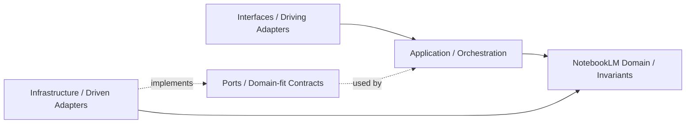

## Correct Interaction Flow

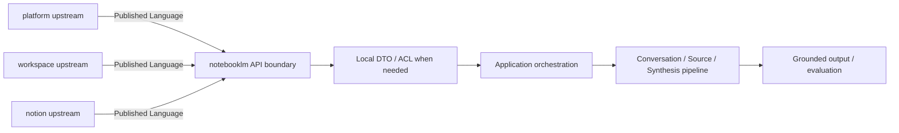

## Document Network

- [README.md](./README.md)
- [bounded-contexts.md](./bounded-contexts.md)
- [context-map.md](./context-map.md)
- [subdomains.md](./subdomains.md)
- [ubiquitous-language.md](./ubiquitous-language.md)
- [architecture-overview.md](../system/architecture-overview.md)
- [integration-guidelines.md](../system/integration-guidelines.md)
````

## File: docs/structure/contexts/notebooklm/subdomains.md
````markdown
# NotebookLM

本文件在本次任務限制下，僅依 Context7 驗證的 DDD、Context Map、Hexagonal Architecture 參考整理，不主張反映現況實作。

## Baseline Subdomains

| Subdomain | Responsibility |
|---|---|
| conversation | 對話 Thread 與 Message 生命週期 |
| note | 輕量筆記與知識連結 |
| notebook | Notebook 組合與管理 |
| source | 來源文件追蹤、引用與 ingestion 編排 |
| synthesis | 完整 RAG pipeline：retrieval、grounding、answer generation、evaluation/feedback |
| conversation-versioning | 對話版本與快照策略 |

## Future Split Triggers

`synthesis` 子域將 retrieval、grounding、generation、evaluation 作為內部 facets。只有當以下觸發條件成立時，才拆分為獨立子域：

| Facet | Split Trigger |
|---|---|
| retrieval | 策略複雜到需要獨立領域模型（多重排序、hybrid search） |
| grounding | 引用追溯需要獨立聚合根（citation chains、evidence alignment） |
| generation | 生成策略需要獨立 use case 群（多模態、多來源融合） |
| evaluation | 品質語言需要獨立指標模型（回歸測試、benchmark suite） |

## Anti-Patterns

- 不把 retrieval 與 grounding 併回 source 或 ai context 接入層，否則推理鏈條失去清楚邊界。
- 不把 evaluation 只當成 dashboard 指標，否則品質語言無法成為可演化的關注點。
- 不把 notebook、conversation 混成單一 UI 容器語意，否則無法維持聚合邊界。
- 不把 ai context 的共享能力誤寫成 notebooklm 自己擁有的 `ai` 子域。
- 不過早拆分子域：只有當語言分歧或演化速率不同時才拆分。

## Copilot Generation Rules

- 生成程式碼時，先問新需求落在哪個既有子域；只有既有子域無法容納時才建立新子域。
- 模型 provider、配額與安全護欄優先歸 ai context；notebooklm 在 synthesis 保留 pipeline 本地語義。
- 奧卡姆剃刀：能在既有子域用一個明確 use case 解決，就不要新增第二個平行子域。
- 子域命名應反映責任與語義，不應只是頁面名稱或工具名稱。

## Dependency Direction Flow

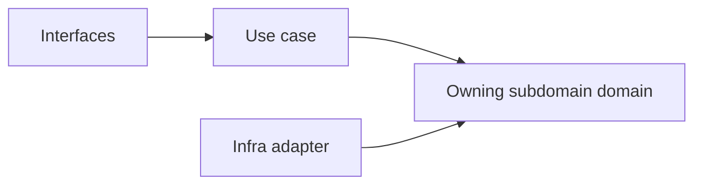

## Correct Interaction Flow

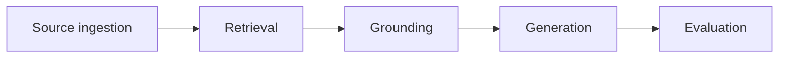

## Document Network

- [README.md](./README.md)
- [bounded-contexts.md](./bounded-contexts.md)
- [context-map.md](./context-map.md)
- [ubiquitous-language.md](./ubiquitous-language.md)
- [subdomains.md](../domain/subdomains.md)
- [bounded-contexts.md](../domain/bounded-contexts.md)
````

## File: src/modules/notebooklm/adapters/inbound/react/NotebooklmResearchSection.tsx
````typescript
/**
 * NotebooklmResearchSection — notebooklm.research tab — workspace synthesis.
 * Calls rag_query with a synthesis prompt to summarise all workspace documents.
 *
 * Closed-loop design: the synthesis result can be forwarded to
 * workspace.task-formation as the AI research source for task generation.
 */
⋮----
import { BookOpen, FlaskConical, ListPlus } from "lucide-react";
import Link from "next/link";
import { useState, useTransition } from "react";
import { Button } from "@ui-shadcn/ui/button";
import type { RagQueryOutput } from "../../../adapters/outbound/callable/FirebaseCallableAdapter";
import { synthesizeWorkspaceAction } from "../server-actions/notebook-actions";
⋮----
interface NotebooklmResearchSectionProps {
  workspaceId: string;
  accountId: string;
}
⋮----
function taskFormationHref(accountId: string, workspaceId: string)
⋮----
const handleSynthesize = () =>
⋮----
{/* Closed-loop CTA: forward research result to task formation */}
⋮----
href=
````

## File: src/modules/notebooklm/README.md
````markdown
# NotebookLM Module

## 子域清單（名詞域）

> **子域設計原則：** 每個子域以**名詞**命名，代表其核心管理實體。  
> **子域不重複原則：** `synthesis`（合成推理）是 `conversation` 的應用層流程，不獨立成子域。AI 機制（embedding / retrieval / generation）屬 `ai` 模組。

| 子域 | 狀態 | 說明 |
|---|---|---|
| `document` | 🔨 骨架建立，實作進行中 | Document 實體（來源文件接收、RagDocument 生命週期、ingestion 狀態）|
| `conversation` | 🔨 骨架建立，實作進行中 | Conversation 實體（使用者對話 Session、問答流程、合成輸出）|
| `notebook` | 🔨 骨架建立，實作進行中 | Notebook 實體（筆記本生命週期、Document 集合管理）|

---

## 子域邊界示意（notebooklm vs ai）

```
notebooklm/document     ─ingestion→  ai/embedding（文件向量化）
notebooklm/document     ─切塊委託→  ai/chunk（分塊計算）
notebooklm/conversation ─問答觸發→  ai/retrieval（找相關 chunk）
notebooklm/conversation ─生成觸發→  ai/generation（生成回答）
notebooklm/conversation ─引用取得→  ai/citation（標注來源）
```

notebooklm 持有**使用者體驗流程**；ai 提供**計算機制**。

---

## 預期目錄結構

```
src/modules/notebooklm/
  index.ts
  README.md
  AGENTS.md
  orchestration/
    NotebooklmFacade.ts
    NotebooklmCoordinator.ts    ← document→embedding→conversation 跨子域流程
  shared/
    domain/index.ts
    events/index.ts             ← Published Language Events
    types/index.ts
  subdomains/
    document/
      domain/
      application/
      adapters/outbound/
    conversation/
    notebook/
```

---

## 衝突防護

| 禁止行為 | 原因 |
|---|---|
| 在 notebooklm `domain/` 定義 AI 機制子域 | AI 機制（embedding / retrieval / generation）屬 `ai` |
| 新建獨立 `synthesis` 子域 | 合成邏輯屬 `conversation` 應用層 |
| 直接呼叫 Genkit（不透過 port）| 破壞 port/adapter 邊界 |
| `Page` / `Block` 在 notebooklm 設為可寫 | 只能唯讀引用（notion 所有）|

---

## 文件網絡

- [AGENTS.md](AGENTS.md) — Agent / Copilot 使用規則
- [src/modules/README.md](../README.md) — 模組層總覽
- [docs/structure/domain/bounded-contexts.md](../../../docs/structure/domain/bounded-contexts.md) — 主域所有權地圖
````

## File: docs/structure/contexts/notebooklm/bounded-contexts.md
````markdown
# NotebookLM

本文件在本次任務限制下，僅依 Context7 驗證的 DDD、Context Map、Hexagonal Architecture 參考整理，不主張反映現況實作。

## Domain Role

notebooklm 是對話與推理主域。依 bounded context 原則，它應封裝來源匯入、檢索、grounding、對話、摘要、評估與版本化，使推理流程保持高凝聚且與正典知識內容邊界分離。

## Baseline Bounded Contexts

| Cluster | Subdomains |
|---|---|
| Interaction Core | notebook, conversation, note |
| Reasoning Output | source, synthesis, conversation-versioning |

## Recommended Gap Bounded Contexts

| Subdomain | Why It Should Exist | Gap If Missing |
|---|---|---|
| ingestion | 承接來源匯入、正規化與前處理 | source 會同時承載來源處理與來源語義 |
| retrieval | 承接查詢、召回、排序與檢索策略 | synthesis 缺少清楚上游邊界 |
| grounding | 承接 citation、evidence 對齊與答案可追溯性 | 引用語言無法形成正典邊界 |
| evaluation | 承接品質評估、回歸比較與效果量測 | 品質語言只能散落在 analytics 或測試層 |

## Domain Invariants

- notebooklm 只擁有衍生推理流程，不擁有正典知識內容。
- shared AI capability 由 ai context 提供；notebooklm 擁有 retrieval、grounding、synthesis 的本地語義。
- grounding 應能把輸出對齊到來源證據。
- retrieval 是 synthesis 的上游能力，不應與 source reference 混成同一層。
- evaluation 應描述品質，而不是單純使用量。
- 任何要成為正式知識內容的輸出，都必須交由 notion 吸收。

## Dependency Direction

- notebooklm 子域在存在對應層時必須遵守 interfaces -> application -> domain <- infrastructure；不必為形式完整而預建所有層。
- ingestion、retrieval、grounding 的外部整合必須由 adapter 實作，透過 port 注入到核心。
- domain 不得向外依賴來源處理框架、模型供應商或傳輸協定。

## Anti-Patterns

- 把 retrieval、grounding、ingestion 重新塞回 ai context 接入層或 source，造成責任折疊。
- 讓 synthesis 直接持有正典內容所有權，混淆 notion 與 notebooklm 邊界。
- 讓 application service 直接呼叫外部 SDK，而不經過 port/adapter。

## Copilot Generation Rules

- 生成程式碼時，先保留 retrieval、grounding、ingestion、evaluation 的獨立語義，再決定是否需要額外抽象。
- 奧卡姆剃刀：不要為了形式上的對稱而新增子域；只有在責任、語義或演化速率不同時才拆分。
- 若外部能力只服務單一明確邊界，優先用最小必要 port，而不是複製整套工具 API。

## Dependency Direction Flow

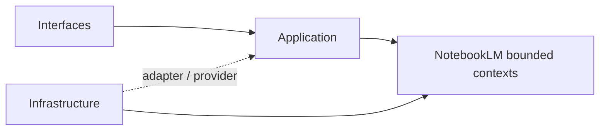

## Correct Interaction Flow

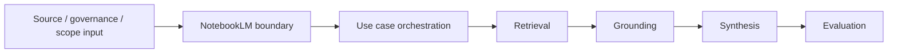

## Document Network

- [README.md](./README.md)
- [AGENTS.md](./AGENTS.md)
- [context-map.md](./context-map.md)
- [subdomains.md](./subdomains.md)
- [bounded-contexts.md](../domain/bounded-contexts.md)
- [subdomains.md](../domain/subdomains.md)
````

## File: docs/structure/contexts/notebooklm/context-map.md
````markdown
# NotebookLM

本文件在本次任務限制下，僅依 Context7 驗證的 DDD、Context Map、Hexagonal Architecture 參考整理，不主張反映現況實作。

## Context Role

notebooklm 消費 workspace scope、iam 治理、billing capability、ai signal 與 notion 內容來源，並輸出可追溯的對話、洞察與 synthesis。依 Context Mapper 思維，它是多個上游語言的下游整合者，但仍需維持自己的對話與推理邊界。

## Relationships

| Related Domain | Relationship Type | NotebookLM Position | Published Language |
|---|---|---|---|
| iam | Upstream/Downstream | downstream | actor reference、tenant scope、access decision |
| billing | Upstream/Downstream | downstream | entitlement signal、subscription capability signal |
| ai | Upstream/Downstream | downstream | ai capability signal、model policy、safety result |
| workspace | Upstream/Downstream | downstream | workspaceId、membership scope、share scope |
| notion | Upstream/Downstream | downstream | knowledge artifact reference、attachment reference、taxonomy hint |

## Mapping Rules

- notebooklm 依賴 iam、billing、ai 的結果，但不重建 actor、policy 或 secret 模型。
- notebooklm 可消費 ai context 作為共享模型能力，但不擁有 provider / policy 所有權。
- notebooklm 在 workspace scope 內運作，但不定義 workspace 生命周期或 sharing 規則。
- notion 是 notebooklm 的重要 source supplier，notebooklm 不能反向直接改寫 notion 正典內容。
- synthesis、grounding、evaluation 是 notebooklm 對外輸出的核心能力語言。

## Dependency Direction

- notebooklm 只作為 platform、workspace、notion 的 downstream consumer，不反向宣稱治理或正典內容所有權。
- ACL 或 Conformist 只能由 notebooklm 這個 downstream 端選擇，不能回推到上游。
- 跨主域資料進入 notebooklm 時，先落在 published language 或 local DTO，再進入本地主域語言。

## Anti-Patterns

- 把 notebooklm 寫成 notion 或 workspace 的上游治理來源。
- 在同一主域關係上同時聲稱 ACL 與 Conformist。
- 直接共享 notebook、source 或 conversation 的內部模型給其他主域使用。

## Copilot Generation Rules

- 生成程式碼時，先維持 notebooklm 對 platform、workspace、notion 的 downstream 位置，再安排轉譯層。
- 奧卡姆剃刀：若 published language 加一層 local DTO 已足夠，就不要額外發明第二層 mapper 或雙重 ACL。
- 上游只提供 published language；本地主域保護由 downstream 完成。

## Dependency Direction Flow

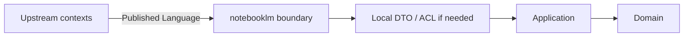

## Correct Interaction Flow

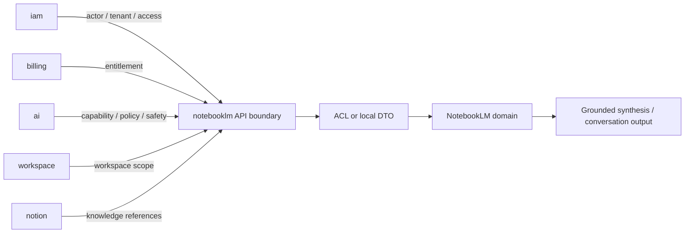

## Document Network

- [README.md](./README.md)
- [AGENTS.md](./AGENTS.md)
- [bounded-contexts.md](./bounded-contexts.md)
- [subdomains.md](./subdomains.md)
- [context-map.md](../system/context-map.md)
- [integration-guidelines.md](../system/integration-guidelines.md)
- [strategic-patterns.md](../system/strategic-patterns.md)
````

## File: docs/structure/contexts/notebooklm/README.md
````markdown
# NotebookLM Context

本 README 在本次任務限制下，僅依 Context7 驗證的 DDD、Context Map、Hexagonal Architecture 參考重建，不主張反映現況實作。

## Purpose

notebooklm 是對話、來源處理與推理主域。它的責任是提供 notebook、conversation、source ingestion、retrieval、grounding、synthesis、evaluation 與 conversation-versioning 等語言，把來源材料轉成可對話、可追溯、可評估的衍生輸出。

## Why This Context Exists

- 把推理流程與正典知識內容分離。
- 把來源匯入、檢索、grounding 與 synthesis 統整成同一主域。
- 提供可回流到其他主域、但本質上仍屬衍生輸出的能力邊界。

## Context Summary

| Aspect | Summary |
|---|---|
| Primary Role | 對話、來源處理、檢索與推理輸出 |
| Upstream Dependency | iam 治理、billing entitlement、ai capability、workspace scope、notion 內容來源 |
| Downstream Consumer | 無固定主域級 consumer；輸出可被其他主域吸收 |
| Core Principle | notebooklm 擁有衍生推理流程，不擁有正典知識內容或共享 AI capability |

## Baseline Subdomains

- conversation
- note
- notebook
- source
- synthesis
- conversation-versioning

## Recommended Gap Subdomains

- ingestion
- retrieval
- grounding
- evaluation

## Key Relationships

- 與 iam：notebooklm 消費 actor、tenant 與 access decision。
- 與 billing：notebooklm 消費 entitlement 與 subscription capability signal。
- 與 ai：notebooklm 消費 ai capability、model policy 與 safety result。
- 與 workspace：notebooklm 消費 workspaceId、membership scope、share scope。
- 與 notion：notebooklm 消費 knowledge artifact reference、attachment reference、taxonomy hint。

## Reading Order

1. [subdomains.md](./subdomains.md)
2. [bounded-contexts.md](./bounded-contexts.md)
3. [context-map.md](./context-map.md)
4. [ubiquitous-language.md](./ubiquitous-language.md)
5. [AGENTS.md](./AGENTS.md)

## Dependency Direction

- 本主域內部固定採用 interfaces -> application -> domain <- infrastructure。
- 跨主域只消費 published language、API boundary、events，不直接依賴他域內部模型。

## Anti-Pattern Rules

- 不把 notebooklm 的衍生輸出直接宣稱為 notion 的正典知識內容。
- 不把 retrieval/grounding 降格成單純 UI 功能或模型提示細節。
- 不把 ingestion 與 source reference 混成同一個不可拆分責任。
- 不把 ai context 的共享能力誤寫成 notebooklm 自己擁有的 `ai` 子域。

## Copilot Generation Rules

- 生成程式碼時，先保留 notebooklm 的衍生推理定位，再安排 retrieval、grounding、synthesis 的交互。
- 模型接入、配額、供應商策略若屬共享能力，先消費 ai context；notebooklm 保留 retrieval、grounding、synthesis、evaluation 的語義所有權。
- 奧卡姆剃刀：只在必要時引入 port、ACL、DTO；不要因為未來也許會有需求就預先堆疊抽象。
- 優先產生一條清楚的 upstream input -> translation -> application -> domain -> output 流程，而不是多條重疊流程。

## Dependency Direction Flow

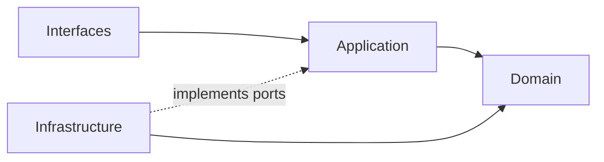

## Correct Interaction Flow

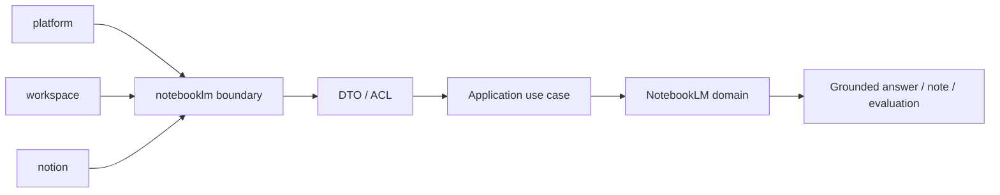

## Document Network

- [AGENTS.md](./AGENTS.md)
- [bounded-contexts.md](./bounded-contexts.md)
- [context-map.md](./context-map.md)
- [subdomains.md](./subdomains.md)
- [ubiquitous-language.md](./ubiquitous-language.md)
- [README.md](../../../README.md)
- [architecture-overview.md](../system/architecture-overview.md)
- [integration-guidelines.md](../system/integration-guidelines.md)

## Constraints

- 本文件是 architecture-first 版本。
- 本文件依 Context7 的 bounded context 與 context map 原則編寫。
- 本文件不代表對既有 repo 內容做過語意校準。
````

## File: docs/structure/contexts/notebooklm/ubiquitous-language.md
````markdown
# NotebookLM

本文件在本次任務限制下，僅依 Context7 驗證的 DDD、Context Map、Hexagonal Architecture 參考整理，不主張反映現況實作。

## Canonical Terms

| Term | Meaning |
|---|---|
| Notebook | 聚合對話、來源與衍生筆記的工作單位 |
| Conversation | Notebook 內的對話執行邊界 |
| Message | 一則輸入或輸出對話項 |
| Source | 被引用與推理的來源材料 |
| Ingestion | 來源匯入、正規化與前處理流程 |
| Retrieval | 從來源中召回候選片段的查詢能力 |
| Grounding | 把輸出對齊到來源證據的能力 |
| Citation | 輸出指回來源證據的引用關係 |
| Synthesis | 綜合多來源後生成的衍生輸出 |
| Note | 與 Notebook 關聯的輕量摘記 |
| Evaluation | 對輸出品質、回歸結果與效果的評估 |
| VersionSnapshot | 對話或 Notebook 某一時點的不可變快照 |

## Language Rules

- 使用 Conversation，不使用 Chat 作為正典語彙。
- 使用 Ingestion 與 Source 區分來源處理與來源語義。
- 使用 Retrieval 與 Grounding 區分召回能力與證據對齊能力。
- 使用 Synthesis 表示衍生綜合輸出，不把它直接稱為正典知識內容。
- 使用 Evaluation 表示品質語言，不用 Analytics 混稱模型效果。

## Avoid

| Avoid | Use Instead |
|---|---|
| Chat | Conversation |
| File Import | Ingestion |
| Search Step | Retrieval |
| Verified Answer | Grounded Synthesis |

## Naming Anti-Patterns

- 不用 Chat 混稱 Conversation 與 Notebook。
- 不用 Search 混稱 Retrieval 與 Grounding。
- 不用 Knowledge 或 Wiki 混稱 Synthesis 輸出，避免污染 notion 的正典語言。

## Copilot Generation Rules

- 生成程式碼時，名稱先對齊 Notebook、Conversation、Retrieval、Grounding、Synthesis、Evaluation，再決定型別與模組位置。
- 奧卡姆剃刀：若一個名詞已能準確表達語義，就不要再疊加第二個近義抽象名稱。
- 命名要先保護邊界，再追求實作便利。

## Dependency Direction Flow

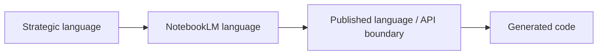

## Correct Interaction Flow

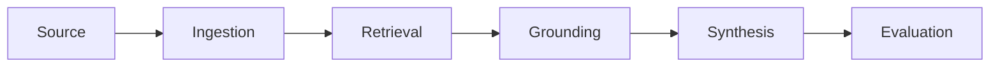

## Domain Layer Flow (enforced per subdomain)

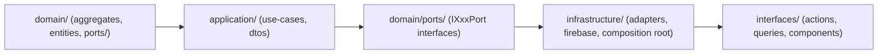

## Document Network

- [README.md](./README.md)
- [AGENTS.md](./AGENTS.md)
- [subdomains.md](./subdomains.md)
- [bounded-contexts.md](./bounded-contexts.md)
- [ubiquitous-language.md](../domain/ubiquitous-language.md)
````

## File: src/modules/notebooklm/adapters/inbound/react/NotebooklmSourcesSection.tsx
````typescript
/**
 * NotebooklmSourcesSection — notebooklm.sources tab — document source list + upload.
 * Uploads via Firebase Storage (py_fn Storage Trigger auto-runs parse + RAG).
 *
 * Closed-loop design: uploaded documents are the entry point of the data loop.
 * After upload → py_fn parses → RAG index → available in notebook/research → task formation.
 *
 * PDF/image preview: Google Doc Viewer renders Firebase Storage download URLs inline.
 */
⋮----
import { Upload, RefreshCw, FileUp, ArrowRight, BookOpen, ListPlus, Eye, X, Loader2 } from "lucide-react";
import Link from "next/link";
import { useEffect, useRef, useState, useTransition } from "react";
import { Button } from "@ui-shadcn/ui/button";
import type { DocumentSnapshot } from "../../../subdomains/document/domain/entities/Document";
import { queryDocumentsAction, registerUploadedDocumentAction } from "../server-actions/document-actions";
import { uploadDocumentToStorage, getDocumentDownloadUrl } from "../../../adapters/outbound/firebase-composition";
⋮----
interface NotebooklmSourcesSectionProps {
  workspaceId: string;
  accountId: string;
}
⋮----
/** MIME types renderable via Google Doc Viewer */
⋮----
function googleDocViewerUrl(downloadUrl: string): string
⋮----
// Preview state
⋮----
const load = () =>
⋮----
// Auto-load on mount so sources are visible without a manual click.
useEffect(() => { load(); }, [workspaceId, accountId]); // eslint-disable-line react-hooks/exhaustive-deps
⋮----
const handleFileChange = (e: React.ChangeEvent<HTMLInputElement>) =>
⋮----
// reload list after upload
⋮----
const handlePreview = async (doc: DocumentSnapshot) =>
⋮----
const closePreview = () =>
⋮----
{/* hidden file input */}
⋮----
{/* Processing chain banner — always visible once loaded */}
⋮----
{/* Downstream CTAs when documents are ready */}
⋮----
{/* PDF / image preview overlay — Google Doc Viewer */}
⋮----
{/* Header */}
⋮----
{/* Body */}
⋮----
src=
````