# Files

## File: src/modules/notion/adapters/inbound/react/index.ts
````typescript
/**
 * notion/adapters/inbound/react — barrel.
 * Section components for notion tabs in the workspace view.
 */
````

## File: src/modules/notion/adapters/inbound/react/NotionKnowledgeSection.tsx
````typescript
/**
 * NotionKnowledgeSection — top-level knowledge hub for the notion.knowledge tab.
 *
 * Closed-loop design: the knowledge hub is the central orchestrator showing
 * the full data flow pipeline:
 *   Sources (upload) → Pages/Database (structure) → AI (analysis) → Tasks (execution)
 */
⋮----
import { FileText, BookOpen, Layout, LayoutGrid, Upload, ListPlus, ArrowRight, Brain } from "lucide-react";
import Link from "next/link";
⋮----
interface NotionKnowledgeSectionProps {
  workspaceId: string;
  accountId: string;
}
⋮----
{/* Closed-loop pipeline visualization */}
⋮----
{/* Knowledge type quick access */}
````

## File: src/modules/notion/adapters/outbound/notion-page-stub.ts
````typescript
/**
 * notion-page-stub — notion outbound adapter stub.
 *
 * Stub implementation of createKnowledgePage. Replace with a real
 * Firestore-backed implementation when the notion infrastructure layer
 * is available.
 */
⋮----
export interface CreateKnowledgePageInput {
  readonly accountId: string;
  readonly workspaceId: string;
  readonly title: string;
  readonly parentPageId: string | null;
  readonly createdByUserId: string;
}
⋮----
export interface CreateKnowledgePageResult {
  readonly success: boolean;
  readonly error?: { message: string };
}
⋮----
/** Stub — replace with real Firestore implementation when available. */
export async function createKnowledgePage(
  _input: CreateKnowledgePageInput,
): Promise<CreateKnowledgePageResult>
````

## File: src/modules/notion/orchestration/index.ts
````typescript
// notion — orchestration layer
// Cross-subdomain composition and facade lives here.
// TODO: implement NotionFacade if needed.
````

## File: src/modules/notion/shared/errors/index.ts
````typescript
// notion shared/errors placeholder
````

## File: src/modules/notion/shared/events/index.ts
````typescript
// notion shared/events placeholder
````

## File: src/modules/notion/shared/index.ts
````typescript

````

## File: src/modules/notion/shared/types/index.ts
````typescript
// notion shared/types placeholder
````

## File: src/modules/notion/subdomains/block/adapters/inbound/index.ts
````typescript
// block — inbound adapters placeholder
// TODO: export server actions / route handlers
````

## File: src/modules/notion/subdomains/block/adapters/index.ts
````typescript
// block — adapters aggregate
````

## File: src/modules/notion/subdomains/block/adapters/outbound/index.ts
````typescript
// block — outbound adapters placeholder
// TODO: export Firestore repositories, external clients
````

## File: src/modules/notion/subdomains/block/adapters/outbound/memory/InMemoryBlockRepository.ts
````typescript
import type { BlockSnapshot } from "../../../domain/entities/Block";
import type { BlockRepository } from "../../../domain/repositories/BlockRepository";
⋮----
export class InMemoryBlockRepository implements BlockRepository {
⋮----
async save(snapshot: BlockSnapshot): Promise<void>
⋮----
async saveAll(snapshots: BlockSnapshot[]): Promise<void>
⋮----
async findById(id: string): Promise<BlockSnapshot | null>
⋮----
async findByPageId(pageId: string): Promise<BlockSnapshot[]>
⋮----
async findChildren(parentBlockId: string): Promise<BlockSnapshot[]>
⋮----
async delete(id: string): Promise<void>
⋮----
async deleteByPageId(pageId: string): Promise<void>
````

## File: src/modules/notion/subdomains/block/application/index.ts
````typescript

````

## File: src/modules/notion/subdomains/block/application/use-cases/BlockUseCases.ts
````typescript
import { commandSuccess, commandFailureFrom, type CommandResult } from "../../../../../shared";
import { Block, type CreateBlockInput, type BlockContent } from "../../domain/entities/Block";
import type { BlockRepository } from "../../domain/repositories/BlockRepository";
⋮----
export class CreateBlockUseCase {
⋮----
constructor(private readonly repo: BlockRepository)
⋮----
async execute(input: CreateBlockInput): Promise<CommandResult>
⋮----
export class UpdateBlockUseCase {
⋮----
async execute(blockId: string, content: Partial<BlockContent>): Promise<CommandResult>
⋮----
export class GetPageBlocksUseCase {
⋮----
async execute(pageId: string)
````

## File: src/modules/notion/subdomains/block/domain/entities/Block.ts
````typescript
/**
 * Block — distilled from modules/notion/subdomains/knowledge/domain/aggregates/ContentBlock.ts
 */
import { v4 as uuid } from "uuid";
⋮----
export type BlockType =
  | "paragraph"
  | "heading_1"
  | "heading_2"
  | "heading_3"
  | "bulleted_list"
  | "numbered_list"
  | "todo"
  | "toggle"
  | "code"
  | "quote"
  | "callout"
  | "divider"
  | "image"
  | "file"
  | "embed";
⋮----
export interface BlockContent {
  readonly type: BlockType;
  readonly text?: string;
  readonly checked?: boolean;
  readonly url?: string;
  readonly language?: string;
  readonly attributes?: Record<string, unknown>;
}
⋮----
export interface BlockSnapshot {
  readonly id: string;
  readonly pageId: string;
  readonly parentBlockId?: string;
  readonly order: number;
  readonly content: BlockContent;
  readonly createdByUserId: string;
  readonly createdAtISO: string;
  readonly updatedAtISO: string;
}
⋮----
export interface CreateBlockInput {
  readonly pageId: string;
  readonly parentBlockId?: string;
  readonly order: number;
  readonly content: BlockContent;
  readonly createdByUserId: string;
}
⋮----
export class Block {
⋮----
private constructor(private _props: BlockSnapshot)
⋮----
static create(input: CreateBlockInput): Block
⋮----
static reconstitute(snapshot: BlockSnapshot): Block
⋮----
update(content: Partial<BlockContent>): void
⋮----
reorder(order: number): void
⋮----
get id(): string
get pageId(): string
get content(): BlockContent
get order(): number
⋮----
getSnapshot(): Readonly<BlockSnapshot>
````

## File: src/modules/notion/subdomains/block/domain/index.ts
````typescript

````

## File: src/modules/notion/subdomains/block/domain/repositories/BlockRepository.ts
````typescript
import type { BlockSnapshot } from "../entities/Block";
⋮----
export interface BlockRepository {
  save(snapshot: BlockSnapshot): Promise<void>;
  saveAll(snapshots: BlockSnapshot[]): Promise<void>;
  findById(id: string): Promise<BlockSnapshot | null>;
  findByPageId(pageId: string): Promise<BlockSnapshot[]>;
  findChildren(parentBlockId: string): Promise<BlockSnapshot[]>;
  delete(id: string): Promise<void>;
  deleteByPageId(pageId: string): Promise<void>;
}
⋮----
save(snapshot: BlockSnapshot): Promise<void>;
saveAll(snapshots: BlockSnapshot[]): Promise<void>;
findById(id: string): Promise<BlockSnapshot | null>;
findByPageId(pageId: string): Promise<BlockSnapshot[]>;
findChildren(parentBlockId: string): Promise<BlockSnapshot[]>;
delete(id: string): Promise<void>;
deleteByPageId(pageId: string): Promise<void>;
````

## File: src/modules/notion/subdomains/collaboration/adapters/inbound/index.ts
````typescript
// collaboration — inbound adapters placeholder
// TODO: export server actions / route handlers
````

## File: src/modules/notion/subdomains/collaboration/adapters/index.ts
````typescript
// collaboration — adapters aggregate
````

## File: src/modules/notion/subdomains/collaboration/adapters/outbound/index.ts
````typescript
// collaboration — outbound adapters placeholder
// TODO: export Firestore repositories, external clients
````

## File: src/modules/notion/subdomains/collaboration/application/index.ts
````typescript
// collaboration — application layer placeholder
// TODO: export use-cases, DTOs, ports
````

## File: src/modules/notion/subdomains/collaboration/application/use-cases/CollaborationUseCases.ts
````typescript
// TODO: implement collaboration use-cases (commenting, presence, sharing)
````

## File: src/modules/notion/subdomains/collaboration/domain/entities/Comment.ts
````typescript
export type PresenceStatus = "online" | "idle" | "offline";
⋮----
export interface PagePresence {
  readonly pageId: string;
  readonly accountId: string;
  readonly cursorPosition?: number;
  readonly status: PresenceStatus;
  readonly lastSeenISO: string;
}
⋮----
export interface Comment {
  readonly id: string;
  readonly pageId: string;
  readonly blockId?: string;
  readonly accountId: string;
  readonly content: string;
  readonly resolved: boolean;
  readonly createdAtISO: string;
  readonly updatedAtISO: string;
}
⋮----
export interface CommentRepository {
  save(comment: Comment): Promise<void>;
  findById(id: string): Promise<Comment | null>;
  findByPageId(pageId: string): Promise<Comment[]>;
  resolveComment(id: string): Promise<void>;
  delete(id: string): Promise<void>;
}
⋮----
save(comment: Comment): Promise<void>;
findById(id: string): Promise<Comment | null>;
findByPageId(pageId: string): Promise<Comment[]>;
resolveComment(id: string): Promise<void>;
delete(id: string): Promise<void>;
````

## File: src/modules/notion/subdomains/collaboration/domain/index.ts
````typescript
// collaboration — domain layer placeholder
// TODO: export entities, value-objects, repositories, events, services
````

## File: src/modules/notion/subdomains/database/adapters/inbound/index.ts
````typescript
// database — inbound adapters placeholder
// TODO: export server actions / route handlers
````

## File: src/modules/notion/subdomains/database/adapters/index.ts
````typescript
// database — adapters aggregate
````

## File: src/modules/notion/subdomains/database/adapters/outbound/index.ts
````typescript
// database — outbound adapters placeholder
// TODO: export Firestore repositories, external clients
````

## File: src/modules/notion/subdomains/database/application/index.ts
````typescript

````

## File: src/modules/notion/subdomains/database/application/use-cases/DatabaseUseCases.ts
````typescript
import { commandSuccess, commandFailureFrom, type CommandResult } from "../../../../../shared";
import { Database, type CreateDatabaseInput, type DatabaseProperty } from "../../domain/entities/Database";
import type { DatabaseRepository } from "../../domain/repositories/DatabaseRepository";
⋮----
export class CreateDatabaseUseCase {
⋮----
constructor(private readonly repo: DatabaseRepository)
⋮----
async execute(input: CreateDatabaseInput): Promise<CommandResult>
⋮----
export class AddPropertyUseCase {
⋮----
async execute(databaseId: string, property: DatabaseProperty): Promise<CommandResult>
````

## File: src/modules/notion/subdomains/database/domain/index.ts
````typescript

````

## File: src/modules/notion/subdomains/page/adapters/inbound/index.ts
````typescript
// page — inbound adapters placeholder
// TODO: export server actions / route handlers
````

## File: src/modules/notion/subdomains/page/adapters/index.ts
````typescript
// page — adapters aggregate
````

## File: src/modules/notion/subdomains/page/adapters/outbound/index.ts
````typescript
// page — outbound adapters placeholder
// TODO: export Firestore repositories, external clients
````

## File: src/modules/notion/subdomains/page/adapters/outbound/memory/InMemoryPageRepository.ts
````typescript
import type { PageSnapshot, PageStatus } from "../../../domain/entities/Page";
import type { PageRepository, PageQuery } from "../../../domain/repositories/PageRepository";
⋮----
export class InMemoryPageRepository implements PageRepository {
⋮----
async save(snapshot: PageSnapshot): Promise<void>
⋮----
async findById(id: string): Promise<PageSnapshot | null>
⋮----
async findBySlug(slug: string, accountId: string): Promise<PageSnapshot | null>
⋮----
async findChildren(parentPageId: string): Promise<PageSnapshot[]>
⋮----
async query(params: PageQuery): Promise<PageSnapshot[]>
⋮----
async delete(id: string): Promise<void>
````

## File: src/modules/notion/subdomains/page/application/index.ts
````typescript

````

## File: src/modules/notion/subdomains/page/application/use-cases/PageUseCases.ts
````typescript
import { commandSuccess, commandFailureFrom, type CommandResult } from "../../../../../shared";
import { Page, type CreatePageInput } from "../../domain/entities/Page";
import type { PageRepository, PageQuery } from "../../domain/repositories/PageRepository";
⋮----
export class CreatePageUseCase {
⋮----
constructor(private readonly repo: PageRepository)
⋮----
async execute(input: CreatePageInput): Promise<CommandResult>
⋮----
export class RenamePageUseCase {
⋮----
async execute(pageId: string, title: string): Promise<CommandResult>
⋮----
export class ArchivePageUseCase {
⋮----
async execute(pageId: string): Promise<CommandResult>
⋮----
export class QueryPagesUseCase {
⋮----
async execute(params: PageQuery)
````

## File: src/modules/notion/subdomains/page/domain/index.ts
````typescript

````

## File: src/modules/notion/subdomains/page/domain/repositories/PageRepository.ts
````typescript
import type { PageSnapshot, PageStatus } from "../entities/Page";
⋮----
export interface PageQuery {
  readonly accountId?: string;
  readonly workspaceId?: string;
  readonly parentPageId?: string | null;
  readonly status?: PageStatus;
  readonly limit?: number;
  readonly offset?: number;
}
⋮----
export interface PageRepository {
  save(snapshot: PageSnapshot): Promise<void>;
  findById(id: string): Promise<PageSnapshot | null>;
  findBySlug(slug: string, accountId: string): Promise<PageSnapshot | null>;
  findChildren(parentPageId: string): Promise<PageSnapshot[]>;
  query(params: PageQuery): Promise<PageSnapshot[]>;
  delete(id: string): Promise<void>;
}
⋮----
save(snapshot: PageSnapshot): Promise<void>;
findById(id: string): Promise<PageSnapshot | null>;
findBySlug(slug: string, accountId: string): Promise<PageSnapshot | null>;
findChildren(parentPageId: string): Promise<PageSnapshot[]>;
query(params: PageQuery): Promise<PageSnapshot[]>;
delete(id: string): Promise<void>;
````

## File: src/modules/notion/subdomains/template/adapters/inbound/index.ts
````typescript
// template — inbound adapters placeholder
// TODO: export server actions / route handlers
````

## File: src/modules/notion/subdomains/template/adapters/index.ts
````typescript
// template — adapters aggregate
````

## File: src/modules/notion/subdomains/template/adapters/outbound/index.ts
````typescript
// template — outbound adapters placeholder
// TODO: export Firestore repositories, external clients
````

## File: src/modules/notion/subdomains/template/application/index.ts
````typescript
// template — application layer placeholder
// TODO: export use-cases, DTOs, ports
````

## File: src/modules/notion/subdomains/template/domain/entities/Template.ts
````typescript
/**
 * Template — distilled from notion taxonomy subdomain
 * Represents a reusable page/database template.
 */
export type TemplateScope = "workspace" | "organization" | "global";
export type TemplateCategory = "page" | "database" | "workflow";
⋮----
export interface Template {
  readonly id: string;
  readonly title: string;
  readonly description?: string;
  readonly scope: TemplateScope;
  readonly category: TemplateCategory;
  readonly workspaceId?: string;
  readonly organizationId?: string;
  readonly createdByUserId: string;
  readonly pageSnapshotId?: string;
  readonly databaseSnapshotId?: string;
  readonly tags: string[];
  readonly createdAtISO: string;
  readonly updatedAtISO: string;
}
⋮----
export interface TemplateRepository {
  save(template: Template): Promise<void>;
  findById(id: string): Promise<Template | null>;
  findByScope(scope: TemplateScope, contextId?: string): Promise<Template[]>;
  listByCategory(category: TemplateCategory): Promise<Template[]>;
  delete(id: string): Promise<void>;
}
⋮----
save(template: Template): Promise<void>;
findById(id: string): Promise<Template | null>;
findByScope(scope: TemplateScope, contextId?: string): Promise<Template[]>;
listByCategory(category: TemplateCategory): Promise<Template[]>;
delete(id: string): Promise<void>;
````

## File: src/modules/notion/subdomains/template/domain/index.ts
````typescript
// template — domain layer placeholder
// TODO: export entities, value-objects, repositories, events, services
````

## File: src/modules/notion/subdomains/view/adapters/inbound/index.ts
````typescript
// view — inbound adapters placeholder
// TODO: export server actions / route handlers
````

## File: src/modules/notion/subdomains/view/adapters/index.ts
````typescript
// view — adapters aggregate
````

## File: src/modules/notion/subdomains/view/adapters/outbound/index.ts
````typescript
// view — outbound adapters placeholder
// TODO: export Firestore repositories, external clients
````

## File: src/modules/notion/subdomains/view/application/index.ts
````typescript
// view — application layer placeholder
// TODO: export use-cases, DTOs, ports
````

## File: src/modules/notion/subdomains/view/application/use-cases/ViewUseCases.ts
````typescript
// TODO: implement view CRUD use-cases
````

## File: src/modules/notion/subdomains/view/domain/entities/View.ts
````typescript
/**
 * View — distilled from modules/notion/subdomains/knowledge (relations/filters)
 * Represents a filtered/sorted view of a database.
 */
export type ViewType = "table" | "board" | "gallery" | "list" | "calendar" | "timeline";
⋮----
export interface FilterCondition {
  readonly propertyId: string;
  readonly operator: "equals" | "not_equals" | "contains" | "not_contains" | "is_empty" | "is_not_empty" | "greater_than" | "less_than";
  readonly value?: unknown;
}
⋮----
export interface SortCondition {
  readonly propertyId: string;
  readonly direction: "asc" | "desc";
}
⋮----
export interface ViewSnapshot {
  readonly id: string;
  readonly databaseId: string;
  readonly name: string;
  readonly type: ViewType;
  readonly filters: FilterCondition[];
  readonly sorts: SortCondition[];
  readonly visiblePropertyIds: string[];
  readonly createdByUserId: string;
  readonly createdAtISO: string;
  readonly updatedAtISO: string;
}
⋮----
export interface ViewRepository {
  save(snapshot: ViewSnapshot): Promise<void>;
  findById(id: string): Promise<ViewSnapshot | null>;
  findByDatabaseId(databaseId: string): Promise<ViewSnapshot[]>;
  delete(id: string): Promise<void>;
}
⋮----
save(snapshot: ViewSnapshot): Promise<void>;
findById(id: string): Promise<ViewSnapshot | null>;
findByDatabaseId(databaseId: string): Promise<ViewSnapshot[]>;
delete(id: string): Promise<void>;
````

## File: src/modules/notion/subdomains/view/domain/index.ts
````typescript
// view — domain layer placeholder
// TODO: export entities, value-objects, repositories, events, services
````

## File: docs/structure/contexts/notion/AGENTS.md
````markdown
# Notion Agent

本文件在本次任務限制下，僅依 Context7 驗證的 DDD、Context Map、Hexagonal Architecture 參考整理，不主張反映現況實作。

## Mission

保護 notion 主域作為知識內容生命週期邊界。任何變更都應維持 notion 擁有內容建立、分類、關聯、協作、模板、發布與版本化語言，而不是吸收平台治理或對話推理語言。

## Canonical Ownership

**戰略語言（DDD strategic vocabulary）：**
- knowledge（頁面知識語義，實作層整合至 page）
- authoring（文章建立與驗證）
- collaboration（協作評論與共編）
- database（結構化知識庫，原 knowledge-database）
- taxonomy（分類法與語義組織，整合至 page / database metadata）
- relations（關聯與 backlink，以 view 承接呈現）
- knowledge-engagement（知識使用行為量測）
- attachments（附件與媒體關聯儲存）
- automation（知識事件觸發自動化）
- external-knowledge-sync（外部系統雙向整合）
- notes（個人輕量筆記）
- templates（頁面模板管理）
- publishing（正式發布與對外交付）
- knowledge-versioning（全域版本快照策略）

**實作層子域（`src/modules/notion/` 目錄名稱）：**
- `page` — 頁面文件創作、版本、knowledge 語義整合
- `block` — 頁面內容區塊
- `database` — 結構化知識庫（含 taxonomy/relations 的 metadata 維度）
- `view` — database 多視圖、篩選、排序（含 relations 呈現）
- `collaboration` — 協作評論、共編
- `template` — 模板管理

## Route Here When

- 問題核心是知識頁面、文章、內容結構、分類、關聯、模板與發布。
- 問題需要把輸入吸收成正式知識內容的正典狀態。
- 問題需要定義內容版本、內容協作與內容交付。

## Route Elsewhere When

- 身份、租戶與授權治理屬於 iam；權益屬於 billing；憑證與營運服務屬於 platform。
- 共享 AI provider、模型政策、配額與安全護欄屬於 ai context。
- 工作區生命週期、共享、存在感與工作區流程屬於 workspace。
- notebook、conversation、retrieval、grounding、synthesis 屬於 notebooklm。

## Guardrails

- notion 的正典內容不等於 notebooklm 的衍生輸出。
- taxonomy 與 relations 應作為內容語義邊界，而不是 UI 功能附屬物。
- publishing 應與 authoring 分離，避免編輯語意與交付語意混用。
- notion 可以消費 ai context，但不擁有 AI provider / policy 的正典邊界。
- attachments 是內容資產語言，不是平台 secret 或一般檔案暫存語言。
- 跨主域互動只經過 published language、API 邊界或事件。

## Dependency Direction

- notion 內部依賴方向固定為 interfaces -> application -> domain <- infrastructure。
- authoring、knowledge、database、publishing 對外部能力的依賴只能透過 ports 進入核心。
- infrastructure 只負責儲存、傳輸、ACL 轉譯，不定義 KnowledgeArtifact 的正典語義。

## Hard Prohibitions

- 不得讓 notebooklm 的 Conversation、Synthesis 直接滲入 notion 作為正典內容模型。
- 不得讓 domain 或 application 直接依賴 UI、HTTP、資料庫 SDK 或框架語言。
- 不得讓 notion 直接接管 iam 的 actor、tenant、access 或 billing 的 entitlement 治理責任。

## Copilot Generation Rules

- 生成程式碼時，先保留 notion 作為正典內容主域，不讓治理或推理語言滲入核心。
- 內容輔助若只是支援 knowledge / authoring / publishing use case，先消費 ai context，而不是在 notion 內重建 generic `ai` 子域。
- 奧卡姆剃刀：若一個既有內容子域與一條清楚 use case 就能承接需求，不要再新增額外 service、mapper 或子域。
- 只有在外部依賴或跨主域語義污染出現時，才建立 port、ACL 或 local DTO。
- 對 notebooklm 或 workspace 的互動一律先經 published language / API boundary，再進入 notion 語言。

## Dependency Direction Flow

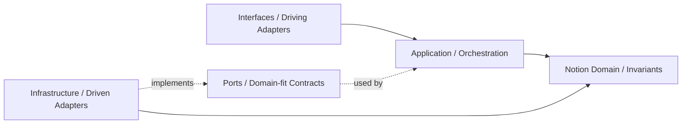

## Correct Interaction Flow

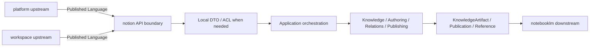

## Document Network

- [README.md](./README.md)
- [bounded-contexts.md](./bounded-contexts.md)
- [context-map.md](./context-map.md)
- [subdomains.md](./subdomains.md)
- [ubiquitous-language.md](./ubiquitous-language.md)
- [architecture-overview.md](../../system/architecture-overview.md)
- [integration-guidelines.md](../../system/integration-guidelines.md)
````

## File: docs/structure/contexts/notion/bounded-contexts.md
````markdown
# Notion

本文件在本次任務限制下，僅依 Context7 驗證的 DDD、Context Map、Hexagonal Architecture 參考整理，不主張反映現況實作。

## Domain Role

notion 是知識內容主域。依 bounded context 原則，它應封裝內容建立、編輯、結構化、分類、關聯、版本化與對外發布的高凝聚規則。

## Baseline Bounded Contexts

| Cluster | Subdomains |
|---|---|
| Content Core | knowledge, authoring, database |
| Collaboration and Change | collaboration, knowledge-versioning, templates |
| Intelligence and Extension | knowledge-engagement, attachments, automation, external-knowledge-sync, notes |
| Content Structure and Delivery | taxonomy, relations, publishing |

## Recommended Gap Bounded Contexts

無剩餘已驗證 gap bounded context（taxonomy / relations / publishing 已升為 baseline）。

## Domain Invariants

- 知識內容的正典狀態屬於 notion。
- taxonomy 應獨立於具體 UI 視圖存在。
- relations 應描述內容對內容的語義關係，而不是臨時連結。
- ai context 可被 notion use case 消費，但 AI provider / policy ownership 不屬於 notion。
- publishing 只交付已被 notion 吸收的內容狀態。
- 任何來自 notebooklm 的輸出，若要成為正典內容，必須先被 notion 吸收。

## Dependency Direction

- notion 子域在存在對應層時必須遵守 interfaces -> application -> domain <- infrastructure；不必為形式完整而預建所有層。
- content lifecycle 由 knowledge、authoring、database、publishing 等上下文在核心內協作，不由外層技術層直接驅動。
- 外部內容輸入只能先經 API boundary 或 adapter 轉譯，再進入 notion 語言。

## Anti-Patterns

- 把 taxonomy 或 relations 當成純 UI 功能，而不是內容語義邊界。
- 讓 publishing 直接等同 authoring，混淆編輯與交付責任。
- 讓 notebooklm 或 platform 的語言直接取代 notion 的 KnowledgeArtifact 模型。
- 把 ai context 的共享能力提升成 notion 自己的 generic `ai` 子域所有權。

## Copilot Generation Rules

- 生成程式碼時，先決定需求屬於 content core、collaboration、還是 extension，再安排具體型別與流程。
- 奧卡姆剃刀：不要為了看起來完整而新增抽象層；只在現有內容邊界真的失效時才拆更多上下文。
- 外部能力若不影響正典內容語言，就不要把它抬升成新的內容核心抽象。

## Dependency Direction Flow

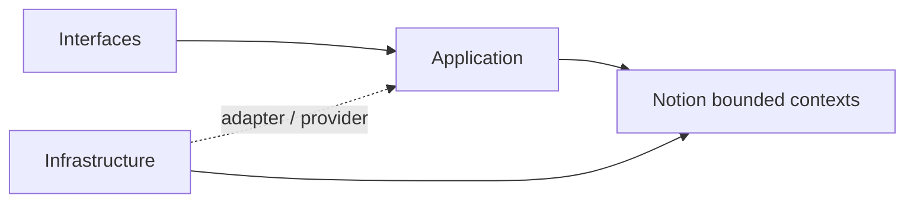

## Correct Interaction Flow

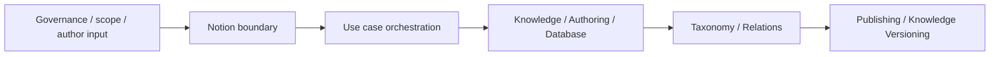

## Document Network

- [README.md](./README.md)
- [AGENTS.md](./AGENTS.md)
- [context-map.md](./context-map.md)
- [subdomains.md](./subdomains.md)
- [bounded-contexts.md](../../domain/bounded-contexts.md)
- [subdomains.md](../../domain/subdomains.md)
````

## File: docs/structure/contexts/notion/context-map.md
````markdown
# Notion

本文件在本次任務限制下，僅依 Context7 驗證的 DDD、Context Map、Hexagonal Architecture 參考整理，不主張反映現況實作。

## Context Role

notion 對其他主域提供知識內容語言。依 Context Mapper 的 context map 思維，它消費 workspace scope、iam 治理、billing capability 與 ai signal，並向 notebooklm 提供可被引用的知識內容來源。

## Relationships

| Related Domain | Relationship Type | Notion Position | Published Language |
|---|---|---|---|
| iam | Upstream/Downstream | downstream | actor reference、tenant scope、access decision |
| billing | Upstream/Downstream | downstream | entitlement signal、subscription capability signal |
| ai | Upstream/Downstream | downstream | ai capability signal、model policy、safety result |
| workspace | Upstream/Downstream | downstream | workspaceId、membership scope、share scope |
| notebooklm | Upstream/Downstream | upstream | knowledge artifact reference、attachment reference、taxonomy hint |

## Mapping Rules

- notion 消費 iam、billing、ai 的結果，但不重建 actor、tenant、policy 模型。
- notion 可消費 ai context 來支援內容 use case，但不擁有 AI provider / policy 所有權。
- notion 在 workspace scope 中運作，但不反向定義 workspace 生命週期。
- notebooklm 可以消費 notion 的知識來源，但不得直接重寫 notion 正典內容。
- publishing 是 notion 對外輸出正式內容狀態的邊界。

## Dependency Direction

- notion 對 platform、workspace 屬 downstream；對 notebooklm 屬 upstream 的內容 supplier。
- ACL 或 Conformist 只能由 notion 作為 downstream 時選擇，不能要求上游替 notion 保護語言。
- notion 對 notebooklm 輸出的是 published language，不是內部 aggregate 或 workflow 細節。

## Anti-Patterns

- 把 notion 與 notebooklm 寫成對稱 Shared Kernel，同時又要求 ACL。
- 讓 notebooklm 直接回寫 notion 正典內容而不經 notion 邊界。
- 把 workspace scope 語言錯寫成 notion 自己擁有的容器生命週期語言。

## Copilot Generation Rules

- 生成程式碼時，先保留 notion 對 platform、workspace 的 downstream 位置與對 notebooklm 的 upstream 位置。
- 奧卡姆剃刀：若 published language 加一層 local DTO 已足夠，就不要再建立第二個平行翻譯管線。
- notion 向外提供的是內容語言，不是內部 aggregate、repository 或 UI projection。

## Dependency Direction Flow

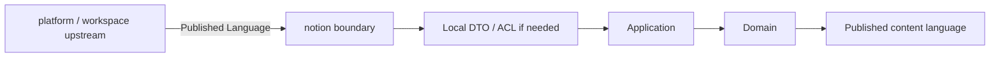

## Correct Interaction Flow

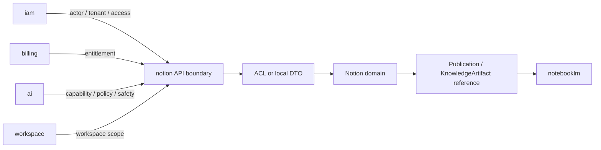

## Document Network

- [README.md](./README.md)
- [AGENTS.md](./AGENTS.md)
- [bounded-contexts.md](./bounded-contexts.md)
- [subdomains.md](./subdomains.md)
- [context-map.md](../../system/context-map.md)
- [integration-guidelines.md](../../system/integration-guidelines.md)
- [strategic-patterns.md](../../system/strategic-patterns.md)
````

## File: docs/structure/contexts/notion/README.md
````markdown
# Notion Context

本 README 在本次任務限制下，僅依 Context7 驗證的 DDD、Context Map、Hexagonal Architecture 參考重建，不主張反映現況實作。

## Purpose

notion 是知識內容生命週期主域。它的責任是提供 knowledge artifact、authoring、database、taxonomy、relations、templates、publishing、knowledge-versioning 與 collaboration 等內容語言，承接正式知識內容的正典狀態。

## Why This Context Exists

- 把知識內容正典與平台治理、工作區範疇、對話推理分離。
- 讓內容建立、分類、關聯、交付與版本規則維持在同一個主域。
- 提供 notebooklm 可引用、但不可直接改寫的知識來源。

## Context Summary

| Aspect | Summary |
|---|---|
| Primary Role | 正典知識內容生命週期 |
| Upstream Dependency | iam 治理、billing entitlement、ai capability、workspace scope |
| Downstream Consumer | notebooklm |
| Core Principle | notion 擁有正式內容，不擁有治理、商業或推理過程 |

## Baseline Subdomains

- knowledge
- authoring
- collaboration
- database
- knowledge-engagement
- attachments
- automation
- external-knowledge-sync
- notes
- templates
- knowledge-versioning

## Recommended Gap Subdomains

- taxonomy
- relations
- publishing

## Key Relationships

- 與 iam：notion 消費 actor、tenant 與 access decision。
- 與 billing：notion 消費 entitlement 與 subscription capability signal。
- 與 ai：notion 消費 ai capability、model policy 與 safety result。
- 與 workspace：notion 消費 workspaceId、membership scope、share scope。
- 與 notebooklm：notion 向 notebooklm 提供 knowledge artifact reference 與 attachment reference。

## Reading Order

1. [subdomains.md](./subdomains.md)
2. [bounded-contexts.md](./bounded-contexts.md)
3. [context-map.md](./context-map.md)
4. [ubiquitous-language.md](./ubiquitous-language.md)
5. [AGENTS.md](./AGENTS.md)

## Dependency Direction

- 本主域內部固定採用 interfaces -> application -> domain <- infrastructure。
- notion 對外只暴露 published language、API boundary、events，不暴露內部內容模型。

## Anti-Pattern Rules

- 不把 notebooklm 的衍生輸出直接當成 notion 正典內容。
- 不把 taxonomy、relations、publishing 壓回單一 knowledge 編輯流程。
- 不把 platform 的治理語言混成內容生命週期本身。
- 不把 ai context 的共享能力誤寫成 notion 自己擁有的 `ai` 子域。

## Copilot Generation Rules

- 生成程式碼時，先保留 notion 的正典內容定位，再安排 authoring、knowledge、taxonomy、publishing 的交互。
- 內容輔助、摘要與生成若只是內容 use case 的支援能力，優先由 knowledge / authoring use case 消費 ai context，而不是在 notion 再建一個 generic `ai` 子域。
- 奧卡姆剃刀：不要預先新增第二套內容流程，只在既有內容邊界真的不夠時才補新抽象。
- 優先讓同一條 input -> translation -> application -> domain -> publication 流程保持單純可追溯。

## Dependency Direction Flow

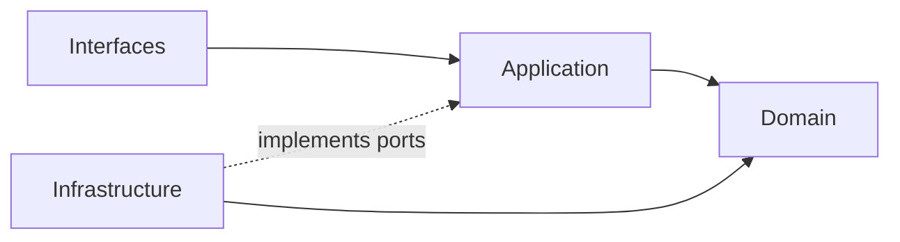

## Correct Interaction Flow

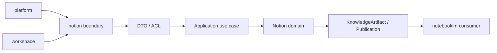

## Document Network

- [AGENTS.md](./AGENTS.md)
- [bounded-contexts.md](./bounded-contexts.md)
- [context-map.md](./context-map.md)
- [subdomains.md](./subdomains.md)
- [ubiquitous-language.md](./ubiquitous-language.md)
- [README.md](../../../README.md)
- [architecture-overview.md](../../system/architecture-overview.md)
- [integration-guidelines.md](../../system/integration-guidelines.md)

## Constraints

- 本文件是 architecture-first 版本。
- 本文件依 Context7 的 bounded context 與 context map 原則編寫。
- 本文件不代表對既有 repo 內容做過語意校準。
````

## File: docs/structure/contexts/notion/subdomains.md
````markdown
# Notion

本文件在本次任務限制下，僅依 Context7 驗證的 DDD、Context Map、Hexagonal Architecture 參考整理，不主張反映現況實作。

## Baseline Subdomains

| Subdomain | Responsibility |
|---|---|
| knowledge | 頁面建立、組織、版本化與交付（實作層以 `page` + `block` 對應）|
| authoring | 知識庫文章建立、驗證與分類（實作層整合至 `page` 子域）|
| collaboration | 協作留言、細粒度權限與版本快照 |
| database | 結構化資料多視圖管理（原名 `knowledge-database`，已重命名）|
| knowledge-engagement | 知識使用行為量測 |
| attachments | 附件與媒體關聯儲存 |
| automation | 知識事件觸發自動化動作 |
| external-knowledge-sync | 知識與外部系統雙向整合 |
| notes | 個人輕量筆記與正式知識協作 |
| templates | 頁面範本管理與套用 |
| knowledge-versioning | 全域版本快照策略管理 |
| taxonomy | 分類法與語義組織邊界 |
| relations | 內容之間關聯與 backlink 邊界 |
| publishing | 正式發布與對外交付邊界 |

> **實作層命名備注：** `src/modules/notion/` 以 `page`、`block`、`database`、`view`、`collaboration`、`template` 作為子域目錄名稱。
> `view` 子域承接 `database` 的多視圖能力；`block` 是 `page` 的內容區塊子結構。
> `knowledge-database` 已正式重命名為 `database`；所有戰略文件與實作路徑均已同步更新。

## Recommended Gap Subdomains

無剩餘已驗證 gap subdomain（taxonomy / relations / publishing 已升為 baseline）。

## Anti-Patterns

- 不把 taxonomy 混成 authoring 裡的附屬設定。
- 不把 relations 混成單純 hyperlink 功能，失去語義關係邊界。
- 不把 publishing 混成 UI 上的一個按鈕事件，而忽略正式交付語言。
- 不把 ai context 的共享能力誤寫成 notion 自己擁有的 `ai` 子域。

## Copilot Generation Rules

- 生成程式碼時，先判斷需求屬於 knowledge、authoring、relations、publishing、knowledge-engagement、external-knowledge-sync、knowledge-versioning 哪一個內容責任。
- 奧卡姆剃刀：能在既有子域用一個明確 use case 解決，就不要新建第二個概念接近的子域。
- 子域命名要反映內容語義，不要退化成頁面或元件名稱。

## Dependency Direction Flow

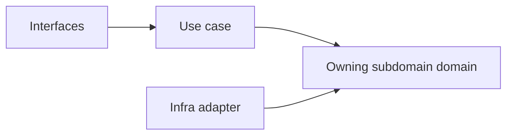

## Correct Interaction Flow

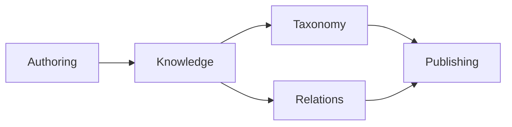

## Document Network

- [README.md](./README.md)
- [bounded-contexts.md](./bounded-contexts.md)
- [context-map.md](./context-map.md)
- [ubiquitous-language.md](./ubiquitous-language.md)
- [subdomains.md](../../domain/subdomains.md)
- [bounded-contexts.md](../../domain/bounded-contexts.md)
````

## File: docs/structure/contexts/notion/ubiquitous-language.md
````markdown
# Notion

本文件在本次任務限制下，僅依 Context7 驗證的 DDD、Context Map、Hexagonal Architecture 參考整理，不主張反映現況實作。

## Canonical Terms

| Term | Meaning |
|---|---|
| KnowledgeArtifact | notion 主域擁有的知識內容總稱 |
| KnowledgePage | 正典頁面型知識單位 |
| Article | 經過撰寫與驗證流程的知識內容 |
| Database | 結構化知識集合 |
| DatabaseView | 對 Database 的投影與檢視配置 |
| Taxonomy | 標籤、分類法、主題樹等語義組織結構 |
| Relation | 內容對內容之間的正式關聯 |
| CollaborationThread | 內容附著的協作討論邊界 |
| Attachment | 綁定於知識內容的檔案或媒體 |
| Template | 可重複套用的內容結構起點 |
| Publication | 對外可見且可交付的內容狀態 |
| VersionSnapshot | 某一時點的不可變內容快照 |

## Language Rules

- 使用 KnowledgeArtifact、KnowledgePage、Article、Database 區分內容型別。
- 使用 Taxonomy 表示分類法，不用 Tagging 功能泛稱整個語義結構。
- 使用 Relation 表示正式內容關聯，不用 Link 混稱語義關係。
- 使用 Publication 表示正式對外內容狀態，不用 Publish Action 取代整個交付語言。
- 來自 notebooklm 的內容若未被 notion 吸收，不應直接稱為 KnowledgeArtifact。

## Avoid

| Avoid | Use Instead |
|---|---|
| Wiki | KnowledgePage 或 Article |
| Table | Database 或 DatabaseView |
| Tag System | Taxonomy |
| Content Link | Relation |

## Naming Anti-Patterns

- 不用 Wiki 混指 KnowledgeArtifact、KnowledgePage、Article。
- 不用 Tagging 混指 Taxonomy。
- 不用 Link 混指 Relation。
- 不用 Publish Action 混指 Publication 狀態與整個交付邊界。

## Copilot Generation Rules

- 生成程式碼時，名稱先對齊 KnowledgeArtifact、Taxonomy、Relation、Publication，再決定類別與檔名。
- 奧卡姆剃刀：若一個正確名詞已能表達邊界，就不要再堆疊第二個近義抽象名稱。
- 命名先保護內容語義，再考慮實作便利。

## Dependency Direction Flow

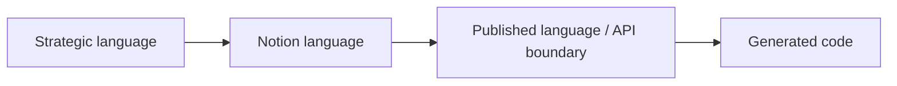

## Correct Interaction Flow

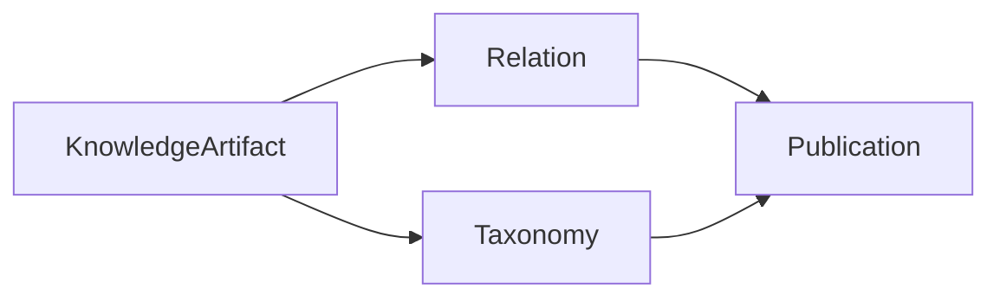

## Domain Layer Flow (enforced per subdomain)

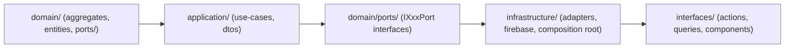

## Document Network

- [README.md](./README.md)
- [AGENTS.md](./AGENTS.md)
- [subdomains.md](./subdomains.md)
- [bounded-contexts.md](./bounded-contexts.md)
- [ubiquitous-language.md](../../domain/ubiquitous-language.md)
````

## File: src/modules/notion/adapters/inbound/server-actions/page-actions.ts
````typescript
/**
 * page-actions — notion page server actions.
 */
⋮----
import { z } from "zod";
import { createClientNotionPageUseCases } from "../../outbound/firebase-composition";
⋮----
// ── Input schemas ─────────────────────────────────────────────────────────────
⋮----
// ── Actions ───────────────────────────────────────────────────────────────────
⋮----
export async function queryPagesAction(rawInput: unknown)
⋮----
export async function createPageAction(rawInput: unknown)
⋮----
export async function renamePageAction(rawInput: unknown)
⋮----
export async function archivePageAction(rawInput: unknown)
````

## File: src/modules/notion/adapters/inbound/server-actions/template-actions.test.ts
````typescript
import { beforeEach, describe, expect, it, vi } from "vitest";
⋮----
import { createTemplateAction } from "./template-actions";
````

## File: src/modules/notion/adapters/inbound/server-actions/template-actions.ts
````typescript
/**
 * template-actions — notion template server actions.
 */
⋮----
import { z } from "zod";
import type { Template } from "../../../subdomains/template/domain/entities/Template";
import { createClientNotionTemplateUseCases } from "../../outbound/firebase-composition";
⋮----
// ── Input schemas ─────────────────────────────────────────────────────────────
⋮----
// ── Actions ───────────────────────────────────────────────────────────────────
⋮----
export async function queryTemplatesAction(rawInput: unknown): Promise<Template[]>
⋮----
export async function createTemplateAction(rawInput: unknown)
````

## File: src/modules/notion/AGENTS.md
````markdown
# Notion Module — Agent Guide

## Purpose

`src/modules/notion/` 是 KnowledgeArtifact 模組；Page / Block / Database 等可寫內容由此所有。

## Immediate Index

- Parent AGENTS: [../AGENTS.md](../AGENTS.md)
- Parent README: [../README.md](../README.md)
- Pair: [README.md](README.md)
- Public boundary: [index.ts](index.ts)

## Subdomain Index（actual directories）

- `subdomains/block/`
- `subdomains/collaboration/`
- `subdomains/database/`
- `subdomains/knowledge/`
- `subdomains/page/`
- `subdomains/template/`
- `subdomains/view/`

## Route Here When

- 需要在 `src/modules/notion/` 內新增或調整 domain / application / adapters / orchestration 實作。
- 需要確認此 bounded context 的目前目錄形狀與公開邊界。

## Route Elsewhere When

- RAG UX / conversation flow → `src/modules/notebooklm/`
- AI mechanism → `src/modules/ai/`
- 跨模組 API → `src/modules/notion/index.ts`

## Drift Guard

- `AGENTS.md` 擁有 `src/modules/notion/` 的 routing、nested index、放置判斷。
- `README.md` 擁有同一節點的人類可讀概覽。
- 子域名稱與數量以實際 `subdomains/` 目錄為準。

## Related Docs

- [../../../docs/README.md](../../../docs/README.md)
- [../../../docs/structure/domain/bounded-contexts.md](../../../docs/structure/domain/bounded-contexts.md)
````

## File: src/modules/notion/README.md
````markdown
# Notion Module

`src/modules/notion/` 是 KnowledgeArtifact 模組；Page / Block / Database 等可寫內容由此所有。

## Navigation Index

- Pair: [AGENTS.md](AGENTS.md)
- Parent: [../README.md](../README.md)
- Public boundary: [index.ts](index.ts)

## Directory Index（actual directories）

- `subdomains/block/`
- `subdomains/collaboration/`
- `subdomains/database/`
- `subdomains/knowledge/`
- `subdomains/page/`
- `subdomains/template/`
- `subdomains/view/`

## Pair Contract

- `README.md` 維護 `src/modules/notion/` 的最短概覽與實際目錄索引。
- `AGENTS.md` 維護 agent routing、nested index 與放置決策。
- 若未來新增 / 移除子域，先更新這兩份索引，再補充更細的 module-local 說明。

## Read Next

- [../AGENTS.md](../AGENTS.md)
- [../../../docs/README.md](../../../docs/README.md)
````

## File: src/modules/notion/subdomains/database/adapters/outbound/memory/InMemoryDatabaseRepository.ts
````typescript
import type { DatabaseSnapshot } from "../../../domain/entities/Database";
import type { DatabaseRepository } from "../../../domain/repositories/DatabaseRepository";
⋮----
export class InMemoryDatabaseRepository implements DatabaseRepository {
⋮----
async save(snapshot: DatabaseSnapshot): Promise<void>
⋮----
async findById(id: string): Promise<DatabaseSnapshot | null>
⋮----
async findByParentPageId(parentPageId: string): Promise<DatabaseSnapshot[]>
⋮----
async findByWorkspaceId(workspaceId: string): Promise<DatabaseSnapshot[]>
⋮----
async delete(id: string): Promise<void>
````

## File: src/modules/notion/subdomains/database/domain/repositories/DatabaseRepository.ts
````typescript
import type { DatabaseSnapshot } from "../entities/Database";
⋮----
export interface DatabaseRepository {
  save(snapshot: DatabaseSnapshot): Promise<void>;
  findById(id: string): Promise<DatabaseSnapshot | null>;
  findByParentPageId(parentPageId: string): Promise<DatabaseSnapshot[]>;
  findByWorkspaceId(workspaceId: string): Promise<DatabaseSnapshot[]>;
  delete(id: string): Promise<void>;
}
⋮----
save(snapshot: DatabaseSnapshot): Promise<void>;
findById(id: string): Promise<DatabaseSnapshot | null>;
findByParentPageId(parentPageId: string): Promise<DatabaseSnapshot[]>;
findByWorkspaceId(workspaceId: string): Promise<DatabaseSnapshot[]>;
delete(id: string): Promise<void>;
````

## File: src/modules/notion/subdomains/knowledge/adapters/inbound/index.ts
````typescript
// inbound adapters for knowledge subdomain
````

## File: src/modules/notion/subdomains/knowledge/adapters/index.ts
````typescript

````

## File: src/modules/notion/subdomains/knowledge/adapters/outbound/index.ts
````typescript

````

## File: src/modules/notion/subdomains/knowledge/adapters/outbound/memory/InMemoryKnowledgeArtifactRepository.ts
````typescript
import type { KnowledgeArtifactSnapshot, KnowledgeArtifactStatus, KnowledgeArtifactType } from "../../../domain/entities/KnowledgeArtifact";
import type { KnowledgeArtifactRepository, KnowledgeArtifactQuery } from "../../../domain/repositories/KnowledgeArtifactRepository";
⋮----
export class InMemoryKnowledgeArtifactRepository implements KnowledgeArtifactRepository {
⋮----
async save(snapshot: KnowledgeArtifactSnapshot): Promise<void>
⋮----
async findById(id: string): Promise<KnowledgeArtifactSnapshot | null>
⋮----
async query(params: KnowledgeArtifactQuery): Promise<KnowledgeArtifactSnapshot[]>
⋮----
async delete(id: string): Promise<void>
````

## File: src/modules/notion/subdomains/knowledge/application/index.ts
````typescript

````

## File: src/modules/notion/subdomains/knowledge/application/use-cases/KnowledgeArtifactUseCases.ts
````typescript
import { commandSuccess, commandFailureFrom, type CommandResult } from "../../../../../shared";
import { KnowledgeArtifact, type CreateKnowledgeArtifactInput } from "../../domain/entities/KnowledgeArtifact";
import type { KnowledgeArtifactRepository, KnowledgeArtifactQuery } from "../../domain/repositories/KnowledgeArtifactRepository";
⋮----
export class CreateKnowledgeArtifactUseCase {
⋮----
constructor(private readonly repo: KnowledgeArtifactRepository)
⋮----
async execute(input: CreateKnowledgeArtifactInput): Promise<CommandResult>
⋮----
export class PublishKnowledgeArtifactUseCase {
⋮----
async execute(artifactId: string): Promise<CommandResult>
⋮----
export class ArchiveKnowledgeArtifactUseCase {
⋮----
export class QueryKnowledgeArtifactsUseCase {
⋮----
async execute(params: KnowledgeArtifactQuery)
````

## File: src/modules/notion/subdomains/knowledge/domain/entities/KnowledgeArtifact.ts
````typescript
/**
 * KnowledgeArtifact — canonical ubiquitous-language aggregate for the notion
 * bounded context.
 *
 * A KnowledgeArtifact is the top-level knowledge unit authored, versioned, and
 * published within a workspace. It acts as the canonical container; subordinate
 * building blocks (Page, Block) represent implementation details.
 *
 * "KnowledgeArtifact" is the strategic term per
 * docs/structure/domain/ubiquitous-language.md.
 */
import { v4 as uuid } from "uuid";
⋮----
export type KnowledgeArtifactStatus = "draft" | "published" | "archived";
export type KnowledgeArtifactType = "article" | "wiki" | "guide" | "reference" | "other";
⋮----
export interface KnowledgeArtifactSnapshot {
  readonly id: string;
  readonly workspaceId: string;
  readonly accountId: string;
  readonly organizationId: string;
  readonly title: string;
  readonly type: KnowledgeArtifactType;
  readonly status: KnowledgeArtifactStatus;
  readonly authorId: string;
  /** Root page ID linking this artifact to the page subdomain. */
  readonly rootPageId?: string;
  readonly tags: readonly string[];
  readonly createdAtISO: string;
  readonly updatedAtISO: string;
  readonly publishedAtISO?: string;
  readonly archivedAtISO?: string;
}
⋮----
/** Root page ID linking this artifact to the page subdomain. */
⋮----
export interface CreateKnowledgeArtifactInput {
  readonly workspaceId: string;
  readonly accountId: string;
  readonly organizationId: string;
  readonly title: string;
  readonly type?: KnowledgeArtifactType;
  readonly authorId: string;
  readonly tags?: string[];
}
⋮----
export class KnowledgeArtifact {
⋮----
private constructor(private _props: KnowledgeArtifactSnapshot)
⋮----
static create(input: CreateKnowledgeArtifactInput): KnowledgeArtifact
⋮----
static reconstitute(snapshot: KnowledgeArtifactSnapshot): KnowledgeArtifact
⋮----
publish(): void
⋮----
archive(): void
⋮----
linkRootPage(pageId: string): void
⋮----
rename(title: string): void
⋮----
get id(): string
get title(): string
get status(): KnowledgeArtifactStatus
get workspaceId(): string
get authorId(): string
get type(): KnowledgeArtifactType
⋮----
getSnapshot(): Readonly<KnowledgeArtifactSnapshot>
⋮----
pullDomainEvents()
````

## File: src/modules/notion/subdomains/knowledge/domain/index.ts
````typescript

````

## File: src/modules/notion/subdomains/knowledge/domain/repositories/KnowledgeArtifactRepository.ts
````typescript
import type { KnowledgeArtifactSnapshot, KnowledgeArtifactStatus, KnowledgeArtifactType } from "../entities/KnowledgeArtifact";
⋮----
export interface KnowledgeArtifactQuery {
  readonly workspaceId?: string;
  readonly accountId?: string;
  readonly status?: KnowledgeArtifactStatus;
  readonly type?: KnowledgeArtifactType;
  readonly authorId?: string;
  readonly limit?: number;
  readonly offset?: number;
}
⋮----
export interface KnowledgeArtifactRepository {
  save(snapshot: KnowledgeArtifactSnapshot): Promise<void>;
  findById(id: string): Promise<KnowledgeArtifactSnapshot | null>;
  query(params: KnowledgeArtifactQuery): Promise<KnowledgeArtifactSnapshot[]>;
  delete(id: string): Promise<void>;
}
⋮----
save(snapshot: KnowledgeArtifactSnapshot): Promise<void>;
findById(id: string): Promise<KnowledgeArtifactSnapshot | null>;
query(params: KnowledgeArtifactQuery): Promise<KnowledgeArtifactSnapshot[]>;
delete(id: string): Promise<void>;
````

## File: src/modules/notion/subdomains/template/adapters/outbound/memory/InMemoryTemplateRepository.ts
````typescript
import type { Template, TemplateCategory, TemplateScope, TemplateRepository } from "../../../domain/entities/Template";
⋮----
export class InMemoryTemplateRepository implements TemplateRepository {
⋮----
async save(template: Template): Promise<void>
⋮----
async findById(id: string): Promise<Template | null>
⋮----
async findByScope(scope: TemplateScope, contextId?: string): Promise<Template[]>
⋮----
async listByCategory(category: TemplateCategory): Promise<Template[]>
⋮----
async delete(id: string): Promise<void>
````

## File: src/modules/notion/subdomains/template/application/use-cases/TemplateUseCases.ts
````typescript
import { v4 as uuid } from "uuid";
import { commandSuccess, commandFailureFrom, type CommandResult } from "../../../../../shared";
import type { Template, TemplateCategory, TemplateScope, TemplateRepository } from "../../domain/entities/Template";
⋮----
export interface CreateTemplateInput {
  readonly workspaceId: string;
  readonly title: string;
  readonly category: TemplateCategory;
  readonly createdByUserId: string;
  readonly description?: string;
}
⋮----
export class QueryTemplatesUseCase {
⋮----
constructor(private readonly repo: TemplateRepository)
⋮----
async execute(workspaceId: string): Promise<Template[]>
⋮----
export class CreateTemplateUseCase {
⋮----
async execute(input: CreateTemplateInput): Promise<CommandResult>
````

## File: src/modules/notion/adapters/inbound/server-actions/database-actions.test.ts
````typescript
import { beforeEach, describe, expect, it, vi } from "vitest";
⋮----
import { createDatabaseAction } from "./database-actions";
````

## File: src/modules/notion/subdomains/database/domain/entities/Database.test.ts
````typescript
import { describe, expect, it } from "vitest";
⋮----
import { Database } from "./Database";
````

## File: src/modules/notion/subdomains/page/domain/entities/Page.test.ts
````typescript
import { describe, expect, it } from "vitest";
⋮----
import { Page } from "./Page";
````

## File: src/modules/notion/adapters/inbound/react/NotionTemplatesSection.tsx
````typescript
/**
 * NotionTemplatesSection — notion.templates tab — template library.
 * Auto-loads on mount. Supports creating new workspace-scoped templates.
 */
⋮----
import { Button, Input } from "@packages";
import { Layout, Plus } from "lucide-react";
import { useEffect, useState, useTransition } from "react";
⋮----
import type { Template, TemplateCategory } from "../../../subdomains/template/domain/entities/Template";
import { queryTemplatesAction, createTemplateAction } from "../server-actions/template-actions";
⋮----
interface NotionTemplatesSectionProps {
  workspaceId: string;
  accountId: string;
  currentUserId: string;
}
⋮----
const load = () =>
⋮----
// Auto-load on mount
⋮----
}, [workspaceId, accountId]); // eslint-disable-line react-hooks/exhaustive-deps
⋮----
const handleCreate = () =>
````

## File: src/modules/notion/adapters/inbound/server-actions/database-actions.ts
````typescript
/**
 * database-actions — notion database server actions.
 */
⋮----
import { z } from "zod";
import { createClientNotionDatabaseUseCases } from "../../outbound/firebase-composition";
⋮----
// ── Input schemas ─────────────────────────────────────────────────────────────
⋮----
// ── Actions ───────────────────────────────────────────────────────────────────
⋮----
export async function queryDatabasesAction(rawInput: unknown)
⋮----
export async function createDatabaseAction(rawInput: unknown)
````

## File: src/modules/notion/index.ts
````typescript
/**
 * Notion Module — public API surface.
 * All cross-module consumers must import from here only.
 */
⋮----
import type { DatabaseProperty, DatabaseSnapshot } from "./subdomains/database/domain";
import type { PageSnapshot } from "./subdomains/page/domain";
import type { CommandResult } from "../shared";
⋮----
// page
⋮----
// block
⋮----
// database
⋮----
// knowledge (canonical KnowledgeArtifact aggregate)
⋮----
// view
⋮----
// collaboration
⋮----
// template
⋮----
export async function listWorkspaceKnowledgePages(params: {
  accountId: string;
  workspaceId: string;
}): Promise<ReadonlyArray<PageSnapshot>>
⋮----
export async function listWorkspaceKnowledgeDatabases(
  workspaceId: string,
): Promise<ReadonlyArray<DatabaseSnapshot>>
⋮----
export async function createWorkspaceKnowledgePage(input: {
  accountId: string;
  workspaceId: string;
  title: string;
  summary?: string;
  sourceLabel?: string;
  sourceDocumentId?: string;
  sourceText?: string;
  createdByUserId: string;
}): Promise<CommandResult>
⋮----
export async function createWorkspaceKnowledgeDatabase(input: {
  accountId: string;
  workspaceId: string;
  title: string;
  description?: string;
  sourceDocumentId?: string;
  sourceText?: string;
  createdByUserId: string;
}): Promise<CommandResult>
⋮----
export async function addWorkspaceKnowledgeDatabaseProperty(
  databaseId: string,
  property: DatabaseProperty,
): Promise<CommandResult>
````

## File: src/modules/notion/subdomains/page/domain/entities/Page.ts
````typescript
/**
 * Page — distilled from modules/notion/subdomains/knowledge/domain/aggregates/KnowledgePage.ts
 */
import { v4 as uuid } from "uuid";
⋮----
export type PageStatus = "active" | "archived";
⋮----
export interface PageSnapshot {
  readonly id: string;
  readonly accountId: string;
  readonly workspaceId?: string;
  readonly title: string;
  readonly summary?: string;
  readonly sourceLabel?: string;
  readonly sourceDocumentId?: string;
  readonly sourceText?: string;
  readonly slug: string;
  readonly parentPageId: string | null;
  readonly order: number;
  readonly blockIds: readonly string[];
  readonly status: PageStatus;
  readonly ownerId?: string;
  readonly iconUrl?: string;
  readonly coverUrl?: string;
  readonly createdByUserId: string;
  readonly createdAtISO: string;
  readonly updatedAtISO: string;
}
⋮----
export interface CreatePageInput {
  readonly accountId: string;
  readonly workspaceId?: string;
  readonly title: string;
  readonly summary?: string;
  readonly sourceLabel?: string;
  readonly sourceDocumentId?: string;
  readonly sourceText?: string;
  readonly parentPageId?: string | null;
  readonly createdByUserId: string;
  readonly order?: number;
}
⋮----
function slugify(title: string): string
⋮----
export class Page {
⋮----
private constructor(private _props: PageSnapshot)
⋮----
static create(input: CreatePageInput): Page
⋮----
static reconstitute(snapshot: PageSnapshot): Page
⋮----
rename(title: string): void
⋮----
appendBlock(blockId: string): void
⋮----
archive(): void
⋮----
get id(): string
get title(): string
get summary(): string | undefined
get sourceLabel(): string | undefined
get slug(): string
get status(): PageStatus
get blockIds(): readonly string[]
get parentPageId(): string | null
⋮----
getSnapshot(): Readonly<PageSnapshot>
⋮----
pullDomainEvents()
````

## File: src/modules/notion/adapters/inbound/react/NotionPagesSection.tsx
````typescript
/**
 * NotionPagesSection — notion.pages tab — workspace knowledge pages.
 *
 * This surface is intentionally "Notion-like" rather than a full Notion API
 * clone. Pages carry lightweight workspace knowledge context that can be
 * forwarded into workspace.task-formation as a concrete source reference.
 */
⋮----
import { Button, Input } from "@packages";
import { FileText, Plus, ListPlus, Pencil, Archive } from "lucide-react";
import Link from "next/link";
import { useEffect, useState, useTransition } from "react";
⋮----
import type { PageSnapshot } from "../../../subdomains/page/domain/entities/Page";
import {
  queryPages,
  createPage,
  renamePage,
  archivePage,
} from "../../../adapters/outbound/firebase-composition";
⋮----
interface NotionPagesSectionProps {
  workspaceId: string;
  accountId: string;
  currentUserId: string;
}
⋮----
function taskFormationHref(accountId: string, workspaceId: string, pageId: string)
⋮----
const reloadPages = async () =>
⋮----
const load = () =>
⋮----
}, [workspaceId, accountId]); // eslint-disable-line react-hooks/exhaustive-deps
⋮----
const handleCreate = () =>
⋮----
const handleStartRename = (page: PageSnapshot) =>
⋮----
const handleRename = (pageId: string) =>
⋮----
const handleArchive = (pageId: string) =>
⋮----
href=
````

## File: src/modules/notion/subdomains/database/domain/entities/Database.ts
````typescript
/**
 * Database — distilled from modules/notion/subdomains/knowledge/domain/aggregates/KnowledgeCollection.ts
 * Represents a structured collection of pages with typed properties (Notion-style database).
 */
import { v4 as uuid } from "uuid";
⋮----
export type PropertyType = "text" | "number" | "select" | "multi_select" | "date" | "checkbox" | "url" | "email" | "file" | "relation";
⋮----
export interface DatabaseProperty {
  readonly id: string;
  readonly name: string;
  readonly type: PropertyType;
  readonly options?: string[];
}
⋮----
export type DatabaseStatus = "active" | "archived";
⋮----
export interface DatabaseSnapshot {
  readonly id: string;
  readonly parentPageId: string | null;
  readonly workspaceId: string;
  readonly accountId: string;
  readonly title: string;
  readonly description?: string;
  readonly sourceDocumentId?: string;
  readonly sourceText?: string;
  readonly properties: DatabaseProperty[];
  readonly status: DatabaseStatus;
  readonly createdByUserId: string;
  readonly createdAtISO: string;
  readonly updatedAtISO: string;
}
⋮----
export interface CreateDatabaseInput {
  readonly parentPageId?: string | null;
  readonly workspaceId: string;
  readonly accountId: string;
  readonly title: string;
  readonly description?: string;
  readonly sourceDocumentId?: string;
  readonly sourceText?: string;
  readonly properties?: DatabaseProperty[];
  readonly createdByUserId: string;
}
⋮----
export class Database {
⋮----
private constructor(private _props: DatabaseSnapshot)
⋮----
private static createDefaultProperty(): DatabaseProperty
⋮----
static create(input: CreateDatabaseInput): Database
⋮----
static reconstitute(snapshot: DatabaseSnapshot): Database
⋮----
addProperty(property: DatabaseProperty): void
⋮----
get id(): string
get title(): string
get parentPageId(): string | null
get properties(): DatabaseProperty[]
⋮----
getSnapshot(): Readonly<DatabaseSnapshot>
````

## File: src/modules/notion/adapters/outbound/firebase-composition.ts
````typescript
/**
 * firebase-composition — notion module outbound composition root.
 *
 * Uses Firestore for Pages (contentPages collection) and Databases
 * (knowledgeDatabases collection). Templates remain in-memory.
 *
 * All exported helper functions MUST be called from client components,
 * NOT from Server Actions. The Firebase Web Client SDK requires a signed-in
 * user in the browser context so that Firestore Security Rules can evaluate
 * request.auth.
 *
 * ESLint: @integration-firebase is allowed here — this file lives at
 * src/modules/notion/adapters/outbound/ which matches the permitted glob.
 */
⋮----
import { FirestorePageRepository } from "../../subdomains/page/adapters/outbound/firestore/FirestorePageRepository";
import { FirestoreDatabaseRepository } from "../../subdomains/database/adapters/outbound/firestore/FirestoreDatabaseRepository";
import { InMemoryTemplateRepository } from "../../subdomains/template/adapters/outbound/memory/InMemoryTemplateRepository";
import {
  CreatePageUseCase,
  RenamePageUseCase,
  ArchivePageUseCase,
  QueryPagesUseCase,
} from "../../subdomains/page/application/use-cases/PageUseCases";
import {
  CreateDatabaseUseCase,
  AddPropertyUseCase,
} from "../../subdomains/database/application/use-cases/DatabaseUseCases";
import {
  QueryTemplatesUseCase,
  CreateTemplateUseCase,
} from "../../subdomains/template/application/use-cases/TemplateUseCases";
import type { CommandResult } from "@/src/modules/shared";
import type { CreatePageInput } from "../../subdomains/page/domain/entities/Page";
import type { CreateDatabaseInput, DatabaseProperty } from "../../subdomains/database/domain/entities/Database";
⋮----
// ── Singleton repositories ────────────────────────────────────────────────────
⋮----
function getPageRepo(): FirestorePageRepository
⋮----
function getDatabaseRepo(): FirestoreDatabaseRepository
⋮----
function getTemplateRepo(): InMemoryTemplateRepository
⋮----
// ── Factory functions (kept for server-action compatibility) ──────────────────
⋮----
export function createClientNotionPageUseCases()
⋮----
export function createClientNotionDatabaseUseCases()
⋮----
export function createClientNotionTemplateUseCases()
⋮----
// ── Client-side page helpers ──────────────────────────────────────────────────
//
// MUST be called from client components, NOT from Server Actions.
⋮----
export async function queryPages(params:
⋮----
export async function createPage(input: CreatePageInput)
⋮----
export async function renamePage(pageId: string, title: string)
⋮----
export async function archivePage(pageId: string)
⋮----
// ── Client-side database helpers ──────────────────────────────────────────────
//
// MUST be called from client components, NOT from Server Actions.
⋮----
export async function queryDatabases(workspaceId: string)
⋮----
export async function createDatabase(input: CreateDatabaseInput)
⋮----
export async function addDatabaseProperty(
  databaseId: string,
  property: DatabaseProperty,
): Promise<CommandResult>
````

## File: src/modules/notion/subdomains/page/adapters/outbound/firestore/FirestorePageRepository.ts
````typescript
/**
 * FirestorePageRepository — Firestore adapter for the page subdomain.
 *
 * Collection: contentPages (top-level, matching firestore.indexes.json collectionGroup)
 * Each document stores a PageSnapshot directly.
 *
 * MUST be called from a client component, NOT from a Server Action.
 * The Firebase Web Client SDK requires a signed-in user in the browser context
 * so that Firestore Security Rules can evaluate request.auth.
 *
 * ESLint: @integration-firebase is allowed here — this file lives at
 * src/modules/notion/subdomains/page/adapters/outbound/firestore/
 * which matches the extended outbound glob.
 */
⋮----
import { getFirebaseFirestore, firestoreApi, z } from "@packages";
import type { PageSnapshot, PageStatus } from "../../../domain/entities/Page";
import type { PageRepository, PageQuery } from "../../../domain/repositories/PageRepository";
⋮----
// ── Level 3 Zod schema: validates Firestore output at the adapter boundary ────
⋮----
function toSnapshot(raw: unknown): PageSnapshot
⋮----
/** Strip undefined values so Firestore setDoc() never sees an unsupported undefined field. */
function toFirestoreDoc(obj: Record<string, unknown>): Record<string, unknown>
⋮----
export class FirestorePageRepository implements PageRepository {
⋮----
async save(snapshot: PageSnapshot): Promise<void>
⋮----
async findById(id: string): Promise<PageSnapshot | null>
⋮----
async findBySlug(slug: string, accountId: string): Promise<PageSnapshot | null>
⋮----
async findChildren(parentPageId: string): Promise<PageSnapshot[]>
⋮----
async query(params: PageQuery): Promise<PageSnapshot[]>
⋮----
// Build equality constraints — no composite index required for equality-only filters.
⋮----
async delete(id: string): Promise<void>
````

## File: src/modules/notion/adapters/inbound/react/NotionDatabaseSection.tsx
````typescript
/**
 * NotionDatabaseSection — notion.database tab — workspace knowledge databases.
 *
 * Databases are local structured knowledge containers. They keep a real parent
 * page reference (or workspace root) and a lightweight schema that can be used
 * as task-formation input.
 */
⋮----
import { Button, Input } from "@packages";
import { LayoutGrid, ListPlus, Plus } from "lucide-react";
import Link from "next/link";
import { useEffect, useState, useTransition } from "react";
⋮----
import type { DatabaseSnapshot, PropertyType } from "../../../subdomains/database/domain/entities/Database";
import type { PageSnapshot } from "../../../subdomains/page/domain/entities/Page";
import { queryDatabases, createDatabase, addDatabaseProperty, queryPages } from "../../../adapters/outbound/firebase-composition";
⋮----
interface NotionDatabaseSectionProps {
  workspaceId: string;
  accountId: string;
  currentUserId: string;
}
⋮----
type PropertyDraft = {
  readonly name: string;
  readonly type: PropertyType;
};
⋮----
function taskFormationHref(accountId: string, workspaceId: string, databaseId: string)
⋮----
const reload = async () =>
⋮----
const load = () =>
⋮----
}, [workspaceId, accountId]); // eslint-disable-line react-hooks/exhaustive-deps
⋮----
const handleCreate = () =>
⋮----
const updatePropertyDraft = (databaseId: string, patch: Partial<PropertyDraft>) =>
⋮----
const handleAddProperty = (databaseId: string) =>
````

## File: src/modules/notion/subdomains/database/adapters/outbound/firestore/FirestoreDatabaseRepository.ts
````typescript
/**
 * FirestoreDatabaseRepository — Firestore adapter for the database subdomain.
 *
 * Collection: knowledgeDatabases (top-level, matching firestore.indexes.json collectionGroup)
 * Each document stores a DatabaseSnapshot directly.
 *
 * MUST be called from a client component, NOT from a Server Action.
 * The Firebase Web Client SDK requires a signed-in user in the browser context
 * so that Firestore Security Rules can evaluate request.auth.
 *
 * ESLint: @integration-firebase is allowed here — this file lives at
 * src/modules/notion/subdomains/database/adapters/outbound/firestore/
 * which matches the extended outbound glob.
 */
⋮----
import { getFirebaseFirestore, firestoreApi, z } from "@packages";
import type { DatabaseSnapshot } from "../../../domain/entities/Database";
import type { DatabaseRepository } from "../../../domain/repositories/DatabaseRepository";
⋮----
// ── Level 3 Zod schema: validates Firestore output at the adapter boundary ────
⋮----
function toSnapshot(raw: unknown): DatabaseSnapshot
⋮----
/** Strip undefined values so Firestore setDoc() never sees an unsupported undefined field. */
function toFirestoreDoc(obj: Record<string, unknown>): Record<string, unknown>
⋮----
export class FirestoreDatabaseRepository implements DatabaseRepository {
⋮----
async save(snapshot: DatabaseSnapshot): Promise<void>
⋮----
async findById(id: string): Promise<DatabaseSnapshot | null>
⋮----
async findByParentPageId(parentPageId: string): Promise<DatabaseSnapshot[]>
⋮----
async findByWorkspaceId(workspaceId: string): Promise<DatabaseSnapshot[]>
⋮----
async delete(id: string): Promise<void>
````