# Files

## File: src/modules/platform/adapters/inbound/react/AccountScopeProvider.tsx
````typescript
/**
 * AccountScopeProvider — platform inbound adapter (React).
 *
 * Manages platform-owned account lifecycle: auth → accounts → activeAccount.
 * Ported from: app/(shell)/_providers/AppProvider.tsx
 *
 * Consumers use useAccountScope() to read account state.
 */
⋮----
import { useReducer, useEffect, type ReactNode } from "react";
⋮----
import {
  AppContext,
  APP_INITIAL_STATE,
  type AppState,
  type AppAction,
} from "./AppContext";
import {
  resolveActiveAccount,
  subscribeToAccountsForUser,
} from "./AppContext";
import { useAuth } from "../../../../iam/adapters/inbound/react/AuthContext";
⋮----
function appReducer(state: AppState, action: AppAction): AppState
⋮----
export function AccountScopeProvider(
⋮----
// eslint-disable-next-line react-hooks/exhaustive-deps
````

## File: src/modules/platform/adapters/inbound/react/AppContext.tsx
````typescript
/**
 * AppContext — platform inbound adapter (React).
 *
 * Defines app-level account state, context, and subscription helpers.
 * Firebase-backed implementations are consumed via the iam module's
 * outbound composition to preserve boundary direction.
 */
⋮----
import { createContext, useContext, type Dispatch } from "react";
import {
  subscribeToAccountsForUser as iamSubscribeToAccountsForUser,
} from "../../../../iam/adapters/outbound/firebase-composition";
import type { AccountSnapshot } from "../../../../iam/subdomains/account/domain/entities/Account";
import type { AccountProfile } from "../../../../iam/subdomains/account/domain/entities/AccountProfile";
⋮----
import type { AuthUser } from "../../../../iam/adapters/inbound/react/AuthContext";
⋮----
// ── Account types ─────────────────────────────────────────────────────────────
⋮----
export type AccountType = "user" | "organization";
⋮----
export interface AccountEntity {
  readonly id: string;
  readonly name: string;
  readonly accountType: AccountType;
  readonly email?: string;
  readonly photoURL?: string;
}
⋮----
export type ActiveAccount = AccountEntity | AuthUser;
⋮----
export type BootstrapPhase = "idle" | "seeded" | "hydrated";
⋮----
// ── AccountProfile (read-model) ───────────────────────────────────────────────
⋮----
// ── App state & actions ───────────────────────────────────────────────────────
⋮----
export interface AppState {
  readonly accounts: Record<string, AccountEntity>;
  readonly accountsHydrated: boolean;
  readonly activeAccount: ActiveAccount | null;
  readonly bootstrapPhase: BootstrapPhase;
}
⋮----
export type AppAction =
  | { type: "SEED_ACTIVE_ACCOUNT"; payload: { user: AuthUser } }
  | {
      type: "SET_ACCOUNTS";
      payload: {
        accounts: Record<string, AccountEntity>;
        user: AuthUser;
        preferredActiveAccountId: string | null;
      };
    }
  | { type: "SET_ACTIVE_ACCOUNT"; payload: ActiveAccount | null }
  | { type: "RESET_STATE" };
⋮----
export interface AppContextValue {
  readonly state: AppState;
  readonly dispatch: Dispatch<AppAction>;
}
⋮----
export function useApp(): AppContextValue
⋮----
// ── Account helpers ───────────────────────────────────────────────────────────
⋮----
export function isOrganizationActor(
  account: ActiveAccount | null | undefined,
): boolean
⋮----
export function isActiveOrganizationAccount(
  account: ActiveAccount | null | undefined,
): boolean
⋮----
export function resolveOrganizationRouteFallback(
  _pathname: string,
  _account: ActiveAccount | null | undefined,
): string | null
⋮----
export function resolveActiveAccount(opts: {
  currentActiveAccount: ActiveAccount | null;
  accounts: Record<string, AccountEntity>;
  personalAccount: AuthUser;
  preferredActiveAccountId: string | null;
  bootstrapPhase: BootstrapPhase;
}): ActiveAccount
⋮----
// ── Subscriptions ─────────────────────────────────────────────────────────────
⋮----
/**
 * Subscribes to real-time organisation account updates for the given userId.
 * Maps iam AccountSnapshot → platform AccountEntity (view model).
 */
export function subscribeToAccountsForUser(
  userId: string,
  onUpdate: (accounts: Record<string, AccountEntity>) => void,
): () => void
⋮----
/**
 * Stub — profile subscriptions are available via the iam AccountQueryRepository
 * when a profile panel requires them. Wire from firebase-composition if needed.
 */
export function subscribeToProfile(
  _actorId: string,
  _onUpdate: (profile: AccountProfile | null) => void,
): () => void
````

## File: src/modules/platform/adapters/inbound/react/index.ts
````typescript
/**
 * platform inbound React adapter — barrel.
 *
 * Public surface for all platform React inbound adapters.
 * Consumed by src/app/ route shims.
 */
````

## File: src/modules/platform/adapters/inbound/react/PlatformBootstrap.tsx
````typescript
/**
 * PlatformBootstrap — platform inbound adapter (React).
 *
 * Self-contained provider tree for the src/ migration layer.
 * Assembles: IamSessionProvider → AccountScopeProvider → WorkspaceScopeProvider + Toaster.
 *
 * src/app/layout.tsx mounts this as the single composition root.
 * After this point, the rest of the tree can use:
 *   - useIamSession()     (iam)
 *   - useAccountScope()   (platform)
 *   - useWorkspaceScope() (workspace)
 */
⋮----
import type { ReactNode } from "react";
import { Toaster } from "@/packages/ui-shadcn/ui/sonner";
⋮----
import { IamSessionProvider } from "@/src/modules/iam/adapters/inbound/react";
import { AccountScopeProvider } from "./AccountScopeProvider";
import { WorkspaceScopeProvider } from "@/src/modules/workspace/adapters/inbound/react";
⋮----
export function PlatformBootstrap(
````

## File: src/modules/platform/adapters/inbound/react/shell/AccountSwitcher.tsx
````typescript
/**
 * AccountSwitcher — platform inbound adapter (React).
 *
 * Renders an account switcher control that lets the user toggle between their
 * personal (Firebase Auth) account and any organisation accounts they belong to.
 *
 * Design:
 *  - Current active account is shown as the trigger label.
 *  - Dropdown lists personal account first, then organisation accounts.
 *  - Active item is visually highlighted (check mark).
 *  - "Create organisation" entry at the bottom opens CreateOrganizationDialog.
 *
 * Props follow the same interface established in the stubs so callers
 * (ShellRootLayout, ShellAppRail) need no changes.
 */
⋮----
import { useState } from "react";
import { Building2, Check, ChevronsUpDown, Plus, UserRound } from "lucide-react";
⋮----
import {
  DropdownMenu,
  DropdownMenuContent,
  DropdownMenuGroup,
  DropdownMenuItem,
  DropdownMenuLabel,
  DropdownMenuSeparator,
  DropdownMenuTrigger,
} from "@ui-shadcn/ui/dropdown-menu";
⋮----
import type { AuthUser } from "../../../../../iam/adapters/inbound/react/AuthContext";
import type { AccountEntity } from "../AppContext";
import { CreateOrganizationDialog } from "./CreateOrganizationDialog";
⋮----
// ── Types ─────────────────────────────────────────────────────────────────────
⋮----
interface AccountSwitcherProps {
  personalAccount: AuthUser | null;
  organizationAccounts: AccountEntity[];
  activeAccountId: string | null;
  onSelectPersonal: () => void;
  onSelectOrganization: (account: AccountEntity) => void;
  onOrganizationCreated?: (account: AccountEntity) => void;
}
⋮----
// ── Helpers ───────────────────────────────────────────────────────────────────
⋮----
function getActiveLabel(
  activeAccountId: string | null,
  personalAccount: AuthUser | null,
  organizationAccounts: AccountEntity[],
): string
⋮----
// ── Component ─────────────────────────────────────────────────────────────────
⋮----
{/* Personal account */}
⋮----
{/* Organisation accounts */}
⋮----
onClick=
⋮----
onOrganizationCreated=
````

## File: src/modules/platform/adapters/inbound/react/shell/CreateOrganizationDialog.tsx
````typescript
/**
 * CreateOrganizationDialog — platform inbound adapter (React).
 *
 * Dialog for creating a new organisation.
 * Uses CreateOrganizationUseCase via the iam Firebase composition root.
 *
 * On success, the new organisation document is written to Firestore with the
 * creator listed in `ownerId` and `memberIds`.  The existing
 * `subscribeToAccountsForUser` query picks it up automatically, so the
 * AccountSwitcher refreshes without an explicit refetch.
 */
⋮----
import { useState, useMemo } from "react";
import { Building2, Loader2 } from "lucide-react";
⋮----
import {
  Dialog,
  DialogContent,
  DialogHeader,
  DialogTitle,
  DialogDescription,
} from "@ui-shadcn/ui/dialog";
⋮----
import { createClientOrganizationUseCases } from "../../../../../iam/adapters/outbound/firebase-composition";
import type { AuthUser } from "../../../../../iam/adapters/inbound/react/AuthContext";
import type { AccountEntity } from "../AppContext";
⋮----
// ── Types ─────────────────────────────────────────────────────────────────────
⋮----
interface CreateOrganizationDialogProps {
  open: boolean;
  onOpenChange: (open: boolean) => void;
  user: AuthUser | null;
  onOrganizationCreated?: (account: AccountEntity) => void;
  onNavigate?: (href: string) => void;
}
⋮----
// ── Component ─────────────────────────────────────────────────────────────────
⋮----
export function CreateOrganizationDialog({
  open,
  onOpenChange,
  user,
  onOrganizationCreated,
  onNavigate,
}: CreateOrganizationDialogProps): React.ReactElement | null
⋮----
async function handleSubmit(e: React.FormEvent)
````

## File: src/modules/platform/adapters/inbound/react/shell/index.ts
````typescript
/**
 * Shell UI components barrel — platform inbound React adapter.
 *
 * Shell chrome: app-rail, sidebar, header, and contextual nav.
 * Consumed internally by ShellFrame (parent directory).
 */
````

## File: src/modules/platform/adapters/inbound/react/shell/shell-quick-create.ts
````typescript
/**
 * shell-quick-create — app/(shell)/_shell composition layer.
 * Moved from modules/platform because it imports notion's createKnowledgePage.
 * Kept as a composition adapter at the app boundary.
 */
⋮----
import { createKnowledgePage } from "../../../../../notion/adapters/outbound/notion-page-stub";
⋮----
export interface QuickCreatePageInput {
  readonly accountId: string;
  readonly workspaceId: string;
  readonly createdByUserId: string;
}
⋮----
export interface QuickCreatePageResult {
  readonly success: boolean;
  readonly error?: { message: string };
}
⋮----
export async function quickCreateKnowledgePage(
  input: QuickCreatePageInput,
): Promise<QuickCreatePageResult>
````

## File: src/modules/platform/adapters/inbound/react/shell/ShellAppRail.tsx
````typescript
/**
 * ShellAppRail — app/(shell)/_shell composition layer.
 * Moved from modules/platform/interfaces/web/shell/sidebar/ShellAppRail.tsx
 * because it composes downstream modules (workspace).
 *
 * Platform is upstream and must not import downstream modules.
 * app/ is the designated composition layer.
 */
⋮----
import Link from "next/link";
import {
  Building2,
  CalendarDays,
  ClipboardList,
  FlaskConical,
  LayoutDashboard,
  NotebookText,
  Plus,
  SlidersHorizontal,
  UserRound,
  Users,
} from "lucide-react";
import { useMemo, useState } from "react";
import { useRouter } from "next/navigation";
⋮----
import type { AuthUser, ActiveAccount, AccountEntity } from "../AppContext";
import { CreateOrganizationDialog } from "../platform-ui-stubs";
import {
  listShellRailCatalogItems,
  isExactOrChildPath,
  resolveShellNavSection,
  buildShellContextualHref,
  type ShellRailCatalogItem,
} from "../../../../index";
import type { WorkspaceEntity } from "../../../../../workspace/adapters/inbound/react/WorkspaceContext";
import { CreateWorkspaceDialogRail } from "../../../../../workspace/adapters/inbound/react/workspace-ui-stubs";
import {
  DropdownMenu,
  DropdownMenuContent,
  DropdownMenuGroup,
  DropdownMenuItem,
  DropdownMenuLabel,
  DropdownMenuSeparator,
  DropdownMenuTrigger,
} from "@/packages/ui-shadcn/ui/dropdown-menu";
import {
  Tooltip,
  TooltipContent,
  TooltipProvider,
  TooltipTrigger,
} from "@/packages/ui-shadcn/ui/tooltip";
⋮----
interface AppRailProps {
  readonly pathname: string;
  readonly user: AuthUser | null;
  readonly activeAccount: ActiveAccount | null;
  readonly organizationAccounts: AccountEntity[];
  readonly workspaces: WorkspaceEntity[];
  readonly workspacesHydrated: boolean;
  readonly isOrganizationAccount: boolean;
  readonly onSelectPersonal: () => void;
  readonly onSelectOrganization: (account: AccountEntity) => void;
  readonly activeWorkspaceId: string | null;
  readonly onSelectWorkspace: (workspaceId: string | null) => void;
  readonly onOrganizationCreated?: (account: AccountEntity) => void;
  readonly onSignOut: () => void;
}
⋮----
interface RailItem {
  id: string;
  href: string;
  label: string;
  icon: React.ReactNode;
  show?: boolean;
  isActive?: (pathname: string) => boolean;
}
⋮----
function getInitial(name: string | undefined | null): string
⋮----
function isActive(href: string)
⋮----
function buildWorkspaceDetailHref(workspaceId: string): string
⋮----
onClick=
⋮----
onSelectWorkspace(workspace.id);
````

## File: src/modules/platform/adapters/inbound/react/shell/ShellGuard.tsx
````typescript
/**
 * ShellGuard — platform inbound adapter (React).
 *
 * Auth guard for the authenticated shell layout.
 * Renders nothing (redirects) while auth is initialising or when the user is
 * unauthenticated; renders children only for authenticated sessions.
 *
 * Redirect behaviour:
 *  - initializing → show full-screen spinner (do not redirect — avoids flash
 *    for returning users whose Firebase token is resolving)
 *  - unauthenticated | anonymous without explicit access → redirect to "/"
 *  - authenticated → render children
 *
 * Anonymous sessions (Continue as Guest) are currently treated as
 * authenticated at the shell level; individual routes may restrict further.
 */
⋮----
import { useEffect, type ReactNode } from "react";
import { useRouter } from "next/navigation";
import { Loader2 } from "lucide-react";
⋮----
import { useAuth } from "../../../../../iam/adapters/inbound/react/AuthContext";
⋮----
interface ShellGuardProps {
  children: ReactNode;
}
⋮----
export function ShellGuard(
⋮----
// Redirect is in-flight — render spinner to prevent content flash.
````

## File: src/modules/platform/adapters/inbound/react/shell/ShellLanguageSwitcher.tsx
````typescript
/**
 * ShellLanguageSwitcher — platform inbound adapter (React).
 *
 * Lets users explicitly override the display language.
 *
 * Firebase Hosting i18n rewrites honour the `firebase-language-override`
 * cookie to select the content locale. Setting this cookie and reloading
 * the page asks Firebase Hosting to serve the matching localized files
 * (configured under hosting.i18n in firebase.json).
 *
 * Supported locales are defined in SUPPORTED_LOCALES below.
 * Add entries here when new locale directories are added to /localized-files.
 *
 * Rendered by ShellHeaderControls in the top-right header area.
 */
⋮----
import { Languages } from "lucide-react";
import { useState } from "react";
⋮----
import {
  DropdownMenu,
  DropdownMenuContent,
  DropdownMenuGroup,
  DropdownMenuItem,
  DropdownMenuLabel,
  DropdownMenuSeparator,
  DropdownMenuTrigger,
} from "@ui-shadcn/ui/dropdown-menu";
⋮----
// ── Locale catalogue ──────────────────────────────────────────────────────────
⋮----
type LocaleCode = (typeof SUPPORTED_LOCALES)[number]["code"];
⋮----
// ── Helpers ───────────────────────────────────────────────────────────────────
⋮----
function getStoredLocale(): LocaleCode | null
⋮----
// Check cookie first (Firebase Hosting override), then localStorage fallback.
⋮----
function applyLocale(code: LocaleCode): void
⋮----
// Set the Firebase Hosting language override cookie (1 year, root path).
⋮----
// Also persist in localStorage as a UI fallback.
⋮----
// Reload so Firebase Hosting can serve the correct locale variant.
⋮----
// ── Component ─────────────────────────────────────────────────────────────────
⋮----
// Lazy initializer: reads from storage on first client render only.
// typeof window guard ensures SSR safety.
⋮----
function handleSelect(code: LocaleCode): void
````

## File: src/modules/platform/adapters/inbound/react/shell/ShellSidebarHeader.tsx
````typescript
/**
 * ShellSidebarHeader — app/(shell)/_shell composition layer.
 * Moved from modules/platform alongside sibling shell files.
 * Pure UI component with no downstream imports.
 */
⋮----
import { PanelLeftClose, SlidersHorizontal } from "lucide-react";
⋮----
interface ShellSidebarHeaderProps {
  sectionLabel: string;
  sectionIcon: React.ReactNode;
  onOpenCustomize: () => void;
  onToggleCollapsed: () => void;
}
⋮----
export function ShellSidebarHeader({
  sectionLabel,
  sectionIcon,
  onOpenCustomize,
  onToggleCollapsed,
}: ShellSidebarHeaderProps)
````

## File: src/modules/platform/adapters/inbound/react/shell/ShellThemeToggle.tsx
````typescript
/**
 * ShellThemeToggle — platform inbound adapter (React).
 *
 * Toggles between light, dark, and system themes in the shell header.
 * Relies on ThemeProvider (next-themes) being mounted at the layout root.
 *
 * Rendered by ShellHeaderControls in the top-right header area.
 */
⋮----
import { Moon, Sun } from "lucide-react";
import { useTheme } from "next-themes";
⋮----
export function ShellThemeToggle(): React.ReactElement
⋮----
function toggle()
````

## File: src/modules/platform/adapters/inbound/react/shell/ShellUserAvatar.tsx
````typescript
/**
 * ShellUserAvatar — platform inbound adapter (React).
 *
 * Displays the authenticated user's avatar or initials in the shell header.
 * Opens a dropdown menu with the user's name, email, and a sign-out action.
 *
 * Design:
 *  - Avatar shows initials (up to 2 characters) derived from the display name.
 *  - Dropdown follows shadcn/ui DropdownMenu conventions.
 *  - Sign-out delegates to the onSignOut prop (ShellRootLayout handles the
 *    async logout and error state; this component stays presentation-only).
 */
⋮----
import { LogOut, UserRound } from "lucide-react";
⋮----
import {
  DropdownMenu,
  DropdownMenuContent,
  DropdownMenuGroup,
  DropdownMenuItem,
  DropdownMenuLabel,
  DropdownMenuSeparator,
  DropdownMenuTrigger,
} from "@ui-shadcn/ui/dropdown-menu";
⋮----
// ── Helpers ───────────────────────────────────────────────────────────────────
⋮----
function getInitials(name: string): string
⋮----
// ── Component ─────────────────────────────────────────────────────────────────
⋮----
interface ShellUserAvatarProps {
  name: string;
  email: string;
  onSignOut: () => void;
}
⋮----
export function ShellUserAvatar({
  name,
  email,
  onSignOut,
}: ShellUserAvatarProps): React.ReactElement
````

## File: src/modules/platform/adapters/inbound/react/ShellFrame.tsx
````typescript
/**
 * ShellFrame — platform inbound adapter (React).
 *
 * Shell chrome wrapper: app-rail, sidebar, top header, and main content slot.
 * Lives in src/modules/platform/adapters/inbound/react/ alongside sibling shell files.
 */
````

## File: src/modules/platform/adapters/inbound/react/useAccountRouteContext.ts
````typescript
/**
 * useAccountRouteContext — platform inbound adapter (React).
 *
 * Derives route-level account context by combining:
 *  - URL params (`accountId` segment from Next.js routing)
 *  - Auth state (current authenticated user)
 *  - App state (loaded organisation accounts + activeAccount)
 *
 * Consumed by AccountRouteDispatcher (workspace) and any route component that
 * needs to know whether the active route is a personal or organisation scope.
 *
 * Design invariants:
 *  - routeAccountId  : raw value from the URL, never derived
 *  - resolvedAccountId: equals routeAccountId; exists for explicit intent
 *  - accountType     : null while accounts are still loading (hydration guard)
 *  - No mutations — read-only derived state
 */
⋮----
import { useParams } from "next/navigation";
import { useApp, type ActiveAccount } from "./AppContext";
import { useAuth } from "../../../../iam/adapters/inbound/react/AuthContext";
⋮----
// ── Public contract ───────────────────────────────────────────────────────────
⋮----
export interface AccountRouteContextValue {
  /** Raw accountId segment from the URL (e.g. `/[accountId]/...`). */
  readonly routeAccountId: string;
  /**
   * Resolved account ID — currently mirrors routeAccountId.
   * Reserved for future alias / slug resolution without breaking callers.
   */
  readonly resolvedAccountId: string;
  /** UID of the currently authenticated user; null when unauthenticated. */
  readonly currentUserId: string | null;
  /**
   * Whether the route account is an organisation or personal account.
   * null while the account list has not yet been hydrated from Firestore.
   */
  readonly accountType: "organization" | "user" | null;
  /** True once the organisation account list has been loaded from Firestore. */
  readonly accountsHydrated: boolean;
  /** Currently active account (personal AuthUser or AccountEntity). */
  readonly activeAccount: ActiveAccount | null;
}
⋮----
/** Raw accountId segment from the URL (e.g. `/[accountId]/...`). */
⋮----
/**
   * Resolved account ID — currently mirrors routeAccountId.
   * Reserved for future alias / slug resolution without breaking callers.
   */
⋮----
/** UID of the currently authenticated user; null when unauthenticated. */
⋮----
/**
   * Whether the route account is an organisation or personal account.
   * null while the account list has not yet been hydrated from Firestore.
   */
⋮----
/** True once the organisation account list has been loaded from Firestore. */
⋮----
/** Currently active account (personal AuthUser or AccountEntity). */
⋮----
// ── Hook ──────────────────────────────────────────────────────────────────────
⋮----
export function useAccountRouteContext(): AccountRouteContextValue
⋮----
// Determine account type from available state.
// We only commit to a type once data is available to avoid transient
// misrouting while accounts are still loading.
⋮----
// The URL account is a known organisation — use the stored accountType
// (could be "user" personal account stored in Firestore or "organization").
⋮----
// The URL account is the authenticated user's personal (Firebase Auth) account.
⋮----
// else: either accounts not yet hydrated or an unknown ID — stay null
````

## File: src/modules/platform/adapters/inbound/react/useAccountScope.ts
````typescript
/**
 * useAccountScope — platform inbound adapter (React).
 *
 * Canonical hook for reading the active account scope in the src/ layer.
 * Aliases useApp() from the platform module.
 *
 * Returns: { state: AppState, dispatch: Dispatch<AppAction> }
 */
````

## File: src/modules/platform/orchestration/index.ts
````typescript
import {
  InMemoryBackgroundJobRepository,
} from "../subdomains/background-job/adapters/outbound";
import {
  RegisterJobDocumentUseCase,
  AdvanceJobStageUseCase,
  ListWorkspaceJobsUseCase,
  type RegisterJobDocumentInput,
  type AdvanceJobStageInput,
  type ListWorkspaceJobsInput,
  type JobResult,
} from "../subdomains/background-job/application";
import type { BackgroundJob } from "../subdomains/background-job/domain";
⋮----
export class PlatformFacade {
⋮----
registerBackgroundJob(input: RegisterJobDocumentInput): Promise<JobResult<BackgroundJob>>
⋮----
advanceBackgroundJob(input: AdvanceJobStageInput): Promise<JobResult<BackgroundJob>>
⋮----
listWorkspaceBackgroundJobs(input: ListWorkspaceJobsInput): Promise<readonly BackgroundJob[]>
````

## File: src/modules/platform/shared/errors/index.ts
````typescript
export class PlatformConfigurationError extends Error {
⋮----
constructor(message: string)
⋮----
export class PlatformAuthorizationError extends Error {
⋮----
constructor(message = "Platform access denied.")
⋮----
export class PlatformResourceNotFoundError extends Error {
````

## File: src/modules/platform/shared/events/index.ts
````typescript
export interface PlatformDomainEvent<TType extends string, TPayload extends object> {
  readonly type: TType;
  readonly eventId: string;
  readonly occurredAt: string;
  readonly payload: TPayload;
}
⋮----
export type PlatformPublishedEvent =
  | PlatformDomainEvent<"platform.background-job.job_registered", {
      readonly jobId: string;
      readonly documentId: string;
      readonly organizationId: string;
      readonly workspaceId: string;
      readonly title: string;
      readonly mimeType: string;
    }>
  | PlatformDomainEvent<"platform.background-job.job_advanced", {
      readonly jobId: string;
      readonly documentId: string;
      readonly previousStatus: string;
      readonly nextStatus: string;
    }>
  | PlatformDomainEvent<"platform.notification.dispatched", {
      readonly notificationId: string;
      readonly recipientId: string;
      readonly notificationType: string;
    }>;
````

## File: src/modules/platform/shared/index.ts
````typescript

````

## File: src/modules/platform/shared/types/index.ts
````typescript
export interface PlatformScopeProps {
  readonly accountId: string;
  readonly organizationId?: string;
  readonly workspaceId?: string;
}
````

## File: src/modules/platform/subdomains/background-job/adapters/inbound/index.ts
````typescript

````

## File: src/modules/platform/subdomains/background-job/adapters/index.ts
````typescript
// background-job — adapters aggregate
````

## File: src/modules/platform/subdomains/background-job/adapters/outbound/firestore-like/InMemoryBackgroundJobRepository.ts
````typescript
import type { BackgroundJob, BackgroundJobStatus } from "../../../domain/entities/BackgroundJob";
import type { BackgroundJobRepository } from "../../../domain/repositories/BackgroundJobRepository";
⋮----
export class InMemoryBackgroundJobRepository implements BackgroundJobRepository {
⋮----
async findByDocumentId(documentId: string): Promise<BackgroundJob | null>
⋮----
async listByWorkspace(input: {
    readonly organizationId: string;
    readonly workspaceId: string;
}): Promise<readonly BackgroundJob[]>
⋮----
async save(job: BackgroundJob): Promise<void>
⋮----
async updateStatus(input: {
    readonly documentId: string;
    readonly status: BackgroundJobStatus;
    readonly statusMessage?: string;
    readonly updatedAtISO: string;
}): Promise<BackgroundJob | null>
````

## File: src/modules/platform/subdomains/background-job/adapters/outbound/index.ts
````typescript

````

## File: src/modules/platform/subdomains/background-job/application/index.ts
````typescript

````

## File: src/modules/platform/subdomains/background-job/application/use-cases/background-job.use-cases.ts
````typescript
import { v4 as randomUUID } from "uuid";
import type { DomainError } from "../../../../../shared";
import type { JobDocument } from "../../domain/entities/JobDocument";
import {
  canTransitionJobStatus,
  type BackgroundJob,
  type BackgroundJobStatus,
} from "../../domain/entities/BackgroundJob";
import type { BackgroundJobRepository } from "../../domain/repositories/BackgroundJobRepository";
⋮----
export type JobResult<T> =
  | { readonly ok: true; readonly data: T }
  | { readonly ok: false; readonly error: DomainError };
⋮----
function ok<T>(data: T): JobResult<T>
⋮----
function fail(code: string, message: string): JobResult<never>
⋮----
export interface RegisterJobDocumentInput {
  readonly organizationId: string;
  readonly workspaceId: string;
  readonly sourceFileId: string;
  readonly title: string;
  readonly mimeType: string;
}
⋮----
export class RegisterJobDocumentUseCase {
⋮----
constructor(private readonly repo: BackgroundJobRepository)
⋮----
async execute(input: RegisterJobDocumentInput): Promise<JobResult<BackgroundJob>>
⋮----
export interface AdvanceJobStageInput {
  readonly documentId: string;
  readonly nextStatus: BackgroundJobStatus;
  readonly statusMessage?: string;
}
⋮----
export class AdvanceJobStageUseCase {
⋮----
async execute(input: AdvanceJobStageInput): Promise<JobResult<BackgroundJob>>
⋮----
export interface ListWorkspaceJobsInput {
  readonly organizationId: string;
  readonly workspaceId: string;
}
⋮----
export class ListWorkspaceJobsUseCase {
⋮----
async execute(input: ListWorkspaceJobsInput): Promise<readonly BackgroundJob[]>
````

## File: src/modules/platform/subdomains/background-job/domain/entities/BackgroundJob.ts
````typescript
import type { JobDocument } from "./JobDocument";
⋮----
export type BackgroundJobStatus =
  | "uploaded"
  | "parsing"
  | "chunking"
  | "embedding"
  | "indexed"
  | "stale"
  | "re-indexing"
  | "failed";
⋮----
export function canTransitionJobStatus(from: BackgroundJobStatus, to: BackgroundJobStatus): boolean
⋮----
export interface BackgroundJob {
  readonly id: string;
  readonly document: JobDocument;
  readonly status: BackgroundJobStatus;
  readonly statusMessage?: string;
  readonly createdAtISO: string;
  readonly updatedAtISO: string;
}
````

## File: src/modules/platform/subdomains/background-job/domain/entities/JobChunk.ts
````typescript
export interface JobChunkMetadata {
  readonly sourceDocId: string;
  readonly section?: string;
  readonly pageNumber?: number;
}
⋮----
export interface JobChunk {
  readonly id: string;
  readonly documentId: string;
  readonly chunkIndex: number;
  readonly content: string;
  readonly metadata: JobChunkMetadata;
}
````

## File: src/modules/platform/subdomains/background-job/domain/entities/JobDocument.ts
````typescript
export interface JobDocument {
  readonly id: string;
  readonly organizationId: string;
  readonly workspaceId: string;
  readonly sourceFileId: string;
  readonly title: string;
  readonly mimeType: string;
  readonly createdAtISO: string;
  readonly updatedAtISO: string;
}
````

## File: src/modules/platform/subdomains/background-job/domain/events/BackgroundJobDomainEvent.ts
````typescript
import type { BackgroundJobStatus } from "../entities/BackgroundJob";
⋮----
export interface BackgroundJobDomainEvent {
  readonly eventId: string;
  readonly occurredAt: string;
  readonly type: string;
  readonly payload: object;
}
⋮----
export interface BackgroundJobRegisteredEvent extends BackgroundJobDomainEvent {
  readonly type: "platform.background-job.job_registered";
  readonly payload: {
    readonly jobId: string;
    readonly documentId: string;
    readonly organizationId: string;
    readonly workspaceId: string;
    readonly title: string;
    readonly mimeType: string;
  };
}
⋮----
export interface BackgroundJobAdvancedEvent extends BackgroundJobDomainEvent {
  readonly type: "platform.background-job.job_advanced";
  readonly payload: {
    readonly jobId: string;
    readonly documentId: string;
    readonly previousStatus: BackgroundJobStatus;
    readonly nextStatus: BackgroundJobStatus;
  };
}
⋮----
export interface BackgroundJobFailedEvent extends BackgroundJobDomainEvent {
  readonly type: "platform.background-job.job_failed";
  readonly payload: {
    readonly jobId: string;
    readonly documentId: string;
    readonly reason: string;
  };
}
⋮----
export type BackgroundJobDomainEventType =
  | BackgroundJobRegisteredEvent
  | BackgroundJobAdvancedEvent
  | BackgroundJobFailedEvent;
````

## File: src/modules/platform/subdomains/background-job/domain/index.ts
````typescript

````

## File: src/modules/platform/subdomains/background-job/domain/repositories/BackgroundJobRepository.ts
````typescript
import type { BackgroundJob, BackgroundJobStatus } from "../entities/BackgroundJob";
⋮----
export interface BackgroundJobRepository {
  findByDocumentId(documentId: string): Promise<BackgroundJob | null>;
  listByWorkspace(input: {
    readonly organizationId: string;
    readonly workspaceId: string;
  }): Promise<readonly BackgroundJob[]>;
  save(job: BackgroundJob): Promise<void>;
  updateStatus(input: {
    readonly documentId: string;
    readonly status: BackgroundJobStatus;
    readonly statusMessage?: string;
    readonly updatedAtISO: string;
  }): Promise<BackgroundJob | null>;
}
⋮----
findByDocumentId(documentId: string): Promise<BackgroundJob | null>;
listByWorkspace(input: {
    readonly organizationId: string;
    readonly workspaceId: string;
  }): Promise<readonly BackgroundJob[]>;
save(job: BackgroundJob): Promise<void>;
updateStatus(input: {
    readonly documentId: string;
    readonly status: BackgroundJobStatus;
    readonly statusMessage?: string;
    readonly updatedAtISO: string;
  }): Promise<BackgroundJob | null>;
````

## File: src/modules/platform/subdomains/cache/adapters/inbound/index.ts
````typescript

````

## File: src/modules/platform/subdomains/cache/adapters/index.ts
````typescript
// cache — adapters aggregate
````

## File: src/modules/platform/subdomains/cache/adapters/outbound/index.ts
````typescript

````

## File: src/modules/platform/subdomains/cache/adapters/outbound/memory/InMemoryCacheRepository.ts
````typescript
import type { CacheEntry } from "../../../domain/entities/CacheEntry";
import type { CacheRepository } from "../../../domain/repositories/CacheRepository";
⋮----
export class InMemoryCacheRepository implements CacheRepository {
⋮----
async get(key: string): Promise<CacheEntry | null>
⋮----
async set(entry: CacheEntry): Promise<void>
⋮----
async delete(key: string): Promise<void>
````

## File: src/modules/platform/subdomains/cache/application/index.ts
````typescript

````

## File: src/modules/platform/subdomains/cache/application/use-cases/CacheUseCases.ts
````typescript
import type { CacheEntry } from "../../domain/entities/CacheEntry";
import type { CacheRepository } from "../../domain/repositories/CacheRepository";
⋮----
export interface WriteCacheEntryInput {
  readonly key: string;
  readonly value: unknown;
  readonly ttlSeconds?: number;
}
⋮----
export interface ReadCacheEntryInput {
  readonly key: string;
}
⋮----
export interface RemoveCacheEntryInput {
  readonly key: string;
}
⋮----
export class WriteCacheEntryUseCase {
⋮----
constructor(private readonly repository: CacheRepository)
⋮----
async execute(input: WriteCacheEntryInput): Promise<void>
⋮----
export class ReadCacheEntryUseCase {
⋮----
async execute(input: ReadCacheEntryInput): Promise<CacheEntry | null>
⋮----
export class RemoveCacheEntryUseCase {
⋮----
async execute(input: RemoveCacheEntryInput): Promise<void>
````

## File: src/modules/platform/subdomains/cache/domain/entities/CacheEntry.ts
````typescript
export interface CacheEntry {
  readonly key: string;
  readonly value: unknown;
  readonly expiresAtISO: string | null;
  readonly createdAtISO: string;
  readonly updatedAtISO: string;
}
````

## File: src/modules/platform/subdomains/cache/domain/index.ts
````typescript

````

## File: src/modules/platform/subdomains/cache/domain/repositories/CacheRepository.ts
````typescript
import type { CacheEntry } from "../entities/CacheEntry";
⋮----
export interface CacheRepository {
  get(key: string): Promise<CacheEntry | null>;
  set(entry: CacheEntry): Promise<void>;
  delete(key: string): Promise<void>;
}
⋮----
get(key: string): Promise<CacheEntry | null>;
set(entry: CacheEntry): Promise<void>;
delete(key: string): Promise<void>;
````

## File: src/modules/platform/subdomains/file-storage/adapters/inbound/index.ts
````typescript

````

## File: src/modules/platform/subdomains/file-storage/adapters/index.ts
````typescript
// file-storage — adapters aggregate
````

## File: src/modules/platform/subdomains/file-storage/application/index.ts
````typescript

````

## File: src/modules/platform/subdomains/file-storage/application/use-cases/FileStorageUseCases.ts
````typescript
import { v4 as uuid } from "uuid";
import type { StoredFile } from "../../domain/entities/StoredFile";
import type { FileStorageRepository } from "../../domain/repositories/FileStorageRepository";
⋮----
export interface CreateStoredFileInput {
  readonly ownerId: string;
  readonly fileName: string;
  readonly mimeType: string;
  readonly sizeBytes: number;
  readonly url: string;
}
⋮----
export interface GetStoredFileInput {
  readonly fileId: string;
}
⋮----
export interface ListStoredFilesInput {
  readonly ownerId: string;
}
⋮----
export interface DeleteStoredFileInput {
  readonly fileId: string;
}
⋮----
export class CreateStoredFileUseCase {
⋮----
constructor(private readonly repository: FileStorageRepository)
⋮----
async execute(input: CreateStoredFileInput): Promise<StoredFile>
⋮----
export class GetStoredFileUseCase {
⋮----
async execute(input: GetStoredFileInput): Promise<StoredFile | null>
⋮----
export class ListStoredFilesUseCase {
⋮----
async execute(input: ListStoredFilesInput): Promise<StoredFile[]>
⋮----
export class DeleteStoredFileUseCase {
⋮----
async execute(input: DeleteStoredFileInput): Promise<void>
````

## File: src/modules/platform/subdomains/file-storage/domain/entities/StoredFile.ts
````typescript
export interface StoredFile {
  readonly fileId: string;
  readonly ownerId: string;
  readonly fileName: string;
  readonly mimeType: string;
  readonly sizeBytes: number;
  readonly url: string;
  readonly createdAtISO: string;
  readonly deletedAtISO: string | null;
}
````

## File: src/modules/platform/subdomains/file-storage/domain/index.ts
````typescript

````

## File: src/modules/platform/subdomains/file-storage/domain/repositories/FileStorageRepository.ts
````typescript
import type { StoredFile } from "../entities/StoredFile";
⋮----
export interface FileStorageRepository {
  save(file: StoredFile): Promise<void>;
  findById(fileId: string): Promise<StoredFile | null>;
  listByOwner(ownerId: string): Promise<StoredFile[]>;
  delete(fileId: string): Promise<void>;
}
⋮----
save(file: StoredFile): Promise<void>;
findById(fileId: string): Promise<StoredFile | null>;
listByOwner(ownerId: string): Promise<StoredFile[]>;
delete(fileId: string): Promise<void>;
````

## File: src/modules/platform/subdomains/notification/adapters/inbound/index.ts
````typescript

````

## File: src/modules/platform/subdomains/notification/adapters/index.ts
````typescript
// notification — adapters aggregate
````

## File: src/modules/platform/subdomains/notification/adapters/outbound/index.ts
````typescript

````

## File: src/modules/platform/subdomains/notification/adapters/outbound/memory/InMemoryNotificationRepository.ts
````typescript
import { v4 as uuid } from "uuid";
import type { DispatchNotificationInput, NotificationEntity } from "../../../domain/entities/Notification";
import type { NotificationRepository } from "../../../domain/repositories/NotificationRepository";
⋮----
export class InMemoryNotificationRepository implements NotificationRepository {
⋮----
async dispatch(input: DispatchNotificationInput): Promise<NotificationEntity>
⋮----
async markAsRead(notificationId: string, recipientId: string): Promise<void>
⋮----
async markAllAsRead(recipientId: string): Promise<void>
⋮----
async findByRecipient(recipientId: string, limit = 50): Promise<NotificationEntity[]>
⋮----
async getUnreadCount(recipientId: string): Promise<number>
````

## File: src/modules/platform/subdomains/notification/adapters/outbound/memory/InMemoryWorkspaceNotificationPreferenceRepository.ts
````typescript
import type { WorkspaceNotificationPreference } from "../../../domain/entities/WorkspaceNotificationPreference";
import type { WorkspaceNotificationPreferenceRepository } from "../../../domain/repositories/WorkspaceNotificationPreferenceRepository";
⋮----
export class InMemoryWorkspaceNotificationPreferenceRepository implements WorkspaceNotificationPreferenceRepository {
⋮----
async findByMember(workspaceId: string, memberId: string): Promise<WorkspaceNotificationPreference | undefined>
⋮----
async save(preference: WorkspaceNotificationPreference): Promise<void>
⋮----
async findSubscribersByEventType(workspaceId: string, eventType: string): Promise<string[]>
⋮----
private key(workspaceId: string, memberId: string): string
````

## File: src/modules/platform/subdomains/notification/application/dto/notification.dto.ts
````typescript

````

## File: src/modules/platform/subdomains/notification/application/index.ts
````typescript

````

## File: src/modules/platform/subdomains/notification/application/queries/notification.queries.ts
````typescript
import type { NotificationRepository } from "../../domain/repositories/NotificationRepository";
import type { NotificationEntity } from "../../domain/entities/Notification";
⋮----
export class GetNotificationsForRecipientUseCase {
⋮----
constructor(private readonly repo: NotificationRepository)
⋮----
async execute(recipientId: string, limit?: number): Promise<NotificationEntity[]>
⋮----
export class GetUnreadCountUseCase {
⋮----
async execute(recipientId: string): Promise<number>
````

## File: src/modules/platform/subdomains/notification/application/queries/workspace-notification-preferences.queries.ts
````typescript
import type { WorkspaceNotificationPreferenceRepository } from "../../domain/repositories/WorkspaceNotificationPreferenceRepository";
import type { WorkspaceNotificationEventType } from "../../domain/value-objects/WorkspaceNotificationEventType";
import { WORKSPACE_NOTIFICATION_EVENT_TYPES } from "../../domain/value-objects/WorkspaceNotificationEventType";
⋮----
export interface WorkspaceNotificationPreferenceDto {
  readonly workspaceId: string;
  readonly memberId: string;
  readonly subscribedEvents: WorkspaceNotificationEventType[];
  readonly updatedAtISO: string;
}
⋮----
export class GetWorkspaceNotificationPreferencesQuery {
⋮----
constructor(private readonly repo: WorkspaceNotificationPreferenceRepository)
⋮----
async execute(workspaceId: string, memberId: string): Promise<WorkspaceNotificationPreferenceDto>
````

## File: src/modules/platform/subdomains/notification/application/use-cases/notification.use-cases.ts
````typescript
import { commandSuccess, commandFailureFrom, type CommandResult } from "../../../../../shared";
import type { NotificationRepository } from "../../domain/repositories/NotificationRepository";
import type { DispatchNotificationInput } from "../../domain/entities/Notification";
⋮----
export class DispatchNotificationUseCase {
⋮----
constructor(private readonly repo: NotificationRepository)
⋮----
async execute(input: DispatchNotificationInput): Promise<CommandResult>
⋮----
export class MarkNotificationReadUseCase {
⋮----
async execute(notificationId: string, recipientId: string): Promise<CommandResult>
⋮----
export class MarkAllNotificationsReadUseCase {
⋮----
async execute(recipientId: string): Promise<CommandResult>
````

## File: src/modules/platform/subdomains/notification/application/use-cases/workspace-notification-preferences.use-case.ts
````typescript
import { commandSuccess, commandFailureFrom, type CommandResult } from "../../../../../shared";
import type { WorkspaceNotificationPreferenceRepository } from "../../domain/repositories/WorkspaceNotificationPreferenceRepository";
import type { NotificationRepository } from "../../domain/repositories/NotificationRepository";
import { WorkspaceNotificationPreference } from "../../domain/entities/WorkspaceNotificationPreference";
import type { WorkspaceNotificationEventType } from "../../domain/value-objects/WorkspaceNotificationEventType";
⋮----
export interface UpdateNotificationPreferencesCommand {
  readonly workspaceId: string;
  readonly memberId: string;
  readonly subscribedEvents: WorkspaceNotificationEventType[];
}
⋮----
export class UpdateNotificationPreferencesUseCase {
⋮----
constructor(private readonly repo: WorkspaceNotificationPreferenceRepository)
⋮----
async execute(command: UpdateNotificationPreferencesCommand): Promise<CommandResult>
⋮----
export interface WorkspaceEventPayload {
  readonly eventType: string;
  readonly workspaceId: string;
  readonly title: string;
  readonly message: string;
  readonly metadata?: Record<string, unknown>;
}
⋮----
export class NotifyWorkspaceMembersUseCase {
⋮----
constructor(
⋮----
async execute(event: WorkspaceEventPayload): Promise<void>
````

## File: src/modules/platform/subdomains/notification/domain/aggregates/NotificationAggregate.ts
````typescript
import { v4 as uuid } from "uuid";
import type {
  NotificationDomainEventType,
  NotificationDispatchedEvent,
  NotificationReadEvent,
} from "../events/NotificationDomainEvent";
import type { DispatchNotificationInput, NotificationEntity } from "../entities/Notification";
⋮----
export interface NotificationAggregateSnapshot {
  readonly id: string;
  readonly recipientId: string;
  readonly title: string;
  readonly message: string;
  readonly type: NotificationEntity["type"];
  readonly read: boolean;
  readonly timestamp: number;
  readonly sourceEventType: string | undefined;
  readonly metadata: Record<string, unknown> | undefined;
}
⋮----
export class NotificationAggregate {
⋮----
private constructor(private _props: NotificationAggregateSnapshot)
⋮----
static create(id: string, input: DispatchNotificationInput): NotificationAggregate
⋮----
static reconstitute(snapshot: NotificationAggregateSnapshot): NotificationAggregate
⋮----
markRead(): void
⋮----
getSnapshot(): Readonly<NotificationAggregateSnapshot>
⋮----
pullDomainEvents(): NotificationDomainEventType[]
⋮----
private recordEvent<TEvent extends NotificationDomainEventType>(event: TEvent): void
````

## File: src/modules/platform/subdomains/notification/domain/entities/Notification.ts
````typescript
export type NotificationType = "info" | "alert" | "success" | "warning";
⋮----
export interface NotificationEntity {
  readonly id: string;
  readonly recipientId: string;
  readonly title: string;
  readonly message: string;
  readonly type: NotificationType;
  readonly read: boolean;
  readonly timestamp: number;
  readonly sourceEventType?: string;
  readonly metadata?: Record<string, unknown>;
}
⋮----
export interface DispatchNotificationInput {
  readonly recipientId: string;
  readonly title: string;
  readonly message: string;
  readonly type: NotificationType;
  readonly sourceEventType?: string;
  readonly metadata?: Record<string, unknown>;
}
````

## File: src/modules/platform/subdomains/notification/domain/entities/WorkspaceNotificationPreference.ts
````typescript
import type { WorkspaceNotificationEventType } from "../value-objects/WorkspaceNotificationEventType";
import { WORKSPACE_NOTIFICATION_EVENT_TYPES } from "../value-objects/WorkspaceNotificationEventType";
⋮----
export interface WorkspaceNotificationPreferenceProps {
  readonly workspaceId: string;
  readonly memberId: string;
  readonly subscribedEvents: ReadonlySet<WorkspaceNotificationEventType>;
  readonly updatedAtISO: string;
}
⋮----
export class WorkspaceNotificationPreference {
⋮----
private constructor(private readonly _props: WorkspaceNotificationPreferenceProps)
⋮----
static create(workspaceId: string, memberId: string): WorkspaceNotificationPreference
⋮----
static reconstitute(props: WorkspaceNotificationPreferenceProps): WorkspaceNotificationPreference
⋮----
withSubscriptions(events: ReadonlySet<WorkspaceNotificationEventType>): WorkspaceNotificationPreference
⋮----
isSubscribedTo(eventType: WorkspaceNotificationEventType): boolean
⋮----
get workspaceId(): string
⋮----
get memberId(): string
⋮----
get subscribedEvents(): ReadonlySet<WorkspaceNotificationEventType>
⋮----
get updatedAtISO(): string
⋮----
getSnapshot(): Readonly<WorkspaceNotificationPreferenceProps>
````

## File: src/modules/platform/subdomains/notification/domain/events/NotificationDomainEvent.ts
````typescript
import type { NotificationType } from "../entities/Notification";
⋮----
export interface NotificationDomainEvent {
  readonly eventId: string;
  readonly occurredAt: string;
  readonly type: string;
  readonly payload: object;
}
⋮----
export interface NotificationDispatchedEvent extends NotificationDomainEvent {
  readonly type: "platform.notification.dispatched";
  readonly payload: {
    readonly notificationId: string;
    readonly recipientId: string;
    readonly notificationType: NotificationType;
  };
}
⋮----
export interface NotificationReadEvent extends NotificationDomainEvent {
  readonly type: "platform.notification.read";
  readonly payload: {
    readonly notificationId: string;
    readonly recipientId: string;
  };
}
⋮----
export interface AllNotificationsReadEvent extends NotificationDomainEvent {
  readonly type: "platform.notification.all_read";
  readonly payload: {
    readonly recipientId: string;
  };
}
⋮----
export type NotificationDomainEventType =
  | NotificationDispatchedEvent
  | NotificationReadEvent
  | AllNotificationsReadEvent;
````

## File: src/modules/platform/subdomains/notification/domain/index.ts
````typescript

````

## File: src/modules/platform/subdomains/notification/domain/repositories/NotificationRepository.ts
````typescript
import type { DispatchNotificationInput, NotificationEntity } from "../entities/Notification";
⋮----
export interface NotificationRepository {
  dispatch(input: DispatchNotificationInput): Promise<NotificationEntity>;
  markAsRead(notificationId: string, recipientId: string): Promise<void>;
  markAllAsRead(recipientId: string): Promise<void>;
  findByRecipient(recipientId: string, limit?: number): Promise<NotificationEntity[]>;
  getUnreadCount(recipientId: string): Promise<number>;
}
⋮----
dispatch(input: DispatchNotificationInput): Promise<NotificationEntity>;
markAsRead(notificationId: string, recipientId: string): Promise<void>;
markAllAsRead(recipientId: string): Promise<void>;
findByRecipient(recipientId: string, limit?: number): Promise<NotificationEntity[]>;
getUnreadCount(recipientId: string): Promise<number>;
````

## File: src/modules/platform/subdomains/notification/domain/repositories/WorkspaceNotificationPreferenceRepository.ts
````typescript
import type { WorkspaceNotificationPreference } from "../entities/WorkspaceNotificationPreference";
⋮----
export interface WorkspaceNotificationPreferenceRepository {
  findByMember(workspaceId: string, memberId: string): Promise<WorkspaceNotificationPreference | undefined>;
  save(preference: WorkspaceNotificationPreference): Promise<void>;
  findSubscribersByEventType(workspaceId: string, eventType: string): Promise<string[]>;
}
⋮----
findByMember(workspaceId: string, memberId: string): Promise<WorkspaceNotificationPreference | undefined>;
save(preference: WorkspaceNotificationPreference): Promise<void>;
findSubscribersByEventType(workspaceId: string, eventType: string): Promise<string[]>;
````

## File: src/modules/platform/subdomains/notification/domain/value-objects/WorkspaceNotificationEventType.ts
````typescript
import { z } from "zod";
⋮----
export type WorkspaceNotificationEventType = (typeof WORKSPACE_NOTIFICATION_EVENT_TYPES)[number];
⋮----
export function createWorkspaceNotificationEventType(raw: string): WorkspaceNotificationEventType
````

## File: src/modules/platform/subdomains/platform-config/adapters/inbound/index.ts
````typescript

````

## File: src/modules/platform/subdomains/platform-config/adapters/index.ts
````typescript
// platform-config — adapters aggregate
````

## File: src/modules/platform/subdomains/platform-config/adapters/outbound/index.ts
````typescript

````

## File: src/modules/platform/subdomains/platform-config/application/index.ts
````typescript

````

## File: src/modules/platform/subdomains/platform-config/domain/index.ts
````typescript
// platform-config — domain layer
// Owns shell navigation configuration: route contexts, nav sections, breadcrumbs.
⋮----
export interface NavConfigEntry {
  readonly id: string;
  readonly label: string;
  readonly href: string;
}
⋮----
export interface PlatformNavSection {
  readonly sectionId: string;
  readonly label: string;
  readonly items: readonly NavConfigEntry[];
}
⋮----
export interface PlatformConfigRepository {
  getNavSections(): Promise<readonly PlatformNavSection[]>;
}
⋮----
getNavSections(): Promise<readonly PlatformNavSection[]>;
````

## File: src/modules/platform/subdomains/search/adapters/inbound/index.ts
````typescript

````

## File: src/modules/platform/subdomains/search/adapters/index.ts
````typescript
// search — adapters aggregate
````

## File: src/modules/platform/subdomains/search/adapters/outbound/index.ts
````typescript

````

## File: src/modules/platform/subdomains/search/application/index.ts
````typescript

````

## File: src/modules/platform/subdomains/search/domain/index.ts
````typescript
// search — domain layer
// Owns shell command catalog: searchable navigation items for quick-open palette.
⋮----
export interface SearchItem {
  readonly href: string;
  readonly label: string;
  readonly group: string;
}
⋮----
export interface SearchCatalogPort {
  listItems(): readonly SearchItem[];
}
⋮----
listItems(): readonly SearchItem[];
````

## File: src/modules/platform/adapters/inbound/react/shell/ShellContextNavSection.tsx
````typescript
/**
 * ShellContextNavSection — app/(shell)/_shell composition layer.
 * Moved from modules/platform because it imports from workspace module.
 */
⋮----
import Link from "next/link";
import {
  AlertCircle,
  BadgeCheck,
  ClipboardCheck,
  Inbox,
  ListTodo,
  Receipt,
} from "lucide-react";
import type { ReactNode } from "react";
import { appendWorkspaceContextQuery } from "../../../../../workspace/adapters/inbound/react/workspace-ui-stubs";
import { buildShellContextualHref } from "../../../../index";
import { sidebarItemClass, sidebarSectionTitleClass } from "./ShellSidebarNavData";
⋮----
interface ContextScopedNavItem {
  href: string;
  label: string;
}
⋮----
interface ShellContextNavSectionProps {
  title: string;
  items: readonly ContextScopedNavItem[];
  isActiveRoute: (href: string) => boolean;
  activeAccountId: string | null;
  activeWorkspaceId: string | null;
}
⋮----
/** Resolve a lucide icon for context-section items by parsing ?tab= from the href. */
function getContextItemIcon(href: string): ReactNode | null
⋮----
className=
````

## File: src/modules/platform/adapters/inbound/react/shell/ShellRootLayout.tsx
````typescript
/**
 * ShellRootLayout — app/(shell)/_shell composition layer.
 * Moved from modules/platform because it composes downstream modules.
 *
 * Uses useApp() from platform (accounts/auth) and useWorkspaceContext()
 * from workspace (workspaces/activeWorkspaceId).
 */
⋮----
import Link from "next/link";
import { usePathname, useRouter, useSearchParams } from "next/navigation";
import { useEffect, useState } from "react";
import { PanelLeftOpen, Search } from "lucide-react";
⋮----
import { useAuth } from "../../../../../iam/adapters/inbound/react/AuthContext";
import {
  type AccountProfile,
  isOrganizationActor,
  resolveOrganizationRouteFallback,
  subscribeToProfile,
  type AccountEntity,
  useApp,
} from "../AppContext";
import {
  ShellGuard,
  AccountSwitcher,
  ShellAppBreadcrumbs,
  ShellGlobalSearchDialog,
  useShellGlobalSearch,
  ShellHeaderControls,
  ShellUserAvatar,
} from "../platform-ui-stubs";
import {
  resolveShellPageTitle,
  isExactOrChildPath,
  buildShellContextualHref,
  SHELL_MOBILE_NAV_ITEMS,
  SHELL_ORG_PRIMARY_NAV_ITEMS,
  SHELL_ORG_SECONDARY_NAV_ITEMS,
} from "../../../../index";
import type { WorkspaceEntity } from "../../../../../workspace/adapters/inbound/react/WorkspaceContext";
import { useWorkspaceContext } from "../../../../../workspace/adapters/inbound/react/WorkspaceContext";
⋮----
import { AppRail } from "./ShellAppRail";
import { ShellDashboardSidebar } from "./ShellDashboardSidebar";
⋮----
function toggleSidebar()
⋮----
function handleSelectOrganization(account: AccountEntity)
⋮----
function handleSelectPersonal()
⋮----
function handleOrganizationCreated(account: AccountEntity)
⋮----
function handleSelectWorkspace(workspaceId: string | null)
⋮----
async function handleLogout()
⋮----
void handleLogout();
````

## File: src/modules/platform/adapters/inbound/server-actions/file-actions.ts
````typescript
/**
 * file-actions — platform file storage server actions.
 *
 * Manages workspace-scoped file metadata in Firestore.
 * Actual binary upload is done client-side via uploadWorkspaceFile() (Firebase Storage).
 * These actions handle the metadata lifecycle only.
 */
⋮----
import { z } from "zod";
import { createClientFileStorageUseCases } from "../../outbound/firebase-composition";
⋮----
// ── Input schemas ─────────────────────────────────────────────────────────────
⋮----
// ── Actions ───────────────────────────────────────────────────────────────────
⋮----
/**
 * listWorkspaceFilesAction — list all (non-deleted) files for a workspace.
 * Returns StoredFile[] ordered by createdAtISO descending (client-sorted).
 */
export async function listWorkspaceFilesAction(rawInput: unknown)
⋮----
/**
 * registerUploadedFileAction — register a file's metadata after client-side upload.
 *
 * Call this after uploadWorkspaceFile() completes on the client.
 * ownerId is set to workspaceId to scope the file to the workspace.
 */
export async function registerUploadedFileAction(rawInput: unknown)
⋮----
/**
 * deleteWorkspaceFileAction — soft-delete a stored file by fileId.
 * Sets deletedAtISO on the Firestore document; storage object is not removed.
 */
export async function deleteWorkspaceFileAction(rawInput: unknown)
````

## File: src/modules/platform/AGENTS.md
````markdown
# Platform Module — Agent Guide

## Purpose

`src/modules/platform` 是 **Platform 橫切治理能力模組**，為 Xuanwu 系統提供通知（Notification）、背景工作（Background Job）、平台設定（Platform Config）、搜尋（Search）等橫切服務能力的實作落點。

> **注意：** `platform/subdomains/account` 與 `platform/subdomains/organization` 已**完全遷入** `src/modules/iam/`。在 `src/modules/platform/` 中**不得**重建這些子域。

## 子域清單

| 子域 | 說明 | 狀態 |
|---|---|---|
| `background-job` | 背景工作排程（BackgroundJob / JobDocument / JobChunk）| ✅ 完成 |
| `cache` | 快取管理（鍵值快取、TTL 設定）| ✅ 完成 |
| `file-storage` | 檔案儲存服務（上傳、下載、生命週期）| ✅ 完成 |
| `notification` | 通知發送 | ✅ 完成 |
| `platform-config` | 平台設定 | ✅ 完成 |
| `search` | 跨域搜尋 | ✅ 完成 |

**已遷移子域（不在 platform）：**
- `account` → `src/modules/iam/subdomains/account/`
- `organization` → `src/modules/iam/subdomains/organization/`

## Boundary Rules

- `domain/` 禁止匯入 React、Firebase SDK 或任何框架。
- Platform 是 T1 operational support（iam/billing 為其上游），不可依賴下游模組（workspace、notion、notebooklm、analytics）。
- `background-job` 使用泛化命名（BackgroundJob / JobDocument / JobChunk），不使用已棄用的 Ingestion* 命名。

## Route Here When

- 撰寫 platform 橫切服務的新 use case、entity、adapter 實作。
- 實作 notification、background-job 等骨架。

## Route Elsewhere When

- 讀取邊界規則 → `src/modules/platform/AGENTS.md`
- Account / Organization → `src/modules/iam/`（已遷入）
- 跨模組 API boundary → `src/modules/platform/index.ts`

## 路由規則

| 情境 | 正確路徑 |
|---|---|
| 讀取邊界規則 / published language | `src/modules/platform/AGENTS.md` |
| 撰寫新 use case / adapter / entity | `src/modules/platform/`（本層）|
| 跨模組 API boundary | `src/modules/platform/index.ts` |

**嚴禁事項：**
- ❌ 在 `src/modules/platform/` 重建 account / org 子域（已遷入 iam）
- ❌ 使用 `Ingestion*` 命名（已語意化為 BackgroundJob / JobDocument / JobChunk）
- ❌ platform 依賴 workspace / notion / notebooklm（違反上游方向）

## 文件網絡

- [README.md](README.md) — 模組目錄結構
- [src/modules/README.md](../README.md) — 模組層總覽
- [docs/structure/domain/bounded-contexts.md](../../../docs/structure/domain/bounded-contexts.md) — 主域所有權地圖
````

## File: src/modules/platform/subdomains/file-storage/adapters/outbound/firestore/FirestoreFileStorageRepository.ts
````typescript
/**
 * FirestoreFileStorageRepository — Firestore-backed FileStorageRepository.
 *
 * Collection: storedFiles/{fileId}
 * Schema: mirrors StoredFile (flat document, no nesting).
 * Soft-delete: deletedAtISO is set on deletion; listByOwner excludes soft-deleted files.
 *
 * Composite index required:
 *   collection: storedFiles
 *   fields: ownerId ASC, deletedAtISO ASC
 *   mode: COLLECTION
 */
⋮----
import { getFirebaseFirestore, firestoreApi } from "@integration-firebase";
import type { StoredFile } from "../../../domain/entities/StoredFile";
import type { FileStorageRepository } from "../../../domain/repositories/FileStorageRepository";
⋮----
export class FirestoreFileStorageRepository implements FileStorageRepository {
⋮----
async save(file: StoredFile): Promise<void>
⋮----
async findById(fileId: string): Promise<StoredFile | null>
⋮----
async listByOwner(ownerId: string): Promise<StoredFile[]>
⋮----
async delete(fileId: string): Promise<void>
````

## File: src/modules/platform/subdomains/file-storage/adapters/outbound/index.ts
````typescript

````

## File: src/modules/platform/subdomains/search/application/services/shell-command-catalog.ts
````typescript
export interface ShellCommandCatalogItem {
  readonly href: string;
  readonly label: string;
  readonly group: "導覽" | "Workspace" | "Knowledge" | "AI";
}
⋮----
/**
 * SHELL_COMMAND_CATALOG_ITEMS — global command palette navigation entries.
 *
 * Account-level hrefs (/workspace, /dashboard, /schedule, …) are resolved to
 * /{accountId}/… at runtime via buildShellContextualHref from
 * platform/subdomains/platform-config/application/services/shell-navigation-catalog.
 *
 * Workspace-tab hrefs (/workspace?tab=…) are resolved to
 * /{accountId}/{workspaceId}?tab=… by the same helper.
 *
 * Tab values must stay in sync with WorkspaceTabValue in workspace-nav-model.ts.
 * Route labels must stay in sync with ROUTE_TITLES in shell-navigation-catalog.ts.
 */
⋮----
// ── Account-level routes ──────────────────────────────────────────────────
⋮----
// ── Workspace tabs (workspace group) ─────────────────────────────────────
⋮----
// ── Knowledge tabs (notion group) ────────────────────────────────────────
⋮----
// ── AI tabs (notebooklm group) ────────────────────────────────────────────
⋮----
export function listShellCommandCatalogItems(): readonly ShellCommandCatalogItem[]
````

## File: src/modules/platform/adapters/inbound/react/shell/ShellDashboardSidebar.tsx
````typescript
/**
 * ShellDashboardSidebar — app/(shell)/_shell composition layer.
 * Moved from modules/platform because it composes workspace module components.
 */
⋮----
import { useEffect, useMemo, useState } from "react";
import { useSearchParams } from "next/navigation";
⋮----
import {
  buildWorkspaceQuickAccessItems,
  CustomizeNavigationDialog,
  getWorkspaceIdFromPath,
  MAX_VISIBLE_RECENT_WORKSPACES,
  readNavPreferences,
  supportsWorkspaceSearchContext,
  type NavPreferences,
  useRecentWorkspaces,
  useSidebarLocale,
  WorkspaceQuickAccessRow,
} from "../../../../../workspace/adapters/inbound/react/workspace-ui-stubs";
⋮----
import {
  type DashboardSidebarProps,
  ORGANIZATION_MANAGEMENT_ITEMS,
  ACCOUNT_NAV_ITEMS,
  SECTION_TITLES,
  resolveNavSection,
  isActiveRoute,
  isActiveOrganizationAccount,
} from "./ShellSidebarNavData";
import { ShellSidebarHeader } from "./ShellSidebarHeader";
import { DashboardSidebarBody } from "./ShellSidebarBody";
⋮----
export function ShellDashboardSidebar({
  pathname,
  activeAccount,
  workspaces,
  activeWorkspaceId,
  collapsed,
  onToggleCollapsed,
  onSelectWorkspace,
}: DashboardSidebarProps)
⋮----
isActiveRoute={(href) => isActiveRoute(pathname, href)}
          activeAccountId={activeAccount?.id ?? null}
          showAccountManagement={showAccountManagement}
          visibleAccountItems={visibleAccountItems}
          visibleOrganizationManagementItems={visibleOrganizationManagementItems}
          workspacePathId={workspacePathId}
          navPrefs={navPrefs}
          localeBundle={localeBundle}
          showRecentWorkspaces={showRecentWorkspaces}
          visibleRecentWorkspaceLinks={visibleRecentWorkspaceLinks}
          hasOverflow={hasOverflow}
          isExpanded={isExpanded}
          activeWorkspaceId={activeWorkspaceId}
          onSelectWorkspace={onSelectWorkspace}
onToggleExpanded=
````

## File: src/modules/platform/adapters/outbound/firebase-composition.ts
````typescript
/**
 * firebase-composition — platform module outbound composition root.
 *
 * This file is a pure composition root. It:
 *   - Assembles use-case instances against FirestoreFileStorageRepository
 *   - Provides Firebase Storage upload/download helpers
 *
 * Infrastructure logic lives in the subdomain adapter:
 *   subdomains/file-storage/adapters/outbound/firestore/FirestoreFileStorageRepository.ts
 *
 * ESLint: @integration-firebase/storage is allowed here — this file lives at
 * src/modules/platform/adapters/outbound/ which matches the permitted glob.
 *
 * Storage path: workspace-files/{accountId}/{workspaceId}/{uuid}-{safeName}
 */
⋮----
import { getFirebaseStorage, ref, uploadBytes, getDownloadURL } from "@integration-firebase/storage";
import { FirestoreFileStorageRepository } from "../../subdomains/file-storage/adapters/outbound";
import {
  CreateStoredFileUseCase,
  GetStoredFileUseCase,
  ListStoredFilesUseCase,
  DeleteStoredFileUseCase,
} from "../../subdomains/file-storage/application/use-cases/FileStorageUseCases";
⋮----
// ── Singleton ─────────────────────────────────────────────────────────────────
⋮----
function getFileRepo(): FirestoreFileStorageRepository
⋮----
// ── Factory ───────────────────────────────────────────────────────────────────
⋮----
export function createClientFileStorageUseCases()
⋮----
// ── Storage helpers ───────────────────────────────────────────────────────────
⋮----
/**
 * uploadWorkspaceFile — upload a file to Firebase Storage under the workspace prefix.
 *
 * Storage path: workspace-files/{accountId}/{workspaceId}/{uuid}-{safeName}
 * Returns the GCS storage path (used as StoredFile.url).
 */
export async function uploadWorkspaceFile(
  file: File,
  accountId: string,
  workspaceId: string,
): Promise<string>
⋮----
/**
 * getWorkspaceFileDownloadUrl — resolve a Firebase Storage path to an HTTPS download URL.
 *
 * Accepts both gs://bucket/path and relative paths like workspace-files/...
 */
export async function getWorkspaceFileDownloadUrl(storagePath: string): Promise<string>
````

## File: src/modules/platform/index.ts
````typescript
/**
 * Platform Module — public API surface.
 * All cross-module consumers must import from here only.
 */
````

## File: docs/structure/contexts/platform/AGENTS.md
````markdown
# Platform Agent

本文件在本次任務限制下，僅依 Context7 驗證的 DDD、Context Map、Hexagonal Architecture 參考整理，不主張反映現況實作。

## Mission

保護 platform 主域作為營運支撐邊界。platform 提供 notification、background-job、search、audit-log、observability 等橫切能力，不再持有 account、organization 的正典語言（已遷入 iam）。任何變更應維持對 operational services 的所有權，不吸收 iam、billing、ai、workspace、notion、notebooklm 的正典語言。

## Canonical Ownership

> **已遷出（不在 platform）：**  
> - `account` / `account-profile` → `iam/subdomains/account/`  
> - `organization` / `team` → `iam/subdomains/organization/`

- platform-config
- feature-flag
- onboarding
- compliance
- consent
- integration
- secret-management
- workflow
- notification
- background-job
- content
- search
- audit-log
- observability
- support

## Route Here When

- 問題核心是 notification、search、audit-log、observability 或支援能力。
- 問題核心是平台級 workflow、background job、integration 或 secret-management。
- 問題需要提供其他主域共同消費的 operational services。

## Route Elsewhere When

- 工作區生命週期、成員關係、共享與存在感屬於 workspace。
- 知識內容建立、分類、關聯與發布屬於 notion。
- 對話、來源、retrieval、grounding、synthesis 屬於 notebooklm。

## Guardrails

- Actor、Identity、Tenant、AccessDecision 屬於 iam，platform 不重定義它們。
- Subscription、Entitlement、BillingEvent 屬於 billing，platform 只消費 capability signal。
- shared AI capability 屬於 ai context，不等於 notebooklm 的推理輸出所有權。
- secret-management 應與 integration 分離，避免憑證語義擴散。
- consent 與 compliance 有關，但不是同一個 bounded context。
- platform 提供營運服務，不接管其他主域的正典內容生命週期。
- account 與 organization 正典語言屬於 iam，請勿在 platform 重建。

## Dependency Direction

- platform 內部依賴方向固定為 interfaces -> application -> domain <- infrastructure。
- access-control、entitlement、secret-management 等外部依賴只能透過 ports 進入核心。
- infrastructure 只實作治理能力與外部整合，不反向定義 Actor、Tenant、Entitlement 語言。

## Hard Prohibitions

- 不得讓 platform 直接接管 workspace、notion、notebooklm 的正典業務流程。
- 不得讓 domain 或 application 直接依賴第三方身份、通知、計費或 secret SDK。
- 不得在其他主域重建 Actor、Tenant、Entitlement、Secret 的正典模型。

## Copilot Generation Rules

- 生成程式碼時，先保留 platform 作為 operational supplier，而不是治理、內容或推理 owner。
- notion 與 notebooklm 若需要 AI 能力，先走 ai context 的 published language / API boundary。
- 奧卡姆剃刀：若既有治理子域與單一 use case 能承接需求，就不要新增第二層 policy service、flag service 或 entitlement facade。
- 只有在外部依賴、敏感治理或跨主域轉譯明確存在時，才建立 port、ACL 或 local DTO。
- 對 workspace、notion、notebooklm 的輸出應停在 published language / API boundary。

## Dependency Direction Flow

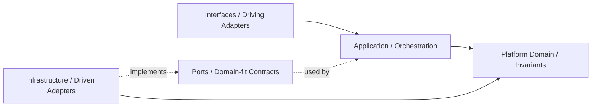

## Correct Interaction Flow

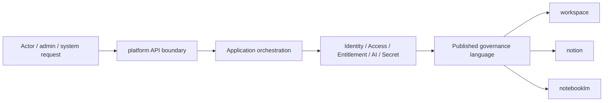

## Document Network

- [README.md](./README.md)
- [bounded-contexts.md](./bounded-contexts.md)
- [context-map.md](./context-map.md)
- [subdomains.md](./subdomains.md)
- [ubiquitous-language.md](./ubiquitous-language.md)
- [architecture-overview.md](../system/architecture-overview.md)
- [integration-guidelines.md](../system/integration-guidelines.md)
````

## File: src/modules/platform/adapters/inbound/react/platform-ui-stubs.tsx
````typescript
/**
 * platform-ui-stubs — platform inbound adapter (React).
 *
 * Remaining stubs for platform UI elements not yet implemented as real
 * components.  Items that have been promoted to real implementations are
 * re-exported from their canonical files below.
 *
 * Account / organization route screens are owned here because they belong to
 * the platform bounded context (account lifecycle, org management) rather than
 * to the workspace bounded context.
 */
⋮----
import { useState } from "react";
import {
  Activity,
  Bell,
  BellOff,
  BriefcaseBusiness,
  CalendarDays,
  CalendarRange,
  CheckCircle2,
  ChevronRight,
  Circle,
  Clock,
  Filter,
  FolderOpen,
  LayoutDashboard,
  Lock,
  Play,
  Plus,
  Settings2,
  Shield,
  Users,
  UserPlus,
  Zap,
} from "lucide-react";
import { Badge } from "@ui-shadcn/ui/badge";
import { Button } from "@ui-shadcn/ui/button";
⋮----
// ── Shell theme toggle + language switcher ────────────────────────────────────
// Imported locally so they can be composed in ShellHeaderControls below,
// then re-exported so callers that want direct access can import from here.
⋮----
import { ShellThemeToggle } from "./shell/ShellThemeToggle";
import { ShellLanguageSwitcher } from "./shell/ShellLanguageSwitcher";
⋮----
// ── Real implementations (promoted from stubs) ────────────────────────────────
⋮----
// ── Account route context ─────────────────────────────────────────────────────
⋮----
// ── Shell breadcrumbs ─────────────────────────────────────────────────────────
⋮----
export function ShellAppBreadcrumbs(): null
⋮----
// ── Shell header controls (theme toggle + language switcher) ──────────────────
⋮----
export function ShellHeaderControls(): React.ReactElement
⋮----
// ── Global search ─────────────────────────────────────────────────────────────
⋮----
export function ShellGlobalSearchDialog(
  _props: ShellGlobalSearchDialogProps,
): null
⋮----
export function useShellGlobalSearch():
⋮----
// ── Route screens ─────────────────────────────────────────────────────────────
⋮----
// ── AccountDashboardRouteScreen ───────────────────────────────────────────────
⋮----
export function AccountDashboardRouteScreen(): React.ReactElement
⋮----
{/* Header */}
⋮----
{/* Stats */}
⋮----
{/* Quick links */}
⋮----
{/* Recent activity */}
⋮----
// ── OrganizationOverviewRouteScreen ──────────────────────────────────────────
⋮----
{/* Header */}
⋮----
{/* Stats */}
⋮----
{/* Navigation */}
⋮----
// ── OrganizationMembersRouteScreen ────────────────────────────────────────────
⋮----
{/* Header */}
⋮----
{/* Role filter */}
⋮----
{/* Member list — empty state */}
⋮----
// ── OrganizationTeamsRouteScreen ──────────────────────────────────────────────
⋮----
{/* Header */}
⋮----
{/* Teams list — empty state */}
⋮----
// ── OrganizationPermissionsRouteScreen ────────────────────────────────────────
⋮----
{/* Header */}
⋮----
{/* Role descriptions */}
⋮----
{/* Permissions matrix */}
⋮----
// ── SettingsNotificationsRouteScreen ─────────────────────────────────────────
⋮----
{/* Header */}
⋮----
{/* Channels */}
⋮----
{/* Event types */}
⋮----
// ── Account / organization route screens ──────────────────────────────────────
// These screens belong to the platform bounded context (account lifecycle and
// organization management) and were previously misplaced in workspace-ui-stubs.
⋮----
// ── OrganizationWorkspacesRouteScreen ─────────────────────────────────────────
⋮----
{/* Header */}
⋮----
{/* Stats */}
⋮----
{/* Workspace list — empty state */}
⋮----
// ── OrganizationDailyRouteScreen ──────────────────────────────────────────────
⋮----
{/* Header */}
⋮----
{/* Stats */}
⋮----
].map((stat) => (
          <div
            key={stat.label}
            className="flex flex-col gap-1.5 rounded-xl border border-border/40 bg-card/60 px-3 py-3"
          >
            <div className="flex items-center gap-1.5">
              {stat.icon}
              <span className="text-xs text-muted-foreground">{stat.label}</span>
            </div>
            <p className="text-xl font-semibold">{stat.value}</p>
          </div>
        ))}
      </div>

      {/* Today's tasks — empty state */}
      <div className="rounded-xl border border-border/40 bg-card/30 px-4 py-8 text-center">
        <CalendarDays className="mx-auto mb-3 size-8 text-muted-foreground/40" />
        <p className="text-sm font-medium text-muted-foreground">今日尚無排程任務</p>
        <p className="mt-1 text-xs text-muted-foreground/70">
          工作區任務指派截止日後，將自動匯聚到帳號每日視圖。
        </p>
      </div>
    </div>
  ) as React.ReactElement;
⋮----
{/* Today's tasks — empty state */}
⋮----
// ── OrganizationScheduleRouteScreen ──────────────────────────────────────────
⋮----
{/* Header */}
⋮----
{/* Period filter */}
⋮----
{/* Timeline — empty state */}
⋮----
// ── OrganizationDispatcherRouteScreen ────────────────────────────────────────
⋮----
{/* Header */}
⋮----
{/* Queue summary */}
⋮----
{/* Active queue label */}
⋮----
{/* Queue list — empty state */}
⋮----
{/* Auto-dispatch rules info */}
⋮----
// ── OrganizationAuditRouteScreen ──────────────────────────────────────────────
⋮----
{/* Header */}
⋮----
{/* Event type filter */}
⋮----
{/* Log — empty state */}
````

## File: src/modules/platform/adapters/inbound/react/shell/ShellSidebarNavData.tsx
````typescript
import {
  Building2,
  CalendarDays,
  ClipboardList,
  LayoutDashboard,
  NotebookText,
  Settings2,
  UserRound,
  Users,
} from "lucide-react";
import Link from "next/link";
⋮----
import {
  type ActiveAccount,
  isOrganizationActor,
  isActiveOrganizationAccount,
} from "../AppContext";
import {
  SHELL_ACCOUNT_SECTION_MATCHERS,
  SHELL_ACCOUNT_NAV_ITEMS,
  SHELL_ORGANIZATION_MANAGEMENT_ITEMS,
  SHELL_SECTION_LABELS,
  isExactOrChildPath,
  resolveShellNavSection,
  type ShellNavSection,
} from "../../../../index";
import type { WorkspaceEntity } from "../../../../../workspace/adapters/inbound/react/WorkspaceContext";
⋮----
// ── Types ─────────────────────────────────────────────────────────────────────
⋮----
export interface DashboardSidebarProps {
  readonly pathname: string;
  readonly userId: string | null;
  readonly activeAccount: ActiveAccount | null;
  readonly workspaces: WorkspaceEntity[];
  readonly workspacesHydrated: boolean;
  readonly activeWorkspaceId: string | null;
  readonly collapsed: boolean;
  readonly onToggleCollapsed: () => void;
  readonly onSelectWorkspace: (workspaceId: string | null) => void;
}
⋮----
export type NavSection = ShellNavSection;
⋮----
// ── Static nav constants ──────────────────────────────────────────────────────
⋮----
// ── CSS class helpers ─────────────────────────────────────────────────────────
⋮----
export function sidebarItemClass(active: boolean)
⋮----
// ── Pure section helpers ──────────────────────────────────────────────────────
⋮----
export function resolveNavSection(pathname: string): NavSection
⋮----
export function isActiveRoute(pathname: string, href: string)
⋮----
// ── Simple section nav component ──────────────────────────────────────────────
````

## File: docs/structure/contexts/platform/context-map.md
````markdown
# Platform

本文件在本次任務限制下，僅依 Context7 驗證的 DDD、Context Map、Hexagonal Architecture 參考整理，不主張反映現況實作。

## Context Role

platform 是 account、organization 與 shared operational services 的供應者。它不再同時擁有 identity、billing、AI、analytics 的正典語言，而是與 iam、billing、ai 並列協作。

## Relationships

| Related Domain | Relationship Type | Platform Position | Published Language |
|---|---|---|---|
| iam | Upstream/Downstream | downstream consumer | actor reference、tenant scope、access decision |
| billing | Upstream/Downstream | downstream consumer | entitlement signal、subscription capability signal |
| ai | Upstream/Downstream | downstream consumer | ai capability signal、model policy |
| workspace | Upstream/Downstream | operational supplier | account scope、organization surface、operational service signal |
| notion | Upstream/Downstream | operational supplier as needed | notification、search、audit、observability signal |
| notebooklm | Upstream/Downstream | operational supplier as needed | notification、search、audit、observability signal |

## Mapping Rules

- platform 提供治理結果，但不直接擁有工作區、知識內容或對話內容。
- workspace、notion、notebooklm 可以把平台輸出當作 supplier language，但不能穿透其內部模型。
- platform 擁有 shared AI capability，但 notion 與 notebooklm 仍各自擁有內容與推理語義。
- audit-log 與 analytics 可消費其他主域的事件，但那不等於接管對方的主域責任。
- tenant、entitlement、secret-management、consent 已建立邊界骨架，仍需持續收斂治理契約與 published language。

## Dependency Direction

- platform 是 workspace、notion、notebooklm 的治理 upstream，而不是它們的內容或流程 owner。
- platform 對下游輸出 published language，不輸出內部 aggregate、repository 或 secret 結構。
- 下游若需保護本地語言，ACL 由下游自行實作，不由 platform 代替選擇。

## Anti-Patterns

- 把 platform 與下游主域寫成 Shared Kernel，再同時保留 supplier/downstream 敘事。
- 讓 platform 直接穿透下游主域內部模型，以治理名義接管業務邏輯。
- 把審計或分析事件消費錯寫成平台擁有下游正典責任。

## Copilot Generation Rules

- 生成程式碼時，先維持 platform 作為 workspace、notion、notebooklm 的治理 upstream。
- 奧卡姆剃刀：若 published language 已足夠，就不要對每個下游再額外建立一套專屬治理模型。
- platform 的輸出應穩定、可被消費，但不應暴露其內部 aggregate 或 repository。

## Dependency Direction Flow

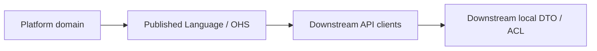

## Correct Interaction Flow

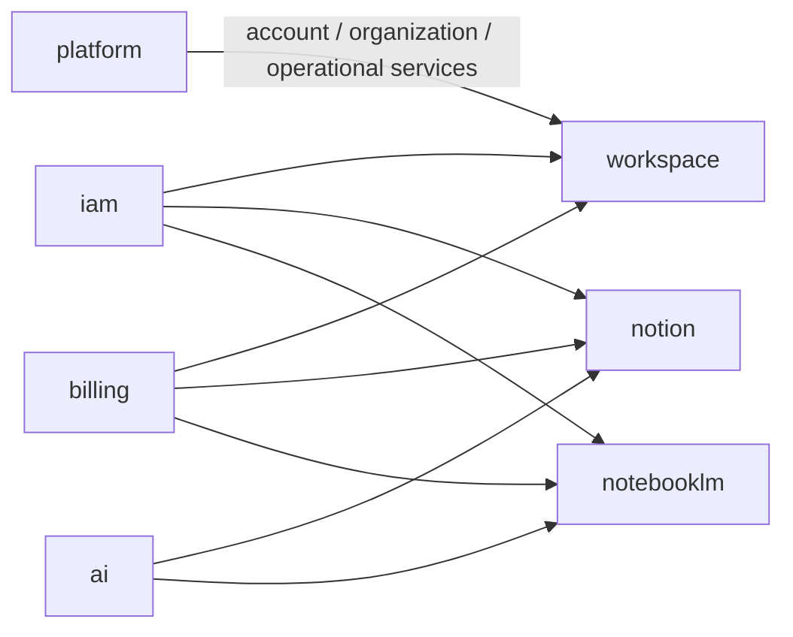

## Document Network

- [README.md](./README.md)
- [AGENTS.md](./AGENTS.md)
- [bounded-contexts.md](./bounded-contexts.md)
- [subdomains.md](./subdomains.md)
- [context-map.md](../system/context-map.md)
- [integration-guidelines.md](../system/integration-guidelines.md)
- [strategic-patterns.md](../system/strategic-patterns.md)
````

## File: docs/structure/contexts/platform/README.md
````markdown
# Platform Context

本 README 在本次任務限制下，僅依 Context7 驗證的 DDD、Context Map、Hexagonal Architecture 參考重建，不主張反映現況實作。

## Purpose

platform 是帳號、組織與 shared operational services 主域。它的責任是提供 account、organization、notification、search、audit、observability 與 operational workflow 等跨切面能力，供其他主域穩定消費。

## Why This Context Exists

- 把治理與營運支撐責任集中，避免滲入其他主域。
- 讓其他主域只消費治理結果，而不是重建治理模型。
- 以清楚的 published language 承接身份、權益、政策與營運能力。

## Context Summary

| Aspect | Summary |
|---|---|
| Primary Role | account、organization 與營運支撐 |
| Upstream Dependency | iam、billing、ai 的 shared signals 與治理結果 |
| Downstream Consumers | workspace 與其他需要 operational services 的主域 |
| Core Principle | platform 提供 account 與營運 surface，不接管治理、商業、內容或推理正典 |

## Baseline Subdomains

- account
- account-profile
- organization
- team
- platform-config
- feature-flag
- onboarding
- compliance
- integration
- workflow
- notification
- background-job
- content
- search
- audit-log
- observability
- support

## Recommended Gap Subdomains

- consent
- secret-management
- operational-catalog

## Strategic Reinforcement Focus

- consent（資料使用授權語義收斂）
- secret-management（敏感憑證治理收斂）
- operational-catalog（平台營運資產語義收斂）


## Key Relationships

- 對 iam、billing、ai：platform 消費它們的治理、商業與 capability signal。
- 對 workspace：提供 account scope、organization surface 與 shared operational services。
- 對 notion 與 notebooklm：按需提供 notification、search、audit、observability 等 operational service。

## Reading Order

1. [subdomains.md](./subdomains.md)
2. [bounded-contexts.md](./bounded-contexts.md)
3. [context-map.md](./context-map.md)
4. [ubiquitous-language.md](./ubiquitous-language.md)
5. [AGENTS.md](./AGENTS.md)

## Dependency Direction

- 本主域內部固定採用 interfaces -> application -> domain <- infrastructure。
- platform 對外只輸出治理結果與 published language，不輸出內部治理模型細節。

## Account Surface Contract

- platform 提供 account scope 的治理語意；shell 的 `accountId` 由這個主域的 account / organization 能力支撐，而不是由 workspace 自行定義。
- account shell surface 採單一 account catch-all：`/{accountId}/[[...slug]]`；這是 account-scoped composition contract，不是 platform domain model 的直接外露。
- `AccountType = "user" | "organization"` 是目前 platform account domain、workspace domain、Zod validators 與 route composition 共用的字串契約；`"user"` 表示 personal account scope，`"organization"` 表示 organization account scope。
- business language 仍使用 personal account / organization account；只有 code-level string contract 才使用 `"user" | "organization"`，避免把 `user` 誤用成平台通用語言名詞。
- organization governance route 在 shell 內應 flatten 到 account scope，例如 `/{accountId}/members`、`/{accountId}/teams`、`/{accountId}/permissions`；`/{accountId}/organization/*` 只應視為 legacy redirect surface。
- platform 擁有 account 與 organization 的治理語意，但不擁有 workspace detail route；workspace detail 仍由 workspace module route screen 承接，只是經過 account-scoped shell composition 進入。

## Anti-Pattern Rules

- 不把 platform 寫成內容主域或對話主域。
- 不把 entitlement、consent、secret-management 混成同一個泛用設定區。
- 不把其他主域對平台的依賴寫成可以直接存取其內部模型。

## Copilot Generation Rules

- 生成程式碼時，先保留 platform 的 operational 定位，再安排 account、organization、notification、search、audit、secret-management 的交互。
- 奧卡姆剃刀：不要預先建立多餘 facade；能直接由既有治理邊界承接就維持單一路徑。
- 優先讓 request -> orchestration -> domain decision -> published language 保持單純可追溯。

## Dependency Direction Flow

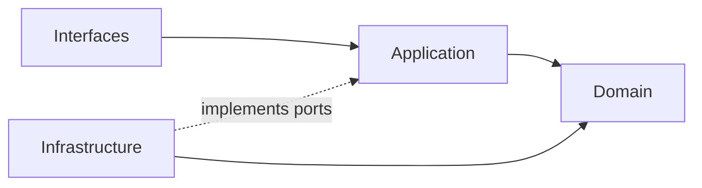

## Correct Interaction Flow

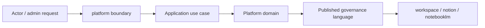

## Document Network

- [AGENTS.md](./AGENTS.md)
- [bounded-contexts.md](./bounded-contexts.md)
- [context-map.md](./context-map.md)
- [subdomains.md](./subdomains.md)
- [ubiquitous-language.md](./ubiquitous-language.md)
- [README.md](../../../README.md)
- [architecture-overview.md](../system/architecture-overview.md)
- [integration-guidelines.md](../system/integration-guidelines.md)

## Constraints

- 本文件是 architecture-first 版本。
- 本文件依 Context7 的 bounded context 與 context map 原則編寫。
- 本文件不代表對既有 repo 內容做過語意校準。
````

## File: src/modules/platform/README.md
````markdown
# Platform Module

> **account / organization 子域已遷入 `src/modules/iam/`**。在 `src/modules/platform/` 中**不得**重建這些子域。

## 子域清單

| 子域 | 狀態 | 說明 |
|---|---|---|
| `background-job` | ✅ 完成 | 背景工作排程（BackgroundJob / JobDocument / JobChunk）|
| `cache` | ✅ 完成 | 鍵值快取、TTL 設定 |
| `file-storage` | ✅ 完成 | 上傳、下載、檔案生命週期 |
| `notification` | ✅ 完成 | 通知發送 |
| `platform-config` | ✅ 完成 | 平台設定 |
| `search` | ✅ 完成 | 跨域搜尋 |

**已遷移（不在 platform）：**

| 子域 | 遷移目標 |
|---|---|
| `account` | `src/modules/iam/subdomains/account/` |
| `organization` | `src/modules/iam/subdomains/organization/` |

---

## 目錄結構

```
src/modules/platform/
  index.ts
  README.md
  AGENTS.md
  orchestration/
    PlatformFacade.ts
  shared/
    domain/index.ts
    events/index.ts             ← Platform Published Language Events
    types/index.ts
  subdomains/
    notification/
      domain/
      application/
      adapters/outbound/
    background-job/
      domain/                   ← BackgroundJob / JobDocument / JobChunk
      application/
      adapters/outbound/
    cache/
    file-storage/
    platform-config/
    search/
```

---

## 依賴方向

Platform 是 T1 operational support，依賴方向固定：

```
iam     → platform
billing → platform (entitlement governance)
platform → workspace
(platform 也被 notion, notebooklm 以 Service API 形式消費)
```

Platform 不可依賴下游模組（workspace、notion、notebooklm、analytics）。

---

## 衝突防護

| 禁止行為 | 原因 |
|---|---|
| 在 `src/modules/platform/` 重建 account / org 子域 | 已遷入 iam |
| 使用 `Ingestion*` 命名 | 已語意化為 BackgroundJob / JobDocument / JobChunk |
| platform 依賴 workspace / notion / notebooklm | 違反上游依賴方向 |

---

## 文件網絡

- [AGENTS.md](AGENTS.md) — Agent / Copilot 使用規則
- [src/modules/README.md](../README.md) — 模組層總覽
- [docs/structure/domain/bounded-contexts.md](../../../docs/structure/domain/bounded-contexts.md) — 主域所有權地圖
````

## File: docs/structure/contexts/platform/bounded-contexts.md
````markdown
# Platform

本文件在本次任務限制下，僅依 Context7 驗證的 DDD、Context Map、Hexagonal Architecture 參考整理，不主張反映現況實作。

## Domain Role

platform 是 account、organization 與 operational-service 主域。依 bounded context 原則，它應把帳號與營運支撐責任封裝成清楚的上下文，而不是再作為 identity、billing、AI、analytics 的 umbrella owner。

## Migrated Bounded Contexts（已遷出）

| Cluster | 遷入位置 |
|---|---|
| Account and Organization (account, account-profile, organization, team) | `iam/subdomains/account/` + `iam/subdomains/organization/` |

## Baseline Bounded Contexts

| Cluster | Subdomains |
|---|---|
| Platform Governance and Configuration | platform-config, feature-flag, onboarding, compliance |
| Delivery and Operations | integration, workflow, notification, background-job, secret-management |
| Intelligence and Audit | content, search, audit-log, observability, support |

## Strategic Reinforcement Focus

| Subdomain | Why It Stays A Focus | Risk If Under-Specified |
|---|---|---|
| tenant | 收斂多租戶隔離與 tenant-scoped 規則 | organization 會被迫承載過多租戶治理語義 |
| entitlement | 收斂有效權益與功能可用性解算 | subscription、feature-flag、policy 難以一致決策 |
| secret-management | 收斂憑證、token、rotation 與 secret audit | integration 容易承載過多敏感治理責任 |
| consent | 收斂同意、偏好、資料使用授權語義 | compliance 會被迫承接過細的授權決策 |

## Domain Invariants

- actor identity 由 iam 正典擁有，platform 只消費 actor reference。
- access decision 必須基於 iam 語言輸出，而不是由下游主域自創。
- entitlement 必須是解算結果，不是任意 UI 標記。
- shared AI capability 由 ai context 正典擁有；下游主域只能消費其 published language。
- billing event 與 subscription state 必須分離。
- secret 不應作為一般 integration payload 傳播。

## Dependency Direction

- platform 子域在存在對應層時必須遵守 interfaces -> application -> domain <- infrastructure；不必為形式完整而預建所有層。
- identity、organization、billing、notification 等外部整合能力必須透過 port/adapter 進入核心。
- domain 不得向外依賴 HTTP、Firebase、secret provider 或 message transport 細節。

## Anti-Patterns

- 把 entitlement 當成 subscription plan 名稱或 UI 開關。
- 把 secret-management 混回 integration，使敏感治理責任失焦。
- 讓 platform 直接持有其他主域的正典內容或推理模型。
- 把 ai context 與 notebooklm 的 retrieval / grounding / synthesis 混成同一個子域所有權。

## Copilot Generation Rules

- 生成程式碼時，先判斷需求落在 identity、organization、entitlement、ai、secret-management 或其他既有治理責任。
- 奧卡姆剃刀：不要為了形式上的完整而新增抽象；只有當既有治理邊界無法承接時才拆新上下文。
- 對外部 provider 的抽象必須貼合 domain 需要，而不是複製供應商 API。

## Dependency Direction Flow

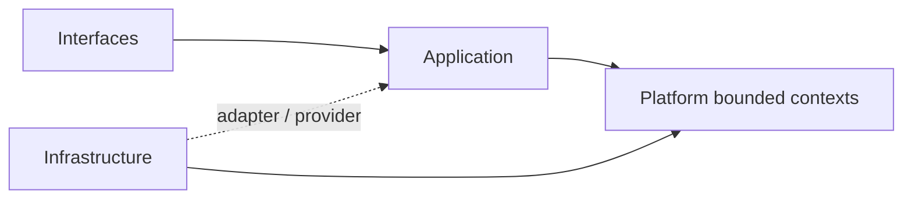

## Correct Interaction Flow

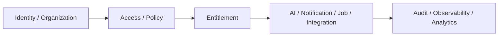

## Document Network

- [README.md](./README.md)
- [AGENTS.md](./AGENTS.md)
- [context-map.md](./context-map.md)
- [subdomains.md](./subdomains.md)
- [bounded-contexts.md](../domain/bounded-contexts.md)
- [subdomains.md](../domain/subdomains.md)
````

## File: docs/structure/contexts/platform/subdomains.md
````markdown
# Platform

本文件在本次任務限制下，僅依 Context7 驗證的 DDD、Context Map、Hexagonal Architecture 參考整理，不主張反映現況實作。

## Migrated Subdomains（已遷出 platform）

| Subdomain | 遷入位置 |
|---|---|
| account | `iam/subdomains/account/` |
| account-profile | `iam/subdomains/account/` |
| organization | `iam/subdomains/organization/` |
| team | `iam/subdomains/organization/` |

## Baseline Subdomains

| Subdomain | Responsibility |
|---|---|
| platform-config | 平台設定輪廓與配置管理 |
| feature-flag | 功能開關策略與發佈節點 |
| onboarding | 新主體初始設定與引導流程 |
| compliance | 資料保留、日誌與法規執行 |
| integration | 外部系統整合邊界與契約 |
| workflow | 平台級流程編排與狀態驅動執行 |
| notification | 通知路由、偏好與投遞 |
| background-job | 背景任務提交、排程與監控 |
| content | 平台級內容資產管理與發布 |
| search | 跨域搜尋路由與查詢協調 |
| audit-log | 永久日誌軌跡與不可否認證據 |
| observability | 健康量測、追蹤與告警 |
| support | 客服工單、支援知識與處理流程 |

## Strategic Reinforcement Focus

| Focus | Why It Remains Important |
|---|---|
| tenant | 持續收斂租戶隔離語義與 organization 分工邊界 |
| entitlement | 持續收斂 subscription、feature-flag、policy 的統一解算語言 |
| secret-management | 持續收斂與 integration 的責任切割，避免敏感治理擴散 |
| consent | 持續收斂 consent 與 compliance 的責任邊界 |

## Recommended Order

1. tenant
2. entitlement
3. secret-management
4. consent

## Anti-Patterns

- 不把 tenant 與 organization 視為同義詞。
- 不把 entitlement 混成 feature-flag 的別名。
- 不把 secret-management 混成 integration 的一個欄位集合。
- 不把 consent 混成一般 UI preference。
- 不把 platform 的 ai 混成 notebooklm synthesis 或 notion 內容輔助的本地所有權。

## Copilot Generation Rules

- 生成程式碼時，先確認需求屬於哪個治理責任，再決定 use case 與 boundary。
- shared AI provider、模型政策、成本與安全護欄一律先歸 ai context 評估。
- 奧卡姆剃刀：能在既有子域用一個清楚 use case 解決，就不要新建語意重疊的治理子域。
- 子域命名必須反映治理責任，不應退化成頁面或介面名稱。

## Dependency Direction Flow

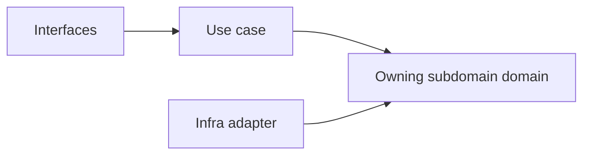

## Correct Interaction Flow

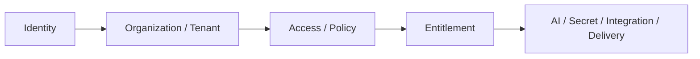

## Document Network

- [README.md](./README.md)
- [bounded-contexts.md](./bounded-contexts.md)
- [context-map.md](./context-map.md)
- [ubiquitous-language.md](./ubiquitous-language.md)
- [subdomains.md](../domain/subdomains.md)
- [bounded-contexts.md](../domain/bounded-contexts.md)
````

## File: src/modules/platform/adapters/inbound/react/shell/ShellSidebarBody.tsx
````typescript
/**
 * ShellSidebarBody — app/(shell)/_shell composition layer.
 * Moved from modules/platform because it imports from workspace and notion modules.
 */
⋮----
import Link from "next/link";
⋮----
import {
  WorkspaceSectionContent,
  type NavPreferences,
  type SidebarLocaleBundle,
} from "../../../../../workspace/adapters/inbound/react/workspace-ui-stubs";
import { SHELL_CONTEXT_SECTION_CONFIG, buildShellContextualHref } from "../../../../index";
⋮----
import {
  type NavSection,
  sidebarItemClass,
  sidebarSectionTitleClass,
} from "./ShellSidebarNavData";
import { ShellContextNavSection } from "./ShellContextNavSection";
⋮----
interface NavItem {
  id: string;
  label: string;
  href: string;
}
⋮----
interface WorkspaceLink {
  id: string;
  name: string;
  href: string;
}
⋮----
interface ShellSidebarBodyProps {
  section: NavSection;
  isActiveRoute: (href: string) => boolean;
  activeAccountId: string | null;
  showAccountManagement: boolean;
  visibleAccountItems: readonly NavItem[];
  visibleOrganizationManagementItems: readonly NavItem[];
  workspacePathId: string | null;
  navPrefs: NavPreferences;
  localeBundle: SidebarLocaleBundle | null;
  showRecentWorkspaces: boolean;
  visibleRecentWorkspaceLinks: WorkspaceLink[];
  hasOverflow: boolean;
  isExpanded: boolean;
  activeWorkspaceId: string | null;
  onSelectWorkspace: (workspaceId: string | null) => void;
  onToggleExpanded: () => void;
  currentSearchWorkspaceId: string;
}
⋮----
className=
⋮----
// Show the context section only when a workspace is actually in scope.
````

## File: src/modules/platform/subdomains/platform-config/application/services/shell-navigation-catalog.ts
````typescript
// ── Types ──────────────────────────────────────────────────────────────────────
⋮----
export type ShellNavSection =
  | "workspace"
  | "dashboard"
  | "account"
  | "schedule"
  | "daily"
  | "audit"
  | "members"
  | "teams"
  | "permissions"
  | "organization"
  | "other";
⋮----
export interface ShellNavItem {
  readonly id: string;
  readonly label: string;
  readonly href: string;
}
⋮----
export interface ShellRailCatalogItem {
  readonly id: string;
  readonly href: string;
  readonly label: string;
  /** If true, this item is only visible to organization accounts. */
  readonly requiresOrganization: boolean;
  /** Route prefix for active-state matching. When absent, defaults to href. */
  readonly activeRoutePrefix?: string;
}
⋮----
/** If true, this item is only visible to organization accounts. */
⋮----
/** Route prefix for active-state matching. When absent, defaults to href. */
⋮----
export interface ShellContextSectionConfig {
  readonly title: string;
  readonly items: readonly { href: string; label: string }[];
}
⋮----
export interface ShellRouteContext {
  readonly accountId?: string | null;
  readonly workspaceId?: string | null;
}
⋮----
function parseHref(href: string):
⋮----
function joinHref(path: string, query: string): string
⋮----
function isAccountScopedWorkspacePath(pathname: string): boolean
⋮----
export function normalizeShellRoutePath(pathname: string): string
⋮----
export function buildShellContextualHref(
  href: string,
  context: ShellRouteContext,
): string
⋮----
// ── Route-matching utility ────────────────────────────────────────────────────
⋮----
export function isExactOrChildPath(targetPath: string, pathname: string): boolean
⋮----
// ── Account section matchers ──────────────────────────────────────────────────
⋮----
// ── Route titles & breadcrumb labels ──────────────────────────────────────────
⋮----
// Workspace tabs (query-param based, resolved via workspace:${tab} key in resolveShellPageTitle)
// workspace group
⋮----
// notion group
⋮----
// notebooklm group
⋮----
// ── Organization management items ─────────────────────────────────────────────
⋮----
// ── Account nav items ─────────────────────────────────────────────────────────
⋮----
// ── Section labels ────────────────────────────────────────────────────────────
⋮----
// ── Rail catalog ──────────────────────────────────────────────────────────────
⋮----
export function listShellRailCatalogItems(isOrganization: boolean): readonly ShellRailCatalogItem[]
⋮----
// ── Context section config ────────────────────────────────────────────────────
⋮----
// ── Mobile & organization nav items ───────────────────────────────────────────
⋮----
// ── Section resolvers ─────────────────────────────────────────────────────────
⋮----
export function resolveShellNavSection(pathname: string): ShellNavSection
⋮----
export function resolveShellPageTitle(pathname: string, tab?: string | null): string
⋮----
export function resolveShellBreadcrumbLabel(segment: string): string
````

## File: docs/structure/contexts/platform/ubiquitous-language.md
````markdown
# Platform

本文件在本次任務限制下，僅依 Context7 驗證的 DDD、Context Map、Hexagonal Architecture 參考整理，不主張反映現況實作。

## Consumed from iam（consumed, not owned）

| Term | Source |
|---|---|
| Account | iam — 帳號聚合根，platform 消費其 published language |
| Organization | iam — 組織聚合根，platform 消費其 published language |

## Canonical Terms

| Term | Meaning |
|---|---|
| PlatformConfig | 平台設定輪廓與配置管理 |
| FeatureFlag | 功能暴露與 rollout 的治理開關 |
| Consent | 同意、偏好與資料使用授權紀錄 |
| Secret | 受控憑證、token 或 integration credential |
| NotificationRoute | 訊息投遞路由與偏好結果 |
| AuditLog | 平台級永久日誌證據 |
| AccountScope | shell 上由 `accountId` 表示的帳號範疇，對應 `AccountType = "user" | "organization"` 所決定的 account context |
| PersonalAccount | 對應 `AccountType = "user"` 的 account scope |
| OrganizationAccount | 對應 `AccountType = "organization"` 的 account scope |

## Shell Surface Terms

| Term | Meaning |
|---|---|
| Account Catch-All Surface | `/{accountId}/[[...slug]]`，account-scoped shell composition contract |
| Flattened Governance Route | `/{accountId}/members`、`/{accountId}/teams`、`/{accountId}/permissions` 等 account-scoped governance URL |
| Legacy Organization Redirect Surface | `/{accountId}/organization/*` |

## Identifier Terms

| Identifier | Meaning |
|---|---|
| accountId | shell composition 的 account scope id；platform 以它選擇 personal account 或 organization account context |
| organizationId | organization aggregate、team、taxonomy、relations、ingestion 等 organization-scoped contract 所使用的 id |
| userId | 具體登入使用者或操作使用者的 id；用於 profile、createdByUserId、verifiedByUserId 等欄位 |
| actorId | 日誌、事件或 command metadata 中的行為主體 id；可能等於 userId，也可能是 system actor |
| tenantId | tenant isolation id；用於 tenant-scoped policy、storage、rules 與 observability isolation |

## Language Rules

- platform 以 NotificationRoute、AuditLog、AccountScope 等營運與 shell composition 語言為主。Account 與 Organization 聚合根己遷入 iam；platform 只消費其 published language。
- Actor、Identity、Tenant、AccessDecision 屬於 iam 的 canonical language；platform 只消費其結果。
- Entitlement、BillingEvent、Subscription 屬於 billing 的 canonical language；platform 不再主張其所有權。
- 使用 Consent 表示授權與同意，不用 Preference 混稱法律或治理語意。
- 使用 Secret 表示受控憑證，不放入一般 Integration payload 語言。
- 使用 OrganizationTeam 表示 Organization 邊界內的分組（縮寫為 Team 可接受）。
- Organization member 的移除操作使用 `removeMember`（通用）。`dismissPartnerMember` 僅限 external partner 場景，對應 DismissPartnerMember 使用案例。
- shell route 上的 `accountId` 表示 AccountScope，不等於 workspaceId。
- shell route 使用 `accountId`，不使用 `organizationId` 當 route param；organization-scoped model 需要時，再由 use case / mapper 顯式轉譯。
- `userId` 只表示具體使用者；`actorId` 表示行為主體，日誌與事件 metadata 可用 `actorId = "system"` 等非使用者值。
- `tenantId` 用於租戶隔離與 storage/rules path，不應與 `accountId` 或 `organizationId` 混成同一層 contract。
- `AccountType` 的 code-level literal 只使用 `"user" | "organization"`；顯示文字可寫個人帳號 / 組織帳號，但不把 `"personal"` 當成跨邊界字串值。
- account-scoped governance URL 採 flattened route，不再把 `/{accountId}/organization/*` 當成 canonical surface。

## Avoid

| Avoid | Use Instead |
|---|---|
| User | Actor |
| `AccountType = "personal"` | `AccountType = "user"` |
| `organizationId`（as shell route param） | `accountId` |
| `userId`（as audit / system actor id） | `actorId` |
| Team（as top-level Tenant） | Organization 或 Tenant |
| Team（as internal grouping） | OrganizationTeam（可縮寫 Team） |
| Plan Access | Entitlement |
| API Key Store | SecretManagement |
| `/{accountId}/organization/members` | `/{accountId}/members` |
| `/{accountId}/organization/teams` | `/{accountId}/teams` |
| `/{accountId}/organization/permissions` | `/{accountId}/permissions` |

## Naming Anti-Patterns

- 不用 User 混稱 Actor。
- 不用 Team 混稱 Organization 或 Tenant（分組含義的 Team = OrganizationTeam 可接受）。
- 不用 Plan 混稱 Entitlement。
- 不用 Preference 混稱 Consent。
- 不把 legacy organization route surface 當成 canonical account governance surface。

## AccountType String Values

`AccountType = "user" | "organization"` 是目前代碼、驗證與跨邊界 DTO 共用的字串契約：
- `"user"` → 代表個人 Actor 帳號（personal account），概念對應 Actor
- `"organization"` → 代表組織帳號，概念對應 Organization

命名上仍使用 Actor / Organization，不用 User 作為通用語言名詞。

## Copilot Generation Rules

- 生成程式碼時，名稱先對齊 Actor、Tenant、Entitlement、Consent、Secret，再決定類型與檔名。
- 奧卡姆剃刀：若一個治理名詞已足夠表達責任，就不要再堆疊第二個近義抽象名稱。
- 命名先保護治理語言，再考慮 UI 或 API 顯示便利。
- OrganizationTeam 相關程式碼放在 `src/modules/platform/subdomains/organization/`，以 Team 縮寫命名可接受（已整併入 organization 子域）。

## Dependency Direction Flow

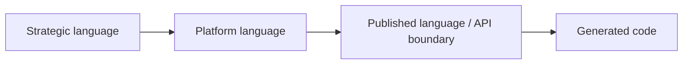

## Correct Interaction Flow

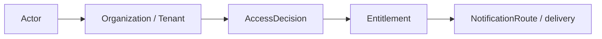

## Domain Layer Flow (enforced per subdomain)

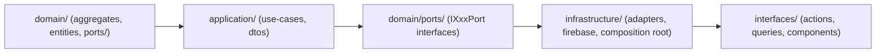

## Document Network

- [README.md](./README.md)
- [AGENTS.md](./AGENTS.md)
- [subdomains.md](./subdomains.md)
- [bounded-contexts.md](./bounded-contexts.md)
- [ubiquitous-language.md](../domain/ubiquitous-language.md)
````