# Files

## File: docs/structure/contexts/workspace/AGENTS.md
````markdown
# Workspace Agent

本文件在本次任務限制下，僅依 Context7 驗證的 DDD、Context Map、Hexagonal Architecture 參考整理，不主張反映現況實作。

## Mission

保護 workspace 主域作為協作容器、工作區範疇與 workspaceId 錨點。任何變更都應維持 workspace 擁有工作區生命週期、成員關係、共享、存在感、活動投影、日誌、排程與工作流，而不是吸收平台治理或知識內容正典。

## Canonical Ownership

- audit
- feed
- scheduling
- approve
- issue
- orchestration
- quality
- settlement
- task
- task-formation
- lifecycle
- membership
- sharing
- presence

## Route Here When

- 問題的中心是 workspaceId、工作區建立封存、工作區內角色與參與關係。
- 問題的中心是工作區共享、存在感、活動流、排程與工作流執行。
- 問題需要提供其他主域運作所需的 workspace scope。

## Route Elsewhere When

- 身份、授權與 tenant 治理屬於 iam；商業權益屬於 billing；通知與營運服務屬於 platform。
- 知識頁面、文章、資料庫、分類、內容發布屬於 notion。
- notebook、conversation、source、retrieval、synthesis 屬於 notebooklm。

## Guardrails

- workspace 的 Member 或 Membership 不等於 iam 的 Actor 或 Identity。
- feed 是投影，不是工作區正典狀態來源。
- audit 是不可否認追蹤，不等於使用者導向動態流。
- sharing 定義暴露範圍，但不取代 billing entitlement 與 iam access-control。
- 跨主域互動只經過 published language、API 邊界或事件。

## Dependency Direction

- workspace 內部依賴方向固定為 interfaces -> application -> domain <- infrastructure。
- membership、sharing、presence、workspace-workflow 所需外部能力只能透過 ports 進入核心。
- infrastructure 只處理事件、儲存、同步與投影，不反向定義 Workspace 或 Membership 語言。

## Hard Prohibitions

- 不得把 iam 的 Actor 或 Identity 直接當成 workspace 的 Membership 模型。
- 不得讓 feed 取代正典狀態來源，或讓 audit 退化成一般 UI 活動流。
- 不得讓 workspace 直接接管 notion 內容生命週期或 notebooklm 推理流程。

## Copilot Generation Rules

- 生成程式碼時，先保留 workspace 作為協作 scope 主域，而不是治理或內容 owner。
- 奧卡姆剃刀：若既有 lifecycle、membership、sharing、presence 或 workspace-workflow 邊界已足夠，就不要額外新增平行協作抽象。
- 只有在外部依賴、跨主域語義污染或 scope 轉譯明確存在時，才建立 port、ACL 或 local DTO。
- 對 notion 與 notebooklm 的輸出應停在 workspace scope / membership scope / share scope。

## Dependency Direction Flow

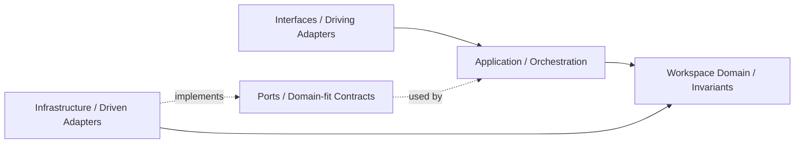

## Correct Interaction Flow

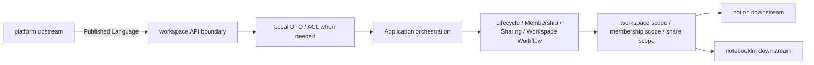

## Document Network

- [README.md](./README.md)
- [bounded-contexts.md](./bounded-contexts.md)
- [context-map.md](./context-map.md)
- [subdomains.md](./subdomains.md)
- [ubiquitous-language.md](./ubiquitous-language.md)
- [architecture-overview.md](../system/architecture-overview.md)
- [integration-guidelines.md](../system/integration-guidelines.md)
````

## File: docs/structure/contexts/workspace/bounded-contexts.md
````markdown
# Workspace

本文件在本次任務限制下，僅依 Context7 驗證的 DDD、Context Map、Hexagonal Architecture 參考整理，不主張反映現況實作。

## Domain Role

workspace 是協作與範疇主域。依 bounded context 原則，它應封裝高度凝聚的工作區規則，並以最小公開介面提供其他主域使用的 workspace scope。

## Baseline Bounded Contexts

| Subdomain | Owns | Excludes |
|---|---|---|
| audit | 工作區操作證據、可追溯紀錄 | 平台永久合規審計 |
| feed | 面向使用者的工作區活動投影 | 正典狀態與不可變證據 |
| scheduling | 工作區時間安排、提醒、期限 | 平台背景工作引擎 |
| approve | 任務驗收與問題單覆核審批判定 | 平台身份授權決策 |
| issue | 問題單建立、追蹤、狀態轉換 | 知識內容正典生命週期 |
| orchestration | 知識頁面→任務物化批次流程編排 | domain 事實的直接寫入 |
| quality | 任務 QA 審查與質檢流程 | 業務驗收規則本身 |
| settlement | 請款發票生命週期與財務對帳 | billing 計費狀態 |
| task | 任務建立、指派、狀態機 | 知識內容與 notebook 推理 |
| task-formation | AI 輔助任務候選抽取與批次匯入 | AI 模型能力（屬 ai context） |

## Recommended Gap Bounded Contexts

| Subdomain | Why It Should Exist | Gap If Missing |
|---|---|---|
| lifecycle | 承接 workspace 建立、封存、還原、移轉與狀態變化 | 主容器生命週期容易散落到 orchestration 或 app 組裝層 |
| membership | 承接 workspace 內邀請、席位、角色與參與關係 | 會把 organization 與 workspace participation 混為一談 |
| sharing | 承接分享連結、外部可見性與公開暴露範圍 | 對外共享無獨立邊界，安全與責任不清 |
| presence | 承接即時在線狀態、協作存在感與共同編輯訊號 | 即時協作能力無法形成可演化的本地模型 |

## Domain Invariants

- workspaceId 是工作區範疇錨點。
- 工作區成員關係屬於 membership，而不是平台身份本身。
- activity feed 只投影事實，不創造事實。
- audit trail 一旦寫入即不可隨意覆蓋。
- task/issue/settlement/approve/quality/orchestration 是獨立子域，不得合併為單一 workspace-workflow 概念。

## Dependency Direction

- workspace 子域在存在對應層時必須遵守 interfaces -> application -> domain <- infrastructure；不必為形式完整而預建所有層。
- lifecycle、membership、sharing、presence 等能力若需要外部服務，必須經過 port/adapter。
- domain 不得依賴 UI 狀態、HTTP 傳輸、排程框架或儲存實作細節。

## Anti-Patterns

- 把 Membership 混成 Actor 身份本身。
- 讓 ActivityFeed 直接創造工作區事實，而不是投影工作區事實。
- 用 `workspace-workflow` 代指已分解的 task、issue、settlement、approve、quality、orchestration 等子域。
- 混用 `platform.workflow` 與 workspace 內的任務流程語言。

## Copilot Generation Rules

- 生成程式碼時，先判斷需求落在 task、issue、approve、quality、settlement、orchestration、audit、feed、scheduling 哪個責任。
- workspace 工作區流程語言已分解為多個獨立子域，不再使用 `workspace-workflow` 混指所有流程。
- 奧卡姆剃刀：若既有 workspace 邊界可以吸收需求，就不要額外新建平行容器或 scope 抽象。
- 對外部能力的抽象必須貼合 workspace scope 的需求，而不是複製供應商 API。

## Dependency Direction Flow

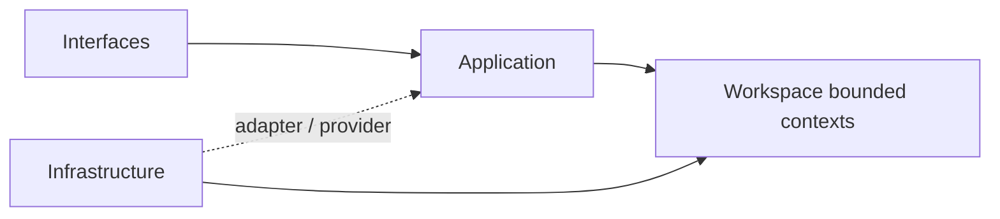

## Correct Interaction Flow

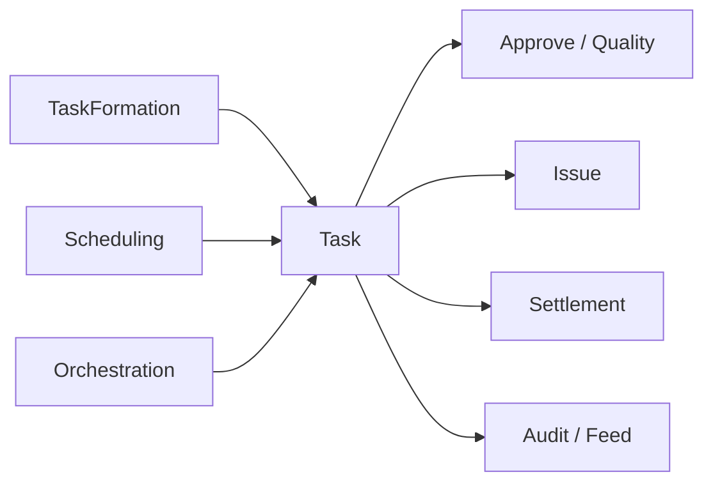

## Document Network

- [README.md](./README.md)
- [AGENTS.md](./AGENTS.md)
- [context-map.md](./context-map.md)
- [subdomains.md](./subdomains.md)
- [bounded-contexts.md](../domain/bounded-contexts.md)
- [subdomains.md](../domain/subdomains.md)
````

## File: docs/structure/contexts/workspace/context-map.md
````markdown
# Workspace

本文件在本次任務限制下，僅依 Context7 驗證的 DDD、Context Map、Hexagonal Architecture 參考整理，不主張反映現況實作。

## Context Role

workspace 對其他主域提供工作區範疇。依 Context Mapper 的 context map 思維，workspace 應只暴露 scope、membership scope 與協作容器語言，而不暴露內部實作。

## Relationships

| Related Domain | Relationship Type | Workspace Position | Published Language |
|---|---|---|---|
| iam | Upstream/Downstream | downstream | actor reference、tenant scope、access decision |
| billing | Upstream/Downstream | downstream | entitlement signal、subscription capability signal |
| platform | Upstream/Downstream | downstream | account scope、organization surface、operational service signal |
| notion | Upstream/Downstream | upstream | workspaceId、membership scope、share scope |
| notebooklm | Upstream/Downstream | upstream | workspaceId、membership scope、share scope |

## Mapping Rules

- workspace 消費 iam、billing、platform 的 signals 與治理結果，但不重建 identity、policy 或 entitlement 模型。
- notion 與 notebooklm 可以在 workspace scope 內運作，但不反向定義 workspace 生命週期。
- sharing 與 membership 是 workspace 對內容與對話主域輸出的核心 published language。
- 與其他主域的整合優先使用 API 邊界或事件，而不是直接模型滲透。

## Dependency Direction

- workspace 對 iam、billing、platform 屬 downstream；對 notion 與 notebooklm 屬 upstream 的 scope supplier。
- workspace 對外輸出 workspaceId、membership scope、share scope，而不是內部 aggregate 或投影實作。
- downstream 若需保護自己的語言，ACL 由 downstream 自行實作，不由 workspace 代做。

## Anti-Patterns

- 把 workspace 與 notion/notebooklm 寫成對稱共用核心，同時又要求 ACL。
- 把 sharing scope 直接當成平台 access decision 本身。
- 讓其他主域直接操作 workspace 內部 membership 或 lifecycle 模型。

## Copilot Generation Rules

- 生成程式碼時，先維持 workspace 對 platform 的 downstream 位置，以及對 notion / notebooklm 的 upstream scope supplier 位置。
- 奧卡姆剃刀：若 published language 加一層 local DTO 已足夠，就不要再建立第二個翻譯鏈。
- workspace 對外提供的是 scope，不是內部 aggregate、投影或 storage 模型。

## Dependency Direction Flow

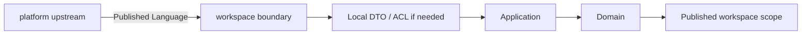

## Correct Interaction Flow

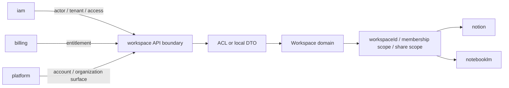

## Document Network

- [README.md](./README.md)
- [AGENTS.md](./AGENTS.md)
- [bounded-contexts.md](./bounded-contexts.md)
- [subdomains.md](./subdomains.md)
- [context-map.md](../system/context-map.md)
- [integration-guidelines.md](../system/integration-guidelines.md)
- [strategic-patterns.md](../system/strategic-patterns.md)
````

## File: docs/structure/contexts/workspace/README.md
````markdown
# Workspace Context

本 README 在本次任務限制下，僅依 Context7 驗證的 DDD、Context Map、Hexagonal Architecture 參考重建，不主張反映現況實作。

## Purpose

workspace 是協作容器與工作區範疇主域。它的責任是提供 workspaceId、工作區生命週期、參與關係、共享、存在感、活動投影、日誌、排程與工作流，讓其他主域可以在同一個協作範疇中運作。

## Why This Context Exists

- 把工作區容器語意與平台治理語意分離。
- 把工作區 scope 作為其他主域可依賴的 published language。
- 把活動流、日誌、排程與流程協調收斂為同一主域內的高凝聚能力。

## Context Summary

| Aspect | Summary |
|---|---|
| Primary Role | 協作容器與 workspace scope |
| Upstream Dependency | iam 的 actor、tenant、access decision；billing 的 entitlement；platform 的 account 與 organization surface |
| Downstream Consumers | notion、notebooklm |
| Core Principle | workspace 暴露 scope，不接管治理、商業或內容正典 |

## Baseline Subdomains

- audit
- feed
- scheduling
- approve
- issue
- orchestration
- quality
- settlement
- task
- task-formation

## Recommended Gap Subdomains

- lifecycle
- membership
- sharing
- presence

## Key Relationships

- 與 iam：workspace 消費 actor、tenant 與 access decision。
- 與 billing：workspace 消費 entitlement 與 subscription capability signal。
- 與 platform：workspace 消費 account scope 與 organization surface。
- 與 notion：workspace 向 notion 提供 workspaceId、membership scope、share scope。
- 與 notebooklm：workspace 向 notebooklm 提供 workspaceId、membership scope、share scope。

## Reading Order

1. [subdomains.md](./subdomains.md)
2. [bounded-contexts.md](./bounded-contexts.md)
3. [context-map.md](./context-map.md)
4. [ubiquitous-language.md](./ubiquitous-language.md)
5. [AGENTS.md](./AGENTS.md)

## Dependency Direction

- 本主域內部固定採用 interfaces -> application -> domain <- infrastructure。
- workspace 對外只暴露 scope、published language、API boundary、events，不暴露內部實作。

## Route Surface Contract

- workspace 不擁有獨立的 top-level shell route；它被組裝在 account-scoped shell surface 之下。
- workspace 消費來自 platform account scope 的 `AccountType = "user" | "organization"` 字串契約；其中 `"user"` 代表 personal account context，`"organization"` 代表 organization context。
- workspace detail 的 canonical route 是 `/{accountId}/{workspaceId}`，表示「先選 account，再進入該 account 底下的 workspace」。
- workspace tabs 與 overview panels 應維持在同一條 detail route 上，以 query state 表示，例如 `?tab=Overview&panel=knowledge-pages`。
- `/{accountId}/workspace/{workspaceId}` 只保留為相容 redirect，不是新的文件或 UI 應輸出的 canonical href。
- UI 可以顯示個人帳號 / 組織帳號，但 workspace aggregate、use case、event metadata 與 validator 的 accountType string contract 不應漂移成 `"personal" | "organization"`。
- account dashboard、members、teams、permissions、schedule、audit 等 account-level concern 不屬於 workspace route surface。
- workspace route 只負責協作容器與 workspace-scoped consumption，不承接 platform governance canonical navigation。

## Anti-Pattern Rules

- 不把 workspace scope 寫成平台治理結果本身。
- 不把 feed、audit、workspace-workflow 互相取代為單一泛用流程層。
- 不把 notion 或 notebooklm 的內容與推理責任吸回 workspace。

## Copilot Generation Rules

- 生成程式碼時，先保留 workspace 的協作 scope 定位，再安排 lifecycle、membership、sharing、workspace-workflow 的交互。
- 奧卡姆剃刀：不要預先建立第二條平行協作流程；只有既有 scope 邊界不夠時才補新抽象。
- 優先讓 input -> translation -> application -> domain -> published scope 保持單純可追溯。

## Dependency Direction Flow

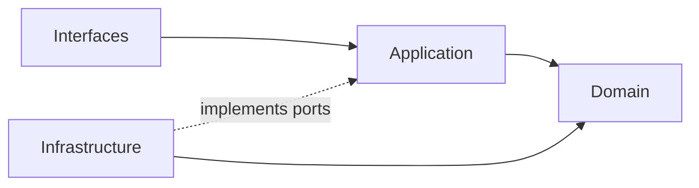

## Correct Interaction Flow

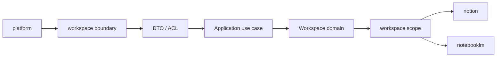

## Document Network

- [AGENTS.md](./AGENTS.md)
- [bounded-contexts.md](./bounded-contexts.md)
- [context-map.md](./context-map.md)
- [subdomains.md](./subdomains.md)
- [ubiquitous-language.md](./ubiquitous-language.md)
- [README.md](../../../README.md)
- [architecture-overview.md](../system/architecture-overview.md)
- [integration-guidelines.md](../system/integration-guidelines.md)

## Constraints

- 本文件是 architecture-first 版本。
- 本文件依 Context7 的 bounded context 與 context map 原則編寫。
- 本文件不代表對既有 repo 內容做過語意校準。
````

## File: docs/structure/contexts/workspace/subdomains.md
````markdown
# Workspace

本文件在本次任務限制下，僅依 Context7 驗證的 DDD、Context Map、Hexagonal Architecture 參考整理，不主張反映現況實作。

## Baseline Subdomains

| Subdomain | Responsibility |
|---|---|
| audit | 工作區操作日誌與證據追蹤 |
| feed | 工作區活動摘要與事件流呈現 |
| scheduling | 工作區排程、時序與提醒協調 |
| approve | 任務驗收與問題單覆核審批流程 |
| issue | 問題單生命週期與追蹤管理 |
| orchestration | 知識頁面→任務物化批次作業編排 |
| quality | 任務 QA 審查與質檢流程 |
| settlement | 請款發票生命週期與財務對帳 |
| task | 任務建立、指派與狀態轉換 |
| task-formation | AI 輔助任務候選抽取與批次匯入 |

## Recommended Gap Subdomains

| Subdomain | Why Needed |
|---|---|
| lifecycle | 把工作區容器生命週期獨立成正典邊界 |
| membership | 把工作區參與關係從平台身份治理中切開 |
| sharing | 把對外共享與可見性規則收斂到單一上下文 |
| presence | 把即時協作存在感與共同編輯訊號形成本地語言 |

## Recommended Order

1. lifecycle
2. membership
3. sharing
4. presence

## Anti-Patterns

- 不把 lifecycle 混進 orchestration，使容器生命週期被流程編排吞沒。
- 不把 membership 混成 organization 或 identity。
- 不把 sharing 混成一般 permission 欄位集合。
- 不把 presence 藏進 UI 狀態而失去獨立語言。
- 不用 `workspace-workflow` 混指已分解的 task、issue、settlement、approve、quality、orchestration 等獨立子域。

## Copilot Generation Rules

- 生成程式碼時，先確認需求屬於哪個 workspace 責任（task/issue/settlement/approve/quality/orchestration/audit/feed/scheduling），再決定 use case 與 boundary。
- 工作區流程責任已分解為多個專門子域，避免與 `platform.workflow` 混名。
- 奧卡姆剃刀：能在既有子域用一個清楚 use case 解決，就不要新建語意重疊的 scope 子域。
- 子域命名必須反映工作區語義，不應退化成頁面或元件名稱。

## Dependency Direction Flow

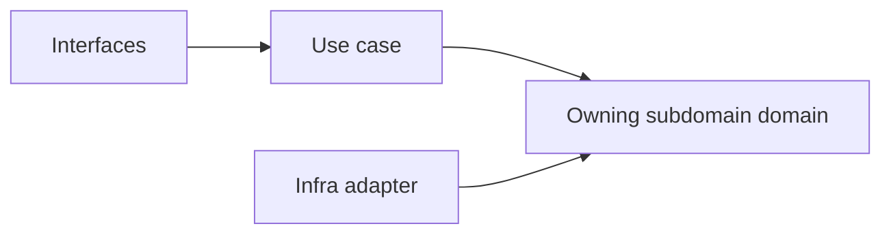

## Correct Interaction Flow


## Document Network

- [README.md](./README.md)
- [bounded-contexts.md](./bounded-contexts.md)
- [context-map.md](./context-map.md)
- [ubiquitous-language.md](./ubiquitous-language.md)
- [subdomains.md](../domain/subdomains.md)
- [bounded-contexts.md](../domain/bounded-contexts.md)
````

## File: docs/structure/contexts/workspace/ubiquitous-language.md
````markdown
# Workspace

本文件在本次任務限制下，僅依 Context7 驗證的 DDD、Context Map、Hexagonal Architecture 參考整理，不主張反映現況實作。

## Canonical Terms

| Term | Meaning |
|---|---|
| Workspace | 協作容器與主要範疇邊界 |
| WorkspaceId | 工作區唯一識別子與範疇錨點 |
| WorkspaceLifecycle | 工作區建立、封存、還原、移轉等生命週期狀態 |
| Membership | 工作區內的參與關係 |
| WorkspaceRole | 工作區範疇下的角色語意 |
| ShareScope | 共享暴露範圍 |
| ShareLink | 對外共享的可解析入口 |
| PresenceSession | 即時在線與共同編輯存在感訊號 |
| ActivityFeed | 面向使用者的活動流投影 |
| AuditTrail | 不可否認的工作區操作追蹤 |
| Schedule | 工作區內的時間安排與提醒意圖 |
| WorkflowExecution | 某個工作區流程的一次執行實例 |
| WorkspaceTab | 同一條 workspace detail route 上的 query-state 分頁語意 |
| OverviewPanel | `Overview` tab 內的 panel 細分語意 |

## Shell Route Terms

| Term | Meaning |
|---|---|
| AccountScope | workspace route 所依附的 account scope；由 shell 上的 `accountId` 表示 |
| AccountTypeStringContract | workspace aggregate / use case / validator 所消費的 code-level enum `"user" | "organization"`；`"user"` 對應 personal account context |
| CreatorUserId | 建立 workspace 或發起 workspace-scoped command 的具體 user identifier |
| CurrentUserId | 目前正在操作 workspace UI / workflow 的具體 user identifier |
| CanonicalWorkspaceRoute | `/{accountId}/{workspaceId}` |
| LegacyWorkspaceRedirectSurface | `/{accountId}/workspace/{workspaceId}` |

## Language Rules

- 使用 Workspace，不使用 Project 或 Space 作為同義詞。
- 使用 Membership，不用 User 表示工作區參與關係。
- 使用 ActivityFeed 與 AuditTrail 區分投影與證據。
- 使用 ShareScope 表示共享邊界，不用 Permission 泛指共享。
- 使用 PresenceSession 表示即時存在感，不把它隱藏在 UI 概念裡。
- 使用 `workspaceId` 表示 workspace scope，不用 `accountId` 混稱。
- 使用 `AccountType = "user" | "organization"` 作為 workspace 跨邊界字串契約；顯示語言可寫個人帳號 / 組織帳號，但不把 `"personal"` 當成 canonical accountType literal。
- 使用 `creatorUserId` / `currentUserId` 表示具體使用者操作，不把它寫成 `accountId` 或 `workspaceId`。
- organization-scoped event metadata 需要時，可由 `accountType = "organization"` 下的 `accountId` 映射出 `organizationId`；但 workspace route surface 本身仍以 `accountId` + `workspaceId` 為主。
- 使用 `/{accountId}/{workspaceId}` 表示 canonical workspace detail route。
- `/{accountId}/workspace/{workspaceId}` 只視為 legacy redirect surface，不作為新的文件、設計稿或 UI href。

## Avoid

| Avoid | Use Instead |
|---|---|
| User | Membership 或 Actor reference |
| Timeline | ActivityFeed 或 Schedule |
| Share Permission | ShareScope |
| Workspace Log | ActivityFeed 或 AuditTrail |
| `AccountType = "personal"` | `AccountType = "user"`，顯示語言再另寫個人帳號 |
| `organizationId`（as workspace route param） | `accountId` |
| `accountId`（as concrete acting user id） | `creatorUserId` / `currentUserId` |
| Legacy workspace path `/{accountId}/workspace/{workspaceId}` | Canonical workspace path `/{accountId}/{workspaceId}` |

## Naming Anti-Patterns

- 不用 User 混指 Membership 與 Actor reference。
- 不用 Timeline 混指 ActivityFeed 與 Schedule。
- 不用 Permission 混指 ShareScope。
- 不用 Log 混指 ActivityFeed 與 AuditTrail。
- 不把 personal account 顯示語言誤當成 workspace 的 code-level `AccountType` literal。
- 不把 `accountId`、`workspaceId`、`creatorUserId`、`organizationId` 混成同一個 identifier 概念。
- 不把 account-scoped shell route 語意誤當成 workspace 自己的 top-level route ownership。

## Copilot Generation Rules

- 生成程式碼時，名稱先對齊 Workspace、Membership、ShareScope、ActivityFeed、AuditTrail，再決定類型與檔名。
- 奧卡姆剃刀：若一個工作區名詞已足夠表達責任，就不要再堆疊第二個近義抽象名稱。
- 命名先保護 scope 語言，再考慮 UI 或 API 顯示便利。

## Dependency Direction Flow

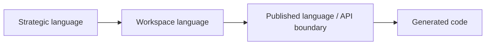

## Correct Interaction Flow

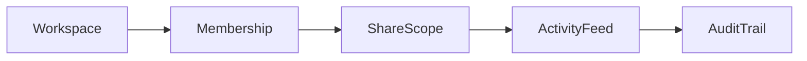

## Domain Layer Flow (enforced per subdomain)

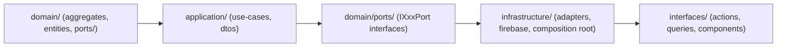

## Document Network

- [README.md](./README.md)
- [AGENTS.md](./AGENTS.md)
- [subdomains.md](./subdomains.md)
- [bounded-contexts.md](./bounded-contexts.md)
- [ubiquitous-language.md](../domain/ubiquitous-language.md)
````

## File: src/modules/workspace/adapters/inbound/react/account-scoped-workspace.ts
````typescript
import type { WorkspaceEntity } from "./WorkspaceContext";
⋮----
interface ResolveAccountScopedWorkspaceIdInput {
  readonly accountId: string | null;
  readonly activeWorkspaceId: string | null;
  readonly workspaces: Record<string, WorkspaceEntity>;
}
⋮----
export function resolveAccountScopedWorkspaceId({
  accountId,
  activeWorkspaceId,
  workspaces,
}: ResolveAccountScopedWorkspaceIdInput): string | null
````

## File: src/modules/workspace/adapters/inbound/react/AccountRouteDispatcher.test.ts
````typescript
import { describe, expect, it } from "vitest";
⋮----
import { resolveAccountScopedWorkspaceId } from "./account-scoped-workspace";
import type { WorkspaceEntity } from "./WorkspaceContext";
⋮----
function buildWorkspace(
  id: string,
  name: string,
  accountId: string,
  accountType: "user" | "organization" = "organization",
): WorkspaceEntity
````

## File: src/modules/workspace/adapters/inbound/react/AccountRouteDispatcher.tsx
````typescript
/**
 * AccountRouteDispatcher — workspace inbound adapter (React).
 *
 * Receives accountId + slug props from the Server Component shim and
 * dispatches to the appropriate route screen.
 *
 * Ported from: app/(shell)/(account)/[accountId]/[[...slug]]/page.tsx
 */
⋮----
import { useEffect } from "react";
import { useRouter, useSearchParams } from "next/navigation";
⋮----
import { useAuth } from "../../../../iam/adapters/inbound/react/AuthContext";
import {
  useAccountRouteContext,
  OrganizationMembersRouteScreen,
  OrganizationOverviewRouteScreen,
  OrganizationPermissionsRouteScreen,
  AccountDashboardRouteScreen,
  OrganizationWorkspacesRouteScreen,
  OrganizationTeamsRouteScreen,
  OrganizationScheduleRouteScreen,
  OrganizationDispatcherRouteScreen,
  OrganizationDailyRouteScreen,
  OrganizationAuditRouteScreen,
  SettingsNotificationsRouteScreen,
} from "../../../../platform/adapters/inbound/react/platform-ui-stubs";
import { useApp } from "../../../../platform/adapters/inbound/react/AppContext";
import {
  WorkspaceDetailRouteScreen,
  WorkspaceHubScreen,
} from "./workspace-ui-stubs";
import { WorkspaceAuditSection } from "./WorkspaceAuditSection";
import { WorkspaceScheduleSection } from "./WorkspaceScheduleSection";
import { useWorkspaceContext } from "./WorkspaceContext";
import { resolveAccountScopedWorkspaceId } from "./account-scoped-workspace";
⋮----
export interface AccountRouteDispatcherProps {
  accountId: string;
  slug: string[];
}
⋮----
interface RedirectingRouteProps {
  readonly href: string;
  readonly message: string;
}
⋮----
function RedirectingRoute(
⋮----
export function AccountRouteDispatcher({
  accountId: accountIdFromParams,
  slug,
}: AccountRouteDispatcherProps)
⋮----
// Legacy redirect: /organization/... → /<accountId>/...
⋮----
// Legacy redirect: /workspace/... → /<accountId>/...
⋮----
// Root: /<accountId>
⋮----
if (accountType === "organization")
⋮----
// Single-segment routes: /<accountId>/<segment>
⋮----
// Two-segment routes
⋮----
// Fallback
````

## File: src/modules/workspace/adapters/inbound/react/index.ts
````typescript
/**
 * workspace inbound React adapter — barrel.
 *
 * Public surface for all workspace React inbound adapters.
 * Consumed by src/app/ route shims and platform/adapters/inbound/react/.
 */
````

## File: src/modules/workspace/adapters/inbound/react/useWorkspaceScope.ts
````typescript
/**
 * useWorkspaceScope — workspace inbound adapter (React).
 *
 * Canonical hook for reading the active workspace scope in the src/ layer.
 * Aliases useWorkspaceContext() from the workspace module.
 *
 * Returns: { state: WorkspaceContextState, dispatch: Dispatch<WorkspaceContextAction> }
 */
````

## File: src/modules/workspace/adapters/inbound/react/workspace-audit-filter.ts
````typescript
import type { AuditEntrySnapshot } from "../../../subdomains/audit/domain/entities/AuditEntry";
⋮----
export type EventTypeFilter = (typeof AUDIT_EVENT_TYPES)[number];
⋮----
export function matchesAuditEventType(entry: AuditEntrySnapshot, eventType: EventTypeFilter): boolean
````

## File: src/modules/workspace/adapters/inbound/react/workspace-nav-model.ts
````typescript
/**
 * workspace-nav-model — pure navigation model for the workspace context.
 *
 * Domain-aware tab/group model, URL utilities, and nav-preferences persistence.
 * No JSX, no React hooks — safe to import in Server Components or shared utils.
 *
 * Tab ID naming convention:
 *   <domainGroup>.<slug>  e.g. "notion.knowledge", "notebooklm.ai-chat"
 * Tab value naming convention (URL ?tab= query param):
 *   PascalCase, must remain stable to preserve bookmarked URLs.
 */
⋮----
// ── Types & interfaces ────────────────────────────────────────────────────────
⋮----
export interface NavPreferences {
  readonly pinnedWorkspace: string[];
  readonly pinnedPersonal: string[];
  readonly showLimitedWorkspaces: boolean;
  readonly maxWorkspaces: number;
}
⋮----
export type SidebarLocaleBundle = Record<string, string>;
⋮----
/**
 * WorkspaceTabValue — canonical URL ?tab= values.
 * These are stable URL identifiers; do not rename without a redirect layer.
 *
 * workspace group (業務運作 — Work Execution)
 *   Backed by: workspace/subdomains/task, issue, approval, settlement, membership
 *
 * notion group (知識與資料結構 — Knowledge & Structure)
 *   Backed by: notion/subdomains/page, block, database, view, template, collaboration
 *   Context7 alignment: Page = hierarchical content container; Database = structured
 *   collection with typed properties; View = filter/sort/layout of a Database
 *   (table/board/calendar/gallery/timeline); Template = reusable page/db scaffold.
 *
 * notebooklm group (AI 理解與推理 — AI Reasoning & Synthesis)
 *   Backed by: notebooklm/subdomains/notebook, document, conversation
 *   Notebook = AI-assisted notebook with documentIds[]; Document = ingested source
 *   (storageUrl, mimeType, classification, processing status); Conversation =
 *   thread-based RAG exchange linked to a notebook.
 */
export type WorkspaceTabValue =
  // workspace
  | "Overview"
  | "Daily"
  | "Schedule"
  | "Audit"
  | "Files"
  | "Members"
  | "WorkspaceSettings"
  | "TaskFormation"
  | "Tasks"
  | "Quality"
  | "Approval"
  | "Settlement"
  | "Issues"
  // notion
  | "Knowledge"
  | "Pages"
  | "Database"
  | "Templates"
  // notebooklm
  | "Notebook"
  | "AiChat"
  | "Sources"
  | "Research";
⋮----
// workspace
⋮----
// notion
⋮----
// notebooklm
⋮----
/**
 * WorkspaceDomainGroup — the owning domain module for a workspace tab.
 *
 * workspace   → 業務運作 (Work Execution)
 * notion      → 知識與資料結構 (Knowledge & Data)
 * notebooklm  → AI 理解與推理 (AI Reasoning)
 */
export type WorkspaceDomainGroup = "workspace" | "notion" | "notebooklm";
⋮----
export interface WorkspaceTabItem {
  /**
   * id — domain-prefixed stable identifier used in localStorage preferences.
   * Format: "<domainGroup>.<slug>", e.g. "notion.knowledge", "workspace.tasks".
   */
  readonly id: string;
  /** value — canonical URL ?tab= query param value. Never rename. */
  readonly value: WorkspaceTabValue;
  readonly label: string;
  readonly domainGroup: WorkspaceDomainGroup;
}
⋮----
/**
   * id — domain-prefixed stable identifier used in localStorage preferences.
   * Format: "<domainGroup>.<slug>", e.g. "notion.knowledge", "workspace.tasks".
   */
⋮----
/** value — canonical URL ?tab= query param value. Never rename. */
⋮----
// ── Tab catalogue ─────────────────────────────────────────────────────────────
⋮----
/**
 * WORKSPACE_TAB_ITEMS — authoritative ordered tab catalogue.
 *
 * id    — domain-prefixed localStorage key (workspace.*|notion.*|notebooklm.*)
 * value — URL ?tab= query param (must never be renamed without a redirect layer)
 */
⋮----
// workspace group — 業務運作
⋮----
// notion group — 知識與資料結構 (Knowledge & Structure)
// Subdomains: page (hierarchical pages) · block (content units) · database
//   (typed collections) · view (table/board/calendar/gallery) · template ·
//   collaboration (comments/presence)
⋮----
// notebooklm group — AI 理解與推理 (AI Reasoning & Synthesis)
// Subdomains: notebook (AI notebooks with documentIds[]) · document (ingested
//   sources; mimeType / classification / processing status) · conversation
//   (thread-based RAG exchanges linked to a notebook)
⋮----
/** Legacy aliases: allow old ?tab= values to resolve to current canonical values. */
⋮----
// notebooklm subdomain aliases
⋮----
// notion subdomain aliases
⋮----
// ── Tab resolution helpers ────────────────────────────────────────────────────
⋮----
export function resolveWorkspaceTabValue(value: string | null | undefined): WorkspaceTabValue | null
⋮----
/**
 * Returns the domain group for a given workspace tab value string.
 * Falls back to "workspace" when the tab is unknown or null (so the
 * workspace-specific sidebar sections remain visible by default).
 */
export function resolveTabDomainGroup(tab: string | null | undefined): WorkspaceDomainGroup
⋮----
// ── Nav preferences ───────────────────────────────────────────────────────────
⋮----
// Bump version suffix whenever default tab IDs change so stale localStorage
// entries are discarded and users see the updated defaults.
// v3: tab IDs are now domain-prefixed (workspace.*, notion.*, notebooklm.*)
⋮----
// notion section
⋮----
// workspace section (continued)
⋮----
// notebooklm section
⋮----
// workspace settings & dispatcher
⋮----
export function sanitizeNavPreferences(input: Partial<NavPreferences> | null | undefined): NavPreferences
⋮----
// Additive merge: always include every default tab ID so that new domain
// sections added to WORKSPACE_TAB_ITEMS remain visible even when an older
// version of stored preferences is present.
⋮----
export function writeNavPreferences(prefs: NavPreferences): void
⋮----
export function readNavPreferences(): NavPreferences
⋮----
// ── URL / path utilities ──────────────────────────────────────────────────────
⋮----
export function supportsWorkspaceSearchContext(pathname: string): boolean
⋮----
export function getWorkspaceIdFromPath(pathname: string): string | null
⋮----
export function appendWorkspaceContextQuery(
  href: string,
  context: { accountId: string | null; workspaceId: string | null },
): string
````

## File: src/modules/workspace/adapters/inbound/react/workspace-route-screens.tsx
````typescript
/**
 * workspace-route-screens — workspace-scoped route screen components.
 *
 * Provides screens rendered within a workspace context:
 *   - WorkspaceDetailRouteScreen  (tabbed workspace detail page)
 *   - WorkspaceHubScreen          (workspace listing / hub for an account)
 *
 * Account/organization-level route screens (AccountDashboard, OrganizationTeams,
 * etc.) belong in platform-ui-stubs because they are platform-owned, not
 * workspace-owned.
 */
⋮----
import { Badge, Button } from "@packages";
import Link from "next/link";
import { useEffect, useMemo, useState } from "react";
import { useRouter, useSearchParams } from "next/navigation";
⋮----
import { useWorkspaceContext, type WorkspaceEntity } from "./WorkspaceContext";
import { CreateWorkspaceDialogRail } from "./workspace-shell-interop";
import { WorkspaceDailySection } from "./WorkspaceDailySection";
import { WorkspaceScheduleSection } from "./WorkspaceScheduleSection";
import { WorkspaceAuditSection } from "./WorkspaceAuditSection";
import { WorkspaceFilesSection } from "./WorkspaceFilesSection";
import { WorkspaceMembersSection } from "./WorkspaceMembersSection";
import { WorkspaceSettingsSection } from "./WorkspaceSettingsSection";
import { WorkspaceTaskFormationSection } from "./WorkspaceTaskFormationSection";
import { WorkspaceTasksSection } from "./WorkspaceTasksSection";
import { WorkspaceQualitySection } from "./WorkspaceQualitySection";
import { WorkspaceApprovalSection } from "./WorkspaceApprovalSection";
import { WorkspaceSettlementSection } from "./WorkspaceSettlementSection";
import { WorkspaceIssuesSection } from "./WorkspaceIssuesSection";
import { WorkspaceOverviewSection } from "./WorkspaceOverviewSection";
import {
  WORKSPACE_TAB_ITEMS,
  WORKSPACE_DOMAIN_GROUP_LABELS,
  resolveWorkspaceTabValue,
  type WorkspaceTabValue,
  type WorkspaceDomainGroup,
} from "./workspace-nav-model";
⋮----
// Cross-module: notion section components (via adapters/inbound/react boundary)
import {
  NotionKnowledgeSection,
  NotionPagesSection,
  NotionDatabaseSection,
  NotionTemplatesSection,
} from "@/src/modules/notion/adapters/inbound/react";
⋮----
// Cross-module: notebooklm section components (via adapters/inbound/react boundary)
import {
  NotebooklmNotebookSection,
  NotebooklmAiChatSection,
  NotebooklmSourcesSection,
  NotebooklmResearchSection,
} from "@/src/modules/notebooklm/adapters/inbound/react";
⋮----
// ── Internal helpers ──────────────────────────────────────────────────────────
⋮----
function getLifecycleBadgeVariant(lifecycleState: WorkspaceEntity["lifecycleState"])
⋮----
// ── WorkspaceDetailRouteScreen ────────────────────────────────────────────────
⋮----
interface WorkspaceDetailRouteScreenProps {
  workspaceId: string;
  accountId: string;
  accountsHydrated: boolean;
  currentUserId?: string;
  initialTab?: string;
  initialOverviewPanel?: string;
}
⋮----
const tabHref = (tab: WorkspaceTabValue)
⋮----
<Badge variant=
⋮----
{/* ── workspace group ── */}
⋮----
{/* ── notebooklm group ── */}
⋮----
// ── WorkspaceHubScreen ────────────────────────────────────────────────────────
⋮----
onClick=
⋮----
router.push(href);
````

## File: src/modules/workspace/adapters/inbound/react/workspace-shell-interop.tsx
````typescript
/**
 * workspace-shell-interop — workspace shell integration components & hooks.
 *
 * Bridges the workspace module with the platform shell:
 *   - WorkspaceQuickAccessRow   (icon strip in sidebar header)
 *   - WorkspaceSectionContent   (domain-grouped tab nav in sidebar body)
 *   - CustomizeNavigationDialog (user nav-preference editor)
 *   - CreateWorkspaceDialogRail (workspace creation triggered from app rail)
 *   - useRecentWorkspaces       (recent workspace list hook)
 *   - useSidebarLocale          (locale bundle stub hook)
 *   - buildWorkspaceQuickAccessItems (URL builder for quick-access items)
 *
 * All pure navigation data (types, constants, URL helpers) lives in
 * workspace-nav-model.ts — import from there for non-React consumers.
 */
⋮----
import { Dialog, DialogContent, DialogDescription, DialogFooter, DialogHeader, DialogTitle, Button, Input } from "@packages";
import Link from "next/link";
import { useSearchParams } from "next/navigation";
import {
  AlertCircle,
  BadgeCheck,
  BookOpen,
  Brain,
  ClipboardCheck,
  FileStack,
  FileText,
  FolderOpen,
  Home,
  Inbox,
  LayoutTemplate,
  ListTodo,
  MessageSquare,
  Notebook,
  Receipt,
  Settings,
  Shield,
  Table2,
  Users,
} from "lucide-react";
import { useEffect, useMemo, useState, type FormEvent, type ReactNode } from "react";
⋮----
import type { WorkspaceEntity } from "./WorkspaceContext";
import { createClientWorkspaceLifecycleUseCases } from "../../outbound/firebase-composition";
import {
  DEFAULT_NAV_PREFS,
  WORKSPACE_DOMAIN_GROUP_LABELS,
  WORKSPACE_TAB_ITEMS,
  getWorkspaceIdFromPath,
  readNavPreferences,
  resolveWorkspaceTabValue,
  sanitizeNavPreferences,
  writeNavPreferences,
  type NavPreferences,
  type SidebarLocaleBundle,
  type WorkspaceDomainGroup,
} from "./workspace-nav-model";
⋮----
// Re-export types so callers that previously imported from workspace-ui-stubs
// can keep working without change when workspace-ui-stubs becomes a barrel.
⋮----
// ── WorkspaceQuickAccessItem ──────────────────────────────────────────────────
⋮----
interface WorkspaceQuickAccessMatcherOptions {
  panel: string | null;
  tab: string | null;
}
⋮----
interface WorkspaceQuickAccessItem {
  id: string;
  href: string;
  label: string;
  icon: ReactNode;
  isActive?: (pathname: string, options?: WorkspaceQuickAccessMatcherOptions) => boolean;
}
⋮----
/**
 * WORKSPACE_TAB_ICONS — icon for each WorkspaceTabValue.
 *
 * This is the ONLY UI-specific data that cannot live in workspace-nav-model.ts
 * (nav-model is JSX-free). All other tab metadata (label, id, value, group)
 * is owned by WORKSPACE_TAB_ITEMS — never duplicate it here.
 */
⋮----
// workspace group
⋮----
// notion group
⋮----
// notebooklm group
⋮----
/**
 * WORKSPACE_QUICK_ACCESS_TEMPLATES — quick-access icon strip items.
 *
 * Tab-based items are auto-derived from WORKSPACE_TAB_ITEMS so that
 * labels and IDs always stay in sync with workspace-nav-model.ts.
 * Only non-tab panel shortcuts (e.g. governance panel) are defined manually.
 */
⋮----
// Non-tab panel shortcut — not backed by a top-level WorkspaceTabValue
⋮----
// All tab-based items — derived from WORKSPACE_TAB_ITEMS; labels stay in sync
⋮----
export function buildWorkspaceQuickAccessItems(
  workspaceId: string,
  accountId: string | undefined,
): WorkspaceQuickAccessItem[]
⋮----
// ── useRecentWorkspaces ───────────────────────────────────────────────────────
⋮----
interface WorkspaceLink {
  id: string;
  name: string;
  href: string;
}
⋮----
function getRecentStorageKey(accountId: string): string
⋮----
function readRecentWorkspaceIds(accountId: string): string[]
⋮----
function persistRecentWorkspaceIds(accountId: string, workspaceIds: string[]): void
⋮----
function trackWorkspaceFromPath(pathname: string, accountId: string): void
⋮----
export function useRecentWorkspaces(
  accountId: string | undefined,
  pathname: string,
  workspaces: WorkspaceEntity[],
):
⋮----
export function useSidebarLocale(): SidebarLocaleBundle | null
⋮----
// ── Module-level instantiation ────────────────────────────────────────────────
⋮----
// ── WorkspaceQuickAccessRow ───────────────────────────────────────────────────
⋮----
interface WorkspaceQuickAccessRowProps {
  items: WorkspaceQuickAccessItem[];
  pathname: string;
  currentPanel: string | null;
  currentWorkspaceTab: string | null;
  workspaceSettingsHref: string;
  isActiveRoute: (href: string) => boolean;
}
⋮----
// ── WorkspaceSectionContent ───────────────────────────────────────────────────
⋮----
className=
⋮----
onSelectWorkspace(workspace.id);
⋮----
// ── CustomizeNavigationDialog ─────────────────────────────────────────────────
⋮----
setDraft((prev) => (
⋮----
setDraft(DEFAULT_NAV_PREFS);
⋮----
// ── CreateWorkspaceDialogRail ─────────────────────────────────────────────────
⋮----
function reset()
⋮----
async function handleSubmit(event: FormEvent<HTMLFormElement>)
⋮----
onOpenChange(isOpen);
⋮----
reset();
onOpenChange(false);
````

## File: src/modules/workspace/adapters/inbound/react/workspace-ui-stubs.tsx
````typescript
/**
 * workspace-ui-stubs — re-export barrel (backward-compatible surface).
 *
 * This file was previously a monolithic stubs file.  It is now a thin barrel
 * that re-exports from three focused modules:
 *
 *   workspace-nav-model.ts        — pure tab/group/URL model (no JSX)
 *   workspace-shell-interop.tsx   — shell integration components & hooks
 *   workspace-route-screens.tsx   — workspace-scoped route screens
 *
 * Account / organization route screens (AccountDashboard, OrganizationTeams,
 * OrganizationSchedule, OrganizationDaily, OrganizationAudit,
 * OrganizationWorkspaces) now live in platform-ui-stubs because they are owned
 * by the platform bounded context, not the workspace bounded context.
 *
 * Direct consumers of those screens must import from platform-ui-stubs instead.
 * AccountRouteDispatcher has already been updated accordingly.
 */
````

## File: src/modules/workspace/adapters/inbound/react/WorkspaceApprovalSection.tsx
````typescript
/**
 * WorkspaceApprovalSection — workspace.approval tab — acceptance review queue.
 */
⋮----
import { Badge, Button } from "@packages";
import { ClipboardList, CheckCircle2, XCircle, Clock, Loader2 } from "lucide-react";
import { useCallback, useEffect, useMemo, useState, useTransition } from "react";
⋮----
import {
  listApprovalDecisionsAction,
  createApprovalDecisionAction,
  approveTaskAction,
  rejectApprovalAction,
} from "@/src/modules/workspace/adapters/inbound/server-actions/approval-actions";
import { listTasksByWorkspaceAction } from "@/src/modules/workspace/adapters/inbound/server-actions/task-actions";
import { openIssueAction, listIssuesByWorkspaceAction } from "@/src/modules/workspace/adapters/inbound/server-actions/issue-actions";
import type { ApprovalDecisionSnapshot } from "@/src/modules/workspace/subdomains/approval/domain/entities/ApprovalDecision";
import type { TaskSnapshot } from "@/src/modules/workspace/subdomains/task/domain/entities/Task";
import type { IssueSnapshot } from "@/src/modules/workspace/subdomains/issue/domain/entities/Issue";
⋮----
interface WorkspaceApprovalSectionProps {
  workspaceId: string;
  accountId: string;
  currentUserId?: string;
}
⋮----
export function WorkspaceApprovalSection({
  workspaceId,
  accountId: _accountId,
  currentUserId,
}: WorkspaceApprovalSectionProps): React.ReactElement
⋮----
// Count open acceptance-stage issues per taskId for block guard UI
⋮----
const handleCreateDecision = (taskId: string) =>
⋮----
const handleApprove = (decision: ApprovalDecisionSnapshot) =>
⋮----
const handleReject = (decision: ApprovalDecisionSnapshot) =>
⋮----
onClick=
````

## File: src/modules/workspace/adapters/inbound/react/WorkspaceAuditSection.test.ts
````typescript
import { describe, expect, it } from "vitest";
⋮----
import { matchesAuditEventType } from "./workspace-audit-filter";
import type { AuditEntrySnapshot } from "../../../subdomains/audit/domain/entities/AuditEntry";
⋮----
function buildEntry(partial: Partial<AuditEntrySnapshot>): AuditEntrySnapshot
````

## File: src/modules/workspace/adapters/inbound/react/WorkspaceAuditSection.tsx
````typescript
/**
 * WorkspaceAuditSection — workspace.audit tab — activity / audit log.
 */
⋮----
import { Badge, Button } from "@packages";
import { Activity, Filter } from "lucide-react";
import { useEffect, useMemo, useState } from "react";
import { createClientAuditUseCases } from "../../outbound/firebase-composition";
import type { AuditEntrySnapshot } from "../../../subdomains/audit/domain/entities/AuditEntry";
import {
  AUDIT_EVENT_TYPES,
  matchesAuditEventType,
  type EventTypeFilter,
} from "./workspace-audit-filter";
⋮----
interface WorkspaceAuditSectionProps {
  workspaceId: string;
  accountId: string;
}
⋮----
{/* Header */}
⋮----
{/* Filter chips */}
````

## File: src/modules/workspace/adapters/inbound/react/WorkspaceContext.tsx
````typescript
/**
 * WorkspaceContext — workspace inbound adapter (React).
 *
 * Defines workspace scope state, context, and the WorkspaceContextProvider.
 * Consumed by WorkspaceScopeProvider and useWorkspaceScope in this adapter layer.
 */
⋮----
import {
  createContext,
  useContext,
  useReducer,
  type Dispatch,
  type ReactNode,
} from "react";
⋮----
import type { WorkspaceSnapshot } from "../../../subdomains/lifecycle/domain/entities/Workspace";
⋮----
export type WorkspaceEntity = WorkspaceSnapshot;
⋮----
export interface WorkspaceContextState {
  readonly workspaces: Record<string, WorkspaceEntity>;
  readonly activeWorkspaceId: string | null;
  readonly workspacesHydrated: boolean;
}
⋮----
export type WorkspaceContextAction =
  | { type: "SET_ACTIVE_WORKSPACE"; payload: string | null }
  | { type: "SET_WORKSPACES"; payload: Record<string, WorkspaceEntity> }
  | { type: "RESET" };
⋮----
export interface WorkspaceContextValue {
  readonly state: WorkspaceContextState;
  readonly dispatch: Dispatch<WorkspaceContextAction>;
}
⋮----
function reducer(
  state: WorkspaceContextState,
  action: WorkspaceContextAction,
): WorkspaceContextState
⋮----
export function WorkspaceContextProvider({
  children,
}: {
  children: ReactNode;
})
⋮----
export function useWorkspaceContext(): WorkspaceContextValue
````

## File: src/modules/workspace/adapters/inbound/react/WorkspaceDailySection.tsx
````typescript
/**
 * WorkspaceDailySection — workspace.daily tab.
 *
 * IG-style daily post feed at the workspace level.
 * Members can post text and attach photos for a given date.
 * Future expansion: today's task completion summary, attendance check-in.
 *
 * Layout:
 *   ① Date navigation bar
 *   ② Post composer (text + photo upload)
 *   ③ Feed — chronological post cards
 */
⋮----
import { Badge, Button, Textarea } from "@packages";
import { useState, useEffect, useRef, useTransition } from "react";
import {
  CalendarDays,
  ChevronLeft,
  ChevronRight,
  Loader2,
  Send,
  Upload,
  X,
} from "lucide-react";
import {
  uploadWorkspaceFile,
  getWorkspaceFileDownloadUrl,
} from "@/src/modules/platform";
⋮----
import { createFeedPostAction, listFeedPostsAction } from "../../../subdomains/feed/adapters/inbound/server-actions/feed-actions";
import type { FeedPostSnapshot } from "../../../subdomains/feed/domain/entities/FeedPost";
⋮----
interface WorkspaceDailySectionProps {
  workspaceId: string;
  accountId: string;
  /** Current actor's accountId used as authorAccountId. Defaults to accountId. */
  currentUserId?: string;
}
⋮----
/** Current actor's accountId used as authorAccountId. Defaults to accountId. */
⋮----
// ── Helpers ───────────────────────────────────────────────────────────────────
⋮----
function toDateKey(date: Date): string
⋮----
return date.toISOString().slice(0, 10); // YYYY-MM-DD
⋮----
function formatDateLabel(date: Date): string
⋮----
function addDays(date: Date, delta: number): Date
⋮----
function isToday(date: Date): boolean
⋮----
function formatTime(isoString: string): string
⋮----
// ── Post card ─────────────────────────────────────────────────────────────────
⋮----
{/* Header */}
⋮----
{/* Content */}
⋮----
// eslint-disable-next-line @next/next/no-img-element
⋮----
// ── Composer ──────────────────────────────────────────────────────────────────
⋮----
function handlePickPhotos()
⋮----
function handlePhotoChange(e: React.ChangeEvent<HTMLInputElement>)
⋮----
function removePhoto(idx: number)
⋮----
function handleSubmit()
⋮----
{/* Photo upload */}
⋮----
{/* Photo previews */}
⋮----
{/* eslint-disable-next-line @next/next/no-img-element */}
⋮----
onClick=
⋮----
// ── Main export ────────────────────────────────────────────────────────────────
⋮----
async function loadPosts()
⋮----
// Sort newest-first
⋮----
// eslint-disable-next-line react-hooks/exhaustive-deps
⋮----
{/* ① Date navigation */}
⋮----
{/* Date label for mobile */}
⋮----
{/* ② Composer (today only) */}
````

## File: src/modules/workspace/adapters/inbound/react/WorkspaceFilesSection.tsx
````typescript
/**
 * WorkspaceFilesSection — workspace.files tab — file management.
 *
 * Upload flow:
 *   1. Browser picks a file via hidden <input type="file">.
 *   2. uploadWorkspaceFile() sends it to Firebase Storage (client-side).
 *   3. registerUploadedFileAction() saves metadata to Firestore (server action).
 *   4. listWorkspaceFilesAction() loads the list on mount / after upload.
 *
 * Delete flow:
 *   1. deleteWorkspaceFileAction() soft-deletes the Firestore record (sets deletedAtISO).
 *      The Storage object is kept for safety (GCS lifecycle rules handle eventual removal).
 */
⋮----
import { Badge, Button } from "@packages";
import { FolderOpen, Upload, Grid2x2, List, Trash2, FileText, Image, File, RefreshCw, Loader2 } from "lucide-react";
import { useEffect, useRef, useState, useTransition } from "react";
⋮----
import { uploadWorkspaceFile } from "@/src/modules/platform";
import {
  listWorkspaceFilesAction,
  registerUploadedFileAction,
  deleteWorkspaceFileAction,
} from "@/src/modules/platform/adapters/inbound/server-actions/file-actions";
import type { StoredFile } from "@/src/modules/platform";
⋮----
interface WorkspaceFilesSectionProps {
  workspaceId: string;
  accountId: string;
}
⋮----
// ── Helpers ───────────────────────────────────────────────────────────────────
⋮----
function fileCategoryIcon(mimeType: string)
⋮----
function categoryCounts(files: StoredFile[])
⋮----
function formatBytes(bytes: number): string
⋮----
// ── Component ─────────────────────────────────────────────────────────────────
⋮----
const load = () =>
⋮----
// Auto-load on mount so files are visible without a manual click.
useEffect(() => { load(); }, [workspaceId]); // eslint-disable-line react-hooks/exhaustive-deps
⋮----
const handleFileChange = (e: React.ChangeEvent<HTMLInputElement>) =>
⋮----
const handleDelete = async (fileId: string) =>
⋮----
{/* Header */}
⋮----
{/* Hidden file input */}
⋮----
{/* Error banner */}
⋮----
{/* Storage summary */}
⋮----
{/* Loading indicator before first load */}
⋮----
{/* Empty state */}
⋮----
{/* File list */}
⋮----
{/* File grid */}
````

## File: src/modules/workspace/adapters/inbound/react/WorkspaceIssuesSection.tsx
````typescript
/**
 * WorkspaceIssuesSection — workspace.issues tab — issue tracker with full lifecycle management.
 *
 * Supports:
 * - Listing workspace issues with status filter
 * - Creating issues manually via dialog (task + stage + title + description)
 * - Transitioning issue status via FSM-derived action buttons
 * - Viewing closed issues separately
 */
⋮----
import {
  Badge,
  Button,
  Dialog,
  DialogContent,
  DialogHeader,
  DialogTitle,
  DialogFooter,
  DialogDescription,
  Input,
  Label,
  Select,
  SelectContent,
  SelectItem,
  SelectTrigger,
  SelectValue,
  Textarea,
} from "@packages";
import { AlertCircle, Plus, AlertTriangle, Info, Loader2, ChevronRight } from "lucide-react";
import { useCallback, useEffect, useState, useTransition } from "react";
⋮----
import {
  listIssuesByWorkspaceAction,
  openIssueAction,
  transitionIssueStatusAction,
  resolveIssueAction,
  closeIssueAction,
} from "@/src/modules/workspace/adapters/inbound/server-actions/issue-actions";
import {
  listTasksByWorkspaceAction,
  transitionTaskStatusAction,
} from "@/src/modules/workspace/adapters/inbound/server-actions/task-actions";
import { startQualityReviewAction } from "@/src/modules/workspace/adapters/inbound/server-actions/quality-actions";
import type { IssueSnapshot } from "@/src/modules/workspace/subdomains/issue/domain/entities/Issue";
import type { IssueStatus } from "@/src/modules/workspace/subdomains/issue/domain/value-objects/IssueStatus";
import type { IssueStage } from "@/src/modules/workspace/subdomains/issue/domain/value-objects/IssueStage";
import type { TaskSnapshot } from "@/src/modules/workspace/subdomains/task/domain/entities/Task";
import {
  getIssueTransitionEvents,
  ISSUE_EVENT_TO_STATUS,
  ISSUE_EVENT_LABEL,
} from "@/src/modules/workspace/subdomains/issue/application/machines/issueLifecycle.machine";
⋮----
// ── Types & constants ────────────────────────────────────────────────────────
⋮----
interface WorkspaceIssuesSectionProps {
  workspaceId: string;
  accountId: string;
  currentUserId?: string;
}
⋮----
type IssueFilter = "全部" | "開啟" | "處理中" | "已關閉";
⋮----
// ── CreateIssueDialog ────────────────────────────────────────────────────────
⋮----
interface CreateIssueDialogProps {
  open: boolean;
  onOpenChange: (open: boolean) => void;
  workspaceId: string;
  currentUserId: string;
  tasks: TaskSnapshot[];
  onCreated: () => void;
}
⋮----
const handleClose = () =>
⋮----
const handleSubmit = () =>
⋮----
{/* Task selection */}
⋮----
onValueChange=
⋮----
{/* Title */}
⋮----
onChange=
⋮----
{/* Description */}
⋮----
// ── IssueRow ─────────────────────────────────────────────────────────────────
⋮----
// Resolved issues with a qa/acceptance stage get a re-route shortcut
⋮----
{/* Lifecycle transition buttons */}
⋮----
onClick=
⋮----
{/* Re-route CTA: send resolved issue's task back to QA or acceptance */}
⋮----
// ── WorkspaceIssuesSection ───────────────────────────────────────────────────
⋮----
const handleTransition = (issueId: string, targetStatus: IssueStatus) =>
⋮----
const handleReroute = (issue: IssueSnapshot) =>
⋮----
const handleCreated = () =>
⋮----
{/* Header */}
⋮----
{/* Status filter */}
⋮----
{/* Severity legend */}
⋮----
{/* Issues list */}
⋮----
{/* Create issue dialog */}
````

## File: src/modules/workspace/adapters/inbound/react/WorkspaceMembersSection.tsx
````typescript
/**
 * WorkspaceMembersSection — workspace.members tab — team member list.
 */
⋮----
import { Badge, Button } from "@packages";
import { Users, UserPlus } from "lucide-react";
import { useEffect, useMemo, useState } from "react";
import { createClientMembershipUseCases } from "../../outbound/firebase-composition";
import type { WorkspaceMemberSnapshot } from "../../../subdomains/membership/domain/entities/WorkspaceMember";
⋮----
interface WorkspaceMembersSectionProps {
  workspaceId: string;
  accountId: string;
}
⋮----
{/* Header */}
⋮----
{/* Role filter */}
````

## File: src/modules/workspace/adapters/inbound/react/WorkspaceOverviewSection.tsx
````typescript
/**
 * WorkspaceOverviewSection — workspace.overview tab.
 *
 * Six-panel overview of a workspace:
 *   1. 基本工作區資訊  — workspace metadata
 *   2. 里程碑 · 甘特圖 · 進度表  — milestone / schedule timeline
 *   3. 人力與出勤  — staffing & attendance
 *   4. 成本與預算  — cost & budget
 *   5. 任務與問題  — tasks & issues summary
 *   6. 即時狀態   — live feed
 */
⋮----
import { Badge } from "@packages";
import {
  Activity,
  AlertCircle,
  BarChart3,
  CalendarRange,
  CheckCircle2,
  Circle,
  DollarSign,
  Flag,
  MapPin,
  Radio,
  Users,
} from "lucide-react";
⋮----
import { type WorkspaceEntity } from "./WorkspaceContext";
⋮----
interface WorkspaceOverviewSectionProps {
  workspaceId: string;
  accountId: string;
  workspace: WorkspaceEntity;
}
⋮----
// ── Shared layout helpers ─────────────────────────────────────────────────────
⋮----
function SectionCard({
  icon,
  title,
  children,
}: {
  icon: React.ReactNode;
  title: string;
  children: React.ReactNode;
})
⋮----
function StatPill({
  label,
  value,
  color = "text-foreground",
}: {
  label: string;
  value: string | number;
  color?: string;
})
⋮----
function EmptyState(
⋮----
// ── 1. 基本工作區資訊 ─────────────────────────────────────────────────────────
⋮----
// ── 2. 里程碑 · 甘特圖 · 進度表 ───────────────────────────────────────────────
⋮----
// ── 3. 人力與出勤 ─────────────────────────────────────────────────────────────
⋮----
// ── 4. 成本與預算 ─────────────────────────────────────────────────────────────
⋮----
// ── 5. 任務與問題 ─────────────────────────────────────────────────────────────
⋮----
// ── 6. 即時狀態 ───────────────────────────────────────────────────────────────
⋮----
// ── Main export ───────────────────────────────────────────────────────────────
````

## File: src/modules/workspace/adapters/inbound/react/WorkspaceQualitySection.tsx
````typescript
/**
 * WorkspaceQualitySection — workspace.quality tab — quality review queue.
 */
⋮----
import { Badge, Button } from "@packages";
import { ShieldCheck, ClipboardCheck, ClipboardX, Loader2 } from "lucide-react";
import { useCallback, useEffect, useMemo, useState, useTransition } from "react";
⋮----
import {
  listQualityReviewsAction,
  passQualityReviewAction,
  failQualityReviewAction,
  startQualityReviewAction,
} from "@/src/modules/workspace/adapters/inbound/server-actions/quality-actions";
import { listTasksByWorkspaceAction } from "@/src/modules/workspace/adapters/inbound/server-actions/task-actions";
import { openIssueAction } from "@/src/modules/workspace/adapters/inbound/server-actions/issue-actions";
import type { QualityReviewSnapshot } from "@/src/modules/workspace/subdomains/quality/domain/entities/QualityReview";
import type { TaskSnapshot } from "@/src/modules/workspace/subdomains/task/domain/entities/Task";
⋮----
interface WorkspaceQualitySectionProps {
  workspaceId: string;
  accountId: string;
  currentUserId?: string;
}
⋮----
const handleStartReview = (task: TaskSnapshot) =>
⋮----
const handlePass = (review: QualityReviewSnapshot) =>
⋮----
const handleFail = (review: QualityReviewSnapshot) =>
````

## File: src/modules/workspace/adapters/inbound/react/WorkspaceScheduleSection.tsx
````typescript
/**
 * WorkspaceScheduleSection — workspace.schedule tab — project timeline / milestones.
 */
⋮----
import { Badge, Button } from "@packages";
import { CalendarRange, Plus } from "lucide-react";
import { useEffect, useState } from "react";
import { createClientScheduleUseCases } from "../../outbound/firebase-composition";
import type { WorkDemandSnapshot } from "../../../subdomains/schedule/domain/entities/WorkDemand";
⋮----
interface WorkspaceScheduleSectionProps {
  workspaceId: string;
  accountId: string;
}
⋮----
{/* Header */}
⋮----
{/* Phase labels */}
````

## File: src/modules/workspace/adapters/inbound/react/WorkspaceScopeProvider.tsx
````typescript
/**
 * WorkspaceScopeProvider — workspace inbound adapter (React).
 *
 * Canonical workspace scope provider for the src/ layer.
 *
 * Responsibilities:
 *  1. Mount a WorkspaceContextProvider (holds workspace state + dispatch).
 *  2. Subscribe to real-time Firestore workspace updates for the currently
 *     active account (via the outbound Firebase composition root).
 *  3. Dispatch SET_WORKSPACES when data arrives; RESET when the account is
 *     cleared (e.g. on sign-out).
 *
 * Design notes:
 *  - The subscription is managed by an inner WorkspaceSubscription component so
 *    the effect only re-runs when activeAccountId changes, not on every render.
 *  - WorkspaceScopeProvider reads the active account from AccountScopeProvider
 *    (useApp). The dependency direction workspace → platform is correct:
 *    platform is upstream of workspace.
 *  - The composition root (PlatformBootstrap) mounts WorkspaceScopeProvider
 *    inside AccountScopeProvider, so useApp() is always available here.
 */
⋮----
import { type ReactNode } from "react";
import { useEffect } from "react";
⋮----
import { WorkspaceContextProvider, useWorkspaceContext } from "./WorkspaceContext";
import { useApp } from "../../../../platform/adapters/inbound/react/AppContext";
import { subscribeToWorkspacesForAccount } from "../../outbound/firebase-composition";
⋮----
// ── WorkspaceSubscription ─────────────────────────────────────────────────────
// Isolated inner component so the subscription effect's dependency array is
// minimal — only activeAccountId triggers a new subscription, not the full
// app state object.
⋮----
function WorkspaceSubscription(
⋮----
// ── WorkspaceScopeProvider ────────────────────────────────────────────────────
⋮----
export function WorkspaceScopeProvider(
````

## File: src/modules/workspace/adapters/inbound/react/WorkspaceSettingsSection.tsx
````typescript
/**
 * WorkspaceSettingsSection — workspace.settings tab — workspace configuration.
 */
⋮----
import { Badge, Button, Separator } from "@packages";
import { Settings, Globe, Lock, Trash2 } from "lucide-react";
⋮----
import type { WorkspaceEntity } from "./WorkspaceContext";
⋮----
interface WorkspaceSettingsSectionProps {
  workspaceId: string;
  accountId: string;
  workspace?: WorkspaceEntity | null;
}
⋮----
export function WorkspaceSettingsSection({
  workspaceId,
  accountId: _accountId,
  workspace,
}: WorkspaceSettingsSectionProps): React.ReactElement
⋮----
{/* Header */}
⋮----
{/* General section */}
⋮----
{/* Danger zone */}
````

## File: src/modules/workspace/adapters/inbound/react/WorkspaceSettlementSection.tsx
````typescript
/**
 * WorkspaceSettlementSection — workspace.settlement tab — invoice settlement.
 */
⋮----
import { Badge, Button } from "@packages";
import { Calculator, Loader2, ArrowRightLeft, Wallet } from "lucide-react";
import { useCallback, useEffect, useMemo, useState, useTransition } from "react";
import { createActor } from "xstate";
⋮----
import {
  createInvoiceAction,
  listInvoicesByWorkspaceAction,
  transitionInvoiceStatusAction,
} from "@/src/modules/workspace/adapters/inbound/server-actions/settlement-actions";
import { listTasksByWorkspaceAction } from "@/src/modules/workspace/adapters/inbound/server-actions/task-actions";
import type { InvoiceSnapshot } from "@/src/modules/workspace/subdomains/settlement/domain/entities/Invoice";
import type { InvoiceStatus } from "@/src/modules/workspace/subdomains/settlement/domain/value-objects/InvoiceStatus";
import type { TaskSnapshot } from "@/src/modules/workspace/subdomains/task/domain/entities/Task";
import { settlementLifecycleMachine } from "@/src/modules/workspace/subdomains/orchestration/application/machines/settlement-lifecycle.machine";
⋮----
interface WorkspaceSettlementSectionProps {
  workspaceId: string;
  accountId: string;
  currentUserId?: string;
}
⋮----
function resolveNextStatus(invoice: InvoiceSnapshot, eventType: "ADVANCE" | "ROLLBACK"): InvoiceStatus | null
⋮----
const handleCreateInvoice = () =>
⋮----
const handleTransition = (invoice: InvoiceSnapshot, eventType: "ADVANCE" | "ROLLBACK") =>
````

## File: src/modules/workspace/adapters/inbound/react/WorkspaceTaskFormationSection.tsx
````typescript
/**
 * WorkspaceTaskFormationSection — workspace.task-formation tab.
 *
 * Closed-loop design: task candidates are derived from knowledge sources
 * (notion pages, databases, or AI research summaries). This section shows:
 *   1. A closed-loop banner explaining data provenance
 *   2. Source selector — where to pull task candidates from
 *   3. Candidate review + confirmation step
 *   4. Pipeline stages showing the formation workflow
 */
⋮----
import { Badge, Button } from "@packages";
import {
  ListPlus,
  ArrowRight,
  FileText,
  LayoutGrid,
  BookOpen,
  Upload,
  ChevronRight,
  Info,
  Check,
  Loader2,
  AlertCircle,
  RefreshCw,
} from "lucide-react";
import Link from "next/link";
import { useState, useTransition } from "react";
⋮----
import { startExtractionAction, confirmCandidatesAction } from "@/src/modules/workspace/subdomains/task-formation/adapters/inbound/server-actions/task-formation-actions";
import type { ExtractedTaskCandidate } from "@/src/modules/workspace/subdomains/task-formation/domain/value-objects/TaskCandidate";
⋮----
interface WorkspaceTaskFormationSectionProps {
  workspaceId: string;
  accountId: string;
  currentUserId?: string;
}
⋮----
type SourceType = "pages" | "database" | "research" | null;
type Phase = "idle" | "extracting" | "reviewing" | "confirming" | "done" | "error";
⋮----
function toggleCandidate(i: number)
⋮----
function handleExtract()
⋮----
function handleConfirm()
⋮----
function handleReset()
⋮----
{/* Header */}
⋮----
{/* Closed-loop banner */}
⋮----
{/* Phase: idle — source selector */}
⋮----
{/* Phase: extracting */}
⋮----
{/* Phase: reviewing */}
⋮----
{/* Phase: confirming */}
⋮----
{/* Phase: done */}
⋮----
{/* Phase: error (without candidate list) */}
⋮----
{/* Pipeline stages — always shown */}
````

## File: src/modules/workspace/adapters/inbound/react/WorkspaceTasksSection.tsx
````typescript
/**
 * WorkspaceTasksSection — workspace.tasks tab — task list with status filters.
 */
⋮----
import { Badge, Button } from "@packages";
import { CheckSquare, Loader2, RefreshCw, ArrowRight } from "lucide-react";
import Link from "next/link";
import { useCallback, useEffect, useState, useTransition } from "react";
⋮----
import {
  listTasksByWorkspaceAction,
  transitionTaskStatusAction,
} from "@/src/modules/workspace/adapters/inbound/server-actions/task-actions";
import { startQualityReviewAction } from "@/src/modules/workspace/adapters/inbound/server-actions/quality-actions";
import { listApprovalDecisionsAction } from "@/src/modules/workspace/adapters/inbound/server-actions/approval-actions";
import type { TaskSnapshot } from "@/src/modules/workspace/subdomains/task/domain/entities/Task";
import type { TaskStatus } from "@/src/modules/workspace/subdomains/task/domain/value-objects/TaskStatus";
⋮----
interface WorkspaceTasksSectionProps {
  workspaceId: string;
  accountId: string;
  currentUserId?: string;
}
⋮----
type TaskFilter = "全部" | "待執行" | "進行中" | "已完成" | "已取消";
⋮----
// A task is in "rejection-rework" mode when it has at least one rejected
// decision and no currently-pending decision (pending would mean it is
// already back in the acceptance review queue).
⋮----
const handleRefresh = () =>
⋮----
const handleAdvance = (task: TaskSnapshot) =>
⋮----
// Post-rejection rework: approval previously rejected this task.
// Skip re-QA and send directly back to acceptance for re-review.
⋮----
// Normal first-pass or post-QA-failure path: send through QA.
⋮----
const getActionConfig = (task: TaskSnapshot):
    | { label: string; onClick: () => void; disabled?: boolean }
    | { label: string; href: string }
    | null => {
if (task.status === "draft")
⋮----
// Show "重新送驗" when approval was previously rejected (bypass re-QA);
// show "送交質檢" for the normal first-pass or post-QA-failure path.
````

## File: src/modules/workspace/adapters/inbound/server-actions/approval-actions.ts
````typescript
import { z } from "zod";
import { commandFailureFrom, type CommandResult } from "../../../../shared";
import { createClientApprovalUseCases } from "../../outbound/firebase-composition";
import type { ApprovalDecisionSnapshot } from "../../../subdomains/approval/domain/entities/ApprovalDecision";
⋮----
export async function createApprovalDecisionAction(rawInput: unknown): Promise<CommandResult>
⋮----
export async function approveTaskAction(decisionId: string, rawInput?: unknown): Promise<CommandResult>
⋮----
export async function rejectApprovalAction(decisionId: string, rawInput?: unknown): Promise<CommandResult>
⋮----
export async function listApprovalDecisionsAction(workspaceId: string): Promise<ApprovalDecisionSnapshot[]>
````

## File: src/modules/workspace/adapters/inbound/server-actions/audit-actions.ts
````typescript
import { commandFailureFrom, type CommandResult } from "../../../../shared";
import { RecordAuditEntrySchema } from "../../../subdomains/audit/application/dto/AuditDTO";
import { createClientAuditUseCases } from "../../outbound/firebase-composition";
import type { AuditEntrySnapshot } from "../../../subdomains/audit/domain/entities/AuditEntry";
⋮----
// actorId injection from session is pending GAP-05 ADR decision.
// Until platform.AuthAPI.requireAuth() is available, actorId is accepted from
// client input via RecordAuditEntrySchema — tracked as GAP-05.
⋮----
export async function recordAuditEntryAction(rawInput: unknown): Promise<CommandResult>
⋮----
export async function listAuditEntriesByWorkspaceAction(workspaceId: string): Promise<AuditEntrySnapshot[]>
````

## File: src/modules/workspace/adapters/inbound/server-actions/issue-actions.ts
````typescript
import { z } from "zod";
import { commandFailureFrom, type CommandResult } from "../../../../shared";
import { createClientIssueUseCases } from "../../outbound/firebase-composition";
import type { IssueSnapshot } from "../../../subdomains/issue/domain/entities/Issue";
⋮----
export async function openIssueAction(rawInput: unknown): Promise<CommandResult>
⋮----
export async function transitionIssueStatusAction(issueId: string, rawInput: unknown): Promise<CommandResult>
⋮----
export async function resolveIssueAction(issueId: string): Promise<CommandResult>
⋮----
export async function closeIssueAction(issueId: string): Promise<CommandResult>
⋮----
export async function listIssuesByTaskAction(taskId: string): Promise<IssueSnapshot[]>
⋮----
export async function listIssuesByWorkspaceAction(workspaceId: string): Promise<IssueSnapshot[]>
````

## File: src/modules/workspace/adapters/inbound/server-actions/quality-actions.ts
````typescript
import { z } from "zod";
import { commandFailureFrom, type CommandResult } from "../../../../shared";
import { createClientQualityUseCases } from "../../outbound/firebase-composition";
import type { QualityReviewSnapshot } from "../../../subdomains/quality/domain/entities/QualityReview";
⋮----
export async function startQualityReviewAction(rawInput: unknown): Promise<CommandResult>
⋮----
export async function passQualityReviewAction(reviewId: string, rawInput?: unknown): Promise<CommandResult>
⋮----
export async function failQualityReviewAction(reviewId: string, rawInput?: unknown): Promise<CommandResult>
⋮----
export async function listQualityReviewsAction(workspaceId: string): Promise<QualityReviewSnapshot[]>
````

## File: src/modules/workspace/adapters/inbound/server-actions/schedule-actions.ts
````typescript
import { z } from "zod";
import { commandFailureFrom, type CommandResult } from "../../../../shared";
import { CreateWorkDemandSchema } from "../../../subdomains/schedule/application/dto/ScheduleDTO";
import { createClientScheduleUseCases } from "../../outbound/firebase-composition";
import type { WorkDemandSnapshot } from "../../../subdomains/schedule/domain/entities/WorkDemand";
⋮----
// actorId injection from session is pending GAP-05 ADR decision.
// Until platform.AuthAPI.requireAuth() is available, workspaceId membership is
// not verified here — tracked as GAP-05.
⋮----
export async function createWorkDemandAction(rawInput: unknown): Promise<CommandResult>
⋮----
export async function assignWorkDemandAction(demandId: string, rawInput: unknown): Promise<CommandResult>
⋮----
export async function listWorkDemandsByWorkspaceAction(workspaceId: string): Promise<WorkDemandSnapshot[]>
````

## File: src/modules/workspace/adapters/inbound/server-actions/settlement-actions.ts
````typescript
import { commandFailureFrom, type CommandResult } from "../../../../shared";
import { CreateInvoiceSchema, TransitionInvoiceSchema } from "../../../subdomains/settlement/application/dto/SettlementDTO";
import { createClientSettlementUseCases } from "../../outbound/firebase-composition";
import type { InvoiceSnapshot } from "../../../subdomains/settlement/domain/entities/Invoice";
⋮----
// actorId injection from session is pending GAP-05 ADR decision.
// Until platform.AuthAPI.requireAuth() is available, workspaceId membership is
// not verified here — tracked as GAP-05.
⋮----
export async function createInvoiceAction(rawInput: unknown): Promise<CommandResult>
⋮----
export async function transitionInvoiceStatusAction(rawInput: unknown): Promise<CommandResult>
⋮----
export async function listInvoicesByWorkspaceAction(workspaceId: string): Promise<InvoiceSnapshot[]>
````

## File: src/modules/workspace/adapters/inbound/server-actions/task-actions.ts
````typescript
import { z } from "zod";
import { commandFailureFrom, type CommandResult } from "../../../../shared";
import { createClientTaskUseCases } from "../../outbound/firebase-composition";
import type { TaskSnapshot } from "../../../subdomains/task/domain/entities/Task";
⋮----
export async function createTaskAction(rawInput: unknown): Promise<CommandResult>
⋮----
export async function updateTaskAction(taskId: string, rawInput: unknown): Promise<CommandResult>
⋮----
export async function transitionTaskStatusAction(taskId: string, rawInput: unknown): Promise<CommandResult>
⋮----
export async function deleteTaskAction(taskId: string): Promise<CommandResult>
⋮----
export async function listTasksByWorkspaceAction(workspaceId: string): Promise<TaskSnapshot[]>
````

## File: src/modules/workspace/adapters/outbound/firebase-composition.ts
````typescript
/**
 * firebase-composition — workspace module outbound composition root.
 *
 * Single entry point for all Firebase operations owned by the workspace module.
 * Mirrors the pattern established by iam/adapters/outbound/firebase-composition.ts.
 *
 * ESLint: @integration-firebase is allowed here because this file lives at
 * src/modules/workspace/adapters/outbound/ which matches the permitted glob
 * (src/modules/<context>/adapters/outbound/**).
 *
 * Consumers (e.g. WorkspaceScopeProvider) import from this file — they must not
 * import directly from FirebaseWorkspaceQueryRepository or firebase/firestore.
 */
⋮----
import { getFirebaseFirestore, firestoreApi } from "@packages";
import {
  FirebaseWorkspaceQueryRepository,
  type Unsubscribe,
} from "./FirebaseWorkspaceQueryRepository";
import type { WorkspaceSnapshot } from "../../subdomains/lifecycle/domain/entities/Workspace";
⋮----
import {
  FirestoreWorkspaceRepository,
  type FirestoreLike,
} from "../../subdomains/lifecycle/adapters/outbound/firestore/FirestoreWorkspaceRepository";
import {
  CreateWorkspaceUseCase,
  CreateWorkspaceWithOwnerUseCase,
  ActivateWorkspaceUseCase,
  StopWorkspaceUseCase,
} from "../../subdomains/lifecycle/application/use-cases/WorkspaceLifecycleUseCases";
import { FirestoreMemberRepository } from "../../subdomains/membership/adapters/outbound/firestore/FirestoreMemberRepository";
import {
  AddMemberUseCase,
  ChangeMemberRoleUseCase,
  ListWorkspaceMembersUseCase,
  RemoveMemberUseCase,
} from "../../subdomains/membership/application/use-cases/MembershipUseCases";
import { FirestoreTaskFormationJobRepository } from "../../subdomains/task-formation/adapters/outbound/firestore/FirestoreTaskFormationJobRepository";
import { FirebaseCallableTaskCandidateExtractor } from "../../subdomains/task-formation/adapters/outbound/callable/FirebaseCallableTaskCandidateExtractor";
import {
  ExtractTaskCandidatesUseCase,
  ConfirmCandidatesUseCase,
} from "../../subdomains/task-formation/application/use-cases/TaskFormationUseCases";
import { FirestoreTaskRepository } from "../../subdomains/task/adapters/outbound/firestore/FirestoreTaskRepository";
import {
  CreateTaskUseCase,
  UpdateTaskUseCase,
  TransitionTaskStatusUseCase,
  DeleteTaskUseCase,
} from "../../subdomains/task/application/use-cases/TaskUseCases";
import { FirestoreIssueRepository } from "../../subdomains/issue/adapters/outbound/firestore/FirestoreIssueRepository";
import {
  OpenIssueUseCase,
  TransitionIssueStatusUseCase,
  ResolveIssueUseCase,
  CloseIssueUseCase,
} from "../../subdomains/issue/application/use-cases/IssueUseCases";
import { FirestoreQualityReviewRepository } from "../../subdomains/quality/adapters/outbound/firestore/FirestoreQualityReviewRepository";
import {
  StartQualityReviewUseCase,
  PassQualityReviewUseCase,
  FailQualityReviewUseCase,
  ListQualityReviewsUseCase,
} from "../../subdomains/quality/application/use-cases/QualityUseCases";
import { FirestoreApprovalDecisionRepository } from "../../subdomains/approval/adapters/outbound/firestore/FirestoreApprovalDecisionRepository";
import {
  CreateApprovalDecisionUseCase,
  ApproveTaskUseCase,
  RejectApprovalUseCase,
  ListApprovalDecisionsUseCase,
} from "../../subdomains/approval/application/use-cases/ApprovalUseCases";
import { FirestoreFeedRepository } from "../../subdomains/feed/adapters/outbound/firestore/FirestoreFeedRepository";
import { CreateFeedPostUseCase, ListFeedPostsUseCase } from "../../subdomains/feed/application/use-cases/FeedUseCases";
import { FirestoreDemandRepository } from "../../subdomains/schedule/adapters/outbound/firestore/FirestoreDemandRepository";
import {
  AssignWorkDemandUseCase,
  CreateWorkDemandUseCase,
  ListWorkspaceDemandsUseCase,
} from "../../subdomains/schedule/application/use-cases/ScheduleUseCases";
import { FirestoreAuditRepository } from "../../subdomains/audit/adapters/outbound/firestore/FirestoreAuditRepository";
import {
  ListWorkspaceAuditEntriesUseCase,
  RecordAuditEntryUseCase,
} from "../../subdomains/audit/application/use-cases/AuditUseCases";
import { FirestoreInvoiceRepository } from "../../subdomains/settlement/adapters/outbound/firestore/FirestoreInvoiceRepository";
import { CreateInvoiceUseCase, TransitionInvoiceStatusUseCase } from "../../subdomains/settlement/application/use-cases/SettlementUseCases";
⋮----
type FirestoreWhereOperator =
  | "<"
  | "<="
  | "=="
  | "!="
  | ">="
  | ">"
  | "array-contains"
  | "in"
  | "array-contains-any"
  | "not-in";
⋮----
// ── Singleton repository ───────────────────────────────────────────────────────
⋮----
function getWorkspaceQueryRepo(): FirebaseWorkspaceQueryRepository
⋮----
export function createFirestoreLikeAdapter()
⋮----
async get(collectionName: string, id: string): Promise<Record<string, unknown> | null>
async set(
      collectionName: string,
      id: string,
      data: Record<string, unknown>,
): Promise<void>
async delete(collectionName: string, id: string): Promise<void>
async query(
      collectionName: string,
      filters: Array<{ field: string; op: string; value: unknown }>,
): Promise<Record<string, unknown>[]>
async increment(collectionName: string, id: string, field: string, delta: number): Promise<void>
⋮----
function getWorkspaceLifecycleRepo(): FirestoreWorkspaceRepository
⋮----
function getWorkspaceMemberRepo(): FirestoreMemberRepository
⋮----
// ── Public subscriptions ───────────────────────────────────────────────────────
⋮----
/**
 * Subscribes to real-time workspace updates for the given account.
 * Calls `onUpdate` immediately with the current dataset and again on every
 * subsequent Firestore change.
 *
 * Returns an unsubscribe function — call it when the subscriber unmounts to
 * avoid memory leaks and unnecessary Firestore reads.
 */
export function subscribeToWorkspacesForAccount(
  accountId: string,
  onUpdate: (workspaces: Record<string, WorkspaceSnapshot>) => void,
): Unsubscribe
⋮----
export function createClientWorkspaceLifecycleUseCases()
⋮----
export function createClientMembershipUseCases()
⋮----
export function createClientTaskFormationUseCases()
⋮----
export function createClientTaskUseCases()
⋮----
export function createClientIssueUseCases()
⋮----
export function createClientQualityUseCases()
⋮----
export function createClientApprovalUseCases()
⋮----
export function createClientFeedUseCases()
⋮----
export function createClientScheduleUseCases()
⋮----
export function createClientAuditUseCases()
⋮----
export function createClientSettlementUseCases()
````

## File: src/modules/workspace/adapters/outbound/FirebaseWorkspaceQueryRepository.ts
````typescript
/**
 * FirebaseWorkspaceQueryRepository — workspace module outbound adapter (read side).
 *
 * Provides real-time Firestore subscription for workspace data belonging to a
 * given account.  Lives at workspace/adapters/outbound/ so @integration-firebase
 * is permitted per ESLint boundary rules
 * (src/modules/<context>/adapters/outbound/**).
 *
 * Firestore collection contract:
 *   workspaces/{workspaceId} → WorkspaceSnapshot shape
 *
 * Design:
 *  - Uses onSnapshot for live updates (no polling).
 *  - Maps raw Firestore data defensively; all unknown values fall back to safe defaults.
 *  - Timestamps may arrive as Firestore Timestamp objects or ISO strings — both handled.
 */
⋮----
import { firebaseClientApp } from "@packages";
import {
  getFirestore,
  collection,
  query,
  where,
  onSnapshot,
  type Timestamp,
} from "firebase/firestore";
⋮----
import type {
  WorkspaceSnapshot,
  WorkspaceLifecycleState,
  WorkspaceVisibility,
} from "../../subdomains/lifecycle/domain/entities/Workspace";
⋮----
export type Unsubscribe = () => void;
⋮----
// ── Timestamp helper ──────────────────────────────────────────────────────────
⋮----
function toISO(v: unknown): string
⋮----
// ── Firestore data → WorkspaceSnapshot mapper ─────────────────────────────────
⋮----
function toWorkspaceSnapshot(
  id: string,
  data: Record<string, unknown>,
): WorkspaceSnapshot
⋮----
// ── Repository ────────────────────────────────────────────────────────────────
⋮----
export class FirebaseWorkspaceQueryRepository
⋮----
/**
   * Opens a real-time Firestore listener for all workspaces belonging to
   * `accountId`.  Calls `onUpdate` immediately with the current snapshot and
   * again on every subsequent change.
   *
   * Returns an unsubscribe function — call it when the subscriber unmounts.
   */
subscribeToWorkspacesForAccount(
    accountId: string,
    onUpdate: (workspaces: Record<string, WorkspaceSnapshot>) => void,
): Unsubscribe
````

## File: src/modules/workspace/orchestration/index.ts
````typescript
/**
 * workspace — orchestration layer
 * Cross-subdomain coordination and facade composition.
 */
````

## File: src/modules/workspace/shared/errors/index.ts
````typescript
export class WorkspaceNotFoundError extends Error
⋮----
constructor(workspaceId: string)
⋮----
export class WorkspaceMemberNotFoundError extends Error
⋮----
constructor(memberId: string)
⋮----
export class WorkspaceQuotaExceededError extends Error
⋮----
constructor(resourceKind: string)
⋮----
export class WorkspaceInvalidTransitionError extends Error
⋮----
constructor(from: string, to: string)
````

## File: src/modules/workspace/shared/events/index.ts
````typescript
// Workspace cross-subdomain domain event type re-exports
````

## File: src/modules/workspace/shared/types/index.ts
````typescript
export type WorkspaceId = string & { readonly __brand: "WorkspaceId" };
export type ActorId = string & { readonly __brand: "ActorId" };
export type MemberId = string & { readonly __brand: "MemberId" };
⋮----
export interface WorkspaceReference {
  readonly workspaceId: string;
  readonly accountId: string;
  readonly name: string;
}
⋮----
export interface WorkspaceScopeProps {
  readonly workspaceId: string;
  readonly accountId: string;
  readonly currentUserId?: string;
}
````

## File: src/modules/workspace/shared/index.ts
````typescript

````

## File: src/modules/workspace/subdomains/activity/adapters/inbound/index.ts
````typescript

````

## File: src/modules/workspace/subdomains/activity/adapters/outbound/firestore/FirestoreActivityRepository.ts
````typescript
import type { ActivityRepository } from "../../../domain/repositories/ActivityRepository";
import type { ActivityEventSnapshot } from "../../../domain/entities/ActivityEvent";
⋮----
export interface FirestoreLike {
  get(collection: string, id: string): Promise<Record<string, unknown> | null>;
  set(collection: string, id: string, data: Record<string, unknown>): Promise<void>;
  query(collection: string, filters: Array<{ field: string; op: string; value: unknown }>): Promise<Record<string, unknown>[]>;
}
⋮----
get(collection: string, id: string): Promise<Record<string, unknown> | null>;
set(collection: string, id: string, data: Record<string, unknown>): Promise<void>;
query(collection: string, filters: Array<
⋮----
export class FirestoreActivityRepository implements ActivityRepository
⋮----
constructor(private readonly db: FirestoreLike)
⋮----
async save(entry: ActivityEventSnapshot): Promise<void>
⋮----
async listByWorkspace(workspaceId: string, limit = 50): Promise<ActivityEventSnapshot[]>
⋮----
async listByResource(workspaceId: string, resourceType: string, resourceId: string): Promise<ActivityEventSnapshot[]>
````

## File: src/modules/workspace/subdomains/activity/adapters/outbound/index.ts
````typescript

````

## File: src/modules/workspace/subdomains/activity/adapters/index.ts
````typescript

````

## File: src/modules/workspace/subdomains/activity/application/dto/ActivityDTO.ts
````typescript
import { z } from "zod";
⋮----
export type RecordActivityDTO = z.infer<typeof RecordActivitySchema>;
````

## File: src/modules/workspace/subdomains/activity/application/use-cases/ActivityUseCases.ts
````typescript
import { v4 as uuid } from "uuid";
import { commandSuccess, commandFailureFrom, type CommandResult } from "../../../../../shared";
import type { ActivityRepository } from "../../domain/repositories/ActivityRepository";
import { ActivityEvent } from "../../domain/entities/ActivityEvent";
import type { RecordActivityInput } from "../../domain/entities/ActivityEvent";
⋮----
export class RecordActivityUseCase
⋮----
constructor(private readonly activityRepo: ActivityRepository)
⋮----
async execute(input: RecordActivityInput): Promise<CommandResult>
````

## File: src/modules/workspace/subdomains/activity/application/index.ts
````typescript

````

## File: src/modules/workspace/subdomains/activity/domain/entities/ActivityEvent.ts
````typescript
import { v4 as uuid } from "uuid";
import type { ActivityDomainEventType } from "../events/ActivityDomainEvent";
⋮----
export type ActivityEventType =
  | "task.created" | "task.status_changed" | "task.assigned"
  | "issue.opened" | "issue.resolved"
  | "member.added" | "member.removed"
  | "workspace.created" | "workspace.activated";
⋮----
export interface ActivityEventSnapshot {
  readonly id: string;
  readonly workspaceId: string;
  readonly actorId: string;
  readonly activityType: ActivityEventType;
  readonly resourceType: string;
  readonly resourceId: string;
  readonly metadata: Readonly<Record<string, unknown>>;
  readonly occurredAtISO: string;
}
⋮----
export interface RecordActivityInput {
  readonly workspaceId: string;
  readonly actorId: string;
  readonly activityType: ActivityEventType;
  readonly resourceType: string;
  readonly resourceId: string;
  readonly metadata?: Record<string, unknown>;
}
⋮----
export class ActivityEvent
⋮----
private constructor(private readonly _props: ActivityEventSnapshot)
⋮----
static record(id: string, input: RecordActivityInput): ActivityEvent
⋮----
static reconstitute(snapshot: ActivityEventSnapshot): ActivityEvent
⋮----
get id(): string
get workspaceId(): string
get activityType(): ActivityEventType
⋮----
getSnapshot(): Readonly<ActivityEventSnapshot>
⋮----
pullDomainEvents(): ActivityDomainEventType[]
````

## File: src/modules/workspace/subdomains/activity/domain/events/ActivityDomainEvent.ts
````typescript
export interface ActivityDomainEvent {
  readonly eventId: string;
  readonly occurredAt: string;
  readonly type: string;
  readonly payload: object;
}
⋮----
export interface ActivityRecordedEvent extends ActivityDomainEvent {
  readonly type: "workspace.activity.recorded";
  readonly payload: { readonly activityId: string; readonly workspaceId: string; readonly activityType: string };
}
⋮----
export type ActivityDomainEventType = ActivityRecordedEvent;
````

## File: src/modules/workspace/subdomains/activity/domain/repositories/ActivityRepository.ts
````typescript
import type { ActivityEventSnapshot } from "../entities/ActivityEvent";
⋮----
export interface ActivityRepository {
  save(entry: ActivityEventSnapshot): Promise<void>;
  listByWorkspace(workspaceId: string, limit?: number): Promise<ActivityEventSnapshot[]>;
  listByResource(workspaceId: string, resourceType: string, resourceId: string): Promise<ActivityEventSnapshot[]>;
}
⋮----
save(entry: ActivityEventSnapshot): Promise<void>;
listByWorkspace(workspaceId: string, limit?: number): Promise<ActivityEventSnapshot[]>;
listByResource(workspaceId: string, resourceType: string, resourceId: string): Promise<ActivityEventSnapshot[]>;
````

## File: src/modules/workspace/subdomains/activity/domain/index.ts
````typescript

````

## File: src/modules/workspace/subdomains/api-key/adapters/inbound/index.ts
````typescript

````

## File: src/modules/workspace/subdomains/api-key/adapters/outbound/firestore/FirestoreApiKeyRepository.ts
````typescript
import type { ApiKeyRepository } from "../../../domain/repositories/ApiKeyRepository";
import type { ApiKeySnapshot } from "../../../domain/entities/ApiKey";
⋮----
export interface FirestoreLike {
  get(collection: string, id: string): Promise<Record<string, unknown> | null>;
  set(collection: string, id: string, data: Record<string, unknown>): Promise<void>;
  query(collection: string, filters: Array<{ field: string; op: string; value: unknown }>): Promise<Record<string, unknown>[]>;
}
⋮----
get(collection: string, id: string): Promise<Record<string, unknown> | null>;
set(collection: string, id: string, data: Record<string, unknown>): Promise<void>;
query(collection: string, filters: Array<
⋮----
export class FirestoreApiKeyRepository implements ApiKeyRepository
⋮----
constructor(private readonly db: FirestoreLike)
⋮----
async findById(keyId: string): Promise<ApiKeySnapshot | null>
⋮----
async findByWorkspaceId(workspaceId: string): Promise<ApiKeySnapshot[]>
⋮----
async findByHash(keyHash: string): Promise<ApiKeySnapshot | null>
⋮----
async save(key: ApiKeySnapshot): Promise<void>
⋮----
async revoke(keyId: string, nowISO: string): Promise<void>
````

## File: src/modules/workspace/subdomains/api-key/adapters/outbound/index.ts
````typescript

````

## File: src/modules/workspace/subdomains/api-key/adapters/index.ts
````typescript

````

## File: src/modules/workspace/subdomains/api-key/application/dto/ApiKeyDTO.ts
````typescript
import { z } from "zod";
⋮----
export type CreateApiKeyDTO = z.infer<typeof CreateApiKeySchema>;
````

## File: src/modules/workspace/subdomains/api-key/application/use-cases/ApiKeyUseCases.ts
````typescript
import { v4 as uuid } from "uuid";
import { commandSuccess, commandFailureFrom, type CommandResult } from "../../../../../shared";
import type { ApiKeyRepository } from "../../domain/repositories/ApiKeyRepository";
import { ApiKey } from "../../domain/entities/ApiKey";
⋮----
export class GenerateApiKeyUseCase
⋮----
constructor(private readonly keyRepo: ApiKeyRepository)
⋮----
async execute(workspaceId: string, actorId: string, label: string, expiresAtISO?: string): Promise<CommandResult>
⋮----
export class RevokeApiKeyUseCase
⋮----
async execute(keyId: string): Promise<CommandResult>
````

## File: src/modules/workspace/subdomains/api-key/application/index.ts
````typescript

````

## File: src/modules/workspace/subdomains/api-key/domain/entities/ApiKey.ts
````typescript
import { v4 as uuid } from "uuid";
import type { ApiKeyDomainEventType } from "../events/ApiKeyDomainEvent";
⋮----
export type ApiKeyStatus = "active" | "revoked";
⋮----
export interface ApiKeySnapshot {
  readonly id: string;
  readonly workspaceId: string;
  readonly actorId: string;
  readonly label: string;
  readonly keyPrefix: string;
  readonly keyHash: string;
  readonly status: ApiKeyStatus;
  readonly lastUsedAtISO: string | null;
  readonly expiresAtISO: string | null;
  readonly createdAtISO: string;
  readonly updatedAtISO: string;
}
⋮----
export interface CreateApiKeyInput {
  readonly workspaceId: string;
  readonly actorId: string;
  readonly label: string;
  readonly keyPrefix: string;
  readonly keyHash: string;
  readonly expiresAtISO?: string;
}
⋮----
export class ApiKey
⋮----
private constructor(private _props: ApiKeySnapshot)
⋮----
static create(id: string, input: CreateApiKeyInput): ApiKey
⋮----
static reconstitute(snapshot: ApiKeySnapshot): ApiKey
⋮----
revoke(): void
⋮----
isExpired(): boolean
⋮----
get id(): string
get status(): ApiKeyStatus
⋮----
getSnapshot(): Readonly<ApiKeySnapshot>
⋮----
pullDomainEvents(): ApiKeyDomainEventType[]
````

## File: src/modules/workspace/subdomains/api-key/domain/events/ApiKeyDomainEvent.ts
````typescript
export interface ApiKeyDomainEvent {
  readonly eventId: string;
  readonly occurredAt: string;
  readonly type: string;
  readonly payload: object;
}
⋮----
export interface ApiKeyCreatedEvent extends ApiKeyDomainEvent {
  readonly type: "workspace.api-key.created";
  readonly payload: { readonly apiKeyId: string; readonly workspaceId: string };
}
⋮----
export interface ApiKeyRevokedEvent extends ApiKeyDomainEvent {
  readonly type: "workspace.api-key.revoked";
  readonly payload: { readonly apiKeyId: string; readonly workspaceId: string };
}
⋮----
export type ApiKeyDomainEventType = ApiKeyCreatedEvent | ApiKeyRevokedEvent;
````

## File: src/modules/workspace/subdomains/api-key/domain/repositories/ApiKeyRepository.ts
````typescript
import type { ApiKeySnapshot } from "../entities/ApiKey";
⋮----
export interface ApiKeyRepository {
  findById(keyId: string): Promise<ApiKeySnapshot | null>;
  findByWorkspaceId(workspaceId: string): Promise<ApiKeySnapshot[]>;
  findByHash(keyHash: string): Promise<ApiKeySnapshot | null>;
  save(key: ApiKeySnapshot): Promise<void>;
  revoke(keyId: string, nowISO: string): Promise<void>;
}
⋮----
findById(keyId: string): Promise<ApiKeySnapshot | null>;
findByWorkspaceId(workspaceId: string): Promise<ApiKeySnapshot[]>;
findByHash(keyHash: string): Promise<ApiKeySnapshot | null>;
save(key: ApiKeySnapshot): Promise<void>;
revoke(keyId: string, nowISO: string): Promise<void>;
````

## File: src/modules/workspace/subdomains/api-key/domain/value-objects/ApiKeyId.ts
````typescript
import { z } from "zod";
⋮----
export type ApiKeyId = z.infer<typeof ApiKeyIdSchema>;
⋮----
export function createApiKeyId(raw: string): ApiKeyId
````

## File: src/modules/workspace/subdomains/api-key/domain/index.ts
````typescript

````

## File: src/modules/workspace/subdomains/approval/adapters/inbound/index.ts
````typescript

````

## File: src/modules/workspace/subdomains/approval/adapters/outbound/firestore/FirestoreApprovalDecisionRepository.ts
````typescript
import type { ApprovalDecisionRepository } from "../../../domain/repositories/ApprovalDecisionRepository";
import type { ApprovalDecisionSnapshot } from "../../../domain/entities/ApprovalDecision";
⋮----
export interface FirestoreLike {
  get(collection: string, id: string): Promise<Record<string, unknown> | null>;
  set(collection: string, id: string, data: Record<string, unknown>): Promise<void>;
  delete(collection: string, id: string): Promise<void>;
  query(collection: string, filters: Array<{ field: string; op: string; value: unknown }>): Promise<Record<string, unknown>[]>;
}
⋮----
get(collection: string, id: string): Promise<Record<string, unknown> | null>;
set(collection: string, id: string, data: Record<string, unknown>): Promise<void>;
delete(collection: string, id: string): Promise<void>;
query(collection: string, filters: Array<
⋮----
export class FirestoreApprovalDecisionRepository implements ApprovalDecisionRepository
⋮----
constructor(private readonly db: FirestoreLike)
⋮----
async findById(decisionId: string): Promise<ApprovalDecisionSnapshot | null>
⋮----
async findByTaskId(taskId: string): Promise<ApprovalDecisionSnapshot[]>
⋮----
async findByWorkspaceId(workspaceId: string): Promise<ApprovalDecisionSnapshot[]>
⋮----
async save(decision: ApprovalDecisionSnapshot): Promise<void>
⋮----
async delete(decisionId: string): Promise<void>
````

## File: src/modules/workspace/subdomains/approval/adapters/outbound/index.ts
````typescript
// Approval subdomain delegates persistence to task/issue subdomains
````

## File: src/modules/workspace/subdomains/approval/adapters/index.ts
````typescript

````

## File: src/modules/workspace/subdomains/approval/application/use-cases/ApprovalUseCases.ts
````typescript
import { v4 as uuid } from "uuid";
import { commandSuccess, commandFailureFrom, type CommandResult } from "../../../../../shared";
import type { ApprovalDecisionRepository } from "../../domain/repositories/ApprovalDecisionRepository";
import type { TaskRepository } from "../../../task/domain/repositories/TaskRepository";
import type { IssueRepository } from "../../../issue/domain/repositories/IssueRepository";
import { ApprovalDecision } from "../../domain/entities/ApprovalDecision";
import type { CreateApprovalDecisionInput } from "../../domain/entities/ApprovalDecision";
import { canTransitionTaskStatus } from "../../../task/domain/value-objects/TaskStatus";
⋮----
export class CreateApprovalDecisionUseCase
⋮----
constructor(
⋮----
async execute(input: CreateApprovalDecisionInput): Promise<CommandResult>
⋮----
export class ApproveTaskUseCase
⋮----
async execute(decisionId: string, comments?: string): Promise<CommandResult>
⋮----
export class RejectApprovalUseCase
⋮----
export class ListApprovalDecisionsUseCase
⋮----
constructor(private readonly decisionRepo: ApprovalDecisionRepository)
⋮----
async execute(workspaceId: string): Promise<import("../../domain/entities/ApprovalDecision").ApprovalDecisionSnapshot[]>
````

## File: src/modules/workspace/subdomains/approval/application/index.ts
````typescript

````

## File: src/modules/workspace/subdomains/approval/domain/entities/ApprovalDecision.ts
````typescript
import { v4 as uuid } from "uuid";
import type { ApprovalDomainEventType } from "../events/ApprovalDomainEvent";
⋮----
export type ApprovalDecisionStatus = "pending" | "approved" | "rejected";
⋮----
export interface ApprovalDecisionSnapshot {
  readonly id: string;
  readonly taskId: string;
  readonly workspaceId: string;
  readonly approverId: string;
  readonly status: ApprovalDecisionStatus;
  readonly comments: string;
  readonly createdAtISO: string;
  readonly decidedAtISO: string | null;
  readonly updatedAtISO: string;
}
⋮----
export interface CreateApprovalDecisionInput {
  readonly taskId: string;
  readonly workspaceId: string;
  readonly approverId: string;
  readonly comments?: string;
}
⋮----
export class ApprovalDecision
⋮----
private constructor(private _props: ApprovalDecisionSnapshot)
⋮----
static create(id: string, input: CreateApprovalDecisionInput): ApprovalDecision
⋮----
static reconstitute(snapshot: ApprovalDecisionSnapshot): ApprovalDecision
⋮----
approve(comments?: string): void
⋮----
reject(comments?: string): void
⋮----
get id(): string
get taskId(): string
get workspaceId(): string
get status(): ApprovalDecisionStatus
⋮----
getSnapshot(): Readonly<ApprovalDecisionSnapshot>
⋮----
pullDomainEvents(): ApprovalDomainEventType[]
````

## File: src/modules/workspace/subdomains/approval/domain/events/ApprovalDomainEvent.ts
````typescript
export interface ApprovalDecisionCreatedEvent {
  readonly type: "workspace.approval.decision-created";
  readonly eventId: string;
  readonly occurredAt: string;
  readonly payload: {
    readonly decisionId: string;
    readonly taskId: string;
    readonly workspaceId: string;
    readonly approverId: string;
  };
}
⋮----
export interface ApprovalDecisionApprovedEvent {
  readonly type: "workspace.approval.decision-approved";
  readonly eventId: string;
  readonly occurredAt: string;
  readonly payload: {
    readonly decisionId: string;
    readonly taskId: string;
    readonly workspaceId: string;
  };
}
⋮----
export interface ApprovalDecisionRejectedEvent {
  readonly type: "workspace.approval.decision-rejected";
  readonly eventId: string;
  readonly occurredAt: string;
  readonly payload: {
    readonly decisionId: string;
    readonly taskId: string;
    readonly workspaceId: string;
  };
}
⋮----
export type ApprovalDomainEventType =
  | ApprovalDecisionCreatedEvent
  | ApprovalDecisionApprovedEvent
  | ApprovalDecisionRejectedEvent;
````

## File: src/modules/workspace/subdomains/approval/domain/repositories/ApprovalDecisionRepository.ts
````typescript
import type { ApprovalDecisionSnapshot } from "../entities/ApprovalDecision";
⋮----
export interface ApprovalDecisionRepository {
  findById(decisionId: string): Promise<ApprovalDecisionSnapshot | null>;
  findByTaskId(taskId: string): Promise<ApprovalDecisionSnapshot[]>;
  findByWorkspaceId(workspaceId: string): Promise<ApprovalDecisionSnapshot[]>;
  save(decision: ApprovalDecisionSnapshot): Promise<void>;
  delete(decisionId: string): Promise<void>;
}
⋮----
findById(decisionId: string): Promise<ApprovalDecisionSnapshot | null>;
findByTaskId(taskId: string): Promise<ApprovalDecisionSnapshot[]>;
findByWorkspaceId(workspaceId: string): Promise<ApprovalDecisionSnapshot[]>;
save(decision: ApprovalDecisionSnapshot): Promise<void>;
delete(decisionId: string): Promise<void>;
````

## File: src/modules/workspace/subdomains/approval/domain/index.ts
````typescript

````

## File: src/modules/workspace/subdomains/audit/adapters/inbound/index.ts
````typescript

````

## File: src/modules/workspace/subdomains/audit/adapters/outbound/firestore/FirestoreAuditRepository.ts
````typescript
import type { AuditRepository } from "../../../domain/repositories/AuditRepository";
import type { AuditEntrySnapshot } from "../../../domain/entities/AuditEntry";
⋮----
export interface FirestoreLike {
  get(collection: string, id: string): Promise<Record<string, unknown> | null>;
  set(collection: string, id: string, data: Record<string, unknown>): Promise<void>;
  query(collection: string, filters: Array<{ field: string; op: string; value: unknown }>): Promise<Record<string, unknown>[]>;
}
⋮----
get(collection: string, id: string): Promise<Record<string, unknown> | null>;
set(collection: string, id: string, data: Record<string, unknown>): Promise<void>;
query(collection: string, filters: Array<
⋮----
export class FirestoreAuditRepository implements AuditRepository
⋮----
constructor(private readonly db: FirestoreLike)
⋮----
async save(entry: AuditEntrySnapshot): Promise<void>
⋮----
async findByWorkspaceId(workspaceId: string): Promise<AuditEntrySnapshot[]>
⋮----
async findByWorkspaceIds(workspaceIds: string[], maxCount = 100): Promise<AuditEntrySnapshot[]>
````

## File: src/modules/workspace/subdomains/audit/adapters/outbound/index.ts
````typescript

````

## File: src/modules/workspace/subdomains/audit/adapters/index.ts
````typescript

````

## File: src/modules/workspace/subdomains/audit/application/dto/AuditDTO.ts
````typescript
import { z } from "zod";
import { AuditActionSchema } from "../../domain/value-objects/AuditAction";
import { AuditSeveritySchema } from "../../domain/value-objects/AuditSeverity";
⋮----
export type RecordAuditEntryDTO = z.infer<typeof RecordAuditEntrySchema>;
````

## File: src/modules/workspace/subdomains/audit/application/use-cases/AuditUseCases.ts
````typescript
import { v4 as uuid } from "uuid";
import { commandSuccess, commandFailureFrom, type CommandResult } from "../../../../../shared";
import type { AuditRepository } from "../../domain/repositories/AuditRepository";
import { AuditEntry } from "../../domain/entities/AuditEntry";
import type { AuditEntrySnapshot, RecordAuditEntryInput } from "../../domain/entities/AuditEntry";
⋮----
export class RecordAuditEntryUseCase
⋮----
constructor(private readonly auditRepo: AuditRepository)
⋮----
async execute(input: RecordAuditEntryInput): Promise<CommandResult>
⋮----
export class ListWorkspaceAuditEntriesUseCase
⋮----
async execute(workspaceId: string): Promise<AuditEntrySnapshot[]>
````

## File: src/modules/workspace/subdomains/audit/application/index.ts
````typescript

````

## File: src/modules/workspace/subdomains/audit/domain/entities/AuditEntry.ts
````typescript
import { v4 as uuid } from "uuid";
import type { AuditAction } from "../value-objects/AuditAction";
import type { AuditSeverity } from "../value-objects/AuditSeverity";
import type { AuditDomainEventType } from "../events/AuditDomainEvent";
⋮----
export type AuditLogSource = "workspace" | "finance" | "notification" | "system";
⋮----
export interface ChangeRecord {
  readonly field: string;
  readonly oldValue: unknown;
  readonly newValue: unknown;
}
⋮----
export interface AuditEntrySnapshot {
  readonly id: string;
  readonly workspaceId: string;
  readonly actorId: string;
  readonly action: AuditAction;
  readonly resourceType: string;
  readonly resourceId: string;
  readonly severity: AuditSeverity;
  readonly detail: string;
  readonly source: AuditLogSource;
  readonly changes: readonly ChangeRecord[];
  readonly recordedAtISO: string;
}
⋮----
export interface RecordAuditEntryInput {
  readonly workspaceId: string;
  readonly actorId: string;
  readonly action: AuditAction;
  readonly resourceType: string;
  readonly resourceId: string;
  readonly severity: AuditSeverity;
  readonly detail: string;
  readonly source: AuditLogSource;
  readonly changes?: readonly ChangeRecord[];
}
⋮----
export class AuditEntry
⋮----
private constructor(private readonly _props: AuditEntrySnapshot)
⋮----
static record(id: string, input: RecordAuditEntryInput): AuditEntry
⋮----
static reconstitute(snapshot: AuditEntrySnapshot): AuditEntry
⋮----
isCritical(): boolean
⋮----
get id(): string
get workspaceId(): string
get actorId(): string
get action(): AuditAction
get severity(): AuditSeverity
get recordedAtISO(): string
⋮----
getSnapshot(): Readonly<AuditEntrySnapshot>
⋮----
pullDomainEvents(): AuditDomainEventType[]
````

## File: src/modules/workspace/subdomains/audit/domain/events/AuditDomainEvent.ts
````typescript
export interface AuditDomainEvent {
  readonly eventId: string;
  readonly occurredAt: string;
  readonly type: string;
  readonly payload: object;
}
⋮----
export interface AuditEntryRecordedEvent extends AuditDomainEvent {
  readonly type: "workspace.audit.entry-recorded";
  readonly payload: {
    readonly auditId: string;
    readonly workspaceId: string;
    readonly actorId: string;
    readonly action: string;
    readonly severity: string;
  };
}
⋮----
export type AuditDomainEventType = AuditEntryRecordedEvent;
````

## File: src/modules/workspace/subdomains/audit/domain/repositories/AuditRepository.ts
````typescript
import type { AuditEntrySnapshot } from "../entities/AuditEntry";
⋮----
export interface AuditRepository {
  save(entry: AuditEntrySnapshot): Promise<void>;
  findByWorkspaceId(workspaceId: string): Promise<AuditEntrySnapshot[]>;
  findByWorkspaceIds(workspaceIds: string[], maxCount?: number): Promise<AuditEntrySnapshot[]>;
}
⋮----
save(entry: AuditEntrySnapshot): Promise<void>;
findByWorkspaceId(workspaceId: string): Promise<AuditEntrySnapshot[]>;
findByWorkspaceIds(workspaceIds: string[], maxCount?: number): Promise<AuditEntrySnapshot[]>;
````

## File: src/modules/workspace/subdomains/audit/domain/value-objects/AuditAction.ts
````typescript
import { z } from "zod";
⋮----
export type AuditAction = z.infer<typeof AuditActionSchema>;
⋮----
export function createAuditAction(raw: string): AuditAction
````

## File: src/modules/workspace/subdomains/audit/domain/value-objects/AuditSeverity.ts
````typescript
import { z } from "zod";
⋮----
export type AuditSeverity = z.infer<typeof AuditSeveritySchema>;
⋮----
export function createAuditSeverity(raw: string): AuditSeverity
⋮----
export function severityLevel(severity: AuditSeverity): number
````

## File: src/modules/workspace/subdomains/audit/domain/index.ts
````typescript

````

## File: src/modules/workspace/subdomains/feed/adapters/inbound/server-actions/feed-actions.ts
````typescript
/**
 * feed-actions — workspace/feed inbound server actions.
 *
 * Thin boundary layer: parse → use-case → return CommandResult / snapshot[].
 * All Firebase setup goes through the workspace firebase-composition root.
 */
⋮----
import type { CommandResult } from "../../../../../../shared";
import type { FeedPostSnapshot } from "../../../domain/entities/FeedPost";
import { CreateFeedPostSchema, ListFeedPostsSchema } from "../../../application";
import { createClientFeedUseCases } from "../../../../../adapters/outbound/firebase-composition";
⋮----
/** Create a new feed post (text + optional photos). */
export async function createFeedPostAction(rawInput: unknown): Promise<CommandResult>
⋮----
/** List feed posts for a workspace, optionally filtered by date (YYYY-MM-DD). */
export async function listFeedPostsAction(rawInput: unknown): Promise<FeedPostSnapshot[]>
````

## File: src/modules/workspace/subdomains/feed/adapters/inbound/index.ts
````typescript

````

## File: src/modules/workspace/subdomains/feed/adapters/outbound/firestore/FirestoreFeedRepository.ts
````typescript
import type { FeedPostRepository } from "../../../domain/repositories/FeedPostRepository";
import type { FeedPostSnapshot } from "../../../domain/entities/FeedPost";
⋮----
export interface FirestoreLike {
  get(collection: string, id: string): Promise<Record<string, unknown> | null>;
  set(collection: string, id: string, data: Record<string, unknown>): Promise<void>;
  query(collection: string, filters: Array<{ field: string; op: string; value: unknown }>): Promise<Record<string, unknown>[]>;
  increment(collection: string, id: string, field: string, delta: number): Promise<void>;
}
⋮----
get(collection: string, id: string): Promise<Record<string, unknown> | null>;
set(collection: string, id: string, data: Record<string, unknown>): Promise<void>;
query(collection: string, filters: Array<
increment(collection: string, id: string, field: string, delta: number): Promise<void>;
⋮----
export class FirestoreFeedRepository implements FeedPostRepository
⋮----
constructor(private readonly db: FirestoreLike)
⋮----
async findById(accountId: string, postId: string): Promise<FeedPostSnapshot | null>
⋮----
async listByWorkspaceId(accountId: string, workspaceId: string, limit: number): Promise<FeedPostSnapshot[]>
⋮----
async listByWorkspaceIdAndDate(
    accountId: string,
    workspaceId: string,
    dateKey: string,
    limit: number,
): Promise<FeedPostSnapshot[]>
⋮----
async listByAccountId(accountId: string, limit: number): Promise<FeedPostSnapshot[]>
⋮----
async save(post: FeedPostSnapshot): Promise<void>
⋮----
async incrementCounter(
    accountId: string,
    postId: string,
    field: "likeCount" | "replyCount" | "repostCount" | "viewCount" | "bookmarkCount" | "shareCount",
    delta: number,
): Promise<void>
⋮----
private toSnapshot(doc: Record<string, unknown>): FeedPostSnapshot
````

## File: src/modules/workspace/subdomains/feed/adapters/outbound/index.ts
````typescript

````

## File: src/modules/workspace/subdomains/feed/adapters/index.ts
````typescript

````

## File: src/modules/workspace/subdomains/feed/application/dto/FeedDTO.ts
````typescript
import { z } from "zod";
⋮----
export type CreateFeedPostDTO = z.infer<typeof CreateFeedPostSchema>;
⋮----
/** YYYY-MM-DD. Omit to list across all dates (up to limit). */
⋮----
export type ListFeedPostsDTO = z.infer<typeof ListFeedPostsSchema>;
````

## File: src/modules/workspace/subdomains/feed/application/use-cases/FeedUseCases.ts
````typescript
import { v4 as uuid } from "uuid";
import { commandSuccess, commandFailureFrom, type CommandResult } from "../../../../../shared";
import type { FeedPostRepository } from "../../domain/repositories/FeedPostRepository";
import { FeedPost } from "../../domain/entities/FeedPost";
import type { CreateFeedPostInput, FeedPostSnapshot } from "../../domain/entities/FeedPost";
⋮----
export class CreateFeedPostUseCase
⋮----
constructor(private readonly feedRepo: FeedPostRepository)
⋮----
async execute(input: CreateFeedPostInput): Promise<CommandResult>
⋮----
export class ListFeedPostsUseCase
⋮----
async execute(input: {
    accountId: string;
    workspaceId: string;
    dateKey?: string;
    limit?: number;
}): Promise<FeedPostSnapshot[]>
````

## File: src/modules/workspace/subdomains/feed/application/index.ts
````typescript

````

## File: src/modules/workspace/subdomains/feed/domain/entities/FeedPost.ts
````typescript
import { v4 as uuid } from "uuid";
import type { FeedDomainEventType } from "../events/FeedDomainEvent";
⋮----
export type FeedPostType = "post" | "reply" | "repost";
⋮----
export interface FeedPostSnapshot {
  readonly id: string;
  readonly accountId: string;
  readonly workspaceId: string;
  readonly authorAccountId: string;
  readonly type: FeedPostType;
  readonly content: string;
  /** ISO date key YYYY-MM-DD for efficient Firestore date-range queries. */
  readonly dateKey: string;
  /** Storage URLs for attached photos (zero or more). */
  readonly photoUrls: readonly string[];
  readonly replyToPostId: string | null;
  readonly repostOfPostId: string | null;
  readonly likeCount: number;
  readonly replyCount: number;
  readonly repostCount: number;
  readonly viewCount: number;
  readonly bookmarkCount: number;
  readonly shareCount: number;
  readonly createdAtISO: string;
  readonly updatedAtISO: string;
}
⋮----
/** ISO date key YYYY-MM-DD for efficient Firestore date-range queries. */
⋮----
/** Storage URLs for attached photos (zero or more). */
⋮----
export interface CreateFeedPostInput {
  readonly accountId: string;
  readonly workspaceId: string;
  readonly authorAccountId: string;
  readonly content: string;
  /** Storage URLs for attached photos (zero or more). */
  readonly photoUrls?: readonly string[];
  readonly replyToPostId?: string;
  readonly repostOfPostId?: string;
}
⋮----
/** Storage URLs for attached photos (zero or more). */
⋮----
export class FeedPost
⋮----
private constructor(private _props: FeedPostSnapshot)
⋮----
static create(id: string, input: CreateFeedPostInput): FeedPost
⋮----
const dateKey = now.slice(0, 10); // YYYY-MM-DD
⋮----
static reconstitute(snapshot: FeedPostSnapshot): FeedPost
⋮----
get id(): string
get workspaceId(): string
⋮----
getSnapshot(): Readonly<FeedPostSnapshot>
⋮----
pullDomainEvents(): FeedDomainEventType[]
````

## File: src/modules/workspace/subdomains/feed/domain/events/FeedDomainEvent.ts
````typescript
export interface FeedDomainEvent {
  readonly eventId: string;
  readonly occurredAt: string;
  readonly type: string;
  readonly payload: object;
}
⋮----
export interface FeedPostCreatedEvent extends FeedDomainEvent {
  readonly type: "workspace.feed.post-created";
  readonly payload: { readonly postId: string; readonly workspaceId: string; readonly authorAccountId: string };
}
⋮----
export type FeedDomainEventType = FeedPostCreatedEvent;
````

## File: src/modules/workspace/subdomains/feed/domain/repositories/FeedPostRepository.ts
````typescript
import type { FeedPostSnapshot } from "../entities/FeedPost";
⋮----
export interface FeedPostRepository {
  findById(accountId: string, postId: string): Promise<FeedPostSnapshot | null>;
  listByWorkspaceId(accountId: string, workspaceId: string, limit: number): Promise<FeedPostSnapshot[]>;
  /** List posts for a workspace scoped to a specific date key (YYYY-MM-DD). */
  listByWorkspaceIdAndDate(accountId: string, workspaceId: string, dateKey: string, limit: number): Promise<FeedPostSnapshot[]>;
  listByAccountId(accountId: string, limit: number): Promise<FeedPostSnapshot[]>;
  save(post: FeedPostSnapshot): Promise<void>;
  incrementCounter(accountId: string, postId: string, field: "likeCount" | "replyCount" | "repostCount" | "viewCount" | "bookmarkCount" | "shareCount", delta: number): Promise<void>;
}
⋮----
findById(accountId: string, postId: string): Promise<FeedPostSnapshot | null>;
listByWorkspaceId(accountId: string, workspaceId: string, limit: number): Promise<FeedPostSnapshot[]>;
/** List posts for a workspace scoped to a specific date key (YYYY-MM-DD). */
listByWorkspaceIdAndDate(accountId: string, workspaceId: string, dateKey: string, limit: number): Promise<FeedPostSnapshot[]>;
listByAccountId(accountId: string, limit: number): Promise<FeedPostSnapshot[]>;
save(post: FeedPostSnapshot): Promise<void>;
incrementCounter(accountId: string, postId: string, field: "likeCount" | "replyCount" | "repostCount" | "viewCount" | "bookmarkCount" | "shareCount", delta: number): Promise<void>;
````

## File: src/modules/workspace/subdomains/feed/domain/index.ts
````typescript

````

## File: src/modules/workspace/subdomains/feed/README.md
````markdown
# feed — Workspace Feed Subdomain

每日動態貼文子域。讓工作區成員每天以 IG 風格發布文字與照片動態，未來將擴展為今日任務完成與出勤記錄的整合入口。

## 領域概念

| 概念 | 說明 |
|---|---|
| `FeedPost` | 聚合根。代表一則動態（post / reply / repost）|
| `dateKey` | ISO 日期字串 `YYYY-MM-DD`，用於 Firestore 按日期查詢 |
| `photoUrls` | 附圖 URL 陣列（最多 9 張），指向 Storage 或外部圖片 |
| `FeedPostType` | `post`（一般貼文）· `reply`（回覆）· `repost`（轉貼）|

## 狀態

| 層 | 狀態 |
|---|---|
| Domain | ✅ FeedPost 聚合根（含 photoUrls、dateKey）|
| Application | ✅ CreateFeedPostUseCase、ListFeedPostsUseCase |
| Outbound adapter | ✅ FirestoreFeedRepository（含按日期查詢）|
| Inbound adapter | ✅ feed-actions.ts server actions |
| UI | ✅ WorkspaceDailySection — 每日動態 IG 風格貼文牆 |

## 資料結構（Firestore）

Collection: `feed_posts`

```
{
  id: string (UUID),
  accountId: string,
  workspaceId: string,
  authorAccountId: string,
  type: "post" | "reply" | "repost",
  content: string,
  dateKey: string,       // YYYY-MM-DD — 用於日期過濾索引
  photoUrls: string[],   // Storage URLs，0–9 張
  replyToPostId: string | null,
  repostOfPostId: string | null,
  likeCount: number,
  replyCount: number,
  repostCount: number,
  viewCount: number,
  bookmarkCount: number,
  shareCount: number,
  createdAtISO: string,
  updatedAtISO: string,
}
```

建議 Firestore 複合索引：`(accountId, workspaceId, dateKey)` 以優化每日動態查詢。

## 未來擴展

- 今日任務完成統計（接入 workspace/task 子域）
- 出勤記錄 check-in（接入 workspace/membership 子域）
- 照片實際上傳（整合 platform FileAPI，替換 URL 輸入）
- 點讚 / 回覆互動

## 邊界規則

- `domain/` 不依賴任何外部框架或 Firebase SDK。
- 跨模組消費者只能透過 `workspace/index.ts` 或 server actions 存取。
- 照片上傳涉及所有權與 tenant 隔離時，必須走 platform FileAPI，而非直接呼叫 Storage SDK。
````

## File: src/modules/workspace/subdomains/invitation/adapters/inbound/index.ts
````typescript

````

## File: src/modules/workspace/subdomains/invitation/adapters/outbound/firestore/FirestoreInvitationRepository.ts
````typescript
import type { InvitationRepository } from "../../../domain/repositories/InvitationRepository";
import type { WorkspaceInvitationSnapshot } from "../../../domain/entities/WorkspaceInvitation";
⋮----
export interface FirestoreLike {
  get(collection: string, id: string): Promise<Record<string, unknown> | null>;
  set(collection: string, id: string, data: Record<string, unknown>): Promise<void>;
  delete(collection: string, id: string): Promise<void>;
  query(collection: string, filters: Array<{ field: string; op: string; value: unknown }>): Promise<Record<string, unknown>[]>;
}
⋮----
get(collection: string, id: string): Promise<Record<string, unknown> | null>;
set(collection: string, id: string, data: Record<string, unknown>): Promise<void>;
delete(collection: string, id: string): Promise<void>;
query(collection: string, filters: Array<
⋮----
export class FirestoreInvitationRepository implements InvitationRepository
⋮----
constructor(private readonly db: FirestoreLike)
⋮----
async findById(invitationId: string): Promise<WorkspaceInvitationSnapshot | null>
⋮----
async findByToken(token: string): Promise<WorkspaceInvitationSnapshot | null>
⋮----
async findByWorkspaceId(workspaceId: string): Promise<WorkspaceInvitationSnapshot[]>
⋮----
async save(invitation: WorkspaceInvitationSnapshot): Promise<void>
⋮----
async delete(invitationId: string): Promise<void>
````

## File: src/modules/workspace/subdomains/invitation/adapters/outbound/index.ts
````typescript

````

## File: src/modules/workspace/subdomains/invitation/adapters/index.ts
````typescript

````

## File: src/modules/workspace/subdomains/invitation/application/dto/InvitationDTO.ts
````typescript
import { z } from "zod";
⋮----
export type CreateInvitationDTO = z.infer<typeof CreateInvitationSchema>;
````

## File: src/modules/workspace/subdomains/invitation/application/use-cases/InvitationUseCases.ts
````typescript
import { v4 as uuid } from "uuid";
import { commandSuccess, commandFailureFrom, type CommandResult } from "../../../../../shared";
import type { InvitationRepository } from "../../domain/repositories/InvitationRepository";
import { WorkspaceInvitation } from "../../domain/entities/WorkspaceInvitation";
import type { CreateInvitationInput } from "../../domain/entities/WorkspaceInvitation";
⋮----
export class CreateInvitationUseCase
⋮----
constructor(private readonly invitationRepo: InvitationRepository)
⋮----
async execute(input: CreateInvitationInput): Promise<CommandResult>
⋮----
export class AcceptInvitationUseCase
⋮----
async execute(token: string): Promise<CommandResult>
⋮----
export class CancelInvitationUseCase
⋮----
async execute(invitationId: string): Promise<CommandResult>
````

## File: src/modules/workspace/subdomains/invitation/application/index.ts
````typescript

````

## File: src/modules/workspace/subdomains/invitation/domain/entities/WorkspaceInvitation.ts
````typescript
import { v4 as uuid } from "uuid";
import type { InvitationDomainEventType } from "../events/InvitationDomainEvent";
⋮----
export type InvitationStatus = "pending" | "accepted" | "rejected" | "expired" | "cancelled";
⋮----
export interface WorkspaceInvitationSnapshot {
  readonly id: string;
  readonly workspaceId: string;
  readonly invitedEmail: string;
  readonly invitedByActorId: string;
  readonly role: string;
  readonly status: InvitationStatus;
  readonly token: string;
  readonly expiresAtISO: string;
  readonly acceptedAtISO: string | null;
  readonly createdAtISO: string;
  readonly updatedAtISO: string;
}
⋮----
export interface CreateInvitationInput {
  readonly workspaceId: string;
  readonly invitedEmail: string;
  readonly invitedByActorId: string;
  readonly role: string;
  readonly expiresAtISO: string;
}
⋮----
export class WorkspaceInvitation
⋮----
private constructor(private _props: WorkspaceInvitationSnapshot)
⋮----
static create(id: string, input: CreateInvitationInput): WorkspaceInvitation
⋮----
static reconstitute(snapshot: WorkspaceInvitationSnapshot): WorkspaceInvitation
⋮----
accept(): void
⋮----
reject(): void
⋮----
cancel(): void
⋮----
get id(): string
get status(): InvitationStatus
get token(): string
⋮----
getSnapshot(): Readonly<WorkspaceInvitationSnapshot>
⋮----
pullDomainEvents(): InvitationDomainEventType[]
````

## File: src/modules/workspace/subdomains/invitation/domain/events/InvitationDomainEvent.ts
````typescript
export interface InvitationDomainEvent {
  readonly eventId: string;
  readonly occurredAt: string;
  readonly type: string;
  readonly payload: object;
}
⋮----
export interface InvitationCreatedEvent extends InvitationDomainEvent {
  readonly type: "workspace.invitation.created";
  readonly payload: { readonly invitationId: string; readonly workspaceId: string; readonly invitedEmail: string };
}
⋮----
export interface InvitationAcceptedEvent extends InvitationDomainEvent {
  readonly type: "workspace.invitation.accepted";
  readonly payload: { readonly invitationId: string; readonly workspaceId: string; readonly invitedEmail: string };
}
⋮----
export type InvitationDomainEventType = InvitationCreatedEvent | InvitationAcceptedEvent;
````

## File: src/modules/workspace/subdomains/invitation/domain/repositories/InvitationRepository.ts
````typescript
import type { WorkspaceInvitationSnapshot } from "../entities/WorkspaceInvitation";
⋮----
export interface InvitationRepository {
  findById(invitationId: string): Promise<WorkspaceInvitationSnapshot | null>;
  findByToken(token: string): Promise<WorkspaceInvitationSnapshot | null>;
  findByWorkspaceId(workspaceId: string): Promise<WorkspaceInvitationSnapshot[]>;
  save(invitation: WorkspaceInvitationSnapshot): Promise<void>;
  delete(invitationId: string): Promise<void>;
}
⋮----
findById(invitationId: string): Promise<WorkspaceInvitationSnapshot | null>;
findByToken(token: string): Promise<WorkspaceInvitationSnapshot | null>;
findByWorkspaceId(workspaceId: string): Promise<WorkspaceInvitationSnapshot[]>;
save(invitation: WorkspaceInvitationSnapshot): Promise<void>;
delete(invitationId: string): Promise<void>;
````

## File: src/modules/workspace/subdomains/invitation/domain/index.ts
````typescript

````

## File: src/modules/workspace/subdomains/issue/adapters/inbound/http/IssueController.ts
````typescript
import type { IssueRepository } from "../../../domain/repositories/IssueRepository";
import { OpenIssueUseCase, TransitionIssueStatusUseCase } from "../../../application/use-cases/IssueUseCases";
⋮----
export class IssueController
⋮----
constructor(issueRepo: IssueRepository)
````

## File: src/modules/workspace/subdomains/issue/adapters/inbound/index.ts
````typescript

````

## File: src/modules/workspace/subdomains/issue/adapters/outbound/firestore/FirestoreIssueRepository.ts
````typescript
import type { IssueRepository } from "../../../domain/repositories/IssueRepository";
import type { IssueSnapshot } from "../../../domain/entities/Issue";
import type { IssueStatus } from "../../../domain/value-objects/IssueStatus";
import type { IssueStage } from "../../../domain/value-objects/IssueStage";
⋮----
export interface FirestoreLike {
  get(collection: string, id: string): Promise<Record<string, unknown> | null>;
  set(collection: string, id: string, data: Record<string, unknown>): Promise<void>;
  delete(collection: string, id: string): Promise<void>;
  query(
    collection: string,
    filters: Array<{ field: string; op: string; value: unknown }>,
  ): Promise<Record<string, unknown>[]>;
}
⋮----
get(collection: string, id: string): Promise<Record<string, unknown> | null>;
set(collection: string, id: string, data: Record<string, unknown>): Promise<void>;
delete(collection: string, id: string): Promise<void>;
query(
    collection: string,
    filters: Array<{ field: string; op: string; value: unknown }>,
  ): Promise<Record<string, unknown>[]>;
⋮----
export class FirestoreIssueRepository implements IssueRepository
⋮----
constructor(private readonly db: FirestoreLike)
⋮----
async findById(issueId: string): Promise<IssueSnapshot | null>
⋮----
async findByTaskId(taskId: string): Promise<IssueSnapshot[]>
⋮----
async findByWorkspaceId(workspaceId: string): Promise<IssueSnapshot[]>
⋮----
async findByTaskIdAndStage(taskId: string, stage: IssueStage): Promise<IssueSnapshot[]>
⋮----
async countOpenByTaskId(taskId: string): Promise<number>
⋮----
async countOpenByTaskIdAndStage(taskId: string, stage: IssueStage): Promise<number>
⋮----
async save(issue: IssueSnapshot): Promise<void>
⋮----
async updateStatus(
    issueId: string,
    to: IssueStatus,
    nowISO: string,
): Promise<IssueSnapshot | null>
⋮----
async delete(issueId: string): Promise<void>
````

## File: src/modules/workspace/subdomains/issue/adapters/outbound/index.ts
````typescript

````

## File: src/modules/workspace/subdomains/issue/adapters/index.ts
````typescript

````

## File: src/modules/workspace/subdomains/issue/application/dto/IssueDTO.ts
````typescript
import { z } from "zod";
import { ISSUE_STATUSES } from "../../domain/value-objects/IssueStatus";
import { ISSUE_STAGES } from "../../domain/value-objects/IssueStage";
⋮----
export type OpenIssueDTO = z.infer<typeof OpenIssueInputSchema>;
export type TransitionIssueDTO = z.infer<typeof TransitionIssueInputSchema>;
````

## File: src/modules/workspace/subdomains/issue/application/machines/issueLifecycle.machine.test.ts
````typescript
import { describe, expect, it } from "vitest";
import {
  getIssueTransitionEvents,
  ISSUE_EVENT_LABEL,
  ISSUE_EVENT_TO_STATUS,
} from "./issueLifecycle.machine";
import { canTransitionIssueStatus } from "../../domain/value-objects/IssueStatus";
````

## File: src/modules/workspace/subdomains/issue/application/machines/issueLifecycle.machine.ts
````typescript
import { setup } from "xstate";
import type { IssueStatus } from "../../domain/value-objects/IssueStatus";
⋮----
export interface IssueLifecycleContext {
  readonly issueId: string;
  readonly currentStatus: IssueStatus;
}
⋮----
export type IssueLifecycleEvent =
  | { type: "RESOLVE" }
  | { type: "CLOSE" };
⋮----
/**
 * issueLifecycleMachine — XState FSM modelling the Issue status lifecycle.
 *
 * Matches the domain FSM in IssueStatus.ts:
 *   open / investigating / fixing / retest → resolved
 *   resolved → closed
 */
⋮----
export type IssueLifecycleMachine = typeof issueLifecycleMachine;
⋮----
/** Map from IssueStatus to the XState state name (they are the same here) */
⋮----
/** Derive available transition events for a given status — used by UI button rendering */
export function getIssueTransitionEvents(
  status: IssueStatus,
): IssueLifecycleEvent["type"][]
⋮----
/** Map event type to target IssueStatus for action dispatch */
⋮----
/** Human-readable label for each transition event */
````

## File: src/modules/workspace/subdomains/issue/application/use-cases/IssueUseCases.ts
````typescript
import { v4 as uuid } from "uuid";
import { commandSuccess, commandFailureFrom, type CommandResult } from "../../../../../shared";
import type { IssueRepository } from "../../domain/repositories/IssueRepository";
import { Issue } from "../../domain/entities/Issue";
import type { OpenIssueInput } from "../../domain/entities/Issue";
import { canTransitionIssueStatus } from "../../domain/value-objects/IssueStatus";
import type { IssueStatus } from "../../domain/value-objects/IssueStatus";
⋮----
export class OpenIssueUseCase
⋮----
constructor(private readonly issueRepo: IssueRepository)
⋮----
async execute(input: OpenIssueInput): Promise<CommandResult>
⋮----
export class TransitionIssueStatusUseCase
⋮----
async execute(issueId: string, to: IssueStatus): Promise<CommandResult>
⋮----
export class ResolveIssueUseCase
⋮----
async execute(issueId: string): Promise<CommandResult>
⋮----
export class CloseIssueUseCase
````

## File: src/modules/workspace/subdomains/issue/application/index.ts
````typescript

````

## File: src/modules/workspace/subdomains/issue/domain/entities/Issue.ts
````typescript
import { v4 as uuid } from "uuid";
import type { IssueStatus } from "../value-objects/IssueStatus";
import { canTransitionIssueStatus } from "../value-objects/IssueStatus";
import type { IssueStage } from "../value-objects/IssueStage";
import type { IssueDomainEventType } from "../events/IssueDomainEvent";
⋮----
export interface IssueSnapshot {
  readonly id: string;
  readonly workspaceId: string;
  readonly taskId: string;
  readonly stage: IssueStage;
  readonly title: string;
  readonly description: string;
  readonly status: IssueStatus;
  readonly createdBy: string;
  readonly assignedTo: string | null;
  readonly resolvedAtISO: string | null;
  readonly createdAtISO: string;
  readonly updatedAtISO: string;
}
⋮----
export interface OpenIssueInput {
  readonly workspaceId: string;
  readonly taskId: string;
  readonly stage: IssueStage;
  readonly title: string;
  readonly description?: string;
  readonly createdBy: string;
  readonly assignedTo?: string;
}
⋮----
export class Issue
⋮----
private constructor(private _props: IssueSnapshot)
⋮----
static open(id: string, input: OpenIssueInput): Issue
⋮----
static reconstitute(snapshot: IssueSnapshot): Issue
⋮----
transition(to: IssueStatus): void
⋮----
close(): void
⋮----
get id(): string
get taskId(): string
get status(): IssueStatus
⋮----
getSnapshot(): Readonly<IssueSnapshot>
⋮----
pullDomainEvents(): IssueDomainEventType[]
````

## File: src/modules/workspace/subdomains/issue/domain/events/IssueDomainEvent.ts
````typescript
import type { IssueStage } from "../value-objects/IssueStage";
import type { IssueStatus } from "../value-objects/IssueStatus";
⋮----
export interface IssueDomainEvent {
  readonly eventId: string;
  readonly occurredAt: string;
  readonly type: string;
  readonly payload: object;
}
⋮----
export interface IssueOpenedEvent extends IssueDomainEvent {
  readonly type: "workspace.issue.opened";
  readonly payload: {
    readonly issueId: string;
    readonly taskId: string;
    readonly stage: IssueStage;
    readonly createdBy: string;
  };
}
⋮----
export interface IssueStatusChangedEvent extends IssueDomainEvent {
  readonly type: "workspace.issue.status-changed";
  readonly payload: {
    readonly issueId: string;
    readonly taskId: string;
    readonly to: IssueStatus;
  };
}
⋮----
export interface IssueResolvedEvent extends IssueDomainEvent {
  readonly type: "workspace.issue.resolved";
  readonly payload: {
    readonly issueId: string;
    readonly taskId: string;
    readonly stage: IssueStage;
    readonly resolvedAtISO: string;
  };
}
⋮----
export interface IssueClosedEvent extends IssueDomainEvent {
  readonly type: "workspace.issue.closed";
  readonly payload: {
    readonly issueId: string;
    readonly taskId: string;
  };
}
⋮----
export type IssueDomainEventType =
  | IssueOpenedEvent
  | IssueStatusChangedEvent
  | IssueResolvedEvent
  | IssueClosedEvent;
````

## File: src/modules/workspace/subdomains/issue/domain/repositories/IssueRepository.ts
````typescript
import type { IssueSnapshot } from "../entities/Issue";
import type { IssueStatus } from "../value-objects/IssueStatus";
import type { IssueStage } from "../value-objects/IssueStage";
⋮----
export interface IssueRepository {
  findById(issueId: string): Promise<IssueSnapshot | null>;
  findByTaskId(taskId: string): Promise<IssueSnapshot[]>;
  findByTaskIdAndStage(taskId: string, stage: IssueStage): Promise<IssueSnapshot[]>;
  findByWorkspaceId(workspaceId: string): Promise<IssueSnapshot[]>;
  countOpenByTaskId(taskId: string): Promise<number>;
  countOpenByTaskIdAndStage(taskId: string, stage: IssueStage): Promise<number>;
  save(issue: IssueSnapshot): Promise<void>;
  updateStatus(issueId: string, to: IssueStatus, nowISO: string): Promise<IssueSnapshot | null>;
  delete(issueId: string): Promise<void>;
}
⋮----
findById(issueId: string): Promise<IssueSnapshot | null>;
findByTaskId(taskId: string): Promise<IssueSnapshot[]>;
findByTaskIdAndStage(taskId: string, stage: IssueStage): Promise<IssueSnapshot[]>;
findByWorkspaceId(workspaceId: string): Promise<IssueSnapshot[]>;
countOpenByTaskId(taskId: string): Promise<number>;
countOpenByTaskIdAndStage(taskId: string, stage: IssueStage): Promise<number>;
save(issue: IssueSnapshot): Promise<void>;
updateStatus(issueId: string, to: IssueStatus, nowISO: string): Promise<IssueSnapshot | null>;
delete(issueId: string): Promise<void>;
````

## File: src/modules/workspace/subdomains/issue/domain/value-objects/IssueId.ts
````typescript
import { z } from "zod";
⋮----
export type IssueId = z.infer<typeof IssueIdSchema>;
⋮----
export function createIssueId(raw: string): IssueId
````

## File: src/modules/workspace/subdomains/issue/domain/value-objects/IssueStage.ts
````typescript
export type IssueStage = "task" | "qa" | "acceptance";
````

## File: src/modules/workspace/subdomains/issue/domain/value-objects/IssueStatus.ts
````typescript
export type IssueStatus =
  | "open"
  | "investigating"
  | "fixing"
  | "retest"
  | "resolved"
  | "closed";
⋮----
export function canTransitionIssueStatus(from: IssueStatus, to: IssueStatus): boolean
⋮----
export function isTerminalIssueStatus(status: IssueStatus): boolean
````

## File: src/modules/workspace/subdomains/issue/domain/index.ts
````typescript

````

## File: src/modules/workspace/subdomains/lifecycle/adapters/inbound/http/WorkspaceController.ts
````typescript
import type { WorkspaceRepository } from "../../../domain/repositories/WorkspaceRepository";
import { CreateWorkspaceUseCase, ActivateWorkspaceUseCase, StopWorkspaceUseCase } from "../../../application/use-cases/WorkspaceLifecycleUseCases";
⋮----
export class WorkspaceController
⋮----
constructor(workspaceRepo: WorkspaceRepository)
````

## File: src/modules/workspace/subdomains/lifecycle/adapters/inbound/index.ts
````typescript

````

## File: src/modules/workspace/subdomains/lifecycle/adapters/outbound/firestore/FirestoreWorkspaceRepository.ts
````typescript
import type { WorkspaceRepository } from "../../../domain/repositories/WorkspaceRepository";
import type { WorkspaceSnapshot } from "../../../domain/entities/Workspace";
⋮----
export interface FirestoreLike {
  get(collection: string, id: string): Promise<Record<string, unknown> | null>;
  set(collection: string, id: string, data: Record<string, unknown>): Promise<void>;
  delete(collection: string, id: string): Promise<void>;
  query(collection: string, filters: Array<{ field: string; op: string; value: unknown }>): Promise<Record<string, unknown>[]>;
}
⋮----
get(collection: string, id: string): Promise<Record<string, unknown> | null>;
set(collection: string, id: string, data: Record<string, unknown>): Promise<void>;
delete(collection: string, id: string): Promise<void>;
query(collection: string, filters: Array<
⋮----
export class FirestoreWorkspaceRepository implements WorkspaceRepository
⋮----
constructor(private readonly db: FirestoreLike)
⋮----
async findById(workspaceId: string): Promise<WorkspaceSnapshot | null>
⋮----
async findByAccountId(accountId: string): Promise<WorkspaceSnapshot[]>
⋮----
async save(workspace: WorkspaceSnapshot): Promise<void>
⋮----
async delete(workspaceId: string): Promise<void>
````

## File: src/modules/workspace/subdomains/lifecycle/adapters/outbound/index.ts
````typescript

````

## File: src/modules/workspace/subdomains/lifecycle/adapters/index.ts
````typescript

````

## File: src/modules/workspace/subdomains/lifecycle/application/dto/WorkspaceDTO.ts
````typescript
import { z } from "zod";
⋮----
export type CreateWorkspaceDTO = z.infer<typeof CreateWorkspaceInputSchema>;
export type UpdateWorkspaceSettingsDTO = z.infer<typeof UpdateWorkspaceSettingsSchema>;
````

## File: src/modules/workspace/subdomains/lifecycle/application/use-cases/WorkspaceLifecycleUseCases.test.ts
````typescript
import { describe, expect, it } from 'vitest';
import {
  CreateWorkspaceWithOwnerUseCase,
} from './WorkspaceLifecycleUseCases';
import type { WorkspaceSnapshot } from '../../domain/entities/Workspace';
import type { WorkspaceRepository } from '../../domain/repositories/WorkspaceRepository';
import type { WorkspaceMemberSnapshot } from '../../../membership/domain/entities/WorkspaceMember';
import type { WorkspaceMemberRepository } from '../../../membership/domain/repositories/WorkspaceMemberRepository';
⋮----
class InMemoryWorkspaceRepository implements WorkspaceRepository
⋮----
async findById(workspaceId: string): Promise<WorkspaceSnapshot | null>
⋮----
async findByAccountId(accountId: string): Promise<WorkspaceSnapshot[]>
⋮----
async save(workspace: WorkspaceSnapshot): Promise<void>
⋮----
async delete(workspaceId: string): Promise<void>
⋮----
class InMemoryWorkspaceMemberRepository implements WorkspaceMemberRepository
⋮----
async findById(memberId: string): Promise<WorkspaceMemberSnapshot | null>
⋮----
async findByWorkspaceId(workspaceId: string): Promise<WorkspaceMemberSnapshot[]>
⋮----
async findByActorAndWorkspace(actorId: string, workspaceId: string): Promise<WorkspaceMemberSnapshot | null>
⋮----
async save(member: WorkspaceMemberSnapshot): Promise<void>
⋮----
async delete(memberId: string): Promise<void>
````

## File: src/modules/workspace/subdomains/lifecycle/application/use-cases/WorkspaceLifecycleUseCases.ts
````typescript
import { v4 as uuid } from "uuid";
import { commandSuccess, commandFailureFrom, type CommandResult } from "../../../../../shared";
import type { WorkspaceRepository } from "../../domain/repositories/WorkspaceRepository";
import { Workspace } from "../../domain/entities/Workspace";
import type { CreateWorkspaceInput } from "../../domain/entities/Workspace";
import { WorkspaceMember } from "../../../membership/domain/entities/WorkspaceMember";
import type { WorkspaceMemberRepository } from "../../../membership/domain/repositories/WorkspaceMemberRepository";
⋮----
interface CreateWorkspaceWithOwnerInput {
  readonly workspace: CreateWorkspaceInput;
  readonly owner: {
    readonly actorId: string;
    readonly displayName: string;
    readonly email?: string;
  };
}
⋮----
export class CreateWorkspaceUseCase
⋮----
constructor(private readonly workspaceRepo: WorkspaceRepository)
⋮----
async execute(input: CreateWorkspaceInput): Promise<CommandResult>
⋮----
export class CreateWorkspaceWithOwnerUseCase
⋮----
constructor(
⋮----
async execute(input: CreateWorkspaceWithOwnerInput): Promise<CommandResult>
⋮----
export class ActivateWorkspaceUseCase
⋮----
async execute(workspaceId: string): Promise<CommandResult>
⋮----
export class StopWorkspaceUseCase
⋮----
export class DeleteWorkspaceUseCase
````

## File: src/modules/workspace/subdomains/lifecycle/application/index.ts
````typescript

````

## File: src/modules/workspace/subdomains/lifecycle/domain/entities/Workspace.ts
````typescript
import { v4 as uuid } from "uuid";
import type { WorkspaceDomainEventType } from "../events/WorkspaceDomainEvent";
⋮----
export type WorkspaceLifecycleState = "preparatory" | "active" | "stopped";
⋮----
export function canTransitionLifecycle(from: WorkspaceLifecycleState, to: WorkspaceLifecycleState): boolean
⋮----
export type WorkspaceVisibility = "private" | "internal" | "public";
⋮----
export interface WorkspaceSnapshot {
  readonly id: string;
  readonly accountId: string;
  readonly accountType: "user" | "organization";
  readonly name: string;
  readonly lifecycleState: WorkspaceLifecycleState;
  readonly visibility: WorkspaceVisibility;
  readonly photoURL: string | null;
  readonly createdAtISO: string;
  readonly updatedAtISO: string;
}
⋮----
export interface CreateWorkspaceInput {
  readonly accountId: string;
  readonly accountType: "user" | "organization";
  readonly name: string;
  readonly visibility?: WorkspaceVisibility;
  readonly photoURL?: string;
}
⋮----
export class Workspace
⋮----
private constructor(private _props: WorkspaceSnapshot)
⋮----
static create(id: string, input: CreateWorkspaceInput): Workspace
⋮----
static reconstitute(snapshot: WorkspaceSnapshot): Workspace
⋮----
activate(): void
⋮----
stop(): void
⋮----
updateSettings(input:
⋮----
get id(): string
get lifecycleState(): WorkspaceLifecycleState
get name(): string
⋮----
getSnapshot(): Readonly<WorkspaceSnapshot>
⋮----
pullDomainEvents(): WorkspaceDomainEventType[]
````

## File: src/modules/workspace/subdomains/lifecycle/domain/events/WorkspaceDomainEvent.ts
````typescript
export interface WorkspaceDomainEvent {
  readonly eventId: string;
  readonly occurredAt: string;
  readonly type: string;
  readonly payload: object;
}
⋮----
export interface WorkspaceCreatedEvent extends WorkspaceDomainEvent {
  readonly type: "workspace.lifecycle.created";
  readonly payload: { readonly workspaceId: string; readonly accountId: string; readonly name: string };
}
⋮----
export interface WorkspaceActivatedEvent extends WorkspaceDomainEvent {
  readonly type: "workspace.lifecycle.activated";
  readonly payload: { readonly workspaceId: string };
}
⋮----
export interface WorkspaceStoppedEvent extends WorkspaceDomainEvent {
  readonly type: "workspace.lifecycle.stopped";
  readonly payload: { readonly workspaceId: string };
}
⋮----
export type WorkspaceDomainEventType =
  | WorkspaceCreatedEvent
  | WorkspaceActivatedEvent
  | WorkspaceStoppedEvent;
````

## File: src/modules/workspace/subdomains/lifecycle/domain/repositories/WorkspaceRepository.ts
````typescript
import type { WorkspaceSnapshot } from "../entities/Workspace";
⋮----
export interface WorkspaceRepository {
  findById(workspaceId: string): Promise<WorkspaceSnapshot | null>;
  findByAccountId(accountId: string): Promise<WorkspaceSnapshot[]>;
  save(workspace: WorkspaceSnapshot): Promise<void>;
  delete(workspaceId: string): Promise<void>;
}
⋮----
findById(workspaceId: string): Promise<WorkspaceSnapshot | null>;
findByAccountId(accountId: string): Promise<WorkspaceSnapshot[]>;
save(workspace: WorkspaceSnapshot): Promise<void>;
delete(workspaceId: string): Promise<void>;
````

## File: src/modules/workspace/subdomains/lifecycle/domain/index.ts
````typescript

````

## File: src/modules/workspace/subdomains/membership/adapters/inbound/http/MembershipController.ts
````typescript
import type { WorkspaceMemberRepository } from "../../../domain/repositories/WorkspaceMemberRepository";
import { AddMemberUseCase, ChangeMemberRoleUseCase, RemoveMemberUseCase } from "../../../application/use-cases/MembershipUseCases";
⋮----
export class MembershipController
⋮----
constructor(memberRepo: WorkspaceMemberRepository)
````

## File: src/modules/workspace/subdomains/membership/adapters/inbound/index.ts
````typescript

````

## File: src/modules/workspace/subdomains/membership/adapters/outbound/firestore/FirestoreMemberRepository.ts
````typescript
import type { WorkspaceMemberRepository } from "../../../domain/repositories/WorkspaceMemberRepository";
import type { WorkspaceMemberSnapshot } from "../../../domain/entities/WorkspaceMember";
⋮----
export interface FirestoreLike {
  get(collection: string, id: string): Promise<Record<string, unknown> | null>;
  set(collection: string, id: string, data: Record<string, unknown>): Promise<void>;
  delete(collection: string, id: string): Promise<void>;
  query(collection: string, filters: Array<{ field: string; op: string; value: unknown }>): Promise<Record<string, unknown>[]>;
}
⋮----
get(collection: string, id: string): Promise<Record<string, unknown> | null>;
set(collection: string, id: string, data: Record<string, unknown>): Promise<void>;
delete(collection: string, id: string): Promise<void>;
query(collection: string, filters: Array<
⋮----
export class FirestoreMemberRepository implements WorkspaceMemberRepository
⋮----
constructor(private readonly db: FirestoreLike)
⋮----
async findById(memberId: string): Promise<WorkspaceMemberSnapshot | null>
⋮----
async findByWorkspaceId(workspaceId: string): Promise<WorkspaceMemberSnapshot[]>
⋮----
async findByActorAndWorkspace(actorId: string, workspaceId: string): Promise<WorkspaceMemberSnapshot | null>
⋮----
async save(member: WorkspaceMemberSnapshot): Promise<void>
⋮----
async delete(memberId: string): Promise<void>
````

## File: src/modules/workspace/subdomains/membership/adapters/outbound/index.ts
````typescript

````

## File: src/modules/workspace/subdomains/membership/adapters/index.ts
````typescript

````

## File: src/modules/workspace/subdomains/membership/application/dto/MembershipDTO.ts
````typescript
import { z } from "zod";
import { MEMBER_ROLES } from "../../domain/entities/WorkspaceMember";
⋮----
export type AddMemberDTO = z.infer<typeof AddMemberInputSchema>;
export type ChangeMemberRoleDTO = z.infer<typeof ChangeMemberRoleSchema>;
````

## File: src/modules/workspace/subdomains/membership/application/use-cases/MembershipUseCases.ts
````typescript
import { v4 as uuid } from "uuid";
import { commandSuccess, commandFailureFrom, type CommandResult } from "../../../../../shared";
import type { WorkspaceMemberRepository } from "../../domain/repositories/WorkspaceMemberRepository";
import { WorkspaceMember } from "../../domain/entities/WorkspaceMember";
import type { AddMemberInput, MemberRole } from "../../domain/entities/WorkspaceMember";
⋮----
export class AddMemberUseCase
⋮----
constructor(private readonly memberRepo: WorkspaceMemberRepository)
⋮----
async execute(input: AddMemberInput): Promise<CommandResult>
⋮----
export class ChangeMemberRoleUseCase
⋮----
async execute(memberId: string, role: MemberRole): Promise<CommandResult>
⋮----
export class RemoveMemberUseCase
⋮----
async execute(memberId: string): Promise<CommandResult>
⋮----
export class ListWorkspaceMembersUseCase
⋮----
async execute(workspaceId: string)
````

## File: src/modules/workspace/subdomains/membership/application/index.ts
````typescript

````

## File: src/modules/workspace/subdomains/membership/domain/entities/WorkspaceMember.ts
````typescript
import { v4 as uuid } from "uuid";
import type { MembershipDomainEventType } from "../events/MembershipDomainEvent";
⋮----
export type MemberRole = "owner" | "admin" | "member" | "guest";
⋮----
export type MembershipStatus = "active" | "suspended" | "removed";
⋮----
export interface WorkspaceMemberSnapshot {
  readonly id: string;
  readonly workspaceId: string;
  readonly actorId: string;
  readonly role: MemberRole;
  readonly status: MembershipStatus;
  readonly displayName: string;
  readonly email: string | null;
  readonly joinedAtISO: string;
  readonly updatedAtISO: string;
}
⋮----
export interface AddMemberInput {
  readonly workspaceId: string;
  readonly actorId: string;
  readonly role: MemberRole;
  readonly displayName: string;
  readonly email?: string;
}
⋮----
export class WorkspaceMember
⋮----
private constructor(private _props: WorkspaceMemberSnapshot)
⋮----
static add(id: string, input: AddMemberInput): WorkspaceMember
⋮----
static reconstitute(snapshot: WorkspaceMemberSnapshot): WorkspaceMember
⋮----
changeRole(role: MemberRole): void
⋮----
remove(): void
⋮----
get id(): string
get workspaceId(): string
get role(): MemberRole
⋮----
getSnapshot(): Readonly<WorkspaceMemberSnapshot>
⋮----
pullDomainEvents(): MembershipDomainEventType[]
````

## File: src/modules/workspace/subdomains/membership/domain/events/MembershipDomainEvent.ts
````typescript
import type { MemberRole } from "../entities/WorkspaceMember";
⋮----
export interface MembershipDomainEvent {
  readonly eventId: string;
  readonly occurredAt: string;
  readonly type: string;
  readonly payload: object;
}
⋮----
export interface MemberAddedEvent extends MembershipDomainEvent {
  readonly type: "workspace.membership.member-added";
  readonly payload: { readonly memberId: string; readonly workspaceId: string; readonly actorId: string; readonly role: MemberRole };
}
⋮----
export interface MemberRemovedEvent extends MembershipDomainEvent {
  readonly type: "workspace.membership.member-removed";
  readonly payload: { readonly memberId: string; readonly workspaceId: string };
}
⋮----
export type MembershipDomainEventType = MemberAddedEvent | MemberRemovedEvent;
````

## File: src/modules/workspace/subdomains/membership/domain/repositories/WorkspaceMemberRepository.ts
````typescript
import type { WorkspaceMemberSnapshot } from "../entities/WorkspaceMember";
⋮----
export interface WorkspaceMemberRepository {
  findById(memberId: string): Promise<WorkspaceMemberSnapshot | null>;
  findByWorkspaceId(workspaceId: string): Promise<WorkspaceMemberSnapshot[]>;
  findByActorAndWorkspace(actorId: string, workspaceId: string): Promise<WorkspaceMemberSnapshot | null>;
  save(member: WorkspaceMemberSnapshot): Promise<void>;
  delete(memberId: string): Promise<void>;
}
⋮----
findById(memberId: string): Promise<WorkspaceMemberSnapshot | null>;
findByWorkspaceId(workspaceId: string): Promise<WorkspaceMemberSnapshot[]>;
findByActorAndWorkspace(actorId: string, workspaceId: string): Promise<WorkspaceMemberSnapshot | null>;
save(member: WorkspaceMemberSnapshot): Promise<void>;
delete(memberId: string): Promise<void>;
````

## File: src/modules/workspace/subdomains/membership/domain/index.ts
````typescript

````

## File: src/modules/workspace/subdomains/orchestration/adapters/inbound/http/OrchestrationController.ts
````typescript
import type { TaskMaterializationJobRepository } from "../../../domain/repositories/TaskMaterializationJobRepository";
import { CreateMaterializationJobUseCase } from "../../../application/use-cases/OrchestrationUseCases";
⋮----
export class OrchestrationController
⋮----
constructor(jobRepo: TaskMaterializationJobRepository)
````

## File: src/modules/workspace/subdomains/orchestration/adapters/inbound/index.ts
````typescript

````

## File: src/modules/workspace/subdomains/orchestration/adapters/outbound/firestore/FirestoreJobRepository.ts
````typescript
import type { TaskMaterializationJobRepository } from "../../../domain/repositories/TaskMaterializationJobRepository";
import type { TaskMaterializationJobSnapshot, CompleteJobInput } from "../../../domain/entities/TaskMaterializationJob";
⋮----
export interface FirestoreLike {
  get(collection: string, id: string): Promise<Record<string, unknown> | null>;
  set(collection: string, id: string, data: Record<string, unknown>): Promise<void>;
  query(collection: string, filters: Array<{ field: string; op: string; value: unknown }>): Promise<Record<string, unknown>[]>;
}
⋮----
get(collection: string, id: string): Promise<Record<string, unknown> | null>;
set(collection: string, id: string, data: Record<string, unknown>): Promise<void>;
query(collection: string, filters: Array<
⋮----
export class FirestoreJobRepository implements TaskMaterializationJobRepository
⋮----
constructor(private readonly db: FirestoreLike)
⋮----
async findById(jobId: string): Promise<TaskMaterializationJobSnapshot | null>
⋮----
async findByWorkspaceId(workspaceId: string): Promise<TaskMaterializationJobSnapshot[]>
⋮----
async save(job: TaskMaterializationJobSnapshot): Promise<void>
⋮----
async markRunning(jobId: string): Promise<TaskMaterializationJobSnapshot | null>
⋮----
async markCompleted(jobId: string, input: CompleteJobInput): Promise<TaskMaterializationJobSnapshot | null>
⋮----
async markFailed(jobId: string, errorCode: string, errorMessage: string): Promise<TaskMaterializationJobSnapshot | null>
````

## File: src/modules/workspace/subdomains/orchestration/adapters/outbound/index.ts
````typescript

````

## File: src/modules/workspace/subdomains/orchestration/adapters/index.ts
````typescript

````

## File: src/modules/workspace/subdomains/orchestration/application/dto/OrchestrationDTO.ts
````typescript
import { z } from "zod";
⋮----
export type CreateJobDTO = z.infer<typeof CreateJobInputSchema>;
````

## File: src/modules/workspace/subdomains/orchestration/application/machines/settlement-lifecycle.machine.ts
````typescript
import { setup } from "xstate";
⋮----
export interface SettlementLifecycleContext {
  readonly invoiceId: string;
  readonly workspaceId: string;
}
⋮----
export type SettlementLifecycleEvent =
  | { type: "ADVANCE" }
  | { type: "ROLLBACK" };
⋮----
export type SettlementLifecycleMachine = typeof settlementLifecycleMachine;
````

## File: src/modules/workspace/subdomains/orchestration/application/machines/task-lifecycle.machine.ts
````typescript
import { setup, assign } from "xstate";
⋮----
/**
 * Task Lifecycle State Machine (XState v5)
 *
 * Purpose: UI-layer finite-state workflow for the full task lifecycle:
 *   task-formation → task → quality(QA) → approval(acceptance) → settlement
 *
 * KEY DESIGN DECISIONS:
 * - `qa_blocked` / `acceptance_blocked` exist only in this machine context.
 *   Firestore task.status stays `qa` / `acceptance` while an issue is open.
 *   Open issue count is the blocking signal, NOT a separate Firestore field.
 * - The machine is a UI/Server Action orchestration aid. Domain invariants
 *   are still enforced inside use cases and aggregate methods.
 * - Events are named after actor intent (ADVANCE, OPEN_ISSUE, ISSUE_RESOLVED),
 *   not domain events directly.
 */
⋮----
// ---------------------------------------------------------------------------
// Context
// ---------------------------------------------------------------------------
⋮----
export interface TaskLifecycleContext {
  readonly taskId: string;
  readonly workspaceId: string;
  readonly openIssueCount: number;
  readonly blockedAtStage: "qa" | "acceptance" | null;
  readonly invoiceId: string | null;
  readonly errorMessage: string | null;
}
⋮----
// ---------------------------------------------------------------------------
// Events
// ---------------------------------------------------------------------------
⋮----
export type TaskLifecycleEvent =
  | { type: "ADVANCE" }
  | { type: "OPEN_ISSUE"; stage: "qa" | "acceptance" }
  | { type: "ISSUE_RESOLVED"; stage: "qa" | "acceptance" }
  | { type: "ARCHIVE" }
  | { type: "SET_ERROR"; message: string }
  | { type: "CLEAR_ERROR" }
  | { type: "INVOICE_CREATED"; invoiceId: string };
⋮----
// ---------------------------------------------------------------------------
// Machine
// ---------------------------------------------------------------------------
⋮----
// -----------------------------------------------------------------------
// Core linear flow
// -----------------------------------------------------------------------
⋮----
/** qa_blocked: issue open at QA stage — Firestore status stays `qa` */
⋮----
/** acceptance_blocked: issue open at acceptance stage — Firestore status stays `acceptance` */
⋮----
/** settled: invoice draft created — flow is complete */
⋮----
export type TaskLifecycleMachine = typeof taskLifecycleMachine;
````

## File: src/modules/workspace/subdomains/orchestration/application/sagas/TaskLifecycleSaga.ts
````typescript
import type { IssueResolvedEvent, IssueOpenedEvent, TaskStatusChangedEvent } from "../../../../shared/events";
import type { ResumeTaskFlowUseCase } from "../use-cases/ResumeTaskFlowUseCase";
import type { CreateInvoiceFromAcceptedTasksUseCase } from "../../../settlement/application/use-cases/CreateInvoiceFromAcceptedTasksUseCase";
⋮----
export type SagaTriggerEvent =
  | TaskStatusChangedEvent
  | IssueOpenedEvent
  | IssueResolvedEvent;
⋮----
/**
 * TaskLifecycleSaga
 *
 * Reacts to domain events emitted across the task lifecycle and drives
 * cross-subdomain side effects:
 *
 * - workspace.task.status-changed → "accepted"
 *     → CreateInvoiceFromAcceptedTasksUseCase
 *
 * - workspace.issue.resolved (stage: "qa" | "acceptance")
 *     → ResumeTaskFlowUseCase (re-enters task at the blocked stage)
 *
 * The saga is an application-layer service; it never mutates domain state
 * directly but delegates to use cases that enforce domain invariants.
 *
 * Caller responsibility: wire this saga into an event bus or use-case
 * completion hook at the infrastructure/interfaces layer.
 */
export class TaskLifecycleSaga
⋮----
constructor(
⋮----
async handle(event: SagaTriggerEvent): Promise<void>
⋮----
// Structured error log (Rule 10, 15).
// saga_failures Firestore persistence is pending ADR on saga wiring strategy.
⋮----
private async onTaskStatusChanged(event: TaskStatusChangedEvent): Promise<void>
⋮----
private async onIssueResolved(event: IssueResolvedEvent): Promise<void>
````

## File: src/modules/workspace/subdomains/orchestration/application/use-cases/OrchestrationUseCases.ts
````typescript
import { v4 as uuid } from "uuid";
import { commandSuccess, commandFailureFrom, type CommandResult } from "../../../../../shared";
import type { TaskMaterializationJobRepository } from "../../domain/repositories/TaskMaterializationJobRepository";
import { TaskMaterializationJob } from "../../domain/entities/TaskMaterializationJob";
import type { CreateJobInput } from "../../domain/entities/TaskMaterializationJob";
⋮----
export class CreateMaterializationJobUseCase
⋮----
constructor(private readonly jobRepo: TaskMaterializationJobRepository)
⋮----
async execute(input: CreateJobInput): Promise<CommandResult>
⋮----
export class StartMaterializationJobUseCase
⋮----
async execute(jobId: string): Promise<CommandResult>
````

## File: src/modules/workspace/subdomains/orchestration/application/use-cases/ResumeTaskFlowUseCase.ts
````typescript
import { commandSuccess, commandFailureFrom, type CommandResult } from "../../../../../shared";
import type { TaskRepository } from "../../../task/domain/repositories/TaskRepository";
import { canTransitionTaskStatus } from "../../../task/domain/value-objects/TaskStatus";
import type { TaskStatus } from "../../../task/domain/value-objects/TaskStatus";
import type { IssueRepository } from "../../../issue/domain/repositories/IssueRepository";
import type { IssueStage } from "../../../issue/domain/value-objects/IssueStage";
⋮----
export interface ResumeTaskFlowInput {
  readonly taskId: string;
  readonly stage: IssueStage;
}
⋮----
/**
 * ResumeTaskFlowUseCase
 *
 * After an issue is resolved, this use case checks that no open issues remain
 * for the given stage, then re-enters the task into the stage that was blocked.
 *
 * Guard: if open issues still exist for the stage, resume is rejected.
 */
export class ResumeTaskFlowUseCase
⋮----
constructor(
⋮----
async execute(input: ResumeTaskFlowInput): Promise<CommandResult>
````

## File: src/modules/workspace/subdomains/orchestration/application/index.ts
````typescript

````

## File: src/modules/workspace/subdomains/orchestration/domain/entities/TaskMaterializationJob.ts
````typescript
import { v4 as uuid } from "uuid";
import type { JobDomainEventType } from "../events/JobDomainEvent";
⋮----
export type JobStatus = "queued" | "running" | "partially_succeeded" | "succeeded" | "failed" | "cancelled";
⋮----
export interface TaskMaterializationJobSnapshot {
  readonly id: string;
  readonly workspaceId: string;
  readonly actorId: string;
  readonly correlationId: string;
  readonly knowledgePageIds: ReadonlyArray<string>;
  readonly totalItems: number;
  readonly processedItems: number;
  readonly succeededItems: number;
  readonly failedItems: number;
  readonly status: JobStatus;
  readonly startedAtISO: string | null;
  readonly completedAtISO: string | null;
  readonly errorCode: string | null;
  readonly errorMessage: string | null;
  readonly createdAtISO: string;
  readonly updatedAtISO: string;
}
⋮----
export interface CreateJobInput {
  readonly workspaceId: string;
  readonly actorId: string;
  readonly correlationId: string;
  readonly knowledgePageIds: ReadonlyArray<string>;
}
⋮----
export interface CompleteJobInput {
  readonly processedItems: number;
  readonly succeededItems: number;
  readonly failedItems: number;
}
⋮----
export class TaskMaterializationJob
⋮----
private constructor(private _props: TaskMaterializationJobSnapshot)
⋮----
static create(id: string, input: CreateJobInput): TaskMaterializationJob
⋮----
static reconstitute(snapshot: TaskMaterializationJobSnapshot): TaskMaterializationJob
⋮----
markRunning(): void
⋮----
markCompleted(input: CompleteJobInput): void
⋮----
markFailed(errorCode: string, errorMessage: string): void
⋮----
get id(): string
get status(): JobStatus
⋮----
getSnapshot(): Readonly<TaskMaterializationJobSnapshot>
⋮----
pullDomainEvents(): JobDomainEventType[]
````

## File: src/modules/workspace/subdomains/orchestration/domain/events/JobDomainEvent.ts
````typescript
export interface JobDomainEvent {
  readonly eventId: string;
  readonly occurredAt: string;
  readonly type: string;
  readonly payload: object;
}
⋮----
export interface JobCreatedEvent extends JobDomainEvent {
  readonly type: "workspace.orchestration.job-created";
  readonly payload: { readonly jobId: string; readonly workspaceId: string; readonly correlationId: string };
}
⋮----
export interface JobCompletedEvent extends JobDomainEvent {
  readonly type: "workspace.orchestration.job-completed";
  readonly payload: { readonly jobId: string; readonly workspaceId: string };
}
⋮----
export type JobDomainEventType = JobCreatedEvent | JobCompletedEvent;
````

## File: src/modules/workspace/subdomains/orchestration/domain/repositories/TaskMaterializationJobRepository.ts
````typescript
import type { TaskMaterializationJobSnapshot, CompleteJobInput } from "../entities/TaskMaterializationJob";
⋮----
export interface TaskMaterializationJobRepository {
  findById(jobId: string): Promise<TaskMaterializationJobSnapshot | null>;
  findByWorkspaceId(workspaceId: string): Promise<TaskMaterializationJobSnapshot[]>;
  save(job: TaskMaterializationJobSnapshot): Promise<void>;
  markRunning(jobId: string): Promise<TaskMaterializationJobSnapshot | null>;
  markCompleted(jobId: string, input: CompleteJobInput): Promise<TaskMaterializationJobSnapshot | null>;
  markFailed(jobId: string, errorCode: string, errorMessage: string): Promise<TaskMaterializationJobSnapshot | null>;
}
⋮----
findById(jobId: string): Promise<TaskMaterializationJobSnapshot | null>;
findByWorkspaceId(workspaceId: string): Promise<TaskMaterializationJobSnapshot[]>;
save(job: TaskMaterializationJobSnapshot): Promise<void>;
markRunning(jobId: string): Promise<TaskMaterializationJobSnapshot | null>;
markCompleted(jobId: string, input: CompleteJobInput): Promise<TaskMaterializationJobSnapshot | null>;
markFailed(jobId: string, errorCode: string, errorMessage: string): Promise<TaskMaterializationJobSnapshot | null>;
````

## File: src/modules/workspace/subdomains/orchestration/domain/index.ts
````typescript

````

## File: src/modules/workspace/subdomains/quality/adapters/inbound/index.ts
````typescript

````

## File: src/modules/workspace/subdomains/quality/adapters/outbound/firestore/FirestoreQualityReviewRepository.ts
````typescript
import type { QualityReviewRepository } from "../../../domain/repositories/QualityReviewRepository";
import type { QualityReviewSnapshot } from "../../../domain/entities/QualityReview";
⋮----
export interface FirestoreLike {
  get(collection: string, id: string): Promise<Record<string, unknown> | null>;
  set(collection: string, id: string, data: Record<string, unknown>): Promise<void>;
  delete(collection: string, id: string): Promise<void>;
  query(collection: string, filters: Array<{ field: string; op: string; value: unknown }>): Promise<Record<string, unknown>[]>;
}
⋮----
get(collection: string, id: string): Promise<Record<string, unknown> | null>;
set(collection: string, id: string, data: Record<string, unknown>): Promise<void>;
delete(collection: string, id: string): Promise<void>;
query(collection: string, filters: Array<
⋮----
export class FirestoreQualityReviewRepository implements QualityReviewRepository
⋮----
constructor(private readonly db: FirestoreLike)
⋮----
async findById(reviewId: string): Promise<QualityReviewSnapshot | null>
⋮----
async findByTaskId(taskId: string): Promise<QualityReviewSnapshot[]>
⋮----
async findByWorkspaceId(workspaceId: string): Promise<QualityReviewSnapshot[]>
⋮----
async save(review: QualityReviewSnapshot): Promise<void>
⋮----
async delete(reviewId: string): Promise<void>
````

## File: src/modules/workspace/subdomains/quality/adapters/outbound/index.ts
````typescript
// Quality subdomain delegates persistence to task subdomain
````

## File: src/modules/workspace/subdomains/quality/adapters/index.ts
````typescript

````

## File: src/modules/workspace/subdomains/quality/application/use-cases/QualityUseCases.ts
````typescript
import { v4 as uuid } from "uuid";
import { commandSuccess, commandFailureFrom, type CommandResult } from "../../../../../shared";
import type { QualityReviewRepository } from "../../domain/repositories/QualityReviewRepository";
import type { TaskRepository } from "../../../task/domain/repositories/TaskRepository";
import type { IssueRepository } from "../../../issue/domain/repositories/IssueRepository";
import { QualityReview } from "../../domain/entities/QualityReview";
import type { StartQualityReviewInput } from "../../domain/entities/QualityReview";
import { canTransitionTaskStatus } from "../../../task/domain/value-objects/TaskStatus";
⋮----
export class StartQualityReviewUseCase
⋮----
constructor(
⋮----
async execute(input: StartQualityReviewInput): Promise<CommandResult>
⋮----
export class PassQualityReviewUseCase
⋮----
async execute(reviewId: string, notes?: string): Promise<CommandResult>
⋮----
export class FailQualityReviewUseCase
⋮----
export class ListQualityReviewsUseCase
⋮----
constructor(private readonly reviewRepo: QualityReviewRepository)
⋮----
async execute(workspaceId: string): Promise<import("../../domain/entities/QualityReview").QualityReviewSnapshot[]>
````

## File: src/modules/workspace/subdomains/quality/application/index.ts
````typescript

````

## File: src/modules/workspace/subdomains/quality/domain/entities/QualityReview.ts
````typescript
import { v4 as uuid } from "uuid";
import type { QualityReviewDomainEventType } from "../events/QualityDomainEvent";
⋮----
export type QualityReviewStatus = "in_review" | "passed" | "failed";
⋮----
export interface QualityReviewSnapshot {
  readonly id: string;
  readonly taskId: string;
  readonly workspaceId: string;
  readonly reviewerId: string;
  readonly status: QualityReviewStatus;
  readonly notes: string;
  readonly startedAtISO: string;
  readonly completedAtISO: string | null;
  readonly createdAtISO: string;
  readonly updatedAtISO: string;
}
⋮----
export interface StartQualityReviewInput {
  readonly taskId: string;
  readonly workspaceId: string;
  readonly reviewerId: string;
  readonly notes?: string;
}
⋮----
export class QualityReview
⋮----
private constructor(private _props: QualityReviewSnapshot)
⋮----
static start(id: string, input: StartQualityReviewInput): QualityReview
⋮----
static reconstitute(snapshot: QualityReviewSnapshot): QualityReview
⋮----
pass(notes?: string): void
⋮----
fail(notes?: string): void
⋮----
get id(): string
get taskId(): string
get workspaceId(): string
get status(): QualityReviewStatus
⋮----
getSnapshot(): Readonly<QualityReviewSnapshot>
⋮----
pullDomainEvents(): QualityReviewDomainEventType[]
````

## File: src/modules/workspace/subdomains/quality/domain/events/QualityDomainEvent.ts
````typescript
export interface QualityReviewStartedEvent {
  readonly type: "workspace.quality.review-started";
  readonly eventId: string;
  readonly occurredAt: string;
  readonly payload: {
    readonly reviewId: string;
    readonly taskId: string;
    readonly workspaceId: string;
    readonly reviewerId: string;
  };
}
⋮----
export interface QualityReviewPassedEvent {
  readonly type: "workspace.quality.review-passed";
  readonly eventId: string;
  readonly occurredAt: string;
  readonly payload: {
    readonly reviewId: string;
    readonly taskId: string;
    readonly workspaceId: string;
  };
}
⋮----
export interface QualityReviewFailedEvent {
  readonly type: "workspace.quality.review-failed";
  readonly eventId: string;
  readonly occurredAt: string;
  readonly payload: {
    readonly reviewId: string;
    readonly taskId: string;
    readonly workspaceId: string;
  };
}
⋮----
export type QualityReviewDomainEventType =
  | QualityReviewStartedEvent
  | QualityReviewPassedEvent
  | QualityReviewFailedEvent;
````

## File: src/modules/workspace/subdomains/quality/domain/repositories/QualityReviewRepository.ts
````typescript
import type { QualityReviewSnapshot } from "../entities/QualityReview";
⋮----
export interface QualityReviewRepository {
  findById(reviewId: string): Promise<QualityReviewSnapshot | null>;
  findByTaskId(taskId: string): Promise<QualityReviewSnapshot[]>;
  findByWorkspaceId(workspaceId: string): Promise<QualityReviewSnapshot[]>;
  save(review: QualityReviewSnapshot): Promise<void>;
  delete(reviewId: string): Promise<void>;
}
⋮----
findById(reviewId: string): Promise<QualityReviewSnapshot | null>;
findByTaskId(taskId: string): Promise<QualityReviewSnapshot[]>;
findByWorkspaceId(workspaceId: string): Promise<QualityReviewSnapshot[]>;
save(review: QualityReviewSnapshot): Promise<void>;
delete(reviewId: string): Promise<void>;
````

## File: src/modules/workspace/subdomains/quality/domain/index.ts
````typescript

````

## File: src/modules/workspace/subdomains/resource/adapters/inbound/index.ts
````typescript

````

## File: src/modules/workspace/subdomains/resource/adapters/outbound/firestore/FirestoreQuotaRepository.ts
````typescript
import type { ResourceQuotaRepository } from "../../../domain/repositories/ResourceQuotaRepository";
import type { ResourceQuotaSnapshot, ResourceKind } from "../../../domain/entities/ResourceQuota";
⋮----
export interface FirestoreLike {
  get(collection: string, id: string): Promise<Record<string, unknown> | null>;
  set(collection: string, id: string, data: Record<string, unknown>): Promise<void>;
  query(collection: string, filters: Array<{ field: string; op: string; value: unknown }>): Promise<Record<string, unknown>[]>;
}
⋮----
get(collection: string, id: string): Promise<Record<string, unknown> | null>;
set(collection: string, id: string, data: Record<string, unknown>): Promise<void>;
query(collection: string, filters: Array<
⋮----
export class FirestoreQuotaRepository implements ResourceQuotaRepository
⋮----
constructor(private readonly db: FirestoreLike)
⋮----
async findById(quotaId: string): Promise<ResourceQuotaSnapshot | null>
⋮----
async findByWorkspaceAndKind(workspaceId: string, resourceKind: ResourceKind): Promise<ResourceQuotaSnapshot | null>
⋮----
async findByWorkspaceId(workspaceId: string): Promise<ResourceQuotaSnapshot[]>
⋮----
async save(quota: ResourceQuotaSnapshot): Promise<void>
⋮----
async updateUsage(quotaId: string, current: number, nowISO: string): Promise<void>
````

## File: src/modules/workspace/subdomains/resource/adapters/outbound/index.ts
````typescript

````

## File: src/modules/workspace/subdomains/resource/adapters/index.ts
````typescript

````

## File: src/modules/workspace/subdomains/resource/application/dto/ResourceDTO.ts
````typescript
import { z } from "zod";
import { RESOURCE_KINDS } from "../../domain/entities/ResourceQuota";
⋮----
export type ProvisionQuotaDTO = z.infer<typeof ProvisionQuotaSchema>;
export type ConsumeQuotaDTO = z.infer<typeof ConsumeQuotaSchema>;
````

## File: src/modules/workspace/subdomains/resource/application/use-cases/ResourceUseCases.ts
````typescript
import { v4 as uuid } from "uuid";
import { commandSuccess, commandFailureFrom, type CommandResult } from "../../../../../shared";
import type { ResourceQuotaRepository } from "../../domain/repositories/ResourceQuotaRepository";
import { ResourceQuota } from "../../domain/entities/ResourceQuota";
import type { ProvisionResourceQuotaInput, ResourceKind } from "../../domain/entities/ResourceQuota";
⋮----
export class ProvisionResourceQuotaUseCase
⋮----
constructor(private readonly quotaRepo: ResourceQuotaRepository)
⋮----
async execute(input: ProvisionResourceQuotaInput): Promise<CommandResult>
⋮----
export class ConsumeResourceQuotaUseCase
⋮----
async execute(workspaceId: string, resourceKind: ResourceKind, amount: number): Promise<CommandResult>
````

## File: src/modules/workspace/subdomains/resource/application/index.ts
````typescript

````

## File: src/modules/workspace/subdomains/resource/domain/entities/ResourceQuota.ts
````typescript
import { v4 as uuid } from "uuid";
import type { ResourceQuotaDomainEventType } from "../events/ResourceQuotaDomainEvent";
⋮----
export type ResourceKind =
  | "members"
  | "storage_bytes"
  | "ai_requests_monthly"
  | "tasks"
  | "workspaces";
⋮----
export interface ResourceQuotaSnapshot {
  readonly id: string;
  readonly workspaceId: string;
  readonly resourceKind: ResourceKind;
  readonly limit: number;
  readonly current: number;
  readonly reservedAtISO: string;
  readonly updatedAtISO: string;
}
⋮----
export interface ProvisionResourceQuotaInput {
  readonly workspaceId: string;
  readonly resourceKind: ResourceKind;
  readonly limit: number;
}
⋮----
export class ResourceQuota
⋮----
private constructor(private _props: ResourceQuotaSnapshot)
⋮----
static provision(id: string, input: ProvisionResourceQuotaInput): ResourceQuota
⋮----
static reconstitute(snapshot: ResourceQuotaSnapshot): ResourceQuota
⋮----
consume(amount: number): void
⋮----
release(amount: number): void
⋮----
isExceeded(): boolean
⋮----
get id(): string
get workspaceId(): string
get resourceKind(): ResourceKind
get limit(): number
get current(): number
⋮----
getSnapshot(): Readonly<ResourceQuotaSnapshot>
⋮----
pullDomainEvents(): ResourceQuotaDomainEventType[]
````

## File: src/modules/workspace/subdomains/resource/domain/events/ResourceQuotaDomainEvent.ts
````typescript
import type { ResourceKind } from "../entities/ResourceQuota";
⋮----
export interface ResourceQuotaDomainEvent {
  readonly eventId: string;
  readonly occurredAt: string;
  readonly type: string;
  readonly payload: object;
}
⋮----
export interface QuotaProvisionedEvent extends ResourceQuotaDomainEvent {
  readonly type: "workspace.resource.quota-provisioned";
  readonly payload: { readonly quotaId: string; readonly workspaceId: string; readonly resourceKind: ResourceKind; readonly limit: number };
}
⋮----
export interface QuotaExceededEvent extends ResourceQuotaDomainEvent {
  readonly type: "workspace.resource.quota-exceeded";
  readonly payload: { readonly quotaId: string; readonly workspaceId: string; readonly resourceKind: ResourceKind };
}
⋮----
export type ResourceQuotaDomainEventType = QuotaProvisionedEvent | QuotaExceededEvent;
````

## File: src/modules/workspace/subdomains/resource/domain/repositories/ResourceQuotaRepository.ts
````typescript
import type { ResourceQuotaSnapshot } from "../entities/ResourceQuota";
import type { ResourceKind } from "../entities/ResourceQuota";
⋮----
export interface ResourceQuotaRepository {
  findById(quotaId: string): Promise<ResourceQuotaSnapshot | null>;
  findByWorkspaceAndKind(workspaceId: string, resourceKind: ResourceKind): Promise<ResourceQuotaSnapshot | null>;
  findByWorkspaceId(workspaceId: string): Promise<ResourceQuotaSnapshot[]>;
  save(quota: ResourceQuotaSnapshot): Promise<void>;
  updateUsage(quotaId: string, current: number, nowISO: string): Promise<void>;
}
⋮----
findById(quotaId: string): Promise<ResourceQuotaSnapshot | null>;
findByWorkspaceAndKind(workspaceId: string, resourceKind: ResourceKind): Promise<ResourceQuotaSnapshot | null>;
findByWorkspaceId(workspaceId: string): Promise<ResourceQuotaSnapshot[]>;
save(quota: ResourceQuotaSnapshot): Promise<void>;
updateUsage(quotaId: string, current: number, nowISO: string): Promise<void>;
````

## File: src/modules/workspace/subdomains/resource/domain/index.ts
````typescript

````

## File: src/modules/workspace/subdomains/schedule/adapters/inbound/index.ts
````typescript

````

## File: src/modules/workspace/subdomains/schedule/adapters/outbound/firestore/FirestoreDemandRepository.ts
````typescript
import type { DemandRepository } from "../../../domain/repositories/DemandRepository";
import type { WorkDemandSnapshot } from "../../../domain/entities/WorkDemand";
⋮----
export interface FirestoreLike {
  get(collection: string, id: string): Promise<Record<string, unknown> | null>;
  set(collection: string, id: string, data: Record<string, unknown>): Promise<void>;
  query(collection: string, filters: Array<{ field: string; op: string; value: unknown }>): Promise<Record<string, unknown>[]>;
}
⋮----
get(collection: string, id: string): Promise<Record<string, unknown> | null>;
set(collection: string, id: string, data: Record<string, unknown>): Promise<void>;
query(collection: string, filters: Array<
⋮----
export class FirestoreDemandRepository implements DemandRepository
⋮----
constructor(private readonly db: FirestoreLike)
⋮----
async findById(id: string): Promise<WorkDemandSnapshot | null>
⋮----
async listByWorkspace(workspaceId: string): Promise<WorkDemandSnapshot[]>
⋮----
async listByAccount(accountId: string): Promise<WorkDemandSnapshot[]>
⋮----
async save(demand: WorkDemandSnapshot): Promise<void>
⋮----
async update(demand: WorkDemandSnapshot): Promise<void>
````

## File: src/modules/workspace/subdomains/schedule/adapters/outbound/index.ts
````typescript

````

## File: src/modules/workspace/subdomains/schedule/adapters/index.ts
````typescript

````

## File: src/modules/workspace/subdomains/schedule/application/dto/ScheduleDTO.ts
````typescript
import { z } from "zod";
import { DEMAND_PRIORITIES } from "../../domain/entities/WorkDemand";
⋮----
export type CreateWorkDemandDTO = z.infer<typeof CreateWorkDemandSchema>;
````

## File: src/modules/workspace/subdomains/schedule/application/use-cases/ScheduleUseCases.ts
````typescript
import { v4 as uuid } from "uuid";
import { commandSuccess, commandFailureFrom, type CommandResult } from "../../../../../shared";
import type { DemandRepository } from "../../domain/repositories/DemandRepository";
import { WorkDemand } from "../../domain/entities/WorkDemand";
import type { CreateWorkDemandInput, WorkDemandSnapshot } from "../../domain/entities/WorkDemand";
⋮----
export class CreateWorkDemandUseCase
⋮----
constructor(private readonly demandRepo: DemandRepository)
⋮----
async execute(input: CreateWorkDemandInput): Promise<CommandResult>
⋮----
export class AssignWorkDemandUseCase
⋮----
async execute(demandId: string, assignedUserId: string): Promise<CommandResult>
⋮----
export class ListWorkspaceDemandsUseCase
⋮----
async execute(workspaceId: string): Promise<WorkDemandSnapshot[]>
````

## File: src/modules/workspace/subdomains/schedule/application/index.ts
````typescript

````

## File: src/modules/workspace/subdomains/schedule/domain/entities/WorkDemand.ts
````typescript
import { v4 as uuid } from "uuid";
import type { ScheduleDomainEventType } from "../events/ScheduleDomainEvent";
⋮----
export type DemandStatus = "draft" | "open" | "in_progress" | "completed";
export type DemandPriority = "low" | "medium" | "high";
⋮----
export interface WorkDemandSnapshot {
  readonly id: string;
  readonly workspaceId: string;
  readonly accountId: string;
  readonly requesterId: string;
  readonly title: string;
  readonly description: string;
  readonly status: DemandStatus;
  readonly priority: DemandPriority;
  readonly scheduledAt: string;
  readonly assignedUserId: string | null;
  readonly createdAtISO: string;
  readonly updatedAtISO: string;
}
⋮----
export interface CreateWorkDemandInput {
  readonly workspaceId: string;
  readonly accountId: string;
  readonly requesterId: string;
  readonly title: string;
  readonly description: string;
  readonly priority: DemandPriority;
  readonly scheduledAt: string;
}
⋮----
export class WorkDemand
⋮----
private constructor(private _props: WorkDemandSnapshot)
⋮----
static create(id: string, input: CreateWorkDemandInput): WorkDemand
⋮----
static reconstitute(snapshot: WorkDemandSnapshot): WorkDemand
⋮----
assign(userId: string): void
⋮----
// FSM guard: assignment is only valid from the 'draft' state (Rule 7)
⋮----
get id(): string
get workspaceId(): string
get status(): DemandStatus
⋮----
getSnapshot(): Readonly<WorkDemandSnapshot>
⋮----
pullDomainEvents(): ScheduleDomainEventType[]
````

## File: src/modules/workspace/subdomains/schedule/domain/events/ScheduleDomainEvent.ts
````typescript
export interface ScheduleDomainEvent {
  readonly eventId: string;
  readonly occurredAt: string;
  readonly type: string;
  readonly payload: object;
}
⋮----
export interface DemandCreatedEvent extends ScheduleDomainEvent {
  readonly type: "workspace.schedule.demand-created";
  readonly payload: { readonly demandId: string; readonly workspaceId: string };
}
⋮----
export type ScheduleDomainEventType = DemandCreatedEvent;
````

## File: src/modules/workspace/subdomains/schedule/domain/repositories/DemandRepository.ts
````typescript
import type { WorkDemandSnapshot } from "../entities/WorkDemand";
⋮----
export interface DemandRepository {
  findById(id: string): Promise<WorkDemandSnapshot | null>;
  listByWorkspace(workspaceId: string): Promise<WorkDemandSnapshot[]>;
  listByAccount(accountId: string): Promise<WorkDemandSnapshot[]>;
  save(demand: WorkDemandSnapshot): Promise<void>;
  update(demand: WorkDemandSnapshot): Promise<void>;
}
⋮----
findById(id: string): Promise<WorkDemandSnapshot | null>;
listByWorkspace(workspaceId: string): Promise<WorkDemandSnapshot[]>;
listByAccount(accountId: string): Promise<WorkDemandSnapshot[]>;
save(demand: WorkDemandSnapshot): Promise<void>;
update(demand: WorkDemandSnapshot): Promise<void>;
````

## File: src/modules/workspace/subdomains/schedule/domain/index.ts
````typescript

````

## File: src/modules/workspace/subdomains/settlement/adapters/inbound/index.ts
````typescript

````

## File: src/modules/workspace/subdomains/settlement/adapters/outbound/firestore/FirestoreInvoiceRepository.ts
````typescript
import type { InvoiceRepository } from "../../../domain/repositories/InvoiceRepository";
import type { InvoiceSnapshot } from "../../../domain/entities/Invoice";
import type { InvoiceStatus } from "../../../domain/value-objects/InvoiceStatus";
⋮----
export interface FirestoreLike {
  get(collection: string, id: string): Promise<Record<string, unknown> | null>;
  set(collection: string, id: string, data: Record<string, unknown>): Promise<void>;
  delete(collection: string, id: string): Promise<void>;
  query(collection: string, filters: Array<{ field: string; op: string; value: unknown }>): Promise<Record<string, unknown>[]>;
}
⋮----
get(collection: string, id: string): Promise<Record<string, unknown> | null>;
set(collection: string, id: string, data: Record<string, unknown>): Promise<void>;
delete(collection: string, id: string): Promise<void>;
query(collection: string, filters: Array<
⋮----
export class FirestoreInvoiceRepository implements InvoiceRepository
⋮----
constructor(private readonly db: FirestoreLike)
⋮----
async findById(invoiceId: string): Promise<InvoiceSnapshot | null>
⋮----
async findByWorkspaceId(workspaceId: string): Promise<InvoiceSnapshot[]>
⋮----
async save(invoice: InvoiceSnapshot): Promise<void>
⋮----
async transitionStatus(invoiceId: string, to: InvoiceStatus, nowISO: string): Promise<InvoiceSnapshot | null>
⋮----
async delete(invoiceId: string): Promise<void>
````

## File: src/modules/workspace/subdomains/settlement/adapters/outbound/index.ts
````typescript

````

## File: src/modules/workspace/subdomains/settlement/adapters/index.ts
````typescript

````

## File: src/modules/workspace/subdomains/settlement/application/dto/SettlementDTO.ts
````typescript
import { z } from "zod";
import { INVOICE_STATUSES } from "../../domain/value-objects/InvoiceStatus";
⋮----
export type CreateInvoiceDTO = z.infer<typeof CreateInvoiceSchema>;
export type TransitionInvoiceDTO = z.infer<typeof TransitionInvoiceSchema>;
````

## File: src/modules/workspace/subdomains/settlement/application/use-cases/CreateInvoiceFromAcceptedTasksUseCase.ts
````typescript
import { v4 as uuid } from "uuid";
import { commandSuccess, commandFailureFrom, type CommandResult } from "../../../../../shared";
import type { InvoiceRepository } from "../../domain/repositories/InvoiceRepository";
import { Invoice } from "../../domain/entities/Invoice";
import type { CreateInvoiceFromAcceptedTasksInput } from "../../domain/entities/Invoice";
⋮----
/**
 * CreateInvoiceFromAcceptedTasksUseCase
 *
 * Triggered by the TaskLifecycleSaga when a task reaches `accepted` status.
 * Creates a draft invoice with the accepted taskIds linked for traceability.
 */
export class CreateInvoiceFromAcceptedTasksUseCase
⋮----
constructor(private readonly invoiceRepo: InvoiceRepository)
⋮----
async execute(input: CreateInvoiceFromAcceptedTasksInput): Promise<CommandResult>
````

## File: src/modules/workspace/subdomains/settlement/application/use-cases/SettlementUseCases.ts
````typescript
import { v4 as uuid } from "uuid";
import { commandSuccess, commandFailureFrom, type CommandResult } from "../../../../../shared";
import type { InvoiceRepository } from "../../domain/repositories/InvoiceRepository";
import { Invoice } from "../../domain/entities/Invoice";
import type { InvoiceStatus } from "../../domain/value-objects/InvoiceStatus";
⋮----
export class CreateInvoiceUseCase
⋮----
constructor(private readonly invoiceRepo: InvoiceRepository)
⋮----
async execute(workspaceId: string): Promise<CommandResult>
⋮----
export class TransitionInvoiceStatusUseCase
⋮----
async execute(invoiceId: string, to: InvoiceStatus): Promise<CommandResult>
⋮----
// Aggregate enforces FSM guard — throws on invalid transition (Rule 6, 7, 18)
````

## File: src/modules/workspace/subdomains/settlement/application/index.ts
````typescript

````

## File: src/modules/workspace/subdomains/settlement/domain/entities/Invoice.ts
````typescript
import { v4 as uuid } from "uuid";
import type { InvoiceStatus } from "../value-objects/InvoiceStatus";
import { canTransitionInvoiceStatus } from "../value-objects/InvoiceStatus";
import type { InvoiceDomainEventType } from "../events/InvoiceDomainEvent";
⋮----
export interface InvoiceSnapshot {
  readonly id: string;
  readonly workspaceId: string;
  readonly taskIds: ReadonlyArray<string>;
  readonly status: InvoiceStatus;
  readonly totalAmount: number;
  readonly submittedAtISO: string | null;
  readonly approvedAtISO: string | null;
  readonly paidAtISO: string | null;
  readonly closedAtISO: string | null;
  readonly createdAtISO: string;
  readonly updatedAtISO: string;
}
⋮----
export interface CreateInvoiceInput {
  readonly workspaceId: string;
  readonly taskIds?: ReadonlyArray<string>;
}
⋮----
export interface CreateInvoiceFromAcceptedTasksInput {
  readonly workspaceId: string;
  readonly taskIds: ReadonlyArray<string>;
}
⋮----
export class Invoice
⋮----
private constructor(private _props: InvoiceSnapshot)
⋮----
static create(id: string, input: CreateInvoiceInput): Invoice
⋮----
static reconstitute(snapshot: InvoiceSnapshot): Invoice
⋮----
transition(to: InvoiceStatus): void
⋮----
get id(): string
get status(): InvoiceStatus
⋮----
getSnapshot(): Readonly<InvoiceSnapshot>
⋮----
pullDomainEvents(): InvoiceDomainEventType[]
````

## File: src/modules/workspace/subdomains/settlement/domain/events/InvoiceDomainEvent.ts
````typescript
import type { InvoiceStatus } from "../value-objects/InvoiceStatus";
⋮----
export interface InvoiceDomainEvent {
  readonly eventId: string;
  readonly occurredAt: string;
  readonly type: string;
  readonly payload: object;
}
⋮----
export interface InvoiceCreatedEvent extends InvoiceDomainEvent {
  readonly type: "workspace.settlement.invoice-created";
  readonly payload: { readonly invoiceId: string; readonly workspaceId: string };
}
⋮----
export interface InvoiceStatusChangedEvent extends InvoiceDomainEvent {
  readonly type: "workspace.settlement.invoice-status-changed";
  readonly payload: { readonly invoiceId: string; readonly workspaceId: string; readonly to: InvoiceStatus };
}
⋮----
export type InvoiceDomainEventType = InvoiceCreatedEvent | InvoiceStatusChangedEvent;
````

## File: src/modules/workspace/subdomains/settlement/domain/repositories/InvoiceRepository.ts
````typescript
import type { InvoiceSnapshot } from "../entities/Invoice";
import type { InvoiceStatus } from "../value-objects/InvoiceStatus";
⋮----
export interface InvoiceRepository {
  findById(invoiceId: string): Promise<InvoiceSnapshot | null>;
  findByWorkspaceId(workspaceId: string): Promise<InvoiceSnapshot[]>;
  save(invoice: InvoiceSnapshot): Promise<void>;
  transitionStatus(invoiceId: string, to: InvoiceStatus, nowISO: string): Promise<InvoiceSnapshot | null>;
  delete(invoiceId: string): Promise<void>;
}
⋮----
findById(invoiceId: string): Promise<InvoiceSnapshot | null>;
findByWorkspaceId(workspaceId: string): Promise<InvoiceSnapshot[]>;
save(invoice: InvoiceSnapshot): Promise<void>;
transitionStatus(invoiceId: string, to: InvoiceStatus, nowISO: string): Promise<InvoiceSnapshot | null>;
delete(invoiceId: string): Promise<void>;
````

## File: src/modules/workspace/subdomains/settlement/domain/value-objects/InvoiceStatus.ts
````typescript
export type InvoiceStatus = "draft" | "submitted" | "finance_review" | "approved" | "paid" | "closed";
⋮----
export function canTransitionInvoiceStatus(from: InvoiceStatus, to: InvoiceStatus): boolean
⋮----
export function isTerminalInvoiceStatus(status: InvoiceStatus): boolean
````

## File: src/modules/workspace/subdomains/settlement/domain/index.ts
````typescript

````

## File: src/modules/workspace/subdomains/share/adapters/inbound/index.ts
````typescript

````

## File: src/modules/workspace/subdomains/share/adapters/outbound/firestore/FirestoreShareRepository.ts
````typescript
import type { WorkspaceShareRepository } from "../../../domain/repositories/WorkspaceShareRepository";
import type { WorkspaceShareSnapshot } from "../../../domain/entities/WorkspaceShare";
⋮----
export interface FirestoreLike {
  get(collection: string, id: string): Promise<Record<string, unknown> | null>;
  set(collection: string, id: string, data: Record<string, unknown>): Promise<void>;
  delete(collection: string, id: string): Promise<void>;
  query(collection: string, filters: Array<{ field: string; op: string; value: unknown }>): Promise<Record<string, unknown>[]>;
}
⋮----
get(collection: string, id: string): Promise<Record<string, unknown> | null>;
set(collection: string, id: string, data: Record<string, unknown>): Promise<void>;
delete(collection: string, id: string): Promise<void>;
query(collection: string, filters: Array<
⋮----
export class FirestoreShareRepository implements WorkspaceShareRepository
⋮----
constructor(private readonly db: FirestoreLike)
⋮----
async findById(shareId: string): Promise<WorkspaceShareSnapshot | null>
⋮----
async findByWorkspaceId(workspaceId: string): Promise<WorkspaceShareSnapshot[]>
⋮----
async save(share: WorkspaceShareSnapshot): Promise<void>
⋮----
async delete(shareId: string): Promise<void>
````

## File: src/modules/workspace/subdomains/share/adapters/outbound/index.ts
````typescript

````

## File: src/modules/workspace/subdomains/share/adapters/index.ts
````typescript

````

## File: src/modules/workspace/subdomains/share/application/dto/ShareDTO.ts
````typescript
import { z } from "zod";
import { SHARE_SCOPES } from "../../domain/entities/WorkspaceShare";
⋮----
export type GrantShareDTO = z.infer<typeof GrantShareSchema>;
````

## File: src/modules/workspace/subdomains/share/application/use-cases/ShareUseCases.ts
````typescript
import { v4 as uuid } from "uuid";
import { commandSuccess, commandFailureFrom, type CommandResult } from "../../../../../shared";
import type { WorkspaceShareRepository } from "../../domain/repositories/WorkspaceShareRepository";
import { WorkspaceShare } from "../../domain/entities/WorkspaceShare";
import type { GrantShareInput } from "../../domain/entities/WorkspaceShare";
⋮----
export class GrantWorkspaceShareUseCase
⋮----
constructor(private readonly shareRepo: WorkspaceShareRepository)
⋮----
async execute(input: GrantShareInput): Promise<CommandResult>
⋮----
export class RevokeWorkspaceShareUseCase
⋮----
async execute(shareId: string): Promise<CommandResult>
````

## File: src/modules/workspace/subdomains/share/application/index.ts
````typescript

````

## File: src/modules/workspace/subdomains/share/domain/entities/WorkspaceShare.ts
````typescript
import { v4 as uuid } from "uuid";
import type { ShareDomainEventType } from "../events/ShareDomainEvent";
⋮----
export type ShareScope = "read" | "write" | "admin";
⋮----
export interface WorkspaceShareSnapshot {
  readonly id: string;
  readonly workspaceId: string;
  readonly grantedToId: string;
  readonly grantedToType: "user" | "team";
  readonly scope: ShareScope;
  readonly grantedByActorId: string;
  readonly expiresAtISO: string | null;
  readonly createdAtISO: string;
}
⋮----
export interface GrantShareInput {
  readonly workspaceId: string;
  readonly grantedToId: string;
  readonly grantedToType: "user" | "team";
  readonly scope: ShareScope;
  readonly grantedByActorId: string;
  readonly expiresAtISO?: string;
}
⋮----
export class WorkspaceShare
⋮----
private constructor(private readonly _props: WorkspaceShareSnapshot)
⋮----
static grant(id: string, input: GrantShareInput): WorkspaceShare
⋮----
static reconstitute(snapshot: WorkspaceShareSnapshot): WorkspaceShare
⋮----
isExpired(): boolean
⋮----
get id(): string
get workspaceId(): string
get scope(): ShareScope
⋮----
getSnapshot(): Readonly<WorkspaceShareSnapshot>
⋮----
pullDomainEvents(): ShareDomainEventType[]
````

## File: src/modules/workspace/subdomains/share/domain/events/ShareDomainEvent.ts
````typescript
import type { ShareScope } from "../entities/WorkspaceShare";
⋮----
export interface ShareDomainEvent {
  readonly eventId: string;
  readonly occurredAt: string;
  readonly type: string;
  readonly payload: object;
}
⋮----
export interface ShareGrantedEvent extends ShareDomainEvent {
  readonly type: "workspace.share.granted";
  readonly payload: { readonly shareId: string; readonly workspaceId: string; readonly scope: ShareScope };
}
⋮----
export interface ShareRevokedEvent extends ShareDomainEvent {
  readonly type: "workspace.share.revoked";
  readonly payload: { readonly shareId: string; readonly workspaceId: string };
}
⋮----
export type ShareDomainEventType = ShareGrantedEvent | ShareRevokedEvent;
````

## File: src/modules/workspace/subdomains/share/domain/repositories/WorkspaceShareRepository.ts
````typescript
import type { WorkspaceShareSnapshot } from "../entities/WorkspaceShare";
⋮----
export interface WorkspaceShareRepository {
  findById(shareId: string): Promise<WorkspaceShareSnapshot | null>;
  findByWorkspaceId(workspaceId: string): Promise<WorkspaceShareSnapshot[]>;
  save(share: WorkspaceShareSnapshot): Promise<void>;
  delete(shareId: string): Promise<void>;
}
⋮----
findById(shareId: string): Promise<WorkspaceShareSnapshot | null>;
findByWorkspaceId(workspaceId: string): Promise<WorkspaceShareSnapshot[]>;
save(share: WorkspaceShareSnapshot): Promise<void>;
delete(shareId: string): Promise<void>;
````

## File: src/modules/workspace/subdomains/share/domain/index.ts
````typescript

````

## File: src/modules/workspace/subdomains/task/adapters/outbound/firestore/FirestoreTaskRepository.ts
````typescript
import type { TaskRepository } from "../../../domain/repositories/TaskRepository";
import type { TaskSnapshot } from "../../../domain/entities/Task";
import type { TaskStatus } from "../../../domain/value-objects/TaskStatus";
⋮----
export interface FirestoreLike {
  get(collection: string, id: string): Promise<Record<string, unknown> | null>;
  set(collection: string, id: string, data: Record<string, unknown>): Promise<void>;
  delete(collection: string, id: string): Promise<void>;
  query(
    collection: string,
    filters: Array<{ field: string; op: string; value: unknown }>,
  ): Promise<Record<string, unknown>[]>;
}
⋮----
get(collection: string, id: string): Promise<Record<string, unknown> | null>;
set(collection: string, id: string, data: Record<string, unknown>): Promise<void>;
delete(collection: string, id: string): Promise<void>;
query(
    collection: string,
    filters: Array<{ field: string; op: string; value: unknown }>,
  ): Promise<Record<string, unknown>[]>;
⋮----
export class FirestoreTaskRepository implements TaskRepository
⋮----
constructor(private readonly db: FirestoreLike)
⋮----
async findById(taskId: string): Promise<TaskSnapshot | null>
⋮----
async findByWorkspaceId(workspaceId: string): Promise<TaskSnapshot[]>
⋮----
async save(task: TaskSnapshot): Promise<void>
⋮----
async updateStatus(
    taskId: string,
    to: TaskStatus,
    nowISO: string,
): Promise<TaskSnapshot | null>
⋮----
async delete(taskId: string): Promise<void>
````

## File: src/modules/workspace/subdomains/task/adapters/outbound/index.ts
````typescript

````

## File: src/modules/workspace/subdomains/task/adapters/index.ts
````typescript
// task — adapters aggregate
````

## File: src/modules/workspace/subdomains/task/application/dto/TaskDTO.ts
````typescript
import { z } from "zod";
import { TASK_STATUSES } from "../../domain/value-objects/TaskStatus";
⋮----
export type CreateTaskDTO = z.infer<typeof CreateTaskInputSchema>;
export type UpdateTaskDTO = z.infer<typeof UpdateTaskInputSchema>;
export type TransitionTaskDTO = z.infer<typeof TransitionTaskInputSchema>;
````

## File: src/modules/workspace/subdomains/task/application/use-cases/TaskUseCases.ts
````typescript
import { v4 as uuid } from "uuid";
import { commandSuccess, commandFailureFrom, type CommandResult } from "../../../../../shared";
import type { TaskRepository } from "../../domain/repositories/TaskRepository";
import { Task } from "../../domain/entities/Task";
import type { CreateTaskInput, UpdateTaskInput } from "../../domain/entities/Task";
import { canTransitionTaskStatus } from "../../domain/value-objects/TaskStatus";
import type { TaskStatus } from "../../domain/value-objects/TaskStatus";
⋮----
export class CreateTaskUseCase
⋮----
constructor(private readonly taskRepo: TaskRepository)
⋮----
async execute(input: CreateTaskInput): Promise<CommandResult>
⋮----
export class UpdateTaskUseCase
⋮----
async execute(taskId: string, input: UpdateTaskInput): Promise<CommandResult>
⋮----
export class TransitionTaskStatusUseCase
⋮----
async execute(taskId: string, to: TaskStatus): Promise<CommandResult>
⋮----
export class DeleteTaskUseCase
⋮----
async execute(taskId: string): Promise<CommandResult>
````

## File: src/modules/workspace/subdomains/task/application/index.ts
````typescript

````

## File: src/modules/workspace/subdomains/task/domain/entities/Task.ts
````typescript
import { v4 as uuid } from "uuid";
import type { TaskStatus } from "../value-objects/TaskStatus";
import { canTransitionTaskStatus } from "../value-objects/TaskStatus";
import type { TaskDomainEventType } from "../events/TaskDomainEvent";
⋮----
export interface SourceReference {
  readonly knowledgePageId: string;
  readonly knowledgePageTitle: string;
  readonly sourceBlockId?: string;
  readonly sourceSnippet?: string;
}
⋮----
export interface TaskSnapshot {
  readonly id: string;
  readonly workspaceId: string;
  readonly title: string;
  readonly description: string;
  readonly status: TaskStatus;
  readonly assigneeId: string | null;
  readonly dueDateISO: string | null;
  readonly acceptedAtISO: string | null;
  readonly archivedAtISO: string | null;
  readonly sourceReference: SourceReference | null;
  readonly createdAtISO: string;
  readonly updatedAtISO: string;
}
⋮----
export interface CreateTaskInput {
  readonly workspaceId: string;
  readonly title: string;
  readonly description?: string;
  readonly assigneeId?: string;
  readonly dueDateISO?: string;
  readonly sourceReference?: SourceReference;
}
⋮----
export interface UpdateTaskInput {
  readonly title?: string;
  readonly description?: string;
  readonly assigneeId?: string | null;
  readonly dueDateISO?: string | null;
}
⋮----
export class Task
⋮----
private constructor(private _props: TaskSnapshot)
⋮----
static create(id: string, input: CreateTaskInput): Task
⋮----
static reconstitute(snapshot: TaskSnapshot): Task
⋮----
update(input: UpdateTaskInput): void
⋮----
transition(to: TaskStatus): void
⋮----
get id(): string
get workspaceId(): string
get title(): string
get description(): string
get status(): TaskStatus
get assigneeId(): string | null
⋮----
getSnapshot(): Readonly<TaskSnapshot>
⋮----
pullDomainEvents(): TaskDomainEventType[]
````

## File: src/modules/workspace/subdomains/task/domain/events/TaskDomainEvent.ts
````typescript
import type { TaskStatus } from "../value-objects/TaskStatus";
⋮----
export interface TaskDomainEvent {
  readonly eventId: string;
  readonly occurredAt: string;
  readonly type: string;
  readonly payload: object;
}
⋮----
export interface TaskCreatedEvent extends TaskDomainEvent {
  readonly type: "workspace.task.created";
  readonly payload: {
    readonly taskId: string;
    readonly workspaceId: string;
    readonly title: string;
  };
}
⋮----
export interface TaskStatusChangedEvent extends TaskDomainEvent {
  readonly type: "workspace.task.status-changed";
  readonly payload: {
    readonly taskId: string;
    readonly workspaceId: string;
    readonly from: TaskStatus;
    readonly to: TaskStatus;
  };
}
⋮----
export interface TaskArchivedEvent extends TaskDomainEvent {
  readonly type: "workspace.task.archived";
  readonly payload: {
    readonly taskId: string;
    readonly workspaceId: string;
    readonly archivedAtISO: string;
  };
}
⋮----
export type TaskDomainEventType =
  | TaskCreatedEvent
  | TaskStatusChangedEvent
  | TaskArchivedEvent;
````

## File: src/modules/workspace/subdomains/task/domain/repositories/TaskRepository.ts
````typescript
import type { TaskSnapshot } from "../entities/Task";
import type { TaskStatus } from "../value-objects/TaskStatus";
⋮----
export interface TaskRepository {
  findById(taskId: string): Promise<TaskSnapshot | null>;
  findByWorkspaceId(workspaceId: string): Promise<TaskSnapshot[]>;
  save(task: TaskSnapshot): Promise<void>;
  updateStatus(taskId: string, to: TaskStatus, nowISO: string): Promise<TaskSnapshot | null>;
  delete(taskId: string): Promise<void>;
}
⋮----
findById(taskId: string): Promise<TaskSnapshot | null>;
findByWorkspaceId(workspaceId: string): Promise<TaskSnapshot[]>;
save(task: TaskSnapshot): Promise<void>;
updateStatus(taskId: string, to: TaskStatus, nowISO: string): Promise<TaskSnapshot | null>;
delete(taskId: string): Promise<void>;
````

## File: src/modules/workspace/subdomains/task/domain/value-objects/TaskId.ts
````typescript
import { z } from "zod";
⋮----
export type TaskId = z.infer<typeof TaskIdSchema>;
⋮----
export function createTaskId(raw: string): TaskId
````

## File: src/modules/workspace/subdomains/task/domain/value-objects/TaskStatus.ts
````typescript
export type TaskStatus =
  | "draft"
  | "in_progress"
  | "qa"
  | "acceptance"
  | "accepted"
  | "archived"
  | "cancelled";
⋮----
/**
 * TASK_NEXT defines valid forward transitions for each status.
 *
 * "in_progress" has two valid next states:
 *   - "qa"          → normal path (first submission or after QA failure)
 *   - "acceptance"  → post-rejection rework (approval was rejected; developer skips re-QA)
 *
 * The first entry in each array is the "primary" next status returned by
 * nextTaskStatus() for UI hints; canTransitionTaskStatus() accepts any listed value.
 */
⋮----
export function canTransitionTaskStatus(from: TaskStatus, to: TaskStatus): boolean
⋮----
export function nextTaskStatus(current: TaskStatus): TaskStatus | null
⋮----
export function isTerminalTaskStatus(status: TaskStatus): boolean
````

## File: src/modules/workspace/subdomains/task/domain/index.ts
````typescript

````

## File: src/modules/workspace/subdomains/task-formation/adapters/inbound/server-actions/task-formation-actions.ts
````typescript
/**
 * task-formation-actions — Server Actions for AI task candidate extraction and confirmation.
 *
 * startExtractionAction: Creates a TaskFormationJob, runs extractor in Firebase-side workflow,
 *   persists candidates to Firestore, and returns the job snapshot (with candidates).
 *
 * confirmCandidatesAction: Takes selected candidate indices, creates Tasks in the
 *   workspace task subdomain, and records a candidates-confirmed domain event.
 */
⋮----
import { z } from "zod";
import { ExtractTaskCandidatesSchema, ConfirmCandidatesSchema } from "../../../application/dto/TaskFormationDTO";
import { createClientTaskFormationUseCases } from "../../../../../adapters/outbound/firebase-composition";
⋮----
// ── Actions ────────────────────────────────────────────────────────────────────
⋮----
/**
 * Starts AI extraction for the given workspace and source pages.
 * Returns the CommandResult plus the full candidates list from the persisted job.
 */
export async function startExtractionAction(rawInput: unknown)
⋮----
/**
 * Confirms selected candidates from a previously extracted job.
 * Creates Tasks in the workspace task subdomain for each confirmed candidate.
 */
export async function confirmCandidatesAction(rawInput: unknown)
⋮----
/**
 * Reads a previously extracted job snapshot (e.g. to restore reviewing state on page reload).
 */
export async function getTaskFormationJobSnapshotAction(rawInput: unknown)
````

## File: src/modules/workspace/subdomains/task-formation/adapters/inbound/index.ts
````typescript

````

## File: src/modules/workspace/subdomains/task-formation/adapters/outbound/callable/FirebaseCallableTaskCandidateExtractor.ts
````typescript
import { z } from "zod";
import type { TaskCandidateExtractorPort, ExtractTaskCandidatesInput } from "../../../domain/ports/TaskCandidateExtractorPort";
import type { ExtractedTaskCandidate } from "../../../domain/value-objects/TaskCandidate";
⋮----
/**
 * FirebaseCallableTaskCandidateExtractor — working implementation of
 * TaskCandidateExtractorPort with Firebase-only runtime behavior.
 *
 * This adapter intentionally avoids fn callable dependency and generates
 * candidates from workspace-side context (`sourceText`, `sourcePageIds`) so
 * task-formation can be completed within Next.js + Firebase flow.
 *
 * ESLint: @integration-firebase is allowed here — outbound adapter layer.
 */
export class FirebaseCallableTaskCandidateExtractor implements TaskCandidateExtractorPort
⋮----
async extract(input: ExtractTaskCandidatesInput): Promise<ExtractedTaskCandidate[]>
````

## File: src/modules/workspace/subdomains/task-formation/adapters/outbound/firestore/FirestoreTaskFormationJobRepository.ts
````typescript
import type { TaskFormationJobRepository } from "../../../domain/repositories/TaskFormationJobRepository";
import type { TaskFormationJobSnapshot, CompleteTaskFormationJobInput } from "../../../domain/entities/TaskFormationJob";
⋮----
export interface FirestoreLike {
  get(collection: string, id: string): Promise<Record<string, unknown> | null>;
  set(collection: string, id: string, data: Record<string, unknown>): Promise<void>;
  query(collection: string, filters: Array<{ field: string; op: string; value: unknown }>): Promise<Record<string, unknown>[]>;
}
⋮----
get(collection: string, id: string): Promise<Record<string, unknown> | null>;
set(collection: string, id: string, data: Record<string, unknown>): Promise<void>;
query(collection: string, filters: Array<
⋮----
export class FirestoreTaskFormationJobRepository implements TaskFormationJobRepository
⋮----
constructor(private readonly db: FirestoreLike)
⋮----
async findById(jobId: string): Promise<TaskFormationJobSnapshot | null>
⋮----
// Backward compat: old docs may lack `candidates` field.
⋮----
async findByWorkspaceId(workspaceId: string): Promise<TaskFormationJobSnapshot[]>
⋮----
async save(job: TaskFormationJobSnapshot): Promise<void>
⋮----
async markRunning(jobId: string): Promise<TaskFormationJobSnapshot | null>
⋮----
async markCompleted(jobId: string, input: CompleteTaskFormationJobInput): Promise<TaskFormationJobSnapshot | null>
⋮----
async markFailed(jobId: string, errorCode: string, errorMessage: string): Promise<TaskFormationJobSnapshot | null>
````

## File: src/modules/workspace/subdomains/task-formation/adapters/outbound/genkit/GenkitTaskCandidateExtractor.ts
````typescript
import type { TaskCandidateExtractorPort, ExtractTaskCandidatesInput } from "../../../domain/ports/TaskCandidateExtractorPort";
import type { ExtractedTaskCandidate } from "../../../domain/value-objects/TaskCandidate";
⋮----
// ── Flow I/O types (replicated to avoid static z import at module scope) ──────
⋮----
interface TaskCandidateItem {
  title: string;
  description?: string;
  dueDate?: string;
  confidence: number;
  sourceSnippet?: string;
}
⋮----
interface ExtractFlowOutput {
  candidates: TaskCandidateItem[];
}
⋮----
// ── Prompt builder ─────────────────────────────────────────────────────────────
⋮----
function buildExtractionPrompt(sourceText: string, pageRefs: string): string
⋮----
// ── Adapter ────────────────────────────────────────────────────────────────────
⋮----
/**
 * GenkitTaskCandidateExtractor — synchronous Genkit flow implementation of
 * TaskCandidateExtractorPort.
 *
 * Flow name: workspace.extract-task-candidates
 * Model: DEFAULT_AI_MODEL (gemini-2.5-flash) via shared Genkit singleton.
 * I/O validated with Zod per @integration-ai/README guardrails.
 *
 * ADR: AI extraction → synchronous Genkit flow (option A).
 *
 * Dynamic import: genkit is loaded lazily inside `extract()` to keep static
 * genkit imports out of browser bundles. firebase-composition.ts is transitively
 * imported by client components; a top-level `import { ai } from genkit` would
 * pull Node.js-only genkit deps into the browser bundle.
 *
 * ESLint: Genkit dynamic import is permitted here — outbound adapter layer.
 */
export class GenkitTaskCandidateExtractor implements TaskCandidateExtractorPort
⋮----
async extract(input: ExtractTaskCandidatesInput): Promise<ExtractedTaskCandidate[]>
⋮----
// Dynamic import — keeps Node.js-only genkit deps out of browser bundles.
````

## File: src/modules/workspace/subdomains/task-formation/adapters/outbound/index.ts
````typescript

````

## File: src/modules/workspace/subdomains/task-formation/adapters/index.ts
````typescript

````

## File: src/modules/workspace/subdomains/task-formation/application/dto/TaskFormationDTO.ts
````typescript
import { z } from "zod";
⋮----
export type CreateTaskFormationJobDTO = z.infer<typeof CreateTaskFormationJobSchema>;
⋮----
export type ExtractTaskCandidatesDTO = z.infer<typeof ExtractTaskCandidatesSchema>;
⋮----
export type ConfirmCandidatesDTO = z.infer<typeof ConfirmCandidatesSchema>;
````

## File: src/modules/workspace/subdomains/task-formation/application/machines/task-formation.machine.ts
````typescript
import { setup, assign, fromPromise } from "xstate";
import type { ExtractedTaskCandidate } from "../../domain/value-objects/TaskCandidate";
⋮----
/**
 * Task Formation State Machine (XState v5)
 *
 * Models the UI-layer workflow for extracting and confirming task candidates:
 *
 *   idle ──START──→ extracting ──onDone──→ reviewing ──CONFIRM──→ confirming ──onDone──→ done
 *                  ──onError──→ failed                ──onError──→ reviewing（保留選擇）
 *   reviewing ──CANCEL──→ idle
 *   failed ──RETRY──→ idle
 *
 * The machine does NOT call repositories or Server Actions directly.
 * Callers must provide actor implementations via `provide()`.
 */
⋮----
// ── Context ────────────────────────────────────────────────────────────────────
⋮----
export interface TaskFormationContext {
  readonly workspaceId: string;
  readonly actorId: string;
  readonly jobId: string | null;
  readonly candidates: ReadonlyArray<ExtractedTaskCandidate>;
  readonly selectedIndices: ReadonlyArray<number>;
  readonly errorMessage: string | null;
}
⋮----
// ── Events ─────────────────────────────────────────────────────────────────────
⋮----
export type TaskFormationMachineEvent =
  | { type: "START"; sourceType: "rule" | "ai"; sourcePageIds: string[] }
  | { type: "CONFIRM" }
  | { type: "CANCEL" }
  | { type: "RETRY" }
  | { type: "TOGGLE_CANDIDATE"; index: number }
  | { type: "SELECT_ALL" }
  | { type: "DESELECT_ALL" };
⋮----
// ── Machine ────────────────────────────────────────────────────────────────────
⋮----
// Replaced by `provide()` at the call site.
⋮----
// Replaced by `provide()` at the call site.
⋮----
export type TaskFormationMachine = typeof taskFormationMachine;
````

## File: src/modules/workspace/subdomains/task-formation/application/use-cases/TaskFormationUseCases.ts
````typescript
import { v4 as uuid } from "uuid";
import { commandSuccess, commandFailureFrom, type CommandResult } from "../../../../../shared";
import type { TaskFormationJobRepository } from "../../domain/repositories/TaskFormationJobRepository";
import { TaskFormationJob } from "../../domain/entities/TaskFormationJob";
import type { CreateTaskFormationJobInput, CompleteTaskFormationJobInput } from "../../domain/entities/TaskFormationJob";
import type { TaskCandidateExtractorPort } from "../../domain/ports/TaskCandidateExtractorPort";
import type { ExtractTaskCandidatesDTO, ConfirmCandidatesDTO } from "../dto/TaskFormationDTO";
import type { CreateTaskInput } from "../../../task/domain/entities/Task";
⋮----
export class CreateTaskFormationJobUseCase
⋮----
constructor(private readonly jobRepo: TaskFormationJobRepository)
⋮----
async execute(input: CreateTaskFormationJobInput): Promise<CommandResult>
⋮----
export class CompleteTaskFormationJobUseCase
⋮----
async execute(jobId: string, input: CompleteTaskFormationJobInput): Promise<CommandResult>
⋮----
/**
 * ExtractTaskCandidatesUseCase — creates a job, marks it running, calls the
 * AI extractor port, and persists extracted candidates back to the job.
 *
 * The port is injected (never imported directly) so the use case stays
 * infrastructure-agnostic.
 */
export class ExtractTaskCandidatesUseCase
⋮----
constructor(
⋮----
async execute(input: ExtractTaskCandidatesDTO): Promise<CommandResult>
⋮----
/** Boundary callback — injected so the use case doesn't depend on task repository directly. */
export interface CreateTaskBoundary {
  createTask(input: CreateTaskInput): Promise<CommandResult>;
}
⋮----
createTask(input: CreateTaskInput): Promise<CommandResult>;
⋮----
/**
 * ConfirmCandidatesUseCase — user selects which extracted candidates to
 * promote into real Tasks. Creates Tasks via the injected boundary callback,
 * then records a `candidates-confirmed` domain event on the Job.
 */
export class ConfirmCandidatesUseCase
⋮----
async execute(input: ConfirmCandidatesDTO): Promise<CommandResult>
````

## File: src/modules/workspace/subdomains/task-formation/application/index.ts
````typescript

````

## File: src/modules/workspace/subdomains/task-formation/domain/entities/TaskFormationJob.ts
````typescript
import { v4 as uuid } from "uuid";
import type { TaskFormationJobStatus } from "../value-objects/TaskFormationJobStatus";
import type { TaskFormationDomainEventType } from "../events/TaskFormationDomainEvent";
import type { ExtractedTaskCandidate } from "../value-objects/TaskCandidate";
⋮----
export interface TaskFormationJobSnapshot {
  readonly id: string;
  readonly workspaceId: string;
  readonly actorId: string;
  readonly correlationId: string;
  readonly knowledgePageIds: ReadonlyArray<string>;
  readonly candidates: ReadonlyArray<ExtractedTaskCandidate>;
  readonly totalItems: number;
  readonly processedItems: number;
  readonly succeededItems: number;
  readonly failedItems: number;
  readonly status: TaskFormationJobStatus;
  readonly startedAtISO: string | null;
  readonly completedAtISO: string | null;
  readonly errorCode: string | null;
  readonly errorMessage: string | null;
  readonly createdAtISO: string;
  readonly updatedAtISO: string;
}
⋮----
export interface CreateTaskFormationJobInput {
  readonly workspaceId: string;
  readonly actorId: string;
  readonly correlationId: string;
  readonly knowledgePageIds: ReadonlyArray<string>;
}
⋮----
export interface CompleteTaskFormationJobInput {
  readonly processedItems: number;
  readonly succeededItems: number;
  readonly failedItems: number;
}
⋮----
export class TaskFormationJob
⋮----
private constructor(private _props: TaskFormationJobSnapshot)
⋮----
static create(id: string, input: CreateTaskFormationJobInput): TaskFormationJob
⋮----
static reconstitute(snapshot: TaskFormationJobSnapshot): TaskFormationJob
⋮----
markRunning(): void
⋮----
markCompleted(input: CompleteTaskFormationJobInput): void
⋮----
markFailed(errorCode: string, errorMessage: string): void
⋮----
setCandidates(candidates: ExtractedTaskCandidate[]): void
⋮----
markCandidatesConfirmed(confirmedCount: number): void
⋮----
get id(): string
get status(): TaskFormationJobStatus
⋮----
getSnapshot(): Readonly<TaskFormationJobSnapshot>
⋮----
pullDomainEvents(): TaskFormationDomainEventType[]
````

## File: src/modules/workspace/subdomains/task-formation/domain/events/TaskFormationDomainEvent.ts
````typescript
export interface TaskFormationDomainEvent {
  readonly eventId: string;
  readonly occurredAt: string;
  readonly type: string;
  readonly payload: object;
}
⋮----
export interface TaskFormationJobCreatedEvent extends TaskFormationDomainEvent {
  readonly type: "workspace.task-formation.job-created";
  readonly payload: { readonly jobId: string; readonly workspaceId: string; readonly correlationId: string };
}
⋮----
export interface TaskCandidatesExtractedEvent extends TaskFormationDomainEvent {
  readonly type: "workspace.task-formation.candidates-extracted";
  readonly payload: { readonly jobId: string; readonly workspaceId: string; readonly candidateCount: number };
}
⋮----
export interface TaskCandidatesConfirmedEvent extends TaskFormationDomainEvent {
  readonly type: "workspace.task-formation.candidates-confirmed";
  readonly payload: { readonly jobId: string; readonly workspaceId: string; readonly confirmedCount: number };
}
⋮----
export interface TaskFormationJobFailedEvent extends TaskFormationDomainEvent {
  readonly type: "workspace.task-formation.job-failed";
  readonly payload: { readonly jobId: string; readonly workspaceId: string; readonly errorCode: string };
}
⋮----
export type TaskFormationDomainEventType =
  | TaskFormationJobCreatedEvent
  | TaskCandidatesExtractedEvent
  | TaskCandidatesConfirmedEvent
  | TaskFormationJobFailedEvent;
````

## File: src/modules/workspace/subdomains/task-formation/domain/ports/TaskCandidateExtractorPort.ts
````typescript
import type { ExtractedTaskCandidate, TaskCandidateSource } from "../value-objects/TaskCandidate";
⋮----
export interface ExtractTaskCandidatesInput {
  readonly workspaceId: string;
  readonly sourceType: TaskCandidateSource;
  readonly sourcePageIds: string[];
  readonly sourceText?: string;
}
⋮----
/**
 * TaskCandidateExtractorPort — outbound port for AI-driven task candidate extraction.
 *
 * Implementations live in adapters/outbound/genkit/ (Genkit flow) or
 * adapters/outbound/callable/ (Firebase callable to fn).
 * Use cases depend only on this interface; they never import concrete adapters.
 */
export interface TaskCandidateExtractorPort {
  extract(input: ExtractTaskCandidatesInput): Promise<ExtractedTaskCandidate[]>;
}
⋮----
extract(input: ExtractTaskCandidatesInput): Promise<ExtractedTaskCandidate[]>;
````

## File: src/modules/workspace/subdomains/task-formation/domain/repositories/TaskFormationJobRepository.ts
````typescript
import type { TaskFormationJobSnapshot, CompleteTaskFormationJobInput } from "../entities/TaskFormationJob";
⋮----
export interface TaskFormationJobRepository {
  findById(jobId: string): Promise<TaskFormationJobSnapshot | null>;
  findByWorkspaceId(workspaceId: string): Promise<TaskFormationJobSnapshot[]>;
  save(job: TaskFormationJobSnapshot): Promise<void>;
  markRunning(jobId: string): Promise<TaskFormationJobSnapshot | null>;
  markCompleted(jobId: string, input: CompleteTaskFormationJobInput): Promise<TaskFormationJobSnapshot | null>;
  markFailed(jobId: string, errorCode: string, errorMessage: string): Promise<TaskFormationJobSnapshot | null>;
}
⋮----
findById(jobId: string): Promise<TaskFormationJobSnapshot | null>;
findByWorkspaceId(workspaceId: string): Promise<TaskFormationJobSnapshot[]>;
save(job: TaskFormationJobSnapshot): Promise<void>;
markRunning(jobId: string): Promise<TaskFormationJobSnapshot | null>;
markCompleted(jobId: string, input: CompleteTaskFormationJobInput): Promise<TaskFormationJobSnapshot | null>;
markFailed(jobId: string, errorCode: string, errorMessage: string): Promise<TaskFormationJobSnapshot | null>;
````

## File: src/modules/workspace/subdomains/task-formation/domain/value-objects/TaskCandidate.ts
````typescript
export type TaskCandidateSource = "rule" | "ai";
⋮----
export interface ExtractedTaskCandidate {
  readonly title: string;
  readonly description?: string;
  readonly dueDate?: string;
  readonly source: TaskCandidateSource;
  readonly confidence: number;
  readonly sourceBlockId?: string;
  readonly sourceSnippet?: string;
}
````

## File: src/modules/workspace/subdomains/task-formation/domain/value-objects/TaskFormationJobStatus.ts
````typescript
export type TaskFormationJobStatus = "queued" | "running" | "partially_succeeded" | "succeeded" | "failed" | "cancelled";
````

## File: src/modules/workspace/subdomains/task-formation/domain/index.ts
````typescript

````

## File: src/modules/workspace/subdomains/task-formation/AGENTS.md
````markdown
# task-formation — Agent Guide

## Purpose

`task-formation` 子域負責「從 Notion 知識頁面 AI 提取任務候選，使用者確認後批次建立 Task」的完整流程。

---

## Route Here When

- 實作 AI 提取任務候選的流程（`ExtractTaskCandidatesUseCase`）
- 實作使用者審閱 / 確認候選任務的 UI（`TaskFormationPanel`）
- 修改 `TaskFormationJob` aggregate 行為或生命週期狀態轉換
- 撰寫 Genkit extraction flow（`adapters/outbound/genkit/`）
- 修改 `TaskFormationJobRepository` port 定義
- 建立 task-formation Server Actions

## Route Elsewhere When

| 需求 | 正確路徑 |
|---|---|
| 建立 Task 實體本身 | `src/modules/workspace/subdomains/task/` |
| 知識頁面內容讀取 | `src/modules/notion/index.ts` |
| AI model 選擇 / 安全護欄 | `src/modules/ai/index.ts`（透過 platform 路由）|
| 檔案上傳 / 權限檢查 | `src/modules/platform/index.ts` |
| 任務看板 / issue 追蹤 | `src/modules/workspace/subdomains/task/` 或 `issue/` |

---

## Boundary Rules

1. `domain/` 禁止匯入：React、Firebase SDK、Genkit、`uuid`（用 `@infra/uuid`）
2. `TaskFormationJob` 是唯一 Aggregate Root；狀態轉換只能透過 behavior method
3. AI extraction 結果（`candidates`）必須持久化進 Firestore Job document，不可只存在記憶體
4. 跨到 `task` 子域建立 Task 必須透過 `task` 子域的 use case 邊界，不可直接寫 Firestore
5. `adapters/inbound/` 只呼叫 `application/use-cases/`；不得直接呼叫 domain 實作或 repository
6. Genkit flow 放在 `adapters/outbound/genkit/`；use case 透過 port interface 呼叫，不直接 import flow

---

## ❌ / ✅ 設計範例

### ❌ 禁止這樣做

```typescript
// ❌ inbound adapter 直接呼叫 repository
const repo = new FirestoreTaskFormationJobRepository(db);
const job = await repo.findById(jobId);

// ❌ use case 直接 import Genkit
import { extractTaskCandidatesFlow } from '@genkit-ai/...';

// ❌ aggregate 不儲存 candidates，只存計數
class TaskFormationJob {
  markCompleted(input: { succeededItems: number }): void { /* 候選清單丟失 */ }
}

// ❌ candidates 只存 React state，不持久化
const [candidates, setCandidates] = useState<ExtractedTaskCandidate[]>([]);
```

### ✅ 應該這樣做

```typescript
// ✅ use case 透過 port 呼叫 AI（domain/ports/TaskCandidateExtractorPort.ts）
class ExtractTaskCandidatesUseCase {
  constructor(
    private readonly jobRepo: TaskFormationJobRepository,
    private readonly aiExtractor: TaskCandidateExtractorPort,
  ) {}
}

// ✅ aggregate 儲存候選清單並發出 domain event
class TaskFormationJob {
  setCandidates(candidates: ExtractedTaskCandidate[]): void {
    this._props = { ...this._props, candidates, status: 'succeeded' };
    this._domainEvents.push({
      type: 'workspace.task-formation.candidates-extracted',
      eventId: generateId(),
      occurredAt: new Date().toISOString(),
      payload: { jobId: this._props.id, candidateCount: candidates.length },
    });
  }
}

// ✅ 跨子域透過 use case 邊界建立 Task
class ConfirmCandidatesUseCase {
  constructor(
    private readonly jobRepo: TaskFormationJobRepository,
    private readonly createTask: CreateTaskUseCase,   // task 子域 use case
  ) {}
}
```

---

## 技術選型（Context7 驗證）

| 關注點 | 技術 | 版本 / 模式 |
|---|---|---|
| AI 提取 | Genkit `ai.defineFlow` | Zod `outputSchema` + `z.coerce.number()` for AI numeric strings |
| UI 狀態 | XState v5 `setup()` | `fromPromise<Output, Input>` 雙泛型；machine 放在 `application/machines/` |
| 入口層 | Next.js `useActionState` | `safeParse` + 早期 structured error 回傳 |
| 驗證 | Zod v4 | `z.object()` + `z.iso.datetime()` + `z.coerce.number()` |
| ID 生成 | `@infra/uuid` | 禁止在 domain 層直接 import `uuid` |

---

## 狀態機設計（UI 層）

```
idle ──START──→ extracting ──onDone──→ reviewing ──CONFIRM──→ confirming ──onDone──→ done
               ──onError──→ failed               ──onError──→ reviewing（保留選擇）
reviewing ──CANCEL──→ idle
failed ──RETRY──→ idle
```

XState v5 `setup()` 必填欄位：

```typescript
setup({
  types: {
    context: {} as TaskFormationContext,
    events: {} as TaskFormationEvent,
    input: {} as { workspaceId: string },  // ← input 型別聲明不可省略
  },
  actors: { /* fromPromise actors */ },
})
```

---

## Domain Events（discriminant 格式）

| Event type | 狀態 | 觸發時機 |
|---|---|---|
| `workspace.task-formation.job-created` | ✅ 已實作 | `CreateTaskFormationJobUseCase` 成功 |
| `workspace.task-formation.candidates-extracted` | ⚠️ 待補 | `setCandidates()` 呼叫後 |
| `workspace.task-formation.candidates-confirmed` | ⚠️ 待補 | `ConfirmCandidatesUseCase` 完成 |
| `workspace.task-formation.job-failed` | ⚠️ 待補 | `markFailed()` 呼叫後 |

Event discriminant 格式：`<module>.<subdomain>.<action>`（全 kebab-case）

---

## 現況差距快覽

| 項目 | 現況 | 目標 |
|---|---|---|
| Aggregate 存 candidates | ❌ 只有計數欄位 | ✅ `candidates: ExtractedTaskCandidate[]` + `setCandidates()` |
| `TaskCandidateExtractorPort` | ❌ 不存在 | ✅ `domain/ports/` 新建 |
| AI 提取流程 | ❌ 不存在 | ✅ Genkit flow via port |
| 確認流程 | ❌ 不存在 | ✅ `ConfirmCandidatesUseCase` |
| UI 狀態機 | ❌ 不存在 | ✅ XState v5 machine |
| Server Actions | ❌ inbound 空白 | ✅ `startExtraction` + `confirmCandidates` |

---

## 嚴禁事項

- ❌ 在 `domain/` 或 `application/` 直接 import `defineFlow`、`generate`、Firebase SDK
- ❌ candidates 只存在 React state，不寫回 Firestore Job doc
- ❌ 確認後直接呼叫 `task` 子域 repository（必須走 use case 邊界）
- ❌ `TaskFormationJob` 只存計數，不存候選清單本體
- ❌ `application/machines/` 內的 machine 直接 import Firebase SDK 或 Genkit
- ❌ 在 inbound server action 直接呼叫 Genkit `ai.generate()`
````

## File: src/modules/workspace/subdomains/task-formation/README.md
````markdown
# task-formation 子域

> 狀態：骨架建立，實作進行中（2026-04-18）

## 職責

從 Notion 知識頁面（`KnowledgeArtifact`）中，透過 AI 提取任務候選（`ExtractedTaskCandidate[]`），讓使用者審閱確認後，批次建立正式 `Task` 實體。

**這個子域擁有的：**

- `TaskFormationJob` aggregate（任務形成工作的生命週期）
- AI 提取結果的暫存與狀態（`candidates` 欄位）
- 使用者確認後的批次 Task 建立觸發

**這個子域不擁有的：**

- `KnowledgeArtifact`（屬於 `notion` context）
- `Task` 實體建立（觸發 `task` 子域的 `CreateTaskUseCase`）
- AI provider / model policy（屬於 `ai` context，由 `platform` 路由）

---

## 完整設計流程

```
用戶在 Notion 頁面選取 → 觸發 Server Action
        ↓
CreateTaskFormationJobUseCase  → Firestore（status: queued）
        ↓
ExtractTaskCandidatesUseCase   → TaskCandidateExtractorPort（Genkit Flow）
        ↓ (async, 更新 Job status: queued → running → succeeded/failed)
AI 提取 ExtractedTaskCandidate[]  → setCandidates() 存入 Job.candidates
        ↓
UI（TaskFormationPanel）        → XState machine（reviewing state）
        ↓ 使用者勾選 / 編輯候選任務
ConfirmCandidatesUseCase        → 呼叫 task.CreateTaskUseCase × N
        ↓
CompleteTaskFormationJobUseCase → Firestore（status: succeeded）
```

---

## 生命週期狀態

```
queued → running → succeeded
                 → partially_succeeded
                 → failed
queued → cancelled
```

---

## 現況檔案樹

```
task-formation/
├── README.md                         ← 本文件
├── AGENTS.md                          ← 開發守則
├── domain/
│   ├── index.ts
│   ├── entities/
│   │   └── TaskFormationJob.ts       ← Aggregate Root（⚠️ 需補 candidates 欄位）
│   ├── value-objects/
│   │   ├── TaskFormationJobStatus.ts ← ✅ queued/running/succeeded/partially_succeeded/failed/cancelled
│   │   └── TaskCandidate.ts         ← ✅ ExtractedTaskCandidate 型別定義
│   ├── repositories/
│   │   └── TaskFormationJobRepository.ts  ← ✅ Port 定義
│   └── events/
│       └── TaskFormationDomainEvent.ts    ← ⚠️ 僅 job-created，需補後續事件
├── application/
│   ├── index.ts
│   ├── dto/
│   │   └── TaskFormationDTO.ts           ← ✅ CreateTaskFormationJobSchema（Zod）
│   └── use-cases/
│       └── TaskFormationUseCases.ts      ← ⚠️ 僅 Create + Complete，缺 Extract + Confirm
├── adapters/
│   ├── index.ts
│   ├── inbound/
│   │   └── index.ts                      ← ❌ 空白（export {}）
│   │   ├── server-actions/               ← 待建：startExtraction + confirmCandidates
│   │   └── react/                        ← 待建：TaskFormationPanel（XState）
│   └── outbound/
│       ├── firestore/
│       │   └── FirestoreTaskFormationJobRepository.ts  ← ✅
│       └── genkit/                       ← ❌ 待建：extract-candidates.flow.ts
```

---

## 關鍵缺口（P0）

| # | 缺口 | 位置 |
|---|---|---|
| 1 | `TaskFormationJob` aggregate 不存 candidates | `domain/entities/TaskFormationJob.ts` |
| 2 | 無 AI 提取 Port 定義 | `domain/ports/TaskCandidateExtractorPort.ts`（待建）|
| 3 | 無 `candidates-extracted` domain event | `domain/events/TaskFormationDomainEvent.ts` |
| 4 | 無 `ExtractTaskCandidatesUseCase` | `application/use-cases/TaskFormationUseCases.ts` |
| 5 | 無 Genkit extraction flow adapter | `adapters/outbound/genkit/extract-candidates.flow.ts` |
| 6 | 無 `ConfirmCandidatesUseCase` | `application/use-cases/TaskFormationUseCases.ts` |
| 7 | inbound adapter 完全空白 | `adapters/inbound/` |

---

## 關鍵設計決策

### AI 提取：Genkit `defineFlow` + Zod `outputSchema`

```typescript
// adapters/outbound/genkit/extract-candidates.flow.ts
export const extractTaskCandidatesFlow = ai.defineFlow(
  {
    name: 'task-formation.extractCandidates',
    inputSchema: z.object({
      pageContent: z.string(),
      workspaceContext: z.string(),
    }),
    outputSchema: z.object({
      candidates: z.array(TaskCandidateSchema),
    }),
  },
  async ({ pageContent }) => { /* ... */ }
);
```

- 使用 `z.coerce.number()` 處理 AI 輸出 `confidence` 為字串的情況
- `outputSchema` 與 `generate output.schema` 雙重保護
- AI 結果在進入 use case 前必須通過 Zod `.parse()` 驗證

### UI 狀態：XState v5 `setup()` + `fromPromise`

```typescript
// application/machines/task-formation.machine.ts
export const taskFormationMachine = setup({
  types: {
    context: {} as {
      jobId: string | null;
      candidates: ExtractedTaskCandidate[];
      selectedIds: Set<number>;
      errorMessage: string | null;
    },
    events: {} as
      | { type: 'START'; pageIds: string[] }
      | { type: 'CANDIDATE_TOGGLED'; idx: number }
      | { type: 'CONFIRM_SELECTION' }
      | { type: 'CANCEL' },
    input: {} as { workspaceId: string },
  },
  actors: {
    extractCandidates: fromPromise<ExtractResult, ExtractInput>(
      async ({ input }) => { /* Server Action */ }
    ),
    confirmCandidates: fromPromise<ConfirmResult, ConfirmInput>(
      async ({ input }) => { /* Server Action */ }
    ),
  },
}).createMachine({
  /* idle → extracting → reviewing → confirming → done */
});
```

狀態轉換：

```
idle ──START──→ extracting ──onDone──→ reviewing ──CONFIRM──→ confirming ──onDone──→ done
               ──onError──→ failed               ──onError──→ reviewing（保留選擇）
reviewing ──CANCEL──→ idle
```

### Inbound：Next.js Server Actions + `useActionState`

```typescript
// adapters/inbound/server-actions/task-formation-actions.ts
'use server';
export async function startExtractionAction(
  prevState: ExtractionActionState,
  formData: FormData,
): Promise<ExtractionActionState> {
  const validated = StartExtractionSchema.safeParse({ ... });
  if (!validated.success) return { errors: validated.error.flatten().fieldErrors };
  // ...
}
```

---

## Domain Events（discriminant 格式）

| Event type | 觸發時機 |
|---|---|
| `workspace.task-formation.job-created` | ✅ `CreateTaskFormationJobUseCase` 成功 |
| `workspace.task-formation.candidates-extracted` | ⚠️ 待補：AI 提取完成，candidates 已存入 Job |
| `workspace.task-formation.candidates-confirmed` | ⚠️ 待補：使用者確認選擇，Task 建立觸發 |
| `workspace.task-formation.job-failed` | ⚠️ 待補：任何不可回復錯誤 |

---

## 跨模組依賴

| 依賴方向 | 目標模組 | 用途 | 邊界 |
|---|---|---|---|
| 消費 `notion` | `src/modules/notion/index.ts` | 取得 KnowledgeArtifact 頁面內容 | published language token |
| 消費 `ai`（透過 platform） | `src/modules/platform/index.ts` | Genkit generation flow routing | Service API boundary |
| 觸發 `task` | `src/modules/workspace/subdomains/task/application/` | ConfirmCandidates 後批次建立 Task | use case 邊界 |

---

## 下一步待實作

| 優先 | 工作 | 位置 |
|---|---|---|
| P0 | 補 `TaskFormationJob.candidates` 欄位 + `setCandidates()` 方法 | `domain/entities/TaskFormationJob.ts` |
| P0 | 補 `TaskCandidateExtractorPort` 介面 | `domain/ports/TaskCandidateExtractorPort.ts`（新建）|
| P0 | 補 `candidates-extracted` / `candidates-confirmed` / `job-failed` domain events | `domain/events/TaskFormationDomainEvent.ts` |
| P1 | 建 `ExtractTaskCandidatesUseCase` | `application/use-cases/TaskFormationUseCases.ts` |
| P1 | 建 Genkit `extract-candidates.flow.ts` adapter | `adapters/outbound/genkit/` |
| P2 | 建 `ConfirmCandidatesUseCase` | `application/use-cases/TaskFormationUseCases.ts` |
| P2 | 建 XState `task-formation.machine.ts` | `application/machines/` |
| P3 | 建 Server Actions（start + confirm） | `adapters/inbound/server-actions/` |
| P3 | 建 `TaskFormationPanel` UI（XState `useMachine`） | `adapters/inbound/react/` |
````

## File: src/modules/workspace/AGENTS.md
````markdown
# Workspace Module — Agent Guide

## Purpose

`src/modules/workspace` 是 **Workspace 協作容器能力模組**，為 Xuanwu 系統提供任務（Task）、議題（Issue）、生命週期（Lifecycle）、編排（Orchestration）、成員資格（Membership）等工作區協作能力的實作落點。

> **注意：** `workspace-workflow` 子域已移除（2026-04-15）。其能力已分散至 task、issue、settlement、approval、quality、orchestration、task-formation 七個子域。

## 子域清單（名詞域）

| 子域 | 說明 | 狀態 |
|---|---|---|
| `activity` | 活動記錄實體（使用者操作歷程）| 🔨 骨架建立，實作進行中 |
| `api-key` | API 金鑰管理實體 | 🔨 骨架建立，實作進行中 |
| `approval` | 審批實體（審批流程與決策）| 🔨 骨架建立，實作進行中 |
| `audit` | 日誌紀錄實體 | 🔨 骨架建立，實作進行中 |
| `feed` | 活動動態實體 | 🔨 骨架建立，實作進行中 |
| `invitation` | 邀請實體（工作區邀請管理）| 🔨 骨架建立，實作進行中 |
| `issue` | 議題實體（議題管理）| 🔨 骨架建立，實作進行中 |
| `lifecycle` | 生命週期實體（工作區生命週期）| 🔨 骨架建立，實作進行中 |
| `membership` | 成員資格實體（Membership）| 🔨 骨架建立，實作進行中 |
| `orchestration` | 跨子域編排（原 workspace-workflow）| 🔨 骨架建立，實作進行中 |
| `quality` | 品質管控實體 | 🔨 骨架建立，實作進行中 |
| `resource` | 資源實體（工作區資源配額與管理）| 🔨 骨架建立，實作進行中 |
| `schedule` | 排程實體 | 🔨 骨架建立，實作進行中 |
| `settlement` | 結算實體 | 🔨 骨架建立，實作進行中 |
| `share` | 分享實體（對外發布）| 🔨 骨架建立，實作進行中 |
| `task` | 任務實體（任務管理）| 🔨 骨架建立，實作進行中 |
| `task-formation` | 任務生成實體（AI 輔助任務生成）| 🔨 骨架建立，實作進行中 |

## task-formation 歸屬決策

`task-formation` 屬於 **`workspace`** 子域，理由：
- 輸出物（Task entities）是 workspace 的領域物件
- 業務流程（使用者確認候選任務）是 workspace 層關注點
- AI 生成能力由 `ai/generation` Port 注入（透過 `src/modules/ai/index.ts`），workspace 消費

## Boundary Rules

- `domain/` 禁止匯入 React、Firebase SDK 或任何框架。
- `Membership`（工作區參與）≠ `Actor`（身份）：前者屬於 workspace，後者屬於 iam。
- `orchestration/` 是跨子域流程協調層，不包含業務規則。
- workspace 不直接呼叫 Firestore；透過 `src/modules/platform/index.ts`（FileAPI、PermissionAPI）。

## Route Here When

- 撰寫 workspace 的新 use case、entity、adapter 實作。
- 實作 task / issue / lifecycle 等子域骨架。

## Route Elsewhere When

- 讀取邊界規則 → `src/modules/workspace/AGENTS.md`
- 跨模組 API boundary → `src/modules/workspace/index.ts`
- AI 任務提取能力 → `src/modules/ai/index.ts`（generation）
- 成員身份驗證 → `src/modules/iam/index.ts`

## 路由規則

| 情境 | 正確路徑 |
|---|---|
| 讀取邊界規則 / published language | `src/modules/workspace/AGENTS.md` |
| 撰寫新 use case / adapter / entity | `src/modules/workspace/`（本層）|
| 跨模組 API boundary | `src/modules/workspace/index.ts` |

**嚴禁事項：**
- ❌ 新建或恢復 `workspace-workflow` 子域（已拆解）
- ❌ 在 workspace 直接呼叫 Firestore（透過 src/modules/platform/index.ts）
- ❌ 使用 `approve` 作為子域名（已更正為名詞 `approval`）
- ❌ 在 barrel 使用 `export *`

## 文件網絡

- [README.md](README.md) — 模組目錄結構
- [src/modules/README.md](../README.md) — 模組層總覽
- [docs/structure/domain/bounded-contexts.md](../../../docs/structure/domain/bounded-contexts.md) — 主域所有權地圖
````

## File: src/modules/workspace/index.ts
````typescript
/**
 * Workspace Module — public API surface.
 * All cross-module consumers must import from here only.
 */
⋮----
// lifecycle (workspace CRUD)
⋮----
// membership
⋮----
// task
⋮----
// issue
⋮----
// shared types and errors
````

## File: src/modules/workspace/README.md
````markdown
# Workspace Module

> `workspace-workflow` 子域已移除（2026-04-15）。其能力已分散至 task、issue、settlement、approval、quality、orchestration、task-formation。

## 子域清單（名詞域）

> **子域設計原則：** 每個子域以**名詞**命名（`approval` 不用 `approve`；`schedule` 不用 `scheduling`；`share` 不用 `sharing`）。

| 子域 | 狀態 | 說明 |
|---|---|---|
| `activity` | 🔨 骨架建立，實作進行中 | 活動記錄實體 |
| `api-key` | 🔨 骨架建立，實作進行中 | API 金鑰生命週期 |
| `approval` | 🔨 骨架建立，實作進行中 | 審批實體（審批流程與決策記錄）|
| `audit` | 🔨 骨架建立，實作進行中 | 日誌紀錄實體 |
| `feed` | ✅ 實作完成 | 每日動態貼文（IG 風格：文字 + 照片，未來擴展今日任務 / 出勤）|
| `invitation` | 🔨 骨架建立，實作進行中 | 邀請實體（邀請連結、邀請狀態）|
| `issue` | 🔨 骨架建立，實作進行中 | 議題實體（議題管理）|
| `lifecycle` | 🔨 骨架建立，實作進行中 | 生命週期實體（工作區生命週期）|
| `membership` | 🔨 骨架建立，實作進行中 | 成員資格實體（Membership）|
| `orchestration` | 🔨 骨架建立，實作進行中 | 跨子域編排（原 workspace-workflow）|
| `quality` | 🔨 骨架建立，實作進行中 | 品質管控實體 |
| `resource` | 🔨 骨架建立，實作進行中 | 資源實體（工作區資源配額與管理）|
| `schedule` | 🔨 骨架建立，實作進行中 | 排程實體 |
| `settlement` | 🔨 骨架建立，實作進行中 | 結算實體 |
| `share` | 🔨 骨架建立，實作進行中 | 分享實體（對外發布）|
| `task` | 🔨 骨架建立，實作進行中 | 任務實體（任務管理）|
| `task-formation` | 🔨 骨架建立，實作進行中 | 任務生成實體（AI 輔助 + 使用者確認流程）|

---

## 目錄結構

```
src/modules/workspace/
  index.ts
  README.md
  AGENTS.md
  orchestration/
    WorkspaceFacade.ts
    WorkspaceCoordinator.ts     ← 跨子域流程（task→settlement 等）
  shared/
    domain/index.ts             ← WorkspaceId、MembershipRef 等共用 VO
    events/index.ts             ← Published Language Events
    types/index.ts
  subdomains/
    lifecycle/
      domain/
      application/
      adapters/outbound/
    task/
    issue/
    membership/
    orchestration/
    activity/
    api-key/
    approval/
    invitation/
    resource/
    settlement/
    quality/
    task-formation/
    schedule/
    share/
    feed/
    audit/
```

---

## 衝突防護

| 禁止行為 | 原因 |
|---|---|
| 新建或恢復 `workspace-workflow` 子域 | 已拆解，禁止回歸 |
| 使用 `approve` / `scheduling` / `sharing` 作為子域名 | 已更正為名詞（`approval` / `schedule` / `share`）|
| 混用 Membership（工作區參與）與 Actor（身份）術語 | 違反 Ubiquitous Language |
| workspace 直接呼叫 Firestore | 必須透過 `src/modules/platform/index.ts`（FileAPI、PermissionAPI）|

---

## 文件網絡

- [AGENTS.md](AGENTS.md) — Agent / Copilot 使用規則
- [src/modules/README.md](../README.md) — 模組層總覽
- [docs/structure/domain/bounded-contexts.md](../../../docs/structure/domain/bounded-contexts.md) — 主域所有權地圖
````