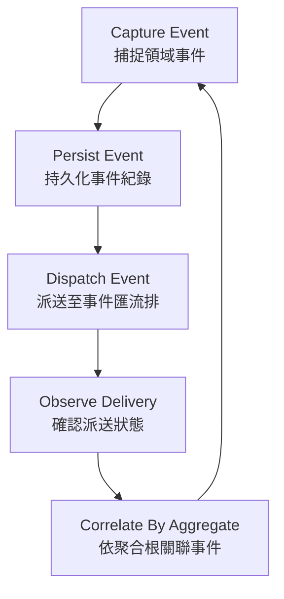

# Event Core

`core/event-core` is the canonical domain event foundation for Xuanwu.

It provides a uniform model for capturing, persisting, dispatching, and correlating
domain events across all modules, following strict MDDD layering.

## Absorbed From

| Source | Status |
|--------|--------|
| N/A — original core module | — |

## Dependency Direction

```
interfaces -> application -> domain <- infrastructure
```

- Domain is framework-free (no SDK/HTTP/DB imports)
- Infrastructure implements domain ports only
- Interfaces never bypass Application

## Structure

```
event-core/
├── domain/
│   ├── entities/          # DomainEvent
│   ├── repositories/      # IEventStoreRepository, IEventBusRepository
│   ├── services/          # dispatchPolicy (pure dispatch rules)
│   └── value-objects/     # EventMetadata
├── application/
│   └── use-cases/         # PublishDomainEventUseCase, ListEventsByAggregateUseCase
├── infrastructure/
│   ├── persistence/       # config (batch size, retry limits)
│   └── repositories/      # InMemoryEventStoreRepository, NoopEventBusRepository
└── interfaces/
    └── api/               # EventController
```

## Core Flow



## Fill-In Order (Recommended)

1. Domain event invariants and metadata semantics
2. Dispatch policy rules (pure domain service)
3. Application orchestration and repository composition
4. Infrastructure adapter implementation (event store + bus)
5. Interface validation and serialization
