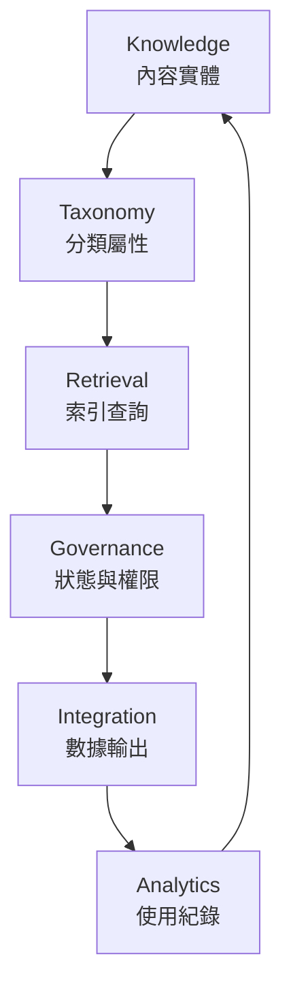

# Knowledge Core (Scaffold)

`core/knowledge-core` is a minimal scaffold for early-phase implementation.
It intentionally keeps only the core dependency path and basic module boundaries.

## Dependency Direction
- Interfaces -> Application -> Domain <- Infrastructure
- Domain is framework-free
- Retrieval is adapter-side capability, not canonical data

## Current Minimal Structure
- application/use-cases
- domain/entities
- domain/repositories
- domain/value-objects
- infrastructure/persistence
- infrastructure/repositories
- interfaces/api

## Not Included In This Phase
- application/dto
- application/mappers
- application/services
- domain/aggregates
- domain/domain-services
- domain/events
- domain/factories
- domain/exceptions
- domain/shared
- infrastructure/external
- infrastructure/mappers
- interfaces/ai
- interfaces/serializers

## Core Flow

## What Is Intentionally Left As Skeleton
- Use-cases keep method signatures and orchestration points only
- Domain keeps invariants and value semantics only
- Infrastructure keeps adapter boundaries and payload shapes only
- Interfaces keep transport entry contracts only

## Fill-In Order (Recommended)
1. Domain invariants and value-object behavior
2. Application orchestration and repository composition
3. Infrastructure adapter implementation
4. Interface validation and serialization
