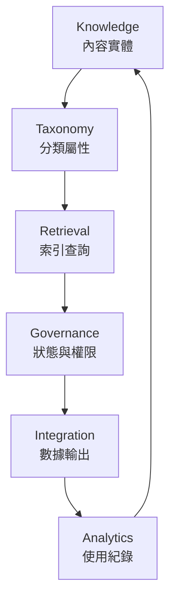

# Knowledge Core

## Overview
`core/knowledge-core` 是知識能力的整合入口，統一描述並聚合三個基礎模組：

- `modules/knowledge`：內容實體與 chunk source of truth
- `modules/taxonomy`：分類、標籤、關聯語意層
- `modules/retrieval`：索引與語義查詢層

> **Note**
> `core/knowledge-core` 目前實際聚合並 export 的只有三個實作模組：`@/modules/knowledge`、`@/modules/taxonomy`、`@/modules/retrieval`。
> 下文中的 Knowledge / Taxonomy / Retrieval 是概念層名稱；`Governance`、`Integration`、`Analytics` 則是架構層級的 cross-cutting concerns / 後續擴充方向，並不是目前已存在的獨立 module exports。

## Core Flow



## Current Module Mapping

### Knowledge
儲存於主資料庫（例如 PostgreSQL / Drizzle / Firestore），是文件與 chunk 的真實來源。

Responsibilities:
- document / collection
- raw chunks
- versioning
- ACL / visibility

Not responsible for:
- embeddings
- vector search
- AI orchestration

### Taxonomy
維護知識語意結構，與內容分離但可關聯。

Responsibilities:
- category tree
- tags
- relations / graph edges
- namespace / org scope

Not responsible for:
- document content
- vector indexing
- AI orchestration

### Retrieval
負責索引與查詢，不是內容真實來源。

Responsibilities:
- embedding lifecycle
- vector indexing
- semantic / hybrid search
- taxonomy-aware filtering

Recommended infra:
- **Upstash Vector**：向量索引與語義搜尋
- metadata 需可依 `orgId` / `namespace` / taxonomy 過濾

### D / E / F. Governance / Integration / Analytics
這三者目前是 `knowledge-core` 在架構文件中定義的 cross-cutting concerns，供後續治理、輸出與分析能力擴充使用；它們現在不是獨立模組，也不是 `core/knowledge-core/index.ts` 的直接 exports。

Recommended infra split:
- Governance / Integration：由 application + interfaces 決定狀態、權限與輸出流程
- Analytics：使用 **Upstash Redis** 做高速計數、使用紀錄與查詢快取

## Layering Rules

- UI / AI / API → Application → Domain → Repository Port → Infrastructure
- Domain 不可依賴 Firebase / Vector DB / HTTP / Genkit
- AI 只能透過 UseCase 呼叫，不可直接碰 DB 或索引
- Retrieval 只能索引 / 搜尋，不可成為內容真實來源

## Copilot-Ready Reference Data Model

以下型別是給 Copilot / 開發者對齊設計語意的**參考 schema**，不是目前 `knowledge-core` 直接匯出的正式 runtime contract。

實際 runtime 型別請從對應模組匯入：
- `@/modules/knowledge`
- `@/modules/taxonomy`
- `@/modules/retrieval`

### Base Entities

```ts
export interface KnowledgeBase {
  id: string
  title: string
  content: string
  summary?: string
}

export interface Taxonomy {
  category: 'documentation' | 'article' | 'snippet'
  tags: string[]
  namespace: string
}

export interface RetrievalIndex {
  vectorId: string
  embeddingModel: string
  lastIndexedAt: Date
  metadata: Taxonomy & { title: string }
}

export enum GovernanceStatus {
  Draft = 'DRAFT',
  Published = 'PUBLISHED',
  Private = 'PRIVATE',
  Archived = 'ARCHIVED',
}

export interface Governance {
  status: GovernanceStatus
  ownerId: string
  permissions: string[]
  version: number
}
```

### Composed Entry

```ts
export interface KnowledgeEntry {
  core: KnowledgeBase
  taxonomy: Taxonomy
  retrieval: RetrievalIndex
  governance: Governance
  integration?: {
    exportedAt?: Date
    targets: string[]
  }
  analytics?: {
    viewCount: number
    lastViewedAt?: Date
  }
}
```

## Implementation Notes

- 實際內容 chunk 型別請以 `@/modules/knowledge` 內的 runtime entity 為準；chunk 屬於 knowledge，不屬於 retrieval
- 實際 taxonomy category / tag 型別請以 `@/modules/taxonomy` 內的 runtime entity 為準，且應保持可重用、無內容耦合
- 實際 retrieval chunk reference 型別請以 `@/modules/retrieval` 內的 runtime entity 為準，且索引必須可重建，因為 retrieval 永遠不是 source of truth
- `core/knowledge-core/index.ts` 應作為三個模組的聚合出口，而不是重複定義另一份 domain

## Principles

- Strict MDDD separation
- Knowledge = source of truth
- Taxonomy = semantic structure
- Retrieval = index layer
- Governance / Integration / Analytics = cross-cutting orchestration, not source data
- No direct DB access outside infrastructure
- All writes go through use-cases
