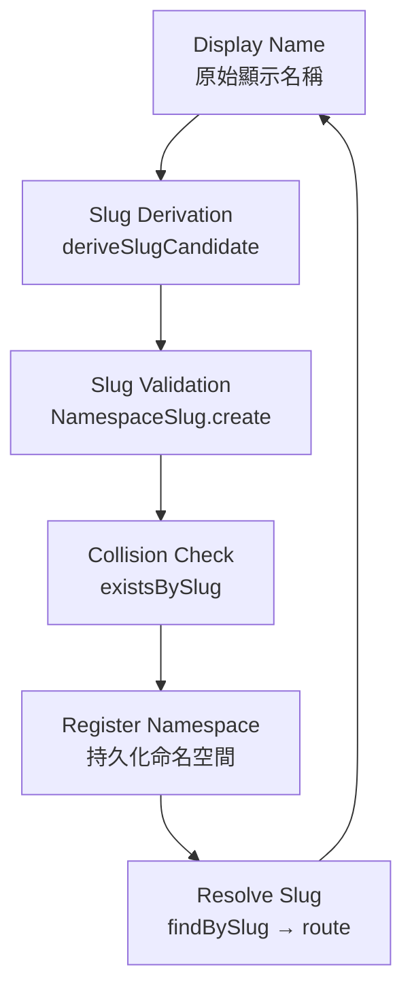

# Namespace Core

`core/namespace-core` is the canonical namespace and slug domain foundation for Xuanwu.

It provides a uniform model for registering, validating, and resolving named scopes
(organization-level and workspace-level) used for multi-tenant resource addressing and URL routing.

## Absorbed From

| Source | Status |
|--------|--------|
| N/A — original core module (scaffold only, now implemented) | — |

## Dependency Direction

```
interfaces -> application -> domain <- infrastructure
```

- Domain is framework-free (no SDK/HTTP/DB imports)
- Infrastructure implements domain ports only
- Interfaces never bypass Application

## Structure

```
namespace-core/
├── domain/
│   ├── entities/          # Namespace
│   ├── repositories/      # INamespaceRepository
│   ├── services/          # slugPolicy (pure — deriveSlugCandidate, isValidSlug)
│   └── value-objects/     # NamespaceSlug
├── application/
│   └── use-cases/         # RegisterNamespaceUseCase, ResolveNamespaceUseCase
├── infrastructure/
│   ├── persistence/       # config (collection name, slug length limits)
│   └── repositories/      # InMemoryNamespaceRepository
└── interfaces/
    └── api/               # NamespaceController
```

## Core Flow



## Fill-In Order (Recommended)

1. Domain slug invariants and NamespaceSlug value-object behaviour
2. Slug policy pure functions (deriveSlugCandidate, isValidSlug)
3. Application orchestration and collision-check composition
4. Infrastructure adapter implementation (Firestore)
5. Interface validation and serialization
