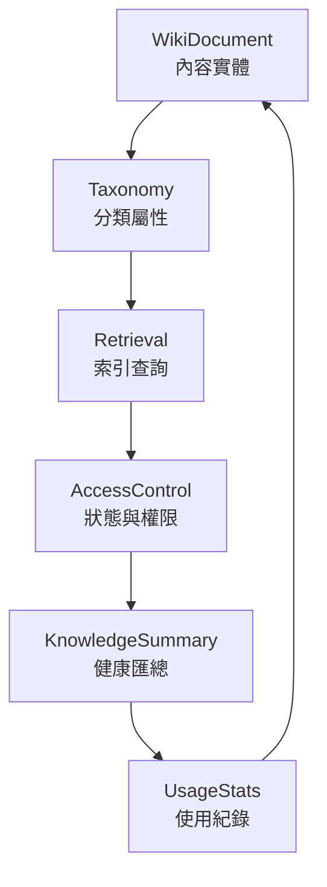

# Wiki Core

`core/wiki-core` is the canonical wiki and knowledge domain foundation for Xuanwu.

It unifies wiki document management and workspace knowledge health summary into a single
MDDD-compliant core module.

## Absorbed From

| Source | Status |
|--------|--------|
| `core/knowledge-core` | Replaced — re-exports from this module |
| `modules/knowledge` domain + application | Replaced — now canonical here |

## Dependency Direction

```
interfaces -> application -> domain <- infrastructure
```

- Domain is framework-free (no SDK/HTTP/DB imports)
- Infrastructure implements domain ports only
- Interfaces never bypass Application

## Structure

```
wiki-core/
├── domain/
│   ├── entities/          # WikiDocument, WorkspaceKnowledgeSummary
│   ├── repositories/      # IWikiDocumentRepository, IKnowledgeSummaryRepository, IRetrievalRepository
│   ├── services/          # deriveKnowledgeSummary
│   └── value-objects/     # AccessControl, ContentStatus, Taxonomy, Vector, …
├── application/
│   └── use-cases/         # CreateWikiDocumentUseCase, GetWorkspaceKnowledgeSummaryUseCase
├── infrastructure/
│   ├── persistence/       # Upstash config + clients
│   └── repositories/      # UpstashWikiDocumentRepository
└── interfaces/
    └── api/               # WikiController
```

## Core Flow



## Fill-In Order (Recommended)

1. Domain invariants and value-object behaviour
2. Application orchestration and repository composition
3. Infrastructure adapter implementation
4. Interface validation and serialization
