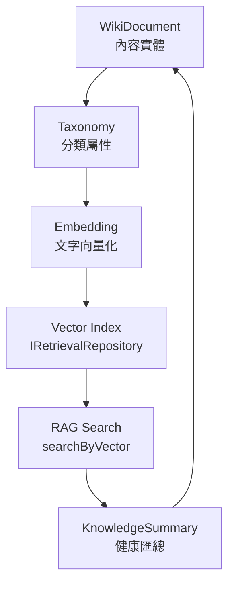

# Wiki Core

`core/wiki-core` is the canonical wiki and knowledge domain foundation for Xuanwu.

It owns the full Knowledge + Taxonomy + Vector + Embedding + RAG domain logic,
unifying wiki document management, knowledge summarisation, embedding generation,
and retrieval-augmented generation (RAG) search into a single MDDD-compliant core module.

## Absorbed From

| Source | Status |
|--------|--------|
| `core/knowledge-core` | Replaced — re-exports from this module |
| `modules/knowledge` domain + application | Replaced — now canonical here |

## Dependency Direction

```
interfaces -> application -> domain <- infrastructure
```

- Domain is framework-free (no SDK/HTTP/DB imports)
- Infrastructure implements domain ports only
- Interfaces never bypass Application

## Structure

```
wiki-core/
├── domain/
│   ├── entities/          # WikiDocument, WorkspaceKnowledgeSummary
│   ├── repositories/      # IWikiDocumentRepository, IKnowledgeSummaryRepository,
│   │                      # IRetrievalRepository, IEmbeddingRepository
│   ├── services/          # deriveKnowledgeSummary
│   └── value-objects/     # AccessControl, ContentStatus, Taxonomy, Vector,
│                          # Embedding, SearchFilter, WikiDocumentSummary, UsageStats
├── application/
│   └── use-cases/         # CreateWikiDocumentUseCase, GetWorkspaceKnowledgeSummaryUseCase
├── infrastructure/
│   ├── persistence/       # Upstash config + clients (Redis + Vector)
│   └── repositories/      # UpstashWikiDocumentRepository
└── interfaces/
    └── api/               # WikiController
```

## Domain Coverage

| Concern | Key type |
|---------|----------|
| Knowledge | `WorkspaceKnowledgeSummary`, `IKnowledgeSummaryRepository` |
| Taxonomy | `Taxonomy` VO (category + tags + namespace) |
| Vector | `Vector` VO (float array with invariant check) |
| Embedding | `Embedding` VO (values + model + dimensions) + `IEmbeddingRepository` |
| RAG | `IRetrievalRepository` (searchByVector, searchByMetadata) |

## Core Flow



## Fill-In Order (Recommended)

1. Domain invariants and value-object behaviour
2. Embedding generation port + application orchestration
3. Retrieval and RAG use-cases
4. Infrastructure adapter implementation (OpenAI embedding, Upstash Vector)
5. Interface validation and serialization
