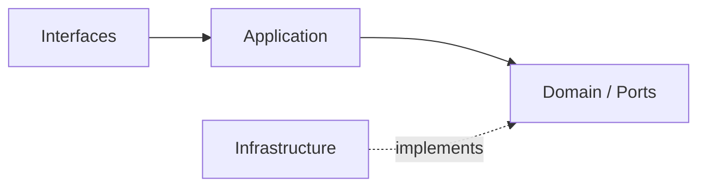

# AI Bounded Contexts

## Domain Role

ai 是共享能力 bounded context。它封裝所有 AI 執行能力——從 generation、distillation 到 safety——讓下游主域穩定消費，而不需要了解 LLM provider 細節。

## Baseline Bounded Contexts

| Cluster | Subdomains |
|---|---|
| Core Execution | generation、orchestration、distillation |
| Knowledge Access | retrieval、memory、context |
| Quality & Safety | safety、evaluation、tracing |
| Extended Capability | tool-calling、reasoning、conversation |

## Recommended Gap Bounded Contexts

| Subdomain | Why Needed | Gap If Missing |
|---|---|---|
| provider-routing | 建立模型供應商選擇與路由治理邊界 | 供應商切換邏輯分散於 generation，難以統一管理 |
| model-policy | 建立模型能力、版本與使用政策邊界 | 模型版本更新或限制難以集中決策 |

## Domain Invariants

- generation 是唯一直接呼叫 LLM provider 的子域，其他子域透過 ports 間接使用。
- distillation 輸出的是「精煉知識片段」，不是 KnowledgeArtifact；語義屬於 ai，不屬於 notion。
- memory 若需要長期保存內容，應優先保存 distilled knowledge，而不是無限制保留 raw content。
- retrieval 若存在可選資料來源，應優先索引 distilled chunks 或結構化 knowledge signal。
- evaluation 必須覆蓋 distillation，至少檢查 compression、retention 與 hallucination risk。
- safety 的結果可以終止任何 AI 執行流程。
- orchestration 是執行圖的主控，不直接持有業務資料。
- tracing 只負責觀測與 debug，不得改變執行決策。
- 所有子域的 domain 層必須框架無關。

## Dependency Direction

- ai 子域在存在對應層時遵守 interfaces -> application -> domain <- infrastructure。
- 子域之間透過 ports 或 orchestration application 協調，不直接依賴彼此 domain。
- 外部輸入只能先經 API boundary，再進入 ai 內部執行流程。

## Anti-Patterns

- 讓 generation 子域直接依賴 notion 或 notebooklm 的業務型別。
- 把 distillation 當成 notebooklm synthesis 的 alias，混淆輸出語義。
- 讓下游模組繞過 ai API 邊界，直接 import ai infrastructure。
- 在 ai domain 層 import Genkit、Firebase 或任何 SDK。

## Copilot Generation Rules

- 生成程式碼時，先確認能力屬於哪個 cluster，再決定子域與層。
- 跨子域協調一律交給 orchestration application，不讓子域直接相互呼叫。
- 奧卡姆剃刀：能在現有子域加一個 port + use case 解決，就不要新建子域。

## Dependency Direction Flow

