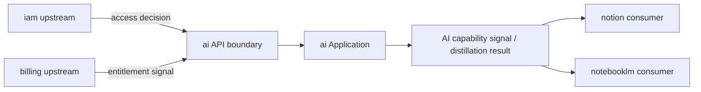

# AI Context Map

## Context Role

ai 對其他主域提供共享 AI capability signal。它消費 iam 的 access decision 與 billing 的 entitlement signal，向 notion 與 notebooklm 輸出 generation、distillation、retrieval 等能力。

## Relationships

| Upstream | Downstream | Relationship Type | Published Language |
|---|---|---|---|
| iam | ai | Upstream/Downstream | actor reference、access decision |
| billing | ai | Upstream/Downstream | entitlement signal、quota capability |
| ai | notion | Upstream/Downstream | ai capability signal、distillation result、safety result |
| ai | notebooklm | Upstream/Downstream | ai capability signal、distillation result、retrieval result、safety result |

## Mapping Rules

- ai 消費 iam 的結果，但不重建 actor 或 tenant 模型。
- ai 消費 billing 的 entitlement signal 決定配額，但不擁有訂閱或計費語義。
- notion 消費 ai capability，但 AI provider / policy 所有權不屬於 notion。
- notebooklm 消費 ai 的 generation、distillation、retrieval，但推理輸出的正典語義屬於 notebooklm 自己。
- ai 不回寫任何下游主域的正典模型。

## Integration Pattern

- ai 作為下游消費 iam 與 billing 時，採用 Conformist 或 ACL，視語義相容性決定。
- notion 與 notebooklm 消費 ai 時，ai 的 published language 是 capability signal，不是 aggregate。

## Dependency Direction

- ai 對 iam、billing 屬 downstream。
- ai 對 notion、notebooklm 屬 upstream 的能力供應者。

## Anti-Patterns

- 把 ai 與 notebooklm 寫成 Shared Kernel，同時擁有推理輸出語義。
- 讓 notion 或 notebooklm 直接 import ai 的 infrastructure 或 subdomain domain。
- 把 iam 的 actor model 直接帶入 ai domain，而非只消費 access decision。

## Dependency Direction Flow

