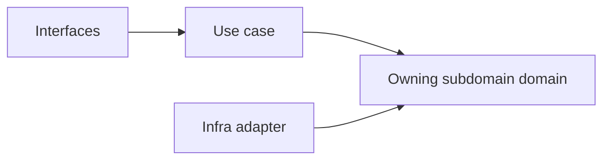
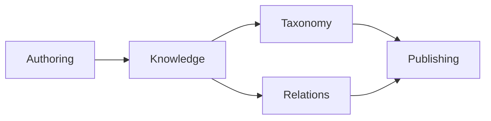

# Notion

## Implemented Subdomains（程式碼已存在 — `src/modules/notion/subdomains/`）

| Subdomain | Responsibility | Strategic Mapping |
|---|---|---|
| block | 頁面內容區塊（段落、標題、媒體等）的結構與操作 | `knowledge` 的結構子單元 |
| collaboration | 協作留言、細粒度權限與版本快照 | `collaboration` |
| database | 結構化資料多視圖管理（原名 `knowledge-database`，已重命名） | `database` |
| knowledge | 頁面的高層語義容器（知識庫入口） | `knowledge` |
| page | 知識庫文章建立、驗證、分類與版本（`authoring` 整合於此） | `knowledge` + `authoring` |
| template | 頁面範本管理與套用（程式碼目錄名為 `template`，非 `templates`） | `templates` |
| view | Database 多視圖能力（table、board、calendar 等） | `database` 的多視圖 facet |

> **命名備注：** 程式碼目錄採 `template`（非 `templates`）。
> `authoring` 的語義已整合至 `page` 子域；`block` 承擔頁面內容結構；`view` 承擔 database 多視圖。

## Planned Subdomains（尚未實作，保留戰略意圖）

| Subdomain | Why Needed |
|---|---|
| knowledge-engagement | 知識使用行為量測 |
| attachments | 附件與媒體關聯儲存 |
| automation | 知識事件觸發自動化動作 |
| external-knowledge-sync | 知識與外部系統雙向整合 |
| notes | 個人輕量筆記與正式知識協作 |
| knowledge-versioning | 全域版本快照策略管理 |
| taxonomy | 分類法與語義組織正典邊界 |
| relations | 內容之間關聯與 backlink 正典邊界 |
| publishing | 正式發布與對外交付正典邊界 |

## Anti-Patterns

- 不把 taxonomy 混成 authoring 裡的附屬設定。
- 不把 relations 混成單純 hyperlink 功能，失去語義關係邊界。
- 不把 publishing 混成 UI 上的一個按鈕事件，而忽略正式交付語言。
- 不把 ai context 的共享能力誤寫成 notion 自己擁有的 `ai` 子域。
- 生成程式碼時，子域目錄名稱以 `src/modules/notion/subdomains/` 為準（`template` 非 `templates`）。

## Copilot Generation Rules

- 新實作先確認需求屬於已實作子域（block、collaboration、database、knowledge、page、template、view）之一。
- 若需求屬於 Planned Subdomains，先建立子域骨架再實作。
- 奧卡姆剃刀：能在既有子域用一個明確 use case 解決，就不要新建第二個概念接近的子域。
- 子域命名要反映內容語義，不要退化成頁面或元件名稱。

## Dependency Direction Flow

## Correct Interaction Flow

## Document Network

- [README.md](./README.md)
- [bounded-contexts.md](./bounded-contexts.md)
- [context-map.md](./context-map.md)
- [ubiquitous-language.md](./ubiquitous-language.md)
- [subdomains.md](../../domain/subdomains.md)
- [bounded-contexts.md](../../domain/bounded-contexts.md)