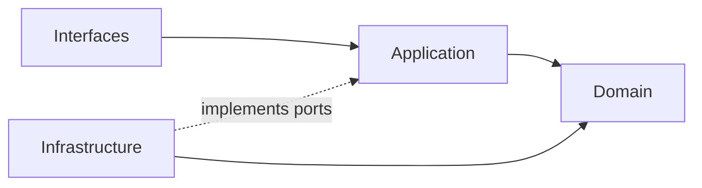
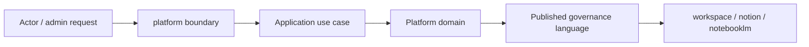

# Platform Context

本 README 在本次任務限制下，僅依 Context7 驗證的 DDD、Context Map、Hexagonal Architecture 參考重建，不主張反映現況實作。

## Purpose

platform 是帳號、組織與 shared operational services 主域。它的責任是提供 account、organization、notification、search、audit、observability 與 operational workflow 等跨切面能力，供其他主域穩定消費。

## Why This Context Exists

- 把治理與營運支撐責任集中，避免滲入其他主域。
- 讓其他主域只消費治理結果，而不是重建治理模型。
- 以清楚的 published language 承接身份、權益、政策與營運能力。

## Context Summary

| Aspect | Summary |
|---|---|
| Primary Role | account、organization 與營運支撐 |
| Upstream Dependency | iam、billing、ai 的 shared signals 與治理結果 |
| Downstream Consumers | workspace 與其他需要 operational services 的主域 |
| Core Principle | platform 提供 account 與營運 surface，不接管治理、商業、內容或推理正典 |

## Baseline Subdomains

> account / account-profile / organization / team → 已遷入 iam 主域。

- platform-config
- feature-flag
- onboarding
- compliance
- integration
- workflow
- notification
- background-job
- content
- search
- audit-log
- observability
- support

## Recommended Gap Subdomains

- consent
- secret-management
- operational-catalog

## Strategic Reinforcement Focus

- consent（資料使用授權語義收斂）
- secret-management（敏感憑證治理收斂）
- operational-catalog（平台營運資產語義收斂）

## Key Relationships

- 對 iam、billing、ai：platform 消費它們的治理、商業與 capability signal。
- 對 workspace：提供 account scope、organization surface 與 shared operational services。
- 對 notion 與 notebooklm：按需提供 notification、search、audit、observability 等 operational service。

## Reading Order

1. [subdomains.md](./subdomains.md)
2. [bounded-contexts.md](./bounded-contexts.md)
3. [context-map.md](./context-map.md)
4. [ubiquitous-language.md](./ubiquitous-language.md)
5. [AGENTS.md](../../AGENTS.md)

## Dependency Direction

- 本主域內部固定採用 interfaces -> application -> domain <- infrastructure。
- platform 對外只輸出治理結果與 published language，不輸出內部治理模型細節。

## Account Surface Contract

- platform 提供 account scope 的治理語意；shell 的 `accountId` 由這個主域的 account / organization 能力支撐，而不是由 workspace 自行定義。
- account shell surface 採單一 account catch-all：`/{accountId}/[[...slug]]`；這是 account-scoped composition contract，不是 platform domain model 的直接外露。
- `AccountType = "user" | "organization"` 是目前 platform account domain、workspace domain、Zod validators 與 route composition 共用的字串契約；`"user"` 表示 personal account scope，`"organization"` 表示 organization account scope。
- business language 仍使用 personal account / organization account；只有 code-level string contract 才使用 `"user" | "organization"`，避免把 `user` 誤用成平台通用語言名詞。
- organization governance route 在 shell 內應 flatten 到 account scope，例如 `/{accountId}/members`、`/{accountId}/teams`、`/{accountId}/permissions`；`/{accountId}/organization/*` 只應視為 legacy redirect surface。
- iam 擁有 account 與 organization 的 domain governance；platform 承接 account scope 的 shell route composition surface，但不擁有這兩個子域的 domain model。workspace detail 仍由 workspace module route screen 承接，只是經過 account-scoped shell composition 進入。

## Anti-Pattern Rules

- 不把 platform 寫成內容主域或對話主域。
- 不把 entitlement、consent、secret-management 混成同一個泛用設定區。
- 不把其他主域對平台的依賴寫成可以直接存取其內部模型。

## Copilot Generation Rules

- 生成程式碼時，先保留 platform 的 operational 定位，再安排 account、organization、notification、search、audit、secret-management 的交互。
- 奧卡姆剃刀：不要預先建立多餘 facade；能直接由既有治理邊界承接就維持單一路徑。
- 優先讓 request -> orchestration -> domain decision -> published language 保持單純可追溯。

## Dependency Direction Flow

## Correct Interaction Flow

## Document Network

- [AGENTS.md](../../AGENTS.md)
- [bounded-contexts.md](./bounded-contexts.md)
- [context-map.md](./context-map.md)
- [subdomains.md](./subdomains.md)
- [ubiquitous-language.md](./ubiquitous-language.md)
- [README.md](../../../README.md)
- [architecture-overview.md](../../system/architecture-overview.md)
- [integration-guidelines.md](../../system/integration-guidelines.md)

## Constraints

- 本文件是 architecture-first 版本。
- 本文件依 Context7 的 bounded context 與 context map 原則編寫。
- 本文件不代表對既有 repo 內容做過語意校準。