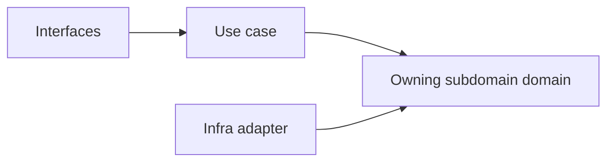
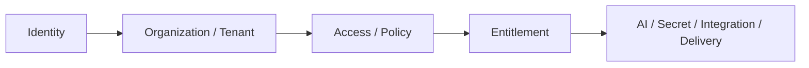

# Platform

## Migrated Subdomains（已遷出 platform）

| Subdomain | 遷入位置 |
|---|---|
| account | `iam/subdomains/account/` |
| account-profile | `iam/subdomains/account/` |
| organization | `iam/subdomains/organization/` |
| team | `iam/subdomains/organization/` |

## Implemented Subdomains（程式碼已存在 — `src/modules/platform/subdomains/`）

| Subdomain | Responsibility |
|---|---|
| audit-log | 永久日誌軌跡與不可否認證據 |
| background-job | 背景任務提交、排程與監控 |
| cache | 跨域快取策略與快取層管理 |
| feature-flag | 功能開關策略與發佈節點 |
| file-storage | 檔案儲存邊界、路徑策略與存取控管 |
| notification | 通知路由、偏好與投遞 |
| platform-config | 平台設定輪廓與配置管理 |
| search | 跨域搜尋路由與查詢協調 |

## Planned Subdomains（尚未實作，保留戰略意圖）

| Subdomain | Why Needed |
|---|---|
| onboarding | 新主體初始設定與引導流程 |
| compliance | 資料保留、日誌與法規執行 |
| integration | 外部系統整合邊界與契約 |
| workflow | 平台級流程編排與狀態驅動執行 |
| content | 平台級內容資產管理與發布 |
| observability | 健康量測、追蹤與告警 |
| support | 客服工單、支援知識與處理流程 |

## Strategic Reinforcement Focus

| Focus | Why It Remains Important |
|---|---|
| tenant | 持續收斂租戶隔離語義與 organization 分工邊界 |
| entitlement | 持續收斂 subscription、feature-flag、policy 的統一解算語言 |
| secret-management | 持續收斂與 integration 的責任切割，避免敏感治理擴散 |
| consent | 持續收斂 consent 與 compliance 的責任邊界 |

## Recommended Order

1. tenant
2. entitlement
3. secret-management
4. consent

## Anti-Patterns

- 不把 tenant 與 organization 視為同義詞。
- 不把 entitlement 混成 feature-flag 的別名。
- 不把 secret-management 混成 integration 的一個欄位集合。
- 不把 consent 混成一般 UI preference。
- 不把 platform 的 ai 混成 notebooklm synthesis 或 notion 內容輔助的本地所有權。

## Copilot Generation Rules

- 生成程式碼時，先確認需求屬於哪個治理責任，再決定 use case 與 boundary。
- shared AI provider、模型政策、成本與安全護欄一律先歸 ai context 評估。
- 奧卡姆剃刀：能在既有子域用一個清楚 use case 解決，就不要新建語意重疊的治理子域。
- 子域命名必須反映治理責任，不應退化成頁面或介面名稱。

## Dependency Direction Flow

## Correct Interaction Flow

## Document Network

- [README.md](./README.md)
- [bounded-contexts.md](./bounded-contexts.md)
- [context-map.md](./context-map.md)
- [ubiquitous-language.md](./ubiquitous-language.md)
- [subdomains.md](../../domain/subdomains.md)
- [bounded-contexts.md](../../domain/bounded-contexts.md)