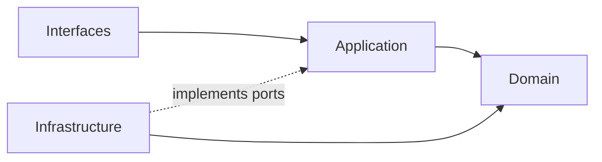
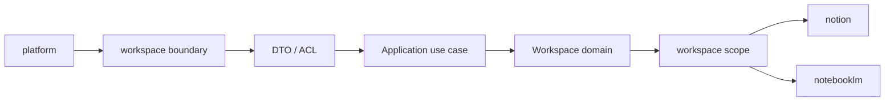

# Workspace Context

本 README 在本次任務限制下，僅依 Context7 驗證的 DDD、Context Map、Hexagonal Architecture 參考重建，不主張反映現況實作。

## Purpose

workspace 是協作容器與工作區範疇主域。它的責任是提供 workspaceId、工作區生命週期、參與關係、共享、存在感、活動投影、日誌、排程與工作流，讓其他主域可以在同一個協作範疇中運作。

## Why This Context Exists

- 把工作區容器語意與平台治理語意分離。
- 把工作區 scope 作為其他主域可依賴的 published language。
- 把活動流、日誌、排程與流程協調收斂為同一主域內的高凝聚能力。

## Context Summary

| Aspect | Summary |
|---|---|
| Primary Role | 協作容器與 workspace scope |
| Upstream Dependency | iam 的 actor、tenant、access decision；billing 的 entitlement；platform 的 account 與 organization surface |
| Downstream Consumers | notion、notebooklm |
| Core Principle | workspace 暴露 scope，不接管治理、商業或內容正典 |

## Baseline Subdomains

- audit
- feed
- scheduling
- approve
- issue
- orchestration
- quality
- settlement
- task
- task-formation

## Recommended Gap Subdomains

- lifecycle
- membership
- sharing
- presence

## Key Relationships

- 與 iam：workspace 消費 actor、tenant 與 access decision。
- 與 billing：workspace 消費 entitlement 與 subscription capability signal。
- 與 platform：workspace 消費 account scope 與 organization surface。
- 與 notion：workspace 向 notion 提供 workspaceId、membership scope、share scope。
- 與 notebooklm：workspace 向 notebooklm 提供 workspaceId、membership scope、share scope。

## Reading Order

1. [subdomains.md](./subdomains.md)
2. [bounded-contexts.md](./bounded-contexts.md)
3. [context-map.md](./context-map.md)
4. [ubiquitous-language.md](./ubiquitous-language.md)
5. [AGENTS.md](../../AGENTS.md)

## Dependency Direction

- 本主域內部固定採用 interfaces -> application -> domain <- infrastructure。
- workspace 對外只暴露 scope、published language、API boundary、events，不暴露內部實作。

## Route Surface Contract

- workspace 不擁有獨立的 top-level shell route；它被組裝在 account-scoped shell surface 之下。
- workspace 消費來自 platform account scope 的 `AccountType = "user" | "organization"` 字串契約；其中 `"user"` 代表 personal account context，`"organization"` 代表 organization context。
- workspace detail 的 canonical route 是 `/{accountId}/{workspaceId}`，表示「先選 account，再進入該 account 底下的 workspace」。
- workspace tabs 與 overview panels 應維持在同一條 detail route 上，以 query state 表示，例如 `?tab=Overview&panel=knowledge-pages`。
- `/{accountId}/workspace/{workspaceId}` 只保留為相容 redirect，不是新的文件或 UI 應輸出的 canonical href。
- UI 可以顯示個人帳號 / 組織帳號，但 workspace aggregate、use case、event metadata 與 validator 的 accountType string contract 不應漂移成 `"personal" | "organization"`。
- account dashboard、members、teams、permissions、schedule、audit 等 account-level concern 不屬於 workspace route surface。
- workspace route 只負責協作容器與 workspace-scoped consumption，不承接 platform governance canonical navigation。

## Anti-Pattern Rules

- 不把 workspace scope 寫成平台治理結果本身。
- 不把 feed、audit、workspace-workflow 互相取代為單一泛用流程層。
- 不把 notion 或 notebooklm 的內容與推理責任吸回 workspace。

## Copilot Generation Rules

- 生成程式碼時，先保留 workspace 的協作 scope 定位，再安排 lifecycle、membership、sharing、workspace-workflow 的交互。
- 奧卡姆剃刀：不要預先建立第二條平行協作流程；只有既有 scope 邊界不夠時才補新抽象。
- 優先讓 input -> translation -> application -> domain -> published scope 保持單純可追溯。

## Dependency Direction Flow

## Correct Interaction Flow

## Document Network

- [AGENTS.md](../../AGENTS.md)
- [bounded-contexts.md](./bounded-contexts.md)
- [context-map.md](./context-map.md)
- [subdomains.md](./subdomains.md)
- [ubiquitous-language.md](./ubiquitous-language.md)
- [README.md](../../../README.md)
- [architecture-overview.md](../../system/architecture-overview.md)
- [integration-guidelines.md](../../system/integration-guidelines.md)

## Constraints

- 本文件是 architecture-first 版本。
- 本文件依 Context7 的 bounded context 與 context map 原則編寫。
- 本文件不代表對既有 repo 內容做過語意校準。