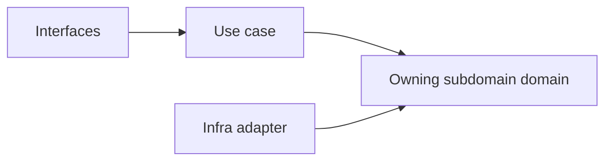
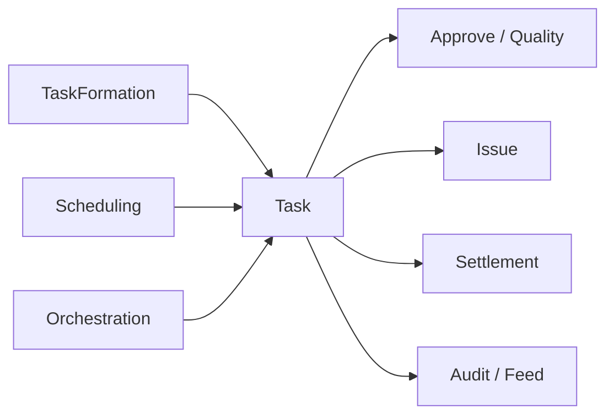

# Workspace

## Implemented Subdomains（程式碼已存在 — `src/modules/workspace/subdomains/`）

| Subdomain | Responsibility |
|---|---|
| activity | 工作區活動流水帳與事件記錄 |
| api-key | API 金鑰生命週期與範圍治理 |
| approval | 任務驗收與問題單覆核審批流程（舊名 `approve`） |
| audit | 工作區操作日誌與不可否認證據追蹤 |
| feed | 工作區活動摘要與事件流呈現 |
| invitation | 工作區邀請流程與邀請令牌管理 |
| issue | 問題單生命週期與追蹤管理 |
| lifecycle | 工作區容器建立、封存與復原的生命週期語言 |
| membership | 工作區參與關係（角色、加入、移除）與 identity 邊界切分 |
| orchestration | 知識頁面→任務物化批次作業編排 |
| quality | 任務 QA 審查與質檢流程 |
| resource | 工作區資源綁定與容量管理 |
| schedule | 工作區排程、時序與提醒協調（舊名 `scheduling`） |
| settlement | 請款發票生命週期與財務對帳 |
| share | 對外共享與可見性規則（舊名 `sharing`） |
| task | 任務建立、指派與狀態轉換 |
| task-formation | AI 輔助任務候選抽取與批次匯入 |

> **命名備注：** 程式碼目錄採 `approval`（非 `approve`）、`schedule`（非 `scheduling`）、`share`（非 `sharing`）。
> `lifecycle` 與 `membership` 原列為 gap subdomain，現已實作，升為 baseline。

## Planned Subdomains（尚未實作）

| Subdomain | Why Needed |
|---|---|
| presence | 把即時協作存在感與共同編輯訊號形成本地語言 |

## Anti-Patterns

- 不把 lifecycle 混進 orchestration，使容器生命週期被流程編排吞沒。
- 不把 membership 混成 organization 或 identity。
- 不把 share 混成一般 permission 欄位集合（已有獨立 `share` 子域）。
- 不把 presence 藏進 UI 狀態而失去獨立語言。
- 不用 `workspace-workflow` 混指已分解的 task、issue、settlement、approval、quality、orchestration 等獨立子域。

## Copilot Generation Rules

- 生成程式碼時，先確認需求屬於哪個 workspace 子域，再決定 use case 與 boundary。
- 子域命名以 `src/modules/workspace/subdomains/` 目錄名稱為準：`approval`、`schedule`、`share`。
- 工作區流程責任已分解為多個專門子域，避免與 `platform.workflow` 混名。
- 奧卡姆剃刀：能在既有子域用一個清楚 use case 解決，就不要新建語意重疊的 scope 子域。

## Dependency Direction Flow

## Correct Interaction Flow

## Document Network

- [README.md](./README.md)
- [bounded-contexts.md](./bounded-contexts.md)
- [context-map.md](./context-map.md)
- [ubiquitous-language.md](./ubiquitous-language.md)
- [subdomains.md](../../domain/subdomains.md)
- [bounded-contexts.md](../../domain/bounded-contexts.md)