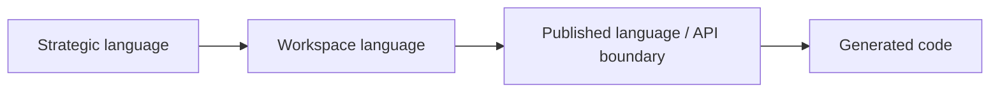
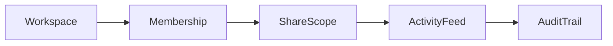
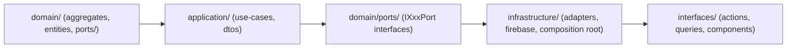

# Workspace

本文件在本次任務限制下，僅依 Context7 驗證的 DDD、Context Map、Hexagonal Architecture 參考整理，不主張反映現況實作。

## Canonical Terms

| Term | Meaning |
|---|---|
| Workspace | 協作容器與主要範疇邊界 |
| WorkspaceId | 工作區唯一識別子與範疇錨點 |
| WorkspaceLifecycle | 工作區建立、封存、還原、移轉等生命週期狀態 |
| Membership | 工作區內的參與關係 |
| WorkspaceRole | 工作區範疇下的角色語意 |
| ShareScope | 共享暴露範圍 |
| ShareLink | 對外共享的可解析入口 |
| PresenceSession | 即時在線與共同編輯存在感訊號 |
| ActivityFeed | 面向使用者的活動流投影 |
| AuditTrail | 不可否認的工作區操作追蹤 |
| Schedule | 工作區內的時間安排與提醒意圖 |
| WorkflowExecution | 某個工作區流程的一次執行實例 |
| WorkspaceTab | 同一條 workspace detail route 上的 query-state 分頁語意 |
| OverviewPanel | `Overview` tab 內的 panel 細分語意 |

## Shell Route Terms

| Term | Meaning |
|---|---|
| AccountScope | workspace route 所依附的 account scope；由 shell 上的 `accountId` 表示 |
| AccountTypeStringContract | workspace aggregate / use case / validator 所消費的 code-level enum `"user" | "organization"`；`"user"` 對應 personal account context |
| CreatorUserId | 建立 workspace 或發起 workspace-scoped command 的具體 user identifier |
| CurrentUserId | 目前正在操作 workspace UI / workflow 的具體 user identifier |
| CanonicalWorkspaceRoute | `/{accountId}/{workspaceId}` |
| LegacyWorkspaceRedirectSurface | `/{accountId}/workspace/{workspaceId}` |

## Language Rules

- 使用 Workspace，不使用 Project 或 Space 作為同義詞。
- 使用 Membership，不用 User 表示工作區參與關係。
- 使用 ActivityFeed 與 AuditTrail 區分投影與證據。
- 使用 ShareScope 表示共享邊界，不用 Permission 泛指共享。
- 使用 PresenceSession 表示即時存在感，不把它隱藏在 UI 概念裡。
- 使用 `workspaceId` 表示 workspace scope，不用 `accountId` 混稱。
- 使用 `AccountType = "user" | "organization"` 作為 workspace 跨邊界字串契約；顯示語言可寫個人帳號 / 組織帳號，但不把 `"personal"` 當成 canonical accountType literal。
- 使用 `creatorUserId` / `currentUserId` 表示具體使用者操作，不把它寫成 `accountId` 或 `workspaceId`。
- organization-scoped event metadata 需要時，可由 `accountType = "organization"` 下的 `accountId` 映射出 `organizationId`；但 workspace route surface 本身仍以 `accountId` + `workspaceId` 為主。
- 使用 `/{accountId}/{workspaceId}` 表示 canonical workspace detail route。
- `/{accountId}/workspace/{workspaceId}` 只視為 legacy redirect surface，不作為新的文件、設計稿或 UI href。

## Avoid

| Avoid | Use Instead |
|---|---|
| User | Membership 或 Actor reference |
| Timeline | ActivityFeed 或 Schedule |
| Share Permission | ShareScope |
| Workspace Log | ActivityFeed 或 AuditTrail |
| `AccountType = "personal"` | `AccountType = "user"`，顯示語言再另寫個人帳號 |
| `organizationId`（as workspace route param） | `accountId` |
| `accountId`（as concrete acting user id） | `creatorUserId` / `currentUserId` |
| Legacy workspace path `/{accountId}/workspace/{workspaceId}` | Canonical workspace path `/{accountId}/{workspaceId}` |

## Naming Anti-Patterns

- 不用 User 混指 Membership 與 Actor reference。
- 不用 Timeline 混指 ActivityFeed 與 Schedule。
- 不用 Permission 混指 ShareScope。
- 不用 Log 混指 ActivityFeed 與 AuditTrail。
- 不把 personal account 顯示語言誤當成 workspace 的 code-level `AccountType` literal。
- 不把 `accountId`、`workspaceId`、`creatorUserId`、`organizationId` 混成同一個 identifier 概念。
- 不把 account-scoped shell route 語意誤當成 workspace 自己的 top-level route ownership。

## Copilot Generation Rules

- 生成程式碼時，名稱先對齊 Workspace、Membership、ShareScope、ActivityFeed、AuditTrail，再決定類型與檔名。
- 奧卡姆剃刀：若一個工作區名詞已足夠表達責任，就不要再堆疊第二個近義抽象名稱。
- 命名先保護 scope 語言，再考慮 UI 或 API 顯示便利。

## Dependency Direction Flow

## Correct Interaction Flow

## Domain Layer Flow (enforced per subdomain)

## Document Network

- [README.md](./README.md)
- [AGENTS.md](../../AGENTS.md)
- [subdomains.md](./subdomains.md)
- [bounded-contexts.md](./bounded-contexts.md)
- [ubiquitous-language.md](../../domain/ubiquitous-language.md)
