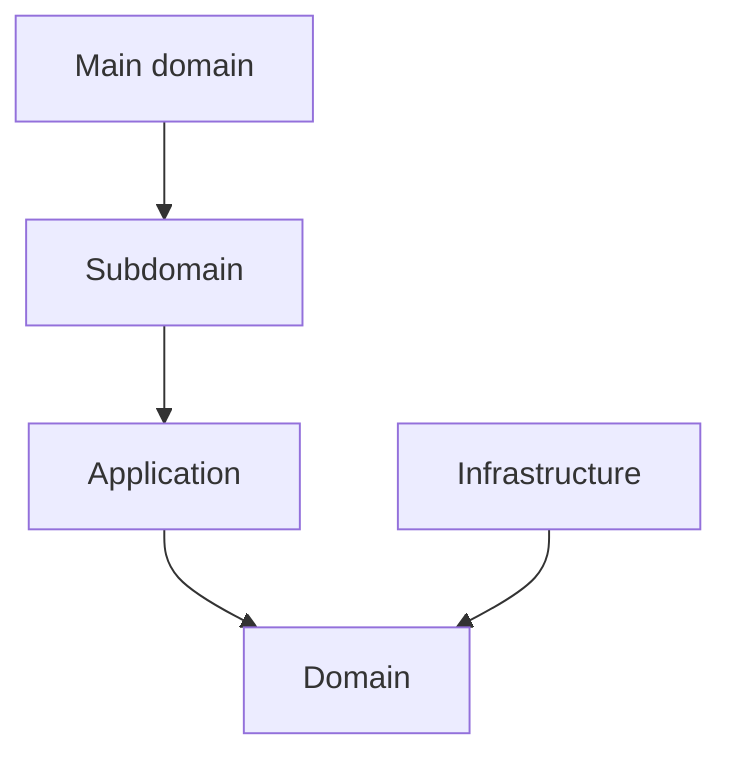
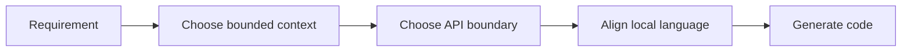

# Bounded Contexts

## Strategic Bounded Context Model

系統目前以八個主域 / bounded context 構成。子域完整清單（baseline + recommended gap）見 [subdomains.md](./subdomains.md)。

## Main Domain Map

| Main Domain | Strategic Role | Baseline Focus | Recommended Gap Focus |
|---|---|---|---|
| iam | 身份與存取治理 | identity、access-control、tenant、security-policy、**account、organization** | session、consent、secret-governance |
| billing | 商業與權益治理 | billing、subscription、entitlement、referral | pricing、invoice、quota-policy |
| ai | 共享 AI capability | generation、orchestration、distillation、retrieval、memory、context、safety、tool-calling、reasoning、conversation、evaluation、tracing | provider-routing、model-policy |
| analytics | 分析與 read model 下游 | reporting、metrics、dashboards、telemetry-projection | experimentation、decision-support |
| platform | 平台營運支撐 | notification、search、audit-log、observability、platform-config、feature-flag、onboarding | consent、secret-management、operational-catalog |
| workspace | 協作容器與 scope | audit、feed、scheduling、approve、issue、orchestration、quality、settlement、task、task-formation | lifecycle、membership、sharing、presence |
| notion | 正典知識內容 | knowledge、authoring、collaboration、database、templates、knowledge-versioning、taxonomy、relations、publishing | — |
| notebooklm | 對話與推理 | conversation、note、notebook、source、synthesis、conversation-versioning | —（Future Split Triggers；參見 notebooklm/subdomains.md） |

## Ownership Rules

- iam 擁有身份、租戶、access decision、account 與 organization，不擁有商業、內容或推理正典。
- billing 擁有 subscription 與 entitlement，不擁有身份治理或內容正典。
- ai 擁有 shared AI capability，不擁有內容或 notebook 推理正典。
- analytics 擁有下游報表與 projection，不擁有上游寫入模型。
- platform 擁有 operational service（notification、search、audit-log 等），不再擁有 account 與 organization 正典。
- workspace 擁有工作區範疇，不擁有平台治理或正典內容。
- notion 擁有正典知識內容，不擁有治理或推理流程。
- notebooklm 擁有推理流程與衍生輸出，不擁有正典知識內容。

## Dependency Direction Guardrail

- bounded context 所有權定義的是語言與規則邊界，不等於可直接穿透的實作邊界。
- 每個主域內部仍必須遵守 interfaces -> application -> domain <- infrastructure。
- 跨主域整合一律先經 API boundary、published language、events 或 local DTO。

## Conflict Resolution

- 若某子域同時被多個主域宣稱，依最能維持語言自洽與 context map 方向的主域保留所有權。
- 若某能力定義 actor、identity、tenant 或 access decision，優先歸 iam。
- 若某能力定義 subscription、entitlement、pricing 或 referral，優先歸 billing。
- 若某能力定義 shared model capability、provider routing、safety 或 prompt orchestration，優先歸 ai。
- 若某能力只消費事件並形成報表或 read model，優先歸 analytics。
- 若某能力同時像內容又像推理輸出，先問它是否是正典內容狀態；若是，歸 notion，否則歸 notebooklm。
- `workflow` 作為 generic 名稱只保留在 platform；workspace 的流程能力已分解為 task、issue、settlement、approve、quality、orchestration 等獨立子域。

## Forbidden Ownership Moves

- 不得讓兩個主域同時宣稱同一正典模型所有權。
- 不得用部署、資料表或 UI 分區來覆蓋 bounded context 所有權。
- 不得把 gap subdomain 缺口視為可以任意分散到其他主域的理由。
- 不得讓同一個 generic 子域名稱同時作為多個主域的 canonical ownership。

## Copilot Generation Rules

- 生成程式碼時，先決定 owning bounded context，再決定檔案位置、命名與 boundary。
- 奧卡姆剃刀：若既有 bounded context 可吸收需求，就不要為了命名好看而新增新的上下文。
- 所有權模糊時，先修正文檔邊界，再寫程式碼。

## Dependency Direction Flow

## Correct Interaction Flow

## Document Network

- [architecture-overview.md](../system/architecture-overview.md)
- [subdomains.md](./subdomains.md)
- [context-map.md](../system/context-map.md)
- [bounded-context-subdomain-template.md](./bounded-context-subdomain-template.md)
- [project-delivery-milestones.md](../system/project-delivery-milestones.md)
- decisions/0001-hexagonal-architecture.md
- decisions/0002-bounded-contexts.md