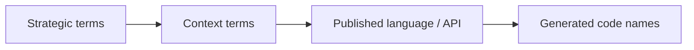
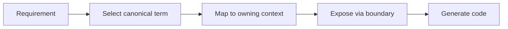

# Ubiquitous Language

> 本文件已依 `src/modules/` 實際程式碼校正，反映現況實作。

## Strategic Terms

| Term | Meaning |
|---|---|
| Main Domain | 戰略層級的主要 bounded context 群組 |
| Bounded Context | 一組高凝聚、可自洽的語言與規則邊界 |
| Published Language | 跨邊界交換時使用的共同語言 |
| Upstream | 關係中提供語言或能力的一方 |
| Downstream | 關係中消費語言或能力的一方 |
| Anti-Corruption Layer | downstream 用來保護本地語言的轉譯層 |
| Conformist | downstream 直接接受 upstream 語言的整合選擇 |
| Shared Kernel | 對稱共用模型關係 |
| Partnership | 對稱共同成功 / 共同失敗關係 |
| Account Scope | shell 中由 `accountId` 表示的帳號範疇；代碼中的 `AccountType = "user" | "organization"` 會把它映射成 personal account 或 organization account 語意 |
| Workspace Scope | 由 `workspaceId` 表示的協作容器範疇，必須從屬於某個 account scope |
| Canonical Route Contract | 只用來表達 composition surface 的正典 URL 形狀，不取代 published language |

## Domain Terms

| Domain | Key Terms |
|---|---|
| iam | Actor, Identity, Tenant, AccessDecision, SecurityPolicy, Account, AccountProfile, Organization, Session, Authentication, Authorization, Federation |
| billing | Subscription, Entitlement, UsageMetering |
| ai | AICapability, ModelPolicy, SafetyGuardrail, PromptPipeline, Embedding, Retrieval, Synthesis |
| analytics | Metric, Report, Dashboard, Projection, EventIngestion |
| platform | NotificationRoute, AuditLog, FeatureFlag, FileStorage, Cache |
| workspace | Workspace, Membership, ShareScope, ActivityFeed, AuditTrail, Approval, Schedule, Invitation, Lifecycle, Resource |
| notion | KnowledgePage, Block, KnowledgeDatabase, View, Collaboration, Template |
| notebooklm | Notebook, Source, Synthesis, Conversation |

## Route Composition Terms

| Term | Meaning |
|---|---|
| accountId | shell route 上的 account scope identifier，不等於 workspaceId，也不直接等於 Tenant 語言 |
| workspaceId | workspace scope identifier；在 canonical shell URL 中作為 account scope 之下的第二段 |
| AccountType String Contract | code-level enum `"user" | "organization"`；`"user"` 對應 personal actor account，`"organization"` 對應 organization account |
| Personal Account | `AccountType = "user"` 對應的 personal actor account 語意 |
| Organization Account | `AccountType = "organization"` 對應的 organization account 語意 |
| Canonical Workspace URL | `/{accountId}/{workspaceId}` |
| Legacy Workspace Redirect Surface | `/{accountId}/workspace/{workspaceId}` |
| Legacy Organization Redirect Surface | `/{accountId}/organization/*` |

## Identifier Contract Glossary

| Identifier | Canonical Role | Notes |
|---|---|---|
| accountId | Account scope identifier | shell composition 的 route id；由 `AccountType = "user" | "organization"` 決定它代表 personal account 或 organization account |
| workspaceId | Workspace scope identifier | 協作容器錨點；在 canonical workspace URL 中是 account scope 之下的第二段 |
| organizationId | Organization-local identifier | 用於 organization/team/taxonomy/relations/ingestion 等 organization-scoped domain 或 integration contract；不直接取代 shell route 的 `accountId` |
| userId | Concrete user identifier | 用於 `createdByUserId`、`verifiedByUserId`、`submittedByUserId`、`assignedUserId`、`creatorUserId` 等具體使用者欄位 |
| actorId | Acting principal identifier | 用於 audit / event / action initiator；可能是 userId，也可能是 system actor，不應假設一定等於 userId |
| ownerId | Resource owner identifier | 表示資源所有者；不是 shell route id，也不必然等於 `accountId` |
| tenantId | Tenant isolation identifier | 用於 storage path、security rules、multi-tenant isolation；不等於 `workspaceId`，也不是 shell route param |
| fileId | File metadata identifier | 檔案 metadata 主鍵；不取代 owner / workspace / tenant scope |

## Context Map Alignment

| Relationship | Published Language Tokens | Upstream Term Source | Downstream Local Terms |
|---|---|---|---|
| iam -> workspace | actor reference, tenant scope, access decision | Actor, Identity, Tenant, AccessDecision | Workspace, Membership, ShareScope |
| iam -> notion | actor reference, tenant scope, access decision | Actor, Identity, Tenant, AccessDecision | KnowledgeArtifact, Taxonomy, Relation, Publication |
| iam -> notebooklm | actor reference, tenant scope, access decision | Actor, Identity, Tenant, AccessDecision | Notebook, Ingestion, Retrieval, Grounding, Synthesis, Evaluation |
| billing -> workspace | entitlement signal, subscription capability signal | Subscription, Entitlement | Workspace, Membership, ShareScope |
| billing -> notion | entitlement signal, subscription capability signal | Subscription, Entitlement | KnowledgeArtifact, Taxonomy, Relation |
| billing -> notebooklm | entitlement signal, subscription capability signal | Subscription, Entitlement | Notebook, Retrieval, Grounding, Synthesis |
| ai -> notion | ai capability signal, model policy, safety result | AICapability, ModelPolicy, SafetyGuardrail | KnowledgeArtifact, Publication |
| ai -> notebooklm | ai capability signal, model policy, safety result | AICapability, ModelPolicy, SafetyGuardrail | Notebook, Retrieval, Grounding, Synthesis, Evaluation |
| platform -> workspace | account scope, organization surface, operational service signal | NotificationRoute（Account/Organization 正典源自 iam，由 platform 轉傳） | Workspace, Membership, ShareScope |
| workspace -> notion | workspaceId, membership scope, share scope | Workspace, Membership, ShareScope | KnowledgeArtifact, Taxonomy, Relation |
| workspace -> notebooklm | workspaceId, membership scope, share scope | Workspace, Membership, ShareScope | Notebook, Retrieval, Grounding, Synthesis |
| notion -> notebooklm | knowledge artifact reference, attachment reference, taxonomy hint | KnowledgeArtifact, Taxonomy, Relation | Notebook, Retrieval, Grounding, Synthesis, Evaluation |
| all contexts -> analytics | domain event, usage signal, projection input | Metric, Report, Dashboard, Projection | Metrics, Reporting, Dashboard |

## Published Language Token Glossary

| Token | Canonical Mapping | Notes |
|---|---|---|
| actor reference | iam.Actor | 不以 User 泛稱，避免與 Membership 混名 |
| organization scope | iam.Organization scope | 用於 account 與 organization surface，不等於 Workspace scope |
| tenant scope | iam.Tenant scope | 用於治理邊界，不等於 Workspace scope |
| access decision | iam.AccessDecision result | 僅傳遞判定結果，不暴露內部 policy 模型 |
| entitlement signal | billing.Entitlement / Subscription capability signal | 不混同 feature-flag payload |
| ai capability signal | ai shared capability signal | notion 與 notebooklm 僅消費，不擁有 generic `ai` 子域 |
| operational service signal | platform operational capability signal | 只表達 shared platform service，不接管治理語言 |
| workspaceId | Workspace identifier | 不取代 knowledge/notebook 的本地主鍵 |
| membership scope | Membership constraint | 不混同 Actor 身份語言 |
| share scope | ShareScope constraint | 不混同一般 permission 欄位集合 |
| knowledge artifact reference | KnowledgeArtifact reference | 僅引用，不代表內容所有權轉移 |
| attachment reference | Attachment reference | 提供可追溯引用，不暴露儲存實作 |
| taxonomy hint | Taxonomy hint | 作為推理輔助語言，不覆蓋 notion 正典 taxonomy |

## Naming Rules

- 不用 User 混指 Actor 與 Membership。
- 不用 Plan 混指 Subscription 與 Entitlement。
- 不用 Wiki 混指 KnowledgePage（notion 的正典知識容器以 `page` + `block` 實作）。
- 不用 Chat 混指 Conversation。
- 不用 Search 混指 Retrieval。
- 不用 AI 混指 platform 的 shared AI capability 與 notion / notebooklm 的本地 use case。
- 不用 Analytics 混指 platform analytics 與 notion 的 knowledge-engagement。
- 不用 Integration 混指 platform integration 與 notion 的 external-knowledge-sync。
- 不用 Versioning 混指 notion 的 knowledge-versioning 與 notebooklm 的 conversation-versioning。
- 不用 Workflow 混指 platform workflow 與 workspace 內的 task/issue/settlement 流程子域。
- 不用 accountId 混指 workspaceId。
- 不用 organizationId 取代 shell route 上的 accountId。
- 不用 userId 混指 actorId。
- 不用 `AccountType = "personal"` 取代 `AccountType = "user"`。
- 不用 `/{accountId}/workspace/{workspaceId}` 當成新的 canonical workspace URL。
- 不用 `/{accountId}/organization/*` 當成新的 canonical governance route。
- workspace 子域目錄名稱：`approval`（非 `approve`）、`schedule`（非 `scheduling`）、`share`（非 `sharing`）。
- notion 子域目錄名稱：`template`（非 `templates`）、`page`（承接 `authoring` 語意）、`view`（database 多視圖 facet）。

## Naming Anti-Patterns

- 用同一個詞同時代表平台治理語言與工作區參與語言。
- 用內容產品舊名覆蓋 notion 的正典語言。
- 用 Search 混指 notebooklm 的 Retrieval 與一般搜尋能力。
- 用同一個 generic 子域名跨主域重複宣稱所有權，再期望 Copilot 自行猜對上下文。
- 把 route composition contract 誤寫成 cross-context published language。
- 把 organization-scoped identifier 誤當成 shell composition identifier。
- 把 actorId、userId、ownerId 三種角色不同的 identifier 混成同一欄位語意。
- 把 personal account 顯示語言誤當成 code-level `AccountType` literal。
- 把 legacy redirect surface 誤寫成正典 URL 契約。

## Copilot Generation Rules

- 生成程式碼時，先對齊 strategic term，再對齊 context-specific term，最後才命名型別與 API。
- 奧卡姆剃刀：若一個詞已足夠準確，就不要再加第二個近義詞製造歧義。
- 名稱衝突時先回到 glossary，而不是直接在程式碼裡各自命名。

## Dependency Direction Flow

## Correct Interaction Flow

## Document Network

- [contexts/workspace/ubiquitous-language.md](../contexts/workspace/ubiquitous-language.md)
- [contexts/platform/ubiquitous-language.md](../contexts/platform/ubiquitous-language.md)
- [contexts/notion/ubiquitous-language.md](../contexts/notion/ubiquitous-language.md)
- [contexts/notebooklm/ubiquitous-language.md](../contexts/notebooklm/ubiquitous-language.md)
- [bounded-context-subdomain-template.md](./bounded-context-subdomain-template.md)
- [project-delivery-milestones.md](../system/project-delivery-milestones.md)
- decisions/0004-ubiquitous-language.md

## Conflict Resolution

- 若 strategic term 與主域 term 衝突，優先維持主域語言不被污染，再回寫 strategic glossary。
- 若同一個詞在多主域都想擁有，優先看它服務的是治理、協作範疇、正典內容還是推理輸出。