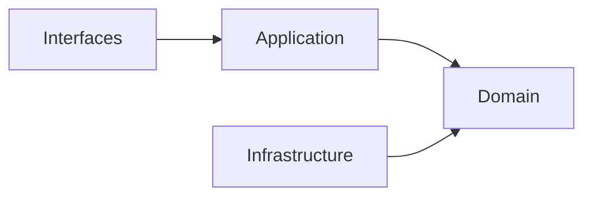
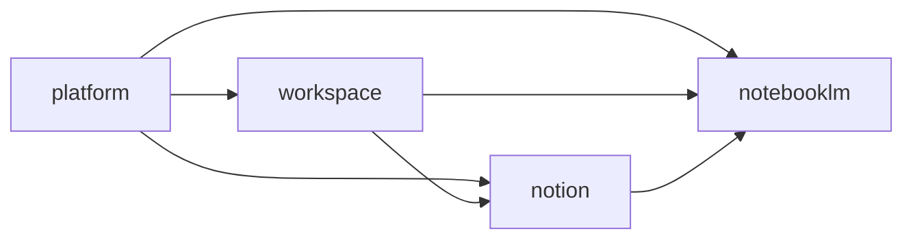

# Architecture Overview

## System Shape

系統以八個主域 / bounded context 組成，每個主域都視為一個有自己語言與規則的邊界：

- iam：身份、租戶、存取判定、安全治理、**account 與 organization 聚合根**
- billing：訂閱、權益、推薦與商業生命週期
- ai：共享 AI capability orchestration、content generation / distillation、context assembly、prompt pipeline、safety 與 quality / observability policy
- analytics：報表、指標、儀表板與下游 read model 投影
- platform：notification、search、audit、營運服務（account 與 organization 已遷入 iam）
- workspace：協作容器與工作區範疇
- notion：正典知識內容生命週期
- notebooklm：對話、來源處理與推理輸出

## Architectural Baseline

- 主域內部採用 Hexagonal Architecture（Ports and Adapters）+ Domain-Driven Design（DDD）。
- 領域建模採 semantic-first，優先對齊 business language，再決定資料結構與 adapter 位置。
- 後端 runtime 基線採 Firebase Serverless Backend Architecture：Authentication、Firestore、Cloud Functions、Hosting。
- AI orchestration 基線採 Genkit：AI Flows、Tool Calling、Prompt Pipelines 皆視為外部能力，由 ai context 統一治理。
- 前端 state 基線採 Zustand 與 XState：Zustand 承接輕量 client state，XState 承接有限狀態工作流。
- runtime validation 基線採 Zod：所有外部輸入先經 Zod，再進入 application 與 domain。
- 主域之間只透過 published language、API 邊界或事件互動。
- 領域核心不直接依賴 framework 與 infrastructure。
- 主域級關係採用 directed upstream-downstream，不採用 Shared Kernel / Partnership。

## Main Domains

| Main Domain | Strategic Role | What It Owns |
|---|---|---|
| iam | 治理上游 | actor、identity、tenant、access decision、security policy、**account、organization** |
| billing | 商業上游 | subscription、entitlement、billing event、referral |
| ai | 共享能力上游 | generation、orchestration、distillation、retrieval、memory、context、safety、tool-calling、reasoning、conversation、evaluation、tracing；provider-routing / model-policy 為後續治理延伸 |
| analytics | 分析下游 | reporting、metrics、dashboard、projection read model |
| platform | 平台營運支擐 | notification、search、audit-log、observability、operational workflow（account、organization 已遷入 iam） |
| workspace | 協作範疇 | workspaceId、membership、sharing、presence、feed、audit、scheduling、task、issue、settlement、approve、quality、orchestration |
| notion | 正典內容 | knowledge artifact、taxonomy、relations、publication、knowledge-versioning |
| notebooklm | 推理輸出 | ingestion、retrieval、grounding、conversation、synthesis、evaluation、conversation-versioning |

## Relationship Baseline

| Upstream | Downstream | Reason |
|---|---|---|
| iam | billing | 提供 actor、tenant 與 access policy 基線 |
| iam | platform | 提供身份與安全治理基線 |
| iam | workspace / notion / notebooklm | 提供 actor、tenant、access decision |
| billing | workspace / notion / notebooklm | 提供 entitlement 與 subscription capability signal |
| ai | notion / notebooklm | 提供 shared AI capability、prompt orchestration、content distillation / generation support、model policy 與 safety |
| platform | workspace | 提供 account scope、organization surface 與 shared operational surface（account/org 正典己遷入 iam） |
| workspace | notion / notebooklm | 提供 workspace scope、membership scope、share scope |
| notion | notebooklm | 提供可引用的正典知識內容來源 |
| iam / billing / platform / workspace / notion / notebooklm | analytics | 輸出事件與 read model 供分析使用 |

## Contradiction-Free Rules

- 目前採八個主域 / bounded context；若未來再切分，必須用新的 ADR 明確記錄。
- 戰略文件若需要描述缺口，一律使用 recommended gap subdomains，而不是假裝它們已被實作驗證。
- iam 是身份與存取治理上游，不是內容或商業正典擁有者。
- billing 擁有 subscription 與 entitlement 的商業語義，不再把它們掛回 platform。
- ai 擁有 shared AI capability，但不擁有 notion 的正典內容語言或 notebooklm 的推理輸出語言。
- analytics 是下游 read-model sink，不應反向成為其他主域的 canonical owner。
- notion 是正典內容擁有者；notebooklm 是衍生推理輸出擁有者。

## System-Wide Dependency Direction

- 每個主域內部固定遵守 interfaces -> application -> domain <- infrastructure。
- 跨主域依賴只能透過 published language、public API boundary、events。
- 外部框架、SDK、傳輸與儲存細節只能停留在 adapter 邊界。

## App Route Composition Contract

- `src/app/(shell)` 是 shell composition 邊界，不承載 business rule。
- account 是 shell 內的唯一 account-scoped route surface，canonical 入口為 `src/app/(shell)/(account)/[accountId]/[[...slug]]/page.tsx`。
- `accountId` 代表 account scope；其語意由 `AccountType = "user" | "organization"` 決定，其中 `"user"` 對應 personal actor account，`"organization"` 對應 organization account，不代表 workspace scope。
- `AccountType = "user" | "organization"` 是目前 domain、use case、validator 與 route composition 共用的字串契約；UI 可顯示 personal account / organization account，但不應把 `"personal"` 當成跨邊界字串值。
- workspace detail 的 canonical URL 為 `/{accountId}/{workspaceId}`，由 account catch-all dispatcher 解析並轉交 workspace module route screen。
- `/{accountId}/workspace/{workspaceId}` 僅作為 legacy redirect surface；文件、UI 與新程式碼不應再把它當成 canonical href。
- account-scoped governance route 採 flattened account surface，例如 `/{accountId}/members`、`/{accountId}/teams`、`/{accountId}/permissions`，不再以 `/{accountId}/organization/*` 作為 canonical URL。
- route files 只做 composition、redirect 與 query-state 轉譯；module collaboration 仍必須走 `src/modules/*` 的公開匯出邊界。

## System-Wide Anti-Patterns

- 把 domain 核心直接接上 framework、database、HTTP、queue 或 AI SDK。
- 把主域內部模型直接共享給其他主域，取代 published language。
- 把治理、內容、推理三種責任重新揉成單一平級主域。

## Copilot Generation Rules

- 生成程式碼時，先定位需求落在哪個主域，再定位到子域與層。
- 奧卡姆剃刀：若既有主域、子域與 API boundary 已能承接需求，就不要再新增新的平級結構。
- 優先維持單一清楚的 input -> boundary -> application -> domain -> output 路徑。

## Dependency Direction Flow

## Correct Interaction Flow

## Document Network

- [README.md](../../README.md)
- [bounded-contexts.md](../domain/bounded-contexts.md)
- [context-map.md](./context-map.md)
- [subdomains.md](../domain/subdomains.md)
- [integration-guidelines.md](./integration-guidelines.md)
- [strategic-patterns.md](./strategic-patterns.md)
- [bounded-context-subdomain-template.md](../domain/bounded-context-subdomain-template.md)
- [project-delivery-milestones.md](./project-delivery-milestones.md)
- decisions/0001-hexagonal-architecture.md

## Reading Path

1. [bounded-contexts.md](../domain/bounded-contexts.md)
2. [context-map.md](./context-map.md)
3. [subdomains.md](../domain/subdomains.md)
4. [ubiquitous-language.md](../domain/ubiquitous-language.md)
5. [integration-guidelines.md](./integration-guidelines.md)
6. [strategic-patterns.md](./strategic-patterns.md)
7. decisions/README.md
