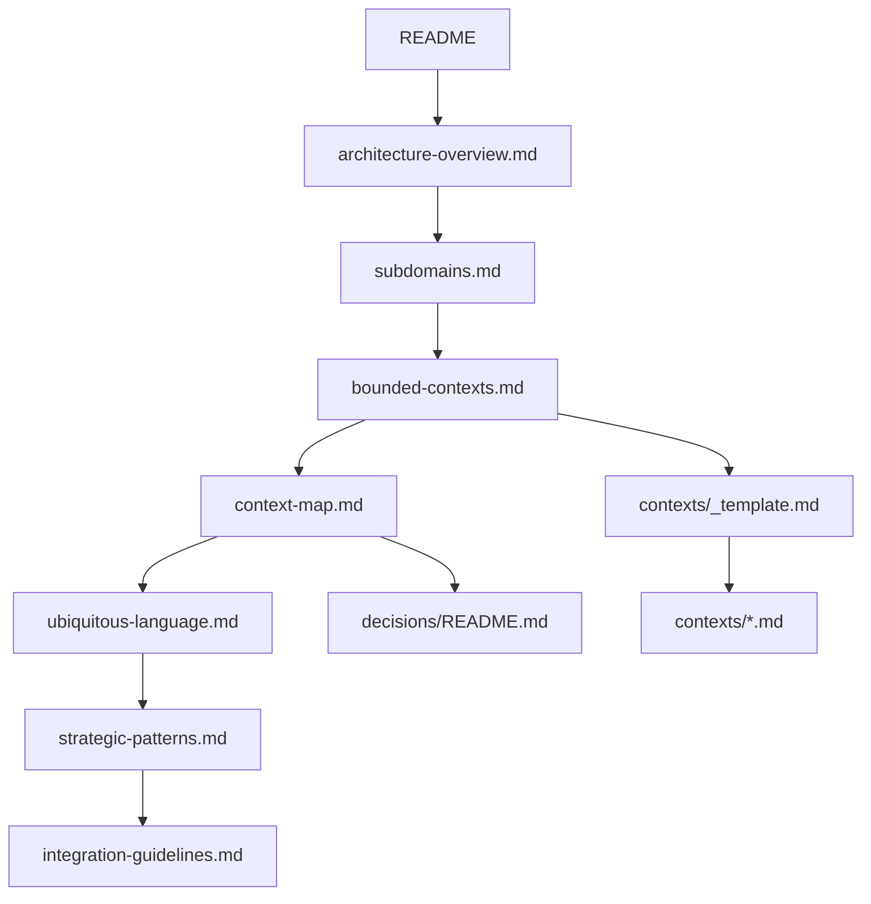

# Xuanwu Strategic Architecture Docs

## Purpose

This folder is the strategic documentation set for **Hexagonal Architecture with Domain-Driven Design**.

## Reading Guide

## Rules

1. Update `bounded-contexts.md` and `context-map.md` together when boundaries change.
2. Update `ubiquitous-language.md` before introducing new domain terms.
3. Keep cross-context collaboration API-first and explicit.
4. Record strategic changes as ADRs under `decisions/`.

