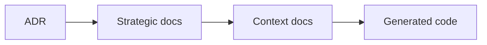
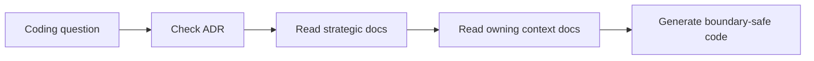

# Docs

本文件集在本次任務限制下，僅依 Context7 驗證的 DDD、Context Map、Hexagonal Architecture 與 ADR 參考重建，不主張反映現況實作。

## Purpose

這份文件集提供八個主域 / bounded context 的 architecture-first 戰略藍圖，並用單一決策日誌與主域文件消除術語、邊界與關係上的衝突。

## Architecture Baseline

本文件網的架構權威基線是：

- Hexagonal Architecture（Ports and Adapters）+ Domain-Driven Design（DDD）
- semantic-first 的 business-language-aligned domain modeling
- Firebase Serverless Backend Architecture：Authentication、Firestore、Cloud Functions、Hosting
- Genkit AI Orchestration Layer：AI Flows、Tool Calling、Prompt Pipelines
- Frontend State Management Layer：Zustand for client state、XState for finite-state workflows
- Schema Validation Layer：Zod for runtime type safety and domain validation

若任務涉及模組分層、runtime 邊界、AI orchestration、frontend state、validation 或 shell route contract，先以 [architecture-overview.md](./architecture-overview.md) 為全域敘事權威，再落到對應 context 文件。

## Single Source Of Truth Map

| Document | Role |
|---|---|
| [architecture-overview.md](./architecture-overview.md) | 全域架構敘事總覽 |
| [subdomains.md](./subdomains.md) | 八主域與子域總清單 |
| [bounded-contexts.md](./bounded-contexts.md) | 主域與子域所有權地圖 |
| [context-map.md](./context-map.md) | 主域間關係圖與方向 |
| [ubiquitous-language.md](./ubiquitous-language.md) | 戰略詞彙表 |
| [integration-guidelines.md](./integration-guidelines.md) | 主域整合規則 |
| [strategic-patterns.md](./strategic-patterns.md) | 採用與禁用的戰略模式 |
| [hard-rules-consolidated.md](./hard-rules-consolidated.md) | 全域硬性守則與 design smell 防線 |
| [bounded-context-subdomain-template.md](./bounded-context-subdomain-template.md) | bounded context 與 subdomain 交付模板 |
| [project-delivery-milestones.md](./project-delivery-milestones.md) | 從零到交付的專案里程碑 |
| [decisions/README.md](./decisions/README.md) | ADR 索引與決策日誌 |
| [decisions/SMELL-INDEX.md](./decisions/SMELL-INDEX.md) | Design Smell taxonomy 與對應決策索引 |
| [contexts/_template.md](./contexts/_template.md) | 新主域或新 context 文件樣板 |

## Context Folders

- [contexts/ai/README.md](./contexts/ai/README.md)
- [contexts/analytics/README.md](./contexts/analytics/README.md)
- [contexts/billing/README.md](./contexts/billing/README.md)
- [contexts/iam/README.md](./contexts/iam/README.md)
- [contexts/platform/README.md](./contexts/platform/README.md)
- [contexts/workspace/README.md](./contexts/workspace/README.md)
- [contexts/notion/README.md](./contexts/notion/README.md)
- [contexts/notebooklm/README.md](./contexts/notebooklm/README.md)

## Focused Implementation Docs

- [architecture/source-to-task-flow.md](./architecture/source-to-task-flow.md)
- [feature/notebooklm-source-processing-task-flow.md](./feature/notebooklm-source-processing-task-flow.md)
- [deliveries/upload-parse-to-task-flow.md](./deliveries/upload-parse-to-task-flow.md)
- [decisions/0012-source-to-task-orchestration.md](./decisions/0012-source-to-task-orchestration.md)

## Route Contract Authority

- shell composition 與 canonical account / workspace URL 以 [architecture-overview.md](./architecture-overview.md) 為全域權威。
- account scope、`AccountType = "user" | "organization"` 的字串契約，以及 flattened governance route 以 [contexts/platform/README.md](./contexts/platform/README.md) 與 [contexts/platform/ubiquitous-language.md](./contexts/platform/ubiquitous-language.md) 為權威。
- workspace scope 與 canonical workspace detail route 以 [contexts/workspace/README.md](./contexts/workspace/README.md) 與 [contexts/workspace/ubiquitous-language.md](./contexts/workspace/ubiquitous-language.md) 為權威。
- `/{accountId}/workspace/{workspaceId}` 與 `/{accountId}/organization/*` 只作為 legacy redirect surface，不是新文件或新 UI 應引用的 canonical contract。

## Document Network

- [architecture-overview.md](./architecture-overview.md)
- [bounded-contexts.md](./bounded-contexts.md)
- [context-map.md](./context-map.md)
- [integration-guidelines.md](./integration-guidelines.md)
- [strategic-patterns.md](./strategic-patterns.md)
- [hard-rules-consolidated.md](./hard-rules-consolidated.md)
- [bounded-context-subdomain-template.md](./bounded-context-subdomain-template.md)
- [project-delivery-milestones.md](./project-delivery-milestones.md)
- [subdomains.md](./subdomains.md)
- [ubiquitous-language.md](./ubiquitous-language.md)
- [decisions/README.md](./decisions/README.md)
- [decisions/SMELL-INDEX.md](./decisions/SMELL-INDEX.md)
- [contexts/_template.md](./contexts/_template.md)

## Module Layer Map（src 結構）

目前以 `src/modules/` 作為唯一模組實作層：

| 路徑 | 角色 | 結構特徵 | 使用時機 |
|---|---|---|---|
| `src/modules/<context>/` | 主域模組實作（現況） | 以 `subdomains/` 為核心，搭配 `adapters/`、`shared/`、`orchestration/` 與 `index.ts` 公開匯出 | 撰寫與維護所有 use case、adapter、domain entity 與跨子域編排 |

## Top-Level Directory Structure

Repo 根目錄的三個運行時層：

| 目錄 | 角色 |
|---|---|
| `src/` | Next.js App Router + 所有主域模組實作（`src/app/`、`src/modules/`） |
| `packages/` | 共用套件（`integration-firebase`、`ui-shadcn` 等），以 alias 形式被 `src/modules/` 引用 |
| `py_fn/` | Python Cloud Functions：ingestion、parse、chunk、embed、background worker |

- `packages/` 以 `@integration-*`、`@ui-*`、`@lib-*` 等 alias 被 TypeScript 引用。
- `py_fn/` 與 Next.js 的互動只透過 QStash 訊息、Firestore trigger 或事件契約；不共用程式碼。

### 路由規則

- 讀取主域邊界與任務路由 → `src/modules/<context>/AGENT.md`
- 撰寫新實作程式碼 → `src/modules/<context>/`，以 `src/modules/template` 為骨架基線
- 跨主域協作只透過目標主域的公開匯出（`src/modules/<context>/index.ts`）

### 嚴禁混淆

- 不得將已淘汰的 `modules/` 路徑當成現行實作位置。
- 生成程式碼時，目標路徑一律以 `src/modules/` 為準。

## Conflict Resolution Rules

- ADR 與戰略敘事衝突時，以 ADR 為準。
- 戰略文件與主域文件衝突時，先以更具邊界意義的主域文件為準，再回寫戰略文件。
- 子域所有權衝突時，以 [bounded-contexts.md](./bounded-contexts.md) 與 [subdomains.md](./subdomains.md) 為準。
- 關係方向衝突時，以 [context-map.md](./context-map.md) 為準。
- 若 root `docs/` 與 `src/modules/*` 的術語命名衝突，以 root `docs/` 的戰略命名與 duplicate resolution 為準。

## Global Anti-Pattern Rules

- 不把 framework、transport、storage、SDK 細節寫進 domain 核心。
- 不把其他主域的內部模型當成自己的正典語言。
- 不把對稱關係與 directed relationship 混寫在同一套戰略文件。
- 不把 gap subdomains 描述成已驗證現況。

## Copilot Generation Rules

- 生成程式碼前，先從本文件決定應讀哪些戰略文件與 context 文件。
- 若任務涉及新 bounded context、subdomain 骨架或交付分期，先讀 [bounded-context-subdomain-template.md](./bounded-context-subdomain-template.md) 與 [project-delivery-milestones.md](./project-delivery-milestones.md)。
- 若任務涉及 design smell、架構異味、boundary leakage、cyclic dependency 或 API surface 過胖，先讀 [hard-rules-consolidated.md](./hard-rules-consolidated.md)、[decisions/SMELL-INDEX.md](./decisions/SMELL-INDEX.md) 與對應編號 smell ADR。
- 奧卡姆剃刀：若現有文件網已能回答邊界問題，就不要再新增臨時規則文件。
- 生成流程應先看 ADR，再看戰略文件，再看主域文件，最後才落到程式碼。

## Dependency Direction Flow

## Correct Interaction Flow

## Constraints

- 本文件集是 Context7-only 的 architecture-first 版本。
- 本文件集沒有檢視任何既有專案內容，因此不應被解讀為 repo-inspected 現況描述。
