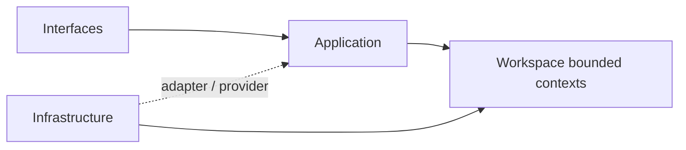
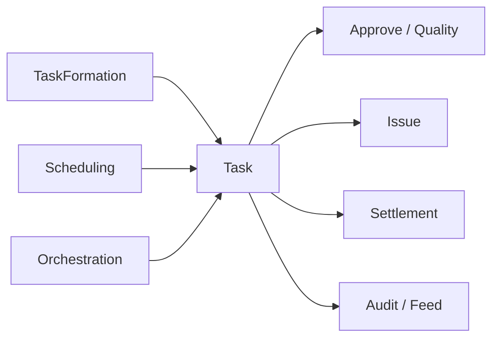

# Workspace

本文件在本次任務限制下，僅依 Context7 驗證的 DDD、Context Map、Hexagonal Architecture 參考整理，不主張反映現況實作。

## Domain Role

workspace 是協作與範疇主域。依 bounded context 原則，它應封裝高度凝聚的工作區規則，並以最小公開介面提供其他主域使用的 workspace scope。

## Baseline Bounded Contexts

| Subdomain | Owns | Excludes |
|---|---|---|
| audit | 工作區操作證據、可追溯紀錄 | 平台永久合規審計 |
| feed | 面向使用者的工作區活動投影 | 正典狀態與不可變證據 |
| scheduling | 工作區時間安排、提醒、期限 | 平台背景工作引擎 |
| approve | 任務驗收與問題單覆核審批判定 | 平台身份授權決策 |
| issue | 問題單建立、追蹤、狀態轉換 | 知識內容正典生命週期 |
| orchestration | 知識頁面→任務物化批次流程編排 | domain 事實的直接寫入 |
| quality | 任務 QA 審查與質檢流程 | 業務驗收規則本身 |
| settlement | 請款發票生命週期與財務對帳 | billing 計費狀態 |
| task | 任務建立、指派、狀態機 | 知識內容與 notebook 推理 |
| task-formation | AI 輔助任務候選抽取與批次匯入 | AI 模型能力（屬 ai context） |

## Recommended Gap Bounded Contexts

| Subdomain | Why It Should Exist | Gap If Missing |
|---|---|---|
| lifecycle | 承接 workspace 建立、封存、還原、移轉與狀態變化 | 主容器生命週期容易散落到 orchestration 或 app 組裝層 |
| membership | 承接 workspace 內邀請、席位、角色與參與關係 | 會把 organization 與 workspace participation 混為一談 |
| sharing | 承接分享連結、外部可見性與公開暴露範圍 | 對外共享無獨立邊界，安全與責任不清 |
| presence | 承接即時在線狀態、協作存在感與共同編輯訊號 | 即時協作能力無法形成可演化的本地模型 |

## Domain Invariants

- workspaceId 是工作區範疇錨點。
- 工作區成員關係屬於 membership，而不是平台身份本身。
- activity feed 只投影事實，不創造事實。
- audit trail 一旦寫入即不可隨意覆蓋。
- task/issue/settlement/approve/quality/orchestration 是獨立子域，不得合併為單一 workspace-workflow 概念。

## Dependency Direction

- workspace 子域在存在對應層時必須遵守 interfaces -> application -> domain <- infrastructure；不必為形式完整而預建所有層。
- lifecycle、membership、sharing、presence 等能力若需要外部服務，必須經過 port/adapter。
- domain 不得依賴 UI 狀態、HTTP 傳輸、排程框架或儲存實作細節。

## Anti-Patterns

- 把 Membership 混成 Actor 身份本身。
- 讓 ActivityFeed 直接創造工作區事實，而不是投影工作區事實。
- 用 `workspace-workflow` 代指已分解的 task、issue、settlement、approve、quality、orchestration 等子域。
- 混用 `platform.workflow` 與 workspace 內的任務流程語言。

## Copilot Generation Rules

- 生成程式碼時，先判斷需求落在 task、issue、approve、quality、settlement、orchestration、audit、feed、scheduling 哪個責任。
- workspace 工作區流程語言已分解為多個獨立子域，不再使用 `workspace-workflow` 混指所有流程。
- 奧卡姆剃刀：若既有 workspace 邊界可以吸收需求，就不要額外新建平行容器或 scope 抽象。
- 對外部能力的抽象必須貼合 workspace scope 的需求，而不是複製供應商 API。

## Dependency Direction Flow

## Correct Interaction Flow

## Document Network

- [README.md](./README.md)
- [AGENTS.md](./AGENTS.md)
- [context-map.md](./context-map.md)
- [subdomains.md](./subdomains.md)
- [bounded-contexts.md](../../domain/bounded-contexts.md)
- [subdomains.md](../../domain/subdomains.md)
