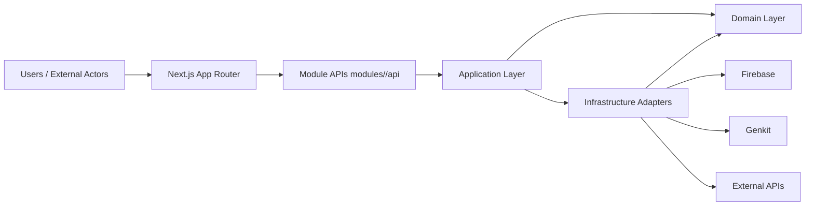

# Architecture Overview

## System View

## Hexagonal Summary

1. Domain owns core business rules and remains framework-agnostic.
2. Application orchestrates use cases through ports.
3. Adapters implement ports for persistence, messaging, and external integrations.
4. Cross-context interaction goes through published API contracts.

## System Boundary Rules

1. Browser-facing orchestration stays in Next.js.
2. Business invariants stay in domain/application, not adapters.
3. External services are accessed only through infrastructure adapters.

