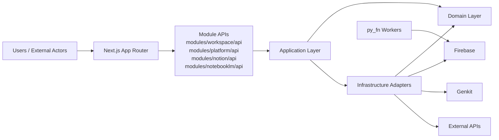

# Architecture Overview

## System View

## 定案主域

| 主域 | 分類 | 主要職責 |
|---|---|---|
| `workspace` | Generic | 協作容器、工作區生命週期 |
| `platform` | Generic | 身份、帳號、政策、商業、通知 |
| `notion` | Core | 知識內容、文章、資料庫、協作 |
| `notebooklm` | Supporting | AI 對話、RAG 合成、摘要 |

## Hexagonal Summary

1. Domain owns core business rules and remains framework-agnostic.
2. Application orchestrates use cases through ports.
3. Adapters implement ports for persistence, messaging, and external integrations.
4. Cross-context interaction goes through published API contracts.

## System Boundary Rules

1. Browser-facing orchestration stays in Next.js.
2. Business invariants stay in domain/application, not adapters.
3. External services are accessed only through infrastructure adapters.

