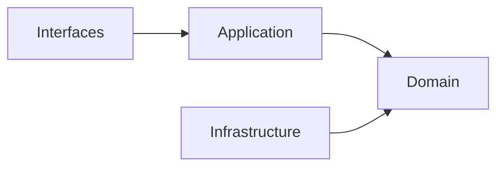
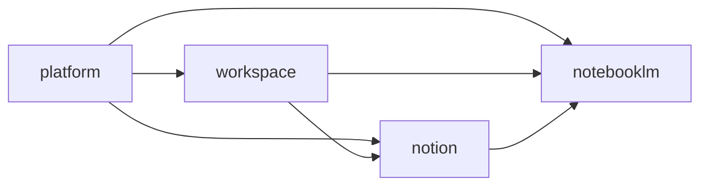

# Architecture Overview

本文件在本次任務限制下，僅依 Context7 驗證的 DDD、Context Map、Hexagonal Architecture 與 ADR 參考重建，不主張反映現況實作。

## System Shape

系統以四個主域組成，每個主域都視為一個有自己語言與規則的 bounded context 族群：

- workspace：協作容器與工作區範疇
- platform：治理、身份、權益與營運支撐
- notion：正典知識內容生命週期
- notebooklm：對話、來源處理與推理輸出

## Architectural Baseline

- 主域內部採用 Hexagonal Architecture。
- 主域之間只透過 published language、API 邊界或事件互動。
- 領域核心不直接依賴 framework 與 infrastructure。
- 主域級關係採用 directed upstream-downstream，不採用 Shared Kernel / Partnership。

## Main Domains

| Main Domain | Strategic Role | What It Owns |
|---|---|---|
| workspace | 協作範疇 | workspaceId、membership、sharing、presence、feed、audit、scheduling、workspace-workflow |
| platform | 治理上游 | actor、tenant、access、policy、entitlement、billing、ai capability、notification、audit-log |
| notion | 正典內容 | knowledge artifact、taxonomy、relations、publication、knowledge-versioning |
| notebooklm | 推理輸出 | ingestion、retrieval、grounding、conversation、synthesis、evaluation、conversation-versioning |

## Relationship Baseline

| Upstream | Downstream | Reason |
|---|---|---|
| platform | workspace | 提供治理結果與權益判定 |
| platform | notion | 提供治理結果與權益判定 |
| platform | notebooklm | 提供治理結果與權益判定 |
| workspace | notion | 提供 workspace scope 與 sharing scope |
| workspace | notebooklm | 提供 workspace scope 與 sharing scope |
| notion | notebooklm | 提供可引用的知識內容來源 |

## Contradiction-Free Rules

- 只有四個主域，不再引入其他平級主域。
- 戰略文件若需要描述缺口，一律使用 recommended gap subdomains，而不是假裝它們已被實作驗證。
- platform 是治理上游，不是內容或對話的正典擁有者。
- platform 擁有 shared AI capability，但不擁有 notion 的正典內容語言或 notebooklm 的推理輸出語言。
- notion 是正典內容擁有者，不是治理上游。
- notebooklm 是衍生推理輸出擁有者，不是正典內容擁有者。

## System-Wide Dependency Direction

- 每個主域內部固定遵守 interfaces -> application -> domain <- infrastructure。
- 跨主域依賴只能透過 published language、public API boundary、events。
- 外部框架、SDK、傳輸與儲存細節只能停留在 adapter 邊界。

## System-Wide Anti-Patterns

- 把 domain 核心直接接上 framework、database、HTTP、queue 或 AI SDK。
- 把主域內部模型直接共享給其他主域，取代 published language。
- 把治理、內容、推理三種責任重新揉成單一平級主域。

## Copilot Generation Rules

- 生成程式碼時，先定位需求落在哪個主域，再定位到子域與層。
- 奧卡姆剃刀：若既有主域、子域與 API boundary 已能承接需求，就不要再新增新的平級結構。
- 優先維持單一清楚的 input -> boundary -> application -> domain -> output 路徑。

## Dependency Direction Flow

## Correct Interaction Flow

## Document Network

- [README.md](./README.md)
- [bounded-contexts.md](./bounded-contexts.md)
- [context-map.md](./context-map.md)
- [subdomains.md](./subdomains.md)
- [integration-guidelines.md](./integration-guidelines.md)
- [strategic-patterns.md](./strategic-patterns.md)
- [bounded-context-subdomain-template.md](./bounded-context-subdomain-template.md)
- [project-delivery-milestones.md](./project-delivery-milestones.md)
- [decisions/0001-hexagonal-architecture.md](./decisions/0001-hexagonal-architecture.md)

## Reading Path

1. [bounded-contexts.md](./bounded-contexts.md)
2. [context-map.md](./context-map.md)
3. [subdomains.md](./subdomains.md)
4. [ubiquitous-language.md](./ubiquitous-language.md)
5. [integration-guidelines.md](./integration-guidelines.md)
6. [strategic-patterns.md](./strategic-patterns.md)
7. [decisions/README.md](./decisions/README.md)