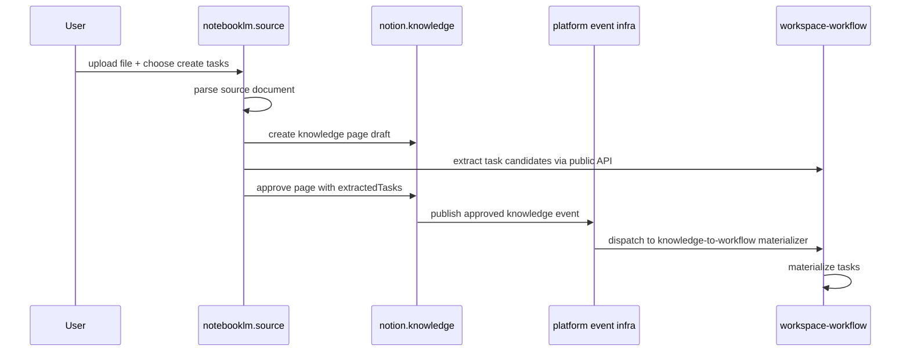

# Source To Task Flow Architecture

## Purpose

這份 architecture 文件說明 `upload → parse → task` 為什麼要以目前這種方式實作，並記錄合規的邊界與組裝入口。

## Architectural Decision Summary

系統採取以下固定路徑：

- `notebooklm.source`：負責來源文件的入口與流程 orchestration
- `notion.knowledge`：負責正典 Knowledge Page 的建立與 approval
- `workspace.workspace-workflow`：負責 task candidates extraction 與 task materialization
- `platform`：負責事件 transport 與共享基礎設施能力

## Ownership Map

| Concern | Owning Context | Why |
|---|---|---|
| Upload dialog / processing summary | `notebooklm.source` | 這是 source ingestion 的使用者入口 |
| Parse / reindex orchestration | `notebooklm.source` | 這是來源文件處理能力 |
| Knowledge Page draft / approval | `notion.knowledge` | Knowledge Page 是正典內容 |
| Extracted task interpretation | `workspace.workspace-workflow` | 任務語言屬於 workspace workflow |
| Event publication / dispatch | `platform` | transport 與 infra gateway 屬 platform |
| Final task creation | `workspace.workspace-workflow` | task aggregate 與 workflow 狀態屬 workspace |

## Required Dependency Direction

```text
interfaces → application → domain ← infrastructure
```

跨 context 僅允許：

- public API
- published events
- semantic DTO / published language

不允許：

- `notebooklm` 直接 import `workspace/domain/*`
- `notebooklm` 直接寫 `workspace` repository
- `workspace` 直接擁有 `KnowledgePage` canonical model

## Canonical Assembly Path



## Why Task Creation Goes Through Knowledge Page First

這是本架構最關鍵的合規點。

原因如下：

1. 來源文件本身不是 workspace 的 canonical workflow artifact。
2. `notion` 才是正典內容邊界，應先承接 parse 結果。
3. `workspace` 只接收已整理好的 task intent，不直接接收 raw source ingestion intent。
4. 這樣可以避免 notebooklm 同時擁有 content 與 task 的雙重 canonical ownership。

## Public Seams Used In Implementation

- processing entry: `processSourceDocumentWorkflow`
- orchestration use case: `ProcessSourceDocumentWorkflowUseCase`
- downstream handoff port: `TaskMaterializationWorkflowPort`
- downstream adapter: `TaskMaterializationWorkflowAdapter`
- workspace listener registration: `createKnowledgeToWorkflowListener`
- platform event infra factory: `createPlatformEventInfrastructure`

## Architecture Guardrails

- UI 只顯示 step 狀態，不內嵌 business rule。
- notebooklm 的 application layer 只做 orchestration，不解釋 task domain 規則。
- public API surface 只暴露必要 command / query，不暴露 internals。
- event-driven materialization 是真正的寫入通道，不把 transport 混進 feature component。

## Result

這個設計讓 `upload → parse → task` 不是一條臨時 shortcut，而是一條**符合 DDD ownership、Hexagonal boundary、API-only collaboration、platform-owned infra** 的正式系統路徑。