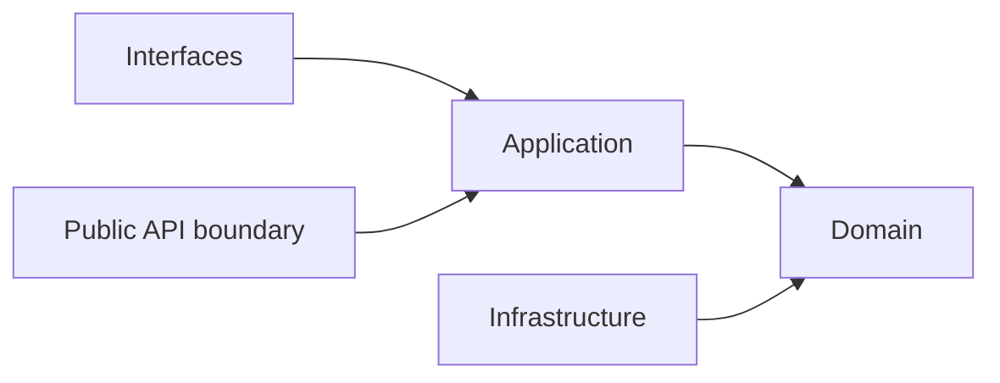
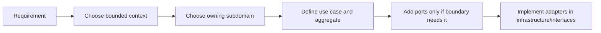

# Bounded Context Subdomain Template

本文件在本次任務限制下，僅依 Context7 驗證的 Hexagonal Architecture、DDD、Context Map 與 ADR 參考建立，作為 `modules/<bounded-context>/subdomains/*` 的交付標準模板，不主張反映現況實作。

## Purpose

這份模板定義新的 bounded context 與其 subdomains 應以什麼結構交付，讓 Copilot 在建立模組樹、層次與邊界時，先遵守 Hexagonal Architecture with Domain-Driven Design，再決定實作細節。

## Standard Structure Tree

```text
modules/
└── <bounded-context>/
    ├── README.md
    ├── AGENT.md
    ├── api/
    │   └── index.ts
    ├── application/
    ├── domain/
    ├── docs/
    │   ├── README.md
    │   ├── bounded-context.md
    │   ├── context-map.md
    │   ├── subdomains.md
    │   ├── ubiquitous-language.md
    │   ├── aggregates.md
    │   ├── domain-events.md
    │   ├── repositories.md
    │   ├── application-services.md
    │   └── domain-services.md
    ├── infrastructure/
    ├── interfaces/
    └── subdomains/
        ├── <subdomain-a>/
        │   ├── README.md
        │   ├── api/
        │   │   └── index.ts
        │   ├── application/
        │   │   ├── dto/
        │   │   └── use-cases/
        │   ├── domain/
        │   │   ├── entities/
        │   │   ├── value-objects/
        │   │   ├── services/
        │   │   ├── repositories/
        │   │   ├── events/
        │   │   └── ports/
        │   ├── infrastructure/
        │   │   ├── adapters/
        │   │   ├── persistence/
        │   │   └── repositories/
        │   └── interfaces/
        │       ├── api/
        │       ├── components/
        │       ├── hooks/
        │       ├── queries/
        │       └── _actions/
        └── <subdomain-b>/
```

## Layer Responsibilities

| Layer | Responsibility |
|---|---|
| `api/` | bounded context 或 subdomain 對外唯一公開邊界 |
| `application/` | 協調 use cases、轉換 DTO、執行流程但不承載核心業務規則；若在 bounded context 根層，代表跨 subdomain 的 context-wide orchestration |
| `domain/` | 聚合根、實體、值對象、領域服務、領域事件與核心規則；若在 bounded context 根層，代表跨 subdomain 的 shared policy、published language 或 context-wide domain concept |
| `infrastructure/` | repository / adapter 實作、持久化、外部系統整合；若在 bounded context 根層，代表 context-wide driven adapters |
| `interfaces/` | UI、route handler、server action、query hooks 等 driving adapters；若在 bounded context 根層，代表 context-wide composition / driving adapters |

## Core Clarification

- `<bounded-context>` 本身也應該維持 Hexagonal Architecture with DDD 的依賴方向，而不只是 `subdomains/<name>/` 內部才有六邊形分層。
- 但 Hexagonal Architecture 的關鍵是**依賴方向與內外邊界**，不是資料夾一定要叫 `core/`。
- 依 Context7 驗證的參考，Application Core 是概念上的核心，外層依賴向內；ports 可放在 application 或 domain，取決於規則真正屬於哪一層。
- 因此本模板的預設寫法是用顯式的 `application/`、`domain/`、`infrastructure/`、`interfaces/` 來表達六邊形邊界，而不是再包一層泛用 `core/`。
- 如果團隊真的要使用 `core/`，較合理的變體應是 `<bounded-context>/core/application`、`<bounded-context>/core/domain`，必要時加 `core/ports`；**不應**把 `infrastructure/` 或 `interfaces/` 也放進 `core/`，因為它們本來就是外層。
- 只有當某段邏輯明確屬於整個 bounded context，而不是單一 subdomain 時，才應放在 `<bounded-context>/application|domain|infrastructure|interfaces`；否則優先放回擁有它的 subdomain。

## Template Rules

- `<bounded-context>` 根層允許有自己的 `application/`、`domain/`、`infrastructure/`、`interfaces/`，用來承接 context-wide concern；不要把整個 bounded context 簡化成只剩 `docs/` 與 `subdomains/` 的外殼。
- 每個 subdomain 都必須能獨立表達自己的 use case、domain model 與 adapter 邊界。
- `api/` 是 cross-module collaboration 的唯一入口，`index.ts` 不是跨模組公開邊界。
- adapter 只實作 port，不直接被其他層呼叫。
- port 只在真的需要隔離 I/O、外部系統、侵入式 library 或 legacy model 時建立。
- 若 domain 核心不需要某個抽象，就不要為了形式完整而先建空的 `service`、`port` 或 `repository`。
- 不預設建立泛用 `core/` 包裝資料夾來混合內外層；若沒有非常明確的遷移理由，優先使用顯式層次名稱。

## Delivery Checklist

1. 建立 bounded context 的 `README.md`、`AGENT.md`、`api/`、`docs/`，以及必要時的根層 `application/`、`domain/`、`infrastructure/`、`interfaces/` 入口。
2. 先判斷需求是屬於 bounded context 根層還是特定 subdomain；只有 context-wide concern 才進根層，其餘一律先落到 `subdomains/<name>/`。
3. 對擁有該責任的 subdomain 建立 `application/`、`domain/`、`infrastructure/`、`interfaces/`。
4. 先放入 use case、aggregate、published language 與 context map，再補 adapter 與 persistence 實作。
5. 只有在交付需要時才建立 `ports/`、`hooks/`、`queries/`、`_actions/` 等細分資料夾。

## Anti-Pattern Rules

- 不得把 `infrastructure/` 直接匯入 `domain/` 或 `application/`。
- 不得把別的 bounded context 的 `domain/`、`application/`、`infrastructure/` 或 `interfaces/` 當成可直接 import 的依賴。
- 不得把所有子域都預設長成同一個巨型骨架，卻沒有對應的 use case 與業務責任。
- 不得把 `infrastructure/`、`interfaces/` 放進一個泛用 `core/` 目錄，讓六邊形的內外層語義失真。
- 不得因為「看起來完整」而過度建立 repository port、ACL、DTO、facade 或 service。
- 不得讓 `interfaces/` 承載業務決策，也不得讓 `application/` 重寫 domain 規則。

## Copilot Generation Rules

- 生成新模組前，先決定 bounded context、subdomain、public API boundary 與依賴方向，再建立資料夾。
- 若需求屬於 bounded context shared policy、published language、跨 subdomain orchestration，再使用 `<bounded-context>` 根層的 hexagonal layers；否則優先放進擁有責任的 subdomain。
- 奧卡姆剃刀：若較少的層級、port 或 adapter 已能保護邊界與可測試性，就不要額外新增抽象。
- 每個子域只建立當前交付需要的最小骨架，不要先把所有可選資料夾填滿。
- 若需求只是新增一個 use case，優先放進現有 subdomain，而不是新開第二個平行 subdomain。

## Dependency Direction Flow



## Correct Interaction Flow



## Document Network

- [README.md](./README.md)
- [architecture-overview.md](./architecture-overview.md)
- [bounded-contexts.md](./bounded-contexts.md)
- [subdomains.md](./subdomains.md)
- [context-map.md](./context-map.md)
- [integration-guidelines.md](./integration-guidelines.md)
- [strategic-patterns.md](./strategic-patterns.md)
- [contexts/_template.md](./contexts/_template.md)
- [decisions/0001-hexagonal-architecture.md](./decisions/0001-hexagonal-architecture.md)
- [decisions/0002-bounded-contexts.md](./decisions/0002-bounded-contexts.md)
- [decisions/0003-context-map.md](./decisions/0003-context-map.md)

## Constraints

- 本模板是 architecture-first 的交付模板，不代表任何既有模組已完全符合此形狀。
- `ports/`、`queries/`、`_actions/`、`hooks/` 是按需要建立的可選骨架，不是強制清單。
- 若某 subdomain 很小，允許比本模板更精簡；若更精簡仍能守住邊界，應優先採用更精簡版本。