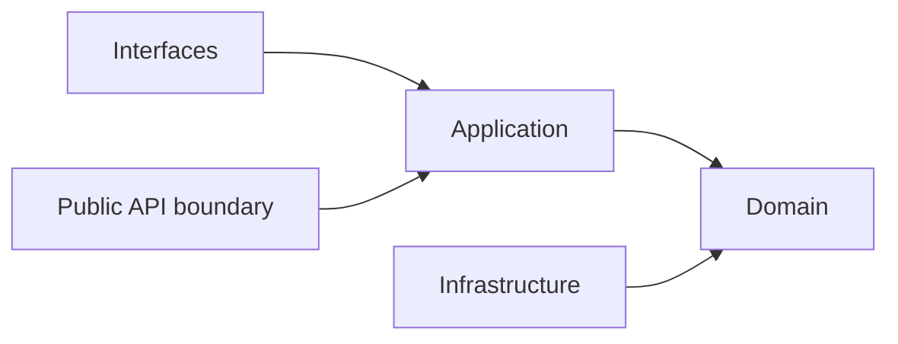

# Bounded Context Subdomain Template

本文件在本次任務限制下，僅依 Context7 驗證的 Hexagonal Architecture、DDD、Context Map 與 ADR 參考建立，作為 `modules/<bounded-context>/subdomains/*` 的交付標準模板，不主張反映現況實作。

## Purpose

這份模板定義新的 bounded context 與其 subdomains 應以什麼結構交付，讓 Copilot 在建立模組樹、層次與邊界時，先遵守 Hexagonal Architecture with Domain-Driven Design，再決定實作細節。

## Development Order Contract (Domain-First)

- 每個需求都必須先有 use case contract（actor、goal、main success scenario、failure branches），再進入程式碼實作。
- 新功能一律遵循：Domain -> Application -> Ports -> Infrastructure -> Interface。
- Domain 先定義「系統是什麼」：聚合、不變條件、值對象與領域事件，不依賴任何框架或外部技術。
- Application 再定義「系統做什麼」：use case 流程協調、DTO 轉換、交易與事件發布時序。
- Ports 定義內外協作契約；Infrastructure 只負責實作契約並接入 Firebase、AI 或其他外部系統。
- Interface（UI / API / Server Action）只做輸入輸出與組裝，不承載領域決策。
- UI 永遠只能呼叫同 bounded context 的 `application/` 或該 subdomain 的 `api/`，不可直接呼叫 `domain/` 或 `infrastructure/`。
- `domain/` 不可匯入 React、Firebase SDK、HTTP client、ORM model 或 runtime-specific adapter。

## Standard Structure Tree

```text
modules/                                        # 系統所有業務模組（bounded contexts）集合
└── <bounded-context>/                          # 單一業務邊界（高內聚、低耦合）
    ├── README.md                               # 說明此 bounded context 的目的、範圍、核心能力
    ├── AGENT.md                                # 開發規範：命名、分層規則、不可違反設計約束
    ├── api/                                    # 對其他 bounded context 的公開 API 邊界（ACL 入口）
    │   └── index.ts                            # 只匯出安全能力，隱藏內部結構與實作細節
    ├── application/                            # 應用層：負責 use case orchestration
    │   ├── dtos/                                # 輸入/輸出資料契約，僅資料不含業務邏輯
    │   ├── use-cases/                          # 一檔一用例，承擔流程控制與副作用協調
    │   └── services/                           # Application Service：流程共用輔助，不承載核心業務規則
    ├── domain/                                 # 領域層：核心商業邏輯與不變條件
    │   ├── entities/                           # Entity：有 identity，封裝狀態與行為
    │   ├── value-objects/                      # Value Object：無 identity，以值相等，通常 immutable
    │   ├── services/                           # Domain Service：不屬於單一 entity 的業務規則
    │   ├── repositories/                       # Repository 介面（Domain Port）：只定義契約不含實作
    │   ├── events/                             # Domain Events：已發生的業務事實，用於解耦
    │   └── ports/                              # 外部依賴抽象（非資料庫），由 infrastructure 實作
    ├── docs/                                   # 架構文件與治理規範（長期可維護關鍵）
    │   ├── README.md                           # 文件總覽
    │   ├── bounded-context.md                  # 邊界責任（負責/不負責）
    │   ├── context-map.md                      # context 關係圖（ACL/Shared Kernel/Partnership）
    │   ├── subdomains.md                       # 子域拆分（core/supporting/generic）
    │   ├── ubiquitous-language.md              # 統一語言與命名詞彙表
    │   ├── aggregates.md                       # Aggregate 設計（邊界與 root）
    │   ├── domain-events.md                    # 事件設計規範
    │   ├── repositories.md                     # repository 設計準則
    │   ├── application-services.md             # application 層規範
    │   └── domain-services.md                  # domain 層規範
    ├── infrastructure/                         # Driven Adapters：實作 domain ports 與外部整合
    │   ├── adapters/                           # 外部服務整合（Firebase SDK/Genkit/REST API）
    │   ├── persistence/                        # 資料庫實作細節與 DTO/Domain mapping
    │   └── repositories/                       # Repository 實作（例如 Firestore repository）
    ├── interfaces/                             # Driving Adapters：從 UI/HTTP/Action 進入系統
    │   ├── api/                                # API 入口：request -> use-case -> response
    │   ├── components/                         # UI 元件，不承載業務規則
    │   ├── hooks/                              # React hooks：封裝資料存取與互動
    │   ├── queries/                            # 前端資料查詢層（React Query/Server Components）
    │   └── _actions/                           # Next.js Server Actions：直接呼叫 use-case
    └── subdomains/                             # 子域：bounded context 內部能力拆分
        ├── <subdomain-a>/                      # 單一能力模組（可獨立演化）
        │   ├── README.md                       # 子域說明（責任與邊界）
        │   ├── api/                            # 子域對外 API（限同 context 內使用）
        │   │   └── index.ts                    # 匯出子域能力，避免直接跨層呼叫
        │   ├── application/                    # 子域應用層（局部 use-case orchestration）
        │   │   ├── dto/                        # 子域 DTO（input/output）
        │   │   ├── use-cases/                  # 子域 use-cases（局部流程）
        │   │   └── services/                   # 子域 Application Services：流程輔助，不寫業務規則
        │   ├── domain/                         # 子域領域模型（局部業務核心）
        │   │   ├── entities/                   # 子域 entity
        │   │   ├── value-objects/              # 子域 value object
        │   │   ├── services/                   # 子域 Domain Services（規則）
        │   │   ├── repositories/               # 子域 repository 介面
        │   │   ├── events/                     # 子域事件
        │   │   └── ports/                      # 子域外部依賴抽象
        │   ├── infrastructure/                 # optional：僅當子域已具備 mini-module 級獨立性才建立
        │   │   ├── adapters/                   # optional：外部 API/Genkit/Firebase 整合
        │   │   ├── persistence/                # optional：Firestore mapping/schema
        │   │   └── repositories/               # optional：repository implementation
        │   └── interfaces/                     # optional：僅當子域需自有 UI/transport 邊界才建立
        │       ├── api/                        # optional：route handlers（子域級）
        │       ├── components/                 # optional：局部 UI 元件
        │       ├── hooks/                      # optional：局部 hooks
        │       ├── queries/                    # optional：子域資料查詢
        │       └── _actions/                   # optional：子域 server actions
        └── <subdomain-b>/                      # 另一個子域（相同結構，獨立演化）
```

## Duplicate Folder Name Notes

- `api`、`application`、`domain` 在 root 與 subdomain 都會出現，屬於**刻意重名**。
- `infrastructure`、`interfaces` 只在 subdomain 具備 mini-module 級獨立能力時才允許出現於 subdomain。
- 判斷責任時，先看父路徑：`<bounded-context>/...` 代表 context-wide；`subdomains/<name>/...` 代表 subdomain-local。
- 同名的下一層目錄（如 `dto`、`use-cases`、`services`、`repositories`、`adapters`、`api`、`components`、`hooks`、`queries`、`_actions`）也遵循同一條父路徑判斷規則。
- 重名不代表可互相直接 import；跨 subdomain 或跨 bounded context 仍必須走 `api/` 邊界。

## Subdomain Mini-Module Gate

- subdomain 預設為 core-only（`api/`、`application/`、`domain/`，必要時 `domain/ports`），不預設建立 `infrastructure/`、`interfaces/`。
- 只有同時符合以下條件時，才可在 subdomain 內建立 `infrastructure/` 或 `interfaces/`：
    1. 該子域有明確且長期穩定的獨立外部整合責任（非一次性或暫時性 adapter）。
    2. 該子域需要獨立演化與測試節奏，且無法由 bounded-context 根層 `infrastructure/`、`interfaces/` 合理承接。
    3. 在子域 `README.md` 明確記錄為 mini-module 例外，並說明邊界、owned contracts、維運責任。
- 若不符合上述條件，subdomain 的外部整合與 UI/transport 組裝應維持在 `<bounded-context>/infrastructure` 或 `<bounded-context>/interfaces`。

## Layer Responsibilities

| Layer | Responsibility |
|---|---|
| `api/` | bounded context 或 subdomain 對外唯一公開邊界 |
| `application/` | 協調 use cases、轉換 DTO、執行流程但不承載核心業務規則；若在 bounded context 根層，代表跨 subdomain 的 context-wide orchestration |
| `domain/` | 聚合根、實體、值對象、領域服務、領域事件與核心規則；若在 bounded context 根層，代表跨 subdomain 的 shared policy、published language 或 context-wide domain concept |
| `infrastructure/` | repository / adapter 實作、持久化、外部系統整合；若在 bounded context 根層，代表 context-wide driven adapters |
| `interfaces/` | UI、route handler、server action、query hooks 等 driving adapters；若在 bounded context 根層，代表 context-wide composition / driving adapters |

## Service Folder Semantics

- `application/services/`：Application Service，負責流程協調、交易邊界、跨聚合編排與 use case 共用流程；不承載核心業務不變條件。
- `domain/services/`：Domain Service，負責無法自然落在單一 Entity/Value Object 的領域規則與政策；可承載核心業務邏輯與不變條件。

## Core Clarification

- `<bounded-context>` 本身也應該維持 Hexagonal Architecture with DDD 的依賴方向，而不只是 `subdomains/<name>/` 內部才有六邊形分層。
- 但 Hexagonal Architecture 的關鍵是**依賴方向與內外邊界**，不是資料夾一定要叫 `core/`。
- 依 Context7 驗證的參考，Application Core 是概念上的核心，外層依賴向內；ports 可放在 application 或 domain，取決於規則真正屬於哪一層。
- 因此本模板的預設寫法是用顯式的 `application/`、`domain/`、`infrastructure/`、`interfaces/` 來表達六邊形邊界，而不是再包一層泛用 `core/`。
- 如果團隊真的要使用 `core/`，較合理的變體應是 `<bounded-context>/core/application`、`<bounded-context>/core/domain`，必要時加 `core/ports`；**不應**把 `infrastructure/` 或 `interfaces/` 也放進 `core/`，因為它們本來就是外層。
- 只有當某段邏輯明確屬於整個 bounded context，而不是單一 subdomain 時，才應放在 `<bounded-context>/application|domain|infrastructure|interfaces`；否則優先放回擁有它的 subdomain。

## Template Rules

- `<bounded-context>` 根層允許有自己的 `application/`、`domain/`、`infrastructure/`、`interfaces/`，用來承接 context-wide concern；不要把整個 bounded context 簡化成只剩 `docs/` 與 `subdomains/` 的外殼。
- 每個 subdomain 都必須能獨立表達自己的 use case 與 domain model；預設不建立 `infrastructure/`、`interfaces/`。
- 只有 subdomain 具備 mini-module 級獨立能力時，才可在該 subdomain 建立 `infrastructure/`、`interfaces/`。
- `api/` 是 cross-module collaboration 的唯一入口，`index.ts` 不是跨模組公開邊界。
- adapter 只實作 port，不直接被其他層呼叫。
- port 只在真的需要隔離 I/O、外部系統、侵入式 library 或 legacy model 時建立。
- 若 domain 核心不需要某個抽象，就不要為了形式完整而先建空的 `service`、`port` 或 `repository`。
- 不預設建立泛用 `core/` 包裝資料夾來混合內外層；若沒有非常明確的遷移理由，優先使用顯式層次名稱。

## Delivery Checklist

1. 建立 bounded context 的 `README.md`、`AGENT.md`、`api/`、`docs/`，以及必要時的根層 `application/`、`domain/`、`infrastructure/`、`interfaces/` 入口。
2. 先判斷需求是屬於 bounded context 根層還是特定 subdomain；只有 context-wide concern 才進根層，其餘一律先落到 `subdomains/<name>/`。
3. 先建立 use case contract（actor / goal / success scenario / failure branches），再建立對應檔案 `application/use-cases/<verb-noun>.use-case.ts`。
4. 對擁有該責任的 subdomain 先落 `domain/` 核心模型，再收斂 `application/` 流程，最後視需要補 `ports/`；只有符合 mini-module gate 才補 subdomain 層級的 `infrastructure/`、`interfaces/`。
5. 先放入 aggregate、domain event、published language 與 context map，再補 adapter 與 persistence 實作。
6. 只有在交付需要時才建立 `ports/`、`hooks/`、`queries/`、`_actions/` 等細分資料夾。

## Legacy Strangler Pattern Workflow (Outside-In Convergence)

- 舊功能若已 outside-in 成形，不做一次性大改，採用 use case 為單位的漸進式收斂。
- 每次只選一條 use case 進行重構，並保留舊路徑可回退。

1. 找一條高價值且邊界清楚的 use case，先寫最小 use case contract。
2. 針對該 use case 重新建 Domain（聚合、不變條件、值對象、事件），先讓核心規則可測。
3. 在 Application 收斂流程，讓舊 UI 與舊 API 都改由新的 use case 進入。
4. 以 Ports 隔離舊系統與舊資料模型，避免 legacy 細節回滲到 Domain。
5. 由 Infrastructure 實作新 Ports，逐步替換舊 adapter。
6. 確認新路徑穩定後，再移除對應的舊路徑與臨時轉接層。

- 退出條件：該 use case 已滿足 `interfaces -> application -> domain <- infrastructure` 方向，且 UI 不再直連舊 service。

## Anti-Pattern Rules

- 不得把 `infrastructure/` 直接匯入 `domain/` 或 `application/`。
- 不得把別的 bounded context 的 `domain/`、`application/`、`infrastructure/` 或 `interfaces/` 當成可直接 import 的依賴。
- 不得在還沒有 use case contract 的情況下直接新增 UI 與 adapter。
- 不得讓 UI 或 route handler 直接呼叫 `domain/` 或 `infrastructure/`。
- 不得讓 `domain/` 匯入任何 runtime 或 framework 專用套件。
- 不得把所有子域都預設長成同一個巨型骨架，卻沒有對應的 use case 與業務責任。
- 不得在未符合 mini-module gate 的前提下，於 `subdomains/<name>/` 直接建立 `infrastructure/` 或 `interfaces/`。
- 不得把 `infrastructure/`、`interfaces/` 放進一個泛用 `core/` 目錄，讓六邊形的內外層語義失真。
- 不得因為「看起來完整」而過度建立 repository port、ACL、DTO、facade 或 service。
- 不得讓 `interfaces/` 承載業務決策，也不得讓 `application/` 重寫 domain 規則。

## Copilot Generation Rules

- 生成新模組前，先決定 bounded context、subdomain、public API boundary 與依賴方向，再建立資料夾。
- 若需求屬於 bounded context shared policy、published language、跨 subdomain orchestration，再使用 `<bounded-context>` 根層的 hexagonal layers；否則優先放進擁有責任的 subdomain。
- 奧卡姆剃刀：若較少的層級、port 或 adapter 已能保護邊界與可測試性，就不要額外新增抽象。
- 每個子域只建立當前交付需要的最小骨架，不要先把所有可選資料夾填滿。
- 若需求只是新增一個 use case，優先放進現有 subdomain，而不是新開第二個平行 subdomain。

## Dependency Direction Flow



## Correct Interaction Flow

```mermaid
flowchart LR
    Requirement["Requirement"] --> Context["Choose bounded context"]
    Context --> Subdomain["Choose owning subdomain"]
    Subdomain --> UseCase["Write use case contract first"]
    UseCase --> Domain["Define domain model and invariants"]
    Domain --> Application["Orchestrate in use case"]
    Application --> Ports["Define required ports"]
    Ports --> Infra["Implement infrastructure adapters"]
    Infra --> Interface["Wire UI and API at boundary"]
```



## Document Network

- [README.md](./README.md)
- [architecture-overview.md](./architecture-overview.md)
- [bounded-contexts.md](./bounded-contexts.md)
- [subdomains.md](./subdomains.md)
- [context-map.md](./context-map.md)
- [integration-guidelines.md](./integration-guidelines.md)
- [strategic-patterns.md](./strategic-patterns.md)
- [contexts/_template.md](./contexts/_template.md)
- [decisions/0001-hexagonal-architecture.md](./decisions/0001-hexagonal-architecture.md)
- [decisions/0002-bounded-contexts.md](./decisions/0002-bounded-contexts.md)
- [decisions/0003-context-map.md](./decisions/0003-context-map.md)

## Constraints

- 本模板是 architecture-first 的交付模板，不代表任何既有模組已完全符合此形狀。
- `ports/`、`queries/`、`_actions/`、`hooks/` 是按需要建立的可選骨架，不是強制清單。
- 若某 subdomain 很小，允許比本模板更精簡；若更精簡仍能守住邊界，應優先採用更精簡版本。