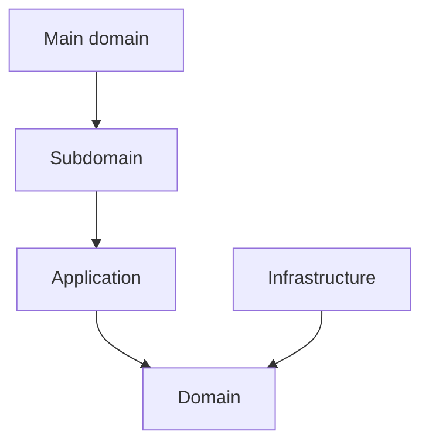
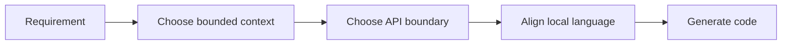

# Bounded Contexts

本文件在本次任務限制下，僅依 Context7 驗證的 bounded context 與 hexagonal architecture 原則重建，不主張反映現況實作。

## Strategic Bounded Context Model

系統目前以八個主域 / bounded context 構成。每個主域下可再分成 baseline subdomains 與 recommended gap subdomains。

## Main Domain Map

| Main Domain | Strategic Role | Baseline Focus | Recommended Gap Focus |
|---|---|---|---|
| iam | 身份與存取治理 | identity、access-control、tenant、security-policy | session、consent、secret-governance |
| billing | 商業與權益治理 | billing、subscription、entitlement、referral | pricing、invoice、quota-policy |
| ai | 共享 AI capability | provider-routing、model-policy、safety-guardrail、prompt-pipeline | evaluation-policy、model-observability |
| analytics | 分析與 read model 下游 | reporting、metrics、dashboards、telemetry-projection | experimentation、decision-support |
| platform | 平台營運支撐 | account、organization、notification、search、audit-log、observability | consent、secret-management、operational-catalog |
| workspace | 協作容器與 scope | audit、feed、scheduling、workspace-workflow | lifecycle、membership、sharing、presence |
| notion | 正典知識內容 | knowledge、authoring、collaboration、database、templates、knowledge-versioning | taxonomy、relations、publishing |
| notebooklm | 對話與推理 | conversation、note、notebook、source、synthesis、conversation-versioning | ingestion、retrieval、grounding、evaluation |

## Subdomain Inventory By Main Domain

### workspace

#### Baseline Subdomains

| Subdomain | 功能註解 |
|---|---|
| audit | 工作區操作稽核與證據追蹤 |
| feed | 工作區活動摘要與事件流呈現 |
| scheduling | 工作區排程、時序與提醒協調 |
| workspace-workflow | 工作區流程編排與執行治理 |

#### Recommended Gap Subdomains

| Subdomain | 功能註解 |
|---|---|
| lifecycle | 將工作區容器生命週期獨立為正典邊界（建立、封存、復原） |
| membership | 將工作區參與關係從平台身份治理切開（角色、加入、移除） |
| sharing | 將共享範圍與可見性規則收斂到單一上下文（對內/對外分享） |
| presence | 將即時協作存在感、共同編輯訊號收斂為本地語言 |

### platform

#### Baseline Subdomains

| Subdomain | 功能註解 |
|---|---|
| identity | 已驗證主體與身份信號治理 |
| account | 帳號聚合根與帳號生命週期 |
| account-profile | 主體屬性、偏好與治理設定 |
| organization | 組織、成員與角色邊界 |
| access-control | 主體現在能做什麼的授權判定 |
| security-policy | 安全規則定義、版本化與發佈 |
| platform-config | 平台設定輪廓與配置管理 |
| feature-flag | 功能開關策略與發佈節點 |
| onboarding | 新主體初始設定與引導流程 |
| compliance | 資料保留、稽核與法規執行 |
| billing | 計費狀態、費率與財務證據 |
| subscription | 方案、權益、配額與續期治理 |
| referral | 推薦關係與獎勵追蹤 |
| ai | 共享 AI provider 路由、模型政策、配額與安全護欄 |
| integration | 外部系統整合邊界與契約 |
| workflow | 平台級流程編排與狀態驅動執行 |
| notification | 通知路由、偏好與投遞 |
| background-job | 背景任務提交、排程與監控 |
| content | 平台級內容資產管理與發布 |
| search | 跨域搜尋路由與查詢協調 |
| audit-log | 永久稽核軌跡與不可否認證據 |
| observability | 健康量測、追蹤與告警 |
| analytics | 平台使用行為量測與分析 |
| support | 客服工單、支援知識與處理流程 |

#### Recommended Gap Subdomains

| Subdomain | 功能註解 |
|---|---|
| tenant | 建立多租戶隔離與 tenant-scoped 規則的正典邊界 |
| entitlement | 建立有效權益與功能可用性的統一解算上下文 |
| secret-management | 將憑證、token、rotation 從 integration 中切開 |
| consent | 將同意與資料使用授權從 compliance 中切開 |

### notion

#### Baseline Subdomains

| Subdomain | 功能註解 |
|---|---|
| knowledge | 頁面建立、組織、版本化與交付 |
| authoring | 知識庫文章建立、驗證與分類 |
| collaboration | 協作留言、細粒度權限與版本快照 |
| database | 結構化資料多視圖管理 |
| knowledge-analytics | 知識使用行為量測 |
| attachments | 附件與媒體關聯儲存 |
| automation | 知識事件觸發自動化動作 |
| knowledge-integration | 知識與外部系統雙向整合 |
| notes | 個人輕量筆記與正式知識協作 |
| templates | 頁面範本管理與套用 |
| knowledge-versioning | 全域版本快照策略管理 |

#### Recommended Gap Subdomains

| Subdomain | 功能註解 |
|---|---|
| taxonomy | 建立分類法與語義組織的正典邊界 |
| relations | 建立內容之間關聯與 backlink 的正典邊界 |
| publishing | 建立正式發布與對外交付的正典邊界 |

### notebooklm

#### Baseline Subdomains

| Subdomain | 功能註解 |
|---|---|
| conversation | 對話 Thread 與 Message 生命週期 |
| note | 輕量筆記與知識連結 |
| notebook | Notebook 組合與管理 |
| source | 來源文件追蹤與引用 |
| synthesis | RAG 合成、摘要與洞察生成 |
| conversation-versioning | 對話版本與快照策略 |

#### Recommended Gap Subdomains

| Subdomain | 功能註解 |
|---|---|
| ingestion | 建立來源匯入、正規化與前處理的正典邊界 |
| retrieval | 建立查詢召回與排序策略的正典邊界 |
| grounding | 建立引用對齊與可追溯證據的正典邊界 |
| evaluation | 建立品質評估與回歸比較的正典邊界 |

## Ownership Rules

- workspace 擁有工作區範疇，不擁有平台治理或正典內容。
- platform 擁有治理與權益，不擁有正典內容或推理輸出。
- notion 擁有正典知識內容，不擁有治理或推理流程。
- notebooklm 擁有推理流程與衍生輸出，不擁有正典知識內容。

## Dependency Direction Guardrail

- bounded context 所有權定義的是語言與規則邊界，不等於可直接穿透的實作邊界。
- 每個主域內部仍必須遵守 interfaces -> application -> domain <- infrastructure。
- 跨主域整合一律先經 API boundary、published language、events 或 local DTO。

## Conflict Resolution

- 若某子域同時被多個主域宣稱，依最能維持語言自洽與 context map 方向的主域保留所有權。
- 若某能力同時像治理又像內容，先問它是否定義 actor / tenant / entitlement；若是，歸 platform。
- 若某能力同時像內容又像推理輸出，先問它是否是正典內容狀態；若是，歸 notion，否則歸 notebooklm。
- generic `ai` 由 platform 擁有；notion 與 notebooklm 只能消費 platform 的 AI capability，不能再各自宣稱 `ai` 子域。
- `workflow` 作為 generic 名稱只保留在 platform；workspace 使用 `workspace-workflow` 避免跨主域混名。

## Forbidden Ownership Moves

- 不得讓兩個主域同時宣稱同一正典模型所有權。
- 不得用部署、資料表或 UI 分區來覆蓋 bounded context 所有權。
- 不得把 gap subdomain 缺口視為可以任意分散到其他主域的理由。
- 不得讓同一個 generic 子域名稱同時作為多個主域的 canonical ownership。

## Copilot Generation Rules

- 生成程式碼時，先決定 owning bounded context，再決定檔案位置、命名與 boundary。
- 奧卡姆剃刀：若既有 bounded context 可吸收需求，就不要為了命名好看而新增新的上下文。
- 所有權模糊時，先修正文檔邊界，再寫程式碼。

## Dependency Direction Flow

## Correct Interaction Flow

## Document Network

- [architecture-overview.md](./architecture-overview.md)
- [subdomains.md](./subdomains.md)
- [context-map.md](./context-map.md)
- [bounded-context-subdomain-template.md](./bounded-context-subdomain-template.md)
- [project-delivery-milestones.md](./project-delivery-milestones.md)
- [decisions/0001-hexagonal-architecture.md](./decisions/0001-hexagonal-architecture.md)
- [decisions/0002-bounded-contexts.md](./decisions/0002-bounded-contexts.md)