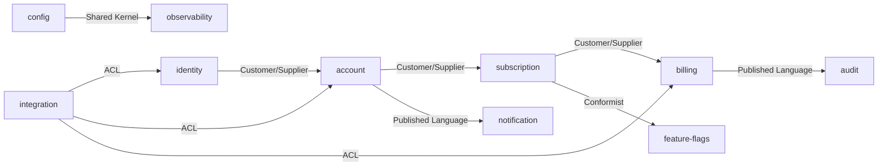

# Context Map

## Strategic Relationship Map

## Relationship Rules

1. **Customer/Supplier**: supplier owns model evolution; customer adapts by contract versioning.
2. **Conformist**: downstream adopts upstream model intentionally and tracks drift risk.
3. **ACL**: external model translation must happen in adapter boundary, never in domain.
4. **Shared Kernel**: shared concepts must stay minimal and version-governed.
5. **Published Language**: externally visible DTO/events are stable, explicit, and testable.

