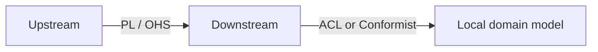
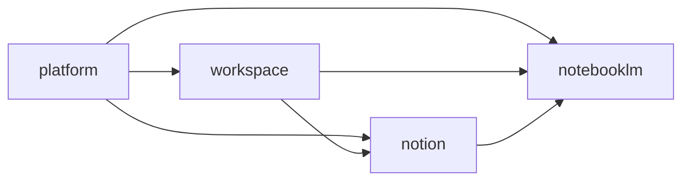

# Context Map

本文件在本次任務限制下，僅依 Context7 驗證的 context map 與 strategic design 原則重建，不主張反映現況實作。

## System Landscape

主域級關係只採用 directed upstream-downstream 模型。

## Directed Relationships

| Upstream | Downstream | Published Language |
|---|---|---|
| platform | workspace | actor reference、organization scope、access decision、entitlement signal |
| platform | notion | actor reference、organization scope、access decision、entitlement signal、ai capability signal |
| platform | notebooklm | actor reference、organization scope、access decision、entitlement signal、ai capability signal |
| workspace | notion | workspaceId、membership scope、share scope |
| workspace | notebooklm | workspaceId、membership scope、share scope |
| notion | notebooklm | knowledge artifact reference、attachment reference、taxonomy hint |

## Detailed Language Crosswalk

| Relationship | Upstream Canonical Terms | Published Language | Downstream Protected Terms |
|---|---|---|---|
| platform -> workspace | Actor, Tenant, Entitlement, Consent | actor reference, organization scope, access decision, entitlement signal | Workspace, Membership, ShareScope |
| platform -> notion | Actor, Tenant, Entitlement, Secret | actor reference, organization scope, access decision, entitlement signal, ai capability signal | KnowledgeArtifact, Taxonomy, Relation, Publication |
| platform -> notebooklm | Actor, Tenant, Entitlement, Secret | actor reference, organization scope, access decision, entitlement signal, ai capability signal | Notebook, Ingestion, Retrieval, Grounding, Synthesis, Evaluation |
| workspace -> notion | Workspace, Membership, ShareScope | workspaceId, membership scope, share scope | KnowledgeArtifact, Taxonomy, Relation |
| workspace -> notebooklm | Workspace, Membership, ShareScope | workspaceId, membership scope, share scope | Notebook, Retrieval, Grounding, Synthesis |
| notion -> notebooklm | KnowledgeArtifact, Taxonomy, Relation | knowledge artifact reference, attachment reference, taxonomy hint | Notebook, Retrieval, Grounding, Synthesis, Evaluation |

## Relationship Notes

- `platform -> workspace` 只提供治理判定與權益訊號；workspace 保留協作範疇語言。
- `platform -> notion` 與 `platform -> notebooklm` 可提供 shared AI capability 訊號，但不移轉內容或推理所有權。
- `workspace -> notion` 與 `workspace -> notebooklm` 只提供 scope 與 membership 邊界，不輸出 workspace 內部模型。
- `notion -> notebooklm` 僅提供可引用內容語言，不允許 notebooklm 直接回寫 notion 正典內容。

## Pattern Rules

- ACL 與 Conformist 只允許出現在 downstream 端。
- ACL 與 Conformist 互斥，不能同時套用在同一整合。
- Shared Kernel 與 Partnership 不用於主域級關係。
- 若未來真的需要共享模型，必須先抽出新的 bounded context，而不是把對稱關係塞回主域之間。

## Dependency Direction Guardrail

- 主域級方向只允許 upstream -> downstream，不允許同時宣稱對稱依賴。
- downstream 整合上游時，先決定 published language，再決定 ACL 或 Conformist。
- 上游提供語言與能力，下游決定如何保護自己的語言。

## Strategic Consequences

- 關係方向清楚後，published language、local DTO 與 ACL 才能一致。
- 主域級文檔可以避免同時出現互相矛盾的 supplier / consumer 敘事。

## Contradictions Removed

- 不再同時把主域級關係描述成 directed relationship 與 symmetric relationship。
- 不再把 ACL 寫成 upstream 的責任。
- 不再把 shared technical libraries 誤寫為主域級 Shared Kernel。

## Forbidden Relationship Patterns

- 不得把 Shared Kernel / Partnership 與 ACL / Conformist 混寫在同一關係。
- 不得把 direct model sharing 寫成 published language。
- 不得把下游的轉譯責任倒灌回上游。

## Copilot Generation Rules

- 生成程式碼時，先畫清 upstream / downstream，再安排 API boundary、published language、ACL 或 Conformist。
- 奧卡姆剃刀：若單一 published language 與單一 translation step 足夠，就不要再加第二層整合流程。
- 不確定關係方向時，先修正文檔，不直接生成跨主域耦合程式碼。

## Dependency Direction Flow

## Correct Interaction Flow

## Document Network

- [architecture-overview.md](./architecture-overview.md)
- [integration-guidelines.md](./integration-guidelines.md)
- [strategic-patterns.md](./strategic-patterns.md)
- [bounded-context-subdomain-template.md](./bounded-context-subdomain-template.md)
- [project-delivery-milestones.md](./project-delivery-milestones.md)
- [decisions/0003-context-map.md](./decisions/0003-context-map.md)
- [decisions/0005-anti-corruption-layer.md](./decisions/0005-anti-corruption-layer.md)