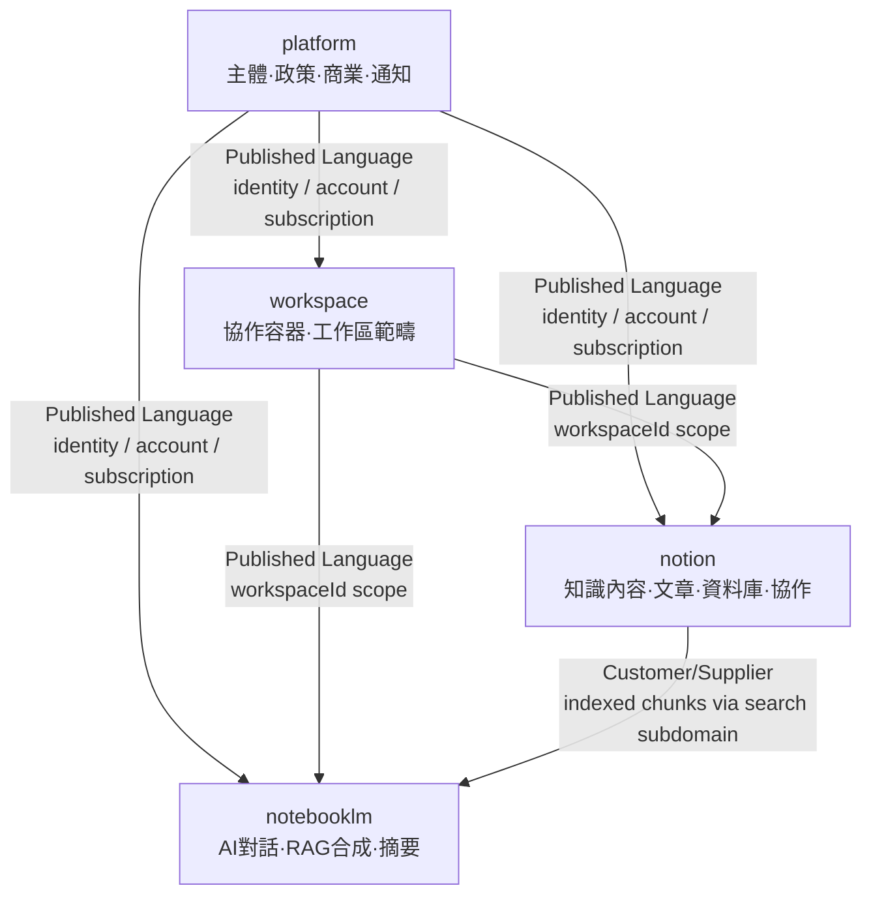

# Context Map

## 主域關係圖 (Strategic Relationship Map)

## 整合模式說明

| 上游 | 下游 | 模式 | 說明 |
|---|---|---|---|
| `platform` → `workspace` | platform | workspace | Published Language — identity, account, subscription 政策 |
| `platform` → `notion` | platform | notion | Published Language — identity, account, subscription 政策 |
| `platform` → `notebooklm` | platform | notebooklm | Published Language — identity, account 政策 |
| `workspace` → `notion` | workspace | notion | Published Language — `workspaceId` 範疇 |
| `workspace` → `notebooklm` | workspace | notebooklm | Published Language — `workspaceId` 範疇 |
| `notion` → `notebooklm` | notion | notebooklm | Customer/Supplier — notion `search` 子域提供語意 chunks |

## 關係規則

1. **Published Language**：上游主域提供穩定、版本化的 DTO/事件作為契約；下游遵守契約。
2. **Customer/Supplier**：供應方擁有模型演進；消費方依契約版本適配。
3. **ACL**：外部模型翻譯必須發生在 adapter 邊界，絕不進入 domain。
4. **Shared Kernel**：共用概念保持最小化並受版本治理。

## 主域邊界變更流程

1. 先更新本文件（`context-map.md`）
2. 同步更新 `bounded-contexts.md` 和 `subdomains.md`
3. 在 `docs/decisions/` 新增 ADR 記錄決策背景

