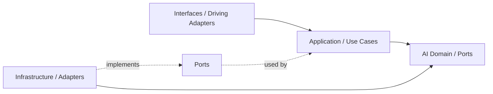
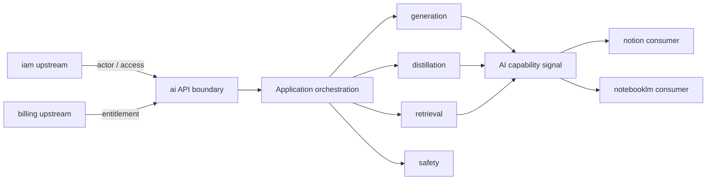

# AI Context Agent Guide

## Mission

保護 ai 主域作為共享 AI capability 邊界。任何變更都應維持 ai 擁有 generation、orchestration、distillation、retrieval、safety 與 provider policy 語言，而不是吸收內容正典或推理輸出語義。

## Canonical Ownership

- generation
- orchestration
- distillation
- retrieval
- memory
- context
- safety
- tool-calling
- reasoning
- conversation
- evaluation
- tracing

## Route Here When

- 問題核心是 LLM 呼叫、模型選擇、provider routing。
- 問題需要 prompt 組裝、flow 執行或 tool calling 協調。
- 問題需要將長輸出濃縮（distillation）或進行向量搜尋（retrieval）。
- 問題需要安全護欄、配額或 AI 執行觀測。

## Route Elsewhere When

- 身份與存取治理屬於 iam。
- 訂閱、配額商業政策屬於 billing。
- 正典知識內容屬於 notion。
- 對話推理輸出、grounding、notebook synthesis 屬於 notebooklm。

## Guardrails

- ai 的 distillation 是通用蒸餾能力，不是 notebooklm 的推理輸出語言。
- ai 的 retrieval 是通用向量搜尋能力，不是 notion 的知識查詢正典。
- ai 的 conversation 管理 AI 輪次，不等同 notebooklm 的 Conversation aggregate。
- 下游消費只能透過 `modules/ai/api` 公開邊界，不能直接存取 subdomain internals。
- Genkit 與 LLM SDK 只能存在於 infrastructure 層。

## Hard Prohibitions

- 不得讓 domain 或 application 直接依賴 Genkit、Firebase SDK 或框架語言。
- 不得讓其他模組直接 import ai 的 infrastructure 或 subdomain domain 層。
- 不得在 ai 內定義 KnowledgeArtifact、Notebook、Membership 等他域正典型別。

## Copilot Generation Rules

- 生成程式碼時，先確認需求屬於哪個 ai subdomain，再決定 port 定義與 adapter 位置。
- 新能力若已有對應子域，先在該子域擴展，不要新建平行子域。
- 奧卡姆剃刀：若一個 port + use case 就能承接需求，不要再新增 service 或 manager。
- distillation 若只是摘要變體，先確認 generation 子域的 summarize 是否已足夠，再決定是否升級為 distillation use case。

## Dependency Direction Flow

## Correct Interaction Flow

## Document Network

- [README.md](./README.md)
- [bounded-contexts.md](./bounded-contexts.md)
- [context-map.md](./context-map.md)
- [subdomains.md](./subdomains.md)
- [ubiquitous-language.md](./ubiquitous-language.md)
- [../../architecture-overview.md](../../architecture-overview.md)
- [../../decisions/0001-hexagonal-architecture.md](../../decisions/0001-hexagonal-architecture.md)
- [../../decisions/0003-context-map.md](../../decisions/0003-context-map.md)
