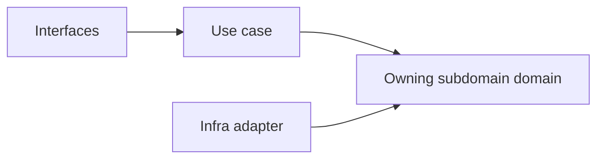
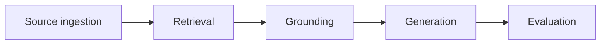

# NotebookLM

本文件在本次任務限制下，僅依 Context7 驗證的 DDD、Context Map、Hexagonal Architecture 參考整理，不主張反映現況實作。

## Baseline Subdomains

| Subdomain | Responsibility |
|---|---|
| conversation | 對話 Thread 與 Message 生命週期 |
| notebook | Notebook 組合與管理 |
| source | 來源文件追蹤、引用與 ingestion 編排 |
| synthesis | 完整 RAG pipeline：retrieval、grounding、answer generation、evaluation/feedback |

## Future Split Triggers

`synthesis` 子域將 retrieval、grounding、generation、evaluation 作為內部 facets。只有當以下觸發條件成立時，才拆分為獨立子域：

| Facet | Split Trigger |
|---|---|
| retrieval | 策略複雜到需要獨立領域模型（多重排序、hybrid search） |
| grounding | 引用追溯需要獨立聚合根（citation chains、evidence alignment） |
| generation | 生成策略需要獨立 use case 群（多模態、多來源融合） |
| evaluation | 品質語言需要獨立指標模型（回歸測試、benchmark suite） |

## Anti-Patterns

- 不把 retrieval 與 grounding 併回 source 或 platform.ai 接入層，否則推理鏈條失去清楚邊界。
- 不把 evaluation 只當成 dashboard 指標，否則品質語言無法成為可演化的關注點。
- 不把 notebook、conversation 混成單一 UI 容器語意，否則無法維持聚合邊界。
- 不把 platform.ai 的共享能力誤寫成 notebooklm 自己擁有的 `ai` 子域。
- 不過早拆分子域：只有當語言分歧或演化速率不同時才拆分。

## Copilot Generation Rules

- 生成程式碼時，先問新需求落在哪個既有子域；只有既有子域無法容納時才建立新子域。
- 模型 provider、配額與安全護欄優先歸 platform.ai；notebooklm 在 synthesis 保留 pipeline 本地語義。
- 奧卡姆剃刀：能在既有子域用一個明確 use case 解決，就不要新增第二個平行子域。
- 子域命名應反映責任與語義，不應只是頁面名稱或工具名稱。

## Dependency Direction Flow

## Correct Interaction Flow

## Document Network

- [README.md](./README.md)
- [bounded-contexts.md](./bounded-contexts.md)
- [context-map.md](./context-map.md)
- [ubiquitous-language.md](./ubiquitous-language.md)
- [../../subdomains.md](../../subdomains.md)
- [../../bounded-contexts.md](../../bounded-contexts.md)