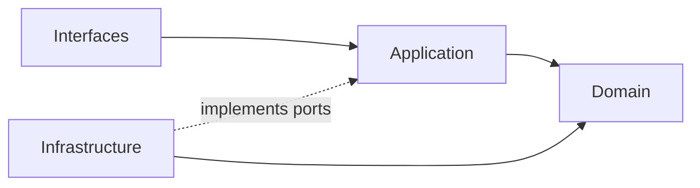
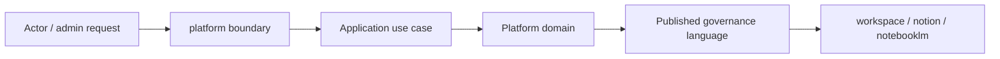

# Platform Context

本 README 在本次任務限制下，僅依 Context7 驗證的 DDD、Context Map、Hexagonal Architecture 參考重建，不主張反映現況實作。

## Purpose

platform 是治理與營運支撐主域。它的責任是提供 actor、identity、organization、tenant、access、policy、entitlement、shared ai capability、billing、notification、search、audit 與 observability 等跨切面語言，供其他主域穩定消費。

## Why This Context Exists

- 把治理與營運支撐責任集中，避免滲入其他主域。
- 讓其他主域只消費治理結果，而不是重建治理模型。
- 以清楚的 published language 承接身份、權益、政策與營運能力。

## Context Summary

| Aspect | Summary |
|---|---|
| Primary Role | 治理、身份、權益與營運支撐 |
| Upstream Dependency | 無主域級上游；作為其他主域治理上游 |
| Downstream Consumers | workspace、notion、notebooklm |
| Core Principle | platform 輸出治理結果，不接管其他主域正典內容 |

## Baseline Subdomains

- identity
- account
- account-profile
- organization
- access-control
- security-policy
- platform-config
- feature-flag
- onboarding
- compliance
- billing
- subscription
- referral
- ai
- integration
- workflow
- notification
- background-job
- content
- search
- audit-log
- observability
- analytics
- support

## Recommended Gap Subdomains

- tenant
- entitlement
- secret-management
- consent

## Key Relationships

- 對 workspace：提供 actor、organization、access、entitlement。
- 對 notion：提供 actor、organization、access、entitlement、ai capability。
- 對 notebooklm：提供 actor、organization、access、entitlement、ai capability。

## Reading Order

1. [subdomains.md](./subdomains.md)
2. [bounded-contexts.md](./bounded-contexts.md)
3. [context-map.md](./context-map.md)
4. [ubiquitous-language.md](./ubiquitous-language.md)
5. [AGENT.md](./AGENT.md)

## Dependency Direction

- 本主域內部固定採用 interfaces -> application -> domain <- infrastructure。
- platform 對外只輸出治理結果與 published language，不輸出內部治理模型細節。

## Anti-Pattern Rules

- 不把 platform 寫成內容主域或對話主域。
- 不把 entitlement、consent、secret-management 混成同一個泛用設定區。
- 不把其他主域對平台的依賴寫成可以直接存取其內部模型。

## Copilot Generation Rules

- 生成程式碼時，先保留 platform 的治理定位，再安排 identity、access、entitlement、ai、secret-management 的交互。
- 奧卡姆剃刀：不要預先建立多餘 facade；能直接由既有治理邊界承接就維持單一路徑。
- 優先讓 request -> orchestration -> domain decision -> published language 保持單純可追溯。

## Dependency Direction Flow

## Correct Interaction Flow

## Document Network

- [AGENT.md](./AGENT.md)
- [bounded-contexts.md](./bounded-contexts.md)
- [context-map.md](./context-map.md)
- [subdomains.md](./subdomains.md)
- [ubiquitous-language.md](./ubiquitous-language.md)
- [../../README.md](../../README.md)
- [../../architecture-overview.md](../../architecture-overview.md)
- [../../integration-guidelines.md](../../integration-guidelines.md)

## Constraints

- 本文件是 architecture-first 版本。
- 本文件依 Context7 的 bounded context 與 context map 原則編寫。
- 本文件不代表對既有 repo 內容做過語意校準。