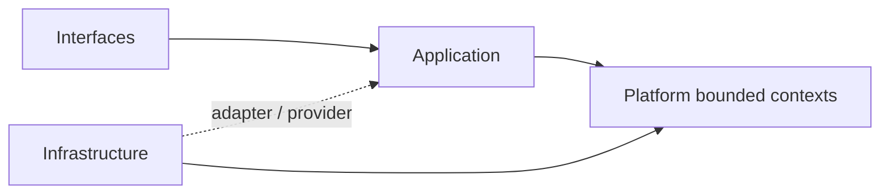
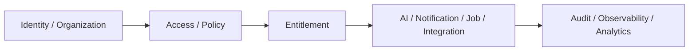

# Platform

本文件在本次任務限制下，僅依 Context7 驗證的 DDD、Context Map、Hexagonal Architecture 參考整理，不主張反映現況實作。

## Domain Role

platform 是治理與營運支撐主域。依 bounded context 原則，它應把 actor、organization、access、policy、entitlement、billing 與 operational intelligence 封裝成清楚的上下文，而非讓這些責任滲入其他主域。

## Baseline Bounded Contexts

| Cluster | Subdomains |
|---|---|
| Identity and Organization | identity, account, account-profile, organization, team, tenant |
| Governance | access-control, security-policy, platform-config, feature-flag, onboarding, compliance, consent |
| Commercial | billing, subscription, referral, entitlement |
| Delivery and Operations | ai, integration, workflow, notification, background-job, secret-management |
| Intelligence and Audit | content, search, audit-log, observability, analytics, support |

## Strategic Reinforcement Focus

| Subdomain | Why It Stays A Focus | Risk If Under-Specified |
|---|---|---|
| tenant | 收斂多租戶隔離與 tenant-scoped 規則 | organization 會被迫承載過多租戶治理語義 |
| entitlement | 收斂有效權益與功能可用性解算 | subscription、feature-flag、policy 難以一致決策 |
| secret-management | 收斂憑證、token、rotation 與 secret audit | integration 容易承載過多敏感治理責任 |
| consent | 收斂同意、偏好、資料使用授權語義 | compliance 會被迫承接過細的授權決策 |

## Domain Invariants

- actor identity 由 platform 正典擁有。
- access decision 必須基於 platform 語言輸出，而不是由下游主域自創。
- entitlement 必須是解算結果，不是任意 UI 標記。
- shared AI capability 由 platform 正典擁有；下游主域只能消費其 published language。
- billing event 與 subscription state 必須分離。
- secret 不應作為一般 integration payload 傳播。

## Dependency Direction

- platform 子域在存在對應層時必須遵守 interfaces -> application -> domain <- infrastructure；不必為形式完整而預建所有層。
- identity、organization、billing、notification 等外部整合能力必須透過 port/adapter 進入核心。
- domain 不得向外依賴 HTTP、Firebase、secret provider 或 message transport 細節。

## Anti-Patterns

- 把 entitlement 當成 subscription plan 名稱或 UI 開關。
- 把 secret-management 混回 integration，使敏感治理責任失焦。
- 讓 platform 直接持有其他主域的正典內容或推理模型。
- 把 platform.ai 與 notebooklm 的 retrieval / grounding / synthesis 混成同一個子域所有權。

## Copilot Generation Rules

- 生成程式碼時，先判斷需求落在 identity、organization、entitlement、ai、secret-management 或其他既有治理責任。
- 奧卡姆剃刀：不要為了形式上的完整而新增抽象；只有當既有治理邊界無法承接時才拆新上下文。
- 對外部 provider 的抽象必須貼合 domain 需要，而不是複製供應商 API。

## Dependency Direction Flow

## Correct Interaction Flow

## Document Network

- [README.md](./README.md)
- [AGENT.md](./AGENT.md)
- [context-map.md](./context-map.md)
- [subdomains.md](./subdomains.md)
- [../../bounded-contexts.md](../../bounded-contexts.md)
- [../../subdomains.md](../../subdomains.md)
- [../../decisions/0001-hexagonal-architecture.md](../../decisions/0001-hexagonal-architecture.md)
- [../../decisions/0002-bounded-contexts.md](../../decisions/0002-bounded-contexts.md)