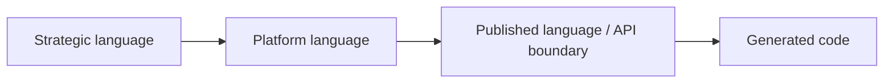
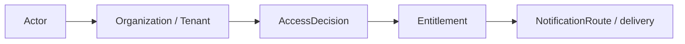

# Platform

本文件在本次任務限制下，僅依 Context7 驗證的 DDD、Context Map、Hexagonal Architecture 參考整理，不主張反映現況實作。

## Canonical Terms

| Term | Meaning |
|---|---|
| Actor | 被平台識別與治理的主體 |
| Identity | 證明 Actor 是誰的訊號集合 |
| Account | Actor 的帳號生命週期聚合根 |
| AccountProfile | 帳號附屬屬性與偏好 |
| Organization | 多主體治理邊界 |
| Tenant | 租戶隔離與 tenant-scoped 規則邊界 |
| AccessDecision | 對 actor 當下能否執行某行為的判定 |
| SecurityPolicy | 可版本化的安全規則集合 |
| FeatureFlag | 功能暴露與 rollout 的治理開關 |
| Entitlement | 綜合 subscription、policy、flag 之後的有效權益 |
| BillingEvent | 財務計價或收費事實 |
| Subscription | 方案、配額與續期狀態 |
| Consent | 同意、偏好與資料使用授權紀錄 |
| Secret | 受控憑證、token 或 integration credential |
| NotificationRoute | 訊息投遞路由與偏好結果 |
| AuditLog | 平台級永久稽核證據 |

## Language Rules

- 使用 Actor，不使用 User 作為平台通用詞。
- 使用 Tenant 區分租戶隔離，不以 Organization 代替。
- 使用 Entitlement 表示解算後權益，不用 Plan 或 Feature 混稱。
- 使用 Consent 表示授權與同意，不用 Preference 混稱法律或治理語意。
- 使用 Secret 表示受控憑證，不放入一般 Integration payload 語言。

## Avoid

| Avoid | Use Instead |
|---|---|
| User | Actor |
| Team | Organization 或 Tenant |
| Plan Access | Entitlement |
| API Key Store | SecretManagement |

## Naming Anti-Patterns

- 不用 User 混稱 Actor。
- 不用 Team 混稱 Organization 或 Tenant。
- 不用 Plan 混稱 Entitlement。
- 不用 Preference 混稱 Consent。

## Copilot Generation Rules

- 生成程式碼時，名稱先對齊 Actor、Tenant、Entitlement、Consent、Secret，再決定類型與檔名。
- 奧卡姆剃刀：若一個治理名詞已足夠表達責任，就不要再堆疊第二個近義抽象名稱。
- 命名先保護治理語言，再考慮 UI 或 API 顯示便利。

## Dependency Direction Flow

## Correct Interaction Flow

## Document Network

- [README.md](./README.md)
- [AGENT.md](./AGENT.md)
- [subdomains.md](./subdomains.md)
- [bounded-contexts.md](./bounded-contexts.md)
- [../../ubiquitous-language.md](../../ubiquitous-language.md)
- [../../decisions/0004-ubiquitous-language.md](../../decisions/0004-ubiquitous-language.md)